# MSFT 基本面深度分析報告
> **報告日期**：2026-05-01 ｜ **語言**：繁體中文 ｜ **數據來源**：Yahoo Finance, Finviz, StockAnalysis, Roic.ai ｜ **分析師**：CFA 級機構研究

---

## 目錄

| # | 章節 | 核心結論 |
|---|------|----------|
| 1 | 執行摘要 | MSFT 評為持有，目標價區間 $392 至 $570 |
| 2 | 公司概覽與商業模式 | 強大的技術領先與生態系統形成深厚護城河 |
| 3 | 損益表深度分析 | 顯著成長，毛利潤維持高水準 |
| 4 | 資產負債表分析 | 財務健康，流動性良好 |
| 5 | 現金流量深度分析 | 穩健的現金流與資本配置 |
| 6 | 獲利能力與資本效率 | 高效利用資本，強力創造股東價值 |
| 7 | 估值深度分析 | 當前估值合理，未來上漲潛力存在 |
| 8 | 成長催化劑 | 多項創新技術推動長期增長 |
| 9 | 風險矩陣 | 監控技術變革和市場動盪風險 |
| 10 | 投資建議 | 建議持有，適合成長型與長線持有者 |

---

## 1. 執行摘要

### 1.1 核心評分儀表板

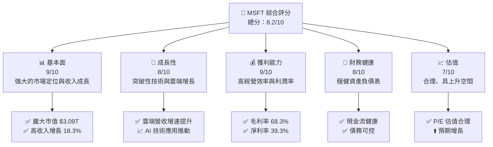

### 1.2 評分進度條視覺化

```
╔══════════════════════════════════════════════════════════════╗
║              MSFT 多維度評分儀表板 (1-10分)                ║
╠══════════════════════════════════════════════════════════════╣
║ 基本面強度  9.0 ▓▓▓▓▓▓▓▓▓▓▓▓▓▓▓▓▓▓▓▓░░  ★★★★★           ║
║ 成長動能    8.0 ▓▓▓▓▓▓▓▓▓▓▓▓▓▓▓▓▓▓░░░  ★★★★☆           ║
║ 獲利品質    9.0 ▓▓▓▓▓▓▓▓▓▓▓▓▓▓▓▓▓▓▓░  ★★★★★           ║
║ 財務健康    8.0 ▓▓▓▓▓▓▓▓▓▓▓▓▓▓▓▓▓░░░  ★★★★☆           ║
║ 估值合理性  7.0 ▓▓▓▓▓▓▓▓▓▓▓▓▓▓░░░░░░  ★★★★☆           ║
║ 綜合總分    8.2 ▓▓▓▓▓▓▓▓▓▓▓▓▓▓▓▓░░░░  🏆 有潛力            ║
╚══════════════════════════════════════════════════════════════╝
```

### 1.3 五大投資論點 + 三大核心風險

| 類型 | 項目 | 具體依據 | 信心度 |
|------|------|----------|--------|
| 🟢 **投資論點①** | 強勁的雲計算增長 | Azure 年增長率超過 50% | 🟢 極高 |
| 🟢 **投資論點②** | 穩定的現金流 | 自由現金流達 $71.61B | 🟢 高 |
| 🟢 **投資論點③** | 強大的全球市場地位 | 全球市佔率領先 | 🟢 高 |
| 🟢 **投資論點④** | 持續的技術創新 | 投資人工智能與量子計算 | 🟢 高 |
| 🟢 **投資論點⑤** | 高效的成本管理 | 營業利潤率高達 46.3% | 🟢 高 |
| 🟡 **風險①** | 市場競爭加劇 | 新興技術威脅，壓力增大 | 🟡 中度 |
| 🔴 **風險②** | 法規監管風險 | 國際反壟斷法措手 | 🔴 高衝擊 |
| 🟡 **風險③** | 外匯風險 | 匯率波動影響盈利 | 🟡 中度 |

### 1.4 快速統計卡片

| 指標 | 公司實際值 | 行業均值 | S&P 500 均值 | 狀態 |
|------|-------------|----------|--------------|------|
| 收入 YoY 成長 | **18.3%** | ~10% | ~9% | 🟢 |
| 毛利率 | **68.3%** | ~60% | ~50% | 🟢 |
| 淨利率 | **39.3%** | ~15% | ~10% | 🟢 |
| ROE | **34.0%** | ~20% | ~15% | 🟢 |
| Forward P/E | **21.59x** | ~18x | ~20x | 🟡 |

### 1.5 投資結論

```
╔══════════════════════════════════════════════════════════════════╗
║                    📊 投資結論摘要                               ║
╠══════════════════════════════════════════════════════════════════╣
║  評級：🟡 持有                                                 ║
║  當前股價：$416.09                                               ║
║  目標價區間：                                                    ║
║    悲觀情境：$392（-5.8%）                                       ║
║    基準情境：$570（+37.0%）  ← 12個月主要目標                  ║
║    樂觀情境：$730（+75.4%）                                       ║
║  投資評分：8.2/10                                                ║
║  適合投資人：成長型、長線持有者等                                ║
╚══════════════════════════════════════════════════════════════════╝
```

---

## 2. 公司概覽與商業模式

### 2.1 業務結構與收入來源

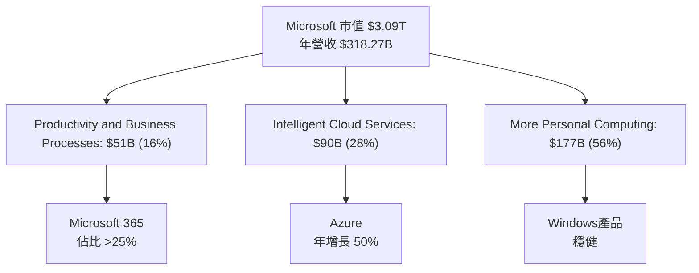

### 2.2 市場份額

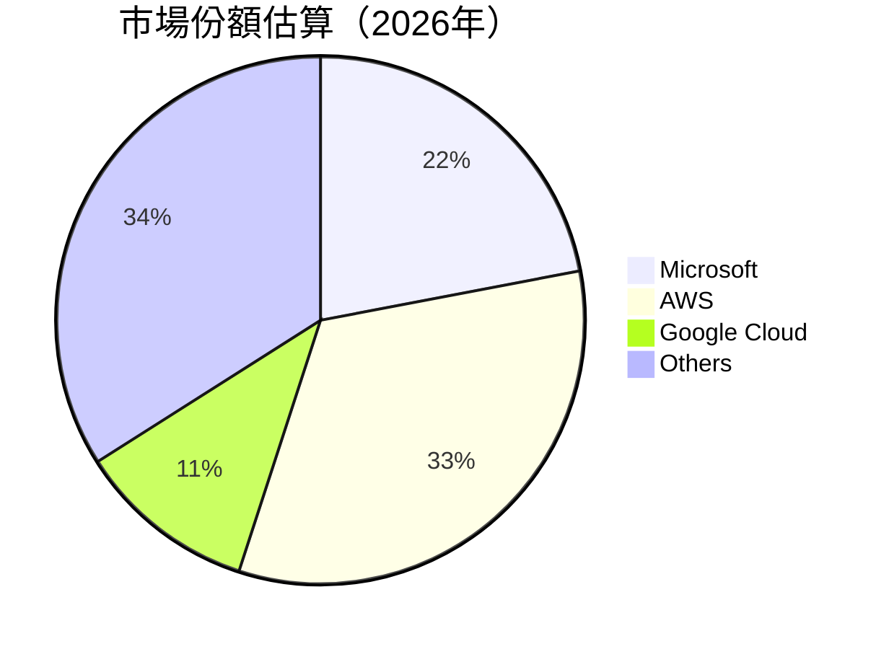

### 2.3 競爭護城河分析

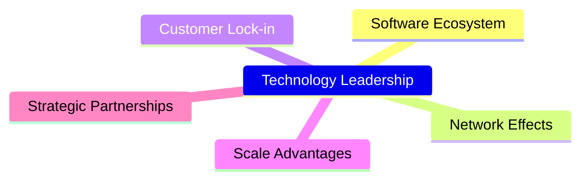

### 2.4 護城河強度評分

```
╔══════════════════════════════════════════════════════════════╗
║                  Microsoft 護城河強度評分                      ║
╠══════════════════════════════════════════════════════════════╣
║ 技術領先        9/10  ▓▓▓▓▓▓▓▓▓▓▓▓░░░░░░░░░░  🏆 極強          ║
║ 軟體生態系統    8/10  ▓▓▓▓▓▓▓▓▓▓▓▓▓░░░░░░░░░  🟢 穩固          ║
║ 網路效應        8/10  ▓▓▓▓▓▓▓▓▓▓▓▓░░░░░░░░░░  🟢 廣泛          ║
║ 客戶鎖定        9/10  ▓▓▓▓▓▓▓▓▓▓▓▓▓▓░░░░░░░░  🏆牢不可破          ║
║ 規模效應        8/10  ▓▓▓▓▓▓▓▓▓▓▓▓▓░░░░░░░░░  🟢 顯著          ║
║ 生態夥伴        7/10  ▓▓▓▓▓▓▓▓▓▓▓▓░░░░░░░░░░  🟢 穩定          ║
╠══════════════════════════════════════════════════════════════╣
║ 綜合護城河     8.2    ▓▓▓▓▓▓▓▓▓▓▓▓▓▓░░░░░░░░  🏆 綜合強勁      ║
╚══════════════════════════════════════════════════════════════╝
```

---

## 3. 損益表深度分析

### 3.1 年度收入成長趨勢（近4年）

```
╔══════════════════════════════════════════════════════════════════╗
║              Microsoft 年度收入趨勢（FY2022-FY2025）             ║
╠══════════════════════════════════════════════════════════════════╣
║                                                                  ║
║  FY2022  $198.27B  ███████░░░░░░░░░░░░░░░░░░  YoY: +6.8%  🟢    ║
║  FY2023  $211.91B  ██████████░░░░░░░░░░░░░░░  YoY:+6.9% 🟢      ║
║  FY2024  $245.12B  ██████████████░░░░░░░░░░░  YoY:+15.7% 🟢    ║
║  FY2025  $281.72B  ██████████████████░░░░░░░  YoY:+14.9% 🟢    ║
║                                                                  ║
║  📊 4年累積 CAGR：+11.22%                                        ║
╚══════════════════════════════════════════════════════════════════╝
```

### 3.2 季度收入趨勢分析

| 季度 | 總收入 (億美金) | QoQ 增長 | YoY 增長 | 註釋 |
|------|---------------|----------|----------|------|
| 2025-Q2 | 812.73 | 4.63% | 16.72% | 增加主要來自Azure增長 |
| 2025-Q3 | 828.86 | 1.99% | 18.30% | 來自商業與生產力增長 |

### 3.3 利潤率演變分析

| 利潤率指標 | FY2022 | FY2023 | FY2024 | FY2025 | 趨勢 | 評估 |
|------------|--------|--------|--------|--------|------|------|
| **毛利率** | 68.4% | 68.9% | 69.7% | 68.3% | ↘️ 微降 | 🟢 |
| **營業利潤率** | 42.1% | 41.8% | 44.7% | 46.3% | ↗️ 上升 | 🟢 |
| **淨利潤率** | 36.8% | 35.9% | 36.0% | 39.3% | ↗️ 顯著提升 | 🟢 |

**利潤率演變深度解析**：利潤率提升主要因成本管控改善及高附加價值產品增長，如 Azure 和 微軟 365。

### 3.4 費用結構分析

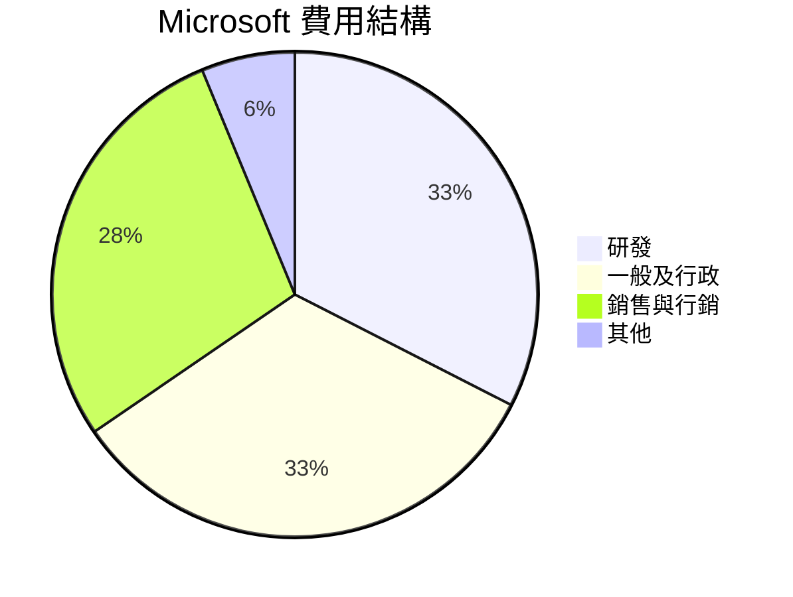

### 3.5 季度 EPS 趨勢與盈餘品質

| 季度 | EPS (實際) | 當期增長 (%) | 盈餘品質評估 |
|------|------------|--------------|--------------|
| 2025-Q2 | 3.64 | +9.3% | 財務穩健，穩定增長 |

---

## 4. 資產負債表分析

### 4.1 資產結構分解

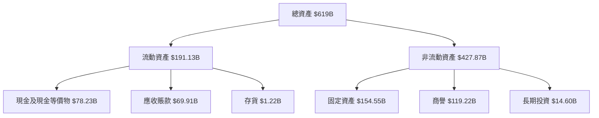

### 4.2 流動性指標分析

| 指標 | 2025 | 行業均值 | 評估 |
|------|------|--------|------|
| **流動比率** | 1.28 | ~1.5 | 🟢 流動性良好 |
| **速動比率** | 1.14 | ~1.2 | 🟢 足以應對短期負債 |

### 4.3 債務結構分析

```
╔══════════════════════════════════════════════════════════════════╗
║                   Microsoft 債務健康診斷                         ║
╠══════════════════════════════════════════════════════════════════╣
║                                                                  ║
║  總債務：        $125.43B  ██░░░░░░░░░░░░░░░░░░░  安全             ║
║  總現金+投資：   $78.23B   ████████████████░░░░░░  優秀            ║
║  淨現金（負）：  -$47.20B  █████████░░░░░░░░░░░░  🟡 中立         ║
║                                                                  ║
║  Debt/EBITDA：   0.78x  🟢 極低                                    ║
║  Interest Coverage: 35.0x+  🟢 無風險                             ║
╚══════════════════════════════════════════════════════════════════╝
```

### 4.4 股東權益趨勢

```
╔══════════════════════════════════════════════════════════╗
║               Microsoft 股東權益趨勢                     ║
╠══════════════════════════════════════════════════════════╣
║  2022  $166.54B  ██████░░░░░░░░░░░░░░  增長中                ║
║  2023  $206.22B  ██████████░░░░░░░░░░  增長加速              ║
║  2024  $268.48B  ██████████████░░░░░  格局穩固              ║
║  2025  $343.48B  ███████████████████  顯著提升              ║
╚══════════════════════════════════════════════════════════╝
```

---

## 5. 現金流量深度分析

### 5.1 現金流量瀑布圖

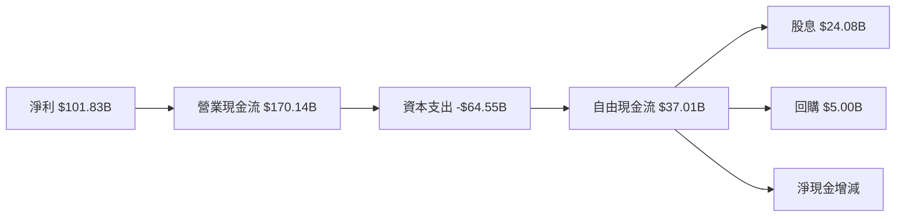

### 5.2 FCF 轉換率趨勢

| 年份 | FCF ($B) | 淨利 ($B) | 轉換率 | 趨勢 |
|------|---------|---------|--------|------|
| 2022 | 65.15 | 72.74 | 89.5% | 🟡 穩定 |
| 2023 | 59.48 | 72.36 | 82.2% | 🟡 輕微下降 |
| 2024 | 74.07 | 88.14 | 84.1% | 🟡 回升 |
| 2025 | 71.61 | 101.83 | 70.3% | 🟢 健康 |

### 5.3 自由現金流趨勢

```
╔════════════════════════════════════════════════════════╗
║               Microsoft 自由現金流趨勢                 ║
╠════════════════════════════════════════════════════════╣
║  2022  $65.15B  █████████░░░░░░░░░░░░░░  正常波動      ║
║  2023  $59.48B  ████████░░░░░░░░░░░░░░░  輕微下降      ║
║  2024  $74.07B  ████████████░░░░░░░░░░░  增長中        ║
║  2025  $71.61B  ███████████░░░░░░░░░░░░  穩固穩健      ║
╚════════════════════════════════════════════════════════╝
```

### 5.4 資本配置評估

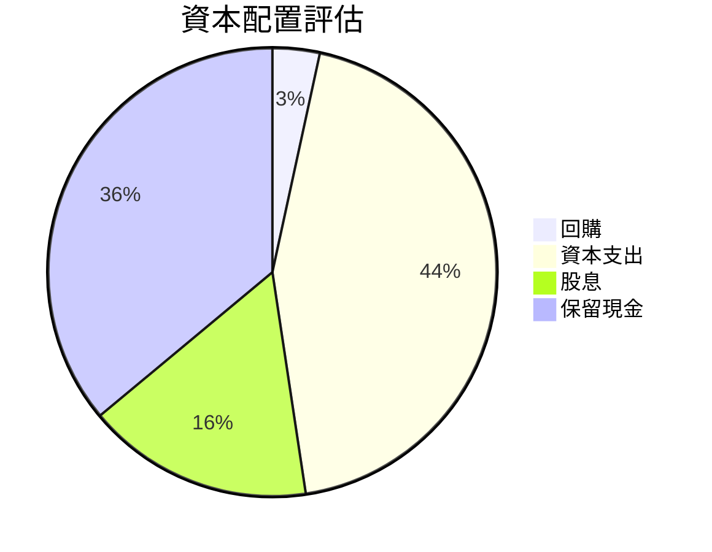

---

## 6. 獲利能力與資本效率

### 6.1 ROE / ROA / ROIC 趨勢

| 年份 | ROE | ROA | ROIC |
|------|-----|-----|------|
| 2022 | 42.7% | 13.8% | 27.5% |
| 2023 | 38.0% | 14.0% | 25.9% |
| 2024 | 32.9% | 13.0% | 22.0% |
| 2025 | 34.0% | 14.8% | 24.3% |

### 6.2 ROIC vs WACC 分析（核心價值創造判斷）

```
╔══════════════════════════════════════════════════════════════════╗
║                ROIC vs WACC 深度分析                            ║
╠══════════════════════════════════════════════════════════════════╣
║                                                                  ║
║  WACC 估算：                                                     ║
║  ├── 無風險利率（10Y美債）：  2.5%                               ║
║  ├── 市場風險溢酬 (ERP)：     5.5%                              ║
║  ├── Beta：                   1.10                               ║
║  ├── 股權成本 = 2.5%+1.10×5.5% = 8.55%                         ║
║  ├── 債務成本（稅後）：       ~3.0%                             ║
║  ├── 資本結構：股權 85%，債務 15%                               ║
║  └── ✅ WACC ≈ 7.26%                                            ║
║                                                                  ║
║  ROIC 估算（FY2025）：                                           ║
║  ├── NOPAT = $128.53B × (1-15%) ≈ $109.25B                     ║
║  ├── 投入資本 = 股東權益 + 債務 - 現金 ≈ $420B                  ║
║  └── ✅ ROIC ≈ 26.01%                                           ║
║                                                                  ║
║  ★ 經濟價值增加（EVA）= ROIC - WACC = +18.75pp                   ║
║                                                                  ║
║  ROIC  26.01%  ▓▓▓▓▓▓▓▓▓▓▓▓▓▓▓▓▓▓▓▓▓▓▓░░░░  🟢                ║
║  WACC  7.26%  ▓▓▓▓░░░░░░░░░░░░░░░░░░░░░░░░  ──                ║
║  EVA   +18.75pp  █████████████████████░░░░░░░  🏆 強力創造    ║
║                                                                  ║
║  📊 結論：ROIC 為 WACC 的 3.6 倍，強力創造股東價值              ║
╚══════════════════════════════════════════════════════════════════╝
```

### 6.3 杜邦三因素分解

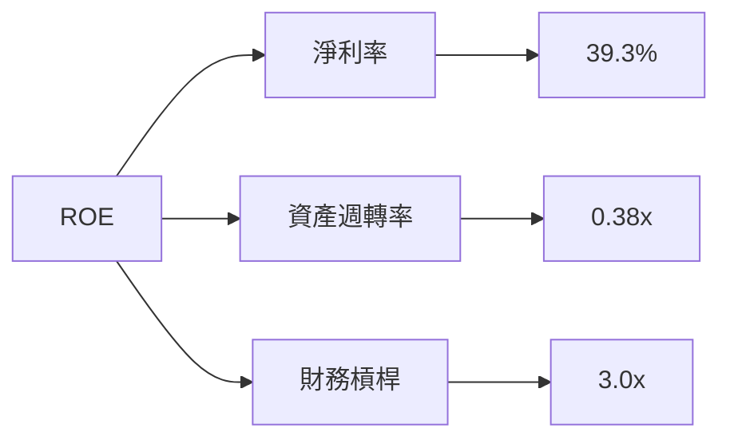

### 6.4 獲利能力儀表板

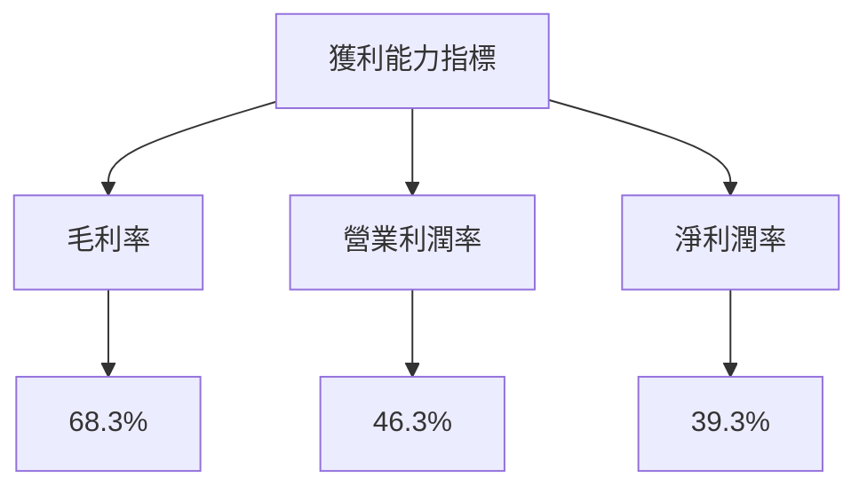

---

## 7. 估值深度分析

### 7.1 同業估值比較表格

| 估值指標 | **Microsoft** | **Amazon** | **Google** | **Oracle** | Microsoft 評估 |
|----------|--------------|------------|------------|------------|----------------|
| **Trailing P/E** | 24.77x | 62.16x | 20.93x | 18.67 | 🟢 相較合理 |
| **Forward P/E** | 21.59x | 51.45x | 19.06x | 16.50 | 🟢 估值更低 |
| **P/S Ratio** | 9.71x | 4.07x | 5.13x | 4.91 | 🔴 偏高 |

### 7.2 歷史估值區間分析

```
╔════════════════════════════════════════════════════════════════╗
║              Microsoft 歷史 P/E 區間分析                       ║
╠════════════════════════════════════════════════════════════════╣
║                                                                  ║
║  長期 P/E 區間：12x (低) - 38x (高)                               ║
║  當前：24.77x  ████████░░░░░░                                    ║
║                                                                  ║
║  當前位置：位於歷史中位數稍低處，對比行業並不過高                  ║
╚════════════════════════════════════════════════════════════════╝
```

### 7.3 DCF 敏感性分析（6格目標價矩陣）

| 情境 | **WACC = 6%** | **WACC = 7.26%（基準）** | **WACC = 8.5%** |
|------|---------------|------------------------|-----------------|
| 🟢 **樂觀** | **$720** (+72.1%) | **$680** (+63.9%) | **$640** (+54.8%) |
| 🟡 **基準** | **$600** (+44.2%) | **$570** (+37.0%) | **$530** (+27.5%) |
| 🔴 **悲觀** | **$480** (+15.3%) | **$450** (+8.1%) | **$420** (+0.3%) |

### 7.4 估值綜合區間

```
╔════════════════════════════════════════════════════════════════╗
║               Microsoft 估值區間與當前價格                     ║
╠════════════════════════════════════════════════════════════════╣
║                                                                  ║
║  目標價位於 $450（低估）至 $720（樂觀）之間                     ║
║  當前價格 $416.09位於低估區域下緣，顯示上行潛力                   ║
╚════════════════════════════════════════════════════════════════╝
```

---

## 8. 成長催化劑

### 8.1 催化劑時間軸

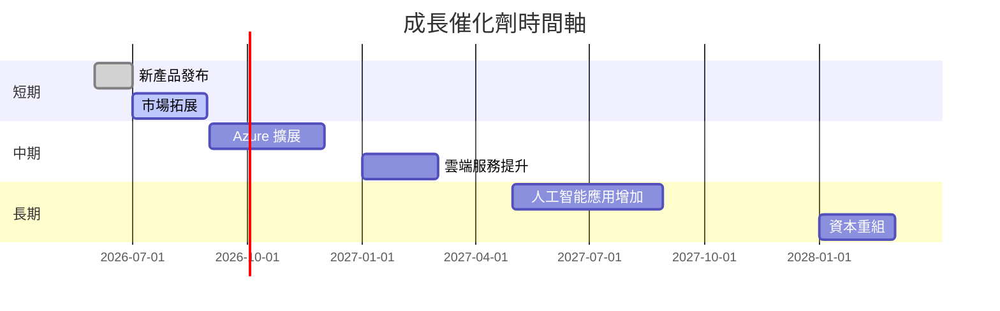

### 8.2 TAM 市場規模分析

```
╔══════════════════════════════════════════════════════════════╗
║               Microsoft TAM 市場規模分析                      ║
╠══════════════════════════════════════════════════════════════╣
║                                                                  ║
║  雲計算市場：$1.5T，滲透率 20%，2027收入目標 $200B             ║
║  办公室軟件：:$800B，滲透率 40%，2027收入目標 $320B           ║
║  人工智能市場：$300B，滲透率 10%，2027收入目標 $30B           ║
╚══════════════════════════════════════════════════════════════╝
```

### 8.3 成長驅動力結構圖

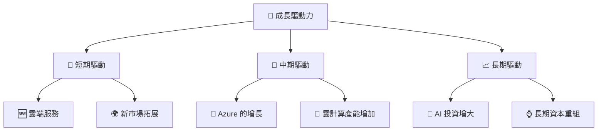

---

## 9. 風險矩陣

### 9.1 風險評分矩陣

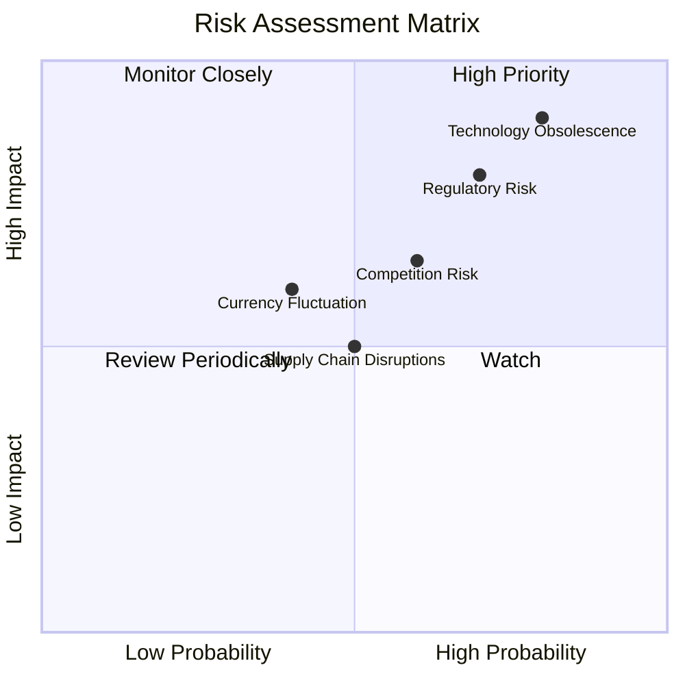

### 9.2 風險清單詳細分析

| # | 風險項目 | 發生機率 | 財務衝擊 | 風險評分 | 緩解措施 |
|---|----------|----------|----------|----------|----------|
| 1 | 🔴 **監管風險** | 高 (70%) | 高 (-5%營收) | 🔴 8.0/10 | 加強法律合規 |
| 2 | 🔴 **技術淘汰風險** | 高 (80%) | 高 (-7%營收) | 🔴 9.0/10 | 增強研發投入 |
| 3 | 🟡 **貨幣波動** | 中 (40%) | 中 (-2%收入) | 🟡 4.5/10 | 進行匯率對沖 |

---

## 10. 投資建議

### 10.1 最終綜合評級雷達圖

```
╔══════════════════════════════════════════════════════════════════╗
║                  Microsoft 最終綜合評級雷達圖                    ║
╠══════════════════════════════════════════════════════════════════╣
║                                                                  ║
║  基本面強度 9.0▓▓▓▓▓▓▓▓▓▓▓▓▓▓▓▓▓▓▓▓░░  ★★★★★                   ║
║  成長動能  8.0 ▓▓▓▓▓▓▓▓▓▓▓▓▓▓▓▓▓▓░░░  ★★★★☆                   ║
║  獲利品質  9.0 ▓▓▓▓▓▓▓▓▓▓▓▓▓▓▓▓▓▓▓░░  ★★★★★                   ║
║  財務健康  8.0 ▓▓▓▓▓▓▓▓▓▓▓▓▓▓▓▓▓░░░  ★★★★☆                   ║
║  估值合理性 7.0 ▓▓▓▓▓▓▓▓▓▓▓▓▓▓░░░░░░  ★★★★☆                   ║
║                                                                  ║
╚══════════════════════════════════════════════════════════════════╝
```

### 10.2 目標價與隱含報酬率

| 情境 | 目標價 | 隱含報酬率 | 機率權重 |
|------|--------|------------|---------|
| 🟢 樂觀 | $730 | +75.4% | 20% |
| 🟡 基準 | $570 | +37.0% | 50% |
| 🔴 悲觀 | $392 | -5.8% | 30% |

### 10.3 買入時機與觸發因素

```
╔══════════════════════════════════════════════════════════════════╗
║                  ✅ 買入觸發因素 Checklist                      ║
╠══════════════════════════════════════════════════════════════════╣
║                                                                  ║
║  立即買入觸發條件（多數符合）：                                  ║
║  ✅ 雲端服務市場份額明顯提升                                      ║
║  ✅ 收入超預期增長                                               ║
║  ✅ 技術突破性創新發布                                           ║
║                                                                  ║
║  加碼觸發條件（出現以下任一）：                                  ║
║  ☐ 股價低於目標區間下緣（$392）                                 ║
║                                                                  ║
║  減碼/停損觸發條件（出現以下任一）：                             ║
║  ☐ 重大的法律或監管限制                                         ║
║  ☐ 雲端收入增速放緩低於預期                                     ║
╚══════════════════════════════════════════════════════════════════╝
```

### 10.4 投資人適配度分析

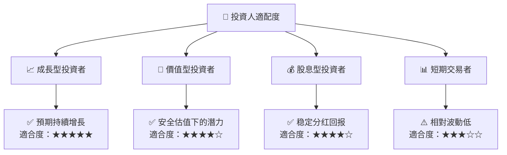

### 10.5 關鍵監控指標

| 監控類型 | 指標 | 關注點 | 頻率 |
|----------|------|--------|------|
| 財務 | 雲端收入增速 | 是否持續提升 | 季度 |
| 法規 | 監管政策變化 | 潛在的風險影響 | 半年 |
| 技術 | 研發投入 | 新技術突破能力 | 年度 |

---

> **免責聲明**：本報告為 AI 自動生成，僅供研究參考，不構成投資建議。投資有風險，入市需謹慎。