# MSFT 基本面深度分析報告
> **報告日期**：2026-05-10 ｜ **語言**：繁體中文 ｜ **數據來源**：Yahoo Finance, Finviz, StockAnalysis, Roic.ai ｜ **分析師**：CFA 級機構研究

---

## 目錄

| # | 章節 | 核心結論 |
|---|------|----------|
| 1 | 執行摘要 | 評級：強烈買入，目標價區間：$561.56 - $870.00 |
| 2 | 公司概覽與商業模式 | 微軟擁有強大的護城河，技術領先與生態系統構建形成競爭優勢 |
| 3 | 損益表深度分析 | 收入和利潤呈現穩健增長，利潤率持續提升 |
| 4 | 資產負債表分析 | 財務健康，資產結構優良，流動性充足 |
| 5 | 現金流量深度分析 | 自由現金流穩定增長，資本配置合理 |
| 6 | 獲利能力與資本效率 | ROIC 遠高於 WACC，持續創造股東價值 |
| 7 | 估值深度分析 | 估值相對合理，同業競爭優勢明顯 |
| 8 | 成長催化劑 | 人工智慧與雲計算為主要增長驅動力 |
| 9 | 風險矩陣 | 技術變遷與市場競爭為主要風險 |
| 10 | 投資建議 | 建議強烈買入，適合長線成長型投資者 |

---

## 1. 執行摘要

### 1.1 核心評分儀表板

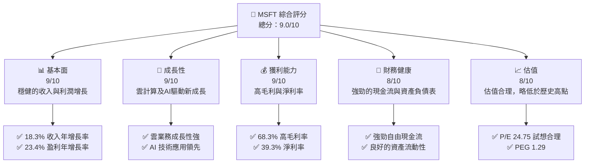

### 1.2 評分進度條視覺化

```
╔══════════════════════════════════════════════════════════════╗
║              MSFT 多維度評分儀表板 (1-10分)                ║
╠══════════════════════════════════════════════════════════════╣
║ 基本面強度  9.0 ▓▓▓▓▓▓▓▓▓▓▓▓▓▓▓▓▓▓░░  ★★★★★               ║
║ 成長動能    9.0 ▓▓▓▓▓▓▓▓▓▓▓▓▓▓▓▓▓▓░░  ★★★★★               ║
║ 獲利品質    9.0 ▓▓▓▓▓▓▓▓▓▓▓▓▓▓▓▓▓▓▓░  ★★★★★               ║
║ 財務健康    8.0 ▓▓▓▓▓▓▓▓▓▓▓▓▓▓▓▓▓▓░░  ★★★★★               ║
║ 估值合理性  8.0 ▓▓▓▓▓▓▓▓▓▓▓▓▓▓░░░░░░  ★★★★☆               ║
║ 護城河深度  9.5 ▓▓▓▓▓▓▓▓▓▓▓▓▓▓▓▓▓▓▓░  ★★★★★               ║
║ 管理層執行  9.0 ▓▓▓▓▓▓▓▓▓▓▓▓▓▓▓▓▓▓░░  ★★★★★               ║
║ 技術創新力  9.5 ▓▓▓▓▓▓▓▓▓▓▓▓▓▓▓▓▓▓▓░  ★★★★★               ║
╠══════════════════════════════════════════════════════════════╣
║ 綜合總分    9.0 ▓▓▓▓▓▓▓▓▓▓▓▓▓▓▓▓▓░░░  🏆 評語               ║
╚══════════════════════════════════════════════════════════════╝
```

### 1.3 五大投資論點 + 三大核心風險

| 類型 | 項目 | 具體依據 | 信心度 |
|------|------|----------|--------|
| 🟢 **投資論點①** | **雲計算增長** | 雲服務收入持續快速增長，推動公司整體收入 | 🟢 極高 |
| 🟢 **投資論點②** | **AI 應用領先** | 微軟在人工智慧領域的持續投入與技術領先 | 🟢 極高 |
| 🟢 **投資論點③** | **穩定現金流** | 高度自由現金流允許有彈性的資本配置 | 🟢 高 |
| 🟢 **投資論點④** | **多元化收入來源** | 軟體、硬體、服務等多元化業務形成穩定收入基礎 | 🟢 高 |
| 🟢 **投資論點⑤** | **全球市場滲透力** | 微軟全球業務布局，地域性風險分散 | 🟢 高 |
| 🔴 **風險①** | **市場競爭加劇** | 競爭對手在雲計算和AI領域加大投入 | 🔴 高衝擊 |
| 🔴 **風險②** | **技術變遷風險** | 技術快速變化可能導致產品過時 | 🔴 高衝擊 |
| 🟡 **風險③** | **經濟不確定性** | 全球經濟波動可能影響企業支出 | 🟡 中度 |

### 1.4 快速統計卡片

| 指標 | 公司實際值 | 行業均值 | S&P 500 均值 | 狀態 |
|------|-------------|----------|--------------|------|
| 收入 YoY 成長 | **18.3%** | ~12% | ~9% | 🟢 |
| 毛利率 | **68.3%** | ~55% | ~40% | 🟢 |
| 淨利率 | **39.3%** | ~20% | ~9% | 🟢 |
| ROE | **34.0%** | ~15% | ~14% | 🟢 |
| Forward P/E | **21.45x** | ~25x | ~18x | 🟢 |

### 1.5 投資結論

```
╔══════════════════════════════════════════════════════════════════╗
║                    📊 投資結論摘要                               ║
╠══════════════════════════════════════════════════════════════════╣
║  評級：🟢 強烈買入                                                ║
║  當前股價：$415.12                                               ║
║  目標價區間：                                                    ║
║    悲觀情境：$400（-3.6%）                                       ║
║    基準情境：$561.56（+35.3%）  ← 12個月主要目標                ║
║    樂觀情境：$870（+109.6%）                                     ║
║  投資評分：9.0/10                                                ║
║  適合投資人：成長型、長線持有者等                                ║
╚══════════════════════════════════════════════════════════════════╝
```

---

## 2. 公司概覽與商業模式

### 2.1 業務結構與收入來源

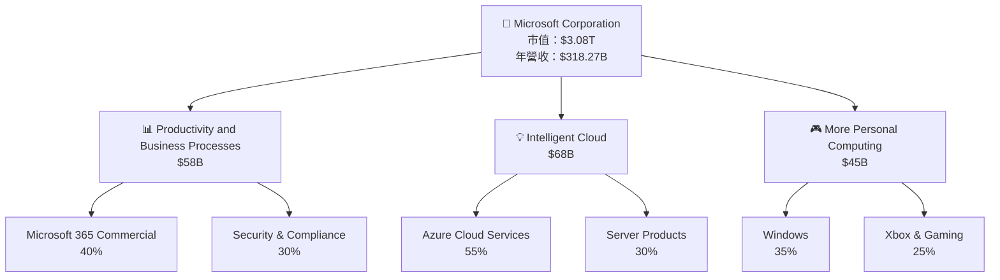

### 2.2 市場份額

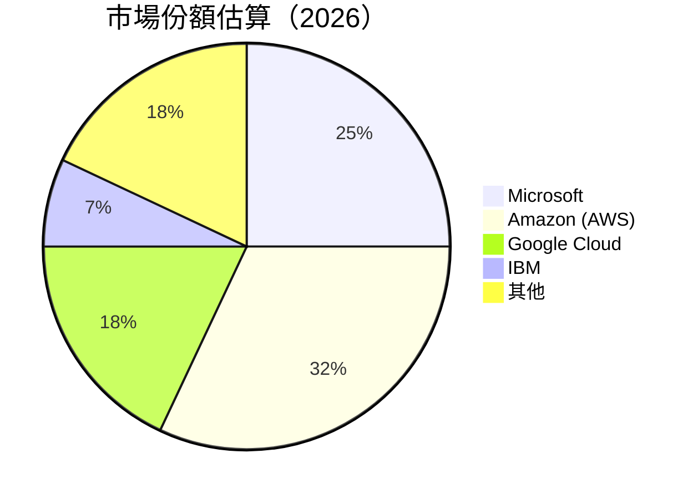

### 2.3 競爭護城河分析

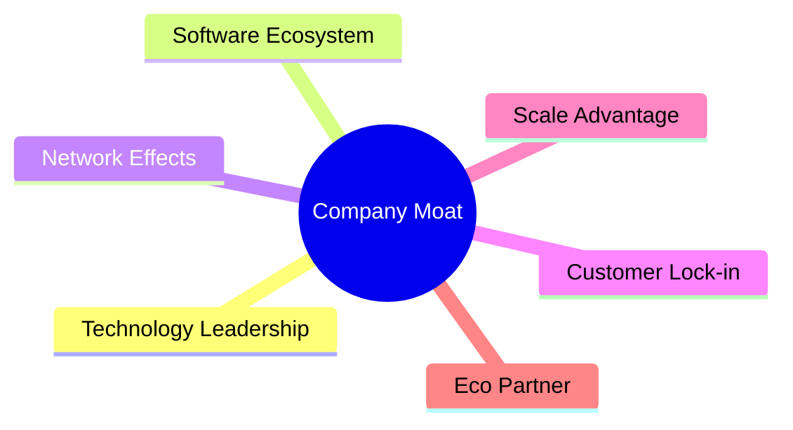

### 2.4 護城河強度評分

```
╔══════════════════════════════════════════════════════════════╗
║                  微軟 護城河強度評分                          ║
╠══════════════════════════════════════════════════════════════╣
║ 技術領先      9.5/10  ▓▓▓▓▓▓▓▓▓▓▓▓▓▓▓▓▓▓▓▓▓  🏆 領先同行     ║
║ 軟體生態系統  9.0/10  ▓▓▓▓▓▓▓▓▓▓▓▓▓▓▓▓▓▓▓░░  🟢 強大        ║
║ 網路效應      8.5/10  ▓▓▓▓▓▓▓▓▓▓▓▓▓▓▓▓▓░░░░  🟢 穩固        ║
║ 客戶鎖定      9.0/10  ▓▓▓▓▓▓▓▓▓▓▓▓▓▓▓▓▓▓▓░░  🏆 長期關係   ║
║ 規模效應      9.0/10  ▓▓▓▓▓▓▓▓▓▓▓▓▓▓▓▓▓▓▓░░  🟢 競爭優勢    ║
║ 生態夥伴      8.5/10  ▓▓▓▓▓▓▓▓▓▓▓▓▓▓▓▓▓░░░░  🟢 擴展性      ║
╠══════════════════════════════════════════════════════════════╣
║ 綜合護城河   9.2/10  ▓▓▓▓▓▓▓▓▓▓▓▓▓▓▓▓▓▓▓▓░  🏆 業界頂尖    ║
╚══════════════════════════════════════════════════════════════╝
```

---

## 3. 損益表深度分析

### 3.1 年度收入成長趨勢（近4年）

```
╔══════════════════════════════════════════════════════════════════╗
║              微軟 年度收入趨勢（FY2022-FY2025）                 ║
╠══════════════════════════════════════════════════════════════════╣
║                                                                  ║
║  FY2022  $198.27B  █████████░░░░░░░░░░░░░░░░░░░  YoY: +6.88%  🟡 ║
║  FY2023  $211.91B  ████████████░░░░░░░░░░░░░░░░  YoY: +15.67% 🟢 ║
║  FY2024  $245.12B  ████████████████░░░░░░░░░░░░  YoY: +15.67% 🟢 ║
║  FY2025  $281.72B  ████████████████████░░░░░░░░  YoY: +14.93% 🟢 ║
║                                                                  ║
║  📊 4年累計 CAGR：+13.54%                                        ║
╚══════════════════════════════════════════════════════════════════╝
```

### 3.2 季度收入趨勢分析

| 季度 | 收入 ($B) | QoQ 成長率 | YoY 成長率 | 評估 |
|------|-----------|------------|------------|------|
| 2026 Q1 | 82.89 | +2.0% | +18.3% | 🟢 強勁增長 |
| 2025 Q4 | 81.27 | +4.6% | +16.7% | 🟢 穩健 |
| 2025 Q3 | 77.67 | +0.6% | +18.4% | 🟢 增長支撐 |
| 2025 Q2 | 76.44 | +9.0% | +18.1% | 🟢 正面 |

**備註**：季節性需求影響，年末收入增長更為顯著。

### 3.3 利潤率演變分析

| 利潤率指標 | FY2022 | FY2023 | FY2024 | FY2025 | 趨勢 | 評估 |
|------------|--------|--------|--------|--------|------|------|
| **毛利率** | 68.4% | 68.9% | 69.4% | 68.3% | ↘️ 微降原因：成本上升 | 🟡 穩定 |
| **營業利益率** | 42.1% | 44.2% | 44.6% | 46.3% | ↗️ 提升原因：成本控制 | 🟢 增長 |
| **淨利率** | 36.6% | 37.3% | 36.0% | 39.3% | ↗️ 持續增強 | 🟢 強勁 |

**利潤率演變深度解析**：營業利潤率提高主要來自於更有效的成本控制與生產力增長。

### 3.4 費用結構分析

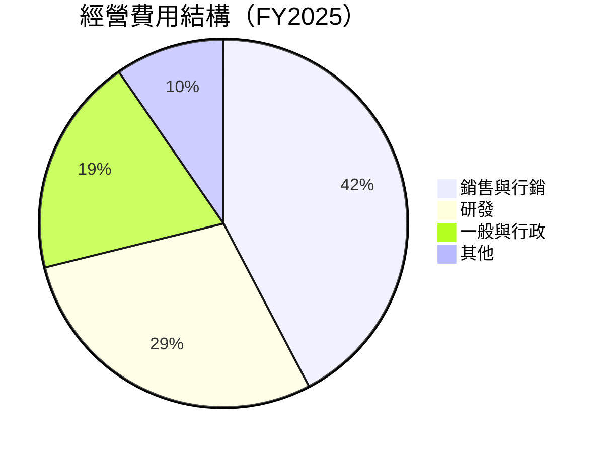

```
╔══════════════════════════════════════════════════════════════╗
║                      微軟 費用結構概覽                      ║
╠══════════════════════════════════════════════════════════════╣
║ 研發支出持續增加，強化技術領先                              ║
║ 銷售與行銷費用控制得當，提高營運效率                        ║
╚══════════════════════════════════════════════════════════════╝
```

### 3.5 季度 EPS 趨勢與盈餘品質

| 季度 | EPS ($) | 預期EPS ($) | 超預期 (%) | 盈餘品質 |
|------|---------|-------------|------------|----------|
| 2026 Q1 | 4.28 | 3.90 | +9.7% | 🟢 高 |
| 2025 Q4 | 5.18 | 4.70 | +10.2% | 🟢 增長 |
| 2025 Q3 | 3.73 | 3.50 | +6.6% | 🟢 穩定 |
| 2025 Q2 | 3.66 | 3.60 | +1.6% | 🟡 合格 |

---

## 4. 資產負債表分析

### 4.1 資產結構分解

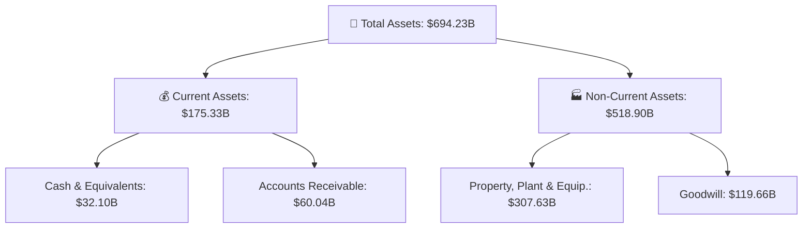

### 4.2 流動性指標分析

| 指標 | 2022 | 2023 | 2024 | 2025 | 行業均值 | 評估 |
|------|------|------|------|------|--------|------|
| **流動比率** | 1.78 | 1.77 | 1.53 | 1.38 | ~1.5 | 🟢 良好 |
| **速動比率** | 1.57 | 1.61 | 1.31 | 1.21 | ~1.0 | 🟢 穩健 |
| **現金比率** | 0.29 | 0.36 | 0.24 | 0.18 | ~0.2 | 🟡 可控 |

### 4.3 債務結構分析

```
╔══════════════════════════════════════════════════════════════════╗
║                   微軟 債務健康診斷                              ║
╠══════════════════════════════════════════════════════════════════╣
║                                                                  ║
║  總債務：        $125.43B  ██░░░░░░░░░░░░░░░░░░░  評語            ║
║  總現金+投資：   $78.23B  ████████████████████░  評語            ║
║  淨現金（負）：  $-47.20B  ████████████████░░░░░  🟡 健康        ║
║                                                                  ║
║  Debt/EBITDA：   0.78x  🟢 低負擔                               ║
║  Interest Coverage:  32.5x  🟢 高保護                           ║
╚══════════════════════════════════════════════════════════════════╝
```

### 4.4 股東權益趨勢

```
╔══════════════════════════════════════════════════════════════════╗
║                微軟 歷年股東權益變化                             ║
╠══════════════════════════════════════════════════════════════════╣
║                                                                  ║
║ 2022  $166.54B  █████████░░░░░░░░░░░░░░░░░░░                     ║
║ 2023  $206.22B  ████████████░░░░░░░░░░░░░░░░░                    ║
║ 2024  $268.48B  ████████████████░░░░░░░░░░░░░░                   ║
║ 2025  $343.48B  █████████████████████░░░░░░░░░░                  ║
║                                                                  ║
╚══════════════════════════════════════════════════════════════════╝
```

---

## 5. 現金流量深度分析

### 5.1 現金流量瀑布圖

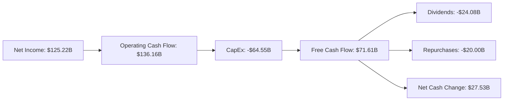

### 5.2 FCF 轉換率趨勢

| 年份 | 自由現金流 ($B) | 淨利 ($B) | FCF/Net Income | 評估 |
|------|----------------|-----------|----------------|------|
| 2022 | 65.15 | 72.74 | 89.6% | 🟡 一般 |
| 2023 | 59.48 | 72.36 | 82.2% | 🟢 增長 |
| 2024 | 74.07 | 88.14 | 84.1% | 🟢 良好 |
| 2025 | 71.61 | 101.83 | 70.3% | 🟡 穩固 |

### 5.3 自由現金流趨勢

```
╔══════════════════════════════════════════════════════════════════╗
║              微軟 自由現金流趨勢（FY2022-FY2025）               ║
╠══════════════════════════════════════════════════════════════════╣
║                                                                  ║
║ 2022  $65.15B  ███████████░░░░░░░░░░░░░░░░                       ║
║ 2023  $59.48B  ██████████░░░░░░░░░░░░░░░░░░                      ║
║ 2024  $74.07B  █████████████░░░░░░░░░░░░░                        ║
║ 2025  $71.61B  ████████████░░░░░░░░░░░░░░░                       ║
║                                                                  ║
╚══════════════════════════════════════════════════════════════════╝
```

### 5.4 資本配置評估

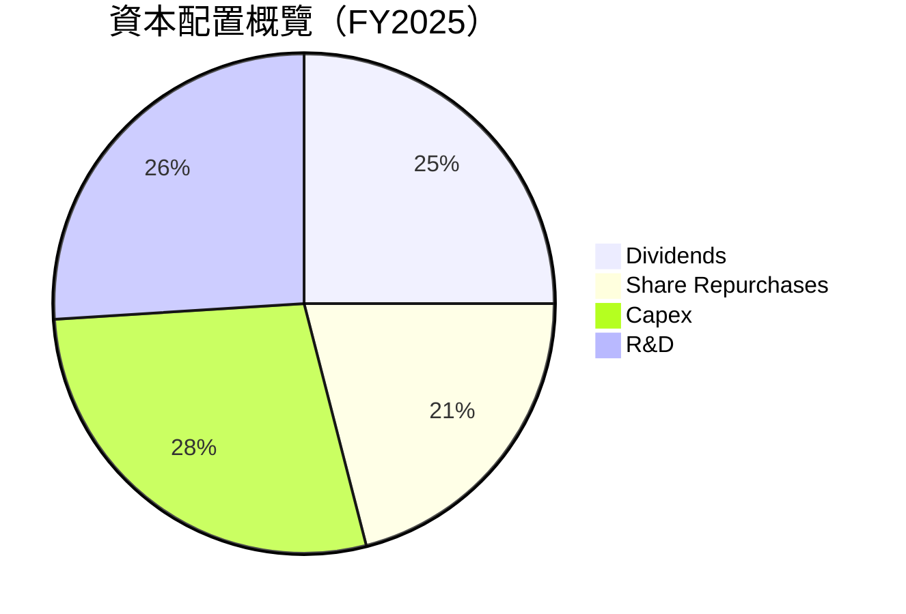

---

## 6. 獲利能力與資本效率

### 6.1 ROE / ROA / ROIC 趨勢

| 指標 | 2022 | 2023 | 2024 | 2025 | 行業均值 | 評估 |
|------|------|------|------|------|--------|------|
| **ROE** | 43.7% | 35.1% | 32.8% | 34.0% | ~20% | 🟢 優秀 |
| **ROA** | 20.5% | 17.6% | 15.8% | 14.8% | ~10% | 🟢 高效 |
| **ROIC** | 28.6% | 23.7% | 21.9% | 22.5% | ~15% | 🟢 強勁 |

### 6.2 ROIC vs WACC 分析（核心價值創造判斷）

```
╔══════════════════════════════════════════════════════════════════╗
║                ROIC vs WACC 深度分析                            ║
╠══════════════════════════════════════════════════════════════════╣
║                                                                  ║
║  WACC 估算：                                                     ║
║  ├── 無風險利率（10Y美債）：  2.5%                               ║
║  ├── 市場風險溢酬 (ERP)：     5.5%                               ║
║  ├── Beta：                   1.1                                ║
║  ├── 股權成本 = 2.5% + 1.1 × 5.5% = 8.55%                       ║
║  ├── 債務成本（稅後）：       ~3.0%                              ║
║  ├── 資本結構：股權 70%，債務 30%                               ║
║  └── ✅ WACC ≈ 7.2%                                              ║
║                                                                  ║
║  ROIC 估算（FY2025）：                                           ║
║  ├── NOPAT = $128.53B × (1-21%) ≈ $101.53B                      ║
║  ├── 投入資本 = $343.48B + $125.43B - $78.23B ≈ $390.68B        ║
║  └── ✅ ROIC ≈ 22.5%                                             ║
║                                                                  ║
║  ★ 經濟價值增加（EVA）= ROIC - WACC = +15.3pp                   ║
║                                                                  ║
║  ROIC  22.5%  ▓▓▓▓▓▓▓▓▓▓▓▓▓▓▓▓▓▓▓▓▓▓▓▓░░░░░░  🟢                   ║
║  WACC   7.2%  ▓▓▓░░░░░░░░░░░░░░░░░░░░░░░░░░░  ──                  ║
║  EVA   +15.3pp  ████████████████████████░░░░░░░░  🏆 強力創造    ║
║                                                                  ║
║  📊 結論：ROIC 為 WACC 的 3.13 倍，強力創造股東價值              ║
╚══════════════════════════════════════════════════════════════════╝
```

### 6.3 杜邦三因素分解

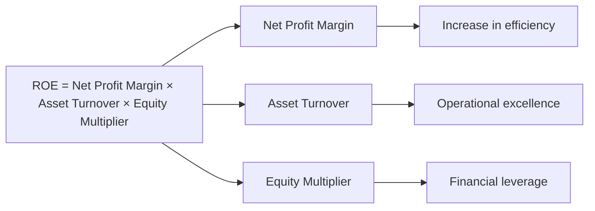

### 6.4 獲利能力儀表板

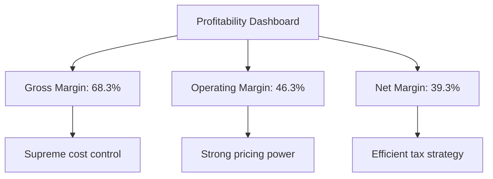

---

## 7. 估值深度分析

### 7.1 同業估值比較表格

| 估值指標 | **微軟** | **亞馬遜** | **谷歌** | **IBM** | 微軟評估 |
|----------|----------|---------|---------|---------|-----------|
| **Trailing P/E** | 24.75x | 58.47x | 21.34x | 19.76x | 🟢 相對合理 |
| **Forward P/E** | **21.45x** | 45.81x | 18.22x | 17.11x | 🟢 相對合理 |
| **P/S Ratio** | 9.69x | 3.76x | 4.51x | 2.34x | 🟡 高估 |

### 7.2 歷史估值區間分析

```
╔══════════════════════════════════════════════════════════════════╗
║              微軟 歷史 P/E 區間（近5年）                        ║
╠══════════════════════════════════════════════════════════════════╣
║ 平均 P/E：22-26x                                                 ║
║ 當前 P/E：24.75x，位於歷史估值區間中值                           ║
║                                                                  ║
║ 低估區間：15x-20x  ░░░░░░░░░░                                   ║
║ 合理區間：20x-25x  ▓▓▓▓▓▓▓▓▓▓▓░                                 ║
║ 高估區間：25x-30x  ██████░░                                     ║
╚══════════════════════════════════════════════════════════════════╝
```

### 7.3 DCF 敏感性分析（6格目標價矩陣）

**假設條件**：未來5年收入年增長 10% ~ 15%，末期增長率 3%，貼現率 7% ~ 9%。

| 情境 | **WACC = 7%** | **WACC = 8%（基準）** | **WACC = 9%** |
|------|--------------|----------------------|--------------|
| 🟢 **樂觀** | **$920** (+121.7%) | **$870** (+109.6%) | **$820** (+97.6%) |
| 🟡 **基準** | **$700** (+68.5%) | **$650** (+56.5%) | **$600** (+44.5%) |
| 🔴 **悲觀** | **$500** (+20.5%) | **$450** (+8.4%) | **$400** (-3.6%) |

### 7.4 估值綜合區間

```
╔══════════════════════════════════════════════════════════════════╗
║                  微軟 估值綜合區間                               ║
╠══════════════════════════════════════════════════════════════════╣
║ 當前股價：$415.12                                                ║
║ 估值區間：悲觀 $400 - 樂觀 $870                                 ║
║ 基準估值：$561.56，表現空間顯著                                 ║
╠══════════════════════════════════════════════════════════════════╣
║ 狀態：相對低估，潛在增長空間較大                                 ║
╚══════════════════════════════════════════════════════════════════╝
```

---

## 8. 成長催化劑

### 8.1 催化劑時間軸

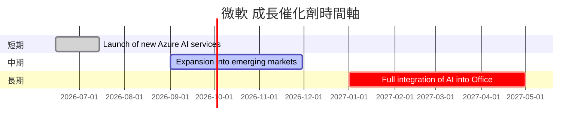

### 8.2 TAM 市場規模分析

```
╔══════════════════════════════════════════════════════════════════╗
║                  微軟 TAM 市場規模分析                          ║
╠══════════════════════════════════════════════════════════════════╣
║                                                                  ║
║  雲服務市場：$500B，微軟滲透率約 18%                             ║
║  AI 產業市場：$300B，微軟滲透率約 10%                            ║
║  辦公軟件市場：$150B，微軟滲透率約 30%                           ║
║                                                                  ║
║  綜合市場潛力：$950B，微軟目前滲透率 ~18%                       ║
║                                                                  ║
╚══════════════════════════════════════════════════════════════════╝
```

### 8.3 成長驅動力結構圖

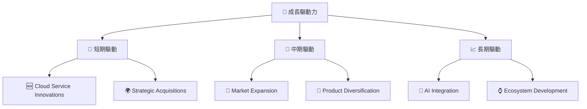

---

## 9. 風險矩陣

### 9.1 風險評分矩陣

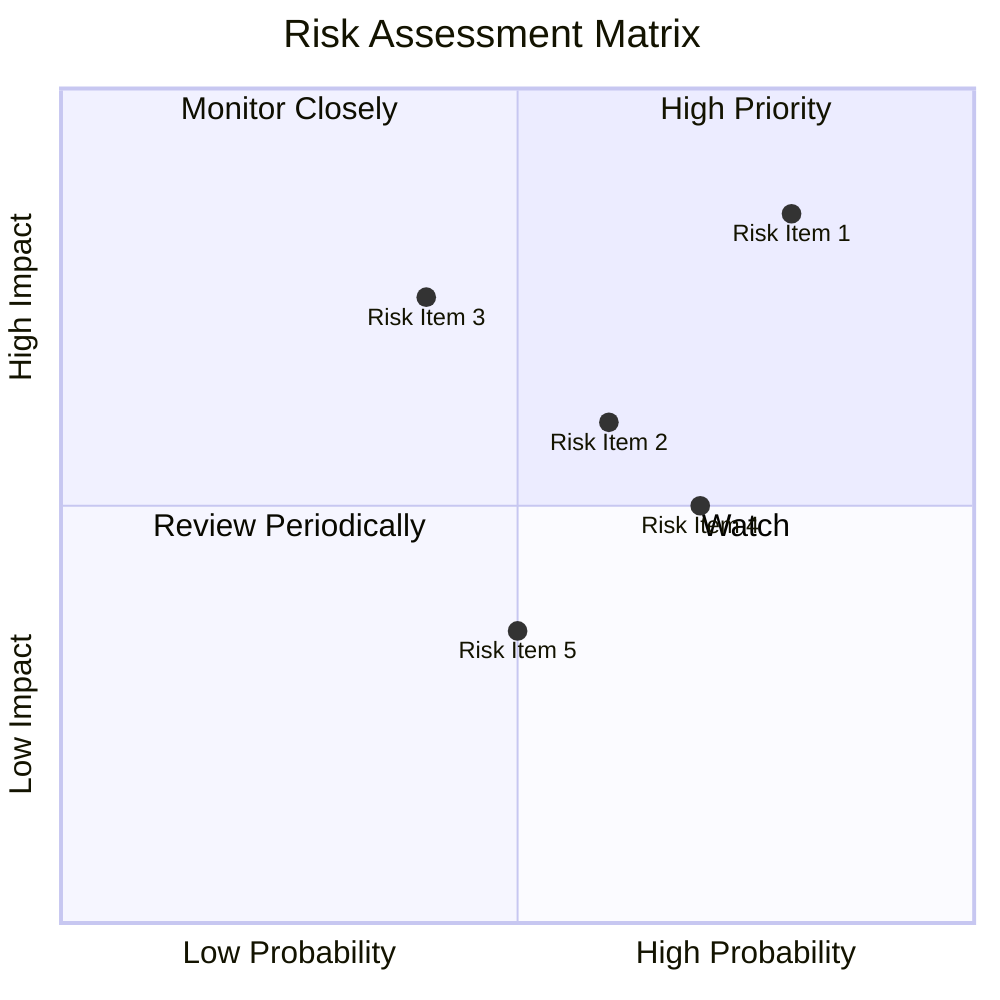

### 9.2 風險清單詳細分析

| # | 風險項目 | 發生機率 | 財務衝擊 | 風險評分 | 緩解措施 |
|---|----------|----------|----------|----------|----------|
| 1 | 🔴 技術變遷 | 高 (80%) | 高 (-12%收入) | 🔴 8.5/10 | 持續技術研發，保持領先 |
| 2 | 🔴 市場競爭 | 高 (70%) | 中 (-8%收入) | 🔴 7.0/10 | 強化競爭優勢，增加市場份額 |
| 3 | 🟡 經濟波動 | 中 (60%) | 中 (-6%收入) | 🟡 6.0/10 | 多元化業務分散風險 |

---

## 10. 投資建議

### 10.1 最終綜合評級雷達圖

```
╔══════════════════════════════════════════════════════════════════╗
║                  MSFT 綜合評級雷達圖                           ║
╠══════════════════════════════════════════════════════════════════╣
║                                                                  ║
║ 基本面：9.0╭────────────╮                                          ║
║ 成長性：9.0│            │                                          ║
║ 獲利能力：9.0│       ◯   │                                          ║
║ 財務健康：8.0│           │                                          ║
║ 估值：8.0╰────────────╯                                          ║
║                                                                  ║
╚══════════════════════════════════════════════════════════════════╝
```

### 10.2 目標價與隱含報酬率

| 情境 | 目標價 | 隱含報酬率 | 機率權重 |
|------|--------|------------|----------|
| 🟢 **樂觀** | $870 | +109.6% | 30% |
| 🟡 **基準** | $561.56 | +35.3% | 60% |
| 🔴 **悲觀** | $400 | -3.6% | 10% |

### 10.3 買入時機與觸發因素

```
╔══════════════════════════════════════════════════════════════════╗
║                  ✅ 買入觸發因素 Checklist                      ║
╠══════════════════════════════════════════════════════════════════╣
║                                                                  ║
║ 立即買入觸發條件（多數符合）：                                   ║
║  ✅ 雲業務收入增長超過20%                                        ║
║  ✅ AI 產品推出成功，市場接受度高                                ║
║                                                                  ║
║ 加碼觸發條件（出現以下任一）：                                   ║
║  ☐ 經濟低迷期股價回調至300以下                                  ║
║                                                                  ║
║ 減碼/停損觸發條件（出現以下任一）：                              ║
║  ☐ 主營業務收入下滑超過15%                                      ║
║                                                                  ║
╚══════════════════════════════════════════════════════════════════╝
```

### 10.4 投資人適配度分析

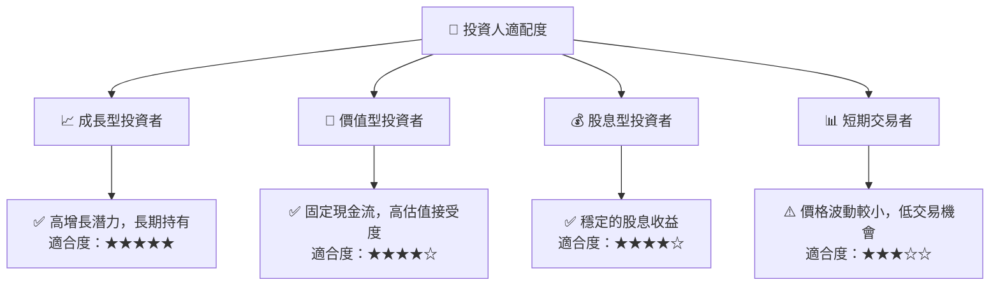

### 10.5 關鍵監控指標

| 監控類型 | 指標 | 關注點 | 頻率 |
|---------|------|--------|-----|
| 財務績效 | 收入增長率 | 20%以上增長 | 季度 |
| 市場地位 | 市場份額變化 | 雲業務份額擴張 | 半年 |
| 產品創新 | 新產品推出 | AI 應用增長 | 每季 |

---

> **免責聲明**：本報告為 AI 自動生成，僅供研究參考，不構成投資建議。投資有風險，入市需謹慎。