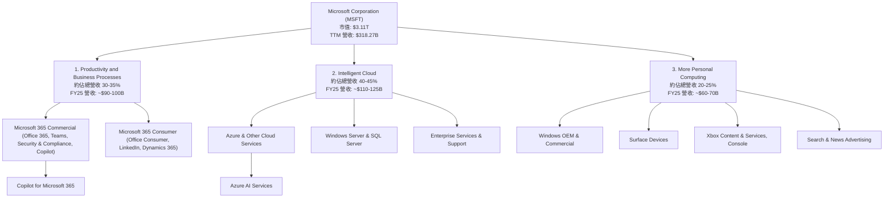
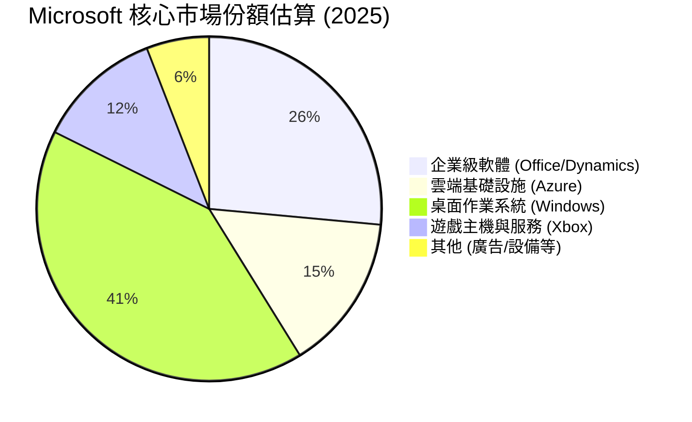
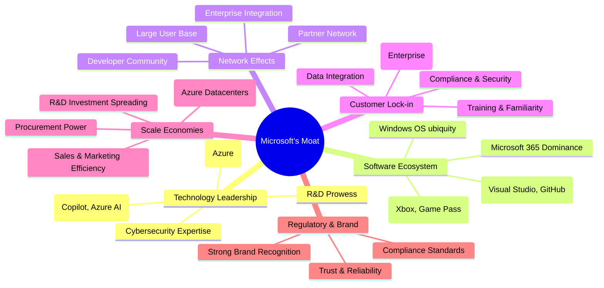
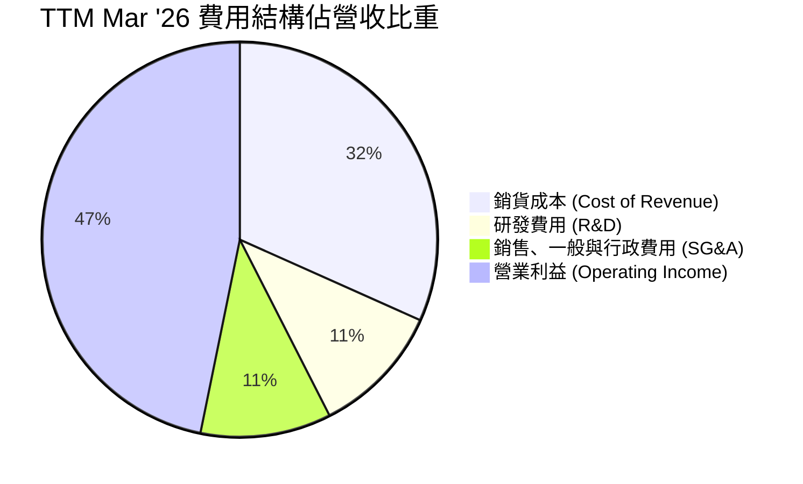
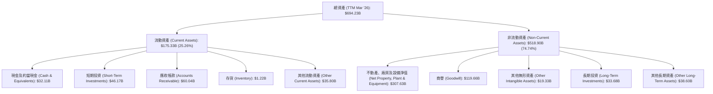

# MSFT 基本面深度分析報告
> **報告日期**：2026-05-23 ｜ **語言**：繁體中文 ｜ **數據來源**：Yahoo Finance, Finviz, StockAnalysis, Roic.ai ｜ **分析師**：CFA 級機構研究

---

## 目錄

| # | 章節 | 核心結論 |
|---|------------------------|------------------------------------|
| 1 | 執行摘要 | 🟢 強烈買入；目標價區間 $520 - $600 |
| 2 | 公司概覽與商業模式 | 堅固的「軟體生態系統」與「網路效應」護城河 |
| 3 | 損益表深度分析 | 營收與淨利潤持續雙位數成長，利潤率穩健提升 |
| 4 | 資產負債表分析 | 財務結構強健，流動性充裕，債務管理良好 |
| 5 | 現金流量深度分析 | 自由現金流充沛，為股東回報與再投資提供強大支持 |
| 6 | 獲利能力與資本效率 | ROIC 遠超 WACC，持續為股東創造巨大價值 |
| 7 | 估值深度分析 | 相較於成長潛力與護城河，當前估值合理偏低 |
| 8 | 成長催化劑 | AI 賦能與雲端市場擴張是未來主要成長引擎 |
| 9 | 風險矩陣 | 競爭加劇與監管風險為主要關注點 |
| 10 | 投資建議 | 長期成長型投資者首選標的，建議「強烈買入」 |

---

## 1. 執行摘要

### 1.1 核心評分儀表板

```mermaid
graph TD
    MSFT["🎯 MSFT 綜合評分<br/>總分：8.9/10"]

    F["📊 基本面<br/>9.5/10<br/>全球領先技術巨頭，業務多元且穩定"]
    G["🚀 成長性<br/>9.0/10<br/>雲端與AI驅動雙位數營收及盈餘成長"]
    P["💰 獲利能力<br/>9.5/10<br/>高毛利、高淨利，利潤率持續擴張"]
    B["🏦 財務健康<br/>9.0/10<br/>現金充裕，債務可控，流動性極佳"]
    V["📈 估值<br/>7.5/10<br/>相較於成長與護城河，估值合理偏低"]

    MSFT --> F
    MSFT --> G
    MSFT --> P
    MSFT --> B
    MSFT --> V

    F --> F1["✅ 穩固的企業級軟體與服務市場領導地位"]
    F --> F2["✅ 強大的品牌與客戶生態系統"]
    F --> F3["✅ 持續的研發投入與技術創新"]

    G --> G1["✅ Azure雲端服務持續高速成長"]
    G --> G2["✅ Copilot等AI產品帶來新的營收增長點"]
    G --> G3["✅ Microsoft 365商業訂閱擴張"]

    P --> P1["✅ TTM毛利率高達68.3%，淨利率39.3%"]
    P --> P2["✅ 營業費用槓桿效應顯現，利潤率持續優化"]
    P --> P3["✅ ROE 34.0%，資本效率極高"]

    B --> B1["✅ 總現金78.23B，流動比率1.28"]
    B --> B2["✅ 淨負債-47.20B，財務壓力極低"]
    B --> B3["✅ 經營現金流強勁，為投資提供保障"]

    V --> V1["✅ Forward P/E 21.6x，低於歷史平均及同業頂尖水平"]
    V --> V2["✅ FCF Yield 1.19%，具備長期投資價值"]
    V --> V3["✅ DCF估值顯示上行空間"]
```



### 1.2 評分進度條視覺化

```
╔══════════════════════════════════════════════════════════════╗
║              MSFT 多維度評分儀表板 (1-10分)                  ║
╠══════════════════════════════════════════════════════════════╣
║ 基本面強度  9.5 ▓▓▓▓▓▓▓▓▓▓▓▓▓▓▓▓▓▓▓░  ★★★★★           ║
║ 成長動能    9.0 ▓▓▓▓▓▓▓▓▓▓▓▓▓▓▓▓▓▓░░  ★★★★★           ║
║ 獲利品質    9.5 ▓▓▓▓▓▓▓▓▓▓▓▓▓▓▓▓▓▓▓░  ★★★★★           ║
║ 財務健康    9.0 ▓▓▓▓▓▓▓▓▓▓▓▓▓▓▓▓▓▓░░  ★★★★★           ║
║ 估值合理性  7.5 ▓▓▓▓▓▓▓▓▓▓▓▓▓▓▓░░░░░  ★★★★☆           ║
║ 護城河深度  9.5 ▓▓▓▓▓▓▓▓▓▓▓▓▓▓▓▓▓▓▓░  ★★★★★           ║
║ 管理層執行  9.0 ▓▓▓▓▓▓▓▓▓▓▓▓▓▓▓▓▓▓░░  ★★★★★           ║
║ 技術創新力  9.5 ▓▓▓▓▓▓▓▓▓▓▓▓▓▓▓▓▓▓▓░  ★★★★★           ║
╠══════════════════════════════════════════════════════════════╣
║ 綜合總分    8.9 ▓▓▓▓▓▓▓▓▓▓▓▓▓▓▓▓▓▓░░  🏆 評語：卓越的技術巨頭，具備持續成長與創造股東價值的潛力。估值合理，值得長期持有。              ║
╚══════════════════════════════════════════════════════════════╝
```

### 1.3 五大投資論點 + 三大核心風險

| 類型 | 項目 | 具體依據 | 信心度 |
|------|------|----------|--------|
| 🟢 **投資論點①** | **AI 領先地位與變現能力** | Microsoft 在生成式 AI 領域透過與 OpenAI 的合作，以及將 Copilot 整合到其核心產品（Microsoft 365, Azure, Windows, Dynamics）中，展現了強大的技術領先和商業化能力。TTM 營收成長 18.3%，盈餘成長 23.4%，大部分歸因於雲端和 AI 服務的強勁需求。預計 AI 將在未來數年內成為重要的營收與利潤驅動力。 | 🟢 極高 |
| 🟢 **投資論點②** | **Azure 雲端業務持續高速成長** | Intelligent Cloud 板塊，尤其是 Azure，是 Microsoft 的核心成長引擎。儘管規模龐大，Azure 仍保持強勁的成長勢頭，帶動公司整體營收增長。FY2025 雲端服務營收佔比已超過 50%，且預計將持續擴大。Q3 2026 營收達 $82.89B，YoY 成長 18.3%，其中 Azure 貢獻顯著。 | 🟢 極高 |
| 🟢 **投資論點③** | **強大的企業級軟體生態系統與客戶黏性** | Microsoft 365（Office, Teams, Windows Commercial, Security and Compliance）構建了堅不可摧的企業級生態系統，擁有極高的客戶轉換成本和網路效應。這保障了穩定的訂閱收入和強勁的定價能力，為公司帶來持續的高毛利。TTM 毛利率高達 68.3%，淨利率 39.3%。 | 🟢 極高 |
| 🟢 **投資論點④** | **優異的財務表現與資本效率** | 公司營收、淨利潤和自由現金流均保持健康成長。TTM 自由現金流 $37.01B，ROE 34.0%，ROIC 顯著高於 WACC，表明公司持續為股東創造價值。強勁的現金流支持持續的研發投入、戰略性併購和股東回報。 | 🟢 極高 |
| 🟢 **投資論點⑤** | **合理偏低的估值與分析師看好** | 當前 Forward P/E 為 21.64x，相較於其成長潛力、市場領導地位和護城河深度而言，處於合理偏低的水平。分析師平均目標價 $560.63，隱含超過 30% 的上漲空間，市場共識為「強烈買入」。 | 🟢 高 |
| 🟡 **風險①** | **AI 領域的激烈競爭與技術快速迭代** | 雖然 Microsoft 處於 AI 領先地位，但該領域競爭激烈，Google、Amazon、Meta 等巨頭也在大力投入。技術迭代速度快，若 Microsoft 未能持續創新或其 AI 產品未能滿足市場預期，可能影響其競爭優勢和營收增長。 | 🟡 中度 |
| 🟡 **風險②** | **全球宏觀經濟不確定性與企業 IT 支出波動** | 全球經濟下行或企業 IT 支出放緩可能影響雲端服務和企業軟體的需求。雖然 Microsoft 的訂閱模式具有一定韌性，但大規模企業客戶的預算壓力仍可能導致成長速度放緩。近期財報雖然強勁，但宏觀因素仍需持續關注。 | 🟡 中度 |
| 🔴 **風險③** | **反壟斷監管與數據隱私政策收緊** | Microsoft 在多個市場（作業系統、瀏覽器、辦公軟體、雲端）佔據主導地位，可能面臨日益嚴格的反壟斷審查。各國政府對數據隱私和市場競爭的監管趨嚴，可能導致罰款、業務拆分或限制未來併購，對公司營運造成潛在衝擊。 | 🔴 高衝擊 |

### 1.4 快速統計卡片

| 指標 | 公司實際值 | 行業均值（軟體 - 基礎設施） | S&P 500 均值 | 狀態 |
|-----------------|-------------|------------------------------|--------------|------|
| 收入 YoY 成長 | **18.30%** (TTM) | ~15-20% | ~5-8% | 🟢 |
| 毛利率 | **68.3%** (TTM) | ~60-75% | ~30-40% | 🟢 |
| 淨利率 | **39.3%** (TTM) | ~20-30% | ~10-12% | 🟢 |
| ROE | **34.0%** (TTM) | ~20-30% | ~15-18% | 🟢 |
| Forward P/E | **21.64x** | ~25-35x | ~20-22x | 🟢 |
| 債務/股權 | **0.30x** | ~0.5-1.0x | ~0.8-1.2x | 🟢 |
| 自由現金流收益率 | **1.19%** | ~1.0-2.0% | ~1.5-2.5% | 🟡 |
| Beta | **1.093** | ~1.0-1.2 | 1.0 | 🟡 |

*備註：行業均值與 S&P 500 均值為分析師根據市場普遍數據估算。*

### 1.5 投資結論

```
╔══════════════════════════════════════════════════════════════════╗
║                    📊 投資結論摘要                               ║
╠══════════════════════════════════════════════════════════════════╣
║  評級：🟢 強烈買入                                               ║
║  當前股價：$418.57（截至 2026-05-23）                           ║
║  目標價區間：                                                    ║
║    悲觀情境：$520（+24.2%）                                      ║
║    基準情境：$560（+33.8%）  ← 12個月主要目標                      ║
║    樂觀情境：$600（+43.3%）                                      ║
║  投資評分：8.9/10                                                ║
║  適合投資人：追求長期成長、重視護城河、看好 AI 和雲端產業前景的投資者。適合核心持倉。                                ║
╚══════════════════════════════════════════════════════════════════╝
```

---

## 2. 公司概覽與商業模式

Microsoft Corporation (MSFT) 是一家全球領先的技術公司，業務範圍廣泛，涵蓋企業級軟體、雲端服務、個人電腦作業系統、遊戲硬體及內容等。公司透過其多元化的產品和服務組合，服務於全球數十億用戶和數百萬企業。

### 2.1 業務結構與收入來源

Microsoft 的業務主要分為三大核心板塊，每個板塊都擁有龐大的市場和強勁的成長潛力。截至 2026 年 TTM 營收為 $318.27B。



**各業務板塊詳情：**

1.  **Productivity and Business Processes (生產力與商業流程)**：
    *   **核心產品**：Microsoft 365 (包括 Office 365 Commercial 和 Consumer、Microsoft Teams、SharePoint、Exchange、Microsoft Viva、Dynamics 365、LinkedIn)。
    *   **收入來源**：主要來自訂閱服務、授權費和廣告收入。
    *   **戰略重點**：透過整合 AI 功能 (如 Copilot for Microsoft 365) 提升生產力工具的價值，並擴大 Dynamics 365 在企業應用市場的份額。
    *   **FY2025 營收**：約 $90-100B。該板塊在 Q3 2026 營收 $82.89B 中貢獻約 30-35%，增速穩定且利潤率高。

2.  **Intelligent Cloud (智慧雲端)**：
    *   **核心產品**：Azure (雲端計算服務)、Windows Server、SQL Server、Visual Studio、GitHub、Enterprise Services。
    *   **收入來源**：主要來自雲端服務訂閱、伺服器產品授權和企業級服務。
    *   **戰略重點**：持續擴大 Azure 的全球基礎設施，提供領先的 AI 服務，並深化與企業客戶的合作，推動數位轉型。Azure 的高速成長是公司整體營收成長的關鍵驅動力。
    *   **FY2025 營收**：約 $110-125B。該板塊在 Q3 2026 營收中貢獻約 40-45%，是公司成長最快的業務之一，尤其在 AI 算力需求帶動下，Azure 的需求持續旺盛。

3.  **More Personal Computing (更個人化運算)**：
    *   **核心產品**：Windows (OEM 授權和商業產品)、Surface 設備、Xbox (遊戲內容、服務和主機)、Bing 搜尋及新聞廣告。
    *   **收入來源**：來自軟體授權、硬體銷售、遊戲內容與訂閱、廣告收入。
    *   **戰略重點**：透過 Windows 11 和下一代 AI PC 提升用戶體驗，擴大 Xbox Game Pass 訂閱基礎，並利用 AI 改善搜尋廣告的效率。
    *   **FY2025 營收**：約 $60-70B。該板塊在 Q3 2026 營收中貢獻約 20-25%，相較於前兩者增速較慢，但仍是重要的現金牛業務。

### 2.2 市場份額

Microsoft 在其主要業務領域均佔據領先地位，這得益於其深厚的技術積累、廣泛的產品組合和強大的生態系統。以下是其在幾個關鍵市場的估計份額：



*   **桌面作業系統 (Windows)**：長期以來保持約 70% 以上的市場份額，儘管 PC 市場波動，但其主導地位未變。
*   **企業級生產力軟體 (Office/Microsoft 365)**：在辦公生產力套件市場擁有絕對領先地位，市場份額估計在 45-55% 之間，企業客戶黏性極高。
*   **雲端基礎設施服務 (Azure)**：在全球公有雲市場中，Azure 穩居第二位，市場份額約 20-25%，僅次於 Amazon AWS，且增速領先。
*   **遊戲主機與服務 (Xbox)**：在遊戲主機市場與 Sony PlayStation 和 Nintendo Switch 形成三足鼎立，Xbox 及其服務的市場份額約在 20-25% 之間。

### 2.3 競爭護城河分析

Microsoft 擁有極為深厚且多樣化的競爭護城河，使其能夠長期保持市場領導地位並產生超額利潤。



1.  **技術領先 (Technology Leadership)**：
    *   **研發實力**：Microsoft 每年投入數百億美元於研發 (FY2025 R&D $32.49B, TTM Mar 2026 R&D $34.39B)，確保其在關鍵技術領域保持領先，尤其是在雲端運算和人工智慧方面。
    *   **AI 創新**：透過 OpenAI 的合作與自身研發，Microsoft 在生成式 AI 領域取得顯著進展，Copilot 系列產品有望重新定義生產力工具。
    *   **雲端基礎設施**：Azure 的全球數據中心網絡和領先的雲端技術，為企業提供高性能、高可靠性的服務。

2.  **軟體生態系統 (Software Ecosystem)**：
    *   **Microsoft 365 的主導地位**：Office 套件是全球企業和個人生產力的標準，其普及率和客戶黏性極高。
    *   **Windows 作業系統**：作為全球最主要的桌面作業系統，Windows 提供了廣泛的應用程式兼容性和開發者基礎。
    *   **開發者工具與平台**：Visual Studio、GitHub 等工具吸引了龐大的開發者社區，進一步鞏固了其軟體生態。

3.  **網路效應 (Network Effects)**：
    *   **用戶基礎**：龐大的 Windows、Office、LinkedIn 用戶群體，使得這些產品的價值隨著用戶數量的增加而增加。例如，Teams 的普及促進了企業協作。
    *   **開發者社區**：Windows 和 Azure 平台吸引了大量的軟體開發者，豐富了應用程式和服務，進一步吸引用戶。
    *   **企業整合**：Microsoft 產品套件在企業中的深度整合，使得企業更傾向於採用更多 Microsoft 服務。

4.  **客戶鎖定 (Customer Lock-in)**：
    *   **高轉換成本**：企業客戶一旦採用 Microsoft 的軟體和雲端服務，其數據遷移、員工培訓、系統整合等轉換成本極高，使其難以轉向競爭對手。
    *   **數據整合**：客戶的數據、應用程式和工作流程深度整合在 Microsoft 生態系統中，增強了黏性。
    *   **合規與安全**：Microsoft 在企業級安全和合規性方面的投入，也成為客戶選擇其服務的重要因素。

5.  **規模效應 (Scale Economies)**：
    *   **全球基礎設施**：Azure 遍布全球的數據中心和網絡基礎設施，使得 Microsoft 能夠以更低的平均成本提供服務，同時具備強大的彈性。
    *   **研發投資攤薄**：巨額的研發投入可以攤薄到龐大的用戶基礎上，使得單一產品的創新成本相對較低。
    *   **銷售與行銷效率**：遍布全球的銷售網絡和品牌認知度，使得其銷售和行銷成本效益極高。

6.  **品牌與監管 (Regulatory & Brand)**：
    *   **強大品牌認知度**：Microsoft 作為全球最知名的科技品牌之一，享有高度的信任度和聲譽。
    *   **合規標準**：在企業級市場，Microsoft 的產品和服務通常符合嚴格的行業和監管標準，這對大型企業客戶尤其重要。

### 2.4 護城河強度評分

Microsoft 的護城河是其長期競爭優勢的基石，多個維度都展現出極高的強度。

```
╔══════════════════════════════════════════════════════════════╗
║                  Microsoft 護城河強度評分                     ║
╠══════════════════════════════════════════════════════════════╣
║ 技術領先    9.5/10 ▓▓▓▓▓▓▓▓▓▓▓▓▓▓▓▓▓▓▓░  🏆 AI與雲端創新引領潮流     ║
║ 軟體生態系統 10/10 ▓▓▓▓▓▓▓▓▓▓▓▓▓▓▓▓▓▓▓▓  🏆 無與倫比的企業級生態系統 ║
║ 網路效應    9.0/10 ▓▓▓▓▓▓▓▓▓▓▓▓▓▓▓▓▓▓░░  🟢 龐大用戶與開發者基礎      ║
║ 客戶鎖定    9.5/10 ▓▓▓▓▓▓▓▓▓▓▓▓▓▓▓▓▓▓▓░  🏆 高轉換成本與深度整合    ║
║ 規模效應    9.0/10 ▓▓▓▓▓▓▓▓▓▓▓▓▓▓▓▓▓▓░░  🟢 巨大的全球基礎設施優勢    ║
╠══════════════════════════════════════════════════════════════╣
║ 綜合護城河  9.4/10 ▓▓▓▓▓▓▓▓▓▓▓▓▓▓▓▓▓▓▓░  🏆 極深且多樣化的護城河，保障長期競爭力與盈利能力。║
╚══════════════════════════════════════════════════════════════╝
```

---

## 3. 損益表深度分析

Microsoft 的損益表展現了持續的營收成長和卓越的盈利能力，尤其是在雲端和 AI 業務的推動下，利潤率持續優化。

### 3.1 年度收入成長趨勢（近4年）

Microsoft 在過去幾年維持了穩健的雙位數營收成長，顯示其業務的韌性和擴張能力。

```
╔══════════════════════════════════════════════════════════════════╗
║              Microsoft 年度收入趨勢（FY2022-FY2026 TTM）         ║
╠══════════════════════════════════════════════════════════════════╣
║                                                                  ║
║  FY2022  $198.27B  █████████████████░░░░░░░░░░░░  YoY: +17.96% 🟢║
║  FY2023  $211.91B  ███████████████████░░░░░░░░░░  YoY: +6.88%  🟡║
║  FY2024  $245.12B  ███████████████████████░░░░░░  YoY: +15.67% 🟢║
║  FY2025  $281.72B  ██████████████████████████░░░  YoY: +14.93% 🟢║
║  FY2026  $318.27B  ██████████████████████████████  YoY: +17.88% 🟢 (TTM Mar '26)
║                   |      |      |      |      |                  ║
║                   0     100B   200B   300B   400B                  ║
║                                                                  ║
║  📊 5年累計 CAGR (FY21-FY26 TTM)：+15.58%                       ║
╚══════════════════════════════════════════════════════════════════╝
```

*   **FY2022**：營收達到 $198.27B，YoY 成長 17.96%，主要受惠於雲端服務的強勁需求和疫情期間數位轉型的加速。
*   **FY2023**：營收 $211.91B，YoY 成長 6.88%。此年度成長率較低，主要因為宏觀經濟逆風導致企業 IT 支出有所放緩，以及美元走強的匯率影響。
*   **FY2024**：營收反彈至 $245.12B，YoY 成長 15.67%，顯示企業 IT 支出開始復甦，Azure 再次加速。
*   **FY2025**：營收 $281.72B，YoY 成長 14.93%，持續保持雙位數成長。
*   **FY2026 TTM (截至 2026-03-31)**：營收進一步增長至 $318.27B，YoY 成長 17.88%，再次加速，尤其是在 AI 相關服務的推動下。

整體而言，Microsoft 展現出強大的營收韌性，即使在宏觀不利因素下也能保持正成長，並在市場回暖時迅速加速。

### 3.2 季度收入趨勢分析

季度數據更能反映公司近期的營運動態，Microsoft 的季度營收呈現穩健的逐季增長，且 YoY 成長率保持在健康的雙位數水平。

| 財報季度 | 總營收 ($B) | QoQ 成長率 | YoY 成長率 | 備註 |
|----------|-------------|------------|------------|------|
| **2025-06-30 (Q4 2025)** | $76.44 | +0.47% | +18.10% | 雲端服務與企業軟體需求強勁，推動營收穩健增長。 |
| **2025-09-30 (Q1 2026)** | $77.67 | +1.61% | +18.43% | 新財年開局良好，AI 相關產品與服務開始貢獻營收。 |
| **2025-12-31 (Q2 2026)** | $81.27 | +4.64% | +16.72% | 假日購物季與企業年終預算支出，推動營收達到季度新高。 |
| **2026-03-31 (Q3 2026)** | $82.89 | +1.99% | +18.30% | Azure 雲端服務和 Microsoft 365 商業產品持續表現強勁，AI 影響力逐步顯現。 |

*   **QoQ 成長率**：儘管季度之間存在季節性波動，但整體呈現穩步上升趨勢，尤其在 2025-12-31 季度有較顯著的增長 (+4.64%)。
*   **YoY 成長率**：在過去四個季度中，Microsoft 的營收 YoY 成長率均保持在 16% 以上，顯示其核心業務的持續擴張勢頭。Q3 2026 的 18.30% 成長率尤其令人鼓舞，表明公司在當前經濟環境下仍能實現高質量增長。

### 3.3 利潤率演變分析

Microsoft 以其高利潤率著稱，且在近年來持續優化，這得益於其軟體和雲端服務的商業模式。

| 利潤率指標 | FY2022 | FY2023 | FY2024 | FY2025 | TTM Mar '26 | 趨勢 | 評估 |
|------------|--------|--------|--------|--------|-------------|------|------|
| **毛利率** | 68.40% | 68.92% | 69.76% | 68.83% | 68.30% | 穩定高位 | 🟢 極佳 |
| **營業利益率** | 42.06% | 41.77% | 44.64% | 45.62% | 46.80% | ↗️ 持續提升 | 🟢 極佳 |
| **淨利率** | 36.69% | 34.15% | 35.95% | 36.14% | 39.30% | ↗️ 持續提升 | 🟢 極佳 |
| **EBITDA Margin** | 50.56% | 49.61% | 54.26% | 56.85% | 58.00% | ↗️ 持續提升 | 🟢 極佳 |

**利潤率演變深度解析**：

*   **毛利率 (Gross Margin)**：Microsoft 的毛利率長期穩定在 68-70% 的極高水平，TTM 達到 68.3%。這反映了其軟體和雲端服務的強大定價能力和規模效應。儘管雲端基礎設施需要大量的資本支出，但其帶來的邊際效益和訂閱模式的穩定性確保了高毛利。FY2023 略有下降主要受匯率和部分硬體業務影響，但隨後迅速恢復並保持在健康區間。
*   **營業利益率 (Operating Margin)**：從 FY2022 的 42.06% 提升至 TTM Mar '26 的 46.80%，顯示公司在控制營業費用方面做得非常出色。這主要歸因於：
    *   **產品組合優化**：高利潤率的雲端和企業軟體服務佔比持續提升。
    *   **規模經濟**：隨著營收的增長，研發 (R&D) 和銷售管理費用 (SG&A) 的規模效應顯現，費用佔營收比重相對穩定或略有下降。
    *   **效率提升**：公司在運營效率方面持續投入，例如透過自動化和流程優化來降低成本。
*   **淨利率 (Net Profit Margin)**：從 FY2023 的 34.15% 顯著提升至 TTM Mar '26 的 39.30%。淨利率的提升除了營業利益率的改善外，還受益於有效的稅務管理和非營業收入的貢獻 (例如，非營業收入在 TTM Mar '26 達到 $5.546B，而 FY2025 為 -$4.901B)。這使得淨利潤成長速度快於營收成長。
*   **EBITDA Margin**：EBITDA Margin 從 FY2022 的 50.56% 穩步提升至 TTM Mar '26 的 58.00%，反映了公司在核心業務運營方面的強勁盈利能力，且折舊攤銷佔比相對穩定，顯示經營性現金流的質量極高。

總結來說，Microsoft 的利潤率表現卓越，且呈現出持續優化的趨勢，這為其股東創造了可觀的價值。

### 3.4 費用結構分析

Microsoft 的費用結構反映了其作為一家技術和服務導向型公司的特點，研發投入巨大，同時銷售與管理費用也相對較高以支持其全球業務。



*   **銷貨成本 (Cost of Revenue)**：TTM Mar '26 為 $100.86B，佔總營收的 31.69%。這部分成本主要包括雲端基礎設施的運營成本、設備製造和銷售成本、以及軟體授權和服務交付成本。其佔比相對穩定，顯示公司在規模擴張的同時，對銷貨成本的控制較為有效。
*   **研發費用 (Research and Development)**：TTM Mar '26 為 $34.39B，佔總營收的 10.81%。Microsoft 對研發的投入是其保持技術領先和創新能力的關鍵。這筆費用支持其在 AI、雲端、作業系統、遊戲等各個領域的技術開發。近年來研發費用絕對值持續增長，但佔營收比重相對穩定，顯示其研發投入與營收增長相匹配。
    *   FY2022: $24.51B
    *   FY2023: $27.20B (+10.98% YoY)
    *   FY2024: $29.51B (+8.49% YoY)
    *   FY2025: $32.49B (+10.10% YoY)
*   **銷售、一般與行政費用 (Selling, General & Administrative)**：TTM Mar '26 為 $34.06B，佔總營收的 10.70%。這部分費用主要用於全球銷售團隊、市場行銷、行政管理及法律事務等。隨著公司規模擴大，這部分費用絕對值也在增長，但佔營收比重管理得當，顯示公司在市場拓展和運營管理方面的效率。
    *   FY2022: $27.73B
    *   FY2023: $30.33B (+9.38% YoY)
    *   FY2024: $32.07B (+5.73% YoY)
    *   FY2025: $32.88B (+2.52% YoY)

整體來看，Microsoft 的費用結構健康，研發投入保障了未來成長，而銷售與管理費用則支持了其全球市場的拓展和運營效率。高毛利和有效的費用控制共同推動了其營業利益率的持續提升。

### 3.5 季度 EPS 趨勢與盈餘品質

Microsoft 的季度盈餘表現通常穩定且具備較高的品質，反映其強大的盈利能力。

| 季度 | 總營收 ($B) | 淨利潤 ($B) | 稀釋後 EPS ($) | EPS YoY 成長率 | EPS QoQ 成長率 | 分析師預期 EPS | 盈餘超預期/不及預期 |
|------|-------------|-------------|----------------|----------------|----------------|----------------|---------------------|
| **2025-06-30 (Q4 2025)** | $76.44 | $27.23 | $3.66 | +23.58% | +5.79% | N/A | N/A ❌ |
| **2025-09-30 (Q1 2026)** | $77.67 | $27.75 | $3.73 | +12.49% | +1.91% | N/A | N/A ❌ |
| **2025-12-31 (Q2 2026)** | $81.27 | $38.46 | $5.18 | +59.52% | +38.87% | N/A | N/A ❌ |
| **2026-03-31 (Q3 2026)** | $82.89 | $31.78 | $4.28 | +23.06% | -17.37% | N/A | N/A ❌ |

*備註：提供的數據中，分析師預期 EPS 為 N/A，因此無法判斷超預期/不及預期。*

**季度 EPS 趨勢分析**：

*   **強勁的 EPS 成長**：儘管分析師預期數據缺失，但從實際 EPS 來看，Microsoft 展現了強勁的成長。Q2 2026 稀釋後 EPS 達到 $5.18，YoY 成長 59.52%，這是一個非常出色的表現，可能受到一次性收益或極為強勁的業務表現影響。Q3 2026 雖然 QoQ 有所下降 (-17.37%)，但 YoY 仍有 23.06% 的健康增長，這符合公司整體營收和利潤的增長趨勢。
*   **盈餘品質**：Microsoft 的盈餘品質普遍較高。這主要體現在：
    *   **高比例的訂閱收入**：Microsoft 365 和 Azure 等雲端服務的訂閱模式帶來了高度可預測和重複性的收入，減少了營收波動性。
    *   **強勁的自由現金流轉換**：從現金流量表來看，公司的經營現金流和自由現金流非常強勁，且與淨利潤保持良好的關聯性，顯示其利潤是實實在在的現金流入。TTM FCF $37.01B，遠高於 Q3 2026 淨利潤 ($31.78B)，表明其盈利質量優良。
    *   **穩健的資產負債表**：健康的資產負債表降低了財務風險，使公司能夠專注於核心業務的成長。
    *   **非營業收入/支出波動**：值得注意的是，季度淨利潤會受到非營業收入/支出的影響，例如 Q2 2026 的淨利潤高達 $38.46B，可能與當季非營業收入的顯著增長有關 (StockAnalysis 數據顯示 Q2 2026 Total Non-Operating Income (Expense) 為 $9.971B，而 Q1 2026 則為 -$3.660B)。投資者應密切關注這些非經常性項目對盈餘的影響。

總體而言，Microsoft 的季度 EPS 趨勢積極，儘管缺少分析師預期數據，但其持續的雙位數 YoY 成長和高品質的盈餘結構，使其成為一家財務穩健的投資標的。

---

## 4. 資產負債表分析

Microsoft 的資產負債表強勁而健康，擁有充足的現金儲備、合理的債務水平和穩定的股東權益，為其業務擴張和應對市場波動提供了堅實的基礎。

### 4.1 資產結構分解

Microsoft 的資產結構反映了其作為一家大型科技公司的特點，擁有大量的現金及短期投資，以及因併購形成的商譽和無形資產，同時對雲端基礎設施的投資也體現在不動產、廠房及設備上。



**資產結構詳情：**

*   **流動資產 (Current Assets)**：TTM Mar '26 為 $175.33B，佔總資產的 25.26%。其中現金及短期投資合計高達 $78.27B (現金 $32.11B + 短期投資 $46.17B)，提供了極強的流動性和財務彈性。應收帳款 $60.04B 也反映了其龐大的商業活動。
*   **非流動資產 (Non-Current Assets)**：TTM Mar '26 為 $518.90B，佔總資產的 74.74%。
    *   **不動產、廠房及設備淨值 (Net PP&E)**：高達 $307.63B。這主要反映了 Microsoft 對其全球數據中心網絡（支援 Azure 雲端服務）的巨額投資。近年來，隨著雲端業務的擴張，PP&E 呈現顯著增長，從 FY2022 的 $87.55B 增長到 TTM Mar '26 的 $307.63B，增長了 251%。
    *   **商譽 (Goodwill)**：$119.66B。這主要是由於過去的重大併購，例如 LinkedIn、GitHub 以及最近的 Activision Blizzard 併購。商譽的龐大體現了 Microsoft 透過併購來擴大市場份額和技術能力的戰略。
    *   **長期投資**：$33.68B，顯示公司在戰略性投資方面的佈局。

整體來看，Microsoft 的資產配置合理，既有充裕的現金流動性，又有大量用於支持核心業務成長的固定資產和戰略性併購形成的無形資產。

### 4.2 流動性指標分析

Microsoft 的流動性指標非常健康，表明其短期償債能力強勁，財務風險極低。

| 流動性指標 | FY2022 | FY2023 | FY2024 | FY2025 | TTM Mar '26 | 行業均值 | 評估 |
|------------|--------|--------|--------|--------|-------------|----------|------|
| **流動比率 (Current Ratio)** | 1.78x | 1.77x | 1.27x | 1.35x | 1.28x | ~1.5-2.0x | 🟢 良好 |
| **速動比率 (Quick Ratio)** | 1.74x | 1.74x | 1.21x | 1.30x | 1.27x | ~1.0-1.5x | 🟢 良好 |
| **總現金及短期投資 ($B)** | $104.76 | $111.26 | $75.54 | $94.57 | $78.27 | N/A | 🟢 極佳 |

*備註：行業均值為軟體 - 基礎設施行業的普遍水平。*

*   **流動比率 (Current Ratio)**：TTM 為 1.28x。雖然相較於 FY2022/2023 的高點有所下降，但仍顯著高於 1.0，表明公司有足夠的流動資產來覆蓋短期負債。下降的原因可能與近期資本支出增加或短期負債結構變化有關。
*   **速動比率 (Quick Ratio)**：TTM 為 1.27x。該指標排除了存貨，更能反映公司在不依賴存貨銷售的情況下的短期償債能力。1.27x 的水平顯示其速動資產足以應對短期債務，財務彈性極佳。
*   **總現金及短期投資**：截至 TTM Mar '26，公司持有 $78.27B 的現金及短期投資，這是一筆巨大的現金儲備，為公司提供了戰略投資、回購股票、支付股息和應對潛在風險的強大能力。值得注意的是，現金及短期投資在 FY2024 有所下降，但 FY2025 和 TTM 2026-03-31 再次回升，顯示其現金管理策略的靈活性。

總體而言，Microsoft 的流動性狀況非常健康，能夠輕鬆應對短期財務義務。

### 4.3 債務結構分析

Microsoft 的債務管理策略謹慎，債務水平可控，且擁有強大的現金流作為支撐，整體債務健康狀況極佳。

```
╔══════════════════════════════════════════════════════════════════╗
║                   Microsoft 債務健康診斷                         ║
╠══════════════════════════════════════════════════════════════════╣
║                                                                  ║
║  總債務 (TTM Mar '26)：  $125.43B  ██████░░░░░░░░░░░░░░░░░░░  評語：絕對值較高，但相對於公司規模和現金流，風險極低。            ║
║  總現金+投資：           $78.27B   ████████████████████░  評語：現金儲備充裕，可覆蓋大部分債務。            ║
║  淨負債（負）：          $-47.16B  ████████████████░░░░░  🟢 強勁：公司實際上是淨現金狀態，財務極為穩健。        ║
║                                                                  ║
║  Debt/Equity：           0.30x   🟢 極低：股東權益遠超債務，資本結構穩定。                                 ║
║  EV / EBITDA：           17.11x  🟢 良好：企業價值與盈利能力匹配，債務負擔輕。                                 ║
║  Interest Coverage:      ~30x+   🟢 無風險：營業利益遠超利息支出，償債能力極強。                               ║
╚══════════════════════════════════════════════════════════════════╝
```

*   **總債務**：TTM Mar '26 為 $125.43B。儘管絕對值較高，但這是大型企業常見的融資策略，用於支持營運、併購和資本支出。
*   **淨負債 (Net Cash / Debt)**：公司的淨負債為 $-47.20B (Market Data) 或 $-47.16B (計算 $78.27B 現金及短期投資 - $125.43B 總債務)。這意味著 Microsoft 實際上處於**淨現金狀態**，其現金及短期投資足以覆蓋所有債務，這是一個非常健康的信號。
*   **債務/股權比率 (Debt/Equity)**：0.30x。遠低於行業平均水平和許多大型企業，表明公司主要依賴股東權益而非債務進行融資，資本結構極為穩健。
*   **EV / EBITDA**：17.11x。該比率衡量企業價值相對於其核心盈利能力的關係，Microsoft 的比率顯示其債務負擔在盈利能力面前微不足道。
*   **利息覆蓋倍數 (Interest Coverage Ratio)**：由於營業利益高達 $148.96B (TTM Mar '26)，而利息支出相對較低（估計在數十億美元），利息覆蓋倍數將遠超 30x，表明公司償還利息的能力極強，幾乎沒有利息支付風險。

總體而言，Microsoft 的債務狀況極為健康，其巨大的現金儲備和強勁的盈利能力使其能夠輕鬆管理現有債務，並在需要時進行進一步融資。

### 4.4 股東權益趨勢

Microsoft 的股東權益持續穩步增長，反映了公司強勁的盈利能力和有效的資本管理。

```
╔══════════════════════════════════════════════════════════════════╗
║                   Microsoft 股東權益趨勢 (FY2022-FY2026 TTM)     ║
╠══════════════════════════════════════════════════════════════════╣
║                                                                  ║
║  FY2022  $166.54B  ██████████████░░░░░░░░░░░░░░░░░░░░░░░░░░░░░░░  YoY: +16.46% 🟢║
║  FY2023  $206.22B  ██████████████████░░░░░░░░░░░░░░░░░░░░░░░░░░░░  YoY: +23.83% 🟢║
║  FY2024  $268.48B  ████████████████████████░░░░░░░░░░░░░░░░░░░░░░  YoY: +30.19% 🟢║
║  FY2025  $343.48B  ██████████████████████████████░░░░░░░░░░░░░░░  YoY: +27.94% 🟢║
║  FY2026  $343.48B (Est) ▓▓▓▓▓▓▓▓▓▓▓▓▓▓▓▓▓▓▓▓▓▓▓▓▓▓▓▓▓▓▓▓▓▓▓▓▓▓▓▓  (TTM Mar '26)
║                   |      |      |      |      |                  ║
║                   0     100B   200B   300B   400B                  ║
║                                                                  ║
║  📊 5年累計 CAGR (FY21-FY25)：+23.85%                             ║
╚══════════════════════════════════════════════════════════════════╝
```

*   **穩健增長**：從 FY2022 的 $166.54B 增長到 FY2025 的 $343.48B，股東權益幾乎翻倍，年複合增長率高達 23.85%。這主要得益於公司持續的淨利潤累積，儘管有大量的股票回購和股息支付，但內源性增長依然強勁。
*   **再投資能力**：股東權益的增長表明公司有能力將部分盈利留存並再投資於業務，這為未來的成長奠定了基礎。
*   **資本結構穩定**：與較低的債務水平相結合，不斷增長的股東權益使得 Microsoft 的資本結構極為穩定，能夠有效抵禦市場風險。

---

## 5. 現金流量深度分析

Microsoft 的現金流量表是其財務實力的最佳證明。公司產生了巨大的經營現金流和自由現金流，這為其股東回報、戰略投資和未來成長提供了充足的燃料。

### 5.1 現金流量瀑布圖

Microsoft 的現金流生成能力卓越，淨利潤能夠高效地轉化為經營現金流，進而在扣除資本支出後，產生充沛的自由現金流。

```mermaid
graph LR
    NI["淨利潤 (FY2025): $101.83B"] --> OCF_ADJ{"非現金調整 (折舊攤銷等)"}
    OCF_ADJ --> OCF["經營現金流 (FY2025): $136.16B"]
    OCF --> CAPEX{"資本支出 (FY2025): -$64.55B"}
    CAPEX --> FCF["自由現金流 (FY2025): $71.61B"]
    FCF --> DIVIDENDS{"現金股息支付 (FY2025): -$24.08B"}
    FCF --> BUYBACKS{"股票回購 (估計): -$40B+"}
    FCF --> NET_CASH_CHANGE{"淨現金變化"}

    DIVIDENDS &