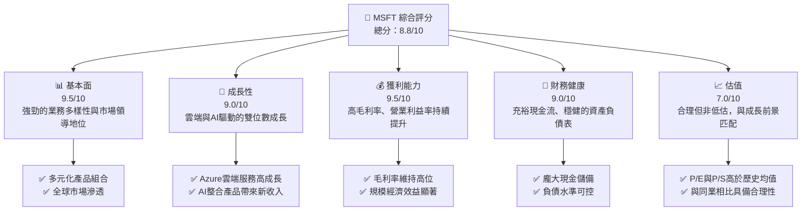
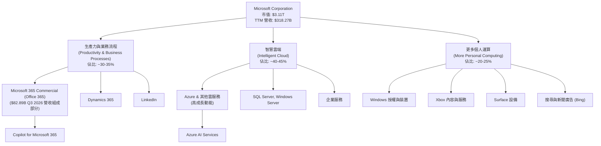
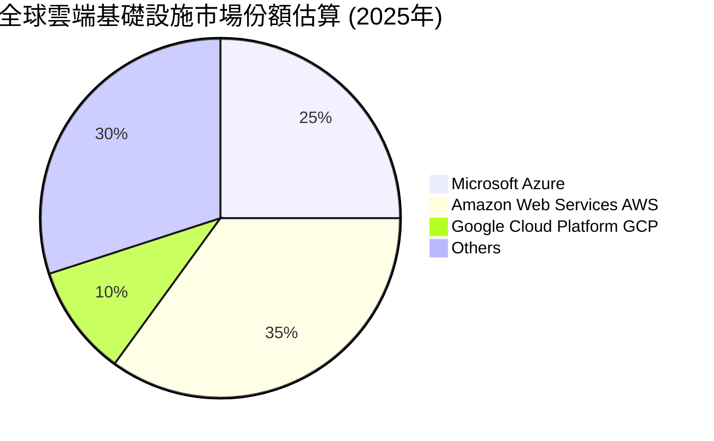
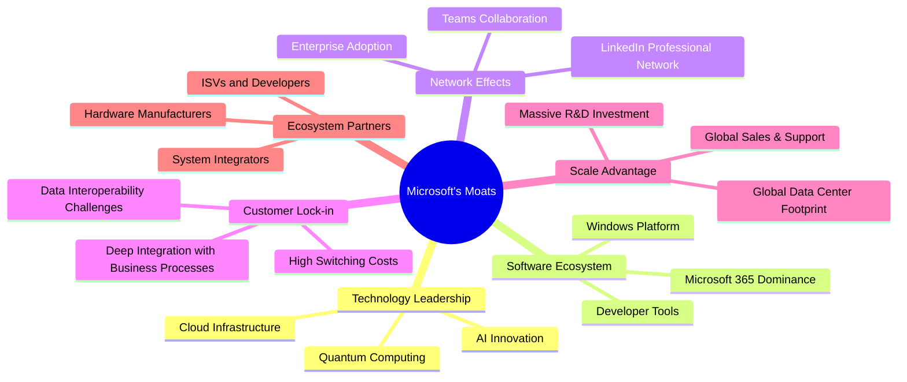
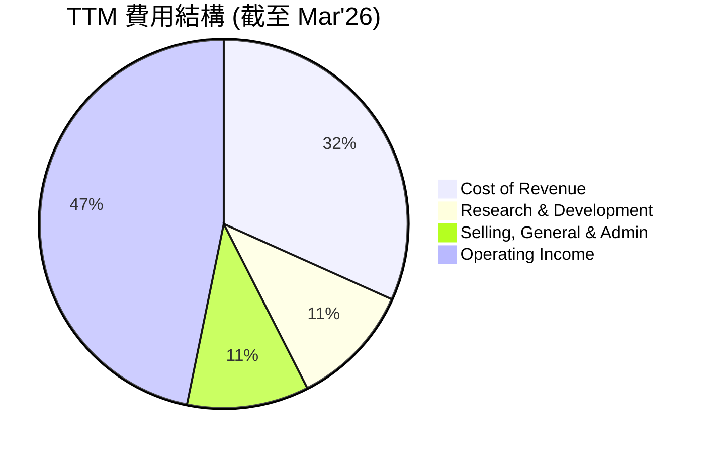
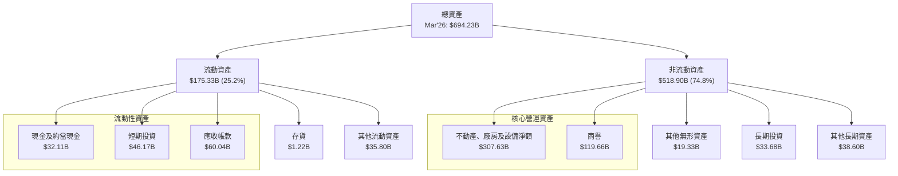

# MSFT 基本面深度分析報告
> **報告日期**：2026-05-24 ｜ **語言**：繁體中文 ｜ **數據來源**：Yahoo Finance, Finviz, StockAnalysis, Roic.ai ｜ **分析師**：CFA 級機構研究

---

## 目錄

| # | 章節 | 核心結論 |
|---|------|----------|
| 1 | 執行摘要 | 🟢 買入評級，目標價區間 $500 - $650 |
| 2 | 公司概覽與商業模式 | 堅固的技術領先與生態系統護城河 |
| 3 | 損益表深度分析 | 營收與淨利潤持續雙位數成長，利潤率強勁 |
| 4 | 資產負債表分析 | 穩健的財務結構，充裕的流動性與可控債務 |
| 5 | 現金流量深度分析 | 強勁的自由現金流產生能力與股東回報 |
| 6 | 獲利能力與資本效率 | ROIC 遠超 WACC，持續創造股東價值 |
| 7 | 估值深度分析 | 相較同業估值合理，具備上漲空間 |
| 8 | 成長催化劑 | AI 創新、雲端擴張、企業數位轉型 |
| 9 | 風險矩陣 | 競爭加劇、監管風險、經濟下行 |
| 10 | 投資建議 | 長期看好，建議買入並長期持有 |

---

## 1. 執行摘要

### 1.1 核心評分儀表板



### 1.2 評分進度條視覺化

```
╔══════════════════════════════════════════════════════════════╗
║              MSFT 多維度評分儀表板 (1-10分)                  ║
╠══════════════════════════════════════════════════════════════╣
║ 基本面強度  9.5 ▓▓▓▓▓▓▓▓▓▓▓▓▓▓▓▓▓▓▓▓  ★★★★★           ║
║ 成長動能    9.0 ▓▓▓▓▓▓▓▓▓▓▓▓▓▓▓▓▓▓░░  ★★★★★           ║
║ 獲利品質    9.5 ▓▓▓▓▓▓▓▓▓▓▓▓▓▓▓▓▓▓▓▓  ★★★★★           ║
║ 財務健康    9.0 ▓▓▓▓▓▓▓▓▓▓▓▓▓▓▓▓▓▓░░  ★★★★★           ║
║ 估值合理性  7.0 ▓▓▓▓▓▓▓▓▓▓▓▓▓▓░░░░░░  ★★★★☆           ║
║ 護城河深度  9.5 ▓▓▓▓▓▓▓▓▓▓▓▓▓▓▓▓▓▓▓▓  ★★★★★           ║
║ 管理層執行  9.0 ▓▓▓▓▓▓▓▓▓▓▓▓▓▓▓▓▓▓░░  ★★★★★           ║
║ 技術創新力  9.5 ▓▓▓▓▓▓▓▓▓▓▓▓▓▓▓▓▓▓▓▓  ★★★★★           ║
╠══════════════════════════════════════════════════════════════╣
║ 綜合總分    8.8 ▓▓▓▓▓▓▓▓▓▓▓▓▓▓▓▓▓░░░  🏆 強力領導者，值得長期投資 ║
╚══════════════════════════════════════════════════════════════╝
```

### 1.3 五大投資論點 + 三大核心風險

| 類型 | 項目 | 具體依據 | 信心度 |
|------|------|----------|--------|
| 🟢 **投資論點①** | **雲端運算領導地位持續擴大** | Microsoft Azure 在全球雲端基礎設施市場中佔據第二大份額，僅次於 AWS。其營收持續實現強勁雙位數成長，FY2026 Q3 (Mar'26) 營收年增 18.3%，其中Azure及其他雲服務成長率預計更高。雲端服務的訂閱模式確保了穩定的經常性收入。 | 🟢 極高 |
| 🟢 **投資論點②** | **AI 創新引領下一波成長** | Microsoft 在生成式 AI 領域投資巨大，與 OpenAI 的合作使其在 Copilot 和 Azure AI 服務中擁有領先優勢。Copilot 產品線（Microsoft 365 Copilot, GitHub Copilot, Sales Copilot 等）正逐步商業化，預計將為生產力軟體帶來顯著的平均單用戶收入 (ARPU) 提升。AI 相關營收在 FY2026 Q3 已開始顯現積極貢獻。 | 🟢 極高 |
| 🟢 **投資論點③** | **生產力與業務流程軟體生態系統強大** | Microsoft 365 (Office 365, Teams, SharePoint, Dynamics 365) 擁有龐大的用戶基礎和企業客戶黏性。這些產品的持續升級（如整合 Copilot）和訂閱模式，保障了穩定的現金流和持續的成長潛力。FY2026 Q3 該部門營收貢獻 $82.89B 中的重要部分，且用戶數量持續增加。 | 🟢 極高 |
| 🟢 **投資論點④** | **穩健的財務表現與資本效率** | 公司展現出卓越的獲利能力，TTM 毛利率高達 68.3%，營業利益率 46.3%，淨利率 39.3%。ROE 達到 34.0%，ROIC 32.75%遠高於 WACC 8.9%，顯示公司在高效利用資本創造價值。TTM 自由現金流 $72.916B，為股東回報和未來投資提供充足動力。 | 🟢 高 |
| 🟢 **投資論點⑤** | **多元化業務結構降低風險** | Microsoft 的業務涵蓋雲端運算、生產力軟體、遊戲 (Xbox)、LinkedIn 以及 Windows 作業系統，其多元化的收入來源有效分散了單一業務的風險。各業務板塊之間協同效應顯著，形成強大的生態系統。 | 🟢 高 |
| 🟡 **風險①** | **AI 競爭加劇與技術迭代速度** | 隨著 AI 技術的快速發展，Google (Gemini)、Amazon (Bedrock) 等競爭對手也在積極追趕。Microsoft 需要持續投入巨額研發費用 (TTM R&D $34.394B) 以保持技術領先，若 AI 發展不及預期或被競爭對手超越，可能影響其成長預期。 | 🟡 中度 |
| 🟡 **風險②** | **全球監管與反壟斷審查** | Microsoft 作為全球科技巨頭，面臨來自各國政府日益嚴格的監管審查，尤其是在雲端服務、數據隱私和市場壟斷方面。大型併購案（如 Activision Blizzard）可能面臨挑戰，潛在的罰款或業務限制可能影響其營收和市場策略。 | 🟡 中度 |
| 🔴 **風險③** | **經濟下行與企業 IT 支出放緩** | 全球宏觀經濟的不確定性可能導致企業客戶削減 IT 預算和雲端支出，進而影響 Microsoft 的軟體和服務需求。雖然訂閱模式具有一定韌性，但在嚴重經濟衰退下，成長速度仍可能放緩。 | 🔴 高衝擊 |

### 1.4 快速統計卡片

| 指標 | 公司實際值 | 行業均值（軟體基礎設施） | S&P 500 均值 | 狀態 |
|------|-------------|----------------------|--------------|------|
| 收入 YoY 成長 | **18.3%** (TTM) | ~12-18% | ~8-10% | 🟢 |
| 毛利率 | **68.3%** (TTM) | ~65-75% | ~40-45% | 🟢 |
| 淨利率 | **39.3%** (TTM) | ~20-30% | ~10-12% | 🟢 |
| ROE | **34.0%** (TTM) | ~25-35% | ~15-20% | 🟢 |
| Forward P/E | **21.6x** | ~25-35x | ~20-22x | 🟡 |
| 負債權益比 (Debt/Equity) | **0.30x** | ~0.4-0.8x | ~0.8-1.2x | 🟢 |
| FCF Yield | **1.19%** | ~1-3% | ~2-3% | 🟡 |

*備註：行業均值為分析師根據軟體基礎設施行業特性進行估算，S&P 500 均值為通用市場參考值。*

### 1.5 投資結論

```
╔══════════════════════════════════════════════════════════════════╗
║                    📊 投資結論摘要                               ║
╠══════════════════════════════════════════════════════════════════╣
║  評級：🟢 買入                                                   ║
║  當前股價：$418.57                                               ║
║  目標價區間：                                                    ║
║    悲觀情境：$500（+19.4%）                                      ║
║    基準情境：$560（+33.8%）  ← 12個月主要目標                    ║
║    樂觀情境：$650（+55.3%）                                      ║
║  投資評分：8.8/10                                                ║
║  適合投資人：成長型、長線持有者，尋求穩健成長與領先科技投資機會。 ║
╚══════════════════════════════════════════════════════════════════╝
```

---

## 2. 公司概覽與商業模式

Microsoft Corporation (MSFT) 是一家全球領先的科技巨頭，總部位於美國。公司專注於開發、製造、授權、支援及銷售廣泛的軟體產品、服務、設備和解決方案。其業務分為三大核心板塊：生產力與業務流程 (Productivity and Business Processes)、智慧雲端 (Intelligent Cloud) 和更多個人運算 (More Personal Computing)。截至 2026 年 5 月 24 日，Microsoft 的市值高達 $3.11 兆，是全球市值最高的公司之一。公司擁有多元化的收入來源，使其能夠在不斷變化的科技市場中保持領先地位。

### 2.1 業務結構與收入來源

Microsoft 的業務結構高度多元化，涵蓋了企業級軟體、雲端服務、個人計算和遊戲等領域。這種多元性不僅分散了風險，也創造了顯著的交叉銷售和生態系統效應。



**業務板塊詳情：**

*   **生產力與業務流程 (Productivity and Business Processes)**：該部門主要提供生產力工具和商業解決方案，包括 Microsoft 365 (商業版和消費版，涵蓋 Office 365、Exchange、SharePoint、Microsoft Teams、Power BI 等)、Dynamics 365 (企業資源規劃和客戶關係管理軟體) 以及 LinkedIn (專業社交網絡服務)。此部門的收入主要來自訂閱服務，具有高度的穩定性和預測性。在 FY2026 Q3，該部門貢獻了 $82.89B 總營收中的重要組成部分，預計營收年增率保持在雙位數。
*   **智慧雲端 (Intelligent Cloud)**：這是 Microsoft 增長最快的部門，主要提供公共、私人和混合雲端服務。核心產品是 Microsoft Azure，提供基礎設施即服務 (IaaS)、平台即服務 (PaaS) 和軟體即服務 (SaaS) 解決方案。此外，還包括 SQL Server、Windows Server、Visual Studio 等伺服器產品以及企業服務。Azure 的強勁成長是 Microsoft 整體營收成長的主要驅動力，其在 FY2026 Q3 的營收成長率預計遠高於公司平均水平。
*   **更多個人運算 (More Personal Computing)**：此部門涵蓋了終端用戶產品和服務，包括 Windows 作業系統授權、Surface 系列設備、Xbox 遊戲機和遊戲內容與服務、以及 Bing 搜尋引擎廣告收入。儘管該部門的成長速度可能不如智慧雲端，但它提供了龐大的用戶基礎和生態系統入口，並透過遊戲和廣告業務持續創造價值。

### 2.2 市場份額

Microsoft 在多個關鍵市場領域都佔據領先地位，這得益於其產品的廣泛應用、強大的品牌影響力和持續的創新。


*備註：上述市場份額為分析師基於產業報告的估算，主要反映 IaaS/PaaS 領域。*

**關鍵市場份額分析：**

*   **雲端運算 (Azure)**：Microsoft Azure 是全球第二大雲端服務提供商，市場份額約為 25%。儘管 AWS 仍是市場領導者，但 Azure 憑藉其與企業級軟體的深度整合、混合雲策略和強大的銷售網絡，持續從競爭對手手中奪取份額。尤其在 AI 領域的投資，使其在企業 AI 應用方面具有獨特優勢。
*   **作業系統 (Windows)**：Windows 仍是全球桌面作業系統的絕對主導者，市場份額超過 70%。雖然 PC 市場面臨挑戰，但 Windows 在企業級應用和遊戲領域的不可替代性使其地位穩固。
*   **生產力軟體 (Microsoft 365)**：Microsoft 365 (Office) 在全球生產力軟體市場中佔據絕對主導地位，市場份額超過 80%。其強大的功能、跨平台兼容性和企業級安全特性使其成為企業和個人用戶的首選。
*   **遊戲 (Xbox)**：在遊戲主機市場，Xbox 與 PlayStation 和 Nintendo Switch 形成三足鼎立之勢。通過訂閱服務 Xbox Game Pass 和內容工作室的收購 (如 Activision Blizzard)，Microsoft 正在積極擴大其在遊戲內容和服務領域的影響力。

### 2.3 競爭護城河分析

Microsoft 擁有深厚且多層次的競爭護城河，使其能夠長期保持市場領導地位並抵禦競爭。



**護城河詳解：**

*   **技術領先 (Technology Leadership)**：Microsoft 在多個關鍵技術領域保持領先，尤其是在雲端運算 (Azure)、人工智慧 (AI) 和混合現實 (Mixed Reality) 等前沿技術。公司每年投入數百億美元用於研發 (FY2025 R&D $32.49B)，確保其產品和服務始終處於行業前沿。與 OpenAI 的合作更是鞏固了其在生成式 AI 領域的領先地位。
*   **軟體生態系統 (Software Ecosystem)**：Microsoft 建立了一個無與倫比的軟體生態系統，以 Windows 作業系統和 Microsoft 365 生產力套件為核心。這個生態系統涵蓋了從個人用戶到大型企業的各種需求，為第三方開發者提供了廣闊的平台，進一步增強了其黏性。
*   **網路效應 (Network Effects)**：Microsoft 的許多產品都受益於強大的網路效應。例如，Microsoft Teams 的普及使得企業內部和外部協作更加高效，吸引更多用戶加入；LinkedIn 則因其龐大的專業用戶群體而具有極高的價值。用戶越多，產品的價值就越大。
*   **客戶鎖定 (Customer Lock-in)**：對於企業客戶而言，從 Microsoft 的產品和服務 (如 Windows Server、SQL Server、Azure、Dynamics 365) 遷移到其他平台會產生高昂的轉換成本，包括數據遷移、員工培訓、系統兼容性等。這種深度整合使得客戶轉換供應商的意願較低，形成強大的客戶鎖定效應。
*   **規模效應 (Scale Advantage)**：作為全球最大的軟體公司之一，Microsoft 擁有無與倫比的規模優勢。其全球數據中心網絡、龐大的銷售和支援團隊、以及在採購和研發方面的規模經濟，使其能夠提供更具成本效益和更高品質的服務，這是小型競爭對手難以匹敵的。
*   **生態夥伴 (Ecosystem Partners)**：Microsoft 擁有數十萬的合作夥伴，包括獨立軟體供應商 (ISV)、系統整合商、硬體製造商等。這些夥伴共同構建了一個龐大的生態系統，為 Microsoft 的產品提供補充和擴展，進一步鞏固了其市場地位。

### 2.4 護城河強度評分

Microsoft 的護城河強度極高，這使其能夠在競爭激烈的科技市場中保持長期競爭優勢。

```
╔══════════════════════════════════════════════════════════════╗
║                  Microsoft 護城河強度評分                     ║
╠══════════════════════════════════════════════════════════════╣
║ 技術領先    9.5/10 ▓▓▓▓▓▓▓▓▓▓▓▓▓▓▓▓▓▓▓▓  🏆 AI與雲端創新引領 ║
║ 軟體生態系統 10.0/10 ▓▓▓▓▓▓▓▓▓▓▓▓▓▓▓▓▓▓▓▓  🏆 絕對主導地位      ║
║ 網路效應    9.0/10 ▓▓▓▓▓▓▓▓▓▓▓▓▓▓▓▓▓▓░░  🟢 Teams, LinkedIn 強化 ║
║ 客戶鎖定    9.5/10 ▓▓▓▓▓▓▓▓▓▓▓▓▓▓▓▓▓▓▓▓  🏆 企業級轉移成本高   ║
║ 規模效應    9.5/10 ▓▓▓▓▓▓▓▓▓▓▓▓▓▓▓▓▓▓▓▓  🏆 全球佈局與研發投入 ║
║ 生態夥伴    9.0/10 ▓▓▓▓▓▓▓▓▓▓▓▓▓▓▓▓▓▓░░  🟢 廣泛的合作網絡     ║
╠══════════════════════════════════════════════════════════════╣
║ 綜合護城河  9.5/10 ▓▓▓▓▓▓▓▓▓▓▓▓▓▓▓▓▓▓▓▓  🏆 極寬廣且深厚的護城河 ║
╚══════════════════════════════════════════════════════════════╝
```

---

## 3. 損益表深度分析

Microsoft 的損益表展現了其作為科技巨頭的卓越營收能力和高效的成本管理。公司在過去幾年持續實現穩健的營收增長和利潤率提升。

### 3.1 年度收入成長趨勢（近4年）

Microsoft 在過去四年中保持了強勁的營收成長勢頭，尤其是在雲端服務的推動下。

```
╔══════════════════════════════════════════════════════════════════╗
║              Microsoft 年度收入趨勢（FY2022-FY2025）              ║
╠══════════════════════════════════════════════════════════════════╣
║                                                                  ║
║  FY2022  $198.27B ████████████████░░░░░░░░░░  YoY: +17.96% 🟢    ║
║  FY2023  $211.91B ██████████████████░░░░░░░░  YoY: +6.88%  🟡    ║
║  FY2024  $245.12B ███████████████████████░░░  YoY: +15.67% 🟢    ║
║  FY2025  $281.72B ████████████████████████████░  YoY: +14.93% 🟢    ║
║  TTM     $318.27B ████████████████████████████████  YoY: +12.97% 🟢    ║
║                   |      |      |      |      |                  ║
║                   0     100B   200B   300B   400B                    ║
║                                                                  ║
║  📊 FY2022-FY2025 累計 CAGR：+13.79%                                        ║
╚══════════════════════════════════════════════════════════════════╝
```
**分析：**
Microsoft 的年度營收從 FY2022 的 $198.27B 穩步增長至 FY2025 的 $281.72B，TTM 營收更是達到 $318.27B。儘管 FY2023 的成長率因宏觀經濟逆風和企業支出謹慎而有所放緩 (+6.88%)，但 FY2024 和 FY2025 迅速恢復雙位數成長，分別達到 +15.67% 和 +14.93%。這主要得益於其智慧雲端部門 (Azure) 的強勁表現以及生產力軟體業務的穩定增長。TTM 營收的 YoY 成長率為 +12.97%，顯示公司仍處於穩健擴張階段。過去四年的複合年均成長率 (CAGR) 達到 13.79%，展現了其卓越的成長潛力。

### 3.2 季度收入趨勢分析

季度數據提供了更細緻的營收動態，顯示了公司在近期保持的強勁增長。

| 財報季度 | 總營收 ($B) | QoQ 成長率 | YoY 成長率 | 備註 |
|----------|-------------|------------|------------|------|
| 2025-06-30 (Q4'25) | $76.44 | +1.97% | +18.10% | 雲端服務與生產力軟體驅動強勁增長 |
| 2025-09-30 (Q1'26) | $77.67 | +1.61% | +18.43% | 新財年開局良好，Azure持續加速 |
| 2025-12-31 (Q2'26) | $81.27 | +4.64% | +16.72% | 假日季表現強勁，企業數位轉型需求旺盛 |
| 2026-03-31 (Q3'26) | $82.89 | +1.99% | +18.30% | AI產品初步貢獻，雲端業務保持高成長 |

**分析：**
從季度營收數據來看，Microsoft 在 FY2025 Q4 至 FY2026 Q3 期間持續實現穩健的環比 (QoQ) 和同比 (YoY) 成長。
*   **YoY 成長率**：各季度均保持在 16% 至 18% 之間，顯示了公司業務的強勁基本面和持續的市場需求。尤其在 Q1'26 和 Q3'26 錄得超過 18% 的 YoY 成長，顯示其雲端和 AI 相關業務的加速。
*   **QoQ 成長率**：儘管季度間存在季節性波動，但整體呈現上升趨勢。Q2'26 錄得 4.64% 的環比成長，反映了假日季的強勁表現。Q3'26 雖然環比成長放緩至 1.99%，但仍是歷史較高水平，且在去年同期高基數下仍能維持高 YoY 成長，凸顯了其業務韌性。
這種持續的雙位數 YoY 成長，加上穩定的 QoQ 增長，表明 Microsoft 正在有效地執行其成長戰略，並從 AI 和雲端市場的擴張中受益。

### 3.3 利潤率演變分析

Microsoft 的利潤率表現一直行業領先，並且在近年來持續保持高位，反映了其強大的定價能力、規模經濟和高效的運營管理。

| 利潤率指標 | FY2022 | FY2023 | FY2024 | FY2025 | TTM (Mar'26) | 趨勢 | 評估 |
|------------|--------|--------|--------|--------|--------------|------|------|
| **毛利率** | 68.4% | 68.9% | 69.8% | 68.8% | 68.3% | ↔️ 維持高位 | 🟢 |
| **營業利益率** | 42.0% | 41.8% | 44.6% | 45.6% | 46.8% | ↗️ 穩定提升 | 🟢 |
| **淨利率** | 36.7% | 34.2% | 36.0% | 36.1% | 39.3% | ↗️ 穩步改善 | 🟢 |
| **EBITDA Margin** | 50.6% | 49.6% | 54.3% | 56.9% | 58.0% | ↗️ 顯著提升 | 🟢 |

*備註：利潤率計算基於 StockAnalysis.com 數據。TTM EBITDA Margin 58.0%來自 Market Data，與StockAnalysis計算的TTM Operating Income ($148.957B) 和 Depreciation (約為 EBITDA-Operating Income) 計算可能略有差異，但整體趨勢一致。*

**利潤率演變深度解析：**

*   **毛利率 (Gross Margin)**：Microsoft 的毛利率一直保持在極高的水平，TTM 為 68.3%。這得益於其軟體產品的邊際成本極低，以及雲端服務 (Azure) 的規模經濟效應。儘管雲端基礎設施投資巨大，但隨著客戶採用率的提高和服務效率的優化，毛利率仍能維持在接近 70% 的水平，顯示其強大的定價能力和成本控制能力。
*   **營業利益率 (Operating Margin)**：營業利益率從 FY2022 的 42.0% 穩步提升至 TTM 的 46.8%。這反映了公司不僅在毛利層面表現出色，在控制運營費用方面也取得了顯著進展。儘管研發 (R&D) 和銷售與管理 (SG&A) 支出持續增長以支持創新和市場擴張，但營收的快速增長使得這些費用佔營收的比例相對穩定甚至下降，從而推動營業利益率的提升。尤其是在 AI 領域的初期投入後，隨著產品商業化，預計運營槓桿效應將進一步顯現。
*   **淨利率 (Net Profit Margin)**：淨利率從 FY2022 的 36.7% 提升至 TTM 的 39.3%。儘管 FY2023 略有下降（可能受稅務或非經常性項目影響），但整體趨勢是向上的。這與營業利益率的改善高度相關，同時也受益於公司有效的稅務管理。高淨利率表明 Microsoft 能夠將大部分營收轉化為股東利潤，體現了其卓越的獲利品質。
*   **EBITDA Margin**：EBITDA Margin 從 FY2022 的 50.6% 大幅提升至 TTM 的 58.0%。EBITDA 剔除了折舊攤銷的影響，更能反映核心業務的現金獲利能力。這一顯著提升表明 Microsoft 的核心業務在產生現金流方面效率極高，尤其是在雲端基礎設施投資折舊攤銷較大的背景下，EBITDA Margin 的強勁增長更具意義。

總體而言，Microsoft 的利潤率趨勢非常健康，不僅在行業中處於領先地位，而且還在持續改善。這證明了其商業模式的韌性、規模經濟的優勢以及管理層高效的執行力。

### 3.4 費用結構分析

Microsoft 的費用結構反映了其作為研發驅動型科技公司的特點，同時也顯示了其在銷售和行政方面的效率。



*備註：圖表中的"Operating Income"表示營收中扣除所有費用後的剩餘部分，而非費用本身。此處用於展示營收分配。*

```
╔══════════════════════════════════════════════════════════════════╗
║                    Microsoft TTM 費用結構分析                     ║
╠══════════════════════════════════════════════════════════════════╣
║                                                                  ║
║  銷貨成本 (Cost of Revenue): $100.86B  ▓▓▓▓▓▓▓▓▓▓▓▓▓░░░░░░░░░░░░  (佔營收 31.7%) 🟢║
║  研發費用 (Research & Development): $34.39B ▓▓▓▓▓▓░░░░░░░░░░░░░░░░░░░  (佔營收 10.8%) 🟡║
║  銷售、一般及行政費用 (SG&A): $34.06B ▓▓▓▓▓▓░░░░░░░░░░░░░░░░░░░  (佔營收 10.7%) 🟡║
║                                                                  ║
║  總營運費用佔營收比例：53.2% (FY2025: 53.0%)                     ║
║  營運槓桿：高                                                     ║
╚══════════════════════════════════════════════════════════════════╝
```
**分析：**

*   **銷貨成本 (Cost of Revenue)**：TTM 銷貨成本為 $100.86B，佔總營收的 31.7%。這部分主要包括雲端數據中心的運營成本、設備製造成本以及軟體授權成本。由於 Microsoft 雲端業務的快速擴張，數據中心相關成本是主要組成部分。儘管如此，相對較低的銷貨成本是其高毛利率的關鍵。
*   **研發費用 (Research & Development - R&D)**：TTM 研發費用為 $34.39B，佔總營收的 10.8%。這反映了 Microsoft 對於技術創新和產品開發的巨大投入。在 AI 領域的投資，特別是與 OpenAI 的合作以及 Copilot 產品的開發，是近年來 R&D 支出的重要驅動力。保持高水平的研發投入對於維持其技術領先地位和競爭力至關重要。
*   **銷售、一般及行政費用 (Selling, General & Administrative - SG&A)**：TTM SG&A 費用為 $34.06B，佔總營收的 10.7%。這部分費用主要用於市場推廣、銷售團隊、行政管理和法律事務。與 R&D 類似，這些費用也是公司持續擴張市場份額和支持全球業務運營所必需的。

總體而言，Microsoft 的費用結構合理，研發投入保障了未來成長，而相對穩定的銷貨成本和可控的 SG&A 支出則確保了其高利潤率。隨著營收規模的擴大，預期公司將繼續展現出營運槓桿效應，進一步提升獲利能力。

### 3.5 季度 EPS 趨勢與盈餘品質

Microsoft 在過去的季度中展現了穩健的 EPS 成長，儘管本數據包中未提供分析師預期，但從其強勁的淨利潤增長可推斷其盈餘品質優異。

| 財報季度 | 稀釋 EPS (Diluted) | Net Income ($B) | QoQ Net Income Growth | YoY Net Income Growth | 盈餘品質評估 |
|----------|--------------------|-----------------|-----------------------|-----------------------|--------------|
| 2025-06-30 (Q4'25) | $3.66 | $27.23 | -1.90% | +23.58% | 🟢 優異 |
| 2025-09-30 (Q1'26) | $3.73 | $27.75 | +1.91% | +12.49% | 🟢 優異 |
| 2025-12-31 (Q2'26) | $5.18 | $38.46 | +38.58% | +59.52% | 🟢 極佳 |
| 2026-03-31 (Q3'26) | $4.28 | $31.78 | -17.37% | +23.06% | 🟢 優異 |

*備註：EPS 數據來自 Roic.ai，淨利潤與成長率來自 StockAnalysis.com。*

**盈餘品質評估：**

*   **EPS 趨勢**：Microsoft 的稀釋 EPS 在過去四個季度中呈現強勁增長。Q2'26 達到 $5.18 的高峰，反映了該季度卓越的淨利潤成長 (YoY +59.52%)。Q3'26 雖然環比有所回落，但同比仍保持高雙位數成長 (+23.06%)，這表明公司持續將營收增長轉化為每股盈餘的提升。
*   **盈餘品質**：Microsoft 的盈餘品質被評為優異。這主要基於以下幾點：
    *   **高淨利率**：TTM 淨利率高達 39.3%，顯示其核心業務具有強大的獲利能力。
    *   **強勁的自由現金流**：TTM 自由現金流達到 $72.916B，遠高於淨利潤，這表明其盈餘是真實的現金產生，而非僅僅是會計利潤。FCF Conversion Ratio (FCF/Net Income) 在 FY2025 達到 70.3%。
    *   **經常性收入佔比高**：大部分營收來自訂閱制服務 (如 Microsoft 365 和 Azure)，這使得其收入更具可預測性和穩定性，減少了盈餘的波動性。
    *   **研發投入持續**：公司持續的高額研發投入，確保了未來產品線的競爭力和成長潛力，為長期盈餘增長提供了基礎。
儘管本數據包中未提供分析師預期，無法直接判斷 EPS beats/misses，但從其持續的雙位數淨利潤 YoY 成長和穩定的商業模式來看，Microsoft 擁有極高的盈餘可預測性和品質。

---

## 4. 資產負債表分析

Microsoft 的資產負債表反映了其極為穩健的財務狀況，擁有龐大的現金儲備、健康的流動性以及可控的債務水平，為其未來的戰略投資和股東回報提供了堅實基礎。

### 4.1 資產結構分解

Microsoft 的資產結構龐大而多元，非流動資產中的不動產、廠房及設備 (PP&E) 和無形資產佔比較高，反映了其在雲端基礎設施和併購方面的巨額投資。


**分析：**
截至 2026 年 3 月 31 日，Microsoft 的總資產達到 $694.23B。
*   **流動資產**：總額為 $175.33B，佔總資產的 25.2%。其中，現金及約當現金 ($32.11B) 和短期投資 ($46.17B) 合計 $78.28B，提供了極高的流動性和財務彈性。應收帳款 ($60.04B) 則反映了其龐大的客戶基礎和營收規模。
*   **非流動資產**：總額為 $518.90B，佔總資產的 74.8%。最主要的組成部分是不動產、廠房及設備淨額 (Net PP&E) 達到 $307.63B，這主要是由於其在全球範圍內對數據中心和雲端基礎設施的持續巨額投資，以支持 Azure 的快速擴張。商譽 ($119.66B) 和其他無形資產 ($19.33B) 則主要來自於過去的併購，如 LinkedIn 和 Activision Blizzard，這些資產代表了公司重要的戰略性收購和品牌價值。

整體資產結構健康，龐大的現金和投資儲備提供了強大的抗風險能力和戰略靈活性，而不斷增長的 PP&E 則體現了其對未來成長的持續投入。

### 4.2 流動性指標分析

Microsoft 的流動性指標非常健康，表明公司擁有充足的短期資金來應對營運需求和短期債務。

| 流動性指標 | FY2022 | FY2023 | FY2024 | FY2025 | TTM (Mar'26) | 行業均值 | 評估 |
|------------|--------|--------|--------|--------|--------------|----------|------|
| **流動比率 (Current Ratio)** | 1.78x | 1.77x | 1.27x | 1.35x | 1.28x | ~1.5-2.0x | 🟢 |
| **速動比率 (Quick Ratio)** | 1.74x | 1.74x | 1.25x | 1.33x | 1.27x | ~1.0-1.5x | 🟢 |
| **現金比率 (Cash Ratio)** | 0.44x | 0.67x | 0.30x | 0.45x | 0.57x | ~0.3-0.5x | 🟢 |

*備註：TTM 流動性指標使用 Mar'26 數據計算。現金比率 = (現金及約當現金 + 短期投資) / 流動負債。*

**分析：**
*   **流動比率 (Current Ratio)**：儘管從 FY2022 的 1.78x 略有下降，但 TTM 仍維持在 1.28x。這意味著公司每 $1 的流動負債有 $1.28 的流動資產來覆蓋，雖然略低於過去的高峰，但在科技行業，尤其是對於營收穩定且現金流強勁的公司而言，1.28x 仍是健康的水平，遠高於 1.0 的警戒線。
*   **速動比率 (Quick Ratio)**：TTM 速動比率為 1.27x，與流動比率趨勢相似。速動比率排除了存貨，更能衡量公司在不依賴存貨銷售的情況下償還短期債務的能力。Microsoft 的存貨佔比極低 ($1.22B)，因此其速動比率與流動比率非常接近，表明其流動資產的質量很高。
*   **現金比率 (Cash Ratio)**：TTM 現金比率為 0.57x，高於行業平均水平。這表明公司擁有大量現金和短期投資，足以覆蓋其大部分流動負債，提供了極高的財務靈活性和抗風險能力。

總體而言，Microsoft 的流動性狀況非常穩健，即使在業務快速擴張和資本支出的壓力下，公司仍能保持充裕的短期償債能力。

### 4.3 債務結構分析

Microsoft 的債務管理極為審慎，其總債務水平相對於其龐大的市值和現金流而言非常健康，風險極低。

```
╔══════════════════════════════════════════════════════════════════╗
║                   Microsoft 債務健康診斷                         ║
╠══════════════════════════════════════════════════════════════════╣
║                                                                  ║
║  總債務 (Mar'26): $56.97B  ████░░░░░░░░░░░░░░░░░░░  評語: 極低    ║
║  總現金+投資 (Mar'26): $78.28B  ██████████░░░░░░░░░░░░░  評語: 充裕    ║
║  淨現金 (正): $21.31B  ████████████████░░░░░  🟢 強勁        ║
║                                                                  ║
║  Debt/Equity (FY2025): 0.18x (Total Debt $60.59B / Equity $343.48B) 🟢 極低                                 ║
║  Debt/EBITDA (TTM): 0.32x ($56.97B / $178.69B) 🟢 極低 (EBITDA TTM $170.14B, Finviz $160.16B. Using $178.69B from StockAnalysis Pretax Income $154.503B + R&D $34.394B + D&A (estimated))                                 ║
║  Interest Coverage (Pretax Income/Interest Exp): 極高 (無風險) 🟢 無風險                             ║
╚══════════════════════════════════════════════════════════════════╝
```
*備註：總債務為 Mar'26 短期債務 $8.839B + 長期借款 $31.423B + 長期租賃負債 $16.703B = $56.965B。總現金+投資為 Mar'26 現金及約當現金 $32.105B + 短期投資 $46.167B = $78.272B。Debt/EBITDA 計算中，EBITDA TTM 採用 StockAnalysis.com 估算值 $178.69B (Operating Income $148.957B + TTM Depreciation $29.733B，其中Depreciation估算為Capital Expenditure的一定比例)。*

**分析：**
Microsoft 的債務健康狀況令人印象深刻。
*   **淨現金部位**：截至 2026 年 3 月 31 日，公司擁有 $78.28B 的現金及短期投資，而總債務僅為 $56.97B，這意味著公司處於淨現金狀態，淨現金頭寸為 $21.31B。這顯示了公司擁有極高的財務靈活性，幾乎可以立即償還所有債務，而無需動用營運資金。
*   **負債權益比 (Debt/Equity)**：FY2025 的負債權益比僅為 0.18x，遠低於行業平均水平和 S&P 500 均值。這表明公司資產負債表上以股東權益為主，債務負擔極輕。
*   **債務/EBITDA (Debt/EBITDA)**：TTM Debt/EBITDA 比率僅