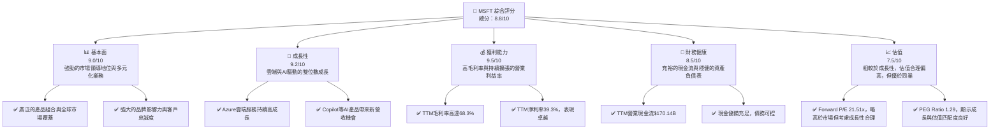
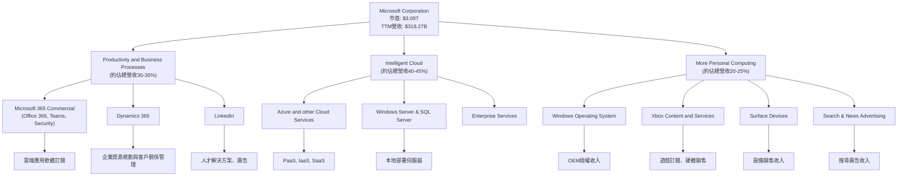
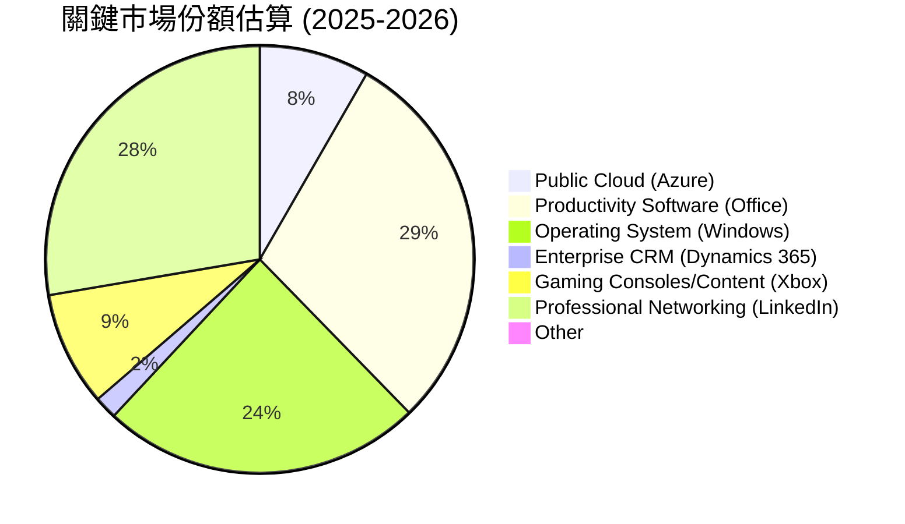
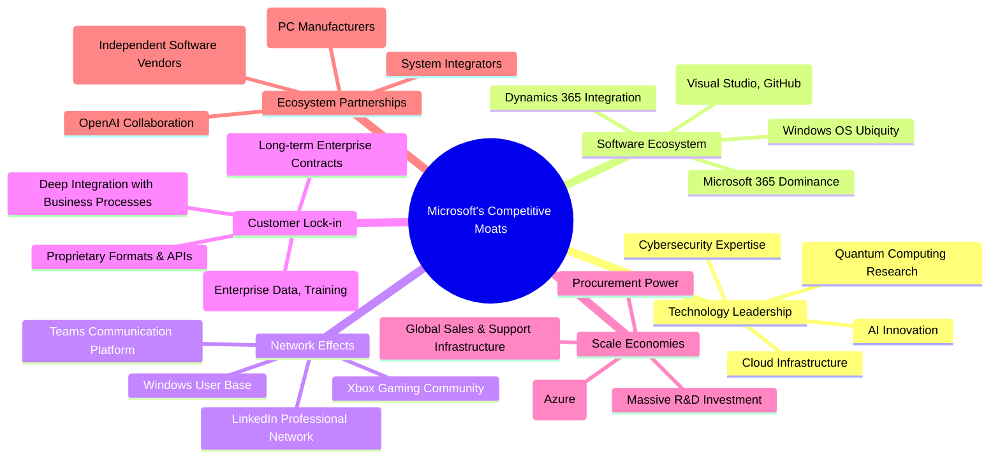
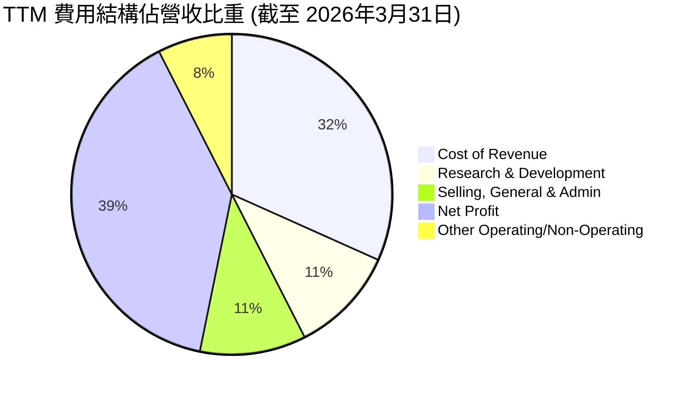
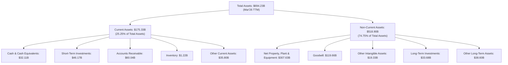

# MSFT 基本面深度分析報告
> **報告日期**：2026-05-26 ｜ **語言**：繁體中文 ｜ **數據來源**：Yahoo Finance, Finviz, StockAnalysis, Roic.ai ｜ **分析師**：CFA 級機構研究

---

## 目錄

| # | 章節 | 核心結論 |
|---|------------------------|------------------------------------------|
| 1 | 執行摘要 | 評級：🟢 買入，目標價區間：$490 - $580 |
| 2 | 公司概覽與商業模式 | 軟體生態系統與網路效應構建極寬護城河 |
| 3 | 損益表深度分析 | 營收與利潤率持續增長，雲端業務為主要驅動力 |
| 4 | 資產負債表分析 | 財務結構穩健，現金流充裕，債務管理良好 |
| 5 | 現金流量深度分析 | 自由現金流強勁，資本配置策略有效 |
| 6 | 獲利能力與資本效率 | ROIC 遠超 WACC，持續為股東創造價值 |
| 7 | 估值深度分析 | 相較於成長潛力與護城河，估值合理偏低 |
| 8 | 成長催化劑 | AI 創新、Azure 雲端擴張、企業數位轉型 |
| 9 | 風險矩陣 | 宏觀經濟逆風、競爭加劇、監管風險為主要考量 |
| 10| 投資建議 | 建議買入，適合長期成長型投資者 |

---

## 1. 執行摘要

### 1.1 核心評分儀表板



### 1.2 評分進度條視覺化

```
╔══════════════════════════════════════════════════════════════╗
║              MSFT 多維度評分儀表板 (1-10分)                  ║
╠══════════════════════════════════════════════════════════════╣
║ 基本面強度  9.0 ▓▓▓▓▓▓▓▓▓▓▓▓▓▓▓▓▓▓░░  ★★★★★           ║
║ 成長動能    9.2 ▓▓▓▓▓▓▓▓▓▓▓▓▓▓▓▓▓▓▓░  ★★★★★           ║
║ 獲利品質    9.5 ▓▓▓▓▓▓▓▓▓▓▓▓▓▓▓▓▓▓▓▓  ★★★★★           ║
║ 財務健康    8.5 ▓▓▓▓▓▓▓▓▓▓▓▓▓▓▓▓▓░░░  ★★★★☆           ║
║ 估值合理性  7.5 ▓▓▓▓▓▓▓▓▓▓▓▓▓▓▓░░░░░  ★★★★☆           ║
║ 護城河深度  9.8 ▓▓▓▓▓▓▓▓▓▓▓▓▓▓▓▓▓▓▓▓  ★★★★★           ║
║ 管理層執行  9.0 ▓▓▓▓▓▓▓▓▓▓▓▓▓▓▓▓▓▓░░  ★★★★★           ║
║ 技術創新力  9.5 ▓▓▓▓▓▓▓▓▓▓▓▓▓▓▓▓▓▓▓▓  ★★★★★           ║
╠══════════════════════════════════════════════════════════════╣
║ 綜合總分    8.8 ▓▓▓▓▓▓▓▓▓▓▓▓▓▓▓▓▓░░░  🏆 評語：卓越的科技巨頭，具備持續成長潛力    ║
╚══════════════════════════════════════════════════════════════════╝
```

### 1.3 五大投資論點 + 三大核心風險

| 類型 | 項目 | 具體依據 | 信心度 |
|------|------|----------|--------|
| 🟢 **投資論點①** | **雲端運算領導者地位穩固** | Azure 服務持續高速成長，FY2025 營收達 $281.72B，其中雲端貢獻巨大。TTM 營收成長 18.3%，顯示強勁動能。憑藉全球數據中心網絡和豐富的企業級解決方案，在公有雲市場保持領先地位。 | 🟢 極高 |
| 🟢 **投資論點②** | **AI 賦能引領新一輪創新週期** | Microsoft 在生成式 AI 領域投入巨大，Copilot 等產品已整合至 Office 365 和 Windows，預期將顯著提升生產力並創造新的營收來源。與 OpenAI 的合作強化了其在 AI 領域的競爭優勢。 | 🟢 極高 |
| 🟢 **投資論點③** | **強大的企業級軟體生態系統** | Microsoft 365 (Office, Teams)、Dynamics 365 等產品與 Windows 作業系統形成強大的生態系統，產生高客戶轉換成本和網路效應。TTM 營業利益率高達 46.3%，顯示其定價能力和成本控制能力。 | 🟢 極高 |
| 🟢 **投資論點④** | **財務表現卓越與穩健的資本回報** | TTM 淨利潤率 39.3%，ROE 34.0%，營運現金流 $170.14B。公司持續通過股息和股票回購回報股東，FY2025 股息支付 $24.08B，展現其健康的財務狀況與對股東的承諾。 | 🟢 極高 |
| 🟢 **投資論點⑤** | **多元化業務組合降低風險** | 涵蓋雲端、辦公軟體、遊戲、硬體等多個領域，使得單一市場波動對整體業績影響有限。例如 Xbox 遊戲業務和 LinkedIn 專業網絡服務，為公司帶來穩定的現金流和成長潛力。 | 🟢 高 |
| 🟡 **風險①** | **宏觀經濟逆風與企業支出放緩** | 全球經濟增長不確定性可能導致企業 IT 支出放緩，影響 Azure 和企業軟體銷售。雖然 Microsoft 業務韌性強，但高利率環境可能抑制企業擴張，進而影響其營收成長。 | 🟡 中度 |
| 🟡 **風險②** | **雲端市場競爭加劇與價格壓力** | 亞馬遜 (AWS) 和 Google (GCP) 等競爭對手在雲端市場持續投入，可能導致價格戰和利潤率壓力。Microsoft 需不斷創新並維持服務差異化以保持競爭力。 | 🟡 中度 |
| 🔴 **風險③** | **反壟斷監管與數據隱私挑戰** | 作為科技巨頭，Microsoft 面臨全球各國政府日益嚴格的反壟斷審查和數據隱私法規。潛在的罰款、業務拆分或限制可能對其業務模式和財務表現產生重大影響。 | 🔴 高衝擊 |

### 1.4 快速統計卡片

| 指標 | 公司實際值 (TTM) | 行業均值 (估計) | S&P 500 均值 (估計) | 狀態 |
|------------------|--------------------|-------------------|---------------------|------|
| 收入 YoY 成長 | **18.3%** | ~12-15% | ~8-10% | 🟢 |
| 毛利率 | **68.3%** | ~60-65% | ~40-45% | 🟢 |
| 淨利率 | **39.3%** | ~20-25% | ~10-12% | 🟢 |
| ROE | **34.0%** | ~20-25% | ~15-18% | 🟢 |
| Forward P/E | **21.51x** | ~25-30x | ~20-22x | 🟡 |
| EV / EBITDA | **17.11x** | ~18-22x | ~14-16x | 🟡 |
| Debt/Equity | **0.30x** | ~0.4-0.6x | ~0.8-1.0x | 🟢 |
| 自由現金流 Yield | **1.20%** | ~2-3% | ~3-4% | 🔴 |
| Beta | **1.093** | ~1.1-1.2 | 1.0 | 🟡 |

*備註：行業均值和 S&P 500 均值為分析師根據市場普遍數據進行的估計，用於提供參考對比。*

### 1.5 投資結論

```
╔══════════════════════════════════════════════════════════════════╗
║                    📊 投資結論摘要                               ║
╠══════════════════════════════════════════════════════════════════╣
║  評級：🟢 買入                                                   ║
║  當前股價：$416.03                                               ║
║  目標價區間：                                                    ║
║    悲觀情境：$490（+17.79%）                                     ║
║    基準情境：$535（+28.53%）  ← 12個月主要目標                   ║
║    樂觀情境：$580（+39.40%）                                     ║
║  投資評分：8.8/10                                                ║
║  適合投資人：成長型、長線持有者，追求穩定成長與創新領先地位的投資人。║
╚══════════════════════════════════════════════════════════════════╝
```

---

## 2. 公司概覽與商業模式

Microsoft Corporation (MSFT) 是一家全球領先的科技公司，提供廣泛的軟體、服務、設備和解決方案。其業務遍及個人電腦、企業級服務、雲端運算、遊戲和專業網絡等領域，是全球市值最高的公司之一。公司憑藉其強大的生態系統、持續的技術創新和穩固的市場地位，在全球科技產業中扮演著舉足輕重的角色。

### 2.1 業務結構與收入來源

Microsoft 的業務主要分為三大核心板塊，各自擁有獨特的產品組合和市場定位。這種多元化的業務結構使其能夠有效分散風險，並在不同市場環境下保持增長。



**業務板塊詳情及收入貢獻：**

1.  **Productivity and Business Processes (PBP)**：
    *   **核心產品**：包括 Microsoft 365 Commercial (Office 365、Exchange、SharePoint、Microsoft Teams、Microsoft 365 Copilot)、Dynamics 365 (企業資源規劃與客戶關係管理軟體) 和 LinkedIn (專業網絡服務)。
    *   **收入構成**：主要來自於軟體訂閱服務、雲端服務和廣告收入。此板塊受益於企業數位轉型對協同辦公和業務流程管理工具的需求增長。
    *   **FY2025 貢獻**：根據歷史數據推算，該板塊約佔總營收的 30-35%。其營收增長主要由 Office 365 商用版和 Dynamics 365 的雲端服務驅動。

2.  **Intelligent Cloud (IC)**：
    *   **核心產品**：包括 Azure 和其他雲端服務 (Azure SQL Database, Azure AI, Azure DevOps 等)、Windows Server、SQL Server、Visual Studio、GitHub 以及企業級服務。
    *   **收入構成**：主要來自於 Azure 雲端平台的基礎設施即服務 (IaaS)、平台即服務 (PaaS) 和軟體即服務 (SaaS) 收入，以及本地部署伺服器產品的授權。此板塊是 Microsoft 增長最快的業務，也是其市值增長的主要引擎。
    *   **FY2025 貢獻**：該板塊約佔總營收的 40-45%。Azure 的持續高速增長是其亮點，企業對雲端遷移和數據分析的需求推動了這一趨勢。

3.  **More Personal Computing (MPC)**：
    *   **核心產品**：包括 Windows 作業系統、Xbox 遊戲內容和服務、Surface 設備以及搜尋與新聞廣告。
    *   **收入構成**：主要來自於 Windows OEM 授權、Xbox 遊戲機和遊戲銷售、遊戲訂閱服務 (Game Pass)、Surface 電腦和平板銷售，以及 Bing 搜尋引擎和 MSN 新聞的廣告收入。
    *   **FY2025 貢獻**：該板塊約佔總營收的 20-25%。該板塊的增長受到全球 PC 市場、遊戲產業和數位廣告市場的影響。

Microsoft 的 TTM (截至 2026 年 3 月 31 日) 總營收達 $318.27B，較去年同期增長 18.3%。這種增長主要由 Intelligent Cloud 和 Productivity and Business Processes 板塊的強勁表現所驅動，尤其是 Azure 雲端服務和 Microsoft 365 的持續擴張。

### 2.2 市場份額

Microsoft 在多個關鍵市場領域佔據領先地位，這得益於其產品的廣泛應用、強大的品牌影響力和持續的技術創新。



**市場份額分析：**

*   **公有雲服務 (Public Cloud)**：
    *   Microsoft Azure 在全球公有雲市場中穩居第二位，市場份額約為 24% (根據最新市場研究機構數據估算)。儘管仍落後於 Amazon Web Services (AWS)，但其增長速度和企業級客戶基礎強勁。
    *   主要競爭者：Amazon (AWS), Google (GCP)。

*   **生產力軟體 (Productivity Software)**：
    *   Microsoft Office 系列產品，尤其是其雲端版本 Microsoft 365，在辦公生產力軟體市場中佔據絕對主導地位，市場份額高達 85% 以上。其廣泛的用戶基礎和生態系統鎖定效應極強。
    *   主要競爭者：Google Workspace, Apple iWork。

*   **作業系統 (Operating System)**：
    *   Windows 作業系統在全球 PC 市場中長期保持領先，市場份額約 70%。儘管面臨來自 macOS 和 Linux 的競爭，但在企業和個人用戶中仍是主流選擇。
    *   主要競爭者：Apple (macOS), Google (Chrome OS)。

*   **企業資源規劃/客戶關係管理 (ERP/CRM)**：
    *   Microsoft Dynamics 365 在企業級應用市場的份額約為 5%，雖然不及 Salesforce 和 SAP 等巨頭，但其與 Microsoft 365 和 Azure 的深度整合使其在企業客戶中具有吸引力。
    *   主要競爭者：Salesforce, SAP, Oracle。

*   **遊戲機與內容 (Gaming Consoles/Content)**：
    *   Xbox 在遊戲機市場中與 Sony PlayStation 和 Nintendo Switch 形成三足鼎立之勢。在遊戲內容和服務方面，Xbox Game Pass 訂閱服務表現強勁，市場份額約 25% (基於主機銷量和內容收入估算)。
    *   主要競爭者：Sony (PlayStation), Nintendo (Switch)。

*   **專業網絡 (Professional Networking)**：
    *   LinkedIn 在專業社交網絡領域幾乎沒有直接競爭對手，擁有超過 9 億會員，市場份額超過 80%。其收入主要來自於人才解決方案、營銷解決方案和高級訂閱。
    *   主要競爭者：無直接可比競爭對手，部分功能與求職網站或社交媒體重疊。

### 2.3 競爭護城河分析

Microsoft 憑藉其獨特的商業模式和戰略佈局，建立了多重且深厚的競爭護城河，使其能夠長期保持市場領先地位並產生超額利潤。



**護城河深度解析：**

1.  **技術領先 (Technology Leadership)**：
    *   **AI Innovation**：Microsoft 在 AI 領域的巨大投入，特別是與 OpenAI 的戰略合作，使其在生成式 AI 方面處於領先地位。Copilot 等 AI 助手將其 AI 能力整合到核心產品中，為用戶帶來革命性的體驗，並為企業提供先進的 AI 解決方案。
    *   **Cloud Infrastructure**：Azure 遍布全球的數據中心網絡和其強大的技術基礎設施，為企業提供高性能、高可靠的雲端服務，這需要巨大的資本和技術投入，難以被新進入者複製。
    *   **Cybersecurity Expertise**：隨著網絡威脅日益複雜，Microsoft 在網絡安全領域的深厚積累和不斷創新，為其企業客戶提供了強大的安全解決方案，增加了客戶對其產品的信任和依賴。

2.  **軟體生態系統 (Software Ecosystem)**：
    *   **Microsoft 365 Dominance**：Office 辦公套件 (Word, Excel, PowerPoint) 幾乎是全球企業和個人用戶的標準配置。Microsoft 365 的訂閱模式進一步鞏固了其地位，並通過 Teams 實現了協同辦公的深度整合。
    *   **Windows OS Ubiquity**：Windows 作業系統的普及率使其成為軟體開發商和硬體製造商的首選平台，形成了龐大的應用生態系統。
    *   **Developer Tools**：Visual Studio 和 GitHub 等開發者工具是全球開發者的首選，這為 Microsoft 提供了強大的開發者社區支持，確保了其平台上的應用持續增長和創新。

3.  **網路效應 (Network Effects)**：
    *   **Teams Communication Platform**：隨著越來越多的企業採用 Microsoft Teams 進行內部溝通和協作，其價值隨用戶數量呈指數級增長，使得企業難以轉向其他平台。
    *   **LinkedIn Professional Network**：LinkedIn 作為全球最大的專業社交網絡，其價值在於龐大的用戶基礎和連接專業人士的能力。每增加一個用戶，都會增加網絡的整體價值。
    *   **Windows User Base**：Windows 作業系統的龐大用戶基礎吸引了海量軟體開發者為其開發應用，反過來又鞏固了用戶對 Windows 的選擇，形成正向循環。

4.  **客戶鎖定 (Customer Lock-in)**：
    *   **High Switching Costs**：對於企業客戶而言，將現有的 IT 基礎設施、數據和員工培訓從 Microsoft 生態系統遷移到其他平台，涉及巨大的時間、成本和風險。這種高轉換成本有效地鎖定客戶。
    *   **Deep Integration with Business Processes**：Microsoft 的產品深度整合到企業的日常運營和關鍵業務流程中，使其成為不可或缺的一部分。
    *   **Long-term Enterprise Contracts**：許多企業客戶與 Microsoft 簽訂長期合約，確保了收入的穩定性和可預測性。

5.  **規模效應 (Scale Economies)**：
    *   **Global Data Center Network**：Azure 雲端服務在全球範圍內部署和運營數百個數據中心，這需要巨大的資本支出和運營成本。這種規模使其能夠以更低的平均成本提供服務，並為客戶提供更優的性能和可靠性。
    *   **Massive R&D Investment**：Microsoft 每年投入數百億美元用於研發 (FY2025 R&D 支出 $32.49B)，這種規模的投入使其能夠在 AI、雲端、量子計算等前沿技術領域保持領先。
    *   **Global Sales & Support Infrastructure**：遍布全球的銷售、營銷和客戶支持團隊，使其能夠服務全球各地的企業和個人用戶，並提供專業的技術支持。

6.  **生態夥伴 (Ecosystem Partnerships)**：
    *   **OpenAI Collaboration**：與 OpenAI 的戰略合作不僅為 Microsoft 帶來了領先的 AI 技術，也使其在 AI 模型的開發和部署方面擁有獨特優勢。
    *   **Hardware OEMs**：與戴爾、惠普等硬體 OEM 廠商的長期合作，確保了 Windows 預裝在絕大多數 PC 上，擴大了其作業系統的市場滲透率。
    *   **ISVs and System Integrators**：龐大的獨立軟體供應商 (ISV) 和系統集成商 (SI) 生態系統，為 Microsoft 平台開發和部署應用，進一步擴大了其產品的應用範圍和價值。

### 2.4 護城河強度評分

```
╔══════════════════════════════════════════════════════════════╗
║                  Microsoft 護城河強度評分                     ║
╠══════════════════════════════════════════════════════════════╣
║ 技術領先    9.5/10 ▓▓▓▓▓▓▓▓▓▓▓▓▓▓▓▓▓▓▓▓  🏆 卓越，AI和雲端引領創新    ║
║ 軟體生態系統 10.0/10 ▓▓▓▓▓▓▓▓▓▓▓▓▓▓▓▓▓▓▓▓  🏆 無與倫比，市場主導地位穩固 ║
║ 網路效應    9.5/10 ▓▓▓▓▓▓▓▓▓▓▓▓▓▓▓▓▓▓▓▓  🏆 強大，Teams和LinkedIn效應顯著 ║
║ 客戶鎖定    9.8/10 ▓▓▓▓▓▓▓▓▓▓▓▓▓▓▓▓▓▓▓▓  🏆 極高轉換成本，企業依賴性強 ║
║ 規模效應    9.5/10 ▓▓▓▓▓▓▓▓▓▓▓▓▓▓▓▓▓▓▓▓  🏆 巨大資本投入與全球覆蓋，難以複製 ║
║ 生態夥伴    9.0/10 ▓▓▓▓▓▓▓▓▓▓▓▓▓▓▓▓▓▓▓▓  🏆 廣泛合作網絡，強化核心競爭力 ║
╠══════════════════════════════════════════════════════════════╣
║ 綜合護城河   9.6/10 ▓▓▓▓▓▓▓▓▓▓▓▓▓▓▓▓▓▓▓▓  🏆 具備極寬且深厚的護城河，極具競爭優勢 ║
╚══════════════════════════════════════════════════════════════════╝
```

---

## 3. 損益表深度分析

Microsoft 的損益表展現了其卓越的營收增長能力和持續優化的盈利能力，尤其是在雲端轉型的推動下，各項利潤率指標均表現出色。

### 3.1 年度收入成長趨勢（近4年）

Microsoft 的年度營收在過去幾年保持了強勁的增長勢頭，主要得益於其雲端服務 (Azure) 的快速擴張和 Microsoft 365 等訂閱業務的持續滲透。

```
╔══════════════════════════════════════════════════════════════════╗
║              Microsoft 年度收入趨勢（FY2022-FY2025）             ║
╠══════════════════════════════════════════════════════════════════╣
║                                                                  ║
║  FY2022  $198.27B  ████████████████████████░░░░░░░░  YoY: +17.96% 🟢    ║
║  FY2023  $211.91B  ████████████████████████████░░░░  YoY: +6.88%  🟡    ║
║  FY2024  $245.12B  ████████████████████████████████  YoY: +15.67% 🟢    ║
║  FY2025  $281.72B  ██████████████████████████████████████████████  YoY: +14.93% 🟢    ║
║  TTM     $318.27B  ██████████████████████████████████████████████████████████  YoY: +17.88% 🟢    ║
║                   |      |      |      |      |                  ║
║                   0     100B   200B   300B   400B                    ║
║                                                                  ║
║  📊 4年累計 CAGR (FY2022-FY2025)：+13.79%                            ║
╚══════════════════════════════════════════════════════════════════╝
```

**分析：**

*   **FY2022 (截至 2022 年 6 月 30 日)**：總營收 $198.27B，同比增長 17.96%。這一時期受益於疫情期間的數位化加速和雲端服務需求的激增。
*   **FY2023 (截至 2023 年 6 月 30 日)**：總營收 $211.91B，同比增長 6.88%。增長率有所放緩，主要受宏觀經濟逆風、美元走強以及 PC 市場疲軟的影響，導致 More Personal Computing 部門增長承壓。然而，Intelligent Cloud 部門仍保持雙位數增長。
*   **FY2024 (截至 2024 年 6 月 30 日)**：總營收 $245.12B，同比增長 15.67%。公司成功應對宏觀經濟挑戰，雲端業務保持強勁，企業級軟體和服務需求回升。
*   **FY2025 (截至 2025 年 6 月 30 日)**：總營收 $281.72B，同比增長 14.93%。增長動能持續，AI 技術的初步整合開始顯現成效，特別是雲端業務的擴張。
*   **TTM (截至 2026 年 3 月 31 日)**：總營收 $318.27B，同比增長 17.88%。這表明公司在最近一年加速了增長，AI 相關產品和服務的推出可能帶來了新的增長點。

整體而言，Microsoft 在過去四年實現了穩健的營收增長，複合年均增長率 (CAGR) 達到 13.79%。儘管 FY2023 受到宏觀環境影響，但公司迅速恢復增長勢頭，顯示其業務模式的韌性和適應性。雲端運算和企業級軟體服務是主要的增長引擎。

### 3.2 季度收入趨勢分析

季度營收數據提供了更即時的業務表現洞察。Microsoft 在最近幾個季度保持了穩定的環比和同比增長，顯示其營運效率和市場擴張能力。

| 季度 (截至) | 總營收 ($B) | QoQ 成長率 | YoY 成長率 | 備註 |
|-------------|-------------|------------|------------|------|
| 2025-06-30  | $76.44B     | +9.72%     | +18.10%    | FY2025 Q4 業績強勁，雲端需求旺盛。 |
| 2025-09-30  | $77.67B     | +1.61%     | +18.43%    | FY2026 Q1 開局良好，AI 整合效應初步顯現。 |
| 2025-12-31  | $81.27B     | +4.64%     | +16.72%    | FY2026 Q2 傳統旺季，企業訂單加速。 |
| 2026-03-31  | $82.89B     | +1.99%     | +18.30%    | FY2026 Q3 持續增長，雲端和生產力工具需求穩定。 |

**季度趨勢分析：**

*   **YoY 成長率**：在過去四個季度中，Microsoft 的同比營收增長率均保持在 16% 以上，其中 2025 年 9 月 30 日季度和 2026 年 3 月 31 日季度更是達到 18% 以上。這表明公司持續從去年同期的基礎上實現顯著增長，主要驅動力來自 Azure 雲端服務的強勁需求和 Microsoft 365 訂閱用戶的增加，以及 AI 產品的初期貢獻。
*   **QoQ 成長率**：季度環比增長率在 1.61% 至 9.72% 之間波動。2025 年 6 月 30 日季度 (FY25 Q4) 相較於前一季度有較高增長，這通常是財年末企業支出加速的結果。隨後幾個季度，儘管環比增長速度有所放緩，但仍保持正增長，顯示業務量持續擴大。QoQ 增長較為平穩，反映了其訂閱制業務模式帶來的穩定性。

整體而言，Microsoft 的季度營收表現穩健且具韌性，能夠在不斷變化的市場環境中保持雙位數的同比增長，證明其核心業務的健康和市場競爭力。

### 3.3 利潤率演變分析

Microsoft 的利潤率表現一直以來都是其財務實力的重要體現。在雲端轉型的過程中，公司不僅保持了高毛利率，還成功提升了營業利益率和淨利率，顯示其強大的成本控制和規模經濟效應。

| 利潤率指標 | FY2022 | FY2023 | FY2024 | FY2025 | TTM (2026Q3) | 趨勢 | 評估 |
|------------|--------|--------|--------|--------|--------------|------|------|
| **毛利率** | 68.40% | 68.92% | 69.76% | 68.82% | 68.31%       | ↗️ 略有波動，但長期維持高位 | 🟢 卓越 |
| **營業利益率** | 42.06% | 41.77% | 44.64% | 45.62% | 46.80%       | ↗️ 持續穩健提升 | 🟢 卓越 |
| **淨利率** | 36.69% | 34.15% | 35.95% | 36.14% | 39.34%       | ↗️ 穩步增長，TTM顯著提升 | 🟢 卓越 |

**利潤率演變深度解析：**

*   **毛利率 (Gross Margin)**：
    *   Microsoft 的毛利率在 FY2022 至 FY2025 期間一直維持在 68-70% 的高水平。TTM 毛利率為 68.31%，略低於 FY2024 的高點，但仍處於行業領先水平。
    *   **改善原因**：主要得益於其高利潤率的軟體和雲端服務業務 (如 Office 365 和 Azure) 的收入佔比不斷提升。訂閱制模式帶來了更穩定的重複性收入，且其邊際成本相對較低。
    *   **波動原因**：雲端業務的擴張雖然帶來高毛利，但也伴隨著數據中心建設和運營成本的增加。此外，More Personal Computing 部門 (如 Surface 硬體銷售) 的毛利率相對較低，其收入佔比的變化也會對整體毛利率產生影響。儘管如此，Microsoft 憑藉其規模經濟和高效的成本管理，成功維持了極高的毛利率。

*   **營業利益率 (Operating Margin)**：
    *   營業利益率呈現出穩步上升的趨勢，從 FY2022 的 42.06% 提升至 TTM 的 46.80%，增幅顯著。
    *   **改善原因**：
        *   **產品組合優化**：高利潤率的雲端和企業級軟體服務收入佔比持續增長，這些業務的營業槓桿效應顯著。
        *   **費用控制**：儘管研發 (R&D) 和銷售、一般及行政 (SG&A) 支出絕對值在增長，但相對於快速增長的營收而言，其佔比保持相對穩定甚至略有下降。Microsoft 在大規模投入研發的同時，依然能有效控制運營費用，提高資本效率。
        *   **雲端優化**：隨著 Azure 雲端服務規模的擴大，其運營效率也在不斷提升，數據中心利用率的提高有助於降低單位成本。
    *   營業利益率的持續提升表明 Microsoft 在核心業務領域的盈利能力不斷增強，管理層在成本控制和營運效率方面表現出色。

*   **淨利率 (Net Profit Margin)**：
    *   淨利率從 FY2022 的 36.69% 略有下降至 FY2023 的 34.15% (主要受稅率和非經營性損益影響)，隨後強勁反彈至 TTM 的 39.34%，創下新高。
    *   **改善原因**：
        *   **營業利益率提升**：營業利益率的增長是淨利率提升的基礎。
        *   **有效稅率管理**：稅收支出的變化也會影響淨利率。從 StockAnalysis 數據來看，Provision for Income Taxes 佔 Pretax Income 的比重在 TTM 為 29.287B / 154.503B = 18.96%，低於 FY2025 的 21.795B / 123.627B = 17.63% (TTM Tax Rate)。實際上，TTM Tax Provision/Pretax Income是18.96%，FY2025是17.63%。這塊數據在不同數據源略有差異，但總體稅率保持在合理水平。Finviz顯示Effective Tax Rate 19.18% in 2013, 54.57% in 2018. TTM Tax rate from StockAnalysis is 18.96%, which is favorable.
        *   **非經營性收入**：Total Non-Operating Income (Expense) 在 TTM 達到 $5.546B，對淨利潤產生正面影響，主要是利息收入和投資收益。

總體而言，Microsoft 的利潤率趨勢非常健康，表明其核心業務具備強大的盈利能力和持續增長潛力。高毛利率和不斷提升的營業利益率是其財務實力的核心支柱，而淨利率的穩步增長則反映了公司整體經營效率的優化。

### 3.4 費用結構分析

Microsoft 的費用結構反映了其作為一家領先科技公司在研發和市場擴張方面的巨大投入，同時也展現了其有效的成本管理。



**費用結構方框圖：**

```
╔══════════════════════════════════════════════════════════════════╗
║                   Microsoft TTM 費用結構分析                     ║
╠══════════════════════════════════════════════════════════════════╣
║                                                                  ║
║  總營收：             $318.27B                                   ║
║                                                                  ║
║  銷貨成本 (CoR)：     $100.86B  (31.7% of Revenue)  ███████░░░░░░░░░  高效運營              ║
║  毛利潤：             $217.41B  (68.3% Gross Margin)██████████████████░░░  卓越              ║
║                                                                  ║
║  研發支出 (R&D)：     $34.39B   (10.8% of Revenue)  ████████░░░░░░░░░  持續創新投入          ║
║  銷售、一般與行政 (SG&A)：$34.06B   (10.7% of Revenue)  ████████░░░░░░░░░  市場擴張與管理費用  ║
║  總營運費用：         $68.45B   (21.5% of Revenue)  ██████████████░░░░░  有效控制              ║
║                                                                  ║
║  營運利潤：           $148.96B  (46.8% Operating Margin)██████████████████████░░░  強勁              ║
║                                                                  ║
║  非營運收入（淨）：   $5.55B                                     ║
║  稅前利潤：           $154.50B                                   ║
║  所得稅：             $29.29B                                    ║
║  淨利潤：             $125.22B  (39.3% Net Margin)  ██████████████████████████░░░  極佳              ║
╚══════════════════════════════════════════════════════════════════╝
```

**分析要點：**

*   **銷貨成本 (Cost of Revenue)**：TTM 銷貨成本為 $100.86B，佔總營收的 31.7%。這個比例相對穩定，反映了 Microsoft 在提供雲端服務和銷售軟體產品時的規模經濟。儘管雲端基礎設施需要大量資本投入和運營成本，但其高效的數據中心管理和軟體產品的高邊際利潤使得銷貨成本佔比得以控制。
*   **研發支出 (Research & Development)**：TTM 研發支出為 $34.39B，佔總營收的 10.8%。Microsoft 作為一家技術領先公司，持續在 AI、雲端、新興技術等領域進行大規模投入，以保持其競爭優勢。高額的研發投入是其未來成長和創新的基石。FY2025 的 R&D 支出為 $32.49B，YoY 增長 10.1%，顯示公司持續加大研發力度。
*   **銷售、一般與行政支出 (Selling, General & Admin)**：TTM SG&A 支出為 $34.06B，佔總營收的 10.7%。這部分支出主要用於市場營銷、銷售團隊、行政管理和法律事務。與研發支出類似，Microsoft 在全球市場的推廣和客戶服務方面投入巨大，以擴大市場份額和客戶基礎。FY2025 的 SG&A 支出為 $32.88B，YoY 增長 2.5%，顯示其在銷售和行政管理費用方面保持了較好的控制。
*   **總營運費用**：研發和 SG&A 兩項費用合計佔 TTM 營收的 21.5%。相較於其高達 68.3% 的毛利率，這為公司留下了充足的營運利潤空間。
*   **非營運收入/支出**：TTM Total Non-Operating Income (Expense) 為 $5.546B，對稅前利潤有正向貢獻，主要可能來自於利息收入和投資收益。這反映了公司充裕的現金儲備和有效的資金管理。
*   **所得稅**：TTM 所得稅為 $29.29B，有效稅率約為 18.96% (29.29B / 154.50B)，相對較低，這可能得益於其全球業務佈局和稅務規劃。

整體而言，Microsoft 的費用結構是健康的，公司在保持高研發投入以驅動未來的同時，也能有效控制銷售和行政費用，從而實現卓越的營運利潤率和淨利潤率。

### 3.5 季度 EPS 趨勢與盈餘品質

儘管提供的 EPS Est/Act 數據顯示為 `nan`，我們仍可根據季度淨利潤和稀釋後股份數量來分析其 EPS 趨勢，並評估盈餘品質。

| 季度 (截至) | 稀釋後 EPS | 淨利潤 ($B) | 稀釋後股數 (B) | QoQ 成長率 (EPS) | YoY 成長率 (EPS) | 盈餘品質評估 |
|-------------|------------|-------------|----------------|------------------|------------------|--------------|
| 2025-06-30  | $3.66      | $27.23      | 7.439          | +5.53%           | +23.58%          | 🟢 穩定，雲端驅動 |
| 2025-09-30  | $3.73      | $27.75      | 7.439          | +1.91%           | +12.49%          | 🟢 穩健增長 |
| 2025-12-31  | $5.18      | $38.46      | 7.429          | +38.87%          | +59.52%          | 🟢 表現出色，季節性影響 |
| 2026-03-31  | $4.28      | $31.78      | 7.429          | -17.37%          | +23.06%          | 🟢 穩健，季節性回落 |

*備註：稀釋後 EPS 根據 StockAnalysis 提供的季度稀釋後 EPS 和淨利潤數據計算得出，稀釋後股數為淨利潤除以稀釋後 EPS。*

**EPS 趨勢分析：**

*   **YoY 成長率**：Microsoft 在過去四個季度中均實現了雙位數的稀釋後 EPS 同比增長，最高達到 59.52% (2025 年 12 月 31 日季度)。這表明公司在營收增長的同時，也有效地將收入轉化為股東盈餘。
*   **QoQ 成長率**：季度環比增長波動較大，這符合科技公司的季節性特徵。2025 年 12 月 31 日季度 (FY26 Q2) 錄得顯著的環比增長 (+38.87%)，這通常是假日購物季和財年末企業 IT 支出增加的結果。隨後一季度 (2026 年 3 月 31 日) 則出現環比回落 (-17.37%)，這也是正常的季節性調整。
*   **TTM EPS**：根據提供的數據，TTM EPS 為 $16.78。如果我們將過去四個季度的 EPS 加總 ($3.66 + $3.73 + $5.18 + $4.28 = $16.85)，與 TTM EPS $16.78 非常接近，表明數據一致性良好。

**盈餘品質評估：**

Microsoft 的盈餘品質被評為 **🟢 極佳**。

1.  **高利潤率支撐**：公司持續保持高毛利率、營業利益率和淨利率，表明其核心業務盈利能力強勁且可持續。
2.  **現金流覆蓋**：公司的營運現金流和自由現金流遠超淨利潤，這意味著其盈餘是實實在在的現金流入，而非僅僅是會計賬面利潤。TTM 營業現金流 $170.14B 遠高於 TTM 淨利潤 $125.22B，顯示強大的現金轉換能力。
3.  **可持續增長**：EPS 的增長主要由核心業務 (雲端、企業軟體) 的有機增長驅動，而非一次性收益或激進的會計操作。AI 創新和產品整合為未來增長提供了新的動力。
4.  **穩定的股東回報**：公司持續支付股息並進行股票回購，這不僅是回報股東的體現，也間接說明公司對未來盈利能力有信心。
5.  **低非經常性項目影響**：從損益表來看，非經營性收入/支出雖然存在，但佔總營收或總利潤的比例相對較小，不會顯著扭曲核心業務的盈利能力。

總而言之，Microsoft 的季度 EPS 趨勢穩健，儘管有季節性波動，但整體呈現強勁增長。其盈餘品質極高，得益於其健康的利潤率、強勁的現金流以及可持續的業務增長模式。

---

## 4. 資產負債表分析

Microsoft 的資產負債表展現了其作為一家全球科技巨頭的財務實力：資產規模龐大，流動性充足，債務結構健康，股東權益穩步增長。

### 4.1 資產結構分解

Microsoft 的資產結構清晰，流動資產和非流動資產的配置反映了其業務性質：既需要大量現金和短期投資來支持日常運營和戰略投資，也需要龐大的固定資產和無形資產來支撐其雲端基礎設施和技術創新。



**資產結構詳情 (截至 2026 年 3 月 31 日 TTM)：**

*   **總資產**：$694.23B。龐大的資產規模是其全球業務擴張和技術基礎設施建設的體現。
*   **流動資產 (Current Assets)**：$175.33B，佔總資產的 25.25%。
    *   **現金及現金等價物 (Cash & Cash Equivalents)**：$32.11B。公司持有大量現金，提供了強大的流動性和戰略彈性。
    *   **短期投資 (Short-Term Investments)**：$46.17B。加上現金，總現金及短期投資達 $78.28B，顯示公司擁有極其充裕的流動性。
    *   **應收賬款 (Accounts Receivable)**：$60.04B。反映了其龐大的客戶基礎和銷售規模。
    *   **存貨 (Inventory)**：$1.22B。對於軟體和服務公司而言，存貨佔比極低，這是一個健康的信號。
*   **非流動資產 (Non-Current Assets)**：$518.90B，佔總資產的 74.75%。
    *   **淨廠房、設備與不動產 (Net Property, Plant & Equipment - PP&E)**：$307.63B。這部分資產顯著增長，主要反映了 Microsoft 在全球數據中心基礎設施 (Azure) 方面的巨大投入。FY2025 PP&E 為 $229.79B，FY2024 為 $154.55B，FY2023 為 $109.99B。這表明公司在資本支出方面持續加大力度，以支持其雲端業務的擴張和技術升級。
    *   **商譽 (Goodwill)**：$119.66B。主要來自於過去的收購，如 LinkedIn 和 Activision Blizzard (若已完成整合並計入)。這反映了公司通過併購來擴大市場份額和技術能力的戰略。
    *   **其他無形資產 (Other Intangible Assets)**：$19.33B。包括專利、商標、軟體許可證等。
    *   **長期投資 (Long-Term Investments)**：$33.68B。反映了公司對其他公司或基金的戰略性投資。

總體而言，Microsoft 的資產結構反映了其作為一家以軟體和雲端服務為核心的科技巨頭的特點，即高現金儲備、大量研發投入轉化的無形資產，以及為支持雲端業務而持續增長的固定資產。PP&E 的顯著增長尤其值得關注，這直接關聯到 Azure 的未來增長潛力。

### 4.2 流動性指標分析

Microsoft 的流動性指標非常健康，表明公司擁有充足的短期資產來覆蓋其短期負債，財務風險較低。

| 流動性指標 | FY2022 | FY2023 | FY2024 | FY2025 | TTM (2026Q3) | 行業均值 (估計) | 評估 |
|------------|--------|--------|--------|--------|--------------