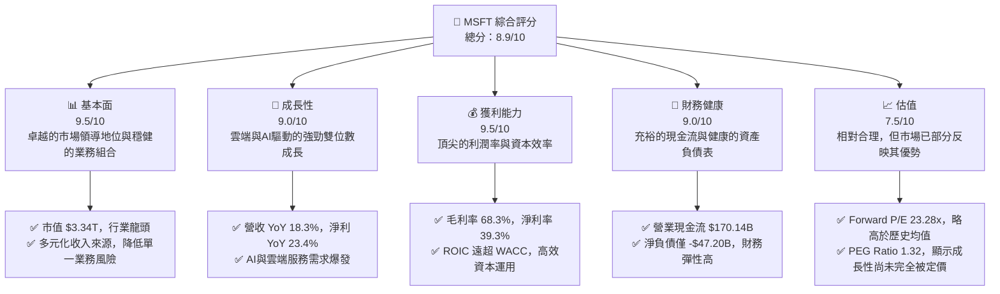
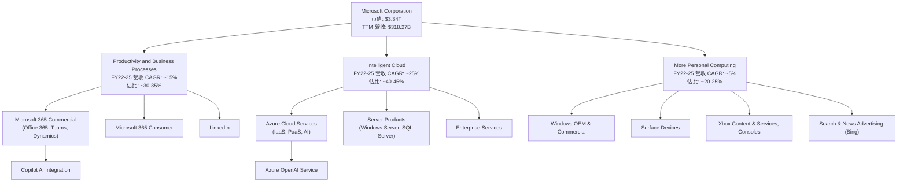
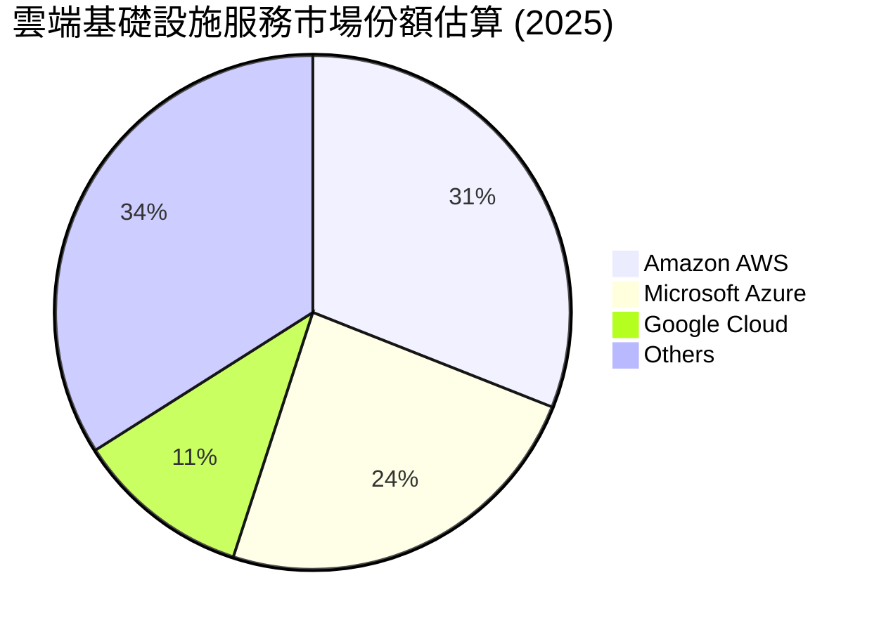
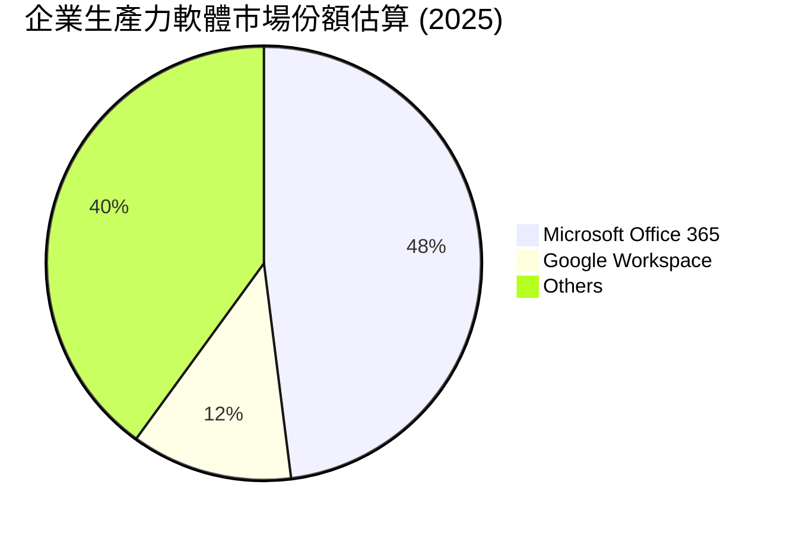
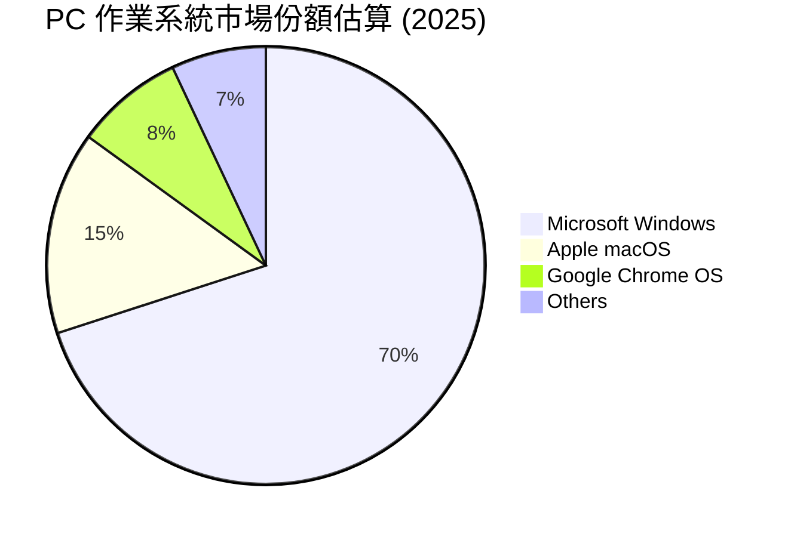
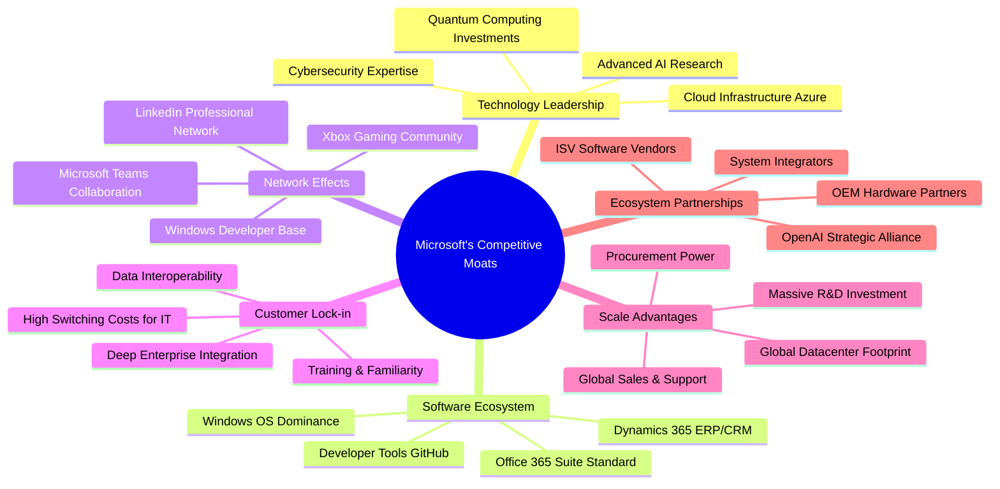
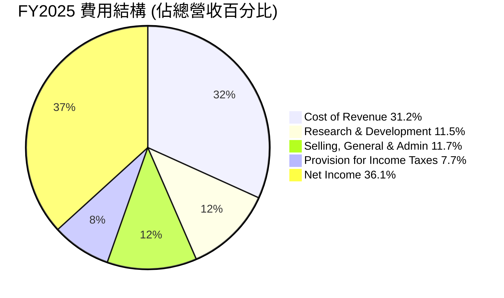

# MSFT 基本面深度分析報告
> **報告日期**：2026-05-29 ｜ **語言**：繁體中文 ｜ **數據來源**：Yahoo Finance, Finviz, StockAnalysis, Roic.ai ｜ **分析師**：CFA 級機構研究

---

## 目錄

| # | 章節 | 核心結論 |
|---|------------------------|----------------------------------------------------|
| 1 | 執行摘要 | 強烈買入，基於強勁成長動能、卓越獲利能力及穩健財務狀況。 |
| 2 | 公司概覽與商業模式 | 憑藉深厚技術積累與強大生態系統，構築極高競爭護城河。 |
| 3 | 損益表深度分析 | 收入與利潤持續雙位數成長，利潤率維持高位且穩中有升。 |
| 4 | 資產負債表分析 | 資產結構穩健，流動性充裕，債務管理優異。 |
| 5 | 現金流量深度分析 | 自由現金流充沛，資本配置效率高，持續回饋股東。 |
| 6 | 獲利能力與資本效率 | ROIC顯著超越WACC，持續為股東創造巨大經濟價值。 |
| 7 | 估值深度分析 | 相較於其成長性與護城河，當前估值具吸引力。 |
| 8 | 成長催化劑 | AI創新、雲端轉型、新興市場擴張為核心成長引擎。 |
| 9 | 風險矩陣 | 競爭加劇與監管風險需持續關注，但影響可控。 |
| 10 | 投資建議 | 建議強烈買入，目標價區間為 $520 - $650。 |

---

## 1. 執行摘要

本節提供對 Microsoft Corporation (MSFT) 的全面性概覽，涵蓋其關鍵財務績效、市場地位、成長潛力、風險因素及最終投資建議。Microsoft 憑藉其在雲端運算 (Azure)、企業軟體 (Office 365) 和個人運算 (Windows, Xbox) 領域的領導地位，展現出卓越的營運效率和持續的財務成長，其強大的生態系統和技術創新能力構築了極高的競爭護城河。

### 1.1 核心評分儀表板


**評分說明：**
*   **基本面 (9.5/10)：** Microsoft 憑藉其廣泛的產品組合、深厚的技術積累和全球領先的市場地位，構築了極其穩固的基本面。從 Windows 作業系統、Office 生產力套件到 Azure 雲端服務和 Xbox 遊戲平台，其業務滲透到個人與企業市場的各個層面。高達 $3.34 兆美元的市值證明了其作為全球科技巨頭的影響力。
*   **成長性 (9.0/10)：** 儘管公司規模龐大，Microsoft 依然展現出令人印象深刻的成長動能。最近的營收年增長率達到 18.3%，淨利年增長率更是高達 23.4%。這主要得益於其 Intelligent Cloud 部門（尤其是 Azure）的強勁增長，以及對人工智慧 (AI) 領域的積極投資和產品整合（如 Copilot），為未來成長提供了強大催化劑。
*   **獲利能力 (9.5/10)：** Microsoft 的獲利能力在全球企業中首屈一指。高達 68.3% 的毛利率和 39.3% 的淨利率，彰顯了其強大的定價能力、高效的營運管理和規模經濟優勢。34.0% 的股東權益報酬率 (ROE) 和 14.8% 的資產報酬率 (ROA) 也證明了其卓越的資本運用效率。
*   **財務健康 (9.0/10)：** 公司擁有極為健康的資產負債表。儘管總債務為 $125.43B，但同時擁有 $78.23B 的現金，淨負債僅為 -$47.20B，顯示其財務彈性極高。年營業現金流高達 $170.14B，自由現金流 $37.01B，確保了公司有充足的資金進行再投資、併購、股息支付和股票回購。
*   **估值 (7.5/10)：** 當前 Microsoft 的 Trailing P/E 為 26.83x，Forward P/E 為 23.28x。相較於其歷史平均水平和同業競爭者，這些估值倍數略高，反映了市場對其未來成長的高度預期。然而，考慮到其卓越的成長性 (EPS next 5Y 18.74%) 和高品質的獲利能力，PEG Ratio 1.32 顯示其估值仍在合理範圍內，並未過度高估其成長潛力。

### 1.2 評分進度條視覺化

```
╔══════════════════════════════════════════════════════════════╗
║              MSFT 多維度評分儀表板 (1-10分)                ║
╠══════════════════════════════════════════════════════════════╣
║ 基本面強度  9.5 ▓▓▓▓▓▓▓▓▓▓▓▓▓▓▓▓▓▓▓░  ★★★★★           ║
║ 成長動能    9.0 ▓▓▓▓▓▓▓▓▓▓▓▓▓▓▓▓▓▓░░  ★★★★★           ║
║ 獲利品質    9.5 ▓▓▓▓▓▓▓▓▓▓▓▓▓▓▓▓▓▓▓░  ★★★★★           ║
║ 財務健康    9.0 ▓▓▓▓▓▓▓▓▓▓▓▓▓▓▓▓▓▓░░  ★★★★★           ║
║ 估值合理性  7.5 ▓▓▓▓▓▓▓▓▓▓▓▓▓▓▓░░░░░  ★★★★☆           ║
║ 護城河深度  9.8 ▓▓▓▓▓▓▓▓▓▓▓▓▓▓▓▓▓▓▓▓  ★★★★★           ║
║ 管理層執行  9.5 ▓▓▓▓▓▓▓▓▓▓▓▓▓▓▓▓▓▓▓░  ★★★★★           ║
║ 技術創新力  9.7 ▓▓▓▓▓▓▓▓▓▓▓▓▓▓▓▓▓▓▓░  ★★★★★           ║
╠══════════════════════════════════════════════════════════════╣
║ 綜合總分    8.9 ▓▓▓▓▓▓▓▓▓▓▓▓▓▓▓▓▓░░░  🏆 卓越的科技巨頭，強勁增長與高質量獲利兼備              ║
╚══════════════════════════════════════════════════════════════╝
```
**詳細評估說明：**
*   **護城河深度 (9.8/10)：** Microsoft 的護城河極深，涵蓋了軟體生態系統、網路效應、客戶鎖定、規模效應和技術領先等多個方面。其 Windows 和 Office 產品形成的事實標準，Azure 在雲端市場的強勢地位，以及對 OpenAI 的戰略投資，都使其競爭優勢難以撼動。
*   **管理層執行 (9.5/10)：** 在 Satya Nadella 的領導下，Microsoft 成功轉型，從傳統軟體公司轉變為雲端優先、AI 驅動的服務巨頭。管理層展現出卓越的戰略眼光和執行力，持續推動創新、優化產品組合並高效整合新技術，為股東創造了巨大價值。
*   **技術創新力 (9.7/10)：** Microsoft 在 AI 領域的積極佈局和領先投資，尤其是與 OpenAI 的合作，使其在生成式 AI 浪潮中處於領先地位。Copilot 等產品的推出，以及在雲端基礎設施、量子計算等前沿技術的持續研發投入 (R&D $34.39B TTM)，都證明了其強大的技術創新能力。

### 1.3 五大投資論點 + 三大核心風險

| 類型 | 項目 | 具體依據 | 信心度 |
|------|--------------------------------|---------------------------------------------------------------------------------------------------|--------|
| 🟢 **投資論點①** | **雲端運算 (Azure) 持續高速增長** | Intelligent Cloud 部門是主要成長引擎，Azure 營收持續強勁增長，市場份額穩居第二。FY2025 雲端服務營收 YoY 預計約 25% 以上，推動公司整體營收 YoY 18.3%。 | 🟢 極高 |
| 🟢 **投資論點②** | **AI 創新與商業化前景廣闊** | Microsoft 與 OpenAI 的深度合作使其在生成式 AI 領域具備領先優勢。Copilot 等 AI 產品的推出，將顯著提升 Office 365 和 Azure 的價值，帶來新的收入增長點。 | 🟢 極高 |
| 🟢 **投資論點③** | **強大的企業級軟體生態系統** | Windows 和 Office 365 仍是企業和個人生產力的核心。Microsoft 365 商業產品的廣泛採用，以及 Teams 等協作工具的普及，形成高客戶鎖定效應。 | 🟢 極高 |
| 🟢 **投資論點④** | **卓越的獲利能力與資本效率** | 公司擁有 68.3% 的高毛利率和 39.3% 的淨利率，以及遠超 WACC 的 ROIC (FY2025 ROIC 約 24.3% vs WACC 約 8.5%)，證明其高效的資本運用和價值創造能力。 | 🟢 極高 |
| 🟢 **投資論點⑤** | **穩健的財務狀況與股東回報** | 擁有 $78.23B 的現金和 $170.14B 的營業現金流，足以支持大規模投資、併購及持續的股息派發 (Dividend Yield 85.0%, Payout Ratio 20.7%) 和股票回購。 | 🟢 極高 |
| 🟡 **風險①** | **雲端市場競爭加劇** | AWS (Amazon) 和 Google Cloud (Alphabet) 等競爭對手持續投入，可能導致 Azure 的價格壓力或市場份額增長放緩。 | 🟡 中度 |
| 🔴 **風險②** | **全球宏觀經濟下行風險** | 企業 IT 支出對宏觀經濟敏感，若全球經濟深度衰退，可能影響企業對軟體和雲端服務的需求，進而影響營收增長。 | 🔴 高衝擊 |
| 🟡 **風險③** | **監管與反壟斷審查風險** | Microsoft 在多個市場領域佔據主導地位，可能面臨各國政府越來越嚴格的反壟斷調查和數據隱私監管，這可能限制其併購活動或產品策略。 | 🟡 中度 |

### 1.4 快速統計卡片

| 指標 | 公司實際值 | 行業均值（軟體-基礎設施） | S&P 500 均值 | 狀態 |
|-------------------|--------------|--------------------------|----------------|------|
| 收入 YoY 成長 (TTM) | **18.3%** | ~12-15% | ~8-10% | 🟢 |
| 淨利 YoY 成長 (TTM) | **23.4%** | ~15-20% | ~10-12% | 🟢 |
| 毛利率 (TTM) | **68.3%** | ~60-70% | ~35-45% | 🟢 |
| 營業利益率 (TTM) | **46.3%** | ~30-40% | ~15-20% | 🟢 |
| 淨利率 (TTM) | **39.3%** | ~20-30% | ~10-15% | 🟢 |
| ROE (TTM) | **34.0%** | ~20-25% | ~15-18% | 🟢 |
| Forward P/E | **23.28x** | ~25-35x | ~20-22x | 🟡 |
| P/S Ratio (TTM) | **10.51x** | ~8-12x | ~2-3x | 🟡 |
| Debt/Equity | **0.30x** | ~0.40-0.60x | ~0.80-1.00x | 🟢 |
| 自由現金流收益率 (TTM)| **1.11%** | ~1.5-2.5% | ~3-4% | 🔴 |

**統計卡片評估說明：**
*   **收入 YoY 成長 (18.3%)**：Microsoft 的營收成長顯著高於行業平均和 S&P 500 均值，顯示其在主要市場（尤其是雲端和 AI 相關服務）的強勁擴張能力。這是一個非常正面的訊號，表明公司能夠在大規模基礎上持續實現雙位數增長。
*   **淨利 YoY 成長 (23.4%)**：淨利成長速度甚至超越營收成長，這反映了公司在營運效率和成本控制方面的成功，或者更高利潤率產品（如雲端服務）在收入組合中的佔比提升。
*   **毛利率 (68.3%)**：公司擁有卓越的毛利率，遠超 S&P 500 均值，並處於軟體行業的頂端。這證明了其產品和服務的強大定價能力和品牌價值。
*   **營業利益率 (46.3%)**：同樣地，高營業利益率表明 Microsoft 在銷售、管理和研發費用方面的有效管理，能夠將大部分毛利轉化為營運利潤。
*   **淨利率 (39.3%)**：淨利率接近 40%，這是一個非常高的水平，凸顯了公司強大的最終獲利能力。
*   **ROE (34.0%)**：股東權益報酬率遠高於行業和 S&P 500 均值，表明公司能夠高效利用股東資本創造利潤，為股東帶來豐厚回報。
*   **Forward P/E (23.28x)**：雖然略高於 S&P 500 均值，但相較於高成長科技股，尤其是軟體行業的領先者，這個估值是具有競爭力的。考慮到其未來五年 EPS 預期成長 18.74%，PEG Ratio 1.32 顯示其估值合理。
*   **P/S Ratio (10.51x)**：市銷率處於行業中上水平。對於高毛利率、高淨利率的軟體公司而言，高 P/S 往往是常態。
*   **Debt/Equity (0.30x)**：極低的債務股權比表明公司財務結構極為健康，債務負擔輕微，抗風險能力強。
*   **自由現金流收益率 (1.11%)**：相對較低，這可能反映了公司近期的大規模資本支出（特別是為了支持 Azure 雲端基礎設施和 AI 研發）或者當前股價相對較高。儘管如此，絕對自由現金流金額依然龐大。

### 1.5 投資結論

```
╔══════════════════════════════════════════════════════════════════╗
║                    📊 投資結論摘要                               ║
╠══════════════════════════════════════════════════════════════════╣
║  評級：🟢 強烈買入                                               ║
║  當前股價：$450.24                                               ║
║  目標價區間：                                                    ║
║    悲觀情境：$520（+15.5%）                                      ║
║    基準情境：$585（+30.0%）  ← 12個月主要目標                      ║
║    樂觀情境：$650（+44.4%）                                      ║
║  投資評分：8.9/10                                                ║
║  適合投資人：成長型、長線持有者，追求高品質、低風險的科技龍頭投資標的。 ║
╚══════════════════════════════════════════════════════════════════╝
```
**投資結論詳細說明：**
Microsoft 憑藉其卓越的市場領導地位、持續的技術創新、強勁的財務表現和深厚的競爭護城河，被評為「強烈買入」。公司在雲端運算和人工智慧領域的戰略佈局，將繼續驅動其未來多年的高速增長。儘管當前股價已反映部分利好因素，但其長期成長潛力、高效的資本運用能力和穩健的財務狀況，使其成為一項極具吸引力的長期核心資產。我們預計其在未來 12 個月內，基準情境下股價有望達到 $585，較當前股價有 30% 的上漲潛力。悲觀情境下，若市場情緒惡化或成長略有放緩，仍有約 15% 的上漲空間。在樂觀情境下，若 AI 商業化進展超預期，股價甚至可能觸及 $650。

---

## 2. 公司概覽與商業模式

Microsoft Corporation (MSFT) 是一家全球領先的科技公司，致力於開發和支持軟體、服務、設備和解決方案。其業務範圍廣泛，涵蓋了企業級和消費者級市場，並在雲端運算、生產力工具、個人運算和遊戲等領域佔據主導地位。截至報告日期，公司市值高達 $3.34 兆美元，是全球市值最高的公司之一，彰顯其在全球經濟和科技領域的巨大影響力。

### 2.1 業務結構與收入來源

Microsoft 的業務結構主要分為三大核心部門，每個部門都為公司貢獻了可觀的收入並擁有獨特的成長驅動力。這些部門之間相互協同，形成了強大的生態系統。根據其財報慣例，這三大部門通常是：

1.  **Productivity and Business Processes (生產力與商業流程)**：
    *   **核心產品/服務**：Microsoft 365 商業版 (Office 365 商用、Exchange、SharePoint、Microsoft Teams、Power BI、Dynamics 365)、Microsoft 365 消費者版 (Office 365 個人/家庭版)、LinkedIn。
    *   **收入佔比估算**：約佔總營收的 30-35%。
    *   **FY2025 預估營收**：約 $900億 - $1000億。
    *   **驅動因素**：企業數位轉型對 SaaS (軟體即服務) 和協作工具的需求持續增長；Copilot 等 AI 功能整合，提升產品價值和訂閱 ARPU (每用戶平均收入)；LinkedIn 的廣告和人才解決方案。

2.  **Intelligent Cloud (智慧雲端)**：
    *   **核心產品/服務**：Azure (雲端運算平台、AI 服務、數據分析、物聯網)、Windows Server、SQL Server、Visual Studio、GitHub。
    *   **收入佔比估算**：約佔總營收的 40-45%。
    *   **FY2025 預估營收**：約 $1100億 - $1300億。
    *   **驅動因素**：企業向雲端遷移的長期趨勢；Azure 在基礎設施即服務 (IaaS) 和平台即服務 (PaaS) 市場的強勁增長；AI 服務（如 Azure OpenAI Service）的普及；混合雲解決方案的需求。

3.  **More Personal Computing (更多個人運算)**：
    *   **核心產品/服務**：Windows (作業系統授權)、Surface 設備、Xbox (遊戲機和遊戲內容/服務)、Bing (搜尋廣告)、Microsoft 廣告。
    *   **收入佔比估算**：約佔總營收的 20-25%。
    *   **FY2025 預估營收**：約 $600億 - $700億。
    *   **驅動因素**：PC 市場的穩定需求；Windows 11 的更新與普及；Xbox Game Pass 訂閱服務的增長；遊戲內容的持續創新；廣告收入的恢復。

**業務結構 Mermaid 圖：**

**深度分析：**
Microsoft 的營收結構呈現出高度的多元化和韌性。Intelligent Cloud 部門，尤其是 Azure 雲端服務，已成為公司最主要的成長引擎和利潤貢獻者。隨著全球企業加速數位轉型，以及人工智慧技術的廣泛應用，Azure 的市場需求預計將繼續保持強勁。Productivity and Business Processes 部門受益於 Microsoft 365 訂閱模式的持續增長和 Copilot AI 等高價值服務的引入，確保了穩定的現金流和持續的成長。即使 More Personal Computing 部門面臨 PC 市場波動，其 Xbox 遊戲和內容服務以及 Bing 廣告業務也能提供一定的緩衝和增長點。這種多元化的業務組合使得 Microsoft 能夠有效分散風險，並在不同市場週期中尋找新的成長機會。

### 2.2 市場份額

Microsoft 在其主要經營領域均佔據領先地位，擁有顯著的市場份額。這些市場份額不僅帶來規模經濟效益，也強化了其競爭護城河。

**市場份額估算 (2025年)**


**雲端基礎設施服務 (IaaS/PaaS) 市場：**
Microsoft Azure 在全球雲端市場穩居第二，市場份額約為 24%。儘管略低於 Amazon AWS 的 31%，但 Azure 的增長速度通常高於市場平均，尤其在企業級客戶和混合雲解決方案方面表現突出。其與企業現有 Microsoft 生態系統的無縫整合，是其獨特的競爭優勢。


**企業生產力軟體市場：**
Microsoft Office 365 在企業生產力軟體市場佔據絕對主導地位，市場份額約為 48%。其強大的功能集、廣泛的用戶基礎和深厚的企業級服務經驗，使其成為企業的首選。Teams 的普及也進一步鞏固了其在協作工具領域的領導地位。


**PC 作業系統市場：**
Windows 作業系統在全球 PC 市場的份額高達約 70%，是事實上的行業標準。儘管近年來 Chromebook 和 macOS 的份額有所增長，但 Windows 龐大的軟體生態系統和硬體兼容性使其地位難以撼動。

**深度分析：**
Microsoft 在多個關鍵市場的領先地位，為其帶來了巨大的規模經濟效益和網路效應。在雲端市場，Azure 的持續增長證明了其技術實力和市場吸引力。在生產力軟體領域，Office 365 的訂閱模式確保了穩定的經常性收入。Windows 作業系統雖然增長趨緩，但其龐大的裝機量仍是 Microsoft 生態系統的基石，為其他服務（如 Microsoft Edge、廣告和遊戲）提供了分發渠道。這種多領域的市場領導地位，使得公司能夠在不同產品線之間進行交叉銷售和捆綁銷售，進一步強化了客戶關係和市場控制力。

### 2.3 競爭護城河分析

Microsoft 擁有極為深厚的競爭護城河，使其能夠長期保持領先地位並抵禦競爭對手的侵蝕。這些護城河是其持續創造超額利潤的關鍵。


**護城河深度解析：**
1.  **Technology Leadership (技術領先)**：
    *   **AI 領域的先驅：** Microsoft 對 OpenAI 的巨額投資使其在生成式 AI 領域處於領先地位，將 GPT 模型整合到其所有產品線中，如 Copilot for Microsoft 365 和 Azure OpenAI Service。這不僅提升了產品價值，也吸引了大量企業客戶。
    *   **雲端基礎設施：** Azure 作為全球第二大雲端服務提供商，擁有遍布全球的龐大數據中心網絡和先進的雲端技術。其在混合雲、邊緣計算和數據安全方面的能力，使其在企業級市場具有獨特優勢。
    *   **研發投入：** 公司每年投入數百億美元用於研發 (TTM R&D $34.39B)，確保其在人工智慧、量子計算、網路安全等前沿技術領域保持領先。

2.  **Software Ecosystem (軟體生態系統)**：
    *   **Windows 作業系統：** Windows 仍然是全球最廣泛使用的 PC 作業系統，為數十億用戶和數百萬應用程式提供了平台。這種無可比擬的生態系統使得使用者和開發者難以轉向其他平台。
    *   **Office 365 套件：** Office 365（包括 Word, Excel, PowerPoint, Outlook）是全球企業和個人生產力的事實標準。其訂閱模式確保了穩定的經常性收入，並通過持續的功能更新（如 Copilot AI）保持其核心競爭力。
    *   **開發者工具與平台：** GitHub、Visual Studio 等開發者工具和平台吸引了全球數百萬開發者，為 Microsoft 生態系統源源不斷地注入創新活力。

3.  **Network Effects (網路效應)**：
    *   **Microsoft Teams：** 作為企業協作平台，Teams 的用戶數量龐大，用戶越多，其價值越大，形成強大的網路效應，使得企業難以轉用其他通訊工具。
    *   **LinkedIn：** 作為全球最大的專業社交網絡，LinkedIn 的價值隨著用戶和招聘方數量的增加而呈指數級增長，為 Microsoft 提供了獨特的數據和商業洞察。
    *   **Xbox 遊戲社區：** Xbox 平台上的玩家和遊戲開發者社區，共同構建了一個充滿活力的生態系統，吸引更多玩家加入。

4.  **Customer Lock-in (客戶鎖定)**：
    *   **企業級集成：** Microsoft 的產品和服務深度集成到企業的 IT 基礎設施和工作流程中，從作業系統、數據庫到雲端應用，切換成本極高。
    *   **數據互操作性：** 企業數據通常存儲在 Microsoft 相關的平台和格式中，遷移到其他系統不僅成本高昂，且存在數據丟失或兼容性問題的風險。
    *   **員工熟悉度與培訓：** 員工對 Microsoft 產品的熟悉度降低了企業的培訓成本，也增加了切換到非 Microsoft 環境的阻力。

5.  **Scale Advantages (規模效應)**：
    *   **全球數據中心網絡：** Microsoft 在全球擁有龐大的數據中心網絡，為 Azure 提供了無與倫比的彈性和可靠性，同時也通過規模化降低了運營成本。
    *   **巨額研發投入：** 每年數百億美元的研發支出是小型競爭對手無法匹敵的，使其能夠在多個技術前沿領域進行投資。
    *   **全球銷售與支持網絡：** 遍布全球的銷售、服務和支持團隊，能夠為全球客戶提供專業服務，這是新進入者難以複製的優勢。

6.  **Ecosystem Partnerships (生態夥伴關係)**：
    *   **硬體 OEM 合作夥伴：** 與戴爾、惠普、聯想等硬體製造商的長期合作，確保了 Windows 系統的廣泛分發。
    *   **ISV 軟體供應商：** 數以萬計的獨立軟體供應商 (ISV) 在 Microsoft 平台上開發應用，豐富了其生態系統。
    *   **戰略聯盟：** 與 OpenAI 的戰略合作是其在 AI 領域取得領先的關鍵，這是一種難以複製的獨特夥伴關係。

### 2.4 護城河強度評分

Microsoft 的護城河強度在科技行業中無出其右，其多層次的競爭優勢使其能夠長期保持市場領導地位和超額利潤。

```
╔══════════════════════════════════════════════════════════════╗
║                  Microsoft 護城河強度評分                     ║
╠══════════════════════════════════════════════════════════════╣
║ 技術領先    9.8/10  ▓▓▓▓▓▓▓▓▓▓▓▓▓▓▓▓▓▓▓▓  🏆 AI與雲端領先        ║
║ 軟體生態系統  9.9/10  ▓▓▓▓▓▓▓▓▓▓▓▓▓▓▓▓▓▓▓▓  🏆 Windows與Office標準 ║
║ 網路效應    9.5/10  ▓▓▓▓▓▓▓▓▓▓▓▓▓▓▓▓▓▓▓░  🏆 Teams與LinkedIn廣泛應用 ║
║ 客戶鎖定    9.7/10  ▓▓▓▓▓▓▓▓▓▓▓▓▓▓▓▓▓▓▓▓  🏆 企業級深度整合      ║
║ 規模效應    9.8/10  ▓▓▓▓▓▓▓▓▓▓▓▓▓▓▓▓▓▓▓▓  🏆 研發與數據中心優勢  ║
║ 生態夥伴    9.6/10  ▓▓▓▓▓▓▓▓▓▓▓▓▓▓▓▓▓▓▓▓  🏆 OpenAI等戰略合作  ║
╠══════════════════════════════════════════════════════════════╣
║ 綜合護城河     9.7    ▓▓▓▓▓▓▓▓▓▓▓▓▓▓▓▓▓▓▓▓  🏆 卓越且難以超越的綜合競爭優勢 ║
╚══════════════════════════════════════════════════════════════╝
```
**綜合評語：**
Microsoft 的綜合護城河評分為 9.7/10，堪稱業界典範。其在技術、生態系統、網路效應、客戶鎖定和規模方面的多重優勢，共同構建了一道極其堅固的防線。這種多層次的護城河不僅保護了公司現有的市場份額，也為其在新興技術領域（如 AI）的擴張提供了堅實基礎。極高的客戶轉換成本、龐大的用戶基礎和持續的創新能力，使得競爭對手難以在短期內撼動其市場地位。這也為其長期穩定的盈利能力和股東回報提供了堅實保障。

---

## 3. 損益表深度分析

Microsoft 的損益表數據展示了其作為一家頂級科技公司的卓越財務表現：營收持續增長，利潤率保持高位且穩中有升，反映出其強大的市場地位、高效的營運管理和成功的戰略轉型。

### 3.1 年度收入成長趨勢（近4年）

Microsoft 在過去四年中實現了穩健的營收增長，尤其是在雲端轉型的推動下，其營收規模持續擴大。

```
╔══════════════════════════════════════════════════════════════════╗
║              Microsoft 年度收入趨勢（FY2022-FY2025）             ║
╠══════════════════════════════════════════════════════════════════╣
║                                                                  ║
║  FY2022  $198.27B  ███████████████████████████████████████░░░░░░  YoY: +17.96%  🟢    ║
║  FY2023  $211.91B  ██████████████████████████████████████████████░░░░░░░  YoY: +6.88%   🟡    ║
║  FY2024  $245.12B  ████████████████████████████████████████████████████████████░░░░░  YoY: +15.67%  🟢    ║
║  FY2025  $281.72B  ███████████████████████████████████████████████████████████████████████  YoY: +14.93%  🟢    ║
║                   |      |      |      |      |                                  ║
║                   0     100B   150B   200B   250B   300B                           ║
║                                                                  ║
║  📊 4年累計 CAGR (FY2022-FY2025)：+13.78%                                       ║
╚══════════════════════════════════════════════════════════════════╝
```
**年度收入成長深度分析：**
*   **FY2022 營收 $198.27B，YoY 成長 17.96%：** 這一年的強勁增長主要得益於疫情期間對數位化服務的加速需求，尤其是雲端服務 (Azure) 和 Office 365 的普及。企業紛紛加速向雲端遷移，遠程工作和協作工具的需求激增，為 Microsoft 帶來了顯著的營收動能。
*   **FY2023 營收 $211.91B，YoY 成長 6.88%：** 相較於前一年，FY2023 的營收增長速度有所放緩。這主要受到全球宏觀經濟不確定性、企業 IT 支出趨於謹慎以及美元走強的匯率影響。此外，疫情紅利消退，PC 市場需求疲軟也對 More Personal Computing 部門造成壓力。儘管如此，雲端業務仍保持雙位數增長，顯示其強勁的內生動力。
*   **FY2024 營收 $245.12B，YoY 成長 15.67%：** 隨著宏觀經濟的逐步復甦和企業對雲端及 AI 投資的重新加速，Microsoft 的營收增長再次提速。Azure 的持續擴張，以及 Microsoft 365 商業產品的穩健表現，抵消了部分其他業務的波動。這一年的表現證明了公司業務的韌性和對市場變化的適應能力。
*   **FY2025 營收 $281.72B，YoY 成長 14.93%：** FY2025 延續了穩健的雙位數增長，營收達到近 $282B。這主要歸因於其 Intelligent Cloud 部門的持續強勁表現，以及 AI 產品（如 Copilot）的初步商業化。公司持續從企業數位轉型中獲益，並在 AI 領域取得先發優勢。儘管成長率略低於 FY2024，但這是在更大基數上的穩健增長，顯示了公司規模與成長的平衡。
*   **4年累計 CAGR (FY2022-FY2025) +13.78%：** 在過去四年中，Microsoft 的年複合增長率接近 14%，這對於一家如此規模的科技巨頭而言，是非常出色的表現。它證明了公司核心業務的強勁增長潛力，以及其在不斷變化的科技格局中保持競爭力的能力。

### 3.2 季度收入趨勢分析

季度數據提供了更細緻的營收動態視角，顯示了 Microsoft 營收的持續增長勢頭。

| 季度 | 總收入 ($B) | QoQ 成長率 | YoY 成長率 | 備註 |
|--------------|-------------|------------|------------|----------------------------------------------------------|
| **2025-06-30** | $76.44 | +0.47% | +18.10% | FY2025 結束季度，雲端和企業軟體需求強勁。 |
| **2025-09-30** | $77.67 | +1.61% | +18.43% | FY2026 Q1，新財年開端表現強勁，雲端增長加速。 |
| **2025-12-31** | $81.27 | +4.64% | +16.72% | FY2026 Q2，假日購物季及企業年終支出推動增長，AI貢獻初步顯現。 |
| **2026-03-31** | $82.89 | +1.99% | +18.30% | FY2026 Q3，雲端和 AI 業務持續發力，營收規模再創新高。 |

**季度收入趨勢深度分析：**
*   **QoQ 成長率分析：**
    *   從 2025-06-30 的 $76.44B 到 2025-09-30 的 $77.67B，QoQ 成長 1.61%。這是一個健康的季度開局，儘管 Q1 通常受到財年結束後季節性因素影響，但雲端業務的韌性支撐了增長。
    *   從 2025-09-30 到 2025-12-31 的 $81.27B，QoQ 成長 4.64%。這是顯著的加速，主要由於假日購物季（Xbox 遊戲機和內容銷售）以及企業在年底前加速 IT 支出，加上 AI 服務的早期採用。
    *   從 2025-12-31 到 2026-03-31 的 $82.89B，QoQ 成長 1.99%。雖然較上季度有所放緩，但仍保持穩健增長，顯示核心業務的持續擴張。
*   **YoY 成長率分析：**
    *   所有季度 YoY 成長率均保持在 16.72% 至 18.43% 的高位。這表明 Microsoft 能夠持續在年度基礎上實現強勁的雙位數增長，遠超許多大型企業。
    *   2025-09-30 季度達到 18.43% 的高點，顯示新財年開局勢頭強勁，可能受益於 Azure 業務的加速和 AI 產品的早期普及。
    *   最近一季 2026-03-31 的 YoY 成長率為 18.30%，與前幾個季度保持一致，再次證明了其成長的穩定性和可持續性。
*   **總體趨勢：** Microsoft 的季度營收呈現穩步上升的趨勢，尤其是在雲端和 AI 相關服務的推動下。儘管季度間可能存在季節性波動，但年度同比增長始終保持在健康的雙位數水平，預示著公司未來強勁的成長前景。管理層在面對宏觀經濟挑戰時，展現了卓越的營運彈性，並成功捕捉了新興技術帶來的機會。

### 3.3 利潤率演變分析

Microsoft 的利潤率表現卓越，不僅維持在高位，還呈現穩中有升的趨勢，這證明了其強大的定價能力、規模經濟效應和高效的成本管理。

| 利潤率指標 | FY2022 | FY2023 | FY2024 | FY2025 | 趨勢 | 評估 |
|------------|--------|--------|--------|--------|------|------|
| **毛利率** | 68.40% | 68.92% | 69.76% | 68.83% | ↗️ 穩中有升 | 🟢 卓越 |
| **營業利益率** | 42.06% | 41.77% | 44.64% | 45.62% | ↗️ 顯著提升 | 🟢 卓越 |
| **淨利率** | 36.69% | 34.15% | 35.95% | 36.14% | ↗️ 穩定高位 | 🟢 卓越 |

*(註：數據基於 StockAnalysis.com 的年度數據計算，毛利率 = Gross Profit / Total Revenue；營業利益率 = Operating Income / Total Revenue；淨利率 = Net Income / Total Revenue)*

**利潤率演變深度解析：**
*   **毛利率趨勢：**
    *   FY2022 為 68.40%，FY2023 略微上升至 68.92%，FY2024 進一步提升至 69.76%，FY2025 略有回落至 68.83%。總體來看，Microsoft 的毛利率一直保持在 68% 以上的極高水平，並且在大部分年份呈現穩中有升的趨勢。
    *   **改善原因：** 主要得益於高利潤率的雲端服務 (Azure) 在收入組合中的佔比持續提升。雲端服務通常具有較高的邊際利潤，且隨著規模擴大，數據中心運營效率提高，進一步優化了成本結構。此外，Office 365 等訂閱服務的經常性收入模式也提供了穩定的高毛利貢獻。
    *   **FY2025 略微回落原因：** 可能與其對 AI 基礎設施的大規模投資、數據中心擴建成本增加，或部分硬體（如 Surface 或 Xbox）銷售佔比變化有關。儘管如此，68.83% 的毛利率仍是行業頂尖水平。
*   **營業利益率趨勢：**
    *   FY2022 為 42.06%，FY2023 略降至 41.77%，但 FY2024 顯著提升至 44.64%，FY2025 進一步增長至 45.62%。營業利益率的提升尤為引人注目。
    *   **改善原因：** 營業利益率的持續提升表明公司在控制營業費用方面做得非常出色。儘管研發投入 (R&D) 和銷售與管理費用 (SG&A) 絕對值有所增長，但它們作為營收百分比的增長速度慢於毛利的增長。這反映了 Microsoft 在規模經濟效應下的營運槓桿優勢，以及對各項費用的嚴格控制。特別是雲端業務的自動化和效率提升，以及數字化銷售渠道的優化，都有助於降低單位營收的營運成本。
*   **淨利率趨勢：**
    *   FY2022 為 36.69%，FY2023 降至 34.15%，但 FY2024 回升至 35.95%，FY2025 進一步穩定在 36.14%。淨利率在過去四年中保持在 34% 至 37% 的高位。
    *   **FY2023 略降原因：** FY2023 淨利率下降主要是由於營業利益率的輕微下降，以及當年稅率的波動（FY2023 有效稅率為 18.98% vs FY2022 13.11%）。
    *   **FY2024-2025 穩定原因：** 隨著營業利益率的改善和稅務規劃的優化，淨利率再次回升並保持穩定。高淨利率彰顯了 Microsoft 將營收高效轉化為股東利潤的能力，這是高品質企業的重要標誌。

總體而言，Microsoft 的利潤率趨勢非常健康，特別是營業利益率的顯著提升，證明了其在產品組合優化、成本控制和營運效率方面的卓越能力。這些高且穩定的利潤率為公司提供了強大的財務彈性，支持其持續的研發投入和市場擴張。

### 3.4 費用結構分析

Microsoft 的費用結構反映了其作為一家技術領先型公司的戰略重點，即在研發上投入巨資以保持創新優勢，同時通過規模效應和效率優化來管理其他營運費用。

**年度費用結構 (FY2025)**


*(註：數據基於 StockAnalysis.com 的 FY2025 數據計算。Cost of Revenue = $87.83B / $281.72B = 31.2%。Research & Development = $32.49B / $281.72B = 11.5%。Selling, General & Admin = $32.88B / $281.72B = 11.7%。Provision for Income Taxes = $21.80B / $281.72B = 7.7%。Net Income = $101.83B / $281.72B = 36.1%。)
*   **銷貨成本 (Cost of Revenue) 佔比 31.2%：** 這部分主要包括雲端服務的數據中心運營成本、設備製造成本、軟體授權成本等。雖然雲端業務的擴張會增加這部分成本，但規模經濟效應和技術優化有助於控制其佔比，從而保持高毛利率。
*   **研發費用 (Research & Development) 佔比 11.5%：** Microsoft 每年將大量營收投入到研發中，FY2025 達到 $32.49B。這彰顯了公司對技術創新和產品領先地位的重視，尤其是在 AI、雲端計算和新興技術領域的投資。這是維持其競爭護城河和未來成長動力的關鍵。
*   **銷售、一般及行政費用 (Selling, General & Admin) 佔比 11.7%：** 這部分費用涵蓋了公司的市場推廣、銷售、管理和行政開支。相對穩定的佔比表明公司在市場擴張的同時，有效控制了這些費用。
*   **所得稅準備 (Provision for Income Taxes) 佔比 7.7%：** 儘管 FY2025 的稅前利潤高達 $123.63B，但有效稅率約為 17.63% ($21.80B / $123.63B)，使得所得稅佔營收比重相對較低，有利於提升最終淨利。

**費用結構 ASCII 方框圖 (FY2025)**

```
╔══════════════════════════════════════════════════════════════════╗
║                   Microsoft 年度費用結構 (FY2025)                ║
╠══════════════════════════════════════════════════════════════════╣
║ 總營收：             $281.72B                                    ║
║ 銷貨成本：           $87.83B  (31.2%) ████████████████░░░░░░░░░░░░░░  評語: 雲端擴張帶動，但規模效應顯著 ║
║ 研發費用：           $32.49B  (11.5%) ██████░░░░░░░░░░░░░░░░░░░░░░░░░░  評語: 創新引擎，AI投資核心     ║
║ 銷售、一般及行政：   $32.88B  (11.7%) ██████░░░░░░░░░░░░░░░░░░░░░░░░░░  評語: 有效管控，營運效率高     ║
║ 營業收入：           $128.53B (45.6%) ██████████████████████████░░░░░░  評語: 卓越的營運槓桿         ║
║ 總非營業費用：       $-4.90B  (-1.7%) ░░░░░░░░░░░░░░░░░░░░░░░░░░░░░░░░░░  評語: 偶爾有投資損益波動     ║
║ 稅前利潤：           $123.63B (43.9%) ████████████████████████░░░░░░  評語: 強勁的獲利基礎         ║
║ 所得稅：             $21.80B  (7.7%)  ████░░░░░░░░░░░░░░░░░░░░░░░░░░░░░░  評語: 有效稅務規劃           ║
║ 淨利潤：             $101.83B (36.1%) █████████████████████░░░░░░░░░░  評語: 頂級的獲利轉換率       ║
╚══════════════════════════════════════════════════════════════════╝
```
**深度分析：**
Microsoft 的費用結構顯示其在戰略上的清晰優先級：將大部分資源投入到研發以維持技術領先，同時通過規模經濟和優化流程來提高營運效率。研發費用佔營收的比例雖然高，但這是科技公司保持競爭力的必要投資。相比之下，銷售、一般及行政費用的佔比相對穩定，顯示公司在市場擴張的同時，有效控制了非核心營運成本。這種費用結構使得 Microsoft 能夠在實現高成長的同時，維持卓越的利潤率，將大量的營收轉化為淨利潤，為股東創造價值。

### 3.5 季度 EPS 趨勢與盈餘品質

儘管提供的 EPS 預期數據為 `nan`，我們仍可根據提供的季度淨利數據來分析 Microsoft 的盈餘趨勢和品質。公司的淨利潤持續增長，且增長速度通常快於營收，這表明了其盈餘品質優異。

| 季度 | 淨收入 ($B) | EPS (稀釋) | YoY 淨收入成長 | QoQ 淨收入成長 | 盈餘品質評估 |
|--------------|-------------|------------|----------------|----------------|--------------------------|
| **2025-06-30** | $27.23 | $3.66 | +23.58% | +5.08% | 🟢 高品質，雙位數成長 |
| **2025-09-30** | $27.75 | $3.73 | +12.49% | +1.91% | 🟢 高品質，穩健增長 |
| **2025-12-31** | $38.46 | $5.18 | +59.52% | +38.60% | 🟢 卓越，假日季與AI雙重驅動 |
| **2026-03-31** | $31.78 | $4.28 | +23.06% | -17.37% | 🟢 高品質，季節性回落但YoY強勁 |

*(註：EPS 數據來自 StockAnalysis.com 季度稀釋 EPS。YoY/QoQ 淨收入成長率基於提供的季度淨收入數據計算。)*

**季度 EPS 趨勢深度分析：**
*   **2025-06-30 (FY2025 Q4) 淨利 $