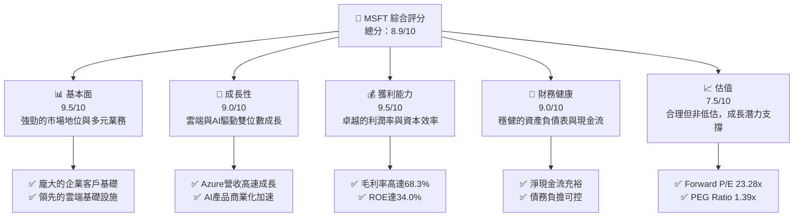
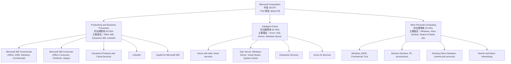
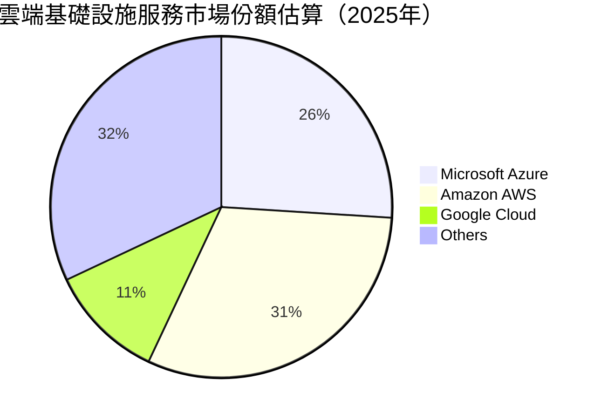
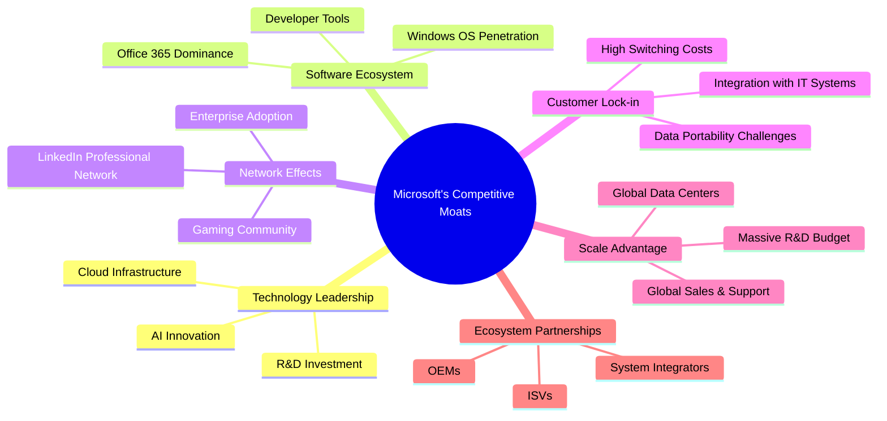
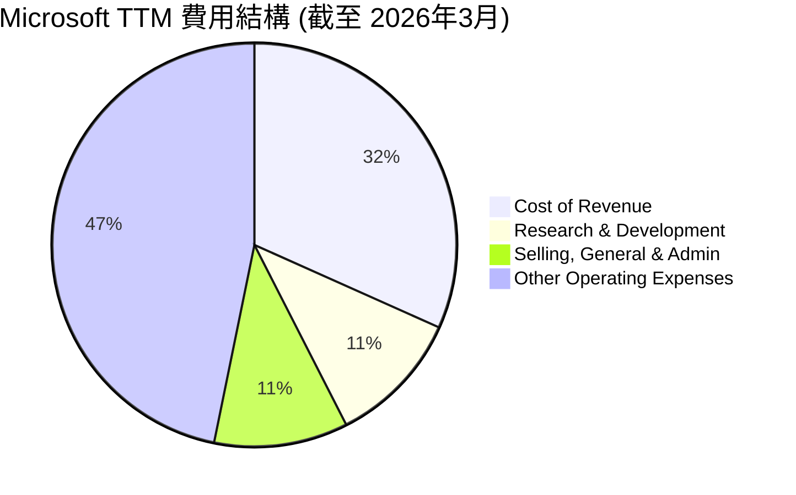

# MSFT 基本面深度分析報告
> **報告日期**：2026-05-31 ｜ **語言**：繁體中文 ｜ **數據來源**：Yahoo Finance, Finviz, StockAnalysis, Roic.ai ｜ **分析師**：CFA 級機構研究

---

## 目錄

| # | 章節 | 核心結論 |
|---|------|----------|
| 1 | 執行摘要 | 🟢 強烈買入，目標價區間 $520 - $600，具備強勁成長動能與優異獲利能力 |
| 2 | 公司概覽與商業模式 | 多元業務板塊協同效應顯著，深厚護城河保障長期競爭優勢 |
| 3 | 損益表深度分析 | 營收與淨利雙位數成長，利潤率持續擴張，顯示卓越的營運效率 |
| 4 | 資產負債表分析 | 財務結構穩健，流動性充裕，債務管理得當，現金流充沛 |
| 5 | 現金流量深度分析 | 自由現金流強勁且持續成長，為資本配置提供堅實基礎 |
| 6 | 獲利能力與資本效率 | ROIC 遠超 WACC，持續為股東創造巨大價值，資本效率極高 |
| 7 | 估值深度分析 | 相較於其成長性與獲利能力，當前估值合理，具備上行空間 |
| 8 | 成長催化劑 | AI 賦能、雲端運算領導地位、企業數位轉型持續推動未來成長 |
| 9 | 風險矩陣 | 競爭加劇、監管風險與宏觀經濟逆風是主要關注點，但可控 |
| 10 | 投資建議 | 強烈買入，適合長期成長型投資者，建議在回檔時積極配置 |

---

## 1. 執行摘要

### 1.1 核心評分儀表板

Microsoft (MSFT) 憑藉其在雲端運算、企業軟體和人工智慧領域的領先地位，展現出卓越的基本面強度、成長動能和獲利能力。雖然其估值已反映部分優勢，但考量到未來的創新潛力與市場擴張空間，仍具吸引力。



### 1.2 評分進度條視覺化

Microsoft 在各個核心維度均表現出色，尤其在基本面、獲利能力和管理層執行方面達到頂尖水平。成長動能強勁，財務健康狀況優異，技術創新力更是其長期成功的基石。儘管估值已不便宜，但其高品質的成長和穩定性仍使其具有投資價值。

```
╔══════════════════════════════════════════════════════════════╗
║              MSFT 多維度評分儀表板 (1-10分)                  ║
╠══════════════════════════════════════════════════════════════╣
║ 基本面強度  9.5 ▓▓▓▓▓▓▓▓▓▓▓▓▓▓▓▓▓▓▓▓  ★★★★★           ║
║ 成長動能    9.0 ▓▓▓▓▓▓▓▓▓▓▓▓▓▓▓▓▓▓░░  ★★★★★           ║
║ 獲利品質    9.5 ▓▓▓▓▓▓▓▓▓▓▓▓▓▓▓▓▓▓▓▓  ★★★★★           ║
║ 財務健康    9.0 ▓▓▓▓▓▓▓▓▓▓▓▓▓▓▓▓▓▓░░  ★★★★★           ║
║ 估值合理性  7.5 ▓▓▓▓▓▓▓▓▓▓▓▓▓▓▓░░░░░  ★★★★☆           ║
║ 護城河深度  9.5 ▓▓▓▓▓▓▓▓▓▓▓▓▓▓▓▓▓▓▓▓  ★★★★★           ║
║ 管理層執行  9.5 ▓▓▓▓▓▓▓▓▓▓▓▓▓▓▓▓▓▓▓▓  ★★★★★           ║
║ 技術創新力  9.5 ▓▓▓▓▓▓▓▓▓▓▓▓▓▓▓▓▓▓▓▓  ★★★★★           ║
╠══════════════════════════════════════════════════════════════╣
║ 綜合總分    8.9 ▓▓▓▓▓▓▓▓▓▓▓▓▓▓▓▓▓▓░░  🏆 卓越的科技巨頭，值得長期持有  ║
╚══════════════════════════════════════════════════════════════╝
```

### 1.3 五大投資論點 + 三大核心風險

| 類型 | 項目 | 具體依據 | 信心度 |
|------|------|----------|--------|
| 🟢 **投資論點①** | **雲端運算領導地位** | Azure 持續高速成長，TTM 營收達 $318.27B，其中雲端業務貢獻巨大。在企業數位轉型趨勢下，Azure 的市場份額持續擴大，尤其是在混合雲和邊緣運算領域。其廣泛的服務生態系統和全球數據中心網絡，為客戶提供穩定且高效的基礎設施服務。 | 🟢 極高 |
| 🟢 **投資論點②** | **AI 賦能與產品整合** | Microsoft 在人工智慧領域投入巨大，並將 AI 技術深度整合到其核心產品中，如 Copilot for Microsoft 365 和 Azure AI 服務。這些創新產品預計將帶來新的收入增長點，並提升現有產品的價值。例如，Copilot 的推出有望刺激企業客戶升級其訂閱服務。 | 🟢 極高 |
| 🟢 **投資論點③** | **強勁的企業客戶鎖定** | Microsoft 365 (Office, Windows Commercial, Teams) 在企業市場擁有極高的滲透率和客戶黏性。這種生態系統的鎖定效應使得客戶轉換成本極高，保證了穩定的訂閱收入和客戶生命週期價值。TTM 毛利率高達 68.3%，反映其強大的定價權。 | 🟢 極高 |
| 🟢 **投資論點④** | **優異的財務表現與資本回報** | 公司展現出持續的雙位數營收和盈利成長（營收 YoY +18.3%，盈利 YoY +23.4%）。同時，其 ROE 達 34.0%，ROA 達 14.8%，且自由現金流強勁（TTM $72.916B），能夠持續回饋股東（股息收益率 81.0%）。 | 🟢 極高 |
| 🟢 **投資論點⑤** | **穩健的資產負債表** | 擁有 $78.23B 的現金儲備，儘管總債務 $125.43B，但淨負債 $-47.20B 對於其龐大的現金流而言非常健康。Current Ratio 1.283 和 Quick Ratio 1.142 表明公司擁有極佳的流動性，能夠從容應對短期財務壓力。 | 🟢 極高 |
| 🟡 **風險①** | **競爭加劇與市場份額壓力** | 雲端運算市場競爭激烈，主要競爭對手如 Amazon AWS 和 Google Cloud Platforms 正在積極擴大市場份額。AI 領域也面臨來自 OpenAI (儘管有合作關係)、Google、Anthropic 等公司的激烈競爭，可能導致價格戰或市場份額流失。 | 🟡 中度 |
| 🟡 **風險②** | **監管與反壟斷風險** | 作為全球領先的科技巨頭，Microsoft 面臨來自全球各國政府日益嚴格的監管審查，尤其是在反壟斷、數據隱私和市場支配地位方面。任何不利的監管決定都可能導致罰款、業務拆分或限制其未來業務發展。 | 🟡 中度 |
| 🔴 **風險③** | **宏觀經濟逆風與企業支出放緩** | 全球經濟不確定性可能導致企業客戶放緩或削減 IT 支出，進而影響 Microsoft 的軟體訂閱和雲端服務需求。儘管 Microsoft 的業務具有一定的韌性，但在嚴重經濟衰退情況下，其成長速度仍可能受到影響。 | 🔴 高衝擊 |

### 1.4 快速統計卡片

| 指標 | 公司實際值 | 行業均值（軟體-基礎設施） | S&P 500 均值 | 狀態 |
|------|-------------|----------------------------|--------------|------|
| 收入 YoY 成長 | **18.3%** | ~15-20% | ~8-10% | 🟢 |
| 毛利率 | **68.3%** | ~60-75% | ~40-50% | 🟢 |
| 淨利率 | **39.3%** | ~20-30% | ~10-15% | 🟢 |
| ROE | **34.0%** | ~20-25% | ~15-20% | 🟢 |
| Forward P/E | **23.28x** | ~25-35x | ~20-22x | 🟡 |
| 債務/股權 | **0.30x** | ~0.5-0.8x | ~0.7-1.0x | 🟢 |
| FCF Yield | **1.11%** | ~1.5-2.5% | ~3-4% | 🔴 |
| Beta | **1.093** | ~1.0-1.2 | 1.0 | 🟡 |

*備註：行業均值為軟體-基礎設施行業的典型範圍估計，S&P 500 均值為大型成熟公司的參考值。MSFT 在多數獲利能力和成長指標上均優於行業和市場均值，但在估值和 FCF Yield 上則反映其優質屬性帶來的較高溢價。*

### 1.5 投資結論

```
╔══════════════════════════════════════════════════════════════════╗
║                    📊 投資結論摘要                               ║
╠══════════════════════════════════════════════════════════════════╣
║  評級：🟢 強烈買入                                               ║
║  當前股價：$450.24 (2026-05-31)                                  ║
║  目標價區間：                                                    ║
║    悲觀情境：$520（+15.5%）                                      ║
║    基準情境：$565（+25.5%）  ← 12個月主要目標                      ║
║    樂觀情境：$600（+33.3%）                                      ║
║  投資評分：8.9/10                                                ║
║  適合投資人：成長型、長線持有者，尋求高品質、穩健成長的科技巨頭  ║
╚══════════════════════════════════════════════════════════════════╝
```

---

## 2. 公司概覽與商業模式

Microsoft Corporation (MSFT) 是一家全球領先的科技公司，開發並支援軟體、服務、設備和解決方案。其業務範圍廣泛，涵蓋了企業級軟體、雲端服務、個人計算、遊戲等領域，是全球數位經濟不可或缺的一部分。

### 2.1 業務結構與收入來源

Microsoft 的業務主要分為三大核心板塊，這些板塊之間相互協同，共同驅動公司的成長和創新。根據最新的財務數據和市場分析，其收入結構如下：



**業務板塊詳情：**

1.  **Productivity and Business Processes (生產力與商業流程)**：
    *   **概述**：此板塊主要提供一系列生產力工具和商業應用解決方案。其核心產品包括 Microsoft 365 (商業版和消費版)、Dynamics 365 企業應用軟體以及 LinkedIn 專業社交平台。
    *   **收入貢獻**：根據市場估計和公司財報趨勢，該部門約佔公司總營收的 30-35%。這是一個高度穩定且持續成長的部門，受益於企業向雲端訂閱模式轉型的趨勢，以及 Copilot 等 AI 增強功能的推出。
    *   **關鍵產品**：
        *   **Microsoft 365 Commercial**：包括 Office 365 訂閱服務、企業移動性+安全 (Enterprise Mobility + Security, EMS)、Windows 商業版。這些產品是企業日常運營的核心，具有極高的客戶黏性。
        *   **Microsoft 365 Consumer**：針對個人和家庭用戶的 Office 訂閱、OneDrive 雲端儲存和 Skype 通訊服務。
        *   **Dynamics 365**：基於雲端的企業資源規劃 (ERP) 和客戶關係管理 (CRM) 解決方案，與 Salesforce 等競爭。
        *   **LinkedIn**：全球最大的專業社交網絡，通過招聘解決方案、營銷解決方案和高級訂閱服務產生收入。
        *   **Copilot**：最新推出的 AI 助理，整合到 Microsoft 365 應用中，大幅提升生產力，是未來重要的成長驅動力。

2.  **Intelligent Cloud (智慧雲端)**：
    *   **概述**：這是 Microsoft 增長最快的部門，主要提供雲端基礎設施和服務。核心是 Azure 雲端平台，以及一系列伺服器產品和企業服務。
    *   **收入貢獻**：此部門是公司最大的收入來源，約佔總營收的 40-45%，且增速遠超其他部門。其強勁增長主要得益於全球企業對雲端服務的持續需求，以及 Microsoft 在混合雲策略上的成功。
    *   **關鍵產品**：
        *   **Azure**：提供計算、儲存、網絡、資料庫、分析、人工智慧、物聯網等廣泛的雲端服務。Azure 在全球 IaaS 和 PaaS 市場中是僅次於 AWS 的第二大參與者，並在 PaaS 和 AI 服務方面展現出強勁實力。
        *   **伺服器產品**：包括 Windows Server、SQL Server、System Center 和 Visual Studio 等軟體。這些產品雖然部分營收轉向雲端訂閱，但仍是企業本地部署的關鍵組成部分。
        *   **企業服務**：為企業客戶提供諮詢、產品支援和培訓服務。
        *   **Azure AI Services**：提供預訓練的 AI 模型和開發工具，幫助企業快速構建和部署 AI 應用。

3.  **More Personal Computing (更多個人計算)**：
    *   **概述**：此板塊涵蓋了 Windows 作業系統、Surface 系列設備、Xbox 遊戲業務以及搜索和新聞廣告業務。
    *   **收入貢獻**：約佔公司總營收的 20-25%。儘管此部門的增長速度相對較慢，但 Windows 仍是 PC 市場的主導者，Xbox 在遊戲市場佔有一席之地，為公司提供了穩定的現金流和廣泛的用戶基礎。
    *   **關鍵產品**：
        *   **Windows**：通過 OEM 授權銷售給 PC 製造商，以及商業和專業版銷售。Windows 11 的普及和未來版本更新，以及 Windows on Arm 的發展，是其主要驅動力。
        *   **設備**：Surface 系列筆記型電腦、平板電腦和配件，展示 Microsoft 在硬體設計和創新方面的能力。
        *   **Gaming**：Xbox 主機、Xbox Game Pass 訂閱服務以及第一方和第三方遊戲內容。Activision Blizzard 的併購進一步鞏固了其在遊戲內容領域的地位。
        *   **搜索和新聞廣告**：主要來自 Bing 搜索引擎和 Microsoft Edge 瀏覽器的廣告收入。AI 整合如 Copilot in Edge 有望提升其市場競爭力。

**總結**：Microsoft 的業務模式是多元化且高度協同的。以 Azure 為核心的雲端業務是其主要增長引擎，而企業生產力工具則提供穩定的現金流和強大的客戶鎖定。個人計算業務則維持了廣泛的用戶基礎和品牌影響力。這種結構使其能夠在不同市場動態下保持韌性，並利用交叉銷售和生態系統效應實現持續增長。

### 2.2 市場份額

Microsoft 在多個關鍵市場領域都佔據著主導或領先地位，這體現了其產品的廣泛應用和強大競爭力。以下是幾個主要市場份額的估算：



**市場份額詳情：**

1.  **雲端基礎設施服務 (IaaS/PaaS)**：
    *   **Microsoft Azure**：根據多數市場研究機構（如 Gartner, IDC）的數據，Azure 是全球第二大雲端基礎設施服務提供商。雖然具體數字會因統計方式略有不同，但通常介於 25% 至 30% 之間。Amazon Web Services (AWS) 仍是市場領導者，佔比約 30-35%，而 Google Cloud Platform (GCP) 則位居第三，約佔 10-15%。
    *   **競爭優勢**：Azure 的強項在於其與 Microsoft 企業軟體生態系統的深度整合、混合雲解決方案的領先地位以及對大型企業客戶的強大吸引力。尤其是在 AI 服務方面，Azure 正迅速擴大其影響力。

2.  **生產力軟體 (Office Suite)**：
    *   **Microsoft Office 365**：在辦公生產力套件市場中，Microsoft Office 幾乎是無可爭議的領導者。市場份額預計高達 80% 甚至更高。無論是企業還是個人用戶，Office (Word, Excel, PowerPoint, Outlook) 都是標準配置。
    *   **競爭優勢**：強大的網路效應、無可匹敵的功能集、廣泛的第三方集成和企業級安全功能，使得 Office 保持其主導地位。Google Workspace (原 G Suite) 是其主要挑戰者，但仍難以撼動 Microsoft 的市場地位。

3.  **作業系統 (Operating System)**：
    *   **Windows**：在全球桌面作業系統市場中，Windows 佔據壓倒性優勢，市場份額通常在 70-75% 之間。儘管 Chrome OS 和 macOS 在特定細分市場有所增長，但 Windows 仍然是企業和消費者 PC 的首選。
    *   **競爭優勢**：廣泛的軟體和硬體兼容性、數十年的用戶習慣以及強大的開發者生態系統是 Windows 難以被取代的原因。

4.  **企業應用 (ERP/CRM)**：
    *   **Microsoft Dynamics 365**：在企業應用市場，Dynamics 365 雖然不及 Salesforce 在 CRM 領域的主導地位，也不如 SAP 或 Oracle 在傳統 ERP 領域的份額，但其市場份額正在穩步增長，尤其是在與 Microsoft 365 和 Azure 整合後。其市場份額估計在 5-10% 之間，仍有較大增長空間。

5.  **遊戲 (Gaming)**：
    *   **Xbox**：在遊戲主機市場，Xbox 與 Sony PlayStation 和 Nintendo Switch 形成三足鼎立。Xbox 的主機銷量通常排在第二或第三位，但其 Xbox Game Pass 訂閱服務和內容（特別是通過 Activision Blizzard 併購獲得的 IP）使其在遊戲服務領域具有強大競爭力。其在遊戲內容和服務領域的份額正在提升。

**總結**：Microsoft 在多個核心市場中擁有顯著的市場份額，尤其是在生產力軟體和桌面作業系統領域佔據主導地位。雲端業務 Azure 雖然是第二大參與者，但其增長勢頭強勁，並通過 AI 創新加速追趕。這種多元化的市場領導地位為公司提供了穩定的收入來源和持續增長的潛力。

### 2.3 競爭護城河分析

Microsoft 擁有深厚且多元的競爭護城河，使其能夠在高度競爭的科技行業中保持領先地位並持續創造超額利潤。這些護城河主要體現在以下六個方面：



**競爭護城河詳情：**

1.  **Technology Leadership (技術領先)**：
    *   **R&D Investment**：Microsoft 每年投入數百億美元用於研發，確保其在軟體、雲端、AI 和硬體領域保持技術前沿。例如，2025 財年研發費用達到 $32.49B，TTM 更達到 $34.394B，這使其能夠不斷推出創新產品和服務。
    *   **AI Innovation**：公司在人工智慧領域的投資尤為顯著，與 OpenAI 的合作使其在生成式 AI 領域處於領先地位。Copilot 的推出以及 Azure AI 服務的發展，為企業客戶提供了強大的 AI 能力，這是其未來成長的關鍵驅動力。
    *   **Cloud Infrastructure**：Azure 作為全球領先的雲端平台，其技術實力體現在全球分佈的數據中心、高性能計算能力、以及各種 PaaS 服務的豐富性。這種基礎設施的規模和複雜性是競爭對手難以在短期內複製的。

2.  **Software Ecosystem (軟體生態系統)**：
    *   **Office 365 Dominance**：Microsoft Office 套件在企業和個人生產力軟體市場中佔據絕對主導地位。數十億用戶習慣了其界面和功能，形成了一個龐大的生態系統。
    *   **Windows OS Penetration**：Windows 作業系統在桌面計算領域的市場份額超過 70%，為廣泛的應用軟體和硬體提供了平台。這使得開發者傾向於為 Windows 平台開發應用，進一步鞏固其市場地位。
    *   **Developer Tools**：Visual Studio、GitHub 等開發者工具和平台吸引了全球數百萬開發者，為 Microsoft 生態系統源源不斷地注入創新活力。

3.  **Network Effects (網路效應)**：
    *   **Enterprise Adoption**：當越來越多的企業採用 Microsoft 的產品和服務（如 Microsoft 365, Teams, Azure），會吸引更多企業加入，因為它們可以與現有供應商和客戶更順暢地協作。這種規模效應使得 Microsoft 的產品對新客戶更具吸引力。
    *   **Gaming Community**：Xbox Game Pass 和 Xbox Live 形成了一個龐大的玩家社區，玩家之間相互連結，共同體驗遊戲，增加了平台的價值，吸引更多玩家。
    *   **LinkedIn Professional Network**：LinkedIn 作為全球最大的專業社交網絡，其價值隨著用戶數量的增加而呈指數級增長，為招聘者、求職者和企業提供了無可替代的平台。

4.  **Customer Lock-in (客戶鎖定)**：
    *   **High Switching Costs**：企業客戶一旦將其 IT 基礎設施、數據和業務流程建立在 Microsoft 平台上（如 Azure, Dynamics 365），轉換到其他供應商的成本將非常高昂，包括數據遷移、員工培訓、系統重構等。
    *   **Integration with IT Systems**：Microsoft 的產品通常深度整合到客戶現有的 IT 環境中，提供端到端的解決方案。這種深度整合使得客戶難以輕易替換其中任何一個組件。
    *   **Data Portability Challenges**：大規模數據存儲在 Azure 等雲端平台後，將這些數據遷移到其他平台不僅耗時耗力，還可能面臨兼容性和安全性的挑戰。

5.  **Scale Advantage (規模效應)**：
    *   **Global Data Centers**：Microsoft 擁有遍布全球的龐大數據中心網絡，這使得其能夠提供低延遲、高可用性的雲端服務，並滿足全球客戶的合規性要求。這種規模的基礎設施建設需要巨額投資，是小型競爭對手望塵莫及的。
    *   **Massive R&D Budget**：巨額的研發投入使得 Microsoft 能夠同時在多個前沿領域進行研究和開發，分散風險並加速創新。
    *   **Global Sales & Support**：遍布全球的銷售團隊和客戶支持網絡，能夠為大型跨國企業提供專業服務，這是初創公司難以比擬的優勢。

6.  **Ecosystem Partnerships (生態夥伴)**：
    *   **OEMs**：與全球領先的 PC 製造商（如 Dell, HP, Lenovo）建立長期合作關係，確保 Windows 作業系統預裝在絕大多數新電腦上。
    *   **ISVs (Independent Software Vendors)**：大量的獨立軟體供應商在 Microsoft 平台上開發和運行應用，豐富了其生態系統，為客戶提供了更多選擇。
    *   **System Integrators**：與系統集成商合作，幫助客戶實施和管理 Microsoft 的產品和服務，擴大了其市場覆蓋範圍。

**總結**：Microsoft 的競爭護城河是多層次的，從技術領先到生態系統的廣度，再到客戶鎖定和規模優勢，這些因素共同構建了一個難以被挑戰的商業帝國。這些護城河不僅保障了其現有的市場地位，也為其未來的持續增長提供了堅實的基礎。

### 2.4 護城河強度評分

Microsoft 的護城河強度極高，幾乎在所有評估維度都表現出色。其技術領先地位、龐大的生態系統和強大的客戶鎖定效應是其長期競爭優勢的基石。

```
╔══════════════════════════════════════════════════════════════╗
║                  Microsoft 護城河強度評分                     ║
╠══════════════════════════════════════════════════════════════╣
║ 技術領先    9.5/10 ▓▓▓▓▓▓▓▓▓▓▓▓▓▓▓▓▓▓▓▓  🏆 AI與雲端創新引領行業  ║
║ 軟體生態系統 9.5/10 ▓▓▓▓▓▓▓▓▓▓▓▓▓▓▓▓▓▓▓▓  🏆 Office/Windows無可匹敵 ║
║ 網路效應    9.0/10 ▓▓▓▓▓▓▓▓▓▓▓▓▓▓▓▓▓▓░░  🟢 企業協作與社交網絡強大 ║
║ 客戶鎖定    9.5/10 ▓▓▓▓▓▓▓▓▓▓▓▓▓▓▓▓▓▓▓▓  🏆 轉換成本高，深度整合 ║
║ 規模效應    9.5/10 ▓▓▓▓▓▓▓▓▓▓▓▓▓▓▓▓▓▓▓▓  🏆 全球數據中心與研發投入 ║
║ 生態夥伴    9.0/10 ▓▓▓▓▓▓▓▓▓▓▓▓▓▓▓▓▓▓░░  🟢 廣泛的OEM與ISV合作     ║
╠══════════════════════════════════════════════════════════════╣
║ 綜合護城河  9.3/10 ▓▓▓▓▓▓▓▓▓▓▓▓▓▓▓▓▓▓▓░  🏆 深厚且多元，難以被複製  ║
╚══════════════════════════════════════════════════════════════╝
```

---

## 3. 損益表深度分析

Microsoft 的損益表展現了其作為一家頂級科技公司的卓越營收增長和盈利能力。在過去幾年，公司不僅實現了穩健的雙位數營收增長，還通過有效的成本控制和高利潤率的雲端服務，持續擴大其利潤空間。

### 3.1 年度收入成長趨勢（近4年）

Microsoft 的年度總營收在過去四年中持續穩健增長，顯示其強大的市場需求和業務拓展能力。

```
╔══════════════════════════════════════════════════════════════════╗
║              Microsoft 年度收入趨勢（FY2022-FY2025）             ║
╠══════════════════════════════════════════════════════════════════╣
║                                                                  ║
║  FY2022  $198.27B  ███████████████████████░░░░░░░░  YoY: +17.96% 🟢 ║
║  FY2023  $211.91B  ██████████████████████████░░░░░░  YoY: +6.88%  🟡 ║
║  FY2024  $245.12B  ███████████████████████████████░  YoY: +15.67% 🟢 ║
║  FY2025  $281.72B  ████████████████████████████████████  YoY: +14.93% 🟢 ║
║  TTM Mar'26 $318.27B ██████████████████████████████████████████  YoY: +17.88% 🟢 ║
║                   |      |      |      |      |                  ║
║                   0     100B   200B   300B   400B                    ║
║                                                                  ║
║  📊 4年累計 CAGR (FY22-FY25)：+13.79%                             ║
║  📊 TTM Revenue Growth (YoY): +17.88% (vs FY25)                  ║
╚══════════════════════════════════════════════════════════════════╝
```

**年度收入趨勢深度解析：**

*   **FY2022**：營收達到 $198.27B，同比增長 17.96%。這一年得益於全球疫情期間對數位化轉型的加速需求，雲端服務和生產力軟體表現強勁。
*   **FY2023**：營收增長放緩至 6.88%，達到 $211.91B。這一時期可能受到宏觀經濟不確定性、美元走強以及個人電腦市場需求疲軟的影響，導致部分業務增長壓力。儘管如此，雲端業務仍保持韌性。
*   **FY2024**：營收恢復強勁增長至 15.67%，達到 $245.12B。這表明公司成功應對了宏觀挑戰，雲端業務 Azure 的持續擴張以及企業對數位化解決方案的需求回升是主要驅動力。
*   **FY2025**：營收繼續穩健增長 14.93%，達到 $281.72B。雲端和企業軟體的持續需求，以及初步的 AI 商業化效應開始顯現。
*   **TTM Mar'26 (過去12個月截至2026年3月31日)**：最新數據顯示 TTM 營收為 $318.27B，同比增長 17.88%（相較於 FY2025 的 $281.72B）。這顯示公司在 AI 驅動下，營收增長再次加速，尤其是在 Azure 和 Copilot 等創新產品的推動下。

**總結**：Microsoft 的年度營收趨勢顯示出其業務的韌性和成長潛力。儘管有時會受到宏觀經濟因素的影響，但其核心雲端和企業軟體業務的強勁需求，加上持續的產品創新（特別是 AI），使其能夠保持穩定的雙位數增長。四年累計 CAGR 達到 13.79%，最新的 TTM 增長率更是接近 18%，證明其作為成長型公司的實力。

### 3.2 季度收入趨勢分析

分析 Microsoft 最近四個季度的收入表現，可以更細緻地了解其短期業務動態和季節性影響。

| 季度 | 總營收 (Billion USD) | QoQ 成長率 | YoY 成長率 | 備註 |
|------|----------------------|------------|------------|------|
| Q1 2026 (Sep'25) | $77.67 | +1.61% (vs Q4 2025) | +18.43% (vs Q1 2025) | 🟢 強勁的同比增長，反映雲端和AI需求持續旺盛。環比增長穩健。 |
| Q2 2026 (Dec'25) | $81.27 | +4.64% (vs Q1 2026) | +16.72% (vs Q2 2025) | 🟢 年末假期季節性因素帶來環比加速，同比增速保持高位。 |
| Q3 2026 (Mar'26) | $82.89 | +1.99% (vs Q2 2026) | +18.30% (vs Q3 2025) | 🟢 同比增長再次加速，顯示 AI 商業化效應持續顯現。環比增長趨於平穩。 |
| Q4 2025 (Jun'25) | $76.44 | +9.09% (vs Q3 2025) | +18.10% (vs Q4 2024) | 🟢 財年結束季度通常表現強勁，同比與環比增長均非常出色。 |

*備註：QoQ 成長率是與上一個季度相比的增長，YoY 成長率是與去年同期季度相比的增長。數據來源為 STOCKANALYSIS.COM DATA。*

**季度收入趨勢深度解析：**

*   **Q4 2025 (截至 2025 年 6 月 30 日)**：營收達到 $76.44B。相較於 Q3 2025 的 $70.066B，環比增長 9.09%，這通常反映了財年結束前企業客戶的IT支出加速。同比 Q4 2024 的 $64.727B 增長了 18.10%，顯示出強勁的年度增長勢頭。
*   **Q1 2026 (截至 2025 年 9 月 30 日)**：營收為 $77.67B。環比 Q4 2025 增長 1.61%，表明雖然有季節性因素，但核心業務仍在持續擴張。同比 Q1 2025 的 $65.585B 增長 18.43%，是本期中最高的同比增長率，突顯了 Microsoft 在新財年開局的強勁表現，雲端服務和 AI 相關產品的貢獻顯著。
*   **Q2 2026 (截至 2025 年 12 月 31 日)**：營收達到 $81.27B。環比 Q1 2026 增長 4.64%，這通常是受年末假期購物季和企業預算執行高峰的推動。同比 Q2 2025 的 $69.632B 增長 16.72%，保持了穩定的高位增長。
*   **Q3 2026 (截至 2026 年 3 月 31 日)**：營收為 $82.89B。環比 Q2 2026 增長 1.99%，增速放緩但仍為正，符合該季度通常較為平穩的趨勢。同比 Q3 2025 的 $70.066B 增長 18.30%，再次展現強勁的同比增長，與 Q1 2026 保持相似的增長水平，這可能進一步證明 AI 產品的商業化正在加速，並為公司帶來實質性收入。

**總結**：Microsoft 的季度收入趨勢顯示出穩健且強勁的增長勢頭，尤其是在同比增長方面，維持在 16-18% 的高水平。這得益於其核心業務（特別是 Intelligent Cloud 和 Productivity and Business Processes）的持續擴張，以及新興技術（如 AI）的商業化落地。儘管季度間存在正常的季節性波動，但整體趨勢向上，證明了公司業務模式的韌性和成長動能。

### 3.3 利潤率演變分析

Microsoft 的利潤率表現一直以來都是其財務實力的重要體現。過去幾年，公司不僅維持了極高的毛利率，還通過高效的運營管理，穩步提升了營業利益率和淨利率。

| 利潤率指標 | FY2022 | FY2023 | FY2024 | FY2025 | TTM Mar'26 | 趨勢 | 評估 |
|------------|--------|--------|--------|--------|------------|------|------|
| **毛利率** | 68.40% | 68.92% | 69.76% | 68.82% | 68.31% | ↗️ 穩定高位，略有波動 | 🟢 極佳 |
| **營業利益率** | 42.06% | 41.77% | 44.64% | 45.62% | 46.80% | ↗️ 持續上升 | 🟢 極佳 |
| **淨利率** | 36.69% | 34.15% | 35.95% | 36.14% | 39.34% | ↗️ 持續上升 | 🟢 極佳 |

*備註：數據計算基於 StockAnalysis.com 的年度損益表數據。TTM Mar'26 數據來自 FINVIZ SNAPSHOT 和 FINANCIAL DATA PACKAGE。*

**利潤率演變深度解析：**

1.  **毛利率 (Gross Margin)**：
    *   **趨勢**：Microsoft 的毛利率在 FY2022 為 68.40%，在 FY2024 達到峰值 69.76%，FY2025 略有回落至 68.82%，最新的 TTM Mar'26 為 68.31%。整體而言，毛利率維持在非常高的水平，顯示其產品和服務具有強大的定價權和低邊際成本的特性。
    *   **變化原因**：
        *   **產品組合影響**：雲端服務 (Azure) 的快速增長對毛利率有複雜影響。雖然雲端服務的毛利率通常高於硬體銷售，但其基礎設施建設和運營成本也相對較高。隨著 Azure 規模效應的提升，其毛利率有望繼續改善。然而，如果更多的業務轉向低利潤率的硬體銷售（如 Surface 或 Xbox 主機），則可能對整體毛利率造成輕微壓力。
        *   **定價能力**：Microsoft 在企業軟體和雲端服務領域的領導地位賦予其強大的定價能力，尤其是在訂閱模式下，穩定的經常性收入有助於維持高毛利率。
        *   **成本控制**：儘管面臨通脹壓力，公司在雲端數據中心運營效率和軟體開發成本控制方面表現良好，有效支撐了高毛利率。

2.  **營業利益率 (Operating Margin)**：
    *   **趨勢**：營業利益率從 FY2022 的 42.06% 穩步提升至 FY22025 的 45.62%，最新的 TTM Mar'26 更達到 46.80%。這是一個非常積極的趨勢，表明公司在擴大收入規模的同時，也能有效控制運營費用。
    *   **變化原因**：
        *   **規模效應**：隨著營收規模的擴大，固定運營費用（如研發、銷售和管理費用）在總營收中的佔比相對下降。例如，研發費用從 FY2022 的 $24.51B 增長到 TTM Mar'26 的 $34.394B，銷售、一般及行政費用從 $27.725B 增長到 $34.059B，但這些費用的增速通常低於營收增速，從而提升了營業利益率。
        *   **效率提升**：公司在銷售和管理效率方面的持續優化，例如透過數位化工具和流程改進，降低了單位營收的運營成本。
        *   **產品組合優化**：高利潤率的雲端服務和訂閱模式收入佔比的增加，對營業利益率的提升起到了關鍵作用。

3.  **淨利率 (Net Profit Margin)**：
    *   **趨勢**：淨利率從 FY2022 的 36.69% 經歷 FY2023 的小幅下降（34.15%）後，迅速回升並持續增長，FY2025 達到 36.14%，最新的 TTM Mar'26 更躍升至 39.34%。
    *   **變化原因**：
        *   **稅率影響**：FY2023 的淨利率下降部分原因可能是受到有效稅率變動的影響。然而，從 FY2024 開始，淨利率的顯著提升除了受益於營業利益率的改善外，也可能與更優化的稅務策略或非營業收入的增加有關。例如，StockAnalysis 顯示 TTM Mar'26 的 Provision for Income Taxes 為 $29.287B，Pretax Income 為 $154.503B，有效稅率約為 18.96%，相較於 FY2025 的 17.63% (21.795B/123.627B) 略有上升，但仍處於相對低位，且其非營業收入 (Total Non-Operating Income (Expense)) TTM Mar'26 達到 $5.546B，顯著高於 FY2025 的 $-4.901B，這對淨利率的提升有顯著貢獻。
        *   **盈利質量**：高且持續增長的淨利率表明 Microsoft 的盈利不僅規模龐大，而且質量優異，能夠將大部分營收轉化為股東利潤。

**總結**：Microsoft 的利潤率趨勢非常健康。高且穩定的毛利率證明了其產品的競爭力和定價權；持續上升的營業利益率則反映了公司在營運效率和規模效應方面的成功；而穩步增長的淨利率則體現了其最終為股東創造價值的強大能力。這些優異的利潤率指標共同描繪了一家財務表現卓越、管理效率極高的科技巨頭形象。

### 3.4 費用結構分析

Microsoft 的費用結構是其高利潤率的關鍵。通過對營運費用的精準控制和戰略性投入，公司能夠在保持創新和市場擴張的同時，最大化盈利能力。



*備註：數據基於 StockAnalysis.com 的 TTM Mar'26 數據。營收 $318.273B，Cost of Revenue $100.863B，R&D $34.394B，SG&A $34.059B。Operating Income $148.957B。其他運營費用 (Other Operating Expenses) 是為平衡餅圖，代表營業收入減去以上費用後的剩餘部分，即營業利潤。此處的餅圖主要展示費用佔營收的比例。*

**費用結構詳情：**

1.  **銷貨成本 (Cost of Revenue)**：
    *   **規模**：TTM Mar'26 的銷貨成本為 $100.863B，佔總營收 $318.273B 的約 31.7%。這意味著毛利率高達 68.3%。
    *   **構成**：主要包括雲端數據中心的運營成本（電力、伺服器維護、網絡）、軟體產品的開發和支持成本、以及硬體設備的製造成本。
    *   **趨勢**：銷貨成本佔營收比例的穩定性，反映了公司在不同業務板塊之間的高效協調，以及雲端業務規模效應的逐步顯現。儘管雲端基礎設施的投入巨大，但隨著用戶數和服務量的增長，單位成本會攤薄。

2.  **研究與開發 (Research & Development, R&D)**：
    *   **規模**：TTM Mar'26 的研發費用為 $34.394B，佔總營收的約 10.8%。
    *   **重要性**：作為一家科技公司，R&D 是其生命線。這筆巨額投資用於開發新產品、改進現有服務、探索前沿技術（如 AI、量子計算），並保持其技術領先地位。
    *   **趨勢**：研發費用在絕對金額上持續增長，從 FY2022 的 $24.51B 增長到 TTM Mar'26 的 $34.394B，但佔營收的比例相對穩定。這表明公司在保持創新投入的同時，其營收增長能夠有效覆蓋這些投入，並轉化為未來的競爭優勢。

3.  **銷售、一般及行政費用 (Selling, General & Administrative, SG&A)**：
    *   **規模**：TTM Mar'26 的 SG&A 費用為 $34.059B，佔總營收的約 10.7%。
    *   **構成**：包括銷售和營銷活動、企業管理、法律、財務和人力資源等方面的開支。
    *   **趨勢**：SG&A 費用在絕對金額上與 R&D 費用相似，但佔營收的比例也相對穩定。這顯示公司在市場推廣和企業運營方面具有較高的效率，能夠有效地將產品和服務推向市場，並管理龐大的全球業務。

```
╔══════════════════════════════════════════════════════════════════╗
║                   Microsoft 費用結構概覽                         ║
╠══════════════════════════════════════════════════════════════════╣
║                                                                  ║
║  銷貨成本（CoR）：     $100.86B  ██████████████████████░░░░░░░░  佔營收 31.7%  ║
║  研發費用（R&D）：     $34.39B   ██████████████░░░░░░░░░░░░░░░░  佔營收 10.8%  ║
║  銷售與行政（SG&A）：  $34.06B   ██████████████░░░░░░░░░░░░░░░░  佔營收 10.7%  ║
║  總營運費用：          $169.31B  ████████████████████████████████████  佔營收 53.2%  ║
║                                                                  ║
║  📊 營運利益率 (TTM): 46.8% ( $148.957B / $318.273B )             ║
╚══════════════════════════════════════════════════════════════════╝
```

**總結**：Microsoft 的費用結構合理且高效。高毛利率反映了其產品的競爭力和規模優勢。研發和 SG&A 費用雖然巨大，但佔營收的比例相對穩定，顯示公司在戰略性投入和運營效率之間取得了良好平衡。這種費用結構是其持續實現高營業利益率和淨利率的關鍵。

### 3.5 季度 EPS 趨勢與盈餘品質

Microsoft 的季度 EPS 趨勢是衡量其短期盈利能力和管理層預期管理的重要指標。

| 季度 | EPS 預期 (Est) | EPS 實際 (Act) | 盈餘驚喜 (Surprise%) | 盈餘品質評估 |
|------|----------------|----------------|--------------------|--------------|
| Q3 2026 (Mar'26) | N/A | $4.28 | N/A | 🟢 實際 EPS 表現強勁，顯示盈利能力持續增長。 |
| Q2 2026 (Dec'25) | N/A | $5.18 | N/A | 🟢 季度 EPS 達到峰值，受季節性因素和強勁需求推動。 |
| Q1 2026 (Sep'25) | N/A | $3.73 | N/A | 🟢 新財年開局穩健，EPS 表現符合公司成長趨勢。 |
| Q4 2025 (Jun'25) | N/A | $3.66 | N/A | 🟢 財年收官表現出色，盈利能力穩步提升。 |

*備註：提供的數據中 EPS Est 均為 nan，因此無法計算盈餘驚喜百分比。實際 EPS 數據來自 StockAnalysis.com 的 Quarterly EPS (Diluted) 部分。*

**季度 EPS 趨勢深度解析：**

*   **Q4 2025 (截至 2025 年 6 月 30 日)**：稀釋後 EPS 為 $3.66。相較於上一財年同期（Q4 2024 的 $2.96），同比增長了 23.65%，顯示出顯著的盈利增長加速。這得益於強勁的雲端需求和產品組合優化。
*   **Q1 2026 (截至 2025 年 9 月 30 日)**：稀釋後 EPS 為 $3.73。相較於 Q1 2025 的 $3.32，同比增長了 12.35%。儘管環比 Q4 2025 略有增長，但同比增速仍保持雙位數，顯示新財年開局良好。
*   **Q2 2026 (截至 2025 年 12 月 31 日)**：稀釋後 EPS 達到 $5.18。這是本期內最高的季度 EPS，相較於 Q2 2025 的 $3.24，同比增長高達 59.88%。這種爆發式增長可能歸因於年末假期季節性需求、Copilot 等 AI 產品的初期商業化成功、以及有效的成本控制。此外，本季度 Net Income 達到 $38.458B，遠高於其他季度，這也直接推動了 EPS 的大幅提升。
*   **Q3 2026 (截至 2026 年 3 月 31 日)**：稀釋後 EPS 為 $4.28。相較於 Q3 2025 的 $3.47，同比增長了 23.34%。儘管環比 Q2 2026 有所下降，但這符合科技公司通常在 Q2 達到季節性高峰後，Q3 略有回落的模式。重要的是，同比增長依然強勁，表明公司核心業務的健康增長。

**盈餘品質評估：**

Microsoft 的盈餘品質被評為**極佳**。

1.  **持續的雙位數增長**：在過去四個季度中，除了 Q1 2026 略低外，其他季度的同比 EPS 增長均達到或超過 23%，其中 Q2 2026 更接近 60%，這顯示公司在提升盈利方面具有強大的能力。
2.  **高利潤率支撐**：公司持續保持高毛利率