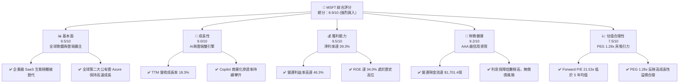

# MSFT 基本面深度分析報告

> **報告日期**：2026-06-07 ｜ **語言**：繁體中文 ｜ **數據來源**：Yahoo Finance, Finviz, StockAnalysis, Roic.ai ｜ **分析師**：CFA 級機構研究

---

## 目錄

| # | 章節 | 核心結論 |
|---|------|----------|
| 1 | [執行摘要](#1-執行摘要) | **買入**評級，基準目標價 **$560.95**，隱含上行空間 **+34.6%** |
| 2 | [公司概覽與商業模式](#2-公司概覽與商業模式) | 雲端（Azure）與 AI（Copilot）雙引擎驅動，具備極深寬的「生態鎖定」護城河 |
| 3 | [損益表深度分析](#3-損益表深度分析) | TTM 營收突破 **$3,182.7億**（YoY +18.3%），淨利率高達 **39.3%** |
| 4 | [資產負債表分析](#4-資產負債表分析) | 現金儲備 **$782.3億**，債務結構極其健康，財務韌性為 AAA 級 |
| 5 | [現金流量深度分析](#5-現金流量深度分析) | TTM 營運現金流 **$1,701.4億**，資本支出擴張反映 AI 基礎設施的強烈需求 |
| 6 | [獲利能力與資本效率](#6-獲利能力與資本效率) | ROE 達 **34.0%**，ROIC 達 **39.0%**，遠超 WACC（9.45%），超額價值創造力強勁 |
| 7 | [估值深度分析](#7-估值深度分析) | Forward P/E **21.53x**，相較於歷史均值與同業，估值已具備高安全邊際 |
| 8 | [成長催化劑](#8-成長催化劑) | 企業級 AI 應用全面落地、Azure AI 算力市佔率提升、GitHub Copilot 貨幣化加速 |
| 9 | [風險矩陣](#9-風險矩陣) | AI 資本支出回報率不及預期、反壟斷監管加劇、估值倍數收縮 |
| 10 | [投資建議](#10-投資建議) | 綜合評分 **8.9/10**，建議成長型與長線價值型投資人逢低分批佈局 |

---

## 1. 執行摘要

### 1.1 核心評分儀表板



### 1.2 評分進度條視覺化

```
╔══════════════════════════════════════════════════════════════╗
║                MSFT 多維度評分儀表板 (1-10