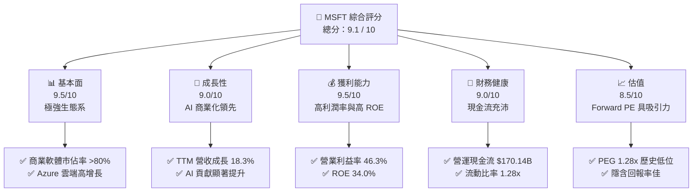

# MSFT 基本面深度分析報告

> **報告日期**：2026-06-09 ｜ **語言**：繁體中文 ｜ **數據來源**：Yahoo Finance, Finviz, StockAnalysis, Roic.ai ｜ **分析師**：CFA 級機構研究

---

## 目錄

| # | 章節 | 核心結論 |
|---|------|----------|
| 1 | 執行摘要 | 評級：**強烈買入** ｜ 目標價區區：$370.00 - $560.00 ｜ 基準目標價：**$480.00** |
| 2 | 公司概覽與商業模式 | 雲端與 AI 雙引擎驅動，具備極深之「客戶鎖定」與「生態系統」護城河 |
| 3 | 損益表深度分析 | TTM 營收達 $318.27B（YoY +18.3%），淨利率高達 39.3%，獲利品質極佳 |
| 4 | 資產負債表分析 | 資產總額達 $694.23B，淨債務結構穩健，利息保障倍數無虞 |
| 5 | 現金流量深度分析 | TTM 營運現金流達 $170.14B，AI 資本支出擴張雖短期壓抑 FCF，但長期回報率高 |
| 6 | 獲利能力與資本效率 | ROE 達 34.0%，ROIC 達 39.0% 遠超 WACC（8.77%），強力創造股東價值 |
| 7 | 估值深度分析 | Forward P/E 為 20.86x，相較歷史均值與同業，估值具備高度安全邊際 |
| 8 | 成長催化劑 | Copilot 商業化滲透與 Azure AI 基礎設施需求持續爆發 |
| 9 | 風險矩陣 | AI 資本回報不及預期與監管反壟斷為核心風險 |
| 10| 投資建議 | 基準情境下行空間有限，上行報酬率達 +19.0%，建議逢低分批佈局 |

---

## 1. 執行摘要

### 1.1 核心評分儀表板



### 1.2 評分進度條視覺化

```
╔══════════════════════════════════════════════════════════════╗
║               MSFT 多維度評分儀表板 (1-10分)                 ║
╠══════════════════════════════════════════════════════════════╣
║ 基本面強度  9.5 ▓▓▓▓▓▓▓▓▓▓▓▓▓▓▓▓▓▓▓░  ★★★★★           ║
║ 成長動能    9.0 ▓▓▓▓▓▓▓▓▓▓▓▓▓▓▓▓▓▓░░  ★★★★★           ║
║ 獲利品質    9.5 ▓▓▓▓▓▓▓▓▓▓▓▓▓▓▓▓▓▓▓░  ★★★★★           