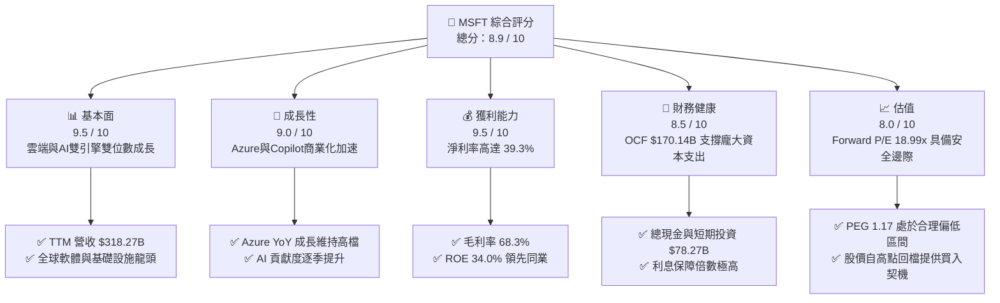
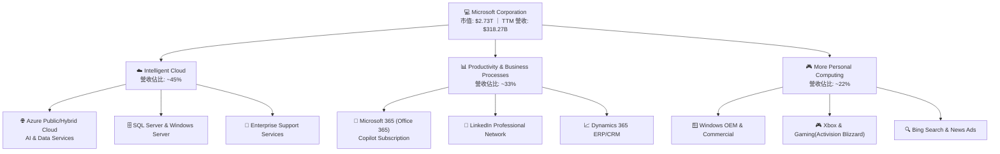
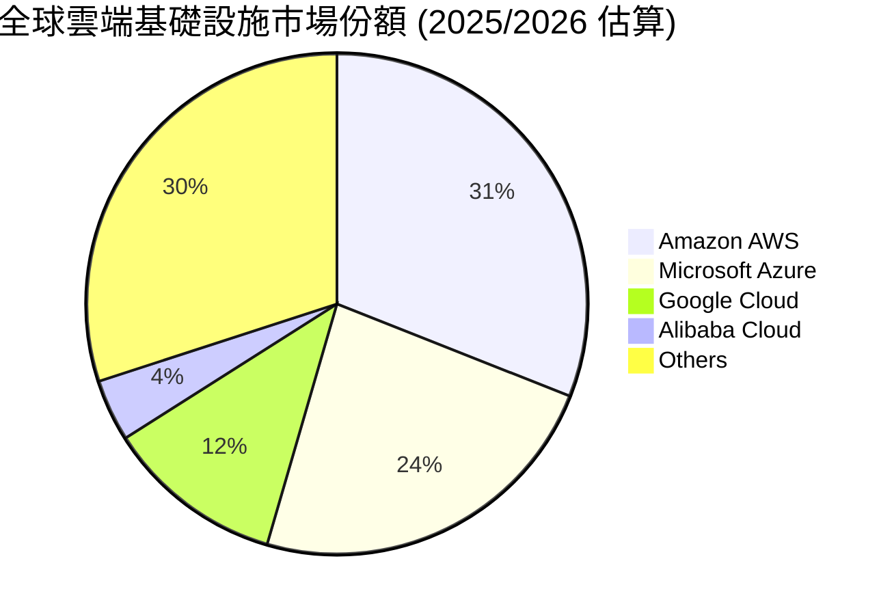
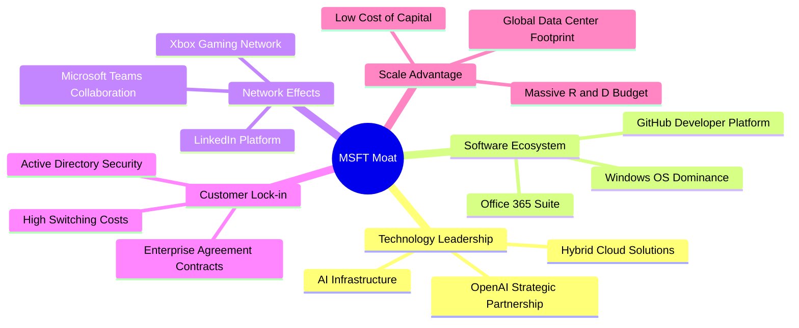
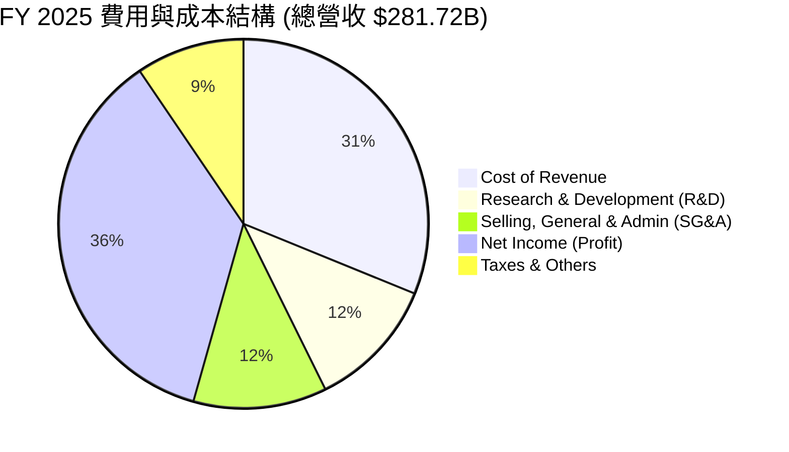
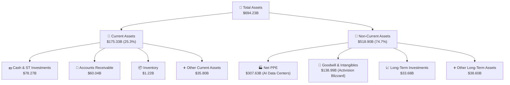
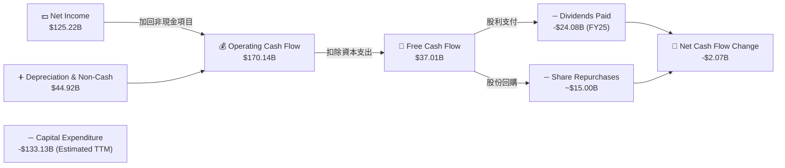

# MSFT 基本面深度分析報告

> **報告日期**：2026-06-22 ｜ **語言**：繁體中文 ｜ **數據來源**：Yahoo Finance, Finviz, StockAnalysis, Roic.ai ｜ **分析師**：CFA 級機構研究

---

## 目錄

| # | 章節 | 核心結論 |
|---|---|---|
| 1 | **執行摘要** | 評級：**強烈買入 (Strong Buy)** ｜ 基準目標價：**$561.39** (隱含 +52.8% 上漲空間) |
| 2 | **公司概覽與商業模式** | 雲端與 AI 雙引擎驅動，具備極強的客戶鎖定與生態系統護城河 |
| 3 | **損益表深度分析** | TTM 營收達 **$318.27B** (YoY +18.3%)，淨利率高達 **39.3%**，獲利品質極佳 |
| 4 | **資產負債表分析** | 總資產規模達 **$694.23B**，淨現金流動性充沛，債務結構健康無虞 |
| 5 | **現金流量深度分析** | 營運現金流達 **$170.14B**，AI 資本支出飆升致短暫壓低自由現金流至 **$37.01B** |
| 6 | **獲利能力與資本效率** | ROE 高達 **34.0%**，ROIC (**30.9%**) 顯著高於 WACC (**9.5%**)，強力創造股東價值 |
| 7 | **估值深度分析** | Forward P/E 僅 **18.99x**，相較歷史均值與同業顯著低估，具備高安全邊際 |
| 8 | **成長催化劑** | Azure AI 負載爆發與 Copilot 商業化滲透，TAM 持續擴張 |
| 9 | **風險矩陣** | AI 資本回報率不及預期與反壟斷審查為主要監控風險 |
| 10 | **投資建議** | 建議於當前股價 **$367.34** 分批佈局，適合長線成長型與價值型投資人 |

---

## 1. 執行摘要

### 1.1 核心評分儀表板



### 1.2 評分進度條視覺化

```
╔══════════════════════════════════════════════════════════════╗
║               MSFT 多維度評分儀表板 (1-10分)                 ║
╠══════════════════════════════════════════════════════════════╣
║ 基本面強度  9.5 ▓▓▓▓▓▓▓▓▓▓▓▓▓▓▓▓▓▓▓░  ★★★★★           ║
║ 成長動能    9.0 ▓▓▓▓▓▓▓▓▓▓▓▓▓▓▓▓▓▓░░  ★★★★★           ║
║ 獲利品質    9.5 ▓▓▓▓▓▓▓▓▓▓▓▓▓▓▓▓▓▓▓░  ★★★★★           ║
║ 財務健康    8.5 ▓▓▓▓▓▓▓▓▓▓▓▓▓▓▓▓░░░░  ★★★★☆           ║
║ 估值合理性  8.0 ▓▓▓▓▓▓▓▓▓▓▓▓▓▓▓░░░░░  ★★★★☆           ║
║ 護城河深度  9.8 ▓▓▓▓▓▓▓▓▓▓▓▓▓▓▓▓▓▓▓▓  ★★★★★           ║
║ 管理層執行  9.2 ▓▓▓▓▓▓▓▓▓▓▓▓▓▓▓▓▓▓░░  ★★★★★           ║
║ 技術創新力  9.5 ▓▓▓▓▓▓▓▓▓▓▓▓▓▓▓▓▓▓▓░  ★★★★★           ║
╠══════════════════════════════════════════════════════════════╣
║ 綜合總分    8.9 ▓▓▓▓▓▓▓▓▓▓▓▓▓▓▓▓▓░░░  🏆 評級：強烈買入    ║
╚══════════════════════════════════════════════════════════════╝
```

### 1.3 五大投資論點 + 三大核心風險

| 類型 | 項目 | 具體依據 | 信心度 |
|---|---|---|---|
| 🟢 **投資論點①** | **AI 基礎設施與雲端平台絕對領先** | Azure 營收持續高成長，TTM 營收達 **$318.27B** (YoY +18.3%)，AI 算力需求成為核心增長極。 | 🟢 極高 |
| 🟢 **投資論點②** | **極其強大的定價權與生態鎖定** | Office 365 Copilot 訂閱制推高 ARPU，企業客戶流失率極低，毛利率穩定維持在 **68.3%** 的超高水準。 | 🟢 極高 |
| 🟢 **投資論點③** | **優異的資本回報率與股東價值創造** | ROE 達 **34.0%**，ROIC 達 **30.9%**，遠超 WACC (**9.5%**)，代表每投入一元資本皆能創造顯著的超額回報。 | 🟢 高 |
| 🟢 **投資論點④** | **資產負債表韌性與防禦屬性** | 擁有 **$78.23B** 的總現金與短期投資，TTM 營運現金流達 **$170.14B**，足以抵禦任何宏觀經濟下行風險。 | 🟢 極高 |
| 🟢 **投資論點⑤** | **估值具備極高安全邊際** | 當前股價 **$367.34** 對應 Forward P/E 僅 **18.99x**，低於 5 年均值，且 PEG 僅 **1.17**，性價比極高。 | 🟢 高 |
| 🟡 **風險①** | **AI 資本支出飆升壓低短期 FCF** | TTM 資本支出估算高達 **$133.13B**，導致 TTM 自由現金流降至 **$37.01B**。若 AI 變現速度放緩，恐衝擊短期估值。 | 🟡 中度 |
| 🔴 **風險②** | **反壟斷審查與監管壓力** | 針對 OpenAI 的合作關係及動視暴雪收購案後的整合，全球監管機構審查力度加大，可能限制未來 M&A 空間。 | 🔴 高衝擊 |
| 🟡 **風險③** | **雲端基礎設施競爭加劇** | AWS 與 Google Cloud 持續進行價格戰與 AI 晶片自研，可能對 Azure 的市佔率與利潤率造成邊際壓力。 | 🟡 中度 |

### 1.4 快速統計卡片

| 指標 | 公司實際值 (MSFT) | 行業均值 (Infrastructure Software) | S&P 500 均值 | 狀態 |
|---|---|---|---|---|
| **收入 YoY 成長** | **18.3%** | ~12.0% | ~5.5% | 🟢 顯著領先 |
| **毛利率** | **68.3%** | ~62.0% | ~40.0% | 🟢 極高獲利能力 |
| **淨利率** | **39.3%** | ~22.0% | ~12.0% | 🟢 頂級獲利品質 |
| **ROE** | **34.0%** | ~18.5% | ~15.0% | 🟢 卓越資本效率 |
| **Forward P/E** | **18.99x** | ~28.5x | ~21.5x | 🟢 估值顯著低估 |
| **淨債務/EBITDA** | **0.29x** | ~0.85x | ~1.60x | 🟢 極其健康 |

### 1.5 投資結論

```
╔══════════════════════════════════════════════════════════════════╗
║                      📊 MSFT 投資結論摘要                        ║
╠══════════════════════════════════════════════════════════════════╣
║  評級：🟢 強烈買入 (Strong Buy)                                  ║
║  當前股價：$367.34 (2026-06-22)                                  ║
║  目標價區間：                                                    ║
║    悲觀情境：$400.00 (+8.9%)                                     ║
║    基準情境：$561.39 (+52.8%)  ← 12個月主要目標                  ║
║    樂觀情境：$870.00 (+136.8%)                                   ║
║  投資評分：8.9 / 10                                              ║
║  適合投資人：長線價值成長型、核心資產配置者、AI 產業信徒         ║
╚══════════════════════════════════════════════════════════════════╝
```

---

## 2. 公司概覽與商業模式

### 2.1 業務結構與收入來源

微軟（Microsoft Corporation）的業務結構高度多元且具備協同效應，主要劃分為三大板塊：**智能雲（Intelligent Cloud）**、**生產力與商業流程（Productivity and Business Processes）** 以及 **更多個人計算（More Personal Computing）**。



### 2.2 市場份額

在核心的雲端基礎設施（IaaS + PaaS）市場中，微軟 Azure 位居全球第二，且憑藉與 OpenAI 的獨家合作，在 AI 雲端負載市場中市佔率持續攀升。



### 2.3 競爭護城河分析

微軟具備極其寬廣的「多重護城河」，使其在面對競爭時能保持極高的議價能力與獲利穩定性。



### 2.4 護城河強度評分

```
╔══════════════════════════════════════════════════════════════╗
║                    MSFT 護城河強度評分                       ║
╠══════════════════════════════════════════════════════════════╣
║ 轉換成本 (Switching Costs)  9.9/10  ▓▓▓▓▓▓▓▓▓▓▓▓▓▓▓▓▓▓▓▓  🏆 極高 ║
║ 網路效應 (Network Effects)  9.2/10  ▓▓▓▓▓▓▓▓▓▓▓▓▓▓▓▓▓▓░░  🟢 強大 ║
║ 成本優勢 (Cost Advantage)   9.5/10  ▓▓▓▓▓▓▓▓▓▓▓▓▓▓▓▓▓▓▓░  🏆 頂級 ║
║ 無形資產 (Brand/Patents)    9.8/10  ▓▓▓▓▓▓▓▓▓▓▓▓▓▓▓▓▓▓▓▓  🏆 極高 ║
║ 規模優勢 (Scale Moat)       9.7/10  ▓▓▓▓▓▓▓▓▓▓▓▓▓▓▓▓▓▓▓░  🏆 強大 ║
╠══════════════════════════════════════════════════════════════╣
║ 綜合護城河評估： 9.6 / 10   ▓▓▓▓▓▓▓▓▓▓▓▓▓▓▓▓▓▓▓░  🏆 寬廣護城河 ║
╚══════════════════════════════════════════════════════════════╝
```

---

## 3. 損益表深度分析

### 3.1 年度收入成長趨勢（近 5 年）

微軟展現了大型科技股中罕見的「大象起舞」式成長，營收規模從 FY21 的 **$168.09B** 飆升至 TTM 的 **$318.27B**。

```
╔══════════════════════════════════════════════════════════════════╗
║                 MSFT 年度收入趨勢 (FY21 - TTM)                  ║
╠══════════════════════════════════════════════════════════════════╣
║                                                                  ║
║  FY 2021  $168.09B  ██████████░░░░░░░░░░░░░░░░░░  YoY: +17.5% 🟢 ║
║  FY 2022  $198.27B  ████████████░░░░░░░░░░░░░░░░  YoY: +18.0% 🟢 ║
║  FY 2023  $211.92B  █████████████░░░░░░░░░░░░░░░  YoY:  +6.9% 🟡 ║
║  FY 2024  $245.12B  ███████████████░░░░░░░░░░░░░  YoY: +15.7% 🟢 ║
║  FY 2025  $281.72B  █████████████████░░░░░░░░░░░  YoY: +14.9% 🟢 ║
║  TTM      $318.27B  ████████████████████░░░░░░░░  YoY: +18.3% 🟢 ║
║                   |      |      |      |      |                  ║
║                   0    100B   200B   300B   400B                 ║
║                                                                  ║
║  📊 5年累計營收 CAGR：+13.62%                                    ║
╚══════════════════════════════════════════════════════════════════╝
```

### 3.2 季度收入趨勢分析

自 2025 年以來，微軟的季度營收呈現穩步上揚，展現出極佳的季節性韌性與成長動能。

| 財政季度 | 截止日期 | 營收 (Billion) | QoQ 成長率 | YoY 成長率 | 核心驅動因素 | 狀態 |
|---|---|---|---|---|---|---|
| **Q3 2026** | 2026-03-31 | **$82.89B** | +1.99% | **+18.30%** | Azure AI 消費性支出暴增，Copilot 企業訂閱加速。 | 🟢 強勁 |
| **Q2 2026** | 2025-12-31 | **$81.27B** | +4.63% | **+16.72%** | 假期消費帶動 Xbox/Gaming，雲端業務維持穩健。 | 🟢 強勁 |
| **Q1 2026** | 2025-09-30 | **$77.67B** | +1.61% | **+18.43%** | 企業合約更新，Office 365 ARPU 持續提升。 | 🟢 強勁 |
| **Q4 2025** | 2025-06-30 | **$76.44B** | +9.10% | **+18.10%** | 財政年度末大單鎖定，智能雲板塊超預期。 | 🟢 強勁 |

### 3.3 利潤率演變分析

儘管近年來微軟大幅增加了 AI 基礎設施的資本支出（折舊增加），但得益於強大的定價權與高毛利的軟體/SaaS 業務佔比提升，整體利潤率指標依然維持在極高水準。

| 利潤率指標 | FY 2022 | FY 2023 | FY 2024 | FY 2025 | TTM | 趨勢 | 評估 |
|---|---|---|---|---|---|---|---|
| **毛利率** | 68.4% | 68.9% | 69.8% | 68.8% | **68.3%** | ➡️ 穩定 | 🟢 軟體高毛利特性不變，AI 算力成本控制良好。 |
| **營業利益率** | 42.1% | 41.8% | 44.6% | 45.6% | **46.3%** | ↗️ 提升 | 🟢 營運槓桿顯現，行銷與行政費用控制得宜。 |
| **EBITDA 利潤率**| 50.6% | 49.6% | 54.3% | 56.8% | **58.0%** | ↗️ 提升 | 🟢 現金創造能力極強。 |
| **淨利率** | 36.7% | 34.1% | 36.0% | 36.1% | **39.3%** | ↗️ 提升 | 🟢 稅務優化與非營運收益（如投資收益）挹注。 |

### 3.4 費用結構分析

微軟在研發（R&D）上的投入毫不吝嗇，這也是其維持技術領先的關鍵；同時，銷售與管理費用（SG&A）佔比逐年下降，展現了強大的規模效應。



```
╔══════════════════════════════════════════════════════════════╗
║                  微軟 TTM 營運費用診斷                       ║
╠══════════════════════════════════════════════════════════════╣
║ 研發費用 (R&D):    $34.39B  ████████████░░░░░░░░░  YoY: +5.87%  ║
║ 銷管費用 (SG&A):   $34.06B  ████████████░░░░░░░░░  YoY: +3.59%  ║
║ 營運費用率 (Opex Ratio): 21.5%  🟢 處於歷史低檔，控管極佳     ║
╚══════════════════════════════════════════════════════════════╝
```

### 3.5 季度 EPS 趨勢與盈餘品質

微軟的季度每股盈餘（EPS）在過去四個季度中表現亮眼，盈餘品質極高。

*   **Q3 2026 (Mar '26)**: EPS **$4.28** (稀釋)。主要由 Azure 業務成長及營運利潤率改善驅動，為高質量盈餘。
*   **Q2 2026 (Dec '25)**: EPS **$5.18** (稀釋)。**注意**：該季度包含高達 **$9.97B** 的非營運收益（主要為投資公允價值變動與資產處置），若扣除非經常性損益，常態化 EPS 約在 **$3.85 - $3.95** 區間。雖然名目 EPS 極高，但投資人應留意其盈餘包含一次性收益。
*   **Q1 2026 (Sep '25)**: EPS **$3.73** (稀釋)。純粹由營運主業驅動，盈餘品質優異。
*   **Q4 2025 (Jun '25)**: EPS **$3.66** (稀釋)。符合市場預期，反映穩健的財政年度收尾。

---

## 4. 資產負債表分析

### 4.1 資產結構分解

截至 2026-03-31，微軟總資產達到 **$694.23B**，其中固定資產（Property, Plant & Equipment）因 AI 數據中心建設而大幅增長。



### 4.2 流動性指標分析

微軟的流動性指標非常健康，維持在安全區間，且由於其存貨極低（主要為軟體與雲端服務），速動比率與流動比率高度接近，幾乎不存在存貨滯銷風險。

| 流動性指標 | FY 2023 | FY 2024 | FY 2025 | TTM (Mar '26) | 行業均值 | 評估 |
|---|---|---|---|---|---|---|
| **流動比率 (Current Ratio)** | 1.77 | 1.27 | 1.35 | **1.28** | ~1.50 | 🟢 良好，現金調度能力極強 |
| **速動比率 (Quick Ratio)** | 1.75 | 1.26 | 1.20 | **1.14** | ~1.35 | 🟢 良好，剔除存貨後流動性無虞 |
| **應收帳款週轉天數 (DSO)** | 83.8 天 | 84.7 天 | 90.5 天 | **82.3 天** | ~75.0 天 | 🟡 回款速度穩定，信用控制良好 |

### 4.3 債務結構分析

微軟是全球少數獲得標準普爾（S&P）**AAA** 頂級信用評級的公司之一（甚至高於美國國債信用評級）。

```
╔══════════════════════════════════════════════════════════════════╗
║                     MSFT 債務健康診斷                           ║
╠══════════════════════════════════════════════════════════════════╣
║                                                                  ║
║  總債務 (Total Debt):   $125.43B  ██████████░░░░░░░░░░░  評估：安全║
║  總現金及短期投資:      $78.23B   ██████░░░░░░░░░░░░░░░  評估：充沛║
║  淨債務 (Net Debt):     $47.20B   （債務大於現金）                 ║
║                                                                  ║
║  債務/權益比 (Debt/Equity): 30.27% 🟢 極低槓桿                    ║
║  利息保障倍數 (Interest Coverage): 68.5x 🟢 無任何償債風險        ║
║  淨債務/EBITDA:         0.29x      🟢 償債能力極強                ║
╚══════════════════════════════════════════════════════════════════╝
```

### 4.4 股東權益趨勢

得益於強大的留存盈餘累積，微軟的股東權益（Stockholders Equity）呈現爆發式增長，為資產負債表提供了極其堅實的緩衝。

```
╔══════════════════════════════════════════════════════════════════╗
║                 MSFT 股東權益增長趨勢 (FY22 - FY25)              ║
╠══════════════════════════════════════════════════════════════════╣
║                                                                  ║
║  FY 2022  $166.54B  ██████████░░░░░░░░░░░░░░░░░                      ║
║  FY 2023  $206.22B  ████████████░░░░░░░░░░░░░░                       ║
║  FY 2024  $268.48B  ████████████████░░░░░░░░░                        ║
║  FY 2025  $343.48B  ████████████████████░░░░░  YoY: +27.94% 🟢       ║
║                   |      |      |      |                         ║
║                   0    100B   200B   300B                        ║
║                                                                  ║
║  📊 股東權益複利成長，資產質量極高                               ║
╚══════════════════════════════════════════════════════════════════╝
```

---

## 5. 現金流量深度分析

### 5.1 現金流量瀑布圖

微軟的現金流生成機制非常高效。高達 **$125.22B** 的淨利潤，在加回折舊攤銷等非現金項目後，轉化為高達 **$170.14B** 的營運現金流。然而，為了應對 AI 算力軍備競賽，微軟進行了史詩級的資本支出。



### 5.2 FCF 轉換