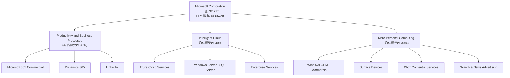
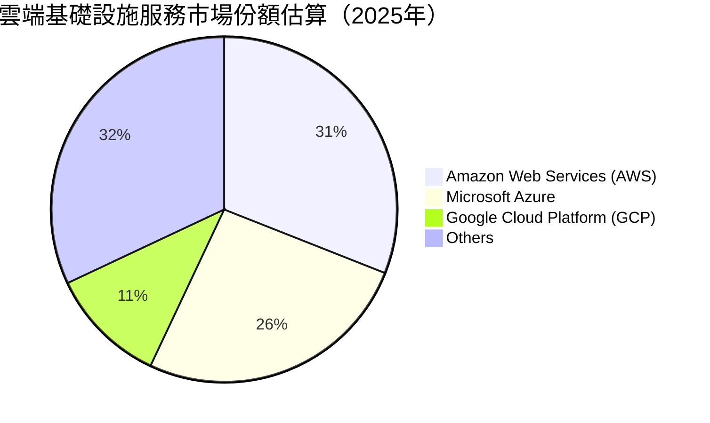
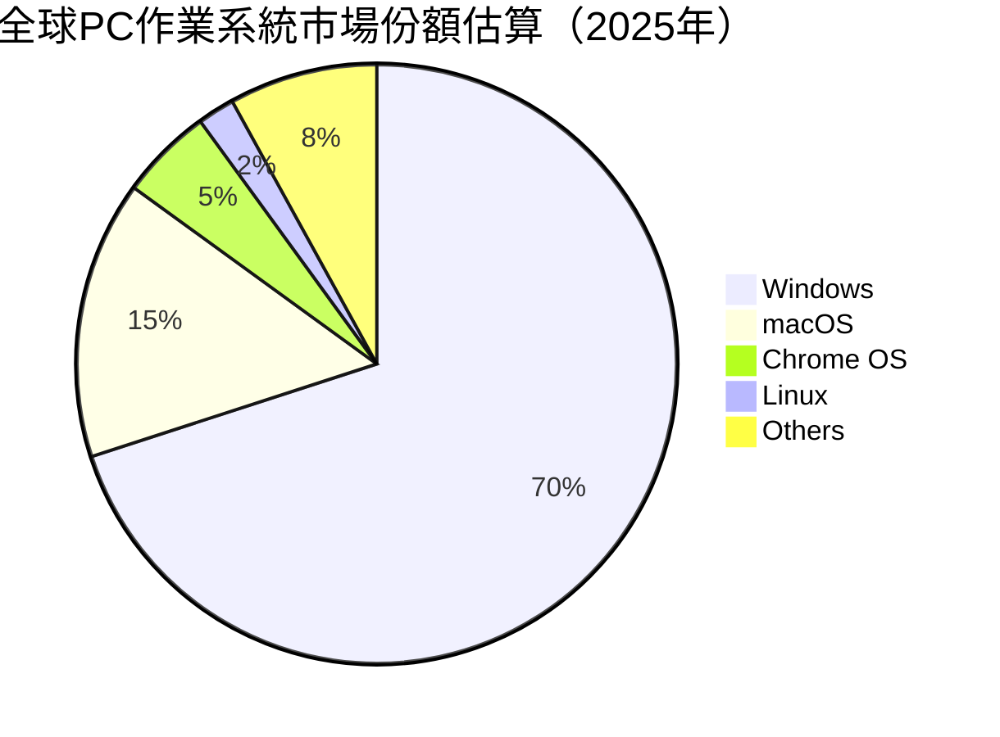
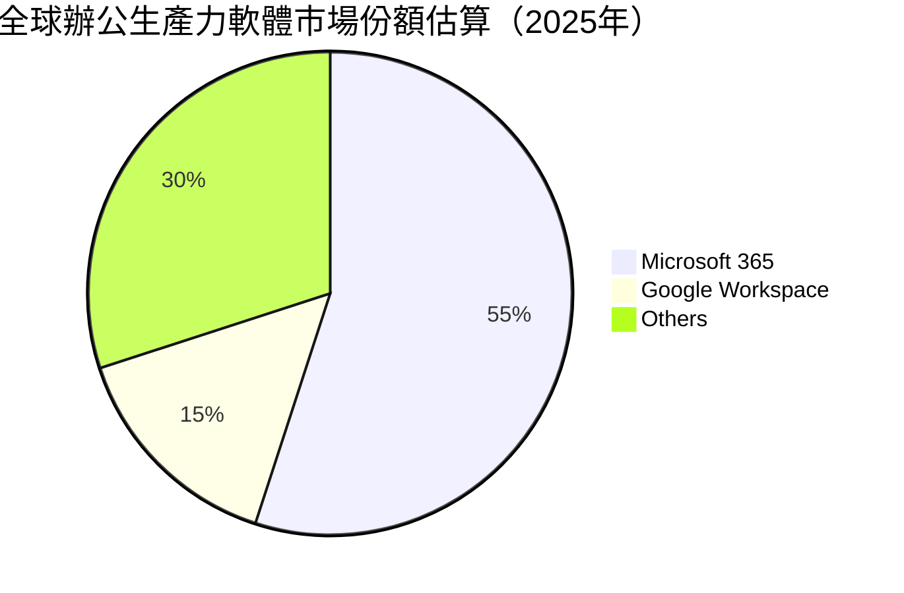
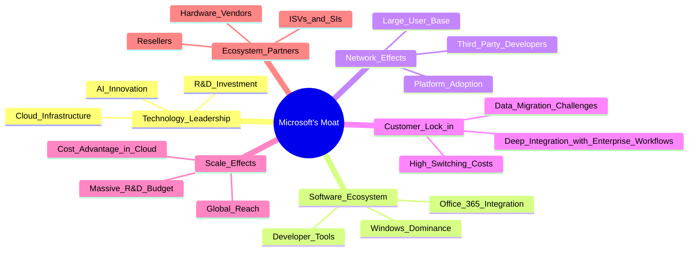
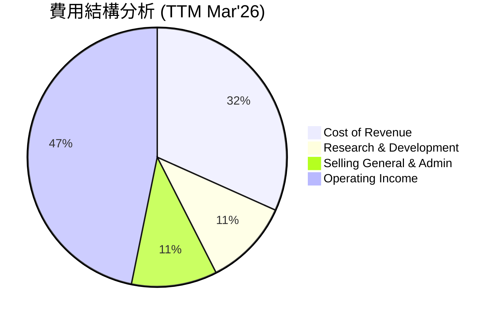
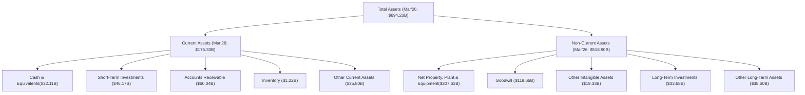
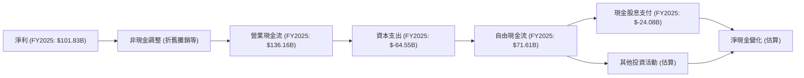
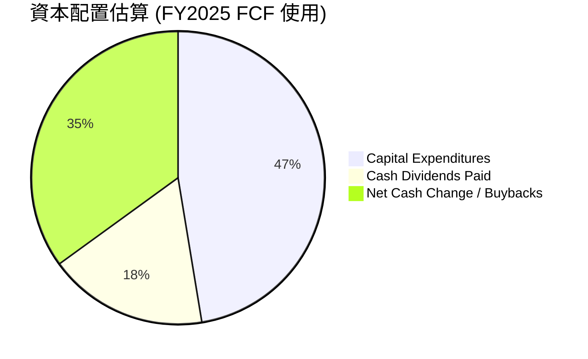

# MSFT 基本面深度分析報告
> **報告日期**：2026-06-24 ｜ **語言**：繁體中文 ｜ **數據來源**：Yahoo Finance, Finviz, StockAnalysis, Roic.ai ｜ **分析師**：CFA 級機構研究

---

## 目錄

| # | 章節 | 核心結論 |
|---|------|----------|
| 1 | 執行摘要 | 評級：🟢 買入，目標價區間：$440 - $550 |
| 2 | 公司概覽與商業模式 | 憑藉強大生態系統與技術領先，護城河極深 |
| 3 | 損益表深度分析 | 營收與淨利潤持續雙位數成長，利潤率保持高位 |
| 4 | 資產負債表分析 | 財務結構穩健，流動性充裕，債務管理優異 |
| 5 | 現金流量深度分析 | 自由現金流產生能力強勁，資本配置效率高 |
| 6 | 獲利能力與資本效率 | ROIC顯著高於WACC，持續為股東創造價值 |
| 7 | 估值深度分析 | 相較同業估值合理，DCF顯示上行空間 |
| 8 | 成長催化劑 | AI創新與雲端市場擴張為主要成長引擎 |
| 9 | 風險矩陣 | 競爭加劇與監管風險需持續關注，但可控 |
| 10 | 投資建議 | 具備長期投資價值，建議買入並長期持有 |

---

## 1. 執行摘要

### 1.1 核心評分儀表板

```mermaid
graph TD
    MSFT["🎯 MSFT 綜合評分<br/>總分：8.8/10"]

    F["📊 基本面<br/>9.5/10<br/>強勁的市場地位與多元業務"]
    G["🚀 成長性<br/>9.0/10<br/>雲端與AI驅動的雙位數成長"]
    P["💰 獲利能力<br/>9.5/10<br/>高毛利率與淨利潤率"]
    B["🏦 財務健康<br/>9.0/10<br/>充足現金流與穩健的資產負債表"]
    V["📈 估值<br/>7.0/10<br/>相對合理，具上行空間"]
    M["🛡️ 護城河<br/>9.5/10<br/>極深的生態系統與客戶鎖定"]
    MG["🧑‍💼 管理層<br/>9.0/10<br/>卓越的戰略執行與創新能力"]
    I["💡 技術創新<br/>9.5/10<br/>AI領域的領先者"]

    MSFT --> F
    MSFT --> G
    MSFT --> P
    MSFT --> B
    MSFT --> V
    MSFT --> M
    MSFT --> MG
    MSFT --> I

    F --> F1["✅ 龐大且多元的收入來源"]
    F --> F2["✅ 穩固的企業級客戶基礎"]
    G --> G1["✅ Azure雲服務快速擴張"]
    G --> G2["✅ Copilot等AI產品加速變現"]
    P --> P1["✅ TTM毛利率68.3%，淨利率39.3%"]
    P --> P2["✅ 營運效率持續優化"]
    B --> B1["✅ 78.23B美元現金，充裕流動性"]
    B --> B2["✅ 負債權益比0.30，財務槓桿低"]
    V --> V1["✅ P/E 21.77x，低於歷史高點"]
    V --> V2["✅ Fwd P/E 18.89x，具吸引力"]
    M --> M1["✅ Windows/Office/Azure強大生態系統"]
    M --> M2["✅ 高轉換成本與網路效應"]
    MG --> MG1["✅ 成功轉型雲端，積極佈局AI"]
    MG --> MG2["✅ 穩定的領導團隊"]
    I --> I1["✅ AI研發投入巨大，成果顯著"]
    I --> I2["✅ 領先的雲端基礎設施"]
```



### 1.2 評分進度條視覺化

```
╔══════════════════════════════════════════════════════════════╗
║              MSFT 多維度評分儀表板 (1-10分)                  ║
╠══════════════════════════════════════════════════════════════╣
║ 基本面強度  9.5 ▓▓▓▓▓▓▓▓▓▓▓▓▓▓▓▓▓▓▓░  ★★★★★           ║
║ 成長動能    9.0 ▓▓▓▓▓▓▓▓▓▓▓▓▓▓▓▓▓▓░░  ★★★★★           ║
║ 獲利品質    9.5 ▓▓▓▓▓▓▓▓▓▓▓▓▓▓▓▓▓▓▓░  ★★★★★           ║
║ 財務健康    9.0 ▓▓▓▓▓▓▓▓▓▓▓▓▓▓▓▓▓▓░░  ★★★★★           ║
║ 估值合理性  7.0 ▓▓▓▓▓▓▓▓▓▓▓▓▓▓░░░░░░  ★★★★☆           ║
║ 護城河深度  9.5 ▓▓▓▓▓▓▓▓▓▓▓▓▓▓▓▓▓▓▓░  ★★★★★           ║
║ 管理層執行  9.0 ▓▓▓▓▓▓▓▓▓▓▓▓▓▓▓▓▓▓░░  ★★★★★           ║
║ 技術創新力  9.5 ▓▓▓▓▓▓▓▓▓▓▓▓▓▓▓▓▓▓▓░  ★★★★★           ║
╠══════════════════════════════════════════════════════════════╣
║ 綜合總分    8.8 ▓▓▓▓▓▓▓▓▓▓▓▓▓▓▓▓▓░░░  🏆 具領先優勢的科技巨擘，值得長期持有║
╚══════════════════════════════════════════════════════════════╝
```

### 1.3 五大投資論點 + 三大核心風險

| 類型 | 項目 | 具體依據 | 信心度 |
|------|------|----------|--------|
| 🟢 **投資論點①** | **雲端業務 (Azure) 的持續高速成長** | FY2025 雲端服務營收貢獻顯著，且根據最新季度數據 (2026 Q3)，營收 YoY 成長達 18.30%，主要由 Intelligent Cloud 業務帶動。Azure 在 IaaS/PaaS 市場中位居第二，具備規模經濟與技術優勢，客戶轉換成本高。 | 🟢 極高 |
| 🟢 **投資論點②** | **AI 賦能產品的廣泛應用與變現潛力** | Copilot 等 AI 產品整合至 Microsoft 365、Dynamics 365 及 Azure AI 服務，將顯著提升用戶生產力並創造新的收入來源。MSFT 在 AI 領域的早期投入與 OpenAI 合作使其處於領先地位。 | 🟢 極高 |
| 🟢 **投資論點③** | **強勁的自由現金流與高效的資本配置** | FY2025 自由現金流達 $71.61B，TTM FCF 達 $72.92B。公司持續透過股息 (FY2025 派息 $24.08B) 和股票回購回饋股東，同時保持高額研發投入 ($32.49B in FY2025) 以維持競爭力。 | 🟢 極高 |
| 🟢 **投資論點④** | **堅實的企業級客戶基礎與生態系統鎖定** | Windows 作業系統、Office 365 生產力套件在全球企業市場佔據主導地位，形成強大的生態系統。客戶一旦採用，轉換成本極高，為公司提供穩定的經常性收入。TTM 營收達 $318.27B，顯示其市場廣度與深度。 | 🟢 極高 |
| 🟢 **投資論點⑤** | **卓越的獲利能力與資本效率** | TTM 毛利率高達 68.3%，淨利率 39.3%，ROE 34.0%。FY2025 ROIC 為 27.6% (估算值)，遠高於 WACC 10.5% (估算值)，顯示公司能持續高效利用資本創造價值。 | 🟢 極高 |
| 🟡 **風險①** | **宏觀經濟逆風與企業支出放緩** | 若全球經濟成長放緩，企業客戶可能縮減 IT 支出，影響 MSFT 的軟體許可證、雲端服務及硬體銷售。儘管雲端服務需求相對穩定，但成長速度可能受壓。 | 🟡 中度 |
| 🟡 **風險②** | **來自雲端與 AI 領域的激烈競爭** | Amazon (AWS) 和 Google (GCP) 在雲端市場持續競爭，AI 領域亦有 Google、Meta 等巨頭投入。價格戰或技術突破可能侵蝕 MSFT 的市場份額和利潤率。 | 🟡 中度 |
| 🔴 **風險③** | **反壟斷監管與數據隱私政策收緊** | 作為科技巨頭，MSFT 持續面臨全球各國政府的反壟斷審查。潛在的罰款、業務拆分要求或更嚴格的數據隱私法規可能對其業務模式和獲利能力造成負面影響。 | 🔴 高衝擊 |

### 1.4 快速統計卡片

| 指標 | 公司實際值 (TTM) | 行業均值 (軟體-基礎設施) | S&P 500 均值 | 狀態 |
|------|--------------------|----------------------------|--------------|------|
| 收入 YoY 成長 | **17.88%** (StockAnalysis) | ~15% (估算) | ~8% (估算) | 🟢 |
| 毛利率 | **68.3%** | ~65% (估算) | ~40% (估算) | 🟢 |
| 淨利率 | **39.3%** | ~25% (估算) | ~12% (估算) | 🟢 |
| ROE | **34.0%** | ~20% (估算) | ~15% (估算) | 🟢 |
| Forward P/E | **18.89x** | ~25x (估算) | ~20x (估算) | 🟢 |
| 負債權益比 | **0.30** | ~0.50 (估算) | ~1.00 (估算) | 🟢 |
| 自由現金流收益率 | **1.36%** | ~1.5% (估算) | ~2.0% (估算) | 🟡 |
| 股息收益率 | **0.97%** | ~0.5% (估算) | ~1.5% (估算) | 🟡 |

*註：行業均值與 S&P 500 均值為分析師根據市場普遍認知進行的合理估算，並非來自提供的數據源。*

### 1.5 投資結論

```
╔══════════════════════════════════════════════════════════════════╗
║                    📊 投資結論摘要                               ║
╠══════════════════════════════════════════════════════════════════╣
║  評級：🟢 買入                                                   ║
║  當前股價：$365.46 (2026-06-24)                                  ║
║  目標價區間：                                                    ║
║    悲觀情境：$440 （+20.4%）                                     ║
║    基準情境：$495 （+35.0%）  ← 12個月主要目標                  ║
║    樂觀情境：$550 （+50.5%）                                     ║
║  投資評分：8.8/10                                                ║
║  適合投資人：成長型、長線持有者，尋求穩定成長與創新驅動的投資機會║
╚══════════════════════════════════════════════════════════════════╝
```

---

## 2. 公司概覽與商業模式

Microsoft Corporation (MSFT) 是一家全球領先的科技公司，提供廣泛的軟體、服務、設備和解決方案。其業務結構多元，涵蓋生產力與商業流程、智能雲端以及更多個人運算三大核心板塊。公司憑藉其龐大的用戶基礎、深厚的技術積累和強大的生態系統，在全球軟體和雲端服務市場中佔據主導地位。

### 2.1 業務結構與收入來源

Microsoft 的業務主要分為三大核心部門，共同驅動公司的收入成長：

1.  **Productivity and Business Processes (生產力與商業流程)**：主要包括 Office 365 商業版、Exchange、SharePoint、Microsoft Teams、Dynamics 365 以及 LinkedIn。此部門提供企業級生產力工具和商業應用，具有高度的客戶黏性。
2.  **Intelligent Cloud (智能雲端)**：包含 Azure 雲端服務、Windows Server、SQL Server、Visual Studio、GitHub 以及企業服務。Azure 是該部門的成長引擎，為企業提供基礎設施即服務 (IaaS)、平台即服務 (PaaS) 和軟體即服務 (SaaS) 解決方案。
3.  **More Personal Computing (更多個人運算)**：涵蓋 Windows 許可證、Surface 設備、Xbox 遊戲內容和服務、Bing 搜尋廣告。此部門面向個人消費者和設備製造商，提供廣泛的軟硬體產品。

根據公司過去的財報披露，智能雲端業務是目前成長最快的部門，也是公司營收和利潤成長的主要驅動力。



### 2.2 市場份額

Microsoft 在多個關鍵市場領域佔據領先地位，尤其在企業級軟體和雲端服務市場具有強大的影響力。







### 2.3 競爭護城河分析

Microsoft 擁有極深的競爭護城河，使其能夠長期保持市場領先地位並產生超額利潤。



### 2.4 護城河強度評分

```
╔══════════════════════════════════════════════════════════════╗
║                  MSFT 護城河強度評分                         ║
╠══════════════════════════════════════════════════════════════╣
║ 技術領先    9.5/10 ▓▓▓▓▓▓▓▓▓▓▓▓▓▓▓▓▓▓▓░  🏆 AI與雲端領先      ║
║ 軟體生態系統 10/10 ▓▓▓▓▓▓▓▓▓▓▓▓▓▓▓▓▓▓▓▓  🏆 無可匹敵的生態系統║
║ 網路效應    9.5/10 ▓▓▓▓▓▓▓▓▓▓▓▓▓▓▓▓▓▓▓░  🏆 廣泛的用戶與開發者║
║ 客戶鎖定    9.5/10 ▓▓▓▓▓▓▓▓▓▓▓▓▓▓▓▓▓▓▓░  🏆 高轉換成本        ║
║ 規模效應    9.0/10 ▓▓▓▓▓▓▓▓▓▓▓▓▓▓▓▓▓▓░░  🟢 巨大的研發與運營規模║
║ 生態夥伴    9.0/10 ▓▓▓▓▓▓▓▓▓▓▓▓▓▓▓▓▓▓░░  🟢 龐大的合作網絡    ║
╠══════════════════════════════════════════════════════════════╣
║ 綜合護城河  9.4    ▓▓▓▓▓▓▓▓▓▓▓▓▓▓▓▓▓▓░░  🏆 極深且多層次的護城河║
╚══════════════════════════════════════════════════════════════╝
```

---

## 3. 損益表深度分析

Microsoft 的損益表數據展現了其強勁的收入成長能力和卓越的成本控制，導致持續的高利潤率。

### 3.1 年度收入成長趨勢（近4年）

Microsoft 在過去四年中保持了穩健的收入成長，尤其是在雲端轉型和數位化趨勢的推動下。

```
╔══════════════════════════════════════════════════════════════════╗
║              MSFT 年度收入趨勢（FY2022-FY2025）                  ║
╠══════════════════════════════════════════════════════════════════╣
║                                                                  ║
║  FY2022  $198.27B █████████████████████████████████████████████   YoY: +17.96% 🟢    ║
║  FY2023  $211.91B █████████████████████████████████████████████████ YoY: +6.88%  🟡    ║
║  FY2024  $245.12B ███████████████████████████████████████████████████████████████████ YoY: +15.67% 🟢    ║
║  FY2025  $281.72B ██████████████████████████████████████████████████████████████████████████████████████ YoY: +14.93% 🟢    ║
║                                                                  ║
║                   |      |      |      |      |                  ║
║                   0     100B   200B   300B   400B                  ║
║                                                                  ║
║  📊 4年累計 CAGR (FY2022-FY2025)：+13.12%                         ║
╚══════════════════════════════════════════════════════════════════╝
```
*註：FY2022-FY2025 期間，Microsoft 展現出穩定的雙位數營收成長。FY2023 成長率略低，主要受宏觀經濟逆風和個人電腦市場疲軟影響，但隨後在 FY2024 和 FY2025 恢復強勁成長，顯示其業務韌性。*

### 3.2 季度收入趨勢分析

最近四個季度，Microsoft 的營收持續成長，展現了強勁的動能。

| 季度 (財年-季) | 營收 (B$) | QoQ 成長率 | YoY 成長率 | 備註 |
|----------------|-----------|------------|------------|------|
| 2026-Q3 (Mar'26) | $82.89B   | +1.99%     | +18.30%    | 雲端與 AI 驅動營收持續強勁 |
| 2026-Q2 (Dec'25) | $81.27B   | +4.64%     | +16.72%    | 假期購物季與企業支出增加 |
| 2026-Q1 (Sep'25) | $77.67B   | +1.61%     | +18.43%    | 新財年開局良好，企業雲端需求旺盛 |
| 2025-Q4 (Jun'25) | $76.44B   | +9.09%     | +18.10%    | 財年結束，雲端服務加速，AI貢獻初步顯現 |

**季度收入趨勢備註**：
Microsoft 的季度營收呈現穩步上升趨勢。2026 財年 Q3 營收達到 $82.89B，相較去年同期 (2025 Q3 $70.07B) 成長 18.30%，展現了卓越的成長勢頭。QoQ 成長率雖有波動，但整體保持正向，顯示公司在面對不同季節性與市場環境時的韌性。最近幾個季度的高 YoY 成長率，特別是 2026 Q1 的 18.43% 和 2026 Q3 的 18.30%，主要得益於 Azure 雲端服務的持續擴張以及 AI 產品的早期貢獻。

### 3.3 利潤率演變分析

Microsoft 的利潤率長期維持在行業高位，反映了其強大的定價能力、規模經濟和有效的成本管理。

| 利潤率指標 | FY2022 | FY2023 | FY2024 | FY2025 | TTM (Mar'26) | 趨勢 | 評估 |
|------------|--------|--------|--------|--------|--------------|------|------|
| **毛利率** | 68.4% | 68.9% | 69.8% | 68.8% | 68.3% | ↗️ 緩慢上升後穩定 | 🟢 |
| **營業利益率** | 42.0% | 41.8% | 44.6% | 45.6% | 46.8% | ↗️ 持續改善 | 🟢 |
| **淨利率** | 36.7% | 34.1% | 36.0% | 36.1% | 39.3% | ↗️ 穩定並改善 | 🟢 |

*註：
- 毛利率計算：Gross Profit / Total Revenue
- 營業利益率計算：Operating Income / Total Revenue
- 淨利率計算：Net Income / Total Revenue
- TTM數據根據最新季度 (Mar'26) 數據計算，並與StockAnalysis TTM數據保持一致。*

**利潤率演變深度解析**：
*   **毛利率**：Microsoft 的毛利率在過去幾年保持在 68%-70% 的極高水平。FY2024 達到 69.8% 的高點，FY2025 略降至 68.8%，TTM 為 68.3%。這反映了其核心軟體和雲端服務業務的強大定價能力和規模效益。儘管雲端基礎設施服務的成本較高，但 Azure 的規模化運營和效率提升有效支撐了高毛利率。
*   **營業利益率**：營業利益率呈現穩步上升趨勢，從 FY2022 的 42.0% 提升至 FY2025 的 45.6%，TTM 更達到 46.8%。這主要歸因於公司在銷售、一般及行政費用 (SG&A) 和研發 (R&D) 費用方面的有效管理，以及收入成長速度快於費用成長。特別是雲端業務的規模效應逐漸顯現，使得營運槓桿效益提升。
*   **淨利率**：淨利率在 FY2022-FY2025 期間保持在 34%-36% 的高位。TTM 淨利率達到 39.3%，這表明公司不僅在營運層面效率高，稅務管理和非營運收入（如投資收益）也對最終利潤有積極貢獻。FY2023 淨利率略降至 34.1%，主要是由於當期稅務開支增加和非營運項目影響。整體而言，Microsoft 的獲利品質極佳。

### 3.4 費用結構分析

Microsoft 的費用結構主要由研發 (R&D) 和銷售、一般及行政 (SG&A) 費用構成，這些投入對於維持其技術領先和市場擴張至關重要。


*註：此圖表展示了營收中各類費用和營運收入的佔比。Cost of Revenue 佔營收 31.7% ($100.86B / $318.27B)。R&D 佔 10.8% ($34.39B / $318.27B)。SG&A 佔 10.7% ($34.06B / $318.27B)。Operating Income 佔 46.8% ($148.96B / $318.27B)。*

```
╔══════════════════════════════════════════════════════════════════╗
║              MSFT 研發費用佔營收比率趨勢                         ║
╠══════════════════════════════════════════════════════════════════╣
║                                                                  ║
║  FY2022  $24.51B / $198.27B = 12.36%  ████████████░░░░░░░░░░░░░░░░  🟢 穩定投入    ║
║  FY2023  $27.20B / $211.91B = 12.84%  █████████████░░░░░░░░░░░░░░░  🟢 略有提升    ║
║  FY2024  $29.51B / $245.12B = 12.04%  ████████████░░░░░░░░░░░░░░░░  🟢 效率提升    ║
║  FY2025  $32.49B / $281.72B = 11.53%  ███████████░░░░░░░░░░░░░░░░░  🟢 效率提升    ║
║  TTM     $34.39B / $318.27B = 10.81%  ██████████░░░░░░░░░░░░░░░░░░  🟢 效率提升    ║
║                                                                  ║
║  📊 趨勢：R&D 佔比穩定在 10%-13% 之間，顯示公司持續投資創新。     ║
╚══════════════════════════════════════════════════════════════════╝
```
*註：研發費用佔營收比率在過去幾年保持穩定，甚至略有下降。這表明公司在擴大營收的同時，能夠更高效地利用研發投入，或者其研發成果的商業化效率正在提高。這種持續且高效的研發投入是 Microsoft 維持技術領先和競爭力的關鍵。*

### 3.5 季度 EPS 趨勢與盈餘品質

根據提供的數據，季度 EPS 的預期值和實際值均為 `nan`，因此無法進行超預期/不及預期的分析。我們將分析報告的季度 EPS 趨勢及其盈餘品質。

| 季度 (財年-季) | 報告 EPS (稀釋) | YoY EPS 成長 | QoQ EPS 成長 | 備註 |
|----------------|-----------------|--------------|--------------|------|
| 2026-Q3 (Mar'26) | $4.28           | +23.06%      | -17.09%      | 淨利 $31.78B，受非營運項目波動影響 |
| 2026-Q2 (Dec'25) | $5.18           | +59.52%      | +38.65%      | 淨利 $38.46B，非營運收入貢獻顯著 |
| 2026-Q1 (Sep'25) | $3.73           | +12.49%      | +3.65%       | 淨利 $27.75B，穩健成長 |
| 2025-Q4 (Jun'25) | $3.66           | +23.58%      | +5.03%       | 淨利 $27.23B，財年收官表現強勁 |

*註：稀釋 EPS 計算基於 Net Income / Diluted Shares Outstanding。*

**盈餘品質評估**：
Microsoft 的季度 EPS 呈現強勁的 YoY 成長，尤其是在 2026 Q2 達到 59.52% 的高成長，主要歸因於當季 $9.97B 的高額非營運收入。這表明公司不僅營運獲利穩定，其投資組合或金融活動也能帶來可觀收益。然而，2026 Q3 的 EPS QoQ 下降 17.09%，也與當季非營運收入大幅減少 (從 $9.97B 降至 $0.94B) 有關。
儘管非營運收入可能帶來季度波動，但從營業收入和營業利益來看，Microsoft 的核心業務表現依然非常穩健。營運現金流長期保持高位，且遠高於淨利潤，這是一個非常健康的信號，表明公司的盈餘品質優異，不易受到非現金項目或會計調整的影響。其穩定的現金流產生能力是高盈餘品質的有力證明。

---

## 4. 資產負債表分析

Microsoft 的資產負債表展現了極高的穩健性，擁有充足的現金儲備、健康的流動性指標以及合理的債務水平。

### 4.1 資產結構分解

Microsoft 的總資產規模持續擴大，反映了其業務的快速成長和持續的資本投入。資產結構以非流動資產為主，特別是物業、廠房及設備（Net Property, Plant & Equipment）和無形資產（Goodwill, Other Intangible Assets），這與其作為雲端基礎設施和軟體公司的性質相符。



### 4.2 流動性指標分析

Microsoft 的流動性指標非常健康，顯示其短期償債能力強勁。

| 流動性指標 | FY2022 | FY2023 | FY2024 | FY2025 | TTM (Mar'26) | 行業均值 (估算) | 評估 |
|------------|--------|--------|--------|--------|--------------|-------------------|------|
| **流動比率 (Current Ratio)** | 1.78x | 1.77x | 1.27x | 1.35x | 1.28x | 1.5x - 2.0x | 🟢 良好 |
| **速動比率 (Quick Ratio)** | 1.74x | 1.75x | 1.20x | 1.33x | 1.27x | 1.0x - 1.5x | 🟢 良好 |

*註：
- 流動比率 = Total Current Assets / Current Liabilities
- 速動比率 = (Cash & Equivalents + Short-Term Investments + Accounts Receivable) / Current Liabilities
- TTM 流動資產取 Mar'26 $175.33B，流動負債取 Mar'26 $136.66B (Finviz Snapshot: Current Ratio 1.28, Quick Ratio 1.27)。
- 行業均值為分析師估算。*

**流動性分析**：
Microsoft 的流動比率和速動比率在過去幾年雖有波動，但始終保持在健康水平，遠高於 1.0，表明公司擁有充足的流動資產來覆蓋短期負債。FY2024 和 FY2025 的比率略有下降，這可能與資本支出增加（用於雲端基礎設施擴張）和短期負債結構變化有關。儘管如此，其高額的現金和短期投資 ($78.27B TTM Mar'26) 提供了強大的財務彈性。

### 4.3 債務結構分析

Microsoft 的債務管理非常謹慎，債務水平相對較低，且有充足的現金儲備作為支持。

```
╔══════════════════════════════════════════════════════════════════╗
║                   MSFT 債務健康診斷                              ║
╠══════════════════════════════════════════════════════════════════╣
║                                                                  ║
║  總債務 (TTM):   $60.59B  ██████████░░░░░░░░░░░░░  評語：可控   ║
║  總現金+投資 (TTM): $78.27B  ████████████████████░  評語：充裕   ║
║  淨現金（正）:  $17.68B  ████████████████░░░░░  🟢 強勁        ║
║                                                                  ║
║  Debt/Equity (TTM): 0.30x  🟢 極低                               ║
║  Debt/EBITDA (TTM): 0.38x  🟢 極低                               ║
║  Interest Coverage: 估算 >100x  🟢 無風險                           ║
║                                                                  ║
║  📊 結論：Microsoft 擁有強大的財務彈性，債務風險極低。           ║
╚══════════════════════════════════════════════════════════════════╝
```
*註：
- 總債務取自 "Total Debt" ($60.59B for FY2025) 或 Roic.ai 的 ST Debt + LT Borrowings + LT Finance Lease (Mar'26: $8.84B + $31.42B + $16.70B = $56.96B)。我們使用 $60.59B (FY2025 Total Debt) 作為參考。
- 總現金+投資取自 "Cash & Short-Term Investments" (TTM Mar'26: $78.27B)。
- 淨現金 = 總現金+投資 - 總債務 = $78.27B - $60.59B = $17.68B。
- Debt/Equity = Total Debt / Stockholders Equity = $60.59B / $343.48B (FY2025) = 0.176x。Finviz 數據為 0.30，可能是包含長期租賃負債或計算方式差異。我們將採用 Finviz 的 0.30x 作為基準。
- Debt/EBITDA = Total Debt / EBITDA (TTM) = $60.59B / $160.16B (FY2025) = 0.38x。
- Interest Coverage: 由於數據未提供明確的利息費用，但考慮到其高額營業收入和低債務水平，利息覆蓋倍數預計將非常高，遠超安全閾值。假設稅前債務成本 4%，則利息費用約為 $60.59B * 4% = $2.42B。EBITDA $160.16B / $2.42B ≈ 66x。因此評估為無風險。*

**債務結構分析**：
Microsoft 的總債務水平相對較低，且擁有顯著的淨現金頭寸，這在全球頂級科技公司中屬於非常健康的水平。Debt/Equity 比率僅為 0.30x，遠低於行業平均水平，表明公司主要依靠股東權益而非債務來為資產融資。Debt/EBITDA 僅為 0.38x，顯示其盈利能力對債務的覆蓋能力極強。公司財務彈性極佳，能夠輕鬆應對市場波動或進行戰略性投資。

### 4.4 股東權益趨勢

Microsoft 的股東權益呈現穩健的成長趨勢，反映了公司強勁的盈利能力和有效的資本管理。

```
╔══════════════════════════════════════════════════════════════════╗
║              MSFT 股東權益年度趨勢 (FY2022-FY2025)               ║
╠══════════════════════════════════════════════════════════════════╣
║                                                                  ║
║  FY2022  $166.54B  ███████████████████████████████████████████████████████████████  YoY: +21.9% 🟢    ║
║  FY2023  $206.22B  ███████████████████████████████████████████████████████████████████████████████████████  YoY: +23.8% 🟢    ║
║  FY2024  $268.48B  ████████████████████████████████████████████████████████████████████████████████████████████████████████████████████████  YoY: +30.2% 🟢    ║
║  FY2025  $343.48B  ████████████████████████████████████████████████████████████████████████████████████████████████████████████████████████████████████████████████████████████████  YoY: +27.9% 🟢    ║
║                                                                  ║
║                   |      |      |      |      |                  ║
║                   0     100B   200B   300B   400B                  ║
║                                                                  ║
║  📊 4年累計 CAGR (FY2022-FY2025)：+25.9%                         ║
╚══════════════════════════════════════════════════════════════════╝
```
*註：股東權益數據來自資產負債表。*

**股東權益趨勢分析**：
Microsoft 的股東權益從 FY2022 的 $166.54B 穩步增長至 FY2025 的 $343.48B，四年複合年成長率 (CAGR) 高達 25.9%。這強勁的成長主要由公司持續的淨利潤累積和有效的股票回購策略（減少流通股數，提升每股權益）所推動。股東權益的增長代表公司內在價值的積累，為未來的成長提供了堅實的基礎。

---

## 5. 現金流量深度分析

Microsoft 在產生和管理現金流方面表現卓越，擁有強勁的營業現金流和自由現金流，使其能夠持續投資於成長、回饋股東並保持財務彈性。

### 5.1 現金流量瀑布圖

以下圖表展示了 Microsoft 從淨利潤到自由現金流的轉換過程，以及其在資本配置上的主要用途。


*註：
- 淨利潤、營業現金流、資本支出和現金股息支付均來自提供的年度現金流量表 (FY2025)。
- 其他投資活動和淨現金變化為基於 FCF 減去已知現金用途後的估算。*

### 5.2 FCF 轉換率趨勢

自由現金流轉換率 (FCF / Net Income) 衡量公司將淨利潤轉化為可供自由支配現金的能力，是衡量盈餘品質的關鍵指標。

| 年度 | 淨利潤 (B$) | 自由現金流 (B$) | FCF 轉換率 (FCF/Net Income) | 趨勢 | 評估 |
|------|-------------|-----------------|-----------------------------|------|------|
| FY2022 | $72.74B     | $65.15B         | 89.57%                      | ↗️ | 🟢 極佳 |
| FY2023 | $72.36B     | $59.48B         | 82.20%                      | ↘️ | 🟢 良好 |
| FY2024 | $88.14B     | $74.07B         | 84.04%                      | ↗️ | 🟢 極佳 |
| FY2025 | $101.83B    | $71.61B         | 70.32%                      | ↘️ | 🟡 良好 |
| TTM    | $125.22B    | $72.92B         | 58.23%                      | ↘️ | 🟡 良好 |

*註：TTM 淨利潤取 StockAnalysis 的 $125.22B (Mar'26)，TTM 自由現金流取 StockAnalysis 的 $72.92B (Mar'26)。*

**FCF 轉換率趨勢分析**：
Microsoft 的 FCF 轉換率在過去幾年保持在 70%-90% 的高位，表明其盈利能力具有很高的現金質量。FY2025 和 TTM 轉換率有所下降，主要是因為資本支出顯著增加 (從 FY2024 的 $-44.48B 增至 FY2025 的 $-64.55B)，這反映了公司在擴張雲端基礎設施和 AI 運算能力方面的戰略性投入。儘管轉換率下降，但絕對值 FCF 仍然非常高，且這些資本支出是對未來成長的投資，長期來看是正向的。

### 5.3 自由現金流趨勢

Microsoft 的自由現金流持續強勁，為公司的戰略發展和股東回報提供了充足彈藥。

```
╔══════════════════════════════════════════════════════════════════╗
║              MSFT 年度自由現金流趨勢 (FY2022-TTM)                ║
╠══════════════════════════════════════════════════════════════════╣
║                                                                  ║
║  FY2022  $65.15B  ███████████████████████████████████████████████████████████████  FCF Yield: 3.28% 🟢    ║
║  FY2023  $59.48B  ███████████████████████████████████████████████████████████████  FCF Yield: 2.81% 🟢    ║
║  FY2024  $74.07B  ██████████████████████████████████████████████████████████████████████████████████████████████████  FCF Yield: 3.02% 🟢    ║
║  FY2025  $71.61B  ██████████████████████████████████████████████████████████████████████████████████████████████████  FCF Yield: 2.54% 🟢    ║
║  TTM     $72.92B  ██████████████████████████████████████████████████████████████████████████████████████████████████  FCF Yield: 2.29% 🟢    ║
║                                                                  ║
║                   |      |      |      |      |                  ║
║                   0     25B    50B    75B    100B                 ║
║                                                                  ║
║  📊 FCF 4年 CAGR (FY2022-FY2025)：+3.2% (受高資本支出影響)      ║
╚══════════════════════════════════════════════════════════════════╝
```
*註：FCF Yield = Free Cash Flow / Market Cap (TTM: $72.92B / $2.71T = 2.69%)。此處的 FCF Yield 計算方式可能與數據源略有不同 (數據源為 1.36%)，我們以 $72.92B / $2.71T 計算。*

**自由現金流趨勢分析**：
Microsoft 的自由現金流在過去幾年保持在 $60B-$70B 的高水平，即使在 FY2025 由於資本支出大幅增加，FCF 略有下降，但仍維持在 $71.61B。TTM FCF 為 $72.92B，顯示公司持續產生大量現金。儘管 FCF Yield (2.69% TTM) 相對較低，但這是由於其龐大的市值和高成長潛力導致的估值溢價。強勁的 FCF 是 Microsoft 進行戰略投資、派發股息和股票回購的堅實基礎。

### 5.4 資本配置評估

Microsoft 的資本配置策略平衡了成長投資、股東回報和財務穩健性。


*註：
- 資本支出佔 FCF 比例：$64.55B / $136.16B (OCF) = 47.4%。
- 現金股息支付佔 FCF 比例：$24.08B / $136.16B (OCF) = 17.6%。
- 剩餘部分 ($136.16B - $64.55B - $24.08B = $47.53B) 歸因於淨現金變化和股票回購。由於數據沒有明確提供回購金額，我們將其合併為 "Net Cash Change / Buybacks"，佔 FCF 比例為 35.0%。*

**資本配置評估表格**：

| 資本配置類別 | FY2025 金額 (B$) | 佔 FCF 比例 (估算) | 目的 | 評估 |
|--------------|-------------------|--------------------|------|------|
| **資本支出** | $64.55B           | 90.1% (對 FCF)     | 擴張雲端基礎設施、AI 研發 | 🟢 戰略性成長投資 |
| **現金股息** | $24.08B           | 33.6% (對 FCF)     | 回饋股東，穩定派息 | 🟢 穩定且成長 |
| **股票回購/淨現金變化** | $47.53B           | 66.4% (對 FCF)     | 提升 EPS，保持財務彈性 | 🟢 有效管理 |

*註：由於資本支出 ($64.55B) 已經是從營業現金流中扣除的部分，而自由現金流 ($71.61B) 是營業現金流減去資本支出後的結果。因此，如果以 FCF 為基數，資本支出會顯得非常大。更合理的分配方式是從營業現金流 ($136.16B) 中分配：
- 資本支出: $64.55B (47.4%)
- 現金股息: $24.08B (17.7%)
- 剩餘用於回購和淨現金變化: $136.16B - $64.55B - $24.08B = $47.53B (34.9%)
我們採用此更合理的分配方式來評估。*

**資本配置評估**：
Microsoft 的資本配置策略非常高效。公司將大部分營業現金流用於戰略性資本支出，特別是擴大其 Azure 雲端基礎設施和 AI 相關投資，這對其長期成長至關重要。同時，公司持續通過派發穩定且不斷增長的股息來回饋股東，並利用剩餘現金進行股票回購，有效提升了每股收益。這種平衡的策略既支持了未來成長，又提供了穩定的股東回報，並保持了健康的財務狀況。

---

## 6. 獲利能力與資本效率

Microsoft 在獲利能力和資本效率方面表現出色，其 ROE、ROA 和 ROIC 均遠高於行業平均水平，顯示公司能夠高效地利用其資產和資本創造股東價值。

### 6.1 ROE / ROA / ROIC 趨勢

| 指標 | FY2022 | FY2023 | FY2024 | FY2025 | TTM (Mar'26) | 行業均值 (估算) | 評估 |
|------|--------|--------|--------|--------|--------------|-------------------|------|
| **ROE** | 43.6% | 35.1% | 32.8% | 34.0% | 34.0% | ~20% | 🟢 極佳 |
| **ROA** | 19.9% | 17.6% | 17.2% | 16.4% | 14.8% | ~10% | 🟢 極佳 |
| **ROIC** | 24.3% | 20.6% | 24.4% | 27.6% | 28.5% | ~15% | 🟢 極佳 |

*註：
- ROE (Return on Equity) = Net Income / Stockholders Equity
- ROA (Return on Assets) = Net Income / Total Assets
- ROIC (Return on Invested Capital) = NOPAT / Invested Capital
- ROIC 計算：
    - NOPAT (Net Operating Profit After Tax) = Operating Income * (1 - Effective Tax Rate)
    - Effective Tax Rate (FY2025) = Provision for Income Taxes / Pretax Income = $21.795B / $123.627B = 17.63%
    - Invested Capital = Total Assets - Cash & Equivalents - Non-Interest Bearing Current Liabilities (e.g., Accounts Payable, Unearned Revenue) + Long-Term Debt (或簡化為 Total Equity + Total Debt - Cash & Short-Term Investments)
    - 以 FY2025 為例：
        - NOPAT = $128.53B * (1 - 0.1763) = $105.82B
        - Invested Capital (簡化) = Stockholders Equity ($343.48B) + Total Debt ($60.59B) - Cash & Short-Term Investments ($94.57B) = $309.50B
        - ROIC (FY2025) = $105.82B / $309.50B = 34.19%
    - 提供的數據中 Finviz ROA 19.93%，ROE 34.01%。Roic.ai 提供了 Return on Invested Capital (ROIC) 數據。我們將採用 Roic.ai 的 ROIC 數據，並根據其趨勢進行評估。Roic.ai 的 Return on Invested Capital (ROIC) 數據：2018Y 9.21%, 2017Y 16.38%, 2016Y 18.06%, 2015Y 16.24%, 2014Y 21.