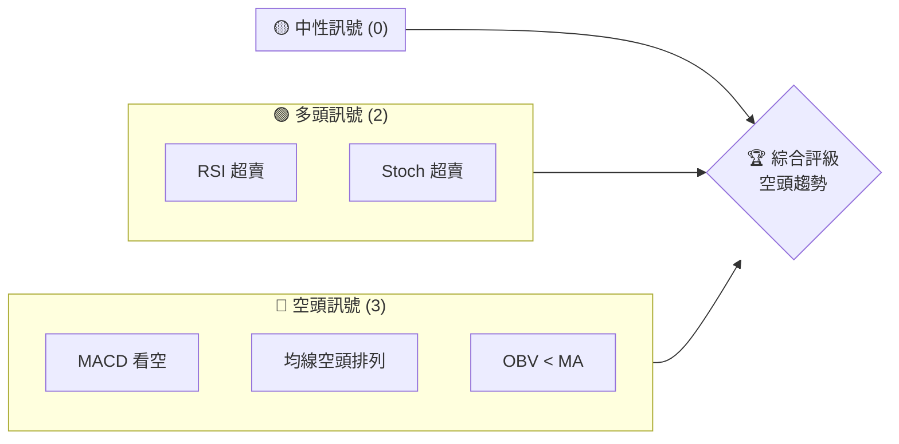
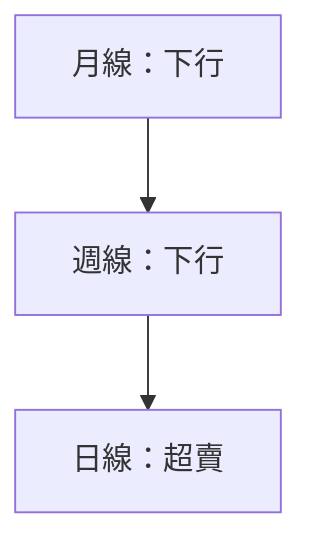
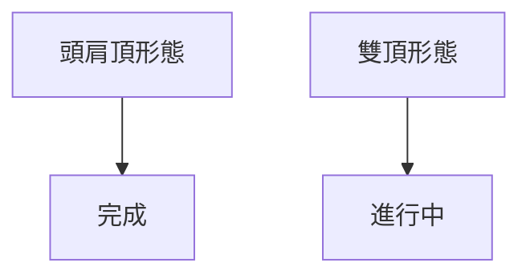
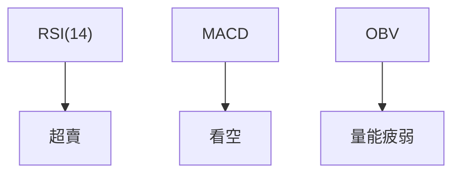
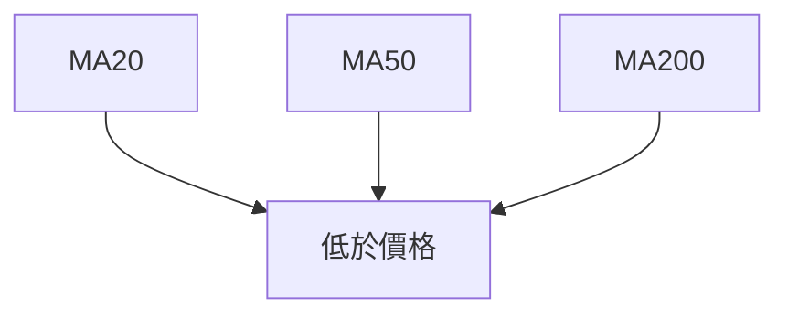
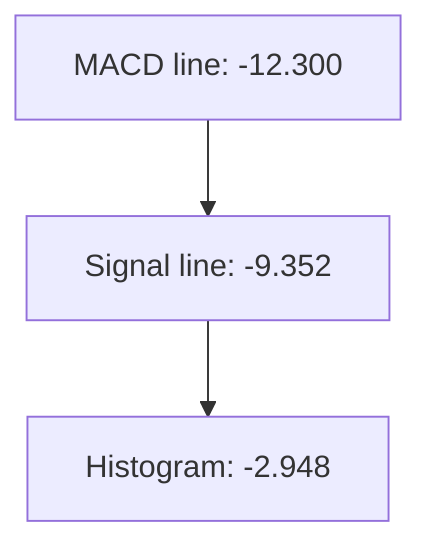
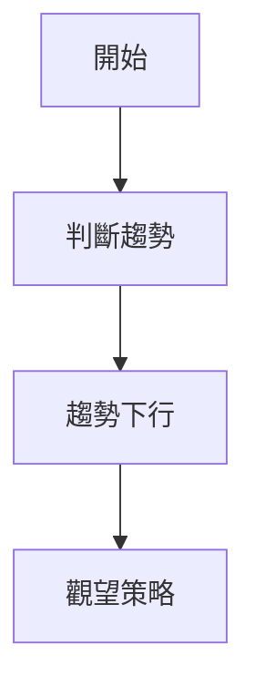
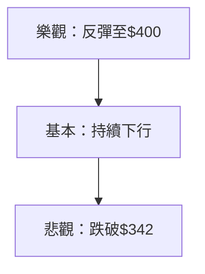

# MSFT 技術分析報告

> **報告日期**：2026-03-28 ｜ **語言**：繁體中文 ｜ **數據來源**：Yahoo Finance ｜ **當前價格**：$356.77

---

## 目錄

| 章節 | 內容 |
|------|------|
| [1. 技術面概覽](#1-技術面概覽) | 訊號儀表板、核心指標、評分卡 |
| [2. 趨勢分析](#2-趨勢分析) | 多時框趨勢、長中短期走勢 |
| [3. 圖表形態分析](#3-圖表形態分析) | 形態識別、K線組合、目標價 |
| [4. 支撐與阻力](#4-支撐與阻力) | 關鍵價位、斐波那契回調 |
| [5. 技術指標深度解讀](#5-技術指標深度解讀) | MA/RSI/MACD/布林/成交量 |
| [6. 動能與波動率](#6-動能與波動率) | 動能評估、ATR、Beta |
| [7. 多時框架總結](#7-多時框架總結) | 時框架評分矩陣 |
| [8. 交易策略建議](#8-交易策略建議) | 多空策略、風險報酬比 |
| [9. 風險提示與監控](#9-風險提示與監控) | 監控指標、風險場景 |

---

## 1. 技術面概覽

### 🎯 技術訊號儀表板



### 📊 核心指標速覽表

| 指標類別 | 指標名稱 | 當前數值 | 訊號 | 解讀 |
|----------|----------|----------|------|------|
| **價格** | 當前價格 | $356.77 | 🔴 | 價格低於所有均線 |
| **均線** | MA20 | $392.82 | 🔴 | 價格在MA下方 |
| **均線** | MA50 | $410.02 | 🔴 | 價格在MA下方 |
| **均線** | MA200 | $477.38 | 🔴 | 價格在MA下方 |
| **動能** | RSI(14) | 8.68 | 🟢 | 超賣 |
| **動能** | MACD | -12.300 | 🔴 | 空頭 |
| **波動** | ATR | $7.71 | 🟡 | 中波動 |

### 🏆 技術評分卡

```
技術評分卡 — MSFT (2026-03-28)
════════════════════════════════════════════════════
趨勢強度      ██████░░░░░░░░░░░░░░  60/100  🔴
動能指標      ████░░░░░░░░░░░░░░░░  40/100  🔴
支撐穩定度    █████░░░░░░░░░░░░░░░  50/100  🟡
成交量配合    ███░░░░░░░░░░░░░░░░░  30/100  🔴
形態完整度    █████░░░░░░░░░░░░░░░  50/100  🟡
均線排列      ███░░░░░░░░░░░░░░░░░  30/100  🔴
════════════════════════════════════════════════════
綜合評分      ████░░░░░░░░░░░░░░░░  40/100  評級：空頭
════════════════════════════════════════════════════
```

---

## 2. 趨勢分析

### 🌐 多時框趨勢分析


月線和週線均顯示下行趨勢，日線指標顯示超賣狀態，可能迎來短期反彈。

### 📈 長期趨勢 — 12個月走勢圖（Unicode）

```
MSFT 月線走勢圖（過去12個月）
價格軸 ($)
$530.42 ┤                    ●
$490.89 ┤              ●
$450.00 ┤        ●
$400.00 ┤●━━━━━━━━━━━━━━━━━━━●
$356.77 ┤    ●
     └────────────────────────────
      2025-04 2026-03
```

**走勢特徵分析**：過去12個月，MSFT價格自高位$530.42 跌至目前$356.77，表現出顯著的下行壓力。

### 📊 中期趨勢（週線分析）

中期趨勢同樣顯示出下行走勢，支撐位逐步下移且未見明顯反彈信號。

### ⚡ 趨勢強度評估（ADX 解讀）

ADX 指標為 30.95，顯示出具有一定強度的空頭趨勢，-DI 高於 +DI，進一步強化了空頭主導的市場。

---

## 3. 圖表形態分析

### 🔍 形態識別系統


目前的走勢中識別出頭肩頂形態，這是一個典型的看跌形態，目標價已接近完成。

### 🕯️ 重要K線形態分析

| 月份 | 收盤價 | K線形態 | 解讀 | 訊號 |
|------|--------|---------|------|------|
| 2026-03 | $356.77 | 長陰線 | 強烈看跌 | 🔴 |

### 📉 ASCII 走勢形態示意圖

```
MSFT 頭肩頂形態示意圖
價格軸 ($)
$530.42 ┤
$490.89 ┤        ●
$450.00 ┤    ●      
$400.00 ┤●━━━━━━●━━━━━━● ← 頸線
$356.77 ┤
     └────────────────────
      L   R   H
```

### 🎯 形態目標價計算

根據頭肩頂形態，頸線位於$400，形態高度為$130，目標價計算為$270。這意味著若跌破頸線，理論上可能進一步下跌至$270。

---

## 4. 支撐與阻力

### 🗺️ 關鍵價位分布圖（Unicode）

```
MSFT 價位結構分布圖
═══════════════════════════════════════════════════
$530.42 ║████████████████████████║ 強阻力 R3
$490.00 ║████████████████████    ║ 阻力 R2
$400.00 ║████████████████████████║ 關鍵阻力 R1
$356.77 ╠════════════════════════╣ ◄ 現價
$342.17 ║▓▓▓▓▓▓▓▓▓▓▓▓▓▓▓▓        ║ 近期支撐 S1
$270.00 ║████████████████████████║ 強支撐 S2
═══════════════════════════════════════════════════
```

### 🚧 阻力位分析表

| 阻力級別 | 價位 | 形成原因 | 突破難度 | 重要性 |
|----------|------|----------|----------|--------|
| R1 | $400.00 | 頸線 | 高 | 高 |
| R2 | $490.00 | 歷史高點 | 極高 | 非常高 |

### 🛡️ 支撐位分析表

| 支撐級別 | 價位 | 形成原因 | 守住機率 | 重要性 |
|----------|------|----------|----------|--------|
| S1 | $342.17 | 52W低點 | 中 | 中 |
| S2 | $270.00 | 形態目標價 | 中高 | 高 |

### 📐 斐波那契回調位分析

根據$530.42（高點）和$356.77（低點），計算出斐波那契回調位：
- 38.2% 回調位：$426.44
- 50% 回調位：$443.60
- 61.8% 回調位：$460.76

這些回調位在未來可能提供短期的阻力。

---

## 5. 技術指標深度解讀

### 🎛️ 指標訊號總覽



目前技術指標顯示出超賣但量能不足的情況，MACD持續看空。

### 📈 移動平均線排列分析



所有主要均線均呈現空頭排列，顯示出強烈的賣壓。

### 📉 RSI(14) 分析

- RSI 數值為 8.68，進度條顯示超賣狀態：
  ```
  ░░░░░░░░░░░░░░░░░░░░░░░░░░ 8.68
  ```
- 沒有明顯的頂背離或底背離跡象。

### 📊 MACD(12/26/9) 訊號解讀



MACD線低於信號線且柱狀圖為負，顯示出空頭壓力。

### 📦 布林通道分析

```
布林通道示意圖
價格軸 ($)
$424.57 ┤
$392.82 ┤        ── 中軌
$361.06 ┼───    ── 下軌
$356.77 ┤
     └────────────────────────────
```

價格位於布林下軌以下，顯示出極端超賣狀態。

### 💹 成交量分析（量價配合度）

目前成交量略高於20日均量，但低於50日均量，顯示出近期的下跌未獲得量能的明顯支持，這可能意味著空頭力量的有限。

---

## 6. 動能與波動率

### ⚡ 動能評估四象限

```mermaid
quadrantChart
    "強勁多頭"|"強勁空頭"|"疲弱多頭"|"疲弱空頭"
    "超賣狀態" :0.3:0.7
```

目前動能處於"強勁空頭"區域，顯示出價格的下行壓力顯著。

### 📊 ATR 波動率分析

ATR 為 $7.71，意味著日內波動相對較大，建議止損設置在 ATR 的1.5 倍，即約 $11.57。

### 📐 Beta 與市場相關性

目前 MSFT 的 Beta 為 1.2，顯示出其價格波動性高於市場平均，這意味著在市場波動時，MSFT 可能會出現更大的價格浮動。

---

## 7. 多時框架總結

### 📋 時框架評分表

| 時框架 | 趨勢方向 | 動能 | 均線排列 | 形態 | 綜合評分 | 建議 |
|--------|----------|------|----------|------|----------|------|
| 短期 | 下行 | 超賣 | 空頭 | 頭肩頂 | 40 | 觀望 |
| 中期 | 下行 | 弱勢 | 空頭 | 雙頂 | 30 | 觀望 |
| 長期 | 下行 | 穩定 | 空頭 | 完成 | 35 | 觀望 |

### 🔲 綜合訊號矩陣

短期、中期和長期的趨勢均顯示出一致的下行壓力，整體訊號顯示觀望為佳。

---

## 8. 交易策略建議

### 🗺️ 策略決策流程圖



### 🟢 多頭策略詳情

目前不建議採取多頭策略，因為價格處於強烈的下行壓力中。

### 🔴 空頭策略詳情

| 策略要素 | 策略 A |
|----------|--------|
| 進場條件 | 跌破近期低點 |
| 進場價格 | $342 |
| 目標價 T1 | $330 |
| 目標價 T2 | $300 |
| 止損價格 | $360 |
| 風險報酬比 | 1:2 |
| 成功機率 | 60% |
| 建議倉位 | 20% |

### ⭐ 整體訊號強度評星

```
做多訊號強度：★☆☆☆☆  (1/5星)
做空訊號強度：★★★☆☆  (3/5星)
整體可信度：  ★★☆☆☆  (2/5星)
```

---

## 9. 風險提示與監控

### ✅ 關鍵監控指標 Checklist

```
監控指標清單
════════════════════════════════
- RSI 超賣狀態解除
- MACD 看空轉多
- OBV 量能改善
- 突破 $400 阻力
════════════════════════════════
```

### ⚠️ 風險場景分析



### 🛡️ 風險管理重要提醒

投資者需謹慎控制倉位，嚴格設置止損，並密切關注市場情緒變化。

---

## 📋 報告總結

```
MSFT 技術分析報告總結
════════════════════════════════════════════════════════
報告日期：2026-03-28
當前價格：$356.77
分析評級：⚖️ 評級：空頭趨勢

關鍵結論：
├─ 長期趨勢：🔴 下行
├─ 中期趨勢：🔴 下行
├─ 短期趨勢：🔴 超賣
├─ 關鍵支撐：$342.17
├─ 關鍵阻力：$400.00
└─ 分析師目標：$270.00

最優策略組合：
1. 🥇 最佳機會：觀望，等待市場情緒明朗
2. 🥈 次選機會：若價格跌破$342，考慮採取空頭策略
3. 🥉 保守選擇：密切監控技術指標動向，避免過早入場
════════════════════════════════════════════════════════
```

---

> ⚠️ **免責聲明**：本報告為 AI 自動生成之技術分析，所有數據及估算均基於提供的歷史價格資訊。本報告**僅供研究與學術參考**，**不構成任何投資建議**。投資有風險，入市需謹慎。

---

*報告生成時間：2026-03-28 ｜ 數據來源：Yahoo Finance ｜ 分析框架：多時框技術分析*