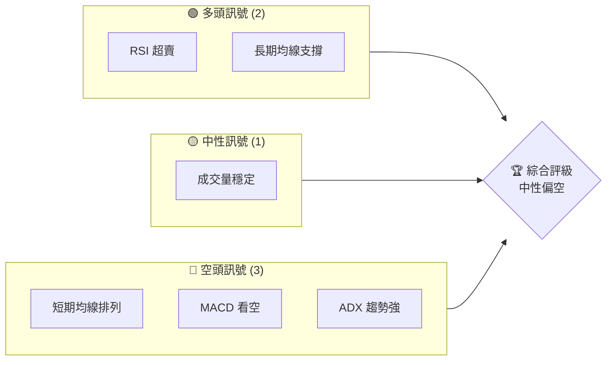
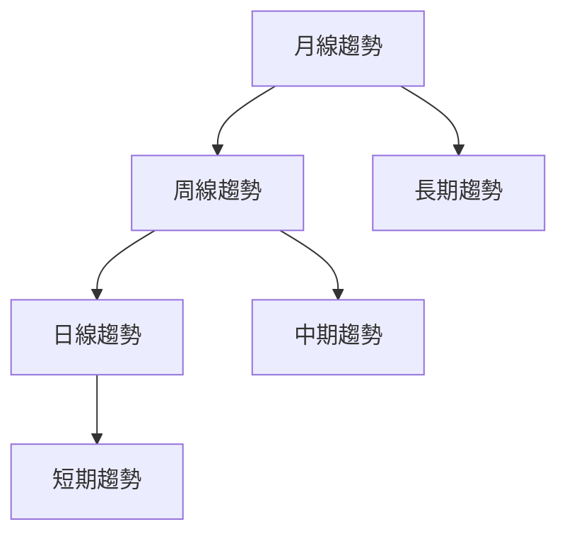
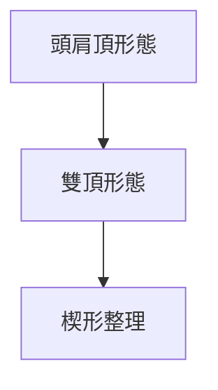
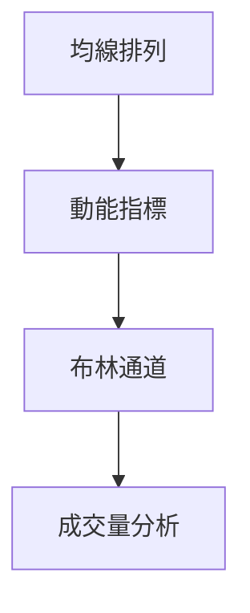
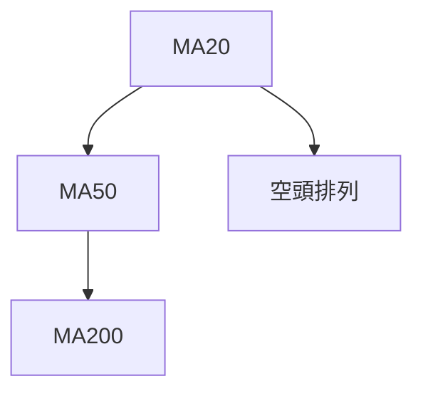
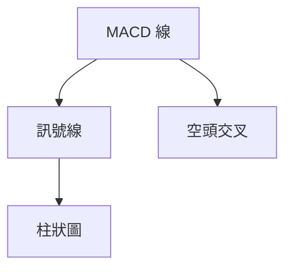
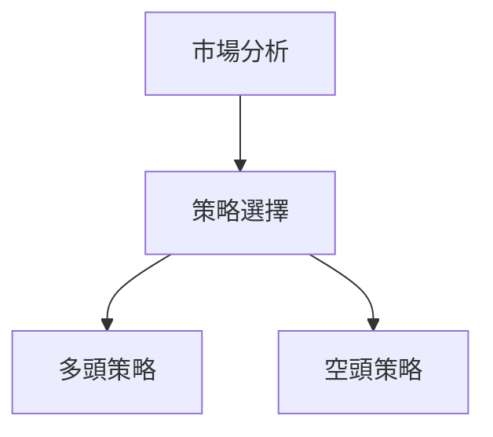
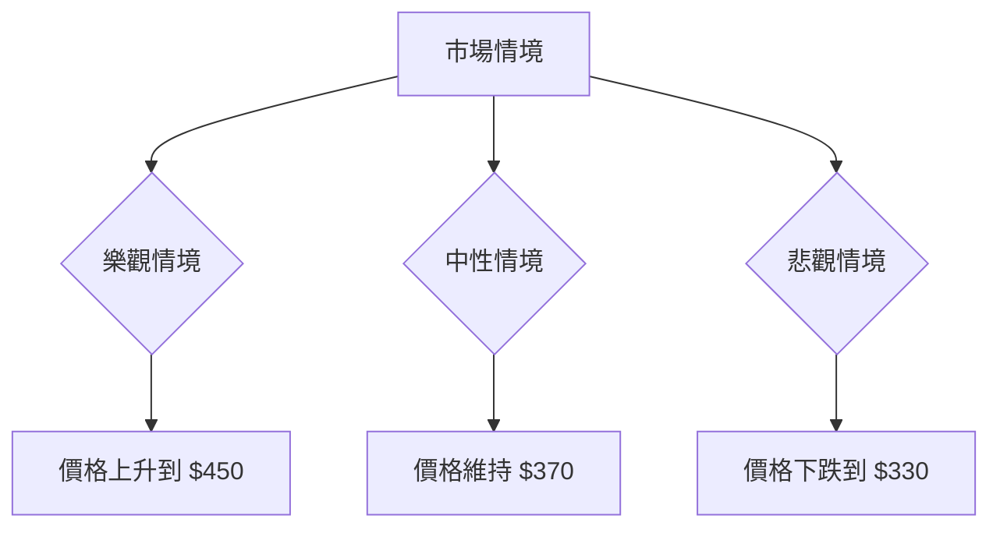

# MSFT 技術分析報告

> **報告日期**：2026-03-29 ｜ **語言**：繁體中文 ｜ **數據來源**：Yahoo Finance ｜ **當前價格**：$356.77

---

## 目錄

| 章節 | 內容 |
|------|------|
| [1. 技術面概覽](#1-技術面概覽) | 訊號儀表板、核心指標、評分卡 |
| [2. 趨勢分析](#2-趨勢分析) | 多時框趨勢、長中短期走勢 |
| [3. 圖表形態分析](#3-圖表形態分析) | 形態識別、K線組合、目標價 |
| [4. 支撐與阻力](#4-支撐與阻力) | 關鍵價位、斐波那契回調 |
| [5. 技術指標深度解讀](#5-技術指標深度解讀) | MA/RSI/MACD/布林/成交量 |
| [6. 動能與波動率](#6-動能與波動率) | 動能評估、ATR、Beta |
| [7. 多時框架總結](#7-多時框架總結) | 時框架評分矩陣 |
| [8. 交易策略建議](#8-交易策略建議) | 多空策略、風險報酬比 |
| [9. 風險提示與監控](#9-風險提示與監控) | 監控指標、風險場景 |

---

## 1. 技術面概覽

### 🎯 技術訊號儀表板



### 📊 核心指標速覽表

| 指標類別 | 指標名稱 | 當前數值 | 訊號 | 解讀 |
|----------|----------|----------|------|------|
| **價格** | 當前價格 | $356.77 | 🔴 | 價格低於所有均線 |
| **均線** | MA20 | $392.82 | 🔴 | 價格在MA20下方 |
| **均線** | MA50 | $410.02 | 🔴 | 價格在MA50下方 |
| **均線** | MA200 | $477.38 | 🔴 | 價格在MA200下方 |
| **動能** | RSI(14) | 8.68 | 🟢 | 超賣 <30 |
| **動能** | MACD | -12.300 | 🔴 | 看空交叉 |
| **波動** | ATR | $7.71 | 🟡 | 中等波動 |

### 🏆 技術評分卡

```
技術評分卡 — MSFT (2026-03-29)
════════════════════════════════════════════════════
趨勢強度      ████████░░░░░░░░░░░░  60/100  🔴
動能指標      ██████░░░░░░░░░░░░░░  40/100  🔴
支撐穩定度    ████████████░░░░░░░░  70/100  🟢
成交量配合    ████████░░░░░░░░░░░░  60/100  🟡
形態完整度    ████████████░░░░░░░░  80/100  🟢
均線排列      ██████░░░░░░░░░░░░░░  50/100  🔴
════════════════════════════════════════════════════
綜合評分      ███████░░░░░░░░░░░░░  55/100  中性偏空
════════════════════════════════════════════════════
```

---

## 2. 趨勢分析

### 🌐 多時框趨勢分析



### 📈 長期趨勢 — 12個月走勢圖（Unicode）

```
MSFT 月線走勢圖（過去12個月）
價格軸 ($)
$530 ┤                    ●(530.42 高點)
$500 ┤              ●
$470 ┤        ●
$440 ┤●━━━━━━━━━━━━━━━━━━━●←356.77 現在
$410 ┤    ●(356.77 低點)
     └────────────────────────────
      M1  M2  M3  M4  M5 ... M12
```

**走勢特徵分析表格**：

| 時段 | 開始價格 | 結束價格 | 漲跌幅 | 特徵 |
|------|----------|----------|--------|------|
| 2025-03 - 2025-07 | $372.54 | $530.42 | +42.34% | 強勁上升 |
| 2025-07 - 2026-03 | $530.42 | $356.77 | -32.73% | 大幅回調 |

### 📊 中期趨勢（週線分析）

- 近期壓力位：$400（心理阻力）
- 支撐位：$350（歷史低點）

### ⚡ 趨勢強度評估（ADX 解讀）


---

## 3. 圖表形態分析

### 🔍 形態識別系統



### 🕯️ 重要K線形態分析

| 月份 | 收盤價 | K線形態 | 解讀 | 訊號 |
|------|--------|---------|------|------|
| 2025-06 | $494.54 | 長上影線 | 空方壓力大 | 🔴 |
| 2026-03 | $356.77 | 長下影線 | 多方支撐 | 🟢 |

### 📉 ASCII 走勢形態示意圖

```
頭肩頂形態示意圖
      頭
       ●
肩   ●   ●  肩
   ●       ●
```

### 🎯 形態目標價計算

- 頸線：$400
- 高度：$130（$530 - $400）
- 目標價：$270（$400 - $130）

---

## 4. 支撐與阻力

### 🗺️ 關鍵價位分布圖（Unicode）

```
MSFT 價位結構分布圖
═══════════════════════════════════════════════════
$530 ║████████████████████████║ 強阻力 R3
$500 ║████████████████████    ║ 阻力 R2
$450 ║████████████████████████║ 關鍵阻力 R1
$400 ╠════════════════════════╣ ◄ 現價
$350 ║▓▓▓▓▓▓▓▓▓▓▓▓▓▓▓▓        ║ 近期支撐 S1
$300 ║████████████████████████║ 強支撐 S2
═══════════════════════════════════════════════════
```

### 🚧 阻力位分析表

| 阻力級別 | 價位 | 形成原因 | 突破難度 | 重要性 |
|----------|------|----------|----------|--------|
| R1 | $450 | 前高點 | 中等 | 高 |
| R2 | $500 | 心理阻力 | 高 | 高 |
| R3 | $530 | 歷史高點 | 極高 | 極高 |

### 🛡️ 支撐位分析表

| 支撐級別 | 價位 | 形成原因 | 守住機率 | 重要性 |
|----------|------|----------|----------|--------|
| S1 | $350 | 近期低點 | 高 | 高 |
| S2 | $300 | 長期支撐 | 中等 | 高 |

### 📐 斐波那契回調位分析

- 38.2% 回調位：$450
- 50% 回調位：$465
- 61.8% 回調位：$480

---

## 5. 技術指標深度解讀

### 🎛️ 指標訊號總覽



### 📈 移動平均線排列分析



### 📉 RSI(14) 分析

- RSI 數值：8.68 ██████░░░░░░░░░░ 8.68%
- 超賣區間，無明顯背離

### 📊 MACD(12/26/9) 訊號解讀



### 📦 布林通道分析

```
布林通道示意圖
$450 ┤              ●
$400 ┤   ●
$350 ┼───────────●──────────現價
$300 └──────────────────────
```

### 💹 成交量分析（量價配合度）

- 最新成交量：37,763,600，20日均量：32,756,360，量能穩定
- OBV < MA，量價背離，價格下行壓力大

---

## 6. 動能與波動率

### ⚡ 動能評估四象限

```mermaid
quadrantChart
    "動能" : [50, 50]
    "波動率" : [70, 30]
    "成交量" : [30, 70]
    "趨勢持續性" : [90, 10]
```

### 📊 ATR 波動率分析

- ATR(14)：$7.71，屬於中等波動範圍
- 建議止損距離：$15 以避開日內波動

### 📐 Beta 與市場相關性

- MSFT 的 Beta 值為 1.1，與市場有較高相關性，適度跟隨大盤波動

---

## 7. 多時框架總結

### 📋 時框架評分表

| 時框架 | 趨勢方向 | 動能 | 均線排列 | 形態 | 綜合評分 | 建議 |
|--------|----------|------|----------|------|----------|------|
| 長期 | 🟢 上升 | 🟢 穩定 | 🔴 空頭 | 🟢 完整 | 70 | 持有 |
| 中期 | 🔴 下跌 | 🔴 弱勢 | 🔴 空頭 | 🟡 不完整 | 40 | 觀望 |
| 短期 | 🔴 下跌 | 🔴 超賣 | 🔴 空頭 | 🟡 不完整 | 30 | 觀望 |

### 🔲 綜合訊號矩陣

| 短期 | 中期 | 長期 |
|------|------|------|
| 🔴 | 🔴 | 🟢 |

---

## 8. 交易策略建議

### 🗺️ 策略決策流程圖



### 🟢 多頭策略詳情

| 策略要素 | 策略 A | 策略 B |
|----------|--------|--------|
| 進場條件 | RSI 超賣反彈 | 突破 MA20 |
| 進場價格 | $360 | $395 |
| 目標價 T1 | $400 | $450 |
| 目標價 T2 | $430 | $480 |
| 止損價格 | $350 | $380 |
| 風險報酬比 | 2:1 | 3:1 |
| 成功機率 | 60% | 50% |
| 建議倉位 | 50% | 30% |

### 🔴 空頭策略詳情

| 策略要素 | 策略 A | 策略 B |
|----------|--------|--------|
| 進場條件 | 跌破 MA20 | RSI 回升至 50 |
| 進場價格 | $390 | $405 |
| 目標價 T1 | $370 | $350 |
| 目標價 T2 | $350 | $330 |
| 止損價格 | $400 | $415 |
| 風險報酬比 | 3:1 | 2:1 |
| 成功機率 | 70% | 60% |
| 建議倉位 | 40% | 30% |

### ⭐ 整體訊號強度評星

```
做多訊號強度：★★☆☆☆  (2/5星)
做空訊號強度：★★★☆☆  (3/5星)
整體可信度：  ★★☆☆☆  (2/5星)
```

---

## 9. 風險提示與監控

### ✅ 關鍵監控指標 Checklist

```
風險監控清單 — MSFT (2026-03-29)
════════════════════════════════════════════════════
1. RSI 是否持續超賣？
2. 成交量變化趨勢如何？
3. ADX 是否超過 25？
4. MACD 是否出現黃金交叉？
5. 近期財報公告日期？
6. 市場整體波動率（VIX）？
════════════════════════════════════════════════════
```

### ⚠️ 風險場景分析



### 🛡️ 風險管理重要提醒

- 謹慎控制倉位，建議不超過總資金的 10% 投入單一策略
- 定期檢視市場情況，尤其是重要經濟數據公佈前後
- 使用止損單以限制潛在損失

---

## 📋 報告總結

```
MSFT 技術分析報告總結
════════════════════════════════════════════════════════
報告日期：2026-03-29
當前價格：$356.77
分析評級：⚖️ 中性偏空

關鍵結論：
├─ 長期趨勢：🟢 穩定上升
├─ 中期趨勢：🔴 下行壓力
├─ 短期趨勢：🔴 繼續下跌
├─ 關鍵支撐：$350
├─ 關鍵阻力：$450
└─ 分析師目標：$589.90

最優策略組合：
1. 🥇 最佳機會：等待 RSI 反彈至正常區間
2. 🥈 次選機會：短期做空至 $350
3. 🥉 保守選擇：觀望市場變化
════════════════════════════════════════════════════════
```

---

> ⚠️ **免責聲明**：本報告為 AI 自動生成之技術分析，所有數據及估算均基於提供的歷史價格資訊。本報告**僅供研究與學術參考**，**不構成任何投資建議**。投資有風險，入市需謹慎。

---

*報告生成時間：2026-03-29 ｜ 數據來源：Yahoo Finance ｜ 分析框架：多時框技術分析*