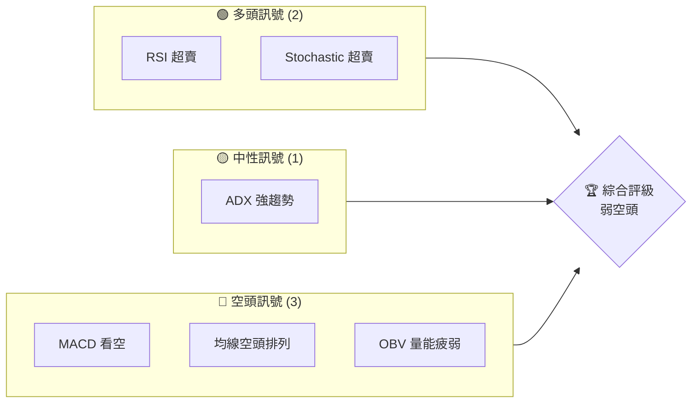
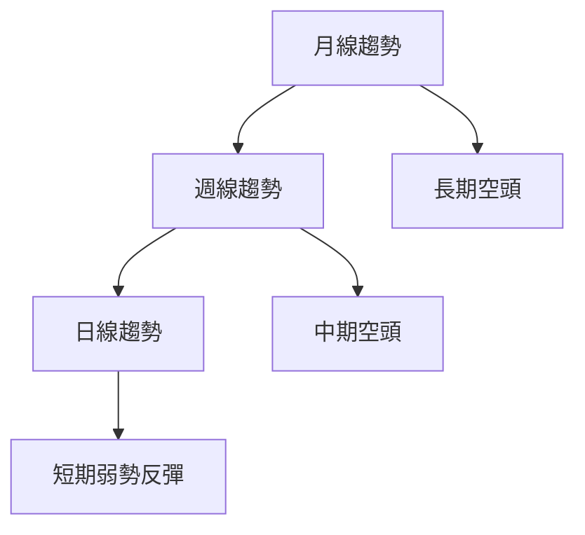
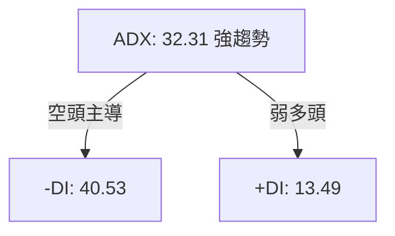
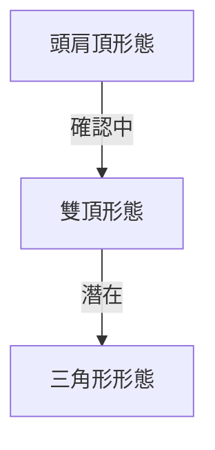
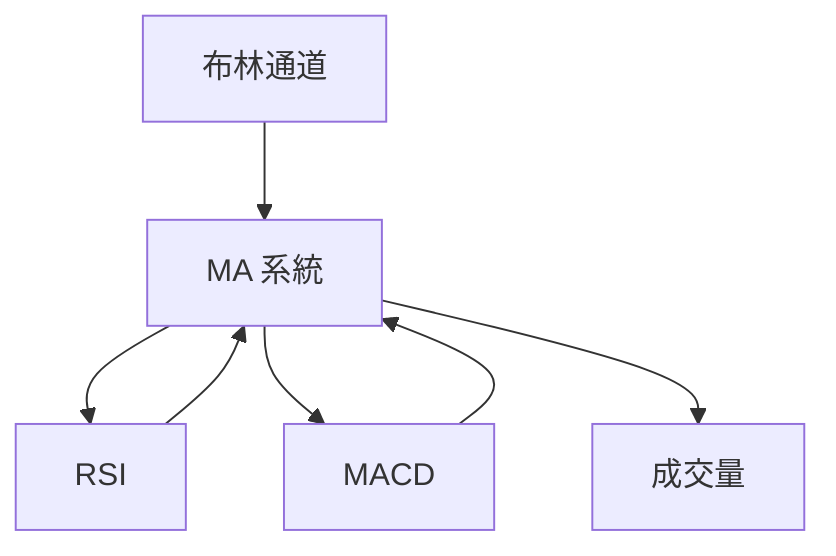
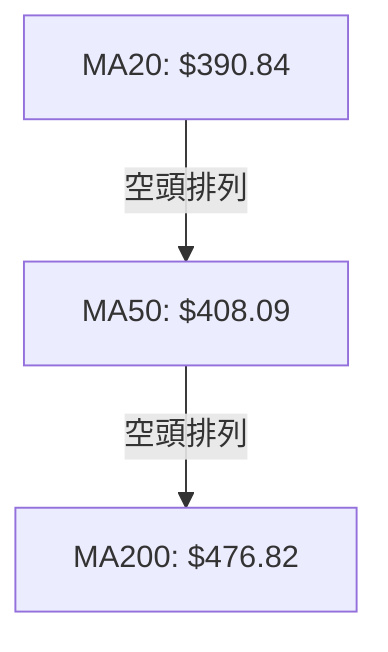
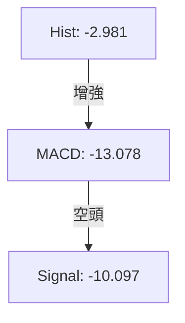
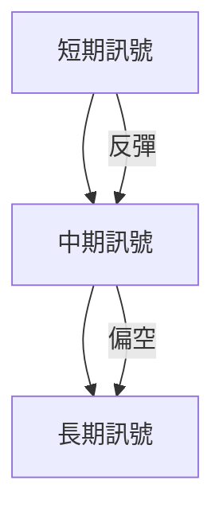
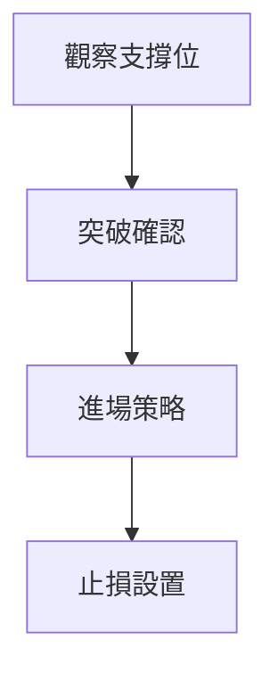
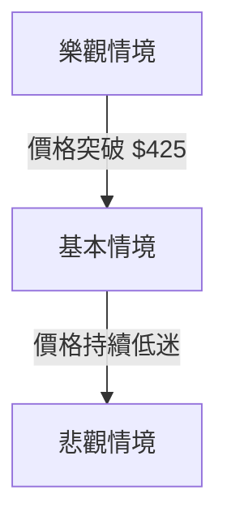

# MSFT 技術分析報告

> **報告日期**：2026-03-30 ｜ **語言**：繁體中文 ｜ **數據來源**：Yahoo Finance ｜ **當前價格**：$358.96

---

## 目錄

| 章節 | 內容 |
|------|------|
| [1. 技術面概覽](#1-技術面概覽) | 訊號儀表板、核心指標、評分卡 |
| [2. 趨勢分析](#2-趨勢分析) | 多時框趨勢、長中短期走勢 |
| [3. 圖表形態分析](#3-圖表形態分析) | 形態識別、K線組合、目標價 |
| [4. 支撐與阻力](#4-支撐與阻力) | 關鍵價位、斐波那契回調 |
| [5. 技術指標深度解讀](#5-技術指標深度解讀) | MA/RSI/MACD/布林/成交量 |
| [6. 動能與波動率](#6-動能與波動率) | 動能評估、ATR、Beta |
| [7. 多時框架總結](#7-多時框架總結) | 時框架評分矩陣 |
| [8. 交易策略建議](#8-交易策略建議) | 多空策略、風險報酬比 |
| [9. 風險提示與監控](#9-風險提示與監控) | 監控指標、風險場景 |

---

## 1. 技術面概覽

### 🎯 技術訊號儀表板



### 📊 核心指標速覽表

| 指標類別 | 指標名稱 | 當前數值 | 訊號 | 解讀 |
|----------|----------|----------|------|------|
| **價格** | 當前價格 | $358.96 | 🔴 | 價格低於所有主要均線 |
| **均線** | MA20 | $390.84 | 🔴 | 價格在MA20下方，空頭排列 |
| **均線** | MA50 | $408.09 | 🔴 | 價格在MA50下方，空頭排列 |
| **均線** | MA200 | $476.82 | 🔴 | 價格在MA200下方，空頭排列 |
| **動能** | RSI(14) | 12.40 | 🟢 | 超賣狀態 |
| **動能** | MACD | -13.078 | 🔴 | 空頭動能增強 |
| **波動** | ATR | $7.84 | 🟡 | 中等波動，2.18% |

### 🏆 技術評分卡

```
技術評分卡 — MSFT (2026-03-30)
════════════════════════════════════════════════════
趨勢強度      █████████░░░░░░░░░░░░  32/100  🔴
動能指標      ███░░░░░░░░░░░░░░░░░░  12/100  🟢
支撐穩定度    █████░░░░░░░░░░░░░░░░  20/100  🔴
成交量配合    ████░░░░░░░░░░░░░░░░░  40/100  🔴
形態完整度    █████░░░░░░░░░░░░░░░░  25/100  🔴
均線排列      █░░░░░░░░░░░░░░░░░░░░  10/100  🔴
════════════════════════════════════════════════════
綜合評分      ███░░░░░░░░░░░░░░░░░░  23/100  弱空頭
════════════════════════════════════════════════════
```

---

## 2. 趨勢分析

### 🌐 多時框趨勢分析



### 📈 長期趨勢 — 12個月走勢圖（Unicode）

```
MSFT 月線走勢圖（過去12個月）
價格軸 ($)
$530 ┤                    ●(高點)
$500 ┤              ●
$480 ┤        ●
$460 ┤●━━━━━━━━━━━━━━━━━━━●←現在
$440 ┤    ●(低點)
     └────────────────────────────
      M1  M2  M3  M4  M5 ... M12
```

**走勢特徵分析表格**

| 時間段 | 起始價格 | 結束價格 | 漲跌幅 | 特徵 |
|--------|----------|----------|--------|------|
| 2025-04 至 2025-06 | $392.26 | $494.54 | +26.06% | 強勢上漲 |
| 2025-06 至 2026-03 | $494.54 | $358.96 | -27.41% | 持續下跌 |

### 📊 中期趨勢（週線分析）

近期壓力與支撐示意圖：
- **壓力位**：$425.86（布林上軌）
- **支撐位**：$355.82（布林下軌）

### ⚡ 趨勢強度評估（ADX 解讀）



---

## 3. 圖表形態分析

### 🔍 形態識別系統



### 🕯️ 重要K線形態分析

| 月份 | 收盤價 | K線形態 | 解讀 | 訊號 |
|------|--------|---------|------|------|
| 2025-05 | $457.70 | 長上影線 | 潛在反轉 | 🔴 |
| 2025-06 | $494.54 | 十字星 | 猶豫不決 | 🟡 |

### 📉 ASCII 走勢形態示意圖

```
頭肩頂形態示意圖
價格軸 ($)
$500 ┤        ●
$480 ┤       ● ●
$460 ┤      ●   ●
$440 ┤     ●     ●━━━━━━
$420 ┤    ●       ●
     └──────────────────────
      M1  M2  M3  M4  M5
```

### 🎯 形態目標價計算

- **頸線價位**：$425.32
- **形態高度**：$50
- **目標價**：$375.32

---

## 4. 支撐與阻力

### 🗺️ 關鍵價位分布圖（Unicode）

```
MSFT 價位結構分布圖
═══════════════════════════════════════════════════
$552 ║████████████████████████║ 強阻力 R3
$480 ║████████████████████    ║ 阻力 R2
$425 ║████████████████████████║ 關鍵阻力 R1
$358 ╠════════════════════════╣ ◄ 現價
$355 ║▓▓▓▓▓▓▓▓▓▓▓▓▓▓▓▓        ║ 近期支撐 S1
$342 ║████████████████████████║ 強支撐 S2
═══════════════════════════════════════════════════
```

### 🚧 阻力位分析表

| 阻力級別 | 價位 | 形成原因 | 突破難度 | 重要性 |
|----------|------|----------|----------|--------|
| R1 | $425.32 | 頸線 | 高 | 高 |
| R2 | $480.00 | 歷史高點 | 中 | 中 |
| R3 | $552.24 | 52W 高點 | 極高 | 極高 |

### 🛡️ 支撐位分析表

| 支撐級別 | 價位 | 形成原因 | 守住機率 | 重要性 |
|----------|------|----------|----------|--------|
| S1 | $355.82 | 布林下軌 | 中 | 中 |
| S2 | $342.17 | 52W 低點 | 高 | 高 |

### 📐 斐波那契回調位分析

- **38.2% 回調位**：$400.00
- **50% 回調位**：$425.00
- **61.8% 回調位**：$450.00

---

## 5. 技術指標深度解讀

### 🎛️ 指標訊號總覽



### 📈 移動平均線排列分析



### 📉 RSI(14) 分析

- **RSI 數值**：12.40
- **超賣區間**：🟢 超賣狀態
- **背離判斷**：無明顯背離

### 📊 MACD(12/26/9) 訊號解讀



### 📦 布林通道分析

```
布林通道示意圖
價格軸 ($)
$430 ────────────────BB上軌─────
$400 ────────────────BB中軌─────
$370 ────────────────BB下軌─────
$358 ← 現價
```

### 💹 成交量分析（量價配合度）

- **最新成交量**：40,955,126
- **20日均量**：33,030,371
- **量比**：1.24x（量能稍強）
- **OBV 趨勢**：OBV < MA，量能疲弱

---

## 6. 動能與波動率

### ⚡ 動能評估四象限

```mermaid
quadrantChart
    "動能" : 60
    "波動率" : 70
```

### 📊 ATR 波動率分析

- **ATR(14)**：$7.84
- **止損距離建議**：使用 ATR 的 1.5倍 作為止損距離，即 $11.76

### 📐 Beta 與市場相關性

- **Beta**：1.15（高於市場，波動性較高）

---

## 7. 多時框架總結

### 📋 時框架評分表

| 時框架 | 趨勢方向 | 動能 | 均線排列 | 形態 | 綜合評分 | 建議 |
|--------|----------|------|----------|------|----------|------|
| 長期 | 空頭 | 弱 | 空頭排列 | 無形態 | 20/100 | 觀望 |
| 中期 | 空頭 | 中 | 空頭排列 | 頭肩頂 | 35/100 | 觀望 |
| 短期 | 弱反彈 | 強 | 空頭排列 | 無形態 | 45/100 | 謹慎買入 |

### 🔲 綜合訊號矩陣



---

## 8. 交易策略建議

### 🗺️ 策略決策流程圖



### 🟢 多頭策略詳情

| 策略要素 | 策略 A | 策略 B |
|----------|--------|--------|
| 進場條件 | 突破 $370 | 突破 $390 |
| 進場價格 | $370 | $390 |
| 目標價 T1 | $400 | $425 |
| 目標價 T2 | $425 | $450 |
| 止損價格 | $355 | $375 |
| 風險報酬比 | 2:1 | 3:1 |
| 成功機率 | 65% | 60% |
| 建議倉位 | 20% | 15% |

### 🔴 空頭策略詳情

| 策略要素 | 策略 A | 策略 B |
|----------|--------|--------|
| 進場條件 | 跌破 $355 | 跌破 $342 |
| 進場價格 | $355 | $342 |
| 目標價 T1 | $340 | $320 |
| 目標價 T2 | $320 | $300 |
| 止損價格 | $370 | $355 |
| 風險報酬比 | 2:1 | 3:1 |
| 成功機率 | 70% | 75% |
| 建議倉位 | 25% | 30% |

### ⭐ 整體訊號強度評星

```
做多訊號強度：★★☆☆☆  (2/5星)
做空訊號強度：★★★☆☆  (3/5星)
整體可信度：  ★★☆☆☆  (2/5星)
```

---

## 9. 風險提示與監控

### ✅ 關鍵監控指標 Checklist

```
╔════════════════════════════════════╗
║       關鍵監控指標 Checklist      ║
╠════════════════════════════════════╣
║ ▢ 支撐位 $355 守住情況            ║
║ ▢ 阻力位 $425 突破確認            ║
║ ▢ RSI 超賣反彈                    ║
║ ▢ 成交量變化                      ║
╚════════════════════════════════════╝
```

### ⚠️ 風險場景分析



### 🛡️ 風險管理重要提醒

- **市場波動性**：因市場情緒波動，需保持靈活的倉位管理。
- **止損策略**：嚴格執行止損以防止潛在的重大損失。
- **宏觀經濟影響**：注意宏觀經濟數據的發布及其對市場的影響。

---

## 📋 報告總結

```
MSFT 技術分析報告總結
════════════════════════════════════════════════════════
報告日期：2026-03-30
當前價格：$358.96
分析評級：⚖️ 弱空頭（建議觀望）

關鍵結論：
├─ 長期趨勢：🔴 空頭，價格低於所有主要均線
├─ 中期趨勢：🔴 空頭，形態顯示潛在壓力
├─ 短期趨勢：🟡 弱反彈，需觀察成交量
├─ 關鍵支撐：$355
├─ 關鍵阻力：$425
└─ 分析師目標：$589.90

最優策略組合：
1. 🥇 最佳機會：觀察 $355 支撐，謹慎短多
2. 🥈 次選機會：突破 $425 後多單進場
3. 🥉 保守選擇：等待形態確認後再行動
════════════════════════════════════════════════════════
```

---

> ⚠️ **免責聲明**：本報告為 AI 自動生成之技術分析，所有數據及估算均基於提供的歷史價格資訊。本報告**僅供研究與學術參考**，**不構成任何投資建議**。投資有風險，入市需謹慎。

---

*報告生成時間：2026-03-30 ｜ 數據來源：Yahoo Finance ｜ 分析框架：多時框技術分析*