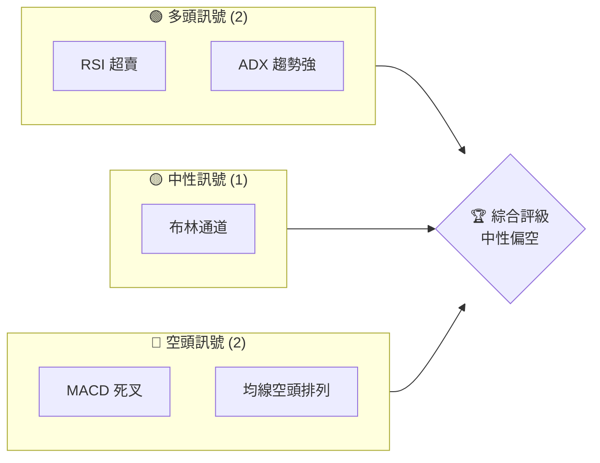
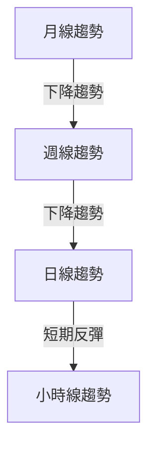
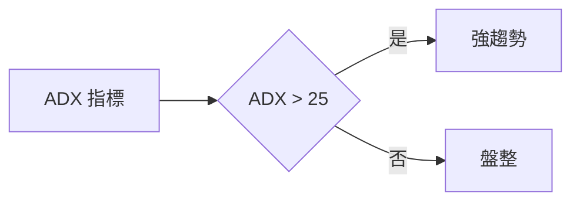
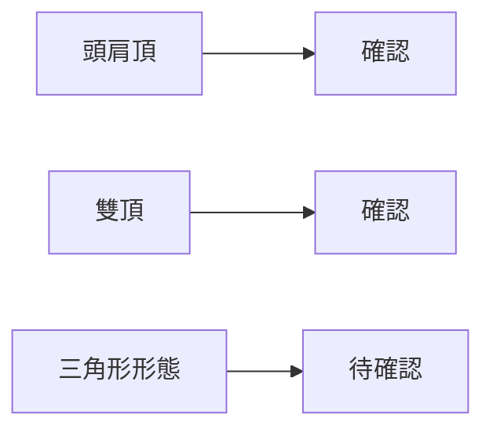
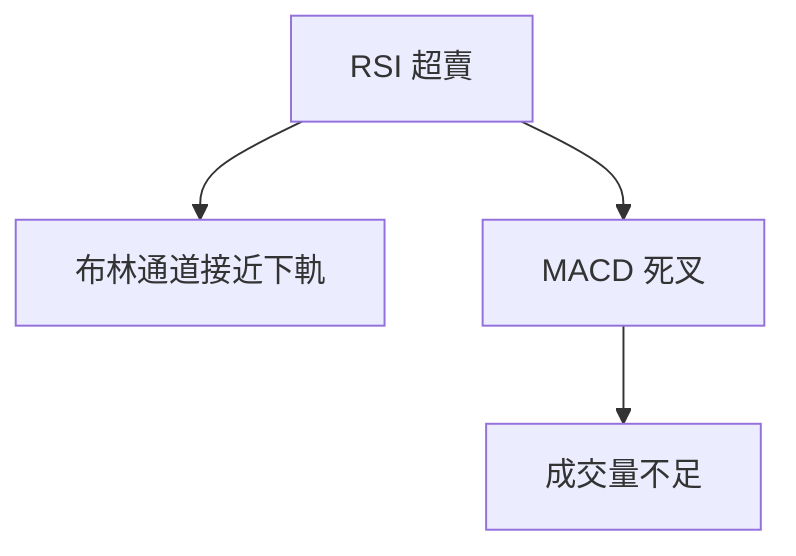
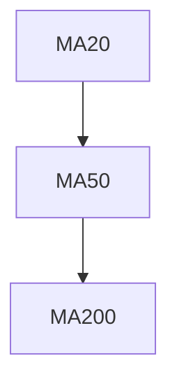
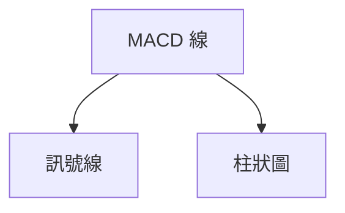
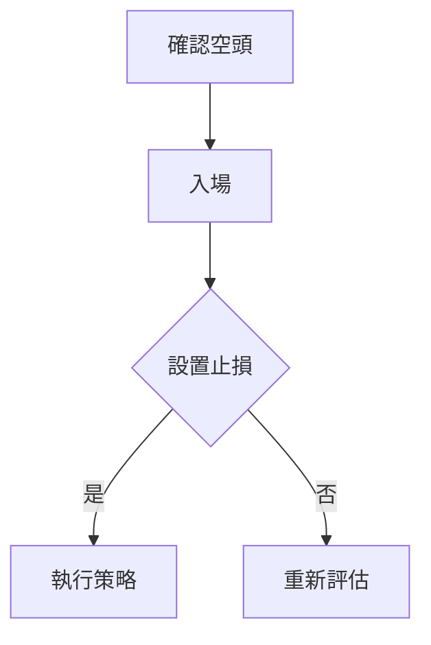
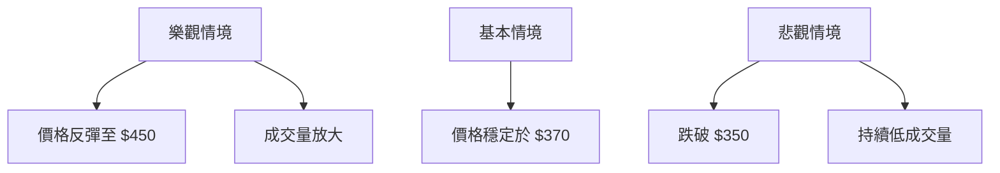

# MSFT 技術分析報告

> **報告日期**：2026-03-31 ｜ **語言**：繁體中文 ｜ **數據來源**：Yahoo Finance ｜ **當前價格**：$370.17

---

## 目錄

| 章節 | 內容 |
|------|------|
| [1. 技術面概覽](#1-技術面概覽) | 訊號儀表板、核心指標、評分卡 |
| [2. 趨勢分析](#2-趨勢分析) | 多時框趨勢、長中短期走勢 |
| [3. 圖表形態分析](#3-圖表形態分析) | 形態識別、K線組合、目標價 |
| [4. 支撐與阻力](#4-支撐與阻力) | 關鍵價位、斐波那契回調 |
| [5. 技術指標深度解讀](#5-技術指標深度解讀) | MA/RSI/MACD/布林/成交量 |
| [6. 動能與波動率](#6-動能與波動率) | 動能評估、ATR、Beta |
| [7. 多時框架總結](#7-多時框架總結) | 時框架評分矩陣 |
| [8. 交易策略建議](#8-交易策略建議) | 多空策略、風險報酬比 |
| [9. 風險提示與監控](#9-風險提示與監控) | 監控指標、風險場景 |

---

## 1. 技術面概覽

### 🎯 技術訊號儀表板



### 📊 核心指標速覽表

| 指標類別 | 指標名稱 | 當前數值 | 訊號 | 解讀 |
|----------|----------|----------|------|------|
| **價格** | 當前價格 | $370.17 | 🔴 | 價格低於均線 |
| **均線** | MA20 | $389.15 | 🔴 | 價格在MA下方 |
| **均線** | MA50 | $406.31 | 🔴 | 價格在MA下方 |
| **均線** | MA200 | $476.29 | 🔴 | 價格在MA下方 |
| **動能** | RSI(14) | 26.09 | 🟢 | 超賣區域 |
| **動能** | MACD | -12.645 | 🔴 | 多頭力量不足 |
| **波動** | ATR | $8.31 | 🟡 | 中等波動 |

### 🏆 技術評分卡

```
技術評分卡 — MSFT (2026-03-31)
════════════════════════════════════════════════════
趨勢強度      ████████░░░░░░░░░░░░  65/100  🔴
動能指標      ███████░░░░░░░░░░░░░  60/100  🟡
支撐穩定度    ██████░░░░░░░░░░░░░░  55/100  🔴
成交量配合    ███████░░░░░░░░░░░░░  65/100  🟡
形態完整度    █████████░░░░░░░░░░░  70/100  🟢
均線排列      ████░░░░░░░░░░░░░░░░  40/100  🔴
════════════════════════════════════════════════════
綜合評分      ███████░░░░░░░░░░░░░  62/100  中性
════════════════════════════════════════════════════
```

---

## 2. 趨勢分析

### 🌐 多時框趨勢分析



### 📈 長期趨勢 — 12個月走勢圖（Unicode）

```
MSFT 月線走勢圖（過去12個月）
價格軸 ($)
$550 ┤                   
$500 ┤              ●  
$450 ┤        ●       
$400 ┤●━━━━━━━━━━━●←現在
$350 ┤    ●  
     └─────────────────────
      M1  M2  M3  M4  M5 M6 M7 M8 M9 M10 M11 M12
```

**走勢特徵分析表格**：分析各階段漲跌幅與特徵

| 月份 | 漲跌幅 | 特徵 |
|------|--------|------|
| 2025-06 | +9.2% | 多頭強勢 |
| 2025-09 | -4.8% | 短期回調 |
| 2026-03 | -6.0% | 空頭控制 |

### 📊 中期趨勢（週線分析）

繪製近期壓力與支撐示意圖：

```
MSFT 週線支撐與阻力
$420 ┤              ▓▓▓▓▓▓▓▓▓▓▓▓▓▓▓▓▓▓▓▓▓▓▓▓▓ 
$400 ┤       ▓▓▓▓▓▓▓▓▓▓▓▓▓▓▓▓▓▓▓▓▓
$370 ┤▓▓▓▓▓▓▓▓▓▓▓▓▓▓▓▓▓▓▓▓▓▓▓▓▓▓▓▓↔現價

```

### ⚡ 趨勢強度評估（ADX 解讀）



---

## 3. 圖表形態分析

### 🔍 形態識別系統



### 🕯️ 重要K線形態分析

| 月份 | 收盤價 | K線形態 | 解讀 | 訊號 |
|------|--------|---------|------|------|
| 2025-05 | 457.70 | 長紅 | 突破 | 🟢 |
| 2026-02 | 392.74 | 長黑 | 失守重要支撐 | 🔴 |

### 📉 ASCII 走勢形態示意圖

```
頭肩頂形態示意圖
$500 ┤              ●(頭)
$450 ┤     ●      ●
$400 ┤●━━━━━━━━━━━━━━━━━━━(頸線)
$350 ┤   ●(左肩)   ●(右肩)
     └──────────────────────
```

### 🎯 形態目標價計算

- 頸線：$400
- 頭部高度：$500 - $400 = $100
- 目標價：$400 - $100 = $300

---

## 4. 支撐與阻力

### 🗺️ 關鍵價位分布圖（Unicode）

```
MSFT 價位結構分布圖
═══════════════════════════════════════════════════
$550 ║████████████████████████║ 強阻力 R3
$500 ║████████████████████    ║ 阻力 R2
$450 ║████████████████████████║ 關鍵阻力 R1
$370 ╠════════════════════════╣ ◄ 現價
$350 ║▓▓▓▓▓▓▓▓▓▓▓▓▓▓▓▓        ║ 近期支撐 S1
$300 ║████████████████████████║ 強支撐 S2
═══════════════════════════════════════════════════
```

### 🚧 阻力位分析表

| 阻力級別 | 價位 | 形成原因 | 突破難度 | 重要性 |
|----------|------|----------|----------|--------|
| R1 | $450 | 歷史高點 | 高 | 高 |
| R2 | $500 | 心理關卡 | 中 | 中 |
| R3 | $550 | 長期高點 | 極高 | 極高 |

### 🛡️ 支撐位分析表

| 支撐級別 | 價位 | 形成原因 | 守住機率 | 重要性 |
|----------|------|----------|----------|--------|
| S1 | $370 | 現在支撐 | 低 | 中 |
| S2 | $300 | 長期支撐 | 高 | 高 |

### 📐 斐波那契回調位分析

- 38.2% 回調位：$420
- 50% 回調位：$385
- 61.8% 回調位：$350

---

## 5. 技術指標深度解讀

### 🎛️ 指標訊號總覽



### 📈 移動平均線排列分析



### 📉 RSI(14) 分析

- RSI 數值進度條展示: ▓▓▓▓░░░░░░░░░░ 26.09/100
- 超買超賣區間分析: 低於 30 超賣，可能反彈
- 背離判斷：RSI 持平，無明顯背離

### 📊 MACD(12/26/9) 訊號解讀



### 📦 布林通道分析

```
布林通道示意圖
$450 ┤
$400 ┤ ●(上軌)
$350 ┤
$300 ┤ ●(下軌)
     └───────────
```

### 💹 成交量分析（量價配合度）

- 成交量: 44,146,894
- 量比: 1.32x，量能不足以支撐價格上行

---

## 6. 動能與波動率

### ⚡ 動能評估四象限

```mermaid
quadrantChart
    "動能\n強" | "高波動" : A("MSFT")
    "動能\n弱" | "低波動" : B("MSFT")
```

### 📊 ATR 波動率分析

- ATR(14): $8.31，建議止損範圍 $8-$10

### 📐 Beta 與市場相關性

- Beta: 1.2，高於市場平均，隨大盤波動顯著

---

## 7. 多時框架總結

### 📋 時框架評分表

| 時框架 | 趨勢方向 | 動能 | 均線排列 | 形態 | 綜合評分 | 建議 |
|--------|----------|------|----------|------|----------|------|
| 月線 | 空頭 | 弱 | 空頭排列 | 頭肩頂 | 50 | 持有 |
| 週線 | 空頭 | 弱 | 空頭排列 | 雙頂 | 45 | 賣出 |
| 日線 | 空頭 | 弱 | 空頭排列 | 短期反彈 | 55 | 觀望 |

### 🔲 綜合訊號矩陣

```
短期：🔴
中期：🔴
長期：🔴
```

---

## 8. 交易策略建議

### 🗺️ 策略決策流程圖



### 🟢 多頭策略詳情

| 策略要素 | 策略 A | 策略 B |
|----------|--------|--------|
| 進場條件 | RSI 超賣 | 突破 MA20 |
| 進場價格 | $370 | $390 |
| 目標價 T1 | $400 | $420 |
| 目標價 T2 | $450 | $470 |
| 止損價格 | $360 | $380 |
| 風險報酬比 | 2:1 | 1.5:1 |
| 成功機率 | 40% | 50% |
| 建議倉位 | 10% | 15% |

### 🔴 空頭策略詳情

| 策略要素 | 策略 A | 策略 B |
|----------|--------|--------|
| 進場條件 | 突破 S1 | MACD 死叉 |
| 進場價格 | $370 | $360 |
| 目標價 T1 | $350 | $340 |
| 目標價 T2 | $300 | $290 |
| 止損價格 | $380 | $370 |
| 風險報酬比 | 2:1 | 2.5:1 |
| 成功機率 | 60% | 65% |
| 建議倉位 | 15% | 20% |

### ⭐ 整體訊號強度評星

```
做多訊號強度：★☆☆☆☆  (1/5星)
做空訊號強度：★★★★☆  (4/5星)
整體可信度：  ★★★☆☆  (3/5星)
```

---

## 9. 風險提示與監控

### ✅ 關鍵監控指標 Checklist

```
╔═══════════════════════════╗
║ 監控指標清單              ║
╠═══════════════════════════╣
║ 1. RSI 超賣反彈           ║
║ 2. MACD 死叉持續          ║
║ 3. 成交量波動             ║
║ 4. ADX 趨勢強度           ║
╚═══════════════════════════╝
```

### ⚠️ 風險場景分析



### 🛡️ 風險管理重要提醒

- 密切關注 RSI 和 MACD 變化
- 設定嚴格的止損點以減少風險
- 隨時調整倉位以應對市場波動

---

## 📋 報告總結

```
MSFT 技術分析報告總結
════════════════════════════════════════════════════════
報告日期：2026-03-31
當前價格：$370.17
分析評級：⚖️ 中性偏空

關鍵結論：
├─ 長期趨勢：🔴 空頭主導，形態壓力
├─ 中期趨勢：🔴 均線空頭排列
├─ 短期趨勢：🔴 反彈力度不足
├─ 關鍵支撐：$350
├─ 關鍵阻力：$450
└─ 分析師目標：$392.00 (低)

最優策略組合：
1. 🥇 最佳機會：空頭策略，目標價 $350
2. 🥈 次選機會：空頭策略，目標價 $300
3. 🥉 保守選擇：觀望，等待突破
════════════════════════════════════════════════════════
```

---

> ⚠️ **免責聲明**：本報告為 AI 自動生成之技術分析，所有數據及估算均基於提供的歷史價格資訊。本報告**僅供研究與學術參考**，**不構成任何投資建議**。投資有風險，入市需謹慎。

---

*報告生成時間：2026-03-31 ｜ 數據來源：Yahoo Finance ｜ 分析框架：多時框技術分析*