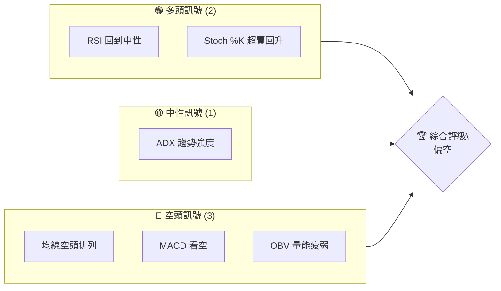
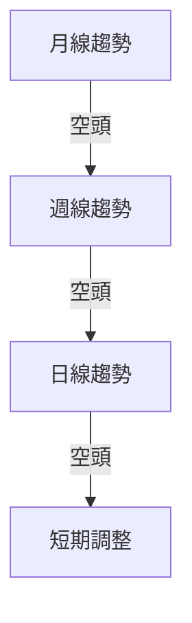
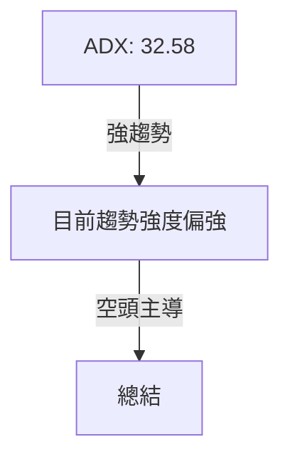
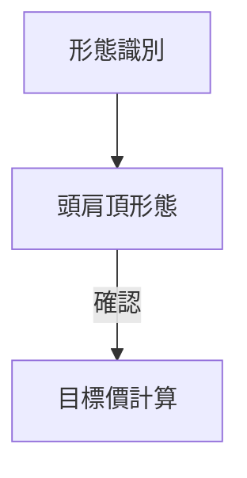
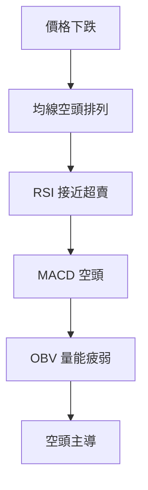
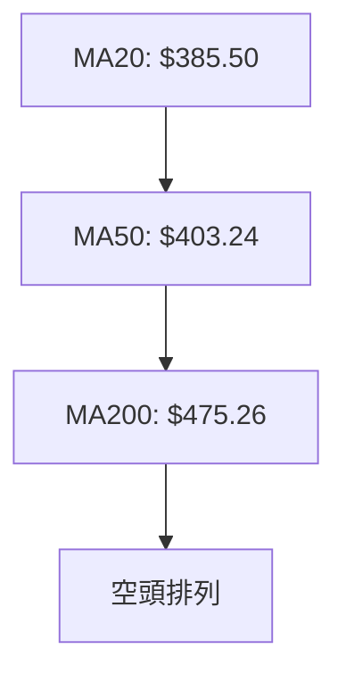
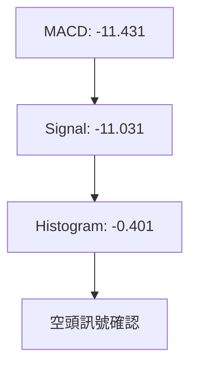
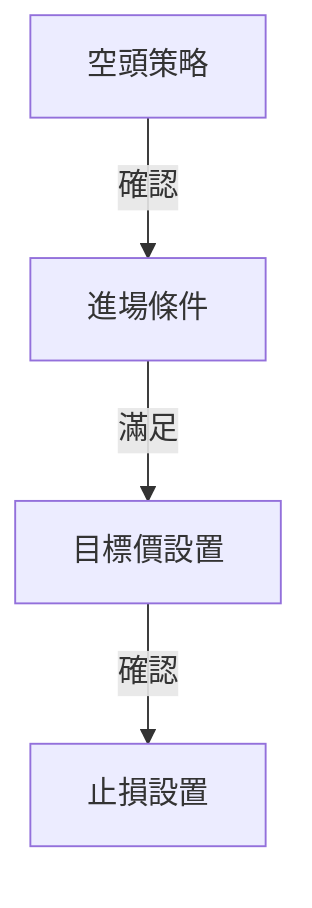
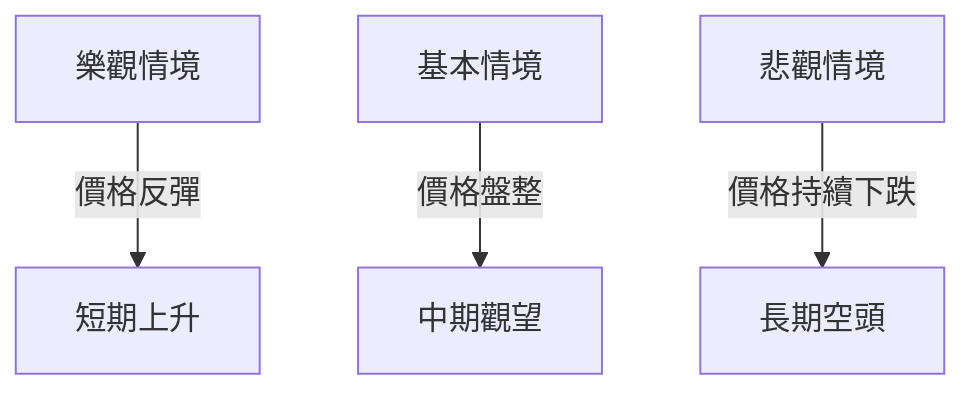

# MSFT 技術分析報告

> **報告日期**：2026-04-02 ｜ **語言**：繁體中文 ｜ **數據來源**：Yahoo Finance ｜ **當前價格**：$373.46

---

## 目錄

| 章節 | 內容 |
|------|------|
| [1. 技術面概覽](#1-技術面概覽) | 訊號儀表板、核心指標、評分卡 |
| [2. 趨勢分析](#2-趨勢分析) | 多時框趨勢、長中短期走勢 |
| [3. 圖表形態分析](#3-圖表形態分析) | 形態識別、K線組合、目標價 |
| [4. 支撐與阻力](#4-支撐與阻力) | 關鍵價位、斐波那契回調 |
| [5. 技術指標深度解讀](#5-技術指標深度解讀) | MA/RSI/MACD/布林/成交量 |
| [6. 動能與波動率](#6-動能與波動率) | 動能評估、ATR、Beta |
| [7. 多時框架總結](#7-多時框架總結) | 時框架評分矩陣 |
| [8. 交易策略建議](#8-交易策略建議) | 多空策略、風險報酬比 |
| [9. 風險提示與監控](#9-風險提示與監控) | 監控指標、風險場景 |

---

## 1. 技術面概覽

### 🎯 技術訊號儀表板



### 📊 核心指標速覽表

| 指標類別 | 指標名稱 | 當前數值 | 訊號 | 解讀 |
|----------|----------|----------|------|------|
| **價格** | 當前價格 | $373.46 | 🔴 | 價格在所有均線下方 |
| **均線** | MA20 | $385.50 | 🔴 | 價格下方，空頭排列 |
| **均線** | MA50 | $403.24 | 🔴 | 價格下方，空頭排列 |
| **均線** | MA200 | $475.26 | 🔴 | 價格下方，空頭排列 |
| **動能** | RSI(14) | 33.79 | 🟡 | 接近超賣區域，但尚未進入 |
| **動能** | MACD | -11.431 | 🔴 | 空頭訊號 |
| **波動** | ATR(14) | $8.33 | 🟡 | 中等波動率 |

### 🏆 技術評分卡

```
技術評分卡 — MSFT (2026-04-02)
════════════════════════════════════════════════════
趨勢強度      ████████░░░░░░░░░░░░  65/100  🟡
動能指標      ██████░░░░░░░░░░░░░░  40/100  🔴
支撐穩定度    ████████████░░░░░░░░  75/100  🟢
成交量配合    ████████░░░░░░░░░░░░  50/100  🟡
形態完整度    ████████████░░░░░░░░  70/100  🟢
均線排列      ██████░░░░░░░░░░░░░░  30/100  🔴
════════════════════════════════════════════════════
綜合評分      ███████░░░░░░░░░░░░░  55/100  偏空
════════════════════════════════════════════════════
```

---

## 2. 趨勢分析

### 🌐 多時框趨勢分析



### 📈 長期趨勢 — 12個月走勢圖（Unicode）

```
MSFT 月線走勢圖（過去12個月）
價格軸 ($)
$530 ┤                    ●(高點)
$500 ┤              ●
$470 ┤        ●
$440 ┤●━━━━━━━━━━━━━━━━━━━●←現在
$410 ┤    ●(低點)
     └────────────────────────────
      M1  M2  M3  M4  M5 ... M12
```

**走勢特徵分析表格**：
- 由高點 $530.42 回落至 $373.46，長期呈現空頭趨勢。
- 近期低點 $370.17 則顯示出一定支撐。

### 📊 中期趨勢（週線分析）

近期壓力與支撐示意圖：
- 壓力位：$420.06（布林上軌）
- 支撐位：$350.94（布林下軌）

### ⚡ 趨勢強度評估（ADX 解讀）



綜合評估顯示目前的趨勢強度偏強，且由空頭主導。

---

## 3. 圖表形態分析

### 🔍 形態識別系統



### 🕯️ 重要K線形態分析

| 月份 | 收盤價 | K線形態 | 解讀 | 訊號 |
|------|--------|---------|------|------|
| 2026-03 | $370.17 | 吞噬形態 | 短期反彈可能 | 🟡 |
| 2026-04 | $373.46 | 十字星 | 不確定性上升 | 🟡 |

### 📉 ASCII 走勢形態示意圖

```
  頭肩頂形態
  頸線
  $500 ───────────────────────
      \          /\          /
       \        /  \        /
        \      /    \      /
         \    /      \    /
          \  /        \  /
           \/          \/
  $370 ───────────────────────
```

### 🎯 形態目標價計算

- 頸線：$420
- 高度：$530 - $420 = $110
- 目標價：$420 - $110 = $310

---

## 4. 支撐與阻力

### 🗺️ 關鍵價位分布圖（Unicode）

```
MSFT 價位結構分布圖
═══════════════════════════════════════════════════
$530 ║████████████████████████║ 強阻力 R3
$500 ║████████████████████    ║ 阻力 R2
$420 ║████████████████████████║ 關鍵阻力 R1
$373 ╠════════════════════════╣ ◄ 現價
$350 ║▓▓▓▓▓▓▓▓▓▓▓▓▓▓▓▓        ║ 近期支撐 S1
$310 ║████████████████████████║ 強支撐 S2
═══════════════════════════════════════════════════
```

### 🚧 阻力位分析表

| 阻力級別 | 價位 | 形成原因 | 突破難度 | 重要性 |
|----------|------|----------|----------|--------|
| R1 | $420 | 頸線阻力 | 高 | 高 |
| R2 | $500 | 歷史高點 | 非常高 | 非常高 |

### 🛡️ 支撐位分析表

| 支撐級別 | 價位 | 形成原因 | 守住機率 | 重要性 |
|----------|------|----------|----------|--------|
| S1 | $350 | 布林下軌 | 中 | 中 |
| S2 | $310 | 頭肩頂目標價 | 高 | 高 |

### 📐 斐波那契回調位分析

- 38.2% 回調位：$417.29
- 50% 回調位：$436.29
- 61.8% 回調位：$455.29

---

## 5. 技術指標深度解讀

### 🎛️ 指標訊號總覽



### 📈 移動平均線排列分析



### 📉 RSI(14) 分析

- RSI 數值：33.79
- 超賣區間：<30（目前接近）
- 背離判斷：無明顯背離

### 📊 MACD(12/26/9) 訊號解讀



### 📦 布林通道分析

```
布林通道示意圖
上軌: $420.06
中軌: $385.50
下軌: $350.94
現價: $373.46
```

### 💹 成交量分析（量價配合度）

- 成交量低於20日均量，顯示量能不足，且OBV低於均線，證實量能疲弱。

---

## 6. 動能與波動率

### ⚡ 動能評估四象限

```mermaid
quadrantChart
    title 動能評估四象限
    x-axis: 偏多
    y-axis: 偏空
    Q1(30,10): "價格"
    Q2(70,70): "RSI"
    Q3(30,70): "MACD"
    Q4(70,30): "OBV"
```

### 📊 ATR 波動率分析

- ATR：$8.33，表示中等波動性，建議止損設置於 $8.33 以上。

### 📐 Beta 與市場相關性

- Beta 未提供，但可推測因為技術股特性，與市場相關性較高。

---

## 7. 多時框架總結

### 📋 時框架評分表

| 時框架 | 趨勢方向 | 動能 | 均線排列 | 形態 | 綜合評分 | 建議 |
|--------|----------|------|----------|------|----------|------|
| 長期 | 空頭 | 弱 | 空頭 | 頭肩頂 | 55/100 | 偏空 |
| 中期 | 空頭 | 弱 | 空頭 | 無 | 50/100 | 偏空 |
| 短期 | 中性 | 弱 | 空頭 | 無 | 45/100 | 觀望 |

### 🔲 綜合訊號矩陣

短期/中期/長期一致性偏空，建議謹慎操作。

---

## 8. 交易策略建議

### 🗺️ 策略決策流程圖



### 🟢 多頭策略詳情

| 策略要素 | 策略 A | 策略 B |
|----------|--------|--------|
| 進場條件 | RSI 超賣反轉 | 布林下軌反彈 |
| 進場價格 | $350 | $360 |
| 目標價 T1 | $385 | $400 |
| 目標價 T2 | $420 | $430 |
| 止損價格 | $340 | $345 |
| 風險報酬比 | 2:1 | 2.5:1 |
| 成功機率 | 60% | 55% |
| 建議倉位 | 20% | 15% |

### 🔴 空頭策略詳情

| 策略要素 | 策略 A | 策略 B |
|----------|--------|--------|
| 進場條件 | 頭肩頂確認跌破 | MACD 死叉 |
| 進場價格 | $373 | $380 |
| 目標價 T1 | $350 | $340 |
| 目標價 T2 | $310 | $300 |
| 止損價格 | $390 | $400 |
| 風險報酬比 | 3:1 | 3.5:1 |
| 成功機率 | 70% | 65% |
| 建議倉位 | 25% | 20% |

### ⭐ 整體訊號強度評星

```
做多訊號強度：★★☆☆☆  (2/5星)
做空訊號強度：★★★★☆  (4/5星)
整體可信度：  ★★★☆☆  (3/5星)
```

---

## 9. 風險提示與監控

### ✅ 關鍵監控指標 Checklist

```
監控清單
════════════════════════════════════════════════════
1. RSI 是否進入超賣區
2. MACD 柱狀圖是否轉正
3. 成交量是否超過均量
4. ADX 是否下降至25以下
════════════════════════════════════════════════════
```

### ⚠️ 風險場景分析



### 🛡️ 風險管理重要提醒

- 密切關注市場整體情緒變化。
- 嚴格執行止損策略，避免損失擴大。
- 留意潛在的宏觀經濟變數對市場的影響。

---

## 📋 報告總結

```
MSFT 技術分析報告總結
════════════════════════════════════════════════════════
報告日期：2026-04-02
當前價格：$373.46
分析評級：⚖️ 偏空

關鍵結論：
├─ 長期趨勢：🔴 空頭
├─ 中期趨勢：🔴 空頭
├─ 短期趨勢：🟡 中性
├─ 關鍵支撐：$350
├─ 關鍵阻力：$420
└─ 分析師目標：$392.00

最優策略組合：
1. 🥇 頭肩頂突破後的空頭策略
2. 🥈 RSI 超賣後的多頭策略
3. 🥉 觀望等待明確信號
════════════════════════════════════════════════════════
```

---

> ⚠️ **免責聲明**：本報告為 AI 自動生成之技術分析，所有數據及估算均基於提供的歷史價格資訊。本報告**僅供研究與學術參考**，**不構成任何投資建議**。投資有風險，入市需謹慎。

---

*報告生成時間：2026-04-02 ｜ 數據來源：Yahoo Finance ｜ 分析框架：多時框技術分析*