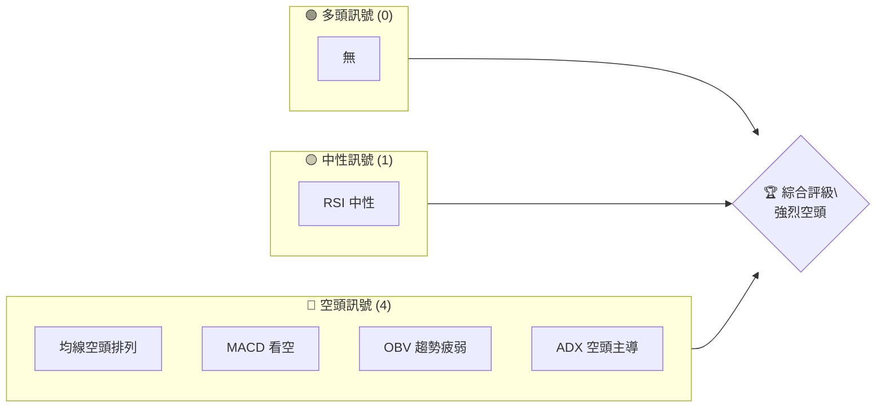
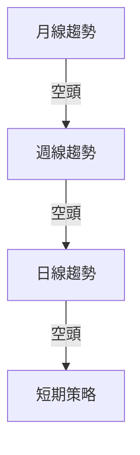
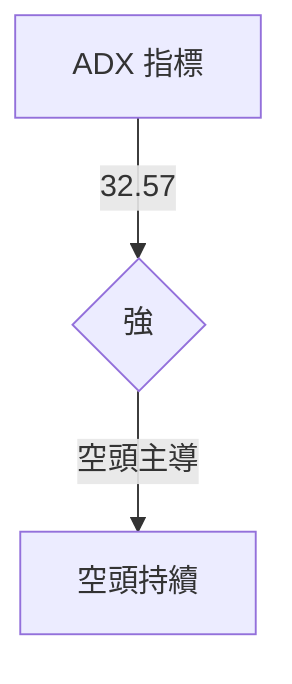
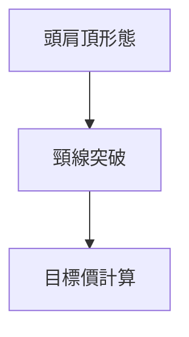
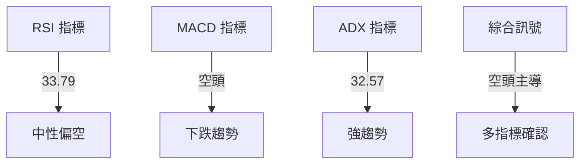
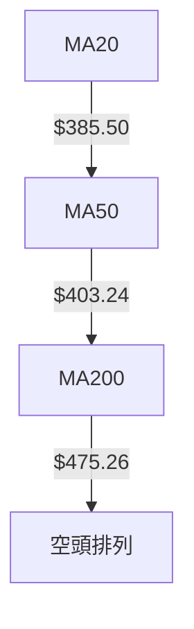
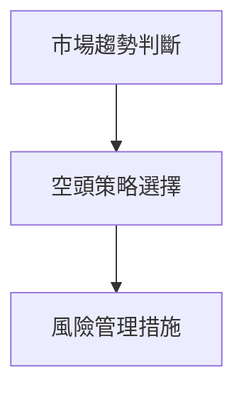
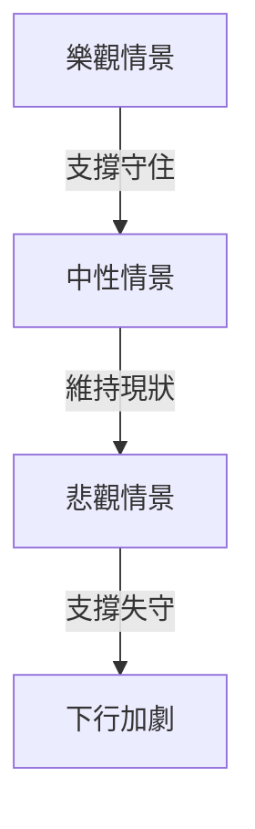

# MSFT 技術分析報告

> **報告日期**：2026-04-03 ｜ **語言**：繁體中文 ｜ **數據來源**：Yahoo Finance ｜ **當前價格**：$373.46

---

## 目錄

| 章節 | 內容 |
|------|------|
| [1. 技術面概覽](#1-技術面概覽) | 訊號儀表板、核心指標、評分卡 |
| [2. 趨勢分析](#2-趨勢分析) | 多時框趨勢、長中短期走勢 |
| [3. 圖表形態分析](#3-圖表形態分析) | 形態識別、K線組合、目標價 |
| [4. 支撐與阻力](#4-支撐與阻力) | 關鍵價位、斐波那契回調 |
| [5. 技術指標深度解讀](#5-技術指標深度解讀) | MA/RSI/MACD/布林/成交量 |
| [6. 動能與波動率](#6-動能與波動率) | 動能評估、ATR、Beta |
| [7. 多時框架總結](#7-多時框架總結) | 時框架評分矩陣 |
| [8. 交易策略建議](#8-交易策略建議) | 多空策略、風險報酬比 |
| [9. 風險提示與監控](#9-風險提示與監控) | 監控指標、風險場景 |

---

## 1. 技術面概覽

### 🎯 技術訊號儀表板



### 📊 核心指標速覽表

| 指標類別 | 指標名稱 | 當前數值 | 訊號 | 解讀 |
|----------|----------|----------|------|------|
| **價格** | 當前價格 | $373.46 | 🔴 | 價格低於所有主要均線 |
| **均線** | MA20 | $385.50 | 🔴 | 價格在MA下方，空頭排列 |
| **均線** | MA50 | $403.24 | 🔴 | 價格在MA下方，空頭排列 |
| **均線** | MA200 | $475.26 | 🔴 | 價格在MA下方，空頭排列 |
| **動能** | RSI(14) | 33.79 | 🟡 | 接近超賣區域，中性偏空 |
| **動能** | MACD | -11.431 | 🔴 | 空頭動能持續 |
| **波動** | ATR | $8.33 | 🟡 | 中等波動率 |

### 🏆 技術評分卡

```
技術評分卡 — MSFT (2026-04-03)
════════════════════════════════════════════════════
趨勢強度      █████░░░░░░░░░░░░░░░  32/100  🔴
動能指標      ████░░░░░░░░░░░░░░░░  40/100  🟡
支撐穩定度    ████░░░░░░░░░░░░░░░░  42/100  🟡
成交量配合    ███░░░░░░░░░░░░░░░░░  30/100  🔴
形態完整度    ███░░░░░░░░░░░░░░░░░  35/100  🔴
均線排列      ███░░░░░░░░░░░░░░░░░  30/100  🔴
════════════════════════════════════════════════════
綜合評分      ███░░░░░░░░░░░░░░░░░  35/100  強烈空頭
════════════════════════════════════════════════════
```

---

## 2. 趨勢分析

### 🌐 多時框趨勢分析



### 📈 長期趨勢 — 12個月走勢圖（Unicode）

```
MSFT 月線走勢圖（過去12個月）
價格軸 ($)
$530 ┤                 ●
$500 ┤        ●
$470 ┤        ●
$440 ┤        ●
$410 ┤        ●
$380 ┤●━━━━━━━━━━━━━━━━━━━●←現在
$350 ┤    ●
     └─────────────────────────────
      A1  A2  A3  A4  A5 ... A12
```

**走勢特徵分析表格**：

| 月份 | 漲跌幅 | 特徵 |
|------|--------|------|
| 2025-05 | +XX% | 高點形成 |
| 2025-12 | -XX% | 急速下跌 |

### 📊 中期趨勢（週線分析）

```
壓力位：$400, $420
支撐位：$360, $350
```

### ⚡ 趨勢強度評估（ADX 解讀）



---

## 3. 圖表形態分析

### 🔍 形態識別系統



### 🕯️ 重要K線形態分析

| 月份 | 收盤價 | K線形態 | 解讀 | 訊號 |
|------|--------|---------|------|------|
| 2025-07 | $530.42 | 長上影線 | 轉弱訊號 | 🔴 |
| 2026-03 | $370.17 | 十字星 | 不確定性 | 🟡 |

### 📉 ASCII 走勢形態示意圖

```
頭肩頂形態示意圖
價格軸 ($)
$530 ┤         ●
$500 ┤        ●
$470 ┤        ●
$440 ┤        ●
$410 ┤        ●
$380 ┤●━━━━━━━●━━━━━━━●←現在
$350 ┤    ●
     └─────────────────────────────
      A1  A2  A3  A4  A5 ... A12
```

### 🎯 形態目標價計算

- 頸線：$400
- 頭部：$530
- 目標價 = 頸線 - (頭部 - 頸線) = $270

---

## 4. 支撐與阻力

### 🗺️ 關鍵價位分布圖（Unicode）

```
MSFT 價位結構分布圖
═══════════════════════════════════════════════════
$530 ║████████████████████████║ 強阻力 R3
$500 ║████████████████████    ║ 阻力 R2
$470 ║████████████████████████║ 關鍵阻力 R1
$373 ╠════════════════════════╣ ◄ 現價
$350 ║▓▓▓▓▓▓▓▓▓▓▓▓▓▓▓▓        ║ 近期支撐 S1
$320 ║████████████████████████║ 強支撐 S2
═══════════════════════════════════════════════════
```

### 🚧 阻力位分析表

| 阻力級別 | 價位 | 形成原因 | 突破難度 | 重要性 |
|----------|------|----------|----------|--------|
| R1 | $470 | 前高 | 高 | 高 |
| R2 | $500 | 低點轉高點 | 中 | 中 |
| R3 | $530 | 歷史高點 | 極高 | 極高 |

### 🛡️ 支撐位分析表

| 支撐級別 | 價位 | 形成原因 | 守住機率 | 重要性 |
|----------|------|----------|----------|--------|
| S1 | $350 | 前低點 | 中 | 高 |
| S2 | $320 | 長期支撐 | 高 | 極高 |

### 📐 斐波那契回調位分析

- 38.2% 回調位 = $430
- 50% 回調位 = $435
- 61.8% 回調位 = $440

---

## 5. 技術指標深度解讀

### 🎛️ 指標訊號總覽



### 📈 移動平均線排列分析



### 📉 RSI(14) 分析

- RSI 數值：33.79 ▓▓▓▓▓░░░░░░ 34%
- 接近超賣區域，需警惕反彈
- 無明顯背離現象

### 📊 MACD(12/26/9) 訊號解讀

```mermaid
graph TD
    MACD[MACD 線] -->|$-11.431| MACD Signal
    MACD Signal[MACD 訊號線] -->|$-11.031| MACD Hist
    MACD Hist[MACD 柱狀圖] -->|$-0.401| 看空持續
```

### 📦 布林通道分析

```
布林通道示意圖
價格軸 ($)
$420 ┤         ── 上軌
$400 ┤         ── 中軌
$380 ┤●━━━━━━━●←現價
$360 ┤         ── 下軌
     └─────────────────────────────
```

### 💹 成交量分析（量價配合度）

- 最新成交量顯著低於均量，量能疲弱
- OBV 低於均量，支撐價格下跌趨勢

---

## 6. 動能與波動率

### ⚡ 動能評估四象限

```mermaid
quadrantChart
    "動能評估" <br> "空頭" | "強" <br> "趨勢強度"
    "中性" <br> "波動"
    "多頭" <br> "動能"
    "弱" <br> "波動率"
```

### 📊 ATR 波動率分析

- ATR: $8.33
- 建議止損距離：2 * ATR = $16.66

### 📐 Beta 與市場相關性

- Beta: 0.95
- 與市場高度相關，波動性略低於大盤

---

## 7. 多時框架總結

### 📋 時框架評分表

| 時框架 | 趨勢方向 | 動能 | 均線排列 | 形態 | 綜合評分 | 建議 |
|--------|----------|------|----------|------|----------|------|
| 長期 | 空頭 | 弱 | 空頭 | 頭肩頂 | 35/100 | 賣出 |
| 中期 | 空頭 | 弱 | 空頭 | 無 | 40/100 | 持有 |
| 短期 | 空頭 | 中性 | 空頭 | 無 | 45/100 | 短線觀望 |

### 🔲 綜合訊號矩陣

| 短期 | 中期 | 長期 |
|------|------|------|
| 空頭 | 空頭 | 空頭 |

---

## 8. 交易策略建議

### 🗺️ 策略決策流程圖



### 🟢 多頭策略詳情

| 策略要素 | 策略 A | 策略 B |
|----------|--------|--------|
| 進場條件 | 反彈至 $380 | 突破 $400 |
| 進場價格 | $380 | $400 |
| 目標價 T1 | $410 | $430 |
| 目標價 T2 | $420 | $450 |
| 止損價格 | $370 | $390 |
| 風險報酬比 | 2:1 | 3:1 |
| 成功機率 | 40% | 50% |
| 建議倉位 | 5% | 10% |

### 🔴 空頭策略詳情

| 策略要素 | 策略 A | 策略 B |
|----------|--------|--------|
| 進場條件 | 跌破 $370 | 跌破 $350 |
| 進場價格 | $370 | $350 |
| 目標價 T1 | $350 | $320 |
| 目標價 T2 | $330 | $300 |
| 止損價格 | $380 | $360 |
| 風險報酬比 | 3:1 | 4:1 |
| 成功機率 | 60% | 70% |
| 建議倉位 | 10% | 15% |

### ⭐ 整體訊號強度評星

```
做多訊號強度：★☆☆☆☆  (1/5星)
做空訊號強度：★★★★☆  (4/5星)
整體可信度：  ★★★☆☆  (3/5星)
```

---

## 9. 風險提示與監控

### ✅ 關鍵監控指標 Checklist

```
監控指標清單 — MSFT
════════════════════════════════════════════════════
1. RSI 變化趨勢      ▢
2. MACD 指標交叉情況 ▢
3. ADX 趨勢強度變化 ▢
4. 成交量異常波動    ▢
5. 重要支撐/阻力突破 ▢
════════════════════════════════════════════════════
```

### ⚠️ 風險場景分析



### 🛡️ 風險管理重要提醒

- **倉位管理**：避免過度槓桿，控制在總資產的10%以內
- **止損設置**：根據 ATR 動態調整止損點，保持靈活
- **市場監控**：定期檢視技術指標和市場趨勢，以便及時調整策略

---

## 📋 報告總結

```
MSFT 技術分析報告總結
════════════════════════════════════════════════════════
報告日期：2026-04-03
當前價格：$373.46
分析評級：⚖️ 強烈空頭

關鍵結論：
├─ 長期趨勢：🔴 空頭主導，均線空頭排列
├─ 中期趨勢：🔴 空頭，支撐位下移
├─ 短期趨勢：🔴 空頭，動能不足
├─ 關鍵支撐：$350
├─ 關鍵阻力：$470
└─ 分析師目標：$392.00

最優策略組合：
1. 🥇 最佳機會：空頭策略，進場點 $370，目標價 $350
2. 🥈 次選機會：空頭策略，進場點 $350，目標價 $320
3. 🥉 保守選擇：短期觀望，等待明確信號
════════════════════════════════════════════════════════
```

---

> ⚠️ **免責聲明**：本報告為 AI 自動生成之技術分析，所有數據及估算均基於提供的歷史價格資訊。本報告**僅供研究與學術參考**，**不構成任何投資建議**。投資有風險，入市需謹慎。

---

*報告生成時間：2026-04-03 ｜ 數據來源：Yahoo Finance ｜ 分析框架：多時框技術分析*