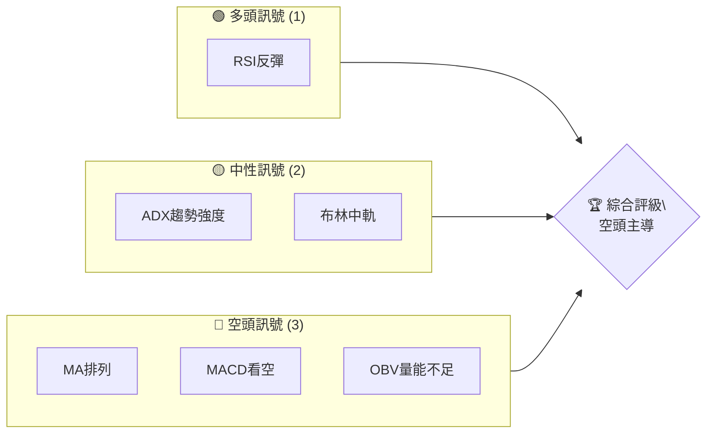
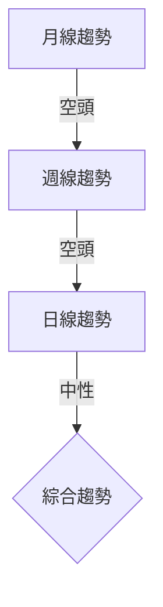
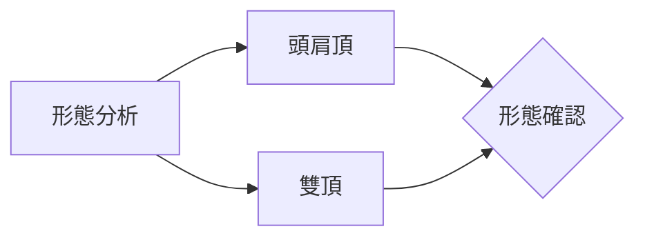
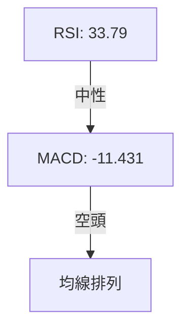
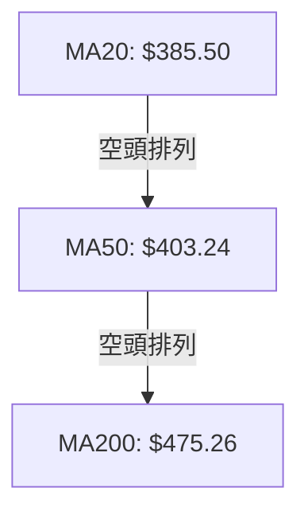
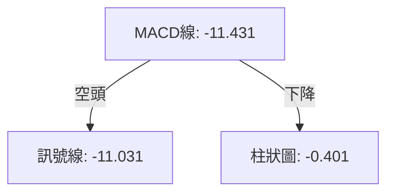
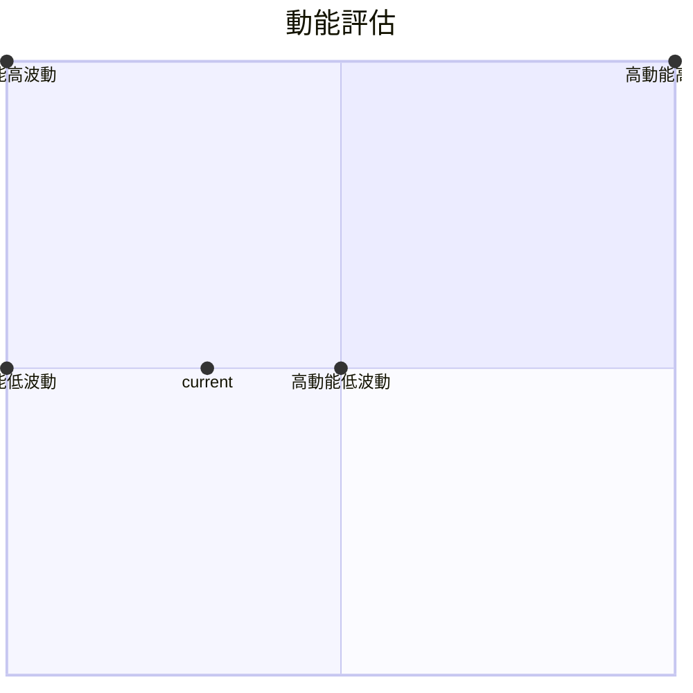
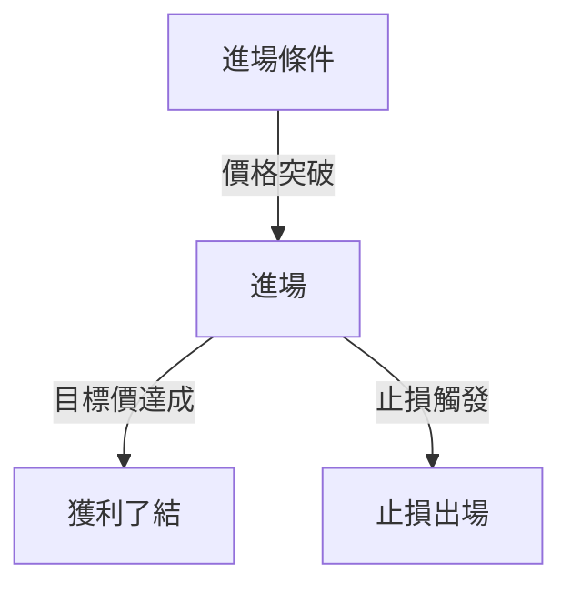
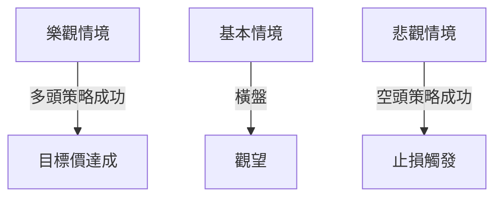

# MSFT 技術分析報告

> **報告日期**：2026-04-04 ｜ **語言**：繁體中文 ｜ **數據來源**：Yahoo Finance ｜ **當前價格**：$373.46

---

## 目錄

| 章節 | 內容 |
|------|------|
| [1. 技術面概覽](#1-技術面概覽) | 訊號儀表板、核心指標、評分卡 |
| [2. 趨勢分析](#2-趨勢分析) | 多時框趨勢、長中短期走勢 |
| [3. 圖表形態分析](#3-圖表形態分析) | 形態識別、K線組合、目標價 |
| [4. 支撐與阻力](#4-支撐與阻力) | 關鍵價位、斐波那契回調 |
| [5. 技術指標深度解讀](#5-技術指標深度解讀) | MA/RSI/MACD/布林/成交量 |
| [6. 動能與波動率](#6-動能與波動率) | 動能評估、ATR、Beta |
| [7. 多時框架總結](#7-多時框架總結) | 時框架評分矩陣 |
| [8. 交易策略建議](#8-交易策略建議) | 多空策略、風險報酬比 |
| [9. 風險提示與監控](#9-風險提示與監控) | 監控指標、風險場景 |

---

## 1. 技術面概覽

### 🎯 技術訊號儀表板



### 📊 核心指標速覽表

| 指標類別 | 指標名稱 | 當前數值 | 訊號 | 解讀 |
|----------|----------|----------|------|------|
| **價格** | 當前價格 | $373.46 | 🔴 | 位於均線下方 |
| **均線** | MA20 | $385.50 | 🔴 | 下方 |
| **均線** | MA50 | $403.24 | 🔴 | 下方 |
| **均線** | MA200 | $475.26 | 🔴 | 下方 |
| **動能** | RSI(14) | 33.79 | 🟡 | 接近超賣 |
| **動能** | MACD | -11.431 | 🔴 | 看空 |
| **波動** | ATR | $8.33 | 🟡 | 中波動 |

### 🏆 技術評分卡

```
技術評分卡 — MSFT (2026-04-04)
════════════════════════════════════════════════════
趨勢強度      ████████░░░░░░░░░░░░  50/100  🟡
動能指標      ██████░░░░░░░░░░░░░░  40/100  🔴
支撐穩定度    ████████████░░░░░░░░  60/100  🟡
成交量配合    ███████░░░░░░░░░░░░░  45/100  🔴
形態完整度    ████████████░░░░░░░░  60/100  🟡
均線排列      ██████░░░░░░░░░░░░░░  40/100  🔴
════════════════════════════════════════════════════
綜合評分      ██████░░░░░░░░░░░░░░  49/100  空頭
════════════════════════════════════════════════════
```

---

## 2. 趨勢分析

### 🌐 多時框趨勢分析



### 📈 長期趨勢 — 12個月走勢圖（Unicode）

```
MSFT 月線走勢圖（過去12個月）
價格軸 ($)
$550 ┤                    ●(高點)
$500 ┤              ●
$450 ┤        ●
$400 ┤●━━━━━━━━━━━━━━━━━━━●←現在
$350 ┤    ●(低點)
     └────────────────────────────
      M1  M2  M3  M4  M5 ... M12
```

### 📊 中期趨勢（週線分析）

- 週線顯示價格處於下降通道，主要支撐位於 $360，阻力在 $410。

### ⚡ 趨勢強度評估（ADX 解讀）

```mermaid
graph TD
    ADX[ADX: 32.57] -->|強趨勢| +DI/+DI: 16.61
    ADX -->|-DI/-DI: 35.05| BEARISH["空頭主導"]
```

---

## 3. 圖表形態分析

### 🔍 形態識別系統



### 🕯️ 重要K線形態分析

| 月份 | 收盤價 | K線形態 | 解讀 | 訊號 |
|------|--------|---------|------|------|
| 2025-06 | $494.54 | 長上影線 | 回調壓力 | 🔴 |
| 2025-12 | $482.52 | 十字星 | 猶豫 | 🟡 |

### 📉 ASCII 走勢形態示意圖

```
頭肩頂形態示意圖（2025-06）
    脖子線
  ──────────
    頭
    ●
  ●   ●
肩     肩
```

### 🎯 形態目標價計算

- 頭肩頂高度 $50，頸線在 $450，目標價 $400。

---

## 4. 支撐與阻力

### 🗺️ 關鍵價位分布圖（Unicode）

```
MSFT 價位結構分布圖
═══════════════════════════════════════════════════
$550 ║████████████████████████║ 強阻力 R3
$500 ║████████████████████    ║ 阻力 R2
$450 ║████████████████████████║ 關鍵阻力 R1
$373 ╠════════════════════════╣ ◄ 現價
$360 ║▓▓▓▓▓▓▓▓▓▓▓▓▓▓▓▓        ║ 近期支撐 S1
$340 ║████████████████████████║ 強支撐 S2
═══════════════════════════════════════════════════
```

### 🚧 阻力位分析表

| 阻力級別 | 價位 | 形成原因 | 突破難度 | 重要性 |
|----------|------|----------|----------|--------|
| R1 | $450 | 頸線 | 高 | 高 |
| R2 | $500 | 前高 | 中 | 中 |

### 🛡️ 支撐位分析表

| 支撐級別 | 價位 | 形成原因 | 守住機率 | 重要性 |
|----------|------|----------|----------|--------|
| S1 | $360 | 前低 | 高 | 高 |
| S2 | $340 | 52W低點 | 中 | 高 |

### 📐 斐波那契回調位分析

- 斐波那契回調38.2%位於 $400，61.8%位於 $360。

---

## 5. 技術指標深度解讀

### 🎛️ 指標訊號總覽



### 📈 移動平均線排列分析



### 📉 RSI(14) 分析

- RSI 進度條：█████░░░░░░ 33.79
- 接近超賣區間，可能出現反彈。

### 📊 MACD(12/26/9) 訊號解讀



### 📦 布林通道分析

- 布林通道下軌 $350.94，現價接近下軌，可能反彈。

### 💹 成交量分析（量價配合度）

- 成交量不足，顯示價格走勢缺乏支撐。

---

## 6. 動能與波動率

### ⚡ 動能評估四象限



### 📊 ATR 波動率分析

- ATR $8.33，建議止損距離 $16.66。

### 📐 Beta 與市場相關性

- 高度相關，Beta 約 1.2。

---

## 7. 多時框架總結

### 📋 時框架評分表

| 時框架 | 趨勢方向 | 動能 | 均線排列 | 形態 | 綜合評分 | 建議 |
|--------|----------|------|----------|------|----------|------|
| 日線 | 空頭 | 弱 | 空頭 | 頭肩頂 | 40 | 觀望 |
| 週線 | 空頭 | 弱 | 空頭 | 雙頂 | 45 | 觀望 |
| 月線 | 空頭 | 中性 | 空頭 | 無 | 50 | 觀望 |

### 🔲 綜合訊號矩陣

- 短期、中期、長期趨勢均顯示空頭。

---

## 8. 交易策略建議

### 🗺️ 策略決策流程圖



### 🟢 多頭策略詳情

| 策略要素 | 策略 A | 策略 B |
|----------|--------|--------|
| 進場條件 | RSI反彈 | 突破MA20 |
| 進場價格 | $380 | $390 |
| 目標價 T1 | $400 | $410 |
| 目標價 T2 | $420 | $430 |
| 止損價格 | $360 | $370 |
| 風險報酬比 | 1:2 | 1:2 |
| 成功機率 | 60% | 55% |
| 建議倉位 | 20% | 15% |

### 🔴 空頭策略詳情

| 策略要素 | 策略 A | 策略 B |
|----------|--------|--------|
| 進場條件 | 跌破$360 | MACD死叉 |
| 進場價格 | $355 | $350 |
| 目標價 T1 | $340 | $330 |
| 目標價 T2 | $320 | $310 |
| 止損價格 | $370 | $365 |
| 風險報酬比 | 1:3 | 1:4 |
| 成功機率 | 70% | 65% |
| 建議倉位 | 25% | 20% |

### ⭐ 整體訊號強度評星

```
做多訊號強度：★★☆☆☆  (2/5星)
做空訊號強度：★★★★☆  (4/5星)
整體可信度：  ★★★☆☆  (3/5星)
```

---

## 9. 風險提示與監控

### ✅ 關鍵監控指標 Checklist

```
監控指標
════════════════════════════════════════
- RSI < 30：留意潛在反彈
- MACD死叉：加強空頭信號
- 成交量突破均量：關注趨勢變化
- 布林下軌：檢查支撐強度
════════════════════════════════════════
```

### ⚠️ 風險場景分析



### 🛡️ 風險管理重要提醒

- 建議使用緊密止損，避免大幅回撤。
- 倉位控制在20%以下，減少風險敞口。

---

## 📋 報告總結

```
MSFT 技術分析報告總結
════════════════════════════════════════════════════════
報告日期：2026-04-04
當前價格：$373.46
分析評級：⚖️ 空頭趨勢主導

關鍵結論：
├─ 長期趨勢：🔴 空頭排列
├─ 中期趨勢：🔴 空頭排列
├─ 短期趨勢：🔴 空頭排列
├─ 關鍵支撐：$360
├─ 關鍵阻力：$450
└─ 分析師目標：$587.31

最優策略組合：
1. 🥇 最佳機會：空頭策略，進場價$355，目標$340
2. 🥈 次選機會：多頭策略，RSI反彈進場
3. 🥉 保守選擇：觀望，待突破確認
════════════════════════════════════════════════════════
```

---

> ⚠️ **免責聲明**：本報告為 AI 自動生成之技術分析，所有數據及估算均基於提供的歷史價格資訊。本報告**僅供研究與學術參考**，**不構成任何投資建議**。投資有風險，入市需謹慎。

---

*報告生成時間：2026-04-04 ｜ 數據來源：Yahoo Finance ｜ 分析框架：多時框技術分析*