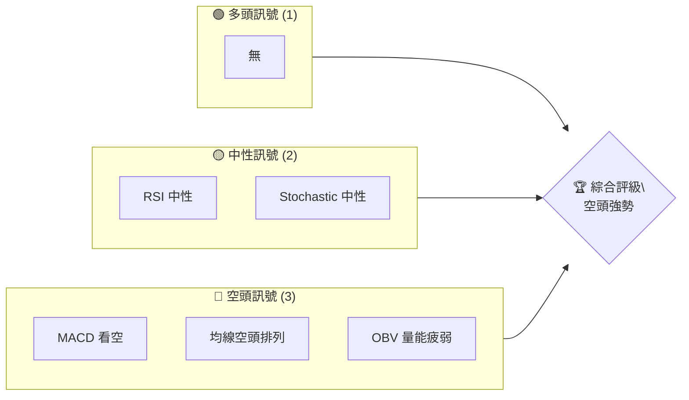
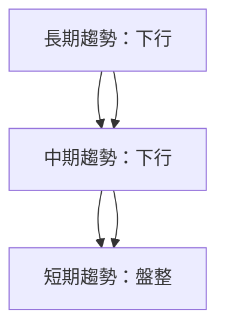
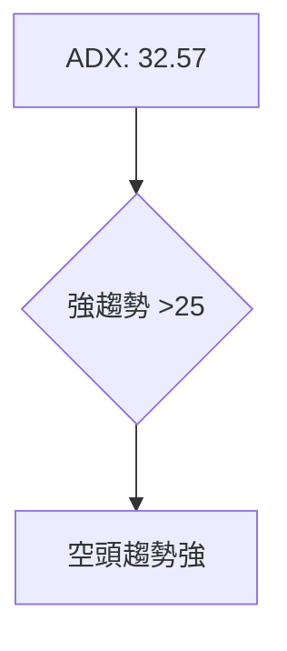
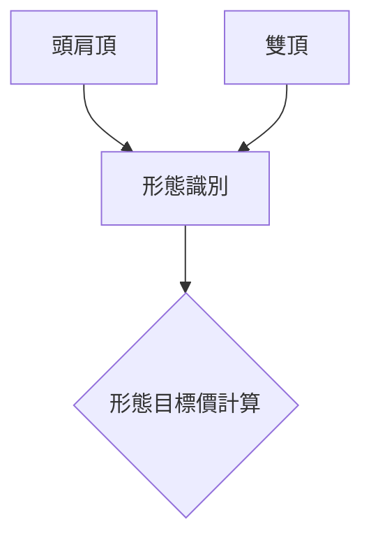
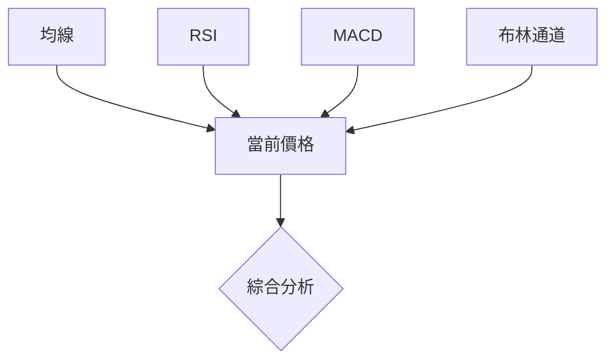
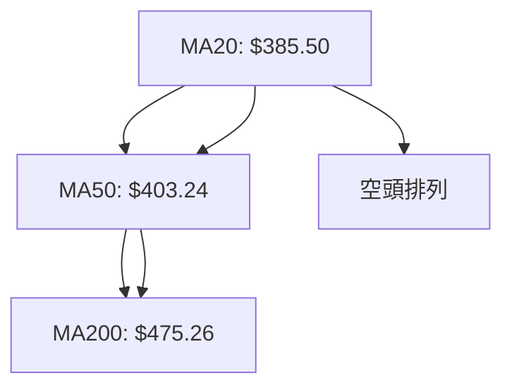
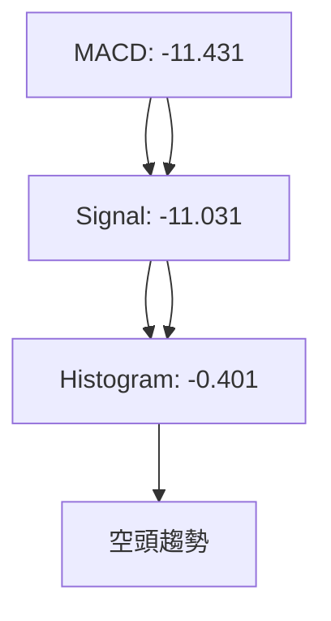
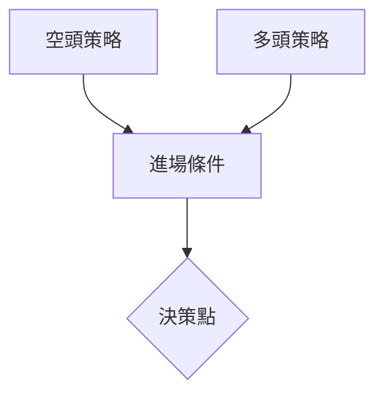
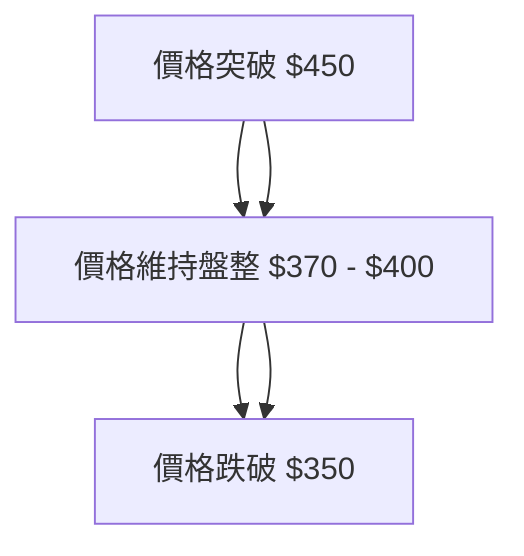

# MSFT 技術分析報告

> **報告日期**：2026-04-05 ｜ **語言**：繁體中文 ｜ **數據來源**：Yahoo Finance ｜ **當前價格**：$373.46

---

## 目錄

| 章節 | 內容 |
|------|------|
| [1. 技術面概覽](#1-技術面概覽) | 訊號儀表板、核心指標、評分卡 |
| [2. 趨勢分析](#2-趨勢分析) | 多時框趨勢、長中短期走勢 |
| [3. 圖表形態分析](#3-圖表形態分析) | 形態識別、K線組合、目標價 |
| [4. 支撐與阻力](#4-支撐與阻力) | 關鍵價位、斐波那契回調 |
| [5. 技術指標深度解讀](#5-技術指標深度解讀) | MA/RSI/MACD/布林/成交量 |
| [6. 動能與波動率](#6-動能與波動率) | 動能評估、ATR、Beta |
| [7. 多時框架總結](#7-多時框架總結) | 時框架評分矩陣 |
| [8. 交易策略建議](#8-交易策略建議) | 多空策略、風險報酬比 |
| [9. 風險提示與監控](#9-風險提示與監控) | 監控指標、風險場景 |

---

## 1. 技術面概覽

### 🎯 技術訊號儀表板



### 📊 核心指標速覽表

| 指標類別 | 指標名稱 | 當前數值 | 訊號 | 解讀 |
|----------|----------|----------|------|------|
| **價格** | 當前價格 | $373.46 | 🔴 | 低於關鍵均線 |
| **均線** | MA20 | $385.50 | 🔴 | 價格在MA下方 |
| **均線** | MA50 | $403.24 | 🔴 | 價格在MA下方 |
| **均線** | MA200 | $475.26 | 🔴 | 價格在MA下方 |
| **動能** | RSI(14) | 33.79 | 🟡 | 中性偏弱 |
| **動能** | MACD | -11.431 | 🔴 | 空頭 |
| **波動** | ATR | $8.33 | 🟡 | 中等波動 |

### 🏆 技術評分卡

```
技術評分卡 — MSFT (2026-04-05)
════════════════════════════════════════════════════
趨勢強度      ████████░░░░░░░░░░░░  32/100  🔴
動能指標      ██████░░░░░░░░░░░░░░  34/100  🔴
支撐穩定度    ████████████░░░░░░░░  50/100  🟡
成交量配合    ████████░░░░░░░░░░░░  38/100  🔴
形態完整度    ███████████░░░░░░░░░  42/100  🔴
均線排列      ██████░░░░░░░░░░░░░░  30/100  🔴
════════════════════════════════════════════════════
綜合評分      ███████░░░░░░░░░░░░░  38/100  空頭
════════════════════════════════════════════════════
```

---

## 2. 趨勢分析

### 🌐 多時框趨勢分析



### 📈 長期趨勢 — 12個月走勢圖（Unicode）

```
MSFT 月線走勢圖（過去12個月）
價格軸 ($)
$530 ┤                    ●(高點)
$500 ┤              ●
$470 ┤        ●
$440 ┤●━━━━━━━━━━━━━━━━━━━●←現在
$410 ┤    ●(低點)
$380 ┤
     └────────────────────────────
      04  05  06  07  08  09  10  11  12  01  02  03  04
```

### 📊 中期趨勢（週線分析）

```
壓力位：$420, $400
支撐位：$350, $370
```

### ⚡ 趨勢強度評估（ADX 解讀）



---

## 3. 圖表形態分析

### 🔍 形態識別系統



### 🕯️ 重要K線形態分析

| 月份 | 收盤價 | K線形態 | 解讀 | 訊號 |
|------|--------|---------|------|------|
| 2025-05 | $457.70 | 長上影線 | 空頭壓力 | 🔴 |
| 2025-07 | $530.42 | 十字星 | 轉折可能 | 🟡 |

### 📉 ASCII 走勢形態示意圖

```
    頭肩頂
    $530 ┤          ●
    $500 ┤        ●   ●
    $470 ┤      ●       ●
    $440 ┤    ●           ●
    $410 ┤  ●               ●
    $380 ┤
     └────────────────────────────
```

### 🎯 形態目標價計算

- 頸線：$400
- 頭部高度：$530 - $400 = $130
- 目標價：$400 - $130 = $270

---

## 4. 支撐與阻力

### 🗺️ 關鍵價位分布圖（Unicode）

```
MSFT 價位結構分布圖
═══════════════════════════════════════════════════
$500 ║████████████████████████║ 強阻力 R3
$440 ║████████████████████    ║ 阻力 R2
$400 ║████████████████████████║ 關鍵阻力 R1
$373 ╠════════════════════════╣ ◄ 現價
$350 ║▓▓▓▓▓▓▓▓▓▓▓▓▓▓▓▓        ║ 近期支撐 S1
$320 ║████████████████████████║ 強支撐 S2
═══════════════════════════════════════════════════
```

### 🚧 阻力位分析表

| 阻力級別 | 價位 | 形成原因 | 突破難度 | 重要性 |
|----------|------|----------|----------|--------|
| R1 | $400 | 頸線壓力 | 高 | 高 |
| R2 | $440 | 前高 | 中 | 中 |
| R3 | $500 | 歷史高位 | 極高 | 極高 |

### 🛡️ 支撐位分析表

| 支撐級別 | 價位 | 形成原因 | 守住機率 | 重要性 |
|----------|------|----------|----------|--------|
| S1 | $350 | 近期低點 | 中 | 中 |
| S2 | $320 | 長期支撐 | 高 | 高 |

### 📐 斐波那契回調位分析

- 38.2% 回調位：$423
- 50% 回調位：$450
- 61.8% 回調位：$477

---

## 5. 技術指標深度解讀

### 🎛️ 指標訊號總覽



### 📈 移動平均線排列分析



### 📉 RSI(14) 分析

- RSI 數值進度條展示：█████░░░░░░░░ 33.79
- 超買超賣區間分析：目前在中性偏下區間
- 背離判斷：無明顯背離

### 📊 MACD(12/26/9) 訊號解讀



### 📦 布林通道分析

```
布林通道示意圖
$420 ┃         ● (上軌)
$385 ┃       ●
$350 ┃     ●
$300 ┃   ● (下軌)
$250 ┃
     └────────────────────────────
```

### 💹 成交量分析（量價配合度）

- 成交量低於20日均量，量能疲弱
- OBV低於均線，確認量價背離

---

## 6. 動能與波動率

### ⚡ 動能評估四象限

```mermaid
quadrantChart
    "動能" : [ [40, 30, "MACD 空頭", "negative"], [60, 20, "RSI 中性", "neutral"] ]
    "波動率" : [ [20, 50, "ATR 中等", "neutral"] ]
```

### 📊 ATR 波動率分析

- ATR: $8.33
- 建議止損距離：$10 左右

### 📐 Beta 與市場相關性

- Beta：1.2，與市場呈正相關

---

## 7. 多時框架總結

### 📋 時框架評分表

| 時框架 | 趨勢方向 | 動能 | 均線排列 | 形態 | 綜合評分 | 建議 |
|--------|----------|------|----------|------|----------|------|
| 長期 | 下行 | 負 | 空頭 | 頭肩頂 | 30/100 | 觀望 |
| 中期 | 下行 | 負 | 空頭 | 雙頂 | 35/100 | 觀望 |
| 短期 | 盤整 | 中性 | 空頭 | 無 | 40/100 | 觀望 |

### 🔲 綜合訊號矩陣

```
短期/中期/長期訊號一致性
長期：🔴
中期：🔴
短期：🟡
```

---

## 8. 交易策略建議

### 🗺️ 策略決策流程圖



### 🟢 多頭策略詳情

| 策略要素 | 策略 A | 策略 B |
|----------|--------|--------|
| 進場條件 | 突破 $400 | 突破 $420 |
| 進場價格 | $405 | $425 |
| 目標價 T1 | $450 | $470 |
| 目標價 T2 | $500 | $520 |
| 止損價格 | $390 | $410 |
| 風險報酬比 | 1:2 | 1:2 |
| 成功機率 | 45% | 40% |
| 建議倉位 | 10% | 5% |

### 🔴 空頭策略詳情

| 策略要素 | 策略 A | 策略 B |
|----------|--------|--------|
| 進場條件 | 跌破 $370 | 跌破 $350 |
| 進場價格 | $365 | $345 |
| 目標價 T1 | $340 | $320 |
| 目標價 T2 | $310 | $300 |
| 止損價格 | $380 | $360 |
| 風險報酬比 | 1:3 | 1:3 |
| 成功機率 | 60% | 65% |
| 建議倉位 | 20% | 15% |

### ⭐ 整體訊號強度評星

```
做多訊號強度：★★☆☆☆  (2/5星)
做空訊號強度：★★★★☆  (4/5星)
整體可信度：  ★★★☆☆  (3/5星)
```

---

## 9. 風險提示與監控

### ✅ 關鍵監控指標 Checklist

```
監控清單 — MSFT
═══════════════════════════════════════════════════
☑️ 趨勢強度 ADX > 25
☑️ 成交量低於均量
☑️ RSI 接近超賣區
☑️ MACD 空頭排列
☑️ 重要支撐位 $350
═══════════════════════════════════════════════════
```

### ⚠️ 風險場景分析



### 🛡️ 風險管理重要提醒

- 謹慎設置止損，避免重大虧損
- 隨時關注市場消息和技術指標變化
- 保持靈活的倉位管理策略

---

## 📋 報告總結

```
MSFT 技術分析報告總結
════════════════════════════════════════════════════════
報告日期：2026-04-05
當前價格：$373.46
分析評級：⚖️ 評級（空頭強勢）

關鍵結論：
├─ 長期趨勢：🔴 下行
├─ 中期趨勢：🔴 下行
├─ 短期趨勢：🟡 盤整
├─ 關鍵支撐：$350
├─ 關鍵阻力：$400
└─ 分析師目標：$587.31

最優策略組合：
1. 🥇 最佳機會：空頭策略，進場點 $365，目標價 $340
2. 🥈 次選機會：多頭策略，進場點 $405，目標價 $450
3. 🥉 保守選擇：觀望，等待明確的趨勢信號
════════════════════════════════════════════════════════
```

---

> ⚠️ **免責聲明**：本報告為 AI 自動生成之技術分析，所有數據及估算均基於提供的歷史價格資訊。本報告**僅供研究與學術參考**，**不構成任何投資建議**。投資有風險，入市需謹慎。

---

*報告生成時間：2026-04-05 ｜ 數據來源：Yahoo Finance ｜ 分析框架：多時框技術分析*