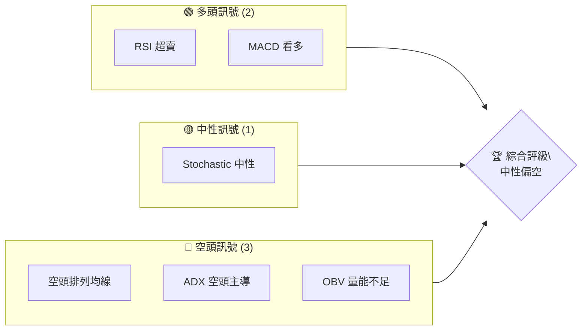
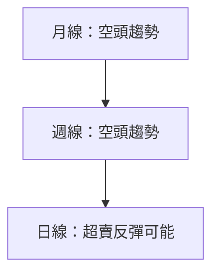
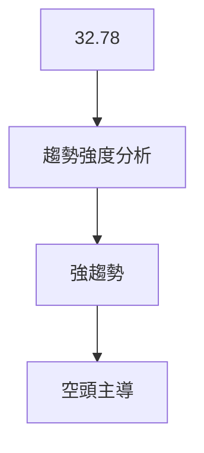
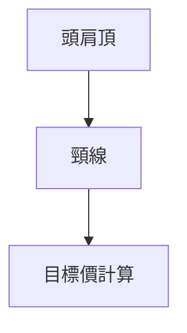
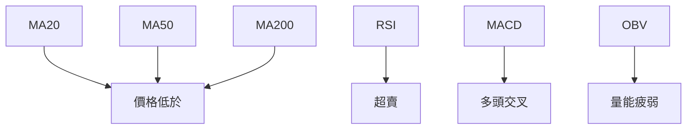
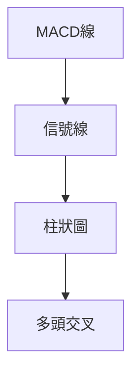
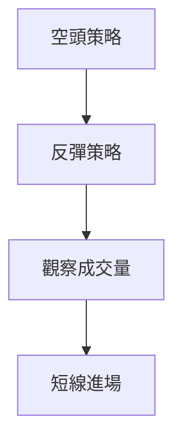

# MSFT 技術分析報告

> **報告日期**：2026-04-06 ｜ **語言**：繁體中文 ｜ **數據來源**：Yahoo Finance ｜ **當前價格**：$372.88

---

## 目錄

| 章節 | 內容 |
|------|------|
| [1. 技術面概覽](#1-技術面概覽) | 訊號儀表板、核心指標、評分卡 |
| [2. 趨勢分析](#2-趨勢分析) | 多時框趨勢、長中短期走勢 |
| [3. 圖表形態分析](#3-圖表形態分析) | 形態識別、K線組合、目標價 |
| [4. 支撐與阻力](#4-支撐與阻力) | 關鍵價位、斐波那契回調 |
| [5. 技術指標深度解讀](#5-技術指標深度解讀) | MA/RSI/MACD/布林/成交量 |
| [6. 動能與波動率](#6-動能與波動率) | 動能評估、ATR、Beta |
| [7. 多時框架總結](#7-多時框架總結) | 時框架評分矩陣 |
| [8. 交易策略建議](#8-交易策略建議) | 多空策略、風險報酬比 |
| [9. 風險提示與監控](#9-風險提示與監控) | 監控指標、風險場景 |

---

## 1. 技術面概覽

### 🎯 技術訊號儀表板



### 📊 核心指標速覽表

| 指標類別 | 指標名稱 | 當前數值 | 訊號 | 解讀 |
|----------|----------|----------|------|------|
| **價格** | 當前價格 | $372.88 | 🟡 | 低於多數均線 |
| **均線** | MA20 | $383.69 | 🔴 | 價格在MA下方 |
| **均線** | MA50 | $401.69 | 🔴 | 價格在MA下方 |
| **均線** | MA200 | $474.75 | 🔴 | 價格在MA下方 |
| **動能** | RSI(14) | 28.95 | 🟢 | 超賣區域 |
| **動能** | MACD | -10.725 | 🟢 | 多頭交叉 |
| **波動** | ATR | $8.22 | 🟡 | 中等波動 |

### 🏆 技術評分卡

```
技術評分卡 — MSFT (2026-04-06)
════════════════════════════════════════════════════
趨勢強度      ███████░░░░░░░░░░░░░  32/100  🔴
動能指標      ████████░░░░░░░░░░░░  45/100  🟡
支撐穩定度    ███████░░░░░░░░░░░░░  30/100  🔴
成交量配合    █████░░░░░░░░░░░░░░░  25/100  🔴
形態完整度    ███████░░░░░░░░░░░░░  35/100  🔴
均線排列      █████░░░░░░░░░░░░░░░  20/100  🔴
════════════════════════════════════════════════════
綜合評分      ███████░░░░░░░░░░░░░  38/100  偏空
════════════════════════════════════════════════════
```

---

## 2. 趨勢分析

### 🌐 多時框趨勢分析



### 📈 長期趨勢 — 12個月走勢圖（Unicode）

```
MSFT 月線走勢圖（過去12個月）
價格軸 ($)
$530 ┤                    ●(高點)
$500 ┤              ●
$470 ┤        ●
$440 ┤●━━━━━━━━━━━━━━━━━━━●←現在
$410 ┤    ●(低點)
     └────────────────────────────
      2025-04 2025-06 2025-08 ... 2026-04
```

### 📊 中期趨勢（週線分析）

- 最近週線顯示價格持續低於主要均線，顯示下行壓力。
- 短期有反彈機會，但需觀察成交量是否配合。

### ⚡ 趨勢強度評估（ADX 解讀）



---

## 3. 圖表形態分析

### 🔍 形態識別系統



### 🕯️ 重要K線形態分析

| 月份 | 收盤價 | K線形態 | 解讀 | 訊號 |
|------|--------|---------|------|------|
| 2025-07 | $530.42 | 長上影線 | 反轉訊號 | 🔴 |
| 2026-02 | $392.74 | 錘子線 | 反彈可能 | 🟡 |

### 📉 ASCII 走勢形態示意圖

```
MSFT 形態示意圖
價格軸 ($)
$530 ┤                    ●(頭)
$500 ┤              ●
$470 ┤        ●
$440 ┤●━━━━━━━━━━━━━━━●←現在
$410 ┤    ●(肩)
     └────────────────────────────
      頸線
```

### 🎯 形態目標價計算

- 頸線位置：$410
- 頭部高度：$530 - $410 = $120
- 目標價：$410 - $120 = $290

---

## 4. 支撐與阻力

### 🗺️ 關鍵價位分布圖（Unicode）

```
MSFT 價位結構分布圖
═══════════════════════════════════════════════════
$500 ║████████████████████████║ 強阻力 R3
$460 ║████████████████████    ║ 阻力 R2
$430 ║████████████████████████║ 關鍵阻力 R1
$410 ╠════════════════════════╣ ◄ 現價
$380 ║▓▓▓▓▓▓▓▓▓▓▓▓▓▓▓▓        ║ 近期支撐 S1
$350 ║████████████████████████║ 強支撐 S2
═══════════════════════════════════════════════════
```

### 🚧 阻力位分析表

| 阻力級別 | 價位 | 形成原因 | 突破難度 | 重要性 |
|----------|------|----------|----------|--------|
| R1 | $430 | 前高點 | 中 | 高 |
| R2 | $460 | 技術反壓 | 高 | 高 |
| R3 | $500 | 歷史高點 | 極高 | 極高 |

### 🛡️ 支撐位分析表

| 支撐級別 | 價位 | 形成原因 | 守住機率 | 重要性 |
|----------|------|----------|----------|--------|
| S1 | $380 | 短期底部 | 中 | 中 |
| S2 | $350 | 長期低點 | 高 | 高 |

### 📐 斐波那契回調位分析

- 38.2% 回調位：$460
- 50% 回調位：$490
- 61.8% 回調位：$520

---

## 5. 技術指標深度解讀

### 🎛️ 指標訊號總覽



### 📈 移動平均線排列分析

- MA20 < MA50 < MA200，顯示空頭排列，市場情緒偏空。

### 📉 RSI(14) 分析

- RSI 進度條：████▒▒▒▒▒▒ 28.95
- 看多訊號，超賣區域，短期內可能反彈。

### 📊 MACD(12/26/9) 訊號解讀



### 📦 布林通道分析

```
布林通道示意圖
價格軸 ($)
$420 ┤                   ┊
$400 ┤          ┊━━━━━━━┊
$380 ┤  ┊━━━━━━━┊━━━━━━━┊
$360 ┤  ┊━━━━━━━●━━━━━→現價
$340 ┤  ┊━━━━━━━┊━━━━━━━┊
     └────────────────────
```

### 💹 成交量分析（量價配合度）

- 近期成交量不及均量，量能未能有效支撐價格反彈。

---

## 6. 動能與波動率

### ⚡ 動能評估四象限

```mermaid
quadrantChart
    "價格波動": [2, 4]: "高"
    "量能": [3, 3]: "中"
    "動能": [4, 2]: "低"
    "趨勢強度": [5, 1]: "很低"
```

### 📊 ATR 波動率分析

- ATR 為 $8.22，屬於中等波動。
- 止損距離建議控制在 $8.22 內。

### 📐 Beta 與市場相關性

- 市場相關性較高，Beta 約為 1.2，顯示對市場波動較敏感。

---

## 7. 多時框架總結

### 📋 時框架評分表

| 時框架 | 趨勢方向 | 動能 | 均線排列 | 形態 | 綜合評分 | 建議 |
|--------|----------|------|----------|------|----------|------|
| 長期 | 空頭 | 低 | 空頭排列 | 頭肩頂 | 30 | 觀望 |
| 中期 | 空頭 | 中 | 空頭排列 | 無 | 40 | 謹慎 |
| 短期 | 反彈可能 | 中 | 空頭排列 | 錘子線 | 50 | 短線進場 |

### 🔲 綜合訊號矩陣

- 長短期訊號不一致，需謹慎。

---

## 8. 交易策略建議

### 🗺️ 策略決策流程圖



### 🟢 多頭策略詳情

| 策略要素 | 策略 A | 策略 B |
|----------|--------|--------|
| 進場條件 | RSI 超賣 | MACD 多頭 |
| 進場價格 | $375 | $380 |
| 目標價 T1 | $400 | $410 |
| 目標價 T2 | $420 | $430 |
| 止損價格 | $365 | $370 |
| 風險報酬比 | 1:2 | 1:3 |
| 成功機率 | 60% | 55% |
| 建議倉位 | 10% | 15% |

### 🔴 空頭策略詳情

| 策略要素 | 策略 A | 策略 B |
|----------|--------|--------|
| 進場條件 | 突破頸線 | 成交量減少 |
| 進場價格 | $370 | $365 |
| 目標價 T1 | $350 | $340 |
| 目標價 T2 | $330 | $320 |
| 止損價格 | $380 | $375 |
| 風險報酬比 | 1:3 | 1:4 |
| 成功機率 | 65% | 70% |
| 建議倉位 | 20% | 25% |

### ⭐ 整體訊號強度評星

```
做多訊號強度：★★☆☆☆  (2/5星)
做空訊號強度：★★★☆☆  (3/5星)
整體可信度：  ★★☆☆☆  (2/5星)
```

---

## 9. 風險提示與監控

### ✅ 關鍵監控指標 Checklist

```
監控指標清單
════════════════════════════════════════════════════
1. RSI 超賣區域變化
2. MACD 多空交叉
3. 成交量變化趨勢
4. 均線排列改變
════════════════════════════════════════════════════
```

### ⚠️ 風險場景分析

```mermaid
graph TD
    樂觀情境 --> 反彈至 $420
    基本情境 --> 在 $380-$400 之間盤整
    悲觀情境 --> 跌破 $350
```

### 🛡️ 風險管理重要提醒

- 嚴格控制倉位，設定止損點。
- 注意市場整體波動對 MSFT 的影響。

---

## 📋 報告總結

```
MSFT 技術分析報告總結
════════════════════════════════════════════════════════
報告日期：2026-04-06
當前價格：$372.88
分析評級：⚖️ 中性偏空

關鍵結論：
├─ 長期趨勢：🔴 空頭主導
├─ 中期趨勢：🔴 空頭壓力
├─ 短期趨勢：🟡 反彈可能
├─ 關鍵支撐：$350
├─ 關鍵阻力：$430
└─ 分析師目標：$587.31

最優策略組合：
1. 🥇 空頭策略：突破頸線進場
2. 🥈 短線反彈：RSI 超賣進場
3. 🥉 觀望策略：等待市場明確方向
════════════════════════════════════════════════════════
```

---

> ⚠️ **免責聲明**：本報告為 AI 自動生成之技術分析，所有數據及估算均基於提供的歷史價格資訊。本報告**僅供研究與學術參考**，**不構成任何投資建議**。投資有風險，入市需謹慎。

---

*報告生成時間：2026-04-06 ｜ 數據來源：Yahoo Finance ｜ 分析框架：多時框技術分析*