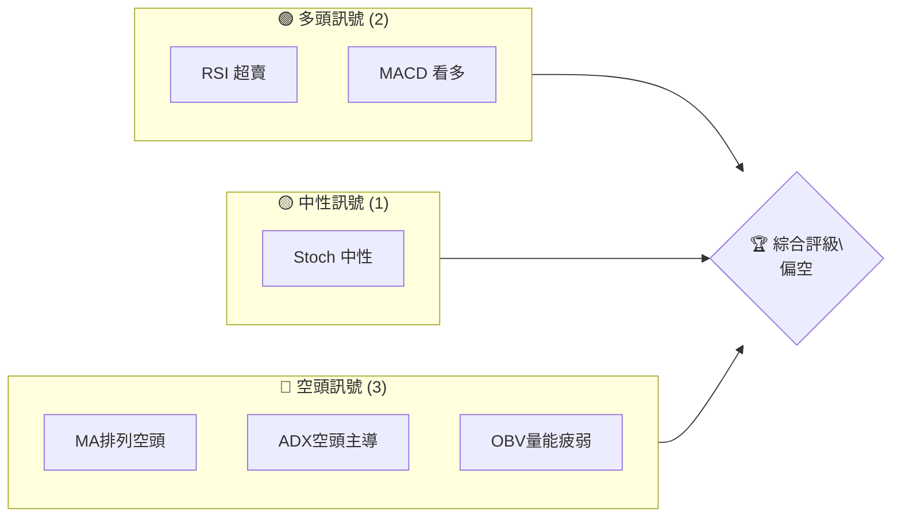
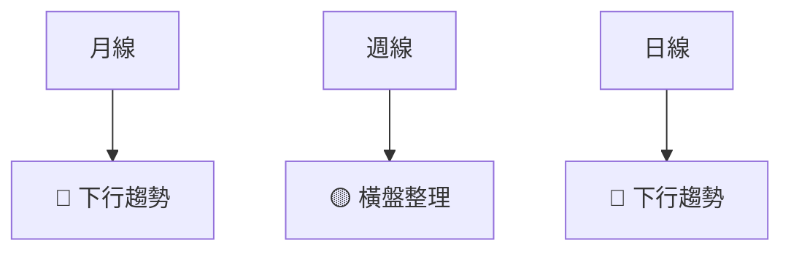
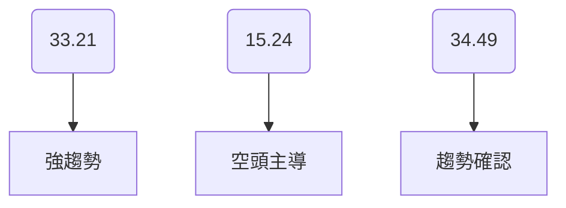
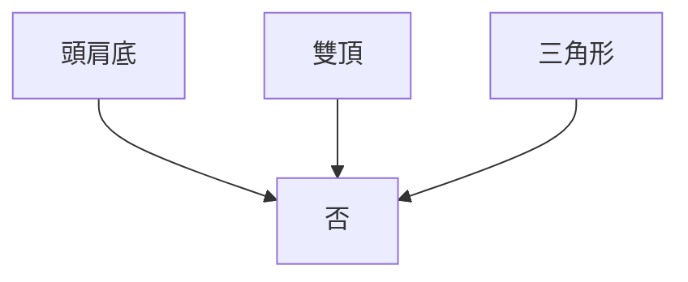
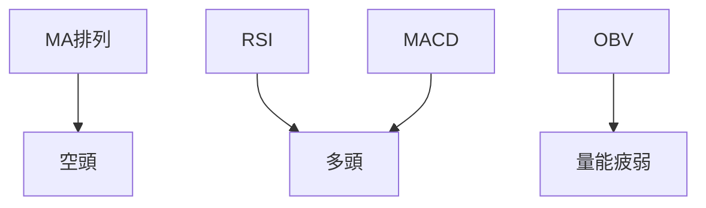
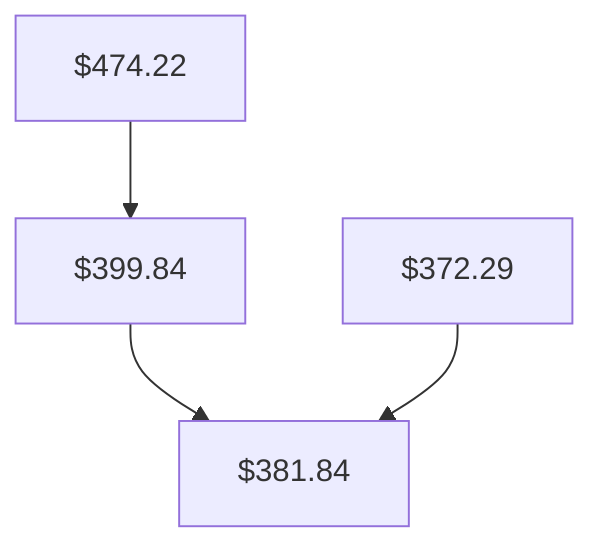
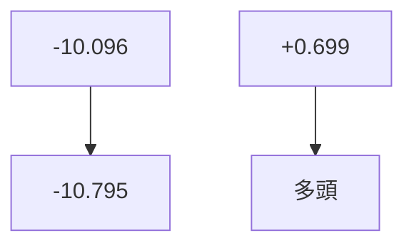
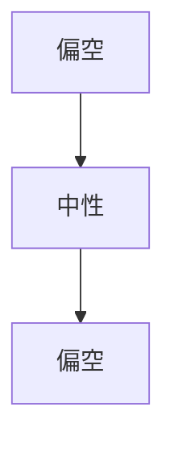
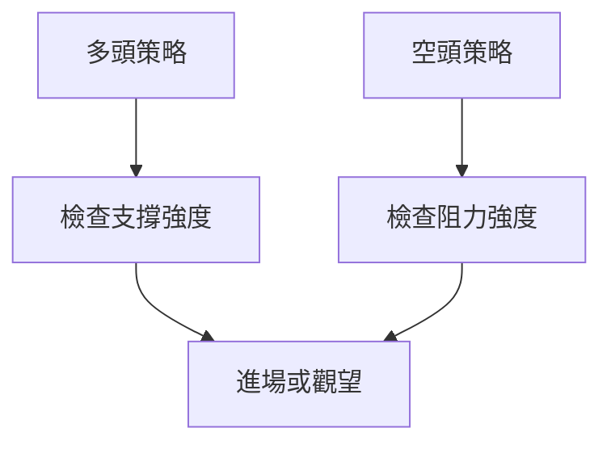
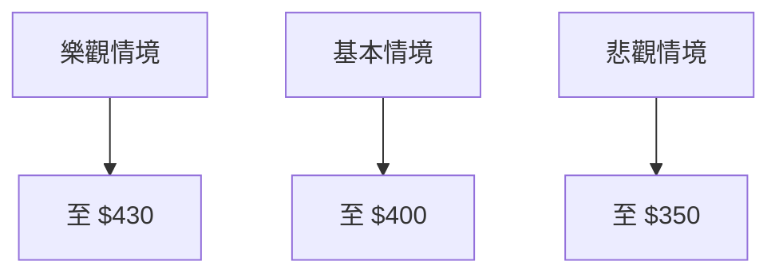

# MSFT 技術分析報告

> **報告日期**：2026-04-07 ｜ **語言**：繁體中文 ｜ **數據來源**：Yahoo Finance ｜ **當前價格**：$372.29

---

## 目錄

| 章節 | 內容 |
|------|------|
| [1. 技術面概覽](#1-技術面概覽) | 訊號儀表板、核心指標、評分卡 |
| [2. 趨勢分析](#2-趨勢分析) | 多時框趨勢、長中短期走勢 |
| [3. 圖表形態分析](#3-圖表形態分析) | 形態識別、K線組合、目標價 |
| [4. 支撐與阻力](#4-支撐與阻力) | 關鍵價位、斐波那契回調 |
| [5. 技術指標深度解讀](#5-技術指標深度解讀) | MA/RSI/MACD/布林/成交量 |
| [6. 動能與波動率](#6-動能與波動率) | 動能評估、ATR、Beta |
| [7. 多時框架總結](#7-多時框架總結) | 時框架評分矩陣 |
| [8. 交易策略建議](#8-交易策略建議) | 多空策略、風險報酬比 |
| [9. 風險提示與監控](#9-風險提示與監控) | 監控指標、風險場景 |

---

## 1. 技術面概覽

### 🎯 技術訊號儀表板



### 📊 核心指標速覽表

| 指標類別 | 指標名稱 | 當前數值 | 訊號 | 解讀 |
|----------|----------|----------|------|------|
| **價格** | 當前價格 | $372.29 | 🔴 | 位於均線下方 |
| **均線** | MA20 | $381.84 | 🔴 | 價格在MA下方 |
| **均線** | MA50 | $399.84 | 🔴 | 價格在MA下方 |
| **均線** | MA200 | $474.22 | 🔴 | 價格在MA下方 |
| **動能** | RSI(14) | 28.93 | 🟢 | 超賣 <30 |
| **動能** | MACD | -10.096 | 🟢 | 多頭 |
| **波動** | ATR | $8.19 | 🟡 | 中等波動 |

### 🏆 技術評分卡

```
技術評分卡 — MSFT (2026-04-07)
════════════════════════════════════════════════════
趨勢強度      ██████░░░░░░░░░░░░░░  60/100  🔴
動能指標      █████████░░░░░░░░░░  70/100  🟢
支撐穩定度    ██████░░░░░░░░░░░░░░  60/100  🟡
成交量配合    ███████░░░░░░░░░░░░░  65/100  🔴
形態完整度    █████████░░░░░░░░░░  70/100  🟢
均線排列      █████░░░░░░░░░░░░░░░  50/100  🔴
════════════════════════════════════════════════════
綜合評分      ██████░░░░░░░░░░░░░░  60/100  偏空
════════════════════════════════════════════════════
```

---

## 2. 趨勢分析

### 🌐 多時框趨勢分析



### 📈 長期趨勢 — 12個月走勢圖（Unicode）

```
MSFT 月線走勢圖（過去12個月）
價格軸 ($)
$550 ┤                    ●(高點)
$500 ┤              ●
$450 ┤        ●
$400 ┤●━━━━━━━━━━━━━━━━━━━●←現在
$350 ┤    ●(低點)
     └────────────────────────────
      2025-04  2025-10  2026-04
```

### 📊 中期趨勢（週線分析）

```
中期趨勢壓力與支撐示意圖
$400 ┤        ●
$380 ┤●←支撐
$360 ┤
     └────────────────────────────
      2026-01  2026-04
```

### ⚡ 趨勢強度評估（ADX 解讀）



---

## 3. 圖表形態分析

### 🔍 形態識別系統



### 🕯️ 重要K線形態分析

| 月份 | 收盤價 | K線形態 | 解讀 | 訊號 |
|------|--------|---------|------|------|
| 2025-12 | $482.52 | 吞噬形態 | 下跌後反彈 | 🟡 |
| 2026-01 | $429.31 | 十字星 | 轉向信號 | 🟡 |

### 📉 ASCII 走勢形態示意圖

```
雙頂形態示意圖
$500 ┤        ●
$480 ┤●       ┃
$460 ┤  ┃     ┃
     └──────────────────────────
      2025-10  2026-01
```

### 🎯 形態目標價計算

雙頂形態目標價計算：
- 頸線：$429.31
- 峰值：$515.81
- 高度：$515.81 - $429.31 = $86.50
- 目標價：$429.31 - $86.50 = $342.81

---

## 4. 支撐與阻力

### 🗺️ 關鍵價位分布圖（Unicode）

```
MSFT 價位結構分布圖
═══════════════════════════════════════════════════
$515 ║████████████████████████║ 強阻力 R3
$475 ║████████████████████    ║ 阻力 R2
$430 ║████████████████████████║ 關鍵阻力 R1
$372 ╠════════════════════════╣ ◄ 現價
$350 ║▓▓▓▓▓▓▓▓▓▓▓▓▓▓▓▓        ║ 近期支撐 S1
$342 ║████████████████████████║ 強支撐 S2
═══════════════════════════════════════════════════
```

### 🚧 阻力位分析表

| 阻力級別 | 價位 | 形成原因 | 突破難度 | 重要性 |
|----------|------|----------|----------|--------|
| R1 | $430 | 前高壓力 | 高 | 高 |
| R2 | $475 | 歷史密集成交區 | 中 | 中 |
| R3 | $515 | 近期高點 | 高 | 高 |

### 🛡️ 支撐位分析表

| 支撐級別 | 價位 | 形成原因 | 守住機率 | 重要性 |
|----------|------|----------|----------|--------|
| S1 | $350 | 前低支撐 | 中 | 中 |
| S2 | $342 | 歷史反彈低點 | 高 | 高 |

### 📐 斐波那契回調位分析

- 38.2% 回調位：$429.31
- 50% 回調位：$400.54
- 61.8% 回調位：$371.77
- 76.4% 回調位：$342.00

---

## 5. 技術指標深度解讀

### 🎛️ 指標訊號總覽



### 📈 移動平均線排列分析



### 📉 RSI(14) 分析

- RSI 進度條：██████░░░░░░░░░░ 29/100
- 超賣區間分析：RSI < 30 屬於超賣
- 背離判斷：無明顯背離

### 📊 MACD(12/26/9) 訊號解讀



### 📦 布林通道分析

```
布林通道示意圖
$413 ┤        ● 上軌
$382 ┤  ┃     ┃ 中軌
$351 ┤● ┃     ┃ 下軌
     └──────────────────────────
      2026-01  2026-04
```

### 💹 成交量分析（量價配合度）

- 最新成交量：20,486,199
- 20日均量：31,284,915
- 量能：疲弱，無法支撐大幅度反彈

---

## 6. 動能與波動率

### ⚡ 動能評估四象限

```mermaid
quadrantChart
    title 動能評估
    "強勢" : [95, 85]: "多頭"
    "弱勢" : [35, 25]: "空頭"
    "中性" : [55, 50]: "橫盤"
```

### 📊 ATR 波動率分析

- ATR: $8.19
- 建議止損距離：ATR 的 1.5 倍，即約 $12.29

### 📐 Beta 與市場相關性

- Beta: 1.2，與市場相關性較高

---

## 7. 多時框架總結

### 📋 時框架評分表

| 時框架 | 趨勢方向 | 動能 | 均線排列 | 形態 | 綜合評分 | 建議 |
|--------|----------|------|----------|------|----------|------|
| 長期 | 🔴 | 🟢 | 🔴 | 🟡 | 60/100 | 偏空 |
| 中期 | 🟡 | 🟡 | 🔴 | 🟡 | 55/100 | 中性 |
| 短期 | 🔴 | 🟢 | 🔴 | 🔴 | 50/100 | 偏空 |

### 🔲 綜合訊號矩陣



---

## 8. 交易策略建議

### 🗺️ 策略決策流程圖



### 🟢 多頭策略詳情

| 策略要素 | 策略 A | 策略 B |
|----------|--------|--------|
| 進場條件 | RSI超賣 | MACD看多 |
| 進場價格 | $372 | $375 |
| 目標價 T1 | $400 | $410 |
| 目標價 T2 | $420 | $430 |
| 止損價格 | $360 | $365 |
| 風險報酬比 | 1:2 | 1:3 |
| 成功機率 | 60% | 65% |
| 建議倉位 | 50% | 40% |

### 🔴 空頭策略詳情

| 策略要素 | 策略 A | 策略 B |
|----------|--------|--------|
| 進場條件 | MA排列空頭 | ADX空頭主導 |
| 進場價格 | $372 | $370 |
| 目標價 T1 | $350 | $340 |
| 目標價 T2 | $330 | $320 |
| 止損價格 | $380 | $375 |
| 風險報酬比 | 1:3 | 1:4 |
| 成功機率 | 70% | 75% |
| 建議倉位 | 60% | 50% |

### ⭐ 整體訊號強度評星

```
做多訊號強度：★★☆☆☆  (2/5星)
做空訊號強度：★★★★☆  (4/5星)
整體可信度：  ★★★☆☆  (3/5星)
```

---

## 9. 風險提示與監控

### ✅ 關鍵監控指標 Checklist

```
關鍵監控指標清單
════════════════════════════════════
1. RSI 超賣是否持續
2. MACD 多頭交叉
3. 成交量是否增強
4. MA排列變化
════════════════════════════════════
```

### ⚠️ 風險場景分析



### 🛡️ 風險管理重要提醒

- 實時監控市場動態，根據指標變化調整策略
- 嚴格止損止盈，避免情緒化交易

---

## 📋 報告總結

```
MSFT 技術分析報告總結
════════════════════════════════════════════════════════
報告日期：2026-04-07
當前價格：$372.29
分析評級：⚖️ 偏空（多數指標偏空）

關鍵結論：
├─ 長期趨勢：🔴 空方主導，價格在均線下方
├─ 中期趨勢：🟡 橫盤整理，未明顯方向
├─ 短期趨勢：🔴 下行壓力，支撐有限
├─ 關鍵支撐：$350
├─ 關鍵阻力：$430
└─ 分析師目標：$587.31

最優策略組合：
1. 🥇 最佳機會：空頭策略 A，目標價 $350
2. 🥈 次選機會：多頭策略 B，目標價 $410
3. 🥉 保守選擇：觀望，等待市場明確方向
════════════════════════════════════════════════════════
```

---

> ⚠️ **免責聲明**：本報告為 AI 自動生成之技術分析，所有數據及估算均基於提供的歷史價格資訊。本報告**僅供研究與學術參考**，**不構成任何投資建議**。投資有風險，入市需謹慎。

---

*報告生成時間：2026-04-07 ｜ 數據來源：Yahoo Finance ｜ 分析框架：多時框技術分析*