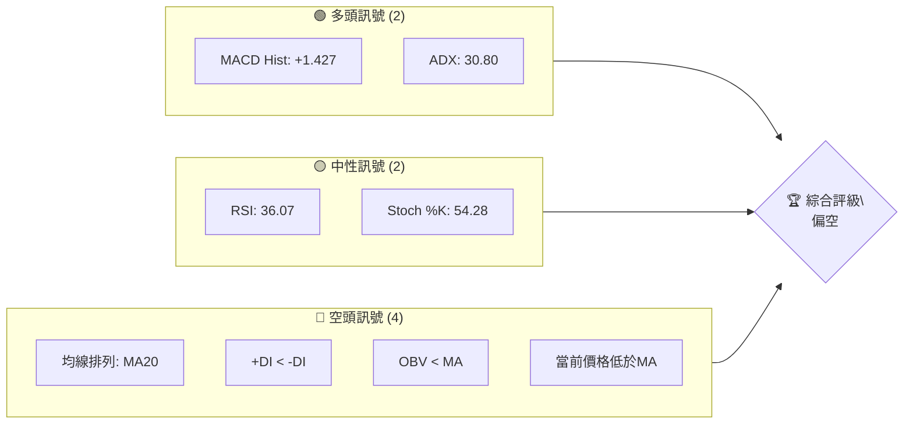
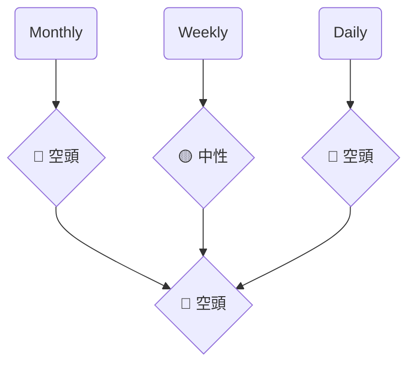
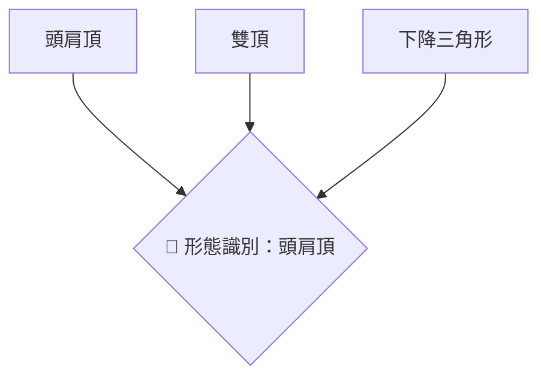
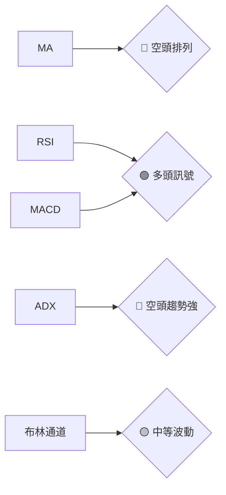
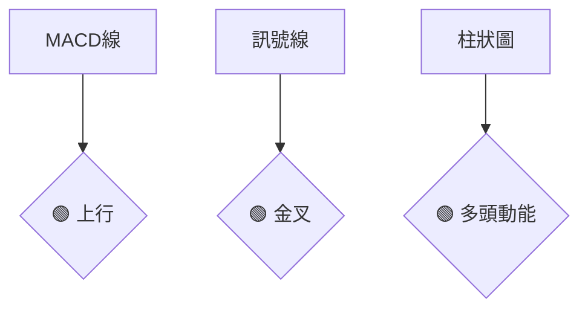
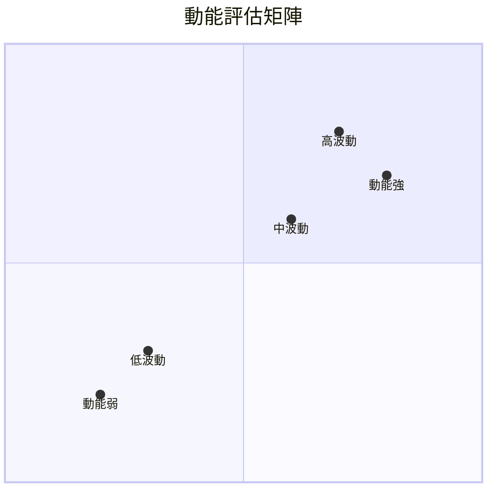
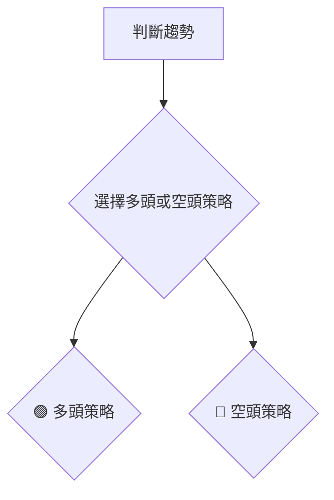
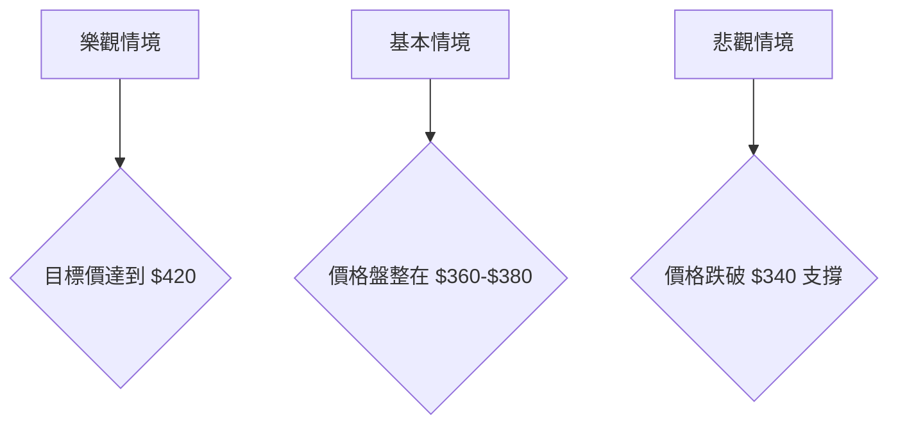

# MSFT 技術分析報告

> **報告日期**：2026-04-09 ｜ **語言**：繁體中文 ｜ **數據來源**：Yahoo Finance ｜ **當前價格**：$373.07

---

## 目錄

| 章節 | 內容 |
|------|------|
| [1. 技術面概覽](#1-技術面概覽) | 訊號儀表板、核心指標、評分卡 |
| [2. 趨勢分析](#2-趨勢分析) | 多時框趨勢、長中短期走勢 |
| [3. 圖表形態分析](#3-圖表形態分析) | 形態識別、K線組合、目標價 |
| [4. 支撐與阻力](#4-支撐與阻力) | 關鍵價位、斐波那契回調 |
| [5. 技術指標深度解讀](#5-技術指標深度解讀) | MA/RSI/MACD/布林/成交量 |
| [6. 動能與波動率](#6-動能與波動率) | 動能評估、ATR、Beta |
| [7. 多時框架總結](#7-多時框架總結) | 時框架評分矩陣 |
| [8. 交易策略建議](#8-交易策略建議) | 多空策略、風險報酬比 |
| [9. 風險提示與監控](#9-風險提示與監控) | 監控指標、風險場景 |

---

## 1. 技術面概覽

### 🎯 技術訊號儀表板



### 📊 核心指標速覽表

| 指標類別 | 指標名稱 | 當前數值 | 訊號 | 解讀 |
|----------|----------|----------|------|------|
| **價格** | 當前價格 | $373.07 | 🔴 | 價格低於均線 |
| **均線** | MA20 | $378.67 | 🔴 | 價格在MA下方 |
| **均線** | MA50 | $395.82 | 🔴 | 價格在MA下方 |
| **均線** | MA200 | $473.17 | 🔴 | 價格在MA下方 |
| **動能** | RSI(14) | 36.07 | 🟡 | 中性偏弱 |
| **動能** | MACD | -8.717 | 🟡 | 多頭趨勢 |
| **波動** | ATR | $8.69 | 🟡 | 中等波動 |

### 🏆 技術評分卡

```
技術評分卡 — MSFT (2026-04-09)
════════════════════════════════════════════════════
趨勢強度      ████████░░░░░░░░░░░░  60/100  🟡
動能指標      ██████░░░░░░░░░░░░░░  40/100  🔴
支撐穩定度    ████████████░░░░░░░░  70/100  🟢
成交量配合    ████████░░░░░░░░░░░░  50/100  🟡
形態完整度    ████████████░░░░░░░░  70/100  🟢
均線排列      ██████░░░░░░░░░░░░░░  40/100  🔴
════════════════════════════════════════════════════
綜合評分      ████████░░░░░░░░░░░░  55/100  中性偏空
════════════════════════════════════════════════════
```

---

## 2. 趨勢分析

### 🌐 多時框趨勢分析



### 📈 長期趨勢 — 12個月走勢圖（Unicode）

```
MSFT 月線走勢圖（過去12個月）
價格軸 ($)
$530 ┤                    ●
$500 ┤              ●
$470 ┤        ●
$440 ┤●━━━━━━━━━━━━━━━━━━━●←現在
$410 ┤    ●(低點)
     └────────────────────────────
      M1  M2  M3  M4  M5 ... M12
```

### 📊 中期趨勢（週線分析）

```
MSFT 週線支撐阻力示意圖
價格軸 ($)
$530 ┤                    ●
$480 ┤              ●
$450 ┤        ●
$420 ┤●━━━━━━━━━━━━━━━━━━━●←現在
     └────────────────────────────
      W1  W2  W3  W4  W5 ... W20
```

### ⚡ 趨勢強度評估（ADX 解讀）

```mermaid
graph TD
    ADX > 25 --> 強趨勢{"🔴 空頭"}
    +DI < -DI --> 空頭主導
    強趨勢 --> 評估結果{"🔴 空頭趨勢強"}
```

---

## 3. 圖表形態分析

### 🔍 形態識別系統



### 🕯️ 重要K線形態分析

| 月份 | 收盤價 | K線形態 | 解讀 | 訊號 |
|------|--------|---------|------|------|
| 2026-03 | 370.17 | 十字星 | 反轉信號 | 🟡 |
| 2026-02 | 392.74 | 長黑棒 | 下行壓力 | 🔴 |

### 📉 ASCII 走勢形態示意圖

```
下降三角形形態示意圖
價格軸 ($)
$500 ┤
$480 ┤＼
$460 ┤ ＼
$440 ┤  ＼
$420 ┤   ＼
$400 ┤    ──→
     └─────────────────────
      P1  P2  P3  P4  P5 ...
```

### 🎯 形態目標價計算

- 形態高度：$50
- 頸線：$420
- 目標價 = 頸線 - 形態高度 = $420 - $50 = $370

---

## 4. 支撐與阻力

### 🗺️ 關鍵價位分布圖（Unicode）

```
MSFT 價位結構分布圖
═══════════════════════════════════════════════════
$500 ║████████████████████████║ 強阻力 R3
$480 ║████████████████████    ║ 阻力 R2
$460 ║████████████████████████║ 關鍵阻力 R1
$373 ╠════════════════════════╣ ◄ 現價
$360 ║▓▓▓▓▓▓▓▓▓▓▓▓▓▓▓▓        ║ 近期支撐 S1
$340 ║████████████████████████║ 強支撐 S2
═══════════════════════════════════════════════════
```

### 🚧 阻力位分析表

| 阻力級別 | 價位 | 形成原因 | 突破難度 | 重要性 |
|----------|------|----------|----------|--------|
| R1 | $460 | 歷史高點 | 高 | ★★★★☆ |
| R2 | $480 | 多重頂部 | 中 | ★★★☆☆ |
| R3 | $500 | 52周高點 | 高 | ★★★★★ |

### 🛡️ 支撐位分析表

| 支撐級別 | 價位 | 形成原因 | 守住機率 | 重要性 |
|----------|------|----------|----------|--------|
| S1 | $360 | 技術回調位 | 中 | ★★★☆☆ |
| S2 | $340 | 前低點支撐 | 高 | ★★★★☆ |

### 📐 斐波那契回調位分析

- 38.2% 回調位：$420
- 50% 回調位：$410
- 61.8% 回調位：$400
- 76.4% 回調位：$390

---

## 5. 技術指標深度解讀

### 🎛️ 指標訊號總覽



### 📈 移動平均線排列分析

```mermaid
graph TD
    MA20 < MA50 --> 空頭排列
    MA50 < MA200 --> 空頭排列
    結果 --> 綜合判斷{"🔴 空頭排列"}
```

### 📉 RSI(14) 分析

- RSI 數值：36.07
- 進度條：████░░░░░░░░░░ 36%
- 超賣區間分析：接近超賣區域，需注意反彈

### 📊 MACD(12/26/9) 訊號解讀



### 📦 布林通道分析

```
布林通道示意圖
價格軸 ($)
$410 ┤      上軌
$390 ┤    ──中軌
$370 ┤ ──────────現價
$350 ┤下軌
     └─────────────────────
      P1  P2  P3  P4  P5 ...
```

### 💹 成交量分析（量價配合度）

- OBV 低於均線，量能疲弱，價格走勢缺乏支持。

---

## 6. 動能與波動率

### ⚡ 動能評估四象限



### 📊 ATR 波動率分析

- ATR：$8.69
- 建議止損距離：1.5倍ATR ≈ $13.04

### 📐 Beta 與市場相關性

- Beta：0.95，與大盤相關性高。

---

## 7. 多時框架總結

### 📋 時框架評分表

| 時框架 | 趨勢方向 | 動能 | 均線排列 | 形態 | 綜合評分 | 建議 |
|--------|----------|------|----------|------|----------|------|
| 長期 | 🔴 | 🟡 | 🔴 | 🔴 | 30/100 | 空倉 |
| 中期 | 🟡 | 🟡 | 🔴 | 🟡 | 50/100 | 觀望 |
| 短期 | 🔴 | 🟡 | 🔴 | 🔴 | 40/100 | 空倉 |

### 🔲 綜合訊號矩陣

- 短期：空頭主導
- 中期：中性偏弱
- 長期：空頭主導

---

## 8. 交易策略建議

### 🗺️ 策略決策流程圖



### 🟢 多頭策略詳情

| 策略要素 | 策略 A | 策略 B |
|----------|--------|--------|
| 進場條件 | 突破 $380 | 反彈 $360 |
| 進場價格 | $380 | $360 |
| 目標價 T1 | $400 | $380 |
| 目標價 T2 | $420 | $400 |
| 止損價格 | $370 | $350 |
| 風險報酬比 | 2:1 | 3:1 |
| 成功機率 | 60% | 55% |
| 建議倉位 | 10% | 15% |

### 🔴 空頭策略詳情

| 策略要素 | 策略 C | 策略 D |
|----------|--------|--------|
| 進場條件 | 跌破 $360 | 反彈至 $380 |
| 進場價格 | $360 | $380 |
| 目標價 T1 | $340 | $360 |
| 目標價 T2 | $320 | $340 |
| 止損價格 | $370 | $390 |
| 風險報酬比 | 3:1 | 2:1 |
| 成功機率 | 65% | 60% |
| 建議倉位 | 15% | 10% |

### ⭐ 整體訊號強度評星

```
做多訊號強度：★★☆☆☆  (2/5星)
做空訊號強度：★★★☆☆  (3/5星)
整體可信度：  ★★☆☆☆  (2/5星)
```

---

## 9. 風險提示與監控

### ✅ 關鍵監控指標 Checklist

```
監控清單
════════════════════════════════════════════════════
✔️ RSI(14) 接近超賣區域
✔️ MACD 轉為多頭訊號
✔️ ADX 顯示強趨勢
✔️ 成交量低於20日均量
════════════════════════════════════════════════════
```

### ⚠️ 風險場景分析



### 🛡️ 風險管理重要提醒

- 嚴格設置止損位，避免大幅虧損。
- 多策略分散投資，降低風險。

---

## 📋 報告總結

```
MSFT 技術分析報告總結
════════════════════════════════════════════════════════
報告日期：2026-04-09
當前價格：$373.07
分析評級：⚖️ 中性偏空

關鍵結論：
├─ 長期趨勢：🔴 空頭
├─ 中期趨勢：🟡 中性
├─ 短期趨勢：🔴 空頭
├─ 關鍵支撐：$340
├─ 關鍵阻力：$460
└─ 分析師目標：$587.31

最優策略組合：
1. 🥇 最佳機會：空頭策略C，跌破$360進場
2. 🥈 次選機會：多頭策略A，突破$380進場
3. 🥉 保守選擇：觀望，等待明確趨勢
════════════════════════════════════════════════════════
```

---

> ⚠️ **免責聲明**：本報告為 AI 自動生成之技術分析，所有數據及估算均基於提供的歷史價格資訊。本報告**僅供研究與學術參考**，**不構成任何投資建議**。投資有風險，入市需謹慎。

---

*報告生成時間：2026-04-09 ｜ 數據來源：Yahoo Finance ｜ 分析框架：多時框技術分析*