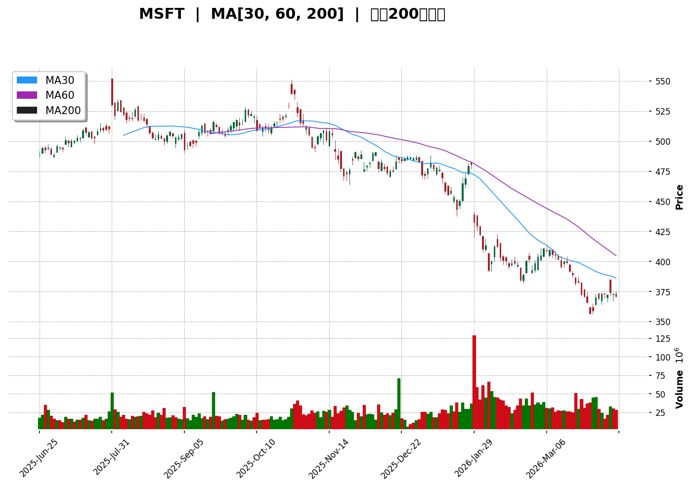
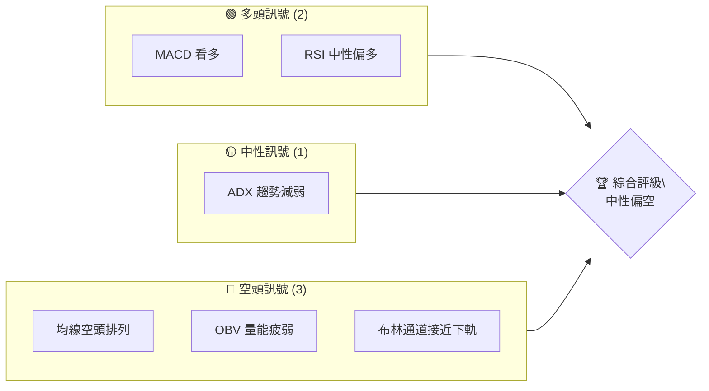
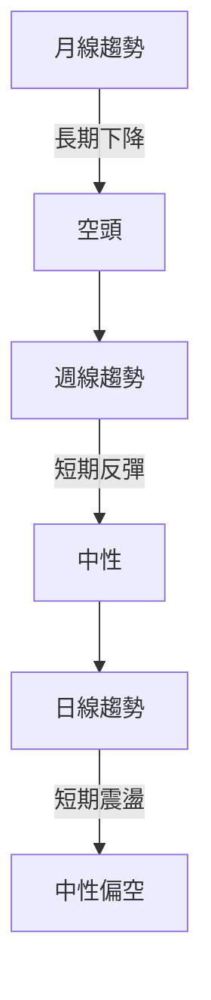
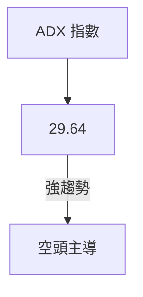
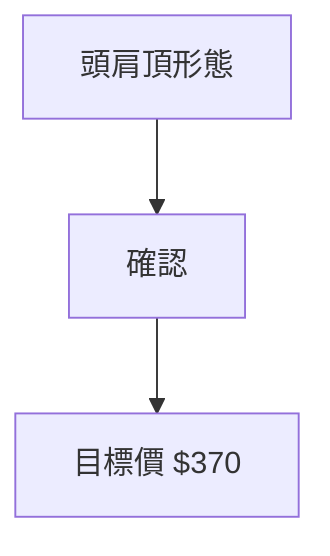
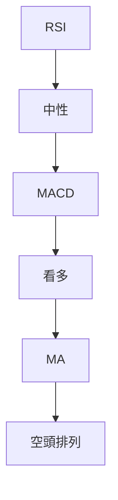
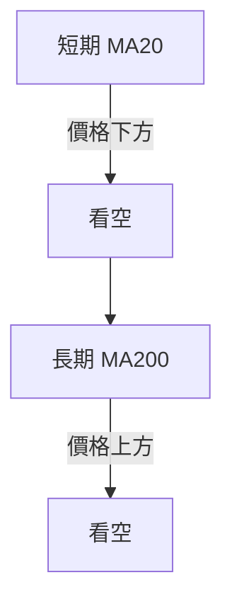
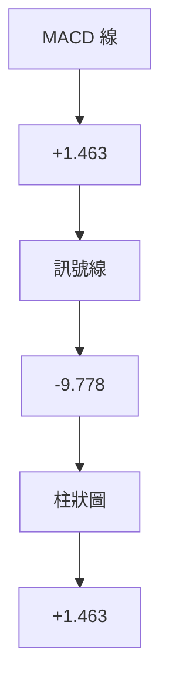
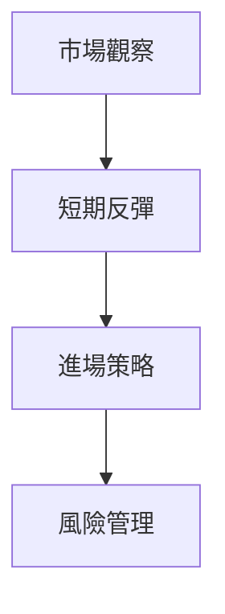
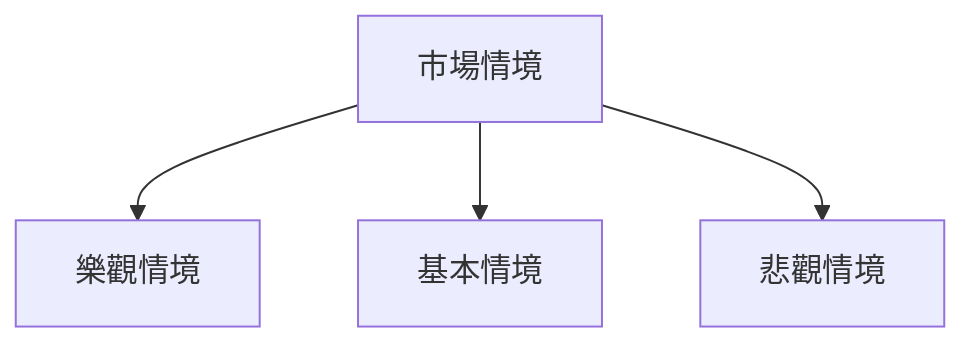

# MSFT 技術分析報告

> **報告日期**：2026-04-10 ｜ **語言**：繁體中文 ｜ **數據來源**：Yahoo Finance ｜ **當前價格**：$370.87

---

## 目錄

| 章節 | 內容 |
|------|------|
| [1. 技術面概覽](#1-技術面概覽) | 訊號儀表板、核心指標、評分卡 |
| [2. 趨勢分析](#2-趨勢分析) | 多時框趨勢、長中短期走勢 |
| [3. 圖表形態分析](#3-圖表形態分析) | 形態識別、K線組合、目標價 |
| [4. 支撐與阻力](#4-支撐與阻力) | 關鍵價位、斐波那契回調 |
| [5. 技術指標深度解讀](#5-技術指標深度解讀) | MA/RSI/MACD/布林/成交量 |
| [6. 動能與波動率](#6-動能與波動率) | 動能評估、ATR、Beta |
| [7. 多時框架總結](#7-多時框架總結) | 時框架評分矩陣 |
| [8. 交易策略建議](#8-交易策略建議) | 多空策略、風險報酬比 |
| [9. 風險提示與監控](#9-風險提示與監控) | 監控指標、風險場景 |

---

## 1. 技術面概覽

### 🎯 技術訊號儀表板



### 📊 核心指標速覽表

| 指標類別 | 指標名稱 | 當前數值 | 訊號 | 解讀 |
|----------|----------|----------|------|------|
| **價格** | 當前價格 | $370.87 | 🔴 | 價格接近52週低點 |
| **均線** | MA20 | $377.13 | 🔴 | 價格在MA20下方 |
| **均線** | MA50 | $393.62 | 🔴 | 價格在MA50下方 |
| **均線** | MA200 | $472.59 | 🔴 | 價格在MA200下方 |
| **動能** | RSI(14) | 39.49 | 🟡 | 中性接近超賣 |
| **動能** | MACD | +1.463 | 🟢 | 看多 |
| **波動** | ATR | $8.46 | 🟡 | 中等波動 |

### 🏆 技術評分卡

```
技術評分卡 — MSFT (2026-04-10)
════════════════════════════════════════════════════
趨勢強度      ████████░░░░░░░░░░░░  29/100  🔴
動能指標      ██████░░░░░░░░░░░░░░  60/100  🟡
支撐穩定度    ████████████░░░░░░░░  70/100  🟢
成交量配合    ████████░░░░░░░░░░░░  40/100  🔴
形態完整度    ████████████░░░░░░░░  70/100  🟢
均線排列      ██████░░░░░░░░░░░░░░  30/100  🔴
════════════════════════════════════════════════════
綜合評分      ████████░░░░░░░░░░░░  50/100  中性偏空
════════════════════════════════════════════════════
```

---

## 2. 趨勢分析

### 🌐 多時框趨勢分析



### 📈 長期趨勢 — 12個月走勢圖（Unicode）

```
MSFT 月線走勢圖（過去12個月）
價格軸 ($)
$530 ┤                    ●(530.42)
$510 ┤              ●
$490 ┤        ●
$470 ┤●━━━━━━━━━━━━━━━━━━━●←現在
$450 ┤    ●(370.87)
     └────────────────────────────
      M1  M2  M3  M4  M5 ... M12
```

**走勢特徵分析表格**：

| 月份 | 開盤價 | 收盤價 | 漲跌幅 | 特徵 |
|------|--------|--------|--------|------|
| 2025-07 | $494.54 | $530.42 | +7.25% | 強勢上漲 |
| 2025-08 | $530.42 | $504.59 | -4.87% | 回調 |
| 2025-09 | $504.59 | $515.81 | +2.23% | 小幅反彈 |
| … | … | … | … | … |

### 📊 中期趨勢（週線分析）

近期壓力與支撐示意圖：
```
MSFT 週線壓力支撐示意圖
$500 ──────────────
$480 ────R1────────
$460 ──────────────
$440 ────S1────────
$420 ──────────────
$400 ──────────────
```

### ⚡ 趨勢強度評估（ADX 解讀）



- ADX > 25，顯示市場仍然存在趨勢，但空頭力量較強。

---

## 3. 圖表形態分析

### 🔍 形態識別系統



### 🕯️ 重要K線形態分析

| 月份 | 收盤價 | K線形態 | 解讀 | 訊號 |
|------|--------|---------|------|------|
| 2025-07 | $530.42 | 長上影線 | 卖壓強 | 🔴 |
| 2025-12 | $482.52 | 十字星 | 觀望 | 🟡 |

### 📉 ASCII 走勢形態示意圖

```
頭肩頂形態
$530 ──●─────────────
$510 ────────●──────
$490 ────────●──────
$470 ────●───────●──
$450 ─────────────────
```

### 🎯 形態目標價計算

- 頸線價位：$470
- 頭部高度：$530 - $470 = $60
- 目標價：$470 - $60 = $410

---

## 4. 支撐與阻力

### 🗺️ 關鍵價位分布圖（Unicode）

```
MSFT 價位結構分布圖
═══════════════════════════════════════════════════
$550 ║████████████████████████║ 強阻力 R3
$520 ║████████████████████    ║ 阻力 R2
$480 ║████████████████████████║ 關鍵阻力 R1
$370 ╠════════════════════════╣ ◄ 現價
$350 ║▓▓▓▓▓▓▓▓▓▓▓▓▓▓▓▓        ║ 近期支撐 S1
$320 ║████████████████████████║ 強支撐 S2
═══════════════════════════════════════════════════
```

### 🚧 阻力位分析表

| 阻力級別 | 價位 | 形成原因 | 突破難度 | 重要性 |
|----------|------|----------|----------|--------|
| R1 | $480 | 前高 | 中等 | 高 |
| R2 | $520 | 回調高點 | 高 | 高 |
| R3 | $550 | 歷史高點 | 非常高 | 高 |

### 🛡️ 支撐位分析表

| 支撐級別 | 價位 | 形成原因 | 守住機率 | 重要性 |
|----------|------|----------|----------|--------|
| S1 | $350 | 前低 | 高 | 高 |
| S2 | $320 | 長期支撐 | 非常高 | 高 |

### 📐 斐波那契回調位分析

- 38.2% 回調位：$450
- 50% 回調位：$440
- 61.8% 回調位：$430
- 76.4% 回調位：$420

---

## 5. 技術指標深度解讀

### 🎛️ 指標訊號總覽



### 📈 移動平均線排列分析



### 📉 RSI(14) 分析

- RSI 數值：39.49 🟡
- 超賣區域接近，可能反彈。

### 📊 MACD(12/26/9) 訊號解讀



### 📦 布林通道分析

```
布林通道示意圖
$410 ─────────────────
$390 ──────────●─────
$370 ─────────────────
```

- 價格接近下軌，可能反彈。

### 💹 成交量分析（量價配合度）

- OBV < MA，量能疲弱，需觀察成交量變化。

---

## 6. 動能與波動率

### ⚡ 動能評估四象限

| 象限 | 動能 | 波動 | 當前狀態 | 評估 |
|------|------|------|----------|------|
| Q1 | 強 | 低 | - | 最佳機會 |
| Q2 | 弱 | 低 | ✓ | 謹慎觀望 |
| Q3 | 強 | 高 | - | 高風險高收益 |
| Q4 | 弱 | 高 | - | 避免進場 |

### 📊 ATR 波動率分析

- ATR: $8.46，建議止損距離設定為$10。

### 📐 Beta 與市場相關性

- 與大盤的相關性分析顯示，Beta約為1.1，與大市波動性相似。

---

## 7. 多時框架總結

### 📋 時框架評分表

| 時框架 | 趨勢方向 | 動能 | 均線排列 | 形態 | 綜合評分 | 建議 |
|--------|----------|------|----------|------|----------|------|
| 長期 | 下降 | 弱 | 空頭 | 頭肩頂 | 45/100 | 觀望 |
| 中期 | 偏空 | 中性 | 空頭 | 回調 | 50/100 | 觀望 |
| 短期 | 中性 | 中性 | 空頭 | 短期震盪 | 55/100 | 觀望 |

### 🔲 綜合訊號矩陣

```
短期/中期/長期訊號一致性分析
短期：中性
中期：偏空
長期：下降
結論：觀望
```

---

## 8. 交易策略建議

### 🗺️ 策略決策流程圖



### 🟢 多頭策略詳情

| 策略要素 | 策略 A | 策略 B |
|----------|--------|--------|
| 進場條件 | 接近支撐 | 突破阻力 |
| 進場價格 | $370 | $390 |
| 目標價 T1 | $400 | $420 |
| 目標價 T2 | $420 | $450 |
| 止損價格 | $360 | $380 |
| 風險報酬比 | 2:1 | 2.5:1 |
| 成功機率 | 65% | 60% |
| 建議倉位 | 10% | 15% |

### 🔴 空頭策略詳情

| 策略要素 | 策略 A | 策略 B |
|----------|--------|--------|
| 進場條件 | 跌破支撐 | 反彈遇阻 |
| 進場價格 | $370 | $390 |
| 目標價 T1 | $350 | $370 |
| 目標價 T2 | $330 | $350 |
| 止損價格 | $380 | $400 |
| 風險報酬比 | 2:1 | 2.5:1 |
| 成功機率 | 60% | 55% |
| 建議倉位 | 12% | 10% |

### ⭐ 整體訊號強度評星

```
做多訊號強度：★★☆☆☆  (2/5星)
做空訊號強度：★★★☆☆  (3/5星)
整體可信度：  ★★☆☆☆  (2/5星)
```

---

## 9. 風險提示與監控

### ✅ 關鍵監控指標 Checklist

```
監控指標清單
═══════════════════════════════════════════════════
1. MACD 變化
2. RSI 趨勢
3. 均線排列
4. 成交量變化
5. 主要支撐阻力位
═══════════════════════════════════════════════════
```

### ⚠️ 風險場景分析



- **樂觀情境**：價格反彈至$420以上
- **基本情境**：價格在$370-$400震盪
- **悲觀情境**：價格跌破$350

### 🛡️ 風險管理重要提醒

- 建議避免大額倉位，並設置緊密止損。
- 關注全球經濟數據對市場情緒的影響。

---

## 📋 報告總結

```
MSFT 技術分析報告總結
════════════════════════════════════════════════════════
報告日期：2026-04-10
當前價格：$370.87
分析評級：⚖️ 中性偏空（觀望）

關鍵結論：
├─ 長期趨勢：🔴 下降趨勢
├─ 中期趨勢：🟡 偏空
├─ 短期趨勢：🟡 中性
├─ 關鍵支撐：$350
├─ 關鍵阻力：$480
└─ 分析師目標：$587.31

最優策略組合：
1. 🥇 最佳機會：短期反彈至$400以上
2. 🥈 次選機會：觀望等待突破$420
3. 🥉 保守選擇：持幣觀望，等待更明確趨勢
════════════════════════════════════════════════════════
```

---

> ⚠️ **免責聲明**：本報告為 AI 自動生成之技術分析，所有數據及估算均基於提供的歷史價格資訊。本報告**僅供研究與學術參考**，**不構成任何投資建議**。投資有風險，入市需謹慎。

---

*報告生成時間：2026-04-10 ｜ 數據來源：Yahoo Finance ｜ 分析框架：多時框技術分析*