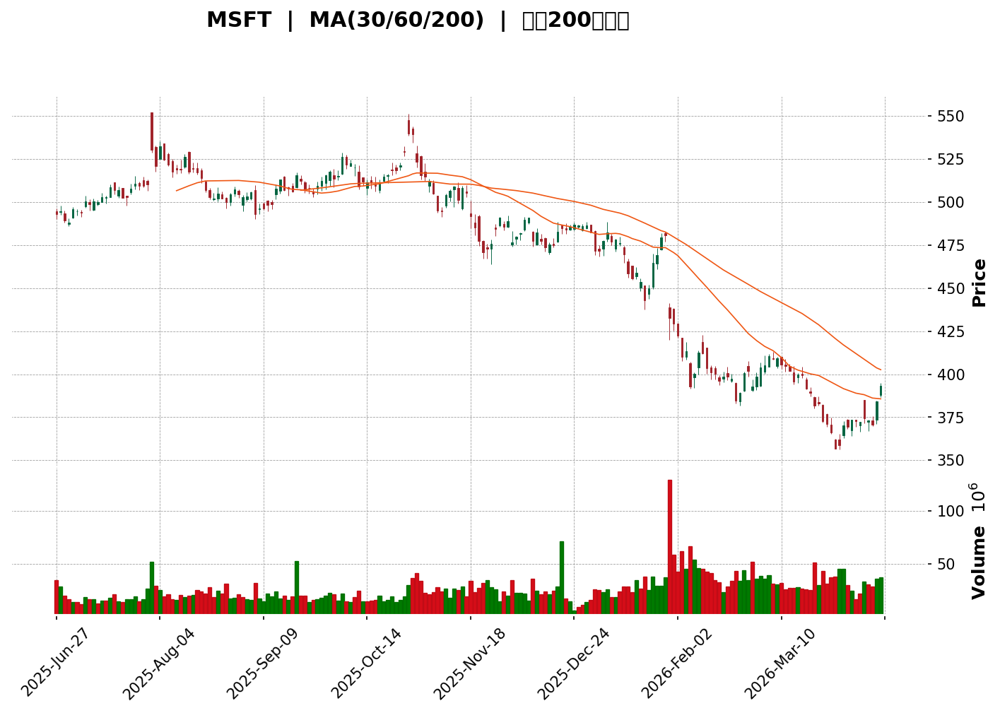
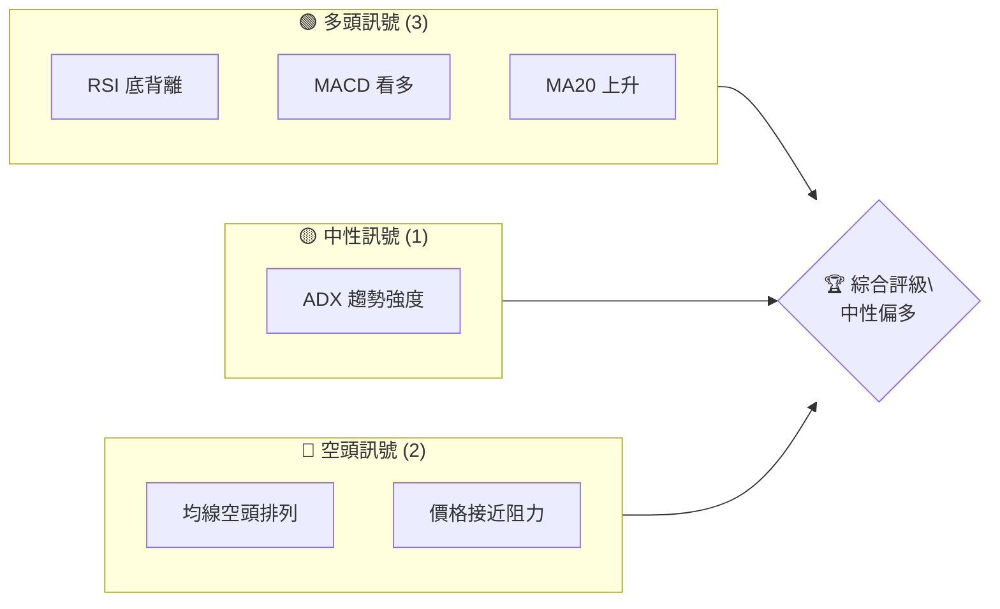
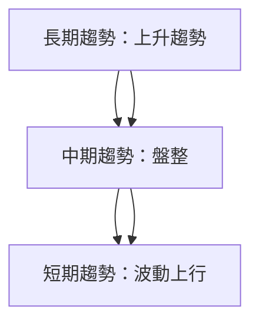
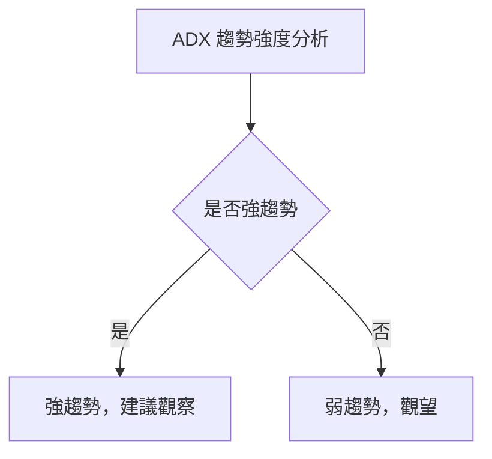
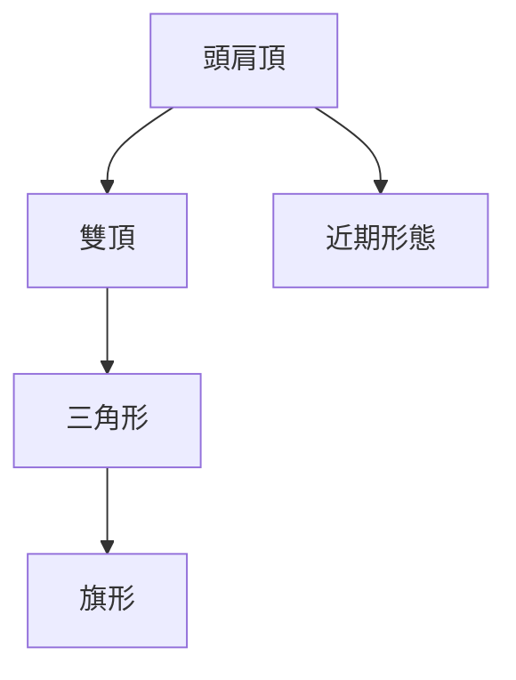
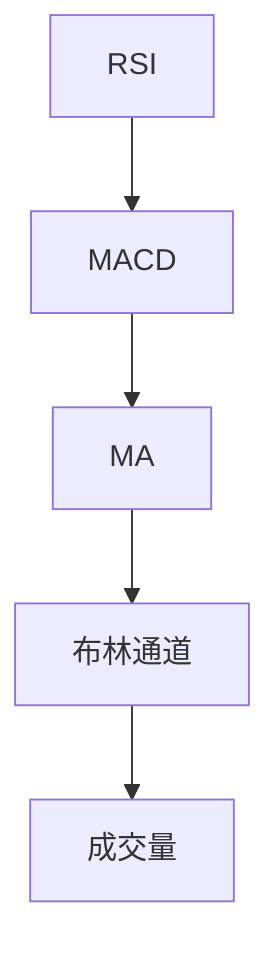
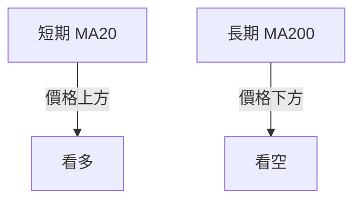
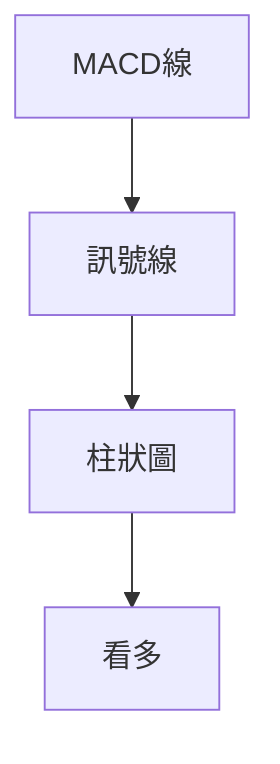
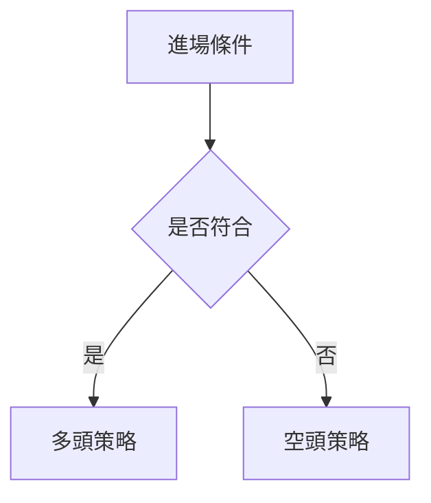
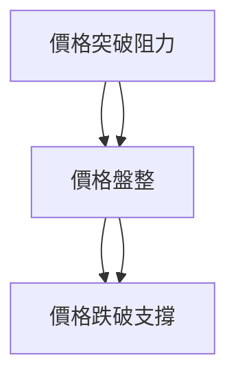

<details>
<summary>📊 靜態圖表 (點擊展開)</summary>

</details>

<html>
<head><meta charset="utf-8" /></head>
<body>
    <div>                        <script>window.PlotlyConfig = {MathJaxConfig: 'local'};</script>
        <script charset="utf-8" src="https://cdn.plot.ly/plotly-3.5.0.min.js" integrity="sha256-fHbNLP+GlIXN+efbQec78UkemUz3NJp7UmfGxC1tNxs=" crossorigin="anonymous"></script>                <div id="candlestick-chart" class="plotly-graph-div" style="height:500px; width:100%;"></div>            <script>                window.PLOTLYENV=window.PLOTLYENV || {};                                if (document.getElementById("candlestick-chart")) {                    Plotly.newPlot(                        "candlestick-chart",                        [{"close":{"dtype":"f8","bdata":"AAAAADbRfkAAAABAmOh+QAAAAGBUk35AAAAAIA+EfkAAAADgV\u002f9+QAAAAMCG7X5AAAAAIAfcfkAAAADAoUl\u002fQAAAAMBWKX9AAAAA4JtGf0AAAAAg1kF\u002fQAAAAMBgbn9AAAAAYDJrf0AAAAAg6st\u002fQAAAAKCqsX9AAAAAgNOxf0AAAADgoGV\u002fQAAAAEAsb39AAAAA4N6+f0AAAACg4+t\u002fQAAAAOCj2H9AAAAAAMHZf0AAAACAaeR\u002fQAAAAKBZk4BAAAAA4KlIgEAAAADgXqSAQAAAAKCdZYBAAAAAAERPgEAAAACgpy6AQAAAACAzOIBAAAAAYA02gEAAAACAd3GAQAAAAECWLIBAAAAA4LI7gEAAAABgUymAQAAAAGDoEIBAAAAAYDatf0AAAABgyWx\u002fQAAAAABuYn9AAAAAgBKSf0AAAADAv2J\u002fQAAAAEBgP39AAAAAoEOKf0AAAADgeLh\u002fQAAAAMB3iX9AAAAAoHNwf0AAAADgHXR\u002fQAAAAADdnX9AAAAA4DPPfkAAAADAMAJ\u002fQAAAAGCJBX9AAAAAQMQkf0AAAADg9i5\u002fQAAAAICdvH9AAAAAgM4JgEAAAACA6a5\u002fQAAAAOCGvn9AAAAA4IKlf0AAAAAASB6AQAAAAICOAoBAAAAAoPCxf0AAAAAgmcB\u002fQAAAAKDijn9AAAAAwHjVf0AAAABgwAOAQAAAAOBwHoBAAAAAgHYsgEAAAACA1QyAQAAAAACpGYBAAAAAoAxzgEAAAAAge06AQAAAAIBpVYBAAAAAwORBgEAAAABAgc1\u002fQAAAAGC9\u002fn9AAAAAgBf3f0AAAABg3PR\u002fQAAAAIDc139AAAAAgED3f0AAAADgMhWAQAAAAGAhHIBAAAAAQBMzgEAAAAAAPDOAQAAAAICIS4BAAAAAQI2KgEAAAAAgmt6AQAAAAIB12oBAAAAAgKlcgEAAAABAUx2AQAAAAIAcF4BAAAAA4JkBgEAAAADg9JB\u002fQAAAAMCp8H5AAAAAoDPsfkAAAAAgeX5\u002fQAAAAAAtqX9AAAAAgF\u002fQf0AAAAAAS1N\u002fQAAAAIATwX9AAAAA4DaWf0AAAABA7Lt+QAAAAOCkUX5AAAAAoHLVfUAAAADAt3B9QAAAAMC6jn1AAAAAwHW+fUAAAABgT0Z+QAAAAMA7rn5AAAAA4BpafkAAAACAJY5+QAAAAABGyn1AAAAAgOv7fUAAAACg9CB+QAAAAOBtnn5AAAAAgGSufkAAAADghdd9QAAAAIDnJX5AAAAAYAvXfUAAAADA0Zt9QAAAAODhtH1AAAAAYJKwfUAAAADACy5+QAAAAOADTX5AAAAAQA09fkAAAACA3Ft+QAAAAMCJbn5AAAAAAJdpfkAAAAAg2l9+QAAAACDrZX5AAAAAgEwofkAAAADgzn19QAAAAABffH1AAAAAoLnWfUAAAACA5yV+QAAAAOBW0H1AAAAAYATjfUAAAABAfsF9QAAAACCSWX1AAAAAoFelfEAAAADg63l8QAAAACABrXxAAAAAQMJXfEAAAAAAlLF7QAAAAGDNIXxAAAAAADkOfUAAAABAWFN9QAAAAADF931AAAAAAIgIfkAAAACANAh7QAAAAED21HpAAAAAgH5mekAAAACAYKR5QAAAAODy03lAAAAAYGCMeEAAAADAnwN5QAAAAMCHynlAAAAAAEPFeUAAAACgLzd5QAAAAGDMDnlAAAAAYH8GeUAAAADATL94QAAAAEAK63hAAAAAIFzneEAAAAAgrtN4QAAAACCFB3hAAAAAAABQeEAAAACgmQl5QAAAACCFG3lAAAAAANeLeEAAAADAzOh4QAAAAEDhPnlAAAAAQDNTeUAAAABA4ap5QAAAACBcj3lAAAAAYI+WeUAAAAAAKVx5QAAAAIAUTnlAAAAAgMIdeUAAAADAzLh4QAAAAEAz\u002f3hAAAAAYI\u002f2eEAAAADgo3x4QAAAAOBRUHhAAAAAgOvdd0AAAAAAAPB3QAAAAADXS3dAAAAA4KMwd0AAAAAghd92QAAAAOBRTHZAAAAAIFxvdkAAAABguCJ3QAAAAIDrFXdAAAAAIFxXd0AAAACAFE53QAAAAOCjRHdAAAAAoEdld0AAAADAHlF3QAAAAIDrLXdAAAAAgOsFeEAAAACAwpF4QA=="},"high":{"dtype":"f8","bdata":"fpKiA6kGf0AI8eWf4h1\u002fQORKAm\u002fG8n5AvpbTfGWqfkDoEao73RN\u002fQIaOOkLp\u002fX5AqTQ\u002ffyn1fkC7cMtEpn1\u002fQN9u7tlsWH9AxrAbjM9hf0BRLaPm8lB\u002fQMEy\u002fhTUlX9AW4ZV+rF8f0BA+2XeeuZ\u002fQGy\u002fNcqu+n9AQif\u002feR7Sf0ACfCj39cN\u002fQHW5RtzOfX9A5Le5n0Drf0CJSrJjXxqAQN2L0F00AIBAY0NNJAsVgEDv4fDRwgeAQEBZn57vQYFA+YrkuaSlgECVgKRAIbmAQLvHQQqTsYBALH12igiFgEBViFPeUWiAQH\u002f6qOIJTYBAZ8nV6FdkgECQUD1rTn+AQLHM0qP8jIBAz\u002fl1dExXgECh86XbfViAQCnZmFdnPoBAGuLIHnoBgEBs3X5Xx8B\u002fQNCRfv9xmH9AEQMRItfJf0AoXOtWXqF\u002fQMwZraE4bn9AkhmoKweTf0AmR7Rnk89\u002fQCvh78PVt39AyybEMnl+f0AXfte8\u002fpp\u002fQAWxbTK7oH9AXpY1KJndf0AXtyLd\u002fTF\u002fQCRlwN24Qn9AiC0SXVZSf0AKH6+cYVF\u002fQLwLEu3W5n9ASjQ10a4KgEBaymBatBiAQEIiNFXD0n9AxyieAiDvf0A0XoMhMimAQDdt43jEHIBAoLXBKqwDgEBf13Y6ueV\u002fQNuQ+DNevn9Agx4hz\u002fz8f0D4luJKrRWAQDAEJRgdIIBAqLshF9YygECw8yUNhTuAQP4vcB6tMoBAhRwF46WGgEB6aPgj2XyAQAOgiZAkZoBAPwyzAUVRgED6N0xoS0uAQGG5HewrEoBA8AxHXysJgEB5y2\u002fMYhiAQJDHLE+tFYBAtDr3QsMKgEARG\u002fVsaiSAQGa8rSNWJIBAFPCJmXBYgECuxs7\u002fPU6AQA6fOz5lWYBA3idvLO6igECywphyajuBQGZGMRgQAIFAsGTKYwmmgEDs2sEhBnmAQCugo95JVoBAyDJMB1ILgEC7zEGTlQWAQNDTJYCxeX9AL7a18\u002f0Uf0AXff9UBIx\u002fQD7OCsXVt39AEveWYtHYf0DGvBPx+fV\u002fQCRR3Mmz139AKrYS1\u002fzff0DrpbSeWk5\u002fQFhybb060n5AAqiB5yLHfkD2CHUyRd19QPZMQRMGvX1AumYc+vDgfUBb+P3pKnN+QArSinchuH5A8inbRemLfkA7qIPaBMZ+QHE\u002f3iYyMn5ACp\u002fJJZUDfkDtou5iySR+QGFyj8\u002fcsn5A+cgyMf2vfkAPK9wMWzJ+QPRYDl\u002fFTn5Aj3ScL58VfkDla2MXAfp9QDNlKeLTzH1A73vtroLufUAIqzLUwod+QOtiZx\u002fTa35A95REdt95fkDCefJbgWt+QKqrwZ28gH5AZIX5jCJwfkBhoyZ3znN+QBPGwroJiX5A0ILVVnRwfkC9Fleu5jh+QF728hbGr31A1J\u002fVemXafUBukYmDW4l+QMEGJ0\u002f5GH5AhZuKNqPrfUBrph92UP59QBp\u002f9vUkq31AF8IxGyQyfUDWckm0FfN8QDEBZdAp4nxA0cWc2yd8fECUk\u002fm3izp8QKhzmqTwPHxAbyBaVm9gfUD62BRYuJJ9QEu3zoNTHH5AT7OV0TYqfkDChUmN4Jd7QCKFsCiVaXtA4NKOQSXcekDVfmQDbFF6QPjmMAyBLXpAj6uNSex1eUA9yN4PAA55QNE2ppcf33lAr\u002fPvRXFrekASziZ6L\u002fh5QAGivFRmVHlAmMgkI91JeUAH72f8ufl4QKcn0MNKGnlAAAAAQOFGeUAAAACA6wF5QAAAAIDCtXhAAAAAgMJVeEAAAAAghRd5QAAAAADXd3lAAAAAwB7NeEAAAABAChN5QAAAAEAza3lAAAAA4HqweUAAAACAwrl5QAAAAMDM0HlAAAAAIFyjeUAAAABAM6N5QAAAAAApkHlAAAAAgOtheUAAAADAzEx5QAAAAIAUCnlAAAAAYGZGeUAAAAAAAOB4QAAAAADXh3hAAAAAAAAweEAAAAAgXDN4QAAAACCF53dAAAAAwPWQd0AAAAAghWt3QAAAAEAzp3ZAAAAAgMLVdkAAAABgZk53QAAAAADXX3dAAAAAgD1ad0AAAAAgrlt3QAAAAEAzR3dAAAAAAAAQeEAAAAAAAFh3QAAAAIA9endAAAAA4KMIeEAAAABACqt4QA=="},"hovertemplate":"\u003cb\u003e%{x|%Y-%m-%d}\u003c\u002fb\u003e\u003cbr\u003e\u958b: $%{open:.2f}\u003cbr\u003e\u9ad8: $%{high:.2f}\u003cbr\u003e\u4f4e: $%{low:.2f}\u003cbr\u003e\u6536: $%{close:.2f}\u003cextra\u003e\u003c\u002fextra\u003e","low":{"dtype":"f8","bdata":"E4w8d+uifkByQt+0gcd+QFfO9A9Pgn5AHgHvSQpefkC7\u002f4s+cal+QBaOnqfqxX5AynnjgBm0fkD50GnvqA1\u002fQPKQZt0A7n5A\u002fLXUdczufkClC5EzLiJ\u002fQOrq+I0tPn9AqyLcnNwvf0CC7EE1Mmt\u002fQOqVBhv9h39Am3jxMBVqf0AAAADgoGV\u002fQGS6Gk7uHH9Ae27M0OuFf0BNAhwgmbZ\u002fQBmaqa3Hsn9A9NHA5K\u002fJf0DNpwql9qd\u002fQMmxx8yfhoBAGIE3UdAugEA+RTw1o2iAQP9xVCiPYYBAtOdtIwdIgED2Q4uKfBSAQC5EpvtHI4BA9LmcH78lgECEGVH7cj2AQHGPB3D2IoBADn2bTRYpgEB4VnoEqCCAQNo6XxzS8H9AbZp7HM6Zf0Clz9\u002fHbFh\u002fQOm5ROg1Sn9ABOfBgUVFf0BGKfufhGB\u002fQIRQQUAhB39AeUJNBUcdf0DI+EyZgXZ\u002fQEMKFNFpZn9ACAJl1ArsfkCscRVl1kN\u002fQMbAoQEQUX9A1q8b\u002fEulfkBFlxwlrs9+QKgD90o5+n5Ajs83yZvqfkCWW1J3F\u002f1+QC9wi143XH9AWTYuTWiOf0DmZ5625qd\u002fQGbs9Z9bfX9A20JzZuyYf0DahYzAJcN\u002fQGiKB+at5n9AWsUp0ViTf0BWw5fpIY1\u002fQKoIFmEtb39AWNCOOFqIf0Ddz\u002ffFXKx\u002fQBFImn3KuH9Aiv\u002fSCCPZf0BZgO4TC8l\u002fQAAQPS7wBoBAaEpo0m4ggEB0gqPKPjqAQI71FQ1kR4BACQK+Jw8agEDvACUvULh\u002fQP2yOxP62H9ADN1QJ3l+f0BxGBdONb5\u002fQMBoJYdpoH9Ab+\u002fV2ViTf0DGMVE+3PR\u002fQFoqKp2l7n9ABZ8dgIccgEAERL\u002fpsiOAQGL9O\u002fhtNIBArYN8CY52gECgFmzGPtSAQFEc3gAPtIBACdUEn6k\u002fgEALa+4bvAeAQO3gqBGsA4BAaBY5tcqbf0BacZv2tod\u002fQC5onMEb3H5AH4YPblGzfkDcXskAwAt\u002fQA5Jlr5QRH9AlRt0YtkQf0Ardp3sbDN\u002fQNWw\u002fpgU9n5AaHcbAxttf0ALPDgnOkx+QIGAmcRJDX5AU1d2tKymfUBw9E0JQjN9QPmdW2dEL31AXoKfHU39fEC5o\u002fa7qgF+QB9A7x6rWH5Aauyjvr04fkB8IkiTZlN+QACXXbnioX1A66xTc3q2fUAgXR+sodx9QEEKQm9uNH5AHB5HdTN2fkCMbeg1+J99QLJ8vNtrrH1AQ4pjjRW0fUC6VDhUGnd9QOIwT0XsXH1A+ldwUrGefUDeQhru08x9QBI7fn5CFn5ADu\u002fy7HMZfkBIUmqOLTp+QJ3vaUGdO35AN6+6UqdNfkCjtaP8PDF+QOAX+3dPRn5AbdMhvDAjfkDZrDvubVF9QB9wfZ\u002fkRn1ADuLXVeJKfUC\u002fkAUdyc19QF+HtNxrrH1AlFfvyf5xfUAM6Nc9jKl9QFcpzQY5Dn1AnqgdHRCCfEBEicj2yW18QHJz5UYMd3xAKPiFIBwEfECahSdm5Vp7QO4HHzL\u002funtArfthdRAYfEAY2LWbKs98QL++yvVRgX1AEGwOXJXOfUDON3vI+kB6QD6Gg3Gpl3pAk1Zhcp1UekBJ393XEnp5QMg25MvthHlAOeOiV9N2eEBor6hMZ4B4QLb6ZF1Q\u002f3hAOGYMsSm8eUAfgll3jAF5QOfEm3mo0XhAUwFq4EvSeEBBZ7HbGpp4QDu8VfittnhAAAAAYLjKeEAAAABgj7J4QAAAAKCZ8XdAAAAAIFzbd0AAAABgj2J4QAAAAADX63hAAAAAgBReeEAAAACAFGp4QAAAAGC4inhAAAAAwPUEeUAAAABgZkZ5QAAAAAApiHlAAAAAAAA4eUAAAABA4S55QAAAAKBwGXlAAAAAIFwbeUAAAAAAAKR4QAAAAOCjrHhAAAAAAADceEAAAAAAAHB4QAAAAMD1MHhAAAAAgOvBd0AAAABA4dp3QAAAAKCZPXdAAAAAgBQad0AAAABACtN2QAAAAAApSHZAAAAA4HpEdkAAAADAHrF2QAAAAEAzA3dAAAAAYGbCdkAAAAAAABh3QAAAAMD16HZAAAAAYI82d0AAAADAzPB2QAAAAOB6IHdAAAAA4FEwd0AAAADgUSh4QA=="},"name":"\u50f9\u683c","open":{"dtype":"f8","bdata":"PbrJadLqfkCF5L2AteJ+QAMqqy+k2X5AbWq5hY9yfkBABtj9U69+QDfmDCse6H5AXjY+9ePlfkDIyApwkRZ\u002fQH+BBzxQQn9A4Vso\u002fHT5fkCn1iOc+Sl\u002fQP4XMB3WQX9AD5eqiDJkf0Cd2OeJJmx\u002fQKG9ZRMj+H9AYrHgH4l8f0CY9yBITcB\u002fQFXGku4rfX9AGwNiKk6df0CjYdu1Kdh\u002fQJekLj\u002fG8X9AkWXbnGsEgEBs7OaLjgGAQMbP4pgvQIFAiiRP0EefgED++UBNwGmAQKdgm7WesIBANlLaoKt+gECGOK8gD16AQA8aVGCnPIBAmU09e0Q6gEDWVunvzEWAQA4Zdz5LiIBAPqSzzVU8gECuVPF+AT6AQF1uAuSeNIBA9I0xYzQAgEBrsPuSza5\u002fQHIjOJSqWX9AZKcA7JZif0BNttgMg4h\u002fQNvRAIZXZH9Acx5zBr0+f0Aa8ANB149\u002fQAPesXXbqH9ADbCbH1wmf0C9re+VQlt\u002fQDXiFOBiY39AK5Ss+GOvf0D6K+yGwQB\u002fQAj9bgaoNX9APL2imlpOf0D0IaHXuEJ\u002fQH32TaDUiH9AAjSC0O2qf0D43jmS6hWAQD4UmVIWyH9AfK6ED\u002fPVf0DCRfeCIcd\u002fQGS31JSjC4BAAOMNvMH6f0DTRjhZQ8R\u002fQIeQW\u002fUeo39Ad9ElHyq\u002ff0AsdRnVG9Z\u002fQJ5RRWTV8X9AkgBEZFgFgEAtrMei+BuAQFQGzB6rF4BADHBP+LIjgEAFUWhy0XCAQCKckJDnSIBArntDYmpBgEBjBY2y5yuAQGG5HewrEoBA0l9Mh9\u002fBf0CKzBG2ngaAQEPc0ktR539AHRu9oemuf0A5UCy91AOAQDBQUhvbGoBAmViHc+83gECkhsgiX0KAQPhYWhQARYBAnAt+i5+MgEAVJRR\u002fxx2BQEV61X939YBAuvU7+EOCgEB1VhS9hHWAQE1\u002fN0xCLYBAcDSWl0Daf0BOjFsayvJ\u002fQFuI4E0OeX9Ab6l660XufkCv7zYYgh9\u002fQPtWE1Baa39A7+ZosQK0f0CKewzNJcN\u002fQNNKiBKrAn9ApepI14Klf0ArX00TGdV+QID61HMggX5AW14eTWi5fkA1wmS9kNZ9QNbiJmyxnn1A0jSmvNiPfUCWdc2RPVN+QOu6cYLVZ35AeFqXRD51fkBWtic4yVl+QLf778bDs31Acwjj8q3qfUA2LUcYvRZ+QH\u002ftbq2SPH5ArnuKfMd\u002ffkCIRjP61y5+QA9qB622uH1Ae3moN6PrfUBTXOBfG\u002fB9QJ6FyIldbX1AvG2J4S69fUB1hcXhndF9QF4UhJEAZH5AzUydLjVQfkD5uUdxAj5+QEewrvMuSX5AIGTYU6BZfkB9KubkFzx+QMplOLUsTX5A7Dc8Q6prfkCD4whTlzR+QDRbqNavj31A4Wf2TomLfUCSJfv6rep9QC1d9S1OAn5AemGS8K+PfUBm9sYhWrl9QBmHpZiVmX1AUeEXNl0WfUDd0bdqAvF8QNPoWC+ZjHxA3n8CSBQjfEDdBeDuGzl8QAPmeTWc6XtA24CclXQtfEDGf857AQR9QBFnVczwiX1AnwQq48AhfkA639T2zm97QCawd+u3YntAXJx76ynUekC089qiyFB6QD8cQGEGoXlAFbgVzzFoeUDutjEALeR4QAGjtl3ZPnlAB7LPZKEqekDqmMM2t\u002fN5QJGnPUY+QXlAHpHsrXY4eUDF4plc+eR4QIU8OtaS03hAAAAAQAoLeUAAAACAwsF4QAAAAAAAsHhAAAAAgD0CeEAAAADgemh4QAAAACBcS3lAAAAAgBRueEAAAACAwo14QAAAAIA9knhAAAAA4FEUeUAAAABguEZ5QAAAAEAzk3lAAAAAYLhOeUAAAADgeqB5QAAAAMAeWXlAAAAAgBRKeUAAAAAAABB5QAAAAMAe4XhAAAAA4FEEeUAAAACAFNJ4QAAAAKCZYXhAAAAA4KMseEAAAABgZv53QAAAAIDC5XdAAAAAYLiOd0AAAADAHi13QAAAAGBmnnZAAAAAYGaedkAAAADAzMh2QAAAAADXV3dAAAAAIFzzdkAAAAAA11d3QAAAAKBwJXdAAAAAIK4PeEAAAAAAAEh3QAAAACCuT3dAAAAAgMJZd0AAAACgcD14QA=="},"x":["2025-06-27T00:00:00-04:00","2025-06-30T00:00:00-04:00","2025-07-01T00:00:00-04:00","2025-07-02T00:00:00-04:00","2025-07-03T00:00:00-04:00","2025-07-07T00:00:00-04:00","2025-07-08T00:00:00-04:00","2025-07-09T00:00:00-04:00","2025-07-10T00:00:00-04:00","2025-07-11T00:00:00-04:00","2025-07-14T00:00:00-04:00","2025-07-15T00:00:00-04:00","2025-07-16T00:00:00-04:00","2025-07-17T00:00:00-04:00","2025-07-18T00:00:00-04:00","2025-07-21T00:00:00-04:00","2025-07-22T00:00:00-04:00","2025-07-23T00:00:00-04:00","2025-07-24T00:00:00-04:00","2025-07-25T00:00:00-04:00","2025-07-28T00:00:00-04:00","2025-07-29T00:00:00-04:00","2025-07-30T00:00:00-04:00","2025-07-31T00:00:00-04:00","2025-08-01T00:00:00-04:00","2025-08-04T00:00:00-04:00","2025-08-05T00:00:00-04:00","2025-08-06T00:00:00-04:00","2025-08-07T00:00:00-04:00","2025-08-08T00:00:00-04:00","2025-08-11T00:00:00-04:00","2025-08-12T00:00:00-04:00","2025-08-13T00:00:00-04:00","2025-08-14T00:00:00-04:00","2025-08-15T00:00:00-04:00","2025-08-18T00:00:00-04:00","2025-08-19T00:00:00-04:00","2025-08-20T00:00:00-04:00","2025-08-21T00:00:00-04:00","2025-08-22T00:00:00-04:00","2025-08-25T00:00:00-04:00","2025-08-26T00:00:00-04:00","2025-08-27T00:00:00-04:00","2025-08-28T00:00:00-04:00","2025-08-29T00:00:00-04:00","2025-09-02T00:00:00-04:00","2025-09-03T00:00:00-04:00","2025-09-04T00:00:00-04:00","2025-09-05T00:00:00-04:00","2025-09-08T00:00:00-04:00","2025-09-09T00:00:00-04:00","2025-09-10T00:00:00-04:00","2025-09-11T00:00:00-04:00","2025-09-12T00:00:00-04:00","2025-09-15T00:00:00-04:00","2025-09-16T00:00:00-04:00","2025-09-17T00:00:00-04:00","2025-09-18T00:00:00-04:00","2025-09-19T00:00:00-04:00","2025-09-22T00:00:00-04:00","2025-09-23T00:00:00-04:00","2025-09-24T00:00:00-04:00","2025-09-25T00:00:00-04:00","2025-09-26T00:00:00-04:00","2025-09-29T00:00:00-04:00","2025-09-30T00:00:00-04:00","2025-10-01T00:00:00-04:00","2025-10-02T00:00:00-04:00","2025-10-03T00:00:00-04:00","2025-10-06T00:00:00-04:00","2025-10-07T00:00:00-04:00","2025-10-08T00:00:00-04:00","2025-10-09T00:00:00-04:00","2025-10-10T00:00:00-04:00","2025-10-13T00:00:00-04:00","2025-10-14T00:00:00-04:00","2025-10-15T00:00:00-04:00","2025-10-16T00:00:00-04:00","2025-10-17T00:00:00-04:00","2025-10-20T00:00:00-04:00","2025-10-21T00:00:00-04:00","2025-10-22T00:00:00-04:00","2025-10-23T00:00:00-04:00","2025-10-24T00:00:00-04:00","2025-10-27T00:00:00-04:00","2025-10-28T00:00:00-04:00","2025-10-29T00:00:00-04:00","2025-10-30T00:00:00-04:00","2025-10-31T00:00:00-04:00","2025-11-03T00:00:00-05:00","2025-11-04T00:00:00-05:00","2025-11-05T00:00:00-05:00","2025-11-06T00:00:00-05:00","2025-11-07T00:00:00-05:00","2025-11-10T00:00:00-05:00","2025-11-11T00:00:00-05:00","2025-11-12T00:00:00-05:00","2025-11-13T00:00:00-05:00","2025-11-14T00:00:00-05:00","2025-11-17T00:00:00-05:00","2025-11-18T00:00:00-05:00","2025-11-19T00:00:00-05:00","2025-11-20T00:00:00-05:00","2025-11-21T00:00:00-05:00","2025-11-24T00:00:00-05:00","2025-11-25T00:00:00-05:00","2025-11-26T00:00:00-05:00","2025-11-28T00:00:00-05:00","2025-12-01T00:00:00-05:00","2025-12-02T00:00:00-05:00","2025-12-03T00:00:00-05:00","2025-12-04T00:00:00-05:00","2025-12-05T00:00:00-05:00","2025-12-08T00:00:00-05:00","2025-12-09T00:00:00-05:00","2025-12-10T00:00:00-05:00","2025-12-11T00:00:00-05:00","2025-12-12T00:00:00-05:00","2025-12-15T00:00:00-05:00","2025-12-16T00:00:00-05:00","2025-12-17T00:00:00-05:00","2025-12-18T00:00:00-05:00","2025-12-19T00:00:00-05:00","2025-12-22T00:00:00-05:00","2025-12-23T00:00:00-05:00","2025-12-24T00:00:00-05:00","2025-12-26T00:00:00-05:00","2025-12-29T00:00:00-05:00","2025-12-30T00:00:00-05:00","2025-12-31T00:00:00-05:00","2026-01-02T00:00:00-05:00","2026-01-05T00:00:00-05:00","2026-01-06T00:00:00-05:00","2026-01-07T00:00:00-05:00","2026-01-08T00:00:00-05:00","2026-01-09T00:00:00-05:00","2026-01-12T00:00:00-05:00","2026-01-13T00:00:00-05:00","2026-01-14T00:00:00-05:00","2026-01-15T00:00:00-05:00","2026-01-16T00:00:00-05:00","2026-01-20T00:00:00-05:00","2026-01-21T00:00:00-05:00","2026-01-22T00:00:00-05:00","2026-01-23T00:00:00-05:00","2026-01-26T00:00:00-05:00","2026-01-27T00:00:00-05:00","2026-01-28T00:00:00-05:00","2026-01-29T00:00:00-05:00","2026-01-30T00:00:00-05:00","2026-02-02T00:00:00-05:00","2026-02-03T00:00:00-05:00","2026-02-04T00:00:00-05:00","2026-02-05T00:00:00-05:00","2026-02-06T00:00:00-05:00","2026-02-09T00:00:00-05:00","2026-02-10T00:00:00-05:00","2026-02-11T00:00:00-05:00","2026-02-12T00:00:00-05:00","2026-02-13T00:00:00-05:00","2026-02-17T00:00:00-05:00","2026-02-18T00:00:00-05:00","2026-02-19T00:00:00-05:00","2026-02-20T00:00:00-05:00","2026-02-23T00:00:00-05:00","2026-02-24T00:00:00-05:00","2026-02-25T00:00:00-05:00","2026-02-26T00:00:00-05:00","2026-02-27T00:00:00-05:00","2026-03-02T00:00:00-05:00","2026-03-03T00:00:00-05:00","2026-03-04T00:00:00-05:00","2026-03-05T00:00:00-05:00","2026-03-06T00:00:00-05:00","2026-03-09T00:00:00-04:00","2026-03-10T00:00:00-04:00","2026-03-11T00:00:00-04:00","2026-03-12T00:00:00-04:00","2026-03-13T00:00:00-04:00","2026-03-16T00:00:00-04:00","2026-03-17T00:00:00-04:00","2026-03-18T00:00:00-04:00","2026-03-19T00:00:00-04:00","2026-03-20T00:00:00-04:00","2026-03-23T00:00:00-04:00","2026-03-24T00:00:00-04:00","2026-03-25T00:00:00-04:00","2026-03-26T00:00:00-04:00","2026-03-27T00:00:00-04:00","2026-03-30T00:00:00-04:00","2026-03-31T00:00:00-04:00","2026-04-01T00:00:00-04:00","2026-04-02T00:00:00-04:00","2026-04-06T00:00:00-04:00","2026-04-07T00:00:00-04:00","2026-04-08T00:00:00-04:00","2026-04-09T00:00:00-04:00","2026-04-10T00:00:00-04:00","2026-04-13T00:00:00-04:00","2026-04-14T00:00:00-04:00"],"type":"candlestick"},{"hovertemplate":"MA30: $%{y:.2f}\u003cextra\u003e\u003c\u002fextra\u003e","line":{"color":"#2196F3","dash":"dash","width":2},"mode":"lines","name":"MA30","x":["2025-06-27T00:00:00-04:00","2025-06-30T00:00:00-04:00","2025-07-01T00:00:00-04:00","2025-07-02T00:00:00-04:00","2025-07-03T00:00:00-04:00","2025-07-07T00:00:00-04:00","2025-07-08T00:00:00-04:00","2025-07-09T00:00:00-04:00","2025-07-10T00:00:00-04:00","2025-07-11T00:00:00-04:00","2025-07-14T00:00:00-04:00","2025-07-15T00:00:00-04:00","2025-07-16T00:00:00-04:00","2025-07-17T00:00:00-04:00","2025-07-18T00:00:00-04:00","2025-07-21T00:00:00-04:00","2025-07-22T00:00:00-04:00","2025-07-23T00:00:00-04:00","2025-07-24T00:00:00-04:00","2025-07-25T00:00:00-04:00","2025-07-28T00:00:00-04:00","2025-07-29T00:00:00-04:00","2025-07-30T00:00:00-04:00","2025-07-31T00:00:00-04:00","2025-08-01T00:00:00-04:00","2025-08-04T00:00:00-04:00","2025-08-05T00:00:00-04:00","2025-08-06T00:00:00-04:00","2025-08-07T00:00:00-04:00","2025-08-08T00:00:00-04:00","2025-08-11T00:00:00-04:00","2025-08-12T00:00:00-04:00","2025-08-13T00:00:00-04:00","2025-08-14T00:00:00-04:00","2025-08-15T00:00:00-04:00","2025-08-18T00:00:00-04:00","2025-08-19T00:00:00-04:00","2025-08-20T00:00:00-04:00","2025-08-21T00:00:00-04:00","2025-08-22T00:00:00-04:00","2025-08-25T00:00:00-04:00","2025-08-26T00:00:00-04:00","2025-08-27T00:00:00-04:00","2025-08-28T00:00:00-04:00","2025-08-29T00:00:00-04:00","2025-09-02T00:00:00-04:00","2025-09-03T00:00:00-04:00","2025-09-04T00:00:00-04:00","2025-09-05T00:00:00-04:00","2025-09-08T00:00:00-04:00","2025-09-09T00:00:00-04:00","2025-09-10T00:00:00-04:00","2025-09-11T00:00:00-04:00","2025-09-12T00:00:00-04:00","2025-09-15T00:00:00-04:00","2025-09-16T00:00:00-04:00","2025-09-17T00:00:00-04:00","2025-09-18T00:00:00-04:00","2025-09-19T00:00:00-04:00","2025-09-22T00:00:00-04:00","2025-09-23T00:00:00-04:00","2025-09-24T00:00:00-04:00","2025-09-25T00:00:00-04:00","2025-09-26T00:00:00-04:00","2025-09-29T00:00:00-04:00","2025-09-30T00:00:00-04:00","2025-10-01T00:00:00-04:00","2025-10-02T00:00:00-04:00","2025-10-03T00:00:00-04:00","2025-10-06T00:00:00-04:00","2025-10-07T00:00:00-04:00","2025-10-08T00:00:00-04:00","2025-10-09T00:00:00-04:00","2025-10-10T00:00:00-04:00","2025-10-13T00:00:00-04:00","2025-10-14T00:00:00-04:00","2025-10-15T00:00:00-04:00","2025-10-16T00:00:00-04:00","2025-10-17T00:00:00-04:00","2025-10-20T00:00:00-04:00","2025-10-21T00:00:00-04:00","2025-10-22T00:00:00-04:00","2025-10-23T00:00:00-04:00","2025-10-24T00:00:00-04:00","2025-10-27T00:00:00-04:00","2025-10-28T00:00:00-04:00","2025-10-29T00:00:00-04:00","2025-10-30T00:00:00-04:00","2025-10-31T00:00:00-04:00","2025-11-03T00:00:00-05:00","2025-11-04T00:00:00-05:00","2025-11-05T00:00:00-05:00","2025-11-06T00:00:00-05:00","2025-11-07T00:00:00-05:00","2025-11-10T00:00:00-05:00","2025-11-11T00:00:00-05:00","2025-11-12T00:00:00-05:00","2025-11-13T00:00:00-05:00","2025-11-14T00:00:00-05:00","2025-11-17T00:00:00-05:00","2025-11-18T00:00:00-05:00","2025-11-19T00:00:00-05:00","2025-11-20T00:00:00-05:00","2025-11-21T00:00:00-05:00","2025-11-24T00:00:00-05:00","2025-11-25T00:00:00-05:00","2025-11-26T00:00:00-05:00","2025-11-28T00:00:00-05:00","2025-12-01T00:00:00-05:00","2025-12-02T00:00:00-05:00","2025-12-03T00:00:00-05:00","2025-12-04T00:00:00-05:00","2025-12-05T00:00:00-05:00","2025-12-08T00:00:00-05:00","2025-12-09T00:00:00-05:00","2025-12-10T00:00:00-05:00","2025-12-11T00:00:00-05:00","2025-12-12T00:00:00-05:00","2025-12-15T00:00:00-05:00","2025-12-16T00:00:00-05:00","2025-12-17T00:00:00-05:00","2025-12-18T00:00:00-05:00","2025-12-19T00:00:00-05:00","2025-12-22T00:00:00-05:00","2025-12-23T00:00:00-05:00","2025-12-24T00:00:00-05:00","2025-12-26T00:00:00-05:00","2025-12-29T00:00:00-05:00","2025-12-30T00:00:00-05:00","2025-12-31T00:00:00-05:00","2026-01-02T00:00:00-05:00","2026-01-05T00:00:00-05:00","2026-01-06T00:00:00-05:00","2026-01-07T00:00:00-05:00","2026-01-08T00:00:00-05:00","2026-01-09T00:00:00-05:00","2026-01-12T00:00:00-05:00","2026-01-13T00:00:00-05:00","2026-01-14T00:00:00-05:00","2026-01-15T00:00:00-05:00","2026-01-16T00:00:00-05:00","2026-01-20T00:00:00-05:00","2026-01-21T00:00:00-05:00","2026-01-22T00:00:00-05:00","2026-01-23T00:00:00-05:00","2026-01-26T00:00:00-05:00","2026-01-27T00:00:00-05:00","2026-01-28T00:00:00-05:00","2026-01-29T00:00:00-05:00","2026-01-30T00:00:00-05:00","2026-02-02T00:00:00-05:00","2026-02-03T00:00:00-05:00","2026-02-04T00:00:00-05:00","2026-02-05T00:00:00-05:00","2026-02-06T00:00:00-05:00","2026-02-09T00:00:00-05:00","2026-02-10T00:00:00-05:00","2026-02-11T00:00:00-05:00","2026-02-12T00:00:00-05:00","2026-02-13T00:00:00-05:00","2026-02-17T00:00:00-05:00","2026-02-18T00:00:00-05:00","2026-02-19T00:00:00-05:00","2026-02-20T00:00:00-05:00","2026-02-23T00:00:00-05:00","2026-02-24T00:00:00-05:00","2026-02-25T00:00:00-05:00","2026-02-26T00:00:00-05:00","2026-02-27T00:00:00-05:00","2026-03-02T00:00:00-05:00","2026-03-03T00:00:00-05:00","2026-03-04T00:00:00-05:00","2026-03-05T00:00:00-05:00","2026-03-06T00:00:00-05:00","2026-03-09T00:00:00-04:00","2026-03-10T00:00:00-04:00","2026-03-11T00:00:00-04:00","2026-03-12T00:00:00-04:00","2026-03-13T00:00:00-04:00","2026-03-16T00:00:00-04:00","2026-03-17T00:00:00-04:00","2026-03-18T00:00:00-04:00","2026-03-19T00:00:00-04:00","2026-03-20T00:00:00-04:00","2026-03-23T00:00:00-04:00","2026-03-24T00:00:00-04:00","2026-03-25T00:00:00-04:00","2026-03-26T00:00:00-04:00","2026-03-27T00:00:00-04:00","2026-03-30T00:00:00-04:00","2026-03-31T00:00:00-04:00","2026-04-01T00:00:00-04:00","2026-04-02T00:00:00-04:00","2026-04-06T00:00:00-04:00","2026-04-07T00:00:00-04:00","2026-04-08T00:00:00-04:00","2026-04-09T00:00:00-04:00","2026-04-10T00:00:00-04:00","2026-04-13T00:00:00-04:00","2026-04-14T00:00:00-04:00"],"y":{"dtype":"f8","bdata":"AAAAAAAA+H8AAAAAAAD4fwAAAAAAAPh\u002fAAAAAAAA+H8AAAAAAAD4fwAAAAAAAPh\u002fAAAAAAAA+H8AAAAAAAD4fwAAAAAAAPh\u002fAAAAAAAA+H8AAAAAAAD4fwAAAAAAAPh\u002fAAAAAAAA+H8AAAAAAAD4fwAAAAAAAPh\u002fAAAAAAAA+H8AAAAAAAD4fwAAAAAAAPh\u002fAAAAAAAA+H8AAAAAAAD4fwAAAAAAAPh\u002fAAAAAAAA+H8AAAAAAAD4fwAAAAAAAPh\u002fAAAAAAAA+H8AAAAAAAD4fwAAAAAAAPh\u002fAAAAAAAA+H8AAAAAAAD4f83MzFwJqn9Ad3d3p7u3f0CamZlpnMh\u002fQHd3dze9139AzczMPGLof0CrqqqqsfN\u002fQGZmZmb4\u002fX9AiYiIuHgCgEDv7u62DgOAQFVVVU0CBIBAd3d3R0QFgEDNzMy00AWAQCIiIioIBYBAAAAAuIwFgEC8u7vDOQWAQAAAAECOBIBAmpmZUXcDgECrqqoitQOAQBEREVl8BIBAvLu7w30AgEDNzMxMMfl\u002fQCIiIuIn8n9AVVVVdR\u002fsf0CrqqoaE+Z\u002fQAAAAFAB2n9A3t3djdDVf0CJiIhYJ8h\u002fQGZmZmYyv39A3t3dbeW2f0DNzMz8zbV\u002fQKuqqno6sn9AAAAA4AWsf0CJiIhYWKJ\u002fQGZmZiaam39AIiIiYjSWf0De3d0ds5N\u002fQFVVVRWalH9A7+7uXlOaf0AAAACgFqB\u002fQImIiCgNp39Ad3d3t2Kyf0AAAAAA3Lx\u002fQM3MzGz5yH9AAAAAsErRf0Crqqoq\u002ftF\u002fQDMzM+Pm1X9AERER0WPaf0Dv7u5urt5\u002fQJqZmVmd4H9AMzMzo3vqf0BVVVVFW\u002fR\u002fQGZmZqaU\u002fn9AAAAAkKUEgEDe3d2l1gmAQM3MzLR6DYBAzczMVMURgEAAAADYihqAQBEREWHqIoBAZmZmLoMngEDe3d0FeyeAQERERGwqKIBAREREJIUpgEDv7u7euSiAQCIiIsoWJoBAERERgTMigEAAAADY6h+AQJqZmaF0HYBAmpmZAS4bgEAzMzOb3xeAQCIiIir4FYBA7+7uDl8QgEAAAACgWgiAQN7d3S2r\u002fH9Aq6qqasrlf0ARERGRodF\u002fQN7d3a3UvH9Aq6qqWuCpf0AiIiJShpt\u002fQAAAAJCakX9Aq6qqCtWDf0CrqqoqF3Z\u002fQKuqqopbYX9AmpmZ+b9Mf0Crqqq6XTl\u002fQN7d3X2LKH9AVVVV9Q0Uf0CamZlpzPJ+QN7d3W1u1H5AERERcdK7fkBEREQEdqV+QDMzM4NZkH5AVVVVVYd8fkAzMzPDsnB+QM3MzEw+a35AAAAAsGdlfkDNzMzMt1t+QEREROQ6UX5AZmZmRkVFfkCamZnpJz1+QAAAAICVMX5AVVVVBWMlfkARERFxyBp+QDMzM4OsE35AmpmZabcTfkCamZmJwRl+QImIiGjxG35AzczMXCkdfkDe3d39uxh+QBEREQFhDX5AZmZm9tH+fUDv7u5OFO19QDMzMwOS431AMzMzo5DVfUBmZmYmycB9QJqZmZmQq31AiYiISLGdfUDNzMxcSZl9QN7d3a2\u002fl31Ad3d392WZfUAiIiJCaYN9QHd3d2fhan1AzczMrM9OfUBERETEFih9QImIiIjrAX1AzczMPF3RfEDNzMycwaN8QCIiIvInfHxAvLu7i4tUfEDNzMzchSh8QFVVVcXz+ntAq6qqqijPe0DNzMzcrKZ7QCIiIpKyf3tAq6qq2pVVe0CrqqqKLSh7QHd3dzfR9npAERERAUDHekBmZmam\u002fJ56QERERATJenpAMzMzQ81XekCrqqpKXTl6QGZmZvYXHHpAZmZmdlcCekDNzMw8DfF5QHd3d4ca23lA7+7uzoO9eUBmZmbmrJt5QAAAAMDic3lAvLu7O+1JeUAzMzOTNjZ5QBEREfGNJnlAzczMPEoaeUDe3d2dbhB5QJqZmdmCA3lAd3d3J7L9eECamZkpgvR4QBEREQE433hAMzMzszLJeEDNzMyMNbV4QO\u002fu7u6onXhAiYiIKI6HeECrqqp6zXl4QCIiIlIqanhAzczM\u002fNRceEBmZmZm2E94QM3MzGxZSXhAq6qqeoZBeEB3d3e31zJ4QJqZmaljInhAERER4ewdeEAzMzMjBht4QA=="},"type":"scatter"},{"hovertemplate":"MA60: $%{y:.2f}\u003cextra\u003e\u003c\u002fextra\u003e","line":{"color":"#9C27B0","dash":"dash","width":2},"mode":"lines","name":"MA60","x":["2025-06-27T00:00:00-04:00","2025-06-30T00:00:00-04:00","2025-07-01T00:00:00-04:00","2025-07-02T00:00:00-04:00","2025-07-03T00:00:00-04:00","2025-07-07T00:00:00-04:00","2025-07-08T00:00:00-04:00","2025-07-09T00:00:00-04:00","2025-07-10T00:00:00-04:00","2025-07-11T00:00:00-04:00","2025-07-14T00:00:00-04:00","2025-07-15T00:00:00-04:00","2025-07-16T00:00:00-04:00","2025-07-17T00:00:00-04:00","2025-07-18T00:00:00-04:00","2025-07-21T00:00:00-04:00","2025-07-22T00:00:00-04:00","2025-07-23T00:00:00-04:00","2025-07-24T00:00:00-04:00","2025-07-25T00:00:00-04:00","2025-07-28T00:00:00-04:00","2025-07-29T00:00:00-04:00","2025-07-30T00:00:00-04:00","2025-07-31T00:00:00-04:00","2025-08-01T00:00:00-04:00","2025-08-04T00:00:00-04:00","2025-08-05T00:00:00-04:00","2025-08-06T00:00:00-04:00","2025-08-07T00:00:00-04:00","2025-08-08T00:00:00-04:00","2025-08-11T00:00:00-04:00","2025-08-12T00:00:00-04:00","2025-08-13T00:00:00-04:00","2025-08-14T00:00:00-04:00","2025-08-15T00:00:00-04:00","2025-08-18T00:00:00-04:00","2025-08-19T00:00:00-04:00","2025-08-20T00:00:00-04:00","2025-08-21T00:00:00-04:00","2025-08-22T00:00:00-04:00","2025-08-25T00:00:00-04:00","2025-08-26T00:00:00-04:00","2025-08-27T00:00:00-04:00","2025-08-28T00:00:00-04:00","2025-08-29T00:00:00-04:00","2025-09-02T00:00:00-04:00","2025-09-03T00:00:00-04:00","2025-09-04T00:00:00-04:00","2025-09-05T00:00:00-04:00","2025-09-08T00:00:00-04:00","2025-09-09T00:00:00-04:00","2025-09-10T00:00:00-04:00","2025-09-11T00:00:00-04:00","2025-09-12T00:00:00-04:00","2025-09-15T00:00:00-04:00","2025-09-16T00:00:00-04:00","2025-09-17T00:00:00-04:00","2025-09-18T00:00:00-04:00","2025-09-19T00:00:00-04:00","2025-09-22T00:00:00-04:00","2025-09-23T00:00:00-04:00","2025-09-24T00:00:00-04:00","2025-09-25T00:00:00-04:00","2025-09-26T00:00:00-04:00","2025-09-29T00:00:00-04:00","2025-09-30T00:00:00-04:00","2025-10-01T00:00:00-04:00","2025-10-02T00:00:00-04:00","2025-10-03T00:00:00-04:00","2025-10-06T00:00:00-04:00","2025-10-07T00:00:00-04:00","2025-10-08T00:00:00-04:00","2025-10-09T00:00:00-04:00","2025-10-10T00:00:00-04:00","2025-10-13T00:00:00-04:00","2025-10-14T00:00:00-04:00","2025-10-15T00:00:00-04:00","2025-10-16T00:00:00-04:00","2025-10-17T00:00:00-04:00","2025-10-20T00:00:00-04:00","2025-10-21T00:00:00-04:00","2025-10-22T00:00:00-04:00","2025-10-23T00:00:00-04:00","2025-10-24T00:00:00-04:00","2025-10-27T00:00:00-04:00","2025-10-28T00:00:00-04:00","2025-10-29T00:00:00-04:00","2025-10-30T00:00:00-04:00","2025-10-31T00:00:00-04:00","2025-11-03T00:00:00-05:00","2025-11-04T00:00:00-05:00","2025-11-05T00:00:00-05:00","2025-11-06T00:00:00-05:00","2025-11-07T00:00:00-05:00","2025-11-10T00:00:00-05:00","2025-11-11T00:00:00-05:00","2025-11-12T00:00:00-05:00","2025-11-13T00:00:00-05:00","2025-11-14T00:00:00-05:00","2025-11-17T00:00:00-05:00","2025-11-18T00:00:00-05:00","2025-11-19T00:00:00-05:00","2025-11-20T00:00:00-05:00","2025-11-21T00:00:00-05:00","2025-11-24T00:00:00-05:00","2025-11-25T00:00:00-05:00","2025-11-26T00:00:00-05:00","2025-11-28T00:00:00-05:00","2025-12-01T00:00:00-05:00","2025-12-02T00:00:00-05:00","2025-12-03T00:00:00-05:00","2025-12-04T00:00:00-05:00","2025-12-05T00:00:00-05:00","2025-12-08T00:00:00-05:00","2025-12-09T00:00:00-05:00","2025-12-10T00:00:00-05:00","2025-12-11T00:00:00-05:00","2025-12-12T00:00:00-05:00","2025-12-15T00:00:00-05:00","2025-12-16T00:00:00-05:00","2025-12-17T00:00:00-05:00","2025-12-18T00:00:00-05:00","2025-12-19T00:00:00-05:00","2025-12-22T00:00:00-05:00","2025-12-23T00:00:00-05:00","2025-12-24T00:00:00-05:00","2025-12-26T00:00:00-05:00","2025-12-29T00:00:00-05:00","2025-12-30T00:00:00-05:00","2025-12-31T00:00:00-05:00","2026-01-02T00:00:00-05:00","2026-01-05T00:00:00-05:00","2026-01-06T00:00:00-05:00","2026-01-07T00:00:00-05:00","2026-01-08T00:00:00-05:00","2026-01-09T00:00:00-05:00","2026-01-12T00:00:00-05:00","2026-01-13T00:00:00-05:00","2026-01-14T00:00:00-05:00","2026-01-15T00:00:00-05:00","2026-01-16T00:00:00-05:00","2026-01-20T00:00:00-05:00","2026-01-21T00:00:00-05:00","2026-01-22T00:00:00-05:00","2026-01-23T00:00:00-05:00","2026-01-26T00:00:00-05:00","2026-01-27T00:00:00-05:00","2026-01-28T00:00:00-05:00","2026-01-29T00:00:00-05:00","2026-01-30T00:00:00-05:00","2026-02-02T00:00:00-05:00","2026-02-03T00:00:00-05:00","2026-02-04T00:00:00-05:00","2026-02-05T00:00:00-05:00","2026-02-06T00:00:00-05:00","2026-02-09T00:00:00-05:00","2026-02-10T00:00:00-05:00","2026-02-11T00:00:00-05:00","2026-02-12T00:00:00-05:00","2026-02-13T00:00:00-05:00","2026-02-17T00:00:00-05:00","2026-02-18T00:00:00-05:00","2026-02-19T00:00:00-05:00","2026-02-20T00:00:00-05:00","2026-02-23T00:00:00-05:00","2026-02-24T00:00:00-05:00","2026-02-25T00:00:00-05:00","2026-02-26T00:00:00-05:00","2026-02-27T00:00:00-05:00","2026-03-02T00:00:00-05:00","2026-03-03T00:00:00-05:00","2026-03-04T00:00:00-05:00","2026-03-05T00:00:00-05:00","2026-03-06T00:00:00-05:00","2026-03-09T00:00:00-04:00","2026-03-10T00:00:00-04:00","2026-03-11T00:00:00-04:00","2026-03-12T00:00:00-04:00","2026-03-13T00:00:00-04:00","2026-03-16T00:00:00-04:00","2026-03-17T00:00:00-04:00","2026-03-18T00:00:00-04:00","2026-03-19T00:00:00-04:00","2026-03-20T00:00:00-04:00","2026-03-23T00:00:00-04:00","2026-03-24T00:00:00-04:00","2026-03-25T00:00:00-04:00","2026-03-26T00:00:00-04:00","2026-03-27T00:00:00-04:00","2026-03-30T00:00:00-04:00","2026-03-31T00:00:00-04:00","2026-04-01T00:00:00-04:00","2026-04-02T00:00:00-04:00","2026-04-06T00:00:00-04:00","2026-04-07T00:00:00-04:00","2026-04-08T00:00:00-04:00","2026-04-09T00:00:00-04:00","2026-04-10T00:00:00-04:00","2026-04-13T00:00:00-04:00","2026-04-14T00:00:00-04:00"],"y":{"dtype":"f8","bdata":"AAAAAAAA+H8AAAAAAAD4fwAAAAAAAPh\u002fAAAAAAAA+H8AAAAAAAD4fwAAAAAAAPh\u002fAAAAAAAA+H8AAAAAAAD4fwAAAAAAAPh\u002fAAAAAAAA+H8AAAAAAAD4fwAAAAAAAPh\u002fAAAAAAAA+H8AAAAAAAD4fwAAAAAAAPh\u002fAAAAAAAA+H8AAAAAAAD4fwAAAAAAAPh\u002fAAAAAAAA+H8AAAAAAAD4fwAAAAAAAPh\u002fAAAAAAAA+H8AAAAAAAD4fwAAAAAAAPh\u002fAAAAAAAA+H8AAAAAAAD4fwAAAAAAAPh\u002fAAAAAAAA+H8AAAAAAAD4fwAAAAAAAPh\u002fAAAAAAAA+H8AAAAAAAD4fwAAAAAAAPh\u002fAAAAAAAA+H8AAAAAAAD4fwAAAAAAAPh\u002fAAAAAAAA+H8AAAAAAAD4fwAAAAAAAPh\u002fAAAAAAAA+H8AAAAAAAD4fwAAAAAAAPh\u002fAAAAAAAA+H8AAAAAAAD4fwAAAAAAAPh\u002fAAAAAAAA+H8AAAAAAAD4fwAAAAAAAPh\u002fAAAAAAAA+H8AAAAAAAD4fwAAAAAAAPh\u002fAAAAAAAA+H8AAAAAAAD4fwAAAAAAAPh\u002fAAAAAAAA+H8AAAAAAAD4fwAAAAAAAPh\u002fAAAAAAAA+H8AAAAAAAD4f7y7u+shrn9AvLu7w+Cxf0ARERFherV\u002fQO\u002fu7q6ruX9Ad3d3T0u\u002ff0BERERkssN\u002fQN7d3T1JyX9AAAAAaKLPf0Dv7u4GGtN\u002fQJqZmeGI139AMzMzo3Xef0DNzMy0PuR\u002fQImIiOCE6X9AAAAAEDLuf0ARERHZOO5\u002fQJqZmbGB739AIiIiOqnwf0AiIiJaDPN\u002fQN7d3QXL9H9AVVVVlbv1f0ARERFJxvZ\u002fQERERERe+H9Aq6qqSrX6f0AzMzMz4Px\u002fQM3MzFx7+n9AvLu7m638f0BERESEnv5\u002fQCIiIspBAYBAq6qq8noBgEAiIiICMQGAQM3MzNSjAIBAREREFIj\u002ff0AzMzML5vl\u002fQFVVVd3j839AIiIisk3tf0Dv7u5mxOl\u002fQERERKzB539AERERsVfof0AzMzPr6ud\u002fQGZmZr5+6X9Aq6qqapDpf0AAAACgyOZ\u002fQFVVVU3S4n9AVVVVjYrbf0De3d3dz9F\u002fQImIiMhdyX9A3t3dFSLCf0CJiIhgGr1\u002fQM3MzPQbuX9A7+7uVii3f0AAAAA4ObV\u002fQImIiBj4r39AzczMjAWrf0AzMzODhaZ\u002fQLy7u3PAoX9Ad3d3T8ybf0DNzMwM8ZN\u002fQAAAAJghjX9A7+7uZmyFf0AAAAAINnp\u002fQN7d3S1XcH9A7+7uzshnf0CJiIhAE2F\u002fQImIiPC1W39AERERWedUf0BmZma+xk1\u002fQLy7uxMSRn9AzczMpNA9f0AAAACQczZ\u002fQCIiIurCLn9AmpmZkRAjf0CJiIjYvhV\u002fQImIiNgrCH9AIiIi6sD8fkBVVVWNsfV+QDMzMwtj7H5AvLu724TjfkAAAAAoIdp+QImIiMh9z35AiYiIgFPBfkDNzMy8lbF+QO\u002fu7sZ2on5AZmZmTiiRfkCJiIhwE31+QLy7uwsOan5A7+7unt9YfkAzMzPjCkZ+QN7d3Q0XNn5ARERENJwqfkAzMzOjbxR+QFVVVXWd\u002fX1AERERgavlfUC8u7vDZMx9QKuqquqUtn1AZmZmdmKbfUDNzMy0vH99QDMzM2uxZn1AERERaehMfUAzMzPj1jJ9QKuqqqJEFn1AAAAA2EX6fEDv7u6muuB8QKuqqoqvyXxAIiIioqa0fEAiIiKK96B8QAAAAFBhiXxA7+7urjRyfEAiIiJS3Ft8QKuqqgIVRHxAzczMnE8rfEDNzMzMOBN8QM3MzPzU\u002f3tAzczMDPTre0CamZkx69h7QImIiJBVw3tAvLu7i5qte0CamZkhe5p7QO\u002fu7jbRhXtAmpmZmalxe0Crqqrqz1x7QERERKy3SHtAzczM9Iw0e0ARERGxQhx7QBERETG3AntAIiIisofnekAzMzPjIcx6QJqZmfmvrXpAd3d3H9+OekDNzMy03W56QCIiIlpOTHpAmpmZaVsrekC8u7srPRB6QCIiInLu9HlAvLu7azXZeUCJiIj4Arx5QCIiIlIVoHlA3t3dPWOEeUDv7u4u6mh5QO\u002fu7laWTnlAIiIiEt06eUDv7u62MSp5QA=="},"type":"scatter"},{"hovertemplate":"MA200: $%{y:.2f}\u003cextra\u003e\u003c\u002fextra\u003e","line":{"color":"#FF6F00","dash":"solid","width":2},"mode":"lines","name":"MA200","x":["2025-06-27T00:00:00-04:00","2025-06-30T00:00:00-04:00","2025-07-01T00:00:00-04:00","2025-07-02T00:00:00-04:00","2025-07-03T00:00:00-04:00","2025-07-07T00:00:00-04:00","2025-07-08T00:00:00-04:00","2025-07-09T00:00:00-04:00","2025-07-10T00:00:00-04:00","2025-07-11T00:00:00-04:00","2025-07-14T00:00:00-04:00","2025-07-15T00:00:00-04:00","2025-07-16T00:00:00-04:00","2025-07-17T00:00:00-04:00","2025-07-18T00:00:00-04:00","2025-07-21T00:00:00-04:00","2025-07-22T00:00:00-04:00","2025-07-23T00:00:00-04:00","2025-07-24T00:00:00-04:00","2025-07-25T00:00:00-04:00","2025-07-28T00:00:00-04:00","2025-07-29T00:00:00-04:00","2025-07-30T00:00:00-04:00","2025-07-31T00:00:00-04:00","2025-08-01T00:00:00-04:00","2025-08-04T00:00:00-04:00","2025-08-05T00:00:00-04:00","2025-08-06T00:00:00-04:00","2025-08-07T00:00:00-04:00","2025-08-08T00:00:00-04:00","2025-08-11T00:00:00-04:00","2025-08-12T00:00:00-04:00","2025-08-13T00:00:00-04:00","2025-08-14T00:00:00-04:00","2025-08-15T00:00:00-04:00","2025-08-18T00:00:00-04:00","2025-08-19T00:00:00-04:00","2025-08-20T00:00:00-04:00","2025-08-21T00:00:00-04:00","2025-08-22T00:00:00-04:00","2025-08-25T00:00:00-04:00","2025-08-26T00:00:00-04:00","2025-08-27T00:00:00-04:00","2025-08-28T00:00:00-04:00","2025-08-29T00:00:00-04:00","2025-09-02T00:00:00-04:00","2025-09-03T00:00:00-04:00","2025-09-04T00:00:00-04:00","2025-09-05T00:00:00-04:00","2025-09-08T00:00:00-04:00","2025-09-09T00:00:00-04:00","2025-09-10T00:00:00-04:00","2025-09-11T00:00:00-04:00","2025-09-12T00:00:00-04:00","2025-09-15T00:00:00-04:00","2025-09-16T00:00:00-04:00","2025-09-17T00:00:00-04:00","2025-09-18T00:00:00-04:00","2025-09-19T00:00:00-04:00","2025-09-22T00:00:00-04:00","2025-09-23T00:00:00-04:00","2025-09-24T00:00:00-04:00","2025-09-25T00:00:00-04:00","2025-09-26T00:00:00-04:00","2025-09-29T00:00:00-04:00","2025-09-30T00:00:00-04:00","2025-10-01T00:00:00-04:00","2025-10-02T00:00:00-04:00","2025-10-03T00:00:00-04:00","2025-10-06T00:00:00-04:00","2025-10-07T00:00:00-04:00","2025-10-08T00:00:00-04:00","2025-10-09T00:00:00-04:00","2025-10-10T00:00:00-04:00","2025-10-13T00:00:00-04:00","2025-10-14T00:00:00-04:00","2025-10-15T00:00:00-04:00","2025-10-16T00:00:00-04:00","2025-10-17T00:00:00-04:00","2025-10-20T00:00:00-04:00","2025-10-21T00:00:00-04:00","2025-10-22T00:00:00-04:00","2025-10-23T00:00:00-04:00","2025-10-24T00:00:00-04:00","2025-10-27T00:00:00-04:00","2025-10-28T00:00:00-04:00","2025-10-29T00:00:00-04:00","2025-10-30T00:00:00-04:00","2025-10-31T00:00:00-04:00","2025-11-03T00:00:00-05:00","2025-11-04T00:00:00-05:00","2025-11-05T00:00:00-05:00","2025-11-06T00:00:00-05:00","2025-11-07T00:00:00-05:00","2025-11-10T00:00:00-05:00","2025-11-11T00:00:00-05:00","2025-11-12T00:00:00-05:00","2025-11-13T00:00:00-05:00","2025-11-14T00:00:00-05:00","2025-11-17T00:00:00-05:00","2025-11-18T00:00:00-05:00","2025-11-19T00:00:00-05:00","2025-11-20T00:00:00-05:00","2025-11-21T00:00:00-05:00","2025-11-24T00:00:00-05:00","2025-11-25T00:00:00-05:00","2025-11-26T00:00:00-05:00","2025-11-28T00:00:00-05:00","2025-12-01T00:00:00-05:00","2025-12-02T00:00:00-05:00","2025-12-03T00:00:00-05:00","2025-12-04T00:00:00-05:00","2025-12-05T00:00:00-05:00","2025-12-08T00:00:00-05:00","2025-12-09T00:00:00-05:00","2025-12-10T00:00:00-05:00","2025-12-11T00:00:00-05:00","2025-12-12T00:00:00-05:00","2025-12-15T00:00:00-05:00","2025-12-16T00:00:00-05:00","2025-12-17T00:00:00-05:00","2025-12-18T00:00:00-05:00","2025-12-19T00:00:00-05:00","2025-12-22T00:00:00-05:00","2025-12-23T00:00:00-05:00","2025-12-24T00:00:00-05:00","2025-12-26T00:00:00-05:00","2025-12-29T00:00:00-05:00","2025-12-30T00:00:00-05:00","2025-12-31T00:00:00-05:00","2026-01-02T00:00:00-05:00","2026-01-05T00:00:00-05:00","2026-01-06T00:00:00-05:00","2026-01-07T00:00:00-05:00","2026-01-08T00:00:00-05:00","2026-01-09T00:00:00-05:00","2026-01-12T00:00:00-05:00","2026-01-13T00:00:00-05:00","2026-01-14T00:00:00-05:00","2026-01-15T00:00:00-05:00","2026-01-16T00:00:00-05:00","2026-01-20T00:00:00-05:00","2026-01-21T00:00:00-05:00","2026-01-22T00:00:00-05:00","2026-01-23T00:00:00-05:00","2026-01-26T00:00:00-05:00","2026-01-27T00:00:00-05:00","2026-01-28T00:00:00-05:00","2026-01-29T00:00:00-05:00","2026-01-30T00:00:00-05:00","2026-02-02T00:00:00-05:00","2026-02-03T00:00:00-05:00","2026-02-04T00:00:00-05:00","2026-02-05T00:00:00-05:00","2026-02-06T00:00:00-05:00","2026-02-09T00:00:00-05:00","2026-02-10T00:00:00-05:00","2026-02-11T00:00:00-05:00","2026-02-12T00:00:00-05:00","2026-02-13T00:00:00-05:00","2026-02-17T00:00:00-05:00","2026-02-18T00:00:00-05:00","2026-02-19T00:00:00-05:00","2026-02-20T00:00:00-05:00","2026-02-23T00:00:00-05:00","2026-02-24T00:00:00-05:00","2026-02-25T00:00:00-05:00","2026-02-26T00:00:00-05:00","2026-02-27T00:00:00-05:00","2026-03-02T00:00:00-05:00","2026-03-03T00:00:00-05:00","2026-03-04T00:00:00-05:00","2026-03-05T00:00:00-05:00","2026-03-06T00:00:00-05:00","2026-03-09T00:00:00-04:00","2026-03-10T00:00:00-04:00","2026-03-11T00:00:00-04:00","2026-03-12T00:00:00-04:00","2026-03-13T00:00:00-04:00","2026-03-16T00:00:00-04:00","2026-03-17T00:00:00-04:00","2026-03-18T00:00:00-04:00","2026-03-19T00:00:00-04:00","2026-03-20T00:00:00-04:00","2026-03-23T00:00:00-04:00","2026-03-24T00:00:00-04:00","2026-03-25T00:00:00-04:00","2026-03-26T00:00:00-04:00","2026-03-27T00:00:00-04:00","2026-03-30T00:00:00-04:00","2026-03-31T00:00:00-04:00","2026-04-01T00:00:00-04:00","2026-04-02T00:00:00-04:00","2026-04-06T00:00:00-04:00","2026-04-07T00:00:00-04:00","2026-04-08T00:00:00-04:00","2026-04-09T00:00:00-04:00","2026-04-10T00:00:00-04:00","2026-04-13T00:00:00-04:00","2026-04-14T00:00:00-04:00"],"y":{"dtype":"f8","bdata":"AAAAAAAA+H8AAAAAAAD4fwAAAAAAAPh\u002fAAAAAAAA+H8AAAAAAAD4fwAAAAAAAPh\u002fAAAAAAAA+H8AAAAAAAD4fwAAAAAAAPh\u002fAAAAAAAA+H8AAAAAAAD4fwAAAAAAAPh\u002fAAAAAAAA+H8AAAAAAAD4fwAAAAAAAPh\u002fAAAAAAAA+H8AAAAAAAD4fwAAAAAAAPh\u002fAAAAAAAA+H8AAAAAAAD4fwAAAAAAAPh\u002fAAAAAAAA+H8AAAAAAAD4fwAAAAAAAPh\u002fAAAAAAAA+H8AAAAAAAD4fwAAAAAAAPh\u002fAAAAAAAA+H8AAAAAAAD4fwAAAAAAAPh\u002fAAAAAAAA+H8AAAAAAAD4fwAAAAAAAPh\u002fAAAAAAAA+H8AAAAAAAD4fwAAAAAAAPh\u002fAAAAAAAA+H8AAAAAAAD4fwAAAAAAAPh\u002fAAAAAAAA+H8AAAAAAAD4fwAAAAAAAPh\u002fAAAAAAAA+H8AAAAAAAD4fwAAAAAAAPh\u002fAAAAAAAA+H8AAAAAAAD4fwAAAAAAAPh\u002fAAAAAAAA+H8AAAAAAAD4fwAAAAAAAPh\u002fAAAAAAAA+H8AAAAAAAD4fwAAAAAAAPh\u002fAAAAAAAA+H8AAAAAAAD4fwAAAAAAAPh\u002fAAAAAAAA+H8AAAAAAAD4fwAAAAAAAPh\u002fAAAAAAAA+H8AAAAAAAD4fwAAAAAAAPh\u002fAAAAAAAA+H8AAAAAAAD4fwAAAAAAAPh\u002fAAAAAAAA+H8AAAAAAAD4fwAAAAAAAPh\u002fAAAAAAAA+H8AAAAAAAD4fwAAAAAAAPh\u002fAAAAAAAA+H8AAAAAAAD4fwAAAAAAAPh\u002fAAAAAAAA+H8AAAAAAAD4fwAAAAAAAPh\u002fAAAAAAAA+H8AAAAAAAD4fwAAAAAAAPh\u002fAAAAAAAA+H8AAAAAAAD4fwAAAAAAAPh\u002fAAAAAAAA+H8AAAAAAAD4fwAAAAAAAPh\u002fAAAAAAAA+H8AAAAAAAD4fwAAAAAAAPh\u002fAAAAAAAA+H8AAAAAAAD4fwAAAAAAAPh\u002fAAAAAAAA+H8AAAAAAAD4fwAAAAAAAPh\u002fAAAAAAAA+H8AAAAAAAD4fwAAAAAAAPh\u002fAAAAAAAA+H8AAAAAAAD4fwAAAAAAAPh\u002fAAAAAAAA+H8AAAAAAAD4fwAAAAAAAPh\u002fAAAAAAAA+H8AAAAAAAD4fwAAAAAAAPh\u002fAAAAAAAA+H8AAAAAAAD4fwAAAAAAAPh\u002fAAAAAAAA+H8AAAAAAAD4fwAAAAAAAPh\u002fAAAAAAAA+H8AAAAAAAD4fwAAAAAAAPh\u002fAAAAAAAA+H8AAAAAAAD4fwAAAAAAAPh\u002fAAAAAAAA+H8AAAAAAAD4fwAAAAAAAPh\u002fAAAAAAAA+H8AAAAAAAD4fwAAAAAAAPh\u002fAAAAAAAA+H8AAAAAAAD4fwAAAAAAAPh\u002fAAAAAAAA+H8AAAAAAAD4fwAAAAAAAPh\u002fAAAAAAAA+H8AAAAAAAD4fwAAAAAAAPh\u002fAAAAAAAA+H8AAAAAAAD4fwAAAAAAAPh\u002fAAAAAAAA+H8AAAAAAAD4fwAAAAAAAPh\u002fAAAAAAAA+H8AAAAAAAD4fwAAAAAAAPh\u002fAAAAAAAA+H8AAAAAAAD4fwAAAAAAAPh\u002fAAAAAAAA+H8AAAAAAAD4fwAAAAAAAPh\u002fAAAAAAAA+H8AAAAAAAD4fwAAAAAAAPh\u002fAAAAAAAA+H8AAAAAAAD4fwAAAAAAAPh\u002fAAAAAAAA+H8AAAAAAAD4fwAAAAAAAPh\u002fAAAAAAAA+H8AAAAAAAD4fwAAAAAAAPh\u002fAAAAAAAA+H8AAAAAAAD4fwAAAAAAAPh\u002fAAAAAAAA+H8AAAAAAAD4fwAAAAAAAPh\u002fAAAAAAAA+H8AAAAAAAD4fwAAAAAAAPh\u002fAAAAAAAA+H8AAAAAAAD4fwAAAAAAAPh\u002fAAAAAAAA+H8AAAAAAAD4fwAAAAAAAPh\u002fAAAAAAAA+H8AAAAAAAD4fwAAAAAAAPh\u002fAAAAAAAA+H8AAAAAAAD4fwAAAAAAAPh\u002fAAAAAAAA+H8AAAAAAAD4fwAAAAAAAPh\u002fAAAAAAAA+H8AAAAAAAD4fwAAAAAAAPh\u002fAAAAAAAA+H8AAAAAAAD4fwAAAAAAAPh\u002fAAAAAAAA+H8AAAAAAAD4fwAAAAAAAPh\u002fAAAAAAAA+H8AAAAAAAD4fwAAAAAAAPh\u002fAAAAAAAA+H\u002fhehSW6nh9QA=="},"type":"scatter"}],                        {"template":{"data":{"barpolar":[{"marker":{"line":{"color":"rgb(17,17,17)","width":0.5},"pattern":{"fillmode":"overlay","size":10,"solidity":0.2}},"type":"barpolar"}],"bar":[{"error_x":{"color":"#f2f5fa"},"error_y":{"color":"#f2f5fa"},"marker":{"line":{"color":"rgb(17,17,17)","width":0.5},"pattern":{"fillmode":"overlay","size":10,"solidity":0.2}},"type":"bar"}],"carpet":[{"aaxis":{"endlinecolor":"#A2B1C6","gridcolor":"#506784","linecolor":"#506784","minorgridcolor":"#506784","startlinecolor":"#A2B1C6"},"baxis":{"endlinecolor":"#A2B1C6","gridcolor":"#506784","linecolor":"#506784","minorgridcolor":"#506784","startlinecolor":"#A2B1C6"},"type":"carpet"}],"choropleth":[{"colorbar":{"outlinewidth":0,"ticks":""},"type":"choropleth"}],"contourcarpet":[{"colorbar":{"outlinewidth":0,"ticks":""},"type":"contourcarpet"}],"contour":[{"colorbar":{"outlinewidth":0,"ticks":""},"colorscale":[[0.0,"#0d0887"],[0.1111111111111111,"#46039f"],[0.2222222222222222,"#7201a8"],[0.3333333333333333,"#9c179e"],[0.4444444444444444,"#bd3786"],[0.5555555555555556,"#d8576b"],[0.6666666666666666,"#ed7953"],[0.7777777777777778,"#fb9f3a"],[0.8888888888888888,"#fdca26"],[1.0,"#f0f921"]],"type":"contour"}],"heatmap":[{"colorbar":{"outlinewidth":0,"ticks":""},"colorscale":[[0.0,"#0d0887"],[0.1111111111111111,"#46039f"],[0.2222222222222222,"#7201a8"],[0.3333333333333333,"#9c179e"],[0.4444444444444444,"#bd3786"],[0.5555555555555556,"#d8576b"],[0.6666666666666666,"#ed7953"],[0.7777777777777778,"#fb9f3a"],[0.8888888888888888,"#fdca26"],[1.0,"#f0f921"]],"type":"heatmap"}],"histogram2dcontour":[{"colorbar":{"outlinewidth":0,"ticks":""},"colorscale":[[0.0,"#0d0887"],[0.1111111111111111,"#46039f"],[0.2222222222222222,"#7201a8"],[0.3333333333333333,"#9c179e"],[0.4444444444444444,"#bd3786"],[0.5555555555555556,"#d8576b"],[0.6666666666666666,"#ed7953"],[0.7777777777777778,"#fb9f3a"],[0.8888888888888888,"#fdca26"],[1.0,"#f0f921"]],"type":"histogram2dcontour"}],"histogram2d":[{"colorbar":{"outlinewidth":0,"ticks":""},"colorscale":[[0.0,"#0d0887"],[0.1111111111111111,"#46039f"],[0.2222222222222222,"#7201a8"],[0.3333333333333333,"#9c179e"],[0.4444444444444444,"#bd3786"],[0.5555555555555556,"#d8576b"],[0.6666666666666666,"#ed7953"],[0.7777777777777778,"#fb9f3a"],[0.8888888888888888,"#fdca26"],[1.0,"#f0f921"]],"type":"histogram2d"}],"histogram":[{"marker":{"pattern":{"fillmode":"overlay","size":10,"solidity":0.2}},"type":"histogram"}],"mesh3d":[{"colorbar":{"outlinewidth":0,"ticks":""},"type":"mesh3d"}],"parcoords":[{"line":{"colorbar":{"outlinewidth":0,"ticks":""}},"type":"parcoords"}],"pie":[{"automargin":true,"type":"pie"}],"scatter3d":[{"line":{"colorbar":{"outlinewidth":0,"ticks":""}},"marker":{"colorbar":{"outlinewidth":0,"ticks":""}},"type":"scatter3d"}],"scattercarpet":[{"marker":{"colorbar":{"outlinewidth":0,"ticks":""}},"type":"scattercarpet"}],"scattergeo":[{"marker":{"colorbar":{"outlinewidth":0,"ticks":""}},"type":"scattergeo"}],"scattergl":[{"marker":{"line":{"color":"#283442"}},"type":"scattergl"}],"scattermapbox":[{"marker":{"colorbar":{"outlinewidth":0,"ticks":""}},"type":"scattermapbox"}],"scattermap":[{"marker":{"colorbar":{"outlinewidth":0,"ticks":""}},"type":"scattermap"}],"scatterpolargl":[{"marker":{"colorbar":{"outlinewidth":0,"ticks":""}},"type":"scatterpolargl"}],"scatterpolar":[{"marker":{"colorbar":{"outlinewidth":0,"ticks":""}},"type":"scatterpolar"}],"scatter":[{"marker":{"line":{"color":"#283442"}},"type":"scatter"}],"scatterternary":[{"marker":{"colorbar":{"outlinewidth":0,"ticks":""}},"type":"scatterternary"}],"surface":[{"colorbar":{"outlinewidth":0,"ticks":""},"colorscale":[[0.0,"#0d0887"],[0.1111111111111111,"#46039f"],[0.2222222222222222,"#7201a8"],[0.3333333333333333,"#9c179e"],[0.4444444444444444,"#bd3786"],[0.5555555555555556,"#d8576b"],[0.6666666666666666,"#ed7953"],[0.7777777777777778,"#fb9f3a"],[0.8888888888888888,"#fdca26"],[1.0,"#f0f921"]],"type":"surface"}],"table":[{"cells":{"fill":{"color":"#506784"},"line":{"color":"rgb(17,17,17)"}},"header":{"fill":{"color":"#2a3f5f"},"line":{"color":"rgb(17,17,17)"}},"type":"table"}]},"layout":{"annotationdefaults":{"arrowcolor":"#f2f5fa","arrowhead":0,"arrowwidth":1},"autotypenumbers":"strict","coloraxis":{"colorbar":{"outlinewidth":0,"ticks":""}},"colorscale":{"diverging":[[0,"#8e0152"],[0.1,"#c51b7d"],[0.2,"#de77ae"],[0.3,"#f1b6da"],[0.4,"#fde0ef"],[0.5,"#f7f7f7"],[0.6,"#e6f5d0"],[0.7,"#b8e186"],[0.8,"#7fbc41"],[0.9,"#4d9221"],[1,"#276419"]],"sequential":[[0.0,"#0d0887"],[0.1111111111111111,"#46039f"],[0.2222222222222222,"#7201a8"],[0.3333333333333333,"#9c179e"],[0.4444444444444444,"#bd3786"],[0.5555555555555556,"#d8576b"],[0.6666666666666666,"#ed7953"],[0.7777777777777778,"#fb9f3a"],[0.8888888888888888,"#fdca26"],[1.0,"#f0f921"]],"sequentialminus":[[0.0,"#0d0887"],[0.1111111111111111,"#46039f"],[0.2222222222222222,"#7201a8"],[0.3333333333333333,"#9c179e"],[0.4444444444444444,"#bd3786"],[0.5555555555555556,"#d8576b"],[0.6666666666666666,"#ed7953"],[0.7777777777777778,"#fb9f3a"],[0.8888888888888888,"#fdca26"],[1.0,"#f0f921"]]},"colorway":["#636efa","#EF553B","#00cc96","#ab63fa","#FFA15A","#19d3f3","#FF6692","#B6E880","#FF97FF","#FECB52"],"font":{"color":"#f2f5fa"},"geo":{"bgcolor":"rgb(17,17,17)","lakecolor":"rgb(17,17,17)","landcolor":"rgb(17,17,17)","showlakes":true,"showland":true,"subunitcolor":"#506784"},"hoverlabel":{"align":"left"},"hovermode":"closest","mapbox":{"style":"dark"},"paper_bgcolor":"rgb(17,17,17)","plot_bgcolor":"rgb(17,17,17)","polar":{"angularaxis":{"gridcolor":"#506784","linecolor":"#506784","ticks":""},"bgcolor":"rgb(17,17,17)","radialaxis":{"gridcolor":"#506784","linecolor":"#506784","ticks":""}},"scene":{"xaxis":{"backgroundcolor":"rgb(17,17,17)","gridcolor":"#506784","gridwidth":2,"linecolor":"#506784","showbackground":true,"ticks":"","zerolinecolor":"#C8D4E3"},"yaxis":{"backgroundcolor":"rgb(17,17,17)","gridcolor":"#506784","gridwidth":2,"linecolor":"#506784","showbackground":true,"ticks":"","zerolinecolor":"#C8D4E3"},"zaxis":{"backgroundcolor":"rgb(17,17,17)","gridcolor":"#506784","gridwidth":2,"linecolor":"#506784","showbackground":true,"ticks":"","zerolinecolor":"#C8D4E3"}},"shapedefaults":{"line":{"color":"#f2f5fa"}},"sliderdefaults":{"bgcolor":"#C8D4E3","bordercolor":"rgb(17,17,17)","borderwidth":1,"tickwidth":0},"ternary":{"aaxis":{"gridcolor":"#506784","linecolor":"#506784","ticks":""},"baxis":{"gridcolor":"#506784","linecolor":"#506784","ticks":""},"bgcolor":"rgb(17,17,17)","caxis":{"gridcolor":"#506784","linecolor":"#506784","ticks":""}},"title":{"x":0.05},"updatemenudefaults":{"bgcolor":"#506784","borderwidth":0},"xaxis":{"automargin":true,"gridcolor":"#283442","linecolor":"#506784","ticks":"","title":{"standoff":15},"zerolinecolor":"#283442","zerolinewidth":2},"yaxis":{"automargin":true,"gridcolor":"#283442","linecolor":"#506784","ticks":"","title":{"standoff":15},"zerolinecolor":"#283442","zerolinewidth":2}}},"xaxis":{"rangeslider":{"visible":false},"title":{"text":"\u65e5\u671f"}},"font":{"size":11},"title":{"text":"MSFT  |  MA(30\u002f60\u002f200)  |  \u6700\u8fd1200\u4ea4\u6613\u65e5"},"yaxis":{"title":{"text":"\u80a1\u50f9 (USD)"}},"hovermode":"x unified","height":500},                        {"responsive": true}                    )                };            </script>        </div>
</body>
</html>

# MSFT 技術分析報告

> **報告日期**：2026-04-14 ｜ **語言**：繁體中文 ｜ **數據來源**：Yahoo Finance ｜ **當前價格**：$393.11

---

## 目錄

| 章節 | 內容 |
|------|------|
| [1. 技術面概覽](#1-技術面概覽) | 訊號儀表板、核心指標、評分卡 |
| [2. 趨勢分析](#2-趨勢分析) | 多時框趨勢、長中短期走勢 |
| [3. 圖表形態分析](#3-圖表形態分析) | 形態識別、K線組合、目標價 |
| [4. 支撐與阻力](#4-支撐與阻力) | 關鍵價位、斐波那契回調 |
| [5. 技術指標深度解讀](#5-技術指標深度解讀) | MA/RSI/MACD/布林/成交量 |
| [6. 動能與波動率](#6-動能與波動率) | 動能評估、ATR、Beta |
| [7. 多時框架總結](#7-多時框架總結) | 時框架評分矩陣 |
| [8. 交易策略建議](#8-交易策略建議) | 多空策略、風險報酬比 |
| [9. 風險提示與監控](#9-風險提示與監控) | 監控指標、風險場景 |

---

## 1. 技術面概覽

### 🎯 技術訊號儀表板



### 📊 核心指標速覽表

| 指標類別 | 指標名稱 | 當前數值 | 訊號 | 解讀 |
|----------|----------|----------|------|------|
| **價格** | 當前價格 | $393.11 | 🟡 | 接近中期阻力 |
| **均線** | MA20 | $376.22 | 🟢 | 價格在MA上方 |
| **均線** | MA50 | $391.94 | 🟢 | 價格在MA上方 |
| **均線** | MA200 | $471.56 | 🔴 | 價格在MA下方 |
| **動能** | RSI(14) | 66.12 | 🟡 | 中性 |
| **動能** | MACD | -4.890 | 🟢 | 看多 |
| **波動** | ATR | $8.98 | 🟡 | 中等波動 |

### 🏆 技術評分卡

```
技術評分卡 — MSFT (2026-04-14)
════════════════════════════════════════════════════
趨勢強度      ████████░░░░░░░░░░░░  60/100  🟡
動能指標      ██████░░░░░░░░░░░░░░  50/100  🟡
支撐穩定度    ████████████░░░░░░░░  75/100  🟢
成交量配合    ████████░░░░░░░░░░░░  60/100  🟡
形態完整度    ████████████░░░░░░░░  75/100  🟢
均線排列      ██████░░░░░░░░░░░░░░  50/100  🟡
════════════════════════════════════════════════════
綜合評分      ████████░░░░░░░░░░░░  62/100  中性偏多
════════════════════════════════════════════════════
```

---

## 2. 趨勢分析

### 🌐 多時框趨勢分析



### 📈 長期趨勢 — 12個月走勢圖（Unicode）

```
MSFT 月線走勢圖（過去12個月）
價格軸 ($)
$530 ┤        ●
$500 ┤              ●
$470 ┤                    ●
$440 ┤  ●━━━━━━━━━━━━━━━━━●←現在
$410 ┤    ●(低點)
     └────────────────────────────
      2025-04  2025-08  2026-04
```

**走勢特徵分析表格**：

| 月份 | 開盤價 | 收盤價 | 漲跌幅 | 走勢特徵 |
|------|--------|--------|--------|----------|
| 2025-04 | $392.26 | $457.70 | +16.7% | 強勁上升 |
| 2025-08 | $504.59 | $515.81 | +2.2% | 盤整趨勢 |
| 2026-04 | $370.87 | $393.11 | +5.9% | 反彈 |

### 📊 中期趨勢（週線分析）

繪製近期壓力與支撐示意圖：

```
壓力與支撐示意圖
價格軸 ($)
$515 ┤                ●
$490 ┤        ●
$470 ┤  ●━━━━━━━━━━━━━━●←支撐
$450 ┤    ●
     └───────────────────
      2026-03     2026-04
```

### ⚡ 趨勢強度評估（ADX 解讀）



---

## 3. 圖表形態分析

### 🔍 形態識別系統



### 🕯️ 重要K線形態分析

| 月份 | 收盤價 | K線形態 | 解讀 | 訊號 |
|------|--------|---------|------|------|
| 2025-04 | $457.70 | 長下影線 | 反彈趨勢 | 🟢 |
| 2025-08 | $515.81 | 十字星 | 盤整訊號 | 🟡 |
| 2026-04 | $393.11 | 吞噬形態 | 反轉可能 | 🟢 |

### 📉 ASCII 走勢形態示意圖

```
形態示意圖
價格軸 ($)
$515 ┤    ●
$490 ┤  ●   ●
$470 ┤    ●
$450 ┤  ●━━━━━━●←頸線
     └────────────
      2026-03
```

### 🎯 形態目標價計算

形態目標價計算示例：

- 頸線：$470
- 形態高度：$45
- 目標價：$470 + $45 = $515

---

## 4. 支撐與阻力

### 🗺️ 關鍵價位分布圖（Unicode）

```
MSFT 價位結構分布圖
═══════════════════════════════════════════════════
$515 ║████████████████████████║ 強阻力 R3
$500 ║████████████████████    ║ 阻力 R2
$470 ║████████████████████████║ 關鍵阻力 R1
$393 ╠════════════════════════╣ ◄ 現價
$370 ║▓▓▓▓▓▓▓▓▓▓▓▓▓▓▓▓        ║ 近期支撐 S1
$350 ║████████████████████████║ 強支撐 S2
═══════════════════════════════════════════════════
```

### 🚧 阻力位分析表

| 阻力級別 | 價位 | 形成原因 | 突破難度 | 重要性 |
|----------|------|----------|----------|--------|
| R3 | $515 | 歷史高點 | 高 | 高 |
| R2 | $500 | 心理整數位 | 中 | 中 |
| R1 | $470 | 前期支撐轉阻力 | 中低 | 高 |

### 🛡️ 支撐位分析表

| 支撐級別 | 價位 | 形成原因 | 守住機率 | 重要性 |
|----------|------|----------|----------|--------|
| S1 | $370 | 前期低點 | 高 | 中 |
| S2 | $350 | 長期支撐 | 高 | 高 |

### 📐 斐波那契回調位分析

斐波那契回調位：

- 38.2%：$408
- 50%：$392
- 61.8%：$376
- 76.4%：$358

---

## 5. 技術指標深度解讀

### 🎛️ 指標訊號總覽



### 📈 移動平均線排列分析



### 📉 RSI(14) 分析

- RSI 進度條：████████░░ 66%
- 超買區間：70以上，RSI目前處於中性偏高
- 底背離判斷：RSI低於價格新低，但價格上升

### 📊 MACD(12/26/9) 訊號解讀



### 📦 布林通道分析

```
布林通道示意圖
價格軸 ($)
$398 ┤         ●
$376 ┤  ●━━━━━●←中軌
$354 ┤    ●
     └─────────────
      2026-04
```

### 💹 成交量分析（量價配合度）

- 成交量比均量高：1.14x
- OBV 上升趨勢：量能支撐價格上漲

---

## 6. 動能與波動率

### ⚡ 動能評估四象限

| 象限 | 動能 | 波動 | 當前狀態 | 評估 |
|------|------|------|----------|------|
| Q1 | 強 | 低 | - | 最佳機會 |
| Q2 | 弱 | 低 | ✓ | 謹慎觀望 |
| Q3 | 強 | 高 | - | 高風險高收益 |
| Q4 | 弱 | 高 | - | 避免進場 |

### 📊 ATR 波動率分析

- ATR：$8.98，止損建議設置於2倍ATR，即約$18

### 📐 Beta 與市場相關性

- MSFT Beta：1.2，與大盤相關性較高，市場波動性對其影響顯著

---

## 7. 多時框架總結

### 📋 時框架評分表

| 時框架 | 趨勢方向 | 動能 | 均線排列 | 形態 | 綜合評分 | 建議 |
|--------|----------|------|----------|------|----------|------|
| 長期 | 上升 | 強 | 多頭 | 頭肩頂 | 75/100 | 觀望 |
| 中期 | 盤整 | 中 | 空頭 | 三角形 | 60/100 | 觀望 |
| 短期 | 上升 | 中強 | 多頭 | 短期反彈 | 70/100 | 交易 |

### 🔲 綜合訊號矩陣

| 時框架 | 趨勢 | 動能 | 支撐 | 阻力 | 總結 |
|--------|------|------|------|------|------|
| 長期 | 🟢 | 🟢 | 🟢 | 🔴 | 中性偏多 |
| 中期 | 🟡 | 🟡 | 🟢 | 🔴 | 中性 |
| 短期 | 🟢 | 🟢 | 🟢 | 🟡 | 看多 |

---

## 8. 交易策略建議

### 🗺️ 策略決策流程圖



### 🟢 多頭策略詳情

| 策略要素 | 策略 A | 策略 B |
|----------|--------|--------|
| 進場條件 | RSI 底背離 | 價格突破MA20 |
| 進場價格 | $390 | $395 |
| 目標價 T1 | $410 | $420 |
| 目標價 T2 | $430 | $450 |
| 止損價格 | $370 | $380 |
| 風險報酬比 | 2:1 | 2.5:1 |
| 成功機率 | 60% | 65% |
| 建議倉位 | 50% | 30% |

### 🔴 空頭策略詳情

| 策略要素 | 策略 A | 策略 B |
|----------|--------|--------|
| 進場條件 | 價格跌破MA50 | OBV 背離 |
| 進場價格 | $380 | $375 |
| 目標價 T1 | $360 | $350 |
| 目標價 T2 | $340 | $330 |
| 止損價格 | $400 | $390 |
| 風險報酬比 | 2:1 | 2.5:1 |
| 成功機率 | 55% | 50% |
| 建議倉位 | 40% | 20% |

### ⭐ 整體訊號強度評星

```
做多訊號強度：★★★☆☆  (3/5星)
做空訊號強度：★★☆☆☆  (2/5星)
整體可信度：  ★★★☆☆  (3/5星)
```

---

## 9. 風險提示與監控

### ✅ 關鍵監控指標 Checklist

```
關鍵監控指標
══════════════════════════════════════
1. RSI 是否進入超買區
2. MACD 柱狀圖變化
3. 成交量變化趨勢
4. MA20 與價格互動
5. 斐波那契回調位支持
══════════════════════════════════════
```

### ⚠️ 風險場景分析



### 🛡️ 風險管理重要提醒

- 密切監控市場消息與大盤波動
- 注重倉位管理，不宜過度集中
- 設定止損點並嚴格執行

---

## 📋 報告總結

```
MSFT 技術分析報告總結
════════════════════════════════════════════════════════
報告日期：2026-04-14
當前價格：$393.11
分析評級：⚖️ 中性偏多

關鍵結論：
├─ 長期趨勢：🟢 上升趨勢
├─ 中期趨勢：🟡 盤整
├─ 短期趨勢：🟢 上升趨勢
├─ 關鍵支撐：$370
├─ 關鍵阻力：$470
└─ 分析師目標：$585.41

最優策略組合：
1. 🥇 最佳機會：價格突破 $395 進場，目標 $420
2. 🥈 次選機會：價格回踩 $370 支撐，反彈進場
3. 🥉 保守選擇：觀望，等待更明確的趨勢訊號
════════════════════════════════════════════════════════
```

---

> ⚠️ **免責聲明**：本報告為 AI 自動生成之技術分析，所有數據及估算均基於提供的歷史價格資訊。本報告**僅供研究與學術參考**，**不構成任何投資建議**。投資有風險，入市需謹慎。

---

*報告生成時間：2026-04-14 ｜ 數據來源：Yahoo Finance ｜ 分析框架：多時框技術分析*