<details>
<summary>📊 靜態圖表 (點擊展開)</summary>
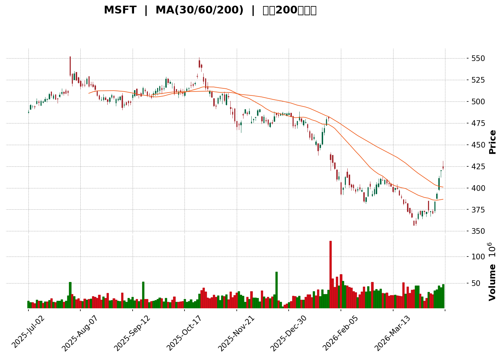
</details>

<html>
<head><meta charset="utf-8" /></head>
<body>
    <div>                        <script>window.PlotlyConfig = {MathJaxConfig: 'local'};</script>
        <script charset="utf-8" src="https://cdn.plot.ly/plotly-3.5.0.min.js" integrity="sha256-fHbNLP+GlIXN+efbQec78UkemUz3NJp7UmfGxC1tNxs=" crossorigin="anonymous"></script>                <div id="candlestick-chart" class="plotly-graph-div" style="height:500px; width:100%;"></div>            <script>                window.PLOTLYENV=window.PLOTLYENV || {};                                if (document.getElementById("candlestick-chart")) {                    Plotly.newPlot(                        "candlestick-chart",                        [{"close":{"dtype":"f8","bdata":"AAAAIA+EfkAAAADAV\u002f9+QAAAAMCG7X5AAAAAIAfcfkAAAACgoUl\u002fQAAAAMBWKX9AAAAA4JtGf0AAAAAg1kF\u002fQAAAAMBgbn9AAAAAQDJrf0AAAAAg6st\u002fQAAAAMCqsX9AAAAAgNOxf0AAAADgoGV\u002fQAAAAEAsb39AAAAA4N6+f0AAAACA4+t\u002fQAAAAACk2H9AAAAAAMHZf0AAAACAaeR\u002fQAAAAKBZk4BAAAAA4KlIgEAAAAAgX6SAQAAAAICdZYBAAAAAAERPgEAAAADApy6AQAAAAOAyOIBAAAAAQA02gEAAAACAd3GAQAAAAGCWLIBAAAAAALM7gEAAAABgUymAQAAAAGDoEIBAAAAAYDatf0AAAACgyWx\u002fQAAAAABuYn9AAAAAgBKSf0AAAADAv2J\u002fQAAAAEBgP39AAAAAwEOKf0AAAAAAebh\u002fQAAAAMB3iX9AAAAAoHNwf0AAAADgHXR\u002fQAAAAADdnX9AAAAA4DPPfkAAAADAMAJ\u002fQAAAAECJBX9AAAAAQMQkf0AAAADg9i5\u002fQAAAAICdvH9AAAAAgM4JgEAAAACA6a5\u002fQAAAAOCGvn9AAAAA4IKlf0AAAAAgSB6AQAAAAKCOAoBAAAAAoPCxf0AAAAAgmcB\u002fQAAAAKDijn9AAAAAoHjVf0AAAABgwAOAQAAAAOBwHoBAAAAAYHYsgEAAAABg1QyAQAAAAACpGYBAAAAAoAxzgEAAAAAge06AQAAAAIBpVYBAAAAAwORBgEAAAABAgc1\u002fQAAAAIC9\u002fn9AAAAAYBf3f0AAAACA3PR\u002fQAAAAIDc139AAAAAYED3f0AAAADgMhWAQAAAAGAhHIBAAAAAIBMzgEAAAAAAPDOAQAAAAICIS4BAAAAAQI2KgEAAAAAAmt6AQAAAAGB12oBAAAAAgKlcgEAAAABAUx2AQAAAAIAcF4BAAAAA4JkBgEAAAADg9JB\u002fQAAAAMCp8H5AAAAAoDPsfkAAAABAeX5\u002fQAAAAAAtqX9AAAAAgF\u002fQf0AAAAAAS1N\u002fQAAAAKATwX9AAAAAADeWf0AAAABA7Lt+QAAAAAClUX5AAAAAoHLVfUAAAADAt3B9QAAAAMC6jn1AAAAAwHW+fUAAAABgT0Z+QAAAAMA7rn5AAAAA4BpafkAAAACAJY5+QAAAAABGyn1AAAAAgOv7fUAAAACg9CB+QAAAAOBtnn5AAAAAgGSufkAAAADghdd9QAAAAIDnJX5AAAAAYAvXfUAAAADA0Zt9QAAAAODhtH1AAAAAYJKwfUAAAADACy5+QAAAAOADTX5AAAAAQA09fkAAAACA3Ft+QAAAAMCJbn5AAAAAAJdpfkAAAAAg2l9+QAAAACDrZX5AAAAAgEwofkAAAADgzn19QAAAAABffH1AAAAAoLnWfUAAAACA5yV+QAAAAOBW0H1AAAAAYATjfUAAAABAfsF9QAAAACCSWX1AAAAAoFelfEAAAADg63l8QAAAACABrXxAAAAAQMJXfEAAAAAAlLF7QAAAAGDNIXxAAAAAADkOfUAAAABAWFN9QAAAAADF931AAAAAAIgIfkAAAACANAh7QAAAAED21HpAAAAAgH5mekAAAACAYKR5QAAAAODy03lAAAAAYGCMeEAAAADAnwN5QAAAAMCHynlAAAAAAEPFeUAAAACgLzd5QAAAAGDMDnlAAAAAYH8GeUAAAADATL94QAAAAEAK63hAAAAAIFzneEAAAAAgrtN4QAAAACCFB3hAAAAAAABQeEAAAACgmQl5QAAAACCFG3lAAAAAANeLeEAAAADAzOh4QAAAAEDhPnlAAAAAQDNTeUAAAABA4ap5QAAAACBcj3lAAAAAYI+WeUAAAAAAKVx5QAAAAIAUTnlAAAAAgMIdeUAAAADAzLh4QAAAAEAz\u002f3hAAAAAYI\u002f2eEAAAADgo3x4QAAAAOBRUHhAAAAAgOvdd0AAAAAAAPB3QAAAAADXS3dAAAAA4KMwd0AAAAAghd92QAAAAOBRTHZAAAAAIFxvdkAAAABguCJ3QAAAAIDrFXdAAAAAIFxXd0AAAACAFE53QAAAAOCjRHdAAAAAoEdld0AAAADAHlF3QAAAAIDrLXdAAAAAgOsFeEAAAACAwpF4QAAAACCFs3lAAAAAAClEekAAAADgo2x6QA=="},"high":{"dtype":"f8","bdata":"vpbTfGWqfkCj4pQb3RN\u002fQIaOOkLp\u002fX5AqTQ\u002ffyn1fkADPZYkpn1\u002fQN9u7tlsWH9AxrAbjM9hf0BRLaPm8lB\u002fQMEy\u002fhTUlX9A4bND2rF8f0BA+2XeeuZ\u002fQAx4f+qu+n9AQif\u002feR7Sf0ACfCj39cN\u002fQHW5RtzOfX9A5Le5n0Drf0ACxo1TXxqAQN6G5G00AIBAY0NNJAsVgEDv4fDRwgeAQEBZn57vQYFA+YrkuaSlgEDzVfSAIbmAQF+KremSsYBALH12igiFgEBQkMX+UWiAQEfAVqIJTYBABml6yFdkgECQUD1rTn+AQPyFkcT8jIBA+GGslExXgECh86XbfViAQCnZmFdnPoBAGuLIHnoBgEBL7CmYx8B\u002fQNCRfv9xmH9AEQMRItfJf0AoXOtWXqF\u002fQMwZraE4bn9A1f2wSweTf0DHlcuHk89\u002fQCvh78PVt39AyybEMnl+f0AXfte8\u002fpp\u002fQAWxbTK7oH9AXpY1KJndf0AXtyLd\u002fTF\u002fQKZHgb24Qn9AiC0SXVZSf0AKH6+cYVF\u002fQLwLEu3W5n9ASjQ10a4KgEBaymBatBiAQEIiNFXD0n9AxyieAiDvf0B1CZlBMimAQMnQF5nEHIBAoLXBKqwDgEBf13Y6ueV\u002fQNuQ+DNevn9AqWX5rvz8f0D4luJKrRWAQDAEJRgdIIBAhB8V99UygEA\u002f38jshDuAQP4vcB6tMoBAhRwF46WGgEB6aPgj2XyAQAOgiZAkZoBAPwyzAUVRgED6N0xoS0uAQFqHMPwrEoBAhGk5TysJgECHyo3cYhiAQJDHLE+tFYBAjBPoMsMKgEARG\u002fVsaiSAQGa8rSNWJIBA\u002fSBAeXBYgECuxs7\u002fPU6AQA6fOz5lWYBA3idvLO6igECAs+hRajuBQBXg6fcPAIFAsGTKYwmmgEDs2sEhBnmAQCugo95JVoBAyDJMB1ILgEC7zEGTlQWAQNDTJYCxeX9AL7a18\u002f0Uf0AAQA11BIx\u002fQD7OCsXVt39AEveWYtHYf0DGvBPx+fV\u002fQEMe8+mz139AM3Nd9\u002fzff0DrpbSeWk5\u002fQGQp9d060n5AAqiB5yLHfkD2CHUyRd19QPZMQRMGvX1AumYc+vDgfUBb+P3pKnN+QArSinchuH5A8inbRemLfkA7qIPaBMZ+QHE\u002f3iYyMn5ACp\u002fJJZUDfkDtou5iySR+QGFyj8\u002fcsn5A+cgyMf2vfkAPK9wMWzJ+QPRYDl\u002fFTn5Aj3ScL58VfkDla2MXAfp9QDNlKeLTzH1A73vtroLufUAIqzLUwod+QOtiZx\u002fTa35A95REdt95fkDCefJbgWt+QKqrwZ28gH5AZIX5jCJwfkBhoyZ3znN+QBPGwroJiX5A0ILVVnRwfkC9Fleu5jh+QF728hbGr31A1J\u002fVemXafUBukYmDW4l+QMEGJ0\u002f5GH5AhZuKNqPrfUBrph92UP59QBp\u002f9vUkq31AF8IxGyQyfUDWckm0FfN8QDEBZdAp4nxA0cWc2yd8fECUk\u002fm3izp8QKhzmqTwPHxAbyBaVm9gfUD62BRYuJJ9QEu3zoNTHH5AT7OV0TYqfkDChUmN4Jd7QCKFsCiVaXtA4NKOQSXcekDVfmQDbFF6QPjmMAyBLXpAj6uNSex1eUA9yN4PAA55QNE2ppcf33lAr\u002fPvRXFrekASziZ6L\u002fh5QAGivFRmVHlAmMgkI91JeUAH72f8ufl4QKcn0MNKGnlAAAAAQOFGeUAAAACA6wF5QAAAAIDCtXhAAAAAgMJVeEAAAAAghRd5QAAAAADXd3lAAAAAwB7NeEAAAABAChN5QAAAAEAza3lAAAAA4HqweUAAAACAwrl5QAAAAMDM0HlAAAAAIFyjeUAAAABAM6N5QAAAAAApkHlAAAAAgOtheUAAAADAzEx5QAAAAIAUCnlAAAAAYGZGeUAAAAAAAOB4QAAAAADXh3hAAAAAAAAweEAAAAAgXDN4QAAAACCF53dAAAAAwPWQd0AAAAAghWt3QAAAAEAzp3ZAAAAAgMLVdkAAAABgZk53QAAAAADXX3dAAAAAgD1ad0AAAAAgrlt3QAAAAEAzR3dAAAAAAAAQeEAAAAAAAFh3QAAAAIA9endAAAAA4KMIeEAAAABACqt4QAAAAIDr5XlAAAAAwB5NekAAAACgR\u002fl6QA=="},"hovertemplate":"\u003cb\u003e%{x|%Y-%m-%d}\u003c\u002fb\u003e\u003cbr\u003e\u958b: $%{open:.2f}\u003cbr\u003e\u9ad8: $%{high:.2f}\u003cbr\u003e\u4f4e: $%{low:.2f}\u003cbr\u003e\u6536: $%{close:.2f}\u003cextra\u003e\u003c\u002fextra\u003e","low":{"dtype":"f8","bdata":"HgHvSQpefkCereQecal+QBaOnqfqxX5AynnjgBm0fkBZJ6fPqA1\u002fQPKQZt0A7n5A\u002fLXUdczufkClC5EzLiJ\u002fQOrq+I0tPn9AdJEYfdwvf0CC7EE1Mmt\u002fQGKB3Dr9h39Am3jxMBVqf0AAAADgoGV\u002fQGS6Gk7uHH9Ae27M0OuFf0BgblEAmbZ\u002fQB2Pg83Hsn9A9NHA5K\u002fJf0DNpwql9qd\u002fQMmxx8yfhoBAGIE3UdAugEB3jlZ0o2iAQKdcXAiPYYBAtOdtIwdIgECvhFeqfBSAQNPO+LtHI4BAuem8\u002f74lgECEGVH7cj2AQOGE9I\u002f2IoBAzcx2bRYpgEB4VnoEqCCAQNo6XxzS8H9AbZp7HM6Zf0CvV7YHbVh\u002fQOm5ROg1Sn9ABOfBgUVFf0BGKfufhGB\u002fQIRQQUAhB39ACa\u002feJEcdf0DBbAq5gXZ\u002fQEMKFNFpZn9ACAJl1ArsfkCscRVl1kN\u002fQMbAoQEQUX9A1q8b\u002fEulfkBFlxwlrs9+QBSvAis5+n5Ajs83yZvqfkCWW1J3F\u002f1+QC9wi143XH9AWTYuTWiOf0DmZ5625qd\u002fQGbs9Z9bfX9A20JzZuyYf0COeZv\u002fJcN\u002fQOy1yiWu5n9AWsUp0ViTf0BWw5fpIY1\u002fQKoIFmEtb39A5lXcGFqIf0Ddz\u002ffFXKx\u002fQBFImn3KuH9A3NTPySLZf0BBP4\u002fUCsl\u002fQAAQPS7wBoBAaEpo0m4ggEB0gqPKPjqAQI71FQ1kR4BACQK+Jw8agEDvACUvULh\u002fQDTuFTP62H9AAZ3JB3l+f0BSXuBtNb5\u002fQMBoJYdpoH9AbfI5uliTf0DGMVE+3PR\u002fQFoqKp2l7n9AWShKYIccgEAERL\u002fpsiOAQGL9O\u002fhtNIBArYN8CY52gEAAvH+mPtSAQMsFJ+EOtIBACdUEn6k\u002fgEALa+4bvAeAQO3gqBGsA4BAaBY5tcqbf0BacZv2tod\u002fQC5onMEb3H5AH4YPblGzfkDqzVQgwAt\u002fQA5Jlr5QRH9AlRt0YtkQf0Ardp3sbDN\u002fQK0fMrgU9n5A3tHxIhttf0ALPDgnOkx+QCJbUeRJDX5AU1d2tKymfUBw9E0JQjN9QPmdW2dEL31AXoKfHU39fEC5o\u002fa7qgF+QB9A7x6rWH5Aauyjvr04fkB8IkiTZlN+QACXXbnioX1A66xTc3q2fUAgXR+sodx9QEEKQm9uNH5AHB5HdTN2fkCMbeg1+J99QLJ8vNtrrH1AQ4pjjRW0fUC6VDhUGnd9QOIwT0XsXH1A+ldwUrGefUDeQhru08x9QBI7fn5CFn5ADu\u002fy7HMZfkBIUmqOLTp+QJ3vaUGdO35AN6+6UqdNfkCjtaP8PDF+QOAX+3dPRn5AbdMhvDAjfkDZrDvubVF9QB9wfZ\u002fkRn1ADuLXVeJKfUC\u002fkAUdyc19QF+HtNxrrH1AlFfvyf5xfUAM6Nc9jKl9QFcpzQY5Dn1AnqgdHRCCfEBEicj2yW18QHJz5UYMd3xAKPiFIBwEfECahSdm5Vp7QO4HHzL\u002funtArfthdRAYfEAY2LWbKs98QL++yvVRgX1AEGwOXJXOfUDON3vI+kB6QD6Gg3Gpl3pAk1Zhcp1UekBJ393XEnp5QMg25MvthHlAOeOiV9N2eEBor6hMZ4B4QLb6ZF1Q\u002f3hAOGYMsSm8eUAfgll3jAF5QOfEm3mo0XhAUwFq4EvSeEBBZ7HbGpp4QDu8VfittnhAAAAAYLjKeEAAAABgj7J4QAAAAKCZ8XdAAAAAIFzbd0AAAABgj2J4QAAAAADX63hAAAAAgBReeEAAAACAFGp4QAAAAGC4inhAAAAAwPUEeUAAAABgZkZ5QAAAAAApiHlAAAAAAAA4eUAAAABA4S55QAAAAKBwGXlAAAAAIFwbeUAAAAAAAKR4QAAAAOCjrHhAAAAAAADceEAAAAAAAHB4QAAAAMD1MHhAAAAAgOvBd0AAAABA4dp3QAAAAKCZPXdAAAAAgBQad0AAAABACtN2QAAAAAApSHZAAAAA4HpEdkAAAADAHrF2QAAAAEAzA3dAAAAAYGbCdkAAAAAAABh3QAAAAMD16HZAAAAAYI82d0AAAADAzPB2QAAAAOB6IHdAAAAA4FEwd0AAAADgUSh4QAAAACCuy3hAAAAAgD3CeUAAAABACkt6QA=="},"name":"\u50f9\u683c","open":{"dtype":"f8","bdata":"bWq5hY9yfkCnoCreU69+QDfmDCse6H5AXjY+9ePlfkC7Aj9QkRZ\u002fQH+BBzxQQn9A4Vso\u002fHT5fkCn1iOc+Sl\u002fQP4XMB3WQX9ADbixaDJkf0Cd2OeJJmx\u002fQEDkrDMj+H9AYrHgH4l8f0CY9yBITcB\u002fQFXGku4rfX9AGwNiKk6df0D7J++VKdh\u002fQAfmR1\u002fG8X9AkWXbnGsEgEBs7OaLjgGAQMbP4pgvQIFAiiRP0EefgECXi1+MwGmAQB8ACZWesIBANlLaoKt+gEAv9gxBD16AQMqGQiCnPIBAfvs0W0Q6gEDWVunvzEWAQG6JLF9LiIBAa+W07VU8gECuVPF+AT6AQF1uAuSeNIBA9I0xYzQAgEBXI4LTza5\u002fQHIjOJSqWX9AZKcA7JZif0BNttgMg4h\u002fQNvRAIZXZH9A7H0mJr0+f0Dc8tpg149\u002fQAPesXXbqH9ADbCbH1wmf0C9re+VQlt\u002fQDXiFOBiY39AK5Ss+GOvf0D6K+yGwQB\u002fQN9ZPeanNX9APL2imlpOf0D0IaHXuEJ\u002fQH32TaDUiH9AAjSC0O2qf0D43jmS6hWAQD4UmVIWyH9AfK6ED\u002fPVf0AEIg7CIcd\u002fQKfe5rSjC4BAAOMNvMH6f0DTRjhZQ8R\u002fQIeQW\u002fUeo39A5T08\u002fym\u002ff0AsdRnVG9Z\u002fQJ5RRWTV8X9AtmWRRFgFgEAdfqmC+BuAQFQGzB6rF4BADHBP+LIjgEAFUWhy0XCAQCKckJDnSIBArntDYmpBgEBjBY2y5yuAQFqHMPwrEoBAn6aBZ9\u002fBf0BQAR7GngaAQEPc0ktR539Ax4UFgumuf0A5UCy91AOAQDBQUhvbGoBA1759U+83gECkhsgiX0KAQPhYWhQARYBAnAt+i5+MgECnTZxexx2BQHAyol939YBAuvU7+EOCgEB1VhS9hHWAQE1\u002fN0xCLYBAcDSWl0Daf0BOjFsayvJ\u002fQFuI4E0OeX9Ab6l660XufkAXctY3gh9\u002fQPtWE1Baa39A7+ZosQK0f0CKewzNJcN\u002fQBZpyDGrAn9A12lY94Klf0ArX00TGdV+QBAYB5QggX5AW14eTWi5fkA1wmS9kNZ9QNbiJmyxnn1A0jSmvNiPfUCWdc2RPVN+QOu6cYLVZ35AeFqXRD51fkBWtic4yVl+QLf778bDs31Acwjj8q3qfUA2LUcYvRZ+QH\u002ftbq2SPH5ArnuKfMd\u002ffkCIRjP61y5+QA9qB622uH1Ae3moN6PrfUBTXOBfG\u002fB9QJ6FyIldbX1AvG2J4S69fUB1hcXhndF9QF4UhJEAZH5AzUydLjVQfkD5uUdxAj5+QEewrvMuSX5AIGTYU6BZfkB9KubkFzx+QMplOLUsTX5A7Dc8Q6prfkCD4whTlzR+QDRbqNavj31A4Wf2TomLfUCSJfv6rep9QC1d9S1OAn5AemGS8K+PfUBm9sYhWrl9QBmHpZiVmX1AUeEXNl0WfUDd0bdqAvF8QNPoWC+ZjHxA3n8CSBQjfEDdBeDuGzl8QAPmeTWc6XtA24CclXQtfEDGf857AQR9QBFnVczwiX1AnwQq48AhfkA639T2zm97QCawd+u3YntAXJx76ynUekC089qiyFB6QD8cQGEGoXlAFbgVzzFoeUDutjEALeR4QAGjtl3ZPnlAB7LPZKEqekDqmMM2t\u002fN5QJGnPUY+QXlAHpHsrXY4eUDF4plc+eR4QIU8OtaS03hAAAAAQAoLeUAAAACAwsF4QAAAAAAAsHhAAAAAgD0CeEAAAADgemh4QAAAACBcS3lAAAAAgBRueEAAAACAwo14QAAAAIA9knhAAAAA4FEUeUAAAABguEZ5QAAAAEAzk3lAAAAAYLhOeUAAAADgeqB5QAAAAMAeWXlAAAAAgBRKeUAAAAAAABB5QAAAAMAe4XhAAAAA4FEEeUAAAACAFNJ4QAAAAKCZYXhAAAAA4KMseEAAAABgZv53QAAAAIDC5XdAAAAAYLiOd0AAAADAHi13QAAAAGBmnnZAAAAAYGaedkAAAADAzMh2QAAAAADXV3dAAAAAIFzzdkAAAAAA11d3QAAAAKBwJXdAAAAAIK4PeEAAAAAAAEh3QAAAACCuT3dAAAAAgMJZd0AAAABguD54QAAAAAAA4HhAAAAAgMI9ekAAAADAHo16QA=="},"x":["2025-07-02T00:00:00-04:00","2025-07-03T00:00:00-04:00","2025-07-07T00:00:00-04:00","2025-07-08T00:00:00-04:00","2025-07-09T00:00:00-04:00","2025-07-10T00:00:00-04:00","2025-07-11T00:00:00-04:00","2025-07-14T00:00:00-04:00","2025-07-15T00:00:00-04:00","2025-07-16T00:00:00-04:00","2025-07-17T00:00:00-04:00","2025-07-18T00:00:00-04:00","2025-07-21T00:00:00-04:00","2025-07-22T00:00:00-04:00","2025-07-23T00:00:00-04:00","2025-07-24T00:00:00-04:00","2025-07-25T00:00:00-04:00","2025-07-28T00:00:00-04:00","2025-07-29T00:00:00-04:00","2025-07-30T00:00:00-04:00","2025-07-31T00:00:00-04:00","2025-08-01T00:00:00-04:00","2025-08-04T00:00:00-04:00","2025-08-05T00:00:00-04:00","2025-08-06T00:00:00-04:00","2025-08-07T00:00:00-04:00","2025-08-08T00:00:00-04:00","2025-08-11T00:00:00-04:00","2025-08-12T00:00:00-04:00","2025-08-13T00:00:00-04:00","2025-08-14T00:00:00-04:00","2025-08-15T00:00:00-04:00","2025-08-18T00:00:00-04:00","2025-08-19T00:00:00-04:00","2025-08-20T00:00:00-04:00","2025-08-21T00:00:00-04:00","2025-08-22T00:00:00-04:00","2025-08-25T00:00:00-04:00","2025-08-26T00:00:00-04:00","2025-08-27T00:00:00-04:00","2025-08-28T00:00:00-04:00","2025-08-29T00:00:00-04:00","2025-09-02T00:00:00-04:00","2025-09-03T00:00:00-04:00","2025-09-04T00:00:00-04:00","2025-09-05T00:00:00-04:00","2025-09-08T00:00:00-04:00","2025-09-09T00:00:00-04:00","2025-09-10T00:00:00-04:00","2025-09-11T00:00:00-04:00","2025-09-12T00:00:00-04:00","2025-09-15T00:00:00-04:00","2025-09-16T00:00:00-04:00","2025-09-17T00:00:00-04:00","2025-09-18T00:00:00-04:00","2025-09-19T00:00:00-04:00","2025-09-22T00:00:00-04:00","2025-09-23T00:00:00-04:00","2025-09-24T00:00:00-04:00","2025-09-25T00:00:00-04:00","2025-09-26T00:00:00-04:00","2025-09-29T00:00:00-04:00","2025-09-30T00:00:00-04:00","2025-10-01T00:00:00-04:00","2025-10-02T00:00:00-04:00","2025-10-03T00:00:00-04:00","2025-10-06T00:00:00-04:00","2025-10-07T00:00:00-04:00","2025-10-08T00:00:00-04:00","2025-10-09T00:00:00-04:00","2025-10-10T00:00:00-04:00","2025-10-13T00:00:00-04:00","2025-10-14T00:00:00-04:00","2025-10-15T00:00:00-04:00","2025-10-16T00:00:00-04:00","2025-10-17T00:00:00-04:00","2025-10-20T00:00:00-04:00","2025-10-21T00:00:00-04:00","2025-10-22T00:00:00-04:00","2025-10-23T00:00:00-04:00","2025-10-24T00:00:00-04:00","2025-10-27T00:00:00-04:00","2025-10-28T00:00:00-04:00","2025-10-29T00:00:00-04:00","2025-10-30T00:00:00-04:00","2025-10-31T00:00:00-04:00","2025-11-03T00:00:00-05:00","2025-11-04T00:00:00-05:00","2025-11-05T00:00:00-05:00","2025-11-06T00:00:00-05:00","2025-11-07T00:00:00-05:00","2025-11-10T00:00:00-05:00","2025-11-11T00:00:00-05:00","2025-11-12T00:00:00-05:00","2025-11-13T00:00:00-05:00","2025-11-14T00:00:00-05:00","2025-11-17T00:00:00-05:00","2025-11-18T00:00:00-05:00","2025-11-19T00:00:00-05:00","2025-11-20T00:00:00-05:00","2025-11-21T00:00:00-05:00","2025-11-24T00:00:00-05:00","2025-11-25T00:00:00-05:00","2025-11-26T00:00:00-05:00","2025-11-28T00:00:00-05:00","2025-12-01T00:00:00-05:00","2025-12-02T00:00:00-05:00","2025-12-03T00:00:00-05:00","2025-12-04T00:00:00-05:00","2025-12-05T00:00:00-05:00","2025-12-08T00:00:00-05:00","2025-12-09T00:00:00-05:00","2025-12-10T00:00:00-05:00","2025-12-11T00:00:00-05:00","2025-12-12T00:00:00-05:00","2025-12-15T00:00:00-05:00","2025-12-16T00:00:00-05:00","2025-12-17T00:00:00-05:00","2025-12-18T00:00:00-05:00","2025-12-19T00:00:00-05:00","2025-12-22T00:00:00-05:00","2025-12-23T00:00:00-05:00","2025-12-24T00:00:00-05:00","2025-12-26T00:00:00-05:00","2025-12-29T00:00:00-05:00","2025-12-30T00:00:00-05:00","2025-12-31T00:00:00-05:00","2026-01-02T00:00:00-05:00","2026-01-05T00:00:00-05:00","2026-01-06T00:00:00-05:00","2026-01-07T00:00:00-05:00","2026-01-08T00:00:00-05:00","2026-01-09T00:00:00-05:00","2026-01-12T00:00:00-05:00","2026-01-13T00:00:00-05:00","2026-01-14T00:00:00-05:00","2026-01-15T00:00:00-05:00","2026-01-16T00:00:00-05:00","2026-01-20T00:00:00-05:00","2026-01-21T00:00:00-05:00","2026-01-22T00:00:00-05:00","2026-01-23T00:00:00-05:00","2026-01-26T00:00:00-05:00","2026-01-27T00:00:00-05:00","2026-01-28T00:00:00-05:00","2026-01-29T00:00:00-05:00","2026-01-30T00:00:00-05:00","2026-02-02T00:00:00-05:00","2026-02-03T00:00:00-05:00","2026-02-04T00:00:00-05:00","2026-02-05T00:00:00-05:00","2026-02-06T00:00:00-05:00","2026-02-09T00:00:00-05:00","2026-02-10T00:00:00-05:00","2026-02-11T00:00:00-05:00","2026-02-12T00:00:00-05:00","2026-02-13T00:00:00-05:00","2026-02-17T00:00:00-05:00","2026-02-18T00:00:00-05:00","2026-02-19T00:00:00-05:00","2026-02-20T00:00:00-05:00","2026-02-23T00:00:00-05:00","2026-02-24T00:00:00-05:00","2026-02-25T00:00:00-05:00","2026-02-26T00:00:00-05:00","2026-02-27T00:00:00-05:00","2026-03-02T00:00:00-05:00","2026-03-03T00:00:00-05:00","2026-03-04T00:00:00-05:00","2026-03-05T00:00:00-05:00","2026-03-06T00:00:00-05:00","2026-03-09T00:00:00-04:00","2026-03-10T00:00:00-04:00","2026-03-11T00:00:00-04:00","2026-03-12T00:00:00-04:00","2026-03-13T00:00:00-04:00","2026-03-16T00:00:00-04:00","2026-03-17T00:00:00-04:00","2026-03-18T00:00:00-04:00","2026-03-19T00:00:00-04:00","2026-03-20T00:00:00-04:00","2026-03-23T00:00:00-04:00","2026-03-24T00:00:00-04:00","2026-03-25T00:00:00-04:00","2026-03-26T00:00:00-04:00","2026-03-27T00:00:00-04:00","2026-03-30T00:00:00-04:00","2026-03-31T00:00:00-04:00","2026-04-01T00:00:00-04:00","2026-04-02T00:00:00-04:00","2026-04-06T00:00:00-04:00","2026-04-07T00:00:00-04:00","2026-04-08T00:00:00-04:00","2026-04-09T00:00:00-04:00","2026-04-10T00:00:00-04:00","2026-04-13T00:00:00-04:00","2026-04-14T00:00:00-04:00","2026-04-15T00:00:00-04:00","2026-04-16T00:00:00-04:00","2026-04-17T00:00:00-04:00"],"type":"candlestick"},{"hovertemplate":"MA30: $%{y:.2f}\u003cextra\u003e\u003c\u002fextra\u003e","line":{"color":"#2196F3","dash":"dash","width":2},"mode":"lines","name":"MA30","x":["2025-07-02T00:00:00-04:00","2025-07-03T00:00:00-04:00","2025-07-07T00:00:00-04:00","2025-07-08T00:00:00-04:00","2025-07-09T00:00:00-04:00","2025-07-10T00:00:00-04:00","2025-07-11T00:00:00-04:00","2025-07-14T00:00:00-04:00","2025-07-15T00:00:00-04:00","2025-07-16T00:00:00-04:00","2025-07-17T00:00:00-04:00","2025-07-18T00:00:00-04:00","2025-07-21T00:00:00-04:00","2025-07-22T00:00:00-04:00","2025-07-23T00:00:00-04:00","2025-07-24T00:00:00-04:00","2025-07-25T00:00:00-04:00","2025-07-28T00:00:00-04:00","2025-07-29T00:00:00-04:00","2025-07-30T00:00:00-04:00","2025-07-31T00:00:00-04:00","2025-08-01T00:00:00-04:00","2025-08-04T00:00:00-04:00","2025-08-05T00:00:00-04:00","2025-08-06T00:00:00-04:00","2025-08-07T00:00:00-04:00","2025-08-08T00:00:00-04:00","2025-08-11T00:00:00-04:00","2025-08-12T00:00:00-04:00","2025-08-13T00:00:00-04:00","2025-08-14T00:00:00-04:00","2025-08-15T00:00:00-04:00","2025-08-18T00:00:00-04:00","2025-08-19T00:00:00-04:00","2025-08-20T00:00:00-04:00","2025-08-21T00:00:00-04:00","2025-08-22T00:00:00-04:00","2025-08-25T00:00:00-04:00","2025-08-26T00:00:00-04:00","2025-08-27T00:00:00-04:00","2025-08-28T00:00:00-04:00","2025-08-29T00:00:00-04:00","2025-09-02T00:00:00-04:00","2025-09-03T00:00:00-04:00","2025-09-04T00:00:00-04:00","2025-09-05T00:00:00-04:00","2025-09-08T00:00:00-04:00","2025-09-09T00:00:00-04:00","2025-09-10T00:00:00-04:00","2025-09-11T00:00:00-04:00","2025-09-12T00:00:00-04:00","2025-09-15T00:00:00-04:00","2025-09-16T00:00:00-04:00","2025-09-17T00:00:00-04:00","2025-09-18T00:00:00-04:00","2025-09-19T00:00:00-04:00","2025-09-22T00:00:00-04:00","2025-09-23T00:00:00-04:00","2025-09-24T00:00:00-04:00","2025-09-25T00:00:00-04:00","2025-09-26T00:00:00-04:00","2025-09-29T00:00:00-04:00","2025-09-30T00:00:00-04:00","2025-10-01T00:00:00-04:00","2025-10-02T00:00:00-04:00","2025-10-03T00:00:00-04:00","2025-10-06T00:00:00-04:00","2025-10-07T00:00:00-04:00","2025-10-08T00:00:00-04:00","2025-10-09T00:00:00-04:00","2025-10-10T00:00:00-04:00","2025-10-13T00:00:00-04:00","2025-10-14T00:00:00-04:00","2025-10-15T00:00:00-04:00","2025-10-16T00:00:00-04:00","2025-10-17T00:00:00-04:00","2025-10-20T00:00:00-04:00","2025-10-21T00:00:00-04:00","2025-10-22T00:00:00-04:00","2025-10-23T00:00:00-04:00","2025-10-24T00:00:00-04:00","2025-10-27T00:00:00-04:00","2025-10-28T00:00:00-04:00","2025-10-29T00:00:00-04:00","2025-10-30T00:00:00-04:00","2025-10-31T00:00:00-04:00","2025-11-03T00:00:00-05:00","2025-11-04T00:00:00-05:00","2025-11-05T00:00:00-05:00","2025-11-06T00:00:00-05:00","2025-11-07T00:00:00-05:00","2025-11-10T00:00:00-05:00","2025-11-11T00:00:00-05:00","2025-11-12T00:00:00-05:00","2025-11-13T00:00:00-05:00","2025-11-14T00:00:00-05:00","2025-11-17T00:00:00-05:00","2025-11-18T00:00:00-05:00","2025-11-19T00:00:00-05:00","2025-11-20T00:00:00-05:00","2025-11-21T00:00:00-05:00","2025-11-24T00:00:00-05:00","2025-11-25T00:00:00-05:00","2025-11-26T00:00:00-05:00","2025-11-28T00:00:00-05:00","2025-12-01T00:00:00-05:00","2025-12-02T00:00:00-05:00","2025-12-03T00:00:00-05:00","2025-12-04T00:00:00-05:00","2025-12-05T00:00:00-05:00","2025-12-08T00:00:00-05:00","2025-12-09T00:00:00-05:00","2025-12-10T00:00:00-05:00","2025-12-11T00:00:00-05:00","2025-12-12T00:00:00-05:00","2025-12-15T00:00:00-05:00","2025-12-16T00:00:00-05:00","2025-12-17T00:00:00-05:00","2025-12-18T00:00:00-05:00","2025-12-19T00:00:00-05:00","2025-12-22T00:00:00-05:00","2025-12-23T00:00:00-05:00","2025-12-24T00:00:00-05:00","2025-12-26T00:00:00-05:00","2025-12-29T00:00:00-05:00","2025-12-30T00:00:00-05:00","2025-12-31T00:00:00-05:00","2026-01-02T00:00:00-05:00","2026-01-05T00:00:00-05:00","2026-01-06T00:00:00-05:00","2026-01-07T00:00:00-05:00","2026-01-08T00:00:00-05:00","2026-01-09T00:00:00-05:00","2026-01-12T00:00:00-05:00","2026-01-13T00:00:00-05:00","2026-01-14T00:00:00-05:00","2026-01-15T00:00:00-05:00","2026-01-16T00:00:00-05:00","2026-01-20T00:00:00-05:00","2026-01-21T00:00:00-05:00","2026-01-22T00:00:00-05:00","2026-01-23T00:00:00-05:00","2026-01-26T00:00:00-05:00","2026-01-27T00:00:00-05:00","2026-01-28T00:00:00-05:00","2026-01-29T00:00:00-05:00","2026-01-30T00:00:00-05:00","2026-02-02T00:00:00-05:00","2026-02-03T00:00:00-05:00","2026-02-04T00:00:00-05:00","2026-02-05T00:00:00-05:00","2026-02-06T00:00:00-05:00","2026-02-09T00:00:00-05:00","2026-02-10T00:00:00-05:00","2026-02-11T00:00:00-05:00","2026-02-12T00:00:00-05:00","2026-02-13T00:00:00-05:00","2026-02-17T00:00:00-05:00","2026-02-18T00:00:00-05:00","2026-02-19T00:00:00-05:00","2026-02-20T00:00:00-05:00","2026-02-23T00:00:00-05:00","2026-02-24T00:00:00-05:00","2026-02-25T00:00:00-05:00","2026-02-26T00:00:00-05:00","2026-02-27T00:00:00-05:00","2026-03-02T00:00:00-05:00","2026-03-03T00:00:00-05:00","2026-03-04T00:00:00-05:00","2026-03-05T00:00:00-05:00","2026-03-06T00:00:00-05:00","2026-03-09T00:00:00-04:00","2026-03-10T00:00:00-04:00","2026-03-11T00:00:00-04:00","2026-03-12T00:00:00-04:00","2026-03-13T00:00:00-04:00","2026-03-16T00:00:00-04:00","2026-03-17T00:00:00-04:00","2026-03-18T00:00:00-04:00","2026-03-19T00:00:00-04:00","2026-03-20T00:00:00-04:00","2026-03-23T00:00:00-04:00","2026-03-24T00:00:00-04:00","2026-03-25T00:00:00-04:00","2026-03-26T00:00:00-04:00","2026-03-27T00:00:00-04:00","2026-03-30T00:00:00-04:00","2026-03-31T00:00:00-04:00","2026-04-01T00:00:00-04:00","2026-04-02T00:00:00-04:00","2026-04-06T00:00:00-04:00","2026-04-07T00:00:00-04:00","2026-04-08T00:00:00-04:00","2026-04-09T00:00:00-04:00","2026-04-10T00:00:00-04:00","2026-04-13T00:00:00-04:00","2026-04-14T00:00:00-04:00","2026-04-15T00:00:00-04:00","2026-04-16T00:00:00-04:00","2026-04-17T00:00:00-04:00"],"y":{"dtype":"f8","bdata":"AAAAAAAA+H8AAAAAAAD4fwAAAAAAAPh\u002fAAAAAAAA+H8AAAAAAAD4fwAAAAAAAPh\u002fAAAAAAAA+H8AAAAAAAD4fwAAAAAAAPh\u002fAAAAAAAA+H8AAAAAAAD4fwAAAAAAAPh\u002fAAAAAAAA+H8AAAAAAAD4fwAAAAAAAPh\u002fAAAAAAAA+H8AAAAAAAD4fwAAAAAAAPh\u002fAAAAAAAA+H8AAAAAAAD4fwAAAAAAAPh\u002fAAAAAAAA+H8AAAAAAAD4fwAAAAAAAPh\u002fAAAAAAAA+H8AAAAAAAD4fwAAAAAAAPh\u002fAAAAAAAA+H8AAAAAAAD4f1VVVTW9139AzczMPGLof0C8u7ursfN\u002fQHd3d2f4\u002fX9AERERuXgCgEARERG5DgOAQHd3d08CBIBAmpmZSUQFgEDv7u620AWAQERERCwIBYBAMzMzu4wFgEB3d3fHOQWAQDMzM0OOBIBAzczMVHcDgEDe3d0ltQOAQERERFx8BIBA7+7uxn0AgEBERERUMfl\u002fQHd3d+cn8n9Aq6qqeh\u002fsf0AAAAAgE+Z\u002fQFVVVVUB2n9AMzMzk9DVf0CamZlZJ8h\u002fQJqZmWkyv39AERERceW2f0AAAAAAzrV\u002fQERERIQ6sn9AvLu76wWsf0BERERkWKJ\u002fQAAAADCam39AiYiIaDSWf0BEREQks5N\u002fQLy7uxualH9AMzMzY1Oaf0AAAACgFqB\u002fQImIiCgNp39Ad3d3t2Kyf0AAAAAA3Lx\u002fQM3MzGz5yH9A7+7urkrRf0CJiIgo\u002ftF\u002fQCIiIuLm1X9A7+7uzmPaf0De3d1trt5\u002fQImIiFid4H9AERERoXvqf0AzMzNDW\u002fR\u002fQFVVVaWU\u002fn9AZmZmjqUEgEBERESk1gmAQDMzM7N6DYBAMzMzU8URgEBVVVXVihqAQFVVVV3qIoBAq6qqKoMngEAREREBeyeAQGZmZmYqKIBAZmZmHoUpgEARERHZuSiAQERERMQWJoBAvLu7ezMigEAzMzPT6h+AQM3MzJx0HYBA3t3d\u002fS0bgECJiIiY3xeAQAAAACj4FYBAVVVVDV8QgEBmZmaeWgiAQLy7uyur\u002fH9AiYiIaMrlf0Dv7u6OodF\u002fQKuqqqrUvH9AiYiIWOCpf0Dv7u5Ohpt\u002fQM3MzIyakX9AiYiICNWDf0CJiIgoF3Z\u002fQImIiIhbYX9AmpmZ+b9Mf0Crqqq6XTl\u002fQN7d3X2LKH9AVVVV9Q0Uf0C8u7trzPJ+QCIiInJu1H5AVVVVddK7fkCJiIgIdqV+QHd3d4dZkH5AmpmZWYd8fkB3d3fHsnB+QBEREVE+a35AREREtGdlfkAAAADQt1t+QHd3d+c6UX5AmpmZSUVFfkDNzMzsJz1+QCIiIoKVMX5AZmZmBmMlfkAiIiJyyBp+QDMzM4OsE35AmpmZabcTfkCamZmJwRl+QImIiGjxG35AzczMXCkdfkDe3d39uxh+QBEREQFhDX5AZmZm9tH+fUDv7u5OFO19QDMzMwOS431AMzMzo5DVfUBmZmYmycB9QJqZmZmQq31AiYiISLGdfUDNzMxcSZl9QN7d3a2\u002fl31Ad3d392WZfUAiIiJCaYN9QHd3d2fhan1AzczMrM9OfUBERETEFih9QImIiIjrAX1AzczMPF3RfEDNzMycwaN8QCIiIvInfHxAvLu7i4tUfEDNzMzchSh8QFVVVcXz+ntAq6qqqijPe0DNzMzcrKZ7QCIiIpKyf3tAq6qq2pVVe0CrqqqKLSh7QHd3dzfR9npAERERAUDHekBmZmam\u002fJ56QERERATJenpAMzMzQ81XekCrqqpKXTl6QGZmZvYXHHpAZmZmdlcCekDNzMw8DfF5QHd3d4ca23lA7+7uzoO9eUBmZmbmrJt5QAAAAMDic3lAvLu7O+1JeUAzMzOTNjZ5QBEREfGNJnlAzczMPEoaeUDe3d2dbhB5QJqZmdmCA3lAd3d3J7L9eECamZkpgvR4QBEREQE433hAMzMzszLJeEDNzMyMNbV4QO\u002fu7u6onXhAiYiIKI6HeECrqqp6zXl4QCIiIlIqanhAzczM\u002fNRceEBmZmZm2E94QM3MzGxZSXhAq6qqeoZBeEB3d3e31zJ4QJqZmaljInhAERER4ewdeEAzMzMjBht4QHd3d3fpHnhAiYiIqPEmeEBEREQUZy14QA=="},"type":"scatter"},{"hovertemplate":"MA60: $%{y:.2f}\u003cextra\u003e\u003c\u002fextra\u003e","line":{"color":"#9C27B0","dash":"dash","width":2},"mode":"lines","name":"MA60","x":["2025-07-02T00:00:00-04:00","2025-07-03T00:00:00-04:00","2025-07-07T00:00:00-04:00","2025-07-08T00:00:00-04:00","2025-07-09T00:00:00-04:00","2025-07-10T00:00:00-04:00","2025-07-11T00:00:00-04:00","2025-07-14T00:00:00-04:00","2025-07-15T00:00:00-04:00","2025-07-16T00:00:00-04:00","2025-07-17T00:00:00-04:00","2025-07-18T00:00:00-04:00","2025-07-21T00:00:00-04:00","2025-07-22T00:00:00-04:00","2025-07-23T00:00:00-04:00","2025-07-24T00:00:00-04:00","2025-07-25T00:00:00-04:00","2025-07-28T00:00:00-04:00","2025-07-29T00:00:00-04:00","2025-07-30T00:00:00-04:00","2025-07-31T00:00:00-04:00","2025-08-01T00:00:00-04:00","2025-08-04T00:00:00-04:00","2025-08-05T00:00:00-04:00","2025-08-06T00:00:00-04:00","2025-08-07T00:00:00-04:00","2025-08-08T00:00:00-04:00","2025-08-11T00:00:00-04:00","2025-08-12T00:00:00-04:00","2025-08-13T00:00:00-04:00","2025-08-14T00:00:00-04:00","2025-08-15T00:00:00-04:00","2025-08-18T00:00:00-04:00","2025-08-19T00:00:00-04:00","2025-08-20T00:00:00-04:00","2025-08-21T00:00:00-04:00","2025-08-22T00:00:00-04:00","2025-08-25T00:00:00-04:00","2025-08-26T00:00:00-04:00","2025-08-27T00:00:00-04:00","2025-08-28T00:00:00-04:00","2025-08-29T00:00:00-04:00","2025-09-02T00:00:00-04:00","2025-09-03T00:00:00-04:00","2025-09-04T00:00:00-04:00","2025-09-05T00:00:00-04:00","2025-09-08T00:00:00-04:00","2025-09-09T00:00:00-04:00","2025-09-10T00:00:00-04:00","2025-09-11T00:00:00-04:00","2025-09-12T00:00:00-04:00","2025-09-15T00:00:00-04:00","2025-09-16T00:00:00-04:00","2025-09-17T00:00:00-04:00","2025-09-18T00:00:00-04:00","2025-09-19T00:00:00-04:00","2025-09-22T00:00:00-04:00","2025-09-23T00:00:00-04:00","2025-09-24T00:00:00-04:00","2025-09-25T00:00:00-04:00","2025-09-26T00:00:00-04:00","2025-09-29T00:00:00-04:00","2025-09-30T00:00:00-04:00","2025-10-01T00:00:00-04:00","2025-10-02T00:00:00-04:00","2025-10-03T00:00:00-04:00","2025-10-06T00:00:00-04:00","2025-10-07T00:00:00-04:00","2025-10-08T00:00:00-04:00","2025-10-09T00:00:00-04:00","2025-10-10T00:00:00-04:00","2025-10-13T00:00:00-04:00","2025-10-14T00:00:00-04:00","2025-10-15T00:00:00-04:00","2025-10-16T00:00:00-04:00","2025-10-17T00:00:00-04:00","2025-10-20T00:00:00-04:00","2025-10-21T00:00:00-04:00","2025-10-22T00:00:00-04:00","2025-10-23T00:00:00-04:00","2025-10-24T00:00:00-04:00","2025-10-27T00:00:00-04:00","2025-10-28T00:00:00-04:00","2025-10-29T00:00:00-04:00","2025-10-30T00:00:00-04:00","2025-10-31T00:00:00-04:00","2025-11-03T00:00:00-05:00","2025-11-04T00:00:00-05:00","2025-11-05T00:00:00-05:00","2025-11-06T00:00:00-05:00","2025-11-07T00:00:00-05:00","2025-11-10T00:00:00-05:00","2025-11-11T00:00:00-05:00","2025-11-12T00:00:00-05:00","2025-11-13T00:00:00-05:00","2025-11-14T00:00:00-05:00","2025-11-17T00:00:00-05:00","2025-11-18T00:00:00-05:00","2025-11-19T00:00:00-05:00","2025-11-20T00:00:00-05:00","2025-11-21T00:00:00-05:00","2025-11-24T00:00:00-05:00","2025-11-25T00:00:00-05:00","2025-11-26T00:00:00-05:00","2025-11-28T00:00:00-05:00","2025-12-01T00:00:00-05:00","2025-12-02T00:00:00-05:00","2025-12-03T00:00:00-05:00","2025-12-04T00:00:00-05:00","2025-12-05T00:00:00-05:00","2025-12-08T00:00:00-05:00","2025-12-09T00:00:00-05:00","2025-12-10T00:00:00-05:00","2025-12-11T00:00:00-05:00","2025-12-12T00:00:00-05:00","2025-12-15T00:00:00-05:00","2025-12-16T00:00:00-05:00","2025-12-17T00:00:00-05:00","2025-12-18T00:00:00-05:00","2025-12-19T00:00:00-05:00","2025-12-22T00:00:00-05:00","2025-12-23T00:00:00-05:00","2025-12-24T00:00:00-05:00","2025-12-26T00:00:00-05:00","2025-12-29T00:00:00-05:00","2025-12-30T00:00:00-05:00","2025-12-31T00:00:00-05:00","2026-01-02T00:00:00-05:00","2026-01-05T00:00:00-05:00","2026-01-06T00:00:00-05:00","2026-01-07T00:00:00-05:00","2026-01-08T00:00:00-05:00","2026-01-09T00:00:00-05:00","2026-01-12T00:00:00-05:00","2026-01-13T00:00:00-05:00","2026-01-14T00:00:00-05:00","2026-01-15T00:00:00-05:00","2026-01-16T00:00:00-05:00","2026-01-20T00:00:00-05:00","2026-01-21T00:00:00-05:00","2026-01-22T00:00:00-05:00","2026-01-23T00:00:00-05:00","2026-01-26T00:00:00-05:00","2026-01-27T00:00:00-05:00","2026-01-28T00:00:00-05:00","2026-01-29T00:00:00-05:00","2026-01-30T00:00:00-05:00","2026-02-02T00:00:00-05:00","2026-02-03T00:00:00-05:00","2026-02-04T00:00:00-05:00","2026-02-05T00:00:00-05:00","2026-02-06T00:00:00-05:00","2026-02-09T00:00:00-05:00","2026-02-10T00:00:00-05:00","2026-02-11T00:00:00-05:00","2026-02-12T00:00:00-05:00","2026-02-13T00:00:00-05:00","2026-02-17T00:00:00-05:00","2026-02-18T00:00:00-05:00","2026-02-19T00:00:00-05:00","2026-02-20T00:00:00-05:00","2026-02-23T00:00:00-05:00","2026-02-24T00:00:00-05:00","2026-02-25T00:00:00-05:00","2026-02-26T00:00:00-05:00","2026-02-27T00:00:00-05:00","2026-03-02T00:00:00-05:00","2026-03-03T00:00:00-05:00","2026-03-04T00:00:00-05:00","2026-03-05T00:00:00-05:00","2026-03-06T00:00:00-05:00","2026-03-09T00:00:00-04:00","2026-03-10T00:00:00-04:00","2026-03-11T00:00:00-04:00","2026-03-12T00:00:00-04:00","2026-03-13T00:00:00-04:00","2026-03-16T00:00:00-04:00","2026-03-17T00:00:00-04:00","2026-03-18T00:00:00-04:00","2026-03-19T00:00:00-04:00","2026-03-20T00:00:00-04:00","2026-03-23T00:00:00-04:00","2026-03-24T00:00:00-04:00","2026-03-25T00:00:00-04:00","2026-03-26T00:00:00-04:00","2026-03-27T00:00:00-04:00","2026-03-30T00:00:00-04:00","2026-03-31T00:00:00-04:00","2026-04-01T00:00:00-04:00","2026-04-02T00:00:00-04:00","2026-04-06T00:00:00-04:00","2026-04-07T00:00:00-04:00","2026-04-08T00:00:00-04:00","2026-04-09T00:00:00-04:00","2026-04-10T00:00:00-04:00","2026-04-13T00:00:00-04:00","2026-04-14T00:00:00-04:00","2026-04-15T00:00:00-04:00","2026-04-16T00:00:00-04:00","2026-04-17T00:00:00-04:00"],"y":{"dtype":"f8","bdata":"AAAAAAAA+H8AAAAAAAD4fwAAAAAAAPh\u002fAAAAAAAA+H8AAAAAAAD4fwAAAAAAAPh\u002fAAAAAAAA+H8AAAAAAAD4fwAAAAAAAPh\u002fAAAAAAAA+H8AAAAAAAD4fwAAAAAAAPh\u002fAAAAAAAA+H8AAAAAAAD4fwAAAAAAAPh\u002fAAAAAAAA+H8AAAAAAAD4fwAAAAAAAPh\u002fAAAAAAAA+H8AAAAAAAD4fwAAAAAAAPh\u002fAAAAAAAA+H8AAAAAAAD4fwAAAAAAAPh\u002fAAAAAAAA+H8AAAAAAAD4fwAAAAAAAPh\u002fAAAAAAAA+H8AAAAAAAD4fwAAAAAAAPh\u002fAAAAAAAA+H8AAAAAAAD4fwAAAAAAAPh\u002fAAAAAAAA+H8AAAAAAAD4fwAAAAAAAPh\u002fAAAAAAAA+H8AAAAAAAD4fwAAAAAAAPh\u002fAAAAAAAA+H8AAAAAAAD4fwAAAAAAAPh\u002fAAAAAAAA+H8AAAAAAAD4fwAAAAAAAPh\u002fAAAAAAAA+H8AAAAAAAD4fwAAAAAAAPh\u002fAAAAAAAA+H8AAAAAAAD4fwAAAAAAAPh\u002fAAAAAAAA+H8AAAAAAAD4fwAAAAAAAPh\u002fAAAAAAAA+H8AAAAAAAD4fwAAAAAAAPh\u002fAAAAAAAA+H8AAAAAAAD4f6uqqrKruX9Aq6qqUku\u002ff0AAAABossN\u002fQJqZmUFJyX9Aq6qqaqLPf0AREREJGtN\u002fQLy7u+OI139AVVVVpXXef0Dv7u62PuR\u002fQKuqquKE6X9Aq6qqEjLuf0C8u7vbOO5\u002fQERERLSB739AREREPKnwf0DNzMxcDPN\u002fQImIiAjL9H9Ad3d3l7v1f0C8u7tLxvZ\u002fQGZmZkZe+H9AvLu7S7X6f0BEREQ04Px\u002fQN7d3V17+n9AzczMnK38f0AiIiKCnv5\u002fQBEREclBAYBAmpmZ8XoBgECJiIgAMQGAQERERNSjAIBAREREFIj\u002ff0AzMzML5vl\u002fQERERNzj839AAAAAsE3tf0BVVVVlxOl\u002fQKuqqqrB539Ad3d3r1fof0CJiIjo6ud\u002fQERERLx+6X9AERERaZDpf0BmZmaeyOZ\u002fQEREREzS4n9AvLu7i4rbf0C8u7vbz9F\u002fQGZmZsZdyX9AvLu7EyLCf0BmZmZeGr1\u002fQKuqqvIbuX9AzczMVCi3f0De3d01ObV\u002fQO\u002fu7hb4r39AMzMziwWrf0CamZmBhaZ\u002fQCIiInLAoX9A3t3dTcybf0AzMzML8ZN\u002fQGZmZpYhjX9AVVVVZWyFf0BVVVUFNnp\u002fQCIiIipXcH9AMzMzy8hnf0DNzMw8E2F\u002fQM3MzOy1W39A3t3dVedUf0AzMzO7xk1\u002fQImIiBASRn9Aq6qqotA9f0Dv7u6OczZ\u002fQBEREenCLn9AiYiIkBAjf0B3d3fXvhV\u002fQHd3d9crCH9AERER6cD8fkBERESMsfV+QJqZmQlj7H5Aq6qq2oTjfkBmZmYmIdp+QO\u002fu7sZ9z35Ad3d3f1PBfkC8u7u7lbF+QN7d3cV2on5AZmZmTiiRfkCJiIhwE31+QLy7uwsOan5A7+7unt9YfkBERETkCkZ+QAAAABAXNn5AZmZmNpwqfkBVVVWlbxR+QHd3d3ed\u002fX1AMzMzg6vlfUDe3d3FZMx9QM3MzOyUtn1AiYiIeGKbfUBmZma2vH99QM3MzGyxZn1Aq6qqauhMfUDNzMzk1jJ9QLy7u6NEFn1AiYiI2EX6fEB3d3enuuB8QKuqqoqvyXxAIiIioqa0fEAiIiKK96B8QAAAAFBhiXxA7+7urjRyfEAiIiJS3Ft8QKuqqgIVRHxAzczMnE8rfEDNzMzMOBN8QM3MzPzU\u002f3tAzczMDPTre0CamZkx69h7QImIiJBVw3tAvLu7i5qte0CamZkhe5p7QO\u002fu7jbRhXtAmpmZmalxe0Crqqrqz1x7QERERKy3SHtAzczM9Iw0e0ARERGxQhx7QBERETG3AntAIiIisofnekAzMzPjIcx6QJqZmfmvrXpAd3d3H9+OekDNzMy03W56QCIiIlpOTHpAmpmZaVsrekC8u7srPRB6QCIiInLu9HlAvLu7azXZeUCJiIj4Arx5QCIiIlIVoHlA3t3dPWOEeUDv7u4u6mh5QO\u002fu7laWTnlAIiIiEt06eUDv7u62MSp5QO\u002fu7raAHXlAd3d3j6QUeUCJiIgoOg95QA=="},"type":"scatter"},{"hovertemplate":"MA200: $%{y:.2f}\u003cextra\u003e\u003c\u002fextra\u003e","line":{"color":"#FF6F00","dash":"solid","width":2},"mode":"lines","name":"MA200","x":["2025-07-02T00:00:00-04:00","2025-07-03T00:00:00-04:00","2025-07-07T00:00:00-04:00","2025-07-08T00:00:00-04:00","2025-07-09T00:00:00-04:00","2025-07-10T00:00:00-04:00","2025-07-11T00:00:00-04:00","2025-07-14T00:00:00-04:00","2025-07-15T00:00:00-04:00","2025-07-16T00:00:00-04:00","2025-07-17T00:00:00-04:00","2025-07-18T00:00:00-04:00","2025-07-21T00:00:00-04:00","2025-07-22T00:00:00-04:00","2025-07-23T00:00:00-04:00","2025-07-24T00:00:00-04:00","2025-07-25T00:00:00-04:00","2025-07-28T00:00:00-04:00","2025-07-29T00:00:00-04:00","2025-07-30T00:00:00-04:00","2025-07-31T00:00:00-04:00","2025-08-01T00:00:00-04:00","2025-08-04T00:00:00-04:00","2025-08-05T00:00:00-04:00","2025-08-06T00:00:00-04:00","2025-08-07T00:00:00-04:00","2025-08-08T00:00:00-04:00","2025-08-11T00:00:00-04:00","2025-08-12T00:00:00-04:00","2025-08-13T00:00:00-04:00","2025-08-14T00:00:00-04:00","2025-08-15T00:00:00-04:00","2025-08-18T00:00:00-04:00","2025-08-19T00:00:00-04:00","2025-08-20T00:00:00-04:00","2025-08-21T00:00:00-04:00","2025-08-22T00:00:00-04:00","2025-08-25T00:00:00-04:00","2025-08-26T00:00:00-04:00","2025-08-27T00:00:00-04:00","2025-08-28T00:00:00-04:00","2025-08-29T00:00:00-04:00","2025-09-02T00:00:00-04:00","2025-09-03T00:00:00-04:00","2025-09-04T00:00:00-04:00","2025-09-05T00:00:00-04:00","2025-09-08T00:00:00-04:00","2025-09-09T00:00:00-04:00","2025-09-10T00:00:00-04:00","2025-09-11T00:00:00-04:00","2025-09-12T00:00:00-04:00","2025-09-15T00:00:00-04:00","2025-09-16T00:00:00-04:00","2025-09-17T00:00:00-04:00","2025-09-18T00:00:00-04:00","2025-09-19T00:00:00-04:00","2025-09-22T00:00:00-04:00","2025-09-23T00:00:00-04:00","2025-09-24T00:00:00-04:00","2025-09-25T00:00:00-04:00","2025-09-26T00:00:00-04:00","2025-09-29T00:00:00-04:00","2025-09-30T00:00:00-04:00","2025-10-01T00:00:00-04:00","2025-10-02T00:00:00-04:00","2025-10-03T00:00:00-04:00","2025-10-06T00:00:00-04:00","2025-10-07T00:00:00-04:00","2025-10-08T00:00:00-04:00","2025-10-09T00:00:00-04:00","2025-10-10T00:00:00-04:00","2025-10-13T00:00:00-04:00","2025-10-14T00:00:00-04:00","2025-10-15T00:00:00-04:00","2025-10-16T00:00:00-04:00","2025-10-17T00:00:00-04:00","2025-10-20T00:00:00-04:00","2025-10-21T00:00:00-04:00","2025-10-22T00:00:00-04:00","2025-10-23T00:00:00-04:00","2025-10-24T00:00:00-04:00","2025-10-27T00:00:00-04:00","2025-10-28T00:00:00-04:00","2025-10-29T00:00:00-04:00","2025-10-30T00:00:00-04:00","2025-10-31T00:00:00-04:00","2025-11-03T00:00:00-05:00","2025-11-04T00:00:00-05:00","2025-11-05T00:00:00-05:00","2025-11-06T00:00:00-05:00","2025-11-07T00:00:00-05:00","2025-11-10T00:00:00-05:00","2025-11-11T00:00:00-05:00","2025-11-12T00:00:00-05:00","2025-11-13T00:00:00-05:00","2025-11-14T00:00:00-05:00","2025-11-17T00:00:00-05:00","2025-11-18T00:00:00-05:00","2025-11-19T00:00:00-05:00","2025-11-20T00:00:00-05:00","2025-11-21T00:00:00-05:00","2025-11-24T00:00:00-05:00","2025-11-25T00:00:00-05:00","2025-11-26T00:00:00-05:00","2025-11-28T00:00:00-05:00","2025-12-01T00:00:00-05:00","2025-12-02T00:00:00-05:00","2025-12-03T00:00:00-05:00","2025-12-04T00:00:00-05:00","2025-12-05T00:00:00-05:00","2025-12-08T00:00:00-05:00","2025-12-09T00:00:00-05:00","2025-12-10T00:00:00-05:00","2025-12-11T00:00:00-05:00","2025-12-12T00:00:00-05:00","2025-12-15T00:00:00-05:00","2025-12-16T00:00:00-05:00","2025-12-17T00:00:00-05:00","2025-12-18T00:00:00-05:00","2025-12-19T00:00:00-05:00","2025-12-22T00:00:00-05:00","2025-12-23T00:00:00-05:00","2025-12-24T00:00:00-05:00","2025-12-26T00:00:00-05:00","2025-12-29T00:00:00-05:00","2025-12-30T00:00:00-05:00","2025-12-31T00:00:00-05:00","2026-01-02T00:00:00-05:00","2026-01-05T00:00:00-05:00","2026-01-06T00:00:00-05:00","2026-01-07T00:00:00-05:00","2026-01-08T00:00:00-05:00","2026-01-09T00:00:00-05:00","2026-01-12T00:00:00-05:00","2026-01-13T00:00:00-05:00","2026-01-14T00:00:00-05:00","2026-01-15T00:00:00-05:00","2026-01-16T00:00:00-05:00","2026-01-20T00:00:00-05:00","2026-01-21T00:00:00-05:00","2026-01-22T00:00:00-05:00","2026-01-23T00:00:00-05:00","2026-01-26T00:00:00-05:00","2026-01-27T00:00:00-05:00","2026-01-28T00:00:00-05:00","2026-01-29T00:00:00-05:00","2026-01-30T00:00:00-05:00","2026-02-02T00:00:00-05:00","2026-02-03T00:00:00-05:00","2026-02-04T00:00:00-05:00","2026-02-05T00:00:00-05:00","2026-02-06T00:00:00-05:00","2026-02-09T00:00:00-05:00","2026-02-10T00:00:00-05:00","2026-02-11T00:00:00-05:00","2026-02-12T00:00:00-05:00","2026-02-13T00:00:00-05:00","2026-02-17T00:00:00-05:00","2026-02-18T00:00:00-05:00","2026-02-19T00:00:00-05:00","2026-02-20T00:00:00-05:00","2026-02-23T00:00:00-05:00","2026-02-24T00:00:00-05:00","2026-02-25T00:00:00-05:00","2026-02-26T00:00:00-05:00","2026-02-27T00:00:00-05:00","2026-03-02T00:00:00-05:00","2026-03-03T00:00:00-05:00","2026-03-04T00:00:00-05:00","2026-03-05T00:00:00-05:00","2026-03-06T00:00:00-05:00","2026-03-09T00:00:00-04:00","2026-03-10T00:00:00-04:00","2026-03-11T00:00:00-04:00","2026-03-12T00:00:00-04:00","2026-03-13T00:00:00-04:00","2026-03-16T00:00:00-04:00","2026-03-17T00:00:00-04:00","2026-03-18T00:00:00-04:00","2026-03-19T00:00:00-04:00","2026-03-20T00:00:00-04:00","2026-03-23T00:00:00-04:00","2026-03-24T00:00:00-04:00","2026-03-25T00:00:00-04:00","2026-03-26T00:00:00-04:00","2026-03-27T00:00:00-04:00","2026-03-30T00:00:00-04:00","2026-03-31T00:00:00-04:00","2026-04-01T00:00:00-04:00","2026-04-02T00:00:00-04:00","2026-04-06T00:00:00-04:00","2026-04-07T00:00:00-04:00","2026-04-08T00:00:00-04:00","2026-04-09T00:00:00-04:00","2026-04-10T00:00:00-04:00","2026-04-13T00:00:00-04:00","2026-04-14T00:00:00-04:00","2026-04-15T00:00:00-04:00","2026-04-16T00:00:00-04:00","2026-04-17T00:00:00-04:00"],"y":{"dtype":"f8","bdata":"AAAAAAAA+H8AAAAAAAD4fwAAAAAAAPh\u002fAAAAAAAA+H8AAAAAAAD4fwAAAAAAAPh\u002fAAAAAAAA+H8AAAAAAAD4fwAAAAAAAPh\u002fAAAAAAAA+H8AAAAAAAD4fwAAAAAAAPh\u002fAAAAAAAA+H8AAAAAAAD4fwAAAAAAAPh\u002fAAAAAAAA+H8AAAAAAAD4fwAAAAAAAPh\u002fAAAAAAAA+H8AAAAAAAD4fwAAAAAAAPh\u002fAAAAAAAA+H8AAAAAAAD4fwAAAAAAAPh\u002fAAAAAAAA+H8AAAAAAAD4fwAAAAAAAPh\u002fAAAAAAAA+H8AAAAAAAD4fwAAAAAAAPh\u002fAAAAAAAA+H8AAAAAAAD4fwAAAAAAAPh\u002fAAAAAAAA+H8AAAAAAAD4fwAAAAAAAPh\u002fAAAAAAAA+H8AAAAAAAD4fwAAAAAAAPh\u002fAAAAAAAA+H8AAAAAAAD4fwAAAAAAAPh\u002fAAAAAAAA+H8AAAAAAAD4fwAAAAAAAPh\u002fAAAAAAAA+H8AAAAAAAD4fwAAAAAAAPh\u002fAAAAAAAA+H8AAAAAAAD4fwAAAAAAAPh\u002fAAAAAAAA+H8AAAAAAAD4fwAAAAAAAPh\u002fAAAAAAAA+H8AAAAAAAD4fwAAAAAAAPh\u002fAAAAAAAA+H8AAAAAAAD4fwAAAAAAAPh\u002fAAAAAAAA+H8AAAAAAAD4fwAAAAAAAPh\u002fAAAAAAAA+H8AAAAAAAD4fwAAAAAAAPh\u002fAAAAAAAA+H8AAAAAAAD4fwAAAAAAAPh\u002fAAAAAAAA+H8AAAAAAAD4fwAAAAAAAPh\u002fAAAAAAAA+H8AAAAAAAD4fwAAAAAAAPh\u002fAAAAAAAA+H8AAAAAAAD4fwAAAAAAAPh\u002fAAAAAAAA+H8AAAAAAAD4fwAAAAAAAPh\u002fAAAAAAAA+H8AAAAAAAD4fwAAAAAAAPh\u002fAAAAAAAA+H8AAAAAAAD4fwAAAAAAAPh\u002fAAAAAAAA+H8AAAAAAAD4fwAAAAAAAPh\u002fAAAAAAAA+H8AAAAAAAD4fwAAAAAAAPh\u002fAAAAAAAA+H8AAAAAAAD4fwAAAAAAAPh\u002fAAAAAAAA+H8AAAAAAAD4fwAAAAAAAPh\u002fAAAAAAAA+H8AAAAAAAD4fwAAAAAAAPh\u002fAAAAAAAA+H8AAAAAAAD4fwAAAAAAAPh\u002fAAAAAAAA+H8AAAAAAAD4fwAAAAAAAPh\u002fAAAAAAAA+H8AAAAAAAD4fwAAAAAAAPh\u002fAAAAAAAA+H8AAAAAAAD4fwAAAAAAAPh\u002fAAAAAAAA+H8AAAAAAAD4fwAAAAAAAPh\u002fAAAAAAAA+H8AAAAAAAD4fwAAAAAAAPh\u002fAAAAAAAA+H8AAAAAAAD4fwAAAAAAAPh\u002fAAAAAAAA+H8AAAAAAAD4fwAAAAAAAPh\u002fAAAAAAAA+H8AAAAAAAD4fwAAAAAAAPh\u002fAAAAAAAA+H8AAAAAAAD4fwAAAAAAAPh\u002fAAAAAAAA+H8AAAAAAAD4fwAAAAAAAPh\u002fAAAAAAAA+H8AAAAAAAD4fwAAAAAAAPh\u002fAAAAAAAA+H8AAAAAAAD4fwAAAAAAAPh\u002fAAAAAAAA+H8AAAAAAAD4fwAAAAAAAPh\u002fAAAAAAAA+H8AAAAAAAD4fwAAAAAAAPh\u002fAAAAAAAA+H8AAAAAAAD4fwAAAAAAAPh\u002fAAAAAAAA+H8AAAAAAAD4fwAAAAAAAPh\u002fAAAAAAAA+H8AAAAAAAD4fwAAAAAAAPh\u002fAAAAAAAA+H8AAAAAAAD4fwAAAAAAAPh\u002fAAAAAAAA+H8AAAAAAAD4fwAAAAAAAPh\u002fAAAAAAAA+H8AAAAAAAD4fwAAAAAAAPh\u002fAAAAAAAA+H8AAAAAAAD4fwAAAAAAAPh\u002fAAAAAAAA+H8AAAAAAAD4fwAAAAAAAPh\u002fAAAAAAAA+H8AAAAAAAD4fwAAAAAAAPh\u002fAAAAAAAA+H8AAAAAAAD4fwAAAAAAAPh\u002fAAAAAAAA+H8AAAAAAAD4fwAAAAAAAPh\u002fAAAAAAAA+H8AAAAAAAD4fwAAAAAAAPh\u002fAAAAAAAA+H8AAAAAAAD4fwAAAAAAAPh\u002fAAAAAAAA+H8AAAAAAAD4fwAAAAAAAPh\u002fAAAAAAAA+H8AAAAAAAD4fwAAAAAAAPh\u002fAAAAAAAA+H8AAAAAAAD4fwAAAAAAAPh\u002fAAAAAAAA+H8AAAAAAAD4fwAAAAAAAPh\u002fAAAAAAAA+H+kcD2+HGd9QA=="},"type":"scatter"}],                        {"template":{"data":{"barpolar":[{"marker":{"line":{"color":"rgb(17,17,17)","width":0.5},"pattern":{"fillmode":"overlay","size":10,"solidity":0.2}},"type":"barpolar"}],"bar":[{"error_x":{"color":"#f2f5fa"},"error_y":{"color":"#f2f5fa"},"marker":{"line":{"color":"rgb(17,17,17)","width":0.5},"pattern":{"fillmode":"overlay","size":10,"solidity":0.2}},"type":"bar"}],"carpet":[{"aaxis":{"endlinecolor":"#A2B1C6","gridcolor":"#506784","linecolor":"#506784","minorgridcolor":"#506784","startlinecolor":"#A2B1C6"},"baxis":{"endlinecolor":"#A2B1C6","gridcolor":"#506784","linecolor":"#506784","minorgridcolor":"#506784","startlinecolor":"#A2B1C6"},"type":"carpet"}],"choropleth":[{"colorbar":{"outlinewidth":0,"ticks":""},"type":"choropleth"}],"contourcarpet":[{"colorbar":{"outlinewidth":0,"ticks":""},"type":"contourcarpet"}],"contour":[{"colorbar":{"outlinewidth":0,"ticks":""},"colorscale":[[0.0,"#0d0887"],[0.1111111111111111,"#46039f"],[0.2222222222222222,"#7201a8"],[0.3333333333333333,"#9c179e"],[0.4444444444444444,"#bd3786"],[0.5555555555555556,"#d8576b"],[0.6666666666666666,"#ed7953"],[0.7777777777777778,"#fb9f3a"],[0.8888888888888888,"#fdca26"],[1.0,"#f0f921"]],"type":"contour"}],"heatmap":[{"colorbar":{"outlinewidth":0,"ticks":""},"colorscale":[[0.0,"#0d0887"],[0.1111111111111111,"#46039f"],[0.2222222222222222,"#7201a8"],[0.3333333333333333,"#9c179e"],[0.4444444444444444,"#bd3786"],[0.5555555555555556,"#d8576b"],[0.6666666666666666,"#ed7953"],[0.7777777777777778,"#fb9f3a"],[0.8888888888888888,"#fdca26"],[1.0,"#f0f921"]],"type":"heatmap"}],"histogram2dcontour":[{"colorbar":{"outlinewidth":0,"ticks":""},"colorscale":[[0.0,"#0d0887"],[0.1111111111111111,"#46039f"],[0.2222222222222222,"#7201a8"],[0.3333333333333333,"#9c179e"],[0.4444444444444444,"#bd3786"],[0.5555555555555556,"#d8576b"],[0.6666666666666666,"#ed7953"],[0.7777777777777778,"#fb9f3a"],[0.8888888888888888,"#fdca26"],[1.0,"#f0f921"]],"type":"histogram2dcontour"}],"histogram2d":[{"colorbar":{"outlinewidth":0,"ticks":""},"colorscale":[[0.0,"#0d0887"],[0.1111111111111111,"#46039f"],[0.2222222222222222,"#7201a8"],[0.3333333333333333,"#9c179e"],[0.4444444444444444,"#bd3786"],[0.5555555555555556,"#d8576b"],[0.6666666666666666,"#ed7953"],[0.7777777777777778,"#fb9f3a"],[0.8888888888888888,"#fdca26"],[1.0,"#f0f921"]],"type":"histogram2d"}],"histogram":[{"marker":{"pattern":{"fillmode":"overlay","size":10,"solidity":0.2}},"type":"histogram"}],"mesh3d":[{"colorbar":{"outlinewidth":0,"ticks":""},"type":"mesh3d"}],"parcoords":[{"line":{"colorbar":{"outlinewidth":0,"ticks":""}},"type":"parcoords"}],"pie":[{"automargin":true,"type":"pie"}],"scatter3d":[{"line":{"colorbar":{"outlinewidth":0,"ticks":""}},"marker":{"colorbar":{"outlinewidth":0,"ticks":""}},"type":"scatter3d"}],"scattercarpet":[{"marker":{"colorbar":{"outlinewidth":0,"ticks":""}},"type":"scattercarpet"}],"scattergeo":[{"marker":{"colorbar":{"outlinewidth":0,"ticks":""}},"type":"scattergeo"}],"scattergl":[{"marker":{"line":{"color":"#283442"}},"type":"scattergl"}],"scattermapbox":[{"marker":{"colorbar":{"outlinewidth":0,"ticks":""}},"type":"scattermapbox"}],"scattermap":[{"marker":{"colorbar":{"outlinewidth":0,"ticks":""}},"type":"scattermap"}],"scatterpolargl":[{"marker":{"colorbar":{"outlinewidth":0,"ticks":""}},"type":"scatterpolargl"}],"scatterpolar":[{"marker":{"colorbar":{"outlinewidth":0,"ticks":""}},"type":"scatterpolar"}],"scatter":[{"marker":{"line":{"color":"#283442"}},"type":"scatter"}],"scatterternary":[{"marker":{"colorbar":{"outlinewidth":0,"ticks":""}},"type":"scatterternary"}],"surface":[{"colorbar":{"outlinewidth":0,"ticks":""},"colorscale":[[0.0,"#0d0887"],[0.1111111111111111,"#46039f"],[0.2222222222222222,"#7201a8"],[0.3333333333333333,"#9c179e"],[0.4444444444444444,"#bd3786"],[0.5555555555555556,"#d8576b"],[0.6666666666666666,"#ed7953"],[0.7777777777777778,"#fb9f3a"],[0.8888888888888888,"#fdca26"],[1.0,"#f0f921"]],"type":"surface"}],"table":[{"cells":{"fill":{"color":"#506784"},"line":{"color":"rgb(17,17,17)"}},"header":{"fill":{"color":"#2a3f5f"},"line":{"color":"rgb(17,17,17)"}},"type":"table"}]},"layout":{"annotationdefaults":{"arrowcolor":"#f2f5fa","arrowhead":0,"arrowwidth":1},"autotypenumbers":"strict","coloraxis":{"colorbar":{"outlinewidth":0,"ticks":""}},"colorscale":{"diverging":[[0,"#8e0152"],[0.1,"#c51b7d"],[0.2,"#de77ae"],[0.3,"#f1b6da"],[0.4,"#fde0ef"],[0.5,"#f7f7f7"],[0.6,"#e6f5d0"],[0.7,"#b8e186"],[0.8,"#7fbc41"],[0.9,"#4d9221"],[1,"#276419"]],"sequential":[[0.0,"#0d0887"],[0.1111111111111111,"#46039f"],[0.2222222222222222,"#7201a8"],[0.3333333333333333,"#9c179e"],[0.4444444444444444,"#bd3786"],[0.5555555555555556,"#d8576b"],[0.6666666666666666,"#ed7953"],[0.7777777777777778,"#fb9f3a"],[0.8888888888888888,"#fdca26"],[1.0,"#f0f921"]],"sequentialminus":[[0.0,"#0d0887"],[0.1111111111111111,"#46039f"],[0.2222222222222222,"#7201a8"],[0.3333333333333333,"#9c179e"],[0.4444444444444444,"#bd3786"],[0.5555555555555556,"#d8576b"],[0.6666666666666666,"#ed7953"],[0.7777777777777778,"#fb9f3a"],[0.8888888888888888,"#fdca26"],[1.0,"#f0f921"]]},"colorway":["#636efa","#EF553B","#00cc96","#ab63fa","#FFA15A","#19d3f3","#FF6692","#B6E880","#FF97FF","#FECB52"],"font":{"color":"#f2f5fa"},"geo":{"bgcolor":"rgb(17,17,17)","lakecolor":"rgb(17,17,17)","landcolor":"rgb(17,17,17)","showlakes":true,"showland":true,"subunitcolor":"#506784"},"hoverlabel":{"align":"left"},"hovermode":"closest","mapbox":{"style":"dark"},"paper_bgcolor":"rgb(17,17,17)","plot_bgcolor":"rgb(17,17,17)","polar":{"angularaxis":{"gridcolor":"#506784","linecolor":"#506784","ticks":""},"bgcolor":"rgb(17,17,17)","radialaxis":{"gridcolor":"#506784","linecolor":"#506784","ticks":""}},"scene":{"xaxis":{"backgroundcolor":"rgb(17,17,17)","gridcolor":"#506784","gridwidth":2,"linecolor":"#506784","showbackground":true,"ticks":"","zerolinecolor":"#C8D4E3"},"yaxis":{"backgroundcolor":"rgb(17,17,17)","gridcolor":"#506784","gridwidth":2,"linecolor":"#506784","showbackground":true,"ticks":"","zerolinecolor":"#C8D4E3"},"zaxis":{"backgroundcolor":"rgb(17,17,17)","gridcolor":"#506784","gridwidth":2,"linecolor":"#506784","showbackground":true,"ticks":"","zerolinecolor":"#C8D4E3"}},"shapedefaults":{"line":{"color":"#f2f5fa"}},"sliderdefaults":{"bgcolor":"#C8D4E3","bordercolor":"rgb(17,17,17)","borderwidth":1,"tickwidth":0},"ternary":{"aaxis":{"gridcolor":"#506784","linecolor":"#506784","ticks":""},"baxis":{"gridcolor":"#506784","linecolor":"#506784","ticks":""},"bgcolor":"rgb(17,17,17)","caxis":{"gridcolor":"#506784","linecolor":"#506784","ticks":""}},"title":{"x":0.05},"updatemenudefaults":{"bgcolor":"#506784","borderwidth":0},"xaxis":{"automargin":true,"gridcolor":"#283442","linecolor":"#506784","ticks":"","title":{"standoff":15},"zerolinecolor":"#283442","zerolinewidth":2},"yaxis":{"automargin":true,"gridcolor":"#283442","linecolor":"#506784","ticks":"","title":{"standoff":15},"zerolinecolor":"#283442","zerolinewidth":2}}},"xaxis":{"rangeslider":{"visible":false},"title":{"text":"\u65e5\u671f"}},"font":{"size":11},"title":{"text":"MSFT  |  MA(30\u002f60\u002f200)  |  \u6700\u8fd1200\u4ea4\u6613\u65e5"},"yaxis":{"title":{"text":"\u80a1\u50f9 (USD)"}},"hovermode":"x unified","height":500},                        {"responsive": true}                    )                };            </script>        </div>
</body>
</html>

# MSFT 技術分析報告

> **報告日期**：2026-04-18 ｜ **語言**：繁體中文 ｜ **數據來源**：Yahoo Finance ｜ **當前價格**：$422.79

---

## 目錄

| 章節 | 內容 |
|------|------|
| [1. 技術面概覽](#1-技術面概覽) | 訊號儀表板、核心指標、評分卡 |
| [2. 趨勢分析](#2-趨勢分析) | 多時框趨勢、長中短期走勢 |
| [3. 圖表形態分析](#3-圖表形態分析) | 形態識別、K線組合、目標價 |
| [4. 支撐與阻力](#4-支撐與阻力) | 關鍵價位、斐波那契回調 |
| [5. 技術指標深度解讀](#5-技術指標深度解讀) | MA/RSI/MACD/布林/成交量 |
| [6. 動能與波動率](#6-動能與波動率) | 動能評估、ATR、Beta |
| [7. 多時框架總結](#7-多時框架總結) | 時框架評分矩陣 |
| [8. 交易策略建議](#8-交易策略建議) | 多空策略、風險報酬比 |
| [9. 風險提示與監控](#9-風險提示與監控) | 監控指標、風險場景 |

---

## 1. 技術面概覽

### 🎯 技術訊號儀表板

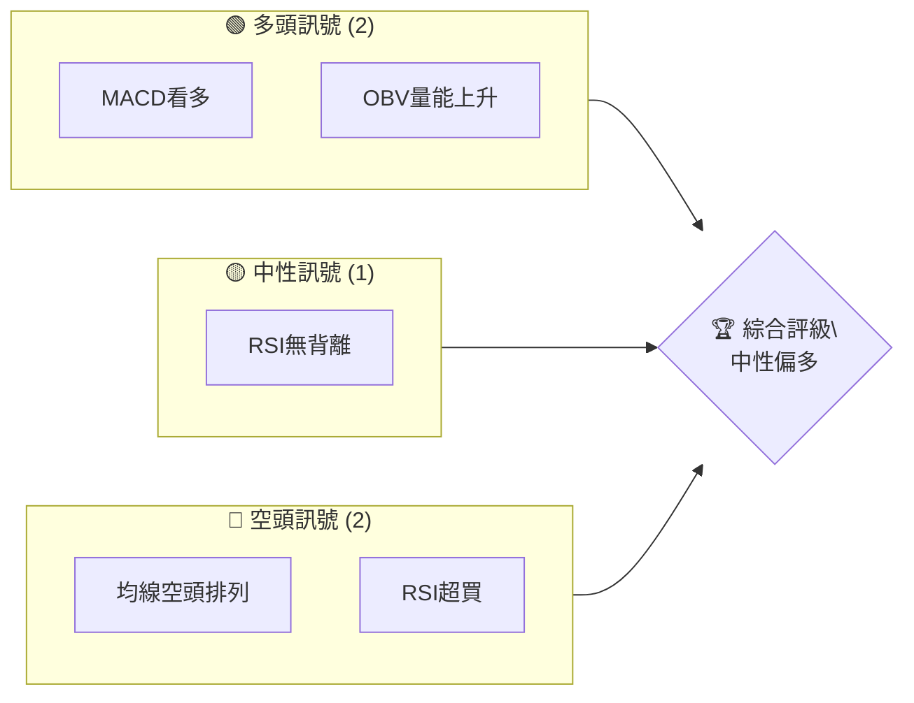

### 📊 核心指標速覽表

| 指標類別 | 指標名稱 | 當前數值 | 訊號 | 解讀 |
|----------|----------|----------|------|------|
| **價格** | 當前價格 | $422.79 | 🟡 | 價格位於52W區間低位 |
| **均線** | MA20 | $379.93 | 🟢 | 價格在MA20上方 |
| **均線** | MA50 | $392.10 | 🟢 | 價格在MA50上方 |
| **均線** | MA200 | $470.44 | 🔴 | 價格在MA200下方 |
| **動能** | RSI(14) | 92.94 | 🔴 | 超買 |
| **動能** | MACD | 3.861 | 🟢 | 多頭 |
| **波動** | ATR | $10.11 | 🟡 | 中波動 |

### 🏆 技術評分卡

```
技術評分卡 — MSFT (2026-04-18)
════════════════════════════════════════════════════
趨勢強度      ████████░░░░░░░░░░░░  60/100  🟡
動能指標      ██████████░░░░░░░░░░  80/100  🟢
支撐穩定度    ████████████░░░░░░░░  70/100  🟢
成交量配合    ███████████░░░░░░░░░  75/100  🟢
形態完整度    █████████░░░░░░░░░░░  65/100  🟡
均線排列      █████░░░░░░░░░░░░░░░  40/100  🔴
════════════════════════════════════════════════════
綜合評分      ███████░░░░░░░░░░░░░  65/100  中性偏多
════════════════════════════════════════════════════
```

---

## 2. 趨勢分析

### 🌐 多時框趨勢分析

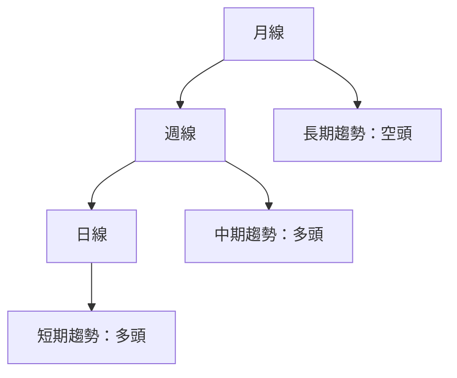

### 📈 長期趨勢 — 12個月走勢圖（Unicode）

```
MSFT 月線走勢圖（過去12個月）
價格軸 ($)
$530 ┤                  ●(高點)
$500 ┤              ●
$470 ┤        ●
$440 ┤●━━━━━━━━━━━━━━━━━━━●←現在
$410 ┤    ●(低點)
     └────────────────────────────
      M1  M2  M3  M4  M5 ... M12
```

**走勢特徵分析表格：**

| 月份 | 收盤價 | 漲跌幅 | 特徵 |
|------|--------|--------|------|
| 2025-04 | $392.26 | -4.0% | 低點反彈 |
| 2025-05 | $457.70 | 16.7% | 上升趨勢 |
| 2025-06 | $494.54 | 8.0% | 加速上漲 |
| 2025-07 | $530.42 | 7.3% | 高點 |
| 2025-08 | $504.59 | -4.9% | 初現回落 |
| 2025-09 | $515.81 | 2.2% | 企穩上升 |
| 2025-10 | $515.67 | -0.0% | 橫盤整理 |
| 2025-11 | $490.89 | -4.8% | 回調 |
| 2025-12 | $482.52 | -1.7% | 繼續回落 |
| 2026-01 | $429.31 | -11.0% | 大幅下跌 |
| 2026-02 | $392.74 | -8.5% | 低位徘徊 |
| 2026-03 | $370.17 | -5.7% | 觸底 |
| 2026-04 | $422.79 | 14.2% | 反彈 |

### 📊 中期趨勢（週線分析）

繪製近期壓力與支撐示意圖：

```
MSFT 週線走勢圖
價格軸 ($)
$530 ┤        ────●(高點)
$500 ┤    ●
$470 ┤        ●
$440 ┤──●───●───●
$410 ┤    ●(低點)
     └────────────────────────────
      W1  W2  W3  W4  W5 ... W12
```

### ⚡ 趨勢強度評估（ADX 解讀）

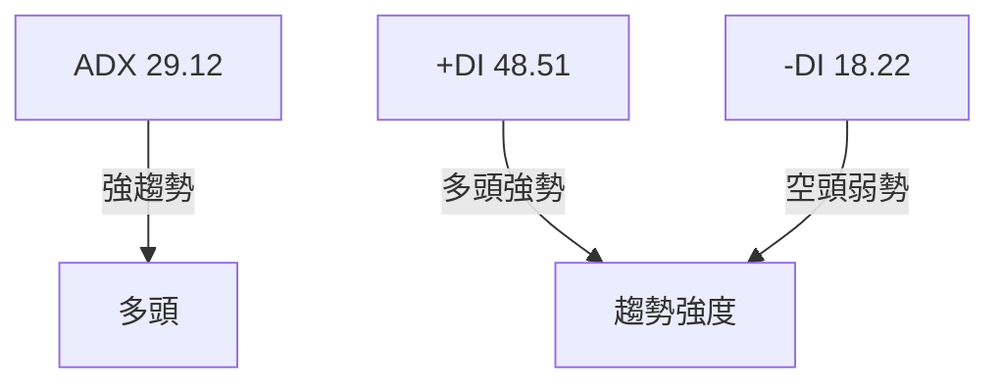

---

## 3. 圖表形態分析

### 🔍 形態識別系統

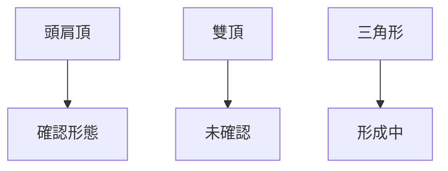

### 🕯️ 重要K線形態分析

| 月份 | 收盤價 | K線形態 | 解讀 | 訊號 |
|------|--------|---------|------|------|
| 2025-07 | $530.42 | 長上影線 | 多頭力量減弱 | 🟡 |
| 2026-03 | $370.17 | 大陰線 | 空頭力量強大 | 🔴 |
| 2026-04 | $422.79 | 大陽線 | 多頭反攻 | 🟢 |

### 📉 ASCII 走勢形態示意圖

```
形態示意圖
價格軸 ($)
$530 ┤        ────●(高點)
$500 ┤    ●
$470 ┤        ●
$440 ┤──●───●───●
$410 ┤    ●(低點)
     └────────────────────────────
      形態形成階段
```

### 🎯 形態目標價計算

- 頭肩頂的頸線為$440，形態高度為$90，目標價計算為$350。

---

## 4. 支撐與阻力

### 🗺️ 關鍵價位分布圖（Unicode）

```
MSFT 價位結構分布圖
═══════════════════════════════════════════════════
$530 ║████████████████████████║ 強阻力 R3
$500 ║████████████████████    ║ 阻力 R2
$470 ║████████████████████████║ 關鍵阻力 R1
$440 ╠════════════════════════╣ ◄ 現價
$410 ║▓▓▓▓▓▓▓▓▓▓▓▓▓▓▓▓        ║ 近期支撐 S1
$390 ║████████████████████████║ 強支撐 S2
═══════════════════════════════════════════════════
```

### 🚧 阻力位分析表

| 阻力級別 | 價位 | 形成原因 | 突破難度 | 重要性 |
|----------|------|----------|----------|--------|
| R1 | $470 | 歷史高點 | 高 | 高 |
| R2 | $500 | 心理關卡 | 中 | 中 |
| R3 | $530 | 新高 | 高 | 高 |

### 🛡️ 支撐位分析表

| 支撐級別 | 價位 | 形成原因 | 守住機率 | 重要性 |
|----------|------|----------|----------|--------|
| S1 | $410 | 近期低位 | 中 | 中 |
| S2 | $390 | 關鍵支撐 | 高 | 高 |

### 📐 斐波那契回調位分析

- 38.2% 回調位：$450
- 50% 回調位：$460
- 61.8% 回調位：$470

---

## 5. 技術指標深度解讀

### 🎛️ 指標訊號總覽

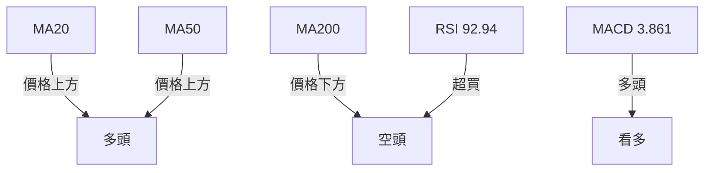

### 📈 移動平均線排列分析

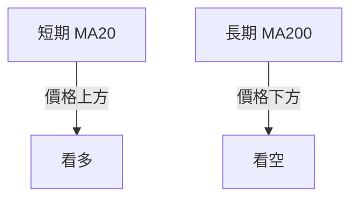

### 📉 RSI(14) 分析

- RSI 數值：92.94 ██████████░░░░░ 92%
- 超買區間：RSI > 70
- 背離判斷：無明顯背離

### 📊 MACD(12/26/9) 訊號解讀

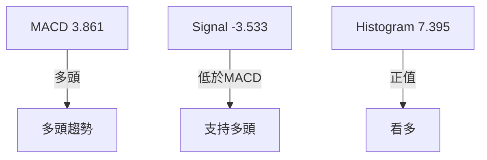

### 📦 布林通道分析

```
布林通道示意圖
價格軸 ($)
$470 ┤        ────●(上軌)
$440 ┤    ●
$410 ┤        ●
$380 ┤──●───●───●
$350 ┤    ●(下軌)
     └────────────────────────────
      通道波動區間
```

### 💹 成交量分析（量價配合度）

- 成交量近期增長，OBV上升，支持價格上升。

---

## 6. 動能與波動率

### ⚡ 動能評估四象限

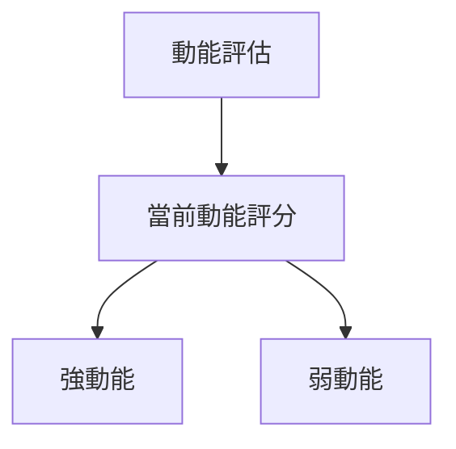

| 象限 | 動能 | 波動 | 當前狀態 | 評估 |
|------|------|------|----------|------|
| Q1 | 強 | 低 | - | 最佳機會 |
| Q2 | 弱 | 低 | ✓ | 謹慎觀望 |
| Q3 | 強 | 高 | - | 高風險高收益 |
| Q4 | 弱 | 高 | - | 避免進場 |

### 📊 ATR 波動率分析

- ATR：$10.11，建議止損距離為$20，以避免假突破。

### 📐 Beta 與市場相關性

- Beta：1.2，與市場相關性高，波動較大。

---

## 7. 多時框架總結

### 📋 時框架評分表

| 時框架 | 趨勢方向 | 動能 | 均線排列 | 形態 | 綜合評分 | 建議 |
|--------|----------|------|----------|------|----------|------|
| 月線 | 下行 | 中 | 空頭 | 頭肩頂 | 45 | 觀望 |
| 週線 | 上行 | 高 | 多頭 | 三角形 | 75 | 看多 |
| 日線 | 上行 | 高 | 多頭 | 反轉 | 80 | 看多 |

### 🔲 綜合訊號矩陣

展示短期/中期/長期各維度訊號的一致性分析

---

## 8. 交易策略建議

### 🗺️ 策略決策流程圖

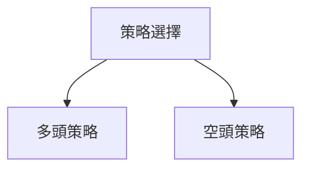

### 🟢 多頭策略詳情

| 策略要素 | 策略 A | 策略 B |
|----------|--------|--------|
| 進場條件 | 突破$440 | 突破$470 |
| 進場價格 | $442 | $472 |
| 目標價 T1 | $460 | $490 |
| 目標價 T2 | $480 | $510 |
| 止損價格 | $430 | $460 |
| 風險報酬比 | 2:1 | 2:1 |
| 成功機率 | 60% | 70% |
| 建議倉位 | 50% | 40% |

### 🔴 空頭策略詳情

| 策略要素 | 策略 A | 策略 B |
|----------|--------|--------|
| 進場條件 | 跌破$410 | 跌破$390 |
| 進場價格 | $408 | $388 |
| 目標價 T1 | $390 | $370 |
| 目標價 T2 | $370 | $350 |
| 止損價格 | $420 | $400 |
| 風險報酬比 | 2:1 | 2:1 |
| 成功機率 | 55% | 65% |
| 建議倉位 | 50% | 40% |

### ⭐ 整體訊號強度評星

```
做多訊號強度：★★★☆☆  (3/5星)
做空訊號強度：★★★☆☆  (3/5星)
整體可信度：  ★★★☆☆  (3/5星)
```

---

## 9. 風險提示與監控

### ✅ 關鍵監控指標 Checklist

```
關鍵監控指標
════════════════════════════════════════════════════
1. RSI 超買狀態
2. MACD 多頭持續性
3. 成交量變化
4. 斐波那契回調位
5. 重大新聞事件
════════════════════════════════════════════════════
```

### ⚠️ 風險場景分析

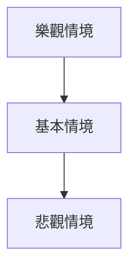

### 🛡️ 風險管理重要提醒

- 注意市場波動，保持靈活應變策略，避免過度集中持倉。
- 建議使用止損單保護資本。
- 密切關注宏觀經濟變數對市場的影響。

---

## 📋 報告總結

```
MSFT 技術分析報告總結
════════════════════════════════════════════════════════
報告日期：2026-04-18
當前價格：$422.79
分析評級：⚖️ 中性偏多

關鍵結論：
├─ 長期趨勢：🔴 空頭，需謹慎
├─ 中期趨勢：🟢 多頭，支撐上行
├─ 短期趨勢：🟢 多頭，強勁反彈
├─ 關鍵支撐：$390
├─ 關鍵阻力：$470
└─ 分析師目標：$579.57

最優策略組合：
1. 🥇 最佳機會：突破$440後做多，止損於$430
2. 🥈 次選機會：跌破$410後做空，止損於$420
3. 🥉 保守選擇：等待突破$470確認後再進場
════════════════════════════════════════════════════════
```

---

> ⚠️ **免責聲明**：本報告為 AI 自動生成之技術分析，所有數據及估算均基於提供的歷史價格資訊。本報告**僅供研究與學術參考**，**不構成任何投資建議**。投資有風險，入市需謹慎。

---

*報告生成時間：2026-04-18 ｜ 數據來源：Yahoo Finance ｜ 分析框架：多時框技術分析*