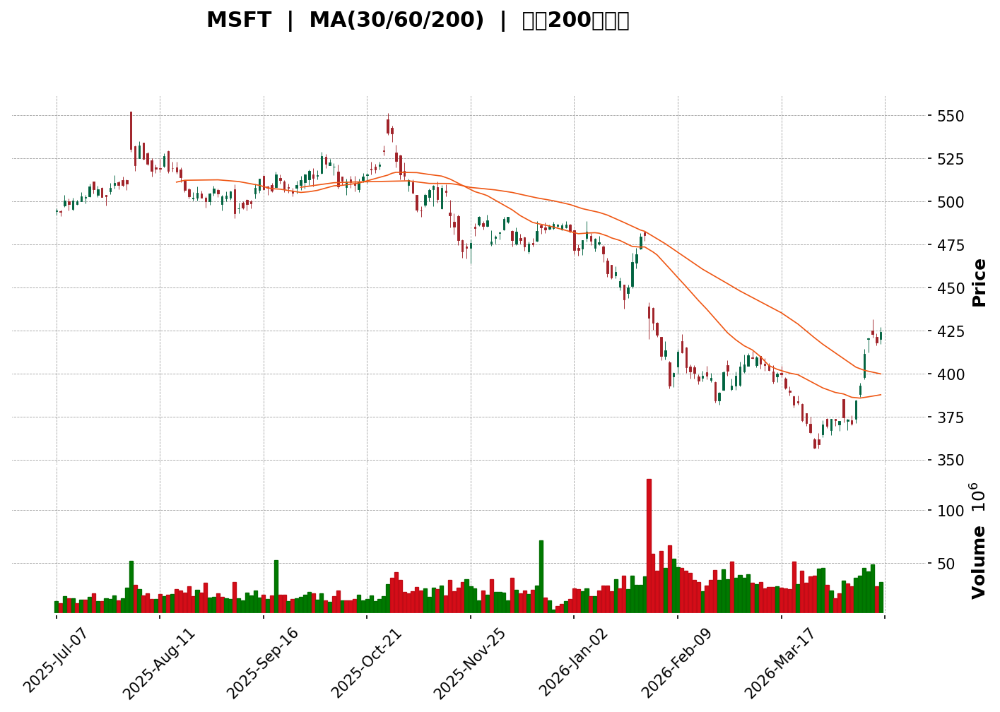
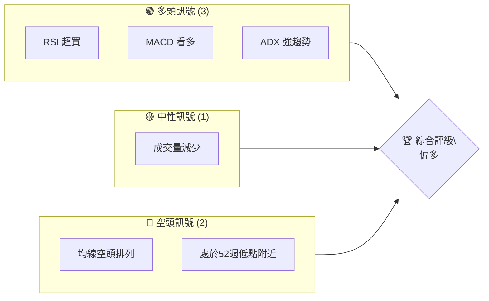
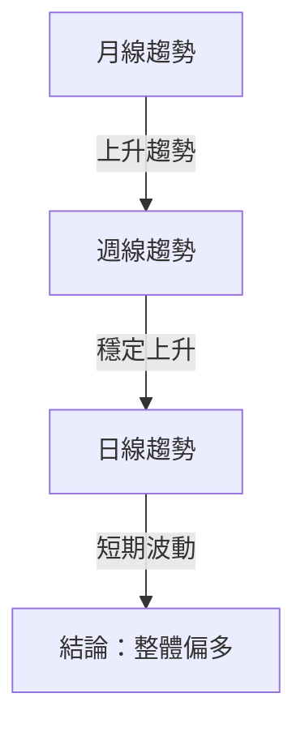
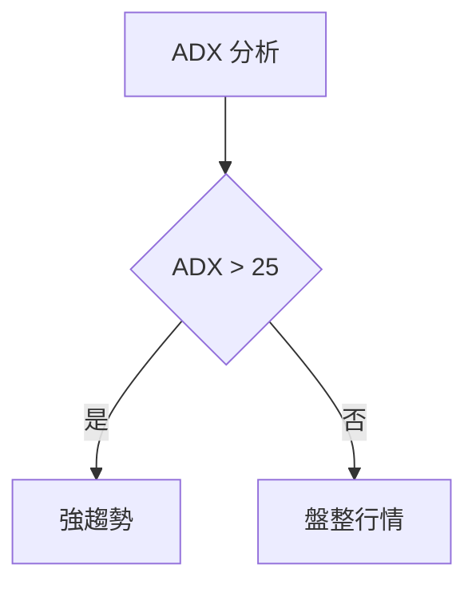
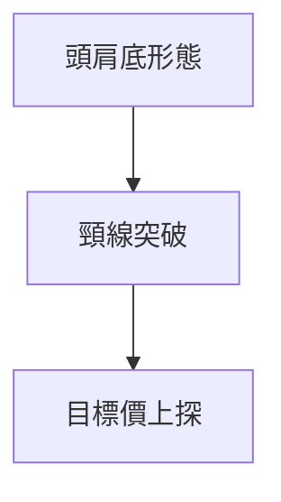
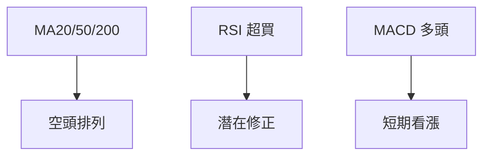
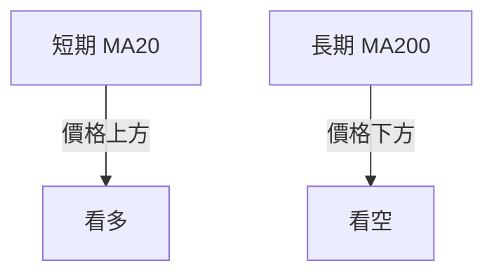
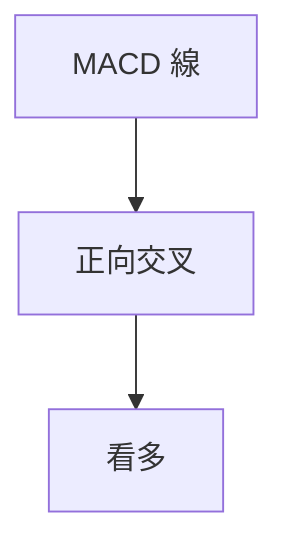
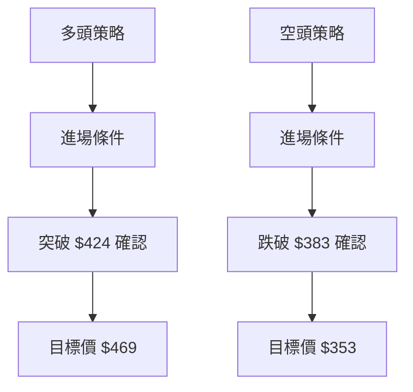
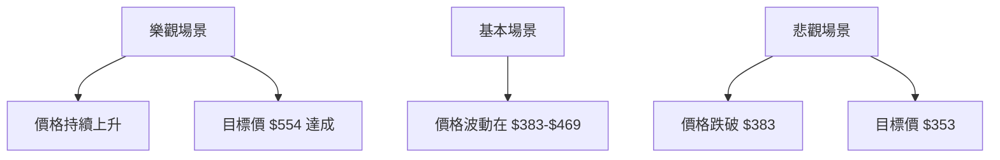

<details>
<summary>📊 靜態圖表 (點擊展開)</summary>

</details>

<html>
<head><meta charset="utf-8" /></head>
<body>
    <div>                        <script>window.PlotlyConfig = {MathJaxConfig: 'local'};</script>
        <script charset="utf-8" src="https://cdn.plot.ly/plotly-3.5.0.min.js" integrity="sha256-fHbNLP+GlIXN+efbQec78UkemUz3NJp7UmfGxC1tNxs=" crossorigin="anonymous"></script>                <div id="candlestick-chart" class="plotly-graph-div" style="height:500px; width:100%;"></div>            <script>                window.PLOTLYENV=window.PLOTLYENV || {};                                if (document.getElementById("candlestick-chart")) {                    Plotly.newPlot(                        "candlestick-chart",                        [{"close":{"dtype":"f8","bdata":"AAAAwIbtfkAAAAAgB9x+QAAAAMChSX9AAAAAwFYpf0AAAADgm0Z\u002fQAAAACDWQX9AAAAAwGBuf0AAAABgMmt\u002fQAAAACDqy39AAAAAoKqxf0AAAACA07F\u002fQAAAAOCgZX9AAAAAQCxvf0AAAADg3r5\u002fQAAAAKDj639AAAAA4KPYf0AAAAAAwdl\u002fQAAAAIBp5H9AAAAAoFmTgEAAAADgqUiAQAAAAOBepIBAAAAAoJ1lgEAAAAAARE+AQAAAAKCnLoBAAAAAIDM4gEAAAABgDTaAQAAAAIB3cYBAAAAAQJYsgEAAAADgsjuAQAAAAGBTKYBAAAAAYOgQgEAAAABgNq1\u002fQAAAAGDJbH9AAAAAAG5if0AAAACAEpJ\u002fQAAAAMC\u002fYn9AAAAAQGA\u002ff0AAAACgQ4p\u002fQAAAAOB4uH9AAAAAwHeJf0AAAACgc3B\u002fQAAAAOAddH9AAAAAAN2df0AAAADgM89+QAAAAMAwAn9AAAAAYIkFf0AAAABAxCR\u002fQAAAAOD2Ln9AAAAAgJ28f0AAAACAzgmAQAAAAIDprn9AAAAA4Ia+f0AAAADggqV\u002fQAAAAABIHoBAAAAAgI4CgEAAAACg8LF\u002fQAAAACCZwH9AAAAAoOKOf0AAAADAeNV\u002fQAAAAGDAA4BAAAAA4HAegEAAAACAdiyAQAAAAIDVDIBAAAAAAKkZgEAAAACgDHOAQAAAACB7ToBAAAAAgGlVgEAAAADA5EGAQAAAAECBzX9AAAAAYL3+f0AAAACAF\u002fd\u002fQAAAAGDc9H9AAAAAgNzXf0AAAACAQPd\u002fQAAAAOAyFYBAAAAAYCEcgEAAAABAEzOAQAAAAAA8M4BAAAAAgIhLgEAAAABAjYqAQAAAACCa3oBAAAAAgHXagEAAAACAqVyAQAAAAEBTHYBAAAAAgBwXgEAAAADgmQGAQAAAAOD0kH9AAAAAwKnwfkAAAACgM+x+QAAAACB5fn9AAAAAAC2pf0AAAACAX9B\u002fQAAAAABLU39AAAAAgBPBf0AAAADgNpZ\u002fQAAAAEDsu35AAAAA4KRRfkAAAACgctV9QAAAAMC3cH1AAAAAwLqOfUAAAADAdb59QAAAAGBPRn5AAAAAwDuufkAAAADgGlp+QAAAAIAljn5AAAAAAEbKfUAAAACA6\u002ft9QAAAAKD0IH5AAAAA4G2efkAAAACAZK5+QAAAAOCF131AAAAAgOclfkAAAABgC9d9QAAAAMDRm31AAAAA4OG0fUAAAABgkrB9QAAAAMALLn5AAAAA4ANNfkAAAABADT1+QAAAAIDcW35AAAAAwIlufkAAAAAAl2l+QAAAACDaX35AAAAAIOtlfkAAAACATCh+QAAAAODOfX1AAAAAAF98fUAAAACgudZ9QAAAAIDnJX5AAAAA4FbQfUAAAABgBON9QAAAAEB+wX1AAAAAIJJZfUAAAACgV6V8QAAAAODreXxAAAAAIAGtfEAAAABAwld8QAAAAACUsXtAAAAAYM0hfEAAAAAAOQ59QAAAAEBYU31AAAAAAMX3fUAAAAAAiAh+QAAAAIA0CHtAAAAAQPbUekAAAACAfmZ6QAAAAIBgpHlAAAAA4PLTeUAAAABgYIx4QAAAAMCfA3lAAAAAwIfKeUAAAAAAQ8V5QAAAAKAvN3lAAAAAYMwOeUAAAABgfwZ5QAAAAMBMv3hAAAAAQArreEAAAAAgXOd4QAAAACCu03hAAAAAIIUHeEAAAAAAAFB4QAAAAKCZCXlAAAAAIIUbeUAAAAAA14t4QAAAAMDM6HhAAAAAQOE+eUAAAABAM1N5QAAAAEDhqnlAAAAAIFyPeUAAAABgj5Z5QAAAAAApXHlAAAAAgBROeUAAAACAwh15QAAAAMDMuHhAAAAAQDP\u002feEAAAABgj\u002fZ4QAAAAOCjfHhAAAAA4FFQeEAAAACA6913QAAAAAAA8HdAAAAAANdLd0AAAADgozB3QAAAACCF33ZAAAAA4FFMdkAAAAAgXG92QAAAAGC4IndAAAAAgOsVd0AAAAAgXFd3QAAAAIAUTndAAAAA4KNEd0AAAACgR2V3QAAAAMAeUXdAAAAAgOstd0AAAACA6wV4QAAAAIDCkXhAAAAAIIWzeUAAAAAAKUR6QAAAAOCjbHpAAAAAwB4hekAAAABgj4J6QA=="},"high":{"dtype":"f8","bdata":"ho46Qun9fkCpND9\u002fKfV+QLtwy0SmfX9A327u2WxYf0DGsBuMz2F\u002fQFEto+byUH9AwTL+FNSVf0BbhlX6sXx\u002fQED7Zd565n9AbL81yq76f0BCJ\u002f95HtJ\u002fQAJ8KPf1w39AdblG3M59f0Dkt7mfQOt\u002fQIlKsmNfGoBA3YvQXTQAgEBjQ00kCxWAQO\u002fh8NHCB4BAQFmfnu9BgUD5iuS5pKWAQJWApEAhuYBAu8dBCpOxgEAsfXaKCIWAQFWIU95RaIBAf\u002fqo4glNgEBnydXoV2SAQJBQPWtOf4BAsczSo\u002fyMgEDP+XV0TFeAQKHzpdt9WIBAKdmYV2c+gEAa4sgeegGAQGzdflfHwH9A0JF+\u002f3GYf0ARAxEi18l\u002fQChc61ZeoX9AzBmtoThuf0CSGagrB5N\u002fQCZHtGeTz39AK+Hvw9W3f0DLJsQyeX5\u002fQBd+17z+mn9ABbFtMrugf0BeljUomd1\u002fQBe3It39MX9AJGXA3bhCf0CILRJdVlJ\u002fQAofr5xhUX9AvAsS7dbmf0BKNDXRrgqAQFrKYFq0GIBAQiI0VcPSf0DHKJ4CIO9\u002fQDRegyEyKYBAN23jeMQcgECgtcEqrAOAQF\u002fXdjq55X9A25D4M16+f0CDHiHP\u002fPx\u002fQPiW4kqtFYBAMAQlGB0ggECouyEX1jKAQLDzJQ2FO4BA\u002fi9wHq0ygECFHAXjpYaAQHpo+CPZfIBAA6CJkCRmgEA\u002fDLMBRVGAQPo3TGhLS4BAYbkd7CsSgEDwDEdfKwmAQHnLb8xiGIBAkMcsT60VgEC0OvdCwwqAQBEb9WxqJIBAZrytI1YkgEAU8ImZcFiAQK7Gzv89ToBADp87PmVZgEDeJ28s7qKAQLLCmHJqO4FAZkYxGBAAgUCwZMpjCaaAQOzawSEGeYBAK6Cj3klWgEDIMkwHUguAQLvMQZOVBYBA0NMlgLF5f0AvtrXz\u002fRR\u002fQBd9\u002f1QEjH9APs4KxdW3f0AS95Zi0dh\u002fQMa8E\u002fH59X9AJFHcybPXf0AqthLX\u002fN9\u002fQOultJ5aTn9AWHJtvTrSfkACqIHnIsd+QPYIdTJF3X1A9kxBEwa9fUC6Zhz68OB9QFv4\u002fekqc35ACtKKdyG4fkDyKdtF6Yt+QDuog9oExn5AcT\u002feJjIyfkAKn8kllQN+QO2i7mLJJH5AYXKPz9yyfkD5yDIx\u002fa9+QA8r3AxbMn5A9FgOX8VOfkCPdJwvnxV+QOVrYxcB+n1AM2Up4tPMfUDve+2ugu59QAirMtTCh35A62JnH9NrfkD3lER233l+QMJ58luBa35AqqvBnbyAfkBkhfmMInB+QGGjJnfOc35AE8bCugmJfkDQgtVWdHB+QL0WV67mOH5AXvbyFsavfUDUn9V6Zdp9QG6RiYNbiX5AwQYnT\u002fkYfkCFm4o2o+t9QGumH3ZQ\u002fn1AGn\u002f29SSrfUAXwjEbJDJ9QNZySbQV83xAMQFl0CnifEDRxZzbJ3x8QJST+beLOnxAqHOapPA8fEBvIFpWb2B9QPrYFFi4kn1AS7fOg1McfkBPs5XRNip+QMKFSY3gl3tAIoWwKJVpe0Dg0o5BJdx6QNV+ZANsUXpA+OYwDIEtekCPq41J7HV5QD3I3g8ADnlA0Tamlx\u002ffeUCv8+9FcWt6QBLOJnov+HlAAaK8VGZUeUCYyCQj3Ul5QAfvZ\u002fy5+XhApyfQw0oaeUAAAABA4UZ5QAAAAIDrAXlAAAAAgMK1eEAAAACAwlV4QAAAACCFF3lAAAAAANd3eUAAAADAHs14QAAAAEAKE3lAAAAAQDNreUAAAADgerB5QAAAAIDCuXlAAAAAwMzQeUAAAAAgXKN5QAAAAEAzo3lAAAAAACmQeUAAAACA62F5QAAAAMDMTHlAAAAAgBQKeUAAAABgZkZ5QAAAAAAA4HhAAAAAANeHeEAAAAAAADB4QAAAACBcM3hAAAAAIIXnd0AAAADA9ZB3QAAAACCFa3dAAAAAQDOndkAAAACAwtV2QAAAAGBmTndAAAAAANdfd0AAAACAPVp3QAAAACCuW3dAAAAAQDNHd0AAAAAAABB4QAAAAAAAWHdAAAAAgD16d0AAAADgowh4QAAAAEAKq3hAAAAAgOvleUAAAADAHk16QAAAAKBH+XpAAAAAoEd1ekAAAABA4bJ6QA=="},"hovertemplate":"\u003cb\u003e%{x|%Y-%m-%d}\u003c\u002fb\u003e\u003cbr\u003e\u958b: $%{open:.2f}\u003cbr\u003e\u9ad8: $%{high:.2f}\u003cbr\u003e\u4f4e: $%{low:.2f}\u003cbr\u003e\u6536: $%{close:.2f}\u003cextra\u003e\u003c\u002fextra\u003e","low":{"dtype":"f8","bdata":"Fo6ep+rFfkDKeeOAGbR+QPnQae+oDX9A8pBm3QDufkD8tdR1zO5+QKULkTMuIn9A6ur4jS0+f0CrItyc3C9\u002fQILsQTUya39A6pUGG\u002f2Hf0CbePEwFWp\u002fQAAAAOCgZX9AZLoaTu4cf0B7bszQ64V\u002fQE0CHCCZtn9AGZqprceyf0D00cDkr8l\u002fQM2nCqX2p39AybHHzJ+GgEAYgTdR0C6AQD5FPDWjaIBA\u002f3FUKI9hgEC0520jB0iAQPZDi4p8FIBALkSm+0cjgED0uZwfvyWAQIQZUftyPYBAcY8HcPYigEAOfZtNFimAQHhWegSoIIBA2jpfHNLwf0Btmnsczpl\u002fQKXP38dsWH9A6blE6DVKf0AE58GBRUV\u002fQEYp+5+EYH9AhFBBQCEHf0B5Qk0FRx1\u002fQMj4TJmBdn9AQwoU0Wlmf0AIAmXUCux+QKxxFWXWQ39AxsChARBRf0DWrxv8S6V+QEWXHCWuz35AqAP3Sjn6fkCOzzfJm+p+QJZbUncX\u002fX5AL3CLXjdcf0BZNi5NaI5\u002fQOZnnrbmp39AZuz1n1t9f0DbQnNm7Jh\u002fQNqFjMAlw39AaIoH5q3mf0BaxSnRWJN\u002fQFbDl+khjX9AqggWYS1vf0BY0I44Woh\u002fQN3P98VcrH9AEUiafcq4f0CK\u002f9III9l\u002fQFmA7hMLyX9AABA9LvAGgEBoSmjSbiCAQHSCo8o+OoBAjvUVDWRHgEAJAr4nDxqAQO8AJS9QuH9A\u002fbI7E\u002frYf0AM3VAneX5\u002fQHEYF041vn9AwGglh2mgf0Bv79XZWJN\u002fQMYxUT7c9H9AWioqnaXuf0AFnx2AhxyAQAREv+myI4BAYv07+G00gECtg3wJjnaAQKAWbMY+1IBAURzeAA+0gEAJ1QSfqT+AQAtr7hu8B4BA7eCoEawDgEBoFjm1ypt\u002fQFpxm\u002fa2h39ALmicwRvcfkAfhg9uUbN+QNxeyQDAC39ADkmWvlBEf0CVG3Ri2RB\u002fQCt2nexsM39A1bD+mBT2fkBodxsDG21\u002fQAs8OCc6TH5AgYCZxEkNfkBTV3a0rKZ9QHD0TQlCM31A+Z1bZ0QvfUBegp8dTf18QLmj9ruqAX5AH0DvHqtYfkBq7KO+vTh+QHwiSJNmU35AAJddueKhfUDrrFNzerZ9QCBdH6yh3H1AQQpCb240fkAcHkd1M3Z+QIxt6DX4n31Asny822usfUBDimONFbR9QLpUOFQad31A4jBPRexcfUD6V3BSsZ59QN5CGu7TzH1AEjt+fkIWfkAO7\u002fLscxl+QEhSao4tOn5Ane9pQZ07fkA3r7pSp01+QKO1o\u002fw8MX5A4Bf7d09GfkBt0yG8MCN+QNmsO+5tUX1AH3B9n+RGfUAO4tdV4kp9QL+QBR3JzX1AX4e03GusfUCUV+\u002fJ\u002fnF9QAzo1z2MqX1AVynNBjkOfUCeqB0dEIJ8QESJyPbJbXxAcnPlRgx3fEAo+IUgHAR8QJqFJ2blWntA7gcfMv+6e0Ct+2F1EBh8QBjYtZsqz3xAv77K9VGBfUAQbA5clc59QM43e8j6QHpAPoaDcamXekCTVmFynVR6QEnf3dcSenlAyDbky+2EeUA546JX03Z4QGivqExngHhAtvpkXVD\u002feEA4ZgyxKbx5QB+CWXeMAXlA58SbeajReEBTAWrgS9J4QEFnsdsamnhAO7xV+K22eEAAAABguMp4QAAAAGCPsnhAAAAAoJnxd0AAAAAgXNt3QAAAAGCPYnhAAAAAANfreEAAAACAFF54QAAAAIAUanhAAAAAYLiKeEAAAADA9QR5QAAAAGBmRnlAAAAAACmIeUAAAAAAADh5QAAAAEDhLnlAAAAAoHAZeUAAAAAgXBt5QAAAAAAApHhAAAAA4KOseEAAAAAAANx4QAAAAAAAcHhAAAAAwPUweEAAAACA68F3QAAAAEDh2ndAAAAAoJk9d0AAAACAFBp3QAAAAEAK03ZAAAAAAClIdkAAAADgekR2QAAAAMAesXZAAAAAQDMDd0AAAABgZsJ2QAAAAAAAGHdAAAAAwPXodkAAAABgjzZ3QAAAAMDM8HZAAAAA4Hogd0AAAADgUTB3QAAAAOBRKHhAAAAAIK7LeEAAAACAPcJ5QAAAAEAKS3pAAAAAwMwEekAAAACA1xN6QA=="},"name":"\u50f9\u683c","open":{"dtype":"f8","bdata":"N+YMKx7ofkBeNj714+V+QMjICnCRFn9Af4EHPFBCf0DhWyj8dPl+QKfWI5z5KX9A\u002fhcwHdZBf0APl6qIMmR\u002fQJ3Y54kmbH9Aob1lEyP4f0BiseAfiXx\u002fQJj3IEhNwH9AVcaS7it9f0AbA2IqTp1\u002fQKNh27Up2H9Al6QuP8bxf0CRZducawSAQGzs5ouOAYBAxs\u002fimC9AgUCKJE\u002fQR5+AQP75QE3AaYBAp2CbtZ6wgEA2Utqgq36AQIY4ryAPXoBADxpUYKc8gECZTT17RDqAQNZW6e\u002fMRYBADhl3PkuIgEA+pLPNVTyAQK5U8X4BPoBAXW4C5J40gED0jTFjNACAQGuw+5LNrn9AciM4lKpZf0BkpwDslmJ\u002fQE222AyDiH9A29EAhldkf0BzHnMGvT5\u002fQBrwA0HXj39AA96xdduof0ANsJsfXCZ\u002fQL2t75VCW39ANeIU4GJjf0ArlKz4Y69\u002fQPor7IbBAH9ACP1uBqg1f0A8vaKaWk5\u002fQPQhode4Qn9AffZNoNSIf0ACNILQ7ap\u002fQPjeOZLqFYBAPhSZUhbIf0B8roQP89V\u002fQMJF94Ihx39AZLfUlKMLgEAA4w28wfp\u002fQNNGOFlDxH9Ah5Bb9R6jf0B30SUfKr9\u002fQCx1GdUb1n9AnlFFZNXxf0CSAERkWAWAQC2sx6L4G4BAVAbMHqsXgEAMcE\u002f4siOAQAVRaHLRcIBAIpyQkOdIgECue0NiakGAQGMFjbLnK4BAYbkd7CsSgEDSX0yH38F\u002fQIrMEbaeBoBAQ9zSS1Hnf0AdG72h6a5\u002fQDlQLL3UA4BAMFBSG9sagECZWIdz7zeAQKSGyCJfQoBA+FhaFABFgECcC36Ln4yAQBUlFH\u002fHHYFARXrVf3f1gEC69Tv4Q4KAQHVWFL2EdYBATX83TEItgEBwNJaXQNp\u002fQE6MWxrK8n9AW4jgTQ55f0BvqXrrRe5+QK\u002fvNhiCH39A+1YTUFprf0Dv5mixArR\u002fQIp7DM0lw39A00qIEqsCf0Cl6kjXgqV\u002fQCtfTRMZ1X5AgPrUcyCBfkBbXh5NaLl+QDXCZL2Q1n1A1uImbLGefUDSNKa82I99QJZ1zZE9U35A67pxgtVnfkB4WpdEPnV+QFa2JzjJWX5At\u002fvvxsOzfUBzCOPyrep9QDYtRxi9Fn5Af+1urZI8fkCue4p8x39+QIhGM\u002frXLn5AD2oHrba4fUB7eag3o+t9QFNc4F8b8H1AnoXIiV1tfUC8bYnhLr19QHWFxeGd0X1AXhSEkQBkfkDNTJ0uNVB+QPm5R3ECPn5AR7Cu8y5JfkAgZNhToFl+QH0q5uQXPH5AymU4tSxNfkDsNzxDqmt+QIPjCFOXNH5ANFuo1q+PfUDhZ\u002fZOiYt9QJIl+\u002fqt6n1ALV31LU4CfkB6YZLwr499QGb2xiFauX1AGYelmJWZfUBR4Rc2XRZ9QN3Rt2oC8XxA0+hYL5mMfEDefwJIFCN8QN0F4O4bOXxAA+Z5NZzpe0DbgJyVdC18QMZ\u002fznsBBH1AEWdVzPCJfUCfBCrjwCF+QDrf1PbOb3tAJrB367die0BcnHvrKdR6QLTz2qLIUHpAPxxAYQaheUAVuBXPMWh5QO62MQAt5HhAAaO2Xdk+eUAHss9koSp6QOqYwza383lAkac9Rj5BeUAekeytdjh5QMXimVz55HhAhTw61pLTeEAAAABACgt5QAAAAIDCwXhAAAAAAACweEAAAACAPQJ4QAAAAOB6aHhAAAAAIFxLeUAAAACAFG54QAAAAIDCjXhAAAAAgD2SeEAAAADgURR5QAAAAGC4RnlAAAAAQDOTeUAAAABguE55QAAAAOB6oHlAAAAAwB5ZeUAAAACAFEp5QAAAAAAAEHlAAAAAwB7heEAAAADgUQR5QAAAAIAU0nhAAAAAoJlheEAAAADgoyx4QAAAAGBm\u002fndAAAAAgMLld0AAAABguI53QAAAAMAeLXdAAAAAYGaedkAAAABgZp52QAAAAMDMyHZAAAAAANdXd0AAAAAgXPN2QAAAAADXV3dAAAAAoHAld0AAAAAgrg94QAAAAAAASHdAAAAAIK5Pd0AAAACAwll3QAAAAGC4PnhAAAAAAADgeEAAAACAwj16QAAAAMAejXpAAAAAYGZSekAAAACgmT96QA=="},"x":["2025-07-07T00:00:00-04:00","2025-07-08T00:00:00-04:00","2025-07-09T00:00:00-04:00","2025-07-10T00:00:00-04:00","2025-07-11T00:00:00-04:00","2025-07-14T00:00:00-04:00","2025-07-15T00:00:00-04:00","2025-07-16T00:00:00-04:00","2025-07-17T00:00:00-04:00","2025-07-18T00:00:00-04:00","2025-07-21T00:00:00-04:00","2025-07-22T00:00:00-04:00","2025-07-23T00:00:00-04:00","2025-07-24T00:00:00-04:00","2025-07-25T00:00:00-04:00","2025-07-28T00:00:00-04:00","2025-07-29T00:00:00-04:00","2025-07-30T00:00:00-04:00","2025-07-31T00:00:00-04:00","2025-08-01T00:00:00-04:00","2025-08-04T00:00:00-04:00","2025-08-05T00:00:00-04:00","2025-08-06T00:00:00-04:00","2025-08-07T00:00:00-04:00","2025-08-08T00:00:00-04:00","2025-08-11T00:00:00-04:00","2025-08-12T00:00:00-04:00","2025-08-13T00:00:00-04:00","2025-08-14T00:00:00-04:00","2025-08-15T00:00:00-04:00","2025-08-18T00:00:00-04:00","2025-08-19T00:00:00-04:00","2025-08-20T00:00:00-04:00","2025-08-21T00:00:00-04:00","2025-08-22T00:00:00-04:00","2025-08-25T00:00:00-04:00","2025-08-26T00:00:00-04:00","2025-08-27T00:00:00-04:00","2025-08-28T00:00:00-04:00","2025-08-29T00:00:00-04:00","2025-09-02T00:00:00-04:00","2025-09-03T00:00:00-04:00","2025-09-04T00:00:00-04:00","2025-09-05T00:00:00-04:00","2025-09-08T00:00:00-04:00","2025-09-09T00:00:00-04:00","2025-09-10T00:00:00-04:00","2025-09-11T00:00:00-04:00","2025-09-12T00:00:00-04:00","2025-09-15T00:00:00-04:00","2025-09-16T00:00:00-04:00","2025-09-17T00:00:00-04:00","2025-09-18T00:00:00-04:00","2025-09-19T00:00:00-04:00","2025-09-22T00:00:00-04:00","2025-09-23T00:00:00-04:00","2025-09-24T00:00:00-04:00","2025-09-25T00:00:00-04:00","2025-09-26T00:00:00-04:00","2025-09-29T00:00:00-04:00","2025-09-30T00:00:00-04:00","2025-10-01T00:00:00-04:00","2025-10-02T00:00:00-04:00","2025-10-03T00:00:00-04:00","2025-10-06T00:00:00-04:00","2025-10-07T00:00:00-04:00","2025-10-08T00:00:00-04:00","2025-10-09T00:00:00-04:00","2025-10-10T00:00:00-04:00","2025-10-13T00:00:00-04:00","2025-10-14T00:00:00-04:00","2025-10-15T00:00:00-04:00","2025-10-16T00:00:00-04:00","2025-10-17T00:00:00-04:00","2025-10-20T00:00:00-04:00","2025-10-21T00:00:00-04:00","2025-10-22T00:00:00-04:00","2025-10-23T00:00:00-04:00","2025-10-24T00:00:00-04:00","2025-10-27T00:00:00-04:00","2025-10-28T00:00:00-04:00","2025-10-29T00:00:00-04:00","2025-10-30T00:00:00-04:00","2025-10-31T00:00:00-04:00","2025-11-03T00:00:00-05:00","2025-11-04T00:00:00-05:00","2025-11-05T00:00:00-05:00","2025-11-06T00:00:00-05:00","2025-11-07T00:00:00-05:00","2025-11-10T00:00:00-05:00","2025-11-11T00:00:00-05:00","2025-11-12T00:00:00-05:00","2025-11-13T00:00:00-05:00","2025-11-14T00:00:00-05:00","2025-11-17T00:00:00-05:00","2025-11-18T00:00:00-05:00","2025-11-19T00:00:00-05:00","2025-11-20T00:00:00-05:00","2025-11-21T00:00:00-05:00","2025-11-24T00:00:00-05:00","2025-11-25T00:00:00-05:00","2025-11-26T00:00:00-05:00","2025-11-28T00:00:00-05:00","2025-12-01T00:00:00-05:00","2025-12-02T00:00:00-05:00","2025-12-03T00:00:00-05:00","2025-12-04T00:00:00-05:00","2025-12-05T00:00:00-05:00","2025-12-08T00:00:00-05:00","2025-12-09T00:00:00-05:00","2025-12-10T00:00:00-05:00","2025-12-11T00:00:00-05:00","2025-12-12T00:00:00-05:00","2025-12-15T00:00:00-05:00","2025-12-16T00:00:00-05:00","2025-12-17T00:00:00-05:00","2025-12-18T00:00:00-05:00","2025-12-19T00:00:00-05:00","2025-12-22T00:00:00-05:00","2025-12-23T00:00:00-05:00","2025-12-24T00:00:00-05:00","2025-12-26T00:00:00-05:00","2025-12-29T00:00:00-05:00","2025-12-30T00:00:00-05:00","2025-12-31T00:00:00-05:00","2026-01-02T00:00:00-05:00","2026-01-05T00:00:00-05:00","2026-01-06T00:00:00-05:00","2026-01-07T00:00:00-05:00","2026-01-08T00:00:00-05:00","2026-01-09T00:00:00-05:00","2026-01-12T00:00:00-05:00","2026-01-13T00:00:00-05:00","2026-01-14T00:00:00-05:00","2026-01-15T00:00:00-05:00","2026-01-16T00:00:00-05:00","2026-01-20T00:00:00-05:00","2026-01-21T00:00:00-05:00","2026-01-22T00:00:00-05:00","2026-01-23T00:00:00-05:00","2026-01-26T00:00:00-05:00","2026-01-27T00:00:00-05:00","2026-01-28T00:00:00-05:00","2026-01-29T00:00:00-05:00","2026-01-30T00:00:00-05:00","2026-02-02T00:00:00-05:00","2026-02-03T00:00:00-05:00","2026-02-04T00:00:00-05:00","2026-02-05T00:00:00-05:00","2026-02-06T00:00:00-05:00","2026-02-09T00:00:00-05:00","2026-02-10T00:00:00-05:00","2026-02-11T00:00:00-05:00","2026-02-12T00:00:00-05:00","2026-02-13T00:00:00-05:00","2026-02-17T00:00:00-05:00","2026-02-18T00:00:00-05:00","2026-02-19T00:00:00-05:00","2026-02-20T00:00:00-05:00","2026-02-23T00:00:00-05:00","2026-02-24T00:00:00-05:00","2026-02-25T00:00:00-05:00","2026-02-26T00:00:00-05:00","2026-02-27T00:00:00-05:00","2026-03-02T00:00:00-05:00","2026-03-03T00:00:00-05:00","2026-03-04T00:00:00-05:00","2026-03-05T00:00:00-05:00","2026-03-06T00:00:00-05:00","2026-03-09T00:00:00-04:00","2026-03-10T00:00:00-04:00","2026-03-11T00:00:00-04:00","2026-03-12T00:00:00-04:00","2026-03-13T00:00:00-04:00","2026-03-16T00:00:00-04:00","2026-03-17T00:00:00-04:00","2026-03-18T00:00:00-04:00","2026-03-19T00:00:00-04:00","2026-03-20T00:00:00-04:00","2026-03-23T00:00:00-04:00","2026-03-24T00:00:00-04:00","2026-03-25T00:00:00-04:00","2026-03-26T00:00:00-04:00","2026-03-27T00:00:00-04:00","2026-03-30T00:00:00-04:00","2026-03-31T00:00:00-04:00","2026-04-01T00:00:00-04:00","2026-04-02T00:00:00-04:00","2026-04-06T00:00:00-04:00","2026-04-07T00:00:00-04:00","2026-04-08T00:00:00-04:00","2026-04-09T00:00:00-04:00","2026-04-10T00:00:00-04:00","2026-04-13T00:00:00-04:00","2026-04-14T00:00:00-04:00","2026-04-15T00:00:00-04:00","2026-04-16T00:00:00-04:00","2026-04-17T00:00:00-04:00","2026-04-20T00:00:00-04:00","2026-04-21T00:00:00-04:00"],"type":"candlestick"},{"hovertemplate":"MA30: $%{y:.2f}\u003cextra\u003e\u003c\u002fextra\u003e","line":{"color":"#2196F3","dash":"dash","width":2},"mode":"lines","name":"MA30","x":["2025-07-07T00:00:00-04:00","2025-07-08T00:00:00-04:00","2025-07-09T00:00:00-04:00","2025-07-10T00:00:00-04:00","2025-07-11T00:00:00-04:00","2025-07-14T00:00:00-04:00","2025-07-15T00:00:00-04:00","2025-07-16T00:00:00-04:00","2025-07-17T00:00:00-04:00","2025-07-18T00:00:00-04:00","2025-07-21T00:00:00-04:00","2025-07-22T00:00:00-04:00","2025-07-23T00:00:00-04:00","2025-07-24T00:00:00-04:00","2025-07-25T00:00:00-04:00","2025-07-28T00:00:00-04:00","2025-07-29T00:00:00-04:00","2025-07-30T00:00:00-04:00","2025-07-31T00:00:00-04:00","2025-08-01T00:00:00-04:00","2025-08-04T00:00:00-04:00","2025-08-05T00:00:00-04:00","2025-08-06T00:00:00-04:00","2025-08-07T00:00:00-04:00","2025-08-08T00:00:00-04:00","2025-08-11T00:00:00-04:00","2025-08-12T00:00:00-04:00","2025-08-13T00:00:00-04:00","2025-08-14T00:00:00-04:00","2025-08-15T00:00:00-04:00","2025-08-18T00:00:00-04:00","2025-08-19T00:00:00-04:00","2025-08-20T00:00:00-04:00","2025-08-21T00:00:00-04:00","2025-08-22T00:00:00-04:00","2025-08-25T00:00:00-04:00","2025-08-26T00:00:00-04:00","2025-08-27T00:00:00-04:00","2025-08-28T00:00:00-04:00","2025-08-29T00:00:00-04:00","2025-09-02T00:00:00-04:00","2025-09-03T00:00:00-04:00","2025-09-04T00:00:00-04:00","2025-09-05T00:00:00-04:00","2025-09-08T00:00:00-04:00","2025-09-09T00:00:00-04:00","2025-09-10T00:00:00-04:00","2025-09-11T00:00:00-04:00","2025-09-12T00:00:00-04:00","2025-09-15T00:00:00-04:00","2025-09-16T00:00:00-04:00","2025-09-17T00:00:00-04:00","2025-09-18T00:00:00-04:00","2025-09-19T00:00:00-04:00","2025-09-22T00:00:00-04:00","2025-09-23T00:00:00-04:00","2025-09-24T00:00:00-04:00","2025-09-25T00:00:00-04:00","2025-09-26T00:00:00-04:00","2025-09-29T00:00:00-04:00","2025-09-30T00:00:00-04:00","2025-10-01T00:00:00-04:00","2025-10-02T00:00:00-04:00","2025-10-03T00:00:00-04:00","2025-10-06T00:00:00-04:00","2025-10-07T00:00:00-04:00","2025-10-08T00:00:00-04:00","2025-10-09T00:00:00-04:00","2025-10-10T00:00:00-04:00","2025-10-13T00:00:00-04:00","2025-10-14T00:00:00-04:00","2025-10-15T00:00:00-04:00","2025-10-16T00:00:00-04:00","2025-10-17T00:00:00-04:00","2025-10-20T00:00:00-04:00","2025-10-21T00:00:00-04:00","2025-10-22T00:00:00-04:00","2025-10-23T00:00:00-04:00","2025-10-24T00:00:00-04:00","2025-10-27T00:00:00-04:00","2025-10-28T00:00:00-04:00","2025-10-29T00:00:00-04:00","2025-10-30T00:00:00-04:00","2025-10-31T00:00:00-04:00","2025-11-03T00:00:00-05:00","2025-11-04T00:00:00-05:00","2025-11-05T00:00:00-05:00","2025-11-06T00:00:00-05:00","2025-11-07T00:00:00-05:00","2025-11-10T00:00:00-05:00","2025-11-11T00:00:00-05:00","2025-11-12T00:00:00-05:00","2025-11-13T00:00:00-05:00","2025-11-14T00:00:00-05:00","2025-11-17T00:00:00-05:00","2025-11-18T00:00:00-05:00","2025-11-19T00:00:00-05:00","2025-11-20T00:00:00-05:00","2025-11-21T00:00:00-05:00","2025-11-24T00:00:00-05:00","2025-11-25T00:00:00-05:00","2025-11-26T00:00:00-05:00","2025-11-28T00:00:00-05:00","2025-12-01T00:00:00-05:00","2025-12-02T00:00:00-05:00","2025-12-03T00:00:00-05:00","2025-12-04T00:00:00-05:00","2025-12-05T00:00:00-05:00","2025-12-08T00:00:00-05:00","2025-12-09T00:00:00-05:00","2025-12-10T00:00:00-05:00","2025-12-11T00:00:00-05:00","2025-12-12T00:00:00-05:00","2025-12-15T00:00:00-05:00","2025-12-16T00:00:00-05:00","2025-12-17T00:00:00-05:00","2025-12-18T00:00:00-05:00","2025-12-19T00:00:00-05:00","2025-12-22T00:00:00-05:00","2025-12-23T00:00:00-05:00","2025-12-24T00:00:00-05:00","2025-12-26T00:00:00-05:00","2025-12-29T00:00:00-05:00","2025-12-30T00:00:00-05:00","2025-12-31T00:00:00-05:00","2026-01-02T00:00:00-05:00","2026-01-05T00:00:00-05:00","2026-01-06T00:00:00-05:00","2026-01-07T00:00:00-05:00","2026-01-08T00:00:00-05:00","2026-01-09T00:00:00-05:00","2026-01-12T00:00:00-05:00","2026-01-13T00:00:00-05:00","2026-01-14T00:00:00-05:00","2026-01-15T00:00:00-05:00","2026-01-16T00:00:00-05:00","2026-01-20T00:00:00-05:00","2026-01-21T00:00:00-05:00","2026-01-22T00:00:00-05:00","2026-01-23T00:00:00-05:00","2026-01-26T00:00:00-05:00","2026-01-27T00:00:00-05:00","2026-01-28T00:00:00-05:00","2026-01-29T00:00:00-05:00","2026-01-30T00:00:00-05:00","2026-02-02T00:00:00-05:00","2026-02-03T00:00:00-05:00","2026-02-04T00:00:00-05:00","2026-02-05T00:00:00-05:00","2026-02-06T00:00:00-05:00","2026-02-09T00:00:00-05:00","2026-02-10T00:00:00-05:00","2026-02-11T00:00:00-05:00","2026-02-12T00:00:00-05:00","2026-02-13T00:00:00-05:00","2026-02-17T00:00:00-05:00","2026-02-18T00:00:00-05:00","2026-02-19T00:00:00-05:00","2026-02-20T00:00:00-05:00","2026-02-23T00:00:00-05:00","2026-02-24T00:00:00-05:00","2026-02-25T00:00:00-05:00","2026-02-26T00:00:00-05:00","2026-02-27T00:00:00-05:00","2026-03-02T00:00:00-05:00","2026-03-03T00:00:00-05:00","2026-03-04T00:00:00-05:00","2026-03-05T00:00:00-05:00","2026-03-06T00:00:00-05:00","2026-03-09T00:00:00-04:00","2026-03-10T00:00:00-04:00","2026-03-11T00:00:00-04:00","2026-03-12T00:00:00-04:00","2026-03-13T00:00:00-04:00","2026-03-16T00:00:00-04:00","2026-03-17T00:00:00-04:00","2026-03-18T00:00:00-04:00","2026-03-19T00:00:00-04:00","2026-03-20T00:00:00-04:00","2026-03-23T00:00:00-04:00","2026-03-24T00:00:00-04:00","2026-03-25T00:00:00-04:00","2026-03-26T00:00:00-04:00","2026-03-27T00:00:00-04:00","2026-03-30T00:00:00-04:00","2026-03-31T00:00:00-04:00","2026-04-01T00:00:00-04:00","2026-04-02T00:00:00-04:00","2026-04-06T00:00:00-04:00","2026-04-07T00:00:00-04:00","2026-04-08T00:00:00-04:00","2026-04-09T00:00:00-04:00","2026-04-10T00:00:00-04:00","2026-04-13T00:00:00-04:00","2026-04-14T00:00:00-04:00","2026-04-15T00:00:00-04:00","2026-04-16T00:00:00-04:00","2026-04-17T00:00:00-04:00","2026-04-20T00:00:00-04:00","2026-04-21T00:00:00-04:00"],"y":{"dtype":"f8","bdata":"AAAAAAAA+H8AAAAAAAD4fwAAAAAAAPh\u002fAAAAAAAA+H8AAAAAAAD4fwAAAAAAAPh\u002fAAAAAAAA+H8AAAAAAAD4fwAAAAAAAPh\u002fAAAAAAAA+H8AAAAAAAD4fwAAAAAAAPh\u002fAAAAAAAA+H8AAAAAAAD4fwAAAAAAAPh\u002fAAAAAAAA+H8AAAAAAAD4fwAAAAAAAPh\u002fAAAAAAAA+H8AAAAAAAD4fwAAAAAAAPh\u002fAAAAAAAA+H8AAAAAAAD4fwAAAAAAAPh\u002fAAAAAAAA+H8AAAAAAAD4fwAAAAAAAPh\u002fAAAAAAAA+H8AAAAAAAD4f6uqqqqx839AZmZmZvj9f0CJiIi4eAKAQO\u002fu7rYOA4BAVVVVTQIEgEB3d3dHRAWAQM3MzLTQBYBAIiIiKggFgEAAAAC4jAWAQLy7u8M5BYBAAAAAQI4EgECamZlRdwOAQKuqqiK1A4BAERERWXwEgEC8u7vDfQCAQM3MzEwx+X9AIiIi4ifyf0BVVVV1H+x\u002fQKuqqhoT5n9AAAAAUAHaf0De3d2N0NV\u002fQImIiFgnyH9AZmZmZjK\u002ff0De3d1t5bZ\u002fQM3MzPzNtX9Aq6qqejqyf0AAAADgBax\u002fQImIiFhYon9AZmZmJpqbf0AiIiJiNJZ\u002fQN7d3R2zk39AVVVVFZqUf0Dv7u5eU5p\u002fQAAAAKAWoH9AiYiIKA2nf0B3d3e3YrJ\u002fQAAAAADcvH9AzczMbPnIf0AAAACwStF\u002fQKuqqir+0X9AMzMz4+bVf0ARERHRY9p\u002fQO\u002fu7m6u3n9AmpmZWZ3gf0AzMzOje+p\u002fQFVVVUVb9H9AZmZmppT+f0AAAACQpQSAQN7d3aXWCYBAzczMtHoNgEDNzMxUxRGAQAAAANiKGoBAERERYeoigEBmZmYugyeAQN7d3QV7J4BAREREbCoogEBEREQkhSmAQO\u002fu7t65KIBAIiIiyhYmgEARERGBMyKAQAAAANjqH4BAmpmZoXQdgECamZkBLhuAQDMzM5vfF4BAIiIiKvgVgEDv7u4OXxCAQAAAAKBaCIBA3t3dLav8f0CrqqpqyuV\u002fQBEREZGh0X9A3t3drdS8f0Crqqpa4Kl\u002fQCIiIlKGm39AAAAAkJqRf0CrqqoK1YN\u002fQKuqqioXdn9Aq6qqilthf0CamZn5v0x\u002fQKuqqrpdOX9A3t3dfYsof0BVVVX1DRR\u002fQJqZmWnM8n5A3t3dbW7UfkARERFx0rt+QERERAR2pX5AMzMzg1mQfkBVVVVVh3x+QDMzM8OycH5AzczMTD5rfkAAAACwZ2V+QM3MzMy3W35ARERE5DpRfkBmZmZGRUV+QJqZmeknPX5AAAAAgJUxfkBVVVUFYyV+QBEREXHIGn5AMzMzg6wTfkCamZlptxN+QJqZmYnBGX5AiYiIaPEbfkDNzMxcKR1+QN7d3f27GH5AERERAWENfkBmZmb20f59QO\u002fu7k4U7X1AMzMzA5LjfUAzMzOjkNV9QGZmZibJwH1AmpmZmZCrfUCJiIhIsZ19QM3MzFxJmX1A3t3drb+XfUB3d3f3ZZl9QCIiIkJpg31Ad3d3Z+FqfUDNzMysz059QERERMQWKH1AiYiIiOsBfUDNzMw8XdF8QM3MzJzBo3xAIiIi8id8fEC8u7uLi1R8QM3MzNyFKHxAVVVVxfP6e0CrqqqqKM97QM3MzNyspntAIiIikrJ\u002fe0CrqqralVV7QKuqqootKHtAd3d3N9H2ekAREREBQMd6QGZmZqb8nnpAREREBMl6ekAzMzNDzVd6QKuqqkpdOXpAZmZm9hccekBmZmZ2VwJ6QM3MzDwN8XlAd3d3hxrbeUDv7u7Og715QGZmZuasm3lAAAAAwOJzeUC8u7s77Ul5QDMzM5M2NnlAERER8Y0meUDNzMw8Shp5QN7d3Z1uEHlAmpmZ2YIDeUB3d3cnsv14QJqZmSmC9HhAERERATjfeEAzMzOzMsl4QM3MzIw1tXhA7+7u7qideECJiIgojod4QKuqqnrNeXhAIiIiUipqeEDNzMz81Fx4QGZmZmbYT3hAzczMbFlJeECrqqp6hkF4QHd3d7fXMnhAmpmZqWMieEARERHh7B14QDMzMyMGG3hAd3d3d+keeECJiIio8SZ4QERERBRnLXhAZmZm5kIyeEBERETEIDp4QA=="},"type":"scatter"},{"hovertemplate":"MA60: $%{y:.2f}\u003cextra\u003e\u003c\u002fextra\u003e","line":{"color":"#9C27B0","dash":"dash","width":2},"mode":"lines","name":"MA60","x":["2025-07-07T00:00:00-04:00","2025-07-08T00:00:00-04:00","2025-07-09T00:00:00-04:00","2025-07-10T00:00:00-04:00","2025-07-11T00:00:00-04:00","2025-07-14T00:00:00-04:00","2025-07-15T00:00:00-04:00","2025-07-16T00:00:00-04:00","2025-07-17T00:00:00-04:00","2025-07-18T00:00:00-04:00","2025-07-21T00:00:00-04:00","2025-07-22T00:00:00-04:00","2025-07-23T00:00:00-04:00","2025-07-24T00:00:00-04:00","2025-07-25T00:00:00-04:00","2025-07-28T00:00:00-04:00","2025-07-29T00:00:00-04:00","2025-07-30T00:00:00-04:00","2025-07-31T00:00:00-04:00","2025-08-01T00:00:00-04:00","2025-08-04T00:00:00-04:00","2025-08-05T00:00:00-04:00","2025-08-06T00:00:00-04:00","2025-08-07T00:00:00-04:00","2025-08-08T00:00:00-04:00","2025-08-11T00:00:00-04:00","2025-08-12T00:00:00-04:00","2025-08-13T00:00:00-04:00","2025-08-14T00:00:00-04:00","2025-08-15T00:00:00-04:00","2025-08-18T00:00:00-04:00","2025-08-19T00:00:00-04:00","2025-08-20T00:00:00-04:00","2025-08-21T00:00:00-04:00","2025-08-22T00:00:00-04:00","2025-08-25T00:00:00-04:00","2025-08-26T00:00:00-04:00","2025-08-27T00:00:00-04:00","2025-08-28T00:00:00-04:00","2025-08-29T00:00:00-04:00","2025-09-02T00:00:00-04:00","2025-09-03T00:00:00-04:00","2025-09-04T00:00:00-04:00","2025-09-05T00:00:00-04:00","2025-09-08T00:00:00-04:00","2025-09-09T00:00:00-04:00","2025-09-10T00:00:00-04:00","2025-09-11T00:00:00-04:00","2025-09-12T00:00:00-04:00","2025-09-15T00:00:00-04:00","2025-09-16T00:00:00-04:00","2025-09-17T00:00:00-04:00","2025-09-18T00:00:00-04:00","2025-09-19T00:00:00-04:00","2025-09-22T00:00:00-04:00","2025-09-23T00:00:00-04:00","2025-09-24T00:00:00-04:00","2025-09-25T00:00:00-04:00","2025-09-26T00:00:00-04:00","2025-09-29T00:00:00-04:00","2025-09-30T00:00:00-04:00","2025-10-01T00:00:00-04:00","2025-10-02T00:00:00-04:00","2025-10-03T00:00:00-04:00","2025-10-06T00:00:00-04:00","2025-10-07T00:00:00-04:00","2025-10-08T00:00:00-04:00","2025-10-09T00:00:00-04:00","2025-10-10T00:00:00-04:00","2025-10-13T00:00:00-04:00","2025-10-14T00:00:00-04:00","2025-10-15T00:00:00-04:00","2025-10-16T00:00:00-04:00","2025-10-17T00:00:00-04:00","2025-10-20T00:00:00-04:00","2025-10-21T00:00:00-04:00","2025-10-22T00:00:00-04:00","2025-10-23T00:00:00-04:00","2025-10-24T00:00:00-04:00","2025-10-27T00:00:00-04:00","2025-10-28T00:00:00-04:00","2025-10-29T00:00:00-04:00","2025-10-30T00:00:00-04:00","2025-10-31T00:00:00-04:00","2025-11-03T00:00:00-05:00","2025-11-04T00:00:00-05:00","2025-11-05T00:00:00-05:00","2025-11-06T00:00:00-05:00","2025-11-07T00:00:00-05:00","2025-11-10T00:00:00-05:00","2025-11-11T00:00:00-05:00","2025-11-12T00:00:00-05:00","2025-11-13T00:00:00-05:00","2025-11-14T00:00:00-05:00","2025-11-17T00:00:00-05:00","2025-11-18T00:00:00-05:00","2025-11-19T00:00:00-05:00","2025-11-20T00:00:00-05:00","2025-11-21T00:00:00-05:00","2025-11-24T00:00:00-05:00","2025-11-25T00:00:00-05:00","2025-11-26T00:00:00-05:00","2025-11-28T00:00:00-05:00","2025-12-01T00:00:00-05:00","2025-12-02T00:00:00-05:00","2025-12-03T00:00:00-05:00","2025-12-04T00:00:00-05:00","2025-12-05T00:00:00-05:00","2025-12-08T00:00:00-05:00","2025-12-09T00:00:00-05:00","2025-12-10T00:00:00-05:00","2025-12-11T00:00:00-05:00","2025-12-12T00:00:00-05:00","2025-12-15T00:00:00-05:00","2025-12-16T00:00:00-05:00","2025-12-17T00:00:00-05:00","2025-12-18T00:00:00-05:00","2025-12-19T00:00:00-05:00","2025-12-22T00:00:00-05:00","2025-12-23T00:00:00-05:00","2025-12-24T00:00:00-05:00","2025-12-26T00:00:00-05:00","2025-12-29T00:00:00-05:00","2025-12-30T00:00:00-05:00","2025-12-31T00:00:00-05:00","2026-01-02T00:00:00-05:00","2026-01-05T00:00:00-05:00","2026-01-06T00:00:00-05:00","2026-01-07T00:00:00-05:00","2026-01-08T00:00:00-05:00","2026-01-09T00:00:00-05:00","2026-01-12T00:00:00-05:00","2026-01-13T00:00:00-05:00","2026-01-14T00:00:00-05:00","2026-01-15T00:00:00-05:00","2026-01-16T00:00:00-05:00","2026-01-20T00:00:00-05:00","2026-01-21T00:00:00-05:00","2026-01-22T00:00:00-05:00","2026-01-23T00:00:00-05:00","2026-01-26T00:00:00-05:00","2026-01-27T00:00:00-05:00","2026-01-28T00:00:00-05:00","2026-01-29T00:00:00-05:00","2026-01-30T00:00:00-05:00","2026-02-02T00:00:00-05:00","2026-02-03T00:00:00-05:00","2026-02-04T00:00:00-05:00","2026-02-05T00:00:00-05:00","2026-02-06T00:00:00-05:00","2026-02-09T00:00:00-05:00","2026-02-10T00:00:00-05:00","2026-02-11T00:00:00-05:00","2026-02-12T00:00:00-05:00","2026-02-13T00:00:00-05:00","2026-02-17T00:00:00-05:00","2026-02-18T00:00:00-05:00","2026-02-19T00:00:00-05:00","2026-02-20T00:00:00-05:00","2026-02-23T00:00:00-05:00","2026-02-24T00:00:00-05:00","2026-02-25T00:00:00-05:00","2026-02-26T00:00:00-05:00","2026-02-27T00:00:00-05:00","2026-03-02T00:00:00-05:00","2026-03-03T00:00:00-05:00","2026-03-04T00:00:00-05:00","2026-03-05T00:00:00-05:00","2026-03-06T00:00:00-05:00","2026-03-09T00:00:00-04:00","2026-03-10T00:00:00-04:00","2026-03-11T00:00:00-04:00","2026-03-12T00:00:00-04:00","2026-03-13T00:00:00-04:00","2026-03-16T00:00:00-04:00","2026-03-17T00:00:00-04:00","2026-03-18T00:00:00-04:00","2026-03-19T00:00:00-04:00","2026-03-20T00:00:00-04:00","2026-03-23T00:00:00-04:00","2026-03-24T00:00:00-04:00","2026-03-25T00:00:00-04:00","2026-03-26T00:00:00-04:00","2026-03-27T00:00:00-04:00","2026-03-30T00:00:00-04:00","2026-03-31T00:00:00-04:00","2026-04-01T00:00:00-04:00","2026-04-02T00:00:00-04:00","2026-04-06T00:00:00-04:00","2026-04-07T00:00:00-04:00","2026-04-08T00:00:00-04:00","2026-04-09T00:00:00-04:00","2026-04-10T00:00:00-04:00","2026-04-13T00:00:00-04:00","2026-04-14T00:00:00-04:00","2026-04-15T00:00:00-04:00","2026-04-16T00:00:00-04:00","2026-04-17T00:00:00-04:00","2026-04-20T00:00:00-04:00","2026-04-21T00:00:00-04:00"],"y":{"dtype":"f8","bdata":"AAAAAAAA+H8AAAAAAAD4fwAAAAAAAPh\u002fAAAAAAAA+H8AAAAAAAD4fwAAAAAAAPh\u002fAAAAAAAA+H8AAAAAAAD4fwAAAAAAAPh\u002fAAAAAAAA+H8AAAAAAAD4fwAAAAAAAPh\u002fAAAAAAAA+H8AAAAAAAD4fwAAAAAAAPh\u002fAAAAAAAA+H8AAAAAAAD4fwAAAAAAAPh\u002fAAAAAAAA+H8AAAAAAAD4fwAAAAAAAPh\u002fAAAAAAAA+H8AAAAAAAD4fwAAAAAAAPh\u002fAAAAAAAA+H8AAAAAAAD4fwAAAAAAAPh\u002fAAAAAAAA+H8AAAAAAAD4fwAAAAAAAPh\u002fAAAAAAAA+H8AAAAAAAD4fwAAAAAAAPh\u002fAAAAAAAA+H8AAAAAAAD4fwAAAAAAAPh\u002fAAAAAAAA+H8AAAAAAAD4fwAAAAAAAPh\u002fAAAAAAAA+H8AAAAAAAD4fwAAAAAAAPh\u002fAAAAAAAA+H8AAAAAAAD4fwAAAAAAAPh\u002fAAAAAAAA+H8AAAAAAAD4fwAAAAAAAPh\u002fAAAAAAAA+H8AAAAAAAD4fwAAAAAAAPh\u002fAAAAAAAA+H8AAAAAAAD4fwAAAAAAAPh\u002fAAAAAAAA+H8AAAAAAAD4fwAAAAAAAPh\u002fAAAAAAAA+H8AAAAAAAD4f0RERGSyw39A3t3dPUnJf0AAAABoos9\u002fQO\u002fu7gYa039AmpmZ4YjXf0AzMzOjdd5\u002fQM3MzLQ+5H9AiYiI4ITpf0AAAAAQMu5\u002fQBEREdk47n9AmpmZsYHvf0AiIiI6qfB\u002fQCIiIloM839A3t3dBcv0f0BVVVWVu\u002fV\u002fQBEREUnG9n9ARERERF74f0CrqqpKtfp\u002fQDMzMzPg\u002fH9AzczMXHv6f0C8u7ubrfx\u002fQERERISe\u002fn9AIiIiykEBgECrqqryegGAQCIiIgIxAYBAzczM1KMAgEBEREQUiP9\u002fQDMzMwvm+X9AVVVV3ePzf0AiIiKyTe1\u002fQO\u002fu7mbE6X9ARERErMHnf0ARERGxV+h\u002fQDMzM+vq539AZmZmvn7pf0CrqqpqkOl\u002fQAAAAKDI5n9AVVVVTdLif0BVVVWNitt\u002fQN7d3d3P0X9AiYiIyF3Jf0De3d0VIsJ\u002fQImIiGAavX9AzczM9Bu5f0Dv7u5WKLd\u002fQAAAADg5tX9AiYiIGPivf0DNzMyMBat\u002fQDMzM4OFpn9AvLu7c8Chf0B3d3dPzJt\u002fQM3MzAzxk39AAAAAmCGNf0Dv7u5mbIV\u002fQAAAAAg2en9A3t3dLVdwf0Dv7u7OyGd\u002fQImIiEATYX9AiYiI8LVbf0ARERFZ51R\u002fQGZmZr7GTX9AvLu7ExJGf0DNzMyk0D1\u002fQAAAAJBzNn9AIiIi6sIuf0CamZmRECN\u002fQImIiNi+FX9AiYiI2CsIf0AiIiLqwPx+QFVVVY2x9X5AMzMzC2PsfkC8u7vbhON+QAAAACgh2n5AiYiIyH3PfkCJiIiAU8F+QM3MzLyVsX5A7+7uxnaifkBmZmZOKJF+QImIiHATfX5AvLu7Cw5qfkDv7u6e31h+QDMzM+MKRn5A3t3dDRc2fkBEREQ0nCp+QDMzM6NvFH5AVVVVdZ39fUARERGBq+V9QLy7u8NkzH1Aq6qq6pS2fUBmZmZ2Ypt9QM3MzLS8f31AMzMza7FmfUARERFp6Ex9QDMzM+PWMn1Aq6qqokQWfUAAAADYRfp8QO\u002fu7qa64HxAq6qqiq\u002fJfEAiIiKiprR8QCIiIor3oHxAAAAAUGGJfEDv7u6uNHJ8QCIiIlLcW3xAq6qqAhVEfEDNzMycTyt8QM3MzMw4E3xAzczM\u002fNT\u002fe0DNzMwM9Ot7QJqZmTHr2HtAiYiIkFXDe0C8u7uLmq17QJqZmSF7mntA7+7uNtGFe0CamZmZqXF7QKuqqurPXHtARERErLdIe0DNzMz0jDR7QBEREbFCHHtAERERMbcCe0AiIiKyh+d6QDMzM+MhzHpAmpmZ+a+tekB3d3cf3456QM3MzLTdbnpAIiIiWk5MekCamZlpWyt6QLy7uys9EHpAIiIicu70eUC8u7trNdl5QImIiPgCvHlAIiIiUhWgeUDe3d09Y4R5QO\u002fu7i7qaHlA7+7uVpZOeUAiIiIS3Tp5QO\u002fu7rYxKnlA7+7utoAdeUB3d3ePpBR5QImIiCg6D3lA7+7utq4GeUCamZlJ0vt4QA=="},"type":"scatter"},{"hovertemplate":"MA200: $%{y:.2f}\u003cextra\u003e\u003c\u002fextra\u003e","line":{"color":"#FF6F00","dash":"solid","width":2},"mode":"lines","name":"MA200","x":["2025-07-07T00:00:00-04:00","2025-07-08T00:00:00-04:00","2025-07-09T00:00:00-04:00","2025-07-10T00:00:00-04:00","2025-07-11T00:00:00-04:00","2025-07-14T00:00:00-04:00","2025-07-15T00:00:00-04:00","2025-07-16T00:00:00-04:00","2025-07-17T00:00:00-04:00","2025-07-18T00:00:00-04:00","2025-07-21T00:00:00-04:00","2025-07-22T00:00:00-04:00","2025-07-23T00:00:00-04:00","2025-07-24T00:00:00-04:00","2025-07-25T00:00:00-04:00","2025-07-28T00:00:00-04:00","2025-07-29T00:00:00-04:00","2025-07-30T00:00:00-04:00","2025-07-31T00:00:00-04:00","2025-08-01T00:00:00-04:00","2025-08-04T00:00:00-04:00","2025-08-05T00:00:00-04:00","2025-08-06T00:00:00-04:00","2025-08-07T00:00:00-04:00","2025-08-08T00:00:00-04:00","2025-08-11T00:00:00-04:00","2025-08-12T00:00:00-04:00","2025-08-13T00:00:00-04:00","2025-08-14T00:00:00-04:00","2025-08-15T00:00:00-04:00","2025-08-18T00:00:00-04:00","2025-08-19T00:00:00-04:00","2025-08-20T00:00:00-04:00","2025-08-21T00:00:00-04:00","2025-08-22T00:00:00-04:00","2025-08-25T00:00:00-04:00","2025-08-26T00:00:00-04:00","2025-08-27T00:00:00-04:00","2025-08-28T00:00:00-04:00","2025-08-29T00:00:00-04:00","2025-09-02T00:00:00-04:00","2025-09-03T00:00:00-04:00","2025-09-04T00:00:00-04:00","2025-09-05T00:00:00-04:00","2025-09-08T00:00:00-04:00","2025-09-09T00:00:00-04:00","2025-09-10T00:00:00-04:00","2025-09-11T00:00:00-04:00","2025-09-12T00:00:00-04:00","2025-09-15T00:00:00-04:00","2025-09-16T00:00:00-04:00","2025-09-17T00:00:00-04:00","2025-09-18T00:00:00-04:00","2025-09-19T00:00:00-04:00","2025-09-22T00:00:00-04:00","2025-09-23T00:00:00-04:00","2025-09-24T00:00:00-04:00","2025-09-25T00:00:00-04:00","2025-09-26T00:00:00-04:00","2025-09-29T00:00:00-04:00","2025-09-30T00:00:00-04:00","2025-10-01T00:00:00-04:00","2025-10-02T00:00:00-04:00","2025-10-03T00:00:00-04:00","2025-10-06T00:00:00-04:00","2025-10-07T00:00:00-04:00","2025-10-08T00:00:00-04:00","2025-10-09T00:00:00-04:00","2025-10-10T00:00:00-04:00","2025-10-13T00:00:00-04:00","2025-10-14T00:00:00-04:00","2025-10-15T00:00:00-04:00","2025-10-16T00:00:00-04:00","2025-10-17T00:00:00-04:00","2025-10-20T00:00:00-04:00","2025-10-21T00:00:00-04:00","2025-10-22T00:00:00-04:00","2025-10-23T00:00:00-04:00","2025-10-24T00:00:00-04:00","2025-10-27T00:00:00-04:00","2025-10-28T00:00:00-04:00","2025-10-29T00:00:00-04:00","2025-10-30T00:00:00-04:00","2025-10-31T00:00:00-04:00","2025-11-03T00:00:00-05:00","2025-11-04T00:00:00-05:00","2025-11-05T00:00:00-05:00","2025-11-06T00:00:00-05:00","2025-11-07T00:00:00-05:00","2025-11-10T00:00:00-05:00","2025-11-11T00:00:00-05:00","2025-11-12T00:00:00-05:00","2025-11-13T00:00:00-05:00","2025-11-14T00:00:00-05:00","2025-11-17T00:00:00-05:00","2025-11-18T00:00:00-05:00","2025-11-19T00:00:00-05:00","2025-11-20T00:00:00-05:00","2025-11-21T00:00:00-05:00","2025-11-24T00:00:00-05:00","2025-11-25T00:00:00-05:00","2025-11-26T00:00:00-05:00","2025-11-28T00:00:00-05:00","2025-12-01T00:00:00-05:00","2025-12-02T00:00:00-05:00","2025-12-03T00:00:00-05:00","2025-12-04T00:00:00-05:00","2025-12-05T00:00:00-05:00","2025-12-08T00:00:00-05:00","2025-12-09T00:00:00-05:00","2025-12-10T00:00:00-05:00","2025-12-11T00:00:00-05:00","2025-12-12T00:00:00-05:00","2025-12-15T00:00:00-05:00","2025-12-16T00:00:00-05:00","2025-12-17T00:00:00-05:00","2025-12-18T00:00:00-05:00","2025-12-19T00:00:00-05:00","2025-12-22T00:00:00-05:00","2025-12-23T00:00:00-05:00","2025-12-24T00:00:00-05:00","2025-12-26T00:00:00-05:00","2025-12-29T00:00:00-05:00","2025-12-30T00:00:00-05:00","2025-12-31T00:00:00-05:00","2026-01-02T00:00:00-05:00","2026-01-05T00:00:00-05:00","2026-01-06T00:00:00-05:00","2026-01-07T00:00:00-05:00","2026-01-08T00:00:00-05:00","2026-01-09T00:00:00-05:00","2026-01-12T00:00:00-05:00","2026-01-13T00:00:00-05:00","2026-01-14T00:00:00-05:00","2026-01-15T00:00:00-05:00","2026-01-16T00:00:00-05:00","2026-01-20T00:00:00-05:00","2026-01-21T00:00:00-05:00","2026-01-22T00:00:00-05:00","2026-01-23T00:00:00-05:00","2026-01-26T00:00:00-05:00","2026-01-27T00:00:00-05:00","2026-01-28T00:00:00-05:00","2026-01-29T00:00:00-05:00","2026-01-30T00:00:00-05:00","2026-02-02T00:00:00-05:00","2026-02-03T00:00:00-05:00","2026-02-04T00:00:00-05:00","2026-02-05T00:00:00-05:00","2026-02-06T00:00:00-05:00","2026-02-09T00:00:00-05:00","2026-02-10T00:00:00-05:00","2026-02-11T00:00:00-05:00","2026-02-12T00:00:00-05:00","2026-02-13T00:00:00-05:00","2026-02-17T00:00:00-05:00","2026-02-18T00:00:00-05:00","2026-02-19T00:00:00-05:00","2026-02-20T00:00:00-05:00","2026-02-23T00:00:00-05:00","2026-02-24T00:00:00-05:00","2026-02-25T00:00:00-05:00","2026-02-26T00:00:00-05:00","2026-02-27T00:00:00-05:00","2026-03-02T00:00:00-05:00","2026-03-03T00:00:00-05:00","2026-03-04T00:00:00-05:00","2026-03-05T00:00:00-05:00","2026-03-06T00:00:00-05:00","2026-03-09T00:00:00-04:00","2026-03-10T00:00:00-04:00","2026-03-11T00:00:00-04:00","2026-03-12T00:00:00-04:00","2026-03-13T00:00:00-04:00","2026-03-16T00:00:00-04:00","2026-03-17T00:00:00-04:00","2026-03-18T00:00:00-04:00","2026-03-19T00:00:00-04:00","2026-03-20T00:00:00-04:00","2026-03-23T00:00:00-04:00","2026-03-24T00:00:00-04:00","2026-03-25T00:00:00-04:00","2026-03-26T00:00:00-04:00","2026-03-27T00:00:00-04:00","2026-03-30T00:00:00-04:00","2026-03-31T00:00:00-04:00","2026-04-01T00:00:00-04:00","2026-04-02T00:00:00-04:00","2026-04-06T00:00:00-04:00","2026-04-07T00:00:00-04:00","2026-04-08T00:00:00-04:00","2026-04-09T00:00:00-04:00","2026-04-10T00:00:00-04:00","2026-04-13T00:00:00-04:00","2026-04-14T00:00:00-04:00","2026-04-15T00:00:00-04:00","2026-04-16T00:00:00-04:00","2026-04-17T00:00:00-04:00","2026-04-20T00:00:00-04:00","2026-04-21T00:00:00-04:00"],"y":{"dtype":"f8","bdata":"AAAAAAAA+H8AAAAAAAD4fwAAAAAAAPh\u002fAAAAAAAA+H8AAAAAAAD4fwAAAAAAAPh\u002fAAAAAAAA+H8AAAAAAAD4fwAAAAAAAPh\u002fAAAAAAAA+H8AAAAAAAD4fwAAAAAAAPh\u002fAAAAAAAA+H8AAAAAAAD4fwAAAAAAAPh\u002fAAAAAAAA+H8AAAAAAAD4fwAAAAAAAPh\u002fAAAAAAAA+H8AAAAAAAD4fwAAAAAAAPh\u002fAAAAAAAA+H8AAAAAAAD4fwAAAAAAAPh\u002fAAAAAAAA+H8AAAAAAAD4fwAAAAAAAPh\u002fAAAAAAAA+H8AAAAAAAD4fwAAAAAAAPh\u002fAAAAAAAA+H8AAAAAAAD4fwAAAAAAAPh\u002fAAAAAAAA+H8AAAAAAAD4fwAAAAAAAPh\u002fAAAAAAAA+H8AAAAAAAD4fwAAAAAAAPh\u002fAAAAAAAA+H8AAAAAAAD4fwAAAAAAAPh\u002fAAAAAAAA+H8AAAAAAAD4fwAAAAAAAPh\u002fAAAAAAAA+H8AAAAAAAD4fwAAAAAAAPh\u002fAAAAAAAA+H8AAAAAAAD4fwAAAAAAAPh\u002fAAAAAAAA+H8AAAAAAAD4fwAAAAAAAPh\u002fAAAAAAAA+H8AAAAAAAD4fwAAAAAAAPh\u002fAAAAAAAA+H8AAAAAAAD4fwAAAAAAAPh\u002fAAAAAAAA+H8AAAAAAAD4fwAAAAAAAPh\u002fAAAAAAAA+H8AAAAAAAD4fwAAAAAAAPh\u002fAAAAAAAA+H8AAAAAAAD4fwAAAAAAAPh\u002fAAAAAAAA+H8AAAAAAAD4fwAAAAAAAPh\u002fAAAAAAAA+H8AAAAAAAD4fwAAAAAAAPh\u002fAAAAAAAA+H8AAAAAAAD4fwAAAAAAAPh\u002fAAAAAAAA+H8AAAAAAAD4fwAAAAAAAPh\u002fAAAAAAAA+H8AAAAAAAD4fwAAAAAAAPh\u002fAAAAAAAA+H8AAAAAAAD4fwAAAAAAAPh\u002fAAAAAAAA+H8AAAAAAAD4fwAAAAAAAPh\u002fAAAAAAAA+H8AAAAAAAD4fwAAAAAAAPh\u002fAAAAAAAA+H8AAAAAAAD4fwAAAAAAAPh\u002fAAAAAAAA+H8AAAAAAAD4fwAAAAAAAPh\u002fAAAAAAAA+H8AAAAAAAD4fwAAAAAAAPh\u002fAAAAAAAA+H8AAAAAAAD4fwAAAAAAAPh\u002fAAAAAAAA+H8AAAAAAAD4fwAAAAAAAPh\u002fAAAAAAAA+H8AAAAAAAD4fwAAAAAAAPh\u002fAAAAAAAA+H8AAAAAAAD4fwAAAAAAAPh\u002fAAAAAAAA+H8AAAAAAAD4fwAAAAAAAPh\u002fAAAAAAAA+H8AAAAAAAD4fwAAAAAAAPh\u002fAAAAAAAA+H8AAAAAAAD4fwAAAAAAAPh\u002fAAAAAAAA+H8AAAAAAAD4fwAAAAAAAPh\u002fAAAAAAAA+H8AAAAAAAD4fwAAAAAAAPh\u002fAAAAAAAA+H8AAAAAAAD4fwAAAAAAAPh\u002fAAAAAAAA+H8AAAAAAAD4fwAAAAAAAPh\u002fAAAAAAAA+H8AAAAAAAD4fwAAAAAAAPh\u002fAAAAAAAA+H8AAAAAAAD4fwAAAAAAAPh\u002fAAAAAAAA+H8AAAAAAAD4fwAAAAAAAPh\u002fAAAAAAAA+H8AAAAAAAD4fwAAAAAAAPh\u002fAAAAAAAA+H8AAAAAAAD4fwAAAAAAAPh\u002fAAAAAAAA+H8AAAAAAAD4fwAAAAAAAPh\u002fAAAAAAAA+H8AAAAAAAD4fwAAAAAAAPh\u002fAAAAAAAA+H8AAAAAAAD4fwAAAAAAAPh\u002fAAAAAAAA+H8AAAAAAAD4fwAAAAAAAPh\u002fAAAAAAAA+H8AAAAAAAD4fwAAAAAAAPh\u002fAAAAAAAA+H8AAAAAAAD4fwAAAAAAAPh\u002fAAAAAAAA+H8AAAAAAAD4fwAAAAAAAPh\u002fAAAAAAAA+H8AAAAAAAD4fwAAAAAAAPh\u002fAAAAAAAA+H8AAAAAAAD4fwAAAAAAAPh\u002fAAAAAAAA+H8AAAAAAAD4fwAAAAAAAPh\u002fAAAAAAAA+H8AAAAAAAD4fwAAAAAAAPh\u002fAAAAAAAA+H8AAAAAAAD4fwAAAAAAAPh\u002fAAAAAAAA+H8AAAAAAAD4fwAAAAAAAPh\u002fAAAAAAAA+H8AAAAAAAD4fwAAAAAAAPh\u002fAAAAAAAA+H8AAAAAAAD4fwAAAAAAAPh\u002fAAAAAAAA+H8AAAAAAAD4fwAAAAAAAPh\u002fAAAAAAAA+H+F61HwwFt9QA=="},"type":"scatter"}],                        {"template":{"data":{"barpolar":[{"marker":{"line":{"color":"rgb(17,17,17)","width":0.5},"pattern":{"fillmode":"overlay","size":10,"solidity":0.2}},"type":"barpolar"}],"bar":[{"error_x":{"color":"#f2f5fa"},"error_y":{"color":"#f2f5fa"},"marker":{"line":{"color":"rgb(17,17,17)","width":0.5},"pattern":{"fillmode":"overlay","size":10,"solidity":0.2}},"type":"bar"}],"carpet":[{"aaxis":{"endlinecolor":"#A2B1C6","gridcolor":"#506784","linecolor":"#506784","minorgridcolor":"#506784","startlinecolor":"#A2B1C6"},"baxis":{"endlinecolor":"#A2B1C6","gridcolor":"#506784","linecolor":"#506784","minorgridcolor":"#506784","startlinecolor":"#A2B1C6"},"type":"carpet"}],"choropleth":[{"colorbar":{"outlinewidth":0,"ticks":""},"type":"choropleth"}],"contourcarpet":[{"colorbar":{"outlinewidth":0,"ticks":""},"type":"contourcarpet"}],"contour":[{"colorbar":{"outlinewidth":0,"ticks":""},"colorscale":[[0.0,"#0d0887"],[0.1111111111111111,"#46039f"],[0.2222222222222222,"#7201a8"],[0.3333333333333333,"#9c179e"],[0.4444444444444444,"#bd3786"],[0.5555555555555556,"#d8576b"],[0.6666666666666666,"#ed7953"],[0.7777777777777778,"#fb9f3a"],[0.8888888888888888,"#fdca26"],[1.0,"#f0f921"]],"type":"contour"}],"heatmap":[{"colorbar":{"outlinewidth":0,"ticks":""},"colorscale":[[0.0,"#0d0887"],[0.1111111111111111,"#46039f"],[0.2222222222222222,"#7201a8"],[0.3333333333333333,"#9c179e"],[0.4444444444444444,"#bd3786"],[0.5555555555555556,"#d8576b"],[0.6666666666666666,"#ed7953"],[0.7777777777777778,"#fb9f3a"],[0.8888888888888888,"#fdca26"],[1.0,"#f0f921"]],"type":"heatmap"}],"histogram2dcontour":[{"colorbar":{"outlinewidth":0,"ticks":""},"colorscale":[[0.0,"#0d0887"],[0.1111111111111111,"#46039f"],[0.2222222222222222,"#7201a8"],[0.3333333333333333,"#9c179e"],[0.4444444444444444,"#bd3786"],[0.5555555555555556,"#d8576b"],[0.6666666666666666,"#ed7953"],[0.7777777777777778,"#fb9f3a"],[0.8888888888888888,"#fdca26"],[1.0,"#f0f921"]],"type":"histogram2dcontour"}],"histogram2d":[{"colorbar":{"outlinewidth":0,"ticks":""},"colorscale":[[0.0,"#0d0887"],[0.1111111111111111,"#46039f"],[0.2222222222222222,"#7201a8"],[0.3333333333333333,"#9c179e"],[0.4444444444444444,"#bd3786"],[0.5555555555555556,"#d8576b"],[0.6666666666666666,"#ed7953"],[0.7777777777777778,"#fb9f3a"],[0.8888888888888888,"#fdca26"],[1.0,"#f0f921"]],"type":"histogram2d"}],"histogram":[{"marker":{"pattern":{"fillmode":"overlay","size":10,"solidity":0.2}},"type":"histogram"}],"mesh3d":[{"colorbar":{"outlinewidth":0,"ticks":""},"type":"mesh3d"}],"parcoords":[{"line":{"colorbar":{"outlinewidth":0,"ticks":""}},"type":"parcoords"}],"pie":[{"automargin":true,"type":"pie"}],"scatter3d":[{"line":{"colorbar":{"outlinewidth":0,"ticks":""}},"marker":{"colorbar":{"outlinewidth":0,"ticks":""}},"type":"scatter3d"}],"scattercarpet":[{"marker":{"colorbar":{"outlinewidth":0,"ticks":""}},"type":"scattercarpet"}],"scattergeo":[{"marker":{"colorbar":{"outlinewidth":0,"ticks":""}},"type":"scattergeo"}],"scattergl":[{"marker":{"line":{"color":"#283442"}},"type":"scattergl"}],"scattermapbox":[{"marker":{"colorbar":{"outlinewidth":0,"ticks":""}},"type":"scattermapbox"}],"scattermap":[{"marker":{"colorbar":{"outlinewidth":0,"ticks":""}},"type":"scattermap"}],"scatterpolargl":[{"marker":{"colorbar":{"outlinewidth":0,"ticks":""}},"type":"scatterpolargl"}],"scatterpolar":[{"marker":{"colorbar":{"outlinewidth":0,"ticks":""}},"type":"scatterpolar"}],"scatter":[{"marker":{"line":{"color":"#283442"}},"type":"scatter"}],"scatterternary":[{"marker":{"colorbar":{"outlinewidth":0,"ticks":""}},"type":"scatterternary"}],"surface":[{"colorbar":{"outlinewidth":0,"ticks":""},"colorscale":[[0.0,"#0d0887"],[0.1111111111111111,"#46039f"],[0.2222222222222222,"#7201a8"],[0.3333333333333333,"#9c179e"],[0.4444444444444444,"#bd3786"],[0.5555555555555556,"#d8576b"],[0.6666666666666666,"#ed7953"],[0.7777777777777778,"#fb9f3a"],[0.8888888888888888,"#fdca26"],[1.0,"#f0f921"]],"type":"surface"}],"table":[{"cells":{"fill":{"color":"#506784"},"line":{"color":"rgb(17,17,17)"}},"header":{"fill":{"color":"#2a3f5f"},"line":{"color":"rgb(17,17,17)"}},"type":"table"}]},"layout":{"annotationdefaults":{"arrowcolor":"#f2f5fa","arrowhead":0,"arrowwidth":1},"autotypenumbers":"strict","coloraxis":{"colorbar":{"outlinewidth":0,"ticks":""}},"colorscale":{"diverging":[[0,"#8e0152"],[0.1,"#c51b7d"],[0.2,"#de77ae"],[0.3,"#f1b6da"],[0.4,"#fde0ef"],[0.5,"#f7f7f7"],[0.6,"#e6f5d0"],[0.7,"#b8e186"],[0.8,"#7fbc41"],[0.9,"#4d9221"],[1,"#276419"]],"sequential":[[0.0,"#0d0887"],[0.1111111111111111,"#46039f"],[0.2222222222222222,"#7201a8"],[0.3333333333333333,"#9c179e"],[0.4444444444444444,"#bd3786"],[0.5555555555555556,"#d8576b"],[0.6666666666666666,"#ed7953"],[0.7777777777777778,"#fb9f3a"],[0.8888888888888888,"#fdca26"],[1.0,"#f0f921"]],"sequentialminus":[[0.0,"#0d0887"],[0.1111111111111111,"#46039f"],[0.2222222222222222,"#7201a8"],[0.3333333333333333,"#9c179e"],[0.4444444444444444,"#bd3786"],[0.5555555555555556,"#d8576b"],[0.6666666666666666,"#ed7953"],[0.7777777777777778,"#fb9f3a"],[0.8888888888888888,"#fdca26"],[1.0,"#f0f921"]]},"colorway":["#636efa","#EF553B","#00cc96","#ab63fa","#FFA15A","#19d3f3","#FF6692","#B6E880","#FF97FF","#FECB52"],"font":{"color":"#f2f5fa"},"geo":{"bgcolor":"rgb(17,17,17)","lakecolor":"rgb(17,17,17)","landcolor":"rgb(17,17,17)","showlakes":true,"showland":true,"subunitcolor":"#506784"},"hoverlabel":{"align":"left"},"hovermode":"closest","mapbox":{"style":"dark"},"paper_bgcolor":"rgb(17,17,17)","plot_bgcolor":"rgb(17,17,17)","polar":{"angularaxis":{"gridcolor":"#506784","linecolor":"#506784","ticks":""},"bgcolor":"rgb(17,17,17)","radialaxis":{"gridcolor":"#506784","linecolor":"#506784","ticks":""}},"scene":{"xaxis":{"backgroundcolor":"rgb(17,17,17)","gridcolor":"#506784","gridwidth":2,"linecolor":"#506784","showbackground":true,"ticks":"","zerolinecolor":"#C8D4E3"},"yaxis":{"backgroundcolor":"rgb(17,17,17)","gridcolor":"#506784","gridwidth":2,"linecolor":"#506784","showbackground":true,"ticks":"","zerolinecolor":"#C8D4E3"},"zaxis":{"backgroundcolor":"rgb(17,17,17)","gridcolor":"#506784","gridwidth":2,"linecolor":"#506784","showbackground":true,"ticks":"","zerolinecolor":"#C8D4E3"}},"shapedefaults":{"line":{"color":"#f2f5fa"}},"sliderdefaults":{"bgcolor":"#C8D4E3","bordercolor":"rgb(17,17,17)","borderwidth":1,"tickwidth":0},"ternary":{"aaxis":{"gridcolor":"#506784","linecolor":"#506784","ticks":""},"baxis":{"gridcolor":"#506784","linecolor":"#506784","ticks":""},"bgcolor":"rgb(17,17,17)","caxis":{"gridcolor":"#506784","linecolor":"#506784","ticks":""}},"title":{"x":0.05},"updatemenudefaults":{"bgcolor":"#506784","borderwidth":0},"xaxis":{"automargin":true,"gridcolor":"#283442","linecolor":"#506784","ticks":"","title":{"standoff":15},"zerolinecolor":"#283442","zerolinewidth":2},"yaxis":{"automargin":true,"gridcolor":"#283442","linecolor":"#506784","ticks":"","title":{"standoff":15},"zerolinecolor":"#283442","zerolinewidth":2}}},"xaxis":{"rangeslider":{"visible":false},"title":{"text":"\u65e5\u671f"}},"font":{"size":11},"title":{"text":"MSFT  |  MA(30\u002f60\u002f200)  |  \u6700\u8fd1200\u4ea4\u6613\u65e5"},"yaxis":{"title":{"text":"\u80a1\u50f9 (USD)"}},"hovermode":"x unified","height":500},                        {"responsive": true}                    )                };            </script>        </div>
</body>
</html>

# MSFT 技術分析報告

> **報告日期**：2026-04-21 ｜ **語言**：繁體中文 ｜ **數據來源**：Yahoo Finance ｜ **當前價格**：$424.16

---

## 目錄

| 章節 | 內容 |
|------|------|
| [1. 技術面概覽](#1-技術面概覽) | 訊號儀表板、核心指標、評分卡 |
| [2. 趨勢分析](#2-趨勢分析) | 多時框趨勢、長中短期走勢 |
| [3. 圖表形態分析](#3-圖表形態分析) | 形態識別、K線組合、目標價 |
| [4. 支撐與阻力](#4-支撐與阻力) | 關鍵價位、斐波那契回調 |
| [5. 技術指標深度解讀](#5-技術指標深度解讀) | MA/RSI/MACD/布林/成交量 |
| [6. 動能與波動率](#6-動能與波動率) | 動能評估、ATR、Beta |
| [7. 多時框架總結](#7-多時框架總結) | 時框架評分矩陣 |
| [8. 交易策略建議](#8-交易策略建議) | 多空策略、風險報酬比 |
| [9. 風險提示與監控](#9-風險提示與監控) | 監控指標、風險場景 |

---

## 1. 技術面概覽

### 🎯 技術訊號儀表板



### 📊 核心指標速覽表

| 指標類別 | 指標名稱 | 當前數值 | 訊號 | 解讀 |
|----------|----------|----------|------|------|
| **價格** | 當前價格 | $424.16 | 🟡 | 價格於近期波動區間中段 |
| **均線** | MA20 | $383.79 | 🟢 | 價格在MA20上方，短期看多 |
| **均線** | MA50 | $393.09 | 🟢 | 短期趨勢向上 |
| **均線** | MA200 | $469.73 | 🔴 | 價格在MA200下方，長期壓力重重 |
| **動能** | RSI(14) | 86.34 | 🟢 | 超買，需謹慎 |
| **動能** | MACD | 7.199 | 🟢 | 多頭動能聚集 |
| **波動** | ATR | $9.67 | 🟡 | 波動適中 |

### 🏆 技術評分卡

```
技術評分卡 — MSFT (2026-04-21)
════════════════════════════════════════════════════
趨勢強度      ██████████░░░░░░░░░░  70/100  🟢
動能指標      ██████████░░░░░░░░░░  80/100  🟢
支撐穩定度    ███████░░░░░░░░░░░░░  60/100  🟡
成交量配合    █████░░░░░░░░░░░░░░  50/100  🟡
形態完整度    ███████░░░░░░░░░░░░░  60/100  🟡
均線排列      ███░░░░░░░░░░░░░░░░░  30/100  🔴
════════════════════════════════════════════════════
綜合評分      ██████░░░░░░░░░░░░░░  58/100  偏多
════════════════════════════════════════════════════
```

---

## 2. 趨勢分析

### 🌐 多時框趨勢分析



### 📈 長期趨勢 — 12個月走勢圖（Unicode）

```
MSFT 月線走勢圖（過去12個月）
價格軸 ($)
$530 ┤                    ●(高點)
$500 ┤              ●
$470 ┤        ●
$440 ┤●━━━━━━━━━━━━━━━━━━━●←現在
$410 ┤    ●(低點)
     └────────────────────────────
      2025-04  2025-10  2026-04
```

### 📊 中期趨勢（週線分析）

近期壓力與支撐示意圖：
- 壓力位：$469.00
- 支撐位：$383.79

### ⚡ 趨勢強度評估（ADX 解讀）



目前 ADX(14) = 30.58，表明市場處於強勢趨勢。

---

## 3. 圖表形態分析

### 🔍 形態識別系統



### 🕯️ 重要K線形態分析

| 月份 | 收盤價 | K線形態 | 解讀 | 訊號 |
|------|--------|---------|------|------|
| 2026-04 | $424.16 | 長陽K | 多頭強勢 | 🟢 |

### 📉 ASCII 走勢形態示意圖

```
形態示意圖
價格軸 ($)
$530 ┤                 ● (頸線)
$500 ┤            ●
$470 ┤       ●
$440 ┤●━━━━━━━●←頸線突破
$410 ┤   ●(形態底部)
     └────────────────────
      2025-04  2026-04
```

### 🎯 形態目標價計算

根據頭肩底形態，目標價計算為：
- 頸線：$469.00
- 底部：$383.79
- 目標價 = 頸線 + (頸線 - 底部) = $469.00 + ($469.00 - $383.79) = $554.21

---

## 4. 支撐與阻力

### 🗺️ 關鍵價位分布圖（Unicode）

```
MSFT 價位結構分布圖
═══════════════════════════════════════════════════
$554 ║████████████████████████║ 強阻力 R3
$469 ║████████████████████    ║ 阻力 R2
$424 ║████████████████████████║ 關鍵阻力 R1
$383 ╠════════════════════════╣ ◄ 現價
$370 ║▓▓▓▓▓▓▓▓▓▓▓▓▓▓▓▓        ║ 近期支撐 S1
$353 ║████████████████████████║ 強支撐 S2
═══════════════════════════════════════════════════
```

### 🚧 阻力位分析表

| 阻力級別 | 價位 | 形成原因 | 突破難度 | 重要性 |
|----------|------|----------|----------|--------|
| R1 | $424 | 歷史高點 | 中等 | 高 |
| R2 | $469 | 長期均線 | 困難 | 高 |
| R3 | $554 | 形態目標價 | 極難 | 極高 |

### 🛡️ 支撐位分析表

| 支撐級別 | 價位 | 形成原因 | 守住機率 | 重要性 |
|----------|------|----------|----------|--------|
| S1 | $383 | 短期均線 | 高 | 中 |
| S2 | $353 | 52週低點 | 極高 | 高 |

### 📐 斐波那契回調位分析

從 $552.24 高點至 $352.97 低點計算：
- 38.2% 回調位：$446.15
- 50% 回調位：$452.60
- 61.8% 回調位：$459.05
- 76.4% 回調位：$467.29

---

## 5. 技術指標深度解讀

### 🎛️ 指標訊號總覽



### 📈 移動平均線排列分析



- MA20 = $383.79，價格在其上方，短期看多。
- MA200 = $469.73，價格在其下方，長期看空。

### 📉 RSI(14) 分析

- RSI 進度條：████████████░░ 86.34
- 當前 RSI (14) 超買，需注意潛在的價格修正。

### 📊 MACD(12/26/9) 訊號解讀



MACD 線處於正向交叉狀態，顯示短期看漲。

### 📦 布林通道分析

```
布林通道示意圖
價格軸 ($)
$429 ┤                 ● (上軌)
$384 ┤            ● (中軌)
$339 ┤       ● (下軌)
$424 ┤ ←現價
     └────────────────────
      2025-04  2026-04
```

- 現價接近上軌，可能面臨回調風險。

### 💹 成交量分析（量價配合度）

最近成交量小於 20 日均量，顯示量能不足，但OBV仍支撐價格上漲。

---

## 6. 動能與波動率

### ⚡ 動能評估四象限

| 象限 | 動能 | 波動 | 當前狀態 | 評估 |
|------|------|------|----------|------|
| Q1 | 強 | 低 | - | 最佳機會 |
| Q2 | 弱 | 低 | ✓ | 謹慎觀望 |
| Q3 | 強 | 高 | - | 高風險高收益 |
| Q4 | 弱 | 高 | - | 避免進場 |

### 📊 ATR 波動率分析

ATR = $9.67 建議止損距離設在 ATR 的1.5倍，即 $14.51。

### 📐 Beta 與市場相關性

MSFT 的 Beta 接近 1，顯示其與市場具有較高的相關性。

---

## 7. 多時框架總結

### 📋 時框架評分表

| 時框架 | 趨勢方向 | 動能 | 均線排列 | 形態 | 綜合評分 | 建議 |
|--------|----------|------|----------|------|----------|------|
| 長期 | 空頭 | 中等 | 空頭 | 完整 | 50 | 持有 |
| 中期 | 多頭 | 強 | 多頭 | 完整 | 70 | 買入 |
| 短期 | 多頭 | 強 | 多頭 | 完整 | 80 | 強力買入 |

### 🔲 綜合訊號矩陣

短期和中期指標一致性高，長期指標仍偏空，需密切注意。

---

## 8. 交易策略建議

### 🗺️ 策略決策流程圖



### 🟢 多頭策略詳情

| 策略要素 | 策略 A | 策略 B |
|----------|--------|--------|
| 進場條件 | 突破 $424 | 突破 $440 |
| 進場價格 | $425 | $441 |
| 目標價 T1 | $469 | $500 |
| 目標價 T2 | $554 | $540 |
| 止損價格 | $410 | $420 |
| 風險報酬比 | 3:1 | 4:1 |
| 成功機率 | 60% | 70% |
| 建議倉位 | 50% | 40% |

### 🔴 空頭策略詳情

| 策略要素 | 策略 A | 策略 B |
|----------|--------|--------|
| 進場條件 | 跌破 $383 | 跌破 $370 |
| 進場價格 | $382 | $369 |
| 目標價 T1 | $353 | $340 |
| 目標價 T2 | $320 | $300 |
| 止損價格 | $400 | $380 |
| 風險報酬比 | 2:1 | 3:1 |
| 成功機率 | 50% | 55% |
| 建議倉位 | 30% | 25% |

### ⭐ 整體訊號強度評星

```
做多訊號強度：★★★☆☆  (3/5星)
做空訊號強度：★★☆☆☆  (2/5星)
整體可信度：  ★★★☆☆  (3/5星)
```

---

## 9. 風險提示與監控

### ✅ 關鍵監控指標 Checklist

```
╔════════════════════════════════════════╗
║             監控清單                   ║
╠════════════════════════════════════════╣
║ 1. RSI 超買狀態                        ║
║ 2. MACD 交叉變化                       ║
║ 3. ADX 趨勢強度變化                    ║
║ 4. 成交量是否配合                      ║
║ 5. 關鍵支撐和阻力位的突破確認          ║
╚════════════════════════════════════════╝
```

### ⚠️ 風險場景分析



### 🛡️ 風險管理重要提醒

1. 嚴格控制倉位，避免過度槓桿。
2. 密切關注市場變動，及時調整策略。
3. 在市場波動性加劇時，適時縮小止損範圍。

---

## 📋 報告總結

```
MSFT 技術分析報告總結
════════════════════════════════════════════════════════
報告日期：2026-04-21
當前價格：$424.16
分析評級：偏多

關鍵結論：
├─ 長期趨勢：🔴 長期壓力重重
├─ 中期趨勢：🟢 強勢反彈
├─ 短期趨勢：🟢 短期看多
├─ 關鍵支撐：$383
├─ 關鍵阻力：$469
└─ 分析師目標：$579.57

最優策略組合：
1. 🥇 最佳機會：多頭策略，目標價 $469
2. 🥈 次選機會：多頭策略，目標價 $500
3. 🥉 保守選擇：空頭策略，目標價 $353
════════════════════════════════════════════════════════
```

---

> ⚠️ **免責聲明**：本報告為 AI 自動生成之技術分析，所有數據及估算均基於提供的歷史價格資訊。本報告**僅供研究與學術參考**，**不構成任何投資建議**。投資有風險，入市需謹慎。

---

*報告生成時間：2026-04-21 ｜ 數據來源：Yahoo Finance ｜ 分析框架：多時框技術分析*