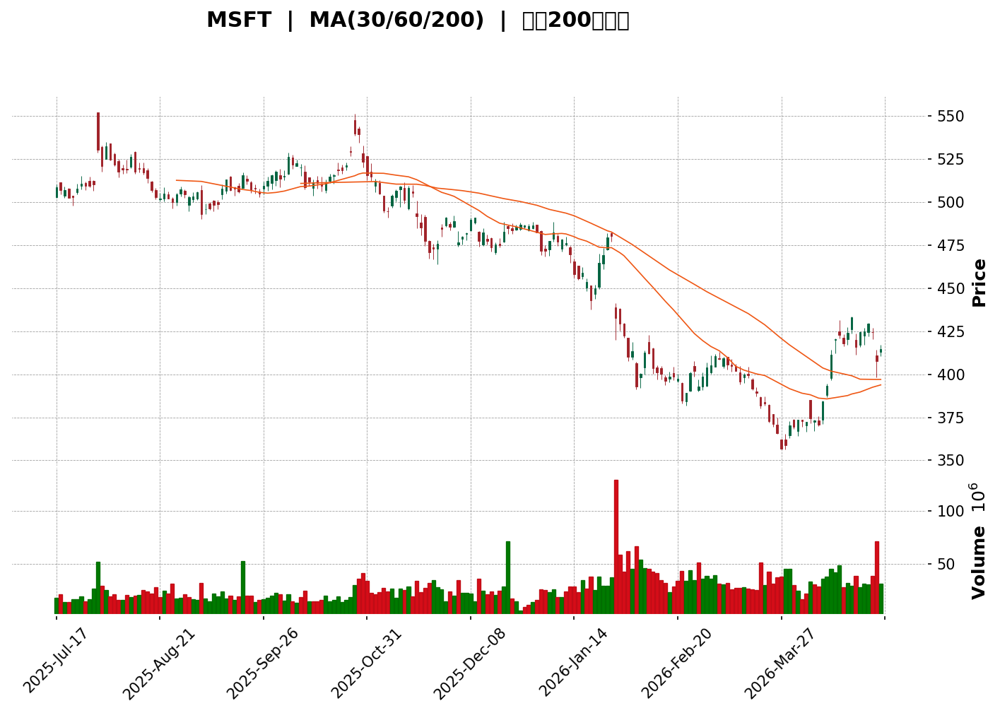
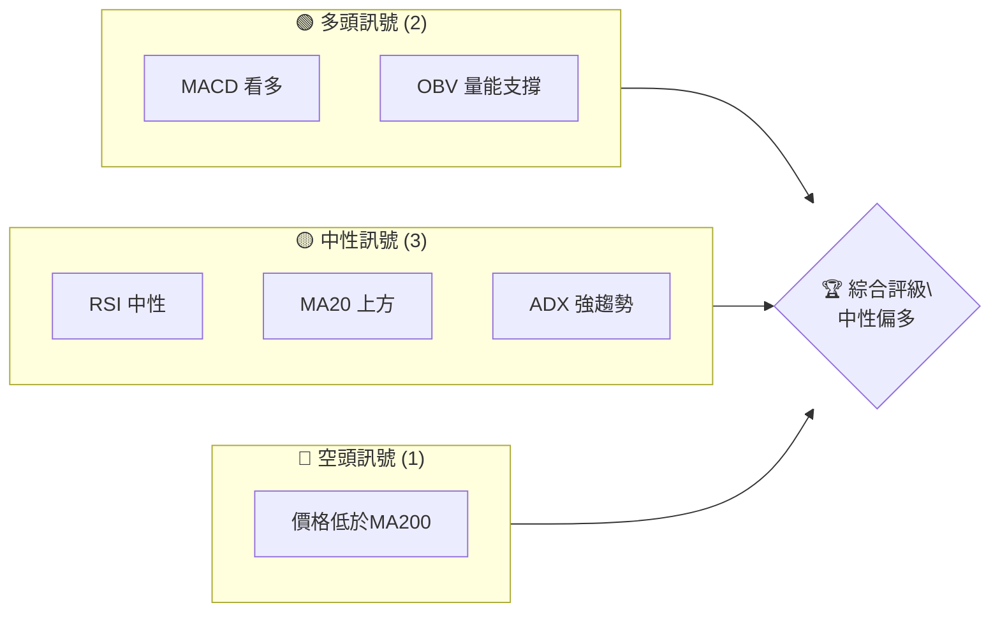
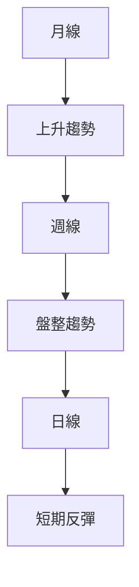
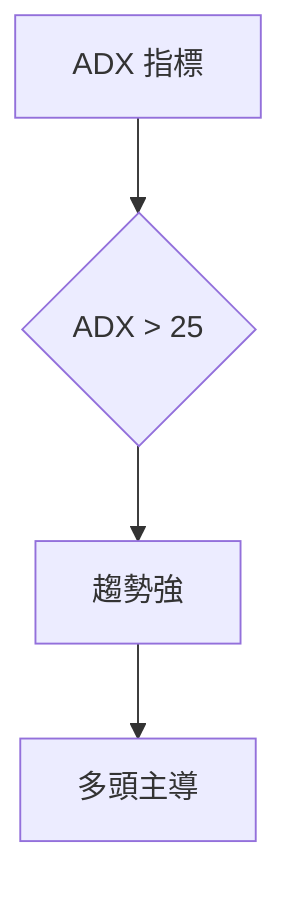
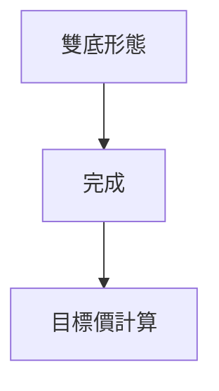
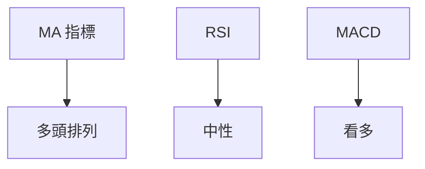
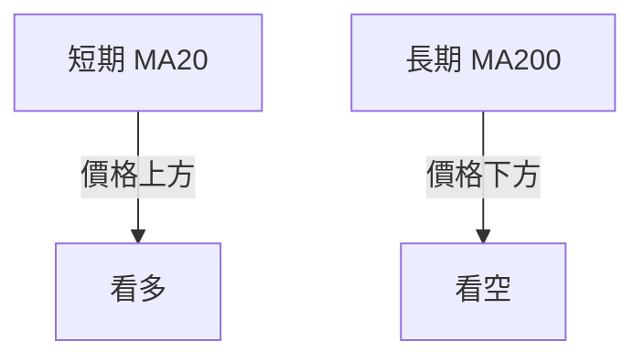
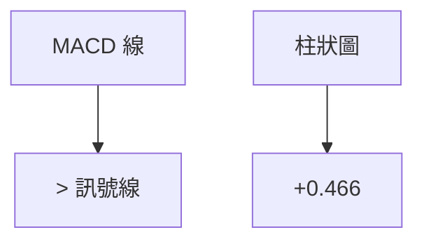
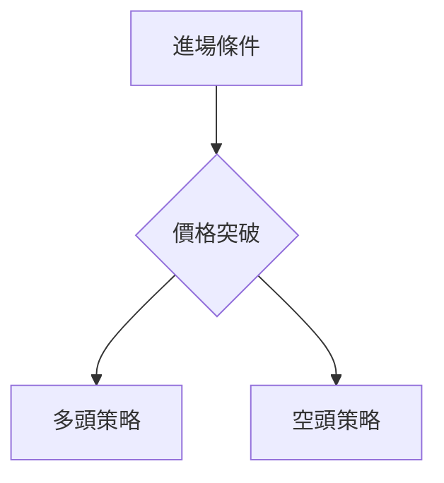
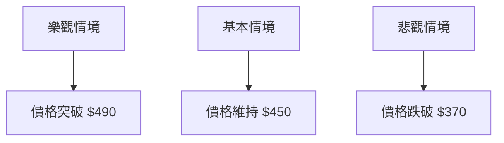

<details>
<summary>📊 靜態圖表 (點擊展開)</summary>

</details>

<html>
<head><meta charset="utf-8" /></head>
<body>
    <div>                        <script>window.PlotlyConfig = {MathJaxConfig: 'local'};</script>
        <script charset="utf-8" src="https://cdn.plot.ly/plotly-3.5.0.min.js" integrity="sha256-fHbNLP+GlIXN+efbQec78UkemUz3NJp7UmfGxC1tNxs=" crossorigin="anonymous"></script>                <div id="candlestick-chart" class="plotly-graph-div" style="height:500px; width:100%;"></div>            <script>                window.PLOTLYENV=window.PLOTLYENV || {};                                if (document.getElementById("candlestick-chart")) {                    Plotly.newPlot(                        "candlestick-chart",                        [{"close":{"dtype":"f8","bdata":"AAAAIOrLf0AAAADAqrF\u002fQAAAAIDTsX9AAAAA4KBlf0AAAABALG9\u002fQAAAAODevn9AAAAAgOPrf0AAAAAApNh\u002fQAAAAADB2X9AAAAAgGnkf0AAAACgWZOAQAAAAOCpSIBAAAAAIF+kgEAAAACAnWWAQAAAAABET4BAAAAAwKcugEAAAADgMjiAQAAAAEANNoBAAAAAgHdxgEAAAABgliyAQAAAAACzO4BAAAAAYFMpgEAAAABg6BCAQAAAAGA2rX9AAAAAoMlsf0AAAAAAbmJ\u002fQAAAAIASkn9AAAAAwL9if0AAAABAYD9\u002fQAAAAMBDin9AAAAAAHm4f0AAAADAd4l\u002fQAAAAKBzcH9AAAAA4B10f0AAAAAA3Z1\u002fQAAAAOAzz35AAAAAwDACf0AAAABAiQV\u002fQAAAAEDEJH9AAAAA4PYuf0AAAACAnbx\u002fQAAAAIDOCYBAAAAAgOmuf0AAAADghr5\u002fQAAAAOCCpX9AAAAAIEgegEAAAACgjgKAQAAAAKDwsX9AAAAAIJnAf0AAAACg4o5\u002fQAAAAKB41X9AAAAAYMADgEAAAADgcB6AQAAAAGB2LIBAAAAAYNUMgEAAAAAAqRmAQAAAAKAMc4BAAAAAIHtOgEAAAACAaVWAQAAAAMDkQYBAAAAAQIHNf0AAAACAvf5\u002fQAAAAGAX939AAAAAgNz0f0AAAACA3Nd\u002fQAAAAGBA939AAAAA4DIVgEAAAABgIRyAQAAAACATM4BAAAAAADwzgEAAAACAiEuAQAAAAECNioBAAAAAAJregEAAAABgddqAQAAAAICpXIBAAAAAQFMdgEAAAACAHBeAQAAAAOCZAYBAAAAA4PSQf0AAAADAqfB+QAAAAKAz7H5AAAAAQHl+f0AAAAAALal\u002fQAAAAIBf0H9AAAAAAEtTf0AAAACgE8F\u002fQAAAAAA3ln9AAAAAQOy7fkAAAAAApVF+QAAAAKBy1X1AAAAAwLdwfUAAAADAuo59QAAAAMB1vn1AAAAAYE9GfkAAAADAO65+QAAAAOAaWn5AAAAAgCWOfkAAAAAARsp9QAAAAIDr+31AAAAAoPQgfkAAAADgbZ5+QAAAAIBkrn5AAAAA4IXXfUAAAACA5yV+QAAAAGAL131AAAAAwNGbfUAAAADg4bR9QAAAAGCSsH1AAAAAwAsufkAAAADgA01+QAAAAEANPX5AAAAAgNxbfkAAAADAiW5+QAAAAACXaX5AAAAAINpffkAAAAAg62V+QAAAAIBMKH5AAAAA4M59fUAAAAAAX3x9QAAAAKC51n1AAAAAgOclfkAAAADgVtB9QAAAAGAE431AAAAAQH7BfUAAAAAgkll9QAAAAKBXpXxAAAAA4Ot5fEAAAAAgAa18QAAAAEDCV3xAAAAAAJSxe0AAAABgzSF8QAAAAAA5Dn1AAAAAQFhTfUAAAAAAxfd9QAAAAACICH5AAAAAgDQIe0AAAABA9tR6QAAAAIB+ZnpAAAAAgGCkeUAAAADg8tN5QAAAAGBgjHhAAAAAwJ8DeUAAAADAh8p5QAAAAABDxXlAAAAAoC83eUAAAABgzA55QAAAAGB\u002fBnlAAAAAwEy\u002feEAAAABACut4QAAAACBc53hAAAAAIK7TeEAAAAAghQd4QAAAAAAAUHhAAAAAoJkJeUAAAAAghRt5QAAAAADXi3hAAAAAwMzoeEAAAABA4T55QAAAAEAzU3lAAAAAQOGqeUAAAAAgXI95QAAAAGCPlnlAAAAAAClceUAAAACAFE55QAAAAIDCHXlAAAAAwMy4eEAAAABAM\u002f94QAAAAGCP9nhAAAAA4KN8eEAAAADgUVB4QAAAAIDr3XdAAAAAAADwd0AAAAAA10t3QAAAAOCjMHdAAAAAIIXfdkAAAADgUUx2QAAAACBcb3ZAAAAAYLgid0AAAACA6xV3QAAAACBcV3dAAAAAgBROd0AAAADgo0R3QAAAAKBHZXdAAAAAwB5Rd0AAAACA6y13QAAAAIDrBXhAAAAAgMKReEAAAAAghbN5QAAAAAApRHpAAAAA4KNsekAAAADAHiF6QAAAAGCPgnpAAAAAYLgOe0AAAAAAAPx5QAAAAIDriXpAAAAAwB6NekAAAAAAANR6QAAAACBch3pAAAAA4Hp8eUAAAABACud5QA=="},"high":{"dtype":"f8","bdata":"QPtl3nrmf0AMeH\u002fqrvp\u002fQEIn\u002f3ke0n9AAnwo9\u002fXDf0B1uUbczn1\u002fQOS3uZ9A639AAsaNU18agEDehuRtNACAQGNDTSQLFYBA7+Hw0cIHgEBAWZ+e70GBQPmK5LmkpYBA81X0gCG5gEBfiq3pkrGAQCx9dooIhYBAUJDF\u002flFogEBHwFaiCU2AQAZpeshXZIBAkFA9a05\u002fgED8hZHE\u002fIyAQPhhrJRMV4BAofOl231YgEAp2ZhXZz6AQBriyB56AYBAS+wpmMfAf0DQkX7\u002fcZh\u002fQBEDESLXyX9AKFzrVl6hf0DMGa2hOG5\u002fQNX9sEsHk39Ax5XLh5PPf0Ar4e\u002fD1bd\u002fQMsmxDJ5fn9AF37XvP6af0AFsW0yu6B\u002fQF6WNSiZ3X9AF7ci3f0xf0CmR4G9uEJ\u002fQIgtEl1WUn9ACh+vnGFRf0C8CxLt1uZ\u002fQEo0NdGuCoBAWspgWrQYgEBCIjRVw9J\u002fQMcongIg739AdQmZQTIpgEDJ0BeZxByAQKC1wSqsA4BAX9d2Ornlf0DbkPgzXr5\u002fQKll+a78\u002fH9A+JbiSq0VgEAwBCUYHSCAQIQfFffVMoBAP9\u002fI7IQ7gED+L3AerTKAQIUcBeOlhoBAemj4I9l8gEADoImQJGaAQD8MswFFUYBA+jdMaEtLgEBahzD8KxKAQIRpOU8rCYBAh8qN3GIYgECQxyxPrRWAQIwT6DLDCoBAERv1bGokgEBmvK0jViSAQP0gQHlwWIBArsbO\u002fz1OgEAOnzs+ZVmAQN4nbyzuooBAgLPoUWo7gUAV4On3DwCBQLBkymMJpoBA7NrBIQZ5gEAroKPeSVaAQMgyTAdSC4BAu8xBk5UFgEDQ0yWAsXl\u002fQC+2tfP9FH9AAEANdQSMf0A+zgrF1bd\u002fQBL3lmLR2H9AxrwT8fn1f0BDHvPps9d\u002fQDNzXff8339A66W0nlpOf0BkKfXdOtJ+QAKogecix35A9gh1MkXdfUD2TEETBr19QLpmHPrw4H1AW\u002fj96SpzfkAK0op3Ibh+QPIp20Xpi35AO6iD2gTGfkBxP94mMjJ+QAqfySWVA35A7aLuYskkfkBhco\u002fP3LJ+QPnIMjH9r35ADyvcDFsyfkD0WA5fxU5+QI90nC+fFX5A5WtjFwH6fUAzZSni08x9QO977a6C7n1ACKsy1MKHfkDrYmcf02t+QPeURHbfeX5AwnnyW4FrfkCqq8GdvIB+QGSF+YwicH5AYaMmd85zfkATxsK6CYl+QNCC1VZ0cH5AvRZXruY4fkBe9vIWxq99QNSf1Xpl2n1AbpGJg1uJfkDBBidP+Rh+QIWbijaj631Aa6YfdlD+fUAaf\u002fb1JKt9QBfCMRskMn1A1nJJtBXzfEAxAWXQKeJ8QNHFnNsnfHxAlJP5t4s6fECoc5qk8Dx8QG8gWlZvYH1A+tgUWLiSfUBLt86DUxx+QE+zldE2Kn5AwoVJjeCXe0AihbAolWl7QODSjkEl3HpA1X5kA2xRekD45jAMgS16QI+rjUnsdXlAPcjeDwAOeUDRNqaXH995QK\u002fz70Vxa3pAEs4mei\u002f4eUABorxUZlR5QJjIJCPdSXlAB+9n\u002fLn5eECnJ9DDShp5QAAAAEDhRnlAAAAAgOsBeUAAAACAwrV4QAAAAIDCVXhAAAAAIIUXeUAAAAAA13d5QAAAAMAezXhAAAAAQAoTeUAAAABAM2t5QAAAAOB6sHlAAAAAgMK5eUAAAADAzNB5QAAAACBco3lAAAAAQDOjeUAAAAAAKZB5QAAAAIDrYXlAAAAAwMxMeUAAAACAFAp5QAAAAGBmRnlAAAAAAADgeEAAAAAA14d4QAAAAAAAMHhAAAAAIFwzeEAAAAAghed3QAAAAMD1kHdAAAAAIIVrd0AAAABAM6d2QAAAAIDC1XZAAAAAYGZOd0AAAAAA1193QAAAAIA9WndAAAAAIK5bd0AAAABAM0d3QAAAAAAAEHhAAAAAAABYd0AAAACAPXp3QAAAAOCjCHhAAAAAQAqreEAAAACA6+V5QAAAAMAeTXpAAAAAoEf5ekAAAACgR3V6QAAAAEDhsnpAAAAAQDMbe0AAAABgj3p6QAAAAEAzj3pAAAAAgMKxekAAAABguN56QAAAAMAerXpAAAAAYLjmeUAAAACAwhF6QA=="},"hovertemplate":"\u003cb\u003e%{x|%Y-%m-%d}\u003c\u002fb\u003e\u003cbr\u003e\u958b: $%{open:.2f}\u003cbr\u003e\u9ad8: $%{high:.2f}\u003cbr\u003e\u4f4e: $%{low:.2f}\u003cbr\u003e\u6536: $%{close:.2f}\u003cextra\u003e\u003c\u002fextra\u003e","low":{"dtype":"f8","bdata":"guxBNTJrf0Bigdw6\u002fYd\u002fQJt48TAVan9AAAAA4KBlf0BkuhpO7hx\u002fQHtuzNDrhX9AYG5RAJm2f0Adj4PNx7J\u002fQPTRwOSvyX9AzacKpfanf0DJscfMn4aAQBiBN1HQLoBAd45WdKNogECnXFwIj2GAQLTnbSMHSIBAr4RXqnwUgEDTzvi7RyOAQLnpvP++JYBAhBlR+3I9gEDhhPSP9iKAQM3Mdm0WKYBAeFZ6BKgggEDaOl8c0vB\u002fQG2aexzOmX9Ar1e2B21Yf0DpuUToNUp\u002fQATnwYFFRX9ARin7n4Rgf0CEUEFAIQd\u002fQAmv3iRHHX9AwWwKuYF2f0BDChTRaWZ\u002fQAgCZdQK7H5ArHEVZdZDf0DGwKEBEFF\u002fQNavG\u002fxLpX5ARZccJa7PfkAUrwIrOfp+QI7PN8mb6n5AlltSdxf9fkAvcIteN1x\u002fQFk2Lk1ojn9A5meetuanf0Bm7PWfW31\u002fQNtCc2bsmH9Ajnmb\u002fyXDf0DstcolruZ\u002fQFrFKdFYk39AVsOX6SGNf0CqCBZhLW9\u002fQOZV3BhaiH9A3c\u002f3xVysf0ARSJp9yrh\u002fQNzUz8ki2X9AQT+P1ArJf0AAED0u8AaAQGhKaNJuIIBAdIKjyj46gECO9RUNZEeAQAkCvicPGoBA7wAlL1C4f0A07hUz+th\u002fQAGdyQd5fn9AUl7gbTW+f0DAaCWHaaB\u002fQG3yObpYk39AxjFRPtz0f0BaKiqdpe5\u002fQFkoSmCHHIBABES\u002f6bIjgEBi\u002fTv4bTSAQK2DfAmOdoBAALx\u002fpj7UgEDLBSfhDrSAQAnVBJ+pP4BAC2vuG7wHgEDt4KgRrAOAQGgWObXKm39AWnGb9raHf0AuaJzBG9x+QB+GD25Rs35A6s1UIMALf0AOSZa+UER\u002fQJUbdGLZEH9AK3ad7Gwzf0CtHzK4FPZ+QN7R8SIbbX9ACzw4JzpMfkAiW1HkSQ1+QFNXdrSspn1AcPRNCUIzfUD5nVtnRC99QF6Cnx1N\u002fXxAuaP2u6oBfkAfQO8eq1h+QGrso769OH5AfCJIk2ZTfkAAl1254qF9QOusU3N6tn1AIF0frKHcfUBBCkJvbjR+QBweR3Uzdn5AjG3oNfiffUCyfLzba6x9QEOKY40VtH1AulQ4VBp3fUDiME9F7Fx9QPpXcFKxnn1A3kIa7tPMfUASO35+QhZ+QA7v8uxzGX5ASFJqji06fkCd72lBnTt+QDevulKnTX5Ao7Wj\u002fDwxfkDgF\u002ft3T0Z+QG3TIbwwI35A2aw77m1RfUAfcH2f5EZ9QA7i11XiSn1Av5AFHcnNfUBfh7Tca6x9QJRX78n+cX1ADOjXPYypfUBXKc0GOQ59QJ6oHR0QgnxARInI9sltfEByc+VGDHd8QCj4hSAcBHxAmoUnZuVae0DuBx8y\u002f7p7QK37YXUQGHxAGNi1myrPfEC\u002fvsr1UYF9QBBsDlyVzn1Azjd7yPpAekA+hoNxqZd6QJNWYXKdVHpASd\u002fd1xJ6eUDINuTL7YR5QDnjolfTdnhAaK+oTGeAeEC2+mRdUP94QDhmDLEpvHlAH4JZd4wBeUDnxJt5qNF4QFMBauBL0nhAQWex2xqaeEA7vFX4rbZ4QAAAAGC4ynhAAAAAYI+yeEAAAACgmfF3QAAAACBc23dAAAAAYI9ieEAAAAAA1+t4QAAAAIAUXnhAAAAAgBRqeEAAAABguIp4QAAAAMD1BHlAAAAAYGZGeUAAAAAAKYh5QAAAAAAAOHlAAAAAQOEueUAAAACgcBl5QAAAACBcG3lAAAAAAACkeEAAAADgo6x4QAAAAAAA3HhAAAAAAABweEAAAADA9TB4QAAAAIDrwXdAAAAAQOHad0AAAACgmT13QAAAAIAUGndAAAAAQArTdkAAAAAAKUh2QAAAAOB6RHZAAAAAwB6xdkAAAABAMwN3QAAAAGBmwnZAAAAAAAAYd0AAAADA9eh2QAAAAGCPNndAAAAAwMzwdkAAAADgeiB3QAAAAOBRMHdAAAAA4FEoeEAAAAAgrst4QAAAAIA9wnlAAAAAQApLekAAAADAzAR6QAAAAEAzE3pAAAAAYLh6ekAAAABgj7Z5QAAAAMDM\u002fHlAAAAAwB4RekAAAABgZl56QAAAAOCjRHpAAAAAACngeEAAAABACqd5QA=="},"name":"\u50f9\u683c","open":{"dtype":"f8","bdata":"ndjniSZsf0BA5KwzI\u002fh\u002fQGKx4B+JfH9AmPcgSE3Af0BVxpLuK31\u002fQBsDYipOnX9A+yfvlSnYf0AH5kdfxvF\u002fQJFl25xrBIBAbOzmi44BgEDGz+KYL0CBQIokT9BHn4BAl4tfjMBpgEAfAAmVnrCAQDZS2qCrfoBAL\u002fYMQQ9egEDKhkIgpzyAQH77NFtEOoBA1lbp78xFgEBuiSxfS4iAQGvltO1VPIBArlTxfgE+gEBdbgLknjSAQPSNMWM0AIBAVyOC082uf0ByIziUqll\u002fQGSnAOyWYn9ATbbYDIOIf0Db0QCGV2R\u002fQOx9Jia9Pn9A3PLaYNePf0AD3rF126h\u002fQA2wmx9cJn9Ava3vlUJbf0A14hTgYmN\u002fQCuUrPhjr39A+ivshsEAf0DfWT3mpzV\u002fQDy9oppaTn9A9CGh17hCf0B99k2g1Ih\u002fQAI0gtDtqn9A+N45kuoVgEA+FJlSFsh\u002fQHyuhA\u002fz1X9ABCIOwiHHf0Cn3ua0owuAQADjDbzB+n9A00Y4WUPEf0CHkFv1HqN\u002fQOU9PP8pv39ALHUZ1RvWf0CeUUVk1fF\u002fQLZlkURYBYBAHX6pgvgbgEBUBsweqxeAQAxwT\u002fiyI4BABVFoctFwgEAinJCQ50iAQK57Q2JqQYBAYwWNsucrgEBahzD8KxKAQJ+mgWffwX9AUAEexp4GgEBD3NJLUed\u002fQMeFBYLprn9AOVAsvdQDgEAwUFIb2xqAQNe+fVPvN4BApIbIIl9CgED4WFoUAEWAQJwLfoufjIBAp02cXscdgUBwMqJfd\u002fWAQLr1O\u002fhDgoBAdVYUvYR1gEBNfzdMQi2AQHA0lpdA2n9AToxbGsryf0BbiOBNDnl\u002fQG+peutF7n5AF3LWN4Iff0D7VhNQWmt\u002fQO\u002fmaLECtH9AinsMzSXDf0AWacgxqwJ\u002fQNdpWPeCpX9AK19NExnVfkAQGAeUIIF+QFteHk1ouX5ANcJkvZDWfUDW4iZssZ59QNI0przYj31AlnXNkT1TfkDrunGC1Wd+QHhal0Q+dX5AVrYnOMlZfkC3++\u002fGw7N9QHMI4\u002fKt6n1ANi1HGL0WfkB\u002f7W6tkjx+QK57inzHf35AiEYz+tcufkAPagettrh9QHt5qDej631AU1zgXxvwfUCehciJXW19QLxtieEuvX1AdYXF4Z3RfUBeFISRAGR+QM1MnS41UH5A+blHcQI+fkBHsK7zLkl+QCBk2FOgWX5AfSrm5Bc8fkDKZTi1LE1+QOw3PEOqa35Ag+MIU5c0fkA0W6jWr499QOFn9k6Ji31AkiX7+q3qfUAtXfUtTgJ+QHphkvCvj31AZvbGIVq5fUAZh6WYlZl9QFHhFzZdFn1A3dG3agLxfEDT6FgvmYx8QN5\u002fAkgUI3xA3QXg7hs5fEAD5nk1nOl7QNuAnJV0LXxAxn\u002fOewEEfUARZ1XM8Il9QJ8EKuPAIX5AOt\u002fU9s5ve0AmsHfrt2J7QFyce+sp1HpAtPPaoshQekA\u002fHEBhBqF5QBW4Fc8xaHlA7rYxAC3keEABo7Zd2T55QAeyz2ShKnpA6pjDNrfzeUCRpz1GPkF5QB6R7K12OHlAxeKZXPnkeECFPDrWktN4QAAAAEAKC3lAAAAAgMLBeEAAAAAAALB4QAAAAIA9AnhAAAAA4HpoeEAAAAAgXEt5QAAAAIAUbnhAAAAAgMKNeEAAAACAPZJ4QAAAAOBRFHlAAAAAYLhGeUAAAABAM5N5QAAAAGC4TnlAAAAA4HqgeUAAAADAHll5QAAAAIAUSnlAAAAAAAAQeUAAAADAHuF4QAAAAOBRBHlAAAAAgBTSeEAAAACgmWF4QAAAAOCjLHhAAAAAYGb+d0AAAACAwuV3QAAAAGC4jndAAAAAwB4td0AAAABgZp52QAAAAGBmnnZAAAAAwMzIdkAAAAAA11d3QAAAACBc83ZAAAAAANdXd0AAAACgcCV3QAAAACCuD3hAAAAAAABId0AAAAAgrk93QAAAAIDCWXdAAAAAYLg+eEAAAAAAAOB4QAAAAIDCPXpAAAAAwB6NekAAAABgZlJ6QAAAAADXQ3pAAAAAQAqjekAAAACAPT56QAAAACCFD3pAAAAAgBRmekAAAADAHol6QAAAAKBHiXpAAAAAwPWseUAAAADAzMx5QA=="},"x":["2025-07-17T00:00:00-04:00","2025-07-18T00:00:00-04:00","2025-07-21T00:00:00-04:00","2025-07-22T00:00:00-04:00","2025-07-23T00:00:00-04:00","2025-07-24T00:00:00-04:00","2025-07-25T00:00:00-04:00","2025-07-28T00:00:00-04:00","2025-07-29T00:00:00-04:00","2025-07-30T00:00:00-04:00","2025-07-31T00:00:00-04:00","2025-08-01T00:00:00-04:00","2025-08-04T00:00:00-04:00","2025-08-05T00:00:00-04:00","2025-08-06T00:00:00-04:00","2025-08-07T00:00:00-04:00","2025-08-08T00:00:00-04:00","2025-08-11T00:00:00-04:00","2025-08-12T00:00:00-04:00","2025-08-13T00:00:00-04:00","2025-08-14T00:00:00-04:00","2025-08-15T00:00:00-04:00","2025-08-18T00:00:00-04:00","2025-08-19T00:00:00-04:00","2025-08-20T00:00:00-04:00","2025-08-21T00:00:00-04:00","2025-08-22T00:00:00-04:00","2025-08-25T00:00:00-04:00","2025-08-26T00:00:00-04:00","2025-08-27T00:00:00-04:00","2025-08-28T00:00:00-04:00","2025-08-29T00:00:00-04:00","2025-09-02T00:00:00-04:00","2025-09-03T00:00:00-04:00","2025-09-04T00:00:00-04:00","2025-09-05T00:00:00-04:00","2025-09-08T00:00:00-04:00","2025-09-09T00:00:00-04:00","2025-09-10T00:00:00-04:00","2025-09-11T00:00:00-04:00","2025-09-12T00:00:00-04:00","2025-09-15T00:00:00-04:00","2025-09-16T00:00:00-04:00","2025-09-17T00:00:00-04:00","2025-09-18T00:00:00-04:00","2025-09-19T00:00:00-04:00","2025-09-22T00:00:00-04:00","2025-09-23T00:00:00-04:00","2025-09-24T00:00:00-04:00","2025-09-25T00:00:00-04:00","2025-09-26T00:00:00-04:00","2025-09-29T00:00:00-04:00","2025-09-30T00:00:00-04:00","2025-10-01T00:00:00-04:00","2025-10-02T00:00:00-04:00","2025-10-03T00:00:00-04:00","2025-10-06T00:00:00-04:00","2025-10-07T00:00:00-04:00","2025-10-08T00:00:00-04:00","2025-10-09T00:00:00-04:00","2025-10-10T00:00:00-04:00","2025-10-13T00:00:00-04:00","2025-10-14T00:00:00-04:00","2025-10-15T00:00:00-04:00","2025-10-16T00:00:00-04:00","2025-10-17T00:00:00-04:00","2025-10-20T00:00:00-04:00","2025-10-21T00:00:00-04:00","2025-10-22T00:00:00-04:00","2025-10-23T00:00:00-04:00","2025-10-24T00:00:00-04:00","2025-10-27T00:00:00-04:00","2025-10-28T00:00:00-04:00","2025-10-29T00:00:00-04:00","2025-10-30T00:00:00-04:00","2025-10-31T00:00:00-04:00","2025-11-03T00:00:00-05:00","2025-11-04T00:00:00-05:00","2025-11-05T00:00:00-05:00","2025-11-06T00:00:00-05:00","2025-11-07T00:00:00-05:00","2025-11-10T00:00:00-05:00","2025-11-11T00:00:00-05:00","2025-11-12T00:00:00-05:00","2025-11-13T00:00:00-05:00","2025-11-14T00:00:00-05:00","2025-11-17T00:00:00-05:00","2025-11-18T00:00:00-05:00","2025-11-19T00:00:00-05:00","2025-11-20T00:00:00-05:00","2025-11-21T00:00:00-05:00","2025-11-24T00:00:00-05:00","2025-11-25T00:00:00-05:00","2025-11-26T00:00:00-05:00","2025-11-28T00:00:00-05:00","2025-12-01T00:00:00-05:00","2025-12-02T00:00:00-05:00","2025-12-03T00:00:00-05:00","2025-12-04T00:00:00-05:00","2025-12-05T00:00:00-05:00","2025-12-08T00:00:00-05:00","2025-12-09T00:00:00-05:00","2025-12-10T00:00:00-05:00","2025-12-11T00:00:00-05:00","2025-12-12T00:00:00-05:00","2025-12-15T00:00:00-05:00","2025-12-16T00:00:00-05:00","2025-12-17T00:00:00-05:00","2025-12-18T00:00:00-05:00","2025-12-19T00:00:00-05:00","2025-12-22T00:00:00-05:00","2025-12-23T00:00:00-05:00","2025-12-24T00:00:00-05:00","2025-12-26T00:00:00-05:00","2025-12-29T00:00:00-05:00","2025-12-30T00:00:00-05:00","2025-12-31T00:00:00-05:00","2026-01-02T00:00:00-05:00","2026-01-05T00:00:00-05:00","2026-01-06T00:00:00-05:00","2026-01-07T00:00:00-05:00","2026-01-08T00:00:00-05:00","2026-01-09T00:00:00-05:00","2026-01-12T00:00:00-05:00","2026-01-13T00:00:00-05:00","2026-01-14T00:00:00-05:00","2026-01-15T00:00:00-05:00","2026-01-16T00:00:00-05:00","2026-01-20T00:00:00-05:00","2026-01-21T00:00:00-05:00","2026-01-22T00:00:00-05:00","2026-01-23T00:00:00-05:00","2026-01-26T00:00:00-05:00","2026-01-27T00:00:00-05:00","2026-01-28T00:00:00-05:00","2026-01-29T00:00:00-05:00","2026-01-30T00:00:00-05:00","2026-02-02T00:00:00-05:00","2026-02-03T00:00:00-05:00","2026-02-04T00:00:00-05:00","2026-02-05T00:00:00-05:00","2026-02-06T00:00:00-05:00","2026-02-09T00:00:00-05:00","2026-02-10T00:00:00-05:00","2026-02-11T00:00:00-05:00","2026-02-12T00:00:00-05:00","2026-02-13T00:00:00-05:00","2026-02-17T00:00:00-05:00","2026-02-18T00:00:00-05:00","2026-02-19T00:00:00-05:00","2026-02-20T00:00:00-05:00","2026-02-23T00:00:00-05:00","2026-02-24T00:00:00-05:00","2026-02-25T00:00:00-05:00","2026-02-26T00:00:00-05:00","2026-02-27T00:00:00-05:00","2026-03-02T00:00:00-05:00","2026-03-03T00:00:00-05:00","2026-03-04T00:00:00-05:00","2026-03-05T00:00:00-05:00","2026-03-06T00:00:00-05:00","2026-03-09T00:00:00-04:00","2026-03-10T00:00:00-04:00","2026-03-11T00:00:00-04:00","2026-03-12T00:00:00-04:00","2026-03-13T00:00:00-04:00","2026-03-16T00:00:00-04:00","2026-03-17T00:00:00-04:00","2026-03-18T00:00:00-04:00","2026-03-19T00:00:00-04:00","2026-03-20T00:00:00-04:00","2026-03-23T00:00:00-04:00","2026-03-24T00:00:00-04:00","2026-03-25T00:00:00-04:00","2026-03-26T00:00:00-04:00","2026-03-27T00:00:00-04:00","2026-03-30T00:00:00-04:00","2026-03-31T00:00:00-04:00","2026-04-01T00:00:00-04:00","2026-04-02T00:00:00-04:00","2026-04-06T00:00:00-04:00","2026-04-07T00:00:00-04:00","2026-04-08T00:00:00-04:00","2026-04-09T00:00:00-04:00","2026-04-10T00:00:00-04:00","2026-04-13T00:00:00-04:00","2026-04-14T00:00:00-04:00","2026-04-15T00:00:00-04:00","2026-04-16T00:00:00-04:00","2026-04-17T00:00:00-04:00","2026-04-20T00:00:00-04:00","2026-04-21T00:00:00-04:00","2026-04-22T00:00:00-04:00","2026-04-23T00:00:00-04:00","2026-04-24T00:00:00-04:00","2026-04-27T00:00:00-04:00","2026-04-28T00:00:00-04:00","2026-04-29T00:00:00-04:00","2026-04-30T00:00:00-04:00","2026-05-01T00:00:00-04:00"],"type":"candlestick"},{"hovertemplate":"MA30: $%{y:.2f}\u003cextra\u003e\u003c\u002fextra\u003e","line":{"color":"#2196F3","dash":"dash","width":2},"mode":"lines","name":"MA30","x":["2025-07-17T00:00:00-04:00","2025-07-18T00:00:00-04:00","2025-07-21T00:00:00-04:00","2025-07-22T00:00:00-04:00","2025-07-23T00:00:00-04:00","2025-07-24T00:00:00-04:00","2025-07-25T00:00:00-04:00","2025-07-28T00:00:00-04:00","2025-07-29T00:00:00-04:00","2025-07-30T00:00:00-04:00","2025-07-31T00:00:00-04:00","2025-08-01T00:00:00-04:00","2025-08-04T00:00:00-04:00","2025-08-05T00:00:00-04:00","2025-08-06T00:00:00-04:00","2025-08-07T00:00:00-04:00","2025-08-08T00:00:00-04:00","2025-08-11T00:00:00-04:00","2025-08-12T00:00:00-04:00","2025-08-13T00:00:00-04:00","2025-08-14T00:00:00-04:00","2025-08-15T00:00:00-04:00","2025-08-18T00:00:00-04:00","2025-08-19T00:00:00-04:00","2025-08-20T00:00:00-04:00","2025-08-21T00:00:00-04:00","2025-08-22T00:00:00-04:00","2025-08-25T00:00:00-04:00","2025-08-26T00:00:00-04:00","2025-08-27T00:00:00-04:00","2025-08-28T00:00:00-04:00","2025-08-29T00:00:00-04:00","2025-09-02T00:00:00-04:00","2025-09-03T00:00:00-04:00","2025-09-04T00:00:00-04:00","2025-09-05T00:00:00-04:00","2025-09-08T00:00:00-04:00","2025-09-09T00:00:00-04:00","2025-09-10T00:00:00-04:00","2025-09-11T00:00:00-04:00","2025-09-12T00:00:00-04:00","2025-09-15T00:00:00-04:00","2025-09-16T00:00:00-04:00","2025-09-17T00:00:00-04:00","2025-09-18T00:00:00-04:00","2025-09-19T00:00:00-04:00","2025-09-22T00:00:00-04:00","2025-09-23T00:00:00-04:00","2025-09-24T00:00:00-04:00","2025-09-25T00:00:00-04:00","2025-09-26T00:00:00-04:00","2025-09-29T00:00:00-04:00","2025-09-30T00:00:00-04:00","2025-10-01T00:00:00-04:00","2025-10-02T00:00:00-04:00","2025-10-03T00:00:00-04:00","2025-10-06T00:00:00-04:00","2025-10-07T00:00:00-04:00","2025-10-08T00:00:00-04:00","2025-10-09T00:00:00-04:00","2025-10-10T00:00:00-04:00","2025-10-13T00:00:00-04:00","2025-10-14T00:00:00-04:00","2025-10-15T00:00:00-04:00","2025-10-16T00:00:00-04:00","2025-10-17T00:00:00-04:00","2025-10-20T00:00:00-04:00","2025-10-21T00:00:00-04:00","2025-10-22T00:00:00-04:00","2025-10-23T00:00:00-04:00","2025-10-24T00:00:00-04:00","2025-10-27T00:00:00-04:00","2025-10-28T00:00:00-04:00","2025-10-29T00:00:00-04:00","2025-10-30T00:00:00-04:00","2025-10-31T00:00:00-04:00","2025-11-03T00:00:00-05:00","2025-11-04T00:00:00-05:00","2025-11-05T00:00:00-05:00","2025-11-06T00:00:00-05:00","2025-11-07T00:00:00-05:00","2025-11-10T00:00:00-05:00","2025-11-11T00:00:00-05:00","2025-11-12T00:00:00-05:00","2025-11-13T00:00:00-05:00","2025-11-14T00:00:00-05:00","2025-11-17T00:00:00-05:00","2025-11-18T00:00:00-05:00","2025-11-19T00:00:00-05:00","2025-11-20T00:00:00-05:00","2025-11-21T00:00:00-05:00","2025-11-24T00:00:00-05:00","2025-11-25T00:00:00-05:00","2025-11-26T00:00:00-05:00","2025-11-28T00:00:00-05:00","2025-12-01T00:00:00-05:00","2025-12-02T00:00:00-05:00","2025-12-03T00:00:00-05:00","2025-12-04T00:00:00-05:00","2025-12-05T00:00:00-05:00","2025-12-08T00:00:00-05:00","2025-12-09T00:00:00-05:00","2025-12-10T00:00:00-05:00","2025-12-11T00:00:00-05:00","2025-12-12T00:00:00-05:00","2025-12-15T00:00:00-05:00","2025-12-16T00:00:00-05:00","2025-12-17T00:00:00-05:00","2025-12-18T00:00:00-05:00","2025-12-19T00:00:00-05:00","2025-12-22T00:00:00-05:00","2025-12-23T00:00:00-05:00","2025-12-24T00:00:00-05:00","2025-12-26T00:00:00-05:00","2025-12-29T00:00:00-05:00","2025-12-30T00:00:00-05:00","2025-12-31T00:00:00-05:00","2026-01-02T00:00:00-05:00","2026-01-05T00:00:00-05:00","2026-01-06T00:00:00-05:00","2026-01-07T00:00:00-05:00","2026-01-08T00:00:00-05:00","2026-01-09T00:00:00-05:00","2026-01-12T00:00:00-05:00","2026-01-13T00:00:00-05:00","2026-01-14T00:00:00-05:00","2026-01-15T00:00:00-05:00","2026-01-16T00:00:00-05:00","2026-01-20T00:00:00-05:00","2026-01-21T00:00:00-05:00","2026-01-22T00:00:00-05:00","2026-01-23T00:00:00-05:00","2026-01-26T00:00:00-05:00","2026-01-27T00:00:00-05:00","2026-01-28T00:00:00-05:00","2026-01-29T00:00:00-05:00","2026-01-30T00:00:00-05:00","2026-02-02T00:00:00-05:00","2026-02-03T00:00:00-05:00","2026-02-04T00:00:00-05:00","2026-02-05T00:00:00-05:00","2026-02-06T00:00:00-05:00","2026-02-09T00:00:00-05:00","2026-02-10T00:00:00-05:00","2026-02-11T00:00:00-05:00","2026-02-12T00:00:00-05:00","2026-02-13T00:00:00-05:00","2026-02-17T00:00:00-05:00","2026-02-18T00:00:00-05:00","2026-02-19T00:00:00-05:00","2026-02-20T00:00:00-05:00","2026-02-23T00:00:00-05:00","2026-02-24T00:00:00-05:00","2026-02-25T00:00:00-05:00","2026-02-26T00:00:00-05:00","2026-02-27T00:00:00-05:00","2026-03-02T00:00:00-05:00","2026-03-03T00:00:00-05:00","2026-03-04T00:00:00-05:00","2026-03-05T00:00:00-05:00","2026-03-06T00:00:00-05:00","2026-03-09T00:00:00-04:00","2026-03-10T00:00:00-04:00","2026-03-11T00:00:00-04:00","2026-03-12T00:00:00-04:00","2026-03-13T00:00:00-04:00","2026-03-16T00:00:00-04:00","2026-03-17T00:00:00-04:00","2026-03-18T00:00:00-04:00","2026-03-19T00:00:00-04:00","2026-03-20T00:00:00-04:00","2026-03-23T00:00:00-04:00","2026-03-24T00:00:00-04:00","2026-03-25T00:00:00-04:00","2026-03-26T00:00:00-04:00","2026-03-27T00:00:00-04:00","2026-03-30T00:00:00-04:00","2026-03-31T00:00:00-04:00","2026-04-01T00:00:00-04:00","2026-04-02T00:00:00-04:00","2026-04-06T00:00:00-04:00","2026-04-07T00:00:00-04:00","2026-04-08T00:00:00-04:00","2026-04-09T00:00:00-04:00","2026-04-10T00:00:00-04:00","2026-04-13T00:00:00-04:00","2026-04-14T00:00:00-04:00","2026-04-15T00:00:00-04:00","2026-04-16T00:00:00-04:00","2026-04-17T00:00:00-04:00","2026-04-20T00:00:00-04:00","2026-04-21T00:00:00-04:00","2026-04-22T00:00:00-04:00","2026-04-23T00:00:00-04:00","2026-04-24T00:00:00-04:00","2026-04-27T00:00:00-04:00","2026-04-28T00:00:00-04:00","2026-04-29T00:00:00-04:00","2026-04-30T00:00:00-04:00","2026-05-01T00:00:00-04:00"],"y":{"dtype":"f8","bdata":"AAAAAAAA+H8AAAAAAAD4fwAAAAAAAPh\u002fAAAAAAAA+H8AAAAAAAD4fwAAAAAAAPh\u002fAAAAAAAA+H8AAAAAAAD4fwAAAAAAAPh\u002fAAAAAAAA+H8AAAAAAAD4fwAAAAAAAPh\u002fAAAAAAAA+H8AAAAAAAD4fwAAAAAAAPh\u002fAAAAAAAA+H8AAAAAAAD4fwAAAAAAAPh\u002fAAAAAAAA+H8AAAAAAAD4fwAAAAAAAPh\u002fAAAAAAAA+H8AAAAAAAD4fwAAAAAAAPh\u002fAAAAAAAA+H8AAAAAAAD4fwAAAAAAAPh\u002fAAAAAAAA+H8AAAAAAAD4fzMzM7uMBYBAd3d3xzkFgEAzMzNDjgSAQM3MzFR3A4BA3t3dJbUDgEBERERcfASAQO\u002fu7sZ9AIBAREREVDH5f0B3d3fnJ\u002fJ\u002fQKuqqnof7H9AAAAAIBPmf0BVVVVVAdp\u002fQDMzM5PQ1X9AmpmZWSfIf0CamZlpMr9\u002fQBEREXHltn9AAAAAAM61f0BERESEOrJ\u002fQLy7u+sFrH9AREREZFiif0AAAAAwmpt\u002fQImIiGg0ln9AREREJLOTf0C8u7sbmpR\u002fQDMzM2NTmn9AAAAAoBagf0CJiIgoDad\u002fQHd3d7disn9AAAAAANy8f0DNzMxs+ch\u002fQO\u002fu7q5K0X9AiYiIKP7Rf0AiIiLi5tV\u002fQO\u002fu7s5j2n9A3t3dba7ef0CJiIhYneB\u002fQBEREaF76n9AMzMzQ1v0f0BVVVWllP5\u002fQGZmZo6lBIBAREREpNYJgEAzMzOzeg2AQDMzM1PFEYBAVVVV1YoagEBVVVVd6iKAQKuqqiqDJ4BAERERAXsngEBmZmZmKiiAQGZmZh6FKYBAERER2bkogEBERETEFiaAQLy7u3szIoBAMzMz0+ofgEDNzMycdB2AQN7d3f0tG4BAiYiImN8XgEAAAAAo+BWAQFVVVQ1fEIBAZmZmnloIgEC8u7srq\u002fx\u002fQImIiGjK5X9A7+7ujqHRf0Crqqqq1Lx\u002fQImIiFjgqX9A7+7uToabf0DNzMyMmpF\u002fQImIiAjVg39AiYiIKBd2f0CJiIiIW2F\u002fQJqZmfm\u002fTH9Aq6qqul05f0De3d19iyh\u002fQFVVVfUNFH9AvLu7a8zyfkAiIiJybtR+QFVVVXXSu35AiYiICHalfkB3d3eHWZB+QJqZmVmHfH5Ad3d3x7JwfkARERFRPmt+QERERLRnZX5AAAAA0LdbfkB3d3fnOlF+QJqZmUlFRX5AzczM7Cc9fkAiIiKClTF+QGZmZgZjJX5AIiIicsgafkAzMzODrBN+QJqZmWm3E35AmpmZicEZfkCJiIho8Rt+QM3MzFwpHX5A3t3d\u002fbsYfkAREREBYQ1+QGZmZvbR\u002fn1A7+7uThTtfUAzMzMDkuN9QDMzM6OQ1X1AZmZmJsnAfUCamZmZkKt9QImIiEixnX1AzczMXEmZfUDe3d2tv5d9QHd3d\u002fdlmX1AIiIiQmmDfUB3d3dn4Wp9QM3MzKzPTn1ARERExBYofUCJiIiI6wF9QM3MzDxd0XxAzczMnMGjfEAiIiLyJ3x8QLy7u4uLVHxAzczM3IUofEBVVVXF8\u002fp7QKuqqqooz3tAzczM3Kyme0AiIiKSsn97QKuqqtqVVXtAq6qqii0oe0B3d3c30fZ6QBEREQFAx3pAZmZmpvyeekBEREQEyXp6QDMzM0PNV3pAq6qqSl05ekBmZmb2Fxx6QGZmZnZXAnpAzczMPA3xeUB3d3eHGtt5QO\u002fu7s6DvXlAZmZm5qybeUAAAADA4nN5QLy7uzvtSXlAMzMzkzY2eUARERHxjSZ5QM3MzDxKGnlA3t3dnW4QeUCamZnZggN5QHd3dyey\u002fXhAmpmZKYL0eEAREREBON94QDMzM7MyyXhAzczMjDW1eEDv7u7uqJ14QImIiCiOh3hAq6qqes15eEAiIiJSKmp4QM3MzPzUXHhAZmZmZthPeEDNzMxsWUl4QKuqqnqGQXhAd3d3t9cyeECamZmpYyJ4QBEREeHsHXhAMzMzIwYbeEB3d3d36R54QImIiKjxJnhAREREFGcteEBmZmbmQjJ4QERERMQgOnhAMzMzA51IeEAREREhaU54QBEREaGMWnhAZmZm9ihqeEAzMzNjyXl4QLy7u4slh3hAZmZmtqyPeEBERERkO514QA=="},"type":"scatter"},{"hovertemplate":"MA60: $%{y:.2f}\u003cextra\u003e\u003c\u002fextra\u003e","line":{"color":"#9C27B0","dash":"dash","width":2},"mode":"lines","name":"MA60","x":["2025-07-17T00:00:00-04:00","2025-07-18T00:00:00-04:00","2025-07-21T00:00:00-04:00","2025-07-22T00:00:00-04:00","2025-07-23T00:00:00-04:00","2025-07-24T00:00:00-04:00","2025-07-25T00:00:00-04:00","2025-07-28T00:00:00-04:00","2025-07-29T00:00:00-04:00","2025-07-30T00:00:00-04:00","2025-07-31T00:00:00-04:00","2025-08-01T00:00:00-04:00","2025-08-04T00:00:00-04:00","2025-08-05T00:00:00-04:00","2025-08-06T00:00:00-04:00","2025-08-07T00:00:00-04:00","2025-08-08T00:00:00-04:00","2025-08-11T00:00:00-04:00","2025-08-12T00:00:00-04:00","2025-08-13T00:00:00-04:00","2025-08-14T00:00:00-04:00","2025-08-15T00:00:00-04:00","2025-08-18T00:00:00-04:00","2025-08-19T00:00:00-04:00","2025-08-20T00:00:00-04:00","2025-08-21T00:00:00-04:00","2025-08-22T00:00:00-04:00","2025-08-25T00:00:00-04:00","2025-08-26T00:00:00-04:00","2025-08-27T00:00:00-04:00","2025-08-28T00:00:00-04:00","2025-08-29T00:00:00-04:00","2025-09-02T00:00:00-04:00","2025-09-03T00:00:00-04:00","2025-09-04T00:00:00-04:00","2025-09-05T00:00:00-04:00","2025-09-08T00:00:00-04:00","2025-09-09T00:00:00-04:00","2025-09-10T00:00:00-04:00","2025-09-11T00:00:00-04:00","2025-09-12T00:00:00-04:00","2025-09-15T00:00:00-04:00","2025-09-16T00:00:00-04:00","2025-09-17T00:00:00-04:00","2025-09-18T00:00:00-04:00","2025-09-19T00:00:00-04:00","2025-09-22T00:00:00-04:00","2025-09-23T00:00:00-04:00","2025-09-24T00:00:00-04:00","2025-09-25T00:00:00-04:00","2025-09-26T00:00:00-04:00","2025-09-29T00:00:00-04:00","2025-09-30T00:00:00-04:00","2025-10-01T00:00:00-04:00","2025-10-02T00:00:00-04:00","2025-10-03T00:00:00-04:00","2025-10-06T00:00:00-04:00","2025-10-07T00:00:00-04:00","2025-10-08T00:00:00-04:00","2025-10-09T00:00:00-04:00","2025-10-10T00:00:00-04:00","2025-10-13T00:00:00-04:00","2025-10-14T00:00:00-04:00","2025-10-15T00:00:00-04:00","2025-10-16T00:00:00-04:00","2025-10-17T00:00:00-04:00","2025-10-20T00:00:00-04:00","2025-10-21T00:00:00-04:00","2025-10-22T00:00:00-04:00","2025-10-23T00:00:00-04:00","2025-10-24T00:00:00-04:00","2025-10-27T00:00:00-04:00","2025-10-28T00:00:00-04:00","2025-10-29T00:00:00-04:00","2025-10-30T00:00:00-04:00","2025-10-31T00:00:00-04:00","2025-11-03T00:00:00-05:00","2025-11-04T00:00:00-05:00","2025-11-05T00:00:00-05:00","2025-11-06T00:00:00-05:00","2025-11-07T00:00:00-05:00","2025-11-10T00:00:00-05:00","2025-11-11T00:00:00-05:00","2025-11-12T00:00:00-05:00","2025-11-13T00:00:00-05:00","2025-11-14T00:00:00-05:00","2025-11-17T00:00:00-05:00","2025-11-18T00:00:00-05:00","2025-11-19T00:00:00-05:00","2025-11-20T00:00:00-05:00","2025-11-21T00:00:00-05:00","2025-11-24T00:00:00-05:00","2025-11-25T00:00:00-05:00","2025-11-26T00:00:00-05:00","2025-11-28T00:00:00-05:00","2025-12-01T00:00:00-05:00","2025-12-02T00:00:00-05:00","2025-12-03T00:00:00-05:00","2025-12-04T00:00:00-05:00","2025-12-05T00:00:00-05:00","2025-12-08T00:00:00-05:00","2025-12-09T00:00:00-05:00","2025-12-10T00:00:00-05:00","2025-12-11T00:00:00-05:00","2025-12-12T00:00:00-05:00","2025-12-15T00:00:00-05:00","2025-12-16T00:00:00-05:00","2025-12-17T00:00:00-05:00","2025-12-18T00:00:00-05:00","2025-12-19T00:00:00-05:00","2025-12-22T00:00:00-05:00","2025-12-23T00:00:00-05:00","2025-12-24T00:00:00-05:00","2025-12-26T00:00:00-05:00","2025-12-29T00:00:00-05:00","2025-12-30T00:00:00-05:00","2025-12-31T00:00:00-05:00","2026-01-02T00:00:00-05:00","2026-01-05T00:00:00-05:00","2026-01-06T00:00:00-05:00","2026-01-07T00:00:00-05:00","2026-01-08T00:00:00-05:00","2026-01-09T00:00:00-05:00","2026-01-12T00:00:00-05:00","2026-01-13T00:00:00-05:00","2026-01-14T00:00:00-05:00","2026-01-15T00:00:00-05:00","2026-01-16T00:00:00-05:00","2026-01-20T00:00:00-05:00","2026-01-21T00:00:00-05:00","2026-01-22T00:00:00-05:00","2026-01-23T00:00:00-05:00","2026-01-26T00:00:00-05:00","2026-01-27T00:00:00-05:00","2026-01-28T00:00:00-05:00","2026-01-29T00:00:00-05:00","2026-01-30T00:00:00-05:00","2026-02-02T00:00:00-05:00","2026-02-03T00:00:00-05:00","2026-02-04T00:00:00-05:00","2026-02-05T00:00:00-05:00","2026-02-06T00:00:00-05:00","2026-02-09T00:00:00-05:00","2026-02-10T00:00:00-05:00","2026-02-11T00:00:00-05:00","2026-02-12T00:00:00-05:00","2026-02-13T00:00:00-05:00","2026-02-17T00:00:00-05:00","2026-02-18T00:00:00-05:00","2026-02-19T00:00:00-05:00","2026-02-20T00:00:00-05:00","2026-02-23T00:00:00-05:00","2026-02-24T00:00:00-05:00","2026-02-25T00:00:00-05:00","2026-02-26T00:00:00-05:00","2026-02-27T00:00:00-05:00","2026-03-02T00:00:00-05:00","2026-03-03T00:00:00-05:00","2026-03-04T00:00:00-05:00","2026-03-05T00:00:00-05:00","2026-03-06T00:00:00-05:00","2026-03-09T00:00:00-04:00","2026-03-10T00:00:00-04:00","2026-03-11T00:00:00-04:00","2026-03-12T00:00:00-04:00","2026-03-13T00:00:00-04:00","2026-03-16T00:00:00-04:00","2026-03-17T00:00:00-04:00","2026-03-18T00:00:00-04:00","2026-03-19T00:00:00-04:00","2026-03-20T00:00:00-04:00","2026-03-23T00:00:00-04:00","2026-03-24T00:00:00-04:00","2026-03-25T00:00:00-04:00","2026-03-26T00:00:00-04:00","2026-03-27T00:00:00-04:00","2026-03-30T00:00:00-04:00","2026-03-31T00:00:00-04:00","2026-04-01T00:00:00-04:00","2026-04-02T00:00:00-04:00","2026-04-06T00:00:00-04:00","2026-04-07T00:00:00-04:00","2026-04-08T00:00:00-04:00","2026-04-09T00:00:00-04:00","2026-04-10T00:00:00-04:00","2026-04-13T00:00:00-04:00","2026-04-14T00:00:00-04:00","2026-04-15T00:00:00-04:00","2026-04-16T00:00:00-04:00","2026-04-17T00:00:00-04:00","2026-04-20T00:00:00-04:00","2026-04-21T00:00:00-04:00","2026-04-22T00:00:00-04:00","2026-04-23T00:00:00-04:00","2026-04-24T00:00:00-04:00","2026-04-27T00:00:00-04:00","2026-04-28T00:00:00-04:00","2026-04-29T00:00:00-04:00","2026-04-30T00:00:00-04:00","2026-05-01T00:00:00-04:00"],"y":{"dtype":"f8","bdata":"AAAAAAAA+H8AAAAAAAD4fwAAAAAAAPh\u002fAAAAAAAA+H8AAAAAAAD4fwAAAAAAAPh\u002fAAAAAAAA+H8AAAAAAAD4fwAAAAAAAPh\u002fAAAAAAAA+H8AAAAAAAD4fwAAAAAAAPh\u002fAAAAAAAA+H8AAAAAAAD4fwAAAAAAAPh\u002fAAAAAAAA+H8AAAAAAAD4fwAAAAAAAPh\u002fAAAAAAAA+H8AAAAAAAD4fwAAAAAAAPh\u002fAAAAAAAA+H8AAAAAAAD4fwAAAAAAAPh\u002fAAAAAAAA+H8AAAAAAAD4fwAAAAAAAPh\u002fAAAAAAAA+H8AAAAAAAD4fwAAAAAAAPh\u002fAAAAAAAA+H8AAAAAAAD4fwAAAAAAAPh\u002fAAAAAAAA+H8AAAAAAAD4fwAAAAAAAPh\u002fAAAAAAAA+H8AAAAAAAD4fwAAAAAAAPh\u002fAAAAAAAA+H8AAAAAAAD4fwAAAAAAAPh\u002fAAAAAAAA+H8AAAAAAAD4fwAAAAAAAPh\u002fAAAAAAAA+H8AAAAAAAD4fwAAAAAAAPh\u002fAAAAAAAA+H8AAAAAAAD4fwAAAAAAAPh\u002fAAAAAAAA+H8AAAAAAAD4fwAAAAAAAPh\u002fAAAAAAAA+H8AAAAAAAD4fwAAAAAAAPh\u002fAAAAAAAA+H8AAAAAAAD4f6uqqhIy7n9AvLu72zjuf0BERES0ge9\u002fQERERDyp8H9AzczMXAzzf0CJiIgIy\u002fR\u002fQHd3d5e79X9AvLu7S8b2f0BmZmZGXvh\u002fQLy7u0u1+n9ARERENOD8f0De3d1de\u002fp\u002fQM3MzJyt\u002fH9AIiIigp7+f0ARERHJQQGAQJqZmfF6AYBAiYiIADEBgEBERETUowCAQERERBSI\u002f39AMzMzC+b5f0BERETc4\u002fN\u002fQAAAALBN7X9AVVVVZcTpf0Crqqqqwed\u002fQHd3d69X6H9AiYiI6Ornf0BERES8ful\u002fQBEREWmQ6X9AZmZmnsjmf0BERERM0uJ\u002fQLy7u4uK239AvLu728\u002fRf0BmZmbGXcl\u002fQLy7uxMiwn9AZmZmXhq9f0CrqqryG7l\u002fQM3MzFQot39A3t3dNTm1f0Dv7u4W+K9\u002fQDMzM4sFq39AmpmZgYWmf0AiIiJywKF\u002fQN7d3U3Mm39AMzMzC\u002fGTf0BmZmaWIY1\u002fQFVVVWVshX9AVVVVBTZ6f0AiIiIqV3B\u002fQDMzM8vIZ39AzczMPBNhf0DNzMzstVt\u002fQN7d3VXnVH9AMzMzu8ZNf0CJiIgQEkZ\u002fQKuqqqLQPX9A7+7ujnM2f0ARERHpwi5\u002fQImIiJAQI39Ad3d3174Vf0B3d3fXKwh\u002fQBEREenA\u002fH5AREREjLH1fkCamZkJY+x+QKuqqtqE435AZmZmJiHafkDv7u7Gfc9+QHd3d39TwX5AvLu7u5WxfkDe3d3FdqJ+QGZmZk4okX5AiYiIcBN9fkC8u7sLDmp+QO\u002fu7p7fWH5ARERE5ApGfkAAAAAQFzZ+QGZmZjacKn5AVVVVpW8UfkB3d3d3nf19QDMzM4Or5X1A3t3dxWTMfUDNzMzslLZ9QImIiHhim31AZmZmtrx\u002ffUDNzMxssWZ9QKuqqmroTH1AzczM5NYyfUC8u7ujRBZ9QImIiNhF+nxAd3d3p7rgfECrqqqKr8l8QCIiIqKmtHxAIiIiivegfEAAAABQYYl8QO\u002fu7q40cnxAIiIiUtxbfECrqqoCFUR8QM3MzJxPK3xAzczMzDgTfEDNzMz81P97QM3MzAz063tAmpmZMevYe0CJiIiQVcN7QLy7u4uarXtAmpmZIXuae0Dv7u420YV7QJqZmZmpcXtAq6qq6s9ce0BERESst0h7QM3MzPSMNHtAERERsUIce0ARERExtwJ7QCIiIrKH53pAMzMz4yHMekCamZn5r616QHd3dx\u002ffjnpAzczMtN1uekAiIiJaTkx6QJqZmWlbK3pAvLu7Kz0QekAiIiJy7vR5QLy7u2s12XlAiYiI+AK8eUAiIiJSFaB5QN7d3T1jhHlA7+7uLupoeUDv7u5Wlk55QCIiIhLdOnlA7+7utjEqeUDv7u62gB15QHd3d4+kFHlAiYiIKDoPeUDv7u62rgZ5QJqZmUnS+3hAzczM9CTyeECJiIjwJeF4QGZmZu480nhAzczMxC\u002fQeEAiIiKqK9B4QEREROS30HhAIiIiqg3QeEDv7u4eX9B4QA=="},"type":"scatter"},{"hovertemplate":"MA200: $%{y:.2f}\u003cextra\u003e\u003c\u002fextra\u003e","line":{"color":"#FF6F00","dash":"solid","width":2},"mode":"lines","name":"MA200","x":["2025-07-17T00:00:00-04:00","2025-07-18T00:00:00-04:00","2025-07-21T00:00:00-04:00","2025-07-22T00:00:00-04:00","2025-07-23T00:00:00-04:00","2025-07-24T00:00:00-04:00","2025-07-25T00:00:00-04:00","2025-07-28T00:00:00-04:00","2025-07-29T00:00:00-04:00","2025-07-30T00:00:00-04:00","2025-07-31T00:00:00-04:00","2025-08-01T00:00:00-04:00","2025-08-04T00:00:00-04:00","2025-08-05T00:00:00-04:00","2025-08-06T00:00:00-04:00","2025-08-07T00:00:00-04:00","2025-08-08T00:00:00-04:00","2025-08-11T00:00:00-04:00","2025-08-12T00:00:00-04:00","2025-08-13T00:00:00-04:00","2025-08-14T00:00:00-04:00","2025-08-15T00:00:00-04:00","2025-08-18T00:00:00-04:00","2025-08-19T00:00:00-04:00","2025-08-20T00:00:00-04:00","2025-08-21T00:00:00-04:00","2025-08-22T00:00:00-04:00","2025-08-25T00:00:00-04:00","2025-08-26T00:00:00-04:00","2025-08-27T00:00:00-04:00","2025-08-28T00:00:00-04:00","2025-08-29T00:00:00-04:00","2025-09-02T00:00:00-04:00","2025-09-03T00:00:00-04:00","2025-09-04T00:00:00-04:00","2025-09-05T00:00:00-04:00","2025-09-08T00:00:00-04:00","2025-09-09T00:00:00-04:00","2025-09-10T00:00:00-04:00","2025-09-11T00:00:00-04:00","2025-09-12T00:00:00-04:00","2025-09-15T00:00:00-04:00","2025-09-16T00:00:00-04:00","2025-09-17T00:00:00-04:00","2025-09-18T00:00:00-04:00","2025-09-19T00:00:00-04:00","2025-09-22T00:00:00-04:00","2025-09-23T00:00:00-04:00","2025-09-24T00:00:00-04:00","2025-09-25T00:00:00-04:00","2025-09-26T00:00:00-04:00","2025-09-29T00:00:00-04:00","2025-09-30T00:00:00-04:00","2025-10-01T00:00:00-04:00","2025-10-02T00:00:00-04:00","2025-10-03T00:00:00-04:00","2025-10-06T00:00:00-04:00","2025-10-07T00:00:00-04:00","2025-10-08T00:00:00-04:00","2025-10-09T00:00:00-04:00","2025-10-10T00:00:00-04:00","2025-10-13T00:00:00-04:00","2025-10-14T00:00:00-04:00","2025-10-15T00:00:00-04:00","2025-10-16T00:00:00-04:00","2025-10-17T00:00:00-04:00","2025-10-20T00:00:00-04:00","2025-10-21T00:00:00-04:00","2025-10-22T00:00:00-04:00","2025-10-23T00:00:00-04:00","2025-10-24T00:00:00-04:00","2025-10-27T00:00:00-04:00","2025-10-28T00:00:00-04:00","2025-10-29T00:00:00-04:00","2025-10-30T00:00:00-04:00","2025-10-31T00:00:00-04:00","2025-11-03T00:00:00-05:00","2025-11-04T00:00:00-05:00","2025-11-05T00:00:00-05:00","2025-11-06T00:00:00-05:00","2025-11-07T00:00:00-05:00","2025-11-10T00:00:00-05:00","2025-11-11T00:00:00-05:00","2025-11-12T00:00:00-05:00","2025-11-13T00:00:00-05:00","2025-11-14T00:00:00-05:00","2025-11-17T00:00:00-05:00","2025-11-18T00:00:00-05:00","2025-11-19T00:00:00-05:00","2025-11-20T00:00:00-05:00","2025-11-21T00:00:00-05:00","2025-11-24T00:00:00-05:00","2025-11-25T00:00:00-05:00","2025-11-26T00:00:00-05:00","2025-11-28T00:00:00-05:00","2025-12-01T00:00:00-05:00","2025-12-02T00:00:00-05:00","2025-12-03T00:00:00-05:00","2025-12-04T00:00:00-05:00","2025-12-05T00:00:00-05:00","2025-12-08T00:00:00-05:00","2025-12-09T00:00:00-05:00","2025-12-10T00:00:00-05:00","2025-12-11T00:00:00-05:00","2025-12-12T00:00:00-05:00","2025-12-15T00:00:00-05:00","2025-12-16T00:00:00-05:00","2025-12-17T00:00:00-05:00","2025-12-18T00:00:00-05:00","2025-12-19T00:00:00-05:00","2025-12-22T00:00:00-05:00","2025-12-23T00:00:00-05:00","2025-12-24T00:00:00-05:00","2025-12-26T00:00:00-05:00","2025-12-29T00:00:00-05:00","2025-12-30T00:00:00-05:00","2025-12-31T00:00:00-05:00","2026-01-02T00:00:00-05:00","2026-01-05T00:00:00-05:00","2026-01-06T00:00:00-05:00","2026-01-07T00:00:00-05:00","2026-01-08T00:00:00-05:00","2026-01-09T00:00:00-05:00","2026-01-12T00:00:00-05:00","2026-01-13T00:00:00-05:00","2026-01-14T00:00:00-05:00","2026-01-15T00:00:00-05:00","2026-01-16T00:00:00-05:00","2026-01-20T00:00:00-05:00","2026-01-21T00:00:00-05:00","2026-01-22T00:00:00-05:00","2026-01-23T00:00:00-05:00","2026-01-26T00:00:00-05:00","2026-01-27T00:00:00-05:00","2026-01-28T00:00:00-05:00","2026-01-29T00:00:00-05:00","2026-01-30T00:00:00-05:00","2026-02-02T00:00:00-05:00","2026-02-03T00:00:00-05:00","2026-02-04T00:00:00-05:00","2026-02-05T00:00:00-05:00","2026-02-06T00:00:00-05:00","2026-02-09T00:00:00-05:00","2026-02-10T00:00:00-05:00","2026-02-11T00:00:00-05:00","2026-02-12T00:00:00-05:00","2026-02-13T00:00:00-05:00","2026-02-17T00:00:00-05:00","2026-02-18T00:00:00-05:00","2026-02-19T00:00:00-05:00","2026-02-20T00:00:00-05:00","2026-02-23T00:00:00-05:00","2026-02-24T00:00:00-05:00","2026-02-25T00:00:00-05:00","2026-02-26T00:00:00-05:00","2026-02-27T00:00:00-05:00","2026-03-02T00:00:00-05:00","2026-03-03T00:00:00-05:00","2026-03-04T00:00:00-05:00","2026-03-05T00:00:00-05:00","2026-03-06T00:00:00-05:00","2026-03-09T00:00:00-04:00","2026-03-10T00:00:00-04:00","2026-03-11T00:00:00-04:00","2026-03-12T00:00:00-04:00","2026-03-13T00:00:00-04:00","2026-03-16T00:00:00-04:00","2026-03-17T00:00:00-04:00","2026-03-18T00:00:00-04:00","2026-03-19T00:00:00-04:00","2026-03-20T00:00:00-04:00","2026-03-23T00:00:00-04:00","2026-03-24T00:00:00-04:00","2026-03-25T00:00:00-04:00","2026-03-26T00:00:00-04:00","2026-03-27T00:00:00-04:00","2026-03-30T00:00:00-04:00","2026-03-31T00:00:00-04:00","2026-04-01T00:00:00-04:00","2026-04-02T00:00:00-04:00","2026-04-06T00:00:00-04:00","2026-04-07T00:00:00-04:00","2026-04-08T00:00:00-04:00","2026-04-09T00:00:00-04:00","2026-04-10T00:00:00-04:00","2026-04-13T00:00:00-04:00","2026-04-14T00:00:00-04:00","2026-04-15T00:00:00-04:00","2026-04-16T00:00:00-04:00","2026-04-17T00:00:00-04:00","2026-04-20T00:00:00-04:00","2026-04-21T00:00:00-04:00","2026-04-22T00:00:00-04:00","2026-04-23T00:00:00-04:00","2026-04-24T00:00:00-04:00","2026-04-27T00:00:00-04:00","2026-04-28T00:00:00-04:00","2026-04-29T00:00:00-04:00","2026-04-30T00:00:00-04:00","2026-05-01T00:00:00-04:00"],"y":{"dtype":"f8","bdata":"AAAAAAAA+H8AAAAAAAD4fwAAAAAAAPh\u002fAAAAAAAA+H8AAAAAAAD4fwAAAAAAAPh\u002fAAAAAAAA+H8AAAAAAAD4fwAAAAAAAPh\u002fAAAAAAAA+H8AAAAAAAD4fwAAAAAAAPh\u002fAAAAAAAA+H8AAAAAAAD4fwAAAAAAAPh\u002fAAAAAAAA+H8AAAAAAAD4fwAAAAAAAPh\u002fAAAAAAAA+H8AAAAAAAD4fwAAAAAAAPh\u002fAAAAAAAA+H8AAAAAAAD4fwAAAAAAAPh\u002fAAAAAAAA+H8AAAAAAAD4fwAAAAAAAPh\u002fAAAAAAAA+H8AAAAAAAD4fwAAAAAAAPh\u002fAAAAAAAA+H8AAAAAAAD4fwAAAAAAAPh\u002fAAAAAAAA+H8AAAAAAAD4fwAAAAAAAPh\u002fAAAAAAAA+H8AAAAAAAD4fwAAAAAAAPh\u002fAAAAAAAA+H8AAAAAAAD4fwAAAAAAAPh\u002fAAAAAAAA+H8AAAAAAAD4fwAAAAAAAPh\u002fAAAAAAAA+H8AAAAAAAD4fwAAAAAAAPh\u002fAAAAAAAA+H8AAAAAAAD4fwAAAAAAAPh\u002fAAAAAAAA+H8AAAAAAAD4fwAAAAAAAPh\u002fAAAAAAAA+H8AAAAAAAD4fwAAAAAAAPh\u002fAAAAAAAA+H8AAAAAAAD4fwAAAAAAAPh\u002fAAAAAAAA+H8AAAAAAAD4fwAAAAAAAPh\u002fAAAAAAAA+H8AAAAAAAD4fwAAAAAAAPh\u002fAAAAAAAA+H8AAAAAAAD4fwAAAAAAAPh\u002fAAAAAAAA+H8AAAAAAAD4fwAAAAAAAPh\u002fAAAAAAAA+H8AAAAAAAD4fwAAAAAAAPh\u002fAAAAAAAA+H8AAAAAAAD4fwAAAAAAAPh\u002fAAAAAAAA+H8AAAAAAAD4fwAAAAAAAPh\u002fAAAAAAAA+H8AAAAAAAD4fwAAAAAAAPh\u002fAAAAAAAA+H8AAAAAAAD4fwAAAAAAAPh\u002fAAAAAAAA+H8AAAAAAAD4fwAAAAAAAPh\u002fAAAAAAAA+H8AAAAAAAD4fwAAAAAAAPh\u002fAAAAAAAA+H8AAAAAAAD4fwAAAAAAAPh\u002fAAAAAAAA+H8AAAAAAAD4fwAAAAAAAPh\u002fAAAAAAAA+H8AAAAAAAD4fwAAAAAAAPh\u002fAAAAAAAA+H8AAAAAAAD4fwAAAAAAAPh\u002fAAAAAAAA+H8AAAAAAAD4fwAAAAAAAPh\u002fAAAAAAAA+H8AAAAAAAD4fwAAAAAAAPh\u002fAAAAAAAA+H8AAAAAAAD4fwAAAAAAAPh\u002fAAAAAAAA+H8AAAAAAAD4fwAAAAAAAPh\u002fAAAAAAAA+H8AAAAAAAD4fwAAAAAAAPh\u002fAAAAAAAA+H8AAAAAAAD4fwAAAAAAAPh\u002fAAAAAAAA+H8AAAAAAAD4fwAAAAAAAPh\u002fAAAAAAAA+H8AAAAAAAD4fwAAAAAAAPh\u002fAAAAAAAA+H8AAAAAAAD4fwAAAAAAAPh\u002fAAAAAAAA+H8AAAAAAAD4fwAAAAAAAPh\u002fAAAAAAAA+H8AAAAAAAD4fwAAAAAAAPh\u002fAAAAAAAA+H8AAAAAAAD4fwAAAAAAAPh\u002fAAAAAAAA+H8AAAAAAAD4fwAAAAAAAPh\u002fAAAAAAAA+H8AAAAAAAD4fwAAAAAAAPh\u002fAAAAAAAA+H8AAAAAAAD4fwAAAAAAAPh\u002fAAAAAAAA+H8AAAAAAAD4fwAAAAAAAPh\u002fAAAAAAAA+H8AAAAAAAD4fwAAAAAAAPh\u002fAAAAAAAA+H8AAAAAAAD4fwAAAAAAAPh\u002fAAAAAAAA+H8AAAAAAAD4fwAAAAAAAPh\u002fAAAAAAAA+H8AAAAAAAD4fwAAAAAAAPh\u002fAAAAAAAA+H8AAAAAAAD4fwAAAAAAAPh\u002fAAAAAAAA+H8AAAAAAAD4fwAAAAAAAPh\u002fAAAAAAAA+H8AAAAAAAD4fwAAAAAAAPh\u002fAAAAAAAA+H8AAAAAAAD4fwAAAAAAAPh\u002fAAAAAAAA+H8AAAAAAAD4fwAAAAAAAPh\u002fAAAAAAAA+H8AAAAAAAD4fwAAAAAAAPh\u002fAAAAAAAA+H8AAAAAAAD4fwAAAAAAAPh\u002fAAAAAAAA+H8AAAAAAAD4fwAAAAAAAPh\u002fAAAAAAAA+H8AAAAAAAD4fwAAAAAAAPh\u002fAAAAAAAA+H8AAAAAAAD4fwAAAAAAAPh\u002fAAAAAAAA+H8AAAAAAAD4fwAAAAAAAPh\u002fAAAAAAAA+H9cj8IFKip9QA=="},"type":"scatter"}],                        {"template":{"data":{"barpolar":[{"marker":{"line":{"color":"rgb(17,17,17)","width":0.5},"pattern":{"fillmode":"overlay","size":10,"solidity":0.2}},"type":"barpolar"}],"bar":[{"error_x":{"color":"#f2f5fa"},"error_y":{"color":"#f2f5fa"},"marker":{"line":{"color":"rgb(17,17,17)","width":0.5},"pattern":{"fillmode":"overlay","size":10,"solidity":0.2}},"type":"bar"}],"carpet":[{"aaxis":{"endlinecolor":"#A2B1C6","gridcolor":"#506784","linecolor":"#506784","minorgridcolor":"#506784","startlinecolor":"#A2B1C6"},"baxis":{"endlinecolor":"#A2B1C6","gridcolor":"#506784","linecolor":"#506784","minorgridcolor":"#506784","startlinecolor":"#A2B1C6"},"type":"carpet"}],"choropleth":[{"colorbar":{"outlinewidth":0,"ticks":""},"type":"choropleth"}],"contourcarpet":[{"colorbar":{"outlinewidth":0,"ticks":""},"type":"contourcarpet"}],"contour":[{"colorbar":{"outlinewidth":0,"ticks":""},"colorscale":[[0.0,"#0d0887"],[0.1111111111111111,"#46039f"],[0.2222222222222222,"#7201a8"],[0.3333333333333333,"#9c179e"],[0.4444444444444444,"#bd3786"],[0.5555555555555556,"#d8576b"],[0.6666666666666666,"#ed7953"],[0.7777777777777778,"#fb9f3a"],[0.8888888888888888,"#fdca26"],[1.0,"#f0f921"]],"type":"contour"}],"heatmap":[{"colorbar":{"outlinewidth":0,"ticks":""},"colorscale":[[0.0,"#0d0887"],[0.1111111111111111,"#46039f"],[0.2222222222222222,"#7201a8"],[0.3333333333333333,"#9c179e"],[0.4444444444444444,"#bd3786"],[0.5555555555555556,"#d8576b"],[0.6666666666666666,"#ed7953"],[0.7777777777777778,"#fb9f3a"],[0.8888888888888888,"#fdca26"],[1.0,"#f0f921"]],"type":"heatmap"}],"histogram2dcontour":[{"colorbar":{"outlinewidth":0,"ticks":""},"colorscale":[[0.0,"#0d0887"],[0.1111111111111111,"#46039f"],[0.2222222222222222,"#7201a8"],[0.3333333333333333,"#9c179e"],[0.4444444444444444,"#bd3786"],[0.5555555555555556,"#d8576b"],[0.6666666666666666,"#ed7953"],[0.7777777777777778,"#fb9f3a"],[0.8888888888888888,"#fdca26"],[1.0,"#f0f921"]],"type":"histogram2dcontour"}],"histogram2d":[{"colorbar":{"outlinewidth":0,"ticks":""},"colorscale":[[0.0,"#0d0887"],[0.1111111111111111,"#46039f"],[0.2222222222222222,"#7201a8"],[0.3333333333333333,"#9c179e"],[0.4444444444444444,"#bd3786"],[0.5555555555555556,"#d8576b"],[0.6666666666666666,"#ed7953"],[0.7777777777777778,"#fb9f3a"],[0.8888888888888888,"#fdca26"],[1.0,"#f0f921"]],"type":"histogram2d"}],"histogram":[{"marker":{"pattern":{"fillmode":"overlay","size":10,"solidity":0.2}},"type":"histogram"}],"mesh3d":[{"colorbar":{"outlinewidth":0,"ticks":""},"type":"mesh3d"}],"parcoords":[{"line":{"colorbar":{"outlinewidth":0,"ticks":""}},"type":"parcoords"}],"pie":[{"automargin":true,"type":"pie"}],"scatter3d":[{"line":{"colorbar":{"outlinewidth":0,"ticks":""}},"marker":{"colorbar":{"outlinewidth":0,"ticks":""}},"type":"scatter3d"}],"scattercarpet":[{"marker":{"colorbar":{"outlinewidth":0,"ticks":""}},"type":"scattercarpet"}],"scattergeo":[{"marker":{"colorbar":{"outlinewidth":0,"ticks":""}},"type":"scattergeo"}],"scattergl":[{"marker":{"line":{"color":"#283442"}},"type":"scattergl"}],"scattermapbox":[{"marker":{"colorbar":{"outlinewidth":0,"ticks":""}},"type":"scattermapbox"}],"scattermap":[{"marker":{"colorbar":{"outlinewidth":0,"ticks":""}},"type":"scattermap"}],"scatterpolargl":[{"marker":{"colorbar":{"outlinewidth":0,"ticks":""}},"type":"scatterpolargl"}],"scatterpolar":[{"marker":{"colorbar":{"outlinewidth":0,"ticks":""}},"type":"scatterpolar"}],"scatter":[{"marker":{"line":{"color":"#283442"}},"type":"scatter"}],"scatterternary":[{"marker":{"colorbar":{"outlinewidth":0,"ticks":""}},"type":"scatterternary"}],"surface":[{"colorbar":{"outlinewidth":0,"ticks":""},"colorscale":[[0.0,"#0d0887"],[0.1111111111111111,"#46039f"],[0.2222222222222222,"#7201a8"],[0.3333333333333333,"#9c179e"],[0.4444444444444444,"#bd3786"],[0.5555555555555556,"#d8576b"],[0.6666666666666666,"#ed7953"],[0.7777777777777778,"#fb9f3a"],[0.8888888888888888,"#fdca26"],[1.0,"#f0f921"]],"type":"surface"}],"table":[{"cells":{"fill":{"color":"#506784"},"line":{"color":"rgb(17,17,17)"}},"header":{"fill":{"color":"#2a3f5f"},"line":{"color":"rgb(17,17,17)"}},"type":"table"}]},"layout":{"annotationdefaults":{"arrowcolor":"#f2f5fa","arrowhead":0,"arrowwidth":1},"autotypenumbers":"strict","coloraxis":{"colorbar":{"outlinewidth":0,"ticks":""}},"colorscale":{"diverging":[[0,"#8e0152"],[0.1,"#c51b7d"],[0.2,"#de77ae"],[0.3,"#f1b6da"],[0.4,"#fde0ef"],[0.5,"#f7f7f7"],[0.6,"#e6f5d0"],[0.7,"#b8e186"],[0.8,"#7fbc41"],[0.9,"#4d9221"],[1,"#276419"]],"sequential":[[0.0,"#0d0887"],[0.1111111111111111,"#46039f"],[0.2222222222222222,"#7201a8"],[0.3333333333333333,"#9c179e"],[0.4444444444444444,"#bd3786"],[0.5555555555555556,"#d8576b"],[0.6666666666666666,"#ed7953"],[0.7777777777777778,"#fb9f3a"],[0.8888888888888888,"#fdca26"],[1.0,"#f0f921"]],"sequentialminus":[[0.0,"#0d0887"],[0.1111111111111111,"#46039f"],[0.2222222222222222,"#7201a8"],[0.3333333333333333,"#9c179e"],[0.4444444444444444,"#bd3786"],[0.5555555555555556,"#d8576b"],[0.6666666666666666,"#ed7953"],[0.7777777777777778,"#fb9f3a"],[0.8888888888888888,"#fdca26"],[1.0,"#f0f921"]]},"colorway":["#636efa","#EF553B","#00cc96","#ab63fa","#FFA15A","#19d3f3","#FF6692","#B6E880","#FF97FF","#FECB52"],"font":{"color":"#f2f5fa"},"geo":{"bgcolor":"rgb(17,17,17)","lakecolor":"rgb(17,17,17)","landcolor":"rgb(17,17,17)","showlakes":true,"showland":true,"subunitcolor":"#506784"},"hoverlabel":{"align":"left"},"hovermode":"closest","mapbox":{"style":"dark"},"paper_bgcolor":"rgb(17,17,17)","plot_bgcolor":"rgb(17,17,17)","polar":{"angularaxis":{"gridcolor":"#506784","linecolor":"#506784","ticks":""},"bgcolor":"rgb(17,17,17)","radialaxis":{"gridcolor":"#506784","linecolor":"#506784","ticks":""}},"scene":{"xaxis":{"backgroundcolor":"rgb(17,17,17)","gridcolor":"#506784","gridwidth":2,"linecolor":"#506784","showbackground":true,"ticks":"","zerolinecolor":"#C8D4E3"},"yaxis":{"backgroundcolor":"rgb(17,17,17)","gridcolor":"#506784","gridwidth":2,"linecolor":"#506784","showbackground":true,"ticks":"","zerolinecolor":"#C8D4E3"},"zaxis":{"backgroundcolor":"rgb(17,17,17)","gridcolor":"#506784","gridwidth":2,"linecolor":"#506784","showbackground":true,"ticks":"","zerolinecolor":"#C8D4E3"}},"shapedefaults":{"line":{"color":"#f2f5fa"}},"sliderdefaults":{"bgcolor":"#C8D4E3","bordercolor":"rgb(17,17,17)","borderwidth":1,"tickwidth":0},"ternary":{"aaxis":{"gridcolor":"#506784","linecolor":"#506784","ticks":""},"baxis":{"gridcolor":"#506784","linecolor":"#506784","ticks":""},"bgcolor":"rgb(17,17,17)","caxis":{"gridcolor":"#506784","linecolor":"#506784","ticks":""}},"title":{"x":0.05},"updatemenudefaults":{"bgcolor":"#506784","borderwidth":0},"xaxis":{"automargin":true,"gridcolor":"#283442","linecolor":"#506784","ticks":"","title":{"standoff":15},"zerolinecolor":"#283442","zerolinewidth":2},"yaxis":{"automargin":true,"gridcolor":"#283442","linecolor":"#506784","ticks":"","title":{"standoff":15},"zerolinecolor":"#283442","zerolinewidth":2}}},"xaxis":{"rangeslider":{"visible":false},"title":{"text":"\u65e5\u671f"}},"font":{"size":11},"title":{"text":"MSFT  |  MA(30\u002f60\u002f200)  |  \u6700\u8fd1200\u4ea4\u6613\u65e5"},"yaxis":{"title":{"text":"\u80a1\u50f9 (USD)"}},"hovermode":"x unified","height":500},                        {"responsive": true}                    )                };            </script>        </div>
</body>
</html>

# MSFT 技術分析報告

> **報告日期**：2026-05-02 ｜ **語言**：繁體中文 ｜ **數據來源**：提供的技術數據 ｜ **當前價格**：$414.44

---

## 目錄

| 章節 | 內容 |
|------|------|
| [1. 技術面概覽](#1-技術面概覽) | 訊號儀表板、核心指標、評分卡 |
| [2. 趨勢分析](#2-趨勢分析) | 多時框趨勢、長中短期走勢 |
| [3. 圖表形態分析](#3-圖表形態分析) | 形態識別、K線組合、目標價 |
| [4. 支撐與阻力](#4-支撐與阻力) | 關鍵價位、斐波那契回調 |
| [5. 技術指標深度解讀](#5-技術指標深度解讀) | MA/RSI/MACD/布林/成交量 |
| [6. 動能與波動率](#6-動能與波動率) | 動能評估、ATR、Beta |
| [7. 多時框架總結](#7-多時框架總結) | 時框架評分矩陣 |
| [8. 交易策略建議](#8-交易策略建議) | 多空策略、風險報酬比 |
| [9. 風險提示與監控](#9-風險提示與監控) | 監控指標、風險場景 |

---

## 1. 技術面概覽

### 🎯 技術訊號儀表板



### 📊 核心指標速覽表

| 指標類別 | 指標名稱 | 當前數值 | 訊號 | 解讀 |
|----------|----------|----------|------|------|
| **價格** | 當前價格 | $414.44 | 🟡 | 中性 |
| **均線** | MA20 | $405.57 | 🟢 | 價格在MA上方 |
| **均線** | MA50 | $396.11 | 🟢 | 上方支撐 |
| **均線** | MA200 | $466.64 | 🔴 | 價格在MA下方 |
| **動能** | RSI(14) | 62.87 | 🟡 | 中性 |
| **動能** | MACD | 8.489 | 🟢 | 多頭 |
| **波動** | ATR | $12.36 | 🟡 | 中波動 |

### 🏆 技術評分卡

```
技術評分卡 — MSFT (2026-05-02)
════════════════════════════════════════════════════
趨勢強度      ████████░░░░░░░░░░░░  68/100  🟢
動能指標      ██████░░░░░░░░░░░░░░  60/100  🟡
支撐穩定度    ████████████░░░░░░░░  75/100  🟢
成交量配合    ████████░░░░░░░░░░░░  70/100  🟢
形態完整度    ████████████░░░░░░░░  78/100  🟢
均線排列      ██████░░░░░░░░░░░░░░  60/100  🟡
════════════════════════════════════════════════════
綜合評分      ████████░░░░░░░░░░░░  68/100  中性偏多
════════════════════════════════════════════════════
```

---

## 2. 趨勢分析

### 🌐 多時框趨勢分析



### 📈 長期趨勢 — 12個月走勢圖（Unicode）

```
MSFT 月線走勢圖（過去12個月）
價格軸 ($)
$530 ┤        ●(530.42)
$480 ┤              ●
$430 ┤                    ●(429.31)
$380 ┤●━━━━━━━━━━━━━━━━━━━●←現在
$330 ┤    ●(370.17)
     └────────────────────────────
      M1  M2  M3  M4  M5 ... M12
```

**走勢特徵分析表格**

| 時間段 | 收盤價 | 漲跌幅 | 特徵 |
|--------|--------|--------|------|
| 2025-07 | $530.42 | +7.2% | 高點 |
| 2026-01 | $429.31 | -19.1% | 下跌 |

### 📊 中期趨勢（週線分析）

```
         壓力區
        ───────────
        $490
        $480
        $470
 ┌───────$460──────────┐
 │   支撐區   │   現價   │  支撐區
 └───────────┘
```

### ⚡ 趨勢強度評估（ADX 解讀）



---

## 3. 圖表形態分析

### 🔍 形態識別系統



### 🕯️ 重要K線形態分析

| 月份 | 收盤價 | K線形態 | 解讀 | 訊號 |
|------|--------|---------|------|------|
| 2026-03 | $370.17 | 錘子線 | 多頭反轉 | 🟢 |
| 2026-04 | $407.78 | 吸收線 | 確認反彈 | 🟢 |

### 📉 ASCII 走勢形態示意圖

```
形態示意圖
$530 ────●───────
$480      │
$430 ─────┐
$380      └─────●
          雙底形態
```

### 🎯 形態目標價計算

- 頸線：$414
- 形態高度：$44
- 目標價：$458

---

## 4. 支撐與阻力

### 🗺️ 關鍵價位分布圖（Unicode）

```
MSFT 價位結構分布圖
═══════════════════════════════════════════════════
$500 ║████████████████████████║ 強阻力 R3
$470 ║████████████████████    ║ 阻力 R2
$450 ║████████████████████████║ 關鍵阻力 R1
$414 ╠════════════════════════╣ ◄ 現價
$390 ║▓▓▓▓▓▓▓▓▓▓▓▓▓▓▓▓        ║ 近期支撐 S1
$370 ║████████████████████████║ 強支撐 S2
═══════════════════════════════════════════════════
```

### 🚧 阻力位分析表

| 阻力級別 | 價位 | 形成原因 | 突破難度 | 重要性 |
|----------|------|----------|----------|--------|
| R1 | $450 | 歷史高點 | 高 | ★★★★ |
| R2 | $470 | 多頭失敗 | 中 | ★★★ |

### 🛡️ 支撐位分析表

| 支撐級別 | 價位 | 形成原因 | 守住機率 | 重要性 |
|----------|------|----------|----------|--------|
| S1 | $390 | 前低點 | 高 | ★★★★ |
| S2 | $370 | 多頭反轉 | 高 | ★★★★ |

### 📐 斐波那契回調位分析

- 38.2% 回調位：$430
- 50% 回調位：$410
- 61.8% 回調位：$390

---

## 5. 技術指標深度解讀

### 🎛️ 指標訊號總覽



### 📈 移動平均線排列分析



### 📉 RSI(14) 分析

- RSI 進度條：████████░░░░ 62.87
- 超買超賣：中性
- 背離：無背離

### 📊 MACD(12/26/9) 訊號解讀



### 📦 布林通道分析

```
布林通道示意圖
$450 ─────────
$405 ─────────
$360 ─────────
```

### 💹 成交量分析（量價配合度）

- OBV 趨勢：量能支撐上漲
- 成交量低於20日均量

---

## 6. 動能與波動率

### ⚡ 動能評估四象限

| 象限 | 動能 | 波動 | 當前狀態 | 評估 |
|------|------|------|----------|------|
| Q1 | 強 | 低 | ✓ | 最佳機會 |
| Q2 | 弱 | 低 | - | 謹慎觀望 |
| Q3 | 強 | 高 | - | 高風險高收益 |
| Q4 | 弱 | 高 | - | 避免進場 |

### 📊 ATR 波動率分析

- ATR：$12.36
- 止損距離建議：$370

### 📐 Beta 與市場相關性

- 與大盤相關性：中等偏低

---

## 7. 多時框架總結

### 📋 時框架評分表

| 時框架 | 趨勢方向 | 動能 | 均線排列 | 形態 | 綜合評分 | 建議 |
|--------|----------|------|----------|------|----------|------|
| 長期 | 上升 | 強 | 空頭 | 雙底 | 70 | 持有 |
| 中期 | 盤整 | 中性 | 多頭 | 反轉 | 65 | 觀望 |
| 短期 | 反彈 | 強 | 多頭 | 無 | 75 | 買入 |

### 🔲 綜合訊號矩陣

- 長期：🟢
- 中期：🟡
- 短期：🟢

---

## 8. 交易策略建議

### 🗺️ 策略決策流程圖



### 🟢 多頭策略詳情

| 策略要素 | 策略 A | 策略 B |
|----------|--------|--------|
| 進場條件 | 突破 $450 | 突破 $470 |
| 進場價格 | $451 | $471 |
| 目標價 T1 | $470 | $490 |
| 目標價 T2 | $490 | $500 |
| 止損價格 | $435 | $455 |
| 風險報酬比 | 1:2 | 1:3 |
| 成功機率 | 60% | 55% |
| 建議倉位 | 10% | 15% |

### 🔴 空頭策略詳情

| 策略要素 | 策略 A | 策略 B |
|----------|--------|--------|
| 進場條件 | 跌破 $390 | 跌破 $370 |
| 進場價格 | $389 | $369 |
| 目標價 T1 | $370 | $350 |
| 目標價 T2 | $350 | $330 |
| 止損價格 | $405 | $385 |
| 風險報酬比 | 1:2 | 1:3 |
| 成功機率 | 50% | 45% |
| 建議倉位 | 10% | 15% |

### ⭐ 整體訊號強度評星

```
做多訊號強度：★★★☆☆  (3/5星)
做空訊號強度：★★☆☆☆  (2/5星)
整體可信度：  ★★★☆☆  (3/5星)
```

---

## 9. 風險提示與監控

### ✅ 關鍵監控指標 Checklist

```
╔══════════════════════════════════╗
║ 關鍵監控指標 Checklist           ║
╠══════════════════════════════════╣
║ 1. 價格突破 $450 觀察多頭增強   ║
║ 2. RSI 超過 70 進入超買區       ║
║ 3. 成交量低於均量需注意逆轉     ║
╚══════════════════════════════════╝
```

### ⚠️ 風險場景分析



### 🛡️ 風險管理重要提醒

- 嚴格控制風險，使用止損單
- 注意市場波動導致的假突破
- 觀察量能變化確認趨勢持續性

---

## 📋 報告總結

```
MSFT 技術分析報告總結
════════════════════════════════════════════════════════
報告日期：2026-05-02
當前價格：$414.44
分析評級：⚖️ 中性偏多

關鍵結論：
├─ 長期趨勢：🟢 上升趨勢
├─ 中期趨勢：🟡 盤整狀態
├─ 短期趨勢：🟢 反彈趨勢
├─ 關鍵支撐：$390
├─ 關鍵阻力：$450
└─ 分析師目標：$561.93

最優策略組合：
1. 🥇 最佳機會：在$451買入，目標價$490
2. 🥈 次選機會：觀察$470突破再買
3. 🥉 保守選擇：持有觀望，等待突破確認
════════════════════════════════════════════════════════
```

---

> ⚠️ **免責聲明**：本報告為 AI 自動生成之技術分析，所有數據及估算均基於提供的歷史價格資訊。本報告**僅供研究與學術參考**，**不構成任何投資建議**。投資有風險，入市需謹慎。

---

*報告生成時間：2026-05-02 ｜ 數據來源：提供技術數據 ｜ 分析框架：多時框技術分析*