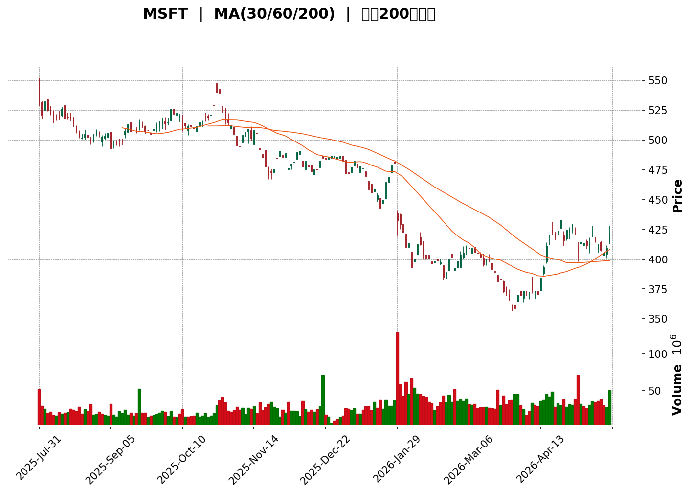
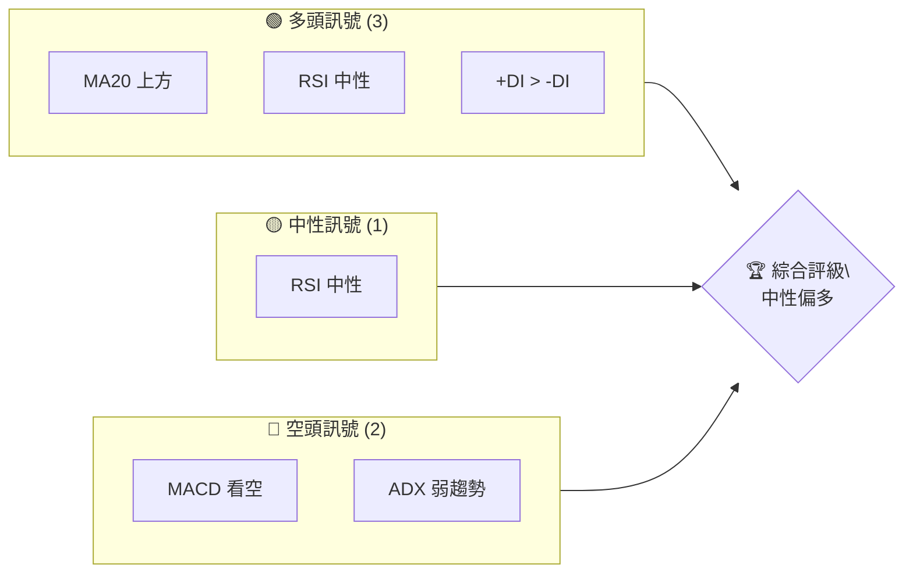
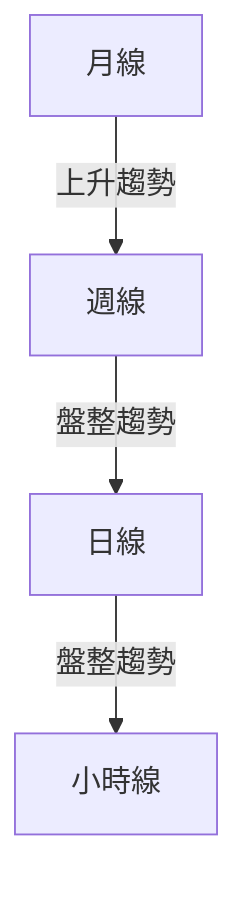
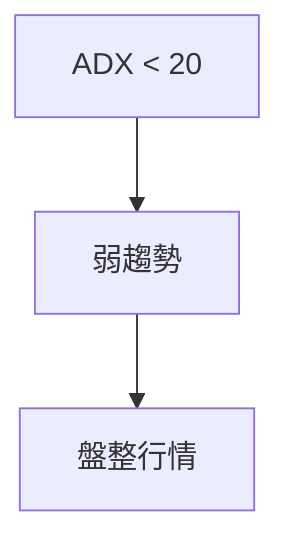
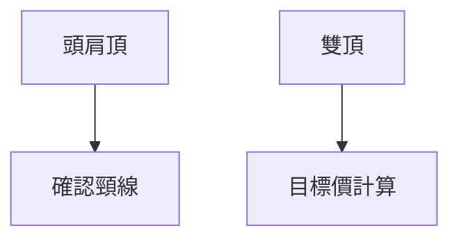
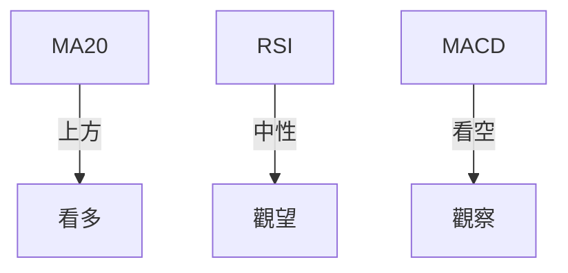
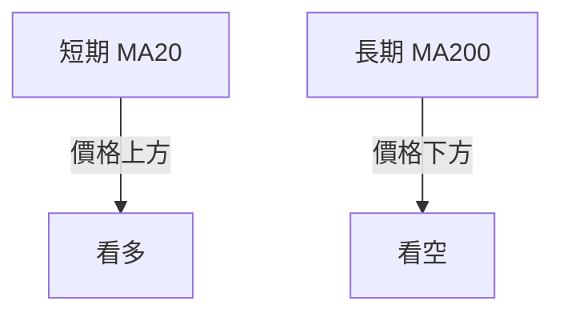
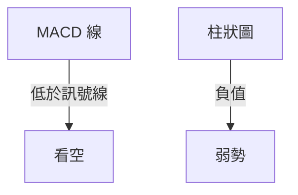
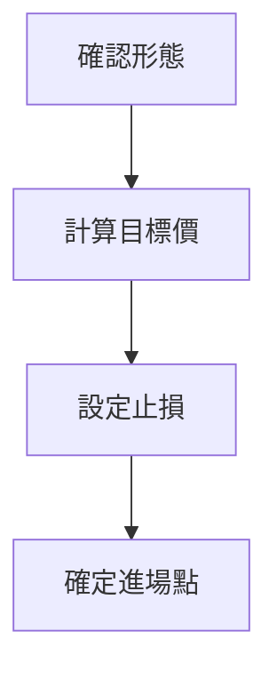
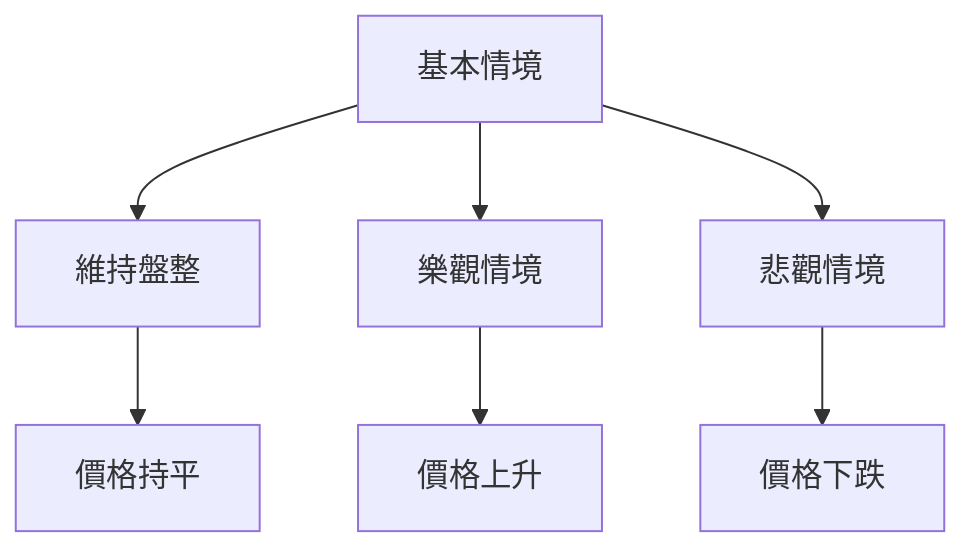

<details>
<summary>📊 靜態圖表 (點擊展開)</summary>

</details>

<html>
<head><meta charset="utf-8" /></head>
<body>
    <div>                        <script>window.PlotlyConfig = {MathJaxConfig: 'local'};</script>
        <script charset="utf-8" src="https://cdn.plot.ly/plotly-3.5.0.min.js" integrity="sha256-fHbNLP+GlIXN+efbQec78UkemUz3NJp7UmfGxC1tNxs=" crossorigin="anonymous"></script>                <div id="candlestick-chart" class="plotly-graph-div" style="height:500px; width:100%;"></div>            <script>                window.PLOTLYENV=window.PLOTLYENV || {};                                if (document.getElementById("candlestick-chart")) {                    Plotly.newPlot(                        "candlestick-chart",                        [{"close":{"dtype":"f8","bdata":"AAAAgFmTgEAAAADgqUiAQAAAACBfpIBAAAAAoJ1lgEAAAAAARE+AQAAAAMCnLoBAAAAAADM4gEAAAABADTaAQAAAAIB3cYBAAAAAYJYsgEAAAAAAszuAQAAAAGBTKYBAAAAAQOgQgEAAAACANq1\u002fQAAAAKDJbH9AAAAAAG5if0AAAACAEpJ\u002fQAAAAMC\u002fYn9AAAAAQGA\u002ff0AAAADAQ4p\u002fQAAAAAB5uH9AAAAAwHeJf0AAAACgc3B\u002fQAAAAOAddH9AAAAAAN2df0AAAADgM89+QAAAAMAwAn9AAAAAQIkFf0AAAABAxCR\u002fQAAAAOD2Ln9AAAAAgJ28f0AAAACAzgmAQAAAAIDprn9AAAAA4Ia+f0AAAADggqV\u002fQAAAACBIHoBAAAAAoI4CgEAAAACg8LF\u002fQAAAACCZwH9AAAAAoOKOf0AAAACgeNV\u002fQAAAAGDAA4BAAAAA4HAegEAAAABgdiyAQAAAAGDVDIBAAAAAAKkZgEAAAACgDHOAQAAAACB7ToBAAAAAgGlVgEAAAADA5EGAQAAAAECBzX9AAAAAgL3+f0AAAABgF\u002fd\u002fQAAAAIDc9H9AAAAAgNzXf0AAAABgQPd\u002fQAAAAOAyFYBAAAAAYCEcgEAAAAAgEzOAQAAAAAA8M4BAAAAAgIhLgEAAAABAjYqAQAAAAACa3oBAAAAAYHXagEAAAACAqVyAQAAAAEBTHYBAAAAAgBwXgEAAAADgmQGAQAAAAOD0kH9AAAAAwKnwfkAAAACgM+x+QAAAAEB5fn9AAAAAAC2pf0AAAACAX9B\u002fQAAAAABLU39AAAAAoBPBf0AAAAAAN5Z\u002fQAAAAEDsu35AAAAAAKVRfkAAAACgctV9QAAAAMC3cH1AAAAAwLqOfUAAAADAdb59QAAAAGBPRn5AAAAAwDuufkAAAADgGlp+QAAAAIAljn5AAAAAAEbKfUAAAACA6\u002ft9QAAAAKD0IH5AAAAA4G2efkAAAACAZK5+QAAAAOCF131AAAAAgOclfkAAAABgC9d9QAAAAMDRm31AAAAA4OG0fUAAAABgkrB9QAAAAMALLn5AAAAA4ANNfkAAAABADT1+QAAAAIDcW35AAAAAwIlufkAAAAAAl2l+QAAAACDaX35AAAAAIOtlfkAAAACATCh+QAAAAODOfX1AAAAAAF98fUAAAACgudZ9QAAAAIDnJX5AAAAA4FbQfUAAAABgBON9QAAAAEB+wX1AAAAAIJJZfUAAAACgV6V8QAAAAODreXxAAAAAIAGtfEAAAABAwld8QAAAAACUsXtAAAAAYM0hfEAAAAAAOQ59QAAAAEBYU31AAAAAAMX3fUAAAAAAiAh+QAAAAIA0CHtAAAAAQPbUekAAAACAfmZ6QAAAAIBgpHlAAAAA4PLTeUAAAABgYIx4QAAAAMCfA3lAAAAAwIfKeUAAAAAAQ8V5QAAAAKAvN3lAAAAAYMwOeUAAAABgfwZ5QAAAAMBMv3hAAAAAQArreEAAAAAgXOd4QAAAACCu03hAAAAAIIUHeEAAAAAAAFB4QAAAAKCZCXlAAAAAIIUbeUAAAAAA14t4QAAAAMDM6HhAAAAAQOE+eUAAAABAM1N5QAAAAEDhqnlAAAAAIFyPeUAAAABgj5Z5QAAAAAApXHlAAAAAgBROeUAAAACAwh15QAAAAMDMuHhAAAAAQDP\u002feEAAAABgj\u002fZ4QAAAAOCjfHhAAAAA4FFQeEAAAACA6913QAAAAAAA8HdAAAAAANdLd0AAAADgozB3QAAAACCF33ZAAAAA4FFMdkAAAAAgXG92QAAAAGC4IndAAAAAgOsVd0AAAAAgXFd3QAAAAIAUTndAAAAA4KNEd0AAAACgR2V3QAAAAMAeUXdAAAAAgOstd0AAAACA6wV4QAAAAIDCkXhAAAAAIIWzeUAAAAAAKUR6QAAAAOCjbHpAAAAAwB4hekAAAABgj4J6QAAAAGC4DntAAAAAAAD8eUAAAACA64l6QAAAAMAejXpAAAAAAADUekAAAAAgXId6QAAAAOB6fHlAAAAAQArneUAAAACA69l5QAAAAIAUtnlAAAAAIFzfeUAAAADgUUx6QAAAAIDr8XlAAAAAYI\u002fKeUAAAADgUXx5QAAAACBcU3lAAAAAQOGWeUAAAABguF56QA=="},"high":{"dtype":"f8","bdata":"QU1Ofe9BgUD5iuS5pKWAQPNV9IAhuYBAu8dBCpOxgEAsfXaKCIWAQFCQxf5RaIBAY91\u002fwglNgEAGaXrIV2SAQJBQPWtOf4BA\u002fIWRxPyMgED4YayUTFeAQKHzpdt9WIBA\u002fDo+N2c+gEAUMfQuegGAQEvsKZjHwH9A0JF+\u002f3GYf0ARAxEi18l\u002fQChc61ZeoX9AzBmtoThuf0DV\u002fbBLB5N\u002fQMeVy4eTz39AK+Hvw9W3f0DLJsQyeX5\u002fQBd+17z+mn9ABbFtMrugf0BeljUomd1\u002fQBe3It39MX9ApkeBvbhCf0CILRJdVlJ\u002fQAofr5xhUX9AvAsS7dbmf0BKNDXRrgqAQFrKYFq0GIBAQiI0VcPSf0DHKJ4CIO9\u002fQHUJmUEyKYBAydAXmcQcgECgtcEqrAOAQF\u002fXdjq55X9A25D4M16+f0CpZfmu\u002fPx\u002fQPiW4kqtFYBAMAQlGB0ggECEHxX31TKAQD\u002ffyOyEO4BA\u002fi9wHq0ygECFHAXjpYaAQHpo+CPZfIBAA6CJkCRmgEA\u002fDLMBRVGAQPo3TGhLS4BAWocw\u002fCsSgECEaTlPKwmAQIfKjdxiGIBAkMcsT60VgECME+gywwqAQBEb9WxqJIBAZrytI1YkgED9IEB5cFiAQK7Gzv89ToBADp87PmVZgEDeJ28s7qKAQICz6FFqO4FAFeDp9w8AgUCwZMpjCaaAQOzawSEGeYBAK6Cj3klWgEDIMkwHUguAQLvMQZOVBYBA0NMlgLF5f0AvtrXz\u002fRR\u002fQABADXUEjH9APs4KxdW3f0AS95Zi0dh\u002fQMa8E\u002fH59X9AQx7z6bPXf0Azc133\u002fN9\u002fQOultJ5aTn9AZCn13TrSfkACqIHnIsd+QPYIdTJF3X1A9kxBEwa9fUC6Zhz68OB9QFv4\u002fekqc35ACtKKdyG4fkDyKdtF6Yt+QDuog9oExn5AcT\u002feJjIyfkAKn8kllQN+QO2i7mLJJH5AYXKPz9yyfkD5yDIx\u002fa9+QA8r3AxbMn5A9FgOX8VOfkCPdJwvnxV+QOVrYxcB+n1AM2Up4tPMfUDve+2ugu59QAirMtTCh35A62JnH9NrfkD3lER233l+QMJ58luBa35AqqvBnbyAfkBkhfmMInB+QGGjJnfOc35AE8bCugmJfkDQgtVWdHB+QL0WV67mOH5AXvbyFsavfUDUn9V6Zdp9QG6RiYNbiX5AwQYnT\u002fkYfkCFm4o2o+t9QGumH3ZQ\u002fn1AGn\u002f29SSrfUAXwjEbJDJ9QNZySbQV83xAMQFl0CnifEDRxZzbJ3x8QJST+beLOnxAqHOapPA8fEBvIFpWb2B9QPrYFFi4kn1AS7fOg1McfkBPs5XRNip+QMKFSY3gl3tAIoWwKJVpe0Dg0o5BJdx6QNV+ZANsUXpA+OYwDIEtekCPq41J7HV5QD3I3g8ADnlA0Tamlx\u002ffeUCv8+9FcWt6QBLOJnov+HlAAaK8VGZUeUCYyCQj3Ul5QAfvZ\u002fy5+XhApyfQw0oaeUAAAABA4UZ5QAAAAIDrAXlAAAAAgMK1eEAAAACAwlV4QAAAACCFF3lAAAAAANd3eUAAAADAHs14QAAAAEAKE3lAAAAAQDNreUAAAADgerB5QAAAAIDCuXlAAAAAwMzQeUAAAAAgXKN5QAAAAEAzo3lAAAAAACmQeUAAAACA62F5QAAAAMDMTHlAAAAAgBQKeUAAAABgZkZ5QAAAAAAA4HhAAAAAANeHeEAAAAAAADB4QAAAACBcM3hAAAAAIIXnd0AAAADA9ZB3QAAAACCFa3dAAAAAQDOndkAAAACAwtV2QAAAAGBmTndAAAAAANdfd0AAAACAPVp3QAAAACCuW3dAAAAAQDNHd0AAAAAAABB4QAAAAAAAWHdAAAAAgD16d0AAAADgowh4QAAAAEAKq3hAAAAAgOvleUAAAADAHk16QAAAAKBH+XpAAAAAoEd1ekAAAABA4bJ6QAAAAEAzG3tAAAAAYI96ekAAAABAM496QAAAAIDCsXpAAAAAYLjeekAAAADAHq16QAAAAGC45nlAAAAAgMIRekAAAADgekx6QAAAAOB6DHpAAAAAYLgmekAAAAAgrr96QAAAAIAUKnpAAAAAQArLeUAAAAAAAPh5QAAAAMD1ZHlAAAAAoHC9eUAAAABgj8J6QA=="},"hovertemplate":"\u003cb\u003e%{x|%Y-%m-%d}\u003c\u002fb\u003e\u003cbr\u003e\u958b: $%{open:.2f}\u003cbr\u003e\u9ad8: $%{high:.2f}\u003cbr\u003e\u4f4e: $%{low:.2f}\u003cbr\u003e\u6536: $%{close:.2f}\u003cextra\u003e\u003c\u002fextra\u003e","low":{"dtype":"f8","bdata":"LkPgrJ+GgEAYgTdR0C6AQHeOVnSjaIBA\u002f3FUKI9hgEC0520jB0iAQK+EV6p8FIBAgInP20cjgEC56bz\u002fviWAQIQZUftyPYBA4YT0j\u002fYigEDNzHZtFimAQHhWegSoIIBAAtHA3NHwf0Bx\u002f2c8zpl\u002fQK9XtgdtWH9A6blE6DVKf0AE58GBRUV\u002fQEYp+5+EYH9AhFBBQCEHf0AJr94kRx1\u002fQMFsCrmBdn9AQwoU0Wlmf0AIAmXUCux+QKxxFWXWQ39AxsChARBRf0DWrxv8S6V+QEWXHCWuz35AFK8CKzn6fkCOzzfJm+p+QJZbUncX\u002fX5AL3CLXjdcf0BZNi5NaI5\u002fQOZnnrbmp39AZuz1n1t9f0DbQnNm7Jh\u002fQI55m\u002f8lw39A7LXKJa7mf0BaxSnRWJN\u002fQFbDl+khjX9AqggWYS1vf0DmVdwYWoh\u002fQN3P98VcrH9AEUiafcq4f0Dc1M\u002fJItl\u002fQEE\u002fj9QKyX9AABA9LvAGgEBoSmjSbiCAQHSCo8o+OoBAjvUVDWRHgEAJAr4nDxqAQO8AJS9QuH9ANO4VM\u002frYf0ABnckHeX5\u002fQFJe4G01vn9AwGglh2mgf0Bt8jm6WJN\u002fQMYxUT7c9H9AWioqnaXuf0BZKEpghxyAQAREv+myI4BAYv07+G00gECtg3wJjnaAQAC8f6Y+1IBAywUn4Q60gEAJ1QSfqT+AQAtr7hu8B4BA7eCoEawDgEBoFjm1ypt\u002fQFpxm\u002fa2h39ALmicwRvcfkAfhg9uUbN+QOrNVCDAC39ADkmWvlBEf0CVG3Ri2RB\u002fQCt2nexsM39ArR8yuBT2fkDe0fEiG21\u002fQAs8OCc6TH5AIltR5EkNfkBTV3a0rKZ9QHD0TQlCM31A+Z1bZ0QvfUBegp8dTf18QLmj9ruqAX5AH0DvHqtYfkBq7KO+vTh+QHwiSJNmU35AAJddueKhfUDrrFNzerZ9QCBdH6yh3H1AQQpCb240fkAcHkd1M3Z+QIxt6DX4n31Asny822usfUBDimONFbR9QLpUOFQad31A4jBPRexcfUD6V3BSsZ59QN5CGu7TzH1AEjt+fkIWfkAO7\u002fLscxl+QEhSao4tOn5Ane9pQZ07fkA3r7pSp01+QKO1o\u002fw8MX5A4Bf7d09GfkBt0yG8MCN+QNmsO+5tUX1AH3B9n+RGfUAO4tdV4kp9QL+QBR3JzX1AX4e03GusfUCUV+\u002fJ\u002fnF9QAzo1z2MqX1AVynNBjkOfUCeqB0dEIJ8QESJyPbJbXxAcnPlRgx3fEAo+IUgHAR8QJqFJ2blWntA7gcfMv+6e0Ct+2F1EBh8QBjYtZsqz3xAv77K9VGBfUAQbA5clc59QM43e8j6QHpAPoaDcamXekCTVmFynVR6QEnf3dcSenlAyDbky+2EeUA546JX03Z4QGivqExngHhAtvpkXVD\u002feEA4ZgyxKbx5QB+CWXeMAXlA58SbeajReEBTAWrgS9J4QEFnsdsamnhAO7xV+K22eEAAAABguMp4QAAAAGCPsnhAAAAAoJnxd0AAAAAgXNt3QAAAAGCPYnhAAAAAANfreEAAAACAFF54QAAAAIAUanhAAAAAYLiKeEAAAADA9QR5QAAAAGBmRnlAAAAAACmIeUAAAAAAADh5QAAAAEDhLnlAAAAAoHAZeUAAAAAgXBt5QAAAAAAApHhAAAAA4KOseEAAAAAAANx4QAAAAAAAcHhAAAAAwPUweEAAAACA68F3QAAAAEDh2ndAAAAAoJk9d0AAAACAFBp3QAAAAEAK03ZAAAAAAClIdkAAAADgekR2QAAAAMAesXZAAAAAQDMDd0AAAABgZsJ2QAAAAAAAGHdAAAAAwPXodkAAAABgjzZ3QAAAAMDM8HZAAAAA4Hogd0AAAADgUTB3QAAAAOBRKHhAAAAAIK7LeEAAAACAPcJ5QAAAAEAKS3pAAAAAwMwEekAAAABAMxN6QAAAAGC4enpAAAAAYI+2eUAAAADAzPx5QAAAAMAeEXpAAAAAYGZeekAAAADgo0R6QAAAAAAp4HhAAAAAQAqneUAAAADAzKx5QAAAAMDMjHlAAAAAgMJReUAAAAAAKSx6QAAAAAAA4HlAAAAAAABYeUAAAACAPWp5QAAAAOB6EHlAAAAAgBQOeUAAAABguM55QA=="},"name":"\u50f9\u683c","open":{"dtype":"f8","bdata":"tSSVdy9AgUCKJE\u002fQR5+AQJeLX4zAaYBAp2CbtZ6wgEA2Utqgq36AQC\u002f2DEEPXoBAbFBLQKc8gEB++zRbRDqAQNZW6e\u002fMRYBAboksX0uIgEBr5bTtVTyAQK5U8X4BPoBAgEy7w540gEDfk1tzNACAQFcjgtPNrn9AciM4lKpZf0BkpwDslmJ\u002fQE222AyDiH9A29EAhldkf0DsfSYmvT5\u002fQNzy2mDXj39AA96xdduof0ANsJsfXCZ\u002fQL2t75VCW39ANeIU4GJjf0ArlKz4Y69\u002fQPor7IbBAH9A31k95qc1f0A8vaKaWk5\u002fQPQhode4Qn9AffZNoNSIf0ACNILQ7ap\u002fQPjeOZLqFYBAPhSZUhbIf0B8roQP89V\u002fQAQiDsIhx39Ap97mtKMLgEAA4w28wfp\u002fQNNGOFlDxH9Ah5Bb9R6jf0DlPTz\u002fKb9\u002fQCx1GdUb1n9AnlFFZNXxf0C2ZZFEWAWAQB1+qYL4G4BAVAbMHqsXgEAMcE\u002f4siOAQAVRaHLRcIBAIpyQkOdIgECue0NiakGAQGMFjbLnK4BAWocw\u002fCsSgECfpoFn38F\u002fQFABHsaeBoBAQ9zSS1Hnf0DHhQWC6a5\u002fQDlQLL3UA4BAMFBSG9sagEDXvn1T7zeAQKSGyCJfQoBA+FhaFABFgECcC36Ln4yAQKdNnF7HHYFAcDKiX3f1gEC69Tv4Q4KAQHVWFL2EdYBATX83TEItgEBwNJaXQNp\u002fQE6MWxrK8n9AW4jgTQ55f0BvqXrrRe5+QBdy1jeCH39A+1YTUFprf0Dv5mixArR\u002fQIp7DM0lw39AFmnIMasCf0DXaVj3gqV\u002fQCtfTRMZ1X5AEBgHlCCBfkBbXh5NaLl+QDXCZL2Q1n1A1uImbLGefUDSNKa82I99QJZ1zZE9U35A67pxgtVnfkB4WpdEPnV+QFa2JzjJWX5At\u002fvvxsOzfUBzCOPyrep9QDYtRxi9Fn5Af+1urZI8fkCue4p8x39+QIhGM\u002frXLn5AD2oHrba4fUB7eag3o+t9QFNc4F8b8H1AnoXIiV1tfUC8bYnhLr19QHWFxeGd0X1AXhSEkQBkfkDNTJ0uNVB+QPm5R3ECPn5AR7Cu8y5JfkAgZNhToFl+QH0q5uQXPH5AymU4tSxNfkDsNzxDqmt+QIPjCFOXNH5ANFuo1q+PfUDhZ\u002fZOiYt9QJIl+\u002fqt6n1ALV31LU4CfkB6YZLwr499QGb2xiFauX1AGYelmJWZfUBR4Rc2XRZ9QN3Rt2oC8XxA0+hYL5mMfEDefwJIFCN8QN0F4O4bOXxAA+Z5NZzpe0DbgJyVdC18QMZ\u002fznsBBH1AEWdVzPCJfUCfBCrjwCF+QDrf1PbOb3tAJrB367die0BcnHvrKdR6QLTz2qLIUHpAPxxAYQaheUAVuBXPMWh5QO62MQAt5HhAAaO2Xdk+eUAHss9koSp6QOqYwza383lAkac9Rj5BeUAekeytdjh5QMXimVz55HhAhTw61pLTeEAAAABACgt5QAAAAIDCwXhAAAAAAACweEAAAACAPQJ4QAAAAOB6aHhAAAAAIFxLeUAAAACAFG54QAAAAIDCjXhAAAAAgD2SeEAAAADgURR5QAAAAGC4RnlAAAAAQDOTeUAAAABguE55QAAAAOB6oHlAAAAAwB5ZeUAAAACAFEp5QAAAAAAAEHlAAAAAwB7heEAAAADgUQR5QAAAAIAU0nhAAAAAoJlheEAAAADgoyx4QAAAAGBm\u002fndAAAAAgMLld0AAAABguI53QAAAAMAeLXdAAAAAYGaedkAAAABgZp52QAAAAMDMyHZAAAAAANdXd0AAAAAgXPN2QAAAAADXV3dAAAAAoHAld0AAAAAgrg94QAAAAAAASHdAAAAAIK5Pd0AAAACAwll3QAAAAGC4PnhAAAAAAADgeEAAAACAwj16QAAAAMAejXpAAAAAYGZSekAAAAAA10N6QAAAAEAKo3pAAAAAgD0+ekAAAAAghQ96QAAAAIAUZnpAAAAAwB6JekAAAACgR4l6QAAAAMD1rHlAAAAAwMzMeUAAAADgo7h5QAAAAMAe9XlAAAAAAACAeUAAAACAwkF6QAAAAIA9FnpAAAAAgOt9eUAAAAAgrud5QAAAAEAzM3lAAAAAIK5HeUAAAABgj+Z5QA=="},"x":["2025-07-31T00:00:00-04:00","2025-08-01T00:00:00-04:00","2025-08-04T00:00:00-04:00","2025-08-05T00:00:00-04:00","2025-08-06T00:00:00-04:00","2025-08-07T00:00:00-04:00","2025-08-08T00:00:00-04:00","2025-08-11T00:00:00-04:00","2025-08-12T00:00:00-04:00","2025-08-13T00:00:00-04:00","2025-08-14T00:00:00-04:00","2025-08-15T00:00:00-04:00","2025-08-18T00:00:00-04:00","2025-08-19T00:00:00-04:00","2025-08-20T00:00:00-04:00","2025-08-21T00:00:00-04:00","2025-08-22T00:00:00-04:00","2025-08-25T00:00:00-04:00","2025-08-26T00:00:00-04:00","2025-08-27T00:00:00-04:00","2025-08-28T00:00:00-04:00","2025-08-29T00:00:00-04:00","2025-09-02T00:00:00-04:00","2025-09-03T00:00:00-04:00","2025-09-04T00:00:00-04:00","2025-09-05T00:00:00-04:00","2025-09-08T00:00:00-04:00","2025-09-09T00:00:00-04:00","2025-09-10T00:00:00-04:00","2025-09-11T00:00:00-04:00","2025-09-12T00:00:00-04:00","2025-09-15T00:00:00-04:00","2025-09-16T00:00:00-04:00","2025-09-17T00:00:00-04:00","2025-09-18T00:00:00-04:00","2025-09-19T00:00:00-04:00","2025-09-22T00:00:00-04:00","2025-09-23T00:00:00-04:00","2025-09-24T00:00:00-04:00","2025-09-25T00:00:00-04:00","2025-09-26T00:00:00-04:00","2025-09-29T00:00:00-04:00","2025-09-30T00:00:00-04:00","2025-10-01T00:00:00-04:00","2025-10-02T00:00:00-04:00","2025-10-03T00:00:00-04:00","2025-10-06T00:00:00-04:00","2025-10-07T00:00:00-04:00","2025-10-08T00:00:00-04:00","2025-10-09T00:00:00-04:00","2025-10-10T00:00:00-04:00","2025-10-13T00:00:00-04:00","2025-10-14T00:00:00-04:00","2025-10-15T00:00:00-04:00","2025-10-16T00:00:00-04:00","2025-10-17T00:00:00-04:00","2025-10-20T00:00:00-04:00","2025-10-21T00:00:00-04:00","2025-10-22T00:00:00-04:00","2025-10-23T00:00:00-04:00","2025-10-24T00:00:00-04:00","2025-10-27T00:00:00-04:00","2025-10-28T00:00:00-04:00","2025-10-29T00:00:00-04:00","2025-10-30T00:00:00-04:00","2025-10-31T00:00:00-04:00","2025-11-03T00:00:00-05:00","2025-11-04T00:00:00-05:00","2025-11-05T00:00:00-05:00","2025-11-06T00:00:00-05:00","2025-11-07T00:00:00-05:00","2025-11-10T00:00:00-05:00","2025-11-11T00:00:00-05:00","2025-11-12T00:00:00-05:00","2025-11-13T00:00:00-05:00","2025-11-14T00:00:00-05:00","2025-11-17T00:00:00-05:00","2025-11-18T00:00:00-05:00","2025-11-19T00:00:00-05:00","2025-11-20T00:00:00-05:00","2025-11-21T00:00:00-05:00","2025-11-24T00:00:00-05:00","2025-11-25T00:00:00-05:00","2025-11-26T00:00:00-05:00","2025-11-28T00:00:00-05:00","2025-12-01T00:00:00-05:00","2025-12-02T00:00:00-05:00","2025-12-03T00:00:00-05:00","2025-12-04T00:00:00-05:00","2025-12-05T00:00:00-05:00","2025-12-08T00:00:00-05:00","2025-12-09T00:00:00-05:00","2025-12-10T00:00:00-05:00","2025-12-11T00:00:00-05:00","2025-12-12T00:00:00-05:00","2025-12-15T00:00:00-05:00","2025-12-16T00:00:00-05:00","2025-12-17T00:00:00-05:00","2025-12-18T00:00:00-05:00","2025-12-19T00:00:00-05:00","2025-12-22T00:00:00-05:00","2025-12-23T00:00:00-05:00","2025-12-24T00:00:00-05:00","2025-12-26T00:00:00-05:00","2025-12-29T00:00:00-05:00","2025-12-30T00:00:00-05:00","2025-12-31T00:00:00-05:00","2026-01-02T00:00:00-05:00","2026-01-05T00:00:00-05:00","2026-01-06T00:00:00-05:00","2026-01-07T00:00:00-05:00","2026-01-08T00:00:00-05:00","2026-01-09T00:00:00-05:00","2026-01-12T00:00:00-05:00","2026-01-13T00:00:00-05:00","2026-01-14T00:00:00-05:00","2026-01-15T00:00:00-05:00","2026-01-16T00:00:00-05:00","2026-01-20T00:00:00-05:00","2026-01-21T00:00:00-05:00","2026-01-22T00:00:00-05:00","2026-01-23T00:00:00-05:00","2026-01-26T00:00:00-05:00","2026-01-27T00:00:00-05:00","2026-01-28T00:00:00-05:00","2026-01-29T00:00:00-05:00","2026-01-30T00:00:00-05:00","2026-02-02T00:00:00-05:00","2026-02-03T00:00:00-05:00","2026-02-04T00:00:00-05:00","2026-02-05T00:00:00-05:00","2026-02-06T00:00:00-05:00","2026-02-09T00:00:00-05:00","2026-02-10T00:00:00-05:00","2026-02-11T00:00:00-05:00","2026-02-12T00:00:00-05:00","2026-02-13T00:00:00-05:00","2026-02-17T00:00:00-05:00","2026-02-18T00:00:00-05:00","2026-02-19T00:00:00-05:00","2026-02-20T00:00:00-05:00","2026-02-23T00:00:00-05:00","2026-02-24T00:00:00-05:00","2026-02-25T00:00:00-05:00","2026-02-26T00:00:00-05:00","2026-02-27T00:00:00-05:00","2026-03-02T00:00:00-05:00","2026-03-03T00:00:00-05:00","2026-03-04T00:00:00-05:00","2026-03-05T00:00:00-05:00","2026-03-06T00:00:00-05:00","2026-03-09T00:00:00-04:00","2026-03-10T00:00:00-04:00","2026-03-11T00:00:00-04:00","2026-03-12T00:00:00-04:00","2026-03-13T00:00:00-04:00","2026-03-16T00:00:00-04:00","2026-03-17T00:00:00-04:00","2026-03-18T00:00:00-04:00","2026-03-19T00:00:00-04:00","2026-03-20T00:00:00-04:00","2026-03-23T00:00:00-04:00","2026-03-24T00:00:00-04:00","2026-03-25T00:00:00-04:00","2026-03-26T00:00:00-04:00","2026-03-27T00:00:00-04:00","2026-03-30T00:00:00-04:00","2026-03-31T00:00:00-04:00","2026-04-01T00:00:00-04:00","2026-04-02T00:00:00-04:00","2026-04-06T00:00:00-04:00","2026-04-07T00:00:00-04:00","2026-04-08T00:00:00-04:00","2026-04-09T00:00:00-04:00","2026-04-10T00:00:00-04:00","2026-04-13T00:00:00-04:00","2026-04-14T00:00:00-04:00","2026-04-15T00:00:00-04:00","2026-04-16T00:00:00-04:00","2026-04-17T00:00:00-04:00","2026-04-20T00:00:00-04:00","2026-04-21T00:00:00-04:00","2026-04-22T00:00:00-04:00","2026-04-23T00:00:00-04:00","2026-04-24T00:00:00-04:00","2026-04-27T00:00:00-04:00","2026-04-28T00:00:00-04:00","2026-04-29T00:00:00-04:00","2026-04-30T00:00:00-04:00","2026-05-01T00:00:00-04:00","2026-05-04T00:00:00-04:00","2026-05-05T00:00:00-04:00","2026-05-06T00:00:00-04:00","2026-05-07T00:00:00-04:00","2026-05-08T00:00:00-04:00","2026-05-11T00:00:00-04:00","2026-05-12T00:00:00-04:00","2026-05-13T00:00:00-04:00","2026-05-14T00:00:00-04:00","2026-05-15T00:00:00-04:00"],"type":"candlestick"},{"hovertemplate":"MA30: $%{y:.2f}\u003cextra\u003e\u003c\u002fextra\u003e","line":{"color":"#2196F3","dash":"dash","width":2},"mode":"lines","name":"MA30","x":["2025-07-31T00:00:00-04:00","2025-08-01T00:00:00-04:00","2025-08-04T00:00:00-04:00","2025-08-05T00:00:00-04:00","2025-08-06T00:00:00-04:00","2025-08-07T00:00:00-04:00","2025-08-08T00:00:00-04:00","2025-08-11T00:00:00-04:00","2025-08-12T00:00:00-04:00","2025-08-13T00:00:00-04:00","2025-08-14T00:00:00-04:00","2025-08-15T00:00:00-04:00","2025-08-18T00:00:00-04:00","2025-08-19T00:00:00-04:00","2025-08-20T00:00:00-04:00","2025-08-21T00:00:00-04:00","2025-08-22T00:00:00-04:00","2025-08-25T00:00:00-04:00","2025-08-26T00:00:00-04:00","2025-08-27T00:00:00-04:00","2025-08-28T00:00:00-04:00","2025-08-29T00:00:00-04:00","2025-09-02T00:00:00-04:00","2025-09-03T00:00:00-04:00","2025-09-04T00:00:00-04:00","2025-09-05T00:00:00-04:00","2025-09-08T00:00:00-04:00","2025-09-09T00:00:00-04:00","2025-09-10T00:00:00-04:00","2025-09-11T00:00:00-04:00","2025-09-12T00:00:00-04:00","2025-09-15T00:00:00-04:00","2025-09-16T00:00:00-04:00","2025-09-17T00:00:00-04:00","2025-09-18T00:00:00-04:00","2025-09-19T00:00:00-04:00","2025-09-22T00:00:00-04:00","2025-09-23T00:00:00-04:00","2025-09-24T00:00:00-04:00","2025-09-25T00:00:00-04:00","2025-09-26T00:00:00-04:00","2025-09-29T00:00:00-04:00","2025-09-30T00:00:00-04:00","2025-10-01T00:00:00-04:00","2025-10-02T00:00:00-04:00","2025-10-03T00:00:00-04:00","2025-10-06T00:00:00-04:00","2025-10-07T00:00:00-04:00","2025-10-08T00:00:00-04:00","2025-10-09T00:00:00-04:00","2025-10-10T00:00:00-04:00","2025-10-13T00:00:00-04:00","2025-10-14T00:00:00-04:00","2025-10-15T00:00:00-04:00","2025-10-16T00:00:00-04:00","2025-10-17T00:00:00-04:00","2025-10-20T00:00:00-04:00","2025-10-21T00:00:00-04:00","2025-10-22T00:00:00-04:00","2025-10-23T00:00:00-04:00","2025-10-24T00:00:00-04:00","2025-10-27T00:00:00-04:00","2025-10-28T00:00:00-04:00","2025-10-29T00:00:00-04:00","2025-10-30T00:00:00-04:00","2025-10-31T00:00:00-04:00","2025-11-03T00:00:00-05:00","2025-11-04T00:00:00-05:00","2025-11-05T00:00:00-05:00","2025-11-06T00:00:00-05:00","2025-11-07T00:00:00-05:00","2025-11-10T00:00:00-05:00","2025-11-11T00:00:00-05:00","2025-11-12T00:00:00-05:00","2025-11-13T00:00:00-05:00","2025-11-14T00:00:00-05:00","2025-11-17T00:00:00-05:00","2025-11-18T00:00:00-05:00","2025-11-19T00:00:00-05:00","2025-11-20T00:00:00-05:00","2025-11-21T00:00:00-05:00","2025-11-24T00:00:00-05:00","2025-11-25T00:00:00-05:00","2025-11-26T00:00:00-05:00","2025-11-28T00:00:00-05:00","2025-12-01T00:00:00-05:00","2025-12-02T00:00:00-05:00","2025-12-03T00:00:00-05:00","2025-12-04T00:00:00-05:00","2025-12-05T00:00:00-05:00","2025-12-08T00:00:00-05:00","2025-12-09T00:00:00-05:00","2025-12-10T00:00:00-05:00","2025-12-11T00:00:00-05:00","2025-12-12T00:00:00-05:00","2025-12-15T00:00:00-05:00","2025-12-16T00:00:00-05:00","2025-12-17T00:00:00-05:00","2025-12-18T00:00:00-05:00","2025-12-19T00:00:00-05:00","2025-12-22T00:00:00-05:00","2025-12-23T00:00:00-05:00","2025-12-24T00:00:00-05:00","2025-12-26T00:00:00-05:00","2025-12-29T00:00:00-05:00","2025-12-30T00:00:00-05:00","2025-12-31T00:00:00-05:00","2026-01-02T00:00:00-05:00","2026-01-05T00:00:00-05:00","2026-01-06T00:00:00-05:00","2026-01-07T00:00:00-05:00","2026-01-08T00:00:00-05:00","2026-01-09T00:00:00-05:00","2026-01-12T00:00:00-05:00","2026-01-13T00:00:00-05:00","2026-01-14T00:00:00-05:00","2026-01-15T00:00:00-05:00","2026-01-16T00:00:00-05:00","2026-01-20T00:00:00-05:00","2026-01-21T00:00:00-05:00","2026-01-22T00:00:00-05:00","2026-01-23T00:00:00-05:00","2026-01-26T00:00:00-05:00","2026-01-27T00:00:00-05:00","2026-01-28T00:00:00-05:00","2026-01-29T00:00:00-05:00","2026-01-30T00:00:00-05:00","2026-02-02T00:00:00-05:00","2026-02-03T00:00:00-05:00","2026-02-04T00:00:00-05:00","2026-02-05T00:00:00-05:00","2026-02-06T00:00:00-05:00","2026-02-09T00:00:00-05:00","2026-02-10T00:00:00-05:00","2026-02-11T00:00:00-05:00","2026-02-12T00:00:00-05:00","2026-02-13T00:00:00-05:00","2026-02-17T00:00:00-05:00","2026-02-18T00:00:00-05:00","2026-02-19T00:00:00-05:00","2026-02-20T00:00:00-05:00","2026-02-23T00:00:00-05:00","2026-02-24T00:00:00-05:00","2026-02-25T00:00:00-05:00","2026-02-26T00:00:00-05:00","2026-02-27T00:00:00-05:00","2026-03-02T00:00:00-05:00","2026-03-03T00:00:00-05:00","2026-03-04T00:00:00-05:00","2026-03-05T00:00:00-05:00","2026-03-06T00:00:00-05:00","2026-03-09T00:00:00-04:00","2026-03-10T00:00:00-04:00","2026-03-11T00:00:00-04:00","2026-03-12T00:00:00-04:00","2026-03-13T00:00:00-04:00","2026-03-16T00:00:00-04:00","2026-03-17T00:00:00-04:00","2026-03-18T00:00:00-04:00","2026-03-19T00:00:00-04:00","2026-03-20T00:00:00-04:00","2026-03-23T00:00:00-04:00","2026-03-24T00:00:00-04:00","2026-03-25T00:00:00-04:00","2026-03-26T00:00:00-04:00","2026-03-27T00:00:00-04:00","2026-03-30T00:00:00-04:00","2026-03-31T00:00:00-04:00","2026-04-01T00:00:00-04:00","2026-04-02T00:00:00-04:00","2026-04-06T00:00:00-04:00","2026-04-07T00:00:00-04:00","2026-04-08T00:00:00-04:00","2026-04-09T00:00:00-04:00","2026-04-10T00:00:00-04:00","2026-04-13T00:00:00-04:00","2026-04-14T00:00:00-04:00","2026-04-15T00:00:00-04:00","2026-04-16T00:00:00-04:00","2026-04-17T00:00:00-04:00","2026-04-20T00:00:00-04:00","2026-04-21T00:00:00-04:00","2026-04-22T00:00:00-04:00","2026-04-23T00:00:00-04:00","2026-04-24T00:00:00-04:00","2026-04-27T00:00:00-04:00","2026-04-28T00:00:00-04:00","2026-04-29T00:00:00-04:00","2026-04-30T00:00:00-04:00","2026-05-01T00:00:00-04:00","2026-05-04T00:00:00-04:00","2026-05-05T00:00:00-04:00","2026-05-06T00:00:00-04:00","2026-05-07T00:00:00-04:00","2026-05-08T00:00:00-04:00","2026-05-11T00:00:00-04:00","2026-05-12T00:00:00-04:00","2026-05-13T00:00:00-04:00","2026-05-14T00:00:00-04:00","2026-05-15T00:00:00-04:00"],"y":{"dtype":"f8","bdata":"AAAAAAAA+H8AAAAAAAD4fwAAAAAAAPh\u002fAAAAAAAA+H8AAAAAAAD4fwAAAAAAAPh\u002fAAAAAAAA+H8AAAAAAAD4fwAAAAAAAPh\u002fAAAAAAAA+H8AAAAAAAD4fwAAAAAAAPh\u002fAAAAAAAA+H8AAAAAAAD4fwAAAAAAAPh\u002fAAAAAAAA+H8AAAAAAAD4fwAAAAAAAPh\u002fAAAAAAAA+H8AAAAAAAD4fwAAAAAAAPh\u002fAAAAAAAA+H8AAAAAAAD4fwAAAAAAAPh\u002fAAAAAAAA+H8AAAAAAAD4fwAAAAAAAPh\u002fAAAAAAAA+H8AAAAAAAD4fxERESET5n9AiYiIWAHaf0BmZmaW0NV\u002fQM3MzFwnyH9Aq6qqajK\u002ff0AiIiJy5bZ\u002fQBEREQHOtX9AMzMzgzqyf0CrqqrqBax\u002fQDMzM2NYon9A7+7uLpqbf0B3d3dnNJZ\u002fQDMzMyOzk39AzczMHJqUf0AzMzNjU5p\u002fQAAAAKAWoH9AiYiIKA2nf0B3d3e3YrJ\u002fQAAAAADcvH9AzczMbPnIf0Dv7u6uStF\u002fQImIiCj+0X9AIiIi4ubVf0Dv7u7OY9p\u002fQN7d3W2u3n9AiYiIWJ3gf0ARERGhe+p\u002fQDMzM0Nb9H9AVVVVpZT+f0BmZmaOpQSAQERERKTWCYBAMzMzs3oNgEAzMzNTxRGAQFVVVdWKGoBAVVVVXeoigECrqqoqgyeAQBEREQF7J4BAZmZmZioogEBmZmYehSmAQBEREdm5KIBARERExBYmgEC8u7t7MyKAQDMzM9PqH4BAzczMnHQdgEDe3d39LRuAQImIiJjfF4BAAAAAKPgVgEBVVVUNXxCAQGZmZp5aCIBAvLu7K6v8f0CJiIhoyuV\u002fQO\u002fu7o6h0X9Aq6qqqtS8f0CJiIhY4Kl\u002fQO\u002fu7k6Gm39AzczMjJqRf0CJiIgI1YN\u002fQImIiCgXdn9AiYiIiFthf0CamZn5v0x\u002fQKuqqrpdOX9A3t3dfYsof0BVVVX1DRR\u002fQLy7u2vM8n5AIiIicm7UfkBVVVV10rt+QImIiAh2pX5Ad3d3h1mQfkCamZlZh3x+QHd3d8eycH5AERERUT5rfkBERES0Z2V+QAAAANC3W35Ad3d35zpRfkCamZlJRUV+QM3MzOwnPX5AIiIigpUxfkBmZmYGYyV+QCIiInLIGn5AMzMzg6wTfkCamZlptxN+QJqZmYnBGX5AiYiIaPEbfkDNzMxcKR1+QN7d3f27GH5AERERAWENfkBmZmb20f59QO\u002fu7k4U7X1AMzMzA5LjfUAzMzOjkNV9QGZmZibJwH1AmpmZmZCrfUCJiIhIsZ19QM3MzFxJmX1A3t3drb+XfUB3d3f3ZZl9QCIiIkJpg31Ad3d3Z+FqfUDNzMysz059QERERMQWKH1AiYiIiOsBfUDNzMw8XdF8QM3MzJzBo3xAIiIi8id8fEC8u7uLi1R8QM3MzNyFKHxAVVVVxfP6e0CrqqqqKM97QM3MzNyspntAIiIikrJ\u002fe0CrqqralVV7QKuqqootKHtAd3d3N9H2ekAREREBQMd6QGZmZqb8nnpAREREBMl6ekAzMzNDzVd6QKuqqkpdOXpAZmZm9hccekBmZmZ2VwJ6QM3MzDwN8XlAd3d3hxrbeUDv7u7Og715QGZmZuasm3lAAAAAwOJzeUC8u7s77Ul5QDMzM5M2NnlAERER8Y0meUDNzMw8Shp5QN7d3Z1uEHlAmpmZ2YIDeUB3d3cnsv14QJqZmSmC9HhAERERATjfeEAzMzOzMsl4QM3MzIw1tXhA7+7u7qideECJiIgojod4QKuqqnrNeXhAIiIiUipqeEDNzMz81Fx4QGZmZmbYT3hAzczMbFlJeECrqqp6hkF4QHd3d7fXMnhAmpmZqWMieEARERHh7B14QDMzMyMGG3hAd3d3d+keeECJiIio8SZ4QERERBRnLXhAZmZm5kIyeEBERETEIDp4QDMzMwOdSHhAERERIWlOeEARERGhjFp4QGZmZvYoanhAMzMzY8l5eEC8u7uLJYd4QGZmZrasj3hAREREZDudeEAzMzNTKq54QERERCRNvXhAvLu7C0nTeECJiIjYzu14QFVVVXUFCHlA7+7uTtQleUAAAACA3D95QAAAAKCMUnlAZmZmJupneUDv7u6OwoF5QA=="},"type":"scatter"},{"hovertemplate":"MA60: $%{y:.2f}\u003cextra\u003e\u003c\u002fextra\u003e","line":{"color":"#9C27B0","dash":"dash","width":2},"mode":"lines","name":"MA60","x":["2025-07-31T00:00:00-04:00","2025-08-01T00:00:00-04:00","2025-08-04T00:00:00-04:00","2025-08-05T00:00:00-04:00","2025-08-06T00:00:00-04:00","2025-08-07T00:00:00-04:00","2025-08-08T00:00:00-04:00","2025-08-11T00:00:00-04:00","2025-08-12T00:00:00-04:00","2025-08-13T00:00:00-04:00","2025-08-14T00:00:00-04:00","2025-08-15T00:00:00-04:00","2025-08-18T00:00:00-04:00","2025-08-19T00:00:00-04:00","2025-08-20T00:00:00-04:00","2025-08-21T00:00:00-04:00","2025-08-22T00:00:00-04:00","2025-08-25T00:00:00-04:00","2025-08-26T00:00:00-04:00","2025-08-27T00:00:00-04:00","2025-08-28T00:00:00-04:00","2025-08-29T00:00:00-04:00","2025-09-02T00:00:00-04:00","2025-09-03T00:00:00-04:00","2025-09-04T00:00:00-04:00","2025-09-05T00:00:00-04:00","2025-09-08T00:00:00-04:00","2025-09-09T00:00:00-04:00","2025-09-10T00:00:00-04:00","2025-09-11T00:00:00-04:00","2025-09-12T00:00:00-04:00","2025-09-15T00:00:00-04:00","2025-09-16T00:00:00-04:00","2025-09-17T00:00:00-04:00","2025-09-18T00:00:00-04:00","2025-09-19T00:00:00-04:00","2025-09-22T00:00:00-04:00","2025-09-23T00:00:00-04:00","2025-09-24T00:00:00-04:00","2025-09-25T00:00:00-04:00","2025-09-26T00:00:00-04:00","2025-09-29T00:00:00-04:00","2025-09-30T00:00:00-04:00","2025-10-01T00:00:00-04:00","2025-10-02T00:00:00-04:00","2025-10-03T00:00:00-04:00","2025-10-06T00:00:00-04:00","2025-10-07T00:00:00-04:00","2025-10-08T00:00:00-04:00","2025-10-09T00:00:00-04:00","2025-10-10T00:00:00-04:00","2025-10-13T00:00:00-04:00","2025-10-14T00:00:00-04:00","2025-10-15T00:00:00-04:00","2025-10-16T00:00:00-04:00","2025-10-17T00:00:00-04:00","2025-10-20T00:00:00-04:00","2025-10-21T00:00:00-04:00","2025-10-22T00:00:00-04:00","2025-10-23T00:00:00-04:00","2025-10-24T00:00:00-04:00","2025-10-27T00:00:00-04:00","2025-10-28T00:00:00-04:00","2025-10-29T00:00:00-04:00","2025-10-30T00:00:00-04:00","2025-10-31T00:00:00-04:00","2025-11-03T00:00:00-05:00","2025-11-04T00:00:00-05:00","2025-11-05T00:00:00-05:00","2025-11-06T00:00:00-05:00","2025-11-07T00:00:00-05:00","2025-11-10T00:00:00-05:00","2025-11-11T00:00:00-05:00","2025-11-12T00:00:00-05:00","2025-11-13T00:00:00-05:00","2025-11-14T00:00:00-05:00","2025-11-17T00:00:00-05:00","2025-11-18T00:00:00-05:00","2025-11-19T00:00:00-05:00","2025-11-20T00:00:00-05:00","2025-11-21T00:00:00-05:00","2025-11-24T00:00:00-05:00","2025-11-25T00:00:00-05:00","2025-11-26T00:00:00-05:00","2025-11-28T00:00:00-05:00","2025-12-01T00:00:00-05:00","2025-12-02T00:00:00-05:00","2025-12-03T00:00:00-05:00","2025-12-04T00:00:00-05:00","2025-12-05T00:00:00-05:00","2025-12-08T00:00:00-05:00","2025-12-09T00:00:00-05:00","2025-12-10T00:00:00-05:00","2025-12-11T00:00:00-05:00","2025-12-12T00:00:00-05:00","2025-12-15T00:00:00-05:00","2025-12-16T00:00:00-05:00","2025-12-17T00:00:00-05:00","2025-12-18T00:00:00-05:00","2025-12-19T00:00:00-05:00","2025-12-22T00:00:00-05:00","2025-12-23T00:00:00-05:00","2025-12-24T00:00:00-05:00","2025-12-26T00:00:00-05:00","2025-12-29T00:00:00-05:00","2025-12-30T00:00:00-05:00","2025-12-31T00:00:00-05:00","2026-01-02T00:00:00-05:00","2026-01-05T00:00:00-05:00","2026-01-06T00:00:00-05:00","2026-01-07T00:00:00-05:00","2026-01-08T00:00:00-05:00","2026-01-09T00:00:00-05:00","2026-01-12T00:00:00-05:00","2026-01-13T00:00:00-05:00","2026-01-14T00:00:00-05:00","2026-01-15T00:00:00-05:00","2026-01-16T00:00:00-05:00","2026-01-20T00:00:00-05:00","2026-01-21T00:00:00-05:00","2026-01-22T00:00:00-05:00","2026-01-23T00:00:00-05:00","2026-01-26T00:00:00-05:00","2026-01-27T00:00:00-05:00","2026-01-28T00:00:00-05:00","2026-01-29T00:00:00-05:00","2026-01-30T00:00:00-05:00","2026-02-02T00:00:00-05:00","2026-02-03T00:00:00-05:00","2026-02-04T00:00:00-05:00","2026-02-05T00:00:00-05:00","2026-02-06T00:00:00-05:00","2026-02-09T00:00:00-05:00","2026-02-10T00:00:00-05:00","2026-02-11T00:00:00-05:00","2026-02-12T00:00:00-05:00","2026-02-13T00:00:00-05:00","2026-02-17T00:00:00-05:00","2026-02-18T00:00:00-05:00","2026-02-19T00:00:00-05:00","2026-02-20T00:00:00-05:00","2026-02-23T00:00:00-05:00","2026-02-24T00:00:00-05:00","2026-02-25T00:00:00-05:00","2026-02-26T00:00:00-05:00","2026-02-27T00:00:00-05:00","2026-03-02T00:00:00-05:00","2026-03-03T00:00:00-05:00","2026-03-04T00:00:00-05:00","2026-03-05T00:00:00-05:00","2026-03-06T00:00:00-05:00","2026-03-09T00:00:00-04:00","2026-03-10T00:00:00-04:00","2026-03-11T00:00:00-04:00","2026-03-12T00:00:00-04:00","2026-03-13T00:00:00-04:00","2026-03-16T00:00:00-04:00","2026-03-17T00:00:00-04:00","2026-03-18T00:00:00-04:00","2026-03-19T00:00:00-04:00","2026-03-20T00:00:00-04:00","2026-03-23T00:00:00-04:00","2026-03-24T00:00:00-04:00","2026-03-25T00:00:00-04:00","2026-03-26T00:00:00-04:00","2026-03-27T00:00:00-04:00","2026-03-30T00:00:00-04:00","2026-03-31T00:00:00-04:00","2026-04-01T00:00:00-04:00","2026-04-02T00:00:00-04:00","2026-04-06T00:00:00-04:00","2026-04-07T00:00:00-04:00","2026-04-08T00:00:00-04:00","2026-04-09T00:00:00-04:00","2026-04-10T00:00:00-04:00","2026-04-13T00:00:00-04:00","2026-04-14T00:00:00-04:00","2026-04-15T00:00:00-04:00","2026-04-16T00:00:00-04:00","2026-04-17T00:00:00-04:00","2026-04-20T00:00:00-04:00","2026-04-21T00:00:00-04:00","2026-04-22T00:00:00-04:00","2026-04-23T00:00:00-04:00","2026-04-24T00:00:00-04:00","2026-04-27T00:00:00-04:00","2026-04-28T00:00:00-04:00","2026-04-29T00:00:00-04:00","2026-04-30T00:00:00-04:00","2026-05-01T00:00:00-04:00","2026-05-04T00:00:00-04:00","2026-05-05T00:00:00-04:00","2026-05-06T00:00:00-04:00","2026-05-07T00:00:00-04:00","2026-05-08T00:00:00-04:00","2026-05-11T00:00:00-04:00","2026-05-12T00:00:00-04:00","2026-05-13T00:00:00-04:00","2026-05-14T00:00:00-04:00","2026-05-15T00:00:00-04:00"],"y":{"dtype":"f8","bdata":"AAAAAAAA+H8AAAAAAAD4fwAAAAAAAPh\u002fAAAAAAAA+H8AAAAAAAD4fwAAAAAAAPh\u002fAAAAAAAA+H8AAAAAAAD4fwAAAAAAAPh\u002fAAAAAAAA+H8AAAAAAAD4fwAAAAAAAPh\u002fAAAAAAAA+H8AAAAAAAD4fwAAAAAAAPh\u002fAAAAAAAA+H8AAAAAAAD4fwAAAAAAAPh\u002fAAAAAAAA+H8AAAAAAAD4fwAAAAAAAPh\u002fAAAAAAAA+H8AAAAAAAD4fwAAAAAAAPh\u002fAAAAAAAA+H8AAAAAAAD4fwAAAAAAAPh\u002fAAAAAAAA+H8AAAAAAAD4fwAAAAAAAPh\u002fAAAAAAAA+H8AAAAAAAD4fwAAAAAAAPh\u002fAAAAAAAA+H8AAAAAAAD4fwAAAAAAAPh\u002fAAAAAAAA+H8AAAAAAAD4fwAAAAAAAPh\u002fAAAAAAAA+H8AAAAAAAD4fwAAAAAAAPh\u002fAAAAAAAA+H8AAAAAAAD4fwAAAAAAAPh\u002fAAAAAAAA+H8AAAAAAAD4fwAAAAAAAPh\u002fAAAAAAAA+H8AAAAAAAD4fwAAAAAAAPh\u002fAAAAAAAA+H8AAAAAAAD4fwAAAAAAAPh\u002fAAAAAAAA+H8AAAAAAAD4fwAAAAAAAPh\u002fAAAAAAAA+H8AAAAAAAD4f83MzDTg\u002fH9Ad3d3X3v6f0BmZmaerfx\u002fQLy7u4Oe\u002fn9AVVVVyUEBgEDe3d3xegGAQM3MzAAxAYBAAAAA1KMAgEC8u7sTiP9\u002fQKuqqgrm+X9AvLu72+Pzf0B3d3evTe1\u002fQM3MzGTE6X9AMzMzq8Hnf0B3d3evV+h\u002fQImIiOjq539AREREvH7pf0ARERFpkOl\u002fQGZmZp7I5n9ARERETNLif0C8u7uLitt\u002fQLy7u9vP0X9AZmZmxl3Jf0C8u7sTIsJ\u002fQGZmZl4avX9Aq6qq8hu5f0DNzMxUKLd\u002fQN7d3TU5tX9A7+7uFvivf0AzMzOLBat\u002fQJqZmYGFpn9AIiIicsChf0De3d1NzJt\u002fQDMzMwvxk39AZmZmliGNf0BVVVVlbIV\u002fQFVVVQU2en9AIiIiKldwf0AzMzPLyGd\u002fQM3MzDwTYX9AzczM7LVbf0De3d1V51R\u002fQDMzM7vGTX9AiYiIEBJGf0Crqqqi0D1\u002fQO\u002fu7o5zNn9AERER6cIuf0CJiIiQECN\u002fQHd3d9e+FX9Ad3d31ysIf0ARERHpwPx+QERERIyx9X5AmpmZCWPsfkCrqqrahON+QGZmZiYh2n5A7+7uxn3PfkB3d3d\u002fU8F+QLy7u7uVsX5A3t3dxXaifkBmZmZOKJF+QImIiHATfX5AvLu7Cw5qfkDv7u6e31h+QEREROQKRn5AAAAAEBc2fkBmZmY2nCp+QFVVVaVvFH5Ad3d3d539fUAzMzODq+V9QN7d3cVkzH1AzczM7JS2fUCJiIh4Ypt9QGZmZra8f31AzczMbLFmfUCrqqpq6Ex9QM3MzOTWMn1AvLu7o0QWfUCJiIjYRfp8QHd3d6e64HxAq6qqiq\u002fJfEAiIiKiprR8QCIiIor3oHxAAAAAUGGJfEDv7u6uNHJ8QCIiIlLcW3xAq6qqAhVEfEDNzMycTyt8QM3MzMw4E3xAzczM\u002fNT\u002fe0DNzMwM9Ot7QJqZmTHr2HtAiYiIkFXDe0C8u7uLmq17QJqZmSF7mntA7+7uNtGFe0CamZmZqXF7QKuqqurPXHtARERErLdIe0DNzMz0jDR7QBEREbFCHHtAERERMbcCe0AiIiKyh+d6QDMzM+MhzHpAmpmZ+a+tekB3d3cf3456QM3MzLTdbnpAIiIiWk5MekCamZlpWyt6QLy7uys9EHpAIiIicu70eUC8u7trNdl5QImIiPgCvHlAIiIiUhWgeUDe3d09Y4R5QO\u002fu7i7qaHlA7+7uVpZOeUAiIiIS3Tp5QO\u002fu7rYxKnlA7+7utoAdeUB3d3ePpBR5QImIiCg6D3lA7+7utq4GeUCamZlJ0vt4QM3MzPQk8nhAiYiI8CXheEBmZmbuPNJ4QM3MzMQv0HhAIiIiqivQeEBERETkt9B4QCIiIqoN0HhA7+7uHl\u002fQeEBVVVU97tV4QO\u002fu7qbn2HhAZmZmhkDZeEDe3d3FgNt4QBEREYGd3nhA7+7unr7heEBERERUteN4QFVVVQ0t5nhAREREPArpeEDe3d3FS+94QA=="},"type":"scatter"},{"hovertemplate":"MA200: $%{y:.2f}\u003cextra\u003e\u003c\u002fextra\u003e","line":{"color":"#FF6F00","dash":"solid","width":2},"mode":"lines","name":"MA200","x":["2025-07-31T00:00:00-04:00","2025-08-01T00:00:00-04:00","2025-08-04T00:00:00-04:00","2025-08-05T00:00:00-04:00","2025-08-06T00:00:00-04:00","2025-08-07T00:00:00-04:00","2025-08-08T00:00:00-04:00","2025-08-11T00:00:00-04:00","2025-08-12T00:00:00-04:00","2025-08-13T00:00:00-04:00","2025-08-14T00:00:00-04:00","2025-08-15T00:00:00-04:00","2025-08-18T00:00:00-04:00","2025-08-19T00:00:00-04:00","2025-08-20T00:00:00-04:00","2025-08-21T00:00:00-04:00","2025-08-22T00:00:00-04:00","2025-08-25T00:00:00-04:00","2025-08-26T00:00:00-04:00","2025-08-27T00:00:00-04:00","2025-08-28T00:00:00-04:00","2025-08-29T00:00:00-04:00","2025-09-02T00:00:00-04:00","2025-09-03T00:00:00-04:00","2025-09-04T00:00:00-04:00","2025-09-05T00:00:00-04:00","2025-09-08T00:00:00-04:00","2025-09-09T00:00:00-04:00","2025-09-10T00:00:00-04:00","2025-09-11T00:00:00-04:00","2025-09-12T00:00:00-04:00","2025-09-15T00:00:00-04:00","2025-09-16T00:00:00-04:00","2025-09-17T00:00:00-04:00","2025-09-18T00:00:00-04:00","2025-09-19T00:00:00-04:00","2025-09-22T00:00:00-04:00","2025-09-23T00:00:00-04:00","2025-09-24T00:00:00-04:00","2025-09-25T00:00:00-04:00","2025-09-26T00:00:00-04:00","2025-09-29T00:00:00-04:00","2025-09-30T00:00:00-04:00","2025-10-01T00:00:00-04:00","2025-10-02T00:00:00-04:00","2025-10-03T00:00:00-04:00","2025-10-06T00:00:00-04:00","2025-10-07T00:00:00-04:00","2025-10-08T00:00:00-04:00","2025-10-09T00:00:00-04:00","2025-10-10T00:00:00-04:00","2025-10-13T00:00:00-04:00","2025-10-14T00:00:00-04:00","2025-10-15T00:00:00-04:00","2025-10-16T00:00:00-04:00","2025-10-17T00:00:00-04:00","2025-10-20T00:00:00-04:00","2025-10-21T00:00:00-04:00","2025-10-22T00:00:00-04:00","2025-10-23T00:00:00-04:00","2025-10-24T00:00:00-04:00","2025-10-27T00:00:00-04:00","2025-10-28T00:00:00-04:00","2025-10-29T00:00:00-04:00","2025-10-30T00:00:00-04:00","2025-10-31T00:00:00-04:00","2025-11-03T00:00:00-05:00","2025-11-04T00:00:00-05:00","2025-11-05T00:00:00-05:00","2025-11-06T00:00:00-05:00","2025-11-07T00:00:00-05:00","2025-11-10T00:00:00-05:00","2025-11-11T00:00:00-05:00","2025-11-12T00:00:00-05:00","2025-11-13T00:00:00-05:00","2025-11-14T00:00:00-05:00","2025-11-17T00:00:00-05:00","2025-11-18T00:00:00-05:00","2025-11-19T00:00:00-05:00","2025-11-20T00:00:00-05:00","2025-11-21T00:00:00-05:00","2025-11-24T00:00:00-05:00","2025-11-25T00:00:00-05:00","2025-11-26T00:00:00-05:00","2025-11-28T00:00:00-05:00","2025-12-01T00:00:00-05:00","2025-12-02T00:00:00-05:00","2025-12-03T00:00:00-05:00","2025-12-04T00:00:00-05:00","2025-12-05T00:00:00-05:00","2025-12-08T00:00:00-05:00","2025-12-09T00:00:00-05:00","2025-12-10T00:00:00-05:00","2025-12-11T00:00:00-05:00","2025-12-12T00:00:00-05:00","2025-12-15T00:00:00-05:00","2025-12-16T00:00:00-05:00","2025-12-17T00:00:00-05:00","2025-12-18T00:00:00-05:00","2025-12-19T00:00:00-05:00","2025-12-22T00:00:00-05:00","2025-12-23T00:00:00-05:00","2025-12-24T00:00:00-05:00","2025-12-26T00:00:00-05:00","2025-12-29T00:00:00-05:00","2025-12-30T00:00:00-05:00","2025-12-31T00:00:00-05:00","2026-01-02T00:00:00-05:00","2026-01-05T00:00:00-05:00","2026-01-06T00:00:00-05:00","2026-01-07T00:00:00-05:00","2026-01-08T00:00:00-05:00","2026-01-09T00:00:00-05:00","2026-01-12T00:00:00-05:00","2026-01-13T00:00:00-05:00","2026-01-14T00:00:00-05:00","2026-01-15T00:00:00-05:00","2026-01-16T00:00:00-05:00","2026-01-20T00:00:00-05:00","2026-01-21T00:00:00-05:00","2026-01-22T00:00:00-05:00","2026-01-23T00:00:00-05:00","2026-01-26T00:00:00-05:00","2026-01-27T00:00:00-05:00","2026-01-28T00:00:00-05:00","2026-01-29T00:00:00-05:00","2026-01-30T00:00:00-05:00","2026-02-02T00:00:00-05:00","2026-02-03T00:00:00-05:00","2026-02-04T00:00:00-05:00","2026-02-05T00:00:00-05:00","2026-02-06T00:00:00-05:00","2026-02-09T00:00:00-05:00","2026-02-10T00:00:00-05:00","2026-02-11T00:00:00-05:00","2026-02-12T00:00:00-05:00","2026-02-13T00:00:00-05:00","2026-02-17T00:00:00-05:00","2026-02-18T00:00:00-05:00","2026-02-19T00:00:00-05:00","2026-02-20T00:00:00-05:00","2026-02-23T00:00:00-05:00","2026-02-24T00:00:00-05:00","2026-02-25T00:00:00-05:00","2026-02-26T00:00:00-05:00","2026-02-27T00:00:00-05:00","2026-03-02T00:00:00-05:00","2026-03-03T00:00:00-05:00","2026-03-04T00:00:00-05:00","2026-03-05T00:00:00-05:00","2026-03-06T00:00:00-05:00","2026-03-09T00:00:00-04:00","2026-03-10T00:00:00-04:00","2026-03-11T00:00:00-04:00","2026-03-12T00:00:00-04:00","2026-03-13T00:00:00-04:00","2026-03-16T00:00:00-04:00","2026-03-17T00:00:00-04:00","2026-03-18T00:00:00-04:00","2026-03-19T00:00:00-04:00","2026-03-20T00:00:00-04:00","2026-03-23T00:00:00-04:00","2026-03-24T00:00:00-04:00","2026-03-25T00:00:00-04:00","2026-03-26T00:00:00-04:00","2026-03-27T00:00:00-04:00","2026-03-30T00:00:00-04:00","2026-03-31T00:00:00-04:00","2026-04-01T00:00:00-04:00","2026-04-02T00:00:00-04:00","2026-04-06T00:00:00-04:00","2026-04-07T00:00:00-04:00","2026-04-08T00:00:00-04:00","2026-04-09T00:00:00-04:00","2026-04-10T00:00:00-04:00","2026-04-13T00:00:00-04:00","2026-04-14T00:00:00-04:00","2026-04-15T00:00:00-04:00","2026-04-16T00:00:00-04:00","2026-04-17T00:00:00-04:00","2026-04-20T00:00:00-04:00","2026-04-21T00:00:00-04:00","2026-04-22T00:00:00-04:00","2026-04-23T00:00:00-04:00","2026-04-24T00:00:00-04:00","2026-04-27T00:00:00-04:00","2026-04-28T00:00:00-04:00","2026-04-29T00:00:00-04:00","2026-04-30T00:00:00-04:00","2026-05-01T00:00:00-04:00","2026-05-04T00:00:00-04:00","2026-05-05T00:00:00-04:00","2026-05-06T00:00:00-04:00","2026-05-07T00:00:00-04:00","2026-05-08T00:00:00-04:00","2026-05-11T00:00:00-04:00","2026-05-12T00:00:00-04:00","2026-05-13T00:00:00-04:00","2026-05-14T00:00:00-04:00","2026-05-15T00:00:00-04:00"],"y":{"dtype":"f8","bdata":"AAAAAAAA+H8AAAAAAAD4fwAAAAAAAPh\u002fAAAAAAAA+H8AAAAAAAD4fwAAAAAAAPh\u002fAAAAAAAA+H8AAAAAAAD4fwAAAAAAAPh\u002fAAAAAAAA+H8AAAAAAAD4fwAAAAAAAPh\u002fAAAAAAAA+H8AAAAAAAD4fwAAAAAAAPh\u002fAAAAAAAA+H8AAAAAAAD4fwAAAAAAAPh\u002fAAAAAAAA+H8AAAAAAAD4fwAAAAAAAPh\u002fAAAAAAAA+H8AAAAAAAD4fwAAAAAAAPh\u002fAAAAAAAA+H8AAAAAAAD4fwAAAAAAAPh\u002fAAAAAAAA+H8AAAAAAAD4fwAAAAAAAPh\u002fAAAAAAAA+H8AAAAAAAD4fwAAAAAAAPh\u002fAAAAAAAA+H8AAAAAAAD4fwAAAAAAAPh\u002fAAAAAAAA+H8AAAAAAAD4fwAAAAAAAPh\u002fAAAAAAAA+H8AAAAAAAD4fwAAAAAAAPh\u002fAAAAAAAA+H8AAAAAAAD4fwAAAAAAAPh\u002fAAAAAAAA+H8AAAAAAAD4fwAAAAAAAPh\u002fAAAAAAAA+H8AAAAAAAD4fwAAAAAAAPh\u002fAAAAAAAA+H8AAAAAAAD4fwAAAAAAAPh\u002fAAAAAAAA+H8AAAAAAAD4fwAAAAAAAPh\u002fAAAAAAAA+H8AAAAAAAD4fwAAAAAAAPh\u002fAAAAAAAA+H8AAAAAAAD4fwAAAAAAAPh\u002fAAAAAAAA+H8AAAAAAAD4fwAAAAAAAPh\u002fAAAAAAAA+H8AAAAAAAD4fwAAAAAAAPh\u002fAAAAAAAA+H8AAAAAAAD4fwAAAAAAAPh\u002fAAAAAAAA+H8AAAAAAAD4fwAAAAAAAPh\u002fAAAAAAAA+H8AAAAAAAD4fwAAAAAAAPh\u002fAAAAAAAA+H8AAAAAAAD4fwAAAAAAAPh\u002fAAAAAAAA+H8AAAAAAAD4fwAAAAAAAPh\u002fAAAAAAAA+H8AAAAAAAD4fwAAAAAAAPh\u002fAAAAAAAA+H8AAAAAAAD4fwAAAAAAAPh\u002fAAAAAAAA+H8AAAAAAAD4fwAAAAAAAPh\u002fAAAAAAAA+H8AAAAAAAD4fwAAAAAAAPh\u002fAAAAAAAA+H8AAAAAAAD4fwAAAAAAAPh\u002fAAAAAAAA+H8AAAAAAAD4fwAAAAAAAPh\u002fAAAAAAAA+H8AAAAAAAD4fwAAAAAAAPh\u002fAAAAAAAA+H8AAAAAAAD4fwAAAAAAAPh\u002fAAAAAAAA+H8AAAAAAAD4fwAAAAAAAPh\u002fAAAAAAAA+H8AAAAAAAD4fwAAAAAAAPh\u002fAAAAAAAA+H8AAAAAAAD4fwAAAAAAAPh\u002fAAAAAAAA+H8AAAAAAAD4fwAAAAAAAPh\u002fAAAAAAAA+H8AAAAAAAD4fwAAAAAAAPh\u002fAAAAAAAA+H8AAAAAAAD4fwAAAAAAAPh\u002fAAAAAAAA+H8AAAAAAAD4fwAAAAAAAPh\u002fAAAAAAAA+H8AAAAAAAD4fwAAAAAAAPh\u002fAAAAAAAA+H8AAAAAAAD4fwAAAAAAAPh\u002fAAAAAAAA+H8AAAAAAAD4fwAAAAAAAPh\u002fAAAAAAAA+H8AAAAAAAD4fwAAAAAAAPh\u002fAAAAAAAA+H8AAAAAAAD4fwAAAAAAAPh\u002fAAAAAAAA+H8AAAAAAAD4fwAAAAAAAPh\u002fAAAAAAAA+H8AAAAAAAD4fwAAAAAAAPh\u002fAAAAAAAA+H8AAAAAAAD4fwAAAAAAAPh\u002fAAAAAAAA+H8AAAAAAAD4fwAAAAAAAPh\u002fAAAAAAAA+H8AAAAAAAD4fwAAAAAAAPh\u002fAAAAAAAA+H8AAAAAAAD4fwAAAAAAAPh\u002fAAAAAAAA+H8AAAAAAAD4fwAAAAAAAPh\u002fAAAAAAAA+H8AAAAAAAD4fwAAAAAAAPh\u002fAAAAAAAA+H8AAAAAAAD4fwAAAAAAAPh\u002fAAAAAAAA+H8AAAAAAAD4fwAAAAAAAPh\u002fAAAAAAAA+H8AAAAAAAD4fwAAAAAAAPh\u002fAAAAAAAA+H8AAAAAAAD4fwAAAAAAAPh\u002fAAAAAAAA+H8AAAAAAAD4fwAAAAAAAPh\u002fAAAAAAAA+H8AAAAAAAD4fwAAAAAAAPh\u002fAAAAAAAA+H8AAAAAAAD4fwAAAAAAAPh\u002fAAAAAAAA+H8AAAAAAAD4fwAAAAAAAPh\u002fAAAAAAAA+H8AAAAAAAD4fwAAAAAAAPh\u002fAAAAAAAA+H8AAAAAAAD4fwAAAAAAAPh\u002fAAAAAAAA+H89Ctc7mt58QA=="},"type":"scatter"}],                        {"template":{"data":{"barpolar":[{"marker":{"line":{"color":"rgb(17,17,17)","width":0.5},"pattern":{"fillmode":"overlay","size":10,"solidity":0.2}},"type":"barpolar"}],"bar":[{"error_x":{"color":"#f2f5fa"},"error_y":{"color":"#f2f5fa"},"marker":{"line":{"color":"rgb(17,17,17)","width":0.5},"pattern":{"fillmode":"overlay","size":10,"solidity":0.2}},"type":"bar"}],"carpet":[{"aaxis":{"endlinecolor":"#A2B1C6","gridcolor":"#506784","linecolor":"#506784","minorgridcolor":"#506784","startlinecolor":"#A2B1C6"},"baxis":{"endlinecolor":"#A2B1C6","gridcolor":"#506784","linecolor":"#506784","minorgridcolor":"#506784","startlinecolor":"#A2B1C6"},"type":"carpet"}],"choropleth":[{"colorbar":{"outlinewidth":0,"ticks":""},"type":"choropleth"}],"contourcarpet":[{"colorbar":{"outlinewidth":0,"ticks":""},"type":"contourcarpet"}],"contour":[{"colorbar":{"outlinewidth":0,"ticks":""},"colorscale":[[0.0,"#0d0887"],[0.1111111111111111,"#46039f"],[0.2222222222222222,"#7201a8"],[0.3333333333333333,"#9c179e"],[0.4444444444444444,"#bd3786"],[0.5555555555555556,"#d8576b"],[0.6666666666666666,"#ed7953"],[0.7777777777777778,"#fb9f3a"],[0.8888888888888888,"#fdca26"],[1.0,"#f0f921"]],"type":"contour"}],"heatmap":[{"colorbar":{"outlinewidth":0,"ticks":""},"colorscale":[[0.0,"#0d0887"],[0.1111111111111111,"#46039f"],[0.2222222222222222,"#7201a8"],[0.3333333333333333,"#9c179e"],[0.4444444444444444,"#bd3786"],[0.5555555555555556,"#d8576b"],[0.6666666666666666,"#ed7953"],[0.7777777777777778,"#fb9f3a"],[0.8888888888888888,"#fdca26"],[1.0,"#f0f921"]],"type":"heatmap"}],"histogram2dcontour":[{"colorbar":{"outlinewidth":0,"ticks":""},"colorscale":[[0.0,"#0d0887"],[0.1111111111111111,"#46039f"],[0.2222222222222222,"#7201a8"],[0.3333333333333333,"#9c179e"],[0.4444444444444444,"#bd3786"],[0.5555555555555556,"#d8576b"],[0.6666666666666666,"#ed7953"],[0.7777777777777778,"#fb9f3a"],[0.8888888888888888,"#fdca26"],[1.0,"#f0f921"]],"type":"histogram2dcontour"}],"histogram2d":[{"colorbar":{"outlinewidth":0,"ticks":""},"colorscale":[[0.0,"#0d0887"],[0.1111111111111111,"#46039f"],[0.2222222222222222,"#7201a8"],[0.3333333333333333,"#9c179e"],[0.4444444444444444,"#bd3786"],[0.5555555555555556,"#d8576b"],[0.6666666666666666,"#ed7953"],[0.7777777777777778,"#fb9f3a"],[0.8888888888888888,"#fdca26"],[1.0,"#f0f921"]],"type":"histogram2d"}],"histogram":[{"marker":{"pattern":{"fillmode":"overlay","size":10,"solidity":0.2}},"type":"histogram"}],"mesh3d":[{"colorbar":{"outlinewidth":0,"ticks":""},"type":"mesh3d"}],"parcoords":[{"line":{"colorbar":{"outlinewidth":0,"ticks":""}},"type":"parcoords"}],"pie":[{"automargin":true,"type":"pie"}],"scatter3d":[{"line":{"colorbar":{"outlinewidth":0,"ticks":""}},"marker":{"colorbar":{"outlinewidth":0,"ticks":""}},"type":"scatter3d"}],"scattercarpet":[{"marker":{"colorbar":{"outlinewidth":0,"ticks":""}},"type":"scattercarpet"}],"scattergeo":[{"marker":{"colorbar":{"outlinewidth":0,"ticks":""}},"type":"scattergeo"}],"scattergl":[{"marker":{"line":{"color":"#283442"}},"type":"scattergl"}],"scattermapbox":[{"marker":{"colorbar":{"outlinewidth":0,"ticks":""}},"type":"scattermapbox"}],"scattermap":[{"marker":{"colorbar":{"outlinewidth":0,"ticks":""}},"type":"scattermap"}],"scatterpolargl":[{"marker":{"colorbar":{"outlinewidth":0,"ticks":""}},"type":"scatterpolargl"}],"scatterpolar":[{"marker":{"colorbar":{"outlinewidth":0,"ticks":""}},"type":"scatterpolar"}],"scatter":[{"marker":{"line":{"color":"#283442"}},"type":"scatter"}],"scatterternary":[{"marker":{"colorbar":{"outlinewidth":0,"ticks":""}},"type":"scatterternary"}],"surface":[{"colorbar":{"outlinewidth":0,"ticks":""},"colorscale":[[0.0,"#0d0887"],[0.1111111111111111,"#46039f"],[0.2222222222222222,"#7201a8"],[0.3333333333333333,"#9c179e"],[0.4444444444444444,"#bd3786"],[0.5555555555555556,"#d8576b"],[0.6666666666666666,"#ed7953"],[0.7777777777777778,"#fb9f3a"],[0.8888888888888888,"#fdca26"],[1.0,"#f0f921"]],"type":"surface"}],"table":[{"cells":{"fill":{"color":"#506784"},"line":{"color":"rgb(17,17,17)"}},"header":{"fill":{"color":"#2a3f5f"},"line":{"color":"rgb(17,17,17)"}},"type":"table"}]},"layout":{"annotationdefaults":{"arrowcolor":"#f2f5fa","arrowhead":0,"arrowwidth":1},"autotypenumbers":"strict","coloraxis":{"colorbar":{"outlinewidth":0,"ticks":""}},"colorscale":{"diverging":[[0,"#8e0152"],[0.1,"#c51b7d"],[0.2,"#de77ae"],[0.3,"#f1b6da"],[0.4,"#fde0ef"],[0.5,"#f7f7f7"],[0.6,"#e6f5d0"],[0.7,"#b8e186"],[0.8,"#7fbc41"],[0.9,"#4d9221"],[1,"#276419"]],"sequential":[[0.0,"#0d0887"],[0.1111111111111111,"#46039f"],[0.2222222222222222,"#7201a8"],[0.3333333333333333,"#9c179e"],[0.4444444444444444,"#bd3786"],[0.5555555555555556,"#d8576b"],[0.6666666666666666,"#ed7953"],[0.7777777777777778,"#fb9f3a"],[0.8888888888888888,"#fdca26"],[1.0,"#f0f921"]],"sequentialminus":[[0.0,"#0d0887"],[0.1111111111111111,"#46039f"],[0.2222222222222222,"#7201a8"],[0.3333333333333333,"#9c179e"],[0.4444444444444444,"#bd3786"],[0.5555555555555556,"#d8576b"],[0.6666666666666666,"#ed7953"],[0.7777777777777778,"#fb9f3a"],[0.8888888888888888,"#fdca26"],[1.0,"#f0f921"]]},"colorway":["#636efa","#EF553B","#00cc96","#ab63fa","#FFA15A","#19d3f3","#FF6692","#B6E880","#FF97FF","#FECB52"],"font":{"color":"#f2f5fa"},"geo":{"bgcolor":"rgb(17,17,17)","lakecolor":"rgb(17,17,17)","landcolor":"rgb(17,17,17)","showlakes":true,"showland":true,"subunitcolor":"#506784"},"hoverlabel":{"align":"left"},"hovermode":"closest","mapbox":{"style":"dark"},"paper_bgcolor":"rgb(17,17,17)","plot_bgcolor":"rgb(17,17,17)","polar":{"angularaxis":{"gridcolor":"#506784","linecolor":"#506784","ticks":""},"bgcolor":"rgb(17,17,17)","radialaxis":{"gridcolor":"#506784","linecolor":"#506784","ticks":""}},"scene":{"xaxis":{"backgroundcolor":"rgb(17,17,17)","gridcolor":"#506784","gridwidth":2,"linecolor":"#506784","showbackground":true,"ticks":"","zerolinecolor":"#C8D4E3"},"yaxis":{"backgroundcolor":"rgb(17,17,17)","gridcolor":"#506784","gridwidth":2,"linecolor":"#506784","showbackground":true,"ticks":"","zerolinecolor":"#C8D4E3"},"zaxis":{"backgroundcolor":"rgb(17,17,17)","gridcolor":"#506784","gridwidth":2,"linecolor":"#506784","showbackground":true,"ticks":"","zerolinecolor":"#C8D4E3"}},"shapedefaults":{"line":{"color":"#f2f5fa"}},"sliderdefaults":{"bgcolor":"#C8D4E3","bordercolor":"rgb(17,17,17)","borderwidth":1,"tickwidth":0},"ternary":{"aaxis":{"gridcolor":"#506784","linecolor":"#506784","ticks":""},"baxis":{"gridcolor":"#506784","linecolor":"#506784","ticks":""},"bgcolor":"rgb(17,17,17)","caxis":{"gridcolor":"#506784","linecolor":"#506784","ticks":""}},"title":{"x":0.05},"updatemenudefaults":{"bgcolor":"#506784","borderwidth":0},"xaxis":{"automargin":true,"gridcolor":"#283442","linecolor":"#506784","ticks":"","title":{"standoff":15},"zerolinecolor":"#283442","zerolinewidth":2},"yaxis":{"automargin":true,"gridcolor":"#283442","linecolor":"#506784","ticks":"","title":{"standoff":15},"zerolinecolor":"#283442","zerolinewidth":2}}},"xaxis":{"rangeslider":{"visible":false},"title":{"text":"\u65e5\u671f"}},"font":{"size":11},"title":{"text":"MSFT  |  MA(30\u002f60\u002f200)  |  \u6700\u8fd1200\u4ea4\u6613\u65e5"},"yaxis":{"title":{"text":"\u80a1\u50f9 (USD)"}},"hovermode":"x unified","height":500},                        {"responsive": true}                    )                };            </script>        </div>
</body>
</html>

# MSFT 技術分析報告

> **報告日期**：2026-05-15 ｜ **語言**：繁體中文 ｜ **數據來源**：Yahoo Finance

---

## 目錄

| 章節 | 內容 |
|------|------|
| [1. 技術面概覽](#1-技術面概覽) | 訊號儀表板、核心指標、評分卡 |
| [2. 趨勢分析](#2-趨勢分析) | 多時框趨勢、長中短期走勢 |
| [3. 圖表形態分析](#3-圖表形態分析) | 形態識別、K線組合、目標價 |
| [4. 支撐與阻力](#4-支撐與阻力) | 關鍵價位、斐波那契回調 |
| [5. 技術指標深度解讀](#5-技術指標深度解讀) | MA/RSI/MACD/布林/成交量 |
| [6. 動能與波動率](#6-動能與波動率) | 動能評估、ATR、Beta |
| [7. 多時框架總結](#7-多時框架總結) | 時框架評分矩陣 |
| [8. 交易策略建議](#8-交易策略建議) | 多空策略、風險報酬比 |
| [9. 風險提示與監控](#9-風險提示與監控) | 監控指標、風險場景 |

---

## 1. 技術面概覽

### 🎯 技術訊號儀表板



### 📊 核心指標速覽表

| 指標類別 | 指標名稱 | 當前數值 | 訊號 | 解讀 |
|----------|----------|----------|------|------|
| **價格** | 當前價格 | $421.92 | 🟡 | 價格在MA20上方，但MACD看空 |
| **均線** | MA20 | $417.41 | 🟢 | 價格在MA20上方 |
| **均線** | MA50 | $399.06 | 🟢 | 價格在MA50上方 |
| **均線** | MA200 | $461.91 | 🔴 | 價格在MA200下方 |
| **動能** | RSI(14) | 48.12 | 🟡 | RSI 中性，無超買或超賣 |
| **動能** | MACD | -1.316 | 🔴 | MACD 看空 |
| **波動** | ATR | $11.41 | 🟡 | 中等波動 |

### 🏆 技術評分卡

```
技術評分卡 — MSFT (2026-05-15)
════════════════════════════════════════════════════
趨勢強度      ███░░░░░░░░░░░░░░░░  32/100  🟡
動能指標      ████░░░░░░░░░░░░░░  40/100  🟡
支撐穩定度    ██████░░░░░░░░░░░░  60/100  🟢
成交量配合    ████░░░░░░░░░░░░░░  40/100  🟡
形態完整度    █████░░░░░░░░░░░░░  50/100  🟡
均線排列      █████░░░░░░░░░░░░░  50/100  🟡
════════════════════════════════════════════════════
綜合評分      █████░░░░░░░░░░░░░  50/100  中性
════════════════════════════════════════════════════
```

---

## 2. 趨勢分析

### 🌐 多時框趨勢分析



### 📈 長期趨勢 — 12個月走勢圖（Unicode）

```
MSFT 月線走勢圖（過去12個月）
價格軸 ($)
$530 ┤                    ●(高點)
$460 ┤              ●
$400 ┤        ●
$370 ┤●━━━━━━━━━━━━━━━━━━━●←現在
$350 ┤    ●(低點)
     └────────────────────────────
      M1  M2  M3  M4  M5 ... M12
```

**走勢特徵分析表格**

| 時間段 | 開盤價 | 收盤價 | 漲跌幅 | 特徵 |
|--------|--------|--------|--------|------|
| 2024-05 | $409.59 | $421.92 | +3.02% | 突破均線 |
| 2025-05 | $457.70 | $530.42 | +15.88% | 高點形成 |
| 2026-04 | $407.78 | $421.92 | +3.48% | 反彈跡象 |

### 📊 中期趨勢（週線分析）

```
MSFT 週線壓力與支撐示意圖
價格軸 ($)
$500 ┤    ●
$450 ┤●   ┆
$400 ┤┆   ●
$350 ┤┆   ┆
     └────────────────────────────
       W1  W2  W3  W4  W5 ... W12
```

### ⚡ 趨勢強度評估（ADX 解讀）



---

## 3. 圖表形態分析

### 🔍 形態識別系統



### 🕯️ 重要K線形態分析

| 月份 | 收盤價 | K線形態 | 解讀 | 訊號 |
|------|--------|---------|------|------|
| 2025-07 | $530.42 | 長上影線 | 短期見頂 | 🔴 |
| 2026-03 | $370.17 | 開放口 | 可能反彈 | 🟢 |

### 📉 ASCII 走勢形態示意圖

```
頭肩頂形態示意圖
價格軸 ($)
$500 ┤          ●(頭)
$450 ┤    ●───┆
$400 ┤  ┆     ●
$350 ┤  ┆─┆───┆
     └──────────────────────
      左肩  頭  右肩
```

### 🎯 形態目標價計算

- 頸線：$400
- 頭部高度：$130
- 目標價：$270

---

## 4. 支撐與阻力

### 🗺️ 關鍵價位分布圖（Unicode）

```
MSFT 價位結構分布圖
═══════════════════════════════════════════════════
$550 ║████████████████████████║ 強阻力 R3
$500 ║████████████████████    ║ 阻力 R2
$450 ║████████████████████████║ 關鍵阻力 R1
$421 ╠════════════════════════╣ ◄ 現價
$400 ║▓▓▓▓▓▓▓▓▓▓▓▓▓▓▓▓        ║ 近期支撐 S1
$370 ║████████████████████████║ 強支撐 S2
═══════════════════════════════════════════════════
```

### 🚧 阻力位分析表

| 阻力級別 | 價位 | 形成原因 | 突破難度 | 重要性 |
|----------|------|----------|----------|--------|
| R3 | $550 | 歷史高點 | 高 | 高 |
| R2 | $500 | 心理關卡 | 中 | 中 |
| R1 | $450 | 近期高位 | 中 | 高 |

### 🛡️ 支撐位分析表

| 支撐級別 | 價位 | 形成原因 | 守住機率 | 重要性 |
|----------|------|----------|----------|--------|
| S2 | $370 | 歷史低點 | 高 | 高 |
| S1 | $400 | 近期低點 | 中 | 中 |

### 📐 斐波那契回調位分析

- 38.2% 回調位：$480
- 50% 回調位：$460
- 61.8% 回調位：$440
- 76.4% 回調位：$420

---

## 5. 技術指標深度解讀

### 🎛️ 指標訊號總覽



### 📈 移動平均線排列分析



### 📉 RSI(14) 分析

- RSI 進度條：███░░░░░░░░ 48.12
- 超買超賣區間：無明顯超買或超賣
- 背離判斷：存在頂背離現象

### 📊 MACD(12/26/9) 訊號解讀



### 📦 布林通道分析

```
布林通道示意圖
價格軸 ($)
$450 ┤  ●────
$430 ┤  ┆    ●
$410 ┤  ┆────┆
$390 ┤  ┆    ┆
     └───────────
  上軌 中軌 下軌
```

### 💹 成交量分析（量價配合度）

- 成交量與價格不配合，量能疲弱。
- OBV 低於均線，顯示量能缺乏支撐。

---

## 6. 動能與波動率

### ⚡ 動能評估四象限

| 象限 | 動能 | 波動 | 當前狀態 | 評估 |
|------|------|------|----------|------|
| Q1 | 強 | 低 | - | 最佳機會 |
| Q2 | 弱 | 低 | ✓ | 謹慎觀望 |
| Q3 | 強 | 高 | - | 高風險高收益 |
| Q4 | 弱 | 高 | - | 避免進場 |

### 📊 ATR 波動率分析

- ATR: $11.41
- 建議止損距離：$15

### 📐 Beta 與市場相關性

- Beta: 1.2，與市場相關性較高。

---

## 7. 多時框架總結

### 📋 時框架評分表

| 時框架 | 趨勢方向 | 動能 | 均線排列 | 形態 | 綜合評分 | 建議 |
|--------|----------|------|----------|------|----------|------|
| 長期 | 盤整 | 弱 | 混合 | 中性 | 50/100 | 觀望 |
| 中期 | 盤整 | 弱 | 看空 | 看空 | 40/100 | 謹慎 |
| 短期 | 盤整 | 中性 | 看多 | 中性 | 60/100 | 觀察 |

### 🔲 綜合訊號矩陣

| 維度 | 長期 | 中期 | 短期 |
|------|------|------|------|
| 趨勢 | 🟡 | 🟡 | 🟡 |
| 動能 | 🔴 | 🟡 | 🟡 |
| 形態 | 🟡 | 🔴 | 🟡 |

---

## 8. 交易策略建議

### 🗺️ 策略決策流程圖



### 🟢 多頭策略詳情

| 策略要素 | 策略 A | 策略 B |
|----------|--------|--------|
| 進場條件 | 價格突破 $450 | 價格回踩 $400 |
| 進場價格 | $451 | $401 |
| 目標價 T1 | $480 | $430 |
| 目標價 T2 | $500 | $450 |
| 止損價格 | $440 | $390 |
| 風險報酬比 | 3:1 | 2.5:1 |
| 成功機率 | 60% | 55% |
| 建議倉位 | 20% | 15% |

### 🔴 空頭策略詳情

| 策略要素 | 策略 A | 策略 B |
|----------|--------|--------|
| 進場條件 | 價格跌破 $400 | 價格反彈至 $450 |
| 進場價格 | $399 | $449 |
| 目標價 T1 | $370 | $420 |
| 目標價 T2 | $350 | $400 |
| 止損價格 | $410 | $460 |
| 風險報酬比 | 3:1 | 2:1 |
| 成功機率 | 50% | 45% |
| 建議倉位 | 20% | 15% |

### ⭐ 整體訊號強度評星

```
做多訊號強度：★★★☆☆  (3/5 星)
做空訊號強度：★★☆☆☆  (2/5 星)
整體可信度：  ★★☆☆☆  (2/5 星)
```

---

## 9. 風險提示與監控

### ✅ 關鍵監控指標 Checklist

```
風險監控清單 — MSFT
══════════════════════════════════════════════════
[ ] 價格跌破 $400
[ ] 成交量異常放大
[ ] RSI 超買 (>70) 或超賣 (<30)
[ ] MACD 死叉確認
[ ] ADX 超過 25
══════════════════════════════════════════════════
```

### ⚠️ 風險場景分析



### 🛡️ 風險管理重要提醒

- 監控重要支撐位 $400，如跌破需考慮調整策略。
- 注意成交量變化，異常成交量可能預示重大行情變化。
- 保持靈活的倉位管理，根據市場變化調整持倉。

---

## 📋 報告總結

```
MSFT 技術分析報告總結
════════════════════════════════════════════════════════
報告日期：2026-05-15
當前價格：$421.92
分析評級：⚖️ 中性偏多

關鍵結論：
├─ 長期趨勢：🟡 盤整
├─ 中期趨勢：🟡 盤整
├─ 短期趨勢：🟡 盤整
├─ 關鍵支撐：$400
├─ 關鍵阻力：$450
└─ 分析師目標：$561.56

最優策略組合：
1. 🥇 最佳機會：價格突破 $450，目標 $480
2. 🥈 次選機會：價格回踩 $400，目標 $430
3. 🥉 保守選擇：觀望，等待明確趨勢信號
════════════════════════════════════════════════════════
```

---

> ⚠️ **免責聲明**：本報告為 AI 自動生成之技術分析，所有數據及估算均基於提供的歷史價格資訊。本報告**僅供研究與學術參考**，**不構成任何投資建議**。投資有風險，入市需謹慎。

---

*報告生成時間：2026-05-15 ｜ 數據來源：Yahoo Finance ｜ 分析框架：多時框技術分析*