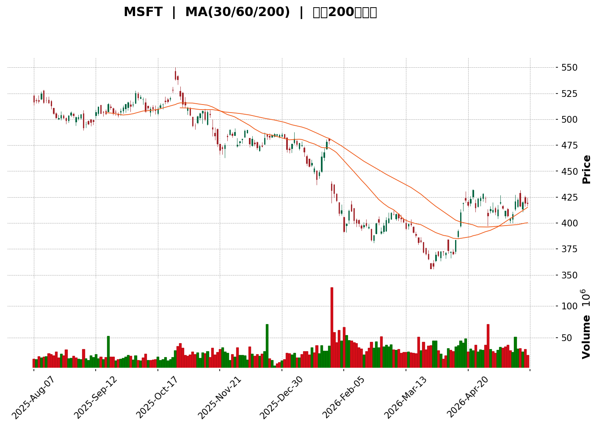
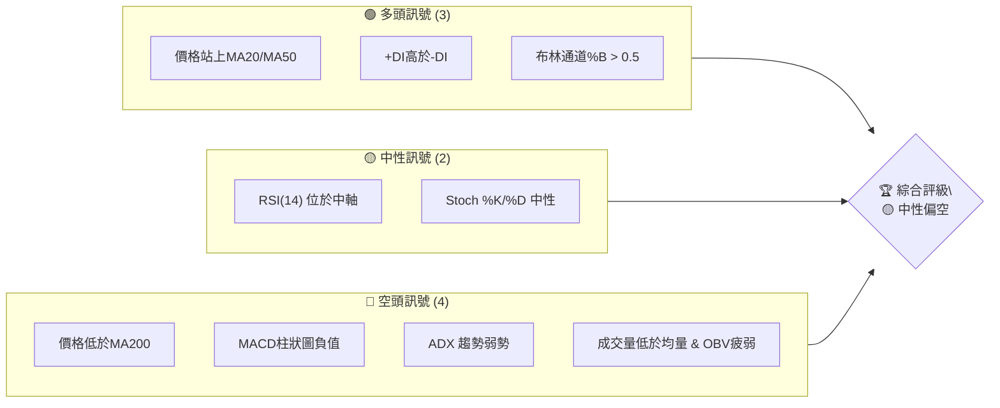
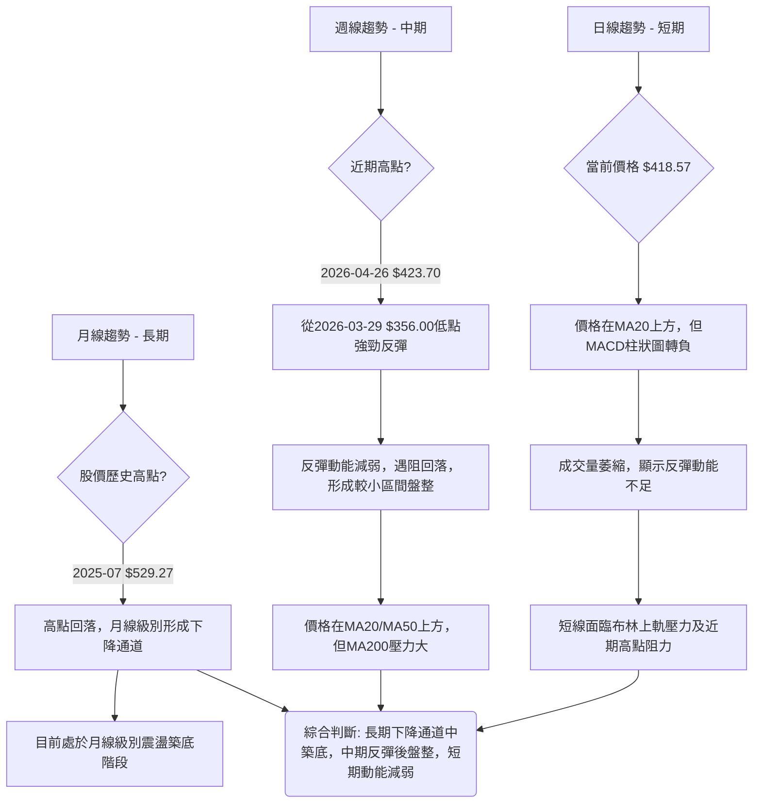
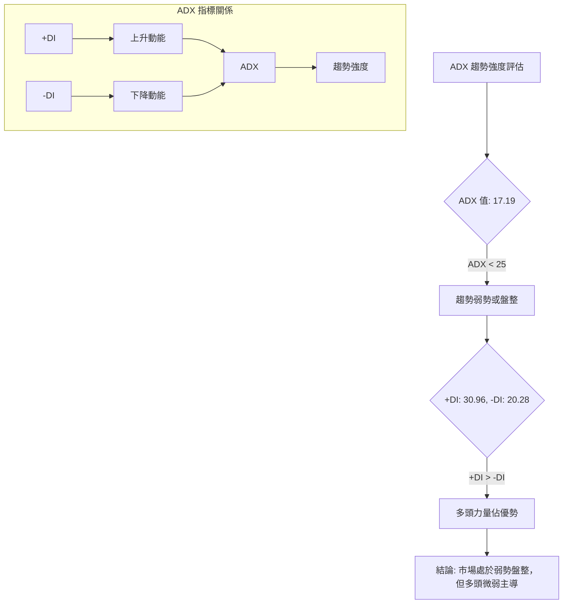
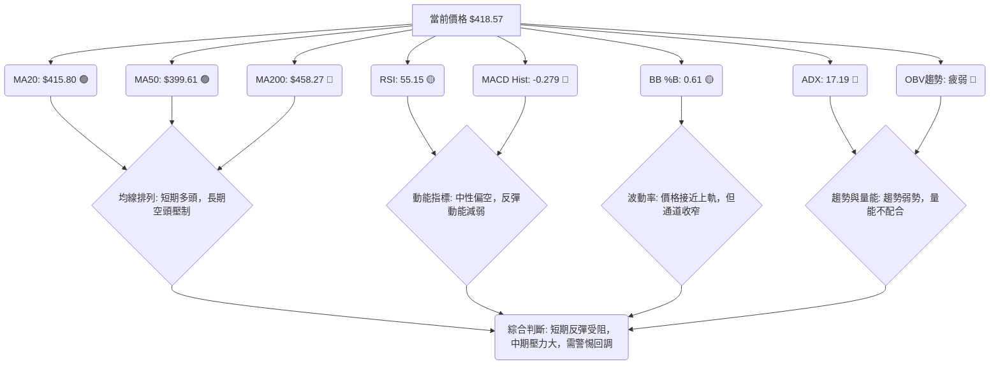

<details>
<summary>📊 靜態圖表 (點擊展開)</summary>

</details>

<html>
<head><meta charset="utf-8" /></head>
<body>
    <div>                        <script>window.PlotlyConfig = {MathJaxConfig: 'local'};</script>
        <script charset="utf-8" src="https://cdn.plot.ly/plotly-3.5.0.min.js" integrity="sha256-fHbNLP+GlIXN+efbQec78UkemUz3NJp7UmfGxC1tNxs=" crossorigin="anonymous"></script>                <div id="candlestick-chart" class="plotly-graph-div" style="height:500px; width:100%;"></div>            <script>                window.PLOTLYENV=window.PLOTLYENV || {};                                if (document.getElementById("candlestick-chart")) {                    Plotly.newPlot(                        "candlestick-chart",                        [{"close":{"dtype":"f8","bdata":"AAAAoLMlgEAAAADAOS+AQAAAAEAVLYBAAAAAgF5ogEAAAACAoyOAQAAAAMC3MoBAAAAAYGIggEAAAADgBAiAQAAAAMCvm39AAAAAoGZbf0AAAADgEFF\u002fQAAAAACbgH9AAAAAYGJRf0AAAABgFi5\u002fQAAAAIDQeH9AAAAAIOymf0AAAAAABXh\u002fQAAAAKAOX39AAAAAwLZif0AAAADgXox\u002fQAAAACAovn5AAAAA4AjxfkAAAACAX\u002fR+QAAAACCJE39AAAAAILYdf0AAAABgDqt\u002fQAAAAODuAIBAAAAAAGKdf0AAAADA9qx\u002fQAAAAIAAlH9AAAAAIF0VgEAAAAAAZvN\u002fQAAAAGBnoH9AAAAA4Aevf0AAAADgbH1\u002fQAAAAODbw39AAAAAYMj1f0AAAADghRWAQAAAAKCDI4BAAAAAQPQDgEAAAACgwBCAQAAAAMDyaYBAAAAAgHVFgEAAAAAgYEyAQAAAACDmOIBAAAAAwOi7f0AAAADgCe1\u002fQAAAAABo5X9AAAAAYC7jf0AAAABgPsZ\u002fQAAAAOCQ5X9AAAAAIE0MgEAAAACgNxOAQAAAAKAcKoBAAAAAgEUqgEAAAACghEKAQAAAAGBmgYBAAAAAoETVgEAAAABgItGAQAAAACCcU4BAAAAA4GgUgEAAAACANQ6AQAAAAGB98X9AAAAAAH5\u002ff0AAAACAi99+QAAAAOAX235AAAAAoAxtf0AAAACgqJd\u002fQAAAAGDFvn9AAAAAQPZBf0AAAAAAgq9\u002fQAAAACC9hH9AAAAAIOuqfkAAAADA3kB+QAAAACDxxH1AAAAA4G1gfUAAAABgYH59QAAAAOAArn1AAAAAYI81fkAAAABAQp1+QAAAAOBPSX5AAAAAwD19fkAAAACgyrl9QAAAAKBU631AAAAAQEkQfkAAAAAgfY1+QAAAAOBqnX5AAAAAIAPHfUAAAABgORV+QAAAAOCIxn1AAAAAIHCLfUAAAABgcqR9QAAAAEAloH1AAAAAIFkdfkAAAAAgQDx+QAAAAGBSLH5AAAAAoBBLfkAAAACAs11+QAAAAIDDWH5AAAAAAAxPfkAAAACgGVV+QAAAACCdF35AAAAAwH1tfUAAAADADmx9QAAAAGA3xn1AAAAAYDkVfkAAAAAg2L99QAAAAEB70n1AAAAAwAexfUAAAAAgVUl9QAAAAGB+lXxAAAAAoCpqfEAAAACgI518QAAAAOATSHxAAAAAgEGie0AAAADgPBJ8QAAAAKAl\u002fnxAAAAAoB5DfUAAAACAMOd9QAAAACDq931AAAAAwD\u002f5ekAAAADgHcZ6QAAAAEDjV3pAAAAAoDCWeUAAAADAqMV5QAAAAGDLfnhAAAAA4Mj1eEAAAADAQrx5QAAAAAABt3lAAAAAIDwpeUAAAABA7wB5QAAAAOCm+HhAAAAAoJuxeEAAAADgQN14QAAAAOCU2XhAAAAAwPHFeEAAAACgOfp3QAAAAICMQnhAAAAAYL\u002f7eEAAAAAAoQ15QAAAAGBCfnhAAAAAoATbeEAAAACA6TB5QAAAAEAwRXlAAAAAwK2ceUAAAADgN4F5QAAAACBniHlAAAAAICFOeUAAAABgFEB5QAAAACDdD3lAAAAAQB+reEAAAADAXvF4QAAAAKC\u002f6HhAAAAAoBdveEAAAAAg3kJ4QAAAACC30HdAAAAAoMHid0AAAABg8z53QAAAAGDPI3dAAAAAgN3SdkAAAACg+z92QAAAAIDyYnZAAAAAgOsVd0AAAADAJQl3QAAAACBySndAAAAAoC9Bd0AAAABAxDd3QAAAAABWWHdAAAAAQDhEd0AAAACAGCF3QAAAAACh+HdAAAAAoCqEeEAAAADgTKV5QAAAAMCgNXpAAAAAQAVeekAAAADgqRJ6QAAAAKDkc3pAAAAAAMD\u002fekAAAACgn+15QAAAAKA8e3pAAAAAIG5+ekAAAAAgKMV6QAAAAKCueHpAAAAAIGFueUAAAACAtdh5QAAAAACey3lAAAAA4NqneUAAAACgC9F5QAAAACDFPXpAAAAAwJDjeUAAAABgSrx5QAAAACA4bnlAAAAAIFlFeUAAAADguIh5QAAAAGAhUHpAAAAAoP5pekAAAABASQh6QAAAAGBmQnpAAAAAoHAxekAAAADAHil6QA=="},"high":{"dtype":"f8","bdata":"ourX9j1fgECbHPz6BESAQKR\u002fNyxGW4BAzGIGwy12gEBmaK6O1IOAQNltdA9CToBABGxew3JPgEDSFdGrajWAQH6VQS0+8X9An5mbHzavf0DguQX99oZ\u002fQE2gWsdAuH9AvzyyUd6Pf0CMl4\u002fW1Fx\u002fQNmHZzKPgX9AdyJr3\u002fm9f0ASvLJcSaZ\u002fQKeKv3AMbX9Au20PGoKJf0BYXzd8O49\u002fQIdmLM73y39AT7zXirsgf0Dyyn0jbTF\u002fQIVOgwYCQX9A8F\u002fz0Q1Af0ASjoNwMNV\u002fQAt8GbXOAYBAXmXTgMwPgEDGSgkDKMF\u002fQMeVDOh03X9AjU2nN0EggEA+u6N42hOAQJzW19Sf9X9AstEycBPUf0Acobwuzqx\u002fQINNMhJK639A3wURMMcMgECtODorMReAQOzKY7DfKYBAJdXX+IkygECMj0HntimAQEUjFiuBfYBAFWCe3LlzgEA1U+zuEV2AQIpA6d89SIBAbxGlh0dCgEDerDXFRwmAQH\u002fWqRVMAIBATsXVOXsPgEAoDGsmxwyAQBdkABPjAYBAHFTUQXwbgEBjg2TZZxuAQBRe60xlT4BAoA+RjjhFgEBJpemyWVCAQOlze8+5mYBA8vvpl+ExgUBncPEpqPaAQJoqnWvTnIBAJNAOBulvgEBzv1LqP02AQCqNnHZxAoBAys0MqXD5f0AZS6RvR2h\u002fQPtsWKLLA39AF\u002f3KVpB6f0AYbLxISaZ\u002fQILSdZYyx39AENSCL0vkf0AgvzbFFcZ\u002fQI2pSkZazn9A4zRvegg9f0ArW6N5LcF+QHbeALAbtn5Ad5hCQ7\u002fMfUDhkGEWkqx9QOakPgZp0H1A9OaDGFJifkARard9Iqd+QF49Y7cCe35AoQ7qMP60fkBCr6JHfSF+QFFGdgj68n1Arn5N5BsUfkCjy3PB4KF+QDN3FK8Cn35AUyJ7C6YhfkD4HMOiAD5+QEHuOxD6BH5AqquAW2vpfUD\u002fo6ciV7x9QJvKMkrz3X1AWa0Ykd52fkA0g5lT\u002flp+QGwzxe8CaX5Aywc21KxafkCGfShM3G9+QKYu821LX35AjHzfTPVifkALCojMJHh+QDSuAAudX35AUMTBCi4ofkDgCXxmWZ99QIIo2DLhyX1AGK4kXXZ4fkCWbGVfUgh+QLT3jFEV231AKq2nT7jtfUCdezXUupp9QAcrM\u002fX8IX1ADkA+axHjfEA0xTjnLtJ8QCLEe1hlbHxABEUHcO0qfEBtlO0gUS18QDMe9nkuUH1AscKyp1uCfUAzVhjKqgt+QAKiyk6GGX5AtdPxT5yIe0A4+Y+Oalp7QPIc2ulIzXpAr0jJZdxCekCJFhBgBR96QHomSRLWZ3lASpE8ciMAeUCV8uEyz9B5QPx8AVXTXHpARBH4MdHpeUCX45GyYkZ5QE93pF3fO3lAPe4HiejreEBcfxc\u002fZwx5QLlU\u002fiblOHlAt6LLihX0eEBxFdWYFqh4QNY\u002fN9BLSHhA655qLKMJeUBCTzHMv2l5QJe8+wFmv3hAc7AowSoFeUBmp4r6Il15QCwi+UNEonlARnRwxIareUD0+UJLhMJ5QN3LD8sslXlAOF42EgSVeUCMPZ1QBIJ5QPOGCmrgU3lAoIrqXc0+eUBRmP\u002f6Ofx4QJkxknNqOHlAWg\u002f1xjzSeEA44kGIRHp4QCwwnzaeInhA5JWFe\u002fgleED1IdVdS9p3QG2YzvXrg3dAB2EpC5Bed0BfDu+3qpp2QFvCYzggyXZAwB9QVYFBd0DRsUta6FJ3QNftB+hRTXdA4WS1ucFOd0CwuGY1Ujp3QPZsJeyvAnhA0kWQsRVLd0Aja2hGQG13QJFeud5X+3dA599vY2SdeEBbSYFdl9d5QGMi8oqRPnpAtjB1MFvqekBO5ukvpGZ6QFzmNcQbpHpAgL1b+DMMe0D1NEn66Gt6QMPfHXSBgHpAOnV9mv2iekA27ZyR2s96QB\u002fsrltcnnpAoMKk2GPYeUDFYE8dVgN6QOgoB\u002f7tPXpAXJS1chH+eUCaI75kQBh6QGC+3ozhsHpApP+wrZobekDOVAT8xLx5QBekGtKh6XlAvOE0A+lWeUBqkYLqMq95QIGMLQzqs3pANcGAQziDekBki6jcPPx6QJrLIAsBU3pAAAAAoHClekAAAABgZoZ6QA=="},"hovertemplate":"\u003cb\u003e%{x|%Y-%m-%d}\u003c\u002fb\u003e\u003cbr\u003e\u958b: $%{open:.2f}\u003cbr\u003e\u9ad8: $%{high:.2f}\u003cbr\u003e\u4f4e: $%{low:.2f}\u003cbr\u003e\u6536: $%{close:.2f}\u003cextra\u003e\u003c\u002fextra\u003e","low":{"dtype":"f8","bdata":"N3fvBJcLgEDbCJouWhqAQIFHIAXQHIBAfVIJw3Y0gEDRtR0DCRqAQLbUlnklIIBA+8BZ0LsXgECasbA3Jt9\u002fQBWcTDlSiH9ABki5SxVHf0BBbIcu5jh\u002fQBvsbX\u002f4M39Apnr3eyhPf0BK1OV+9vV+QPuScTEQDH9ALUFkWBllf0BxvQV2ClV\u002fQKw3nRbv2n5Ad9pp+4kyf0Bt84xfvD9\u002fQKVAhmtXlH5A17UVN6K+fkAmc02tFel+QLx4ntaA2X5AKKcrT\u002fLrfkCLq0WU3Up\u002fQAlWHsDyfH9AOXCdF2OWf0DLLzmO72t\u002fQDaYXv1wh39ABorgLJOxf0CU8We8B9V\u002fQMP1UH7ggX9A6zvyIq17f0AKPQ8syV1\u002fQLgxjAPodn9AUlZi0taaf0DdxkaSPad\u002fQBDkHv2Dx39A2k0oL3W3f0Db6uJTJPx\u002fQJcpGaiCF4BAtSvGXEQxgEDctPRuYj6AQFu\u002fs5EmEYBASCq0aMOmf0CloKJ3W8d\u002fQNhViGMMbX9A336LiqWsf0D8trMU6o5\u002fQEf5UIDggX9A8qKWXC7jf0AGEJTX+tx\u002fQHEjsVmdE4BAr34cAsUagEDfZ2ngdiuAQJqw0jlybYBAw8NsAe\u002fKgEDp1O4f0aqAQAeXRkqsNoBAzIO\u002fW7v9f0ACZfyln\u002fV\u002fQGG+qIxNin9Ada2SM0V2f0DjcefgCMt+QAPQzCZVon5ATNkF+ZL6fkBZzzwsBDN\u002fQB+l3zmp\u002f35Aw+Alzikif0AyBEBo8+R+QHCBgAG4W39AAlee03Y7fkC4ZPh1qfx9QPSCKRVFln1AA6JeKhojfUBdMiPYHh99QCl1NxxD7XxAPLdYthDxfUA9ehP24Ed+QE6YOjQFKH5AHLHZU59CfkBZPMKxfZF9QBbo4P4Jpn1AFdJnGRzMfUAY9mtUuCN+QEbYIuxYZX5AittiMpSPfUDphGXyAJx9QBFqHGWmo31AHq+PBM1mfUD2cndvrUx9QClDwhZOjn1ADL7mF1e8fUB50+8JnQV+QFLsDr\u002fMCH5A92opUXQpfkA8eBQu4yp+QBvEgUfjPH5AeujapoggfkDCc9l0jzV+QENnrC+EEn5A6o73WzVBfUAvs+X1sTZ9QGlBY3StOn1AMHoEvku9fUATZgn8AJx9QMdxMjK0YX1Aql9e\u002fSKZfUBPncu2Jf58QNJf5WFKcnxASfArbQ9efECCxQWhTGd8QOCRQgic9HtASq+z28JLe0BgqQeTp6t7QFWFy0aFCHxAgvM5HTq\u002ffEDRJGL+\u002fnB9QJOSsosXvn1AkdxCQnQyekDSWtb78oh6QAAmthYMRnpAby6YX\u002fpreUCuetNjz3Z5QGotFURKaXhAzagMBtlyeECU44PMe\u002fF4QNPgwrnsrXlA9qZ4pLbzeEBFwFst7cN4QMoy\u002fUGQxHhAME7cT36MeEBewJyQAal4QFiaYvgAvXhAj77+UuWkeECBB7hAWuR3QIU+UigpzndAzPUjixFVeEDUSjpBDd54QCFONzGZUHhAyoVifJJceEAtL4dNJH14QOQx2Ake93hAlkjPd2o4eUBTTL+7CHp5QL1YSxEMKnlAu65KbfIgeUB53cqfjQt5QFvc6RN4DXlAmrP+AV6WeEBx6Z0N\u002fZ54QO4a8PE+znhAI\u002fJPvnpieEDYS79ZkyN4QM68xJ3GtHdAbiRWj67Nd0BtMOLgvTB3QFxSR3tMDXdAzLaYh2nGdkB6NCoN1Tt2QG5CYPkoOHZArSwMupCkdkCc+GHbd\u002fZ2QG4wV8rOtXZAWhrMCzkLd0Cik0vZSNx2QDO8Hpm3KXdA5v9iihvkdkAVVI9PrxN3QDw1HY19I3dAMFPzVfQaeEABTh4l9r14QLvBWiH9s3lAbfL1Nn48ekCtGTGLZ\u002fZ5QPHcehzGBHpAsR5z4hFsekAHrVVrVah5QHXO3PNr7nlAgqPrurICekCTsZyQz096QJP1GUobNnpAZJBjvGXSeEC9FMPo2Jh5QMeAsDaYnnlAtzrA9ql+eUCepMtXwEN5QFz\u002f8wquHXpAg9wbKq\u002fReUBWv\u002fZh+kl5QELkxMAtXHlArb6L4JwCeUBqr8TPNwB5QGeJliJIwHlA2LascmPreUCxXZsbcPl5QLg3LcaTpnlAAAAAIFz7eUAAAACgRwV6QA=="},"name":"\u50f9\u683c","open":{"dtype":"f8","bdata":"F4h+5gBVgEB7C3CJqzOAQIETMgZKMYBAdgfAGMw8gECSm\u002fzBJX+AQCPnj1NaM4BAS1vwDQU1gEAyatahpyuAQNd5gx607n9A+dgBTUadf0AJ1WlNUkh\u002fQD2AN7E5UX9AM2s7yBB3f0Bdxi8y+VJ\u002fQICraK9zLX9AmbfW+2B+f0CavNVXV5d\u002fQEn61R0gFX9AtQeoNulJf0CY+qkaBVJ\u002fQFIvXi\u002fcnX9AUokXcprvfkALoMyGYyR\u002fQO66SHgIPX9AN7oyKW0xf0BOYfcmYnd\u002fQCGduntomX9Aye6VQwQNgEC2nILogLZ\u002fQDLGyeJVxH9A5hccu4y1f0Bzon4OwwKAQPMjXzIQ6X9AEMIiErCyf0BYD0UDnpF\u002fQFfIrZaZrX9AE23myH7Ef0DTjLnpKOB\u002fQEVb71H2+H9AVVrTAg8TgECzaeXYww6AQNxLYf\u002fEGoBADxf30rhngEAk0woc5T+AQPbg9gVsOIBAOTfdL\u002fUigEDerDXFRwmAQG\u002fZGXlNsH9AsIhT74H7f0CNhKyeqtV\u002fQAL82AdinX9AMwnNMfH1f0Cj29UP8hGAQKz+GCP2LoBAphjTQmA5gEAM95vR\u002fzuAQCvRF4Z3g4BAd2xJCk8UgUD5JmxuFeyAQCYrZcoheYBA8w\u002ffkWlsgECB4kILTySAQMkQ4d+gyH9Al8DRGR3hf0D3lKmXpGd\u002fQDUIFgYp3X5AQPUZIkoOf0Dy7Y0k+Fl\u002fQOy2rEJ4on9AarqSKpOxf0DJFOvqgvF+QBhkwKAAlH9AAZ6KBQrEfkC5D8QOQHB+QA2CG65oqH5ARW\u002fegw7GfUBc9yc3To59QGjv3KZ9f31A2ZJganZCfkBvFZX1Ald+QBrXxkBkZH5A\u002fnlTcP5IfkDyEP7aVKN9QHh7yJwg2n1AAMZhXxcGfkDF5XMR2Ct+QEv1wabnbn5AN0ZB6iQefkBFFqL2RKh9QIfK31IV231A+LDMHYvffUA\u002fzRubFV19QKDZUce6rH1ALEVIZR7BfUDD9KsZMFN+QBYxbbVvP35AQfRWFUctfkCPRXdebTh+QA9w3KjVSH5AXtWijV0rfkBgktzlaDx+QKrtv53VWn5ATmzpEeEjfkAn7NnmVH99QF\u002fUaKgwe31Alkd5nyDafUDhbOfIs\u002fF9QAp2TOtUf31ASU\u002fZIuiofUAG5QUuNYl9QF0ER25FBn1AtMydR\u002f\u002fgfECgVC2dzXx8QBRjWw2DE3xAK3Rqcn4pfECrXUbMKtp7QHXFOZHdHXxALCc+wfPzfEA+B\u002fcPmXl9QLE0ug4VEX5ARXK35KBge0AuapAdkVN7QMBzSf5RxXpAFwSkXzlCekBtedFt2JJ5QD71SzAjWnlAn\u002fZbhmfWeEC+Ntql4TB5QDodgE8nHHpA2MmsZ1vleUAoO1k9RTN5QE7C7IiCKnlAclKJZDPXeECxbf1x1sV4QKZ5bUIv\u002fXhARwwsChC0eECT\u002fqNIV6J4QCJcgAX19HdAFkSoxPlaeEBwViiIXT15QIqDC1eQYHhAYPrEviyAeECijGdEpYR4QIUmS6pxBnlANvJwSrw4eUCQzRDgDIV5QB7TP9+3QHlAeMB9M02SeUCOWlKEGEt5QJxzoZoWPHlAk9NWQSICeUCjHHnkWtN4QATrFIN69nhANdyI+ljEeEAzDHVQHFR4QLSjfvJDH3hAAEB6CCDxd0A5lCa3idh3QLosCNOvgXdAAPMkMUwgd0CBlGK24pF2QEdiZLnikXZAyeocoDG8dkAvu2HH7Ep3QPokxHOp5nZAe0+luexKd0B3RRlDohh3QNC9cTleAnhAqsC7ix47d0CMz2FyyEJ3QP1Yyz\u002fXTHdAtVpHcU4xeED+6xPHPNJ4QCzLhso9L3pAePuvJ25+ekDgMy481kN6QN1gZPNONXpA35ifc02UekDHjd15uC96QNoVYvgZAXpA1yR+eXlXekCPQNFNcHp6QMSIEBCZenpA10mHLcGeeUDj65WEhr55QKVIqMloqnlAvmNLP8LmeUBuH3lC5HF5QKsTrpc7M3pAuge7p84HekDdzRfn0G95QIJPn\u002flY2XlAJO\u002fwCkIleUCIS4aRsTl5QPvTkpj+1XlA85bVgYP7eUCvVgbGiM96QKyuHP5l1HlAAAAAAACMekAAAADgozh6QA=="},"x":["2025-08-07T00:00:00-04:00","2025-08-08T00:00:00-04:00","2025-08-11T00:00:00-04:00","2025-08-12T00:00:00-04:00","2025-08-13T00:00:00-04:00","2025-08-14T00:00:00-04:00","2025-08-15T00:00:00-04:00","2025-08-18T00:00:00-04:00","2025-08-19T00:00:00-04:00","2025-08-20T00:00:00-04:00","2025-08-21T00:00:00-04:00","2025-08-22T00:00:00-04:00","2025-08-25T00:00:00-04:00","2025-08-26T00:00:00-04:00","2025-08-27T00:00:00-04:00","2025-08-28T00:00:00-04:00","2025-08-29T00:00:00-04:00","2025-09-02T00:00:00-04:00","2025-09-03T00:00:00-04:00","2025-09-04T00:00:00-04:00","2025-09-05T00:00:00-04:00","2025-09-08T00:00:00-04:00","2025-09-09T00:00:00-04:00","2025-09-10T00:00:00-04:00","2025-09-11T00:00:00-04:00","2025-09-12T00:00:00-04:00","2025-09-15T00:00:00-04:00","2025-09-16T00:00:00-04:00","2025-09-17T00:00:00-04:00","2025-09-18T00:00:00-04:00","2025-09-19T00:00:00-04:00","2025-09-22T00:00:00-04:00","2025-09-23T00:00:00-04:00","2025-09-24T00:00:00-04:00","2025-09-25T00:00:00-04:00","2025-09-26T00:00:00-04:00","2025-09-29T00:00:00-04:00","2025-09-30T00:00:00-04:00","2025-10-01T00:00:00-04:00","2025-10-02T00:00:00-04:00","2025-10-03T00:00:00-04:00","2025-10-06T00:00:00-04:00","2025-10-07T00:00:00-04:00","2025-10-08T00:00:00-04:00","2025-10-09T00:00:00-04:00","2025-10-10T00:00:00-04:00","2025-10-13T00:00:00-04:00","2025-10-14T00:00:00-04:00","2025-10-15T00:00:00-04:00","2025-10-16T00:00:00-04:00","2025-10-17T00:00:00-04:00","2025-10-20T00:00:00-04:00","2025-10-21T00:00:00-04:00","2025-10-22T00:00:00-04:00","2025-10-23T00:00:00-04:00","2025-10-24T00:00:00-04:00","2025-10-27T00:00:00-04:00","2025-10-28T00:00:00-04:00","2025-10-29T00:00:00-04:00","2025-10-30T00:00:00-04:00","2025-10-31T00:00:00-04:00","2025-11-03T00:00:00-05:00","2025-11-04T00:00:00-05:00","2025-11-05T00:00:00-05:00","2025-11-06T00:00:00-05:00","2025-11-07T00:00:00-05:00","2025-11-10T00:00:00-05:00","2025-11-11T00:00:00-05:00","2025-11-12T00:00:00-05:00","2025-11-13T00:00:00-05:00","2025-11-14T00:00:00-05:00","2025-11-17T00:00:00-05:00","2025-11-18T00:00:00-05:00","2025-11-19T00:00:00-05:00","2025-11-20T00:00:00-05:00","2025-11-21T00:00:00-05:00","2025-11-24T00:00:00-05:00","2025-11-25T00:00:00-05:00","2025-11-26T00:00:00-05:00","2025-11-28T00:00:00-05:00","2025-12-01T00:00:00-05:00","2025-12-02T00:00:00-05:00","2025-12-03T00:00:00-05:00","2025-12-04T00:00:00-05:00","2025-12-05T00:00:00-05:00","2025-12-08T00:00:00-05:00","2025-12-09T00:00:00-05:00","2025-12-10T00:00:00-05:00","2025-12-11T00:00:00-05:00","2025-12-12T00:00:00-05:00","2025-12-15T00:00:00-05:00","2025-12-16T00:00:00-05:00","2025-12-17T00:00:00-05:00","2025-12-18T00:00:00-05:00","2025-12-19T00:00:00-05:00","2025-12-22T00:00:00-05:00","2025-12-23T00:00:00-05:00","2025-12-24T00:00:00-05:00","2025-12-26T00:00:00-05:00","2025-12-29T00:00:00-05:00","2025-12-30T00:00:00-05:00","2025-12-31T00:00:00-05:00","2026-01-02T00:00:00-05:00","2026-01-05T00:00:00-05:00","2026-01-06T00:00:00-05:00","2026-01-07T00:00:00-05:00","2026-01-08T00:00:00-05:00","2026-01-09T00:00:00-05:00","2026-01-12T00:00:00-05:00","2026-01-13T00:00:00-05:00","2026-01-14T00:00:00-05:00","2026-01-15T00:00:00-05:00","2026-01-16T00:00:00-05:00","2026-01-20T00:00:00-05:00","2026-01-21T00:00:00-05:00","2026-01-22T00:00:00-05:00","2026-01-23T00:00:00-05:00","2026-01-26T00:00:00-05:00","2026-01-27T00:00:00-05:00","2026-01-28T00:00:00-05:00","2026-01-29T00:00:00-05:00","2026-01-30T00:00:00-05:00","2026-02-02T00:00:00-05:00","2026-02-03T00:00:00-05:00","2026-02-04T00:00:00-05:00","2026-02-05T00:00:00-05:00","2026-02-06T00:00:00-05:00","2026-02-09T00:00:00-05:00","2026-02-10T00:00:00-05:00","2026-02-11T00:00:00-05:00","2026-02-12T00:00:00-05:00","2026-02-13T00:00:00-05:00","2026-02-17T00:00:00-05:00","2026-02-18T00:00:00-05:00","2026-02-19T00:00:00-05:00","2026-02-20T00:00:00-05:00","2026-02-23T00:00:00-05:00","2026-02-24T00:00:00-05:00","2026-02-25T00:00:00-05:00","2026-02-26T00:00:00-05:00","2026-02-27T00:00:00-05:00","2026-03-02T00:00:00-05:00","2026-03-03T00:00:00-05:00","2026-03-04T00:00:00-05:00","2026-03-05T00:00:00-05:00","2026-03-06T00:00:00-05:00","2026-03-09T00:00:00-04:00","2026-03-10T00:00:00-04:00","2026-03-11T00:00:00-04:00","2026-03-12T00:00:00-04:00","2026-03-13T00:00:00-04:00","2026-03-16T00:00:00-04:00","2026-03-17T00:00:00-04:00","2026-03-18T00:00:00-04:00","2026-03-19T00:00:00-04:00","2026-03-20T00:00:00-04:00","2026-03-23T00:00:00-04:00","2026-03-24T00:00:00-04:00","2026-03-25T00:00:00-04:00","2026-03-26T00:00:00-04:00","2026-03-27T00:00:00-04:00","2026-03-30T00:00:00-04:00","2026-03-31T00:00:00-04:00","2026-04-01T00:00:00-04:00","2026-04-02T00:00:00-04:00","2026-04-06T00:00:00-04:00","2026-04-07T00:00:00-04:00","2026-04-08T00:00:00-04:00","2026-04-09T00:00:00-04:00","2026-04-10T00:00:00-04:00","2026-04-13T00:00:00-04:00","2026-04-14T00:00:00-04:00","2026-04-15T00:00:00-04:00","2026-04-16T00:00:00-04:00","2026-04-17T00:00:00-04:00","2026-04-20T00:00:00-04:00","2026-04-21T00:00:00-04:00","2026-04-22T00:00:00-04:00","2026-04-23T00:00:00-04:00","2026-04-24T00:00:00-04:00","2026-04-27T00:00:00-04:00","2026-04-28T00:00:00-04:00","2026-04-29T00:00:00-04:00","2026-04-30T00:00:00-04:00","2026-05-01T00:00:00-04:00","2026-05-04T00:00:00-04:00","2026-05-05T00:00:00-04:00","2026-05-06T00:00:00-04:00","2026-05-07T00:00:00-04:00","2026-05-08T00:00:00-04:00","2026-05-11T00:00:00-04:00","2026-05-12T00:00:00-04:00","2026-05-13T00:00:00-04:00","2026-05-14T00:00:00-04:00","2026-05-15T00:00:00-04:00","2026-05-18T00:00:00-04:00","2026-05-19T00:00:00-04:00","2026-05-20T00:00:00-04:00","2026-05-21T00:00:00-04:00","2026-05-22T00:00:00-04:00"],"type":"candlestick"},{"hovertemplate":"MA30: $%{y:.2f}\u003cextra\u003e\u003c\u002fextra\u003e","line":{"color":"#2196F3","dash":"dash","width":2},"mode":"lines","name":"MA30","x":["2025-08-07T00:00:00-04:00","2025-08-08T00:00:00-04:00","2025-08-11T00:00:00-04:00","2025-08-12T00:00:00-04:00","2025-08-13T00:00:00-04:00","2025-08-14T00:00:00-04:00","2025-08-15T00:00:00-04:00","2025-08-18T00:00:00-04:00","2025-08-19T00:00:00-04:00","2025-08-20T00:00:00-04:00","2025-08-21T00:00:00-04:00","2025-08-22T00:00:00-04:00","2025-08-25T00:00:00-04:00","2025-08-26T00:00:00-04:00","2025-08-27T00:00:00-04:00","2025-08-28T00:00:00-04:00","2025-08-29T00:00:00-04:00","2025-09-02T00:00:00-04:00","2025-09-03T00:00:00-04:00","2025-09-04T00:00:00-04:00","2025-09-05T00:00:00-04:00","2025-09-08T00:00:00-04:00","2025-09-09T00:00:00-04:00","2025-09-10T00:00:00-04:00","2025-09-11T00:00:00-04:00","2025-09-12T00:00:00-04:00","2025-09-15T00:00:00-04:00","2025-09-16T00:00:00-04:00","2025-09-17T00:00:00-04:00","2025-09-18T00:00:00-04:00","2025-09-19T00:00:00-04:00","2025-09-22T00:00:00-04:00","2025-09-23T00:00:00-04:00","2025-09-24T00:00:00-04:00","2025-09-25T00:00:00-04:00","2025-09-26T00:00:00-04:00","2025-09-29T00:00:00-04:00","2025-09-30T00:00:00-04:00","2025-10-01T00:00:00-04:00","2025-10-02T00:00:00-04:00","2025-10-03T00:00:00-04:00","2025-10-06T00:00:00-04:00","2025-10-07T00:00:00-04:00","2025-10-08T00:00:00-04:00","2025-10-09T00:00:00-04:00","2025-10-10T00:00:00-04:00","2025-10-13T00:00:00-04:00","2025-10-14T00:00:00-04:00","2025-10-15T00:00:00-04:00","2025-10-16T00:00:00-04:00","2025-10-17T00:00:00-04:00","2025-10-20T00:00:00-04:00","2025-10-21T00:00:00-04:00","2025-10-22T00:00:00-04:00","2025-10-23T00:00:00-04:00","2025-10-24T00:00:00-04:00","2025-10-27T00:00:00-04:00","2025-10-28T00:00:00-04:00","2025-10-29T00:00:00-04:00","2025-10-30T00:00:00-04:00","2025-10-31T00:00:00-04:00","2025-11-03T00:00:00-05:00","2025-11-04T00:00:00-05:00","2025-11-05T00:00:00-05:00","2025-11-06T00:00:00-05:00","2025-11-07T00:00:00-05:00","2025-11-10T00:00:00-05:00","2025-11-11T00:00:00-05:00","2025-11-12T00:00:00-05:00","2025-11-13T00:00:00-05:00","2025-11-14T00:00:00-05:00","2025-11-17T00:00:00-05:00","2025-11-18T00:00:00-05:00","2025-11-19T00:00:00-05:00","2025-11-20T00:00:00-05:00","2025-11-21T00:00:00-05:00","2025-11-24T00:00:00-05:00","2025-11-25T00:00:00-05:00","2025-11-26T00:00:00-05:00","2025-11-28T00:00:00-05:00","2025-12-01T00:00:00-05:00","2025-12-02T00:00:00-05:00","2025-12-03T00:00:00-05:00","2025-12-04T00:00:00-05:00","2025-12-05T00:00:00-05:00","2025-12-08T00:00:00-05:00","2025-12-09T00:00:00-05:00","2025-12-10T00:00:00-05:00","2025-12-11T00:00:00-05:00","2025-12-12T00:00:00-05:00","2025-12-15T00:00:00-05:00","2025-12-16T00:00:00-05:00","2025-12-17T00:00:00-05:00","2025-12-18T00:00:00-05:00","2025-12-19T00:00:00-05:00","2025-12-22T00:00:00-05:00","2025-12-23T00:00:00-05:00","2025-12-24T00:00:00-05:00","2025-12-26T00:00:00-05:00","2025-12-29T00:00:00-05:00","2025-12-30T00:00:00-05:00","2025-12-31T00:00:00-05:00","2026-01-02T00:00:00-05:00","2026-01-05T00:00:00-05:00","2026-01-06T00:00:00-05:00","2026-01-07T00:00:00-05:00","2026-01-08T00:00:00-05:00","2026-01-09T00:00:00-05:00","2026-01-12T00:00:00-05:00","2026-01-13T00:00:00-05:00","2026-01-14T00:00:00-05:00","2026-01-15T00:00:00-05:00","2026-01-16T00:00:00-05:00","2026-01-20T00:00:00-05:00","2026-01-21T00:00:00-05:00","2026-01-22T00:00:00-05:00","2026-01-23T00:00:00-05:00","2026-01-26T00:00:00-05:00","2026-01-27T00:00:00-05:00","2026-01-28T00:00:00-05:00","2026-01-29T00:00:00-05:00","2026-01-30T00:00:00-05:00","2026-02-02T00:00:00-05:00","2026-02-03T00:00:00-05:00","2026-02-04T00:00:00-05:00","2026-02-05T00:00:00-05:00","2026-02-06T00:00:00-05:00","2026-02-09T00:00:00-05:00","2026-02-10T00:00:00-05:00","2026-02-11T00:00:00-05:00","2026-02-12T00:00:00-05:00","2026-02-13T00:00:00-05:00","2026-02-17T00:00:00-05:00","2026-02-18T00:00:00-05:00","2026-02-19T00:00:00-05:00","2026-02-20T00:00:00-05:00","2026-02-23T00:00:00-05:00","2026-02-24T00:00:00-05:00","2026-02-25T00:00:00-05:00","2026-02-26T00:00:00-05:00","2026-02-27T00:00:00-05:00","2026-03-02T00:00:00-05:00","2026-03-03T00:00:00-05:00","2026-03-04T00:00:00-05:00","2026-03-05T00:00:00-05:00","2026-03-06T00:00:00-05:00","2026-03-09T00:00:00-04:00","2026-03-10T00:00:00-04:00","2026-03-11T00:00:00-04:00","2026-03-12T00:00:00-04:00","2026-03-13T00:00:00-04:00","2026-03-16T00:00:00-04:00","2026-03-17T00:00:00-04:00","2026-03-18T00:00:00-04:00","2026-03-19T00:00:00-04:00","2026-03-20T00:00:00-04:00","2026-03-23T00:00:00-04:00","2026-03-24T00:00:00-04:00","2026-03-25T00:00:00-04:00","2026-03-26T00:00:00-04:00","2026-03-27T00:00:00-04:00","2026-03-30T00:00:00-04:00","2026-03-31T00:00:00-04:00","2026-04-01T00:00:00-04:00","2026-04-02T00:00:00-04:00","2026-04-06T00:00:00-04:00","2026-04-07T00:00:00-04:00","2026-04-08T00:00:00-04:00","2026-04-09T00:00:00-04:00","2026-04-10T00:00:00-04:00","2026-04-13T00:00:00-04:00","2026-04-14T00:00:00-04:00","2026-04-15T00:00:00-04:00","2026-04-16T00:00:00-04:00","2026-04-17T00:00:00-04:00","2026-04-20T00:00:00-04:00","2026-04-21T00:00:00-04:00","2026-04-22T00:00:00-04:00","2026-04-23T00:00:00-04:00","2026-04-24T00:00:00-04:00","2026-04-27T00:00:00-04:00","2026-04-28T00:00:00-04:00","2026-04-29T00:00:00-04:00","2026-04-30T00:00:00-04:00","2026-05-01T00:00:00-04:00","2026-05-04T00:00:00-04:00","2026-05-05T00:00:00-04:00","2026-05-06T00:00:00-04:00","2026-05-07T00:00:00-04:00","2026-05-08T00:00:00-04:00","2026-05-11T00:00:00-04:00","2026-05-12T00:00:00-04:00","2026-05-13T00:00:00-04:00","2026-05-14T00:00:00-04:00","2026-05-15T00:00:00-04:00","2026-05-18T00:00:00-04:00","2026-05-19T00:00:00-04:00","2026-05-20T00:00:00-04:00","2026-05-21T00:00:00-04:00","2026-05-22T00:00:00-04:00"],"y":{"dtype":"f8","bdata":"AAAAAAAA+H8AAAAAAAD4fwAAAAAAAPh\u002fAAAAAAAA+H8AAAAAAAD4fwAAAAAAAPh\u002fAAAAAAAA+H8AAAAAAAD4fwAAAAAAAPh\u002fAAAAAAAA+H8AAAAAAAD4fwAAAAAAAPh\u002fAAAAAAAA+H8AAAAAAAD4fwAAAAAAAPh\u002fAAAAAAAA+H8AAAAAAAD4fwAAAAAAAPh\u002fAAAAAAAA+H8AAAAAAAD4fwAAAAAAAPh\u002fAAAAAAAA+H8AAAAAAAD4fwAAAAAAAPh\u002fAAAAAAAA+H8AAAAAAAD4fwAAAAAAAPh\u002fAAAAAAAA+H8AAAAAAAD4fyIiIoJZpX9AzczMrEKkf0CJiIgosaB\u002fQM3MzPx\u002fmn9AERER0deQf0CJiIhYHYp\u002fQO\u002fu7o66hH9A3t3drTqCf0BVVVUlIYN\u002fQDMzM0PXiH9AMzMzU5eOf0AREREBipV\u002fQJqZmUnZoH9AZmZmxkyrf0ARERGBY7d\u002fQJqZmSmwv39AAAAAQGPAf0AAAADQScR\u002fQCIiIkLEyH9AMzMzgwzNf0DNzMxc+s5\u002fQAAAADDT2H9A3t3dXa3if0B3d3cX4ex\u002fQBEREaGR939Ad3d3B\u002fcAgEC8u7sTmQSAQLy7u1PhCIBAMzMz+6ERgECamZnh\u002fBmAQM3MzCSTHoBAiYiIAIsegEDNzMwEOh+AQERERPyTIIBAd3d3J8kfgEAAAACIJx2AQN7d3WVGGYBAiYiIAP8WgEBmZmYmihSAQBEREclEEoBA7+7uNvgOgEC8u7vTEQ2AQCIiItJ7B4BAVVVVpff+f0CamZmp+Op\u002fQO\u002fu7o4k1H9AzczM3AbAf0Crqqp6Rat\u002fQERERKRbmH9Aq6qqigmKf0BVVVVFI4B\u002fQO\u002fu7l5lcn9AZmZmFq9kf0Dv7u7u\u002fk9\u002fQHd3d8duO39AERERQRcof0ARERFRThd\u002fQO\u002fu7h7cAn9AvLu7+6zhfkDe3d3NX8N+QM3MzGzRqn5A7+7uXoGUfkDNzMyMcH9+QImIiFipa35AERERUdtffkDv7u7eaVp+QM3MzHyWVH5ARERE9OtKfkCamZnZdEB+QKuqqtqFNH5Aq6qq+mwsfkB3d3f34CB+QLy7uzu1FH5AVVVVhSAKfkBVVVWFCAN+QFVVVWUTA35A3t3dLRoJfkBmZmbWSAt+QN7d3R2ADH5AIiIiMhUIfkDe3d19wPx9QCIiIoI57n1AvLu7q4XcfUAzMzOjCNN9QDMzMwMPxX1AVVVVBVOwfUBmZmY2Jpt9QCIiIpJOjX1AZmZmFumIfUAiIiJCYId9QCIiIqIFiX1AZmZmFhVzfUDe3d3Nmlp9QKuqqpqYPn1A7+7uHvUXfUAiIiIC3\u002fF8QDMzM5NrwXxA7+7uLumTfEDNzMxsZWx8QBEREfHeRHxAzczMnPEYfEC8u7u7eOt7QLy7u9vFv3tAREREdGCXe0CamZm5e3B7QO\u002fu7k52RntA7+7uHicZe0Crqqoa5ud6QGZmZjZvuHpAIiIiIkKQekB3d3eHImx6QBERESE6SXpA7+7u\u002ftoqekC8u7vbpQ16QKuqqprz83lAIiIi8rLieUARERFhzMx5QHd3dwdGr3lAiYiI2IGNeUBVVVW1zWV5QImIiGjvO3lAiYiIqEMoeUAAAACwoxh5QERERMRmDHlAmpmZmZACeUCrqqr6q\u002fV4QBEREYHe73hAiYiImLPmeEB3d3c3ddF4QImIiBh8u3hAIiIiAoqneEC8u7trCpB4QAAAAOD7eXhA3t3dzUJseEDNzMxMqFx4QHd3d1daT3hAAAAA8GRCeEDv7u6O6Tt4QBEREfEaNHhA3t3dTXQleECrqqpaCRV4QKuqqgqVEHhAiYiI6K8NeEBmZmYWkRF4QGZmZtaUGXhAAAAAsAYgeEAiIiLS3yR4QGZmZla5LHhAERERkS07eECamZl59kB4QCIiIkITTXhARERE9KZceEC8u7u7Pmx4QAAAAICTeXhAMzMz8xWCeEAREREhnY94QBEREbGCoHhAIiIiIp2veEAAAADgjMV4QAAAAAAE4HhAvLu7Gyz6eEB3d3d36hd5QBEREUHkMXlAq6qqCopEeUDv7u6+21l5QKuqqtqlc3lAAAAAsJuOeUDv7u4eoKZ5QImIiIh+v3lAERER4XfYeUBERET0VfJ5QA=="},"type":"scatter"},{"hovertemplate":"MA60: $%{y:.2f}\u003cextra\u003e\u003c\u002fextra\u003e","line":{"color":"#9C27B0","dash":"dash","width":2},"mode":"lines","name":"MA60","x":["2025-08-07T00:00:00-04:00","2025-08-08T00:00:00-04:00","2025-08-11T00:00:00-04:00","2025-08-12T00:00:00-04:00","2025-08-13T00:00:00-04:00","2025-08-14T00:00:00-04:00","2025-08-15T00:00:00-04:00","2025-08-18T00:00:00-04:00","2025-08-19T00:00:00-04:00","2025-08-20T00:00:00-04:00","2025-08-21T00:00:00-04:00","2025-08-22T00:00:00-04:00","2025-08-25T00:00:00-04:00","2025-08-26T00:00:00-04:00","2025-08-27T00:00:00-04:00","2025-08-28T00:00:00-04:00","2025-08-29T00:00:00-04:00","2025-09-02T00:00:00-04:00","2025-09-03T00:00:00-04:00","2025-09-04T00:00:00-04:00","2025-09-05T00:00:00-04:00","2025-09-08T00:00:00-04:00","2025-09-09T00:00:00-04:00","2025-09-10T00:00:00-04:00","2025-09-11T00:00:00-04:00","2025-09-12T00:00:00-04:00","2025-09-15T00:00:00-04:00","2025-09-16T00:00:00-04:00","2025-09-17T00:00:00-04:00","2025-09-18T00:00:00-04:00","2025-09-19T00:00:00-04:00","2025-09-22T00:00:00-04:00","2025-09-23T00:00:00-04:00","2025-09-24T00:00:00-04:00","2025-09-25T00:00:00-04:00","2025-09-26T00:00:00-04:00","2025-09-29T00:00:00-04:00","2025-09-30T00:00:00-04:00","2025-10-01T00:00:00-04:00","2025-10-02T00:00:00-04:00","2025-10-03T00:00:00-04:00","2025-10-06T00:00:00-04:00","2025-10-07T00:00:00-04:00","2025-10-08T00:00:00-04:00","2025-10-09T00:00:00-04:00","2025-10-10T00:00:00-04:00","2025-10-13T00:00:00-04:00","2025-10-14T00:00:00-04:00","2025-10-15T00:00:00-04:00","2025-10-16T00:00:00-04:00","2025-10-17T00:00:00-04:00","2025-10-20T00:00:00-04:00","2025-10-21T00:00:00-04:00","2025-10-22T00:00:00-04:00","2025-10-23T00:00:00-04:00","2025-10-24T00:00:00-04:00","2025-10-27T00:00:00-04:00","2025-10-28T00:00:00-04:00","2025-10-29T00:00:00-04:00","2025-10-30T00:00:00-04:00","2025-10-31T00:00:00-04:00","2025-11-03T00:00:00-05:00","2025-11-04T00:00:00-05:00","2025-11-05T00:00:00-05:00","2025-11-06T00:00:00-05:00","2025-11-07T00:00:00-05:00","2025-11-10T00:00:00-05:00","2025-11-11T00:00:00-05:00","2025-11-12T00:00:00-05:00","2025-11-13T00:00:00-05:00","2025-11-14T00:00:00-05:00","2025-11-17T00:00:00-05:00","2025-11-18T00:00:00-05:00","2025-11-19T00:00:00-05:00","2025-11-20T00:00:00-05:00","2025-11-21T00:00:00-05:00","2025-11-24T00:00:00-05:00","2025-11-25T00:00:00-05:00","2025-11-26T00:00:00-05:00","2025-11-28T00:00:00-05:00","2025-12-01T00:00:00-05:00","2025-12-02T00:00:00-05:00","2025-12-03T00:00:00-05:00","2025-12-04T00:00:00-05:00","2025-12-05T00:00:00-05:00","2025-12-08T00:00:00-05:00","2025-12-09T00:00:00-05:00","2025-12-10T00:00:00-05:00","2025-12-11T00:00:00-05:00","2025-12-12T00:00:00-05:00","2025-12-15T00:00:00-05:00","2025-12-16T00:00:00-05:00","2025-12-17T00:00:00-05:00","2025-12-18T00:00:00-05:00","2025-12-19T00:00:00-05:00","2025-12-22T00:00:00-05:00","2025-12-23T00:00:00-05:00","2025-12-24T00:00:00-05:00","2025-12-26T00:00:00-05:00","2025-12-29T00:00:00-05:00","2025-12-30T00:00:00-05:00","2025-12-31T00:00:00-05:00","2026-01-02T00:00:00-05:00","2026-01-05T00:00:00-05:00","2026-01-06T00:00:00-05:00","2026-01-07T00:00:00-05:00","2026-01-08T00:00:00-05:00","2026-01-09T00:00:00-05:00","2026-01-12T00:00:00-05:00","2026-01-13T00:00:00-05:00","2026-01-14T00:00:00-05:00","2026-01-15T00:00:00-05:00","2026-01-16T00:00:00-05:00","2026-01-20T00:00:00-05:00","2026-01-21T00:00:00-05:00","2026-01-22T00:00:00-05:00","2026-01-23T00:00:00-05:00","2026-01-26T00:00:00-05:00","2026-01-27T00:00:00-05:00","2026-01-28T00:00:00-05:00","2026-01-29T00:00:00-05:00","2026-01-30T00:00:00-05:00","2026-02-02T00:00:00-05:00","2026-02-03T00:00:00-05:00","2026-02-04T00:00:00-05:00","2026-02-05T00:00:00-05:00","2026-02-06T00:00:00-05:00","2026-02-09T00:00:00-05:00","2026-02-10T00:00:00-05:00","2026-02-11T00:00:00-05:00","2026-02-12T00:00:00-05:00","2026-02-13T00:00:00-05:00","2026-02-17T00:00:00-05:00","2026-02-18T00:00:00-05:00","2026-02-19T00:00:00-05:00","2026-02-20T00:00:00-05:00","2026-02-23T00:00:00-05:00","2026-02-24T00:00:00-05:00","2026-02-25T00:00:00-05:00","2026-02-26T00:00:00-05:00","2026-02-27T00:00:00-05:00","2026-03-02T00:00:00-05:00","2026-03-03T00:00:00-05:00","2026-03-04T00:00:00-05:00","2026-03-05T00:00:00-05:00","2026-03-06T00:00:00-05:00","2026-03-09T00:00:00-04:00","2026-03-10T00:00:00-04:00","2026-03-11T00:00:00-04:00","2026-03-12T00:00:00-04:00","2026-03-13T00:00:00-04:00","2026-03-16T00:00:00-04:00","2026-03-17T00:00:00-04:00","2026-03-18T00:00:00-04:00","2026-03-19T00:00:00-04:00","2026-03-20T00:00:00-04:00","2026-03-23T00:00:00-04:00","2026-03-24T00:00:00-04:00","2026-03-25T00:00:00-04:00","2026-03-26T00:00:00-04:00","2026-03-27T00:00:00-04:00","2026-03-30T00:00:00-04:00","2026-03-31T00:00:00-04:00","2026-04-01T00:00:00-04:00","2026-04-02T00:00:00-04:00","2026-04-06T00:00:00-04:00","2026-04-07T00:00:00-04:00","2026-04-08T00:00:00-04:00","2026-04-09T00:00:00-04:00","2026-04-10T00:00:00-04:00","2026-04-13T00:00:00-04:00","2026-04-14T00:00:00-04:00","2026-04-15T00:00:00-04:00","2026-04-16T00:00:00-04:00","2026-04-17T00:00:00-04:00","2026-04-20T00:00:00-04:00","2026-04-21T00:00:00-04:00","2026-04-22T00:00:00-04:00","2026-04-23T00:00:00-04:00","2026-04-24T00:00:00-04:00","2026-04-27T00:00:00-04:00","2026-04-28T00:00:00-04:00","2026-04-29T00:00:00-04:00","2026-04-30T00:00:00-04:00","2026-05-01T00:00:00-04:00","2026-05-04T00:00:00-04:00","2026-05-05T00:00:00-04:00","2026-05-06T00:00:00-04:00","2026-05-07T00:00:00-04:00","2026-05-08T00:00:00-04:00","2026-05-11T00:00:00-04:00","2026-05-12T00:00:00-04:00","2026-05-13T00:00:00-04:00","2026-05-14T00:00:00-04:00","2026-05-15T00:00:00-04:00","2026-05-18T00:00:00-04:00","2026-05-19T00:00:00-04:00","2026-05-20T00:00:00-04:00","2026-05-21T00:00:00-04:00","2026-05-22T00:00:00-04:00"],"y":{"dtype":"f8","bdata":"AAAAAAAA+H8AAAAAAAD4fwAAAAAAAPh\u002fAAAAAAAA+H8AAAAAAAD4fwAAAAAAAPh\u002fAAAAAAAA+H8AAAAAAAD4fwAAAAAAAPh\u002fAAAAAAAA+H8AAAAAAAD4fwAAAAAAAPh\u002fAAAAAAAA+H8AAAAAAAD4fwAAAAAAAPh\u002fAAAAAAAA+H8AAAAAAAD4fwAAAAAAAPh\u002fAAAAAAAA+H8AAAAAAAD4fwAAAAAAAPh\u002fAAAAAAAA+H8AAAAAAAD4fwAAAAAAAPh\u002fAAAAAAAA+H8AAAAAAAD4fwAAAAAAAPh\u002fAAAAAAAA+H8AAAAAAAD4fwAAAAAAAPh\u002fAAAAAAAA+H8AAAAAAAD4fwAAAAAAAPh\u002fAAAAAAAA+H8AAAAAAAD4fwAAAAAAAPh\u002fAAAAAAAA+H8AAAAAAAD4fwAAAAAAAPh\u002fAAAAAAAA+H8AAAAAAAD4fwAAAAAAAPh\u002fAAAAAAAA+H8AAAAAAAD4fwAAAAAAAPh\u002fAAAAAAAA+H8AAAAAAAD4fwAAAAAAAPh\u002fAAAAAAAA+H8AAAAAAAD4fwAAAAAAAPh\u002fAAAAAAAA+H8AAAAAAAD4fwAAAAAAAPh\u002fAAAAAAAA+H8AAAAAAAD4fwAAAAAAAPh\u002fAAAAAAAA+H8AAAAAAAD4f97d3eU\u002f8X9A7+7uVqzwf0ARERGZku9\u002fQKuqqvrT7X9AAAAAEDXof0BEREQ0NuJ\u002fQFVVVa2j239Ad3d3VxzYf0ARERG5GtZ\u002fQKuqqmqw1n9AiYiI4EPWf0BERETU1td\u002fQO\u002fu7nbo139A3t3dNSLVf0BVVVUVLtF\u002fQERERFzqyX9AZmZmDjXAf0BVVVWlx7d\u002fQDMzM\u002fOPsH9A7+7uBourf0ARERHRjqd\u002fQHd3d0ecpX9AIiIiOq6jf0AzMzMDcJ5\u002fQERERDSAmX9AAAAAqAKVf0BEREQ8QJB\u002fQDMzM2NPin9AEREReXiCf0CJiIjIrHt\u002fQDMzM9v7c39AAAAAsMtof0AzMzNL8l5\u002fQImIiKhoVn9AAAAA0LZPf0B3d3d3XEp\u002fQERERKSRQ39Aq6qq+nQ8f0AzMzOTxDR\u002fQGZmZraHLH9AREREtC4lf0B3d3dPgh1\u002fQAAAAHDWEX9AVVVVFYwEf0B3d3eXAPd+QCIiIvqb635AVVVVhZDkfkCJiIgoR9t+QBEREeFt0n5AZmZmXg\u002fJfkCamZnhcb5+QImIiHBPsH5AERERYZqgfkARERHJg5F+QFVVVeU+gH5AMzMzIzVsfkC8u7tDOll+QImIiFgVSH5AERERCUs1fkAAAAAIYCV+QHd3d4frGX5Aq6qqOssDfkBVVVWtBe19QJqZmfkg1X1AAAAAOOi7fUCJiIhwJKZ9QAAAAAgBi31AmpmZkWpvfUAzMzMjbVZ9QN7d3WWyPH1AvLu7S68ifUCamZnZLAZ9QLy7u4s96nxAzczMfMDQfEB3d3cfwrl8QCIiItrEpHxAZmZmpiCRfECJiIh4l3l8QCIiIqp3YnxAIiIiqitMfECrqqqCcTR8QJqZmdG5G3xAVVVVVbADfEB3d3c\u002fV\u002fB7QO\u002fu7k6B3HtAvLu7+4LJe0C8u7tL+bN7QM3MzExKnntAd3d3dzWLe0C8u7v7lnZ7QFVVVYV6YntAd3d3X6xNe0Dv7u4+nzl7QHd3d69\u002fJXtARERE3EINe0BmZmZ+xfN6QCIiIgql2HpAvLu7Y069ekAiIiJS7Z56QM3MzIQtgHpAd3d3zz1gekC8u7uTwT16QN7d3d3gHHpAERERodEBekAzMzMDkuZ5QDMzM1PoynlAd3d3B8ateUDNzMzU55F5QLy7uxNFdnlAAAAAONtaeUARERHxlUB5QN7d3ZXnLHlAvLu7c0UceUARERF5mw95QImIiDjEBnlAERER0VwBeUCamZkZ1vh4QO\u002fu7q7\u002f7XhAzczMtFfkeEB3d3cXYtN4QFVVVVWBxHhAZmZmTnXCeEDe3d01ccJ4QCIiIiL9wnhAZmZmRlPCeEDe3d2NpMJ4QBEREZkwyHhAVVVVXSjLeEC8u7sLgct4QERERAzAzXhA7+7uDtvQeECamZlx+tN4QImIiBDw1XhAREREbGbYeEDe3d0FQtt4QBERERmA4XhAAAAAUIDoeEDv7u7WRPF4QM3MzLzM+XhAd3d3F\u002fb+eEB3d3enrwN5QA=="},"type":"scatter"},{"hovertemplate":"MA200: $%{y:.2f}\u003cextra\u003e\u003c\u002fextra\u003e","line":{"color":"#FF6F00","dash":"solid","width":2},"mode":"lines","name":"MA200","x":["2025-08-07T00:00:00-04:00","2025-08-08T00:00:00-04:00","2025-08-11T00:00:00-04:00","2025-08-12T00:00:00-04:00","2025-08-13T00:00:00-04:00","2025-08-14T00:00:00-04:00","2025-08-15T00:00:00-04:00","2025-08-18T00:00:00-04:00","2025-08-19T00:00:00-04:00","2025-08-20T00:00:00-04:00","2025-08-21T00:00:00-04:00","2025-08-22T00:00:00-04:00","2025-08-25T00:00:00-04:00","2025-08-26T00:00:00-04:00","2025-08-27T00:00:00-04:00","2025-08-28T00:00:00-04:00","2025-08-29T00:00:00-04:00","2025-09-02T00:00:00-04:00","2025-09-03T00:00:00-04:00","2025-09-04T00:00:00-04:00","2025-09-05T00:00:00-04:00","2025-09-08T00:00:00-04:00","2025-09-09T00:00:00-04:00","2025-09-10T00:00:00-04:00","2025-09-11T00:00:00-04:00","2025-09-12T00:00:00-04:00","2025-09-15T00:00:00-04:00","2025-09-16T00:00:00-04:00","2025-09-17T00:00:00-04:00","2025-09-18T00:00:00-04:00","2025-09-19T00:00:00-04:00","2025-09-22T00:00:00-04:00","2025-09-23T00:00:00-04:00","2025-09-24T00:00:00-04:00","2025-09-25T00:00:00-04:00","2025-09-26T00:00:00-04:00","2025-09-29T00:00:00-04:00","2025-09-30T00:00:00-04:00","2025-10-01T00:00:00-04:00","2025-10-02T00:00:00-04:00","2025-10-03T00:00:00-04:00","2025-10-06T00:00:00-04:00","2025-10-07T00:00:00-04:00","2025-10-08T00:00:00-04:00","2025-10-09T00:00:00-04:00","2025-10-10T00:00:00-04:00","2025-10-13T00:00:00-04:00","2025-10-14T00:00:00-04:00","2025-10-15T00:00:00-04:00","2025-10-16T00:00:00-04:00","2025-10-17T00:00:00-04:00","2025-10-20T00:00:00-04:00","2025-10-21T00:00:00-04:00","2025-10-22T00:00:00-04:00","2025-10-23T00:00:00-04:00","2025-10-24T00:00:00-04:00","2025-10-27T00:00:00-04:00","2025-10-28T00:00:00-04:00","2025-10-29T00:00:00-04:00","2025-10-30T00:00:00-04:00","2025-10-31T00:00:00-04:00","2025-11-03T00:00:00-05:00","2025-11-04T00:00:00-05:00","2025-11-05T00:00:00-05:00","2025-11-06T00:00:00-05:00","2025-11-07T00:00:00-05:00","2025-11-10T00:00:00-05:00","2025-11-11T00:00:00-05:00","2025-11-12T00:00:00-05:00","2025-11-13T00:00:00-05:00","2025-11-14T00:00:00-05:00","2025-11-17T00:00:00-05:00","2025-11-18T00:00:00-05:00","2025-11-19T00:00:00-05:00","2025-11-20T00:00:00-05:00","2025-11-21T00:00:00-05:00","2025-11-24T00:00:00-05:00","2025-11-25T00:00:00-05:00","2025-11-26T00:00:00-05:00","2025-11-28T00:00:00-05:00","2025-12-01T00:00:00-05:00","2025-12-02T00:00:00-05:00","2025-12-03T00:00:00-05:00","2025-12-04T00:00:00-05:00","2025-12-05T00:00:00-05:00","2025-12-08T00:00:00-05:00","2025-12-09T00:00:00-05:00","2025-12-10T00:00:00-05:00","2025-12-11T00:00:00-05:00","2025-12-12T00:00:00-05:00","2025-12-15T00:00:00-05:00","2025-12-16T00:00:00-05:00","2025-12-17T00:00:00-05:00","2025-12-18T00:00:00-05:00","2025-12-19T00:00:00-05:00","2025-12-22T00:00:00-05:00","2025-12-23T00:00:00-05:00","2025-12-24T00:00:00-05:00","2025-12-26T00:00:00-05:00","2025-12-29T00:00:00-05:00","2025-12-30T00:00:00-05:00","2025-12-31T00:00:00-05:00","2026-01-02T00:00:00-05:00","2026-01-05T00:00:00-05:00","2026-01-06T00:00:00-05:00","2026-01-07T00:00:00-05:00","2026-01-08T00:00:00-05:00","2026-01-09T00:00:00-05:00","2026-01-12T00:00:00-05:00","2026-01-13T00:00:00-05:00","2026-01-14T00:00:00-05:00","2026-01-15T00:00:00-05:00","2026-01-16T00:00:00-05:00","2026-01-20T00:00:00-05:00","2026-01-21T00:00:00-05:00","2026-01-22T00:00:00-05:00","2026-01-23T00:00:00-05:00","2026-01-26T00:00:00-05:00","2026-01-27T00:00:00-05:00","2026-01-28T00:00:00-05:00","2026-01-29T00:00:00-05:00","2026-01-30T00:00:00-05:00","2026-02-02T00:00:00-05:00","2026-02-03T00:00:00-05:00","2026-02-04T00:00:00-05:00","2026-02-05T00:00:00-05:00","2026-02-06T00:00:00-05:00","2026-02-09T00:00:00-05:00","2026-02-10T00:00:00-05:00","2026-02-11T00:00:00-05:00","2026-02-12T00:00:00-05:00","2026-02-13T00:00:00-05:00","2026-02-17T00:00:00-05:00","2026-02-18T00:00:00-05:00","2026-02-19T00:00:00-05:00","2026-02-20T00:00:00-05:00","2026-02-23T00:00:00-05:00","2026-02-24T00:00:00-05:00","2026-02-25T00:00:00-05:00","2026-02-26T00:00:00-05:00","2026-02-27T00:00:00-05:00","2026-03-02T00:00:00-05:00","2026-03-03T00:00:00-05:00","2026-03-04T00:00:00-05:00","2026-03-05T00:00:00-05:00","2026-03-06T00:00:00-05:00","2026-03-09T00:00:00-04:00","2026-03-10T00:00:00-04:00","2026-03-11T00:00:00-04:00","2026-03-12T00:00:00-04:00","2026-03-13T00:00:00-04:00","2026-03-16T00:00:00-04:00","2026-03-17T00:00:00-04:00","2026-03-18T00:00:00-04:00","2026-03-19T00:00:00-04:00","2026-03-20T00:00:00-04:00","2026-03-23T00:00:00-04:00","2026-03-24T00:00:00-04:00","2026-03-25T00:00:00-04:00","2026-03-26T00:00:00-04:00","2026-03-27T00:00:00-04:00","2026-03-30T00:00:00-04:00","2026-03-31T00:00:00-04:00","2026-04-01T00:00:00-04:00","2026-04-02T00:00:00-04:00","2026-04-06T00:00:00-04:00","2026-04-07T00:00:00-04:00","2026-04-08T00:00:00-04:00","2026-04-09T00:00:00-04:00","2026-04-10T00:00:00-04:00","2026-04-13T00:00:00-04:00","2026-04-14T00:00:00-04:00","2026-04-15T00:00:00-04:00","2026-04-16T00:00:00-04:00","2026-04-17T00:00:00-04:00","2026-04-20T00:00:00-04:00","2026-04-21T00:00:00-04:00","2026-04-22T00:00:00-04:00","2026-04-23T00:00:00-04:00","2026-04-24T00:00:00-04:00","2026-04-27T00:00:00-04:00","2026-04-28T00:00:00-04:00","2026-04-29T00:00:00-04:00","2026-04-30T00:00:00-04:00","2026-05-01T00:00:00-04:00","2026-05-04T00:00:00-04:00","2026-05-05T00:00:00-04:00","2026-05-06T00:00:00-04:00","2026-05-07T00:00:00-04:00","2026-05-08T00:00:00-04:00","2026-05-11T00:00:00-04:00","2026-05-12T00:00:00-04:00","2026-05-13T00:00:00-04:00","2026-05-14T00:00:00-04:00","2026-05-15T00:00:00-04:00","2026-05-18T00:00:00-04:00","2026-05-19T00:00:00-04:00","2026-05-20T00:00:00-04:00","2026-05-21T00:00:00-04:00","2026-05-22T00:00:00-04:00"],"y":{"dtype":"f8","bdata":"AAAAAAAA+H8AAAAAAAD4fwAAAAAAAPh\u002fAAAAAAAA+H8AAAAAAAD4fwAAAAAAAPh\u002fAAAAAAAA+H8AAAAAAAD4fwAAAAAAAPh\u002fAAAAAAAA+H8AAAAAAAD4fwAAAAAAAPh\u002fAAAAAAAA+H8AAAAAAAD4fwAAAAAAAPh\u002fAAAAAAAA+H8AAAAAAAD4fwAAAAAAAPh\u002fAAAAAAAA+H8AAAAAAAD4fwAAAAAAAPh\u002fAAAAAAAA+H8AAAAAAAD4fwAAAAAAAPh\u002fAAAAAAAA+H8AAAAAAAD4fwAAAAAAAPh\u002fAAAAAAAA+H8AAAAAAAD4fwAAAAAAAPh\u002fAAAAAAAA+H8AAAAAAAD4fwAAAAAAAPh\u002fAAAAAAAA+H8AAAAAAAD4fwAAAAAAAPh\u002fAAAAAAAA+H8AAAAAAAD4fwAAAAAAAPh\u002fAAAAAAAA+H8AAAAAAAD4fwAAAAAAAPh\u002fAAAAAAAA+H8AAAAAAAD4fwAAAAAAAPh\u002fAAAAAAAA+H8AAAAAAAD4fwAAAAAAAPh\u002fAAAAAAAA+H8AAAAAAAD4fwAAAAAAAPh\u002fAAAAAAAA+H8AAAAAAAD4fwAAAAAAAPh\u002fAAAAAAAA+H8AAAAAAAD4fwAAAAAAAPh\u002fAAAAAAAA+H8AAAAAAAD4fwAAAAAAAPh\u002fAAAAAAAA+H8AAAAAAAD4fwAAAAAAAPh\u002fAAAAAAAA+H8AAAAAAAD4fwAAAAAAAPh\u002fAAAAAAAA+H8AAAAAAAD4fwAAAAAAAPh\u002fAAAAAAAA+H8AAAAAAAD4fwAAAAAAAPh\u002fAAAAAAAA+H8AAAAAAAD4fwAAAAAAAPh\u002fAAAAAAAA+H8AAAAAAAD4fwAAAAAAAPh\u002fAAAAAAAA+H8AAAAAAAD4fwAAAAAAAPh\u002fAAAAAAAA+H8AAAAAAAD4fwAAAAAAAPh\u002fAAAAAAAA+H8AAAAAAAD4fwAAAAAAAPh\u002fAAAAAAAA+H8AAAAAAAD4fwAAAAAAAPh\u002fAAAAAAAA+H8AAAAAAAD4fwAAAAAAAPh\u002fAAAAAAAA+H8AAAAAAAD4fwAAAAAAAPh\u002fAAAAAAAA+H8AAAAAAAD4fwAAAAAAAPh\u002fAAAAAAAA+H8AAAAAAAD4fwAAAAAAAPh\u002fAAAAAAAA+H8AAAAAAAD4fwAAAAAAAPh\u002fAAAAAAAA+H8AAAAAAAD4fwAAAAAAAPh\u002fAAAAAAAA+H8AAAAAAAD4fwAAAAAAAPh\u002fAAAAAAAA+H8AAAAAAAD4fwAAAAAAAPh\u002fAAAAAAAA+H8AAAAAAAD4fwAAAAAAAPh\u002fAAAAAAAA+H8AAAAAAAD4fwAAAAAAAPh\u002fAAAAAAAA+H8AAAAAAAD4fwAAAAAAAPh\u002fAAAAAAAA+H8AAAAAAAD4fwAAAAAAAPh\u002fAAAAAAAA+H8AAAAAAAD4fwAAAAAAAPh\u002fAAAAAAAA+H8AAAAAAAD4fwAAAAAAAPh\u002fAAAAAAAA+H8AAAAAAAD4fwAAAAAAAPh\u002fAAAAAAAA+H8AAAAAAAD4fwAAAAAAAPh\u002fAAAAAAAA+H8AAAAAAAD4fwAAAAAAAPh\u002fAAAAAAAA+H8AAAAAAAD4fwAAAAAAAPh\u002fAAAAAAAA+H8AAAAAAAD4fwAAAAAAAPh\u002fAAAAAAAA+H8AAAAAAAD4fwAAAAAAAPh\u002fAAAAAAAA+H8AAAAAAAD4fwAAAAAAAPh\u002fAAAAAAAA+H8AAAAAAAD4fwAAAAAAAPh\u002fAAAAAAAA+H8AAAAAAAD4fwAAAAAAAPh\u002fAAAAAAAA+H8AAAAAAAD4fwAAAAAAAPh\u002fAAAAAAAA+H8AAAAAAAD4fwAAAAAAAPh\u002fAAAAAAAA+H8AAAAAAAD4fwAAAAAAAPh\u002fAAAAAAAA+H8AAAAAAAD4fwAAAAAAAPh\u002fAAAAAAAA+H8AAAAAAAD4fwAAAAAAAPh\u002fAAAAAAAA+H8AAAAAAAD4fwAAAAAAAPh\u002fAAAAAAAA+H8AAAAAAAD4fwAAAAAAAPh\u002fAAAAAAAA+H8AAAAAAAD4fwAAAAAAAPh\u002fAAAAAAAA+H8AAAAAAAD4fwAAAAAAAPh\u002fAAAAAAAA+H8AAAAAAAD4fwAAAAAAAPh\u002fAAAAAAAA+H8AAAAAAAD4fwAAAAAAAPh\u002fAAAAAAAA+H8AAAAAAAD4fwAAAAAAAPh\u002fAAAAAAAA+H8AAAAAAAD4fwAAAAAAAPh\u002fAAAAAAAA+H9SuB5lY6R8QA=="},"type":"scatter"}],                        {"template":{"data":{"barpolar":[{"marker":{"line":{"color":"rgb(17,17,17)","width":0.5},"pattern":{"fillmode":"overlay","size":10,"solidity":0.2}},"type":"barpolar"}],"bar":[{"error_x":{"color":"#f2f5fa"},"error_y":{"color":"#f2f5fa"},"marker":{"line":{"color":"rgb(17,17,17)","width":0.5},"pattern":{"fillmode":"overlay","size":10,"solidity":0.2}},"type":"bar"}],"carpet":[{"aaxis":{"endlinecolor":"#A2B1C6","gridcolor":"#506784","linecolor":"#506784","minorgridcolor":"#506784","startlinecolor":"#A2B1C6"},"baxis":{"endlinecolor":"#A2B1C6","gridcolor":"#506784","linecolor":"#506784","minorgridcolor":"#506784","startlinecolor":"#A2B1C6"},"type":"carpet"}],"choropleth":[{"colorbar":{"outlinewidth":0,"ticks":""},"type":"choropleth"}],"contourcarpet":[{"colorbar":{"outlinewidth":0,"ticks":""},"type":"contourcarpet"}],"contour":[{"colorbar":{"outlinewidth":0,"ticks":""},"colorscale":[[0.0,"#0d0887"],[0.1111111111111111,"#46039f"],[0.2222222222222222,"#7201a8"],[0.3333333333333333,"#9c179e"],[0.4444444444444444,"#bd3786"],[0.5555555555555556,"#d8576b"],[0.6666666666666666,"#ed7953"],[0.7777777777777778,"#fb9f3a"],[0.8888888888888888,"#fdca26"],[1.0,"#f0f921"]],"type":"contour"}],"heatmap":[{"colorbar":{"outlinewidth":0,"ticks":""},"colorscale":[[0.0,"#0d0887"],[0.1111111111111111,"#46039f"],[0.2222222222222222,"#7201a8"],[0.3333333333333333,"#9c179e"],[0.4444444444444444,"#bd3786"],[0.5555555555555556,"#d8576b"],[0.6666666666666666,"#ed7953"],[0.7777777777777778,"#fb9f3a"],[0.8888888888888888,"#fdca26"],[1.0,"#f0f921"]],"type":"heatmap"}],"histogram2dcontour":[{"colorbar":{"outlinewidth":0,"ticks":""},"colorscale":[[0.0,"#0d0887"],[0.1111111111111111,"#46039f"],[0.2222222222222222,"#7201a8"],[0.3333333333333333,"#9c179e"],[0.4444444444444444,"#bd3786"],[0.5555555555555556,"#d8576b"],[0.6666666666666666,"#ed7953"],[0.7777777777777778,"#fb9f3a"],[0.8888888888888888,"#fdca26"],[1.0,"#f0f921"]],"type":"histogram2dcontour"}],"histogram2d":[{"colorbar":{"outlinewidth":0,"ticks":""},"colorscale":[[0.0,"#0d0887"],[0.1111111111111111,"#46039f"],[0.2222222222222222,"#7201a8"],[0.3333333333333333,"#9c179e"],[0.4444444444444444,"#bd3786"],[0.5555555555555556,"#d8576b"],[0.6666666666666666,"#ed7953"],[0.7777777777777778,"#fb9f3a"],[0.8888888888888888,"#fdca26"],[1.0,"#f0f921"]],"type":"histogram2d"}],"histogram":[{"marker":{"pattern":{"fillmode":"overlay","size":10,"solidity":0.2}},"type":"histogram"}],"mesh3d":[{"colorbar":{"outlinewidth":0,"ticks":""},"type":"mesh3d"}],"parcoords":[{"line":{"colorbar":{"outlinewidth":0,"ticks":""}},"type":"parcoords"}],"pie":[{"automargin":true,"type":"pie"}],"scatter3d":[{"line":{"colorbar":{"outlinewidth":0,"ticks":""}},"marker":{"colorbar":{"outlinewidth":0,"ticks":""}},"type":"scatter3d"}],"scattercarpet":[{"marker":{"colorbar":{"outlinewidth":0,"ticks":""}},"type":"scattercarpet"}],"scattergeo":[{"marker":{"colorbar":{"outlinewidth":0,"ticks":""}},"type":"scattergeo"}],"scattergl":[{"marker":{"line":{"color":"#283442"}},"type":"scattergl"}],"scattermapbox":[{"marker":{"colorbar":{"outlinewidth":0,"ticks":""}},"type":"scattermapbox"}],"scattermap":[{"marker":{"colorbar":{"outlinewidth":0,"ticks":""}},"type":"scattermap"}],"scatterpolargl":[{"marker":{"colorbar":{"outlinewidth":0,"ticks":""}},"type":"scatterpolargl"}],"scatterpolar":[{"marker":{"colorbar":{"outlinewidth":0,"ticks":""}},"type":"scatterpolar"}],"scatter":[{"marker":{"line":{"color":"#283442"}},"type":"scatter"}],"scatterternary":[{"marker":{"colorbar":{"outlinewidth":0,"ticks":""}},"type":"scatterternary"}],"surface":[{"colorbar":{"outlinewidth":0,"ticks":""},"colorscale":[[0.0,"#0d0887"],[0.1111111111111111,"#46039f"],[0.2222222222222222,"#7201a8"],[0.3333333333333333,"#9c179e"],[0.4444444444444444,"#bd3786"],[0.5555555555555556,"#d8576b"],[0.6666666666666666,"#ed7953"],[0.7777777777777778,"#fb9f3a"],[0.8888888888888888,"#fdca26"],[1.0,"#f0f921"]],"type":"surface"}],"table":[{"cells":{"fill":{"color":"#506784"},"line":{"color":"rgb(17,17,17)"}},"header":{"fill":{"color":"#2a3f5f"},"line":{"color":"rgb(17,17,17)"}},"type":"table"}]},"layout":{"annotationdefaults":{"arrowcolor":"#f2f5fa","arrowhead":0,"arrowwidth":1},"autotypenumbers":"strict","coloraxis":{"colorbar":{"outlinewidth":0,"ticks":""}},"colorscale":{"diverging":[[0,"#8e0152"],[0.1,"#c51b7d"],[0.2,"#de77ae"],[0.3,"#f1b6da"],[0.4,"#fde0ef"],[0.5,"#f7f7f7"],[0.6,"#e6f5d0"],[0.7,"#b8e186"],[0.8,"#7fbc41"],[0.9,"#4d9221"],[1,"#276419"]],"sequential":[[0.0,"#0d0887"],[0.1111111111111111,"#46039f"],[0.2222222222222222,"#7201a8"],[0.3333333333333333,"#9c179e"],[0.4444444444444444,"#bd3786"],[0.5555555555555556,"#d8576b"],[0.6666666666666666,"#ed7953"],[0.7777777777777778,"#fb9f3a"],[0.8888888888888888,"#fdca26"],[1.0,"#f0f921"]],"sequentialminus":[[0.0,"#0d0887"],[0.1111111111111111,"#46039f"],[0.2222222222222222,"#7201a8"],[0.3333333333333333,"#9c179e"],[0.4444444444444444,"#bd3786"],[0.5555555555555556,"#d8576b"],[0.6666666666666666,"#ed7953"],[0.7777777777777778,"#fb9f3a"],[0.8888888888888888,"#fdca26"],[1.0,"#f0f921"]]},"colorway":["#636efa","#EF553B","#00cc96","#ab63fa","#FFA15A","#19d3f3","#FF6692","#B6E880","#FF97FF","#FECB52"],"font":{"color":"#f2f5fa"},"geo":{"bgcolor":"rgb(17,17,17)","lakecolor":"rgb(17,17,17)","landcolor":"rgb(17,17,17)","showlakes":true,"showland":true,"subunitcolor":"#506784"},"hoverlabel":{"align":"left"},"hovermode":"closest","mapbox":{"style":"dark"},"paper_bgcolor":"rgb(17,17,17)","plot_bgcolor":"rgb(17,17,17)","polar":{"angularaxis":{"gridcolor":"#506784","linecolor":"#506784","ticks":""},"bgcolor":"rgb(17,17,17)","radialaxis":{"gridcolor":"#506784","linecolor":"#506784","ticks":""}},"scene":{"xaxis":{"backgroundcolor":"rgb(17,17,17)","gridcolor":"#506784","gridwidth":2,"linecolor":"#506784","showbackground":true,"ticks":"","zerolinecolor":"#C8D4E3"},"yaxis":{"backgroundcolor":"rgb(17,17,17)","gridcolor":"#506784","gridwidth":2,"linecolor":"#506784","showbackground":true,"ticks":"","zerolinecolor":"#C8D4E3"},"zaxis":{"backgroundcolor":"rgb(17,17,17)","gridcolor":"#506784","gridwidth":2,"linecolor":"#506784","showbackground":true,"ticks":"","zerolinecolor":"#C8D4E3"}},"shapedefaults":{"line":{"color":"#f2f5fa"}},"sliderdefaults":{"bgcolor":"#C8D4E3","bordercolor":"rgb(17,17,17)","borderwidth":1,"tickwidth":0},"ternary":{"aaxis":{"gridcolor":"#506784","linecolor":"#506784","ticks":""},"baxis":{"gridcolor":"#506784","linecolor":"#506784","ticks":""},"bgcolor":"rgb(17,17,17)","caxis":{"gridcolor":"#506784","linecolor":"#506784","ticks":""}},"title":{"x":0.05},"updatemenudefaults":{"bgcolor":"#506784","borderwidth":0},"xaxis":{"automargin":true,"gridcolor":"#283442","linecolor":"#506784","ticks":"","title":{"standoff":15},"zerolinecolor":"#283442","zerolinewidth":2},"yaxis":{"automargin":true,"gridcolor":"#283442","linecolor":"#506784","ticks":"","title":{"standoff":15},"zerolinecolor":"#283442","zerolinewidth":2}}},"xaxis":{"rangeslider":{"visible":false},"title":{"text":"\u65e5\u671f"}},"font":{"size":11},"title":{"text":"MSFT  |  MA(30\u002f60\u002f200)  |  \u6700\u8fd1200\u4ea4\u6613\u65e5"},"yaxis":{"title":{"text":"\u80a1\u50f9 (USD)"}},"hovermode":"x unified","height":500},                        {"responsive": true}                    )                };            </script>        </div>
</body>
</html>

# MSFT 技術分析報告

> **報告日期**：2026-05-24 ｜ **語言**：繁體中文 ｜ **數據來源**：提供資料 ｜ **當前價格**：$418.57

---

## 目錄

| 章節 | 內容 |
|------|------|
| [1. 技術面概覽](#1-技術面概覽) | 訊號儀表板、核心指標、評分卡 |
| [2. 趨勢分析](#2-趨勢分析) | 多時框趨勢、長中短期走勢 |
| [3. 圖表形態分析](#3-圖表形態分析) | 形態識別、K線組合、目標價 |
| [4. 支撐與阻力](#4-支撐與阻力) | 關鍵價位、斐波那契回調 |
| [5. 技術指標深度解讀](#5-技術指標深度解讀) | MA/RSI/MACD/布林/成交量 |
| [6. 動能與波動率](#6-動能與波動率) | 動能評估、ATR、Beta |
| [7. 多時框架總結](#7-多時框架總結) | 時框架評分矩陣 |
| [8. 交易策略建議](#8-交易策略建議) | 多空策略、風險報酬比 |
| [9. 風險提示與監控](#9-風險提示與監控) | 監控指標、風險場景 |
| [10. 報告總結](#10-報告總結) | 報告總結 |

---

## 1. 技術面概覽

本章旨在提供 Microsoft (MSFT) 當前技術狀況的鳥瞰圖。透過整合關鍵技術指標，我們將呈現一個全面的訊號儀表板、核心指標速覽，以及一份綜合評分卡，為後續的深入分析奠定基礎。

### 🎯 技術訊號儀表板

當前 MSFT 的技術訊號呈現出多空交織的複雜局面。儘管短期均線及部分動能指標偏向多頭，但中長期趨勢的壓力以及量能的疲弱，使得整體多頭力量受到一定程度的壓制。


**儀表板解讀**：
*   **多頭訊號**：主要來自於短期價格對移動平均線的站穩，顯示近期股價有嘗試反彈的動力。+DI高於-DI也表明在弱勢趨勢中，多頭力量仍佔據微弱優勢。
*   **中性訊號**：RSI和Stochastic指標均處於中性區間，表明目前市場情緒並未達到極端超買或超賣，缺乏明確的動能方向。
*   **空頭訊號**：中期趨勢上，價格仍遠低於MA200，形成顯著壓力。MACD柱狀圖轉負顯示短期動能正在減弱。最令人擔憂的是ADX指示當前趨勢非常弱，且成交量顯著低於平均水平，OBV趨勢疲弱，這表明買盤動能不足以支撐股價持續上漲，反彈可能缺乏持久性。綜合來看，儘管有短期反彈跡象，但中長期壓力與量能不足使得整體評級偏向中性偏空。

### 📊 核心指標速覽表

下表彙總了 MSFT 當前最重要的技術指標數據及其初步解讀。

| 指標類別 | 指標名稱 | 當前數值 | 訊號 | 解讀 |
|:---------|:---------|:---------|:-----|:-----|
| **價格** | 當前價格 | $418.57 | 🟡 | 位於52週高低點區間的32.2%，處於相對低位 |
| **均線** | MA20 | $415.80 | 🟢 | 價格 ($418.57) 位於MA20上方，短期偏多 |
| **均線** | MA50 | $399.61 | 🟢 | 價格 ($418.57) 位於MA50上方，中期偏多 |
| **均線** | MA200 | $458.27 | 🔴 | 價格 ($418.57) 位於MA200下方，長期偏空 |
| **動能** | RSI(14) | 55.15 | 🟡 | 位於中性區間 (30-70)，無超買超賣 |
| **動能** | MACD | -0.279 (柱) | 🔴 | MACD線 (3.898) 低於Signal線 (4.177)，動能轉弱 |
| **波動** | ATR(14) | $10.85 | 🟡 | 佔價格2.59%，波動性中等，但較歷史高點有所收斂 |
| **趨勢** | ADX(14) | 17.19 | 🔴 | 趨勢強度弱 (<25)，市場處於盤整或無明顯趨勢 |
| **成交量** | 量比 | 0.65x | 🔴 | 最新成交量顯著低於20日均量，買盤動能不足 |

### 🏆 技術評分卡

基於上述核心指標和初步分析，我們對 MSFT 的技術面進行綜合評分。

```
╔══════════════════════════════════════════════════════════════╗
║                技術評分卡 — MSFT (2026-05-24)                ║
╠══════════════════════════════════════════════════════════════╣
║ 趨勢強度      █████░░░░░░░░░░░░░░░░  25/100  🔴           ║
║ 動能指標      ██████░░░░░░░░░░░░░░  30/100  🟡           ║
║ 支撐穩定度    ██████████░░░░░░░░░░  50/100  🟡           ║
║ 成交量配合    ███░░░░░░░░░░░░░░░░░  15/100  🔴           ║
║ 形態完整度    ████████░░░░░░░░░░░░  40/100  🟡           ║
║ 均線排列      ██████░░░░░░░░░░░░░░  30/100  🔴           ║
╠══════════════════════════════════════════════════════════════╣
║ 綜合評分      ████░░░░░░░░░░░░░░░░  31/100  🔴 謹慎觀望   ║
╚══════════════════════════════════════════════════════════════╝
```
**評分卡解讀**：
*   **趨勢強度 (25/100 🔴)**：ADX 數值極低，表明市場處於弱勢趨勢或盤整，缺乏明確方向。長期均線壓力顯著，拖累趨勢評分。
*   **動能指標 (30/100 🟡)**：RSI 位於中性，Stochastic 亦中性，MACD 柱狀圖為負值，顯示短期動能已轉弱，儘管MACD線仍高於零軸。
*   **支撐穩定度 (50/100 🟡)**：近期價格成功站上MA20和MA50，顯示短期支撐作用，但下方缺乏更強力的長期支撐，且距離52週低點仍有距離，存在進一步探底空間。
*   **成交量配合 (15/100 🔴)**：成交量顯著萎縮，遠低於平均水平，OBV 趨勢疲弱，量價背離，顯示當前反彈缺乏買盤支持，可信度不高。
*   **形態完整度 (40/100 🟡)**：從月線看，股價經歷大幅下跌後反彈，但尚未形成明確的反轉形態，處於築底或盤整階段。
*   **均線排列 (30/100 🔴)**：MA20和MA50雖然在價格下方提供支撐，但MA200遠高於現價，形成死亡交叉後的空頭排列，對股價構成長期壓制。

**綜合評分 (31/100 🔴 謹慎觀望)**：整體而言，MSFT 的技術面呈現弱勢反彈格局。短期有一定支撐，但中長期趨勢壓力大、動能不足、成交量疲弱，使得任何上漲都顯得缺乏堅實基礎。建議投資者保持謹慎觀望態度。

---

## 2. 趨勢分析

對 MSFT 進行多時框架下的趨勢分析，可以幫助我們理解股價在不同時間尺度上的行為模式，從而識別潛在的轉折點和持續方向。本章將從月線、週線、日線層面層層剖析其趨勢。

### 🌐 多時框趨勢分析


**多時框趨勢解讀**：
*   **長期趨勢 (月線)**：從2025年7月的歷史高點$529.27以來，MSFT股價經歷了一波明顯的回調。隨後在2026年3月觸及$369.37的低點後開始反彈。儘管有所反彈，但整體月線級別仍處於自高點回落後的震盪築底過程中，尚未明確突破下降趨勢線。2025年12月至2026年3月形成了一個較為明顯的下跌趨勢，而隨後的4月和5月則表現為反彈，但相比之前的跌幅，反彈力度仍顯不足。
*   **中期趨勢 (週線)**：從2026年3月29日的$356.00低點開始，股價經歷了一波強勁的反彈，最高觸及2026年4月26日的$423.70。這波反彈使得股價重新站上MA20和MA50，但隨後動能減弱，股價在$410-$425區間內進行盤整。MA200（約$458.27）對中期反彈構成顯著的上方壓力。
*   **短期趨勢 (日線)**：當前價格$418.57位於MA20($415.80)上方，短期走勢偏多。然而，MACD柱狀圖轉負，且成交量顯著萎縮，表明短期買盤動能正在減弱。股價正接近布林通道上軌和近期反彈高點，面臨短期阻力。

### 📈 長期趨勢 — 12個月走勢圖（Unicode）

以下是 MSFT 過去12個月的月線收盤價走勢圖，標註了關鍵的高點和低點。

```
MSFT 月線走勢圖（過去12個月）
價格軸 ($)
$550 ┤                                       ●(2025-07, $529.27)
$525 ┤                                     ●
$500 ┤                          ●         ●
$475 ┤        ●               ●     ●
$450 ┤  ●                   ●
$425 ┤    ●       ●       ●           ●
$400 ┤        ●       ●               ●
$375 ┤                  ●(2026-03, $369.37)
$350 ┤
     └───────────────────────────────────────────────────────────
      2025-05  2025-07  2025-09  2025-11  2026-01  2026-03  2026-05
                                                               ↑
                                                          現在 ($418.57)
```
**走勢特徵分析表格**：

| 階段 | 月份區間 | 收盤價範圍 | 漲跌幅 | 走勢特徵 | 評估 |
|:-----|:---------|:-----------|:-------|:---------|:-----|
| **強勁上漲** | 2025-05 至 2025-07 | $456.71 - $529.27 | +15.9% | 股價經歷一波強勁的單邊上漲，創下歷史新高。 | 🟢 多頭 |
| **高位震盪** | 2025-08 至 2025-10 | $503.50 - $514.69 | -2.9% | 股價在高位進行窄幅震盪，動能開始減弱。 | 🟡 中性 |
| **明顯回調** | 2025-11 至 2026-03 | $489.83 - $369.37 | -24.6% | 股價從高位大幅回調，形成明顯的下降趨勢。 | 🔴 空頭 |
| **築底反彈** | 2026-04 至 2026-05 | $369.37 - $418.57 | +13.3% | 股價在觸底後開始反彈，但尚未突破前期高點。 | 🟡 中性偏多 |

**長期趨勢總結**：MSFT 在過去12個月經歷了一個完整的週期：從2025年5月至7月的強勁上漲，達到歷史高點$529.27；隨後在高位盤整，動能衰竭；從2025年11月至2026年3月經歷了一波深度回調，跌幅接近25%，最低觸及$369.37。進入2026年4月和5月，股價開始築底反彈，但目前的反彈仍被視為對前期跌幅的修復，尚未形成明確的長期反轉趨勢。目前的價格$418.57仍遠低於2025年的高點，顯示長期壓力依然存在。

### 📊 中期趨勢（週線分析）

從提供的近20週收盤走勢數據來看，MSFT 在2026年1月至3月經歷了一波下跌，最低觸及3月29日的$356.00。隨後在4月19日強勢反彈至$421.88，並在4月26日維持高位$423.70。然而，5月份股價開始回落，目前在$418.57。這表明中期趨勢從下跌轉為反彈，但反彈動能已開始衰減，進入盤整階段。

**近期壓力與支撐示意圖**：
```
MSFT 週線關鍵價位示意圖 (近20週)
價格軸 ($)
$430 ┤                      R1 ($423.70 - $428.38)
$420 ┤          ● ● ●─────┐
$410 ┤            ●         ├─────── 現價 ($418.57)
$400 ┤        ●           ●
$390 ┤      ●       ●
$380 ┤    ●
$370 ┤  ●           S1 ($369.37 - $372.65)
$360 ┤●
     └───────────────────────────────────────────────────────────
      2026-03-29 (低點)                 2026-04-26 (高點)
```
**中期趨勢判斷**：
*   **反彈動能衰竭**：從4月19日和4月26日的強勁反彈（RSI高達92.9和75.0）後，5月份RSI回落至中性區間，MACD柱狀圖也轉負。這表明中期反彈的動能正在減弱。
*   **形成短期壓力區**：$423.70 (2026-04-26高點) 和 $428.38 (2026-02-01高點，也是一個回落點) 構成中期阻力區間。
*   **下方支撐**：$391.89 (2026-03-01低點) 和 $370.07 (2026-04-12低點) 構成較強的支撐區間。
*   **均線作用**：MA50 ($399.61) 和MA20 ($415.80) 均在現價下方，為中期提供一定支撐。但MA200 ($458.27) 仍然是中期上漲的巨大阻力。

### ⚡ 趨勢強度評估（ADX 解讀）

ADX (Average Directional Index) 是衡量趨勢強度的指標，而非方向。它通常與 +DI (Positive Directional Indicator) 和 -DI (Negative Directional Indicator) 結合使用。


**ADX 強度對照表**：

| ADX 數值範圍 | 趨勢強度 | 市場解讀 |
|:-------------|:---------|:---------|
| 0-25         | 弱趨勢/盤整 | 市場缺乏明確方向，價格在區間內波動 |
| 25-50        | 中等趨勢 | 存在明確趨勢，但強度一般 |
| 50-75        | 強趨勢   | 趨勢非常強勁，價格單邊運行 |
| 75-100       | 極強趨勢 | 極端強勁趨勢，通常伴隨超買超賣 |

**ADX 解讀**：
MSFT 的 ADX(14) 值為 **17.19**，遠低於25的閾值。這明確指出當前市場處於**弱勢趨勢或盤整行情**。這與我們觀察到的價格在近期高點附近震盪的現象一致。儘管ADX值較低，但我們注意到 **+DI (30.96) 明顯高於 -DI (20.28)**。這表示在當前的弱勢趨勢中，**多頭力量仍然佔據微弱的優勢**，即價格傾向於向上波動，但這種上漲缺乏足夠的強度和持續性。因此，對於MSFT，我們不應期待出現快速、強勁的單邊趨勢行情，而應預期價格在一定區間內震盪，並可能伴隨緩慢的向上或向下漂移。交易策略應更側重於區間操作而非趨勢追蹤。

---

## 3. 圖表形態分析

圖表形態是價格行為的視覺化表現，能夠揭示市場參與者的心理狀態和潛在的價格轉折或延續。鑑於提供的數據為月線和週線，我們將主要聚焦於宏觀形態的識別，並結合K線組合進行分析。

### 🔍 形態識別系統

從提供的月線和週線數據來看，MSFT 在過去一年中經歷了幾個重要的價格階段。儘管缺乏日線數據來識別精確的短期形態（如頭肩頂/底、雙頂/底），但我們可以觀察到一些中長期趨勢形態。

```mermaid
graph TD
    A[MSFT 宏觀形態識別] --> B{2025-07 高點 ($529.27)};
    B --> C[2026-03 低點 ($369.37)];
    C --> D{形成大型下降通道或V型反轉潛力};
    D --> E[當前處於底部震盪反彈階段];

    subgraph 潛在形態
        F["雙底 (W形) - 潛在"]
        G["箱型整理 - 當前"]
        H["V型反轉 - 早期階段"]
    end

    D --> F
    D --> G
    D --> H
```
**形態識別解讀**：
*   **長期形態**：從2025年7月 ($529.27) 的歷史高點到2026年3月 ($369.37) 的低點，MSFT 形成了一個較為明顯的**下降趨勢**。隨後的反彈可以被視為對這個下降趨勢的修正。如果股價能在當前區間成功築底並向上突破，則可能形成一個大型的**W底（雙底）**形態或**V型反轉**形態。目前，我們處於這個潛在反轉形態的早期階段，價格正在底部進行震盪。
*   **中期形態**：從2026年3月29日 ($356.00) 的週線低點開始，股價強勁反彈至4月26日 ($423.70)，隨後回落並在 $400-$425 區間內盤整。這可以被視為一個**箱型整理（Rectangle）**形態，其區間上沿約在 $425-$430，下沿約在 $400-$405。如果價格能有效突破箱體上沿，則有望開啟新一輪上漲；反之，若跌破下沿，則可能再次探底。

### 🕯️ 重要K線形態分析

由於僅提供月度收盤價和有限的週度收盤價，我們將主要分析月度K線的宏觀含義，並結合週線數據進行更細緻的觀察。

| 月份 | 收盤價 | K線形態 (推斷) | 解讀 | 訊號 |
|:-----|:-------|:---------------|:-----|:-----|
| 2025-07 | $529.27 | **長上影線/流星形態** (推斷) | 創歷史新高後迅速回落，表明上方賣壓沉重，動能衰竭。 | 🔴 看空 |
| 2025-11 | $489.83 | **長陰線** (推斷) | 股價開始加速下跌，賣盤力量強勁，跌破重要支撐。 | 🔴 看空 |
| 2026-03 | $369.37 | **長下影線/錘子形態** (推斷) | 股價大幅下探後迅速收回，顯示下方買盤承接力強，可能形成底部。 | 🟢 看多 |
| 2026-04 | $406.90 | **長陽線** (推斷) | 股價從底部強勁反彈，多頭力量佔優，確認築底成功。 | 🟢 看多 |
| 2026-05 | $418.57 | **中性K線** (推斷) | 股價繼續小幅上漲，但動能減弱，可能預示短期盤整或回調。 | 🟡 中性 |

**週線K線觀察 (近20週重點)**：
*   **2026-03-29 ($356.00)**：週線收盤價為$356.00，RSI僅為8.7，極度超賣。這可能形成了一根帶有長下影線的K線，強烈暗示了**底部反轉**的可能。
*   **2026-04-19 ($421.88)**：週線收盤價強勁上漲，RSI高達92.9，形成一根**實體較大的陽線**，確認了反彈的強勁勢頭。
*   **2026-05-10 ($414.22)**：股價回落，RSI降至48.4，可能形成**陰線或帶上影線的K線**，顯示反彈受阻。
*   **2026-05-24 ($418.57)**：當前週線收盤價小幅上漲，RSI為55.15，可能形成**小陽線或十字星**，表明市場在當前價位附近猶豫不決，多空力量平衡。

### 📉 ASCII 走勢形態示意圖

基於上述分析，我們繪製 MSFT 近期可能的箱型整理形態示意圖。

```
MSFT 近期箱型整理形態示意圖
═══════════════════════════════════════════════════════════════
$430 ║ R (阻力區間 $425 - $430)
$425 ║╭───────────────────────────────────╮
$420 ║│            ● (現價 $418.57)      │
$415 ║│  ● ● ● ●                         │
$410 ║│                                   │
$405 ║╰───────────────────────────────────╯ S (支撐區間 $400 - $405)
$400 ║
$395 ║
     └───────────────────────────────────────────────────────────
      時間軸 -->
```
**形態解析**：
當前 MSFT 股價在經歷了從 $356.00 的強勁反彈後，於 $420-$425 區間遭遇阻力，隨後回落並在 $400-$405 區間獲得支撐。這形成了一個相對清晰的**箱型整理形態**。
*   **箱頂阻力**：約在 $425.00 - $430.00 區間。這是前期反彈的高點，也是布林通道上軌的潛在壓力。
*   **箱底支撐**：約在 $400.00 - $405.00 區間。這是MA50和布林通道下軌附近的強勁支撐。
*   **突破意味**：若股價能帶量突破箱頂 $430.00，則箱型整理形態向上突破，預示著新一輪上漲趨勢的開始。若跌破箱底 $400.00，則形態向下破位，可能預示股價將再次探底。

### 🎯 形態目標價計算

基於上述識別的箱型整理形態，我們可以計算其潛在的目標價。

*   **形態類型**：箱型整理 (Rectangle)
*   **箱頂阻力 (R)**：$430.00 (參考近期高點 $423.70 及布林上軌 $428.96 附近)
*   **箱底支撐 (S)**：$400.00 (參考MA50 $399.61 及布林下軌 $402.65 附近)
*   **形態高度 (H)**：R - S = $430.00 - $400.00 = $30.00

**向上突破目標價計算**：
*   **目標價 T1 (箱頂突破)**：箱頂 + 形態高度 = $430.00 + $30.00 = **$460.00**
    *   **計算方法**：當價格帶量突破箱頂時，通常會向上運行至少一個形態高度的距離。這個目標價接近MA200 ($458.27)，也暗示了突破後的強勁阻力。

**向下突破目標價計算**：
*   **目標價 T1 (箱底跌破)**：箱底 - 形態高度 = $400.00 - $30.00 = **$370.00**
    *   **計算方法**：當價格跌破箱底時，通常會向下運行至少一個形態高度的距離。這個目標價接近2026年3月的低點 $369.37，顯示了下方的重要支撐。

**結論**：MSFT 目前處於 $400.00 - $430.00 的箱型整理區間。向上突破 $430.00 可能會將股價推向 $460.00，而向下突破 $400.00 則可能使其回落至 $370.00。在操作上，應密切關注箱體的突破方向及其伴隨的成交量變化。

---

## 4. 支撐與阻力

支撐與阻力是技術分析的核心概念，它們代表了買賣雙方力量平衡的關鍵價位。本章將詳細識別 MSFT 的關鍵支撐與阻力位，並結合斐波那契回調進行分析。

### 🗺️ 關鍵價位分布圖（Unicode）

以下是 MSFT 當前價位結構的分布圖，標示了重要的支撐與阻力位。

```
MSFT 價位結構分布圖
═══════════════════════════════════════════════════
$560.63 ║████████████████████████║ 分析師目標 (平均)
$551.05 ║████████████████████████║ 52W 高點 / 歷史高點 R4
$529.27 ║████████████████████████║ 歷史高點 R3
$458.27 ║████████████████████    ║ MA200 / 強阻力 R2
$428.96 ║████████████████████████║ 布林上軌 / 阻力 R1 (短期)
$423.70 ║████████████████████    ║ 近期反彈高點
$418.57 ╠════════════════════════╣ ◄ 現價
$415.80 ║▓▓▓▓▓▓▓▓▓▓▓▓▓▓▓▓        ║ MA20 / 近期支撐 S1
$402.65 ║▓▓▓▓▓▓▓▓▓▓▓▓▓▓▓▓        ║ 布林下軌
$399.61 ║████████████████████████║ MA50 / 強支撐 S2
$369.37 ║████████████████████████║ 2026-03 月線低點 S3
$355.51 ║████████████████████████║ 52W 低點 S4
═══════════════════════════════════════════════════
```
**價位分布圖解讀**：
當前價格 $418.57 位於MA20和MA50上方，但遠低於MA200，顯示短期有支撐，但中長期壓力沉重。上方阻力密集，而下方支撐則相對分散。

### 🚧 阻力位分析表

| 阻力級別 | 價位 | 形成原因 | 突破難度 | 重要性 |
|:---------|:-----|:---------|:---------|:-------|
| **R1 (短期)** | $428.96 | 布林通道上軌，近期反彈高點 $423.70 附近，以及潛在箱型整理的上沿。 | 中等 | 🟢 突破可能開啟短期漲勢 |
| **R2 (中期)** | $458.27 | **MA200** 均線，歷史上重要的多空分界線。 | 困難 | 🔴 突破意味中期趨勢轉強 |
| **R3 (強阻力)** | $529.27 | 2025年7月歷史高點，強大的心理阻力位。 | 極難 | 🔴 突破意味長期趨勢反轉 |
| **R4 (極強阻力)** | $551.05 | 52週高點，也是當前歷史最高價。 | 極難 | 🔴 突破將創歷史新高 |

**阻力位詳細分析**：
*   **R1 ($428.96)**：這是MSFT面臨的第一個主要阻力，由布林通道上軌和近期反彈高點構成。股價在過去幾週多次嘗試突破此區間但未能成功。成功突破此位將確認短期多頭力量的恢復，並可能測試更高的阻力位。
*   **R2 ($458.27)**：MA200是一個非常重要的長期趨勢指標。目前價格遠低於MA200，MA200對股價構成強大的壓制作用。只有帶量突破MA200，才能說MSFT的中期下跌趨勢有所扭轉。
*   **R3 ($529.27)**：這是MSFT在2025年7月創下的歷史高點。從心理層面和技術層面來看，這都是一個極其強大的阻力位。要重新回到這一水平，需要極其強勁的基本面利好和市場情緒。
*   **R4 ($551.05)**：52週高點，也是數據中提供的歷史最高點。此位僅作為極端情況下的參考。

### 🛡️ 支撐位分析表

| 支撐級別 | 價位 | 形成原因 | 守住機率 | 重要性 |
|:---------|:-----|:---------|:---------|:-------|
| **S1 (短期)** | $415.80 | **MA20** 均線，近期價格多次在此獲得支撐。 | 高 | 🟢 短期多頭防線 |
| **S2 (中期)** | $399.61 | **MA50** 均線，同時也是 $400.00 心理關口和布林通道下軌 $402.65 附近。 | 中高 | 🟢 中期多頭防線，箱型整理下沿 |
| **S3 (強支撐)** | $369.37 | 2026年3月月線收盤價低點，也是近期反彈的起點。 | 高 | 🟢 跌破則宣告反彈失敗 |
| **S4 (極強支撐)** | $355.51 | 52週低點，極端情況下的最後防線。 | 極高 | 🟢 跌破將進入更深度的熊市 |

**支撐位詳細分析**：
*   **S1 ($415.80)**：MA20是短期趨勢的生命線。目前價格位於其上方，但距離不遠。如果價格跌破MA20，將預示短期多頭動能的減弱。
*   **S2 ($399.61)**：MA50是中期趨勢的重要支撐，同時 $400.00 是一個重要的心理關口。布林通道下軌 $402.65 也在此附近。這構成了一個強大的支撐區間 $399.61 - $402.65。如果此區間被有效跌破，將是中期看空的重要訊號。
*   **S3 ($369.37)**：這是2026年3月的月線低點，也是近期強勁反彈的起始點。此位具有極強的技術和心理意義。如果股價再次跌破 $369.37，將徹底宣告當前反彈的失敗，並可能開啟新一輪的探底。
*   **S4 ($355.51)**：52週低點。這是MSFT在過去一年中的最低價。只有在極端悲觀情境下，市場才會測試這一價位。

### 📐 斐波那契回調位分析

我們將以 MSFT 從2025年7月高點 ($529.27) 到2026年3月低點 ($369.37) 的下跌波段作為基礎，計算其反彈的斐波那契回調位。

*   **高點 (A)**：$529.27 (2025-07)
*   **低點 (B)**：$369.37 (2026-03)
*   **跌幅**：$529.27 - $369.37 = $159.90

**斐波那契回調位計算**：
*   **23.6% 回調位**：$369.37 + ($159.90 * 0.236) = $369.37 + $37.74 = **$407.11**
*   **38.2% 回調位**：$369.37 + ($159.90 * 0.382) = $369.37 + $61.06 = **$430.43**
*   **50% 回調位**：$369.37 + ($159.90 * 0.500) = $369.37 + $79.95 = **$449.32**
*   **61.8% 回調位**：$369.37 + ($159.90 * 0.618) = $369.37 + $98.83 = **$468.20**
*   **76.4% 回調位**：$369.37 + ($159.90 * 0.764) = $369.37 + $122.17 = **$491.54**

**斐波那契回調位視覺化**：
```
MSFT 斐波那契回調示意圖 (從 $529.27 跌至 $369.37)
═══════════════════════════════════════════════════════════════
$529.27 ║───────────────────────────┐ 100%
        ║                            │
        ║                            │
$491.54 ║───────────────────────────┤ 76.4% 回調
        ║                            │
$468.20 ║───────────────────────────┤ 61.8% 回調
        ║                            │
$449.32 ║───────────────────────────┤ 50% 回調
        ║                            │
$430.43 ║───────────────────────────┤ 38.2% 回調
        ║                            │
$418.57 ╠═══════════════════════════╣ ◄ 現價
$407.11 ║───────────────────────────┤ 23.6% 回調
        ║                            │
$369.37 ║───────────────────────────┘ 0%
═══════════════════════════════════════════════════════════════
```
**斐波那契回調位分析**：
*   當前價格 $418.57 位於 23.6% 回調位 ($407.11) 和 38.2% 回調位 ($430.43) 之間。這表明股價已經完成了初步反彈，並正在測試或挑戰 38.2% 的回調阻力。
*   **$407.11 (23.6% 回調)**：此位是一個較弱的阻力/支撐。目前價格在其上方，顯示反彈仍有動力。
*   **$430.43 (38.2% 回調)**：此位與我們之前識別的短期阻力 R1 ($428.96) 和箱型整理上沿 ($430.00) 非常接近，形成了強大的共振阻力區。如果股價能夠帶量突破 $430.43，將是反彈動能增強的重要訊號。
*   **$449.32 (50% 回調)**：此位是下跌波段的一半，通常具有重要的心理意義。
*   **$468.20 (61.8% 回調)**：黃金分割位，是反彈中非常重要的阻力位。此位與MA200 ($458.27) 接近，形成更強的共振阻力。

**結論**：斐波那契回調分析進一步確認了 $430.00 附近作為當前反彈的關鍵阻力區。能否有效突破此處，將決定 MSFT 能否繼續向 $449.32 和 $468.20 等更高阻力位邁進。

---

## 5. 技術指標深度解讀

本章將對 MSFT 的各項關鍵技術指標進行深入剖析，包括移動平均線、RSI、MACD、布林通道和成交量，並探討它們之間的相互關係和訊號確認。

### 🎛️ 指標訊號總覽


**指標訊號總覽解讀**：
整體來看，MSFT 的技術指標呈現出短期反彈但缺乏長期支撐和動能確認的複雜局面。短期均線提供支撐，但長期均線壓制明顯。動能指標從強勁反彈後轉為中性偏空。最令人擔憂的是趨勢強度弱和量能的疲弱，這使得任何反彈都顯得不可持續。

### 📈 移動平均線排列分析

移動平均線 (MA) 是判斷趨勢方向和支撐阻力的重要工具。

**當前均線數據**：
*   MA5: $419.39 (短期)
*   MA10: $414.95 (短期)
*   MA20: $415.80 (短期)
*   MA50: $399.61 (中期)
*   MA120: $425.75 (中長期)
*   MA240: $464.66 (長期，近似MA200)

```mermaid
graph TD
    P[當前價格 $418.57]
    MA5[MA5: $419.39]
    MA10[MA10: $414.95]
    MA20[MA20: $415.80]
    MA50[MA50: $399.61]
    MA120[MA120: $425.75]
    MA240[MA240: $464.66]

    P -->|下方| MA5
    P -->|上方| MA10
    P -->|上方| MA20
    P -->|上方| MA50
    P -->|下方| MA120
    P -->|下方| MA240

    subgraph 均線排列判斷
        A[短期均線 MA5/10/20] --> B{價格位於MA10/20上方};
        B --> C[短期趨勢偏多 🟢];
        C --> D{MA5略低於現價，顯示短期回調壓力};

        E[中期均線 MA50] --> F{價格位於MA50上方};
        F --> G[中期趨勢偏多 🟢];

        H[長期均線 MA120/240] --> I{價格位於MA120/240下方};
        I --> J[長期趨勢偏空 🔴];
        J --> K{MA240 (近似MA200) 遠高於現價，形成強大阻力};
    end
```
**均線排列狀態分析**：
*   **短期均線 (MA5, MA10, MA20)**：當前價格 $418.57 位於 MA10 ($414.95) 和 MA20 ($415.80) 上方，顯示短期有支撐。然而，MA5 ($419.39) 略高於現價，且MA5呈下降趨勢 (-0.20%)，暗示短期反彈動能正在減弱，股價可能面臨回調。
*   **中期均線 (MA50)**：價格 $418.57 位於 MA50 ($399.61) 上方，且 MA50 呈上升趨勢 (+4.58%)。這表明中期趨勢仍然偏多，MA50 作為一個動態支撐，對股價構成較強的承接力。
*   **長期均線 (MA120, MA240/MA200)**：價格 $418.57 位於 MA120 ($425.75) 和 MA240 ($464.66) 下方。尤其是 MA240 (近似 MA200) 遠高於現價，且呈下降趨勢 (-9.92%)，形成強大的長期壓力。這表明 MSFT 仍處於長期空頭趨勢中，MA200 是一個非常難以逾越的阻力。

**均線排列總結**：MSFT 呈現出「短期多頭，中期多頭，長期空頭」的混合排列。這種情況通常發生在股價從長期下跌趨勢中反彈，但尚未能完全扭轉長期趨勢的階段。短期內可能繼續震盪或小幅上漲，但上方 MA120 和 MA240 的壓力將限制其上漲空間。

### 📉 RSI(14) 分析

RSI (Relative Strength Index) 衡量價格變動的速度和變化，用於判斷資產是否超買或超賣。

*   **RSI(14)**：55.15
*   **RSI 背離**：無明顯背離

**RSI 數值進度條**：
RSI 強度：██████████████░░░░░░░░ 55.15/100

**超買超賣區間分析**：
*   **超買區 (RSI > 70)**：股價可能過度上漲，存在回調風險。
*   **超賣區 (RSI < 30)**：股價可能過度下跌，存在反彈機會。
*   **中性區 (30 < RSI < 70)**：市場情緒相對平衡，缺乏明確的超買超賣訊號。

**RSI 解讀**：
當前 RSI(14) 值為 **55.15**，位於中性區間。這表明 MSFT 既沒有處於超買狀態，也沒有處於超賣狀態。在經歷了2026年3月29日週線RSI低至8.7的極度超賣（強烈買入訊號）和4月19日RSI高達92.9的極度超買（強烈賣出訊號）之後，RSI已回歸正常水平。這進一步確認了目前市場處於盤整或弱勢震盪的格局，缺乏明確的單邊動能。

**背離判斷 (頂背離/底背離)**：
*   **頂背離 (看空)**：股價創出新高，但RSI未能創出新高，反而走低。
*   **底背離 (看多)**：股價創出新低，但RSI未能創出新低，反而走高。
根據提供的數據，**目前無明顯的RSI頂背離或底背離訊號**。在週線層面，2026年3月29日週線收盤價 $356.00 創出近期低點，而RSI值為8.7，隨後股價反彈。雖然沒有形成明確的傳統底背離形態（即RSI未能創出新低但股價創出新低），但極低的RSI值本身就是一個強烈的超賣訊號，預示著反彈。目前RSI處於中性，未見背離跡象。

### 📊 MACD(12/26/9) 訊號解讀

MACD (Moving Average Convergence Divergence) 由兩條移動平均線（快線DIF和慢線DEA）及柱狀圖（MACD-Histogram）構成，用於判斷趨勢的動能和方向。

*   **MACD 線 (DIF)**：3.898
*   **MACD Signal 線 (DEA)**：4.177
*   **MACD 柱狀圖 (Histogram)**：-0.279

```mermaid
graph TD
    A[MACD 指標分析] --> B{MACD線: 3.898};
    A --> C{Signal線: 4.177};
    A --> D{MACD柱狀圖: -0.279};

    B -- 低於 --> C[MACD死叉訊號 🔴];
    D -- 負值 --> E[空頭動能增強 🔴];

    subgraph MACD 訊號關係
        M[MACD線 (DIF)] --> S[Signal線 (DEA)]
        S --> H[柱狀圖 (Histogram)]
        M --> H
        H -->|DIF > DEA| P[多頭柱狀圖]
        H -->|DIF < DEA| N[空頭柱狀圖]
        P -->|動能增強| U[向上趨勢]
        N -->|動能減弱| D[向下趨勢]
    end
```
**MACD 訊號解讀**：
*   **MACD 線 (DIF)**：3.898，仍為正值，表明中長期動能仍偏多。
*   **Signal 線 (DEA)**：4.177。
*   **MACD 死叉**：MACD 線 (3.898) 目前已**低於** Signal 線 (4.177)，形成了一個**死叉訊號**。這是一個短期看空訊號，表明多頭動能正在減弱，股價可能面臨回調。
*   **MACD 柱狀圖 (Histogram)**：-0.279，為**負值**。柱狀圖轉為負值，並且可能正在向零軸下方擴展，這進一步確認了短期空頭動能正在增強。

**MACD 背離判斷**：
*   **頂背離**：股價創新高，MACD線未創新高。
*   **底背離**：股價創新低，MACD線未創新低。
根據提供的數據，**目前沒有明顯的 MACD 頂背離或底背離訊號**。MACD指標目前主要反映的是短期動能的減弱和潛在的回調風險。

**總結**：MACD指標給出了明確的短期看空訊號。MACD死叉和柱狀圖轉負，都提示投資者應警惕短期回調風險。這與RSI回歸中性、成交量萎縮的訊號相互印證，增強了短期謹慎的判斷。

### 📦 布林通道分析

布林通道 (Bollinger Bands) 由中軌（通常是20週期簡單移動平均線）、上軌和下軌構成，用於衡量價格的波動範圍和相對位置。

*   **布林上軌 (Upper Band)**：$428.96
*   **布林中軌 (Middle Band, MA20)**：$415.80
*   **布林下軌 (Lower Band)**：$402.65
*   **布林 %B**：0.61 (0=下軌, 0.5=中軌, 1=上軌)

**ASCII 布林通道示意圖**：
```
MSFT 布林通道示意圖 (MA20為中軌)
═══════════════════════════════════════════════════════════════
$435 ║                                                           ║
$430 ║                     ╭───────────────────╮ (上軌 $428.96)
$425 ║                     │                   │
$420 ║                     │       ● (現價 $418.57)
$415 ║                     │ ─────────────── │ (中軌 $415.80)
$410 ║                     │                   │
$405 ║                     ╰───────────────────╯ (下軌 $402.65)
$400 ║                                                           ║
     └───────────────────────────────────────────────────────────
      時間軸 -->
```
**布林通道分析**：
*   **價格位置**：當前價格 $418.57 位於布林中軌 ($415.80) 和上軌 ($428.96) 之間，且更靠近中軌。這表明短期多頭力量仍在，但上漲動能有所減弱。
*   **%B 值**：布林 %B 值為 **0.61**，表示價格位於中軌上方，但尚未觸及上軌，也未達到超買區域（%B > 0.8或1）。
*   **通道寬度**：從ATR ($10.85, 2.59% of price) 來看，MSFT 的波動性屬於中等。布林通道的寬度代表波動性，雖然數據沒有直接提供通道寬度，但ATR的數值相對穩定。若通道持續收窄，則預示著波動性降低，可能在醞釀方向性突破；若通道擴大，則預示趨勢啟動。
*   **壓力與支撐**：布林上軌 $428.96 為短期阻力，與我們之前識別的阻力位 R1 ($428.96) 和斐波那契38.2%回調位 ($430.43) 形成共振。布林中軌 $415.80 提供短期支撐，而布林下軌 $402.65 則提供更強的短期支撐，與MA50 ($399.61) 形成共振。

**總結**：布林通道顯示 MSFT 價格處於中軌上方，短期偏多，但正接近上軌阻力區。結合MACD死叉和RSI中性，價格向上突破上軌的動能可能不足，短期內可能在中軌和上軌之間震盪，甚至回測中軌支撐。

### 💹 成交量分析（量價配合度）

成交量是價格走勢的燃料，量價關係對於判斷趨勢的可靠性至關重要。

*   **最新成交量**：22,341,900
*   **20日均量**：34,160,255
*   **50日均量**：33,605,758
*   **量比 (最新/20日均量)**：0.65x
*   **OBV 趨勢**：OBV < MA → 量能疲弱

**成交量數據進度條**：
最新成交量：██████████░░░░░░░░░░░░ (65% of 20-day avg)

**量價配合度分析**：
*   **最新成交量遠低於均量**：當前成交量 (22.3M) 顯著低於20日均量 (34.1M) 和50日均量 (33.6M)。量比僅為0.65x，這是一個**看空訊號**。
*   **OBV (On-Balance Volume) 趨勢疲弱**：OBV 是衡量累積買賣壓力的指標。數據顯示 OBV 趨勢疲弱 (OBV < MA)，這意味著在股價反彈的過程中，買盤力量不足，並沒有積極的資金流入。
*   **量價背離**：在2026年3月29日股價觸底反彈後，儘管股價有所回升，但成交量未能有效放大以配合上漲。特別是當前，成交量萎縮，這是一種典型的**量價背離**現象。它表明當前的反彈缺乏實質性的買盤支持，上漲的持續性存疑。

**總結**：成交量分析發出強烈的**看空訊號**。量能萎縮和OBV趨勢疲弱，均表明市場對當前價格的反彈持謹慎態度，缺乏積極的買盤推動。這大大降低了當前反彈的可靠性，並增加了短期回調的風險。

**指標整合與確認**：
*   **短期均線**偏多，但**MACD死叉**和**成交量萎縮**則指向動能減弱和潛在回調。
*   **RSI中性**，配合**ADX弱趨勢**，確認市場處於盤整。
*   **布林通道**顯示價格位於中軌上方，但接近上軌阻力，且通道未擴張，支持盤整判斷。
*   **長線MA200**的強大壓制，使得任何短期反彈都面臨較大的長期趨勢阻力。

綜合來看，MSFT 技術指標呈現短期反彈受阻、中期壓力大、長期趨勢空頭的局面。量能不足是當前反彈的最大隱憂。

---

## 6. 動能與波動率

動能和波動率是技術分析中衡量股票活力的兩個關鍵維度。動能揭示了價格變動的速度和強度，而波動率則反映了價格變動的幅度。

### ⚡ 動能評估四象限

本報告將使用表格來呈現動能與波動率的綜合評估，而非 Mermaid quadrantChart，以符合指示。我們將根據目前的RSI、MACD、ADX和ATR數據來評估MSFT的動能強度和波動率。

