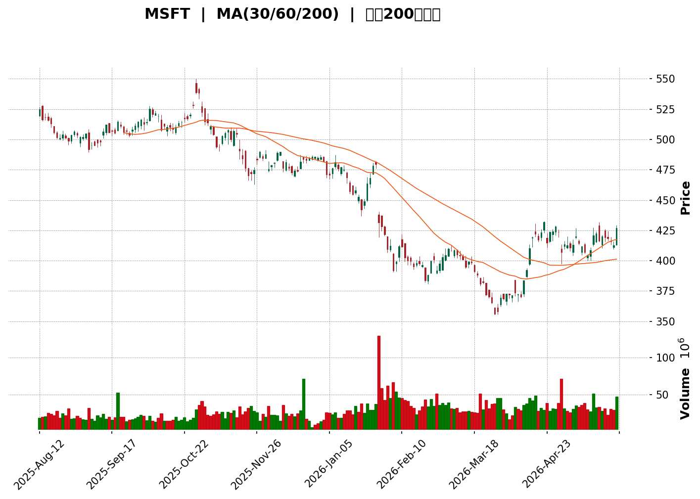
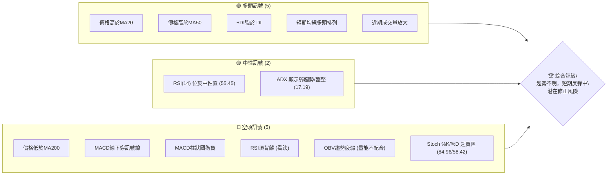
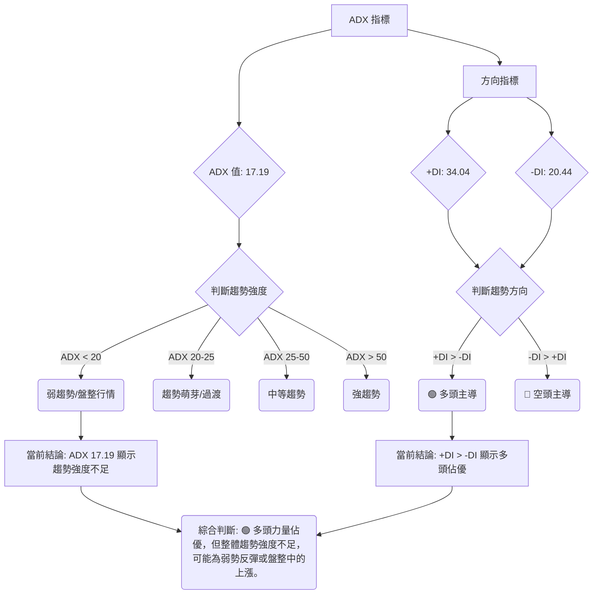

<details>
<summary>📊 靜態圖表 (點擊展開)</summary>

</details>

<html>
<head><meta charset="utf-8" /></head>
<body>
    <div>                        <script>window.PlotlyConfig = {MathJaxConfig: 'local'};</script>
        <script charset="utf-8" src="https://cdn.plot.ly/plotly-3.5.0.min.js" integrity="sha256-fHbNLP+GlIXN+efbQec78UkemUz3NJp7UmfGxC1tNxs=" crossorigin="anonymous"></script>                <div id="candlestick-chart" class="plotly-graph-div" style="height:500px; width:100%;"></div>            <script>                window.PLOTLYENV=window.PLOTLYENV || {};                                if (document.getElementById("candlestick-chart")) {                    Plotly.newPlot(                        "candlestick-chart",                        [{"close":{"dtype":"f8","bdata":"AAAAgF5ogEAAAACAoyOAQAAAAMC3MoBAAAAAQGIggEAAAADgBAiAQAAAAMCvm39AAAAAoGZbf0AAAADAEFF\u002fQAAAAACbgH9AAAAAYGJRf0AAAACAFi5\u002fQAAAAIDQeH9AAAAAQOymf0AAAAAABXh\u002fQAAAAKAOX39AAAAA4LZif0AAAADgXox\u002fQAAAACAovn5AAAAAwAjxfkAAAACAX\u002fR+QAAAACCJE39AAAAAILYdf0AAAABgDqt\u002fQAAAAODuAIBAAAAAAGKdf0AAAADA9qx\u002fQAAAAKAAlH9AAAAAIF0VgEAAAAAAZvN\u002fQAAAAIBnoH9AAAAA4Aevf0AAAADgbH1\u002fQAAAAMDbw39AAAAAQMj1f0AAAADghRWAQAAAAKCDI4BAAAAAIPQDgEAAAACgwBCAQAAAAMDyaYBAAAAAgHVFgEAAAAAAYEyAQAAAACDmOIBAAAAAwOi7f0AAAADgCe1\u002fQAAAAOBn5X9AAAAAQC7jf0AAAABgPsZ\u002fQAAAAOCQ5X9AAAAAAE0MgEAAAACgNxOAQAAAAKAcKoBAAAAAgEUqgEAAAACAhEKAQAAAAGBmgYBAAAAAoETVgEAAAABgItGAQAAAAACcU4BAAAAA4GgUgEAAAACANQ6AQAAAAKB98X9AAAAA4H1\u002ff0AAAACAi99+QAAAAOAX235AAAAAgAxtf0AAAACgqJd\u002fQAAAAIDFvn9AAAAAIPZBf0AAAAAggq9\u002fQAAAACC9hH9AAAAAIOuqfkAAAADA3kB+QAAAACDxxH1AAAAA4G1gfUAAAABgYH59QAAAAOAArn1AAAAAYI81fkAAAABAQp1+QAAAAOBPSX5AAAAAwD19fkAAAACgyrl9QAAAAKBU631AAAAAQEkQfkAAAAAgfY1+QAAAAOBqnX5AAAAAIAPHfUAAAABgORV+QAAAAOCIxn1AAAAAIHCLfUAAAABgcqR9QAAAAEAloH1AAAAAIFkdfkAAAAAgQDx+QAAAAGBSLH5AAAAAoBBLfkAAAACAs11+QAAAAIDDWH5AAAAAAAxPfkAAAACgGVV+QAAAACCdF35AAAAAwH1tfUAAAADADmx9QAAAAGA3xn1AAAAAYDkVfkAAAAAg2L99QAAAAEB70n1AAAAAwAexfUAAAAAgVUl9QAAAAGB+lXxAAAAAoCpqfEAAAACgI518QAAAAOATSHxAAAAAgEGie0AAAADgPBJ8QAAAAKAl\u002fnxAAAAAoB5DfUAAAACAMOd9QAAAACDq931AAAAAwD\u002f5ekAAAADgHcZ6QAAAAEDjV3pAAAAAoDCWeUAAAADAqMV5QAAAAGDLfnhAAAAA4Mj1eEAAAADAQrx5QAAAAAABt3lAAAAAIDwpeUAAAABA7wB5QAAAAOCm+HhAAAAAoJuxeEAAAADgQN14QAAAAOCU2XhAAAAAwPHFeEAAAACgOfp3QAAAAICMQnhAAAAAYL\u002f7eEAAAAAAoQ15QAAAAGBCfnhAAAAAoATbeEAAAACA6TB5QAAAAEAwRXlAAAAAwK2ceUAAAADgN4F5QAAAACBniHlAAAAAICFOeUAAAABgFEB5QAAAACDdD3lAAAAAQB+reEAAAADAXvF4QAAAAKC\u002f6HhAAAAAoBdveEAAAAAg3kJ4QAAAACC30HdAAAAAoMHid0AAAABg8z53QAAAAGDPI3dAAAAAgN3SdkAAAACg+z92QAAAAIDyYnZAAAAAgOsVd0AAAADAJQl3QAAAACBySndAAAAAoC9Bd0AAAABAxDd3QAAAAABWWHdAAAAAQDhEd0AAAACAGCF3QAAAAACh+HdAAAAAoCqEeEAAAADgTKV5QAAAAMCgNXpAAAAAQAVeekAAAADgqRJ6QAAAAKDkc3pAAAAAAMD\u002fekAAAACgn+15QAAAAKA8e3pAAAAAIG5+ekAAAAAgKMV6QAAAAKCueHpAAAAAIGFueUAAAACAtdh5QAAAAACey3lAAAAA4NqneUAAAACgC9F5QAAAACDFPXpAAAAAwJDjeUAAAABgSrx5QAAAACA4bnlAAAAAIFlFeUAAAADguIh5QAAAAGAhUHpAAAAAoP5pekAAAABASQh6QAAAAGBmQnpAAAAAoHAxekAAAADAHil6QAAAAOB6AHpAAAAAYLjKeUAAAAAA1696QA=="},"high":{"dtype":"f8","bdata":"zGIGwy12gEBmaK6O1IOAQNltdA9CToBAQwgBo3JPgEDSFdGrajWAQH6VQS0+8X9An5mbHzavf0Cvps7c9oZ\u002fQE2gWsdAuH9AvzyyUd6Pf0C0kL\u002f21Fx\u002fQNmHZzKPgX9AF3GC\u002f\u002fm9f0ASvLJcSaZ\u002fQKeKv3AMbX9Af\u002fs2OoKJf0BYXzd8O49\u002fQIdmLM73y39A72emarsgf0Dyyn0jbTF\u002fQIVOgwYCQX9A8F\u002fz0Q1Af0ASjoNwMNV\u002fQAt8GbXOAYBAXmXTgMwPgEDGSgkDKMF\u002fQGYFVwh13X9AjU2nN0EggEA+u6N42hOAQKgQLvWf9X9AstEycBPUf0Acobwuzqx\u002fQKqUCvJJ639AJx3\u002fH8cMgECtODorMReAQOzKY7DfKYBAtMB62IkygECMj0HntimAQEUjFiuBfYBAFWCe3LlzgEAOjMvOEV2AQIpA6d89SIBAbxGlh0dCgEDerDXFRwmAQBQznAVMAIBAQMa3KXsPgEAoDGsmxwyAQBdkABPjAYBAHw22IXwbgEBjg2TZZxuAQBRe60xlT4BAoA+RjjhFgEBPbM6SWVCAQOlze8+5mYBA8vvpl+ExgUBncPEpqPaAQOepDUvTnIBAJNAOBulvgEBzv1LqP02AQIf7r5ZxAoBAmOmQiHD5f0AZS6RvR2h\u002fQPtsWKLLA39ALzq9NpB6f0AYbLxISaZ\u002fQAlRfrYyx39AMqTcDkvkf0BAjE3lFcZ\u002fQI2pSkZazn9A4zRvegg9f0ArW6N5LcF+QHbeALAbtn5Ad5hCQ7\u002fMfUDhkGEWkqx9QOakPgZp0H1A9OaDGFJifkARard9Iqd+QF49Y7cCe35AoQ7qMP60fkBCr6JHfSF+QFFGdgj68n1Arn5N5BsUfkCjy3PB4KF+QDN3FK8Cn35AUyJ7C6YhfkD4HMOiAD5+QEHuOxD6BH5AqquAW2vpfUD\u002fo6ciV7x9QJvKMkrz3X1AWa0Ykd52fkA0g5lT\u002flp+QGwzxe8CaX5Aywc21KxafkCGfShM3G9+QKYu821LX35AjHzfTPVifkALCojMJHh+QDSuAAudX35AUMTBCi4ofkDgCXxmWZ99QIIo2DLhyX1AGK4kXXZ4fkCWbGVfUgh+QLT3jFEV231AKq2nT7jtfUCdezXUupp9QAcrM\u002fX8IX1ADkA+axHjfEA0xTjnLtJ8QCLEe1hlbHxABEUHcO0qfEBtlO0gUS18QDMe9nkuUH1AscKyp1uCfUAzVhjKqgt+QAKiyk6GGX5AtdPxT5yIe0A4+Y+Oalp7QPIc2ulIzXpAr0jJZdxCekCJFhBgBR96QHomSRLWZ3lASpE8ciMAeUCV8uEyz9B5QPx8AVXTXHpARBH4MdHpeUCX45GyYkZ5QE93pF3fO3lAPe4HiejreEBcfxc\u002fZwx5QLlU\u002fiblOHlAt6LLihX0eEBxFdWYFqh4QNY\u002fN9BLSHhA655qLKMJeUBCTzHMv2l5QJe8+wFmv3hAc7AowSoFeUBmp4r6Il15QCwi+UNEonlARnRwxIareUD0+UJLhMJ5QN3LD8sslXlAOF42EgSVeUCMPZ1QBIJ5QPOGCmrgU3lAoIrqXc0+eUBRmP\u002f6Ofx4QJkxknNqOHlAWg\u002f1xjzSeEA44kGIRHp4QCwwnzaeInhA5JWFe\u002fgleED1IdVdS9p3QG2YzvXrg3dAB2EpC5Bed0BfDu+3qpp2QFvCYzggyXZAwB9QVYFBd0DRsUta6FJ3QNftB+hRTXdA4WS1ucFOd0CwuGY1Ujp3QPZsJeyvAnhA0kWQsRVLd0Aja2hGQG13QJFeud5X+3dA599vY2SdeEBbSYFdl9d5QGMi8oqRPnpAtjB1MFvqekBO5ukvpGZ6QFzmNcQbpHpAgL1b+DMMe0D1NEn66Gt6QMPfHXSBgHpAOnV9mv2iekA27ZyR2s96QB\u002fsrltcnnpAoMKk2GPYeUDFYE8dVgN6QOgoB\u002f7tPXpAXJS1chH+eUCaI75kQBh6QGC+3ozhsHpApP+wrZobekDOVAT8xLx5QBekGtKh6XlAvOE0A+lWeUBqkYLqMq95QIGMLQzqs3pANcGAQziDekBki6jcPPx6QJrLIAsBU3pAAAAAoHClekAAAABgZoZ6QAAAAOBRPHpAAAAAQAr\u002feUAAAAAA19d6QA=="},"hovertemplate":"\u003cb\u003e%{x|%Y-%m-%d}\u003c\u002fb\u003e\u003cbr\u003e\u958b: $%{open:.2f}\u003cbr\u003e\u9ad8: $%{high:.2f}\u003cbr\u003e\u4f4e: $%{low:.2f}\u003cbr\u003e\u6536: $%{close:.2f}\u003cextra\u003e\u003c\u002fextra\u003e","low":{"dtype":"f8","bdata":"fVIJw3Y0gEDRtR0DCRqAQLbUlnklIIBAXOtqsLsXgECasbA3Jt9\u002fQBWcTDlSiH9ABki5SxVHf0DxHaAO5jh\u002fQBvsbX\u002f4M39Apnr3eyhPf0CROqye9vV+QPuScTEQDH9AJrUheBllf0BxvQV2ClV\u002fQKw3nRbv2n5AR7w4G4oyf0Bt84xfvD9\u002fQKVAhmtXlH5A4NVJF6K+fkAmc02tFel+QLx4ntaA2X5AKKcrT\u002fLrfkCLq0WU3Up\u002fQAlWHsDyfH9AOXCdF2OWf0DLLzmO72t\u002fQL3dUR1xh39ABorgLJOxf0CU8We8B9V\u002fQJwSMp7ggX9A6zvyIq17f0AKPQ8syV1\u002fQEa32ePndn9A8mS9staaf0DdxkaSPad\u002fQBDkHv2Dx39AwQzJ73S3f0Db6uJTJPx\u002fQJcpGaiCF4BAtSvGXEQxgEAdLRBPYj6AQFu\u002fs5EmEYBASCq0aMOmf0CloKJ3W8d\u002fQM4VAUQMbX9A\u002fjjCaqWsf0D8trMU6o5\u002fQEf5UIDggX9A0ygBHS7jf0AGEJTX+tx\u002fQHEjsVmdE4BAr34cAsUagEC+xpbAdiuAQJqw0jlybYBAw8NsAe\u002fKgEDp1O4f0aqAQFJOfyqsNoBAzIO\u002fW7v9f0ACZfyln\u002fV\u002fQPwA2stNin9A4QucE0V2f0DjcefgCMt+QAPQzCZVon5AP2p62ZL6fkBZzzwsBDN\u002fQEkAH1mp\u002f35AiW5Grikif0AKc3OH8+R+QHCBgAG4W39AAlee03Y7fkC4ZPh1qfx9QPSCKRVFln1AA6JeKhojfUBdMiPYHh99QCl1NxxD7XxAPLdYthDxfUA9ehP24Ed+QE6YOjQFKH5AHLHZU59CfkBZPMKxfZF9QBbo4P4Jpn1AFdJnGRzMfUAY9mtUuCN+QEbYIuxYZX5AittiMpSPfUDphGXyAJx9QBFqHGWmo31AHq+PBM1mfUD2cndvrUx9QClDwhZOjn1ADL7mF1e8fUB50+8JnQV+QFLsDr\u002fMCH5A92opUXQpfkA8eBQu4yp+QBvEgUfjPH5AeujapoggfkDCc9l0jzV+QENnrC+EEn5A6o73WzVBfUAvs+X1sTZ9QGlBY3StOn1AMHoEvku9fUATZgn8AJx9QMdxMjK0YX1Aql9e\u002fSKZfUBPncu2Jf58QNJf5WFKcnxASfArbQ9efECCxQWhTGd8QOCRQgic9HtASq+z28JLe0BgqQeTp6t7QFWFy0aFCHxAgvM5HTq\u002ffEDRJGL+\u002fnB9QJOSsosXvn1AkdxCQnQyekDSWtb78oh6QAAmthYMRnpAby6YX\u002fpreUCuetNjz3Z5QGotFURKaXhAzagMBtlyeECU44PMe\u002fF4QNPgwrnsrXlA9qZ4pLbzeEBFwFst7cN4QMoy\u002fUGQxHhAME7cT36MeEBewJyQAal4QFiaYvgAvXhAj77+UuWkeECBB7hAWuR3QIU+UigpzndAzPUjixFVeEDUSjpBDd54QCFONzGZUHhAyoVifJJceEAtL4dNJH14QOQx2Ake93hAlkjPd2o4eUBTTL+7CHp5QL1YSxEMKnlAu65KbfIgeUB53cqfjQt5QFvc6RN4DXlAmrP+AV6WeEBx6Z0N\u002fZ54QO4a8PE+znhAI\u002fJPvnpieEDYS79ZkyN4QM68xJ3GtHdAbiRWj67Nd0BtMOLgvTB3QFxSR3tMDXdAzLaYh2nGdkB6NCoN1Tt2QG5CYPkoOHZArSwMupCkdkCc+GHbd\u002fZ2QG4wV8rOtXZAWhrMCzkLd0Cik0vZSNx2QDO8Hpm3KXdA5v9iihvkdkAVVI9PrxN3QDw1HY19I3dAMFPzVfQaeEABTh4l9r14QLvBWiH9s3lAbfL1Nn48ekCtGTGLZ\u002fZ5QPHcehzGBHpAsR5z4hFsekAHrVVrVah5QHXO3PNr7nlAgqPrurICekCTsZyQz096QJP1GUobNnpAZJBjvGXSeEC9FMPo2Jh5QMeAsDaYnnlAtzrA9ql+eUCepMtXwEN5QFz\u002f8wquHXpAg9wbKq\u002fReUBWv\u002fZh+kl5QELkxMAtXHlArb6L4JwCeUBqr8TPNwB5QGeJliJIwHlA2LascmPreUCxXZsbcPl5QLg3LcaTpnlAAAAAIFz7eUAAAACgRwV6QAAAAOBR0HlAAAAAoEeZeUAAAABguMp5QA=="},"name":"\u50f9\u683c","open":{"dtype":"f8","bdata":"dgfAGMw8gECSm\u002fzBJX+AQCPnj1NaM4BA0GjH7QQ1gEAyatahpyuAQNd5gx607n9A+dgBTUadf0B0xHItUkh\u002fQD2AN7E5UX9AM2s7yBB3f0CDoVVS+VJ\u002fQICraK9zLX9AW7qtG2F+f0CavNVXV5d\u002fQEn61R0gFX9A4L2OVulJf0CY+qkaBVJ\u002fQFIvXi\u002fcnX9ASQQZUprvfkALoMyGYyR\u002fQO66SHgIPX9AN7oyKW0xf0BOYfcmYnd\u002fQCGduntomX9Aye6VQwQNgEC2nILogLZ\u002fQOLA+gJWxH9A5hccu4y1f0Bzon4OwwKAQGWoqFIQ6X9AEMIiErCyf0BYD0UDnpF\u002fQMQ0xHaZrX9AbMYXqX7Ef0DTjLnpKOB\u002fQEVb71H2+H9ARSy14g4TgECzaeXYww6AQNxLYf\u002fEGoBADxf30rhngEAzVCP85D+AQPbg9gVsOIBAOTfdL\u002fUigEDerDXFRwmAQD0gT1lNsH9AJR87z4H7f0CNhKyeqtV\u002fQAL82AdinX9ALCYS8vD1f0Cj29UP8hGAQKz+GCP2LoBAphjTQmA5gEBSy6ix\u002fzuAQCvRF4Z3g4BAd2xJCk8UgUD5JmxuFeyAQCCgG6oheYBA8w\u002ffkWlsgECB4kILTySAQKsyjx+hyH9ANJNu+Rzhf0D3lKmXpGd\u002fQDUIFgYp3X5A2XJ6AkoOf0Dy7Y0k+Fl\u002fQKgvkGJ4on9A7HYgCpOxf0AMMysKg\u002fF+QBhkwKAAlH9AAZ6KBQrEfkC5D8QOQHB+QA2CG65oqH5ARW\u002fegw7GfUBc9yc3To59QGjv3KZ9f31A2ZJganZCfkBvFZX1Ald+QBrXxkBkZH5A\u002fnlTcP5IfkDyEP7aVKN9QHh7yJwg2n1AAMZhXxcGfkDF5XMR2Ct+QEv1wabnbn5AN0ZB6iQefkBFFqL2RKh9QIfK31IV231A+LDMHYvffUA\u002fzRubFV19QKDZUce6rH1ALEVIZR7BfUDD9KsZMFN+QBYxbbVvP35AQfRWFUctfkCPRXdebTh+QA9w3KjVSH5AXtWijV0rfkBgktzlaDx+QKrtv53VWn5ATmzpEeEjfkAn7NnmVH99QF\u002fUaKgwe31Alkd5nyDafUDhbOfIs\u002fF9QAp2TOtUf31ASU\u002fZIuiofUAG5QUuNYl9QF0ER25FBn1AtMydR\u002f\u002fgfECgVC2dzXx8QBRjWw2DE3xAK3Rqcn4pfECrXUbMKtp7QHXFOZHdHXxALCc+wfPzfEA+B\u002fcPmXl9QLE0ug4VEX5ARXK35KBge0AuapAdkVN7QMBzSf5RxXpAFwSkXzlCekBtedFt2JJ5QD71SzAjWnlAn\u002fZbhmfWeEC+Ntql4TB5QDodgE8nHHpA2MmsZ1vleUAoO1k9RTN5QE7C7IiCKnlAclKJZDPXeECxbf1x1sV4QKZ5bUIv\u002fXhARwwsChC0eECT\u002fqNIV6J4QCJcgAX19HdAFkSoxPlaeEBwViiIXT15QIqDC1eQYHhAYPrEviyAeECijGdEpYR4QIUmS6pxBnlANvJwSrw4eUCQzRDgDIV5QB7TP9+3QHlAeMB9M02SeUCOWlKEGEt5QJxzoZoWPHlAk9NWQSICeUCjHHnkWtN4QATrFIN69nhANdyI+ljEeEAzDHVQHFR4QLSjfvJDH3hAAEB6CCDxd0A5lCa3idh3QLosCNOvgXdAAPMkMUwgd0CBlGK24pF2QEdiZLnikXZAyeocoDG8dkAvu2HH7Ep3QPokxHOp5nZAe0+luexKd0B3RRlDohh3QNC9cTleAnhAqsC7ix47d0CMz2FyyEJ3QP1Yyz\u002fXTHdAtVpHcU4xeED+6xPHPNJ4QCzLhso9L3pAePuvJ25+ekDgMy481kN6QN1gZPNONXpA35ifc02UekDHjd15uC96QNoVYvgZAXpA1yR+eXlXekCPQNFNcHp6QMSIEBCZenpA10mHLcGeeUDj65WEhr55QKVIqMloqnlAvmNLP8LmeUBuH3lC5HF5QKsTrpc7M3pAuge7p84HekDdzRfn0G95QIJPn\u002flY2XlAJO\u002fwCkIleUCIS4aRsTl5QPvTkpj+1XlA85bVgYP7eUCvVgbGiM96QKyuHP5l1HlAAAAAAACMekAAAADgozh6QAAAAEDhBnpAAAAAACmweUAAAACgmc95QA=="},"x":["2025-08-12T00:00:00-04:00","2025-08-13T00:00:00-04:00","2025-08-14T00:00:00-04:00","2025-08-15T00:00:00-04:00","2025-08-18T00:00:00-04:00","2025-08-19T00:00:00-04:00","2025-08-20T00:00:00-04:00","2025-08-21T00:00:00-04:00","2025-08-22T00:00:00-04:00","2025-08-25T00:00:00-04:00","2025-08-26T00:00:00-04:00","2025-08-27T00:00:00-04:00","2025-08-28T00:00:00-04:00","2025-08-29T00:00:00-04:00","2025-09-02T00:00:00-04:00","2025-09-03T00:00:00-04:00","2025-09-04T00:00:00-04:00","2025-09-05T00:00:00-04:00","2025-09-08T00:00:00-04:00","2025-09-09T00:00:00-04:00","2025-09-10T00:00:00-04:00","2025-09-11T00:00:00-04:00","2025-09-12T00:00:00-04:00","2025-09-15T00:00:00-04:00","2025-09-16T00:00:00-04:00","2025-09-17T00:00:00-04:00","2025-09-18T00:00:00-04:00","2025-09-19T00:00:00-04:00","2025-09-22T00:00:00-04:00","2025-09-23T00:00:00-04:00","2025-09-24T00:00:00-04:00","2025-09-25T00:00:00-04:00","2025-09-26T00:00:00-04:00","2025-09-29T00:00:00-04:00","2025-09-30T00:00:00-04:00","2025-10-01T00:00:00-04:00","2025-10-02T00:00:00-04:00","2025-10-03T00:00:00-04:00","2025-10-06T00:00:00-04:00","2025-10-07T00:00:00-04:00","2025-10-08T00:00:00-04:00","2025-10-09T00:00:00-04:00","2025-10-10T00:00:00-04:00","2025-10-13T00:00:00-04:00","2025-10-14T00:00:00-04:00","2025-10-15T00:00:00-04:00","2025-10-16T00:00:00-04:00","2025-10-17T00:00:00-04:00","2025-10-20T00:00:00-04:00","2025-10-21T00:00:00-04:00","2025-10-22T00:00:00-04:00","2025-10-23T00:00:00-04:00","2025-10-24T00:00:00-04:00","2025-10-27T00:00:00-04:00","2025-10-28T00:00:00-04:00","2025-10-29T00:00:00-04:00","2025-10-30T00:00:00-04:00","2025-10-31T00:00:00-04:00","2025-11-03T00:00:00-05:00","2025-11-04T00:00:00-05:00","2025-11-05T00:00:00-05:00","2025-11-06T00:00:00-05:00","2025-11-07T00:00:00-05:00","2025-11-10T00:00:00-05:00","2025-11-11T00:00:00-05:00","2025-11-12T00:00:00-05:00","2025-11-13T00:00:00-05:00","2025-11-14T00:00:00-05:00","2025-11-17T00:00:00-05:00","2025-11-18T00:00:00-05:00","2025-11-19T00:00:00-05:00","2025-11-20T00:00:00-05:00","2025-11-21T00:00:00-05:00","2025-11-24T00:00:00-05:00","2025-11-25T00:00:00-05:00","2025-11-26T00:00:00-05:00","2025-11-28T00:00:00-05:00","2025-12-01T00:00:00-05:00","2025-12-02T00:00:00-05:00","2025-12-03T00:00:00-05:00","2025-12-04T00:00:00-05:00","2025-12-05T00:00:00-05:00","2025-12-08T00:00:00-05:00","2025-12-09T00:00:00-05:00","2025-12-10T00:00:00-05:00","2025-12-11T00:00:00-05:00","2025-12-12T00:00:00-05:00","2025-12-15T00:00:00-05:00","2025-12-16T00:00:00-05:00","2025-12-17T00:00:00-05:00","2025-12-18T00:00:00-05:00","2025-12-19T00:00:00-05:00","2025-12-22T00:00:00-05:00","2025-12-23T00:00:00-05:00","2025-12-24T00:00:00-05:00","2025-12-26T00:00:00-05:00","2025-12-29T00:00:00-05:00","2025-12-30T00:00:00-05:00","2025-12-31T00:00:00-05:00","2026-01-02T00:00:00-05:00","2026-01-05T00:00:00-05:00","2026-01-06T00:00:00-05:00","2026-01-07T00:00:00-05:00","2026-01-08T00:00:00-05:00","2026-01-09T00:00:00-05:00","2026-01-12T00:00:00-05:00","2026-01-13T00:00:00-05:00","2026-01-14T00:00:00-05:00","2026-01-15T00:00:00-05:00","2026-01-16T00:00:00-05:00","2026-01-20T00:00:00-05:00","2026-01-21T00:00:00-05:00","2026-01-22T00:00:00-05:00","2026-01-23T00:00:00-05:00","2026-01-26T00:00:00-05:00","2026-01-27T00:00:00-05:00","2026-01-28T00:00:00-05:00","2026-01-29T00:00:00-05:00","2026-01-30T00:00:00-05:00","2026-02-02T00:00:00-05:00","2026-02-03T00:00:00-05:00","2026-02-04T00:00:00-05:00","2026-02-05T00:00:00-05:00","2026-02-06T00:00:00-05:00","2026-02-09T00:00:00-05:00","2026-02-10T00:00:00-05:00","2026-02-11T00:00:00-05:00","2026-02-12T00:00:00-05:00","2026-02-13T00:00:00-05:00","2026-02-17T00:00:00-05:00","2026-02-18T00:00:00-05:00","2026-02-19T00:00:00-05:00","2026-02-20T00:00:00-05:00","2026-02-23T00:00:00-05:00","2026-02-24T00:00:00-05:00","2026-02-25T00:00:00-05:00","2026-02-26T00:00:00-05:00","2026-02-27T00:00:00-05:00","2026-03-02T00:00:00-05:00","2026-03-03T00:00:00-05:00","2026-03-04T00:00:00-05:00","2026-03-05T00:00:00-05:00","2026-03-06T00:00:00-05:00","2026-03-09T00:00:00-04:00","2026-03-10T00:00:00-04:00","2026-03-11T00:00:00-04:00","2026-03-12T00:00:00-04:00","2026-03-13T00:00:00-04:00","2026-03-16T00:00:00-04:00","2026-03-17T00:00:00-04:00","2026-03-18T00:00:00-04:00","2026-03-19T00:00:00-04:00","2026-03-20T00:00:00-04:00","2026-03-23T00:00:00-04:00","2026-03-24T00:00:00-04:00","2026-03-25T00:00:00-04:00","2026-03-26T00:00:00-04:00","2026-03-27T00:00:00-04:00","2026-03-30T00:00:00-04:00","2026-03-31T00:00:00-04:00","2026-04-01T00:00:00-04:00","2026-04-02T00:00:00-04:00","2026-04-06T00:00:00-04:00","2026-04-07T00:00:00-04:00","2026-04-08T00:00:00-04:00","2026-04-09T00:00:00-04:00","2026-04-10T00:00:00-04:00","2026-04-13T00:00:00-04:00","2026-04-14T00:00:00-04:00","2026-04-15T00:00:00-04:00","2026-04-16T00:00:00-04:00","2026-04-17T00:00:00-04:00","2026-04-20T00:00:00-04:00","2026-04-21T00:00:00-04:00","2026-04-22T00:00:00-04:00","2026-04-23T00:00:00-04:00","2026-04-24T00:00:00-04:00","2026-04-27T00:00:00-04:00","2026-04-28T00:00:00-04:00","2026-04-29T00:00:00-04:00","2026-04-30T00:00:00-04:00","2026-05-01T00:00:00-04:00","2026-05-04T00:00:00-04:00","2026-05-05T00:00:00-04:00","2026-05-06T00:00:00-04:00","2026-05-07T00:00:00-04:00","2026-05-08T00:00:00-04:00","2026-05-11T00:00:00-04:00","2026-05-12T00:00:00-04:00","2026-05-13T00:00:00-04:00","2026-05-14T00:00:00-04:00","2026-05-15T00:00:00-04:00","2026-05-18T00:00:00-04:00","2026-05-19T00:00:00-04:00","2026-05-20T00:00:00-04:00","2026-05-21T00:00:00-04:00","2026-05-22T00:00:00-04:00","2026-05-26T00:00:00-04:00","2026-05-27T00:00:00-04:00","2026-05-28T00:00:00-04:00"],"type":"candlestick"},{"hovertemplate":"MA30: $%{y:.2f}\u003cextra\u003e\u003c\u002fextra\u003e","line":{"color":"#2196F3","dash":"dash","width":2},"mode":"lines","name":"MA30","x":["2025-08-12T00:00:00-04:00","2025-08-13T00:00:00-04:00","2025-08-14T00:00:00-04:00","2025-08-15T00:00:00-04:00","2025-08-18T00:00:00-04:00","2025-08-19T00:00:00-04:00","2025-08-20T00:00:00-04:00","2025-08-21T00:00:00-04:00","2025-08-22T00:00:00-04:00","2025-08-25T00:00:00-04:00","2025-08-26T00:00:00-04:00","2025-08-27T00:00:00-04:00","2025-08-28T00:00:00-04:00","2025-08-29T00:00:00-04:00","2025-09-02T00:00:00-04:00","2025-09-03T00:00:00-04:00","2025-09-04T00:00:00-04:00","2025-09-05T00:00:00-04:00","2025-09-08T00:00:00-04:00","2025-09-09T00:00:00-04:00","2025-09-10T00:00:00-04:00","2025-09-11T00:00:00-04:00","2025-09-12T00:00:00-04:00","2025-09-15T00:00:00-04:00","2025-09-16T00:00:00-04:00","2025-09-17T00:00:00-04:00","2025-09-18T00:00:00-04:00","2025-09-19T00:00:00-04:00","2025-09-22T00:00:00-04:00","2025-09-23T00:00:00-04:00","2025-09-24T00:00:00-04:00","2025-09-25T00:00:00-04:00","2025-09-26T00:00:00-04:00","2025-09-29T00:00:00-04:00","2025-09-30T00:00:00-04:00","2025-10-01T00:00:00-04:00","2025-10-02T00:00:00-04:00","2025-10-03T00:00:00-04:00","2025-10-06T00:00:00-04:00","2025-10-07T00:00:00-04:00","2025-10-08T00:00:00-04:00","2025-10-09T00:00:00-04:00","2025-10-10T00:00:00-04:00","2025-10-13T00:00:00-04:00","2025-10-14T00:00:00-04:00","2025-10-15T00:00:00-04:00","2025-10-16T00:00:00-04:00","2025-10-17T00:00:00-04:00","2025-10-20T00:00:00-04:00","2025-10-21T00:00:00-04:00","2025-10-22T00:00:00-04:00","2025-10-23T00:00:00-04:00","2025-10-24T00:00:00-04:00","2025-10-27T00:00:00-04:00","2025-10-28T00:00:00-04:00","2025-10-29T00:00:00-04:00","2025-10-30T00:00:00-04:00","2025-10-31T00:00:00-04:00","2025-11-03T00:00:00-05:00","2025-11-04T00:00:00-05:00","2025-11-05T00:00:00-05:00","2025-11-06T00:00:00-05:00","2025-11-07T00:00:00-05:00","2025-11-10T00:00:00-05:00","2025-11-11T00:00:00-05:00","2025-11-12T00:00:00-05:00","2025-11-13T00:00:00-05:00","2025-11-14T00:00:00-05:00","2025-11-17T00:00:00-05:00","2025-11-18T00:00:00-05:00","2025-11-19T00:00:00-05:00","2025-11-20T00:00:00-05:00","2025-11-21T00:00:00-05:00","2025-11-24T00:00:00-05:00","2025-11-25T00:00:00-05:00","2025-11-26T00:00:00-05:00","2025-11-28T00:00:00-05:00","2025-12-01T00:00:00-05:00","2025-12-02T00:00:00-05:00","2025-12-03T00:00:00-05:00","2025-12-04T00:00:00-05:00","2025-12-05T00:00:00-05:00","2025-12-08T00:00:00-05:00","2025-12-09T00:00:00-05:00","2025-12-10T00:00:00-05:00","2025-12-11T00:00:00-05:00","2025-12-12T00:00:00-05:00","2025-12-15T00:00:00-05:00","2025-12-16T00:00:00-05:00","2025-12-17T00:00:00-05:00","2025-12-18T00:00:00-05:00","2025-12-19T00:00:00-05:00","2025-12-22T00:00:00-05:00","2025-12-23T00:00:00-05:00","2025-12-24T00:00:00-05:00","2025-12-26T00:00:00-05:00","2025-12-29T00:00:00-05:00","2025-12-30T00:00:00-05:00","2025-12-31T00:00:00-05:00","2026-01-02T00:00:00-05:00","2026-01-05T00:00:00-05:00","2026-01-06T00:00:00-05:00","2026-01-07T00:00:00-05:00","2026-01-08T00:00:00-05:00","2026-01-09T00:00:00-05:00","2026-01-12T00:00:00-05:00","2026-01-13T00:00:00-05:00","2026-01-14T00:00:00-05:00","2026-01-15T00:00:00-05:00","2026-01-16T00:00:00-05:00","2026-01-20T00:00:00-05:00","2026-01-21T00:00:00-05:00","2026-01-22T00:00:00-05:00","2026-01-23T00:00:00-05:00","2026-01-26T00:00:00-05:00","2026-01-27T00:00:00-05:00","2026-01-28T00:00:00-05:00","2026-01-29T00:00:00-05:00","2026-01-30T00:00:00-05:00","2026-02-02T00:00:00-05:00","2026-02-03T00:00:00-05:00","2026-02-04T00:00:00-05:00","2026-02-05T00:00:00-05:00","2026-02-06T00:00:00-05:00","2026-02-09T00:00:00-05:00","2026-02-10T00:00:00-05:00","2026-02-11T00:00:00-05:00","2026-02-12T00:00:00-05:00","2026-02-13T00:00:00-05:00","2026-02-17T00:00:00-05:00","2026-02-18T00:00:00-05:00","2026-02-19T00:00:00-05:00","2026-02-20T00:00:00-05:00","2026-02-23T00:00:00-05:00","2026-02-24T00:00:00-05:00","2026-02-25T00:00:00-05:00","2026-02-26T00:00:00-05:00","2026-02-27T00:00:00-05:00","2026-03-02T00:00:00-05:00","2026-03-03T00:00:00-05:00","2026-03-04T00:00:00-05:00","2026-03-05T00:00:00-05:00","2026-03-06T00:00:00-05:00","2026-03-09T00:00:00-04:00","2026-03-10T00:00:00-04:00","2026-03-11T00:00:00-04:00","2026-03-12T00:00:00-04:00","2026-03-13T00:00:00-04:00","2026-03-16T00:00:00-04:00","2026-03-17T00:00:00-04:00","2026-03-18T00:00:00-04:00","2026-03-19T00:00:00-04:00","2026-03-20T00:00:00-04:00","2026-03-23T00:00:00-04:00","2026-03-24T00:00:00-04:00","2026-03-25T00:00:00-04:00","2026-03-26T00:00:00-04:00","2026-03-27T00:00:00-04:00","2026-03-30T00:00:00-04:00","2026-03-31T00:00:00-04:00","2026-04-01T00:00:00-04:00","2026-04-02T00:00:00-04:00","2026-04-06T00:00:00-04:00","2026-04-07T00:00:00-04:00","2026-04-08T00:00:00-04:00","2026-04-09T00:00:00-04:00","2026-04-10T00:00:00-04:00","2026-04-13T00:00:00-04:00","2026-04-14T00:00:00-04:00","2026-04-15T00:00:00-04:00","2026-04-16T00:00:00-04:00","2026-04-17T00:00:00-04:00","2026-04-20T00:00:00-04:00","2026-04-21T00:00:00-04:00","2026-04-22T00:00:00-04:00","2026-04-23T00:00:00-04:00","2026-04-24T00:00:00-04:00","2026-04-27T00:00:00-04:00","2026-04-28T00:00:00-04:00","2026-04-29T00:00:00-04:00","2026-04-30T00:00:00-04:00","2026-05-01T00:00:00-04:00","2026-05-04T00:00:00-04:00","2026-05-05T00:00:00-04:00","2026-05-06T00:00:00-04:00","2026-05-07T00:00:00-04:00","2026-05-08T00:00:00-04:00","2026-05-11T00:00:00-04:00","2026-05-12T00:00:00-04:00","2026-05-13T00:00:00-04:00","2026-05-14T00:00:00-04:00","2026-05-15T00:00:00-04:00","2026-05-18T00:00:00-04:00","2026-05-19T00:00:00-04:00","2026-05-20T00:00:00-04:00","2026-05-21T00:00:00-04:00","2026-05-22T00:00:00-04:00","2026-05-26T00:00:00-04:00","2026-05-27T00:00:00-04:00","2026-05-28T00:00:00-04:00"],"y":{"dtype":"f8","bdata":"AAAAAAAA+H8AAAAAAAD4fwAAAAAAAPh\u002fAAAAAAAA+H8AAAAAAAD4fwAAAAAAAPh\u002fAAAAAAAA+H8AAAAAAAD4fwAAAAAAAPh\u002fAAAAAAAA+H8AAAAAAAD4fwAAAAAAAPh\u002fAAAAAAAA+H8AAAAAAAD4fwAAAAAAAPh\u002fAAAAAAAA+H8AAAAAAAD4fwAAAAAAAPh\u002fAAAAAAAA+H8AAAAAAAD4fwAAAAAAAPh\u002fAAAAAAAA+H8AAAAAAAD4fwAAAAAAAPh\u002fAAAAAAAA+H8AAAAAAAD4fwAAAAAAAPh\u002fAAAAAAAA+H8AAAAAAAD4f97d3f1\u002fmn9AIiIi0teQf0CamZlZHYp\u002fQO\u002fu7o66hH9A7+7urjqCf0BmZmYmIYN\u002fQERERETXiH9AIiIiUpeOf0AREREBipV\u002fQJqZmUnZoH9AZmZmxkyrf0De3d19Y7d\u002fQGZmZiawv39AvLu7O2PAf0C8u7vLScR\u002fQM3MzDzEyH9AvLu7ewzNf0BVVVVV+s5\u002fQImIiCjT2H9AVVVVVa3if0Dv7u4O4ex\u002fQImIiJiR939AMzMzA\u002fcAgEBmZmYOmQSAQGZmZk7hCIBA3t3d9aERgEBERETc\u002fBmAQN7d3R2THoBAmpmZ+YoegEDe3d39OR+AQN7d3fWTIIBAiYiIIMkfgEARERGBJx2AQHd3d19GGYBAIiIi+v4WgEAAAAAgihSAQDMzM8NEEoBAmpmZMfgOgEDv7u7OEQ2AQFVVVc17B4BAvLu7m\u002ff+f0AiIiKi+Op\u002fQHd3d4ck1H9AVVVV1QbAf0AzMzNzRat\u002fQN7d3Z1bmH9AVVVVhQmKf0AAAABAI4B\u002fQJqZmVllcn9AMzMzE69kf0C8u7vr\u002fk9\u002fQERERMRuO39A3t3dPRcof0AAAABQThd\u002fQN7d3R3cAn9Aq6qq+qzhfkDNzMzMX8N+QN7d3W3Rqn5AAAAAYIGUfkDe3d2NcH9+QHd3d1epa35AERERUdtffkDv7u7eaVp+QM3MzHyWVH5AVVVV9etKfkCrqqradEB+QKuqqtqFNH5AvLu7+2wsfkB3d3f34CB+QLy7uzu1FH5AVVVVhSAKfkBVVVWFCAN+QFVVVWUTA35A3t3dLRoJfkBmZmbWSAt+QN7d3R2ADH5AIiIiMhUIfkDe3d19wPx9QCIiIoI57n1AvLu7q4XcfUAzMzOjCNN9QDMzMwMPxX1AVVVVBVOwfUBmZmY2Jpt9QCIiIpJOjX1AZmZmFumIfUAiIiJCYId9QCIiIqIFiX1AZmZmFhVzfUDe3d3Nmlp9QKuqqpqYPn1A7+7uHvUXfUAiIiIC3\u002fF8QDMzM5NrwXxA7+7uLumTfEDNzMxsZWx8QBEREfHeRHxAzczMnPEYfEC8u7u7eOt7QLy7u9vFv3tAREREdGCXe0CamZm5e3B7QO\u002fu7k52RntA7+7uHicZe0Crqqoa5ud6QGZmZjZvuHpAIiIiIkKQekB3d3eHImx6QBERESE6SXpA7+7u\u002ftoqekC8u7vbpQ16QKuqqprz83lAIiIi8rLieUARERFhzMx5QHd3dwdGr3lAiYiI2IGNeUBVVVW1zWV5QImIiGjvO3lAiYiIqEMoeUAAAACwoxh5QERERMRmDHlAmpmZmZACeUCrqqr6q\u002fV4QBEREYHe73hAiYiImLPmeEB3d3c3ddF4QImIiBh8u3hAIiIiAoqneEC8u7trCpB4QAAAAOD7eXhA3t3dzUJseEDNzMxMqFx4QHd3d1daT3hAAAAA8GRCeEDv7u6O6Tt4QBEREfEaNHhA3t3dTXQleECrqqpaCRV4QKuqqgqVEHhAiYiI6K8NeEBmZmYWkRF4QGZmZtaUGXhAAAAAsAYgeEAiIiLS3yR4QGZmZla5LHhAERERkS07eECamZl59kB4QCIiIkITTXhARERE9KZceEC8u7u7Pmx4QAAAAICTeXhAMzMz8xWCeEAREREhnY94QBEREbGCoHhAIiIiIp2veEAAAADgjMV4QAAAAAAE4HhAvLu7Gyz6eEB3d3d36hd5QBEREUHkMXlAq6qqCopEeUDv7u6+21l5QKuqqtqlc3lAAAAAsJuOeUDv7u4eoKZ5QImIiIh+v3lAERER4XfYeUBERET0VfJ5QERERASqA3pAvLu7m4wOekBEREQUbxd6QA=="},"type":"scatter"},{"hovertemplate":"MA60: $%{y:.2f}\u003cextra\u003e\u003c\u002fextra\u003e","line":{"color":"#9C27B0","dash":"dash","width":2},"mode":"lines","name":"MA60","x":["2025-08-12T00:00:00-04:00","2025-08-13T00:00:00-04:00","2025-08-14T00:00:00-04:00","2025-08-15T00:00:00-04:00","2025-08-18T00:00:00-04:00","2025-08-19T00:00:00-04:00","2025-08-20T00:00:00-04:00","2025-08-21T00:00:00-04:00","2025-08-22T00:00:00-04:00","2025-08-25T00:00:00-04:00","2025-08-26T00:00:00-04:00","2025-08-27T00:00:00-04:00","2025-08-28T00:00:00-04:00","2025-08-29T00:00:00-04:00","2025-09-02T00:00:00-04:00","2025-09-03T00:00:00-04:00","2025-09-04T00:00:00-04:00","2025-09-05T00:00:00-04:00","2025-09-08T00:00:00-04:00","2025-09-09T00:00:00-04:00","2025-09-10T00:00:00-04:00","2025-09-11T00:00:00-04:00","2025-09-12T00:00:00-04:00","2025-09-15T00:00:00-04:00","2025-09-16T00:00:00-04:00","2025-09-17T00:00:00-04:00","2025-09-18T00:00:00-04:00","2025-09-19T00:00:00-04:00","2025-09-22T00:00:00-04:00","2025-09-23T00:00:00-04:00","2025-09-24T00:00:00-04:00","2025-09-25T00:00:00-04:00","2025-09-26T00:00:00-04:00","2025-09-29T00:00:00-04:00","2025-09-30T00:00:00-04:00","2025-10-01T00:00:00-04:00","2025-10-02T00:00:00-04:00","2025-10-03T00:00:00-04:00","2025-10-06T00:00:00-04:00","2025-10-07T00:00:00-04:00","2025-10-08T00:00:00-04:00","2025-10-09T00:00:00-04:00","2025-10-10T00:00:00-04:00","2025-10-13T00:00:00-04:00","2025-10-14T00:00:00-04:00","2025-10-15T00:00:00-04:00","2025-10-16T00:00:00-04:00","2025-10-17T00:00:00-04:00","2025-10-20T00:00:00-04:00","2025-10-21T00:00:00-04:00","2025-10-22T00:00:00-04:00","2025-10-23T00:00:00-04:00","2025-10-24T00:00:00-04:00","2025-10-27T00:00:00-04:00","2025-10-28T00:00:00-04:00","2025-10-29T00:00:00-04:00","2025-10-30T00:00:00-04:00","2025-10-31T00:00:00-04:00","2025-11-03T00:00:00-05:00","2025-11-04T00:00:00-05:00","2025-11-05T00:00:00-05:00","2025-11-06T00:00:00-05:00","2025-11-07T00:00:00-05:00","2025-11-10T00:00:00-05:00","2025-11-11T00:00:00-05:00","2025-11-12T00:00:00-05:00","2025-11-13T00:00:00-05:00","2025-11-14T00:00:00-05:00","2025-11-17T00:00:00-05:00","2025-11-18T00:00:00-05:00","2025-11-19T00:00:00-05:00","2025-11-20T00:00:00-05:00","2025-11-21T00:00:00-05:00","2025-11-24T00:00:00-05:00","2025-11-25T00:00:00-05:00","2025-11-26T00:00:00-05:00","2025-11-28T00:00:00-05:00","2025-12-01T00:00:00-05:00","2025-12-02T00:00:00-05:00","2025-12-03T00:00:00-05:00","2025-12-04T00:00:00-05:00","2025-12-05T00:00:00-05:00","2025-12-08T00:00:00-05:00","2025-12-09T00:00:00-05:00","2025-12-10T00:00:00-05:00","2025-12-11T00:00:00-05:00","2025-12-12T00:00:00-05:00","2025-12-15T00:00:00-05:00","2025-12-16T00:00:00-05:00","2025-12-17T00:00:00-05:00","2025-12-18T00:00:00-05:00","2025-12-19T00:00:00-05:00","2025-12-22T00:00:00-05:00","2025-12-23T00:00:00-05:00","2025-12-24T00:00:00-05:00","2025-12-26T00:00:00-05:00","2025-12-29T00:00:00-05:00","2025-12-30T00:00:00-05:00","2025-12-31T00:00:00-05:00","2026-01-02T00:00:00-05:00","2026-01-05T00:00:00-05:00","2026-01-06T00:00:00-05:00","2026-01-07T00:00:00-05:00","2026-01-08T00:00:00-05:00","2026-01-09T00:00:00-05:00","2026-01-12T00:00:00-05:00","2026-01-13T00:00:00-05:00","2026-01-14T00:00:00-05:00","2026-01-15T00:00:00-05:00","2026-01-16T00:00:00-05:00","2026-01-20T00:00:00-05:00","2026-01-21T00:00:00-05:00","2026-01-22T00:00:00-05:00","2026-01-23T00:00:00-05:00","2026-01-26T00:00:00-05:00","2026-01-27T00:00:00-05:00","2026-01-28T00:00:00-05:00","2026-01-29T00:00:00-05:00","2026-01-30T00:00:00-05:00","2026-02-02T00:00:00-05:00","2026-02-03T00:00:00-05:00","2026-02-04T00:00:00-05:00","2026-02-05T00:00:00-05:00","2026-02-06T00:00:00-05:00","2026-02-09T00:00:00-05:00","2026-02-10T00:00:00-05:00","2026-02-11T00:00:00-05:00","2026-02-12T00:00:00-05:00","2026-02-13T00:00:00-05:00","2026-02-17T00:00:00-05:00","2026-02-18T00:00:00-05:00","2026-02-19T00:00:00-05:00","2026-02-20T00:00:00-05:00","2026-02-23T00:00:00-05:00","2026-02-24T00:00:00-05:00","2026-02-25T00:00:00-05:00","2026-02-26T00:00:00-05:00","2026-02-27T00:00:00-05:00","2026-03-02T00:00:00-05:00","2026-03-03T00:00:00-05:00","2026-03-04T00:00:00-05:00","2026-03-05T00:00:00-05:00","2026-03-06T00:00:00-05:00","2026-03-09T00:00:00-04:00","2026-03-10T00:00:00-04:00","2026-03-11T00:00:00-04:00","2026-03-12T00:00:00-04:00","2026-03-13T00:00:00-04:00","2026-03-16T00:00:00-04:00","2026-03-17T00:00:00-04:00","2026-03-18T00:00:00-04:00","2026-03-19T00:00:00-04:00","2026-03-20T00:00:00-04:00","2026-03-23T00:00:00-04:00","2026-03-24T00:00:00-04:00","2026-03-25T00:00:00-04:00","2026-03-26T00:00:00-04:00","2026-03-27T00:00:00-04:00","2026-03-30T00:00:00-04:00","2026-03-31T00:00:00-04:00","2026-04-01T00:00:00-04:00","2026-04-02T00:00:00-04:00","2026-04-06T00:00:00-04:00","2026-04-07T00:00:00-04:00","2026-04-08T00:00:00-04:00","2026-04-09T00:00:00-04:00","2026-04-10T00:00:00-04:00","2026-04-13T00:00:00-04:00","2026-04-14T00:00:00-04:00","2026-04-15T00:00:00-04:00","2026-04-16T00:00:00-04:00","2026-04-17T00:00:00-04:00","2026-04-20T00:00:00-04:00","2026-04-21T00:00:00-04:00","2026-04-22T00:00:00-04:00","2026-04-23T00:00:00-04:00","2026-04-24T00:00:00-04:00","2026-04-27T00:00:00-04:00","2026-04-28T00:00:00-04:00","2026-04-29T00:00:00-04:00","2026-04-30T00:00:00-04:00","2026-05-01T00:00:00-04:00","2026-05-04T00:00:00-04:00","2026-05-05T00:00:00-04:00","2026-05-06T00:00:00-04:00","2026-05-07T00:00:00-04:00","2026-05-08T00:00:00-04:00","2026-05-11T00:00:00-04:00","2026-05-12T00:00:00-04:00","2026-05-13T00:00:00-04:00","2026-05-14T00:00:00-04:00","2026-05-15T00:00:00-04:00","2026-05-18T00:00:00-04:00","2026-05-19T00:00:00-04:00","2026-05-20T00:00:00-04:00","2026-05-21T00:00:00-04:00","2026-05-22T00:00:00-04:00","2026-05-26T00:00:00-04:00","2026-05-27T00:00:00-04:00","2026-05-28T00:00:00-04:00"],"y":{"dtype":"f8","bdata":"AAAAAAAA+H8AAAAAAAD4fwAAAAAAAPh\u002fAAAAAAAA+H8AAAAAAAD4fwAAAAAAAPh\u002fAAAAAAAA+H8AAAAAAAD4fwAAAAAAAPh\u002fAAAAAAAA+H8AAAAAAAD4fwAAAAAAAPh\u002fAAAAAAAA+H8AAAAAAAD4fwAAAAAAAPh\u002fAAAAAAAA+H8AAAAAAAD4fwAAAAAAAPh\u002fAAAAAAAA+H8AAAAAAAD4fwAAAAAAAPh\u002fAAAAAAAA+H8AAAAAAAD4fwAAAAAAAPh\u002fAAAAAAAA+H8AAAAAAAD4fwAAAAAAAPh\u002fAAAAAAAA+H8AAAAAAAD4fwAAAAAAAPh\u002fAAAAAAAA+H8AAAAAAAD4fwAAAAAAAPh\u002fAAAAAAAA+H8AAAAAAAD4fwAAAAAAAPh\u002fAAAAAAAA+H8AAAAAAAD4fwAAAAAAAPh\u002fAAAAAAAA+H8AAAAAAAD4fwAAAAAAAPh\u002fAAAAAAAA+H8AAAAAAAD4fwAAAAAAAPh\u002fAAAAAAAA+H8AAAAAAAD4fwAAAAAAAPh\u002fAAAAAAAA+H8AAAAAAAD4fwAAAAAAAPh\u002fAAAAAAAA+H8AAAAAAAD4fwAAAAAAAPh\u002fAAAAAAAA+H8AAAAAAAD4fwAAAAAAAPh\u002fAAAAAAAA+H8AAAAAAAD4f83MzPTT7X9AmpmZCTXof0De3d0tNuJ\u002fQO\u002fu7qaj239AmpmZURzYf0AzMzOzGtZ\u002fQFVVVWWw1n9Aq6qq2kPWf0B3d3fP1td\u002fQCIiInLo139AERERMSLVf0AAAAAQLtF\u002fQO\u002fu7lbqyX9AiYiICDXAf0B3d3efx7d\u002fQFVVVe2PsH9AiYiIAIurf0CrqqrKjqd\u002fQBEREUGcpX9ARERENK6jf0BVVVX9b55\u002fQGZmZi6AmX9AIiIiogKVf0BmZmY2QJB\u002fQFVVVV1Pin9AMzMzc3iCf0CrqqrCrHt\u002fQM3MzNT7c39AmpmZqctof0DNzMxE8l5\u002fQJqZmaFoVn9AERERybZPf0CJiIhwXEp\u002fQN7d3Z2RQ39AzczM9HQ8f0BVVVWNxDR\u002fQImIiLCHLH9Ad3d3ry4lf0CrqqpKgh1\u002fQDMzM2vWEX9AiYiIEIwEf0C8u7uTAPd+QGZmZvab635AmpmZgZDkfkDNzMwkR9t+QN7d3d1t0n5AvLu7Ww\u002fJfkDv7u7ecb5+QN7d3W1PsH5Ad3d3X5qgfkB3d3fHg5F+QLy7u+M+gH5AmpmZITVsfkAzMzNDOll+QAAAAFgVSH5AiYiICEs1fkB3d3cHYCV+QAAAAIjrGX5AMzMzO8sDfkDe3d2tBe19QBEREfkg1X1AAAAAOOi7fUCJiIhwJKZ9QAAAAAgBi31AIiIikmpvfUC8u7sjbVZ9QN7d3WWyPH1ARERETK8ifUCamZnZLAZ9QLy7u4s96nxAzczMfMDQfEB3d3cfwrl8QCIiItrEpHxAZmZmpiCRfECJiIh4l3l8QCIiIqp3YnxAIiIiqitMfECrqqqCcTR8QJqZmdG5G3xAVVVVVbADfEB3d3c\u002fV\u002fB7QO\u002fu7k6B3HtAvLu7+4LJe0C8u7tL+bN7QM3MzExKnntAd3d3dzWLe0C8u7v7lnZ7QFVVVYV6YntAd3d3X6xNe0Dv7u4+nzl7QHd3d69\u002fJXtARERE3EINe0BmZmZ+xfN6QCIiIgql2HpAvLu7Y069ekAiIiJS7Z56QM3MzIQtgHpAd3d3zz1gekC8u7uTwT16QN7d3d3gHHpAERERodEBekAzMzMDkuZ5QDMzM1PoynlAd3d3B8ateUDNzMzU55F5QLy7uxNFdnlAAAAAONtaeUARERHxlUB5QN7d3ZXnLHlAvLu7c0UceUARERF5mw95QImIiDjEBnlAERER0VwBeUCamZkZ1vh4QO\u002fu7q7\u002f7XhAzczMtFfkeEB3d3cXYtN4QFVVVVWBxHhAZmZmTnXCeEDe3d01ccJ4QCIiIiL9wnhAZmZmRlPCeEDe3d2NpMJ4QBEREZkwyHhAVVVVXSjLeEC8u7sLgct4QERERAzAzXhA7+7uDtvQeECamZlx+tN4QImIiBDw1XhAREREbGbYeEDe3d0FQtt4QBERERmA4XhAAAAAUIDoeEDv7u7WRPF4QM3MzLzM+XhAd3d3F\u002fb+eEB3d3enrwN5QHd3d4cfCnlAIiIiQh4OeUBVVVUVgBR5QA=="},"type":"scatter"},{"hovertemplate":"MA200: $%{y:.2f}\u003cextra\u003e\u003c\u002fextra\u003e","line":{"color":"#FF6F00","dash":"solid","width":2},"mode":"lines","name":"MA200","x":["2025-08-12T00:00:00-04:00","2025-08-13T00:00:00-04:00","2025-08-14T00:00:00-04:00","2025-08-15T00:00:00-04:00","2025-08-18T00:00:00-04:00","2025-08-19T00:00:00-04:00","2025-08-20T00:00:00-04:00","2025-08-21T00:00:00-04:00","2025-08-22T00:00:00-04:00","2025-08-25T00:00:00-04:00","2025-08-26T00:00:00-04:00","2025-08-27T00:00:00-04:00","2025-08-28T00:00:00-04:00","2025-08-29T00:00:00-04:00","2025-09-02T00:00:00-04:00","2025-09-03T00:00:00-04:00","2025-09-04T00:00:00-04:00","2025-09-05T00:00:00-04:00","2025-09-08T00:00:00-04:00","2025-09-09T00:00:00-04:00","2025-09-10T00:00:00-04:00","2025-09-11T00:00:00-04:00","2025-09-12T00:00:00-04:00","2025-09-15T00:00:00-04:00","2025-09-16T00:00:00-04:00","2025-09-17T00:00:00-04:00","2025-09-18T00:00:00-04:00","2025-09-19T00:00:00-04:00","2025-09-22T00:00:00-04:00","2025-09-23T00:00:00-04:00","2025-09-24T00:00:00-04:00","2025-09-25T00:00:00-04:00","2025-09-26T00:00:00-04:00","2025-09-29T00:00:00-04:00","2025-09-30T00:00:00-04:00","2025-10-01T00:00:00-04:00","2025-10-02T00:00:00-04:00","2025-10-03T00:00:00-04:00","2025-10-06T00:00:00-04:00","2025-10-07T00:00:00-04:00","2025-10-08T00:00:00-04:00","2025-10-09T00:00:00-04:00","2025-10-10T00:00:00-04:00","2025-10-13T00:00:00-04:00","2025-10-14T00:00:00-04:00","2025-10-15T00:00:00-04:00","2025-10-16T00:00:00-04:00","2025-10-17T00:00:00-04:00","2025-10-20T00:00:00-04:00","2025-10-21T00:00:00-04:00","2025-10-22T00:00:00-04:00","2025-10-23T00:00:00-04:00","2025-10-24T00:00:00-04:00","2025-10-27T00:00:00-04:00","2025-10-28T00:00:00-04:00","2025-10-29T00:00:00-04:00","2025-10-30T00:00:00-04:00","2025-10-31T00:00:00-04:00","2025-11-03T00:00:00-05:00","2025-11-04T00:00:00-05:00","2025-11-05T00:00:00-05:00","2025-11-06T00:00:00-05:00","2025-11-07T00:00:00-05:00","2025-11-10T00:00:00-05:00","2025-11-11T00:00:00-05:00","2025-11-12T00:00:00-05:00","2025-11-13T00:00:00-05:00","2025-11-14T00:00:00-05:00","2025-11-17T00:00:00-05:00","2025-11-18T00:00:00-05:00","2025-11-19T00:00:00-05:00","2025-11-20T00:00:00-05:00","2025-11-21T00:00:00-05:00","2025-11-24T00:00:00-05:00","2025-11-25T00:00:00-05:00","2025-11-26T00:00:00-05:00","2025-11-28T00:00:00-05:00","2025-12-01T00:00:00-05:00","2025-12-02T00:00:00-05:00","2025-12-03T00:00:00-05:00","2025-12-04T00:00:00-05:00","2025-12-05T00:00:00-05:00","2025-12-08T00:00:00-05:00","2025-12-09T00:00:00-05:00","2025-12-10T00:00:00-05:00","2025-12-11T00:00:00-05:00","2025-12-12T00:00:00-05:00","2025-12-15T00:00:00-05:00","2025-12-16T00:00:00-05:00","2025-12-17T00:00:00-05:00","2025-12-18T00:00:00-05:00","2025-12-19T00:00:00-05:00","2025-12-22T00:00:00-05:00","2025-12-23T00:00:00-05:00","2025-12-24T00:00:00-05:00","2025-12-26T00:00:00-05:00","2025-12-29T00:00:00-05:00","2025-12-30T00:00:00-05:00","2025-12-31T00:00:00-05:00","2026-01-02T00:00:00-05:00","2026-01-05T00:00:00-05:00","2026-01-06T00:00:00-05:00","2026-01-07T00:00:00-05:00","2026-01-08T00:00:00-05:00","2026-01-09T00:00:00-05:00","2026-01-12T00:00:00-05:00","2026-01-13T00:00:00-05:00","2026-01-14T00:00:00-05:00","2026-01-15T00:00:00-05:00","2026-01-16T00:00:00-05:00","2026-01-20T00:00:00-05:00","2026-01-21T00:00:00-05:00","2026-01-22T00:00:00-05:00","2026-01-23T00:00:00-05:00","2026-01-26T00:00:00-05:00","2026-01-27T00:00:00-05:00","2026-01-28T00:00:00-05:00","2026-01-29T00:00:00-05:00","2026-01-30T00:00:00-05:00","2026-02-02T00:00:00-05:00","2026-02-03T00:00:00-05:00","2026-02-04T00:00:00-05:00","2026-02-05T00:00:00-05:00","2026-02-06T00:00:00-05:00","2026-02-09T00:00:00-05:00","2026-02-10T00:00:00-05:00","2026-02-11T00:00:00-05:00","2026-02-12T00:00:00-05:00","2026-02-13T00:00:00-05:00","2026-02-17T00:00:00-05:00","2026-02-18T00:00:00-05:00","2026-02-19T00:00:00-05:00","2026-02-20T00:00:00-05:00","2026-02-23T00:00:00-05:00","2026-02-24T00:00:00-05:00","2026-02-25T00:00:00-05:00","2026-02-26T00:00:00-05:00","2026-02-27T00:00:00-05:00","2026-03-02T00:00:00-05:00","2026-03-03T00:00:00-05:00","2026-03-04T00:00:00-05:00","2026-03-05T00:00:00-05:00","2026-03-06T00:00:00-05:00","2026-03-09T00:00:00-04:00","2026-03-10T00:00:00-04:00","2026-03-11T00:00:00-04:00","2026-03-12T00:00:00-04:00","2026-03-13T00:00:00-04:00","2026-03-16T00:00:00-04:00","2026-03-17T00:00:00-04:00","2026-03-18T00:00:00-04:00","2026-03-19T00:00:00-04:00","2026-03-20T00:00:00-04:00","2026-03-23T00:00:00-04:00","2026-03-24T00:00:00-04:00","2026-03-25T00:00:00-04:00","2026-03-26T00:00:00-04:00","2026-03-27T00:00:00-04:00","2026-03-30T00:00:00-04:00","2026-03-31T00:00:00-04:00","2026-04-01T00:00:00-04:00","2026-04-02T00:00:00-04:00","2026-04-06T00:00:00-04:00","2026-04-07T00:00:00-04:00","2026-04-08T00:00:00-04:00","2026-04-09T00:00:00-04:00","2026-04-10T00:00:00-04:00","2026-04-13T00:00:00-04:00","2026-04-14T00:00:00-04:00","2026-04-15T00:00:00-04:00","2026-04-16T00:00:00-04:00","2026-04-17T00:00:00-04:00","2026-04-20T00:00:00-04:00","2026-04-21T00:00:00-04:00","2026-04-22T00:00:00-04:00","2026-04-23T00:00:00-04:00","2026-04-24T00:00:00-04:00","2026-04-27T00:00:00-04:00","2026-04-28T00:00:00-04:00","2026-04-29T00:00:00-04:00","2026-04-30T00:00:00-04:00","2026-05-01T00:00:00-04:00","2026-05-04T00:00:00-04:00","2026-05-05T00:00:00-04:00","2026-05-06T00:00:00-04:00","2026-05-07T00:00:00-04:00","2026-05-08T00:00:00-04:00","2026-05-11T00:00:00-04:00","2026-05-12T00:00:00-04:00","2026-05-13T00:00:00-04:00","2026-05-14T00:00:00-04:00","2026-05-15T00:00:00-04:00","2026-05-18T00:00:00-04:00","2026-05-19T00:00:00-04:00","2026-05-20T00:00:00-04:00","2026-05-21T00:00:00-04:00","2026-05-22T00:00:00-04:00","2026-05-26T00:00:00-04:00","2026-05-27T00:00:00-04:00","2026-05-28T00:00:00-04:00"],"y":{"dtype":"f8","bdata":"AAAAAAAA+H8AAAAAAAD4fwAAAAAAAPh\u002fAAAAAAAA+H8AAAAAAAD4fwAAAAAAAPh\u002fAAAAAAAA+H8AAAAAAAD4fwAAAAAAAPh\u002fAAAAAAAA+H8AAAAAAAD4fwAAAAAAAPh\u002fAAAAAAAA+H8AAAAAAAD4fwAAAAAAAPh\u002fAAAAAAAA+H8AAAAAAAD4fwAAAAAAAPh\u002fAAAAAAAA+H8AAAAAAAD4fwAAAAAAAPh\u002fAAAAAAAA+H8AAAAAAAD4fwAAAAAAAPh\u002fAAAAAAAA+H8AAAAAAAD4fwAAAAAAAPh\u002fAAAAAAAA+H8AAAAAAAD4fwAAAAAAAPh\u002fAAAAAAAA+H8AAAAAAAD4fwAAAAAAAPh\u002fAAAAAAAA+H8AAAAAAAD4fwAAAAAAAPh\u002fAAAAAAAA+H8AAAAAAAD4fwAAAAAAAPh\u002fAAAAAAAA+H8AAAAAAAD4fwAAAAAAAPh\u002fAAAAAAAA+H8AAAAAAAD4fwAAAAAAAPh\u002fAAAAAAAA+H8AAAAAAAD4fwAAAAAAAPh\u002fAAAAAAAA+H8AAAAAAAD4fwAAAAAAAPh\u002fAAAAAAAA+H8AAAAAAAD4fwAAAAAAAPh\u002fAAAAAAAA+H8AAAAAAAD4fwAAAAAAAPh\u002fAAAAAAAA+H8AAAAAAAD4fwAAAAAAAPh\u002fAAAAAAAA+H8AAAAAAAD4fwAAAAAAAPh\u002fAAAAAAAA+H8AAAAAAAD4fwAAAAAAAPh\u002fAAAAAAAA+H8AAAAAAAD4fwAAAAAAAPh\u002fAAAAAAAA+H8AAAAAAAD4fwAAAAAAAPh\u002fAAAAAAAA+H8AAAAAAAD4fwAAAAAAAPh\u002fAAAAAAAA+H8AAAAAAAD4fwAAAAAAAPh\u002fAAAAAAAA+H8AAAAAAAD4fwAAAAAAAPh\u002fAAAAAAAA+H8AAAAAAAD4fwAAAAAAAPh\u002fAAAAAAAA+H8AAAAAAAD4fwAAAAAAAPh\u002fAAAAAAAA+H8AAAAAAAD4fwAAAAAAAPh\u002fAAAAAAAA+H8AAAAAAAD4fwAAAAAAAPh\u002fAAAAAAAA+H8AAAAAAAD4fwAAAAAAAPh\u002fAAAAAAAA+H8AAAAAAAD4fwAAAAAAAPh\u002fAAAAAAAA+H8AAAAAAAD4fwAAAAAAAPh\u002fAAAAAAAA+H8AAAAAAAD4fwAAAAAAAPh\u002fAAAAAAAA+H8AAAAAAAD4fwAAAAAAAPh\u002fAAAAAAAA+H8AAAAAAAD4fwAAAAAAAPh\u002fAAAAAAAA+H8AAAAAAAD4fwAAAAAAAPh\u002fAAAAAAAA+H8AAAAAAAD4fwAAAAAAAPh\u002fAAAAAAAA+H8AAAAAAAD4fwAAAAAAAPh\u002fAAAAAAAA+H8AAAAAAAD4fwAAAAAAAPh\u002fAAAAAAAA+H8AAAAAAAD4fwAAAAAAAPh\u002fAAAAAAAA+H8AAAAAAAD4fwAAAAAAAPh\u002fAAAAAAAA+H8AAAAAAAD4fwAAAAAAAPh\u002fAAAAAAAA+H8AAAAAAAD4fwAAAAAAAPh\u002fAAAAAAAA+H8AAAAAAAD4fwAAAAAAAPh\u002fAAAAAAAA+H8AAAAAAAD4fwAAAAAAAPh\u002fAAAAAAAA+H8AAAAAAAD4fwAAAAAAAPh\u002fAAAAAAAA+H8AAAAAAAD4fwAAAAAAAPh\u002fAAAAAAAA+H8AAAAAAAD4fwAAAAAAAPh\u002fAAAAAAAA+H8AAAAAAAD4fwAAAAAAAPh\u002fAAAAAAAA+H8AAAAAAAD4fwAAAAAAAPh\u002fAAAAAAAA+H8AAAAAAAD4fwAAAAAAAPh\u002fAAAAAAAA+H8AAAAAAAD4fwAAAAAAAPh\u002fAAAAAAAA+H8AAAAAAAD4fwAAAAAAAPh\u002fAAAAAAAA+H8AAAAAAAD4fwAAAAAAAPh\u002fAAAAAAAA+H8AAAAAAAD4fwAAAAAAAPh\u002fAAAAAAAA+H8AAAAAAAD4fwAAAAAAAPh\u002fAAAAAAAA+H8AAAAAAAD4fwAAAAAAAPh\u002fAAAAAAAA+H8AAAAAAAD4fwAAAAAAAPh\u002fAAAAAAAA+H8AAAAAAAD4fwAAAAAAAPh\u002fAAAAAAAA+H8AAAAAAAD4fwAAAAAAAPh\u002fAAAAAAAA+H8AAAAAAAD4fwAAAAAAAPh\u002fAAAAAAAA+H8AAAAAAAD4fwAAAAAAAPh\u002fAAAAAAAA+H8AAAAAAAD4fwAAAAAAAPh\u002fAAAAAAAA+H8AAAAAAAD4fwAAAAAAAPh\u002fAAAAAAAA+H8AAADQqYx8QA=="},"type":"scatter"}],                        {"template":{"data":{"barpolar":[{"marker":{"line":{"color":"rgb(17,17,17)","width":0.5},"pattern":{"fillmode":"overlay","size":10,"solidity":0.2}},"type":"barpolar"}],"bar":[{"error_x":{"color":"#f2f5fa"},"error_y":{"color":"#f2f5fa"},"marker":{"line":{"color":"rgb(17,17,17)","width":0.5},"pattern":{"fillmode":"overlay","size":10,"solidity":0.2}},"type":"bar"}],"carpet":[{"aaxis":{"endlinecolor":"#A2B1C6","gridcolor":"#506784","linecolor":"#506784","minorgridcolor":"#506784","startlinecolor":"#A2B1C6"},"baxis":{"endlinecolor":"#A2B1C6","gridcolor":"#506784","linecolor":"#506784","minorgridcolor":"#506784","startlinecolor":"#A2B1C6"},"type":"carpet"}],"choropleth":[{"colorbar":{"outlinewidth":0,"ticks":""},"type":"choropleth"}],"contourcarpet":[{"colorbar":{"outlinewidth":0,"ticks":""},"type":"contourcarpet"}],"contour":[{"colorbar":{"outlinewidth":0,"ticks":""},"colorscale":[[0.0,"#0d0887"],[0.1111111111111111,"#46039f"],[0.2222222222222222,"#7201a8"],[0.3333333333333333,"#9c179e"],[0.4444444444444444,"#bd3786"],[0.5555555555555556,"#d8576b"],[0.6666666666666666,"#ed7953"],[0.7777777777777778,"#fb9f3a"],[0.8888888888888888,"#fdca26"],[1.0,"#f0f921"]],"type":"contour"}],"heatmap":[{"colorbar":{"outlinewidth":0,"ticks":""},"colorscale":[[0.0,"#0d0887"],[0.1111111111111111,"#46039f"],[0.2222222222222222,"#7201a8"],[0.3333333333333333,"#9c179e"],[0.4444444444444444,"#bd3786"],[0.5555555555555556,"#d8576b"],[0.6666666666666666,"#ed7953"],[0.7777777777777778,"#fb9f3a"],[0.8888888888888888,"#fdca26"],[1.0,"#f0f921"]],"type":"heatmap"}],"histogram2dcontour":[{"colorbar":{"outlinewidth":0,"ticks":""},"colorscale":[[0.0,"#0d0887"],[0.1111111111111111,"#46039f"],[0.2222222222222222,"#7201a8"],[0.3333333333333333,"#9c179e"],[0.4444444444444444,"#bd3786"],[0.5555555555555556,"#d8576b"],[0.6666666666666666,"#ed7953"],[0.7777777777777778,"#fb9f3a"],[0.8888888888888888,"#fdca26"],[1.0,"#f0f921"]],"type":"histogram2dcontour"}],"histogram2d":[{"colorbar":{"outlinewidth":0,"ticks":""},"colorscale":[[0.0,"#0d0887"],[0.1111111111111111,"#46039f"],[0.2222222222222222,"#7201a8"],[0.3333333333333333,"#9c179e"],[0.4444444444444444,"#bd3786"],[0.5555555555555556,"#d8576b"],[0.6666666666666666,"#ed7953"],[0.7777777777777778,"#fb9f3a"],[0.8888888888888888,"#fdca26"],[1.0,"#f0f921"]],"type":"histogram2d"}],"histogram":[{"marker":{"pattern":{"fillmode":"overlay","size":10,"solidity":0.2}},"type":"histogram"}],"mesh3d":[{"colorbar":{"outlinewidth":0,"ticks":""},"type":"mesh3d"}],"parcoords":[{"line":{"colorbar":{"outlinewidth":0,"ticks":""}},"type":"parcoords"}],"pie":[{"automargin":true,"type":"pie"}],"scatter3d":[{"line":{"colorbar":{"outlinewidth":0,"ticks":""}},"marker":{"colorbar":{"outlinewidth":0,"ticks":""}},"type":"scatter3d"}],"scattercarpet":[{"marker":{"colorbar":{"outlinewidth":0,"ticks":""}},"type":"scattercarpet"}],"scattergeo":[{"marker":{"colorbar":{"outlinewidth":0,"ticks":""}},"type":"scattergeo"}],"scattergl":[{"marker":{"line":{"color":"#283442"}},"type":"scattergl"}],"scattermapbox":[{"marker":{"colorbar":{"outlinewidth":0,"ticks":""}},"type":"scattermapbox"}],"scattermap":[{"marker":{"colorbar":{"outlinewidth":0,"ticks":""}},"type":"scattermap"}],"scatterpolargl":[{"marker":{"colorbar":{"outlinewidth":0,"ticks":""}},"type":"scatterpolargl"}],"scatterpolar":[{"marker":{"colorbar":{"outlinewidth":0,"ticks":""}},"type":"scatterpolar"}],"scatter":[{"marker":{"line":{"color":"#283442"}},"type":"scatter"}],"scatterternary":[{"marker":{"colorbar":{"outlinewidth":0,"ticks":""}},"type":"scatterternary"}],"surface":[{"colorbar":{"outlinewidth":0,"ticks":""},"colorscale":[[0.0,"#0d0887"],[0.1111111111111111,"#46039f"],[0.2222222222222222,"#7201a8"],[0.3333333333333333,"#9c179e"],[0.4444444444444444,"#bd3786"],[0.5555555555555556,"#d8576b"],[0.6666666666666666,"#ed7953"],[0.7777777777777778,"#fb9f3a"],[0.8888888888888888,"#fdca26"],[1.0,"#f0f921"]],"type":"surface"}],"table":[{"cells":{"fill":{"color":"#506784"},"line":{"color":"rgb(17,17,17)"}},"header":{"fill":{"color":"#2a3f5f"},"line":{"color":"rgb(17,17,17)"}},"type":"table"}]},"layout":{"annotationdefaults":{"arrowcolor":"#f2f5fa","arrowhead":0,"arrowwidth":1},"autotypenumbers":"strict","coloraxis":{"colorbar":{"outlinewidth":0,"ticks":""}},"colorscale":{"diverging":[[0,"#8e0152"],[0.1,"#c51b7d"],[0.2,"#de77ae"],[0.3,"#f1b6da"],[0.4,"#fde0ef"],[0.5,"#f7f7f7"],[0.6,"#e6f5d0"],[0.7,"#b8e186"],[0.8,"#7fbc41"],[0.9,"#4d9221"],[1,"#276419"]],"sequential":[[0.0,"#0d0887"],[0.1111111111111111,"#46039f"],[0.2222222222222222,"#7201a8"],[0.3333333333333333,"#9c179e"],[0.4444444444444444,"#bd3786"],[0.5555555555555556,"#d8576b"],[0.6666666666666666,"#ed7953"],[0.7777777777777778,"#fb9f3a"],[0.8888888888888888,"#fdca26"],[1.0,"#f0f921"]],"sequentialminus":[[0.0,"#0d0887"],[0.1111111111111111,"#46039f"],[0.2222222222222222,"#7201a8"],[0.3333333333333333,"#9c179e"],[0.4444444444444444,"#bd3786"],[0.5555555555555556,"#d8576b"],[0.6666666666666666,"#ed7953"],[0.7777777777777778,"#fb9f3a"],[0.8888888888888888,"#fdca26"],[1.0,"#f0f921"]]},"colorway":["#636efa","#EF553B","#00cc96","#ab63fa","#FFA15A","#19d3f3","#FF6692","#B6E880","#FF97FF","#FECB52"],"font":{"color":"#f2f5fa"},"geo":{"bgcolor":"rgb(17,17,17)","lakecolor":"rgb(17,17,17)","landcolor":"rgb(17,17,17)","showlakes":true,"showland":true,"subunitcolor":"#506784"},"hoverlabel":{"align":"left"},"hovermode":"closest","mapbox":{"style":"dark"},"paper_bgcolor":"rgb(17,17,17)","plot_bgcolor":"rgb(17,17,17)","polar":{"angularaxis":{"gridcolor":"#506784","linecolor":"#506784","ticks":""},"bgcolor":"rgb(17,17,17)","radialaxis":{"gridcolor":"#506784","linecolor":"#506784","ticks":""}},"scene":{"xaxis":{"backgroundcolor":"rgb(17,17,17)","gridcolor":"#506784","gridwidth":2,"linecolor":"#506784","showbackground":true,"ticks":"","zerolinecolor":"#C8D4E3"},"yaxis":{"backgroundcolor":"rgb(17,17,17)","gridcolor":"#506784","gridwidth":2,"linecolor":"#506784","showbackground":true,"ticks":"","zerolinecolor":"#C8D4E3"},"zaxis":{"backgroundcolor":"rgb(17,17,17)","gridcolor":"#506784","gridwidth":2,"linecolor":"#506784","showbackground":true,"ticks":"","zerolinecolor":"#C8D4E3"}},"shapedefaults":{"line":{"color":"#f2f5fa"}},"sliderdefaults":{"bgcolor":"#C8D4E3","bordercolor":"rgb(17,17,17)","borderwidth":1,"tickwidth":0},"ternary":{"aaxis":{"gridcolor":"#506784","linecolor":"#506784","ticks":""},"baxis":{"gridcolor":"#506784","linecolor":"#506784","ticks":""},"bgcolor":"rgb(17,17,17)","caxis":{"gridcolor":"#506784","linecolor":"#506784","ticks":""}},"title":{"x":0.05},"updatemenudefaults":{"bgcolor":"#506784","borderwidth":0},"xaxis":{"automargin":true,"gridcolor":"#283442","linecolor":"#506784","ticks":"","title":{"standoff":15},"zerolinecolor":"#283442","zerolinewidth":2},"yaxis":{"automargin":true,"gridcolor":"#283442","linecolor":"#506784","ticks":"","title":{"standoff":15},"zerolinecolor":"#283442","zerolinewidth":2}}},"xaxis":{"rangeslider":{"visible":false},"title":{"text":"\u65e5\u671f"}},"font":{"size":11},"title":{"text":"MSFT  |  MA(30\u002f60\u002f200)  |  \u6700\u8fd1200\u4ea4\u6613\u65e5"},"yaxis":{"title":{"text":"\u80a1\u50f9 (USD)"}},"hovermode":"x unified","height":500},                        {"responsive": true}                    )                };            </script>        </div>
</body>
</html>

# MSFT 技術分析報告

> **報告日期**：2026-05-28 ｜ **語言**：繁體中文 ｜ **數據來源**：Yahoo Finance ｜ **當前價格**：$426.99

---

## 目錄

| 章節 | 內容 |
|------|------|
| [1. 技術面概覽](#1-技術面概覽) | 訊號儀表板、核心指標、評分卡 |
| [2. 趨勢分析](#2-趨勢分析) | 多時框趨勢、長中短期走勢 |
| [3. 圖表形態分析](#3-圖表形態分析) | 形態識別、K線組合、目標價 |
| [4. 支撐與阻力](#4-支撐與阻力) | 關鍵價位、斐波那契回調 |
| [5. 技術指標深度解讀](#5-技術指標深度解讀) | MA/RSI/MACD/布林/成交量 |
| [6. 動能與波動率](#6-動能與波動率) | 動能評估、ATR、Beta |
| [7. 多時框架總結](#7-多時框架總結) | 時框架評分矩陣 |
| [8. 交易策略建議](#8-交易策略建議) | 多空策略、風險報酬比 |
| [9. 風險提示與監控](#9-風險提示與監控) | 監控指標、風險場景 |
| [📋 報告總結](#-報告總結) | 綜合結論與策略 |

---

## 1. 技術面概覽

本章節提供 Microsoft (MSFT) 股票當前技術面的快速概覽，透過綜合訊號儀表板、核心指標速覽表及專業技術評分卡，為後續深入分析奠定基礎。當前市場對於MSFT的看法呈現短期積極但中長期潛藏風險的複雜局面。

### 🎯 技術訊號儀表板

MSFT 當前技術訊號呈現多空交織的複雜態勢。短期內多頭佔據主導，但中長期趨勢和部分動能指標已發出警示訊號。



**儀表板解讀**：
- **多頭訊號**：主要來自於價格對短期和中期移動平均線的站穩，以及在當前上漲過程中伴隨的成交量放大。ADX的+DI也顯示當前多頭力量較強。
- **中性訊號**：RSI處於中性區間，表明市場尚未達到極端超買或超賣，但其伴隨的頂背離需高度警惕。ADX則指出整體趨勢強度不足，可能處於盤整或弱趨勢中，這與短期均線的多頭排列形成矛盾，暗示短期上漲可能缺乏長期支撐。
- **空頭訊號**：最為關鍵的是價格仍處於長期MA200下方，顯示長期趨勢仍為空頭。此外，MACD的看空交叉和柱狀圖為負，以及RSI的頂背離，都強烈暗示當前的反彈動能可能正在衰竭或即將面臨修正。Stochastics進入超買區也進一步確認了短期超漲的風險。OBV的疲弱趨勢則表明儘管近期有成交量放大，但整體而言，市場的累積買盤動能不足以支撐持續上漲。

### 📊 核心指標速覽表

| 指標類別 | 指標名稱 | 當前數值 | 訊號 | 解讀 |
|----------|----------|----------|------|------|
| **價格** | 當前價格 | $426.99 | 🟡 | 位於52週區間的36.6%，從近期低點反彈，但仍遠低於高點。 |
| **均線** | MA20 | $414.80 | 🟢 | 價格 ($426.99) 位於MA20上方，短期偏多。 |
| **均線** | MA50 | $400.88 | 🟢 | 價格 ($426.99) 位於MA50上方，中期偏多。 |
| **均線** | MA200 | $456.79 | 🔴 | 價格 ($426.99) 位於MA200下方，長期偏空。 |
| **動能** | RSI(14) | 55.45 | 🟡 | 處於中性區間，但已出現頂背離警告。 |
| **動能** | MACD | 3.698 | 🔴 | MACD線 ($3.698) 低於訊號線 ($3.821)，柱狀圖為負，看空。 |
| **波動** | ATR(14) | $10.48 | 🟡 | 佔價格2.45%，屬於中等波動水平。 |
| **趨勢** | ADX(14) | 17.19 | 🟡 | 趨勢強度較弱，可能處於盤整或弱勢反彈。 |
| **量能** | OBV趨勢 | OBV < MA | 🔴 | 量能疲弱，未有效確認價格上漲。 |
| **超買/賣** | Stoch %K/%D | 84.96 / 58.42 | 🔴 | %K已進入超買區，有回調風險。 |
| **布林通道** | BB %B | 1.02 | 🔴 | 價格剛觸及並略微超出布林上軌，短期超漲。 |

### 🏆 技術評分卡

根據上述指標的綜合分析，MSFT 的技術面評分如下：

```
╔══════════════════════════════════════════════════════════════╗
║             技術評分卡 — MSFT (2026-05-28)                     ║
╠══════════════════════════════════════════════════════════════╣
║ 趨勢強度      █████░░░░░░░░░░░░░░░░  25/100  🟡 (ADX弱，長期趨勢向下)  ║
║ 動能指標      ████░░░░░░░░░░░░░░░░░  20/100  🔴 (RSI頂背離，MACD看空，Stoch超買) ║
║ 支撐穩定度    ███████░░░░░░░░░░░░░  35/100  🟡 (近期支撐穩固，但長期風險未解除)   ║
║ 成交量配合    ████░░░░░░░░░░░░░░░░░  20/100  🔴 (OBV疲弱，近期量增不足以確認)    ║
║ 形態完整度    ███████░░░░░░░░░░░░░  35/100  🟡 (處於反彈階段，形態未明確形成)   ║
║ 均線排列      ██████░░░░░░░░░░░░░░░  30/100  🟡 (短期多頭，長期空頭，排列混亂)   ║
╠══════════════════════════════════════════════════════════════╣
║ 綜合評分      ████░░░░░░░░░░░░░░░░░  28/100  ⚖️ 謹慎觀望，偏空警示               ║
╚══════════════════════════════════════════════════════════════╝
```

**評分卡總結**：
MSFT 的技術面目前處於一個關鍵的轉折點。儘管短期內股價從低點強勁反彈，並站穩了短期和中期均線，但多個長期指標和動能指標已發出強烈警示。特別是長期趨勢仍被MA200壓制，以及RSI和MACD的看空訊號，都指向當前反彈的脆弱性。成交量配合不佳和超買狀況也增加了回調的風險。因此，綜合評分偏低，建議投資者應保持高度謹慎，避免盲目追高。

---

## 2. 趨勢分析

對 MSFT 進行多時框架趨勢分析，可以更全面地理解其股價走勢的長期、中期和短期動態。這有助於區分市場噪音和真實的趨勢方向。

### 🌐 多時框趨勢分析

MSFT 的多時框架趨勢分析揭示了一個從長期下跌趨勢中進行短期反彈的複雜局面。

```mermaid
graph TD
    A[長期趨勢 (MA200)] -->|價格 $426.99 < MA200 $456.79| B(🔴 長期空頭)
    B --> C{整體趨勢主導}
    C --> D[中期趨勢 (MA50)]
    D -->|價格 $426.99 > MA50 $400.88| E(🟢 中期多頭)
    E --> C
    C --> F[短期趨勢 (MA20)]
    F -->|價格 $426.99 > MA20 $414.80| G(🟢 短期多頭)
    G --> C
    C --> H[ADX趨勢強度]
    H -->|ADX 17.19 (弱趨勢)| I(🟡 盤整/弱勢反彈)
    I --> J(綜合判斷: 🟢短期反彈，🔴長期壓力顯著，整體趨勢不確定性高)
```

**多時框解讀**：
- **長期趨勢 (年線/MA200)**：價格 $426.99 顯著低於 MA200 $456.79。這明確指出 MSFT 股票目前仍處於長期下跌趨勢中。儘管短期有所反彈，但尚未改變長期空頭格局。
- **中期趨勢 (季線/MA50)**：價格 $426.99 位於 MA50 $400.88 之上，表明從中期來看，股價已從低點反彈，並形成了初步的多頭趨勢。
- **短期趨勢 (月線/MA20)**：價格 $426.99 位於 MA20 $414.80 之上，且短期均線呈現多頭排列，顯示最近一個月的走勢非常強勁，處於明確的反彈或上漲趨勢。
- **綜合判斷**：MSFT 目前處於一個「短期多頭反彈，但受長期空頭趨勢壓制」的過渡階段。這種情況下，反彈的持續性存疑，上方阻力重重，隨時可能面臨修正。

### 📈 長期趨勢 — 12個月走勢圖（Unicode）

以下是 MSFT 過去 12 個月的月線收盤價走勢圖，標註了關鍵高低點，以視覺化方式呈現其長期趨勢。

```
MSFT 月線走勢圖（過去12個月：2025-05 至 2026-05）
價格軸 ($)
$550 ┤                                       ● 2025-07 高點 (529.27)
$500 ┤              ●(493.47)  ●(514.69) ●(514.55)
$450 ┤    ●(456.71)                                     ●(456.79 MA200)
$400 ┤                                                                ●(現在 426.99)
$350 ┤                                     ●(369.37)
     └──────────────────────────────────────────────────────────
      2025-05 06   07   08   09   10   11   12   2026-01  02   03   04   05
      456.71 493.47 529.27 503.50 514.69 514.55 489.83 481.48 428.38 391.89 369.37 406.90 426.99
```

**走勢特徵分析表格**：

| 階段 | 時間區間 | 主要特徵 | 漲跌幅 (約) | 關鍵點位 | 驅動因素猜測 |
|------|----------|----------|--------------|----------|--------------|
| **強勁上漲** | 2025-05 至 2025-07 | 股價快速拉升，創下歷史新高。 | +15.8% | 高點 $529.27 | 市場樂觀情緒，業績超預期，AI熱潮初期。 |
| **高位盤整** | 2025-08 至 2025-10 | 股價在高位震盪，未能進一步突破。 | -2.8% | 區間 $503-$514 | 動能減弱，獲利了結壓力，市場對高估值產生疑慮。 |
| **深度回調** | 2025-11 至 2026-03 | 股價經歷大幅下跌，跌破多條重要均線。 | -30.2% | 低點 $369.37 | 宏觀經濟擔憂，科技股估值修正，業績不及預期或指引保守。 |
| **底部反彈** | 2026-04 至 2026-05 | 股價從低點強勁反彈，收復部分失地。 | +15.6% | 現價 $426.99 | 超跌反彈，短期利好消息，技術性買盤。 |

**長期趨勢總結**：
從過去 12 個月的走勢來看，MSFT 在 2025 年上半年經歷了強勁的上升趨勢，並在 7 月份達到 $529.27 的歷史高點。隨後進入了長達數月的深度回調，最低觸及 $369.37，跌幅超過 30%。近期（2026年4月和5月）股價開始從底部強勁反彈，但目前仍遠低於歷史高點和長期均線 MA200。這表明 MSFT 仍在試圖從長期下跌趨勢中築底反轉，但挑戰重重。

### 📊 中期趨勢（週線分析）

從近20週的收盤數據來看，MSFT 的中期走勢呈現出一個從快速下跌到企穩反彈的過程。

**近期壓力與支撐示意圖 (ASCII)**
```
MSFT 近期週線走勢與關鍵價位
════════════════════════════════════════════════════════
$470 ┤                                                                      R1: 463.88 (Feb 2026高點)
$460 ┤                                                                      R2: 457.82 (Jan 2026高點)
$450 ┤
$440 ┤
$430 ┤                                                                      現價: 426.99
$420 ┤                                          ● (421.88)
$410 ┤                                                                      S1: 413.54 (May 2026低點)
$400 ┤         ●(399.36) ●(399.54)                                        S2: 408.08 (Mar 2026反彈點)
$390 ┤      ●(391.89)                                                     S3: 391.89 (Feb 2026低點)
$380 ┤                            ●(381.04)
$370 ┤                                    ●(372.65) ●(370.07)           S4: 369.37 (Mar 2026最低點)
$360 ┤                               ●(356.00)
     └──────────────────────────────────────────────────────────
      Feb-01 Feb-08 Feb-15 Feb-22 Mar-01 Mar-08 Mar-15 Mar-22 Mar-29 Apr-05 Apr-12 Apr-19 Apr-26 May-03 May-10 May-17 May-24 May-31
```
**中期趨勢分析**：
- **下跌段 (2026-01 至 2026-03)**：股價從 1 月份的 $457.82 一路下跌，在 3 月份加速探底至 $356.00 和 $369.37。這個階段明顯受到空頭主導，每次反彈都未能突破前高。
- **築底反彈段 (2026-04 至 2026-05)**：從 3 月底 $356.00 的極低點開始，股價出現強勁反彈，尤其是在 4 月 19 日當週，從 $370.07 飆升至 $421.88。隨後雖有小幅回調，但整體保持上升勢頭，目前收於 $426.99。
- **關鍵阻力**：
    - **R1: $463.88** (2026年2月上旬的階段性高點)。
    - **R2: $457.82** (2026年1月下旬的階段性高點)。
    - **長期MA200: $456.79** 構成強大動態阻力，與R1/R2區域重疊，形成重要壓力區。
- **關鍵支撐**：
    - **S1: $414.80** (MA20，布林通道中軌)。
    - **S2: $400.88** (MA50)。
    - **S3: $391.89** (2026年2月低點)。
    - **S4: $369.37** (2026年3月最低點)。
- **結論**：中期來看，MSFT 已經從深跌中企穩並展開反彈，但上方存在多重阻力，特別是 $456-$464 區域，是判斷反彈能否持續的關鍵。

### ⚡ 趨勢強度評估（ADX 解讀）

ADX (Average Directional Index) 用於衡量趨勢的強度，而非方向。它與 +DI (Positive Directional Indicator) 和 -DI (Negative Directional Indicator) 結合使用，以判斷趨勢的方向和力量。



**ADX 強度對照表**：

| ADX 數值範圍 | 趨勢強度 | 建議操作 |
|--------------|----------|----------|
| 0-20         | 弱趨勢/盤整 | 觀望，或考慮區間交易 |
| 20-25        | 趨勢萌芽/過渡 | 密切關注，準備順勢操作 |
| 25-50        | 中等趨勢 | 順勢操作，趨勢明確 |
| 50-75        | 強趨勢 | 順勢操作，趨勢非常明確 |
| 75-100       | 極強趨勢 | 順勢操作，但注意可能過熱 |

**ADX 解讀**：
- **ADX(14) = 17.19**：這個數值低於 20，明確指示當前 MSFT 股票處於「弱趨勢」或「盤整」行情中。這意味著市場缺乏明確的方向性動能，股價可能在一定區間內波動，或者當前的反彈缺乏強勁的持續力。
- **+DI = 34.04, -DI = 20.44**：由於 +DI 大於 -DI，這表明在當前的弱趨勢或盤整行情中，多頭力量（買方）相對佔據主導地位。換句話說，儘管趨勢不強，但市場中的短期買盤壓力更大，推動股價向上。
- **綜合結論**：ADX 指標傳達了一個矛盾的訊息。一方面，ADX 數值本身顯示趨勢強度不足，暗示目前的上漲可能只是弱勢反彈或盤整區間的波動。另一方面，+DI 大於 -DI 則確認了多頭在短期內的優勢。因此，我們應將當前 MSFT 的上漲視為在一個較弱趨勢環境下的多頭主導反彈，其持續性需要進一步觀察，並警惕趨勢強度不足可能導致的快速反轉。

---

## 3. 圖表形態分析

圖表形態分析旨在識別股價走勢中重複出現的特定模式，這些模式往往預示著未來價格的潛在方向和目標。

### 🔍 形態識別系統

根據 MSFT 過去 24 個月的價格歷史和近期的週線走勢，目前股價處於從長期下跌後進行反彈的階段。雖然尚未形成經典的強勢反轉形態，但可以觀察到一些潛在的築底和反彈形態。

```mermaid
graph TD
    A[歷史高點 (2025-07: $529.27)] --> B(深度回調至 2026-03: $369.37)
    B --> C{築底過程}
    C --> D[潛在雙底形態 (2026-02: $391.89, 2026-03: $369.37)]
    D --> E[頸線突破嘗試 (約 $400 - $410 區域)]
    E --> F[當前反彈 ($426.99)]
    F --> G{形態確認與否}
    G --> H(若突破關鍵阻力 $456-$464 區域: 🟢 雙底形態確認)
    G --> I(若受阻回落: 🔴 反彈失敗，進入盤整或二次探底)
```

**形態分析**：
1.  **潛在雙底形態 (Potential Double Bottom)**：
    *   **第一次底部**：在 2026 年 2 月份，MSFT 股價下探至 $391.89 附近。
    *   **第二次底部**：在 2026 年 3 月份，股價再次下探，創下 $369.37 的更低點，但隨後迅速反彈。雖然第二個底部低於第一個底部，但這種情況在雙底形態中也可能出現，稱為「傾斜雙底」或「擴張雙底」，只要隨後的反彈力道夠強並突破頸線。
    *   **頸線**：初步判斷頸線約在 $408.08 (2026-03-08 高點) 或 $421.88 (2026-04-19 高點) 附近。當前價格 $426.99 已突破此區域，但需進一步確認。
    *   **當前狀態**：股價已從 $369.37 的低點強勁反彈，並突破了初步的頸線位。這為雙底形態的形成提供了可能性，但要完全確認，需要股價能夠突破更高層次的阻力位（例如 MA200 $456.79）。
2.  **反彈中的旗形/楔形 (Potential Flag/Wedge in Rebound)**：
    *   從 2026 年 3 月底的低點 $356.00 開始，股價經歷了一波快速上漲，隨後在 $410-$420 區間進行了小幅回調和盤整（如 5 月初的回調）。這可能形成一個看漲旗形或上升楔形，預示著在突破後可能會有進一步的上漲。然而，RSI 的頂背離訊號對此構成警示。

### 🕯️ 重要K線形態分析

分析近 20 週的週線收盤數據，識別關鍵 K 線形態及其市場意義。

| 日期 | 收盤價 | RSI | MACD柱 | 週成交量 | K線形態 (週線) | 解讀 | 訊號 |
|------|--------|-----|--------|----------|-----------------|------|------|
| 2026-03-29 | $356.00 | 8.7 | -2.942 | 178,314,900 | **錘子線/吞噬形態** | 在極端超賣區出現，伴隨巨量，強烈看漲反轉訊號。 | 🟢 |
| 2026-04-05 | $372.65 | 33.8 | -0.400 | 143,557,700 | **大陽線** | 確認前一週的看漲反轉，多頭力量明顯。 | 🟢 |
| 2026-04-19 | $421.88 | 92.9 | +7.379 | 208,524,300 | **巨量大陽線** | 股價快速拉升，RSI進入極端超買區，動能強勁。 | 🟢 |
| 2026-04-26 | $423.70 | 75.0 | +5.196 | 154,774,300 | **小陽線 (高位十字星)** | 上漲動能減弱，可能預示短期見頂或盤整。 | 🟡 |
| 2026-05-03 | $413.54 | 62.9 | +0.465 | 201,875,500 | **長上影線陰線/流星線** | 股價沖高回落，顯示上方壓力，短期看跌。 | 🔴 |
| 2026-05-10 | $414.22 | 48.4 | -1.084 | 152,379,500 | **小陽線/紡錘線** | 震盪整理，多空膠著，方向不明。 | 🟡 |
| 2026-05-17 | $421.01 | 48.1 | -1.313 | 181,767,900 | **小陽線** | 嘗試反彈，但動能有限。 | 🟡 |
| 2026-05-24 | $418.57 | 55.1 | -0.279 | 147,230,600 | **小陰線/紡錘線** | 再次震盪，市場觀望情緒濃。 | 🟡 |
| 2026-05-31 | $426.99 | 55.5 | -0.123 | 106,076,702 | **小陽線** | 溫和上漲，但RSI頂背離，MACD看空，需警惕。 | 🟡 |

**K線形態總結**：
MSFT 在 2026 年 3 月底的 $356.00 處出現了強烈的底部反轉 K 線形態（錘子線/吞噬形態），隨後在 4 月份確認了強勁的反彈。然而，在 4 月 19 日的巨量大陽線將 RSI 推至 92.9 的極端超買區後，隨後的 K 線形態（高位十字星、流星線）顯示上漲動能開始衰竭，並伴隨著 MACD 的看空交叉和 RSI 的頂背離。這表明儘管當前股價仍在溫和上漲，但潛在的修正風險正在積聚。

### 📉 ASCII 走勢形態示意圖

以下是 MSFT 從 2026 年 3 月低點反彈至今的走勢形態示意圖，重點標注了潛在的雙底形態和當前反彈的阻力區。

```
MSFT 近期走勢形態示意圖 (2026-03 至 2026-05)
價格軸 ($)
$460 ┤                                        R1: 456.79 (MA200)
$450 ┤
$440 ┤
$430 ┤                                                 ●(426.99 現價)
$420 ┤                                     ┌─┘
$410 ┤                                 ┌──┘
$400 ┤              ●(399.36)          │ S1: 400.88 (MA50)
$390 ┤          ┌─┘  S2: 391.89 (2026-02低點)
$380 ┤          │
$370 ┤          └─┐ S3: 369.37 (2026-03低點)
$360 ┤          ●(356.00)
     └──────────────────────────────────────────────────────────
      2026-03-29  2026-04-12  2026-05-03  2026-05-28
      (第一底)   (反彈頸線區)  (回調)   (現價)

**形態解讀**:
1.  **潛在雙底 (W形)**：股價在 $356.00 (3月底) 和 $369.37 (3月初) 附近形成底部，隨後強勁反彈，並在 $400-$420 區域形成初步的頸線突破。
2.  **反彈通道**：從 3 月底低點開始，股價似乎運行在一個上升通道中，但目前正接近通道上軌和關鍵阻力區。
3.  **關鍵阻力**：MA200 ($456.79) 構成上方重要阻力。
```

### 🎯 形態目標價計算

基於上述潛在的雙底形態，我們可以嘗試計算其理論目標價。

**形態**：潛在雙底形態 (以 2026-03 的 $356.00 和 $369.37 為底部區域，以 2026-04-19 的 $421.88 為初步頸線)

1.  **底部區間**：最低點 $356.00 (或取 $369.37 作為較保守的底部)。
2.  **頸線位**：取近期反彈高點 $421.88 作為初步頸線。
3.  **形態高度**：頸線 $421.88 - 最低點 $356.00 = $65.88。
4.  **理論目標價**：頸線 $421.88 + 形態高度 $65.88 = $487.76。

**目標價解讀**：
-   若 MSFT 能夠有效突破並站穩 $421.88 的初步頸線，並且在量能配合下持續上攻，則其理論目標價約為 **$487.76**。
-   這個目標價與分析師的平均目標價 $560.63 仍有距離，但它位於 2025-11 ($489.83) 和 2025-12 ($481.48) 的高點附近，也接近 MA200 ($456.79) 上方的阻力區。
-   **重要提醒**：形態目標價僅為理論值，實際走勢會受到市場情緒、基本面變化及其他技術阻力的影響。尤其是在當前長期趨勢仍偏空、且動能指標出現頂背離的情況下，實現此目標價的過程將充滿挑戰。

---

## 4. 支撐與阻力

識別關鍵的支撐與阻力位對於制定交易策略至關重要。這些價位通常是市場心理、歷史交易量或重要技術指標匯聚的區域。

### 🗺️ 關鍵價位分布圖（Unicode）

以下是 MSFT 當前股價 $426.99 附近的關鍵支撐與阻力位分布圖。

```
MSFT 價位結構分布圖 (2026-05-28)
═══════════════════════════════════════════════════════════════════
$551.05 ║████████████████████████████████████████║ 強阻力 R4 (52週高點)
$529.27 ║████████████████████████████████████████║ 強阻力 R3 (2025-07 高點)
$489.83 ║████████████████████████████████████████║ 阻力 R2 (2025-11 高點)
$468.20 ║████████████████████████████████████████║ 阻力 R1 (斐波那契 61.8%)
$456.79 ║████████████████████████████████████████║ 關鍵阻力 (MA200)
$449.32 ║▓▓▓▓▓▓▓▓▓▓▓▓▓▓▓▓▓▓▓▓▓▓▓▓▓▓▓▓▓▓▓▓▓▓▓▓▓▓▓▓║ 斐波那契 50.0% 回調
$430.42 ║▓▓▓▓▓▓▓▓▓▓▓▓▓▓▓▓▓▓▓▓▓▓▓▓▓▓▓▓▓▓▓▓▓▓▓▓▓▓▓▓║ 斐波那契 38.2% 回調
$426.99 ╠═══════════════════════════════════════════════════════════════════╣ ◄ 現價
$426.54 ║▓▓▓▓▓▓▓▓▓▓▓▓▓▓▓▓▓▓▓▓▓▓▓▓▓▓▓▓▓▓▓▓▓▓▓▓▓▓▓▓║ 近期支撐 S1 (布林上軌)
$414.80 ║▓▓▓▓▓▓▓▓▓▓▓▓▓▓▓▓▓▓▓▓▓▓▓▓▓▓▓▓▓▓▓▓▓▓▓▓▓▓▓▓║ 支撐 S2 (MA20 / 布林中軌)
$407.11 ║▓▓▓▓▓▓▓▓▓▓▓▓▓▓▓▓▓▓▓▓▓▓▓▓▓▓▓▓▓▓▓▓▓▓▓▓▓▓▓▓║ 支撐 S3 (斐波那契 23.6%)
$403.06 ║▓▓▓▓▓▓▓▓▓▓▓▓▓▓▓▓▓▓▓▓▓▓▓▓▓▓▓▓▓▓▓▓▓▓▓▓▓▓▓▓║ 支撐 S4 (布林下軌)
$400.88 ║▓▓▓▓▓▓▓▓▓▓▓▓▓▓▓▓▓▓▓▓▓▓▓▓▓▓▓▓▓▓▓▓▓▓▓▓▓▓▓▓║ 支撐 S5 (MA50)
$391.89 ║████████████████████████████████████████║ 強支撐 S6 (2026-02 低點)
$369.37 ║████████████████████████████████████████║ 強支撐 S7 (2026-03 低點)
$355.51 ║████████████████████████████████████████║ 極強支撐 S8 (52週低點)
═══════════════════════════════════════════════════════════════════
```

### 🚧 阻力位分析表

| 阻力級別 | 價位 | 形成原因 | 突破難度 | 重要性 |
|----------|------|----------|----------|--------|
| **R1**   | $456.79 | **MA200 (長期均線)** | **高** | 🔴 股價長期趨勢的分水嶺，突破並站穩此位才能宣告長期趨勢反轉。 |
| **R2**   | $468.20 | **斐波那契 61.8% 回調位** | **中高** | 🟡 關鍵回調位，多空爭奪激烈，突破此位將看向更高點。 |
| **R3**   | $489.83 | **2025-11 高點** | **中高** | 🟡 歷史高點壓力，可能引發獲利了結。 |
| **R4**   | $529.27 | **2025-07 高點** | **極高** | 🔴 歷史高點，強大心理阻力，需要極強動能才能突破。 |
| **R5**   | $551.05 | **52週高點** | **極高** | 🔴 年度最高價，極強阻力。 |

**阻力位分析**：
MSFT 目前面臨多重阻力，其中最為關鍵的是長期均線 MA200 ($456.79)。歷史經驗表明，MA200 常常是股價趨勢反轉的重大考驗。斐波那契 61.8% 回調位 ($468.20) 與歷史高點 ($489.83, $529.27) 共同構成了上方密集的阻力區。在這些價位，預計將遭遇較大的賣壓，多頭需要非常強勁的買盤才能有效突破。

### 🛡️ 支撐位分析表

| 支撐級別 | 價位 | 形成原因 | 守住機率 | 重要性 |
|----------|------|----------|----------|--------|
| **S1**   | $414.80 | **MA20 (短期均線) / 布林中軌** | **中** | 🟢 短期反彈的關鍵支撐，跌破可能預示短期回調開始。 |
| **S2**   | $407.11 | **斐波那契 23.6% 回調位** | **中** | 🟡 初步回調位，若能守住，反彈動能仍存。 |
| **S3**   | $400.88 | **MA50 (中期均線)** | **中高** | 🟢 中期趨勢的關鍵支撐，跌破可能轉為中期空頭。 |
| **S4**   | $391.89 | **2026-02 低點** | **高** | 🟢 重要的歷史低點，具有較強的心理和技術支撐作用。 |
| **S5**   | $369.37 | **2026-03 低點** | **極高** | 🟢 近期最低點，若再次測試並守住，則雙底形態更為確認。 |
| **S6**   | $355.51 | **52週低點** | **極高** | 🟢 年度最低價，極強支撐。 |

**支撐位分析**：
MSFT 的近期支撐主要集中在短期和中期均線附近。MA20 ($414.80) 和 MA50 ($400.88) 是衡量當前反彈健康狀況的重要指標。如果股價跌破這些動態支撐，可能會引發更深層次的回調，目標指向斐波那契回調位和更低的歷史低點 ($391.89, $369.37)。這些歷史低點是股價築底的關鍵區域，具有非常強的支撐作用，一旦跌破，將對多頭信心造成沉重打擊。

### 📐 斐波那契回調位分析

我們以 2025 年 7 月的高點 $529.27 作為回調的起點，2026 年 3 月的低點 $369.37 作為回調的終點，計算其反彈的斐波那契回調位。

**回調計算基礎**：
*   **高點 (100%)**：$529.27 (2025-07)
*   **低點 (0%)**：$369.37 (2026-03)
*   **下跌幅度**：$529.27 - $369.37 = $159.90

**斐波那契回調位**：

| 回調比例 | 價位計算 | 斐波那契價位 | 當前狀態 | 重要性 |
|----------|----------|--------------|----------|--------|
| **23.6%** | $369.37 + (0.236 * $159.90) | **$407.11** | 🟢 已突破並作為支撐 | 初步反彈阻力，突破後可視為初步企穩。 |
| **38.2%** | $369.37 + (0.382 * $159.90) | **$430.42** | 🟡 接近現價 ($426.99) | 重要的阻力位，代表反彈強度的一個考驗。 |
| **50.0%** | $369.37 + (0.500 * $159.90) | **$449.32** | 🔴 仍在上方 | 強大的心理阻力位，突破意味著反彈強勁。 |
| **61.8%** | $369.37 + (0.618 * $159.90) | **$468.20** | 🔴 仍在上方 | 最重要的回調位之一，突破此位才可能改變下跌趨勢。 |
| **76.4%** | $369.37 + (0.764 * $159.90) | **$491.56** | 🔴 仍在上方 | 接近前期高點，突破此位則趨勢反轉機率大增。 |

**斐波那契回調位視覺化**：
```
MSFT 斐波那契回調位示意圖
═══════════════════════════════════════════════════════════════════
$529.27 ║████████████████████████████████████████║ (高點 100%)
$491.56 ║████████████████████████████████████████║ 76.4% 回調位
$468.20 ║████████████████████████████████████████║ 61.8% 回調位 (黃金分割)
$449.32 ║████████████████████████████████████████║ 50.0% 回調位
$430.42 ║████████████████████████████████████████║ 38.2% 回調位 (現價 $426.99 接近此位