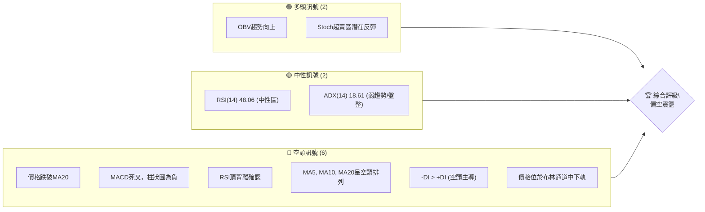

<details>
<summary>📊 靜態圖表 (點擊展開)</summary>

</details>

<html>
<head><meta charset="utf-8" /></head>
<body>
    <div style="height:500px; width:100%;">                        <script>window.PlotlyConfig = {MathJaxConfig: 'local'};</script>
        <script charset="utf-8" src="https://cdn.plot.ly/plotly-3.6.0.min.js" integrity="sha256-QaOVwtVY0T02VaHrr6pnoHLCwayMJp4O5n4YyaE3rJk=" crossorigin="anonymous"></script>                <div id="candlestick-chart" class="plotly-graph-div" style="height:100%; width:100%;"></div>            <script>                window.PLOTLYENV=window.PLOTLYENV || {};                                if (document.getElementById("candlestick-chart")) {                    Plotly.newPlot(                        "candlestick-chart",                        [{"close":{"dtype":"f8","bdata":"AAAAoGZbf0AAAADgEFF\u002fQAAAAOCagH9AAAAAYGJRf0AAAACAFi5\u002fQAAAAIDQeH9AAAAAIOymf0AAAADgBHh\u002fQAAAAKAOX39AAAAA4LZif0AAAADgXox\u002fQAAAAAAovn5AAAAAwAjxfkAAAACAX\u002fR+QAAAACCJE39AAAAAQLYdf0AAAABgDqt\u002fQAAAAODuAIBAAAAAAGKdf0AAAADA9qx\u002fQAAAAKAAlH9AAAAAIF0VgEAAAAAAZvN\u002fQAAAAIBnoH9AAAAA4Aevf0AAAADAbH1\u002fQAAAAODbw39AAAAAIMj1f0AAAADghRWAQAAAAKCDI4BAAAAAQPQDgEAAAACgwBCAQAAAAMDyaYBAAAAAgHVFgEAAAAAAYEyAQAAAACDmOIBAAAAAwOi7f0AAAACgCe1\u002fQAAAACBo5X9AAAAAQC7jf0AAAABgPsZ\u002fQAAAAOCQ5X9AAAAAAE0MgEAAAACgNxOAQAAAAOAcKoBAAAAAgEUqgEAAAACAhEKAQAAAAGBmgYBAAAAAwETVgEAAAACAItGAQAAAACCcU4BAAAAA4GgUgEAAAACgNQ6AQAAAAKB98X9AAAAAAH5\u002ff0AAAACAi99+QAAAAOAX235AAAAAgAxtf0AAAACgqJd\u002fQAAAAKDFvn9AAAAAIPZBf0AAAADgga9\u002fQAAAACC9hH9AAAAAIOuqfkAAAACg3kB+QAAAAADxxH1AAAAA4G1gfUAAAABAYH59QAAAAOAArn1AAAAAgI81fkAAAABAQp1+QAAAAOBPSX5AAAAAwD19fkAAAACgyrl9QAAAAMBU631AAAAAQEkQfkAAAAAgfY1+QAAAAOBqnX5AAAAAQAPHfUAAAABgORV+QAAAAOCIxn1AAAAAIHCLfUAAAABgcqR9QAAAAEAloH1AAAAAIFkdfkAAAAAgQDx+QAAAAGBSLH5AAAAAgBBLfkAAAACAs11+QAAAAGDDWH5AAAAAAAxPfkAAAACAGVV+QAAAACCdF35AAAAAwH1tfUAAAADgDmx9QAAAAGA3xn1AAAAAYDkVfkAAAAAg2L99QAAAAEB70n1AAAAAwAexfUAAAAAgVUl9QAAAAEB+lXxAAAAAgCpqfEAAAACAI518QAAAAAAUSHxAAAAAoEGie0AAAADgPBJ8QAAAAKAl\u002fnxAAAAAwB5DfUAAAABgMOd9QAAAAEDq931AAAAAwD\u002f5ekAAAAAAHsZ6QAAAAEDjV3pAAAAAoDCWeUAAAACgqMV5QAAAAGDLfnhAAAAA4Mj1eEAAAADAQrx5QAAAAAABt3lAAAAAQDwpeUAAAABA7wB5QAAAAOCm+HhAAAAAoJuxeEAAAAAAQd14QAAAAOCU2XhAAAAAwPHFeEAAAACgOfp3QAAAAICMQnhAAAAAYL\u002f7eEAAAAAAoQ15QAAAAGBCfnhAAAAAoATbeEAAAACA6TB5QAAAAEAwRXlAAAAAwK2ceUAAAADgN4F5QAAAACBniHlAAAAAICFOeUAAAABgFEB5QAAAACDdD3lAAAAAQB+reEAAAADAXvF4QAAAAKC\u002f6HhAAAAAoBdveEAAAAAg3kJ4QAAAACC30HdAAAAAoMHid0AAAABg8z53QAAAAGDPI3dAAAAAgN3SdkAAAACg+z92QAAAAIDyYnZAAAAAgOsVd0AAAADAJQl3QAAAACBySndAAAAAoC9Bd0AAAABAxDd3QAAAAABWWHdAAAAAQDhEd0AAAACAGCF3QAAAAACh+HdAAAAAoCqEeEAAAADgTKV5QAAAAMCgNXpAAAAAQAVeekAAAADgqRJ6QAAAAKDkc3pAAAAAAMD\u002fekAAAACgn+15QAAAAKA8e3pAAAAAIG5+ekAAAAAgKMV6QAAAAKCueHpAAAAAIGFueUAAAACAtdh5QAAAAACey3lAAAAA4NqneUAAAACgC9F5QAAAACDFPXpAAAAAwJDjeUAAAABgSrx5QAAAACA4bnlAAAAAIFlFeUAAAADguIh5QAAAAGAhUHpAAAAAoP5pekAAAABASQh6QAAAAGBmQnpAAAAAoHAxekAAAADAHil6QAAAAOB6AHpAAAAAYLjKeUAAAAAA1696QAAAAADXI3xAAAAA4FHIfEAAAADA9ZR7QAAAAKBwtXpAAAAAwMzAekAAAABguAp6QA=="},"high":{"dtype":"f8","bdata":"n5mbHzavf0DguQX99oZ\u002fQHwZIqdAuH9AvzyyUd6Pf0C0kL\u002f21Fx\u002fQNmHZzKPgX9AdyJr3\u002fm9f0DIr4M8SaZ\u002fQKeKv3AMbX9Af\u002fs2OoKJf0BYXzd8O49\u002fQDmOE633y39A72emarsgf0Dyyn0jbTF\u002fQIVOgwYCQX9AY7EW8g1Af0ASjoNwMNV\u002fQAt8GbXOAYBAXmXTgMwPgEDGSgkDKMF\u002fQGYFVwh13X9AjU2nN0EggEA+u6N42hOAQKgQLvWf9X9AstEycBPUf0BXe4wOzqx\u002fQINNMhJK639AbzTtD8cMgECtODorMReAQOzKY7DfKYBAJdXX+IkygECMj0HntimAQEUjFiuBfYBAFWCe3LlzgEAOjMvOEV2AQIpA6d89SIBAbxGlh0dCgEDqEBClRwmAQOp5tyVMAIBAQMa3KXsPgEAoDGsmxwyAQBdkABPjAYBAHw22IXwbgEBjg2TZZxuAQED8fo1lT4BAoA+RjjhFgEBPbM6SWVCAQOlze8+5mYBAJQuauOExgUC51jhKqPaAQJoqnWvTnIBAJNAOBulvgECzZNAKQE2AQIf7r5ZxAoBAys0MqXD5f0AZS6RvR2h\u002fQPtsWKLLA39ALzq9NpB6f0AYbLxISaZ\u002fQI\u002fPhtYyx39AMqTcDkvkf0AA8h+lFcZ\u002fQI2pSkZazn9A4zRvegg9f0AfpBtZLcF+QKmh\u002fY4btn5Ad5hCQ7\u002fMfUA6ci\u002f2kax9QOakPgZp0H1A8VCzOFJifkARard9Iqd+QF49Y7cCe35AoQ7qMP60fkBCr6JHfSF+QNpzfij68n1Arn5N5BsUfkCjy3PB4KF+QDN3FK8Cn35AIYncK6YhfkD4HMOiAD5+QEHuOxD6BH5AqquAW2vpfUD\u002fo6ciV7x9QJvKMkrz3X1AWa0Ykd52fkA0g5lT\u002flp+QGwzxe8CaX5Ab4oltKxafkCGfShM3G9+QKJL7E1LX35AjHzfTPVifkCqEWOsJHh+QDSuAAudX35AUMTBCi4ofkAB07OGWZ99QIIo2DLhyX1AGK4kXXZ4fkCWbGVfUgh+QLT3jFEV231AKq2nT7jtfUCdezXUupp9QB3ildT8IX1A+he2ShHjfEDzcv3GLtJ8QAjcpHhlbHxAG4mlkO0qfEBtlO0gUS18QDMe9nkuUH1AZOr3x1uCfUASTfGpqgt+QHqF7m6GGX5AtdPxT5yIe0BhOEGvalp7QPIc2ulIzXpAr0jJZdxCekC3IaE\u002fBR96QHomSRLWZ3lASpE8ciMAeUCV8uEyz9B5QPx8AVXTXHpAp\u002f7sUtHpeUCX45GyYkZ5QE93pF3fO3lAPe4HiejreEDGLVRfZwx5QLlU\u002fiblOHlAt6LLihX0eEBxFdWYFqh4QNY\u002fN9BLSHhA655qLKMJeUBCTzHMv2l5QJe8+wFmv3hAc7AowSoFeUBmp4r6Il15QCwi+UNEonlARnRwxIareUD0+UJLhMJ5QN3LD8sslXlAOF42EgSVeUCMPZ1QBIJ5QPOGCmrgU3lAoIrqXc0+eUBRmP\u002f6Ofx4QJkxknNqOHlAWg\u002f1xjzSeEA44kGIRHp4QCwwnzaeInhA5JWFe\u002fgleED1IdVdS9p3QG2YzvXrg3dAB2EpC5Bed0BfDu+3qpp2QFvCYzggyXZAwB9QVYFBd0DRsUta6FJ3QNftB+hRTXdA4WS1ucFOd0CwuGY1Ujp3QPZsJeyvAnhA0kWQsRVLd0Aja2hGQG13QJFeud5X+3dA599vY2SdeEBbSYFdl9d5QGMi8oqRPnpAtjB1MFvqekBO5ukvpGZ6QFzmNcQbpHpAgL1b+DMMe0D1NEn66Gt6QMPfHXSBgHpAOnV9mv2iekA27ZyR2s96QB\u002fsrltcnnpAoMKk2GPYeUDFYE8dVgN6QOgoB\u002f7tPXpAXJS1chH+eUCaI75kQBh6QGC+3ozhsHpApP+wrZobekDOVAT8xLx5QBekGtKh6XlAvOE0A+lWeUBqkYLqMq95QIGMLQzqs3pANcGAQziDekBki6jcPPx6QJrLIAsBU3pAAAAAoHClekAAAABgZoZ6QAAAAOBRPHpAAAAAQAr\u002feUAAAAAA19d6QAAAAKBHJXxAAAAAwB4lfUAAAAAAAFh8QAAAAIA9hntAAAAAYGZCe0AAAAAghdd6QA=="},"hovertemplate":"\u003cb\u003e%{x|%Y-%m-%d}\u003c\u002fb\u003e\u003cbr\u003e\u958b: $%{open:.2f}\u003cbr\u003e\u9ad8: $%{high:.2f}\u003cbr\u003e\u4f4e: $%{low:.2f}\u003cbr\u003e\u6536: $%{close:.2f}\u003cextra\u003e\u003c\u002fextra\u003e","low":{"dtype":"f8","bdata":"Bki5SxVHf0BBbIcu5jh\u002fQITEu1\u002f4M39Apnr3eyhPf0CROqye9vV+QPuScTEQDH9ALUFkWBllf0AhTylWClV\u002fQKw3nRbv2n5AR7w4G4oyf0Bt84xfvD9\u002fQBzHsUtXlH5A4NVJF6K+fkAmc02tFel+QLx4ntaA2X5AbXn4bvLrfkCLq0WU3Up\u002fQAlWHsDyfH9AOXCdF2OWf0DLLzmO72t\u002fQL3dUR1xh39ABorgLJOxf0CU8We8B9V\u002fQJwSMp7ggX9A6zvyIq17f0DwYy8MyV1\u002fQLgxjAPodn9Ak3MYk9aaf0DdxkaSPad\u002fQBDkHv2Dx39A2k0oL3W3f0Db6uJTJPx\u002fQJcpGaiCF4BAtSvGXEQxgEAdLRBPYj6AQFu\u002fs5EmEYBASCq0aMOmf0A4Ku43W8d\u002fQOKVD4MMbX9A\u002fjjCaqWsf0D8trMU6o5\u002fQEf5UIDggX9A0ygBHS7jf0AGEJTX+tx\u002fQMgQWJmdE4BAr34cAsUagEC+xpbAdiuAQJqw0jlybYBAZB5ZIe\u002fKgEBw66U\u002f0aqAQAeXRkqsNoBAzIO\u002fW7v9f0D3Eq\u002fln\u002fV\u002fQPwA2stNin9Ada2SM0V2f0DjcefgCMt+QAPQzCZVon5AP2p62ZL6fkBZzzwsBDN\u002fQHJbXnip\u002f35AiW5Grikif0BalQxJ8+R+QHCBgAG4W39AAlee03Y7fkAXikBWqfx9QEuuW\u002fVEln1AA6JeKhojfUAnjIq4Hh99QCl1NxxD7XxAISkQ1hDxfUA9ehP24Ed+QE6YOjQFKH5AHLHZU59CfkBZPMKxfZF9QNLLlh4Kpn1AFdJnGRzMfUAY9mtUuCN+QEbYIuxYZX5AY0knUpSPfUDphGXyAJx9QBFqHGWmo31AHq+PBM1mfUD2cndvrUx9QClDwhZOjn1ADL7mF1e8fUB50+8JnQV+QFLsDr\u002fMCH5AD+xMMXQpfkA8eBQu4yp+QBopnyfjPH5AeujapoggfkDSufpUjzV+QENnrC+EEn5A6o73WzVBfUB3qasVsjZ9QGlBY3StOn1AMHoEvku9fUATZgn8AJx9QMdxMjK0YX1Aql9e\u002fSKZfUBPncu2Jf58QNTIDEJKcnxAiJI5TQ9efECY+0GBTGd8QJkg5Cec9HtAE4ZP+8JLe0BgqQeTp6t7QFWFy0aFCHxA8LepPDq\u002ffEAXoODe\u002fnB9QITUdKsXvn1AkdxCQnQyekBnP40b84h6QAAmthYMRnpAby6YX\u002fpreUDiYTVEz3Z5QGotFURKaXhAzagMBtlyeECU44PMe\u002fF4QNPgwrnsrXlAVpU0xLbzeEBFwFst7cN4QMoy\u002fUGQxHhAME7cT36MeECEglmwAal4QFiaYvgAvXhAj77+UuWkeECBB7hAWuR3QIU+UigpzndAzPUjixFVeEDUSjpBDd54QCFONzGZUHhAyoVifJJceEAtL4dNJH14QOQx2Ake93hAlkjPd2o4eUBTTL+7CHp5QL1YSxEMKnlAu65KbfIgeUB53cqfjQt5QFvc6RN4DXlAmrP+AV6WeEBx6Z0N\u002fZ54QO4a8PE+znhAI\u002fJPvnpieEDYS79ZkyN4QM68xJ3GtHdAbiRWj67Nd0BtMOLgvTB3QFxSR3tMDXdAzLaYh2nGdkB6NCoN1Tt2QG5CYPkoOHZArSwMupCkdkCc+GHbd\u002fZ2QG4wV8rOtXZAWhrMCzkLd0Cik0vZSNx2QDO8Hpm3KXdA5v9iihvkdkAVVI9PrxN3QDw1HY19I3dAMFPzVfQaeEABTh4l9r14QLvBWiH9s3lAbfL1Nn48ekCtGTGLZ\u002fZ5QPHcehzGBHpAsR5z4hFsekAHrVVrVah5QHXO3PNr7nlAgqPrurICekCTsZyQz096QJP1GUobNnpAZJBjvGXSeEC9FMPo2Jh5QMeAsDaYnnlAtzrA9ql+eUCepMtXwEN5QFz\u002f8wquHXpAg9wbKq\u002fReUBWv\u002fZh+kl5QELkxMAtXHlArb6L4JwCeUBqr8TPNwB5QGeJliJIwHlA2LascmPreUCxXZsbcPl5QLg3LcaTpnlAAAAAIFz7eUAAAACgRwV6QAAAAOBR0HlAAAAAoEeZeUAAAABguMp5QAAAAIDCBXtAAAAA4FGkfEAAAABA4YZ7QAAAAAAAhHpAAAAAYI+mekAAAABgZuZ5QA=="},"name":"\u50f9\u683c","open":{"dtype":"f8","bdata":"+dgBTUadf0AJ1WlNUkh\u002fQCehZ5E5UX9AM2s7yBB3f0CDoVVS+VJ\u002fQICraK9zLX9AmbfW+2B+f0Dq4rU3V5d\u002fQEn61R0gFX9A4L2OVulJf0CY+qkaBVJ\u002fQFVVdQ7cnX9ASQQZUprvfkALoMyGYyR\u002fQO66SHgIPX9AoABHSW0xf0BOYfcmYnd\u002fQCGduntomX9Aye6VQwQNgEC2nILogLZ\u002fQOLA+gJWxH9A5hccu4y1f0Bzon4OwwKAQGWoqFIQ6X9AEMIiErCyf0B7ijDjnZF\u002fQFfIrZaZrX9AxR9JiX7Ef0DTjLnpKOB\u002fQEVb71H2+H9AVVrTAg8TgECzaeXYww6AQNxLYf\u002fEGoBADxf30rhngEAzVCP85D+AQPbg9gVsOIBAOTfdL\u002fUigEDqEBClRwmAQKKS5JhNsH9AJR87z4H7f0CNhKyeqtV\u002fQAL82AdinX9ALCYS8vD1f0Cj29UP8hGAQC4yLGP2LoBAphjTQmA5gEBSy6ix\u002fzuAQCvRF4Z3g4BA5kPBKk8UgUDObp+OFeyAQCYrZcoheYBA8w\u002ffkWlsgEB57m4rTySAQKsyjx+hyH9Al8DRGR3hf0D3lKmXpGd\u002fQDUIFgYp3X5A2XJ6AkoOf0Dy7Y0k+Fl\u002fQGOoc4J4on9A7HYgCpOxf0CG9qrLgvF+QBhkwKAAlH9AAZ6KBQrEfkAp8pHuP3B+QAv\u002fJo1oqH5ARW\u002fegw7GfUD9rhYXTo59QGjv3KZ9f31Asj1uinZCfkBvFZX1Ald+QBrXxkBkZH5A\u002fnlTcP5IfkDyEP7aVKN9QC4Vtrwg2n1AAMZhXxcGfkDF5XMR2Ct+QEv1wabnbn5A7eieCiUefkBFFqL2RKh9QIfK31IV231A+LDMHYvffUA\u002fzRubFV19QKDZUce6rH1ALEVIZR7BfUDD9KsZMFN+QBYxbbVvP35AcGt29UYtfkCPRXdebTh+QA887YjVSH5AXtWijV0rfkCZnvbFaDx+QKrtv53VWn5ATmzpEeEjfkCf4u4GVX99QF\u002fUaKgwe31Alkd5nyDafUDhbOfIs\u002fF9QAp2TOtUf31ASU\u002fZIuiofUAG5QUuNYl9QPXCyE1FBn1AqPkXJ\u002f\u002fgfEBDflF9zXx8QPXoHy2DE3xASA8Hk34pfECrXUbMKtp7QHXFOZHdHXxAGpTn4PPzfEAITmzwmHl9QGUU1S4VEX5ARXK35KBge0CjeTk+kVN7QMBzSf5RxXpAFwSkXzlCekA+kRBO2JJ5QD71SzAjWnlAn\u002fZbhmfWeEC+Ntql4TB5QDodgE8nHHpAGQuciFvleUAoO1k9RTN5QE7C7IiCKnlAclKJZDPXeEDwSt+R1sV4QKZ5bUIv\u002fXhARwwsChC0eECT\u002fqNIV6J4QCJcgAX19HdAFkSoxPlaeEBwViiIXT15QIqDC1eQYHhAYPrEviyAeECijGdEpYR4QIUmS6pxBnlANvJwSrw4eUCQzRDgDIV5QB7TP9+3QHlAeMB9M02SeUCOWlKEGEt5QJxzoZoWPHlAk9NWQSICeUCjHHnkWtN4QATrFIN69nhANdyI+ljEeEAzDHVQHFR4QLSjfvJDH3hAAEB6CCDxd0A5lCa3idh3QLosCNOvgXdAAPMkMUwgd0CBlGK24pF2QEdiZLnikXZAyeocoDG8dkAvu2HH7Ep3QPokxHOp5nZAe0+luexKd0B3RRlDohh3QNC9cTleAnhAqsC7ix47d0CMz2FyyEJ3QP1Yyz\u002fXTHdAtVpHcU4xeED+6xPHPNJ4QCzLhso9L3pAePuvJ25+ekDgMy481kN6QN1gZPNONXpA35ifc02UekDHjd15uC96QNoVYvgZAXpA1yR+eXlXekCPQNFNcHp6QMSIEBCZenpA10mHLcGeeUDj65WEhr55QKVIqMloqnlAvmNLP8LmeUBuH3lC5HF5QKsTrpc7M3pAuge7p84HekDdzRfn0G95QIJPn\u002flY2XlAJO\u002fwCkIleUCIS4aRsTl5QPvTkpj+1XlA85bVgYP7eUCvVgbGiM96QKyuHP5l1HlAAAAAAACMekAAAADgozh6QAAAAEDhBnpAAAAAACmweUAAAAAgrs95QAAAAMDMCHtAAAAAoHANfUAAAACAFO57QAAAAEAzZ3tAAAAAwPU8e0AAAACgcMV6QA=="},"x":["2025-08-20T00:00:00-04:00","2025-08-21T00:00:00-04:00","2025-08-22T00:00:00-04:00","2025-08-25T00:00:00-04:00","2025-08-26T00:00:00-04:00","2025-08-27T00:00:00-04:00","2025-08-28T00:00:00-04:00","2025-08-29T00:00:00-04:00","2025-09-02T00:00:00-04:00","2025-09-03T00:00:00-04:00","2025-09-04T00:00:00-04:00","2025-09-05T00:00:00-04:00","2025-09-08T00:00:00-04:00","2025-09-09T00:00:00-04:00","2025-09-10T00:00:00-04:00","2025-09-11T00:00:00-04:00","2025-09-12T00:00:00-04:00","2025-09-15T00:00:00-04:00","2025-09-16T00:00:00-04:00","2025-09-17T00:00:00-04:00","2025-09-18T00:00:00-04:00","2025-09-19T00:00:00-04:00","2025-09-22T00:00:00-04:00","2025-09-23T00:00:00-04:00","2025-09-24T00:00:00-04:00","2025-09-25T00:00:00-04:00","2025-09-26T00:00:00-04:00","2025-09-29T00:00:00-04:00","2025-09-30T00:00:00-04:00","2025-10-01T00:00:00-04:00","2025-10-02T00:00:00-04:00","2025-10-03T00:00:00-04:00","2025-10-06T00:00:00-04:00","2025-10-07T00:00:00-04:00","2025-10-08T00:00:00-04:00","2025-10-09T00:00:00-04:00","2025-10-10T00:00:00-04:00","2025-10-13T00:00:00-04:00","2025-10-14T00:00:00-04:00","2025-10-15T00:00:00-04:00","2025-10-16T00:00:00-04:00","2025-10-17T00:00:00-04:00","2025-10-20T00:00:00-04:00","2025-10-21T00:00:00-04:00","2025-10-22T00:00:00-04:00","2025-10-23T00:00:00-04:00","2025-10-24T00:00:00-04:00","2025-10-27T00:00:00-04:00","2025-10-28T00:00:00-04:00","2025-10-29T00:00:00-04:00","2025-10-30T00:00:00-04:00","2025-10-31T00:00:00-04:00","2025-11-03T00:00:00-05:00","2025-11-04T00:00:00-05:00","2025-11-05T00:00:00-05:00","2025-11-06T00:00:00-05:00","2025-11-07T00:00:00-05:00","2025-11-10T00:00:00-05:00","2025-11-11T00:00:00-05:00","2025-11-12T00:00:00-05:00","2025-11-13T00:00:00-05:00","2025-11-14T00:00:00-05:00","2025-11-17T00:00:00-05:00","2025-11-18T00:00:00-05:00","2025-11-19T00:00:00-05:00","2025-11-20T00:00:00-05:00","2025-11-21T00:00:00-05:00","2025-11-24T00:00:00-05:00","2025-11-25T00:00:00-05:00","2025-11-26T00:00:00-05:00","2025-11-28T00:00:00-05:00","2025-12-01T00:00:00-05:00","2025-12-02T00:00:00-05:00","2025-12-03T00:00:00-05:00","2025-12-04T00:00:00-05:00","2025-12-05T00:00:00-05:00","2025-12-08T00:00:00-05:00","2025-12-09T00:00:00-05:00","2025-12-10T00:00:00-05:00","2025-12-11T00:00:00-05:00","2025-12-12T00:00:00-05:00","2025-12-15T00:00:00-05:00","2025-12-16T00:00:00-05:00","2025-12-17T00:00:00-05:00","2025-12-18T00:00:00-05:00","2025-12-19T00:00:00-05:00","2025-12-22T00:00:00-05:00","2025-12-23T00:00:00-05:00","2025-12-24T00:00:00-05:00","2025-12-26T00:00:00-05:00","2025-12-29T00:00:00-05:00","2025-12-30T00:00:00-05:00","2025-12-31T00:00:00-05:00","2026-01-02T00:00:00-05:00","2026-01-05T00:00:00-05:00","2026-01-06T00:00:00-05:00","2026-01-07T00:00:00-05:00","2026-01-08T00:00:00-05:00","2026-01-09T00:00:00-05:00","2026-01-12T00:00:00-05:00","2026-01-13T00:00:00-05:00","2026-01-14T00:00:00-05:00","2026-01-15T00:00:00-05:00","2026-01-16T00:00:00-05:00","2026-01-20T00:00:00-05:00","2026-01-21T00:00:00-05:00","2026-01-22T00:00:00-05:00","2026-01-23T00:00:00-05:00","2026-01-26T00:00:00-05:00","2026-01-27T00:00:00-05:00","2026-01-28T00:00:00-05:00","2026-01-29T00:00:00-05:00","2026-01-30T00:00:00-05:00","2026-02-02T00:00:00-05:00","2026-02-03T00:00:00-05:00","2026-02-04T00:00:00-05:00","2026-02-05T00:00:00-05:00","2026-02-06T00:00:00-05:00","2026-02-09T00:00:00-05:00","2026-02-10T00:00:00-05:00","2026-02-11T00:00:00-05:00","2026-02-12T00:00:00-05:00","2026-02-13T00:00:00-05:00","2026-02-17T00:00:00-05:00","2026-02-18T00:00:00-05:00","2026-02-19T00:00:00-05:00","2026-02-20T00:00:00-05:00","2026-02-23T00:00:00-05:00","2026-02-24T00:00:00-05:00","2026-02-25T00:00:00-05:00","2026-02-26T00:00:00-05:00","2026-02-27T00:00:00-05:00","2026-03-02T00:00:00-05:00","2026-03-03T00:00:00-05:00","2026-03-04T00:00:00-05:00","2026-03-05T00:00:00-05:00","2026-03-06T00:00:00-05:00","2026-03-09T00:00:00-04:00","2026-03-10T00:00:00-04:00","2026-03-11T00:00:00-04:00","2026-03-12T00:00:00-04:00","2026-03-13T00:00:00-04:00","2026-03-16T00:00:00-04:00","2026-03-17T00:00:00-04:00","2026-03-18T00:00:00-04:00","2026-03-19T00:00:00-04:00","2026-03-20T00:00:00-04:00","2026-03-23T00:00:00-04:00","2026-03-24T00:00:00-04:00","2026-03-25T00:00:00-04:00","2026-03-26T00:00:00-04:00","2026-03-27T00:00:00-04:00","2026-03-30T00:00:00-04:00","2026-03-31T00:00:00-04:00","2026-04-01T00:00:00-04:00","2026-04-02T00:00:00-04:00","2026-04-06T00:00:00-04:00","2026-04-07T00:00:00-04:00","2026-04-08T00:00:00-04:00","2026-04-09T00:00:00-04:00","2026-04-10T00:00:00-04:00","2026-04-13T00:00:00-04:00","2026-04-14T00:00:00-04:00","2026-04-15T00:00:00-04:00","2026-04-16T00:00:00-04:00","2026-04-17T00:00:00-04:00","2026-04-20T00:00:00-04:00","2026-04-21T00:00:00-04:00","2026-04-22T00:00:00-04:00","2026-04-23T00:00:00-04:00","2026-04-24T00:00:00-04:00","2026-04-27T00:00:00-04:00","2026-04-28T00:00:00-04:00","2026-04-29T00:00:00-04:00","2026-04-30T00:00:00-04:00","2026-05-01T00:00:00-04:00","2026-05-04T00:00:00-04:00","2026-05-05T00:00:00-04:00","2026-05-06T00:00:00-04:00","2026-05-07T00:00:00-04:00","2026-05-08T00:00:00-04:00","2026-05-11T00:00:00-04:00","2026-05-12T00:00:00-04:00","2026-05-13T00:00:00-04:00","2026-05-14T00:00:00-04:00","2026-05-15T00:00:00-04:00","2026-05-18T00:00:00-04:00","2026-05-19T00:00:00-04:00","2026-05-20T00:00:00-04:00","2026-05-21T00:00:00-04:00","2026-05-22T00:00:00-04:00","2026-05-26T00:00:00-04:00","2026-05-27T00:00:00-04:00","2026-05-28T00:00:00-04:00","2026-05-29T00:00:00-04:00","2026-06-01T00:00:00-04:00","2026-06-02T00:00:00-04:00","2026-06-03T00:00:00-04:00","2026-06-04T00:00:00-04:00","2026-06-05T00:00:00-04:00"],"type":"candlestick"},{"hovertemplate":"MA30: $%{y:.2f}\u003cextra\u003e\u003c\u002fextra\u003e","line":{"color":"#2196F3","dash":"dash","width":2},"mode":"lines","name":"MA30","x":["2025-08-20T00:00:00-04:00","2025-08-21T00:00:00-04:00","2025-08-22T00:00:00-04:00","2025-08-25T00:00:00-04:00","2025-08-26T00:00:00-04:00","2025-08-27T00:00:00-04:00","2025-08-28T00:00:00-04:00","2025-08-29T00:00:00-04:00","2025-09-02T00:00:00-04:00","2025-09-03T00:00:00-04:00","2025-09-04T00:00:00-04:00","2025-09-05T00:00:00-04:00","2025-09-08T00:00:00-04:00","2025-09-09T00:00:00-04:00","2025-09-10T00:00:00-04:00","2025-09-11T00:00:00-04:00","2025-09-12T00:00:00-04:00","2025-09-15T00:00:00-04:00","2025-09-16T00:00:00-04:00","2025-09-17T00:00:00-04:00","2025-09-18T00:00:00-04:00","2025-09-19T00:00:00-04:00","2025-09-22T00:00:00-04:00","2025-09-23T00:00:00-04:00","2025-09-24T00:00:00-04:00","2025-09-25T00:00:00-04:00","2025-09-26T00:00:00-04:00","2025-09-29T00:00:00-04:00","2025-09-30T00:00:00-04:00","2025-10-01T00:00:00-04:00","2025-10-02T00:00:00-04:00","2025-10-03T00:00:00-04:00","2025-10-06T00:00:00-04:00","2025-10-07T00:00:00-04:00","2025-10-08T00:00:00-04:00","2025-10-09T00:00:00-04:00","2025-10-10T00:00:00-04:00","2025-10-13T00:00:00-04:00","2025-10-14T00:00:00-04:00","2025-10-15T00:00:00-04:00","2025-10-16T00:00:00-04:00","2025-10-17T00:00:00-04:00","2025-10-20T00:00:00-04:00","2025-10-21T00:00:00-04:00","2025-10-22T00:00:00-04:00","2025-10-23T00:00:00-04:00","2025-10-24T00:00:00-04:00","2025-10-27T00:00:00-04:00","2025-10-28T00:00:00-04:00","2025-10-29T00:00:00-04:00","2025-10-30T00:00:00-04:00","2025-10-31T00:00:00-04:00","2025-11-03T00:00:00-05:00","2025-11-04T00:00:00-05:00","2025-11-05T00:00:00-05:00","2025-11-06T00:00:00-05:00","2025-11-07T00:00:00-05:00","2025-11-10T00:00:00-05:00","2025-11-11T00:00:00-05:00","2025-11-12T00:00:00-05:00","2025-11-13T00:00:00-05:00","2025-11-14T00:00:00-05:00","2025-11-17T00:00:00-05:00","2025-11-18T00:00:00-05:00","2025-11-19T00:00:00-05:00","2025-11-20T00:00:00-05:00","2025-11-21T00:00:00-05:00","2025-11-24T00:00:00-05:00","2025-11-25T00:00:00-05:00","2025-11-26T00:00:00-05:00","2025-11-28T00:00:00-05:00","2025-12-01T00:00:00-05:00","2025-12-02T00:00:00-05:00","2025-12-03T00:00:00-05:00","2025-12-04T00:00:00-05:00","2025-12-05T00:00:00-05:00","2025-12-08T00:00:00-05:00","2025-12-09T00:00:00-05:00","2025-12-10T00:00:00-05:00","2025-12-11T00:00:00-05:00","2025-12-12T00:00:00-05:00","2025-12-15T00:00:00-05:00","2025-12-16T00:00:00-05:00","2025-12-17T00:00:00-05:00","2025-12-18T00:00:00-05:00","2025-12-19T00:00:00-05:00","2025-12-22T00:00:00-05:00","2025-12-23T00:00:00-05:00","2025-12-24T00:00:00-05:00","2025-12-26T00:00:00-05:00","2025-12-29T00:00:00-05:00","2025-12-30T00:00:00-05:00","2025-12-31T00:00:00-05:00","2026-01-02T00:00:00-05:00","2026-01-05T00:00:00-05:00","2026-01-06T00:00:00-05:00","2026-01-07T00:00:00-05:00","2026-01-08T00:00:00-05:00","2026-01-09T00:00:00-05:00","2026-01-12T00:00:00-05:00","2026-01-13T00:00:00-05:00","2026-01-14T00:00:00-05:00","2026-01-15T00:00:00-05:00","2026-01-16T00:00:00-05:00","2026-01-20T00:00:00-05:00","2026-01-21T00:00:00-05:00","2026-01-22T00:00:00-05:00","2026-01-23T00:00:00-05:00","2026-01-26T00:00:00-05:00","2026-01-27T00:00:00-05:00","2026-01-28T00:00:00-05:00","2026-01-29T00:00:00-05:00","2026-01-30T00:00:00-05:00","2026-02-02T00:00:00-05:00","2026-02-03T00:00:00-05:00","2026-02-04T00:00:00-05:00","2026-02-05T00:00:00-05:00","2026-02-06T00:00:00-05:00","2026-02-09T00:00:00-05:00","2026-02-10T00:00:00-05:00","2026-02-11T00:00:00-05:00","2026-02-12T00:00:00-05:00","2026-02-13T00:00:00-05:00","2026-02-17T00:00:00-05:00","2026-02-18T00:00:00-05:00","2026-02-19T00:00:00-05:00","2026-02-20T00:00:00-05:00","2026-02-23T00:00:00-05:00","2026-02-24T00:00:00-05:00","2026-02-25T00:00:00-05:00","2026-02-26T00:00:00-05:00","2026-02-27T00:00:00-05:00","2026-03-02T00:00:00-05:00","2026-03-03T00:00:00-05:00","2026-03-04T00:00:00-05:00","2026-03-05T00:00:00-05:00","2026-03-06T00:00:00-05:00","2026-03-09T00:00:00-04:00","2026-03-10T00:00:00-04:00","2026-03-11T00:00:00-04:00","2026-03-12T00:00:00-04:00","2026-03-13T00:00:00-04:00","2026-03-16T00:00:00-04:00","2026-03-17T00:00:00-04:00","2026-03-18T00:00:00-04:00","2026-03-19T00:00:00-04:00","2026-03-20T00:00:00-04:00","2026-03-23T00:00:00-04:00","2026-03-24T00:00:00-04:00","2026-03-25T00:00:00-04:00","2026-03-26T00:00:00-04:00","2026-03-27T00:00:00-04:00","2026-03-30T00:00:00-04:00","2026-03-31T00:00:00-04:00","2026-04-01T00:00:00-04:00","2026-04-02T00:00:00-04:00","2026-04-06T00:00:00-04:00","2026-04-07T00:00:00-04:00","2026-04-08T00:00:00-04:00","2026-04-09T00:00:00-04:00","2026-04-10T00:00:00-04:00","2026-04-13T00:00:00-04:00","2026-04-14T00:00:00-04:00","2026-04-15T00:00:00-04:00","2026-04-16T00:00:00-04:00","2026-04-17T00:00:00-04:00","2026-04-20T00:00:00-04:00","2026-04-21T00:00:00-04:00","2026-04-22T00:00:00-04:00","2026-04-23T00:00:00-04:00","2026-04-24T00:00:00-04:00","2026-04-27T00:00:00-04:00","2026-04-28T00:00:00-04:00","2026-04-29T00:00:00-04:00","2026-04-30T00:00:00-04:00","2026-05-01T00:00:00-04:00","2026-05-04T00:00:00-04:00","2026-05-05T00:00:00-04:00","2026-05-06T00:00:00-04:00","2026-05-07T00:00:00-04:00","2026-05-08T00:00:00-04:00","2026-05-11T00:00:00-04:00","2026-05-12T00:00:00-04:00","2026-05-13T00:00:00-04:00","2026-05-14T00:00:00-04:00","2026-05-15T00:00:00-04:00","2026-05-18T00:00:00-04:00","2026-05-19T00:00:00-04:00","2026-05-20T00:00:00-04:00","2026-05-21T00:00:00-04:00","2026-05-22T00:00:00-04:00","2026-05-26T00:00:00-04:00","2026-05-27T00:00:00-04:00","2026-05-28T00:00:00-04:00","2026-05-29T00:00:00-04:00","2026-06-01T00:00:00-04:00","2026-06-02T00:00:00-04:00","2026-06-03T00:00:00-04:00","2026-06-04T00:00:00-04:00","2026-06-05T00:00:00-04:00"],"y":{"dtype":"f8","bdata":"AAAAAAAA+H8AAAAAAAD4fwAAAAAAAPh\u002fAAAAAAAA+H8AAAAAAAD4fwAAAAAAAPh\u002fAAAAAAAA+H8AAAAAAAD4fwAAAAAAAPh\u002fAAAAAAAA+H8AAAAAAAD4fwAAAAAAAPh\u002fAAAAAAAA+H8AAAAAAAD4fwAAAAAAAPh\u002fAAAAAAAA+H8AAAAAAAD4fwAAAAAAAPh\u002fAAAAAAAA+H8AAAAAAAD4fwAAAAAAAPh\u002fAAAAAAAA+H8AAAAAAAD4fwAAAAAAAPh\u002fAAAAAAAA+H8AAAAAAAD4fwAAAAAAAPh\u002fAAAAAAAA+H8AAAAAAAD4fxEREUHXiH9AERERUZeOf0Dv7u7+iZV\u002fQImIiEjZoH9AVVVVxUyrf0DNzMx8Y7d\u002fQFVVVSWwv39AvLu7O2PAf0CrqqrKScR\u002fQN7d3T3EyH9AzczMfAzNf0BmZmZW+s5\u002fQKuqqirT2H9Ad3d3V63if0ARERER4ex\u002fQO\u002fu7p6R939A3t3dBfcAgEARERERmQSAQBEREVHhCIBAmpmZ+aERgEARERHh\u002fBmAQLy7uyOTHoBAd3d3\u002f4oegEDNzMwEOh+AQM3MzPyTIIBAAAAAKMkfgEARERGJJx2AQO\u002fu7mZGGYBAIiIiAv8WgEAAAAAoihSAQLy7u8tEEoBAEREROfgOgEBVVVXVEQ2AQLy7u9N7B4BAiYiIqPf+f0De3d2t+Op\u002fQCIiIpIk1H9AAAAA4AbAf0Dv7u5+Rat\u002fQHd3d6dbmH9AAAAAkAmKf0CrqqpKI4B\u002fQERERGRlcn9A3t3dHa9kf0BmZmb2\u002fk9\u002fQLy7u8tuO39AVVVVRRcof0B3d3dXThd\u002fQFVVVSXcAn9AERERAa3hfkARERHRX8N+QAAAAHDRqn5AIiIiYoGUfkDe3d2NcH9+QHd3d1epa35AAAAAUNtffkDe3d3daVp+QLy7u3uWVH5AMzMz8+tKfkCJiIjYdEB+QGZmZtaFNH5Ad3d392wsfkBERET04CB+QImIiDi1FH5AIiIigiAKfkBERESECAN+QFVVVWUTA35A3t3dLRoJfkB3d3fXSAt+QO\u002fu7h6ADH5AIiIiMhUIfkDe3d19wPx9QBEREYE57n1AmpmZqYXcfUAAAACgCNN9QAAAAAAPxX1AMzMzA1OwfUBEREQ0Jpt9QAAAAJBOjX1AREREFOmIfUDv7u4+YId9QAAAAKAFiX1AREREFBVzfUDNzMzMmlp9QJqZmZmYPn1A3t3dHfUXfUAAAAAA3\u002fF8QBEREZFrwXxA3t3dLemTfEC8u7trZWx8QBEREfHeRHxA3t3dnfEYfEDe3d29eOt7QN7d3d3Fv3tAZmZmdmCXe0C8u7u7e3B7QBEREVF2RntAERERIScZe0DNzMwc5ud6QImIiDhvuHpAREREJEKQekCamZmJImx6QERERCQ6SXpAMzMzA9sqekARERHhpQ16QO\u002fu7p7z83lAVVVV9bLieUBERERkzMx5QKuqqgpGr3lAq6qq2oGNeUCJiIi4zWV5QKuqqmrvO3lAq6qqqkMoeUARERGxoxh5QFVVVcVmDHlAq6qqmpACeUDNzMz8q\u002fV4QDMzM4Pe73hAq6qqmrPmeECamZk5ddF4QKuqqhp8u3hAMzMzA4qneEDNzMxsCpB4QBEREeH7eXhA7+7uzkJseEDNzMxMqFx4QHd3d1daT3hAAAAA8GRCeEDv7u6O6Tt4QBEREfEaNHhA3t3dTXQleECrqqpaCRV4QKuqqgqVEHhAiYiI6K8NeEBmZmYWkRF4QGZmZtaUGXhAAAAAsAYgeEAiIiLS3yR4QGZmZla5LHhAERERkS07eECamZl59kB4QCIiIkITTXhARERE9KZceEC8u7u7Pmx4QAAAAICTeXhAMzMz8xWCeEAREREhnY94QBEREbGCoHhAIiIiIp2veEAAAADgjMV4QAAAAAAE4HhAvLu7Gyz6eEB3d3d36hd5QBEREUHkMXlAq6qqCopEeUDv7u6+21l5QKuqqtqlc3lAAAAAsJuOeUDv7u4eoKZ5QImIiIh+v3lAERER4XfYeUBERET0VfJ5QERERASqA3pAvLu7m4wOekBEREQUbxd6QKuqqlroJ3pAIiIigoQ8ekB3d3fnZEl6QM3MzDyUS3pAAAAAEHtJekCrqqpac0p6QA=="},"type":"scatter"},{"hovertemplate":"MA60: $%{y:.2f}\u003cextra\u003e\u003c\u002fextra\u003e","line":{"color":"#9C27B0","dash":"dash","width":2},"mode":"lines","name":"MA60","x":["2025-08-20T00:00:00-04:00","2025-08-21T00:00:00-04:00","2025-08-22T00:00:00-04:00","2025-08-25T00:00:00-04:00","2025-08-26T00:00:00-04:00","2025-08-27T00:00:00-04:00","2025-08-28T00:00:00-04:00","2025-08-29T00:00:00-04:00","2025-09-02T00:00:00-04:00","2025-09-03T00:00:00-04:00","2025-09-04T00:00:00-04:00","2025-09-05T00:00:00-04:00","2025-09-08T00:00:00-04:00","2025-09-09T00:00:00-04:00","2025-09-10T00:00:00-04:00","2025-09-11T00:00:00-04:00","2025-09-12T00:00:00-04:00","2025-09-15T00:00:00-04:00","2025-09-16T00:00:00-04:00","2025-09-17T00:00:00-04:00","2025-09-18T00:00:00-04:00","2025-09-19T00:00:00-04:00","2025-09-22T00:00:00-04:00","2025-09-23T00:00:00-04:00","2025-09-24T00:00:00-04:00","2025-09-25T00:00:00-04:00","2025-09-26T00:00:00-04:00","2025-09-29T00:00:00-04:00","2025-09-30T00:00:00-04:00","2025-10-01T00:00:00-04:00","2025-10-02T00:00:00-04:00","2025-10-03T00:00:00-04:00","2025-10-06T00:00:00-04:00","2025-10-07T00:00:00-04:00","2025-10-08T00:00:00-04:00","2025-10-09T00:00:00-04:00","2025-10-10T00:00:00-04:00","2025-10-13T00:00:00-04:00","2025-10-14T00:00:00-04:00","2025-10-15T00:00:00-04:00","2025-10-16T00:00:00-04:00","2025-10-17T00:00:00-04:00","2025-10-20T00:00:00-04:00","2025-10-21T00:00:00-04:00","2025-10-22T00:00:00-04:00","2025-10-23T00:00:00-04:00","2025-10-24T00:00:00-04:00","2025-10-27T00:00:00-04:00","2025-10-28T00:00:00-04:00","2025-10-29T00:00:00-04:00","2025-10-30T00:00:00-04:00","2025-10-31T00:00:00-04:00","2025-11-03T00:00:00-05:00","2025-11-04T00:00:00-05:00","2025-11-05T00:00:00-05:00","2025-11-06T00:00:00-05:00","2025-11-07T00:00:00-05:00","2025-11-10T00:00:00-05:00","2025-11-11T00:00:00-05:00","2025-11-12T00:00:00-05:00","2025-11-13T00:00:00-05:00","2025-11-14T00:00:00-05:00","2025-11-17T00:00:00-05:00","2025-11-18T00:00:00-05:00","2025-11-19T00:00:00-05:00","2025-11-20T00:00:00-05:00","2025-11-21T00:00:00-05:00","2025-11-24T00:00:00-05:00","2025-11-25T00:00:00-05:00","2025-11-26T00:00:00-05:00","2025-11-28T00:00:00-05:00","2025-12-01T00:00:00-05:00","2025-12-02T00:00:00-05:00","2025-12-03T00:00:00-05:00","2025-12-04T00:00:00-05:00","2025-12-05T00:00:00-05:00","2025-12-08T00:00:00-05:00","2025-12-09T00:00:00-05:00","2025-12-10T00:00:00-05:00","2025-12-11T00:00:00-05:00","2025-12-12T00:00:00-05:00","2025-12-15T00:00:00-05:00","2025-12-16T00:00:00-05:00","2025-12-17T00:00:00-05:00","2025-12-18T00:00:00-05:00","2025-12-19T00:00:00-05:00","2025-12-22T00:00:00-05:00","2025-12-23T00:00:00-05:00","2025-12-24T00:00:00-05:00","2025-12-26T00:00:00-05:00","2025-12-29T00:00:00-05:00","2025-12-30T00:00:00-05:00","2025-12-31T00:00:00-05:00","2026-01-02T00:00:00-05:00","2026-01-05T00:00:00-05:00","2026-01-06T00:00:00-05:00","2026-01-07T00:00:00-05:00","2026-01-08T00:00:00-05:00","2026-01-09T00:00:00-05:00","2026-01-12T00:00:00-05:00","2026-01-13T00:00:00-05:00","2026-01-14T00:00:00-05:00","2026-01-15T00:00:00-05:00","2026-01-16T00:00:00-05:00","2026-01-20T00:00:00-05:00","2026-01-21T00:00:00-05:00","2026-01-22T00:00:00-05:00","2026-01-23T00:00:00-05:00","2026-01-26T00:00:00-05:00","2026-01-27T00:00:00-05:00","2026-01-28T00:00:00-05:00","2026-01-29T00:00:00-05:00","2026-01-30T00:00:00-05:00","2026-02-02T00:00:00-05:00","2026-02-03T00:00:00-05:00","2026-02-04T00:00:00-05:00","2026-02-05T00:00:00-05:00","2026-02-06T00:00:00-05:00","2026-02-09T00:00:00-05:00","2026-02-10T00:00:00-05:00","2026-02-11T00:00:00-05:00","2026-02-12T00:00:00-05:00","2026-02-13T00:00:00-05:00","2026-02-17T00:00:00-05:00","2026-02-18T00:00:00-05:00","2026-02-19T00:00:00-05:00","2026-02-20T00:00:00-05:00","2026-02-23T00:00:00-05:00","2026-02-24T00:00:00-05:00","2026-02-25T00:00:00-05:00","2026-02-26T00:00:00-05:00","2026-02-27T00:00:00-05:00","2026-03-02T00:00:00-05:00","2026-03-03T00:00:00-05:00","2026-03-04T00:00:00-05:00","2026-03-05T00:00:00-05:00","2026-03-06T00:00:00-05:00","2026-03-09T00:00:00-04:00","2026-03-10T00:00:00-04:00","2026-03-11T00:00:00-04:00","2026-03-12T00:00:00-04:00","2026-03-13T00:00:00-04:00","2026-03-16T00:00:00-04:00","2026-03-17T00:00:00-04:00","2026-03-18T00:00:00-04:00","2026-03-19T00:00:00-04:00","2026-03-20T00:00:00-04:00","2026-03-23T00:00:00-04:00","2026-03-24T00:00:00-04:00","2026-03-25T00:00:00-04:00","2026-03-26T00:00:00-04:00","2026-03-27T00:00:00-04:00","2026-03-30T00:00:00-04:00","2026-03-31T00:00:00-04:00","2026-04-01T00:00:00-04:00","2026-04-02T00:00:00-04:00","2026-04-06T00:00:00-04:00","2026-04-07T00:00:00-04:00","2026-04-08T00:00:00-04:00","2026-04-09T00:00:00-04:00","2026-04-10T00:00:00-04:00","2026-04-13T00:00:00-04:00","2026-04-14T00:00:00-04:00","2026-04-15T00:00:00-04:00","2026-04-16T00:00:00-04:00","2026-04-17T00:00:00-04:00","2026-04-20T00:00:00-04:00","2026-04-21T00:00:00-04:00","2026-04-22T00:00:00-04:00","2026-04-23T00:00:00-04:00","2026-04-24T00:00:00-04:00","2026-04-27T00:00:00-04:00","2026-04-28T00:00:00-04:00","2026-04-29T00:00:00-04:00","2026-04-30T00:00:00-04:00","2026-05-01T00:00:00-04:00","2026-05-04T00:00:00-04:00","2026-05-05T00:00:00-04:00","2026-05-06T00:00:00-04:00","2026-05-07T00:00:00-04:00","2026-05-08T00:00:00-04:00","2026-05-11T00:00:00-04:00","2026-05-12T00:00:00-04:00","2026-05-13T00:00:00-04:00","2026-05-14T00:00:00-04:00","2026-05-15T00:00:00-04:00","2026-05-18T00:00:00-04:00","2026-05-19T00:00:00-04:00","2026-05-20T00:00:00-04:00","2026-05-21T00:00:00-04:00","2026-05-22T00:00:00-04:00","2026-05-26T00:00:00-04:00","2026-05-27T00:00:00-04:00","2026-05-28T00:00:00-04:00","2026-05-29T00:00:00-04:00","2026-06-01T00:00:00-04:00","2026-06-02T00:00:00-04:00","2026-06-03T00:00:00-04:00","2026-06-04T00:00:00-04:00","2026-06-05T00:00:00-04:00"],"y":{"dtype":"f8","bdata":"AAAAAAAA+H8AAAAAAAD4fwAAAAAAAPh\u002fAAAAAAAA+H8AAAAAAAD4fwAAAAAAAPh\u002fAAAAAAAA+H8AAAAAAAD4fwAAAAAAAPh\u002fAAAAAAAA+H8AAAAAAAD4fwAAAAAAAPh\u002fAAAAAAAA+H8AAAAAAAD4fwAAAAAAAPh\u002fAAAAAAAA+H8AAAAAAAD4fwAAAAAAAPh\u002fAAAAAAAA+H8AAAAAAAD4fwAAAAAAAPh\u002fAAAAAAAA+H8AAAAAAAD4fwAAAAAAAPh\u002fAAAAAAAA+H8AAAAAAAD4fwAAAAAAAPh\u002fAAAAAAAA+H8AAAAAAAD4fwAAAAAAAPh\u002fAAAAAAAA+H8AAAAAAAD4fwAAAAAAAPh\u002fAAAAAAAA+H8AAAAAAAD4fwAAAAAAAPh\u002fAAAAAAAA+H8AAAAAAAD4fwAAAAAAAPh\u002fAAAAAAAA+H8AAAAAAAD4fwAAAAAAAPh\u002fAAAAAAAA+H8AAAAAAAD4fwAAAAAAAPh\u002fAAAAAAAA+H8AAAAAAAD4fwAAAAAAAPh\u002fAAAAAAAA+H8AAAAAAAD4fwAAAAAAAPh\u002fAAAAAAAA+H8AAAAAAAD4fwAAAAAAAPh\u002fAAAAAAAA+H8AAAAAAAD4fwAAAAAAAPh\u002fAAAAAAAA+H8AAAAAAAD4f0RERGyw1n9AmpmZ4UPWf0DNzMzU1td\u002fQAAAAHjo139A7+7uNiLVf0BVVVUVLtF\u002fQLy7u1vqyX9A3t3dDTXAf0DNzMykx7d\u002fQKuqqvKPsH9AZmZmBourf0CJiIjQjqd\u002fQHd3d0ecpX9Aq6qqOq6jf0C8u7sDcJ5\u002fQFVVVTWAmX9AiYiIqAKVf0DNzMw8QJB\u002fQLy7u2NPin9AIiIieniCf0CamZnJrHt\u002fQLy7u9v7c39AiYiIsMtof0C8u7tL8l5\u002fQImIiKhoVn9AAAAA0LZPf0AAAAB4XEp\u002fQM3MzKSRQ39AvLu7+3Q8f0BERESUxDR\u002fQO\u002fu7raHLH9AzczMtC4lf0B3d3dPgh1\u002fQAAAAHDWEX9AVVVVFYwEf0ARERGZAPd+QLy7u\u002fub635A7+7uhpDkfkAzMzMrR9t+QDMzM+Nt0n5AERERYQ\u002fJfkBERETkcb5+QKuqqnJPsH5AvLu7Y5qgfkAzMzPLg5F+QN7d3eU+gH5AREREJDVsfkDe3d1FOll+QKuqqloVSH5Aq6qqCks1fkAAAAAIYCV+QAAAAIjrGX5AMzMzO8sDfkBVVVWtBe19QImIiPgg1X1A7+7uNui7fUDv7u5uJKZ9QGZmZgYBi31AiYiIkGpvfUAiIiIibVZ9QLy7u2OyPH1Aq6qqSq8ifUARERHZLAZ9QDMzM4s96nxAREREfMDQfEAAAAAgwrl8QDMzM9vEpHxAd3d3pyCRfEAiIiJ6l3l8QLy7u6t3YnxAMzMzqytMfEC8u7uDcTR8QKuqqtK5G3xAZmZmVrADfECJiIhAV\u002fB7QHd3d0+B3HtARERE\u002fILJe0BERERM+bN7QFVVVU1KnntAd3d3dzWLe0C8u7v7lnZ7QFVVVYV6YntAd3d3X6xNe0Dv7u4+nzl7QHd3d69\u002fJXtARERE3EINe0BmZmZ+xfN6QCIiIgql2HpAREREZE69ekCrqqpS7Z56QN7d3YUtgHpAiYiI0D1gekBVVVWVwT16QHd3d9\u002fgHHpAq6qqotEBekBEREQEkuZ5QERERFToynlAiYiICMateUDe3d3V55F5QM3MzBRFdnlAEREROdtaeUAiIiLylUB5QHd3d5fnLHlA3t3ddUUceUC8u7t7mw95QKuqqjrEBnlAq6qq0lwBeUAzMzMb1vh4QImIiLD\u002f7XhA3t3dtVfkeEAREREZYtN4QGZmZlaBxHhAd3d3T3XCeEBmZmY2ccJ4QKuqqiL9wnhA7+7uRlPCeEDv7u6OpMJ4QCIiIpowyHhAZmZmXijLeEDNzMwMgct4QFVVVQ3AzXhAd3d3D9vQeEAiIiJy+tN4QBERERHw1XhAzczMbGbYeEDe3d0FQtt4QBERERmA4XhAAAAAUIDoeEDv7u7WRPF4QM3MzLzM+XhAd3d3F\u002fb+eEB3d3enrwN5QHd3d4cfCnlAIiIiQh4OeUBVVVUVgBR5QImIiJi+IHlAERERmUUueUDNzMxcIjd5QJqZmckmPHlAiYiIUFRCeUAiIiLqtEV5QA=="},"type":"scatter"},{"hovertemplate":"MA200: $%{y:.2f}\u003cextra\u003e\u003c\u002fextra\u003e","line":{"color":"#FF6F00","dash":"solid","width":2},"mode":"lines","name":"MA200","x":["2025-08-20T00:00:00-04:00","2025-08-21T00:00:00-04:00","2025-08-22T00:00:00-04:00","2025-08-25T00:00:00-04:00","2025-08-26T00:00:00-04:00","2025-08-27T00:00:00-04:00","2025-08-28T00:00:00-04:00","2025-08-29T00:00:00-04:00","2025-09-02T00:00:00-04:00","2025-09-03T00:00:00-04:00","2025-09-04T00:00:00-04:00","2025-09-05T00:00:00-04:00","2025-09-08T00:00:00-04:00","2025-09-09T00:00:00-04:00","2025-09-10T00:00:00-04:00","2025-09-11T00:00:00-04:00","2025-09-12T00:00:00-04:00","2025-09-15T00:00:00-04:00","2025-09-16T00:00:00-04:00","2025-09-17T00:00:00-04:00","2025-09-18T00:00:00-04:00","2025-09-19T00:00:00-04:00","2025-09-22T00:00:00-04:00","2025-09-23T00:00:00-04:00","2025-09-24T00:00:00-04:00","2025-09-25T00:00:00-04:00","2025-09-26T00:00:00-04:00","2025-09-29T00:00:00-04:00","2025-09-30T00:00:00-04:00","2025-10-01T00:00:00-04:00","2025-10-02T00:00:00-04:00","2025-10-03T00:00:00-04:00","2025-10-06T00:00:00-04:00","2025-10-07T00:00:00-04:00","2025-10-08T00:00:00-04:00","2025-10-09T00:00:00-04:00","2025-10-10T00:00:00-04:00","2025-10-13T00:00:00-04:00","2025-10-14T00:00:00-04:00","2025-10-15T00:00:00-04:00","2025-10-16T00:00:00-04:00","2025-10-17T00:00:00-04:00","2025-10-20T00:00:00-04:00","2025-10-21T00:00:00-04:00","2025-10-22T00:00:00-04:00","2025-10-23T00:00:00-04:00","2025-10-24T00:00:00-04:00","2025-10-27T00:00:00-04:00","2025-10-28T00:00:00-04:00","2025-10-29T00:00:00-04:00","2025-10-30T00:00:00-04:00","2025-10-31T00:00:00-04:00","2025-11-03T00:00:00-05:00","2025-11-04T00:00:00-05:00","2025-11-05T00:00:00-05:00","2025-11-06T00:00:00-05:00","2025-11-07T00:00:00-05:00","2025-11-10T00:00:00-05:00","2025-11-11T00:00:00-05:00","2025-11-12T00:00:00-05:00","2025-11-13T00:00:00-05:00","2025-11-14T00:00:00-05:00","2025-11-17T00:00:00-05:00","2025-11-18T00:00:00-05:00","2025-11-19T00:00:00-05:00","2025-11-20T00:00:00-05:00","2025-11-21T00:00:00-05:00","2025-11-24T00:00:00-05:00","2025-11-25T00:00:00-05:00","2025-11-26T00:00:00-05:00","2025-11-28T00:00:00-05:00","2025-12-01T00:00:00-05:00","2025-12-02T00:00:00-05:00","2025-12-03T00:00:00-05:00","2025-12-04T00:00:00-05:00","2025-12-05T00:00:00-05:00","2025-12-08T00:00:00-05:00","2025-12-09T00:00:00-05:00","2025-12-10T00:00:00-05:00","2025-12-11T00:00:00-05:00","2025-12-12T00:00:00-05:00","2025-12-15T00:00:00-05:00","2025-12-16T00:00:00-05:00","2025-12-17T00:00:00-05:00","2025-12-18T00:00:00-05:00","2025-12-19T00:00:00-05:00","2025-12-22T00:00:00-05:00","2025-12-23T00:00:00-05:00","2025-12-24T00:00:00-05:00","2025-12-26T00:00:00-05:00","2025-12-29T00:00:00-05:00","2025-12-30T00:00:00-05:00","2025-12-31T00:00:00-05:00","2026-01-02T00:00:00-05:00","2026-01-05T00:00:00-05:00","2026-01-06T00:00:00-05:00","2026-01-07T00:00:00-05:00","2026-01-08T00:00:00-05:00","2026-01-09T00:00:00-05:00","2026-01-12T00:00:00-05:00","2026-01-13T00:00:00-05:00","2026-01-14T00:00:00-05:00","2026-01-15T00:00:00-05:00","2026-01-16T00:00:00-05:00","2026-01-20T00:00:00-05:00","2026-01-21T00:00:00-05:00","2026-01-22T00:00:00-05:00","2026-01-23T00:00:00-05:00","2026-01-26T00:00:00-05:00","2026-01-27T00:00:00-05:00","2026-01-28T00:00:00-05:00","2026-01-29T00:00:00-05:00","2026-01-30T00:00:00-05:00","2026-02-02T00:00:00-05:00","2026-02-03T00:00:00-05:00","2026-02-04T00:00:00-05:00","2026-02-05T00:00:00-05:00","2026-02-06T00:00:00-05:00","2026-02-09T00:00:00-05:00","2026-02-10T00:00:00-05:00","2026-02-11T00:00:00-05:00","2026-02-12T00:00:00-05:00","2026-02-13T00:00:00-05:00","2026-02-17T00:00:00-05:00","2026-02-18T00:00:00-05:00","2026-02-19T00:00:00-05:00","2026-02-20T00:00:00-05:00","2026-02-23T00:00:00-05:00","2026-02-24T00:00:00-05:00","2026-02-25T00:00:00-05:00","2026-02-26T00:00:00-05:00","2026-02-27T00:00:00-05:00","2026-03-02T00:00:00-05:00","2026-03-03T00:00:00-05:00","2026-03-04T00:00:00-05:00","2026-03-05T00:00:00-05:00","2026-03-06T00:00:00-05:00","2026-03-09T00:00:00-04:00","2026-03-10T00:00:00-04:00","2026-03-11T00:00:00-04:00","2026-03-12T00:00:00-04:00","2026-03-13T00:00:00-04:00","2026-03-16T00:00:00-04:00","2026-03-17T00:00:00-04:00","2026-03-18T00:00:00-04:00","2026-03-19T00:00:00-04:00","2026-03-20T00:00:00-04:00","2026-03-23T00:00:00-04:00","2026-03-24T00:00:00-04:00","2026-03-25T00:00:00-04:00","2026-03-26T00:00:00-04:00","2026-03-27T00:00:00-04:00","2026-03-30T00:00:00-04:00","2026-03-31T00:00:00-04:00","2026-04-01T00:00:00-04:00","2026-04-02T00:00:00-04:00","2026-04-06T00:00:00-04:00","2026-04-07T00:00:00-04:00","2026-04-08T00:00:00-04:00","2026-04-09T00:00:00-04:00","2026-04-10T00:00:00-04:00","2026-04-13T00:00:00-04:00","2026-04-14T00:00:00-04:00","2026-04-15T00:00:00-04:00","2026-04-16T00:00:00-04:00","2026-04-17T00:00:00-04:00","2026-04-20T00:00:00-04:00","2026-04-21T00:00:00-04:00","2026-04-22T00:00:00-04:00","2026-04-23T00:00:00-04:00","2026-04-24T00:00:00-04:00","2026-04-27T00:00:00-04:00","2026-04-28T00:00:00-04:00","2026-04-29T00:00:00-04:00","2026-04-30T00:00:00-04:00","2026-05-01T00:00:00-04:00","2026-05-04T00:00:00-04:00","2026-05-05T00:00:00-04:00","2026-05-06T00:00:00-04:00","2026-05-07T00:00:00-04:00","2026-05-08T00:00:00-04:00","2026-05-11T00:00:00-04:00","2026-05-12T00:00:00-04:00","2026-05-13T00:00:00-04:00","2026-05-14T00:00:00-04:00","2026-05-15T00:00:00-04:00","2026-05-18T00:00:00-04:00","2026-05-19T00:00:00-04:00","2026-05-20T00:00:00-04:00","2026-05-21T00:00:00-04:00","2026-05-22T00:00:00-04:00","2026-05-26T00:00:00-04:00","2026-05-27T00:00:00-04:00","2026-05-28T00:00:00-04:00","2026-05-29T00:00:00-04:00","2026-06-01T00:00:00-04:00","2026-06-02T00:00:00-04:00","2026-06-03T00:00:00-04:00","2026-06-04T00:00:00-04:00","2026-06-05T00:00:00-04:00"],"y":{"dtype":"f8","bdata":"AAAAAAAA+H8AAAAAAAD4fwAAAAAAAPh\u002fAAAAAAAA+H8AAAAAAAD4fwAAAAAAAPh\u002fAAAAAAAA+H8AAAAAAAD4fwAAAAAAAPh\u002fAAAAAAAA+H8AAAAAAAD4fwAAAAAAAPh\u002fAAAAAAAA+H8AAAAAAAD4fwAAAAAAAPh\u002fAAAAAAAA+H8AAAAAAAD4fwAAAAAAAPh\u002fAAAAAAAA+H8AAAAAAAD4fwAAAAAAAPh\u002fAAAAAAAA+H8AAAAAAAD4fwAAAAAAAPh\u002fAAAAAAAA+H8AAAAAAAD4fwAAAAAAAPh\u002fAAAAAAAA+H8AAAAAAAD4fwAAAAAAAPh\u002fAAAAAAAA+H8AAAAAAAD4fwAAAAAAAPh\u002fAAAAAAAA+H8AAAAAAAD4fwAAAAAAAPh\u002fAAAAAAAA+H8AAAAAAAD4fwAAAAAAAPh\u002fAAAAAAAA+H8AAAAAAAD4fwAAAAAAAPh\u002fAAAAAAAA+H8AAAAAAAD4fwAAAAAAAPh\u002fAAAAAAAA+H8AAAAAAAD4fwAAAAAAAPh\u002fAAAAAAAA+H8AAAAAAAD4fwAAAAAAAPh\u002fAAAAAAAA+H8AAAAAAAD4fwAAAAAAAPh\u002fAAAAAAAA+H8AAAAAAAD4fwAAAAAAAPh\u002fAAAAAAAA+H8AAAAAAAD4fwAAAAAAAPh\u002fAAAAAAAA+H8AAAAAAAD4fwAAAAAAAPh\u002fAAAAAAAA+H8AAAAAAAD4fwAAAAAAAPh\u002fAAAAAAAA+H8AAAAAAAD4fwAAAAAAAPh\u002fAAAAAAAA+H8AAAAAAAD4fwAAAAAAAPh\u002fAAAAAAAA+H8AAAAAAAD4fwAAAAAAAPh\u002fAAAAAAAA+H8AAAAAAAD4fwAAAAAAAPh\u002fAAAAAAAA+H8AAAAAAAD4fwAAAAAAAPh\u002fAAAAAAAA+H8AAAAAAAD4fwAAAAAAAPh\u002fAAAAAAAA+H8AAAAAAAD4fwAAAAAAAPh\u002fAAAAAAAA+H8AAAAAAAD4fwAAAAAAAPh\u002fAAAAAAAA+H8AAAAAAAD4fwAAAAAAAPh\u002fAAAAAAAA+H8AAAAAAAD4fwAAAAAAAPh\u002fAAAAAAAA+H8AAAAAAAD4fwAAAAAAAPh\u002fAAAAAAAA+H8AAAAAAAD4fwAAAAAAAPh\u002fAAAAAAAA+H8AAAAAAAD4fwAAAAAAAPh\u002fAAAAAAAA+H8AAAAAAAD4fwAAAAAAAPh\u002fAAAAAAAA+H8AAAAAAAD4fwAAAAAAAPh\u002fAAAAAAAA+H8AAAAAAAD4fwAAAAAAAPh\u002fAAAAAAAA+H8AAAAAAAD4fwAAAAAAAPh\u002fAAAAAAAA+H8AAAAAAAD4fwAAAAAAAPh\u002fAAAAAAAA+H8AAAAAAAD4fwAAAAAAAPh\u002fAAAAAAAA+H8AAAAAAAD4fwAAAAAAAPh\u002fAAAAAAAA+H8AAAAAAAD4fwAAAAAAAPh\u002fAAAAAAAA+H8AAAAAAAD4fwAAAAAAAPh\u002fAAAAAAAA+H8AAAAAAAD4fwAAAAAAAPh\u002fAAAAAAAA+H8AAAAAAAD4fwAAAAAAAPh\u002fAAAAAAAA+H8AAAAAAAD4fwAAAAAAAPh\u002fAAAAAAAA+H8AAAAAAAD4fwAAAAAAAPh\u002fAAAAAAAA+H8AAAAAAAD4fwAAAAAAAPh\u002fAAAAAAAA+H8AAAAAAAD4fwAAAAAAAPh\u002fAAAAAAAA+H8AAAAAAAD4fwAAAAAAAPh\u002fAAAAAAAA+H8AAAAAAAD4fwAAAAAAAPh\u002fAAAAAAAA+H8AAAAAAAD4fwAAAAAAAPh\u002fAAAAAAAA+H8AAAAAAAD4fwAAAAAAAPh\u002fAAAAAAAA+H8AAAAAAAD4fwAAAAAAAPh\u002fAAAAAAAA+H8AAAAAAAD4fwAAAAAAAPh\u002fAAAAAAAA+H8AAAAAAAD4fwAAAAAAAPh\u002fAAAAAAAA+H8AAAAAAAD4fwAAAAAAAPh\u002fAAAAAAAA+H8AAAAAAAD4fwAAAAAAAPh\u002fAAAAAAAA+H8AAAAAAAD4fwAAAAAAAPh\u002fAAAAAAAA+H8AAAAAAAD4fwAAAAAAAPh\u002fAAAAAAAA+H8AAAAAAAD4fwAAAAAAAPh\u002fAAAAAAAA+H8AAAAAAAD4fwAAAAAAAPh\u002fAAAAAAAA+H8AAAAAAAD4fwAAAAAAAPh\u002fAAAAAAAA+H8AAAAAAAD4fwAAAAAAAPh\u002fAAAAAAAA+H8AAAAAAAD4fwAAAAAAAPh\u002fAAAAAAAA+H\u002f2KFwnBmd8QA=="},"type":"scatter"}],                        {"template":{"data":{"barpolar":[{"marker":{"line":{"color":"rgb(17,17,17)","width":0.5},"pattern":{"fillmode":"overlay","size":10,"solidity":0.2}},"type":"barpolar"}],"bar":[{"error_x":{"color":"#f2f5fa"},"error_y":{"color":"#f2f5fa"},"marker":{"line":{"color":"rgb(17,17,17)","width":0.5},"pattern":{"fillmode":"overlay","size":10,"solidity":0.2}},"type":"bar"}],"carpet":[{"aaxis":{"endlinecolor":"#A2B1C6","gridcolor":"#506784","linecolor":"#506784","minorgridcolor":"#506784","startlinecolor":"#A2B1C6"},"baxis":{"endlinecolor":"#A2B1C6","gridcolor":"#506784","linecolor":"#506784","minorgridcolor":"#506784","startlinecolor":"#A2B1C6"},"type":"carpet"}],"choropleth":[{"colorbar":{"outlinewidth":0,"ticks":""},"type":"choropleth"}],"contourcarpet":[{"colorbar":{"outlinewidth":0,"ticks":""},"type":"contourcarpet"}],"contour":[{"colorbar":{"outlinewidth":0,"ticks":""},"colorscale":[[0.0,"#0d0887"],[0.1111111111111111,"#46039f"],[0.2222222222222222,"#7201a8"],[0.3333333333333333,"#9c179e"],[0.4444444444444444,"#bd3786"],[0.5555555555555556,"#d8576b"],[0.6666666666666666,"#ed7953"],[0.7777777777777778,"#fb9f3a"],[0.8888888888888888,"#fdca26"],[1.0,"#f0f921"]],"type":"contour"}],"heatmap":[{"colorbar":{"outlinewidth":0,"ticks":""},"colorscale":[[0.0,"#0d0887"],[0.1111111111111111,"#46039f"],[0.2222222222222222,"#7201a8"],[0.3333333333333333,"#9c179e"],[0.4444444444444444,"#bd3786"],[0.5555555555555556,"#d8576b"],[0.6666666666666666,"#ed7953"],[0.7777777777777778,"#fb9f3a"],[0.8888888888888888,"#fdca26"],[1.0,"#f0f921"]],"type":"heatmap"}],"histogram2dcontour":[{"colorbar":{"outlinewidth":0,"ticks":""},"colorscale":[[0.0,"#0d0887"],[0.1111111111111111,"#46039f"],[0.2222222222222222,"#7201a8"],[0.3333333333333333,"#9c179e"],[0.4444444444444444,"#bd3786"],[0.5555555555555556,"#d8576b"],[0.6666666666666666,"#ed7953"],[0.7777777777777778,"#fb9f3a"],[0.8888888888888888,"#fdca26"],[1.0,"#f0f921"]],"type":"histogram2dcontour"}],"histogram2d":[{"colorbar":{"outlinewidth":0,"ticks":""},"colorscale":[[0.0,"#0d0887"],[0.1111111111111111,"#46039f"],[0.2222222222222222,"#7201a8"],[0.3333333333333333,"#9c179e"],[0.4444444444444444,"#bd3786"],[0.5555555555555556,"#d8576b"],[0.6666666666666666,"#ed7953"],[0.7777777777777778,"#fb9f3a"],[0.8888888888888888,"#fdca26"],[1.0,"#f0f921"]],"type":"histogram2d"}],"histogram":[{"marker":{"pattern":{"fillmode":"overlay","size":10,"solidity":0.2}},"type":"histogram"}],"mesh3d":[{"colorbar":{"outlinewidth":0,"ticks":""},"type":"mesh3d"}],"parcoords":[{"line":{"colorbar":{"outlinewidth":0,"ticks":""}},"type":"parcoords"}],"pie":[{"automargin":true,"type":"pie"}],"scatter3d":[{"line":{"colorbar":{"outlinewidth":0,"ticks":""}},"marker":{"colorbar":{"outlinewidth":0,"ticks":""}},"type":"scatter3d"}],"scattercarpet":[{"marker":{"colorbar":{"outlinewidth":0,"ticks":""}},"type":"scattercarpet"}],"scattergeo":[{"marker":{"colorbar":{"outlinewidth":0,"ticks":""}},"type":"scattergeo"}],"scattergl":[{"marker":{"line":{"color":"#283442"}},"type":"scattergl"}],"scattermapbox":[{"marker":{"colorbar":{"outlinewidth":0,"ticks":""}},"type":"scattermapbox"}],"scattermap":[{"marker":{"colorbar":{"outlinewidth":0,"ticks":""}},"type":"scattermap"}],"scatterpolargl":[{"marker":{"colorbar":{"outlinewidth":0,"ticks":""}},"type":"scatterpolargl"}],"scatterpolar":[{"marker":{"colorbar":{"outlinewidth":0,"ticks":""}},"type":"scatterpolar"}],"scatter":[{"marker":{"line":{"color":"#283442"}},"type":"scatter"}],"scatterternary":[{"marker":{"colorbar":{"outlinewidth":0,"ticks":""}},"type":"scatterternary"}],"surface":[{"colorbar":{"outlinewidth":0,"ticks":""},"colorscale":[[0.0,"#0d0887"],[0.1111111111111111,"#46039f"],[0.2222222222222222,"#7201a8"],[0.3333333333333333,"#9c179e"],[0.4444444444444444,"#bd3786"],[0.5555555555555556,"#d8576b"],[0.6666666666666666,"#ed7953"],[0.7777777777777778,"#fb9f3a"],[0.8888888888888888,"#fdca26"],[1.0,"#f0f921"]],"type":"surface"}],"table":[{"cells":{"fill":{"color":"#506784"},"line":{"color":"rgb(17,17,17)"}},"header":{"fill":{"color":"#2a3f5f"},"line":{"color":"rgb(17,17,17)"}},"type":"table"}]},"layout":{"annotationdefaults":{"arrowcolor":"#f2f5fa","arrowhead":0,"arrowwidth":1},"autotypenumbers":"strict","coloraxis":{"colorbar":{"outlinewidth":0,"ticks":""}},"colorscale":{"diverging":[[0,"#8e0152"],[0.1,"#c51b7d"],[0.2,"#de77ae"],[0.3,"#f1b6da"],[0.4,"#fde0ef"],[0.5,"#f7f7f7"],[0.6,"#e6f5d0"],[0.7,"#b8e186"],[0.8,"#7fbc41"],[0.9,"#4d9221"],[1,"#276419"]],"sequential":[[0.0,"#0d0887"],[0.1111111111111111,"#46039f"],[0.2222222222222222,"#7201a8"],[0.3333333333333333,"#9c179e"],[0.4444444444444444,"#bd3786"],[0.5555555555555556,"#d8576b"],[0.6666666666666666,"#ed7953"],[0.7777777777777778,"#fb9f3a"],[0.8888888888888888,"#fdca26"],[1.0,"#f0f921"]],"sequentialminus":[[0.0,"#0d0887"],[0.1111111111111111,"#46039f"],[0.2222222222222222,"#7201a8"],[0.3333333333333333,"#9c179e"],[0.4444444444444444,"#bd3786"],[0.5555555555555556,"#d8576b"],[0.6666666666666666,"#ed7953"],[0.7777777777777778,"#fb9f3a"],[0.8888888888888888,"#fdca26"],[1.0,"#f0f921"]]},"colorway":["#636efa","#EF553B","#00cc96","#ab63fa","#FFA15A","#19d3f3","#FF6692","#B6E880","#FF97FF","#FECB52"],"font":{"color":"#f2f5fa"},"geo":{"bgcolor":"rgb(17,17,17)","lakecolor":"rgb(17,17,17)","landcolor":"rgb(17,17,17)","showlakes":true,"showland":true,"subunitcolor":"#506784"},"hoverlabel":{"align":"left"},"hovermode":"closest","mapbox":{"style":"dark"},"paper_bgcolor":"rgb(17,17,17)","plot_bgcolor":"rgb(17,17,17)","polar":{"angularaxis":{"gridcolor":"#506784","linecolor":"#506784","ticks":""},"bgcolor":"rgb(17,17,17)","radialaxis":{"gridcolor":"#506784","linecolor":"#506784","ticks":""}},"scene":{"xaxis":{"backgroundcolor":"rgb(17,17,17)","gridcolor":"#506784","gridwidth":2,"linecolor":"#506784","showbackground":true,"ticks":"","zerolinecolor":"#C8D4E3"},"yaxis":{"backgroundcolor":"rgb(17,17,17)","gridcolor":"#506784","gridwidth":2,"linecolor":"#506784","showbackground":true,"ticks":"","zerolinecolor":"#C8D4E3"},"zaxis":{"backgroundcolor":"rgb(17,17,17)","gridcolor":"#506784","gridwidth":2,"linecolor":"#506784","showbackground":true,"ticks":"","zerolinecolor":"#C8D4E3"}},"shapedefaults":{"line":{"color":"#f2f5fa"}},"sliderdefaults":{"bgcolor":"#C8D4E3","bordercolor":"rgb(17,17,17)","borderwidth":1,"tickwidth":0},"ternary":{"aaxis":{"gridcolor":"#506784","linecolor":"#506784","ticks":""},"baxis":{"gridcolor":"#506784","linecolor":"#506784","ticks":""},"bgcolor":"rgb(17,17,17)","caxis":{"gridcolor":"#506784","linecolor":"#506784","ticks":""}},"title":{"x":0.05},"updatemenudefaults":{"bgcolor":"#506784","borderwidth":0},"xaxis":{"automargin":true,"gridcolor":"#283442","linecolor":"#506784","ticks":"","title":{"standoff":15},"zerolinecolor":"#283442","zerolinewidth":2},"yaxis":{"automargin":true,"gridcolor":"#283442","linecolor":"#506784","ticks":"","title":{"standoff":15},"zerolinecolor":"#283442","zerolinewidth":2}}},"xaxis":{"rangeslider":{"visible":false},"title":{"text":"\u65e5\u671f"}},"font":{"size":11},"title":{"text":"MSFT  |  MA(30\u002f60\u002f200)  |  \u6700\u8fd1200\u4ea4\u6613\u65e5"},"yaxis":{"title":{"text":"\u80a1\u50f9 (USD)"}},"hovermode":"x unified","height":500},                        {"responsive": true}                    )                };            </script>        </div>
</body>
</html>

# MSFT 技術分析報告

> **報告日期**：2026-06-05 ｜ **語言**：繁體中文 ｜ **數據來源**：Yahoo Finance ｜ **當前價格**：$416.67

---

## 目錄

| 章節 | 內容 |
|:-----|:-----|
| [1. 技術面概覽](#1-技術面概覽) | 訊號儀表板、核心指標、評分卡 |
| [2. 趨勢分析](#2-趨勢分析) | 多時框趨勢、長中短期走勢 |
| [3. 圖表形態分析](#3-圖表形態分析) | 形態識別、K線組合、目標價 |
| [4. 支撐與阻力](#4-支撐與阻力) | 關鍵價位、斐波那契回調 |
| [5. 技術指標深度解讀](#5-技術指標深度解讀) | MA/RSI/MACD/布林/成交量 |
| [6. 動能與波動率](#6-動能與波動率) | 動能評估、ATR、Beta |
| [7. 多時框架總結](#7-多時框架總結) | 時框架評分矩陣 |
| [8. 交易策略建議](#8-交易策略建議) | 多空策略、風險報酬比 |
| [9. 風險提示與監控](#9-風險提示與監控) | 監控指標、風險場景 |
| [10. 報告總結](#10-報告總結) | 報告總結 |

---

## 1. 技術面概覽

本章節將對 Microsoft (MSFT) 的當前技術面狀況進行快速而全面的概覽，透過視覺化儀表板、核心指標速覽及專業評分卡，為後續的深度分析奠定基礎。當前市場對於MSFT的短期情緒偏向謹慎，主要受到近期價格回落和部分指標轉弱的影響。

### 🎯 技術訊號儀表板

以下 Mermaid 圖表展示了當前MSFT主要技術訊號的多空分佈，提供一目瞭然的市場情緒判斷。多頭訊號數量較少，而空頭訊號則有所增加，中性訊號反映市場在等待方向。


**解讀**：從儀表板來看，MSFT目前面臨較多空頭訊號的壓力。價格跌破短期移動平均線，MACD形成死叉並顯示負值，RSI確認頂背離，這些都是短期看跌的強烈訊號。儘管OBV和Stochastic指標提供了一些潛在的底部支撐或超賣反彈機會，但整體趨勢強度指標ADX處於弱勢，且空頭能量佔據主導，表明市場正處於一個偏空震盪的調整階段。

### 📊 核心指標速覽表

下表彙整了MSFT當前的關鍵技術指標數值及其所代表的訊號和初步解讀。

| 指標類別 | 指標名稱 | 當前數值 | 訊號 | 解讀 |
|:----------|:----------|:---------|:-----|:-----|
| **價格** | 當前價格 | $416.67 | 🔴 | 較近期高點大幅回落，顯示賣壓 |
| **均線** | MA20 | $422.18 | 🔴 | 價格位於MA20下方，短期趨勢轉弱 |
| **均線** | MA50 | $407.67 | 🟡 | 價格位於MA50上方，中期支撐仍存 |
| **均線** | MA200 | $454.44 | 🔴 | 價格位於MA200下方，長期上漲動能受挫 |
| **動能** | RSI(14) | 48.06 | 🟡 | 中性區間，但存在頂背離風險 |
| **動能** | MACD | 5.782 (MACD) / 6.398 (Signal) / -0.617 (Hist) | 🔴 | MACD線下穿Signal線，柱狀圖為負，看空訊號 |
| **動能** | Stoch %K / %D | 12.50 / 28.75 | 🟢 | 進入超賣區，潛在反彈機會 |
| **趨勢** | ADX(14) | 18.61 | 🟡 | 趨勢強度較弱，市場處於盤整或弱勢趨勢 |
| **趨勢** | +DI / -DI | 32.95 / 33.35 | 🔴 | -DI略高於+DI，空頭力量略佔上風 |
| **波動** | ATR(14) | $13.32 | 🟡 | 每日波動約3.20%，屬於中等波動水平 |
| **布林** | %B | 0.40 | 🔴 | 價格靠近布林下軌，顯示賣壓較大 |
| **成交量** | 量比 | 0.93x | 🟡 | 最新成交量低於20日均量，交投清淡 |
| **成交量** | OBV趨勢 | OBV > MA | 🟢 | 量能支撐上漲，長期買盤潛力仍存 |

**綜合分析**：從核心指標來看，MSFT的短期動能明顯偏弱，主要體現在價格跌破MA20、MACD死叉以及RSI頂背離。儘管Stochastic進入超賣區，OBV趨勢仍顯示買盤潛力，但這些多頭訊號尚未能扭轉短期偏空的局面。ADX的低值表明當前市場缺乏明確的強勢趨勢，更傾向於震盪調整。

### 🏆 技術評分卡

下方的技術評分卡將根據多個維度的表現，對MSFT的技術面進行量化評估，並給出綜合評級。

```
╔══════════════════════════════════════════════════════════════╗
║                技術評分卡 — MSFT (2026-06-05)                ║
╠══════════════════════════════════════════════════════════════╣
║ 趨勢強度      ███████░░░░░░░░░░░░░  35/100  🔴 (ADX低迷，趨勢不明)     ║
║ 動能指標      ████░░░░░░░░░░░░░░░░  20/100  🔴 (MACD死叉，RSI頂背離)  ║
║ 支撐穩定度    █████████░░░░░░░░░░░  45/100  🟡 (接近多重支撐，但壓力大) ║
║ 成交量配合    ████████░░░░░░░░░░░░  40/100  🟡 (量能萎縮，OBV仍正面)  ║
║ 形態完整度    ██████░░░░░░░░░░░░░░  30/100  🔴 (缺乏明確看漲形態)     ║
║ 均線排列      ████░░░░░░░░░░░░░░░░  20/100  🔴 (短期均線空頭排列)     ║
╠══════════════════════════════════════════════════════════════╣
║ 綜合評分      █████░░░░░░░░░░░░░░░  32/100  ⚖️ 偏空震盪，謹慎觀望   ║
╚══════════════════════════════════════════════════════════════╝
```
**評分卡解讀**：MSFT的技術評分卡顯示整體得分較低，僅為32/100，處於「偏空震盪，謹慎觀望」的區間。趨勢強度和動能指標得分尤其低，反映出當前市場缺乏明確的上漲動能，且短期內賣壓較重。均線排列也呈現空頭趨勢。儘管支撐位穩定度尚可，且OBV顯示長期買盤潛力，但這些不足以抵消短期內的負面訊號。投資者應保持高度警惕，等待更明確的底部訊號或趨勢反轉。

---

## 2. 趨勢分析

本章節將透過多時框架分析，深入探討MSFT在不同時間尺度上的價格趨勢，從長期宏觀視角到短期微觀動態，以全面理解其市場行為。

### 🌐 多時框趨勢分析

使用 Mermaid Graph TD 視覺化MSFT在月線、週線和日線層面的趨勢判斷，展現從宏觀到微觀的趨勢演變。

```mermaid
graph TD
    A[長期趨勢: 月線] --> B{過去24個月\\整體震盪上行，但近期回調}
    B --> C[中期趨勢: 週線]
    C --> D{過去20週\\先跌後漲，近期強勢回調}
    D --> E[短期趨勢: 日線]
    E --> F{過去數日\\空頭佔優，價格跌破短期均線}

    subgraph 長期判斷 (24個月)
        LT1[2024年低點至2025年高點: 強勁上漲] --> LT2[2026年初至3月: 深度回調]
        LT2 --> LT3[2026年4-5月: 強勢反彈] --> LT4[2026年6月: 再次回調]
    end

    subgraph 中期判斷 (20週)
        MT1[2026年3月29日 ($356.00) 築底] --> MT2[2026年5月31日 ($450.24) 強勁反彈]
        MT2 --> MT3[2026年6月7日 ($416.67) 快速回落]
    end

    subgraph 短期判斷 (日線指標)
        ST1[價格位於MA20下方] --> ST2[MACD死叉]
        ST2 --> ST3[RSI頂背離] --> ST4[Stochastic超賣]
        ST4 --> ST5[ADX低迷，-DI佔優]
    end

    F --> G{綜合結論: 短期偏空，中期回調，長期仍具潛力但面臨調整壓力}
```

**詳細解讀**：
*   **長期趨勢 (月線)**：從過去24個月的數據來看，MSFT經歷了顯著的震盪上行。從2024年3月的低點（約$371.73）到2025年7月的高點（$529.27），呈現出強勁的上升趨勢。然而，2026年初至3月經歷了一次深度回調，從2025年12月的$481.48跌至2026年3月的$369.37，跌幅超過23%，顯示市場存在獲利了結壓力。隨後在2026年4-5月又出現強勢反彈，但6月份再次快速回落。整體而言，長期趨勢仍偏多，但波動性增加，且面臨較大的調整壓力。
*   **中期趨勢 (週線)**：聚焦於過去20週的數據，MSFT在2026年3月29日觸及$356.00的低點後，展開了一波強勁的反彈，至2026年5月31日達到$450.24的高點，漲幅約26.5%。這波反彈顯示了中期買盤的強勁。然而，進入6月份，股價從高點快速回落至$416.67，跌幅約7.5%，這表明中期趨勢正在經歷一次顯著的回調，消化前期的漲幅。
*   **短期趨勢 (日線)**：根據當前提供的指標快照，MSFT的短期趨勢顯著偏空。價格($416.67)已跌破MA20($422.18)，且MACD形成死叉，柱狀圖為負，RSI顯示頂背離。這些都是明確的短期看跌訊號。雖然Stochastic進入超賣區，暗示存在反彈可能，但ADX的低迷和-DI佔優表明短期內空頭力量佔據主導，市場缺乏明確的上升趨勢。

### 📈 長期趨勢 — 12個月走勢圖（Unicode）

以下ASCII圖表展示了MSFT過去12個月的月線收盤價走勢，並標注了關鍵高低點，幫助我們更直觀地理解其長期價格路徑。

```
MSFT 月線走勢圖（過去12個月）
價格軸 ($)
$550 ┤                                        ● (529.27 2025-07)
$525 ┤                                  ●(514.69 2025-09) ●(514.55 2025-10)
$500 ┤                          ●(503.50 2025-08)
$475 ┤                               ●(489.83 2025-11) ●(481.48 2025-12)
$450 ┤                                                               ●(450.24 2026-05)
$425 ┤                         ●(428.38 2026-01) ●(416.67 2026-06)
$400 ┤                                        ●(406.90 2026-04)
$375 ┤                                 ●(391.89 2026-02)
$350 ┤                                  ●(369.37 2026-03)
     └───────────────────────────────────────────────────────────
      2025-07 2025-08 2025-09 2025-10 2025-11 2025-12 2026-01 2026-02 2026-03 2026-04 2026-05 2026-06

關鍵高點：
2025-07: $529.27 (歷史高點)
2025-09: $514.69
2025-10: $514.55
2026-05: $450.24 (近期反彈高點)

關鍵低點：
2026-03: $369.37 (近期低點)
2026-02: $391.89
2026-01: $428.38
```

**走勢特徵分析表格**：
下表將過去12個月的走勢劃分為幾個階段，分析其漲跌幅及主要特徵。

| 階段 | 時間區間 | 起始價 | 結束價 | 漲跌幅 | 走勢特徵 | 評估 |
|:-----|:---------|:-------|:-------|:-------|:---------|:-----|
| 1 | 2025-07 | $493.47 (上月) | $529.27 | +7.26% | 強勁上漲，創歷史新高 | 🟢 |
| 2 | 2025-08 to 2025-10 | $529.27 | $514.55 | -2.78% | 高位震盪整理，小幅回落 | 🟡 |
| 3 | 2025-11 to 2026-03 | $514.55 | $369.37 | -28.21% | 顯著的深度回調，空頭主導 | 🔴 |
| 4 | 2026-04 to 2026-05 | $369.37 | $450.24 | +21.89% | 強勢反彈，收復部分失地 | 🟢 |
| 5 | 2026-06 | $450.24 (上月) | $416.67 | -7.45% | 近期快速回落，短期賣壓重 | 🔴 |

**總結**：從長期月線圖來看，MSFT在經歷了2025年7月創下歷史新高後，從2025年Q4至2026年Q1經歷了一波深度修正。隨後在2026年Q2（4-5月）出現了強勁的反彈，但未能突破前期高點，並在6月份再次遭遇快速回落。這表明長期趨勢雖然仍有潛在的上升動能，但目前處於一個複雜的調整階段，多空力量拉鋸，市場觀望情緒濃厚。關鍵在於能否守住近期反彈的斐波那契回調位，否則可能再次探底。

### 📊 中期趨勢（週線分析）

中期趨勢主要關注過去數週至數月的價格行為，這對於制定波段交易策略至關重要。MSFT在過去20週的週線走勢顯示出一個「V型反轉嘗試後回調」的格局。

**近期壓力與支撐示意圖**：
以下ASCII圖表描繪了MSFT近期週線走勢中的關鍵壓力與支撐位，基於過去20週的收盤價數據。

```
MSFT 週線壓力與支撐示意圖 (過去20週)
價格軸 ($)
$475 ┤                                                               ●(463.88)
$450 ┤                                                                         ●(450.24)
$425 ┤                                                           ●(428.38) ●(423.70)
$400 ┤                          ●(408.08)                                      ●(416.67) ← 現價
$375 ┤                                                 ●(372.65)
$350 ┤                                         ●(356.00)
     └────────────────────────────────────────────────────────────────────────────
      2026-01-25 ... 2026-03-29 ... 2026-04-19 ... 2026-05-31 ... 2026-06-07

關鍵阻力位：
R1: $450.24 (2026-05-31 高點)
R2: $463.88 (2026-01-25 高點)

關鍵支撐位：
S1: $408.08 (2026-03-08 反彈高點，現為潛在支撐)
S2: $391.89 (2026-03-01 低點附近)
S3: $356.00 (2026-03-29 低點)
```
**解讀**：從週線圖來看，MSFT在3月底觸及$356.00的低點後，經歷了連續幾週的強勁反彈，直至5月底達到$450.24。這波反彈顯示出強勁的中期買盤。然而，本週（2026-06-07）股價從$450.24快速回落至$416.67，跌破了前期一些小的支撐位，並正在測試$408.08附近的潛在支撐。如果此支撐未能守住，股價可能進一步下探至$391.89甚至$356.00的低點。上方的$450.24已成為近期重要的阻力位。

### ⚡ 趨勢強度評估（ADX 解讀）

ADX (Average Directional Index) 用於衡量趨勢的強度，而非方向。結合+DI和-DI可以判斷趨勢方向。

```mermaid
graph TD
    A[ADX(14) = 18.61] --> B{趨勢強度判斷}
    B -- ADX < 25 --> C[弱趨勢 或 盤整行情]
    C --> D[結合+DI/-DI判斷方向]
    D -- +DI = 32.95 --> E[多頭力量]
    D -- -DI = 33.35 --> F[空頭力量]
    E & F --> G{結論: 空頭力量略佔優勢\\但在弱趨勢中，市場缺乏明確方向}
```

**ADX 強度對照表**：
| ADX 值 | 趨勢強度 | 狀態 |
|:-------|:---------|:-----|
| 0-25 | 弱趨勢/盤整 | 市場缺乏明確方向，波動性較低或處於整理階段 |
| 25-50 | 中等趨勢 | 趨勢明確，動能較強，適合順勢交易 |
| 50-75 | 強趨勢 | 趨勢非常強勁，動能十足，可考慮加碼 |
| 75-100 | 極強趨勢 | 趨勢極度強勁，可能接近尾聲或過熱 |

**ADX 解讀**：MSFT當前的ADX值為18.61，明顯低於25，這表明市場目前處於**弱趨勢或盤整行情**。這意味著股價缺乏一個強勁的單一方向性走勢，而是可能在一個區間內震盪。
進一步觀察方向指標：+DI為32.95，而-DI為33.35。由於-DI略高於+DI，這表明在當前的弱趨勢中，**空頭力量略微佔據主導地位**。儘管差異不大，但結合價格的近期回落，可以推斷市場在短期內可能傾向於向下測試支撐。在這種弱趨勢的環境下，追漲殺跌的風險較高，更適合採取區間震盪策略或等待趨勢明朗。

---

## 3. 圖表形態分析

圖表形態是技術分析中預測價格行為的重要工具，透過識別重複出現的價格結構，可以推斷未來走勢及目標價。

### 🔍 形態識別系統

根據MSFT過去20週的週線數據，目前尚未形成明確的經典反轉或持續形態（如頭肩頂/底、雙頂/底）。然而，從3月底的低點到5月底的高點，再到6月份的回調，我們可以觀察到一個潛在的「旗形整理」或「下降楔形」形態，這通常被視為上漲趨勢中的修正。

```mermaid
graph TD
    A[觀察價格走勢] --> B{識別潛在形態}
    B -- 3月低點至5月高點後的調整 --> C[潛在旗形/下降楔形]
    C --> D{形態特徵分析}
    D --> D1[上升旗形/下降楔形: 趨勢中繼]
    D1 -- 價格回調 --> D2[成交量萎縮 (待確認)]
    D2 -- 突破上邊界 --> D3[確認看漲]
    D3 --> E[計算目標價]
    B -- 未形成 --> F[等待形態確認]
```

**詳細分析**：
MSFT在2026年3月29日從$356.00開始一波強勁反彈，至2026年5月31日達到$450.24。隨後，股價在6月份快速回落至$416.67。這種「快速拉升後回調」的走勢，在上升趨勢中，很可能形成一個**看漲旗形 (Bull Flag)** 或**下降楔形 (Falling Wedge)**。
*   **看漲旗形**：通常在急劇上漲後出現，股價在一個平行四邊形或矩形區間內向下傾斜整理。其特徵是回調時成交量萎縮，隨後向上突破旗形上邊界，並繼續原有上漲趨勢。
*   **下降楔形**：股價在兩條收斂的向下傾斜趨勢線之間震盪，通常在下跌趨勢中出現，但也可以是上升趨勢中的調整。向上突破楔形上邊界通常預示著趨勢反轉或延續。

**當前狀況判斷**：目前的數據顯示股價正在回調，且成交量略低於平均水平（量比0.93x），這符合旗形或楔形的初步特徵。如果股價能在$400-$410區間獲得支撐，並在未來幾週內向上突破$425-$430的阻力，則看漲旗形或下降楔形將被確認。

### 🕯️ 重要K線形態分析

由於數據只提供週收盤價，我們無法精確識別每日K線形態。但可以根據週收盤價推斷潛在的週線K線特徵。

| 月份 | 收盤價 | 潛在週K線形態 (基於週收盤價變化) | 解讀 | 訊號 |
|:-----|:-------|:---------------------------------|:-----|:-----|
| 2026-03-29 | $356.00 | **錘子線或紡錘線底部** (前一週大跌，本週止跌) | 極度超賣後，可能出現買盤承接，暗示短期底部 | 🟢 |
| 2026-04-19 | $421.88 | **大陽線** (從前一週$370.07大幅上漲) | 強勁買盤介入，趨勢反轉確認 | 🟢 |
| 2026-05-31 | $450.24 | **大陽線** (從前一週$418.57大幅上漲) | 買盤強勁，創近期新高，但RSI頂背離 | 🟡 |
| 2026-06-07 | $416.67 | **大陰線或烏雲蓋頂** (從$450.24大幅回落) | 賣壓沉重，可能形成短期頂部，趨勢反轉訊號 | 🔴 |

**解讀**：
*   **2026年3月29日 ($356.00)**：在經歷了連續下跌後，此處形成一個短期底部，暗示有強勁的買盤介入。結合RSI達到8.7的極端超賣水平，這是一個強烈的反轉訊號。
*   **2026年4月19日 ($421.88)**：從低點強勁反彈，形成一根大陽線，確認了趨勢的反轉。RSI高達92.9，顯示市場情緒極度樂觀。
*   **2026年5月31日 ($450.24)**：繼續強勁上漲，再次形成一根大陽線。然而，伴隨RSI頂背離，這暗示儘管價格創出新高，但上漲動能已開始衰竭，潛在回調風險增加。
*   **2026年6月7日 ($416.67)**：本週股價從高點大幅回落，如果開盤在$450.24之上，收盤在$416.67，則可能形成**烏雲蓋頂**或**看跌吞噬**形態，這都是強烈的看跌反轉訊號，確認了5月底高點的賣壓。

### 📉 ASCII 走勢形態示意圖

以下ASCII圖表描繪了MSFT近期（2026年3月底至6月初）的價格走勢，並標註了潛在的圖表形態。

```
MSFT 近期走勢形態示意圖 (週線)
價格軸 ($)
$450 ┤                                         ●(5/31 高點 $450.24)
$440 ┤                                        /
$430 ┤                                       /
$420 ┤                                      /
$410 ┤                                     /
$400 ┤                                    /
$390 ┤                                   /
$380 ┤                                  /
$370 ┤                                 /
$360 ┤                         ●(3/29 低點 $356.00)
     └───────────────────────────────────────────────────────────
      2026-03-29 ... 2026-04-19 ... 2026-05-31 ... 2026-06-07 (現價 $416.67)

趨勢線示意：
    /|\                                            上漲趨勢線
   / | \
  /  |  \
 /   |   \
/    |    \
     |     \
     |      \
     |       \
     |        \
     |         \
     |          \
     |           \
     |            \
     |             \
     |              \
     |               \
     |                \
     |                 \
     |                  \
     |                   \
     |                    \
     |                     \
     |                      \
     |                       \
     |                        \
     |                         \
     |                          \
     |                           \
     |                            \
     |                             \
     |                              \
     |                               \
     |                                \
     |                                 \
     |                                  \
     |                                   \
     |                                    \
     |                                     \
     |                                      \
     |                                       \
     |                                        \
     |                                         \
     |                                          \
     |                                           \
     |                                            \
     |                                             \
     |                                              \
     |                                               \
     |                                                \
     |                                                 \
     |                                                  \
     |                                                   \
     |                                                    \
     |                                                     \
     |                                                      \
     |                                                       \
     |                                                        \
     |                                                         \
     |                                                          \
     |                                                           \
     |                                                            \
     |                                                             \
     |                                                              \
     |                                                               \
     |                                                                \
     |                                                                 \
     |                                                                  \
     |                                                                   \
     |                                                                    \
     |                                                                     \
     |                                                                      \
     |                                                                       \
     |                                                                        \
     |                                                                         \
     |                                                                          \
     |                                                                           \
     |                                                                            \
     |                                                                             \
     |                                                                              \
     |                                                                               \
     |                                                                                \
     |                                                                                 \
     |                                                                                  \
     |                                                                                   \
     |                                                                                    \
     |                                                                                     \
     |                                                                                      \
     |                                                                                       \
     |                                                                                        \
     |                                                                                         \
     |                                                                                          \
     |                                                                                           \
     |                                                                                            \
     |                                                                                             \
     |                                                                                              \
     |                                                                                               \
     |                                                                                                \
     |                                                                                                 \
     |                                                                                                  \
     |                                                                                                   \
     |                                                                                                    \
     |                                                                                                     \
     |                                                                                                      \
     |                                                                                                       \
     |                                                                                                        \
     |                                                                                                         \
     |                                                                                                          \
     |                                                                                                           \
     |                                                                                                            \
     |                                                                                                             \
     |                                                                                                              \
     |                                                                                                               \
     |                                                                                                                \
     |                                                                                                                 \
     |                                                                                                                  \
     |                                                                                                                   \
     |                                                                                                                    \
     |                                                                                                                     \
     |                                                                                                                      \
     |                                                                                                                       \
     |                                                                                                                        \
     |                                                                                                                         \
     |                                                                                                                          \
     |                                                                                                                           \
     |                                                                                                                            \
     |                                                                                                                             \
     |                                                                                                                              \
     |                                                                                                                               \
     |                                                                                                                                \
     |                                                                                                                                 \
     |                                                                                                                                  \
     |                                                                                                                                   \
     |                                                                                                                                    \
     |                                                                                                                                     \
     |                                                                                                                                      \
     |                                                                                                                                       \
     |                                                                                                                                        \
     |                                                                                                                                         \
     |                                                                                                                                          \
     |                                                                                                                                           \
     |                                                                                                                                            \
     |                                                                                                                                             \
     |                                                                                                                                              \
     |                                                                                                                                               \
     |                                                                                                                                                \
     |                                                                                                                                                 \
     |                                                                                                                                                  \
     |                                                                                                                                                   \
     |                                                                                                                                                    \
     |                                                                                                                                                     \
     |                                                                                                                                                      \
     |                                                                                                                                                       \
     |                                                                                                                                                        \
     |                                                                                                                                                         \
     |                                                                                                                                                          \
     |                                                                                                                                                           \
     |                                                                                                                                                            \
     |                                                                                                                                                             \
     |                                                                                                                                                              \
     |                                                                                                                                                               \
     |                                                                                                                                                                \
     |                                                                                                                                                                 \
     |                                                                                                                                                                  \
     |                                                                                                                                                                   \
     |                                                                                                                                                                    \
     |                                                                                                                                                                     \
     |                                                                                                                                                                      \
     |                                                                                                                                                                       \
     |                                                                                                                                                                        \
     |                                                                                                                                                                         \
     |                                                                                                                                                                          \
     |                                                                                                                                                                           \
     |                                                                                                                                                                            \
     |                                                                                                                                                                             \
     |                                                                                                                                                                              \
     |                                                                                                                                                                               \
     |                                                                                                                                                                                \
     |                                                                                                                                                                                 \
     |                                                                                                                                                                                  \
     |                                                                                                                                                                                   \
     |                                                                                                                                                                                    \
     |                                                                                                                                                                                     \
     |                                                                                                                                                                                      \
     |                                                                                                                                                                                       \
     |                                                                                                                                                                                        \
     |                                                                                                                                                                                         \
     |                                                                                                                                                                                          \
     |                                                                                                                                                                                           \
     |                                                                                                                                                                                            \
     |                                                                                                                                                                                             \
     |                                                                                                                                                                                              \
     |                                                                                                                                                                                               \
     |                                                                                                                                                                                                \
     |                                                                                                                                                                                                 \
     |                                                                                                                                                                                                  \
     |                                                                                                                                                                                                   \
     |                                                                                                                                                                                                    \
     |                                                                                                                                                                                                     \
     |                                                                                                                                                                                                      \
     |                                                                                                                                                                                                       \
     |                                                                                                                                                                                                        \
     |                                                                                                                                                                                                         \
     |                                                                                                                                                                                                          \
     |                                                                                                                                                                                                           \
     |                                                                                                                                                                                                            \
     |                                                                                                                                                                                                             \
     |                                                                                                                                                                                                              \
     |                                                                                                                                                                                                               \
     |                                                                                                                                                                                                                \
     |                                                                                                                                                                                                                 \
     |                                                                                                                                                                                                                  \
     |                                                                                                                                                                                                                   \
     |                                                                                                                                                                                                                    \
     |                                                                                                                                                                                                                     \
     |                                                                                                                                                                                                                      \
     |                                                                                                                                                                                                                       \
     |                                                                                                                                                                                                                        \
     |                                                                                                                                                                                                                         \
     |                                                                                                                                                                                                                          \
     |                                                                                                                                                                                                                           \
     |                                                                                                                                                                                                                            \
     |                                                                                                                                                                                                                             \
     |                                                                                                                                                                                                                              \
     |                                                                                                                                                                                                                               \
     |                                                                                                                                                                                                                                \
     |                                                                                                                                                                                                                                 \
     |                                                                                                                                                                                                                                  \
     |                                                                                                                                                                                                                                   \
     |                                                                                                                                                                                                                                    \
     |                                                                                                                                                                                                                                     \
     |                                                                                                                                                                                                                                      \
     |                                                                                                                                                                                                                                       \
     |                                                                                                                                                                                                                                        \
     |                                                                                                                                                                                                                                         \
     |                                                                                                                                                                                                                                          \
     |                                                                                                                                                                                                                                           \
     |                                                                                                                                                                                                                                            \
     |                                                                                                                                                                                                                                             \
     |                                                                                                                                                                                                                                              \
     |                                                                                                                                                                                                                                               \
     |                                                                                                                                                                                                                                                \
     |                                                                                                                                                                                                                                                 \
     |                                                                                                                                                                                                                                                  \
     |                                                                                                                                                                                                                                                   \
     |                                                                                                                                                                                                                                                    \
     |                                                                                                                                                                                                                                                     \
     |                                                                                                                                                                                                                                                      \
     |                                                                                                                                                                                                                                                       \
     |                                                                                                                                                                                                                                                        \
     |                                                                                                                                                                                                                                                         \
     |                                                                                                                                                                                                                                                          \
     |                                                                                                                                                                                                                                                           \
     |                                                                                                                                                                                                                                                            \
     |                                                                                                                                                                                                                                                             \
     |                                                                                                                                                                                                                                                              \
     |                                                                                                                                                                                                                                                               \
     |                                                                                                                                                                                                                                                                \
     |                                                                                                                                                                                                                                                                 \
     |                                                                                                                                                                                                                                                                  \
     |                                                                                                                                                                                                                                                                   \
     |                                                                                                                                                                                                                                                                    \
     |                                                                                                                                                                                                                                                                     \
     |                                                                                                                                                                                                                                                                      \
     |                                                                                                                                                                                                                                                                       \
     |                                                                                                                                                                                                                                                                        \
     |                                                                                                                                                                                                                                                                         \
     |                                                                                                                                                                                                                                                                          \
     |                                                                                                                                                                                                                                                                           \
     |                                                                                                                                                                                                                                                                            \
     |                                                                                                                                                                                                                                                                             \
     |                                                                                                                                                                                                                                                                              \
     |                                                                                                                                                                                                                                                                               \
     |                                                                                                                                                                                                                                                                                \
     |                                                                                                                                                                                                                                                                                 \
     |                                                                                                                                                                                                                                                                                  \
     |                                                                                                                                                                                                                                                                                   \
     |                                                                                                                                                                                                                                                                                    \
     |                                                                                                                                                                                                                                                                                     \
     |                                                                                                                                                                                                                                                                                      \
     |                                                                                                                                                                                                                                                                                       \
     |                                                                                                                                                                                                                                                                                        \
     |                                                                                                                                                                                                                                                                                         \
     |                                                                                                                                                                                                                                                                                          \
     |                                                                                                                                                                                                                                                                                           \
     |                                                                                                                                                                                                                                                                                            \
     |                                                                                                                                                                                                                                                                                             \
     |                                                                                                                                                                                                                                                                                              \
     |                                                                                                                                                                                                                                                                                               \
     |                                                                                                                                                                                                                                                                                                \
     |                                                                                                                                                                                                                                                                                                 \
     |                                                                                                                                                                                                                                                                                                  \
     |                                                                                                                                                                                                                                                                                                   \
     |                                                                                                                                                                                                                                                                                                    \
     |                                                                                                                                                                                                                                                                                                     \
     |                                                                                                                                                                                                                                                                                                      \
     |                                                                                                                                                                                                                                                                                                       \
     |                                                                                                                                                                                                                                                                                                        \
     |                                                                                                                                                                                                                                                                                                         \
     |                                                                                                                                                                                                                                                                                                          \
     |                                                                                                                                                                                                                                                                                                           \
     |                                                                                                                                                                                                                                                                                                            \
     |                                                                                                                                                                                                                                                                                                             \
     |                                                                                                                                                                                                                                                                                                              \
     |                                                                                                                                                                                                                                                                                                               \
     |                                                                                                                                                                                                                                                                                                                \
     |                                                                                                                                                                                                                                                                                                                 \
     |                                                                                                                                                                                                                                                                                                                  \
     |                                                                                                                                                                                                                                                                                                                   \
     |                                                                                                                                                                                                                                                                                                                    \
     |                                                                                                                                                                                                                                                                                                                     \
     |                                                                                                                                                                                                                                                                                                                      \
     |                                                                                                                                                                                                                                                                                                                       \
     |                                                                                                                                                                                                                                                                                                                        \
     |                                                                                                                                                                                                                                                                                                                         \
     |                                                                                                                                                                                                                                                                                                                          \
     |                                                                                                                                                                                                                                                                                                                           \
     |                                                                                                                                                                                                                                                                                                                            \
     |                                                                                                                                                                                                                                                                                                                             \
     |                                                                                                                                                                                                                                                                                                                              \
     |                                                                                                                                                                                                                                                                                                                               \
     |                                                                                                                                                                                                                                                                                                                                \
     |                                                                                                                                                                                                                                                                                                                                 \
     |                                                                                                                                                                                                                                                                                                                                  \
     |                                                                                                                                                                                                                                                                                                                                   \
     |                                                                                                                                                                                                                                                                                                                                    \
     |                                                                                                                                                                                                                                                                                                                                     \
     |                                                                                                                                                                                                                                                                                                                                      \
     |                                                                                                                                                                                                                                                                                                                                       \
     |                                                                                                                                                                                                                                                                                                                                        \
     |                                                                                                                                                                                                                                                                                                                                         \
     |                                                                                                                                                                                                                                                                                                                                          \
     |                                                                                                                                                                                                                                                                                                                                           \
     |                                                                                                                                                                                                                                                                                                                                            \
     |                                                                                                                                                                                                                                                                                                                                             \
     |                                                                                                                                                                                                                                                                                                                                              \
     |                                                                                                                                                                                                                                                                                                                                               \
     |                                                                                                                                                                                                                                                                                                                                                \
     |                                                                                                                                                                                                                                                                                                                                                 \
     |                                                                                                                                                                                                                                                                                                                                                  \
     |                                                                                                                                                                                                                                                                                                                                                   \
     |                                                                                                                                                                                                                                                                                                                                                    \
     |                                                                                                                                                                                                                                                                                                                                                     \
     |                                                                                                                                                                                                                                                                                                                                                      \
     |                                                                                                                                                                                                                                                                                                                                                       \
     |                                                                                                                                                                                                                                                                                                                                                        \
     |                                                                                                                                                                                                                                                                                                                                                         \
     |                                                                                                                                                                                                                                                                                                                                                          \
     |                                                                                                                                                                                                                                                                                                                                                           \
     |                                                                                                                                                                                                                                                                                                                                                            \
     |                                                                                                                                                                                                                                                                                                                                                             \
     |                                                                                                                                                                                                                                                                                                                                                              \
     |                                                                                                                                                                                                                                                                                                                                                               \
     |                                                                                                                                                                                                                                                                                                                                                                \
     |                                                                                                                                                                                                                                                                                                                                                                 \
     |                                                                                                                                                                                                                                                                                                                                                                  \
     |                                                                                                                                                                                                                                                                                                                                                                   \
     |                                                                                                                                                                                                                                                                                                                                                                    \
     |                                                                                                                                                                                                                                                                                                                                                                     \
     |                                                                                                                                                                                                                                                                                                                                                                      \
     |                                                                                                                                                                                                                                                                                                                                                                       \
     |                                                                                                                                                                                                                                                                                                                                                                        \
     |                                                                                                                                                                                                                                                                                                                                                                         \
     |                                                                                                                                                                                                                                                                                                                                                                          \
     |                                                                                                                                                                                                                                                                                                                                                                           \
     |                                                                                                                                                                                                                                                                                                                                                                            \
     |                                                                                                                                                                                                                                                                                                                                                                             \
     |                                                                                                                                                                                                                                                                                                                                                                              \
     |                                                                                                                                                                                                                                                                                                                                                                               \
     |                                                                                                                                                                                                                                                                                                                                                                                \
     |                                                                                                                                                                                                                                                                                                                                                                                 \
     |                                                              