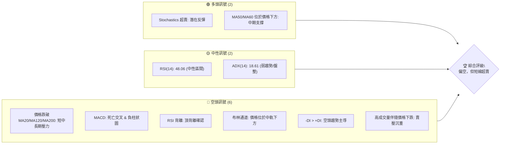

<details>
<summary>📊 靜態圖表 (點擊展開)</summary>

</details>

<html>
<head><meta charset="utf-8" /></head>
<body>
    <div style="height:500px; width:100%;">                        <script>window.PlotlyConfig = {MathJaxConfig: 'local'};</script>
        <script charset="utf-8" src="https://cdn.plot.ly/plotly-3.6.0.min.js" integrity="sha256-QaOVwtVY0T02VaHrr6pnoHLCwayMJp4O5n4YyaE3rJk=" crossorigin="anonymous"></script>                <div id="candlestick-chart" class="plotly-graph-div" style="height:100%; width:100%;"></div>            <script>                window.PLOTLYENV=window.PLOTLYENV || {};                                if (document.getElementById("candlestick-chart")) {                    Plotly.newPlot(                        "candlestick-chart",                        [{"close":{"dtype":"f8","bdata":"AAAAgGZbf0AAAADgEFF\u002fQAAAAOCagH9AAAAAYGJRf0AAAACAFi5\u002fQAAAAIDQeH9AAAAAIOymf0AAAADgBHh\u002fQAAAAKAOX39AAAAA4LZif0AAAADgXox\u002fQAAAAAAovn5AAAAAwAjxfkAAAACAX\u002fR+QAAAACCJE39AAAAAQLYdf0AAAABgDqt\u002fQAAAAODuAIBAAAAAAGKdf0AAAADA9qx\u002fQAAAAKAAlH9AAAAAIF0VgEAAAAAAZvN\u002fQAAAAIBnoH9AAAAA4Aevf0AAAADAbH1\u002fQAAAAODbw39AAAAAIMj1f0AAAADghRWAQAAAAKCDI4BAAAAAQPQDgEAAAACgwBCAQAAAAMDyaYBAAAAAgHVFgEAAAAAAYEyAQAAAACDmOIBAAAAAwOi7f0AAAACgCe1\u002fQAAAACBo5X9AAAAAQC7jf0AAAABgPsZ\u002fQAAAAOCQ5X9AAAAAAE0MgEAAAACgNxOAQAAAAOAcKoBAAAAAgEUqgEAAAACAhEKAQAAAAGBmgYBAAAAAwETVgEAAAACAItGAQAAAACCcU4BAAAAA4GgUgEAAAACgNQ6AQAAAAKB98X9AAAAAAH5\u002ff0AAAACAi99+QAAAAOAX235AAAAAgAxtf0AAAACgqJd\u002fQAAAAKDFvn9AAAAAIPZBf0AAAADgga9\u002fQAAAACC9hH9AAAAAIOuqfkAAAACg3kB+QAAAAADxxH1AAAAA4G1gfUAAAABAYH59QAAAAOAArn1AAAAAgI81fkAAAABAQp1+QAAAAOBPSX5AAAAAwD19fkAAAACgyrl9QAAAAMBU631AAAAAQEkQfkAAAAAgfY1+QAAAAOBqnX5AAAAAQAPHfUAAAABgORV+QAAAAOCIxn1AAAAAIHCLfUAAAABgcqR9QAAAAEAloH1AAAAAIFkdfkAAAAAgQDx+QAAAAGBSLH5AAAAAgBBLfkAAAACAs11+QAAAAGDDWH5AAAAAAAxPfkAAAACAGVV+QAAAACCdF35AAAAAwH1tfUAAAADgDmx9QAAAAGA3xn1AAAAAYDkVfkAAAAAg2L99QAAAAEB70n1AAAAAwAexfUAAAAAgVUl9QAAAAEB+lXxAAAAAgCpqfEAAAACAI518QAAAAAAUSHxAAAAAoEGie0AAAADgPBJ8QAAAAKAl\u002fnxAAAAAwB5DfUAAAABgMOd9QAAAAEDq931AAAAAwD\u002f5ekAAAAAAHsZ6QAAAAEDjV3pAAAAAoDCWeUAAAACgqMV5QAAAAGDLfnhAAAAA4Mj1eEAAAADAQrx5QAAAAAABt3lAAAAAQDwpeUAAAABA7wB5QAAAAOCm+HhAAAAAoJuxeEAAAAAAQd14QAAAAOCU2XhAAAAAwPHFeEAAAACgOfp3QAAAAICMQnhAAAAAYL\u002f7eEAAAAAAoQ15QAAAAGBCfnhAAAAAoATbeEAAAACA6TB5QAAAAEAwRXlAAAAAwK2ceUAAAADgN4F5QAAAACBniHlAAAAAICFOeUAAAABgFEB5QAAAACDdD3lAAAAAQB+reEAAAADAXvF4QAAAAKC\u002f6HhAAAAAoBdveEAAAAAg3kJ4QAAAACC30HdAAAAAoMHid0AAAABg8z53QAAAAGDPI3dAAAAAgN3SdkAAAACg+z92QAAAAIDyYnZAAAAAgOsVd0AAAADAJQl3QAAAACBySndAAAAAoC9Bd0AAAABAxDd3QAAAAABWWHdAAAAAQDhEd0AAAACAGCF3QAAAAACh+HdAAAAAoCqEeEAAAADgTKV5QAAAAMCgNXpAAAAAQAVeekAAAADgqRJ6QAAAAKDkc3pAAAAAAMD\u002fekAAAACgn+15QAAAAKA8e3pAAAAAIG5+ekAAAAAgKMV6QAAAAKCueHpAAAAAIGFueUAAAACAtdh5QAAAAACey3lAAAAA4NqneUAAAACgC9F5QAAAACDFPXpAAAAAwJDjeUAAAABgSrx5QAAAACA4bnlAAAAAIFlFeUAAAADguIh5QAAAAGAhUHpAAAAAoP5pekAAAABASQh6QAAAAGBmQnpAAAAAoHAxekAAAADAHil6QAAAAOB6AHpAAAAAYLjKeUAAAAAA1696QAAAAADXI3xAAAAA4FHIfEAAAADA9ZR7QAAAAKBwtXpAAAAAwMzAekAAAABguAp6QA=="},"high":{"dtype":"f8","bdata":"LxJG\u002fzWvf0DguQX99oZ\u002fQHwZIqdAuH9AvzyyUd6Pf0C0kL\u002f21Fx\u002fQNmHZzKPgX9AdyJr3\u002fm9f0DIr4M8SaZ\u002fQKeKv3AMbX9Af\u002fs2OoKJf0BYXzd8O49\u002fQDmOE633y39A72emarsgf0Dyyn0jbTF\u002fQIVOgwYCQX9AY7EW8g1Af0ASjoNwMNV\u002fQAt8GbXOAYBAXmXTgMwPgEDGSgkDKMF\u002fQGYFVwh13X9AjU2nN0EggEA+u6N42hOAQKgQLvWf9X9AstEycBPUf0BXe4wOzqx\u002fQINNMhJK639AbzTtD8cMgECtODorMReAQOzKY7DfKYBAJdXX+IkygECMj0HntimAQEUjFiuBfYBAFWCe3LlzgEAOjMvOEV2AQIpA6d89SIBAbxGlh0dCgEDqEBClRwmAQOp5tyVMAIBAQMa3KXsPgEAoDGsmxwyAQBdkABPjAYBAHw22IXwbgEBjg2TZZxuAQED8fo1lT4BAoA+RjjhFgEBPbM6SWVCAQOlze8+5mYBAJQuauOExgUC51jhKqPaAQJoqnWvTnIBAJNAOBulvgECzZNAKQE2AQIf7r5ZxAoBAys0MqXD5f0AZS6RvR2h\u002fQPtsWKLLA39ALzq9NpB6f0AYbLxISaZ\u002fQI\u002fPhtYyx39AMqTcDkvkf0AA8h+lFcZ\u002fQI2pSkZazn9A4zRvegg9f0AfpBtZLcF+QKmh\u002fY4btn5Ad5hCQ7\u002fMfUA6ci\u002f2kax9QOakPgZp0H1A8VCzOFJifkARard9Iqd+QF49Y7cCe35AoQ7qMP60fkBCr6JHfSF+QNpzfij68n1Arn5N5BsUfkCjy3PB4KF+QDN3FK8Cn35AIYncK6YhfkD4HMOiAD5+QEHuOxD6BH5AqquAW2vpfUD\u002fo6ciV7x9QJvKMkrz3X1AWa0Ykd52fkA0g5lT\u002flp+QGwzxe8CaX5Ab4oltKxafkCGfShM3G9+QKJL7E1LX35AjHzfTPVifkCqEWOsJHh+QDSuAAudX35AUMTBCi4ofkAB07OGWZ99QIIo2DLhyX1AGK4kXXZ4fkCWbGVfUgh+QLT3jFEV231AKq2nT7jtfUCdezXUupp9QB3ildT8IX1A+he2ShHjfEDzcv3GLtJ8QAjcpHhlbHxAG4mlkO0qfEBtlO0gUS18QDMe9nkuUH1AZOr3x1uCfUASTfGpqgt+QHqF7m6GGX5AtdPxT5yIe0BhOEGvalp7QPIc2ulIzXpAr0jJZdxCekC3IaE\u002fBR96QHomSRLWZ3lASpE8ciMAeUCV8uEyz9B5QPx8AVXTXHpAp\u002f7sUtHpeUCX45GyYkZ5QE93pF3fO3lAPe4HiejreEDGLVRfZwx5QLlU\u002fiblOHlAt6LLihX0eEBxFdWYFqh4QNY\u002fN9BLSHhA655qLKMJeUBCTzHMv2l5QJe8+wFmv3hAc7AowSoFeUBmp4r6Il15QCwi+UNEonlARnRwxIareUD0+UJLhMJ5QN3LD8sslXlAOF42EgSVeUCMPZ1QBIJ5QPOGCmrgU3lAoIrqXc0+eUBRmP\u002f6Ofx4QJkxknNqOHlAWg\u002f1xjzSeEA44kGIRHp4QCwwnzaeInhA5JWFe\u002fgleED1IdVdS9p3QG2YzvXrg3dAB2EpC5Bed0BfDu+3qpp2QFvCYzggyXZAwB9QVYFBd0DRsUta6FJ3QNftB+hRTXdA4WS1ucFOd0CwuGY1Ujp3QPZsJeyvAnhA0kWQsRVLd0Aja2hGQG13QJFeud5X+3dA599vY2SdeEBbSYFdl9d5QGMi8oqRPnpAtjB1MFvqekBO5ukvpGZ6QFzmNcQbpHpAgL1b+DMMe0D1NEn66Gt6QMPfHXSBgHpAOnV9mv2iekA27ZyR2s96QB\u002fsrltcnnpAoMKk2GPYeUDFYE8dVgN6QOgoB\u002f7tPXpAXJS1chH+eUCaI75kQBh6QGC+3ozhsHpApP+wrZobekDOVAT8xLx5QBekGtKh6XlAvOE0A+lWeUBqkYLqMq95QIGMLQzqs3pANcGAQziDekBki6jcPPx6QJrLIAsBU3pAAAAAoHClekAAAABgZoZ6QAAAAOBRPHpAAAAAQAr\u002feUAAAAAA19d6QAAAAKBHJXxAAAAAwB4lfUAAAAAAAFh8QAAAAIA9hntAAAAAYGZCe0AAAAAghdd6QA=="},"hovertemplate":"\u003cb\u003e%{x|%Y-%m-%d}\u003c\u002fb\u003e\u003cbr\u003e\u958b: $%{open:.2f}\u003cbr\u003e\u9ad8: $%{high:.2f}\u003cbr\u003e\u4f4e: $%{low:.2f}\u003cbr\u003e\u6536: $%{close:.2f}\u003cextra\u003e\u003c\u002fextra\u003e","low":{"dtype":"f8","bdata":"AQTOKxVHf0BBbIcu5jh\u002fQITEu1\u002f4M39Apnr3eyhPf0CROqye9vV+QPuScTEQDH9ALUFkWBllf0AhTylWClV\u002fQKw3nRbv2n5AR7w4G4oyf0Bt84xfvD9\u002fQBzHsUtXlH5A4NVJF6K+fkAmc02tFel+QLx4ntaA2X5AbXn4bvLrfkCLq0WU3Up\u002fQAlWHsDyfH9AOXCdF2OWf0DLLzmO72t\u002fQL3dUR1xh39ABorgLJOxf0CU8We8B9V\u002fQJwSMp7ggX9A6zvyIq17f0DwYy8MyV1\u002fQLgxjAPodn9Ak3MYk9aaf0DdxkaSPad\u002fQBDkHv2Dx39A2k0oL3W3f0Db6uJTJPx\u002fQJcpGaiCF4BAtSvGXEQxgEAdLRBPYj6AQFu\u002fs5EmEYBASCq0aMOmf0A4Ku43W8d\u002fQOKVD4MMbX9A\u002fjjCaqWsf0D8trMU6o5\u002fQEf5UIDggX9A0ygBHS7jf0AGEJTX+tx\u002fQMgQWJmdE4BAr34cAsUagEC+xpbAdiuAQJqw0jlybYBAZB5ZIe\u002fKgEBw66U\u002f0aqAQAeXRkqsNoBAzIO\u002fW7v9f0D3Eq\u002fln\u002fV\u002fQPwA2stNin9Ada2SM0V2f0DjcefgCMt+QAPQzCZVon5AP2p62ZL6fkBZzzwsBDN\u002fQHJbXnip\u002f35AiW5Grikif0BalQxJ8+R+QHCBgAG4W39AAlee03Y7fkAXikBWqfx9QEuuW\u002fVEln1AA6JeKhojfUAnjIq4Hh99QCl1NxxD7XxAISkQ1hDxfUA9ehP24Ed+QE6YOjQFKH5AHLHZU59CfkBZPMKxfZF9QNLLlh4Kpn1AFdJnGRzMfUAY9mtUuCN+QEbYIuxYZX5AY0knUpSPfUDphGXyAJx9QBFqHGWmo31AHq+PBM1mfUD2cndvrUx9QClDwhZOjn1ADL7mF1e8fUB50+8JnQV+QFLsDr\u002fMCH5AD+xMMXQpfkA8eBQu4yp+QBopnyfjPH5AeujapoggfkDSufpUjzV+QENnrC+EEn5A6o73WzVBfUB3qasVsjZ9QGlBY3StOn1AMHoEvku9fUATZgn8AJx9QMdxMjK0YX1Aql9e\u002fSKZfUBPncu2Jf58QNTIDEJKcnxAiJI5TQ9efECY+0GBTGd8QJkg5Cec9HtAE4ZP+8JLe0BgqQeTp6t7QFWFy0aFCHxA8LepPDq\u002ffEAXoODe\u002fnB9QITUdKsXvn1AkdxCQnQyekBnP40b84h6QAAmthYMRnpAby6YX\u002fpreUDiYTVEz3Z5QGotFURKaXhAzagMBtlyeECU44PMe\u002fF4QNPgwrnsrXlAVpU0xLbzeEBFwFst7cN4QMoy\u002fUGQxHhAME7cT36MeECEglmwAal4QFiaYvgAvXhAj77+UuWkeECBB7hAWuR3QIU+UigpzndAzPUjixFVeEDUSjpBDd54QCFONzGZUHhAyoVifJJceEAtL4dNJH14QOQx2Ake93hAlkjPd2o4eUBTTL+7CHp5QL1YSxEMKnlAu65KbfIgeUB53cqfjQt5QFvc6RN4DXlAmrP+AV6WeEBx6Z0N\u002fZ54QO4a8PE+znhAI\u002fJPvnpieEDYS79ZkyN4QM68xJ3GtHdAbiRWj67Nd0BtMOLgvTB3QFxSR3tMDXdAzLaYh2nGdkB6NCoN1Tt2QG5CYPkoOHZArSwMupCkdkCc+GHbd\u002fZ2QG4wV8rOtXZAWhrMCzkLd0Cik0vZSNx2QDO8Hpm3KXdA5v9iihvkdkAVVI9PrxN3QDw1HY19I3dAMFPzVfQaeEABTh4l9r14QLvBWiH9s3lAbfL1Nn48ekCtGTGLZ\u002fZ5QPHcehzGBHpAsR5z4hFsekAHrVVrVah5QHXO3PNr7nlAgqPrurICekCTsZyQz096QJP1GUobNnpAZJBjvGXSeEC9FMPo2Jh5QMeAsDaYnnlAtzrA9ql+eUCepMtXwEN5QFz\u002f8wquHXpAg9wbKq\u002fReUBWv\u002fZh+kl5QELkxMAtXHlArb6L4JwCeUBqr8TPNwB5QGeJliJIwHlA2LascmPreUCxXZsbcPl5QLg3LcaTpnlAAAAAIFz7eUAAAACgRwV6QAAAAOBR0HlAAAAAoEeZeUAAAABguMp5QAAAAIDCBXtAAAAA4FGkfEAAAABA4YZ7QAAAAAAAhHpAAAAAYI+mekAAAABgZuZ5QA=="},"name":"\u50f9\u683c","open":{"dtype":"f8","bdata":"g5++LEadf0AJ1WlNUkh\u002fQCehZ5E5UX9AM2s7yBB3f0CDoVVS+VJ\u002fQICraK9zLX9AmbfW+2B+f0Dq4rU3V5d\u002fQEn61R0gFX9A4L2OVulJf0CY+qkaBVJ\u002fQFVVdQ7cnX9ASQQZUprvfkALoMyGYyR\u002fQO66SHgIPX9AoABHSW0xf0BOYfcmYnd\u002fQCGduntomX9Aye6VQwQNgEC2nILogLZ\u002fQOLA+gJWxH9A5hccu4y1f0Bzon4OwwKAQGWoqFIQ6X9AEMIiErCyf0B7ijDjnZF\u002fQFfIrZaZrX9AxR9JiX7Ef0DTjLnpKOB\u002fQEVb71H2+H9AVVrTAg8TgECzaeXYww6AQNxLYf\u002fEGoBADxf30rhngEAzVCP85D+AQPbg9gVsOIBAOTfdL\u002fUigEDqEBClRwmAQKKS5JhNsH9AJR87z4H7f0CNhKyeqtV\u002fQAL82AdinX9ALCYS8vD1f0Cj29UP8hGAQC4yLGP2LoBAphjTQmA5gEBSy6ix\u002fzuAQCvRF4Z3g4BA5kPBKk8UgUDObp+OFeyAQCYrZcoheYBA8w\u002ffkWlsgEB57m4rTySAQKsyjx+hyH9Al8DRGR3hf0D3lKmXpGd\u002fQDUIFgYp3X5A2XJ6AkoOf0Dy7Y0k+Fl\u002fQGOoc4J4on9A7HYgCpOxf0CG9qrLgvF+QBhkwKAAlH9AAZ6KBQrEfkAp8pHuP3B+QAv\u002fJo1oqH5ARW\u002fegw7GfUD9rhYXTo59QGjv3KZ9f31Asj1uinZCfkBvFZX1Ald+QBrXxkBkZH5A\u002fnlTcP5IfkDyEP7aVKN9QC4Vtrwg2n1AAMZhXxcGfkDF5XMR2Ct+QEv1wabnbn5A7eieCiUefkBFFqL2RKh9QIfK31IV231A+LDMHYvffUA\u002fzRubFV19QKDZUce6rH1ALEVIZR7BfUDD9KsZMFN+QBYxbbVvP35AcGt29UYtfkCPRXdebTh+QA887YjVSH5AXtWijV0rfkCZnvbFaDx+QKrtv53VWn5ATmzpEeEjfkCf4u4GVX99QF\u002fUaKgwe31Alkd5nyDafUDhbOfIs\u002fF9QAp2TOtUf31ASU\u002fZIuiofUAG5QUuNYl9QPXCyE1FBn1AqPkXJ\u002f\u002fgfEBDflF9zXx8QPXoHy2DE3xASA8Hk34pfECrXUbMKtp7QHXFOZHdHXxAGpTn4PPzfEAITmzwmHl9QGUU1S4VEX5ARXK35KBge0CjeTk+kVN7QMBzSf5RxXpAFwSkXzlCekA+kRBO2JJ5QD71SzAjWnlAn\u002fZbhmfWeEC+Ntql4TB5QDodgE8nHHpAGQuciFvleUAoO1k9RTN5QE7C7IiCKnlAclKJZDPXeEDwSt+R1sV4QKZ5bUIv\u002fXhARwwsChC0eECT\u002fqNIV6J4QCJcgAX19HdAFkSoxPlaeEBwViiIXT15QIqDC1eQYHhAYPrEviyAeECijGdEpYR4QIUmS6pxBnlANvJwSrw4eUCQzRDgDIV5QB7TP9+3QHlAeMB9M02SeUCOWlKEGEt5QJxzoZoWPHlAk9NWQSICeUCjHHnkWtN4QATrFIN69nhANdyI+ljEeEAzDHVQHFR4QLSjfvJDH3hAAEB6CCDxd0A5lCa3idh3QLosCNOvgXdAAPMkMUwgd0CBlGK24pF2QEdiZLnikXZAyeocoDG8dkAvu2HH7Ep3QPokxHOp5nZAe0+luexKd0B3RRlDohh3QNC9cTleAnhAqsC7ix47d0CMz2FyyEJ3QP1Yyz\u002fXTHdAtVpHcU4xeED+6xPHPNJ4QCzLhso9L3pAePuvJ25+ekDgMy481kN6QN1gZPNONXpA35ifc02UekDHjd15uC96QNoVYvgZAXpA1yR+eXlXekCPQNFNcHp6QMSIEBCZenpA10mHLcGeeUDj65WEhr55QKVIqMloqnlAvmNLP8LmeUBuH3lC5HF5QKsTrpc7M3pAuge7p84HekDdzRfn0G95QIJPn\u002flY2XlAJO\u002fwCkIleUCIS4aRsTl5QPvTkpj+1XlA85bVgYP7eUCvVgbGiM96QKyuHP5l1HlAAAAAAACMekAAAADgozh6QAAAAEDhBnpAAAAAACmweUAAAAAgrs95QAAAAMDMCHtAAAAAoHANfUAAAACAFO57QAAAAEAzZ3tAAAAAwPU8e0AAAACgcMV6QA=="},"x":["2025-08-20T00:00:00-04:00","2025-08-21T00:00:00-04:00","2025-08-22T00:00:00-04:00","2025-08-25T00:00:00-04:00","2025-08-26T00:00:00-04:00","2025-08-27T00:00:00-04:00","2025-08-28T00:00:00-04:00","2025-08-29T00:00:00-04:00","2025-09-02T00:00:00-04:00","2025-09-03T00:00:00-04:00","2025-09-04T00:00:00-04:00","2025-09-05T00:00:00-04:00","2025-09-08T00:00:00-04:00","2025-09-09T00:00:00-04:00","2025-09-10T00:00:00-04:00","2025-09-11T00:00:00-04:00","2025-09-12T00:00:00-04:00","2025-09-15T00:00:00-04:00","2025-09-16T00:00:00-04:00","2025-09-17T00:00:00-04:00","2025-09-18T00:00:00-04:00","2025-09-19T00:00:00-04:00","2025-09-22T00:00:00-04:00","2025-09-23T00:00:00-04:00","2025-09-24T00:00:00-04:00","2025-09-25T00:00:00-04:00","2025-09-26T00:00:00-04:00","2025-09-29T00:00:00-04:00","2025-09-30T00:00:00-04:00","2025-10-01T00:00:00-04:00","2025-10-02T00:00:00-04:00","2025-10-03T00:00:00-04:00","2025-10-06T00:00:00-04:00","2025-10-07T00:00:00-04:00","2025-10-08T00:00:00-04:00","2025-10-09T00:00:00-04:00","2025-10-10T00:00:00-04:00","2025-10-13T00:00:00-04:00","2025-10-14T00:00:00-04:00","2025-10-15T00:00:00-04:00","2025-10-16T00:00:00-04:00","2025-10-17T00:00:00-04:00","2025-10-20T00:00:00-04:00","2025-10-21T00:00:00-04:00","2025-10-22T00:00:00-04:00","2025-10-23T00:00:00-04:00","2025-10-24T00:00:00-04:00","2025-10-27T00:00:00-04:00","2025-10-28T00:00:00-04:00","2025-10-29T00:00:00-04:00","2025-10-30T00:00:00-04:00","2025-10-31T00:00:00-04:00","2025-11-03T00:00:00-05:00","2025-11-04T00:00:00-05:00","2025-11-05T00:00:00-05:00","2025-11-06T00:00:00-05:00","2025-11-07T00:00:00-05:00","2025-11-10T00:00:00-05:00","2025-11-11T00:00:00-05:00","2025-11-12T00:00:00-05:00","2025-11-13T00:00:00-05:00","2025-11-14T00:00:00-05:00","2025-11-17T00:00:00-05:00","2025-11-18T00:00:00-05:00","2025-11-19T00:00:00-05:00","2025-11-20T00:00:00-05:00","2025-11-21T00:00:00-05:00","2025-11-24T00:00:00-05:00","2025-11-25T00:00:00-05:00","2025-11-26T00:00:00-05:00","2025-11-28T00:00:00-05:00","2025-12-01T00:00:00-05:00","2025-12-02T00:00:00-05:00","2025-12-03T00:00:00-05:00","2025-12-04T00:00:00-05:00","2025-12-05T00:00:00-05:00","2025-12-08T00:00:00-05:00","2025-12-09T00:00:00-05:00","2025-12-10T00:00:00-05:00","2025-12-11T00:00:00-05:00","2025-12-12T00:00:00-05:00","2025-12-15T00:00:00-05:00","2025-12-16T00:00:00-05:00","2025-12-17T00:00:00-05:00","2025-12-18T00:00:00-05:00","2025-12-19T00:00:00-05:00","2025-12-22T00:00:00-05:00","2025-12-23T00:00:00-05:00","2025-12-24T00:00:00-05:00","2025-12-26T00:00:00-05:00","2025-12-29T00:00:00-05:00","2025-12-30T00:00:00-05:00","2025-12-31T00:00:00-05:00","2026-01-02T00:00:00-05:00","2026-01-05T00:00:00-05:00","2026-01-06T00:00:00-05:00","2026-01-07T00:00:00-05:00","2026-01-08T00:00:00-05:00","2026-01-09T00:00:00-05:00","2026-01-12T00:00:00-05:00","2026-01-13T00:00:00-05:00","2026-01-14T00:00:00-05:00","2026-01-15T00:00:00-05:00","2026-01-16T00:00:00-05:00","2026-01-20T00:00:00-05:00","2026-01-21T00:00:00-05:00","2026-01-22T00:00:00-05:00","2026-01-23T00:00:00-05:00","2026-01-26T00:00:00-05:00","2026-01-27T00:00:00-05:00","2026-01-28T00:00:00-05:00","2026-01-29T00:00:00-05:00","2026-01-30T00:00:00-05:00","2026-02-02T00:00:00-05:00","2026-02-03T00:00:00-05:00","2026-02-04T00:00:00-05:00","2026-02-05T00:00:00-05:00","2026-02-06T00:00:00-05:00","2026-02-09T00:00:00-05:00","2026-02-10T00:00:00-05:00","2026-02-11T00:00:00-05:00","2026-02-12T00:00:00-05:00","2026-02-13T00:00:00-05:00","2026-02-17T00:00:00-05:00","2026-02-18T00:00:00-05:00","2026-02-19T00:00:00-05:00","2026-02-20T00:00:00-05:00","2026-02-23T00:00:00-05:00","2026-02-24T00:00:00-05:00","2026-02-25T00:00:00-05:00","2026-02-26T00:00:00-05:00","2026-02-27T00:00:00-05:00","2026-03-02T00:00:00-05:00","2026-03-03T00:00:00-05:00","2026-03-04T00:00:00-05:00","2026-03-05T00:00:00-05:00","2026-03-06T00:00:00-05:00","2026-03-09T00:00:00-04:00","2026-03-10T00:00:00-04:00","2026-03-11T00:00:00-04:00","2026-03-12T00:00:00-04:00","2026-03-13T00:00:00-04:00","2026-03-16T00:00:00-04:00","2026-03-17T00:00:00-04:00","2026-03-18T00:00:00-04:00","2026-03-19T00:00:00-04:00","2026-03-20T00:00:00-04:00","2026-03-23T00:00:00-04:00","2026-03-24T00:00:00-04:00","2026-03-25T00:00:00-04:00","2026-03-26T00:00:00-04:00","2026-03-27T00:00:00-04:00","2026-03-30T00:00:00-04:00","2026-03-31T00:00:00-04:00","2026-04-01T00:00:00-04:00","2026-04-02T00:00:00-04:00","2026-04-06T00:00:00-04:00","2026-04-07T00:00:00-04:00","2026-04-08T00:00:00-04:00","2026-04-09T00:00:00-04:00","2026-04-10T00:00:00-04:00","2026-04-13T00:00:00-04:00","2026-04-14T00:00:00-04:00","2026-04-15T00:00:00-04:00","2026-04-16T00:00:00-04:00","2026-04-17T00:00:00-04:00","2026-04-20T00:00:00-04:00","2026-04-21T00:00:00-04:00","2026-04-22T00:00:00-04:00","2026-04-23T00:00:00-04:00","2026-04-24T00:00:00-04:00","2026-04-27T00:00:00-04:00","2026-04-28T00:00:00-04:00","2026-04-29T00:00:00-04:00","2026-04-30T00:00:00-04:00","2026-05-01T00:00:00-04:00","2026-05-04T00:00:00-04:00","2026-05-05T00:00:00-04:00","2026-05-06T00:00:00-04:00","2026-05-07T00:00:00-04:00","2026-05-08T00:00:00-04:00","2026-05-11T00:00:00-04:00","2026-05-12T00:00:00-04:00","2026-05-13T00:00:00-04:00","2026-05-14T00:00:00-04:00","2026-05-15T00:00:00-04:00","2026-05-18T00:00:00-04:00","2026-05-19T00:00:00-04:00","2026-05-20T00:00:00-04:00","2026-05-21T00:00:00-04:00","2026-05-22T00:00:00-04:00","2026-05-26T00:00:00-04:00","2026-05-27T00:00:00-04:00","2026-05-28T00:00:00-04:00","2026-05-29T00:00:00-04:00","2026-06-01T00:00:00-04:00","2026-06-02T00:00:00-04:00","2026-06-03T00:00:00-04:00","2026-06-04T00:00:00-04:00","2026-06-05T00:00:00-04:00"],"type":"candlestick"},{"hovertemplate":"MA30: $%{y:.2f}\u003cextra\u003e\u003c\u002fextra\u003e","line":{"color":"#2196F3","dash":"dash","width":2},"mode":"lines","name":"MA30","x":["2025-08-20T00:00:00-04:00","2025-08-21T00:00:00-04:00","2025-08-22T00:00:00-04:00","2025-08-25T00:00:00-04:00","2025-08-26T00:00:00-04:00","2025-08-27T00:00:00-04:00","2025-08-28T00:00:00-04:00","2025-08-29T00:00:00-04:00","2025-09-02T00:00:00-04:00","2025-09-03T00:00:00-04:00","2025-09-04T00:00:00-04:00","2025-09-05T00:00:00-04:00","2025-09-08T00:00:00-04:00","2025-09-09T00:00:00-04:00","2025-09-10T00:00:00-04:00","2025-09-11T00:00:00-04:00","2025-09-12T00:00:00-04:00","2025-09-15T00:00:00-04:00","2025-09-16T00:00:00-04:00","2025-09-17T00:00:00-04:00","2025-09-18T00:00:00-04:00","2025-09-19T00:00:00-04:00","2025-09-22T00:00:00-04:00","2025-09-23T00:00:00-04:00","2025-09-24T00:00:00-04:00","2025-09-25T00:00:00-04:00","2025-09-26T00:00:00-04:00","2025-09-29T00:00:00-04:00","2025-09-30T00:00:00-04:00","2025-10-01T00:00:00-04:00","2025-10-02T00:00:00-04:00","2025-10-03T00:00:00-04:00","2025-10-06T00:00:00-04:00","2025-10-07T00:00:00-04:00","2025-10-08T00:00:00-04:00","2025-10-09T00:00:00-04:00","2025-10-10T00:00:00-04:00","2025-10-13T00:00:00-04:00","2025-10-14T00:00:00-04:00","2025-10-15T00:00:00-04:00","2025-10-16T00:00:00-04:00","2025-10-17T00:00:00-04:00","2025-10-20T00:00:00-04:00","2025-10-21T00:00:00-04:00","2025-10-22T00:00:00-04:00","2025-10-23T00:00:00-04:00","2025-10-24T00:00:00-04:00","2025-10-27T00:00:00-04:00","2025-10-28T00:00:00-04:00","2025-10-29T00:00:00-04:00","2025-10-30T00:00:00-04:00","2025-10-31T00:00:00-04:00","2025-11-03T00:00:00-05:00","2025-11-04T00:00:00-05:00","2025-11-05T00:00:00-05:00","2025-11-06T00:00:00-05:00","2025-11-07T00:00:00-05:00","2025-11-10T00:00:00-05:00","2025-11-11T00:00:00-05:00","2025-11-12T00:00:00-05:00","2025-11-13T00:00:00-05:00","2025-11-14T00:00:00-05:00","2025-11-17T00:00:00-05:00","2025-11-18T00:00:00-05:00","2025-11-19T00:00:00-05:00","2025-11-20T00:00:00-05:00","2025-11-21T00:00:00-05:00","2025-11-24T00:00:00-05:00","2025-11-25T00:00:00-05:00","2025-11-26T00:00:00-05:00","2025-11-28T00:00:00-05:00","2025-12-01T00:00:00-05:00","2025-12-02T00:00:00-05:00","2025-12-03T00:00:00-05:00","2025-12-04T00:00:00-05:00","2025-12-05T00:00:00-05:00","2025-12-08T00:00:00-05:00","2025-12-09T00:00:00-05:00","2025-12-10T00:00:00-05:00","2025-12-11T00:00:00-05:00","2025-12-12T00:00:00-05:00","2025-12-15T00:00:00-05:00","2025-12-16T00:00:00-05:00","2025-12-17T00:00:00-05:00","2025-12-18T00:00:00-05:00","2025-12-19T00:00:00-05:00","2025-12-22T00:00:00-05:00","2025-12-23T00:00:00-05:00","2025-12-24T00:00:00-05:00","2025-12-26T00:00:00-05:00","2025-12-29T00:00:00-05:00","2025-12-30T00:00:00-05:00","2025-12-31T00:00:00-05:00","2026-01-02T00:00:00-05:00","2026-01-05T00:00:00-05:00","2026-01-06T00:00:00-05:00","2026-01-07T00:00:00-05:00","2026-01-08T00:00:00-05:00","2026-01-09T00:00:00-05:00","2026-01-12T00:00:00-05:00","2026-01-13T00:00:00-05:00","2026-01-14T00:00:00-05:00","2026-01-15T00:00:00-05:00","2026-01-16T00:00:00-05:00","2026-01-20T00:00:00-05:00","2026-01-21T00:00:00-05:00","2026-01-22T00:00:00-05:00","2026-01-23T00:00:00-05:00","2026-01-26T00:00:00-05:00","2026-01-27T00:00:00-05:00","2026-01-28T00:00:00-05:00","2026-01-29T00:00:00-05:00","2026-01-30T00:00:00-05:00","2026-02-02T00:00:00-05:00","2026-02-03T00:00:00-05:00","2026-02-04T00:00:00-05:00","2026-02-05T00:00:00-05:00","2026-02-06T00:00:00-05:00","2026-02-09T00:00:00-05:00","2026-02-10T00:00:00-05:00","2026-02-11T00:00:00-05:00","2026-02-12T00:00:00-05:00","2026-02-13T00:00:00-05:00","2026-02-17T00:00:00-05:00","2026-02-18T00:00:00-05:00","2026-02-19T00:00:00-05:00","2026-02-20T00:00:00-05:00","2026-02-23T00:00:00-05:00","2026-02-24T00:00:00-05:00","2026-02-25T00:00:00-05:00","2026-02-26T00:00:00-05:00","2026-02-27T00:00:00-05:00","2026-03-02T00:00:00-05:00","2026-03-03T00:00:00-05:00","2026-03-04T00:00:00-05:00","2026-03-05T00:00:00-05:00","2026-03-06T00:00:00-05:00","2026-03-09T00:00:00-04:00","2026-03-10T00:00:00-04:00","2026-03-11T00:00:00-04:00","2026-03-12T00:00:00-04:00","2026-03-13T00:00:00-04:00","2026-03-16T00:00:00-04:00","2026-03-17T00:00:00-04:00","2026-03-18T00:00:00-04:00","2026-03-19T00:00:00-04:00","2026-03-20T00:00:00-04:00","2026-03-23T00:00:00-04:00","2026-03-24T00:00:00-04:00","2026-03-25T00:00:00-04:00","2026-03-26T00:00:00-04:00","2026-03-27T00:00:00-04:00","2026-03-30T00:00:00-04:00","2026-03-31T00:00:00-04:00","2026-04-01T00:00:00-04:00","2026-04-02T00:00:00-04:00","2026-04-06T00:00:00-04:00","2026-04-07T00:00:00-04:00","2026-04-08T00:00:00-04:00","2026-04-09T00:00:00-04:00","2026-04-10T00:00:00-04:00","2026-04-13T00:00:00-04:00","2026-04-14T00:00:00-04:00","2026-04-15T00:00:00-04:00","2026-04-16T00:00:00-04:00","2026-04-17T00:00:00-04:00","2026-04-20T00:00:00-04:00","2026-04-21T00:00:00-04:00","2026-04-22T00:00:00-04:00","2026-04-23T00:00:00-04:00","2026-04-24T00:00:00-04:00","2026-04-27T00:00:00-04:00","2026-04-28T00:00:00-04:00","2026-04-29T00:00:00-04:00","2026-04-30T00:00:00-04:00","2026-05-01T00:00:00-04:00","2026-05-04T00:00:00-04:00","2026-05-05T00:00:00-04:00","2026-05-06T00:00:00-04:00","2026-05-07T00:00:00-04:00","2026-05-08T00:00:00-04:00","2026-05-11T00:00:00-04:00","2026-05-12T00:00:00-04:00","2026-05-13T00:00:00-04:00","2026-05-14T00:00:00-04:00","2026-05-15T00:00:00-04:00","2026-05-18T00:00:00-04:00","2026-05-19T00:00:00-04:00","2026-05-20T00:00:00-04:00","2026-05-21T00:00:00-04:00","2026-05-22T00:00:00-04:00","2026-05-26T00:00:00-04:00","2026-05-27T00:00:00-04:00","2026-05-28T00:00:00-04:00","2026-05-29T00:00:00-04:00","2026-06-01T00:00:00-04:00","2026-06-02T00:00:00-04:00","2026-06-03T00:00:00-04:00","2026-06-04T00:00:00-04:00","2026-06-05T00:00:00-04:00"],"y":{"dtype":"f8","bdata":"AAAAAAAA+H8AAAAAAAD4fwAAAAAAAPh\u002fAAAAAAAA+H8AAAAAAAD4fwAAAAAAAPh\u002fAAAAAAAA+H8AAAAAAAD4fwAAAAAAAPh\u002fAAAAAAAA+H8AAAAAAAD4fwAAAAAAAPh\u002fAAAAAAAA+H8AAAAAAAD4fwAAAAAAAPh\u002fAAAAAAAA+H8AAAAAAAD4fwAAAAAAAPh\u002fAAAAAAAA+H8AAAAAAAD4fwAAAAAAAPh\u002fAAAAAAAA+H8AAAAAAAD4fwAAAAAAAPh\u002fAAAAAAAA+H8AAAAAAAD4fwAAAAAAAPh\u002fAAAAAAAA+H8AAAAAAAD4fwAAAEDXiH9AERERUZeOf0Dv7u7+iZV\u002fQImIiEjZoH9AVVVVxUyrf0DNzMx8Y7d\u002fQFVVVSWwv39AvLu7O2PAf0CrqqrKScR\u002fQN7d3T3EyH9AzczMfAzNf0BmZmZW+s5\u002fQKuqqirT2H9Ad3d3V63if0ARERER4ex\u002fQO\u002fu7p6R939A3t3dBfcAgEARERERmQSAQBEREVHhCIBAmpmZ+aERgEARERHh\u002fBmAQLy7uyOTHoBAd3d3\u002f4oegEDNzMwEOh+AQM3MzPyTIIBAAAAAKMkfgEARERGJJx2AQO\u002fu7mZGGYBAIiIiAv8WgEAAAAAoihSAQLy7u8tEEoBAEREROfgOgEBVVVXVEQ2AQLy7u9N7B4BAiYiIqPf+f0De3d2t+Op\u002fQCIiIpIk1H9AAAAA4AbAf0Dv7u5+Rat\u002fQHd3d6dbmH9AAAAAkAmKf0CrqqpKI4B\u002fQERERGRlcn9A3t3dHa9kf0BmZmb2\u002fk9\u002fQLy7u8tuO39AVVVVRRcof0B3d3dXThd\u002fQFVVVSXcAn9AERERAa3hfkARERHRX8N+QAAAAHDRqn5AIiIiYoGUfkDe3d2NcH9+QHd3d1epa35AAAAAUNtffkDe3d3daVp+QLy7u3uWVH5AMzMz8+tKfkCJiIjYdEB+QGZmZtaFNH5Ad3d392wsfkBERET04CB+QImIiDi1FH5AIiIigiAKfkBERESECAN+QFVVVWUTA35A3t3dLRoJfkB3d3fXSAt+QO\u002fu7h6ADH5AIiIiMhUIfkDe3d19wPx9QBEREYE57n1AmpmZqYXcfUAAAACgCNN9QAAAAAAPxX1AMzMzA1OwfUBEREQ0Jpt9QAAAAJBOjX1AREREFOmIfUDv7u4+YId9QAAAAKAFiX1AREREFBVzfUDNzMzMmlp9QJqZmZmYPn1A3t3dHfUXfUAAAAAA3\u002fF8QBEREZFrwXxA3t3dLemTfEC8u7trZWx8QBEREfHeRHxA3t3dnfEYfEDe3d29eOt7QN7d3d3Fv3tAZmZmdmCXe0C8u7u7e3B7QBEREVF2RntAERERIScZe0DNzMwc5ud6QImIiDhvuHpAREREJEKQekCamZmJImx6QERERCQ6SXpAMzMzA9sqekARERHhpQ16QO\u002fu7p7z83lAVVVV9bLieUBERERkzMx5QKuqqgpGr3lAq6qq2oGNeUCJiIi4zWV5QKuqqmrvO3lAq6qqqkMoeUARERGxoxh5QFVVVcVmDHlAq6qqmpACeUDNzMz8q\u002fV4QDMzM4Pe73hAq6qqmrPmeECamZk5ddF4QKuqqhp8u3hAMzMzA4qneEDNzMxsCpB4QBEREeH7eXhA7+7uzkJseEDNzMxMqFx4QHd3d1daT3hAAAAA8GRCeEDv7u6O6Tt4QBEREfEaNHhA3t3dTXQleECrqqpaCRV4QKuqqgqVEHhAiYiI6K8NeEBmZmYWkRF4QGZmZtaUGXhAAAAAsAYgeEAiIiLS3yR4QGZmZla5LHhAERERkS07eECamZl59kB4QCIiIkITTXhARERE9KZceEC8u7u7Pmx4QAAAAICTeXhAMzMz8xWCeEAREREhnY94QBEREbGCoHhAIiIiIp2veEAAAADgjMV4QAAAAAAE4HhAvLu7Gyz6eEB3d3d36hd5QBEREUHkMXlAq6qqCopEeUDv7u6+21l5QKuqqtqlc3lAAAAAsJuOeUDv7u4eoKZ5QImIiIh+v3lAERER4XfYeUBERET0VfJ5QERERASqA3pAvLu7m4wOekBEREQUbxd6QKuqqlroJ3pAIiIigoQ8ekB3d3fnZEl6QM3MzDyUS3pAAAAAEHtJekCrqqpac0p6QA=="},"type":"scatter"},{"hovertemplate":"MA60: $%{y:.2f}\u003cextra\u003e\u003c\u002fextra\u003e","line":{"color":"#9C27B0","dash":"dash","width":2},"mode":"lines","name":"MA60","x":["2025-08-20T00:00:00-04:00","2025-08-21T00:00:00-04:00","2025-08-22T00:00:00-04:00","2025-08-25T00:00:00-04:00","2025-08-26T00:00:00-04:00","2025-08-27T00:00:00-04:00","2025-08-28T00:00:00-04:00","2025-08-29T00:00:00-04:00","2025-09-02T00:00:00-04:00","2025-09-03T00:00:00-04:00","2025-09-04T00:00:00-04:00","2025-09-05T00:00:00-04:00","2025-09-08T00:00:00-04:00","2025-09-09T00:00:00-04:00","2025-09-10T00:00:00-04:00","2025-09-11T00:00:00-04:00","2025-09-12T00:00:00-04:00","2025-09-15T00:00:00-04:00","2025-09-16T00:00:00-04:00","2025-09-17T00:00:00-04:00","2025-09-18T00:00:00-04:00","2025-09-19T00:00:00-04:00","2025-09-22T00:00:00-04:00","2025-09-23T00:00:00-04:00","2025-09-24T00:00:00-04:00","2025-09-25T00:00:00-04:00","2025-09-26T00:00:00-04:00","2025-09-29T00:00:00-04:00","2025-09-30T00:00:00-04:00","2025-10-01T00:00:00-04:00","2025-10-02T00:00:00-04:00","2025-10-03T00:00:00-04:00","2025-10-06T00:00:00-04:00","2025-10-07T00:00:00-04:00","2025-10-08T00:00:00-04:00","2025-10-09T00:00:00-04:00","2025-10-10T00:00:00-04:00","2025-10-13T00:00:00-04:00","2025-10-14T00:00:00-04:00","2025-10-15T00:00:00-04:00","2025-10-16T00:00:00-04:00","2025-10-17T00:00:00-04:00","2025-10-20T00:00:00-04:00","2025-10-21T00:00:00-04:00","2025-10-22T00:00:00-04:00","2025-10-23T00:00:00-04:00","2025-10-24T00:00:00-04:00","2025-10-27T00:00:00-04:00","2025-10-28T00:00:00-04:00","2025-10-29T00:00:00-04:00","2025-10-30T00:00:00-04:00","2025-10-31T00:00:00-04:00","2025-11-03T00:00:00-05:00","2025-11-04T00:00:00-05:00","2025-11-05T00:00:00-05:00","2025-11-06T00:00:00-05:00","2025-11-07T00:00:00-05:00","2025-11-10T00:00:00-05:00","2025-11-11T00:00:00-05:00","2025-11-12T00:00:00-05:00","2025-11-13T00:00:00-05:00","2025-11-14T00:00:00-05:00","2025-11-17T00:00:00-05:00","2025-11-18T00:00:00-05:00","2025-11-19T00:00:00-05:00","2025-11-20T00:00:00-05:00","2025-11-21T00:00:00-05:00","2025-11-24T00:00:00-05:00","2025-11-25T00:00:00-05:00","2025-11-26T00:00:00-05:00","2025-11-28T00:00:00-05:00","2025-12-01T00:00:00-05:00","2025-12-02T00:00:00-05:00","2025-12-03T00:00:00-05:00","2025-12-04T00:00:00-05:00","2025-12-05T00:00:00-05:00","2025-12-08T00:00:00-05:00","2025-12-09T00:00:00-05:00","2025-12-10T00:00:00-05:00","2025-12-11T00:00:00-05:00","2025-12-12T00:00:00-05:00","2025-12-15T00:00:00-05:00","2025-12-16T00:00:00-05:00","2025-12-17T00:00:00-05:00","2025-12-18T00:00:00-05:00","2025-12-19T00:00:00-05:00","2025-12-22T00:00:00-05:00","2025-12-23T00:00:00-05:00","2025-12-24T00:00:00-05:00","2025-12-26T00:00:00-05:00","2025-12-29T00:00:00-05:00","2025-12-30T00:00:00-05:00","2025-12-31T00:00:00-05:00","2026-01-02T00:00:00-05:00","2026-01-05T00:00:00-05:00","2026-01-06T00:00:00-05:00","2026-01-07T00:00:00-05:00","2026-01-08T00:00:00-05:00","2026-01-09T00:00:00-05:00","2026-01-12T00:00:00-05:00","2026-01-13T00:00:00-05:00","2026-01-14T00:00:00-05:00","2026-01-15T00:00:00-05:00","2026-01-16T00:00:00-05:00","2026-01-20T00:00:00-05:00","2026-01-21T00:00:00-05:00","2026-01-22T00:00:00-05:00","2026-01-23T00:00:00-05:00","2026-01-26T00:00:00-05:00","2026-01-27T00:00:00-05:00","2026-01-28T00:00:00-05:00","2026-01-29T00:00:00-05:00","2026-01-30T00:00:00-05:00","2026-02-02T00:00:00-05:00","2026-02-03T00:00:00-05:00","2026-02-04T00:00:00-05:00","2026-02-05T00:00:00-05:00","2026-02-06T00:00:00-05:00","2026-02-09T00:00:00-05:00","2026-02-10T00:00:00-05:00","2026-02-11T00:00:00-05:00","2026-02-12T00:00:00-05:00","2026-02-13T00:00:00-05:00","2026-02-17T00:00:00-05:00","2026-02-18T00:00:00-05:00","2026-02-19T00:00:00-05:00","2026-02-20T00:00:00-05:00","2026-02-23T00:00:00-05:00","2026-02-24T00:00:00-05:00","2026-02-25T00:00:00-05:00","2026-02-26T00:00:00-05:00","2026-02-27T00:00:00-05:00","2026-03-02T00:00:00-05:00","2026-03-03T00:00:00-05:00","2026-03-04T00:00:00-05:00","2026-03-05T00:00:00-05:00","2026-03-06T00:00:00-05:00","2026-03-09T00:00:00-04:00","2026-03-10T00:00:00-04:00","2026-03-11T00:00:00-04:00","2026-03-12T00:00:00-04:00","2026-03-13T00:00:00-04:00","2026-03-16T00:00:00-04:00","2026-03-17T00:00:00-04:00","2026-03-18T00:00:00-04:00","2026-03-19T00:00:00-04:00","2026-03-20T00:00:00-04:00","2026-03-23T00:00:00-04:00","2026-03-24T00:00:00-04:00","2026-03-25T00:00:00-04:00","2026-03-26T00:00:00-04:00","2026-03-27T00:00:00-04:00","2026-03-30T00:00:00-04:00","2026-03-31T00:00:00-04:00","2026-04-01T00:00:00-04:00","2026-04-02T00:00:00-04:00","2026-04-06T00:00:00-04:00","2026-04-07T00:00:00-04:00","2026-04-08T00:00:00-04:00","2026-04-09T00:00:00-04:00","2026-04-10T00:00:00-04:00","2026-04-13T00:00:00-04:00","2026-04-14T00:00:00-04:00","2026-04-15T00:00:00-04:00","2026-04-16T00:00:00-04:00","2026-04-17T00:00:00-04:00","2026-04-20T00:00:00-04:00","2026-04-21T00:00:00-04:00","2026-04-22T00:00:00-04:00","2026-04-23T00:00:00-04:00","2026-04-24T00:00:00-04:00","2026-04-27T00:00:00-04:00","2026-04-28T00:00:00-04:00","2026-04-29T00:00:00-04:00","2026-04-30T00:00:00-04:00","2026-05-01T00:00:00-04:00","2026-05-04T00:00:00-04:00","2026-05-05T00:00:00-04:00","2026-05-06T00:00:00-04:00","2026-05-07T00:00:00-04:00","2026-05-08T00:00:00-04:00","2026-05-11T00:00:00-04:00","2026-05-12T00:00:00-04:00","2026-05-13T00:00:00-04:00","2026-05-14T00:00:00-04:00","2026-05-15T00:00:00-04:00","2026-05-18T00:00:00-04:00","2026-05-19T00:00:00-04:00","2026-05-20T00:00:00-04:00","2026-05-21T00:00:00-04:00","2026-05-22T00:00:00-04:00","2026-05-26T00:00:00-04:00","2026-05-27T00:00:00-04:00","2026-05-28T00:00:00-04:00","2026-05-29T00:00:00-04:00","2026-06-01T00:00:00-04:00","2026-06-02T00:00:00-04:00","2026-06-03T00:00:00-04:00","2026-06-04T00:00:00-04:00","2026-06-05T00:00:00-04:00"],"y":{"dtype":"f8","bdata":"AAAAAAAA+H8AAAAAAAD4fwAAAAAAAPh\u002fAAAAAAAA+H8AAAAAAAD4fwAAAAAAAPh\u002fAAAAAAAA+H8AAAAAAAD4fwAAAAAAAPh\u002fAAAAAAAA+H8AAAAAAAD4fwAAAAAAAPh\u002fAAAAAAAA+H8AAAAAAAD4fwAAAAAAAPh\u002fAAAAAAAA+H8AAAAAAAD4fwAAAAAAAPh\u002fAAAAAAAA+H8AAAAAAAD4fwAAAAAAAPh\u002fAAAAAAAA+H8AAAAAAAD4fwAAAAAAAPh\u002fAAAAAAAA+H8AAAAAAAD4fwAAAAAAAPh\u002fAAAAAAAA+H8AAAAAAAD4fwAAAAAAAPh\u002fAAAAAAAA+H8AAAAAAAD4fwAAAAAAAPh\u002fAAAAAAAA+H8AAAAAAAD4fwAAAAAAAPh\u002fAAAAAAAA+H8AAAAAAAD4fwAAAAAAAPh\u002fAAAAAAAA+H8AAAAAAAD4fwAAAAAAAPh\u002fAAAAAAAA+H8AAAAAAAD4fwAAAAAAAPh\u002fAAAAAAAA+H8AAAAAAAD4fwAAAAAAAPh\u002fAAAAAAAA+H8AAAAAAAD4fwAAAAAAAPh\u002fAAAAAAAA+H8AAAAAAAD4fwAAAAAAAPh\u002fAAAAAAAA+H8AAAAAAAD4fwAAAAAAAPh\u002fAAAAAAAA+H8AAAAAAAD4f7y7u2uw1n9AmpmZ4UPWf0DNzMzU1td\u002fQAAAAHjo139A7+7uNiLVf0BVVVUVLtF\u002fQLy7u1vqyX9A3t3dDTXAf0DNzMykx7d\u002fQKuqqvKPsH9AZmZmBourf0CJiIjQjqd\u002fQHd3d0ecpX9Aq6qqOq6jf0C8u7sDcJ5\u002fQFVVVTWAmX9AiYiIqAKVf0DNzMw8QJB\u002fQLy7u2NPin9AIiIieniCf0CamZnJrHt\u002fQLy7u9v7c39AiYiIsMtof0C8u7tL8l5\u002fQImIiKhoVn9AAAAA0LZPf0AAAAB4XEp\u002fQM3MzKSRQ39AvLu7+3Q8f0BERESUxDR\u002fQO\u002fu7raHLH9AzczMtC4lf0B3d3dPgh1\u002fQAAAAHDWEX9AVVVVFYwEf0ARERGZAPd+QLy7u\u002fub635A7+7uhpDkfkAzMzMrR9t+QDMzM+Nt0n5AERERYQ\u002fJfkBERETkcb5+QKuqqnJPsH5AvLu7Y5qgfkAzMzPLg5F+QN7d3eU+gH5AREREJDVsfkDe3d1FOll+QKuqqloVSH5Aq6qqCks1fkAAAAAIYCV+QAAAAIjrGX5AMzMzO8sDfkBVVVWtBe19QImIiPgg1X1A7+7uNui7fUDv7u5uJKZ9QGZmZgYBi31AiYiIkGpvfUAiIiIibVZ9QLy7u2OyPH1Aq6qqSq8ifUARERHZLAZ9QDMzM4s96nxAREREfMDQfEAAAAAgwrl8QDMzM9vEpHxAd3d3pyCRfEAiIiJ6l3l8QLy7u6t3YnxAMzMzqytMfEC8u7uDcTR8QKuqqtK5G3xAZmZmVrADfECJiIhAV\u002fB7QHd3d0+B3HtARERE\u002fILJe0BERERM+bN7QFVVVU1KnntAd3d3dzWLe0C8u7v7lnZ7QFVVVYV6YntAd3d3X6xNe0Dv7u4+nzl7QHd3d69\u002fJXtARERE3EINe0BmZmZ+xfN6QCIiIgql2HpAREREZE69ekCrqqpS7Z56QN7d3YUtgHpAiYiI0D1gekBVVVWVwT16QHd3d9\u002fgHHpAq6qqotEBekBEREQEkuZ5QERERFToynlAiYiICMateUDe3d3V55F5QM3MzBRFdnlAEREROdtaeUAiIiLylUB5QHd3d5fnLHlA3t3ddUUceUC8u7t7mw95QKuqqjrEBnlAq6qq0lwBeUAzMzMb1vh4QImIiLD\u002f7XhA3t3dtVfkeEAREREZYtN4QGZmZlaBxHhAd3d3T3XCeEBmZmY2ccJ4QKuqqiL9wnhA7+7uRlPCeEDv7u6OpMJ4QCIiIpowyHhAZmZmXijLeEDNzMwMgct4QFVVVQ3AzXhAd3d3D9vQeEAiIiJy+tN4QBERERHw1XhAzczMbGbYeEDe3d0FQtt4QBERERmA4XhAAAAAUIDoeEDv7u7WRPF4QM3MzLzM+XhAd3d3F\u002fb+eEB3d3enrwN5QHd3d4cfCnlAIiIiQh4OeUBVVVUVgBR5QImIiJi+IHlAERERmUUueUDNzMxcIjd5QJqZmckmPHlAiYiIUFRCeUAiIiLqtEV5QA=="},"type":"scatter"},{"hovertemplate":"MA200: $%{y:.2f}\u003cextra\u003e\u003c\u002fextra\u003e","line":{"color":"#FF6F00","dash":"solid","width":2},"mode":"lines","name":"MA200","x":["2025-08-20T00:00:00-04:00","2025-08-21T00:00:00-04:00","2025-08-22T00:00:00-04:00","2025-08-25T00:00:00-04:00","2025-08-26T00:00:00-04:00","2025-08-27T00:00:00-04:00","2025-08-28T00:00:00-04:00","2025-08-29T00:00:00-04:00","2025-09-02T00:00:00-04:00","2025-09-03T00:00:00-04:00","2025-09-04T00:00:00-04:00","2025-09-05T00:00:00-04:00","2025-09-08T00:00:00-04:00","2025-09-09T00:00:00-04:00","2025-09-10T00:00:00-04:00","2025-09-11T00:00:00-04:00","2025-09-12T00:00:00-04:00","2025-09-15T00:00:00-04:00","2025-09-16T00:00:00-04:00","2025-09-17T00:00:00-04:00","2025-09-18T00:00:00-04:00","2025-09-19T00:00:00-04:00","2025-09-22T00:00:00-04:00","2025-09-23T00:00:00-04:00","2025-09-24T00:00:00-04:00","2025-09-25T00:00:00-04:00","2025-09-26T00:00:00-04:00","2025-09-29T00:00:00-04:00","2025-09-30T00:00:00-04:00","2025-10-01T00:00:00-04:00","2025-10-02T00:00:00-04:00","2025-10-03T00:00:00-04:00","2025-10-06T00:00:00-04:00","2025-10-07T00:00:00-04:00","2025-10-08T00:00:00-04:00","2025-10-09T00:00:00-04:00","2025-10-10T00:00:00-04:00","2025-10-13T00:00:00-04:00","2025-10-14T00:00:00-04:00","2025-10-15T00:00:00-04:00","2025-10-16T00:00:00-04:00","2025-10-17T00:00:00-04:00","2025-10-20T00:00:00-04:00","2025-10-21T00:00:00-04:00","2025-10-22T00:00:00-04:00","2025-10-23T00:00:00-04:00","2025-10-24T00:00:00-04:00","2025-10-27T00:00:00-04:00","2025-10-28T00:00:00-04:00","2025-10-29T00:00:00-04:00","2025-10-30T00:00:00-04:00","2025-10-31T00:00:00-04:00","2025-11-03T00:00:00-05:00","2025-11-04T00:00:00-05:00","2025-11-05T00:00:00-05:00","2025-11-06T00:00:00-05:00","2025-11-07T00:00:00-05:00","2025-11-10T00:00:00-05:00","2025-11-11T00:00:00-05:00","2025-11-12T00:00:00-05:00","2025-11-13T00:00:00-05:00","2025-11-14T00:00:00-05:00","2025-11-17T00:00:00-05:00","2025-11-18T00:00:00-05:00","2025-11-19T00:00:00-05:00","2025-11-20T00:00:00-05:00","2025-11-21T00:00:00-05:00","2025-11-24T00:00:00-05:00","2025-11-25T00:00:00-05:00","2025-11-26T00:00:00-05:00","2025-11-28T00:00:00-05:00","2025-12-01T00:00:00-05:00","2025-12-02T00:00:00-05:00","2025-12-03T00:00:00-05:00","2025-12-04T00:00:00-05:00","2025-12-05T00:00:00-05:00","2025-12-08T00:00:00-05:00","2025-12-09T00:00:00-05:00","2025-12-10T00:00:00-05:00","2025-12-11T00:00:00-05:00","2025-12-12T00:00:00-05:00","2025-12-15T00:00:00-05:00","2025-12-16T00:00:00-05:00","2025-12-17T00:00:00-05:00","2025-12-18T00:00:00-05:00","2025-12-19T00:00:00-05:00","2025-12-22T00:00:00-05:00","2025-12-23T00:00:00-05:00","2025-12-24T00:00:00-05:00","2025-12-26T00:00:00-05:00","2025-12-29T00:00:00-05:00","2025-12-30T00:00:00-05:00","2025-12-31T00:00:00-05:00","2026-01-02T00:00:00-05:00","2026-01-05T00:00:00-05:00","2026-01-06T00:00:00-05:00","2026-01-07T00:00:00-05:00","2026-01-08T00:00:00-05:00","2026-01-09T00:00:00-05:00","2026-01-12T00:00:00-05:00","2026-01-13T00:00:00-05:00","2026-01-14T00:00:00-05:00","2026-01-15T00:00:00-05:00","2026-01-16T00:00:00-05:00","2026-01-20T00:00:00-05:00","2026-01-21T00:00:00-05:00","2026-01-22T00:00:00-05:00","2026-01-23T00:00:00-05:00","2026-01-26T00:00:00-05:00","2026-01-27T00:00:00-05:00","2026-01-28T00:00:00-05:00","2026-01-29T00:00:00-05:00","2026-01-30T00:00:00-05:00","2026-02-02T00:00:00-05:00","2026-02-03T00:00:00-05:00","2026-02-04T00:00:00-05:00","2026-02-05T00:00:00-05:00","2026-02-06T00:00:00-05:00","2026-02-09T00:00:00-05:00","2026-02-10T00:00:00-05:00","2026-02-11T00:00:00-05:00","2026-02-12T00:00:00-05:00","2026-02-13T00:00:00-05:00","2026-02-17T00:00:00-05:00","2026-02-18T00:00:00-05:00","2026-02-19T00:00:00-05:00","2026-02-20T00:00:00-05:00","2026-02-23T00:00:00-05:00","2026-02-24T00:00:00-05:00","2026-02-25T00:00:00-05:00","2026-02-26T00:00:00-05:00","2026-02-27T00:00:00-05:00","2026-03-02T00:00:00-05:00","2026-03-03T00:00:00-05:00","2026-03-04T00:00:00-05:00","2026-03-05T00:00:00-05:00","2026-03-06T00:00:00-05:00","2026-03-09T00:00:00-04:00","2026-03-10T00:00:00-04:00","2026-03-11T00:00:00-04:00","2026-03-12T00:00:00-04:00","2026-03-13T00:00:00-04:00","2026-03-16T00:00:00-04:00","2026-03-17T00:00:00-04:00","2026-03-18T00:00:00-04:00","2026-03-19T00:00:00-04:00","2026-03-20T00:00:00-04:00","2026-03-23T00:00:00-04:00","2026-03-24T00:00:00-04:00","2026-03-25T00:00:00-04:00","2026-03-26T00:00:00-04:00","2026-03-27T00:00:00-04:00","2026-03-30T00:00:00-04:00","2026-03-31T00:00:00-04:00","2026-04-01T00:00:00-04:00","2026-04-02T00:00:00-04:00","2026-04-06T00:00:00-04:00","2026-04-07T00:00:00-04:00","2026-04-08T00:00:00-04:00","2026-04-09T00:00:00-04:00","2026-04-10T00:00:00-04:00","2026-04-13T00:00:00-04:00","2026-04-14T00:00:00-04:00","2026-04-15T00:00:00-04:00","2026-04-16T00:00:00-04:00","2026-04-17T00:00:00-04:00","2026-04-20T00:00:00-04:00","2026-04-21T00:00:00-04:00","2026-04-22T00:00:00-04:00","2026-04-23T00:00:00-04:00","2026-04-24T00:00:00-04:00","2026-04-27T00:00:00-04:00","2026-04-28T00:00:00-04:00","2026-04-29T00:00:00-04:00","2026-04-30T00:00:00-04:00","2026-05-01T00:00:00-04:00","2026-05-04T00:00:00-04:00","2026-05-05T00:00:00-04:00","2026-05-06T00:00:00-04:00","2026-05-07T00:00:00-04:00","2026-05-08T00:00:00-04:00","2026-05-11T00:00:00-04:00","2026-05-12T00:00:00-04:00","2026-05-13T00:00:00-04:00","2026-05-14T00:00:00-04:00","2026-05-15T00:00:00-04:00","2026-05-18T00:00:00-04:00","2026-05-19T00:00:00-04:00","2026-05-20T00:00:00-04:00","2026-05-21T00:00:00-04:00","2026-05-22T00:00:00-04:00","2026-05-26T00:00:00-04:00","2026-05-27T00:00:00-04:00","2026-05-28T00:00:00-04:00","2026-05-29T00:00:00-04:00","2026-06-01T00:00:00-04:00","2026-06-02T00:00:00-04:00","2026-06-03T00:00:00-04:00","2026-06-04T00:00:00-04:00","2026-06-05T00:00:00-04:00"],"y":{"dtype":"f8","bdata":"AAAAAAAA+H8AAAAAAAD4fwAAAAAAAPh\u002fAAAAAAAA+H8AAAAAAAD4fwAAAAAAAPh\u002fAAAAAAAA+H8AAAAAAAD4fwAAAAAAAPh\u002fAAAAAAAA+H8AAAAAAAD4fwAAAAAAAPh\u002fAAAAAAAA+H8AAAAAAAD4fwAAAAAAAPh\u002fAAAAAAAA+H8AAAAAAAD4fwAAAAAAAPh\u002fAAAAAAAA+H8AAAAAAAD4fwAAAAAAAPh\u002fAAAAAAAA+H8AAAAAAAD4fwAAAAAAAPh\u002fAAAAAAAA+H8AAAAAAAD4fwAAAAAAAPh\u002fAAAAAAAA+H8AAAAAAAD4fwAAAAAAAPh\u002fAAAAAAAA+H8AAAAAAAD4fwAAAAAAAPh\u002fAAAAAAAA+H8AAAAAAAD4fwAAAAAAAPh\u002fAAAAAAAA+H8AAAAAAAD4fwAAAAAAAPh\u002fAAAAAAAA+H8AAAAAAAD4fwAAAAAAAPh\u002fAAAAAAAA+H8AAAAAAAD4fwAAAAAAAPh\u002fAAAAAAAA+H8AAAAAAAD4fwAAAAAAAPh\u002fAAAAAAAA+H8AAAAAAAD4fwAAAAAAAPh\u002fAAAAAAAA+H8AAAAAAAD4fwAAAAAAAPh\u002fAAAAAAAA+H8AAAAAAAD4fwAAAAAAAPh\u002fAAAAAAAA+H8AAAAAAAD4fwAAAAAAAPh\u002fAAAAAAAA+H8AAAAAAAD4fwAAAAAAAPh\u002fAAAAAAAA+H8AAAAAAAD4fwAAAAAAAPh\u002fAAAAAAAA+H8AAAAAAAD4fwAAAAAAAPh\u002fAAAAAAAA+H8AAAAAAAD4fwAAAAAAAPh\u002fAAAAAAAA+H8AAAAAAAD4fwAAAAAAAPh\u002fAAAAAAAA+H8AAAAAAAD4fwAAAAAAAPh\u002fAAAAAAAA+H8AAAAAAAD4fwAAAAAAAPh\u002fAAAAAAAA+H8AAAAAAAD4fwAAAAAAAPh\u002fAAAAAAAA+H8AAAAAAAD4fwAAAAAAAPh\u002fAAAAAAAA+H8AAAAAAAD4fwAAAAAAAPh\u002fAAAAAAAA+H8AAAAAAAD4fwAAAAAAAPh\u002fAAAAAAAA+H8AAAAAAAD4fwAAAAAAAPh\u002fAAAAAAAA+H8AAAAAAAD4fwAAAAAAAPh\u002fAAAAAAAA+H8AAAAAAAD4fwAAAAAAAPh\u002fAAAAAAAA+H8AAAAAAAD4fwAAAAAAAPh\u002fAAAAAAAA+H8AAAAAAAD4fwAAAAAAAPh\u002fAAAAAAAA+H8AAAAAAAD4fwAAAAAAAPh\u002fAAAAAAAA+H8AAAAAAAD4fwAAAAAAAPh\u002fAAAAAAAA+H8AAAAAAAD4fwAAAAAAAPh\u002fAAAAAAAA+H8AAAAAAAD4fwAAAAAAAPh\u002fAAAAAAAA+H8AAAAAAAD4fwAAAAAAAPh\u002fAAAAAAAA+H8AAAAAAAD4fwAAAAAAAPh\u002fAAAAAAAA+H8AAAAAAAD4fwAAAAAAAPh\u002fAAAAAAAA+H8AAAAAAAD4fwAAAAAAAPh\u002fAAAAAAAA+H8AAAAAAAD4fwAAAAAAAPh\u002fAAAAAAAA+H8AAAAAAAD4fwAAAAAAAPh\u002fAAAAAAAA+H8AAAAAAAD4fwAAAAAAAPh\u002fAAAAAAAA+H8AAAAAAAD4fwAAAAAAAPh\u002fAAAAAAAA+H8AAAAAAAD4fwAAAAAAAPh\u002fAAAAAAAA+H8AAAAAAAD4fwAAAAAAAPh\u002fAAAAAAAA+H8AAAAAAAD4fwAAAAAAAPh\u002fAAAAAAAA+H8AAAAAAAD4fwAAAAAAAPh\u002fAAAAAAAA+H8AAAAAAAD4fwAAAAAAAPh\u002fAAAAAAAA+H8AAAAAAAD4fwAAAAAAAPh\u002fAAAAAAAA+H8AAAAAAAD4fwAAAAAAAPh\u002fAAAAAAAA+H8AAAAAAAD4fwAAAAAAAPh\u002fAAAAAAAA+H8AAAAAAAD4fwAAAAAAAPh\u002fAAAAAAAA+H8AAAAAAAD4fwAAAAAAAPh\u002fAAAAAAAA+H8AAAAAAAD4fwAAAAAAAPh\u002fAAAAAAAA+H8AAAAAAAD4fwAAAAAAAPh\u002fAAAAAAAA+H8AAAAAAAD4fwAAAAAAAPh\u002fAAAAAAAA+H8AAAAAAAD4fwAAAAAAAPh\u002fAAAAAAAA+H8AAAAAAAD4fwAAAAAAAPh\u002fAAAAAAAA+H8AAAAAAAD4fwAAAAAAAPh\u002fAAAAAAAA+H8AAAAAAAD4fwAAAAAAAPh\u002fAAAAAAAA+H8AAAAAAAD4fwAAAAAAAPh\u002fAAAAAAAA+H8zMzMnBmd8QA=="},"type":"scatter"}],                        {"template":{"data":{"barpolar":[{"marker":{"line":{"color":"rgb(17,17,17)","width":0.5},"pattern":{"fillmode":"overlay","size":10,"solidity":0.2}},"type":"barpolar"}],"bar":[{"error_x":{"color":"#f2f5fa"},"error_y":{"color":"#f2f5fa"},"marker":{"line":{"color":"rgb(17,17,17)","width":0.5},"pattern":{"fillmode":"overlay","size":10,"solidity":0.2}},"type":"bar"}],"carpet":[{"aaxis":{"endlinecolor":"#A2B1C6","gridcolor":"#506784","linecolor":"#506784","minorgridcolor":"#506784","startlinecolor":"#A2B1C6"},"baxis":{"endlinecolor":"#A2B1C6","gridcolor":"#506784","linecolor":"#506784","minorgridcolor":"#506784","startlinecolor":"#A2B1C6"},"type":"carpet"}],"choropleth":[{"colorbar":{"outlinewidth":0,"ticks":""},"type":"choropleth"}],"contourcarpet":[{"colorbar":{"outlinewidth":0,"ticks":""},"type":"contourcarpet"}],"contour":[{"colorbar":{"outlinewidth":0,"ticks":""},"colorscale":[[0.0,"#0d0887"],[0.1111111111111111,"#46039f"],[0.2222222222222222,"#7201a8"],[0.3333333333333333,"#9c179e"],[0.4444444444444444,"#bd3786"],[0.5555555555555556,"#d8576b"],[0.6666666666666666,"#ed7953"],[0.7777777777777778,"#fb9f3a"],[0.8888888888888888,"#fdca26"],[1.0,"#f0f921"]],"type":"contour"}],"heatmap":[{"colorbar":{"outlinewidth":0,"ticks":""},"colorscale":[[0.0,"#0d0887"],[0.1111111111111111,"#46039f"],[0.2222222222222222,"#7201a8"],[0.3333333333333333,"#9c179e"],[0.4444444444444444,"#bd3786"],[0.5555555555555556,"#d8576b"],[0.6666666666666666,"#ed7953"],[0.7777777777777778,"#fb9f3a"],[0.8888888888888888,"#fdca26"],[1.0,"#f0f921"]],"type":"heatmap"}],"histogram2dcontour":[{"colorbar":{"outlinewidth":0,"ticks":""},"colorscale":[[0.0,"#0d0887"],[0.1111111111111111,"#46039f"],[0.2222222222222222,"#7201a8"],[0.3333333333333333,"#9c179e"],[0.4444444444444444,"#bd3786"],[0.5555555555555556,"#d8576b"],[0.6666666666666666,"#ed7953"],[0.7777777777777778,"#fb9f3a"],[0.8888888888888888,"#fdca26"],[1.0,"#f0f921"]],"type":"histogram2dcontour"}],"histogram2d":[{"colorbar":{"outlinewidth":0,"ticks":""},"colorscale":[[0.0,"#0d0887"],[0.1111111111111111,"#46039f"],[0.2222222222222222,"#7201a8"],[0.3333333333333333,"#9c179e"],[0.4444444444444444,"#bd3786"],[0.5555555555555556,"#d8576b"],[0.6666666666666666,"#ed7953"],[0.7777777777777778,"#fb9f3a"],[0.8888888888888888,"#fdca26"],[1.0,"#f0f921"]],"type":"histogram2d"}],"histogram":[{"marker":{"pattern":{"fillmode":"overlay","size":10,"solidity":0.2}},"type":"histogram"}],"mesh3d":[{"colorbar":{"outlinewidth":0,"ticks":""},"type":"mesh3d"}],"parcoords":[{"line":{"colorbar":{"outlinewidth":0,"ticks":""}},"type":"parcoords"}],"pie":[{"automargin":true,"type":"pie"}],"scatter3d":[{"line":{"colorbar":{"outlinewidth":0,"ticks":""}},"marker":{"colorbar":{"outlinewidth":0,"ticks":""}},"type":"scatter3d"}],"scattercarpet":[{"marker":{"colorbar":{"outlinewidth":0,"ticks":""}},"type":"scattercarpet"}],"scattergeo":[{"marker":{"colorbar":{"outlinewidth":0,"ticks":""}},"type":"scattergeo"}],"scattergl":[{"marker":{"line":{"color":"#283442"}},"type":"scattergl"}],"scattermapbox":[{"marker":{"colorbar":{"outlinewidth":0,"ticks":""}},"type":"scattermapbox"}],"scattermap":[{"marker":{"colorbar":{"outlinewidth":0,"ticks":""}},"type":"scattermap"}],"scatterpolargl":[{"marker":{"colorbar":{"outlinewidth":0,"ticks":""}},"type":"scatterpolargl"}],"scatterpolar":[{"marker":{"colorbar":{"outlinewidth":0,"ticks":""}},"type":"scatterpolar"}],"scatter":[{"marker":{"line":{"color":"#283442"}},"type":"scatter"}],"scatterternary":[{"marker":{"colorbar":{"outlinewidth":0,"ticks":""}},"type":"scatterternary"}],"surface":[{"colorbar":{"outlinewidth":0,"ticks":""},"colorscale":[[0.0,"#0d0887"],[0.1111111111111111,"#46039f"],[0.2222222222222222,"#7201a8"],[0.3333333333333333,"#9c179e"],[0.4444444444444444,"#bd3786"],[0.5555555555555556,"#d8576b"],[0.6666666666666666,"#ed7953"],[0.7777777777777778,"#fb9f3a"],[0.8888888888888888,"#fdca26"],[1.0,"#f0f921"]],"type":"surface"}],"table":[{"cells":{"fill":{"color":"#506784"},"line":{"color":"rgb(17,17,17)"}},"header":{"fill":{"color":"#2a3f5f"},"line":{"color":"rgb(17,17,17)"}},"type":"table"}]},"layout":{"annotationdefaults":{"arrowcolor":"#f2f5fa","arrowhead":0,"arrowwidth":1},"autotypenumbers":"strict","coloraxis":{"colorbar":{"outlinewidth":0,"ticks":""}},"colorscale":{"diverging":[[0,"#8e0152"],[0.1,"#c51b7d"],[0.2,"#de77ae"],[0.3,"#f1b6da"],[0.4,"#fde0ef"],[0.5,"#f7f7f7"],[0.6,"#e6f5d0"],[0.7,"#b8e186"],[0.8,"#7fbc41"],[0.9,"#4d9221"],[1,"#276419"]],"sequential":[[0.0,"#0d0887"],[0.1111111111111111,"#46039f"],[0.2222222222222222,"#7201a8"],[0.3333333333333333,"#9c179e"],[0.4444444444444444,"#bd3786"],[0.5555555555555556,"#d8576b"],[0.6666666666666666,"#ed7953"],[0.7777777777777778,"#fb9f3a"],[0.8888888888888888,"#fdca26"],[1.0,"#f0f921"]],"sequentialminus":[[0.0,"#0d0887"],[0.1111111111111111,"#46039f"],[0.2222222222222222,"#7201a8"],[0.3333333333333333,"#9c179e"],[0.4444444444444444,"#bd3786"],[0.5555555555555556,"#d8576b"],[0.6666666666666666,"#ed7953"],[0.7777777777777778,"#fb9f3a"],[0.8888888888888888,"#fdca26"],[1.0,"#f0f921"]]},"colorway":["#636efa","#EF553B","#00cc96","#ab63fa","#FFA15A","#19d3f3","#FF6692","#B6E880","#FF97FF","#FECB52"],"font":{"color":"#f2f5fa"},"geo":{"bgcolor":"rgb(17,17,17)","lakecolor":"rgb(17,17,17)","landcolor":"rgb(17,17,17)","showlakes":true,"showland":true,"subunitcolor":"#506784"},"hoverlabel":{"align":"left"},"hovermode":"closest","mapbox":{"style":"dark"},"paper_bgcolor":"rgb(17,17,17)","plot_bgcolor":"rgb(17,17,17)","polar":{"angularaxis":{"gridcolor":"#506784","linecolor":"#506784","ticks":""},"bgcolor":"rgb(17,17,17)","radialaxis":{"gridcolor":"#506784","linecolor":"#506784","ticks":""}},"scene":{"xaxis":{"backgroundcolor":"rgb(17,17,17)","gridcolor":"#506784","gridwidth":2,"linecolor":"#506784","showbackground":true,"ticks":"","zerolinecolor":"#C8D4E3"},"yaxis":{"backgroundcolor":"rgb(17,17,17)","gridcolor":"#506784","gridwidth":2,"linecolor":"#506784","showbackground":true,"ticks":"","zerolinecolor":"#C8D4E3"},"zaxis":{"backgroundcolor":"rgb(17,17,17)","gridcolor":"#506784","gridwidth":2,"linecolor":"#506784","showbackground":true,"ticks":"","zerolinecolor":"#C8D4E3"}},"shapedefaults":{"line":{"color":"#f2f5fa"}},"sliderdefaults":{"bgcolor":"#C8D4E3","bordercolor":"rgb(17,17,17)","borderwidth":1,"tickwidth":0},"ternary":{"aaxis":{"gridcolor":"#506784","linecolor":"#506784","ticks":""},"baxis":{"gridcolor":"#506784","linecolor":"#506784","ticks":""},"bgcolor":"rgb(17,17,17)","caxis":{"gridcolor":"#506784","linecolor":"#506784","ticks":""}},"title":{"x":0.05},"updatemenudefaults":{"bgcolor":"#506784","borderwidth":0},"xaxis":{"automargin":true,"gridcolor":"#283442","linecolor":"#506784","ticks":"","title":{"standoff":15},"zerolinecolor":"#283442","zerolinewidth":2},"yaxis":{"automargin":true,"gridcolor":"#283442","linecolor":"#506784","ticks":"","title":{"standoff":15},"zerolinecolor":"#283442","zerolinewidth":2}}},"xaxis":{"rangeslider":{"visible":false},"title":{"text":"\u65e5\u671f"}},"font":{"size":11},"title":{"text":"MSFT  |  MA(30\u002f60\u002f200)  |  \u6700\u8fd1200\u4ea4\u6613\u65e5"},"yaxis":{"title":{"text":"\u80a1\u50f9 (USD)"}},"hovermode":"x unified","height":500},                        {"responsive": true}                    )                };            </script>        </div>
</body>
</html>

# MSFT 技術分析報告

> **報告日期**：2026-06-06 ｜ **語言**：繁體中文 ｜ **數據來源**：Yahoo Finance ｜ **當前價格**：$416.67

---

## 目錄

| 章節 | 內容 |
|------|------|
| [1. 技術面概覽](#1-技術面概覽) | 訊號儀表板、核心指標、評分卡 |
| [2. 趨勢分析](#2-趨勢分析) | 多時框趨勢、長中短期走勢 |
| [3. 圖表形態分析](#3-圖表形態分析) | 形態識別、K線組合、目標價 |
| [4. 支撐與阻力](#4-支撐與阻力) | 關鍵價位、斐波那契回調 |
| [5. 技術指標深度解讀](#5-技術指標深度解讀) | MA/RSI/MACD/布林/成交量 |
| [6. 動能與波動率](#6-動能與波動率) | 動能評估、ATR、Beta |
| [7. 多時框架總結](#7-多時框架總結) | 時框架評分矩陣 |
| [8. 交易策略建議](#8-交易策略建議) | 多空策略、風險報酬比 |
| [9. 風險提示與監控](#9-風險提示與監控) | 監控指標、風險場景 |
| [📋 報告總結](#-報告總結) | 綜合結論與策略摘要 |

---

## 1. 技術面概覽

### 🎯 技術訊號儀表板

Microsoft (MSFT) 目前的技術面呈現複雜訊號，短期內空頭力量佔據主導，但部分指標顯示超賣，預示潛在的技術性反彈機會。中期來看，趨勢強度不足，市場處於盤整或弱勢下跌階段。



**綜合評級解讀**：目前 MSFT 的技術面訊號明顯偏空，主要體現在價格跌破多條關鍵均線、MACD 死亡交叉以及 RSI 頂背離的確認。這些是強烈的賣出或觀望訊號。然而，Stochastics 指標進入超賣區，暗示短期內可能出現技術性反彈。ADX 指標顯示趨勢強度不足，表明市場可能進入震盪下跌階段而非強勁單邊趨勢。整體而言，應以謹慎偏空思維應對，等待更明確的止跌訊號或反彈後的做空機會。

### 📊 核心指標速覽表

| 指標類別 | 指標名稱 | 當前數值 | 訊號 | 解讀 |
|----------|----------|----------|------|------|
| **價格** | 當前價格 | $416.67 | 🔴 | 位於短期關鍵均線下方 |
| **均線** | MA20 | $422.18 | 🔴 | 價格位於 MA20 下方，形成短期阻力 |
| **均線** | MA50 | $407.67 | 🟢 | 價格位於 MA50 上方，提供中期支撐 |
| **均線** | MA200 | $454.44 | 🔴 | 價格位於 MA200 下方，長期趨勢壓力 |
| **動能** | RSI(14) | 48.06 | 🟡 | 位於中性區間，但趨勢向下，且存在頂背離 |
| **動能** | MACD | -0.617 (柱狀圖) | 🔴 | MACD 線下穿訊號線，柱狀圖為負，空頭動能增強 |
| **動能** | Stochastics | %K: 12.50 | 🟢 | 進入超賣區，短期有反彈需求 |
| **波動** | ATR(14) | $13.32 | 🟡 | 每日波動約 3.20%，屬於中等偏高波動 |
| **趨勢** | ADX(14) | 18.61 | 🟡 | 趨勢強度較弱，市場處於盤整或震盪下跌 |
| **量能** | OBV趨勢 | OBV > MA | 🟡 | 歷史數據顯示量能支撐上漲，但近期下跌伴隨高量，存在矛盾 |

### 🏆 技術評分卡

```
╔══════════════════════════════════════════════════════════════╗
║             技術評分卡 — MSFT (2026-06-06)                   ║
╠══════════════════════════════════════════════════════════════╣
║ 趨勢強度      █████░░░░░░░░░░░░░░░░  25/100  🔴 (ADX 弱勢，空頭主導) ║
║ 動能指標      ██████░░░░░░░░░░░░░░  30/100  🔴 (MACD 空頭，RSI頂背離) ║
║ 支撐穩定度    ███████░░░░░░░░░░░░░  35/100  🟡 (短期支撐被考驗，中期支撐尚存)║
║ 成交量配合    ████░░░░░░░░░░░░░░░░  20/100  🔴 (下跌伴隨高量，OBV有矛盾) ║
║ 形態完整度    █████░░░░░░░░░░░░░░░░  25/100  🔴 (近期呈現下跌趨勢形態) ║
║ 均線排列      ████░░░░░░░░░░░░░░░░  20/100  🔴 (短期均線空頭排列，價格跌破多條)║
╠══════════════════════════════════════════════════════════════╣
║ 綜合評分      █████░░░░░░░░░░░░░░░░  26/100  ⚖️ 偏空 (Bearish)      ║
╚══════════════════════════════════════════════════════════════╝
```
**評分卡解讀**：MSFT 的技術評分整體偏低，綜合評分為 26/100，顯示出強烈的偏空訊號。在趨勢強度、動能指標、成交量配合和均線排列方面均呈現弱勢或空頭訊號。雖然中期支撐尚存，但短期價格行為和動能指標的惡化，使得整體技術面處於不利地位。建議投資者保持謹慎，避免盲目抄底。

---

## 2. 趨勢分析

### 🌐 多時框趨勢分析

多時框架分析是評估股票整體趨勢的關鍵。透過檢視不同時間週期的走勢，我們可以更全面地理解市場結構，避免被短期噪音所誤導。

```mermaid
graph TD
    A[月線趨勢: 長期視角] --> B{MSFT 長期走勢}
    B --> B1[2025-07 高點 $529.27]
    B --> B2[2026-03 低點 $369.37]
    B --> B3[目前: 修正中，但仍在歷史高點附近]
    B3 --> C[月線結論: 🔵 震盪修正，但大格局仍偏多]

    C --> D[週線趨勢: 中期視角]
    D --> D1[2026-05-31 高點 $450.24]
    D --> D2[2026-06-07 跌至 $416.67]
    D --> D3[MA50 ($407.67) 仍提供支撐]
    D3 --> E[週線結論: 🟡 震盪偏空，短期賣壓顯著]

    E --> F[日線趨勢: 短期視角]
    F --> F1[價格 $416.67 跌破 MA20 ($422.18)]
    F --> F2[MA5/MA10 均線向下彎曲]
    F2 --> G[日線結論: 🔴 明顯空頭趨勢]

    G --> H(多時框總結: 長期修正，中期震盪，短期下跌)
    H --> I[投資者應保持謹慎，關注下方關鍵支撐]
```

**分析解讀**：
*   **長期趨勢 (月線)**：從過去 12 個月的數據來看，MSFT 在 2025 年 7 月達到 $529.27 的高點後，經歷了一波顯著的修正，最低觸及 2026 年 3 月的 $369.37。儘管近期有所反彈至 5 月的 $450.24，但 6 月又再次回落。MA240 均線 ($463.06) 位於當前價格上方，顯示長期趨勢的支撐力道減弱，股價目前處於長期均線下方。整體而言，長期趨勢從強勁上漲轉為高位震盪修正，但尚未完全破壞其長期上升格局。
*   **中期趨勢 (週線)**：從近 20 週的數據分析，MSFT 在 2026 年 5 月 31 日達到 $450.24 的近期高點後，隨即在 6 月 7 日大幅下跌至 $416.67，形成一個明顯的短期頂部形態。價格目前位於 MA120 ($421.88) 和 MA200 ($454.44) 下方，但仍高於 MA50 ($407.67) 和 MA60 ($404.36)。這表明中期趨勢雖然受到短期賣壓影響而震盪偏空，但中長期均線仍提供一定支撐。
*   **短期趨勢 (日線)**：當前價格 $416.67 已經跌破了 MA20 ($422.18)，且 MA5 ($434.78) 和 MA10 ($429.84) 均呈現向下彎曲的空頭排列。MACD 指標也顯示死亡交叉並進入負值區。這些都指向一個明確的短期空頭趨勢。短期內反彈阻力重重，下跌動能強勁。

### 📈 長期趨勢 — 12個月走勢圖（Unicode）

以下是 MSFT 過去 12 個月的月線收盤價走勢圖，標註了關鍵高點和低點，以視覺化方式呈現其長線趨勢變化。

```
MSFT 月線走勢圖（過去12個月）
價格軸 ($)
$530 ┤                               ●(2025-07 高點: $529.27)
$520 ┤
$510 ┤                         ● ●(2025-09: $514.69, 2025-10: $514.55)
$500 ┤
$490 ┤  ●(2025-06: $493.47)                  ●(2025-11: $489.83)
$480 ┤                                  ●(2025-12: $481.48)
$470 ┤
$460 ┤
$450 ┤                                                    ●(2026-05: $450.24)
$440 ┤
$430 ┤                       ●(2026-01: $428.38)
$420 ┤                                                                ●(2026-06: $416.67 現價)
$410 ┤
$400 ┤                                         ●(2026-04: $406.90)
$390 ┤                         ●(2026-02: $391.89)
$380 ┤
$370 ┤                           ●(2026-03 低點: $369.37)
$360 ┤
     └──────────────────────────────────────────────────────────
      25-06 25-07 25-08 25-09 25-10 25-11 25-12 26-01 26-02 26-03 26-04 26-05 26-06
```

**走勢特徵分析表格**：

| 階段 | 時間段 | 高點 ($) | 低點 ($) | 漲跌幅 (%) | 特徵描述 | 趨勢 |
|------|----------|----------|----------|------------|----------|------|
| **強勢上漲** | 2025-06 至 2025-07 | 529.27 | 493.47 | +7.26% | 創歷史新高，買盤強勁。 | 🟢 上漲 |
| **高位震盪** | 2025-08 至 2025-12 | 514.69 | 481.48 | -6.45% | 在高點附近盤整，多空博弈加劇，未能突破新高。 | 🟡 盤整 |
| **快速回調** | 2026-01 至 2026-03 | 428.38 | 369.37 | -13.78% | 帶量下跌，跌破多條支撐，空頭力量佔優。 | 🔴 下跌 |
| **技術性反彈** | 2026-04 至 2026-05 | 450.24 | 369.37 | +21.90% | 從低點強勁反彈，但未能收復前期跌幅，RSI出現頂背離。 | 🟡 反彈 |
| **再次回落** | 2026-06 (至今) | 450.24 | 416.67 | -7.45% | 反彈受阻後快速回落，短期賣壓再次顯現。 | 🔴 下跌 |

### 📊 中期趨勢（週線分析）

中期趨勢主要受週線圖表形態和關鍵均線的影響。當前價格 $416.67 位於 MA50 ($407.67) 之上，但已跌破 MA20 ($422.18) 和 MA120 ($421.88)，顯示中短期支撐被打破，壓力顯現。

以下為近期關鍵壓力與支撐示意圖，基於近 20 週數據：

```
MSFT 中期壓力與支撐示意圖 (週線)
價格軸 ($)
$460 ┤                                ╔════════════════════════════╗
$450 ┤                                ║ R3: $450.60 (BB上軌, 2026-05高點) ║
$440 ┤                                ╚════════════════════════════╝
$430 ┤                                ╔════════════════════════════╗
$420 ┤                R1: $422.18 (MA20, BB中軌) ◄───║ R2: $421.88 (MA120)       ║
$410 ┤                                ╚════════════════════════════╝
$400 ┤                      ◄───────────────── 現價: $416.67
$390 ┤      ╔════════════════════════════╗
$380 ┤      ║ S1: $407.67 (MA50)         ║
$370 ┤      ║ S2: $400.00 (分析師低目標, 心理關口) ║
$360 ┤      ╚════════════════════════════╝
$350 ┤                S3: $369.37 (2026-03低點) ◄───
     └────────────────────────────────────────────
```

**分析解讀**：MSFT 在 2026 年 4 月中旬至 5 月末經歷了一波強勁的反彈，從 $356.00 上漲至 $450.24，但這波反彈在遇到 $450-$455 區間（接近 MA200 和 BB 上軌）時遭遇強烈阻力。隨後價格迅速回落，目前位於 $416.67。中期來看，MA50 ($407.67) 仍是重要的支撐位。如果該支撐被跌破，則可能會進一步測試 $400.00 的心理關口以及布林通道下軌 $393.76。上方的 MA20 ($422.18) 和 MA120 ($421.88) 形成了即時的雙重阻力，短期內若無法突破並站穩其上，中期下跌趨勢將持續。

### ⚡ 趨勢強度評估（ADX 解讀）

ADX (Average Directional Index) 指標用於衡量趨勢的強度，而非方向。它由 ADX 本身、+DI (Positive Directional Indicator) 和 -DI (Negative Directional Indicator) 組成。

```mermaid
graph TD
    A[ADX 指標分析] --> B{ADX(14): 18.61}
    B --> B1{+DI: 32.95}
    B --> B2{-DI: 33.35}

    B --> C{ADX < 20-25 ?}
    C -- 是 --> D[趨勢強度弱 / 盤整行情]
    C -- 否 --> E[趨勢強度強 / 趨勢行情]

    B1 --> F{+DI vs -DI ?}
    F -- -DI > +DI --> G[空頭力量主導]
    F -- +DI > -DI --> H[多頭力量主導]

    D & G --> I(綜合結論: 🔴 弱勢空頭盤整或震盪下跌)
```

**ADX 強度對照表**：

| ADX 數值範圍 | 趨勢強度 | 市場判斷 |
|--------------|----------|----------|
| 0-20         | 非常弱   | 盤整行情，無明顯趨勢 |
| 20-25        | 弱       | 盤整或趨勢形成初期 |
| 25-50        | 中等     | 明顯趨勢行情 |
| 50-75        | 強       | 強勁趨勢行情 |
| 75-100       | 非常強   | 極強趨勢行情 |

**分析解讀**：
*   **ADX(14) 數值**：MSFT 的 ADX(14) 值為 18.61。根據 ADX 強度對照表，這屬於「非常弱」或「弱」的趨勢強度區間。這表示當前市場缺乏明確的單邊趨勢，更傾向於盤整或震盪行情。這與我們觀察到的價格在高點區間大幅波動、隨後快速回落的表現一致。
*   **+DI 與 -DI**：+DI 為 32.95，而 -DI 為 33.35。由於 -DI 略大於 +DI，這表明在當前的弱勢趨勢中，空頭的力量略微佔據主導地位。雖然 ADX 本身顯示趨勢不強，但方向性指標指出，在缺乏強勢趨勢的情況下，市場更傾向於下跌。
*   **綜合判斷**：ADX 綜合顯示 MSFT 目前處於弱勢的震盪下跌行情。在這種環境下，單邊趨勢交易的成功率較低，更適合採取區間操作或等待趨勢明確後再入場。當 ADX 數值低於 25 時，趨勢交易者應保持觀望，避免在無趨勢市場中追漲殺跌。

---

## 3. 圖表形態分析

圖表形態是技術分析中預測價格行為的重要工具。通過識別經典的形態，我們可以預判未來的價格方向和潛在目標價。

### 🔍 形態識別系統

在 MSFT 的多時框走勢中，我們觀察到一些潛在的圖表形態正在形成或已經形成。

```mermaid
graph TD
    A[圖表形態識別] --> B{長期形態: 2025-07 高點 $529.27 至 2026-03 低點 $369.37}
    B --> B1[潛在熊旗形態 (Bearish Flag): 大幅下跌後的反彈]
    B1 --> B2[形態確認: 若跌破旗形下沿 $400.00]

    A --> C{中期形態: 2026-05 高點 $450.24 至 2026-06 現價 $416.67}
    C --> C1[潛在雙頂形態 (Double Top): $450.24 附近遇阻]
    C1 --> C2[形態確認: 若跌破頸線 $400.00]
    C1 --> C3[潛在頭肩頂形態 (Head and Shoulders): $450.24 作為右肩]
    C3 --> C4[形態確認: 若跌破頸線 $400.00]

    B2 & C2 & C4 --> D(當前判斷: 🔴 頂部形態正在形成或確認中，短期偏空)
```

**形態分析解讀**：
*   **長期熊旗形態 (Bearish Flag)**：從 2025 年 7 月的歷史高點 $529.27 到 2026 年 3 月的低點 $369.37 形成了一個巨大的下跌「旗杆」。隨後從 $369.37 反彈至 $450.24，可視為旗形整理。目前價格再次回落，若未來跌破 $400.00 附近的支撐，則熊旗形態將被確認，預示著可能進一步下跌。
*   **中期雙頂形態 (Double Top) / 頭肩頂形態 (Head and Shoulders)**：在 2026 年 4 月中旬的 $421.88 (RSI 92.9) 和 2026 年 5 月 31 日的 $450.24 (RSI 71.7) 之間，價格形成了兩個高點，且第二個高點伴隨著 RSI 的頂背離。這是一個潛在的雙頂形態。如果我們將 2026 年 4 月初的 $370.07 視為左肩，2026 年 5 月的 $450.24 視為頭部，而當前價格的回落則可能形成右肩。這兩種形態的共同頸線大約在 $400.00 附近。一旦此頸線被有效跌破，將確認這些頂部反轉形態。

### 🕯️ 重要K線形態分析

儘管我們僅有月度/週度收盤價數據，但根據價格和指標的變化，可以推斷出一些重要的 K 線形態含義。

| 月份 | 收盤價 | K線形態 (推斷) | 解讀 | 訊號 |
|------|--------|----------------|------|------|
| 2026-03 | 369.37 | **錘子線/啟明星** (可能) | 經歷大幅下跌後，出現止跌訊號，預示反彈。 | 🟢 潛在反轉 |
| 2026-04 | 406.90 | **大陽線/吞噬形態** (可能) | 從低點強勁反彈，市場買盤力量增強。 | 🟢 上漲持續 |
| 2026-05 | 450.24 | **長上影線/流星線** (可能) | 價格上漲但遇阻回落，顯示上方賣壓沉重，且RSI出現頂背離。 | 🔴 潛在反轉 |
| 2026-06 | 416.67 | **大陰線/烏雲蓋頂** (可能) | 承接上月高點後的快速下跌，空頭力量佔優，確認反轉。 | 🔴 下跌持續 |

**分析解讀**：
*   **2026 年 3 月 ($369.37)**：在連續下跌後，此價位可能形成了一個帶有長下影線的 K 線，如錘子線或啟明星形態，預示著短期底部和反彈的開始。
*   **2026 年 5 月 ($450.24)**：這個高點伴隨著 RSI 的頂背離，且隨後價格大幅回落。這暗示著 5 月的 K 線可能是一個長上影線的流星線，或是被 6 月的下跌 K 線完全吞噬，形成了烏雲蓋頂或看跌吞噬形態。這些都是強烈的看跌反轉訊號，表明市場在該高點附近遭遇了強勁的拋售壓力。
*   **2026 年 6 月 ($416.67 至今)**：從 5 月的高點 $450.24 快速下跌至 $416.67，這在 K 線圖上將表現為一根實體較長的大陰線。這種形態確認了前期的反轉訊號，並預示著下跌趨勢的延續。

### 📉 ASCII 走勢形態示意圖

以下是 MSFT 近期走勢中潛在的「頂部形態」示意圖，主要基於 2026 年 5 月高點後的下跌。

```
MSFT 潛在頂部形態示意圖 (中期)
價格軸 ($)
$460 ┤                                  ●(2026-05 高點: $450.24)
$450 ┤                                 / \
$440 ┤                                /   \
$430 ┤                        ●(2026-04 局部高點: $421.88)
$420 ┤                       /         \
$410 ┤                      /           ● (現價: $416.67)
$400 ┤                     /             \
$390 ┤                    /               \
$380 ┤                   /                 \
$370 ┤                  ●(2026-03 低點: $369.37)
     └──────────────────────────────────────────────────────────
      26-03      26-04      26-05      26-06

圖示解讀：
- 2026-03: 低點 $369.37 (潛在左肩或底部)
- 2026-04: 局部高點 $421.88 (RSI過高，但價格未創新高，可視為潛在左肩)
- 2026-05: 高點 $450.24 (RSI頂背離，潛在頭部或雙頂之一)
- 2026-06: 現價 $416.67 (從高點回落，潛在右肩或雙頂下跌階段)

頸線位置預估: $400.00 - $390.00 區間
若跌破此頸線，則頭肩頂/雙頂形態確認。
```

### 🎯 形態目標價計算

基於上述潛在的頂部形態，我們可以計算其理論目標價。

**1. 潛在雙頂形態目標價計算 (基於 2026-04 $421.88 和 2026-05 $450.24)**
*   **形態高點**：約 $450.24 (2026-05)
*   **頸線位置**：考慮到斐波那契 61.8% 回調位 ($400.17) 和分析師低目標 ($400.00)，以及 2026-03 低點 $369.37 之後的局部支撐，將頸線設為 **$400.00**。
*   **形態高度**：$450.24 - $400.00 = $50.24
*   **目標價計算**：頸線價位 - 形態高度 = $400.00 - $50.24 = **$349.76**
*   **解讀**：如果雙頂形態被確認（即有效跌破 $400.00），則理論下跌目標約為 $349.76，接近 52 週低點 $355.51。

**2. 潛在熊旗形態目標價計算 (基於 2025-07 $529.27 至 2026-03 $369.37 的旗杆)**
*   **旗杆長度**：$529.27 - $369.37 = $159.90
*   **旗形突破點**：假設旗形下沿約在 $400.00 附近。
*   **目標價計算**：旗形突破點 - 旗杆長度 = $400.00 - $159.90 = **$240.10**
*   **解讀**：此目標價極低，通常熊旗形態的目標價會取旗杆長度的一部分，或以保守方式計算。直接套用整個旗杆長度可能過於悲觀，但它提示了如果長期下跌趨勢被確認，潛在的下跌空間巨大。若以近期頸線 $400.00 跌破後計算，則至少應關注 $350.00 附近的支撐。

**綜合目標價判斷**：
雖然熊旗形態的目標價較為極端，但雙頂形態的目標價 $349.76 與 52 週低點 $355.51 和 2026 年 3 月低點 $369.37 構成了一個重要的支撐區間。若 $400.00 頸線被跌破，則 $350.00-$360.00 區間將是下一個重要的觀察點。

---

## 4. 支撐與阻力

識別關鍵的支撐與阻力位是技術分析的基石，它們代表了多空力量的轉換點，是交易決策的重要依據。

### 🗺️ 關鍵價位分布圖（Unicode）

以下是 MSFT 的關鍵支撐與阻力位分布圖，包含了來自歷史價格、均線系統和布林通道的參考點。

```
MSFT 價位結構分布圖 (2026-06-06)
═══════════════════════════════════════════════════════════════
$551.05 ║█████████████████████████████████████████║ 52W 高點
$529.27 ║█████████████████████████████████████████║ 歷史高點 R4
$463.06 ║█████████████████████████████████████████║ 強阻力 R3 (MA240)
$454.44 ║█████████████████████████████████████████║ 強阻力 R2 (MA200)
$450.60 ║█████████████████████████████████████████║ 強阻力 R1 (BB上軌, 2026-05高點)
$422.18 ║▓▓▓▓▓▓▓▓▓▓▓▓▓▓▓▓▓▓▓▓▓▓▓▓▓▓▓▓▓▓▓▓▓▓▓▓▓▓▓▓▓║ 關鍵阻力 R0 (MA20, BB中軌)
$416.67 ╠═════════════════════════════════════════╣ ◄ 現價
$407.67 ║▓▓▓▓▓▓▓▓▓▓▓▓▓▓▓▓▓▓▓▓▓▓▓▓▓▓▓▓▓▓▓▓▓▓▓▓▓▓▓▓▓║ 近期支撐 S0 (MA50)
$400.17 ║█████████████████████████████████████████║ 關鍵支撐 S1 (斐波那契61.8%, 分析師低目標)
$393.76 ║█████████████████████████████████████████║ 強支撐 S2 (BB下軌)
$369.37 ║█████████████████████████████████████████║ 強支撐 S3 (2026-03低點)
$355.51 ║█████████████████████████████████████████║ 52W 低點 S4
═══════════════════════════════════════════════════════════════
```

### 🚧 阻力位分析表

| 阻力級別 | 價位 ($) | 形成原因 | 突破難度 | 重要性 | 訊號 |
|----------|----------|----------|----------|--------|------|
| **即時阻力** | 422.18   | MA20, 布林通道中軌 (MA20) | 中等 | 高 | 🔴 |
| **短期阻力** | 450.24   | 2026-05 高點, 布林通道上軌 | 中高 | 高 | 🔴 |
| **中期阻力** | 454.44   | MA200 | 高 | 中高 | 🔴 |
| **中長期阻力** | 463.06   | MA240 | 高 | 中 | 🔴 |
| **強阻力區** | 480.00-530.00 | 歷史高點密集區 (2025-07至2025-12) | 非常高 | 高 | 🔴 |

**分析解讀**：
MSFT 目前面臨多重阻力。最直接的阻力是 MA20 和布林通道中軌的匯合點 $422.18。價格若要止跌反彈，必須首先突破並站穩此位。上方 $450.24 是一個關鍵的短期阻力，它不僅是 2026 年 5 月的反彈高點，也與布林通道上軌 $450.60 接近，並與 MA200 ($454.44) 形成一個強大的阻力區域。歷史數據顯示，MA200 是一個重要的牛熊分界線，價格在其下方運行，表明趨勢偏弱。若能突破 $450-$455 區間，則有望挑戰更高位的歷史高點密集區。

### 🛡️ 支撐位分析表

| 支撐級別 | 價位 ($) | 形成原因 | 守住機率 | 重要性 | 訊號 |
|----------|----------|----------|----------|--------|------|
| **即時支撐** | 407.67   | MA50 | 中等 | 高 | 🟢 |
| **關鍵支撐** | 400.17   | 斐波那契 61.8% 回調位, 分析師低目標, 心理關口 | 中高 | 非常高 | 🟡 |
| **短期強支撐** | 393.76   | 布林通道下軌 | 高 | 高 | 🟢 |
| **中期強支撐** | 369.37   | 2026-03 低點 | 非常高 | 非常高 | 🟢 |
| **長期強支撐** | 355.51   | 52