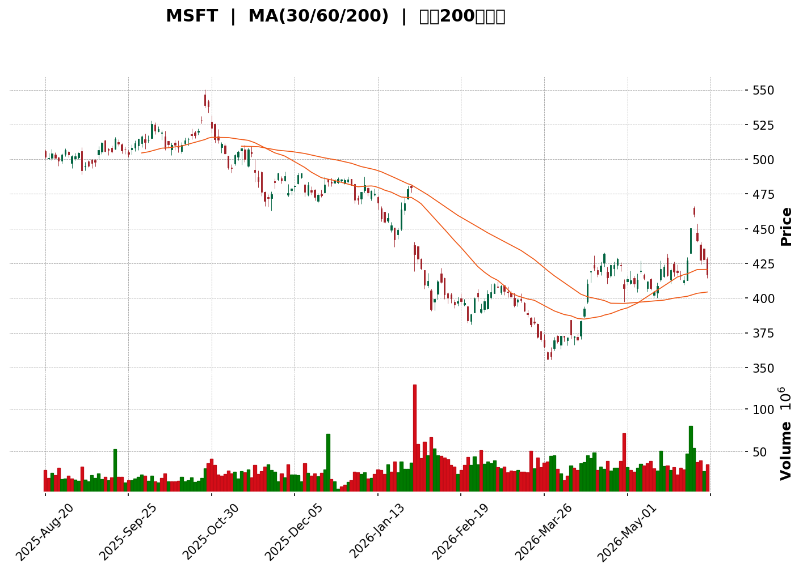
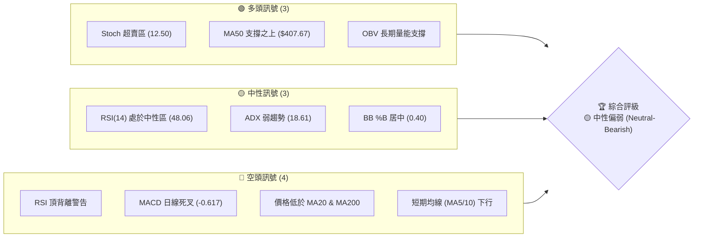
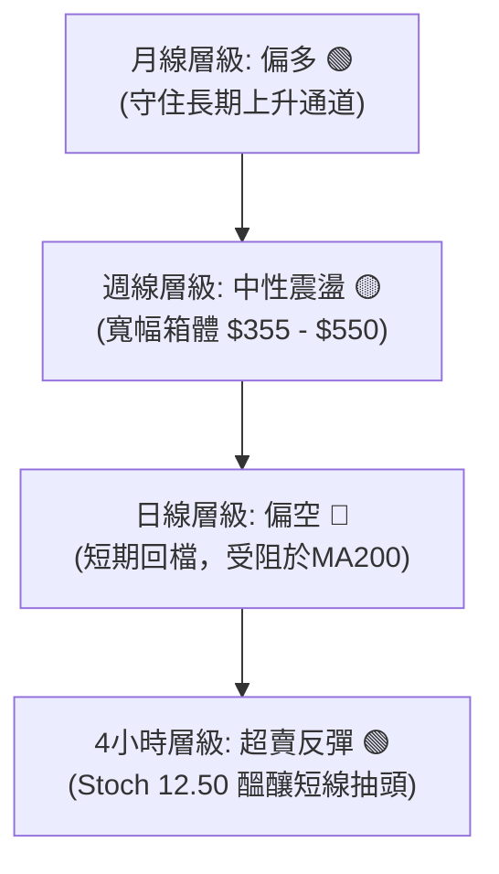
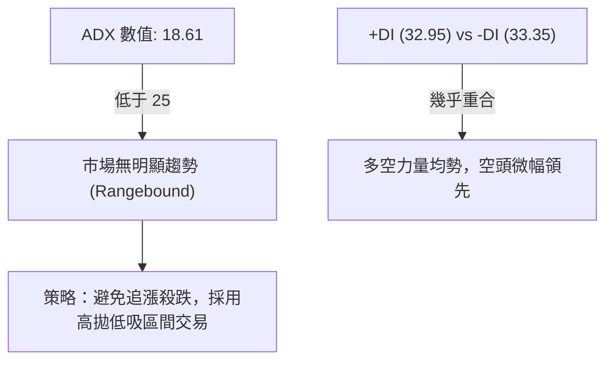
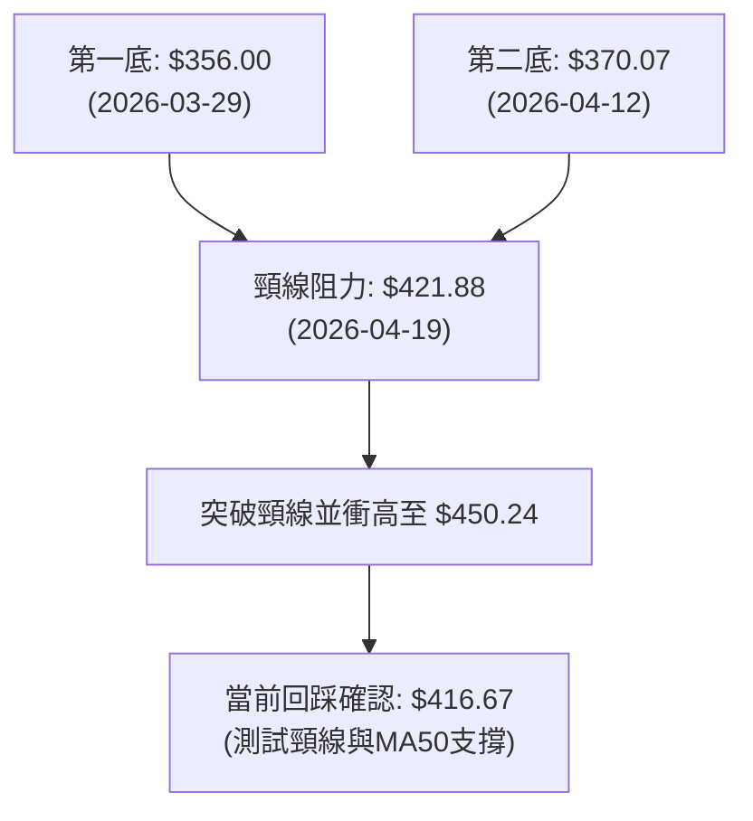

<details>
<summary>📊 靜態圖表 (點擊展開)</summary>

</details>

<html>
<head><meta charset="utf-8" /></head>
<body>
    <div style="height:500px; width:100%;">                        <script>window.PlotlyConfig = {MathJaxConfig: 'local'};</script>
        <script charset="utf-8" src="https://cdn.plot.ly/plotly-3.6.0.min.js" integrity="sha256-QaOVwtVY0T02VaHrr6pnoHLCwayMJp4O5n4YyaE3rJk=" crossorigin="anonymous"></script>                <div id="candlestick-chart" class="plotly-graph-div" style="height:100%; width:100%;"></div>            <script>                window.PLOTLYENV=window.PLOTLYENV || {};                                if (document.getElementById("candlestick-chart")) {                    Plotly.newPlot(                        "candlestick-chart",                        [{"close":{"dtype":"f8","bdata":"AAAAoGZbf0AAAADgEFF\u002fQAAAAACbgH9AAAAAYGJRf0AAAABgFi5\u002fQAAAAIDQeH9AAAAAIOymf0AAAAAABXh\u002fQAAAAKAOX39AAAAA4LZif0AAAADgXox\u002fQAAAAAAovn5AAAAAwAjxfkAAAABgX\u002fR+QAAAAECJE39AAAAAILYdf0AAAABgDqt\u002fQAAAAODuAIBAAAAAAGKdf0AAAADA9qx\u002fQAAAAIAAlH9AAAAAQF0VgEAAAAAAZvN\u002fQAAAAGBnoH9AAAAA4Aevf0AAAADgbH1\u002fQAAAAODbw39AAAAAIMj1f0AAAADghRWAQAAAAKCDI4BAAAAAQPQDgEAAAACgwBCAQAAAAMDyaYBAAAAAYHVFgEAAAAAAYEyAQAAAACDmOIBAAAAAwOi7f0AAAADACe1\u002fQAAAACBo5X9AAAAAQC7jf0AAAACAPsZ\u002fQAAAAACR5X9AAAAAIE0MgEAAAACgNxOAQAAAAKAcKoBAAAAAgEUqgEAAAACAhEKAQAAAAGBmgYBAAAAAwETVgEAAAABgItGAQAAAAACcU4BAAAAA4GgUgEAAAACANQ6AQAAAAKB98X9AAAAAAH5\u002ff0AAAACAi99+QAAAAOAX235AAAAAgAxtf0AAAACgqJd\u002fQAAAAIDFvn9AAAAAQPZBf0AAAAAAgq9\u002fQAAAAAC9hH9AAAAAIOuqfkAAAACg3kB+QAAAAADxxH1AAAAA4G1gfUAAAABAYH59QAAAAOAArn1AAAAAgI81fkAAAABAQp1+QAAAAOBPSX5AAAAAwD19fkAAAACgyrl9QAAAAMBU631AAAAAQEkQfkAAAAAgfY1+QAAAAOBqnX5AAAAAQAPHfUAAAABgORV+QAAAAOCIxn1AAAAAIHCLfUAAAABgcqR9QAAAAEAloH1AAAAAIFkdfkAAAAAgQDx+QAAAAGBSLH5AAAAAgBBLfkAAAACAs11+QAAAAGDDWH5AAAAAAAxPfkAAAACAGVV+QAAAACCdF35AAAAAwH1tfUAAAADgDmx9QAAAAGA3xn1AAAAAYDkVfkAAAAAg2L99QAAAAEB70n1AAAAAwAexfUAAAAAgVUl9QAAAAEB+lXxAAAAAgCpqfEAAAACAI518QAAAAAAUSHxAAAAAoEGie0AAAADgPBJ8QAAAAKAl\u002fnxAAAAAwB5DfUAAAABgMOd9QAAAAEDq931AAAAAwD\u002f5ekAAAAAAHsZ6QAAAAEDjV3pAAAAAoDCWeUAAAACgqMV5QAAAAGDLfnhAAAAA4Mj1eEAAAADAQrx5QAAAAAABt3lAAAAAQDwpeUAAAABA7wB5QAAAAOCm+HhAAAAAoJuxeEAAAAAAQd14QAAAAOCU2XhAAAAAwPHFeEAAAACgOfp3QAAAAICMQnhAAAAAYL\u002f7eEAAAAAAoQ15QAAAAGBCfnhAAAAAoATbeEAAAACA6TB5QAAAAEAwRXlAAAAAwK2ceUAAAADgN4F5QAAAACBniHlAAAAAICFOeUAAAABgFEB5QAAAACDdD3lAAAAAQB+reEAAAADAXvF4QAAAAKC\u002f6HhAAAAAoBdveEAAAAAg3kJ4QAAAACC30HdAAAAAoMHid0AAAABg8z53QAAAAGDPI3dAAAAAgN3SdkAAAACg+z92QAAAAIDyYnZAAAAAgOsVd0AAAADAJQl3QAAAACBySndAAAAAoC9Bd0AAAABAxDd3QAAAAABWWHdAAAAAQDhEd0AAAACAGCF3QAAAAACh+HdAAAAAoCqEeEAAAADgTKV5QAAAAMCgNXpAAAAAQAVeekAAAADgqRJ6QAAAAKDkc3pAAAAAAMD\u002fekAAAACgn+15QAAAAKA8e3pAAAAAIG5+ekAAAAAgKMV6QAAAAKCueHpAAAAAIGFueUAAAACAtdh5QAAAAACey3lAAAAA4NqneUAAAACgC9F5QAAAACDFPXpAAAAAwJDjeUAAAABgSrx5QAAAACA4bnlAAAAAIFlFeUAAAADguIh5QAAAAGAhUHpAAAAAoP5pekAAAABASQh6QAAAAGBmQnpAAAAAoHAxekAAAADAHil6QAAAAOB6AHpAAAAAYLjKeUAAAAAA1696QAAAAADXI3xAAAAA4FHIfEAAAADA9ZR7QAAAAKBwtXpAAAAAwMzAekAAAABguAp6QA=="},"high":{"dtype":"f8","bdata":"n5mbHzavf0DguQX99oZ\u002fQE2gWsdAuH9AvzyyUd6Pf0CMl4\u002fW1Fx\u002fQNmHZzKPgX9AdyJr3\u002fm9f0ASvLJcSaZ\u002fQKeKv3AMbX9Af\u002fs2OoKJf0BYXzd8O49\u002fQDmOE633y39A72emarsgf0B0rT4DbTF\u002fQGwhsiYCQX9A8F\u002fz0Q1Af0ASjoNwMNV\u002fQAt8GbXOAYBAXmXTgMwPgEDGSgkDKMF\u002fQMeVDOh03X9Azfi8V0EggEA+u6N42hOAQJzW19Sf9X9AstEycBPUf0Acobwuzqx\u002fQINNMhJK639AbzTtD8cMgECtODorMReAQOzKY7DfKYBAJdXX+IkygECMj0HntimAQEUjFiuBfYBAXmJDvLlzgEAOjMvOEV2AQIpA6d89SIBAbxGlh0dCgEDk3iK1RwmAQOp5tyVMAIBAQMa3KXsPgEDW\u002f5Q2xwyAQD6LDyPjAYBAHFTUQXwbgEBjg2TZZxuAQBRe60xlT4BAoA+RjjhFgEBPbM6SWVCAQOlze8+5mYBAJQuauOExgUBncPEpqPaAQOepDUvTnIBAJNAOBulvgEBzv1LqP02AQIf7r5ZxAoBAys0MqXD5f0AZS6RvR2h\u002fQPtsWKLLA39ALzq9NpB6f0AYbLxISaZ\u002fQAlRfrYyx39AENSCL0vkf0AgvzbFFcZ\u002fQITs\u002fyVazn9A4zRvegg9f0AfpBtZLcF+QKmh\u002fY4btn5Ad5hCQ7\u002fMfUA6ci\u002f2kax9QOakPgZp0H1A8VCzOFJifkARard9Iqd+QF49Y7cCe35AoQ7qMP60fkBCr6JHfSF+QNpzfij68n1Arn5N5BsUfkCjy3PB4KF+QDN3FK8Cn35AIYncK6YhfkD4HMOiAD5+QEHuOxD6BH5AqquAW2vpfUD\u002fo6ciV7x9QJvKMkrz3X1AWa0Ykd52fkA0g5lT\u002flp+QGwzxe8CaX5Ab4oltKxafkCGfShM3G9+QKJL7E1LX35AjHzfTPVifkCqEWOsJHh+QDSuAAudX35AUMTBCi4ofkAB07OGWZ99QIIo2DLhyX1AGK4kXXZ4fkCWbGVfUgh+QLT3jFEV231AKq2nT7jtfUCdezXUupp9QB3ildT8IX1A+he2ShHjfEDzcv3GLtJ8QAjcpHhlbHxAG4mlkO0qfEBtlO0gUS18QDMe9nkuUH1AZOr3x1uCfUASTfGpqgt+QHqF7m6GGX5AtdPxT5yIe0BhOEGvalp7QPIc2ulIzXpAr0jJZdxCekC3IaE\u002fBR96QHomSRLWZ3lASpE8ciMAeUCV8uEyz9B5QPx8AVXTXHpAp\u002f7sUtHpeUCX45GyYkZ5QE93pF3fO3lAPe4HiejreEDGLVRfZwx5QLlU\u002fiblOHlAt6LLihX0eEBxFdWYFqh4QNY\u002fN9BLSHhA655qLKMJeUBCTzHMv2l5QJe8+wFmv3hAc7AowSoFeUBmp4r6Il15QCwi+UNEonlARnRwxIareUD0+UJLhMJ5QN3LD8sslXlAOF42EgSVeUCMPZ1QBIJ5QPOGCmrgU3lAoIrqXc0+eUBRmP\u002f6Ofx4QJkxknNqOHlAWg\u002f1xjzSeEA44kGIRHp4QCwwnzaeInhA5JWFe\u002fgleED1IdVdS9p3QG2YzvXrg3dAB2EpC5Bed0BfDu+3qpp2QFvCYzggyXZAwB9QVYFBd0DRsUta6FJ3QNftB+hRTXdA4WS1ucFOd0CwuGY1Ujp3QPZsJeyvAnhA0kWQsRVLd0Aja2hGQG13QJFeud5X+3dA599vY2SdeEBbSYFdl9d5QGMi8oqRPnpAtjB1MFvqekBO5ukvpGZ6QFzmNcQbpHpAgL1b+DMMe0D1NEn66Gt6QMPfHXSBgHpAOnV9mv2iekA27ZyR2s96QB\u002fsrltcnnpAoMKk2GPYeUDFYE8dVgN6QOgoB\u002f7tPXpAXJS1chH+eUCaI75kQBh6QGC+3ozhsHpApP+wrZobekDOVAT8xLx5QBekGtKh6XlAvOE0A+lWeUBqkYLqMq95QIGMLQzqs3pANcGAQziDekBki6jcPPx6QJrLIAsBU3pAAAAAoHClekAAAABgZoZ6QAAAAOBRPHpAAAAAQAr\u002feUAAAAAA19d6QAAAAKBHJXxAAAAAwB4lfUAAAAAAAFh8QAAAAIA9hntAAAAAYGZCe0AAAAAghdd6QA=="},"hovertemplate":"\u003cb\u003e%{x|%Y-%m-%d}\u003c\u002fb\u003e\u003cbr\u003e\u958b: $%{open:.2f}\u003cbr\u003e\u9ad8: $%{high:.2f}\u003cbr\u003e\u4f4e: $%{low:.2f}\u003cbr\u003e\u6536: $%{close:.2f}\u003cextra\u003e\u003c\u002fextra\u003e","low":{"dtype":"f8","bdata":"Bki5SxVHf0BBbIcu5jh\u002fQBvsbX\u002f4M39Apnr3eyhPf0BK1OV+9vV+QPuScTEQDH9ALUFkWBllf0BxvQV2ClV\u002fQKw3nRbv2n5AR7w4G4oyf0Bt84xfvD9\u002fQBzHsUtXlH5A4NVJF6K+fkCSHlmNFel+QN62YvaA2X5AKKcrT\u002fLrfkCLq0WU3Up\u002fQAlWHsDyfH9AOXCdF2OWf0DLLzmO72t\u002fQDaYXv1wh39Au33va5Oxf0CU8We8B9V\u002fQMP1UH7ggX9A6zvyIq17f0AKPQ8syV1\u002fQLgxjAPodn9Ak3MYk9aaf0DdxkaSPad\u002fQBDkHv2Dx39A2k0oL3W3f0Db6uJTJPx\u002fQJcpGaiCF4BAmOHtPEQxgEAdLRBPYj6AQFu\u002fs5EmEYBASCq0aMOmf0BvZchXW8d\u002fQOKVD4MMbX9A\u002fjjCaqWsf0Ae\u002fns06o5\u002fQEr27J\u002fggX9A8qKWXC7jf0AGEJTX+tx\u002fQHEjsVmdE4BAr34cAsUagEC+xpbAdiuAQJqw0jlybYBAZB5ZIe\u002fKgEDp1O4f0aqAQFJOfyqsNoBAzIO\u002fW7v9f0ACZfyln\u002fV\u002fQPwA2stNin9Ada2SM0V2f0DjcefgCMt+QAPQzCZVon5AP2p62ZL6fkBZzzwsBDN\u002fQEkAH1mp\u002f35Aw+Alzikif0AyBEBo8+R+QPomquG3W39AAlee03Y7fkAXikBWqfx9QEuuW\u002fVEln1AA6JeKhojfUAnjIq4Hh99QCl1NxxD7XxAISkQ1hDxfUA9ehP24Ed+QE6YOjQFKH5AHLHZU59CfkBZPMKxfZF9QNLLlh4Kpn1AFdJnGRzMfUAY9mtUuCN+QEbYIuxYZX5AY0knUpSPfUDphGXyAJx9QBFqHGWmo31AHq+PBM1mfUD2cndvrUx9QClDwhZOjn1ADL7mF1e8fUB50+8JnQV+QFLsDr\u002fMCH5AD+xMMXQpfkA8eBQu4yp+QBopnyfjPH5AeujapoggfkDSufpUjzV+QENnrC+EEn5A6o73WzVBfUB3qasVsjZ9QGlBY3StOn1AMHoEvku9fUATZgn8AJx9QMdxMjK0YX1Aql9e\u002fSKZfUBPncu2Jf58QNTIDEJKcnxAiJI5TQ9efECY+0GBTGd8QJkg5Cec9HtAE4ZP+8JLe0BgqQeTp6t7QFWFy0aFCHxA8LepPDq\u002ffEAXoODe\u002fnB9QITUdKsXvn1AkdxCQnQyekBnP40b84h6QAAmthYMRnpAby6YX\u002fpreUDiYTVEz3Z5QGotFURKaXhAzagMBtlyeECU44PMe\u002fF4QNPgwrnsrXlAVpU0xLbzeEBFwFst7cN4QMoy\u002fUGQxHhAME7cT36MeECEglmwAal4QFiaYvgAvXhAj77+UuWkeECBB7hAWuR3QIU+UigpzndAzPUjixFVeEDUSjpBDd54QCFONzGZUHhAyoVifJJceEAtL4dNJH14QOQx2Ake93hAlkjPd2o4eUBTTL+7CHp5QL1YSxEMKnlAu65KbfIgeUB53cqfjQt5QFvc6RN4DXlAmrP+AV6WeEBx6Z0N\u002fZ54QO4a8PE+znhAI\u002fJPvnpieEDYS79ZkyN4QM68xJ3GtHdAbiRWj67Nd0BtMOLgvTB3QFxSR3tMDXdAzLaYh2nGdkB6NCoN1Tt2QG5CYPkoOHZArSwMupCkdkCc+GHbd\u002fZ2QG4wV8rOtXZAWhrMCzkLd0Cik0vZSNx2QDO8Hpm3KXdA5v9iihvkdkAVVI9PrxN3QDw1HY19I3dAMFPzVfQaeEABTh4l9r14QLvBWiH9s3lAbfL1Nn48ekCtGTGLZ\u002fZ5QPHcehzGBHpAsR5z4hFsekAHrVVrVah5QHXO3PNr7nlAgqPrurICekCTsZyQz096QJP1GUobNnpAZJBjvGXSeEC9FMPo2Jh5QMeAsDaYnnlAtzrA9ql+eUCepMtXwEN5QFz\u002f8wquHXpAg9wbKq\u002fReUBWv\u002fZh+kl5QELkxMAtXHlArb6L4JwCeUBqr8TPNwB5QGeJliJIwHlA2LascmPreUCxXZsbcPl5QLg3LcaTpnlAAAAAIFz7eUAAAACgRwV6QAAAAOBR0HlAAAAAoEeZeUAAAABguMp5QAAAAIDCBXtAAAAA4FGkfEAAAABA4YZ7QAAAAAAAhHpAAAAAYI+mekAAAABgZuZ5QA=="},"name":"\u50f9\u683c","open":{"dtype":"f8","bdata":"+dgBTUadf0AJ1WlNUkh\u002fQD2AN7E5UX9AM2s7yBB3f0Bdxi8y+VJ\u002fQICraK9zLX9AmbfW+2B+f0CavNVXV5d\u002fQEn61R0gFX9A4L2OVulJf0CY+qkaBVJ\u002fQFVVdQ7cnX9ASQQZUprvfkDj\u002fJpmYyR\u002fQAh2c5gIPX9AN7oyKW0xf0BOYfcmYnd\u002fQCGduntomX9Aye6VQwQNgEC2nILogLZ\u002fQDLGyeJVxH9AKPQy+oy1f0Bzon4OwwKAQPMjXzIQ6X9AEMIiErCyf0BYD0UDnpF\u002fQFfIrZaZrX9AxR9JiX7Ef0DTjLnpKOB\u002fQEVb71H2+H9AVVrTAg8TgECzaeXYww6AQNxLYf\u002fEGoBA77SzsrhngEAzVCP85D+AQPbg9gVsOIBAOTfdL\u002fUigEDk3iK1RwmAQKKS5JhNsH9AJR87z4H7f0DUDLy+qtV\u002fQFiRkCdinX9AMwnNMfH1f0Cj29UP8hGAQKz+GCP2LoBAphjTQmA5gEBSy6ix\u002fzuAQCvRF4Z3g4BA5kPBKk8UgUD5JmxuFeyAQCCgG6oheYBA8w\u002ffkWlsgECB4kILTySAQKsyjx+hyH9Al8DRGR3hf0D3lKmXpGd\u002fQDUIFgYp3X5A2XJ6AkoOf0Dy7Y0k+Fl\u002fQKgvkGJ4on9AarqSKpOxf0DJFOvqgvF+QObksIAAlH9AAZ6KBQrEfkAp8pHuP3B+QAv\u002fJo1oqH5ARW\u002fegw7GfUD9rhYXTo59QGjv3KZ9f31Asj1uinZCfkBvFZX1Ald+QBrXxkBkZH5A\u002fnlTcP5IfkDyEP7aVKN9QC4Vtrwg2n1AAMZhXxcGfkDF5XMR2Ct+QEv1wabnbn5A7eieCiUefkBFFqL2RKh9QIfK31IV231A+LDMHYvffUA\u002fzRubFV19QKDZUce6rH1ALEVIZR7BfUDD9KsZMFN+QBYxbbVvP35AcGt29UYtfkCPRXdebTh+QA887YjVSH5AXtWijV0rfkCZnvbFaDx+QKrtv53VWn5ATmzpEeEjfkCf4u4GVX99QF\u002fUaKgwe31Alkd5nyDafUDhbOfIs\u002fF9QAp2TOtUf31ASU\u002fZIuiofUAG5QUuNYl9QPXCyE1FBn1AqPkXJ\u002f\u002fgfEBDflF9zXx8QPXoHy2DE3xASA8Hk34pfECrXUbMKtp7QHXFOZHdHXxAGpTn4PPzfEAITmzwmHl9QGUU1S4VEX5ARXK35KBge0CjeTk+kVN7QMBzSf5RxXpAFwSkXzlCekA+kRBO2JJ5QD71SzAjWnlAn\u002fZbhmfWeEC+Ntql4TB5QDodgE8nHHpAGQuciFvleUAoO1k9RTN5QE7C7IiCKnlAclKJZDPXeEDwSt+R1sV4QKZ5bUIv\u002fXhARwwsChC0eECT\u002fqNIV6J4QCJcgAX19HdAFkSoxPlaeEBwViiIXT15QIqDC1eQYHhAYPrEviyAeECijGdEpYR4QIUmS6pxBnlANvJwSrw4eUCQzRDgDIV5QB7TP9+3QHlAeMB9M02SeUCOWlKEGEt5QJxzoZoWPHlAk9NWQSICeUCjHHnkWtN4QATrFIN69nhANdyI+ljEeEAzDHVQHFR4QLSjfvJDH3hAAEB6CCDxd0A5lCa3idh3QLosCNOvgXdAAPMkMUwgd0CBlGK24pF2QEdiZLnikXZAyeocoDG8dkAvu2HH7Ep3QPokxHOp5nZAe0+luexKd0B3RRlDohh3QNC9cTleAnhAqsC7ix47d0CMz2FyyEJ3QP1Yyz\u002fXTHdAtVpHcU4xeED+6xPHPNJ4QCzLhso9L3pAePuvJ25+ekDgMy481kN6QN1gZPNONXpA35ifc02UekDHjd15uC96QNoVYvgZAXpA1yR+eXlXekCPQNFNcHp6QMSIEBCZenpA10mHLcGeeUDj65WEhr55QKVIqMloqnlAvmNLP8LmeUBuH3lC5HF5QKsTrpc7M3pAuge7p84HekDdzRfn0G95QIJPn\u002flY2XlAJO\u002fwCkIleUCIS4aRsTl5QPvTkpj+1XlA85bVgYP7eUCvVgbGiM96QKyuHP5l1HlAAAAAAACMekAAAADgozh6QAAAAEDhBnpAAAAAACmweUAAAAAgrs95QAAAAMDMCHtAAAAAoHANfUAAAACAFO57QAAAAEAzZ3tAAAAAwPU8e0AAAACgcMV6QA=="},"x":["2025-08-20T00:00:00-04:00","2025-08-21T00:00:00-04:00","2025-08-22T00:00:00-04:00","2025-08-25T00:00:00-04:00","2025-08-26T00:00:00-04:00","2025-08-27T00:00:00-04:00","2025-08-28T00:00:00-04:00","2025-08-29T00:00:00-04:00","2025-09-02T00:00:00-04:00","2025-09-03T00:00:00-04:00","2025-09-04T00:00:00-04:00","2025-09-05T00:00:00-04:00","2025-09-08T00:00:00-04:00","2025-09-09T00:00:00-04:00","2025-09-10T00:00:00-04:00","2025-09-11T00:00:00-04:00","2025-09-12T00:00:00-04:00","2025-09-15T00:00:00-04:00","2025-09-16T00:00:00-04:00","2025-09-17T00:00:00-04:00","2025-09-18T00:00:00-04:00","2025-09-19T00:00:00-04:00","2025-09-22T00:00:00-04:00","2025-09-23T00:00:00-04:00","2025-09-24T00:00:00-04:00","2025-09-25T00:00:00-04:00","2025-09-26T00:00:00-04:00","2025-09-29T00:00:00-04:00","2025-09-30T00:00:00-04:00","2025-10-01T00:00:00-04:00","2025-10-02T00:00:00-04:00","2025-10-03T00:00:00-04:00","2025-10-06T00:00:00-04:00","2025-10-07T00:00:00-04:00","2025-10-08T00:00:00-04:00","2025-10-09T00:00:00-04:00","2025-10-10T00:00:00-04:00","2025-10-13T00:00:00-04:00","2025-10-14T00:00:00-04:00","2025-10-15T00:00:00-04:00","2025-10-16T00:00:00-04:00","2025-10-17T00:00:00-04:00","2025-10-20T00:00:00-04:00","2025-10-21T00:00:00-04:00","2025-10-22T00:00:00-04:00","2025-10-23T00:00:00-04:00","2025-10-24T00:00:00-04:00","2025-10-27T00:00:00-04:00","2025-10-28T00:00:00-04:00","2025-10-29T00:00:00-04:00","2025-10-30T00:00:00-04:00","2025-10-31T00:00:00-04:00","2025-11-03T00:00:00-05:00","2025-11-04T00:00:00-05:00","2025-11-05T00:00:00-05:00","2025-11-06T00:00:00-05:00","2025-11-07T00:00:00-05:00","2025-11-10T00:00:00-05:00","2025-11-11T00:00:00-05:00","2025-11-12T00:00:00-05:00","2025-11-13T00:00:00-05:00","2025-11-14T00:00:00-05:00","2025-11-17T00:00:00-05:00","2025-11-18T00:00:00-05:00","2025-11-19T00:00:00-05:00","2025-11-20T00:00:00-05:00","2025-11-21T00:00:00-05:00","2025-11-24T00:00:00-05:00","2025-11-25T00:00:00-05:00","2025-11-26T00:00:00-05:00","2025-11-28T00:00:00-05:00","2025-12-01T00:00:00-05:00","2025-12-02T00:00:00-05:00","2025-12-03T00:00:00-05:00","2025-12-04T00:00:00-05:00","2025-12-05T00:00:00-05:00","2025-12-08T00:00:00-05:00","2025-12-09T00:00:00-05:00","2025-12-10T00:00:00-05:00","2025-12-11T00:00:00-05:00","2025-12-12T00:00:00-05:00","2025-12-15T00:00:00-05:00","2025-12-16T00:00:00-05:00","2025-12-17T00:00:00-05:00","2025-12-18T00:00:00-05:00","2025-12-19T00:00:00-05:00","2025-12-22T00:00:00-05:00","2025-12-23T00:00:00-05:00","2025-12-24T00:00:00-05:00","2025-12-26T00:00:00-05:00","2025-12-29T00:00:00-05:00","2025-12-30T00:00:00-05:00","2025-12-31T00:00:00-05:00","2026-01-02T00:00:00-05:00","2026-01-05T00:00:00-05:00","2026-01-06T00:00:00-05:00","2026-01-07T00:00:00-05:00","2026-01-08T00:00:00-05:00","2026-01-09T00:00:00-05:00","2026-01-12T00:00:00-05:00","2026-01-13T00:00:00-05:00","2026-01-14T00:00:00-05:00","2026-01-15T00:00:00-05:00","2026-01-16T00:00:00-05:00","2026-01-20T00:00:00-05:00","2026-01-21T00:00:00-05:00","2026-01-22T00:00:00-05:00","2026-01-23T00:00:00-05:00","2026-01-26T00:00:00-05:00","2026-01-27T00:00:00-05:00","2026-01-28T00:00:00-05:00","2026-01-29T00:00:00-05:00","2026-01-30T00:00:00-05:00","2026-02-02T00:00:00-05:00","2026-02-03T00:00:00-05:00","2026-02-04T00:00:00-05:00","2026-02-05T00:00:00-05:00","2026-02-06T00:00:00-05:00","2026-02-09T00:00:00-05:00","2026-02-10T00:00:00-05:00","2026-02-11T00:00:00-05:00","2026-02-12T00:00:00-05:00","2026-02-13T00:00:00-05:00","2026-02-17T00:00:00-05:00","2026-02-18T00:00:00-05:00","2026-02-19T00:00:00-05:00","2026-02-20T00:00:00-05:00","2026-02-23T00:00:00-05:00","2026-02-24T00:00:00-05:00","2026-02-25T00:00:00-05:00","2026-02-26T00:00:00-05:00","2026-02-27T00:00:00-05:00","2026-03-02T00:00:00-05:00","2026-03-03T00:00:00-05:00","2026-03-04T00:00:00-05:00","2026-03-05T00:00:00-05:00","2026-03-06T00:00:00-05:00","2026-03-09T00:00:00-04:00","2026-03-10T00:00:00-04:00","2026-03-11T00:00:00-04:00","2026-03-12T00:00:00-04:00","2026-03-13T00:00:00-04:00","2026-03-16T00:00:00-04:00","2026-03-17T00:00:00-04:00","2026-03-18T00:00:00-04:00","2026-03-19T00:00:00-04:00","2026-03-20T00:00:00-04:00","2026-03-23T00:00:00-04:00","2026-03-24T00:00:00-04:00","2026-03-25T00:00:00-04:00","2026-03-26T00:00:00-04:00","2026-03-27T00:00:00-04:00","2026-03-30T00:00:00-04:00","2026-03-31T00:00:00-04:00","2026-04-01T00:00:00-04:00","2026-04-02T00:00:00-04:00","2026-04-06T00:00:00-04:00","2026-04-07T00:00:00-04:00","2026-04-08T00:00:00-04:00","2026-04-09T00:00:00-04:00","2026-04-10T00:00:00-04:00","2026-04-13T00:00:00-04:00","2026-04-14T00:00:00-04:00","2026-04-15T00:00:00-04:00","2026-04-16T00:00:00-04:00","2026-04-17T00:00:00-04:00","2026-04-20T00:00:00-04:00","2026-04-21T00:00:00-04:00","2026-04-22T00:00:00-04:00","2026-04-23T00:00:00-04:00","2026-04-24T00:00:00-04:00","2026-04-27T00:00:00-04:00","2026-04-28T00:00:00-04:00","2026-04-29T00:00:00-04:00","2026-04-30T00:00:00-04:00","2026-05-01T00:00:00-04:00","2026-05-04T00:00:00-04:00","2026-05-05T00:00:00-04:00","2026-05-06T00:00:00-04:00","2026-05-07T00:00:00-04:00","2026-05-08T00:00:00-04:00","2026-05-11T00:00:00-04:00","2026-05-12T00:00:00-04:00","2026-05-13T00:00:00-04:00","2026-05-14T00:00:00-04:00","2026-05-15T00:00:00-04:00","2026-05-18T00:00:00-04:00","2026-05-19T00:00:00-04:00","2026-05-20T00:00:00-04:00","2026-05-21T00:00:00-04:00","2026-05-22T00:00:00-04:00","2026-05-26T00:00:00-04:00","2026-05-27T00:00:00-04:00","2026-05-28T00:00:00-04:00","2026-05-29T00:00:00-04:00","2026-06-01T00:00:00-04:00","2026-06-02T00:00:00-04:00","2026-06-03T00:00:00-04:00","2026-06-04T00:00:00-04:00","2026-06-05T00:00:00-04:00"],"type":"candlestick"},{"hovertemplate":"MA30: $%{y:.2f}\u003cextra\u003e\u003c\u002fextra\u003e","line":{"color":"#2196F3","dash":"dash","width":2},"mode":"lines","name":"MA30","x":["2025-08-20T00:00:00-04:00","2025-08-21T00:00:00-04:00","2025-08-22T00:00:00-04:00","2025-08-25T00:00:00-04:00","2025-08-26T00:00:00-04:00","2025-08-27T00:00:00-04:00","2025-08-28T00:00:00-04:00","2025-08-29T00:00:00-04:00","2025-09-02T00:00:00-04:00","2025-09-03T00:00:00-04:00","2025-09-04T00:00:00-04:00","2025-09-05T00:00:00-04:00","2025-09-08T00:00:00-04:00","2025-09-09T00:00:00-04:00","2025-09-10T00:00:00-04:00","2025-09-11T00:00:00-04:00","2025-09-12T00:00:00-04:00","2025-09-15T00:00:00-04:00","2025-09-16T00:00:00-04:00","2025-09-17T00:00:00-04:00","2025-09-18T00:00:00-04:00","2025-09-19T00:00:00-04:00","2025-09-22T00:00:00-04:00","2025-09-23T00:00:00-04:00","2025-09-24T00:00:00-04:00","2025-09-25T00:00:00-04:00","2025-09-26T00:00:00-04:00","2025-09-29T00:00:00-04:00","2025-09-30T00:00:00-04:00","2025-10-01T00:00:00-04:00","2025-10-02T00:00:00-04:00","2025-10-03T00:00:00-04:00","2025-10-06T00:00:00-04:00","2025-10-07T00:00:00-04:00","2025-10-08T00:00:00-04:00","2025-10-09T00:00:00-04:00","2025-10-10T00:00:00-04:00","2025-10-13T00:00:00-04:00","2025-10-14T00:00:00-04:00","2025-10-15T00:00:00-04:00","2025-10-16T00:00:00-04:00","2025-10-17T00:00:00-04:00","2025-10-20T00:00:00-04:00","2025-10-21T00:00:00-04:00","2025-10-22T00:00:00-04:00","2025-10-23T00:00:00-04:00","2025-10-24T00:00:00-04:00","2025-10-27T00:00:00-04:00","2025-10-28T00:00:00-04:00","2025-10-29T00:00:00-04:00","2025-10-30T00:00:00-04:00","2025-10-31T00:00:00-04:00","2025-11-03T00:00:00-05:00","2025-11-04T00:00:00-05:00","2025-11-05T00:00:00-05:00","2025-11-06T00:00:00-05:00","2025-11-07T00:00:00-05:00","2025-11-10T00:00:00-05:00","2025-11-11T00:00:00-05:00","2025-11-12T00:00:00-05:00","2025-11-13T00:00:00-05:00","2025-11-14T00:00:00-05:00","2025-11-17T00:00:00-05:00","2025-11-18T00:00:00-05:00","2025-11-19T00:00:00-05:00","2025-11-20T00:00:00-05:00","2025-11-21T00:00:00-05:00","2025-11-24T00:00:00-05:00","2025-11-25T00:00:00-05:00","2025-11-26T00:00:00-05:00","2025-11-28T00:00:00-05:00","2025-12-01T00:00:00-05:00","2025-12-02T00:00:00-05:00","2025-12-03T00:00:00-05:00","2025-12-04T00:00:00-05:00","2025-12-05T00:00:00-05:00","2025-12-08T00:00:00-05:00","2025-12-09T00:00:00-05:00","2025-12-10T00:00:00-05:00","2025-12-11T00:00:00-05:00","2025-12-12T00:00:00-05:00","2025-12-15T00:00:00-05:00","2025-12-16T00:00:00-05:00","2025-12-17T00:00:00-05:00","2025-12-18T00:00:00-05:00","2025-12-19T00:00:00-05:00","2025-12-22T00:00:00-05:00","2025-12-23T00:00:00-05:00","2025-12-24T00:00:00-05:00","2025-12-26T00:00:00-05:00","2025-12-29T00:00:00-05:00","2025-12-30T00:00:00-05:00","2025-12-31T00:00:00-05:00","2026-01-02T00:00:00-05:00","2026-01-05T00:00:00-05:00","2026-01-06T00:00:00-05:00","2026-01-07T00:00:00-05:00","2026-01-08T00:00:00-05:00","2026-01-09T00:00:00-05:00","2026-01-12T00:00:00-05:00","2026-01-13T00:00:00-05:00","2026-01-14T00:00:00-05:00","2026-01-15T00:00:00-05:00","2026-01-16T00:00:00-05:00","2026-01-20T00:00:00-05:00","2026-01-21T00:00:00-05:00","2026-01-22T00:00:00-05:00","2026-01-23T00:00:00-05:00","2026-01-26T00:00:00-05:00","2026-01-27T00:00:00-05:00","2026-01-28T00:00:00-05:00","2026-01-29T00:00:00-05:00","2026-01-30T00:00:00-05:00","2026-02-02T00:00:00-05:00","2026-02-03T00:00:00-05:00","2026-02-04T00:00:00-05:00","2026-02-05T00:00:00-05:00","2026-02-06T00:00:00-05:00","2026-02-09T00:00:00-05:00","2026-02-10T00:00:00-05:00","2026-02-11T00:00:00-05:00","2026-02-12T00:00:00-05:00","2026-02-13T00:00:00-05:00","2026-02-17T00:00:00-05:00","2026-02-18T00:00:00-05:00","2026-02-19T00:00:00-05:00","2026-02-20T00:00:00-05:00","2026-02-23T00:00:00-05:00","2026-02-24T00:00:00-05:00","2026-02-25T00:00:00-05:00","2026-02-26T00:00:00-05:00","2026-02-27T00:00:00-05:00","2026-03-02T00:00:00-05:00","2026-03-03T00:00:00-05:00","2026-03-04T00:00:00-05:00","2026-03-05T00:00:00-05:00","2026-03-06T00:00:00-05:00","2026-03-09T00:00:00-04:00","2026-03-10T00:00:00-04:00","2026-03-11T00:00:00-04:00","2026-03-12T00:00:00-04:00","2026-03-13T00:00:00-04:00","2026-03-16T00:00:00-04:00","2026-03-17T00:00:00-04:00","2026-03-18T00:00:00-04:00","2026-03-19T00:00:00-04:00","2026-03-20T00:00:00-04:00","2026-03-23T00:00:00-04:00","2026-03-24T00:00:00-04:00","2026-03-25T00:00:00-04:00","2026-03-26T00:00:00-04:00","2026-03-27T00:00:00-04:00","2026-03-30T00:00:00-04:00","2026-03-31T00:00:00-04:00","2026-04-01T00:00:00-04:00","2026-04-02T00:00:00-04:00","2026-04-06T00:00:00-04:00","2026-04-07T00:00:00-04:00","2026-04-08T00:00:00-04:00","2026-04-09T00:00:00-04:00","2026-04-10T00:00:00-04:00","2026-04-13T00:00:00-04:00","2026-04-14T00:00:00-04:00","2026-04-15T00:00:00-04:00","2026-04-16T00:00:00-04:00","2026-04-17T00:00:00-04:00","2026-04-20T00:00:00-04:00","2026-04-21T00:00:00-04:00","2026-04-22T00:00:00-04:00","2026-04-23T00:00:00-04:00","2026-04-24T00:00:00-04:00","2026-04-27T00:00:00-04:00","2026-04-28T00:00:00-04:00","2026-04-29T00:00:00-04:00","2026-04-30T00:00:00-04:00","2026-05-01T00:00:00-04:00","2026-05-04T00:00:00-04:00","2026-05-05T00:00:00-04:00","2026-05-06T00:00:00-04:00","2026-05-07T00:00:00-04:00","2026-05-08T00:00:00-04:00","2026-05-11T00:00:00-04:00","2026-05-12T00:00:00-04:00","2026-05-13T00:00:00-04:00","2026-05-14T00:00:00-04:00","2026-05-15T00:00:00-04:00","2026-05-18T00:00:00-04:00","2026-05-19T00:00:00-04:00","2026-05-20T00:00:00-04:00","2026-05-21T00:00:00-04:00","2026-05-22T00:00:00-04:00","2026-05-26T00:00:00-04:00","2026-05-27T00:00:00-04:00","2026-05-28T00:00:00-04:00","2026-05-29T00:00:00-04:00","2026-06-01T00:00:00-04:00","2026-06-02T00:00:00-04:00","2026-06-03T00:00:00-04:00","2026-06-04T00:00:00-04:00","2026-06-05T00:00:00-04:00"],"y":{"dtype":"f8","bdata":"AAAAAAAA+H8AAAAAAAD4fwAAAAAAAPh\u002fAAAAAAAA+H8AAAAAAAD4fwAAAAAAAPh\u002fAAAAAAAA+H8AAAAAAAD4fwAAAAAAAPh\u002fAAAAAAAA+H8AAAAAAAD4fwAAAAAAAPh\u002fAAAAAAAA+H8AAAAAAAD4fwAAAAAAAPh\u002fAAAAAAAA+H8AAAAAAAD4fwAAAAAAAPh\u002fAAAAAAAA+H8AAAAAAAD4fwAAAAAAAPh\u002fAAAAAAAA+H8AAAAAAAD4fwAAAAAAAPh\u002fAAAAAAAA+H8AAAAAAAD4fwAAAAAAAPh\u002fAAAAAAAA+H8AAAAAAAD4fyIiIkLXiH9AIiIiUpeOf0AAAAAAipV\u002fQImIiEjZoH9AMzMzw0yrf0C8u7t7Y7d\u002fQERERCSwv39Aq6qqOmPAf0CamZnJScR\u002fQM3MzDzEyH9AvLu7ewzNf0BmZmZW+s5\u002fQLy7uyvT2H9Aq6qqWq3if0BVVVUV4ex\u002fQN7d3Z2R939A3t3dBfcAgEARERERmQSAQBEREVHhCIBAmpmZ+aERgEAAAADg\u002fBmAQCIiIiKTHoBAzczM\u002fIoegEAREREBOh+AQJqZmfmTIIBAzczMJMkfgEBVVVWFJx2AQDMzM2NGGYBAZmZm\u002fv4WgEBEREQkihSAQHd3d8dEEoBAVVVVNfgOgEAiIiLSEQ2AQAAAANB7B4BAMzMzo\u002ff+f0CJiIio+Op\u002fQM3MzIwk1H9Aq6qq2gbAf0CJiIh4Rat\u002fQBEREaFbmH9AmpmZiQmKf0AzMzNDI4B\u002fQLy7u1tlcn9AMzMzE69kf0C8u7vr\u002fk9\u002fQFVVVcVuO39A7+7uPhcof0ARERFRThd\u002fQO\u002fu7h7cAn9Aq6qq+qzhfkDNzMzMX8N+QN7d3W3Rqn5AAAAAYIGUfkDe3d2NcH9+QHd3d1epa35AAAAAUNtffkDe3d3daVp+QLy7u3uWVH5AMzMz8+tKfkCJiIjYdEB+QHd3d9eFNH5Ad3d392wsfkAzMzPz4CB+QImIiDi1FH5AIiIigiAKfkBERESECAN+QFVVVWUTA35A3t3dLRoJfkB3d3fXSAt+QO\u002fu7h6ADH5AIiIiMhUIfkDe3d19wPx9QBEREYE57n1AmpmZqYXcfUAAAACgCNN9QAAAAAAPxX1AMzMzA1OwfUBEREQ0Jpt9QAAAAJBOjX1AREREFOmIfUDv7u4+YId9QAAAAKAFiX1AREREFBVzfUDNzMzMmlp9QJqZmZmYPn1A3t3dHfUXfUAAAAAA3\u002fF8QBEREZFrwXxA3t3dLemTfEC8u7trZWx8QBEREfHeRHxA3t3dnfEYfEDe3d29eOt7QN7d3d3Fv3tAZmZmdmCXe0C8u7u7e3B7QBEREVF2RntAERERIScZe0DNzMwc5ud6QImIiDhvuHpAREREJEKQekCamZmJImx6QERERCQ6SXpAMzMzA9sqekARERHhpQ16QO\u002fu7p7z83lAVVVV9bLieUBERERkzMx5QKuqqgpGr3lAq6qq2oGNeUCJiIi4zWV5QKuqqmrvO3lAq6qqqkMoeUARERGxoxh5QFVVVcVmDHlAq6qqmpACeUDNzMz8q\u002fV4QDMzM4Pe73hAq6qqmrPmeECamZk5ddF4QKuqqhp8u3hAMzMzA4qneEDNzMxsCpB4QBEREeH7eXhA7+7uzkJseEDNzMxMqFx4QHd3d1daT3hAAAAA8GRCeEDv7u6O6Tt4QBEREfEaNHhA3t3dTXQleECrqqpaCRV4QKuqqgqVEHhAiYiI6K8NeEBmZmYWkRF4QGZmZtaUGXhAAAAAsAYgeEAiIiLS3yR4QGZmZla5LHhAERERkS07eECamZl59kB4QCIiIkITTXhARERE9KZceEC8u7u7Pmx4QAAAAICTeXhAMzMz8xWCeEAREREhnY94QBEREbGCoHhAIiIiIp2veEAAAADgjMV4QAAAAAAE4HhAvLu7Gyz6eEB3d3d36hd5QBEREUHkMXlAq6qqCopEeUDv7u6+21l5QKuqqtqlc3lAAAAAsJuOeUDv7u4eoKZ5QImIiIh+v3lAERER4XfYeUBERET0VfJ5QERERASqA3pAvLu7m4wOekBEREQUbxd6QKuqqlroJ3pAIiIigoQ8ekB3d3fnZEl6QM3MzDyUS3pAAAAAEHtJekCrqqpac0p6QA=="},"type":"scatter"},{"hovertemplate":"MA60: $%{y:.2f}\u003cextra\u003e\u003c\u002fextra\u003e","line":{"color":"#9C27B0","dash":"dash","width":2},"mode":"lines","name":"MA60","x":["2025-08-20T00:00:00-04:00","2025-08-21T00:00:00-04:00","2025-08-22T00:00:00-04:00","2025-08-25T00:00:00-04:00","2025-08-26T00:00:00-04:00","2025-08-27T00:00:00-04:00","2025-08-28T00:00:00-04:00","2025-08-29T00:00:00-04:00","2025-09-02T00:00:00-04:00","2025-09-03T00:00:00-04:00","2025-09-04T00:00:00-04:00","2025-09-05T00:00:00-04:00","2025-09-08T00:00:00-04:00","2025-09-09T00:00:00-04:00","2025-09-10T00:00:00-04:00","2025-09-11T00:00:00-04:00","2025-09-12T00:00:00-04:00","2025-09-15T00:00:00-04:00","2025-09-16T00:00:00-04:00","2025-09-17T00:00:00-04:00","2025-09-18T00:00:00-04:00","2025-09-19T00:00:00-04:00","2025-09-22T00:00:00-04:00","2025-09-23T00:00:00-04:00","2025-09-24T00:00:00-04:00","2025-09-25T00:00:00-04:00","2025-09-26T00:00:00-04:00","2025-09-29T00:00:00-04:00","2025-09-30T00:00:00-04:00","2025-10-01T00:00:00-04:00","2025-10-02T00:00:00-04:00","2025-10-03T00:00:00-04:00","2025-10-06T00:00:00-04:00","2025-10-07T00:00:00-04:00","2025-10-08T00:00:00-04:00","2025-10-09T00:00:00-04:00","2025-10-10T00:00:00-04:00","2025-10-13T00:00:00-04:00","2025-10-14T00:00:00-04:00","2025-10-15T00:00:00-04:00","2025-10-16T00:00:00-04:00","2025-10-17T00:00:00-04:00","2025-10-20T00:00:00-04:00","2025-10-21T00:00:00-04:00","2025-10-22T00:00:00-04:00","2025-10-23T00:00:00-04:00","2025-10-24T00:00:00-04:00","2025-10-27T00:00:00-04:00","2025-10-28T00:00:00-04:00","2025-10-29T00:00:00-04:00","2025-10-30T00:00:00-04:00","2025-10-31T00:00:00-04:00","2025-11-03T00:00:00-05:00","2025-11-04T00:00:00-05:00","2025-11-05T00:00:00-05:00","2025-11-06T00:00:00-05:00","2025-11-07T00:00:00-05:00","2025-11-10T00:00:00-05:00","2025-11-11T00:00:00-05:00","2025-11-12T00:00:00-05:00","2025-11-13T00:00:00-05:00","2025-11-14T00:00:00-05:00","2025-11-17T00:00:00-05:00","2025-11-18T00:00:00-05:00","2025-11-19T00:00:00-05:00","2025-11-20T00:00:00-05:00","2025-11-21T00:00:00-05:00","2025-11-24T00:00:00-05:00","2025-11-25T00:00:00-05:00","2025-11-26T00:00:00-05:00","2025-11-28T00:00:00-05:00","2025-12-01T00:00:00-05:00","2025-12-02T00:00:00-05:00","2025-12-03T00:00:00-05:00","2025-12-04T00:00:00-05:00","2025-12-05T00:00:00-05:00","2025-12-08T00:00:00-05:00","2025-12-09T00:00:00-05:00","2025-12-10T00:00:00-05:00","2025-12-11T00:00:00-05:00","2025-12-12T00:00:00-05:00","2025-12-15T00:00:00-05:00","2025-12-16T00:00:00-05:00","2025-12-17T00:00:00-05:00","2025-12-18T00:00:00-05:00","2025-12-19T00:00:00-05:00","2025-12-22T00:00:00-05:00","2025-12-23T00:00:00-05:00","2025-12-24T00:00:00-05:00","2025-12-26T00:00:00-05:00","2025-12-29T00:00:00-05:00","2025-12-30T00:00:00-05:00","2025-12-31T00:00:00-05:00","2026-01-02T00:00:00-05:00","2026-01-05T00:00:00-05:00","2026-01-06T00:00:00-05:00","2026-01-07T00:00:00-05:00","2026-01-08T00:00:00-05:00","2026-01-09T00:00:00-05:00","2026-01-12T00:00:00-05:00","2026-01-13T00:00:00-05:00","2026-01-14T00:00:00-05:00","2026-01-15T00:00:00-05:00","2026-01-16T00:00:00-05:00","2026-01-20T00:00:00-05:00","2026-01-21T00:00:00-05:00","2026-01-22T00:00:00-05:00","2026-01-23T00:00:00-05:00","2026-01-26T00:00:00-05:00","2026-01-27T00:00:00-05:00","2026-01-28T00:00:00-05:00","2026-01-29T00:00:00-05:00","2026-01-30T00:00:00-05:00","2026-02-02T00:00:00-05:00","2026-02-03T00:00:00-05:00","2026-02-04T00:00:00-05:00","2026-02-05T00:00:00-05:00","2026-02-06T00:00:00-05:00","2026-02-09T00:00:00-05:00","2026-02-10T00:00:00-05:00","2026-02-11T00:00:00-05:00","2026-02-12T00:00:00-05:00","2026-02-13T00:00:00-05:00","2026-02-17T00:00:00-05:00","2026-02-18T00:00:00-05:00","2026-02-19T00:00:00-05:00","2026-02-20T00:00:00-05:00","2026-02-23T00:00:00-05:00","2026-02-24T00:00:00-05:00","2026-02-25T00:00:00-05:00","2026-02-26T00:00:00-05:00","2026-02-27T00:00:00-05:00","2026-03-02T00:00:00-05:00","2026-03-03T00:00:00-05:00","2026-03-04T00:00:00-05:00","2026-03-05T00:00:00-05:00","2026-03-06T00:00:00-05:00","2026-03-09T00:00:00-04:00","2026-03-10T00:00:00-04:00","2026-03-11T00:00:00-04:00","2026-03-12T00:00:00-04:00","2026-03-13T00:00:00-04:00","2026-03-16T00:00:00-04:00","2026-03-17T00:00:00-04:00","2026-03-18T00:00:00-04:00","2026-03-19T00:00:00-04:00","2026-03-20T00:00:00-04:00","2026-03-23T00:00:00-04:00","2026-03-24T00:00:00-04:00","2026-03-25T00:00:00-04:00","2026-03-26T00:00:00-04:00","2026-03-27T00:00:00-04:00","2026-03-30T00:00:00-04:00","2026-03-31T00:00:00-04:00","2026-04-01T00:00:00-04:00","2026-04-02T00:00:00-04:00","2026-04-06T00:00:00-04:00","2026-04-07T00:00:00-04:00","2026-04-08T00:00:00-04:00","2026-04-09T00:00:00-04:00","2026-04-10T00:00:00-04:00","2026-04-13T00:00:00-04:00","2026-04-14T00:00:00-04:00","2026-04-15T00:00:00-04:00","2026-04-16T00:00:00-04:00","2026-04-17T00:00:00-04:00","2026-04-20T00:00:00-04:00","2026-04-21T00:00:00-04:00","2026-04-22T00:00:00-04:00","2026-04-23T00:00:00-04:00","2026-04-24T00:00:00-04:00","2026-04-27T00:00:00-04:00","2026-04-28T00:00:00-04:00","2026-04-29T00:00:00-04:00","2026-04-30T00:00:00-04:00","2026-05-01T00:00:00-04:00","2026-05-04T00:00:00-04:00","2026-05-05T00:00:00-04:00","2026-05-06T00:00:00-04:00","2026-05-07T00:00:00-04:00","2026-05-08T00:00:00-04:00","2026-05-11T00:00:00-04:00","2026-05-12T00:00:00-04:00","2026-05-13T00:00:00-04:00","2026-05-14T00:00:00-04:00","2026-05-15T00:00:00-04:00","2026-05-18T00:00:00-04:00","2026-05-19T00:00:00-04:00","2026-05-20T00:00:00-04:00","2026-05-21T00:00:00-04:00","2026-05-22T00:00:00-04:00","2026-05-26T00:00:00-04:00","2026-05-27T00:00:00-04:00","2026-05-28T00:00:00-04:00","2026-05-29T00:00:00-04:00","2026-06-01T00:00:00-04:00","2026-06-02T00:00:00-04:00","2026-06-03T00:00:00-04:00","2026-06-04T00:00:00-04:00","2026-06-05T00:00:00-04:00"],"y":{"dtype":"f8","bdata":"AAAAAAAA+H8AAAAAAAD4fwAAAAAAAPh\u002fAAAAAAAA+H8AAAAAAAD4fwAAAAAAAPh\u002fAAAAAAAA+H8AAAAAAAD4fwAAAAAAAPh\u002fAAAAAAAA+H8AAAAAAAD4fwAAAAAAAPh\u002fAAAAAAAA+H8AAAAAAAD4fwAAAAAAAPh\u002fAAAAAAAA+H8AAAAAAAD4fwAAAAAAAPh\u002fAAAAAAAA+H8AAAAAAAD4fwAAAAAAAPh\u002fAAAAAAAA+H8AAAAAAAD4fwAAAAAAAPh\u002fAAAAAAAA+H8AAAAAAAD4fwAAAAAAAPh\u002fAAAAAAAA+H8AAAAAAAD4fwAAAAAAAPh\u002fAAAAAAAA+H8AAAAAAAD4fwAAAAAAAPh\u002fAAAAAAAA+H8AAAAAAAD4fwAAAAAAAPh\u002fAAAAAAAA+H8AAAAAAAD4fwAAAAAAAPh\u002fAAAAAAAA+H8AAAAAAAD4fwAAAAAAAPh\u002fAAAAAAAA+H8AAAAAAAD4fwAAAAAAAPh\u002fAAAAAAAA+H8AAAAAAAD4fwAAAAAAAPh\u002fAAAAAAAA+H8AAAAAAAD4fwAAAAAAAPh\u002fAAAAAAAA+H8AAAAAAAD4fwAAAAAAAPh\u002fAAAAAAAA+H8AAAAAAAD4fwAAAAAAAPh\u002fAAAAAAAA+H8AAAAAAAD4f4mIiGiw1n9AZmZm3kPWf0AiIiLS1td\u002fQERERHTo139AMzMzMyLVf0AiIiISLtF\u002fQImIiFjqyX9Aq6qqCjXAf0ARERGhx7d\u002fQO\u002fu7u6PsH9Aq6qqAourf0DNzMzMjqd\u002fQLy7u0OcpX9A7+7uNq6jf0CJiIgAcJ5\u002fQJqZmTGAmX9AVVVVpQKVf0CamZk5QJB\u002fQImIiGBPin9A7+7udniCf0BmZmbGrHt\u002fQBEREdn7c39AzczMrMtof0AAAABI8l5\u002fQFVVVaVoVn9AzczMzLZPf0BERER0XEp\u002fQBEREaGRQ39AAAAA+HQ8f0CJiIiQxDR\u002fQDMzM7OHLH9AERERsS4lf0C8u7tLgh1\u002fQERERGzWEX9Aq6qqEowEf0BmZmaWAPd+QBEREfmb635AREREhJDkfkAAAAAoR9t+QAAAAOBt0n5A3t3dXQ\u002fJfkCJiIjgcb5+QGZmZm5PsH5AZmZmXpqgfkDe3d3Fg5F+QKuqquI+gH5AERERITVsfkCrqqpCOll+QHd3d1cVSH5Ad3d3B0s1fkDe3d0FYCV+QO\u002fu7obrGX5AIiIiOssDfkBVVVWtBe19QImIiPgg1X1A7+7uNui7fUDv7u5uJKZ9QGZmZgYBi31AiYiIkGpvfUAiIiIibVZ9QERERGSyPH1Aq6qqSq8ifUCJiIjYLAZ9QDMzM4s96nxAREREfMDQfEAAAAAgwrl8QDMzM9vEpHxAd3d3pyCRfEAiIiJ6l3l8QLy7u6t3YnxAMzMzqytMfEC8u7uDcTR8QKuqqtK5G3xAZmZmVrADfECJiIhAV\u002fB7QHd3d0+B3HtARERE\u002fILJe0BERERM+bN7QFVVVU1KnntAd3d3dzWLe0C8u7v7lnZ7QFVVVYV6YntAd3d3X6xNe0Dv7u4+nzl7QHd3d69\u002fJXtARERE3EINe0BmZmZ+xfN6QCIiIgql2HpAREREZE69ekCrqqpS7Z56QN7d3YUtgHpAiYiI0D1gekBVVVWVwT16QHd3d9\u002fgHHpAq6qqotEBekBEREQEkuZ5QERERFToynlAiYiICMateUDe3d3V55F5QM3MzBRFdnlAEREROdtaeUAiIiLylUB5QHd3d5fnLHlA3t3ddUUceUC8u7t7mw95QKuqqjrEBnlAq6qq0lwBeUAzMzMb1vh4QImIiLD\u002f7XhA3t3dtVfkeEAREREZYtN4QGZmZlaBxHhAd3d3T3XCeEBmZmY2ccJ4QKuqqiL9wnhA7+7uRlPCeEDv7u6OpMJ4QCIiIpowyHhAZmZmXijLeEDNzMwMgct4QFVVVQ3AzXhAd3d3D9vQeEAiIiJy+tN4QBERERHw1XhAzczMbGbYeEDe3d0FQtt4QBERERmA4XhAAAAAUIDoeEDv7u7WRPF4QM3MzLzM+XhAd3d3F\u002fb+eEB3d3enrwN5QHd3d4cfCnlAIiIiQh4OeUBVVVUVgBR5QImIiJi+IHlAERERmUUueUDNzMxcIjd5QJqZmckmPHlAiYiIUFRCeUAiIiLqtEV5QA=="},"type":"scatter"},{"hovertemplate":"MA200: $%{y:.2f}\u003cextra\u003e\u003c\u002fextra\u003e","line":{"color":"#FF6F00","dash":"solid","width":2},"mode":"lines","name":"MA200","x":["2025-08-20T00:00:00-04:00","2025-08-21T00:00:00-04:00","2025-08-22T00:00:00-04:00","2025-08-25T00:00:00-04:00","2025-08-26T00:00:00-04:00","2025-08-27T00:00:00-04:00","2025-08-28T00:00:00-04:00","2025-08-29T00:00:00-04:00","2025-09-02T00:00:00-04:00","2025-09-03T00:00:00-04:00","2025-09-04T00:00:00-04:00","2025-09-05T00:00:00-04:00","2025-09-08T00:00:00-04:00","2025-09-09T00:00:00-04:00","2025-09-10T00:00:00-04:00","2025-09-11T00:00:00-04:00","2025-09-12T00:00:00-04:00","2025-09-15T00:00:00-04:00","2025-09-16T00:00:00-04:00","2025-09-17T00:00:00-04:00","2025-09-18T00:00:00-04:00","2025-09-19T00:00:00-04:00","2025-09-22T00:00:00-04:00","2025-09-23T00:00:00-04:00","2025-09-24T00:00:00-04:00","2025-09-25T00:00:00-04:00","2025-09-26T00:00:00-04:00","2025-09-29T00:00:00-04:00","2025-09-30T00:00:00-04:00","2025-10-01T00:00:00-04:00","2025-10-02T00:00:00-04:00","2025-10-03T00:00:00-04:00","2025-10-06T00:00:00-04:00","2025-10-07T00:00:00-04:00","2025-10-08T00:00:00-04:00","2025-10-09T00:00:00-04:00","2025-10-10T00:00:00-04:00","2025-10-13T00:00:00-04:00","2025-10-14T00:00:00-04:00","2025-10-15T00:00:00-04:00","2025-10-16T00:00:00-04:00","2025-10-17T00:00:00-04:00","2025-10-20T00:00:00-04:00","2025-10-21T00:00:00-04:00","2025-10-22T00:00:00-04:00","2025-10-23T00:00:00-04:00","2025-10-24T00:00:00-04:00","2025-10-27T00:00:00-04:00","2025-10-28T00:00:00-04:00","2025-10-29T00:00:00-04:00","2025-10-30T00:00:00-04:00","2025-10-31T00:00:00-04:00","2025-11-03T00:00:00-05:00","2025-11-04T00:00:00-05:00","2025-11-05T00:00:00-05:00","2025-11-06T00:00:00-05:00","2025-11-07T00:00:00-05:00","2025-11-10T00:00:00-05:00","2025-11-11T00:00:00-05:00","2025-11-12T00:00:00-05:00","2025-11-13T00:00:00-05:00","2025-11-14T00:00:00-05:00","2025-11-17T00:00:00-05:00","2025-11-18T00:00:00-05:00","2025-11-19T00:00:00-05:00","2025-11-20T00:00:00-05:00","2025-11-21T00:00:00-05:00","2025-11-24T00:00:00-05:00","2025-11-25T00:00:00-05:00","2025-11-26T00:00:00-05:00","2025-11-28T00:00:00-05:00","2025-12-01T00:00:00-05:00","2025-12-02T00:00:00-05:00","2025-12-03T00:00:00-05:00","2025-12-04T00:00:00-05:00","2025-12-05T00:00:00-05:00","2025-12-08T00:00:00-05:00","2025-12-09T00:00:00-05:00","2025-12-10T00:00:00-05:00","2025-12-11T00:00:00-05:00","2025-12-12T00:00:00-05:00","2025-12-15T00:00:00-05:00","2025-12-16T00:00:00-05:00","2025-12-17T00:00:00-05:00","2025-12-18T00:00:00-05:00","2025-12-19T00:00:00-05:00","2025-12-22T00:00:00-05:00","2025-12-23T00:00:00-05:00","2025-12-24T00:00:00-05:00","2025-12-26T00:00:00-05:00","2025-12-29T00:00:00-05:00","2025-12-30T00:00:00-05:00","2025-12-31T00:00:00-05:00","2026-01-02T00:00:00-05:00","2026-01-05T00:00:00-05:00","2026-01-06T00:00:00-05:00","2026-01-07T00:00:00-05:00","2026-01-08T00:00:00-05:00","2026-01-09T00:00:00-05:00","2026-01-12T00:00:00-05:00","2026-01-13T00:00:00-05:00","2026-01-14T00:00:00-05:00","2026-01-15T00:00:00-05:00","2026-01-16T00:00:00-05:00","2026-01-20T00:00:00-05:00","2026-01-21T00:00:00-05:00","2026-01-22T00:00:00-05:00","2026-01-23T00:00:00-05:00","2026-01-26T00:00:00-05:00","2026-01-27T00:00:00-05:00","2026-01-28T00:00:00-05:00","2026-01-29T00:00:00-05:00","2026-01-30T00:00:00-05:00","2026-02-02T00:00:00-05:00","2026-02-03T00:00:00-05:00","2026-02-04T00:00:00-05:00","2026-02-05T00:00:00-05:00","2026-02-06T00:00:00-05:00","2026-02-09T00:00:00-05:00","2026-02-10T00:00:00-05:00","2026-02-11T00:00:00-05:00","2026-02-12T00:00:00-05:00","2026-02-13T00:00:00-05:00","2026-02-17T00:00:00-05:00","2026-02-18T00:00:00-05:00","2026-02-19T00:00:00-05:00","2026-02-20T00:00:00-05:00","2026-02-23T00:00:00-05:00","2026-02-24T00:00:00-05:00","2026-02-25T00:00:00-05:00","2026-02-26T00:00:00-05:00","2026-02-27T00:00:00-05:00","2026-03-02T00:00:00-05:00","2026-03-03T00:00:00-05:00","2026-03-04T00:00:00-05:00","2026-03-05T00:00:00-05:00","2026-03-06T00:00:00-05:00","2026-03-09T00:00:00-04:00","2026-03-10T00:00:00-04:00","2026-03-11T00:00:00-04:00","2026-03-12T00:00:00-04:00","2026-03-13T00:00:00-04:00","2026-03-16T00:00:00-04:00","2026-03-17T00:00:00-04:00","2026-03-18T00:00:00-04:00","2026-03-19T00:00:00-04:00","2026-03-20T00:00:00-04:00","2026-03-23T00:00:00-04:00","2026-03-24T00:00:00-04:00","2026-03-25T00:00:00-04:00","2026-03-26T00:00:00-04:00","2026-03-27T00:00:00-04:00","2026-03-30T00:00:00-04:00","2026-03-31T00:00:00-04:00","2026-04-01T00:00:00-04:00","2026-04-02T00:00:00-04:00","2026-04-06T00:00:00-04:00","2026-04-07T00:00:00-04:00","2026-04-08T00:00:00-04:00","2026-04-09T00:00:00-04:00","2026-04-10T00:00:00-04:00","2026-04-13T00:00:00-04:00","2026-04-14T00:00:00-04:00","2026-04-15T00:00:00-04:00","2026-04-16T00:00:00-04:00","2026-04-17T00:00:00-04:00","2026-04-20T00:00:00-04:00","2026-04-21T00:00:00-04:00","2026-04-22T00:00:00-04:00","2026-04-23T00:00:00-04:00","2026-04-24T00:00:00-04:00","2026-04-27T00:00:00-04:00","2026-04-28T00:00:00-04:00","2026-04-29T00:00:00-04:00","2026-04-30T00:00:00-04:00","2026-05-01T00:00:00-04:00","2026-05-04T00:00:00-04:00","2026-05-05T00:00:00-04:00","2026-05-06T00:00:00-04:00","2026-05-07T00:00:00-04:00","2026-05-08T00:00:00-04:00","2026-05-11T00:00:00-04:00","2026-05-12T00:00:00-04:00","2026-05-13T00:00:00-04:00","2026-05-14T00:00:00-04:00","2026-05-15T00:00:00-04:00","2026-05-18T00:00:00-04:00","2026-05-19T00:00:00-04:00","2026-05-20T00:00:00-04:00","2026-05-21T00:00:00-04:00","2026-05-22T00:00:00-04:00","2026-05-26T00:00:00-04:00","2026-05-27T00:00:00-04:00","2026-05-28T00:00:00-04:00","2026-05-29T00:00:00-04:00","2026-06-01T00:00:00-04:00","2026-06-02T00:00:00-04:00","2026-06-03T00:00:00-04:00","2026-06-04T00:00:00-04:00","2026-06-05T00:00:00-04:00"],"y":{"dtype":"f8","bdata":"AAAAAAAA+H8AAAAAAAD4fwAAAAAAAPh\u002fAAAAAAAA+H8AAAAAAAD4fwAAAAAAAPh\u002fAAAAAAAA+H8AAAAAAAD4fwAAAAAAAPh\u002fAAAAAAAA+H8AAAAAAAD4fwAAAAAAAPh\u002fAAAAAAAA+H8AAAAAAAD4fwAAAAAAAPh\u002fAAAAAAAA+H8AAAAAAAD4fwAAAAAAAPh\u002fAAAAAAAA+H8AAAAAAAD4fwAAAAAAAPh\u002fAAAAAAAA+H8AAAAAAAD4fwAAAAAAAPh\u002fAAAAAAAA+H8AAAAAAAD4fwAAAAAAAPh\u002fAAAAAAAA+H8AAAAAAAD4fwAAAAAAAPh\u002fAAAAAAAA+H8AAAAAAAD4fwAAAAAAAPh\u002fAAAAAAAA+H8AAAAAAAD4fwAAAAAAAPh\u002fAAAAAAAA+H8AAAAAAAD4fwAAAAAAAPh\u002fAAAAAAAA+H8AAAAAAAD4fwAAAAAAAPh\u002fAAAAAAAA+H8AAAAAAAD4fwAAAAAAAPh\u002fAAAAAAAA+H8AAAAAAAD4fwAAAAAAAPh\u002fAAAAAAAA+H8AAAAAAAD4fwAAAAAAAPh\u002fAAAAAAAA+H8AAAAAAAD4fwAAAAAAAPh\u002fAAAAAAAA+H8AAAAAAAD4fwAAAAAAAPh\u002fAAAAAAAA+H8AAAAAAAD4fwAAAAAAAPh\u002fAAAAAAAA+H8AAAAAAAD4fwAAAAAAAPh\u002fAAAAAAAA+H8AAAAAAAD4fwAAAAAAAPh\u002fAAAAAAAA+H8AAAAAAAD4fwAAAAAAAPh\u002fAAAAAAAA+H8AAAAAAAD4fwAAAAAAAPh\u002fAAAAAAAA+H8AAAAAAAD4fwAAAAAAAPh\u002fAAAAAAAA+H8AAAAAAAD4fwAAAAAAAPh\u002fAAAAAAAA+H8AAAAAAAD4fwAAAAAAAPh\u002fAAAAAAAA+H8AAAAAAAD4fwAAAAAAAPh\u002fAAAAAAAA+H8AAAAAAAD4fwAAAAAAAPh\u002fAAAAAAAA+H8AAAAAAAD4fwAAAAAAAPh\u002fAAAAAAAA+H8AAAAAAAD4fwAAAAAAAPh\u002fAAAAAAAA+H8AAAAAAAD4fwAAAAAAAPh\u002fAAAAAAAA+H8AAAAAAAD4fwAAAAAAAPh\u002fAAAAAAAA+H8AAAAAAAD4fwAAAAAAAPh\u002fAAAAAAAA+H8AAAAAAAD4fwAAAAAAAPh\u002fAAAAAAAA+H8AAAAAAAD4fwAAAAAAAPh\u002fAAAAAAAA+H8AAAAAAAD4fwAAAAAAAPh\u002fAAAAAAAA+H8AAAAAAAD4fwAAAAAAAPh\u002fAAAAAAAA+H8AAAAAAAD4fwAAAAAAAPh\u002fAAAAAAAA+H8AAAAAAAD4fwAAAAAAAPh\u002fAAAAAAAA+H8AAAAAAAD4fwAAAAAAAPh\u002fAAAAAAAA+H8AAAAAAAD4fwAAAAAAAPh\u002fAAAAAAAA+H8AAAAAAAD4fwAAAAAAAPh\u002fAAAAAAAA+H8AAAAAAAD4fwAAAAAAAPh\u002fAAAAAAAA+H8AAAAAAAD4fwAAAAAAAPh\u002fAAAAAAAA+H8AAAAAAAD4fwAAAAAAAPh\u002fAAAAAAAA+H8AAAAAAAD4fwAAAAAAAPh\u002fAAAAAAAA+H8AAAAAAAD4fwAAAAAAAPh\u002fAAAAAAAA+H8AAAAAAAD4fwAAAAAAAPh\u002fAAAAAAAA+H8AAAAAAAD4fwAAAAAAAPh\u002fAAAAAAAA+H8AAAAAAAD4fwAAAAAAAPh\u002fAAAAAAAA+H8AAAAAAAD4fwAAAAAAAPh\u002fAAAAAAAA+H8AAAAAAAD4fwAAAAAAAPh\u002fAAAAAAAA+H8AAAAAAAD4fwAAAAAAAPh\u002fAAAAAAAA+H8AAAAAAAD4fwAAAAAAAPh\u002fAAAAAAAA+H8AAAAAAAD4fwAAAAAAAPh\u002fAAAAAAAA+H8AAAAAAAD4fwAAAAAAAPh\u002fAAAAAAAA+H8AAAAAAAD4fwAAAAAAAPh\u002fAAAAAAAA+H8AAAAAAAD4fwAAAAAAAPh\u002fAAAAAAAA+H8AAAAAAAD4fwAAAAAAAPh\u002fAAAAAAAA+H8AAAAAAAD4fwAAAAAAAPh\u002fAAAAAAAA+H8AAAAAAAD4fwAAAAAAAPh\u002fAAAAAAAA+H8AAAAAAAD4fwAAAAAAAPh\u002fAAAAAAAA+H8AAAAAAAD4fwAAAAAAAPh\u002fAAAAAAAA+H8AAAAAAAD4fwAAAAAAAPh\u002fAAAAAAAA+H8AAAAAAAD4fwAAAAAAAPh\u002fAAAAAAAA+H9mZmYmBmd8QA=="},"type":"scatter"}],                        {"template":{"data":{"barpolar":[{"marker":{"line":{"color":"rgb(17,17,17)","width":0.5},"pattern":{"fillmode":"overlay","size":10,"solidity":0.2}},"type":"barpolar"}],"bar":[{"error_x":{"color":"#f2f5fa"},"error_y":{"color":"#f2f5fa"},"marker":{"line":{"color":"rgb(17,17,17)","width":0.5},"pattern":{"fillmode":"overlay","size":10,"solidity":0.2}},"type":"bar"}],"carpet":[{"aaxis":{"endlinecolor":"#A2B1C6","gridcolor":"#506784","linecolor":"#506784","minorgridcolor":"#506784","startlinecolor":"#A2B1C6"},"baxis":{"endlinecolor":"#A2B1C6","gridcolor":"#506784","linecolor":"#506784","minorgridcolor":"#506784","startlinecolor":"#A2B1C6"},"type":"carpet"}],"choropleth":[{"colorbar":{"outlinewidth":0,"ticks":""},"type":"choropleth"}],"contourcarpet":[{"colorbar":{"outlinewidth":0,"ticks":""},"type":"contourcarpet"}],"contour":[{"colorbar":{"outlinewidth":0,"ticks":""},"colorscale":[[0.0,"#0d0887"],[0.1111111111111111,"#46039f"],[0.2222222222222222,"#7201a8"],[0.3333333333333333,"#9c179e"],[0.4444444444444444,"#bd3786"],[0.5555555555555556,"#d8576b"],[0.6666666666666666,"#ed7953"],[0.7777777777777778,"#fb9f3a"],[0.8888888888888888,"#fdca26"],[1.0,"#f0f921"]],"type":"contour"}],"heatmap":[{"colorbar":{"outlinewidth":0,"ticks":""},"colorscale":[[0.0,"#0d0887"],[0.1111111111111111,"#46039f"],[0.2222222222222222,"#7201a8"],[0.3333333333333333,"#9c179e"],[0.4444444444444444,"#bd3786"],[0.5555555555555556,"#d8576b"],[0.6666666666666666,"#ed7953"],[0.7777777777777778,"#fb9f3a"],[0.8888888888888888,"#fdca26"],[1.0,"#f0f921"]],"type":"heatmap"}],"histogram2dcontour":[{"colorbar":{"outlinewidth":0,"ticks":""},"colorscale":[[0.0,"#0d0887"],[0.1111111111111111,"#46039f"],[0.2222222222222222,"#7201a8"],[0.3333333333333333,"#9c179e"],[0.4444444444444444,"#bd3786"],[0.5555555555555556,"#d8576b"],[0.6666666666666666,"#ed7953"],[0.7777777777777778,"#fb9f3a"],[0.8888888888888888,"#fdca26"],[1.0,"#f0f921"]],"type":"histogram2dcontour"}],"histogram2d":[{"colorbar":{"outlinewidth":0,"ticks":""},"colorscale":[[0.0,"#0d0887"],[0.1111111111111111,"#46039f"],[0.2222222222222222,"#7201a8"],[0.3333333333333333,"#9c179e"],[0.4444444444444444,"#bd3786"],[0.5555555555555556,"#d8576b"],[0.6666666666666666,"#ed7953"],[0.7777777777777778,"#fb9f3a"],[0.8888888888888888,"#fdca26"],[1.0,"#f0f921"]],"type":"histogram2d"}],"histogram":[{"marker":{"pattern":{"fillmode":"overlay","size":10,"solidity":0.2}},"type":"histogram"}],"mesh3d":[{"colorbar":{"outlinewidth":0,"ticks":""},"type":"mesh3d"}],"parcoords":[{"line":{"colorbar":{"outlinewidth":0,"ticks":""}},"type":"parcoords"}],"pie":[{"automargin":true,"type":"pie"}],"scatter3d":[{"line":{"colorbar":{"outlinewidth":0,"ticks":""}},"marker":{"colorbar":{"outlinewidth":0,"ticks":""}},"type":"scatter3d"}],"scattercarpet":[{"marker":{"colorbar":{"outlinewidth":0,"ticks":""}},"type":"scattercarpet"}],"scattergeo":[{"marker":{"colorbar":{"outlinewidth":0,"ticks":""}},"type":"scattergeo"}],"scattergl":[{"marker":{"line":{"color":"#283442"}},"type":"scattergl"}],"scattermapbox":[{"marker":{"colorbar":{"outlinewidth":0,"ticks":""}},"type":"scattermapbox"}],"scattermap":[{"marker":{"colorbar":{"outlinewidth":0,"ticks":""}},"type":"scattermap"}],"scatterpolargl":[{"marker":{"colorbar":{"outlinewidth":0,"ticks":""}},"type":"scatterpolargl"}],"scatterpolar":[{"marker":{"colorbar":{"outlinewidth":0,"ticks":""}},"type":"scatterpolar"}],"scatter":[{"marker":{"line":{"color":"#283442"}},"type":"scatter"}],"scatterternary":[{"marker":{"colorbar":{"outlinewidth":0,"ticks":""}},"type":"scatterternary"}],"surface":[{"colorbar":{"outlinewidth":0,"ticks":""},"colorscale":[[0.0,"#0d0887"],[0.1111111111111111,"#46039f"],[0.2222222222222222,"#7201a8"],[0.3333333333333333,"#9c179e"],[0.4444444444444444,"#bd3786"],[0.5555555555555556,"#d8576b"],[0.6666666666666666,"#ed7953"],[0.7777777777777778,"#fb9f3a"],[0.8888888888888888,"#fdca26"],[1.0,"#f0f921"]],"type":"surface"}],"table":[{"cells":{"fill":{"color":"#506784"},"line":{"color":"rgb(17,17,17)"}},"header":{"fill":{"color":"#2a3f5f"},"line":{"color":"rgb(17,17,17)"}},"type":"table"}]},"layout":{"annotationdefaults":{"arrowcolor":"#f2f5fa","arrowhead":0,"arrowwidth":1},"autotypenumbers":"strict","coloraxis":{"colorbar":{"outlinewidth":0,"ticks":""}},"colorscale":{"diverging":[[0,"#8e0152"],[0.1,"#c51b7d"],[0.2,"#de77ae"],[0.3,"#f1b6da"],[0.4,"#fde0ef"],[0.5,"#f7f7f7"],[0.6,"#e6f5d0"],[0.7,"#b8e186"],[0.8,"#7fbc41"],[0.9,"#4d9221"],[1,"#276419"]],"sequential":[[0.0,"#0d0887"],[0.1111111111111111,"#46039f"],[0.2222222222222222,"#7201a8"],[0.3333333333333333,"#9c179e"],[0.4444444444444444,"#bd3786"],[0.5555555555555556,"#d8576b"],[0.6666666666666666,"#ed7953"],[0.7777777777777778,"#fb9f3a"],[0.8888888888888888,"#fdca26"],[1.0,"#f0f921"]],"sequentialminus":[[0.0,"#0d0887"],[0.1111111111111111,"#46039f"],[0.2222222222222222,"#7201a8"],[0.3333333333333333,"#9c179e"],[0.4444444444444444,"#bd3786"],[0.5555555555555556,"#d8576b"],[0.6666666666666666,"#ed7953"],[0.7777777777777778,"#fb9f3a"],[0.8888888888888888,"#fdca26"],[1.0,"#f0f921"]]},"colorway":["#636efa","#EF553B","#00cc96","#ab63fa","#FFA15A","#19d3f3","#FF6692","#B6E880","#FF97FF","#FECB52"],"font":{"color":"#f2f5fa"},"geo":{"bgcolor":"rgb(17,17,17)","lakecolor":"rgb(17,17,17)","landcolor":"rgb(17,17,17)","showlakes":true,"showland":true,"subunitcolor":"#506784"},"hoverlabel":{"align":"left"},"hovermode":"closest","mapbox":{"style":"dark"},"paper_bgcolor":"rgb(17,17,17)","plot_bgcolor":"rgb(17,17,17)","polar":{"angularaxis":{"gridcolor":"#506784","linecolor":"#506784","ticks":""},"bgcolor":"rgb(17,17,17)","radialaxis":{"gridcolor":"#506784","linecolor":"#506784","ticks":""}},"scene":{"xaxis":{"backgroundcolor":"rgb(17,17,17)","gridcolor":"#506784","gridwidth":2,"linecolor":"#506784","showbackground":true,"ticks":"","zerolinecolor":"#C8D4E3"},"yaxis":{"backgroundcolor":"rgb(17,17,17)","gridcolor":"#506784","gridwidth":2,"linecolor":"#506784","showbackground":true,"ticks":"","zerolinecolor":"#C8D4E3"},"zaxis":{"backgroundcolor":"rgb(17,17,17)","gridcolor":"#506784","gridwidth":2,"linecolor":"#506784","showbackground":true,"ticks":"","zerolinecolor":"#C8D4E3"}},"shapedefaults":{"line":{"color":"#f2f5fa"}},"sliderdefaults":{"bgcolor":"#C8D4E3","bordercolor":"rgb(17,17,17)","borderwidth":1,"tickwidth":0},"ternary":{"aaxis":{"gridcolor":"#506784","linecolor":"#506784","ticks":""},"baxis":{"gridcolor":"#506784","linecolor":"#506784","ticks":""},"bgcolor":"rgb(17,17,17)","caxis":{"gridcolor":"#506784","linecolor":"#506784","ticks":""}},"title":{"x":0.05},"updatemenudefaults":{"bgcolor":"#506784","borderwidth":0},"xaxis":{"automargin":true,"gridcolor":"#283442","linecolor":"#506784","ticks":"","title":{"standoff":15},"zerolinecolor":"#283442","zerolinewidth":2},"yaxis":{"automargin":true,"gridcolor":"#283442","linecolor":"#506784","ticks":"","title":{"standoff":15},"zerolinecolor":"#283442","zerolinewidth":2}}},"xaxis":{"rangeslider":{"visible":false},"title":{"text":"\u65e5\u671f"}},"font":{"size":11},"title":{"text":"MSFT  |  MA(30\u002f60\u002f200)  |  \u6700\u8fd1200\u4ea4\u6613\u65e5"},"yaxis":{"title":{"text":"\u80a1\u50f9 (USD)"}},"hovermode":"x unified","height":500},                        {"responsive": true}                    )                };            </script>        </div>
</body>
</html>

# MSFT 技術分析報告

> **報告日期**：2026-06-07 ｜ **語言**：繁體中文 ｜ **數據來源**：Yahoo Finance ｜ **當前價格**：$416.67

---

## 目錄

| 章節 | 內容 |
|------|------|
| [1. 技術面概覽](#1-技術面概覽) | 訊號儀表板、核心指標、評分卡 |
| [2. 趨勢分析](#2-趨勢分析) | 多時框趨勢、長中短期走勢 |
| [3. 圖表形態分析](#3-圖表形態分析) | 形態識別、K線組合、目標價 |
| [4. 支撐與阻力](#4-支撐與阻力) | 關鍵價位、斐波那契回調 |
| [5. 技術指標深度解讀](#5-技術指標深度解讀) | MA/RSI/MACD/布林/成交量 |
| [6. 動能與波動率](#6-動能與波動率) | 動能評估、ATR、Beta |
| [7. 多時框架總結](#7-多時框架總結) | 時框架評分矩陣 |
| [8. 交易策略建議](#8-交易策略建議) | 多空策略、風險報酬比 |
| [9. 風險提示與監控](#9-風險提示與監控) | 監控指標、風險場景 |
| [10. 報告總結](#10-報告總結) | 綜合技術評級與核心建議 |

---

## 1. 技術面概覽

### 🎯 技術訊號儀表板

微軟（MSFT）當前收盤價為 **$416.67**，市場處於中期調整與短期震盪重疊的複雜格局。下圖展示了當前技術指標的信號分布：



### 📊 核心指標速覽表

| 指標類別 | 指標名稱 | 當前數值 | 訊號 | 解讀 |
|----------|----------|----------|------|------|
| **價格** | 當前價格 | $416.67 | 🟡 中性 | 位於 52 週高低區間的 31.3%，短期面臨下行回檔壓力 |
| **均線** | MA20 | $422.18 | 🔴 空頭 | 價格跌破生命線，MA20 轉為短期阻力 |
| **均線** | MA50 | $407.67 | 🟢 多頭 | 價格守在 MA50 之上，中期上升趨勢結構未完全破壞 |
| **均線** | MA200 | $454.44 | 🔴 空頭 | 價格遠低於年線，長期趨勢線形成重壓 |
| **動能** | RSI(14) | 48.06 | 🟡 中性 | 數值接近 50 中軸，但存在結構性頂背離隱憂 |
| **動能** | MACD | 5.782 | 🔴 空頭 | 柱狀體為 -0.617，雙線高檔死叉，空頭動能釋放中 |
| **波動** | ATR(14) | $13.32 | 🟡 中性 | 波動率佔股價 3.20%，每日波幅適中，適合區間操作 |

### 🏆 技術評分卡

╔══════════════════════════════════════════════════════════════╗
║             微軟 (MSFT) 技術評分卡 — 2026-06-07              ║
╠══════════════════════════════════════════════════════════════╣
║ 趨勢強度    ████████░░░░░░░░░░░░   40/100  🟡 中性           ║
║ 動能指標    ██████████░░░░░░░░░░   50/100  🟡 中性           ║
║ 支撐穩定度  ██████████████░░░░░░   70/100  🟢 偏強           ║
║ 成交量配合  ████████████░░░░░░░░   60/100  🟢 良好           ║
║ 形態完整度  ██████████░░░░░░░░░░   50/100  🟡 中性           ║
║ 均線排列    ████████░░░░░░░░░░░░   40/100  🔴 偏弱           ║
╠══════════════════════════════════════════════════════════════╣
║ 綜合評分    ██████████░░░░░░░░░░   51/100  🟡 中性偏弱        ║
╚══════════════════════════════════════════════════════════════╝

---

## 2. 趨勢分析

### 🌐 多時框趨勢分析

微軟在不同時間框架上的表現呈現顯著的「衝突性」與「過渡性」。以下為多時框趨勢的演變路徑：



### 📈 長期趨勢 — 12個月走勢圖（Unicode）

以下為 MSFT 自 2025 年 6 月至 2026 年 6 月的月線收盤走勢圖，清晰展示了股價在 2025 年 7 月創下 $529.27 的歷史高點後，步入大型寬幅震盪築底的過程。

```
MSFT 月線走勢圖（2025-06 至 2026-06）
價格軸 ($)
$530 ┤           ● [H: $529.27]
$510 ┤       ●       ●   ●   ●
$490 ┤   ●               └─┐
$470 ┤                     ●
$450 ┤                         ●               ●
$430 ┤                             ●           │   ● [現在: $416.67]
$410 ┤                                 ●       │
$390 ┤                                     ●   ●
$370 ┤                                     └─● [L: $369.37]
     └─┬───┬───┬───┬───┬───┬───┬───┬───┬───┬───┬───┬───┬───
      06  07  08  09  10  11  12  01  02  03  04  05  06  (月份)
```

**走勢特徵分析表**：

| 階段 | 區間時間 | 漲跌幅 | 走勢特徵描述 |
|------|----------|--------|--------------|
| **高檔震盪期** | 2025-06 至 2025-10 | +4.27% | 股價衝高至 $529.27 後在高檔維持強勢，買盤在高位出現滯漲。 |
| **中期回檔期** | 2025-11 至 2026-03 | -24.59% | 遭遇獲利回吐，股價自 $489.83 一路走低，於 2026 年 3 月底探底至 $356.00 附近。 |
| **超跌反彈期** | 2026-04 至 2026-05 | +21.89% | 股價自底部快速抽尖反彈，一度收復 $450.24，但受制於年線（MA200）壓力。 |
| **二次探底期** | 2026-06 至今 | -7.45% | 短期再度回落至 $416.67，目前正在尋求中期均線（MA50）的支撐。 |

### 📊 中期趨勢（週線分析）

從週線結構來看，微軟目前處於一個大型的對稱三角形或矩形箱體（$355.51 - $551.05）的中軸部分。

```
週線震盪結構示意圖：
$551.05 ─────────────────────────────────────────── (52週高點 - 強阻力)
           \                                   /
            \                                 /
$450.60 ─────●───────────────────────────────●───── (近期反彈高點 / BB上軌)
              \                             /
$416.67 ───────● [當前現價] ─────────────────     
                \                         /
$393.76 ─────────●───────────────────────●─────── (BB下軌支撐)
                  \                     /
$355.51 ───────────●───────────────────●───────── (52週低點 - 強支撐)
```

### ⚡ 趨勢強度評估（ADX 解讀）

目前 ADX(14) 數值為 **18.61**。在技術分析標準中，ADX 低於 25 代表市場處於**弱趨勢或盤整行情**。



---

## 3. 圖表形態分析

### 🔍 形態識別系統

在日線與週線圖表上，MSFT 呈現出「雙重底（Double Bottom）」反彈後的回踩確認形態。



### 🕯️ 重要 K 線形態分析

觀察近期（近 5 週）的 K 線組合，可以發現高檔賣壓與低檔支撐的博弈：

| 日期 | 收盤價 | K 線形態 | 技術解讀 | 訊號強度 |
|------|--------|---------|----------|----------|
| **2026-05-10** | $414.22 | 錘頭線 (Hammer) | 股價盤中下探後獲得支撐收高，顯示 $410 附近買盤強勁。 | 🟢 弱多頭 |
| **2026-05-17** | $421.01 | 溫和陽線 | 伴隨成交量溫和放大，股價重回 MA20 上方。 | 🟢 溫和多頭 |
| **2026-05-31** | $450.24 | 長陽線突破 | 強勢突破中軌，但留有上影線，暗示逼近年線（MA200）時賣壓沉重。 | 🟡 中性偏多 |
| **2026-06-07** | $416.67 | 大陰線吞噬 | 幾乎吞噬前一週的漲幅，屬於典型的「看跌吞噬」組合，短期動能轉弱。 | 🔴 強空頭 |

### 📉 ASCII 雙底與回踩形態示意圖

```
價格 ($)
$450 ┤                 ● [反彈高點: $450.24]
     │                / \
$422 ┤  [頸線]       /   ● [當前回踩: $416.67] ◄─── 關鍵買點守候區
     │   ●─────────●/     \
$390 ┤  / \       /        (預期路徑)
     │ /   \     /
$356 ┤●     \   /
     │[第一底]● [第二底]
     └───────────────────────────────────────────────
```

### 🎯 形態目標價計算

若此雙底（Double Bottom）形態回踩不破並確認有效，其量度漲幅計算如下：
*   **雙底最低點**：$356.00
*   **頸線位置**：$421.88
*   **形態高度 (H)**：$421.88 - $356.00 = $65.88
*   **第一目標價 (T1)**：$421.88 + $65.88 = **$487.76**
*   **第二目標價 (T2 - 斐波那契1.618擴展)**：$421.88 + ($65.88 * 1.618) = **$528.47**

---

## 4. 支撐與阻力

### 🗺️ 關鍵價位分布圖

微軟當前價格 $416.67 正好夾在下方稠密支撐帶與上方均線重壓帶之間。

```
MSFT 價位結構分布圖
═══════════════════════════════════════════════════
$551.05 ║████████████████████████║ 強阻力 R3 (52週高點)
$481.48 ║████████████████████    ║ 阻力 R2 (中期下跌波段高點)
$450.60 ║████████████████████████║ 關鍵阻力 R1 (布林上軌/年線重合區)
$422.18 ║▓▓▓▓▓▓▓▓▓▓▓▓▓▓▓▓▓▓▓▓    ║ 短期阻力 (MA20生命線)
$416.67 ╠════════════════════════╣ ◄ 當前現價
$407.67 ║▓▓▓▓▓▓▓▓▓▓▓▓▓▓▓▓        ║ 近期支撐 S1 (MA50 & 頸線重合帶)
$393.76 ║████████████████████████║ 強支撐 S2 (布林下軌)
$355.51 ║████████████████████████║ 鐵底支撐 S3 (52週最低點)
═══════════════════════════════════════════════════
```

### 🚧 阻力位分析表

| 阻力級別 | 價位 | 形成原因 | 突破難度 | 重要性 |
|----------|------|----------|----------|--------|
| **短期阻力 (R0)** | $422.18 | MA20 均線與布林中軌重合處，短期多空分水嶺。 | 🟢 輕微 | ★★☆☆☆ |
| **關鍵阻力 (R1)** | $450.60 | 布林上軌與 MA200（$454.44）構成的密集套牢壓力帶。 | 🔴 極高 | ★★★★★ |
| **中期阻力 (R2)** | $481.48 | 2025 年 12 月的整理平台高點，具備結構性壓力。 | 🟡 中等 | ★★★★☆ |
| **強阻力 (R3)** | $551.05 | 52 週歷史高點，籌碼真空區上沿。 | 🔴 極高 | ★★★★★ |

### 🛡️ 支撐位分析表

| 支撐級別 | 價位 | 形成原因 | 守住機率 | 重要性 |
|----------|------|----------|----------|--------|
| **近期支撐 (S1)** | $407.67 | MA50 均線與先前雙底頸線（$406.90-$410.00）交匯處。 | 🟢 高 | ★★★★☆ |
| **強支撐 (S2)** | $393.76 | 布林通道下軌與 2026 年 2 月低點（$391.89）重疊區。 | 🟢 極高 | ★★★★★ |
| **鐵底支撐 (S3)** | $355.51 | 52 週最低點，多頭最後防線。 | 🟢 極高 | ★★★★★ |

### 📐 斐波那契回調位分析

針對自 52 週高點 **$551.05** 跌至 52 週低點 **$355.51** 的完整下跌波段進行黃金分割回調計算：

*   **0