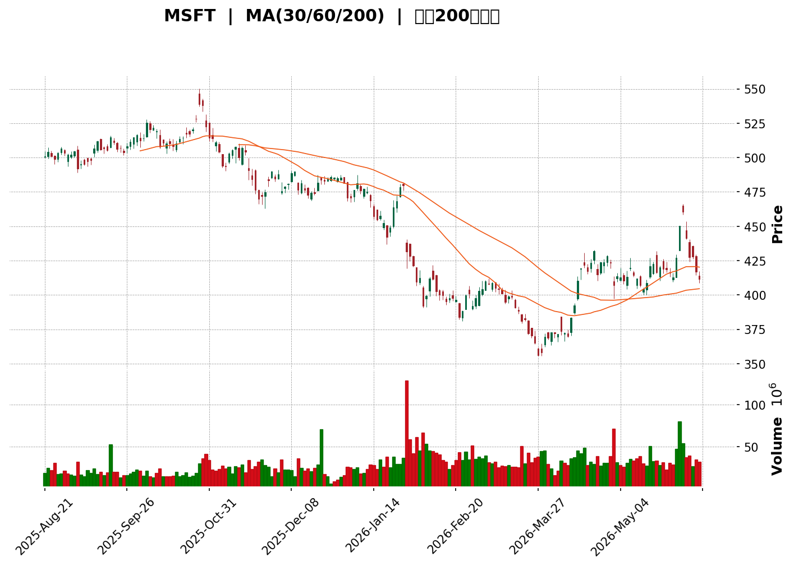
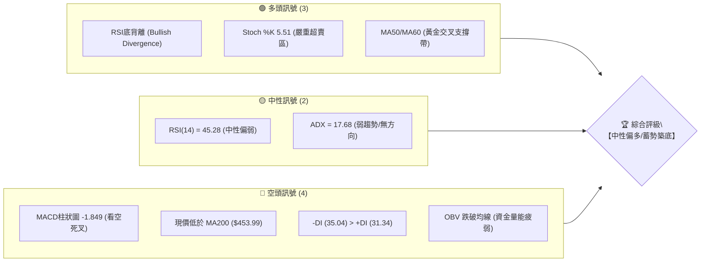
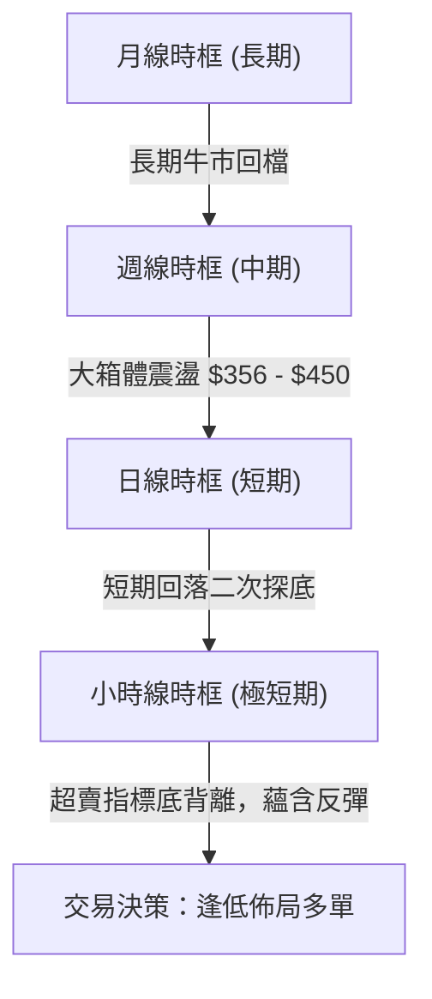
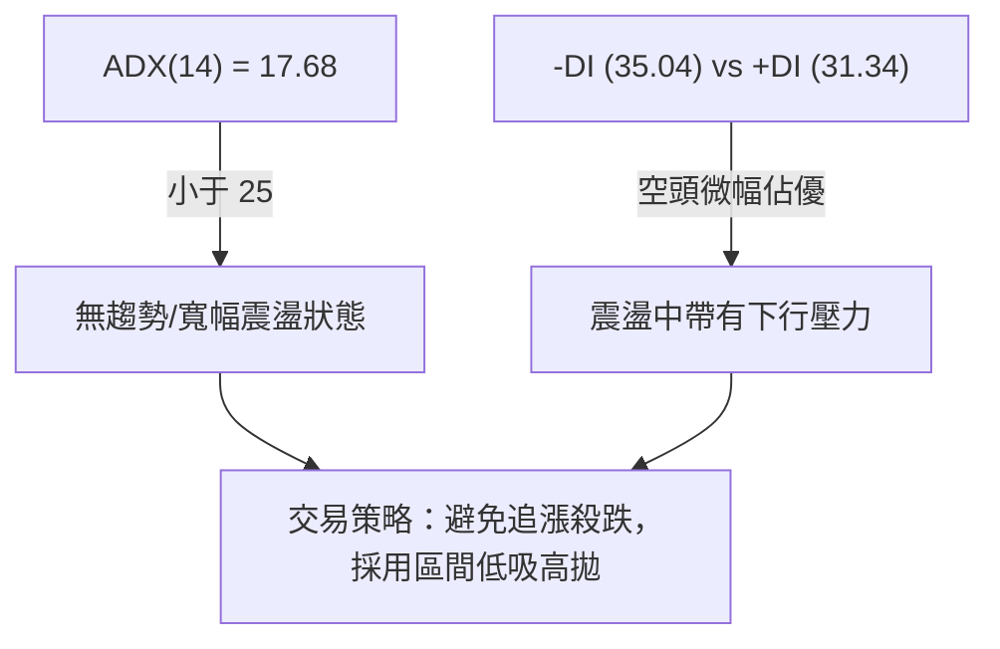
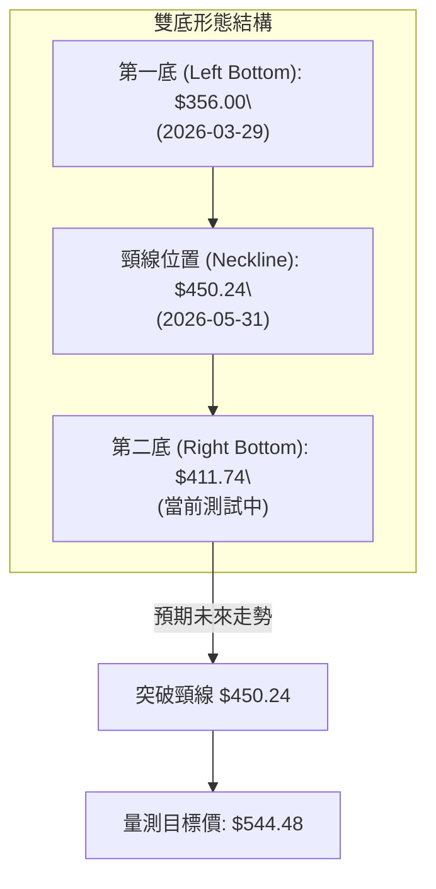

<details>
<summary>📊 靜態圖表 (點擊展開)</summary>

</details>

<html>
<head><meta charset="utf-8" /></head>
<body>
    <div style="height:500px; width:100%;">                        <script>window.PlotlyConfig = {MathJaxConfig: 'local'};</script>
        <script charset="utf-8" src="https://cdn.plot.ly/plotly-3.6.0.min.js" integrity="sha256-QaOVwtVY0T02VaHrr6pnoHLCwayMJp4O5n4YyaE3rJk=" crossorigin="anonymous"></script>                <div id="candlestick-chart" class="plotly-graph-div" style="height:100%; width:100%;"></div>            <script>                window.PLOTLYENV=window.PLOTLYENV || {};                                if (document.getElementById("candlestick-chart")) {                    Plotly.newPlot(                        "candlestick-chart",                        [{"close":{"dtype":"f8","bdata":"AAAAwBBRf0AAAAAAm4B\u002fQAAAAGBiUX9AAAAAgBYuf0AAAACA0Hh\u002fQAAAAEDspn9AAAAAAAV4f0AAAACgDl9\u002fQAAAAOC2Yn9AAAAA4F6Mf0AAAAAgKL5+QAAAAMAI8X5AAAAAgF\u002f0fkAAAAAgiRN\u002fQAAAACC2HX9AAAAAYA6rf0AAAADg7gCAQAAAAABinX9AAAAAwPasf0AAAACgAJR\u002fQAAAACBdFYBAAAAAAGbzf0AAAACAZ6B\u002fQAAAAOAHr39AAAAA4Gx9f0AAAADA28N\u002fQAAAAEDI9X9AAAAA4IUVgEAAAACggyOAQAAAACD0A4BAAAAAoMAQgEAAAADA8mmAQAAAAIB1RYBAAAAAAGBMgEAAAAAg5jiAQAAAAMDou39AAAAA4Antf0AAAADgZ+V\u002fQAAAAEAu439AAAAAYD7Gf0AAAADgkOV\u002fQAAAAABNDIBAAAAAoDcTgEAAAACgHCqAQAAAAIBFKoBAAAAAgIRCgEAAAABgZoGAQAAAAKBE1YBAAAAAYCLRgEAAAAAAnFOAQAAAAOBoFIBAAAAAgDUOgEAAAACgffF\u002fQAAAAOB9f39AAAAAgIvffkAAAADgF9t+QAAAAIAMbX9AAAAAoKiXf0AAAACAxb5\u002fQAAAACD2QX9AAAAAIIKvf0AAAAAgvYR\u002fQAAAACDrqn5AAAAAwN5AfkAAAAAg8cR9QAAAAOBtYH1AAAAAYGB+fUAAAADgAK59QAAAAGCPNX5AAAAAQEKdfkAAAADgT0l+QAAAAMA9fX5AAAAAoMq5fUAAAACgVOt9QAAAAEBJEH5AAAAAIH2NfkAAAADgap1+QAAAACADx31AAAAAYDkVfkAAAADgiMZ9QAAAACBwi31AAAAAYHKkfUAAAABAJaB9QAAAACBZHX5AAAAAIEA8fkAAAABgUix+QAAAAKAQS35AAAAAgLNdfkAAAACAw1h+QAAAAAAMT35AAAAAoBlVfkAAAAAgnRd+QAAAAMB9bX1AAAAAwA5sfUAAAABgN8Z9QAAAAGA5FX5AAAAAINi\u002ffUAAAABAe9J9QAAAAMAHsX1AAAAAIFVJfUAAAABgfpV8QAAAAKAqanxAAAAAoCOdfEAAAADgE0h8QAAAAIBBontAAAAA4DwSfEAAAACgJf58QAAAAKAeQ31AAAAAgDDnfUAAAAAg6vd9QAAAAMA\u002f+XpAAAAA4B3GekAAAABA41d6QAAAAKAwlnlAAAAAwKjFeUAAAABgy354QAAAAODI9XhAAAAAwEK8eUAAAAAAAbd5QAAAACA8KXlAAAAAQO8AeUAAAADgpvh4QAAAAKCbsXhAAAAA4EDdeEAAAADglNl4QAAAAMDxxXhAAAAAoDn6d0AAAACAjEJ4QAAAAGC\u002f+3hAAAAAAKENeUAAAABgQn54QAAAAKAE23hAAAAAgOkweUAAAABAMEV5QAAAAMCtnHlAAAAA4DeBeUAAAAAgZ4h5QAAAACAhTnlAAAAAYBRAeUAAAAAg3Q95QAAAAEAfq3hAAAAAwF7xeEAAAACgv+h4QAAAAKAXb3hAAAAAIN5CeEAAAAAgt9B3QAAAAKDB4ndAAAAAYPM+d0AAAABgzyN3QAAAAIDd0nZAAAAAoPs\u002fdkAAAACA8mJ2QAAAAIDrFXdAAAAAwCUJd0AAAAAgckp3QAAAAKAvQXdAAAAAQMQ3d0AAAAAAVlh3QAAAAEA4RHdAAAAAgBghd0AAAAAAofh3QAAAAKAqhHhAAAAA4EyleUAAAADAoDV6QAAAAEAFXnpAAAAA4KkSekAAAACg5HN6QAAAAADA\u002f3pAAAAAoJ\u002fteUAAAACgPHt6QAAAACBufnpAAAAAICjFekAAAACgrnh6QAAAACBhbnlAAAAAgLXYeUAAAAAAnst5QAAAAODap3lAAAAAoAvReUAAAAAgxT16QAAAAMCQ43lAAAAAYEq8eUAAAAAgOG55QAAAACBZRXlAAAAA4LiIeUAAAABgIVB6QAAAAKD+aXpAAAAAQEkIekAAAABgZkJ6QAAAAKBwMXpAAAAAwB4pekAAAADgegB6QAAAAGC4ynlAAAAAANevekAAAAAA1yN8QAAAAOBRyHxAAAAAwPWUe0AAAACgcLV6QAAAAMDMwHpAAAAAYLgKekAAAAAA17t5QA=="},"high":{"dtype":"f8","bdata":"r6bO3PaGf0BNoFrHQLh\u002fQL88slHej39AtJC\u002f9tRcf0DZh2cyj4F\u002fQBdxgv\u002f5vX9AEryyXEmmf0Cnir9wDG1\u002fQH\u002f7NjqCiX9AWF83fDuPf0CHZizO98t\u002fQO9npmq7IH9A8sp9I20xf0CFToMGAkF\u002fQPBf89ENQH9AEo6DcDDVf0ALfBm1zgGAQF5l04DMD4BAxkoJAyjBf0BmBVcIdd1\u002fQI1NpzdBIIBAPrujeNoTgECoEC71n\u002fV\u002fQLLRMnAT1H9AHKG8Ls6sf0CqlArySet\u002fQCcd\u002fx\u002fHDIBArTg6KzEXgEDsymOw3ymAQLTAetiJMoBAjI9B57YpgEBFIxYrgX2AQBVgnty5c4BADozLzhFdgECKQOnfPUiAQG8RpYdHQoBA3qw1xUcJgEAUM5wFTACAQEDGtyl7D4BAKAxrJscMgEAXZAAT4wGAQB8NtiF8G4BAY4Nk2WcbgEAUXutMZU+AQKAPkY44RYBAT2zOkllQgEDpc3vPuZmAQPL76ZfhMYFAZ3DxKaj2gEDnqQ1L05yAQCTQDgbpb4BAc79S6j9NgECH+6+WcQKAQJjpkIhw+X9AGUukb0dof0D7bFiiywN\u002fQC86vTaQen9AGGy8SEmmf0AJUX62Msd\u002fQDKk3A5L5H9AQIxN5RXGf0CNqUpGWs5\u002fQOM0b3oIPX9AK1ujeS3BfkB23gCwG7Z+QHeYQkO\u002fzH1A4ZBhFpKsfUDmpD4GadB9QPTmgxhSYn5AEWq3fSKnfkBePWO3Ant+QKEO6jD+tH5AQq+iR30hfkBRRnYI+vJ9QK5+TeQbFH5Ao8tzweChfkAzdxSvAp9+QFMiewumIX5A+BzDogA+fkBB7jsQ+gR+QKqrgFtr6X1A\u002f6OnIle8fUCbyjJK8919QFmtGJHedn5ANIOZU\u002f5afkBsM8XvAml+QMsHNtSsWn5Ahn0oTNxvfkCmLvNtS19+QIx830z1Yn5ACwqIzCR4fkA0rgALnV9+QFDEwQouKH5A4Al8ZlmffUCCKNgy4cl9QBiuJF12eH5AlmxlX1IIfkC094xRFdt9QCqtp0+47X1AnXs11LqafUAHKzP1\u002fCF9QA5APmsR43xANMU45y7SfEAixHtYZWx8QARFB3DtKnxAbZTtIFEtfEAzHvZ5LlB9QLHCsqdbgn1AM1YYyqoLfkACospOhhl+QLXT8U+ciHtAOPmPjmpae0DyHNrpSM16QK9IyWXcQnpAiRYQYAUfekB6JkkS1md5QEqRPHIjAHlAlfLhMs\u002fQeUD8fAFV01x6QEQR+DHR6XlAl+ORsmJGeUBPd6Rd3zt5QD3uB4no63hAXH8XP2cMeUC5VP4m5Th5QLeiy4oV9HhAcRXVmBaoeEDWPzfQS0h4QOueaiyjCXlAQk8xzL9peUCXvPsBZr94QHOwKMEqBXlAZqeK+iJdeUAsIvlDRKJ5QEZ0cMSGq3lA9PlCS4TCeUDdyw\u002fLLJV5QDheNhIElXlAjD2dUASCeUDzhgpq4FN5QKCK6l3NPnlAUZj\u002f+jn8eECZMZJzajh5QFoP9cY80nhAOOJBiER6eEAsMJ82niJ4QOSVhXv4JXhA9SHVXUvad0BtmM7164N3QAdhKQuQXndAXw7vt6qadkBbwmM4IMl2QMAfUFWBQXdA0bFLWuhSd0DX7QfoUU13QOFktbnBTndAsLhmNVI6d0D2bCXsrwJ4QNJFkLEVS3dAI2toRkBtd0CRXrneV\u002ft3QOffb2NknXhAW0mBXZfXeUBjIvKKkT56QLYwdTBb6npATubpL6RmekBc5jXEG6R6QIC9W\u002fgzDHtA9TRJ+uhrekDD3x10gYB6QDp1fZr9onpANu2ckdrPekAf7K5bXJ56QKDCpNhj2HlAxWBPHVYDekDoKAf+7T16QFyUtXIR\u002fnlAmiO+ZEAYekBgvt6M4bB6QKT\u002fsK2aG3pAzlQE\u002fMS8eUAXpBrSoel5QLzhNAPpVnlAapGC6jKveUCBjC0M6rN6QDXBgEM4g3pAZIuo3Dz8ekCayyALAVN6QAAAAKBwpXpAAAAAYGaGekAAAADgUTx6QAAAAEAK\u002f3lAAAAAANfXekAAAACgRyV8QAAAAMAeJX1AAAAAAABYfEAAAACAPYZ7QAAAAGBmQntAAAAAIIXXekAAAAAAjxJ6QA=="},"hovertemplate":"\u003cb\u003e%{x|%Y-%m-%d}\u003c\u002fb\u003e\u003cbr\u003e\u958b: $%{open:.2f}\u003cbr\u003e\u9ad8: $%{high:.2f}\u003cbr\u003e\u4f4e: $%{low:.2f}\u003cbr\u003e\u6536: $%{close:.2f}\u003cextra\u003e\u003c\u002fextra\u003e","low":{"dtype":"f8","bdata":"8R2gDuY4f0Ab7G1\u002f+DN\u002fQKZ693soT39AkTqsnvb1fkD7knExEAx\u002fQCa1IXgZZX9Acb0FdgpVf0CsN50W79p+QEe8OBuKMn9AbfOMX7w\u002ff0ClQIZrV5R+QODVSReivn5AJnNNrRXpfkC8eJ7WgNl+QCinK0\u002fy635Ai6tFlN1Kf0AJVh7A8nx\u002fQDlwnRdjln9Ayy85ju9rf0C93VEdcYd\u002fQAaK4CyTsX9AlPFnvAfVf0CcEjKe4IF\u002fQOs78iKte39ACj0PLMldf0BGt9nj53Z\u002fQPJkvbLWmn9A3cZGkj2nf0AQ5B79g8d\u002fQMEMye90t39A2+riUyT8f0CXKRmogheAQLUrxlxEMYBAHS0QT2I+gEBbv7ORJhGAQEgqtGjDpn9ApaCid1vHf0DOFQFEDG1\u002fQP44wmqlrH9A\u002fLazFOqOf0BH+VCA4IF\u002fQNMoAR0u439ABhCU1\u002frcf0BxI7FZnROAQK9+HALFGoBAvsaWwHYrgECasNI5cm2AQMPDbAHvyoBA6dTuH9GqgEBSTn8qrDaAQMyDv1u7\u002fX9AAmX8pZ\u002f1f0D8ANrLTYp\u002fQOELnBNFdn9A43Hn4AjLfkAD0MwmVaJ+QD9qetmS+n5AWc88LAQzf0BJAB9Zqf9+QIluRq4pIn9ACnNzh\u002fPkfkBwgYABuFt\u002fQAJXntN2O35AuGT4dan8fUD0gikVRZZ9QAOiXioaI31AXTIj2B4ffUApdTccQ+18QDy3WLYQ8X1APXoT9uBHfkBOmDo0BSh+QByx2VOfQn5AWTzCsX2RfUAW6OD+CaZ9QBXSZxkczH1AGPZrVLgjfkBG2CLsWGV+QIrbYjKUj31A6YRl8gCcfUARahxlpqN9QB6vjwTNZn1A9nJ3b61MfUApQ8IWTo59QAy+5hdXvH1AedPvCZ0FfkBS7A6\u002fzAh+QPdqKVF0KX5APHgULuMqfkAbxIFH4zx+QHro2qaIIH5AwnPZdI81fkBDZ6wvhBJ+QOqO91s1QX1AL7Pl9bE2fUBpQWN0rTp9QDB6BL5LvX1AE2YJ\u002fACcfUDHcTIytGF9QKpfXv0imX1AT53LtiX+fEDSX+VhSnJ8QEnwK20PXnxAgsUFoUxnfEDgkUIInPR7QEqvs9vCS3tAYKkHk6ere0BVhctGhQh8QILzOR06v3xA0SRi\u002fv5wfUCTkrKLF759QJHcQkJ0MnpA0lrW+\u002fKIekAAJrYWDEZ6QG8umF\u002f6a3lArnrTY892eUBqLRVESml4QM2oDAbZcnhAlOODzHvxeEDT4MK57K15QPameKS283hARcBbLe3DeEDKMv1BkMR4QDBO3E9+jHhAXsCckAGpeEBYmmL4AL14QI++\u002flLlpHhAgQe4QFrkd0CFPlIoKc53QMz1I4sRVXhA1Eo6QQ3eeEAhTjcxmVB4QMqFYnySXHhALS+HTSR9eEDkMdgJHvd4QJZIz3dqOHlAU0y\u002fuwh6eUC9WEsRDCp5QLuuSm3yIHlAed3Kn40LeUBb3OkTeA15QJqz\u002fgFelnhAcemdDf2eeEDuGvDxPs54QCPyT756YnhA2Eu\u002fWZMjeEDOvMSdxrR3QG4kVo+uzXdAbTDi4L0wd0BcUkd7TA13QMy2mIdpxnZAejQqDdU7dkBuQmD5KDh2QK0sDLqQpHZAnPhh23f2dkBuMFfKzrV2QFoazAs5C3dAopNL2UjcdkAzvB6Ztyl3QOb\u002fYoob5HZAFVSPT68Td0A8NR2NfSN3QDBT81X0GnhAAU4eJfa9eEC7wVoh\u002fbN5QG3y9TZ+PHpArRkxi2f2eUDx3HocxgR6QLEec+IRbHpAB61Va1WoeUB1ztzza+55QIKj67qyAnpAk7GckM9PekCT9RlKGzZ6QGSQY7xl0nhAvRTD6NiYeUDHgLA2mJ55QLc6wPapfnlAnqTLV8BDeUBc\u002f\u002fMKrh16QIPcGyqv0XlAVr\u002f2YfpJeUBC5MTALVx5QK2+i+CcAnlAaq\u002fEzzcAeUBniZYiSMB5QNi2rHJj63lAsV2bG3D5eUC4Ny3Gk6Z5QAAAACBc+3lAAAAAoEcFekAAAADgUdB5QAAAAKBHmXlAAAAAYLjKeUAAAACAwgV7QAAAAOBRpHxAAAAAQOGGe0AAAAAAAIR6QAAAAGCPpnpAAAAAYGbmeUAAAADA9Yh5QA=="},"name":"\u50f9\u683c","open":{"dtype":"f8","bdata":"dMRyLVJIf0A9gDexOVF\u002fQDNrO8gQd39Ag6FVUvlSf0CAq2ivcy1\u002fQFu6rRthfn9AmrzVV1eXf0BJ+tUdIBV\u002fQOC9jlbpSX9AmPqpGgVSf0BSL14v3J1\u002fQEkEGVKa735AC6DMhmMkf0Duukh4CD1\u002fQDe6MiltMX9ATmH3JmJ3f0Ahnbp7aJl\u002fQMnulUMEDYBAtpyC6IC2f0DiwPoCVsR\u002fQOYXHLuMtX9Ac6J+DsMCgEBlqKhSEOl\u002fQBDCIhKwsn9AWA9FA56Rf0DENMR2ma1\u002fQGzGF6l+xH9A04y56Sjgf0BFW+9R9vh\u002fQEUsteIOE4BAs2nl2MMOgEDcS2H\u002fxBqAQA8X99K4Z4BAM1Qj\u002fOQ\u002fgED24PYFbDiAQDk33S\u002f1IoBA3qw1xUcJgEA9IE9ZTbB\u002fQCUfO8+B+39AjYSsnqrVf0AC\u002fNgHYp1\u002fQCwmEvLw9X9Ao9vVD\u002fIRgECs\u002fhgj9i6AQKYY00JgOYBAUsuosf87gEAr0ReGd4OAQHdsSQpPFIFA+SZsbhXsgEAgoBuqIXmAQPMP35FpbIBAgeJCC08kgECrMo8foch\u002fQDSTbvkc4X9A95Spl6Rnf0A1CBYGKd1+QNlyegJKDn9A8u2NJPhZf0CoL5BieKJ\u002fQOx2IAqTsX9ADDMrCoPxfkAYZMCgAJR\u002fQAGeigUKxH5AuQ\u002fEDkBwfkANghuuaKh+QEVv3oMOxn1AXPcnN06OfUBo79ymfX99QNmSYGp2Qn5AbxWV9QJXfkAa18ZAZGR+QP55U3D+SH5A8hD+2lSjfUB4e8icINp9QADGYV8XBn5AxeVzEdgrfkBL9cGm525+QDdGQeokHn5ARRai9kSofUCHyt9SFdt9QPiwzB2L331AP80bmxVdfUCg2VHHuqx9QCxFSGUewX1Aw\u002fSrGTBTfkAWMW21bz9+QEH0VhVHLX5Aj0V3Xm04fkAPcNyo1Uh+QF7Voo1dK35AYJLc5Wg8fkCq7b+d1Vp+QE5s6RHhI35AJ+zZ5lR\u002ffUBf1GioMHt9QJZHeZ8g2n1A4WznyLPxfUAKdkzrVH99QElP2SLoqH1ABuUFLjWJfUBdBEduRQZ9QLTMnUf\u002f4HxAoFQtnc18fEAUY1sNgxN8QCt0anJ+KXxAq11GzCrae0B1xTmR3R18QCwnPsHz83xAPgf3D5l5fUCxNLoOFRF+QEVyt+SgYHtALmqQHZFTe0DAc0n+UcV6QBcEpF85QnpAbXnRbdiSeUA+9UswI1p5QJ\u002f2W4Zn1nhAvjbapeEweUA6HYBPJxx6QNjJrGdb5XlAKDtZPUUzeUBOwuyIgip5QHJSiWQz13hAsW39cdbFeECmeW1CL\u002f14QEcMLAoQtHhAk\u002f6jSFeieEAiXIAF9fR3QBZEqMT5WnhAcFYoiF09eUCKgwtXkGB4QGD6xL4sgHhAooxnRKWEeECFJkuqcQZ5QDbycEq8OHlAkM0Q4AyFeUAe0z\u002fft0B5QHjAfTNNknlAjlpShBhLeUCcc6GaFjx5QJPTVkEiAnlAoxx55FrTeEAE6xSDevZ4QDXciPpYxHhAMwx1UBxUeEC0o37yQx94QABAeggg8XdAOZQmt4nYd0C6LAjTr4F3QADzJDFMIHdAgZRituKRdkBHYmS54pF2QMnqHKAxvHZAL7thx+xKd0D6JMRzqeZ2QHtPpbnsSndAd0UZQ6IYd0DQvXE5XgJ4QKrAu4seO3dAjM9hcshCd0D9WMs\u002f10x3QLVaR3FOMXhA\u002fusTxzzSeEAsy4bKPS96QHj7rydufnpA4DMuPNZDekDdYGTzTjV6QN+Yn3NNlHpAx43debgvekDaFWL4GQF6QNckfnl5V3pAj0DRTXB6ekDEiBAQmXp6QNdJhy3BnnlA4+uVhIa+eUClSKjJaKp5QL5jSz\u002fC5nlAbh95QuRxeUCrE66XOzN6QLoHu6fOB3pA3c0X59BveUCCT5\u002f5WNl5QCTv8ApCJXlAiEuGkbE5eUD705KY\u002ftV5QPOW1YGD+3lAr1YGxojPekCsrhz+ZdR5QAAAAAAAjHpAAAAA4KM4ekAAAABA4QZ6QAAAAAApsHlAAAAAIK7PeUAAAADAzAh7QAAAAKBwDX1AAAAAgBTue0AAAABAM2d7QAAAAMD1PHtAAAAAoHDFekAAAABgj+J5QA=="},"x":["2025-08-21T00:00:00-04:00","2025-08-22T00:00:00-04:00","2025-08-25T00:00:00-04:00","2025-08-26T00:00:00-04:00","2025-08-27T00:00:00-04:00","2025-08-28T00:00:00-04:00","2025-08-29T00:00:00-04:00","2025-09-02T00:00:00-04:00","2025-09-03T00:00:00-04:00","2025-09-04T00:00:00-04:00","2025-09-05T00:00:00-04:00","2025-09-08T00:00:00-04:00","2025-09-09T00:00:00-04:00","2025-09-10T00:00:00-04:00","2025-09-11T00:00:00-04:00","2025-09-12T00:00:00-04:00","2025-09-15T00:00:00-04:00","2025-09-16T00:00:00-04:00","2025-09-17T00:00:00-04:00","2025-09-18T00:00:00-04:00","2025-09-19T00:00:00-04:00","2025-09-22T00:00:00-04:00","2025-09-23T00:00:00-04:00","2025-09-24T00:00:00-04:00","2025-09-25T00:00:00-04:00","2025-09-26T00:00:00-04:00","2025-09-29T00:00:00-04:00","2025-09-30T00:00:00-04:00","2025-10-01T00:00:00-04:00","2025-10-02T00:00:00-04:00","2025-10-03T00:00:00-04:00","2025-10-06T00:00:00-04:00","2025-10-07T00:00:00-04:00","2025-10-08T00:00:00-04:00","2025-10-09T00:00:00-04:00","2025-10-10T00:00:00-04:00","2025-10-13T00:00:00-04:00","2025-10-14T00:00:00-04:00","2025-10-15T00:00:00-04:00","2025-10-16T00:00:00-04:00","2025-10-17T00:00:00-04:00","2025-10-20T00:00:00-04:00","2025-10-21T00:00:00-04:00","2025-10-22T00:00:00-04:00","2025-10-23T00:00:00-04:00","2025-10-24T00:00:00-04:00","2025-10-27T00:00:00-04:00","2025-10-28T00:00:00-04:00","2025-10-29T00:00:00-04:00","2025-10-30T00:00:00-04:00","2025-10-31T00:00:00-04:00","2025-11-03T00:00:00-05:00","2025-11-04T00:00:00-05:00","2025-11-05T00:00:00-05:00","2025-11-06T00:00:00-05:00","2025-11-07T00:00:00-05:00","2025-11-10T00:00:00-05:00","2025-11-11T00:00:00-05:00","2025-11-12T00:00:00-05:00","2025-11-13T00:00:00-05:00","2025-11-14T00:00:00-05:00","2025-11-17T00:00:00-05:00","2025-11-18T00:00:00-05:00","2025-11-19T00:00:00-05:00","2025-11-20T00:00:00-05:00","2025-11-21T00:00:00-05:00","2025-11-24T00:00:00-05:00","2025-11-25T00:00:00-05:00","2025-11-26T00:00:00-05:00","2025-11-28T00:00:00-05:00","2025-12-01T00:00:00-05:00","2025-12-02T00:00:00-05:00","2025-12-03T00:00:00-05:00","2025-12-04T00:00:00-05:00","2025-12-05T00:00:00-05:00","2025-12-08T00:00:00-05:00","2025-12-09T00:00:00-05:00","2025-12-10T00:00:00-05:00","2025-12-11T00:00:00-05:00","2025-12-12T00:00:00-05:00","2025-12-15T00:00:00-05:00","2025-12-16T00:00:00-05:00","2025-12-17T00:00:00-05:00","2025-12-18T00:00:00-05:00","2025-12-19T00:00:00-05:00","2025-12-22T00:00:00-05:00","2025-12-23T00:00:00-05:00","2025-12-24T00:00:00-05:00","2025-12-26T00:00:00-05:00","2025-12-29T00:00:00-05:00","2025-12-30T00:00:00-05:00","2025-12-31T00:00:00-05:00","2026-01-02T00:00:00-05:00","2026-01-05T00:00:00-05:00","2026-01-06T00:00:00-05:00","2026-01-07T00:00:00-05:00","2026-01-08T00:00:00-05:00","2026-01-09T00:00:00-05:00","2026-01-12T00:00:00-05:00","2026-01-13T00:00:00-05:00","2026-01-14T00:00:00-05:00","2026-01-15T00:00:00-05:00","2026-01-16T00:00:00-05:00","2026-01-20T00:00:00-05:00","2026-01-21T00:00:00-05:00","2026-01-22T00:00:00-05:00","2026-01-23T00:00:00-05:00","2026-01-26T00:00:00-05:00","2026-01-27T00:00:00-05:00","2026-01-28T00:00:00-05:00","2026-01-29T00:00:00-05:00","2026-01-30T00:00:00-05:00","2026-02-02T00:00:00-05:00","2026-02-03T00:00:00-05:00","2026-02-04T00:00:00-05:00","2026-02-05T00:00:00-05:00","2026-02-06T00:00:00-05:00","2026-02-09T00:00:00-05:00","2026-02-10T00:00:00-05:00","2026-02-11T00:00:00-05:00","2026-02-12T00:00:00-05:00","2026-02-13T00:00:00-05:00","2026-02-17T00:00:00-05:00","2026-02-18T00:00:00-05:00","2026-02-19T00:00:00-05:00","2026-02-20T00:00:00-05:00","2026-02-23T00:00:00-05:00","2026-02-24T00:00:00-05:00","2026-02-25T00:00:00-05:00","2026-02-26T00:00:00-05:00","2026-02-27T00:00:00-05:00","2026-03-02T00:00:00-05:00","2026-03-03T00:00:00-05:00","2026-03-04T00:00:00-05:00","2026-03-05T00:00:00-05:00","2026-03-06T00:00:00-05:00","2026-03-09T00:00:00-04:00","2026-03-10T00:00:00-04:00","2026-03-11T00:00:00-04:00","2026-03-12T00:00:00-04:00","2026-03-13T00:00:00-04:00","2026-03-16T00:00:00-04:00","2026-03-17T00:00:00-04:00","2026-03-18T00:00:00-04:00","2026-03-19T00:00:00-04:00","2026-03-20T00:00:00-04:00","2026-03-23T00:00:00-04:00","2026-03-24T00:00:00-04:00","2026-03-25T00:00:00-04:00","2026-03-26T00:00:00-04:00","2026-03-27T00:00:00-04:00","2026-03-30T00:00:00-04:00","2026-03-31T00:00:00-04:00","2026-04-01T00:00:00-04:00","2026-04-02T00:00:00-04:00","2026-04-06T00:00:00-04:00","2026-04-07T00:00:00-04:00","2026-04-08T00:00:00-04:00","2026-04-09T00:00:00-04:00","2026-04-10T00:00:00-04:00","2026-04-13T00:00:00-04:00","2026-04-14T00:00:00-04:00","2026-04-15T00:00:00-04:00","2026-04-16T00:00:00-04:00","2026-04-17T00:00:00-04:00","2026-04-20T00:00:00-04:00","2026-04-21T00:00:00-04:00","2026-04-22T00:00:00-04:00","2026-04-23T00:00:00-04:00","2026-04-24T00:00:00-04:00","2026-04-27T00:00:00-04:00","2026-04-28T00:00:00-04:00","2026-04-29T00:00:00-04:00","2026-04-30T00:00:00-04:00","2026-05-01T00:00:00-04:00","2026-05-04T00:00:00-04:00","2026-05-05T00:00:00-04:00","2026-05-06T00:00:00-04:00","2026-05-07T00:00:00-04:00","2026-05-08T00:00:00-04:00","2026-05-11T00:00:00-04:00","2026-05-12T00:00:00-04:00","2026-05-13T00:00:00-04:00","2026-05-14T00:00:00-04:00","2026-05-15T00:00:00-04:00","2026-05-18T00:00:00-04:00","2026-05-19T00:00:00-04:00","2026-05-20T00:00:00-04:00","2026-05-21T00:00:00-04:00","2026-05-22T00:00:00-04:00","2026-05-26T00:00:00-04:00","2026-05-27T00:00:00-04:00","2026-05-28T00:00:00-04:00","2026-05-29T00:00:00-04:00","2026-06-01T00:00:00-04:00","2026-06-02T00:00:00-04:00","2026-06-03T00:00:00-04:00","2026-06-04T00:00:00-04:00","2026-06-05T00:00:00-04:00","2026-06-08T00:00:00-04:00"],"type":"candlestick"},{"hovertemplate":"MA30: $%{y:.2f}\u003cextra\u003e\u003c\u002fextra\u003e","line":{"color":"#2196F3","dash":"dash","width":2},"mode":"lines","name":"MA30","x":["2025-08-21T00:00:00-04:00","2025-08-22T00:00:00-04:00","2025-08-25T00:00:00-04:00","2025-08-26T00:00:00-04:00","2025-08-27T00:00:00-04:00","2025-08-28T00:00:00-04:00","2025-08-29T00:00:00-04:00","2025-09-02T00:00:00-04:00","2025-09-03T00:00:00-04:00","2025-09-04T00:00:00-04:00","2025-09-05T00:00:00-04:00","2025-09-08T00:00:00-04:00","2025-09-09T00:00:00-04:00","2025-09-10T00:00:00-04:00","2025-09-11T00:00:00-04:00","2025-09-12T00:00:00-04:00","2025-09-15T00:00:00-04:00","2025-09-16T00:00:00-04:00","2025-09-17T00:00:00-04:00","2025-09-18T00:00:00-04:00","2025-09-19T00:00:00-04:00","2025-09-22T00:00:00-04:00","2025-09-23T00:00:00-04:00","2025-09-24T00:00:00-04:00","2025-09-25T00:00:00-04:00","2025-09-26T00:00:00-04:00","2025-09-29T00:00:00-04:00","2025-09-30T00:00:00-04:00","2025-10-01T00:00:00-04:00","2025-10-02T00:00:00-04:00","2025-10-03T00:00:00-04:00","2025-10-06T00:00:00-04:00","2025-10-07T00:00:00-04:00","2025-10-08T00:00:00-04:00","2025-10-09T00:00:00-04:00","2025-10-10T00:00:00-04:00","2025-10-13T00:00:00-04:00","2025-10-14T00:00:00-04:00","2025-10-15T00:00:00-04:00","2025-10-16T00:00:00-04:00","2025-10-17T00:00:00-04:00","2025-10-20T00:00:00-04:00","2025-10-21T00:00:00-04:00","2025-10-22T00:00:00-04:00","2025-10-23T00:00:00-04:00","2025-10-24T00:00:00-04:00","2025-10-27T00:00:00-04:00","2025-10-28T00:00:00-04:00","2025-10-29T00:00:00-04:00","2025-10-30T00:00:00-04:00","2025-10-31T00:00:00-04:00","2025-11-03T00:00:00-05:00","2025-11-04T00:00:00-05:00","2025-11-05T00:00:00-05:00","2025-11-06T00:00:00-05:00","2025-11-07T00:00:00-05:00","2025-11-10T00:00:00-05:00","2025-11-11T00:00:00-05:00","2025-11-12T00:00:00-05:00","2025-11-13T00:00:00-05:00","2025-11-14T00:00:00-05:00","2025-11-17T00:00:00-05:00","2025-11-18T00:00:00-05:00","2025-11-19T00:00:00-05:00","2025-11-20T00:00:00-05:00","2025-11-21T00:00:00-05:00","2025-11-24T00:00:00-05:00","2025-11-25T00:00:00-05:00","2025-11-26T00:00:00-05:00","2025-11-28T00:00:00-05:00","2025-12-01T00:00:00-05:00","2025-12-02T00:00:00-05:00","2025-12-03T00:00:00-05:00","2025-12-04T00:00:00-05:00","2025-12-05T00:00:00-05:00","2025-12-08T00:00:00-05:00","2025-12-09T00:00:00-05:00","2025-12-10T00:00:00-05:00","2025-12-11T00:00:00-05:00","2025-12-12T00:00:00-05:00","2025-12-15T00:00:00-05:00","2025-12-16T00:00:00-05:00","2025-12-17T00:00:00-05:00","2025-12-18T00:00:00-05:00","2025-12-19T00:00:00-05:00","2025-12-22T00:00:00-05:00","2025-12-23T00:00:00-05:00","2025-12-24T00:00:00-05:00","2025-12-26T00:00:00-05:00","2025-12-29T00:00:00-05:00","2025-12-30T00:00:00-05:00","2025-12-31T00:00:00-05:00","2026-01-02T00:00:00-05:00","2026-01-05T00:00:00-05:00","2026-01-06T00:00:00-05:00","2026-01-07T00:00:00-05:00","2026-01-08T00:00:00-05:00","2026-01-09T00:00:00-05:00","2026-01-12T00:00:00-05:00","2026-01-13T00:00:00-05:00","2026-01-14T00:00:00-05:00","2026-01-15T00:00:00-05:00","2026-01-16T00:00:00-05:00","2026-01-20T00:00:00-05:00","2026-01-21T00:00:00-05:00","2026-01-22T00:00:00-05:00","2026-01-23T00:00:00-05:00","2026-01-26T00:00:00-05:00","2026-01-27T00:00:00-05:00","2026-01-28T00:00:00-05:00","2026-01-29T00:00:00-05:00","2026-01-30T00:00:00-05:00","2026-02-02T00:00:00-05:00","2026-02-03T00:00:00-05:00","2026-02-04T00:00:00-05:00","2026-02-05T00:00:00-05:00","2026-02-06T00:00:00-05:00","2026-02-09T00:00:00-05:00","2026-02-10T00:00:00-05:00","2026-02-11T00:00:00-05:00","2026-02-12T00:00:00-05:00","2026-02-13T00:00:00-05:00","2026-02-17T00:00:00-05:00","2026-02-18T00:00:00-05:00","2026-02-19T00:00:00-05:00","2026-02-20T00:00:00-05:00","2026-02-23T00:00:00-05:00","2026-02-24T00:00:00-05:00","2026-02-25T00:00:00-05:00","2026-02-26T00:00:00-05:00","2026-02-27T00:00:00-05:00","2026-03-02T00:00:00-05:00","2026-03-03T00:00:00-05:00","2026-03-04T00:00:00-05:00","2026-03-05T00:00:00-05:00","2026-03-06T00:00:00-05:00","2026-03-09T00:00:00-04:00","2026-03-10T00:00:00-04:00","2026-03-11T00:00:00-04:00","2026-03-12T00:00:00-04:00","2026-03-13T00:00:00-04:00","2026-03-16T00:00:00-04:00","2026-03-17T00:00:00-04:00","2026-03-18T00:00:00-04:00","2026-03-19T00:00:00-04:00","2026-03-20T00:00:00-04:00","2026-03-23T00:00:00-04:00","2026-03-24T00:00:00-04:00","2026-03-25T00:00:00-04:00","2026-03-26T00:00:00-04:00","2026-03-27T00:00:00-04:00","2026-03-30T00:00:00-04:00","2026-03-31T00:00:00-04:00","2026-04-01T00:00:00-04:00","2026-04-02T00:00:00-04:00","2026-04-06T00:00:00-04:00","2026-04-07T00:00:00-04:00","2026-04-08T00:00:00-04:00","2026-04-09T00:00:00-04:00","2026-04-10T00:00:00-04:00","2026-04-13T00:00:00-04:00","2026-04-14T00:00:00-04:00","2026-04-15T00:00:00-04:00","2026-04-16T00:00:00-04:00","2026-04-17T00:00:00-04:00","2026-04-20T00:00:00-04:00","2026-04-21T00:00:00-04:00","2026-04-22T00:00:00-04:00","2026-04-23T00:00:00-04:00","2026-04-24T00:00:00-04:00","2026-04-27T00:00:00-04:00","2026-04-28T00:00:00-04:00","2026-04-29T00:00:00-04:00","2026-04-30T00:00:00-04:00","2026-05-01T00:00:00-04:00","2026-05-04T00:00:00-04:00","2026-05-05T00:00:00-04:00","2026-05-06T00:00:00-04:00","2026-05-07T00:00:00-04:00","2026-05-08T00:00:00-04:00","2026-05-11T00:00:00-04:00","2026-05-12T00:00:00-04:00","2026-05-13T00:00:00-04:00","2026-05-14T00:00:00-04:00","2026-05-15T00:00:00-04:00","2026-05-18T00:00:00-04:00","2026-05-19T00:00:00-04:00","2026-05-20T00:00:00-04:00","2026-05-21T00:00:00-04:00","2026-05-22T00:00:00-04:00","2026-05-26T00:00:00-04:00","2026-05-27T00:00:00-04:00","2026-05-28T00:00:00-04:00","2026-05-29T00:00:00-04:00","2026-06-01T00:00:00-04:00","2026-06-02T00:00:00-04:00","2026-06-03T00:00:00-04:00","2026-06-04T00:00:00-04:00","2026-06-05T00:00:00-04:00","2026-06-08T00:00:00-04:00"],"y":{"dtype":"f8","bdata":"AAAAAAAA+H8AAAAAAAD4fwAAAAAAAPh\u002fAAAAAAAA+H8AAAAAAAD4fwAAAAAAAPh\u002fAAAAAAAA+H8AAAAAAAD4fwAAAAAAAPh\u002fAAAAAAAA+H8AAAAAAAD4fwAAAAAAAPh\u002fAAAAAAAA+H8AAAAAAAD4fwAAAAAAAPh\u002fAAAAAAAA+H8AAAAAAAD4fwAAAAAAAPh\u002fAAAAAAAA+H8AAAAAAAD4fwAAAAAAAPh\u002fAAAAAAAA+H8AAAAAAAD4fwAAAAAAAPh\u002fAAAAAAAA+H8AAAAAAAD4fwAAAAAAAPh\u002fAAAAAAAA+H8AAAAAAAD4fyIiIlKXjn9AERERAYqVf0CamZlJ2aB\u002fQGZmZsZMq39A3t3dfWO3f0BmZmYmsL9\u002fQLy7uztjwH9AvLu7y0nEf0DNzMw8xMh\u002fQLy7u3sMzX9AVVVVVfrOf0CJiIgo09h\u002fQFVVVVWt4n9A7+7uDuHsf0CJiIiYkfd\u002fQDMzMwP3AIBAZmZmDpkEgEBmZmZO4QiAQN7d3fWhEYBARERE3PwZgEDe3d0dkx6AQJqZmfmKHoBA3t3d\u002fTkfgEDe3d31kyCAQImIiCDJH4BAERERgScdgEB3d3dfRhmAQCIiIvr+FoBAAAAAIIoUgEAzMzPDRBKAQJqZmTH4DoBA7+7uzhENgEBVVVXNeweAQLy7u5v3\u002fn9AIiIiovjqf0B3d3eHJNR\u002fQFVVVdUGwH9AMzMzc0Wrf0De3d2dW5h\u002fQFVVVYUJin9AAAAAQCOAf0CamZlZZXJ\u002fQDMzMxOvZH9AvLu76\u002f5Pf0BERETEbjt\u002fQN7d3T0XKH9AAAAAUE4Xf0De3d0d3AJ\u002fQKuqqvqs4X5AzczMzF\u002fDfkDe3d1t0ap+QAAAAGCBlH5A3t3djXB\u002ffkB3d3dXqWt+QBEREVHbX35A7+7u3mlafkDNzMx8llR+QFVVVfXrSn5Aq6qq2nRAfkCrqqrahTR+QLy7u\u002ftsLH5Ad3d39+AgfkC8u7s7tRR+QFVVVYUgCn5AVVVVhQgDfkBVVVVlEwN+QN7d3S0aCX5AZmZm1kgLfkDe3d0dgAx+QCIiIjIVCH5A3t3dfcD8fUAiIiKCOe59QLy7u6uF3H1AMzMzowjTfUAzMzMDD8V9QFVVVQVTsH1AZmZmNiabfUAiIiKSTo19QGZmZhbpiH1AIiIiQmCHfUAiIiKiBYl9QGZmZhYVc31A3t3dzZpafUCrqqqamD59QO\u002fu7h71F31AIiIiAt\u002fxfEAzMzOTa8F8QO\u002fu7i7pk3xAzczMbGVsfEARERHx3kR8QM3MzJzxGHxAvLu7u3jre0C8u7vbxb97QERERHRgl3tAmpmZuXtwe0Dv7u5OdkZ7QO\u002fu7h4nGXtAq6qqGubnekBmZmY2b7h6QCIiIiJCkHpAd3d3hyJsekAREREhOkl6QO\u002fu7v7aKnpAvLu726UNekCrqqqa8\u002fN5QCIiIvKy4nlAERERYczMeUB3d3cHRq95QImIiNiBjXlAVVVVtc1leUCJiIho7zt5QImIiKhDKHlAAAAAsKMYeUBERETEZgx5QJqZmZmQAnlAq6qq+qv1eEARERGB3u94QImIiJiz5nhAd3d3N3XReECJiIgYfLt4QCIiIgKKp3hAvLu7awqQeEAAAADg+3l4QN7d3c1CbHhAzczMTKhceEB3d3dXWk94QAAAAPBkQnhA7+7ujuk7eEARERHxGjR4QN7d3U10JXhAq6qqWgkVeECrqqoKlRB4QImIiOivDXhAZmZmFpEReEBmZmbWlBl4QAAAALAGIHhAIiIi0t8keEBmZmZWuSx4QBEREZEtO3hAmpmZefZAeEAiIiJCE014QERERPSmXHhAvLu7uz5seEAAAACAk3l4QDMzM\u002fMVgnhAERERIZ2PeEARERGxgqB4QCIiIiKdr3hAAAAA4IzFeEAAAAAABOB4QLy7uxss+nhAd3d3d+oXeUARERFB5DF5QKuqqgqKRHlA7+7uvttZeUCrqqrapXN5QAAAALCbjnlA7+7uHqCmeUCJiIiIfr95QBEREeF32HlARERE9FXyeUBEREQEqgN6QLy7u5uMDnpAREREFG8XekCrqqpa6Cd6QCIiIoKEPHpAd3d352RJekDNzMw8lEt6QAAAABB7SXpAq6qqWnNKekCamZkZEkR6QA=="},"type":"scatter"},{"hovertemplate":"MA60: $%{y:.2f}\u003cextra\u003e\u003c\u002fextra\u003e","line":{"color":"#9C27B0","dash":"dash","width":2},"mode":"lines","name":"MA60","x":["2025-08-21T00:00:00-04:00","2025-08-22T00:00:00-04:00","2025-08-25T00:00:00-04:00","2025-08-26T00:00:00-04:00","2025-08-27T00:00:00-04:00","2025-08-28T00:00:00-04:00","2025-08-29T00:00:00-04:00","2025-09-02T00:00:00-04:00","2025-09-03T00:00:00-04:00","2025-09-04T00:00:00-04:00","2025-09-05T00:00:00-04:00","2025-09-08T00:00:00-04:00","2025-09-09T00:00:00-04:00","2025-09-10T00:00:00-04:00","2025-09-11T00:00:00-04:00","2025-09-12T00:00:00-04:00","2025-09-15T00:00:00-04:00","2025-09-16T00:00:00-04:00","2025-09-17T00:00:00-04:00","2025-09-18T00:00:00-04:00","2025-09-19T00:00:00-04:00","2025-09-22T00:00:00-04:00","2025-09-23T00:00:00-04:00","2025-09-24T00:00:00-04:00","2025-09-25T00:00:00-04:00","2025-09-26T00:00:00-04:00","2025-09-29T00:00:00-04:00","2025-09-30T00:00:00-04:00","2025-10-01T00:00:00-04:00","2025-10-02T00:00:00-04:00","2025-10-03T00:00:00-04:00","2025-10-06T00:00:00-04:00","2025-10-07T00:00:00-04:00","2025-10-08T00:00:00-04:00","2025-10-09T00:00:00-04:00","2025-10-10T00:00:00-04:00","2025-10-13T00:00:00-04:00","2025-10-14T00:00:00-04:00","2025-10-15T00:00:00-04:00","2025-10-16T00:00:00-04:00","2025-10-17T00:00:00-04:00","2025-10-20T00:00:00-04:00","2025-10-21T00:00:00-04:00","2025-10-22T00:00:00-04:00","2025-10-23T00:00:00-04:00","2025-10-24T00:00:00-04:00","2025-10-27T00:00:00-04:00","2025-10-28T00:00:00-04:00","2025-10-29T00:00:00-04:00","2025-10-30T00:00:00-04:00","2025-10-31T00:00:00-04:00","2025-11-03T00:00:00-05:00","2025-11-04T00:00:00-05:00","2025-11-05T00:00:00-05:00","2025-11-06T00:00:00-05:00","2025-11-07T00:00:00-05:00","2025-11-10T00:00:00-05:00","2025-11-11T00:00:00-05:00","2025-11-12T00:00:00-05:00","2025-11-13T00:00:00-05:00","2025-11-14T00:00:00-05:00","2025-11-17T00:00:00-05:00","2025-11-18T00:00:00-05:00","2025-11-19T00:00:00-05:00","2025-11-20T00:00:00-05:00","2025-11-21T00:00:00-05:00","2025-11-24T00:00:00-05:00","2025-11-25T00:00:00-05:00","2025-11-26T00:00:00-05:00","2025-11-28T00:00:00-05:00","2025-12-01T00:00:00-05:00","2025-12-02T00:00:00-05:00","2025-12-03T00:00:00-05:00","2025-12-04T00:00:00-05:00","2025-12-05T00:00:00-05:00","2025-12-08T00:00:00-05:00","2025-12-09T00:00:00-05:00","2025-12-10T00:00:00-05:00","2025-12-11T00:00:00-05:00","2025-12-12T00:00:00-05:00","2025-12-15T00:00:00-05:00","2025-12-16T00:00:00-05:00","2025-12-17T00:00:00-05:00","2025-12-18T00:00:00-05:00","2025-12-19T00:00:00-05:00","2025-12-22T00:00:00-05:00","2025-12-23T00:00:00-05:00","2025-12-24T00:00:00-05:00","2025-12-26T00:00:00-05:00","2025-12-29T00:00:00-05:00","2025-12-30T00:00:00-05:00","2025-12-31T00:00:00-05:00","2026-01-02T00:00:00-05:00","2026-01-05T00:00:00-05:00","2026-01-06T00:00:00-05:00","2026-01-07T00:00:00-05:00","2026-01-08T00:00:00-05:00","2026-01-09T00:00:00-05:00","2026-01-12T00:00:00-05:00","2026-01-13T00:00:00-05:00","2026-01-14T00:00:00-05:00","2026-01-15T00:00:00-05:00","2026-01-16T00:00:00-05:00","2026-01-20T00:00:00-05:00","2026-01-21T00:00:00-05:00","2026-01-22T00:00:00-05:00","2026-01-23T00:00:00-05:00","2026-01-26T00:00:00-05:00","2026-01-27T00:00:00-05:00","2026-01-28T00:00:00-05:00","2026-01-29T00:00:00-05:00","2026-01-30T00:00:00-05:00","2026-02-02T00:00:00-05:00","2026-02-03T00:00:00-05:00","2026-02-04T00:00:00-05:00","2026-02-05T00:00:00-05:00","2026-02-06T00:00:00-05:00","2026-02-09T00:00:00-05:00","2026-02-10T00:00:00-05:00","2026-02-11T00:00:00-05:00","2026-02-12T00:00:00-05:00","2026-02-13T00:00:00-05:00","2026-02-17T00:00:00-05:00","2026-02-18T00:00:00-05:00","2026-02-19T00:00:00-05:00","2026-02-20T00:00:00-05:00","2026-02-23T00:00:00-05:00","2026-02-24T00:00:00-05:00","2026-02-25T00:00:00-05:00","2026-02-26T00:00:00-05:00","2026-02-27T00:00:00-05:00","2026-03-02T00:00:00-05:00","2026-03-03T00:00:00-05:00","2026-03-04T00:00:00-05:00","2026-03-05T00:00:00-05:00","2026-03-06T00:00:00-05:00","2026-03-09T00:00:00-04:00","2026-03-10T00:00:00-04:00","2026-03-11T00:00:00-04:00","2026-03-12T00:00:00-04:00","2026-03-13T00:00:00-04:00","2026-03-16T00:00:00-04:00","2026-03-17T00:00:00-04:00","2026-03-18T00:00:00-04:00","2026-03-19T00:00:00-04:00","2026-03-20T00:00:00-04:00","2026-03-23T00:00:00-04:00","2026-03-24T00:00:00-04:00","2026-03-25T00:00:00-04:00","2026-03-26T00:00:00-04:00","2026-03-27T00:00:00-04:00","2026-03-30T00:00:00-04:00","2026-03-31T00:00:00-04:00","2026-04-01T00:00:00-04:00","2026-04-02T00:00:00-04:00","2026-04-06T00:00:00-04:00","2026-04-07T00:00:00-04:00","2026-04-08T00:00:00-04:00","2026-04-09T00:00:00-04:00","2026-04-10T00:00:00-04:00","2026-04-13T00:00:00-04:00","2026-04-14T00:00:00-04:00","2026-04-15T00:00:00-04:00","2026-04-16T00:00:00-04:00","2026-04-17T00:00:00-04:00","2026-04-20T00:00:00-04:00","2026-04-21T00:00:00-04:00","2026-04-22T00:00:00-04:00","2026-04-23T00:00:00-04:00","2026-04-24T00:00:00-04:00","2026-04-27T00:00:00-04:00","2026-04-28T00:00:00-04:00","2026-04-29T00:00:00-04:00","2026-04-30T00:00:00-04:00","2026-05-01T00:00:00-04:00","2026-05-04T00:00:00-04:00","2026-05-05T00:00:00-04:00","2026-05-06T00:00:00-04:00","2026-05-07T00:00:00-04:00","2026-05-08T00:00:00-04:00","2026-05-11T00:00:00-04:00","2026-05-12T00:00:00-04:00","2026-05-13T00:00:00-04:00","2026-05-14T00:00:00-04:00","2026-05-15T00:00:00-04:00","2026-05-18T00:00:00-04:00","2026-05-19T00:00:00-04:00","2026-05-20T00:00:00-04:00","2026-05-21T00:00:00-04:00","2026-05-22T00:00:00-04:00","2026-05-26T00:00:00-04:00","2026-05-27T00:00:00-04:00","2026-05-28T00:00:00-04:00","2026-05-29T00:00:00-04:00","2026-06-01T00:00:00-04:00","2026-06-02T00:00:00-04:00","2026-06-03T00:00:00-04:00","2026-06-04T00:00:00-04:00","2026-06-05T00:00:00-04:00","2026-06-08T00:00:00-04:00"],"y":{"dtype":"f8","bdata":"AAAAAAAA+H8AAAAAAAD4fwAAAAAAAPh\u002fAAAAAAAA+H8AAAAAAAD4fwAAAAAAAPh\u002fAAAAAAAA+H8AAAAAAAD4fwAAAAAAAPh\u002fAAAAAAAA+H8AAAAAAAD4fwAAAAAAAPh\u002fAAAAAAAA+H8AAAAAAAD4fwAAAAAAAPh\u002fAAAAAAAA+H8AAAAAAAD4fwAAAAAAAPh\u002fAAAAAAAA+H8AAAAAAAD4fwAAAAAAAPh\u002fAAAAAAAA+H8AAAAAAAD4fwAAAAAAAPh\u002fAAAAAAAA+H8AAAAAAAD4fwAAAAAAAPh\u002fAAAAAAAA+H8AAAAAAAD4fwAAAAAAAPh\u002fAAAAAAAA+H8AAAAAAAD4fwAAAAAAAPh\u002fAAAAAAAA+H8AAAAAAAD4fwAAAAAAAPh\u002fAAAAAAAA+H8AAAAAAAD4fwAAAAAAAPh\u002fAAAAAAAA+H8AAAAAAAD4fwAAAAAAAPh\u002fAAAAAAAA+H8AAAAAAAD4fwAAAAAAAPh\u002fAAAAAAAA+H8AAAAAAAD4fwAAAAAAAPh\u002fAAAAAAAA+H8AAAAAAAD4fwAAAAAAAPh\u002fAAAAAAAA+H8AAAAAAAD4fwAAAAAAAPh\u002fAAAAAAAA+H8AAAAAAAD4fwAAAAAAAPh\u002fAAAAAAAA+H8AAAAAAAD4f6uqqtpD1n9Ad3d3z9bXf0AiIiJy6Nd\u002fQBERETEi1X9AAAAAEC7Rf0Dv7u5W6sl\u002fQImIiAg1wH9Ad3d3n8e3f0BVVVXtj7B\u002fQImIiACLq39Aq6qqyo6nf0ARERFBnKV\u002fQERERDSuo39AVVVV\u002fW+ef0BmZmYugJl\u002fQCIiIqIClX9AZmZmNkCQf0BVVVVdT4p\u002fQDMzM3N4gn9Aq6qqwqx7f0DNzMzU+3N\u002fQJqZmanLaH9AzczMRPJef0CamZmhaFZ\u002fQBEREcm2T39AiYiIcFxKf0De3d2dkUN\u002fQM3MzPR0PH9AVVVVjcQ0f0CJiIiwhyx\u002fQHd3d68uJX9Aq6qqSoIdf0AzMzNr1hF\u002fQImIiBCMBH9AvLu7kwD3fkBmZmb2m+t+QJqZmYGQ5H5AzczMJEfbfkDe3d3dbdJ+QLy7u1sPyX5A7+7u3nG+fkDe3d1tT7B+QHd3d1+aoH5Ad3d3x4ORfkC8u7vjPoB+QJqZmSE1bH5AMzMzQzpZfkAAAABYFUh+QImIiAhLNX5Ad3d3B2AlfkAAAACI6xl+QDMzMzvLA35A3t3drQXtfUARERH5INV9QAAAADjou31AiYiIcCSmfUAAAAAIAYt9QCIiIpJqb31AvLu7I21WfUDe3d1lsjx9QEREREyvIn1AmpmZ2SwGfUC8u7uLPep8QM3MzHzA0HxAd3d3H8K5fEAiIiLaxKR8QGZmZqYgkXxAiYiIeJd5fEAiIiKqd2J8QCIiIqorTHxAq6qqgnE0fECamZnRuRt8QFVVVVWwA3xAd3d3P1fwe0Dv7u5Ogdx7QLy7u\u002fuCyXtAvLu7S\u002fmze0DNzMxMSp57QHd3d3c1i3tAvLu7+5Z2e0BVVVWFemJ7QHd3d1+sTXtA7+7uPp85e0B3d3evfyV7QERERNxCDXtAZmZmfsXzekAiIiIKpdh6QLy7u2NOvXpAIiIiUu2eekDNzMyELYB6QHd3d889YHpAvLu7k8E9ekDe3d3d4Bx6QBEREaHRAXpAMzMzA5LmeUAzMzNT6Mp5QHd3dwfGrXlAzczM1OeReUC8u7sTRXZ5QAAAADjbWnlAERER8ZVAeUDe3d2V5yx5QLy7u3NFHHlAEREReZsPeUCJiIg4xAZ5QBEREdFcAXlAmpmZGdb4eEDv7u6u\u002f+14QM3MzLRX5HhAd3d3F2LTeEBVVVVVgcR4QGZmZk51wnhA3t3dNXHCeEAiIiIi\u002fcJ4QGZmZkZTwnhA3t3djaTCeEARERGZMMh4QFVVVV0oy3hAvLu7C4HLeEBEREQMwM14QO\u002fu7g7b0HhAmpmZcfrTeECJiIgQ8NV4QERERGxm2HhA3t3dBULbeEAREREZgOF4QAAAAFCA6HhA7+7u1kTxeEDNzMy8zPl4QHd3dxf2\u002fnhAd3d3p68DeUB3d3eHHwp5QCIiIkIeDnlAVVVVFYAUeUCJiIiYviB5QBEREZlFLnlAzczMXCI3eUCamZnJJjx5QImIiFBUQnlAIiIi6rRFeUDe3d2tkkh5QA=="},"type":"scatter"},{"hovertemplate":"MA200: $%{y:.2f}\u003cextra\u003e\u003c\u002fextra\u003e","line":{"color":"#FF6F00","dash":"solid","width":2},"mode":"lines","name":"MA200","x":["2025-08-21T00:00:00-04:00","2025-08-22T00:00:00-04:00","2025-08-25T00:00:00-04:00","2025-08-26T00:00:00-04:00","2025-08-27T00:00:00-04:00","2025-08-28T00:00:00-04:00","2025-08-29T00:00:00-04:00","2025-09-02T00:00:00-04:00","2025-09-03T00:00:00-04:00","2025-09-04T00:00:00-04:00","2025-09-05T00:00:00-04:00","2025-09-08T00:00:00-04:00","2025-09-09T00:00:00-04:00","2025-09-10T00:00:00-04:00","2025-09-11T00:00:00-04:00","2025-09-12T00:00:00-04:00","2025-09-15T00:00:00-04:00","2025-09-16T00:00:00-04:00","2025-09-17T00:00:00-04:00","2025-09-18T00:00:00-04:00","2025-09-19T00:00:00-04:00","2025-09-22T00:00:00-04:00","2025-09-23T00:00:00-04:00","2025-09-24T00:00:00-04:00","2025-09-25T00:00:00-04:00","2025-09-26T00:00:00-04:00","2025-09-29T00:00:00-04:00","2025-09-30T00:00:00-04:00","2025-10-01T00:00:00-04:00","2025-10-02T00:00:00-04:00","2025-10-03T00:00:00-04:00","2025-10-06T00:00:00-04:00","2025-10-07T00:00:00-04:00","2025-10-08T00:00:00-04:00","2025-10-09T00:00:00-04:00","2025-10-10T00:00:00-04:00","2025-10-13T00:00:00-04:00","2025-10-14T00:00:00-04:00","2025-10-15T00:00:00-04:00","2025-10-16T00:00:00-04:00","2025-10-17T00:00:00-04:00","2025-10-20T00:00:00-04:00","2025-10-21T00:00:00-04:00","2025-10-22T00:00:00-04:00","2025-10-23T00:00:00-04:00","2025-10-24T00:00:00-04:00","2025-10-27T00:00:00-04:00","2025-10-28T00:00:00-04:00","2025-10-29T00:00:00-04:00","2025-10-30T00:00:00-04:00","2025-10-31T00:00:00-04:00","2025-11-03T00:00:00-05:00","2025-11-04T00:00:00-05:00","2025-11-05T00:00:00-05:00","2025-11-06T00:00:00-05:00","2025-11-07T00:00:00-05:00","2025-11-10T00:00:00-05:00","2025-11-11T00:00:00-05:00","2025-11-12T00:00:00-05:00","2025-11-13T00:00:00-05:00","2025-11-14T00:00:00-05:00","2025-11-17T00:00:00-05:00","2025-11-18T00:00:00-05:00","2025-11-19T00:00:00-05:00","2025-11-20T00:00:00-05:00","2025-11-21T00:00:00-05:00","2025-11-24T00:00:00-05:00","2025-11-25T00:00:00-05:00","2025-11-26T00:00:00-05:00","2025-11-28T00:00:00-05:00","2025-12-01T00:00:00-05:00","2025-12-02T00:00:00-05:00","2025-12-03T00:00:00-05:00","2025-12-04T00:00:00-05:00","2025-12-05T00:00:00-05:00","2025-12-08T00:00:00-05:00","2025-12-09T00:00:00-05:00","2025-12-10T00:00:00-05:00","2025-12-11T00:00:00-05:00","2025-12-12T00:00:00-05:00","2025-12-15T00:00:00-05:00","2025-12-16T00:00:00-05:00","2025-12-17T00:00:00-05:00","2025-12-18T00:00:00-05:00","2025-12-19T00:00:00-05:00","2025-12-22T00:00:00-05:00","2025-12-23T00:00:00-05:00","2025-12-24T00:00:00-05:00","2025-12-26T00:00:00-05:00","2025-12-29T00:00:00-05:00","2025-12-30T00:00:00-05:00","2025-12-31T00:00:00-05:00","2026-01-02T00:00:00-05:00","2026-01-05T00:00:00-05:00","2026-01-06T00:00:00-05:00","2026-01-07T00:00:00-05:00","2026-01-08T00:00:00-05:00","2026-01-09T00:00:00-05:00","2026-01-12T00:00:00-05:00","2026-01-13T00:00:00-05:00","2026-01-14T00:00:00-05:00","2026-01-15T00:00:00-05:00","2026-01-16T00:00:00-05:00","2026-01-20T00:00:00-05:00","2026-01-21T00:00:00-05:00","2026-01-22T00:00:00-05:00","2026-01-23T00:00:00-05:00","2026-01-26T00:00:00-05:00","2026-01-27T00:00:00-05:00","2026-01-28T00:00:00-05:00","2026-01-29T00:00:00-05:00","2026-01-30T00:00:00-05:00","2026-02-02T00:00:00-05:00","2026-02-03T00:00:00-05:00","2026-02-04T00:00:00-05:00","2026-02-05T00:00:00-05:00","2026-02-06T00:00:00-05:00","2026-02-09T00:00:00-05:00","2026-02-10T00:00:00-05:00","2026-02-11T00:00:00-05:00","2026-02-12T00:00:00-05:00","2026-02-13T00:00:00-05:00","2026-02-17T00:00:00-05:00","2026-02-18T00:00:00-05:00","2026-02-19T00:00:00-05:00","2026-02-20T00:00:00-05:00","2026-02-23T00:00:00-05:00","2026-02-24T00:00:00-05:00","2026-02-25T00:00:00-05:00","2026-02-26T00:00:00-05:00","2026-02-27T00:00:00-05:00","2026-03-02T00:00:00-05:00","2026-03-03T00:00:00-05:00","2026-03-04T00:00:00-05:00","2026-03-05T00:00:00-05:00","2026-03-06T00:00:00-05:00","2026-03-09T00:00:00-04:00","2026-03-10T00:00:00-04:00","2026-03-11T00:00:00-04:00","2026-03-12T00:00:00-04:00","2026-03-13T00:00:00-04:00","2026-03-16T00:00:00-04:00","2026-03-17T00:00:00-04:00","2026-03-18T00:00:00-04:00","2026-03-19T00:00:00-04:00","2026-03-20T00:00:00-04:00","2026-03-23T00:00:00-04:00","2026-03-24T00:00:00-04:00","2026-03-25T00:00:00-04:00","2026-03-26T00:00:00-04:00","2026-03-27T00:00:00-04:00","2026-03-30T00:00:00-04:00","2026-03-31T00:00:00-04:00","2026-04-01T00:00:00-04:00","2026-04-02T00:00:00-04:00","2026-04-06T00:00:00-04:00","2026-04-07T00:00:00-04:00","2026-04-08T00:00:00-04:00","2026-04-09T00:00:00-04:00","2026-04-10T00:00:00-04:00","2026-04-13T00:00:00-04:00","2026-04-14T00:00:00-04:00","2026-04-15T00:00:00-04:00","2026-04-16T00:00:00-04:00","2026-04-17T00:00:00-04:00","2026-04-20T00:00:00-04:00","2026-04-21T00:00:00-04:00","2026-04-22T00:00:00-04:00","2026-04-23T00:00:00-04:00","2026-04-24T00:00:00-04:00","2026-04-27T00:00:00-04:00","2026-04-28T00:00:00-04:00","2026-04-29T00:00:00-04:00","2026-04-30T00:00:00-04:00","2026-05-01T00:00:00-04:00","2026-05-04T00:00:00-04:00","2026-05-05T00:00:00-04:00","2026-05-06T00:00:00-04:00","2026-05-07T00:00:00-04:00","2026-05-08T00:00:00-04:00","2026-05-11T00:00:00-04:00","2026-05-12T00:00:00-04:00","2026-05-13T00:00:00-04:00","2026-05-14T00:00:00-04:00","2026-05-15T00:00:00-04:00","2026-05-18T00:00:00-04:00","2026-05-19T00:00:00-04:00","2026-05-20T00:00:00-04:00","2026-05-21T00:00:00-04:00","2026-05-22T00:00:00-04:00","2026-05-26T00:00:00-04:00","2026-05-27T00:00:00-04:00","2026-05-28T00:00:00-04:00","2026-05-29T00:00:00-04:00","2026-06-01T00:00:00-04:00","2026-06-02T00:00:00-04:00","2026-06-03T00:00:00-04:00","2026-06-04T00:00:00-04:00","2026-06-05T00:00:00-04:00","2026-06-08T00:00:00-04:00"],"y":{"dtype":"f8","bdata":"AAAAAAAA+H8AAAAAAAD4fwAAAAAAAPh\u002fAAAAAAAA+H8AAAAAAAD4fwAAAAAAAPh\u002fAAAAAAAA+H8AAAAAAAD4fwAAAAAAAPh\u002fAAAAAAAA+H8AAAAAAAD4fwAAAAAAAPh\u002fAAAAAAAA+H8AAAAAAAD4fwAAAAAAAPh\u002fAAAAAAAA+H8AAAAAAAD4fwAAAAAAAPh\u002fAAAAAAAA+H8AAAAAAAD4fwAAAAAAAPh\u002fAAAAAAAA+H8AAAAAAAD4fwAAAAAAAPh\u002fAAAAAAAA+H8AAAAAAAD4fwAAAAAAAPh\u002fAAAAAAAA+H8AAAAAAAD4fwAAAAAAAPh\u002fAAAAAAAA+H8AAAAAAAD4fwAAAAAAAPh\u002fAAAAAAAA+H8AAAAAAAD4fwAAAAAAAPh\u002fAAAAAAAA+H8AAAAAAAD4fwAAAAAAAPh\u002fAAAAAAAA+H8AAAAAAAD4fwAAAAAAAPh\u002fAAAAAAAA+H8AAAAAAAD4fwAAAAAAAPh\u002fAAAAAAAA+H8AAAAAAAD4fwAAAAAAAPh\u002fAAAAAAAA+H8AAAAAAAD4fwAAAAAAAPh\u002fAAAAAAAA+H8AAAAAAAD4fwAAAAAAAPh\u002fAAAAAAAA+H8AAAAAAAD4fwAAAAAAAPh\u002fAAAAAAAA+H8AAAAAAAD4fwAAAAAAAPh\u002fAAAAAAAA+H8AAAAAAAD4fwAAAAAAAPh\u002fAAAAAAAA+H8AAAAAAAD4fwAAAAAAAPh\u002fAAAAAAAA+H8AAAAAAAD4fwAAAAAAAPh\u002fAAAAAAAA+H8AAAAAAAD4fwAAAAAAAPh\u002fAAAAAAAA+H8AAAAAAAD4fwAAAAAAAPh\u002fAAAAAAAA+H8AAAAAAAD4fwAAAAAAAPh\u002fAAAAAAAA+H8AAAAAAAD4fwAAAAAAAPh\u002fAAAAAAAA+H8AAAAAAAD4fwAAAAAAAPh\u002fAAAAAAAA+H8AAAAAAAD4fwAAAAAAAPh\u002fAAAAAAAA+H8AAAAAAAD4fwAAAAAAAPh\u002fAAAAAAAA+H8AAAAAAAD4fwAAAAAAAPh\u002fAAAAAAAA+H8AAAAAAAD4fwAAAAAAAPh\u002fAAAAAAAA+H8AAAAAAAD4fwAAAAAAAPh\u002fAAAAAAAA+H8AAAAAAAD4fwAAAAAAAPh\u002fAAAAAAAA+H8AAAAAAAD4fwAAAAAAAPh\u002fAAAAAAAA+H8AAAAAAAD4fwAAAAAAAPh\u002fAAAAAAAA+H8AAAAAAAD4fwAAAAAAAPh\u002fAAAAAAAA+H8AAAAAAAD4fwAAAAAAAPh\u002fAAAAAAAA+H8AAAAAAAD4fwAAAAAAAPh\u002fAAAAAAAA+H8AAAAAAAD4fwAAAAAAAPh\u002fAAAAAAAA+H8AAAAAAAD4fwAAAAAAAPh\u002fAAAAAAAA+H8AAAAAAAD4fwAAAAAAAPh\u002fAAAAAAAA+H8AAAAAAAD4fwAAAAAAAPh\u002fAAAAAAAA+H8AAAAAAAD4fwAAAAAAAPh\u002fAAAAAAAA+H8AAAAAAAD4fwAAAAAAAPh\u002fAAAAAAAA+H8AAAAAAAD4fwAAAAAAAPh\u002fAAAAAAAA+H8AAAAAAAD4fwAAAAAAAPh\u002fAAAAAAAA+H8AAAAAAAD4fwAAAAAAAPh\u002fAAAAAAAA+H8AAAAAAAD4fwAAAAAAAPh\u002fAAAAAAAA+H8AAAAAAAD4fwAAAAAAAPh\u002fAAAAAAAA+H8AAAAAAAD4fwAAAAAAAPh\u002fAAAAAAAA+H8AAAAAAAD4fwAAAAAAAPh\u002fAAAAAAAA+H8AAAAAAAD4fwAAAAAAAPh\u002fAAAAAAAA+H8AAAAAAAD4fwAAAAAAAPh\u002fAAAAAAAA+H8AAAAAAAD4fwAAAAAAAPh\u002fAAAAAAAA+H8AAAAAAAD4fwAAAAAAAPh\u002fAAAAAAAA+H8AAAAAAAD4fwAAAAAAAPh\u002fAAAAAAAA+H8AAAAAAAD4fwAAAAAAAPh\u002fAAAAAAAA+H8AAAAAAAD4fwAAAAAAAPh\u002fAAAAAAAA+H8AAAAAAAD4fwAAAAAAAPh\u002fAAAAAAAA+H8AAAAAAAD4fwAAAAAAAPh\u002fAAAAAAAA+H8AAAAAAAD4fwAAAAAAAPh\u002fAAAAAAAA+H8AAAAAAAD4fwAAAAAAAPh\u002fAAAAAAAA+H8AAAAAAAD4fwAAAAAAAPh\u002fAAAAAAAA+H8AAAAAAAD4fwAAAAAAAPh\u002fAAAAAAAA+H8AAAAAAAD4fwAAAAAAAPh\u002fAAAAAAAA+H+kcD2C0198QA=="},"type":"scatter"}],                        {"template":{"data":{"barpolar":[{"marker":{"line":{"color":"rgb(17,17,17)","width":0.5},"pattern":{"fillmode":"overlay","size":10,"solidity":0.2}},"type":"barpolar"}],"bar":[{"error_x":{"color":"#f2f5fa"},"error_y":{"color":"#f2f5fa"},"marker":{"line":{"color":"rgb(17,17,17)","width":0.5},"pattern":{"fillmode":"overlay","size":10,"solidity":0.2}},"type":"bar"}],"carpet":[{"aaxis":{"endlinecolor":"#A2B1C6","gridcolor":"#506784","linecolor":"#506784","minorgridcolor":"#506784","startlinecolor":"#A2B1C6"},"baxis":{"endlinecolor":"#A2B1C6","gridcolor":"#506784","linecolor":"#506784","minorgridcolor":"#506784","startlinecolor":"#A2B1C6"},"type":"carpet"}],"choropleth":[{"colorbar":{"outlinewidth":0,"ticks":""},"type":"choropleth"}],"contourcarpet":[{"colorbar":{"outlinewidth":0,"ticks":""},"type":"contourcarpet"}],"contour":[{"colorbar":{"outlinewidth":0,"ticks":""},"colorscale":[[0.0,"#0d0887"],[0.1111111111111111,"#46039f"],[0.2222222222222222,"#7201a8"],[0.3333333333333333,"#9c179e"],[0.4444444444444444,"#bd3786"],[0.5555555555555556,"#d8576b"],[0.6666666666666666,"#ed7953"],[0.7777777777777778,"#fb9f3a"],[0.8888888888888888,"#fdca26"],[1.0,"#f0f921"]],"type":"contour"}],"heatmap":[{"colorbar":{"outlinewidth":0,"ticks":""},"colorscale":[[0.0,"#0d0887"],[0.1111111111111111,"#46039f"],[0.2222222222222222,"#7201a8"],[0.3333333333333333,"#9c179e"],[0.4444444444444444,"#bd3786"],[0.5555555555555556,"#d8576b"],[0.6666666666666666,"#ed7953"],[0.7777777777777778,"#fb9f3a"],[0.8888888888888888,"#fdca26"],[1.0,"#f0f921"]],"type":"heatmap"}],"histogram2dcontour":[{"colorbar":{"outlinewidth":0,"ticks":""},"colorscale":[[0.0,"#0d0887"],[0.1111111111111111,"#46039f"],[0.2222222222222222,"#7201a8"],[0.3333333333333333,"#9c179e"],[0.4444444444444444,"#bd3786"],[0.5555555555555556,"#d8576b"],[0.6666666666666666,"#ed7953"],[0.7777777777777778,"#fb9f3a"],[0.8888888888888888,"#fdca26"],[1.0,"#f0f921"]],"type":"histogram2dcontour"}],"histogram2d":[{"colorbar":{"outlinewidth":0,"ticks":""},"colorscale":[[0.0,"#0d0887"],[0.1111111111111111,"#46039f"],[0.2222222222222222,"#7201a8"],[0.3333333333333333,"#9c179e"],[0.4444444444444444,"#bd3786"],[0.5555555555555556,"#d8576b"],[0.6666666666666666,"#ed7953"],[0.7777777777777778,"#fb9f3a"],[0.8888888888888888,"#fdca26"],[1.0,"#f0f921"]],"type":"histogram2d"}],"histogram":[{"marker":{"pattern":{"fillmode":"overlay","size":10,"solidity":0.2}},"type":"histogram"}],"mesh3d":[{"colorbar":{"outlinewidth":0,"ticks":""},"type":"mesh3d"}],"parcoords":[{"line":{"colorbar":{"outlinewidth":0,"ticks":""}},"type":"parcoords"}],"pie":[{"automargin":true,"type":"pie"}],"scatter3d":[{"line":{"colorbar":{"outlinewidth":0,"ticks":""}},"marker":{"colorbar":{"outlinewidth":0,"ticks":""}},"type":"scatter3d"}],"scattercarpet":[{"marker":{"colorbar":{"outlinewidth":0,"ticks":""}},"type":"scattercarpet"}],"scattergeo":[{"marker":{"colorbar":{"outlinewidth":0,"ticks":""}},"type":"scattergeo"}],"scattergl":[{"marker":{"line":{"color":"#283442"}},"type":"scattergl"}],"scattermapbox":[{"marker":{"colorbar":{"outlinewidth":0,"ticks":""}},"type":"scattermapbox"}],"scattermap":[{"marker":{"colorbar":{"outlinewidth":0,"ticks":""}},"type":"scattermap"}],"scatterpolargl":[{"marker":{"colorbar":{"outlinewidth":0,"ticks":""}},"type":"scatterpolargl"}],"scatterpolar":[{"marker":{"colorbar":{"outlinewidth":0,"ticks":""}},"type":"scatterpolar"}],"scatter":[{"marker":{"line":{"color":"#283442"}},"type":"scatter"}],"scatterternary":[{"marker":{"colorbar":{"outlinewidth":0,"ticks":""}},"type":"scatterternary"}],"surface":[{"colorbar":{"outlinewidth":0,"ticks":""},"colorscale":[[0.0,"#0d0887"],[0.1111111111111111,"#46039f"],[0.2222222222222222,"#7201a8"],[0.3333333333333333,"#9c179e"],[0.4444444444444444,"#bd3786"],[0.5555555555555556,"#d8576b"],[0.6666666666666666,"#ed7953"],[0.7777777777777778,"#fb9f3a"],[0.8888888888888888,"#fdca26"],[1.0,"#f0f921"]],"type":"surface"}],"table":[{"cells":{"fill":{"color":"#506784"},"line":{"color":"rgb(17,17,17)"}},"header":{"fill":{"color":"#2a3f5f"},"line":{"color":"rgb(17,17,17)"}},"type":"table"}]},"layout":{"annotationdefaults":{"arrowcolor":"#f2f5fa","arrowhead":0,"arrowwidth":1},"autotypenumbers":"strict","coloraxis":{"colorbar":{"outlinewidth":0,"ticks":""}},"colorscale":{"diverging":[[0,"#8e0152"],[0.1,"#c51b7d"],[0.2,"#de77ae"],[0.3,"#f1b6da"],[0.4,"#fde0ef"],[0.5,"#f7f7f7"],[0.6,"#e6f5d0"],[0.7,"#b8e186"],[0.8,"#7fbc41"],[0.9,"#4d9221"],[1,"#276419"]],"sequential":[[0.0,"#0d0887"],[0.1111111111111111,"#46039f"],[0.2222222222222222,"#7201a8"],[0.3333333333333333,"#9c179e"],[0.4444444444444444,"#bd3786"],[0.5555555555555556,"#d8576b"],[0.6666666666666666,"#ed7953"],[0.7777777777777778,"#fb9f3a"],[0.8888888888888888,"#fdca26"],[1.0,"#f0f921"]],"sequentialminus":[[0.0,"#0d0887"],[0.1111111111111111,"#46039f"],[0.2222222222222222,"#7201a8"],[0.3333333333333333,"#9c179e"],[0.4444444444444444,"#bd3786"],[0.5555555555555556,"#d8576b"],[0.6666666666666666,"#ed7953"],[0.7777777777777778,"#fb9f3a"],[0.8888888888888888,"#fdca26"],[1.0,"#f0f921"]]},"colorway":["#636efa","#EF553B","#00cc96","#ab63fa","#FFA15A","#19d3f3","#FF6692","#B6E880","#FF97FF","#FECB52"],"font":{"color":"#f2f5fa"},"geo":{"bgcolor":"rgb(17,17,17)","lakecolor":"rgb(17,17,17)","landcolor":"rgb(17,17,17)","showlakes":true,"showland":true,"subunitcolor":"#506784"},"hoverlabel":{"align":"left"},"hovermode":"closest","mapbox":{"style":"dark"},"paper_bgcolor":"rgb(17,17,17)","plot_bgcolor":"rgb(17,17,17)","polar":{"angularaxis":{"gridcolor":"#506784","linecolor":"#506784","ticks":""},"bgcolor":"rgb(17,17,17)","radialaxis":{"gridcolor":"#506784","linecolor":"#506784","ticks":""}},"scene":{"xaxis":{"backgroundcolor":"rgb(17,17,17)","gridcolor":"#506784","gridwidth":2,"linecolor":"#506784","showbackground":true,"ticks":"","zerolinecolor":"#C8D4E3"},"yaxis":{"backgroundcolor":"rgb(17,17,17)","gridcolor":"#506784","gridwidth":2,"linecolor":"#506784","showbackground":true,"ticks":"","zerolinecolor":"#C8D4E3"},"zaxis":{"backgroundcolor":"rgb(17,17,17)","gridcolor":"#506784","gridwidth":2,"linecolor":"#506784","showbackground":true,"ticks":"","zerolinecolor":"#C8D4E3"}},"shapedefaults":{"line":{"color":"#f2f5fa"}},"sliderdefaults":{"bgcolor":"#C8D4E3","bordercolor":"rgb(17,17,17)","borderwidth":1,"tickwidth":0},"ternary":{"aaxis":{"gridcolor":"#506784","linecolor":"#506784","ticks":""},"baxis":{"gridcolor":"#506784","linecolor":"#506784","ticks":""},"bgcolor":"rgb(17,17,17)","caxis":{"gridcolor":"#506784","linecolor":"#506784","ticks":""}},"title":{"x":0.05},"updatemenudefaults":{"bgcolor":"#506784","borderwidth":0},"xaxis":{"automargin":true,"gridcolor":"#283442","linecolor":"#506784","ticks":"","title":{"standoff":15},"zerolinecolor":"#283442","zerolinewidth":2},"yaxis":{"automargin":true,"gridcolor":"#283442","linecolor":"#506784","ticks":"","title":{"standoff":15},"zerolinecolor":"#283442","zerolinewidth":2}}},"xaxis":{"rangeslider":{"visible":false},"title":{"text":"\u65e5\u671f"}},"font":{"size":11},"title":{"text":"MSFT  |  MA(30\u002f60\u002f200)  |  \u6700\u8fd1200\u4ea4\u6613\u65e5"},"yaxis":{"title":{"text":"\u80a1\u50f9 (USD)"}},"hovermode":"x unified","height":500},                        {"responsive": true}                    )                };            </script>        </div>
</body>
</html>

# MSFT 技術分析報告

> **報告日期**：2026-06-08 ｜ **語言**：繁體中文 ｜ **數據來源**：Yahoo Finance ｜ **當前價格**：$411.74

---

## 目錄

| 章節 | 內容 |
|------|------|
| [1. 技術面概覽](#1-技術面概覽) | 訊號儀表板、核心指標、評分卡 |
| [2. 趨勢分析](#2-趨勢分析) | 多時框趨勢、長中短期走勢 |
| [3. 圖表形態分析](#3-圖表形態分析) | 形態識別、K線組合、目標價 |
| [4. 支撐與阻力](#4-支撐與阻力) | 關鍵價位、斐波那契回調 |
| [5. 技術指標深度解讀](#5-技術指標深度解讀) | MA/RSI/MACD/布林/成交量 |
| [6. 動能與波動率](#6-動能與波動率) | 動能評估、ATR、Beta |
| [7. 多時框架總結](#7-多時框架總結) | 時框架評分矩陣 |
| [8. 交易策略建議](#8-交易策略建議) | 多空策略、風險報酬比 |
| [9. 風險提示與監控](#9-風險提示與監控) | 監控指標、風險場景 |
| [10. 報告總結](#10-報告總結) | 核心結論與最優策略 |

---

## 1. 技術面概覽

### 🎯 技術訊號儀表板

微軟（MSFT）目前正處於**中期震盪築底、短期震盪回檔**的關鍵技術節點。以下為多空指標訊號的分佈與綜合評判：



### 📊 核心指標速覽表

| 指標類別 | 指標名稱 | 當前數值 | 訊號 | 解讀 |
|----------|----------|----------|------|------|
| **價格** | 當前價格 | $411.74 | 🟡 中性 | 處於52W區間（$355.51 - $551.05）的 28.8% 位置，估值回吐至相對低位。 |
| **均線** | MA20 | $422.05 | 🔴 空頭 | 價格在MA20下方，短期趨勢偏弱，MA20轉為短期阻力。 |
| **均線** | MA50 | $408.60 | 🟢 多頭 | 價格在MA50上方，提供中期關鍵支撐。 |
| **均線** | MA200 | $453.99 | 🔴 空頭 | 價格大幅低於年線，長期趨勢偏空，年線為重大骨幹阻力。 |
| **動能** | RSI(14) | 45.28 | 🟡 中性 | 處於40-50中性區間，但**日線/週線出現顯著底背離**。 |
| **動能** | MACD | 4.087 | 🔴 空頭 | MACD 4.087 低於信號線 5.936，柱狀圖 -1.849 走弱。 |
| **波動** | ATR(14) | $13.26 | 🟡 中性 | 佔股價 3.22%，波動率適中，適合進行區間與突破交易。 |

### 🏆 技術評分卡

╔══════════════════════════════════════════════════════════╗
║             技術評分卡 — MSFT (2026-06-08)               ║
╠══════════════════════════════════════════════════════════╣
║ 趨勢強度      ███████░░░░░░░░░░░░░░░░░   35/100   🔴 弱勢   ║
║ 動能指標      ██████████░░░░░░░░░░░░░░   50/100   🟡 中性   ║
║ 支撐穩定度    ██════════════════════██   75/100   🟢 強勁   ║
║ 成交量配合    ████████░░░░░░░░░░░░░░░   40/100   🔴 疲弱   ║
║ 形態完整度    ██████████████░░░░░░░░░   70/100   🟢 良好   ║
║ 均線排列      ████████░░░░░░░░░░░░░░░   40/100   🔴 混合   ║
╠══════════════════════════════════════════════════════════╣
║ 綜合評分      ███████████░░░░░░░░░░░░   51.6/100 ⚖️ 中性築底║
╚══════════════════════════════════════════════════════════╝

---

## 2. 趨勢分析

### 🌐 多時框趨勢分析

技術分析必須由大至小，從宏觀時框層層剝離。以下為 MSFT 的多時框趨勢傳導邏輯：



### 📈 長期趨勢 — 24個月走勢圖（Unicode）

以下為 MSFT 過去 24 個月的歷史收盤價走勢圖，清晰展示了股價從 2025 年中旬的高點 $529.27 一路震盪回落，並在 2026 年初探底 $356.00 後展開雙底反彈的歷程：

```
MSFT 月線走勢圖（過去24個月）
價格軸 ($)
$530 ┤                                     ●(25-07)
$510 ┤                                         ●   ●   ●
$490 ┤                                 ●                   ●   ●
$470 ┤                                                                     
$450 ┤                                                                         ●(26-05)
$430 ┤ ●(24-06)            ●   ●                               ●               
$410 ┤     ●   ●   ●   ●           ●                               ●               ●←現在($411.74)
$390 ┤                 ●               ●                               ●   ●   ●
$370 ┤                                     ●(25-03)                            ●(26-03)
     └─┬───┬───┬───┬───┬───┬───┬───┬───┬───┬───┬───┬───┬───┬───┬───┬───┬───┬───┬───┬───┬───┬───┬───┬───
      06  07  08  09  10  11  12  01  02  03  04  05  06  07  08  09  10  11  12  01  02  03  04  05  06 (月份)
```

#### 走勢特徵分析

| 階段 | 時間區間 | 價格區間 | 走勢特徵 | 技術面解讀 |
|------|----------|----------|----------|------------|
| **第一階段** | 2024-06 至 2025-03 | $440.03 → $371.73 | 震盪下行與初步探底 | 股價跌破 $400 關口，市場估值重塑，在 $371 附近獲得初步支撐。 |
| **第二階段** | 2025-04 至 2025-07 | $391.41 → $529.27 | 強勁主升浪，創歷史新高 | 伴隨 AI 業務爆發，多頭放量突破，最高衝至 $551.05（52W高點），均線呈現多頭排列。 |
| **第三階段** | 2025-08 至 2026-03 | $503.50 → $369.37 | 獲利回吐與二次大底 | 估值過高引發獲利盤湧出，股價在 2026-03 探底 $356.00-$369.37 區域，形成長期雙底。 |
| **第四階段** | 2026-04 至 2026-06 | $406.90 → $411.74 | 頸線突破後的拉回測試 | 5月強勢反彈至 $450.24 遇阻，目前拉回至 $411.74，測試中期均線支撐。 |

### 📊 中期趨勢（週線分析）

從近 20 週的收盤數據來看，MSFT 在 2026-03-29 創下最低收盤價 **$356.00**，隨後在 4 月份展開報復性反彈，最高於 2026-05-31 達到 **$450.24**。

週線級別的關鍵結構展示如下：

```
中期阻力區 (頸線位置) ══════════════════════════════════════ $450.24
                                    ▲
                                   / \  (5月底反彈遇阻)
                                  /   \
                                 /     ▼
當前價格結構 ────────────────────────────────────────────── $411.74 (回檔測試)
                                 ▲
                                /
                               /   (4月份報復性反彈)
                              /
中期支撐區 (安全邊際) ══════════════════════════════════════ $356.00 (波段大底)
```

### ⚡ 趨勢強度評估（ADX 解讀）

目前 **ADX(14) 數值為 17.68**，顯著低於 25 的趨勢臨界線。這表明市場目前**不具備強烈的單邊趨勢**，而是處於典型的**寬幅震盪盤整行情**。



#### ADX 趨勢強度對照表

| ADX 區間 | 趨勢強度 | MSFT 狀態 | 適用交易系統 |
|----------|----------|-----------|--------------|
| **< 20** | **極弱趨勢 / 盤整** | **✓ 17.68** | **震盪指標（RSI, Stochastics）+ 支撐阻力高拋低吸** |
| 20 - 25 | 溫和趨勢 | | 趨勢確認中，減少區間交易 |
| 25 - 50 | 強趨勢 | | 均線系統 + 突破追隨策略 |
| > 50 | 極強趨勢 | | 順勢加倉，不猜頂底 |

---

## 3. 圖表形態分析

### 🔍 形態識別系統

在日線與週線圖表上，MSFT 正在構築一個極具對稱性的**「大型雙底形態」（Double Bottom）**，這是一個經典的中期反轉看多形態。



### 🕯️ 重要 K 線形態分析

觀察近期的 K 線組合，可以發現股價在不同位置釋放了關鍵的轉折訊號：

| 日期 | 收盤價 | K 線形態 | 技術解讀 | 訊號強度 |
|------|--------|---------|----------|----------|
| **2026-03-29** | $356.00 | **長下影錘頭線 (Hammer)** | 股價盤中跌破 $350 後被強力買盤拉回，確認底部支撐，RSI 達到極度超賣的 8.7。 | 🟢🟢🟢 強烈看多 |
| **2026-04-19** | $421.88 | **跳空長陽突破 (Bullish Marubozu)** | 伴隨成交量放大，一舉突破多根短期均線，確立反彈波段起點。 | 🟢🟢🟢 強烈看多 |
| **2026-05-31** | $450.24 | **流星線 (Shooting Star)** | 股價衝高至 $450 上方後遭遇強烈拋