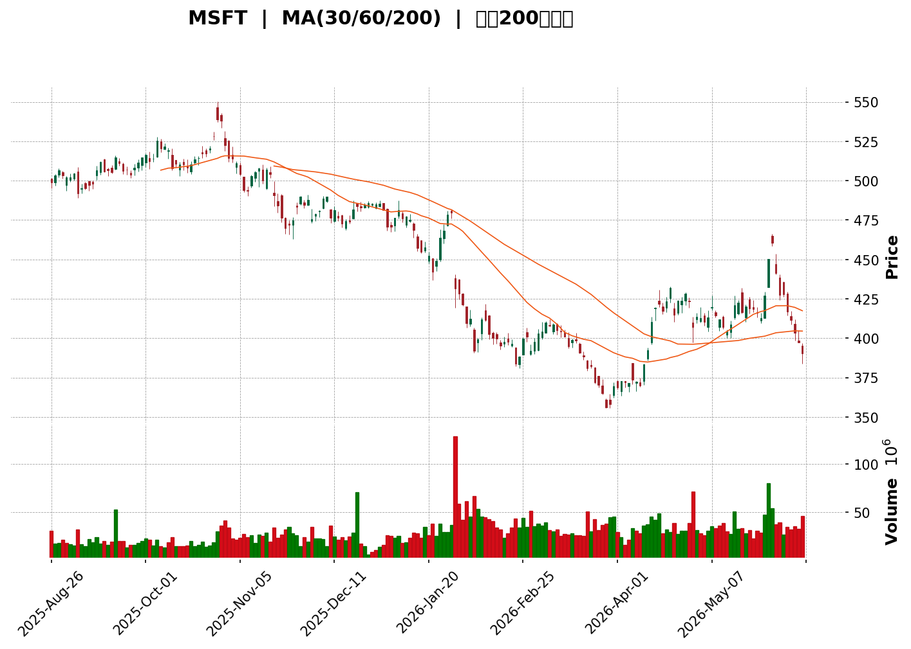
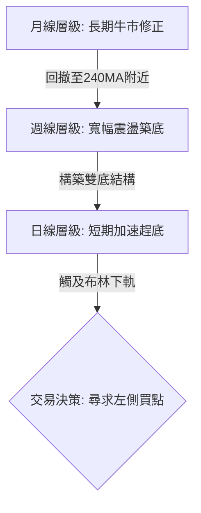

<details>
<summary>📊 靜態圖表 (點擊展開)</summary>

</details>

<html>
<head><meta charset="utf-8" /></head>
<body>
    <div style="height:500px; width:100%;">                        <script>window.PlotlyConfig = {MathJaxConfig: 'local'};</script>
        <script charset="utf-8" src="https://cdn.plot.ly/plotly-3.6.0.min.js" integrity="sha256-QaOVwtVY0T02VaHrr6pnoHLCwayMJp4O5n4YyaE3rJk=" crossorigin="anonymous"></script>                <div id="candlestick-chart" class="plotly-graph-div" style="height:100%; width:100%;"></div>            <script>                window.PLOTLYENV=window.PLOTLYENV || {};                                if (document.getElementById("candlestick-chart")) {                    Plotly.newPlot(                        "candlestick-chart",                        [{"close":{"dtype":"f8","bdata":"AAAAYBYuf0AAAACA0Hh\u002fQAAAACDspn9AAAAA4AR4f0AAAACgDl9\u002fQAAAAOC2Yn9AAAAAwF6Mf0AAAAAAKL5+QAAAAMAI8X5AAAAAgF\u002f0fkAAAAAgiRN\u002fQAAAACC2HX9AAAAAYA6rf0AAAADg7gCAQAAAACBinX9AAAAAwPasf0AAAACgAJR\u002fQAAAAEBdFYBAAAAAAGbzf0AAAABgZ6B\u002fQAAAAOAHr39AAAAAwGx9f0AAAADg28N\u002fQAAAACDI9X9AAAAA4IUVgEAAAACAgyOAQAAAAED0A4BAAAAAoMAQgEAAAADA8mmAQAAAAIB1RYBAAAAA4F9MgEAAAAAA5jiAQAAAAMDou39AAAAAwAntf0AAAAAgaOV\u002fQAAAAEAu439AAAAAgD7Gf0AAAADgkOV\u002fQAAAACBNDIBAAAAAoDcTgEAAAADAHCqAQAAAAGBFKoBAAAAAYIRCgEAAAABgZoGAQAAAAKBE1YBAAAAAYCLRgEAAAAAgnFOAQAAAAOBoFIBAAAAAgDUOgEAAAACgffF\u002fQAAAAAB+f39AAAAAgIvffkAAAADgF9t+QAAAAIAMbX9AAAAAwKiXf0AAAACAxb5\u002fQAAAAED2QX9AAAAAAIKvf0AAAAAAvYR\u002fQAAAACDrqn5AAAAAoN5AfkAAAAAA8cR9QAAAAOBtYH1AAAAAQGB+fUAAAADgAK59QAAAAICPNX5AAAAAQEKdfkAAAADgT0l+QAAAAMA9fX5AAAAAoMq5fUAAAADAVOt9QAAAAEBJEH5AAAAAIH2NfkAAAADgap1+QAAAAEADx31AAAAAYDkVfkAAAADgiMZ9QAAAACBwi31AAAAAYHKkfUAAAABAJaB9QAAAACBZHX5AAAAAIEA8fkAAAABgUix+QAAAAIAQS35AAAAAgLNdfkAAAABgw1h+QAAAAAAMT35AAAAAgBlVfkAAAAAgnRd+QAAAAMB9bX1AAAAA4A5sfUAAAABgN8Z9QAAAAGA5FX5AAAAAINi\u002ffUAAAABAe9J9QAAAAMAHsX1AAAAAIFVJfUAAAABAfpV8QAAAAIAqanxAAAAAgCOdfEAAAAAAFEh8QAAAAKBBontAAAAA4DwSfEAAAACgJf58QAAAAMAeQ31AAAAAYDDnfUAAAABA6vd9QAAAAMA\u002f+XpAAAAAAB7GekAAAABA41d6QAAAAKAwlnlAAAAAoKjFeUAAAABgy354QAAAAODI9XhAAAAAwEK8eUAAAAAAAbd5QAAAAEA8KXlAAAAAQO8AeUAAAADgpvh4QAAAAKCbsXhAAAAAAEHdeEAAAADglNl4QAAAAMDxxXhAAAAAoDn6d0AAAACAjEJ4QAAAAGC\u002f+3hAAAAAAKENeUAAAABgQn54QAAAAKAE23hAAAAAgOkweUAAAABAMEV5QAAAAMCtnHlAAAAA4DeBeUAAAAAgZ4h5QAAAACAhTnlAAAAAYBRAeUAAAAAg3Q95QAAAAEAfq3hAAAAAwF7xeEAAAACgv+h4QAAAAKAXb3hAAAAAIN5CeEAAAAAgt9B3QAAAAKDB4ndAAAAAYPM+d0AAAABgzyN3QAAAAIDd0nZAAAAAoPs\u002fdkAAAACA8mJ2QAAAAIDrFXdAAAAAwCUJd0AAAAAgckp3QAAAAKAvQXdAAAAAQMQ3d0AAAAAAVlh3QAAAAEA4RHdAAAAAgBghd0AAAAAAofh3QAAAAKAqhHhAAAAA4EyleUAAAADAoDV6QAAAAEAFXnpAAAAA4KkSekAAAACg5HN6QAAAAADA\u002f3pAAAAAoJ\u002fteUAAAACgPHt6QAAAACBufnpAAAAAICjFekAAAACgrnh6QAAAACBhbnlAAAAAgLXYeUAAAAAAnst5QAAAAODap3lAAAAAoAvReUAAAAAgxT16QAAAAMCQ43lAAAAAYEq8eUAAAAAgOG55QAAAACBZRXlAAAAA4LiIeUAAAABgIVB6QAAAAKD+aXpAAAAAQEkIekAAAABgZkJ6QAAAAKBwMXpAAAAAwB4pekAAAADgegB6QAAAAGC4ynlAAAAAANevekAAAAAA1yN8QAAAAOBRyHxAAAAAwPWUe0AAAACgcLV6QAAAAMDMwHpAAAAAYLgKekAAAAAA17t5QAAAAGCPNnlAAAAAgMLVeEAAAACgcGV4QA=="},"high":{"dtype":"f8","bdata":"jJeP1tRcf0DZh2cyj4F\u002fQHcia9\u002f5vX9AyK+DPEmmf0Cnir9wDG1\u002fQH\u002f7NjqCiX9APng0XDuPf0A5jhOt98t\u002fQO9npmq7IH9A8sp9I20xf0CFToMGAkF\u002fQPBf89ENQH9AEo6DcDDVf0ALfBm1zgGAQPZLFZHMD4BAxkoJAyjBf0BmBVcIdd1\u002fQM34vFdBIIBAPrujeNoTgECc1tfUn\u002fV\u002fQLLRMnAT1H9AV3uMDs6sf0CDTTISSut\u002fQG807Q\u002fHDIBArTg6KzEXgEDJLleQ3ymAQCXV1\u002fiJMoBAjI9B57YpgEBFIxYrgX2AQBVgnty5c4BA58SqrhFdgECr\u002fMq\u002fPUiAQG8RpYdHQoBA5N4itUcJgEDqebclTACAQEDGtyl7D4BA1v+UNscMgEAXZAAT4wGAQBxU1EF8G4BAY4Nk2WcbgEAqLTVtZU+AQHS2W244RYBAVjOzcllQgEDpc3vPuZmAQPL76ZfhMYFAZ3DxKaj2gECaKp1r05yAQCTQDgbpb4BAc79S6j9NgECH+6+WcQKAQMrNDKlw+X9AGUukb0dof0D7bFiiywN\u002fQC86vTaQen9AET3LaEmmf0AJUX62Msd\u002fQBDUgi9L5H9AIL82xRXGf0CE7P8lWs5\u002fQOM0b3oIPX9AH6QbWS3BfkCpof2OG7Z+QHeYQkO\u002fzH1AOnIv9pGsfUDmpD4GadB9QPFQszhSYn5AEWq3fSKnfkBePWO3Ant+QKEO6jD+tH5AQq+iR30hfkDac34o+vJ9QK5+TeQbFH5Ao8tzweChfkAzdxSvAp9+QCGJ3CumIX5A+BzDogA+fkBB7jsQ+gR+QKqrgFtr6X1A\u002f6OnIle8fUCbyjJK8919QFmtGJHedn5ANIOZU\u002f5afkBsM8XvAml+QG+KJbSsWn5Ahn0oTNxvfkCiS+xNS19+QIx830z1Yn5AqhFjrCR4fkA0rgALnV9+QFDEwQouKH5AAdOzhlmffUCCKNgy4cl9QBiuJF12eH5AlmxlX1IIfkC094xRFdt9QCqtp0+47X1AnXs11LqafUAd4pXU\u002fCF9QPoXtkoR43xA83L9xi7SfEAI3KR4ZWx8QBuJpZDtKnxAbZTtIFEtfEAzHvZ5LlB9QGTq98dbgn1AEk3xqaoLfkB6he5uhhl+QLXT8U+ciHtAYThBr2pae0DyHNrpSM16QK9IyWXcQnpAtyGhPwUfekB6JkkS1md5QEqRPHIjAHlAlfLhMs\u002fQeUD8fAFV01x6QKf+7FLR6XlAl+ORsmJGeUBPd6Rd3zt5QD3uB4no63hAxi1UX2cMeUC5VP4m5Th5QLeiy4oV9HhAcRXVmBaoeEDWPzfQS0h4QOueaiyjCXlAQk8xzL9peUCXvPsBZr94QHOwKMEqBXlAZqeK+iJdeUAsIvlDRKJ5QEZ0cMSGq3lA9PlCS4TCeUDdyw\u002fLLJV5QDheNhIElXlAjD2dUASCeUDzhgpq4FN5QKCK6l3NPnlAUZj\u002f+jn8eECZMZJzajh5QFoP9cY80nhAOOJBiER6eEAsMJ82niJ4QOSVhXv4JXhA9SHVXUvad0BtmM7164N3QAdhKQuQXndAXw7vt6qadkBbwmM4IMl2QMAfUFWBQXdA0bFLWuhSd0DX7QfoUU13QOFktbnBTndAsLhmNVI6d0D2bCXsrwJ4QNJFkLEVS3dAI2toRkBtd0CRXrneV\u002ft3QOffb2NknXhAW0mBXZfXeUBjIvKKkT56QLYwdTBb6npATubpL6RmekBc5jXEG6R6QIC9W\u002fgzDHtA9TRJ+uhrekDD3x10gYB6QDp1fZr9onpANu2ckdrPekAf7K5bXJ56QKDCpNhj2HlAxWBPHVYDekDoKAf+7T16QFyUtXIR\u002fnlAmiO+ZEAYekBgvt6M4bB6QKT\u002fsK2aG3pAzlQE\u002fMS8eUAXpBrSoel5QLzhNAPpVnlAapGC6jKveUCBjC0M6rN6QDXBgEM4g3pAZIuo3Dz8ekCayyALAVN6QAAAAKBwpXpAAAAAYGaGekAAAADgUTx6QAAAAEAK\u002f3lAAAAAANfXekAAAACgRyV8QAAAAMAeJX1AAAAAAABYfEAAAACAPYZ7QAAAAGBmQntAAAAAIIXXekAAAABgjxJ6QAAAACCuv3lAAAAA4KNQeUAAAACgmc14QA=="},"hovertemplate":"\u003cb\u003e%{x|%Y-%m-%d}\u003c\u002fb\u003e\u003cbr\u003e\u958b: $%{open:.2f}\u003cbr\u003e\u9ad8: $%{high:.2f}\u003cbr\u003e\u4f4e: $%{low:.2f}\u003cbr\u003e\u6536: $%{close:.2f}\u003cextra\u003e\u003c\u002fextra\u003e","low":{"dtype":"f8","bdata":"StTlfvb1fkD7knExEAx\u002fQC1BZFgZZX9AIU8pVgpVf0CsN50W79p+QEe8OBuKMn9Az67aP7w\u002ff0Acx7FLV5R+QODVSReivn5AJnNNrRXpfkC8eJ7WgNl+QCinK0\u002fy635Ai6tFlN1Kf0AJVh7A8nx\u002fQH5bljdjln9Ayy85ju9rf0C93VEdcYd\u002fQLt972uTsX9AlPFnvAfVf0DD9VB+4IF\u002fQOs78iKte39A8GMvDMldf0C4MYwD6HZ\u002fQJNzGJPWmn9A3cZGkj2nf0BjuRu+g8d\u002fQNpNKC91t39A2+riUyT8f0CXKRmogheAQLUrxlxEMYBAX6UrL2I+gECkJwJyJhGAQEgqtGjDpn9Ab2XIV1vHf0DilQ+DDG1\u002fQP44wmqlrH9AHv57NOqOf0BH+VCA4IF\u002fQPKillwu439ABhCU1\u002frcf0AdmoR5nROAQJguO+LEGoBAniXEoHYrgECasNI5cm2AQMPDbAHvyoBA6dTuH9GqgEAHl0ZKrDaAQMyDv1u7\u002fX9AAmX8pZ\u002f1f0D8ANrLTYp\u002fQHWtkjNFdn9A43Hn4AjLfkAD0MwmVaJ+QD9qetmS+n5Agd7WSwQzf0BJAB9Zqf9+QMPgJc4pIn9AMgRAaPPkfkD6Jqrht1t\u002fQAJXntN2O35AF4pAVqn8fUBLrlv1RJZ9QAOiXioaI31AJ4yKuB4ffUApdTccQ+18QCEpENYQ8X1APXoT9uBHfkBOmDo0BSh+QByx2VOfQn5AWTzCsX2RfUDSy5YeCqZ9QBXSZxkczH1AGPZrVLgjfkBG2CLsWGV+QGNJJ1KUj31A6YRl8gCcfUARahxlpqN9QB6vjwTNZn1A9nJ3b61MfUApQ8IWTo59QAy+5hdXvH1AedPvCZ0FfkBS7A6\u002fzAh+QA\u002fsTDF0KX5APHgULuMqfkAaKZ8n4zx+QHro2qaIIH5A0rn6VI81fkBDZ6wvhBJ+QOqO91s1QX1Ad6mrFbI2fUBpQWN0rTp9QDB6BL5LvX1AE2YJ\u002fACcfUDHcTIytGF9QKpfXv0imX1AT53LtiX+fEDUyAxCSnJ8QIiSOU0PXnxAmPtBgUxnfECZIOQnnPR7QBOGT\u002fvCS3tAYKkHk6ere0BVhctGhQh8QPC3qTw6v3xAF6Dg3v5wfUCE1HSrF759QJHcQkJ0MnpAZz+NG\u002fOIekAAJrYWDEZ6QG8umF\u002f6a3lA4mE1RM92eUBqLRVESml4QM2oDAbZcnhAlOODzHvxeEDT4MK57K15QFaVNMS283hARcBbLe3DeEDKMv1BkMR4QDBO3E9+jHhAhIJZsAGpeEBYmmL4AL14QI++\u002flLlpHhAgQe4QFrkd0CFPlIoKc53QMz1I4sRVXhA1Eo6QQ3eeEAhTjcxmVB4QMqFYnySXHhALS+HTSR9eEDkMdgJHvd4QJZIz3dqOHlAU0y\u002fuwh6eUC9WEsRDCp5QLuuSm3yIHlAed3Kn40LeUBb3OkTeA15QJqz\u002fgFelnhAcemdDf2eeEDuGvDxPs54QCPyT756YnhA2Eu\u002fWZMjeEDOvMSdxrR3QG4kVo+uzXdAbTDi4L0wd0BcUkd7TA13QMy2mIdpxnZAejQqDdU7dkBuQmD5KDh2QK0sDLqQpHZAnPhh23f2dkBuMFfKzrV2QFoazAs5C3dAopNL2UjcdkAzvB6Ztyl3QOb\u002fYoob5HZAFVSPT68Td0A8NR2NfSN3QDBT81X0GnhAAU4eJfa9eEC7wVoh\u002fbN5QG3y9TZ+PHpArRkxi2f2eUDx3HocxgR6QLEec+IRbHpAB61Va1WoeUB1ztzza+55QIKj67qyAnpAk7GckM9PekCT9RlKGzZ6QGSQY7xl0nhAvRTD6NiYeUDHgLA2mJ55QLc6wPapfnlAnqTLV8BDeUBc\u002f\u002fMKrh16QIPcGyqv0XlAVr\u002f2YfpJeUBC5MTALVx5QK2+i+CcAnlAaq\u002fEzzcAeUBniZYiSMB5QNi2rHJj63lAsV2bG3D5eUC4Ny3Gk6Z5QAAAACBc+3lAAAAAoEcFekAAAADgUdB5QAAAAKBHmXlAAAAAYLjKeUAAAACAwgV7QAAAAOBRpHxAAAAAQOGGe0AAAAAAAIR6QAAAAGCPpnpAAAAAYGbmeUAAAADA9Yh5QAAAACCu53hAAAAAYI\u002fSeEAAAAAAAAB4QA=="},"name":"\u50f9\u683c","open":{"dtype":"f8","bdata":"XcYvMvlSf0CAq2ivcy1\u002fQJm31vtgfn9A6uK1N1eXf0BJ+tUdIBV\u002fQOC9jlbpSX9AOyrl+gRSf0BVVXUO3J1\u002fQEkEGVKa735AC6DMhmMkf0Duukh4CD1\u002fQDe6MiltMX9ATmH3JmJ3f0Ahnbp7aJl\u002fQHcE1VMEDYBAtpyC6IC2f0DiwPoCVsR\u002fQCj0MvqMtX9Ac6J+DsMCgEDzI18yEOl\u002fQBDCIhKwsn9Ae4ow452Rf0BXyK2Wma1\u002fQMUfSYl+xH9A04y56Sjgf0CNJYoS9vh\u002fQFVa0wIPE4BAs2nl2MMOgEDcS2H\u002fxBqAQA8X99K4Z4BAQ9U73OQ\u002fgEDS0fflaziAQDk33S\u002f1IoBA5N4itUcJgECikuSYTbB\u002fQCUfO8+B+39A1Ay8vqrVf0AC\u002fNgHYp1\u002fQDMJzTHx9X9Ao9vVD\u002fIRgEBtmCJD9i6AQCAytSJgOYBAmZ+1kf87gEAr0ReGd4OAQHdsSQpPFIFA+SZsbhXsgEAmK2XKIXmAQPMP35FpbIBAgeJCC08kgECrMo8foch\u002fQJfA0Rkd4X9A95Spl6Rnf0A1CBYGKd1+QNlyegJKDn9AuXFPRPhZf0CoL5BieKJ\u002fQGq6kiqTsX9AyRTr6oLxfkDm5LCAAJR\u002fQAGeigUKxH5AKfKR7j9wfkAL\u002fyaNaKh+QEVv3oMOxn1A\u002fa4WF06OfUBo79ymfX99QLI9bop2Qn5AbxWV9QJXfkAa18ZAZGR+QP55U3D+SH5A8hD+2lSjfUAuFba8INp9QADGYV8XBn5AxeVzEdgrfkBL9cGm525+QO3ongolHn5ARRai9kSofUCHyt9SFdt9QPiwzB2L331AP80bmxVdfUCg2VHHuqx9QCxFSGUewX1Aw\u002fSrGTBTfkAWMW21bz9+QHBrdvVGLX5Aj0V3Xm04fkAPPO2I1Uh+QF7Voo1dK35AmZ72xWg8fkCq7b+d1Vp+QE5s6RHhI35An+LuBlV\u002ffUBf1GioMHt9QJZHeZ8g2n1A4WznyLPxfUAKdkzrVH99QElP2SLoqH1ABuUFLjWJfUD1wshNRQZ9QKj5Fyf\u002f4HxAQ35Rfc18fED16B8tgxN8QEgPB5N+KXxAq11GzCrae0B1xTmR3R18QBqU5+Dz83xACE5s8Jh5fUBlFNUuFRF+QEVyt+SgYHtAo3k5PpFTe0DAc0n+UcV6QBcEpF85QnpAPpEQTtiSeUA+9UswI1p5QJ\u002f2W4Zn1nhAvjbapeEweUA6HYBPJxx6QBkLnIhb5XlAKDtZPUUzeUBOwuyIgip5QHJSiWQz13hA8ErfkdbFeECmeW1CL\u002f14QEcMLAoQtHhAk\u002f6jSFeieEAiXIAF9fR3QBZEqMT5WnhAcFYoiF09eUCKgwtXkGB4QGD6xL4sgHhAooxnRKWEeECFJkuqcQZ5QDbycEq8OHlAkM0Q4AyFeUAe0z\u002fft0B5QHjAfTNNknlAjlpShBhLeUCcc6GaFjx5QJPTVkEiAnlAoxx55FrTeEAE6xSDevZ4QDXciPpYxHhAMwx1UBxUeEC0o37yQx94QABAeggg8XdAOZQmt4nYd0C6LAjTr4F3QADzJDFMIHdAgZRituKRdkBHYmS54pF2QMnqHKAxvHZAL7thx+xKd0D6JMRzqeZ2QHtPpbnsSndAd0UZQ6IYd0DQvXE5XgJ4QKrAu4seO3dAjM9hcshCd0D9WMs\u002f10x3QLVaR3FOMXhA\u002fusTxzzSeEAsy4bKPS96QHj7rydufnpA4DMuPNZDekDdYGTzTjV6QN+Yn3NNlHpAx43debgvekDaFWL4GQF6QNckfnl5V3pAj0DRTXB6ekDEiBAQmXp6QNdJhy3BnnlA4+uVhIa+eUClSKjJaKp5QL5jSz\u002fC5nlAbh95QuRxeUCrE66XOzN6QLoHu6fOB3pA3c0X59BveUCCT5\u002f5WNl5QCTv8ApCJXlAiEuGkbE5eUD705KY\u002ftV5QPOW1YGD+3lAr1YGxojPekCsrhz+ZdR5QAAAAAAAjHpAAAAA4KM4ekAAAABA4QZ6QAAAAAApsHlAAAAAIK7PeUAAAADAzAh7QAAAAKBwDX1AAAAAgBTue0AAAABAM2d7QAAAAMD1PHtAAAAAoHDFekAAAACAPeJ5QAAAAOB6kHlAAAAAwMzoeEAAAACAwrF4QA=="},"x":["2025-08-26T00:00:00-04:00","2025-08-27T00:00:00-04:00","2025-08-28T00:00:00-04:00","2025-08-29T00:00:00-04:00","2025-09-02T00:00:00-04:00","2025-09-03T00:00:00-04:00","2025-09-04T00:00:00-04:00","2025-09-05T00:00:00-04:00","2025-09-08T00:00:00-04:00","2025-09-09T00:00:00-04:00","2025-09-10T00:00:00-04:00","2025-09-11T00:00:00-04:00","2025-09-12T00:00:00-04:00","2025-09-15T00:00:00-04:00","2025-09-16T00:00:00-04:00","2025-09-17T00:00:00-04:00","2025-09-18T00:00:00-04:00","2025-09-19T00:00:00-04:00","2025-09-22T00:00:00-04:00","2025-09-23T00:00:00-04:00","2025-09-24T00:00:00-04:00","2025-09-25T00:00:00-04:00","2025-09-26T00:00:00-04:00","2025-09-29T00:00:00-04:00","2025-09-30T00:00:00-04:00","2025-10-01T00:00:00-04:00","2025-10-02T00:00:00-04:00","2025-10-03T00:00:00-04:00","2025-10-06T00:00:00-04:00","2025-10-07T00:00:00-04:00","2025-10-08T00:00:00-04:00","2025-10-09T00:00:00-04:00","2025-10-10T00:00:00-04:00","2025-10-13T00:00:00-04:00","2025-10-14T00:00:00-04:00","2025-10-15T00:00:00-04:00","2025-10-16T00:00:00-04:00","2025-10-17T00:00:00-04:00","2025-10-20T00:00:00-04:00","2025-10-21T00:00:00-04:00","2025-10-22T00:00:00-04:00","2025-10-23T00:00:00-04:00","2025-10-24T00:00:00-04:00","2025-10-27T00:00:00-04:00","2025-10-28T00:00:00-04:00","2025-10-29T00:00:00-04:00","2025-10-30T00:00:00-04:00","2025-10-31T00:00:00-04:00","2025-11-03T00:00:00-05:00","2025-11-04T00:00:00-05:00","2025-11-05T00:00:00-05:00","2025-11-06T00:00:00-05:00","2025-11-07T00:00:00-05:00","2025-11-10T00:00:00-05:00","2025-11-11T00:00:00-05:00","2025-11-12T00:00:00-05:00","2025-11-13T00:00:00-05:00","2025-11-14T00:00:00-05:00","2025-11-17T00:00:00-05:00","2025-11-18T00:00:00-05:00","2025-11-19T00:00:00-05:00","2025-11-20T00:00:00-05:00","2025-11-21T00:00:00-05:00","2025-11-24T00:00:00-05:00","2025-11-25T00:00:00-05:00","2025-11-26T00:00:00-05:00","2025-11-28T00:00:00-05:00","2025-12-01T00:00:00-05:00","2025-12-02T00:00:00-05:00","2025-12-03T00:00:00-05:00","2025-12-04T00:00:00-05:00","2025-12-05T00:00:00-05:00","2025-12-08T00:00:00-05:00","2025-12-09T00:00:00-05:00","2025-12-10T00:00:00-05:00","2025-12-11T00:00:00-05:00","2025-12-12T00:00:00-05:00","2025-12-15T00:00:00-05:00","2025-12-16T00:00:00-05:00","2025-12-17T00:00:00-05:00","2025-12-18T00:00:00-05:00","2025-12-19T00:00:00-05:00","2025-12-22T00:00:00-05:00","2025-12-23T00:00:00-05:00","2025-12-24T00:00:00-05:00","2025-12-26T00:00:00-05:00","2025-12-29T00:00:00-05:00","2025-12-30T00:00:00-05:00","2025-12-31T00:00:00-05:00","2026-01-02T00:00:00-05:00","2026-01-05T00:00:00-05:00","2026-01-06T00:00:00-05:00","2026-01-07T00:00:00-05:00","2026-01-08T00:00:00-05:00","2026-01-09T00:00:00-05:00","2026-01-12T00:00:00-05:00","2026-01-13T00:00:00-05:00","2026-01-14T00:00:00-05:00","2026-01-15T00:00:00-05:00","2026-01-16T00:00:00-05:00","2026-01-20T00:00:00-05:00","2026-01-21T00:00:00-05:00","2026-01-22T00:00:00-05:00","2026-01-23T00:00:00-05:00","2026-01-26T00:00:00-05:00","2026-01-27T00:00:00-05:00","2026-01-28T00:00:00-05:00","2026-01-29T00:00:00-05:00","2026-01-30T00:00:00-05:00","2026-02-02T00:00:00-05:00","2026-02-03T00:00:00-05:00","2026-02-04T00:00:00-05:00","2026-02-05T00:00:00-05:00","2026-02-06T00:00:00-05:00","2026-02-09T00:00:00-05:00","2026-02-10T00:00:00-05:00","2026-02-11T00:00:00-05:00","2026-02-12T00:00:00-05:00","2026-02-13T00:00:00-05:00","2026-02-17T00:00:00-05:00","2026-02-18T00:00:00-05:00","2026-02-19T00:00:00-05:00","2026-02-20T00:00:00-05:00","2026-02-23T00:00:00-05:00","2026-02-24T00:00:00-05:00","2026-02-25T00:00:00-05:00","2026-02-26T00:00:00-05:00","2026-02-27T00:00:00-05:00","2026-03-02T00:00:00-05:00","2026-03-03T00:00:00-05:00","2026-03-04T00:00:00-05:00","2026-03-05T00:00:00-05:00","2026-03-06T00:00:00-05:00","2026-03-09T00:00:00-04:00","2026-03-10T00:00:00-04:00","2026-03-11T00:00:00-04:00","2026-03-12T00:00:00-04:00","2026-03-13T00:00:00-04:00","2026-03-16T00:00:00-04:00","2026-03-17T00:00:00-04:00","2026-03-18T00:00:00-04:00","2026-03-19T00:00:00-04:00","2026-03-20T00:00:00-04:00","2026-03-23T00:00:00-04:00","2026-03-24T00:00:00-04:00","2026-03-25T00:00:00-04:00","2026-03-26T00:00:00-04:00","2026-03-27T00:00:00-04:00","2026-03-30T00:00:00-04:00","2026-03-31T00:00:00-04:00","2026-04-01T00:00:00-04:00","2026-04-02T00:00:00-04:00","2026-04-06T00:00:00-04:00","2026-04-07T00:00:00-04:00","2026-04-08T00:00:00-04:00","2026-04-09T00:00:00-04:00","2026-04-10T00:00:00-04:00","2026-04-13T00:00:00-04:00","2026-04-14T00:00:00-04:00","2026-04-15T00:00:00-04:00","2026-04-16T00:00:00-04:00","2026-04-17T00:00:00-04:00","2026-04-20T00:00:00-04:00","2026-04-21T00:00:00-04:00","2026-04-22T00:00:00-04:00","2026-04-23T00:00:00-04:00","2026-04-24T00:00:00-04:00","2026-04-27T00:00:00-04:00","2026-04-28T00:00:00-04:00","2026-04-29T00:00:00-04:00","2026-04-30T00:00:00-04:00","2026-05-01T00:00:00-04:00","2026-05-04T00:00:00-04:00","2026-05-05T00:00:00-04:00","2026-05-06T00:00:00-04:00","2026-05-07T00:00:00-04:00","2026-05-08T00:00:00-04:00","2026-05-11T00:00:00-04:00","2026-05-12T00:00:00-04:00","2026-05-13T00:00:00-04:00","2026-05-14T00:00:00-04:00","2026-05-15T00:00:00-04:00","2026-05-18T00:00:00-04:00","2026-05-19T00:00:00-04:00","2026-05-20T00:00:00-04:00","2026-05-21T00:00:00-04:00","2026-05-22T00:00:00-04:00","2026-05-26T00:00:00-04:00","2026-05-27T00:00:00-04:00","2026-05-28T00:00:00-04:00","2026-05-29T00:00:00-04:00","2026-06-01T00:00:00-04:00","2026-06-02T00:00:00-04:00","2026-06-03T00:00:00-04:00","2026-06-04T00:00:00-04:00","2026-06-05T00:00:00-04:00","2026-06-08T00:00:00-04:00","2026-06-09T00:00:00-04:00","2026-06-10T00:00:00-04:00","2026-06-11T00:00:00-04:00"],"type":"candlestick"},{"hovertemplate":"MA30: $%{y:.2f}\u003cextra\u003e\u003c\u002fextra\u003e","line":{"color":"#2196F3","dash":"dash","width":2},"mode":"lines","name":"MA30","x":["2025-08-26T00:00:00-04:00","2025-08-27T00:00:00-04:00","2025-08-28T00:00:00-04:00","2025-08-29T00:00:00-04:00","2025-09-02T00:00:00-04:00","2025-09-03T00:00:00-04:00","2025-09-04T00:00:00-04:00","2025-09-05T00:00:00-04:00","2025-09-08T00:00:00-04:00","2025-09-09T00:00:00-04:00","2025-09-10T00:00:00-04:00","2025-09-11T00:00:00-04:00","2025-09-12T00:00:00-04:00","2025-09-15T00:00:00-04:00","2025-09-16T00:00:00-04:00","2025-09-17T00:00:00-04:00","2025-09-18T00:00:00-04:00","2025-09-19T00:00:00-04:00","2025-09-22T00:00:00-04:00","2025-09-23T00:00:00-04:00","2025-09-24T00:00:00-04:00","2025-09-25T00:00:00-04:00","2025-09-26T00:00:00-04:00","2025-09-29T00:00:00-04:00","2025-09-30T00:00:00-04:00","2025-10-01T00:00:00-04:00","2025-10-02T00:00:00-04:00","2025-10-03T00:00:00-04:00","2025-10-06T00:00:00-04:00","2025-10-07T00:00:00-04:00","2025-10-08T00:00:00-04:00","2025-10-09T00:00:00-04:00","2025-10-10T00:00:00-04:00","2025-10-13T00:00:00-04:00","2025-10-14T00:00:00-04:00","2025-10-15T00:00:00-04:00","2025-10-16T00:00:00-04:00","2025-10-17T00:00:00-04:00","2025-10-20T00:00:00-04:00","2025-10-21T00:00:00-04:00","2025-10-22T00:00:00-04:00","2025-10-23T00:00:00-04:00","2025-10-24T00:00:00-04:00","2025-10-27T00:00:00-04:00","2025-10-28T00:00:00-04:00","2025-10-29T00:00:00-04:00","2025-10-30T00:00:00-04:00","2025-10-31T00:00:00-04:00","2025-11-03T00:00:00-05:00","2025-11-04T00:00:00-05:00","2025-11-05T00:00:00-05:00","2025-11-06T00:00:00-05:00","2025-11-07T00:00:00-05:00","2025-11-10T00:00:00-05:00","2025-11-11T00:00:00-05:00","2025-11-12T00:00:00-05:00","2025-11-13T00:00:00-05:00","2025-11-14T00:00:00-05:00","2025-11-17T00:00:00-05:00","2025-11-18T00:00:00-05:00","2025-11-19T00:00:00-05:00","2025-11-20T00:00:00-05:00","2025-11-21T00:00:00-05:00","2025-11-24T00:00:00-05:00","2025-11-25T00:00:00-05:00","2025-11-26T00:00:00-05:00","2025-11-28T00:00:00-05:00","2025-12-01T00:00:00-05:00","2025-12-02T00:00:00-05:00","2025-12-03T00:00:00-05:00","2025-12-04T00:00:00-05:00","2025-12-05T00:00:00-05:00","2025-12-08T00:00:00-05:00","2025-12-09T00:00:00-05:00","2025-12-10T00:00:00-05:00","2025-12-11T00:00:00-05:00","2025-12-12T00:00:00-05:00","2025-12-15T00:00:00-05:00","2025-12-16T00:00:00-05:00","2025-12-17T00:00:00-05:00","2025-12-18T00:00:00-05:00","2025-12-19T00:00:00-05:00","2025-12-22T00:00:00-05:00","2025-12-23T00:00:00-05:00","2025-12-24T00:00:00-05:00","2025-12-26T00:00:00-05:00","2025-12-29T00:00:00-05:00","2025-12-30T00:00:00-05:00","2025-12-31T00:00:00-05:00","2026-01-02T00:00:00-05:00","2026-01-05T00:00:00-05:00","2026-01-06T00:00:00-05:00","2026-01-07T00:00:00-05:00","2026-01-08T00:00:00-05:00","2026-01-09T00:00:00-05:00","2026-01-12T00:00:00-05:00","2026-01-13T00:00:00-05:00","2026-01-14T00:00:00-05:00","2026-01-15T00:00:00-05:00","2026-01-16T00:00:00-05:00","2026-01-20T00:00:00-05:00","2026-01-21T00:00:00-05:00","2026-01-22T00:00:00-05:00","2026-01-23T00:00:00-05:00","2026-01-26T00:00:00-05:00","2026-01-27T00:00:00-05:00","2026-01-28T00:00:00-05:00","2026-01-29T00:00:00-05:00","2026-01-30T00:00:00-05:00","2026-02-02T00:00:00-05:00","2026-02-03T00:00:00-05:00","2026-02-04T00:00:00-05:00","2026-02-05T00:00:00-05:00","2026-02-06T00:00:00-05:00","2026-02-09T00:00:00-05:00","2026-02-10T00:00:00-05:00","2026-02-11T00:00:00-05:00","2026-02-12T00:00:00-05:00","2026-02-13T00:00:00-05:00","2026-02-17T00:00:00-05:00","2026-02-18T00:00:00-05:00","2026-02-19T00:00:00-05:00","2026-02-20T00:00:00-05:00","2026-02-23T00:00:00-05:00","2026-02-24T00:00:00-05:00","2026-02-25T00:00:00-05:00","2026-02-26T00:00:00-05:00","2026-02-27T00:00:00-05:00","2026-03-02T00:00:00-05:00","2026-03-03T00:00:00-05:00","2026-03-04T00:00:00-05:00","2026-03-05T00:00:00-05:00","2026-03-06T00:00:00-05:00","2026-03-09T00:00:00-04:00","2026-03-10T00:00:00-04:00","2026-03-11T00:00:00-04:00","2026-03-12T00:00:00-04:00","2026-03-13T00:00:00-04:00","2026-03-16T00:00:00-04:00","2026-03-17T00:00:00-04:00","2026-03-18T00:00:00-04:00","2026-03-19T00:00:00-04:00","2026-03-20T00:00:00-04:00","2026-03-23T00:00:00-04:00","2026-03-24T00:00:00-04:00","2026-03-25T00:00:00-04:00","2026-03-26T00:00:00-04:00","2026-03-27T00:00:00-04:00","2026-03-30T00:00:00-04:00","2026-03-31T00:00:00-04:00","2026-04-01T00:00:00-04:00","2026-04-02T00:00:00-04:00","2026-04-06T00:00:00-04:00","2026-04-07T00:00:00-04:00","2026-04-08T00:00:00-04:00","2026-04-09T00:00:00-04:00","2026-04-10T00:00:00-04:00","2026-04-13T00:00:00-04:00","2026-04-14T00:00:00-04:00","2026-04-15T00:00:00-04:00","2026-04-16T00:00:00-04:00","2026-04-17T00:00:00-04:00","2026-04-20T00:00:00-04:00","2026-04-21T00:00:00-04:00","2026-04-22T00:00:00-04:00","2026-04-23T00:00:00-04:00","2026-04-24T00:00:00-04:00","2026-04-27T00:00:00-04:00","2026-04-28T00:00:00-04:00","2026-04-29T00:00:00-04:00","2026-04-30T00:00:00-04:00","2026-05-01T00:00:00-04:00","2026-05-04T00:00:00-04:00","2026-05-05T00:00:00-04:00","2026-05-06T00:00:00-04:00","2026-05-07T00:00:00-04:00","2026-05-08T00:00:00-04:00","2026-05-11T00:00:00-04:00","2026-05-12T00:00:00-04:00","2026-05-13T00:00:00-04:00","2026-05-14T00:00:00-04:00","2026-05-15T00:00:00-04:00","2026-05-18T00:00:00-04:00","2026-05-19T00:00:00-04:00","2026-05-20T00:00:00-04:00","2026-05-21T00:00:00-04:00","2026-05-22T00:00:00-04:00","2026-05-26T00:00:00-04:00","2026-05-27T00:00:00-04:00","2026-05-28T00:00:00-04:00","2026-05-29T00:00:00-04:00","2026-06-01T00:00:00-04:00","2026-06-02T00:00:00-04:00","2026-06-03T00:00:00-04:00","2026-06-04T00:00:00-04:00","2026-06-05T00:00:00-04:00","2026-06-08T00:00:00-04:00","2026-06-09T00:00:00-04:00","2026-06-10T00:00:00-04:00","2026-06-11T00:00:00-04:00"],"y":{"dtype":"f8","bdata":"AAAAAAAA+H8AAAAAAAD4fwAAAAAAAPh\u002fAAAAAAAA+H8AAAAAAAD4fwAAAAAAAPh\u002fAAAAAAAA+H8AAAAAAAD4fwAAAAAAAPh\u002fAAAAAAAA+H8AAAAAAAD4fwAAAAAAAPh\u002fAAAAAAAA+H8AAAAAAAD4fwAAAAAAAPh\u002fAAAAAAAA+H8AAAAAAAD4fwAAAAAAAPh\u002fAAAAAAAA+H8AAAAAAAD4fwAAAAAAAPh\u002fAAAAAAAA+H8AAAAAAAD4fwAAAAAAAPh\u002fAAAAAAAA+H8AAAAAAAD4fwAAAAAAAPh\u002fAAAAAAAA+H8AAAAAAAD4fyIiIsJMq39AiYiIeGO3f0Dv7u4esL9\u002fQFVVVTVjwH9AVVVVxUnEf0CJiIg4xMh\u002fQHd3d3cMzX9AMzMzU\u002frOf0B3d3cn09h\u002fQGZmZlat4n9AAAAAEOHsf0C8u7ubkfd\u002fQLy7uwP3AIBA3t3dDZkEgEDe3d1N4QiAQM3MzPShEYBAMzMz2\u002fwZgEDe3d0dkx6AQImIiPiKHoBAzczM\u002fDkfgEBVVVX1kyCAQImIiCDJH4BAmpmZgScdgEB3d3dfRhmAQKuqqvr+FoBAERERIYoUgEBVVVXFRBKAQDMzMzP4DoBAAAAA0BENgEDe3d3NeweAQM3MzJz3\u002fn9AREREpPjqf0CrqqqKJNR\u002fQImIiNgGwH9AZmZmdkWrf0Dv7u6eW5h\u002fQHd3d4cJin9AERERQSOAf0CrqqpaZXJ\u002fQCIiIhKvZH9Aq6qq6v5Pf0AiIiLCbjt\u002fQN7d3T0XKH9AIiIiUk4Xf0AAAAAg3AJ\u002fQN7d3f2s4X5AAAAA0F\u002fDfkDv7u5u0ap+QBEREWGBlH5A7+7ujnB\u002ffkCJiIhYqWt+QBEREVHbX35A7+7u3mlafkDNzMx8llR+QERERPTrSn5AiYiI2HRAfkB3d3fXhTR+QHd3d\u002fdsLH5AMzMz8+AgfkCJiIg4tRR+QCIiIoIgCn5AREREhAgDfkBVVVVlEwN+QN7d3S0aCX5Ad3d310gLfkDv7u4egAx+QCIiIjIVCH5A3t3dfcD8fUARERGBOe59QJqZmamF3H1AAAAAoAjTfUAAAAAAD8V9QDMzMwNTsH1ARERENCabfUAAAACQTo19QERERBTpiH1A7+7uPmCHfUAAAACgBYl9QERERBQVc31AzczMzJpafUCamZmZmD59QN7d3R31F31AAAAAAN\u002fxfEARERGRa8F8QN7d3S3pk3xAvLu7a2VsfEARERHx3kR8QN7d3Z3xGHxA3t3dvXjre0De3d3dxb97QGZmZnZgl3tAvLu7u3twe0ARERFRdkZ7QBERESEnGXtAzczMHObnekCJiIg4b7h6QERERCRCkHpAmpmZiSJsekBEREQkOkl6QDMzMwPbKnpAERER4aUNekDv7u6e8\u002fN5QFVVVfWy4nlAREREZMzMeUCrqqoKRq95QKuqqtqBjXlAiYiIuM1leUCrqqpq7zt5QKuqqqpDKHlAERERsaMYeUBVVVXFZgx5QKuqqpqQAnlAzczM\u002fKv1eEAzMzOD3u94QKuqqpqz5nhAmpmZOXXReECrqqoafLt4QDMzMwOKp3hAzczMbAqQeEARERHh+3l4QO\u002fu7s5CbHhAzczMTKhceEB3d3dXWk94QAAAAPBkQnhA7+7ujuk7eEARERHxGjR4QN7d3U10JXhAq6qqWgkVeECrqqoKlRB4QImIiOivDXhAZmZmFpEReEBmZmbWlBl4QAAAALAGIHhAIiIi0t8keEBmZmZWuSx4QBEREZEtO3hAmpmZefZAeEAiIiJCE014QERERPSmXHhAvLu7uz5seEAAAACAk3l4QDMzM\u002fMVgnhAERERIZ2PeEARERGxgqB4QCIiIiKdr3hAAAAA4IzFeEAAAAAABOB4QLy7uxss+nhAd3d3d+oXeUARERFB5DF5QKuqqgqKRHlA7+7uvttZeUCrqqrapXN5QAAAALCbjnlA7+7uHqCmeUCJiIiIfr95QBEREeF32HlARERE9FXyeUBEREQEqgN6QLy7u5uMDnpAREREFG8XekCrqqpa6Cd6QCIiIoKEPHpAd3d352RJekDNzMw8lEt6QAAAABB7SXpAq6qqWnNKekCamZkZEkR6QGZmZkYkOXpAMzMz46AoekDv7u6e6xZ6QA=="},"type":"scatter"},{"hovertemplate":"MA60: $%{y:.2f}\u003cextra\u003e\u003c\u002fextra\u003e","line":{"color":"#9C27B0","dash":"dash","width":2},"mode":"lines","name":"MA60","x":["2025-08-26T00:00:00-04:00","2025-08-27T00:00:00-04:00","2025-08-28T00:00:00-04:00","2025-08-29T00:00:00-04:00","2025-09-02T00:00:00-04:00","2025-09-03T00:00:00-04:00","2025-09-04T00:00:00-04:00","2025-09-05T00:00:00-04:00","2025-09-08T00:00:00-04:00","2025-09-09T00:00:00-04:00","2025-09-10T00:00:00-04:00","2025-09-11T00:00:00-04:00","2025-09-12T00:00:00-04:00","2025-09-15T00:00:00-04:00","2025-09-16T00:00:00-04:00","2025-09-17T00:00:00-04:00","2025-09-18T00:00:00-04:00","2025-09-19T00:00:00-04:00","2025-09-22T00:00:00-04:00","2025-09-23T00:00:00-04:00","2025-09-24T00:00:00-04:00","2025-09-25T00:00:00-04:00","2025-09-26T00:00:00-04:00","2025-09-29T00:00:00-04:00","2025-09-30T00:00:00-04:00","2025-10-01T00:00:00-04:00","2025-10-02T00:00:00-04:00","2025-10-03T00:00:00-04:00","2025-10-06T00:00:00-04:00","2025-10-07T00:00:00-04:00","2025-10-08T00:00:00-04:00","2025-10-09T00:00:00-04:00","2025-10-10T00:00:00-04:00","2025-10-13T00:00:00-04:00","2025-10-14T00:00:00-04:00","2025-10-15T00:00:00-04:00","2025-10-16T00:00:00-04:00","2025-10-17T00:00:00-04:00","2025-10-20T00:00:00-04:00","2025-10-21T00:00:00-04:00","2025-10-22T00:00:00-04:00","2025-10-23T00:00:00-04:00","2025-10-24T00:00:00-04:00","2025-10-27T00:00:00-04:00","2025-10-28T00:00:00-04:00","2025-10-29T00:00:00-04:00","2025-10-30T00:00:00-04:00","2025-10-31T00:00:00-04:00","2025-11-03T00:00:00-05:00","2025-11-04T00:00:00-05:00","2025-11-05T00:00:00-05:00","2025-11-06T00:00:00-05:00","2025-11-07T00:00:00-05:00","2025-11-10T00:00:00-05:00","2025-11-11T00:00:00-05:00","2025-11-12T00:00:00-05:00","2025-11-13T00:00:00-05:00","2025-11-14T00:00:00-05:00","2025-11-17T00:00:00-05:00","2025-11-18T00:00:00-05:00","2025-11-19T00:00:00-05:00","2025-11-20T00:00:00-05:00","2025-11-21T00:00:00-05:00","2025-11-24T00:00:00-05:00","2025-11-25T00:00:00-05:00","2025-11-26T00:00:00-05:00","2025-11-28T00:00:00-05:00","2025-12-01T00:00:00-05:00","2025-12-02T00:00:00-05:00","2025-12-03T00:00:00-05:00","2025-12-04T00:00:00-05:00","2025-12-05T00:00:00-05:00","2025-12-08T00:00:00-05:00","2025-12-09T00:00:00-05:00","2025-12-10T00:00:00-05:00","2025-12-11T00:00:00-05:00","2025-12-12T00:00:00-05:00","2025-12-15T00:00:00-05:00","2025-12-16T00:00:00-05:00","2025-12-17T00:00:00-05:00","2025-12-18T00:00:00-05:00","2025-12-19T00:00:00-05:00","2025-12-22T00:00:00-05:00","2025-12-23T00:00:00-05:00","2025-12-24T00:00:00-05:00","2025-12-26T00:00:00-05:00","2025-12-29T00:00:00-05:00","2025-12-30T00:00:00-05:00","2025-12-31T00:00:00-05:00","2026-01-02T00:00:00-05:00","2026-01-05T00:00:00-05:00","2026-01-06T00:00:00-05:00","2026-01-07T00:00:00-05:00","2026-01-08T00:00:00-05:00","2026-01-09T00:00:00-05:00","2026-01-12T00:00:00-05:00","2026-01-13T00:00:00-05:00","2026-01-14T00:00:00-05:00","2026-01-15T00:00:00-05:00","2026-01-16T00:00:00-05:00","2026-01-20T00:00:00-05:00","2026-01-21T00:00:00-05:00","2026-01-22T00:00:00-05:00","2026-01-23T00:00:00-05:00","2026-01-26T00:00:00-05:00","2026-01-27T00:00:00-05:00","2026-01-28T00:00:00-05:00","2026-01-29T00:00:00-05:00","2026-01-30T00:00:00-05:00","2026-02-02T00:00:00-05:00","2026-02-03T00:00:00-05:00","2026-02-04T00:00:00-05:00","2026-02-05T00:00:00-05:00","2026-02-06T00:00:00-05:00","2026-02-09T00:00:00-05:00","2026-02-10T00:00:00-05:00","2026-02-11T00:00:00-05:00","2026-02-12T00:00:00-05:00","2026-02-13T00:00:00-05:00","2026-02-17T00:00:00-05:00","2026-02-18T00:00:00-05:00","2026-02-19T00:00:00-05:00","2026-02-20T00:00:00-05:00","2026-02-23T00:00:00-05:00","2026-02-24T00:00:00-05:00","2026-02-25T00:00:00-05:00","2026-02-26T00:00:00-05:00","2026-02-27T00:00:00-05:00","2026-03-02T00:00:00-05:00","2026-03-03T00:00:00-05:00","2026-03-04T00:00:00-05:00","2026-03-05T00:00:00-05:00","2026-03-06T00:00:00-05:00","2026-03-09T00:00:00-04:00","2026-03-10T00:00:00-04:00","2026-03-11T00:00:00-04:00","2026-03-12T00:00:00-04:00","2026-03-13T00:00:00-04:00","2026-03-16T00:00:00-04:00","2026-03-17T00:00:00-04:00","2026-03-18T00:00:00-04:00","2026-03-19T00:00:00-04:00","2026-03-20T00:00:00-04:00","2026-03-23T00:00:00-04:00","2026-03-24T00:00:00-04:00","2026-03-25T00:00:00-04:00","2026-03-26T00:00:00-04:00","2026-03-27T00:00:00-04:00","2026-03-30T00:00:00-04:00","2026-03-31T00:00:00-04:00","2026-04-01T00:00:00-04:00","2026-04-02T00:00:00-04:00","2026-04-06T00:00:00-04:00","2026-04-07T00:00:00-04:00","2026-04-08T00:00:00-04:00","2026-04-09T00:00:00-04:00","2026-04-10T00:00:00-04:00","2026-04-13T00:00:00-04:00","2026-04-14T00:00:00-04:00","2026-04-15T00:00:00-04:00","2026-04-16T00:00:00-04:00","2026-04-17T00:00:00-04:00","2026-04-20T00:00:00-04:00","2026-04-21T00:00:00-04:00","2026-04-22T00:00:00-04:00","2026-04-23T00:00:00-04:00","2026-04-24T00:00:00-04:00","2026-04-27T00:00:00-04:00","2026-04-28T00:00:00-04:00","2026-04-29T00:00:00-04:00","2026-04-30T00:00:00-04:00","2026-05-01T00:00:00-04:00","2026-05-04T00:00:00-04:00","2026-05-05T00:00:00-04:00","2026-05-06T00:00:00-04:00","2026-05-07T00:00:00-04:00","2026-05-08T00:00:00-04:00","2026-05-11T00:00:00-04:00","2026-05-12T00:00:00-04:00","2026-05-13T00:00:00-04:00","2026-05-14T00:00:00-04:00","2026-05-15T00:00:00-04:00","2026-05-18T00:00:00-04:00","2026-05-19T00:00:00-04:00","2026-05-20T00:00:00-04:00","2026-05-21T00:00:00-04:00","2026-05-22T00:00:00-04:00","2026-05-26T00:00:00-04:00","2026-05-27T00:00:00-04:00","2026-05-28T00:00:00-04:00","2026-05-29T00:00:00-04:00","2026-06-01T00:00:00-04:00","2026-06-02T00:00:00-04:00","2026-06-03T00:00:00-04:00","2026-06-04T00:00:00-04:00","2026-06-05T00:00:00-04:00","2026-06-08T00:00:00-04:00","2026-06-09T00:00:00-04:00","2026-06-10T00:00:00-04:00","2026-06-11T00:00:00-04:00"],"y":{"dtype":"f8","bdata":"AAAAAAAA+H8AAAAAAAD4fwAAAAAAAPh\u002fAAAAAAAA+H8AAAAAAAD4fwAAAAAAAPh\u002fAAAAAAAA+H8AAAAAAAD4fwAAAAAAAPh\u002fAAAAAAAA+H8AAAAAAAD4fwAAAAAAAPh\u002fAAAAAAAA+H8AAAAAAAD4fwAAAAAAAPh\u002fAAAAAAAA+H8AAAAAAAD4fwAAAAAAAPh\u002fAAAAAAAA+H8AAAAAAAD4fwAAAAAAAPh\u002fAAAAAAAA+H8AAAAAAAD4fwAAAAAAAPh\u002fAAAAAAAA+H8AAAAAAAD4fwAAAAAAAPh\u002fAAAAAAAA+H8AAAAAAAD4fwAAAAAAAPh\u002fAAAAAAAA+H8AAAAAAAD4fwAAAAAAAPh\u002fAAAAAAAA+H8AAAAAAAD4fwAAAAAAAPh\u002fAAAAAAAA+H8AAAAAAAD4fwAAAAAAAPh\u002fAAAAAAAA+H8AAAAAAAD4fwAAAAAAAPh\u002fAAAAAAAA+H8AAAAAAAD4fwAAAAAAAPh\u002fAAAAAAAA+H8AAAAAAAD4fwAAAAAAAPh\u002fAAAAAAAA+H8AAAAAAAD4fwAAAAAAAPh\u002fAAAAAAAA+H8AAAAAAAD4fwAAAAAAAPh\u002fAAAAAAAA+H8AAAAAAAD4fwAAAAAAAPh\u002fAAAAAAAA+H8AAAAAAAD4f3d3dy8i1X9AZmZmDi7Rf0DNzMxU6sl\u002fQO\u002fu7gY1wH9A3t3dnce3f0C8u7vrj7B\u002fQHd3d\u002f+Kq39AIiIiyo6nf0ARERFBnKV\u002fQERERDSuo39AVVVV\u002fW+ef0Dv7u4ugJl\u002fQKuqqqIClX9A7+7uNkCQf0De3d1dT4p\u002fQLy7u3N4gn9AMzMzw6x7f0BVVVXV+3N\u002fQBEREanLaH9ARERERPJef0CamZmhaFZ\u002fQBEREcm2T39AERERcVxKf0De3d2dkUN\u002fQM3MzPR0PH9AVVVVjcQ0f0ARERGxhyx\u002fQO\u002fu7q4uJX9AmpmZSYIdf0AiIiJq1hF\u002fQHd3dw+MBH9ARERElAD3fkAAAAD4m+t+QDMzM4OQ5H5A7+7uJkfbfkDv7u7ebdJ+QM3MzFwPyX5Ad3d333G+fkDe3d1tT7B+QN7d3V2aoH5AVVVVxYORfkARERHhPoB+QImIiCA1bH5AMzMzQzpZfkAAAABYFUh+QBEREQlLNX5Ad3d3B2AlfkB3d3eH6xl+QKuqqjrLA35A3t3drQXtfUARERH5INV9QHd3dzfou31Ad3d3bySmfUDv7u4GAYt9QBEREZFqb31AIiIiIm1WfUBERERksjx9QKuqqkqvIn1AiYiI2CwGfUAzMzOLPep8QERERHzA0HxAAAAAIMK5fEAzMzPbxKR8QHd3d6cgkXxAIiIiepd5fEC8u7urd2J8QDMzM6srTHxAvLu7g3E0fECrqqrSuRt8QGZmZlawA3xAiYiIQFfwe0B3d3dPgdx7QERERPyCyXtARERETPmze0BVVVVNSp57QHd3d3c1i3tAvLu7+5Z2e0BVVVWFemJ7QHd3d1+sTXtA7+7uPp85e0B3d3evfyV7QERERNxCDXtAZmZmfsXzekAiIiIKpdh6QERERGROvXpAq6qqUu2eekDe3d2FLYB6QImIiNA9YHpAVVVVlcE9ekB3d3ff4Bx6QKuqqqLRAXpAREREBJLmeUBERERU6Mp5QImIiAjGrXlA3t3d1eeReUDNzMwURXZ5QBERETnbWnlAIiIi8pVAeUB3d3eX5yx5QN7d3XVFHHlAvLu7e5sPeUCrqqo6xAZ5QKuqqtJcAXlAMzMzG9b4eECJiIiw\u002f+14QN7d3bVX5HhAERERGWLTeEBmZmZWgcR4QHd3d091wnhAZmZmNnHCeECrqqoi\u002fcJ4QO\u002fu7kZTwnhA7+7ujqTCeEAiIiKaMMh4QGZmZl4oy3hAzczMDIHLeEBVVVUNwM14QHd3dw\u002fb0HhAIiIicvrTeEARERER8NV4QM3MzGxm2HhA3t3dBULbeEAREREZgOF4QAAAAFCA6HhA7+7u1kTxeEDNzMy8zPl4QHd3dxf2\u002fnhAd3d3p68DeUB3d3eHHwp5QCIiIkIeDnlAVVVVFYAUeUCJiIiYviB5QBEREZlFLnlAzczMXCI3eUCamZnJJjx5QImIiFBUQnlAIiIi6rRFeUDe3d2tkkh5QFVVVZ3lSnlAd3d3z29KeUB3d3ePP0h5QA=="},"type":"scatter"},{"hovertemplate":"MA200: $%{y:.2f}\u003cextra\u003e\u003c\u002fextra\u003e","line":{"color":"#FF6F00","dash":"solid","width":2},"mode":"lines","name":"MA200","x":["2025-08-26T00:00:00-04:00","2025-08-27T00:00:00-04:00","2025-08-28T00:00:00-04:00","2025-08-29T00:00:00-04:00","2025-09-02T00:00:00-04:00","2025-09-03T00:00:00-04:00","2025-09-04T00:00:00-04:00","2025-09-05T00:00:00-04:00","2025-09-08T00:00:00-04:00","2025-09-09T00:00:00-04:00","2025-09-10T00:00:00-04:00","2025-09-11T00:00:00-04:00","2025-09-12T00:00:00-04:00","2025-09-15T00:00:00-04:00","2025-09-16T00:00:00-04:00","2025-09-17T00:00:00-04:00","2025-09-18T00:00:00-04:00","2025-09-19T00:00:00-04:00","2025-09-22T00:00:00-04:00","2025-09-23T00:00:00-04:00","2025-09-24T00:00:00-04:00","2025-09-25T00:00:00-04:00","2025-09-26T00:00:00-04:00","2025-09-29T00:00:00-04:00","2025-09-30T00:00:00-04:00","2025-10-01T00:00:00-04:00","2025-10-02T00:00:00-04:00","2025-10-03T00:00:00-04:00","2025-10-06T00:00:00-04:00","2025-10-07T00:00:00-04:00","2025-10-08T00:00:00-04:00","2025-10-09T00:00:00-04:00","2025-10-10T00:00:00-04:00","2025-10-13T00:00:00-04:00","2025-10-14T00:00:00-04:00","2025-10-15T00:00:00-04:00","2025-10-16T00:00:00-04:00","2025-10-17T00:00:00-04:00","2025-10-20T00:00:00-04:00","2025-10-21T00:00:00-04:00","2025-10-22T00:00:00-04:00","2025-10-23T00:00:00-04:00","2025-10-24T00:00:00-04:00","2025-10-27T00:00:00-04:00","2025-10-28T00:00:00-04:00","2025-10-29T00:00:00-04:00","2025-10-30T00:00:00-04:00","2025-10-31T00:00:00-04:00","2025-11-03T00:00:00-05:00","2025-11-04T00:00:00-05:00","2025-11-05T00:00:00-05:00","2025-11-06T00:00:00-05:00","2025-11-07T00:00:00-05:00","2025-11-10T00:00:00-05:00","2025-11-11T00:00:00-05:00","2025-11-12T00:00:00-05:00","2025-11-13T00:00:00-05:00","2025-11-14T00:00:00-05:00","2025-11-17T00:00:00-05:00","2025-11-18T00:00:00-05:00","2025-11-19T00:00:00-05:00","2025-11-20T00:00:00-05:00","2025-11-21T00:00:00-05:00","2025-11-24T00:00:00-05:00","2025-11-25T00:00:00-05:00","2025-11-26T00:00:00-05:00","2025-11-28T00:00:00-05:00","2025-12-01T00:00:00-05:00","2025-12-02T00:00:00-05:00","2025-12-03T00:00:00-05:00","2025-12-04T00:00:00-05:00","2025-12-05T00:00:00-05:00","2025-12-08T00:00:00-05:00","2025-12-09T00:00:00-05:00","2025-12-10T00:00:00-05:00","2025-12-11T00:00:00-05:00","2025-12-12T00:00:00-05:00","2025-12-15T00:00:00-05:00","2025-12-16T00:00:00-05:00","2025-12-17T00:00:00-05:00","2025-12-18T00:00:00-05:00","2025-12-19T00:00:00-05:00","2025-12-22T00:00:00-05:00","2025-12-23T00:00:00-05:00","2025-12-24T00:00:00-05:00","2025-12-26T00:00:00-05:00","2025-12-29T00:00:00-05:00","2025-12-30T00:00:00-05:00","2025-12-31T00:00:00-05:00","2026-01-02T00:00:00-05:00","2026-01-05T00:00:00-05:00","2026-01-06T00:00:00-05:00","2026-01-07T00:00:00-05:00","2026-01-08T00:00:00-05:00","2026-01-09T00:00:00-05:00","2026-01-12T00:00:00-05:00","2026-01-13T00:00:00-05:00","2026-01-14T00:00:00-05:00","2026-01-15T00:00:00-05:00","2026-01-16T00:00:00-05:00","2026-01-20T00:00:00-05:00","2026-01-21T00:00:00-05:00","2026-01-22T00:00:00-05:00","2026-01-23T00:00:00-05:00","2026-01-26T00:00:00-05:00","2026-01-27T00:00:00-05:00","2026-01-28T00:00:00-05:00","2026-01-29T00:00:00-05:00","2026-01-30T00:00:00-05:00","2026-02-02T00:00:00-05:00","2026-02-03T00:00:00-05:00","2026-02-04T00:00:00-05:00","2026-02-05T00:00:00-05:00","2026-02-06T00:00:00-05:00","2026-02-09T00:00:00-05:00","2026-02-10T00:00:00-05:00","2026-02-11T00:00:00-05:00","2026-02-12T00:00:00-05:00","2026-02-13T00:00:00-05:00","2026-02-17T00:00:00-05:00","2026-02-18T00:00:00-05:00","2026-02-19T00:00:00-05:00","2026-02-20T00:00:00-05:00","2026-02-23T00:00:00-05:00","2026-02-24T00:00:00-05:00","2026-02-25T00:00:00-05:00","2026-02-26T00:00:00-05:00","2026-02-27T00:00:00-05:00","2026-03-02T00:00:00-05:00","2026-03-03T00:00:00-05:00","2026-03-04T00:00:00-05:00","2026-03-05T00:00:00-05:00","2026-03-06T00:00:00-05:00","2026-03-09T00:00:00-04:00","2026-03-10T00:00:00-04:00","2026-03-11T00:00:00-04:00","2026-03-12T00:00:00-04:00","2026-03-13T00:00:00-04:00","2026-03-16T00:00:00-04:00","2026-03-17T00:00:00-04:00","2026-03-18T00:00:00-04:00","2026-03-19T00:00:00-04:00","2026-03-20T00:00:00-04:00","2026-03-23T00:00:00-04:00","2026-03-24T00:00:00-04:00","2026-03-25T00:00:00-04:00","2026-03-26T00:00:00-04:00","2026-03-27T00:00:00-04:00","2026-03-30T00:00:00-04:00","2026-03-31T00:00:00-04:00","2026-04-01T00:00:00-04:00","2026-04-02T00:00:00-04:00","2026-04-06T00:00:00-04:00","2026-04-07T00:00:00-04:00","2026-04-08T00:00:00-04:00","2026-04-09T00:00:00-04:00","2026-04-10T00:00:00-04:00","2026-04-13T00:00:00-04:00","2026-04-14T00:00:00-04:00","2026-04-15T00:00:00-04:00","2026-04-16T00:00:00-04:00","2026-04-17T00:00:00-04:00","2026-04-20T00:00:00-04:00","2026-04-21T00:00:00-04:00","2026-04-22T00:00:00-04:00","2026-04-23T00:00:00-04:00","2026-04-24T00:00:00-04:00","2026-04-27T00:00:00-04:00","2026-04-28T00:00:00-04:00","2026-04-29T00:00:00-04:00","2026-04-30T00:00:00-04:00","2026-05-01T00:00:00-04:00","2026-05-04T00:00:00-04:00","2026-05-05T00:00:00-04:00","2026-05-06T00:00:00-04:00","2026-05-07T00:00:00-04:00","2026-05-08T00:00:00-04:00","2026-05-11T00:00:00-04:00","2026-05-12T00:00:00-04:00","2026-05-13T00:00:00-04:00","2026-05-14T00:00:00-04:00","2026-05-15T00:00:00-04:00","2026-05-18T00:00:00-04:00","2026-05-19T00:00:00-04:00","2026-05-20T00:00:00-04:00","2026-05-21T00:00:00-04:00","2026-05-22T00:00:00-04:00","2026-05-26T00:00:00-04:00","2026-05-27T00:00:00-04:00","2026-05-28T00:00:00-04:00","2026-05-29T00:00:00-04:00","2026-06-01T00:00:00-04:00","2026-06-02T00:00:00-04:00","2026-06-03T00:00:00-04:00","2026-06-04T00:00:00-04:00","2026-06-05T00:00:00-04:00","2026-06-08T00:00:00-04:00","2026-06-09T00:00:00-04:00","2026-06-10T00:00:00-04:00","2026-06-11T00:00:00-04:00"],"y":{"dtype":"f8","bdata":"AAAAAAAA+H8AAAAAAAD4fwAAAAAAAPh\u002fAAAAAAAA+H8AAAAAAAD4fwAAAAAAAPh\u002fAAAAAAAA+H8AAAAAAAD4fwAAAAAAAPh\u002fAAAAAAAA+H8AAAAAAAD4fwAAAAAAAPh\u002fAAAAAAAA+H8AAAAAAAD4fwAAAAAAAPh\u002fAAAAAAAA+H8AAAAAAAD4fwAAAAAAAPh\u002fAAAAAAAA+H8AAAAAAAD4fwAAAAAAAPh\u002fAAAAAAAA+H8AAAAAAAD4fwAAAAAAAPh\u002fAAAAAAAA+H8AAAAAAAD4fwAAAAAAAPh\u002fAAAAAAAA+H8AAAAAAAD4fwAAAAAAAPh\u002fAAAAAAAA+H8AAAAAAAD4fwAAAAAAAPh\u002fAAAAAAAA+H8AAAAAAAD4fwAAAAAAAPh\u002fAAAAAAAA+H8AAAAAAAD4fwAAAAAAAPh\u002fAAAAAAAA+H8AAAAAAAD4fwAAAAAAAPh\u002fAAAAAAAA+H8AAAAAAAD4fwAAAAAAAPh\u002fAAAAAAAA+H8AAAAAAAD4fwAAAAAAAPh\u002fAAAAAAAA+H8AAAAAAAD4fwAAAAAAAPh\u002fAAAAAAAA+H8AAAAAAAD4fwAAAAAAAPh\u002fAAAAAAAA+H8AAAAAAAD4fwAAAAAAAPh\u002fAAAAAAAA+H8AAAAAAAD4fwAAAAAAAPh\u002fAAAAAAAA+H8AAAAAAAD4fwAAAAAAAPh\u002fAAAAAAAA+H8AAAAAAAD4fwAAAAAAAPh\u002fAAAAAAAA+H8AAAAAAAD4fwAAAAAAAPh\u002fAAAAAAAA+H8AAAAAAAD4fwAAAAAAAPh\u002fAAAAAAAA+H8AAAAAAAD4fwAAAAAAAPh\u002fAAAAAAAA+H8AAAAAAAD4fwAAAAAAAPh\u002fAAAAAAAA+H8AAAAAAAD4fwAAAAAAAPh\u002fAAAAAAAA+H8AAAAAAAD4fwAAAAAAAPh\u002fAAAAAAAA+H8AAAAAAAD4fwAAAAAAAPh\u002fAAAAAAAA+H8AAAAAAAD4fwAAAAAAAPh\u002fAAAAAAAA+H8AAAAAAAD4fwAAAAAAAPh\u002fAAAAAAAA+H8AAAAAAAD4fwAAAAAAAPh\u002fAAAAAAAA+H8AAAAAAAD4fwAAAAAAAPh\u002fAAAAAAAA+H8AAAAAAAD4fwAAAAAAAPh\u002fAAAAAAAA+H8AAAAAAAD4fwAAAAAAAPh\u002fAAAAAAAA+H8AAAAAAAD4fwAAAAAAAPh\u002fAAAAAAAA+H8AAAAAAAD4fwAAAAAAAPh\u002fAAAAAAAA+H8AAAAAAAD4fwAAAAAAAPh\u002fAAAAAAAA+H8AAAAAAAD4fwAAAAAAAPh\u002fAAAAAAAA+H8AAAAAAAD4fwAAAAAAAPh\u002fAAAAAAAA+H8AAAAAAAD4fwAAAAAAAPh\u002fAAAAAAAA+H8AAAAAAAD4fwAAAAAAAPh\u002fAAAAAAAA+H8AAAAAAAD4fwAAAAAAAPh\u002fAAAAAAAA+H8AAAAAAAD4fwAAAAAAAPh\u002fAAAAAAAA+H8AAAAAAAD4fwAAAAAAAPh\u002fAAAAAAAA+H8AAAAAAAD4fwAAAAAAAPh\u002fAAAAAAAA+H8AAAAAAAD4fwAAAAAAAPh\u002fAAAAAAAA+H8AAAAAAAD4fwAAAAAAAPh\u002fAAAAAAAA+H8AAAAAAAD4fwAAAAAAAPh\u002fAAAAAAAA+H8AAAAAAAD4fwAAAAAAAPh\u002fAAAAAAAA+H8AAAAAAAD4fwAAAAAAAPh\u002fAAAAAAAA+H8AAAAAAAD4fwAAAAAAAPh\u002fAAAAAAAA+H8AAAAAAAD4fwAAAAAAAPh\u002fAAAAAAAA+H8AAAAAAAD4fwAAAAAAAPh\u002fAAAAAAAA+H8AAAAAAAD4fwAAAAAAAPh\u002fAAAAAAAA+H8AAAAAAAD4fwAAAAAAAPh\u002fAAAAAAAA+H8AAAAAAAD4fwAAAAAAAPh\u002fAAAAAAAA+H8AAAAAAAD4fwAAAAAAAPh\u002fAAAAAAAA+H8AAAAAAAD4fwAAAAAAAPh\u002fAAAAAAAA+H8AAAAAAAD4fwAAAAAAAPh\u002fAAAAAAAA+H8AAAAAAAD4fwAAAAAAAPh\u002fAAAAAAAA+H8AAAAAAAD4fwAAAAAAAPh\u002fAAAAAAAA+H8AAAAAAAD4fwAAAAAAAPh\u002fAAAAAAAA+H8AAAAAAAD4fwAAAAAAAPh\u002fAAAAAAAA+H8AAAAAAAD4fwAAAAAAAPh\u002fAAAAAAAA+H8AAAAAAAD4fwAAAAAAAPh\u002fAAAAAAAA+H\u002fhehSmnkZ8QA=="},"type":"scatter"}],                        {"template":{"data":{"barpolar":[{"marker":{"line":{"color":"rgb(17,17,17)","width":0.5},"pattern":{"fillmode":"overlay","size":10,"solidity":0.2}},"type":"barpolar"}],"bar":[{"error_x":{"color":"#f2f5fa"},"error_y":{"color":"#f2f5fa"},"marker":{"line":{"color":"rgb(17,17,17)","width":0.5},"pattern":{"fillmode":"overlay","size":10,"solidity":0.2}},"type":"bar"}],"carpet":[{"aaxis":{"endlinecolor":"#A2B1C6","gridcolor":"#506784","linecolor":"#506784","minorgridcolor":"#506784","startlinecolor":"#A2B1C6"},"baxis":{"endlinecolor":"#A2B1C6","gridcolor":"#506784","linecolor":"#506784","minorgridcolor":"#506784","startlinecolor":"#A2B1C6"},"type":"carpet"}],"choropleth":[{"colorbar":{"outlinewidth":0,"ticks":""},"type":"choropleth"}],"contourcarpet":[{"colorbar":{"outlinewidth":0,"ticks":""},"type":"contourcarpet"}],"contour":[{"colorbar":{"outlinewidth":0,"ticks":""},"colorscale":[[0.0,"#0d0887"],[0.1111111111111111,"#46039f"],[0.2222222222222222,"#7201a8"],[0.3333333333333333,"#9c179e"],[0.4444444444444444,"#bd3786"],[0.5555555555555556,"#d8576b"],[0.6666666666666666,"#ed7953"],[0.7777777777777778,"#fb9f3a"],[0.8888888888888888,"#fdca26"],[1.0,"#f0f921"]],"type":"contour"}],"heatmap":[{"colorbar":{"outlinewidth":0,"ticks":""},"colorscale":[[0.0,"#0d0887"],[0.1111111111111111,"#46039f"],[0.2222222222222222,"#7201a8"],[0.3333333333333333,"#9c179e"],[0.4444444444444444,"#bd3786"],[0.5555555555555556,"#d8576b"],[0.6666666666666666,"#ed7953"],[0.7777777777777778,"#fb9f3a"],[0.8888888888888888,"#fdca26"],[1.0,"#f0f921"]],"type":"heatmap"}],"histogram2dcontour":[{"colorbar":{"outlinewidth":0,"ticks":""},"colorscale":[[0.0,"#0d0887"],[0.1111111111111111,"#46039f"],[0.2222222222222222,"#7201a8"],[0.3333333333333333,"#9c179e"],[0.4444444444444444,"#bd3786"],[0.5555555555555556,"#d8576b"],[0.6666666666666666,"#ed7953"],[0.7777777777777778,"#fb9f3a"],[0.8888888888888888,"#fdca26"],[1.0,"#f0f921"]],"type":"histogram2dcontour"}],"histogram2d":[{"colorbar":{"outlinewidth":0,"ticks":""},"colorscale":[[0.0,"#0d0887"],[0.1111111111111111,"#46039f"],[0.2222222222222222,"#7201a8"],[0.3333333333333333,"#9c179e"],[0.4444444444444444,"#bd3786"],[0.5555555555555556,"#d8576b"],[0.6666666666666666,"#ed7953"],[0.7777777777777778,"#fb9f3a"],[0.8888888888888888,"#fdca26"],[1.0,"#f0f921"]],"type":"histogram2d"}],"histogram":[{"marker":{"pattern":{"fillmode":"overlay","size":10,"solidity":0.2}},"type":"histogram"}],"mesh3d":[{"colorbar":{"outlinewidth":0,"ticks":""},"type":"mesh3d"}],"parcoords":[{"line":{"colorbar":{"outlinewidth":0,"ticks":""}},"type":"parcoords"}],"pie":[{"automargin":true,"type":"pie"}],"scatter3d":[{"line":{"colorbar":{"outlinewidth":0,"ticks":""}},"marker":{"colorbar":{"outlinewidth":0,"ticks":""}},"type":"scatter3d"}],"scattercarpet":[{"marker":{"colorbar":{"outlinewidth":0,"ticks":""}},"type":"scattercarpet"}],"scattergeo":[{"marker":{"colorbar":{"outlinewidth":0,"ticks":""}},"type":"scattergeo"}],"scattergl":[{"marker":{"line":{"color":"#283442"}},"type":"scattergl"}],"scattermapbox":[{"marker":{"colorbar":{"outlinewidth":0,"ticks":""}},"type":"scattermapbox"}],"scattermap":[{"marker":{"colorbar":{"outlinewidth":0,"ticks":""}},"type":"scattermap"}],"scatterpolargl":[{"marker":{"colorbar":{"outlinewidth":0,"ticks":""}},"type":"scatterpolargl"}],"scatterpolar":[{"marker":{"colorbar":{"outlinewidth":0,"ticks":""}},"type":"scatterpolar"}],"scatter":[{"marker":{"line":{"color":"#283442"}},"type":"scatter"}],"scatterternary":[{"marker":{"colorbar":{"outlinewidth":0,"ticks":""}},"type":"scatterternary"}],"surface":[{"colorbar":{"outlinewidth":0,"ticks":""},"colorscale":[[0.0,"#0d0887"],[0.1111111111111111,"#46039f"],[0.2222222222222222,"#7201a8"],[0.3333333333333333,"#9c179e"],[0.4444444444444444,"#bd3786"],[0.5555555555555556,"#d8576b"],[0.6666666666666666,"#ed7953"],[0.7777777777777778,"#fb9f3a"],[0.8888888888888888,"#fdca26"],[1.0,"#f0f921"]],"type":"surface"}],"table":[{"cells":{"fill":{"color":"#506784"},"line":{"color":"rgb(17,17,17)"}},"header":{"fill":{"color":"#2a3f5f"},"line":{"color":"rgb(17,17,17)"}},"type":"table"}]},"layout":{"annotationdefaults":{"arrowcolor":"#f2f5fa","arrowhead":0,"arrowwidth":1},"autotypenumbers":"strict","coloraxis":{"colorbar":{"outlinewidth":0,"ticks":""}},"colorscale":{"diverging":[[0,"#8e0152"],[0.1,"#c51b7d"],[0.2,"#de77ae"],[0.3,"#f1b6da"],[0.4,"#fde0ef"],[0.5,"#f7f7f7"],[0.6,"#e6f5d0"],[0.7,"#b8e186"],[0.8,"#7fbc41"],[0.9,"#4d9221"],[1,"#276419"]],"sequential":[[0.0,"#0d0887"],[0.1111111111111111,"#46039f"],[0.2222222222222222,"#7201a8"],[0.3333333333333333,"#9c179e"],[0.4444444444444444,"#bd3786"],[0.5555555555555556,"#d8576b"],[0.6666666666666666,"#ed7953"],[0.7777777777777778,"#fb9f3a"],[0.8888888888888888,"#fdca26"],[1.0,"#f0f921"]],"sequentialminus":[[0.0,"#0d0887"],[0.1111111111111111,"#46039f"],[0.2222222222222222,"#7201a8"],[0.3333333333333333,"#9c179e"],[0.4444444444444444,"#bd3786"],[0.5555555555555556,"#d8576b"],[0.6666666666666666,"#ed7953"],[0.7777777777777778,"#fb9f3a"],[0.8888888888888888,"#fdca26"],[1.0,"#f0f921"]]},"colorway":["#636efa","#EF553B","#00cc96","#ab63fa","#FFA15A","#19d3f3","#FF6692","#B6E880","#FF97FF","#FECB52"],"font":{"color":"#f2f5fa"},"geo":{"bgcolor":"rgb(17,17,17)","lakecolor":"rgb(17,17,17)","landcolor":"rgb(17,17,17)","showlakes":true,"showland":true,"subunitcolor":"#506784"},"hoverlabel":{"align":"left"},"hovermode":"closest","mapbox":{"style":"dark"},"paper_bgcolor":"rgb(17,17,17)","plot_bgcolor":"rgb(17,17,17)","polar":{"angularaxis":{"gridcolor":"#506784","linecolor":"#506784","ticks":""},"bgcolor":"rgb(17,17,17)","radialaxis":{"gridcolor":"#506784","linecolor":"#506784","ticks":""}},"scene":{"xaxis":{"backgroundcolor":"rgb(17,17,17)","gridcolor":"#506784","gridwidth":2,"linecolor":"#506784","showbackground":true,"ticks":"","zerolinecolor":"#C8D4E3"},"yaxis":{"backgroundcolor":"rgb(17,17,17)","gridcolor":"#506784","gridwidth":2,"linecolor":"#506784","showbackground":true,"ticks":"","zerolinecolor":"#C8D4E3"},"zaxis":{"backgroundcolor":"rgb(17,17,17)","gridcolor":"#506784","gridwidth":2,"linecolor":"#506784","showbackground":true,"ticks":"","zerolinecolor":"#C8D4E3"}},"shapedefaults":{"line":{"color":"#f2f5fa"}},"sliderdefaults":{"bgcolor":"#C8D4E3","bordercolor":"rgb(17,17,17)","borderwidth":1,"tickwidth":0},"ternary":{"aaxis":{"gridcolor":"#506784","linecolor":"#506784","ticks":""},"baxis":{"gridcolor":"#506784","linecolor":"#506784","ticks":""},"bgcolor":"rgb(17,17,17)","caxis":{"gridcolor":"#506784","linecolor":"#506784","ticks":""}},"title":{"x":0.05},"updatemenudefaults":{"bgcolor":"#506784","borderwidth":0},"xaxis":{"automargin":true,"gridcolor":"#283442","linecolor":"#506784","ticks":"","title":{"standoff":15},"zerolinecolor":"#283442","zerolinewidth":2},"yaxis":{"automargin":true,"gridcolor":"#283442","linecolor":"#506784","ticks":"","title":{"standoff":15},"zerolinecolor":"#283442","zerolinewidth":2}}},"xaxis":{"rangeslider":{"visible":false},"title":{"text":"\u65e5\u671f"}},"font":{"size":11},"title":{"text":"MSFT  |  MA(30\u002f60\u002f200)  |  \u6700\u8fd1200\u4ea4\u6613\u65e5"},"yaxis":{"title":{"text":"\u80a1\u50f9 (USD)"}},"hovermode":"x unified","height":500},                        {"responsive": true}                    )                };            </script>        </div>
</body>
</html>

# MSFT 技術分析報告

> **報告日期**：2026-06-11 ｜ **語言**：繁體中文 ｜ **數據來源**：Yahoo Finance ｜ **當前價格**：$390.34

---

## 目錄

| 章節 | 內容 |
|------|------|
| [1. 技術面概覽](#1-技術面概覽) | 訊號儀表板、核心指標、評分卡 |
| [2. 趨勢分析](#2-趨勢分析) | 多時框趨勢、長中短期走勢、12個月走勢圖 |
| [3. 圖表形態分析](#3-圖表形態分析) | 形態識別、K線組合、雙底潛力、目標價計算 |
| [4. 支撐與阻力](#4-支撐與阻力) | 關鍵價位分布、斐波那契回調位、阻力與支撐表 |
| [5. 技術指標深度解讀](#5-技術指標深度解讀) | 均線系統、RSI底背離、MACD、布林通道、量價分析 |
| [6. 動能與波動率](#6-動能與波動率) | 動能評估四象限、ATR波動率、Beta與大盤相關性 |
| [7. 多時框架總結](#7-多時框架總結) | 日/週/月時框架評分矩陣與綜合訊號 |
| [8. 交易策略建議](#8-交易策略建議) | 多空雙向交易策略、精確點位、風險報酬比與評星 |
| [9. 風險提示與監控](#9-風險提示與監控) | 關鍵監控指標 Checklist、三種情境模擬與風險管理 |

---

## 1. 技術面概覽

### 🎯 技術訊號儀表板

微軟（MSFT）當前收盤價為 **$390.34**，位於 52 週高低區間（$355.51 - $551.05）的 17.8% 位置，顯示股價已經歷深幅修正，逼近長期底部。以下為當前多空訊號的分布與綜合評判：

```mermaid
graph LR
    subgraph BULL ["🟢 多頭訊號 (3)"]
        B1["RSI 週線級別底背離"]
        B2["Stochastic 隨機指標極度超賣 (K=7.70)"]
        B3["分析師共識 強力買入 (55家/均價$560.95)"]
    end
    subgraph NEUTRAL ["🟡 中性訊號 (2)"]
        N1["ADX 趨勢強度弱 (17.70)"]
        N2["布林通道 %B 接近下軌 (0.04)"]
    end
    subgraph BEAR ["🔴 空頭訊號 (4)"]
        D1["價格跌破所有主要均線 (MA20/50/200)"]
        D2["MACD 日線死叉且柱狀體擴大 (-5.103)"]
        D3=-DI 主導空頭市場 (41.82)
        D4["OBV 跌破均線 (量能疲弱)"]
    end
    BULL --> VERDICT{"🏆 綜合評級\n【中性偏多 / 築底階段】"}
    NEUTRAL --> VERDICT
    BEAR --> VERDICT
```

### 📊 核心指標速覽表

| 指標類別 | 指標名稱 | 當前數值 | 訊號 | 解讀 |
|----------|----------|----------|------|------|
| **價格** | 當前價格 | $390.34 | 🟡 中性 | 位於52W低點上方約 9.8%，短期超跌 |
| **均線** | MA20 | $420.46 | 🔴 空頭 | 股價在MA20下方，短期趨勢偏空 |
| **均線** | MA50 | $410.75 | 🔴 空頭 | 股價在MA50下方，中期趨勢受阻 |
| **均線** | MA200 | $452.41 | 🔴 空頭 | 股價跌破年線，長期多頭結構遭受破壞 |
| **動能** | RSI(14) | 38.58 | 🟢 多頭 | 日線偏弱，但週線級別呈現顯著「底背離」 |
| **動能** | MACD | -2.263 | 🔴 空頭 | 雙線位於零軸下方，柱狀體 -5.103 顯示空頭動能加速 |
| **動能** | Stoch %K / %D | 7.70 / 5.09 | 🟢 多頭 | 進入個位數極端超賣區，隨時有技術性反彈需求 |
| **趨勢** | ADX(14) | 17.70 | 🟡 中性 | ADX < 25 說明當前非強趨勢行情，呈寬幅震盪築底 |
| **波動** | ATR(14) | $13.06 | 🟡 中性 | 佔股價 3.35%，每日波動幅度中等，適合區間交易 |
| **量能** | 量比 | 1.23x | 🔴 空頭 | 成交量 46.2M 高於20日均量，下跌放量顯示恐慌盤湧出 |

### 🏆 技術評分卡

╔══════════════════════════════════════════════════════════════╗
║              技術評分卡 — MSFT (2026-06-11)                  ║
╠══════════════════════════════════════════════════════════════╣
║  趨勢強度      ███████░░░░░░░░░░░░░░░░░░  35/100  🔴 空頭主導   ║
║  動能指標      ██████████░░░░░░░░░░░░░░░  50/100  🟡 中性超賣   ║
║  支撐穩定度    ██═══════════════════════  75/100  🟢 強力支撐   ║
║  成交量配合    ████████████░░░░░░░░░░░░  60/100  🟡 量價背離   ║
║  形態完整度    ████████████████░░░░░░░░  80/100  🟢 雙底雛形   ║
║  均線排列      ██████░░░░░░░░░░░░░░░░░░  30/100  🔴 混合偏空   ║
╠══════════════════════════════════════════════════════════════╣
║  綜合評分      ████████████░░░░░░░░░░░░  55/100  🟡 中性 (HOLD) ║
╚══════════════════════════════════════════════════════════════╝

---

## 2. 趨勢分析

### 🌐 多時框趨勢分析

微軟當前的趨勢結構在不同時間框架下出現了顯著的「衝突與重組」。這通常是市場見底或見頂的特徵。



### 📈 長期趨勢 — 12個月走勢圖（Unicode）

以下為微軟過去 12 個月（2025年6月至2026年6月）的收盤價走勢圖，清晰展示了股價從歷史高位回落、並在當前位置尋求二度探底的軌跡：

```
MSFT 月線走勢圖（過去12個月）
價格軸 ($)
$530 ┤                      ● (2025-07 高點 $529.27)
$510 ┤                  ●       ●   ●
$490 ┤              ●               ●   ●
$470 ┤                                      ●
$450 ┤  ●                                       ● (2026-05 反彈高點 $450.24)
$430 ┤                                              ●
$410 ┤                                                  ●
$390 ┤                                                      ● (現在 $390.34)
$370 ┤                                                          ● (2026-03 低點 $369.37)
     └─────────────────────────────────────────────────────────
       M06 M07 M08 M09 M10 M11 M12 M01 M02 M03 M04 M05 M06 (月份)
```

**走勢特徵分析表**：

| 階段 | 時間區間 | 價格區間 | 累計漲跌幅 | 走勢特徵與量能配合 |
|------|----------|----------|------------|--------------------|
| **階段一：歷史高位築頂** | 2025-06 至 2025-10 | $493.47 - $529.27 | +4.27% | 高位橫盤整理，成交量逐步萎縮，動能出現頂背離。 |
| **階段二：一波流中期回撤** | 2025-11 至 2026-03 | $489.83 - $369.37 | -24.60%