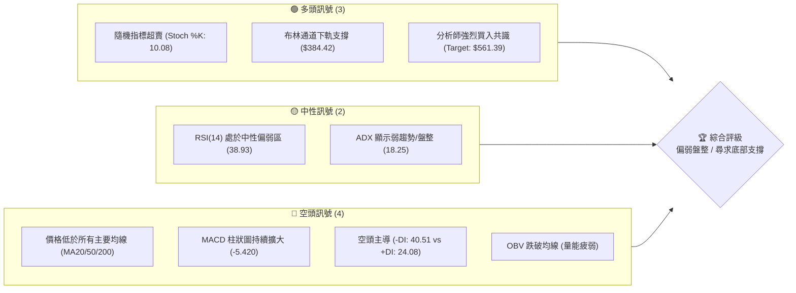
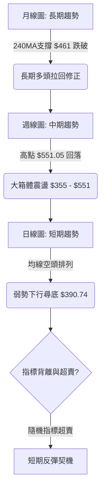
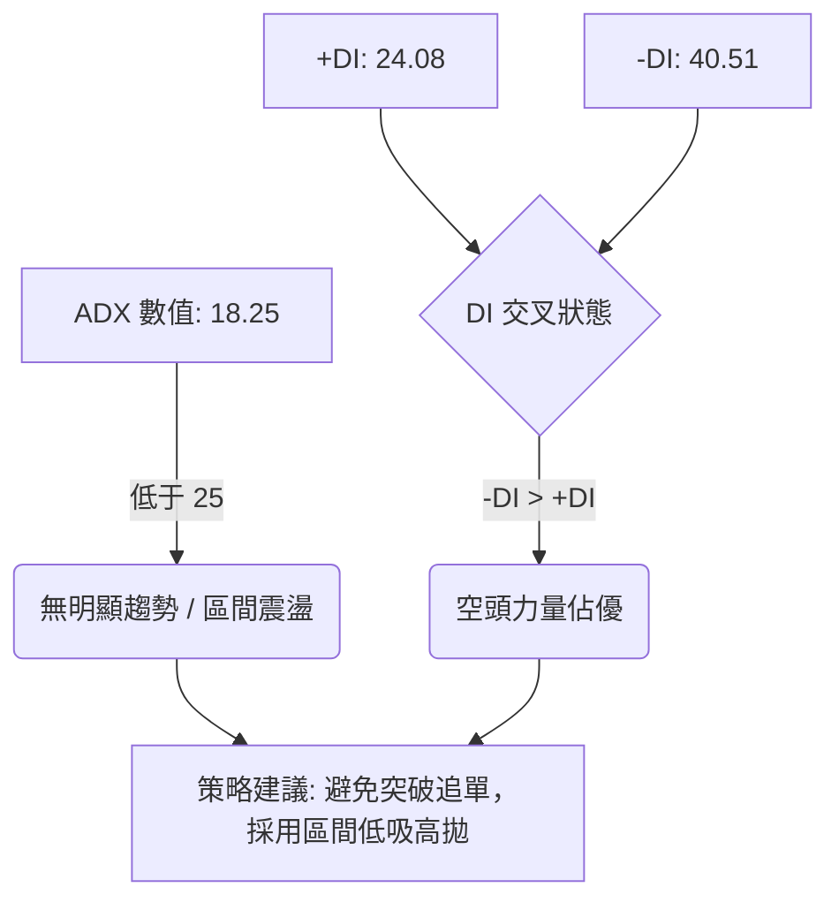
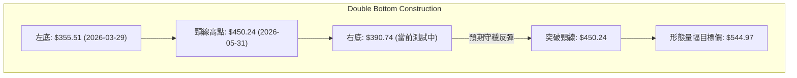

<details>
<summary>📊 靜態圖表 (點擊展開)</summary>

</details>

<html>
<head><meta charset="utf-8" /></head>
<body>
    <div style="height:500px; width:100%;">                        <script>window.PlotlyConfig = {MathJaxConfig: 'local'};</script>
        <script charset="utf-8" src="https://cdn.plot.ly/plotly-3.6.0.min.js" integrity="sha256-QaOVwtVY0T02VaHrr6pnoHLCwayMJp4O5n4YyaE3rJk=" crossorigin="anonymous"></script>                <div id="candlestick-chart" class="plotly-graph-div" style="height:100%; width:100%;"></div>            <script>                window.PLOTLYENV=window.PLOTLYENV || {};                                if (document.getElementById("candlestick-chart")) {                    Plotly.newPlot(                        "candlestick-chart",                        [{"close":{"dtype":"f8","bdata":"AAAAgNB4f0AAAAAg7KZ\u002fQAAAAOAEeH9AAAAAoA5ff0AAAADgtmJ\u002fQAAAAOBejH9AAAAAACi+fkAAAADACPF+QAAAAIBf9H5AAAAAIIkTf0AAAABAth1\u002fQAAAAGAOq39AAAAA4O4AgEAAAAAAYp1\u002fQAAAAMD2rH9AAAAAoACUf0AAAAAgXRWAQAAAAABm839AAAAAgGegf0AAAADgB69\u002fQAAAAMBsfX9AAAAA4NvDf0AAAAAgyPV\u002fQAAAAOCFFYBAAAAAoIMjgEAAAABA9AOAQAAAAKDAEIBAAAAAwPJpgEAAAACAdUWAQAAAAABgTIBAAAAAIOY4gEAAAADA6Lt\u002fQAAAAKAJ7X9AAAAAIGjlf0AAAABALuN\u002fQAAAAGA+xn9AAAAA4JDlf0AAAAAATQyAQAAAAKA3E4BAAAAA4BwqgEAAAACARSqAQAAAAICEQoBAAAAAYGaBgEAAAADARNWAQAAAAIAi0YBAAAAAIJxTgEAAAADgaBSAQAAAAKA1DoBAAAAAoH3xf0AAAAAAfn9\u002fQAAAAICL335AAAAA4BfbfkAAAACADG1\u002fQAAAAKCol39AAAAAoMW+f0AAAAAg9kF\u002fQAAAAOCBr39AAAAAIL2Ef0AAAAAg66p+QAAAAKDeQH5AAAAAAPHEfUAAAADgbWB9QAAAAEBgfn1AAAAA4ACufUAAAACAjzV+QAAAAEBCnX5AAAAA4E9JfkAAAADAPX1+QAAAAKDKuX1AAAAAwFTrfUAAAABASRB+QAAAACB9jX5AAAAA4GqdfkAAAABAA8d9QAAAAGA5FX5AAAAA4IjGfUAAAAAgcIt9QAAAAGBypH1AAAAAQCWgfUAAAAAgWR1+QAAAACBAPH5AAAAAYFIsfkAAAACAEEt+QAAAAICzXX5AAAAAYMNYfkAAAAAADE9+QAAAAIAZVX5AAAAAIJ0XfkAAAADAfW19QAAAAOAObH1AAAAAYDfGfUAAAABgORV+QAAAACDYv31AAAAAQHvSfUAAAADAB7F9QAAAACBVSX1AAAAAQH6VfEAAAACAKmp8QAAAAIAjnXxAAAAAABRIfEAAAACgQaJ7QAAAAOA8EnxAAAAAoCX+fEAAAADAHkN9QAAAAGAw531AAAAAQOr3fUAAAADAP\u002fl6QAAAAAAexnpAAAAAQONXekAAAACgMJZ5QAAAAKCoxXlAAAAAYMt+eEAAAADgyPV4QAAAAMBCvHlAAAAAAAG3eUAAAABAPCl5QAAAAEDvAHlAAAAA4Kb4eEAAAACgm7F4QAAAAABB3XhAAAAA4JTZeEAAAADA8cV4QAAAAKA5+ndAAAAAgIxCeEAAAABgv\u002ft4QAAAAAChDXlAAAAAYEJ+eEAAAACgBNt4QAAAAIDpMHlAAAAAQDBFeUAAAADArZx5QAAAAOA3gXlAAAAAIGeIeUAAAAAgIU55QAAAAGAUQHlAAAAAIN0PeUAAAABAH6t4QAAAAMBe8XhAAAAAoL\u002foeEAAAACgF294QAAAACDeQnhAAAAAILfQd0AAAACgweJ3QAAAAGDzPndAAAAAYM8jd0AAAACA3dJ2QAAAAKD7P3ZAAAAAgPJidkAAAACA6xV3QAAAAMAlCXdAAAAAIHJKd0AAAACgL0F3QAAAAEDEN3dAAAAAAFZYd0AAAABAOER3QAAAAIAYIXdAAAAAAKH4d0AAAACgKoR4QAAAAOBMpXlAAAAAwKA1ekAAAABABV56QAAAAOCpEnpAAAAAoORzekAAAAAAwP96QAAAAKCf7XlAAAAAoDx7ekAAAAAgbn56QAAAACAoxXpAAAAAoK54ekAAAAAgYW55QAAAAIC12HlAAAAAAJ7LeUAAAADg2qd5QAAAAKAL0XlAAAAAIMU9ekAAAADAkON5QAAAAGBKvHlAAAAAIDhueUAAAAAgWUV5QAAAAOC4iHlAAAAAYCFQekAAAACg\u002fml6QAAAAEBJCHpAAAAAYGZCekAAAACgcDF6QAAAAMAeKXpAAAAA4HoAekAAAABguMp5QAAAAADXr3pAAAAAANcjfEAAAADgUch8QAAAAMD1lHtAAAAAoHC1ekAAAADAzMB6QAAAAGC4CnpAAAAAANe7eUAAAABgjzZ5QAAAAIDC1XhAAAAAoHBleEAAAAAA12t4QA=="},"high":{"dtype":"f8","bdata":"2YdnMo+Bf0B3Imvf+b1\u002fQMivgzxJpn9Ap4q\u002fcAxtf0B\u002f+zY6gol\u002fQFhfN3w7j39AOY4TrffLf0DvZ6ZquyB\u002fQPLKfSNtMX9AhU6DBgJBf0BjsRbyDUB\u002fQBKOg3Aw1X9AC3wZtc4BgEBeZdOAzA+AQMZKCQMowX9AZgVXCHXdf0CNTac3QSCAQD67o3jaE4BAqBAu9Z\u002f1f0Cy0TJwE9R\u002fQFd7jA7OrH9Ag00yEkrrf0BvNO0PxwyAQK04OisxF4BA7MpjsN8pgEAl1df4iTKAQIyPQee2KYBARSMWK4F9gEAVYJ7cuXOAQA6My84RXYBAikDp3z1IgEBvEaWHR0KAQOoQEKVHCYBA6nm3JUwAgEBAxrcpew+AQCgMaybHDIBAF2QAE+MBgEAfDbYhfBuAQGODZNlnG4BAQPx+jWVPgECgD5GOOEWAQE9szpJZUIBA6XN7z7mZgEAlC5q44TGBQLnWOEqo9oBAmiqda9OcgEAk0A4G6W+AQLNk0ApATYBAh\u002fuvlnECgEDKzQypcPl\u002fQBlLpG9HaH9A+2xYossDf0AvOr02kHp\u002fQBhsvEhJpn9Aj8+G1jLHf0AypNwOS+R\u002fQADyH6UVxn9AjalKRlrOf0DjNG96CD1\u002fQB+kG1ktwX5AqaH9jhu2fkB3mEJDv8x9QDpyL\u002faRrH1A5qQ+BmnQfUDxULM4UmJ+QBFqt30ip35AXj1jtwJ7fkChDuow\u002frR+QEKvokd9IX5A2nN+KPryfUCufk3kGxR+QKPLc8HgoX5AM3cUrwKffkAhidwrpiF+QPgcw6IAPn5AQe47EPoEfkCqq4Bba+l9QP+jpyJXvH1Am8oySvPdfUBZrRiR3nZ+QDSDmVP+Wn5AbDPF7wJpfkBviiW0rFp+QIZ9KEzcb35AokvsTUtffkCMfN9M9WJ+QKoRY6wkeH5ANK4AC51ffkBQxMEKLih+QAHTs4ZZn31AgijYMuHJfUAYriRddnh+QJZsZV9SCH5AtPeMURXbfUAqradPuO19QJ17NdS6mn1AHeKV1PwhfUD6F7ZKEeN8QPNy\u002fcYu0nxACNykeGVsfEAbiaWQ7Sp8QG2U7SBRLXxAMx72eS5QfUBk6vfHW4J9QBJN8amqC35AeoXuboYZfkC10\u002fFPnIh7QGE4Qa9qWntA8hza6UjNekCvSMll3EJ6QLchoT8FH3pAeiZJEtZneUBKkTxyIwB5QJXy4TLP0HlA\u002fHwBVdNcekCn\u002fuxS0el5QJfjkbJiRnlAT3ekXd87eUA97geJ6Ot4QMYtVF9nDHlAuVT+JuU4eUC3osuKFfR4QHEV1ZgWqHhA1j830EtIeEDrnmosowl5QEJPMcy\u002faXlAl7z7AWa\u002feEBzsCjBKgV5QGanivoiXXlALCL5Q0SieUBGdHDEhqt5QPT5QkuEwnlA3csPyyyVeUA4XjYSBJV5QIw9nVAEgnlA84YKauBTeUCgiupdzT55QFGY\u002f\u002fo5\u002fHhAmTGSc2o4eUBaD\u002fXGPNJ4QDjiQYhEenhALDCfNp4ieEDklYV7+CV4QPUh1V1L2ndAbZjO9euDd0AHYSkLkF53QF8O77eqmnZAW8JjOCDJdkDAH1BVgUF3QNGxS1roUndA1+0H6FFNd0DhZLW5wU53QLC4ZjVSOndA9mwl7K8CeEDSRZCxFUt3QCNraEZAbXdAkV653lf7d0Dn329jZJ14QFtJgV2X13lAYyLyipE+ekC2MHUwW+p6QE7m6S+kZnpAXOY1xBukekCAvVv4Mwx7QPU0Sfroa3pAw98ddIGAekA6dX2a\u002faJ6QDbtnJHaz3pAH+yuW1yeekCgwqTYY9h5QMVgTx1WA3pA6CgH\u002fu09ekBclLVyEf55QJojvmRAGHpAYL7ejOGwekCk\u002f7Ctmht6QM5UBPzEvHlAF6Qa0qHpeUC84TQD6VZ5QGqRguoyr3lAgYwtDOqzekA1wYBDOIN6QGSLqNw8\u002fHpAmssgCwFTekAAAACgcKV6QAAAAGBmhnpAAAAA4FE8ekAAAABACv95QAAAAADX13pAAAAAoEclfEAAAADAHiV9QAAAAAAAWHxAAAAAgD2Ge0AAAABgZkJ7QAAAACCF13pAAAAAYI8SekAAAAAgrr95QAAAAOCjUHlAAAAAoJnNeEAAAAAA13t4QA=="},"hovertemplate":"\u003cb\u003e%{x|%Y-%m-%d}\u003c\u002fb\u003e\u003cbr\u003e\u958b: $%{open:.2f}\u003cbr\u003e\u9ad8: $%{high:.2f}\u003cbr\u003e\u4f4e: $%{low:.2f}\u003cbr\u003e\u6536: $%{close:.2f}\u003cextra\u003e\u003c\u002fextra\u003e","low":{"dtype":"f8","bdata":"+5JxMRAMf0AtQWRYGWV\u002fQCFPKVYKVX9ArDedFu\u002fafkBHvDgbijJ\u002fQG3zjF+8P39AHMexS1eUfkDg1UkXor5+QCZzTa0V6X5AvHie1oDZfkBtefhu8ut+QIurRZTdSn9ACVYewPJ8f0A5cJ0XY5Z\u002fQMsvOY7va39Avd1RHXGHf0AGiuAsk7F\u002fQJTxZ7wH1X9AnBIynuCBf0DrO\u002fIirXt\u002fQPBjLwzJXX9AuDGMA+h2f0CTcxiT1pp\u002fQN3GRpI9p39AEOQe\u002fYPHf0DaTSgvdbd\u002fQNvq4lMk\u002fH9AlykZqIIXgEC1K8ZcRDGAQB0tEE9iPoBAW7+zkSYRgEBIKrRow6Z\u002fQDgq7jdbx39A4pUPgwxtf0D+OMJqpax\u002fQPy2sxTqjn9AR\u002flQgOCBf0DTKAEdLuN\u002fQAYQlNf63H9AyBBYmZ0TgECvfhwCxRqAQL7GlsB2K4BAmrDSOXJtgEBkHlkh78qAQHDrpT\u002fRqoBAB5dGSqw2gEDMg79bu\u002f1\u002fQPcSr+Wf9X9A\u002fADay02Kf0B1rZIzRXZ\u002fQONx5+AIy35AA9DMJlWifkA\u002fanrZkvp+QFnPPCwEM39AclteeKn\u002ffkCJbkauKSJ\u002fQFqVDEnz5H5AcIGAAbhbf0ACV57Tdjt+QBeKQFap\u002fH1AS65b9USWfUADol4qGiN9QCeMirgeH31AKXU3HEPtfEAhKRDWEPF9QD16E\u002fbgR35ATpg6NAUofkAcsdlTn0J+QFk8wrF9kX1A0suWHgqmfUAV0mcZHMx9QBj2a1S4I35ARtgi7FhlfkBjSSdSlI99QOmEZfIAnH1AEWocZaajfUAer48EzWZ9QPZyd2+tTH1AKUPCFk6OfUAMvuYXV7x9QHnT7wmdBX5AUuwOv8wIfkAP7EwxdCl+QDx4FC7jKn5AGimfJ+M8fkB66NqmiCB+QNK5+lSPNX5AQ2esL4QSfkDqjvdbNUF9QHepqxWyNn1AaUFjdK06fUAwegS+S719QBNmCfwAnH1Ax3EyMrRhfUCqX179Ipl9QE+dy7Yl\u002fnxA1MgMQkpyfECIkjlND158QJj7QYFMZ3xAmSDkJ5z0e0AThk\u002f7wkt7QGCpB5Onq3tAVYXLRoUIfEDwt6k8Or98QBeg4N7+cH1AhNR0qxe+fUCR3EJCdDJ6QGc\u002fjRvziHpAACa2FgxGekBvLphf+mt5QOJhNUTPdnlAai0VREppeEDNqAwG2XJ4QJTjg8x78XhA0+DCueyteUBWlTTEtvN4QEXAWy3tw3hAyjL9QZDEeEAwTtxPfox4QISCWbABqXhAWJpi+AC9eECPvv5S5aR4QIEHuEBa5HdAhT5SKCnOd0DM9SOLEVV4QNRKOkEN3nhAIU43MZlQeEDKhWJ8klx4QC0vh00kfXhA5DHYCR73eECWSM93ajh5QFNMv7sIenlAvVhLEQwqeUC7rkpt8iB5QHndyp+NC3lAW9zpE3gNeUCas\u002f4BXpZ4QHHpnQ39nnhA7hrw8T7OeEAj8k++emJ4QNhLv1mTI3hAzrzEnca0d0BuJFaPrs13QG0w4uC9MHdAXFJHe0wNd0DMtpiHacZ2QHo0Kg3VO3ZAbkJg+Sg4dkCtLAy6kKR2QJz4Ydt39nZAbjBXys61dkBaGswLOQt3QKKTS9lI3HZAM7wembcpd0Dm\u002f2KKG+R2QBVUj0+vE3dAPDUdjX0jd0AwU\u002fNV9Bp4QAFOHiX2vXhAu8FaIf2zeUBt8vU2fjx6QK0ZMYtn9nlA8dx6HMYEekCxHnPiEWx6QAetVWtVqHlAdc7c82vueUCCo+u6sgJ6QJOxnJDPT3pAk\u002fUZShs2ekBkkGO8ZdJ4QL0Uw+jYmHlAx4CwNpieeUC3OsD2qX55QJ6ky1fAQ3lAXP\u002fzCq4dekCD3Bsqr9F5QFa\u002f9mH6SXlAQuTEwC1ceUCtvovgnAJ5QGqvxM83AHlAZ4mWIkjAeUDYtqxyY+t5QLFdmxtw+XlAuDctxpOmeUAAAAAgXPt5QAAAAKBHBXpAAAAA4FHQeUAAAACgR5l5QAAAAGC4ynlAAAAAgMIFe0AAAADgUaR8QAAAAEDhhntAAAAAAACEekAAAABgj6Z6QAAAAGBm5nlAAAAAwPWIeUAAAAAgrud4QAAAAGCP0nhAAAAAAAAAeEAAAADgUeR3QA=="},"name":"\u50f9\u683c","open":{"dtype":"f8","bdata":"gKtor3Mtf0CZt9b7YH5\u002fQOritTdXl39ASfrVHSAVf0DgvY5W6Ul\u002fQJj6qRoFUn9AVVV1Dtydf0BJBBlSmu9+QAugzIZjJH9A7rpIeAg9f0CgAEdJbTF\u002fQE5h9yZid39AIZ26e2iZf0DJ7pVDBA2AQLacguiAtn9A4sD6AlbEf0DmFxy7jLV\u002fQHOifg7DAoBAZaioUhDpf0AQwiISsLJ\u002fQHuKMOOdkX9AV8itlpmtf0DFH0mJfsR\u002fQNOMueko4H9ARVvvUfb4f0BVWtMCDxOAQLNp5djDDoBA3Eth\u002f8QagEAPF\u002ffSuGeAQDNUI\u002fzkP4BA9uD2BWw4gEA5N90v9SKAQOoQEKVHCYBAopLkmE2wf0AlHzvPgft\u002fQI2ErJ6q1X9AAvzYB2Kdf0AsJhLy8PV\u002fQKPb1Q\u002fyEYBALjIsY\u002fYugECmGNNCYDmAQFLLqLH\u002fO4BAK9EXhneDgEDmQ8EqTxSBQM5un44V7IBAJitlyiF5gEDzD9+RaWyAQHnubitPJIBAqzKPH6HIf0CXwNEZHeF\u002fQPeUqZekZ39ANQgWBindfkDZcnoCSg5\u002fQPLtjST4WX9AY6hzgniif0DsdiAKk7F\u002fQIb2qsuC8X5AGGTAoACUf0ABnooFCsR+QCnyke4\u002fcH5AC\u002f8mjWiofkBFb96DDsZ9QP2uFhdOjn1AaO\u002fcpn1\u002ffUCyPW6KdkJ+QG8VlfUCV35AGtfGQGRkfkD+eVNw\u002fkh+QPIQ\u002ftpUo31ALhW2vCDafUAAxmFfFwZ+QMXlcxHYK35AS\u002fXBpudufkDt6J4KJR5+QEUWovZEqH1Ah8rfUhXbfUD4sMwdi999QD\u002fNG5sVXX1AoNlRx7qsfUAsRUhlHsF9QMP0qxkwU35AFjFttW8\u002ffkBwa3b1Ri1+QI9Fd15tOH5ADzztiNVIfkBe1aKNXSt+QJme9sVoPH5Aqu2\u002fndVafkBObOkR4SN+QJ\u002fi7gZVf31AX9RoqDB7fUCWR3mfINp9QOFs58iz8X1ACnZM61R\u002ffUBJT9ki6Kh9QAblBS41iX1A9cLITUUGfUCo+Rcn\u002f+B8QEN+UX3NfHxA9egfLYMTfEBIDweTfil8QKtdRswq2ntAdcU5kd0dfEAalOfg8\u002fN8QAhObPCYeX1AZRTVLhURfkBFcrfkoGB7QKN5OT6RU3tAwHNJ\u002flHFekAXBKRfOUJ6QD6REE7YknlAPvVLMCNaeUCf9luGZ9Z4QL422qXhMHlAOh2ATyccekAZC5yIW+V5QCg7WT1FM3lATsLsiIIqeUByUolkM9d4QPBK35HWxXhApnltQi\u002f9eEBHDCwKELR4QJP+o0hXonhAIlyABfX0d0AWRKjE+Vp4QHBWKIhdPXlAioMLV5BgeEBg+sS+LIB4QKKMZ0SlhHhAhSZLqnEGeUA28nBKvDh5QJDNEOAMhXlAHtM\u002f37dAeUB4wH0zTZJ5QI5aUoQYS3lAnHOhmhY8eUCT01ZBIgJ5QKMceeRa03hABOsUg3r2eEA13Ij6WMR4QDMMdVAcVHhAtKN+8kMfeEAAQHoIIPF3QDmUJreJ2HdAuiwI06+Bd0AA8yQxTCB3QIGUYrbikXZAR2JkueKRdkDJ6hygMbx2QC+7YcfsSndA+iTEc6nmdkB7T6W57Ep3QHdFGUOiGHdA0L1xOV4CeECqwLuLHjt3QIzPYXLIQndA\u002fVjLP9dMd0C1WkdxTjF4QP7rE8c80nhALMuGyj0vekB4+68nbn56QOAzLjzWQ3pA3WBk8041ekDfmJ9zTZR6QMeN3Xm4L3pA2hVi+BkBekDXJH55eVd6QI9A0U1wenpAxIgQEJl6ekDXSYctwZ55QOPrlYSGvnlApUioyWiqeUC+Y0s\u002fwuZ5QG4feULkcXlAqxOulzszekC6B7unzgd6QN3NF+fQb3lAgk+f+VjZeUAk7\u002fAKQiV5QIhLhpGxOXlA+9OSmP7VeUDzltWBg\u002ft5QK9WBsaIz3pArK4c\u002fmXUeUAAAAAAAIx6QAAAAOCjOHpAAAAAQOEGekAAAAAAKbB5QAAAACCuz3lAAAAAwMwIe0AAAACgcA19QAAAAIAU7ntAAAAAQDNne0AAAADA9Tx7QAAAAKBwxXpAAAAAgD3ieUAAAADgepB5QAAAAMDM6HhAAAAAIFyzeEAAAABguHZ4QA=="},"x":["2025-08-27T00:00:00-04:00","2025-08-28T00:00:00-04:00","2025-08-29T00:00:00-04:00","2025-09-02T00:00:00-04:00","2025-09-03T00:00:00-04:00","2025-09-04T00:00:00-04:00","2025-09-05T00:00:00-04:00","2025-09-08T00:00:00-04:00","2025-09-09T00:00:00-04:00","2025-09-10T00:00:00-04:00","2025-09-11T00:00:00-04:00","2025-09-12T00:00:00-04:00","2025-09-15T00:00:00-04:00","2025-09-16T00:00:00-04:00","2025-09-17T00:00:00-04:00","2025-09-18T00:00:00-04:00","2025-09-19T00:00:00-04:00","2025-09-22T00:00:00-04:00","2025-09-23T00:00:00-04:00","2025-09-24T00:00:00-04:00","2025-09-25T00:00:00-04:00","2025-09-26T00:00:00-04:00","2025-09-29T00:00:00-04:00","2025-09-30T00:00:00-04:00","2025-10-01T00:00:00-04:00","2025-10-02T00:00:00-04:00","2025-10-03T00:00:00-04:00","2025-10-06T00:00:00-04:00","2025-10-07T00:00:00-04:00","2025-10-08T00:00:00-04:00","2025-10-09T00:00:00-04:00","2025-10-10T00:00:00-04:00","2025-10-13T00:00:00-04:00","2025-10-14T00:00:00-04:00","2025-10-15T00:00:00-04:00","2025-10-16T00:00:00-04:00","2025-10-17T00:00:00-04:00","2025-10-20T00:00:00-04:00","2025-10-21T00:00:00-04:00","2025-10-22T00:00:00-04:00","2025-10-23T00:00:00-04:00","2025-10-24T00:00:00-04:00","2025-10-27T00:00:00-04:00","2025-10-28T00:00:00-04:00","2025-10-29T00:00:00-04:00","2025-10-30T00:00:00-04:00","2025-10-31T00:00:00-04:00","2025-11-03T00:00:00-05:00","2025-11-04T00:00:00-05:00","2025-11-05T00:00:00-05:00","2025-11-06T00:00:00-05:00","2025-11-07T00:00:00-05:00","2025-11-10T00:00:00-05:00","2025-11-11T00:00:00-05:00","2025-11-12T00:00:00-05:00","2025-11-13T00:00:00-05:00","2025-11-14T00:00:00-05:00","2025-11-17T00:00:00-05:00","2025-11-18T00:00:00-05:00","2025-11-19T00:00:00-05:00","2025-11-20T00:00:00-05:00","2025-11-21T00:00:00-05:00","2025-11-24T00:00:00-05:00","2025-11-25T00:00:00-05:00","2025-11-26T00:00:00-05:00","2025-11-28T00:00:00-05:00","2025-12-01T00:00:00-05:00","2025-12-02T00:00:00-05:00","2025-12-03T00:00:00-05:00","2025-12-04T00:00:00-05:00","2025-12-05T00:00:00-05:00","2025-12-08T00:00:00-05:00","2025-12-09T00:00:00-05:00","2025-12-10T00:00:00-05:00","2025-12-11T00:00:00-05:00","2025-12-12T00:00:00-05:00","2025-12-15T00:00:00-05:00","2025-12-16T00:00:00-05:00","2025-12-17T00:00:00-05:00","2025-12-18T00:00:00-05:00","2025-12-19T00:00:00-05:00","2025-12-22T00:00:00-05:00","2025-12-23T00:00:00-05:00","2025-12-24T00:00:00-05:00","2025-12-26T00:00:00-05:00","2025-12-29T00:00:00-05:00","2025-12-30T00:00:00-05:00","2025-12-31T00:00:00-05:00","2026-01-02T00:00:00-05:00","2026-01-05T00:00:00-05:00","2026-01-06T00:00:00-05:00","2026-01-07T00:00:00-05:00","2026-01-08T00:00:00-05:00","2026-01-09T00:00:00-05:00","2026-01-12T00:00:00-05:00","2026-01-13T00:00:00-05:00","2026-01-14T00:00:00-05:00","2026-01-15T00:00:00-05:00","2026-01-16T00:00:00-05:00","2026-01-20T00:00:00-05:00","2026-01-21T00:00:00-05:00","2026-01-22T00:00:00-05:00","2026-01-23T00:00:00-05:00","2026-01-26T00:00:00-05:00","2026-01-27T00:00:00-05:00","2026-01-28T00:00:00-05:00","2026-01-29T00:00:00-05:00","2026-01-30T00:00:00-05:00","2026-02-02T00:00:00-05:00","2026-02-03T00:00:00-05:00","2026-02-04T00:00:00-05:00","2026-02-05T00:00:00-05:00","2026-02-06T00:00:00-05:00","2026-02-09T00:00:00-05:00","2026-02-10T00:00:00-05:00","2026-02-11T00:00:00-05:00","2026-02-12T00:00:00-05:00","2026-02-13T00:00:00-05:00","2026-02-17T00:00:00-05:00","2026-02-18T00:00:00-05:00","2026-02-19T00:00:00-05:00","2026-02-20T00:00:00-05:00","2026-02-23T00:00:00-05:00","2026-02-24T00:00:00-05:00","2026-02-25T00:00:00-05:00","2026-02-26T00:00:00-05:00","2026-02-27T00:00:00-05:00","2026-03-02T00:00:00-05:00","2026-03-03T00:00:00-05:00","2026-03-04T00:00:00-05:00","2026-03-05T00:00:00-05:00","2026-03-06T00:00:00-05:00","2026-03-09T00:00:00-04:00","2026-03-10T00:00:00-04:00","2026-03-11T00:00:00-04:00","2026-03-12T00:00:00-04:00","2026-03-13T00:00:00-04:00","2026-03-16T00:00:00-04:00","2026-03-17T00:00:00-04:00","2026-03-18T00:00:00-04:00","2026-03-19T00:00:00-04:00","2026-03-20T00:00:00-04:00","2026-03-23T00:00:00-04:00","2026-03-24T00:00:00-04:00","2026-03-25T00:00:00-04:00","2026-03-26T00:00:00-04:00","2026-03-27T00:00:00-04:00","2026-03-30T00:00:00-04:00","2026-03-31T00:00:00-04:00","2026-04-01T00:00:00-04:00","2026-04-02T00:00:00-04:00","2026-04-06T00:00:00-04:00","2026-04-07T00:00:00-04:00","2026-04-08T00:00:00-04:00","2026-04-09T00:00:00-04:00","2026-04-10T00:00:00-04:00","2026-04-13T00:00:00-04:00","2026-04-14T00:00:00-04:00","2026-04-15T00:00:00-04:00","2026-04-16T00:00:00-04:00","2026-04-17T00:00:00-04:00","2026-04-20T00:00:00-04:00","2026-04-21T00:00:00-04:00","2026-04-22T00:00:00-04:00","2026-04-23T00:00:00-04:00","2026-04-24T00:00:00-04:00","2026-04-27T00:00:00-04:00","2026-04-28T00:00:00-04:00","2026-04-29T00:00:00-04:00","2026-04-30T00:00:00-04:00","2026-05-01T00:00:00-04:00","2026-05-04T00:00:00-04:00","2026-05-05T00:00:00-04:00","2026-05-06T00:00:00-04:00","2026-05-07T00:00:00-04:00","2026-05-08T00:00:00-04:00","2026-05-11T00:00:00-04:00","2026-05-12T00:00:00-04:00","2026-05-13T00:00:00-04:00","2026-05-14T00:00:00-04:00","2026-05-15T00:00:00-04:00","2026-05-18T00:00:00-04:00","2026-05-19T00:00:00-04:00","2026-05-20T00:00:00-04:00","2026-05-21T00:00:00-04:00","2026-05-22T00:00:00-04:00","2026-05-26T00:00:00-04:00","2026-05-27T00:00:00-04:00","2026-05-28T00:00:00-04:00","2026-05-29T00:00:00-04:00","2026-06-01T00:00:00-04:00","2026-06-02T00:00:00-04:00","2026-06-03T00:00:00-04:00","2026-06-04T00:00:00-04:00","2026-06-05T00:00:00-04:00","2026-06-08T00:00:00-04:00","2026-06-09T00:00:00-04:00","2026-06-10T00:00:00-04:00","2026-06-11T00:00:00-04:00","2026-06-12T00:00:00-04:00"],"type":"candlestick"},{"hovertemplate":"MA30: $%{y:.2f}\u003cextra\u003e\u003c\u002fextra\u003e","line":{"color":"#2196F3","dash":"dash","width":2},"mode":"lines","name":"MA30","x":["2025-08-27T00:00:00-04:00","2025-08-28T00:00:00-04:00","2025-08-29T00:00:00-04:00","2025-09-02T00:00:00-04:00","2025-09-03T00:00:00-04:00","2025-09-04T00:00:00-04:00","2025-09-05T00:00:00-04:00","2025-09-08T00:00:00-04:00","2025-09-09T00:00:00-04:00","2025-09-10T00:00:00-04:00","2025-09-11T00:00:00-04:00","2025-09-12T00:00:00-04:00","2025-09-15T00:00:00-04:00","2025-09-16T00:00:00-04:00","2025-09-17T00:00:00-04:00","2025-09-18T00:00:00-04:00","2025-09-19T00:00:00-04:00","2025-09-22T00:00:00-04:00","2025-09-23T00:00:00-04:00","2025-09-24T00:00:00-04:00","2025-09-25T00:00:00-04:00","2025-09-26T00:00:00-04:00","2025-09-29T00:00:00-04:00","2025-09-30T00:00:00-04:00","2025-10-01T00:00:00-04:00","2025-10-02T00:00:00-04:00","2025-10-03T00:00:00-04:00","2025-10-06T00:00:00-04:00","2025-10-07T00:00:00-04:00","2025-10-08T00:00:00-04:00","2025-10-09T00:00:00-04:00","2025-10-10T00:00:00-04:00","2025-10-13T00:00:00-04:00","2025-10-14T00:00:00-04:00","2025-10-15T00:00:00-04:00","2025-10-16T00:00:00-04:00","2025-10-17T00:00:00-04:00","2025-10-20T00:00:00-04:00","2025-10-21T00:00:00-04:00","2025-10-22T00:00:00-04:00","2025-10-23T00:00:00-04:00","2025-10-24T00:00:00-04:00","2025-10-27T00:00:00-04:00","2025-10-28T00:00:00-04:00","2025-10-29T00:00:00-04:00","2025-10-30T00:00:00-04:00","2025-10-31T00:00:00-04:00","2025-11-03T00:00:00-05:00","2025-11-04T00:00:00-05:00","2025-11-05T00:00:00-05:00","2025-11-06T00:00:00-05:00","2025-11-07T00:00:00-05:00","2025-11-10T00:00:00-05:00","2025-11-11T00:00:00-05:00","2025-11-12T00:00:00-05:00","2025-11-13T00:00:00-05:00","2025-11-14T00:00:00-05:00","2025-11-17T00:00:00-05:00","2025-11-18T00:00:00-05:00","2025-11-19T00:00:00-05:00","2025-11-20T00:00:00-05:00","2025-11-21T00:00:00-05:00","2025-11-24T00:00:00-05:00","2025-11-25T00:00:00-05:00","2025-11-26T00:00:00-05:00","2025-11-28T00:00:00-05:00","2025-12-01T00:00:00-05:00","2025-12-02T00:00:00-05:00","2025-12-03T00:00:00-05:00","2025-12-04T00:00:00-05:00","2025-12-05T00:00:00-05:00","2025-12-08T00:00:00-05:00","2025-12-09T00:00:00-05:00","2025-12-10T00:00:00-05:00","2025-12-11T00:00:00-05:00","2025-12-12T00:00:00-05:00","2025-12-15T00:00:00-05:00","2025-12-16T00:00:00-05:00","2025-12-17T00:00:00-05:00","2025-12-18T00:00:00-05:00","2025-12-19T00:00:00-05:00","2025-12-22T00:00:00-05:00","2025-12-23T00:00:00-05:00","2025-12-24T00:00:00-05:00","2025-12-26T00:00:00-05:00","2025-12-29T00:00:00-05:00","2025-12-30T00:00:00-05:00","2025-12-31T00:00:00-05:00","2026-01-02T00:00:00-05:00","2026-01-05T00:00:00-05:00","2026-01-06T00:00:00-05:00","2026-01-07T00:00:00-05:00","2026-01-08T00:00:00-05:00","2026-01-09T00:00:00-05:00","2026-01-12T00:00:00-05:00","2026-01-13T00:00:00-05:00","2026-01-14T00:00:00-05:00","2026-01-15T00:00:00-05:00","2026-01-16T00:00:00-05:00","2026-01-20T00:00:00-05:00","2026-01-21T00:00:00-05:00","2026-01-22T00:00:00-05:00","2026-01-23T00:00:00-05:00","2026-01-26T00:00:00-05:00","2026-01-27T00:00:00-05:00","2026-01-28T00:00:00-05:00","2026-01-29T00:00:00-05:00","2026-01-30T00:00:00-05:00","2026-02-02T00:00:00-05:00","2026-02-03T00:00:00-05:00","2026-02-04T00:00:00-05:00","2026-02-05T00:00:00-05:00","2026-02-06T00:00:00-05:00","2026-02-09T00:00:00-05:00","2026-02-10T00:00:00-05:00","2026-02-11T00:00:00-05:00","2026-02-12T00:00:00-05:00","2026-02-13T00:00:00-05:00","2026-02-17T00:00:00-05:00","2026-02-18T00:00:00-05:00","2026-02-19T00:00:00-05:00","2026-02-20T00:00:00-05:00","2026-02-23T00:00:00-05:00","2026-02-24T00:00:00-05:00","2026-02-25T00:00:00-05:00","2026-02-26T00:00:00-05:00","2026-02-27T00:00:00-05:00","2026-03-02T00:00:00-05:00","2026-03-03T00:00:00-05:00","2026-03-04T00:00:00-05:00","2026-03-05T00:00:00-05:00","2026-03-06T00:00:00-05:00","2026-03-09T00:00:00-04:00","2026-03-10T00:00:00-04:00","2026-03-11T00:00:00-04:00","2026-03-12T00:00:00-04:00","2026-03-13T00:00:00-04:00","2026-03-16T00:00:00-04:00","2026-03-17T00:00:00-04:00","2026-03-18T00:00:00-04:00","2026-03-19T00:00:00-04:00","2026-03-20T00:00:00-04:00","2026-03-23T00:00:00-04:00","2026-03-24T00:00:00-04:00","2026-03-25T00:00:00-04:00","2026-03-26T00:00:00-04:00","2026-03-27T00:00:00-04:00","2026-03-30T00:00:00-04:00","2026-03-31T00:00:00-04:00","2026-04-01T00:00:00-04:00","2026-04-02T00:00:00-04:00","2026-04-06T00:00:00-04:00","2026-04-07T00:00:00-04:00","2026-04-08T00:00:00-04:00","2026-04-09T00:00:00-04:00","2026-04-10T00:00:00-04:00","2026-04-13T00:00:00-04:00","2026-04-14T00:00:00-04:00","2026-04-15T00:00:00-04:00","2026-04-16T00:00:00-04:00","2026-04-17T00:00:00-04:00","2026-04-20T00:00:00-04:00","2026-04-21T00:00:00-04:00","2026-04-22T00:00:00-04:00","2026-04-23T00:00:00-04:00","2026-04-24T00:00:00-04:00","2026-04-27T00:00:00-04:00","2026-04-28T00:00:00-04:00","2026-04-29T00:00:00-04:00","2026-04-30T00:00:00-04:00","2026-05-01T00:00:00-04:00","2026-05-04T00:00:00-04:00","2026-05-05T00:00:00-04:00","2026-05-06T00:00:00-04:00","2026-05-07T00:00:00-04:00","2026-05-08T00:00:00-04:00","2026-05-11T00:00:00-04:00","2026-05-12T00:00:00-04:00","2026-05-13T00:00:00-04:00","2026-05-14T00:00:00-04:00","2026-05-15T00:00:00-04:00","2026-05-18T00:00:00-04:00","2026-05-19T00:00:00-04:00","2026-05-20T00:00:00-04:00","2026-05-21T00:00:00-04:00","2026-05-22T00:00:00-04:00","2026-05-26T00:00:00-04:00","2026-05-27T00:00:00-04:00","2026-05-28T00:00:00-04:00","2026-05-29T00:00:00-04:00","2026-06-01T00:00:00-04:00","2026-06-02T00:00:00-04:00","2026-06-03T00:00:00-04:00","2026-06-04T00:00:00-04:00","2026-06-05T00:00:00-04:00","2026-06-08T00:00:00-04:00","2026-06-09T00:00:00-04:00","2026-06-10T00:00:00-04:00","2026-06-11T00:00:00-04:00","2026-06-12T00:00:00-04:00"],"y":{"dtype":"f8","bdata":"AAAAAAAA+H8AAAAAAAD4fwAAAAAAAPh\u002fAAAAAAAA+H8AAAAAAAD4fwAAAAAAAPh\u002fAAAAAAAA+H8AAAAAAAD4fwAAAAAAAPh\u002fAAAAAAAA+H8AAAAAAAD4fwAAAAAAAPh\u002fAAAAAAAA+H8AAAAAAAD4fwAAAAAAAPh\u002fAAAAAAAA+H8AAAAAAAD4fwAAAAAAAPh\u002fAAAAAAAA+H8AAAAAAAD4fwAAAAAAAPh\u002fAAAAAAAA+H8AAAAAAAD4fwAAAAAAAPh\u002fAAAAAAAA+H8AAAAAAAD4fwAAAAAAAPh\u002fAAAAAAAA+H8AAAAAAAD4f83MzHxjt39AVVVVJbC\u002ff0C8u7s7Y8B\u002fQKuqqspJxH9A3t3dPcTIf0DNzMx8DM1\u002fQGZmZlb6zn9Aq6qqKtPYf0B3d3dXreJ\u002fQBERERHh7H9A7+7unpH3f0De3d0F9wCAQBERERGZBIBAERERUeEIgECamZn5oRGAQBEREeH8GYBAvLu7I5MegEB3d3f\u002fih6AQM3MzAQ6H4BAzczM\u002fJMggEAAAAAoyR+AQBEREYknHYBA7+7uZkYZgEAiIiIC\u002fxaAQAAAACiKFIBAvLu7y0QSgEARERE5+A6AQFVVVdURDYBAvLu703sHgECJiIio9\u002f5\u002fQN7d3a346n9AIiIikiTUf0AAAADgBsB\u002fQO\u002fu7n5Fq39Ad3d3p1uYf0AAAACQCYp\u002fQKuqqkojgH9AREREZGVyf0De3d0dr2R\u002fQGZmZvb+T39AvLu7y247f0BVVVVFFyh\u002fQHd3d1dOF39AVVVVJdwCf0AREREBreF+QBEREdFfw35AAAAAcNGqfkAiIiJigZR+QN7d3Y1wf35Ad3d3V6lrfkAAAABQ219+QN7d3d1pWn5AvLu7e5ZUfkAzMzPz60p+QImIiNh0QH5AZmZm1oU0fkB3d3f3bCx+QERERPTgIH5AiYiIOLUUfkAiIiKCIAp+QERERIQIA35AVVVVZRMDfkDe3d0tGgl+QHd3d9dIC35A7+7uHoAMfkAiIiIyFQh+QN7d3X3A\u002fH1AERERgTnufUCamZmphdx9QAAAAKAI031AAAAAAA\u002fFfUAzMzMDU7B9QERERDQmm31AAAAAkE6NfUBEREQU6Yh9QO\u002fu7j5gh31AAAAAoAWJfUBEREQUFXN9QM3MzMyaWn1AmpmZmZg+fUDe3d0d9Rd9QAAAAADf8XxAERERkWvBfEDe3d0t6ZN8QLy7u2tlbHxAERER8d5EfEDe3d2d8Rh8QN7d3b1463tA3t3d3cW\u002fe0BmZmZ2YJd7QLy7u7t7cHtAERERUXZGe0AREREhJxl7QM3MzBzm53pAiYiIOG+4ekBEREQkQpB6QJqZmYkibHpAREREJDpJekAzMzMD2yp6QBEREeGlDXpA7+7unvPzeUBVVVX1suJ5QERERGTMzHlAq6qqCkaveUCrqqragY15QImIiLjNZXlAq6qqau87eUCrqqqqQyh5QBEREbGjGHlAVVVVxWYMeUCrqqqakAJ5QM3MzPyr9XhAMzMzg97veECrqqqas+Z4QJqZmTl10XhAq6qqGny7eEAzMzMDiqd4QM3MzGwKkHhAERER4ft5eEDv7u7OQmx4QM3MzEyoXHhAd3d3V1pPeEAAAADwZEJ4QO\u002fu7o7pO3hAERER8Ro0eEDe3d1NdCV4QKuqqloJFXhAq6qqCpUQeECJiIjorw14QGZmZhaREXhAZmZm1pQZeEAAAACwBiB4QCIiItLfJHhAZmZmVrkseEARERGRLTt4QJqZmXn2QHhAIiIiQhNNeEBERET0plx4QLy7u7s+bHhAAAAAgJN5eEAzMzPzFYJ4QBERESGdj3hAERERsYKgeEAiIiIina94QAAAAOCMxXhAAAAAAATgeEC8u7sbLPp4QHd3d3fqF3lAERERQeQxeUCrqqoKikR5QO\u002fu7r7bWXlAq6qq2qVzeUAAAACwm455QO\u002fu7h6gpnlAiYiIiH6\u002feUARERHhd9h5QERERPRV8nlAREREBKoDekC8u7ubjA56QERERBRvF3pAq6qqWugnekAiIiKChDx6QHd3d+dkSXpAzczMPJRLekAAAAAQe0l6QKuqqlpzSnpAmpmZGRJEekBmZmZGJDl6QDMzM+OgKHpA7+7unusWekCrqqpqTQ56QA=="},"type":"scatter"},{"hovertemplate":"MA60: $%{y:.2f}\u003cextra\u003e\u003c\u002fextra\u003e","line":{"color":"#9C27B0","dash":"dash","width":2},"mode":"lines","name":"MA60","x":["2025-08-27T00:00:00-04:00","2025-08-28T00:00:00-04:00","2025-08-29T00:00:00-04:00","2025-09-02T00:00:00-04:00","2025-09-03T00:00:00-04:00","2025-09-04T00:00:00-04:00","2025-09-05T00:00:00-04:00","2025-09-08T00:00:00-04:00","2025-09-09T00:00:00-04:00","2025-09-10T00:00:00-04:00","2025-09-11T00:00:00-04:00","2025-09-12T00:00:00-04:00","2025-09-15T00:00:00-04:00","2025-09-16T00:00:00-04:00","2025-09-17T00:00:00-04:00","2025-09-18T00:00:00-04:00","2025-09-19T00:00:00-04:00","2025-09-22T00:00:00-04:00","2025-09-23T00:00:00-04:00","2025-09-24T00:00:00-04:00","2025-09-25T00:00:00-04:00","2025-09-26T00:00:00-04:00","2025-09-29T00:00:00-04:00","2025-09-30T00:00:00-04:00","2025-10-01T00:00:00-04:00","2025-10-02T00:00:00-04:00","2025-10-03T00:00:00-04:00","2025-10-06T00:00:00-04:00","2025-10-07T00:00:00-04:00","2025-10-08T00:00:00-04:00","2025-10-09T00:00:00-04:00","2025-10-10T00:00:00-04:00","2025-10-13T00:00:00-04:00","2025-10-14T00:00:00-04:00","2025-10-15T00:00:00-04:00","2025-10-16T00:00:00-04:00","2025-10-17T00:00:00-04:00","2025-10-20T00:00:00-04:00","2025-10-21T00:00:00-04:00","2025-10-22T00:00:00-04:00","2025-10-23T00:00:00-04:00","2025-10-24T00:00:00-04:00","2025-10-27T00:00:00-04:00","2025-10-28T00:00:00-04:00","2025-10-29T00:00:00-04:00","2025-10-30T00:00:00-04:00","2025-10-31T00:00:00-04:00","2025-11-03T00:00:00-05:00","2025-11-04T00:00:00-05:00","2025-11-05T00:00:00-05:00","2025-11-06T00:00:00-05:00","2025-11-07T00:00:00-05:00","2025-11-10T00:00:00-05:00","2025-11-11T00:00:00-05:00","2025-11-12T00:00:00-05:00","2025-11-13T00:00:00-05:00","2025-11-14T00:00:00-05:00","2025-11-17T00:00:00-05:00","2025-11-18T00:00:00-05:00","2025-11-19T00:00:00-05:00","2025-11-20T00:00:00-05:00","2025-11-21T00:00:00-05:00","2025-11-24T00:00:00-05:00","2025-11-25T00:00:00-05:00","2025-11-26T00:00:00-05:00","2025-11-28T00:00:00-05:00","2025-12-01T00:00:00-05:00","2025-12-02T00:00:00-05:00","2025-12-03T00:00:00-05:00","2025-12-04T00:00:00-05:00","2025-12-05T00:00:00-05:00","2025-12-08T00:00:00-05:00","2025-12-09T00:00:00-05:00","2025-12-10T00:00:00-05:00","2025-12-11T00:00:00-05:00","2025-12-12T00:00:00-05:00","2025-12-15T00:00:00-05:00","2025-12-16T00:00:00-05:00","2025-12-17T00:00:00-05:00","2025-12-18T00:00:00-05:00","2025-12-19T00:00:00-05:00","2025-12-22T00:00:00-05:00","2025-12-23T00:00:00-05:00","2025-12-24T00:00:00-05:00","2025-12-26T00:00:00-05:00","2025-12-29T00:00:00-05:00","2025-12-30T00:00:00-05:00","2025-12-31T00:00:00-05:00","2026-01-02T00:00:00-05:00","2026-01-05T00:00:00-05:00","2026-01-06T00:00:00-05:00","2026-01-07T00:00:00-05:00","2026-01-08T00:00:00-05:00","2026-01-09T00:00:00-05:00","2026-01-12T00:00:00-05:00","2026-01-13T00:00:00-05:00","2026-01-14T00:00:00-05:00","2026-01-15T00:00:00-05:00","2026-01-16T00:00:00-05:00","2026-01-20T00:00:00-05:00","2026-01-21T00:00:00-05:00","2026-01-22T00:00:00-05:00","2026-01-23T00:00:00-05:00","2026-01-26T00:00:00-05:00","2026-01-27T00:00:00-05:00","2026-01-28T00:00:00-05:00","2026-01-29T00:00:00-05:00","2026-01-30T00:00:00-05:00","2026-02-02T00:00:00-05:00","2026-02-03T00:00:00-05:00","2026-02-04T00:00:00-05:00","2026-02-05T00:00:00-05:00","2026-02-06T00:00:00-05:00","2026-02-09T00:00:00-05:00","2026-02-10T00:00:00-05:00","2026-02-11T00:00:00-05:00","2026-02-12T00:00:00-05:00","2026-02-13T00:00:00-05:00","2026-02-17T00:00:00-05:00","2026-02-18T00:00:00-05:00","2026-02-19T00:00:00-05:00","2026-02-20T00:00:00-05:00","2026-02-23T00:00:00-05:00","2026-02-24T00:00:00-05:00","2026-02-25T00:00:00-05:00","2026-02-26T00:00:00-05:00","2026-02-27T00:00:00-05:00","2026-03-02T00:00:00-05:00","2026-03-03T00:00:00-05:00","2026-03-04T00:00:00-05:00","2026-03-05T00:00:00-05:00","2026-03-06T00:00:00-05:00","2026-03-09T00:00:00-04:00","2026-03-10T00:00:00-04:00","2026-03-11T00:00:00-04:00","2026-03-12T00:00:00-04:00","2026-03-13T00:00:00-04:00","2026-03-16T00:00:00-04:00","2026-03-17T00:00:00-04:00","2026-03-18T00:00:00-04:00","2026-03-19T00:00:00-04:00","2026-03-20T00:00:00-04:00","2026-03-23T00:00:00-04:00","2026-03-24T00:00:00-04:00","2026-03-25T00:00:00-04:00","2026-03-26T00:00:00-04:00","2026-03-27T00:00:00-04:00","2026-03-30T00:00:00-04:00","2026-03-31T00:00:00-04:00","2026-04-01T00:00:00-04:00","2026-04-02T00:00:00-04:00","2026-04-06T00:00:00-04:00","2026-04-07T00:00:00-04:00","2026-04-08T00:00:00-04:00","2026-04-09T00:00:00-04:00","2026-04-10T00:00:00-04:00","2026-04-13T00:00:00-04:00","2026-04-14T00:00:00-04:00","2026-04-15T00:00:00-04:00","2026-04-16T00:00:00-04:00","2026-04-17T00:00:00-04:00","2026-04-20T00:00:00-04:00","2026-04-21T00:00:00-04:00","2026-04-22T00:00:00-04:00","2026-04-23T00:00:00-04:00","2026-04-24T00:00:00-04:00","2026-04-27T00:00:00-04:00","2026-04-28T00:00:00-04:00","2026-04-29T00:00:00-04:00","2026-04-30T00:00:00-04:00","2026-05-01T00:00:00-04:00","2026-05-04T00:00:00-04:00","2026-05-05T00:00:00-04:00","2026-05-06T00:00:00-04:00","2026-05-07T00:00:00-04:00","2026-05-08T00:00:00-04:00","2026-05-11T00:00:00-04:00","2026-05-12T00:00:00-04:00","2026-05-13T00:00:00-04:00","2026-05-14T00:00:00-04:00","2026-05-15T00:00:00-04:00","2026-05-18T00:00:00-04:00","2026-05-19T00:00:00-04:00","2026-05-20T00:00:00-04:00","2026-05-21T00:00:00-04:00","2026-05-22T00:00:00-04:00","2026-05-26T00:00:00-04:00","2026-05-27T00:00:00-04:00","2026-05-28T00:00:00-04:00","2026-05-29T00:00:00-04:00","2026-06-01T00:00:00-04:00","2026-06-02T00:00:00-04:00","2026-06-03T00:00:00-04:00","2026-06-04T00:00:00-04:00","2026-06-05T00:00:00-04:00","2026-06-08T00:00:00-04:00","2026-06-09T00:00:00-04:00","2026-06-10T00:00:00-04:00","2026-06-11T00:00:00-04:00","2026-06-12T00:00:00-04:00"],"y":{"dtype":"f8","bdata":"AAAAAAAA+H8AAAAAAAD4fwAAAAAAAPh\u002fAAAAAAAA+H8AAAAAAAD4fwAAAAAAAPh\u002fAAAAAAAA+H8AAAAAAAD4fwAAAAAAAPh\u002fAAAAAAAA+H8AAAAAAAD4fwAAAAAAAPh\u002fAAAAAAAA+H8AAAAAAAD4fwAAAAAAAPh\u002fAAAAAAAA+H8AAAAAAAD4fwAAAAAAAPh\u002fAAAAAAAA+H8AAAAAAAD4fwAAAAAAAPh\u002fAAAAAAAA+H8AAAAAAAD4fwAAAAAAAPh\u002fAAAAAAAA+H8AAAAAAAD4fwAAAAAAAPh\u002fAAAAAAAA+H8AAAAAAAD4fwAAAAAAAPh\u002fAAAAAAAA+H8AAAAAAAD4fwAAAAAAAPh\u002fAAAAAAAA+H8AAAAAAAD4fwAAAAAAAPh\u002fAAAAAAAA+H8AAAAAAAD4fwAAAAAAAPh\u002fAAAAAAAA+H8AAAAAAAD4fwAAAAAAAPh\u002fAAAAAAAA+H8AAAAAAAD4fwAAAAAAAPh\u002fAAAAAAAA+H8AAAAAAAD4fwAAAAAAAPh\u002fAAAAAAAA+H8AAAAAAAD4fwAAAAAAAPh\u002fAAAAAAAA+H8AAAAAAAD4fwAAAAAAAPh\u002fAAAAAAAA+H8AAAAAAAD4fwAAAAAAAPh\u002fAAAAAAAA+H8AAAAAAAD4f1VVVRUu0X9AvLu7W+rJf0De3d0NNcB\u002fQM3MzKTHt39Aq6qq8o+wf0BmZmYGi6t\u002fQImIiNCOp39Ad3d3R5ylf0Crqqo6rqN\u002fQLy7uwNwnn9AVVVVNYCZf0CJiIioApV\u002fQM3MzDxAkH9AvLu7Y0+Kf0AiIiJ6eIJ\u002fQJqZmcmse39AvLu72\u002ftzf0CJiIiwy2h\u002fQLy7u0vyXn9AiYiIqGhWf0AAAADQtk9\u002fQAAAAHhcSn9AzczMpJFDf0C8u7v7dDx\u002fQERERJTENH9A7+7utocsf0DNzMy0LiV\u002fQHd3d0+CHX9AAAAAcNYRf0BVVVUVjAR\u002fQBEREZkA935AvLu7+5vrfkDv7u6GkOR+QDMzMytH235AMzMz423SfkARERFhD8l+QERERORxvn5Aq6qqck+wfkC8u7tjmqB+QDMzM8uDkX5A3t3d5T6AfkBEREQkNWx+QN7d3UU6WX5Aq6qqWhVIfkCrqqoKSzV+QAAAAAhgJX5AAAAAiOsZfkAzMzM7ywN+QFVVVa0F7X1AiYiI+CDVfUDv7u426Lt9QO\u002fu7m4kpn1AZmZmBgGLfUCJiIiQam99QCIiIiJtVn1AvLu7Y7I8fUCrqqpKryJ9QBEREdksBn1AMzMziz3qfEBERER8wNB8QAAAACDCuXxAMzMz28SkfEB3d3enIJF8QCIiInqXeXxAvLu7q3difEAzMzOrK0x8QLy7u4NxNHxAq6qq0rkbfEBmZmZWsAN8QImIiEBX8HtAd3d3T4Hce0BERET8gsl7QEREREz5s3tAVVVVTUqee0B3d3d3NYt7QLy7u\u002fuWdntAVVVVhXpie0B3d3dfrE17QO\u002fu7j6fOXtAd3d3r38le0BERETcQg17QGZmZn7F83pAIiIiCqXYekBERERkTr16QKuqqlLtnnpA3t3dhS2AekCJiIjQPWB6QFVVVZXBPXpAd3d33+AcekCrqqqi0QF6QERERASS5nlAREREVOjKeUCJiIgIxq15QN7d3dXnkXlAzczMFEV2eUARERE521p5QCIiIvKVQHlAd3d3l+cseUDe3d11RRx5QLy7u3ubD3lAq6qqOsQGeUCrqqrSXAF5QDMzMxvW+HhAiYiIsP\u002fteEDe3d21V+R4QBERERli03hAZmZmVoHEeEB3d3dPdcJ4QGZmZjZxwnhAq6qqIv3CeEDv7u5GU8J4QO\u002fu7o6kwnhAIiIimjDIeEBmZmZeKMt4QM3MzAyBy3hAVVVVDcDNeEB3d3cP29B4QCIiInL603hAEREREfDVeEDNzMxsZth4QN7d3QVC23hAERERGYDheEAAAABQgOh4QO\u002fu7tZE8XhAzczMvMz5eEB3d3cX9v54QHd3d6evA3lAd3d3hx8KeUAiIiJCHg55QFVVVRWAFHlAiYiImL4geUARERGZRS55QM3MzFwiN3lAmpmZySY8eUCJiIhQVEJ5QCIiIuq0RXlA3t3drZJIeUBVVVWd5Up5QHd3d89vSnlAd3d3jz9IeUDv7u6uMUh5QA=="},"type":"scatter"},{"hovertemplate":"MA200: $%{y:.2f}\u003cextra\u003e\u003c\u002fextra\u003e","line":{"color":"#FF6F00","dash":"solid","width":2},"mode":"lines","name":"MA200","x":["2025-08-27T00:00:00-04:00","2025-08-28T00:00:00-04:00","2025-08-29T00:00:00-04:00","2025-09-02T00:00:00-04:00","2025-09-03T00:00:00-04:00","2025-09-04T00:00:00-04:00","2025-09-05T00:00:00-04:00","2025-09-08T00:00:00-04:00","2025-09-09T00:00:00-04:00","2025-09-10T00:00:00-04:00","2025-09-11T00:00:00-04:00","2025-09-12T00:00:00-04:00","2025-09-15T00:00:00-04:00","2025-09-16T00:00:00-04:00","2025-09-17T00:00:00-04:00","2025-09-18T00:00:00-04:00","2025-09-19T00:00:00-04:00","2025-09-22T00:00:00-04:00","2025-09-23T00:00:00-04:00","2025-09-24T00:00:00-04:00","2025-09-25T00:00:00-04:00","2025-09-26T00:00:00-04:00","2025-09-29T00:00:00-04:00","2025-09-30T00:00:00-04:00","2025-10-01T00:00:00-04:00","2025-10-02T00:00:00-04:00","2025-10-03T00:00:00-04:00","2025-10-06T00:00:00-04:00","2025-10-07T00:00:00-04:00","2025-10-08T00:00:00-04:00","2025-10-09T00:00:00-04:00","2025-10-10T00:00:00-04:00","2025-10-13T00:00:00-04:00","2025-10-14T00:00:00-04:00","2025-10-15T00:00:00-04:00","2025-10-16T00:00:00-04:00","2025-10-17T00:00:00-04:00","2025-10-20T00:00:00-04:00","2025-10-21T00:00:00-04:00","2025-10-22T00:00:00-04:00","2025-10-23T00:00:00-04:00","2025-10-24T00:00:00-04:00","2025-10-27T00:00:00-04:00","2025-10-28T00:00:00-04:00","2025-10-29T00:00:00-04:00","2025-10-30T00:00:00-04:00","2025-10-31T00:00:00-04:00","2025-11-03T00:00:00-05:00","2025-11-04T00:00:00-05:00","2025-11-05T00:00:00-05:00","2025-11-06T00:00:00-05:00","2025-11-07T00:00:00-05:00","2025-11-10T00:00:00-05:00","2025-11-11T00:00:00-05:00","2025-11-12T00:00:00-05:00","2025-11-13T00:00:00-05:00","2025-11-14T00:00:00-05:00","2025-11-17T00:00:00-05:00","2025-11-18T00:00:00-05:00","2025-11-19T00:00:00-05:00","2025-11-20T00:00:00-05:00","2025-11-21T00:00:00-05:00","2025-11-24T00:00:00-05:00","2025-11-25T00:00:00-05:00","2025-11-26T00:00:00-05:00","2025-11-28T00:00:00-05:00","2025-12-01T00:00:00-05:00","2025-12-02T00:00:00-05:00","2025-12-03T00:00:00-05:00","2025-12-04T00:00:00-05:00","2025-12-05T00:00:00-05:00","2025-12-08T00:00:00-05:00","2025-12-09T00:00:00-05:00","2025-12-10T00:00:00-05:00","2025-12-11T00:00:00-05:00","2025-12-12T00:00:00-05:00","2025-12-15T00:00:00-05:00","2025-12-16T00:00:00-05:00","2025-12-17T00:00:00-05:00","2025-12-18T00:00:00-05:00","2025-12-19T00:00:00-05:00","2025-12-22T00:00:00-05:00","2025-12-23T00:00:00-05:00","2025-12-24T00:00:00-05:00","2025-12-26T00:00:00-05:00","2025-12-29T00:00:00-05:00","2025-12-30T00:00:00-05:00","2025-12-31T00:00:00-05:00","2026-01-02T00:00:00-05:00","2026-01-05T00:00:00-05:00","2026-01-06T00:00:00-05:00","2026-01-07T00:00:00-05:00","2026-01-08T00:00:00-05:00","2026-01-09T00:00:00-05:00","2026-01-12T00:00:00-05:00","2026-01-13T00:00:00-05:00","2026-01-14T00:00:00-05:00","2026-01-15T00:00:00-05:00","2026-01-16T00:00:00-05:00","2026-01-20T00:00:00-05:00","2026-01-21T00:00:00-05:00","2026-01-22T00:00:00-05:00","2026-01-23T00:00:00-05:00","2026-01-26T00:00:00-05:00","2026-01-27T00:00:00-05:00","2026-01-28T00:00:00-05:00","2026-01-29T00:00:00-05:00","2026-01-30T00:00:00-05:00","2026-02-02T00:00:00-05:00","2026-02-03T00:00:00-05:00","2026-02-04T00:00:00-05:00","2026-02-05T00:00:00-05:00","2026-02-06T00:00:00-05:00","2026-02-09T00:00:00-05:00","2026-02-10T00:00:00-05:00","2026-02-11T00:00:00-05:00","2026-02-12T00:00:00-05:00","2026-02-13T00:00:00-05:00","2026-02-17T00:00:00-05:00","2026-02-18T00:00:00-05:00","2026-02-19T00:00:00-05:00","2026-02-20T00:00:00-05:00","2026-02-23T00:00:00-05:00","2026-02-24T00:00:00-05:00","2026-02-25T00:00:00-05:00","2026-02-26T00:00:00-05:00","2026-02-27T00:00:00-05:00","2026-03-02T00:00:00-05:00","2026-03-03T00:00:00-05:00","2026-03-04T00:00:00-05:00","2026-03-05T00:00:00-05:00","2026-03-06T00:00:00-05:00","2026-03-09T00:00:00-04:00","2026-03-10T00:00:00-04:00","2026-03-11T00:00:00-04:00","2026-03-12T00:00:00-04:00","2026-03-13T00:00:00-04:00","2026-03-16T00:00:00-04:00","2026-03-17T00:00:00-04:00","2026-03-18T00:00:00-04:00","2026-03-19T00:00:00-04:00","2026-03-20T00:00:00-04:00","2026-03-23T00:00:00-04:00","2026-03-24T00:00:00-04:00","2026-03-25T00:00:00-04:00","2026-03-26T00:00:00-04:00","2026-03-27T00:00:00-04:00","2026-03-30T00:00:00-04:00","2026-03-31T00:00:00-04:00","2026-04-01T00:00:00-04:00","2026-04-02T00:00:00-04:00","2026-04-06T00:00:00-04:00","2026-04-07T00:00:00-04:00","2026-04-08T00:00:00-04:00","2026-04-09T00:00:00-04:00","2026-04-10T00:00:00-04:00","2026-04-13T00:00:00-04:00","2026-04-14T00:00:00-04:00","2026-04-15T00:00:00-04:00","2026-04-16T00:00:00-04:00","2026-04-17T00:00:00-04:00","2026-04-20T00:00:00-04:00","2026-04-21T00:00:00-04:00","2026-04-22T00:00:00-04:00","2026-04-23T00:00:00-04:00","2026-04-24T00:00:00-04:00","2026-04-27T00:00:00-04:00","2026-04-28T00:00:00-04:00","2026-04-29T00:00:00-04:00","2026-04-30T00:00:00-04:00","2026-05-01T00:00:00-04:00","2026-05-04T00:00:00-04:00","2026-05-05T00:00:00-04:00","2026-05-06T00:00:00-04:00","2026-05-07T00:00:00-04:00","2026-05-08T00:00:00-04:00","2026-05-11T00:00:00-04:00","2026-05-12T00:00:00-04:00","2026-05-13T00:00:00-04:00","2026-05-14T00:00:00-04:00","2026-05-15T00:00:00-04:00","2026-05-18T00:00:00-04:00","2026-05-19T00:00:00-04:00","2026-05-20T00:00:00-04:00","2026-05-21T00:00:00-04:00","2026-05-22T00:00:00-04:00","2026-05-26T00:00:00-04:00","2026-05-27T00:00:00-04:00","2026-05-28T00:00:00-04:00","2026-05-29T00:00:00-04:00","2026-06-01T00:00:00-04:00","2026-06-02T00:00:00-04:00","2026-06-03T00:00:00-04:00","2026-06-04T00:00:00-04:00","2026-06-05T00:00:00-04:00","2026-06-08T00:00:00-04:00","2026-06-09T00:00:00-04:00","2026-06-10T00:00:00-04:00","2026-06-11T00:00:00-04:00","2026-06-12T00:00:00-04:00"],"y":{"dtype":"f8","bdata":"AAAAAAAA+H8AAAAAAAD4fwAAAAAAAPh\u002fAAAAAAAA+H8AAAAAAAD4fwAAAAAAAPh\u002fAAAAAAAA+H8AAAAAAAD4fwAAAAAAAPh\u002fAAAAAAAA+H8AAAAAAAD4fwAAAAAAAPh\u002fAAAAAAAA+H8AAAAAAAD4fwAAAAAAAPh\u002fAAAAAAAA+H8AAAAAAAD4fwAAAAAAAPh\u002fAAAAAAAA+H8AAAAAAAD4fwAAAAAAAPh\u002fAAAAAAAA+H8AAAAAAAD4fwAAAAAAAPh\u002fAAAAAAAA+H8AAAAAAAD4fwAAAAAAAPh\u002fAAAAAAAA+H8AAAAAAAD4fwAAAAAAAPh\u002fAAAAAAAA+H8AAAAAAAD4fwAAAAAAAPh\u002fAAAAAAAA+H8AAAAAAAD4fwAAAAAAAPh\u002fAAAAAAAA+H8AAAAAAAD4fwAAAAAAAPh\u002fAAAAAAAA+H8AAAAAAAD4fwAAAAAAAPh\u002fAAAAAAAA+H8AAAAAAAD4fwAAAAAAAPh\u002fAAAAAAAA+H8AAAAAAAD4fwAAAAAAAPh\u002fAAAAAAAA+H8AAAAAAAD4fwAAAAAAAPh\u002fAAAAAAAA+H8AAAAAAAD4fwAAAAAAAPh\u002fAAAAAAAA+H8AAAAAAAD4fwAAAAAAAPh\u002fAAAAAAAA+H8AAAAAAAD4fwAAAAAAAPh\u002fAAAAAAAA+H8AAAAAAAD4fwAAAAAAAPh\u002fAAAAAAAA+H8AAAAAAAD4fwAAAAAAAPh\u002fAAAAAAAA+H8AAAAAAAD4fwAAAAAAAPh\u002fAAAAAAAA+H8AAAAAAAD4fwAAAAAAAPh\u002fAAAAAAAA+H8AAAAAAAD4fwAAAAAAAPh\u002fAAAAAAAA+H8AAAAAAAD4fwAAAAAAAPh\u002fAAAAAAAA+H8AAAAAAAD4fwAAAAAAAPh\u002fAAAAAAAA+H8AAAAAAAD4fwAAAAAAAPh\u002fAAAAAAAA+H8AAAAAAAD4fwAAAAAAAPh\u002fAAAAAAAA+H8AAAAAAAD4fwAAAAAAAPh\u002fAAAAAAAA+H8AAAAAAAD4fwAAAAAAAPh\u002fAAAAAAAA+H8AAAAAAAD4fwAAAAAAAPh\u002fAAAAAAAA+H8AAAAAAAD4fwAAAAAAAPh\u002fAAAAAAAA+H8AAAAAAAD4fwAAAAAAAPh\u002fAAAAAAAA+H8AAAAAAAD4fwAAAAAAAPh\u002fAAAAAAAA+H8AAAAAAAD4fwAAAAAAAPh\u002fAAAAAAAA+H8AAAAAAAD4fwAAAAAAAPh\u002fAAAAAAAA+H8AAAAAAAD4fwAAAAAAAPh\u002fAAAAAAAA+H8AAAAAAAD4fwAAAAAAAPh\u002fAAAAAAAA+H8AAAAAAAD4fwAAAAAAAPh\u002fAAAAAAAA+H8AAAAAAAD4fwAAAAAAAPh\u002fAAAAAAAA+H8AAAAAAAD4fwAAAAAAAPh\u002fAAAAAAAA+H8AAAAAAAD4fwAAAAAAAPh\u002fAAAAAAAA+H8AAAAAAAD4fwAAAAAAAPh\u002fAAAAAAAA+H8AAAAAAAD4fwAAAAAAAPh\u002fAAAAAAAA+H8AAAAAAAD4fwAAAAAAAPh\u002fAAAAAAAA+H8AAAAAAAD4fwAAAAAAAPh\u002fAAAAAAAA+H8AAAAAAAD4fwAAAAAAAPh\u002fAAAAAAAA+H8AAAAAAAD4fwAAAAAAAPh\u002fAAAAAAAA+H8AAAAAAAD4fwAAAAAAAPh\u002fAAAAAAAA+H8AAAAAAAD4fwAAAAAAAPh\u002fAAAAAAAA+H8AAAAAAAD4fwAAAAAAAPh\u002fAAAAAAAA+H8AAAAAAAD4fwAAAAAAAPh\u002fAAAAAAAA+H8AAAAAAAD4fwAAAAAAAPh\u002fAAAAAAAA+H8AAAAAAAD4fwAAAAAAAPh\u002fAAAAAAAA+H8AAAAAAAD4fwAAAAAAAPh\u002fAAAAAAAA+H8AAAAAAAD4fwAAAAAAAPh\u002fAAAAAAAA+H8AAAAAAAD4fwAAAAAAAPh\u002fAAAAAAAA+H8AAAAAAAD4fwAAAAAAAPh\u002fAAAAAAAA+H8AAAAAAAD4fwAAAAAAAPh\u002fAAAAAAAA+H8AAAAAAAD4fwAAAAAAAPh\u002fAAAAAAAA+H8AAAAAAAD4fwAAAAAAAPh\u002fAAAAAAAA+H8AAAAAAAD4fwAAAAAAAPh\u002fAAAAAAAA+H8AAAAAAAD4fwAAAAAAAPh\u002fAAAAAAAA+H8AAAAAAAD4fwAAAAAAAPh\u002fAAAAAAAA+H8AAAAAAAD4fwAAAAAAAPh\u002fAAAAAAAA+H8K16Pw9z18QA=="},"type":"scatter"}],                        {"template":{"data":{"barpolar":[{"marker":{"line":{"color":"rgb(17,17,17)","width":0.5},"pattern":{"fillmode":"overlay","size":10,"solidity":0.2}},"type":"barpolar"}],"bar":[{"error_x":{"color":"#f2f5fa"},"error_y":{"color":"#f2f5fa"},"marker":{"line":{"color":"rgb(17,17,17)","width":0.5},"pattern":{"fillmode":"overlay","size":10,"solidity":0.2}},"type":"bar"}],"carpet":[{"aaxis":{"endlinecolor":"#A2B1C6","gridcolor":"#506784","linecolor":"#506784","minorgridcolor":"#506784","startlinecolor":"#A2B1C6"},"baxis":{"endlinecolor":"#A2B1C6","gridcolor":"#506784","linecolor":"#506784","minorgridcolor":"#506784","startlinecolor":"#A2B1C6"},"type":"carpet"}],"choropleth":[{"colorbar":{"outlinewidth":0,"ticks":""},"type":"choropleth"}],"contourcarpet":[{"colorbar":{"outlinewidth":0,"ticks":""},"type":"contourcarpet"}],"contour":[{"colorbar":{"outlinewidth":0,"ticks":""},"colorscale":[[0.0,"#0d0887"],[0.1111111111111111,"#46039f"],[0.2222222222222222,"#7201a8"],[0.3333333333333333,"#9c179e"],[0.4444444444444444,"#bd3786"],[0.5555555555555556,"#d8576b"],[0.6666666666666666,"#ed7953"],[0.7777777777777778,"#fb9f3a"],[0.8888888888888888,"#fdca26"],[1.0,"#f0f921"]],"type":"contour"}],"heatmap":[{"colorbar":{"outlinewidth":0,"ticks":""},"colorscale":[[0.0,"#0d0887"],[0.1111111111111111,"#46039f"],[0.2222222222222222,"#7201a8"],[0.3333333333333333,"#9c179e"],[0.4444444444444444,"#bd3786"],[0.5555555555555556,"#d8576b"],[0.6666666666666666,"#ed7953"],[0.7777777777777778,"#fb9f3a"],[0.8888888888888888,"#fdca26"],[1.0,"#f0f921"]],"type":"heatmap"}],"histogram2dcontour":[{"colorbar":{"outlinewidth":0,"ticks":""},"colorscale":[[0.0,"#0d0887"],[0.1111111111111111,"#46039f"],[0.2222222222222222,"#7201a8"],[0.3333333333333333,"#9c179e"],[0.4444444444444444,"#bd3786"],[0.5555555555555556,"#d8576b"],[0.6666666666666666,"#ed7953"],[0.7777777777777778,"#fb9f3a"],[0.8888888888888888,"#fdca26"],[1.0,"#f0f921"]],"type":"histogram2dcontour"}],"histogram2d":[{"colorbar":{"outlinewidth":0,"ticks":""},"colorscale":[[0.0,"#0d0887"],[0.1111111111111111,"#46039f"],[0.2222222222222222,"#7201a8"],[0.3333333333333333,"#9c179e"],[0.4444444444444444,"#bd3786"],[0.5555555555555556,"#d8576b"],[0.6666666666666666,"#ed7953"],[0.7777777777777778,"#fb9f3a"],[0.8888888888888888,"#fdca26"],[1.0,"#f0f921"]],"type":"histogram2d"}],"histogram":[{"marker":{"pattern":{"fillmode":"overlay","size":10,"solidity":0.2}},"type":"histogram"}],"mesh3d":[{"colorbar":{"outlinewidth":0,"ticks":""},"type":"mesh3d"}],"parcoords":[{"line":{"colorbar":{"outlinewidth":0,"ticks":""}},"type":"parcoords"}],"pie":[{"automargin":true,"type":"pie"}],"scatter3d":[{"line":{"colorbar":{"outlinewidth":0,"ticks":""}},"marker":{"colorbar":{"outlinewidth":0,"ticks":""}},"type":"scatter3d"}],"scattercarpet":[{"marker":{"colorbar":{"outlinewidth":0,"ticks":""}},"type":"scattercarpet"}],"scattergeo":[{"marker":{"colorbar":{"outlinewidth":0,"ticks":""}},"type":"scattergeo"}],"scattergl":[{"marker":{"line":{"color":"#283442"}},"type":"scattergl"}],"scattermapbox":[{"marker":{"colorbar":{"outlinewidth":0,"ticks":""}},"type":"scattermapbox"}],"scattermap":[{"marker":{"colorbar":{"outlinewidth":0,"ticks":""}},"type":"scattermap"}],"scatterpolargl":[{"marker":{"colorbar":{"outlinewidth":0,"ticks":""}},"type":"scatterpolargl"}],"scatterpolar":[{"marker":{"colorbar":{"outlinewidth":0,"ticks":""}},"type":"scatterpolar"}],"scatter":[{"marker":{"line":{"color":"#283442"}},"type":"scatter"}],"scatterternary":[{"marker":{"colorbar":{"outlinewidth":0,"ticks":""}},"type":"scatterternary"}],"surface":[{"colorbar":{"outlinewidth":0,"ticks":""},"colorscale":[[0.0,"#0d0887"],[0.1111111111111111,"#46039f"],[0.2222222222222222,"#7201a8"],[0.3333333333333333,"#9c179e"],[0.4444444444444444,"#bd3786"],[0.5555555555555556,"#d8576b"],[0.6666666666666666,"#ed7953"],[0.7777777777777778,"#fb9f3a"],[0.8888888888888888,"#fdca26"],[1.0,"#f0f921"]],"type":"surface"}],"table":[{"cells":{"fill":{"color":"#506784"},"line":{"color":"rgb(17,17,17)"}},"header":{"fill":{"color":"#2a3f5f"},"line":{"color":"rgb(17,17,17)"}},"type":"table"}]},"layout":{"annotationdefaults":{"arrowcolor":"#f2f5fa","arrowhead":0,"arrowwidth":1},"autotypenumbers":"strict","coloraxis":{"colorbar":{"outlinewidth":0,"ticks":""}},"colorscale":{"diverging":[[0,"#8e0152"],[0.1,"#c51b7d"],[0.2,"#de77ae"],[0.3,"#f1b6da"],[0.4,"#fde0ef"],[0.5,"#f7f7f7"],[0.6,"#e6f5d0"],[0.7,"#b8e186"],[0.8,"#7fbc41"],[0.9,"#4d9221"],[1,"#276419"]],"sequential":[[0.0,"#0d0887"],[0.1111111111111111,"#46039f"],[0.2222222222222222,"#7201a8"],[0.3333333333333333,"#9c179e"],[0.4444444444444444,"#bd3786"],[0.5555555555555556,"#d8576b"],[0.6666666666666666,"#ed7953"],[0.7777777777777778,"#fb9f3a"],[0.8888888888888888,"#fdca26"],[1.0,"#f0f921"]],"sequentialminus":[[0.0,"#0d0887"],[0.1111111111111111,"#46039f"],[0.2222222222222222,"#7201a8"],[0.3333333333333333,"#9c179e"],[0.4444444444444444,"#bd3786"],[0.5555555555555556,"#d8576b"],[0.6666666666666666,"#ed7953"],[0.7777777777777778,"#fb9f3a"],[0.8888888888888888,"#fdca26"],[1.0,"#f0f921"]]},"colorway":["#636efa","#EF553B","#00cc96","#ab63fa","#FFA15A","#19d3f3","#FF6692","#B6E880","#FF97FF","#FECB52"],"font":{"color":"#f2f5fa"},"geo":{"bgcolor":"rgb(17,17,17)","lakecolor":"rgb(17,17,17)","landcolor":"rgb(17,17,17)","showlakes":true,"showland":true,"subunitcolor":"#506784"},"hoverlabel":{"align":"left"},"hovermode":"closest","mapbox":{"style":"dark"},"paper_bgcolor":"rgb(17,17,17)","plot_bgcolor":"rgb(17,17,17)","polar":{"angularaxis":{"gridcolor":"#506784","linecolor":"#506784","ticks":""},"bgcolor":"rgb(17,17,17)","radialaxis":{"gridcolor":"#506784","linecolor":"#506784","ticks":""}},"scene":{"xaxis":{"backgroundcolor":"rgb(17,17,17)","gridcolor":"#506784","gridwidth":2,"linecolor":"#506784","showbackground":true,"ticks":"","zerolinecolor":"#C8D4E3"},"yaxis":{"backgroundcolor":"rgb(17,17,17)","gridcolor":"#506784","gridwidth":2,"linecolor":"#506784","showbackground":true,"ticks":"","zerolinecolor":"#C8D4E3"},"zaxis":{"backgroundcolor":"rgb(17,17,17)","gridcolor":"#506784","gridwidth":2,"linecolor":"#506784","showbackground":true,"ticks":"","zerolinecolor":"#C8D4E3"}},"shapedefaults":{"line":{"color":"#f2f5fa"}},"sliderdefaults":{"bgcolor":"#C8D4E3","bordercolor":"rgb(17,17,17)","borderwidth":1,"tickwidth":0},"ternary":{"aaxis":{"gridcolor":"#506784","linecolor":"#506784","ticks":""},"baxis":{"gridcolor":"#506784","linecolor":"#506784","ticks":""},"bgcolor":"rgb(17,17,17)","caxis":{"gridcolor":"#506784","linecolor":"#506784","ticks":""}},"title":{"x":0.05},"updatemenudefaults":{"bgcolor":"#506784","borderwidth":0},"xaxis":{"automargin":true,"gridcolor":"#283442","linecolor":"#506784","ticks":"","title":{"standoff":15},"zerolinecolor":"#283442","zerolinewidth":2},"yaxis":{"automargin":true,"gridcolor":"#283442","linecolor":"#506784","ticks":"","title":{"standoff":15},"zerolinecolor":"#283442","zerolinewidth":2}}},"xaxis":{"rangeslider":{"visible":false},"title":{"text":"\u65e5\u671f"}},"font":{"size":11},"title":{"text":"MSFT  |  MA(30\u002f60\u002f200)  |  \u6700\u8fd1200\u4ea4\u6613\u65e5"},"yaxis":{"title":{"text":"\u80a1\u50f9 (USD)"}},"hovermode":"x unified","height":500},                        {"responsive": true}                    )                };            </script>        </div>
</body>
</html>

# MSFT 技術分析報告

> **報告日期**：2026-06-12 ｜ **語言**：繁體中文 ｜ **數據來源**：Yahoo Finance ｜ **當前價格**：$390.74

---

## 目錄

| 章節 | 內容 |
|------|------|
| [1. 技術面概覽](#1-技術面概覽) | 訊號儀表板、核心指標、評分卡 |
| [2. 趨勢分析](#2-趨勢分析) | 多時框趨勢、長中短期走勢 |
| [3. 圖表形態分析](#3-圖表形態分析) | 形態識別、K線組合、目標價 |
| [4. 支撐與阻力](#4-支撐與阻力) | 關鍵價位、斐波那契回調 |
| [5. 技術指標深度解讀](#5-技術指標深度解讀) | MA/RSI/MACD/布林/成交量 |
| [6. 動能與波動率](#6-動能與波動率) | 動能評估、ATR、Beta |
| [7. 多時框架總結](#7-多時框架總結) | 時框架評分矩陣 |
| [8. 交易策略建議](#8-交易策略建議) | 多空策略、風險報酬比 |
| [9. 風險提示與監控](#9-風險提示與監控) | 監控指標、風險場景 |
| [10. 報告總結](#10-報告總結) | 綜合結論與最優策略組合 |

---

## 1. 技術面概覽

### 🎯 技術訊號儀表板

微軟（MSFT）目前正處於中長期多頭行情中的**短期深幅修正階段**。下方的技術訊號儀表板展示了當前市場的多、空與中性力量分布。雖然短期均線與動能指標偏向空頭，但極端的超賣指標與強勁的分析師基本面共識正醞釀著潛在的築底反彈。



### 📊 核心指標速覽表

| 指標類別 | 指標名稱 | 當前數值 | 訊號 | 解讀 |
|----------|----------|----------|------|------|
| **價格** | 當前價格 | $390.74 | 🟡 中性 | 位於52週高低區間的 18.0% 位置，極度接近底部區 |
| **均線** | MA20 | $419.57 | 🔴 空頭 | 價格在MA20下方，短期趨勢向下，且MA20下行中 |
| **均線** | MA50 | $411.20 | 🔴 空頭 | 價格在MA50下方，中期下行壓力沉重 |
| **均線** | MA200 | $451.87 | 🔴 空頭 | 價格跌破長期生命線，多頭結構受到實質性破壞 |
| **動能** | RSI(14) | 38.93 | 🟡 中性 | 進入弱勢區域，但尚未進入低於30的極端超賣區 |
| **動能** | MACD | -3.935 | 🔴 空頭 | MACD與信號線皆在零軸下方，且柱狀圖 -5.420 顯示空頭動能擴張 |
| **動能** | Stoch %K / %D | 10.08 / 6.02 | 🟢 多頭 | 進入極度超賣區（<20），暗示隨時有技術性反彈可能 |
| **波動** | ATR(14) | $13.16 | 🟡 中性 | 每日波幅達 3.37%，波動率處於中等水平，利於波段操作 |
| **趨勢** | ADX(14) | 18.25 | 🟡 中性 | ADX < 25 顯示當前並非強趨勢行情，而是大區間震盪盤整 |
| **量能** | OBV 趨勢 | OBV < MA | 🔴 空頭 | 量能無法配合價格反彈，資金呈現流出狀態 |

### 🏆 技術評分卡

根據多維度技術指標加權計算，MSFT 目前的技術面綜合評分為 **42/100**，屬於**弱勢尋底**狀態。

```
技術評分卡 — MSFT (2026-06-12)
════════════════════════════════════════════════════
趨勢強度      ██████░░░░░░░░░░░░░░  30/100  🔴 空頭主導
動能指標      ████████░░░░░░░░░░░░  40/100  🟡 中性偏弱
支撐穩定度    ████████████░░░░░░░░  60/100  🟡 強支撐臨近
成交量配合    ██████░░░░░░░░░░░░░░  30/100  🔴 量能疲弱
形態完整度    ██████████░░░░░░░░░░  50/100  🟡 構築雙底中
均線排列      ██████░░░░░░░░░░░░░░  30/100  🔴 混合空頭
════════════════════════════════════════════════════
綜合評分      ████████░░░░░░░░░░░░  42/100  🟡 弱勢盤整
════════════════════════════════════════════════════
```

---

## 2. 趨勢分析

### 🌐 多時框趨勢分析

技術分析的核心在於多時框架的相互印證。目前 MSFT 的多時框架呈現明顯的「長多、中震、短空」矛盾格局：



### 📈 長期趨勢 — 12個月走勢圖

下圖為 MSFT 過去 12 個月的收盤價歷史走勢圖。可以清楚看到，股價在 2025 年 7 月達到 $529.27 的歷史高點後，經歷了兩波顯著的修正。第一波低點出現在 2026 年 3 月（$369.37），隨後在 5 月強勢反彈至 $450.24，而 6 月則再度回撤至當前的 $390.74，目前正在測試前期的雙底支撐。

```
MSFT 月線走勢圖（過去12個月）
價格軸 ($)
$530 ┤                   ● (2025-07: $529.27)
$510 ┤               ●   ●   ●
$490 ┤           ●           ●   ●
$470 ┤                               ●
$450 ┤                                   ● (2026-05: $450.24)
$430 ┤   ●                                   ●
$410 ┤       ●   ●                               ●
$390 ┤                                               ●←現在 ($390.74)
$370 ┤                                       ● (2026-03: $369.37)
     └──────────────────────────────────────────────────────────
       07  08  09  10  11  12  01  02  03  04  05  06 (月份)
```

**走勢特徵分析表**：

| 階段 | 時間區間 | 起始價 -> 終點價 | 漲跌幅 | 走勢特徵與技術解讀 |
|------|----------|------------------|--------|--------------------|
| 1 | 2025-07 至 2025-10 | $529.27 -> $514.55 | -2.78% | **高檔強勢橫盤**：股價在歷史高點附近構築高位平台，成交量溫和。 |
| 2 | 2025-10 至 2026-03 | $514.55 -> $369.37 | -28.21%| **主跌段修正**：受宏觀資金面影響，股價跌破MA200，並在3月探底 $369.37。 |
| 3 | 2026-03 至 2026-05 | $369.37 -> $450.24 | +21.89%| **強勢技術性反彈**：隨機指標底背離激發強勁買盤，股價重回MA50之上。 |
| 4 | 2026-05 至 2026-06 | $450.24 -> $390.74 | -13.21%| **二次探底**：反彈至MA240 ($461) 遇阻，股價快速下殺，測試雙底結構。 |

### 📊 中期趨勢（週線分析）

從週線級別來看，MSFT 目前正在進行一個大型的**雙重底（Double Bottom）**或是**箱體震盪**的築底過程。

```
週線級別阻力與支撐示意圖
═══════════════════════════════════════════════════════════
$551.05 ═══════════════════════════════════════════════ 52W 歷史高點 (強阻力)
               \                               /
                \                             /
$450.24 ─────────● (5月反彈高點) ─────────────── 中期頸線阻力
                  \                         /
                   \                       /
$390.74 ────────────\───────────● 現在 ───── 關鍵支撐測試區
                     \         /
$355.51 ══════════════● (3月低點) ══════════════════════ 52W 歷史低點 (極強支撐)
═══════════════════════════════════════════════════════════
```

### ⚡ 趨勢強度評估（ADX 解讀）

目前 MSFT 的 **ADX(14) 數值為 18.25**。在技術分析中，ADX 數值低於 25 意味著市場處於**無趨勢的盤整行情**。



#### ADX 強度對照與當前定位：
*   **< 20 (當前 18.25)**：████████░░░░░░░░░░░░ **極弱趨勢 / 盤整**（適合震盪指標，如 KD、布林通道）。
*   **20 - 25**：趨勢開始萌芽。
*   **25 - 50**：強趨勢（適合均線系統、趨勢追蹤）。
*   **> 50**：極強趨勢。

**結論**：雖然 -DI (40.51) 遠高於 +DI (24.08) 顯示賣方力量主導，但由於 ADX 趨勢強度極弱，這意味著**空頭下殺動能已近尾聲，不易形成連續的崩盤式下跌，反而更容易在關鍵支撐位引發強烈反彈**。

---

## 3. 圖表形態分析

### 🔍 形態識別系統

在日線與週線圖上，MSFT 正在構築一個經典的**「雙重底」（Double Bottom）**形態。這是一個潛在的重大底部反轉信號。



### 🕯️ 重要K線形態分析

觀察近期的週K線組合，可以發現股價在關鍵節點出現了明顯的反轉訊號：

| 日期 | 收盤價 | K線形態 | 解讀 | 訊號強度 |
|------|--------|---------|------|------|
| 2026-03-29 | $356.00 | **長下影錘頭線 (Hammer)** | 在 $355.51 處探底回升，顯示下方買盤極其強勁，確認第一隻腳。 | 🟢🟢🟢 強多 |
| 2026-04-19 | $421.88 | **大陽線突破 (Marubozu)** | 一舉收復多條短期均線，成交量顯著放大，確認反彈趨勢啟動。 | 🟢🟢🟢 強多 |
| 2026-05-31 | $450.24 | **流星線 (Shooting Star)** | 受阻於 MA240 ($461.14) 阻力，留有長上影線，暗示上方拋壓沉重，需要二次回撤。 | 🔴🔴🔴 強空 |
| 2026-06-14 | $390.74 | **正在構築：十字星 (Doji)** | 在前低上方的 $390 附近震盪，波幅收窄，顯示多空雙方在關鍵支撐位重新達成平衡。 | 🟡🟡 中性 |

### 📉 ASCII 雙底形態示意圖

```
                    [頸線阻力: $450.24]
                          ▲
                         / \
                        /   \
                       /     \   [當前位置: $390.74]
                      /       \     ★
                     /         \   /
                    /           \ /
  ═════════════════●             ●═════════════════ [雙底頸線支撐線: $390 - $400]
                  /               \
                 /                 \
                /                   \
  ═════════════●                     ●═════════════ [極限防守支撐: $355 - $369]
           (左底: $355.51)     (潛在右底: 尋底中)
```

### 🎯 形態目標價計算

若此雙底形態最終確認成立（即股價未來突破並站穩頸線 $450.24 ），其量幅測算目標價如下：

1.  **形態高度 (Height)** = 頸線價格 ($450.24) - 最低點 ($355.51) = **$94.73**
2.  **突破目標價 (Target)** = 頸線價格 ($450.24) + 形態高度 ($94.73) = **$544.97**
3.  此目標價與 52W 歷史高點 **$551.05** 以及分析師平均目標價 **$561.39** 具有高度的一致性，進一步強化了該形態的技術面可信