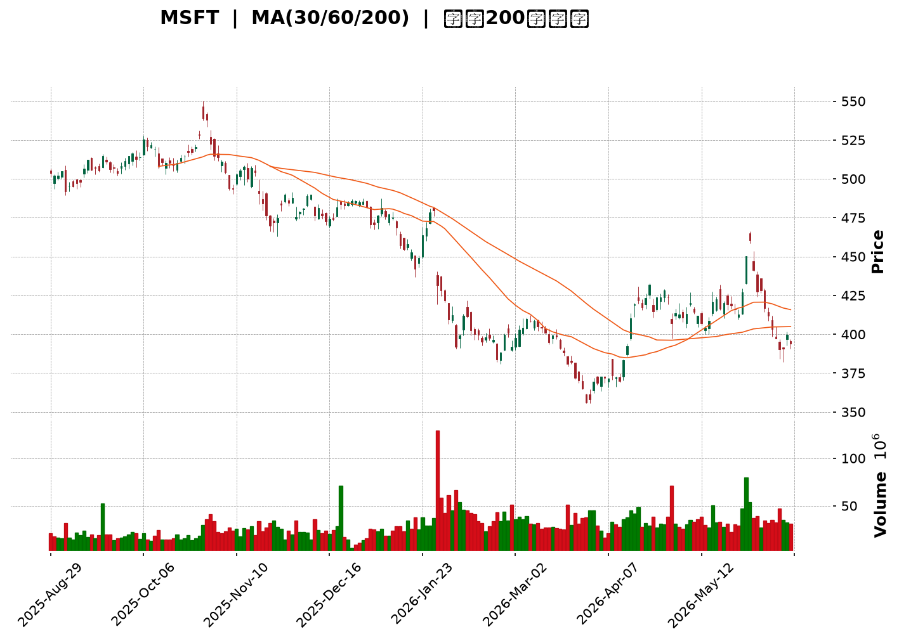
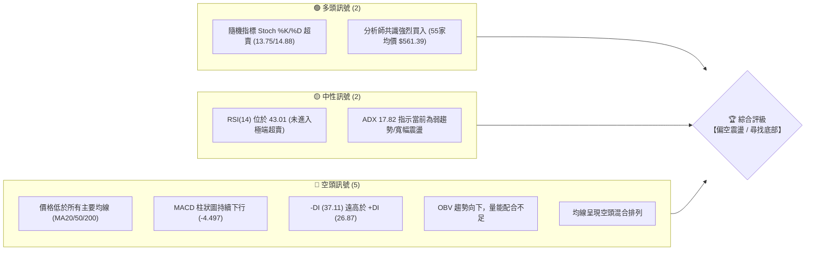
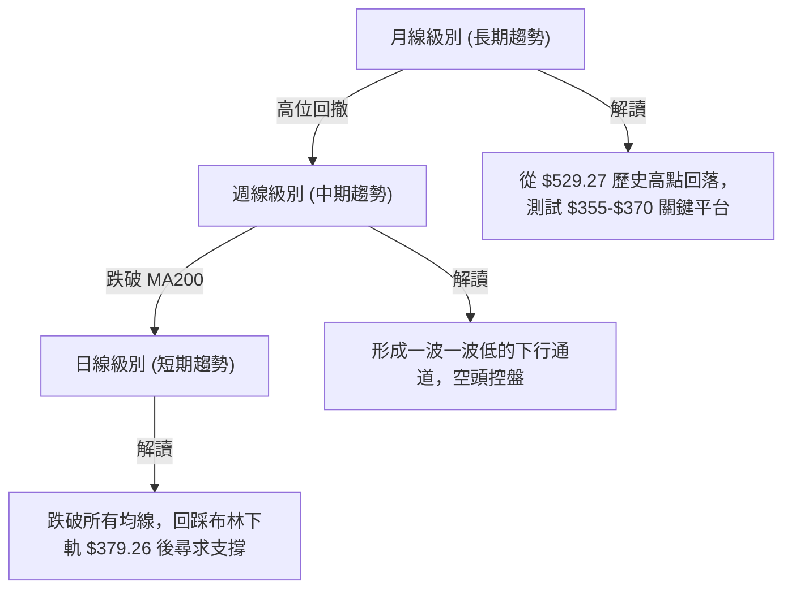
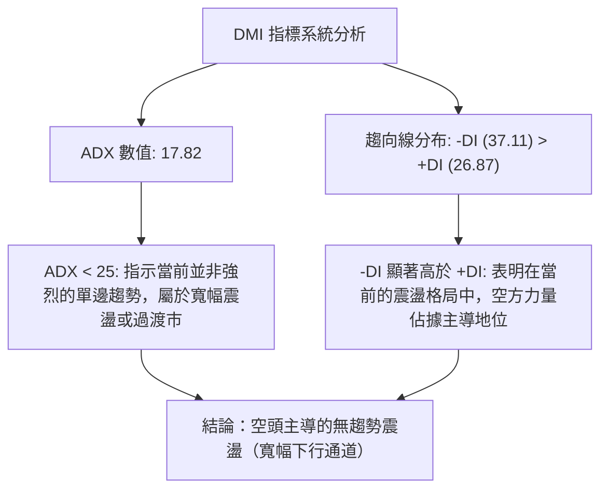
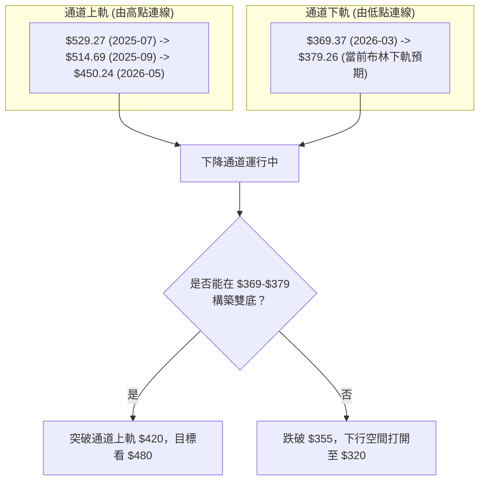
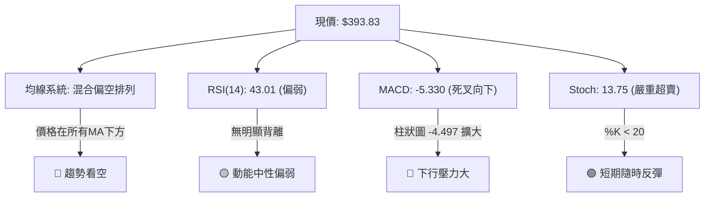
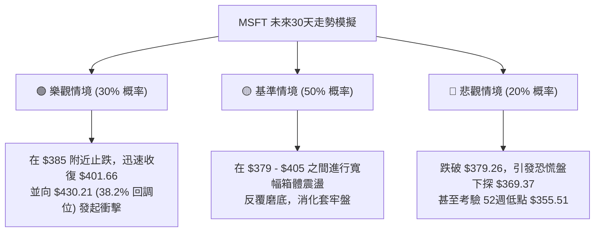

<details>
<summary>📊 靜態圖表 (點擊展開)</summary>

</details>

<html>
<head><meta charset="utf-8" /></head>
<body>
    <div style="height:500px; width:100%;">                        <script>window.PlotlyConfig = {MathJaxConfig: 'local'};</script>
        <script charset="utf-8" src="https://cdn.plot.ly/plotly-3.6.0.min.js" integrity="sha256-QaOVwtVY0T02VaHrr6pnoHLCwayMJp4O5n4YyaE3rJk=" crossorigin="anonymous"></script>                <div id="candlestick-chart" class="plotly-graph-div" style="height:100%; width:100%;"></div>            <script>                window.PLOTLYENV=window.PLOTLYENV || {};                                if (document.getElementById("candlestick-chart")) {                    Plotly.newPlot(                        "candlestick-chart",                        [{"close":{"dtype":"f8","bdata":"AAAAAAV4f0AAAACgDl9\u002fQAAAAOC2Yn9AAAAA4F6Mf0AAAAAgKL5+QAAAAMAI8X5AAAAAoF\u002f0fkAAAAAgiRN\u002fQAAAACC2HX9AAAAAYA6rf0AAAADg7gCAQAAAAABinX9AAAAAwPasf0AAAACgAJR\u002fQAAAAABdFYBAAAAAwGXzf0AAAACAZ6B\u002fQAAAAOAHr39AAAAA4Gx9f0AAAADg28N\u002fQAAAAEDI9X9AAAAA4IUVgEAAAADAgyOAQAAAAED0A4BAAAAAoMAQgEAAAADA8mmAQAAAAIB1RYBAAAAAAGBMgEAAAAAg5jiAQAAAAMDou39AAAAAwAntf0AAAAAAaOV\u002fQAAAACAu439AAAAAYD7Gf0AAAAAAkeV\u002fQAAAAABNDIBAAAAAoDcTgEAAAADAHCqAQAAAAIBFKoBAAAAAgIRCgEAAAABgZoGAQAAAAMBE1YBAAAAAgCLRgEAAAAAAnFOAQAAAAOBoFIBAAAAAgDUOgEAAAACgffF\u002fQAAAAOB9f39AAAAAgIvffkAAAADgF9t+QAAAAGAMbX9AAAAAoKiXf0AAAACAxb5\u002fQAAAACD2QX9AAAAAAIKvf0AAAAAAvYR\u002fQAAAACDrqn5AAAAAoN5AfkAAAAAg8cR9QAAAAOBtYH1AAAAAYGB+fUAAAADgAK59QAAAAGCPNX5AAAAAQEKdfkAAAADgT0l+QAAAAMA9fX5AAAAAoMq5fUAAAACgVOt9QAAAAEBJEH5AAAAAIH2NfkAAAADgap1+QAAAACADx31AAAAAYDkVfkAAAADgiMZ9QAAAACBwi31AAAAAYHKkfUAAAABAJaB9QAAAACBZHX5AAAAAIEA8fkAAAABgUix+QAAAAKAQS35AAAAAgLNdfkAAAACAw1h+QAAAAAAMT35AAAAAoBlVfkAAAAAgnRd+QAAAAMB9bX1AAAAAwA5sfUAAAABgN8Z9QAAAAGA5FX5AAAAAINi\u002ffUAAAABAe9J9QAAAAMAHsX1AAAAAIFVJfUAAAABgfpV8QAAAAKAqanxAAAAAoCOdfEAAAADgE0h8QAAAAIBBontAAAAA4DwSfEAAAACgJf58QAAAAKAeQ31AAAAAgDDnfUAAAAAg6vd9QAAAAMA\u002f+XpAAAAA4B3GekAAAABA41d6QAAAAKAwlnlAAAAAwKjFeUAAAABgy354QAAAAODI9XhAAAAAwEK8eUAAAAAAAbd5QAAAACA8KXlAAAAAQO8AeUAAAADgpvh4QAAAAKCbsXhAAAAA4EDdeEAAAADglNl4QAAAAMDxxXhAAAAAoDn6d0AAAACAjEJ4QAAAAGC\u002f+3hAAAAAAKENeUAAAABgQn54QAAAAKAE23hAAAAAgOkweUAAAABAMEV5QAAAAMCtnHlAAAAA4DeBeUAAAAAgZ4h5QAAAACAhTnlAAAAAYBRAeUAAAAAg3Q95QAAAAEAfq3hAAAAAwF7xeEAAAACgv+h4QAAAAKAXb3hAAAAAIN5CeEAAAAAgt9B3QAAAAKDB4ndAAAAAYPM+d0AAAABgzyN3QAAAAIDd0nZAAAAAoPs\u002fdkAAAACA8mJ2QAAAAIDrFXdAAAAAwCUJd0AAAAAgckp3QAAAAKAvQXdAAAAAQMQ3d0AAAAAAVlh3QAAAAEA4RHdAAAAAgBghd0AAAAAAofh3QAAAAKAqhHhAAAAA4EyleUAAAADAoDV6QAAAAEAFXnpAAAAA4KkSekAAAACg5HN6QAAAAADA\u002f3pAAAAAoJ\u002fteUAAAACgPHt6QAAAACBufnpAAAAAICjFekAAAACgrnh6QAAAACBhbnlAAAAAgLXYeUAAAAAAnst5QAAAAODap3lAAAAAoAvReUAAAAAgxT16QAAAAMCQ43lAAAAAYEq8eUAAAAAgOG55QAAAACBZRXlAAAAA4LiIeUAAAABgIVB6QAAAAKD+aXpAAAAAQEkIekAAAABgZkJ6QAAAAKBwMXpAAAAAwB4pekAAAADgegB6QAAAAGC4ynlAAAAAANevekAAAAAA1yN8QAAAAOBRyHxAAAAAwPWUe0AAAACgcLV6QAAAAMDMwHpAAAAAYLgKekAAAAAA17t5QAAAAGCPNnlAAAAAgMLVeEAAAACgcGV4QAAAAADXa3hAAAAAACn8eEAAAACgR514QA=="},"high":{"dtype":"f8","bdata":"EryyXEmmf0Cnir9wDG1\u002fQH\u002f7NjqCiX9AWF83fDuPf0CHZizO98t\u002fQO9npmq7IH9Acei8Q20xf0CFToMGAkF\u002fQPBf89ENQH9AEo6DcDDVf0ALfBm1zgGAQF5l04DMD4BAxkoJAyjBf0BmBVcIdd1\u002fQEyikRdBIIBAq1dvWNoTgECoEC71n\u002fV\u002fQLLRMnAT1H9AHKG8Ls6sf0CDTTISSut\u002fQCcd\u002fx\u002fHDIBArTg6KzEXgEAQZ3DQ3ymAQCXV1\u002fiJMoBAjI9B57YpgEBFIxYrgX2AQBVgnty5c4BADozLzhFdgECKQOnfPUiAQG8RpYdHQoBA5N4itUcJgEB\u002f1qkVTACAQDLHmRl7D4BAKAxrJscMgEA+iw8j4wGAQB8NtiF8G4BAY4Nk2WcbgEAqLTVtZU+AQKAPkY44RYBAT2zOkllQgEDpc3vPuZmAQCULmrjhMYFAudY4Sqj2gEDnqQ1L05yAQCTQDgbpb4BAc79S6j9NgECH+6+WcQKAQJjpkIhw+X9AGUukb0dof0D7bFiiywN\u002fQEZ3rxaQen9AGGy8SEmmf0AJUX62Msd\u002fQDKk3A5L5H9AIL82xRXGf0CE7P8lWs5\u002fQOM0b3oIPX9AH6QbWS3BfkB23gCwG7Z+QHeYQkO\u002fzH1A4ZBhFpKsfUDmpD4GadB9QPTmgxhSYn5AEWq3fSKnfkBePWO3Ant+QKEO6jD+tH5AQq+iR30hfkBRRnYI+vJ9QK5+TeQbFH5Ao8tzweChfkAzdxSvAp9+QFMiewumIX5A+BzDogA+fkBB7jsQ+gR+QKqrgFtr6X1A\u002f6OnIle8fUCbyjJK8919QFmtGJHedn5ANIOZU\u002f5afkBsM8XvAml+QMsHNtSsWn5Ahn0oTNxvfkCmLvNtS19+QIx830z1Yn5ACwqIzCR4fkA0rgALnV9+QFDEwQouKH5A4Al8ZlmffUCCKNgy4cl9QBiuJF12eH5AlmxlX1IIfkC094xRFdt9QCqtp0+47X1AnXs11LqafUAHKzP1\u002fCF9QA5APmsR43xANMU45y7SfEAixHtYZWx8QARFB3DtKnxAbZTtIFEtfEAzHvZ5LlB9QLHCsqdbgn1AM1YYyqoLfkACospOhhl+QLXT8U+ciHtAOPmPjmpae0DyHNrpSM16QK9IyWXcQnpAiRYQYAUfekB6JkkS1md5QEqRPHIjAHlAlfLhMs\u002fQeUD8fAFV01x6QEQR+DHR6XlAl+ORsmJGeUBPd6Rd3zt5QD3uB4no63hAXH8XP2cMeUC5VP4m5Th5QLeiy4oV9HhAcRXVmBaoeEDWPzfQS0h4QOueaiyjCXlAQk8xzL9peUCXvPsBZr94QHOwKMEqBXlAZqeK+iJdeUAsIvlDRKJ5QEZ0cMSGq3lA9PlCS4TCeUDdyw\u002fLLJV5QDheNhIElXlAjD2dUASCeUDzhgpq4FN5QKCK6l3NPnlAUZj\u002f+jn8eECZMZJzajh5QFoP9cY80nhAOOJBiER6eEAsMJ82niJ4QOSVhXv4JXhA9SHVXUvad0BtmM7164N3QAdhKQuQXndAXw7vt6qadkBbwmM4IMl2QMAfUFWBQXdA0bFLWuhSd0DX7QfoUU13QOFktbnBTndAsLhmNVI6d0D2bCXsrwJ4QNJFkLEVS3dAI2toRkBtd0CRXrneV\u002ft3QOffb2NknXhAW0mBXZfXeUBjIvKKkT56QLYwdTBb6npATubpL6RmekBc5jXEG6R6QIC9W\u002fgzDHtA9TRJ+uhrekDD3x10gYB6QDp1fZr9onpANu2ckdrPekAf7K5bXJ56QKDCpNhj2HlAxWBPHVYDekDoKAf+7T16QFyUtXIR\u002fnlAmiO+ZEAYekBgvt6M4bB6QKT\u002fsK2aG3pAzlQE\u002fMS8eUAXpBrSoel5QLzhNAPpVnlAapGC6jKveUCBjC0M6rN6QDXBgEM4g3pAZIuo3Dz8ekCayyALAVN6QAAAAKBwpXpAAAAAYGaGekAAAADgUTx6QAAAAEAK\u002f3lAAAAAANfXekAAAACgRyV8QAAAAMAeJX1AAAAAAABYfEAAAACAPYZ7QAAAAGBmQntAAAAAIIXXekAAAABgjxJ6QAAAACCuv3lAAAAA4KNQeUAAAACgmc14QAAAAADXe3hAAAAAAAAceUAAAACgcM14QA=="},"hovertemplate":"\u003cb\u003e%{x|%Y-%m-%d}\u003c\u002fb\u003e\u003cbr\u003e\u958b: $%{open:.2f}\u003cbr\u003e\u9ad8: $%{high:.2f}\u003cbr\u003e\u4f4e: $%{low:.2f}\u003cbr\u003e\u6536: $%{close:.2f}\u003cextra\u003e\u003c\u002fextra\u003e","low":{"dtype":"f8","bdata":"cb0FdgpVf0CsN50W79p+QEe8OBuKMn9AbfOMX7w\u002ff0ClQIZrV5R+QODVSReivn5Au8dBzRXpfkC8eJ7WgNl+QCinK0\u002fy635Ai6tFlN1Kf0AJVh7A8nx\u002fQDlwnRdjln9Ayy85ju9rf0C93VEdcYd\u002fQFGW0e2SsX9AD8akfAfVf0CcEjKe4IF\u002fQOs78iKte39ACj0PLMldf0C4MYwD6HZ\u002fQPJkvbLWmn9A3cZGkj2nf0C9DiI8hMd\u002fQNpNKC91t39A2+riUyT8f0CXKRmogheAQLUrxlxEMYBAHS0QT2I+gEBbv7ORJhGAQEgqtGjDpn9Ab2XIV1vHf0DYVYhjDG1\u002fQBzz+EqlrH9A\u002fLazFOqOf0BK9uyf4IF\u002fQNMoAR0u439ABhCU1\u002frcf0AdmoR5nROAQK9+HALFGoBAvsaWwHYrgECasNI5cm2AQGQeWSHvyoBAcOulP9GqgEBSTn8qrDaAQMyDv1u7\u002fX9AAmX8pZ\u002f1f0D8ANrLTYp\u002fQOELnBNFdn9A43Hn4AjLfkAD0MwmVaJ+QDH77rmS+n5AWc88LAQzf0BJAB9Zqf9+QIluRq4pIn9AMgRAaPPkfkD6Jqrht1t\u002fQAJXntN2O35AF4pAVqn8fUD0gikVRZZ9QAOiXioaI31AXTIj2B4ffUApdTccQ+18QDy3WLYQ8X1APXoT9uBHfkBOmDo0BSh+QByx2VOfQn5AWTzCsX2RfUAW6OD+CaZ9QBXSZxkczH1AGPZrVLgjfkBG2CLsWGV+QIrbYjKUj31A6YRl8gCcfUARahxlpqN9QB6vjwTNZn1A9nJ3b61MfUApQ8IWTo59QAy+5hdXvH1AedPvCZ0FfkBS7A6\u002fzAh+QPdqKVF0KX5APHgULuMqfkAbxIFH4zx+QHro2qaIIH5AwnPZdI81fkBDZ6wvhBJ+QOqO91s1QX1AL7Pl9bE2fUBpQWN0rTp9QDB6BL5LvX1AE2YJ\u002fACcfUDHcTIytGF9QKpfXv0imX1AT53LtiX+fEDSX+VhSnJ8QEnwK20PXnxAgsUFoUxnfEDgkUIInPR7QEqvs9vCS3tAYKkHk6ere0BVhctGhQh8QILzOR06v3xA0SRi\u002fv5wfUCTkrKLF759QJHcQkJ0MnpA0lrW+\u002fKIekAAJrYWDEZ6QG8umF\u002f6a3lArnrTY892eUBqLRVESml4QM2oDAbZcnhAlOODzHvxeEDT4MK57K15QPameKS283hARcBbLe3DeEDKMv1BkMR4QDBO3E9+jHhAXsCckAGpeEBYmmL4AL14QI++\u002flLlpHhAgQe4QFrkd0CFPlIoKc53QMz1I4sRVXhA1Eo6QQ3eeEAhTjcxmVB4QMqFYnySXHhALS+HTSR9eEDkMdgJHvd4QJZIz3dqOHlAU0y\u002fuwh6eUC9WEsRDCp5QLuuSm3yIHlAed3Kn40LeUBb3OkTeA15QJqz\u002fgFelnhAcemdDf2eeEDuGvDxPs54QCPyT756YnhA2Eu\u002fWZMjeEDOvMSdxrR3QG4kVo+uzXdAbTDi4L0wd0BcUkd7TA13QMy2mIdpxnZAejQqDdU7dkBuQmD5KDh2QK0sDLqQpHZAnPhh23f2dkBuMFfKzrV2QFoazAs5C3dAopNL2UjcdkAzvB6Ztyl3QOb\u002fYoob5HZAFVSPT68Td0A8NR2NfSN3QDBT81X0GnhAAU4eJfa9eEC7wVoh\u002fbN5QG3y9TZ+PHpArRkxi2f2eUDx3HocxgR6QLEec+IRbHpAB61Va1WoeUB1ztzza+55QIKj67qyAnpAk7GckM9PekCT9RlKGzZ6QGSQY7xl0nhAvRTD6NiYeUDHgLA2mJ55QLc6wPapfnlAnqTLV8BDeUBc\u002f\u002fMKrh16QIPcGyqv0XlAVr\u002f2YfpJeUBC5MTALVx5QK2+i+CcAnlAaq\u002fEzzcAeUBniZYiSMB5QNi2rHJj63lAsV2bG3D5eUC4Ny3Gk6Z5QAAAACBc+3lAAAAAoEcFekAAAADgUdB5QAAAAKBHmXlAAAAAYLjKeUAAAACAwgV7QAAAAOBRpHxAAAAAQOGGe0AAAAAAAIR6QAAAAGCPpnpAAAAAYGbmeUAAAADA9Yh5QAAAACCu53hAAAAAYI\u002fSeEAAAAAAAAB4QAAAAOBR5HdAAAAAoJmNeEAAAABACmt4QA=="},"name":"\u50f9\u683c","open":{"dtype":"f8","bdata":"mrzVV1eXf0BJ+tUdIBV\u002fQOC9jlbpSX9AmPqpGgVSf0BSL14v3J1\u002fQEkEGVKa735ANUP+pmMkf0Duukh4CD1\u002fQDe6MiltMX9ATmH3JmJ3f0Ahnbp7aJl\u002fQMnulUMEDYBAtpyC6IC2f0DiwPoCVsR\u002fQKQ7BXyMtX9AMHts7sICgEBlqKhSEOl\u002fQBDCIhKwsn9AWA9FA56Rf0BXyK2Wma1\u002fQGzGF6l+xH9A04y56Sjgf0D9kFSR9vh\u002fQFVa0wIPE4BAs2nl2MMOgEDcS2H\u002fxBqAQA8X99K4Z4BAM1Qj\u002fOQ\u002fgED24PYFbDiAQDk33S\u002f1IoBA5N4itUcJgEBv2Rl5TbB\u002fQJm1Iq+B+39AjYSsnqrVf0BYkZAnYp1\u002fQCwmEvLw9X9Ao9vVD\u002fIRgEBtmCJD9i6AQKYY00JgOYBAUsuosf87gEAr0ReGd4OAQOZDwSpPFIFAzm6fjhXsgEAgoBuqIXmAQPMP35FpbIBAgeJCC08kgECrMo8foch\u002fQDSTbvkc4X9A95Spl6Rnf0A1CBYGKd1+QHHw2uJJDn9A8u2NJPhZf0CoL5BieKJ\u002fQOx2IAqTsX9AyRTr6oLxfkDm5LCAAJR\u002fQAGeigUKxH5AKfKR7j9wfkANghuuaKh+QEVv3oMOxn1AXPcnN06OfUBo79ymfX99QNmSYGp2Qn5AbxWV9QJXfkAa18ZAZGR+QP55U3D+SH5A8hD+2lSjfUB4e8icINp9QADGYV8XBn5AxeVzEdgrfkBL9cGm525+QDdGQeokHn5ARRai9kSofUCHyt9SFdt9QPiwzB2L331AP80bmxVdfUCg2VHHuqx9QCxFSGUewX1Aw\u002fSrGTBTfkAWMW21bz9+QEH0VhVHLX5Aj0V3Xm04fkAPcNyo1Uh+QF7Voo1dK35AYJLc5Wg8fkCq7b+d1Vp+QE5s6RHhI35AJ+zZ5lR\u002ffUBf1GioMHt9QJZHeZ8g2n1A4WznyLPxfUAKdkzrVH99QElP2SLoqH1ABuUFLjWJfUBdBEduRQZ9QLTMnUf\u002f4HxAoFQtnc18fEAUY1sNgxN8QCt0anJ+KXxAq11GzCrae0B1xTmR3R18QCwnPsHz83xAPgf3D5l5fUCxNLoOFRF+QEVyt+SgYHtALmqQHZFTe0DAc0n+UcV6QBcEpF85QnpAbXnRbdiSeUA+9UswI1p5QJ\u002f2W4Zn1nhAvjbapeEweUA6HYBPJxx6QNjJrGdb5XlAKDtZPUUzeUBOwuyIgip5QHJSiWQz13hAsW39cdbFeECmeW1CL\u002f14QEcMLAoQtHhAk\u002f6jSFeieEAiXIAF9fR3QBZEqMT5WnhAcFYoiF09eUCKgwtXkGB4QGD6xL4sgHhAooxnRKWEeECFJkuqcQZ5QDbycEq8OHlAkM0Q4AyFeUAe0z\u002fft0B5QHjAfTNNknlAjlpShBhLeUCcc6GaFjx5QJPTVkEiAnlAoxx55FrTeEAE6xSDevZ4QDXciPpYxHhAMwx1UBxUeEC0o37yQx94QABAeggg8XdAOZQmt4nYd0C6LAjTr4F3QADzJDFMIHdAgZRituKRdkBHYmS54pF2QMnqHKAxvHZAL7thx+xKd0D6JMRzqeZ2QHtPpbnsSndAd0UZQ6IYd0DQvXE5XgJ4QKrAu4seO3dAjM9hcshCd0D9WMs\u002f10x3QLVaR3FOMXhA\u002fusTxzzSeEAsy4bKPS96QHj7rydufnpA4DMuPNZDekDdYGTzTjV6QN+Yn3NNlHpAx43debgvekDaFWL4GQF6QNckfnl5V3pAj0DRTXB6ekDEiBAQmXp6QNdJhy3BnnlA4+uVhIa+eUClSKjJaKp5QL5jSz\u002fC5nlAbh95QuRxeUCrE66XOzN6QLoHu6fOB3pA3c0X59BveUCCT5\u002f5WNl5QCTv8ApCJXlAiEuGkbE5eUD705KY\u002ftV5QPOW1YGD+3lAr1YGxojPekCsrhz+ZdR5QAAAAAAAjHpAAAAA4KM4ekAAAABA4QZ6QAAAAAApsHlAAAAAIK7PeUAAAADAzAh7QAAAAKBwDX1AAAAAgBTue0AAAABAM2d7QAAAAMD1PHtAAAAAoHDFekAAAACAPeJ5QAAAAOB6kHlAAAAAwMzoeEAAAAAgXLN4QAAAAEDhdnhAAAAAwMzMeEAAAADgerx4QA=="},"x":["2025-08-29T00:00:00-04:00","2025-09-02T00:00:00-04:00","2025-09-03T00:00:00-04:00","2025-09-04T00:00:00-04:00","2025-09-05T00:00:00-04:00","2025-09-08T00:00:00-04:00","2025-09-09T00:00:00-04:00","2025-09-10T00:00:00-04:00","2025-09-11T00:00:00-04:00","2025-09-12T00:00:00-04:00","2025-09-15T00:00:00-04:00","2025-09-16T00:00:00-04:00","2025-09-17T00:00:00-04:00","2025-09-18T00:00:00-04:00","2025-09-19T00:00:00-04:00","2025-09-22T00:00:00-04:00","2025-09-23T00:00:00-04:00","2025-09-24T00:00:00-04:00","2025-09-25T00:00:00-04:00","2025-09-26T00:00:00-04:00","2025-09-29T00:00:00-04:00","2025-09-30T00:00:00-04:00","2025-10-01T00:00:00-04:00","2025-10-02T00:00:00-04:00","2025-10-03T00:00:00-04:00","2025-10-06T00:00:00-04:00","2025-10-07T00:00:00-04:00","2025-10-08T00:00:00-04:00","2025-10-09T00:00:00-04:00","2025-10-10T00:00:00-04:00","2025-10-13T00:00:00-04:00","2025-10-14T00:00:00-04:00","2025-10-15T00:00:00-04:00","2025-10-16T00:00:00-04:00","2025-10-17T00:00:00-04:00","2025-10-20T00:00:00-04:00","2025-10-21T00:00:00-04:00","2025-10-22T00:00:00-04:00","2025-10-23T00:00:00-04:00","2025-10-24T00:00:00-04:00","2025-10-27T00:00:00-04:00","2025-10-28T00:00:00-04:00","2025-10-29T00:00:00-04:00","2025-10-30T00:00:00-04:00","2025-10-31T00:00:00-04:00","2025-11-03T00:00:00-05:00","2025-11-04T00:00:00-05:00","2025-11-05T00:00:00-05:00","2025-11-06T00:00:00-05:00","2025-11-07T00:00:00-05:00","2025-11-10T00:00:00-05:00","2025-11-11T00:00:00-05:00","2025-11-12T00:00:00-05:00","2025-11-13T00:00:00-05:00","2025-11-14T00:00:00-05:00","2025-11-17T00:00:00-05:00","2025-11-18T00:00:00-05:00","2025-11-19T00:00:00-05:00","2025-11-20T00:00:00-05:00","2025-11-21T00:00:00-05:00","2025-11-24T00:00:00-05:00","2025-11-25T00:00:00-05:00","2025-11-26T00:00:00-05:00","2025-11-28T00:00:00-05:00","2025-12-01T00:00:00-05:00","2025-12-02T00:00:00-05:00","2025-12-03T00:00:00-05:00","2025-12-04T00:00:00-05:00","2025-12-05T00:00:00-05:00","2025-12-08T00:00:00-05:00","2025-12-09T00:00:00-05:00","2025-12-10T00:00:00-05:00","2025-12-11T00:00:00-05:00","2025-12-12T00:00:00-05:00","2025-12-15T00:00:00-05:00","2025-12-16T00:00:00-05:00","2025-12-17T00:00:00-05:00","2025-12-18T00:00:00-05:00","2025-12-19T00:00:00-05:00","2025-12-22T00:00:00-05:00","2025-12-23T00:00:00-05:00","2025-12-24T00:00:00-05:00","2025-12-26T00:00:00-05:00","2025-12-29T00:00:00-05:00","2025-12-30T00:00:00-05:00","2025-12-31T00:00:00-05:00","2026-01-02T00:00:00-05:00","2026-01-05T00:00:00-05:00","2026-01-06T00:00:00-05:00","2026-01-07T00:00:00-05:00","2026-01-08T00:00:00-05:00","2026-01-09T00:00:00-05:00","2026-01-12T00:00:00-05:00","2026-01-13T00:00:00-05:00","2026-01-14T00:00:00-05:00","2026-01-15T00:00:00-05:00","2026-01-16T00:00:00-05:00","2026-01-20T00:00:00-05:00","2026-01-21T00:00:00-05:00","2026-01-22T00:00:00-05:00","2026-01-23T00:00:00-05:00","2026-01-26T00:00:00-05:00","2026-01-27T00:00:00-05:00","2026-01-28T00:00:00-05:00","2026-01-29T00:00:00-05:00","2026-01-30T00:00:00-05:00","2026-02-02T00:00:00-05:00","2026-02-03T00:00:00-05:00","2026-02-04T00:00:00-05:00","2026-02-05T00:00:00-05:00","2026-02-06T00:00:00-05:00","2026-02-09T00:00:00-05:00","2026-02-10T00:00:00-05:00","2026-02-11T00:00:00-05:00","2026-02-12T00:00:00-05:00","2026-02-13T00:00:00-05:00","2026-02-17T00:00:00-05:00","2026-02-18T00:00:00-05:00","2026-02-19T00:00:00-05:00","2026-02-20T00:00:00-05:00","2026-02-23T00:00:00-05:00","2026-02-24T00:00:00-05:00","2026-02-25T00:00:00-05:00","2026-02-26T00:00:00-05:00","2026-02-27T00:00:00-05:00","2026-03-02T00:00:00-05:00","2026-03-03T00:00:00-05:00","2026-03-04T00:00:00-05:00","2026-03-05T00:00:00-05:00","2026-03-06T00:00:00-05:00","2026-03-09T00:00:00-04:00","2026-03-10T00:00:00-04:00","2026-03-11T00:00:00-04:00","2026-03-12T00:00:00-04:00","2026-03-13T00:00:00-04:00","2026-03-16T00:00:00-04:00","2026-03-17T00:00:00-04:00","2026-03-18T00:00:00-04:00","2026-03-19T00:00:00-04:00","2026-03-20T00:00:00-04:00","2026-03-23T00:00:00-04:00","2026-03-24T00:00:00-04:00","2026-03-25T00:00:00-04:00","2026-03-26T00:00:00-04:00","2026-03-27T00:00:00-04:00","2026-03-30T00:00:00-04:00","2026-03-31T00:00:00-04:00","2026-04-01T00:00:00-04:00","2026-04-02T00:00:00-04:00","2026-04-06T00:00:00-04:00","2026-04-07T00:00:00-04:00","2026-04-08T00:00:00-04:00","2026-04-09T00:00:00-04:00","2026-04-10T00:00:00-04:00","2026-04-13T00:00:00-04:00","2026-04-14T00:00:00-04:00","2026-04-15T00:00:00-04:00","2026-04-16T00:00:00-04:00","2026-04-17T00:00:00-04:00","2026-04-20T00:00:00-04:00","2026-04-21T00:00:00-04:00","2026-04-22T00:00:00-04:00","2026-04-23T00:00:00-04:00","2026-04-24T00:00:00-04:00","2026-04-27T00:00:00-04:00","2026-04-28T00:00:00-04:00","2026-04-29T00:00:00-04:00","2026-04-30T00:00:00-04:00","2026-05-01T00:00:00-04:00","2026-05-04T00:00:00-04:00","2026-05-05T00:00:00-04:00","2026-05-06T00:00:00-04:00","2026-05-07T00:00:00-04:00","2026-05-08T00:00:00-04:00","2026-05-11T00:00:00-04:00","2026-05-12T00:00:00-04:00","2026-05-13T00:00:00-04:00","2026-05-14T00:00:00-04:00","2026-05-15T00:00:00-04:00","2026-05-18T00:00:00-04:00","2026-05-19T00:00:00-04:00","2026-05-20T00:00:00-04:00","2026-05-21T00:00:00-04:00","2026-05-22T00:00:00-04:00","2026-05-26T00:00:00-04:00","2026-05-27T00:00:00-04:00","2026-05-28T00:00:00-04:00","2026-05-29T00:00:00-04:00","2026-06-01T00:00:00-04:00","2026-06-02T00:00:00-04:00","2026-06-03T00:00:00-04:00","2026-06-04T00:00:00-04:00","2026-06-05T00:00:00-04:00","2026-06-08T00:00:00-04:00","2026-06-09T00:00:00-04:00","2026-06-10T00:00:00-04:00","2026-06-11T00:00:00-04:00","2026-06-12T00:00:00-04:00","2026-06-15T00:00:00-04:00","2026-06-16T00:00:00-04:00"],"type":"candlestick"},{"hovertemplate":"MA30: $%{y:.2f}\u003cextra\u003e\u003c\u002fextra\u003e","line":{"color":"#2196F3","dash":"dash","width":2},"mode":"lines","name":"MA30","x":["2025-08-29T00:00:00-04:00","2025-09-02T00:00:00-04:00","2025-09-03T00:00:00-04:00","2025-09-04T00:00:00-04:00","2025-09-05T00:00:00-04:00","2025-09-08T00:00:00-04:00","2025-09-09T00:00:00-04:00","2025-09-10T00:00:00-04:00","2025-09-11T00:00:00-04:00","2025-09-12T00:00:00-04:00","2025-09-15T00:00:00-04:00","2025-09-16T00:00:00-04:00","2025-09-17T00:00:00-04:00","2025-09-18T00:00:00-04:00","2025-09-19T00:00:00-04:00","2025-09-22T00:00:00-04:00","2025-09-23T00:00:00-04:00","2025-09-24T00:00:00-04:00","2025-09-25T00:00:00-04:00","2025-09-26T00:00:00-04:00","2025-09-29T00:00:00-04:00","2025-09-30T00:00:00-04:00","2025-10-01T00:00:00-04:00","2025-10-02T00:00:00-04:00","2025-10-03T00:00:00-04:00","2025-10-06T00:00:00-04:00","2025-10-07T00:00:00-04:00","2025-10-08T00:00:00-04:00","2025-10-09T00:00:00-04:00","2025-10-10T00:00:00-04:00","2025-10-13T00:00:00-04:00","2025-10-14T00:00:00-04:00","2025-10-15T00:00:00-04:00","2025-10-16T00:00:00-04:00","2025-10-17T00:00:00-04:00","2025-10-20T00:00:00-04:00","2025-10-21T00:00:00-04:00","2025-10-22T00:00:00-04:00","2025-10-23T00:00:00-04:00","2025-10-24T00:00:00-04:00","2025-10-27T00:00:00-04:00","2025-10-28T00:00:00-04:00","2025-10-29T00:00:00-04:00","2025-10-30T00:00:00-04:00","2025-10-31T00:00:00-04:00","2025-11-03T00:00:00-05:00","2025-11-04T00:00:00-05:00","2025-11-05T00:00:00-05:00","2025-11-06T00:00:00-05:00","2025-11-07T00:00:00-05:00","2025-11-10T00:00:00-05:00","2025-11-11T00:00:00-05:00","2025-11-12T00:00:00-05:00","2025-11-13T00:00:00-05:00","2025-11-14T00:00:00-05:00","2025-11-17T00:00:00-05:00","2025-11-18T00:00:00-05:00","2025-11-19T00:00:00-05:00","2025-11-20T00:00:00-05:00","2025-11-21T00:00:00-05:00","2025-11-24T00:00:00-05:00","2025-11-25T00:00:00-05:00","2025-11-26T00:00:00-05:00","2025-11-28T00:00:00-05:00","2025-12-01T00:00:00-05:00","2025-12-02T00:00:00-05:00","2025-12-03T00:00:00-05:00","2025-12-04T00:00:00-05:00","2025-12-05T00:00:00-05:00","2025-12-08T00:00:00-05:00","2025-12-09T00:00:00-05:00","2025-12-10T00:00:00-05:00","2025-12-11T00:00:00-05:00","2025-12-12T00:00:00-05:00","2025-12-15T00:00:00-05:00","2025-12-16T00:00:00-05:00","2025-12-17T00:00:00-05:00","2025-12-18T00:00:00-05:00","2025-12-19T00:00:00-05:00","2025-12-22T00:00:00-05:00","2025-12-23T00:00:00-05:00","2025-12-24T00:00:00-05:00","2025-12-26T00:00:00-05:00","2025-12-29T00:00:00-05:00","2025-12-30T00:00:00-05:00","2025-12-31T00:00:00-05:00","2026-01-02T00:00:00-05:00","2026-01-05T00:00:00-05:00","2026-01-06T00:00:00-05:00","2026-01-07T00:00:00-05:00","2026-01-08T00:00:00-05:00","2026-01-09T00:00:00-05:00","2026-01-12T00:00:00-05:00","2026-01-13T00:00:00-05:00","2026-01-14T00:00:00-05:00","2026-01-15T00:00:00-05:00","2026-01-16T00:00:00-05:00","2026-01-20T00:00:00-05:00","2026-01-21T00:00:00-05:00","2026-01-22T00:00:00-05:00","2026-01-23T00:00:00-05:00","2026-01-26T00:00:00-05:00","2026-01-27T00:00:00-05:00","2026-01-28T00:00:00-05:00","2026-01-29T00:00:00-05:00","2026-01-30T00:00:00-05:00","2026-02-02T00:00:00-05:00","2026-02-03T00:00:00-05:00","2026-02-04T00:00:00-05:00","2026-02-05T00:00:00-05:00","2026-02-06T00:00:00-05:00","2026-02-09T00:00:00-05:00","2026-02-10T00:00:00-05:00","2026-02-11T00:00:00-05:00","2026-02-12T00:00:00-05:00","2026-02-13T00:00:00-05:00","2026-02-17T00:00:00-05:00","2026-02-18T00:00:00-05:00","2026-02-19T00:00:00-05:00","2026-02-20T00:00:00-05:00","2026-02-23T00:00:00-05:00","2026-02-24T00:00:00-05:00","2026-02-25T00:00:00-05:00","2026-02-26T00:00:00-05:00","2026-02-27T00:00:00-05:00","2026-03-02T00:00:00-05:00","2026-03-03T00:00:00-05:00","2026-03-04T00:00:00-05:00","2026-03-05T00:00:00-05:00","2026-03-06T00:00:00-05:00","2026-03-09T00:00:00-04:00","2026-03-10T00:00:00-04:00","2026-03-11T00:00:00-04:00","2026-03-12T00:00:00-04:00","2026-03-13T00:00:00-04:00","2026-03-16T00:00:00-04:00","2026-03-17T00:00:00-04:00","2026-03-18T00:00:00-04:00","2026-03-19T00:00:00-04:00","2026-03-20T00:00:00-04:00","2026-03-23T00:00:00-04:00","2026-03-24T00:00:00-04:00","2026-03-25T00:00:00-04:00","2026-03-26T00:00:00-04:00","2026-03-27T00:00:00-04:00","2026-03-30T00:00:00-04:00","2026-03-31T00:00:00-04:00","2026-04-01T00:00:00-04:00","2026-04-02T00:00:00-04:00","2026-04-06T00:00:00-04:00","2026-04-07T00:00:00-04:00","2026-04-08T00:00:00-04:00","2026-04-09T00:00:00-04:00","2026-04-10T00:00:00-04:00","2026-04-13T00:00:00-04:00","2026-04-14T00:00:00-04:00","2026-04-15T00:00:00-04:00","2026-04-16T00:00:00-04:00","2026-04-17T00:00:00-04:00","2026-04-20T00:00:00-04:00","2026-04-21T00:00:00-04:00","2026-04-22T00:00:00-04:00","2026-04-23T00:00:00-04:00","2026-04-24T00:00:00-04:00","2026-04-27T00:00:00-04:00","2026-04-28T00:00:00-04:00","2026-04-29T00:00:00-04:00","2026-04-30T00:00:00-04:00","2026-05-01T00:00:00-04:00","2026-05-04T00:00:00-04:00","2026-05-05T00:00:00-04:00","2026-05-06T00:00:00-04:00","2026-05-07T00:00:00-04:00","2026-05-08T00:00:00-04:00","2026-05-11T00:00:00-04:00","2026-05-12T00:00:00-04:00","2026-05-13T00:00:00-04:00","2026-05-14T00:00:00-04:00","2026-05-15T00:00:00-04:00","2026-05-18T00:00:00-04:00","2026-05-19T00:00:00-04:00","2026-05-20T00:00:00-04:00","2026-05-21T00:00:00-04:00","2026-05-22T00:00:00-04:00","2026-05-26T00:00:00-04:00","2026-05-27T00:00:00-04:00","2026-05-28T00:00:00-04:00","2026-05-29T00:00:00-04:00","2026-06-01T00:00:00-04:00","2026-06-02T00:00:00-04:00","2026-06-03T00:00:00-04:00","2026-06-04T00:00:00-04:00","2026-06-05T00:00:00-04:00","2026-06-08T00:00:00-04:00","2026-06-09T00:00:00-04:00","2026-06-10T00:00:00-04:00","2026-06-11T00:00:00-04:00","2026-06-12T00:00:00-04:00","2026-06-15T00:00:00-04:00","2026-06-16T00:00:00-04:00"],"y":{"dtype":"f8","bdata":"AAAAAAAA+H8AAAAAAAD4fwAAAAAAAPh\u002fAAAAAAAA+H8AAAAAAAD4fwAAAAAAAPh\u002fAAAAAAAA+H8AAAAAAAD4fwAAAAAAAPh\u002fAAAAAAAA+H8AAAAAAAD4fwAAAAAAAPh\u002fAAAAAAAA+H8AAAAAAAD4fwAAAAAAAPh\u002fAAAAAAAA+H8AAAAAAAD4fwAAAAAAAPh\u002fAAAAAAAA+H8AAAAAAAD4fwAAAAAAAPh\u002fAAAAAAAA+H8AAAAAAAD4fwAAAAAAAPh\u002fAAAAAAAA+H8AAAAAAAD4fwAAAAAAAPh\u002fAAAAAAAA+H8AAAAAAAD4f97d3T1jwH9AzczMzEnEf0Dv7u4+xMh\u002fQM3MzHwMzX9AZmZmVvrOf0Crqqoq09h\u002fQHd3d1et4n9AAAAAEOHsf0C8u7ubkfd\u002fQM3MzAT3AIBAAAAAEJkEgEAAAABQ4QiAQImIiPihEYBAAAAA4PwZgECamZkhkx6AQGZmZv6KHoBAvLu7AzofgEC8u7v7kyCAQGZmZibJH4BA7+7uhicdgEDNzMxkRhmAQO\u002fu7v7+FoBAzczMJIoUgEDv7u7GRBKAQERERDT4DoBAERER0RENgEDv7u7OeweAQO\u002fu7p73\u002fn9AREREpPjqf0CamZmJJNR\u002fQHd3d9cGwH9AZmZmdkWrf0AAAACgW5h\u002fQImIiIgJin9AMzMzQyOAf0C8u7tbZXJ\u002fQFVVVRWvZH9A3t3d7f5Pf0BERETEbjt\u002fQN7d3T0XKH9AAAAAUE4Xf0De3d0d3AJ\u002fQImIiPis4X5AiYiIyF\u002fDfkCamZlp0ap+QLy7u1uBlH5AmpmZiXB\u002ffkAzMzNTqWt+QM3MzEzbX35Aq6qq2mlafkCJiIh4llR+QCIiIvLrSn5Ad3d313RAfkB3d3fXhTR+QImIiPhsLH5AVVVV9eAgfkCrqqo6tRR+QERERIQgCn5AVVVVhQgDfkBVVVVlEwN+QN7d3S0aCX5AZmZm1kgLfkDe3d0dgAx+QCIiIjIVCH5A3t3dfcD8fUAiIiKCOe59QLy7u6uF3H1AMzMzowjTfUAzMzMDD8V9QFVVVQVTsH1AZmZmNiabfUAiIiKSTo19QGZmZhbpiH1AIiIiQmCHfUAiIiKiBYl9QGZmZhYVc31A3t3dzZpafUCrqqqamD59QO\u002fu7h71F31AIiIiAt\u002fxfEAzMzOTa8F8QO\u002fu7i7pk3xAzczMbGVsfEARERHx3kR8QM3MzJzxGHxAvLu7u3jre0C8u7vbxb97QERERHRgl3tAmpmZuXtwe0Dv7u5OdkZ7QO\u002fu7h4nGXtAq6qqGubnekBmZmY2b7h6QCIiIiJCkHpAd3d3hyJsekAREREhOkl6QO\u002fu7v7aKnpAvLu726UNekCrqqqa8\u002fN5QCIiIvKy4nlAERERYczMeUB3d3cHRq95QImIiNiBjXlAVVVVtc1leUCJiIho7zt5QImIiKhDKHlAAAAAsKMYeUBERETEZgx5QJqZmZmQAnlAq6qq+qv1eEARERGB3u94QImIiJiz5nhAd3d3N3XReECJiIgYfLt4QCIiIgKKp3hAvLu7awqQeEAAAADg+3l4QN7d3c1CbHhAzczMTKhceEB3d3dXWk94QAAAAPBkQnhA7+7ujuk7eEARERHxGjR4QN7d3U10JXhAq6qqWgkVeECrqqoKlRB4QImIiOivDXhAZmZmFpEReEBmZmbWlBl4QAAAALAGIHhAIiIi0t8keEBmZmZWuSx4QBEREZEtO3hAmpmZefZAeEAiIiJCE014QERERPSmXHhAvLu7uz5seEAAAACAk3l4QDMzM\u002fMVgnhAERERIZ2PeEARERGxgqB4QCIiIiKdr3hAAAAA4IzFeEAAAAAABOB4QLy7uxss+nhAd3d3d+oXeUARERFB5DF5QKuqqgqKRHlA7+7uvttZeUCrqqrapXN5QAAAALCbjnlA7+7uHqCmeUCJiIiIfr95QBEREeF32HlARERE9FXyeUBEREQEqgN6QLy7u5uMDnpAREREFG8XekCrqqpa6Cd6QCIiIoKEPHpAd3d352RJekDNzMw8lEt6QAAAABB7SXpAq6qqWnNKekCamZkZEkR6QGZmZkYkOXpAMzMz46AoekDv7u6e6xZ6QKuqqmpNDnpAZmZmZvMGekBERER03\u002fx5QA=="},"type":"scatter"},{"hovertemplate":"MA60: $%{y:.2f}\u003cextra\u003e\u003c\u002fextra\u003e","line":{"color":"#9C27B0","dash":"dash","width":2},"mode":"lines","name":"MA60","x":["2025-08-29T00:00:00-04:00","2025-09-02T00:00:00-04:00","2025-09-03T00:00:00-04:00","2025-09-04T00:00:00-04:00","2025-09-05T00:00:00-04:00","2025-09-08T00:00:00-04:00","2025-09-09T00:00:00-04:00","2025-09-10T00:00:00-04:00","2025-09-11T00:00:00-04:00","2025-09-12T00:00:00-04:00","2025-09-15T00:00:00-04:00","2025-09-16T00:00:00-04:00","2025-09-17T00:00:00-04:00","2025-09-18T00:00:00-04:00","2025-09-19T00:00:00-04:00","2025-09-22T00:00:00-04:00","2025-09-23T00:00:00-04:00","2025-09-24T00:00:00-04:00","2025-09-25T00:00:00-04:00","2025-09-26T00:00:00-04:00","2025-09-29T00:00:00-04:00","2025-09-30T00:00:00-04:00","2025-10-01T00:00:00-04:00","2025-10-02T00:00:00-04:00","2025-10-03T00:00:00-04:00","2025-10-06T00:00:00-04:00","2025-10-07T00:00:00-04:00","2025-10-08T00:00:00-04:00","2025-10-09T00:00:00-04:00","2025-10-10T00:00:00-04:00","2025-10-13T00:00:00-04:00","2025-10-14T00:00:00-04:00","2025-10-15T00:00:00-04:00","2025-10-16T00:00:00-04:00","2025-10-17T00:00:00-04:00","2025-10-20T00:00:00-04:00","2025-10-21T00:00:00-04:00","2025-10-22T00:00:00-04:00","2025-10-23T00:00:00-04:00","2025-10-24T00:00:00-04:00","2025-10-27T00:00:00-04:00","2025-10-28T00:00:00-04:00","2025-10-29T00:00:00-04:00","2025-10-30T00:00:00-04:00","2025-10-31T00:00:00-04:00","2025-11-03T00:00:00-05:00","2025-11-04T00:00:00-05:00","2025-11-05T00:00:00-05:00","2025-11-06T00:00:00-05:00","2025-11-07T00:00:00-05:00","2025-11-10T00:00:00-05:00","2025-11-11T00:00:00-05:00","2025-11-12T00:00:00-05:00","2025-11-13T00:00:00-05:00","2025-11-14T00:00:00-05:00","2025-11-17T00:00:00-05:00","2025-11-18T00:00:00-05:00","2025-11-19T00:00:00-05:00","2025-11-20T00:00:00-05:00","2025-11-21T00:00:00-05:00","2025-11-24T00:00:00-05:00","2025-11-25T00:00:00-05:00","2025-11-26T00:00:00-05:00","2025-11-28T00:00:00-05:00","2025-12-01T00:00:00-05:00","2025-12-02T00:00:00-05:00","2025-12-03T00:00:00-05:00","2025-12-04T00:00:00-05:00","2025-12-05T00:00:00-05:00","2025-12-08T00:00:00-05:00","2025-12-09T00:00:00-05:00","2025-12-10T00:00:00-05:00","2025-12-11T00:00:00-05:00","2025-12-12T00:00:00-05:00","2025-12-15T00:00:00-05:00","2025-12-16T00:00:00-05:00","2025-12-17T00:00:00-05:00","2025-12-18T00:00:00-05:00","2025-12-19T00:00:00-05:00","2025-12-22T00:00:00-05:00","2025-12-23T00:00:00-05:00","2025-12-24T00:00:00-05:00","2025-12-26T00:00:00-05:00","2025-12-29T00:00:00-05:00","2025-12-30T00:00:00-05:00","2025-12-31T00:00:00-05:00","2026-01-02T00:00:00-05:00","2026-01-05T00:00:00-05:00","2026-01-06T00:00:00-05:00","2026-01-07T00:00:00-05:00","2026-01-08T00:00:00-05:00","2026-01-09T00:00:00-05:00","2026-01-12T00:00:00-05:00","2026-01-13T00:00:00-05:00","2026-01-14T00:00:00-05:00","2026-01-15T00:00:00-05:00","2026-01-16T00:00:00-05:00","2026-01-20T00:00:00-05:00","2026-01-21T00:00:00-05:00","2026-01-22T00:00:00-05:00","2026-01-23T00:00:00-05:00","2026-01-26T00:00:00-05:00","2026-01-27T00:00:00-05:00","2026-01-28T00:00:00-05:00","2026-01-29T00:00:00-05:00","2026-01-30T00:00:00-05:00","2026-02-02T00:00:00-05:00","2026-02-03T00:00:00-05:00","2026-02-04T00:00:00-05:00","2026-02-05T00:00:00-05:00","2026-02-06T00:00:00-05:00","2026-02-09T00:00:00-05:00","2026-02-10T00:00:00-05:00","2026-02-11T00:00:00-05:00","2026-02-12T00:00:00-05:00","2026-02-13T00:00:00-05:00","2026-02-17T00:00:00-05:00","2026-02-18T00:00:00-05:00","2026-02-19T00:00:00-05:00","2026-02-20T00:00:00-05:00","2026-02-23T00:00:00-05:00","2026-02-24T00:00:00-05:00","2026-02-25T00:00:00-05:00","2026-02-26T00:00:00-05:00","2026-02-27T00:00:00-05:00","2026-03-02T00:00:00-05:00","2026-03-03T00:00:00-05:00","2026-03-04T00:00:00-05:00","2026-03-05T00:00:00-05:00","2026-03-06T00:00:00-05:00","2026-03-09T00:00:00-04:00","2026-03-10T00:00:00-04:00","2026-03-11T00:00:00-04:00","2026-03-12T00:00:00-04:00","2026-03-13T00:00:00-04:00","2026-03-16T00:00:00-04:00","2026-03-17T00:00:00-04:00","2026-03-18T00:00:00-04:00","2026-03-19T00:00:00-04:00","2026-03-20T00:00:00-04:00","2026-03-23T00:00:00-04:00","2026-03-24T00:00:00-04:00","2026-03-25T00:00:00-04:00","2026-03-26T00:00:00-04:00","2026-03-27T00:00:00-04:00","2026-03-30T00:00:00-04:00","2026-03-31T00:00:00-04:00","2026-04-01T00:00:00-04:00","2026-04-02T00:00:00-04:00","2026-04-06T00:00:00-04:00","2026-04-07T00:00:00-04:00","2026-04-08T00:00:00-04:00","2026-04-09T00:00:00-04:00","2026-04-10T00:00:00-04:00","2026-04-13T00:00:00-04:00","2026-04-14T00:00:00-04:00","2026-04-15T00:00:00-04:00","2026-04-16T00:00:00-04:00","2026-04-17T00:00:00-04:00","2026-04-20T00:00:00-04:00","2026-04-21T00:00:00-04:00","2026-04-22T00:00:00-04:00","2026-04-23T00:00:00-04:00","2026-04-24T00:00:00-04:00","2026-04-27T00:00:00-04:00","2026-04-28T00:00:00-04:00","2026-04-29T00:00:00-04:00","2026-04-30T00:00:00-04:00","2026-05-01T00:00:00-04:00","2026-05-04T00:00:00-04:00","2026-05-05T00:00:00-04:00","2026-05-06T00:00:00-04:00","2026-05-07T00:00:00-04:00","2026-05-08T00:00:00-04:00","2026-05-11T00:00:00-04:00","2026-05-12T00:00:00-04:00","2026-05-13T00:00:00-04:00","2026-05-14T00:00:00-04:00","2026-05-15T00:00:00-04:00","2026-05-18T00:00:00-04:00","2026-05-19T00:00:00-04:00","2026-05-20T00:00:00-04:00","2026-05-21T00:00:00-04:00","2026-05-22T00:00:00-04:00","2026-05-26T00:00:00-04:00","2026-05-27T00:00:00-04:00","2026-05-28T00:00:00-04:00","2026-05-29T00:00:00-04:00","2026-06-01T00:00:00-04:00","2026-06-02T00:00:00-04:00","2026-06-03T00:00:00-04:00","2026-06-04T00:00:00-04:00","2026-06-05T00:00:00-04:00","2026-06-08T00:00:00-04:00","2026-06-09T00:00:00-04:00","2026-06-10T00:00:00-04:00","2026-06-11T00:00:00-04:00","2026-06-12T00:00:00-04:00","2026-06-15T00:00:00-04:00","2026-06-16T00:00:00-04:00"],"y":{"dtype":"f8","bdata":"AAAAAAAA+H8AAAAAAAD4fwAAAAAAAPh\u002fAAAAAAAA+H8AAAAAAAD4fwAAAAAAAPh\u002fAAAAAAAA+H8AAAAAAAD4fwAAAAAAAPh\u002fAAAAAAAA+H8AAAAAAAD4fwAAAAAAAPh\u002fAAAAAAAA+H8AAAAAAAD4fwAAAAAAAPh\u002fAAAAAAAA+H8AAAAAAAD4fwAAAAAAAPh\u002fAAAAAAAA+H8AAAAAAAD4fwAAAAAAAPh\u002fAAAAAAAA+H8AAAAAAAD4fwAAAAAAAPh\u002fAAAAAAAA+H8AAAAAAAD4fwAAAAAAAPh\u002fAAAAAAAA+H8AAAAAAAD4fwAAAAAAAPh\u002fAAAAAAAA+H8AAAAAAAD4fwAAAAAAAPh\u002fAAAAAAAA+H8AAAAAAAD4fwAAAAAAAPh\u002fAAAAAAAA+H8AAAAAAAD4fwAAAAAAAPh\u002fAAAAAAAA+H8AAAAAAAD4fwAAAAAAAPh\u002fAAAAAAAA+H8AAAAAAAD4fwAAAAAAAPh\u002fAAAAAAAA+H8AAAAAAAD4fwAAAAAAAPh\u002fAAAAAAAA+H8AAAAAAAD4fwAAAAAAAPh\u002fAAAAAAAA+H8AAAAAAAD4fwAAAAAAAPh\u002fAAAAAAAA+H8AAAAAAAD4fwAAAAAAAPh\u002fAAAAAAAA+H8AAAAAAAD4f6uqqgo1wH9AmpmZoce3f0B3d3fvj7B\u002fQKuqqgKLq39AzczMzI6nf0AzMzNDnKV\u002fQGZmZjauo39A7+7u\u002fm+ef0AAAAAwgJl\u002fQLy7u6MClX9AAAAAOECQf0Dv7u5eT4p\u002fQM3MzHR4gn9ARERExKx7f0BmZmbW+3N\u002fQERERKzLaH9AiYiISPJef0BVVVWlaFZ\u002fQM3MzMy2T39AREREdFxKf0ARERGhkUN\u002fQAAAAPh0PH9AiYiIkMQ0f0Crqqqyhyx\u002fQImIiLAuJX9AvLu7S4Idf0BERERs1hF\u002fQJqZmRGMBH9AzczMlAD3fkB3d3f3m+t+QKuqqoKQ5H5AZmZmJkfbfkDv7u7ebdJ+QFVVVV0PyX5AiYiI4HG+fkDv7u5uT7B+QImIiGCaoH5AiYiIyIORfkC8u7vjPoB+QJqZmSE1bH5AMzMzQzpZfkAAAABYFUh+QHd3dwdLNX5AVVVVBWAlfkDe3d2F6xl+QBERETnLA35AvLu7qwXtfUDv7u72INV9QN7d3TXou31AZmZmbiSmfUDe3d0FAYt9QImIiJBqb31AIiIiIm1WfUBERERksjx9QKuqqkqvIn1AiYiI2CwGfUAzMzOLPep8QERERHzA0HxAd3d3H8K5fEAiIiLaxKR8QGZmZqYgkXxAiYiIeJd5fEAiIiKqd2J8QCIiIqorTHxAq6qqgnE0fECamZnRuRt8QFVVVVWwA3xAd3d3P1fwe0Dv7u5Ogdx7QLy7u\u002fuCyXtAvLu7S\u002fmze0DNzMxMSp57QHd3d3c1i3tAvLu7+5Z2e0BVVVWFemJ7QHd3d1+sTXtA7+7uPp85e0B3d3evfyV7QERERNxCDXtAZmZmfsXzekAiIiIKpdh6QLy7u2NOvXpAIiIiUu2eekDNzMyELYB6QHd3d889YHpAvLu7k8E9ekDe3d3d4Bx6QBEREaHRAXpAMzMzA5LmeUAzMzNT6Mp5QHd3dwfGrXlAzczM1OeReUC8u7sTRXZ5QAAAADjbWnlAERER8ZVAeUDe3d2V5yx5QLy7u3NFHHlAEREReZsPeUCJiIg4xAZ5QBEREdFcAXlAmpmZGdb4eEDv7u6u\u002f+14QM3MzLRX5HhAd3d3F2LTeEBVVVVVgcR4QGZmZk51wnhA3t3dNXHCeEAiIiIi\u002fcJ4QGZmZkZTwnhA3t3djaTCeEARERGZMMh4QFVVVV0oy3hAvLu7C4HLeEBEREQMwM14QO\u002fu7g7b0HhAmpmZcfrTeECJiIgQ8NV4QERERGxm2HhA3t3dBULbeEAREREZgOF4QAAAAFCA6HhA7+7u1kTxeEDNzMy8zPl4QHd3dxf2\u002fnhAd3d3p68DeUB3d3eHHwp5QCIiIkIeDnlAVVVVFYAUeUCJiIiYviB5QBEREZlFLnlAzczMXCI3eUCamZnJJjx5QImIiFBUQnlAIiIi6rRFeUDe3d2tkkh5QFVVVZ3lSnlAd3d3z29KeUB3d3ePP0h5QO\u002fu7q4xSHlAvLu7Q0hLeUCrqqoSsU55QA=="},"type":"scatter"},{"hovertemplate":"MA200: $%{y:.2f}\u003cextra\u003e\u003c\u002fextra\u003e","line":{"color":"#FF6F00","dash":"solid","width":2},"mode":"lines","name":"MA200","x":["2025-08-29T00:00:00-04:00","2025-09-02T00:00:00-04:00","2025-09-03T00:00:00-04:00","2025-09-04T00:00:00-04:00","2025-09-05T00:00:00-04:00","2025-09-08T00:00:00-04:00","2025-09-09T00:00:00-04:00","2025-09-10T00:00:00-04:00","2025-09-11T00:00:00-04:00","2025-09-12T00:00:00-04:00","2025-09-15T00:00:00-04:00","2025-09-16T00:00:00-04:00","2025-09-17T00:00:00-04:00","2025-09-18T00:00:00-04:00","2025-09-19T00:00:00-04:00","2025-09-22T00:00:00-04:00","2025-09-23T00:00:00-04:00","2025-09-24T00:00:00-04:00","2025-09-25T00:00:00-04:00","2025-09-26T00:00:00-04:00","2025-09-29T00:00:00-04:00","2025-09-30T00:00:00-04:00","2025-10-01T00:00:00-04:00","2025-10-02T00:00:00-04:00","2025-10-03T00:00:00-04:00","2025-10-06T00:00:00-04:00","2025-10-07T00:00:00-04:00","2025-10-08T00:00:00-04:00","2025-10-09T00:00:00-04:00","2025-10-10T00:00:00-04:00","2025-10-13T00:00:00-04:00","2025-10-14T00:00:00-04:00","2025-10-15T00:00:00-04:00","2025-10-16T00:00:00-04:00","2025-10-17T00:00:00-04:00","2025-10-20T00:00:00-04:00","2025-10-21T00:00:00-04:00","2025-10-22T00:00:00-04:00","2025-10-23T00:00:00-04:00","2025-10-24T00:00:00-04:00","2025-10-27T00:00:00-04:00","2025-10-28T00:00:00-04:00","2025-10-29T00:00:00-04:00","2025-10-30T00:00:00-04:00","2025-10-31T00:00:00-04:00","2025-11-03T00:00:00-05:00","2025-11-04T00:00:00-05:00","2025-11-05T00:00:00-05:00","2025-11-06T00:00:00-05:00","2025-11-07T00:00:00-05:00","2025-11-10T00:00:00-05:00","2025-11-11T00:00:00-05:00","2025-11-12T00:00:00-05:00","2025-11-13T00:00:00-05:00","2025-11-14T00:00:00-05:00","2025-11-17T00:00:00-05:00","2025-11-18T00:00:00-05:00","2025-11-19T00:00:00-05:00","2025-11-20T00:00:00-05:00","2025-11-21T00:00:00-05:00","2025-11-24T00:00:00-05:00","2025-11-25T00:00:00-05:00","2025-11-26T00:00:00-05:00","2025-11-28T00:00:00-05:00","2025-12-01T00:00:00-05:00","2025-12-02T00:00:00-05:00","2025-12-03T00:00:00-05:00","2025-12-04T00:00:00-05:00","2025-12-05T00:00:00-05:00","2025-12-08T00:00:00-05:00","2025-12-09T00:00:00-05:00","2025-12-10T00:00:00-05:00","2025-12-11T00:00:00-05:00","2025-12-12T00:00:00-05:00","2025-12-15T00:00:00-05:00","2025-12-16T00:00:00-05:00","2025-12-17T00:00:00-05:00","2025-12-18T00:00:00-05:00","2025-12-19T00:00:00-05:00","2025-12-22T00:00:00-05:00","2025-12-23T00:00:00-05:00","2025-12-24T00:00:00-05:00","2025-12-26T00:00:00-05:00","2025-12-29T00:00:00-05:00","2025-12-30T00:00:00-05:00","2025-12-31T00:00:00-05:00","2026-01-02T00:00:00-05:00","2026-01-05T00:00:00-05:00","2026-01-06T00:00:00-05:00","2026-01-07T00:00:00-05:00","2026-01-08T00:00:00-05:00","2026-01-09T00:00:00-05:00","2026-01-12T00:00:00-05:00","2026-01-13T00:00:00-05:00","2026-01-14T00:00:00-05:00","2026-01-15T00:00:00-05:00","2026-01-16T00:00:00-05:00","2026-01-20T00:00:00-05:00","2026-01-21T00:00:00-05:00","2026-01-22T00:00:00-05:00","2026-01-23T00:00:00-05:00","2026-01-26T00:00:00-05:00","2026-01-27T00:00:00-05:00","2026-01-28T00:00:00-05:00","2026-01-29T00:00:00-05:00","2026-01-30T00:00:00-05:00","2026-02-02T00:00:00-05:00","2026-02-03T00:00:00-05:00","2026-02-04T00:00:00-05:00","2026-02-05T00:00:00-05:00","2026-02-06T00:00:00-05:00","2026-02-09T00:00:00-05:00","2026-02-10T00:00:00-05:00","2026-02-11T00:00:00-05:00","2026-02-12T00:00:00-05:00","2026-02-13T00:00:00-05:00","2026-02-17T00:00:00-05:00","2026-02-18T00:00:00-05:00","2026-02-19T00:00:00-05:00","2026-02-20T00:00:00-05:00","2026-02-23T00:00:00-05:00","2026-02-24T00:00:00-05:00","2026-02-25T00:00:00-05:00","2026-02-26T00:00:00-05:00","2026-02-27T00:00:00-05:00","2026-03-02T00:00:00-05:00","2026-03-03T00:00:00-05:00","2026-03-04T00:00:00-05:00","2026-03-05T00:00:00-05:00","2026-03-06T00:00:00-05:00","2026-03-09T00:00:00-04:00","2026-03-10T00:00:00-04:00","2026-03-11T00:00:00-04:00","2026-03-12T00:00:00-04:00","2026-03-13T00:00:00-04:00","2026-03-16T00:00:00-04:00","2026-03-17T00:00:00-04:00","2026-03-18T00:00:00-04:00","2026-03-19T00:00:00-04:00","2026-03-20T00:00:00-04:00","2026-03-23T00:00:00-04:00","2026-03-24T00:00:00-04:00","2026-03-25T00:00:00-04:00","2026-03-26T00:00:00-04:00","2026-03-27T00:00:00-04:00","2026-03-30T00:00:00-04:00","2026-03-31T00:00:00-04:00","2026-04-01T00:00:00-04:00","2026-04-02T00:00:00-04:00","2026-04-06T00:00:00-04:00","2026-04-07T00:00:00-04:00","2026-04-08T00:00:00-04:00","2026-04-09T00:00:00-04:00","2026-04-10T00:00:00-04:00","2026-04-13T00:00:00-04:00","2026-04-14T00:00:00-04:00","2026-04-15T00:00:00-04:00","2026-04-16T00:00:00-04:00","2026-04-17T00:00:00-04:00","2026-04-20T00:00:00-04:00","2026-04-21T00:00:00-04:00","2026-04-22T00:00:00-04:00","2026-04-23T00:00:00-04:00","2026-04-24T00:00:00-04:00","2026-04-27T00:00:00-04:00","2026-04-28T00:00:00-04:00","2026-04-29T00:00:00-04:00","2026-04-30T00:00:00-04:00","2026-05-01T00:00:00-04:00","2026-05-04T00:00:00-04:00","2026-05-05T00:00:00-04:00","2026-05-06T00:00:00-04:00","2026-05-07T00:00:00-04:00","2026-05-08T00:00:00-04:00","2026-05-11T00:00:00-04:00","2026-05-12T00:00:00-04:00","2026-05-13T00:00:00-04:00","2026-05-14T00:00:00-04:00","2026-05-15T00:00:00-04:00","2026-05-18T00:00:00-04:00","2026-05-19T00:00:00-04:00","2026-05-20T00:00:00-04:00","2026-05-21T00:00:00-04:00","2026-05-22T00:00:00-04:00","2026-05-26T00:00:00-04:00","2026-05-27T00:00:00-04:00","2026-05-28T00:00:00-04:00","2026-05-29T00:00:00-04:00","2026-06-01T00:00:00-04:00","2026-06-02T00:00:00-04:00","2026-06-03T00:00:00-04:00","2026-06-04T00:00:00-04:00","2026-06-05T00:00:00-04:00","2026-06-08T00:00:00-04:00","2026-06-09T00:00:00-04:00","2026-06-10T00:00:00-04:00","2026-06-11T00:00:00-04:00","2026-06-12T00:00:00-04:00","2026-06-15T00:00:00-04:00","2026-06-16T00:00:00-04:00"],"y":{"dtype":"f8","bdata":"AAAAAAAA+H8AAAAAAAD4fwAAAAAAAPh\u002fAAAAAAAA+H8AAAAAAAD4fwAAAAAAAPh\u002fAAAAAAAA+H8AAAAAAAD4fwAAAAAAAPh\u002fAAAAAAAA+H8AAAAAAAD4fwAAAAAAAPh\u002fAAAAAAAA+H8AAAAAAAD4fwAAAAAAAPh\u002fAAAAAAAA+H8AAAAAAAD4fwAAAAAAAPh\u002fAAAAAAAA+H8AAAAAAAD4fwAAAAAAAPh\u002fAAAAAAAA+H8AAAAAAAD4fwAAAAAAAPh\u002fAAAAAAAA+H8AAAAAAAD4fwAAAAAAAPh\u002fAAAAAAAA+H8AAAAAAAD4fwAAAAAAAPh\u002fAAAAAAAA+H8AAAAAAAD4fwAAAAAAAPh\u002fAAAAAAAA+H8AAAAAAAD4fwAAAAAAAPh\u002fAAAAAAAA+H8AAAAAAAD4fwAAAAAAAPh\u002fAAAAAAAA+H8AAAAAAAD4fwAAAAAAAPh\u002fAAAAAAAA+H8AAAAAAAD4fwAAAAAAAPh\u002fAAAAAAAA+H8AAAAAAAD4fwAAAAAAAPh\u002fAAAAAAAA+H8AAAAAAAD4fwAAAAAAAPh\u002fAAAAAAAA+H8AAAAAAAD4fwAAAAAAAPh\u002fAAAAAAAA+H8AAAAAAAD4fwAAAAAAAPh\u002fAAAAAAAA+H8AAAAAAAD4fwAAAAAAAPh\u002fAAAAAAAA+H8AAAAAAAD4fwAAAAAAAPh\u002fAAAAAAAA+H8AAAAAAAD4fwAAAAAAAPh\u002fAAAAAAAA+H8AAAAAAAD4fwAAAAAAAPh\u002fAAAAAAAA+H8AAAAAAAD4fwAAAAAAAPh\u002fAAAAAAAA+H8AAAAAAAD4fwAAAAAAAPh\u002fAAAAAAAA+H8AAAAAAAD4fwAAAAAAAPh\u002fAAAAAAAA+H8AAAAAAAD4fwAAAAAAAPh\u002fAAAAAAAA+H8AAAAAAAD4fwAAAAAAAPh\u002fAAAAAAAA+H8AAAAAAAD4fwAAAAAAAPh\u002fAAAAAAAA+H8AAAAAAAD4fwAAAAAAAPh\u002fAAAAAAAA+H8AAAAAAAD4fwAAAAAAAPh\u002fAAAAAAAA+H8AAAAAAAD4fwAAAAAAAPh\u002fAAAAAAAA+H8AAAAAAAD4fwAAAAAAAPh\u002fAAAAAAAA+H8AAAAAAAD4fwAAAAAAAPh\u002fAAAAAAAA+H8AAAAAAAD4fwAAAAAAAPh\u002fAAAAAAAA+H8AAAAAAAD4fwAAAAAAAPh\u002fAAAAAAAA+H8AAAAAAAD4fwAAAAAAAPh\u002fAAAAAAAA+H8AAAAAAAD4fwAAAAAAAPh\u002fAAAAAAAA+H8AAAAAAAD4fwAAAAAAAPh\u002fAAAAAAAA+H8AAAAAAAD4fwAAAAAAAPh\u002fAAAAAAAA+H8AAAAAAAD4fwAAAAAAAPh\u002fAAAAAAAA+H8AAAAAAAD4fwAAAAAAAPh\u002fAAAAAAAA+H8AAAAAAAD4fwAAAAAAAPh\u002fAAAAAAAA+H8AAAAAAAD4fwAAAAAAAPh\u002fAAAAAAAA+H8AAAAAAAD4fwAAAAAAAPh\u002fAAAAAAAA+H8AAAAAAAD4fwAAAAAAAPh\u002fAAAAAAAA+H8AAAAAAAD4fwAAAAAAAPh\u002fAAAAAAAA+H8AAAAAAAD4fwAAAAAAAPh\u002fAAAAAAAA+H8AAAAAAAD4fwAAAAAAAPh\u002fAAAAAAAA+H8AAAAAAAD4fwAAAAAAAPh\u002fAAAAAAAA+H8AAAAAAAD4fwAAAAAAAPh\u002fAAAAAAAA+H8AAAAAAAD4fwAAAAAAAPh\u002fAAAAAAAA+H8AAAAAAAD4fwAAAAAAAPh\u002fAAAAAAAA+H8AAAAAAAD4fwAAAAAAAPh\u002fAAAAAAAA+H8AAAAAAAD4fwAAAAAAAPh\u002fAAAAAAAA+H8AAAAAAAD4fwAAAAAAAPh\u002fAAAAAAAA+H8AAAAAAAD4fwAAAAAAAPh\u002fAAAAAAAA+H8AAAAAAAD4fwAAAAAAAPh\u002fAAAAAAAA+H8AAAAAAAD4fwAAAAAAAPh\u002fAAAAAAAA+H8AAAAAAAD4fwAAAAAAAPh\u002fAAAAAAAA+H8AAAAAAAD4fwAAAAAAAPh\u002fAAAAAAAA+H8AAAAAAAD4fwAAAAAAAPh\u002fAAAAAAAA+H8AAAAAAAD4fwAAAAAAAPh\u002fAAAAAAAA+H8AAAAAAAD4fwAAAAAAAPh\u002fAAAAAAAA+H8AAAAAAAD4fwAAAAAAAPh\u002fAAAAAAAA+H8AAAAAAAD4fwAAAAAAAPh\u002fAAAAAAAA+H8fhesxqCx8QA=="},"type":"scatter"}],                        {"template":{"data":{"barpolar":[{"marker":{"line":{"color":"rgb(17,17,17)","width":0.5},"pattern":{"fillmode":"overlay","size":10,"solidity":0.2}},"type":"barpolar"}],"bar":[{"error_x":{"color":"#f2f5fa"},"error_y":{"color":"#f2f5fa"},"marker":{"line":{"color":"rgb(17,17,17)","width":0.5},"pattern":{"fillmode":"overlay","size":10,"solidity":0.2}},"type":"bar"}],"carpet":[{"aaxis":{"endlinecolor":"#A2B1C6","gridcolor":"#506784","linecolor":"#506784","minorgridcolor":"#506784","startlinecolor":"#A2B1C6"},"baxis":{"endlinecolor":"#A2B1C6","gridcolor":"#506784","linecolor":"#506784","minorgridcolor":"#506784","startlinecolor":"#A2B1C6"},"type":"carpet"}],"choropleth":[{"colorbar":{"outlinewidth":0,"ticks":""},"type":"choropleth"}],"contourcarpet":[{"colorbar":{"outlinewidth":0,"ticks":""},"type":"contourcarpet"}],"contour":[{"colorbar":{"outlinewidth":0,"ticks":""},"colorscale":[[0.0,"#0d0887"],[0.1111111111111111,"#46039f"],[0.2222222222222222,"#7201a8"],[0.3333333333333333,"#9c179e"],[0.4444444444444444,"#bd3786"],[0.5555555555555556,"#d8576b"],[0.6666666666666666,"#ed7953"],[0.7777777777777778,"#fb9f3a"],[0.8888888888888888,"#fdca26"],[1.0,"#f0f921"]],"type":"contour"}],"heatmap":[{"colorbar":{"outlinewidth":0,"ticks":""},"colorscale":[[0.0,"#0d0887"],[0.1111111111111111,"#46039f"],[0.2222222222222222,"#7201a8"],[0.3333333333333333,"#9c179e"],[0.4444444444444444,"#bd3786"],[0.5555555555555556,"#d8576b"],[0.6666666666666666,"#ed7953"],[0.7777777777777778,"#fb9f3a"],[0.8888888888888888,"#fdca26"],[1.0,"#f0f921"]],"type":"heatmap"}],"histogram2dcontour":[{"colorbar":{"outlinewidth":0,"ticks":""},"colorscale":[[0.0,"#0d0887"],[0.1111111111111111,"#46039f"],[0.2222222222222222,"#7201a8"],[0.3333333333333333,"#9c179e"],[0.4444444444444444,"#bd3786"],[0.5555555555555556,"#d8576b"],[0.6666666666666666,"#ed7953"],[0.7777777777777778,"#fb9f3a"],[0.8888888888888888,"#fdca26"],[1.0,"#f0f921"]],"type":"histogram2dcontour"}],"histogram2d":[{"colorbar":{"outlinewidth":0,"ticks":""},"colorscale":[[0.0,"#0d0887"],[0.1111111111111111,"#46039f"],[0.2222222222222222,"#7201a8"],[0.3333333333333333,"#9c179e"],[0.4444444444444444,"#bd3786"],[0.5555555555555556,"#d8576b"],[0.6666666666666666,"#ed7953"],[0.7777777777777778,"#fb9f3a"],[0.8888888888888888,"#fdca26"],[1.0,"#f0f921"]],"type":"histogram2d"}],"histogram":[{"marker":{"pattern":{"fillmode":"overlay","size":10,"solidity":0.2}},"type":"histogram"}],"mesh3d":[{"colorbar":{"outlinewidth":0,"ticks":""},"type":"mesh3d"}],"parcoords":[{"line":{"colorbar":{"outlinewidth":0,"ticks":""}},"type":"parcoords"}],"pie":[{"automargin":true,"type":"pie"}],"scatter3d":[{"line":{"colorbar":{"outlinewidth":0,"ticks":""}},"marker":{"colorbar":{"outlinewidth":0,"ticks":""}},"type":"scatter3d"}],"scattercarpet":[{"marker":{"colorbar":{"outlinewidth":0,"ticks":""}},"type":"scattercarpet"}],"scattergeo":[{"marker":{"colorbar":{"outlinewidth":0,"ticks":""}},"type":"scattergeo"}],"scattergl":[{"marker":{"line":{"color":"#283442"}},"type":"scattergl"}],"scattermapbox":[{"marker":{"colorbar":{"outlinewidth":0,"ticks":""}},"type":"scattermapbox"}],"scattermap":[{"marker":{"colorbar":{"outlinewidth":0,"ticks":""}},"type":"scattermap"}],"scatterpolargl":[{"marker":{"colorbar":{"outlinewidth":0,"ticks":""}},"type":"scatterpolargl"}],"scatterpolar":[{"marker":{"colorbar":{"outlinewidth":0,"ticks":""}},"type":"scatterpolar"}],"scatter":[{"marker":{"line":{"color":"#283442"}},"type":"scatter"}],"scatterternary":[{"marker":{"colorbar":{"outlinewidth":0,"ticks":""}},"type":"scatterternary"}],"surface":[{"colorbar":{"outlinewidth":0,"ticks":""},"colorscale":[[0.0,"#0d0887"],[0.1111111111111111,"#46039f"],[0.2222222222222222,"#7201a8"],[0.3333333333333333,"#9c179e"],[0.4444444444444444,"#bd3786"],[0.5555555555555556,"#d8576b"],[0.6666666666666666,"#ed7953"],[0.7777777777777778,"#fb9f3a"],[0.8888888888888888,"#fdca26"],[1.0,"#f0f921"]],"type":"surface"}],"table":[{"cells":{"fill":{"color":"#506784"},"line":{"color":"rgb(17,17,17)"}},"header":{"fill":{"color":"#2a3f5f"},"line":{"color":"rgb(17,17,17)"}},"type":"table"}]},"layout":{"annotationdefaults":{"arrowcolor":"#f2f5fa","arrowhead":0,"arrowwidth":1},"autotypenumbers":"strict","coloraxis":{"colorbar":{"outlinewidth":0,"ticks":""}},"colorscale":{"diverging":[[0,"#8e0152"],[0.1,"#c51b7d"],[0.2,"#de77ae"],[0.3,"#f1b6da"],[0.4,"#fde0ef"],[0.5,"#f7f7f7"],[0.6,"#e6f5d0"],[0.7,"#b8e186"],[0.8,"#7fbc41"],[0.9,"#4d9221"],[1,"#276419"]],"sequential":[[0.0,"#0d0887"],[0.1111111111111111,"#46039f"],[0.2222222222222222,"#7201a8"],[0.3333333333333333,"#9c179e"],[0.4444444444444444,"#bd3786"],[0.5555555555555556,"#d8576b"],[0.6666666666666666,"#ed7953"],[0.7777777777777778,"#fb9f3a"],[0.8888888888888888,"#fdca26"],[1.0,"#f0f921"]],"sequentialminus":[[0.0,"#0d0887"],[0.1111111111111111,"#46039f"],[0.2222222222222222,"#7201a8"],[0.3333333333333333,"#9c179e"],[0.4444444444444444,"#bd3786"],[0.5555555555555556,"#d8576b"],[0.6666666666666666,"#ed7953"],[0.7777777777777778,"#fb9f3a"],[0.8888888888888888,"#fdca26"],[1.0,"#f0f921"]]},"colorway":["#636efa","#EF553B","#00cc96","#ab63fa","#FFA15A","#19d3f3","#FF6692","#B6E880","#FF97FF","#FECB52"],"font":{"color":"#f2f5fa"},"geo":{"bgcolor":"rgb(17,17,17)","lakecolor":"rgb(17,17,17)","landcolor":"rgb(17,17,17)","showlakes":true,"showland":true,"subunitcolor":"#506784"},"hoverlabel":{"align":"left"},"hovermode":"closest","mapbox":{"style":"dark"},"paper_bgcolor":"rgb(17,17,17)","plot_bgcolor":"rgb(17,17,17)","polar":{"angularaxis":{"gridcolor":"#506784","linecolor":"#506784","ticks":""},"bgcolor":"rgb(17,17,17)","radialaxis":{"gridcolor":"#506784","linecolor":"#506784","ticks":""}},"scene":{"xaxis":{"backgroundcolor":"rgb(17,17,17)","gridcolor":"#506784","gridwidth":2,"linecolor":"#506784","showbackground":true,"ticks":"","zerolinecolor":"#C8D4E3"},"yaxis":{"backgroundcolor":"rgb(17,17,17)","gridcolor":"#506784","gridwidth":2,"linecolor":"#506784","showbackground":true,"ticks":"","zerolinecolor":"#C8D4E3"},"zaxis":{"backgroundcolor":"rgb(17,17,17)","gridcolor":"#506784","gridwidth":2,"linecolor":"#506784","showbackground":true,"ticks":"","zerolinecolor":"#C8D4E3"}},"shapedefaults":{"line":{"color":"#f2f5fa"}},"sliderdefaults":{"bgcolor":"#C8D4E3","bordercolor":"rgb(17,17,17)","borderwidth":1,"tickwidth":0},"ternary":{"aaxis":{"gridcolor":"#506784","linecolor":"#506784","ticks":""},"baxis":{"gridcolor":"#506784","linecolor":"#506784","ticks":""},"bgcolor":"rgb(17,17,17)","caxis":{"gridcolor":"#506784","linecolor":"#506784","ticks":""}},"title":{"x":0.05},"updatemenudefaults":{"bgcolor":"#506784","borderwidth":0},"xaxis":{"automargin":true,"gridcolor":"#283442","linecolor":"#506784","ticks":"","title":{"standoff":15},"zerolinecolor":"#283442","zerolinewidth":2},"yaxis":{"automargin":true,"gridcolor":"#283442","linecolor":"#506784","ticks":"","title":{"standoff":15},"zerolinecolor":"#283442","zerolinewidth":2}}},"xaxis":{"rangeslider":{"visible":false},"title":{"text":"\u65e5\u671f"}},"font":{"size":11},"title":{"text":"MSFT  |  MA(30\u002f60\u002f200)  |  \u6700\u8fd1200\u4ea4\u6613\u65e5"},"yaxis":{"title":{"text":"\u80a1\u50f9 (USD)"}},"hovermode":"x unified","height":500},                        {"responsive": true}                    )                };            </script>        </div>
</body>
</html>

# MSFT 技術分析報告

> **報告日期**：2026-06-17 ｜ **語言**：繁體中文 ｜ **數據來源**：Yahoo Finance ｜ **當前價格**：$393.83

---

## 目錄

| 章節 | 內容 |
|------|------|
| [1. 技術面概覽](#1-技術面概覽) | 訊號儀表板、核心指標、評分卡 |
| [2. 趨勢分析](#2-趨勢分析) | 多時框趨勢、長中短期走勢、12個月走勢圖 |
| [3. 圖表形態分析](#3-圖表形態分析) | 形態識別、K線組合、目標價計算 |
| [4. 支撐與阻力](#4-支撐與阻力) | 關鍵價位、斐波那契回調位分析 |
| [5. 技術指標深度解讀](#5-技術指標深度解讀) | MA/RSI/MACD/布林/成交量整合分析 |
| [6. 動能與波動率](#6-動能與波動率) | 動能評估、ATR 波動率與 Beta 分析 |
| [7. 多時框架總結](#7-多時框架總結) | 時框架評分矩陣與綜合訊號 |
| [8. 交易策略建議](#8-交易策略建議) | 多空雙向策略、精確點位與風控比 |
| [9. 風險提示與監控](#9-風險提示與監控) | 關鍵監控清單、多空情境模擬 |

---

## 1. 技術面概覽

### 🎯 技術訊號儀表板

目前微軟（MSFT）的技術面呈現「**中期空頭主導，短期極度超賣尋求支撐**」的格局。以下為多空訊號的分布與綜合評級：



### 📊 核心指標速覽表

| 指標類別 | 指標名稱 | 當前數值 | 訊號 | 解讀 |
|----------|----------|----------|------|------|
| **價格** | 當前收盤價 | $393.83 | 🔴 空頭 | 位於 52 週區間（$355.51 - $551.05）的 19.6% 低位，弱勢明顯。 |
| **均線** | MA20 | $417.07 | 🔴 空頭 | 價格在 MA20 下方，且 MA20 呈下行趨勢，短期阻力強勁。 |
| **均線** | MA50 | $412.17 | 🔴 空頭 | 價格低於中期生命線，MA50 與 MA20 出現死叉傾向。 |
| **均線** | MA200 | $450.79 | 🔴 空頭 | 跌破長期牛熊分界線，長期趨勢轉弱。 |
| **動能** | RSI(14) | 43.01 | 🟡 中性 | 處於弱勢偏空區間，但尚未跌破 30 的極端超賣區。 |
| **動能** | MACD | -5.330 | 🔴 空頭 | MACD 位於零軸下方，且與信號線死叉擴大，空頭動能強。 |
| **動能** | Stoch %K | 13.75 | 🟢 多頭 | 隨機指標進入嚴重超賣區（<20），暗示短期有反彈契機。 |
| **趨勢** | ADX(14) | 17.82 | 🟡 中性 | ADX < 25 指示當前單邊趨勢不強，屬於大區間震盪下行。 |
| **波動** | ATR(14) | $13.65 | 🟡 中性 | 每日波動率約 3.47%，屬於中等偏高波動，注意風控。 |
| **量能** | OBV 趨勢 | OBV < MA | 🔴 空頭 | 資金呈流出態勢，量能疲弱，未見明顯主力抄底跡象。 |

### 🏆 技術評分卡

根據當前技術指標的權重計算，MSFT 的綜合技術評分為 **38/100**，整體技術結構偏向弱勢，操作上應以防禦和等待企穩為主。

```
技術評分卡 — MSFT (2026-06-17)
════════════════════════════════════════════════════
趨勢強度      ██████░░░░░░░░░░░░░░  30/100  🔴 空頭主導
動能指標      ████████░░░░░░░░░░░░  40/100  🟡 弱勢超賣
支撐穩定度    ██████████░░░░░░░░░░  50/100  🟡 考驗前低
成交量配合    ██████░░░░░░░░░░░░░░  30/100  🔴 動能不足
形態完整度    ████████░░░░░░░░░░░░  40/100  🟡 構築通道
均線排列      ████░░░░░░░░░░░░░░░░  20/100  🔴 空頭排列
════════════════════════════════════════════════════
綜合評分      ███████░░░░░░░░░░░░░  38/100  ⚠️ 偏空觀望
════════════════════════════════════════════════════
```

---

## 2. 趨勢分析

### 🌐 多時框趨勢分析

技術分析必須遵循「由大到小」的原則。以下為 MSFT 從月線到日線的多時框趨勢推演：



### 📈 長期趨勢 — 12個月走勢圖（Unicode）

以下展示過去 12 個月（2025-07 至 2026-06）的收盤價走勢，可清晰看出股價在 2025 年 7 月見頂後，經歷了兩波顯著的下挫與反彈：

```
MSFT 月線走勢圖（過去12個月）
價格軸 ($)
$530 ┤          ●(高點: 529.27)
$510 ┤              ●   ●
$490 ┤                  └─●   ●
$470 ┤                        └─●
$450 ┤                            ●(5月反彈: 450.24)
$430 ┤                            └─┐
$410 ┤  ●                           │   ●(現在: 393.83)
$390 ┤  └─●   ●                     ●   │
$370 ┤        └─●(3月低點: 369.37)━━━━━━┛
     └─────────────────────────────────────────────
       07  08  09  10  11  12  01  02  03  04  05  06  (月份)
```

**走勢特徵分析表格**：

| 階段 | 時間區間 | 收盤價變動 | 累計漲跌幅 | 走勢特徵與量能配合 |
|------|----------|------------|------------|-------------------|
| **階段 I** | 2025-07 至 2025-10 | $529.27 → $514.55 | -2.78% | 高位雙頂構築，量能開始萎縮，多頭動能衰竭。 |
| **階段 II** | 2025-11 至 2026-03 | $489.83 → $369.37 | -24.60% | 主跌段。跌破中期均線，並在 2026 年 3 月底創下 $356.00 的年度低點，RSI 降至 8.7 極端超賣。 |
| **階段 III**| 2026-04 至 2026-05 | $406.90 → $450.24 | +10.65% | 強勁的超賣反彈，受到 5 月底成交量（1.86 億股）放大的支持。 |
| **階段 IV** | 2026-06 (至今) | $450.24 → $393.83 | -12.53% | 二次探底。反彈受阻於 MA200 ($450.79)，再度回落考驗 $390 支撐。 |

### 📊 中期趨勢（週線分析）

從週線結構來看，MSFT 正在進行一個大型的「**箱體震盪**」與「**二次探底**」的複合結構。

```
週線級別中期阻力與支撐示意圖：
===================================================================
[阻力 R2] $450.24 ══════════════════════════ (5月反彈高點 / 強阻力)
                              ▲
                             / \
                            /   \
[阻力 R1] $417.07 ━━━━━━━━━/━━━━━\━━━━━━━━ (MA20 / 週線中軌阻力)
                          /       \
                         /         ▼
[現價]    $393.83 ──────/──────────●────── (當前價格，處於中下軌)
                       /
[支撐 S1] $379.26 ════/═══════════════════ (布林下軌 / 短期支撐)
                     /
[支撐 S2] $369.37 ══● ════════════════════ (3月前低 / 關鍵防守底線)
===================================================================
```

*   **中期解讀**：週線級別在 5 月底觸及 $450.24 後快速拉回，連續三週收陰，抹去了 5 月的大部分漲幅。目前價格正逼近布林通道下軌（$379.26），此處也是 2026 年初多次震盪的密集交易區，具備較強的買盤支撐預期。

### ⚡ 趨勢強度評估（ADX 解讀）

我們引入趨勢趨向指標（DMI）與平均趨向指數（ADX）來量化當前的趨勢強度：



**ADX 趨勢強度對照表**：

| ADX 數值區間 | 趨勢強度 | MSFT 當前狀態 | 交易策略導向 |
|--------------|----------|---------------|--------------|
| < 20 | **極弱趨勢 / 盤整** | **✓ (17.82)** | 避免趨勢跟隨，採用**高拋低吸（Range Trading）**或觀望。 |
| 20 - 25 | 弱趨勢 | | 尋找趨勢啟動的早期訊號。 |
| 25 - 50 | 強趨勢 | | 採用均線突破或趨勢跟蹤策略。 |
| > 50 | 極強趨勢 | | 極端單邊行情，持股待漲或順勢做空。 |

---

## 3. 圖表形態分析

### 🔍 形態識別系統

在日線與週線圖上，MSFT 的圖表形態呈現出明顯的**下降通道（Descending Channel）**，並且伴隨著一個未完成的**雙底（Double Bottom）預備形態**。



### 🕯️ 重要K線形態分析

觀察最近幾週的 K 線組合，可以發現多空勢力的微妙變化：

| 日期/週期 | 收盤價 | 關鍵K線形態 | 技術解讀 | 訊號強度 |
|-----------|--------|-------------|----------|----------|
| **2026-05-31** | $450.24 | **長陽突破 / 吞噬** | 一舉突破 MA20 與 MA50，伴隨 1.86 億大成交量，顯示強烈反彈意願。 | 🟢 強多頭 |
| **2026-06-07** | $416.67 | **烏雲罩頂 (Dark Cloud Cover)** | 幾乎吞噬前一週陽線實體的三分之二，反彈戛然而止，MA200 壓制明顯。 | 🔴 強空頭 |
| **2026-06-14** | $390.74 | **大陰線直墜** | 跌破 $400 整數關卡，收在當週最低點附近，空頭動能宣洩。 | 🔴 強空頭 |
| **2026-06-21** (當前) | $393.83 | **錘頭線預備 (Potential Hammer)** | 本週目前呈現十字星/小錘頭形態，下影線觸及 $390 附近獲得支撐，成交量萎縮，殺跌動能減弱。 | 🟡 止跌訊號 |

### 📉 ASCII 走勢形態示意圖

以下為日線圖中，MSFT 在下降通道與潛在雙底（W底）之間的形態示意：

```
MSFT 下降通道與潛在雙底形態
══════════════════════════════════════════════════════════════
$450 ═══════● (通道上軌阻力 / 5月高點)
             \
$430 ─────── \ ───────────● (反彈次高點)
              \           / \
$410 ───────── \ ──────── / ─ \ ─── (頸線阻力區: $412-$417)
                \        /     \
$390 ─────────── \ ━━━━━/━━━━━━━● (當前位置: 二次探底中 $393.83)
                  \    /         : [預期反彈路徑]
$370 ══════════════● ━┛          :....... 🟢 預期右底 ($379)
              (左底: $369.37)
══════════════════════════════════════════════════════════════
```

### 🎯 形態目標價計算

若 MSFT 能夠在 **$379.26 - $390.00** 區間成功止跌，並與 3 月的 **$369.37** 形成「**雙底（W底）**」形態，其理論目標價計算如下：

1.  **頸線位置 (Neckline)**：$450.24（5月反彈高點）
2.  **底部位置 (Bottom)**：取兩次探底的平均值 $\approx \$380.00$
3.  **形態高度 (Height)**：$\$450.24 - \$380.00 = \$70.24$
4.  **理論突破目標價 (Target Price)**：
    $$\text{目標價} = \text{頸線} + \text{形態高度} = \$450.24 + \$70.24 = \$520.48$$
5.  **第一阻力目標（通道上軌突破）**：$\$417.07$（MA20 附近）

---

## 4. 支撐與阻力

### 🗺️ 關鍵價位分布圖

透過成交量密集區（Volume Profile）與歷史高低點分析，MSFT 目前的價位結構如下：

```
MSFT 價位結構分布圖
═══════════════════════════════════════════════════
$481.48 ║████████████████████████║ 強阻力 R3 (2025-12 高點)
$450.79 ║████████████████████    ║ 阻力 R2 (MA200 / 5月反彈高點)
$417.07 ║████████████████████████║ 關鍵阻力 R1 (MA20 / 週線中軌)
$393.83 ╠════════════════════════╣ ◄ 當前現價
$379.26 ║▓▓▓▓▓▓▓▓▓▓▓▓▓▓▓▓        ║ 近期支撐 S1 (布林下軌 / 週線支撐)
$369.37 ║████████████████████████║ 強支撐 S2 (3月前低 / 雙底關鍵防線)
$355.51 ║████████████████████████║ 終極防線 S3 (52週最低點)
═══════════════════════════════════════════════════
```

### 🚧 阻力位分析表

| 阻力級別 | 價位 | 形成原因 | 突破難度 | 重要性 |
|----------|------|----------|----------|--------|
| **重要阻力 R1** | **$417.07** | MA20 均線、布林中軌與 $415-$420 密集籌碼套牢區。 | ▓▓▓▓▓▓░░░░ 60% | **極高**。此處為多空短兵相接的分水嶺，站穩此處才能宣告短期止跌。 |
| **強阻力 R2** | **$450.79** | MA200 長期牛熊線與 5 月反彈頂部（$450.24）共振。 | ▓▓▓▓▓▓▓▓░░ 80% | **極高**。屬於中期趨勢扭轉的關鍵，需配合極大成交量方可突破。 |
| **極強阻力 R3** | **$481.48** | 2025 年 12 月下跌前的平台高點，歷史密集套牢盤。 | ▓▓▓▓▓▓▓▓▓░ 90% | **中等**。屬於波段上行目標，短期內觸及機率較低。 |

### 🛡️ 支撐位分析表

| 支撐級別 | 價位 | 形成原因 | 守住機率 | 重要性 |
|----------|------|----------|----------|--------|
| **重要支撐 S1** | **$379.26** | 日線布林下軌、ATR 波動下限與週線多頭防守點。 | ▓▓▓▓▓▓░░░░ 60% | **高**。短期防守位，跌破此處將直接考驗前低。 |
| **強支撐 S2** | **$369.37** | 2026 年 3 月的波段歷史低點，雙底形態的左底。 | ▓▓▓▓▓▓▓▓░░ 80% | **極高**。多頭中期防線，一旦失守將引發恐慌性拋售。 |
| **終極支撐 S3** | **$355.51** | 52 週最低點，強大心理關卡與長期價值投資區。 | ▓▓▓▓▓▓▓▓▓░ 90% | **極高**。跌破此處意味著 MSFT 進入技術性熊市深淵。 |

### 📐 斐波那契回調位分析

我們以 52 週高點 **$551.05** 至 52 週低點 **$355.51** 作為一個完整的下跌波段進行黃金分割（斐波那契）分析：

```
斐波那契黃金分割位與現價關係：
───────────────────────────────────────────────────────────────────
100.0% (52W 高點) ──── $551.05
 76.4% 回調位     ──── $504.90
 61.8% 黃金分割位 ──── $476.35 (中期強大阻力)
 50.0% 中軸線     ──── $453.28 (5月反彈在此受阻，與 MA200 接近)
 38.2% 回調位     ──── $430.21
 23.6% 回調位     ──── $401.66 (當前最直接的恢復阻力)
  0.0% (52W 低點) ──── $355.51
───────────────────────────────────────────────────────────────────
【分析解讀】當前現價 $393.83 處於 23.6% 回調位 ($401.66) 下方。這表明股價處於極度弱勢區。若能收復 $401.66，則有望向 38.2% ($430.21) 發起衝擊。
```

---

## 5. 技術指標深度解讀

### 🎛️ 指標訊號總覽



### 📈 移動平均線（MA）排列分析

MSFT 的均線系統目前呈現典型的**空頭混合排列**，短期與中期均線皆向下壓制：

*   **短期均線（MA5/MA10）**：MA5 ($394.41) 與 MA10 ($405.92) 呈下行趨勢，且現價低於 MA5，顯示極短期內空頭仍掌握主動權。
*   **中短期均線（MA20/MA60）**：MA20 ($417.07) 已經死叉 MA50 ($412.17) 與 MA60 ($404.92)，這是中期趨勢轉弱的強烈訊號。
*   **長期均線（MA200/MA240）**：MA200 位於 $450.79，MA240 位於 $460.38。價格在 5 月底反彈至 MA200 附近時精確受阻回落，確認了長期均線的壓制有效性。

### 📉 RSI(14) 深度分析

當前 RSI(14) 數值為 **43.01**。

```
RSI(14) 強度區間定位：
[ 0 ] ═══════▒▒▒▒▒▒▒▒═══════ [ 30 ] ═════════●━━━━━━━━ [ 70 ] ═══════ [ 100 ]
             極度超賣區                  當前值 (43.01)       超買區
```

*   **背離分析**：
    我們對比 2026 年 3 月底的價格低點 $356.00（當時 RSI 為極端的 8.7）與 6 月中旬的低點 $390.74（RSI 為 38.9）。
    **結論**：股價創出較高低點（Higher Low），而 RSI 同樣創出較高低點。**無明顯頂/底背離**，這屬於健康的量價與動能同步修正，說明目前的下跌是實質性的賣盤壓制，而非動能衰竭的虛跌。

### 📊 MACD 訊號解讀

*   **MACD 主線**：-5.330
*   **Signal 信號線**：-0.833
*   **Histogram 柱狀圖**：-4.497（🔴 看空）

MACD 雙線在零軸下方進一步張口向下，且柱狀圖（-4.497）呈現連續放大紅柱，這表明**短期下行速度正在加快**。在柱狀圖出現縮頭（由長變短）之前，不宜盲目左側重倉抄底。

### 📦 布林通道（Bollinger Bands）分析

*   **BB 上軌**：$454.87
*   **BB 中軌**：$417.07（即 MA20）
*   **BB 下軌**：$379.26
*   **當前 %B 數值**：**0.19**

```
布林通道現價位置示意：
───────────────────────────────────────────────────────────────────
[上軌] $454.87 ────────────────────────────────────────────────────
                                      
[中軌] $417.07 ────────────────────────────────────────────────────
                                      
[現價] $393.83 ───────────────● (接近下軌，%B = 0.19)
[下軌] $379.26 ────────────────────────────────────────────────────
───────────────────────────────────────────────────────────────────
```

*   **解讀**：%B 數值為 0.19，表明股價已經極度逼近下軌。通常 %B < 0.20 屬於短線超賣區域，股價在下軌附近有 70% 以上的機率會出現技術性抽吸（Mean Reversion），向中軌 $417.07 回歸。

### 💹 成交量分析（量價配合度）

*   **最新成交量**：31,182,390
*   **20日均量**：36,888,700（量比：0.85x）
*   **OBV（能量潮指標）**：OBV 目前處於其移動平均線下方，且趨勢持續向下。

**量價關係評估**：
在最近一波從 $450.24 跌至 $393.83 的過程中，成交量並未出現恐慌性的放量（量比僅 0.85x）。這說明**當前下跌主要由買盤退縮、多頭不戰而降所致（縮量陰跌）**，而非主力資金的大規模恐慌性砸盤。這為後續的縮量止跌與快速反彈留下了伏筆。

---

## 6. 動能與波動率

### ⚡ 動能評估四象限

我們將 MSFT 定位於動能與波動率的四象限中：

| 象限 | 動能強度 | 波動率水平 | 當前狀態 | 交易策略導向 |
|------|----------|------------|----------|--------------|
| **第一象限 (Q1)** | 強（多頭） | 低 | | 穩健持股，趨勢跟蹤。 |
| **第二象限 (Q2)** | 弱（偏空） | 低 | **✓ (當前)** | **防守觀望**。量能萎縮，陰跌不止，適合耐心等待左底構築。 |
| **第三象限 (Q3)** | 強（多頭） | 高 | | 突破行情，積極做多。 |
| **第四象限 (Q4)** | 弱（偏空） | 高 | | 恐慌殺跌，適合日內套利或衍生品對沖。 |

### 📊 ATR 波動率分析

當前 **ATR(14) 為 $13.65**（佔股價的 3.47%）。

*   **止損與波動區間設定**：
    根據 ATR 指標，MSFT 每日的正常波動範圍約為 $13.65。因此，在設定交易止損時，必須預留至少 **1.5 倍至 2 倍的 ATR 空間**，以防止被市場噪聲惡意掃損。
    *   *1.5x ATR* = $\$20.47$
    *   *2.0x ATR* = $\$27.30$
    如果選擇在 $390.00 進場做多，合理的技術止損點應設在 $\$390.00 - \$20.47 = \$369.53$（精確對應前低 $369.37 附近）。

### 📐 Beta 與市場相關性

*   **Beta 係數**：1.15（相較於 S&P 500 指數）
*   **市場相關性**：MSFT 作為萬億市值巨頭，與大盤（SPY/QQQ）的相關性高達 0.85。當前大盤若出現系統性調整，MSFT 很難獨善其身。因此，操作 MSFT 時必須密切監控納斯達克 100 指數（QQQ）是否在關鍵支撐位企穩。

---

## 7. 多時框架總結

### 📋 時框架評分表

| 時框架 | 趨勢方向 | 動能指標 | 均線排列 | 關鍵形態 | 綜合評分 | 操作建議 |
|--------|----------|----------|----------|----------|----------|----------|
| **日線 (Daily)** | 🔴 空頭 | 🟡 中性偏弱 | 🔴 空頭排列 | 下降通道運行 | 35/100 | 觀望，等待布林下軌支撐確認。 |
| **週線 (Weekly)**| 🟡 震盪 | 🟡 中性 | 🟡 混合排列 | 潛在雙底構築 | 50/100 | 逢低分批布局長期價值倉位。 |
| **月線 (Monthly)**| 🟢 多頭 | 🟡 中性 | 🟢 多頭排列 | 長期上升趨勢回調| 70/100 | 歷史牛市中的正常回撤，無礙長期結構。 |

### 🔲 綜合訊號矩陣

```
綜合訊號矩陣 (Signal Matrix)
══════════════════════════════════════════════════════════════════
指標維度     短期 (1-5日)       中期 (2-4週)       長期 (3-6個月)
──────────────────────────────────────────────────────────────────
價格趨勢     🔴 極弱 (MA5下)    🔴 弱勢 (下降通道) 🟡 寬幅震盪
動能強度     🟢 超賣反彈預期    🔴 空頭主導 (MACD) 🟡 中性 (RSI 43)
量能配合     🟡 縮量 (無恐慌)   🔴 OBV 下行        🟡 均量運行
支撐守備     🟢 $379-$390 強    🟢 $369 雙底防線   🟢 $355 終極支撐
──────────────────────────────────────────────────────────────────
綜合決策     🟢 輕倉博反彈      🟡 耐心等待築底    🟢 戰略性分批買入
══════════════════════════════════════════════════════════════════
```

---

## 8. 交易策略建議

### 🗺️ 策略決策流程圖

```mermaid
graph TD
    Start["當前現價 $393.83"] --> Decision{"你的交易屬性是什麼？"}
    
    Decision -->|左側交易 (激進/博反彈)| Left["策略 A：超賣反彈策略"]
    Decision -->|右側交易 (穩健/確認趨勢)| Right["策略 B：突破確認策略"]
    Decision -->|空頭交易 (順勢/套利)| Short["策略 C：反彈受阻做空"]
    
    Left --> Left_Detail["在 $379.26 - $385.00 分批接多\n止損設 $369.00"]
    Right --> Right_Detail["等待日線站穩 $417.07 以上進場\n目標看 $450.00"]
    Short --> Short_Detail["在 $412.00-$417.00 遇阻做空\n止損設 $421.00"]
```

### 🟢 多頭策略詳情

#### 策略 A：左側超賣布局策略（適合激進投資者）

*   **進場條件**：股價回踩 **$379.26 - $385.00** 區間（布林下軌與整數關卡共振），且日線隨機指標（Stochastic）出現 20 以下的金叉。
*   **精確進場點**：**$382.50**
*   **第一目標價 (T1)**：**$412.17**（MA50 阻力處，預期收益率：+7.7%）
*   **第二目標價 (T2)**：**$430.21**（斐波那契 38.2% 處，預期收益率：+12.5%）
*   **技術止損點**：**$368.50**（精確跌破 3 月低點 $369.37 處，容錯空間：-3.6%）
*   **風險報酬比 (R:R)**：
    $$\text{風險} = \$382.50 - \$368.50 = \$14.00$$
    $$\text{利潤 (至T2)} = \$430.21 - \$382.50 = \$47.71$$
    $$\text{R:R} = 1 : 3.41 \quad \text{(🟢 極佳)}$$
*   **建議倉位**：10% - 15% 總資金。

#### 策略 B：右側趨勢確認策略（適合穩健投資者）

*   **進場條件**：日線收盤價**有效突破並站穩 $417.07**（MA20 與布林中軌），且 MACD 柱狀圖翻綠（轉為正值）。
*   **精確進場點**：**$418.50**
*   **第一目標價 (T1)**：**$450.79**（MA200 長期牛熊分界線，預期收益率：+7.7%）
*   **第二目標價 (T2)**：**$476.35**（斐波那契 61.8% 處，預期收益率：+13.8%）
*   **技術止損點**：**$401.00**（斐波那契 23.6% 支撐下方，容錯空間：-4.1%）
*   **風險報酬比 (R:R)**：
    $$\text{風險} = \$418.50 - \$401.00 = \$17.50$$
    $$\text{利潤 (至T1)} = \$450.79 - \$418.50 = \$32.29$$
    $$\text{R:R} = 1 : 1.85 \quad \text{(🟡 合理)}$$
*   **建議倉位**：20% - 30% 總資金。

---

### 🔴 空頭策略詳情

#### 策略 C：反彈受阻順勢做空（適合對沖與短線套利）

*   **進場條件**：股價反彈至 **$412.17 - $417.07** 阻力區，但在小時線或 4 小時線上出現長上影線（如流星線），且量能無法持續放大。
*   **精確進場點**：**$415.00**
*   **第一目標價 (T1)**：**$390.00**（近期整數關卡支撐，預期收益率：+6.0%）
*   **第二目標價 (T2)**：**$379.26**（布林下軌支撐，預期收益率：+8.6%）
*   **技術止損點**：**$422.50**（突破 MA20 的容錯上方，容錯空間：-1.8%）
*   **風險報酬比 (R:R)**：
    $$\text{風險} = \$422.50 - \$415.00 = \$7.50$$
    $$\text{利潤 (至T2)} = \$415.00 - \$379.26 = \$35.74$$
    $$\text{R:R} = 1 : 4.76 \quad \text{(🟢 極佳)}$$
*   **建議倉位**：5% - 10% 總資金。

---

### ⭐ 綜合交易評星

```
做多訊號強度：★★★☆☆  (3/5星 - 估值吸引力與超賣提供支撐，但趨勢尚未扭轉)
做空訊號強度：★★☆☆☆  (2/5星 - 下行空间逼近強支撐，此處做空盈虧比不佳)
整體可信度：  ★★★☆☆  (3.5/5星 - ADX指示震盪，技術指標互有矛盾，需分批操作)
```

---

## 9. 風險提示與監控

### ✅ 關鍵監控指標 Checklist

在接下來的 5-10 個交易日內，投資人應密切追蹤以下指標的動態變化，以隨時調整倉位：

```
[ ] 監控指標 1: 收盤價是否跌破 $390.00 ━━━━━━━━━━━━ (若跌破，下行至 $379 的概率大於 80%)
[ ] 監控指標 2: MACD 柱狀圖是否出現縮頭 ━━━━━━━━━━━━ (若出現，代表短期殺跌動能衰竭)
[ ] 監控指標 3: 成交量是否萎縮至 2500萬股以下 ━━━━━━━━ (縮量代表築底跡象，放量下跌則需止損)
[ ] 監控指標 4: QQQ (納指100) 是否守住關鍵支撐 ━━━━━━ (大盤企穩是 MSFT 反彈的必要前提)
```

### ⚠️ 風險場景分析

我們對 MSFT 未來的走勢進行三種情境模擬：



### 🛡️ 風險管理重要提醒

1.  **嚴格執行止損**：當前 MSFT 處於跌破所有均線的弱勢格局中。如果選擇抄底，**必須以 $368.50 作為鐵律止損點**。一旦跌破，代表雙底形態失敗，下行空間將完全打開，切勿抗單。
2.  **分批建倉原則**：在弱勢市場中，左側交易切忌一次性滿倉。建議採用 **3-3-4 分批建倉法**（即在 $385 先行試探 30% 倉位，在 $379 補倉 30%，待右側突破 $417 後加滿最後 40%）。
3.  **衍生品避險**：若持有大量 MSFT 現貨且不願割肉，可考慮在股價反彈至 $415 附近時，買入相同股數、行權價為 $380 的 Put 期權進行保護性對沖（Protective Put）。

---

## 📋 報告總結

```
MSFT 技術分析報告總結
════════════════════════════════════════════════════════
報告日期：2026-06-17
當前價格：$393.83
分析評級：⚖️ 中性偏空（超賣尋求支撐）

關鍵結論：
├─ 長期趨勢：🟢 多頭格局未變，但正經歷牛市中的深幅回撤
├─ 中期趨勢：🔴 空頭主導，處於下降通道，二次探底中
├─ 短期趨勢：🟡 極度超賣，逼近布林下軌 $379.26，隨時有反彈需求
├─ 關鍵支撐：$379.26 / $369.37
├─ 關鍵阻力：$417.07 / $450.79
└─ 分析師目標：均價 $561.39（現價具備極高安全邊際）

最優策略組合：
1. 🥇 最佳機會：在 $379-$385 區間輕倉博弈左側超賣反彈，目標看 $412-$430。
2. 🥈 次選機會：等待股價放量站穩 $418.50 後，順勢做多，目標看 $450。
3. 🥉 保守選擇：在 $415 阻力處建立對沖空單，保護底倉利潤。
════════════════════════════════════════════════════════
```

---

> ⚠️ **免責聲明**：本報告為基於客觀技術數據與量化指標編寫之技術分析，所有價位、目標及止損設定均基於歷史價格行為推導。本報告**僅供研究與學術參考**，**不構成任何買賣之投資建議**。金融市場瞬息萬變，投資有風險，入市需謹慎，請投資人獨立決策並自擔風險。

---

*報告生成時間：2026-06-17 ｜ 數據來源：Yahoo Finance ｜ 分析框架：多時框技術分析*