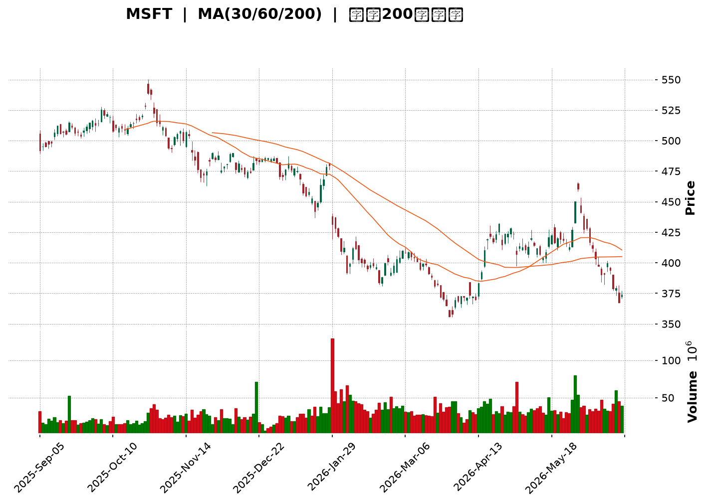
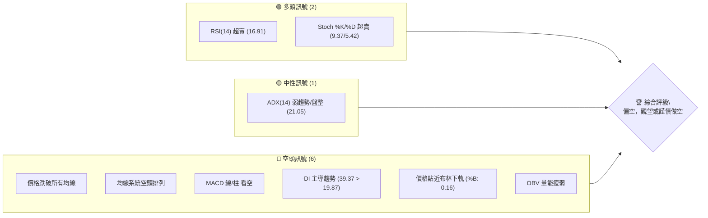
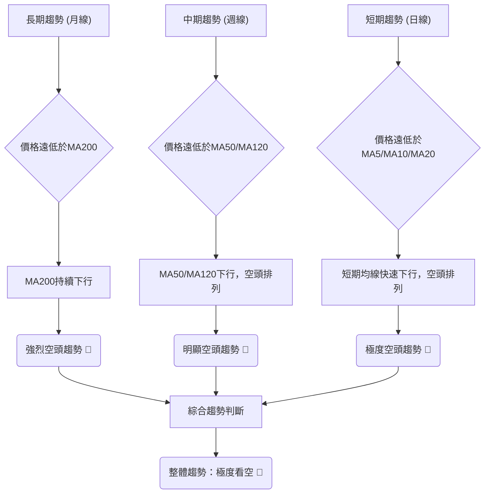
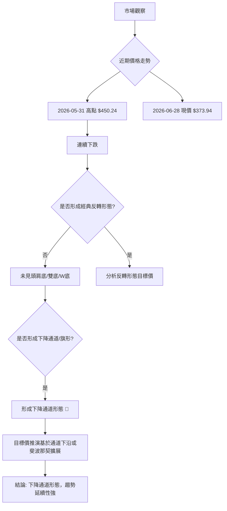

<details>
<summary>📊 靜態圖表 (點擊展開)</summary>

</details>

<html>
<head><meta charset="utf-8" /></head>
<body>
    <div style="height:500px; width:100%;">                        <script>window.PlotlyConfig = {MathJaxConfig: 'local'};</script>
        <script charset="utf-8" src="https://cdn.plot.ly/plotly-3.6.0.min.js" integrity="sha256-QaOVwtVY0T02VaHrr6pnoHLCwayMJp4O5n4YyaE3rJk=" crossorigin="anonymous"></script>                <div id="candlestick-chart" class="plotly-graph-div" style="height:100%; width:100%;"></div>            <script>                window.PLOTLYENV=window.PLOTLYENV || {};                                if (document.getElementById("candlestick-chart")) {                    Plotly.newPlot(                        "candlestick-chart",                        [{"close":{"dtype":"f8","bdata":"AAAAICi+fkAAAADACPF+QAAAAKBf9H5AAAAAIIkTf0AAAAAgth1\u002fQAAAAGAOq39AAAAA4O4AgEAAAAAAYp1\u002fQAAAAMD2rH9AAAAAoACUf0AAAAAAXRWAQAAAAMBl839AAAAAgGegf0AAAADgB69\u002fQAAAAOBsfX9AAAAA4NvDf0AAAABAyPV\u002fQAAAAOCFFYBAAAAAwIMjgEAAAABA9AOAQAAAAKDAEIBAAAAAwPJpgEAAAACAdUWAQAAAAABgTIBAAAAAIOY4gEAAAADA6Lt\u002fQAAAAMAJ7X9AAAAAAGjlf0AAAAAgLuN\u002fQAAAAGA+xn9AAAAAAJHlf0AAAAAATQyAQAAAAKA3E4BAAAAAwBwqgEAAAACARSqAQAAAAICEQoBAAAAAYGaBgEAAAADARNWAQAAAAIAi0YBAAAAAAJxTgEAAAADgaBSAQAAAAIA1DoBAAAAAoH3xf0AAAADgfX9\u002fQAAAAICL335AAAAA4BfbfkAAAABgDG1\u002fQAAAAKCol39AAAAAgMW+f0AAAAAg9kF\u002fQAAAAACCr39AAAAAAL2Ef0AAAAAg66p+QAAAAKDeQH5AAAAAIPHEfUAAAADgbWB9QAAAAGBgfn1AAAAA4ACufUAAAABgjzV+QAAAAEBCnX5AAAAA4E9JfkAAAADAPX1+QAAAAKDKuX1AAAAAoFTrfUAAAABASRB+QAAAACB9jX5AAAAA4GqdfkAAAAAgA8d9QAAAAGA5FX5AAAAA4IjGfUAAAAAgcIt9QAAAAGBypH1AAAAAQCWgfUAAAAAgWR1+QAAAACBAPH5AAAAAYFIsfkAAAACgEEt+QAAAAICzXX5AAAAAgMNYfkAAAAAADE9+QAAAAKAZVX5AAAAAIJ0XfkAAAADAfW19QAAAAMAObH1AAAAAYDfGfUAAAABgORV+QAAAACDYv31AAAAAQHvSfUAAAADAB7F9QAAAACBVSX1AAAAAYH6VfEAAAACgKmp8QAAAAKAjnXxAAAAA4BNIfEAAAACAQaJ7QAAAAOA8EnxAAAAAoCX+fEAAAACgHkN9QAAAAIAw531AAAAAIOr3fUAAAADAP\u002fl6QAAAAOAdxnpAAAAAQONXekAAAACgMJZ5QAAAAMCoxXlAAAAAYMt+eEAAAADgyPV4QAAAAMBCvHlAAAAAAAG3eUAAAAAgPCl5QAAAAEDvAHlAAAAA4Kb4eEAAAACgm7F4QAAAAOBA3XhAAAAA4JTZeEAAAADA8cV4QAAAAKA5+ndAAAAAgIxCeEAAAABgv\u002ft4QAAAAAChDXlAAAAAYEJ+eEAAAACgBNt4QAAAAIDpMHlAAAAAQDBFeUAAAADArZx5QAAAAOA3gXlAAAAAIGeIeUAAAAAgIU55QAAAAGAUQHlAAAAAIN0PeUAAAABAH6t4QAAAAMBe8XhAAAAAoL\u002foeEAAAACgF294QAAAACDeQnhAAAAAILfQd0AAAACgweJ3QAAAAGDzPndAAAAAYM8jd0AAAACA3dJ2QAAAAKD7P3ZAAAAAgPJidkAAAACA6xV3QAAAAMAlCXdAAAAAIHJKd0AAAACgL0F3QAAAAEDEN3dAAAAAAFZYd0AAAABAOER3QAAAAIAYIXdAAAAAAKH4d0AAAACgKoR4QAAAAOBMpXlAAAAAwKA1ekAAAABABV56QAAAAOCpEnpAAAAAoORzekAAAAAAwP96QAAAAKCf7XlAAAAAoDx7ekAAAAAgbn56QAAAACAoxXpAAAAAoK54ekAAAAAgYW55QAAAAIC12HlAAAAAAJ7LeUAAAADg2qd5QAAAAKAL0XlAAAAAIMU9ekAAAADAkON5QAAAAGBKvHlAAAAAIDhueUAAAAAgWUV5QAAAAOC4iHlAAAAAYCFQekAAAACg\u002fml6QAAAAEBJCHpAAAAAYGZCekAAAACgcDF6QAAAAMAeKXpAAAAA4HoAekAAAABguMp5QAAAAADXr3pAAAAAANcjfEAAAADgUch8QAAAAMD1lHtAAAAAoHC1ekAAAADAzMB6QAAAAGC4CnpAAAAAANe7eUAAAABgjzZ5QAAAAIDC1XhAAAAAoHBleEAAAAAA12t4QAAAAAAp\u002fHhAAAAAoEedeEAAAABgj653QAAAAGBmtndAAAAAoHD1dkAAAABACl93QA=="},"high":{"dtype":"f8","bdata":"h2YszvfLf0DvZ6ZquyB\u002fQHHovENtMX9AhU6DBgJBf0DwX\u002fPRDUB\u002fQBKOg3Aw1X9AC3wZtc4BgEBeZdOAzA+AQMZKCQMowX9AZgVXCHXdf0BMopEXQSCAQKtXb1jaE4BAqBAu9Z\u002f1f0Cy0TJwE9R\u002fQByhvC7OrH9Ag00yEkrrf0AnHf8fxwyAQK04OisxF4BAEGdw0N8pgEAl1df4iTKAQIyPQee2KYBARSMWK4F9gEAVYJ7cuXOAQA6My84RXYBAikDp3z1IgEBvEaWHR0KAQOTeIrVHCYBAf9apFUwAgEAyx5kZew+AQCgMaybHDIBAPosPI+MBgEAfDbYhfBuAQGODZNlnG4BAKi01bWVPgECgD5GOOEWAQE9szpJZUIBA6XN7z7mZgEAlC5q44TGBQLnWOEqo9oBA56kNS9OcgEAk0A4G6W+AQHO\u002fUuo\u002fTYBAh\u002fuvlnECgECY6ZCIcPl\u002fQBlLpG9HaH9A+2xYossDf0BGd68WkHp\u002fQBhsvEhJpn9ACVF+tjLHf0AypNwOS+R\u002fQCC\u002fNsUVxn9AhOz\u002fJVrOf0DjNG96CD1\u002fQB+kG1ktwX5Adt4AsBu2fkB3mEJDv8x9QOGQYRaSrH1A5qQ+BmnQfUD05oMYUmJ+QBFqt30ip35AXj1jtwJ7fkChDuow\u002frR+QEKvokd9IX5AUUZ2CPryfUCufk3kGxR+QKPLc8HgoX5AM3cUrwKffkBTInsLpiF+QPgcw6IAPn5AQe47EPoEfkCqq4Bba+l9QP+jpyJXvH1Am8oySvPdfUBZrRiR3nZ+QDSDmVP+Wn5AbDPF7wJpfkDLBzbUrFp+QIZ9KEzcb35Api7zbUtffkCMfN9M9WJ+QAsKiMwkeH5ANK4AC51ffkBQxMEKLih+QOAJfGZZn31AgijYMuHJfUAYriRddnh+QJZsZV9SCH5AtPeMURXbfUAqradPuO19QJ17NdS6mn1ABysz9fwhfUAOQD5rEeN8QDTFOOcu0nxAIsR7WGVsfEAERQdw7Sp8QG2U7SBRLXxAMx72eS5QfUCxwrKnW4J9QDNWGMqqC35AAqLKToYZfkC10\u002fFPnIh7QDj5j45qWntA8hza6UjNekCvSMll3EJ6QIkWEGAFH3pAeiZJEtZneUBKkTxyIwB5QJXy4TLP0HlA\u002fHwBVdNcekBEEfgx0el5QJfjkbJiRnlAT3ekXd87eUA97geJ6Ot4QFx\u002fFz9nDHlAuVT+JuU4eUC3osuKFfR4QHEV1ZgWqHhA1j830EtIeEDrnmosowl5QEJPMcy\u002faXlAl7z7AWa\u002feEBzsCjBKgV5QGanivoiXXlALCL5Q0SieUBGdHDEhqt5QPT5QkuEwnlA3csPyyyVeUA4XjYSBJV5QIw9nVAEgnlA84YKauBTeUCgiupdzT55QFGY\u002f\u002fo5\u002fHhAmTGSc2o4eUBaD\u002fXGPNJ4QDjiQYhEenhALDCfNp4ieEDklYV7+CV4QPUh1V1L2ndAbZjO9euDd0AHYSkLkF53QF8O77eqmnZAW8JjOCDJdkDAH1BVgUF3QNGxS1roUndA1+0H6FFNd0DhZLW5wU53QLC4ZjVSOndA9mwl7K8CeEDSRZCxFUt3QCNraEZAbXdAkV653lf7d0Dn329jZJ14QFtJgV2X13lAYyLyipE+ekC2MHUwW+p6QE7m6S+kZnpAXOY1xBukekCAvVv4Mwx7QPU0Sfroa3pAw98ddIGAekA6dX2a\u002faJ6QDbtnJHaz3pAH+yuW1yeekCgwqTYY9h5QMVgTx1WA3pA6CgH\u002fu09ekBclLVyEf55QJojvmRAGHpAYL7ejOGwekCk\u002f7Ctmht6QM5UBPzEvHlAF6Qa0qHpeUC84TQD6VZ5QGqRguoyr3lAgYwtDOqzekA1wYBDOIN6QGSLqNw8\u002fHpAmssgCwFTekAAAACgcKV6QAAAAGBmhnpAAAAA4FE8ekAAAABACv95QAAAAADX13pAAAAAoEclfEAAAADAHiV9QAAAAAAAWHxAAAAAgD2Ge0AAAABgZkJ7QAAAACCF13pAAAAAYI8SekAAAAAgrr95QAAAAOCjUHlAAAAAoJnNeEAAAAAA13t4QAAAAAAAHHlAAAAAoHDNeEAAAACA62V4QAAAAIDr1XdAAAAAgBTad0AAAAAghZN3QA=="},"hovertemplate":"\u003cb\u003e%{x|%Y-%m-%d}\u003c\u002fb\u003e\u003cbr\u003e\u958b: $%{open:.2f}\u003cbr\u003e\u9ad8: $%{high:.2f}\u003cbr\u003e\u4f4e: $%{low:.2f}\u003cbr\u003e\u6536: $%{close:.2f}\u003cextra\u003e\u003c\u002fextra\u003e","low":{"dtype":"f8","bdata":"pUCGa1eUfkDg1UkXor5+QLvHQc0V6X5AvHie1oDZfkAopytP8ut+QIurRZTdSn9ACVYewPJ8f0A5cJ0XY5Z\u002fQMsvOY7va39Avd1RHXGHf0BRltHtkrF\u002fQA\u002fGpHwH1X9AnBIynuCBf0DrO\u002fIirXt\u002fQAo9DyzJXX9AuDGMA+h2f0DyZL2y1pp\u002fQN3GRpI9p39AvQ4iPITHf0DaTSgvdbd\u002fQNvq4lMk\u002fH9AlykZqIIXgEC1K8ZcRDGAQB0tEE9iPoBAW7+zkSYRgEBIKrRow6Z\u002fQG9lyFdbx39A2FWIYwxtf0Ac8\u002fhKpax\u002fQPy2sxTqjn9ASvbsn+CBf0DTKAEdLuN\u002fQAYQlNf63H9AHZqEeZ0TgECvfhwCxRqAQL7GlsB2K4BAmrDSOXJtgEBkHlkh78qAQHDrpT\u002fRqoBAUk5\u002fKqw2gEDMg79bu\u002f1\u002fQAJl\u002fKWf9X9A\u002fADay02Kf0DhC5wTRXZ\u002fQONx5+AIy35AA9DMJlWifkAx++65kvp+QFnPPCwEM39ASQAfWan\u002ffkCJbkauKSJ\u002fQDIEQGjz5H5A+iaq4bdbf0ACV57Tdjt+QBeKQFap\u002fH1A9IIpFUWWfUADol4qGiN9QF0yI9geH31AKXU3HEPtfEA8t1i2EPF9QD16E\u002fbgR35ATpg6NAUofkAcsdlTn0J+QFk8wrF9kX1AFujg\u002fgmmfUAV0mcZHMx9QBj2a1S4I35ARtgi7FhlfkCK22IylI99QOmEZfIAnH1AEWocZaajfUAer48EzWZ9QPZyd2+tTH1AKUPCFk6OfUAMvuYXV7x9QHnT7wmdBX5AUuwOv8wIfkD3ailRdCl+QDx4FC7jKn5AG8SBR+M8fkB66NqmiCB+QMJz2XSPNX5AQ2esL4QSfkDqjvdbNUF9QC+z5fWxNn1AaUFjdK06fUAwegS+S719QBNmCfwAnH1Ax3EyMrRhfUCqX179Ipl9QE+dy7Yl\u002fnxA0l\u002flYUpyfEBJ8CttD158QILFBaFMZ3xA4JFCCJz0e0BKr7Pbwkt7QGCpB5Onq3tAVYXLRoUIfECC8zkdOr98QNEkYv7+cH1Ak5Kyixe+fUCR3EJCdDJ6QNJa1vvyiHpAACa2FgxGekBvLphf+mt5QK5602PPdnlAai0VREppeEDNqAwG2XJ4QJTjg8x78XhA0+DCueyteUD2pniktvN4QEXAWy3tw3hAyjL9QZDEeEAwTtxPfox4QF7AnJABqXhAWJpi+AC9eECPvv5S5aR4QIEHuEBa5HdAhT5SKCnOd0DM9SOLEVV4QNRKOkEN3nhAIU43MZlQeEDKhWJ8klx4QC0vh00kfXhA5DHYCR73eECWSM93ajh5QFNMv7sIenlAvVhLEQwqeUC7rkpt8iB5QHndyp+NC3lAW9zpE3gNeUCas\u002f4BXpZ4QHHpnQ39nnhA7hrw8T7OeEAj8k++emJ4QNhLv1mTI3hAzrzEnca0d0BuJFaPrs13QG0w4uC9MHdAXFJHe0wNd0DMtpiHacZ2QHo0Kg3VO3ZAbkJg+Sg4dkCtLAy6kKR2QJz4Ydt39nZAbjBXys61dkBaGswLOQt3QKKTS9lI3HZAM7wembcpd0Dm\u002f2KKG+R2QBVUj0+vE3dAPDUdjX0jd0AwU\u002fNV9Bp4QAFOHiX2vXhAu8FaIf2zeUBt8vU2fjx6QK0ZMYtn9nlA8dx6HMYEekCxHnPiEWx6QAetVWtVqHlAdc7c82vueUCCo+u6sgJ6QJOxnJDPT3pAk\u002fUZShs2ekBkkGO8ZdJ4QL0Uw+jYmHlAx4CwNpieeUC3OsD2qX55QJ6ky1fAQ3lAXP\u002fzCq4dekCD3Bsqr9F5QFa\u002f9mH6SXlAQuTEwC1ceUCtvovgnAJ5QGqvxM83AHlAZ4mWIkjAeUDYtqxyY+t5QLFdmxtw+XlAuDctxpOmeUAAAAAgXPt5QAAAAKBHBXpAAAAA4FHQeUAAAACgR5l5QAAAAGC4ynlAAAAAgMIFe0AAAADgUaR8QAAAAEDhhntAAAAAAACEekAAAABgj6Z6QAAAAGBm5nlAAAAAwPWIeUAAAAAgrud4QAAAAGCP0nhAAAAAAAAAeEAAAADgUeR3QAAAAKCZjXhAAAAAQApreEAAAADAHpV3QAAAAOB6VHdAAAAAwB7xdkAAAABACit3QA=="},"name":"\u50f9\u683c","open":{"dtype":"f8","bdata":"Ui9eL9ydf0BJBBlSmu9+QDVD\u002fqZjJH9A7rpIeAg9f0A3ujIpbTF\u002fQE5h9yZid39AIZ26e2iZf0DJ7pVDBA2AQLacguiAtn9A4sD6AlbEf0CkOwV8jLV\u002fQDB7bO7CAoBAZaioUhDpf0AQwiISsLJ\u002fQFgPRQOekX9AV8itlpmtf0BsxhepfsR\u002fQNOMueko4H9A\u002fZBUkfb4f0BVWtMCDxOAQLNp5djDDoBA3Eth\u002f8QagEAPF\u002ffSuGeAQDNUI\u002fzkP4BA9uD2BWw4gEA5N90v9SKAQOTeIrVHCYBAb9kZeU2wf0CZtSKvgft\u002fQI2ErJ6q1X9AWJGQJ2Kdf0AsJhLy8PV\u002fQKPb1Q\u002fyEYBAbZgiQ\u002fYugECmGNNCYDmAQFLLqLH\u002fO4BAK9EXhneDgEDmQ8EqTxSBQM5un44V7IBAIKAbqiF5gEDzD9+RaWyAQIHiQgtPJIBAqzKPH6HIf0A0k275HOF\u002fQPeUqZekZ39ANQgWBindfkBx8NriSQ5\u002fQPLtjST4WX9AqC+QYniif0DsdiAKk7F\u002fQMkU6+qC8X5A5uSwgACUf0ABnooFCsR+QCnyke4\u002fcH5ADYIbrmiofkBFb96DDsZ9QFz3JzdOjn1AaO\u002fcpn1\u002ffUDZkmBqdkJ+QG8VlfUCV35AGtfGQGRkfkD+eVNw\u002fkh+QPIQ\u002ftpUo31AeHvInCDafUAAxmFfFwZ+QMXlcxHYK35AS\u002fXBpudufkA3RkHqJB5+QEUWovZEqH1Ah8rfUhXbfUD4sMwdi999QD\u002fNG5sVXX1AoNlRx7qsfUAsRUhlHsF9QMP0qxkwU35AFjFttW8\u002ffkBB9FYVRy1+QI9Fd15tOH5AD3DcqNVIfkBe1aKNXSt+QGCS3OVoPH5Aqu2\u002fndVafkBObOkR4SN+QCfs2eZUf31AX9RoqDB7fUCWR3mfINp9QOFs58iz8X1ACnZM61R\u002ffUBJT9ki6Kh9QAblBS41iX1AXQRHbkUGfUC0zJ1H\u002f+B8QKBULZ3NfHxAFGNbDYMTfEArdGpyfil8QKtdRswq2ntAdcU5kd0dfEAsJz7B8\u002fN8QD4H9w+ZeX1AsTS6DhURfkBFcrfkoGB7QC5qkB2RU3tAwHNJ\u002flHFekAXBKRfOUJ6QG150W3YknlAPvVLMCNaeUCf9luGZ9Z4QL422qXhMHlAOh2ATyccekDYyaxnW+V5QCg7WT1FM3lATsLsiIIqeUByUolkM9d4QLFt\u002fXHWxXhApnltQi\u002f9eEBHDCwKELR4QJP+o0hXonhAIlyABfX0d0AWRKjE+Vp4QHBWKIhdPXlAioMLV5BgeEBg+sS+LIB4QKKMZ0SlhHhAhSZLqnEGeUA28nBKvDh5QJDNEOAMhXlAHtM\u002f37dAeUB4wH0zTZJ5QI5aUoQYS3lAnHOhmhY8eUCT01ZBIgJ5QKMceeRa03hABOsUg3r2eEA13Ij6WMR4QDMMdVAcVHhAtKN+8kMfeEAAQHoIIPF3QDmUJreJ2HdAuiwI06+Bd0AA8yQxTCB3QIGUYrbikXZAR2JkueKRdkDJ6hygMbx2QC+7YcfsSndA+iTEc6nmdkB7T6W57Ep3QHdFGUOiGHdA0L1xOV4CeECqwLuLHjt3QIzPYXLIQndA\u002fVjLP9dMd0C1WkdxTjF4QP7rE8c80nhALMuGyj0vekB4+68nbn56QOAzLjzWQ3pA3WBk8041ekDfmJ9zTZR6QMeN3Xm4L3pA2hVi+BkBekDXJH55eVd6QI9A0U1wenpAxIgQEJl6ekDXSYctwZ55QOPrlYSGvnlApUioyWiqeUC+Y0s\u002fwuZ5QG4feULkcXlAqxOulzszekC6B7unzgd6QN3NF+fQb3lAgk+f+VjZeUAk7\u002fAKQiV5QIhLhpGxOXlA+9OSmP7VeUDzltWBg\u002ft5QK9WBsaIz3pArK4c\u002fmXUeUAAAAAAAIx6QAAAAOCjOHpAAAAAQOEGekAAAAAAKbB5QAAAACCuz3lAAAAAwMwIe0AAAACgcA19QAAAAIAU7ntAAAAAQDNne0AAAADA9Tx7QAAAAKBwxXpAAAAAgD3ieUAAAADgepB5QAAAAMDM6HhAAAAAIFyzeEAAAABA4XZ4QAAAAMDMzHhAAAAA4KO8eEAAAAAAAGR4QAAAAMAenXdAAAAAANd7d0AAAABAM0V3QA=="},"x":["2025-09-05T00:00:00-04:00","2025-09-08T00:00:00-04:00","2025-09-09T00:00:00-04:00","2025-09-10T00:00:00-04:00","2025-09-11T00:00:00-04:00","2025-09-12T00:00:00-04:00","2025-09-15T00:00:00-04:00","2025-09-16T00:00:00-04:00","2025-09-17T00:00:00-04:00","2025-09-18T00:00:00-04:00","2025-09-19T00:00:00-04:00","2025-09-22T00:00:00-04:00","2025-09-23T00:00:00-04:00","2025-09-24T00:00:00-04:00","2025-09-25T00:00:00-04:00","2025-09-26T00:00:00-04:00","2025-09-29T00:00:00-04:00","2025-09-30T00:00:00-04:00","2025-10-01T00:00:00-04:00","2025-10-02T00:00:00-04:00","2025-10-03T00:00:00-04:00","2025-10-06T00:00:00-04:00","2025-10-07T00:00:00-04:00","2025-10-08T00:00:00-04:00","2025-10-09T00:00:00-04:00","2025-10-10T00:00:00-04:00","2025-10-13T00:00:00-04:00","2025-10-14T00:00:00-04:00","2025-10-15T00:00:00-04:00","2025-10-16T00:00:00-04:00","2025-10-17T00:00:00-04:00","2025-10-20T00:00:00-04:00","2025-10-21T00:00:00-04:00","2025-10-22T00:00:00-04:00","2025-10-23T00:00:00-04:00","2025-10-24T00:00:00-04:00","2025-10-27T00:00:00-04:00","2025-10-28T00:00:00-04:00","2025-10-29T00:00:00-04:00","2025-10-30T00:00:00-04:00","2025-10-31T00:00:00-04:00","2025-11-03T00:00:00-05:00","2025-11-04T00:00:00-05:00","2025-11-05T00:00:00-05:00","2025-11-06T00:00:00-05:00","2025-11-07T00:00:00-05:00","2025-11-10T00:00:00-05:00","2025-11-11T00:00:00-05:00","2025-11-12T00:00:00-05:00","2025-11-13T00:00:00-05:00","2025-11-14T00:00:00-05:00","2025-11-17T00:00:00-05:00","2025-11-18T00:00:00-05:00","2025-11-19T00:00:00-05:00","2025-11-20T00:00:00-05:00","2025-11-21T00:00:00-05:00","2025-11-24T00:00:00-05:00","2025-11-25T00:00:00-05:00","2025-11-26T00:00:00-05:00","2025-11-28T00:00:00-05:00","2025-12-01T00:00:00-05:00","2025-12-02T00:00:00-05:00","2025-12-03T00:00:00-05:00","2025-12-04T00:00:00-05:00","2025-12-05T00:00:00-05:00","2025-12-08T00:00:00-05:00","2025-12-09T00:00:00-05:00","2025-12-10T00:00:00-05:00","2025-12-11T00:00:00-05:00","2025-12-12T00:00:00-05:00","2025-12-15T00:00:00-05:00","2025-12-16T00:00:00-05:00","2025-12-17T00:00:00-05:00","2025-12-18T00:00:00-05:00","2025-12-19T00:00:00-05:00","2025-12-22T00:00:00-05:00","2025-12-23T00:00:00-05:00","2025-12-24T00:00:00-05:00","2025-12-26T00:00:00-05:00","2025-12-29T00:00:00-05:00","2025-12-30T00:00:00-05:00","2025-12-31T00:00:00-05:00","2026-01-02T00:00:00-05:00","2026-01-05T00:00:00-05:00","2026-01-06T00:00:00-05:00","2026-01-07T00:00:00-05:00","2026-01-08T00:00:00-05:00","2026-01-09T00:00:00-05:00","2026-01-12T00:00:00-05:00","2026-01-13T00:00:00-05:00","2026-01-14T00:00:00-05:00","2026-01-15T00:00:00-05:00","2026-01-16T00:00:00-05:00","2026-01-20T00:00:00-05:00","2026-01-21T00:00:00-05:00","2026-01-22T00:00:00-05:00","2026-01-23T00:00:00-05:00","2026-01-26T00:00:00-05:00","2026-01-27T00:00:00-05:00","2026-01-28T00:00:00-05:00","2026-01-29T00:00:00-05:00","2026-01-30T00:00:00-05:00","2026-02-02T00:00:00-05:00","2026-02-03T00:00:00-05:00","2026-02-04T00:00:00-05:00","2026-02-05T00:00:00-05:00","2026-02-06T00:00:00-05:00","2026-02-09T00:00:00-05:00","2026-02-10T00:00:00-05:00","2026-02-11T00:00:00-05:00","2026-02-12T00:00:00-05:00","2026-02-13T00:00:00-05:00","2026-02-17T00:00:00-05:00","2026-02-18T00:00:00-05:00","2026-02-19T00:00:00-05:00","2026-02-20T00:00:00-05:00","2026-02-23T00:00:00-05:00","2026-02-24T00:00:00-05:00","2026-02-25T00:00:00-05:00","2026-02-26T00:00:00-05:00","2026-02-27T00:00:00-05:00","2026-03-02T00:00:00-05:00","2026-03-03T00:00:00-05:00","2026-03-04T00:00:00-05:00","2026-03-05T00:00:00-05:00","2026-03-06T00:00:00-05:00","2026-03-09T00:00:00-04:00","2026-03-10T00:00:00-04:00","2026-03-11T00:00:00-04:00","2026-03-12T00:00:00-04:00","2026-03-13T00:00:00-04:00","2026-03-16T00:00:00-04:00","2026-03-17T00:00:00-04:00","2026-03-18T00:00:00-04:00","2026-03-19T00:00:00-04:00","2026-03-20T00:00:00-04:00","2026-03-23T00:00:00-04:00","2026-03-24T00:00:00-04:00","2026-03-25T00:00:00-04:00","2026-03-26T00:00:00-04:00","2026-03-27T00:00:00-04:00","2026-03-30T00:00:00-04:00","2026-03-31T00:00:00-04:00","2026-04-01T00:00:00-04:00","2026-04-02T00:00:00-04:00","2026-04-06T00:00:00-04:00","2026-04-07T00:00:00-04:00","2026-04-08T00:00:00-04:00","2026-04-09T00:00:00-04:00","2026-04-10T00:00:00-04:00","2026-04-13T00:00:00-04:00","2026-04-14T00:00:00-04:00","2026-04-15T00:00:00-04:00","2026-04-16T00:00:00-04:00","2026-04-17T00:00:00-04:00","2026-04-20T00:00:00-04:00","2026-04-21T00:00:00-04:00","2026-04-22T00:00:00-04:00","2026-04-23T00:00:00-04:00","2026-04-24T00:00:00-04:00","2026-04-27T00:00:00-04:00","2026-04-28T00:00:00-04:00","2026-04-29T00:00:00-04:00","2026-04-30T00:00:00-04:00","2026-05-01T00:00:00-04:00","2026-05-04T00:00:00-04:00","2026-05-05T00:00:00-04:00","2026-05-06T00:00:00-04:00","2026-05-07T00:00:00-04:00","2026-05-08T00:00:00-04:00","2026-05-11T00:00:00-04:00","2026-05-12T00:00:00-04:00","2026-05-13T00:00:00-04:00","2026-05-14T00:00:00-04:00","2026-05-15T00:00:00-04:00","2026-05-18T00:00:00-04:00","2026-05-19T00:00:00-04:00","2026-05-20T00:00:00-04:00","2026-05-21T00:00:00-04:00","2026-05-22T00:00:00-04:00","2026-05-26T00:00:00-04:00","2026-05-27T00:00:00-04:00","2026-05-28T00:00:00-04:00","2026-05-29T00:00:00-04:00","2026-06-01T00:00:00-04:00","2026-06-02T00:00:00-04:00","2026-06-03T00:00:00-04:00","2026-06-04T00:00:00-04:00","2026-06-05T00:00:00-04:00","2026-06-08T00:00:00-04:00","2026-06-09T00:00:00-04:00","2026-06-10T00:00:00-04:00","2026-06-11T00:00:00-04:00","2026-06-12T00:00:00-04:00","2026-06-15T00:00:00-04:00","2026-06-16T00:00:00-04:00","2026-06-17T00:00:00-04:00","2026-06-18T00:00:00-04:00","2026-06-22T00:00:00-04:00","2026-06-23T00:00:00-04:00"],"type":"candlestick"},{"hovertemplate":"MA30: $%{y:.2f}\u003cextra\u003e\u003c\u002fextra\u003e","line":{"color":"#2196F3","dash":"dash","width":2},"mode":"lines","name":"MA30","x":["2025-09-05T00:00:00-04:00","2025-09-08T00:00:00-04:00","2025-09-09T00:00:00-04:00","2025-09-10T00:00:00-04:00","2025-09-11T00:00:00-04:00","2025-09-12T00:00:00-04:00","2025-09-15T00:00:00-04:00","2025-09-16T00:00:00-04:00","2025-09-17T00:00:00-04:00","2025-09-18T00:00:00-04:00","2025-09-19T00:00:00-04:00","2025-09-22T00:00:00-04:00","2025-09-23T00:00:00-04:00","2025-09-24T00:00:00-04:00","2025-09-25T00:00:00-04:00","2025-09-26T00:00:00-04:00","2025-09-29T00:00:00-04:00","2025-09-30T00:00:00-04:00","2025-10-01T00:00:00-04:00","2025-10-02T00:00:00-04:00","2025-10-03T00:00:00-04:00","2025-10-06T00:00:00-04:00","2025-10-07T00:00:00-04:00","2025-10-08T00:00:00-04:00","2025-10-09T00:00:00-04:00","2025-10-10T00:00:00-04:00","2025-10-13T00:00:00-04:00","2025-10-14T00:00:00-04:00","2025-10-15T00:00:00-04:00","2025-10-16T00:00:00-04:00","2025-10-17T00:00:00-04:00","2025-10-20T00:00:00-04:00","2025-10-21T00:00:00-04:00","2025-10-22T00:00:00-04:00","2025-10-23T00:00:00-04:00","2025-10-24T00:00:00-04:00","2025-10-27T00:00:00-04:00","2025-10-28T00:00:00-04:00","2025-10-29T00:00:00-04:00","2025-10-30T00:00:00-04:00","2025-10-31T00:00:00-04:00","2025-11-03T00:00:00-05:00","2025-11-04T00:00:00-05:00","2025-11-05T00:00:00-05:00","2025-11-06T00:00:00-05:00","2025-11-07T00:00:00-05:00","2025-11-10T00:00:00-05:00","2025-11-11T00:00:00-05:00","2025-11-12T00:00:00-05:00","2025-11-13T00:00:00-05:00","2025-11-14T00:00:00-05:00","2025-11-17T00:00:00-05:00","2025-11-18T00:00:00-05:00","2025-11-19T00:00:00-05:00","2025-11-20T00:00:00-05:00","2025-11-21T00:00:00-05:00","2025-11-24T00:00:00-05:00","2025-11-25T00:00:00-05:00","2025-11-26T00:00:00-05:00","2025-11-28T00:00:00-05:00","2025-12-01T00:00:00-05:00","2025-12-02T00:00:00-05:00","2025-12-03T00:00:00-05:00","2025-12-04T00:00:00-05:00","2025-12-05T00:00:00-05:00","2025-12-08T00:00:00-05:00","2025-12-09T00:00:00-05:00","2025-12-10T00:00:00-05:00","2025-12-11T00:00:00-05:00","2025-12-12T00:00:00-05:00","2025-12-15T00:00:00-05:00","2025-12-16T00:00:00-05:00","2025-12-17T00:00:00-05:00","2025-12-18T00:00:00-05:00","2025-12-19T00:00:00-05:00","2025-12-22T00:00:00-05:00","2025-12-23T00:00:00-05:00","2025-12-24T00:00:00-05:00","2025-12-26T00:00:00-05:00","2025-12-29T00:00:00-05:00","2025-12-30T00:00:00-05:00","2025-12-31T00:00:00-05:00","2026-01-02T00:00:00-05:00","2026-01-05T00:00:00-05:00","2026-01-06T00:00:00-05:00","2026-01-07T00:00:00-05:00","2026-01-08T00:00:00-05:00","2026-01-09T00:00:00-05:00","2026-01-12T00:00:00-05:00","2026-01-13T00:00:00-05:00","2026-01-14T00:00:00-05:00","2026-01-15T00:00:00-05:00","2026-01-16T00:00:00-05:00","2026-01-20T00:00:00-05:00","2026-01-21T00:00:00-05:00","2026-01-22T00:00:00-05:00","2026-01-23T00:00:00-05:00","2026-01-26T00:00:00-05:00","2026-01-27T00:00:00-05:00","2026-01-28T00:00:00-05:00","2026-01-29T00:00:00-05:00","2026-01-30T00:00:00-05:00","2026-02-02T00:00:00-05:00","2026-02-03T00:00:00-05:00","2026-02-04T00:00:00-05:00","2026-02-05T00:00:00-05:00","2026-02-06T00:00:00-05:00","2026-02-09T00:00:00-05:00","2026-02-10T00:00:00-05:00","2026-02-11T00:00:00-05:00","2026-02-12T00:00:00-05:00","2026-02-13T00:00:00-05:00","2026-02-17T00:00:00-05:00","2026-02-18T00:00:00-05:00","2026-02-19T00:00:00-05:00","2026-02-20T00:00:00-05:00","2026-02-23T00:00:00-05:00","2026-02-24T00:00:00-05:00","2026-02-25T00:00:00-05:00","2026-02-26T00:00:00-05:00","2026-02-27T00:00:00-05:00","2026-03-02T00:00:00-05:00","2026-03-03T00:00:00-05:00","2026-03-04T00:00:00-05:00","2026-03-05T00:00:00-05:00","2026-03-06T00:00:00-05:00","2026-03-09T00:00:00-04:00","2026-03-10T00:00:00-04:00","2026-03-11T00:00:00-04:00","2026-03-12T00:00:00-04:00","2026-03-13T00:00:00-04:00","2026-03-16T00:00:00-04:00","2026-03-17T00:00:00-04:00","2026-03-18T00:00:00-04:00","2026-03-19T00:00:00-04:00","2026-03-20T00:00:00-04:00","2026-03-23T00:00:00-04:00","2026-03-24T00:00:00-04:00","2026-03-25T00:00:00-04:00","2026-03-26T00:00:00-04:00","2026-03-27T00:00:00-04:00","2026-03-30T00:00:00-04:00","2026-03-31T00:00:00-04:00","2026-04-01T00:00:00-04:00","2026-04-02T00:00:00-04:00","2026-04-06T00:00:00-04:00","2026-04-07T00:00:00-04:00","2026-04-08T00:00:00-04:00","2026-04-09T00:00:00-04:00","2026-04-10T00:00:00-04:00","2026-04-13T00:00:00-04:00","2026-04-14T00:00:00-04:00","2026-04-15T00:00:00-04:00","2026-04-16T00:00:00-04:00","2026-04-17T00:00:00-04:00","2026-04-20T00:00:00-04:00","2026-04-21T00:00:00-04:00","2026-04-22T00:00:00-04:00","2026-04-23T00:00:00-04:00","2026-04-24T00:00:00-04:00","2026-04-27T00:00:00-04:00","2026-04-28T00:00:00-04:00","2026-04-29T00:00:00-04:00","2026-04-30T00:00:00-04:00","2026-05-01T00:00:00-04:00","2026-05-04T00:00:00-04:00","2026-05-05T00:00:00-04:00","2026-05-06T00:00:00-04:00","2026-05-07T00:00:00-04:00","2026-05-08T00:00:00-04:00","2026-05-11T00:00:00-04:00","2026-05-12T00:00:00-04:00","2026-05-13T00:00:00-04:00","2026-05-14T00:00:00-04:00","2026-05-15T00:00:00-04:00","2026-05-18T00:00:00-04:00","2026-05-19T00:00:00-04:00","2026-05-20T00:00:00-04:00","2026-05-21T00:00:00-04:00","2026-05-22T00:00:00-04:00","2026-05-26T00:00:00-04:00","2026-05-27T00:00:00-04:00","2026-05-28T00:00:00-04:00","2026-05-29T00:00:00-04:00","2026-06-01T00:00:00-04:00","2026-06-02T00:00:00-04:00","2026-06-03T00:00:00-04:00","2026-06-04T00:00:00-04:00","2026-06-05T00:00:00-04:00","2026-06-08T00:00:00-04:00","2026-06-09T00:00:00-04:00","2026-06-10T00:00:00-04:00","2026-06-11T00:00:00-04:00","2026-06-12T00:00:00-04:00","2026-06-15T00:00:00-04:00","2026-06-16T00:00:00-04:00","2026-06-17T00:00:00-04:00","2026-06-18T00:00:00-04:00","2026-06-22T00:00:00-04:00","2026-06-23T00:00:00-04:00"],"y":{"dtype":"f8","bdata":"AAAAAAAA+H8AAAAAAAD4fwAAAAAAAPh\u002fAAAAAAAA+H8AAAAAAAD4fwAAAAAAAPh\u002fAAAAAAAA+H8AAAAAAAD4fwAAAAAAAPh\u002fAAAAAAAA+H8AAAAAAAD4fwAAAAAAAPh\u002fAAAAAAAA+H8AAAAAAAD4fwAAAAAAAPh\u002fAAAAAAAA+H8AAAAAAAD4fwAAAAAAAPh\u002fAAAAAAAA+H8AAAAAAAD4fwAAAAAAAPh\u002fAAAAAAAA+H8AAAAAAAD4fwAAAAAAAPh\u002fAAAAAAAA+H8AAAAAAAD4fwAAAAAAAPh\u002fAAAAAAAA+H8AAAAAAAD4f2ZmZlb6zn9Aq6qqKtPYf0B3d3dXreJ\u002fQAAAABDh7H9AvLu7m5H3f0DNzMwE9wCAQAAAABCZBIBAAAAAUOEIgECJiIj4oRGAQAAAAOD8GYBAmpmZIZMegEBmZmb+ih6AQLy7uwM6H4BAvLu7+5MggEBmZmYmyR+AQO\u002fu7oYnHYBAzczMZEYZgEDv7u7+\u002fhaAQM3MzCSKFIBA7+7uxkQSgEBEREQ0+A6AQBEREdERDYBA7+7uznsHgEDv7u6e9\u002f5\u002fQERERKT46n9AmpmZiSTUf0B3d3fXBsB\u002fQGZmZnZFq39AAAAAoFuYf0CJiIiICYp\u002fQDMzM0MjgH9AvLu7W2Vyf0BVVVUVr2R\u002fQN7d3e3+T39ARERExG47f0De3d09Fyh\u002fQAAAAFBOF39A3t3dHdwCf0CJiIj4rOF+QImIiMhfw35AmpmZadGqfkC8u7tbgZR+QJqZmYlwf35AMzMzU6lrfkDNzMxM219+QKuqqtppWn5AiYiIeJZUfkAiIiLy60p+QHd3d9d0QH5Ad3d314U0fkCJiIj4bCx+QFVVVfXgIH5Aq6qqOrUUfkBERESEIAp+QFVVVYUIA35AVVVVZRMDfkDe3d0tGgl+QGZmZtZIC35A3t3dHYAMfkAiIiIyFQh+QN7d3X3A\u002fH1AIiIigjnufUC8u7urhdx9QDMzM6MI031AMzMzAw\u002fFfUBVVVUFU7B9QGZmZjYmm31AIiIikk6NfUBmZmYW6Yh9QCIiIkJgh31AIiIiogWJfUBmZmYWFXN9QN7d3c2aWn1Aq6qqmpg+fUDv7u4e9Rd9QCIiIgLf8XxAMzMzk2vBfEDv7u4u6ZN8QM3MzGxlbHxAERER8d5EfEDNzMyc8Rh8QLy7u7t463tAvLu728W\u002fe0BERER0YJd7QJqZmbl7cHtA7+7uTnZGe0Dv7u4eJxl7QKuqqhrm53pAZmZmNm+4ekAiIiIiQpB6QHd3d4cibHpAERERITpJekDv7u7+2ip6QLy7u9ulDXpAq6qqmvPzeUAiIiLysuJ5QBEREWHMzHlAd3d3B0aveUCJiIjYgY15QFVVVbXNZXlAiYiIaO87eUCJiIioQyh5QAAAALCjGHlARERExGYMeUCamZmZkAJ5QKuqqvqr9XhAERERgd7veECJiIiYs+Z4QHd3dzd10XhAiYiIGHy7eEAiIiICiqd4QLy7u2sKkHhAAAAA4Pt5eEDe3d3NQmx4QM3MzEyoXHhAd3d3V1pPeEAAAADwZEJ4QO\u002fu7o7pO3hAERER8Ro0eEDe3d1NdCV4QKuqqloJFXhAq6qqCpUQeECJiIjorw14QGZmZhaREXhAZmZm1pQZeEAAAACwBiB4QCIiItLfJHhAZmZmVrkseEARERGRLTt4QJqZmXn2QHhAIiIiQhNNeEBERET0plx4QLy7u7s+bHhAAAAAgJN5eEAzMzPzFYJ4QBERESGdj3hAERERsYKgeEAiIiIina94QAAAAOCMxXhAAAAAAATgeEC8u7sbLPp4QHd3d3fqF3lAERERQeQxeUCrqqoKikR5QO\u002fu7r7bWXlAq6qq2qVzeUAAAACwm455QO\u002fu7h6gpnlAiYiIiH6\u002feUARERHhd9h5QERERPRV8nlAREREBKoDekC8u7ubjA56QERERBRvF3pAq6qqWugnekAiIiKChDx6QHd3d+dkSXpAzczMPJRLekAAAAAQe0l6QKuqqlpzSnpAmpmZGRJEekBmZmZGJDl6QDMzM+OgKHpA7+7unusWekCrqqpqTQ56QGZmZmbzBnpAREREdN\u002f8eUCrqqqaB+x5QJqZmSkT2nlAiYiIWBC+eUBVVVVllKh5QA=="},"type":"scatter"},{"hovertemplate":"MA60: $%{y:.2f}\u003cextra\u003e\u003c\u002fextra\u003e","line":{"color":"#9C27B0","dash":"dash","width":2},"mode":"lines","name":"MA60","x":["2025-09-05T00:00:00-04:00","2025-09-08T00:00:00-04:00","2025-09-09T00:00:00-04:00","2025-09-10T00:00:00-04:00","2025-09-11T00:00:00-04:00","2025-09-12T00:00:00-04:00","2025-09-15T00:00:00-04:00","2025-09-16T00:00:00-04:00","2025-09-17T00:00:00-04:00","2025-09-18T00:00:00-04:00","2025-09-19T00:00:00-04:00","2025-09-22T00:00:00-04:00","2025-09-23T00:00:00-04:00","2025-09-24T00:00:00-04:00","2025-09-25T00:00:00-04:00","2025-09-26T00:00:00-04:00","2025-09-29T00:00:00-04:00","2025-09-30T00:00:00-04:00","2025-10-01T00:00:00-04:00","2025-10-02T00:00:00-04:00","2025-10-03T00:00:00-04:00","2025-10-06T00:00:00-04:00","2025-10-07T00:00:00-04:00","2025-10-08T00:00:00-04:00","2025-10-09T00:00:00-04:00","2025-10-10T00:00:00-04:00","2025-10-13T00:00:00-04:00","2025-10-14T00:00:00-04:00","2025-10-15T00:00:00-04:00","2025-10-16T00:00:00-04:00","2025-10-17T00:00:00-04:00","2025-10-20T00:00:00-04:00","2025-10-21T00:00:00-04:00","2025-10-22T00:00:00-04:00","2025-10-23T00:00:00-04:00","2025-10-24T00:00:00-04:00","2025-10-27T00:00:00-04:00","2025-10-28T00:00:00-04:00","2025-10-29T00:00:00-04:00","2025-10-30T00:00:00-04:00","2025-10-31T00:00:00-04:00","2025-11-03T00:00:00-05:00","2025-11-04T00:00:00-05:00","2025-11-05T00:00:00-05:00","2025-11-06T00:00:00-05:00","2025-11-07T00:00:00-05:00","2025-11-10T00:00:00-05:00","2025-11-11T00:00:00-05:00","2025-11-12T00:00:00-05:00","2025-11-13T00:00:00-05:00","2025-11-14T00:00:00-05:00","2025-11-17T00:00:00-05:00","2025-11-18T00:00:00-05:00","2025-11-19T00:00:00-05:00","2025-11-20T00:00:00-05:00","2025-11-21T00:00:00-05:00","2025-11-24T00:00:00-05:00","2025-11-25T00:00:00-05:00","2025-11-26T00:00:00-05:00","2025-11-28T00:00:00-05:00","2025-12-01T00:00:00-05:00","2025-12-02T00:00:00-05:00","2025-12-03T00:00:00-05:00","2025-12-04T00:00:00-05:00","2025-12-05T00:00:00-05:00","2025-12-08T00:00:00-05:00","2025-12-09T00:00:00-05:00","2025-12-10T00:00:00-05:00","2025-12-11T00:00:00-05:00","2025-12-12T00:00:00-05:00","2025-12-15T00:00:00-05:00","2025-12-16T00:00:00-05:00","2025-12-17T00:00:00-05:00","2025-12-18T00:00:00-05:00","2025-12-19T00:00:00-05:00","2025-12-22T00:00:00-05:00","2025-12-23T00:00:00-05:00","2025-12-24T00:00:00-05:00","2025-12-26T00:00:00-05:00","2025-12-29T00:00:00-05:00","2025-12-30T00:00:00-05:00","2025-12-31T00:00:00-05:00","2026-01-02T00:00:00-05:00","2026-01-05T00:00:00-05:00","2026-01-06T00:00:00-05:00","2026-01-07T00:00:00-05:00","2026-01-08T00:00:00-05:00","2026-01-09T00:00:00-05:00","2026-01-12T00:00:00-05:00","2026-01-13T00:00:00-05:00","2026-01-14T00:00:00-05:00","2026-01-15T00:00:00-05:00","2026-01-16T00:00:00-05:00","2026-01-20T00:00:00-05:00","2026-01-21T00:00:00-05:00","2026-01-22T00:00:00-05:00","2026-01-23T00:00:00-05:00","2026-01-26T00:00:00-05:00","2026-01-27T00:00:00-05:00","2026-01-28T00:00:00-05:00","2026-01-29T00:00:00-05:00","2026-01-30T00:00:00-05:00","2026-02-02T00:00:00-05:00","2026-02-03T00:00:00-05:00","2026-02-04T00:00:00-05:00","2026-02-05T00:00:00-05:00","2026-02-06T00:00:00-05:00","2026-02-09T00:00:00-05:00","2026-02-10T00:00:00-05:00","2026-02-11T00:00:00-05:00","2026-02-12T00:00:00-05:00","2026-02-13T00:00:00-05:00","2026-02-17T00:00:00-05:00","2026-02-18T00:00:00-05:00","2026-02-19T00:00:00-05:00","2026-02-20T00:00:00-05:00","2026-02-23T00:00:00-05:00","2026-02-24T00:00:00-05:00","2026-02-25T00:00:00-05:00","2026-02-26T00:00:00-05:00","2026-02-27T00:00:00-05:00","2026-03-02T00:00:00-05:00","2026-03-03T00:00:00-05:00","2026-03-04T00:00:00-05:00","2026-03-05T00:00:00-05:00","2026-03-06T00:00:00-05:00","2026-03-09T00:00:00-04:00","2026-03-10T00:00:00-04:00","2026-03-11T00:00:00-04:00","2026-03-12T00:00:00-04:00","2026-03-13T00:00:00-04:00","2026-03-16T00:00:00-04:00","2026-03-17T00:00:00-04:00","2026-03-18T00:00:00-04:00","2026-03-19T00:00:00-04:00","2026-03-20T00:00:00-04:00","2026-03-23T00:00:00-04:00","2026-03-24T00:00:00-04:00","2026-03-25T00:00:00-04:00","2026-03-26T00:00:00-04:00","2026-03-27T00:00:00-04:00","2026-03-30T00:00:00-04:00","2026-03-31T00:00:00-04:00","2026-04-01T00:00:00-04:00","2026-04-02T00:00:00-04:00","2026-04-06T00:00:00-04:00","2026-04-07T00:00:00-04:00","2026-04-08T00:00:00-04:00","2026-04-09T00:00:00-04:00","2026-04-10T00:00:00-04:00","2026-04-13T00:00:00-04:00","2026-04-14T00:00:00-04:00","2026-04-15T00:00:00-04:00","2026-04-16T00:00:00-04:00","2026-04-17T00:00:00-04:00","2026-04-20T00:00:00-04:00","2026-04-21T00:00:00-04:00","2026-04-22T00:00:00-04:00","2026-04-23T00:00:00-04:00","2026-04-24T00:00:00-04:00","2026-04-27T00:00:00-04:00","2026-04-28T00:00:00-04:00","2026-04-29T00:00:00-04:00","2026-04-30T00:00:00-04:00","2026-05-01T00:00:00-04:00","2026-05-04T00:00:00-04:00","2026-05-05T00:00:00-04:00","2026-05-06T00:00:00-04:00","2026-05-07T00:00:00-04:00","2026-05-08T00:00:00-04:00","2026-05-11T00:00:00-04:00","2026-05-12T00:00:00-04:00","2026-05-13T00:00:00-04:00","2026-05-14T00:00:00-04:00","2026-05-15T00:00:00-04:00","2026-05-18T00:00:00-04:00","2026-05-19T00:00:00-04:00","2026-05-20T00:00:00-04:00","2026-05-21T00:00:00-04:00","2026-05-22T00:00:00-04:00","2026-05-26T00:00:00-04:00","2026-05-27T00:00:00-04:00","2026-05-28T00:00:00-04:00","2026-05-29T00:00:00-04:00","2026-06-01T00:00:00-04:00","2026-06-02T00:00:00-04:00","2026-06-03T00:00:00-04:00","2026-06-04T00:00:00-04:00","2026-06-05T00:00:00-04:00","2026-06-08T00:00:00-04:00","2026-06-09T00:00:00-04:00","2026-06-10T00:00:00-04:00","2026-06-11T00:00:00-04:00","2026-06-12T00:00:00-04:00","2026-06-15T00:00:00-04:00","2026-06-16T00:00:00-04:00","2026-06-17T00:00:00-04:00","2026-06-18T00:00:00-04:00","2026-06-22T00:00:00-04:00","2026-06-23T00:00:00-04:00"],"y":{"dtype":"f8","bdata":"AAAAAAAA+H8AAAAAAAD4fwAAAAAAAPh\u002fAAAAAAAA+H8AAAAAAAD4fwAAAAAAAPh\u002fAAAAAAAA+H8AAAAAAAD4fwAAAAAAAPh\u002fAAAAAAAA+H8AAAAAAAD4fwAAAAAAAPh\u002fAAAAAAAA+H8AAAAAAAD4fwAAAAAAAPh\u002fAAAAAAAA+H8AAAAAAAD4fwAAAAAAAPh\u002fAAAAAAAA+H8AAAAAAAD4fwAAAAAAAPh\u002fAAAAAAAA+H8AAAAAAAD4fwAAAAAAAPh\u002fAAAAAAAA+H8AAAAAAAD4fwAAAAAAAPh\u002fAAAAAAAA+H8AAAAAAAD4fwAAAAAAAPh\u002fAAAAAAAA+H8AAAAAAAD4fwAAAAAAAPh\u002fAAAAAAAA+H8AAAAAAAD4fwAAAAAAAPh\u002fAAAAAAAA+H8AAAAAAAD4fwAAAAAAAPh\u002fAAAAAAAA+H8AAAAAAAD4fwAAAAAAAPh\u002fAAAAAAAA+H8AAAAAAAD4fwAAAAAAAPh\u002fAAAAAAAA+H8AAAAAAAD4fwAAAAAAAPh\u002fAAAAAAAA+H8AAAAAAAD4fwAAAAAAAPh\u002fAAAAAAAA+H8AAAAAAAD4fwAAAAAAAPh\u002fAAAAAAAA+H8AAAAAAAD4fwAAAAAAAPh\u002fAAAAAAAA+H8AAAAAAAD4f83MzMyOp39AMzMzQ5ylf0BmZmY2rqN\u002fQO\u002fu7v5vnn9AAAAAMICZf0C8u7ujApV\u002fQAAAADhAkH9A7+7uXk+Kf0DNzMx0eIJ\u002fQERERMSse39AZmZm1vtzf0BERESsy2h\u002fQImIiEjyXn9AVVVVpWhWf0DNzMzMtk9\u002fQERERHRcSn9AERERoZFDf0AAAAD4dDx\u002fQImIiJDENH9Aq6qqsocsf0CJiIiwLiV\u002fQLy7u0uCHX9AREREbNYRf0CamZkRjAR\u002fQM3MzJQA935Ad3d395vrfkCrqqqCkOR+QGZmZiZH235A7+7u3m3SfkBVVVVdD8l+QImIiOBxvn5A7+7ubk+wfkCJiIhgmqB+QImIiMiDkX5AvLu74z6AfkCamZkhNWx+QDMzM0M6WX5AAAAAWBVIfkB3d3cHSzV+QFVVVQVgJX5A3t3dhesZfkARERE5ywN+QLy7u6sF7X1A7+7u9iDVfUDe3d016Lt9QGZmZm4kpn1A3t3dBQGLfUCJiIiQam99QCIiIiJtVn1AREREZLI8fUCrqqpKryJ9QImIiNgsBn1AMzMziz3qfEBERER8wNB8QHd3dx\u002fCuXxAIiIi2sSkfEBmZmamIJF8QImIiHiXeXxAIiIiqndifEAiIiKqK0x8QKuqqoJxNHxAmpmZ0bkbfEBVVVVVsAN8QHd3dz9X8HtA7+7uToHce0C8u7v7gsl7QLy7u0v5s3tAzczMTEqee0B3d3d3NYt7QLy7u\u002fuWdntAVVVVhXpie0B3d3dfrE17QO\u002fu7j6fOXtAd3d3r38le0BERETcQg17QGZmZn7F83pAIiIiCqXYekC8u7tjTr16QCIiIlLtnnpAzczMhC2AekB3d3fPPWB6QLy7u5PBPXpA3t3d3eAcekARERGh0QF6QDMzMwOS5nlAMzMzU+jKeUB3d3cHxq15QM3MzNTnkXlAvLu7E0V2eUAAAAA421p5QBEREfGVQHlA3t3dlecseUC8u7tzRRx5QBEREXmbD3lAiYiIOMQGeUARERHRXAF5QJqZmRnW+HhA7+7urv\u002fteEDNzMy0V+R4QHd3dxdi03hAVVVVVYHEeEBmZmZOdcJ4QN7d3TVxwnhAIiIiIv3CeEBmZmZGU8J4QN7d3Y2kwnhAERERmTDIeEBVVVVdKMt4QLy7uwuBy3hAREREDMDNeEDv7u4O29B4QJqZmXH603hAiYiIEPDVeEBERERsZth4QN7d3QVC23hAERERGYDheEAAAABQgOh4QO\u002fu7tZE8XhAzczMvMz5eEB3d3cX9v54QHd3d6evA3lAd3d3hx8KeUAiIiJCHg55QFVVVRWAFHlAiYiImL4geUARERGZRS55QM3MzFwiN3lAmpmZySY8eUCJiIhQVEJ5QCIiIuq0RXlA3t3drZJIeUBVVVWd5Up5QHd3d89vSnlAd3d3jz9IeUDv7u6uMUh5QLy7u0NIS3lAq6qqErFOeUBmZmZe0k15QM3MzATQT3lARERELApPeUCJiIhAYFF5QA=="},"type":"scatter"},{"hovertemplate":"MA200: $%{y:.2f}\u003cextra\u003e\u003c\u002fextra\u003e","line":{"color":"#FF6F00","dash":"solid","width":2},"mode":"lines","name":"MA200","x":["2025-09-05T00:00:00-04:00","2025-09-08T00:00:00-04:00","2025-09-09T00:00:00-04:00","2025-09-10T00:00:00-04:00","2025-09-11T00:00:00-04:00","2025-09-12T00:00:00-04:00","2025-09-15T00:00:00-04:00","2025-09-16T00:00:00-04:00","2025-09-17T00:00:00-04:00","2025-09-18T00:00:00-04:00","2025-09-19T00:00:00-04:00","2025-09-22T00:00:00-04:00","2025-09-23T00:00:00-04:00","2025-09-24T00:00:00-04:00","2025-09-25T00:00:00-04:00","2025-09-26T00:00:00-04:00","2025-09-29T00:00:00-04:00","2025-09-30T00:00:00-04:00","2025-10-01T00:00:00-04:00","2025-10-02T00:00:00-04:00","2025-10-03T00:00:00-04:00","2025-10-06T00:00:00-04:00","2025-10-07T00:00:00-04:00","2025-10-08T00:00:00-04:00","2025-10-09T00:00:00-04:00","2025-10-10T00:00:00-04:00","2025-10-13T00:00:00-04:00","2025-10-14T00:00:00-04:00","2025-10-15T00:00:00-04:00","2025-10-16T00:00:00-04:00","2025-10-17T00:00:00-04:00","2025-10-20T00:00:00-04:00","2025-10-21T00:00:00-04:00","2025-10-22T00:00:00-04:00","2025-10-23T00:00:00-04:00","2025-10-24T00:00:00-04:00","2025-10-27T00:00:00-04:00","2025-10-28T00:00:00-04:00","2025-10-29T00:00:00-04:00","2025-10-30T00:00:00-04:00","2025-10-31T00:00:00-04:00","2025-11-03T00:00:00-05:00","2025-11-04T00:00:00-05:00","2025-11-05T00:00:00-05:00","2025-11-06T00:00:00-05:00","2025-11-07T00:00:00-05:00","2025-11-10T00:00:00-05:00","2025-11-11T00:00:00-05:00","2025-11-12T00:00:00-05:00","2025-11-13T00:00:00-05:00","2025-11-14T00:00:00-05:00","2025-11-17T00:00:00-05:00","2025-11-18T00:00:00-05:00","2025-11-19T00:00:00-05:00","2025-11-20T00:00:00-05:00","2025-11-21T00:00:00-05:00","2025-11-24T00:00:00-05:00","2025-11-25T00:00:00-05:00","2025-11-26T00:00:00-05:00","2025-11-28T00:00:00-05:00","2025-12-01T00:00:00-05:00","2025-12-02T00:00:00-05:00","2025-12-03T00:00:00-05:00","2025-12-04T00:00:00-05:00","2025-12-05T00:00:00-05:00","2025-12-08T00:00:00-05:00","2025-12-09T00:00:00-05:00","2025-12-10T00:00:00-05:00","2025-12-11T00:00:00-05:00","2025-12-12T00:00:00-05:00","2025-12-15T00:00:00-05:00","2025-12-16T00:00:00-05:00","2025-12-17T00:00:00-05:00","2025-12-18T00:00:00-05:00","2025-12-19T00:00:00-05:00","2025-12-22T00:00:00-05:00","2025-12-23T00:00:00-05:00","2025-12-24T00:00:00-05:00","2025-12-26T00:00:00-05:00","2025-12-29T00:00:00-05:00","2025-12-30T00:00:00-05:00","2025-12-31T00:00:00-05:00","2026-01-02T00:00:00-05:00","2026-01-05T00:00:00-05:00","2026-01-06T00:00:00-05:00","2026-01-07T00:00:00-05:00","2026-01-08T00:00:00-05:00","2026-01-09T00:00:00-05:00","2026-01-12T00:00:00-05:00","2026-01-13T00:00:00-05:00","2026-01-14T00:00:00-05:00","2026-01-15T00:00:00-05:00","2026-01-16T00:00:00-05:00","2026-01-20T00:00:00-05:00","2026-01-21T00:00:00-05:00","2026-01-22T00:00:00-05:00","2026-01-23T00:00:00-05:00","2026-01-26T00:00:00-05:00","2026-01-27T00:00:00-05:00","2026-01-28T00:00:00-05:00","2026-01-29T00:00:00-05:00","2026-01-30T00:00:00-05:00","2026-02-02T00:00:00-05:00","2026-02-03T00:00:00-05:00","2026-02-04T00:00:00-05:00","2026-02-05T00:00:00-05:00","2026-02-06T00:00:00-05:00","2026-02-09T00:00:00-05:00","2026-02-10T00:00:00-05:00","2026-02-11T00:00:00-05:00","2026-02-12T00:00:00-05:00","2026-02-13T00:00:00-05:00","2026-02-17T00:00:00-05:00","2026-02-18T00:00:00-05:00","2026-02-19T00:00:00-05:00","2026-02-20T00:00:00-05:00","2026-02-23T00:00:00-05:00","2026-02-24T00:00:00-05:00","2026-02-25T00:00:00-05:00","2026-02-26T00:00:00-05:00","2026-02-27T00:00:00-05:00","2026-03-02T00:00:00-05:00","2026-03-03T00:00:00-05:00","2026-03-04T00:00:00-05:00","2026-03-05T00:00:00-05:00","2026-03-06T00:00:00-05:00","2026-03-09T00:00:00-04:00","2026-03-10T00:00:00-04:00","2026-03-11T00:00:00-04:00","2026-03-12T00:00:00-04:00","2026-03-13T00:00:00-04:00","2026-03-16T00:00:00-04:00","2026-03-17T00:00:00-04:00","2026-03-18T00:00:00-04:00","2026-03-19T00:00:00-04:00","2026-03-20T00:00:00-04:00","2026-03-23T00:00:00-04:00","2026-03-24T00:00:00-04:00","2026-03-25T00:00:00-04:00","2026-03-26T00:00:00-04:00","2026-03-27T00:00:00-04:00","2026-03-30T00:00:00-04:00","2026-03-31T00:00:00-04:00","2026-04-01T00:00:00-04:00","2026-04-02T00:00:00-04:00","2026-04-06T00:00:00-04:00","2026-04-07T00:00:00-04:00","2026-04-08T00:00:00-04:00","2026-04-09T00:00:00-04:00","2026-04-10T00:00:00-04:00","2026-04-13T00:00:00-04:00","2026-04-14T00:00:00-04:00","2026-04-15T00:00:00-04:00","2026-04-16T00:00:00-04:00","2026-04-17T00:00:00-04:00","2026-04-20T00:00:00-04:00","2026-04-21T00:00:00-04:00","2026-04-22T00:00:00-04:00","2026-04-23T00:00:00-04:00","2026-04-24T00:00:00-04:00","2026-04-27T00:00:00-04:00","2026-04-28T00:00:00-04:00","2026-04-29T00:00:00-04:00","2026-04-30T00:00:00-04:00","2026-05-01T00:00:00-04:00","2026-05-04T00:00:00-04:00","2026-05-05T00:00:00-04:00","2026-05-06T00:00:00-04:00","2026-05-07T00:00:00-04:00","2026-05-08T00:00:00-04:00","2026-05-11T00:00:00-04:00","2026-05-12T00:00:00-04:00","2026-05-13T00:00:00-04:00","2026-05-14T00:00:00-04:00","2026-05-15T00:00:00-04:00","2026-05-18T00:00:00-04:00","2026-05-19T00:00:00-04:00","2026-05-20T00:00:00-04:00","2026-05-21T00:00:00-04:00","2026-05-22T00:00:00-04:00","2026-05-26T00:00:00-04:00","2026-05-27T00:00:00-04:00","2026-05-28T00:00:00-04:00","2026-05-29T00:00:00-04:00","2026-06-01T00:00:00-04:00","2026-06-02T00:00:00-04:00","2026-06-03T00:00:00-04:00","2026-06-04T00:00:00-04:00","2026-06-05T00:00:00-04:00","2026-06-08T00:00:00-04:00","2026-06-09T00:00:00-04:00","2026-06-10T00:00:00-04:00","2026-06-11T00:00:00-04:00","2026-06-12T00:00:00-04:00","2026-06-15T00:00:00-04:00","2026-06-16T00:00:00-04:00","2026-06-17T00:00:00-04:00","2026-06-18T00:00:00-04:00","2026-06-22T00:00:00-04:00","2026-06-23T00:00:00-04:00"],"y":{"dtype":"f8","bdata":"AAAAAAAA+H8AAAAAAAD4fwAAAAAAAPh\u002fAAAAAAAA+H8AAAAAAAD4fwAAAAAAAPh\u002fAAAAAAAA+H8AAAAAAAD4fwAAAAAAAPh\u002fAAAAAAAA+H8AAAAAAAD4fwAAAAAAAPh\u002fAAAAAAAA+H8AAAAAAAD4fwAAAAAAAPh\u002fAAAAAAAA+H8AAAAAAAD4fwAAAAAAAPh\u002fAAAAAAAA+H8AAAAAAAD4fwAAAAAAAPh\u002fAAAAAAAA+H8AAAAAAAD4fwAAAAAAAPh\u002fAAAAAAAA+H8AAAAAAAD4fwAAAAAAAPh\u002fAAAAAAAA+H8AAAAAAAD4fwAAAAAAAPh\u002fAAAAAAAA+H8AAAAAAAD4fwAAAAAAAPh\u002fAAAAAAAA+H8AAAAAAAD4fwAAAAAAAPh\u002fAAAAAAAA+H8AAAAAAAD4fwAAAAAAAPh\u002fAAAAAAAA+H8AAAAAAAD4fwAAAAAAAPh\u002fAAAAAAAA+H8AAAAAAAD4fwAAAAAAAPh\u002fAAAAAAAA+H8AAAAAAAD4fwAAAAAAAPh\u002fAAAAAAAA+H8AAAAAAAD4fwAAAAAAAPh\u002fAAAAAAAA+H8AAAAAAAD4fwAAAAAAAPh\u002fAAAAAAAA+H8AAAAAAAD4fwAAAAAAAPh\u002fAAAAAAAA+H8AAAAAAAD4fwAAAAAAAPh\u002fAAAAAAAA+H8AAAAAAAD4fwAAAAAAAPh\u002fAAAAAAAA+H8AAAAAAAD4fwAAAAAAAPh\u002fAAAAAAAA+H8AAAAAAAD4fwAAAAAAAPh\u002fAAAAAAAA+H8AAAAAAAD4fwAAAAAAAPh\u002fAAAAAAAA+H8AAAAAAAD4fwAAAAAAAPh\u002fAAAAAAAA+H8AAAAAAAD4fwAAAAAAAPh\u002fAAAAAAAA+H8AAAAAAAD4fwAAAAAAAPh\u002fAAAAAAAA+H8AAAAAAAD4fwAAAAAAAPh\u002fAAAAAAAA+H8AAAAAAAD4fwAAAAAAAPh\u002fAAAAAAAA+H8AAAAAAAD4fwAAAAAAAPh\u002fAAAAAAAA+H8AAAAAAAD4fwAAAAAAAPh\u002fAAAAAAAA+H8AAAAAAAD4fwAAAAAAAPh\u002fAAAAAAAA+H8AAAAAAAD4fwAAAAAAAPh\u002fAAAAAAAA+H8AAAAAAAD4fwAAAAAAAPh\u002fAAAAAAAA+H8AAAAAAAD4fwAAAAAAAPh\u002fAAAAAAAA+H8AAAAAAAD4fwAAAAAAAPh\u002fAAAAAAAA+H8AAAAAAAD4fwAAAAAAAPh\u002fAAAAAAAA+H8AAAAAAAD4fwAAAAAAAPh\u002fAAAAAAAA+H8AAAAAAAD4fwAAAAAAAPh\u002fAAAAAAAA+H8AAAAAAAD4fwAAAAAAAPh\u002fAAAAAAAA+H8AAAAAAAD4fwAAAAAAAPh\u002fAAAAAAAA+H8AAAAAAAD4fwAAAAAAAPh\u002fAAAAAAAA+H8AAAAAAAD4fwAAAAAAAPh\u002fAAAAAAAA+H8AAAAAAAD4fwAAAAAAAPh\u002fAAAAAAAA+H8AAAAAAAD4fwAAAAAAAPh\u002fAAAAAAAA+H8AAAAAAAD4fwAAAAAAAPh\u002fAAAAAAAA+H8AAAAAAAD4fwAAAAAAAPh\u002fAAAAAAAA+H8AAAAAAAD4fwAAAAAAAPh\u002fAAAAAAAA+H8AAAAAAAD4fwAAAAAAAPh\u002fAAAAAAAA+H8AAAAAAAD4fwAAAAAAAPh\u002fAAAAAAAA+H8AAAAAAAD4fwAAAAAAAPh\u002fAAAAAAAA+H8AAAAAAAD4fwAAAAAAAPh\u002fAAAAAAAA+H8AAAAAAAD4fwAAAAAAAPh\u002fAAAAAAAA+H8AAAAAAAD4fwAAAAAAAPh\u002fAAAAAAAA+H8AAAAAAAD4fwAAAAAAAPh\u002fAAAAAAAA+H8AAAAAAAD4fwAAAAAAAPh\u002fAAAAAAAA+H8AAAAAAAD4fwAAAAAAAPh\u002fAAAAAAAA+H8AAAAAAAD4fwAAAAAAAPh\u002fAAAAAAAA+H8AAAAAAAD4fwAAAAAAAPh\u002fAAAAAAAA+H8AAAAAAAD4fwAAAAAAAPh\u002fAAAAAAAA+H8AAAAAAAD4fwAAAAAAAPh\u002fAAAAAAAA+H8AAAAAAAD4fwAAAAAAAPh\u002fAAAAAAAA+H8AAAAAAAD4fwAAAAAAAPh\u002fAAAAAAAA+H8AAAAAAAD4fwAAAAAAAPh\u002fAAAAAAAA+H8AAAAAAAD4fwAAAAAAAPh\u002fAAAAAAAA+H8AAAAAAAD4fwAAAAAAAPh\u002fAAAAAAAA+H\u002fsUbgmogN8QA=="},"type":"scatter"}],                        {"template":{"data":{"barpolar":[{"marker":{"line":{"color":"rgb(17,17,17)","width":0.5},"pattern":{"fillmode":"overlay","size":10,"solidity":0.2}},"type":"barpolar"}],"bar":[{"error_x":{"color":"#f2f5fa"},"error_y":{"color":"#f2f5fa"},"marker":{"line":{"color":"rgb(17,17,17)","width":0.5},"pattern":{"fillmode":"overlay","size":10,"solidity":0.2}},"type":"bar"}],"carpet":[{"aaxis":{"endlinecolor":"#A2B1C6","gridcolor":"#506784","linecolor":"#506784","minorgridcolor":"#506784","startlinecolor":"#A2B1C6"},"baxis":{"endlinecolor":"#A2B1C6","gridcolor":"#506784","linecolor":"#506784","minorgridcolor":"#506784","startlinecolor":"#A2B1C6"},"type":"carpet"}],"choropleth":[{"colorbar":{"outlinewidth":0,"ticks":""},"type":"choropleth"}],"contourcarpet":[{"colorbar":{"outlinewidth":0,"ticks":""},"type":"contourcarpet"}],"contour":[{"colorbar":{"outlinewidth":0,"ticks":""},"colorscale":[[0.0,"#0d0887"],[0.1111111111111111,"#46039f"],[0.2222222222222222,"#7201a8"],[0.3333333333333333,"#9c179e"],[0.4444444444444444,"#bd3786"],[0.5555555555555556,"#d8576b"],[0.6666666666666666,"#ed7953"],[0.7777777777777778,"#fb9f3a"],[0.8888888888888888,"#fdca26"],[1.0,"#f0f921"]],"type":"contour"}],"heatmap":[{"colorbar":{"outlinewidth":0,"ticks":""},"colorscale":[[0.0,"#0d0887"],[0.1111111111111111,"#46039f"],[0.2222222222222222,"#7201a8"],[0.3333333333333333,"#9c179e"],[0.4444444444444444,"#bd3786"],[0.5555555555555556,"#d8576b"],[0.6666666666666666,"#ed7953"],[0.7777777777777778,"#fb9f3a"],[0.8888888888888888,"#fdca26"],[1.0,"#f0f921"]],"type":"heatmap"}],"histogram2dcontour":[{"colorbar":{"outlinewidth":0,"ticks":""},"colorscale":[[0.0,"#0d0887"],[0.1111111111111111,"#46039f"],[0.2222222222222222,"#7201a8"],[0.3333333333333333,"#9c179e"],[0.4444444444444444,"#bd3786"],[0.5555555555555556,"#d8576b"],[0.6666666666666666,"#ed7953"],[0.7777777777777778,"#fb9f3a"],[0.8888888888888888,"#fdca26"],[1.0,"#f0f921"]],"type":"histogram2dcontour"}],"histogram2d":[{"colorbar":{"outlinewidth":0,"ticks":""},"colorscale":[[0.0,"#0d0887"],[0.1111111111111111,"#46039f"],[0.2222222222222222,"#7201a8"],[0.3333333333333333,"#9c179e"],[0.4444444444444444,"#bd3786"],[0.5555555555555556,"#d8576b"],[0.6666666666666666,"#ed7953"],[0.7777777777777778,"#fb9f3a"],[0.8888888888888888,"#fdca26"],[1.0,"#f0f921"]],"type":"histogram2d"}],"histogram":[{"marker":{"pattern":{"fillmode":"overlay","size":10,"solidity":0.2}},"type":"histogram"}],"mesh3d":[{"colorbar":{"outlinewidth":0,"ticks":""},"type":"mesh3d"}],"parcoords":[{"line":{"colorbar":{"outlinewidth":0,"ticks":""}},"type":"parcoords"}],"pie":[{"automargin":true,"type":"pie"}],"scatter3d":[{"line":{"colorbar":{"outlinewidth":0,"ticks":""}},"marker":{"colorbar":{"outlinewidth":0,"ticks":""}},"type":"scatter3d"}],"scattercarpet":[{"marker":{"colorbar":{"outlinewidth":0,"ticks":""}},"type":"scattercarpet"}],"scattergeo":[{"marker":{"colorbar":{"outlinewidth":0,"ticks":""}},"type":"scattergeo"}],"scattergl":[{"marker":{"line":{"color":"#283442"}},"type":"scattergl"}],"scattermapbox":[{"marker":{"colorbar":{"outlinewidth":0,"ticks":""}},"type":"scattermapbox"}],"scattermap":[{"marker":{"colorbar":{"outlinewidth":0,"ticks":""}},"type":"scattermap"}],"scatterpolargl":[{"marker":{"colorbar":{"outlinewidth":0,"ticks":""}},"type":"scatterpolargl"}],"scatterpolar":[{"marker":{"colorbar":{"outlinewidth":0,"ticks":""}},"type":"scatterpolar"}],"scatter":[{"marker":{"line":{"color":"#283442"}},"type":"scatter"}],"scatterternary":[{"marker":{"colorbar":{"outlinewidth":0,"ticks":""}},"type":"scatterternary"}],"surface":[{"colorbar":{"outlinewidth":0,"ticks":""},"colorscale":[[0.0,"#0d0887"],[0.1111111111111111,"#46039f"],[0.2222222222222222,"#7201a8"],[0.3333333333333333,"#9c179e"],[0.4444444444444444,"#bd3786"],[0.5555555555555556,"#d8576b"],[0.6666666666666666,"#ed7953"],[0.7777777777777778,"#fb9f3a"],[0.8888888888888888,"#fdca26"],[1.0,"#f0f921"]],"type":"surface"}],"table":[{"cells":{"fill":{"color":"#506784"},"line":{"color":"rgb(17,17,17)"}},"header":{"fill":{"color":"#2a3f5f"},"line":{"color":"rgb(17,17,17)"}},"type":"table"}]},"layout":{"annotationdefaults":{"arrowcolor":"#f2f5fa","arrowhead":0,"arrowwidth":1},"autotypenumbers":"strict","coloraxis":{"colorbar":{"outlinewidth":0,"ticks":""}},"colorscale":{"diverging":[[0,"#8e0152"],[0.1,"#c51b7d"],[0.2,"#de77ae"],[0.3,"#f1b6da"],[0.4,"#fde0ef"],[0.5,"#f7f7f7"],[0.6,"#e6f5d0"],[0.7,"#b8e186"],[0.8,"#7fbc41"],[0.9,"#4d9221"],[1,"#276419"]],"sequential":[[0.0,"#0d0887"],[0.1111111111111111,"#46039f"],[0.2222222222222222,"#7201a8"],[0.3333333333333333,"#9c179e"],[0.4444444444444444,"#bd3786"],[0.5555555555555556,"#d8576b"],[0.6666666666666666,"#ed7953"],[0.7777777777777778,"#fb9f3a"],[0.8888888888888888,"#fdca26"],[1.0,"#f0f921"]],"sequentialminus":[[0.0,"#0d0887"],[0.1111111111111111,"#46039f"],[0.2222222222222222,"#7201a8"],[0.3333333333333333,"#9c179e"],[0.4444444444444444,"#bd3786"],[0.5555555555555556,"#d8576b"],[0.6666666666666666,"#ed7953"],[0.7777777777777778,"#fb9f3a"],[0.8888888888888888,"#fdca26"],[1.0,"#f0f921"]]},"colorway":["#636efa","#EF553B","#00cc96","#ab63fa","#FFA15A","#19d3f3","#FF6692","#B6E880","#FF97FF","#FECB52"],"font":{"color":"#f2f5fa"},"geo":{"bgcolor":"rgb(17,17,17)","lakecolor":"rgb(17,17,17)","landcolor":"rgb(17,17,17)","showlakes":true,"showland":true,"subunitcolor":"#506784"},"hoverlabel":{"align":"left"},"hovermode":"closest","mapbox":{"style":"dark"},"paper_bgcolor":"rgb(17,17,17)","plot_bgcolor":"rgb(17,17,17)","polar":{"angularaxis":{"gridcolor":"#506784","linecolor":"#506784","ticks":""},"bgcolor":"rgb(17,17,17)","radialaxis":{"gridcolor":"#506784","linecolor":"#506784","ticks":""}},"scene":{"xaxis":{"backgroundcolor":"rgb(17,17,17)","gridcolor":"#506784","gridwidth":2,"linecolor":"#506784","showbackground":true,"ticks":"","zerolinecolor":"#C8D4E3"},"yaxis":{"backgroundcolor":"rgb(17,17,17)","gridcolor":"#506784","gridwidth":2,"linecolor":"#506784","showbackground":true,"ticks":"","zerolinecolor":"#C8D4E3"},"zaxis":{"backgroundcolor":"rgb(17,17,17)","gridcolor":"#506784","gridwidth":2,"linecolor":"#506784","showbackground":true,"ticks":"","zerolinecolor":"#C8D4E3"}},"shapedefaults":{"line":{"color":"#f2f5fa"}},"sliderdefaults":{"bgcolor":"#C8D4E3","bordercolor":"rgb(17,17,17)","borderwidth":1,"tickwidth":0},"ternary":{"aaxis":{"gridcolor":"#506784","linecolor":"#506784","ticks":""},"baxis":{"gridcolor":"#506784","linecolor":"#506784","ticks":""},"bgcolor":"rgb(17,17,17)","caxis":{"gridcolor":"#506784","linecolor":"#506784","ticks":""}},"title":{"x":0.05},"updatemenudefaults":{"bgcolor":"#506784","borderwidth":0},"xaxis":{"automargin":true,"gridcolor":"#283442","linecolor":"#506784","ticks":"","title":{"standoff":15},"zerolinecolor":"#283442","zerolinewidth":2},"yaxis":{"automargin":true,"gridcolor":"#283442","linecolor":"#506784","ticks":"","title":{"standoff":15},"zerolinecolor":"#283442","zerolinewidth":2}}},"xaxis":{"rangeslider":{"visible":false},"title":{"text":"\u65e5\u671f"}},"font":{"size":11},"title":{"text":"MSFT  |  MA(30\u002f60\u002f200)  |  \u6700\u8fd1200\u4ea4\u6613\u65e5"},"yaxis":{"title":{"text":"\u80a1\u50f9 (USD)"}},"hovermode":"x unified","height":500},                        {"responsive": true}                    )                };            </script>        </div>
</body>
</html>

# MSFT 技術分析報告

> **報告日期**：2026-06-24 ｜ **語言**：繁體中文 ｜ **數據來源**：提供數據 ｜ **當前價格**：$373.94

---

## 目錄

| 章節 | 內容 |
|------|------|
| [1. 技術面概覽](#1-技術面概覽) | 訊號儀表板、核心指標、評分卡 |
| [2. 趨勢分析](#2-趨勢分析) | 多時框趨勢、長中短期走勢 |
| [3. 圖表形態分析](#3-圖表形態分析) | 形態識別、K線組合、目標價 |
| [4. 支撐與阻力](#4-支撐與阻力) | 關鍵價位、斐波那契回調 |
| [5. 技術指標深度解讀](#5-技術指標深度解讀) | MA/RSI/MACD/布林/成交量 |
| [6. 動能與波動率](#6-動能與波動率) | 動能評估、ATR、Beta |
| [7. 多時框架總結](#7-多時框架總結) | 時框架評分矩陣 |
| [8. 交易策略建議](#8-交易策略建議) | 多空策略、風險報酬比 |
| [9. 風險提示與監控](#9-風險提示與監控) | 監控指標、風險場景 |

---

## 1. 技術面概覽

### 🎯 技術訊號儀表板

當前MSFT的技術訊號分佈呈現明顯的空頭主導態勢，儘管存在超賣訊號，但整體趨勢下行壓力巨大。



**解讀**：
目前MSFT的技術面處於極度弱勢，主要趨勢指標均發出強烈賣出訊號。儘管RSI和Stochastic指標顯示股票已進入超賣區，這通常預示著短期內可能出現反彈，但在均線系統呈現明確空頭排列、MACD持續下行且成交量配合不佳的情況下，任何反彈都可能被視為弱勢反彈，而非趨勢反轉。ADX顯示趨勢強度較弱，但其內部+DI/-DI的交叉顯示空頭力量佔據主導，表明當前雖非強勢趨勢，但空頭力量仍持續壓制多頭。

### 📊 核心指標速覽表

| 指標類別 | 指標名稱 | 當前數值 | 訊號 | 解讀 |
|----------|----------|----------|------|------|
| **價格** | 當前價格 | $373.94 | 🔴 | 價格處於近期低點，接近52週低點 |
| **均線** | MA20 | $408.33 | 🔴 | 價格遠低於短期均線，空頭壓力大 |
| **均線** | MA50 | $412.42 | 🔴 | 價格遠低於中期均線，中期趨勢看空 |
| **均線** | MA200 | $448.23 | 🔴 | 價格遠低於長期均線，長期趨勢看空 |
| **動能** | RSI(14) | 16.91 | 🟢 | 嚴重超賣區，短期有反彈潛力，但需警惕“超賣再超賣” |
| **動能** | MACD | -11.109 | 🔴 | MACD線位於訊號線下方且皆為負值，柱狀圖持續擴大負值，看空 |
| **波動** | ATR | $11.70 | 🟡 | 每日波動約3.13%，波動率中等偏高，適合作為止損參考 |

**綜合分析**：MSFT目前處於明顯的空頭趨勢中，所有主要趨勢指標均指向下跌。儘管動能指標處於超賣區，可能誘發短期反彈，但在缺乏強勁買盤和趨勢反轉訊號的情況下，這種反彈可能不會持久。投資者應保持高度警惕。

### 🏆 技術評分卡

MSFT在各技術維度表現疲弱，綜合評分偏低，反映出當前的強烈空頭市場環境。

```
╔══════════════════════════════════════════════════════════════╗
║                技術評分卡 — MSFT (2026-06-24)                 ║
╠══════════════════════════════════════════════════════════════╣
║ 趨勢強度      ████░░░░░░░░░░░░░░░░  20/100  🔴 (ADX弱，空頭主導)   ║
║ 動能指標      ██████░░░░░░░░░░░░░░  30/100  🟡 (超賣，但MACD看空)  ║
║ 支撐穩定度    ██████░░░░░░░░░░░░░░  30/100  🔴 (接近52W低點，考驗大)║
║ 成交量配合    ████░░░░░░░░░░░░░░░░  20/100  🔴 (OBV疲弱，量價背離) ║
║ 形態完整度    ██████░░░░░░░░░░░░░░  30/100  🟡 (無明顯反轉形態)    ║
║ 均線排列      ██░░░░░░░░░░░░░░░░░░  10/100  🔴 (極度空頭排列)     ║
╠══════════════════════════════════════════════════════════════╣
║ 綜合評分      ████░░░░░░░░░░░░░░░░  25/100  🔴 強烈看空           ║
╚══════════════════════════════════════════════════════════════╝
```

**評分解讀**：
- **趨勢強度 (20/100 🔴)**：ADX雖然顯示趨勢強度較弱（21.05），但+DI和-DI的差距巨大（19.87 vs 39.37），表明空頭力量已完全掌控市場，且ADX值在20-25區間，意味著下跌趨勢可能正在醞釀或維持。
- **動能指標 (30/100 🟡)**：RSI和Stochastics處於超賣區（RSI 16.91，Stoch %K 9.37），這通常是多頭反彈的潛在訊號，但MACD線和柱狀圖均為負值且持續擴大，顯示賣方動能依然強勁。因此，超賣可能僅帶來短暫反彈，而非趨勢逆轉。
- **支撐穩定度 (30/100 🔴)**：當前價格$373.94非常接近布林通道下軌$357.13和52週低點$355.51，這個區域的支撐至關重要。一旦跌破，將開啟新的下跌空間。
- **成交量配合 (20/100 🔴)**：最新成交量低於20日均量，且OBV趨勢疲弱，表明下跌過程中缺乏恐慌性拋售的「量」來確認底部，同時也沒有積極的買盤介入，量價配合顯示空頭主導。
- **形態完整度 (30/100 🟡)**：目前尚未觀察到明顯的底部反轉形態（如頭肩底、雙底等），價格走勢呈現持續的下行通道，形態上對多頭不利。
- **均線排列 (10/100 🔴)**：所有短期、中期、長期均線（MA5, MA10, MA20, MA50, MA60, MA120, MA240）均呈現空頭排列（MA短期 < MA中期 < MA長期），且價格全部位於這些均線下方，這是極度看空的訊號。

**綜合評分 (25/100 🔴)**：MSFT的技術面評分極低，表明其處於一個顯著的空頭市場中。儘管超賣指標可能提供短期交易機會，但整體趨勢和指標的共識指向持續下行壓力。投資者應保持高度謹慎，並優先考慮風險管理。

---

## 2. 趨勢分析

### 🌐 多時框趨勢分析

MSFT的多時框架趨勢分析顯示，從長期到短期，所有時間週期均呈現明顯的空頭趨勢。



**分析**：
- **長期趨勢 (月線)**：MSFT的價格$373.94遠低於其MA240 ($458.38)和MA120 ($413.55)，顯示長期趨勢已從上升轉為顯著下跌。MA240和MA120均呈現下降趨勢，表明長期動能已完全轉向空頭。
- **中期趨勢 (週線)**：價格同樣位於MA60 ($405.09)和MA50 ($412.42)下方，這些中期均線也呈現下降趨勢。從2025年7月的歷史高點$529.27後，股價經歷了長達數月的盤整後，自2026年1月開始加速下跌，中期趨勢已確立為空頭。
- **短期趨勢 (日線)**：當前價格$373.94遠低於所有短期均線，包括MA5 ($378.68), MA10 ($387.50), MA20 ($408.33)。這些短期均線均呈現陡峭的下降斜率，且相互之間形成完美的空頭排列（MA5 < MA10 < MA20），顯示短期賣壓極重，空頭動能強勁。

**結論**：MSFT在所有可觀察的時間框架內都處於強烈的空頭趨勢中。這表明當前市場對該股票的悲觀情緒非常一致且強勁。

### 📈 長期趨勢 — 12個月走勢圖（Unicode）

過去12個月（2025年6月至2026年6月）的MSFT月線走勢圖清晰展示了從高點回落並進入下降通道的過程。

```
MSFT 月線走勢圖（過去12個月）
價格軸 ($)
$550 ┤                               ●(529.27, 2025-07 高點)
$500 ┤ ●(493.47)             ●(514.69) ●(514.55)
$450 ┤                                                 ●(450.24)
$400 ┤                                  ●(428.38) ●(406.90)
$350 ┤                                          ●(369.37 低點) ●(373.94 現在)
     └──────────────────────────────────────────────────────────────────────────
      25-06 25-07 25-08 25-09 25-10 25-11 25-12 26-01 26-02 26-03 26-04 26-05 26-06
```

**走勢特徵分析表格**：
| 階段 | 時間週期 | 價格區間 | 漲跌幅 | 主要特徵 | 訊號 |
|------|----------|----------|--------|----------|------|
| **高點震盪** | 2025-06 至 2025-10 | $493.47 - $529.27 | +7.25% (從6月到7月高點) | 股價在高位震盪，未能有效突破$530阻力，顯示上行乏力。 | 🟡 |
| **初步下跌** | 2025-11 至 2026-01 | $481.48 - $514.55 | -16.7% (從10月高點到1月) | 股價開始出現回落，跌破$500關口，但仍在MA200上方震盪。 | 🔴 |
| **加速下跌** | 2026-02 至 2026-03 | $369.37 - $393.12 | -6.6% (從2月到3月低點) | 股價跌破所有短期中期均線，加速下行，創下12個月新低$369.37。 | 🔴 |
| **弱勢反彈** | 2026-04 至 2026-05 | $406.90 - $450.24 | +10.6% (從3月低點到5月高點) | 股價嘗試反彈，但未能回到2025年的高點區域，在$450附近受阻。 | 🟡 |
| **再次下行** | 2026-06 | $373.94 - $450.24 | -16.9% | 股價再次大幅下跌，回吐了之前反彈的所有漲幅，並接近前期低點。 | 🔴 |

### 📊 中期趨勢（週線分析）

從近期的週線走勢來看，MSFT在2026年5月底觸及$450.24的階段性高點後，遭遇強勁賣壓，隨後連續數週大幅下跌，形成了明顯的下降通道。

```
MSFT 近期週線壓力與支撐示意圖
價格軸 ($)
$450 ┤                                 ● (近期高點 450.24)
     │                                ╱
$440 ┤                               ╱
     │                              ╱
$430 ┤                             ╱
     │                            ╱
$420 ┤                           ╱
     │                          ╱
$410 ┤                         ╱ ← 阻力線 (下降趨勢線)
     │                        ╱
$400 ┤                       ╱
     │                      ╱
$390 ┤                     ╱
     │                    ╱
$380 ┤                   ╱
$370 ┤●─────────────────● ← 現價 373.94 (近期低點附近)
$360 ┤   ↘           ↙
$350 ┤    ●─────────● ← 關鍵支撐區 (52W Low 355.51, BB下軌 357.13)
     └──────────────────────────────────────────────────────────
      2026-05-31 (高點)          2026-06-28 (現在)
```

**分析**：
- **近期下跌通道**：自2026年5月底的$450.24高點以來，MSFT股價已形成一個清晰的下降通道。每次反彈都在下降趨勢線附近遇到阻力，並隨後被賣壓擊退。
- **關鍵阻力**：當前最近的阻力位於下降趨勢線，其動態阻力約在$385-$395區間。更重要的中期阻力則在MA20 ($408.33) 和MA50 ($412.42) 附近，以及斐波那契回調的23.6% ($391.94) 和38.2% ($403.09) 區域。
- **關鍵支撐**：當前價格$373.94正接近52週低點$355.51和布林通道下軌$357.13，這是非常重要的支撐區域。歷史數據顯示，2026年3月29日曾觸及$356.00的低點。這個區域的防守情況將決定股價是否能止跌反彈，或進一步探底。

### ⚡ 趨勢強度評估（ADX 解讀）

ADX指標用於衡量趨勢的強度，而非方向。當前MSFT的ADX值為21.05，位於20-25之間，通常被解讀為弱趨勢或盤整行情。然而，結合+DI和-DI的表現，我們可以對趨勢的性質有更深入的理解。

```mermaid
graph TD
    A["ADX(14) 值: 21.05"] --> B{"ADX < 25?"}
    B -- 是 --> C["趨勢強度弱/盤整"]
    C --> D{"比較 +DI 與 -DI"}
    D -- +DI("19.87") < -DI("39.37") --> E["空頭力量主導 🔴"]
    E --> F["結論: 儘管趨勢強度不強，但空頭控制市場，股價呈弱勢下跌"]
    B -- 否 --> G["趨勢強度強勁"]
    G --> H{"+DI > -DI?"}
    H -- 是 --> I["多頭趨勢"]
    H -- 否 --> J["空頭趨勢"]
```

**ADX 強度對照表**：
| ADX 值範圍 | 趨勢強度 | 狀態 |
|------------|----------|------|
| 0-20       | 無趨勢/極弱 | 盤整 |
| 20-25      | 弱趨勢/盤整 | **MSFT 當前狀態** |
| 25-50      | 中等趨勢 | 趨勢確立 |
| 50-75      | 強趨勢   | 趨勢強勁 |
| 75-100     | 極強趨勢 | 趨勢極度強勁 |

**解讀**：
MSFT的ADX值為21.05，這本身暗示市場可能處於盤整或弱勢趨勢中。然而，更關鍵的資訊來自於方向性指標(+DI和-DI)。當前+DI為19.87，而-DI為39.37。-DI遠高於+DI，明確指出儘管整體趨勢強度不高，但市場的主導方向是下跌。這表示賣方力量遠超買方，即使趨勢的「速度」不快，但「方向」非常明確地偏向空頭。
**結論**：MSFT目前處於一個由空頭主導的弱勢下跌趨勢中。這不是一個強勁的趨勢行情，但空頭的壓制力持續存在，多頭缺乏反擊力量。

---

## 3. 圖表形態分析

### 🔍 形態識別系統

根據提供的週線收盤價數據，MSFT近期走勢主要呈現為一個持續的下跌趨勢，尚未形成明顯的經典反轉形態。然而，可以觀察到一些趨勢延續或中繼形態。



**分析**：
從2026年5月31日的$450.24高點到目前的$373.94，MSFT股價呈現出一個清晰的下跌通道。這種形態通常被視為趨勢的延續，表明賣方力量持續主導。目前尚未觀察到明顯的底部反轉形態，如頭肩底、雙底或V型反轉等。這意味著在短期內，市場可能仍將維持下跌或在通道內震盪。

### 🕯️ 重要K線形態分析

由於提供的數據是週收盤價，而非完整的K線數據（開盤、最高、最低、收盤），我們主要根據收盤價的變化來推斷K線的性質和市場情緒。

| 月份 | 收盤價 | K線形態 (推斷) | 解讀 | 訊號 |
|------|--------|----------------|------|------|
| 2026-02-15 | $399.54 | 潛在長下影線/紡錘線 | 價格下跌後有所反彈，但未能扭轉趨勢。 | 🟡 |
| 2026-03-01 | $391.89 | 潛在看漲吞噬/錘子線 | 價格從低點反彈，RSI回升，短期買盤出現。 | 🟢 |
| 2026-03-29 | $356.00 | 潛在長陰線/光頭光腳陰線 | 股價大幅下挫，創下新低，賣壓極重。 | 🔴 |
| 2026-04-19 | $421.88 | 潛在長陽線/看漲吞噬 | 股價強勁反彈，RSI進入超買區，買盤積極。 | 🟢 |
| 2026-05-31 | $450.24 | 潛在長陽線/光頭光腳陽線 | 反彈高點，買盤強勁，但隨後遭遇壓力。 | 🟡 |
| 2026-06-07 | $416.67 | 潛在長陰線/烏雲蓋頂 | 從高點大幅回落，賣壓顯現，反彈結束。 | 🔴 |
| 2026-06-28 | $373.94 | 潛在長陰線/螺旋槳 | 股價持續下跌，接近超賣區，賣盤主導。 | 🔴 |

**分析**：
從2026年5月31日週的$450.24高點之後，MSFT連續三週收陰，特別是2026年6月7日週從$450.24跌至$416.67，跌幅達7.45%，這可能形成了一個「烏雲蓋頂」或「看跌吞噬」形態，確認了下跌趨勢的重啟。隨後的兩週（06-14, 06-21, 06-28）持續收陰，表明賣壓沉重且持續，市場情緒極度悲觀。雖然RSI和Stochastics顯示超賣，但缺乏有力的看漲K線組合來確認底部。

### 📉 ASCII 走勢形態示意圖

MSFT近期走勢呈現一個清晰的下降通道，價格在通道內震盪下行。

```
MSFT 近期下降通道形態示意圖
價格軸 ($)
$460 ┤             ● (2026-05-31 高點)
$450 ┤            /
$440 ┤           /
$430 ┤          /
$420 ┤         / ← 上軌阻力線 (動態阻力)
$410 ┤        /
$400 ┤       /
$390 ┤      /
$380 ┤     /
$370 ┤    ● (現價 373.94)
$360 ┤   /
$350 ┤  / ← 下軌支撐線 (動態支撐)
$340 ┤ /
     └───────────────────────────────
      時間軸 (近期)
```

**解讀**：
圖中顯示，MSFT股價自5月底以來一直在一個下降通道中運行。每次價格觸及通道上軌便回落，觸及下軌則可能獲得暫時支撐。當前價格$373.94位於通道下半部分，接近通道下軌。這種形態表明賣壓持續，任何反彈都可能在通道上軌附近遇到阻力。

### 🎯 形態目標價計算

由於目前MSFT主要呈現下降通道形態，而非具備明確頸線的經典反轉形態，因此形態目標價的計算主要基於通道的寬度或斐波那契擴展。

1.  **下降通道目標價**：
    *   通道上軌高點 (最近): $450.24 (2026-05-31)
    *   通道下軌低點 (近期): 假設通道寬度與近期跌幅相似。
    *   最近一波跌幅: $450.24 (2026-05-31) 到 $373.94 (2026-06-28) = $76.30。
    *   如果股價跌破當前關鍵支撐$355.51，則可能向下擴展。
    *   **目標價推算**：若跌破$355.51，則下一個潛在支撐可能在$355.51 - $76.30 = $279.21，此為極端悲觀情境下的理論目標。但此推算過於激進，應以斐波那契擴展或更遠的歷史支撐為參考。

2.  **斐波那契擴展目標價** (基於近期下跌波段)：
    *   考慮近期下跌波段：A點 (高點) $450.24 (2026-05-31)，B點 (低點) $373.94 (2026-06-28)。
    *   若股價確認跌破$355.51的關鍵支撐，則可計算斐波那契擴展目標。
    *   假設股價從B點反彈至C點（例如$391.94，23.6%回調位），然後再次下跌。
    *   **斐波那契擴展 1.272**：$373.94 - ($450.24 - $373.94) * 0.272 = $373.94 - $20.75 = $353.19
    *   **斐波那契擴展 1.618**：$373.94 - ($450.24 - $373.94) * 0.618 = $373.94 - $47.15 = $326.79
    *   **斐波那契擴展 2.000**：$373.94 - ($450.24 - $373.94) * 1.000 = $373.94 - $76.30 = $297.64

**結論**：
由於MSFT處於下降通道中，且缺乏反轉形態，當前的形態分析主要支持下跌趨勢的延續。如果股價跌破$355.51的關鍵支撐，則斐波那契擴展目標價提供了一些潛在的下跌目標。其中，$353.19 (1.272擴展) 作為第一目標，緊隨其後的則是$326.79 (1.618擴展)。這些目標價應在確認跌破關鍵支撐後才具有參考意義。

---

## 4. 支撐與阻力

### 🗺️ 關鍵價位分布圖（Unicode）

MSFT的關鍵價位結構顯示，當前價格位於多重阻力下方，並正考驗重要的支撐區域。

```
MSFT 價位結構分布圖
═══════════════════════════════════════════════════
$561.39 ║████████████████████████║ 強阻力 R4 (分析師均價)
$551.05 ║████████████████████████║ 強阻力 R3 (52W 高點)
$459.53 ║████████████████████    ║ 阻力 R2 (布林上軌)
$448.23 ║████████████████████████║ 關鍵阻力 R1 (MA200)
$412.42 ║▓▓▓▓▓▓▓▓▓▓▓▓▓▓▓▓        ║ 近期阻力 r1 (MA50, 50% Fib回調)
$408.33 ║▓▓▓▓▓▓▓▓▓▓▓▓▓▓▓▓        ║ 近期阻力 r2 (MA20, 38.2% Fib回調)
$400.00 ║▓▓▓▓▓▓▓▓▓▓▓▓▓▓▓▓        ║ 近期阻力 r3 (分析師低價)
$391.94 ║▓▓▓▓▓▓▓▓▓▓▓▓▓▓▓▓        ║ 近期阻力 r4 (23.6% Fib回調)
$373.94 ╠════════════════════════╣ ◄ 現價
$357.13 ║████████████████████████║ 近期支撐 S1 (布林下軌)
$355.51 ║████████████████████████║ 強支撐 S2 (52W 低點)
$353.19 ║████████████████████████║ 潛在支撐 S3 (Fib擴展 1.272)
$326.79 ║████████████████████████║ 潛在支撐 S4 (Fib擴展 1.618)
═══════════════════════════════════════════════════
```

**分析**：
當前價格$373.94位於多重阻力下方，且非常接近關鍵支撐區域。這表明市場正在對當前價格水平進行激烈的多空博弈。

### 🚧 阻力位分析表

| 阻力級別 | 價位 | 形成原因 | 突破難度 | 重要性 |
|----------|------|----------|----------|--------|
| **近期阻力** | $391.94 | 斐波那契23.6%回調位 (從$450.24-$373.94) | 中等 | 短期反彈的第一個考驗 |
| **近期阻力** | $400.00 | 分析師低目標價，心理關口 | 中等 | 短期反彈的關鍵心理阻力 |
| **近期阻力** | $403.09 | 斐波那契38.2%回調位 (從$450.24-$373.94) | 中等偏高 | 短期反彈的第二個考驗，與MA20接近 |
| **主要阻力** | $408.33 | MA20 (20日移動平均線) | 高 | 短期趨勢反轉的關鍵訊號 |
| **主要阻力** | $412.09 | 斐波那契50%回調位 (從$450.24-$373.94) | 高 | 強勁反彈的標誌，與MA50接近 |
| **主要阻力** | $412.42 | MA50 (50日移動平均線) | 高 | 中期趨勢反轉的關鍵訊號 |
| **關鍵阻力** | $421.09 | 斐波那契61.8%回調位 (從$450.24-$373.94) | 很高 | 趨勢逆轉的強烈訊號，需強勁動能突破 |
| **強阻力** | $448.23 | MA200 (200日移動平均線) | 極高 | 長期趨勢反轉的關鍵，多頭需非常強勁 |
| **強阻力** | $450.24 | 2026年5月31日高點 | 極高 | 近期下跌的起點，心理和技術上均為重要阻力 |
| **極強阻力** | $459.53 | 布林通道上軌 | 極高 | 股價需極強勢才能觸及並突破 |
| **極強阻力** | $551.05 | 52週高點 | 極高 | 歷史高點，短期內難以觸及 |
| **極強阻力** | $561.39 | 分析師平均目標價 | 極高 | 長期估值目標，短期內非技術阻力 |

### 🛡️ 支撐位分析表

| 支撐級別 | 價位 | 形成原因 | 守住機率 | 重要性 |
|----------|------|----------|----------|--------|
| **當前支撐** | $373.94 | 當前價格，若能企穩則為短期支撐 | 中等 | 當前多空博弈點 |
| **關鍵支撐** | $357.13 | 布林通道下軌 | 中等 | 技術上提供較強支撐，但跌破則加速下跌 |
| **強支撐** | $355.51 | 52週低點 | 高 | 極為關鍵的歷史支撐，跌破將引發恐慌性拋售 |
| **潛在支撐** | $353.19 | 斐波那契擴展1.272 (若跌破$355.51) | 中等 | 跌破52週低點後的首個潛在目標 |
| **潛在支撐** | $326.79 | 斐波那契擴展1.618 (若跌破$355.51) | 中等 | 跌破52週低點後的第二個潛在目標 |

### 📐 斐波那契回調位分析

我們將計算近期下跌波段（從2026年5月31日高點$450.24到當前價格$373.94）的回調位，以評估反彈時可能遇到的阻力。

*   **近期高點 (A)**：$450.24 (2026-05-31)
*   **當前價格 (B)**：$373.94 (2026-06-24)
*   **下跌幅度**：$450.24 - $373.94 = $76.30

**斐波那契回調位計算 (從當前低點向上反彈的潛在阻力)**：
*   **23.6% 回調**：$373.94 + ($76.30 * 0.236) = $373.94 + $18.00 = **$391.94**
*   **38.2% 回調**：$373.94 + ($76.30 * 0.382) = $373.94 + $29.15 = **$403.09**
*   **50.0% 回調**：$373.94 + ($76.30 * 0.500) = $373.94 + $38.15 = **$412.09**
*   **61.8% 回調**：$373.94 + ($76.30 * 0.