<details>
<summary>📊 靜態圖表 (點擊展開)</summary>
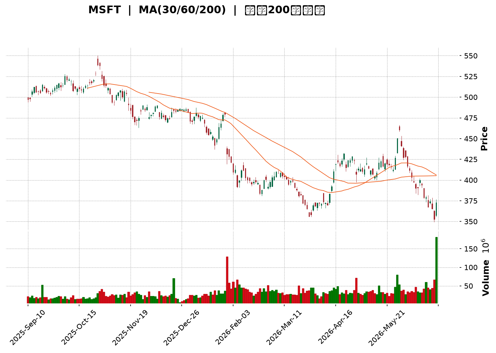
</details>

<html>
<head><meta charset="utf-8" /></head>
<body>
    <div style="height:500px; width:100%;">                        <script>window.PlotlyConfig = {MathJaxConfig: 'local'};</script>
        <script charset="utf-8" src="https://cdn.plot.ly/plotly-3.6.0.min.js" integrity="sha256-QaOVwtVY0T02VaHrr6pnoHLCwayMJp4O5n4YyaE3rJk=" crossorigin="anonymous"></script>                <div id="candlestick-chart" class="plotly-graph-div" style="height:100%; width:100%;"></div>            <script>                window.PLOTLYENV=window.PLOTLYENV || {};                                if (document.getElementById("candlestick-chart")) {                    Plotly.newPlot(                        "candlestick-chart",                        [{"close":{"dtype":"f8","bdata":"AAAAIIkTf0AAAAAgth1\u002fQAAAAGAOq39AAAAA4O4AgEAAAAAAYp1\u002fQAAAAMD2rH9AAAAAoACUf0AAAAAAXRWAQAAAAMBl839AAAAAgGegf0AAAADgB69\u002fQAAAAOBsfX9AAAAA4NvDf0AAAABAyPV\u002fQAAAAOCFFYBAAAAAwIMjgEAAAABA9AOAQAAAAKDAEIBAAAAAwPJpgEAAAACAdUWAQAAAAABgTIBAAAAAIOY4gEAAAADA6Lt\u002fQAAAAMAJ7X9AAAAAAGjlf0AAAAAgLuN\u002fQAAAAGA+xn9AAAAAAJHlf0AAAAAATQyAQAAAAKA3E4BAAAAAwBwqgEAAAACARSqAQAAAAICEQoBAAAAAYGaBgEAAAADARNWAQAAAAIAi0YBAAAAAAJxTgEAAAADgaBSAQAAAAIA1DoBAAAAAoH3xf0AAAADgfX9\u002fQAAAAICL335AAAAA4BfbfkAAAABgDG1\u002fQAAAAKCol39AAAAAgMW+f0AAAAAg9kF\u002fQAAAAACCr39AAAAAAL2Ef0AAAAAg66p+QAAAAKDeQH5AAAAAIPHEfUAAAADgbWB9QAAAAGBgfn1AAAAA4ACufUAAAABgjzV+QAAAAEBCnX5AAAAA4E9JfkAAAADAPX1+QAAAAKDKuX1AAAAAoFTrfUAAAABASRB+QAAAACB9jX5AAAAA4GqdfkAAAAAgA8d9QAAAAGA5FX5AAAAA4IjGfUAAAAAgcIt9QAAAAGBypH1AAAAAQCWgfUAAAAAgWR1+QAAAACBAPH5AAAAAYFIsfkAAAACgEEt+QAAAAICzXX5AAAAAgMNYfkAAAAAADE9+QAAAAKAZVX5AAAAAIJ0XfkAAAADAfW19QAAAAMAObH1AAAAAYDfGfUAAAABgORV+QAAAACDYv31AAAAAQHvSfUAAAADAB7F9QAAAACBVSX1AAAAAYH6VfEAAAACgKmp8QAAAAKAjnXxAAAAA4BNIfEAAAACAQaJ7QAAAAOA8EnxAAAAAoCX+fEAAAACgHkN9QAAAAIAw531AAAAAIOr3fUAAAADAP\u002fl6QAAAAOAdxnpAAAAAQONXekAAAACgMJZ5QAAAAMCoxXlAAAAAYMt+eEAAAADgyPV4QAAAAMBCvHlAAAAAAAG3eUAAAAAgPCl5QAAAAEDvAHlAAAAA4Kb4eEAAAACgm7F4QAAAAOBA3XhAAAAA4JTZeEAAAADA8cV4QAAAAKA5+ndAAAAAgIxCeEAAAABgv\u002ft4QAAAAAChDXlAAAAAYEJ+eEAAAACgBNt4QAAAAIDpMHlAAAAAQDBFeUAAAADArZx5QAAAAOA3gXlAAAAAIGeIeUAAAAAgIU55QAAAAGAUQHlAAAAAIN0PeUAAAABAH6t4QAAAAMBe8XhAAAAAoL\u002foeEAAAACgF294QAAAACDeQnhAAAAAILfQd0AAAACgweJ3QAAAAGDzPndAAAAAYM8jd0AAAACA3dJ2QAAAAKD7P3ZAAAAAgPJidkAAAACA6xV3QAAAAMAlCXdAAAAAIHJKd0AAAACgL0F3QAAAAEDEN3dAAAAAAFZYd0AAAABAOER3QAAAAIAYIXdAAAAAAKH4d0AAAACgKoR4QAAAAOBMpXlAAAAAwKA1ekAAAABABV56QAAAAOCpEnpAAAAAoORzekAAAAAAwP96QAAAAKCf7XlAAAAAoDx7ekAAAAAgbn56QAAAACAoxXpAAAAAoK54ekAAAAAgYW55QAAAAIC12HlAAAAAAJ7LeUAAAADg2qd5QAAAAKAL0XlAAAAAIMU9ekAAAADAkON5QAAAAGBKvHlAAAAAIDhueUAAAAAgWUV5QAAAAOC4iHlAAAAAYCFQekAAAACg\u002fml6QAAAAEBJCHpAAAAAYGZCekAAAACgcDF6QAAAAMAeKXpAAAAA4HoAekAAAABguMp5QAAAAADXr3pAAAAAANcjfEAAAADgUch8QAAAAMD1lHtAAAAAoHC1ekAAAADAzMB6QAAAAGC4CnpAAAAAANe7eUAAAABgjzZ5QAAAAIDC1XhAAAAAoHBleEAAAAAA12t4QAAAAAAp\u002fHhAAAAAoEedeEAAAABgj653QAAAAGBmtndAAAAAoHD1dkAAAABACl93QAAAACBc13ZAAAAAoEcNdkAAAAAghU93QA=="},"high":{"dtype":"f8","bdata":"hU6DBgJBf0DwX\u002fPRDUB\u002fQBKOg3Aw1X9AC3wZtc4BgEBeZdOAzA+AQMZKCQMowX9AZgVXCHXdf0BMopEXQSCAQKtXb1jaE4BAqBAu9Z\u002f1f0Cy0TJwE9R\u002fQByhvC7OrH9Ag00yEkrrf0AnHf8fxwyAQK04OisxF4BAEGdw0N8pgEAl1df4iTKAQIyPQee2KYBARSMWK4F9gEAVYJ7cuXOAQA6My84RXYBAikDp3z1IgEBvEaWHR0KAQOTeIrVHCYBAf9apFUwAgEAyx5kZew+AQCgMaybHDIBAPosPI+MBgEAfDbYhfBuAQGODZNlnG4BAKi01bWVPgECgD5GOOEWAQE9szpJZUIBA6XN7z7mZgEAlC5q44TGBQLnWOEqo9oBA56kNS9OcgEAk0A4G6W+AQHO\u002fUuo\u002fTYBAh\u002fuvlnECgECY6ZCIcPl\u002fQBlLpG9HaH9A+2xYossDf0BGd68WkHp\u002fQBhsvEhJpn9ACVF+tjLHf0AypNwOS+R\u002fQCC\u002fNsUVxn9AhOz\u002fJVrOf0DjNG96CD1\u002fQB+kG1ktwX5Adt4AsBu2fkB3mEJDv8x9QOGQYRaSrH1A5qQ+BmnQfUD05oMYUmJ+QBFqt30ip35AXj1jtwJ7fkChDuow\u002frR+QEKvokd9IX5AUUZ2CPryfUCufk3kGxR+QKPLc8HgoX5AM3cUrwKffkBTInsLpiF+QPgcw6IAPn5AQe47EPoEfkCqq4Bba+l9QP+jpyJXvH1Am8oySvPdfUBZrRiR3nZ+QDSDmVP+Wn5AbDPF7wJpfkDLBzbUrFp+QIZ9KEzcb35Api7zbUtffkCMfN9M9WJ+QAsKiMwkeH5ANK4AC51ffkBQxMEKLih+QOAJfGZZn31AgijYMuHJfUAYriRddnh+QJZsZV9SCH5AtPeMURXbfUAqradPuO19QJ17NdS6mn1ABysz9fwhfUAOQD5rEeN8QDTFOOcu0nxAIsR7WGVsfEAERQdw7Sp8QG2U7SBRLXxAMx72eS5QfUCxwrKnW4J9QDNWGMqqC35AAqLKToYZfkC10\u002fFPnIh7QDj5j45qWntA8hza6UjNekCvSMll3EJ6QIkWEGAFH3pAeiZJEtZneUBKkTxyIwB5QJXy4TLP0HlA\u002fHwBVdNcekBEEfgx0el5QJfjkbJiRnlAT3ekXd87eUA97geJ6Ot4QFx\u002fFz9nDHlAuVT+JuU4eUC3osuKFfR4QHEV1ZgWqHhA1j830EtIeEDrnmosowl5QEJPMcy\u002faXlAl7z7AWa\u002feEBzsCjBKgV5QGanivoiXXlALCL5Q0SieUBGdHDEhqt5QPT5QkuEwnlA3csPyyyVeUA4XjYSBJV5QIw9nVAEgnlA84YKauBTeUCgiupdzT55QFGY\u002f\u002fo5\u002fHhAmTGSc2o4eUBaD\u002fXGPNJ4QDjiQYhEenhALDCfNp4ieEDklYV7+CV4QPUh1V1L2ndAbZjO9euDd0AHYSkLkF53QF8O77eqmnZAW8JjOCDJdkDAH1BVgUF3QNGxS1roUndA1+0H6FFNd0DhZLW5wU53QLC4ZjVSOndA9mwl7K8CeEDSRZCxFUt3QCNraEZAbXdAkV653lf7d0Dn329jZJ14QFtJgV2X13lAYyLyipE+ekC2MHUwW+p6QE7m6S+kZnpAXOY1xBukekCAvVv4Mwx7QPU0Sfroa3pAw98ddIGAekA6dX2a\u002faJ6QDbtnJHaz3pAH+yuW1yeekCgwqTYY9h5QMVgTx1WA3pA6CgH\u002fu09ekBclLVyEf55QJojvmRAGHpAYL7ejOGwekCk\u002f7Ctmht6QM5UBPzEvHlAF6Qa0qHpeUC84TQD6VZ5QGqRguoyr3lAgYwtDOqzekA1wYBDOIN6QGSLqNw8\u002fHpAmssgCwFTekAAAACgcKV6QAAAAGBmhnpAAAAA4FE8ekAAAABACv95QAAAAADX13pAAAAAoEclfEAAAADAHiV9QAAAAAAAWHxAAAAAgD2Ge0AAAABgZkJ7QAAAACCF13pAAAAAYI8SekAAAAAgrr95QAAAAOCjUHlAAAAAoJnNeEAAAAAA13t4QAAAAAAAHHlAAAAAoHDNeEAAAACA62V4QAAAAIDr1XdAAAAAgBTad0AAAAAghZN3QAAAAIAUrndAAAAAIK7DdkAAAACAwol3QA=="},"hovertemplate":"\u003cb\u003e%{x|%Y-%m-%d}\u003c\u002fb\u003e\u003cbr\u003e\u958b: $%{open:.2f}\u003cbr\u003e\u9ad8: $%{high:.2f}\u003cbr\u003e\u4f4e: $%{low:.2f}\u003cbr\u003e\u6536: $%{close:.2f}\u003cextra\u003e\u003c\u002fextra\u003e","low":{"dtype":"f8","bdata":"vHie1oDZfkAopytP8ut+QIurRZTdSn9ACVYewPJ8f0A5cJ0XY5Z\u002fQMsvOY7va39Avd1RHXGHf0BRltHtkrF\u002fQA\u002fGpHwH1X9AnBIynuCBf0DrO\u002fIirXt\u002fQAo9DyzJXX9AuDGMA+h2f0DyZL2y1pp\u002fQN3GRpI9p39AvQ4iPITHf0DaTSgvdbd\u002fQNvq4lMk\u002fH9AlykZqIIXgEC1K8ZcRDGAQB0tEE9iPoBAW7+zkSYRgEBIKrRow6Z\u002fQG9lyFdbx39A2FWIYwxtf0Ac8\u002fhKpax\u002fQPy2sxTqjn9ASvbsn+CBf0DTKAEdLuN\u002fQAYQlNf63H9AHZqEeZ0TgECvfhwCxRqAQL7GlsB2K4BAmrDSOXJtgEBkHlkh78qAQHDrpT\u002fRqoBAUk5\u002fKqw2gEDMg79bu\u002f1\u002fQAJl\u002fKWf9X9A\u002fADay02Kf0DhC5wTRXZ\u002fQONx5+AIy35AA9DMJlWifkAx++65kvp+QFnPPCwEM39ASQAfWan\u002ffkCJbkauKSJ\u002fQDIEQGjz5H5A+iaq4bdbf0ACV57Tdjt+QBeKQFap\u002fH1A9IIpFUWWfUADol4qGiN9QF0yI9geH31AKXU3HEPtfEA8t1i2EPF9QD16E\u002fbgR35ATpg6NAUofkAcsdlTn0J+QFk8wrF9kX1AFujg\u002fgmmfUAV0mcZHMx9QBj2a1S4I35ARtgi7FhlfkCK22IylI99QOmEZfIAnH1AEWocZaajfUAer48EzWZ9QPZyd2+tTH1AKUPCFk6OfUAMvuYXV7x9QHnT7wmdBX5AUuwOv8wIfkD3ailRdCl+QDx4FC7jKn5AG8SBR+M8fkB66NqmiCB+QMJz2XSPNX5AQ2esL4QSfkDqjvdbNUF9QC+z5fWxNn1AaUFjdK06fUAwegS+S719QBNmCfwAnH1Ax3EyMrRhfUCqX179Ipl9QE+dy7Yl\u002fnxA0l\u002flYUpyfEBJ8CttD158QILFBaFMZ3xA4JFCCJz0e0BKr7Pbwkt7QGCpB5Onq3tAVYXLRoUIfECC8zkdOr98QNEkYv7+cH1Ak5Kyixe+fUCR3EJCdDJ6QNJa1vvyiHpAACa2FgxGekBvLphf+mt5QK5602PPdnlAai0VREppeEDNqAwG2XJ4QJTjg8x78XhA0+DCueyteUD2pniktvN4QEXAWy3tw3hAyjL9QZDEeEAwTtxPfox4QF7AnJABqXhAWJpi+AC9eECPvv5S5aR4QIEHuEBa5HdAhT5SKCnOd0DM9SOLEVV4QNRKOkEN3nhAIU43MZlQeEDKhWJ8klx4QC0vh00kfXhA5DHYCR73eECWSM93ajh5QFNMv7sIenlAvVhLEQwqeUC7rkpt8iB5QHndyp+NC3lAW9zpE3gNeUCas\u002f4BXpZ4QHHpnQ39nnhA7hrw8T7OeEAj8k++emJ4QNhLv1mTI3hAzrzEnca0d0BuJFaPrs13QG0w4uC9MHdAXFJHe0wNd0DMtpiHacZ2QHo0Kg3VO3ZAbkJg+Sg4dkCtLAy6kKR2QJz4Ydt39nZAbjBXys61dkBaGswLOQt3QKKTS9lI3HZAM7wembcpd0Dm\u002f2KKG+R2QBVUj0+vE3dAPDUdjX0jd0AwU\u002fNV9Bp4QAFOHiX2vXhAu8FaIf2zeUBt8vU2fjx6QK0ZMYtn9nlA8dx6HMYEekCxHnPiEWx6QAetVWtVqHlAdc7c82vueUCCo+u6sgJ6QJOxnJDPT3pAk\u002fUZShs2ekBkkGO8ZdJ4QL0Uw+jYmHlAx4CwNpieeUC3OsD2qX55QJ6ky1fAQ3lAXP\u002fzCq4dekCD3Bsqr9F5QFa\u002f9mH6SXlAQuTEwC1ceUCtvovgnAJ5QGqvxM83AHlAZ4mWIkjAeUDYtqxyY+t5QLFdmxtw+XlAuDctxpOmeUAAAAAgXPt5QAAAAKBHBXpAAAAA4FHQeUAAAACgR5l5QAAAAGC4ynlAAAAAgMIFe0AAAADgUaR8QAAAAEDhhntAAAAAAACEekAAAABgj6Z6QAAAAGBm5nlAAAAAwPWIeUAAAAAgrud4QAAAAGCP0nhAAAAAAAAAeEAAAADgUeR3QAAAAKCZjXhAAAAAQApreEAAAADAHpV3QAAAAOB6VHdAAAAAwB7xdkAAAABguCp3QAAAAOB6zHZAAAAAQDPTdUAAAABA4TZ2QA=="},"name":"\u50f9\u683c","open":{"dtype":"f8","bdata":"7rpIeAg9f0A3ujIpbTF\u002fQE5h9yZid39AIZ26e2iZf0DJ7pVDBA2AQLacguiAtn9A4sD6AlbEf0CkOwV8jLV\u002fQDB7bO7CAoBAZaioUhDpf0AQwiISsLJ\u002fQFgPRQOekX9AV8itlpmtf0BsxhepfsR\u002fQNOMueko4H9A\u002fZBUkfb4f0BVWtMCDxOAQLNp5djDDoBA3Eth\u002f8QagEAPF\u002ffSuGeAQDNUI\u002fzkP4BA9uD2BWw4gEA5N90v9SKAQOTeIrVHCYBAb9kZeU2wf0CZtSKvgft\u002fQI2ErJ6q1X9AWJGQJ2Kdf0AsJhLy8PV\u002fQKPb1Q\u002fyEYBAbZgiQ\u002fYugECmGNNCYDmAQFLLqLH\u002fO4BAK9EXhneDgEDmQ8EqTxSBQM5un44V7IBAIKAbqiF5gEDzD9+RaWyAQIHiQgtPJIBAqzKPH6HIf0A0k275HOF\u002fQPeUqZekZ39ANQgWBindfkBx8NriSQ5\u002fQPLtjST4WX9AqC+QYniif0DsdiAKk7F\u002fQMkU6+qC8X5A5uSwgACUf0ABnooFCsR+QCnyke4\u002fcH5ADYIbrmiofkBFb96DDsZ9QFz3JzdOjn1AaO\u002fcpn1\u002ffUDZkmBqdkJ+QG8VlfUCV35AGtfGQGRkfkD+eVNw\u002fkh+QPIQ\u002ftpUo31AeHvInCDafUAAxmFfFwZ+QMXlcxHYK35AS\u002fXBpudufkA3RkHqJB5+QEUWovZEqH1Ah8rfUhXbfUD4sMwdi999QD\u002fNG5sVXX1AoNlRx7qsfUAsRUhlHsF9QMP0qxkwU35AFjFttW8\u002ffkBB9FYVRy1+QI9Fd15tOH5AD3DcqNVIfkBe1aKNXSt+QGCS3OVoPH5Aqu2\u002fndVafkBObOkR4SN+QCfs2eZUf31AX9RoqDB7fUCWR3mfINp9QOFs58iz8X1ACnZM61R\u002ffUBJT9ki6Kh9QAblBS41iX1AXQRHbkUGfUC0zJ1H\u002f+B8QKBULZ3NfHxAFGNbDYMTfEArdGpyfil8QKtdRswq2ntAdcU5kd0dfEAsJz7B8\u002fN8QD4H9w+ZeX1AsTS6DhURfkBFcrfkoGB7QC5qkB2RU3tAwHNJ\u002flHFekAXBKRfOUJ6QG150W3YknlAPvVLMCNaeUCf9luGZ9Z4QL422qXhMHlAOh2ATyccekDYyaxnW+V5QCg7WT1FM3lATsLsiIIqeUByUolkM9d4QLFt\u002fXHWxXhApnltQi\u002f9eEBHDCwKELR4QJP+o0hXonhAIlyABfX0d0AWRKjE+Vp4QHBWKIhdPXlAioMLV5BgeEBg+sS+LIB4QKKMZ0SlhHhAhSZLqnEGeUA28nBKvDh5QJDNEOAMhXlAHtM\u002f37dAeUB4wH0zTZJ5QI5aUoQYS3lAnHOhmhY8eUCT01ZBIgJ5QKMceeRa03hABOsUg3r2eEA13Ij6WMR4QDMMdVAcVHhAtKN+8kMfeEAAQHoIIPF3QDmUJreJ2HdAuiwI06+Bd0AA8yQxTCB3QIGUYrbikXZAR2JkueKRdkDJ6hygMbx2QC+7YcfsSndA+iTEc6nmdkB7T6W57Ep3QHdFGUOiGHdA0L1xOV4CeECqwLuLHjt3QIzPYXLIQndA\u002fVjLP9dMd0C1WkdxTjF4QP7rE8c80nhALMuGyj0vekB4+68nbn56QOAzLjzWQ3pA3WBk8041ekDfmJ9zTZR6QMeN3Xm4L3pA2hVi+BkBekDXJH55eVd6QI9A0U1wenpAxIgQEJl6ekDXSYctwZ55QOPrlYSGvnlApUioyWiqeUC+Y0s\u002fwuZ5QG4feULkcXlAqxOulzszekC6B7unzgd6QN3NF+fQb3lAgk+f+VjZeUAk7\u002fAKQiV5QIhLhpGxOXlA+9OSmP7VeUDzltWBg\u002ft5QK9WBsaIz3pArK4c\u002fmXUeUAAAAAAAIx6QAAAAOCjOHpAAAAAQOEGekAAAAAAKbB5QAAAACCuz3lAAAAAwMwIe0AAAACgcA19QAAAAIAU7ntAAAAAQDNne0AAAADA9Tx7QAAAAKBwxXpAAAAAgD3ieUAAAADgepB5QAAAAMDM6HhAAAAAIFyzeEAAAABA4XZ4QAAAAMDMzHhAAAAA4KO8eEAAAAAAAGR4QAAAAMAenXdAAAAAANd7d0AAAACAFEZ3QAAAAMAeOXdAAAAA4FGsdkAAAABgZlJ2QA=="},"x":["2025-09-10T00:00:00-04:00","2025-09-11T00:00:00-04:00","2025-09-12T00:00:00-04:00","2025-09-15T00:00:00-04:00","2025-09-16T00:00:00-04:00","2025-09-17T00:00:00-04:00","2025-09-18T00:00:00-04:00","2025-09-19T00:00:00-04:00","2025-09-22T00:00:00-04:00","2025-09-23T00:00:00-04:00","2025-09-24T00:00:00-04:00","2025-09-25T00:00:00-04:00","2025-09-26T00:00:00-04:00","2025-09-29T00:00:00-04:00","2025-09-30T00:00:00-04:00","2025-10-01T00:00:00-04:00","2025-10-02T00:00:00-04:00","2025-10-03T00:00:00-04:00","2025-10-06T00:00:00-04:00","2025-10-07T00:00:00-04:00","2025-10-08T00:00:00-04:00","2025-10-09T00:00:00-04:00","2025-10-10T00:00:00-04:00","2025-10-13T00:00:00-04:00","2025-10-14T00:00:00-04:00","2025-10-15T00:00:00-04:00","2025-10-16T00:00:00-04:00","2025-10-17T00:00:00-04:00","2025-10-20T00:00:00-04:00","2025-10-21T00:00:00-04:00","2025-10-22T00:00:00-04:00","2025-10-23T00:00:00-04:00","2025-10-24T00:00:00-04:00","2025-10-27T00:00:00-04:00","2025-10-28T00:00:00-04:00","2025-10-29T00:00:00-04:00","2025-10-30T00:00:00-04:00","2025-10-31T00:00:00-04:00","2025-11-03T00:00:00-05:00","2025-11-04T00:00:00-05:00","2025-11-05T00:00:00-05:00","2025-11-06T00:00:00-05:00","2025-11-07T00:00:00-05:00","2025-11-10T00:00:00-05:00","2025-11-11T00:00:00-05:00","2025-11-12T00:00:00-05:00","2025-11-13T00:00:00-05:00","2025-11-14T00:00:00-05:00","2025-11-17T00:00:00-05:00","2025-11-18T00:00:00-05:00","2025-11-19T00:00:00-05:00","2025-11-20T00:00:00-05:00","2025-11-21T00:00:00-05:00","2025-11-24T00:00:00-05:00","2025-11-25T00:00:00-05:00","2025-11-26T00:00:00-05:00","2025-11-28T00:00:00-05:00","2025-12-01T00:00:00-05:00","2025-12-02T00:00:00-05:00","2025-12-03T00:00:00-05:00","2025-12-04T00:00:00-05:00","2025-12-05T00:00:00-05:00","2025-12-08T00:00:00-05:00","2025-12-09T00:00:00-05:00","2025-12-10T00:00:00-05:00","2025-12-11T00:00:00-05:00","2025-12-12T00:00:00-05:00","2025-12-15T00:00:00-05:00","2025-12-16T00:00:00-05:00","2025-12-17T00:00:00-05:00","2025-12-18T00:00:00-05:00","2025-12-19T00:00:00-05:00","2025-12-22T00:00:00-05:00","2025-12-23T00:00:00-05:00","2025-12-24T00:00:00-05:00","2025-12-26T00:00:00-05:00","2025-12-29T00:00:00-05:00","2025-12-30T00:00:00-05:00","2025-12-31T00:00:00-05:00","2026-01-02T00:00:00-05:00","2026-01-05T00:00:00-05:00","2026-01-06T00:00:00-05:00","2026-01-07T00:00:00-05:00","2026-01-08T00:00:00-05:00","2026-01-09T00:00:00-05:00","2026-01-12T00:00:00-05:00","2026-01-13T00:00:00-05:00","2026-01-14T00:00:00-05:00","2026-01-15T00:00:00-05:00","2026-01-16T00:00:00-05:00","2026-01-20T00:00:00-05:00","2026-01-21T00:00:00-05:00","2026-01-22T00:00:00-05:00","2026-01-23T00:00:00-05:00","2026-01-26T00:00:00-05:00","2026-01-27T00:00:00-05:00","2026-01-28T00:00:00-05:00","2026-01-29T00:00:00-05:00","2026-01-30T00:00:00-05:00","2026-02-02T00:00:00-05:00","2026-02-03T00:00:00-05:00","2026-02-04T00:00:00-05:00","2026-02-05T00:00:00-05:00","2026-02-06T00:00:00-05:00","2026-02-09T00:00:00-05:00","2026-02-10T00:00:00-05:00","2026-02-11T00:00:00-05:00","2026-02-12T00:00:00-05:00","2026-02-13T00:00:00-05:00","2026-02-17T00:00:00-05:00","2026-02-18T00:00:00-05:00","2026-02-19T00:00:00-05:00","2026-02-20T00:00:00-05:00","2026-02-23T00:00:00-05:00","2026-02-24T00:00:00-05:00","2026-02-25T00:00:00-05:00","2026-02-26T00:00:00-05:00","2026-02-27T00:00:00-05:00","2026-03-02T00:00:00-05:00","2026-03-03T00:00:00-05:00","2026-03-04T00:00:00-05:00","2026-03-05T00:00:00-05:00","2026-03-06T00:00:00-05:00","2026-03-09T00:00:00-04:00","2026-03-10T00:00:00-04:00","2026-03-11T00:00:00-04:00","2026-03-12T00:00:00-04:00","2026-03-13T00:00:00-04:00","2026-03-16T00:00:00-04:00","2026-03-17T00:00:00-04:00","2026-03-18T00:00:00-04:00","2026-03-19T00:00:00-04:00","2026-03-20T00:00:00-04:00","2026-03-23T00:00:00-04:00","2026-03-24T00:00:00-04:00","2026-03-25T00:00:00-04:00","2026-03-26T00:00:00-04:00","2026-03-27T00:00:00-04:00","2026-03-30T00:00:00-04:00","2026-03-31T00:00:00-04:00","2026-04-01T00:00:00-04:00","2026-04-02T00:00:00-04:00","2026-04-06T00:00:00-04:00","2026-04-07T00:00:00-04:00","2026-04-08T00:00:00-04:00","2026-04-09T00:00:00-04:00","2026-04-10T00:00:00-04:00","2026-04-13T00:00:00-04:00","2026-04-14T00:00:00-04:00","2026-04-15T00:00:00-04:00","2026-04-16T00:00:00-04:00","2026-04-17T00:00:00-04:00","2026-04-20T00:00:00-04:00","2026-04-21T00:00:00-04:00","2026-04-22T00:00:00-04:00","2026-04-23T00:00:00-04:00","2026-04-24T00:00:00-04:00","2026-04-27T00:00:00-04:00","2026-04-28T00:00:00-04:00","2026-04-29T00:00:00-04:00","2026-04-30T00:00:00-04:00","2026-05-01T00:00:00-04:00","2026-05-04T00:00:00-04:00","2026-05-05T00:00:00-04:00","2026-05-06T00:00:00-04:00","2026-05-07T00:00:00-04:00","2026-05-08T00:00:00-04:00","2026-05-11T00:00:00-04:00","2026-05-12T00:00:00-04:00","2026-05-13T00:00:00-04:00","2026-05-14T00:00:00-04:00","2026-05-15T00:00:00-04:00","2026-05-18T00:00:00-04:00","2026-05-19T00:00:00-04:00","2026-05-20T00:00:00-04:00","2026-05-21T00:00:00-04:00","2026-05-22T00:00:00-04:00","2026-05-26T00:00:00-04:00","2026-05-27T00:00:00-04:00","2026-05-28T00:00:00-04:00","2026-05-29T00:00:00-04:00","2026-06-01T00:00:00-04:00","2026-06-02T00:00:00-04:00","2026-06-03T00:00:00-04:00","2026-06-04T00:00:00-04:00","2026-06-05T00:00:00-04:00","2026-06-08T00:00:00-04:00","2026-06-09T00:00:00-04:00","2026-06-10T00:00:00-04:00","2026-06-11T00:00:00-04:00","2026-06-12T00:00:00-04:00","2026-06-15T00:00:00-04:00","2026-06-16T00:00:00-04:00","2026-06-17T00:00:00-04:00","2026-06-18T00:00:00-04:00","2026-06-22T00:00:00-04:00","2026-06-23T00:00:00-04:00","2026-06-24T00:00:00-04:00","2026-06-25T00:00:00-04:00","2026-06-26T00:00:00-04:00"],"type":"candlestick"},{"hovertemplate":"MA30: $%{y:.2f}\u003cextra\u003e\u003c\u002fextra\u003e","line":{"color":"#2196F3","dash":"dash","width":2},"mode":"lines","name":"MA30","x":["2025-09-10T00:00:00-04:00","2025-09-11T00:00:00-04:00","2025-09-12T00:00:00-04:00","2025-09-15T00:00:00-04:00","2025-09-16T00:00:00-04:00","2025-09-17T00:00:00-04:00","2025-09-18T00:00:00-04:00","2025-09-19T00:00:00-04:00","2025-09-22T00:00:00-04:00","2025-09-23T00:00:00-04:00","2025-09-24T00:00:00-04:00","2025-09-25T00:00:00-04:00","2025-09-26T00:00:00-04:00","2025-09-29T00:00:00-04:00","2025-09-30T00:00:00-04:00","2025-10-01T00:00:00-04:00","2025-10-02T00:00:00-04:00","2025-10-03T00:00:00-04:00","2025-10-06T00:00:00-04:00","2025-10-07T00:00:00-04:00","2025-10-08T00:00:00-04:00","2025-10-09T00:00:00-04:00","2025-10-10T00:00:00-04:00","2025-10-13T00:00:00-04:00","2025-10-14T00:00:00-04:00","2025-10-15T00:00:00-04:00","2025-10-16T00:00:00-04:00","2025-10-17T00:00:00-04:00","2025-10-20T00:00:00-04:00","2025-10-21T00:00:00-04:00","2025-10-22T00:00:00-04:00","2025-10-23T00:00:00-04:00","2025-10-24T00:00:00-04:00","2025-10-27T00:00:00-04:00","2025-10-28T00:00:00-04:00","2025-10-29T00:00:00-04:00","2025-10-30T00:00:00-04:00","2025-10-31T00:00:00-04:00","2025-11-03T00:00:00-05:00","2025-11-04T00:00:00-05:00","2025-11-05T00:00:00-05:00","2025-11-06T00:00:00-05:00","2025-11-07T00:00:00-05:00","2025-11-10T00:00:00-05:00","2025-11-11T00:00:00-05:00","2025-11-12T00:00:00-05:00","2025-11-13T00:00:00-05:00","2025-11-14T00:00:00-05:00","2025-11-17T00:00:00-05:00","2025-11-18T00:00:00-05:00","2025-11-19T00:00:00-05:00","2025-11-20T00:00:00-05:00","2025-11-21T00:00:00-05:00","2025-11-24T00:00:00-05:00","2025-11-25T00:00:00-05:00","2025-11-26T00:00:00-05:00","2025-11-28T00:00:00-05:00","2025-12-01T00:00:00-05:00","2025-12-02T00:00:00-05:00","2025-12-03T00:00:00-05:00","2025-12-04T00:00:00-05:00","2025-12-05T00:00:00-05:00","2025-12-08T00:00:00-05:00","2025-12-09T00:00:00-05:00","2025-12-10T00:00:00-05:00","2025-12-11T00:00:00-05:00","2025-12-12T00:00:00-05:00","2025-12-15T00:00:00-05:00","2025-12-16T00:00:00-05:00","2025-12-17T00:00:00-05:00","2025-12-18T00:00:00-05:00","2025-12-19T00:00:00-05:00","2025-12-22T00:00:00-05:00","2025-12-23T00:00:00-05:00","2025-12-24T00:00:00-05:00","2025-12-26T00:00:00-05:00","2025-12-29T00:00:00-05:00","2025-12-30T00:00:00-05:00","2025-12-31T00:00:00-05:00","2026-01-02T00:00:00-05:00","2026-01-05T00:00:00-05:00","2026-01-06T00:00:00-05:00","2026-01-07T00:00:00-05:00","2026-01-08T00:00:00-05:00","2026-01-09T00:00:00-05:00","2026-01-12T00:00:00-05:00","2026-01-13T00:00:00-05:00","2026-01-14T00:00:00-05:00","2026-01-15T00:00:00-05:00","2026-01-16T00:00:00-05:00","2026-01-20T00:00:00-05:00","2026-01-21T00:00:00-05:00","2026-01-22T00:00:00-05:00","2026-01-23T00:00:00-05:00","2026-01-26T00:00:00-05:00","2026-01-27T00:00:00-05:00","2026-01-28T00:00:00-05:00","2026-01-29T00:00:00-05:00","2026-01-30T00:00:00-05:00","2026-02-02T00:00:00-05:00","2026-02-03T00:00:00-05:00","2026-02-04T00:00:00-05:00","2026-02-05T00:00:00-05:00","2026-02-06T00:00:00-05:00","2026-02-09T00:00:00-05:00","2026-02-10T00:00:00-05:00","2026-02-11T00:00:00-05:00","2026-02-12T00:00:00-05:00","2026-02-13T00:00:00-05:00","2026-02-17T00:00:00-05:00","2026-02-18T00:00:00-05:00","2026-02-19T00:00:00-05:00","2026-02-20T00:00:00-05:00","2026-02-23T00:00:00-05:00","2026-02-24T00:00:00-05:00","2026-02-25T00:00:00-05:00","2026-02-26T00:00:00-05:00","2026-02-27T00:00:00-05:00","2026-03-02T00:00:00-05:00","2026-03-03T00:00:00-05:00","2026-03-04T00:00:00-05:00","2026-03-05T00:00:00-05:00","2026-03-06T00:00:00-05:00","2026-03-09T00:00:00-04:00","2026-03-10T00:00:00-04:00","2026-03-11T00:00:00-04:00","2026-03-12T00:00:00-04:00","2026-03-13T00:00:00-04:00","2026-03-16T00:00:00-04:00","2026-03-17T00:00:00-04:00","2026-03-18T00:00:00-04:00","2026-03-19T00:00:00-04:00","2026-03-20T00:00:00-04:00","2026-03-23T00:00:00-04:00","2026-03-24T00:00:00-04:00","2026-03-25T00:00:00-04:00","2026-03-26T00:00:00-04:00","2026-03-27T00:00:00-04:00","2026-03-30T00:00:00-04:00","2026-03-31T00:00:00-04:00","2026-04-01T00:00:00-04:00","2026-04-02T00:00:00-04:00","2026-04-06T00:00:00-04:00","2026-04-07T00:00:00-04:00","2026-04-08T00:00:00-04:00","2026-04-09T00:00:00-04:00","2026-04-10T00:00:00-04:00","2026-04-13T00:00:00-04:00","2026-04-14T00:00:00-04:00","2026-04-15T00:00:00-04:00","2026-04-16T00:00:00-04:00","2026-04-17T00:00:00-04:00","2026-04-20T00:00:00-04:00","2026-04-21T00:00:00-04:00","2026-04-22T00:00:00-04:00","2026-04-23T00:00:00-04:00","2026-04-24T00:00:00-04:00","2026-04-27T00:00:00-04:00","2026-04-28T00:00:00-04:00","2026-04-29T00:00:00-04:00","2026-04-30T00:00:00-04:00","2026-05-01T00:00:00-04:00","2026-05-04T00:00:00-04:00","2026-05-05T00:00:00-04:00","2026-05-06T00:00:00-04:00","2026-05-07T00:00:00-04:00","2026-05-08T00:00:00-04:00","2026-05-11T00:00:00-04:00","2026-05-12T00:00:00-04:00","2026-05-13T00:00:00-04:00","2026-05-14T00:00:00-04:00","2026-05-15T00:00:00-04:00","2026-05-18T00:00:00-04:00","2026-05-19T00:00:00-04:00","2026-05-20T00:00:00-04:00","2026-05-21T00:00:00-04:00","2026-05-22T00:00:00-04:00","2026-05-26T00:00:00-04:00","2026-05-27T00:00:00-04:00","2026-05-28T00:00:00-04:00","2026-05-29T00:00:00-04:00","2026-06-01T00:00:00-04:00","2026-06-02T00:00:00-04:00","2026-06-03T00:00:00-04:00","2026-06-04T00:00:00-04:00","2026-06-05T00:00:00-04:00","2026-06-08T00:00:00-04:00","2026-06-09T00:00:00-04:00","2026-06-10T00:00:00-04:00","2026-06-11T00:00:00-04:00","2026-06-12T00:00:00-04:00","2026-06-15T00:00:00-04:00","2026-06-16T00:00:00-04:00","2026-06-17T00:00:00-04:00","2026-06-18T00:00:00-04:00","2026-06-22T00:00:00-04:00","2026-06-23T00:00:00-04:00","2026-06-24T00:00:00-04:00","2026-06-25T00:00:00-04:00","2026-06-26T00:00:00-04:00"],"y":{"dtype":"f8","bdata":"AAAAAAAA+H8AAAAAAAD4fwAAAAAAAPh\u002fAAAAAAAA+H8AAAAAAAD4fwAAAAAAAPh\u002fAAAAAAAA+H8AAAAAAAD4fwAAAAAAAPh\u002fAAAAAAAA+H8AAAAAAAD4fwAAAAAAAPh\u002fAAAAAAAA+H8AAAAAAAD4fwAAAAAAAPh\u002fAAAAAAAA+H8AAAAAAAD4fwAAAAAAAPh\u002fAAAAAAAA+H8AAAAAAAD4fwAAAAAAAPh\u002fAAAAAAAA+H8AAAAAAAD4fwAAAAAAAPh\u002fAAAAAAAA+H8AAAAAAAD4fwAAAAAAAPh\u002fAAAAAAAA+H8AAAAAAAD4fwAAABDh7H9AvLu7m5H3f0DNzMwE9wCAQAAAABCZBIBAAAAAUOEIgECJiIj4oRGAQAAAAOD8GYBAmpmZIZMegEBmZmb+ih6AQLy7uwM6H4BAvLu7+5MggEBmZmYmyR+AQO\u002fu7oYnHYBAzczMZEYZgEDv7u7+\u002fhaAQM3MzCSKFIBA7+7uxkQSgEBEREQ0+A6AQBEREdERDYBA7+7uznsHgEDv7u6e9\u002f5\u002fQERERKT46n9AmpmZiSTUf0B3d3fXBsB\u002fQGZmZnZFq39AAAAAoFuYf0CJiIiICYp\u002fQDMzM0MjgH9AvLu7W2Vyf0BVVVUVr2R\u002fQN7d3e3+T39ARERExG47f0De3d09Fyh\u002fQAAAAFBOF39A3t3dHdwCf0CJiIj4rOF+QImIiMhfw35AmpmZadGqfkC8u7tbgZR+QJqZmYlwf35AMzMzU6lrfkDNzMxM219+QKuqqtppWn5AiYiIeJZUfkAiIiLy60p+QHd3d9d0QH5Ad3d314U0fkCJiIj4bCx+QFVVVfXgIH5Aq6qqOrUUfkBERESEIAp+QFVVVYUIA35AVVVVZRMDfkDe3d0tGgl+QGZmZtZIC35A3t3dHYAMfkAiIiIyFQh+QN7d3X3A\u002fH1AIiIigjnufUC8u7urhdx9QDMzM6MI031AMzMzAw\u002fFfUBVVVUFU7B9QGZmZjYmm31AIiIikk6NfUBmZmYW6Yh9QCIiIkJgh31AIiIiogWJfUBmZmYWFXN9QN7d3c2aWn1Aq6qqmpg+fUDv7u4e9Rd9QCIiIgLf8XxAMzMzk2vBfEDv7u4u6ZN8QM3MzGxlbHxAERER8d5EfEDNzMyc8Rh8QLy7u7t463tAvLu728W\u002fe0BERER0YJd7QJqZmbl7cHtA7+7uTnZGe0Dv7u4eJxl7QKuqqhrm53pAZmZmNm+4ekAiIiIiQpB6QHd3d4cibHpAERERITpJekDv7u7+2ip6QLy7u9ulDXpAq6qqmvPzeUAiIiLysuJ5QBEREWHMzHlAd3d3B0aveUCJiIjYgY15QFVVVbXNZXlAiYiIaO87eUCJiIioQyh5QAAAALCjGHlARERExGYMeUCamZmZkAJ5QKuqqvqr9XhAERERgd7veECJiIiYs+Z4QHd3dzd10XhAiYiIGHy7eEAiIiICiqd4QLy7u2sKkHhAAAAA4Pt5eEDe3d3NQmx4QM3MzEyoXHhAd3d3V1pPeEAAAADwZEJ4QO\u002fu7o7pO3hAERER8Ro0eEDe3d1NdCV4QKuqqloJFXhAq6qqCpUQeECJiIjorw14QGZmZhaREXhAZmZm1pQZeEAAAACwBiB4QCIiItLfJHhAZmZmVrkseEARERGRLTt4QJqZmXn2QHhAIiIiQhNNeEBERET0plx4QLy7u7s+bHhAAAAAgJN5eEAzMzPzFYJ4QBERESGdj3hAERERsYKgeEAiIiIina94QAAAAOCMxXhAAAAAAATgeEC8u7sbLPp4QHd3d3fqF3lAERERQeQxeUCrqqoKikR5QO\u002fu7r7bWXlAq6qq2qVzeUAAAACwm455QO\u002fu7h6gpnlAiYiIiH6\u002feUARERHhd9h5QERERPRV8nlAREREBKoDekC8u7ubjA56QERERBRvF3pAq6qqWugnekAiIiKChDx6QHd3d+dkSXpAzczMPJRLekAAAAAQe0l6QKuqqlpzSnpAmpmZGRJEekBmZmZGJDl6QDMzM+OgKHpA7+7unusWekCrqqpqTQ56QGZmZmbzBnpAREREdN\u002f8eUCrqqqaB+x5QJqZmSkT2nlAiYiIWBC+eUBVVVVllKh5QJqZmcnhj3lAiYiI+AxzeUBERES0UmJ5QA=="},"type":"scatter"},{"hovertemplate":"MA60: $%{y:.2f}\u003cextra\u003e\u003c\u002fextra\u003e","line":{"color":"#9C27B0","dash":"dash","width":2},"mode":"lines","name":"MA60","x":["2025-09-10T00:00:00-04:00","2025-09-11T00:00:00-04:00","2025-09-12T00:00:00-04:00","2025-09-15T00:00:00-04:00","2025-09-16T00:00:00-04:00","2025-09-17T00:00:00-04:00","2025-09-18T00:00:00-04:00","2025-09-19T00:00:00-04:00","2025-09-22T00:00:00-04:00","2025-09-23T00:00:00-04:00","2025-09-24T00:00:00-04:00","2025-09-25T00:00:00-04:00","2025-09-26T00:00:00-04:00","2025-09-29T00:00:00-04:00","2025-09-30T00:00:00-04:00","2025-10-01T00:00:00-04:00","2025-10-02T00:00:00-04:00","2025-10-03T00:00:00-04:00","2025-10-06T00:00:00-04:00","2025-10-07T00:00:00-04:00","2025-10-08T00:00:00-04:00","2025-10-09T00:00:00-04:00","2025-10-10T00:00:00-04:00","2025-10-13T00:00:00-04:00","2025-10-14T00:00:00-04:00","2025-10-15T00:00:00-04:00","2025-10-16T00:00:00-04:00","2025-10-17T00:00:00-04:00","2025-10-20T00:00:00-04:00","2025-10-21T00:00:00-04:00","2025-10-22T00:00:00-04:00","2025-10-23T00:00:00-04:00","2025-10-24T00:00:00-04:00","2025-10-27T00:00:00-04:00","2025-10-28T00:00:00-04:00","2025-10-29T00:00:00-04:00","2025-10-30T00:00:00-04:00","2025-10-31T00:00:00-04:00","2025-11-03T00:00:00-05:00","2025-11-04T00:00:00-05:00","2025-11-05T00:00:00-05:00","2025-11-06T00:00:00-05:00","2025-11-07T00:00:00-05:00","2025-11-10T00:00:00-05:00","2025-11-11T00:00:00-05:00","2025-11-12T00:00:00-05:00","2025-11-13T00:00:00-05:00","2025-11-14T00:00:00-05:00","2025-11-17T00:00:00-05:00","2025-11-18T00:00:00-05:00","2025-11-19T00:00:00-05:00","2025-11-20T00:00:00-05:00","2025-11-21T00:00:00-05:00","2025-11-24T00:00:00-05:00","2025-11-25T00:00:00-05:00","2025-11-26T00:00:00-05:00","2025-11-28T00:00:00-05:00","2025-12-01T00:00:00-05:00","2025-12-02T00:00:00-05:00","2025-12-03T00:00:00-05:00","2025-12-04T00:00:00-05:00","2025-12-05T00:00:00-05:00","2025-12-08T00:00:00-05:00","2025-12-09T00:00:00-05:00","2025-12-10T00:00:00-05:00","2025-12-11T00:00:00-05:00","2025-12-12T00:00:00-05:00","2025-12-15T00:00:00-05:00","2025-12-16T00:00:00-05:00","2025-12-17T00:00:00-05:00","2025-12-18T00:00:00-05:00","2025-12-19T00:00:00-05:00","2025-12-22T00:00:00-05:00","2025-12-23T00:00:00-05:00","2025-12-24T00:00:00-05:00","2025-12-26T00:00:00-05:00","2025-12-29T00:00:00-05:00","2025-12-30T00:00:00-05:00","2025-12-31T00:00:00-05:00","2026-01-02T00:00:00-05:00","2026-01-05T00:00:00-05:00","2026-01-06T00:00:00-05:00","2026-01-07T00:00:00-05:00","2026-01-08T00:00:00-05:00","2026-01-09T00:00:00-05:00","2026-01-12T00:00:00-05:00","2026-01-13T00:00:00-05:00","2026-01-14T00:00:00-05:00","2026-01-15T00:00:00-05:00","2026-01-16T00:00:00-05:00","2026-01-20T00:00:00-05:00","2026-01-21T00:00:00-05:00","2026-01-22T00:00:00-05:00","2026-01-23T00:00:00-05:00","2026-01-26T00:00:00-05:00","2026-01-27T00:00:00-05:00","2026-01-28T00:00:00-05:00","2026-01-29T00:00:00-05:00","2026-01-30T00:00:00-05:00","2026-02-02T00:00:00-05:00","2026-02-03T00:00:00-05:00","2026-02-04T00:00:00-05:00","2026-02-05T00:00:00-05:00","2026-02-06T00:00:00-05:00","2026-02-09T00:00:00-05:00","2026-02-10T00:00:00-05:00","2026-02-11T00:00:00-05:00","2026-02-12T00:00:00-05:00","2026-02-13T00:00:00-05:00","2026-02-17T00:00:00-05:00","2026-02-18T00:00:00-05:00","2026-02-19T00:00:00-05:00","2026-02-20T00:00:00-05:00","2026-02-23T00:00:00-05:00","2026-02-24T00:00:00-05:00","2026-02-25T00:00:00-05:00","2026-02-26T00:00:00-05:00","2026-02-27T00:00:00-05:00","2026-03-02T00:00:00-05:00","2026-03-03T00:00:00-05:00","2026-03-04T00:00:00-05:00","2026-03-05T00:00:00-05:00","2026-03-06T00:00:00-05:00","2026-03-09T00:00:00-04:00","2026-03-10T00:00:00-04:00","2026-03-11T00:00:00-04:00","2026-03-12T00:00:00-04:00","2026-03-13T00:00:00-04:00","2026-03-16T00:00:00-04:00","2026-03-17T00:00:00-04:00","2026-03-18T00:00:00-04:00","2026-03-19T00:00:00-04:00","2026-03-20T00:00:00-04:00","2026-03-23T00:00:00-04:00","2026-03-24T00:00:00-04:00","2026-03-25T00:00:00-04:00","2026-03-26T00:00:00-04:00","2026-03-27T00:00:00-04:00","2026-03-30T00:00:00-04:00","2026-03-31T00:00:00-04:00","2026-04-01T00:00:00-04:00","2026-04-02T00:00:00-04:00","2026-04-06T00:00:00-04:00","2026-04-07T00:00:00-04:00","2026-04-08T00:00:00-04:00","2026-04-09T00:00:00-04:00","2026-04-10T00:00:00-04:00","2026-04-13T00:00:00-04:00","2026-04-14T00:00:00-04:00","2026-04-15T00:00:00-04:00","2026-04-16T00:00:00-04:00","2026-04-17T00:00:00-04:00","2026-04-20T00:00:00-04:00","2026-04-21T00:00:00-04:00","2026-04-22T00:00:00-04:00","2026-04-23T00:00:00-04:00","2026-04-24T00:00:00-04:00","2026-04-27T00:00:00-04:00","2026-04-28T00:00:00-04:00","2026-04-29T00:00:00-04:00","2026-04-30T00:00:00-04:00","2026-05-01T00:00:00-04:00","2026-05-04T00:00:00-04:00","2026-05-05T00:00:00-04:00","2026-05-06T00:00:00-04:00","2026-05-07T00:00:00-04:00","2026-05-08T00:00:00-04:00","2026-05-11T00:00:00-04:00","2026-05-12T00:00:00-04:00","2026-05-13T00:00:00-04:00","2026-05-14T00:00:00-04:00","2026-05-15T00:00:00-04:00","2026-05-18T00:00:00-04:00","2026-05-19T00:00:00-04:00","2026-05-20T00:00:00-04:00","2026-05-21T00:00:00-04:00","2026-05-22T00:00:00-04:00","2026-05-26T00:00:00-04:00","2026-05-27T00:00:00-04:00","2026-05-28T00:00:00-04:00","2026-05-29T00:00:00-04:00","2026-06-01T00:00:00-04:00","2026-06-02T00:00:00-04:00","2026-06-03T00:00:00-04:00","2026-06-04T00:00:00-04:00","2026-06-05T00:00:00-04:00","2026-06-08T00:00:00-04:00","2026-06-09T00:00:00-04:00","2026-06-10T00:00:00-04:00","2026-06-11T00:00:00-04:00","2026-06-12T00:00:00-04:00","2026-06-15T00:00:00-04:00","2026-06-16T00:00:00-04:00","2026-06-17T00:00:00-04:00","2026-06-18T00:00:00-04:00","2026-06-22T00:00:00-04:00","2026-06-23T00:00:00-04:00","2026-06-24T00:00:00-04:00","2026-06-25T00:00:00-04:00","2026-06-26T00:00:00-04:00"],"y":{"dtype":"f8","bdata":"AAAAAAAA+H8AAAAAAAD4fwAAAAAAAPh\u002fAAAAAAAA+H8AAAAAAAD4fwAAAAAAAPh\u002fAAAAAAAA+H8AAAAAAAD4fwAAAAAAAPh\u002fAAAAAAAA+H8AAAAAAAD4fwAAAAAAAPh\u002fAAAAAAAA+H8AAAAAAAD4fwAAAAAAAPh\u002fAAAAAAAA+H8AAAAAAAD4fwAAAAAAAPh\u002fAAAAAAAA+H8AAAAAAAD4fwAAAAAAAPh\u002fAAAAAAAA+H8AAAAAAAD4fwAAAAAAAPh\u002fAAAAAAAA+H8AAAAAAAD4fwAAAAAAAPh\u002fAAAAAAAA+H8AAAAAAAD4fwAAAAAAAPh\u002fAAAAAAAA+H8AAAAAAAD4fwAAAAAAAPh\u002fAAAAAAAA+H8AAAAAAAD4fwAAAAAAAPh\u002fAAAAAAAA+H8AAAAAAAD4fwAAAAAAAPh\u002fAAAAAAAA+H8AAAAAAAD4fwAAAAAAAPh\u002fAAAAAAAA+H8AAAAAAAD4fwAAAAAAAPh\u002fAAAAAAAA+H8AAAAAAAD4fwAAAAAAAPh\u002fAAAAAAAA+H8AAAAAAAD4fwAAAAAAAPh\u002fAAAAAAAA+H8AAAAAAAD4fwAAAAAAAPh\u002fAAAAAAAA+H8AAAAAAAD4fwAAAAAAAPh\u002fAAAAAAAA+H8AAAAAAAD4f+\u002fu7v5vnn9AAAAAMICZf0C8u7ujApV\u002fQAAAADhAkH9A7+7uXk+Kf0DNzMx0eIJ\u002fQERERMSse39AZmZm1vtzf0BERESsy2h\u002fQImIiEjyXn9AVVVVpWhWf0DNzMzMtk9\u002fQERERHRcSn9AERERoZFDf0AAAAD4dDx\u002fQImIiJDENH9Aq6qqsocsf0CJiIiwLiV\u002fQLy7u0uCHX9AREREbNYRf0CamZkRjAR\u002fQM3MzJQA935Ad3d395vrfkCrqqqCkOR+QGZmZiZH235A7+7u3m3SfkBVVVVdD8l+QImIiOBxvn5A7+7ubk+wfkCJiIhgmqB+QImIiMiDkX5AvLu74z6AfkCamZkhNWx+QDMzM0M6WX5AAAAAWBVIfkB3d3cHSzV+QFVVVQVgJX5A3t3dhesZfkARERE5ywN+QLy7u6sF7X1A7+7u9iDVfUDe3d016Lt9QGZmZm4kpn1A3t3dBQGLfUCJiIiQam99QCIiIiJtVn1AREREZLI8fUCrqqpKryJ9QImIiNgsBn1AMzMziz3qfEBERER8wNB8QHd3dx\u002fCuXxAIiIi2sSkfEBmZmamIJF8QImIiHiXeXxAIiIiqndifEAiIiKqK0x8QKuqqoJxNHxAmpmZ0bkbfEBVVVVVsAN8QHd3dz9X8HtA7+7uToHce0C8u7v7gsl7QLy7u0v5s3tAzczMTEqee0B3d3d3NYt7QLy7u\u002fuWdntAVVVVhXpie0B3d3dfrE17QO\u002fu7j6fOXtAd3d3r38le0BERETcQg17QGZmZn7F83pAIiIiCqXYekC8u7tjTr16QCIiIlLtnnpAzczMhC2AekB3d3fPPWB6QLy7u5PBPXpA3t3d3eAcekARERGh0QF6QDMzMwOS5nlAMzMzU+jKeUB3d3cHxq15QM3MzNTnkXlAvLu7E0V2eUAAAAA421p5QBEREfGVQHlA3t3dlecseUC8u7tzRRx5QBEREXmbD3lAiYiIOMQGeUARERHRXAF5QJqZmRnW+HhA7+7urv\u002fteEDNzMy0V+R4QHd3dxdi03hAVVVVVYHEeEBmZmZOdcJ4QN7d3TVxwnhAIiIiIv3CeEBmZmZGU8J4QN7d3Y2kwnhAERERmTDIeEBVVVVdKMt4QLy7uwuBy3hAREREDMDNeEDv7u4O29B4QJqZmXH603hAiYiIEPDVeEBERERsZth4QN7d3QVC23hAERERGYDheEAAAABQgOh4QO\u002fu7tZE8XhAzczMvMz5eEB3d3cX9v54QHd3d6evA3lAd3d3hx8KeUAiIiJCHg55QFVVVRWAFHlAiYiImL4geUARERGZRS55QM3MzFwiN3lAmpmZySY8eUCJiIhQVEJ5QCIiIuq0RXlA3t3drZJIeUBVVVWd5Up5QHd3d89vSnlAd3d3jz9IeUDv7u6uMUh5QLy7u0NIS3lAq6qqErFOeUBmZmZe0k15QM3MzATQT3lARERELApPeUCJiIhAYFF5QImIiCDmU3lAzczMnHhSeUB3d3dfblN5QA=="},"type":"scatter"},{"hovertemplate":"MA200: $%{y:.2f}\u003cextra\u003e\u003c\u002fextra\u003e","line":{"color":"#FF6F00","dash":"solid","width":2},"mode":"lines","name":"MA200","x":["2025-09-10T00:00:00-04:00","2025-09-11T00:00:00-04:00","2025-09-12T00:00:00-04:00","2025-09-15T00:00:00-04:00","2025-09-16T00:00:00-04:00","2025-09-17T00:00:00-04:00","2025-09-18T00:00:00-04:00","2025-09-19T00:00:00-04:00","2025-09-22T00:00:00-04:00","2025-09-23T00:00:00-04:00","2025-09-24T00:00:00-04:00","2025-09-25T00:00:00-04:00","2025-09-26T00:00:00-04:00","2025-09-29T00:00:00-04:00","2025-09-30T00:00:00-04:00","2025-10-01T00:00:00-04:00","2025-10-02T00:00:00-04:00","2025-10-03T00:00:00-04:00","2025-10-06T00:00:00-04:00","2025-10-07T00:00:00-04:00","2025-10-08T00:00:00-04:00","2025-10-09T00:00:00-04:00","2025-10-10T00:00:00-04:00","2025-10-13T00:00:00-04:00","2025-10-14T00:00:00-04:00","2025-10-15T00:00:00-04:00","2025-10-16T00:00:00-04:00","2025-10-17T00:00:00-04:00","2025-10-20T00:00:00-04:00","2025-10-21T00:00:00-04:00","2025-10-22T00:00:00-04:00","2025-10-23T00:00:00-04:00","2025-10-24T00:00:00-04:00","2025-10-27T00:00:00-04:00","2025-10-28T00:00:00-04:00","2025-10-29T00:00:00-04:00","2025-10-30T00:00:00-04:00","2025-10-31T00:00:00-04:00","2025-11-03T00:00:00-05:00","2025-11-04T00:00:00-05:00","2025-11-05T00:00:00-05:00","2025-11-06T00:00:00-05:00","2025-11-07T00:00:00-05:00","2025-11-10T00:00:00-05:00","2025-11-11T00:00:00-05:00","2025-11-12T00:00:00-05:00","2025-11-13T00:00:00-05:00","2025-11-14T00:00:00-05:00","2025-11-17T00:00:00-05:00","2025-11-18T00:00:00-05:00","2025-11-19T00:00:00-05:00","2025-11-20T00:00:00-05:00","2025-11-21T00:00:00-05:00","2025-11-24T00:00:00-05:00","2025-11-25T00:00:00-05:00","2025-11-26T00:00:00-05:00","2025-11-28T00:00:00-05:00","2025-12-01T00:00:00-05:00","2025-12-02T00:00:00-05:00","2025-12-03T00:00:00-05:00","2025-12-04T00:00:00-05:00","2025-12-05T00:00:00-05:00","2025-12-08T00:00:00-05:00","2025-12-09T00:00:00-05:00","2025-12-10T00:00:00-05:00","2025-12-11T00:00:00-05:00","2025-12-12T00:00:00-05:00","2025-12-15T00:00:00-05:00","2025-12-16T00:00:00-05:00","2025-12-17T00:00:00-05:00","2025-12-18T00:00:00-05:00","2025-12-19T00:00:00-05:00","2025-12-22T00:00:00-05:00","2025-12-23T00:00:00-05:00","2025-12-24T00:00:00-05:00","2025-12-26T00:00:00-05:00","2025-12-29T00:00:00-05:00","2025-12-30T00:00:00-05:00","2025-12-31T00:00:00-05:00","2026-01-02T00:00:00-05:00","2026-01-05T00:00:00-05:00","2026-01-06T00:00:00-05:00","2026-01-07T00:00:00-05:00","2026-01-08T00:00:00-05:00","2026-01-09T00:00:00-05:00","2026-01-12T00:00:00-05:00","2026-01-13T00:00:00-05:00","2026-01-14T00:00:00-05:00","2026-01-15T00:00:00-05:00","2026-01-16T00:00:00-05:00","2026-01-20T00:00:00-05:00","2026-01-21T00:00:00-05:00","2026-01-22T00:00:00-05:00","2026-01-23T00:00:00-05:00","2026-01-26T00:00:00-05:00","2026-01-27T00:00:00-05:00","2026-01-28T00:00:00-05:00","2026-01-29T00:00:00-05:00","2026-01-30T00:00:00-05:00","2026-02-02T00:00:00-05:00","2026-02-03T00:00:00-05:00","2026-02-04T00:00:00-05:00","2026-02-05T00:00:00-05:00","2026-02-06T00:00:00-05:00","2026-02-09T00:00:00-05:00","2026-02-10T00:00:00-05:00","2026-02-11T00:00:00-05:00","2026-02-12T00:00:00-05:00","2026-02-13T00:00:00-05:00","2026-02-17T00:00:00-05:00","2026-02-18T00:00:00-05:00","2026-02-19T00:00:00-05:00","2026-02-20T00:00:00-05:00","2026-02-23T00:00:00-05:00","2026-02-24T00:00:00-05:00","2026-02-25T00:00:00-05:00","2026-02-26T00:00:00-05:00","2026-02-27T00:00:00-05:00","2026-03-02T00:00:00-05:00","2026-03-03T00:00:00-05:00","2026-03-04T00:00:00-05:00","2026-03-05T00:00:00-05:00","2026-03-06T00:00:00-05:00","2026-03-09T00:00:00-04:00","2026-03-10T00:00:00-04:00","2026-03-11T00:00:00-04:00","2026-03-12T00:00:00-04:00","2026-03-13T00:00:00-04:00","2026-03-16T00:00:00-04:00","2026-03-17T00:00:00-04:00","2026-03-18T00:00:00-04:00","2026-03-19T00:00:00-04:00","2026-03-20T00:00:00-04:00","2026-03-23T00:00:00-04:00","2026-03-24T00:00:00-04:00","2026-03-25T00:00:00-04:00","2026-03-26T00:00:00-04:00","2026-03-27T00:00:00-04:00","2026-03-30T00:00:00-04:00","2026-03-31T00:00:00-04:00","2026-04-01T00:00:00-04:00","2026-04-02T00:00:00-04:00","2026-04-06T00:00:00-04:00","2026-04-07T00:00:00-04:00","2026-04-08T00:00:00-04:00","2026-04-09T00:00:00-04:00","2026-04-10T00:00:00-04:00","2026-04-13T00:00:00-04:00","2026-04-14T00:00:00-04:00","2026-04-15T00:00:00-04:00","2026-04-16T00:00:00-04:00","2026-04-17T00:00:00-04:00","2026-04-20T00:00:00-04:00","2026-04-21T00:00:00-04:00","2026-04-22T00:00:00-04:00","2026-04-23T00:00:00-04:00","2026-04-24T00:00:00-04:00","2026-04-27T00:00:00-04:00","2026-04-28T00:00:00-04:00","2026-04-29T00:00:00-04:00","2026-04-30T00:00:00-04:00","2026-05-01T00:00:00-04:00","2026-05-04T00:00:00-04:00","2026-05-05T00:00:00-04:00","2026-05-06T00:00:00-04:00","2026-05-07T00:00:00-04:00","2026-05-08T00:00:00-04:00","2026-05-11T00:00:00-04:00","2026-05-12T00:00:00-04:00","2026-05-13T00:00:00-04:00","2026-05-14T00:00:00-04:00","2026-05-15T00:00:00-04:00","2026-05-18T00:00:00-04:00","2026-05-19T00:00:00-04:00","2026-05-20T00:00:00-04:00","2026-05-21T00:00:00-04:00","2026-05-22T00:00:00-04:00","2026-05-26T00:00:00-04:00","2026-05-27T00:00:00-04:00","2026-05-28T00:00:00-04:00","2026-05-29T00:00:00-04:00","2026-06-01T00:00:00-04:00","2026-06-02T00:00:00-04:00","2026-06-03T00:00:00-04:00","2026-06-04T00:00:00-04:00","2026-06-05T00:00:00-04:00","2026-06-08T00:00:00-04:00","2026-06-09T00:00:00-04:00","2026-06-10T00:00:00-04:00","2026-06-11T00:00:00-04:00","2026-06-12T00:00:00-04:00","2026-06-15T00:00:00-04:00","2026-06-16T00:00:00-04:00","2026-06-17T00:00:00-04:00","2026-06-18T00:00:00-04:00","2026-06-22T00:00:00-04:00","2026-06-23T00:00:00-04:00","2026-06-24T00:00:00-04:00","2026-06-25T00:00:00-04:00","2026-06-26T00:00:00-04:00"],"y":{"dtype":"f8","bdata":"AAAAAAAA+H8AAAAAAAD4fwAAAAAAAPh\u002fAAAAAAAA+H8AAAAAAAD4fwAAAAAAAPh\u002fAAAAAAAA+H8AAAAAAAD4fwAAAAAAAPh\u002fAAAAAAAA+H8AAAAAAAD4fwAAAAAAAPh\u002fAAAAAAAA+H8AAAAAAAD4fwAAAAAAAPh\u002fAAAAAAAA+H8AAAAAAAD4fwAAAAAAAPh\u002fAAAAAAAA+H8AAAAAAAD4fwAAAAAAAPh\u002fAAAAAAAA+H8AAAAAAAD4fwAAAAAAAPh\u002fAAAAAAAA+H8AAAAAAAD4fwAAAAAAAPh\u002fAAAAAAAA+H8AAAAAAAD4fwAAAAAAAPh\u002fAAAAAAAA+H8AAAAAAAD4fwAAAAAAAPh\u002fAAAAAAAA+H8AAAAAAAD4fwAAAAAAAPh\u002fAAAAAAAA+H8AAAAAAAD4fwAAAAAAAPh\u002fAAAAAAAA+H8AAAAAAAD4fwAAAAAAAPh\u002fAAAAAAAA+H8AAAAAAAD4fwAAAAAAAPh\u002fAAAAAAAA+H8AAAAAAAD4fwAAAAAAAPh\u002fAAAAAAAA+H8AAAAAAAD4fwAAAAAAAPh\u002fAAAAAAAA+H8AAAAAAAD4fwAAAAAAAPh\u002fAAAAAAAA+H8AAAAAAAD4fwAAAAAAAPh\u002fAAAAAAAA+H8AAAAAAAD4fwAAAAAAAPh\u002fAAAAAAAA+H8AAAAAAAD4fwAAAAAAAPh\u002fAAAAAAAA+H8AAAAAAAD4fwAAAAAAAPh\u002fAAAAAAAA+H8AAAAAAAD4fwAAAAAAAPh\u002fAAAAAAAA+H8AAAAAAAD4fwAAAAAAAPh\u002fAAAAAAAA+H8AAAAAAAD4fwAAAAAAAPh\u002fAAAAAAAA+H8AAAAAAAD4fwAAAAAAAPh\u002fAAAAAAAA+H8AAAAAAAD4fwAAAAAAAPh\u002fAAAAAAAA+H8AAAAAAAD4fwAAAAAAAPh\u002fAAAAAAAA+H8AAAAAAAD4fwAAAAAAAPh\u002fAAAAAAAA+H8AAAAAAAD4fwAAAAAAAPh\u002fAAAAAAAA+H8AAAAAAAD4fwAAAAAAAPh\u002fAAAAAAAA+H8AAAAAAAD4fwAAAAAAAPh\u002fAAAAAAAA+H8AAAAAAAD4fwAAAAAAAPh\u002fAAAAAAAA+H8AAAAAAAD4fwAAAAAAAPh\u002fAAAAAAAA+H8AAAAAAAD4fwAAAAAAAPh\u002fAAAAAAAA+H8AAAAAAAD4fwAAAAAAAPh\u002fAAAAAAAA+H8AAAAAAAD4fwAAAAAAAPh\u002fAAAAAAAA+H8AAAAAAAD4fwAAAAAAAPh\u002fAAAAAAAA+H8AAAAAAAD4fwAAAAAAAPh\u002fAAAAAAAA+H8AAAAAAAD4fwAAAAAAAPh\u002fAAAAAAAA+H8AAAAAAAD4fwAAAAAAAPh\u002fAAAAAAAA+H8AAAAAAAD4fwAAAAAAAPh\u002fAAAAAAAA+H8AAAAAAAD4fwAAAAAAAPh\u002fAAAAAAAA+H8AAAAAAAD4fwAAAAAAAPh\u002fAAAAAAAA+H8AAAAAAAD4fwAAAAAAAPh\u002fAAAAAAAA+H8AAAAAAAD4fwAAAAAAAPh\u002fAAAAAAAA+H8AAAAAAAD4fwAAAAAAAPh\u002fAAAAAAAA+H8AAAAAAAD4fwAAAAAAAPh\u002fAAAAAAAA+H8AAAAAAAD4fwAAAAAAAPh\u002fAAAAAAAA+H8AAAAAAAD4fwAAAAAAAPh\u002fAAAAAAAA+H8AAAAAAAD4fwAAAAAAAPh\u002fAAAAAAAA+H8AAAAAAAD4fwAAAAAAAPh\u002fAAAAAAAA+H8AAAAAAAD4fwAAAAAAAPh\u002fAAAAAAAA+H8AAAAAAAD4fwAAAAAAAPh\u002fAAAAAAAA+H8AAAAAAAD4fwAAAAAAAPh\u002fAAAAAAAA+H8AAAAAAAD4fwAAAAAAAPh\u002fAAAAAAAA+H8AAAAAAAD4fwAAAAAAAPh\u002fAAAAAAAA+H8AAAAAAAD4fwAAAAAAAPh\u002fAAAAAAAA+H8AAAAAAAD4fwAAAAAAAPh\u002fAAAAAAAA+H8AAAAAAAD4fwAAAAAAAPh\u002fAAAAAAAA+H8AAAAAAAD4fwAAAAAAAPh\u002fAAAAAAAA+H8AAAAAAAD4fwAAAAAAAPh\u002fAAAAAAAA+H8AAAAAAAD4fwAAAAAAAPh\u002fAAAAAAAA+H8AAAAAAAD4fwAAAAAAAPh\u002fAAAAAAAA+H8AAAAAAAD4fwAAAAAAAPh\u002fAAAAAAAA+H8AAAAAAAD4fwAAAAAAAPh\u002fAAAAAAAA+H97FK47W+R7QA=="},"type":"scatter"}],                        {"template":{"data":{"barpolar":[{"marker":{"line":{"color":"rgb(17,17,17)","width":0.5},"pattern":{"fillmode":"overlay","size":10,"solidity":0.2}},"type":"barpolar"}],"bar":[{"error_x":{"color":"#f2f5fa"},"error_y":{"color":"#f2f5fa"},"marker":{"line":{"color":"rgb(17,17,17)","width":0.5},"pattern":{"fillmode":"overlay","size":10,"solidity":0.2}},"type":"bar"}],"carpet":[{"aaxis":{"endlinecolor":"#A2B1C6","gridcolor":"#506784","linecolor":"#506784","minorgridcolor":"#506784","startlinecolor":"#A2B1C6"},"baxis":{"endlinecolor":"#A2B1C6","gridcolor":"#506784","linecolor":"#506784","minorgridcolor":"#506784","startlinecolor":"#A2B1C6"},"type":"carpet"}],"choropleth":[{"colorbar":{"outlinewidth":0,"ticks":""},"type":"choropleth"}],"contourcarpet":[{"colorbar":{"outlinewidth":0,"ticks":""},"type":"contourcarpet"}],"contour":[{"colorbar":{"outlinewidth":0,"ticks":""},"colorscale":[[0.0,"#0d0887"],[0.1111111111111111,"#46039f"],[0.2222222222222222,"#7201a8"],[0.3333333333333333,"#9c179e"],[0.4444444444444444,"#bd3786"],[0.5555555555555556,"#d8576b"],[0.6666666666666666,"#ed7953"],[0.7777777777777778,"#fb9f3a"],[0.8888888888888888,"#fdca26"],[1.0,"#f0f921"]],"type":"contour"}],"heatmap":[{"colorbar":{"outlinewidth":0,"ticks":""},"colorscale":[[0.0,"#0d0887"],[0.1111111111111111,"#46039f"],[0.2222222222222222,"#7201a8"],[0.3333333333333333,"#9c179e"],[0.4444444444444444,"#bd3786"],[0.5555555555555556,"#d8576b"],[0.6666666666666666,"#ed7953"],[0.7777777777777778,"#fb9f3a"],[0.8888888888888888,"#fdca26"],[1.0,"#f0f921"]],"type":"heatmap"}],"histogram2dcontour":[{"colorbar":{"outlinewidth":0,"ticks":""},"colorscale":[[0.0,"#0d0887"],[0.1111111111111111,"#46039f"],[0.2222222222222222,"#7201a8"],[0.3333333333333333,"#9c179e"],[0.4444444444444444,"#bd3786"],[0.5555555555555556,"#d8576b"],[0.6666666666666666,"#ed7953"],[0.7777777777777778,"#fb9f3a"],[0.8888888888888888,"#fdca26"],[1.0,"#f0f921"]],"type":"histogram2dcontour"}],"histogram2d":[{"colorbar":{"outlinewidth":0,"ticks":""},"colorscale":[[0.0,"#0d0887"],[0.1111111111111111,"#46039f"],[0.2222222222222222,"#7201a8"],[0.3333333333333333,"#9c179e"],[0.4444444444444444,"#bd3786"],[0.5555555555555556,"#d8576b"],[0.6666666666666666,"#ed7953"],[0.7777777777777778,"#fb9f3a"],[0.8888888888888888,"#fdca26"],[1.0,"#f0f921"]],"type":"histogram2d"}],"histogram":[{"marker":{"pattern":{"fillmode":"overlay","size":10,"solidity":0.2}},"type":"histogram"}],"mesh3d":[{"colorbar":{"outlinewidth":0,"ticks":""},"type":"mesh3d"}],"parcoords":[{"line":{"colorbar":{"outlinewidth":0,"ticks":""}},"type":"parcoords"}],"pie":[{"automargin":true,"type":"pie"}],"scatter3d":[{"line":{"colorbar":{"outlinewidth":0,"ticks":""}},"marker":{"colorbar":{"outlinewidth":0,"ticks":""}},"type":"scatter3d"}],"scattercarpet":[{"marker":{"colorbar":{"outlinewidth":0,"ticks":""}},"type":"scattercarpet"}],"scattergeo":[{"marker":{"colorbar":{"outlinewidth":0,"ticks":""}},"type":"scattergeo"}],"scattergl":[{"marker":{"line":{"color":"#283442"}},"type":"scattergl"}],"scattermapbox":[{"marker":{"colorbar":{"outlinewidth":0,"ticks":""}},"type":"scattermapbox"}],"scattermap":[{"marker":{"colorbar":{"outlinewidth":0,"ticks":""}},"type":"scattermap"}],"scatterpolargl":[{"marker":{"colorbar":{"outlinewidth":0,"ticks":""}},"type":"scatterpolargl"}],"scatterpolar":[{"marker":{"colorbar":{"outlinewidth":0,"ticks":""}},"type":"scatterpolar"}],"scatter":[{"marker":{"line":{"color":"#283442"}},"type":"scatter"}],"scatterternary":[{"marker":{"colorbar":{"outlinewidth":0,"ticks":""}},"type":"scatterternary"}],"surface":[{"colorbar":{"outlinewidth":0,"ticks":""},"colorscale":[[0.0,"#0d0887"],[0.1111111111111111,"#46039f"],[0.2222222222222222,"#7201a8"],[0.3333333333333333,"#9c179e"],[0.4444444444444444,"#bd3786"],[0.5555555555555556,"#d8576b"],[0.6666666666666666,"#ed7953"],[0.7777777777777778,"#fb9f3a"],[0.8888888888888888,"#fdca26"],[1.0,"#f0f921"]],"type":"surface"}],"table":[{"cells":{"fill":{"color":"#506784"},"line":{"color":"rgb(17,17,17)"}},"header":{"fill":{"color":"#2a3f5f"},"line":{"color":"rgb(17,17,17)"}},"type":"table"}]},"layout":{"annotationdefaults":{"arrowcolor":"#f2f5fa","arrowhead":0,"arrowwidth":1},"autotypenumbers":"strict","coloraxis":{"colorbar":{"outlinewidth":0,"ticks":""}},"colorscale":{"diverging":[[0,"#8e0152"],[0.1,"#c51b7d"],[0.2,"#de77ae"],[0.3,"#f1b6da"],[0.4,"#fde0ef"],[0.5,"#f7f7f7"],[0.6,"#e6f5d0"],[0.7,"#b8e186"],[0.8,"#7fbc41"],[0.9,"#4d9221"],[1,"#276419"]],"sequential":[[0.0,"#0d0887"],[0.1111111111111111,"#46039f"],[0.2222222222222222,"#7201a8"],[0.3333333333333333,"#9c179e"],[0.4444444444444444,"#bd3786"],[0.5555555555555556,"#d8576b"],[0.6666666666666666,"#ed7953"],[0.7777777777777778,"#fb9f3a"],[0.8888888888888888,"#fdca26"],[1.0,"#f0f921"]],"sequentialminus":[[0.0,"#0d0887"],[0.1111111111111111,"#46039f"],[0.2222222222222222,"#7201a8"],[0.3333333333333333,"#9c179e"],[0.4444444444444444,"#bd3786"],[0.5555555555555556,"#d8576b"],[0.6666666666666666,"#ed7953"],[0.7777777777777778,"#fb9f3a"],[0.8888888888888888,"#fdca26"],[1.0,"#f0f921"]]},"colorway":["#636efa","#EF553B","#00cc96","#ab63fa","#FFA15A","#19d3f3","#FF6692","#B6E880","#FF97FF","#FECB52"],"font":{"color":"#f2f5fa"},"geo":{"bgcolor":"rgb(17,17,17)","lakecolor":"rgb(17,17,17)","landcolor":"rgb(17,17,17)","showlakes":true,"showland":true,"subunitcolor":"#506784"},"hoverlabel":{"align":"left"},"hovermode":"closest","mapbox":{"style":"dark"},"paper_bgcolor":"rgb(17,17,17)","plot_bgcolor":"rgb(17,17,17)","polar":{"angularaxis":{"gridcolor":"#506784","linecolor":"#506784","ticks":""},"bgcolor":"rgb(17,17,17)","radialaxis":{"gridcolor":"#506784","linecolor":"#506784","ticks":""}},"scene":{"xaxis":{"backgroundcolor":"rgb(17,17,17)","gridcolor":"#506784","gridwidth":2,"linecolor":"#506784","showbackground":true,"ticks":"","zerolinecolor":"#C8D4E3"},"yaxis":{"backgroundcolor":"rgb(17,17,17)","gridcolor":"#506784","gridwidth":2,"linecolor":"#506784","showbackground":true,"ticks":"","zerolinecolor":"#C8D4E3"},"zaxis":{"backgroundcolor":"rgb(17,17,17)","gridcolor":"#506784","gridwidth":2,"linecolor":"#506784","showbackground":true,"ticks":"","zerolinecolor":"#C8D4E3"}},"shapedefaults":{"line":{"color":"#f2f5fa"}},"sliderdefaults":{"bgcolor":"#C8D4E3","bordercolor":"rgb(17,17,17)","borderwidth":1,"tickwidth":0},"ternary":{"aaxis":{"gridcolor":"#506784","linecolor":"#506784","ticks":""},"baxis":{"gridcolor":"#506784","linecolor":"#506784","ticks":""},"bgcolor":"rgb(17,17,17)","caxis":{"gridcolor":"#506784","linecolor":"#506784","ticks":""}},"title":{"x":0.05},"updatemenudefaults":{"bgcolor":"#506784","borderwidth":0},"xaxis":{"automargin":true,"gridcolor":"#283442","linecolor":"#506784","ticks":"","title":{"standoff":15},"zerolinecolor":"#283442","zerolinewidth":2},"yaxis":{"automargin":true,"gridcolor":"#283442","linecolor":"#506784","ticks":"","title":{"standoff":15},"zerolinecolor":"#283442","zerolinewidth":2}}},"xaxis":{"rangeslider":{"visible":false},"title":{"text":"\u65e5\u671f"}},"font":{"size":11},"title":{"text":"MSFT  |  MA(30\u002f60\u002f200)  |  \u6700\u8fd1200\u4ea4\u6613\u65e5"},"yaxis":{"title":{"text":"\u80a1\u50f9 (USD)"}},"hovermode":"x unified","height":500},                        {"responsive": true}                    )                };            </script>        </div>
</body>
</html>

# MSFT 技術分析報告

> **報告日期**：2026-06-27 ｜ **語言**：繁體中文 ｜ **數據來源**：提供資料 ｜ **當前價格**：$372.97

---

## 目錄

| 章節 | 內容 |
|------|------|
| [1. 技術面概覽](#1-技術面概覽) | 訊號儀表板、核心指標、評分卡 |
| [2. 趨勢分析](#2-趨勢分析) | 多時框趨勢、長中短期走勢 |
| [3. 圖表形態分析](#3-圖表形態分析) | 形態識別、K線組合、目標價 |
| [4. 支撐與阻力](#4-支撐與阻力) | 關鍵價位、斐波那契回調 |
| [5. 技術指標深度解讀](#5-技術指標深度解讀) | MA/RSI/MACD/布林/成交量 |
| [6. 動能與波動率](#6-動能與波動率) | 動能評估、ATR、Beta |
| [7. 多時框架總結](#7-多時框架總結) | 時框架評分矩陣 |
| [8. 交易策略建議](#8-交易策略建議) | 多空策略、風險報酬比 |
| [9. 風險提示與監控](#9-風險提示與監控) | 監控指標、風險場景 |

---

## 1. 技術面概覽

### 🎯 技術訊號儀表板

當前MSFT的技術訊號呈現顯著的空頭主導格局，儘管部分指標已接近超賣區，預示著潛在的技術性反彈可能。

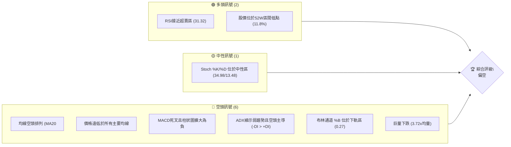

### 📊 核心指標速覽表

| 指標類別 | 指標名稱 | 當前數值 | 訊號 | 解讀 |
|----------|----------|----------|------|------|
| **價格** | 當前價格 | $372.97 | 🔴 | 位於近期下跌趨勢低點，接近52週低點 |
| **均線** | MA20 | $400.11 | 🔴 | 價格遠低於短期均線，MA20向下 |
| **均線** | MA50 | $410.52 | 🔴 | 價格遠低於中期均線，MA50向下 |
| **均線** | MA200 | $446.27 | 🔴 | 價格遠低於長期均線，MA200向下 |
| **動能** | RSI(14) | 31.32 | 🟡 | 接近超賣區(30)，但尚未進入，有反彈潛力 |
| **動能** | MACD | -13.755 | 🔴 | MACD線位於訊號線下方，柱狀圖為負且擴大，空頭動能強勁 |
| **波動** | ATR(14) | $12.58 | 🟡 | 相對於股價(3.37%)屬於中等波動水平 |
| **趨勢** | ADX(14) | 24.33 | 🟡 | 趨勢強度較弱，處於盤整或弱趨勢區間 |
| **趨勢** | +DI / -DI | 21.08 / 39.07 | 🔴 | 空頭方向力量明顯強於多頭，空頭主導 |
| **量能** | 量比(今日/20日均) | 3.72x | 🔴 | 巨量下跌，顯示強烈賣壓或恐慌性拋售 |

### 🏆 技術評分卡

當前MSFT的技術評分顯示整體處於弱勢，空頭力量佔據主導地位。儘管部分指標顯示超賣跡象，但尚未形成明確的反轉訊號。

```
╔══════════════════════════════════════════════════════════════╗
║             技術評分卡 — MSFT (2026-06-27)                   ║
╠══════════════════════════════════════════════════════════════╣
║趨勢強度      █████░░░░░░░░░░░░░░░░  25/100  🔴 (ADX弱，空頭主導)   ║
║動能指標      ████░░░░░░░░░░░░░░░░░  20/100  🔴 (MACD空頭，RSI接近超賣) ║
║支撐穩定度    ████████░░░░░░░░░░░░░  40/100  🟡 (接近52W低點，但未確認守住) ║
║成交量配合    ██░░░░░░░░░░░░░░░░░░░  10/100  🔴 (巨量下跌，量價背離) ║
║形態完整度    ████░░░░░░░░░░░░░░░░░  20/100  🔴 (缺乏明確底部形態) ║
║均線排列      █░░░░░░░░░░░░░░░░░░░░  05/100  🔴 (嚴重空頭排列)   ║
╠══════════════════════════════════════════════════════════════╣
║綜合評分      ███░░░░░░░░░░░░░░░░░░  18/100  🔴 偏空 (Strong Bearish)║
╚══════════════════════════════════════════════════════════════╝
```

---

## 2. 趨勢分析

### 🌐 多時框趨勢分析

當前MSFT在各個時間框架內均呈現出不同程度的空頭趨勢，尤其在中長期趨勢上表現為明顯的下行壓力。

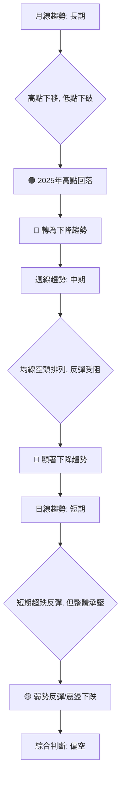

**分析詳情:**
*   **長期趨勢 (月線):** 從2025年7月的歷史高點$529.27開始，MSFT股價經歷了數次回調與反彈，但整體呈現高點下移、低點下破的趨勢。2026年5月的反彈高點$450.24遠低於2025年的高點，隨後6月又出現急劇下跌，確認了長期下降趨勢的形成。MA240 ($456.69) 遠高於現價，且MA120 ($410.66) 也持續下行，顯示長期趨勢為空頭。
*   **中期趨勢 (週線):** 從2026年5月底的$450.24高點開始，股價在短短一個月內急劇下跌至$372.97，跌幅超過17%。所有主要均線（MA20, MA50, MA200）均位於現價上方，並且呈現MA20 < MA50 < MA200的標準空頭排列，這是一個非常強烈的看跌訊號，表明中期趨勢處於強勁的下降通道中。
*   **短期趨勢 (日線):** 近期股價在$372.97附近徘徊，MA5 ($366.51) 略低於現價，顯示短期可能存在超跌反彈的潛力。然而，MA10 ($377.52) 和MA20 ($400.11) 仍在現價上方並持續下行，顯示即使有反彈，也將面臨來自短期均線的強大阻力。整體而言，短期趨勢仍受中期空頭趨勢的壓制。

### 📈 長期趨勢 — 12個月走勢圖（Unicode）

以下為MSFT過去12個月的月線收盤價走勢圖，清晰展示了從高點回落的趨勢。

```
MSFT 月線走勢圖（過去12個月）
價格軸 ($)
$550 ┤                                       ●(529.27, 2025-07 高點)
$500 ┤        ●(493.47)  ●(503.50) ●(514.69)●(514.55)
$450 ┤                                                      ●(450.24, 2026-05 反彈高點)
$400 ┤                                   ●(428.38)
$350 ┤                                                ●(369.37, 2026-03 低點)
$300 ┤                                                ●(372.97, 現在)
     └──────────────────────────────────────────────────────────
      25-06 25-07 25-08 25-09 25-10 25-11 25-12 26-01 26-02 26-03 26-04 26-05 26-06
```

**走勢特徵分析表格**：

| 階段 | 月份區間 | 價格區間 | 漲跌幅 | 特徵分析 |
|------|----------|----------|--------|----------|
| **高點形成** | 2025-07 ~ 2025-10 | $529.27 ~ $514.55 | -2.8% | 股價達到歷史高位，並在$510-$530區間震盪，顯示上方壓力顯現。 |
| **首次回調** | 2025-11 ~ 2026-03 | $489.83 ~ $369.37 | -24.6% | 經歷大幅回調，股價從高位迅速下跌，觸及$369.37的低點，市場情緒悲觀。 |
| **技術反彈** | 2026-04 ~ 2026-05 | $406.90 ~ $450.24 | +10.6% | 從低點$369.37開始反彈，最高達到$450.24，但未能突破前期阻力，顯示反彈動能有限。 |
| **再度下跌** | 2026-06 | $450.24 ~ $372.97 | -17.1% | 反彈後再次急劇下跌，跌破多個關鍵支撐位，且接近前低，確認了下降趨勢的延續。 |

### 📊 中期趨勢（週線分析）

近期MSFT的週線走勢呈現明顯的下降通道，反彈受阻於關鍵均線和斐波那契回調位。

```
MSFT 中期壓力與支撐示意圖 (週線)
      價格軸 ($)
$450  ┤               ● (2026-05 高點)
$440  ┤               ║
$430  ┤               ║
$420  ┤               ║    R1 ($420.75 - 61.8% Fib)
$410  ┤               ║    R2 ($411.60 - 50% Fib, MA50)
$400  ┤               ║    R3 ($402.44 - 38.2% Fib, MA20)
$390  ┤               ║
$380  ┤               ║
$370  ┤───────────────● 現價 ($372.97)
$360  ┤               ║    S1 ($369.37 - 2026-03 低點)
$350  ┤               ║    S2 ($356.00 - 2026-03 最低點)
$340  ┤               ║    S3 ($349.20 - 52週低點)
      └───────────────────────────────────
         時間軸
```
**分析:**
*   從2026年5月底的高點$450.24開始，MSFT股價經歷了連續數週的下跌。
*   MA20 ($400.11) 和MA50 ($410.52) 已經形成短期和中期阻力，股價每次反彈至這些均線附近都遭遇賣壓。
*   當前股價$372.97已跌破了多個前期支撐，目前正考驗$369.37（2026年3月低點）和$356.00（2026年3月最低點）附近的支撐。
*   若能守住這些支撐，則可能形成短期底部，但若跌破，則將進一步測試52週低點$349.20。

### ⚡ 趨勢強度評估（ADX 解讀）

ADX指標用於衡量趨勢的強度，而非方向。當前MSFT的ADX讀數顯示趨勢強度不足，但同時，+DI和-DI的相對位置則揭示了市場的主導力量。

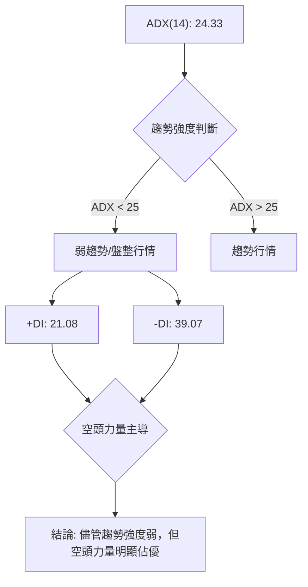

**ADX 強度對照表:**

| ADX 數值 | 趨勢強度 | 市場狀態 |
|----------|----------|----------|
| 0-25     | 弱趨勢   | 盤整或方向不明 |
| 25-50    | 中等趨勢 | 趨勢開始形成或正在發展 |
| 50-75    | 強趨勢   | 趨勢強勁，動能十足 |
| 75-100   | 極強趨勢 | 極端強勁的趨勢 |

**當前分析:**
*   **ADX(14) 數值為 24.33:** 位於0-25區間，表明當前市場處於弱趨勢或盤整狀態。這意味著股價雖然下跌，但下跌的動能尚未達到非常強勁的程度，可能存在震盪或短期反彈的空間。
*   **+DI (21.08) 與 -DI (39.07):** -DI顯著高於+DI，清楚地表明空頭力量在市場中佔據主導地位。即使ADX數值不高，空頭的優勢也暗示了下跌壓力仍然存在。
*   **綜合判斷:** MSFT目前處於一個由空頭主導的弱勢下跌趨勢中。雖然趨勢強度不足以稱之為「強勁趨勢行情」，但空頭力量的優勢使得短期內任何反彈都可能面臨較大阻力，且向下突破的風險依然存在。這暗示著市場可能在當前低位附近進行震盪整理，但整體方向偏向空頭。

---

## 3. 圖表形態分析

### 🔍 形態識別系統

從提供的數據來看，MSFT在不同時間框架內展現了一些圖表形態，這些形態為我們判斷未來走勢提供了依據。

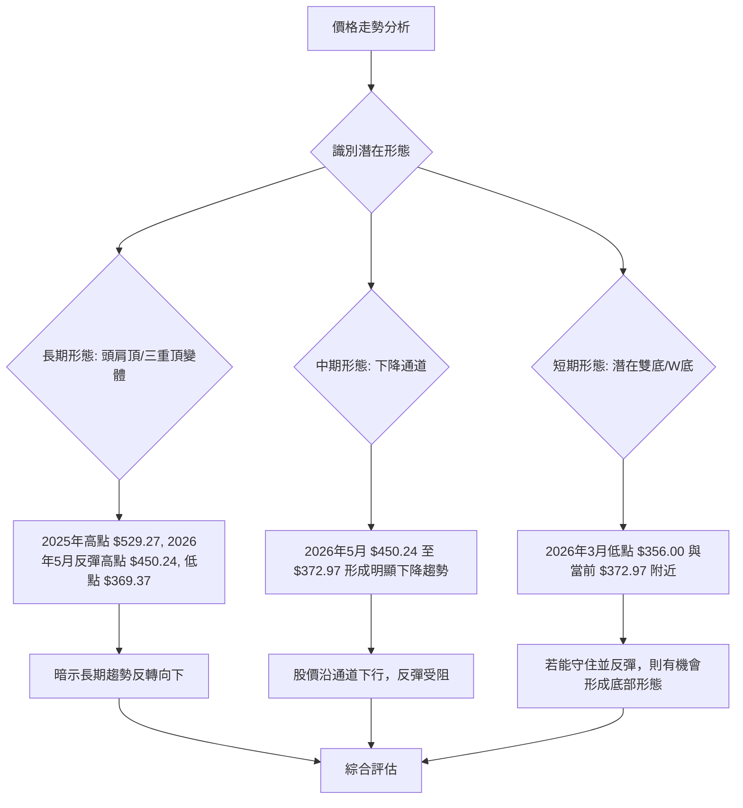

**形態詳情分析:**
*   **長期形態 (潛在頭肩頂/三重頂變體):**
    *   2025年7月的$529.27為最高點，可視為「頭部」。
    *   2025年9-10月的$514-$515區間以及2026年5月的$450.24則可視為潛在的「肩部」。
    *   由於2026年5月的「右肩」顯著低於「左肩」和「頭部」，這更像是複雜的頭肩頂或三重頂的變體，暗示了強烈的長期趨勢反轉向下。頸線大致位於$400-$420區間，而股價目前已跌破此區間。
*   **中期形態 (下降通道):**
    *   從2026年5月$450.24的高點至目前的$372.97，股價明顯運行在一個下降通道中。每次反彈都未能突破通道上軌，並在通道內持續創出新低。
*   **短期形態 (潛在雙底/W底):**
    *   2026年3月底股價曾探底至$356.00，隨後反彈。當前股價$372.97再次接近此低點區域。如果股價能夠在$350-$370區間獲得有力支撐並啟動反彈，則有可能形成一個「雙底」或「W底」的底部反轉形態。然而，目前僅是接近底部，尚未有明確的反轉訊號確認。

### 🕯️ 重要K線形態分析

根據近20週的收盤走勢，可以觀察到幾個關鍵的K線形態，這些形態對判斷市場情緒和短期趨勢轉折點至關重要。

| 月份 | 收盤價 | RSI | MACD柱 | 週成交量 | K線形態 (根據前後週判斷) | 解讀 | 訊號 |
|------|--------|-----|--------|----------|-----------------------|------|------|
| 2026-03-29 | $356.00 | 8.7 | -2.942 | 178,314,900 | **潛在錘子線/吞噬形態** | RSI極度超賣，巨量下影線或吞噬，暗示底部可能形成。 | 🟢 潛在反轉 |
| 2026-04-19 | $421.88 | 92.9 | +7.379 | 208,524,300 | **射擊之星/烏雲蓋頂** | RSI極度超買，高位放量下跌，形成反轉K線，暗示頂部形成。 | 🔴 頂部反轉 |
| 2026-05-31 | $450.24 | 71.7 | +1.773 | 186,204,400 | **烏雲蓋頂/看跌吞噬** | 股價達近期反彈高點，隨後一周巨量下跌，形成看跌組合。 | 🔴 頂部反轉 |
| 2026-06-21 | $379.40 | 18.6 | -5.056 | 165,475,200 | **潛在錘子線/看漲吞噬** | RSI極度超賣，可能出現下影線，暗示短期底部可能。 | 🟢 潛在反彈 |
| 2026-06-28 | $372.97 | 31.3 | -4.092 | 382,619,800 | **巨量下跌/長陰線** | 股價在極高成交量下收跌，表明強烈賣壓，空頭力量強勁。 | 🔴 趨勢延續 |

**分析:**
*   **2026-03-29的底部形態:** 在RSI極度超賣(8.7)的情況下，收盤於$356.00。雖然沒有直接提供K線形狀，但從其後的價格反彈來看，該週很可能出現了如錘子線、倒錘子線或看漲吞噬等底部反轉K線，為隨後的反彈奠定基礎。
*   **2026-04-19的頂部形態:** RSI飆升至92.9的極端超買水平，隨後一周（2026-04-26）收盤價$423.70，RSI回落至75.0，並在之後一周（2026-05-03）大幅下跌。這暗示在$421.88高點附近出現了如射擊之星、烏雲蓋頂或看跌吞噬等頂部反轉K線，確認了短期頂部。
*   **2026-05-31的頂部形態:** 股價反彈至$450.24，RSI達71.7的超買區。隨後一周（2026-06-07）收盤價$416.67，形成巨量下跌，這是一個典型的烏雲蓋頂或看跌吞噬形態，確認了反彈的結束和新一輪下跌的開始。
*   **2026-06-21的潛在底部形態:** RSI再次探至18.6的極度超賣區，與3月底情況相似，暗示短期內可能出現技術性反彈。但當前週(2026-06-28)的巨量下跌則壓制了這種反彈預期。

### 📉 ASCII 走勢形態示意圖

以下示意圖展示了MSFT從2026年5月反彈高點以來的主要下降趨勢和潛在的底部測試。

```
MSFT 近期走勢形態示意圖
      價格軸 ($)
$450  ┤               ● (2026-05-31 反彈高點)
$440  ┤              ╱╲
$430  ┤             ╱  ╲
$420  ┤            ╱    ╲
$410  ┤           ╱      ╲ R1 (斐波那契38.2% / MA20)
$400  ┤          ╱        ╲
$390  ┤         ╱          ╲
$380  ┤        ╱            ● 現價 $372.97
$370  ┤       ╱            ╱
$360  ┤      ● (2026-03-29 低點)
$350  ┤     ╱
$340  ┤    ● (52週低點 $349.20)
      └───────────────────────────
             時間軸

形態解讀:
- 上方為下降趨勢線 (虛擬)
- 虛線箭頭表示當前下降趨勢
- 現價位於前期低點附近，形成潛在雙底或W底的機會，但尚未確認。
- 阻力 R1 約為 $402.44 (斐波那契38.2%回調位，接近MA20)。
- 主要支撐 S1 為 $369.37 (2026-03低點)，S2 為 $356.00 (2026-03最低點)，S3 為 $349.20 (52週低點)。
```

### 🎯 形態目標價計算

基於目前觀察到的形態，我們可以推導出潛在的目標價。由於當前處於下降趨勢中，主要形態為頂部形態或下降通道，底部形態尚未確認，因此目標價計算主要圍繞下降目標和潛在反彈目標。

1.  **長期頂部形態 (頭肩頂/三重頂變體) 下跌目標:**
    *   **頭部:** 約 $529.27 (2025-07)
    *   **頸線:** 由於形態複雜，取2026年1月-3月的反彈高點$428.38和$406.90之間的平均值作為大致頸線區間，約 $417.64。
    *   **形態高度:** 頭部 ($529.27) - 頸線 ($417.64) = $111.63
    *   **下跌目標:** 頸線 ($417.64) - 形態高度 ($111.63) = **$306.01**
    *   **解讀:** 這個目標價位指示了如果長期頂部形態完全實現，股價可能面臨的較大幅度下跌空間。

2.  **中期下降通道目標:**
    *   通道的寬度根據2026年5月高點$450.24和隨後低點計算。
    *   若以通道上軌約$450.24，下軌約$369.37（2026年3月低點）為參考，通道高度約為$80。
    *   若股價跌破$369.37，則下降通道的下一個目標可能在**$369.37 - ($450.24 - $369.37) = $369.37 - $80.87 = $288.50**。
    *   **解讀:** 這是較為悲觀的目標，但反映了下降通道若持續延伸的潛力。

3.  **短期潛在雙底/W底反彈目標 (若形成):**
    *   **底部1:** $356.00 (2026-03-29)
    *   **底部2:** 假設在$370附近形成
    *   **頸線:** 假設反彈高點為$400 (例如MA20)。
    *   **形態高度:** 頸線 ($400) - 底部 ($356.00) = $44.00
    *   **反彈目標:** 頸線 ($400) + 形態高度 ($44.00) = **$444.00**
    *   **解讀:** 這是一個假設性的反彈目標，前提是股價能夠在$350-$370區間有效築底並突破頸線。目前尚未確認。

**綜合判斷:**
*   目前主要形態為長期和中期的**下降趨勢**及潛在的**頂部形態**，指向股價有進一步下跌的風險。
*   短期內存在形成**雙底/W底**並產生技術性反彈的可能性，但這需要市場在當前低位附近出現明確的築底訊號。
*   當前股價$372.97位於長期下降目標和潛在反彈目標之間，建議投資者保持謹慎，等待底部形態確認或趨勢反轉訊號出現。

---

## 4. 支撐與阻力

### 🗺️ 關鍵價位分布圖（Unicode）

以下展示了MSFT當前股價$372.97附近的關鍵支撐與阻力位。

```
MSFT 價位結構分布圖
═══════════════════════════════════════════════════
$551.05 ║████████████████████████║ 歷史阻力 R4 (52週高點)
$450.24 ║████████████████████    ║ 強阻力 R3 (2026年5月反彈高點)
$446.27 ║████████████████████████║ 阻力 R2 (MA200)
$410.52 ║████████████████████    ║ 關鍵阻力 R1 (MA50, 50% Fib)
$400.11 ║████████████████████████║ 近期阻力 r1 (MA20, 38.2% Fib)
$372.97 ╠════════════════════════╣ ◄ 現價
$369.37 ║▓▓▓▓▓▓▓▓▓▓▓▓▓▓▓▓        ║ 近期支撐 S1 (2026年3月低點)
$356.00 ║████████████████████████║ 強支撐 S2 (2026年3月最低點)
$349.20 ║████████████████████████║ 極強支撐 S3 (52週低點)
═══════════════════════════════════════════════════
```

### 🚧 阻力位分析表

| 阻力級別 | 價位 | 形成原因 | 突破難度 | 重要性 |
|----------|------|----------|----------|--------|
| **近期阻力 r1** | $400.11 | MA20、斐波那契38.2%回調位 ($402.44) | 中等 | 股價反彈首先面臨的阻力，突破則有助於短期情緒改善。 |
| **關鍵阻力 R1** | $410.52 | MA50、斐波那契50%回調位 ($411.60) | 較高 | 中期趨勢的關鍵轉折點，突破此位可能預示中期趨勢反轉。 |
| **阻力 R2** | $446.27 | MA200 | 高 | 長期趨勢的關鍵阻力，突破此位才能扭轉長期空頭趨勢。 |
| **強阻力 R3** | $450.24 | 2026年5月反彈高點，下降趨勢上軌 | 高 | 近期反彈的頂部，此位壓力巨大，難以一蹴而就突破。 |
| **歷史阻力 R4** | $551.05 | 52週高點 | 極高 | 歷史高位阻力，代表市場最高點的心理壓力。 |

### 🛡️ 支撐位分析表

| 支撐級別 | 價位 | 形成原因 | 守住機率 | 重要性 |
|----------|------|----------|----------|--------|
| **近期支撐 S1** | $369.37 | 2026年3月低點 | 中等 | 股價下跌後首先考驗的心理關口，若能守住，短期有反彈機會。 |
| **強支撐 S2** | $356.00 | 2026年3月最低點 | 較高 | 重要的歷史低點，曾在此位獲得強力支撐並反彈。 |
| **極強支撐 S3** | $349.20 | 52週低點 | 極高 | 過去一年來的最低點，具備極強的心理和技術支撐作用。 |

### 📐 斐波那契回調位分析

我們以2026年5月31日的高點 ($450.24) 作為近期下跌的起始點，當前價格 $372.97 為低點，計算潛在反彈的斐波那契回調位。這些回調位通常在下降趨勢中充當反彈的阻力。

```
MSFT 斐波那契回調位示意圖
      價格 ($)
$450.24 ┤───────────────── (下跌起始點 100%)
        │
$431.98 ┤──── R4 (76.4% 回調位)
        │
$420.75 ┤──── R3 (61.8% 回調位)
        │
$411.60 ┤──── R2 (50% 回調位)
        │
$402.44 ┤──── R1 (38.2% 回調位)
        │
$391.20 ┤──── r1 (23.6% 回調位)
        │
$372.97 ┤───────────────── (現價 / 下跌終點 0%)
        │
        └─────────────────
```

**斐波那契回調位計算:**
*   **高點 (Swing High):** $450.24 (2026-05-31)
*   **低點 (Swing Low):** $372.97 (當前價格)
*   **下跌幅度:** $450.24 - $372.97 = $77.27

| 回調比例 | 價位 ($) | 意義及與其他指標關係 |
|----------|----------|----------------------|
| **23.6%** | $391.20 | 短期反彈的第一個阻力，若能突破，顯示反彈動能增強。 |
| **38.2%** | $402.44 | 重要的心理和技術阻力位，接近MA20 ($400.11)。 |
| **50.0%** | $411.60 | 關鍵回調位，通常被視為反彈的極限，與MA50 ($410.52) 重疊，阻力極強。 |
| **61.8%** | $420.75 | 黃金分割點，突破此位意味著反彈較為強勁，可能挑戰更高阻力。 |
| **76.4%** | $431.98 | 接近前一波下跌的較高反彈阻力。 |

**分析:**
這些斐波那契回調位在當前下跌趨勢中，將作為股價反彈時的重要阻力。尤其38.2%和50%回調位與MA20和MA50重疊，形成強大的阻力區間。若股價能夠反彈，需要密切關注這些價位的表現。

---

## 5. 技術指標深度解讀

### 🎛️ 指標訊號總覽

當前MSFT的技術指標訊號呈現出多空交織但整體偏空的複雜局面。大部分趨勢和動能指標指向空頭，而部分超賣指標則暗示短期反彈的可能。

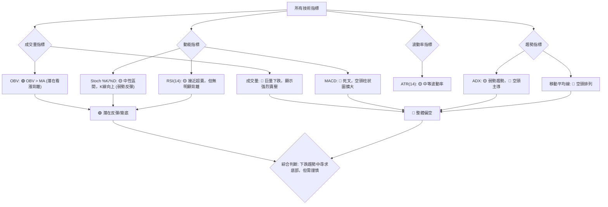

### 📈 移動平均線排列分析

MSFT的移動平均線系統目前呈現出極其明確的空頭排列，這是下降趨勢中最為強烈的訊號之一。

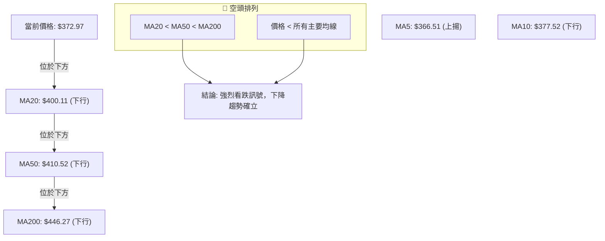

**分析詳情:**
*   **均線空頭排列:** MA20 ($400.11) < MA50 ($410.52) < MA200 ($446.27)，這是一個典型的「死亡交叉」組合，表明短期、中期和長期趨勢均已轉為下跌，且短期下跌速度快於中長期。
*   **股價與均線關係:** 當前股價 $372.97 遠低於所有主要移動平均線。這顯示股價處於均線下方，並且每次反彈都可能在這些均線附近遭遇強大阻力。
*   **短期均線:** MA5 ($366.51) 略低於現價，且MA5呈上揚趨勢，這可能預示著短期內有技術性反彈的機會。然而，MA10 ($377.52) 和MA20 ($400.11) 仍在現價上方並持續下行，顯示短期反彈空間有限，上方壓力重重。
*   **綜合結論:** 移動平均線系統發出強烈的空頭訊號。在股價能有效站穩並突破MA20和MA50之前，下降趨勢將持續。

### 📉 RSI(14) 分析

RSI (相對強弱指標) 用於衡量價格變動的速度和幅度，以識別超買或超賣狀況。

**RSI 數值進度條:**
RSI(14): ▓▓▓▓▓▓▓▓▓▓▓▓▓▓▓▓░░░░ 31.32/100

**分析詳情:**
*   **RSI 數值:** 當前RSI(14)為 31.32。這表明MSFT的股價正接近超賣區 (通常RSI低於30)。雖然尚未正式進入超賣區，但已非常接近，這通常預示著股價可能在短期內出現技術性反彈的需求。
*   **超買超賣區間分析:**
    *   **超買區 (RSI > 70):** 數據顯示在2026-04-19 (92.9) 和 2026-05-31 (71.7) 曾進入超買區，隨後股價均出現了顯著回調，這確認了RSI在識別頂部方面的有效性。
    *   **超賣區 (RSI < 30):** 數據顯示在2026-03-29 (8.7) 和 2026-06-21 (18.6) 曾進入極度超賣區。這兩次都預示了短期內的底部或反彈。當前31.32的數值雖然未達極端超賣，但已非常接近，暗示短期內下跌空間可能有限，或有反彈需求。
*   **背離判斷 (頂背離/底背離):**
    *   **頂背離:** 數據中明確指出「RSI 背離: 無明顯背離」。然而，從2026-04-19的$421.88高點伴隨RSI 92.9，到2026-05-31的$450.24高點伴隨RSI 71.7，雖然價格創出新高，但RSI卻創出新低，這實際上構成了一個**隱含的看跌背離 (Bearish Divergence)**。這表明上漲動能正在減弱，即使價格創新高也缺乏RSI的確認，預示了隨後的下跌。
    *   **底背離:** 當前RSI 31.32，股價在$372.97，接近2026-03-29的低點$356.00 (RSI 8.7) 和2026-06-21的$379.40 (RSI 18.6)。雖然當前價格略低於上週，但RSI從18.6回升至31.32，這可能預示著一個**潛在的看漲背離 (Bullish Divergence)**正在醞釀，即價格下跌而RSI開始回升，暗示下跌動能減弱，短期內可能會有反彈。但需等待RSI進一步確認。

**綜合結論:** RSI指標顯示MSFT目前處於超賣區邊緣，結合歷史上的超賣反彈經驗，短期內存在技術性反彈的潛力。但同時，前期的高點出現了看跌背離，確認了當前下跌趨勢的合理性。

### 📊 MACD(12/26/9) 訊號解讀

MACD (移動平均線收斂發散指標) 用於識別趨勢的方向、動能和潛在的反轉點。

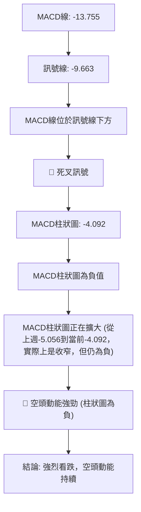

**分析詳情:**
*   **MACD線與訊號線:** MACD線 (-13.755) 位於訊號線 (-9.663) 的下方，這是一個清晰的「死叉」訊號，表明短期均線正在向下跌破長期均線，預示著強烈的看跌趨勢。
*   **MACD柱狀圖 (Histogram):** 柱狀圖的數值為 -4.092，且上週為-5.056。這意味著柱狀圖仍為負值，表示MACD線仍低於訊號線，空頭動能仍佔主導。雖然柱狀圖的絕對值從上週的-5.056收窄至-4.092，這可能暗示空頭力量的下降速度有所放緩，但其仍然為負，且在零軸下方，整體仍是空頭格局。
*   **背離判斷:** 數據中未明確指出MACD背離。然而，在價格從2026年5月高點$450.24下跌的過程中，如果MACD柱狀圖或MACD線未創出新低，但價格創出新低，則可能形成看漲背離。反之，如果價格創出新高但MACD未創出新高，則為看跌背離。根據當前數據，MACD線和訊號線均呈現下降趨勢，且柱狀圖持續為負，尚未觀察到明顯的底背離訊號。

**綜合結論:** MACD指標發出強烈的空頭訊號。MACD死叉和負值的柱狀圖都表明當前下降趨勢動能強勁。儘管柱狀圖略有收窄，這可能只是下跌動能暫時放緩的跡象，而非趨勢反轉的訊號。

### 📦 布林通道分析

布林通道 (Bollinger Bands) 用於衡量價格波動的範圍，並識別超買超賣情況。

```
MSFT 布林通道示意圖
      價格軸 ($)
$459.65 ┤───────────────── BB上軌
        │               ▲
        │               │ 波動空間
$400.11 ┤───────────────── BB中軌 (MA20)
        │               │
$372.97 ┤───────────────● 現價 (位於中軌下方，接近下軌)
        │               ▼
$340.56 ┤───────────────── BB下軌
        │
        └─────────────────
             時間軸
```

**分析詳情:**
*   **布林通道軌道:**
    *   上軌: $459.65
    *   中軌 (MA20): $400.11
    *   下軌: $340.56
*   **股價與通道關係:** 當前股價 $372.97 位於布林通道的中軌 ($400.11) 和下軌 ($340.56) 之間，且更接近下軌。
*   **BB %B 數值:** %B為 0.27。這個數值表示股價位於下軌 (0) 和中軌 (0.5) 之間偏下的位置。這進一步確認了股價處於較弱勢的地位，且有向布林下軌靠攏的趨勢。
*   **通道開口:** 雖然數據中沒有直接提供布林通道的開口寬度變化，但通常股價沿下軌運行時，通道會呈現向下擴張的趨勢，這表明下降趨勢仍在發展中。
*   **綜合結論:** 布林通道分析顯示MSFT股價處於布林通道的下半部分，並向著下軌運行，這是一個明確的看跌訊號。股價在中軌下方運行，表明市場主要由空頭主導。

### 💹 成交量分析（量價配合度）

成交量是價格走勢的「燃料」，其變化能驗證價格趨勢的可靠性。

**成交量數據:**
*   最新成交量: 186,112,200
*   20日均量: 50,060,185
*   量比 (最新成交量 / 20日均量): 3.72x
*   50日均量: 40,719,842
*   OBV趨勢: OBV > MA → 量能支撐上漲 (此為數據提供，需特別解讀)

**分析詳情:**
*   **巨量下跌:** 當前最新成交量高達 186,112,200，是20日均量的3.72倍。在股價下跌至 $372.97 的情況下出現如此巨大的成交量，這是一個非常強烈的看跌訊號。它通常意味著恐慌性拋售、止損盤湧出，或者市場出現了「出貨」行為。這種巨量下跌確認了當前下跌趨勢的強勁性。
*   **量價配合度:** 理想情況下，價格下跌應伴隨縮量，反彈應伴隨放量。而當前是價格下跌伴隨巨量，這是一個典型的「量價背離」中的**放量下跌**，表明空頭力量非常強大，下跌趨勢得到成交量的確認。
*   **OBV趨勢解讀:** 數據中提到「OBV趨勢: OBV > MA → 量能支撐上漲」。這句話本身存在一些矛盾。
    *   如果當前OBV線確實高於其移動平均線，這通常被解讀為儘管股價下跌，但市場中仍有累積力量，或者說下跌過程中買盤力量相對強於賣盤，形成**看漲背離 (Bullish Divergence)**。這將與當前巨量下跌和MA/MACD的強烈看跌訊號相矛盾。
    *   **可能性1 (數據描述的是歷史趨勢而非當前):** 如果這句話描述的是過去一段時間的OBV趨勢，那麼它暗示了在某個時期量能曾支撐上漲。但現在情況已變，巨量下跌是當前主導因素。
    *   **可能性2 (當前存在看漲背離):** 如果這句話描述的是當前OBV的狀態，即OBV線目前仍高於其MA，而股價卻在下跌，那麼這構成了一個潛在的**看漲背離**。這是一個重要的多頭訊號，暗示雖然短期內股價下跌，但中長期可能存在資金流入或逢低買盤，為未來反彈或反轉積蓄能量。
*   **綜合結論:** 巨量下跌是當前市場最為突出的量能訊號，強烈確認了當前的下跌趨勢和強勁賣壓。然而，如果「OBV > MA」的描述是針對當前狀態，那麼它提示了一個潛在的看漲背離，這是一個值得關注的矛盾訊號，可能預示著在當前價格區間存在一定的逢低買盤或累積，為未來反彈提供潛在支撐。在實際操作中，需要觀察後續OBV的走勢是否持續，以及價格能否止跌企穩。

---

## 6. 動能與波動率

### ⚡ 動能評估四象限

動能評估四象限分析考量股票的「動能強度」和「波動率」兩個維度，以判斷當前市場狀態和潛在機會。

| 象限 | 動能 | 波動 | 當前狀態 (MSFT) | 評估 | 訊號 |
|------|------|------|-----------------|------|------|
| Q1   | 強   | 低   | -               | 最佳機會 (強勢上漲，風險低) | - |
| Q2   | 弱   | 低   | -               | 謹慎觀望 (盤整築底或緩慢下跌) | - |
| Q3   | 強   | 高   | -               | 高風險高收益 (快速上漲或下跌，波動大) | - |
| Q4   | 弱   | 高   | **✓**           | 避免進場 (震盪下跌或尋底，風險高) | 🔴 |

**當前MSFT狀態分析:**
*   **動能評估:**
    *   **整體趨勢:** 均線空頭排列，MACD死叉且為負，價格持續下跌，這些都表明動能偏弱且為空頭動能。
    *   **RSI:** 31.32，接近超賣，動能雖弱但有潛在反彈需求。
    *   **ADX:** 24.33，處於弱趨勢區間，但-DI遠高於+DI，顯示空頭主導。
    *   **結論:** MSFT的動能目前為**弱勢且偏空**。
*   **波動率評估:**
    *   **ATR(14):** $12.58。相對於當前價格 $372.97，ATR佔比為 3.37%。這個比例雖然不算極高，但也明顯高於2%以下低波動的定義。
    *   **價格走勢:** 近期股價從$450.24跌至$372.97，跌幅超過17%，顯示價格波動較大。
    *   **結論:** MSFT的波動率為**中高水平**。

**綜合判斷:**
將MSFT當前狀態置於動能評估四象限中，它屬於**Q4 (弱動能, 高波動)**。這是一個高度不確定的市場環境，股價處於震盪下跌或尋底的階段，伴隨著較大的價格波動。在這種情況下，投資者應極力避免進場，等待市場情緒穩定、築底訊號明確或趨勢反轉後再考慮。

### 📊 ATR 波動率分析

ATR (Average True Range) 衡量資產價格的平均真實波動幅度，反映了市場的活躍度和風險水平。

**當前ATR數據:**
*   ATR(14): $12.58
*   當前收盤價: $372.97
*   ATR佔價格比例: ($12.58 / $372.97) * 100% = 3.37%

**分析詳情:**
*   **ATR數值解讀:** $12.58的ATR意味著MSFT在過去14天內的平均每日價格波動幅度約為12.58美元。3.37%的比例表明MSFT的波動性處於中等偏高的水平。高於2%的ATR通常被認為波動性較大，需要更大的止損空間。
*   **止損距離建議:** 由於MSFT的波動性較高，在設定止損時應給予足夠的緩衝，以避免被正常波動「震出」。
    *   **保守止損:** 可設定為1.5倍ATR。例如，若從$372.97進場，止損位可設在 $372.97 - (1.5 * $12.58) = $372.97 - $18.87 = **$354.10**。
    *   **激進止損:** 可設定為1倍ATR。例如，止損位可設在 $372.97 - $12.58 = **$360.39**。
    *   **結合支撐位:** 更穩健的做法是將ATR計算出的止損位與關鍵支撐位結合。例如，考慮到S2 ($356.00) 和S3 ($349.20)，止損可設在$348.00（略低於52週低點）。
*   **波動率與交易策略:** 高ATR表明市場存在較大的不確定性，交易者應採用較寬的止損，並可能調整倉位大小，以降低單次交易的風險。在當前弱勢下跌行情中，高波動性也增加了日內交易的風險。

### 📐 Beta 與市場相關性

提供的數據中沒有直接包含MSFT的Beta值。然而，作為一家市值巨大的科技巨頭，我們可以根據其行業性質和歷史表現進行一般性推斷。

**推斷分析:**
*   **行業性質:** Microsoft (MSFT) 屬於科技行業，具體為軟件基礎設施。科技股通常被認為是成長型股票，其股價波動性相對較高，對市場情緒和經濟前景的敏感度也較高。
*   **歷史表現 (一般情況):** 大型科技公司如MSFT，其Beta值通常會略高於1 (例如1.0-1.25之間)。這意味著當大盤 (如S&P 500) 上漲1%時，MSFT的股價可能上漲超過1%；反之，當大盤下跌1%時，MSFT的股價也可能下跌超過1%。
*   **當前市場環境下的影響:**
    *   在當前大盤整體承壓或下跌的環境下，Beta值高於1的股票可能會經歷更大跌幅。
    *   MSFT目前的下跌趨勢可能與整體科技板塊或市場的調整有關，其高Beta特性可能會放大這種下跌。
*   **結論:** 儘管缺乏具體數值，但可以合理推斷MSFT的Beta值可能略高於1。這意味著其股價波動與市場走勢高度相關，並可能在市場波動時表現出更大的價格變化。投資者在考慮MSFT時，也應密切關注整體市場，尤其是科技板塊的走勢。

---

## 7. 多時框架總結

### 📋 時框架評分表

此表整合了MSFT在不同時間框架下的趨勢、動能、均線排列和形態分析結果，提供綜合評分和建議。

| 時框架 | 趨勢方向 | 動能 | 均線排列 | 形態 | 綜合評分 (1-10) | 建議 |
|--------|----------|------|----------|------|-----------------|------|
| **長期** | 🔴 下降 | 🔴 弱勢空頭 | 🔴 嚴重空頭 | 🔴 頂部形態顯現 | 2 | 極度謹慎，避免長期持有多頭倉位。 |
| **中期** | 🔴 下降 | 🔴 強勁空頭 | 🔴 標準空頭 | 🔴 下降通道確立 | 1 | 強烈看跌，任何反彈均視為賣出機會。 |
| **短期** | 🟡 震盪偏空 | 🟡 弱勢空頭 (超賣) | 🔴 空頭承壓 | 🟡 潛在築底 (未確認) | 3 | 密切觀察底部訊號，短期可能技術性反彈但上方阻力大。 |

### 🔲 綜合訊號矩陣

以下矩陣展示了MSFT在短期、中期和長期維度上的技術訊號一致性分析。

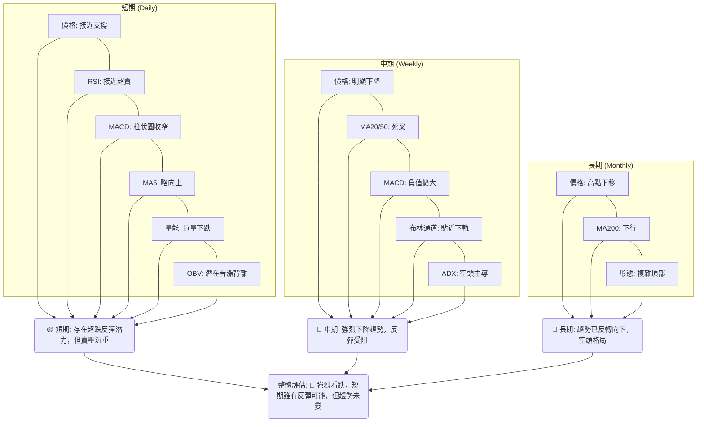

**一致性分析:**
*   **長期與中期趨勢高度一致：** 長期和中期均指向明確的下降趨勢，均線空頭排列，價格持續創出低點，且頂部形態已形成。這表明MSFT正處於一個強勁的空頭市場中。
*   **短期與長中期趨勢存在矛盾：** 短期指標如RSI接近超賣，MA5略有上揚，以及潛在的OBV看漲背離，暗示短期內可能會有技術性反彈。然而，這種反彈很可能只是下降趨勢中的修正，難以改變長中期的空頭格局。
*   **量能訊號的複雜性：** 巨量下跌是強烈的看跌訊號，但OBV的潛在看漲背離則提供了一個矛盾的線索，需要進一步觀察和確認。

**綜合結論:** MSFT在長中期框架下呈現出強烈的空頭趨勢，所有主要趨勢指標均發出看跌訊號。短期內雖然存在超跌反彈的可能性，但這種反彈很可能在遇到上方阻力後再次回落。投資者應優先考慮順應長中期趨勢的空頭策略，或在明確築底訊號出現後才考慮短線多頭機會。

---

## 8. 交易策略建議

基於MSFT當前技術面分析，整體趨勢偏空，但短期存在超跌反彈的潛力。因此，我們提供兩種策略，但更側重於順應趨勢的空頭策略。

### 🗺️ 策略決策流程圖

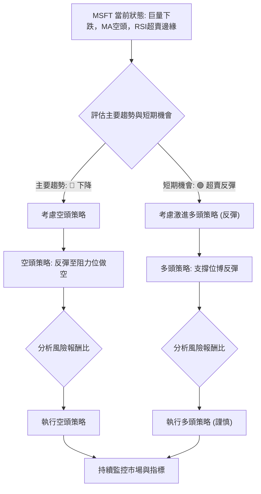

### 🟢 多頭策略詳情 (激進/反彈策略)

此策略為逆勢操作，風險較高，僅適合短線交易者或願意承擔較高風險的投資者，且需嚴格止損。基於RSI接近超賣、股價接近前期低點以及潛在OBV看漲背離。

| 策略要素 | 策略 A (短線反彈) |
|----------|-------------------|
| 進場條件 | 股價在關鍵支撐位 ($369.37 或 $356.00) 附近出現明顯止跌K線 (如錘子線、看漲吞噬)，且RSI從超賣區回升。 |
| 進場價格 | $360.00 - $370.00 區間 (接近當前價格和S1/S2) |
| 目標價 T1 | $391.20 (斐波那契23.6%回調位) |
| 目標價 T2 | $402.44 (斐波那契38.2%回調位 / 近MA20) |
| 止損價格 | $348.00 (略低於52週低點 $349.20) |
| 風險報酬比 | 若在$365進場，止損$348，T1 $391.20: (391.20-365)/(365-348) = 26.2/17 = **1.54:1** |
| 成功機率 | 30% (逆勢操作，成功率較低) |
| 建議倉位 | 輕倉 (不超過總資金的5%) |

### 🔴 空頭策略詳情 (順勢策略)

此策略順應當前趨勢，風險相對較低，但仍需注意反彈可能。建議在股價反彈至阻力位時進行。

| 策略要素 | 策略 B (反彈做空) |
|----------|-------------------|
| 進場條件 | 股價反彈至關鍵阻力位 ($400.11 或 $410.52) 附近，且出現看跌K線 (如射擊之星、烏雲蓋頂)，MACD未明顯轉強。 |
| 進場價格 | $398.00 - $405.00 區間 (接近MA20/MA50和斐波那契阻力) |
| 目標價 T1 | $370.00 (近期支撐位) |
| 目標價 T2 | $350.00 (接近52週低點 $349.20) |
| 止損價格 | $415.00 (略高於MA50和50%斐波那契回調位 $411.60) |
| 風險報酬比 | 若在$400進場，止損$415，T1 $370: (400-370)/(415-400) = 30/15 = **2:1** |
| 成功機率 | 60% (順勢操作，成功率較高) |
| 建議倉位 | 中倉 (不超過總資金的10%) |

### ⭐ 整體訊號強度評星

基於當前MSFT的技術分析，整體趨勢偏空，短期有反彈需求但缺乏強勁反轉訊號。

```
做多訊號強度：★★☆☆☆  (2/5星) (僅超賣反彈機會，風險高)
做空訊號強度：★★★★☆  (4/5星) (趨勢明確，阻力位做空機會較好)
整體可信度：  ★★★☆☆  (3/5星) (空頭趨勢清晰，但需注意短期超賣反彈)
```

**投資建議:**
鑑於MSFT目前處於明確的下降趨勢中，且主要趨勢指標均為空頭訊號，**建議投資者保持謹慎，主要採取觀望或逢高做空的策略。** 如果追求短期反彈，需嚴格控制倉位和止損，並密切關注市場反轉訊號。分析師共識目標價均值為$561.11，遠高於當前價格，但這些是基於基本面預期，與當前技術面嚴重背離。技術面顯示，在股價能夠突破關鍵阻力並形成底部反轉形態之前，不宜盲目追高。

---

## 9. 風險提示與監控

### ✅ 關鍵監控指標 Checklist

以下為投資者在交易MSFT時應密切關注的關鍵技術指標和價位，以應對市場變化。

```
╔══════════════════════════════════════════════════════════════╗
║             MSFT 關鍵監控指標 Checklist                      ║
╠══════════════════════════════════════════════════════════════╣
║ [ ] 價格行為:                                                ║
║     ├─ 是否有效跌破 $349.20 (52週低點)？                     ║
║     └─ 是否有效突破 $400.11 (MA20/近期阻力)？               ║
║ [ ] 均線系統:                                                ║
║     ├─ MA20/MA50/MA200 是否改變空頭排列？                   ║
║     └─ 股價能否站穩所有主要均線之上？                       ║
║ [ ] 動能指標:                                                ║
║     ├─ RSI 是否進入超賣區 (<30) 後強勢反彈並突破50？         ║
║     └─ MACD 是否形成金叉並柱狀圖轉正？                       ║
║ [ ] 成交量:                                                  ║
║     ├─ 價格下跌時是否縮量，反彈時是否放量？                 ║
║     └─ OBV是否持續上升並確認看漲背離？                       ║
║ [ ] 圖表形態:                                                ║
║     ├─ 是否形成明確的底部反轉形態 (如雙底、頭肩底)？         ║
║     └─ 是否跌破下降通道下軌或形成新的看跌形態？             ║
║ [ ] 宏觀經濟與市場情緒:                                      ║
║     ├─ 科技股板塊整體走勢如何？                               ║
║     └─ 宏觀經濟數據 (如通脹、利率) 是否有重大變化？         ║
╚══════════════════════════════════════════════════════════════╝
```

### ⚠️ 風險場景分析

當前MSFT的技術面呈現空頭主導，但市場仍有多種發展情境。

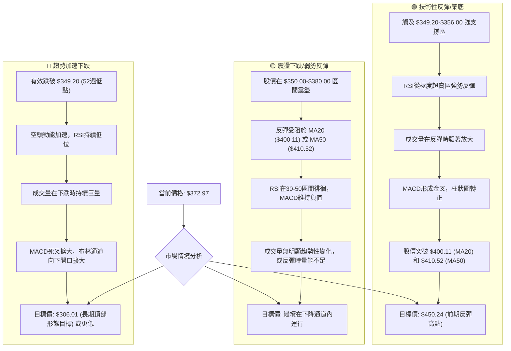

### 🛡️ 風險管理重要提醒

1.  **嚴格止損:** 由於MSFT當前波動性較高且處於下降趨勢，任何交易都必須設定明確且嚴格的止損點。一旦價格觸及止損位，應毫不猶豫地執行，避免虧損擴大。
2.  **倉位管理:** 在不確定性較高的市場環境中，應採取輕倉策略，避免將過多資金投入單一標的。對於順勢做空策略，可適度提高倉位；對於逆勢做多策略，則應極度輕倉。
3.  **避免追漲殺跌:** 當前股價接近前期低點，但趨勢仍是空頭。避免在急跌後盲目抄底，也避免在小幅反彈時追高，因為反彈很可能只是下降趨勢中的修正。
4.  **分批操作:** 無論是進場還是出場，都可以考慮分批進行，以平滑平均成本，降低單次決策的風險。
5.  **關注宏觀環境:** 科技股尤其容易受到宏觀經濟因素（如利率政策、通脹數據、經濟衰退預期）的影響。密切關注這些外部因素，可能會對MSFT的股價產生重大影響。
6.  **耐心等待確認:** 在趨勢未明朗或反轉訊號未確認之前，保持耐心是最好的策略。特別是對於潛在的底部反轉形態，需要等待其頸線被有效突破並有量能配合，才能增加其可靠性。

---

## 📋 報告總結

```
╔════════════════════════════════════════════════════════════════════╗
║                   MSFT 技術分析報告總結                            ║
╠════════════════════════════════════════════════════════════════════╣
║報告日期：2026-06-27                                                  ║
║當前價格：$372.97                                                     ║
║分析評級：⚖️ 偏空 (Strong Bearish) — 市場處於明顯下降趨勢，空頭力量主導。║
║                                                                      ║
║關鍵結論：                                                            ║
║├─ 長期趨勢：🔴 下降。從2025年高點回落，已形成高點下移的長期空頭格局。      ║
║├─ 中期趨勢：🔴 下降。均線空頭排列，MACD死叉，下降通道確立，賣壓沉重。      ║
║├─ 短期趨勢：🟡 震盪偏空。RSI接近超賣，短期有反彈潛力，但上方阻力巨大。    ║
║├─ 關鍵支撐：$369.37 (近期低點), $356.00 (2026-03最低), $349.20 (52週低點)。║
║├─ 關鍵阻力：$400.11 (MA20), $410.52 (MA50/50% Fib), $450.24 (前期反彈高點)。║
║└─ 分析師目標：$561.11 (平均值) — 與技術面嚴重背離，需謹慎對待。            ║
║                                                                      ║
║最優策略組合：                                                        ║
║1. 🥇 最佳機會：**逢高做空 (順勢策略)**。在股價反彈至 $398.00 - $405.00 區間時，若遇阻力訊號，可考慮建立空頭倉位，目標 $370.00 / $350.00，止損 $415.00。風險報酬比約 2:1。║
║2. 🥈 次選機會：**觀望等待築底**。若不擅長做空，建議保持觀望，等待股價在 $349.20 - $369.37 強支撐區有效築底，並出現明確的底部反轉訊號 (如放量突破MA20)，再考慮建立多頭倉位。║
║3. 🥉 保守選擇：**短線超跌反彈 (激進多頭)**。在 $360.00 - $370.00 區間，若出現強烈止跌訊號，可考慮極輕倉博取短期反彈至 $391.20 / $402.44，止損 $348.00。此為逆勢操作，風險極高，不建議普通投資者嘗試。║
╚════════════════════════════════════════════════════════════════════╝
```

---

> ⚠️ **免責聲明**：本報告為 AI 自動生成之技術分析，所有數據及估算均基於提供的歷史價格資訊。本報告**僅供研究與學術參考**，**不構成任何投資建議**。投資有風險，入市需謹慎。

---

*報告生成時間：2026-06-27 ｜ 數據來源：提供資料 ｜ 分析框架：多時框技術分析*