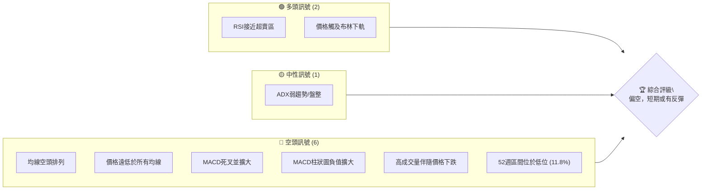
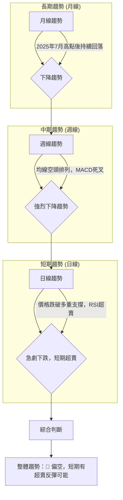
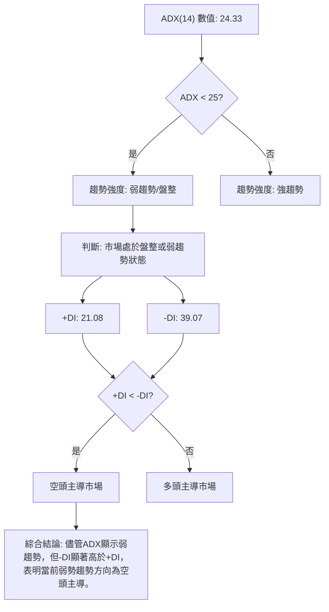
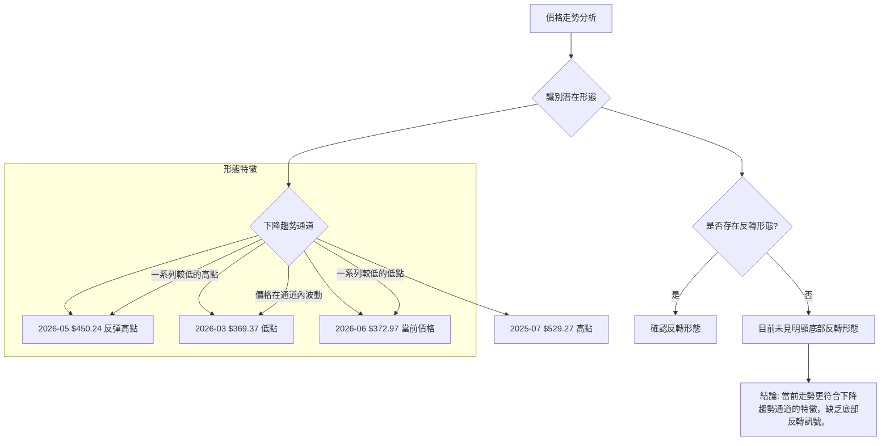
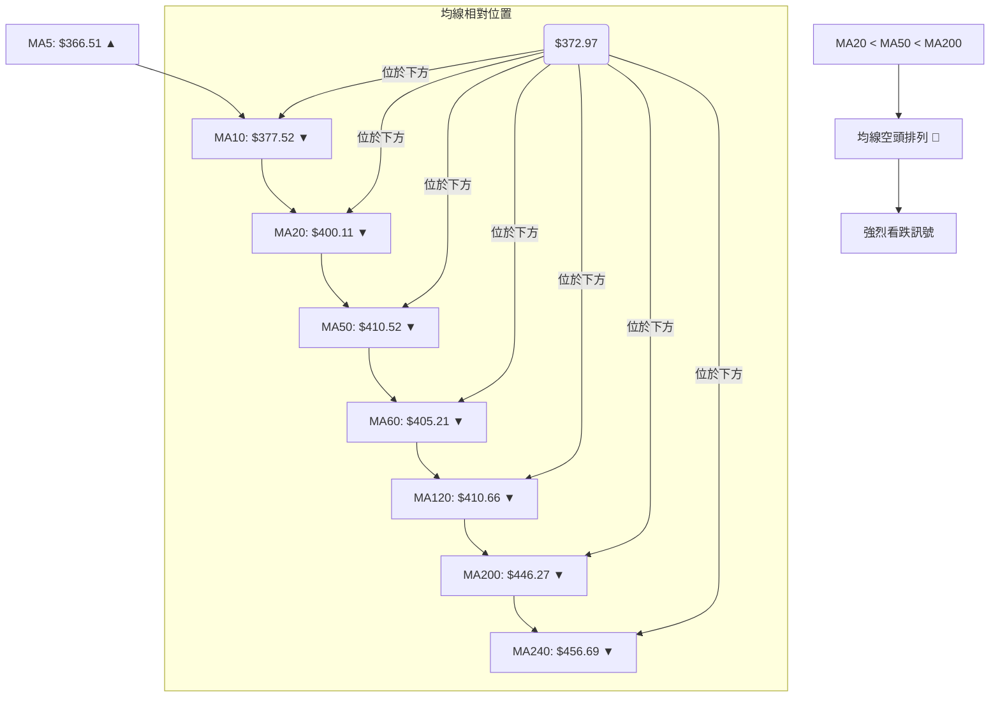

<details>
<summary>📊 靜態圖表 (點擊展開)</summary>

</details>

<html>
<head><meta charset="utf-8" /></head>
<body>
    <div style="height:500px; width:100%;">                        <script>window.PlotlyConfig = {MathJaxConfig: 'local'};</script>
        <script charset="utf-8" src="https://cdn.plot.ly/plotly-3.6.0.min.js" integrity="sha256-QaOVwtVY0T02VaHrr6pnoHLCwayMJp4O5n4YyaE3rJk=" crossorigin="anonymous"></script>                <div id="candlestick-chart" class="plotly-graph-div" style="height:100%; width:100%;"></div>            <script>                window.PLOTLYENV=window.PLOTLYENV || {};                                if (document.getElementById("candlestick-chart")) {                    Plotly.newPlot(                        "candlestick-chart",                        [{"close":{"dtype":"f8","bdata":"AAAAQIkTf0AAAAAgth1\u002fQAAAAGAOq39AAAAA4O4AgEAAAAAAYp1\u002fQAAAAMD2rH9AAAAAgACUf0AAAABAXRWAQAAAAABm839AAAAAYGegf0AAAADgB69\u002fQAAAAOBsfX9AAAAA4NvDf0AAAAAgyPV\u002fQAAAAOCFFYBAAAAAoIMjgEAAAABA9AOAQAAAAKDAEIBAAAAAwPJpgEAAAABgdUWAQAAAAABgTIBAAAAAIOY4gEAAAADA6Lt\u002fQAAAAMAJ7X9AAAAAIGjlf0AAAABALuN\u002fQAAAAIA+xn9AAAAAAJHlf0AAAAAgTQyAQAAAAKA3E4BAAAAAoBwqgEAAAACARSqAQAAAAICEQoBAAAAAYGaBgEAAAADARNWAQAAAAGAi0YBAAAAAAJxTgEAAAADgaBSAQAAAAIA1DoBAAAAAoH3xf0AAAAAAfn9\u002fQAAAAICL335AAAAA4BfbfkAAAACADG1\u002fQAAAAKCol39AAAAAgMW+f0AAAABA9kF\u002fQAAAAACCr39AAAAAAL2Ef0AAAAAg66p+QAAAAKDeQH5AAAAAAPHEfUAAAADgbWB9QAAAAEBgfn1AAAAA4ACufUAAAACAjzV+QAAAAEBCnX5AAAAA4E9JfkAAAADAPX1+QAAAAKDKuX1AAAAAwFTrfUAAAABASRB+QAAAACB9jX5AAAAA4GqdfkAAAABAA8d9QAAAAGA5FX5AAAAA4IjGfUAAAAAgcIt9QAAAAGBypH1AAAAAQCWgfUAAAAAgWR1+QAAAACBAPH5AAAAAYFIsfkAAAACAEEt+QAAAAICzXX5AAAAAYMNYfkAAAAAADE9+QAAAAIAZVX5AAAAAIJ0XfkAAAADAfW19QAAAAOAObH1AAAAAYDfGfUAAAABgORV+QAAAACDYv31AAAAAQHvSfUAAAADAB7F9QAAAACBVSX1AAAAAQH6VfEAAAACAKmp8QAAAAIAjnXxAAAAAABRIfEAAAACgQaJ7QAAAAOA8EnxAAAAAoCX+fEAAAADAHkN9QAAAAGAw531AAAAAQOr3fUAAAADAP\u002fl6QAAAAAAexnpAAAAAQONXekAAAACgMJZ5QAAAAKCoxXlAAAAAYMt+eEAAAADgyPV4QAAAAMBCvHlAAAAAAAG3eUAAAABAPCl5QAAAAEDvAHlAAAAA4Kb4eEAAAACgm7F4QAAAAABB3XhAAAAA4JTZeEAAAADA8cV4QAAAAKA5+ndAAAAAgIxCeEAAAABgv\u002ft4QAAAAAChDXlAAAAAYEJ+eEAAAACgBNt4QAAAAIDpMHlAAAAAQDBFeUAAAADArZx5QAAAAOA3gXlAAAAAIGeIeUAAAAAgIU55QAAAAGAUQHlAAAAAIN0PeUAAAABAH6t4QAAAAMBe8XhAAAAAoL\u002foeEAAAACgF294QAAAACDeQnhAAAAAILfQd0AAAACgweJ3QAAAAGDzPndAAAAAYM8jd0AAAACA3dJ2QAAAAKD7P3ZAAAAAgPJidkAAAACA6xV3QAAAAMAlCXdAAAAAIHJKd0AAAACgL0F3QAAAAEDEN3dAAAAAAFZYd0AAAABAOER3QAAAAIAYIXdAAAAAAKH4d0AAAACgKoR4QAAAAOBMpXlAAAAAwKA1ekAAAABABV56QAAAAOCpEnpAAAAAoORzekAAAAAAwP96QAAAAKCf7XlAAAAAoDx7ekAAAAAgbn56QAAAACAoxXpAAAAAoK54ekAAAAAgYW55QAAAAIC12HlAAAAAAJ7LeUAAAADg2qd5QAAAAKAL0XlAAAAAIMU9ekAAAADAkON5QAAAAGBKvHlAAAAAIDhueUAAAAAgWUV5QAAAAOC4iHlAAAAAYCFQekAAAACg\u002fml6QAAAAEBJCHpAAAAAYGZCekAAAACgcDF6QAAAAMAeKXpAAAAA4HoAekAAAABguMp5QAAAAADXr3pAAAAAANcjfEAAAADgUch8QAAAAMD1lHtAAAAAoHC1ekAAAADAzMB6QAAAAGC4CnpAAAAAANe7eUAAAABgjzZ5QAAAAIDC1XhAAAAAoHBleEAAAAAA12t4QAAAAAAp\u002fHhAAAAAoEedeEAAAABgj653QAAAAGBmtndAAAAAoHD1dkAAAABACl93QAAAACBc13ZAAAAAoEcNdkAAAAAghU93QA=="},"high":{"dtype":"f8","bdata":"bCGyJgJBf0DwX\u002fPRDUB\u002fQBKOg3Aw1X9AC3wZtc4BgEBeZdOAzA+AQMZKCQMowX9Ax5UM6HTdf0DN+LxXQSCAQD67o3jaE4BAnNbX1J\u002f1f0Cy0TJwE9R\u002fQByhvC7OrH9Ag00yEkrrf0BvNO0PxwyAQK04OisxF4BA7MpjsN8pgEAl1df4iTKAQIyPQee2KYBARSMWK4F9gEBeYkO8uXOAQA6My84RXYBAikDp3z1IgEBvEaWHR0KAQOTeIrVHCYBA6nm3JUwAgEBAxrcpew+AQNb\u002flDbHDIBAPosPI+MBgEAcVNRBfBuAQGODZNlnG4BAFF7rTGVPgECgD5GOOEWAQE9szpJZUIBA6XN7z7mZgEAlC5q44TGBQGdw8Smo9oBA56kNS9OcgEAk0A4G6W+AQHO\u002fUuo\u002fTYBAh\u002fuvlnECgEDKzQypcPl\u002fQBlLpG9HaH9A+2xYossDf0AvOr02kHp\u002fQBhsvEhJpn9ACVF+tjLHf0AQ1IIvS+R\u002fQCC\u002fNsUVxn9AhOz\u002fJVrOf0DjNG96CD1\u002fQB+kG1ktwX5AqaH9jhu2fkB3mEJDv8x9QDpyL\u002faRrH1A5qQ+BmnQfUDxULM4UmJ+QBFqt30ip35AXj1jtwJ7fkChDuow\u002frR+QEKvokd9IX5A2nN+KPryfUCufk3kGxR+QKPLc8HgoX5AM3cUrwKffkAhidwrpiF+QPgcw6IAPn5AQe47EPoEfkCqq4Bba+l9QP+jpyJXvH1Am8oySvPdfUBZrRiR3nZ+QDSDmVP+Wn5AbDPF7wJpfkBviiW0rFp+QIZ9KEzcb35AokvsTUtffkCMfN9M9WJ+QKoRY6wkeH5ANK4AC51ffkBQxMEKLih+QAHTs4ZZn31AgijYMuHJfUAYriRddnh+QJZsZV9SCH5AtPeMURXbfUAqradPuO19QJ17NdS6mn1AHeKV1PwhfUD6F7ZKEeN8QPNy\u002fcYu0nxACNykeGVsfEAbiaWQ7Sp8QG2U7SBRLXxAMx72eS5QfUBk6vfHW4J9QBJN8amqC35AeoXuboYZfkC10\u002fFPnIh7QGE4Qa9qWntA8hza6UjNekCvSMll3EJ6QLchoT8FH3pAeiZJEtZneUBKkTxyIwB5QJXy4TLP0HlA\u002fHwBVdNcekCn\u002fuxS0el5QJfjkbJiRnlAT3ekXd87eUA97geJ6Ot4QMYtVF9nDHlAuVT+JuU4eUC3osuKFfR4QHEV1ZgWqHhA1j830EtIeEDrnmosowl5QEJPMcy\u002faXlAl7z7AWa\u002feEBzsCjBKgV5QGanivoiXXlALCL5Q0SieUBGdHDEhqt5QPT5QkuEwnlA3csPyyyVeUA4XjYSBJV5QIw9nVAEgnlA84YKauBTeUCgiupdzT55QFGY\u002f\u002fo5\u002fHhAmTGSc2o4eUBaD\u002fXGPNJ4QDjiQYhEenhALDCfNp4ieEDklYV7+CV4QPUh1V1L2ndAbZjO9euDd0AHYSkLkF53QF8O77eqmnZAW8JjOCDJdkDAH1BVgUF3QNGxS1roUndA1+0H6FFNd0DhZLW5wU53QLC4ZjVSOndA9mwl7K8CeEDSRZCxFUt3QCNraEZAbXdAkV653lf7d0Dn329jZJ14QFtJgV2X13lAYyLyipE+ekC2MHUwW+p6QE7m6S+kZnpAXOY1xBukekCAvVv4Mwx7QPU0Sfroa3pAw98ddIGAekA6dX2a\u002faJ6QDbtnJHaz3pAH+yuW1yeekCgwqTYY9h5QMVgTx1WA3pA6CgH\u002fu09ekBclLVyEf55QJojvmRAGHpAYL7ejOGwekCk\u002f7Ctmht6QM5UBPzEvHlAF6Qa0qHpeUC84TQD6VZ5QGqRguoyr3lAgYwtDOqzekA1wYBDOIN6QGSLqNw8\u002fHpAmssgCwFTekAAAACgcKV6QAAAAGBmhnpAAAAA4FE8ekAAAABACv95QAAAAADX13pAAAAAoEclfEAAAADAHiV9QAAAAAAAWHxAAAAAgD2Ge0AAAABgZkJ7QAAAACCF13pAAAAAYI8SekAAAAAgrr95QAAAAOCjUHlAAAAAoJnNeEAAAAAA13t4QAAAAAAAHHlAAAAAoHDNeEAAAACA62V4QAAAAIDr1XdAAAAAgBTad0AAAAAghZN3QAAAAIAUrndAAAAAIK7DdkAAAACAwol3QA=="},"hovertemplate":"\u003cb\u003e%{x|%Y-%m-%d}\u003c\u002fb\u003e\u003cbr\u003e\u958b: $%{open:.2f}\u003cbr\u003e\u9ad8: $%{high:.2f}\u003cbr\u003e\u4f4e: $%{low:.2f}\u003cbr\u003e\u6536: $%{close:.2f}\u003cextra\u003e\u003c\u002fextra\u003e","low":{"dtype":"f8","bdata":"3rZi9oDZfkAopytP8ut+QIurRZTdSn9ACVYewPJ8f0A5cJ0XY5Z\u002fQMsvOY7va39ANphe\u002fXCHf0C7fe9rk7F\u002fQJTxZ7wH1X9Aw\u002fVQfuCBf0DrO\u002fIirXt\u002fQAo9DyzJXX9AuDGMA+h2f0CTcxiT1pp\u002fQN3GRpI9p39AEOQe\u002fYPHf0DaTSgvdbd\u002fQNvq4lMk\u002fH9AlykZqIIXgECY4e08RDGAQB0tEE9iPoBAW7+zkSYRgEBIKrRow6Z\u002fQG9lyFdbx39A4pUPgwxtf0D+OMJqpax\u002fQB7+ezTqjn9ASvbsn+CBf0DyopZcLuN\u002fQAYQlNf63H9AcSOxWZ0TgECvfhwCxRqAQL7GlsB2K4BAmrDSOXJtgEBkHlkh78qAQOnU7h\u002fRqoBAUk5\u002fKqw2gEDMg79bu\u002f1\u002fQAJl\u002fKWf9X9A\u002fADay02Kf0B1rZIzRXZ\u002fQONx5+AIy35AA9DMJlWifkA\u002fanrZkvp+QFnPPCwEM39ASQAfWan\u002ffkDD4CXOKSJ\u002fQDIEQGjz5H5A+iaq4bdbf0ACV57Tdjt+QBeKQFap\u002fH1AS65b9USWfUADol4qGiN9QCeMirgeH31AKXU3HEPtfEAhKRDWEPF9QD16E\u002fbgR35ATpg6NAUofkAcsdlTn0J+QFk8wrF9kX1A0suWHgqmfUAV0mcZHMx9QBj2a1S4I35ARtgi7FhlfkBjSSdSlI99QOmEZfIAnH1AEWocZaajfUAer48EzWZ9QPZyd2+tTH1AKUPCFk6OfUAMvuYXV7x9QHnT7wmdBX5AUuwOv8wIfkAP7EwxdCl+QDx4FC7jKn5AGimfJ+M8fkB66NqmiCB+QNK5+lSPNX5AQ2esL4QSfkDqjvdbNUF9QHepqxWyNn1AaUFjdK06fUAwegS+S719QBNmCfwAnH1Ax3EyMrRhfUCqX179Ipl9QE+dy7Yl\u002fnxA1MgMQkpyfECIkjlND158QJj7QYFMZ3xAmSDkJ5z0e0AThk\u002f7wkt7QGCpB5Onq3tAVYXLRoUIfEDwt6k8Or98QBeg4N7+cH1AhNR0qxe+fUCR3EJCdDJ6QGc\u002fjRvziHpAACa2FgxGekBvLphf+mt5QOJhNUTPdnlAai0VREppeEDNqAwG2XJ4QJTjg8x78XhA0+DCueyteUBWlTTEtvN4QEXAWy3tw3hAyjL9QZDEeEAwTtxPfox4QISCWbABqXhAWJpi+AC9eECPvv5S5aR4QIEHuEBa5HdAhT5SKCnOd0DM9SOLEVV4QNRKOkEN3nhAIU43MZlQeEDKhWJ8klx4QC0vh00kfXhA5DHYCR73eECWSM93ajh5QFNMv7sIenlAvVhLEQwqeUC7rkpt8iB5QHndyp+NC3lAW9zpE3gNeUCas\u002f4BXpZ4QHHpnQ39nnhA7hrw8T7OeEAj8k++emJ4QNhLv1mTI3hAzrzEnca0d0BuJFaPrs13QG0w4uC9MHdAXFJHe0wNd0DMtpiHacZ2QHo0Kg3VO3ZAbkJg+Sg4dkCtLAy6kKR2QJz4Ydt39nZAbjBXys61dkBaGswLOQt3QKKTS9lI3HZAM7wembcpd0Dm\u002f2KKG+R2QBVUj0+vE3dAPDUdjX0jd0AwU\u002fNV9Bp4QAFOHiX2vXhAu8FaIf2zeUBt8vU2fjx6QK0ZMYtn9nlA8dx6HMYEekCxHnPiEWx6QAetVWtVqHlAdc7c82vueUCCo+u6sgJ6QJOxnJDPT3pAk\u002fUZShs2ekBkkGO8ZdJ4QL0Uw+jYmHlAx4CwNpieeUC3OsD2qX55QJ6ky1fAQ3lAXP\u002fzCq4dekCD3Bsqr9F5QFa\u002f9mH6SXlAQuTEwC1ceUCtvovgnAJ5QGqvxM83AHlAZ4mWIkjAeUDYtqxyY+t5QLFdmxtw+XlAuDctxpOmeUAAAAAgXPt5QAAAAKBHBXpAAAAA4FHQeUAAAACgR5l5QAAAAGC4ynlAAAAAgMIFe0AAAADgUaR8QAAAAEDhhntAAAAAAACEekAAAABgj6Z6QAAAAGBm5nlAAAAAwPWIeUAAAAAgrud4QAAAAGCP0nhAAAAAAAAAeEAAAADgUeR3QAAAAKCZjXhAAAAAQApreEAAAADAHpV3QAAAAOB6VHdAAAAAwB7xdkAAAABguCp3QAAAAOB6zHZAAAAAQDPTdUAAAABA4TZ2QA=="},"name":"\u50f9\u683c","open":{"dtype":"f8","bdata":"CHZzmAg9f0A3ujIpbTF\u002fQE5h9yZid39AIZ26e2iZf0DJ7pVDBA2AQLacguiAtn9AMsbJ4lXEf0Ao9DL6jLV\u002fQHOifg7DAoBA8yNfMhDpf0AQwiISsLJ\u002fQFgPRQOekX9AV8itlpmtf0DFH0mJfsR\u002fQNOMueko4H9ARVvvUfb4f0BVWtMCDxOAQLNp5djDDoBA3Eth\u002f8QagEDvtLOyuGeAQDNUI\u002fzkP4BA9uD2BWw4gEA5N90v9SKAQOTeIrVHCYBAopLkmE2wf0AlHzvPgft\u002fQNQMvL6q1X9AWJGQJ2Kdf0AzCc0x8fV\u002fQKPb1Q\u002fyEYBArP4YI\u002fYugECmGNNCYDmAQFLLqLH\u002fO4BAK9EXhneDgEDmQ8EqTxSBQPkmbG4V7IBAIKAbqiF5gEDzD9+RaWyAQIHiQgtPJIBAqzKPH6HIf0CXwNEZHeF\u002fQPeUqZekZ39ANQgWBindfkDZcnoCSg5\u002fQPLtjST4WX9AqC+QYniif0BqupIqk7F\u002fQMkU6+qC8X5A5uSwgACUf0ABnooFCsR+QCnyke4\u002fcH5AC\u002f8mjWiofkBFb96DDsZ9QP2uFhdOjn1AaO\u002fcpn1\u002ffUCyPW6KdkJ+QG8VlfUCV35AGtfGQGRkfkD+eVNw\u002fkh+QPIQ\u002ftpUo31ALhW2vCDafUAAxmFfFwZ+QMXlcxHYK35AS\u002fXBpudufkDt6J4KJR5+QEUWovZEqH1Ah8rfUhXbfUD4sMwdi999QD\u002fNG5sVXX1AoNlRx7qsfUAsRUhlHsF9QMP0qxkwU35AFjFttW8\u002ffkBwa3b1Ri1+QI9Fd15tOH5ADzztiNVIfkBe1aKNXSt+QJme9sVoPH5Aqu2\u002fndVafkBObOkR4SN+QJ\u002fi7gZVf31AX9RoqDB7fUCWR3mfINp9QOFs58iz8X1ACnZM61R\u002ffUBJT9ki6Kh9QAblBS41iX1A9cLITUUGfUCo+Rcn\u002f+B8QEN+UX3NfHxA9egfLYMTfEBIDweTfil8QKtdRswq2ntAdcU5kd0dfEAalOfg8\u002fN8QAhObPCYeX1AZRTVLhURfkBFcrfkoGB7QKN5OT6RU3tAwHNJ\u002flHFekAXBKRfOUJ6QD6REE7YknlAPvVLMCNaeUCf9luGZ9Z4QL422qXhMHlAOh2ATyccekAZC5yIW+V5QCg7WT1FM3lATsLsiIIqeUByUolkM9d4QPBK35HWxXhApnltQi\u002f9eEBHDCwKELR4QJP+o0hXonhAIlyABfX0d0AWRKjE+Vp4QHBWKIhdPXlAioMLV5BgeEBg+sS+LIB4QKKMZ0SlhHhAhSZLqnEGeUA28nBKvDh5QJDNEOAMhXlAHtM\u002f37dAeUB4wH0zTZJ5QI5aUoQYS3lAnHOhmhY8eUCT01ZBIgJ5QKMceeRa03hABOsUg3r2eEA13Ij6WMR4QDMMdVAcVHhAtKN+8kMfeEAAQHoIIPF3QDmUJreJ2HdAuiwI06+Bd0AA8yQxTCB3QIGUYrbikXZAR2JkueKRdkDJ6hygMbx2QC+7YcfsSndA+iTEc6nmdkB7T6W57Ep3QHdFGUOiGHdA0L1xOV4CeECqwLuLHjt3QIzPYXLIQndA\u002fVjLP9dMd0C1WkdxTjF4QP7rE8c80nhALMuGyj0vekB4+68nbn56QOAzLjzWQ3pA3WBk8041ekDfmJ9zTZR6QMeN3Xm4L3pA2hVi+BkBekDXJH55eVd6QI9A0U1wenpAxIgQEJl6ekDXSYctwZ55QOPrlYSGvnlApUioyWiqeUC+Y0s\u002fwuZ5QG4feULkcXlAqxOulzszekC6B7unzgd6QN3NF+fQb3lAgk+f+VjZeUAk7\u002fAKQiV5QIhLhpGxOXlA+9OSmP7VeUDzltWBg\u002ft5QK9WBsaIz3pArK4c\u002fmXUeUAAAAAAAIx6QAAAAOCjOHpAAAAAQOEGekAAAAAAKbB5QAAAACCuz3lAAAAAwMwIe0AAAACgcA19QAAAAIAU7ntAAAAAQDNne0AAAADA9Tx7QAAAAKBwxXpAAAAAgD3ieUAAAADgepB5QAAAAMDM6HhAAAAAIFyzeEAAAABA4XZ4QAAAAMDMzHhAAAAA4KO8eEAAAAAAAGR4QAAAAMAenXdAAAAAANd7d0AAAACAFEZ3QAAAAMAeOXdAAAAA4FGsdkAAAAAAAFJ2QA=="},"x":["2025-09-10T00:00:00-04:00","2025-09-11T00:00:00-04:00","2025-09-12T00:00:00-04:00","2025-09-15T00:00:00-04:00","2025-09-16T00:00:00-04:00","2025-09-17T00:00:00-04:00","2025-09-18T00:00:00-04:00","2025-09-19T00:00:00-04:00","2025-09-22T00:00:00-04:00","2025-09-23T00:00:00-04:00","2025-09-24T00:00:00-04:00","2025-09-25T00:00:00-04:00","2025-09-26T00:00:00-04:00","2025-09-29T00:00:00-04:00","2025-09-30T00:00:00-04:00","2025-10-01T00:00:00-04:00","2025-10-02T00:00:00-04:00","2025-10-03T00:00:00-04:00","2025-10-06T00:00:00-04:00","2025-10-07T00:00:00-04:00","2025-10-08T00:00:00-04:00","2025-10-09T00:00:00-04:00","2025-10-10T00:00:00-04:00","2025-10-13T00:00:00-04:00","2025-10-14T00:00:00-04:00","2025-10-15T00:00:00-04:00","2025-10-16T00:00:00-04:00","2025-10-17T00:00:00-04:00","2025-10-20T00:00:00-04:00","2025-10-21T00:00:00-04:00","2025-10-22T00:00:00-04:00","2025-10-23T00:00:00-04:00","2025-10-24T00:00:00-04:00","2025-10-27T00:00:00-04:00","2025-10-28T00:00:00-04:00","2025-10-29T00:00:00-04:00","2025-10-30T00:00:00-04:00","2025-10-31T00:00:00-04:00","2025-11-03T00:00:00-05:00","2025-11-04T00:00:00-05:00","2025-11-05T00:00:00-05:00","2025-11-06T00:00:00-05:00","2025-11-07T00:00:00-05:00","2025-11-10T00:00:00-05:00","2025-11-11T00:00:00-05:00","2025-11-12T00:00:00-05:00","2025-11-13T00:00:00-05:00","2025-11-14T00:00:00-05:00","2025-11-17T00:00:00-05:00","2025-11-18T00:00:00-05:00","2025-11-19T00:00:00-05:00","2025-11-20T00:00:00-05:00","2025-11-21T00:00:00-05:00","2025-11-24T00:00:00-05:00","2025-11-25T00:00:00-05:00","2025-11-26T00:00:00-05:00","2025-11-28T00:00:00-05:00","2025-12-01T00:00:00-05:00","2025-12-02T00:00:00-05:00","2025-12-03T00:00:00-05:00","2025-12-04T00:00:00-05:00","2025-12-05T00:00:00-05:00","2025-12-08T00:00:00-05:00","2025-12-09T00:00:00-05:00","2025-12-10T00:00:00-05:00","2025-12-11T00:00:00-05:00","2025-12-12T00:00:00-05:00","2025-12-15T00:00:00-05:00","2025-12-16T00:00:00-05:00","2025-12-17T00:00:00-05:00","2025-12-18T00:00:00-05:00","2025-12-19T00:00:00-05:00","2025-12-22T00:00:00-05:00","2025-12-23T00:00:00-05:00","2025-12-24T00:00:00-05:00","2025-12-26T00:00:00-05:00","2025-12-29T00:00:00-05:00","2025-12-30T00:00:00-05:00","2025-12-31T00:00:00-05:00","2026-01-02T00:00:00-05:00","2026-01-05T00:00:00-05:00","2026-01-06T00:00:00-05:00","2026-01-07T00:00:00-05:00","2026-01-08T00:00:00-05:00","2026-01-09T00:00:00-05:00","2026-01-12T00:00:00-05:00","2026-01-13T00:00:00-05:00","2026-01-14T00:00:00-05:00","2026-01-15T00:00:00-05:00","2026-01-16T00:00:00-05:00","2026-01-20T00:00:00-05:00","2026-01-21T00:00:00-05:00","2026-01-22T00:00:00-05:00","2026-01-23T00:00:00-05:00","2026-01-26T00:00:00-05:00","2026-01-27T00:00:00-05:00","2026-01-28T00:00:00-05:00","2026-01-29T00:00:00-05:00","2026-01-30T00:00:00-05:00","2026-02-02T00:00:00-05:00","2026-02-03T00:00:00-05:00","2026-02-04T00:00:00-05:00","2026-02-05T00:00:00-05:00","2026-02-06T00:00:00-05:00","2026-02-09T00:00:00-05:00","2026-02-10T00:00:00-05:00","2026-02-11T00:00:00-05:00","2026-02-12T00:00:00-05:00","2026-02-13T00:00:00-05:00","2026-02-17T00:00:00-05:00","2026-02-18T00:00:00-05:00","2026-02-19T00:00:00-05:00","2026-02-20T00:00:00-05:00","2026-02-23T00:00:00-05:00","2026-02-24T00:00:00-05:00","2026-02-25T00:00:00-05:00","2026-02-26T00:00:00-05:00","2026-02-27T00:00:00-05:00","2026-03-02T00:00:00-05:00","2026-03-03T00:00:00-05:00","2026-03-04T00:00:00-05:00","2026-03-05T00:00:00-05:00","2026-03-06T00:00:00-05:00","2026-03-09T00:00:00-04:00","2026-03-10T00:00:00-04:00","2026-03-11T00:00:00-04:00","2026-03-12T00:00:00-04:00","2026-03-13T00:00:00-04:00","2026-03-16T00:00:00-04:00","2026-03-17T00:00:00-04:00","2026-03-18T00:00:00-04:00","2026-03-19T00:00:00-04:00","2026-03-20T00:00:00-04:00","2026-03-23T00:00:00-04:00","2026-03-24T00:00:00-04:00","2026-03-25T00:00:00-04:00","2026-03-26T00:00:00-04:00","2026-03-27T00:00:00-04:00","2026-03-30T00:00:00-04:00","2026-03-31T00:00:00-04:00","2026-04-01T00:00:00-04:00","2026-04-02T00:00:00-04:00","2026-04-06T00:00:00-04:00","2026-04-07T00:00:00-04:00","2026-04-08T00:00:00-04:00","2026-04-09T00:00:00-04:00","2026-04-10T00:00:00-04:00","2026-04-13T00:00:00-04:00","2026-04-14T00:00:00-04:00","2026-04-15T00:00:00-04:00","2026-04-16T00:00:00-04:00","2026-04-17T00:00:00-04:00","2026-04-20T00:00:00-04:00","2026-04-21T00:00:00-04:00","2026-04-22T00:00:00-04:00","2026-04-23T00:00:00-04:00","2026-04-24T00:00:00-04:00","2026-04-27T00:00:00-04:00","2026-04-28T00:00:00-04:00","2026-04-29T00:00:00-04:00","2026-04-30T00:00:00-04:00","2026-05-01T00:00:00-04:00","2026-05-04T00:00:00-04:00","2026-05-05T00:00:00-04:00","2026-05-06T00:00:00-04:00","2026-05-07T00:00:00-04:00","2026-05-08T00:00:00-04:00","2026-05-11T00:00:00-04:00","2026-05-12T00:00:00-04:00","2026-05-13T00:00:00-04:00","2026-05-14T00:00:00-04:00","2026-05-15T00:00:00-04:00","2026-05-18T00:00:00-04:00","2026-05-19T00:00:00-04:00","2026-05-20T00:00:00-04:00","2026-05-21T00:00:00-04:00","2026-05-22T00:00:00-04:00","2026-05-26T00:00:00-04:00","2026-05-27T00:00:00-04:00","2026-05-28T00:00:00-04:00","2026-05-29T00:00:00-04:00","2026-06-01T00:00:00-04:00","2026-06-02T00:00:00-04:00","2026-06-03T00:00:00-04:00","2026-06-04T00:00:00-04:00","2026-06-05T00:00:00-04:00","2026-06-08T00:00:00-04:00","2026-06-09T00:00:00-04:00","2026-06-10T00:00:00-04:00","2026-06-11T00:00:00-04:00","2026-06-12T00:00:00-04:00","2026-06-15T00:00:00-04:00","2026-06-16T00:00:00-04:00","2026-06-17T00:00:00-04:00","2026-06-18T00:00:00-04:00","2026-06-22T00:00:00-04:00","2026-06-23T00:00:00-04:00","2026-06-24T00:00:00-04:00","2026-06-25T00:00:00-04:00","2026-06-26T00:00:00-04:00"],"type":"candlestick"},{"hovertemplate":"MA30: $%{y:.2f}\u003cextra\u003e\u003c\u002fextra\u003e","line":{"color":"#2196F3","dash":"dash","width":2},"mode":"lines","name":"MA30","x":["2025-09-10T00:00:00-04:00","2025-09-11T00:00:00-04:00","2025-09-12T00:00:00-04:00","2025-09-15T00:00:00-04:00","2025-09-16T00:00:00-04:00","2025-09-17T00:00:00-04:00","2025-09-18T00:00:00-04:00","2025-09-19T00:00:00-04:00","2025-09-22T00:00:00-04:00","2025-09-23T00:00:00-04:00","2025-09-24T00:00:00-04:00","2025-09-25T00:00:00-04:00","2025-09-26T00:00:00-04:00","2025-09-29T00:00:00-04:00","2025-09-30T00:00:00-04:00","2025-10-01T00:00:00-04:00","2025-10-02T00:00:00-04:00","2025-10-03T00:00:00-04:00","2025-10-06T00:00:00-04:00","2025-10-07T00:00:00-04:00","2025-10-08T00:00:00-04:00","2025-10-09T00:00:00-04:00","2025-10-10T00:00:00-04:00","2025-10-13T00:00:00-04:00","2025-10-14T00:00:00-04:00","2025-10-15T00:00:00-04:00","2025-10-16T00:00:00-04:00","2025-10-17T00:00:00-04:00","2025-10-20T00:00:00-04:00","2025-10-21T00:00:00-04:00","2025-10-22T00:00:00-04:00","2025-10-23T00:00:00-04:00","2025-10-24T00:00:00-04:00","2025-10-27T00:00:00-04:00","2025-10-28T00:00:00-04:00","2025-10-29T00:00:00-04:00","2025-10-30T00:00:00-04:00","2025-10-31T00:00:00-04:00","2025-11-03T00:00:00-05:00","2025-11-04T00:00:00-05:00","2025-11-05T00:00:00-05:00","2025-11-06T00:00:00-05:00","2025-11-07T00:00:00-05:00","2025-11-10T00:00:00-05:00","2025-11-11T00:00:00-05:00","2025-11-12T00:00:00-05:00","2025-11-13T00:00:00-05:00","2025-11-14T00:00:00-05:00","2025-11-17T00:00:00-05:00","2025-11-18T00:00:00-05:00","2025-11-19T00:00:00-05:00","2025-11-20T00:00:00-05:00","2025-11-21T00:00:00-05:00","2025-11-24T00:00:00-05:00","2025-11-25T00:00:00-05:00","2025-11-26T00:00:00-05:00","2025-11-28T00:00:00-05:00","2025-12-01T00:00:00-05:00","2025-12-02T00:00:00-05:00","2025-12-03T00:00:00-05:00","2025-12-04T00:00:00-05:00","2025-12-05T00:00:00-05:00","2025-12-08T00:00:00-05:00","2025-12-09T00:00:00-05:00","2025-12-10T00:00:00-05:00","2025-12-11T00:00:00-05:00","2025-12-12T00:00:00-05:00","2025-12-15T00:00:00-05:00","2025-12-16T00:00:00-05:00","2025-12-17T00:00:00-05:00","2025-12-18T00:00:00-05:00","2025-12-19T00:00:00-05:00","2025-12-22T00:00:00-05:00","2025-12-23T00:00:00-05:00","2025-12-24T00:00:00-05:00","2025-12-26T00:00:00-05:00","2025-12-29T00:00:00-05:00","2025-12-30T00:00:00-05:00","2025-12-31T00:00:00-05:00","2026-01-02T00:00:00-05:00","2026-01-05T00:00:00-05:00","2026-01-06T00:00:00-05:00","2026-01-07T00:00:00-05:00","2026-01-08T00:00:00-05:00","2026-01-09T00:00:00-05:00","2026-01-12T00:00:00-05:00","2026-01-13T00:00:00-05:00","2026-01-14T00:00:00-05:00","2026-01-15T00:00:00-05:00","2026-01-16T00:00:00-05:00","2026-01-20T00:00:00-05:00","2026-01-21T00:00:00-05:00","2026-01-22T00:00:00-05:00","2026-01-23T00:00:00-05:00","2026-01-26T00:00:00-05:00","2026-01-27T00:00:00-05:00","2026-01-28T00:00:00-05:00","2026-01-29T00:00:00-05:00","2026-01-30T00:00:00-05:00","2026-02-02T00:00:00-05:00","2026-02-03T00:00:00-05:00","2026-02-04T00:00:00-05:00","2026-02-05T00:00:00-05:00","2026-02-06T00:00:00-05:00","2026-02-09T00:00:00-05:00","2026-02-10T00:00:00-05:00","2026-02-11T00:00:00-05:00","2026-02-12T00:00:00-05:00","2026-02-13T00:00:00-05:00","2026-02-17T00:00:00-05:00","2026-02-18T00:00:00-05:00","2026-02-19T00:00:00-05:00","2026-02-20T00:00:00-05:00","2026-02-23T00:00:00-05:00","2026-02-24T00:00:00-05:00","2026-02-25T00:00:00-05:00","2026-02-26T00:00:00-05:00","2026-02-27T00:00:00-05:00","2026-03-02T00:00:00-05:00","2026-03-03T00:00:00-05:00","2026-03-04T00:00:00-05:00","2026-03-05T00:00:00-05:00","2026-03-06T00:00:00-05:00","2026-03-09T00:00:00-04:00","2026-03-10T00:00:00-04:00","2026-03-11T00:00:00-04:00","2026-03-12T00:00:00-04:00","2026-03-13T00:00:00-04:00","2026-03-16T00:00:00-04:00","2026-03-17T00:00:00-04:00","2026-03-18T00:00:00-04:00","2026-03-19T00:00:00-04:00","2026-03-20T00:00:00-04:00","2026-03-23T00:00:00-04:00","2026-03-24T00:00:00-04:00","2026-03-25T00:00:00-04:00","2026-03-26T00:00:00-04:00","2026-03-27T00:00:00-04:00","2026-03-30T00:00:00-04:00","2026-03-31T00:00:00-04:00","2026-04-01T00:00:00-04:00","2026-04-02T00:00:00-04:00","2026-04-06T00:00:00-04:00","2026-04-07T00:00:00-04:00","2026-04-08T00:00:00-04:00","2026-04-09T00:00:00-04:00","2026-04-10T00:00:00-04:00","2026-04-13T00:00:00-04:00","2026-04-14T00:00:00-04:00","2026-04-15T00:00:00-04:00","2026-04-16T00:00:00-04:00","2026-04-17T00:00:00-04:00","2026-04-20T00:00:00-04:00","2026-04-21T00:00:00-04:00","2026-04-22T00:00:00-04:00","2026-04-23T00:00:00-04:00","2026-04-24T00:00:00-04:00","2026-04-27T00:00:00-04:00","2026-04-28T00:00:00-04:00","2026-04-29T00:00:00-04:00","2026-04-30T00:00:00-04:00","2026-05-01T00:00:00-04:00","2026-05-04T00:00:00-04:00","2026-05-05T00:00:00-04:00","2026-05-06T00:00:00-04:00","2026-05-07T00:00:00-04:00","2026-05-08T00:00:00-04:00","2026-05-11T00:00:00-04:00","2026-05-12T00:00:00-04:00","2026-05-13T00:00:00-04:00","2026-05-14T00:00:00-04:00","2026-05-15T00:00:00-04:00","2026-05-18T00:00:00-04:00","2026-05-19T00:00:00-04:00","2026-05-20T00:00:00-04:00","2026-05-21T00:00:00-04:00","2026-05-22T00:00:00-04:00","2026-05-26T00:00:00-04:00","2026-05-27T00:00:00-04:00","2026-05-28T00:00:00-04:00","2026-05-29T00:00:00-04:00","2026-06-01T00:00:00-04:00","2026-06-02T00:00:00-04:00","2026-06-03T00:00:00-04:00","2026-06-04T00:00:00-04:00","2026-06-05T00:00:00-04:00","2026-06-08T00:00:00-04:00","2026-06-09T00:00:00-04:00","2026-06-10T00:00:00-04:00","2026-06-11T00:00:00-04:00","2026-06-12T00:00:00-04:00","2026-06-15T00:00:00-04:00","2026-06-16T00:00:00-04:00","2026-06-17T00:00:00-04:00","2026-06-18T00:00:00-04:00","2026-06-22T00:00:00-04:00","2026-06-23T00:00:00-04:00","2026-06-24T00:00:00-04:00","2026-06-25T00:00:00-04:00","2026-06-26T00:00:00-04:00"],"y":{"dtype":"f8","bdata":"AAAAAAAA+H8AAAAAAAD4fwAAAAAAAPh\u002fAAAAAAAA+H8AAAAAAAD4fwAAAAAAAPh\u002fAAAAAAAA+H8AAAAAAAD4fwAAAAAAAPh\u002fAAAAAAAA+H8AAAAAAAD4fwAAAAAAAPh\u002fAAAAAAAA+H8AAAAAAAD4fwAAAAAAAPh\u002fAAAAAAAA+H8AAAAAAAD4fwAAAAAAAPh\u002fAAAAAAAA+H8AAAAAAAD4fwAAAAAAAPh\u002fAAAAAAAA+H8AAAAAAAD4fwAAAAAAAPh\u002fAAAAAAAA+H8AAAAAAAD4fwAAAAAAAPh\u002fAAAAAAAA+H8AAAAAAAD4f1VVVRXh7H9A3t3dnZH3f0De3d0F9wCAQBERERGZBIBAERERUeEIgECamZn5oRGAQAAAAOD8GYBAIiIiIpMegEDNzMz8ih6AQBEREQE6H4BAmpmZ+ZMggEDNzMwkyR+AQFVVVYUnHYBAMzMzY0YZgEBmZmb+\u002fhaAQERERCSKFIBAd3d3x0QSgEBVVVU1+A6AQCIiItIRDYBAAAAA0HsHgEAzMzOj9\u002f5\u002fQImIiKj46n9AzczMjCTUf0CrqqraBsB\u002fQImIiHhFq39AERERoVuYf0CamZmJCYp\u002fQDMzM0MjgH9AvLu7W2Vyf0AzMzMTr2R\u002fQLy7u+v+T39AVVVVxW47f0Dv7u4+Fyh\u002fQBEREVFOF39A7+7uHtwCf0Crqqr6rOF+QM3MzMxfw35A3t3dbdGqfkAAAABggZR+QN7d3Y1wf35Ad3d3V6lrfkAAAABQ219+QN7d3d1pWn5AvLu7e5ZUfkAzMzPz60p+QImIiNh0QH5Ad3d314U0fkB3d3f3bCx+QDMzM\u002fPgIH5AiYiIOLUUfkAiIiKCIAp+QERERIQIA35AVVVVZRMDfkDe3d0tGgl+QHd3d9dIC35A7+7uHoAMfkAiIiIyFQh+QN7d3X3A\u002fH1AERERgTnufUCamZmphdx9QAAAAKAI031AAAAAAA\u002fFfUAzMzMDU7B9QERERDQmm31AAAAAkE6NfUBEREQU6Yh9QO\u002fu7j5gh31AAAAAoAWJfUBEREQUFXN9QM3MzMyaWn1AmpmZmZg+fUDe3d0d9Rd9QAAAAADf8XxAERERkWvBfEDe3d0t6ZN8QLy7u2tlbHxAERER8d5EfEDe3d2d8Rh8QN7d3b1463tA3t3d3cW\u002fe0BmZmZ2YJd7QLy7u7t7cHtAERERUXZGe0AREREhJxl7QM3MzBzm53pAiYiIOG+4ekBEREQkQpB6QJqZmYkibHpAREREJDpJekAzMzMD2yp6QBEREeGlDXpA7+7unvPzeUBVVVX1suJ5QERERGTMzHlAq6qqCkaveUCrqqragY15QImIiLjNZXlAq6qqau87eUCrqqqqQyh5QBEREbGjGHlAVVVVxWYMeUCrqqqakAJ5QM3MzPyr9XhAMzMzg97veECrqqqas+Z4QJqZmTl10XhAq6qqGny7eEAzMzMDiqd4QM3MzGwKkHhAERER4ft5eEDv7u7OQmx4QM3MzEyoXHhAd3d3V1pPeEAAAADwZEJ4QO\u002fu7o7pO3hAERER8Ro0eEDe3d1NdCV4QKuqqloJFXhAq6qqCpUQeECJiIjorw14QGZmZhaREXhAZmZm1pQZeEAAAACwBiB4QCIiItLfJHhAZmZmVrkseEARERGRLTt4QJqZmXn2QHhAIiIiQhNNeEBERET0plx4QLy7u7s+bHhAAAAAgJN5eEAzMzPzFYJ4QBERESGdj3hAERERsYKgeEAiIiIina94QAAAAOCMxXhAAAAAAATgeEC8u7sbLPp4QHd3d3fqF3lAERERQeQxeUCrqqoKikR5QO\u002fu7r7bWXlAq6qq2qVzeUAAAACwm455QO\u002fu7h6gpnlAiYiIiH6\u002feUARERHhd9h5QERERPRV8nlAREREBKoDekC8u7ubjA56QERERBRvF3pAq6qqWugnekAiIiKChDx6QHd3d+dkSXpAzczMPJRLekAAAAAQe0l6QKuqqlpzSnpAmpmZGRJEekBmZmZGJDl6QDMzM+OgKHpA7+7unusWekCrqqpqTQ56QGZmZmbzBnpAREREdN\u002f8eUCrqqqaB+x5QJqZmSkT2nlAiYiIWBC+eUBVVVVllKh5QJqZmcnhj3lAiYiI+AxzeUBERES0UmJ5QA=="},"type":"scatter"},{"hovertemplate":"MA60: $%{y:.2f}\u003cextra\u003e\u003c\u002fextra\u003e","line":{"color":"#9C27B0","dash":"dash","width":2},"mode":"lines","name":"MA60","x":["2025-09-10T00:00:00-04:00","2025-09-11T00:00:00-04:00","2025-09-12T00:00:00-04:00","2025-09-15T00:00:00-04:00","2025-09-16T00:00:00-04:00","2025-09-17T00:00:00-04:00","2025-09-18T00:00:00-04:00","2025-09-19T00:00:00-04:00","2025-09-22T00:00:00-04:00","2025-09-23T00:00:00-04:00","2025-09-24T00:00:00-04:00","2025-09-25T00:00:00-04:00","2025-09-26T00:00:00-04:00","2025-09-29T00:00:00-04:00","2025-09-30T00:00:00-04:00","2025-10-01T00:00:00-04:00","2025-10-02T00:00:00-04:00","2025-10-03T00:00:00-04:00","2025-10-06T00:00:00-04:00","2025-10-07T00:00:00-04:00","2025-10-08T00:00:00-04:00","2025-10-09T00:00:00-04:00","2025-10-10T00:00:00-04:00","2025-10-13T00:00:00-04:00","2025-10-14T00:00:00-04:00","2025-10-15T00:00:00-04:00","2025-10-16T00:00:00-04:00","2025-10-17T00:00:00-04:00","2025-10-20T00:00:00-04:00","2025-10-21T00:00:00-04:00","2025-10-22T00:00:00-04:00","2025-10-23T00:00:00-04:00","2025-10-24T00:00:00-04:00","2025-10-27T00:00:00-04:00","2025-10-28T00:00:00-04:00","2025-10-29T00:00:00-04:00","2025-10-30T00:00:00-04:00","2025-10-31T00:00:00-04:00","2025-11-03T00:00:00-05:00","2025-11-04T00:00:00-05:00","2025-11-05T00:00:00-05:00","2025-11-06T00:00:00-05:00","2025-11-07T00:00:00-05:00","2025-11-10T00:00:00-05:00","2025-11-11T00:00:00-05:00","2025-11-12T00:00:00-05:00","2025-11-13T00:00:00-05:00","2025-11-14T00:00:00-05:00","2025-11-17T00:00:00-05:00","2025-11-18T00:00:00-05:00","2025-11-19T00:00:00-05:00","2025-11-20T00:00:00-05:00","2025-11-21T00:00:00-05:00","2025-11-24T00:00:00-05:00","2025-11-25T00:00:00-05:00","2025-11-26T00:00:00-05:00","2025-11-28T00:00:00-05:00","2025-12-01T00:00:00-05:00","2025-12-02T00:00:00-05:00","2025-12-03T00:00:00-05:00","2025-12-04T00:00:00-05:00","2025-12-05T00:00:00-05:00","2025-12-08T00:00:00-05:00","2025-12-09T00:00:00-05:00","2025-12-10T00:00:00-05:00","2025-12-11T00:00:00-05:00","2025-12-12T00:00:00-05:00","2025-12-15T00:00:00-05:00","2025-12-16T00:00:00-05:00","2025-12-17T00:00:00-05:00","2025-12-18T00:00:00-05:00","2025-12-19T00:00:00-05:00","2025-12-22T00:00:00-05:00","2025-12-23T00:00:00-05:00","2025-12-24T00:00:00-05:00","2025-12-26T00:00:00-05:00","2025-12-29T00:00:00-05:00","2025-12-30T00:00:00-05:00","2025-12-31T00:00:00-05:00","2026-01-02T00:00:00-05:00","2026-01-05T00:00:00-05:00","2026-01-06T00:00:00-05:00","2026-01-07T00:00:00-05:00","2026-01-08T00:00:00-05:00","2026-01-09T00:00:00-05:00","2026-01-12T00:00:00-05:00","2026-01-13T00:00:00-05:00","2026-01-14T00:00:00-05:00","2026-01-15T00:00:00-05:00","2026-01-16T00:00:00-05:00","2026-01-20T00:00:00-05:00","2026-01-21T00:00:00-05:00","2026-01-22T00:00:00-05:00","2026-01-23T00:00:00-05:00","2026-01-26T00:00:00-05:00","2026-01-27T00:00:00-05:00","2026-01-28T00:00:00-05:00","2026-01-29T00:00:00-05:00","2026-01-30T00:00:00-05:00","2026-02-02T00:00:00-05:00","2026-02-03T00:00:00-05:00","2026-02-04T00:00:00-05:00","2026-02-05T00:00:00-05:00","2026-02-06T00:00:00-05:00","2026-02-09T00:00:00-05:00","2026-02-10T00:00:00-05:00","2026-02-11T00:00:00-05:00","2026-02-12T00:00:00-05:00","2026-02-13T00:00:00-05:00","2026-02-17T00:00:00-05:00","2026-02-18T00:00:00-05:00","2026-02-19T00:00:00-05:00","2026-02-20T00:00:00-05:00","2026-02-23T00:00:00-05:00","2026-02-24T00:00:00-05:00","2026-02-25T00:00:00-05:00","2026-02-26T00:00:00-05:00","2026-02-27T00:00:00-05:00","2026-03-02T00:00:00-05:00","2026-03-03T00:00:00-05:00","2026-03-04T00:00:00-05:00","2026-03-05T00:00:00-05:00","2026-03-06T00:00:00-05:00","2026-03-09T00:00:00-04:00","2026-03-10T00:00:00-04:00","2026-03-11T00:00:00-04:00","2026-03-12T00:00:00-04:00","2026-03-13T00:00:00-04:00","2026-03-16T00:00:00-04:00","2026-03-17T00:00:00-04:00","2026-03-18T00:00:00-04:00","2026-03-19T00:00:00-04:00","2026-03-20T00:00:00-04:00","2026-03-23T00:00:00-04:00","2026-03-24T00:00:00-04:00","2026-03-25T00:00:00-04:00","2026-03-26T00:00:00-04:00","2026-03-27T00:00:00-04:00","2026-03-30T00:00:00-04:00","2026-03-31T00:00:00-04:00","2026-04-01T00:00:00-04:00","2026-04-02T00:00:00-04:00","2026-04-06T00:00:00-04:00","2026-04-07T00:00:00-04:00","2026-04-08T00:00:00-04:00","2026-04-09T00:00:00-04:00","2026-04-10T00:00:00-04:00","2026-04-13T00:00:00-04:00","2026-04-14T00:00:00-04:00","2026-04-15T00:00:00-04:00","2026-04-16T00:00:00-04:00","2026-04-17T00:00:00-04:00","2026-04-20T00:00:00-04:00","2026-04-21T00:00:00-04:00","2026-04-22T00:00:00-04:00","2026-04-23T00:00:00-04:00","2026-04-24T00:00:00-04:00","2026-04-27T00:00:00-04:00","2026-04-28T00:00:00-04:00","2026-04-29T00:00:00-04:00","2026-04-30T00:00:00-04:00","2026-05-01T00:00:00-04:00","2026-05-04T00:00:00-04:00","2026-05-05T00:00:00-04:00","2026-05-06T00:00:00-04:00","2026-05-07T00:00:00-04:00","2026-05-08T00:00:00-04:00","2026-05-11T00:00:00-04:00","2026-05-12T00:00:00-04:00","2026-05-13T00:00:00-04:00","2026-05-14T00:00:00-04:00","2026-05-15T00:00:00-04:00","2026-05-18T00:00:00-04:00","2026-05-19T00:00:00-04:00","2026-05-20T00:00:00-04:00","2026-05-21T00:00:00-04:00","2026-05-22T00:00:00-04:00","2026-05-26T00:00:00-04:00","2026-05-27T00:00:00-04:00","2026-05-28T00:00:00-04:00","2026-05-29T00:00:00-04:00","2026-06-01T00:00:00-04:00","2026-06-02T00:00:00-04:00","2026-06-03T00:00:00-04:00","2026-06-04T00:00:00-04:00","2026-06-05T00:00:00-04:00","2026-06-08T00:00:00-04:00","2026-06-09T00:00:00-04:00","2026-06-10T00:00:00-04:00","2026-06-11T00:00:00-04:00","2026-06-12T00:00:00-04:00","2026-06-15T00:00:00-04:00","2026-06-16T00:00:00-04:00","2026-06-17T00:00:00-04:00","2026-06-18T00:00:00-04:00","2026-06-22T00:00:00-04:00","2026-06-23T00:00:00-04:00","2026-06-24T00:00:00-04:00","2026-06-25T00:00:00-04:00","2026-06-26T00:00:00-04:00"],"y":{"dtype":"f8","bdata":"AAAAAAAA+H8AAAAAAAD4fwAAAAAAAPh\u002fAAAAAAAA+H8AAAAAAAD4fwAAAAAAAPh\u002fAAAAAAAA+H8AAAAAAAD4fwAAAAAAAPh\u002fAAAAAAAA+H8AAAAAAAD4fwAAAAAAAPh\u002fAAAAAAAA+H8AAAAAAAD4fwAAAAAAAPh\u002fAAAAAAAA+H8AAAAAAAD4fwAAAAAAAPh\u002fAAAAAAAA+H8AAAAAAAD4fwAAAAAAAPh\u002fAAAAAAAA+H8AAAAAAAD4fwAAAAAAAPh\u002fAAAAAAAA+H8AAAAAAAD4fwAAAAAAAPh\u002fAAAAAAAA+H8AAAAAAAD4fwAAAAAAAPh\u002fAAAAAAAA+H8AAAAAAAD4fwAAAAAAAPh\u002fAAAAAAAA+H8AAAAAAAD4fwAAAAAAAPh\u002fAAAAAAAA+H8AAAAAAAD4fwAAAAAAAPh\u002fAAAAAAAA+H8AAAAAAAD4fwAAAAAAAPh\u002fAAAAAAAA+H8AAAAAAAD4fwAAAAAAAPh\u002fAAAAAAAA+H8AAAAAAAD4fwAAAAAAAPh\u002fAAAAAAAA+H8AAAAAAAD4fwAAAAAAAPh\u002fAAAAAAAA+H8AAAAAAAD4fwAAAAAAAPh\u002fAAAAAAAA+H8AAAAAAAD4fwAAAAAAAPh\u002fAAAAAAAA+H8AAAAAAAD4f4mIiABwnn9AmpmZMYCZf0BVVVWlApV\u002fQJqZmTlAkH9AiYiIYE+Kf0Dv7u52eIJ\u002fQGZmZsase39AERER2ftzf0DNzMysy2h\u002fQAAAAEjyXn9AVVVVpWhWf0DNzMzMtk9\u002fQERERHRcSn9AERERoZFDf0AAAAD4dDx\u002fQImIiJDENH9AMzMzs4csf0ARERGxLiV\u002fQLy7u0uCHX9AREREbNYRf0CrqqoSjAR\u002fQGZmZpYA935AERER+ZvrfkBERESEkOR+QAAAAChH235AAAAA4G3SfkDe3d1dD8l+QImIiOBxvn5AZmZmbk+wfkBmZmZemqB+QN7d3cWDkX5Aq6qq4j6AfkAREREhNWx+QKuqqkI6WX5Ad3d3VxVIfkB3d3cHSzV+QN7d3QVgJX5A7+7uhusZfkAiIiI6ywN+QFVVVa0F7X1AiYiI+CDVfUDv7u426Lt9QO\u002fu7m4kpn1AZmZmBgGLfUCJiIiQam99QCIiIiJtVn1AREREZLI8fUCrqqpKryJ9QImIiNgsBn1AMzMziz3qfEBERER8wNB8QAAAACDCuXxAMzMz28SkfEB3d3enIJF8QCIiInqXeXxAvLu7q3difEAzMzOrK0x8QLy7u4NxNHxAq6qq0rkbfEBmZmZWsAN8QImIiEBX8HtAd3d3T4Hce0BERET8gsl7QEREREz5s3tAVVVVTUqee0B3d3d3NYt7QLy7u\u002fuWdntAVVVVhXpie0B3d3dfrE17QO\u002fu7j6fOXtAd3d3r38le0BERETcQg17QGZmZn7F83pAIiIiCqXYekBERERkTr16QKuqqlLtnnpA3t3dhS2AekCJiIjQPWB6QFVVVZXBPXpAd3d33+AcekCrqqqi0QF6QERERASS5nlAREREVOjKeUCJiIgIxq15QN7d3dXnkXlAzczMFEV2eUARERE521p5QCIiIvKVQHlAd3d3l+cseUDe3d11RRx5QLy7u3ubD3lAq6qqOsQGeUCrqqrSXAF5QDMzMxvW+HhAiYiIsP\u002fteEDe3d21V+R4QBERERli03hAZmZmVoHEeEB3d3dPdcJ4QGZmZjZxwnhAq6qqIv3CeEDv7u5GU8J4QO\u002fu7o6kwnhAIiIimjDIeEBmZmZeKMt4QM3MzAyBy3hAVVVVDcDNeEB3d3cP29B4QCIiInL603hAEREREfDVeEDNzMxsZth4QN7d3QVC23hAERERGYDheEAAAABQgOh4QO\u002fu7tZE8XhAzczMvMz5eEB3d3cX9v54QHd3d6evA3lAd3d3hx8KeUAiIiJCHg55QFVVVRWAFHlAiYiImL4geUARERGZRS55QM3MzFwiN3lAmpmZySY8eUCJiIhQVEJ5QCIiIuq0RXlA3t3drZJIeUBVVVWd5Up5QHd3d89vSnlAd3d3jz9IeUDv7u6uMUh5QLy7u0NIS3lAq6qqErFOeUBmZmZe0k15QM3MzATQT3lARERELApPeUCJiIhAYFF5QImIiCDmU3lAzczMnHhSeUB3d3dfblN5QA=="},"type":"scatter"},{"hovertemplate":"MA200: $%{y:.2f}\u003cextra\u003e\u003c\u002fextra\u003e","line":{"color":"#FF6F00","dash":"solid","width":2},"mode":"lines","name":"MA200","x":["2025-09-10T00:00:00-04:00","2025-09-11T00:00:00-04:00","2025-09-12T00:00:00-04:00","2025-09-15T00:00:00-04:00","2025-09-16T00:00:00-04:00","2025-09-17T00:00:00-04:00","2025-09-18T00:00:00-04:00","2025-09-19T00:00:00-04:00","2025-09-22T00:00:00-04:00","2025-09-23T00:00:00-04:00","2025-09-24T00:00:00-04:00","2025-09-25T00:00:00-04:00","2025-09-26T00:00:00-04:00","2025-09-29T00:00:00-04:00","2025-09-30T00:00:00-04:00","2025-10-01T00:00:00-04:00","2025-10-02T00:00:00-04:00","2025-10-03T00:00:00-04:00","2025-10-06T00:00:00-04:00","2025-10-07T00:00:00-04:00","2025-10-08T00:00:00-04:00","2025-10-09T00:00:00-04:00","2025-10-10T00:00:00-04:00","2025-10-13T00:00:00-04:00","2025-10-14T00:00:00-04:00","2025-10-15T00:00:00-04:00","2025-10-16T00:00:00-04:00","2025-10-17T00:00:00-04:00","2025-10-20T00:00:00-04:00","2025-10-21T00:00:00-04:00","2025-10-22T00:00:00-04:00","2025-10-23T00:00:00-04:00","2025-10-24T00:00:00-04:00","2025-10-27T00:00:00-04:00","2025-10-28T00:00:00-04:00","2025-10-29T00:00:00-04:00","2025-10-30T00:00:00-04:00","2025-10-31T00:00:00-04:00","2025-11-03T00:00:00-05:00","2025-11-04T00:00:00-05:00","2025-11-05T00:00:00-05:00","2025-11-06T00:00:00-05:00","2025-11-07T00:00:00-05:00","2025-11-10T00:00:00-05:00","2025-11-11T00:00:00-05:00","2025-11-12T00:00:00-05:00","2025-11-13T00:00:00-05:00","2025-11-14T00:00:00-05:00","2025-11-17T00:00:00-05:00","2025-11-18T00:00:00-05:00","2025-11-19T00:00:00-05:00","2025-11-20T00:00:00-05:00","2025-11-21T00:00:00-05:00","2025-11-24T00:00:00-05:00","2025-11-25T00:00:00-05:00","2025-11-26T00:00:00-05:00","2025-11-28T00:00:00-05:00","2025-12-01T00:00:00-05:00","2025-12-02T00:00:00-05:00","2025-12-03T00:00:00-05:00","2025-12-04T00:00:00-05:00","2025-12-05T00:00:00-05:00","2025-12-08T00:00:00-05:00","2025-12-09T00:00:00-05:00","2025-12-10T00:00:00-05:00","2025-12-11T00:00:00-05:00","2025-12-12T00:00:00-05:00","2025-12-15T00:00:00-05:00","2025-12-16T00:00:00-05:00","2025-12-17T00:00:00-05:00","2025-12-18T00:00:00-05:00","2025-12-19T00:00:00-05:00","2025-12-22T00:00:00-05:00","2025-12-23T00:00:00-05:00","2025-12-24T00:00:00-05:00","2025-12-26T00:00:00-05:00","2025-12-29T00:00:00-05:00","2025-12-30T00:00:00-05:00","2025-12-31T00:00:00-05:00","2026-01-02T00:00:00-05:00","2026-01-05T00:00:00-05:00","2026-01-06T00:00:00-05:00","2026-01-07T00:00:00-05:00","2026-01-08T00:00:00-05:00","2026-01-09T00:00:00-05:00","2026-01-12T00:00:00-05:00","2026-01-13T00:00:00-05:00","2026-01-14T00:00:00-05:00","2026-01-15T00:00:00-05:00","2026-01-16T00:00:00-05:00","2026-01-20T00:00:00-05:00","2026-01-21T00:00:00-05:00","2026-01-22T00:00:00-05:00","2026-01-23T00:00:00-05:00","2026-01-26T00:00:00-05:00","2026-01-27T00:00:00-05:00","2026-01-28T00:00:00-05:00","2026-01-29T00:00:00-05:00","2026-01-30T00:00:00-05:00","2026-02-02T00:00:00-05:00","2026-02-03T00:00:00-05:00","2026-02-04T00:00:00-05:00","2026-02-05T00:00:00-05:00","2026-02-06T00:00:00-05:00","2026-02-09T00:00:00-05:00","2026-02-10T00:00:00-05:00","2026-02-11T00:00:00-05:00","2026-02-12T00:00:00-05:00","2026-02-13T00:00:00-05:00","2026-02-17T00:00:00-05:00","2026-02-18T00:00:00-05:00","2026-02-19T00:00:00-05:00","2026-02-20T00:00:00-05:00","2026-02-23T00:00:00-05:00","2026-02-24T00:00:00-05:00","2026-02-25T00:00:00-05:00","2026-02-26T00:00:00-05:00","2026-02-27T00:00:00-05:00","2026-03-02T00:00:00-05:00","2026-03-03T00:00:00-05:00","2026-03-04T00:00:00-05:00","2026-03-05T00:00:00-05:00","2026-03-06T00:00:00-05:00","2026-03-09T00:00:00-04:00","2026-03-10T00:00:00-04:00","2026-03-11T00:00:00-04:00","2026-03-12T00:00:00-04:00","2026-03-13T00:00:00-04:00","2026-03-16T00:00:00-04:00","2026-03-17T00:00:00-04:00","2026-03-18T00:00:00-04:00","2026-03-19T00:00:00-04:00","2026-03-20T00:00:00-04:00","2026-03-23T00:00:00-04:00","2026-03-24T00:00:00-04:00","2026-03-25T00:00:00-04:00","2026-03-26T00:00:00-04:00","2026-03-27T00:00:00-04:00","2026-03-30T00:00:00-04:00","2026-03-31T00:00:00-04:00","2026-04-01T00:00:00-04:00","2026-04-02T00:00:00-04:00","2026-04-06T00:00:00-04:00","2026-04-07T00:00:00-04:00","2026-04-08T00:00:00-04:00","2026-04-09T00:00:00-04:00","2026-04-10T00:00:00-04:00","2026-04-13T00:00:00-04:00","2026-04-14T00:00:00-04:00","2026-04-15T00:00:00-04:00","2026-04-16T00:00:00-04:00","2026-04-17T00:00:00-04:00","2026-04-20T00:00:00-04:00","2026-04-21T00:00:00-04:00","2026-04-22T00:00:00-04:00","2026-04-23T00:00:00-04:00","2026-04-24T00:00:00-04:00","2026-04-27T00:00:00-04:00","2026-04-28T00:00:00-04:00","2026-04-29T00:00:00-04:00","2026-04-30T00:00:00-04:00","2026-05-01T00:00:00-04:00","2026-05-04T00:00:00-04:00","2026-05-05T00:00:00-04:00","2026-05-06T00:00:00-04:00","2026-05-07T00:00:00-04:00","2026-05-08T00:00:00-04:00","2026-05-11T00:00:00-04:00","2026-05-12T00:00:00-04:00","2026-05-13T00:00:00-04:00","2026-05-14T00:00:00-04:00","2026-05-15T00:00:00-04:00","2026-05-18T00:00:00-04:00","2026-05-19T00:00:00-04:00","2026-05-20T00:00:00-04:00","2026-05-21T00:00:00-04:00","2026-05-22T00:00:00-04:00","2026-05-26T00:00:00-04:00","2026-05-27T00:00:00-04:00","2026-05-28T00:00:00-04:00","2026-05-29T00:00:00-04:00","2026-06-01T00:00:00-04:00","2026-06-02T00:00:00-04:00","2026-06-03T00:00:00-04:00","2026-06-04T00:00:00-04:00","2026-06-05T00:00:00-04:00","2026-06-08T00:00:00-04:00","2026-06-09T00:00:00-04:00","2026-06-10T00:00:00-04:00","2026-06-11T00:00:00-04:00","2026-06-12T00:00:00-04:00","2026-06-15T00:00:00-04:00","2026-06-16T00:00:00-04:00","2026-06-17T00:00:00-04:00","2026-06-18T00:00:00-04:00","2026-06-22T00:00:00-04:00","2026-06-23T00:00:00-04:00","2026-06-24T00:00:00-04:00","2026-06-25T00:00:00-04:00","2026-06-26T00:00:00-04:00"],"y":{"dtype":"f8","bdata":"AAAAAAAA+H8AAAAAAAD4fwAAAAAAAPh\u002fAAAAAAAA+H8AAAAAAAD4fwAAAAAAAPh\u002fAAAAAAAA+H8AAAAAAAD4fwAAAAAAAPh\u002fAAAAAAAA+H8AAAAAAAD4fwAAAAAAAPh\u002fAAAAAAAA+H8AAAAAAAD4fwAAAAAAAPh\u002fAAAAAAAA+H8AAAAAAAD4fwAAAAAAAPh\u002fAAAAAAAA+H8AAAAAAAD4fwAAAAAAAPh\u002fAAAAAAAA+H8AAAAAAAD4fwAAAAAAAPh\u002fAAAAAAAA+H8AAAAAAAD4fwAAAAAAAPh\u002fAAAAAAAA+H8AAAAAAAD4fwAAAAAAAPh\u002fAAAAAAAA+H8AAAAAAAD4fwAAAAAAAPh\u002fAAAAAAAA+H8AAAAAAAD4fwAAAAAAAPh\u002fAAAAAAAA+H8AAAAAAAD4fwAAAAAAAPh\u002fAAAAAAAA+H8AAAAAAAD4fwAAAAAAAPh\u002fAAAAAAAA+H8AAAAAAAD4fwAAAAAAAPh\u002fAAAAAAAA+H8AAAAAAAD4fwAAAAAAAPh\u002fAAAAAAAA+H8AAAAAAAD4fwAAAAAAAPh\u002fAAAAAAAA+H8AAAAAAAD4fwAAAAAAAPh\u002fAAAAAAAA+H8AAAAAAAD4fwAAAAAAAPh\u002fAAAAAAAA+H8AAAAAAAD4fwAAAAAAAPh\u002fAAAAAAAA+H8AAAAAAAD4fwAAAAAAAPh\u002fAAAAAAAA+H8AAAAAAAD4fwAAAAAAAPh\u002fAAAAAAAA+H8AAAAAAAD4fwAAAAAAAPh\u002fAAAAAAAA+H8AAAAAAAD4fwAAAAAAAPh\u002fAAAAAAAA+H8AAAAAAAD4fwAAAAAAAPh\u002fAAAAAAAA+H8AAAAAAAD4fwAAAAAAAPh\u002fAAAAAAAA+H8AAAAAAAD4fwAAAAAAAPh\u002fAAAAAAAA+H8AAAAAAAD4fwAAAAAAAPh\u002fAAAAAAAA+H8AAAAAAAD4fwAAAAAAAPh\u002fAAAAAAAA+H8AAAAAAAD4fwAAAAAAAPh\u002fAAAAAAAA+H8AAAAAAAD4fwAAAAAAAPh\u002fAAAAAAAA+H8AAAAAAAD4fwAAAAAAAPh\u002fAAAAAAAA+H8AAAAAAAD4fwAAAAAAAPh\u002fAAAAAAAA+H8AAAAAAAD4fwAAAAAAAPh\u002fAAAAAAAA+H8AAAAAAAD4fwAAAAAAAPh\u002fAAAAAAAA+H8AAAAAAAD4fwAAAAAAAPh\u002fAAAAAAAA+H8AAAAAAAD4fwAAAAAAAPh\u002fAAAAAAAA+H8AAAAAAAD4fwAAAAAAAPh\u002fAAAAAAAA+H8AAAAAAAD4fwAAAAAAAPh\u002fAAAAAAAA+H8AAAAAAAD4fwAAAAAAAPh\u002fAAAAAAAA+H8AAAAAAAD4fwAAAAAAAPh\u002fAAAAAAAA+H8AAAAAAAD4fwAAAAAAAPh\u002fAAAAAAAA+H8AAAAAAAD4fwAAAAAAAPh\u002fAAAAAAAA+H8AAAAAAAD4fwAAAAAAAPh\u002fAAAAAAAA+H8AAAAAAAD4fwAAAAAAAPh\u002fAAAAAAAA+H8AAAAAAAD4fwAAAAAAAPh\u002fAAAAAAAA+H8AAAAAAAD4fwAAAAAAAPh\u002fAAAAAAAA+H8AAAAAAAD4fwAAAAAAAPh\u002fAAAAAAAA+H8AAAAAAAD4fwAAAAAAAPh\u002fAAAAAAAA+H8AAAAAAAD4fwAAAAAAAPh\u002fAAAAAAAA+H8AAAAAAAD4fwAAAAAAAPh\u002fAAAAAAAA+H8AAAAAAAD4fwAAAAAAAPh\u002fAAAAAAAA+H8AAAAAAAD4fwAAAAAAAPh\u002fAAAAAAAA+H8AAAAAAAD4fwAAAAAAAPh\u002fAAAAAAAA+H8AAAAAAAD4fwAAAAAAAPh\u002fAAAAAAAA+H8AAAAAAAD4fwAAAAAAAPh\u002fAAAAAAAA+H8AAAAAAAD4fwAAAAAAAPh\u002fAAAAAAAA+H8AAAAAAAD4fwAAAAAAAPh\u002fAAAAAAAA+H8AAAAAAAD4fwAAAAAAAPh\u002fAAAAAAAA+H8AAAAAAAD4fwAAAAAAAPh\u002fAAAAAAAA+H8AAAAAAAD4fwAAAAAAAPh\u002fAAAAAAAA+H8AAAAAAAD4fwAAAAAAAPh\u002fAAAAAAAA+H8AAAAAAAD4fwAAAAAAAPh\u002fAAAAAAAA+H8AAAAAAAD4fwAAAAAAAPh\u002fAAAAAAAA+H8AAAAAAAD4fwAAAAAAAPh\u002fAAAAAAAA+H8AAAAAAAD4fwAAAAAAAPh\u002fAAAAAAAA+H9I4Xo8W+R7QA=="},"type":"scatter"}],                        {"template":{"data":{"barpolar":[{"marker":{"line":{"color":"rgb(17,17,17)","width":0.5},"pattern":{"fillmode":"overlay","size":10,"solidity":0.2}},"type":"barpolar"}],"bar":[{"error_x":{"color":"#f2f5fa"},"error_y":{"color":"#f2f5fa"},"marker":{"line":{"color":"rgb(17,17,17)","width":0.5},"pattern":{"fillmode":"overlay","size":10,"solidity":0.2}},"type":"bar"}],"carpet":[{"aaxis":{"endlinecolor":"#A2B1C6","gridcolor":"#506784","linecolor":"#506784","minorgridcolor":"#506784","startlinecolor":"#A2B1C6"},"baxis":{"endlinecolor":"#A2B1C6","gridcolor":"#506784","linecolor":"#506784","minorgridcolor":"#506784","startlinecolor":"#A2B1C6"},"type":"carpet"}],"choropleth":[{"colorbar":{"outlinewidth":0,"ticks":""},"type":"choropleth"}],"contourcarpet":[{"colorbar":{"outlinewidth":0,"ticks":""},"type":"contourcarpet"}],"contour":[{"colorbar":{"outlinewidth":0,"ticks":""},"colorscale":[[0.0,"#0d0887"],[0.1111111111111111,"#46039f"],[0.2222222222222222,"#7201a8"],[0.3333333333333333,"#9c179e"],[0.4444444444444444,"#bd3786"],[0.5555555555555556,"#d8576b"],[0.6666666666666666,"#ed7953"],[0.7777777777777778,"#fb9f3a"],[0.8888888888888888,"#fdca26"],[1.0,"#f0f921"]],"type":"contour"}],"heatmap":[{"colorbar":{"outlinewidth":0,"ticks":""},"colorscale":[[0.0,"#0d0887"],[0.1111111111111111,"#46039f"],[0.2222222222222222,"#7201a8"],[0.3333333333333333,"#9c179e"],[0.4444444444444444,"#bd3786"],[0.5555555555555556,"#d8576b"],[0.6666666666666666,"#ed7953"],[0.7777777777777778,"#fb9f3a"],[0.8888888888888888,"#fdca26"],[1.0,"#f0f921"]],"type":"heatmap"}],"histogram2dcontour":[{"colorbar":{"outlinewidth":0,"ticks":""},"colorscale":[[0.0,"#0d0887"],[0.1111111111111111,"#46039f"],[0.2222222222222222,"#7201a8"],[0.3333333333333333,"#9c179e"],[0.4444444444444444,"#bd3786"],[0.5555555555555556,"#d8576b"],[0.6666666666666666,"#ed7953"],[0.7777777777777778,"#fb9f3a"],[0.8888888888888888,"#fdca26"],[1.0,"#f0f921"]],"type":"histogram2dcontour"}],"histogram2d":[{"colorbar":{"outlinewidth":0,"ticks":""},"colorscale":[[0.0,"#0d0887"],[0.1111111111111111,"#46039f"],[0.2222222222222222,"#7201a8"],[0.3333333333333333,"#9c179e"],[0.4444444444444444,"#bd3786"],[0.5555555555555556,"#d8576b"],[0.6666666666666666,"#ed7953"],[0.7777777777777778,"#fb9f3a"],[0.8888888888888888,"#fdca26"],[1.0,"#f0f921"]],"type":"histogram2d"}],"histogram":[{"marker":{"pattern":{"fillmode":"overlay","size":10,"solidity":0.2}},"type":"histogram"}],"mesh3d":[{"colorbar":{"outlinewidth":0,"ticks":""},"type":"mesh3d"}],"parcoords":[{"line":{"colorbar":{"outlinewidth":0,"ticks":""}},"type":"parcoords"}],"pie":[{"automargin":true,"type":"pie"}],"scatter3d":[{"line":{"colorbar":{"outlinewidth":0,"ticks":""}},"marker":{"colorbar":{"outlinewidth":0,"ticks":""}},"type":"scatter3d"}],"scattercarpet":[{"marker":{"colorbar":{"outlinewidth":0,"ticks":""}},"type":"scattercarpet"}],"scattergeo":[{"marker":{"colorbar":{"outlinewidth":0,"ticks":""}},"type":"scattergeo"}],"scattergl":[{"marker":{"line":{"color":"#283442"}},"type":"scattergl"}],"scattermapbox":[{"marker":{"colorbar":{"outlinewidth":0,"ticks":""}},"type":"scattermapbox"}],"scattermap":[{"marker":{"colorbar":{"outlinewidth":0,"ticks":""}},"type":"scattermap"}],"scatterpolargl":[{"marker":{"colorbar":{"outlinewidth":0,"ticks":""}},"type":"scatterpolargl"}],"scatterpolar":[{"marker":{"colorbar":{"outlinewidth":0,"ticks":""}},"type":"scatterpolar"}],"scatter":[{"marker":{"line":{"color":"#283442"}},"type":"scatter"}],"scatterternary":[{"marker":{"colorbar":{"outlinewidth":0,"ticks":""}},"type":"scatterternary"}],"surface":[{"colorbar":{"outlinewidth":0,"ticks":""},"colorscale":[[0.0,"#0d0887"],[0.1111111111111111,"#46039f"],[0.2222222222222222,"#7201a8"],[0.3333333333333333,"#9c179e"],[0.4444444444444444,"#bd3786"],[0.5555555555555556,"#d8576b"],[0.6666666666666666,"#ed7953"],[0.7777777777777778,"#fb9f3a"],[0.8888888888888888,"#fdca26"],[1.0,"#f0f921"]],"type":"surface"}],"table":[{"cells":{"fill":{"color":"#506784"},"line":{"color":"rgb(17,17,17)"}},"header":{"fill":{"color":"#2a3f5f"},"line":{"color":"rgb(17,17,17)"}},"type":"table"}]},"layout":{"annotationdefaults":{"arrowcolor":"#f2f5fa","arrowhead":0,"arrowwidth":1},"autotypenumbers":"strict","coloraxis":{"colorbar":{"outlinewidth":0,"ticks":""}},"colorscale":{"diverging":[[0,"#8e0152"],[0.1,"#c51b7d"],[0.2,"#de77ae"],[0.3,"#f1b6da"],[0.4,"#fde0ef"],[0.5,"#f7f7f7"],[0.6,"#e6f5d0"],[0.7,"#b8e186"],[0.8,"#7fbc41"],[0.9,"#4d9221"],[1,"#276419"]],"sequential":[[0.0,"#0d0887"],[0.1111111111111111,"#46039f"],[0.2222222222222222,"#7201a8"],[0.3333333333333333,"#9c179e"],[0.4444444444444444,"#bd3786"],[0.5555555555555556,"#d8576b"],[0.6666666666666666,"#ed7953"],[0.7777777777777778,"#fb9f3a"],[0.8888888888888888,"#fdca26"],[1.0,"#f0f921"]],"sequentialminus":[[0.0,"#0d0887"],[0.1111111111111111,"#46039f"],[0.2222222222222222,"#7201a8"],[0.3333333333333333,"#9c179e"],[0.4444444444444444,"#bd3786"],[0.5555555555555556,"#d8576b"],[0.6666666666666666,"#ed7953"],[0.7777777777777778,"#fb9f3a"],[0.8888888888888888,"#fdca26"],[1.0,"#f0f921"]]},"colorway":["#636efa","#EF553B","#00cc96","#ab63fa","#FFA15A","#19d3f3","#FF6692","#B6E880","#FF97FF","#FECB52"],"font":{"color":"#f2f5fa"},"geo":{"bgcolor":"rgb(17,17,17)","lakecolor":"rgb(17,17,17)","landcolor":"rgb(17,17,17)","showlakes":true,"showland":true,"subunitcolor":"#506784"},"hoverlabel":{"align":"left"},"hovermode":"closest","mapbox":{"style":"dark"},"paper_bgcolor":"rgb(17,17,17)","plot_bgcolor":"rgb(17,17,17)","polar":{"angularaxis":{"gridcolor":"#506784","linecolor":"#506784","ticks":""},"bgcolor":"rgb(17,17,17)","radialaxis":{"gridcolor":"#506784","linecolor":"#506784","ticks":""}},"scene":{"xaxis":{"backgroundcolor":"rgb(17,17,17)","gridcolor":"#506784","gridwidth":2,"linecolor":"#506784","showbackground":true,"ticks":"","zerolinecolor":"#C8D4E3"},"yaxis":{"backgroundcolor":"rgb(17,17,17)","gridcolor":"#506784","gridwidth":2,"linecolor":"#506784","showbackground":true,"ticks":"","zerolinecolor":"#C8D4E3"},"zaxis":{"backgroundcolor":"rgb(17,17,17)","gridcolor":"#506784","gridwidth":2,"linecolor":"#506784","showbackground":true,"ticks":"","zerolinecolor":"#C8D4E3"}},"shapedefaults":{"line":{"color":"#f2f5fa"}},"sliderdefaults":{"bgcolor":"#C8D4E3","bordercolor":"rgb(17,17,17)","borderwidth":1,"tickwidth":0},"ternary":{"aaxis":{"gridcolor":"#506784","linecolor":"#506784","ticks":""},"baxis":{"gridcolor":"#506784","linecolor":"#506784","ticks":""},"bgcolor":"rgb(17,17,17)","caxis":{"gridcolor":"#506784","linecolor":"#506784","ticks":""}},"title":{"x":0.05},"updatemenudefaults":{"bgcolor":"#506784","borderwidth":0},"xaxis":{"automargin":true,"gridcolor":"#283442","linecolor":"#506784","ticks":"","title":{"standoff":15},"zerolinecolor":"#283442","zerolinewidth":2},"yaxis":{"automargin":true,"gridcolor":"#283442","linecolor":"#506784","ticks":"","title":{"standoff":15},"zerolinecolor":"#283442","zerolinewidth":2}}},"xaxis":{"rangeslider":{"visible":false},"title":{"text":"\u65e5\u671f"}},"font":{"size":11},"title":{"text":"MSFT  |  MA(30\u002f60\u002f200)  |  \u6700\u8fd1200\u4ea4\u6613\u65e5"},"yaxis":{"title":{"text":"\u80a1\u50f9 (USD)"}},"hovermode":"x unified","height":500},                        {"responsive": true}                    )                };            </script>        </div>
</body>
</html>

# MSFT 技術分析報告

> **報告日期**：2026-06-27 ｜ **語言**：繁體中文 ｜ **數據來源**：Yahoo Finance ｜ **當前價格**：$372.97

---

## 目錄

| 章節 | 內容 |
|------|------|
| [1. 技術面概覽](#1-技術面概覽) | 訊號儀表板、核心指標、評分卡 |
| [2. 趨勢分析](#2-趨勢分析) | 多時框趨勢、長中短期走勢 |
| [3. 圖表形態分析](#3-圖表形態分析) | 形態識別、K線組合、目標價 |
| [4. 支撐與阻力](#4-支撐與阻力) | 關鍵價位、斐波那契回調 |
| [5. 技術指標深度解讀](#5-技術指標深度解讀) | MA/RSI/MACD/布林/成交量 |
| [6. 動能與波動率](#6-動能與波動率) | 動能評估、ATR、Beta |
| [7. 多時框架總結](#7-多時框架總結) | 時框架評分矩陣 |
| [8. 交易策略建議](#8-交易策略建議) | 多空策略、風險報酬比 |
| [9. 風險提示與監控](#9-風險提示與監控) | 監控指標、風險場景 |

---

## 1. 技術面概覽

### 🎯 技術訊號儀表板

當前MSFT的技術訊號顯示，市場情緒偏向悲觀，空頭力量佔據主導，儘管短期內可能存在超賣反彈機會。



### 📊 核心指標速覽表

| 指標類別 | 指標名稱 | 當前數值 | 訊號 | 解讀 |
|----------|----------|----------|------|------|
| **價格** | 當前價格 | $372.97 | 🔴 | 位於52週區間低點，且近期急劇下跌 |
| **均線** | MA20 | $400.11 | 🔴 | 價格遠低於MA20，且MA20向下 |
| **均線** | MA50 | $410.52 | 🔴 | 價格遠低於MA50，且MA50向下 |
| **均線** | MA200 | $446.27 | 🔴 | 價格遠低於MA200，且MA200向下 |
| **動能** | RSI(14) | 31.32 | 🟢 | 接近超賣區(30)，短期有反彈潛力 |
| **動能** | MACD | -13.755 | 🔴 | MACD線在訊號線下方，柱狀圖負值擴大，強烈空頭動能 |
| **波動** | ATR | $12.58 | 🟡 | 相對價格波動率3.37%，處於中高水平 |

### 🏆 技術評分卡

MSFT當前處於明顯的下降趨勢中，所有長短期均線均呈現空頭排列，價格持續承壓。儘管RSI觸及超賣區，但高成交量伴隨下跌顯示強大賣壓，短期反彈後仍需警惕趨勢延續。

```
技術評分卡 — MSFT (2026-06-27)
════════════════════════════════════════════════════
趨勢強度      ██████░░░░░░░░░░░░░░  30/100  🔴 (ADX顯示弱趨勢，但多數均線指向空頭)
動能指標      ████░░░░░░░░░░░░░░░░  20/100  🔴 (MACD強烈空頭，RSI雖超賣但未確認反轉)
支撐穩定度    ██████░░░░░░░░░░░░░░  30/100  🔴 (近期支撐已被跌破，下方支撐較弱)
成交量配合    ██░░░░░░░░░░░░░░░░░░  10/100  🔴 (巨量下跌，確認空頭趨勢，而非底部放量)
形態完整度    ████░░░░░░░░░░░░░░░░  20/100  🔴 (形成下降通道，未見明顯底部反轉形態)
均線排列      ██░░░░░░░░░░░░░░░░░░  10/100  🔴 (MA20<MA50<MA200的典型空頭排列)
════════════════════════════════════════════════════
綜合評分      ████░░░░░░░░░░░░░░░░  20/100  🔴 偏空
════════════════════════════════════════════════════
```

---

## 2. 趨勢分析

### 🌐 多時框趨勢分析

MSFT的多時框趨勢分析顯示，該股目前正處於一個全面的下降趨勢之中，尤其在中長期趨勢上，空頭力量持續增強。



**長期趨勢 (月線)**：從2025年7月的高點$529.27以來，MSFT的價格呈現震盪下行的態勢。儘管期間有小幅反彈，但未能突破前高，並形成了一系列較低的高點和較低的低點。當前價格$372.97遠低於2025年7月的歷史高點，顯示長期上漲動能已嚴重衰竭，進入長期調整或下降週期。

**中期趨勢 (週線)**：根據提供的近20週數據，MSFT在2026年5月曾反彈至$450.24，但隨後迅速回落，並在2026年6月出現加速下跌。所有中期移動平均線（如MA50、MA60、MA120）均已轉為向下，且價格位於這些均線下方，形成典型的中期空頭排列。MACD指標在中期也呈現死叉並柱狀圖負值擴大的狀態，確認中期下降趨勢。

**短期趨勢 (日線)**：MSFT在2026年6月經歷了急劇的下跌，從$450.24的高點迅速跌至$372.97。價格已跌破MA20、MA50等多條短期均線，且MA20已下穿MA50，形成短期死叉。RSI(14)值為31.32，已非常接近超賣區(30)，表明短期賣壓巨大，但同時也暗示存在技術性反彈的潛力。然而，在強烈的空頭趨勢下，任何反彈都可能只是下跌途中的修正。

### 📈 長期趨勢 — 12個月走勢圖（Unicode）

過去12個月的MSFT月線走勢圖清晰地展示了從高峰回落的過程，以及近期加速下跌的趨勢。

```
MSFT 月線走勢圖（過去12個月）
價格軸 ($)
$550 ┤                                   ●(2025-07 $529.27)
$525 ┤                                 ●(2025-09 $514.69)
$500 ┤                             ●(2025-11 $489.83)
$475 ┤                           ●(2025-12 $481.48)
$450 ┤                                   ●(2026-05 $450.24)
$425 ┤                       ●(2026-01 $428.38)
$400 ┤                  ●(2026-04 $406.90)
$375 ┤           ●(2026-02 $391.89)  ●(2026-06 $372.97)←現在
$350 ┤         ●(2026-03 $369.37)
     └─────────────────────────────────────────────────────
      25-07 25-08 25-09 25-10 25-11 25-12 26-01 26-02 26-03 26-04 26-05 26-06
```

**走勢特徵分析表格**：

| 時間段 | 起始價 | 結束價 | 漲跌幅 | 走勢特徵 | 評估 |
|--------|--------|--------|--------|----------|------|
| 2025-07至2025-10 | $529.27 | $514.55 | -2.78% | 從高點震盪回落，形成較低高點 | 🔴 潛在頂部形成 |
| 2025-11至2026-03 | $489.83 | $369.37 | -24.59% | 持續下跌，跌破關鍵支撐，形成階段性低點 | 🔴 強烈下跌趨勢 |
| 2026-04至2026-05 | $406.90 | $450.24 | +10.65% | 觸底反彈，但未能突破長期趨勢線阻力 | 🟡 短期反彈，未改變趨勢 |
| 2026-06至今 | $450.24 | $372.97 | -17.16% | 急劇下跌，跌破近期反彈低點，創近期新低 | 🔴 趨勢加速下跌 |

### 📊 中期趨勢（週線分析）

中期來看，MSFT在經歷2026年3月的階段性低點後，於4月和5月進行了一波反彈，最高觸及$450.24。然而，這一反彈未能維持，6月開始急劇下跌，不僅跌破了反彈期間形成的短期支撐，更進一步逼近甚至可能跌破3月份的低點。這表明中期上升動能不足，市場賣壓強勁。

**近期壓力與支撐示意圖 (週線)**
```
$460 ║                                 R1 ($450.24) — 2026-05 高點
$440 ║
$420 ║        ┌─────┐
$400 ║        │  現 │────── R2 ($400.11) — MA20
$380 ║        │  價 │
$360 ║        └─────┘──────── S1 ($369.37) — 2026-03 低點
$340 ║                                 S2 ($349.20) — 52週低點
     └─────────────────────────────────────────────────────
      近期走勢：價格在$372.97，受$400上方多重阻力壓制，下方支撐迫近
```
目前，價格$372.97位於MA20($400.11)和MA50($410.52)下方，這些均線已轉化為中期阻力。2026年5月的反彈高點$450.24成為一個重要的中期壓力位。下方的關鍵支撐位則看2026年3月的低點$369.37以及52週低點$349.20。

### ⚡ 趨勢強度評估（ADX 解讀）

ADX指標用於衡量趨勢的強度，而非方向。



**ADX 強度對照表**：

| ADX 數值 | 趨勢強度 | 市場判斷 |
|----------|----------|----------|
| 0-25     | 弱趨勢/盤整 | 缺乏明確方向，價格波動可能較小或無序 |
| 25-50    | 中度趨勢   | 有明確方向，趨勢正在發展 |
| 50-75    | 強趨勢     | 趨勢強勁，動能十足 |
| 75-100   | 極強趨勢   | 趨勢非常強勁，可能接近過熱 |

**解讀**：
MSFT的ADX(14)值為24.33，略低於25的閾值，這通常被解讀為市場處於**弱趨勢或盤整狀態**。這意味著當前市場缺乏一個強勁且明確的單一方向趨勢。

然而，我們需要結合+DI和-DI來判斷這個弱趨勢的方向。
*   +DI (多頭方向指標) 為 21.08
*   -DI (空頭方向指標) 為 39.07

由於-DI (39.07) 明顯高於+DI (21.08)，這表明儘管整體趨勢強度不高，但在這個弱勢市場中，**空頭力量佔據主導地位**。換言之，當前市場雖然不是一個強勁的下跌趨勢，但其方向是偏向空頭的，賣壓較買盤更強。這可能預示著在未來一段時間內，MSFT可能會繼續在低位盤整或緩慢下跌，任何反彈都可能較為無力。

---

## 3. 圖表形態分析

### 🔍 形態識別系統

根據提供的月線和週線數據，MSFT的價格走勢在過去一年中未能成功突破前期高點，並形成了一系列下降的高點和低點，這暗示了整體趨勢的轉變。



**形態識別**：
從2025年7月的高點$529.27開始，MSFT的價格呈現出一個明顯的**下降趨勢通道**形態。
*   **高點**：2025-07 ($529.27) -> 2025-10 ($514.55) -> 2026-05 ($450.24) - 形成下降趨勢線的阻力。
*   **低點**：2026-03 ($369.37) -> 2026-06 ($372.97) - 形成下降趨勢線的支撐（雖然2026-06比2026-03略高，但仍在通道內）。
當前價格$372.97位於這個下降通道的下半部分，接近通道底部。

**未識別形態**：
目前未識別出明顯的頭肩底、雙底或大型三角形收斂等底部反轉形態。儘管2026年3月RSI極度超賣，但隨後反彈未能成功突破關鍵阻力，並再次下跌，表明反彈缺乏持續性。

### 🕯️ 重要K線形態分析

根據近20週的收盤數據，我們可以觀察到一些重要的K線形態及其對市場的影響。由於是週收盤數據，單根K線的詳細形態無法直接判斷，但可以從週線的漲跌幅和RSI、MACD柱狀圖的變化來推斷市場情緒。

| 月份 (週結束) | 收盤價 | RSI     | MACD柱  | 週成交量 | K線形態推斷 / 解讀 | 訊號 |
|---------------|--------|---------|---------|------------|----------------------|------|
| 2026-03-01    | $391.89 | 44.8    | +1.780  | 206,521,600 | **反彈動能減弱**：RSI從超賣區回升，MACD柱轉正，但量能未持續放大。 | 🟡 |
| 2026-03-08    | $408.08 | 56.4    | +4.135  | 179,607,300 | **反彈延續**：價格上漲，RSI和MACD柱強化多頭，但成交量略減。 | 🟢 |
| 2026-03-15    | $394.70 | 59.2    | +2.168  | 141,462,300 | **上漲動能衰竭**：價格回落，RSI維持高位但MACD柱縮小，成交量萎縮，顯示上漲壓力。 | 🔴 |
| 2026-03-29    | $356.00 | 8.7     | -2.942  | 178,314,900 | **極度超賣，潛在底部**：價格急劇下跌，RSI跌至8.7的極端超賣區，巨量下跌。可能形成短期止跌K線（如錘子線），但需確認。 | 🟢 (短期反彈潛力) |
| 2026-04-19    | $421.88 | 92.9    | +7.379  | 208,524,300 | **過熱反彈**：RSI飆升至92.9，MACD柱巨幅擴大，成交量放大。顯示短期買盤狂熱，但存在回調風險。 | 🔴 (短期過熱) |
| 2026-05-31    | $450.24 | 71.7    | +1.773  | 186,204,400 | **反彈受阻，動能衰竭**：價格衝高回落，RSI重回超買區，但MACD柱狀圖已明顯縮小。 | 🔴 |
| 2026-06-07    | $416.67 | 48.1    | -0.617  | 191,384,400 | **轉向下跌**：價格大幅下跌，RSI跌破50，MACD柱轉負。 | 🔴 |
| 2026-06-28    | $372.97 | 31.3    | -4.092  | 377,730,765 | **加速下跌，巨量確認**：價格急跌，RSI再次接近超賣，MACD柱負值擴大，成交量爆炸性增長，確認強大賣壓。 | 🔴 |

### 📉 ASCII 走勢形態示意圖

MSFT目前正處於一個明顯的下降通道中，價格在通道內震盪下行。

```
MSFT 下降通道形態示意圖
═══════════════════════════════════════════════════════════════════
$550 ║╲                                                           (下降趨勢線)
$525 ║  ╲                                         R1 ($529.27)
$500 ║    ╲                                     R2 ($514.55)
$475 ║      ╲
$450 ║        ╲                                 R3 ($450.24)
$425 ║          ╲
$400 ║            ╲
$375 ║              ╲      C($372.97)←現在
$350 ║                ╲ S1 ($369.37)             (下降通道下軌)
$325 ║                  ╲
     └─────────────────────────────────────────────────────────────
      下降通道：價格在高點$529.27後形成一系列較低的高點和低點，
                目前正沿通道下軌運行。
```

### 🎯 形態目標價計算

由於MSFT目前處於下降趨勢通道中，且未形成明確的底部反轉形態，因此主要形態目標價將基於通道理論進行推算，並傾向於下行目標。

**形態**：下降趨勢通道

**計算方法**：
下降趨勢通道的目標價通常是通道的下軌或通道高度的等距延伸。考慮到當前價格已接近通道下軌，且RSI接近超賣，短期可能出現技術性反彈。但若通道下軌被有效跌破，則可能進一步下跌。

1.  **通道高度估算**：
    *   通道上軌高點（約）：$529.27 (2025-07)
    *   通道下軌低點（約）：$369.37 (2026-03)
    *   通道垂直高度（約）：$529.27 - $369.37 = $159.90

2.  **短期通道下軌支撐**：
    *   當前價格 $372.97 已非常接近2026年3月的低點 $369.37，這個點位構成通道的下軌支撐。

3.  **若通道下軌跌破的目標價**：
    *   如果$369.37的通道下軌支撐被有效跌破，則理論上價格可能向下延伸一個通道高度。
    *   目標價 = $369.37 (通道下軌) - $159.90 (通道高度) = $209.47。
    *   **重要提示**：此目標價為極端情況下的理論值，通常在實際操作中，會尋找更近期的關鍵支撐位作為下一目標。

**當前形態目標價結論**：
*   **近期支撐目標**：$369.37 (2026-03低點) 和 $340.56 (布林下軌)。
*   **若跌破通道下軌的理論目標**：$209.47 (此為極端理論值，通常需多次確認)
*   **短期反彈目標**：若能從當前超賣狀態反彈，首先會挑戰下降通道的阻力線或近期MA線。近期MA20為$400.11，MA50為$410.52。

**綜合評估**：目前市場處於下降通道中，空頭佔據主導。短期雖有反彈可能，但若未能有效突破通道上軌，則仍將面臨下行壓力。應重點關注$369.37的支撐位。

---

## 4. 支撐與阻力

### 🗺️ 關鍵價位分布圖（Unicode）

MSFT的價格目前位於關鍵支撐區域上方，但上方阻力重重，顯示出明確的空頭格局。

```
MSFT 價位結構分布圖
═══════════════════════════════════════════════════
$551.05 ║████████████████████████║ 歷史阻力 R4 (52W 高點)
$529.27 ║████████████████████    ║ 強阻力 R3 (2025-07 高點)
$459.65 ║████████████████████████║ 關鍵阻力 R2 (布林上軌)
$450.24 ║████████████████████    ║ 阻力 R1 (2026-05 反彈高點)
$446.27 ║████████████████████████║ 強阻力 R0 (MA200)
$410.52 ║████████████████████    ║ 阻力 MA50
$400.11 ║████████████████████████║ 關鍵阻力 MA20
$372.97 ╠════════════════════════╣ ◄ 現價
$369.37 ║▓▓▓▓▓▓▓▓▓▓▓▓▓▓▓▓        ║ 近期支撐 S1 (2026-03 低點)
$349.20 ║████████████████████████║ 強支撐 S2 (52W 低點)
$340.56 ║████████████████████████║ 極強支撐 S3 (布林下軌)
═══════════════════════════════════════════════════
```

### 🚧 阻力位分析表

MSFT目前面臨多重阻力，尤其短期和中期均線均構成強大壓力。

| 阻力級別 | 價位 | 形成原因 | 突破難度 | 重要性 |
|----------|------|----------|----------|--------|
| **近期阻力** | $400.11 | MA20，短期下跌趨勢線，亦是布林中軌 | 中等偏高 | 🔴 必須突破才能止跌 |
| **中期阻力** | $410.52 | MA50，中期下跌趨勢線 | 較高 | 🔴 突破意味中期趨勢緩和 |
| **關鍵阻力** | $450.24 | 2026年5月反彈高點，下降通道上軌 | 高 | 🔴 突破才能宣告趨勢逆轉 |
| **長期阻力** | $446.27 | MA200，長期趨勢判斷關鍵 | 極高 | 🔴 突破預示長期趨勢反轉 |
| **強大阻力** | $529.27 | 2025年7月歷史高點 | 極高 | 🔴 歷史性壓力位 |

### 🛡️ 支撐位分析表

MSFT當前價格接近多個關鍵支撐位，這些位置將是觀察市場能否止跌的重點。

| 支撐級別 | 價位 | 形成原因 | 守住機率 | 重要性 |
|----------|------|----------|----------|--------|
| **近期支撐** | $369.37 | 2026年3月低點，下降通道下軌 | 中等 | 🟢 短期止跌關鍵 |
| **關鍵支撐** | $349.20 | 52週低點，市場心理防線 | 中等偏高 | 🟢 若跌破將加速探底 |
| **技術支撐** | $340.56 | 布林通道下軌，極端超賣區域 | 較高 | 🟢 短期反彈觸發點 |

### 📐 斐波那契回調位分析

我們以2025年7月的高點($529.27)作為近期主要下跌波段的起點，2026年3月的低點($369.37)作為終點，計算其反彈的斐波那契回調阻力位。這些水平將作為價格在下降趨勢中反彈時可能遭遇的阻力。

*   **主要下跌波段**：$529.27 (高點) 至 $369.37 (低點)
*   **波段價差**：$529.27 - $369.37 = $159.90

**斐波那契回調位計算**：
*   **23.6% 回調**：$369.37 + ($159.90 * 0.236) = $369.37 + $37.74 = **$407.11**
*   **38.2% 回調**：$369.37 + ($159.90 * 0.382) = $369.37 + $61.08 = **$430.45**
*   **50.0% 回調**：$369.37 + ($159.90 * 0.500) = $369.37 + $79.95 = **$449.32**
*   **61.8% 回調**：$369.37 + ($159.90 * 0.618) = $369.37 + $98.83 = **$468.20**

**視覺化斐波那契回調位**：
```
MSFT 斐波那契回調阻力位
════════════════════════════════════════════════════════════════════
$529.27 ┤                                            (100% 高點)
        │
$491.51 ┤███████████████████████████████████████████ (76.4% 阻力)
$468.20 ┤███████████████████████████████████████████ (61.8% 阻力)
$449.32 ┤███████████████████████████████████████████ (50% 阻力)
$430.45 ┤███████████████████████████████████████████ (38.2% 阻力)
$407.11 ┤███████████████████████████████████████████ (23.6% 阻力)
$372.97 ╠═══════════════════════════════════════════════════ (現價)
$369.37 ┤                                            (0% 低點)
════════════════════════════════════════════════════════════════════
```

**解讀**：
當前價格$372.97位於斐波那契0%和23.6%回調位之間，顯示市場處於深度回調或下降趨勢中。
*   **$407.11 (23.6% 回調)**：這是反彈的第一個重要阻力位，與MA20 ($400.11)和MA50 ($410.52)接近，形成強大阻力區。
*   **$430.45 (38.2% 回調)**：若能突破23.6%回調位，此處將是下一個挑戰。
*   **$449.32 (50% 回調)**：心理上重要的水平，與2026年5月的高點$450.24非常接近，構成強大的中期阻力。
*   **$468.20 (61.8% 回調)**：黃金分割位，若能突破此處，則可能意味著趨勢的顯著逆轉，但目前看來難度極高。

總體而言，這些斐波那契回調位將作為MSFT在當前下降趨勢中任何反彈的潛在賣壓區。

---

## 5. 技術指標深度解讀

### 🎛️ 指標訊號總覽

當前MSFT的技術指標訊號呈現出顯著的空頭傾向，儘管部分指標顯示短期超賣，但整體趨勢和動能指標均指向下跌。

```mermaid
graph TD
    A["當前價格 $372.97"]
    B["均線系統"] --> B1["MA20 $400.11"]
    B --> B2["MA50 $410.52"]
    B --> B3["MA200 $446.27"]
    C["動能指標"] --> C1["RSI(14) 31.32"]
    C --> C2["MACD -13.755"]
    C --> C3["MACD Signal -9.663"]
    C --> C4["MACD Hist -4.092"]
    D["趨勢強度"] --> D1["ADX(14) 24.33"]
    D --> D2["+DI 21.08"]
    D --> D3["-DI 39.07"]
    E["波動率"] --> E1["ATR(14) $12.58"]
    F["成交量"] --> F1["最新成交量 181M"]
    F --> F2["20日均量 49.8M"]
    F --> F3["OBV趨勢: OBV > MA → 量能支撐上漲"]

    A -- "價格遠低於" --> B1
    A -- "價格遠低於" --> B2
    A -- "價格遠低於" --> B3
    B1 -- "MA20 < MA50 < MA200" --> G["空頭排列 🔴"]
    C1 -- "接近超賣區("30")" --> H["短期超賣 🟢"]
    C2 -- "MACD < Signal" --> I["MACD死叉 🔴"]
    C4 -- "負值擴大" --> J["空頭動能增強 🔴"]
    D1 -- "ADX < 25" --> K["弱趨勢/盤整 🟡"]
    D2 -- "<" --> D3
    D3 -- "空頭主導" --> K
    F1 -- "3.63x 20日均量" --> L["巨量下跌 🔴"]
    F3 -- "數據指示" --> M["OBV理論支持上漲? ⚠️"]

    G & I & J & L & K & M -- "綜合判斷" --> N["整體：🔴 偏空，短期有超賣反彈機會，但趨勢強烈向下"]
```

### 📈 移動平均線排列分析

MSFT的移動平均線系統呈現出經典的空頭排列，這是一個強烈的看跌訊號，表明各個時間框架的趨勢均向下。

**均線排列狀態**：

| 均線名稱 | 當前數值 | 相對於價格 | 趨勢方向 |
|----------|----------|------------|----------|
| MA  5    | $366.51  | 價格上方   | 向上     |
| MA 10    | $377.52  | 價格下方   | 向下     |
| MA 20    | $400.11  | 價格下方   | 向下     |
| MA 60    | $405.21  | 價格下方   | 向下     |
| MA120    | $410.66  | 價格下方   | 向下     |
| MA240    | $456.69  | 價格下方   | 向下     |

**均線排列**：MA5 ($366.51) < 現價 ($372.97) < MA10 ($377.52) < MA20 ($400.11) < MA50 ($410.52) < MA60 ($405.21) < MA120 ($410.66) < MA200 ($446.27) < MA240 ($456.69)。
*   **短期均線**：MA5雖然略微上揚並位於當前價格下方，但MA10已在價格上方並向下。
*   **中期與長期均線**：MA20、MA50、MA200、MA240均在價格上方，且呈現典型的**空頭排列** (MA20 < MA50 < MA200)。這是一個非常強烈的看跌訊號，表明長、中、短期趨勢均向下，賣壓沉重。



**結論**：均線系統發出強烈的空頭訊號，當前價格遠低於所有關鍵均線，且均線呈現清晰的空頭排列，表明MSFT處於全面下降趨勢中。

### 📉 RSI(14) 分析

**RSI 數值進度條展示**：
RSI(14): 31.32
▓▓▓▓▓▓▓▓▓▓▓▓▓▓▓░░░░░░░░░░░░░░░░░░░░░░░░░░░░░░░░░░░░░░░░░░░░░░░░░░░░░░░░░░░░░░░░░░░░░░░░░░░░░░░░░░░░░░░░░░░░░░░░░░░░░░░░░░░░░░░░░░░░░░░░░░░░░░░░░░░░░░░░░░░░░░░░░░░░░░░░░░░░░░░░░░░░░░░░░░░░░░░░░░░░░░░░░░░░░░░░░░░░░░░░░░░░░░░░░░░░░░░░░░░░░░░░░░░░░░░░░░░░░░░░░░░░░░░░░░░░░░░░░░░░░░░░░░░░░░░░░░░░░░░░░░░░░░░░░░░░░░░░░░░░░░░░░░░░░░░░░░░░░░░░░░░░░░░░░░░░░░░░░░░░░░░░░░░░░░░░░░░░░░░░░░░░░░░░░░░░░░░░░░░░░░░░░░░░░░░░░░░░░░░░░░░░░░░░░░░░░░░░░░░░░░░░░░░░░░░░░░░░░░░░░░░░░░░░░░░░░░░░░░░░░░░░░░░░░░░░░░░░░░░░░░░░░░░░░░░░░░░░░░░░░░░░░░░░░░░░░░░░░░░░░░░░░░░░░░░░░░░░░░░░░░░░░░░░░░░░░░░░░░░░░░░░░░░░░░░░░░░░░░░░░░░░░░░░░░░░░░░░░░░░░░░░░░░░░░░░░░░░░░░░░░░░░░░░░░░░░░░░░░░░░░░░░░░░░░░░░░░░░░░░░░░░░░░░░░░░░░░░░░░░░░░░░░░░░░░░░░░░░░░░░░░░░░░░░░░░░░░░░░░░░░░░░░░░░░░░░░░░░░░░░░░░░░░░░░░░░░░░░░░░░░░░░░░░░░░░░░░░░░░░░░░░░░░░░░░░░░░░░░░░░░░░░░░░░░░░░░░░░░░░░░░░░░░░░░░░░░░░░░░░░░░░░░░░░░░░░░░░░░░░░░░░░░░░░░░░░░░░░░░░░░░░░░░░░░░░░░░░░░░░░░░░░░░░░░░░░░░░░░░░░░░░░░░░░░░░░░░░░░░░░░░░░░░░░░░░░░░░░░░░░░░░░░░░░░░░░░░░░░░░░░░░░░░░░░░░░░░░░░░░░░░░░░░░░░░░░░░░░░░░░░░░░░░░░░░░░░░░░░░░░░░░░░░░░░░░░░░░░░░░░░░░░░░░░░░░░░░░░░░░░░░░░░░░░░░░░░░░░░░░░░░░░░░░░░░░░░░░░░░░░░░░░░░░░░░░░░░░░░░░░░░░░░░░░░░░░░░░░░░░░░░░░░░░░░░░░░░░░░░░░░░░░░░░░░░░░░░░░░░░░░░░░░░░░░░░░░░░░░░░░░░░░░░░░░░░░░░░░░░░░░░░░░░░░░░░░░░░░░░░░░░░░░░░░░░░░░░░░░░░░░░░░░░░░░░░░░░░░░░░░░░░░░░░░░░░░░░░░░░░░░░░░░░░░░░░░░░░░░░░░░░░░░░░░░░░░░░░░░░░░░░░░░░░░░░░░░░░░░░░░░░░░░░░░░░░░░░░░░░░░░░░░░░░░░░░░░░░░░░░░░░░░░░░░░░░░░░