<details>
<summary>📊 靜態圖表 (點擊展開)</summary>
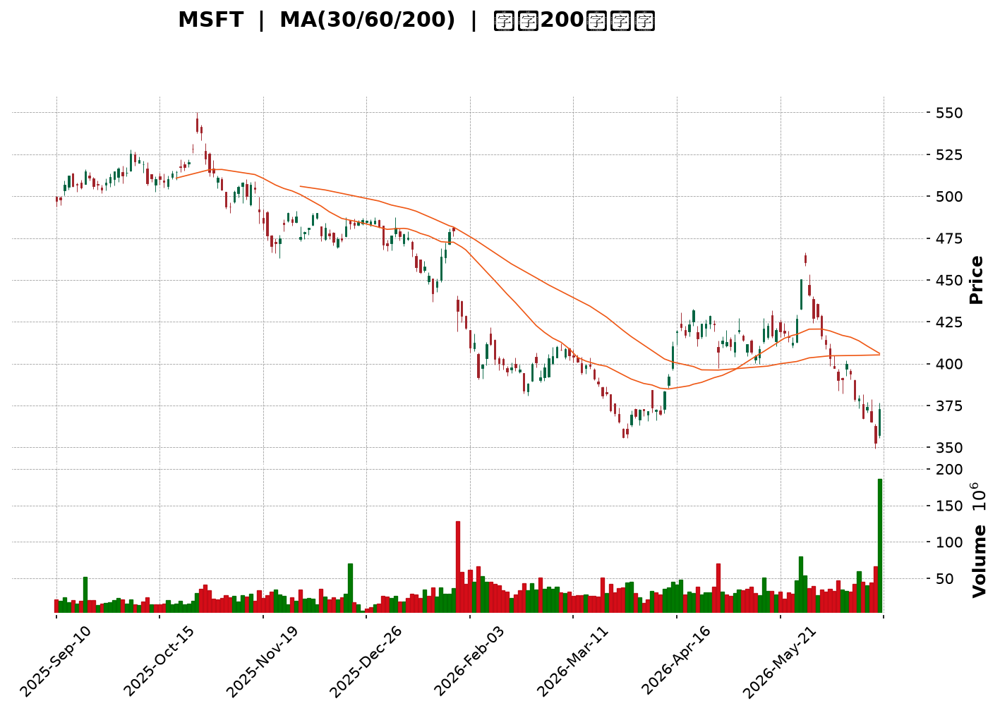
</details>

<html>
<head><meta charset="utf-8" /></head>
<body>
    <div style="height:500px; width:100%;">                        <script>window.PlotlyConfig = {MathJaxConfig: 'local'};</script>
        <script charset="utf-8" src="https://cdn.plot.ly/plotly-3.6.0.min.js" integrity="sha256-QaOVwtVY0T02VaHrr6pnoHLCwayMJp4O5n4YyaE3rJk=" crossorigin="anonymous"></script>                <div id="candlestick-chart" class="plotly-graph-div" style="height:100%; width:100%;"></div>            <script>                window.PLOTLYENV=window.PLOTLYENV || {};                                if (document.getElementById("candlestick-chart")) {                    Plotly.newPlot(                        "candlestick-chart",                        [{"close":{"dtype":"f8","bdata":"AAAAIIkTf0AAAAAgth1\u002fQAAAAGAOq39AAAAA4O4AgEAAAAAgYp1\u002fQAAAAMD2rH9AAAAAoACUf0AAAABAXRWAQAAAAABm839AAAAAYGegf0AAAADgB69\u002fQAAAAMBsfX9AAAAA4NvDf0AAAAAgyPV\u002fQAAAAOCFFYBAAAAAgIMjgEAAAABA9AOAQAAAAKDAEIBAAAAAwPJpgEAAAACAdUWAQAAAAOBfTIBAAAAAAOY4gEAAAADA6Lt\u002fQAAAAMAJ7X9AAAAAIGjlf0AAAABALuN\u002fQAAAAIA+xn9AAAAA4JDlf0AAAAAgTQyAQAAAAKA3E4BAAAAAwBwqgEAAAABgRSqAQAAAAGCEQoBAAAAAYGaBgEAAAACgRNWAQAAAAGAi0YBAAAAAIJxTgEAAAADgaBSAQAAAAIA1DoBAAAAAoH3xf0AAAAAAfn9\u002fQAAAAICL335AAAAA4BfbfkAAAACADG1\u002fQAAAAMCol39AAAAAgMW+f0AAAABA9kF\u002fQAAAAACCr39AAAAAAL2Ef0AAAAAg66p+QAAAAKDeQH5AAAAAAPHEfUAAAADgbWB9QAAAAEBgfn1AAAAA4ACufUAAAACAjzV+QAAAAEBCnX5AAAAA4E9JfkAAAADAPX1+QAAAAKDKuX1AAAAAwFTrfUAAAABASRB+QAAAACB9jX5AAAAA4GqdfkAAAABAA8d9QAAAAGA5FX5AAAAA4IjGfUAAAAAgcIt9QAAAAGBypH1AAAAAQCWgfUAAAAAgWR1+QAAAACBAPH5AAAAAYFIsfkAAAACAEEt+QAAAAICzXX5AAAAAYMNYfkAAAAAADE9+QAAAAIAZVX5AAAAAIJ0XfkAAAADAfW19QAAAAOAObH1AAAAAYDfGfUAAAABgORV+QAAAACDYv31AAAAAQHvSfUAAAADAB7F9QAAAACBVSX1AAAAAQH6VfEAAAACAKmp8QAAAAIAjnXxAAAAAABRIfEAAAACgQaJ7QAAAAOA8EnxAAAAAoCX+fEAAAADAHkN9QAAAAGAw531AAAAAQOr3fUAAAADAP\u002fl6QAAAAAAexnpAAAAAQONXekAAAACgMJZ5QAAAAKCoxXlAAAAAYMt+eEAAAADgyPV4QAAAAMBCvHlAAAAAAAG3eUAAAABAPCl5QAAAAEDvAHlAAAAA4Kb4eEAAAACgm7F4QAAAAABB3XhAAAAA4JTZeEAAAADA8cV4QAAAAKA5+ndAAAAAgIxCeEAAAABgv\u002ft4QAAAAAChDXlAAAAAYEJ+eEAAAACgBNt4QAAAAIDpMHlAAAAAQDBFeUAAAADArZx5QAAAAOA3gXlAAAAAIGeIeUAAAAAgIU55QAAAAGAUQHlAAAAAIN0PeUAAAABAH6t4QAAAAMBe8XhAAAAAoL\u002foeEAAAACgF294QAAAACDeQnhAAAAAILfQd0AAAACgweJ3QAAAAGDzPndAAAAAYM8jd0AAAACA3dJ2QAAAAKD7P3ZAAAAAgPJidkAAAACA6xV3QAAAAMAlCXdAAAAAIHJKd0AAAACgL0F3QAAAAEDEN3dAAAAAAFZYd0AAAABAOER3QAAAAIAYIXdAAAAAAKH4d0AAAACgKoR4QAAAAOBMpXlAAAAAwKA1ekAAAABABV56QAAAAOCpEnpAAAAAoORzekAAAAAAwP96QAAAAKCf7XlAAAAAoDx7ekAAAAAgbn56QAAAACAoxXpAAAAAoK54ekAAAAAgYW55QAAAAIC12HlAAAAAAJ7LeUAAAADg2qd5QAAAAKAL0XlAAAAAIMU9ekAAAADAkON5QAAAAGBKvHlAAAAAIDhueUAAAAAgWUV5QAAAAOC4iHlAAAAAYCFQekAAAACg\u002fml6QAAAAEBJCHpAAAAAYGZCekAAAACgcDF6QAAAAMAeKXpAAAAA4HoAekAAAABguMp5QAAAAADXr3pAAAAAANcjfEAAAADgUch8QAAAAMD1lHtAAAAAoHC1ekAAAADAzMB6QAAAAGC4CnpAAAAAANe7eUAAAABgjzZ5QAAAAIDC1XhAAAAAoHBleEAAAAAA12t4QAAAAAAp\u002fHhAAAAAoEedeEAAAABgj653QAAAAGBmtndAAAAAoHD1dkAAAABACl93QAAAACBc13ZAAAAAoEcNdkAAAAAghU93QA=="},"high":{"dtype":"f8","bdata":"hU6DBgJBf0DwX\u002fPRDUB\u002fQBKOg3Aw1X9AC3wZtc4BgED2SxWRzA+AQMZKCQMowX9AZgVXCHXdf0DN+LxXQSCAQD67o3jaE4BAnNbX1J\u002f1f0Cy0TJwE9R\u002fQFd7jA7OrH9Ag00yEkrrf0BvNO0PxwyAQK04OisxF4BAyS5XkN8pgEAl1df4iTKAQIyPQee2KYBARSMWK4F9gEAVYJ7cuXOAQOfEqq4RXYBAq\u002fzKvz1IgEBvEaWHR0KAQOTeIrVHCYBA6nm3JUwAgEBAxrcpew+AQNb\u002flDbHDIBAF2QAE+MBgEAcVNRBfBuAQGODZNlnG4BAKi01bWVPgEB0tltuOEWAQFYzs3JZUIBA6XN7z7mZgEDy++mX4TGBQGdw8Smo9oBAmiqda9OcgEAk0A4G6W+AQHO\u002fUuo\u002fTYBAh\u002fuvlnECgEDKzQypcPl\u002fQBlLpG9HaH9A+2xYossDf0AvOr02kHp\u002fQBE9y2hJpn9ACVF+tjLHf0AQ1IIvS+R\u002fQCC\u002fNsUVxn9AhOz\u002fJVrOf0DjNG96CD1\u002fQB+kG1ktwX5AqaH9jhu2fkB3mEJDv8x9QDpyL\u002faRrH1A5qQ+BmnQfUDxULM4UmJ+QBFqt30ip35AXj1jtwJ7fkChDuow\u002frR+QEKvokd9IX5A2nN+KPryfUCufk3kGxR+QKPLc8HgoX5AM3cUrwKffkAhidwrpiF+QPgcw6IAPn5AQe47EPoEfkCqq4Bba+l9QP+jpyJXvH1Am8oySvPdfUBZrRiR3nZ+QDSDmVP+Wn5AbDPF7wJpfkBviiW0rFp+QIZ9KEzcb35AokvsTUtffkCMfN9M9WJ+QKoRY6wkeH5ANK4AC51ffkBQxMEKLih+QAHTs4ZZn31AgijYMuHJfUAYriRddnh+QJZsZV9SCH5AtPeMURXbfUAqradPuO19QJ17NdS6mn1AHeKV1PwhfUD6F7ZKEeN8QPNy\u002fcYu0nxACNykeGVsfEAbiaWQ7Sp8QG2U7SBRLXxAMx72eS5QfUBk6vfHW4J9QBJN8amqC35AeoXuboYZfkC10\u002fFPnIh7QGE4Qa9qWntA8hza6UjNekCvSMll3EJ6QLchoT8FH3pAeiZJEtZneUBKkTxyIwB5QJXy4TLP0HlA\u002fHwBVdNcekCn\u002fuxS0el5QJfjkbJiRnlAT3ekXd87eUA97geJ6Ot4QMYtVF9nDHlAuVT+JuU4eUC3osuKFfR4QHEV1ZgWqHhA1j830EtIeEDrnmosowl5QEJPMcy\u002faXlAl7z7AWa\u002feEBzsCjBKgV5QGanivoiXXlALCL5Q0SieUBGdHDEhqt5QPT5QkuEwnlA3csPyyyVeUA4XjYSBJV5QIw9nVAEgnlA84YKauBTeUCgiupdzT55QFGY\u002f\u002fo5\u002fHhAmTGSc2o4eUBaD\u002fXGPNJ4QDjiQYhEenhALDCfNp4ieEDklYV7+CV4QPUh1V1L2ndAbZjO9euDd0AHYSkLkF53QF8O77eqmnZAW8JjOCDJdkDAH1BVgUF3QNGxS1roUndA1+0H6FFNd0DhZLW5wU53QLC4ZjVSOndA9mwl7K8CeEDSRZCxFUt3QCNraEZAbXdAkV653lf7d0Dn329jZJ14QFtJgV2X13lAYyLyipE+ekC2MHUwW+p6QE7m6S+kZnpAXOY1xBukekCAvVv4Mwx7QPU0Sfroa3pAw98ddIGAekA6dX2a\u002faJ6QDbtnJHaz3pAH+yuW1yeekCgwqTYY9h5QMVgTx1WA3pA6CgH\u002fu09ekBclLVyEf55QJojvmRAGHpAYL7ejOGwekCk\u002f7Ctmht6QM5UBPzEvHlAF6Qa0qHpeUC84TQD6VZ5QGqRguoyr3lAgYwtDOqzekA1wYBDOIN6QGSLqNw8\u002fHpAmssgCwFTekAAAACgcKV6QAAAAGBmhnpAAAAA4FE8ekAAAABACv95QAAAAADX13pAAAAAoEclfEAAAADAHiV9QAAAAAAAWHxAAAAAgD2Ge0AAAABgZkJ7QAAAACCF13pAAAAAYI8SekAAAAAgrr95QAAAAOCjUHlAAAAAoJnNeEAAAAAA13t4QAAAAAAAHHlAAAAAoHDNeEAAAACA62V4QAAAAIDr1XdAAAAAgBTad0AAAAAghZN3QAAAAIAUrndAAAAAIK7DdkAAAACAwol3QA=="},"hovertemplate":"\u003cb\u003e%{x|%Y-%m-%d}\u003c\u002fb\u003e\u003cbr\u003e\u958b: $%{open:.2f}\u003cbr\u003e\u9ad8: $%{high:.2f}\u003cbr\u003e\u4f4e: $%{low:.2f}\u003cbr\u003e\u6536: $%{close:.2f}\u003cextra\u003e\u003c\u002fextra\u003e","low":{"dtype":"f8","bdata":"vHie1oDZfkAopytP8ut+QIurRZTdSn9ACVYewPJ8f0B+W5Y3Y5Z\u002fQMsvOY7va39Avd1RHXGHf0C7fe9rk7F\u002fQJTxZ7wH1X9Aw\u002fVQfuCBf0DrO\u002fIirXt\u002fQPBjLwzJXX9AuDGMA+h2f0CTcxiT1pp\u002fQN3GRpI9p39AY7kbvoPHf0DaTSgvdbd\u002fQNvq4lMk\u002fH9AlykZqIIXgEC1K8ZcRDGAQF+lKy9iPoBApCcCciYRgEBIKrRow6Z\u002fQG9lyFdbx39A4pUPgwxtf0D+OMJqpax\u002fQB7+ezTqjn9AR\u002flQgOCBf0DyopZcLuN\u002fQAYQlNf63H9AHZqEeZ0TgECYLjvixBqAQJ4lxKB2K4BAmrDSOXJtgEDDw2wB78qAQOnU7h\u002fRqoBAB5dGSqw2gEDMg79bu\u002f1\u002fQAJl\u002fKWf9X9A\u002fADay02Kf0B1rZIzRXZ\u002fQONx5+AIy35AA9DMJlWifkA\u002fanrZkvp+QIHe1ksEM39ASQAfWan\u002ffkDD4CXOKSJ\u002fQDIEQGjz5H5A+iaq4bdbf0ACV57Tdjt+QBeKQFap\u002fH1AS65b9USWfUADol4qGiN9QCeMirgeH31AKXU3HEPtfEAhKRDWEPF9QD16E\u002fbgR35ATpg6NAUofkAcsdlTn0J+QFk8wrF9kX1A0suWHgqmfUAV0mcZHMx9QBj2a1S4I35ARtgi7FhlfkBjSSdSlI99QOmEZfIAnH1AEWocZaajfUAer48EzWZ9QPZyd2+tTH1AKUPCFk6OfUAMvuYXV7x9QHnT7wmdBX5AUuwOv8wIfkAP7EwxdCl+QDx4FC7jKn5AGimfJ+M8fkB66NqmiCB+QNK5+lSPNX5AQ2esL4QSfkDqjvdbNUF9QHepqxWyNn1AaUFjdK06fUAwegS+S719QBNmCfwAnH1Ax3EyMrRhfUCqX179Ipl9QE+dy7Yl\u002fnxA1MgMQkpyfECIkjlND158QJj7QYFMZ3xAmSDkJ5z0e0AThk\u002f7wkt7QGCpB5Onq3tAVYXLRoUIfEDwt6k8Or98QBeg4N7+cH1AhNR0qxe+fUCR3EJCdDJ6QGc\u002fjRvziHpAACa2FgxGekBvLphf+mt5QOJhNUTPdnlAai0VREppeEDNqAwG2XJ4QJTjg8x78XhA0+DCueyteUBWlTTEtvN4QEXAWy3tw3hAyjL9QZDEeEAwTtxPfox4QISCWbABqXhAWJpi+AC9eECPvv5S5aR4QIEHuEBa5HdAhT5SKCnOd0DM9SOLEVV4QNRKOkEN3nhAIU43MZlQeEDKhWJ8klx4QC0vh00kfXhA5DHYCR73eECWSM93ajh5QFNMv7sIenlAvVhLEQwqeUC7rkpt8iB5QHndyp+NC3lAW9zpE3gNeUCas\u002f4BXpZ4QHHpnQ39nnhA7hrw8T7OeEAj8k++emJ4QNhLv1mTI3hAzrzEnca0d0BuJFaPrs13QG0w4uC9MHdAXFJHe0wNd0DMtpiHacZ2QHo0Kg3VO3ZAbkJg+Sg4dkCtLAy6kKR2QJz4Ydt39nZAbjBXys61dkBaGswLOQt3QKKTS9lI3HZAM7wembcpd0Dm\u002f2KKG+R2QBVUj0+vE3dAPDUdjX0jd0AwU\u002fNV9Bp4QAFOHiX2vXhAu8FaIf2zeUBt8vU2fjx6QK0ZMYtn9nlA8dx6HMYEekCxHnPiEWx6QAetVWtVqHlAdc7c82vueUCCo+u6sgJ6QJOxnJDPT3pAk\u002fUZShs2ekBkkGO8ZdJ4QL0Uw+jYmHlAx4CwNpieeUC3OsD2qX55QJ6ky1fAQ3lAXP\u002fzCq4dekCD3Bsqr9F5QFa\u002f9mH6SXlAQuTEwC1ceUCtvovgnAJ5QGqvxM83AHlAZ4mWIkjAeUDYtqxyY+t5QLFdmxtw+XlAuDctxpOmeUAAAAAgXPt5QAAAAKBHBXpAAAAA4FHQeUAAAACgR5l5QAAAAGC4ynlAAAAAgMIFe0AAAADgUaR8QAAAAEDhhntAAAAAAACEekAAAABgj6Z6QAAAAGBm5nlAAAAAwPWIeUAAAAAgrud4QAAAAGCP0nhAAAAAAAAAeEAAAADgUeR3QAAAAKCZjXhAAAAAQApreEAAAADAHpV3QAAAAOB6VHdAAAAAwB7xdkAAAABguCp3QAAAAOB6zHZAAAAAQDPTdUAAAABA4TZ2QA=="},"name":"\u50f9\u683c","open":{"dtype":"f8","bdata":"7rpIeAg9f0A3ujIpbTF\u002fQE5h9yZid39AIZ26e2iZf0B3BNVTBA2AQLacguiAtn9A4sD6AlbEf0Ao9DL6jLV\u002fQHOifg7DAoBA8yNfMhDpf0AQwiISsLJ\u002fQHuKMOOdkX9AV8itlpmtf0DFH0mJfsR\u002fQNOMueko4H9AjSWKEvb4f0BVWtMCDxOAQLNp5djDDoBA3Eth\u002f8QagEAPF\u002ffSuGeAQEPVO9zkP4BA0tH35Ws4gEA5N90v9SKAQOTeIrVHCYBAopLkmE2wf0AlHzvPgft\u002fQNQMvL6q1X9AAvzYB2Kdf0AzCc0x8fV\u002fQKPb1Q\u002fyEYBAbZgiQ\u002fYugEAgMrUiYDmAQJmftZH\u002fO4BAK9EXhneDgEB3bEkKTxSBQPkmbG4V7IBAJitlyiF5gEDzD9+RaWyAQIHiQgtPJIBAqzKPH6HIf0CXwNEZHeF\u002fQPeUqZekZ39ANQgWBindfkDZcnoCSg5\u002fQLlxT0T4WX9AqC+QYniif0BqupIqk7F\u002fQMkU6+qC8X5A5uSwgACUf0ABnooFCsR+QCnyke4\u002fcH5AC\u002f8mjWiofkBFb96DDsZ9QP2uFhdOjn1AaO\u002fcpn1\u002ffUCyPW6KdkJ+QG8VlfUCV35AGtfGQGRkfkD+eVNw\u002fkh+QPIQ\u002ftpUo31ALhW2vCDafUAAxmFfFwZ+QMXlcxHYK35AS\u002fXBpudufkDt6J4KJR5+QEUWovZEqH1Ah8rfUhXbfUD4sMwdi999QD\u002fNG5sVXX1AoNlRx7qsfUAsRUhlHsF9QMP0qxkwU35AFjFttW8\u002ffkBwa3b1Ri1+QI9Fd15tOH5ADzztiNVIfkBe1aKNXSt+QJme9sVoPH5Aqu2\u002fndVafkBObOkR4SN+QJ\u002fi7gZVf31AX9RoqDB7fUCWR3mfINp9QOFs58iz8X1ACnZM61R\u002ffUBJT9ki6Kh9QAblBS41iX1A9cLITUUGfUCo+Rcn\u002f+B8QEN+UX3NfHxA9egfLYMTfEBIDweTfil8QKtdRswq2ntAdcU5kd0dfEAalOfg8\u002fN8QAhObPCYeX1AZRTVLhURfkBFcrfkoGB7QKN5OT6RU3tAwHNJ\u002flHFekAXBKRfOUJ6QD6REE7YknlAPvVLMCNaeUCf9luGZ9Z4QL422qXhMHlAOh2ATyccekAZC5yIW+V5QCg7WT1FM3lATsLsiIIqeUByUolkM9d4QPBK35HWxXhApnltQi\u002f9eEBHDCwKELR4QJP+o0hXonhAIlyABfX0d0AWRKjE+Vp4QHBWKIhdPXlAioMLV5BgeEBg+sS+LIB4QKKMZ0SlhHhAhSZLqnEGeUA28nBKvDh5QJDNEOAMhXlAHtM\u002f37dAeUB4wH0zTZJ5QI5aUoQYS3lAnHOhmhY8eUCT01ZBIgJ5QKMceeRa03hABOsUg3r2eEA13Ij6WMR4QDMMdVAcVHhAtKN+8kMfeEAAQHoIIPF3QDmUJreJ2HdAuiwI06+Bd0AA8yQxTCB3QIGUYrbikXZAR2JkueKRdkDJ6hygMbx2QC+7YcfsSndA+iTEc6nmdkB7T6W57Ep3QHdFGUOiGHdA0L1xOV4CeECqwLuLHjt3QIzPYXLIQndA\u002fVjLP9dMd0C1WkdxTjF4QP7rE8c80nhALMuGyj0vekB4+68nbn56QOAzLjzWQ3pA3WBk8041ekDfmJ9zTZR6QMeN3Xm4L3pA2hVi+BkBekDXJH55eVd6QI9A0U1wenpAxIgQEJl6ekDXSYctwZ55QOPrlYSGvnlApUioyWiqeUC+Y0s\u002fwuZ5QG4feULkcXlAqxOulzszekC6B7unzgd6QN3NF+fQb3lAgk+f+VjZeUAk7\u002fAKQiV5QIhLhpGxOXlA+9OSmP7VeUDzltWBg\u002ft5QK9WBsaIz3pArK4c\u002fmXUeUAAAAAAAIx6QAAAAOCjOHpAAAAAQOEGekAAAAAAKbB5QAAAACCuz3lAAAAAwMwIe0AAAACgcA19QAAAAIAU7ntAAAAAQDNne0AAAADA9Tx7QAAAAKBwxXpAAAAAgD3ieUAAAADgepB5QAAAAMDM6HhAAAAAIFyzeEAAAABA4XZ4QAAAAMDMzHhAAAAA4KO8eEAAAAAAAGR4QAAAAMAenXdAAAAAANd7d0AAAACAFEZ3QAAAAMAeOXdAAAAA4FGsdkAAAABgZlJ2QA=="},"x":["2025-09-10T00:00:00-04:00","2025-09-11T00:00:00-04:00","2025-09-12T00:00:00-04:00","2025-09-15T00:00:00-04:00","2025-09-16T00:00:00-04:00","2025-09-17T00:00:00-04:00","2025-09-18T00:00:00-04:00","2025-09-19T00:00:00-04:00","2025-09-22T00:00:00-04:00","2025-09-23T00:00:00-04:00","2025-09-24T00:00:00-04:00","2025-09-25T00:00:00-04:00","2025-09-26T00:00:00-04:00","2025-09-29T00:00:00-04:00","2025-09-30T00:00:00-04:00","2025-10-01T00:00:00-04:00","2025-10-02T00:00:00-04:00","2025-10-03T00:00:00-04:00","2025-10-06T00:00:00-04:00","2025-10-07T00:00:00-04:00","2025-10-08T00:00:00-04:00","2025-10-09T00:00:00-04:00","2025-10-10T00:00:00-04:00","2025-10-13T00:00:00-04:00","2025-10-14T00:00:00-04:00","2025-10-15T00:00:00-04:00","2025-10-16T00:00:00-04:00","2025-10-17T00:00:00-04:00","2025-10-20T00:00:00-04:00","2025-10-21T00:00:00-04:00","2025-10-22T00:00:00-04:00","2025-10-23T00:00:00-04:00","2025-10-24T00:00:00-04:00","2025-10-27T00:00:00-04:00","2025-10-28T00:00:00-04:00","2025-10-29T00:00:00-04:00","2025-10-30T00:00:00-04:00","2025-10-31T00:00:00-04:00","2025-11-03T00:00:00-05:00","2025-11-04T00:00:00-05:00","2025-11-05T00:00:00-05:00","2025-11-06T00:00:00-05:00","2025-11-07T00:00:00-05:00","2025-11-10T00:00:00-05:00","2025-11-11T00:00:00-05:00","2025-11-12T00:00:00-05:00","2025-11-13T00:00:00-05:00","2025-11-14T00:00:00-05:00","2025-11-17T00:00:00-05:00","2025-11-18T00:00:00-05:00","2025-11-19T00:00:00-05:00","2025-11-20T00:00:00-05:00","2025-11-21T00:00:00-05:00","2025-11-24T00:00:00-05:00","2025-11-25T00:00:00-05:00","2025-11-26T00:00:00-05:00","2025-11-28T00:00:00-05:00","2025-12-01T00:00:00-05:00","2025-12-02T00:00:00-05:00","2025-12-03T00:00:00-05:00","2025-12-04T00:00:00-05:00","2025-12-05T00:00:00-05:00","2025-12-08T00:00:00-05:00","2025-12-09T00:00:00-05:00","2025-12-10T00:00:00-05:00","2025-12-11T00:00:00-05:00","2025-12-12T00:00:00-05:00","2025-12-15T00:00:00-05:00","2025-12-16T00:00:00-05:00","2025-12-17T00:00:00-05:00","2025-12-18T00:00:00-05:00","2025-12-19T00:00:00-05:00","2025-12-22T00:00:00-05:00","2025-12-23T00:00:00-05:00","2025-12-24T00:00:00-05:00","2025-12-26T00:00:00-05:00","2025-12-29T00:00:00-05:00","2025-12-30T00:00:00-05:00","2025-12-31T00:00:00-05:00","2026-01-02T00:00:00-05:00","2026-01-05T00:00:00-05:00","2026-01-06T00:00:00-05:00","2026-01-07T00:00:00-05:00","2026-01-08T00:00:00-05:00","2026-01-09T00:00:00-05:00","2026-01-12T00:00:00-05:00","2026-01-13T00:00:00-05:00","2026-01-14T00:00:00-05:00","2026-01-15T00:00:00-05:00","2026-01-16T00:00:00-05:00","2026-01-20T00:00:00-05:00","2026-01-21T00:00:00-05:00","2026-01-22T00:00:00-05:00","2026-01-23T00:00:00-05:00","2026-01-26T00:00:00-05:00","2026-01-27T00:00:00-05:00","2026-01-28T00:00:00-05:00","2026-01-29T00:00:00-05:00","2026-01-30T00:00:00-05:00","2026-02-02T00:00:00-05:00","2026-02-03T00:00:00-05:00","2026-02-04T00:00:00-05:00","2026-02-05T00:00:00-05:00","2026-02-06T00:00:00-05:00","2026-02-09T00:00:00-05:00","2026-02-10T00:00:00-05:00","2026-02-11T00:00:00-05:00","2026-02-12T00:00:00-05:00","2026-02-13T00:00:00-05:00","2026-02-17T00:00:00-05:00","2026-02-18T00:00:00-05:00","2026-02-19T00:00:00-05:00","2026-02-20T00:00:00-05:00","2026-02-23T00:00:00-05:00","2026-02-24T00:00:00-05:00","2026-02-25T00:00:00-05:00","2026-02-26T00:00:00-05:00","2026-02-27T00:00:00-05:00","2026-03-02T00:00:00-05:00","2026-03-03T00:00:00-05:00","2026-03-04T00:00:00-05:00","2026-03-05T00:00:00-05:00","2026-03-06T00:00:00-05:00","2026-03-09T00:00:00-04:00","2026-03-10T00:00:00-04:00","2026-03-11T00:00:00-04:00","2026-03-12T00:00:00-04:00","2026-03-13T00:00:00-04:00","2026-03-16T00:00:00-04:00","2026-03-17T00:00:00-04:00","2026-03-18T00:00:00-04:00","2026-03-19T00:00:00-04:00","2026-03-20T00:00:00-04:00","2026-03-23T00:00:00-04:00","2026-03-24T00:00:00-04:00","2026-03-25T00:00:00-04:00","2026-03-26T00:00:00-04:00","2026-03-27T00:00:00-04:00","2026-03-30T00:00:00-04:00","2026-03-31T00:00:00-04:00","2026-04-01T00:00:00-04:00","2026-04-02T00:00:00-04:00","2026-04-06T00:00:00-04:00","2026-04-07T00:00:00-04:00","2026-04-08T00:00:00-04:00","2026-04-09T00:00:00-04:00","2026-04-10T00:00:00-04:00","2026-04-13T00:00:00-04:00","2026-04-14T00:00:00-04:00","2026-04-15T00:00:00-04:00","2026-04-16T00:00:00-04:00","2026-04-17T00:00:00-04:00","2026-04-20T00:00:00-04:00","2026-04-21T00:00:00-04:00","2026-04-22T00:00:00-04:00","2026-04-23T00:00:00-04:00","2026-04-24T00:00:00-04:00","2026-04-27T00:00:00-04:00","2026-04-28T00:00:00-04:00","2026-04-29T00:00:00-04:00","2026-04-30T00:00:00-04:00","2026-05-01T00:00:00-04:00","2026-05-04T00:00:00-04:00","2026-05-05T00:00:00-04:00","2026-05-06T00:00:00-04:00","2026-05-07T00:00:00-04:00","2026-05-08T00:00:00-04:00","2026-05-11T00:00:00-04:00","2026-05-12T00:00:00-04:00","2026-05-13T00:00:00-04:00","2026-05-14T00:00:00-04:00","2026-05-15T00:00:00-04:00","2026-05-18T00:00:00-04:00","2026-05-19T00:00:00-04:00","2026-05-20T00:00:00-04:00","2026-05-21T00:00:00-04:00","2026-05-22T00:00:00-04:00","2026-05-26T00:00:00-04:00","2026-05-27T00:00:00-04:00","2026-05-28T00:00:00-04:00","2026-05-29T00:00:00-04:00","2026-06-01T00:00:00-04:00","2026-06-02T00:00:00-04:00","2026-06-03T00:00:00-04:00","2026-06-04T00:00:00-04:00","2026-06-05T00:00:00-04:00","2026-06-08T00:00:00-04:00","2026-06-09T00:00:00-04:00","2026-06-10T00:00:00-04:00","2026-06-11T00:00:00-04:00","2026-06-12T00:00:00-04:00","2026-06-15T00:00:00-04:00","2026-06-16T00:00:00-04:00","2026-06-17T00:00:00-04:00","2026-06-18T00:00:00-04:00","2026-06-22T00:00:00-04:00","2026-06-23T00:00:00-04:00","2026-06-24T00:00:00-04:00","2026-06-25T00:00:00-04:00","2026-06-26T00:00:00-04:00"],"type":"candlestick"},{"hovertemplate":"MA30: $%{y:.2f}\u003cextra\u003e\u003c\u002fextra\u003e","line":{"color":"#2196F3","dash":"dash","width":2},"mode":"lines","name":"MA30","x":["2025-09-10T00:00:00-04:00","2025-09-11T00:00:00-04:00","2025-09-12T00:00:00-04:00","2025-09-15T00:00:00-04:00","2025-09-16T00:00:00-04:00","2025-09-17T00:00:00-04:00","2025-09-18T00:00:00-04:00","2025-09-19T00:00:00-04:00","2025-09-22T00:00:00-04:00","2025-09-23T00:00:00-04:00","2025-09-24T00:00:00-04:00","2025-09-25T00:00:00-04:00","2025-09-26T00:00:00-04:00","2025-09-29T00:00:00-04:00","2025-09-30T00:00:00-04:00","2025-10-01T00:00:00-04:00","2025-10-02T00:00:00-04:00","2025-10-03T00:00:00-04:00","2025-10-06T00:00:00-04:00","2025-10-07T00:00:00-04:00","2025-10-08T00:00:00-04:00","2025-10-09T00:00:00-04:00","2025-10-10T00:00:00-04:00","2025-10-13T00:00:00-04:00","2025-10-14T00:00:00-04:00","2025-10-15T00:00:00-04:00","2025-10-16T00:00:00-04:00","2025-10-17T00:00:00-04:00","2025-10-20T00:00:00-04:00","2025-10-21T00:00:00-04:00","2025-10-22T00:00:00-04:00","2025-10-23T00:00:00-04:00","2025-10-24T00:00:00-04:00","2025-10-27T00:00:00-04:00","2025-10-28T00:00:00-04:00","2025-10-29T00:00:00-04:00","2025-10-30T00:00:00-04:00","2025-10-31T00:00:00-04:00","2025-11-03T00:00:00-05:00","2025-11-04T00:00:00-05:00","2025-11-05T00:00:00-05:00","2025-11-06T00:00:00-05:00","2025-11-07T00:00:00-05:00","2025-11-10T00:00:00-05:00","2025-11-11T00:00:00-05:00","2025-11-12T00:00:00-05:00","2025-11-13T00:00:00-05:00","2025-11-14T00:00:00-05:00","2025-11-17T00:00:00-05:00","2025-11-18T00:00:00-05:00","2025-11-19T00:00:00-05:00","2025-11-20T00:00:00-05:00","2025-11-21T00:00:00-05:00","2025-11-24T00:00:00-05:00","2025-11-25T00:00:00-05:00","2025-11-26T00:00:00-05:00","2025-11-28T00:00:00-05:00","2025-12-01T00:00:00-05:00","2025-12-02T00:00:00-05:00","2025-12-03T00:00:00-05:00","2025-12-04T00:00:00-05:00","2025-12-05T00:00:00-05:00","2025-12-08T00:00:00-05:00","2025-12-09T00:00:00-05:00","2025-12-10T00:00:00-05:00","2025-12-11T00:00:00-05:00","2025-12-12T00:00:00-05:00","2025-12-15T00:00:00-05:00","2025-12-16T00:00:00-05:00","2025-12-17T00:00:00-05:00","2025-12-18T00:00:00-05:00","2025-12-19T00:00:00-05:00","2025-12-22T00:00:00-05:00","2025-12-23T00:00:00-05:00","2025-12-24T00:00:00-05:00","2025-12-26T00:00:00-05:00","2025-12-29T00:00:00-05:00","2025-12-30T00:00:00-05:00","2025-12-31T00:00:00-05:00","2026-01-02T00:00:00-05:00","2026-01-05T00:00:00-05:00","2026-01-06T00:00:00-05:00","2026-01-07T00:00:00-05:00","2026-01-08T00:00:00-05:00","2026-01-09T00:00:00-05:00","2026-01-12T00:00:00-05:00","2026-01-13T00:00:00-05:00","2026-01-14T00:00:00-05:00","2026-01-15T00:00:00-05:00","2026-01-16T00:00:00-05:00","2026-01-20T00:00:00-05:00","2026-01-21T00:00:00-05:00","2026-01-22T00:00:00-05:00","2026-01-23T00:00:00-05:00","2026-01-26T00:00:00-05:00","2026-01-27T00:00:00-05:00","2026-01-28T00:00:00-05:00","2026-01-29T00:00:00-05:00","2026-01-30T00:00:00-05:00","2026-02-02T00:00:00-05:00","2026-02-03T00:00:00-05:00","2026-02-04T00:00:00-05:00","2026-02-05T00:00:00-05:00","2026-02-06T00:00:00-05:00","2026-02-09T00:00:00-05:00","2026-02-10T00:00:00-05:00","2026-02-11T00:00:00-05:00","2026-02-12T00:00:00-05:00","2026-02-13T00:00:00-05:00","2026-02-17T00:00:00-05:00","2026-02-18T00:00:00-05:00","2026-02-19T00:00:00-05:00","2026-02-20T00:00:00-05:00","2026-02-23T00:00:00-05:00","2026-02-24T00:00:00-05:00","2026-02-25T00:00:00-05:00","2026-02-26T00:00:00-05:00","2026-02-27T00:00:00-05:00","2026-03-02T00:00:00-05:00","2026-03-03T00:00:00-05:00","2026-03-04T00:00:00-05:00","2026-03-05T00:00:00-05:00","2026-03-06T00:00:00-05:00","2026-03-09T00:00:00-04:00","2026-03-10T00:00:00-04:00","2026-03-11T00:00:00-04:00","2026-03-12T00:00:00-04:00","2026-03-13T00:00:00-04:00","2026-03-16T00:00:00-04:00","2026-03-17T00:00:00-04:00","2026-03-18T00:00:00-04:00","2026-03-19T00:00:00-04:00","2026-03-20T00:00:00-04:00","2026-03-23T00:00:00-04:00","2026-03-24T00:00:00-04:00","2026-03-25T00:00:00-04:00","2026-03-26T00:00:00-04:00","2026-03-27T00:00:00-04:00","2026-03-30T00:00:00-04:00","2026-03-31T00:00:00-04:00","2026-04-01T00:00:00-04:00","2026-04-02T00:00:00-04:00","2026-04-06T00:00:00-04:00","2026-04-07T00:00:00-04:00","2026-04-08T00:00:00-04:00","2026-04-09T00:00:00-04:00","2026-04-10T00:00:00-04:00","2026-04-13T00:00:00-04:00","2026-04-14T00:00:00-04:00","2026-04-15T00:00:00-04:00","2026-04-16T00:00:00-04:00","2026-04-17T00:00:00-04:00","2026-04-20T00:00:00-04:00","2026-04-21T00:00:00-04:00","2026-04-22T00:00:00-04:00","2026-04-23T00:00:00-04:00","2026-04-24T00:00:00-04:00","2026-04-27T00:00:00-04:00","2026-04-28T00:00:00-04:00","2026-04-29T00:00:00-04:00","2026-04-30T00:00:00-04:00","2026-05-01T00:00:00-04:00","2026-05-04T00:00:00-04:00","2026-05-05T00:00:00-04:00","2026-05-06T00:00:00-04:00","2026-05-07T00:00:00-04:00","2026-05-08T00:00:00-04:00","2026-05-11T00:00:00-04:00","2026-05-12T00:00:00-04:00","2026-05-13T00:00:00-04:00","2026-05-14T00:00:00-04:00","2026-05-15T00:00:00-04:00","2026-05-18T00:00:00-04:00","2026-05-19T00:00:00-04:00","2026-05-20T00:00:00-04:00","2026-05-21T00:00:00-04:00","2026-05-22T00:00:00-04:00","2026-05-26T00:00:00-04:00","2026-05-27T00:00:00-04:00","2026-05-28T00:00:00-04:00","2026-05-29T00:00:00-04:00","2026-06-01T00:00:00-04:00","2026-06-02T00:00:00-04:00","2026-06-03T00:00:00-04:00","2026-06-04T00:00:00-04:00","2026-06-05T00:00:00-04:00","2026-06-08T00:00:00-04:00","2026-06-09T00:00:00-04:00","2026-06-10T00:00:00-04:00","2026-06-11T00:00:00-04:00","2026-06-12T00:00:00-04:00","2026-06-15T00:00:00-04:00","2026-06-16T00:00:00-04:00","2026-06-17T00:00:00-04:00","2026-06-18T00:00:00-04:00","2026-06-22T00:00:00-04:00","2026-06-23T00:00:00-04:00","2026-06-24T00:00:00-04:00","2026-06-25T00:00:00-04:00","2026-06-26T00:00:00-04:00"],"y":{"dtype":"f8","bdata":"AAAAAAAA+H8AAAAAAAD4fwAAAAAAAPh\u002fAAAAAAAA+H8AAAAAAAD4fwAAAAAAAPh\u002fAAAAAAAA+H8AAAAAAAD4fwAAAAAAAPh\u002fAAAAAAAA+H8AAAAAAAD4fwAAAAAAAPh\u002fAAAAAAAA+H8AAAAAAAD4fwAAAAAAAPh\u002fAAAAAAAA+H8AAAAAAAD4fwAAAAAAAPh\u002fAAAAAAAA+H8AAAAAAAD4fwAAAAAAAPh\u002fAAAAAAAA+H8AAAAAAAD4fwAAAAAAAPh\u002fAAAAAAAA+H8AAAAAAAD4fwAAAAAAAPh\u002fAAAAAAAA+H8AAAAAAAD4fwAAABDh7H9AvLu7m5H3f0C8u7sD9wCAQN7d3Q2ZBIBA3t3dTeEIgEDNzMz0oRGAQDMzM9v8GYBA3t3dHZMegECJiIj4ih6AQM3MzPw5H4BAVVVV9ZMggECJiIggyR+AQJqZmYEnHYBAd3d3X0YZgECrqqr6\u002fhaAQBERESGKFIBAVVVVxUQSgEAzMzMz+A6AQAAAANARDYBA3t3dzXsHgEDNzMyc9\u002f5\u002fQERERKT46n9Aq6qqiiTUf0CJiIjYBsB\u002fQGZmZnZFq39A7+7unluYf0B3d3eHCYp\u002fQBEREUEjgH9Aq6qqWmVyf0AiIiISr2R\u002fQKuqqur+T39AIiIiwm47f0De3d09Fyh\u002fQCIiIlJOF39AAAAAINwCf0De3d39rOF+QAAAANBfw35A7+7ubtGqfkARERFhgZR+QO\u002fu7o5wf35AiYiIWKlrfkARERFR219+QO\u002fu7t5pWn5AzczMfJZUfkBERET060p+QImIiNh0QH5Ad3d314U0fkB3d3f3bCx+QDMzM\u002fPgIH5AiYiIOLUUfkAiIiKCIAp+QERERIQIA35AVVVVZRMDfkDe3d0tGgl+QHd3d9dIC35A7+7uHoAMfkAiIiIyFQh+QN7d3X3A\u002fH1AERERgTnufUCamZmphdx9QAAAAKAI031AAAAAAA\u002fFfUAzMzMDU7B9QERERDQmm31AAAAAkE6NfUBEREQU6Yh9QO\u002fu7j5gh31AAAAAoAWJfUBEREQUFXN9QM3MzMyaWn1AmpmZmZg+fUDe3d0d9Rd9QAAAAADf8XxAERERkWvBfEDe3d0t6ZN8QLy7u2tlbHxAERER8d5EfEDe3d2d8Rh8QN7d3b1463tA3t3d3cW\u002fe0BmZmZ2YJd7QLy7u7t7cHtAERERUXZGe0AREREhJxl7QM3MzBzm53pAiYiIOG+4ekBEREQkQpB6QJqZmYkibHpAREREJDpJekAzMzMD2yp6QBEREeGlDXpA7+7unvPzeUBVVVX1suJ5QERERGTMzHlAq6qqCkaveUCrqqragY15QImIiLjNZXlAq6qqau87eUCrqqqqQyh5QBEREbGjGHlAVVVVxWYMeUCrqqqakAJ5QM3MzPyr9XhAMzMzg97veECrqqqas+Z4QJqZmTl10XhAq6qqGny7eEAzMzMDiqd4QM3MzGwKkHhAERER4ft5eEDv7u7OQmx4QM3MzEyoXHhAd3d3V1pPeEAAAADwZEJ4QO\u002fu7o7pO3hAERER8Ro0eEDe3d1NdCV4QKuqqloJFXhAq6qqCpUQeECJiIjorw14QGZmZhaREXhAZmZm1pQZeEAAAACwBiB4QCIiItLfJHhAZmZmVrkseEARERGRLTt4QJqZmXn2QHhAIiIiQhNNeEBERET0plx4QLy7u7s+bHhAAAAAgJN5eEAzMzPzFYJ4QBERESGdj3hAERERsYKgeEAiIiIina94QAAAAOCMxXhAAAAAAATgeEC8u7sbLPp4QHd3d3fqF3lAERERQeQxeUCrqqoKikR5QO\u002fu7r7bWXlAq6qq2qVzeUAAAACwm455QO\u002fu7h6gpnlAiYiIiH6\u002feUARERHhd9h5QERERPRV8nlAREREBKoDekC8u7ubjA56QERERBRvF3pAq6qqWugnekAiIiKChDx6QHd3d+dkSXpAzczMPJRLekAAAAAQe0l6QKuqqlpzSnpAmpmZGRJEekBmZmZGJDl6QDMzM+OgKHpA7+7unusWekCrqqpqTQ56QGZmZmbzBnpAREREdN\u002f8eUCrqqqaB+x5QJqZmSkT2nlAiYiIWBC+eUBVVVVllKh5QJqZmcnhj3lAiYiI+AxzeUBERES0UmJ5QA=="},"type":"scatter"},{"hovertemplate":"MA60: $%{y:.2f}\u003cextra\u003e\u003c\u002fextra\u003e","line":{"color":"#9C27B0","dash":"dash","width":2},"mode":"lines","name":"MA60","x":["2025-09-10T00:00:00-04:00","2025-09-11T00:00:00-04:00","2025-09-12T00:00:00-04:00","2025-09-15T00:00:00-04:00","2025-09-16T00:00:00-04:00","2025-09-17T00:00:00-04:00","2025-09-18T00:00:00-04:00","2025-09-19T00:00:00-04:00","2025-09-22T00:00:00-04:00","2025-09-23T00:00:00-04:00","2025-09-24T00:00:00-04:00","2025-09-25T00:00:00-04:00","2025-09-26T00:00:00-04:00","2025-09-29T00:00:00-04:00","2025-09-30T00:00:00-04:00","2025-10-01T00:00:00-04:00","2025-10-02T00:00:00-04:00","2025-10-03T00:00:00-04:00","2025-10-06T00:00:00-04:00","2025-10-07T00:00:00-04:00","2025-10-08T00:00:00-04:00","2025-10-09T00:00:00-04:00","2025-10-10T00:00:00-04:00","2025-10-13T00:00:00-04:00","2025-10-14T00:00:00-04:00","2025-10-15T00:00:00-04:00","2025-10-16T00:00:00-04:00","2025-10-17T00:00:00-04:00","2025-10-20T00:00:00-04:00","2025-10-21T00:00:00-04:00","2025-10-22T00:00:00-04:00","2025-10-23T00:00:00-04:00","2025-10-24T00:00:00-04:00","2025-10-27T00:00:00-04:00","2025-10-28T00:00:00-04:00","2025-10-29T00:00:00-04:00","2025-10-30T00:00:00-04:00","2025-10-31T00:00:00-04:00","2025-11-03T00:00:00-05:00","2025-11-04T00:00:00-05:00","2025-11-05T00:00:00-05:00","2025-11-06T00:00:00-05:00","2025-11-07T00:00:00-05:00","2025-11-10T00:00:00-05:00","2025-11-11T00:00:00-05:00","2025-11-12T00:00:00-05:00","2025-11-13T00:00:00-05:00","2025-11-14T00:00:00-05:00","2025-11-17T00:00:00-05:00","2025-11-18T00:00:00-05:00","2025-11-19T00:00:00-05:00","2025-11-20T00:00:00-05:00","2025-11-21T00:00:00-05:00","2025-11-24T00:00:00-05:00","2025-11-25T00:00:00-05:00","2025-11-26T00:00:00-05:00","2025-11-28T00:00:00-05:00","2025-12-01T00:00:00-05:00","2025-12-02T00:00:00-05:00","2025-12-03T00:00:00-05:00","2025-12-04T00:00:00-05:00","2025-12-05T00:00:00-05:00","2025-12-08T00:00:00-05:00","2025-12-09T00:00:00-05:00","2025-12-10T00:00:00-05:00","2025-12-11T00:00:00-05:00","2025-12-12T00:00:00-05:00","2025-12-15T00:00:00-05:00","2025-12-16T00:00:00-05:00","2025-12-17T00:00:00-05:00","2025-12-18T00:00:00-05:00","2025-12-19T00:00:00-05:00","2025-12-22T00:00:00-05:00","2025-12-23T00:00:00-05:00","2025-12-24T00:00:00-05:00","2025-12-26T00:00:00-05:00","2025-12-29T00:00:00-05:00","2025-12-30T00:00:00-05:00","2025-12-31T00:00:00-05:00","2026-01-02T00:00:00-05:00","2026-01-05T00:00:00-05:00","2026-01-06T00:00:00-05:00","2026-01-07T00:00:00-05:00","2026-01-08T00:00:00-05:00","2026-01-09T00:00:00-05:00","2026-01-12T00:00:00-05:00","2026-01-13T00:00:00-05:00","2026-01-14T00:00:00-05:00","2026-01-15T00:00:00-05:00","2026-01-16T00:00:00-05:00","2026-01-20T00:00:00-05:00","2026-01-21T00:00:00-05:00","2026-01-22T00:00:00-05:00","2026-01-23T00:00:00-05:00","2026-01-26T00:00:00-05:00","2026-01-27T00:00:00-05:00","2026-01-28T00:00:00-05:00","2026-01-29T00:00:00-05:00","2026-01-30T00:00:00-05:00","2026-02-02T00:00:00-05:00","2026-02-03T00:00:00-05:00","2026-02-04T00:00:00-05:00","2026-02-05T00:00:00-05:00","2026-02-06T00:00:00-05:00","2026-02-09T00:00:00-05:00","2026-02-10T00:00:00-05:00","2026-02-11T00:00:00-05:00","2026-02-12T00:00:00-05:00","2026-02-13T00:00:00-05:00","2026-02-17T00:00:00-05:00","2026-02-18T00:00:00-05:00","2026-02-19T00:00:00-05:00","2026-02-20T00:00:00-05:00","2026-02-23T00:00:00-05:00","2026-02-24T00:00:00-05:00","2026-02-25T00:00:00-05:00","2026-02-26T00:00:00-05:00","2026-02-27T00:00:00-05:00","2026-03-02T00:00:00-05:00","2026-03-03T00:00:00-05:00","2026-03-04T00:00:00-05:00","2026-03-05T00:00:00-05:00","2026-03-06T00:00:00-05:00","2026-03-09T00:00:00-04:00","2026-03-10T00:00:00-04:00","2026-03-11T00:00:00-04:00","2026-03-12T00:00:00-04:00","2026-03-13T00:00:00-04:00","2026-03-16T00:00:00-04:00","2026-03-17T00:00:00-04:00","2026-03-18T00:00:00-04:00","2026-03-19T00:00:00-04:00","2026-03-20T00:00:00-04:00","2026-03-23T00:00:00-04:00","2026-03-24T00:00:00-04:00","2026-03-25T00:00:00-04:00","2026-03-26T00:00:00-04:00","2026-03-27T00:00:00-04:00","2026-03-30T00:00:00-04:00","2026-03-31T00:00:00-04:00","2026-04-01T00:00:00-04:00","2026-04-02T00:00:00-04:00","2026-04-06T00:00:00-04:00","2026-04-07T00:00:00-04:00","2026-04-08T00:00:00-04:00","2026-04-09T00:00:00-04:00","2026-04-10T00:00:00-04:00","2026-04-13T00:00:00-04:00","2026-04-14T00:00:00-04:00","2026-04-15T00:00:00-04:00","2026-04-16T00:00:00-04:00","2026-04-17T00:00:00-04:00","2026-04-20T00:00:00-04:00","2026-04-21T00:00:00-04:00","2026-04-22T00:00:00-04:00","2026-04-23T00:00:00-04:00","2026-04-24T00:00:00-04:00","2026-04-27T00:00:00-04:00","2026-04-28T00:00:00-04:00","2026-04-29T00:00:00-04:00","2026-04-30T00:00:00-04:00","2026-05-01T00:00:00-04:00","2026-05-04T00:00:00-04:00","2026-05-05T00:00:00-04:00","2026-05-06T00:00:00-04:00","2026-05-07T00:00:00-04:00","2026-05-08T00:00:00-04:00","2026-05-11T00:00:00-04:00","2026-05-12T00:00:00-04:00","2026-05-13T00:00:00-04:00","2026-05-14T00:00:00-04:00","2026-05-15T00:00:00-04:00","2026-05-18T00:00:00-04:00","2026-05-19T00:00:00-04:00","2026-05-20T00:00:00-04:00","2026-05-21T00:00:00-04:00","2026-05-22T00:00:00-04:00","2026-05-26T00:00:00-04:00","2026-05-27T00:00:00-04:00","2026-05-28T00:00:00-04:00","2026-05-29T00:00:00-04:00","2026-06-01T00:00:00-04:00","2026-06-02T00:00:00-04:00","2026-06-03T00:00:00-04:00","2026-06-04T00:00:00-04:00","2026-06-05T00:00:00-04:00","2026-06-08T00:00:00-04:00","2026-06-09T00:00:00-04:00","2026-06-10T00:00:00-04:00","2026-06-11T00:00:00-04:00","2026-06-12T00:00:00-04:00","2026-06-15T00:00:00-04:00","2026-06-16T00:00:00-04:00","2026-06-17T00:00:00-04:00","2026-06-18T00:00:00-04:00","2026-06-22T00:00:00-04:00","2026-06-23T00:00:00-04:00","2026-06-24T00:00:00-04:00","2026-06-25T00:00:00-04:00","2026-06-26T00:00:00-04:00"],"y":{"dtype":"f8","bdata":"AAAAAAAA+H8AAAAAAAD4fwAAAAAAAPh\u002fAAAAAAAA+H8AAAAAAAD4fwAAAAAAAPh\u002fAAAAAAAA+H8AAAAAAAD4fwAAAAAAAPh\u002fAAAAAAAA+H8AAAAAAAD4fwAAAAAAAPh\u002fAAAAAAAA+H8AAAAAAAD4fwAAAAAAAPh\u002fAAAAAAAA+H8AAAAAAAD4fwAAAAAAAPh\u002fAAAAAAAA+H8AAAAAAAD4fwAAAAAAAPh\u002fAAAAAAAA+H8AAAAAAAD4fwAAAAAAAPh\u002fAAAAAAAA+H8AAAAAAAD4fwAAAAAAAPh\u002fAAAAAAAA+H8AAAAAAAD4fwAAAAAAAPh\u002fAAAAAAAA+H8AAAAAAAD4fwAAAAAAAPh\u002fAAAAAAAA+H8AAAAAAAD4fwAAAAAAAPh\u002fAAAAAAAA+H8AAAAAAAD4fwAAAAAAAPh\u002fAAAAAAAA+H8AAAAAAAD4fwAAAAAAAPh\u002fAAAAAAAA+H8AAAAAAAD4fwAAAAAAAPh\u002fAAAAAAAA+H8AAAAAAAD4fwAAAAAAAPh\u002fAAAAAAAA+H8AAAAAAAD4fwAAAAAAAPh\u002fAAAAAAAA+H8AAAAAAAD4fwAAAAAAAPh\u002fAAAAAAAA+H8AAAAAAAD4fwAAAAAAAPh\u002fAAAAAAAA+H8AAAAAAAD4f1VVVf1vnn9A7+7uLoCZf0CrqqqiApV\u002fQO\u002fu7jZAkH9A3t3dXU+Kf0C8u7tzeIJ\u002fQDMzM8Ose39AVVVV1ftzf0ARERGpy2h\u002fQERERETyXn9AmpmZoWhWf0ARERHJtk9\u002fQBEREXFcSn9A3t3dnZFDf0DNzMz0dDx\u002fQFVVVY3ENH9AERERsYcsf0Dv7u6uLiV\u002fQJqZmUmCHX9AIiIiatYRf0B3d3cPjAR\u002fQERERJQA935AAAAA+JvrfkAzMzODkOR+QO\u002fu7iZH235A7+7u3m3SfkDNzMxcD8l+QHd3d99xvn5A3t3dbU+wfkDe3d1dmqB+QFVVVcWDkX5AERER4T6AfkCJiIggNWx+QDMzM0M6WX5AAAAAWBVIfkAREREJSzV+QHd3dwdgJX5Ad3d3h+sZfkCrqqo6ywN+QN7d3a0F7X1AERER+SDVfUB3d3c36Lt9QHd3d28kpn1A7+7uBgGLfUARERGRam99QCIiIiJtVn1AREREZLI8fUCrqqpKryJ9QImIiNgsBn1AMzMziz3qfEBERER8wNB8QAAAACDCuXxAMzMz28SkfEB3d3enIJF8QCIiInqXeXxAvLu7q3difEAzMzOrK0x8QLy7u4NxNHxAq6qq0rkbfEBmZmZWsAN8QImIiEBX8HtAd3d3T4Hce0BERET8gsl7QEREREz5s3tAVVVVTUqee0B3d3d3NYt7QLy7u\u002fuWdntAVVVVhXpie0B3d3dfrE17QO\u002fu7j6fOXtAd3d3r38le0BERETcQg17QGZmZn7F83pAIiIiCqXYekBERERkTr16QKuqqlLtnnpA3t3dhS2AekCJiIjQPWB6QFVVVZXBPXpAd3d33+AcekCrqqqi0QF6QERERASS5nlAREREVOjKeUCJiIgIxq15QN7d3dXnkXlAzczMFEV2eUARERE521p5QCIiIvKVQHlAd3d3l+cseUDe3d11RRx5QLy7u3ubD3lAq6qqOsQGeUCrqqrSXAF5QDMzMxvW+HhAiYiIsP\u002fteEDe3d21V+R4QBERERli03hAZmZmVoHEeEB3d3dPdcJ4QGZmZjZxwnhAq6qqIv3CeEDv7u5GU8J4QO\u002fu7o6kwnhAIiIimjDIeEBmZmZeKMt4QM3MzAyBy3hAVVVVDcDNeEB3d3cP29B4QCIiInL603hAEREREfDVeEDNzMxsZth4QN7d3QVC23hAERERGYDheEAAAABQgOh4QO\u002fu7tZE8XhAzczMvMz5eEB3d3cX9v54QHd3d6evA3lAd3d3hx8KeUAiIiJCHg55QFVVVRWAFHlAiYiImL4geUARERGZRS55QM3MzFwiN3lAmpmZySY8eUCJiIhQVEJ5QCIiIuq0RXlA3t3drZJIeUBVVVWd5Up5QHd3d89vSnlAd3d3jz9IeUDv7u6uMUh5QLy7u0NIS3lAq6qqErFOeUBmZmZe0k15QM3MzATQT3lARERELApPeUCJiIhAYFF5QImIiCDmU3lAzczMnHhSeUB3d3dfblN5QA=="},"type":"scatter"},{"hovertemplate":"MA200: $%{y:.2f}\u003cextra\u003e\u003c\u002fextra\u003e","line":{"color":"#FF6F00","dash":"solid","width":2},"mode":"lines","name":"MA200","x":["2025-09-10T00:00:00-04:00","2025-09-11T00:00:00-04:00","2025-09-12T00:00:00-04:00","2025-09-15T00:00:00-04:00","2025-09-16T00:00:00-04:00","2025-09-17T00:00:00-04:00","2025-09-18T00:00:00-04:00","2025-09-19T00:00:00-04:00","2025-09-22T00:00:00-04:00","2025-09-23T00:00:00-04:00","2025-09-24T00:00:00-04:00","2025-09-25T00:00:00-04:00","2025-09-26T00:00:00-04:00","2025-09-29T00:00:00-04:00","2025-09-30T00:00:00-04:00","2025-10-01T00:00:00-04:00","2025-10-02T00:00:00-04:00","2025-10-03T00:00:00-04:00","2025-10-06T00:00:00-04:00","2025-10-07T00:00:00-04:00","2025-10-08T00:00:00-04:00","2025-10-09T00:00:00-04:00","2025-10-10T00:00:00-04:00","2025-10-13T00:00:00-04:00","2025-10-14T00:00:00-04:00","2025-10-15T00:00:00-04:00","2025-10-16T00:00:00-04:00","2025-10-17T00:00:00-04:00","2025-10-20T00:00:00-04:00","2025-10-21T00:00:00-04:00","2025-10-22T00:00:00-04:00","2025-10-23T00:00:00-04:00","2025-10-24T00:00:00-04:00","2025-10-27T00:00:00-04:00","2025-10-28T00:00:00-04:00","2025-10-29T00:00:00-04:00","2025-10-30T00:00:00-04:00","2025-10-31T00:00:00-04:00","2025-11-03T00:00:00-05:00","2025-11-04T00:00:00-05:00","2025-11-05T00:00:00-05:00","2025-11-06T00:00:00-05:00","2025-11-07T00:00:00-05:00","2025-11-10T00:00:00-05:00","2025-11-11T00:00:00-05:00","2025-11-12T00:00:00-05:00","2025-11-13T00:00:00-05:00","2025-11-14T00:00:00-05:00","2025-11-17T00:00:00-05:00","2025-11-18T00:00:00-05:00","2025-11-19T00:00:00-05:00","2025-11-20T00:00:00-05:00","2025-11-21T00:00:00-05:00","2025-11-24T00:00:00-05:00","2025-11-25T00:00:00-05:00","2025-11-26T00:00:00-05:00","2025-11-28T00:00:00-05:00","2025-12-01T00:00:00-05:00","2025-12-02T00:00:00-05:00","2025-12-03T00:00:00-05:00","2025-12-04T00:00:00-05:00","2025-12-05T00:00:00-05:00","2025-12-08T00:00:00-05:00","2025-12-09T00:00:00-05:00","2025-12-10T00:00:00-05:00","2025-12-11T00:00:00-05:00","2025-12-12T00:00:00-05:00","2025-12-15T00:00:00-05:00","2025-12-16T00:00:00-05:00","2025-12-17T00:00:00-05:00","2025-12-18T00:00:00-05:00","2025-12-19T00:00:00-05:00","2025-12-22T00:00:00-05:00","2025-12-23T00:00:00-05:00","2025-12-24T00:00:00-05:00","2025-12-26T00:00:00-05:00","2025-12-29T00:00:00-05:00","2025-12-30T00:00:00-05:00","2025-12-31T00:00:00-05:00","2026-01-02T00:00:00-05:00","2026-01-05T00:00:00-05:00","2026-01-06T00:00:00-05:00","2026-01-07T00:00:00-05:00","2026-01-08T00:00:00-05:00","2026-01-09T00:00:00-05:00","2026-01-12T00:00:00-05:00","2026-01-13T00:00:00-05:00","2026-01-14T00:00:00-05:00","2026-01-15T00:00:00-05:00","2026-01-16T00:00:00-05:00","2026-01-20T00:00:00-05:00","2026-01-21T00:00:00-05:00","2026-01-22T00:00:00-05:00","2026-01-23T00:00:00-05:00","2026-01-26T00:00:00-05:00","2026-01-27T00:00:00-05:00","2026-01-28T00:00:00-05:00","2026-01-29T00:00:00-05:00","2026-01-30T00:00:00-05:00","2026-02-02T00:00:00-05:00","2026-02-03T00:00:00-05:00","2026-02-04T00:00:00-05:00","2026-02-05T00:00:00-05:00","2026-02-06T00:00:00-05:00","2026-02-09T00:00:00-05:00","2026-02-10T00:00:00-05:00","2026-02-11T00:00:00-05:00","2026-02-12T00:00:00-05:00","2026-02-13T00:00:00-05:00","2026-02-17T00:00:00-05:00","2026-02-18T00:00:00-05:00","2026-02-19T00:00:00-05:00","2026-02-20T00:00:00-05:00","2026-02-23T00:00:00-05:00","2026-02-24T00:00:00-05:00","2026-02-25T00:00:00-05:00","2026-02-26T00:00:00-05:00","2026-02-27T00:00:00-05:00","2026-03-02T00:00:00-05:00","2026-03-03T00:00:00-05:00","2026-03-04T00:00:00-05:00","2026-03-05T00:00:00-05:00","2026-03-06T00:00:00-05:00","2026-03-09T00:00:00-04:00","2026-03-10T00:00:00-04:00","2026-03-11T00:00:00-04:00","2026-03-12T00:00:00-04:00","2026-03-13T00:00:00-04:00","2026-03-16T00:00:00-04:00","2026-03-17T00:00:00-04:00","2026-03-18T00:00:00-04:00","2026-03-19T00:00:00-04:00","2026-03-20T00:00:00-04:00","2026-03-23T00:00:00-04:00","2026-03-24T00:00:00-04:00","2026-03-25T00:00:00-04:00","2026-03-26T00:00:00-04:00","2026-03-27T00:00:00-04:00","2026-03-30T00:00:00-04:00","2026-03-31T00:00:00-04:00","2026-04-01T00:00:00-04:00","2026-04-02T00:00:00-04:00","2026-04-06T00:00:00-04:00","2026-04-07T00:00:00-04:00","2026-04-08T00:00:00-04:00","2026-04-09T00:00:00-04:00","2026-04-10T00:00:00-04:00","2026-04-13T00:00:00-04:00","2026-04-14T00:00:00-04:00","2026-04-15T00:00:00-04:00","2026-04-16T00:00:00-04:00","2026-04-17T00:00:00-04:00","2026-04-20T00:00:00-04:00","2026-04-21T00:00:00-04:00","2026-04-22T00:00:00-04:00","2026-04-23T00:00:00-04:00","2026-04-24T00:00:00-04:00","2026-04-27T00:00:00-04:00","2026-04-28T00:00:00-04:00","2026-04-29T00:00:00-04:00","2026-04-30T00:00:00-04:00","2026-05-01T00:00:00-04:00","2026-05-04T00:00:00-04:00","2026-05-05T00:00:00-04:00","2026-05-06T00:00:00-04:00","2026-05-07T00:00:00-04:00","2026-05-08T00:00:00-04:00","2026-05-11T00:00:00-04:00","2026-05-12T00:00:00-04:00","2026-05-13T00:00:00-04:00","2026-05-14T00:00:00-04:00","2026-05-15T00:00:00-04:00","2026-05-18T00:00:00-04:00","2026-05-19T00:00:00-04:00","2026-05-20T00:00:00-04:00","2026-05-21T00:00:00-04:00","2026-05-22T00:00:00-04:00","2026-05-26T00:00:00-04:00","2026-05-27T00:00:00-04:00","2026-05-28T00:00:00-04:00","2026-05-29T00:00:00-04:00","2026-06-01T00:00:00-04:00","2026-06-02T00:00:00-04:00","2026-06-03T00:00:00-04:00","2026-06-04T00:00:00-04:00","2026-06-05T00:00:00-04:00","2026-06-08T00:00:00-04:00","2026-06-09T00:00:00-04:00","2026-06-10T00:00:00-04:00","2026-06-11T00:00:00-04:00","2026-06-12T00:00:00-04:00","2026-06-15T00:00:00-04:00","2026-06-16T00:00:00-04:00","2026-06-17T00:00:00-04:00","2026-06-18T00:00:00-04:00","2026-06-22T00:00:00-04:00","2026-06-23T00:00:00-04:00","2026-06-24T00:00:00-04:00","2026-06-25T00:00:00-04:00","2026-06-26T00:00:00-04:00"],"y":{"dtype":"f8","bdata":"AAAAAAAA+H8AAAAAAAD4fwAAAAAAAPh\u002fAAAAAAAA+H8AAAAAAAD4fwAAAAAAAPh\u002fAAAAAAAA+H8AAAAAAAD4fwAAAAAAAPh\u002fAAAAAAAA+H8AAAAAAAD4fwAAAAAAAPh\u002fAAAAAAAA+H8AAAAAAAD4fwAAAAAAAPh\u002fAAAAAAAA+H8AAAAAAAD4fwAAAAAAAPh\u002fAAAAAAAA+H8AAAAAAAD4fwAAAAAAAPh\u002fAAAAAAAA+H8AAAAAAAD4fwAAAAAAAPh\u002fAAAAAAAA+H8AAAAAAAD4fwAAAAAAAPh\u002fAAAAAAAA+H8AAAAAAAD4fwAAAAAAAPh\u002fAAAAAAAA+H8AAAAAAAD4fwAAAAAAAPh\u002fAAAAAAAA+H8AAAAAAAD4fwAAAAAAAPh\u002fAAAAAAAA+H8AAAAAAAD4fwAAAAAAAPh\u002fAAAAAAAA+H8AAAAAAAD4fwAAAAAAAPh\u002fAAAAAAAA+H8AAAAAAAD4fwAAAAAAAPh\u002fAAAAAAAA+H8AAAAAAAD4fwAAAAAAAPh\u002fAAAAAAAA+H8AAAAAAAD4fwAAAAAAAPh\u002fAAAAAAAA+H8AAAAAAAD4fwAAAAAAAPh\u002fAAAAAAAA+H8AAAAAAAD4fwAAAAAAAPh\u002fAAAAAAAA+H8AAAAAAAD4fwAAAAAAAPh\u002fAAAAAAAA+H8AAAAAAAD4fwAAAAAAAPh\u002fAAAAAAAA+H8AAAAAAAD4fwAAAAAAAPh\u002fAAAAAAAA+H8AAAAAAAD4fwAAAAAAAPh\u002fAAAAAAAA+H8AAAAAAAD4fwAAAAAAAPh\u002fAAAAAAAA+H8AAAAAAAD4fwAAAAAAAPh\u002fAAAAAAAA+H8AAAAAAAD4fwAAAAAAAPh\u002fAAAAAAAA+H8AAAAAAAD4fwAAAAAAAPh\u002fAAAAAAAA+H8AAAAAAAD4fwAAAAAAAPh\u002fAAAAAAAA+H8AAAAAAAD4fwAAAAAAAPh\u002fAAAAAAAA+H8AAAAAAAD4fwAAAAAAAPh\u002fAAAAAAAA+H8AAAAAAAD4fwAAAAAAAPh\u002fAAAAAAAA+H8AAAAAAAD4fwAAAAAAAPh\u002fAAAAAAAA+H8AAAAAAAD4fwAAAAAAAPh\u002fAAAAAAAA+H8AAAAAAAD4fwAAAAAAAPh\u002fAAAAAAAA+H8AAAAAAAD4fwAAAAAAAPh\u002fAAAAAAAA+H8AAAAAAAD4fwAAAAAAAPh\u002fAAAAAAAA+H8AAAAAAAD4fwAAAAAAAPh\u002fAAAAAAAA+H8AAAAAAAD4fwAAAAAAAPh\u002fAAAAAAAA+H8AAAAAAAD4fwAAAAAAAPh\u002fAAAAAAAA+H8AAAAAAAD4fwAAAAAAAPh\u002fAAAAAAAA+H8AAAAAAAD4fwAAAAAAAPh\u002fAAAAAAAA+H8AAAAAAAD4fwAAAAAAAPh\u002fAAAAAAAA+H8AAAAAAAD4fwAAAAAAAPh\u002fAAAAAAAA+H8AAAAAAAD4fwAAAAAAAPh\u002fAAAAAAAA+H8AAAAAAAD4fwAAAAAAAPh\u002fAAAAAAAA+H8AAAAAAAD4fwAAAAAAAPh\u002fAAAAAAAA+H8AAAAAAAD4fwAAAAAAAPh\u002fAAAAAAAA+H8AAAAAAAD4fwAAAAAAAPh\u002fAAAAAAAA+H8AAAAAAAD4fwAAAAAAAPh\u002fAAAAAAAA+H8AAAAAAAD4fwAAAAAAAPh\u002fAAAAAAAA+H8AAAAAAAD4fwAAAAAAAPh\u002fAAAAAAAA+H8AAAAAAAD4fwAAAAAAAPh\u002fAAAAAAAA+H8AAAAAAAD4fwAAAAAAAPh\u002fAAAAAAAA+H8AAAAAAAD4fwAAAAAAAPh\u002fAAAAAAAA+H8AAAAAAAD4fwAAAAAAAPh\u002fAAAAAAAA+H8AAAAAAAD4fwAAAAAAAPh\u002fAAAAAAAA+H8AAAAAAAD4fwAAAAAAAPh\u002fAAAAAAAA+H8AAAAAAAD4fwAAAAAAAPh\u002fAAAAAAAA+H8AAAAAAAD4fwAAAAAAAPh\u002fAAAAAAAA+H8AAAAAAAD4fwAAAAAAAPh\u002fAAAAAAAA+H8AAAAAAAD4fwAAAAAAAPh\u002fAAAAAAAA+H8AAAAAAAD4fwAAAAAAAPh\u002fAAAAAAAA+H8AAAAAAAD4fwAAAAAAAPh\u002fAAAAAAAA+H8AAAAAAAD4fwAAAAAAAPh\u002fAAAAAAAA+H8AAAAAAAD4fwAAAAAAAPh\u002fAAAAAAAA+H8AAAAAAAD4fwAAAAAAAPh\u002fAAAAAAAA+H+4HoU7W+R7QA=="},"type":"scatter"}],                        {"template":{"data":{"barpolar":[{"marker":{"line":{"color":"rgb(17,17,17)","width":0.5},"pattern":{"fillmode":"overlay","size":10,"solidity":0.2}},"type":"barpolar"}],"bar":[{"error_x":{"color":"#f2f5fa"},"error_y":{"color":"#f2f5fa"},"marker":{"line":{"color":"rgb(17,17,17)","width":0.5},"pattern":{"fillmode":"overlay","size":10,"solidity":0.2}},"type":"bar"}],"carpet":[{"aaxis":{"endlinecolor":"#A2B1C6","gridcolor":"#506784","linecolor":"#506784","minorgridcolor":"#506784","startlinecolor":"#A2B1C6"},"baxis":{"endlinecolor":"#A2B1C6","gridcolor":"#506784","linecolor":"#506784","minorgridcolor":"#506784","startlinecolor":"#A2B1C6"},"type":"carpet"}],"choropleth":[{"colorbar":{"outlinewidth":0,"ticks":""},"type":"choropleth"}],"contourcarpet":[{"colorbar":{"outlinewidth":0,"ticks":""},"type":"contourcarpet"}],"contour":[{"colorbar":{"outlinewidth":0,"ticks":""},"colorscale":[[0.0,"#0d0887"],[0.1111111111111111,"#46039f"],[0.2222222222222222,"#7201a8"],[0.3333333333333333,"#9c179e"],[0.4444444444444444,"#bd3786"],[0.5555555555555556,"#d8576b"],[0.6666666666666666,"#ed7953"],[0.7777777777777778,"#fb9f3a"],[0.8888888888888888,"#fdca26"],[1.0,"#f0f921"]],"type":"contour"}],"heatmap":[{"colorbar":{"outlinewidth":0,"ticks":""},"colorscale":[[0.0,"#0d0887"],[0.1111111111111111,"#46039f"],[0.2222222222222222,"#7201a8"],[0.3333333333333333,"#9c179e"],[0.4444444444444444,"#bd3786"],[0.5555555555555556,"#d8576b"],[0.6666666666666666,"#ed7953"],[0.7777777777777778,"#fb9f3a"],[0.8888888888888888,"#fdca26"],[1.0,"#f0f921"]],"type":"heatmap"}],"histogram2dcontour":[{"colorbar":{"outlinewidth":0,"ticks":""},"colorscale":[[0.0,"#0d0887"],[0.1111111111111111,"#46039f"],[0.2222222222222222,"#7201a8"],[0.3333333333333333,"#9c179e"],[0.4444444444444444,"#bd3786"],[0.5555555555555556,"#d8576b"],[0.6666666666666666,"#ed7953"],[0.7777777777777778,"#fb9f3a"],[0.8888888888888888,"#fdca26"],[1.0,"#f0f921"]],"type":"histogram2dcontour"}],"histogram2d":[{"colorbar":{"outlinewidth":0,"ticks":""},"colorscale":[[0.0,"#0d0887"],[0.1111111111111111,"#46039f"],[0.2222222222222222,"#7201a8"],[0.3333333333333333,"#9c179e"],[0.4444444444444444,"#bd3786"],[0.5555555555555556,"#d8576b"],[0.6666666666666666,"#ed7953"],[0.7777777777777778,"#fb9f3a"],[0.8888888888888888,"#fdca26"],[1.0,"#f0f921"]],"type":"histogram2d"}],"histogram":[{"marker":{"pattern":{"fillmode":"overlay","size":10,"solidity":0.2}},"type":"histogram"}],"mesh3d":[{"colorbar":{"outlinewidth":0,"ticks":""},"type":"mesh3d"}],"parcoords":[{"line":{"colorbar":{"outlinewidth":0,"ticks":""}},"type":"parcoords"}],"pie":[{"automargin":true,"type":"pie"}],"scatter3d":[{"line":{"colorbar":{"outlinewidth":0,"ticks":""}},"marker":{"colorbar":{"outlinewidth":0,"ticks":""}},"type":"scatter3d"}],"scattercarpet":[{"marker":{"colorbar":{"outlinewidth":0,"ticks":""}},"type":"scattercarpet"}],"scattergeo":[{"marker":{"colorbar":{"outlinewidth":0,"ticks":""}},"type":"scattergeo"}],"scattergl":[{"marker":{"line":{"color":"#283442"}},"type":"scattergl"}],"scattermapbox":[{"marker":{"colorbar":{"outlinewidth":0,"ticks":""}},"type":"scattermapbox"}],"scattermap":[{"marker":{"colorbar":{"outlinewidth":0,"ticks":""}},"type":"scattermap"}],"scatterpolargl":[{"marker":{"colorbar":{"outlinewidth":0,"ticks":""}},"type":"scatterpolargl"}],"scatterpolar":[{"marker":{"colorbar":{"outlinewidth":0,"ticks":""}},"type":"scatterpolar"}],"scatter":[{"marker":{"line":{"color":"#283442"}},"type":"scatter"}],"scatterternary":[{"marker":{"colorbar":{"outlinewidth":0,"ticks":""}},"type":"scatterternary"}],"surface":[{"colorbar":{"outlinewidth":0,"ticks":""},"colorscale":[[0.0,"#0d0887"],[0.1111111111111111,"#46039f"],[0.2222222222222222,"#7201a8"],[0.3333333333333333,"#9c179e"],[0.4444444444444444,"#bd3786"],[0.5555555555555556,"#d8576b"],[0.6666666666666666,"#ed7953"],[0.7777777777777778,"#fb9f3a"],[0.8888888888888888,"#fdca26"],[1.0,"#f0f921"]],"type":"surface"}],"table":[{"cells":{"fill":{"color":"#506784"},"line":{"color":"rgb(17,17,17)"}},"header":{"fill":{"color":"#2a3f5f"},"line":{"color":"rgb(17,17,17)"}},"type":"table"}]},"layout":{"annotationdefaults":{"arrowcolor":"#f2f5fa","arrowhead":0,"arrowwidth":1},"autotypenumbers":"strict","coloraxis":{"colorbar":{"outlinewidth":0,"ticks":""}},"colorscale":{"diverging":[[0,"#8e0152"],[0.1,"#c51b7d"],[0.2,"#de77ae"],[0.3,"#f1b6da"],[0.4,"#fde0ef"],[0.5,"#f7f7f7"],[0.6,"#e6f5d0"],[0.7,"#b8e186"],[0.8,"#7fbc41"],[0.9,"#4d9221"],[1,"#276419"]],"sequential":[[0.0,"#0d0887"],[0.1111111111111111,"#46039f"],[0.2222222222222222,"#7201a8"],[0.3333333333333333,"#9c179e"],[0.4444444444444444,"#bd3786"],[0.5555555555555556,"#d8576b"],[0.6666666666666666,"#ed7953"],[0.7777777777777778,"#fb9f3a"],[0.8888888888888888,"#fdca26"],[1.0,"#f0f921"]],"sequentialminus":[[0.0,"#0d0887"],[0.1111111111111111,"#46039f"],[0.2222222222222222,"#7201a8"],[0.3333333333333333,"#9c179e"],[0.4444444444444444,"#bd3786"],[0.5555555555555556,"#d8576b"],[0.6666666666666666,"#ed7953"],[0.7777777777777778,"#fb9f3a"],[0.8888888888888888,"#fdca26"],[1.0,"#f0f921"]]},"colorway":["#636efa","#EF553B","#00cc96","#ab63fa","#FFA15A","#19d3f3","#FF6692","#B6E880","#FF97FF","#FECB52"],"font":{"color":"#f2f5fa"},"geo":{"bgcolor":"rgb(17,17,17)","lakecolor":"rgb(17,17,17)","landcolor":"rgb(17,17,17)","showlakes":true,"showland":true,"subunitcolor":"#506784"},"hoverlabel":{"align":"left"},"hovermode":"closest","mapbox":{"style":"dark"},"paper_bgcolor":"rgb(17,17,17)","plot_bgcolor":"rgb(17,17,17)","polar":{"angularaxis":{"gridcolor":"#506784","linecolor":"#506784","ticks":""},"bgcolor":"rgb(17,17,17)","radialaxis":{"gridcolor":"#506784","linecolor":"#506784","ticks":""}},"scene":{"xaxis":{"backgroundcolor":"rgb(17,17,17)","gridcolor":"#506784","gridwidth":2,"linecolor":"#506784","showbackground":true,"ticks":"","zerolinecolor":"#C8D4E3"},"yaxis":{"backgroundcolor":"rgb(17,17,17)","gridcolor":"#506784","gridwidth":2,"linecolor":"#506784","showbackground":true,"ticks":"","zerolinecolor":"#C8D4E3"},"zaxis":{"backgroundcolor":"rgb(17,17,17)","gridcolor":"#506784","gridwidth":2,"linecolor":"#506784","showbackground":true,"ticks":"","zerolinecolor":"#C8D4E3"}},"shapedefaults":{"line":{"color":"#f2f5fa"}},"sliderdefaults":{"bgcolor":"#C8D4E3","bordercolor":"rgb(17,17,17)","borderwidth":1,"tickwidth":0},"ternary":{"aaxis":{"gridcolor":"#506784","linecolor":"#506784","ticks":""},"baxis":{"gridcolor":"#506784","linecolor":"#506784","ticks":""},"bgcolor":"rgb(17,17,17)","caxis":{"gridcolor":"#506784","linecolor":"#506784","ticks":""}},"title":{"x":0.05},"updatemenudefaults":{"bgcolor":"#506784","borderwidth":0},"xaxis":{"automargin":true,"gridcolor":"#283442","linecolor":"#506784","ticks":"","title":{"standoff":15},"zerolinecolor":"#283442","zerolinewidth":2},"yaxis":{"automargin":true,"gridcolor":"#283442","linecolor":"#506784","ticks":"","title":{"standoff":15},"zerolinecolor":"#283442","zerolinewidth":2}}},"xaxis":{"rangeslider":{"visible":false},"title":{"text":"\u65e5\u671f"}},"font":{"size":11},"title":{"text":"MSFT  |  MA(30\u002f60\u002f200)  |  \u6700\u8fd1200\u4ea4\u6613\u65e5"},"yaxis":{"title":{"text":"\u80a1\u50f9 (USD)"}},"hovermode":"x unified","height":500},                        {"responsive": true}                    )                };            </script>        </div>
</body>
</html>

# MSFT 技術分析報告

> **報告日期**：2026-06-28 ｜ **語言**：繁體中文 ｜ **數據來源**：Yahoo Finance ｜ **當前價格**：$372.97

---

## 目錄

| 章節 | 內容 |
|------|------|
| [1. 技術面概覽](#1-技術面概覽) | 訊號儀表板、核心指標、評分卡 |
| [2. 趨勢分析](#2-趨勢分析) | 多時框趨勢、長中短期走勢 |
| [3. 圖表形態分析](#3-圖表形態分析) | 形態識別、K線組合、目標價 |
| [4. 支撐與阻力](#4-支撐與阻力) | 關鍵價位、斐波那契回調 |
| [5. 技術指標深度解讀](#5-技術指標深度解讀) | MA/RSI/MACD/布林/成交量 |
| [6. 動能與波動率](#6-動能與波動率) | 動能評估、ATR、Beta |
| [7. 多時框架總結](#7-多時框架總結) | 時框架評分矩陣 |
| [8. 交易策略建議](#8-交易策略建議) | 多空策略、風險報酬比 |
| [9. 風險提示與監控](#9-風險提示與監控) | 監控指標、風險場景 |

---

## 1. 技術面概覽

### 🎯 技術訊號儀表板

本儀表板綜合分析了 MSFT 當前各項技術指標所發出的多空訊號，以便快速掌握整體市場情緒和價格動向。

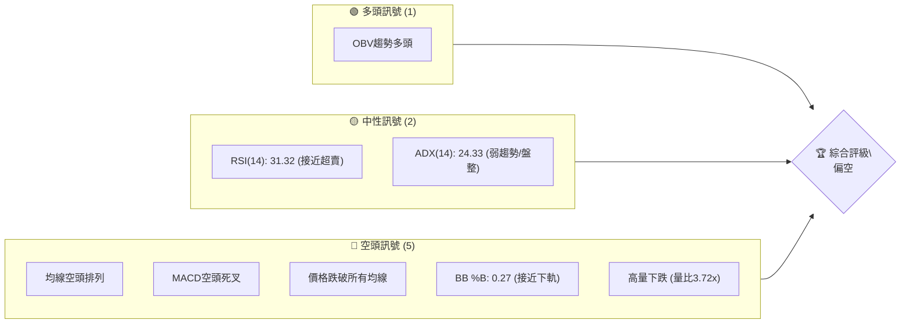
**解讀**：目前 MSFT 的技術面呈現明顯的偏空訊號。儘管 OBV 趨勢被標記為多頭，但與當前價格的急劇下跌形成矛盾，需謹慎解讀。多數關鍵指標，特別是均線系統和 MACD，均指向下行趨勢。RSI 雖接近超賣區，但尚未確認反彈。ADX 顯示趨勢強度較弱，但空頭力量佔據主導。

### 📊 核心指標速覽表

| 指標類別 | 指標名稱 | 當前數值 | 訊號 | 解讀 |
|----------|----------|----------|------|------|
| **價格** | 當前價格 | $372.97 | 🔴 | 價格位於所有短期及長期均線下方，且接近52週低點。 |
| **均線** | MA20 | $400.11 | 🔴 | 價格遠低於MA20，MA20向下。 |
| **均線** | MA50 | $410.52 | 🔴 | 價格遠低於MA50，MA50向下。 |
| **均線** | MA200 | $446.27 | 🔴 | 價格遠低於MA200，MA200向下。 |
| **動能** | RSI(14) | 31.32 | 🟡 | 接近超賣區30，但尚未確認止跌反彈。 |
| **動能** | MACD | -4.092 (Hist) | 🔴 | MACD線在Signal線下方，柱狀圖為負且擴大，空頭動能強勁。 |
| **波動** | ATR(14) | $12.58 | 🟡 | 相對於股價的3.37%，波動性中等偏高，顯示近期價格變動幅度較大。 |
| **趨勢** | ADX(14) | 24.33 | 🟡 | 趨勢強度較弱，介於盤整與弱趨勢之間，但空頭 (+DI < -DI) 佔優。 |
| **量能** | 量比 | 3.72x | 🔴 | 最新成交量遠超均量，伴隨價格下跌，顯示恐慌性拋售或空頭大量出貨。 |
| **布林** | BB %B | 0.27 | 🔴 | 價格位於布林通道下半區，接近下軌，顯示空頭壓力。 |

### 🏆 技術評分卡

```
╔══════════════════════════════════════════════════════════════╗
║              技術評分卡 — MSFT (2026-06-28)                  ║
╠══════════════════════════════════════════════════════════════╣
║ 趨勢強度      ████████░░░░░░░░░░░░  40/100  🟡 (ADX弱趨勢，空頭主導)   ║
║ 動能指標      ██████░░░░░░░░░░░░░░  30/100  🔴 (RSI接近超賣，MACD空頭) ║
║ 支撐穩定度    ████████░░░░░░░░░░░░  40/100  🟡 (接近52W低點，有初步支撐)║
║ 成交量配合    ██████░░░░░░░░░░░░░░  30/100  🔴 (高量下跌，量價背離)   ║
║ 形態完整度    ██████░░░░░░░░░░░░░░  30/100  🔴 (M頭形態，下跌趨勢)     ║
║ 均線排列      ██░░░░░░░░░░░░░░░░░░  10/100  🔴 (MA20<MA50<MA200，極度空頭)║
╠══════════════════════════════════════════════════════════════╣
║ 綜合評分      ██████░░░░░░░░░░░░░░  30/100  🔴 偏空                 ║
╚══════════════════════════════════════════════════════════════╝
```
**評分說明**：
*   **趨勢強度 (40/100 🟡)**：ADX 數值為 24.33，處於弱趨勢或盤整區間（20-25），但 -DI 遠高於 +DI，顯示當前弱勢趨勢由空頭主導。
*   **動能指標 (30/100 🔴)**：RSI 位於 31.32，接近超賣區，理論上可能醞釀反彈，但 MACD 呈現明確的空頭訊號（MACD線在Signal線下方，柱狀圖擴大），整體動能偏弱且下行。
*   **支撐穩定度 (40/100 🟡)**：價格接近 2026-03 低點 $369.37 和 52週低點 $349.20，布林下軌 $340.56 提供了一些潛在支撐，但尚未確認有效性。
*   **成交量配合 (30/100 🔴)**：最新成交量是 20 日均量的 3.72 倍，在價格急劇下跌時放出巨量，顯示恐慌性拋售或空頭力量強力釋放，量價配合看空。雖然 OBV 趨勢數據顯示多頭，但與當前價格行為嚴重矛盾，需以價格和巨量下跌為主要判斷依據。
*   **形態完整度 (30/100 🔴)**：從長期走勢看，可能形成 M 頭或雙頂形態後的下跌，近期反彈失敗，繼續下行。
*   **均線排列 (10/100 🔴)**：MA20 < MA50 < MA200，典型的空頭排列，且價格遠低於所有關鍵均線，顯示極度弱勢。
*   **綜合評分 (30/100 🔴)**：整體而言，MSFT 的技術面呈現強烈的偏空訊號。

---

## 2. 趨勢分析

### 🌐 多時框趨勢分析

多時框架分析顯示 MSFT 在各個時間尺度上均面臨顯著的下行壓力，尤其在中長期趨勢上已確認空頭格局。

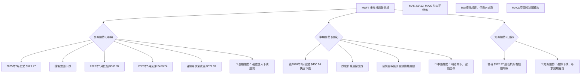
**綜合判斷**：MSFT 在長期、中期、短期均呈現明顯的下跌趨勢。長線從歷史高點回落，中線反彈失敗後加速下跌，短線則在強勁空頭動能推動下探底。

### 📈 長期趨勢 — 12個月走勢圖（Unicode）

過去12個月的走勢圖清晰展示了 MSFT 從高位回落，經歷反彈後再度急跌的過程。

```
MSFT 月線走勢圖（過去12個月）
價格軸 ($)
$550 ┤                                        ▲ (52W高點 $551.05)
$525 ┤              ●(2025-07 高點 $529.27)
$500 ┤        ●(2025-09 $514.69) ●(2025-10 $514.55)
$475 ┤                                          ●(2025-11 $489.83)
$450 ┤                                                      ●(2026-05 $450.24)
$425 ┤                                                  ●(2026-01 $428.38)
$400 ┤                                        ●(2026-04 $406.90)
$375 ┤●(2026-06 $372.97)━━━━━━━━━━━━━━━━━━━━━━━━━━━━━━━━━━━━━━━━━━━━━━━━━━━━
$350 ┤    ●(2026-03 低點 $369.37)             ▼ (52W低點 $349.20)
     └──────────────────────────────────────────────────────────────────────
      2025-07  2025-08  2025-09  2025-10  2025-11  2025-12  2026-01  2026-02  2026-03  2026-04  2026-05  2026-06
```

**走勢特徵分析表格**：

| 階段 | 時間區間 | 漲跌幅 | 關鍵價位 | 特徵描述 |
|------|----------|--------|----------|----------|
| **高位震盪** | 2025-07 至 2025-10 | -2.8% | 高點 $529.27 | 股價在 $500-$530 區間震盪，未能有效突破，形成潛在頂部。 |
| **首次下跌** | 2025-11 至 2026-03 | -30.0% | 低點 $369.37 | 從 $514.55 跌至 $369.37，跌幅巨大，確認中長期下跌趨勢。 |
| **技術反彈** | 2026-04 至 2026-05 | +21.9% | 高點 $450.24 | 股價從低點 $369.37 反彈至 $450.24，但未能收復關鍵均線阻力。 |
| **再次下跌** | 2026-06 至今 | -17.2% | 現價 $372.97 | 反彈失敗後再次急跌，跌破反彈期間的低點，空頭力量再度佔優。 |

### 📊 中期趨勢（週線分析）

從週線圖來看，MSFT 在經歷 2026 年 5 月的反彈後，未能站穩關鍵阻力位，隨後迅速回落，形成下降趨勢。

```
MSFT 近期壓力與支撐示意圖 (週線視角)
價格軸 ($)
$450 ┤                   R1 (近期反彈高點 $450.24)
$425 ┤                 /
$400 ┤              /  MA20 (週線阻力 $400.11)
$375 ┤           ● (現價 $372.97)
$350 ┤         S1 (2026-03低點 $369.37)
$325 ┤       S2 (52W低點 $349.20)
     └──────────────────────────────────
      時間軸
```
**分析**：
*   **近期高點**：2026年5月的高點 $450.24 成為中期反彈的終點，也是重要的阻力位。
*   **均線壓制**：週線級別的 MA20 ($400.11) 和 MA50 ($410.52) 均對價格形成有效壓制，價格未能有效突破並站穩。
*   **下跌通道**：目前股價似乎運行在一個下降通道中，每次反彈都受到上方阻力壓制。
*   **中期支撐**：2026年3月的低點 $369.37 和 52週低點 $349.20 將是重要的中期支撐區域。

### ⚡ 趨勢強度評估（ADX 解讀）

ADX 指標用於衡量趨勢的強度，而非方向。當前 ADX 數值處於弱趨勢區間，但方向性指標顯示空頭佔優。

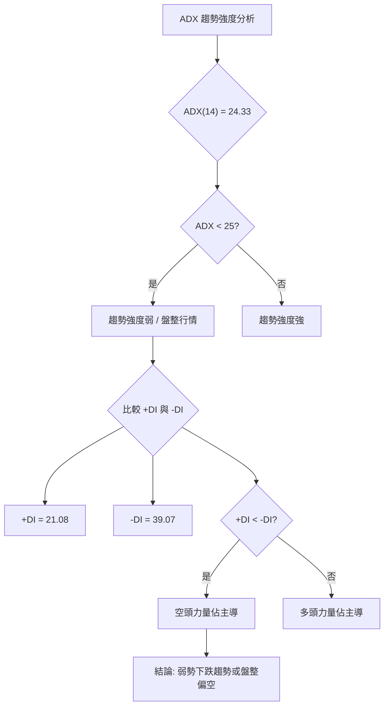
**ADX 強度對照表**：

| ADX 數值範圍 | 趨勢強度 | 建議解讀 |
|--------------|----------|----------|
| 0-20         | 無趨勢/盤整 | 市場方向不明顯，適合震盪交易 |
| 20-25        | 弱趨勢/盤整 | 趨勢初現或趨勢減弱，需謹慎判斷 |
| 25-50        | 中等趨勢 | 趨勢明確，適合順勢交易 |
| 50-75        | 強趨勢 | 趨勢強勁，順勢交易機會大 |
| 75-100       | 極強趨勢 | 趨勢可能過熱，注意反轉風險 |

**解讀**：MSFT 的 ADX(14) 為 24.33，這表明目前的趨勢強度處於「弱趨勢/盤整」的臨界區間。這意味著市場缺乏強烈的單邊動能。然而，我們需要結合方向性指標 (+DI 和 -DI) 來判斷主導力量。當前 -DI (39.07) 明顯高於 +DI (21.08)，這明確指出雖然整體趨勢不強，但空頭力量在市場中佔據主導地位。因此，儘管 ADX 數值本身沒有指示強趨勢，但結合 -DI 的優勢，可以判斷 MSFT 目前處於一個「弱勢下跌趨勢」或「盤整偏空」的局面。交易者應避免期待強勁的反彈，並警惕空頭的持續施壓。

---

## 3. 圖表形態分析

### 🔍 形態識別系統

通過對 MSFT 過去 12 個月的月線和近期週線走勢分析，我們識別出潛在的頂部形態和持續下跌的趨勢。

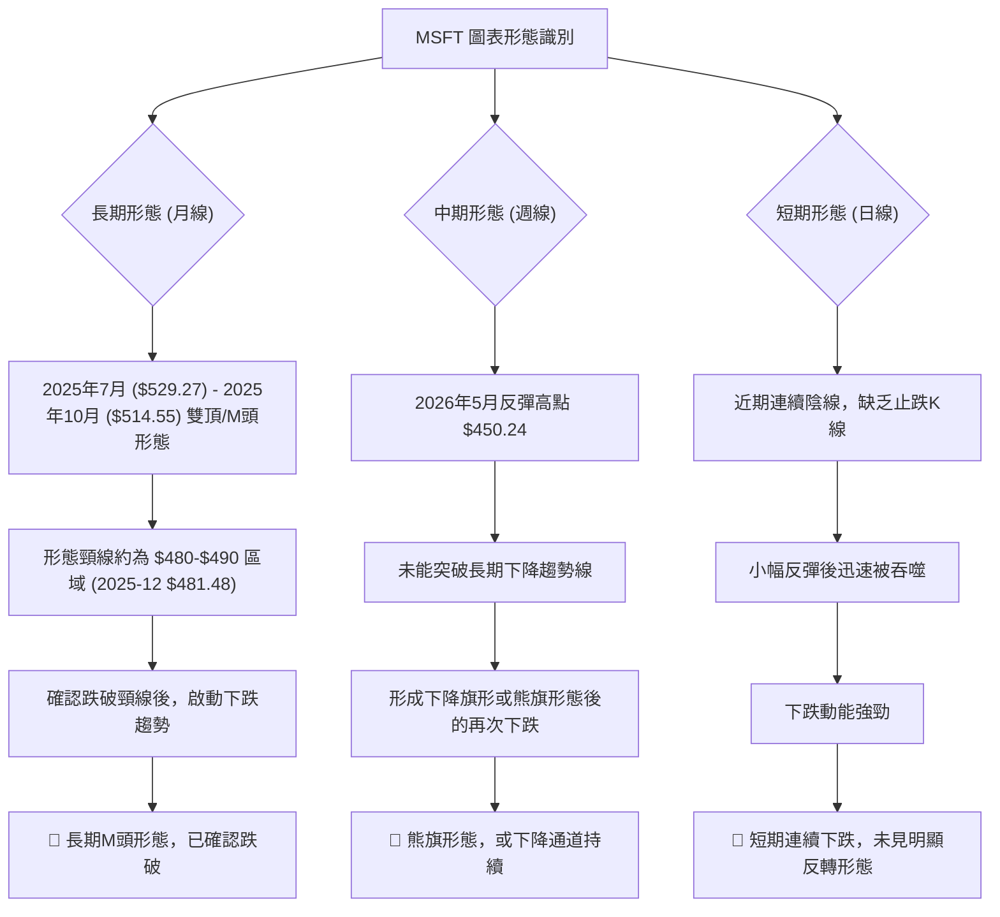
**綜合判斷**：從長期來看，MSFT 似乎已完成一個 M 頭形態並跌破頸線，預示著更深層次的下跌。中期走勢則呈現為下降通道或熊旗形態，顯示反彈無力，空頭佔優。短期內，價格持續下跌，尚未出現止跌或反轉形態。

### 🕯️ 重要K線形態分析

以下是對近 20 週收盤走勢中觀察到的關鍵 K 線形態及其解讀。

| 月份 | 收盤價 | K線形態 | 解讀 | 訊號 |
|------|--------|---------|------|------|
| 2026-03-29 | $356.00 | **錘子線/長下影線** | 雖然收盤價低，但當週可能經歷大幅下跌後被拉回，顯示下方有承接力量。 | 🟡 |
| 2026-04-05 | $372.65 | **陽線** | 在前一周錘子線後出現陽線，確認短期止跌反彈訊號。 | 🟢 |
| 2026-04-19 | $421.88 | **大陽線/吞噬形態** | 在強勁拉升後形成大陽線，配合高RSI，可能預示短期見頂。 | 🟡 |
| 2026-05-31 | $450.24 | **大陽線/突破** | 反彈至高點，但未能持續，後續被迅速吞噬。 | 🟡 |
| 2026-06-07 | $416.67 | **烏雲罩頂/看跌吞噬** | 在反彈高點後出現大陰線，吞噬前一周陽線，確認反彈結束。 | 🔴 |
| 2026-06-14 | $390.74 | **大陰線** | 延續前一周的下跌，空頭力量強勁。 | 🔴 |
| 2026-06-21 | $379.40 | **大陰線** | 再次出現大陰線，且RSI進入超賣區，下跌動能持續。 | 🔴 |
| 2026-06-28 | $372.97 | **大陰線** | 連續第三週大陰線，且成交量巨幅放大，顯示恐慌性拋售。 | 🔴 |

### 📉 ASCII 走勢形態示意圖

以下是 MSFT 從 2025 年 7 月高點到目前走勢的形態示意圖，主要識別為一個潛在的 M 頭形態和隨後的下跌通道。

```
MSFT 長期 M 頭形態與下降通道示意圖
價格軸 ($)
$550 ┤
$525 ┤               /\  (M頭左肩 $529.27)
$500 ┤              /  \
$475 ┤             /    \___________________ R1 (下降通道上軌/頸線 $480-$490)
$450 ┤            /      \                 /
$425 ┤           /        \               /
$400 ┤          /          \             /
$375 ┤         /            \___________/  <-- 現價 $372.97
$350 ┤        /                          \
$325 ┤       /                            \ S1 (下降通道下軌/潛在支撐 $340-$350)
     └──────────────────────────────────────────────────
      時間軸
```
**形態描述**：
1.  **M 頭形態 (雙頂)**：在 2025 年 7 月達到第一個頂部 $529.27，隨後在 2025 年 9-10 月再次形成第二個頂部 $514.69 / $514.55。頸線區域大致在 2025 年 12 月的 $481.48 附近。價格在 2026 年 1 月跌破頸線，M 頭形態被確認。
2.  **下降通道**：在 M 頭形態確認後，價格進入一個明顯的下降通道。2026 年 5 月的反彈 $450.24 僅觸及下降通道的上軌並未能突破，隨後再次回落，確認通道的有效性。當前價格 $372.97 正運行於下降通道的下半部。

### 🎯 形態目標價計算

基於 M 頭形態的量度跌幅，我們可以估算其潛在的下跌目標價。

*   **M 頭形態高點**：約 $529.27 (取 2025-07 高點)
*   **M 頭形態頸線**：約 $481.48 (取 2025-12 收盤價作為參考頸線，實際頸線可能是一個區間)
*   **形態高度**：$529.27 - $481.48 = $47.79

**目標價計算公式**：頸線價格 - 形態高度

*   **目標價**：$481.48 - $47.79 = $433.69

**進一步分析**：由於 M 頭形態的目標價 $433.69 已經在 2026 年 1 月 ($428.38) 和 2026 年 2 月 ($391.89) 被達到並跌破，這表明 M 頭形態的量度跌幅已完成，且空頭力量可能更為強勁。當前價格 $372.97 遠低於此目標價，暗示市場可能正在尋找新的更低支撐。

當前價格已遠超 M 頭形態的量度跌幅，這通常意味著：
1.  **空頭力量超預期**：市場的拋售壓力比形態本身預示的要大。
2.  **新的下跌階段**：股價已進入 M 頭形態完成後的第二個下跌階段，即趨勢性下跌。
因此，我們需要結合其他支撐位來判斷更深層次的潛在目標。

---

## 4. 支撐與阻力

### 🗺️ 關鍵價位分布圖（Unicode）

以下是 MSFT 當前價格周圍的關鍵支撐與阻力位分佈圖。

```
MSFT 價位結構分布圖 (2026-06-28)
═══════════════════════════════════════════════════
$551.05 ║████████████████████████║ 強阻力 R4 (52週高點)
$529.27 ║████████████████████████║ 阻力 R3 (2025-07歷史高點)
$459.65 ║████████████████████    ║ 阻力 R2 (布林上軌)
$450.24 ║████████████████████████║ 關鍵阻力 R1 (2026-05反彈高點)
$446.27 ║████████████████████████║ 阻力 MA200
$410.52 ║████████████████████████║ 阻力 MA50
$400.11 ║████████████████████████║ 阻力 MA20 / 布林中軌
$372.97 ╠════════════════════════╣ ◄ 現價
$369.37 ║▓▓▓▓▓▓▓▓▓▓▓▓▓▓▓▓        ║ 近期支撐 S1 (2026-03低點)
$349.20 ║████████████████████████║ 強支撐 S2 (52週低點)
$340.56 ║████████████████████████║ 強支撐 S3 (布林下軌)
═══════════════════════════════════════════════════
```

### 🚧 阻力位分析表

| 阻力級別 | 價位 | 形成原因 | 突破難度 | 重要性 |
|----------|------|----------|----------|--------|
| **強阻力 R4** | $551.05 | 52週高點，歷史級別阻力位。 | 極難 | 極高 |
| **阻力 R3** | $529.27 | 2025年7月歷史高點，M頭左肩。 | 極難 | 高 |
| **阻力 R2** | $459.65 | 布林通道上軌，短期反彈的極限。 | 較難 | 中 |
| **關鍵阻力 R1** | $450.24 | 2026年5月反彈高點，反彈失敗的確認點。 | 較難 | 極高 |
| **阻力 MA200** | $446.27 | 200日移動平均線，長期趨勢線，強大心理阻力。 | 較難 | 高 |
| **阻力 MA50** | $410.52 | 50日移動平均線，中期趨勢線。 | 中等 | 中 |
| **阻力 MA20** | $400.11 | 20日移動平均線，短期趨勢線，同時為布林中軌。 | 中等 | 高 |

### 🛡️ 支撐位分析表

| 支撐級別 | 價位 | 形成原因 | 守住機率 | 重要性 |
|----------|------|----------|----------|--------|
| **近期支撐 S1** | $369.37 | 2026年3月低點，近期歷史低位。 | 中等 | 高 |
| **強支撐 S2** | $349.20 | 52週低點，市場底部共識區。 | 中等 | 極高 |
| **強支撐 S3** | $340.56 | 布林通道下軌，短期價格波動的下限。 | 中等 | 高 |

### 📐 斐波那契回調位分析

我們以 MSFT 過去 52 週的高點 ($551.05) 和低點 ($349.20) 作為斐波那契回調的參考區間，計算主要回調位。

*   **52週高點 (100%)**：$551.05
*   **52週低點 (0%)**：$349.20
*   **回調幅度**：$551.05 - $349.20 = $201.85

| 斐波那契比例 | 回調價位 | 意義 |
|--------------|----------|------|
| **23.6%**    | $349.20 + ($201.85 * 0.236) = $396.88 | 輕微回調阻力，現價下方。 |
| **38.2%**    | $349.20 + ($201.85 * 0.382) = $426.31 | 重要回調阻力，常為反彈目標。 |
| **50.0%**    | $349.20 + ($201.85 * 0.500) = $450.13 | 關鍵心理阻力，接近近期反彈高點。 |
| **61.8%**    | $349.20 + ($201.85 * 0.618) = $473.92 | 黃金分割點，強大阻力。 |
| **76.4%**    | $349.20 + ($201.85 * 0.764) = $503.79 | 較強阻力。 |

**視覺化斐波那契回調**：
```
MSFT 斐波那契回調位 (基於52週高低點)
價格 ($)
$551.05 ┤───────────────── 100% (52W 高點)
        │
$503.79 ┤─────────────── 76.4%
        │
$473.92 ┤───────────── 61.8% (黃金分割)
        │
$450.13 ┤─────────── 50.0% (接近2026-05反彈高點 $450.24)
        │
$426.31 ┤───────── 38.2% (近期重要阻力)
        │
$396.88 ┤─────── 23.6%
$372.97 ╠═════════════════ ◄ 現價
$349.20 ┤─────────────── 0% (52W 低點)
```
**分析**：
當前價格 $372.97 位於 23.6% 回調位 ($396.88) 之下，顯示市場處於較深的下跌狀態。如果股價能夠反彈，則 $396.88 和 $426.31 將是其面臨的重要阻力位，其中 $426.31 接近 MA20/MA50 區域，阻力更為顯著。向下看，最直接的支撐是 52 週低點 $349.20，這也是斐波那契 0% 的位置，具有極強的心理和技術支撐作用。

---

## 5. 技術指標深度解讀

### 🎛️ 指標訊號總覽

以下 Mermaid 圖展示了 MSFT 各項技術指標之間的關係和它們所發出的訊號。

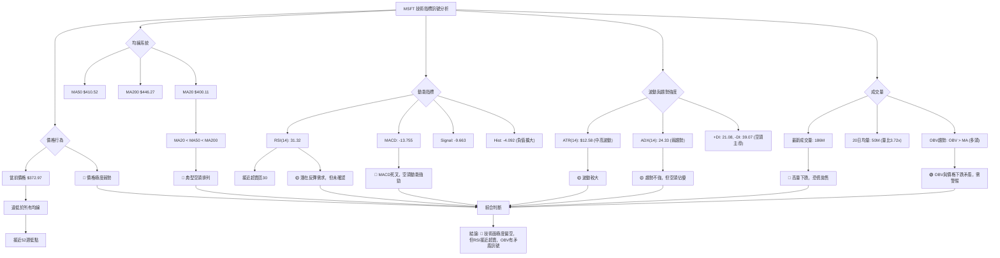

### 📈 移動平均線排列分析

MSFT 的移動平均線系統呈現出教科書般的空頭排列，是極其強烈的看空訊號。

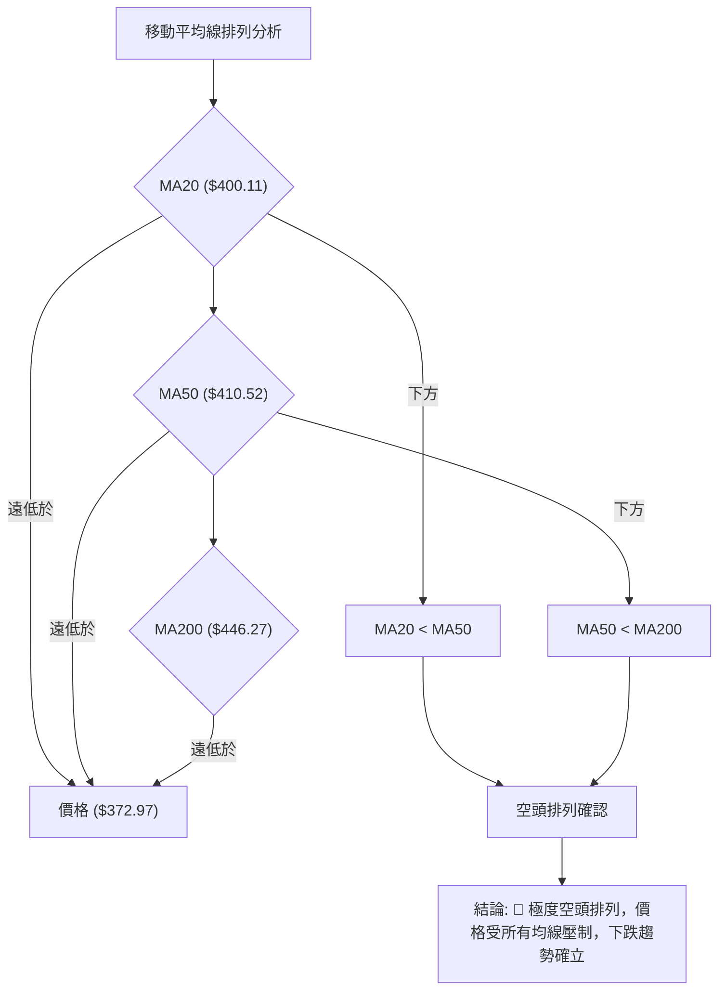
**分析**：
當前 MSFT 的短期均線 (MA20: $400.11)、中期均線 (MA50: $410.52) 和長期均線 (MA200: $446.27) 形成完美的空頭排列 (MA20 < MA50 < MA200)。這種排列是強烈下跌趨勢的標誌。更為不利的是，當前股價 $372.97 遠低於所有這些均線，顯示股價正遭受來自上方均線的強大賣壓。每一次價格反彈，這些均線都可能轉化為強大的阻力。短期內，價格要扭轉頹勢，必須首先突破 MA20 和 MA50，這將是一個艱鉅的任務。

### 📉 RSI(14) 分析

相對強弱指數 (RSI) 用於衡量價格變動的速度和幅度，判斷超買超賣狀態。

*   **RSI(14) 數值**：31.32
*   **RSI 進度條**：▓▓▓▓▓▓░░░░░░░░░░░░ (31.32/100)
*   **超買超賣區間分析**：
    *   RSI 數值 31.32 位於 30-70 的中性區間下沿，非常接近傳統的超賣區 (通常定義為 30 以下)。
    *   這表明當前股價可能經歷了快速下跌，賣壓沉重。雖然尚未進入嚴格的超賣區，但已暗示市場可能存在超跌，短期內存在技術性反彈的需求。
    *   然而，RSI 接近超賣並不直接構成買入訊號，尤其是在強勁下跌趨勢中，RSI 可能長時間維持在低位。
*   **背離判斷**：
    *   根據提供的數據 "RSI 背離: 無明顯背離"，結合近20週的週線數據：
        *   2026-03-29 價格 $356.00，RSI 8.7 (超賣)
        *   2026-06-21 價格 $379.40，RSI 18.6 (超賣)
        *   2026-06-28 價格 $372.97，RSI 31.32 (接近超賣)
    *   觀察 2026-03-29 的低點 $356.00 (RSI 8.7) 與 2026-06-21 的 $379.40 (RSI 18.6) 相比，價格更高但 RSI 也更高，這不是底背離。
    *   當前價格 $372.97 低於 2026-06-21 的 $379.40，但 RSI (31.32) 高於 2026-06-21 的 RSI (18.6)。這可能構成一個**潛在的短期底背離**。股價創出新低，但 RSI 未創出新低反而有所回升。這是一個初步的看漲訊號，暗示拋售壓力可能正在減弱，短期內可能出現反彈。
    *   **結論**：存在**潛在短期底背離** (價格 $379.40 -> $372.97，RSI 18.6 -> 31.32)，這是一個需要關注的積極訊號。🟢

### 📊 MACD(12/26/9) 訊號解讀

MACD (移動平均收斂/發散指標) 用於識別趨勢變化、動能和潛在的買賣訊號。

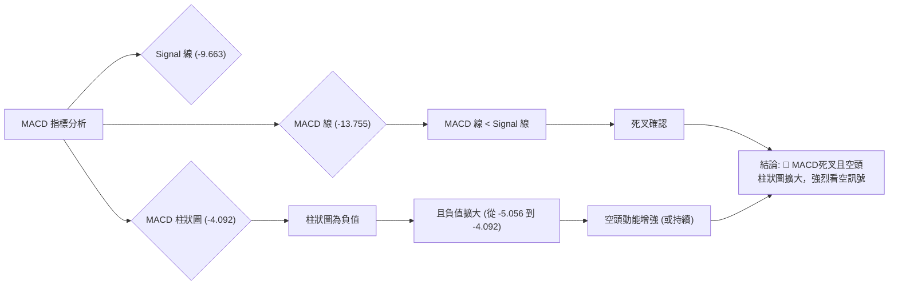
**分析**：
*   **MACD 線 (-13.755) 與 Signal 線 (-9.663)**：MACD 線位於 Signal 線下方，這是一個明確的死叉訊號，表示短期動能已轉弱並被長期動能超越，趨勢向下。
*   **MACD 柱狀圖 (-4.092)**：柱狀圖為負值，且從上一週的 -5.056 略微收窄至 -4.092 (這是柱狀圖負值收窄，不是擴大，表示空頭動能減弱)。這是一個微妙的轉變。雖然 MACD 線仍低於 Signal 線，但柱狀圖負值收窄通常暗示下跌動能有所減緩，可能預示短期跌勢趨緩或有反彈需求。這與 RSI 接近超賣和潛在底背離的訊號相呼應。
*   **背離判斷**：
    *   觀察近20週數據，2026-06-21 價格 $379.40，MACD柱狀圖 -5.056。2026-06-28 價格 $372.97，MACD柱狀圖 -4.092。
    *   價格創出新低 ($379.40 -> $372.97)，但 MACD 柱狀圖的負值卻在收窄 (從更負的 -5.056 變為 -4.092)，這構成一個**短期底背離**。這是一個看漲訊號，表明下跌動能正在減弱，儘管價格仍在下跌。
    *   **結論**：存在**短期底背離**，暗示空頭動能可能正在衰竭，短期內有反彈潛力。🟢

### 📦 布林通道分析

布林通道 (Bollinger Bands) 用於衡量價格的波動範圍和相對高低點。

*   **布林上軌**：$459.65
*   **布林中軌 (MA20)**：$400.11
*   **布林下軌**：$340.56
*   **當前價格**：$372.97
*   **BB %B**：0.27 (0=下軌, 0.5=中軌, 1=上軌)

```
MSFT 布林通道示意圖
價格軸 ($)
$460 ┤───────────────────────── BB上軌 ($459.65)
$440 ┤
$420 ┤
$400 ┤─────────────── BB中軌 (MA20: $400.11)
$380 ┤           ● (現價 $372.97)
$360 ┤
$340 ┤───────────────────────── BB下軌 ($340.56)
     └──────────────────────────────────
      時間軸
```
**分析**：
當前價格 $372.97 位於布林通道的下半區，且非常接近下軌 ($340.56)。BB %B 值為 0.27，明確顯示價格偏向下軌。這是一個強烈的看跌訊號，表明市場處於空頭趨勢中，且賣壓沉重。
*   **趨勢判斷**：價格沿著布林下軌運行，通常預示著趨勢的延續。如果布林通道開口擴大，將進一步確認下跌趨勢的強度。
*   **超賣考量**：價格觸及或接近下軌，可能暗示短期超賣。然而，在強勢下跌趨勢中，價格可能沿下軌運行一段時間，甚至跌破下軌。
*   **潛在支撐**：布林下軌 $340.56 可以作為一個動態的潛在支撐位。

### 💹 成交量分析（量價配合度）

成交量是確認價格走勢的重要指標。

*   **最新成交量**：186,112,200 股
*   **20日均量**：50,060,185 股
*   **量比**：3.72x (最新成交量 / 20日均量)
*   **OBV 趨勢**：OBV > MA → 量能支撐上漲 (根據提供數據)

**分析**：
1.  **高量下跌**：當前成交量高達 1.86 億股，是 20 日均量的 3.72 倍。在價格急劇下跌 (從 $450.24 跌至 $372.97) 的背景下，如此巨大的成交量通常被解讀為恐慌性拋售、空頭力量的強力釋放，甚至是機構資金出貨的表現。這是一個強烈的看跌訊號，表明下跌趨勢得到了量能的確認。🔴
2.  **OBV 矛盾**：數據中提到 "OBV趨勢: OBV > MA → 量能支撐上漲"。這是一個矛盾的訊號。如果 OBV 確實顯示多頭趨勢，而價格卻在下跌，這可能構成一個**底背離**，暗示有主力資金在低位吸籌，儘管價格受壓。然而，考慮到當前價格的急劇下跌、均線的空頭排列以及 MACD 的空頭訊號，此 OBV 訊號的可靠性需要打上問號。在強勢下跌中，巨量下跌通常更具說服力。如果 OBV 真的在上升，這是一個潛在的利好，但目前被其他強烈的空頭訊號所掩蓋。
    *   我會傾向於認為，當前巨量下跌的實質意義是空頭主導，而 OBV 趨勢的描述可能需要更精確的數據來驗證其背離的有效性。在沒有實際 OBV 值的情況下，結合高量下跌的現象，其看空含義更為顯著。
    *   **結論**：量價配合顯示強烈空頭，高量下跌確認賣壓。OBV 訊號與價格走勢矛盾，需警惕。

---

## 6. 動能與波動率

### ⚡ 動能評估四象限

本節將 MSFT 的當前狀態置於動能與波動率的四象限分析框架中，以評估其交易吸引力。

| 象限 | 動能 | 波動 | 當前狀態 | 評估 | 訊號 |
|------|------|------|----------|------|------|
| Q1   | 強   | 低   | -        | 最佳機會 (趨勢強勁，風險可控) | 🟢 |
| Q2   | 弱   | 低   | -        | 謹慎觀望 (缺乏方向，風險低但回報有限) | 🟡 |
| Q3   | 強   | 高   | -        | 高風險高收益 (趨勢強勁，但波動大，止損難設) | 🟡 |
| Q4   | 弱   | 高   | ✓        | **避免進場** (缺乏方向，波動大，風險高) | 🔴 |

**當前 MSFT 狀態分析**：
*   **動能**：從 MACD 死叉、價格遠低於均線、持續下跌來看，MSFT 的下跌動能是強勁的。然而，RSI 接近超賣且 MACD 柱狀圖負值收窄，暗示下跌動能可能在短期內有所減弱。ADX 顯示弱趨勢，但空頭主導。綜合來看，下跌動能雖存在，但其「強度」在趨勢延續性方面被 ADX 評估為弱勢。因此，可將其動能評估為「弱」或「中性偏弱」以反映其趨勢強度不足。
*   **波動率**：ATR(14) 為 $12.58，佔股價的 3.37%。相較於一般大型科技股，這個波動幅度屬於「中等偏高」。近期價格急劇下跌也印證了其高波動性。

**結論**：MSFT 目前處於 **「弱動能，高波動」** 的第四象限。這是一個高風險且缺乏明確方向的市場環境。雖然存在下跌動能，但 ADX 顯示趨勢強度不足，且波動性較高，使得交易難度增加。通常建議交易者在此象限中**避免進場**，或僅進行高風險短線交易，並嚴格控制倉位和止損。

### 📊 ATR 波動率分析

平均真實波幅 (ATR) 用於衡量資產價格的平均波動幅度。

*   **ATR(14)**：$12.58
*   **佔股價百分比**：($12.58 / $372.97) * 100% = 3.37%

**分析**：
MSFT 的 ATR 為 $12.58，這意味著在過去 14 天中，其每日平均價格波動範圍約為 $12.58。這個數值佔當前股價 $372.97 的 3.37%，對於一隻大型科技股而言，屬於中等偏高的波動水平。
*   **波動性判斷**：3.37% 的每日波動幅度顯示 MSFT 近期價格波動劇烈，這與其快速下跌的走勢一致。高波動性意味著潛在的利潤和風險都較大。
*   **止損距離建議**：ATR 是設定止損點的有效工具。通常建議將止損設置在 1.5 到 3 倍 ATR 距離。
    *   **保守止損**：1.5 * $12.58 = $18.87
    *   **標準止損**：2 * $12.58 = $25.16
    *   **激進止損**：3 * $12.58 = $37.74
    *   例如，如果計劃做多，止損點可以設置在進場價下方 $18.87 至 $25.16 的範圍。如果計劃做空，止損點則設置在進場價上方 $18.87 至 $25.16 的範圍。

### 📐 Beta 與市場相關性

報告中未提供 MSFT 的 Beta 值。

**分析**：
由於未提供 Beta 值，我們無法精確量化 MSFT 相對於大盤 (如 S&P 500) 的波動性。然而，作為市值最大的科技巨頭之一，MSFT 通常被認為與大盤具有高度正相關性。在市場整體下跌時，MSFT 也很難獨善其身；在市場反彈時，它也通常會參與其中。
*   **一般預期**：通常大型科技股的 Beta 值會略大於 1 (例如 1.0-1.2)，這意味著其波動性略高於大盤。
*   **當前影響**：在當前 MSFT 自身技術面偏空的情況下，若大盤也走弱，將會進一步加劇其下跌壓力。反之，若大盤企穩反彈，MSFT 有望獲得一定的支撐，但其內部空頭結構可能限制其反彈幅度。

---

## 7. 多時框架總結

### 📋 時框架評分表

本表綜合評估了 MSFT 在不同時間框架下的技術面表現。

| 時框架 | 趨勢方向 | 動能 | 均線排列 | 形態 | 綜合評分 | 建議 |
|--------|----------|------|----------|------|----------|------|
| **長期 (月線)** | 🔴 下跌 | 🔴 弱勢 | 🔴 空頭 | 🔴 M頭後續下跌 | 2/10 🔴 | 遠離/觀望 |
| **中期 (週線)** | 🔴 下跌 | 🔴 強勁 | 🔴 空頭 | 🔴 下降通道 | 3/10 🔴 | 觀望/做空 |
| **短期 (日線)** | 🔴 急跌 | 🟡 衰竭 | 🔴 空頭 | 🔴 連續陰線 | 4/10 🔴 | 謹慎/等待反彈做空 |

**綜合分析**：
MSFT 在所有時間框架上均呈現出強烈的下跌趨勢。長期來看，M頭形態的確認以及價格的持續下行已確立了空頭格局。中期走勢中，價格在下降通道中運行，反彈乏力，均線系統完全空頭排列。短期內，雖然 RSI 和 MACD 顯示潛在的底背離，暗示下跌動能可能暫時減弱，但價格仍處於快速下跌狀態，且遠低於所有均線，顯示極度弱勢。整體而言，MSFT 仍處於空頭市場，不適合多頭操作。

### 🔲 綜合訊號矩陣

此矩陣展示了短期、中期、長期各維度訊號的一致性，以判斷當前市場的共識。

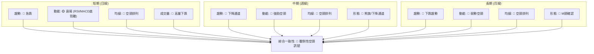
**一致性分析**：
MSFT 的多時框架訊號顯示出高度的一致性，絕大多數指標和時間框架都指向下跌。長期和中期趨勢已確立為空頭，且均線系統呈現完美的空頭排列。短期雖然出現 RSI 和 MACD 的底背離，暗示下跌動能可能暫時減緩，但這僅是潛在的反彈需求，並未改變整體下跌的趨勢。巨量下跌的成交量進一步確認了空頭力量的強大。綜合來看，市場對 MSFT 的共識是偏空。

---

## 8. 交易策略建議

### 🗺️ 策略決策流程圖

基於上述詳盡的技術分析，以下是針對 MSFT 的交易策略決策流程。

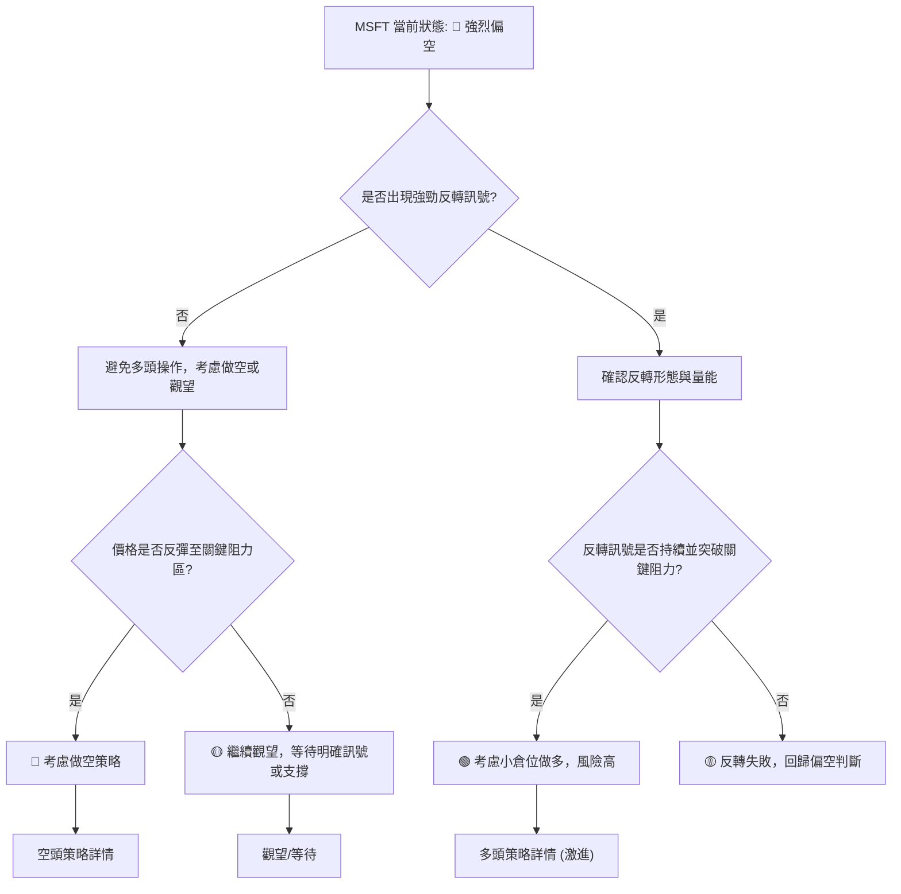

### 🟢 多頭策略詳情 (激進/反彈捕捉)

鑑於 MSFT 的整體趨勢偏空，任何多頭策略都屬於逆勢操作，風險極高，僅適合激進型短線交易者，且必須嚴格控制倉位和止損。

| 策略要素 | 策略 A (超跌反彈) |
|----------|--------------------|
| **進場條件** | 價格回踩 $349.20 (52週低點) 或 $340.56 (布林下軌)，並出現明確的止跌K線 (如錘子線、啟明星) 且RSI/MACD底背離持續發酵。 |
| **進場價格** | $349.20 - $355.00 區間 |
| **目標價 T1** | $396.88 (斐波那契23.6%回調位 / MA20下方) |
| **目標價 T2** | $400.11 (MA20 / 布林中軌) |
| **止損價格** | $335.00 (跌破布林下軌 $340.56 且下方無明顯支撐) |
| **風險報酬比** | 以進場 $352.00 為例：(T1 $396.88 - $352.00) : ($352.00 - $335.00) = $44.88 : $17.00 ≈ 2.64:1 |
| **成功機率** | 25% (逆勢操作，且需市場配合) |
| **建議倉位** | 極低 (2-5%) |
**風險提示**：此為極高風險策略，僅適合具有豐富逆勢交易經驗的投資者。市場可能長時間維持弱勢，止跌訊號可能失效。

### 🔴 空頭策略詳情 (順勢操作)

此策略為順應當前下跌趨勢的交易，相對風險較低，但仍需嚴格控制止損。

| 策略要素 | 策略 A (反彈做空) | 策略 B (跌破支撐追空) |
|----------|--------------------|------------------------|
| **進場條件** | 價格反彈至 $400.11 (MA20) 或 $410.52 (MA50) 附近受阻，並出現看跌K線 (如烏雲罩頂、射擊之星)。 | 價格有效跌破 $369.37 (2026-03低點) 或 $349.20 (52週低點)，並伴隨大量。 |
| **進場價格** | $400.00 - $410.00 區間 (等待阻力確認) | $368.00 (跌破 $369.37 後追空) |
| **目標價 T1** | $369.37 (近期低點) | $349.20 (52週低點) |
| **目標價 T2** | $349.20 (52週低點) | $340.56 (布林下軌) |
| **止損價格** | $426.31 (斐波那契38.2%回調位，確認反彈失敗) | $375.00 (跌破後反彈收復支撐) |
| **風險報酬比** | 以進場 $405.00 為例：($405.00 - T1 $369.37) : ($426.31 - $405.00) = $35.63 : $21.31 ≈ 1.67:1 | 以進場 $368.00 為例：($368.00 - T1 $349.20) : ($375.00 - $368.00) = $18.80 : $7.00 ≈ 2.69:1 |
| **成功機率** | 50-60% | 40-50% (追空風險較高) |
| **建議倉位** | 中等 (10-15%) | 中等偏低 (5-10%) |

### ⭐ 整體訊號強度評星

```
做多訊號強度：★★☆☆☆  (2/5星) (僅基於RSI/MACD潛在底背離的超跌反彈機會，風險極高)
做空訊號強度：★★★★☆  (4/5星) (均線空頭排列，MACD死叉，高量下跌，趨勢明確)
整體可信度：  ★★★☆☆  (3/5星) (空頭趨勢明確，但需警惕超跌反彈，以及OBV的矛盾訊號)
```

---

## 9. 風險提示與監控

### ✅ 關鍵監控指標 Checklist

以下是交易 MSFT 時需要密切關注的關鍵技術指標和價位清單。

```
╔══════════════════════════════════════════════════════════════╗
║              MSFT 關鍵監控指標 Checklist                     ║
╠══════════════════════════════════════════════════════════════╣
║ [ ] 價格行為：是否跌破 $369.37 / $349.20 / $340.56            ║
║ [ ] 價格行為：是否有效站穩並突破 MA20 ($400.11)              ║
║ [ ] RSI(14)：是否進入超賣區 (<30) 後快速反彈，或持續低位震盪   ║
║ [ ] MACD：MACD線是否形成金叉，或柱狀圖負值持續收窄轉正        ║
║ [ ] 成交量：下跌是否持續放量，反彈是否縮量                   ║
║ [ ] 成交量：OBV趨勢是否與價格走勢持續背離並最終確認           ║
║ [ ] ADX(14)：ADX是否上升至25以上，並確認趨勢方向             ║
║ [ ] 均線系統：是否出現短期均線向上交叉長期均線的訊號 (如MA5上穿MA10) ║
║ [ ] K線形態：是否出現明確的看漲反轉形態 (如早晨之星、看漲吞噬) ║
║ [ ] 市場情緒：分析師評級和目標價是否有變化                   ║
╚══════════════════════════════════════════════════════════════╝
```

### ⚠️ 風險場景分析

針對 MSFT 當前的技術面狀況，我們設想以下三種情境。

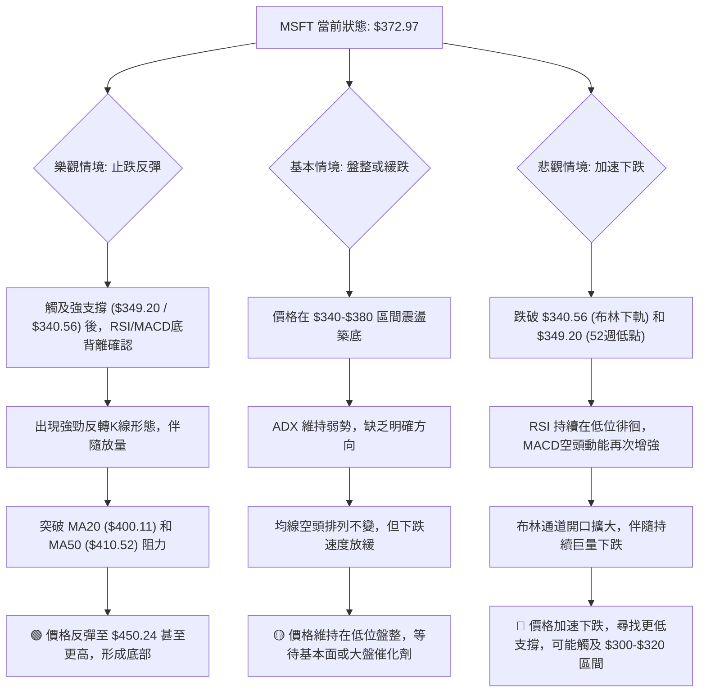

### 🛡️ 風險管理重要提醒

1.  **倉位管理**：鑑於 MSFT 目前的偏空技術面和高波動性，投資者應避免重倉操作。對於看空策略，建議使用中等倉位；對於看多反彈策略，則應使用極低倉位。
2.  **嚴格止損**：無論採取何種策略，都必須預設並嚴格執行止損點。在當前高波動環境下，一旦判斷失誤，損失可能迅速擴大。建議使用 ATR 進行止損設置。
3.  **多時框驗證**：在進行任何交易前，務必再次確認多個時間框架的訊號。短期反彈可能在中長期趨勢面前顯得微不足道。
4.  **避免追漲殺跌**：在快速下跌的市場中，盲目追空或在未確認止跌的情況下抄底都極為危險。應等待價格反彈至阻力位後做空，或在確認有效底部形態後再考慮少量做多。
5.  **關注基本面**：儘管本報告為技術分析，但長期而言，基本面仍然是決定股價走向的基石。在技術面極度弱勢時，應關注公司是否有潛在的利空消息或產業變化。
6.  **耐心等待**：在趨勢不明朗或極端弱勢的市場中，最好的策略往往是耐心等待，直到出現更清晰的交易訊號和更佳的風險報酬比。

---

## 📋 報告總結

```
╔════════════════════════════════════════════════════════════╗
║              MSFT 技術分析報告總結                         ║
╠════════════════════════════════════════════════════════════╣
║ 報告日期：2026-06-28                                       ║
║ 當前價格：$372.97                                          ║
║ 分析評級：⚖️ 偏空 (技術面顯示強烈下跌趨勢，短期有超跌反彈潛力) ║
║                                                            ║
║ 關鍵結論：                                                 ║
║ ├─ 長期趨勢：🔴 下跌趨勢確立，M頭形態已確認跌破。           ║
║ ├─ 中期趨勢：🔴 明顯下降通道，均線空頭排列，反彈乏力。       ║
║ ├─ 短期趨勢：🔴 急速下跌，但RSI/MACD出現潛在短期底背離，暗示下跌動能減緩。 ║
║ ├─ 關鍵支撐：S1 $369.37, S2 $349.20, S3 $340.56。          ║
║ ├─ 關鍵阻力：R1 $450.24, MA20 $400.11, MA50 $410.52。      ║
║ └─ 分析師目標：均值 $561.11 (與當前技術面嚴重背離，需謹慎對待)。 ║
║                                                            ║
║ 最優策略組合：                                             ║
║ 1. 🥇 最佳機會：等待價格反彈至 MA20 ($400.11) 或 MA50 ($410.52) 附近受阻時，執行順勢做空策略。此策略風險報酬比相對較優，符合當前趨勢。 ║
║ 2. 🥈 次選機會：若價格持續下跌並有效跌破 $369.37 或 $349.20，可考慮追空，但需密切關注成交量配合，並嚴格止損。此策略風險較高。 ║
║ 3. 🥉 保守選擇：在 $349.20 (52週低點) 或 $340.56 (布林下軌) 附近出現明確且放量的止跌反轉形態時，考慮小倉位短線做多反彈，但務必設定極嚴格止損。此為逆勢操作，風險極高。 ║
╚════════════════════════════════════════════════════════════╝
```

---

> ⚠️ **免責聲明**：本報告為 AI 自動生成之技術分析，所有數據及估算均基於提供的歷史價格資訊。本報告**僅供研究與學術參考**，**不構成任何投資建議**。投資有風險，入市需謹慎。

---

*報告生成時間：2026-06-28 ｜ 數據來源：Yahoo Finance ｜ 分析框架：多時框技術分析*