<details>
<summary>📊 靜態圖表 (點擊展開)</summary>
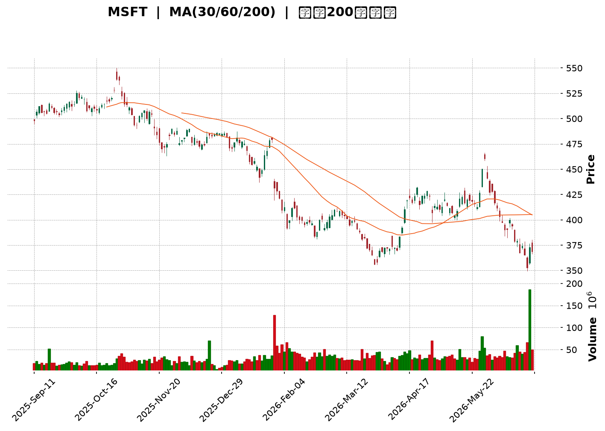
</details>

<html>
<head><meta charset="utf-8" /></head>
<body>
    <div style="height:500px; width:100%;">                        <script>window.PlotlyConfig = {MathJaxConfig: 'local'};</script>
        <script charset="utf-8" src="https://cdn.plot.ly/plotly-3.6.0.min.js" integrity="sha256-QaOVwtVY0T02VaHrr6pnoHLCwayMJp4O5n4YyaE3rJk=" crossorigin="anonymous"></script>                <div id="candlestick-chart" class="plotly-graph-div" style="height:100%; width:100%;"></div>            <script>                window.PLOTLYENV=window.PLOTLYENV || {};                                if (document.getElementById("candlestick-chart")) {                    Plotly.newPlot(                        "candlestick-chart",                        [{"close":{"dtype":"f8","bdata":"AAAAILYdf0AAAABgDqt\u002fQAAAAODuAIBAAAAAAGKdf0AAAADA9qx\u002fQAAAAIAAlH9AAAAAIF0VgEAAAAAAZvN\u002fQAAAAGBnoH9AAAAA4Aevf0AAAADgbH1\u002fQAAAAODbw39AAAAAYMj1f0AAAADghRWAQAAAAKCDI4BAAAAAQPQDgEAAAACgwBCAQAAAAMDyaYBAAAAAgHVFgEAAAAAgYEyAQAAAACDmOIBAAAAAwOi7f0AAAADgCe1\u002fQAAAAABo5X9AAAAAYC7jf0AAAABgPsZ\u002fQAAAAOCQ5X9AAAAAIE0MgEAAAACgNxOAQAAAAKAcKoBAAAAAgEUqgEAAAACghEKAQAAAAGBmgYBAAAAAoETVgEAAAABgItGAQAAAACCcU4BAAAAA4GgUgEAAAACANQ6AQAAAAGB98X9AAAAAAH5\u002ff0AAAACAi99+QAAAAOAX235AAAAAoAxtf0AAAACgqJd\u002fQAAAAGDFvn9AAAAAQPZBf0AAAAAAgq9\u002fQAAAACC9hH9AAAAAIOuqfkAAAADA3kB+QAAAACDxxH1AAAAA4G1gfUAAAABgYH59QAAAAOAArn1AAAAAYI81fkAAAABAQp1+QAAAAOBPSX5AAAAAwD19fkAAAACgyrl9QAAAAKBU631AAAAAQEkQfkAAAAAgfY1+QAAAAOBqnX5AAAAAIAPHfUAAAABgORV+QAAAAOCIxn1AAAAAIHCLfUAAAABgcqR9QAAAAEAloH1AAAAAIFkdfkAAAAAgQDx+QAAAAGBSLH5AAAAAoBBLfkAAAACAs11+QAAAAIDDWH5AAAAAAAxPfkAAAACgGVV+QAAAACCdF35AAAAAwH1tfUAAAADADmx9QAAAAGA3xn1AAAAAYDkVfkAAAAAg2L99QAAAAEB70n1AAAAAwAexfUAAAAAgVUl9QAAAAGB+lXxAAAAAoCpqfEAAAACgI518QAAAAOATSHxAAAAAgEGie0AAAADgPBJ8QAAAAKAl\u002fnxAAAAAoB5DfUAAAACAMOd9QAAAACDq931AAAAAwD\u002f5ekAAAADgHcZ6QAAAAEDjV3pAAAAAoDCWeUAAAADAqMV5QAAAAGDLfnhAAAAA4Mj1eEAAAADAQrx5QAAAAAABt3lAAAAAIDwpeUAAAABA7wB5QAAAAOCm+HhAAAAAoJuxeEAAAADgQN14QAAAAOCU2XhAAAAAwPHFeEAAAACgOfp3QAAAAICMQnhAAAAAYL\u002f7eEAAAAAAoQ15QAAAAGBCfnhAAAAAoATbeEAAAACA6TB5QAAAAEAwRXlAAAAAwK2ceUAAAADgN4F5QAAAACBniHlAAAAAICFOeUAAAABgFEB5QAAAACDdD3lAAAAAQB+reEAAAADAXvF4QAAAAKC\u002f6HhAAAAAoBdveEAAAAAg3kJ4QAAAACC30HdAAAAAoMHid0AAAABg8z53QAAAAGDPI3dAAAAAgN3SdkAAAACg+z92QAAAAIDyYnZAAAAAgOsVd0AAAADAJQl3QAAAACBySndAAAAAoC9Bd0AAAABAxDd3QAAAAABWWHdAAAAAQDhEd0AAAACAGCF3QAAAAACh+HdAAAAAoCqEeEAAAADgTKV5QAAAAMCgNXpAAAAAQAVeekAAAADgqRJ6QAAAAKDkc3pAAAAAAMD\u002fekAAAACgn+15QAAAAKA8e3pAAAAAIG5+ekAAAAAgKMV6QAAAAKCueHpAAAAAIGFueUAAAACAtdh5QAAAAACey3lAAAAA4NqneUAAAACgC9F5QAAAACDFPXpAAAAAwJDjeUAAAABgSrx5QAAAACA4bnlAAAAAIFlFeUAAAADguIh5QAAAAGAhUHpAAAAAoP5pekAAAABASQh6QAAAAGBmQnpAAAAAoHAxekAAAADAHil6QAAAAOB6AHpAAAAAYLjKeUAAAAAA1696QAAAAADXI3xAAAAA4FHIfEAAAADA9ZR7QAAAAKBwtXpAAAAAwMzAekAAAABguAp6QAAAAADXu3lAAAAAYI82eUAAAACAwtV4QAAAAKBwZXhAAAAAANdreEAAAAAAKfx4QAAAAKBHnXhAAAAAYI+ud0AAAABgZrZ3QAAAAKBw9XZAAAAAQApfd0AAAAAgXNd2QAAAAKBHDXZAAAAAIIVPd0AAAADAHgl3QA=="},"high":{"dtype":"f8","bdata":"8F\u002fz0Q1Af0ASjoNwMNV\u002fQAt8GbXOAYBAXmXTgMwPgEDGSgkDKMF\u002fQMeVDOh03X9AjU2nN0EggEA+u6N42hOAQJzW19Sf9X9AstEycBPUf0Acobwuzqx\u002fQINNMhJK639A3wURMMcMgECtODorMReAQOzKY7DfKYBAJdXX+IkygECMj0HntimAQEUjFiuBfYBAFWCe3LlzgEA1U+zuEV2AQIpA6d89SIBAbxGlh0dCgEDerDXFRwmAQH\u002fWqRVMAIBATsXVOXsPgEAoDGsmxwyAQBdkABPjAYBAHFTUQXwbgEBjg2TZZxuAQBRe60xlT4BAoA+RjjhFgEBJpemyWVCAQOlze8+5mYBA8vvpl+ExgUBncPEpqPaAQJoqnWvTnIBAJNAOBulvgEBzv1LqP02AQCqNnHZxAoBAys0MqXD5f0AZS6RvR2h\u002fQPtsWKLLA39AF\u002f3KVpB6f0AYbLxISaZ\u002fQILSdZYyx39AENSCL0vkf0AgvzbFFcZ\u002fQI2pSkZazn9A4zRvegg9f0ArW6N5LcF+QHbeALAbtn5Ad5hCQ7\u002fMfUDhkGEWkqx9QOakPgZp0H1A9OaDGFJifkARard9Iqd+QF49Y7cCe35AoQ7qMP60fkBCr6JHfSF+QFFGdgj68n1Arn5N5BsUfkCjy3PB4KF+QDN3FK8Cn35AUyJ7C6YhfkD4HMOiAD5+QEHuOxD6BH5AqquAW2vpfUD\u002fo6ciV7x9QJvKMkrz3X1AWa0Ykd52fkA0g5lT\u002flp+QGwzxe8CaX5Aywc21KxafkCGfShM3G9+QKYu821LX35AjHzfTPVifkALCojMJHh+QDSuAAudX35AUMTBCi4ofkDgCXxmWZ99QIIo2DLhyX1AGK4kXXZ4fkCWbGVfUgh+QLT3jFEV231AKq2nT7jtfUCdezXUupp9QAcrM\u002fX8IX1ADkA+axHjfEA0xTjnLtJ8QCLEe1hlbHxABEUHcO0qfEBtlO0gUS18QDMe9nkuUH1AscKyp1uCfUAzVhjKqgt+QAKiyk6GGX5AtdPxT5yIe0A4+Y+Oalp7QPIc2ulIzXpAr0jJZdxCekCJFhBgBR96QHomSRLWZ3lASpE8ciMAeUCV8uEyz9B5QPx8AVXTXHpARBH4MdHpeUCX45GyYkZ5QE93pF3fO3lAPe4HiejreEBcfxc\u002fZwx5QLlU\u002fiblOHlAt6LLihX0eEBxFdWYFqh4QNY\u002fN9BLSHhA655qLKMJeUBCTzHMv2l5QJe8+wFmv3hAc7AowSoFeUBmp4r6Il15QCwi+UNEonlARnRwxIareUD0+UJLhMJ5QN3LD8sslXlAOF42EgSVeUCMPZ1QBIJ5QPOGCmrgU3lAoIrqXc0+eUBRmP\u002f6Ofx4QJkxknNqOHlAWg\u002f1xjzSeEA44kGIRHp4QCwwnzaeInhA5JWFe\u002fgleED1IdVdS9p3QG2YzvXrg3dAB2EpC5Bed0BfDu+3qpp2QFvCYzggyXZAwB9QVYFBd0DRsUta6FJ3QNftB+hRTXdA4WS1ucFOd0CwuGY1Ujp3QPZsJeyvAnhA0kWQsRVLd0Aja2hGQG13QJFeud5X+3dA599vY2SdeEBbSYFdl9d5QGMi8oqRPnpAtjB1MFvqekBO5ukvpGZ6QFzmNcQbpHpAgL1b+DMMe0D1NEn66Gt6QMPfHXSBgHpAOnV9mv2iekA27ZyR2s96QB\u002fsrltcnnpAoMKk2GPYeUDFYE8dVgN6QOgoB\u002f7tPXpAXJS1chH+eUCaI75kQBh6QGC+3ozhsHpApP+wrZobekDOVAT8xLx5QBekGtKh6XlAvOE0A+lWeUBqkYLqMq95QIGMLQzqs3pANcGAQziDekBki6jcPPx6QJrLIAsBU3pAAAAAoHClekAAAABgZoZ6QAAAAOBRPHpAAAAAQAr\u002feUAAAAAA19d6QAAAAKBHJXxAAAAAwB4lfUAAAAAAAFh8QAAAAIA9hntAAAAAYGZCe0AAAAAghdd6QAAAAGCPEnpAAAAAIK6\u002feUAAAADgo1B5QAAAAKCZzXhAAAAAANd7eEAAAAAAABx5QAAAAKBwzXhAAAAAgOtleEAAAACA69V3QAAAAIAU2ndAAAAAIIWTd0AAAACAFK53QAAAACCuw3ZAAAAAgMKJd0AAAAAAAMh3QA=="},"hovertemplate":"\u003cb\u003e%{x|%Y-%m-%d}\u003c\u002fb\u003e\u003cbr\u003e\u958b: $%{open:.2f}\u003cbr\u003e\u9ad8: $%{high:.2f}\u003cbr\u003e\u4f4e: $%{low:.2f}\u003cbr\u003e\u6536: $%{close:.2f}\u003cextra\u003e\u003c\u002fextra\u003e","low":{"dtype":"f8","bdata":"KKcrT\u002fLrfkCLq0WU3Up\u002fQAlWHsDyfH9AOXCdF2OWf0DLLzmO72t\u002fQDaYXv1wh39ABorgLJOxf0CU8We8B9V\u002fQMP1UH7ggX9A6zvyIq17f0AKPQ8syV1\u002fQLgxjAPodn9AUlZi0taaf0DdxkaSPad\u002fQBDkHv2Dx39A2k0oL3W3f0Db6uJTJPx\u002fQJcpGaiCF4BAtSvGXEQxgEDctPRuYj6AQFu\u002fs5EmEYBASCq0aMOmf0CloKJ3W8d\u002fQNhViGMMbX9A336LiqWsf0D8trMU6o5\u002fQEf5UIDggX9A8qKWXC7jf0AGEJTX+tx\u002fQHEjsVmdE4BAr34cAsUagEDfZ2ngdiuAQJqw0jlybYBAw8NsAe\u002fKgEDp1O4f0aqAQAeXRkqsNoBAzIO\u002fW7v9f0ACZfyln\u002fV\u002fQGG+qIxNin9Ada2SM0V2f0DjcefgCMt+QAPQzCZVon5ATNkF+ZL6fkBZzzwsBDN\u002fQB+l3zmp\u002f35Aw+Alzikif0AyBEBo8+R+QHCBgAG4W39AAlee03Y7fkC4ZPh1qfx9QPSCKRVFln1AA6JeKhojfUBdMiPYHh99QCl1NxxD7XxAPLdYthDxfUA9ehP24Ed+QE6YOjQFKH5AHLHZU59CfkBZPMKxfZF9QBbo4P4Jpn1AFdJnGRzMfUAY9mtUuCN+QEbYIuxYZX5AittiMpSPfUDphGXyAJx9QBFqHGWmo31AHq+PBM1mfUD2cndvrUx9QClDwhZOjn1ADL7mF1e8fUB50+8JnQV+QFLsDr\u002fMCH5A92opUXQpfkA8eBQu4yp+QBvEgUfjPH5AeujapoggfkDCc9l0jzV+QENnrC+EEn5A6o73WzVBfUAvs+X1sTZ9QGlBY3StOn1AMHoEvku9fUATZgn8AJx9QMdxMjK0YX1Aql9e\u002fSKZfUBPncu2Jf58QNJf5WFKcnxASfArbQ9efECCxQWhTGd8QOCRQgic9HtASq+z28JLe0BgqQeTp6t7QFWFy0aFCHxAgvM5HTq\u002ffEDRJGL+\u002fnB9QJOSsosXvn1AkdxCQnQyekDSWtb78oh6QAAmthYMRnpAby6YX\u002fpreUCuetNjz3Z5QGotFURKaXhAzagMBtlyeECU44PMe\u002fF4QNPgwrnsrXlA9qZ4pLbzeEBFwFst7cN4QMoy\u002fUGQxHhAME7cT36MeEBewJyQAal4QFiaYvgAvXhAj77+UuWkeECBB7hAWuR3QIU+UigpzndAzPUjixFVeEDUSjpBDd54QCFONzGZUHhAyoVifJJceEAtL4dNJH14QOQx2Ake93hAlkjPd2o4eUBTTL+7CHp5QL1YSxEMKnlAu65KbfIgeUB53cqfjQt5QFvc6RN4DXlAmrP+AV6WeEBx6Z0N\u002fZ54QO4a8PE+znhAI\u002fJPvnpieEDYS79ZkyN4QM68xJ3GtHdAbiRWj67Nd0BtMOLgvTB3QFxSR3tMDXdAzLaYh2nGdkB6NCoN1Tt2QG5CYPkoOHZArSwMupCkdkCc+GHbd\u002fZ2QG4wV8rOtXZAWhrMCzkLd0Cik0vZSNx2QDO8Hpm3KXdA5v9iihvkdkAVVI9PrxN3QDw1HY19I3dAMFPzVfQaeEABTh4l9r14QLvBWiH9s3lAbfL1Nn48ekCtGTGLZ\u002fZ5QPHcehzGBHpAsR5z4hFsekAHrVVrVah5QHXO3PNr7nlAgqPrurICekCTsZyQz096QJP1GUobNnpAZJBjvGXSeEC9FMPo2Jh5QMeAsDaYnnlAtzrA9ql+eUCepMtXwEN5QFz\u002f8wquHXpAg9wbKq\u002fReUBWv\u002fZh+kl5QELkxMAtXHlArb6L4JwCeUBqr8TPNwB5QGeJliJIwHlA2LascmPreUCxXZsbcPl5QLg3LcaTpnlAAAAAIFz7eUAAAACgRwV6QAAAAOBR0HlAAAAAoEeZeUAAAABguMp5QAAAAIDCBXtAAAAA4FGkfEAAAABA4YZ7QAAAAAAAhHpAAAAAYI+mekAAAABgZuZ5QAAAAMD1iHlAAAAAIK7neEAAAABgj9J4QAAAAAAAAHhAAAAA4FHkd0AAAACgmY14QAAAAEAKa3hAAAAAwB6Vd0AAAADgelR3QAAAAMAe8XZAAAAAYLgqd0AAAADgesx2QAAAAEAz03VAAAAAQOE2dkAAAADgUeB2QA=="},"name":"\u50f9\u683c","open":{"dtype":"f8","bdata":"N7oyKW0xf0BOYfcmYnd\u002fQCGduntomX9Aye6VQwQNgEC2nILogLZ\u002fQDLGyeJVxH9A5hccu4y1f0Bzon4OwwKAQPMjXzIQ6X9AEMIiErCyf0BYD0UDnpF\u002fQFfIrZaZrX9AE23myH7Ef0DTjLnpKOB\u002fQEVb71H2+H9AVVrTAg8TgECzaeXYww6AQNxLYf\u002fEGoBADxf30rhngEAk0woc5T+AQPbg9gVsOIBAOTfdL\u002fUigEDerDXFRwmAQG\u002fZGXlNsH9AsIhT74H7f0CNhKyeqtV\u002fQAL82AdinX9AMwnNMfH1f0Cj29UP8hGAQKz+GCP2LoBAphjTQmA5gEAM95vR\u002fzuAQCvRF4Z3g4BAd2xJCk8UgUD5JmxuFeyAQCYrZcoheYBA8w\u002ffkWlsgECB4kILTySAQMkQ4d+gyH9Al8DRGR3hf0D3lKmXpGd\u002fQDUIFgYp3X5AQPUZIkoOf0Dy7Y0k+Fl\u002fQOy2rEJ4on9AarqSKpOxf0DJFOvqgvF+QBhkwKAAlH9AAZ6KBQrEfkC5D8QOQHB+QA2CG65oqH5ARW\u002fegw7GfUBc9yc3To59QGjv3KZ9f31A2ZJganZCfkBvFZX1Ald+QBrXxkBkZH5A\u002fnlTcP5IfkDyEP7aVKN9QHh7yJwg2n1AAMZhXxcGfkDF5XMR2Ct+QEv1wabnbn5AN0ZB6iQefkBFFqL2RKh9QIfK31IV231A+LDMHYvffUA\u002fzRubFV19QKDZUce6rH1ALEVIZR7BfUDD9KsZMFN+QBYxbbVvP35AQfRWFUctfkCPRXdebTh+QA9w3KjVSH5AXtWijV0rfkBgktzlaDx+QKrtv53VWn5ATmzpEeEjfkAn7NnmVH99QF\u002fUaKgwe31Alkd5nyDafUDhbOfIs\u002fF9QAp2TOtUf31ASU\u002fZIuiofUAG5QUuNYl9QF0ER25FBn1AtMydR\u002f\u002fgfECgVC2dzXx8QBRjWw2DE3xAK3Rqcn4pfECrXUbMKtp7QHXFOZHdHXxALCc+wfPzfEA+B\u002fcPmXl9QLE0ug4VEX5ARXK35KBge0AuapAdkVN7QMBzSf5RxXpAFwSkXzlCekBtedFt2JJ5QD71SzAjWnlAn\u002fZbhmfWeEC+Ntql4TB5QDodgE8nHHpA2MmsZ1vleUAoO1k9RTN5QE7C7IiCKnlAclKJZDPXeECxbf1x1sV4QKZ5bUIv\u002fXhARwwsChC0eECT\u002fqNIV6J4QCJcgAX19HdAFkSoxPlaeEBwViiIXT15QIqDC1eQYHhAYPrEviyAeECijGdEpYR4QIUmS6pxBnlANvJwSrw4eUCQzRDgDIV5QB7TP9+3QHlAeMB9M02SeUCOWlKEGEt5QJxzoZoWPHlAk9NWQSICeUCjHHnkWtN4QATrFIN69nhANdyI+ljEeEAzDHVQHFR4QLSjfvJDH3hAAEB6CCDxd0A5lCa3idh3QLosCNOvgXdAAPMkMUwgd0CBlGK24pF2QEdiZLnikXZAyeocoDG8dkAvu2HH7Ep3QPokxHOp5nZAe0+luexKd0B3RRlDohh3QNC9cTleAnhAqsC7ix47d0CMz2FyyEJ3QP1Yyz\u002fXTHdAtVpHcU4xeED+6xPHPNJ4QCzLhso9L3pAePuvJ25+ekDgMy481kN6QN1gZPNONXpA35ifc02UekDHjd15uC96QNoVYvgZAXpA1yR+eXlXekCPQNFNcHp6QMSIEBCZenpA10mHLcGeeUDj65WEhr55QKVIqMloqnlAvmNLP8LmeUBuH3lC5HF5QKsTrpc7M3pAuge7p84HekDdzRfn0G95QIJPn\u002flY2XlAJO\u002fwCkIleUCIS4aRsTl5QPvTkpj+1XlA85bVgYP7eUCvVgbGiM96QKyuHP5l1HlAAAAAAACMekAAAADgozh6QAAAAEDhBnpAAAAAACmweUAAAAAgrs95QAAAAMDMCHtAAAAAoHANfUAAAACAFO57QAAAAEAzZ3tAAAAAwPU8e0AAAACgcMV6QAAAAIA94nlAAAAA4HqQeUAAAADAzOh4QAAAACBcs3hAAAAAQOF2eEAAAADAzMx4QAAAAOCjvHhAAAAAAABkeEAAAADAHp13QAAAAADXe3dAAAAAgBRGd0AAAADAHjl3QAAAAOBRrHZAAAAAYGZSdkAAAAAAAJh3QA=="},"x":["2025-09-11T00:00:00-04:00","2025-09-12T00:00:00-04:00","2025-09-15T00:00:00-04:00","2025-09-16T00:00:00-04:00","2025-09-17T00:00:00-04:00","2025-09-18T00:00:00-04:00","2025-09-19T00:00:00-04:00","2025-09-22T00:00:00-04:00","2025-09-23T00:00:00-04:00","2025-09-24T00:00:00-04:00","2025-09-25T00:00:00-04:00","2025-09-26T00:00:00-04:00","2025-09-29T00:00:00-04:00","2025-09-30T00:00:00-04:00","2025-10-01T00:00:00-04:00","2025-10-02T00:00:00-04:00","2025-10-03T00:00:00-04:00","2025-10-06T00:00:00-04:00","2025-10-07T00:00:00-04:00","2025-10-08T00:00:00-04:00","2025-10-09T00:00:00-04:00","2025-10-10T00:00:00-04:00","2025-10-13T00:00:00-04:00","2025-10-14T00:00:00-04:00","2025-10-15T00:00:00-04:00","2025-10-16T00:00:00-04:00","2025-10-17T00:00:00-04:00","2025-10-20T00:00:00-04:00","2025-10-21T00:00:00-04:00","2025-10-22T00:00:00-04:00","2025-10-23T00:00:00-04:00","2025-10-24T00:00:00-04:00","2025-10-27T00:00:00-04:00","2025-10-28T00:00:00-04:00","2025-10-29T00:00:00-04:00","2025-10-30T00:00:00-04:00","2025-10-31T00:00:00-04:00","2025-11-03T00:00:00-05:00","2025-11-04T00:00:00-05:00","2025-11-05T00:00:00-05:00","2025-11-06T00:00:00-05:00","2025-11-07T00:00:00-05:00","2025-11-10T00:00:00-05:00","2025-11-11T00:00:00-05:00","2025-11-12T00:00:00-05:00","2025-11-13T00:00:00-05:00","2025-11-14T00:00:00-05:00","2025-11-17T00:00:00-05:00","2025-11-18T00:00:00-05:00","2025-11-19T00:00:00-05:00","2025-11-20T00:00:00-05:00","2025-11-21T00:00:00-05:00","2025-11-24T00:00:00-05:00","2025-11-25T00:00:00-05:00","2025-11-26T00:00:00-05:00","2025-11-28T00:00:00-05:00","2025-12-01T00:00:00-05:00","2025-12-02T00:00:00-05:00","2025-12-03T00:00:00-05:00","2025-12-04T00:00:00-05:00","2025-12-05T00:00:00-05:00","2025-12-08T00:00:00-05:00","2025-12-09T00:00:00-05:00","2025-12-10T00:00:00-05:00","2025-12-11T00:00:00-05:00","2025-12-12T00:00:00-05:00","2025-12-15T00:00:00-05:00","2025-12-16T00:00:00-05:00","2025-12-17T00:00:00-05:00","2025-12-18T00:00:00-05:00","2025-12-19T00:00:00-05:00","2025-12-22T00:00:00-05:00","2025-12-23T00:00:00-05:00","2025-12-24T00:00:00-05:00","2025-12-26T00:00:00-05:00","2025-12-29T00:00:00-05:00","2025-12-30T00:00:00-05:00","2025-12-31T00:00:00-05:00","2026-01-02T00:00:00-05:00","2026-01-05T00:00:00-05:00","2026-01-06T00:00:00-05:00","2026-01-07T00:00:00-05:00","2026-01-08T00:00:00-05:00","2026-01-09T00:00:00-05:00","2026-01-12T00:00:00-05:00","2026-01-13T00:00:00-05:00","2026-01-14T00:00:00-05:00","2026-01-15T00:00:00-05:00","2026-01-16T00:00:00-05:00","2026-01-20T00:00:00-05:00","2026-01-21T00:00:00-05:00","2026-01-22T00:00:00-05:00","2026-01-23T00:00:00-05:00","2026-01-26T00:00:00-05:00","2026-01-27T00:00:00-05:00","2026-01-28T00:00:00-05:00","2026-01-29T00:00:00-05:00","2026-01-30T00:00:00-05:00","2026-02-02T00:00:00-05:00","2026-02-03T00:00:00-05:00","2026-02-04T00:00:00-05:00","2026-02-05T00:00:00-05:00","2026-02-06T00:00:00-05:00","2026-02-09T00:00:00-05:00","2026-02-10T00:00:00-05:00","2026-02-11T00:00:00-05:00","2026-02-12T00:00:00-05:00","2026-02-13T00:00:00-05:00","2026-02-17T00:00:00-05:00","2026-02-18T00:00:00-05:00","2026-02-19T00:00:00-05:00","2026-02-20T00:00:00-05:00","2026-02-23T00:00:00-05:00","2026-02-24T00:00:00-05:00","2026-02-25T00:00:00-05:00","2026-02-26T00:00:00-05:00","2026-02-27T00:00:00-05:00","2026-03-02T00:00:00-05:00","2026-03-03T00:00:00-05:00","2026-03-04T00:00:00-05:00","2026-03-05T00:00:00-05:00","2026-03-06T00:00:00-05:00","2026-03-09T00:00:00-04:00","2026-03-10T00:00:00-04:00","2026-03-11T00:00:00-04:00","2026-03-12T00:00:00-04:00","2026-03-13T00:00:00-04:00","2026-03-16T00:00:00-04:00","2026-03-17T00:00:00-04:00","2026-03-18T00:00:00-04:00","2026-03-19T00:00:00-04:00","2026-03-20T00:00:00-04:00","2026-03-23T00:00:00-04:00","2026-03-24T00:00:00-04:00","2026-03-25T00:00:00-04:00","2026-03-26T00:00:00-04:00","2026-03-27T00:00:00-04:00","2026-03-30T00:00:00-04:00","2026-03-31T00:00:00-04:00","2026-04-01T00:00:00-04:00","2026-04-02T00:00:00-04:00","2026-04-06T00:00:00-04:00","2026-04-07T00:00:00-04:00","2026-04-08T00:00:00-04:00","2026-04-09T00:00:00-04:00","2026-04-10T00:00:00-04:00","2026-04-13T00:00:00-04:00","2026-04-14T00:00:00-04:00","2026-04-15T00:00:00-04:00","2026-04-16T00:00:00-04:00","2026-04-17T00:00:00-04:00","2026-04-20T00:00:00-04:00","2026-04-21T00:00:00-04:00","2026-04-22T00:00:00-04:00","2026-04-23T00:00:00-04:00","2026-04-24T00:00:00-04:00","2026-04-27T00:00:00-04:00","2026-04-28T00:00:00-04:00","2026-04-29T00:00:00-04:00","2026-04-30T00:00:00-04:00","2026-05-01T00:00:00-04:00","2026-05-04T00:00:00-04:00","2026-05-05T00:00:00-04:00","2026-05-06T00:00:00-04:00","2026-05-07T00:00:00-04:00","2026-05-08T00:00:00-04:00","2026-05-11T00:00:00-04:00","2026-05-12T00:00:00-04:00","2026-05-13T00:00:00-04:00","2026-05-14T00:00:00-04:00","2026-05-15T00:00:00-04:00","2026-05-18T00:00:00-04:00","2026-05-19T00:00:00-04:00","2026-05-20T00:00:00-04:00","2026-05-21T00:00:00-04:00","2026-05-22T00:00:00-04:00","2026-05-26T00:00:00-04:00","2026-05-27T00:00:00-04:00","2026-05-28T00:00:00-04:00","2026-05-29T00:00:00-04:00","2026-06-01T00:00:00-04:00","2026-06-02T00:00:00-04:00","2026-06-03T00:00:00-04:00","2026-06-04T00:00:00-04:00","2026-06-05T00:00:00-04:00","2026-06-08T00:00:00-04:00","2026-06-09T00:00:00-04:00","2026-06-10T00:00:00-04:00","2026-06-11T00:00:00-04:00","2026-06-12T00:00:00-04:00","2026-06-15T00:00:00-04:00","2026-06-16T00:00:00-04:00","2026-06-17T00:00:00-04:00","2026-06-18T00:00:00-04:00","2026-06-22T00:00:00-04:00","2026-06-23T00:00:00-04:00","2026-06-24T00:00:00-04:00","2026-06-25T00:00:00-04:00","2026-06-26T00:00:00-04:00","2026-06-29T00:00:00-04:00"],"type":"candlestick"},{"hovertemplate":"MA30: $%{y:.2f}\u003cextra\u003e\u003c\u002fextra\u003e","line":{"color":"#2196F3","dash":"dash","width":2},"mode":"lines","name":"MA30","x":["2025-09-11T00:00:00-04:00","2025-09-12T00:00:00-04:00","2025-09-15T00:00:00-04:00","2025-09-16T00:00:00-04:00","2025-09-17T00:00:00-04:00","2025-09-18T00:00:00-04:00","2025-09-19T00:00:00-04:00","2025-09-22T00:00:00-04:00","2025-09-23T00:00:00-04:00","2025-09-24T00:00:00-04:00","2025-09-25T00:00:00-04:00","2025-09-26T00:00:00-04:00","2025-09-29T00:00:00-04:00","2025-09-30T00:00:00-04:00","2025-10-01T00:00:00-04:00","2025-10-02T00:00:00-04:00","2025-10-03T00:00:00-04:00","2025-10-06T00:00:00-04:00","2025-10-07T00:00:00-04:00","2025-10-08T00:00:00-04:00","2025-10-09T00:00:00-04:00","2025-10-10T00:00:00-04:00","2025-10-13T00:00:00-04:00","2025-10-14T00:00:00-04:00","2025-10-15T00:00:00-04:00","2025-10-16T00:00:00-04:00","2025-10-17T00:00:00-04:00","2025-10-20T00:00:00-04:00","2025-10-21T00:00:00-04:00","2025-10-22T00:00:00-04:00","2025-10-23T00:00:00-04:00","2025-10-24T00:00:00-04:00","2025-10-27T00:00:00-04:00","2025-10-28T00:00:00-04:00","2025-10-29T00:00:00-04:00","2025-10-30T00:00:00-04:00","2025-10-31T00:00:00-04:00","2025-11-03T00:00:00-05:00","2025-11-04T00:00:00-05:00","2025-11-05T00:00:00-05:00","2025-11-06T00:00:00-05:00","2025-11-07T00:00:00-05:00","2025-11-10T00:00:00-05:00","2025-11-11T00:00:00-05:00","2025-11-12T00:00:00-05:00","2025-11-13T00:00:00-05:00","2025-11-14T00:00:00-05:00","2025-11-17T00:00:00-05:00","2025-11-18T00:00:00-05:00","2025-11-19T00:00:00-05:00","2025-11-20T00:00:00-05:00","2025-11-21T00:00:00-05:00","2025-11-24T00:00:00-05:00","2025-11-25T00:00:00-05:00","2025-11-26T00:00:00-05:00","2025-11-28T00:00:00-05:00","2025-12-01T00:00:00-05:00","2025-12-02T00:00:00-05:00","2025-12-03T00:00:00-05:00","2025-12-04T00:00:00-05:00","2025-12-05T00:00:00-05:00","2025-12-08T00:00:00-05:00","2025-12-09T00:00:00-05:00","2025-12-10T00:00:00-05:00","2025-12-11T00:00:00-05:00","2025-12-12T00:00:00-05:00","2025-12-15T00:00:00-05:00","2025-12-16T00:00:00-05:00","2025-12-17T00:00:00-05:00","2025-12-18T00:00:00-05:00","2025-12-19T00:00:00-05:00","2025-12-22T00:00:00-05:00","2025-12-23T00:00:00-05:00","2025-12-24T00:00:00-05:00","2025-12-26T00:00:00-05:00","2025-12-29T00:00:00-05:00","2025-12-30T00:00:00-05:00","2025-12-31T00:00:00-05:00","2026-01-02T00:00:00-05:00","2026-01-05T00:00:00-05:00","2026-01-06T00:00:00-05:00","2026-01-07T00:00:00-05:00","2026-01-08T00:00:00-05:00","2026-01-09T00:00:00-05:00","2026-01-12T00:00:00-05:00","2026-01-13T00:00:00-05:00","2026-01-14T00:00:00-05:00","2026-01-15T00:00:00-05:00","2026-01-16T00:00:00-05:00","2026-01-20T00:00:00-05:00","2026-01-21T00:00:00-05:00","2026-01-22T00:00:00-05:00","2026-01-23T00:00:00-05:00","2026-01-26T00:00:00-05:00","2026-01-27T00:00:00-05:00","2026-01-28T00:00:00-05:00","2026-01-29T00:00:00-05:00","2026-01-30T00:00:00-05:00","2026-02-02T00:00:00-05:00","2026-02-03T00:00:00-05:00","2026-02-04T00:00:00-05:00","2026-02-05T00:00:00-05:00","2026-02-06T00:00:00-05:00","2026-02-09T00:00:00-05:00","2026-02-10T00:00:00-05:00","2026-02-11T00:00:00-05:00","2026-02-12T00:00:00-05:00","2026-02-13T00:00:00-05:00","2026-02-17T00:00:00-05:00","2026-02-18T00:00:00-05:00","2026-02-19T00:00:00-05:00","2026-02-20T00:00:00-05:00","2026-02-23T00:00:00-05:00","2026-02-24T00:00:00-05:00","2026-02-25T00:00:00-05:00","2026-02-26T00:00:00-05:00","2026-02-27T00:00:00-05:00","2026-03-02T00:00:00-05:00","2026-03-03T00:00:00-05:00","2026-03-04T00:00:00-05:00","2026-03-05T00:00:00-05:00","2026-03-06T00:00:00-05:00","2026-03-09T00:00:00-04:00","2026-03-10T00:00:00-04:00","2026-03-11T00:00:00-04:00","2026-03-12T00:00:00-04:00","2026-03-13T00:00:00-04:00","2026-03-16T00:00:00-04:00","2026-03-17T00:00:00-04:00","2026-03-18T00:00:00-04:00","2026-03-19T00:00:00-04:00","2026-03-20T00:00:00-04:00","2026-03-23T00:00:00-04:00","2026-03-24T00:00:00-04:00","2026-03-25T00:00:00-04:00","2026-03-26T00:00:00-04:00","2026-03-27T00:00:00-04:00","2026-03-30T00:00:00-04:00","2026-03-31T00:00:00-04:00","2026-04-01T00:00:00-04:00","2026-04-02T00:00:00-04:00","2026-04-06T00:00:00-04:00","2026-04-07T00:00:00-04:00","2026-04-08T00:00:00-04:00","2026-04-09T00:00:00-04:00","2026-04-10T00:00:00-04:00","2026-04-13T00:00:00-04:00","2026-04-14T00:00:00-04:00","2026-04-15T00:00:00-04:00","2026-04-16T00:00:00-04:00","2026-04-17T00:00:00-04:00","2026-04-20T00:00:00-04:00","2026-04-21T00:00:00-04:00","2026-04-22T00:00:00-04:00","2026-04-23T00:00:00-04:00","2026-04-24T00:00:00-04:00","2026-04-27T00:00:00-04:00","2026-04-28T00:00:00-04:00","2026-04-29T00:00:00-04:00","2026-04-30T00:00:00-04:00","2026-05-01T00:00:00-04:00","2026-05-04T00:00:00-04:00","2026-05-05T00:00:00-04:00","2026-05-06T00:00:00-04:00","2026-05-07T00:00:00-04:00","2026-05-08T00:00:00-04:00","2026-05-11T00:00:00-04:00","2026-05-12T00:00:00-04:00","2026-05-13T00:00:00-04:00","2026-05-14T00:00:00-04:00","2026-05-15T00:00:00-04:00","2026-05-18T00:00:00-04:00","2026-05-19T00:00:00-04:00","2026-05-20T00:00:00-04:00","2026-05-21T00:00:00-04:00","2026-05-22T00:00:00-04:00","2026-05-26T00:00:00-04:00","2026-05-27T00:00:00-04:00","2026-05-28T00:00:00-04:00","2026-05-29T00:00:00-04:00","2026-06-01T00:00:00-04:00","2026-06-02T00:00:00-04:00","2026-06-03T00:00:00-04:00","2026-06-04T00:00:00-04:00","2026-06-05T00:00:00-04:00","2026-06-08T00:00:00-04:00","2026-06-09T00:00:00-04:00","2026-06-10T00:00:00-04:00","2026-06-11T00:00:00-04:00","2026-06-12T00:00:00-04:00","2026-06-15T00:00:00-04:00","2026-06-16T00:00:00-04:00","2026-06-17T00:00:00-04:00","2026-06-18T00:00:00-04:00","2026-06-22T00:00:00-04:00","2026-06-23T00:00:00-04:00","2026-06-24T00:00:00-04:00","2026-06-25T00:00:00-04:00","2026-06-26T00:00:00-04:00","2026-06-29T00:00:00-04:00"],"y":{"dtype":"f8","bdata":"AAAAAAAA+H8AAAAAAAD4fwAAAAAAAPh\u002fAAAAAAAA+H8AAAAAAAD4fwAAAAAAAPh\u002fAAAAAAAA+H8AAAAAAAD4fwAAAAAAAPh\u002fAAAAAAAA+H8AAAAAAAD4fwAAAAAAAPh\u002fAAAAAAAA+H8AAAAAAAD4fwAAAAAAAPh\u002fAAAAAAAA+H8AAAAAAAD4fwAAAAAAAPh\u002fAAAAAAAA+H8AAAAAAAD4fwAAAAAAAPh\u002fAAAAAAAA+H8AAAAAAAD4fwAAAAAAAPh\u002fAAAAAAAA+H8AAAAAAAD4fwAAAAAAAPh\u002fAAAAAAAA+H8AAAAAAAD4fxEREaGR939Ad3d3B\u002fcAgEC8u7sTmQSAQLy7u1PhCIBAMzMz+6ERgECamZnh\u002fBmAQM3MzCSTHoBAiYiIAIsegEDNzMwEOh+AQERERPyTIIBAd3d3J8kfgEAAAACIJx2AQN7d3WVGGYBAiYiIAP8WgEBmZmYmihSAQBEREclEEoBA7+7uNvgOgEC8u7vTEQ2AQCIiItJ7B4BAVVVVpff+f0CamZmp+Op\u002fQO\u002fu7o4k1H9AzczM3AbAf0Crqqp6Rat\u002fQERERKRbmH9Aq6qqigmKf0BVVVVFI4B\u002fQO\u002fu7l5lcn9AZmZmFq9kf0Dv7u7u\u002fk9\u002fQHd3d8duO39AERERQRcof0ARERFRThd\u002fQO\u002fu7h7cAn9AvLu7+6zhfkDe3d3NX8N+QM3MzGzRqn5A7+7uXoGUfkDNzMyMcH9+QImIiFipa35AERERUdtffkDv7u7eaVp+QM3MzHyWVH5ARERE9OtKfkCamZnZdEB+QKuqqtqFNH5Aq6qq+mwsfkB3d3f34CB+QLy7uzu1FH5AVVVVhSAKfkBVVVWFCAN+QFVVVWUTA35A3t3dLRoJfkBmZmbWSAt+QN7d3R2ADH5AIiIiMhUIfkDe3d19wPx9QCIiIoI57n1AvLu7q4XcfUAzMzOjCNN9QDMzMwMPxX1AVVVVBVOwfUBmZmY2Jpt9QCIiIpJOjX1AZmZmFumIfUAiIiJCYId9QCIiIqIFiX1AZmZmFhVzfUDe3d3Nmlp9QKuqqpqYPn1A7+7uHvUXfUAiIiIC3\u002fF8QDMzM5NrwXxA7+7uLumTfEDNzMxsZWx8QBEREfHeRHxAzczMnPEYfEC8u7u7eOt7QLy7u9vFv3tAREREdGCXe0CamZm5e3B7QO\u002fu7k52RntA7+7uHicZe0Crqqoa5ud6QGZmZjZvuHpAIiIiIkKQekB3d3eHImx6QBERESE6SXpA7+7u\u002ftoqekC8u7vbpQ16QKuqqprz83lAIiIi8rLieUARERFhzMx5QHd3dwdGr3lAiYiI2IGNeUBVVVW1zWV5QImIiGjvO3lAiYiIqEMoeUAAAACwoxh5QERERMRmDHlAmpmZmZACeUCrqqr6q\u002fV4QBEREYHe73hAiYiImLPmeEB3d3c3ddF4QImIiBh8u3hAIiIiAoqneEC8u7trCpB4QAAAAOD7eXhA3t3dzUJseEDNzMxMqFx4QHd3d1daT3hAAAAA8GRCeEDv7u6O6Tt4QBEREfEaNHhA3t3dTXQleECrqqpaCRV4QKuqqgqVEHhAiYiI6K8NeEBmZmYWkRF4QGZmZtaUGXhAAAAAsAYgeEAiIiLS3yR4QGZmZla5LHhAERERkS07eECamZl59kB4QCIiIkITTXhARERE9KZceEC8u7u7Pmx4QAAAAICTeXhAMzMz8xWCeEAREREhnY94QBEREbGCoHhAIiIiIp2veEAAAADgjMV4QAAAAAAE4HhAvLu7Gyz6eEB3d3d36hd5QBEREUHkMXlAq6qqCopEeUDv7u6+21l5QKuqqtqlc3lAAAAAsJuOeUDv7u4eoKZ5QImIiIh+v3lAERER4XfYeUBERET0VfJ5QERERASqA3pAvLu7m4wOekBEREQUbxd6QKuqqlroJ3pAIiIigoQ8ekB3d3fnZEl6QM3MzDyUS3pAAAAAEHtJekCrqqpac0p6QJqZmRkSRHpAZmZmRiQ5ekAzMzPjoCh6QO\u002fu7p7rFnpAq6qqak0OekBmZmZm8wZ6QERERHTf\u002fHlAq6qqmgfseUCamZkpE9p5QImIiFgQvnlAVVVVZZSoeUCamZnJ4Y95QImIiPgMc3lAREREtFJieUBERETEAE15QA=="},"type":"scatter"},{"hovertemplate":"MA60: $%{y:.2f}\u003cextra\u003e\u003c\u002fextra\u003e","line":{"color":"#9C27B0","dash":"dash","width":2},"mode":"lines","name":"MA60","x":["2025-09-11T00:00:00-04:00","2025-09-12T00:00:00-04:00","2025-09-15T00:00:00-04:00","2025-09-16T00:00:00-04:00","2025-09-17T00:00:00-04:00","2025-09-18T00:00:00-04:00","2025-09-19T00:00:00-04:00","2025-09-22T00:00:00-04:00","2025-09-23T00:00:00-04:00","2025-09-24T00:00:00-04:00","2025-09-25T00:00:00-04:00","2025-09-26T00:00:00-04:00","2025-09-29T00:00:00-04:00","2025-09-30T00:00:00-04:00","2025-10-01T00:00:00-04:00","2025-10-02T00:00:00-04:00","2025-10-03T00:00:00-04:00","2025-10-06T00:00:00-04:00","2025-10-07T00:00:00-04:00","2025-10-08T00:00:00-04:00","2025-10-09T00:00:00-04:00","2025-10-10T00:00:00-04:00","2025-10-13T00:00:00-04:00","2025-10-14T00:00:00-04:00","2025-10-15T00:00:00-04:00","2025-10-16T00:00:00-04:00","2025-10-17T00:00:00-04:00","2025-10-20T00:00:00-04:00","2025-10-21T00:00:00-04:00","2025-10-22T00:00:00-04:00","2025-10-23T00:00:00-04:00","2025-10-24T00:00:00-04:00","2025-10-27T00:00:00-04:00","2025-10-28T00:00:00-04:00","2025-10-29T00:00:00-04:00","2025-10-30T00:00:00-04:00","2025-10-31T00:00:00-04:00","2025-11-03T00:00:00-05:00","2025-11-04T00:00:00-05:00","2025-11-05T00:00:00-05:00","2025-11-06T00:00:00-05:00","2025-11-07T00:00:00-05:00","2025-11-10T00:00:00-05:00","2025-11-11T00:00:00-05:00","2025-11-12T00:00:00-05:00","2025-11-13T00:00:00-05:00","2025-11-14T00:00:00-05:00","2025-11-17T00:00:00-05:00","2025-11-18T00:00:00-05:00","2025-11-19T00:00:00-05:00","2025-11-20T00:00:00-05:00","2025-11-21T00:00:00-05:00","2025-11-24T00:00:00-05:00","2025-11-25T00:00:00-05:00","2025-11-26T00:00:00-05:00","2025-11-28T00:00:00-05:00","2025-12-01T00:00:00-05:00","2025-12-02T00:00:00-05:00","2025-12-03T00:00:00-05:00","2025-12-04T00:00:00-05:00","2025-12-05T00:00:00-05:00","2025-12-08T00:00:00-05:00","2025-12-09T00:00:00-05:00","2025-12-10T00:00:00-05:00","2025-12-11T00:00:00-05:00","2025-12-12T00:00:00-05:00","2025-12-15T00:00:00-05:00","2025-12-16T00:00:00-05:00","2025-12-17T00:00:00-05:00","2025-12-18T00:00:00-05:00","2025-12-19T00:00:00-05:00","2025-12-22T00:00:00-05:00","2025-12-23T00:00:00-05:00","2025-12-24T00:00:00-05:00","2025-12-26T00:00:00-05:00","2025-12-29T00:00:00-05:00","2025-12-30T00:00:00-05:00","2025-12-31T00:00:00-05:00","2026-01-02T00:00:00-05:00","2026-01-05T00:00:00-05:00","2026-01-06T00:00:00-05:00","2026-01-07T00:00:00-05:00","2026-01-08T00:00:00-05:00","2026-01-09T00:00:00-05:00","2026-01-12T00:00:00-05:00","2026-01-13T00:00:00-05:00","2026-01-14T00:00:00-05:00","2026-01-15T00:00:00-05:00","2026-01-16T00:00:00-05:00","2026-01-20T00:00:00-05:00","2026-01-21T00:00:00-05:00","2026-01-22T00:00:00-05:00","2026-01-23T00:00:00-05:00","2026-01-26T00:00:00-05:00","2026-01-27T00:00:00-05:00","2026-01-28T00:00:00-05:00","2026-01-29T00:00:00-05:00","2026-01-30T00:00:00-05:00","2026-02-02T00:00:00-05:00","2026-02-03T00:00:00-05:00","2026-02-04T00:00:00-05:00","2026-02-05T00:00:00-05:00","2026-02-06T00:00:00-05:00","2026-02-09T00:00:00-05:00","2026-02-10T00:00:00-05:00","2026-02-11T00:00:00-05:00","2026-02-12T00:00:00-05:00","2026-02-13T00:00:00-05:00","2026-02-17T00:00:00-05:00","2026-02-18T00:00:00-05:00","2026-02-19T00:00:00-05:00","2026-02-20T00:00:00-05:00","2026-02-23T00:00:00-05:00","2026-02-24T00:00:00-05:00","2026-02-25T00:00:00-05:00","2026-02-26T00:00:00-05:00","2026-02-27T00:00:00-05:00","2026-03-02T00:00:00-05:00","2026-03-03T00:00:00-05:00","2026-03-04T00:00:00-05:00","2026-03-05T00:00:00-05:00","2026-03-06T00:00:00-05:00","2026-03-09T00:00:00-04:00","2026-03-10T00:00:00-04:00","2026-03-11T00:00:00-04:00","2026-03-12T00:00:00-04:00","2026-03-13T00:00:00-04:00","2026-03-16T00:00:00-04:00","2026-03-17T00:00:00-04:00","2026-03-18T00:00:00-04:00","2026-03-19T00:00:00-04:00","2026-03-20T00:00:00-04:00","2026-03-23T00:00:00-04:00","2026-03-24T00:00:00-04:00","2026-03-25T00:00:00-04:00","2026-03-26T00:00:00-04:00","2026-03-27T00:00:00-04:00","2026-03-30T00:00:00-04:00","2026-03-31T00:00:00-04:00","2026-04-01T00:00:00-04:00","2026-04-02T00:00:00-04:00","2026-04-06T00:00:00-04:00","2026-04-07T00:00:00-04:00","2026-04-08T00:00:00-04:00","2026-04-09T00:00:00-04:00","2026-04-10T00:00:00-04:00","2026-04-13T00:00:00-04:00","2026-04-14T00:00:00-04:00","2026-04-15T00:00:00-04:00","2026-04-16T00:00:00-04:00","2026-04-17T00:00:00-04:00","2026-04-20T00:00:00-04:00","2026-04-21T00:00:00-04:00","2026-04-22T00:00:00-04:00","2026-04-23T00:00:00-04:00","2026-04-24T00:00:00-04:00","2026-04-27T00:00:00-04:00","2026-04-28T00:00:00-04:00","2026-04-29T00:00:00-04:00","2026-04-30T00:00:00-04:00","2026-05-01T00:00:00-04:00","2026-05-04T00:00:00-04:00","2026-05-05T00:00:00-04:00","2026-05-06T00:00:00-04:00","2026-05-07T00:00:00-04:00","2026-05-08T00:00:00-04:00","2026-05-11T00:00:00-04:00","2026-05-12T00:00:00-04:00","2026-05-13T00:00:00-04:00","2026-05-14T00:00:00-04:00","2026-05-15T00:00:00-04:00","2026-05-18T00:00:00-04:00","2026-05-19T00:00:00-04:00","2026-05-20T00:00:00-04:00","2026-05-21T00:00:00-04:00","2026-05-22T00:00:00-04:00","2026-05-26T00:00:00-04:00","2026-05-27T00:00:00-04:00","2026-05-28T00:00:00-04:00","2026-05-29T00:00:00-04:00","2026-06-01T00:00:00-04:00","2026-06-02T00:00:00-04:00","2026-06-03T00:00:00-04:00","2026-06-04T00:00:00-04:00","2026-06-05T00:00:00-04:00","2026-06-08T00:00:00-04:00","2026-06-09T00:00:00-04:00","2026-06-10T00:00:00-04:00","2026-06-11T00:00:00-04:00","2026-06-12T00:00:00-04:00","2026-06-15T00:00:00-04:00","2026-06-16T00:00:00-04:00","2026-06-17T00:00:00-04:00","2026-06-18T00:00:00-04:00","2026-06-22T00:00:00-04:00","2026-06-23T00:00:00-04:00","2026-06-24T00:00:00-04:00","2026-06-25T00:00:00-04:00","2026-06-26T00:00:00-04:00","2026-06-29T00:00:00-04:00"],"y":{"dtype":"f8","bdata":"AAAAAAAA+H8AAAAAAAD4fwAAAAAAAPh\u002fAAAAAAAA+H8AAAAAAAD4fwAAAAAAAPh\u002fAAAAAAAA+H8AAAAAAAD4fwAAAAAAAPh\u002fAAAAAAAA+H8AAAAAAAD4fwAAAAAAAPh\u002fAAAAAAAA+H8AAAAAAAD4fwAAAAAAAPh\u002fAAAAAAAA+H8AAAAAAAD4fwAAAAAAAPh\u002fAAAAAAAA+H8AAAAAAAD4fwAAAAAAAPh\u002fAAAAAAAA+H8AAAAAAAD4fwAAAAAAAPh\u002fAAAAAAAA+H8AAAAAAAD4fwAAAAAAAPh\u002fAAAAAAAA+H8AAAAAAAD4fwAAAAAAAPh\u002fAAAAAAAA+H8AAAAAAAD4fwAAAAAAAPh\u002fAAAAAAAA+H8AAAAAAAD4fwAAAAAAAPh\u002fAAAAAAAA+H8AAAAAAAD4fwAAAAAAAPh\u002fAAAAAAAA+H8AAAAAAAD4fwAAAAAAAPh\u002fAAAAAAAA+H8AAAAAAAD4fwAAAAAAAPh\u002fAAAAAAAA+H8AAAAAAAD4fwAAAAAAAPh\u002fAAAAAAAA+H8AAAAAAAD4fwAAAAAAAPh\u002fAAAAAAAA+H8AAAAAAAD4fwAAAAAAAPh\u002fAAAAAAAA+H8AAAAAAAD4fwAAAAAAAPh\u002fAAAAAAAA+H8AAAAAAAD4f0RERDSAmX9AAAAAqAKVf0BEREQ8QJB\u002fQDMzM2NPin9AEREReXiCf0CJiIjIrHt\u002fQDMzM9v7c39AAAAAsMtof0AzMzNL8l5\u002fQImIiKhoVn9AAAAA0LZPf0B3d3d3XEp\u002fQERERKSRQ39Aq6qq+nQ8f0AzMzOTxDR\u002fQGZmZraHLH9AREREtC4lf0B3d3dPgh1\u002fQAAAAHDWEX9AVVVVFYwEf0B3d3eXAPd+QCIiIvqb635AVVVVhZDkfkCJiIgoR9t+QBEREeFt0n5AZmZmXg\u002fJfkCamZnhcb5+QImIiHBPsH5AERERYZqgfkARERHJg5F+QFVVVeU+gH5AMzMzIzVsfkC8u7tDOll+QImIiFgVSH5AERERCUs1fkAAAAAIYCV+QHd3d4frGX5Aq6qqOssDfkBVVVWtBe19QJqZmfkg1X1AAAAAOOi7fUCJiIhwJKZ9QAAAAAgBi31AmpmZkWpvfUAzMzMjbVZ9QN7d3WWyPH1AvLu7S68ifUCamZnZLAZ9QLy7u4s96nxAzczMfMDQfEB3d3cfwrl8QCIiItrEpHxAZmZmpiCRfECJiIh4l3l8QCIiIqp3YnxAIiIiqitMfECrqqqCcTR8QJqZmdG5G3xAVVVVVbADfEB3d3c\u002fV\u002fB7QO\u002fu7k6B3HtAvLu7+4LJe0C8u7tL+bN7QM3MzExKnntAd3d3dzWLe0C8u7v7lnZ7QFVVVYV6YntAd3d3X6xNe0Dv7u4+nzl7QHd3d69\u002fJXtARERE3EINe0BmZmZ+xfN6QCIiIgql2HpAvLu7Y069ekAiIiJS7Z56QM3MzIQtgHpAd3d3zz1gekC8u7uTwT16QN7d3d3gHHpAERERodEBekAzMzMDkuZ5QDMzM1PoynlAd3d3B8ateUDNzMzU55F5QLy7uxNFdnlAAAAAONtaeUARERHxlUB5QN7d3ZXnLHlAvLu7c0UceUARERF5mw95QImIiDjEBnlAERER0VwBeUCamZkZ1vh4QO\u002fu7q7\u002f7XhAzczMtFfkeEB3d3cXYtN4QFVVVVWBxHhAZmZmTnXCeEDe3d01ccJ4QCIiIiL9wnhAZmZmRlPCeEDe3d2NpMJ4QBEREZkwyHhAVVVVXSjLeEC8u7sLgct4QERERAzAzXhA7+7uDtvQeECamZlx+tN4QImIiBDw1XhAREREbGbYeEDe3d0FQtt4QBERERmA4XhAAAAAUIDoeEDv7u7WRPF4QM3MzLzM+XhAd3d3F\u002fb+eEB3d3enrwN5QHd3d4cfCnlAIiIiQh4OeUBVVVUVgBR5QImIiJi+IHlAERERmUUueUDNzMxcIjd5QJqZmckmPHlAiYiIUFRCeUAiIiLqtEV5QN7d3a2SSHlAVVVVneVKeUB3d3fPb0p5QHd3d48\u002fSHlA7+7urjFIeUC8u7tDSEt5QKuqqhKxTnlAZmZmXtJNeUDNzMwE0E95QERERCwKT3lAiYiIQGBReUCJiIgg5lN5QM3MzJx4UnlAd3d3X25TeUCamZlBblN5QA=="},"type":"scatter"},{"hovertemplate":"MA200: $%{y:.2f}\u003cextra\u003e\u003c\u002fextra\u003e","line":{"color":"#FF6F00","dash":"solid","width":2},"mode":"lines","name":"MA200","x":["2025-09-11T00:00:00-04:00","2025-09-12T00:00:00-04:00","2025-09-15T00:00:00-04:00","2025-09-16T00:00:00-04:00","2025-09-17T00:00:00-04:00","2025-09-18T00:00:00-04:00","2025-09-19T00:00:00-04:00","2025-09-22T00:00:00-04:00","2025-09-23T00:00:00-04:00","2025-09-24T00:00:00-04:00","2025-09-25T00:00:00-04:00","2025-09-26T00:00:00-04:00","2025-09-29T00:00:00-04:00","2025-09-30T00:00:00-04:00","2025-10-01T00:00:00-04:00","2025-10-02T00:00:00-04:00","2025-10-03T00:00:00-04:00","2025-10-06T00:00:00-04:00","2025-10-07T00:00:00-04:00","2025-10-08T00:00:00-04:00","2025-10-09T00:00:00-04:00","2025-10-10T00:00:00-04:00","2025-10-13T00:00:00-04:00","2025-10-14T00:00:00-04:00","2025-10-15T00:00:00-04:00","2025-10-16T00:00:00-04:00","2025-10-17T00:00:00-04:00","2025-10-20T00:00:00-04:00","2025-10-21T00:00:00-04:00","2025-10-22T00:00:00-04:00","2025-10-23T00:00:00-04:00","2025-10-24T00:00:00-04:00","2025-10-27T00:00:00-04:00","2025-10-28T00:00:00-04:00","2025-10-29T00:00:00-04:00","2025-10-30T00:00:00-04:00","2025-10-31T00:00:00-04:00","2025-11-03T00:00:00-05:00","2025-11-04T00:00:00-05:00","2025-11-05T00:00:00-05:00","2025-11-06T00:00:00-05:00","2025-11-07T00:00:00-05:00","2025-11-10T00:00:00-05:00","2025-11-11T00:00:00-05:00","2025-11-12T00:00:00-05:00","2025-11-13T00:00:00-05:00","2025-11-14T00:00:00-05:00","2025-11-17T00:00:00-05:00","2025-11-18T00:00:00-05:00","2025-11-19T00:00:00-05:00","2025-11-20T00:00:00-05:00","2025-11-21T00:00:00-05:00","2025-11-24T00:00:00-05:00","2025-11-25T00:00:00-05:00","2025-11-26T00:00:00-05:00","2025-11-28T00:00:00-05:00","2025-12-01T00:00:00-05:00","2025-12-02T00:00:00-05:00","2025-12-03T00:00:00-05:00","2025-12-04T00:00:00-05:00","2025-12-05T00:00:00-05:00","2025-12-08T00:00:00-05:00","2025-12-09T00:00:00-05:00","2025-12-10T00:00:00-05:00","2025-12-11T00:00:00-05:00","2025-12-12T00:00:00-05:00","2025-12-15T00:00:00-05:00","2025-12-16T00:00:00-05:00","2025-12-17T00:00:00-05:00","2025-12-18T00:00:00-05:00","2025-12-19T00:00:00-05:00","2025-12-22T00:00:00-05:00","2025-12-23T00:00:00-05:00","2025-12-24T00:00:00-05:00","2025-12-26T00:00:00-05:00","2025-12-29T00:00:00-05:00","2025-12-30T00:00:00-05:00","2025-12-31T00:00:00-05:00","2026-01-02T00:00:00-05:00","2026-01-05T00:00:00-05:00","2026-01-06T00:00:00-05:00","2026-01-07T00:00:00-05:00","2026-01-08T00:00:00-05:00","2026-01-09T00:00:00-05:00","2026-01-12T00:00:00-05:00","2026-01-13T00:00:00-05:00","2026-01-14T00:00:00-05:00","2026-01-15T00:00:00-05:00","2026-01-16T00:00:00-05:00","2026-01-20T00:00:00-05:00","2026-01-21T00:00:00-05:00","2026-01-22T00:00:00-05:00","2026-01-23T00:00:00-05:00","2026-01-26T00:00:00-05:00","2026-01-27T00:00:00-05:00","2026-01-28T00:00:00-05:00","2026-01-29T00:00:00-05:00","2026-01-30T00:00:00-05:00","2026-02-02T00:00:00-05:00","2026-02-03T00:00:00-05:00","2026-02-04T00:00:00-05:00","2026-02-05T00:00:00-05:00","2026-02-06T00:00:00-05:00","2026-02-09T00:00:00-05:00","2026-02-10T00:00:00-05:00","2026-02-11T00:00:00-05:00","2026-02-12T00:00:00-05:00","2026-02-13T00:00:00-05:00","2026-02-17T00:00:00-05:00","2026-02-18T00:00:00-05:00","2026-02-19T00:00:00-05:00","2026-02-20T00:00:00-05:00","2026-02-23T00:00:00-05:00","2026-02-24T00:00:00-05:00","2026-02-25T00:00:00-05:00","2026-02-26T00:00:00-05:00","2026-02-27T00:00:00-05:00","2026-03-02T00:00:00-05:00","2026-03-03T00:00:00-05:00","2026-03-04T00:00:00-05:00","2026-03-05T00:00:00-05:00","2026-03-06T00:00:00-05:00","2026-03-09T00:00:00-04:00","2026-03-10T00:00:00-04:00","2026-03-11T00:00:00-04:00","2026-03-12T00:00:00-04:00","2026-03-13T00:00:00-04:00","2026-03-16T00:00:00-04:00","2026-03-17T00:00:00-04:00","2026-03-18T00:00:00-04:00","2026-03-19T00:00:00-04:00","2026-03-20T00:00:00-04:00","2026-03-23T00:00:00-04:00","2026-03-24T00:00:00-04:00","2026-03-25T00:00:00-04:00","2026-03-26T00:00:00-04:00","2026-03-27T00:00:00-04:00","2026-03-30T00:00:00-04:00","2026-03-31T00:00:00-04:00","2026-04-01T00:00:00-04:00","2026-04-02T00:00:00-04:00","2026-04-06T00:00:00-04:00","2026-04-07T00:00:00-04:00","2026-04-08T00:00:00-04:00","2026-04-09T00:00:00-04:00","2026-04-10T00:00:00-04:00","2026-04-13T00:00:00-04:00","2026-04-14T00:00:00-04:00","2026-04-15T00:00:00-04:00","2026-04-16T00:00:00-04:00","2026-04-17T00:00:00-04:00","2026-04-20T00:00:00-04:00","2026-04-21T00:00:00-04:00","2026-04-22T00:00:00-04:00","2026-04-23T00:00:00-04:00","2026-04-24T00:00:00-04:00","2026-04-27T00:00:00-04:00","2026-04-28T00:00:00-04:00","2026-04-29T00:00:00-04:00","2026-04-30T00:00:00-04:00","2026-05-01T00:00:00-04:00","2026-05-04T00:00:00-04:00","2026-05-05T00:00:00-04:00","2026-05-06T00:00:00-04:00","2026-05-07T00:00:00-04:00","2026-05-08T00:00:00-04:00","2026-05-11T00:00:00-04:00","2026-05-12T00:00:00-04:00","2026-05-13T00:00:00-04:00","2026-05-14T00:00:00-04:00","2026-05-15T00:00:00-04:00","2026-05-18T00:00:00-04:00","2026-05-19T00:00:00-04:00","2026-05-20T00:00:00-04:00","2026-05-21T00:00:00-04:00","2026-05-22T00:00:00-04:00","2026-05-26T00:00:00-04:00","2026-05-27T00:00:00-04:00","2026-05-28T00:00:00-04:00","2026-05-29T00:00:00-04:00","2026-06-01T00:00:00-04:00","2026-06-02T00:00:00-04:00","2026-06-03T00:00:00-04:00","2026-06-04T00:00:00-04:00","2026-06-05T00:00:00-04:00","2026-06-08T00:00:00-04:00","2026-06-09T00:00:00-04:00","2026-06-10T00:00:00-04:00","2026-06-11T00:00:00-04:00","2026-06-12T00:00:00-04:00","2026-06-15T00:00:00-04:00","2026-06-16T00:00:00-04:00","2026-06-17T00:00:00-04:00","2026-06-18T00:00:00-04:00","2026-06-22T00:00:00-04:00","2026-06-23T00:00:00-04:00","2026-06-24T00:00:00-04:00","2026-06-25T00:00:00-04:00","2026-06-26T00:00:00-04:00","2026-06-29T00:00:00-04:00"],"y":{"dtype":"f8","bdata":"AAAAAAAA+H8AAAAAAAD4fwAAAAAAAPh\u002fAAAAAAAA+H8AAAAAAAD4fwAAAAAAAPh\u002fAAAAAAAA+H8AAAAAAAD4fwAAAAAAAPh\u002fAAAAAAAA+H8AAAAAAAD4fwAAAAAAAPh\u002fAAAAAAAA+H8AAAAAAAD4fwAAAAAAAPh\u002fAAAAAAAA+H8AAAAAAAD4fwAAAAAAAPh\u002fAAAAAAAA+H8AAAAAAAD4fwAAAAAAAPh\u002fAAAAAAAA+H8AAAAAAAD4fwAAAAAAAPh\u002fAAAAAAAA+H8AAAAAAAD4fwAAAAAAAPh\u002fAAAAAAAA+H8AAAAAAAD4fwAAAAAAAPh\u002fAAAAAAAA+H8AAAAAAAD4fwAAAAAAAPh\u002fAAAAAAAA+H8AAAAAAAD4fwAAAAAAAPh\u002fAAAAAAAA+H8AAAAAAAD4fwAAAAAAAPh\u002fAAAAAAAA+H8AAAAAAAD4fwAAAAAAAPh\u002fAAAAAAAA+H8AAAAAAAD4fwAAAAAAAPh\u002fAAAAAAAA+H8AAAAAAAD4fwAAAAAAAPh\u002fAAAAAAAA+H8AAAAAAAD4fwAAAAAAAPh\u002fAAAAAAAA+H8AAAAAAAD4fwAAAAAAAPh\u002fAAAAAAAA+H8AAAAAAAD4fwAAAAAAAPh\u002fAAAAAAAA+H8AAAAAAAD4fwAAAAAAAPh\u002fAAAAAAAA+H8AAAAAAAD4fwAAAAAAAPh\u002fAAAAAAAA+H8AAAAAAAD4fwAAAAAAAPh\u002fAAAAAAAA+H8AAAAAAAD4fwAAAAAAAPh\u002fAAAAAAAA+H8AAAAAAAD4fwAAAAAAAPh\u002fAAAAAAAA+H8AAAAAAAD4fwAAAAAAAPh\u002fAAAAAAAA+H8AAAAAAAD4fwAAAAAAAPh\u002fAAAAAAAA+H8AAAAAAAD4fwAAAAAAAPh\u002fAAAAAAAA+H8AAAAAAAD4fwAAAAAAAPh\u002fAAAAAAAA+H8AAAAAAAD4fwAAAAAAAPh\u002fAAAAAAAA+H8AAAAAAAD4fwAAAAAAAPh\u002fAAAAAAAA+H8AAAAAAAD4fwAAAAAAAPh\u002fAAAAAAAA+H8AAAAAAAD4fwAAAAAAAPh\u002fAAAAAAAA+H8AAAAAAAD4fwAAAAAAAPh\u002fAAAAAAAA+H8AAAAAAAD4fwAAAAAAAPh\u002fAAAAAAAA+H8AAAAAAAD4fwAAAAAAAPh\u002fAAAAAAAA+H8AAAAAAAD4fwAAAAAAAPh\u002fAAAAAAAA+H8AAAAAAAD4fwAAAAAAAPh\u002fAAAAAAAA+H8AAAAAAAD4fwAAAAAAAPh\u002fAAAAAAAA+H8AAAAAAAD4fwAAAAAAAPh\u002fAAAAAAAA+H8AAAAAAAD4fwAAAAAAAPh\u002fAAAAAAAA+H8AAAAAAAD4fwAAAAAAAPh\u002fAAAAAAAA+H8AAAAAAAD4fwAAAAAAAPh\u002fAAAAAAAA+H8AAAAAAAD4fwAAAAAAAPh\u002fAAAAAAAA+H8AAAAAAAD4fwAAAAAAAPh\u002fAAAAAAAA+H8AAAAAAAD4fwAAAAAAAPh\u002fAAAAAAAA+H8AAAAAAAD4fwAAAAAAAPh\u002fAAAAAAAA+H8AAAAAAAD4fwAAAAAAAPh\u002fAAAAAAAA+H8AAAAAAAD4fwAAAAAAAPh\u002fAAAAAAAA+H8AAAAAAAD4fwAAAAAAAPh\u002fAAAAAAAA+H8AAAAAAAD4fwAAAAAAAPh\u002fAAAAAAAA+H8AAAAAAAD4fwAAAAAAAPh\u002fAAAAAAAA+H8AAAAAAAD4fwAAAAAAAPh\u002fAAAAAAAA+H8AAAAAAAD4fwAAAAAAAPh\u002fAAAAAAAA+H8AAAAAAAD4fwAAAAAAAPh\u002fAAAAAAAA+H8AAAAAAAD4fwAAAAAAAPh\u002fAAAAAAAA+H8AAAAAAAD4fwAAAAAAAPh\u002fAAAAAAAA+H8AAAAAAAD4fwAAAAAAAPh\u002fAAAAAAAA+H8AAAAAAAD4fwAAAAAAAPh\u002fAAAAAAAA+H8AAAAAAAD4fwAAAAAAAPh\u002fAAAAAAAA+H8AAAAAAAD4fwAAAAAAAPh\u002fAAAAAAAA+H8AAAAAAAD4fwAAAAAAAPh\u002fAAAAAAAA+H8AAAAAAAD4fwAAAAAAAPh\u002fAAAAAAAA+H8AAAAAAAD4fwAAAAAAAPh\u002fAAAAAAAA+H8AAAAAAAD4fwAAAAAAAPh\u002fAAAAAAAA+H8AAAAAAAD4fwAAAAAAAPh\u002fAAAAAAAA+H8AAAAAAAD4fwAAAAAAAPh\u002fAAAAAAAA+H\u002f2KFx3ENp7QA=="},"type":"scatter"}],                        {"template":{"data":{"barpolar":[{"marker":{"line":{"color":"rgb(17,17,17)","width":0.5},"pattern":{"fillmode":"overlay","size":10,"solidity":0.2}},"type":"barpolar"}],"bar":[{"error_x":{"color":"#f2f5fa"},"error_y":{"color":"#f2f5fa"},"marker":{"line":{"color":"rgb(17,17,17)","width":0.5},"pattern":{"fillmode":"overlay","size":10,"solidity":0.2}},"type":"bar"}],"carpet":[{"aaxis":{"endlinecolor":"#A2B1C6","gridcolor":"#506784","linecolor":"#506784","minorgridcolor":"#506784","startlinecolor":"#A2B1C6"},"baxis":{"endlinecolor":"#A2B1C6","gridcolor":"#506784","linecolor":"#506784","minorgridcolor":"#506784","startlinecolor":"#A2B1C6"},"type":"carpet"}],"choropleth":[{"colorbar":{"outlinewidth":0,"ticks":""},"type":"choropleth"}],"contourcarpet":[{"colorbar":{"outlinewidth":0,"ticks":""},"type":"contourcarpet"}],"contour":[{"colorbar":{"outlinewidth":0,"ticks":""},"colorscale":[[0.0,"#0d0887"],[0.1111111111111111,"#46039f"],[0.2222222222222222,"#7201a8"],[0.3333333333333333,"#9c179e"],[0.4444444444444444,"#bd3786"],[0.5555555555555556,"#d8576b"],[0.6666666666666666,"#ed7953"],[0.7777777777777778,"#fb9f3a"],[0.8888888888888888,"#fdca26"],[1.0,"#f0f921"]],"type":"contour"}],"heatmap":[{"colorbar":{"outlinewidth":0,"ticks":""},"colorscale":[[0.0,"#0d0887"],[0.1111111111111111,"#46039f"],[0.2222222222222222,"#7201a8"],[0.3333333333333333,"#9c179e"],[0.4444444444444444,"#bd3786"],[0.5555555555555556,"#d8576b"],[0.6666666666666666,"#ed7953"],[0.7777777777777778,"#fb9f3a"],[0.8888888888888888,"#fdca26"],[1.0,"#f0f921"]],"type":"heatmap"}],"histogram2dcontour":[{"colorbar":{"outlinewidth":0,"ticks":""},"colorscale":[[0.0,"#0d0887"],[0.1111111111111111,"#46039f"],[0.2222222222222222,"#7201a8"],[0.3333333333333333,"#9c179e"],[0.4444444444444444,"#bd3786"],[0.5555555555555556,"#d8576b"],[0.6666666666666666,"#ed7953"],[0.7777777777777778,"#fb9f3a"],[0.8888888888888888,"#fdca26"],[1.0,"#f0f921"]],"type":"histogram2dcontour"}],"histogram2d":[{"colorbar":{"outlinewidth":0,"ticks":""},"colorscale":[[0.0,"#0d0887"],[0.1111111111111111,"#46039f"],[0.2222222222222222,"#7201a8"],[0.3333333333333333,"#9c179e"],[0.4444444444444444,"#bd3786"],[0.5555555555555556,"#d8576b"],[0.6666666666666666,"#ed7953"],[0.7777777777777778,"#fb9f3a"],[0.8888888888888888,"#fdca26"],[1.0,"#f0f921"]],"type":"histogram2d"}],"histogram":[{"marker":{"pattern":{"fillmode":"overlay","size":10,"solidity":0.2}},"type":"histogram"}],"mesh3d":[{"colorbar":{"outlinewidth":0,"ticks":""},"type":"mesh3d"}],"parcoords":[{"line":{"colorbar":{"outlinewidth":0,"ticks":""}},"type":"parcoords"}],"pie":[{"automargin":true,"type":"pie"}],"scatter3d":[{"line":{"colorbar":{"outlinewidth":0,"ticks":""}},"marker":{"colorbar":{"outlinewidth":0,"ticks":""}},"type":"scatter3d"}],"scattercarpet":[{"marker":{"colorbar":{"outlinewidth":0,"ticks":""}},"type":"scattercarpet"}],"scattergeo":[{"marker":{"colorbar":{"outlinewidth":0,"ticks":""}},"type":"scattergeo"}],"scattergl":[{"marker":{"line":{"color":"#283442"}},"type":"scattergl"}],"scattermapbox":[{"marker":{"colorbar":{"outlinewidth":0,"ticks":""}},"type":"scattermapbox"}],"scattermap":[{"marker":{"colorbar":{"outlinewidth":0,"ticks":""}},"type":"scattermap"}],"scatterpolargl":[{"marker":{"colorbar":{"outlinewidth":0,"ticks":""}},"type":"scatterpolargl"}],"scatterpolar":[{"marker":{"colorbar":{"outlinewidth":0,"ticks":""}},"type":"scatterpolar"}],"scatter":[{"marker":{"line":{"color":"#283442"}},"type":"scatter"}],"scatterternary":[{"marker":{"colorbar":{"outlinewidth":0,"ticks":""}},"type":"scatterternary"}],"surface":[{"colorbar":{"outlinewidth":0,"ticks":""},"colorscale":[[0.0,"#0d0887"],[0.1111111111111111,"#46039f"],[0.2222222222222222,"#7201a8"],[0.3333333333333333,"#9c179e"],[0.4444444444444444,"#bd3786"],[0.5555555555555556,"#d8576b"],[0.6666666666666666,"#ed7953"],[0.7777777777777778,"#fb9f3a"],[0.8888888888888888,"#fdca26"],[1.0,"#f0f921"]],"type":"surface"}],"table":[{"cells":{"fill":{"color":"#506784"},"line":{"color":"rgb(17,17,17)"}},"header":{"fill":{"color":"#2a3f5f"},"line":{"color":"rgb(17,17,17)"}},"type":"table"}]},"layout":{"annotationdefaults":{"arrowcolor":"#f2f5fa","arrowhead":0,"arrowwidth":1},"autotypenumbers":"strict","coloraxis":{"colorbar":{"outlinewidth":0,"ticks":""}},"colorscale":{"diverging":[[0,"#8e0152"],[0.1,"#c51b7d"],[0.2,"#de77ae"],[0.3,"#f1b6da"],[0.4,"#fde0ef"],[0.5,"#f7f7f7"],[0.6,"#e6f5d0"],[0.7,"#b8e186"],[0.8,"#7fbc41"],[0.9,"#4d9221"],[1,"#276419"]],"sequential":[[0.0,"#0d0887"],[0.1111111111111111,"#46039f"],[0.2222222222222222,"#7201a8"],[0.3333333333333333,"#9c179e"],[0.4444444444444444,"#bd3786"],[0.5555555555555556,"#d8576b"],[0.6666666666666666,"#ed7953"],[0.7777777777777778,"#fb9f3a"],[0.8888888888888888,"#fdca26"],[1.0,"#f0f921"]],"sequentialminus":[[0.0,"#0d0887"],[0.1111111111111111,"#46039f"],[0.2222222222222222,"#7201a8"],[0.3333333333333333,"#9c179e"],[0.4444444444444444,"#bd3786"],[0.5555555555555556,"#d8576b"],[0.6666666666666666,"#ed7953"],[0.7777777777777778,"#fb9f3a"],[0.8888888888888888,"#fdca26"],[1.0,"#f0f921"]]},"colorway":["#636efa","#EF553B","#00cc96","#ab63fa","#FFA15A","#19d3f3","#FF6692","#B6E880","#FF97FF","#FECB52"],"font":{"color":"#f2f5fa"},"geo":{"bgcolor":"rgb(17,17,17)","lakecolor":"rgb(17,17,17)","landcolor":"rgb(17,17,17)","showlakes":true,"showland":true,"subunitcolor":"#506784"},"hoverlabel":{"align":"left"},"hovermode":"closest","mapbox":{"style":"dark"},"paper_bgcolor":"rgb(17,17,17)","plot_bgcolor":"rgb(17,17,17)","polar":{"angularaxis":{"gridcolor":"#506784","linecolor":"#506784","ticks":""},"bgcolor":"rgb(17,17,17)","radialaxis":{"gridcolor":"#506784","linecolor":"#506784","ticks":""}},"scene":{"xaxis":{"backgroundcolor":"rgb(17,17,17)","gridcolor":"#506784","gridwidth":2,"linecolor":"#506784","showbackground":true,"ticks":"","zerolinecolor":"#C8D4E3"},"yaxis":{"backgroundcolor":"rgb(17,17,17)","gridcolor":"#506784","gridwidth":2,"linecolor":"#506784","showbackground":true,"ticks":"","zerolinecolor":"#C8D4E3"},"zaxis":{"backgroundcolor":"rgb(17,17,17)","gridcolor":"#506784","gridwidth":2,"linecolor":"#506784","showbackground":true,"ticks":"","zerolinecolor":"#C8D4E3"}},"shapedefaults":{"line":{"color":"#f2f5fa"}},"sliderdefaults":{"bgcolor":"#C8D4E3","bordercolor":"rgb(17,17,17)","borderwidth":1,"tickwidth":0},"ternary":{"aaxis":{"gridcolor":"#506784","linecolor":"#506784","ticks":""},"baxis":{"gridcolor":"#506784","linecolor":"#506784","ticks":""},"bgcolor":"rgb(17,17,17)","caxis":{"gridcolor":"#506784","linecolor":"#506784","ticks":""}},"title":{"x":0.05},"updatemenudefaults":{"bgcolor":"#506784","borderwidth":0},"xaxis":{"automargin":true,"gridcolor":"#283442","linecolor":"#506784","ticks":"","title":{"standoff":15},"zerolinecolor":"#283442","zerolinewidth":2},"yaxis":{"automargin":true,"gridcolor":"#283442","linecolor":"#506784","ticks":"","title":{"standoff":15},"zerolinecolor":"#283442","zerolinewidth":2}}},"xaxis":{"rangeslider":{"visible":false},"title":{"text":"\u65e5\u671f"}},"font":{"size":11},"title":{"text":"MSFT  |  MA(30\u002f60\u002f200)  |  \u6700\u8fd1200\u4ea4\u6613\u65e5"},"yaxis":{"title":{"text":"\u80a1\u50f9 (USD)"}},"hovermode":"x unified","height":500},                        {"responsive": true}                    )                };            </script>        </div>
</body>
</html>

# MSFT 技術分析報告

> **報告日期**：2026-06-29 ｜ **語言**：繁體中文 ｜ **數據來源**：Yahoo Finance ｜ **當前價格**：$368.57

---

## 目錄

| 章節 | 內容 |
|------|------|
| [1. 技術面概覽](#1-技術面概覽) | 訊號儀表板、核心指標、評分卡 |
| [2. 趨勢分析](#2-趨勢分析) | 多時框趨勢、長中短期走勢 |
| [3. 圖表形態分析](#3-圖表形態分析) | 形態識別、K線組合、目標價 |
| [4. 支撐與阻力](#4-支撐與阻力) | 關鍵價位、斐波那契回調 |
| [5. 技術指標深度解讀](#5-技術指標深度解讀) | MA/RSI/MACD/布林/成交量 |
| [6. 動能與波動率](#6-動能與波動率) | 動能評估、ATR、Beta |
| [7. 多時框架總結](#7-多時框架總結) | 時框架評分矩陣 |
| [8. 交易策略建議](#8-交易策略建議) | 多空策略、風險報酬比 |
| [9. 風險提示與監控](#9-風險提示與監控) | 監控指標、風險場景 |

---

## 1. 技術面概覽

### 🎯 技術訊號儀表板

當前微軟 (MSFT) 的技術面呈現顯著的空頭主導態勢。多數關鍵指標均發出賣出訊號，顯示股價處於下跌趨勢中，且短期內反轉動能不足。

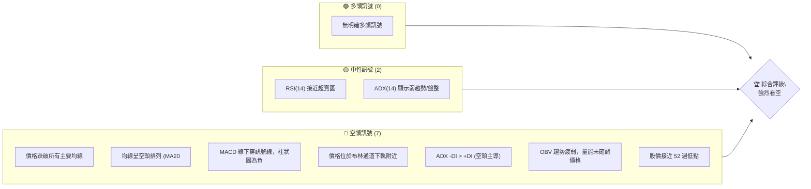

### 📊 核心指標速覽表

| 指標類別 | 指標名稱 | 當前數值 | 訊號 | 解讀 |
|----------|----------|----------|------|------|
| **價格** | 當前價格 | $368.57 | 🔴 | 股價位於所有主要均線下方 |
| **均線** | MA20 | $396.02 | 🔴 | 價格遠低於 MA20，短期壓力顯著 |
| **均線** | MA50 | $409.51 | 🔴 | 價格遠低於 MA50，中期趨勢向下 |
| **均線** | MA200 | $445.63 | 🔴 | 價格遠低於 MA200，長期趨勢轉弱 |
| **動能** | RSI(14) | 31.47 | 🟡 | 接近超賣區 (30)，短期有反彈可能，但趨勢仍弱 |
| **動能** | MACD | -13.671 | 🔴 | MACD 線在訊號線下方，柱狀圖為負，空頭動能強勁 |
| **波動** | ATR(14) | $13.00 | 🟡 | 每日波動約 3.53%，屬中等偏高波動 |

### 🏆 技術評分卡

當前 MSFT 的技術評分卡顯示整體趨勢極為疲弱，各項指標均指向空頭。儘管 RSI 接近超賣可能預示短期反彈，但缺乏其他多頭訊號的確認，因此整體評級為「強烈看空」。

```
╔══════════════════════════════════════════════════════════════╗
║              技術評分卡 — MSFT (2026-06-29)                  ║
╠══════════════════════════════════════════════════════════════╣
║ 趨勢強度      █░░░░░░░░░░░░░░░░░░░  10/100  🔴               ║
║ 動能指標      ██░░░░░░░░░░░░░░░░░░  20/100  🔴               ║
║ 支撐穩定度    ████░░░░░░░░░░░░░░░░  40/100  🔴               ║
║ 成交量配合    ██░░░░░░░░░░░░░░░░░░  20/100  🔴               ║
║ 形態完整度    ████░░░░░░░░░░░░░░░░  40/100  🟡 (無明顯反轉形態)║
║ 均線排列      █░░░░░░░░░░░░░░░░░░░  10/100  🔴               ║
╠══════════════════════════════════════════════════════════════╣
║ 綜合評分      ██░░░░░░░░░░░░░░░░░░  25/100  🔴 強烈看空       ║
╚══════════════════════════════════════════════════════════════╝
```

---

## 2. 趨勢分析

### 🌐 多時框趨勢分析

MSFT 在所有檢視的時間框架內均呈現明確的下跌趨勢，尤其在中長期趨勢中，空頭力量佔據主導。

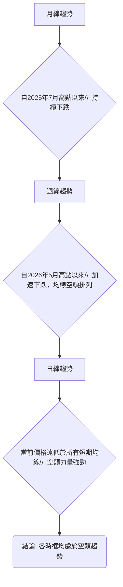

### 📈 長期趨勢 — 12個月走勢圖（Unicode）

過去 12 個月（2025 年 7 月至 2026 年 6 月），MSFT 股價經歷了從高峰到低谷的顯著轉變。2025 年 7 月達到 $529.27 的高點後，便開始震盪下行，尤其在 2026 年初加速下跌，並在 2026 年 3 月觸及 $369.37 的低點，隨後雖有反彈，但未能持續，最終在 2026 年 6 月再次跌至接近 3 月低點的 $368.57。

```
MSFT 月線走勢圖（過去12個月）
價格軸 ($)
$550 ┤                                        
$525 ┤●(25-07 高點 $529.27)
$500 ┤  ●       ● ●
$475 ┤        ●
$450 ┤                                    ●(26-05 $450.24)
$425 ┤            ●
$400 ┤                  ●
$375 ┤                    ●(26-03 低點 $369.37)━━━━━●(現在 $368.57)
$350 ┤                                        
     └─────────────────────────────────────────────────────
      2025-07  08  09  10  11  12  2026-01  02  03  04  05  06
```

**走勢特徵分析表格**

| 階段日期 | 起始價 | 結束價 | 漲跌幅 | 走勢特徵 |
|----------|--------|--------|--------|----------|
| 2025-07至2025-10 | $529.27 | $514.55 | -2.78% | 震盪盤整，初步顯示上升動能減弱 |
| 2025-10至2026-03 | $514.55 | $369.37 | -28.21% | 顯著下跌趨勢，形成一個較長的空頭階段 |
| 2026-03至2026-05 | $369.37 | $450.24 | +21.89% | 反彈修正，但未能突破關鍵長期阻力 |
| 2026-05至2026-06 | $450.24 | $368.57 | -18.14% | 再次加速下跌，跌破多數短期支撐 |

### 📊 中期趨勢（週線分析）

從近 20 週的數據來看，MSFT 的中期趨勢在 2026 年 5 月底達到 $450.24 的反彈高點後，便迅速轉為下跌。股價連續數週下跌，並在 2026 年 6 月跌破了 2026 年 3 月的低點 $369.37，顯示中期空頭趨勢確立且動能強勁。

```
MSFT 近期壓力與支撐示意圖 (週線)
══════════════════════════════════════════════════════════════
$450.24 ║═════════════════════════════════════════(2026-05-31 高點)
        ║      ↓                                    
        ║      ↓                                    
$421.01 ║───────────────────────────────R1 (2026-05-17 阻力)
        ║      ↓                                    
$396.02 ║────────────────────MA20 (下降趨勢線/阻力)
        ║      ↓                                    
$375.30 ║───────────MA10 (短期阻力)
$368.57 ╠═════════════════════════════════════════◄ 現價
        ║      ↓
$369.37 ║───────────────────────────────S1 (2026-03-08 低點 曾為支撐)
        ║      ↓
$349.20 ║═════════════════════════════════════════S2 (52週低點)
══════════════════════════════════════════════════════════════
```
當前股價 $368.57 已經跌破了 2026 年 3 月的低點 $369.37，這是一個重要的中期看空訊號，意味著前期的支撐已經轉化為阻力。

### ⚡ 趨勢強度評估（ADX 解讀）

ADX 指標用於衡量趨勢的強度，而非方向。當前 MSFT 的 ADX(14) 數值為 24.39，略低於 25 的閾值，這通常表示趨勢相對較弱，或處於盤整階段。然而，我們需要結合 +DI 和 -DI 來判斷趨勢的方向。

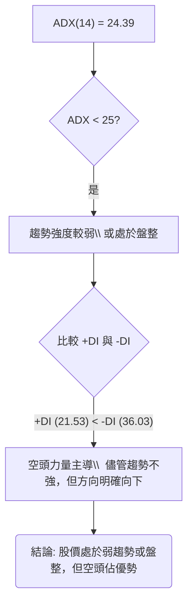

**ADX 強度對照表**

| ADX 數值 | 趨勢強度 | 解讀 |
|----------|----------|------|
| 0-25     | 弱趨勢/盤整 | 趨勢不明顯，或處於橫盤整理階段 |
| 25-50    | 中等趨勢 | 趨勢開始確立，可順勢操作 |
| 50-75    | 強趨勢 | 趨勢明確且強勁，通常伴隨價格快速波動 |
| 75-100   | 極強趨勢 | 極端趨勢，可能伴隨超買超賣 |

儘管 ADX 數值提示趨勢強度不強，但 -DI (36.03) 明顯高於 +DI (21.53)，這清晰地表明在當前的市場環境下，空頭力量佔據主導地位。因此，儘管整體市場可能處於一個相對弱勢的趨勢或盤整期，MSFT 股價的內部動能明確指向下跌。這意味著，即使沒有強勁的單邊趨勢，下跌的風險仍然存在，且空頭易於控制局面。

---

## 3. 圖表形態分析

### 🔍 形態識別系統

從提供的月度收盤價和近期週線數據來看，MSFT 在過去一年中呈現出一個「下降通道」的趨勢形態。自 2025 年 7 月的高點 $529.27 以來，股價雖然有反彈，但高點和低點均逐漸下移，形成了一個斜向下的通道。近期從 2026 年 5 月底 $450.24 的反彈高點開始的急劇下跌，則可以視為在下降通道內部的「熊旗」或「下跌三法」的延續性形態，預示著進一步下跌的可能。

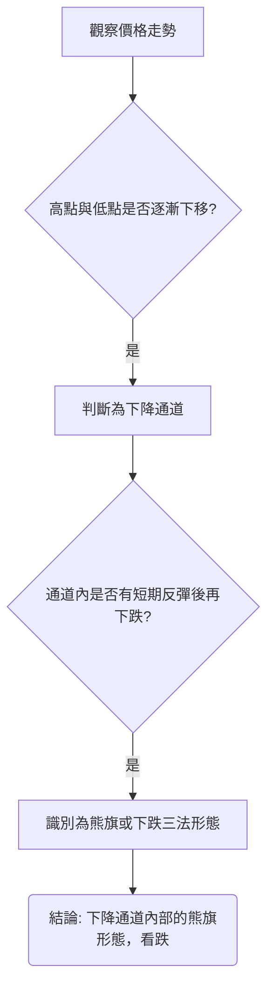

### 🕯️ 重要K線形態分析

根據近 20 週的收盤價和週成交量數據，我們可以觀察到幾個關鍵的 K 線組合和其暗示：

| 日期 | 收盤價 | RSI | MACD柱 | 週成交量 | K線形態 (週) | 解讀 | 訊號 |
|------|--------|-----|--------|----------|--------------|------|------|
| 2026-04-19 | $421.88 | 92.9 | +7.379 | 208,524,300 | **巨量長陽線** | RSI 過熱，成交量放大，短期衝高 | 🔴 (超買回落風險) |
| 2026-04-26 | $423.70 | 75.0 | +5.196 | 154,774,300 | **高位十字星** | 衝高後動能減弱，買賣雙方力量均衡 | 🟡 (潛在反轉) |
| 2026-05-31 | $450.24 | 71.7 | +1.773 | 186,204,400 | **高位射擊之星/烏雲蓋頂** | 大幅上漲後出現長上影線或被陰線吞噬，伴隨 RSI 超買，反轉訊號強烈 | 🔴 (強烈看空) |
| 2026-06-07 | $416.67 | 48.1 | -0.617 | 191,384,400 | **長陰線** | 股價大幅下跌，吞噬前週部分漲幅，確認空頭力量 | 🔴 (趨勢確認) |
| 2026-06-21 | $379.40 | 18.6 | -5.056 | 165,475,200 | **錘子線/啟明星 (RSI超賣)** | RSI 跌至超賣區，股價在低位震盪，可能預示短期築底或反彈 | 🟡 (潛在短期反彈) |
| 2026-06-28 | $372.97 | 31.3 | -4.092 | 382,619,800 | **巨量長陰線** | 再次大幅下跌，且伴隨巨量，顯示恐慌性拋售或空頭持續增強 | 🔴 (趨勢確認) |
| 2026-07-05 | $368.57 | 31.5 | -3.207 | 50,623,520 | **小陰線** | 承接前週跌勢，但成交量縮小，顯示下跌動能暫緩或市場觀望 | 🟡 (短暫喘息/盤整) |

**總結**：在 2026 年 5 月底的高位出現了強烈的看空反轉 K 線形態 (射擊之星/烏雲蓋頂)，隨後被多根長陰線確認。儘管 2026 年 6 月 21 日曾出現 RSI 超賣和潛在的築底形態，但隨後一週的巨量長陰線 $372.97 再次確認了強勁的下跌趨勢。最新的小陰線伴隨縮量，可能只是下跌過程中的暫時停頓。

### 📉 ASCII 走勢形態示意圖

以下示意圖描繪了 MSFT 自 2025 年 7 月高點以來的下降通道走勢，以及近期加速下跌形成熊旗的潛在形態。

```
MSFT 下降通道與熊旗形態示意圖
══════════════════════════════════════════════════════════════════════
$550 ║                                                                  
$525 ║● (25-07 高點)                                                    
$500 ║  ╲                                                               
$475 ║    ╲                                                             
$450 ║      ╲                                       ● (26-05 高點)    
$425 ║        ╲                                     ╱                 
$400 ║          ╲                                 ╱                   
$375 ║            ╲               ● (26-03 低點)╱                     
$350 ║              ╲           ╱             ╲                     
$325 ║                ╲       ╱                 ╲                   
     ╚══════════════════════════════════════════════════════════════════
          25-07    25-10    26-01    26-03    26-05    26-07
                                             (熊旗形態)
                                             ╲     
                                               ╲   
                                                 ● (現價 $368.57)
```
圖中可見，股價在一個下降通道中運行。2026 年 5 月底的反彈未能突破通道上沿，隨後股價急劇下跌，形成了一個類似熊旗的旗桿，目前的走勢則可能在構建旗面。

### 🎯 形態目標價計算

由於當前形態為下降通道內的加速下跌，且沒有明確的頭肩頂或雙頂等反轉形態的頸線可供精確計算，我們將基於下降通道的寬度以及熊旗形態的理論目標價進行估算。

**1. 下降通道目標價：**
*   通道上沿約在 $529.27 (2025-07) 和 $450.24 (2026-05) 連線。
*   通道下沿約在 $369.37 (2026-03) 和 $368.57 (當前價格) 附近。
*   如果股價維持在通道下沿運行，並考慮近期跌破 $369.37 支撐，通道的下行目標可能指向 52 週低點 $349.20 甚至更低。

**2. 熊旗形態目標價：**
熊旗形態的理論目標價通常是旗桿的長度從旗面突破點向下投射。
*   旗桿的長度：從 2026 年 5 月 31 日的高點 $450.24 到 2026 年 6 月 21 日的低點 $379.40。
*   旗桿長度 = $450.24 - $379.40 = $70.84。
*   如果將突破點視為當前價格 $368.57 附近的潛在跌破，則目標價為：
    *   目標價 = 旗面突破點 - 旗桿長度 = $368.57 - $70.84 = $297.73。
    *   **注意**：此目標價較低，代表極端悲觀情境下的理論值，實際走勢可能在更強的支撐位 (如 $349.20) 獲得支撐。

**綜合目標價區間**：
考量到 52 週低點 $349.20 是一個重要的心理及技術支撐，在未跌破此價位前，熊旗的極端目標價可能難以實現。因此，短期內，若下跌趨勢持續，目標價可能會落在 $349.20。若 $349.20 被有效跌破，則熊旗形態的理論目標價 $297.73 將成為潛在目標。

*   **短期形態目標價 (跌破 $369.37 後)**：$349.20 (52週低點)
*   **中期形態目標價 (若跌破 $349.20)**：$297.73 (熊旗理論目標)

---

## 4. 支撐與阻力

### 🗺️ 關鍵價位分布圖（Unicode）

MSFT 目前處於關鍵的支撐區域。股價跌破了多個重要均線和歷史支撐位，上方阻力重重，下方則逼近 52 週低點。

```
MSFT 價位結構分布圖
═══════════════════════════════════════════════════
$551.05 ║████████████████████████║ 強阻力 R4 (52週高點)
$529.27 ║████████████████████████║ 強阻力 R3 (2025-07 高點)
$452.20 ║████████████████████    ║ 阻力 R2 (布林上軌)
$445.63 ║████████████████████████║ 關鍵阻力 R1 (MA200)
$409.51 ║▓▓▓▓▓▓▓▓▓▓▓▓▓▓▓▓        ║ 中期阻力 (MA50)
$396.02 ║▓▓▓▓▓▓▓▓▓▓▓▓▓▓▓▓        ║ 短期阻力 (MA20 / 布林中軌)
$368.57 ╠════════════════════════╣ ◄ 現價
$369.37 ║▓▓▓▓▓▓▓▓▓▓▓▓▓▓▓▓        ║ 近期支撐 S1 (2026-03 低點，現已跌破)
$349.20 ║████████████████████████║ 強支撐 S2 (52週低點)
$339.85 ║████████████████████████║ 強支撐 S3 (布林下軌)
═══════════════════════════════════════════════════
```

### 🚧 阻力位分析表

| 阻力級別 | 價位 | 形成原因 | 突破難度 | 重要性 |
|----------|------|----------|----------|--------|
| **近期阻力** | $375.30 | MA10 (下降趨勢中移動平均線是重要阻力) | 高 | 🟢 (需首先克服) |
| **短期阻力** | $396.02 | MA20 / 布林中軌 | 中高 | 🟡 (反彈關鍵位) |
| **中期阻力** | $409.51 | MA50 | 高 | 🔴 (中期趨勢反轉門檻) |
| **關鍵阻力** | $445.63 | MA200 | 極高 | 🔴 (長期趨勢反轉門檻) |
| **強阻力** | $452.20 | 布林上軌 / 2026-05-31 高點 $450.24 | 極高 | 🔴 (強烈賣壓區) |

### 🛡️ 支撐位分析表

| 支撐級別 | 價位 | 形成原因 | 守住機率 | 重要性 |
|----------|------|----------|----------|--------|
| **現有支撐** | $369.37 | 2026-03-08 低點 (已跌破，現為微弱阻力) | 低 | 🔴 (跌破確認空頭) |
| **關鍵支撐** | $349.20 | 52 週低點 | 中 | 🟢 (市場關注焦點，若跌破則跌勢加速) |
| **強支撐** | $339.85 | 布林通道下軌 | 中高 | 🟡 (極端超賣區，可能引發技術性反彈) |

### 📐 斐波那契回調位分析

我們以 2025 年 7 月的高點 ($529.27) 和 2026 年 6 月的當前低點 ($368.57) 作為主要下跌波段，計算潛在的反彈回調位。這些價位將作為未來反彈時的潛在阻力。

*   **下跌波段**：$529.27 (高點) 至 $368.57 (低點)
*   **下跌幅度**：$529.27 - $368.57 = $160.70

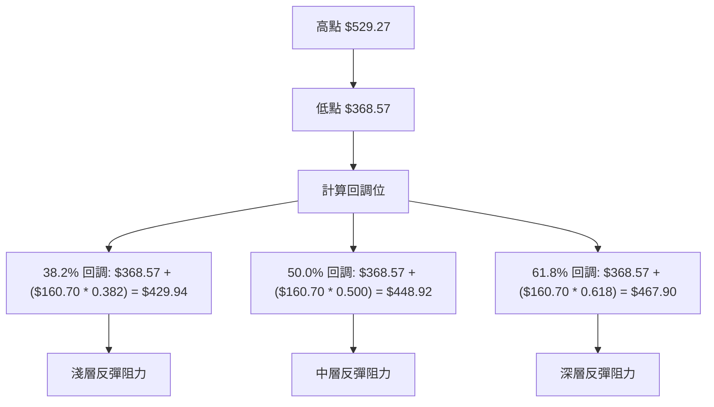

**斐波那契回調位詳情**：

| 斐波那契級別 | 回調價位 | 意義 | 訊號 |
|--------------|----------|------|------|
| **38.2%**    | $429.94 | 淺層反彈阻力，通常為弱勢反彈的目標 | 🔴 |
| **50.0%**    | $448.92 | 中層反彈阻力，若能突破顯示反彈動能增強 | 🔴 |
| **61.8%**    | $467.90 | 強勢反彈阻力，若能突破可能轉為震盪或反轉 | 🔴 |

當前股價 $368.57 距離這些回調位尚遠，顯示其反彈潛力有限，或者需要極大的買盤力量才能觸及這些阻力。這些斐波那契回調位將作為未來任何反彈行情的重要阻力參考點。

---

## 5. 技術指標深度解讀

### 🎛️ 指標訊號總覽

當前 MSFT 的技術指標呈現高度一致的看空訊號，均線系統、動能指標和成交量分析都指向下跌。

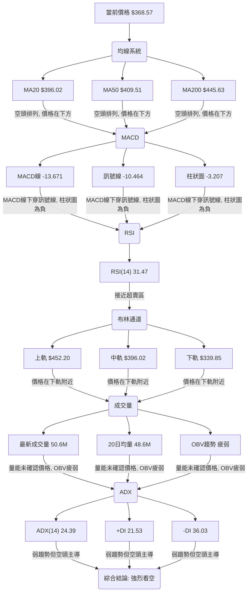

### 📈 移動平均線排列分析

MSFT 的移動平均線系統呈現典型的「空頭排列」，這是極為強烈的看空訊號。當前股價 $368.57 遠低於所有主要移動平均線，顯示短期、中期和長期趨勢均已轉為下跌。

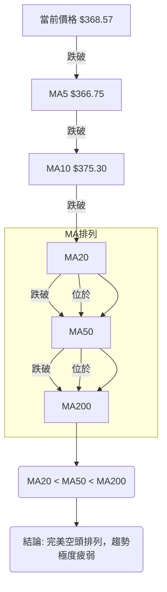
**當前均線排列狀態**：
*   MA5 ($366.75) < MA10 ($375.30) < MA20 ($396.02) < MA50 ($409.51) < MA200 ($445.63)
*   所有短期、中期、長期均線均呈現向下傾斜，並由短期到長期依次向下排列。這表明市場處於強烈的下跌趨勢中，任何反彈都可能在這些均線位置遭遇強大阻力。

### 📉 RSI(14) 分析

RSI(14) 當前數值為 31.47。

**RSI 數值進度條**：
RSI(14) 強度：██████░░░░░░░░░░░░░░  31.47/100 (接近超賣)

**超買超賣區間分析**：
*   RSI 數值 31.47 處於 30-70 的中性區間下沿，非常接近傳統的超賣區 (RSI < 30)。
*   這表明股價已經經歷了顯著的下跌，賣壓沉重，短期內可能存在技術性反彈的需求。
*   然而，RSI 接近超賣並不代表趨勢會立即反轉，在強勢空頭市場中，RSI 可能會長時間維持在 30 附近甚至更低。

**背離判斷 (頂背離/底背離)**：
*   根據提供的數據，RSI 在 2026-06-21 達到 18.6，隨後在 2026-06-28 和 2026-07-05 略微回升至 31.3 和 31.5。
*   在此期間，股價從 $379.40 (2026-06-21) 下跌至 $368.57 (2026-07-05)。
*   雖然 RSI 從 18.6 上升至 31.5，而價格卻從 $379.40 下跌至 $368.57，這構成了一個潛在的「底背離」訊號。
*   **結論**：存在輕微的 **🟢 底背離** 跡象 (RSI 上升但價格下跌)。這可能預示著短期內下跌動能有所減弱，或者潛在的短期反彈。然而，由於背離強度不高且整體趨勢極弱，其反轉訊號的可信度仍需其他指標確認。

### 📊 MACD(12/26/9) 訊號解讀

MACD 是動能指標，由 MACD 線、訊號線和柱狀圖組成。

*   **MACD 線**：-13.671
*   **MACD 訊號線**：-10.464
*   **MACD 柱狀圖**：-3.207

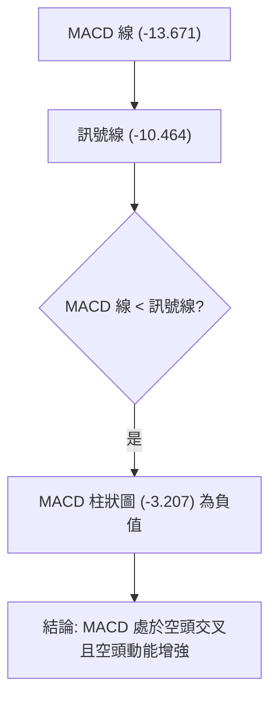

**MACD 分析**：
*   MACD 線位於訊號線下方，這是一個明確的 **🔴 賣出訊號**，表示短期動能弱於中期動能。
*   MACD 柱狀圖為負值 (-3.207)，且正在向下擴大 (從前一週的 -4.092 略微縮小至 -3.207，但仍為負值)，這表明空頭動能依然強勁。雖然柱狀圖絕對值略有縮小，但仍處於負值區間，且 MACD 線與訊號線的距離並未明顯收窄，這並非反轉訊號，僅可能為空頭力度略微放緩。
*   **背離判斷**：從提供的數據看，MACD 柱狀圖從 2026-06-21 的 -5.056 到 2026-07-05 的 -3.207 絕對值有所縮小，而價格仍在下跌。這與 RSI 的底背離有相似之處，但也屬於較弱的背離，需要謹慎對待。

### 📦 布林通道分析

布林通道由三條線組成：上軌、中軌 (MA20) 和下軌。

*   **布林上軌**：$452.20
*   **布林中軌 (MA20)**：$396.02
*   **布林下軌**：$339.85
*   **當前價格**：$368.57
*   **BB %B**：0.26 (表示價格位於下軌和中軌之間，靠近下軌)

```
MSFT 布林通道示意圖
═══════════════════════════════════════════════════
$452.20 ║████████████████████████║ 上軌 (Upper Band)
        ║                        ║
$396.02 ║────────────────────────║ 中軌 (MA20)
        ║                        ║
$368.57 ╠════════════════════════╣ ◄ 現價 (BB %B = 0.26)
        ║▓▓▓▓▓▓▓▓▓▓▓▓▓▓▓▓        ║
$339.85 ║████████████████████████║ 下軌 (Lower Band)
═══════════════════════════════════════════════════
```

**布林通道解讀**：
*   當前價格 $368.57 位於布林通道的中軌 ($396.02) 和下軌 ($339.85) 之間，且非常接近下軌。BB %B 為 0.26，進一步確認了這一點。
*   這是一個 **🔴 強烈看空訊號**，表明股價處於布林通道的下半部分，賣壓沉重。
*   價格貼近下軌通常表示市場處於超賣狀態，可能會在短期內出現技術性反彈。然而，在強勢下跌趨勢中，價格可能會沿著下軌運行，甚至跌破下軌，形成「通道外運行」的極端趨勢。
*   布林通道的寬度 (上軌 $452.20 - 下軌 $339.85 = $112.35) 相對較寬， ATR 為 $13.00 (3.53% of price)，顯示市場波動性較高。在波動性較高的下跌趨勢中，價格觸及下軌後反彈的幅度可能有限，且隨後可能再次回歸下跌。

### 💹 成交量分析（量價配合度）

成交量是確認價格趨勢的重要指標。

*   **最新成交量**：50,623,520
*   **20 日均量**：48,608,641 (量比: 1.04x)
*   **50 日均量**：40,899,464
*   **OBV 趨勢**：OBV < MA → 量能疲弱

**量價配合度解讀**：
*   最新成交量略高於 20 日均量 (量比 1.04x)，這表明在近期下跌過程中，成交量相對活躍。
*   **OBV (On Balance Volume)** 趨勢顯示 OBV 線低於其移動平均線 (OBV < MA)，這是一個 **🔴 看空訊號**。OBV 疲弱表明在價格下跌的過程中，賣出量超過買入量，且累積的買盤力量不足以支撐價格，確認了當前下跌趨勢的健康性 (即有量能配合下跌)。
*   結合近期的週成交量數據：2026-06-28 的週成交量高達 382,619,800，伴隨價格大幅下跌至 $372.97，這是一個 **🔴 恐慌性拋售或空頭持續增強** 的訊號。最新的週成交量 (50,623,520) 雖然大幅縮小，但這是因為數據點是當週的第一天，不具備代表性，應參考前一週的巨量下跌。
*   **結論**：整體而言，成交量配合價格下跌，且 OBV 趨勢疲弱，顯示下跌趨勢獲得量能的確認。短期雖然成交量縮小可能預示著下跌動能暫緩，但除非出現巨量止跌反轉，否則量價配合仍指向空頭。

---

## 6. 動能與波動率

### ⚡ 動能評估四象限

根據當前的技術指標，MSFT 處於「弱動能」且「中等波動」的狀態。

| 象限 | 動能 | 波動 | 當前狀態 | 評估 |
|------|------|------|----------|------|
| Q1   | 強   | 低   | -        | 最佳機會 (趨勢強勁，風險較低) |
| Q2   | 弱   | 低   | ✓ (當前) | **謹慎觀望 (趨勢不明，風險較低)** |
| Q3   | 強   | 高   | -        | 高風險高收益 (追漲殺跌，風險高) |
| Q4   | 弱   | 高   | -        | 避免進場 (趨勢不明，風險高) |

**當前 MSFT 動能評估**：
*   **動能**：RSI 接近超賣，MACD 處於空頭排列且柱狀圖為負。所有均線均呈空頭排列，價格遠低於均線。這些都強烈表明當前動能為 **🔴 弱動能**。
*   **波動率**：ATR(14) 為 $13.00，佔股價的 3.53%。對於大型科技股而言，這屬於 **🟡 中等偏高波動**。

**結論**：MSFT 目前處於動能疲弱，但波動性不低的狀態。這意味著股價雖然在下跌，但下跌的趨勢強度 (ADX < 25) 並不極端，且每日的波動幅度較大。這種情況下，不適合追空，因為下跌可能會有較大的反彈或震盪，但也不適合做多，因為缺乏上漲動能。應採取謹慎觀望策略，等待趨勢明確或動能反轉訊號。

### 📊 ATR 波動率分析

ATR (Average True Range) 衡量資產的波動性。MSFT 的 ATR(14) 為 $13.00，佔當前價格 $368.57 的 3.53%。

*   **ATR 數值**：$13.00
*   **佔比**：3.53%
*   **解讀**：ATR 數值顯示 MSFT 每日平均波動幅度約為 $13.00。這是一個相對較高的波動水平，尤其是在當前價格基礎上。高 ATR 意味著股價在日內或短期內可能出現較大的漲跌幅。

**止損距離建議**：
在波動性較高的環境下，設置止損點時應考慮 ATR。一個常見的策略是將止損點設置在當前價格的 1.5 倍至 2 倍 ATR 之外，以避免被日常波動「洗出場」。
*   **1.5 倍 ATR 止損**：$13.00 * 1.5 = $19.50
*   **2 倍 ATR 止損**：$13.00 * 2 = $26.00

對於空頭策略，如果進場價格為 $368.57，止損點可以設置在上方 $368.57 + $19.50 = $388.07 或 $368.57 + $26.00 = $394.57 附近，這也接近 MA20 等短期阻力。對於潛在的反彈做多策略，止損點可以設置在下方 $368.57 - $19.50 = $349.07 或 $368.57 - $26.00 = $342.57 附近，這也接近 52 週低點 $349.20 和布林下軌 $339.85。

### 📐 Beta 與市場相關性

Beta 值衡量單一證券相對於整個市場的波動性。由於提供的數據中沒有 MSFT 的 Beta 值，我們無法進行精確計算。

**一般分析**：
*   作為一家大型科技公司，MSFT 通常被視為成長型股票，其 Beta 值通常會大於 1。這意味著 MSFT 的股價波動幅度通常會大於市場整體波動。
*   在市場上漲時，高 Beta 股票的漲幅可能超過市場；在市場下跌時，其跌幅也可能超過市場。
*   **推測**：考慮到 MSFT 的市場地位和行業特性，其 Beta 值很可能在 1.0 到 1.5 之間。這暗示著 MSFT 的股價波動與科技股指數或納斯達克指數的相關性較高，且波動幅度可能略大於市場。在當前整體市場情緒不佳或科技股承壓時，MSFT 的跌幅可能會相對顯著。

**投資含義**：
如果 MSFT 的 Beta 值較高，那麼在當前熊市環境下，投資者需要特別警惕其可能帶來的更大下行風險。任何市場的負面消息都可能對 MSFT 股價造成放大效應。

---

## 7. 多時框架總結

### 📋 時框架評分表

| 時框架 | 趨勢方向 | 動能 | 均線排列 | 形態 | 綜合評分 | 建議 |
|--------|----------|------|----------|------|----------|------|
| **長期 (月線)** | 🔴 下跌 | 🔴 弱 | 🔴 空頭 | 🔴 下降通道 | 2/10     | 🔴 避開 |
| **中期 (週線)** | 🔴 下跌 | 🔴 弱 | 🔴 空頭 | 🔴 熊旗延續 | 1/10     | 🔴 賣出/做空 |
| **短期 (日線)** | 🔴 下跌 | 🟡 止跌 | 🔴 空頭 | 🟡 潛在底背離 | 3/10     | 🟡 觀望/謹慎反彈 |

**評分說明**：
*   **長期**：月線圖顯示自 2025 年 7 月以來，高點和低點持續下移，形成清晰的下降通道。均線已呈現空頭排列。
*   **中期**：週線圖顯示自 2026 年 5 月底反彈高點 $450.24 後，股價加速下跌，形成熊旗形態，並跌破多個關鍵支撐。均線系統已完全空頭排列。
*   **短期**：日線（由均線和動能指標推斷）顯示股價在所有均線下方，但 RSI 接近超賣區，且存在輕微的底背離，MACD 柱狀圖絕對值略有縮小，可能預示短期下跌動能減緩，或有技術性反彈需求。然而，整體趨勢仍為空頭。

### 🔲 綜合訊號矩陣

MSFT 的多時框架分析顯示，各個時間維度的訊號高度一致地指向空頭。儘管短期內可能出現技術性反彈，但這並不足以改變整體下跌趨勢。

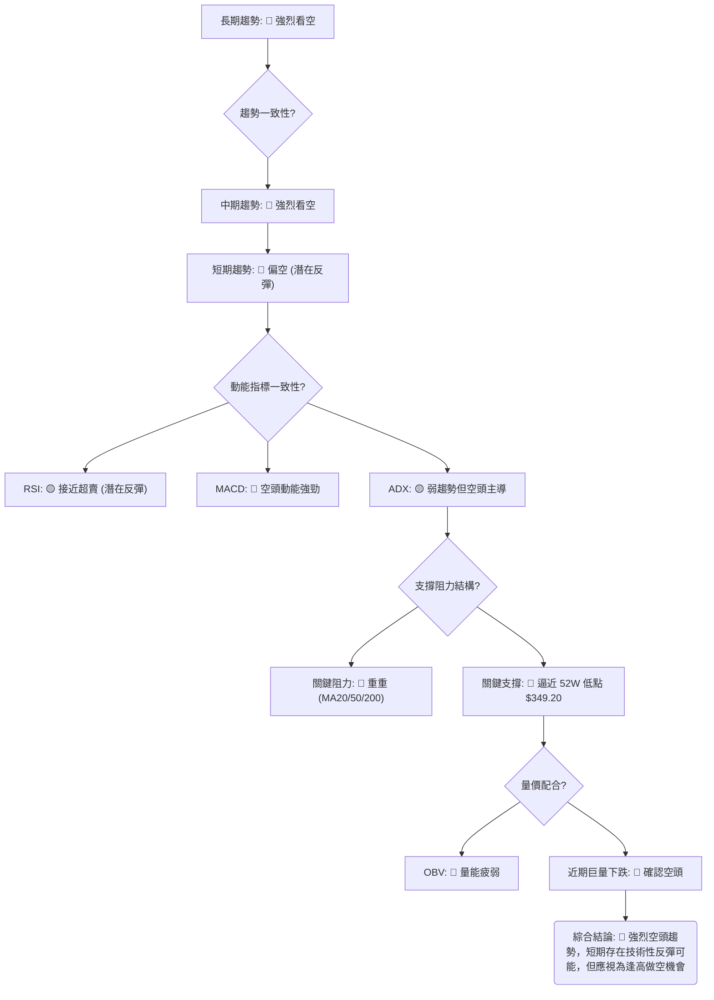

**一致性分析**：
*   **趨勢方向**：長期、中期、短期均為下跌趨勢，一致性極高。
*   **動能指標**：MACD 和 ADX 的方向性指標均指向空頭。RSI 雖接近超賣，但這更多是下跌過程中的一個現象，而非趨勢反轉的強烈訊號。
*   **均線排列**：所有均線均呈空頭排列，無一例外。
*   **支撐與阻力**：當前價格位於所有均線下方，這些均線均構成強大阻力。下方支撐僅剩 52 週低點，一旦跌破，下行空間巨大。
*   **量價配合**：OBV 疲弱且近期伴隨巨量下跌，確認了空頭趨勢的健康性。

**總結**：MSFT 目前處於一個非常不利的技術位置。多時框架分析均指出其強烈的下跌趨勢和空頭主導的市場情緒。儘管短期內可能因超賣而出現技術性反彈，但這應被視為逢高做空的機會，而非入場做多的訊號。投資者應極度謹慎，密切關注 52 週低點 $349.20 的支撐作用。

---

## 8. 交易策略建議

基於當前 MSFT 的強烈空頭趨勢和各項指標的綜合判斷，主要交易策略應偏向於做空或觀望。做多策略將被視為高風險的逆勢交易。

### 🗺️ 策略決策流程圖

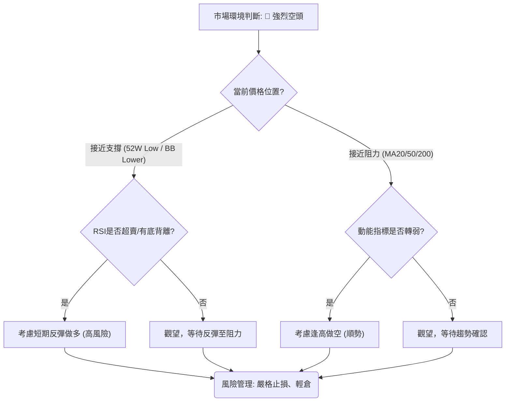

### 🟢 多頭策略詳情 (反彈交易 - 高風險)

此策略為逆勢交易，風險極高，僅適用於激進型交易者且需嚴格控制倉位與止損。目標是捕捉股價在極度超賣後的技術性反彈。

| 策略要素 | 策略 A (超跌反彈) |
|----------|--------------------|
| 進場條件 | 股價接近 52 週低點且 RSI 嚴重超賣 (<25) 並出現止跌 K線形態 |
| 進場價格 | $350.00 (略高於 52W 低點 $349.20) |
| 目標價 T1 | $375.00 (MA10 附近) |
| 目標價 T2 | $396.00 (MA20 / 布林中軌) |
| 止損價格 | $345.00 (跌破 52W 低點 $349.20 下方約 1.5 倍 ATR) |
| 風險報酬比 | T1: (375-350)/(350-345) = 25/5 = 5:1 <br> T2: (396-350)/(350-345) = 46/5 = 9.2:1 |
| 成功機率 | 30% (逆勢交易風險高) |
| 建議倉位 | 5% (極輕倉) |
**備註**：當前 RSI 31.47 尚未達到嚴重超賣，且缺乏明確止跌 K線。此策略需等待更強烈的超賣訊號和底部形態確認。

### 🔴 空頭策略詳情 (順勢交易 - 中高風險)

此策略符合當前主要趨勢，風險相對較低，但仍需警惕短期反彈。

| 策略要素 | 策略 A (反彈逢高做空) | 策略 B (跌破支撐追空) |
|----------|------------------------|------------------------|
| 進場條件 | 股價反彈至 MA20 或 MA50 附近受阻，且動能指標再次轉弱 | 股價有效跌破 52 週低點 $349.20，伴隨放量 |
| 進場價格 | $396.00 (MA20 附近) | $348.00 (跌破 $349.20 確認後) |
| 目標價 T1 | $368.00 (現價附近，作為第一目標) | $339.00 (布林下軌附近) |
| 目標價 T2 | $349.00 (52 週低點) | $298.00 (熊旗形態理論目標) |
| 止損價格 | $405.00 (略高於 MA50) | $355.00 (跌破價位上方約 0.5 倍 ATR) |
| 風險報酬比 | T1: (396-368)/(405-396) = 28/9 = 3.1:1 <br> T2: (396-349)/(405-396) = 47/9 = 5.2:1 | T1: (348-339)/(355-348) = 9/7 = 1.28:1 <br> T2: (348-298)/(355-348) = 50/7 = 7.1:1 |
| 成功機率 | 70% | 60% |
| 建議倉位 | 10-15% | 10-15% |
**備註**：策略 A 需等待股價反彈，提供更好的入場點和風險報酬比。策略 B 追空風險較高，需密切關注放量跌破的確認。

### ⭐ 整體訊號強度評星

基於當前所有指標和多時框架分析，MSFT 的整體訊號強度偏向空頭。

```
做多訊號強度：★★☆☆☆  (2/5星) (僅基於超賣和潛在底背離的短期反彈預期)
做空訊號強度：★★★★☆  (4/5星) (趨勢明確，指標一致性高)
整體可信度：  ★★★☆☆  (3/5星) (空頭趨勢可信度高，但短期波動和反彈風險需注意)
```

---

## 9. 風險提示與監控

### ✅ 關鍵監控指標 Checklist

在當前空頭主導的市場環境下，投資者應密切監控以下關鍵指標，以應對可能的市場變化。

```
╔══════════════════════════════════════════════════════════════╗
║              MSFT 關鍵監控指標 Checklist                     ║
╠══════════════════════════════════════════════════════════════╣
║ [ ] 價格是否有效跌破 $349.20 (52週低點)                      ║
║ [ ] 價格是否能反彈並站穩於 MA20 ($396.02) 之上                ║
║ [ ] RSI(14) 是否跌破 20 (極端超賣) 或回升至 50 以上 (動能轉強)║
║ [ ] MACD 是否出現金叉 (MACD線上穿訊號線) 或柱狀圖轉正         ║
║ [ ] ADX(14) 是否上升至 25 以上，且 +DI 上穿 -DI (趨勢反轉)    ║
║ [ ] OBV 趨勢是否轉強 (OBV線上穿其MA)                          ║
║ [ ] 成交量是否出現巨量止跌陽線 (反轉訊號)                      ║
║ [ ] K線形態是否出現明確的底部反轉形態 (如 W 底、頭肩底)       ║
║ [ ] 市場是否有重大正面消息或產業利好 (基本面變化)              ║
╚══════════════════════════════════════════════════════════════╝
```

### ⚠️ 風險場景分析

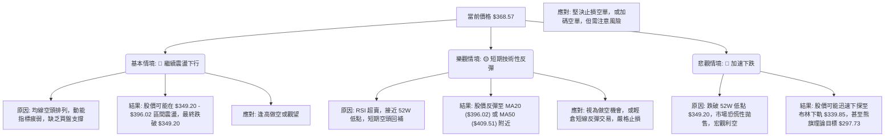

### 🛡️ 風險管理重要提醒

1.  **倉位管理**：在當前強烈空頭趨勢下，做多倉位應極輕，做空倉位也應控制在合理範圍內 (例如總投資組合的 10-15%)。避免重倉逆勢交易。
2.  **嚴格止損**：無論採取何種策略，都必須設定並嚴格執行止損點。在波動較高的市場中，止損是保護資本的關鍵。建議止損範圍為 1.5 倍至 2 倍 ATR。
3.  **趨勢為王**：順應趨勢交易通常比逆勢交易的成功率更高。在明確的空頭趨勢中，應避免盲目抄底，任何反彈都應被視為檢視或調整空頭倉位的機會。
4.  **分批操作**：無論是進場還是出場，建議採用分批操作，以平攤風險並優化平均成本。
5.  **耐心等待**：在趨勢不明或波動劇烈時，保持觀望是最好的策略。等待明確的趨勢反轉訊號或更佳的入場點。
6.  **市場情緒**：密切關注市場整體情緒和宏觀經濟數據，特別是科技股板塊的表現。微軟作為科技巨頭，其股價表現與市場情緒高度相關。

---

## 📋 報告總結

```
╔════════════════════════════════════════════════════════════════════╗
║                   MSFT 技術分析報告總結                            ║
╠════════════════════════════════════════════════════════════════════╣
║ 報告日期：2026-06-29                                               ║
║ 當前價格：$368.57                                                  ║
║ 分析評級：🔴 強烈看空 (整體技術面呈現顯著空頭趨勢，風險極高)        ║
║                                                                    ║
║ 關鍵結論：                                                         ║
║ ├─ 長期趨勢：🔴 強烈看空，股價處於下降通道中。                       ║
║ ├─ 中期趨勢：🔴 強烈看空，自 2026 年 5 月高點以來加速下跌，形成熊旗形態。║
║ ├─ 短期趨勢：🔴 偏空，價格遠低於所有短期均線，但 RSI 接近超賣，存在輕微底背離，短期或有技術性反彈。║
║ ├─ 關鍵支撐：$349.20 (52週低點)；若跌破，下一個支撐為 $339.85 (布林下軌)。║
║ ├─ 關鍵阻力：$396.02 (MA20 / 布林中軌)，其次為 $409.51 (MA50)。       ║
║ └─ 分析師目標：$561.11 (平均)；此目標與當前技術面嚴重背離，需謹慎對待。║
║                                                                    ║
║ 最優策略組合：                                                     ║
║ 1. 🥇 最佳機會：**逢高做空** — 等待股價反彈至 MA20 ($396.02) 或 MA50 ($409.51) 附近受阻時，建立空頭倉位，止損設於阻力位上方，目標指向 $349.20 和 $339.85。此策略順應趨勢，風險報酬比相對較優。║
║ 2. 🥈 次選機會：**跌破追空** — 若股價帶量有效跌破 $349.20 (52週低點)，可考慮追空，止損設於跌破點上方，目標指向熊旗理論目標 $297.73。此策略風險較高，需嚴格止損。║
║ 3. 🥉 保守選擇：**觀望等待** — 在當前多空交織、波動較大的情況下，保守投資者應保持觀望，等待趨勢更加明朗，或出現明確的底部反轉訊號再考慮入場。║
╚════════════════════════════════════════════════════════════════════╝
```

---

> ⚠️ **免責聲明**：本報告為 AI 自動生成之技術分析，所有數據及估算均基於提供的歷史價格資訊。本報告**僅供研究與學術參考**，**不構成任何投資建議**。投資有風險，入市需謹慎。

---

*報告生成時間：2026-06-29 ｜ 數據來源：Yahoo Finance ｜ 分析框架：多時框技術分析*