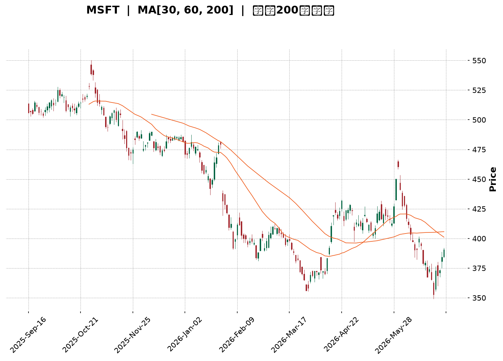
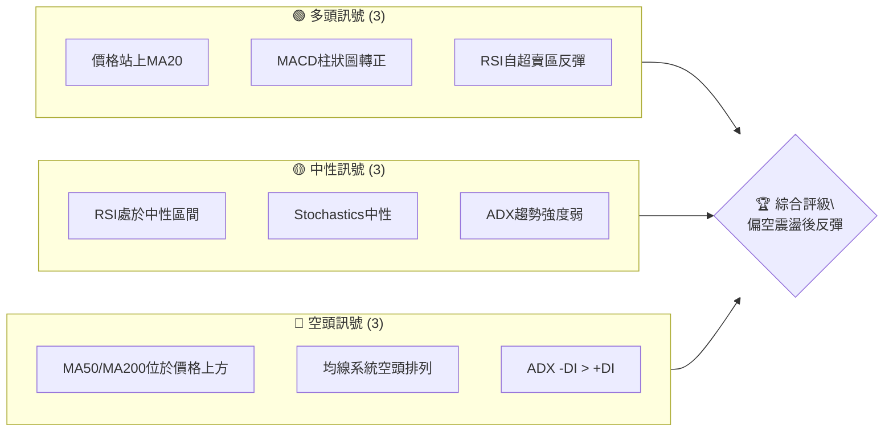
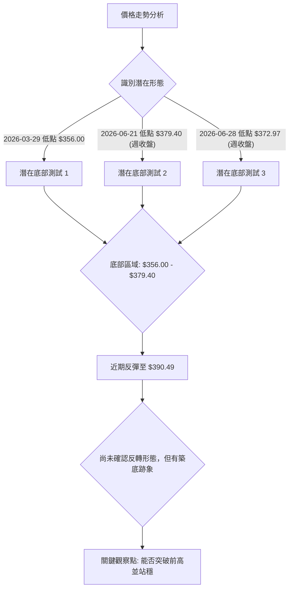
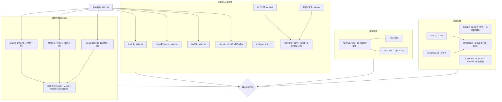
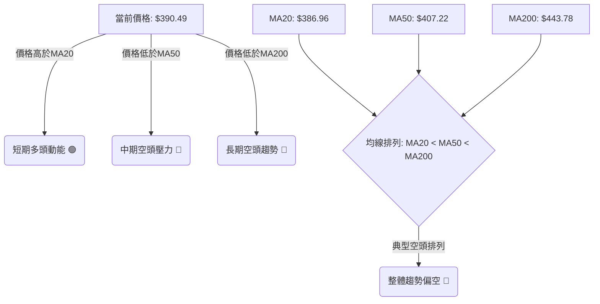
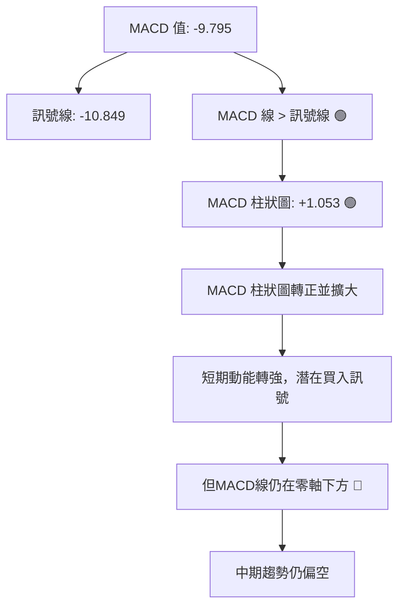
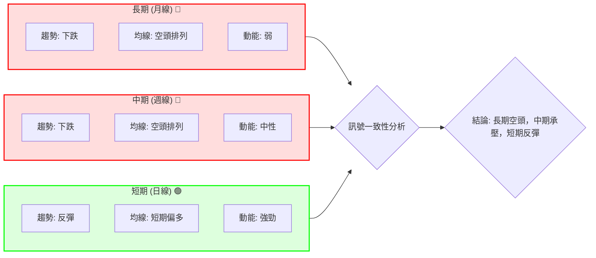

<details>
<summary>📊 靜態圖表 (點擊展開)</summary>

</details>

<html>
<head><meta charset="utf-8" /></head>
<body>
    <div style="height:500px; width:100%;">                        <script>window.PlotlyConfig = {MathJaxConfig: 'local'};</script>
        <script charset="utf-8" src="https://cdn.plot.ly/plotly-3.6.0.min.js" integrity="sha256-QaOVwtVY0T02VaHrr6pnoHLCwayMJp4O5n4YyaE3rJk=" crossorigin="anonymous"></script>                <div id="candlestick-chart" class="plotly-graph-div" style="height:100%; width:100%;"></div>            <script>                window.PLOTLYENV=window.PLOTLYENV || {};                                if (document.getElementById("candlestick-chart")) {                    Plotly.newPlot(                        "candlestick-chart",                        [{"close":{"dtype":"f8","bdata":"AAAAAGKdf0AAAADA9qx\u002fQAAAAIAAlH9AAAAAQF0VgEAAAAAAZvN\u002fQAAAAGBnoH9AAAAA4Aevf0AAAADgbH1\u002fQAAAAODbw39AAAAAIMj1f0AAAADghRWAQAAAAKCDI4BAAAAAQPQDgEAAAACgwBCAQAAAAMDyaYBAAAAAYHVFgEAAAAAAYEyAQAAAACDmOIBAAAAAwOi7f0AAAADACe1\u002fQAAAACBo5X9AAAAAQC7jf0AAAACAPsZ\u002fQAAAAACR5X9AAAAAIE0MgEAAAACgNxOAQAAAAKAcKoBAAAAAgEUqgEAAAACAhEKAQAAAAGBmgYBAAAAAwETVgEAAAABgItGAQAAAAACcU4BAAAAA4GgUgEAAAACANQ6AQAAAAKB98X9AAAAAAH5\u002ff0AAAACAi99+QAAAAOAX235AAAAAgAxtf0AAAACgqJd\u002fQAAAAIDFvn9AAAAAQPZBf0AAAAAAgq9\u002fQAAAAAC9hH9AAAAAIOuqfkAAAACg3kB+QAAAAADxxH1AAAAA4G1gfUAAAABAYH59QAAAAOAArn1AAAAAgI81fkAAAABAQp1+QAAAAOBPSX5AAAAAwD19fkAAAACgyrl9QAAAAMBU631AAAAAQEkQfkAAAAAgfY1+QAAAAOBqnX5AAAAAQAPHfUAAAABgORV+QAAAAOCIxn1AAAAAIHCLfUAAAABgcqR9QAAAAEAloH1AAAAAIFkdfkAAAAAgQDx+QAAAAGBSLH5AAAAAgBBLfkAAAACAs11+QAAAAGDDWH5AAAAAAAxPfkAAAACAGVV+QAAAACCdF35AAAAAwH1tfUAAAADgDmx9QAAAAGA3xn1AAAAAYDkVfkAAAAAg2L99QAAAAEB70n1AAAAAwAexfUAAAAAgVUl9QAAAAEB+lXxAAAAAgCpqfEAAAACAI518QAAAAAAUSHxAAAAAoEGie0AAAADgPBJ8QAAAAKAl\u002fnxAAAAAwB5DfUAAAABgMOd9QAAAAEDq931AAAAAwD\u002f5ekAAAAAAHsZ6QAAAAEDjV3pAAAAAoDCWeUAAAACgqMV5QAAAAGDLfnhAAAAA4Mj1eEAAAADAQrx5QAAAAAABt3lAAAAAQDwpeUAAAABA7wB5QAAAAOCm+HhAAAAAoJuxeEAAAAAAQd14QAAAAOCU2XhAAAAAwPHFeEAAAACgOfp3QAAAAICMQnhAAAAAYL\u002f7eEAAAAAAoQ15QAAAAGBCfnhAAAAAoATbeEAAAACA6TB5QAAAAEAwRXlAAAAAwK2ceUAAAADgN4F5QAAAACBniHlAAAAAICFOeUAAAABgFEB5QAAAACDdD3lAAAAAQB+reEAAAADAXvF4QAAAAKC\u002f6HhAAAAAoBdveEAAAAAg3kJ4QAAAACC30HdAAAAAoMHid0AAAABg8z53QAAAAGDPI3dAAAAAgN3SdkAAAACg+z92QAAAAIDyYnZAAAAAgOsVd0AAAADAJQl3QAAAACBySndAAAAAoC9Bd0AAAABAxDd3QAAAAABWWHdAAAAAQDhEd0AAAACAGCF3QAAAAACh+HdAAAAAoCqEeEAAAADgTKV5QAAAAMCgNXpAAAAAQAVeekAAAADgqRJ6QAAAAKDkc3pAAAAAAMD\u002fekAAAACgn+15QAAAAKA8e3pAAAAAIG5+ekAAAAAgKMV6QAAAAKCueHpAAAAAIGFueUAAAACAtdh5QAAAAACey3lAAAAA4NqneUAAAACgC9F5QAAAACDFPXpAAAAAwJDjeUAAAABgSrx5QAAAACA4bnlAAAAAIFlFeUAAAADguIh5QAAAAGAhUHpAAAAAoP5pekAAAABASQh6QAAAAGBmQnpAAAAAoHAxekAAAADAHil6QAAAAOB6AHpAAAAAYLjKeUAAAAAA1696QAAAAADXI3xAAAAA4FHIfEAAAADA9ZR7QAAAAKBwtXpAAAAAwMzAekAAAABguAp6QAAAAADXu3lAAAAAYI82eUAAAACAwtV4QAAAAKBwZXhAAAAAANdreEAAAAAAKfx4QAAAAKBHnXhAAAAAYI+ud0AAAABgZrZ3QAAAAKBw9XZAAAAAQApfd0AAAAAgXNd2QAAAAKBHDXZAAAAAIIVPd0AAAADAHgl3QAAAAOBRUHdAAAAA4HoEeEAAAAAA12d4QA=="},"high":{"dtype":"f8","bdata":"XmXTgMwPgEDGSgkDKMF\u002fQMeVDOh03X9Azfi8V0EggEA+u6N42hOAQJzW19Sf9X9AstEycBPUf0Acobwuzqx\u002fQINNMhJK639AbzTtD8cMgECtODorMReAQOzKY7DfKYBAJdXX+IkygECMj0HntimAQEUjFiuBfYBAXmJDvLlzgEAOjMvOEV2AQIpA6d89SIBAbxGlh0dCgEDk3iK1RwmAQOp5tyVMAIBAQMa3KXsPgEDW\u002f5Q2xwyAQD6LDyPjAYBAHFTUQXwbgEBjg2TZZxuAQBRe60xlT4BAoA+RjjhFgEBPbM6SWVCAQOlze8+5mYBAJQuauOExgUBncPEpqPaAQOepDUvTnIBAJNAOBulvgEBzv1LqP02AQIf7r5ZxAoBAys0MqXD5f0AZS6RvR2h\u002fQPtsWKLLA39ALzq9NpB6f0AYbLxISaZ\u002fQAlRfrYyx39AENSCL0vkf0AgvzbFFcZ\u002fQITs\u002fyVazn9A4zRvegg9f0AfpBtZLcF+QKmh\u002fY4btn5Ad5hCQ7\u002fMfUA6ci\u002f2kax9QOakPgZp0H1A8VCzOFJifkARard9Iqd+QF49Y7cCe35AoQ7qMP60fkBCr6JHfSF+QNpzfij68n1Arn5N5BsUfkCjy3PB4KF+QDN3FK8Cn35AIYncK6YhfkD4HMOiAD5+QEHuOxD6BH5AqquAW2vpfUD\u002fo6ciV7x9QJvKMkrz3X1AWa0Ykd52fkA0g5lT\u002flp+QGwzxe8CaX5Ab4oltKxafkCGfShM3G9+QKJL7E1LX35AjHzfTPVifkCqEWOsJHh+QDSuAAudX35AUMTBCi4ofkAB07OGWZ99QIIo2DLhyX1AGK4kXXZ4fkCWbGVfUgh+QLT3jFEV231AKq2nT7jtfUCdezXUupp9QB3ildT8IX1A+he2ShHjfEDzcv3GLtJ8QAjcpHhlbHxAG4mlkO0qfEBtlO0gUS18QDMe9nkuUH1AZOr3x1uCfUASTfGpqgt+QHqF7m6GGX5AtdPxT5yIe0BhOEGvalp7QPIc2ulIzXpAr0jJZdxCekC3IaE\u002fBR96QHomSRLWZ3lASpE8ciMAeUCV8uEyz9B5QPx8AVXTXHpAp\u002f7sUtHpeUCX45GyYkZ5QE93pF3fO3lAPe4HiejreEDGLVRfZwx5QLlU\u002fiblOHlAt6LLihX0eEBxFdWYFqh4QNY\u002fN9BLSHhA655qLKMJeUBCTzHMv2l5QJe8+wFmv3hAc7AowSoFeUBmp4r6Il15QCwi+UNEonlARnRwxIareUD0+UJLhMJ5QN3LD8sslXlAOF42EgSVeUCMPZ1QBIJ5QPOGCmrgU3lAoIrqXc0+eUBRmP\u002f6Ofx4QJkxknNqOHlAWg\u002f1xjzSeEA44kGIRHp4QCwwnzaeInhA5JWFe\u002fgleED1IdVdS9p3QG2YzvXrg3dAB2EpC5Bed0BfDu+3qpp2QFvCYzggyXZAwB9QVYFBd0DRsUta6FJ3QNftB+hRTXdA4WS1ucFOd0CwuGY1Ujp3QPZsJeyvAnhA0kWQsRVLd0Aja2hGQG13QJFeud5X+3dA599vY2SdeEBbSYFdl9d5QGMi8oqRPnpAtjB1MFvqekBO5ukvpGZ6QFzmNcQbpHpAgL1b+DMMe0D1NEn66Gt6QMPfHXSBgHpAOnV9mv2iekA27ZyR2s96QB\u002fsrltcnnpAoMKk2GPYeUDFYE8dVgN6QOgoB\u002f7tPXpAXJS1chH+eUCaI75kQBh6QGC+3ozhsHpApP+wrZobekDOVAT8xLx5QBekGtKh6XlAvOE0A+lWeUBqkYLqMq95QIGMLQzqs3pANcGAQziDekBki6jcPPx6QJrLIAsBU3pAAAAAoHClekAAAABgZoZ6QAAAAOBRPHpAAAAAQAr\u002feUAAAAAA19d6QAAAAKBHJXxAAAAAwB4lfUAAAAAAAFh8QAAAAIA9hntAAAAAYGZCe0AAAAAghdd6QAAAAGCPEnpAAAAAIK6\u002feUAAAADgo1B5QAAAAKCZzXhAAAAAANd7eEAAAAAAABx5QAAAAKBwzXhAAAAAgOtleEAAAACA69V3QAAAAIAU2ndAAAAAIIWTd0AAAACAFK53QAAAACCuw3ZAAAAAgMKJd0AAAAAAAMh3QAAAAGBmYndAAAAAoEdNeEAAAABACoN4QA=="},"hovertemplate":"\u003cb\u003e%{x|%Y-%m-%d}\u003c\u002fb\u003e\u003cbr\u003e\u958b: $%{open:.2f}\u003cbr\u003e\u9ad8: $%{high:.2f}\u003cbr\u003e\u4f4e: $%{low:.2f}\u003cbr\u003e\u6536: $%{close:.2f}\u003cextra\u003e\u003c\u002fextra\u003e","low":{"dtype":"f8","bdata":"OXCdF2OWf0DLLzmO72t\u002fQDaYXv1wh39Au33va5Oxf0CU8We8B9V\u002fQMP1UH7ggX9A6zvyIq17f0AKPQ8syV1\u002fQLgxjAPodn9Ak3MYk9aaf0DdxkaSPad\u002fQBDkHv2Dx39A2k0oL3W3f0Db6uJTJPx\u002fQJcpGaiCF4BAmOHtPEQxgEAdLRBPYj6AQFu\u002fs5EmEYBASCq0aMOmf0BvZchXW8d\u002fQOKVD4MMbX9A\u002fjjCaqWsf0Ae\u002fns06o5\u002fQEr27J\u002fggX9A8qKWXC7jf0AGEJTX+tx\u002fQHEjsVmdE4BAr34cAsUagEC+xpbAdiuAQJqw0jlybYBAZB5ZIe\u002fKgEDp1O4f0aqAQFJOfyqsNoBAzIO\u002fW7v9f0ACZfyln\u002fV\u002fQPwA2stNin9Ada2SM0V2f0DjcefgCMt+QAPQzCZVon5AP2p62ZL6fkBZzzwsBDN\u002fQEkAH1mp\u002f35Aw+Alzikif0AyBEBo8+R+QPomquG3W39AAlee03Y7fkAXikBWqfx9QEuuW\u002fVEln1AA6JeKhojfUAnjIq4Hh99QCl1NxxD7XxAISkQ1hDxfUA9ehP24Ed+QE6YOjQFKH5AHLHZU59CfkBZPMKxfZF9QNLLlh4Kpn1AFdJnGRzMfUAY9mtUuCN+QEbYIuxYZX5AY0knUpSPfUDphGXyAJx9QBFqHGWmo31AHq+PBM1mfUD2cndvrUx9QClDwhZOjn1ADL7mF1e8fUB50+8JnQV+QFLsDr\u002fMCH5AD+xMMXQpfkA8eBQu4yp+QBopnyfjPH5AeujapoggfkDSufpUjzV+QENnrC+EEn5A6o73WzVBfUB3qasVsjZ9QGlBY3StOn1AMHoEvku9fUATZgn8AJx9QMdxMjK0YX1Aql9e\u002fSKZfUBPncu2Jf58QNTIDEJKcnxAiJI5TQ9efECY+0GBTGd8QJkg5Cec9HtAE4ZP+8JLe0BgqQeTp6t7QFWFy0aFCHxA8LepPDq\u002ffEAXoODe\u002fnB9QITUdKsXvn1AkdxCQnQyekBnP40b84h6QAAmthYMRnpAby6YX\u002fpreUDiYTVEz3Z5QGotFURKaXhAzagMBtlyeECU44PMe\u002fF4QNPgwrnsrXlAVpU0xLbzeEBFwFst7cN4QMoy\u002fUGQxHhAME7cT36MeECEglmwAal4QFiaYvgAvXhAj77+UuWkeECBB7hAWuR3QIU+UigpzndAzPUjixFVeEDUSjpBDd54QCFONzGZUHhAyoVifJJceEAtL4dNJH14QOQx2Ake93hAlkjPd2o4eUBTTL+7CHp5QL1YSxEMKnlAu65KbfIgeUB53cqfjQt5QFvc6RN4DXlAmrP+AV6WeEBx6Z0N\u002fZ54QO4a8PE+znhAI\u002fJPvnpieEDYS79ZkyN4QM68xJ3GtHdAbiRWj67Nd0BtMOLgvTB3QFxSR3tMDXdAzLaYh2nGdkB6NCoN1Tt2QG5CYPkoOHZArSwMupCkdkCc+GHbd\u002fZ2QG4wV8rOtXZAWhrMCzkLd0Cik0vZSNx2QDO8Hpm3KXdA5v9iihvkdkAVVI9PrxN3QDw1HY19I3dAMFPzVfQaeEABTh4l9r14QLvBWiH9s3lAbfL1Nn48ekCtGTGLZ\u002fZ5QPHcehzGBHpAsR5z4hFsekAHrVVrVah5QHXO3PNr7nlAgqPrurICekCTsZyQz096QJP1GUobNnpAZJBjvGXSeEC9FMPo2Jh5QMeAsDaYnnlAtzrA9ql+eUCepMtXwEN5QFz\u002f8wquHXpAg9wbKq\u002fReUBWv\u002fZh+kl5QELkxMAtXHlArb6L4JwCeUBqr8TPNwB5QGeJliJIwHlA2LascmPreUCxXZsbcPl5QLg3LcaTpnlAAAAAIFz7eUAAAACgRwV6QAAAAOBR0HlAAAAAoEeZeUAAAABguMp5QAAAAIDCBXtAAAAA4FGkfEAAAABA4YZ7QAAAAAAAhHpAAAAAYI+mekAAAABgZuZ5QAAAAMD1iHlAAAAAIK7neEAAAABgj9J4QAAAAAAAAHhAAAAA4FHkd0AAAACgmY14QAAAAEAKa3hAAAAAwB6Vd0AAAADgelR3QAAAAMAe8XZAAAAAYLgqd0AAAADgesx2QAAAAEAz03VAAAAAQOE2dkAAAABgZn52QAAAAEAz93ZAAAAAgD1ud0AAAABAM\u002ft3QA=="},"name":"\u50f9\u683c","open":{"dtype":"f8","bdata":"ye6VQwQNgEC2nILogLZ\u002fQDLGyeJVxH9AKPQy+oy1f0Bzon4OwwKAQPMjXzIQ6X9AEMIiErCyf0BYD0UDnpF\u002fQFfIrZaZrX9AxR9JiX7Ef0DTjLnpKOB\u002fQEVb71H2+H9AVVrTAg8TgECzaeXYww6AQNxLYf\u002fEGoBA77SzsrhngEAzVCP85D+AQPbg9gVsOIBAOTfdL\u002fUigEDk3iK1RwmAQKKS5JhNsH9AJR87z4H7f0DUDLy+qtV\u002fQFiRkCdinX9AMwnNMfH1f0Cj29UP8hGAQKz+GCP2LoBAphjTQmA5gEBSy6ix\u002fzuAQCvRF4Z3g4BA5kPBKk8UgUD5JmxuFeyAQCCgG6oheYBA8w\u002ffkWlsgECB4kILTySAQKsyjx+hyH9Al8DRGR3hf0D3lKmXpGd\u002fQDUIFgYp3X5A2XJ6AkoOf0Dy7Y0k+Fl\u002fQKgvkGJ4on9AarqSKpOxf0DJFOvqgvF+QObksIAAlH9AAZ6KBQrEfkAp8pHuP3B+QAv\u002fJo1oqH5ARW\u002fegw7GfUD9rhYXTo59QGjv3KZ9f31Asj1uinZCfkBvFZX1Ald+QBrXxkBkZH5A\u002fnlTcP5IfkDyEP7aVKN9QC4Vtrwg2n1AAMZhXxcGfkDF5XMR2Ct+QEv1wabnbn5A7eieCiUefkBFFqL2RKh9QIfK31IV231A+LDMHYvffUA\u002fzRubFV19QKDZUce6rH1ALEVIZR7BfUDD9KsZMFN+QBYxbbVvP35AcGt29UYtfkCPRXdebTh+QA887YjVSH5AXtWijV0rfkCZnvbFaDx+QKrtv53VWn5ATmzpEeEjfkCf4u4GVX99QF\u002fUaKgwe31Alkd5nyDafUDhbOfIs\u002fF9QAp2TOtUf31ASU\u002fZIuiofUAG5QUuNYl9QPXCyE1FBn1AqPkXJ\u002f\u002fgfEBDflF9zXx8QPXoHy2DE3xASA8Hk34pfECrXUbMKtp7QHXFOZHdHXxAGpTn4PPzfEAITmzwmHl9QGUU1S4VEX5ARXK35KBge0CjeTk+kVN7QMBzSf5RxXpAFwSkXzlCekA+kRBO2JJ5QD71SzAjWnlAn\u002fZbhmfWeEC+Ntql4TB5QDodgE8nHHpAGQuciFvleUAoO1k9RTN5QE7C7IiCKnlAclKJZDPXeEDwSt+R1sV4QKZ5bUIv\u002fXhARwwsChC0eECT\u002fqNIV6J4QCJcgAX19HdAFkSoxPlaeEBwViiIXT15QIqDC1eQYHhAYPrEviyAeECijGdEpYR4QIUmS6pxBnlANvJwSrw4eUCQzRDgDIV5QB7TP9+3QHlAeMB9M02SeUCOWlKEGEt5QJxzoZoWPHlAk9NWQSICeUCjHHnkWtN4QATrFIN69nhANdyI+ljEeEAzDHVQHFR4QLSjfvJDH3hAAEB6CCDxd0A5lCa3idh3QLosCNOvgXdAAPMkMUwgd0CBlGK24pF2QEdiZLnikXZAyeocoDG8dkAvu2HH7Ep3QPokxHOp5nZAe0+luexKd0B3RRlDohh3QNC9cTleAnhAqsC7ix47d0CMz2FyyEJ3QP1Yyz\u002fXTHdAtVpHcU4xeED+6xPHPNJ4QCzLhso9L3pAePuvJ25+ekDgMy481kN6QN1gZPNONXpA35ifc02UekDHjd15uC96QNoVYvgZAXpA1yR+eXlXekCPQNFNcHp6QMSIEBCZenpA10mHLcGeeUDj65WEhr55QKVIqMloqnlAvmNLP8LmeUBuH3lC5HF5QKsTrpc7M3pAuge7p84HekDdzRfn0G95QIJPn\u002flY2XlAJO\u002fwCkIleUCIS4aRsTl5QPvTkpj+1XlA85bVgYP7eUCvVgbGiM96QKyuHP5l1HlAAAAAAACMekAAAADgozh6QAAAAEDhBnpAAAAAACmweUAAAAAgrs95QAAAAMDMCHtAAAAAoHANfUAAAACAFO57QAAAAEAzZ3tAAAAAwPU8e0AAAACgcMV6QAAAAIA94nlAAAAA4HqQeUAAAADAzOh4QAAAACBcs3hAAAAAQOF2eEAAAADAzMx4QAAAAOCjvHhAAAAAAABkeEAAAADAHp13QAAAAADXe3dAAAAAgBRGd0AAAADAHjl3QAAAAOBRrHZAAAAAYGZSdkAAAAAAAJh3QAAAAOB6MHdAAAAAoEfNd0AAAAAgrgd4QA=="},"x":["2025-09-16T00:00:00-04:00","2025-09-17T00:00:00-04:00","2025-09-18T00:00:00-04:00","2025-09-19T00:00:00-04:00","2025-09-22T00:00:00-04:00","2025-09-23T00:00:00-04:00","2025-09-24T00:00:00-04:00","2025-09-25T00:00:00-04:00","2025-09-26T00:00:00-04:00","2025-09-29T00:00:00-04:00","2025-09-30T00:00:00-04:00","2025-10-01T00:00:00-04:00","2025-10-02T00:00:00-04:00","2025-10-03T00:00:00-04:00","2025-10-06T00:00:00-04:00","2025-10-07T00:00:00-04:00","2025-10-08T00:00:00-04:00","2025-10-09T00:00:00-04:00","2025-10-10T00:00:00-04:00","2025-10-13T00:00:00-04:00","2025-10-14T00:00:00-04:00","2025-10-15T00:00:00-04:00","2025-10-16T00:00:00-04:00","2025-10-17T00:00:00-04:00","2025-10-20T00:00:00-04:00","2025-10-21T00:00:00-04:00","2025-10-22T00:00:00-04:00","2025-10-23T00:00:00-04:00","2025-10-24T00:00:00-04:00","2025-10-27T00:00:00-04:00","2025-10-28T00:00:00-04:00","2025-10-29T00:00:00-04:00","2025-10-30T00:00:00-04:00","2025-10-31T00:00:00-04:00","2025-11-03T00:00:00-05:00","2025-11-04T00:00:00-05:00","2025-11-05T00:00:00-05:00","2025-11-06T00:00:00-05:00","2025-11-07T00:00:00-05:00","2025-11-10T00:00:00-05:00","2025-11-11T00:00:00-05:00","2025-11-12T00:00:00-05:00","2025-11-13T00:00:00-05:00","2025-11-14T00:00:00-05:00","2025-11-17T00:00:00-05:00","2025-11-18T00:00:00-05:00","2025-11-19T00:00:00-05:00","2025-11-20T00:00:00-05:00","2025-11-21T00:00:00-05:00","2025-11-24T00:00:00-05:00","2025-11-25T00:00:00-05:00","2025-11-26T00:00:00-05:00","2025-11-28T00:00:00-05:00","2025-12-01T00:00:00-05:00","2025-12-02T00:00:00-05:00","2025-12-03T00:00:00-05:00","2025-12-04T00:00:00-05:00","2025-12-05T00:00:00-05:00","2025-12-08T00:00:00-05:00","2025-12-09T00:00:00-05:00","2025-12-10T00:00:00-05:00","2025-12-11T00:00:00-05:00","2025-12-12T00:00:00-05:00","2025-12-15T00:00:00-05:00","2025-12-16T00:00:00-05:00","2025-12-17T00:00:00-05:00","2025-12-18T00:00:00-05:00","2025-12-19T00:00:00-05:00","2025-12-22T00:00:00-05:00","2025-12-23T00:00:00-05:00","2025-12-24T00:00:00-05:00","2025-12-26T00:00:00-05:00","2025-12-29T00:00:00-05:00","2025-12-30T00:00:00-05:00","2025-12-31T00:00:00-05:00","2026-01-02T00:00:00-05:00","2026-01-05T00:00:00-05:00","2026-01-06T00:00:00-05:00","2026-01-07T00:00:00-05:00","2026-01-08T00:00:00-05:00","2026-01-09T00:00:00-05:00","2026-01-12T00:00:00-05:00","2026-01-13T00:00:00-05:00","2026-01-14T00:00:00-05:00","2026-01-15T00:00:00-05:00","2026-01-16T00:00:00-05:00","2026-01-20T00:00:00-05:00","2026-01-21T00:00:00-05:00","2026-01-22T00:00:00-05:00","2026-01-23T00:00:00-05:00","2026-01-26T00:00:00-05:00","2026-01-27T00:00:00-05:00","2026-01-28T00:00:00-05:00","2026-01-29T00:00:00-05:00","2026-01-30T00:00:00-05:00","2026-02-02T00:00:00-05:00","2026-02-03T00:00:00-05:00","2026-02-04T00:00:00-05:00","2026-02-05T00:00:00-05:00","2026-02-06T00:00:00-05:00","2026-02-09T00:00:00-05:00","2026-02-10T00:00:00-05:00","2026-02-11T00:00:00-05:00","2026-02-12T00:00:00-05:00","2026-02-13T00:00:00-05:00","2026-02-17T00:00:00-05:00","2026-02-18T00:00:00-05:00","2026-02-19T00:00:00-05:00","2026-02-20T00:00:00-05:00","2026-02-23T00:00:00-05:00","2026-02-24T00:00:00-05:00","2026-02-25T00:00:00-05:00","2026-02-26T00:00:00-05:00","2026-02-27T00:00:00-05:00","2026-03-02T00:00:00-05:00","2026-03-03T00:00:00-05:00","2026-03-04T00:00:00-05:00","2026-03-05T00:00:00-05:00","2026-03-06T00:00:00-05:00","2026-03-09T00:00:00-04:00","2026-03-10T00:00:00-04:00","2026-03-11T00:00:00-04:00","2026-03-12T00:00:00-04:00","2026-03-13T00:00:00-04:00","2026-03-16T00:00:00-04:00","2026-03-17T00:00:00-04:00","2026-03-18T00:00:00-04:00","2026-03-19T00:00:00-04:00","2026-03-20T00:00:00-04:00","2026-03-23T00:00:00-04:00","2026-03-24T00:00:00-04:00","2026-03-25T00:00:00-04:00","2026-03-26T00:00:00-04:00","2026-03-27T00:00:00-04:00","2026-03-30T00:00:00-04:00","2026-03-31T00:00:00-04:00","2026-04-01T00:00:00-04:00","2026-04-02T00:00:00-04:00","2026-04-06T00:00:00-04:00","2026-04-07T00:00:00-04:00","2026-04-08T00:00:00-04:00","2026-04-09T00:00:00-04:00","2026-04-10T00:00:00-04:00","2026-04-13T00:00:00-04:00","2026-04-14T00:00:00-04:00","2026-04-15T00:00:00-04:00","2026-04-16T00:00:00-04:00","2026-04-17T00:00:00-04:00","2026-04-20T00:00:00-04:00","2026-04-21T00:00:00-04:00","2026-04-22T00:00:00-04:00","2026-04-23T00:00:00-04:00","2026-04-24T00:00:00-04:00","2026-04-27T00:00:00-04:00","2026-04-28T00:00:00-04:00","2026-04-29T00:00:00-04:00","2026-04-30T00:00:00-04:00","2026-05-01T00:00:00-04:00","2026-05-04T00:00:00-04:00","2026-05-05T00:00:00-04:00","2026-05-06T00:00:00-04:00","2026-05-07T00:00:00-04:00","2026-05-08T00:00:00-04:00","2026-05-11T00:00:00-04:00","2026-05-12T00:00:00-04:00","2026-05-13T00:00:00-04:00","2026-05-14T00:00:00-04:00","2026-05-15T00:00:00-04:00","2026-05-18T00:00:00-04:00","2026-05-19T00:00:00-04:00","2026-05-20T00:00:00-04:00","2026-05-21T00:00:00-04:00","2026-05-22T00:00:00-04:00","2026-05-26T00:00:00-04:00","2026-05-27T00:00:00-04:00","2026-05-28T00:00:00-04:00","2026-05-29T00:00:00-04:00","2026-06-01T00:00:00-04:00","2026-06-02T00:00:00-04:00","2026-06-03T00:00:00-04:00","2026-06-04T00:00:00-04:00","2026-06-05T00:00:00-04:00","2026-06-08T00:00:00-04:00","2026-06-09T00:00:00-04:00","2026-06-10T00:00:00-04:00","2026-06-11T00:00:00-04:00","2026-06-12T00:00:00-04:00","2026-06-15T00:00:00-04:00","2026-06-16T00:00:00-04:00","2026-06-17T00:00:00-04:00","2026-06-18T00:00:00-04:00","2026-06-22T00:00:00-04:00","2026-06-23T00:00:00-04:00","2026-06-24T00:00:00-04:00","2026-06-25T00:00:00-04:00","2026-06-26T00:00:00-04:00","2026-06-29T00:00:00-04:00","2026-06-30T00:00:00-04:00","2026-07-01T00:00:00-04:00","2026-07-02T00:00:00-04:00"],"type":"candlestick"},{"hovertemplate":"MA30: $%{y:.2f}\u003cextra\u003e\u003c\u002fextra\u003e","line":{"color":"#2196F3","dash":"dash","width":2},"mode":"lines","name":"MA30","x":["2025-09-16T00:00:00-04:00","2025-09-17T00:00:00-04:00","2025-09-18T00:00:00-04:00","2025-09-19T00:00:00-04:00","2025-09-22T00:00:00-04:00","2025-09-23T00:00:00-04:00","2025-09-24T00:00:00-04:00","2025-09-25T00:00:00-04:00","2025-09-26T00:00:00-04:00","2025-09-29T00:00:00-04:00","2025-09-30T00:00:00-04:00","2025-10-01T00:00:00-04:00","2025-10-02T00:00:00-04:00","2025-10-03T00:00:00-04:00","2025-10-06T00:00:00-04:00","2025-10-07T00:00:00-04:00","2025-10-08T00:00:00-04:00","2025-10-09T00:00:00-04:00","2025-10-10T00:00:00-04:00","2025-10-13T00:00:00-04:00","2025-10-14T00:00:00-04:00","2025-10-15T00:00:00-04:00","2025-10-16T00:00:00-04:00","2025-10-17T00:00:00-04:00","2025-10-20T00:00:00-04:00","2025-10-21T00:00:00-04:00","2025-10-22T00:00:00-04:00","2025-10-23T00:00:00-04:00","2025-10-24T00:00:00-04:00","2025-10-27T00:00:00-04:00","2025-10-28T00:00:00-04:00","2025-10-29T00:00:00-04:00","2025-10-30T00:00:00-04:00","2025-10-31T00:00:00-04:00","2025-11-03T00:00:00-05:00","2025-11-04T00:00:00-05:00","2025-11-05T00:00:00-05:00","2025-11-06T00:00:00-05:00","2025-11-07T00:00:00-05:00","2025-11-10T00:00:00-05:00","2025-11-11T00:00:00-05:00","2025-11-12T00:00:00-05:00","2025-11-13T00:00:00-05:00","2025-11-14T00:00:00-05:00","2025-11-17T00:00:00-05:00","2025-11-18T00:00:00-05:00","2025-11-19T00:00:00-05:00","2025-11-20T00:00:00-05:00","2025-11-21T00:00:00-05:00","2025-11-24T00:00:00-05:00","2025-11-25T00:00:00-05:00","2025-11-26T00:00:00-05:00","2025-11-28T00:00:00-05:00","2025-12-01T00:00:00-05:00","2025-12-02T00:00:00-05:00","2025-12-03T00:00:00-05:00","2025-12-04T00:00:00-05:00","2025-12-05T00:00:00-05:00","2025-12-08T00:00:00-05:00","2025-12-09T00:00:00-05:00","2025-12-10T00:00:00-05:00","2025-12-11T00:00:00-05:00","2025-12-12T00:00:00-05:00","2025-12-15T00:00:00-05:00","2025-12-16T00:00:00-05:00","2025-12-17T00:00:00-05:00","2025-12-18T00:00:00-05:00","2025-12-19T00:00:00-05:00","2025-12-22T00:00:00-05:00","2025-12-23T00:00:00-05:00","2025-12-24T00:00:00-05:00","2025-12-26T00:00:00-05:00","2025-12-29T00:00:00-05:00","2025-12-30T00:00:00-05:00","2025-12-31T00:00:00-05:00","2026-01-02T00:00:00-05:00","2026-01-05T00:00:00-05:00","2026-01-06T00:00:00-05:00","2026-01-07T00:00:00-05:00","2026-01-08T00:00:00-05:00","2026-01-09T00:00:00-05:00","2026-01-12T00:00:00-05:00","2026-01-13T00:00:00-05:00","2026-01-14T00:00:00-05:00","2026-01-15T00:00:00-05:00","2026-01-16T00:00:00-05:00","2026-01-20T00:00:00-05:00","2026-01-21T00:00:00-05:00","2026-01-22T00:00:00-05:00","2026-01-23T00:00:00-05:00","2026-01-26T00:00:00-05:00","2026-01-27T00:00:00-05:00","2026-01-28T00:00:00-05:00","2026-01-29T00:00:00-05:00","2026-01-30T00:00:00-05:00","2026-02-02T00:00:00-05:00","2026-02-03T00:00:00-05:00","2026-02-04T00:00:00-05:00","2026-02-05T00:00:00-05:00","2026-02-06T00:00:00-05:00","2026-02-09T00:00:00-05:00","2026-02-10T00:00:00-05:00","2026-02-11T00:00:00-05:00","2026-02-12T00:00:00-05:00","2026-02-13T00:00:00-05:00","2026-02-17T00:00:00-05:00","2026-02-18T00:00:00-05:00","2026-02-19T00:00:00-05:00","2026-02-20T00:00:00-05:00","2026-02-23T00:00:00-05:00","2026-02-24T00:00:00-05:00","2026-02-25T00:00:00-05:00","2026-02-26T00:00:00-05:00","2026-02-27T00:00:00-05:00","2026-03-02T00:00:00-05:00","2026-03-03T00:00:00-05:00","2026-03-04T00:00:00-05:00","2026-03-05T00:00:00-05:00","2026-03-06T00:00:00-05:00","2026-03-09T00:00:00-04:00","2026-03-10T00:00:00-04:00","2026-03-11T00:00:00-04:00","2026-03-12T00:00:00-04:00","2026-03-13T00:00:00-04:00","2026-03-16T00:00:00-04:00","2026-03-17T00:00:00-04:00","2026-03-18T00:00:00-04:00","2026-03-19T00:00:00-04:00","2026-03-20T00:00:00-04:00","2026-03-23T00:00:00-04:00","2026-03-24T00:00:00-04:00","2026-03-25T00:00:00-04:00","2026-03-26T00:00:00-04:00","2026-03-27T00:00:00-04:00","2026-03-30T00:00:00-04:00","2026-03-31T00:00:00-04:00","2026-04-01T00:00:00-04:00","2026-04-02T00:00:00-04:00","2026-04-06T00:00:00-04:00","2026-04-07T00:00:00-04:00","2026-04-08T00:00:00-04:00","2026-04-09T00:00:00-04:00","2026-04-10T00:00:00-04:00","2026-04-13T00:00:00-04:00","2026-04-14T00:00:00-04:00","2026-04-15T00:00:00-04:00","2026-04-16T00:00:00-04:00","2026-04-17T00:00:00-04:00","2026-04-20T00:00:00-04:00","2026-04-21T00:00:00-04:00","2026-04-22T00:00:00-04:00","2026-04-23T00:00:00-04:00","2026-04-24T00:00:00-04:00","2026-04-27T00:00:00-04:00","2026-04-28T00:00:00-04:00","2026-04-29T00:00:00-04:00","2026-04-30T00:00:00-04:00","2026-05-01T00:00:00-04:00","2026-05-04T00:00:00-04:00","2026-05-05T00:00:00-04:00","2026-05-06T00:00:00-04:00","2026-05-07T00:00:00-04:00","2026-05-08T00:00:00-04:00","2026-05-11T00:00:00-04:00","2026-05-12T00:00:00-04:00","2026-05-13T00:00:00-04:00","2026-05-14T00:00:00-04:00","2026-05-15T00:00:00-04:00","2026-05-18T00:00:00-04:00","2026-05-19T00:00:00-04:00","2026-05-20T00:00:00-04:00","2026-05-21T00:00:00-04:00","2026-05-22T00:00:00-04:00","2026-05-26T00:00:00-04:00","2026-05-27T00:00:00-04:00","2026-05-28T00:00:00-04:00","2026-05-29T00:00:00-04:00","2026-06-01T00:00:00-04:00","2026-06-02T00:00:00-04:00","2026-06-03T00:00:00-04:00","2026-06-04T00:00:00-04:00","2026-06-05T00:00:00-04:00","2026-06-08T00:00:00-04:00","2026-06-09T00:00:00-04:00","2026-06-10T00:00:00-04:00","2026-06-11T00:00:00-04:00","2026-06-12T00:00:00-04:00","2026-06-15T00:00:00-04:00","2026-06-16T00:00:00-04:00","2026-06-17T00:00:00-04:00","2026-06-18T00:00:00-04:00","2026-06-22T00:00:00-04:00","2026-06-23T00:00:00-04:00","2026-06-24T00:00:00-04:00","2026-06-25T00:00:00-04:00","2026-06-26T00:00:00-04:00","2026-06-29T00:00:00-04:00","2026-06-30T00:00:00-04:00","2026-07-01T00:00:00-04:00","2026-07-02T00:00:00-04:00"],"y":{"dtype":"f8","bdata":"AAAAAAAA+H8AAAAAAAD4fwAAAAAAAPh\u002fAAAAAAAA+H8AAAAAAAD4fwAAAAAAAPh\u002fAAAAAAAA+H8AAAAAAAD4fwAAAAAAAPh\u002fAAAAAAAA+H8AAAAAAAD4fwAAAAAAAPh\u002fAAAAAAAA+H8AAAAAAAD4fwAAAAAAAPh\u002fAAAAAAAA+H8AAAAAAAD4fwAAAAAAAPh\u002fAAAAAAAA+H8AAAAAAAD4fwAAAAAAAPh\u002fAAAAAAAA+H8AAAAAAAD4fwAAAAAAAPh\u002fAAAAAAAA+H8AAAAAAAD4fwAAAAAAAPh\u002fAAAAAAAA+H8AAAAAAAD4fxEREVHhCIBAmpmZ+aERgEAAAADg\u002fBmAQCIiIiKTHoBAzczM\u002fIoegEAREREBOh+AQJqZmfmTIIBAzczMJMkfgEBVVVWFJx2AQDMzM2NGGYBAZmZm\u002fv4WgEBEREQkihSAQHd3d8dEEoBAVVVVNfgOgEAiIiLSEQ2AQAAAANB7B4BAMzMzo\u002ff+f0CJiIio+Op\u002fQM3MzIwk1H9Aq6qq2gbAf0CJiIh4Rat\u002fQBEREaFbmH9AmpmZiQmKf0AzMzNDI4B\u002fQLy7u1tlcn9AMzMzE69kf0C8u7vr\u002fk9\u002fQFVVVcVuO39A7+7uPhcof0ARERFRThd\u002fQO\u002fu7h7cAn9Aq6qq+qzhfkDNzMzMX8N+QN7d3W3Rqn5AAAAAYIGUfkDe3d2NcH9+QHd3d1epa35AAAAAUNtffkDe3d3daVp+QLy7u3uWVH5AMzMz8+tKfkCJiIjYdEB+QHd3d9eFNH5Ad3d392wsfkAzMzPz4CB+QImIiDi1FH5AIiIigiAKfkBERESECAN+QFVVVWUTA35A3t3dLRoJfkB3d3fXSAt+QO\u002fu7h6ADH5AIiIiMhUIfkDe3d19wPx9QBEREYE57n1AmpmZqYXcfUAAAACgCNN9QAAAAAAPxX1AMzMzA1OwfUBEREQ0Jpt9QAAAAJBOjX1AREREFOmIfUDv7u4+YId9QAAAAKAFiX1AREREFBVzfUDNzMzMmlp9QJqZmZmYPn1A3t3dHfUXfUAAAAAA3\u002fF8QBEREZFrwXxA3t3dLemTfEC8u7trZWx8QBEREfHeRHxA3t3dnfEYfEDe3d29eOt7QN7d3d3Fv3tAZmZmdmCXe0C8u7u7e3B7QBEREVF2RntAERERIScZe0DNzMwc5ud6QImIiDhvuHpAREREJEKQekCamZmJImx6QERERCQ6SXpAMzMzA9sqekARERHhpQ16QO\u002fu7p7z83lAVVVV9bLieUBERERkzMx5QKuqqgpGr3lAq6qq2oGNeUCJiIi4zWV5QKuqqmrvO3lAq6qqqkMoeUARERGxoxh5QFVVVcVmDHlAq6qqmpACeUDNzMz8q\u002fV4QDMzM4Pe73hAq6qqmrPmeECamZk5ddF4QKuqqhp8u3hAMzMzA4qneEDNzMxsCpB4QBEREeH7eXhA7+7uzkJseEDNzMxMqFx4QHd3d1daT3hAAAAA8GRCeEDv7u6O6Tt4QBEREfEaNHhA3t3dTXQleECrqqpaCRV4QKuqqgqVEHhAiYiI6K8NeEBmZmYWkRF4QGZmZtaUGXhAAAAAsAYgeEAiIiLS3yR4QGZmZla5LHhAERERkS07eECamZl59kB4QCIiIkITTXhARERE9KZceEC8u7u7Pmx4QAAAAICTeXhAMzMz8xWCeEAREREhnY94QBEREbGCoHhAIiIiIp2veEAAAADgjMV4QAAAAAAE4HhAvLu7Gyz6eEB3d3d36hd5QBEREUHkMXlAq6qqCopEeUDv7u6+21l5QKuqqtqlc3lAAAAAsJuOeUDv7u4eoKZ5QImIiIh+v3lAERER4XfYeUBERET0VfJ5QERERASqA3pAvLu7m4wOekBEREQUbxd6QKuqqlroJ3pAIiIigoQ8ekB3d3fnZEl6QM3MzDyUS3pAAAAAEHtJekCrqqpac0p6QJqZmRkSRHpAZmZmRiQ5ekAzMzPjoCh6QO\u002fu7p7rFnpAq6qqak0OekBmZmZm8wZ6QERERHTf\u002fHlAq6qqmgfseUCamZkpE9p5QImIiFgQvnlAVVVVZZSoeUCamZnJ4Y95QImIiPgMc3lAREREtFJieUBERETEAE15QImIiMhoM3lAVVVVdfUeeUCJiIjIExF5QA=="},"type":"scatter"},{"hovertemplate":"MA60: $%{y:.2f}\u003cextra\u003e\u003c\u002fextra\u003e","line":{"color":"#9C27B0","dash":"dash","width":2},"mode":"lines","name":"MA60","x":["2025-09-16T00:00:00-04:00","2025-09-17T00:00:00-04:00","2025-09-18T00:00:00-04:00","2025-09-19T00:00:00-04:00","2025-09-22T00:00:00-04:00","2025-09-23T00:00:00-04:00","2025-09-24T00:00:00-04:00","2025-09-25T00:00:00-04:00","2025-09-26T00:00:00-04:00","2025-09-29T00:00:00-04:00","2025-09-30T00:00:00-04:00","2025-10-01T00:00:00-04:00","2025-10-02T00:00:00-04:00","2025-10-03T00:00:00-04:00","2025-10-06T00:00:00-04:00","2025-10-07T00:00:00-04:00","2025-10-08T00:00:00-04:00","2025-10-09T00:00:00-04:00","2025-10-10T00:00:00-04:00","2025-10-13T00:00:00-04:00","2025-10-14T00:00:00-04:00","2025-10-15T00:00:00-04:00","2025-10-16T00:00:00-04:00","2025-10-17T00:00:00-04:00","2025-10-20T00:00:00-04:00","2025-10-21T00:00:00-04:00","2025-10-22T00:00:00-04:00","2025-10-23T00:00:00-04:00","2025-10-24T00:00:00-04:00","2025-10-27T00:00:00-04:00","2025-10-28T00:00:00-04:00","2025-10-29T00:00:00-04:00","2025-10-30T00:00:00-04:00","2025-10-31T00:00:00-04:00","2025-11-03T00:00:00-05:00","2025-11-04T00:00:00-05:00","2025-11-05T00:00:00-05:00","2025-11-06T00:00:00-05:00","2025-11-07T00:00:00-05:00","2025-11-10T00:00:00-05:00","2025-11-11T00:00:00-05:00","2025-11-12T00:00:00-05:00","2025-11-13T00:00:00-05:00","2025-11-14T00:00:00-05:00","2025-11-17T00:00:00-05:00","2025-11-18T00:00:00-05:00","2025-11-19T00:00:00-05:00","2025-11-20T00:00:00-05:00","2025-11-21T00:00:00-05:00","2025-11-24T00:00:00-05:00","2025-11-25T00:00:00-05:00","2025-11-26T00:00:00-05:00","2025-11-28T00:00:00-05:00","2025-12-01T00:00:00-05:00","2025-12-02T00:00:00-05:00","2025-12-03T00:00:00-05:00","2025-12-04T00:00:00-05:00","2025-12-05T00:00:00-05:00","2025-12-08T00:00:00-05:00","2025-12-09T00:00:00-05:00","2025-12-10T00:00:00-05:00","2025-12-11T00:00:00-05:00","2025-12-12T00:00:00-05:00","2025-12-15T00:00:00-05:00","2025-12-16T00:00:00-05:00","2025-12-17T00:00:00-05:00","2025-12-18T00:00:00-05:00","2025-12-19T00:00:00-05:00","2025-12-22T00:00:00-05:00","2025-12-23T00:00:00-05:00","2025-12-24T00:00:00-05:00","2025-12-26T00:00:00-05:00","2025-12-29T00:00:00-05:00","2025-12-30T00:00:00-05:00","2025-12-31T00:00:00-05:00","2026-01-02T00:00:00-05:00","2026-01-05T00:00:00-05:00","2026-01-06T00:00:00-05:00","2026-01-07T00:00:00-05:00","2026-01-08T00:00:00-05:00","2026-01-09T00:00:00-05:00","2026-01-12T00:00:00-05:00","2026-01-13T00:00:00-05:00","2026-01-14T00:00:00-05:00","2026-01-15T00:00:00-05:00","2026-01-16T00:00:00-05:00","2026-01-20T00:00:00-05:00","2026-01-21T00:00:00-05:00","2026-01-22T00:00:00-05:00","2026-01-23T00:00:00-05:00","2026-01-26T00:00:00-05:00","2026-01-27T00:00:00-05:00","2026-01-28T00:00:00-05:00","2026-01-29T00:00:00-05:00","2026-01-30T00:00:00-05:00","2026-02-02T00:00:00-05:00","2026-02-03T00:00:00-05:00","2026-02-04T00:00:00-05:00","2026-02-05T00:00:00-05:00","2026-02-06T00:00:00-05:00","2026-02-09T00:00:00-05:00","2026-02-10T00:00:00-05:00","2026-02-11T00:00:00-05:00","2026-02-12T00:00:00-05:00","2026-02-13T00:00:00-05:00","2026-02-17T00:00:00-05:00","2026-02-18T00:00:00-05:00","2026-02-19T00:00:00-05:00","2026-02-20T00:00:00-05:00","2026-02-23T00:00:00-05:00","2026-02-24T00:00:00-05:00","2026-02-25T00:00:00-05:00","2026-02-26T00:00:00-05:00","2026-02-27T00:00:00-05:00","2026-03-02T00:00:00-05:00","2026-03-03T00:00:00-05:00","2026-03-04T00:00:00-05:00","2026-03-05T00:00:00-05:00","2026-03-06T00:00:00-05:00","2026-03-09T00:00:00-04:00","2026-03-10T00:00:00-04:00","2026-03-11T00:00:00-04:00","2026-03-12T00:00:00-04:00","2026-03-13T00:00:00-04:00","2026-03-16T00:00:00-04:00","2026-03-17T00:00:00-04:00","2026-03-18T00:00:00-04:00","2026-03-19T00:00:00-04:00","2026-03-20T00:00:00-04:00","2026-03-23T00:00:00-04:00","2026-03-24T00:00:00-04:00","2026-03-25T00:00:00-04:00","2026-03-26T00:00:00-04:00","2026-03-27T00:00:00-04:00","2026-03-30T00:00:00-04:00","2026-03-31T00:00:00-04:00","2026-04-01T00:00:00-04:00","2026-04-02T00:00:00-04:00","2026-04-06T00:00:00-04:00","2026-04-07T00:00:00-04:00","2026-04-08T00:00:00-04:00","2026-04-09T00:00:00-04:00","2026-04-10T00:00:00-04:00","2026-04-13T00:00:00-04:00","2026-04-14T00:00:00-04:00","2026-04-15T00:00:00-04:00","2026-04-16T00:00:00-04:00","2026-04-17T00:00:00-04:00","2026-04-20T00:00:00-04:00","2026-04-21T00:00:00-04:00","2026-04-22T00:00:00-04:00","2026-04-23T00:00:00-04:00","2026-04-24T00:00:00-04:00","2026-04-27T00:00:00-04:00","2026-04-28T00:00:00-04:00","2026-04-29T00:00:00-04:00","2026-04-30T00:00:00-04:00","2026-05-01T00:00:00-04:00","2026-05-04T00:00:00-04:00","2026-05-05T00:00:00-04:00","2026-05-06T00:00:00-04:00","2026-05-07T00:00:00-04:00","2026-05-08T00:00:00-04:00","2026-05-11T00:00:00-04:00","2026-05-12T00:00:00-04:00","2026-05-13T00:00:00-04:00","2026-05-14T00:00:00-04:00","2026-05-15T00:00:00-04:00","2026-05-18T00:00:00-04:00","2026-05-19T00:00:00-04:00","2026-05-20T00:00:00-04:00","2026-05-21T00:00:00-04:00","2026-05-22T00:00:00-04:00","2026-05-26T00:00:00-04:00","2026-05-27T00:00:00-04:00","2026-05-28T00:00:00-04:00","2026-05-29T00:00:00-04:00","2026-06-01T00:00:00-04:00","2026-06-02T00:00:00-04:00","2026-06-03T00:00:00-04:00","2026-06-04T00:00:00-04:00","2026-06-05T00:00:00-04:00","2026-06-08T00:00:00-04:00","2026-06-09T00:00:00-04:00","2026-06-10T00:00:00-04:00","2026-06-11T00:00:00-04:00","2026-06-12T00:00:00-04:00","2026-06-15T00:00:00-04:00","2026-06-16T00:00:00-04:00","2026-06-17T00:00:00-04:00","2026-06-18T00:00:00-04:00","2026-06-22T00:00:00-04:00","2026-06-23T00:00:00-04:00","2026-06-24T00:00:00-04:00","2026-06-25T00:00:00-04:00","2026-06-26T00:00:00-04:00","2026-06-29T00:00:00-04:00","2026-06-30T00:00:00-04:00","2026-07-01T00:00:00-04:00","2026-07-02T00:00:00-04:00"],"y":{"dtype":"f8","bdata":"AAAAAAAA+H8AAAAAAAD4fwAAAAAAAPh\u002fAAAAAAAA+H8AAAAAAAD4fwAAAAAAAPh\u002fAAAAAAAA+H8AAAAAAAD4fwAAAAAAAPh\u002fAAAAAAAA+H8AAAAAAAD4fwAAAAAAAPh\u002fAAAAAAAA+H8AAAAAAAD4fwAAAAAAAPh\u002fAAAAAAAA+H8AAAAAAAD4fwAAAAAAAPh\u002fAAAAAAAA+H8AAAAAAAD4fwAAAAAAAPh\u002fAAAAAAAA+H8AAAAAAAD4fwAAAAAAAPh\u002fAAAAAAAA+H8AAAAAAAD4fwAAAAAAAPh\u002fAAAAAAAA+H8AAAAAAAD4fwAAAAAAAPh\u002fAAAAAAAA+H8AAAAAAAD4fwAAAAAAAPh\u002fAAAAAAAA+H8AAAAAAAD4fwAAAAAAAPh\u002fAAAAAAAA+H8AAAAAAAD4fwAAAAAAAPh\u002fAAAAAAAA+H8AAAAAAAD4fwAAAAAAAPh\u002fAAAAAAAA+H8AAAAAAAD4fwAAAAAAAPh\u002fAAAAAAAA+H8AAAAAAAD4fwAAAAAAAPh\u002fAAAAAAAA+H8AAAAAAAD4fwAAAAAAAPh\u002fAAAAAAAA+H8AAAAAAAD4fwAAAAAAAPh\u002fAAAAAAAA+H8AAAAAAAD4fwAAAAAAAPh\u002fAAAAAAAA+H8AAAAAAAD4f4mIiGBPin9A7+7udniCf0BmZmbGrHt\u002fQBEREdn7c39AzczMrMtof0AAAABI8l5\u002fQFVVVaVoVn9AzczMzLZPf0BERER0XEp\u002fQBEREaGRQ39AAAAA+HQ8f0CJiIiQxDR\u002fQDMzM7OHLH9AERERsS4lf0C8u7tLgh1\u002fQERERGzWEX9Aq6qqEowEf0BmZmaWAPd+QBEREfmb635AREREhJDkfkAAAAAoR9t+QAAAAOBt0n5A3t3dXQ\u002fJfkCJiIjgcb5+QGZmZm5PsH5AZmZmXpqgfkDe3d3Fg5F+QKuqquI+gH5AERERITVsfkCrqqpCOll+QHd3d1cVSH5Ad3d3B0s1fkDe3d0FYCV+QO\u002fu7obrGX5AIiIiOssDfkBVVVWtBe19QImIiPgg1X1A7+7uNui7fUDv7u5uJKZ9QGZmZgYBi31AiYiIkGpvfUAiIiIibVZ9QERERGSyPH1Aq6qqSq8ifUCJiIjYLAZ9QDMzM4s96nxAREREfMDQfEAAAAAgwrl8QDMzM9vEpHxAd3d3pyCRfEAiIiJ6l3l8QLy7u6t3YnxAMzMzqytMfEC8u7uDcTR8QKuqqtK5G3xAZmZmVrADfECJiIhAV\u002fB7QHd3d0+B3HtARERE\u002fILJe0BERERM+bN7QFVVVU1KnntAd3d3dzWLe0C8u7v7lnZ7QFVVVYV6YntAd3d3X6xNe0Dv7u4+nzl7QHd3d69\u002fJXtARERE3EINe0BmZmZ+xfN6QCIiIgql2HpAREREZE69ekCrqqpS7Z56QN7d3YUtgHpAiYiI0D1gekBVVVWVwT16QHd3d9\u002fgHHpAq6qqotEBekBEREQEkuZ5QERERFToynlAiYiICMateUDe3d3V55F5QM3MzBRFdnlAEREROdtaeUAiIiLylUB5QHd3d5fnLHlA3t3ddUUceUC8u7t7mw95QKuqqjrEBnlAq6qq0lwBeUAzMzMb1vh4QImIiLD\u002f7XhA3t3dtVfkeEAREREZYtN4QGZmZlaBxHhAd3d3T3XCeEBmZmY2ccJ4QKuqqiL9wnhA7+7uRlPCeEDv7u6OpMJ4QCIiIpowyHhAZmZmXijLeEDNzMwMgct4QFVVVQ3AzXhAd3d3D9vQeEAiIiJy+tN4QBERERHw1XhAzczMbGbYeEDe3d0FQtt4QBERERmA4XhAAAAAUIDoeEDv7u7WRPF4QM3MzLzM+XhAd3d3F\u002fb+eEB3d3enrwN5QHd3d4cfCnlAIiIiQh4OeUBVVVUVgBR5QImIiJi+IHlAERERmUUueUDNzMxcIjd5QJqZmckmPHlAiYiIUFRCeUAiIiLqtEV5QN7d3a2SSHlAVVVVneVKeUB3d3fPb0p5QHd3d48\u002fSHlA7+7urjFIeUC8u7tDSEt5QKuqqhKxTnlAZmZmXtJNeUDNzMwE0E95QERERCwKT3lAiYiIQGBReUCJiIgg5lN5QM3MzJx4UnlAd3d3X25TeUCamZlBblN5QJqZmVGHU3lAq6qqkshWeUC8u7vz2Vt5QA=="},"type":"scatter"},{"hovertemplate":"MA200: $%{y:.2f}\u003cextra\u003e\u003c\u002fextra\u003e","line":{"color":"#FF6F00","dash":"solid","width":2},"mode":"lines","name":"MA200","x":["2025-09-16T00:00:00-04:00","2025-09-17T00:00:00-04:00","2025-09-18T00:00:00-04:00","2025-09-19T00:00:00-04:00","2025-09-22T00:00:00-04:00","2025-09-23T00:00:00-04:00","2025-09-24T00:00:00-04:00","2025-09-25T00:00:00-04:00","2025-09-26T00:00:00-04:00","2025-09-29T00:00:00-04:00","2025-09-30T00:00:00-04:00","2025-10-01T00:00:00-04:00","2025-10-02T00:00:00-04:00","2025-10-03T00:00:00-04:00","2025-10-06T00:00:00-04:00","2025-10-07T00:00:00-04:00","2025-10-08T00:00:00-04:00","2025-10-09T00:00:00-04:00","2025-10-10T00:00:00-04:00","2025-10-13T00:00:00-04:00","2025-10-14T00:00:00-04:00","2025-10-15T00:00:00-04:00","2025-10-16T00:00:00-04:00","2025-10-17T00:00:00-04:00","2025-10-20T00:00:00-04:00","2025-10-21T00:00:00-04:00","2025-10-22T00:00:00-04:00","2025-10-23T00:00:00-04:00","2025-10-24T00:00:00-04:00","2025-10-27T00:00:00-04:00","2025-10-28T00:00:00-04:00","2025-10-29T00:00:00-04:00","2025-10-30T00:00:00-04:00","2025-10-31T00:00:00-04:00","2025-11-03T00:00:00-05:00","2025-11-04T00:00:00-05:00","2025-11-05T00:00:00-05:00","2025-11-06T00:00:00-05:00","2025-11-07T00:00:00-05:00","2025-11-10T00:00:00-05:00","2025-11-11T00:00:00-05:00","2025-11-12T00:00:00-05:00","2025-11-13T00:00:00-05:00","2025-11-14T00:00:00-05:00","2025-11-17T00:00:00-05:00","2025-11-18T00:00:00-05:00","2025-11-19T00:00:00-05:00","2025-11-20T00:00:00-05:00","2025-11-21T00:00:00-05:00","2025-11-24T00:00:00-05:00","2025-11-25T00:00:00-05:00","2025-11-26T00:00:00-05:00","2025-11-28T00:00:00-05:00","2025-12-01T00:00:00-05:00","2025-12-02T00:00:00-05:00","2025-12-03T00:00:00-05:00","2025-12-04T00:00:00-05:00","2025-12-05T00:00:00-05:00","2025-12-08T00:00:00-05:00","2025-12-09T00:00:00-05:00","2025-12-10T00:00:00-05:00","2025-12-11T00:00:00-05:00","2025-12-12T00:00:00-05:00","2025-12-15T00:00:00-05:00","2025-12-16T00:00:00-05:00","2025-12-17T00:00:00-05:00","2025-12-18T00:00:00-05:00","2025-12-19T00:00:00-05:00","2025-12-22T00:00:00-05:00","2025-12-23T00:00:00-05:00","2025-12-24T00:00:00-05:00","2025-12-26T00:00:00-05:00","2025-12-29T00:00:00-05:00","2025-12-30T00:00:00-05:00","2025-12-31T00:00:00-05:00","2026-01-02T00:00:00-05:00","2026-01-05T00:00:00-05:00","2026-01-06T00:00:00-05:00","2026-01-07T00:00:00-05:00","2026-01-08T00:00:00-05:00","2026-01-09T00:00:00-05:00","2026-01-12T00:00:00-05:00","2026-01-13T00:00:00-05:00","2026-01-14T00:00:00-05:00","2026-01-15T00:00:00-05:00","2026-01-16T00:00:00-05:00","2026-01-20T00:00:00-05:00","2026-01-21T00:00:00-05:00","2026-01-22T00:00:00-05:00","2026-01-23T00:00:00-05:00","2026-01-26T00:00:00-05:00","2026-01-27T00:00:00-05:00","2026-01-28T00:00:00-05:00","2026-01-29T00:00:00-05:00","2026-01-30T00:00:00-05:00","2026-02-02T00:00:00-05:00","2026-02-03T00:00:00-05:00","2026-02-04T00:00:00-05:00","2026-02-05T00:00:00-05:00","2026-02-06T00:00:00-05:00","2026-02-09T00:00:00-05:00","2026-02-10T00:00:00-05:00","2026-02-11T00:00:00-05:00","2026-02-12T00:00:00-05:00","2026-02-13T00:00:00-05:00","2026-02-17T00:00:00-05:00","2026-02-18T00:00:00-05:00","2026-02-19T00:00:00-05:00","2026-02-20T00:00:00-05:00","2026-02-23T00:00:00-05:00","2026-02-24T00:00:00-05:00","2026-02-25T00:00:00-05:00","2026-02-26T00:00:00-05:00","2026-02-27T00:00:00-05:00","2026-03-02T00:00:00-05:00","2026-03-03T00:00:00-05:00","2026-03-04T00:00:00-05:00","2026-03-05T00:00:00-05:00","2026-03-06T00:00:00-05:00","2026-03-09T00:00:00-04:00","2026-03-10T00:00:00-04:00","2026-03-11T00:00:00-04:00","2026-03-12T00:00:00-04:00","2026-03-13T00:00:00-04:00","2026-03-16T00:00:00-04:00","2026-03-17T00:00:00-04:00","2026-03-18T00:00:00-04:00","2026-03-19T00:00:00-04:00","2026-03-20T00:00:00-04:00","2026-03-23T00:00:00-04:00","2026-03-24T00:00:00-04:00","2026-03-25T00:00:00-04:00","2026-03-26T00:00:00-04:00","2026-03-27T00:00:00-04:00","2026-03-30T00:00:00-04:00","2026-03-31T00:00:00-04:00","2026-04-01T00:00:00-04:00","2026-04-02T00:00:00-04:00","2026-04-06T00:00:00-04:00","2026-04-07T00:00:00-04:00","2026-04-08T00:00:00-04:00","2026-04-09T00:00:00-04:00","2026-04-10T00:00:00-04:00","2026-04-13T00:00:00-04:00","2026-04-14T00:00:00-04:00","2026-04-15T00:00:00-04:00","2026-04-16T00:00:00-04:00","2026-04-17T00:00:00-04:00","2026-04-20T00:00:00-04:00","2026-04-21T00:00:00-04:00","2026-04-22T00:00:00-04:00","2026-04-23T00:00:00-04:00","2026-04-24T00:00:00-04:00","2026-04-27T00:00:00-04:00","2026-04-28T00:00:00-04:00","2026-04-29T00:00:00-04:00","2026-04-30T00:00:00-04:00","2026-05-01T00:00:00-04:00","2026-05-04T00:00:00-04:00","2026-05-05T00:00:00-04:00","2026-05-06T00:00:00-04:00","2026-05-07T00:00:00-04:00","2026-05-08T00:00:00-04:00","2026-05-11T00:00:00-04:00","2026-05-12T00:00:00-04:00","2026-05-13T00:00:00-04:00","2026-05-14T00:00:00-04:00","2026-05-15T00:00:00-04:00","2026-05-18T00:00:00-04:00","2026-05-19T00:00:00-04:00","2026-05-20T00:00:00-04:00","2026-05-21T00:00:00-04:00","2026-05-22T00:00:00-04:00","2026-05-26T00:00:00-04:00","2026-05-27T00:00:00-04:00","2026-05-28T00:00:00-04:00","2026-05-29T00:00:00-04:00","2026-06-01T00:00:00-04:00","2026-06-02T00:00:00-04:00","2026-06-03T00:00:00-04:00","2026-06-04T00:00:00-04:00","2026-06-05T00:00:00-04:00","2026-06-08T00:00:00-04:00","2026-06-09T00:00:00-04:00","2026-06-10T00:00:00-04:00","2026-06-11T00:00:00-04:00","2026-06-12T00:00:00-04:00","2026-06-15T00:00:00-04:00","2026-06-16T00:00:00-04:00","2026-06-17T00:00:00-04:00","2026-06-18T00:00:00-04:00","2026-06-22T00:00:00-04:00","2026-06-23T00:00:00-04:00","2026-06-24T00:00:00-04:00","2026-06-25T00:00:00-04:00","2026-06-26T00:00:00-04:00","2026-06-29T00:00:00-04:00","2026-06-30T00:00:00-04:00","2026-07-01T00:00:00-04:00","2026-07-02T00:00:00-04:00"],"y":{"dtype":"f8","bdata":"AAAAAAAA+H8AAAAAAAD4fwAAAAAAAPh\u002fAAAAAAAA+H8AAAAAAAD4fwAAAAAAAPh\u002fAAAAAAAA+H8AAAAAAAD4fwAAAAAAAPh\u002fAAAAAAAA+H8AAAAAAAD4fwAAAAAAAPh\u002fAAAAAAAA+H8AAAAAAAD4fwAAAAAAAPh\u002fAAAAAAAA+H8AAAAAAAD4fwAAAAAAAPh\u002fAAAAAAAA+H8AAAAAAAD4fwAAAAAAAPh\u002fAAAAAAAA+H8AAAAAAAD4fwAAAAAAAPh\u002fAAAAAAAA+H8AAAAAAAD4fwAAAAAAAPh\u002fAAAAAAAA+H8AAAAAAAD4fwAAAAAAAPh\u002fAAAAAAAA+H8AAAAAAAD4fwAAAAAAAPh\u002fAAAAAAAA+H8AAAAAAAD4fwAAAAAAAPh\u002fAAAAAAAA+H8AAAAAAAD4fwAAAAAAAPh\u002fAAAAAAAA+H8AAAAAAAD4fwAAAAAAAPh\u002fAAAAAAAA+H8AAAAAAAD4fwAAAAAAAPh\u002fAAAAAAAA+H8AAAAAAAD4fwAAAAAAAPh\u002fAAAAAAAA+H8AAAAAAAD4fwAAAAAAAPh\u002fAAAAAAAA+H8AAAAAAAD4fwAAAAAAAPh\u002fAAAAAAAA+H8AAAAAAAD4fwAAAAAAAPh\u002fAAAAAAAA+H8AAAAAAAD4fwAAAAAAAPh\u002fAAAAAAAA+H8AAAAAAAD4fwAAAAAAAPh\u002fAAAAAAAA+H8AAAAAAAD4fwAAAAAAAPh\u002fAAAAAAAA+H8AAAAAAAD4fwAAAAAAAPh\u002fAAAAAAAA+H8AAAAAAAD4fwAAAAAAAPh\u002fAAAAAAAA+H8AAAAAAAD4fwAAAAAAAPh\u002fAAAAAAAA+H8AAAAAAAD4fwAAAAAAAPh\u002fAAAAAAAA+H8AAAAAAAD4fwAAAAAAAPh\u002fAAAAAAAA+H8AAAAAAAD4fwAAAAAAAPh\u002fAAAAAAAA+H8AAAAAAAD4fwAAAAAAAPh\u002fAAAAAAAA+H8AAAAAAAD4fwAAAAAAAPh\u002fAAAAAAAA+H8AAAAAAAD4fwAAAAAAAPh\u002fAAAAAAAA+H8AAAAAAAD4fwAAAAAAAPh\u002fAAAAAAAA+H8AAAAAAAD4fwAAAAAAAPh\u002fAAAAAAAA+H8AAAAAAAD4fwAAAAAAAPh\u002fAAAAAAAA+H8AAAAAAAD4fwAAAAAAAPh\u002fAAAAAAAA+H8AAAAAAAD4fwAAAAAAAPh\u002fAAAAAAAA+H8AAAAAAAD4fwAAAAAAAPh\u002fAAAAAAAA+H8AAAAAAAD4fwAAAAAAAPh\u002fAAAAAAAA+H8AAAAAAAD4fwAAAAAAAPh\u002fAAAAAAAA+H8AAAAAAAD4fwAAAAAAAPh\u002fAAAAAAAA+H8AAAAAAAD4fwAAAAAAAPh\u002fAAAAAAAA+H8AAAAAAAD4fwAAAAAAAPh\u002fAAAAAAAA+H8AAAAAAAD4fwAAAAAAAPh\u002fAAAAAAAA+H8AAAAAAAD4fwAAAAAAAPh\u002fAAAAAAAA+H8AAAAAAAD4fwAAAAAAAPh\u002fAAAAAAAA+H8AAAAAAAD4fwAAAAAAAPh\u002fAAAAAAAA+H8AAAAAAAD4fwAAAAAAAPh\u002fAAAAAAAA+H8AAAAAAAD4fwAAAAAAAPh\u002fAAAAAAAA+H8AAAAAAAD4fwAAAAAAAPh\u002fAAAAAAAA+H8AAAAAAAD4fwAAAAAAAPh\u002fAAAAAAAA+H8AAAAAAAD4fwAAAAAAAPh\u002fAAAAAAAA+H8AAAAAAAD4fwAAAAAAAPh\u002fAAAAAAAA+H8AAAAAAAD4fwAAAAAAAPh\u002fAAAAAAAA+H8AAAAAAAD4fwAAAAAAAPh\u002fAAAAAAAA+H8AAAAAAAD4fwAAAAAAAPh\u002fAAAAAAAA+H8AAAAAAAD4fwAAAAAAAPh\u002fAAAAAAAA+H8AAAAAAAD4fwAAAAAAAPh\u002fAAAAAAAA+H8AAAAAAAD4fwAAAAAAAPh\u002fAAAAAAAA+H8AAAAAAAD4fwAAAAAAAPh\u002fAAAAAAAA+H8AAAAAAAD4fwAAAAAAAPh\u002fAAAAAAAA+H8AAAAAAAD4fwAAAAAAAPh\u002fAAAAAAAA+H8AAAAAAAD4fwAAAAAAAPh\u002fAAAAAAAA+H8AAAAAAAD4fwAAAAAAAPh\u002fAAAAAAAA+H8AAAAAAAD4fwAAAAAAAPh\u002fAAAAAAAA+H8AAAAAAAD4fwAAAAAAAPh\u002fAAAAAAAA+H8AAAAAAAD4fwAAAAAAAPh\u002fAAAAAAAA+H8Urkfpjbx7QA=="},"type":"scatter"}],                        {"template":{"data":{"barpolar":[{"marker":{"line":{"color":"rgb(17,17,17)","width":0.5},"pattern":{"fillmode":"overlay","size":10,"solidity":0.2}},"type":"barpolar"}],"bar":[{"error_x":{"color":"#f2f5fa"},"error_y":{"color":"#f2f5fa"},"marker":{"line":{"color":"rgb(17,17,17)","width":0.5},"pattern":{"fillmode":"overlay","size":10,"solidity":0.2}},"type":"bar"}],"carpet":[{"aaxis":{"endlinecolor":"#A2B1C6","gridcolor":"#506784","linecolor":"#506784","minorgridcolor":"#506784","startlinecolor":"#A2B1C6"},"baxis":{"endlinecolor":"#A2B1C6","gridcolor":"#506784","linecolor":"#506784","minorgridcolor":"#506784","startlinecolor":"#A2B1C6"},"type":"carpet"}],"choropleth":[{"colorbar":{"outlinewidth":0,"ticks":""},"type":"choropleth"}],"contourcarpet":[{"colorbar":{"outlinewidth":0,"ticks":""},"type":"contourcarpet"}],"contour":[{"colorbar":{"outlinewidth":0,"ticks":""},"colorscale":[[0.0,"#0d0887"],[0.1111111111111111,"#46039f"],[0.2222222222222222,"#7201a8"],[0.3333333333333333,"#9c179e"],[0.4444444444444444,"#bd3786"],[0.5555555555555556,"#d8576b"],[0.6666666666666666,"#ed7953"],[0.7777777777777778,"#fb9f3a"],[0.8888888888888888,"#fdca26"],[1.0,"#f0f921"]],"type":"contour"}],"heatmap":[{"colorbar":{"outlinewidth":0,"ticks":""},"colorscale":[[0.0,"#0d0887"],[0.1111111111111111,"#46039f"],[0.2222222222222222,"#7201a8"],[0.3333333333333333,"#9c179e"],[0.4444444444444444,"#bd3786"],[0.5555555555555556,"#d8576b"],[0.6666666666666666,"#ed7953"],[0.7777777777777778,"#fb9f3a"],[0.8888888888888888,"#fdca26"],[1.0,"#f0f921"]],"type":"heatmap"}],"histogram2dcontour":[{"colorbar":{"outlinewidth":0,"ticks":""},"colorscale":[[0.0,"#0d0887"],[0.1111111111111111,"#46039f"],[0.2222222222222222,"#7201a8"],[0.3333333333333333,"#9c179e"],[0.4444444444444444,"#bd3786"],[0.5555555555555556,"#d8576b"],[0.6666666666666666,"#ed7953"],[0.7777777777777778,"#fb9f3a"],[0.8888888888888888,"#fdca26"],[1.0,"#f0f921"]],"type":"histogram2dcontour"}],"histogram2d":[{"colorbar":{"outlinewidth":0,"ticks":""},"colorscale":[[0.0,"#0d0887"],[0.1111111111111111,"#46039f"],[0.2222222222222222,"#7201a8"],[0.3333333333333333,"#9c179e"],[0.4444444444444444,"#bd3786"],[0.5555555555555556,"#d8576b"],[0.6666666666666666,"#ed7953"],[0.7777777777777778,"#fb9f3a"],[0.8888888888888888,"#fdca26"],[1.0,"#f0f921"]],"type":"histogram2d"}],"histogram":[{"marker":{"pattern":{"fillmode":"overlay","size":10,"solidity":0.2}},"type":"histogram"}],"mesh3d":[{"colorbar":{"outlinewidth":0,"ticks":""},"type":"mesh3d"}],"parcoords":[{"line":{"colorbar":{"outlinewidth":0,"ticks":""}},"type":"parcoords"}],"pie":[{"automargin":true,"type":"pie"}],"scatter3d":[{"line":{"colorbar":{"outlinewidth":0,"ticks":""}},"marker":{"colorbar":{"outlinewidth":0,"ticks":""}},"type":"scatter3d"}],"scattercarpet":[{"marker":{"colorbar":{"outlinewidth":0,"ticks":""}},"type":"scattercarpet"}],"scattergeo":[{"marker":{"colorbar":{"outlinewidth":0,"ticks":""}},"type":"scattergeo"}],"scattergl":[{"marker":{"line":{"color":"#283442"}},"type":"scattergl"}],"scattermapbox":[{"marker":{"colorbar":{"outlinewidth":0,"ticks":""}},"type":"scattermapbox"}],"scattermap":[{"marker":{"colorbar":{"outlinewidth":0,"ticks":""}},"type":"scattermap"}],"scatterpolargl":[{"marker":{"colorbar":{"outlinewidth":0,"ticks":""}},"type":"scatterpolargl"}],"scatterpolar":[{"marker":{"colorbar":{"outlinewidth":0,"ticks":""}},"type":"scatterpolar"}],"scatter":[{"marker":{"line":{"color":"#283442"}},"type":"scatter"}],"scatterternary":[{"marker":{"colorbar":{"outlinewidth":0,"ticks":""}},"type":"scatterternary"}],"surface":[{"colorbar":{"outlinewidth":0,"ticks":""},"colorscale":[[0.0,"#0d0887"],[0.1111111111111111,"#46039f"],[0.2222222222222222,"#7201a8"],[0.3333333333333333,"#9c179e"],[0.4444444444444444,"#bd3786"],[0.5555555555555556,"#d8576b"],[0.6666666666666666,"#ed7953"],[0.7777777777777778,"#fb9f3a"],[0.8888888888888888,"#fdca26"],[1.0,"#f0f921"]],"type":"surface"}],"table":[{"cells":{"fill":{"color":"#506784"},"line":{"color":"rgb(17,17,17)"}},"header":{"fill":{"color":"#2a3f5f"},"line":{"color":"rgb(17,17,17)"}},"type":"table"}]},"layout":{"annotationdefaults":{"arrowcolor":"#f2f5fa","arrowhead":0,"arrowwidth":1},"autotypenumbers":"strict","coloraxis":{"colorbar":{"outlinewidth":0,"ticks":""}},"colorscale":{"diverging":[[0,"#8e0152"],[0.1,"#c51b7d"],[0.2,"#de77ae"],[0.3,"#f1b6da"],[0.4,"#fde0ef"],[0.5,"#f7f7f7"],[0.6,"#e6f5d0"],[0.7,"#b8e186"],[0.8,"#7fbc41"],[0.9,"#4d9221"],[1,"#276419"]],"sequential":[[0.0,"#0d0887"],[0.1111111111111111,"#46039f"],[0.2222222222222222,"#7201a8"],[0.3333333333333333,"#9c179e"],[0.4444444444444444,"#bd3786"],[0.5555555555555556,"#d8576b"],[0.6666666666666666,"#ed7953"],[0.7777777777777778,"#fb9f3a"],[0.8888888888888888,"#fdca26"],[1.0,"#f0f921"]],"sequentialminus":[[0.0,"#0d0887"],[0.1111111111111111,"#46039f"],[0.2222222222222222,"#7201a8"],[0.3333333333333333,"#9c179e"],[0.4444444444444444,"#bd3786"],[0.5555555555555556,"#d8576b"],[0.6666666666666666,"#ed7953"],[0.7777777777777778,"#fb9f3a"],[0.8888888888888888,"#fdca26"],[1.0,"#f0f921"]]},"colorway":["#636efa","#EF553B","#00cc96","#ab63fa","#FFA15A","#19d3f3","#FF6692","#B6E880","#FF97FF","#FECB52"],"font":{"color":"#f2f5fa"},"geo":{"bgcolor":"rgb(17,17,17)","lakecolor":"rgb(17,17,17)","landcolor":"rgb(17,17,17)","showlakes":true,"showland":true,"subunitcolor":"#506784"},"hoverlabel":{"align":"left"},"hovermode":"closest","mapbox":{"style":"dark"},"paper_bgcolor":"rgb(17,17,17)","plot_bgcolor":"rgb(17,17,17)","polar":{"angularaxis":{"gridcolor":"#506784","linecolor":"#506784","ticks":""},"bgcolor":"rgb(17,17,17)","radialaxis":{"gridcolor":"#506784","linecolor":"#506784","ticks":""}},"scene":{"xaxis":{"backgroundcolor":"rgb(17,17,17)","gridcolor":"#506784","gridwidth":2,"linecolor":"#506784","showbackground":true,"ticks":"","zerolinecolor":"#C8D4E3"},"yaxis":{"backgroundcolor":"rgb(17,17,17)","gridcolor":"#506784","gridwidth":2,"linecolor":"#506784","showbackground":true,"ticks":"","zerolinecolor":"#C8D4E3"},"zaxis":{"backgroundcolor":"rgb(17,17,17)","gridcolor":"#506784","gridwidth":2,"linecolor":"#506784","showbackground":true,"ticks":"","zerolinecolor":"#C8D4E3"}},"shapedefaults":{"line":{"color":"#f2f5fa"}},"sliderdefaults":{"bgcolor":"#C8D4E3","bordercolor":"rgb(17,17,17)","borderwidth":1,"tickwidth":0},"ternary":{"aaxis":{"gridcolor":"#506784","linecolor":"#506784","ticks":""},"baxis":{"gridcolor":"#506784","linecolor":"#506784","ticks":""},"bgcolor":"rgb(17,17,17)","caxis":{"gridcolor":"#506784","linecolor":"#506784","ticks":""}},"title":{"x":0.05},"updatemenudefaults":{"bgcolor":"#506784","borderwidth":0},"xaxis":{"automargin":true,"gridcolor":"#283442","linecolor":"#506784","ticks":"","title":{"standoff":15},"zerolinecolor":"#283442","zerolinewidth":2},"yaxis":{"automargin":true,"gridcolor":"#283442","linecolor":"#506784","ticks":"","title":{"standoff":15},"zerolinecolor":"#283442","zerolinewidth":2}}},"xaxis":{"rangeslider":{"visible":false},"title":{"text":"\u65e5\u671f"}},"font":{"size":11},"title":{"text":"MSFT  |  MA(30\u002f60\u002f200)  |  \u6700\u8fd1200\u4ea4\u6613\u65e5"},"yaxis":{"title":{"text":"\u80a1\u50f9 (USD)"}},"hovermode":"x unified","height":500},                        {"responsive": true}                    )                };            </script>        </div>
</body>
</html>

# MSFT 技術分析報告

> **報告日期**：2026-07-02 ｜ **語言**：繁體中文 ｜ **數據來源**：提供數據 ｜ **當前價格**：$390.49

---

## 目錄

| 章節 | 內容 |
|------|------|
| [1. 技術面概覽](#1-技術面概覽) | 訊號儀表板、核心指標、評分卡 |
| [2. 趨勢分析](#2-趨勢分析) | 多時框趨勢、長中短期走勢 |
| [3. 圖表形態分析](#3-圖表形態分析) | 形態識別、K線組合、目標價 |
| [4. 支撐與阻力](#4-支撐與阻力) | 關鍵價位、斐波那契回調 |
| [5. 技術指標深度解讀](#5-技術指標深度解讀) | MA/RSI/MACD/布林/成交量 |
| [6. 動能與波動率](#6-動能與波動率) | 動能評估、ATR、Beta |
| [7. 多時框架總結](#7-多時框架總結) | 時框架評分矩陣 |
| [8. 交易策略建議](#8-交易策略建議) | 多空策略、風險報酬比 |
| [9. 風險提示與監控](#9-風險提示與監控) | 監控指標、風險場景 |

---

## 1. 技術面概覽

### 🎯 技術訊號儀表板

當前 MSFT 的技術訊號呈現多空交織的複雜局面。短期內買盤動能有所恢復，但整體趨勢仍受中長期空頭排列壓制。



### 📊 核心指標速覽表

| 指標類別 | 指標名稱 | 當前數值 | 訊號 | 解讀 |
|----------|----------|----------|------|------|
| **價格** | 當前價格 | $390.49 | 🟡 | 位於52週區間下沿，近期有反彈 |
| **均線** | MA20 | $386.96 | 🟢 | 價格位於MA20上方，短期偏多 |
| **均線** | MA50 | $407.22 | 🔴 | 價格位於MA50下方，中期偏空 |
| **均線** | MA200 | $443.78 | 🔴 | 價格位於MA200下方，長期偏空 |
| **動能** | RSI(14) | 50.06 | 🟡 | 處於中性區間，但自超賣區反彈 |
| **動能** | MACD | -9.795 (MACD) / -10.849 (Signal) | 🟢 | MACD柱狀圖轉正，顯示動能轉強 |
| **趨勢** | ADX(14) | 21.94 | 🟡 | 趨勢強度弱，市場處於盤整或弱勢趨勢 |
| **波動** | ATR(14) | $13.17 | 🟡 | 相對中等波動，佔股價3.37% |

### 🏆 技術評分卡

MSFT 的技術評分顯示，儘管短期動能有所回升，但中長期趨勢和均線排列仍指向空頭。支撐位穩定性較強，但整體市場趨勢不明顯。

```
╔══════════════════════════════════════════════════════════════╗
║                技術評分卡 — MSFT (2026-07-02)                ║
╠══════════════════════════════════════════════════════════════╣
║ 趨勢強度      █████░░░░░░░░░░░░░░░  25/100  🔴               ║
║ 動能指標      ██████████▓░░░░░░░░░  55/100  🟡               ║
║ 支撐穩定度    ████████████▓░░░░░░░  65/100  🟢               ║
║ 成交量配合    ████████▓░░░░░░░░░░░  45/100  🟡               ║
║ 形態完整度    ██████░░░░░░░░░░░░░░  30/100  🔴               ║
║ 均線排列      ████░░░░░░░░░░░░░░░░  20/100  🔴               ║
╠══════════════════════════════════════════════════════════════╣
║ 綜合評分      ██████░░░░░░░░░░░░░░  40/100  🔴 偏空震盪後反彈  ║
╚══════════════════════════════════════════════════════════════╝
```
**評分理由**:
*   **趨勢強度 (25/100)**: ADX 值低於25，顯示趨勢不強。+DI < -DI 略偏空，但整體趨勢不明。
*   **動能指標 (55/100)**: RSI 50.06 處於中性區間，但MACD柱狀圖轉正，顯示短期動能有所恢復，Stochastics也處於中性偏強區域。
*   **支撐穩定度 (65/100)**: 近期在 $370-$373 區間表現出較強支撐，且布林下軌和52週低點提供堅實底部。
*   **成交量配合 (45/100)**: OBV趨勢向上，但最新成交量低於20日均量，顯示反彈量能不足，有待觀察。
*   **形態完整度 (30/100)**: 目前尚未形成明確的底部反轉形態，或頭肩頂/底等大型圖表形態。
*   **均線排列 (20/100)**: MA20 < MA50 < MA200 的空頭排列，是明顯的長期看空訊號，儘管價格站上MA20。

---

## 2. 趨勢分析

### 🌐 多時框趨勢分析

MSFT 的多時框趨勢分析揭示了長期空頭主導，中期承壓，但短期出現反彈動能的複雜局面。

```mermaid
graph TD
    A[長期趨勢 (月線)] --> B{2025年Q3高點後呈現下跌趨勢}
    B --> C[價格遠低於MA200: 🔴 強烈看空]
    C --> D[中期趨勢 (週線)]
    D --> E{自2026年5月底高點回落}
    E --> F[價格低於MA50: 🔴 看空]
    F --> G[短期趨勢 (日線)]
    G --> H{近期自370區間反彈}
    H --> I[價格站上MA20: 🟢 看多]
    I --> J[ADX趨勢強度弱: 🟡 盤整]
    J --> K[綜合判斷: 偏空震盪中的短期反彈]
```

### 📈 長期趨勢 — 12個月走勢圖（Unicode）

過去12個月的走勢顯示，MSFT 在2025年7月達到高點 $529.27 後，經歷了一段震盪下行，並在2026年3月和6月觸及低點，目前正在低點附近反彈。

```
MSFT 月線走勢圖（過去12個月）
價格軸 ($)
$550 ┤
$525 ┤● (2025-07 $529.27)
$500 ┤  ● (2025-08 $503.50) ● (2025-09 $514.69) ● (2025-10 $514.55)
$475 ┤                  ● (2025-11 $489.83) ● (2025-12 $481.48)
$450 ┤                                        ● (2026-05 $450.24)
$425 ┤                         ● (2026-01 $428.38)
$400 ┤                                           ● (2026-04 $406.90)
$375 ┤                          ● (2026-02 $391.89)        ● (2026-07 $390.49)
$350 ┤                                           ● (2026-06 $373.02)
     └─────────────────────────● (2026-03 $369.37)────────────────────────────
      25-07 25-08 25-09 25-10 25-11 25-12 26-01 26-02 26-03 26-04 26-05 26-06 26-07
```

**走勢特徵分析表格**：

| 時期 | 起始價 | 結束價 | 漲跌幅 | 主要特徵 | 趨勢判斷 |
|------|--------|--------|--------|----------|----------|
| **2025 Q3** | $529.27 | $514.55 | -2.78% | 高位震盪，未能突破新高 | 🟡 中性偏空 |
| **2025 Q4** | $514.55 | $481.48 | -6.43% | 明顯回落，跌破前期支撐 | 🔴 偏空 |
| **2026 Q1** | $481.48 | $369.37 | -23.28% | 急速下跌，創下年內新低 | 🔴 強烈看空 |
| **2026 Q2** | $369.37 | $373.02 | +1.00% | 震盪築底，期間有反彈但未能持續 | 🟡 震盪築底 |
| **2026 Q3至今** | $373.02 | $390.49 | +4.68% | 近期反彈，但量能配合不足 | 🟡 短期反彈 |

整體而言，MSFT 在過去一年處於一個明顯的下跌趨勢中，儘管近期有所反彈，但尚未改變長期空頭格局。

### 📊 中期趨勢（週線分析）

從近20週的週線數據來看，MSFT 在2026年5月底達到 $450.24 後，經歷了連續三週的下跌，最低觸及 $372.97。當前價格 $390.49 位於 MA50 ($407.22) 和 MA200 ($443.78) 之下，顯示中期趨勢仍偏空。然而，最近一週的強勁反彈（從 $372.97 上漲至 $390.49）顯示出在低位有買盤支撐。

**近期壓力與支撐示意圖**
```
MSFT 週線關鍵價位示意圖
═══════════════════════════════════════════════════
$450.24 ║████████████████████████║ (2026-05-31 高點)
$443.78 ║████████████████████████║ 長期阻力 (MA200)
$424.94 ║████████████████████    ║ 近期阻力 (BB上軌)
$407.22 ║████████████████████████║ 中期阻力 (MA50)
$390.49 ╠════════════════════════╣ ◄ 現價
$386.96 ║▓▓▓▓▓▓▓▓▓▓▓▓▓▓▓▓        ║ 短期支撐 (MA20)
$372.97 ║████████████████████████║ 近期強支撐 (2026-06-28 低點)
$348.97 ║████████████████████████║ 強支撐 (BB下軌 & 52W低點)
═══════════════════════════════════════════════════
```
中期來看，MSFT 面臨 $407.22 (MA50) 和 $424.94 (布林上軌) 的雙重壓力。若能有效突破這些阻力，則中期趨勢有望轉強。

### ⚡ 趨勢強度評估（ADX 解讀）

ADX 指標用於衡量趨勢的強度，而非方向。

```mermaid
graph TD
    A[ADX(14) 值: 21.94] --> B{判斷趨勢強度}
    B -- ADX < 25 --> C[弱趨勢或盤整行情]
    B -- ADX > 25 --> D[有趨勢行情]
    C --> E{判斷趨勢方向}
    E -- +DI (26.83) < -DI (29.36) --> F[空頭略佔主導]
    F --> G[綜合結論: 市場處於弱勢盤整，空頭力量略強]
```

**ADX 強度對照表**

| ADX 值範圍 | 趨勢強度 | 市場判斷 |
|------------|----------|----------|
| 0-25       | 弱趨勢   | 盤整或無趨勢 |
| 25-50      | 中等趨勢 | 趨勢確立中 |
| 50-75      | 強趨勢   | 趨勢明顯 |
| 75-100     | 極強趨勢 | 趨勢非常強勁 |

當前 MSFT 的 ADX(14) 為 21.94，落在 0-25 的範圍內，這明確指示市場處於**弱趨勢或盤整行情**。這意味著在當前時間框架內，股價沒有明顯的單一方向趨勢，多空雙方力量相對均衡，或者價格在一個相對窄的區間內波動。

進一步觀察方向指標：+DI 為 26.83，-DI 為 29.36。由於 -DI 略高於 +DI，這表明在當前的弱趨勢或盤整中，**空頭力量略佔優勢**。儘管如此，兩者數值接近，且 ADX 本身較低，因此不能視為強烈的空頭訊號，而應理解為在盤整中，賣方壓力略大於買方。

綜合來看，MSFT 目前處於一個**缺乏明確方向的盤整階段**，交易者需謹慎，避免追高殺跌，更適合採用區間操作策略或等待趨勢明確。

---

## 3. 圖表形態分析

### 🔍 形態識別系統

根據提供的週線收盤價數據，MSFT 在過去數月經歷了顯著的下跌，近期在 $370 附近出現了初步的止跌反彈。雖然尚未形成大型的經典反轉形態（如頭肩底或雙底），但可以觀察到一些潛在的築底行為。


**當前判斷**：
*   **潛在築底形態**：在 $356.00 (2026-03-29) 和 $372.97 (2026-06-28) 附近形成兩個相對低點，配合近期反彈，可能正在構築一個規模較小的「雙重底」或「圓弧底」的雛形。但目前仍缺乏明確的頸線突破確認。
*   **短期反彈波**：自 $372.97 反彈至 $390.49，形成一根較為強勁的週線陽線，這可以看作是下跌趨勢中的一次技術性反彈。

### 🕯️ 重要K線形態分析

根據近20週的收盤走勢，我們可以觀察到一些關鍵的週K線形態。

| 月份 | 收盤價 | K線形態 | 解讀 | 訊號 |
|------|--------|---------|------|------|
| 2026-03-29 | $356.00 | 長下影線或吞噬底 | 股價急跌至低點，暗示下方有買盤承接，可能為短期底部。 | 🟢 潛在底部 |
| 2026-04-19 | $421.88 | 長陽線，伴隨高RSI | 股價強勁上漲，動能充沛，但RSI超買，需警惕回調。 | 🟡 漲勢過猛 |
| 2026-05-31 | $450.24 | 長陽線，RSI過熱 | 股價創近期新高，但RSI已達71.7，超買嚴重，隨後發生回調。 | 🔴 頂部訊號 |
| 2026-06-21 | $379.40 | 長陰線，RSI超賣 | 股價大幅下跌，RSI跌至18.6，進入嚴重超賣區。 | 🟢 潛在底部 |
| 2026-06-28 | $372.97 | 較長陰線，RSI仍在超賣 | 股價持續下跌，但跌勢有所趨緩，RSI 31.3，接近超賣區邊緣。 | 🟡 底部徘徊 |
| 2026-07-05 | $390.49 | 長陽線 (週收盤) | 股價從低位強勁反彈，吞噬前一週跌幅，顯示買盤介入。 | 🟢 底部反彈 |

最新的週線收盤價 $390.49 形成了一根較為強勁的陽線，相對於前兩週的下跌，構成了一個潛在的**看漲吞噬 (Bullish Engulfing)** 形態。這是一個重要的短期反轉訊號，表明在 $370-$373 區域的買盤力量強勁，成功扭轉了前期的跌勢。

### 📉 ASCII 走勢形態示意圖

以下示意圖展示了 MSFT 在近期低點 $372.97 附近形成潛在底部並反彈的走勢。

```
MSFT 近期走勢形態示意圖
═══════════════════════════════════════════════════
$450.00 ┤                                  ● (高點 $450.24)
$425.00 ┤                                 /
$400.00 ┤                                /
$390.49 ╠═══════════════════════════════● ← 現價
$375.00 ┤               / \           /
$372.97 ┤              ●   ●───────● (低點 $372.97)
$350.00 ┤                                  
        └──────────────────────────────────────────
          2026-05-31 (高點)           2026-06-28 (低點)
```
此圖顯示了從 $450.24 高點快速回落至 $372.97，隨後出現了強勁的 V 型反彈。儘管這是一個積極的短期訊號，但要確認為更大型的反轉形態，需要股價進一步上漲並突破關鍵阻力位。

### 🎯 形態目標價計算

由於目前尚未形成明確的經典反轉形態（如雙底或頭肩底），因此無法給出基於形態的精確目標價。然而，如果將近期 $372.97 視為一個潛在的短期底部，並假設它正在構築一個雙重底形態，那麼其頸線可以初步設定在 $408.08 (2026-03-08) 或 $423.70 (2026-04-26) 附近。

**基於潛在雙重底的初步估算 (假設頸線為 $423.70)**：
*   **形態低點** (S2): $372.97 (2026-06-28)
*   **形態高點** (頸線 R1): $423.70 (2026-04-26)
*   **形態高度** (H): $423.70 - $372.97 = $50.73

**目標價計算**：
*   **目標價** (T) = 頸線 + 形態高度 = $423.70 + $50.73 = $474.43

**詳細說明**：
這個目標價是基於一個假設，即 MSFT 將會成功形成一個雙重底，並突破 $423.70 的頸線。在突破頸線後，理論上股價有潛力上漲形態高度的距離。然而，在確認突破前，這僅是一個潛在的目標。當前價格 $390.49 距離頸線尚有一段距離，且面臨多重阻力，因此需密切關注股價在 $407.22 (MA50) 和 $423.70 附近的表現。

---

## 4. 支撐與阻力

### 🗺️ 關鍵價位分布圖（Unicode）

以下是 MSFT 當前關鍵支撐與阻力位的分布圖，清晰展示了當前股價所處的位置以及面臨的挑戰與潛在支撐。

```
MSFT 價位結構分布圖 (2026-07-02)
═══════════════════════════════════════════════════
$551.05 ║████████████████████████║ 52週高點 (極強阻力)
$443.78 ║████████████████████████║ 長期阻力 R3 (MA200)
$424.94 ║████████████████████    ║ 強阻力 R2 (布林上軌)
$420.73 ║████████████████████████║ 斐波那契回調 61.8%
$411.61 ║████████████████████████║ 斐波那契回調 50%
$407.22 ║████████████████████████║ 關鍵阻力 R1 (MA50)
$402.50 ║████████████████████████║ 斐波那契回調 38.2%
$390.49 ╠════════════════════════╣ ◄ 現價
$386.96 ║▓▓▓▓▓▓▓▓▓▓▓▓▓▓▓▓        ║ 近期支撐 S1 (MA20)
$372.97 ║████████████████████████║ 近期強支撐 S2 (2026-06-28 低點)
$356.00 ║████████████████████████║ 歷史支撐 S3 (2026-03-29 低點)
$349.20 ║████████████████████████║ 52週低點 (極強支撐)
$348.97 ║████████████████████████║ 強支撐 S4 (布林下軌)
═══════════════════════════════════════════════════
```

### 🚧 阻力位分析表

MSFT 在上行路上將面臨多重阻力，特別是移動平均線和斐波那契回調位構成的壓力帶。

| 阻力級別 | 價位 ($) | 形成原因 | 突破難度 | 重要性 |
|----------|----------|----------|----------|--------|
| **R1**   | $407.22  | **MA50**：中期趨勢線，過去下跌過程中多次作為壓力。 | 中等偏高 | ★★★☆☆ |
| **R2**   | $411.61  | **斐波那契50%回調**：從2026-05-31高點到2026-06-28低點跌幅的50%回調位，心理關口。 | 中等 | ★★★☆☆ |
| **R3**   | $420.73  | **斐波那契61.8%回調**：黃金分割位，若能突破此處則反彈勢頭強勁。 | 偏高 | ★★★★☆ |
| **R4**   | $424.94  | **布林通道上軌**：短期波動區間上限，突破可能預示波動加劇或趨勢反轉。 | 中等偏高 | ★★★☆☆ |
| **R5**   | $443.78  | **MA200**：長期趨勢線，被視為牛熊分界線，突破難度極高。 | 極高 | ★★★★★ |
| **R6**   | $551.05  | **52週高點**：歷史壓力，突破需要極強動能和基本面支持。 | 極高 | ★★★★★ |

當前價格 $390.49 距離第一道阻力 MA50 僅有 $16.73 的距離，短期反彈需要克服此處壓力。

### 🛡️ 支撐位分析表

MSFT 下方有多重支撐，特別是歷史低點和布林下軌提供了堅實的心理和技術支撐。

| 支撐級別 | 價位 ($) | 形成原因 | 守住機率 | 重要性 |
|----------|----------|----------|----------|--------|
| **S1**   | $386.96  | **MA20**：短期趨勢線，近期反彈的第一道支撐。 | 中等 | ★★★☆☆ |
| **S2**   | $372.97  | **2026-06-28 低點**：近期反彈的起點，短期關鍵支撐。 | 偏高 | ★★★★☆ |
| **S3**   | $356.00  | **2026-03-29 低點**：歷史低點之一，顯示該價位有強勁買盤。 | 很高 | ★★★★☆ |
| **S4**   | $349.20  | **52週低點**：年度最低價，具備極強的心理和技術支撐。 | 極高 | ★★★★★ |
| **S5**   | $348.97  | **布林通道下軌**：短期波動區間下限，通常是股價超跌後的反彈點。 | 極高 | ★★★★☆ |

當前價格 $390.49 位於 MA20 ($386.96) 之上，這是一個積極的短期訊號。若 MA20 失守，則 $372.97 成為下一個重要觀察點。

### 📐 斐波那契回調位分析

我們將分析從近期高點 $450.24 (2026-05-31) 到近期低點 $372.97 (2026-06-28) 的下跌波段，以確定潛在的反彈阻力位。

*   **高點 (A)**：$450.24
*   **低點 (B)**：$372.97
*   **跌幅**：$450.24 - $372.97 = $77.27

**斐波那契回調位計算**：
*   **23.6% 回調位**：$372.97 + ($77.27 * 0.236) = $372.97 + $18.23 = **$391.20**
*   **38.2% 回調位**：$372.97 + ($77.27 * 0.382) = $372.97 + $29.53 = **$402.50**
*   **50% 回調位**：$372.97 + ($77.27 * 0.500) = $372.97 + $38.64 = **$411.61**
*   **61.8% 回調位**：$372.97 + ($77.27 * 0.618) = $372.97 + $47.76 = **$420.73**
*   **76.4% 回調位**：$372.97 + ($77.27 * 0.764) = $372.97 + $59.03 = **$432.00**

**視覺化斐波那契回調位**：
```
MSFT 斐波那契回調示意圖 (從 $450.24 跌至 $372.97)
═══════════════════════════════════════════════════
$450.24 ║████████████████████████║ (高點 100%)
        ║                        ║
$432.00 ║████████████████████████║ 76.4% 回調
        ║                        ║
$420.73 ║████████████████████████║ 61.8% 回調
        ║                        ║
$411.61 ║████████████████████████║ 50% 回調
        ║                        ║
$402.50 ║████████████████████████║ 38.2% 回調
        ║                        ║
$391.20 ║████████████████████████║ 23.6% 回調
$390.49 ╠════════════════════════╣ ◄ 現價
$372.97 ║████████████████████████║ (低點 0%)
═══════════════════════════════════════════════════
```
**分析**：
當前價格 $390.49 已經接近並略低於 23.6% 回調位 $391.20。這意味著股價在短期反彈後，將立即面臨 $391.20 和 $402.50 (38.2%) 的斐波那契阻力。若能有效突破這些關口，則有望挑戰更高的 50% 和 61.8% 回調位，即 $411.61 和 $420.73。這些斐波那契水平與前述的 MA50 ($407.22) 和布林上軌 ($424.94) 形成了重疊區，預示著這些區域將是多頭反彈的關鍵考驗。

---

## 5. 技術指標深度解讀

### 🎛️ 指標訊號總覽

以下 Mermaid 圖展示了各個技術指標之間的關係及其當前訊號，幫助我們綜合評估 MSFT 的技術面。



### 📈 移動平均線排列分析

MSFT 的移動平均線系統呈現出經典的空頭排列模式，但短期內股價已站上 MA20，顯示出初步的止跌反彈跡象。



**分析**：
*   **均線排列**：MA20 ($386.96) < MA50 ($407.22) < MA200 ($443.78)。這是一個教科書式的**空頭排列**，表明 MSFT 的中長期趨勢依然非常疲軟，空頭力量佔據主導地位。這種排列通常預示著股價在未來一段時間內將持續面臨下行壓力。
*   **價格與均線關係**：當前價格 $390.49 位於 MA20 之上，這是一個積極的短期訊號，表明股價在經歷大幅下跌後，已經獲得了短期的喘息和反彈動能。然而，價格仍在 MA50 和 MA200 之下，這兩條均線將構成強大的中期和長期阻力。
*   **短期動能**：MA5 ($377.87) 和 MA10 ($372.83) 在數據中也顯示向上，且 MA20 也已開始向上彎曲 (MA20: +0.91%)。這進一步確認了短期內存在一定的買盤動能。
*   **交叉訊號**：目前沒有黃金交叉或死亡交叉的明確訊號。但如果 MA20 能持續上行並突破 MA50，將形成一個「黃金交叉」，屆時中期趨勢可能會有轉機。反之，若價格再次跌破 MA20，則短期反彈可能告一段落。

**結論**：儘管短期有反彈，但中長期均線的空頭排列對股價構成沉重壓力。多頭若要扭轉局面，必須首先突破 MA50 和 MA200 這兩道重要關卡。

### 📉 RSI(14) 分析

相對強弱指數 (RSI) 用於衡量價格變動的速度和變化，以評估股票是否處於超買或超賣狀態。

**RSI 數值進度條**：
RSI(14): 50.06 ▓▓▓▓▓▓▓▓▓▓░░░░░░░░░░ 50.06% 🟡 (中性)

**超買超賣區間分析**：
*   **超買區 (RSI > 70)**：在過去20週數據中，2026-04-19 (RSI 92.9) 和 2026-04-26 (RSI 75.0) 曾進入超買區，隨後股價出現回調。2026-05-31 (RSI 71.7) 也短暫進入超買，之後股價大幅下跌。這說明當 RSI 進入超買區時，MSFT 容易面臨獲利回吐壓力。
*   **超賣區 (RSI < 30)**：2026-03-29 (RSI 8.7) 和 2026-06-21 (RSI 18.6) 曾跌入超賣區，這些都是股價的相對低點，隨後都出現了反彈。這表明當 RSI 跌入超賣區時，MSFT 存在較強的反彈動能。
*   **當前狀態 (RSI 50.06)**：目前 RSI 處於中性區間 (30-70) 的中位，既非超買也非超賣。然而，值得注意的是，它是從 2026-06-21 的 18.6 和 2026-06-28 的 31.3 反彈上來的。這種**自超賣區反彈至中性區間**的走勢，是短期的看多訊號，表明賣壓減輕，買盤正在介入。

**背離判斷 (頂背離/底背離)**：
*   **頂背離**：在提供的週線數據中，我們觀察到 2026-05-31 股價達到 $450.24，RSI 為 71.7。此後股價下跌。在 2026-04-19 股價達到 $421.88，RSI 達到 92.9。這兩個高點之間，RSI 呈現下降趨勢 (92.9 -> 71.7)，而股價則從 $421.88 上漲到 $450.24。這是一個典型的**RSI 頂背離**訊號 (股價創新高，RSI 未創新高)，預示著上漲動能減弱，隨後股價確實出現了大幅回調，確認了此背離的有效性。
*   **底背離**：在近期低點，2026-03-29 股價為 $356.00，RSI 為 8.7。2026-06-28 股價為 $372.97，RSI 為 31.3。雖然股價在 $356.00 之後反彈，然後又跌至 $372.97，但 $372.97 並未低於 $356.00。如果我們考慮 2026-06-21 的 $379.40 (RSI 18.6) 和 2026-06-28 的 $372.97 (RSI 31.3)，股價下跌而 RSI 上升，這不是底背離。**目前沒有明確的 RSI 底背離訊號**，但 RSI 從超賣區反彈本身就是一個積極訊號。

**結論**：RSI 顯示 MSFT 在經歷頂背離後的下跌後，目前已從超賣區反彈至中性區間，短期動能有所恢復，但尚未形成強勁的單邊趨勢。

### 📊 MACD(12/26/9) 訊號解讀

平滑異同移動平均線 (MACD) 是一種趨勢追蹤動能指標，由 MACD 線、訊號線和柱狀圖組成。



**分析**：
*   **MACD 線 (-9.795) 與訊號線 (-10.849)**：MACD 線當前位於訊號線之上，且 MACD 柱狀圖為 +1.053 (正值)。這表示 MACD 已經發出**看多交叉訊號 (Bullish Crossover)**，柱狀圖為正且正在擴大，顯示短期內買盤動能正在增強。這是自 2026-06-14 (-5.420) 和 2026-06-21 (-5.056) 的負值柱狀圖轉正，顯示了明確的動能轉變。
*   **零軸關係**：儘管 MACD 柱狀圖轉正，但 MACD 線和訊號線本身仍然位於零軸下方。這是一個重要的考量點。MACD 線在零軸下方表示中長期動能仍偏弱，即便短期有反彈，也仍處於整體下跌趨勢的修正波中。若要確認趨勢反轉，MACD 線需要突破零軸，且訊號線也跟隨其上。
*   **背離判斷 (頂背離/底背離)**：
    *   **頂背離**：在2026-05-31，股價 $450.24，MACD 柱狀圖為 +1.773。然而，2026-04-19 股價 $421.88，MACD 柱狀圖達到 +7.379。這期間股價上漲，但 MACD 柱狀圖高點下降，預示動能減弱，構成**MACD 頂背離**。此後股價確實大幅回落，確認了背離的有效性。
    *   **底背離**：在近期低點，2026-06-21 股價 $379.40，MACD 柱狀圖為 -5.056。2026-06-28 股價 $372.97，MACD 柱狀圖為 -4.092。雖然股價下跌，但 MACD 柱狀圖的負值有所收斂（從更負走向零），這不是標準的底背離（通常需要MACD線或柱狀圖底部抬高），但顯示賣壓正在減輕。**目前沒有明確的 MACD 底背離訊號**。

**結論**：MACD 柱狀圖轉正並出現買入交叉訊號，表明短期動能強勁。然而，MACD 線仍在零軸下方，提醒我們這可能只是下跌趨勢中的反彈，而非趨勢反轉。

### 📦 布林通道分析

布林通道 (Bollinger Bands, BB) 結合了移動平均線和標準差，用於衡量價格波動性和判斷超買超賣區域。

**繪製 ASCII 布林通道示意圖**：
```
MSFT 布林通道示意圖 (2026-07-02)
═══════════════════════════════════════════════════
$424.94 ║████████████████████████║ BB上軌
        ║                        ║
        ║                        ║
$390.49 ╠════════════════════════╣ ◄ 現價 (BB %B: 0.55)
$386.96 ║▓▓▓▓▓▓▓▓▓▓▓▓▓▓▓▓        ║ BB中軌 (MA20)
        ║                        ║
        ║                        ║
$348.97 ║████████████████████████║ BB下軌
═══════════════════════════════════════════════════
```

**分析**：
*   **布林通道軌道**：
    *   上軌 (Upper Band)：$424.94
    *   中軌 (Middle Band / MA20)：$386.96
    *   下軌 (Lower Band)：$348.97
*   **價格與軌道關係**：當前價格 $390.49 位於布林通道中軌 ($386.96) 之上，但距離上軌尚有一定空間。這表明股價在經歷觸及下軌後的反彈，目前正向中軌上方運行。
*   **%B 值**：0.55。%B 衡量價格在布林通道中的相對位置。0.55 表示價格略高於中軌，但尚未觸及上軌，屬於中性偏多。
*   **通道寬度**：布林通道的寬度 (上軌 - 下軌 = $424.94 - $348.97 = $75.97) 相對於 ATR ($13.17) 來看，通道相對較寬，顯示市場波動性較高。通道在近期下跌後略有收斂，但尚未形成明顯的「布林帶收縮 (Bollinger Squeeze)」形態。若通道持續收窄，可能預示著即將到來的劇烈價格波動。
*   **近期走勢**：從數據看，2026-06-21 股價 $379.40 和 2026-06-28 股價 $372.97 均接近或觸及布林下軌，隨後出現了強勁反彈，這符合布林通道「價格回歸均值」的特性，即股價在觸及極端區域後傾向於向中軌回歸。

**結論**：布林通道顯示 MSFT 股價已從超賣區域反彈，並突破中軌。這是一個短期看多訊號。然而，要確認更強勁的上漲趨勢，股價需要進一步向上軌線靠近，並伴隨通道擴張。

### 💹 成交量分析（量價配合度）

成交量是價格走勢的重要確認指標，用於評估價格變動背後的市場參與度。

**成交量數據**：
*   最新成交量：40,690,198
*   20日均量：48,843,380
*   50日均量：41,423,436
*   量比 (最新成交量 / 20日均量)：0.83x

**分析**：
*   **量能不足**：當前成交量 (40.69M) 低於 20日均量 (48.84M)，量比僅為 0.83x。這表明在當前的反彈過程中，市場參與度相對較低，買盤力量尚未達到非常強勁的程度。通常，健康的價格上漲應伴隨著成交量的放大。
*   **OBV 趨勢**：OBV (On-Balance Volume) 趨勢顯示「OBV > MA → 量能支撐上漲」。這是一個積極訊號，表明在過去一段時間內，累積的買盤壓力大於賣盤壓力，即便近期成交量相對平淡，但整體資金流向是偏多的。這可能意味著機構投資者在低位悄然吸籌，而散戶尚未全面跟進。
*   **量價背離**：在 2026-06-28，股價下跌至 $372.97，但週成交量高達 382,709,200，遠高於平均水平。這可能代表著恐慌性拋售的「**量能放大下跌**」，通常是趨勢末端的訊號。隨後一週 (2026-07-05) 股價反彈，成交量為 184,931,598，雖然較前一週大幅縮減，但仍高於50日均量。這種「**縮量反彈**」在初期可能是健康的，但若要形成持續上漲，未來需要看到成交量逐步放大來確認買盤的強度。

**結論**：OBV 顯示量能支撐上漲，是積極訊號。然而，最新成交量低於20日均量，表明當前反彈的量能配合度不夠理想，存在「無量反彈」的風險。若股價要持續上漲並突破阻力，必須看到成交量顯著放大。

---

## 6. 動能與波動率

### ⚡ 動能評估四象限

動能評估四象限分析股票在「動能強度」與「波動率」兩個維度上的位置，以判斷當前的市場環境和交易機會。

| 象限 | 動能 (MACD/RSI) | 波動 (ATR%) | 當前狀態 | 評估 | 建議 |
|------|-----------------|-------------|----------|------|------|
| Q1   | 強 (🟢)         | 低 (🟢)     | -        | 最佳機會 | 順勢加碼 |
| Q2   | 弱 (🔴)         | 低 (🟢)     | -        | 謹慎觀望 | 避免進場 |
| Q3   | 強 (🟢)         | 高 (🔴)     | **✓**    | 高風險高收益 | 擇機短線交易 |
| Q4   | 弱 (🔴)         | 高 (🔴)     | -        | 避免進場 | 遠離市場 |

**MSFT 當前狀態評估**：
*   **動能**：MACD 柱狀圖轉正，RSI 自超賣區反彈至中性區間，且價格站上 MA20。這表明短期動能**強勁 (🟢)**。
*   **波動率**：ATR(14) 為 $13.17，佔股價的 3.37%。相較於一般大型股，3.37% 的日波動率屬於**中等偏高 (🔴)**。
*   **綜合判斷**：MSFT 目前處於**Q3 (強動能, 高波動)** 象限。這是一個高風險高收益的市場環境。短期內，股價具有較強的上漲潛力，但由於波動性較高，價格可能出現快速且劇烈的反轉。這種環境適合有經驗的短線交易者，他們可以利用價格波動進行快速買賣，但對於長期投資者或風險承受能力較低的交易者來說，需要更加謹慎。

**建議**：對於 MSFT，應重點關注其短期動能的持續性。若動能減弱或遇到關鍵阻力位未能突破，高波動性可能導致快速回調。

### 📊 ATR 波動率分析

平均真實波動範圍 (ATR) 衡量資產在特定時間段內的波動性，而非方向。

*   **ATR(14) 值**：$13.17
*   **佔股價百分比**：$13.17 / $390.49 = 3.37%

**分析**：
*   **波動性判斷**：ATR 為 $13.17，表示 MSFT 在過去14個交易日中，平均每天的價格波動範圍約為 $13.17。3.37% 的百分比波動率對於大型科技股來說，屬於**中等偏高**的水平。這意味著 MSFT 的股價在短期內可能會有較大的日內或日與日之間的價格變動。
*   **止損距離建議**：ATR 是設定止損點的實用工具。一般建議將止損點設置在當前價格的 1.5 倍至 3 倍 ATR 範圍之外，以避免被日常波動震出。
    *   **保守止損** (1.5x ATR)：$13.17 * 1.5 = $19.76。若進場點為 $390.49，則止損點可設在 $390.49 - $19.76 = $370.73。
    *   **標準止損** (2x ATR)：$13.17 * 2 = $26.34。若進場點為 $390.49，則止損點可設在 $390.49 - $26.34 = $364.15。
    *   **激進止損** (1x ATR)：$13.17 * 1 = $13.17。若進場點為 $390.49，則止損點可設在 $390.49 - $13.17 = $377.32。
*   **交易策略考量**：高 ATR 意味著交易者應預留更大的止損空間，並可能需要調整倉位大小以管理風險。對於波段交易者，高 ATR 也提供了更多的日內交易機會。

**結論**：MSFT 具有中等偏高的波動性，交易者應充分考慮這一點，並根據 ATR 值合理設置止損和倉位管理，以應對潛在的價格波動。

### 📐 Beta 與市場相關性

Beta 值衡量單一股票相對於整個市場（通常是大盤指數如 S&P 500）的波動性。

**數據缺失**：提供的技術數據中**未包含 MSFT 的 Beta 值**。

**一般分析**：
*   **Beta > 1**：股票波動性大於市場。例如，Beta 為 1.5 意味著當市場上漲/下跌 10% 時，該股票可能上漲/下跌 15%。
*   **Beta < 1**：股票波動性小於市場。例如，Beta 為 0.5 意味著當市場上漲/下跌 10% 時，該股票可能上漲/下跌 5%。
*   **Beta = 1**：股票波動性與市場一致。
*   **Beta < 0**：股票走勢與市場相反（極為罕見）。

**MSFT 的一般特性 (基於行業知識)**：
作為一家大型科技公司，MSFT 通常被認為是市場的領導者之一，其 Beta 值往往接近或略高於 1。在成長股主導的牛市中，其 Beta 可能會更高；而在避險情緒主導的市場中，由於其穩健的業務，其 Beta 可能會相對降低。一個接近 1.0-1.2 的 Beta 值是合理的預期。這意味著 MSFT 的股價走勢與大盤高度相關，但可能在市場漲跌時表現出略微放大的趨勢。

**對交易的影響**：
由於 Beta 值未提供，我們無法量化其市場相關性。但基於其行業和市值，可以推斷 MSFT 的走勢將會很大程度上受到整體市場情緒和主要指數（如納斯達克100或標普500）表現的影響。交易 MSFT 時，應密切關注大盤走勢。

---

## 7. 多時框架總結

### 📋 時框架評分表

本表總結了 MSFT 在不同時間框架下的技術指標表現，並給出了綜合評分和建議。

| 時框架 | 趨勢方向 | 動能 | 均線排列 | 形態 | 綜合評分 | 建議 |
|--------|----------|------|----------|------|----------|------|
| **長期 (月線)** | 🔴 下跌 | 🔴 偏弱 | 🔴 空頭排列 | 🔴 缺乏底部形態 | 2/10 🔴 | 觀望/謹慎 |
| **中期 (週線)** | 🔴 下跌 | 🟡 中性 | 🔴 空頭排列 | 🟡 潛在築底 | 4/10 🔴 | 逢高減碼 |
| **短期 (日線)** | 🟢 反彈 | 🟢 強勁 | 🟡 短期偏多 | 🟢 底部反彈 | 7/10 🟢 | 短線做多/觀察 |

**分析**：
*   **長期**：MSFT 過去一年呈現明顯的下跌趨勢，價格遠低於長期均線，且缺乏明確的長期底部反轉形態。這表明長期投資者應保持謹慎。
*   **中期**：週線圖顯示股價仍處於下跌通道中，主要均線呈現空頭排列。儘管近期有築底跡象，但尚未確認反轉。中期來看，仍應警惕下跌風險。
*   **短期**：日線圖顯示近期股價從低點強勁反彈，站上 MA20，MACD 柱狀圖轉正，RSI 從超賣區回升。這表明短期內存在一定的做多機會。

**綜合判斷**：MSFT 目前處於一個**長期和中期偏空，但短期出現強勁反彈**的複雜局面。這種情況下，短期交易者可以考慮在嚴格止損下捕捉反彈機會，但中長期投資者應繼續保持觀望，等待更明確的趨勢反轉訊號。

### 🔲 綜合訊號矩陣

此矩陣分析了不同時間框架下各維度訊號的一致性。



**分析**：
*   **趨勢一致性**：長期和中期趨勢均為下跌，短期為反彈。這顯示出**趨勢上的不一致性**，表明市場正在從下跌趨勢中尋求底部，但尚未確立新的上漲趨勢。
*   **均線排列一致性**：長期和中期均線均為空頭排列，短期均線開始呈現偏多跡象 (價格站上 MA20)。這也體現了**均線系統的矛盾**，長期壓力依然存在。
*   **動能一致性**：長期動能偏弱，中期動能中性，短期動能強勁。這顯示了**動能的遞進式恢復**，從弱到強，是短期反彈的基礎。

**綜合結論**：MSFT 處於一個**複雜的轉折點**。長期和中期趨勢仍是空頭，但短期內出現了顯著的買盤動能和反彈跡象。這種情況下，激進的空頭可能需要謹慎，而激進的多頭則可以嘗試在嚴格止損下博取反彈收益。對於保守的投資者，等待中期趨勢轉向或長期底部形態確立是更安全的選擇。

---

## 8. 交易策略建議

基於上述多時框架的技術分析，MSFT 目前處於一個長期空頭、中期承壓但短期出現強勁反彈的階段。我們將分別提出多頭和空頭策略，以應對不同的市場情境和風險偏好。

### 🗺️ 策略決策流程圖

```mermaid
graph TD
    A[當前市場情境: 長空/中空/短多] --> B{股價能否突破MA50 ($407.22)?}
    B -- 是 --> C[考慮多頭策略]
    C --> C1[等待回踩MA50確認支撐]
    C --> C2[目標斐波那契高點]
    B -- 否 --> D{股價能否守住MA20 ($386.96)?}
    D -- 是 --> E[區間震盪策略]
    E --> E1[在$370-$400區間高拋低吸]
    D -- 否 --> F[考慮空頭策略]
    F --> F1[跌破MA20後追空]
    F --> F2[目標近期低點或布林下軌]
```

### 🟢 多頭策略詳情

此策略基於短期反彈動能和潛在築底形態。

| 策略要素 | 策略 A (激進反彈追蹤) | 策略 B (保守回調買入) |
|----------|-----------------------|-----------------------|
| **進場條件** | 價格站穩 $390.00，MACD柱狀圖持續擴大 | 價格回調至 MA20 附近並獲得支撐 ($386.96) |
| **進場價格** | **$391.00 - $392.00** | **$387.00 - $388.00** |
| **目標價 T1** | **$402.50** (斐波那契38.2%回調位) | **$407.22** (MA50) |
| **目標價 T2** | **$411.61** (斐波那契50%回調位) | **$420.73** (斐波那契61.8%回調位) |
| **止損價格** | **$379.00** (略低於2026-06-21收盤價 $379.40) | **$370.00** (略低於近期低點 $372.97) |
| **風險報酬比** | T1: (402.50-391.50)/(391.50-379.00) = 11.00/12.50 = **0.88:1** (不佳) <br> T2: (411.61-391.50)/(391.50-379.00) = 20.11/12.50 = **1.61:1** (尚可) | T1: (407.22-387.50)/(387.50-370.00) = 19.72/17.50 = **1.13:1** (尚可) <br> T2: (420.73-387.50)/(387.50-370.00) = 33.23/17.50 = **1.90:1** (良好) |
| **成功機率** | 50% | 60% |
| **建議倉位** | 5% - 10% | 10% - 15% |

**策略分析**：
*   **策略 A** 較為激進，旨在捕捉反彈的延續。風險報酬比在達到 T1 時不理想，但若能達到 T2，則報酬較為可觀。止損點設在近期反彈波的起點下方，一旦跌破則反彈失效。
*   **策略 B** 較為保守，等待價格回調至短期支撐後再進場，以期獲得更好的風險報酬比和更高的成功機率。止損點設在近期築底區域下方，一旦跌破則築底失敗。
*   **共同風險**：整體中長期趨勢仍偏空，反彈可能隨時結束。需密切關注量能配合和阻力位表現。

### 🔴 空頭策略詳情

此策略基於中長期空頭趨勢和反彈受阻的可能性。

| 策略要素 | 策略 A (反彈受阻做空) | 策略 B (跌破支撐追空) |
|----------|-----------------------|-----------------------|
| **進場條件** | 價格反彈至 MA50 ($407.22) 或斐波那契50%回調位 ($411.61) 附近，出現明顯受阻K線 (如長上影線、陰線) | 價格跌破 MA20 ($386.96) 和近期低點 $372.97 |
| **進場價格** | **$407.00 - $410.00** | **$372.00 - $372.50** |
| **目標價 T1** | **$386.96** (MA20) | **$356.00** (2026-03-29 低點) |
| **目標價 T2** | **$372.97** (近期低點) | **$349.00** (52週低點/布林下軌) |
| **止損價格** | **$415.00** (略高於斐波那契50%回調位 $411.61) | **$380.00** (略高於 MA20) |
| **風險報酬比** | T1: (408.50-386.96)/(415.00-408.50) = 21.54/6.50 = **3.31:1** (極佳) <br> T2: (408.50-372.97)/(415.00-408.50) = 35.53/6.50 = **5.47:1** (極佳) | T1: (372.25-356.00)/(380.00-372.25) = 16.25/7.75 = **2.10:1** (良好) <br> T2: (372.25-349.00)/(380.00-372.25) = 23.25/7.75 = **3.00:1** (極佳) |
| **成功機率** | 65% | 70% |
| **建議倉位** | 10% - 15% | 15% - 20% |

**策略分析**：
*   **策略 A** 旨在利用中長期下跌趨勢，在反彈至關鍵阻力位受阻時進行做空。風險報酬比非常優異，成功機率較高。
*   **策略 B** 旨在捕捉跌破關鍵支撐後的加速下跌。一旦跌破 $372.97，則可能觸發止損盤，導致股價加速下行。
*   **共同風險**：短期反彈可能強於預期，導致止損。需密切關注多頭動能是否持續。

### ⭐ 整體訊號強度評星

綜合考量多時框架分析、動能指標、均線排列以及支撐阻力位，MSFT 的整體技術面評星如下：

```
做多訊號強度：★★☆☆☆  (2/5星) 🟡
做空訊號強度：★★★☆☆  (3/5星) 🔴
整體可信度：  ★★★☆☆  (3/5星) 🟡
```
**評星理由**：
*   **做多訊號強度**：儘管短期有反彈動能，但中長期趨勢仍偏空，上方阻力重重。反彈的持續性存疑，故做多風險較高。
*   **做空訊號強度**：中長期均線空頭排列，價格遠低於 MA50/MA200，且 ADX 顯示弱勢盤整中空頭略佔優勢。反彈至阻力位後，做空機會較大。
*   **整體可信度**：市場處於多空交織的盤整狀態，缺乏明確的單邊趨勢，導致分析的整體可信度中等。交易者應謹慎，並嚴格遵循風險管理原則。

---

## 9. 風險提示與監控

### ✅ 關鍵監控指標 Checklist

為了有效管理交易風險，以下是 MSFT 交易者應持續監控的關鍵技術指標清單。

```
╔══════════════════════════════════════════════════════════════╗
║               MSFT 關鍵監控指標 Checklist                    ║
╠══════════════════════════════════════════════════════════════╣
║ [ ] 價格是否跌破 MA20 ($386.96)? (短期多頭失效)              ║
║ [ ] 價格是否突破 MA50 ($407.22) 並站穩? (中期趨勢轉向初步訊號)║
║ [ ] MACD 柱狀圖是否由正轉負或 MACD 線跌破訊號線? (動能減弱)  ║
║ [ ] RSI 是否再次跌入超賣區 (RSI < 30)? (潛在買入機會/加速下跌)║
║ [ ] 成交量是否在反彈時顯著放大? (確認買盤強度)               ║
║ [ ] 成交量是否在下跌時顯著放大? (確認賣盤強度/恐慌拋售)      ║
║ [ ] 布林通道是否出現明顯收縮或擴張? (波動性變化預警)         ║
║ [ ] 股價是否跌破近期低點 $372.97? (底部形態失敗)             ║
║ [ ] 股價是否突破斐波那契 61.8% 回調位 $420.73? (強勁反彈確認)║
╚══════════════════════════════════════════════════════════════╝
```

### ⚠️ 風險場景分析

MSFT 當前的技術面處於一個關鍵的十字路口，以下分析了三種可能的未來情境。

```mermaid
graph TD
    A[當前價格: $390.49] --> B{市場情境分析}
    B --> C[🟢 樂觀情境: 強勁反彈]
    C --> C1[股價突破MA50 ($407.22)和斐波那契50% ($411.61)阻力。]
    C1 --> C2[量能配合放大，MACD線突破零軸。]
    C2 --> C3[目標價: $443.78 (MA200) 或更高。]
    B --> D[🟡 基本情境: 區間震盪]
    D --> D1[股價在 $370 - $410 區間內震盪整理。]
    D1 --> D2[ADX維持低位，均線糾纏，無明確方向。]
    D2 --> D3[適合高拋低吸的區間交易策略。]
    B --> E[🔴 悲觀情境: 反彈失敗，繼續下跌]
    E --> E1[股價跌破MA20 ($386.96)和近期低點 $372.97。]
    E1 --> E2[成交量在下跌時放大，MACD柱狀圖再次轉負。]
    E2 --> E3[目標價: $356.00 (歷史低點) 或 $349.20 (52週低點)。]
```

**詳細分析**：
1.  **🟢 樂觀情境 (強勁反彈)**：如果 MSFT 的短期反彈動能能夠持續，並在成交量配合下成功突破 MA50 ($407.22) 和斐波那契 50% 回調位 ($411.61)，則有望進一步挑戰斐波那契 61.8% 回調位 ($420.73) 甚至 MA200 ($443.78)。這種情況需要強勁的買盤和利好消息的催化。
2.  **🟡 基本情境 (區間震盪)**：在當前 ADX 弱趨勢的背景下，最有可能的情境是 MSFT 在 $370-$410 之間進行區間震盪整理。股價可能在 MA20 獲得支撐，但在 MA50 處受阻。這種情境下，市場將缺乏明確的方向，多空雙方力量拉鋸。
3.  **🔴 悲觀情境 (反彈失敗，繼續下跌)**：如果當前反彈動能不足，或在衝擊阻力位時遭遇強勁賣壓，股價可能再次回落。一旦跌破 MA20 ($386.96) 和近期低點 $372.97，則之前的築底嘗試將告失敗，股價可能重新測試 $356.00 (2026-03-29 低點) 甚至 $349.20 (52週低點/布林下軌)。

### 🛡️ 風險管理重要提醒

1.  **嚴格執行止損**：無論採取何種策略，都必須設定明確的止損點並嚴格執行。特別是在高波動率的市場環境中，止損是保護資本的關鍵。
2.  **倉位管理**：鑑於當前市場的不確定性，建議採用較小的倉位進行交易，避免重倉。可以分批建倉，以分散風險。
3.  **關注關鍵價位**：密切監控 MA20 ($386.96)、MA50 ($407.22)、近期低點 $372.97 和斐波那契回調位等關鍵支撐與阻力。價格在這些位置的反應將提供重要的趨勢確認訊號。
4.  **量價配合**：關注價格變動是否得到成交量的確認。無量上漲或放量下跌都是需要警惕的訊號。
5.  **多時框確認**：在做出交易決策前，應嘗試在更小的時間框架（如日線、4小時線）上尋找與主要策略方向一致的訊號，以提高交易的成功率。
6.  **基本面考量**：雖然本報告聚焦技術分析，但仍應留意 MSFT 的基本面新聞和市場情緒，尤其是在關鍵財報發布或重大事件發生時。

---

## 📋 報告總結

```
╔══════════════════════════════════════════════════════════════════╗
║                    MSFT 技術分析報告總結                         ║
╠══════════════════════════════════════════════════════════════════╣
║ 報告日期：2026-07-02                                             ║
║ 當前價格：$390.49                                                ║
║ 分析評級：⚖️ 偏空震盪中的短期反彈 (中性偏空)                     ║
║                                                                  ║
║ 關鍵結論：                                                       ║
║ ├─ 長期趨勢：🔴 過去一年呈現下跌趨勢，價格遠低於MA200。         ║
║ ├─ 中期趨勢：🔴 仍處於下跌通道，價格位於MA50/MA200下方，均線空頭排列。║
║ ├─ 短期趨勢：🟢 股價自低點強勁反彈，站上MA20，MACD柱狀圖轉正。   ║
║ ├─ 關鍵支撐：$386.96 (MA20), $372.97 (近期低點), $349.20 (52週低點/布林下軌)║
║ ├─ 關鍵阻力：$407.22 (MA50), $411.61 (斐波那契50%), $443.78 (MA200)║
║ └─ 分析師目標：平均目標價 $561.11 (遠高於現價，但需警惕技術面疲軟)║
║                                                                  ║
║ 最優策略組合：                                                   ║
║ 1. 🥇 最佳機會：**反彈受阻做空策略 (空頭策略A)**。在股價反彈至 $407.00 - $410.00 區間，且出現明顯受阻訊號時進場，止損 $415.00，目標 $386.96/$372.97。此策略風險報酬比極佳。║
║ 2. 🥈 次選機會：**保守回調買入策略 (多頭策略B)**。在股價回調至 MA20 ($386.96) 附近並獲得支撐時進場，止損 $370.00，目標 $407.22/$420.73。此策略風險報酬比良好。║
║ 3. 🥉 保守選擇：**等待觀望**。在當前多空交織的複雜局面下，等待股價突破關鍵阻力 ($420.73) 或跌破關鍵支撐 ($372.97) 以確認趨勢方向後再做決策，是更為穩健的選擇。║
╚══════════════════════════════════════════════════════════════════╝
```

---

> ⚠️ **免責聲明**：本報告為 AI 自動生成之技術分析，所有數據及估算均基於提供的歷史價格資訊。本報告**僅供研究與學術參考**，**不構成任何投資建議**。投資有風險，入市需謹慎。

---

*報告生成時間：2026-07-02 ｜ 數據來源：提供數據 ｜ 分析框架：多時框技術分析*