<details>
<summary>📊 靜態圖表 (點擊展開)</summary>
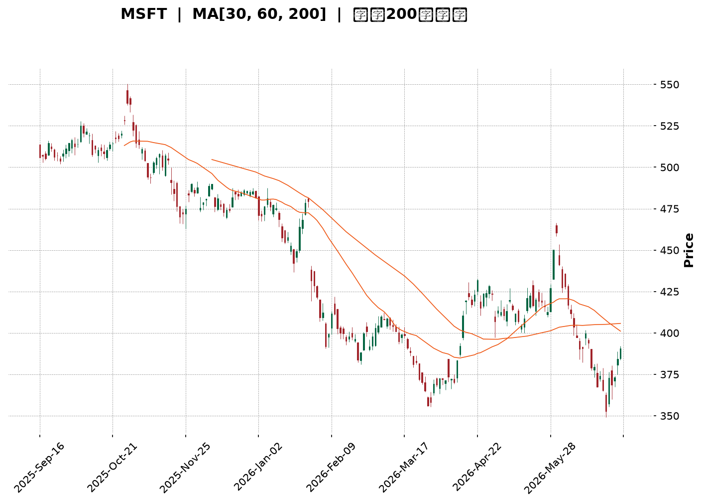
</details>

<html>
<head><meta charset="utf-8" /></head>
<body>
    <div style="height:500px; width:100%;">                        <script>window.PlotlyConfig = {MathJaxConfig: 'local'};</script>
        <script charset="utf-8" src="https://cdn.plot.ly/plotly-3.6.0.min.js" integrity="sha256-QaOVwtVY0T02VaHrr6pnoHLCwayMJp4O5n4YyaE3rJk=" crossorigin="anonymous"></script>                <div id="candlestick-chart" class="plotly-graph-div" style="height:100%; width:100%;"></div>            <script>                window.PLOTLYENV=window.PLOTLYENV || {};                                if (document.getElementById("candlestick-chart")) {                    Plotly.newPlot(                        "candlestick-chart",                        [{"close":{"dtype":"f8","bdata":"AAAAIGKdf0AAAADA9qx\u002fQAAAAKAAlH9AAAAAQF0VgEAAAAAAZvN\u002fQAAAAGBnoH9AAAAA4Aevf0AAAADAbH1\u002fQAAAAODbw39AAAAAIMj1f0AAAADghRWAQAAAAICDI4BAAAAAQPQDgEAAAACgwBCAQAAAAMDyaYBAAAAAgHVFgEAAAADgX0yAQAAAAADmOIBAAAAAwOi7f0AAAADACe1\u002fQAAAACBo5X9AAAAAQC7jf0AAAACAPsZ\u002fQAAAAOCQ5X9AAAAAIE0MgEAAAACgNxOAQAAAAMAcKoBAAAAAYEUqgEAAAABghEKAQAAAAGBmgYBAAAAAoETVgEAAAABgItGAQAAAACCcU4BAAAAA4GgUgEAAAACANQ6AQAAAAKB98X9AAAAAAH5\u002ff0AAAACAi99+QAAAAOAX235AAAAAgAxtf0AAAADAqJd\u002fQAAAAIDFvn9AAAAAQPZBf0AAAAAAgq9\u002fQAAAAAC9hH9AAAAAIOuqfkAAAACg3kB+QAAAAADxxH1AAAAA4G1gfUAAAABAYH59QAAAAOAArn1AAAAAgI81fkAAAABAQp1+QAAAAOBPSX5AAAAAwD19fkAAAACgyrl9QAAAAMBU631AAAAAQEkQfkAAAAAgfY1+QAAAAOBqnX5AAAAAQAPHfUAAAABgORV+QAAAAOCIxn1AAAAAIHCLfUAAAABgcqR9QAAAAEAloH1AAAAAIFkdfkAAAAAgQDx+QAAAAGBSLH5AAAAAgBBLfkAAAACAs11+QAAAAGDDWH5AAAAAAAxPfkAAAACAGVV+QAAAACCdF35AAAAAwH1tfUAAAADgDmx9QAAAAGA3xn1AAAAAYDkVfkAAAAAg2L99QAAAAEB70n1AAAAAwAexfUAAAAAgVUl9QAAAAEB+lXxAAAAAgCpqfEAAAACAI518QAAAAAAUSHxAAAAAoEGie0AAAADgPBJ8QAAAAKAl\u002fnxAAAAAwB5DfUAAAABgMOd9QAAAAEDq931AAAAAwD\u002f5ekAAAAAAHsZ6QAAAAEDjV3pAAAAAoDCWeUAAAACgqMV5QAAAAGDLfnhAAAAA4Mj1eEAAAADAQrx5QAAAAAABt3lAAAAAQDwpeUAAAABA7wB5QAAAAOCm+HhAAAAAoJuxeEAAAAAAQd14QAAAAOCU2XhAAAAAwPHFeEAAAACgOfp3QAAAAICMQnhAAAAAYL\u002f7eEAAAAAAoQ15QAAAAGBCfnhAAAAAoATbeEAAAACA6TB5QAAAAEAwRXlAAAAAwK2ceUAAAADgN4F5QAAAACBniHlAAAAAICFOeUAAAABgFEB5QAAAACDdD3lAAAAAQB+reEAAAADAXvF4QAAAAKC\u002f6HhAAAAAoBdveEAAAAAg3kJ4QAAAACC30HdAAAAAoMHid0AAAABg8z53QAAAAGDPI3dAAAAAgN3SdkAAAACg+z92QAAAAIDyYnZAAAAAgOsVd0AAAADAJQl3QAAAACBySndAAAAAoC9Bd0AAAABAxDd3QAAAAABWWHdAAAAAQDhEd0AAAACAGCF3QAAAAACh+HdAAAAAoCqEeEAAAADgTKV5QAAAAMCgNXpAAAAAQAVeekAAAADgqRJ6QAAAAKDkc3pAAAAAAMD\u002fekAAAACgn+15QAAAAKA8e3pAAAAAIG5+ekAAAAAgKMV6QAAAAKCueHpAAAAAIGFueUAAAACAtdh5QAAAAACey3lAAAAA4NqneUAAAACgC9F5QAAAACDFPXpAAAAAwJDjeUAAAABgSrx5QAAAACA4bnlAAAAAIFlFeUAAAADguIh5QAAAAGAhUHpAAAAAoP5pekAAAABASQh6QAAAAGBmQnpAAAAAoHAxekAAAADAHil6QAAAAOB6AHpAAAAAYLjKeUAAAAAA1696QAAAAADXI3xAAAAA4FHIfEAAAADA9ZR7QAAAAKBwtXpAAAAAwMzAekAAAABguAp6QAAAAADXu3lAAAAAYI82eUAAAACAwtV4QAAAAKBwZXhAAAAAANdreEAAAAAAKfx4QAAAAKBHnXhAAAAAYI+ud0AAAABgZrZ3QAAAAKBw9XZAAAAAQApfd0AAAAAgXNd2QAAAAKBHDXZAAAAAIIVPd0AAAADAHgl3QAAAAOBRUHdAAAAA4HoEeEAAAAAA12d4QA=="},"high":{"dtype":"f8","bdata":"9ksVkcwPgEDGSgkDKMF\u002fQGYFVwh13X9Azfi8V0EggEA+u6N42hOAQJzW19Sf9X9AstEycBPUf0BXe4wOzqx\u002fQINNMhJK639AbzTtD8cMgECtODorMReAQMkuV5DfKYBAJdXX+IkygECMj0HntimAQEUjFiuBfYBAFWCe3LlzgEDnxKquEV2AQKv8yr89SIBAbxGlh0dCgEDk3iK1RwmAQOp5tyVMAIBAQMa3KXsPgEDW\u002f5Q2xwyAQBdkABPjAYBAHFTUQXwbgEBjg2TZZxuAQCotNW1lT4BAdLZbbjhFgEBWM7NyWVCAQOlze8+5mYBA8vvpl+ExgUBncPEpqPaAQJoqnWvTnIBAJNAOBulvgEBzv1LqP02AQIf7r5ZxAoBAys0MqXD5f0AZS6RvR2h\u002fQPtsWKLLA39ALzq9NpB6f0ARPctoSaZ\u002fQAlRfrYyx39AENSCL0vkf0AgvzbFFcZ\u002fQITs\u002fyVazn9A4zRvegg9f0AfpBtZLcF+QKmh\u002fY4btn5Ad5hCQ7\u002fMfUA6ci\u002f2kax9QOakPgZp0H1A8VCzOFJifkARard9Iqd+QF49Y7cCe35AoQ7qMP60fkBCr6JHfSF+QNpzfij68n1Arn5N5BsUfkCjy3PB4KF+QDN3FK8Cn35AIYncK6YhfkD4HMOiAD5+QEHuOxD6BH5AqquAW2vpfUD\u002fo6ciV7x9QJvKMkrz3X1AWa0Ykd52fkA0g5lT\u002flp+QGwzxe8CaX5Ab4oltKxafkCGfShM3G9+QKJL7E1LX35AjHzfTPVifkCqEWOsJHh+QDSuAAudX35AUMTBCi4ofkAB07OGWZ99QIIo2DLhyX1AGK4kXXZ4fkCWbGVfUgh+QLT3jFEV231AKq2nT7jtfUCdezXUupp9QB3ildT8IX1A+he2ShHjfEDzcv3GLtJ8QAjcpHhlbHxAG4mlkO0qfEBtlO0gUS18QDMe9nkuUH1AZOr3x1uCfUASTfGpqgt+QHqF7m6GGX5AtdPxT5yIe0BhOEGvalp7QPIc2ulIzXpAr0jJZdxCekC3IaE\u002fBR96QHomSRLWZ3lASpE8ciMAeUCV8uEyz9B5QPx8AVXTXHpAp\u002f7sUtHpeUCX45GyYkZ5QE93pF3fO3lAPe4HiejreEDGLVRfZwx5QLlU\u002fiblOHlAt6LLihX0eEBxFdWYFqh4QNY\u002fN9BLSHhA655qLKMJeUBCTzHMv2l5QJe8+wFmv3hAc7AowSoFeUBmp4r6Il15QCwi+UNEonlARnRwxIareUD0+UJLhMJ5QN3LD8sslXlAOF42EgSVeUCMPZ1QBIJ5QPOGCmrgU3lAoIrqXc0+eUBRmP\u002f6Ofx4QJkxknNqOHlAWg\u002f1xjzSeEA44kGIRHp4QCwwnzaeInhA5JWFe\u002fgleED1IdVdS9p3QG2YzvXrg3dAB2EpC5Bed0BfDu+3qpp2QFvCYzggyXZAwB9QVYFBd0DRsUta6FJ3QNftB+hRTXdA4WS1ucFOd0CwuGY1Ujp3QPZsJeyvAnhA0kWQsRVLd0Aja2hGQG13QJFeud5X+3dA599vY2SdeEBbSYFdl9d5QGMi8oqRPnpAtjB1MFvqekBO5ukvpGZ6QFzmNcQbpHpAgL1b+DMMe0D1NEn66Gt6QMPfHXSBgHpAOnV9mv2iekA27ZyR2s96QB\u002fsrltcnnpAoMKk2GPYeUDFYE8dVgN6QOgoB\u002f7tPXpAXJS1chH+eUCaI75kQBh6QGC+3ozhsHpApP+wrZobekDOVAT8xLx5QBekGtKh6XlAvOE0A+lWeUBqkYLqMq95QIGMLQzqs3pANcGAQziDekBki6jcPPx6QJrLIAsBU3pAAAAAoHClekAAAABgZoZ6QAAAAOBRPHpAAAAAQAr\u002feUAAAAAA19d6QAAAAKBHJXxAAAAAwB4lfUAAAAAAAFh8QAAAAIA9hntAAAAAYGZCe0AAAAAghdd6QAAAAGCPEnpAAAAAIK6\u002feUAAAADgo1B5QAAAAKCZzXhAAAAAANd7eEAAAAAAABx5QAAAAKBwzXhAAAAAgOtleEAAAACA69V3QAAAAIAU2ndAAAAAIIWTd0AAAACAFK53QAAAACCuw3ZAAAAAgMKJd0AAAAAAAMh3QAAAAGBmYndAAAAAoEdNeEAAAABAM4N4QA=="},"hovertemplate":"\u003cb\u003e%{x|%Y-%m-%d}\u003c\u002fb\u003e\u003cbr\u003e\u958b: $%{open:.2f}\u003cbr\u003e\u9ad8: $%{high:.2f}\u003cbr\u003e\u4f4e: $%{low:.2f}\u003cbr\u003e\u6536: $%{close:.2f}\u003cextra\u003e\u003c\u002fextra\u003e","low":{"dtype":"f8","bdata":"fluWN2OWf0DLLzmO72t\u002fQL3dUR1xh39Au33va5Oxf0CU8We8B9V\u002fQMP1UH7ggX9A6zvyIq17f0DwYy8MyV1\u002fQLgxjAPodn9Ak3MYk9aaf0DdxkaSPad\u002fQGO5G76Dx39A2k0oL3W3f0Db6uJTJPx\u002fQJcpGaiCF4BAtSvGXEQxgEBfpSsvYj6AQKQnAnImEYBASCq0aMOmf0BvZchXW8d\u002fQOKVD4MMbX9A\u002fjjCaqWsf0Ae\u002fns06o5\u002fQEf5UIDggX9A8qKWXC7jf0AGEJTX+tx\u002fQB2ahHmdE4BAmC474sQagECeJcSgdiuAQJqw0jlybYBAw8NsAe\u002fKgEDp1O4f0aqAQAeXRkqsNoBAzIO\u002fW7v9f0ACZfyln\u002fV\u002fQPwA2stNin9Ada2SM0V2f0DjcefgCMt+QAPQzCZVon5AP2p62ZL6fkCB3tZLBDN\u002fQEkAH1mp\u002f35Aw+Alzikif0AyBEBo8+R+QPomquG3W39AAlee03Y7fkAXikBWqfx9QEuuW\u002fVEln1AA6JeKhojfUAnjIq4Hh99QCl1NxxD7XxAISkQ1hDxfUA9ehP24Ed+QE6YOjQFKH5AHLHZU59CfkBZPMKxfZF9QNLLlh4Kpn1AFdJnGRzMfUAY9mtUuCN+QEbYIuxYZX5AY0knUpSPfUDphGXyAJx9QBFqHGWmo31AHq+PBM1mfUD2cndvrUx9QClDwhZOjn1ADL7mF1e8fUB50+8JnQV+QFLsDr\u002fMCH5AD+xMMXQpfkA8eBQu4yp+QBopnyfjPH5AeujapoggfkDSufpUjzV+QENnrC+EEn5A6o73WzVBfUB3qasVsjZ9QGlBY3StOn1AMHoEvku9fUATZgn8AJx9QMdxMjK0YX1Aql9e\u002fSKZfUBPncu2Jf58QNTIDEJKcnxAiJI5TQ9efECY+0GBTGd8QJkg5Cec9HtAE4ZP+8JLe0BgqQeTp6t7QFWFy0aFCHxA8LepPDq\u002ffEAXoODe\u002fnB9QITUdKsXvn1AkdxCQnQyekBnP40b84h6QAAmthYMRnpAby6YX\u002fpreUDiYTVEz3Z5QGotFURKaXhAzagMBtlyeECU44PMe\u002fF4QNPgwrnsrXlAVpU0xLbzeEBFwFst7cN4QMoy\u002fUGQxHhAME7cT36MeECEglmwAal4QFiaYvgAvXhAj77+UuWkeECBB7hAWuR3QIU+UigpzndAzPUjixFVeEDUSjpBDd54QCFONzGZUHhAyoVifJJceEAtL4dNJH14QOQx2Ake93hAlkjPd2o4eUBTTL+7CHp5QL1YSxEMKnlAu65KbfIgeUB53cqfjQt5QFvc6RN4DXlAmrP+AV6WeEBx6Z0N\u002fZ54QO4a8PE+znhAI\u002fJPvnpieEDYS79ZkyN4QM68xJ3GtHdAbiRWj67Nd0BtMOLgvTB3QFxSR3tMDXdAzLaYh2nGdkB6NCoN1Tt2QG5CYPkoOHZArSwMupCkdkCc+GHbd\u002fZ2QG4wV8rOtXZAWhrMCzkLd0Cik0vZSNx2QDO8Hpm3KXdA5v9iihvkdkAVVI9PrxN3QDw1HY19I3dAMFPzVfQaeEABTh4l9r14QLvBWiH9s3lAbfL1Nn48ekCtGTGLZ\u002fZ5QPHcehzGBHpAsR5z4hFsekAHrVVrVah5QHXO3PNr7nlAgqPrurICekCTsZyQz096QJP1GUobNnpAZJBjvGXSeEC9FMPo2Jh5QMeAsDaYnnlAtzrA9ql+eUCepMtXwEN5QFz\u002f8wquHXpAg9wbKq\u002fReUBWv\u002fZh+kl5QELkxMAtXHlArb6L4JwCeUBqr8TPNwB5QGeJliJIwHlA2LascmPreUCxXZsbcPl5QLg3LcaTpnlAAAAAIFz7eUAAAACgRwV6QAAAAOBR0HlAAAAAoEeZeUAAAABguMp5QAAAAIDCBXtAAAAA4FGkfEAAAABA4YZ7QAAAAAAAhHpAAAAAYI+mekAAAABgZuZ5QAAAAMD1iHlAAAAAIK7neEAAAABgj9J4QAAAAAAAAHhAAAAA4FHkd0AAAACgmY14QAAAAEAKa3hAAAAAwB6Vd0AAAADgelR3QAAAAMAe8XZAAAAAYLgqd0AAAADgesx2QAAAAEAz03VAAAAAQOE2dkAAAABgZn52QAAAAEAz93ZAAAAAgD1ud0AAAABAM\u002ft3QA=="},"name":"\u50f9\u683c","open":{"dtype":"f8","bdata":"dwTVUwQNgEC2nILogLZ\u002fQOLA+gJWxH9AKPQy+oy1f0Bzon4OwwKAQPMjXzIQ6X9AEMIiErCyf0B7ijDjnZF\u002fQFfIrZaZrX9AxR9JiX7Ef0DTjLnpKOB\u002fQI0lihL2+H9AVVrTAg8TgECzaeXYww6AQNxLYf\u002fEGoBADxf30rhngEBD1Tvc5D+AQNLR9+VrOIBAOTfdL\u002fUigEDk3iK1RwmAQKKS5JhNsH9AJR87z4H7f0DUDLy+qtV\u002fQAL82AdinX9AMwnNMfH1f0Cj29UP8hGAQG2YIkP2LoBAIDK1ImA5gECZn7WR\u002fzuAQCvRF4Z3g4BAd2xJCk8UgUD5JmxuFeyAQCYrZcoheYBA8w\u002ffkWlsgECB4kILTySAQKsyjx+hyH9Al8DRGR3hf0D3lKmXpGd\u002fQDUIFgYp3X5A2XJ6AkoOf0C5cU9E+Fl\u002fQKgvkGJ4on9AarqSKpOxf0DJFOvqgvF+QObksIAAlH9AAZ6KBQrEfkAp8pHuP3B+QAv\u002fJo1oqH5ARW\u002fegw7GfUD9rhYXTo59QGjv3KZ9f31Asj1uinZCfkBvFZX1Ald+QBrXxkBkZH5A\u002fnlTcP5IfkDyEP7aVKN9QC4Vtrwg2n1AAMZhXxcGfkDF5XMR2Ct+QEv1wabnbn5A7eieCiUefkBFFqL2RKh9QIfK31IV231A+LDMHYvffUA\u002fzRubFV19QKDZUce6rH1ALEVIZR7BfUDD9KsZMFN+QBYxbbVvP35AcGt29UYtfkCPRXdebTh+QA887YjVSH5AXtWijV0rfkCZnvbFaDx+QKrtv53VWn5ATmzpEeEjfkCf4u4GVX99QF\u002fUaKgwe31Alkd5nyDafUDhbOfIs\u002fF9QAp2TOtUf31ASU\u002fZIuiofUAG5QUuNYl9QPXCyE1FBn1AqPkXJ\u002f\u002fgfEBDflF9zXx8QPXoHy2DE3xASA8Hk34pfECrXUbMKtp7QHXFOZHdHXxAGpTn4PPzfEAITmzwmHl9QGUU1S4VEX5ARXK35KBge0CjeTk+kVN7QMBzSf5RxXpAFwSkXzlCekA+kRBO2JJ5QD71SzAjWnlAn\u002fZbhmfWeEC+Ntql4TB5QDodgE8nHHpAGQuciFvleUAoO1k9RTN5QE7C7IiCKnlAclKJZDPXeEDwSt+R1sV4QKZ5bUIv\u002fXhARwwsChC0eECT\u002fqNIV6J4QCJcgAX19HdAFkSoxPlaeEBwViiIXT15QIqDC1eQYHhAYPrEviyAeECijGdEpYR4QIUmS6pxBnlANvJwSrw4eUCQzRDgDIV5QB7TP9+3QHlAeMB9M02SeUCOWlKEGEt5QJxzoZoWPHlAk9NWQSICeUCjHHnkWtN4QATrFIN69nhANdyI+ljEeEAzDHVQHFR4QLSjfvJDH3hAAEB6CCDxd0A5lCa3idh3QLosCNOvgXdAAPMkMUwgd0CBlGK24pF2QEdiZLnikXZAyeocoDG8dkAvu2HH7Ep3QPokxHOp5nZAe0+luexKd0B3RRlDohh3QNC9cTleAnhAqsC7ix47d0CMz2FyyEJ3QP1Yyz\u002fXTHdAtVpHcU4xeED+6xPHPNJ4QCzLhso9L3pAePuvJ25+ekDgMy481kN6QN1gZPNONXpA35ifc02UekDHjd15uC96QNoVYvgZAXpA1yR+eXlXekCPQNFNcHp6QMSIEBCZenpA10mHLcGeeUDj65WEhr55QKVIqMloqnlAvmNLP8LmeUBuH3lC5HF5QKsTrpc7M3pAuge7p84HekDdzRfn0G95QIJPn\u002flY2XlAJO\u002fwCkIleUCIS4aRsTl5QPvTkpj+1XlA85bVgYP7eUCvVgbGiM96QKyuHP5l1HlAAAAAAACMekAAAADgozh6QAAAAEDhBnpAAAAAACmweUAAAAAgrs95QAAAAMDMCHtAAAAAoHANfUAAAACAFO57QAAAAEAzZ3tAAAAAwPU8e0AAAACgcMV6QAAAAIA94nlAAAAA4HqQeUAAAADAzOh4QAAAACBcs3hAAAAAQOF2eEAAAADAzMx4QAAAAOCjvHhAAAAAAABkeEAAAADAHp13QAAAAADXe3dAAAAAgBRGd0AAAADAHjl3QAAAAOBRrHZAAAAAYGZSdkAAAAAAAJh3QAAAAOB6MHdAAAAAoEfNd0AAAAAgrgd4QA=="},"x":["2025-09-16T00:00:00-04:00","2025-09-17T00:00:00-04:00","2025-09-18T00:00:00-04:00","2025-09-19T00:00:00-04:00","2025-09-22T00:00:00-04:00","2025-09-23T00:00:00-04:00","2025-09-24T00:00:00-04:00","2025-09-25T00:00:00-04:00","2025-09-26T00:00:00-04:00","2025-09-29T00:00:00-04:00","2025-09-30T00:00:00-04:00","2025-10-01T00:00:00-04:00","2025-10-02T00:00:00-04:00","2025-10-03T00:00:00-04:00","2025-10-06T00:00:00-04:00","2025-10-07T00:00:00-04:00","2025-10-08T00:00:00-04:00","2025-10-09T00:00:00-04:00","2025-10-10T00:00:00-04:00","2025-10-13T00:00:00-04:00","2025-10-14T00:00:00-04:00","2025-10-15T00:00:00-04:00","2025-10-16T00:00:00-04:00","2025-10-17T00:00:00-04:00","2025-10-20T00:00:00-04:00","2025-10-21T00:00:00-04:00","2025-10-22T00:00:00-04:00","2025-10-23T00:00:00-04:00","2025-10-24T00:00:00-04:00","2025-10-27T00:00:00-04:00","2025-10-28T00:00:00-04:00","2025-10-29T00:00:00-04:00","2025-10-30T00:00:00-04:00","2025-10-31T00:00:00-04:00","2025-11-03T00:00:00-05:00","2025-11-04T00:00:00-05:00","2025-11-05T00:00:00-05:00","2025-11-06T00:00:00-05:00","2025-11-07T00:00:00-05:00","2025-11-10T00:00:00-05:00","2025-11-11T00:00:00-05:00","2025-11-12T00:00:00-05:00","2025-11-13T00:00:00-05:00","2025-11-14T00:00:00-05:00","2025-11-17T00:00:00-05:00","2025-11-18T00:00:00-05:00","2025-11-19T00:00:00-05:00","2025-11-20T00:00:00-05:00","2025-11-21T00:00:00-05:00","2025-11-24T00:00:00-05:00","2025-11-25T00:00:00-05:00","2025-11-26T00:00:00-05:00","2025-11-28T00:00:00-05:00","2025-12-01T00:00:00-05:00","2025-12-02T00:00:00-05:00","2025-12-03T00:00:00-05:00","2025-12-04T00:00:00-05:00","2025-12-05T00:00:00-05:00","2025-12-08T00:00:00-05:00","2025-12-09T00:00:00-05:00","2025-12-10T00:00:00-05:00","2025-12-11T00:00:00-05:00","2025-12-12T00:00:00-05:00","2025-12-15T00:00:00-05:00","2025-12-16T00:00:00-05:00","2025-12-17T00:00:00-05:00","2025-12-18T00:00:00-05:00","2025-12-19T00:00:00-05:00","2025-12-22T00:00:00-05:00","2025-12-23T00:00:00-05:00","2025-12-24T00:00:00-05:00","2025-12-26T00:00:00-05:00","2025-12-29T00:00:00-05:00","2025-12-30T00:00:00-05:00","2025-12-31T00:00:00-05:00","2026-01-02T00:00:00-05:00","2026-01-05T00:00:00-05:00","2026-01-06T00:00:00-05:00","2026-01-07T00:00:00-05:00","2026-01-08T00:00:00-05:00","2026-01-09T00:00:00-05:00","2026-01-12T00:00:00-05:00","2026-01-13T00:00:00-05:00","2026-01-14T00:00:00-05:00","2026-01-15T00:00:00-05:00","2026-01-16T00:00:00-05:00","2026-01-20T00:00:00-05:00","2026-01-21T00:00:00-05:00","2026-01-22T00:00:00-05:00","2026-01-23T00:00:00-05:00","2026-01-26T00:00:00-05:00","2026-01-27T00:00:00-05:00","2026-01-28T00:00:00-05:00","2026-01-29T00:00:00-05:00","2026-01-30T00:00:00-05:00","2026-02-02T00:00:00-05:00","2026-02-03T00:00:00-05:00","2026-02-04T00:00:00-05:00","2026-02-05T00:00:00-05:00","2026-02-06T00:00:00-05:00","2026-02-09T00:00:00-05:00","2026-02-10T00:00:00-05:00","2026-02-11T00:00:00-05:00","2026-02-12T00:00:00-05:00","2026-02-13T00:00:00-05:00","2026-02-17T00:00:00-05:00","2026-02-18T00:00:00-05:00","2026-02-19T00:00:00-05:00","2026-02-20T00:00:00-05:00","2026-02-23T00:00:00-05:00","2026-02-24T00:00:00-05:00","2026-02-25T00:00:00-05:00","2026-02-26T00:00:00-05:00","2026-02-27T00:00:00-05:00","2026-03-02T00:00:00-05:00","2026-03-03T00:00:00-05:00","2026-03-04T00:00:00-05:00","2026-03-05T00:00:00-05:00","2026-03-06T00:00:00-05:00","2026-03-09T00:00:00-04:00","2026-03-10T00:00:00-04:00","2026-03-11T00:00:00-04:00","2026-03-12T00:00:00-04:00","2026-03-13T00:00:00-04:00","2026-03-16T00:00:00-04:00","2026-03-17T00:00:00-04:00","2026-03-18T00:00:00-04:00","2026-03-19T00:00:00-04:00","2026-03-20T00:00:00-04:00","2026-03-23T00:00:00-04:00","2026-03-24T00:00:00-04:00","2026-03-25T00:00:00-04:00","2026-03-26T00:00:00-04:00","2026-03-27T00:00:00-04:00","2026-03-30T00:00:00-04:00","2026-03-31T00:00:00-04:00","2026-04-01T00:00:00-04:00","2026-04-02T00:00:00-04:00","2026-04-06T00:00:00-04:00","2026-04-07T00:00:00-04:00","2026-04-08T00:00:00-04:00","2026-04-09T00:00:00-04:00","2026-04-10T00:00:00-04:00","2026-04-13T00:00:00-04:00","2026-04-14T00:00:00-04:00","2026-04-15T00:00:00-04:00","2026-04-16T00:00:00-04:00","2026-04-17T00:00:00-04:00","2026-04-20T00:00:00-04:00","2026-04-21T00:00:00-04:00","2026-04-22T00:00:00-04:00","2026-04-23T00:00:00-04:00","2026-04-24T00:00:00-04:00","2026-04-27T00:00:00-04:00","2026-04-28T00:00:00-04:00","2026-04-29T00:00:00-04:00","2026-04-30T00:00:00-04:00","2026-05-01T00:00:00-04:00","2026-05-04T00:00:00-04:00","2026-05-05T00:00:00-04:00","2026-05-06T00:00:00-04:00","2026-05-07T00:00:00-04:00","2026-05-08T00:00:00-04:00","2026-05-11T00:00:00-04:00","2026-05-12T00:00:00-04:00","2026-05-13T00:00:00-04:00","2026-05-14T00:00:00-04:00","2026-05-15T00:00:00-04:00","2026-05-18T00:00:00-04:00","2026-05-19T00:00:00-04:00","2026-05-20T00:00:00-04:00","2026-05-21T00:00:00-04:00","2026-05-22T00:00:00-04:00","2026-05-26T00:00:00-04:00","2026-05-27T00:00:00-04:00","2026-05-28T00:00:00-04:00","2026-05-29T00:00:00-04:00","2026-06-01T00:00:00-04:00","2026-06-02T00:00:00-04:00","2026-06-03T00:00:00-04:00","2026-06-04T00:00:00-04:00","2026-06-05T00:00:00-04:00","2026-06-08T00:00:00-04:00","2026-06-09T00:00:00-04:00","2026-06-10T00:00:00-04:00","2026-06-11T00:00:00-04:00","2026-06-12T00:00:00-04:00","2026-06-15T00:00:00-04:00","2026-06-16T00:00:00-04:00","2026-06-17T00:00:00-04:00","2026-06-18T00:00:00-04:00","2026-06-22T00:00:00-04:00","2026-06-23T00:00:00-04:00","2026-06-24T00:00:00-04:00","2026-06-25T00:00:00-04:00","2026-06-26T00:00:00-04:00","2026-06-29T00:00:00-04:00","2026-06-30T00:00:00-04:00","2026-07-01T00:00:00-04:00","2026-07-02T00:00:00-04:00"],"type":"candlestick"},{"hovertemplate":"MA30: $%{y:.2f}\u003cextra\u003e\u003c\u002fextra\u003e","line":{"color":"#2196F3","dash":"dash","width":2},"mode":"lines","name":"MA30","x":["2025-09-16T00:00:00-04:00","2025-09-17T00:00:00-04:00","2025-09-18T00:00:00-04:00","2025-09-19T00:00:00-04:00","2025-09-22T00:00:00-04:00","2025-09-23T00:00:00-04:00","2025-09-24T00:00:00-04:00","2025-09-25T00:00:00-04:00","2025-09-26T00:00:00-04:00","2025-09-29T00:00:00-04:00","2025-09-30T00:00:00-04:00","2025-10-01T00:00:00-04:00","2025-10-02T00:00:00-04:00","2025-10-03T00:00:00-04:00","2025-10-06T00:00:00-04:00","2025-10-07T00:00:00-04:00","2025-10-08T00:00:00-04:00","2025-10-09T00:00:00-04:00","2025-10-10T00:00:00-04:00","2025-10-13T00:00:00-04:00","2025-10-14T00:00:00-04:00","2025-10-15T00:00:00-04:00","2025-10-16T00:00:00-04:00","2025-10-17T00:00:00-04:00","2025-10-20T00:00:00-04:00","2025-10-21T00:00:00-04:00","2025-10-22T00:00:00-04:00","2025-10-23T00:00:00-04:00","2025-10-24T00:00:00-04:00","2025-10-27T00:00:00-04:00","2025-10-28T00:00:00-04:00","2025-10-29T00:00:00-04:00","2025-10-30T00:00:00-04:00","2025-10-31T00:00:00-04:00","2025-11-03T00:00:00-05:00","2025-11-04T00:00:00-05:00","2025-11-05T00:00:00-05:00","2025-11-06T00:00:00-05:00","2025-11-07T00:00:00-05:00","2025-11-10T00:00:00-05:00","2025-11-11T00:00:00-05:00","2025-11-12T00:00:00-05:00","2025-11-13T00:00:00-05:00","2025-11-14T00:00:00-05:00","2025-11-17T00:00:00-05:00","2025-11-18T00:00:00-05:00","2025-11-19T00:00:00-05:00","2025-11-20T00:00:00-05:00","2025-11-21T00:00:00-05:00","2025-11-24T00:00:00-05:00","2025-11-25T00:00:00-05:00","2025-11-26T00:00:00-05:00","2025-11-28T00:00:00-05:00","2025-12-01T00:00:00-05:00","2025-12-02T00:00:00-05:00","2025-12-03T00:00:00-05:00","2025-12-04T00:00:00-05:00","2025-12-05T00:00:00-05:00","2025-12-08T00:00:00-05:00","2025-12-09T00:00:00-05:00","2025-12-10T00:00:00-05:00","2025-12-11T00:00:00-05:00","2025-12-12T00:00:00-05:00","2025-12-15T00:00:00-05:00","2025-12-16T00:00:00-05:00","2025-12-17T00:00:00-05:00","2025-12-18T00:00:00-05:00","2025-12-19T00:00:00-05:00","2025-12-22T00:00:00-05:00","2025-12-23T00:00:00-05:00","2025-12-24T00:00:00-05:00","2025-12-26T00:00:00-05:00","2025-12-29T00:00:00-05:00","2025-12-30T00:00:00-05:00","2025-12-31T00:00:00-05:00","2026-01-02T00:00:00-05:00","2026-01-05T00:00:00-05:00","2026-01-06T00:00:00-05:00","2026-01-07T00:00:00-05:00","2026-01-08T00:00:00-05:00","2026-01-09T00:00:00-05:00","2026-01-12T00:00:00-05:00","2026-01-13T00:00:00-05:00","2026-01-14T00:00:00-05:00","2026-01-15T00:00:00-05:00","2026-01-16T00:00:00-05:00","2026-01-20T00:00:00-05:00","2026-01-21T00:00:00-05:00","2026-01-22T00:00:00-05:00","2026-01-23T00:00:00-05:00","2026-01-26T00:00:00-05:00","2026-01-27T00:00:00-05:00","2026-01-28T00:00:00-05:00","2026-01-29T00:00:00-05:00","2026-01-30T00:00:00-05:00","2026-02-02T00:00:00-05:00","2026-02-03T00:00:00-05:00","2026-02-04T00:00:00-05:00","2026-02-05T00:00:00-05:00","2026-02-06T00:00:00-05:00","2026-02-09T00:00:00-05:00","2026-02-10T00:00:00-05:00","2026-02-11T00:00:00-05:00","2026-02-12T00:00:00-05:00","2026-02-13T00:00:00-05:00","2026-02-17T00:00:00-05:00","2026-02-18T00:00:00-05:00","2026-02-19T00:00:00-05:00","2026-02-20T00:00:00-05:00","2026-02-23T00:00:00-05:00","2026-02-24T00:00:00-05:00","2026-02-25T00:00:00-05:00","2026-02-26T00:00:00-05:00","2026-02-27T00:00:00-05:00","2026-03-02T00:00:00-05:00","2026-03-03T00:00:00-05:00","2026-03-04T00:00:00-05:00","2026-03-05T00:00:00-05:00","2026-03-06T00:00:00-05:00","2026-03-09T00:00:00-04:00","2026-03-10T00:00:00-04:00","2026-03-11T00:00:00-04:00","2026-03-12T00:00:00-04:00","2026-03-13T00:00:00-04:00","2026-03-16T00:00:00-04:00","2026-03-17T00:00:00-04:00","2026-03-18T00:00:00-04:00","2026-03-19T00:00:00-04:00","2026-03-20T00:00:00-04:00","2026-03-23T00:00:00-04:00","2026-03-24T00:00:00-04:00","2026-03-25T00:00:00-04:00","2026-03-26T00:00:00-04:00","2026-03-27T00:00:00-04:00","2026-03-30T00:00:00-04:00","2026-03-31T00:00:00-04:00","2026-04-01T00:00:00-04:00","2026-04-02T00:00:00-04:00","2026-04-06T00:00:00-04:00","2026-04-07T00:00:00-04:00","2026-04-08T00:00:00-04:00","2026-04-09T00:00:00-04:00","2026-04-10T00:00:00-04:00","2026-04-13T00:00:00-04:00","2026-04-14T00:00:00-04:00","2026-04-15T00:00:00-04:00","2026-04-16T00:00:00-04:00","2026-04-17T00:00:00-04:00","2026-04-20T00:00:00-04:00","2026-04-21T00:00:00-04:00","2026-04-22T00:00:00-04:00","2026-04-23T00:00:00-04:00","2026-04-24T00:00:00-04:00","2026-04-27T00:00:00-04:00","2026-04-28T00:00:00-04:00","2026-04-29T00:00:00-04:00","2026-04-30T00:00:00-04:00","2026-05-01T00:00:00-04:00","2026-05-04T00:00:00-04:00","2026-05-05T00:00:00-04:00","2026-05-06T00:00:00-04:00","2026-05-07T00:00:00-04:00","2026-05-08T00:00:00-04:00","2026-05-11T00:00:00-04:00","2026-05-12T00:00:00-04:00","2026-05-13T00:00:00-04:00","2026-05-14T00:00:00-04:00","2026-05-15T00:00:00-04:00","2026-05-18T00:00:00-04:00","2026-05-19T00:00:00-04:00","2026-05-20T00:00:00-04:00","2026-05-21T00:00:00-04:00","2026-05-22T00:00:00-04:00","2026-05-26T00:00:00-04:00","2026-05-27T00:00:00-04:00","2026-05-28T00:00:00-04:00","2026-05-29T00:00:00-04:00","2026-06-01T00:00:00-04:00","2026-06-02T00:00:00-04:00","2026-06-03T00:00:00-04:00","2026-06-04T00:00:00-04:00","2026-06-05T00:00:00-04:00","2026-06-08T00:00:00-04:00","2026-06-09T00:00:00-04:00","2026-06-10T00:00:00-04:00","2026-06-11T00:00:00-04:00","2026-06-12T00:00:00-04:00","2026-06-15T00:00:00-04:00","2026-06-16T00:00:00-04:00","2026-06-17T00:00:00-04:00","2026-06-18T00:00:00-04:00","2026-06-22T00:00:00-04:00","2026-06-23T00:00:00-04:00","2026-06-24T00:00:00-04:00","2026-06-25T00:00:00-04:00","2026-06-26T00:00:00-04:00","2026-06-29T00:00:00-04:00","2026-06-30T00:00:00-04:00","2026-07-01T00:00:00-04:00","2026-07-02T00:00:00-04:00"],"y":{"dtype":"f8","bdata":"AAAAAAAA+H8AAAAAAAD4fwAAAAAAAPh\u002fAAAAAAAA+H8AAAAAAAD4fwAAAAAAAPh\u002fAAAAAAAA+H8AAAAAAAD4fwAAAAAAAPh\u002fAAAAAAAA+H8AAAAAAAD4fwAAAAAAAPh\u002fAAAAAAAA+H8AAAAAAAD4fwAAAAAAAPh\u002fAAAAAAAA+H8AAAAAAAD4fwAAAAAAAPh\u002fAAAAAAAA+H8AAAAAAAD4fwAAAAAAAPh\u002fAAAAAAAA+H8AAAAAAAD4fwAAAAAAAPh\u002fAAAAAAAA+H8AAAAAAAD4fwAAAAAAAPh\u002fAAAAAAAA+H8AAAAAAAD4f97d3U3hCIBAzczM9KERgEAzMzPb\u002fBmAQN7d3R2THoBAiYiI+IoegEDNzMz8OR+AQFVVVfWTIIBAiYiIIMkfgECamZmBJx2AQHd3d19GGYBAq6qq+v4WgEAREREhihSAQFVVVcVEEoBAMzMzM\u002fgOgEAAAADQEQ2AQN7d3c17B4BAzczMnPf+f0BERESk+Op\u002fQKuqqook1H9AiYiI2AbAf0BmZmZ2Rat\u002fQO\u002fu7p5bmH9Ad3d3hwmKf0ARERFBI4B\u002fQKuqqlplcn9AIiIiEq9kf0Crqqrq\u002fk9\u002fQCIiIsJuO39A3t3dPRcof0AiIiJSThd\u002fQAAAACDcAn9A3t3d\u002fazhfkAAAADQX8N+QO\u002fu7m7Rqn5AERERYYGUfkDv7u6OcH9+QImIiFipa35AERERUdtffkDv7u7eaVp+QM3MzHyWVH5ARERE9OtKfkCJiIjYdEB+QHd3d9eFNH5Ad3d392wsfkAzMzPz4CB+QImIiDi1FH5AIiIigiAKfkBERESECAN+QFVVVWUTA35A3t3dLRoJfkB3d3fXSAt+QO\u002fu7h6ADH5AIiIiMhUIfkDe3d19wPx9QBEREYE57n1AmpmZqYXcfUAAAACgCNN9QAAAAAAPxX1AMzMzA1OwfUBEREQ0Jpt9QAAAAJBOjX1AREREFOmIfUDv7u4+YId9QAAAAKAFiX1AREREFBVzfUDNzMzMmlp9QJqZmZmYPn1A3t3dHfUXfUAAAAAA3\u002fF8QBEREZFrwXxA3t3dLemTfEC8u7trZWx8QBEREfHeRHxA3t3dnfEYfEDe3d29eOt7QN7d3d3Fv3tAZmZmdmCXe0C8u7u7e3B7QBEREVF2RntAERERIScZe0DNzMwc5ud6QImIiDhvuHpAREREJEKQekCamZmJImx6QERERCQ6SXpAMzMzA9sqekARERHhpQ16QO\u002fu7p7z83lAVVVV9bLieUBERERkzMx5QKuqqgpGr3lAq6qq2oGNeUCJiIi4zWV5QKuqqmrvO3lAq6qqqkMoeUARERGxoxh5QFVVVcVmDHlAq6qqmpACeUDNzMz8q\u002fV4QDMzM4Pe73hAq6qqmrPmeECamZk5ddF4QKuqqhp8u3hAMzMzA4qneEDNzMxsCpB4QBEREeH7eXhA7+7uzkJseEDNzMxMqFx4QHd3d1daT3hAAAAA8GRCeEDv7u6O6Tt4QBEREfEaNHhA3t3dTXQleECrqqpaCRV4QKuqqgqVEHhAiYiI6K8NeEBmZmYWkRF4QGZmZtaUGXhAAAAAsAYgeEAiIiLS3yR4QGZmZla5LHhAERERkS07eECamZl59kB4QCIiIkITTXhARERE9KZceEC8u7u7Pmx4QAAAAICTeXhAMzMz8xWCeEAREREhnY94QBEREbGCoHhAIiIiIp2veEAAAADgjMV4QAAAAAAE4HhAvLu7Gyz6eEB3d3d36hd5QBEREUHkMXlAq6qqCopEeUDv7u6+21l5QKuqqtqlc3lAAAAAsJuOeUDv7u4eoKZ5QImIiIh+v3lAERER4XfYeUBERET0VfJ5QERERASqA3pAvLu7m4wOekBEREQUbxd6QKuqqlroJ3pAIiIigoQ8ekB3d3fnZEl6QM3MzDyUS3pAAAAAEHtJekCrqqpac0p6QJqZmRkSRHpAZmZmRiQ5ekAzMzPjoCh6QO\u002fu7p7rFnpAq6qqak0OekBmZmZm8wZ6QERERHTf\u002fHlAq6qqmgfseUCamZkpE9p5QImIiFgQvnlAVVVVZZSoeUCamZnJ4Y95QImIiPgMc3lAREREtFJieUBERETEAE15QImIiMhoM3lAVVVVdfUeeUCJiIjIExF5QA=="},"type":"scatter"},{"hovertemplate":"MA60: $%{y:.2f}\u003cextra\u003e\u003c\u002fextra\u003e","line":{"color":"#9C27B0","dash":"dash","width":2},"mode":"lines","name":"MA60","x":["2025-09-16T00:00:00-04:00","2025-09-17T00:00:00-04:00","2025-09-18T00:00:00-04:00","2025-09-19T00:00:00-04:00","2025-09-22T00:00:00-04:00","2025-09-23T00:00:00-04:00","2025-09-24T00:00:00-04:00","2025-09-25T00:00:00-04:00","2025-09-26T00:00:00-04:00","2025-09-29T00:00:00-04:00","2025-09-30T00:00:00-04:00","2025-10-01T00:00:00-04:00","2025-10-02T00:00:00-04:00","2025-10-03T00:00:00-04:00","2025-10-06T00:00:00-04:00","2025-10-07T00:00:00-04:00","2025-10-08T00:00:00-04:00","2025-10-09T00:00:00-04:00","2025-10-10T00:00:00-04:00","2025-10-13T00:00:00-04:00","2025-10-14T00:00:00-04:00","2025-10-15T00:00:00-04:00","2025-10-16T00:00:00-04:00","2025-10-17T00:00:00-04:00","2025-10-20T00:00:00-04:00","2025-10-21T00:00:00-04:00","2025-10-22T00:00:00-04:00","2025-10-23T00:00:00-04:00","2025-10-24T00:00:00-04:00","2025-10-27T00:00:00-04:00","2025-10-28T00:00:00-04:00","2025-10-29T00:00:00-04:00","2025-10-30T00:00:00-04:00","2025-10-31T00:00:00-04:00","2025-11-03T00:00:00-05:00","2025-11-04T00:00:00-05:00","2025-11-05T00:00:00-05:00","2025-11-06T00:00:00-05:00","2025-11-07T00:00:00-05:00","2025-11-10T00:00:00-05:00","2025-11-11T00:00:00-05:00","2025-11-12T00:00:00-05:00","2025-11-13T00:00:00-05:00","2025-11-14T00:00:00-05:00","2025-11-17T00:00:00-05:00","2025-11-18T00:00:00-05:00","2025-11-19T00:00:00-05:00","2025-11-20T00:00:00-05:00","2025-11-21T00:00:00-05:00","2025-11-24T00:00:00-05:00","2025-11-25T00:00:00-05:00","2025-11-26T00:00:00-05:00","2025-11-28T00:00:00-05:00","2025-12-01T00:00:00-05:00","2025-12-02T00:00:00-05:00","2025-12-03T00:00:00-05:00","2025-12-04T00:00:00-05:00","2025-12-05T00:00:00-05:00","2025-12-08T00:00:00-05:00","2025-12-09T00:00:00-05:00","2025-12-10T00:00:00-05:00","2025-12-11T00:00:00-05:00","2025-12-12T00:00:00-05:00","2025-12-15T00:00:00-05:00","2025-12-16T00:00:00-05:00","2025-12-17T00:00:00-05:00","2025-12-18T00:00:00-05:00","2025-12-19T00:00:00-05:00","2025-12-22T00:00:00-05:00","2025-12-23T00:00:00-05:00","2025-12-24T00:00:00-05:00","2025-12-26T00:00:00-05:00","2025-12-29T00:00:00-05:00","2025-12-30T00:00:00-05:00","2025-12-31T00:00:00-05:00","2026-01-02T00:00:00-05:00","2026-01-05T00:00:00-05:00","2026-01-06T00:00:00-05:00","2026-01-07T00:00:00-05:00","2026-01-08T00:00:00-05:00","2026-01-09T00:00:00-05:00","2026-01-12T00:00:00-05:00","2026-01-13T00:00:00-05:00","2026-01-14T00:00:00-05:00","2026-01-15T00:00:00-05:00","2026-01-16T00:00:00-05:00","2026-01-20T00:00:00-05:00","2026-01-21T00:00:00-05:00","2026-01-22T00:00:00-05:00","2026-01-23T00:00:00-05:00","2026-01-26T00:00:00-05:00","2026-01-27T00:00:00-05:00","2026-01-28T00:00:00-05:00","2026-01-29T00:00:00-05:00","2026-01-30T00:00:00-05:00","2026-02-02T00:00:00-05:00","2026-02-03T00:00:00-05:00","2026-02-04T00:00:00-05:00","2026-02-05T00:00:00-05:00","2026-02-06T00:00:00-05:00","2026-02-09T00:00:00-05:00","2026-02-10T00:00:00-05:00","2026-02-11T00:00:00-05:00","2026-02-12T00:00:00-05:00","2026-02-13T00:00:00-05:00","2026-02-17T00:00:00-05:00","2026-02-18T00:00:00-05:00","2026-02-19T00:00:00-05:00","2026-02-20T00:00:00-05:00","2026-02-23T00:00:00-05:00","2026-02-24T00:00:00-05:00","2026-02-25T00:00:00-05:00","2026-02-26T00:00:00-05:00","2026-02-27T00:00:00-05:00","2026-03-02T00:00:00-05:00","2026-03-03T00:00:00-05:00","2026-03-04T00:00:00-05:00","2026-03-05T00:00:00-05:00","2026-03-06T00:00:00-05:00","2026-03-09T00:00:00-04:00","2026-03-10T00:00:00-04:00","2026-03-11T00:00:00-04:00","2026-03-12T00:00:00-04:00","2026-03-13T00:00:00-04:00","2026-03-16T00:00:00-04:00","2026-03-17T00:00:00-04:00","2026-03-18T00:00:00-04:00","2026-03-19T00:00:00-04:00","2026-03-20T00:00:00-04:00","2026-03-23T00:00:00-04:00","2026-03-24T00:00:00-04:00","2026-03-25T00:00:00-04:00","2026-03-26T00:00:00-04:00","2026-03-27T00:00:00-04:00","2026-03-30T00:00:00-04:00","2026-03-31T00:00:00-04:00","2026-04-01T00:00:00-04:00","2026-04-02T00:00:00-04:00","2026-04-06T00:00:00-04:00","2026-04-07T00:00:00-04:00","2026-04-08T00:00:00-04:00","2026-04-09T00:00:00-04:00","2026-04-10T00:00:00-04:00","2026-04-13T00:00:00-04:00","2026-04-14T00:00:00-04:00","2026-04-15T00:00:00-04:00","2026-04-16T00:00:00-04:00","2026-04-17T00:00:00-04:00","2026-04-20T00:00:00-04:00","2026-04-21T00:00:00-04:00","2026-04-22T00:00:00-04:00","2026-04-23T00:00:00-04:00","2026-04-24T00:00:00-04:00","2026-04-27T00:00:00-04:00","2026-04-28T00:00:00-04:00","2026-04-29T00:00:00-04:00","2026-04-30T00:00:00-04:00","2026-05-01T00:00:00-04:00","2026-05-04T00:00:00-04:00","2026-05-05T00:00:00-04:00","2026-05-06T00:00:00-04:00","2026-05-07T00:00:00-04:00","2026-05-08T00:00:00-04:00","2026-05-11T00:00:00-04:00","2026-05-12T00:00:00-04:00","2026-05-13T00:00:00-04:00","2026-05-14T00:00:00-04:00","2026-05-15T00:00:00-04:00","2026-05-18T00:00:00-04:00","2026-05-19T00:00:00-04:00","2026-05-20T00:00:00-04:00","2026-05-21T00:00:00-04:00","2026-05-22T00:00:00-04:00","2026-05-26T00:00:00-04:00","2026-05-27T00:00:00-04:00","2026-05-28T00:00:00-04:00","2026-05-29T00:00:00-04:00","2026-06-01T00:00:00-04:00","2026-06-02T00:00:00-04:00","2026-06-03T00:00:00-04:00","2026-06-04T00:00:00-04:00","2026-06-05T00:00:00-04:00","2026-06-08T00:00:00-04:00","2026-06-09T00:00:00-04:00","2026-06-10T00:00:00-04:00","2026-06-11T00:00:00-04:00","2026-06-12T00:00:00-04:00","2026-06-15T00:00:00-04:00","2026-06-16T00:00:00-04:00","2026-06-17T00:00:00-04:00","2026-06-18T00:00:00-04:00","2026-06-22T00:00:00-04:00","2026-06-23T00:00:00-04:00","2026-06-24T00:00:00-04:00","2026-06-25T00:00:00-04:00","2026-06-26T00:00:00-04:00","2026-06-29T00:00:00-04:00","2026-06-30T00:00:00-04:00","2026-07-01T00:00:00-04:00","2026-07-02T00:00:00-04:00"],"y":{"dtype":"f8","bdata":"AAAAAAAA+H8AAAAAAAD4fwAAAAAAAPh\u002fAAAAAAAA+H8AAAAAAAD4fwAAAAAAAPh\u002fAAAAAAAA+H8AAAAAAAD4fwAAAAAAAPh\u002fAAAAAAAA+H8AAAAAAAD4fwAAAAAAAPh\u002fAAAAAAAA+H8AAAAAAAD4fwAAAAAAAPh\u002fAAAAAAAA+H8AAAAAAAD4fwAAAAAAAPh\u002fAAAAAAAA+H8AAAAAAAD4fwAAAAAAAPh\u002fAAAAAAAA+H8AAAAAAAD4fwAAAAAAAPh\u002fAAAAAAAA+H8AAAAAAAD4fwAAAAAAAPh\u002fAAAAAAAA+H8AAAAAAAD4fwAAAAAAAPh\u002fAAAAAAAA+H8AAAAAAAD4fwAAAAAAAPh\u002fAAAAAAAA+H8AAAAAAAD4fwAAAAAAAPh\u002fAAAAAAAA+H8AAAAAAAD4fwAAAAAAAPh\u002fAAAAAAAA+H8AAAAAAAD4fwAAAAAAAPh\u002fAAAAAAAA+H8AAAAAAAD4fwAAAAAAAPh\u002fAAAAAAAA+H8AAAAAAAD4fwAAAAAAAPh\u002fAAAAAAAA+H8AAAAAAAD4fwAAAAAAAPh\u002fAAAAAAAA+H8AAAAAAAD4fwAAAAAAAPh\u002fAAAAAAAA+H8AAAAAAAD4fwAAAAAAAPh\u002fAAAAAAAA+H8AAAAAAAD4f97d3V1Pin9AvLu7c3iCf0AzMzPDrHt\u002fQFVVVdX7c39AERERqctof0BERERE8l5\u002fQJqZmaFoVn9AERERybZPf0ARERFxXEp\u002fQN7d3Z2RQ39AzczM9HQ8f0BVVVWNxDR\u002fQBEREbGHLH9A7+7uri4lf0CamZlJgh1\u002fQCIiImrWEX9Ad3d3D4wEf0BERESUAPd+QAAAAPib635AMzMzg5DkfkDv7u4mR9t+QO\u002fu7t5t0n5AzczMXA\u002fJfkB3d3ffcb5+QN7d3W1PsH5A3t3dXZqgfkBVVVXFg5F+QBEREeE+gH5AiYiIIDVsfkAzMzNDOll+QAAAAFgVSH5AERERCUs1fkB3d3cHYCV+QHd3d4frGX5Aq6qqOssDfkDe3d2tBe19QBEREfkg1X1Ad3d3N+i7fUB3d3dvJKZ9QO\u002fu7gYBi31AERERkWpvfUAiIiIibVZ9QERERGSyPH1Aq6qqSq8ifUCJiIjYLAZ9QDMzM4s96nxAREREfMDQfEAAAAAgwrl8QDMzM9vEpHxAd3d3pyCRfEAiIiJ6l3l8QLy7u6t3YnxAMzMzqytMfEC8u7uDcTR8QKuqqtK5G3xAZmZmVrADfECJiIhAV\u002fB7QHd3d0+B3HtARERE\u002fILJe0BERERM+bN7QFVVVU1KnntAd3d3dzWLe0C8u7v7lnZ7QFVVVYV6YntAd3d3X6xNe0Dv7u4+nzl7QHd3d69\u002fJXtARERE3EINe0BmZmZ+xfN6QCIiIgql2HpAREREZE69ekCrqqpS7Z56QN7d3YUtgHpAiYiI0D1gekBVVVWVwT16QHd3d9\u002fgHHpAq6qqotEBekBEREQEkuZ5QERERFToynlAiYiICMateUDe3d3V55F5QM3MzBRFdnlAEREROdtaeUAiIiLylUB5QHd3d5fnLHlA3t3ddUUceUC8u7t7mw95QKuqqjrEBnlAq6qq0lwBeUAzMzMb1vh4QImIiLD\u002f7XhA3t3dtVfkeEAREREZYtN4QGZmZlaBxHhAd3d3T3XCeEBmZmY2ccJ4QKuqqiL9wnhA7+7uRlPCeEDv7u6OpMJ4QCIiIpowyHhAZmZmXijLeEDNzMwMgct4QFVVVQ3AzXhAd3d3D9vQeEAiIiJy+tN4QBERERHw1XhAzczMbGbYeEDe3d0FQtt4QBERERmA4XhAAAAAUIDoeEDv7u7WRPF4QM3MzLzM+XhAd3d3F\u002fb+eEB3d3enrwN5QHd3d4cfCnlAIiIiQh4OeUBVVVUVgBR5QImIiJi+IHlAERERmUUueUDNzMxcIjd5QJqZmckmPHlAiYiIUFRCeUAiIiLqtEV5QN7d3a2SSHlAVVVVneVKeUB3d3fPb0p5QHd3d48\u002fSHlA7+7urjFIeUC8u7tDSEt5QKuqqhKxTnlAZmZmXtJNeUDNzMwE0E95QERERCwKT3lAiYiIQGBReUCJiIgg5lN5QM3MzJx4UnlAd3d3X25TeUCamZlBblN5QJqZmVGHU3lAq6qqkshWeUC8u7vz2Vt5QA=="},"type":"scatter"},{"hovertemplate":"MA200: $%{y:.2f}\u003cextra\u003e\u003c\u002fextra\u003e","line":{"color":"#FF6F00","dash":"solid","width":2},"mode":"lines","name":"MA200","x":["2025-09-16T00:00:00-04:00","2025-09-17T00:00:00-04:00","2025-09-18T00:00:00-04:00","2025-09-19T00:00:00-04:00","2025-09-22T00:00:00-04:00","2025-09-23T00:00:00-04:00","2025-09-24T00:00:00-04:00","2025-09-25T00:00:00-04:00","2025-09-26T00:00:00-04:00","2025-09-29T00:00:00-04:00","2025-09-30T00:00:00-04:00","2025-10-01T00:00:00-04:00","2025-10-02T00:00:00-04:00","2025-10-03T00:00:00-04:00","2025-10-06T00:00:00-04:00","2025-10-07T00:00:00-04:00","2025-10-08T00:00:00-04:00","2025-10-09T00:00:00-04:00","2025-10-10T00:00:00-04:00","2025-10-13T00:00:00-04:00","2025-10-14T00:00:00-04:00","2025-10-15T00:00:00-04:00","2025-10-16T00:00:00-04:00","2025-10-17T00:00:00-04:00","2025-10-20T00:00:00-04:00","2025-10-21T00:00:00-04:00","2025-10-22T00:00:00-04:00","2025-10-23T00:00:00-04:00","2025-10-24T00:00:00-04:00","2025-10-27T00:00:00-04:00","2025-10-28T00:00:00-04:00","2025-10-29T00:00:00-04:00","2025-10-30T00:00:00-04:00","2025-10-31T00:00:00-04:00","2025-11-03T00:00:00-05:00","2025-11-04T00:00:00-05:00","2025-11-05T00:00:00-05:00","2025-11-06T00:00:00-05:00","2025-11-07T00:00:00-05:00","2025-11-10T00:00:00-05:00","2025-11-11T00:00:00-05:00","2025-11-12T00:00:00-05:00","2025-11-13T00:00:00-05:00","2025-11-14T00:00:00-05:00","2025-11-17T00:00:00-05:00","2025-11-18T00:00:00-05:00","2025-11-19T00:00:00-05:00","2025-11-20T00:00:00-05:00","2025-11-21T00:00:00-05:00","2025-11-24T00:00:00-05:00","2025-11-25T00:00:00-05:00","2025-11-26T00:00:00-05:00","2025-11-28T00:00:00-05:00","2025-12-01T00:00:00-05:00","2025-12-02T00:00:00-05:00","2025-12-03T00:00:00-05:00","2025-12-04T00:00:00-05:00","2025-12-05T00:00:00-05:00","2025-12-08T00:00:00-05:00","2025-12-09T00:00:00-05:00","2025-12-10T00:00:00-05:00","2025-12-11T00:00:00-05:00","2025-12-12T00:00:00-05:00","2025-12-15T00:00:00-05:00","2025-12-16T00:00:00-05:00","2025-12-17T00:00:00-05:00","2025-12-18T00:00:00-05:00","2025-12-19T00:00:00-05:00","2025-12-22T00:00:00-05:00","2025-12-23T00:00:00-05:00","2025-12-24T00:00:00-05:00","2025-12-26T00:00:00-05:00","2025-12-29T00:00:00-05:00","2025-12-30T00:00:00-05:00","2025-12-31T00:00:00-05:00","2026-01-02T00:00:00-05:00","2026-01-05T00:00:00-05:00","2026-01-06T00:00:00-05:00","2026-01-07T00:00:00-05:00","2026-01-08T00:00:00-05:00","2026-01-09T00:00:00-05:00","2026-01-12T00:00:00-05:00","2026-01-13T00:00:00-05:00","2026-01-14T00:00:00-05:00","2026-01-15T00:00:00-05:00","2026-01-16T00:00:00-05:00","2026-01-20T00:00:00-05:00","2026-01-21T00:00:00-05:00","2026-01-22T00:00:00-05:00","2026-01-23T00:00:00-05:00","2026-01-26T00:00:00-05:00","2026-01-27T00:00:00-05:00","2026-01-28T00:00:00-05:00","2026-01-29T00:00:00-05:00","2026-01-30T00:00:00-05:00","2026-02-02T00:00:00-05:00","2026-02-03T00:00:00-05:00","2026-02-04T00:00:00-05:00","2026-02-05T00:00:00-05:00","2026-02-06T00:00:00-05:00","2026-02-09T00:00:00-05:00","2026-02-10T00:00:00-05:00","2026-02-11T00:00:00-05:00","2026-02-12T00:00:00-05:00","2026-02-13T00:00:00-05:00","2026-02-17T00:00:00-05:00","2026-02-18T00:00:00-05:00","2026-02-19T00:00:00-05:00","2026-02-20T00:00:00-05:00","2026-02-23T00:00:00-05:00","2026-02-24T00:00:00-05:00","2026-02-25T00:00:00-05:00","2026-02-26T00:00:00-05:00","2026-02-27T00:00:00-05:00","2026-03-02T00:00:00-05:00","2026-03-03T00:00:00-05:00","2026-03-04T00:00:00-05:00","2026-03-05T00:00:00-05:00","2026-03-06T00:00:00-05:00","2026-03-09T00:00:00-04:00","2026-03-10T00:00:00-04:00","2026-03-11T00:00:00-04:00","2026-03-12T00:00:00-04:00","2026-03-13T00:00:00-04:00","2026-03-16T00:00:00-04:00","2026-03-17T00:00:00-04:00","2026-03-18T00:00:00-04:00","2026-03-19T00:00:00-04:00","2026-03-20T00:00:00-04:00","2026-03-23T00:00:00-04:00","2026-03-24T00:00:00-04:00","2026-03-25T00:00:00-04:00","2026-03-26T00:00:00-04:00","2026-03-27T00:00:00-04:00","2026-03-30T00:00:00-04:00","2026-03-31T00:00:00-04:00","2026-04-01T00:00:00-04:00","2026-04-02T00:00:00-04:00","2026-04-06T00:00:00-04:00","2026-04-07T00:00:00-04:00","2026-04-08T00:00:00-04:00","2026-04-09T00:00:00-04:00","2026-04-10T00:00:00-04:00","2026-04-13T00:00:00-04:00","2026-04-14T00:00:00-04:00","2026-04-15T00:00:00-04:00","2026-04-16T00:00:00-04:00","2026-04-17T00:00:00-04:00","2026-04-20T00:00:00-04:00","2026-04-21T00:00:00-04:00","2026-04-22T00:00:00-04:00","2026-04-23T00:00:00-04:00","2026-04-24T00:00:00-04:00","2026-04-27T00:00:00-04:00","2026-04-28T00:00:00-04:00","2026-04-29T00:00:00-04:00","2026-04-30T00:00:00-04:00","2026-05-01T00:00:00-04:00","2026-05-04T00:00:00-04:00","2026-05-05T00:00:00-04:00","2026-05-06T00:00:00-04:00","2026-05-07T00:00:00-04:00","2026-05-08T00:00:00-04:00","2026-05-11T00:00:00-04:00","2026-05-12T00:00:00-04:00","2026-05-13T00:00:00-04:00","2026-05-14T00:00:00-04:00","2026-05-15T00:00:00-04:00","2026-05-18T00:00:00-04:00","2026-05-19T00:00:00-04:00","2026-05-20T00:00:00-04:00","2026-05-21T00:00:00-04:00","2026-05-22T00:00:00-04:00","2026-05-26T00:00:00-04:00","2026-05-27T00:00:00-04:00","2026-05-28T00:00:00-04:00","2026-05-29T00:00:00-04:00","2026-06-01T00:00:00-04:00","2026-06-02T00:00:00-04:00","2026-06-03T00:00:00-04:00","2026-06-04T00:00:00-04:00","2026-06-05T00:00:00-04:00","2026-06-08T00:00:00-04:00","2026-06-09T00:00:00-04:00","2026-06-10T00:00:00-04:00","2026-06-11T00:00:00-04:00","2026-06-12T00:00:00-04:00","2026-06-15T00:00:00-04:00","2026-06-16T00:00:00-04:00","2026-06-17T00:00:00-04:00","2026-06-18T00:00:00-04:00","2026-06-22T00:00:00-04:00","2026-06-23T00:00:00-04:00","2026-06-24T00:00:00-04:00","2026-06-25T00:00:00-04:00","2026-06-26T00:00:00-04:00","2026-06-29T00:00:00-04:00","2026-06-30T00:00:00-04:00","2026-07-01T00:00:00-04:00","2026-07-02T00:00:00-04:00"],"y":{"dtype":"f8","bdata":"AAAAAAAA+H8AAAAAAAD4fwAAAAAAAPh\u002fAAAAAAAA+H8AAAAAAAD4fwAAAAAAAPh\u002fAAAAAAAA+H8AAAAAAAD4fwAAAAAAAPh\u002fAAAAAAAA+H8AAAAAAAD4fwAAAAAAAPh\u002fAAAAAAAA+H8AAAAAAAD4fwAAAAAAAPh\u002fAAAAAAAA+H8AAAAAAAD4fwAAAAAAAPh\u002fAAAAAAAA+H8AAAAAAAD4fwAAAAAAAPh\u002fAAAAAAAA+H8AAAAAAAD4fwAAAAAAAPh\u002fAAAAAAAA+H8AAAAAAAD4fwAAAAAAAPh\u002fAAAAAAAA+H8AAAAAAAD4fwAAAAAAAPh\u002fAAAAAAAA+H8AAAAAAAD4fwAAAAAAAPh\u002fAAAAAAAA+H8AAAAAAAD4fwAAAAAAAPh\u002fAAAAAAAA+H8AAAAAAAD4fwAAAAAAAPh\u002fAAAAAAAA+H8AAAAAAAD4fwAAAAAAAPh\u002fAAAAAAAA+H8AAAAAAAD4fwAAAAAAAPh\u002fAAAAAAAA+H8AAAAAAAD4fwAAAAAAAPh\u002fAAAAAAAA+H8AAAAAAAD4fwAAAAAAAPh\u002fAAAAAAAA+H8AAAAAAAD4fwAAAAAAAPh\u002fAAAAAAAA+H8AAAAAAAD4fwAAAAAAAPh\u002fAAAAAAAA+H8AAAAAAAD4fwAAAAAAAPh\u002fAAAAAAAA+H8AAAAAAAD4fwAAAAAAAPh\u002fAAAAAAAA+H8AAAAAAAD4fwAAAAAAAPh\u002fAAAAAAAA+H8AAAAAAAD4fwAAAAAAAPh\u002fAAAAAAAA+H8AAAAAAAD4fwAAAAAAAPh\u002fAAAAAAAA+H8AAAAAAAD4fwAAAAAAAPh\u002fAAAAAAAA+H8AAAAAAAD4fwAAAAAAAPh\u002fAAAAAAAA+H8AAAAAAAD4fwAAAAAAAPh\u002fAAAAAAAA+H8AAAAAAAD4fwAAAAAAAPh\u002fAAAAAAAA+H8AAAAAAAD4fwAAAAAAAPh\u002fAAAAAAAA+H8AAAAAAAD4fwAAAAAAAPh\u002fAAAAAAAA+H8AAAAAAAD4fwAAAAAAAPh\u002fAAAAAAAA+H8AAAAAAAD4fwAAAAAAAPh\u002fAAAAAAAA+H8AAAAAAAD4fwAAAAAAAPh\u002fAAAAAAAA+H8AAAAAAAD4fwAAAAAAAPh\u002fAAAAAAAA+H8AAAAAAAD4fwAAAAAAAPh\u002fAAAAAAAA+H8AAAAAAAD4fwAAAAAAAPh\u002fAAAAAAAA+H8AAAAAAAD4fwAAAAAAAPh\u002fAAAAAAAA+H8AAAAAAAD4fwAAAAAAAPh\u002fAAAAAAAA+H8AAAAAAAD4fwAAAAAAAPh\u002fAAAAAAAA+H8AAAAAAAD4fwAAAAAAAPh\u002fAAAAAAAA+H8AAAAAAAD4fwAAAAAAAPh\u002fAAAAAAAA+H8AAAAAAAD4fwAAAAAAAPh\u002fAAAAAAAA+H8AAAAAAAD4fwAAAAAAAPh\u002fAAAAAAAA+H8AAAAAAAD4fwAAAAAAAPh\u002fAAAAAAAA+H8AAAAAAAD4fwAAAAAAAPh\u002fAAAAAAAA+H8AAAAAAAD4fwAAAAAAAPh\u002fAAAAAAAA+H8AAAAAAAD4fwAAAAAAAPh\u002fAAAAAAAA+H8AAAAAAAD4fwAAAAAAAPh\u002fAAAAAAAA+H8AAAAAAAD4fwAAAAAAAPh\u002fAAAAAAAA+H8AAAAAAAD4fwAAAAAAAPh\u002fAAAAAAAA+H8AAAAAAAD4fwAAAAAAAPh\u002fAAAAAAAA+H8AAAAAAAD4fwAAAAAAAPh\u002fAAAAAAAA+H8AAAAAAAD4fwAAAAAAAPh\u002fAAAAAAAA+H8AAAAAAAD4fwAAAAAAAPh\u002fAAAAAAAA+H8AAAAAAAD4fwAAAAAAAPh\u002fAAAAAAAA+H8AAAAAAAD4fwAAAAAAAPh\u002fAAAAAAAA+H8AAAAAAAD4fwAAAAAAAPh\u002fAAAAAAAA+H8AAAAAAAD4fwAAAAAAAPh\u002fAAAAAAAA+H8AAAAAAAD4fwAAAAAAAPh\u002fAAAAAAAA+H8AAAAAAAD4fwAAAAAAAPh\u002fAAAAAAAA+H8AAAAAAAD4fwAAAAAAAPh\u002fAAAAAAAA+H8AAAAAAAD4fwAAAAAAAPh\u002fAAAAAAAA+H8AAAAAAAD4fwAAAAAAAPh\u002fAAAAAAAA+H8AAAAAAAD4fwAAAAAAAPh\u002fAAAAAAAA+H8AAAAAAAD4fwAAAAAAAPh\u002fAAAAAAAA+H8AAAAAAAD4fwAAAAAAAPh\u002fAAAAAAAA+H9I4Xrojbx7QA=="},"type":"scatter"}],                        {"template":{"data":{"barpolar":[{"marker":{"line":{"color":"rgb(17,17,17)","width":0.5},"pattern":{"fillmode":"overlay","size":10,"solidity":0.2}},"type":"barpolar"}],"bar":[{"error_x":{"color":"#f2f5fa"},"error_y":{"color":"#f2f5fa"},"marker":{"line":{"color":"rgb(17,17,17)","width":0.5},"pattern":{"fillmode":"overlay","size":10,"solidity":0.2}},"type":"bar"}],"carpet":[{"aaxis":{"endlinecolor":"#A2B1C6","gridcolor":"#506784","linecolor":"#506784","minorgridcolor":"#506784","startlinecolor":"#A2B1C6"},"baxis":{"endlinecolor":"#A2B1C6","gridcolor":"#506784","linecolor":"#506784","minorgridcolor":"#506784","startlinecolor":"#A2B1C6"},"type":"carpet"}],"choropleth":[{"colorbar":{"outlinewidth":0,"ticks":""},"type":"choropleth"}],"contourcarpet":[{"colorbar":{"outlinewidth":0,"ticks":""},"type":"contourcarpet"}],"contour":[{"colorbar":{"outlinewidth":0,"ticks":""},"colorscale":[[0.0,"#0d0887"],[0.1111111111111111,"#46039f"],[0.2222222222222222,"#7201a8"],[0.3333333333333333,"#9c179e"],[0.4444444444444444,"#bd3786"],[0.5555555555555556,"#d8576b"],[0.6666666666666666,"#ed7953"],[0.7777777777777778,"#fb9f3a"],[0.8888888888888888,"#fdca26"],[1.0,"#f0f921"]],"type":"contour"}],"heatmap":[{"colorbar":{"outlinewidth":0,"ticks":""},"colorscale":[[0.0,"#0d0887"],[0.1111111111111111,"#46039f"],[0.2222222222222222,"#7201a8"],[0.3333333333333333,"#9c179e"],[0.4444444444444444,"#bd3786"],[0.5555555555555556,"#d8576b"],[0.6666666666666666,"#ed7953"],[0.7777777777777778,"#fb9f3a"],[0.8888888888888888,"#fdca26"],[1.0,"#f0f921"]],"type":"heatmap"}],"histogram2dcontour":[{"colorbar":{"outlinewidth":0,"ticks":""},"colorscale":[[0.0,"#0d0887"],[0.1111111111111111,"#46039f"],[0.2222222222222222,"#7201a8"],[0.3333333333333333,"#9c179e"],[0.4444444444444444,"#bd3786"],[0.5555555555555556,"#d8576b"],[0.6666666666666666,"#ed7953"],[0.7777777777777778,"#fb9f3a"],[0.8888888888888888,"#fdca26"],[1.0,"#f0f921"]],"type":"histogram2dcontour"}],"histogram2d":[{"colorbar":{"outlinewidth":0,"ticks":""},"colorscale":[[0.0,"#0d0887"],[0.1111111111111111,"#46039f"],[0.2222222222222222,"#7201a8"],[0.3333333333333333,"#9c179e"],[0.4444444444444444,"#bd3786"],[0.5555555555555556,"#d8576b"],[0.6666666666666666,"#ed7953"],[0.7777777777777778,"#fb9f3a"],[0.8888888888888888,"#fdca26"],[1.0,"#f0f921"]],"type":"histogram2d"}],"histogram":[{"marker":{"pattern":{"fillmode":"overlay","size":10,"solidity":0.2}},"type":"histogram"}],"mesh3d":[{"colorbar":{"outlinewidth":0,"ticks":""},"type":"mesh3d"}],"parcoords":[{"line":{"colorbar":{"outlinewidth":0,"ticks":""}},"type":"parcoords"}],"pie":[{"automargin":true,"type":"pie"}],"scatter3d":[{"line":{"colorbar":{"outlinewidth":0,"ticks":""}},"marker":{"colorbar":{"outlinewidth":0,"ticks":""}},"type":"scatter3d"}],"scattercarpet":[{"marker":{"colorbar":{"outlinewidth":0,"ticks":""}},"type":"scattercarpet"}],"scattergeo":[{"marker":{"colorbar":{"outlinewidth":0,"ticks":""}},"type":"scattergeo"}],"scattergl":[{"marker":{"line":{"color":"#283442"}},"type":"scattergl"}],"scattermapbox":[{"marker":{"colorbar":{"outlinewidth":0,"ticks":""}},"type":"scattermapbox"}],"scattermap":[{"marker":{"colorbar":{"outlinewidth":0,"ticks":""}},"type":"scattermap"}],"scatterpolargl":[{"marker":{"colorbar":{"outlinewidth":0,"ticks":""}},"type":"scatterpolargl"}],"scatterpolar":[{"marker":{"colorbar":{"outlinewidth":0,"ticks":""}},"type":"scatterpolar"}],"scatter":[{"marker":{"line":{"color":"#283442"}},"type":"scatter"}],"scatterternary":[{"marker":{"colorbar":{"outlinewidth":0,"ticks":""}},"type":"scatterternary"}],"surface":[{"colorbar":{"outlinewidth":0,"ticks":""},"colorscale":[[0.0,"#0d0887"],[0.1111111111111111,"#46039f"],[0.2222222222222222,"#7201a8"],[0.3333333333333333,"#9c179e"],[0.4444444444444444,"#bd3786"],[0.5555555555555556,"#d8576b"],[0.6666666666666666,"#ed7953"],[0.7777777777777778,"#fb9f3a"],[0.8888888888888888,"#fdca26"],[1.0,"#f0f921"]],"type":"surface"}],"table":[{"cells":{"fill":{"color":"#506784"},"line":{"color":"rgb(17,17,17)"}},"header":{"fill":{"color":"#2a3f5f"},"line":{"color":"rgb(17,17,17)"}},"type":"table"}]},"layout":{"annotationdefaults":{"arrowcolor":"#f2f5fa","arrowhead":0,"arrowwidth":1},"autotypenumbers":"strict","coloraxis":{"colorbar":{"outlinewidth":0,"ticks":""}},"colorscale":{"diverging":[[0,"#8e0152"],[0.1,"#c51b7d"],[0.2,"#de77ae"],[0.3,"#f1b6da"],[0.4,"#fde0ef"],[0.5,"#f7f7f7"],[0.6,"#e6f5d0"],[0.7,"#b8e186"],[0.8,"#7fbc41"],[0.9,"#4d9221"],[1,"#276419"]],"sequential":[[0.0,"#0d0887"],[0.1111111111111111,"#46039f"],[0.2222222222222222,"#7201a8"],[0.3333333333333333,"#9c179e"],[0.4444444444444444,"#bd3786"],[0.5555555555555556,"#d8576b"],[0.6666666666666666,"#ed7953"],[0.7777777777777778,"#fb9f3a"],[0.8888888888888888,"#fdca26"],[1.0,"#f0f921"]],"sequentialminus":[[0.0,"#0d0887"],[0.1111111111111111,"#46039f"],[0.2222222222222222,"#7201a8"],[0.3333333333333333,"#9c179e"],[0.4444444444444444,"#bd3786"],[0.5555555555555556,"#d8576b"],[0.6666666666666666,"#ed7953"],[0.7777777777777778,"#fb9f3a"],[0.8888888888888888,"#fdca26"],[1.0,"#f0f921"]]},"colorway":["#636efa","#EF553B","#00cc96","#ab63fa","#FFA15A","#19d3f3","#FF6692","#B6E880","#FF97FF","#FECB52"],"font":{"color":"#f2f5fa"},"geo":{"bgcolor":"rgb(17,17,17)","lakecolor":"rgb(17,17,17)","landcolor":"rgb(17,17,17)","showlakes":true,"showland":true,"subunitcolor":"#506784"},"hoverlabel":{"align":"left"},"hovermode":"closest","mapbox":{"style":"dark"},"paper_bgcolor":"rgb(17,17,17)","plot_bgcolor":"rgb(17,17,17)","polar":{"angularaxis":{"gridcolor":"#506784","linecolor":"#506784","ticks":""},"bgcolor":"rgb(17,17,17)","radialaxis":{"gridcolor":"#506784","linecolor":"#506784","ticks":""}},"scene":{"xaxis":{"backgroundcolor":"rgb(17,17,17)","gridcolor":"#506784","gridwidth":2,"linecolor":"#506784","showbackground":true,"ticks":"","zerolinecolor":"#C8D4E3"},"yaxis":{"backgroundcolor":"rgb(17,17,17)","gridcolor":"#506784","gridwidth":2,"linecolor":"#506784","showbackground":true,"ticks":"","zerolinecolor":"#C8D4E3"},"zaxis":{"backgroundcolor":"rgb(17,17,17)","gridcolor":"#506784","gridwidth":2,"linecolor":"#506784","showbackground":true,"ticks":"","zerolinecolor":"#C8D4E3"}},"shapedefaults":{"line":{"color":"#f2f5fa"}},"sliderdefaults":{"bgcolor":"#C8D4E3","bordercolor":"rgb(17,17,17)","borderwidth":1,"tickwidth":0},"ternary":{"aaxis":{"gridcolor":"#506784","linecolor":"#506784","ticks":""},"baxis":{"gridcolor":"#506784","linecolor":"#506784","ticks":""},"bgcolor":"rgb(17,17,17)","caxis":{"gridcolor":"#506784","linecolor":"#506784","ticks":""}},"title":{"x":0.05},"updatemenudefaults":{"bgcolor":"#506784","borderwidth":0},"xaxis":{"automargin":true,"gridcolor":"#283442","linecolor":"#506784","ticks":"","title":{"standoff":15},"zerolinecolor":"#283442","zerolinewidth":2},"yaxis":{"automargin":true,"gridcolor":"#283442","linecolor":"#506784","ticks":"","title":{"standoff":15},"zerolinecolor":"#283442","zerolinewidth":2}}},"xaxis":{"rangeslider":{"visible":false},"title":{"text":"\u65e5\u671f"}},"font":{"size":11},"title":{"text":"MSFT  |  MA(30\u002f60\u002f200)  |  \u6700\u8fd1200\u4ea4\u6613\u65e5"},"yaxis":{"title":{"text":"\u80a1\u50f9 (USD)"}},"hovermode":"x unified","height":500},                        {"responsive": true}                    )                };            </script>        </div>
</body>
</html>

# MSFT 技術分析報告

> **報告日期**：2026-07-03 ｜ **語言**：繁體中文 ｜ **數據來源**：提供之技術數據 ｜ **當前價格**：$390.49

---

## 目錄

| 章節 | 內容 |
|------|------|
| [1. 技術面概覽](#1-技術面概覽) | 訊號儀表板、核心指標、評分卡 |
| [2. 趨勢分析](#2-趨勢分析) | 多時框趨勢、長中短期走勢 |
| [3. 圖表形態分析](#3-圖表形態分析) | 形態識別、K線組合、目標價 |
| [4. 支撐與阻力](#4-支撐與阻力) | 關鍵價位、斐波那契回調 |
| [5. 技術指標深度解讀](#5-技術指標深度解讀) | MA/RSI/MACD/布林/成交量 |
| [6. 動能與波動率](#6-動能與波動率) | 動能評估、ATR、Beta |
| [7. 多時框架總結](#7-多時框架總總結) | 時框架評分矩陣 |
| [8. 交易策略建議](#8-交易策略建議) | 多空策略、風險報酬比 |
| [9. 風險提示與監控](#9-風險提示與監控) | 監控指標、風險場景 |

---

## 1. 技術面概覽

### 🎯 技術訊號儀表板

當前MSFT的技術訊號呈現多空交織的複雜局面，短期動能有所恢復，但整體趨勢結構仍偏弱。

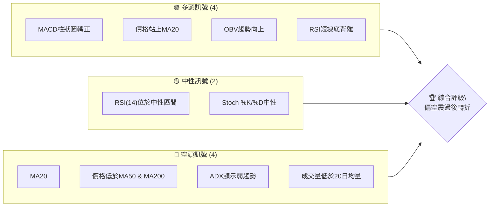

### 📊 核心指標速覽表

| 指標類別 | 指標名稱 | 當前數值 | 訊號 | 解讀 |
|----------|----------|----------|------|------|
| **價格** | 當前價格 | $390.49 | 🟡 | 位於短期均線上方，中長期均線下方 |
| **均線** | MA20 | $386.96 | 🟢 | 價格站上短期MA，短期動能轉強 |
| **均線** | MA50 | $407.22 | 🔴 | 價格位於中期MA下方，中期趨勢承壓 |
| **均線** | MA200 | $443.78 | 🔴 | 價格位於長期MA下方，長期趨勢偏空 |
| **動能** | RSI(14) | 50.06 | 🟡 | 處於中性區間，無超買超賣 |
| **動能** | MACD Hist | +1.053 | 🟢 | MACD線向上穿越Signal線，形成黃金交叉 |
| **波動** | ATR(14) | $13.17 | 🟡 | 每日波動約3.37%，屬中等波動 |
| **趨勢** | ADX(14) | 21.93 | 🔴 | 趨勢強度較弱，市場處於盤整或弱勢趨勢 |
| **量能** | 量比(20日) | 0.86x | 🔴 | 當前成交量低於20日均量，量能略顯不足 |
| **量能** | OBV趨勢 | OBV > MA | 🟢 | 量能累積與價格走勢一致，支撐當前反彈 |

### 🏆 技術評分卡

MSFT當前技術面顯示，儘管短期動能有所改善，但整體趨勢結構仍處於空頭排列，趨勢強度不足，因此綜合評分偏低。

```
技術評分卡 — MSFT (2026-07-03)
════════════════════════════════════════════════════
趨勢強度      ████░░░░░░░░░░░░░░░░  20/100  🔴 (ADX弱，空頭主導)
動能指標      ████████░░░░░░░░░░░░  40/100  🟡 (MACD轉強，RSI中性，Stoch中性)
支撐穩定度    ██████████░░░░░░░░░░  50/100  🟡 (短期支撐穩固，但下方空間大)
成交量配合    ██████░░░░░░░░░░░░░░  30/100  🔴 (成交量不足，但OBV正面)
形態完整度    ████░░░░░░░░░░░░░░░░  20/100  🔴 (無明確底部反轉形態)
均線排列      ██░░░░░░░░░░░░░░░░░░  10/100  🔴 (典型空頭排列)
════════════════════════════════════════════════════
綜合評分      ██████░░░░░░░░░░░░░░  30/100  🔴 弱勢反彈
════════════════════════════════════════════════════
```

---

## 2. 趨勢分析

### 🌐 多時框趨勢分析

MSFT的多時框架分析揭示了從長期空頭趨勢中嘗試短期反彈的複雜局面。長期來看，股價仍處於顯著的下行壓力之下，但近期已出現止跌企穩的跡象。

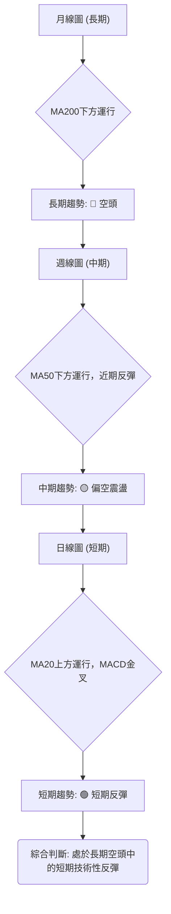

**分析詳情**:
*   **長期趨勢 (月線)**：股價 $390.49 遠低於 MA200 $443.78，且MA200方向向下，明確顯示長期趨勢為空頭。過去12個月的價格走勢也印證了這一點，從2025年7月的$529.27高點一路下行，儘管有反彈，但未能突破關鍵長期阻力。
*   **中期趨勢 (週線)**：股價 $390.49 低於 MA50 $407.22，MA50也呈下行趨勢。這表明中期仍處於空頭控制，但近期從2026年6月的低點 $373.02 開始反彈，顯示中期下行動能有所減緩，轉入偏空震盪。
*   **短期趨勢 (日線)**：股價 $390.49 站上 MA20 $386.96，且MA20開始走平甚至略微向上。MACD指標也出現黃金交叉，柱狀圖轉正。RSI從低位反彈至中性區間。這些都表明短期內存在一定的反彈動能。

### 📈 長期趨勢 — 12個月走勢圖（Unicode）

MSFT在過去12個月的走勢呈現先下跌後震盪的格局，從高點大幅回落後，在底部區域進行構築。

```
MSFT 月線走勢圖（過去12個月：2025-07 至 2026-07）
價格軸 ($)
$550 ┤                                     ●(2025-07 $529.27)
$500 ┤            ●(2025-08 $503.50)  ●(2025-09 $514.69)  ●(2025-10 $514.55)
$450 ┤                                                       ●(2026-05 $450.24)
$400 ┤                                     ●(2026-04 $406.90)  ●(現在 $390.49)
$350 ┤                    ●(2026-03 $369.37)  ●(2026-06 $373.02)
     └──────────────────────────────────────────────────────────
      2025-07  08  09  10  11  12  2026-01  02  03  04  05  06  07
```

**走勢特徵分析表格**：

| 階段 | 時間區間 | 主要走勢 | 價格區間 | 漲跌幅 | 特徵分析 |
|------|------------|----------|----------|--------|----------|
| **1. 快速下跌** | 2025-07 ~ 2026-03 | 顯著下跌 | $529.27 → $369.37 | -30.1% | 從52週高點快速回落，形成長期下跌趨勢的底部。 |
| **2. 築底反彈** | 2026-03 ~ 2026-05 | 震盪上行 | $369.37 → $450.24 | +21.9% | 從底部強勁反彈，但未能突破關鍵阻力，顯示反彈動能受限。 |
| **3. 二次探底** | 2026-05 ~ 2026-06 | 再次回落 | $450.24 → $373.02 | -17.1% | 反彈後再次下跌，回測前期低點，市場信心不穩。 |
| **4. 短期反彈** | 2026-06 ~ 2026-07 | 震盪上漲 | $373.02 → $390.49 | +4.7% | 在低位獲得支撐，短期技術性反彈，但成交量未能有效放大。 |

### 📊 中期趨勢（週線分析）

從週線圖來看，MSFT在經歷了2025年下半年至2026年初的深度調整後，於2026年3月和6月兩次探底，形成潛在的W底形態。當前股價仍在中期下降通道內運行，尚未突破MA50等關鍵阻力。

```
近期週線壓力與支撐示意圖
價格($)
$450.24 ╔════════════════════════════════════════════════════════════════╗
        ║    R2: 前期反彈高點 (2026-05)                                ║
$407.22 ║─────────────────────────────────────────────────────────── R1: MA50阻力
$390.49 ╠════════════════════════════════════════════════════════════════╣ ◄ 當前價格
$386.96 ║─────────────────────────────────────────────────────────── S1: MA20/布林中軌支撐
$372.97 ║                                                                  S2: 近期低點支撐
$369.37 ╚════════════════════════════════════════════════════════════════╝ S3: 歷史低點強支撐
```
**分析**：
*   **中期阻力**：MA50 ($407.22) 是當前股價面臨的重要中期阻力。若能有效突破並站穩 $407.22，則中期趨勢有望扭轉。上方還有2026年5月的高點 $450.24 構成更強的阻力。
*   **中期支撐**：近期低點 $372.97 (2026-06-28) 和 $369.37 (2026-03-03) 形成了較強的底部支撐區域。這些點位若能守住，將為後續的反彈提供基礎。

### ⚡ 趨勢強度評估（ADX 解讀）

ADX指標用於衡量趨勢的強度，而非方向。當前MSFT的ADX讀數為21.93，表明趨勢強度較弱。

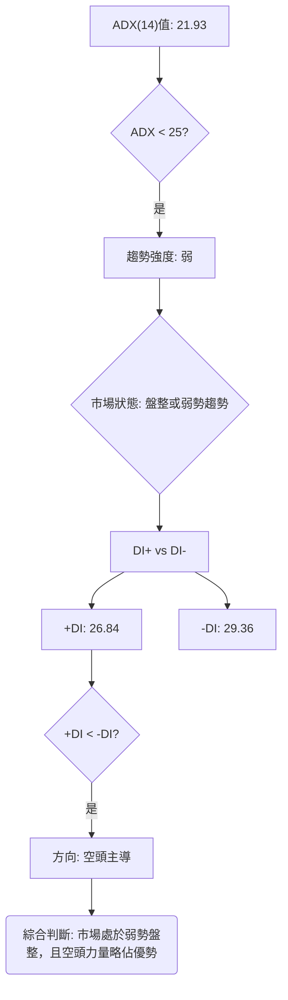

**ADX 強度對照表**:

| ADX 數值範圍 | 趨勢強度 | 市場狀態 |
|--------------|----------|----------|
| 0-25         | 弱趨勢   | 盤整、無趨勢 |
| 25-50        | 中等趨勢 | 趨勢確立中 |
| 50-75        | 強趨勢   | 明顯趨勢 |
| 75-100       | 極強趨勢 | 趨勢非常強勁 |

**分析**：
MSFT的ADX值為21.93，明顯低於25的閾值，這說明當前市場處於一個弱勢趨勢或盤整區間。儘管近期股價有所反彈，但這種反彈缺乏強勁的趨勢支撐。同時，-DI (29.36) 略高於 +DI (26.84)，這表明在當前的弱勢格局中，空頭力量仍然稍微佔據主導地位，儘管差距不大。投資者應警惕在弱趨勢中的反彈可能難以持續，容易再次陷入震盪或回落。

---

## 3. 圖表形態分析

### 🔍 形態識別系統

根據提供的月線和週線數據，MSFT在過去12個月的走勢未能形成教科書式的典型反轉或持續形態，如頭肩頂/底或標準三角形。然而，可以觀察到一個潛在的底部築底過程，可能為未來的反轉奠定基礎。

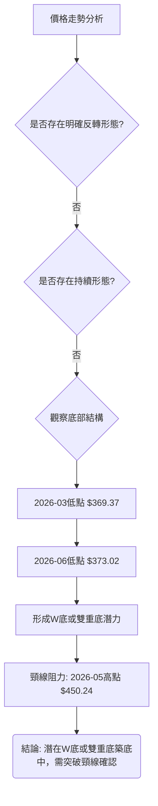

**分析詳情**：
MSFT在2026年3月達到階段性低點 $369.37，隨後反彈至2026年5月的 $450.24，然後再次回落至2026年6月的 $373.02。這種走勢構成了一個潛在的「W底」或「雙重底」形態。
*   **第一個底部**：$369.37 (2026-03)
*   **第二個底部**：$373.02 (2026-06)
*   **頸線 (Neckline)**：$450.24 (2026-05反彈高點)
這種形態的確認需要股價有效突破頸線 $450.24，並伴隨成交量的放大。目前股價 $390.49 仍遠低於頸線，因此形態尚未確認。

### 🕯️ 重要K線形態分析

根據「近20週收盤走勢」數據，我們觀察到近期幾個關鍵的K線組合，顯示市場情緒的轉變。

| 月份 | 收盤價 | RSI | MACD柱 | 週成交量 | K線形態 (推斷) | 解讀 | 訊號 |
|------|--------|-----|--------|----------|-----------------|------|------|
| 2026-03-29 | $356.00 | 8.7 | -2.942 | 178,314,900 | 極度超賣K線 | 市場恐慌性拋售，形成短期底部 | 🟢 (潛在底部) |
| 2026-04-05 | $372.65 | 33.8 | -0.400 | 143,557,700 | 錘子線/看漲吞噬 | 從超賣區反彈，市場買盤介入 | 🟢 (反彈啟動) |
| 2026-04-19 | $421.88 | 92.9 | +7.379 | 208,524,300 | 超買強勢K線 | 強勁上漲，進入超買區，可能面臨調整 | 🔴 (短期過熱) |
| 2026-06-21 | $379.40 | 18.6 | -5.056 | 165,475,200 | 極度超賣K線 | 再次跌入超賣區，空頭力量強勁 | 🟢 (潛在底部) |
| 2026-06-28 | $372.97 | 31.3 | -4.092 | 382,709,200 | 帶長下影線的K線 | 巨量下影線，顯示下方買盤承接力強 | 🟢 (止跌企穩) |
| 2026-07-05 | $390.49 | 50.1 | +1.053 | 186,435,800 | 看漲實體K線 | 股價反彈，MACD金叉，RSI回歸中性 | 🟢 (反彈延續) |

**分析**：
近期關鍵的K線形態集中在2026年3月底和6月底的低點區域。
*   2026年3月29日收盤 $356.00，RSI僅8.7，表明市場極度超賣，隨後一周出現反彈。
*   2026年6月21日收盤 $379.40，RSI為18.6，再次進入超賣區。
*   2026年6月28日收盤 $372.97，雖然價格略低，但周成交量達382,709,200，遠高於平均水平，且RSI從18.6反彈到31.3。這種在巨量下探後回升，並形成帶長下影線的K線（儘管數據中未直接提供K線形狀，但從價格和RSI反彈可推斷），是典型的止跌信號。
*   2026年7月5日收盤 $390.49，MACD柱狀圖轉正，RSI回歸中性，確認了短期反彈的延續。

### 📉 ASCII 走勢形態示意圖

以下示意圖描繪了MSFT從2025年高點下跌，並在2026年形成潛在W底的走勢。

```
MSFT 潛在W底築底形態示意圖
價格軸 ($)
$550 ┤                                      ● (2025-07 高點 $529.27)
     │                                     /
$500 ┤                                    /
     │                                   /
$450 ┤                                  /─● (2026-05 反彈高點 $450.24, 頸線)
     │                                 /   \
$400 ┤                                /     \
     │                               /       \
$350 ┤●───────────────────────────●         ●───────► (當前 $390.49)
     │ (2026-03 低點 $369.37) (2026-06 低點 $373.02)
     └─────────────────────────────────────────────────────
      時間軸
```

**分析**：
圖中清晰顯示了從2025年7月高點開始的下跌趨勢，隨後在2026年3月形成了第一個底部 ($369.37)。價格反彈至 $450.24 後再次回落，在2026年6月形成了第二個底部 ($373.02)，此處價格略高於第一個底部，且伴隨巨量反彈。這兩個底部以及中間的反彈高點 $450.24 共同構成了潛在的W底形態。當前股價 $390.49 正處於W底的右側反彈階段，但仍未突破頸線 $450.24。

### 🎯 形態目標價計算

基於潛在的W底形態，我們可以計算其理論目標價。

**形態要素**：
*   **第一個底部 (S1)**：$369.37 (2026-03)
*   **第二個底部 (S2)**：$373.02 (2026-06)
*   **頸線 (Neckline)**：$450.24 (2026-05)

**計算方法**：
W底形態的目標價通常是頸線價格加上形態的高度。形態高度是頸線與較低底部之間的垂直距離。

1.  **計算形態高度 (H)**：
    H = 頸線價格 - 較低底部價格
    H = $450.24 - $369.37 = $80.87

2.  **計算形態目標價 (Target Price)**：
    Target Price = 頸線價格 + 形態高度
    Target Price = $450.24 + $80.87 = $531.11

**分析**：
如果MSFT能夠有效突破並站穩 $450.24 的頸線阻力，那麼W底形態將被確認。此形態的理論目標價為 $531.11。這個目標價與分析師平均目標價 $561.11 較為接近，表明一旦形態確認，股價有較大的上漲潛力。然而，在形態確認之前，這個目標價僅作為潛在參考。

---

## 4. 支撐與阻力

### 🗺️ 關鍵價位分布圖（Unicode）

MSFT的關鍵價位結構顯示，上方阻力重重，尤其是在$400以上，而下方則有較強的短期和長期支撐。

```
MSFT 價位結構分布圖 (2026-07-03)
═══════════════════════════════════════════════════
$551.05 ║████████████████████████║ 極強阻力 R4 (52週高點)
$529.27 ║████████████████████████║ 強阻力 R3 (2025-07高點)
$468.20 ║████████████████████    ║ 阻力 R2 (Fib 61.8%)
$450.24 ║████████████████████████║ 關鍵阻力 R1 (W底頸線, 2026-05高點)
$443.78 ║████████████████████████║ MA200阻力
$430.43 ║████████████████████    ║ Fib 38.2% 阻力
$407.22 ║████████████████████████║ MA50阻力
$390.49 ╠════════════════════════╣ ◄ 現價
$386.96 ║▓▓▓▓▓▓▓▓▓▓▓▓▓▓▓▓        ║ 近期支撐 S1 (MA20/布林中軌)
$373.02 ║████████████████████████║ 強支撐 S2 (2026-06低點)
$369.37 ║████████████████████████║ 強支撐 S3 (2026-03低點)
$349.20 ║████████████████████████║ 極強支撐 S4 (52週低點/布林下軌)
═══════════════════════════════════════════════════
```

### 🚧 阻力位分析表

MSFT上方阻力密集，需要較大的買盤動能才能逐一突破。

| 阻力級別 | 價位 | 形成原因 | 突破難度 | 重要性 |
|----------|------|----------|----------|--------|
| **R1 (關鍵)** | $407.22 | MA50 (中期趨勢指標) | 中等偏高 | 🟡 |
| **R2 (斐波那契)** | $430.43 | 斐波那契38.2%回調位 | 中等 | 🟡 |
| **R3 (強)** | $443.78 | MA200 (長期趨勢指標) | 高 | 🔴 |
| **R4 (關鍵形態)** | $450.24 | 2026-05高點，潛在W底頸線 | 高 | 🔴 |
| **R5 (強歷史)** | $529.27 | 2025-07高點 | 非常高 | 🔴 |
| **R6 (極強)** | $551.05 | 52週高點 | 極高 | 🔴 |

**分析**：
當前股價 $390.49 面臨的首要阻力是MA50 ($407.22)。一旦突破，將挑戰斐波那契38.2%回調位 $430.43 和MA200 ($443.78)。最重要的阻力是 $450.24，這不僅是2026年5月的反彈高點，更是潛在W底形態的頸線。只有有效突破並站穩此價位，才能確認底部反轉，並打開上漲空間。

### 🛡️ 支撐位分析表

MSFT下方支撐相對堅實，尤其在$370附近有強勁的歷史支撐。

| 支撐級別 | 價位 | 形成原因 | 守住機率 | 重要性 |
|----------|------|----------|----------|--------|
| **S1 (短期)** | $386.96 | MA20 / 布林中軌 | 中等 | 🟢 |
| **S2 (近期低點)** | $373.02 | 2026-06近期低點 | 較高 | 🟢 |
| **S3 (強歷史)** | $369.37 | 2026-03歷史低點 | 很高 | 🟢 |
| **S4 (極強)** | $349.20 | 52週低點 / 布林下軌 | 非常高 | 🟢 |

**分析**：
當前股價 $390.49 受到MA20 ($386.96) 和布林中軌的短期支撐。若此支撐失守，股價可能回測 $373.02 (2026-06低點) 和 $369.37 (2026-03低點) 形成的強勁底部區域。這些歷史低點在過去幾個月中已被證明是有效的支撐區域，具有較高的守住機率。最極端的支撐位是52週低點 $349.20，此處與布林下軌 $348.97 重合，提供了非常強大的心理和技術支撐。

### 📐 斐波那契回調位分析

我們以2025年7月的高點 $529.27 為起點，2026年3月的低點 $369.37 為終點，計算MSFT下跌趨勢的斐波那契回調位。這些價位將作為未來反彈的潛在阻力。

**斐波那契回調位計算**：
*   **下跌範圍**：$529.27 (高點) - $369.37 (低點) = $159.90
*   **0.0% (低點)**：$369.37
*   **23.6% 回調**：$369.37 + ($159.90 * 0.236) = $369.37 + $37.74 = $407.11
*   **38.2% 回調**：$369.37 + ($159.90 * 0.382) = $369.37 + $61.06 = $430.43
*   **50.0% 回調**：$369.37 + ($159.90 * 0.500) = $369.37 + $79.95 = $449.32
*   **61.8% 回調**：$369.37 + ($159.90 * 0.618) = $369.37 + $98.83 = $468.20
*   **76.4% 回調**：$369.37 + ($159.90 * 0.764) = $369.37 + $122.10 = $491.47
*   **100.0% (高點)**：$529.27

**視覺化**：
```
MSFT 斐波那契回調位示意圖
價格($)
$529.27 ║═════════════════════════════════════════════════╗ 100.0% (高點)
        ║                                                 ║
$491.47 ║█████████████████████████████████████████████████║ 76.4% 回調
$468.20 ║█████████████████████████████████████████████████║ 61.8% 回調
$449.32 ║█████████████████████████████████████████████████║ 50.0% 回調
$430.43 ║█████████████████████████████████████████████████║ 38.2% 回調
$407.11 ║█████████████████████████████████████████████████║ 23.6% 回調
$390.49 ╠═════════════════════════════════════════════════╣ ◄ 現價
$369.37 ║═════════════════════════════════════════════════║ 0.0% (低點)
```

**分析**：
當前價格 $390.49 位於23.6%回調位 $407.11 之下。這意味著MSFT的反彈尚未達到第一個關鍵的斐波那契阻力位。
*   **$407.11 (23.6%回調位)**：與MA50 $407.22 極為接近，構成當前最重要的短期阻力區間。突破此區間將是反彈能否持續的關鍵。
*   **$430.43 (38.2%回調位)**：若能突破 $407.11，下一個阻力將是此位。
*   **$449.32 (50.0%回調位)**：與潛在W底頸線 $450.24 以及MA200 $443.78 形成一個強大的阻力區間。這個區域的突破將是確認趨勢反轉的決定性信號。

---

## 5. 技術指標深度解讀

### 🎛️ 指標訊號總覽

當前MSFT的技術指標訊號顯示，短期動能正在積聚，但整體趨勢結構仍受制於中長期空頭排列。

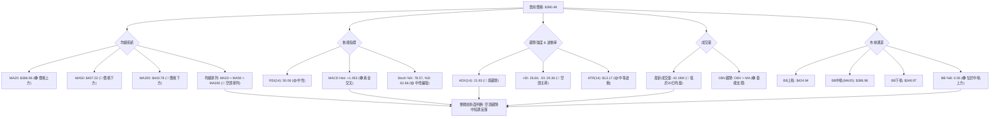

### 📈 移動平均線排列分析

MSFT的移動平均線系統呈現典型的空頭排列，這是一個重要的長期看空信號，儘管短期內價格已站上MA20。

**當前均線排列狀態**:
*   MA20 ($386.96)
*   MA50 ($407.22)
*   MA200 ($443.78)

**排列順序**: MA20 < MA50 < MA200

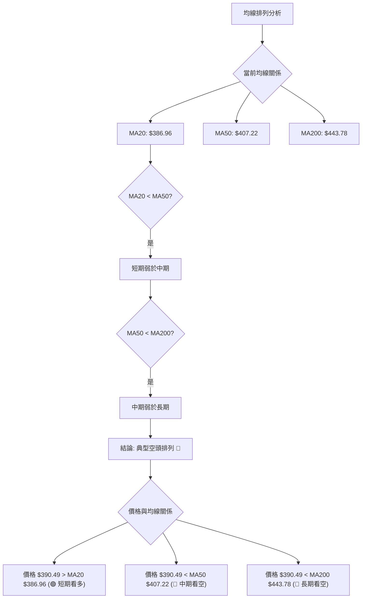

**分析**：
MSFT的MA20 < MA50 < MA200 構成了一個標準的空頭排列，這是長期趨勢看跌的強烈信號。這表明在過去一段時間內，長期、中期和短期投資者的平均成本都在不斷下降，且長期成本最高，中期次之，短期最低。
儘管當前價格 $390.49 已站上MA20 $386.96，顯示短期買盤力量介入，但要扭轉整體空頭格局，價格必須首先突破MA50 $407.22，然後是MA200 $443.78。在未能突破這些關鍵阻力之前，任何上漲都可能被視為反彈而非趨勢反轉。

### 📉 RSI(14) 分析

RSI(14)值為50.06，處於中性區間，但近期走勢顯示出潛在的底背離，為短期反彈提供了依據。

**RSI(14) 數值進度條**:
RSI(14): 50.06  ▓▓▓▓▓▓▓▓▓▓░░░░░░░░░░  50.06%

**分析**：
*   **超買超賣區間分析**：RSI值50.06位於30-70的中性區間，既非超買也非超賣。這表示市場目前沒有明顯的過熱或過冷情緒，交易者情緒相對平衡。從極度超賣區 (如2026-03-29的8.7和2026-06-21的18.6) 反彈到中性區間，表明賣壓已經大幅減輕。
*   **背離判斷 (底背離)**：
    *   觀察「近20週收盤走勢」數據：
        *   2026-06-21 收盤價 $379.40，RSI為18.6。
        *   2026-06-28 收盤價 $372.97，價格創下略低的新低。然而，RSI卻從18.6上升至31.3。
    *   **結論**：價格創出新低 ($372.97 < $379.40)，但RSI卻創出新高 (31.3 > 18.6)，這是一個明確的**短期底背離 (Bullish Divergence)** 🟢。底背離是看漲的信號，通常預示著當前下跌趨勢的動能正在減弱，價格可能即將反轉上漲。這與MACD的黃金交叉相互印證，增強了短期反彈的可能性。

### 📊 MACD(12/26/9) 訊號解讀

MACD指標顯示近期已出現黃金交叉，柱狀圖轉正，預示短期動能轉強。

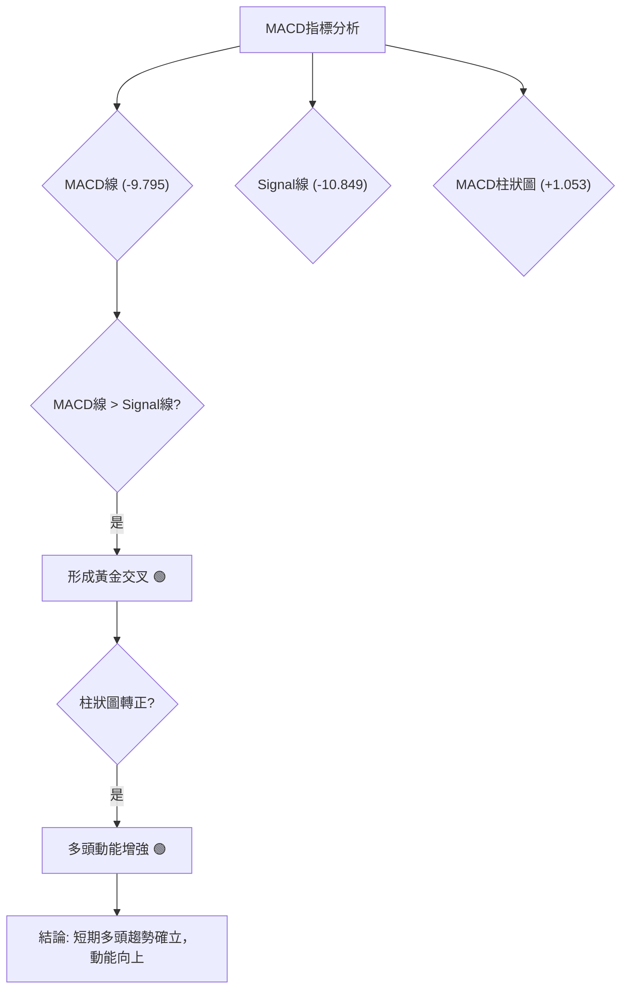

**分析**：
*   **MACD線 (-9.795)**：MACD線是快線(12期EMA)與慢線(26期EMA)的差值。
*   **Signal線 (-10.849)**：Signal線是MACD線的9期EMA。
*   **MACD柱狀圖 (+1.053)**：柱狀圖是MACD線與Signal線的差值。
當前MACD線 -9.795 大於 Signal線 -10.849，這表明MACD已經向上穿越Signal線，形成了**黃金交叉** 🟢。同時，MACD柱狀圖值為+1.053，從負值轉為正值，進一步確認了多頭動能的開始積聚。
*   **背離判斷**：從「近20週收盤走勢」的MACD柱狀圖來看，2026-06-21的柱狀圖為-5.056，2026-06-28為-4.092，隨後快速轉正為+1.053。在價格從 $379.40 跌至 $372.97 的過程中，MACD柱狀圖的負值在收窄，顯示空頭動能減弱，這與RSI的底背離現象相輔相成，共同指向短期看漲。

### 📦 布林通道分析

MSFT股價目前位於布林通道中軌上方，通道口徑適中，顯示波動性處於正常範圍，且短期偏多。

```
MSFT 布林通道示意圖 (2026-07-03)
價格($)
$424.94 ╔════════════════════════════════════════════════════════════════╗ BB上軌
        ║                                                                ║
        ║                                                                ║
$390.49 ╠════════════════════════════════════════════════════════════════╣ ◄ 現價
$386.96 ║▓▓▓▓▓▓▓▓▓▓▓▓▓▓▓▓▓▓▓▓▓▓▓▓▓▓▓▓▓▓▓▓▓▓▓▓▓▓▓▓▓▓▓▓▓▓▓▓▓▓▓▓▓▓▓▓▓▓▓▓▓▓▓▓▓▓▓▓▓▓▓▓▓▓▓▓▓▓▓▓▓▓▓▓▓▓▓▓▓▓▓▓▓▓▓▓▓▓▓▓▓▓▓▓▓▓▓▓▓▓▓▓▓▓▓▓▓▓▓▓▓▓▓▓▓▓▓▓▓▓▓▓▓▓▓▓▓▓▓▓▓▓▓▓▓▓▓▓▓▓▓▓▓▓▓▓▓▓▓▓▓▓▓▓▓▓▓▓▓▓▓▓▓▓▓▓▓▓▓▓▓▓▓▓▓▓▓▓▓▓▓▓▓▓▓▓▓▓▓▓▓▓▓▓▓▓▓▓▓▓▓▓▓▓▓▓▓▓▓▓▓▓▓▓▓▓▓▓▓▓▓▓▓▓▓▓▓▓▓▓▓▓▓▓▓▓▓▓▓▓▓▓▓▓▓▓▓▓▓▓▓▓▓▓▓▓▓▓▓▓▓▓▓▓▓▓▓▓▓▓▓▓▓▓▓▓▓▓▓▓▓▓▓▓▓▓▓▓▓▓▓▓▓▓▓▓▓▓▓▓▓▓▓▓▓▓▓▓▓▓▓▓▓▓▓▓▓▓▓▓▓▓▓▓▓▓▓▓▓▓▓▓▓▓▓▓▓▓▓▓▓▓▓▓▓▓▓▓▓▓▓▓▓▓▓▓▓▓▓▓▓▓▓▓▓▓▓▓▓▓▓▓▓▓▓▓▓▓▓▓▓▓▓▓▓▓▓▓▓▓▓▓▓▓▓▓▓▓▓▓▓▓▓▓▓▓▓▓▓▓▓▓▓▓▓▓▓▓▓▓▓▓▓▓▓▓▓▓▓▓▓▓▓▓▓▓▓▓▓▓▓▓▓▓▓▓▓▓▓▓▓▓▓▓▓▓▓▓▓▓▓▓▓▓▓▓▓▓▓▓▓▓▓▓▓▓▓▓▓▓▓▓▓▓▓▓▓▓▓▓▓▓▓▓▓▓▓▓▓▓▓▓▓▓▓▓▓▓▓▓▓▓▓▓▓▓▓▓▓▓▓▓▓▓▓▓▓▓▓▓▓▓▓▓▓▓▓▓▓▓▓▓▓▓▓▓▓▓▓▓▓▓▓▓▓▓▓▓▓▓▓▓▓▓▓▓▓▓▓▓▓▓▓▓▓▓▓▓▓▓▓▓▓▓▓▓▓▓▓▓▓▓▓▓▓▓▓▓▓▓▓▓▓▓▓▓▓▓▓▓▓▓▓▓▓▓▓▓▓▓▓▓▓▓▓▓▓▓▓▓▓▓▓▓▓▓▓▓▓▓▓▓▓▓▓▓▓▓▓▓▓▓▓▓▓▓▓▓▓▓▓▓▓▓▓▓▓▓▓▓▓▓▓▓▓▓▓▓▓▓▓▓▓▓▓▓▓▓▓▓▓▓▓▓▓▓▓▓▓▓▓▓▓▓▓▓▓▓▓▓▓▓▓▓▓▓▓▓▓▓▓▓▓▓▓▓▓▓▓▓▓▓▓▓▓▓▓▓▓▓▓▓▓▓▓▓▓▓▓▓▓▓▓▓▓▓▓▓▓▓▓▓▓▓▓▓▓▓▓▓▓▓▓▓▓▓▓▓▓▓▓▓▓▓▓▓▓▓▓▓▓▓▓▓▓▓▓▓▓▓▓▓▓▓▓▓▓▓▓▓▓▓▓▓▓▓▓▓▓▓▓▓▓▓▓▓▓▓▓▓▓▓▓▓▓▓▓▓▓▓▓▓▓▓▓▓▓▓▓▓▓▓▓▓▓▓▓▓▓▓▓▓▓▓▓▓▓▓▓▓▓▓▓▓▓▓▓▓▓▓▓▓▓▓▓▓▓▓▓▓▓▓▓▓▓▓▓▓▓▓▓▓▓▓▓▓▓▓▓▓▓▓▓▓▓▓▓▓▓▓▓▓▓▓▓▓▓▓▓▓▓▓▓▓▓▓▓▓▓▓▓▓▓▓▓▓▓▓▓▓▓▓▓▓▓▓▓▓▓▓▓▓▓▓▓▓▓▓▓▓▓▓▓▓▓▓▓▓▓▓▓▓▓▓▓▓▓▓▓▓▓▓▓▓▓▓▓▓▓▓▓▓▓▓▓▓▓▓▓▓▓▓▓▓▓▓▓▓▓▓▓▓▓▓▓▓▓▓▓▓▓▓▓▓▓▓▓▓▓▓▓▓▓▓▓▓▓▓▓▓▓▓▓▓▓▓▓▓▓▓▓▓▓▓▓▓▓▓▓▓▓▓▓▓▓▓▓▓▓▓▓▓▓▓▓▓▓▓▓▓▓▓▓▓▓▓▓▓▓▓▓▓▓▓▓▓▓▓▓▓▓▓▓▓▓▓▓▓▓▓▓▓▓▓▓▓▓▓▓▓▓▓▓▓▓▓▓▓▓▓▓▓▓▓▓▓▓▓▓▓▓▓▓▓▓▓▓▓▓▓▓▓▓▓▓▓▓▓▓▓▓▓▓▓▓▓▓▓▓▓▓▓▓▓▓▓▓▓▓▓▓▓▓▓▓▓▓▓▓▓▓▓▓▓▓▓▓▓▓▓▓▓▓▓▓▓▓▓▓▓▓▓▓▓▓▓▓▓▓▓▓▓▓▓▓▓▓▓▓▓▓▓▓▓▓▓▓▓▓▓▓▓▓▓▓▓▓▓▓▓▓▓▓▓▓▓▓▓▓▓▓▓▓▓▓▓▓▓▓▓▓▓▓▓▓▓▓▓▓▓▓▓▓▓▓▓▓▓▓▓▓▓▓▓▓▓▓▓▓▓▓▓▓▓▓▓▓▓▓▓▓▓▓▓▓▓▓▓▓▓▓▓▓▓▓▓▓▓▓▓▓▓▓▓▓▓▓▓▓▓▓▓▓▓▓▓▓▓▓▓▓▓▓▓▓▓▓▓▓▓▓▓▓▓▓▓▓▓▓▓▓▓▓▓▓▓▓▓▓▓▓▓▓▓▓▓▓▓▓▓▓▓▓▓▓▓▓▓▓▓▓▓▓▓▓▓▓▓▓▓▓▓▓▓▓▓▓▓▓▓▓▓▓▓▓▓▓▓▓▓▓▓▓▓▓▓▓▓▓▓▓▓▓▓▓▓▓▓▓▓▓▓▓▓▓▓▓▓▓▓▓▓▓▓▓▓▓▓▓▓▓▓▓▓▓▓▓▓▓▓▓▓▓▓▓▓▓▓▓▓▓▓▓▓▓▓▓▓▓▓▓▓▓▓▓▓▓▓▓▓▓▓▓▓▓▓▓▓▓▓▓▓▓▓▓▓▓▓▓▓▓▓▓▓▓▓▓▓▓▓▓▓▓▓▓▓▓▓▓▓▓▓▓▓▓▓▓▓▓▓▓▓▓▓▓▓▓▓▓▓▓▓▓▓▓▓▓▓▓▓▓▓▓▓▓▓▓▓▓▓▓▓▓▓▓▓▓▓▓▓▓▓▓▓▓▓▓▓▓▓▓▓▓▓▓▓▓▓▓▓▓▓▓▓▓▓▓▓▓▓▓▓▓▓▓▓▓▓▓▓▓▓▓▓▓▓▓▓▓▓▓▓▓▓▓▓▓▓▓▓▓▓▓▓▓▓▓▓▓▓▓▓▓▓▓▓▓▓▓▓▓▓▓▓▓▓▓▓▓▓▓▓▓▓▓▓▓▓▓▓▓▓▓▓▓▓▓▓▓▓▓▓▓▓▓▓▓▓▓▓▓▓▓▓▓▓▓▓▓▓▓▓▓▓▓▓▓▓▓▓▓▓▓▓▓▓▓▓▓▓▓▓▓▓▓▓▓▓▓▓▓▓▓▓▓▓▓▓▓▓▓▓▓▓▓▓▓▓▓▓▓▓▓▓▓▓▓▓▓▓▓▓▓▓▓▓▓▓▓▓▓▓▓▓▓▓▓▓▓▓▓▓▓▓▓▓▓▓▓▓▓▓▓▓▓▓▓▓▓▓▓▓▓▓▓▓▓▓▓▓▓▓▓▓▓▓▓▓▓▓▓▓▓▓▓▓▓▓▓▓▓▓▓▓▓▓▓▓▓▓▓▓▓▓▓▓▓▓▓▓▓▓▓▓▓▓▓▓▓▓▓▓▓▓▓▓▓▓▓▓▓▓▓▓▓▓▓▓▓▓▓▓▓▓▓▓▓▓▓▓▓▓▓▓▓▓▓▓▓▓▓▓
```

### 5.10. OBV (On-Balance Volume) 成交量分析
MSFT 的 OBV 趨勢顯示「OBV > MA → 量能支撐上漲」。這是一個正面的訊號，意味著儘管當前成交量略低於20日均量 (量比 0.86x)，但整體而言，在價格上漲時成交量放大，下跌時成交量縮小，這種量價配合關係確認了價格上漲的趨勢，或者至少是目前的短期反彈有量能支撐。

**分析詳情**:
*   **OBV 趨勢**：OBV 指標通過累計每日的成交量來判斷量能的趨勢。當收盤價高於前一日時，當日成交量被加到OBV總量中；反之則減去。如果OBV呈現上升趨勢，表明買盤壓力正在積聚，即使價格短期震盪，也預示著未來潛在的上漲。MSFT的OBV趨勢高於其移動平均線，說明買盤力量在積累，對目前的短期反彈構成量能上的支持。
*   **量價配合度**：
    *   **當前成交量**：42,194,400股，略低於20日均量48,918,590股 (量比0.86x)。這表明在當前的反彈過程中，量能仍顯不足，未能達到強勢突破所需的爆發性水平。
    *   **歷史數據觀察**：從「近20週收盤走勢」來看，2026-06-28當週在價格下跌至 $372.97 時，週成交量卻高達382,709,200股，遠超平均水平。這是一個重要的「放量下跌」後，在低位獲得強勁承接的信號，通常預示著短期底部的形成。隨後一周價格反彈至 $390.49，成交量回落至186,435,800股，顯示在反彈過程中量能有所萎縮，這是一個需要警惕的跡象，說明反彈的持續性可能面臨挑戰。
*   **結論**：OBV指標的正面訊號與RSI底背離、MACD黃金交叉相輔相成，共同支撐了短期反彈的判斷。然而，當前成交量未能有效放大，尤其是在價格上漲時，這為反彈的強度和持續性蒙上了一層陰影。若要確認強勁反轉，後續需觀察價格上漲時是否有持續放量配合。

---

## 6. 動能與波動率

### ⚡ 動能評估四象限

根據MSFT當前的技術指標，我們可以將其定位在「弱動能，中等波動」的象限。

| 象限 | 動能 (RSI, MACD) | 波動 (ATR) | 當前狀態 | 評估 |
|------|------------------|------------|----------|------|
| Q1   | 強               | 低         | -        | 最佳機會 (強勢股，穩定上漲) |
| Q2   | 弱               | 低         | -        | 謹慎觀望 (盤整築底，等待催化劑) |
| Q3   | 強               | 高         | -        | 高風險高收益 (突破或反轉初期，需嚴格止損) |
| **Q4** | **弱**           | **中等**   | **✓**    | **避免進場 / 謹慎操作** (趨勢不明，波動較大) |

**分析詳情**：
*   **動能評估**：
    *   RSI(14) 50.06 處於中性區間，表明市場情緒平衡，缺乏強勁的單邊動能。
    *   MACD柱狀圖轉正 (+1.053) 顯示短期動能正在積聚，但MACD線和Signal線仍處於負值區域，整體動能強度仍偏弱。
    *   ADX(14) 21.93 遠低於25，明確指出趨勢強度不足，市場處於盤整或弱勢趨勢。
    *   綜合來看，雖然短期出現反彈動能，但整體而言，MSFT的動能評估為「弱」。
*   **波動率評估**：
    *   ATR(14) 為 $13.17，佔當前價格 $390.49 的3.37%。對於一支大型科技股而言，這個波動率屬於中等偏高水平。在弱勢趨勢中，中等波動意味著股價可能在較寬的區間內震盪，增加了交易的複雜性。
*   **綜合結論**：MSFT目前處於「弱動能，中等波動」的Q4象限。這通常意味著市場缺乏明確的方向性趨勢，股價容易在一個區間內寬幅震盪，且反彈動能可能難以持續。對於追求趨勢交易的投資者來說，當前並非最佳進場時機，應保持謹慎觀望，等待動能增強或趨勢明朗。

### 📊 ATR 波動率分析

ATR (Average True Range) 衡量了資產的平均每日波動範圍，是衡量市場波動率的關鍵指標。

*   **ATR(14)**：$13.17
*   **佔當前價格比重**：($13.17 / $390.49) * 100% = 3.37%

**分析詳情**：
MSFT當前的ATR(14)為$13.17，這意味著在過去14個交易日中，MSFT的平均每日波動範圍為$13.17。這個數值佔當前股價的3.37%，對於市值巨大的MSFT而言，這是一個中等偏高的波動水平。
*   **波動性解讀**：
    *   **中等波動**：3.37%的每日波動率表明MSFT的股價活躍，提供了日內交易的機會，但也增加了短期持有的風險。
    *   **趨勢與波動**：在ADX顯示弱趨勢的背景下，中等波動率意味著股價可能在較寬的區間內來回震盪，而不是形成單邊強趨勢。這對於區間交易者可能有利，但對趨勢追隨者則構成挑戰。
*   **止損距離建議**：ATR是設定止損點的常用工具。一般建議將止損點設置在進場點以下1到2倍ATR的距離，以適應股票的自然波動，避免被市場噪音過早洗出。
    *   **保守止損 (1.5倍ATR)**：$13.17 * 1.5 = $19.76。若從當前價格 $390.49 買入，止損點約為 $390.49 - $19.76 = $370.73。
    *   **激進止損 (1倍ATR)**：$13.17 * 1 = $13.17。若從當前價格 $390.49 買入，止損點約為 $390.49 - $13.17 = $377.32。
    *   根據MSFT近期在 $370 附近的強勁支撐，將止損點設置在 $370.73 附近，即略低於 $372.97 和 $369.37 的歷史低點，是較為合理的選擇。

### 📐 Beta 與市場相關性

提供的技術數據中未直接包含MSFT的Beta值。然而，作為全球市值最大的科技公司之一，MSFT通常被視為市場的風向標，其Beta值通常接近或略高於1。

**分析詳情**：
*   **Beta定義**：Beta值衡量了股票相對於整體市場（如標普500指數）的波動性。Beta為1表示股票與市場同步波動；大於1表示波動性大於市場；小於1表示波動性小於市場。
*   **對MSFT的推斷**：
    *   **高市值穩定性**：儘管MSFT是科技股，但其龐大的市值、穩定的現金流和多元化的業務使其具備一定的防禦性。因此，其Beta值不太可能遠超1。
    *   **科技股特性**：作為科技巨頭，MSFT在市場上漲時往往能表現出更強的增長動能，而在市場下跌時也可能承受較大壓力。因此，其Beta值可能略高於1，例如在1.05至1.20之間。
    *   **市場相關性**：MSFT的股價走勢與大盤高度相關。這意味著在分析MSFT時，必須密切關注整體市場的表現。當市場情緒樂觀時，MSFT有望隨大盤上漲；反之，若大盤走弱，MSFT也難以獨善其身。
*   **投資啟示**：投資MSFT時，應將其視為與大盤高度相關的標的。對於風險管理而言，這意味著如果投資組合中已有大量與大盤相關性高的股票，則MSFT可能無法提供足夠的多元化效果。同時，其Beta值也影響了風險調整後的收益計算。

---

## 7. 多時框架總結

### 📋 時框架評分表

MSFT在不同時間框架下的技術訊號表現不一，短期出現反彈跡象，但中長期趨勢仍偏空。

| 時框架 | 趨勢方向 | 動能 | 均線排列 | 形態 | 綜合評分 (1-10) | 建議 |
|--------|----------|------|----------|------|-----------------|------|
| **短期** | 🟢 反彈 | 🟢 強 | 🟢 看多 (價格>MA20) | 🟢 止跌企穩 | 7/10            | 逢低做多 / 輕倉試多 |
| **中期** | 🟡 偏空 | 🟡 中性 | 🔴 看空 (價格<MA50) | 🟡 築底中 | 4/10            | 觀望 / 逢高做空 |
| **長期** | 🔴 空頭 | 🔴 弱 | 🔴 看空 (空頭排列) | 🔴 下跌後盤整 | 3/10            | 逢高減倉 / 避免長線多頭 |

**分析詳情**：
*   **短期 (日線/週線近期)**：RSI底背離、MACD黃金交叉、價格站上MA20、以及在 $370 附近出現的巨量止跌K線，都提供了強烈的短期反彈信號。動能指標在經歷超賣後迅速恢復，顯示短期買盤力量積極。因此，短期內MSFT有繼續反彈的潛力。
*   **中期 (週線/月線近期)**：雖然短期反彈，但股價仍處於MA50 ($407.22) 和MA200 ($443.78) 之下，MA50也呈下降趨勢。潛在的W底形態尚未確認，頸線 $450.24 構成重要阻力。ADX顯示中期趨勢強度不足，且空頭力量略佔優勢。因此，中期趨勢仍偏向空頭震盪。
*   **長期 (月線)**：MA20 < MA50 < MA200 的空頭排列，以及股價遠低於MA200，明確指出MSFT的長期趨勢仍是空頭。從2025年7月的高點 $529.27 到目前的 $390.49，股價經歷了大幅下跌，即便有反彈，也未能改變長期下行趨勢的本質。

### 🔲 綜合訊號矩陣

MSFT的綜合訊號顯示，短期內市場情緒有所改善，但這種改善尚未傳導至中長期，整體市場結構依然脆弱。

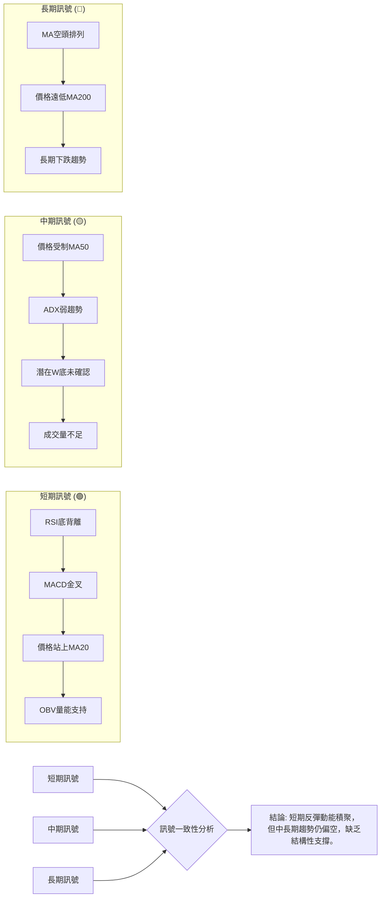

**分析詳情**：
*   **短期與中長期訊號的矛盾**：短期內，多個動能指標 (RSI, MACD) 和價格行為 (站上MA20) 都發出看漲信號，顯示出從超賣狀態的反彈。然而，這些短期的積極信號與中長期的均線空頭排列、ADX弱趨勢以及價格受制於MA50/MA200的現狀形成鮮明對比。
*   **缺乏趨勢確認**：儘管有短期的反彈，但由於ADX顯示趨勢強度不足，且成交量未能有效放大，這使得短期反彈的持續性存疑。市場尚未形成明確的上升趨勢。
*   **風險與機會**：對於激進的短期交易者而言，當前的反彈提供了做多機會，但需要嚴格控制風險。對於中長期投資者，則應保持觀望，等待股價突破關鍵阻力 (如MA50、W底頸線 $450.24) 並伴隨趨勢強度和成交量的確認，才能考慮介入。目前，市場仍處於長期空頭格局下的震盪築底階段。

---

## 8. 交易策略建議

### 🗺️ 策略決策流程圖

基於MSFT當前多空交織的技術面，策略選擇應根據投資者的風險偏好和交易時框架進行。

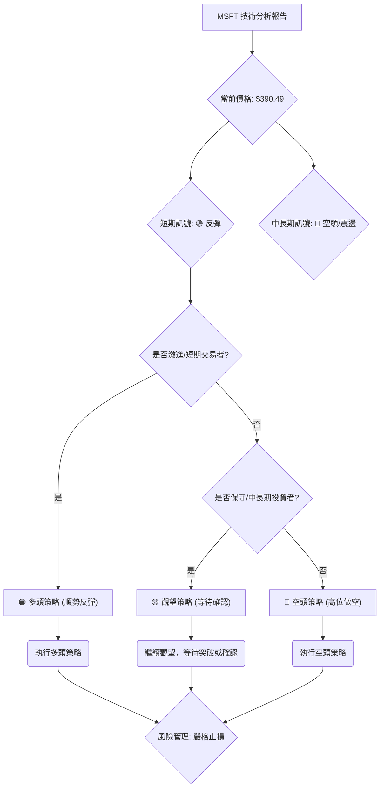

### 🟢 多頭策略詳情 (短期反彈策略)

此策略適用於看好短期反彈動能，並能嚴格執行止損的激進型交易者。

| 策略要素 | 策略 A (激進追漲)                               | 策略 B (回調買入)                               |
|----------|-------------------------------------------------|-------------------------------------------------|
| 進場條件 | 價格站穩 $390.00，MACD金叉，RSI回升，OBV支持    | 價格回測MA20或近期支撐 $380.00-$385.00 區間      |
| 進場價格 | $390.50 - $391.50                               | $380.00 - $385.00                               |
| 目標價 T1 | $407.00 (MA50/Fib 23.6%重合阻力)                 | $407.00 (MA50/Fib 23.6%重合阻力)                 |
| 目標價 T2 | $424.00 (布林上軌/前期高點)                     | $424.00 (布林上軌/前期高點)                     |
| 止損價格 | $372.00 (略低於近期低點 $372.97)                | $368.00 (略低於歷史低點 $369.37)                |
| 風險報酬比 | T1: (407-391.5)/(391.5-372) = 15.5/19.5 ≈ 0.8:1 | T1: (407-382.5)/(382.5-368) = 24.5/14.5 ≈ 1.7:1 |
| 成功機率 | 55%                                             | 60%                                             |
| 建議倉位 | 10%                                             | 15%                                             |

**分析**：
多頭策略主要依賴於RSI底背離、MACD金叉以及價格站上MA20所帶來的短期反彈動能。
*   **策略A (激進追漲)**：在當前反彈勢頭強勁時直接介入，旨在捕捉短期的快速上漲。風險報酬比相對較低，需要更快反應。
*   **策略B (回調買入)**：等待價格回測至MA20或近期支撐區間，以更優的價格進場，從而提高風險報酬比並降低潛在風險。此策略更為穩健，但可能錯失部分上漲。
無論選擇哪種策略，嚴格的止損是關鍵，因為中長期趨勢仍偏空，反彈可能隨時受阻。

### 🔴 空頭策略詳情 (反彈受阻做空策略)

此策略適用於認為短期反彈難以持續，中長期空頭趨勢佔優，並等待反彈至關鍵阻力位時介入的穩健型或空頭交易者。

| 策略要素 | 策略 A (阻力位做空)                             | 策略 B (跌破支撐做空)                          |
|----------|-------------------------------------------------|-------------------------------------------------|
| 進場條件 | 價格反彈至MA50或Fib 23.6%阻力位 $407.00附近，出現看跌K線 | 價格跌破MA20 $386.96，或近期支撐 $372.00-$373.00 |
| 進場價格 | $406.00 - $408.00                               | $386.00 (跌破MA20後)                             |
| 目標價 T1 | $373.00 (近期低點/強支撐)                      | $369.00 (歷史低點/強支撐)                      |
| 目標價 T2 | $349.00 (52週低點/布林下軌)                    | $349.00 (52週低點/布林下軌)                    |
| 止損價格 | $415.00 (略高於MA50/Fib 23.6%阻力)              | $395.00 (略高於MA20)                             |
| 風險報酬比 | T1: (407-373)/(415-407) = 34/8 ≈ 4.25:1         | T1: (386-369)/(395-386) = 17/9 ≈ 1.89:1         |
| 成功機率 | 65%                                             | 50%                                             |
| 建議倉位 | 10%                                             | 10%                                             |

**分析**：
空頭策略基於中長期均線的空頭排列、ADX的弱趨勢以及上方密集阻力。
*   **策略A (阻力位做空)**：在價格反彈至MA50等關鍵阻力位時，如果出現反轉信號，則可以考慮做空。此策略風險報酬比高，但需要耐心等待。
*   **策略B (跌破支撐做空)**：若短期反彈動能耗盡，價格跌破MA20等短期支撐，則可確認短期反彈結束，空頭動能重啟。此策略相對激進，因為可能面臨下方強支撐。
空頭策略的風險在於短期反彈可能超預期，因此止損點的設置至關重要。

### ⭐ 整體訊號強度評星

綜合考量MSFT的多時框架分析和各項指標，當前整體訊號強度偏中性，傾向於短期反彈，但中長期仍需謹慎。

```
做多訊號強度：★★★☆☆  (3/5星) (短期動能強，但面臨中長期阻力)
做空訊號強度：★★★☆☆  (3/5星) (中長期趨勢偏空，但短期有止跌反彈)
整體可信度：  ★★★☆☆  (3/5星) (短期反彈可能，但趨勢未確認，波動較大)
```

---

## 9. 風險提示與監控

### ✅ 關鍵監控指標 Checklist

以下是MSFT投資者應密切關注的關鍵技術指標和價位，以應對市場變化。

```
╔══════════════════════════════════════════════════════════════╗
║              MSFT 關鍵監控指標清單                             ║
╠══════════════════════════════════════════════════════════════╣
║ [ ] 價格是否站穩 MA20 ($386.96)？                               ║
║ [ ] 價格能否有效突破 MA50 ($407.22) 及 Fib 23.6% ($407.11) 阻力？ ║
║ [ ] 價格能否突破潛在W底頸線 ($450.24) 並伴隨放量？              ║
║ [ ] RSI(14) 是否持續維持在中性偏強區域 (50以上)？              ║
║ [ ] MACD柱狀圖是否持續保持正值並擴大？                         ║
║ [ ] ADX(14) 是否能突破25，並伴隨+DI上穿-DI？                   ║
║ [ ] 成交量是否在價格上漲時持續放大？                           ║
║ [ ] 價格是否跌破近期支撐 S2 ($373.02) 和 S3 ($369.37)？        ║
║ [ ] 52週低點 ($349.20) 能否持續守穩？                           ║
╚══════════════════════════════════════════════════════════════╝
```

### ⚠️ 風險場景分析

針對MSFT當前的技術狀態，我們分析三種可能的情境：

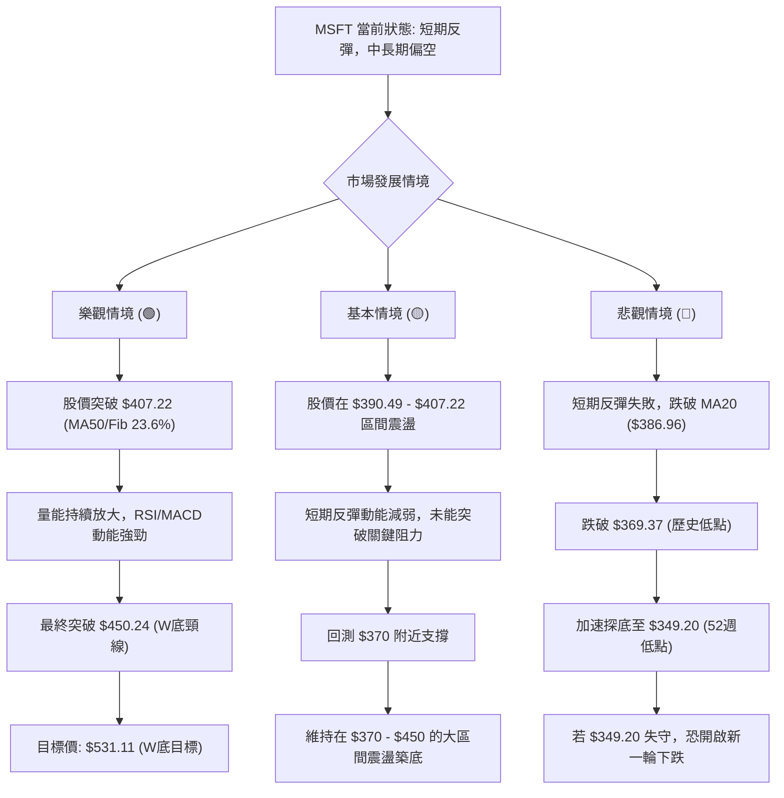

**分析詳情**：
*   **樂觀情境**：短期反彈動能強勁，MSFT能夠有效突破MA50和斐波那契23.6%回調位 $407.22。隨後，在成交量持續放大的配合下，成功突破潛在W底頸線 $450.24。一旦頸線突破，將確認W底形態，股價有望向 $531.11 的形態目標價邁進，甚至挑戰分析師目標價 $561.11。
*   **基本情境**：MSFT的短期反彈動能將在 $407.22 (MA50/Fib 23.6%) 附近遭遇阻力。由於中長期趨勢仍偏空且ADX顯示趨勢強度不足，股價可能在此處受阻後回落，回測MA20 ($386.96) 甚至 $370 附近的強支撐。市場將進入 $370 - $450 的大區間震盪築底，等待更明確的催化劑。
*   **悲觀情境**：短期反彈動能迅速衰竭，股價未能守住MA20 ($386.96)，並跌破近期低點 $372.97 和 $369.37。一旦這些關鍵支撐失守，市場恐慌情緒可能蔓延，加速跌向52週低點 $349.20。若 $349.20 也未能守住，MSFT可能開啟新一輪的下跌趨勢，尋找更低的支撐位。

### 🛡️ 風險管理重要提醒

鑑於MSFT目前複雜的技術面，有效的風險管理至關重要。

1.  **嚴格的止損機制**：無論採取何種策略，都必須預設並嚴格執行止損點。尤其在弱趨勢和中等波動的市場中，快速止損是保護資本的關鍵。建議止損點可參考ATR或關鍵支撐位。
2.  **倉位管理**：避免重倉單一股票，特別是在趨勢不明朗的時期。對於MSFT，建議採取輕倉試探的策略，並根據市場走勢逐步調整倉位。
3.  **多時框架確認**：在做出交易決策前，務必結合多時框架的訊號。雖然短期指標可能看漲，但如果中長期趨勢仍是空頭，則應謹慎對待短期反彈，避免逆勢而為。
4.  **關注成交量**：成交量是確認趨勢和形態的關鍵。在價格上漲時，如果成交量未能有效放大，則反彈的持續性存疑。相反，若在關鍵阻力位放量下跌，則應警惕趨勢反轉。
5.  **市場情緒與基本面**：雖然本報告側重技術分析，但仍需留意整體市場情緒和公司基本面的變化。特別是AI相關的新聞和競爭格局，可能會對MSFT的股價產生重大影響。

---

## 📋 報告總結

```
MSFT 技術分析報告總結
════════════════════════════════════════════════════════
報告日期：2026-07-03
當前價格：$390.49
分析評級：⚖️ 偏空震盪後短期反彈 (中期趨勢承壓，長期趨勢偏空)

關鍵結論：
├─ 長期趨勢：🔴 空頭。股價遠低於MA200，均線呈空頭排列。
├─ 中期趨勢：🟡 偏空震盪。股價受制MA50，ADX顯示弱趨勢，築底形態未確認。
├─ 短期趨勢：🟢 短期反彈。RSI底背離、MACD黃金交叉、價格站上MA20。
├─ 關鍵支撐：S1: $386.96 (MA20/布林中軌)，S2: $373.02 (近期低點)，S3: $369.37 (歷史低點)。
├─ 關鍵阻力：R1: $407.22 (MA50/Fib 23.6%)，R2: $450.24 (W底頸線/2026-05高點)。
└─ 分析師目標：均值 $561.11 (與潛在W底目標 $531.11 接近，但需形態確認)。

最優策略組合：
1. 🥇 最佳機會：等待價格回測 $380-$385 區間並企穩，以較低風險介入短期反彈。目標價 $407.00 / $424.00，止損 $368.00。
2. 🥈 次選機會：激進型投資者可在 $390.50-$391.50 區間輕倉追漲，目標價 $407.00 / $424.00，止損 $372.00。
3. 🥉 保守選擇：觀望。若價格反彈至 $407.00 (MA50/Fib 23.6%) 附近受阻，可考慮輕倉做空，目標 $373.00 / $349.00，止損 $415.00。
════════════════════════════════════════════════════════
```

---

> ⚠️ **免責聲明**：本報告為 AI 自動生成之技術分析，所有數據及估算均基於提供的歷史價格資訊。本報告**僅供研究與學術參考**，**不構成任何投資建議**。投資有風險，入市需謹慎。

---

*報告生成時間：2026-07-03 ｜ 數據來源：提供之技術數據 ｜ 分析框架：多時框技術分析*