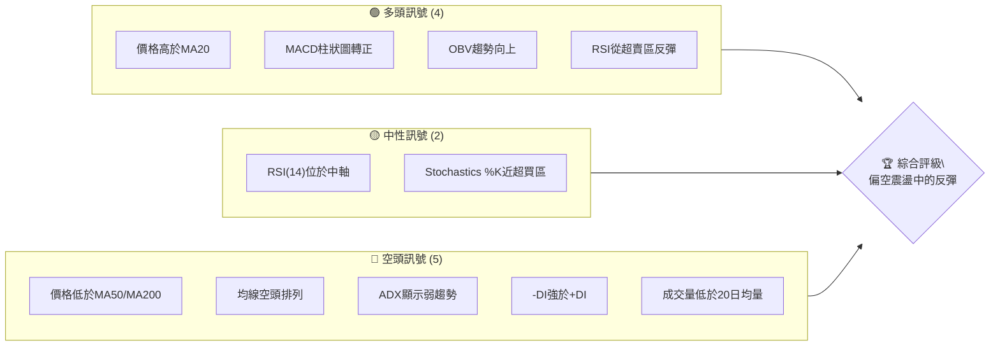
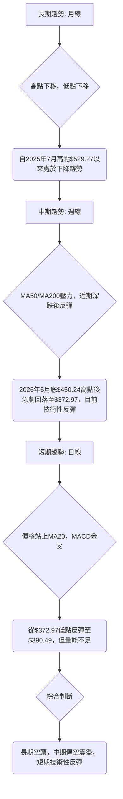
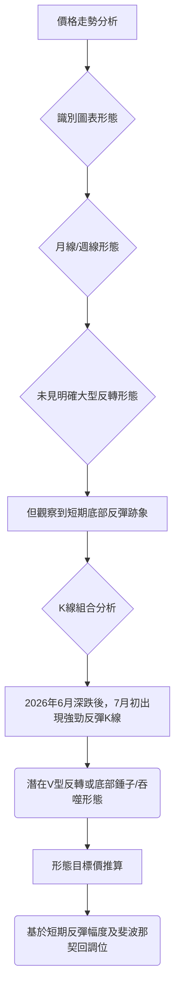
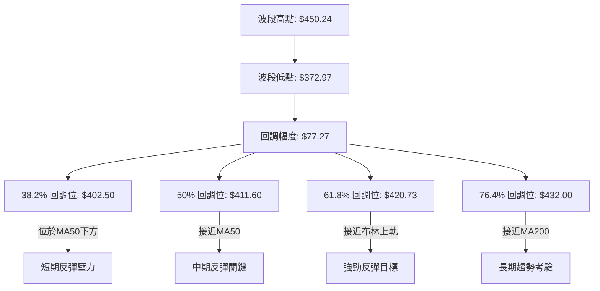
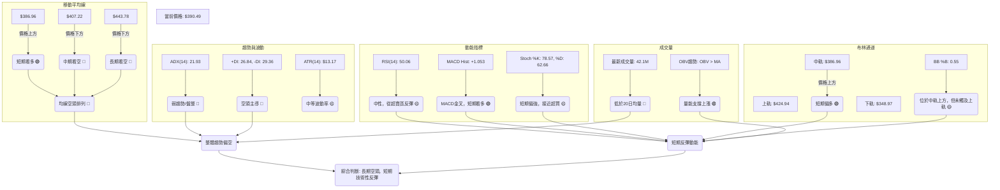
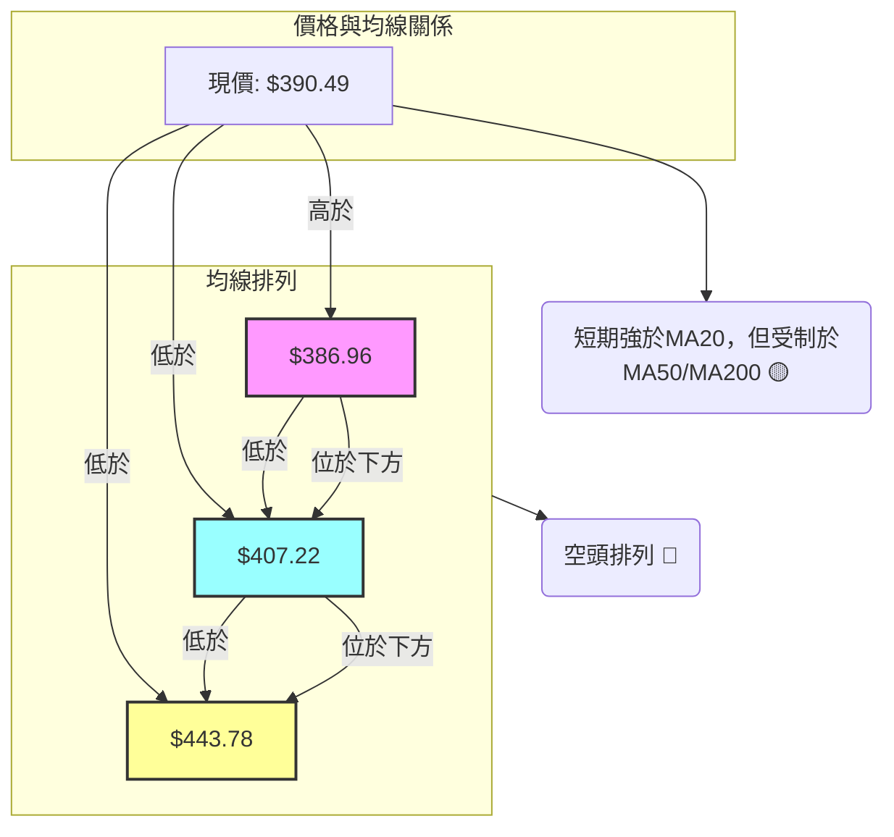
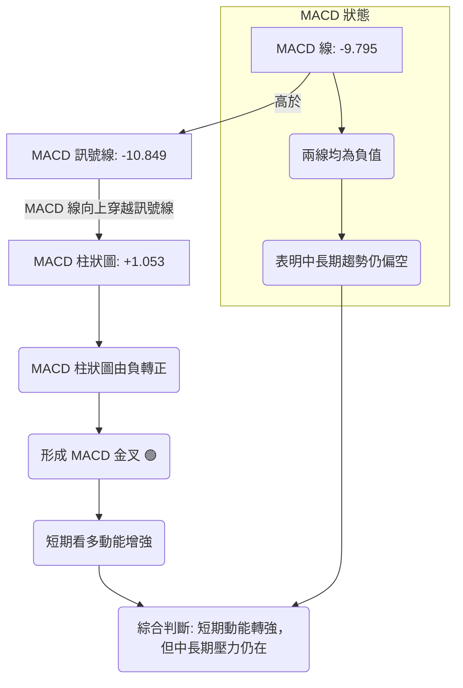

<details>
<summary>📊 靜態圖表 (點擊展開)</summary>

</details>

<html>
<head><meta charset="utf-8" /></head>
<body>
    <div style="height:500px; width:100%;">                        <script>window.PlotlyConfig = {MathJaxConfig: 'local'};</script>
        <script charset="utf-8" src="https://cdn.plot.ly/plotly-3.6.0.min.js" integrity="sha256-QaOVwtVY0T02VaHrr6pnoHLCwayMJp4O5n4YyaE3rJk=" crossorigin="anonymous"></script>                <div id="candlestick-chart" class="plotly-graph-div" style="height:100%; width:100%;"></div>            <script>                window.PLOTLYENV=window.PLOTLYENV || {};                                if (document.getElementById("candlestick-chart")) {                    Plotly.newPlot(                        "candlestick-chart",                        [{"close":{"dtype":"f8","bdata":"AAAAIGKdf0AAAADA9qx\u002fQAAAAKAAlH9AAAAAQF0VgEAAAAAAZvN\u002fQAAAAGBnoH9AAAAA4Aevf0AAAADAbH1\u002fQAAAAODbw39AAAAAIMj1f0AAAADghRWAQAAAAICDI4BAAAAAQPQDgEAAAACgwBCAQAAAAMDyaYBAAAAAgHVFgEAAAADgX0yAQAAAAADmOIBAAAAAwOi7f0AAAADACe1\u002fQAAAACBo5X9AAAAAQC7jf0AAAACAPsZ\u002fQAAAAOCQ5X9AAAAAIE0MgEAAAACgNxOAQAAAAMAcKoBAAAAAYEUqgEAAAABghEKAQAAAAGBmgYBAAAAAoETVgEAAAABgItGAQAAAACCcU4BAAAAA4GgUgEAAAACANQ6AQAAAAKB98X9AAAAAAH5\u002ff0AAAACAi99+QAAAAOAX235AAAAAgAxtf0AAAADAqJd\u002fQAAAAIDFvn9AAAAAQPZBf0AAAAAAgq9\u002fQAAAAAC9hH9AAAAAIOuqfkAAAACg3kB+QAAAAADxxH1AAAAA4G1gfUAAAABAYH59QAAAAOAArn1AAAAAgI81fkAAAABAQp1+QAAAAOBPSX5AAAAAwD19fkAAAACgyrl9QAAAAMBU631AAAAAQEkQfkAAAAAgfY1+QAAAAOBqnX5AAAAAQAPHfUAAAABgORV+QAAAAOCIxn1AAAAAIHCLfUAAAABgcqR9QAAAAEAloH1AAAAAIFkdfkAAAAAgQDx+QAAAAGBSLH5AAAAAgBBLfkAAAACAs11+QAAAAGDDWH5AAAAAAAxPfkAAAACAGVV+QAAAACCdF35AAAAAwH1tfUAAAADgDmx9QAAAAGA3xn1AAAAAYDkVfkAAAAAg2L99QAAAAEB70n1AAAAAwAexfUAAAAAgVUl9QAAAAEB+lXxAAAAAgCpqfEAAAACAI518QAAAAAAUSHxAAAAAoEGie0AAAADgPBJ8QAAAAKAl\u002fnxAAAAAwB5DfUAAAABgMOd9QAAAAEDq931AAAAAwD\u002f5ekAAAAAAHsZ6QAAAAEDjV3pAAAAAoDCWeUAAAACgqMV5QAAAAGDLfnhAAAAA4Mj1eEAAAADAQrx5QAAAAAABt3lAAAAAQDwpeUAAAABA7wB5QAAAAOCm+HhAAAAAoJuxeEAAAAAAQd14QAAAAOCU2XhAAAAAwPHFeEAAAACgOfp3QAAAAICMQnhAAAAAYL\u002f7eEAAAAAAoQ15QAAAAGBCfnhAAAAAoATbeEAAAACA6TB5QAAAAEAwRXlAAAAAwK2ceUAAAADgN4F5QAAAACBniHlAAAAAICFOeUAAAABgFEB5QAAAACDdD3lAAAAAQB+reEAAAADAXvF4QAAAAKC\u002f6HhAAAAAoBdveEAAAAAg3kJ4QAAAACC30HdAAAAAoMHid0AAAABg8z53QAAAAGDPI3dAAAAAgN3SdkAAAACg+z92QAAAAIDyYnZAAAAAgOsVd0AAAADAJQl3QAAAACBySndAAAAAoC9Bd0AAAABAxDd3QAAAAABWWHdAAAAAQDhEd0AAAACAGCF3QAAAAACh+HdAAAAAoCqEeEAAAADgTKV5QAAAAMCgNXpAAAAAQAVeekAAAADgqRJ6QAAAAKDkc3pAAAAAAMD\u002fekAAAACgn+15QAAAAKA8e3pAAAAAIG5+ekAAAAAgKMV6QAAAAKCueHpAAAAAIGFueUAAAACAtdh5QAAAAACey3lAAAAA4NqneUAAAACgC9F5QAAAACDFPXpAAAAAwJDjeUAAAABgSrx5QAAAACA4bnlAAAAAIFlFeUAAAADguIh5QAAAAGAhUHpAAAAAoP5pekAAAABASQh6QAAAAGBmQnpAAAAAoHAxekAAAADAHil6QAAAAOB6AHpAAAAAYLjKeUAAAAAA1696QAAAAADXI3xAAAAA4FHIfEAAAADA9ZR7QAAAAKBwtXpAAAAAwMzAekAAAABguAp6QAAAAADXu3lAAAAAYI82eUAAAACAwtV4QAAAAKBwZXhAAAAAANdreEAAAAAAKfx4QAAAAKBHnXhAAAAAYI+ud0AAAABgZrZ3QAAAAKBw9XZAAAAAQApfd0AAAAAgXNd2QAAAAKBHDXZAAAAAIIVPd0AAAADAHgl3QAAAAOBRUHdAAAAA4HoEeEAAAAAA12d4QA=="},"high":{"dtype":"f8","bdata":"9ksVkcwPgEDGSgkDKMF\u002fQGYFVwh13X9Azfi8V0EggEA+u6N42hOAQJzW19Sf9X9AstEycBPUf0BXe4wOzqx\u002fQINNMhJK639AbzTtD8cMgECtODorMReAQMkuV5DfKYBAJdXX+IkygECMj0HntimAQEUjFiuBfYBAFWCe3LlzgEDnxKquEV2AQKv8yr89SIBAbxGlh0dCgEDk3iK1RwmAQOp5tyVMAIBAQMa3KXsPgEDW\u002f5Q2xwyAQBdkABPjAYBAHFTUQXwbgEBjg2TZZxuAQCotNW1lT4BAdLZbbjhFgEBWM7NyWVCAQOlze8+5mYBA8vvpl+ExgUBncPEpqPaAQJoqnWvTnIBAJNAOBulvgEBzv1LqP02AQIf7r5ZxAoBAys0MqXD5f0AZS6RvR2h\u002fQPtsWKLLA39ALzq9NpB6f0ARPctoSaZ\u002fQAlRfrYyx39AENSCL0vkf0AgvzbFFcZ\u002fQITs\u002fyVazn9A4zRvegg9f0AfpBtZLcF+QKmh\u002fY4btn5Ad5hCQ7\u002fMfUA6ci\u002f2kax9QOakPgZp0H1A8VCzOFJifkARard9Iqd+QF49Y7cCe35AoQ7qMP60fkBCr6JHfSF+QNpzfij68n1Arn5N5BsUfkCjy3PB4KF+QDN3FK8Cn35AIYncK6YhfkD4HMOiAD5+QEHuOxD6BH5AqquAW2vpfUD\u002fo6ciV7x9QJvKMkrz3X1AWa0Ykd52fkA0g5lT\u002flp+QGwzxe8CaX5Ab4oltKxafkCGfShM3G9+QKJL7E1LX35AjHzfTPVifkCqEWOsJHh+QDSuAAudX35AUMTBCi4ofkAB07OGWZ99QIIo2DLhyX1AGK4kXXZ4fkCWbGVfUgh+QLT3jFEV231AKq2nT7jtfUCdezXUupp9QB3ildT8IX1A+he2ShHjfEDzcv3GLtJ8QAjcpHhlbHxAG4mlkO0qfEBtlO0gUS18QDMe9nkuUH1AZOr3x1uCfUASTfGpqgt+QHqF7m6GGX5AtdPxT5yIe0BhOEGvalp7QPIc2ulIzXpAr0jJZdxCekC3IaE\u002fBR96QHomSRLWZ3lASpE8ciMAeUCV8uEyz9B5QPx8AVXTXHpAp\u002f7sUtHpeUCX45GyYkZ5QE93pF3fO3lAPe4HiejreEDGLVRfZwx5QLlU\u002fiblOHlAt6LLihX0eEBxFdWYFqh4QNY\u002fN9BLSHhA655qLKMJeUBCTzHMv2l5QJe8+wFmv3hAc7AowSoFeUBmp4r6Il15QCwi+UNEonlARnRwxIareUD0+UJLhMJ5QN3LD8sslXlAOF42EgSVeUCMPZ1QBIJ5QPOGCmrgU3lAoIrqXc0+eUBRmP\u002f6Ofx4QJkxknNqOHlAWg\u002f1xjzSeEA44kGIRHp4QCwwnzaeInhA5JWFe\u002fgleED1IdVdS9p3QG2YzvXrg3dAB2EpC5Bed0BfDu+3qpp2QFvCYzggyXZAwB9QVYFBd0DRsUta6FJ3QNftB+hRTXdA4WS1ucFOd0CwuGY1Ujp3QPZsJeyvAnhA0kWQsRVLd0Aja2hGQG13QJFeud5X+3dA599vY2SdeEBbSYFdl9d5QGMi8oqRPnpAtjB1MFvqekBO5ukvpGZ6QFzmNcQbpHpAgL1b+DMMe0D1NEn66Gt6QMPfHXSBgHpAOnV9mv2iekA27ZyR2s96QB\u002fsrltcnnpAoMKk2GPYeUDFYE8dVgN6QOgoB\u002f7tPXpAXJS1chH+eUCaI75kQBh6QGC+3ozhsHpApP+wrZobekDOVAT8xLx5QBekGtKh6XlAvOE0A+lWeUBqkYLqMq95QIGMLQzqs3pANcGAQziDekBki6jcPPx6QJrLIAsBU3pAAAAAoHClekAAAABgZoZ6QAAAAOBRPHpAAAAAQAr\u002feUAAAAAA19d6QAAAAKBHJXxAAAAAwB4lfUAAAAAAAFh8QAAAAIA9hntAAAAAYGZCe0AAAAAghdd6QAAAAGCPEnpAAAAAIK6\u002feUAAAADgo1B5QAAAAKCZzXhAAAAAANd7eEAAAAAAABx5QAAAAKBwzXhAAAAAgOtleEAAAACA69V3QAAAAIAU2ndAAAAAIIWTd0AAAACAFK53QAAAACCuw3ZAAAAAgMKJd0AAAAAAAMh3QAAAAGBmYndAAAAAoEdNeEAAAABAM4N4QA=="},"hovertemplate":"\u003cb\u003e%{x|%Y-%m-%d}\u003c\u002fb\u003e\u003cbr\u003e\u958b: $%{open:.2f}\u003cbr\u003e\u9ad8: $%{high:.2f}\u003cbr\u003e\u4f4e: $%{low:.2f}\u003cbr\u003e\u6536: $%{close:.2f}\u003cextra\u003e\u003c\u002fextra\u003e","low":{"dtype":"f8","bdata":"fluWN2OWf0DLLzmO72t\u002fQL3dUR1xh39Au33va5Oxf0CU8We8B9V\u002fQMP1UH7ggX9A6zvyIq17f0DwYy8MyV1\u002fQLgxjAPodn9Ak3MYk9aaf0DdxkaSPad\u002fQGO5G76Dx39A2k0oL3W3f0Db6uJTJPx\u002fQJcpGaiCF4BAtSvGXEQxgEBfpSsvYj6AQKQnAnImEYBASCq0aMOmf0BvZchXW8d\u002fQOKVD4MMbX9A\u002fjjCaqWsf0Ae\u002fns06o5\u002fQEf5UIDggX9A8qKWXC7jf0AGEJTX+tx\u002fQB2ahHmdE4BAmC474sQagECeJcSgdiuAQJqw0jlybYBAw8NsAe\u002fKgEDp1O4f0aqAQAeXRkqsNoBAzIO\u002fW7v9f0ACZfyln\u002fV\u002fQPwA2stNin9Ada2SM0V2f0DjcefgCMt+QAPQzCZVon5AP2p62ZL6fkCB3tZLBDN\u002fQEkAH1mp\u002f35Aw+Alzikif0AyBEBo8+R+QPomquG3W39AAlee03Y7fkAXikBWqfx9QEuuW\u002fVEln1AA6JeKhojfUAnjIq4Hh99QCl1NxxD7XxAISkQ1hDxfUA9ehP24Ed+QE6YOjQFKH5AHLHZU59CfkBZPMKxfZF9QNLLlh4Kpn1AFdJnGRzMfUAY9mtUuCN+QEbYIuxYZX5AY0knUpSPfUDphGXyAJx9QBFqHGWmo31AHq+PBM1mfUD2cndvrUx9QClDwhZOjn1ADL7mF1e8fUB50+8JnQV+QFLsDr\u002fMCH5AD+xMMXQpfkA8eBQu4yp+QBopnyfjPH5AeujapoggfkDSufpUjzV+QENnrC+EEn5A6o73WzVBfUB3qasVsjZ9QGlBY3StOn1AMHoEvku9fUATZgn8AJx9QMdxMjK0YX1Aql9e\u002fSKZfUBPncu2Jf58QNTIDEJKcnxAiJI5TQ9efECY+0GBTGd8QJkg5Cec9HtAE4ZP+8JLe0BgqQeTp6t7QFWFy0aFCHxA8LepPDq\u002ffEAXoODe\u002fnB9QITUdKsXvn1AkdxCQnQyekBnP40b84h6QAAmthYMRnpAby6YX\u002fpreUDiYTVEz3Z5QGotFURKaXhAzagMBtlyeECU44PMe\u002fF4QNPgwrnsrXlAVpU0xLbzeEBFwFst7cN4QMoy\u002fUGQxHhAME7cT36MeECEglmwAal4QFiaYvgAvXhAj77+UuWkeECBB7hAWuR3QIU+UigpzndAzPUjixFVeEDUSjpBDd54QCFONzGZUHhAyoVifJJceEAtL4dNJH14QOQx2Ake93hAlkjPd2o4eUBTTL+7CHp5QL1YSxEMKnlAu65KbfIgeUB53cqfjQt5QFvc6RN4DXlAmrP+AV6WeEBx6Z0N\u002fZ54QO4a8PE+znhAI\u002fJPvnpieEDYS79ZkyN4QM68xJ3GtHdAbiRWj67Nd0BtMOLgvTB3QFxSR3tMDXdAzLaYh2nGdkB6NCoN1Tt2QG5CYPkoOHZArSwMupCkdkCc+GHbd\u002fZ2QG4wV8rOtXZAWhrMCzkLd0Cik0vZSNx2QDO8Hpm3KXdA5v9iihvkdkAVVI9PrxN3QDw1HY19I3dAMFPzVfQaeEABTh4l9r14QLvBWiH9s3lAbfL1Nn48ekCtGTGLZ\u002fZ5QPHcehzGBHpAsR5z4hFsekAHrVVrVah5QHXO3PNr7nlAgqPrurICekCTsZyQz096QJP1GUobNnpAZJBjvGXSeEC9FMPo2Jh5QMeAsDaYnnlAtzrA9ql+eUCepMtXwEN5QFz\u002f8wquHXpAg9wbKq\u002fReUBWv\u002fZh+kl5QELkxMAtXHlArb6L4JwCeUBqr8TPNwB5QGeJliJIwHlA2LascmPreUCxXZsbcPl5QLg3LcaTpnlAAAAAIFz7eUAAAACgRwV6QAAAAOBR0HlAAAAAoEeZeUAAAABguMp5QAAAAIDCBXtAAAAA4FGkfEAAAABA4YZ7QAAAAAAAhHpAAAAAYI+mekAAAABgZuZ5QAAAAMD1iHlAAAAAIK7neEAAAABgj9J4QAAAAAAAAHhAAAAA4FHkd0AAAACgmY14QAAAAEAKa3hAAAAAwB6Vd0AAAADgelR3QAAAAMAe8XZAAAAAYLgqd0AAAADgesx2QAAAAEAz03VAAAAAQOE2dkAAAABgZn52QAAAAEAz93ZAAAAAgD1ud0AAAABAM\u002ft3QA=="},"name":"\u50f9\u683c","open":{"dtype":"f8","bdata":"dwTVUwQNgEC2nILogLZ\u002fQOLA+gJWxH9AKPQy+oy1f0Bzon4OwwKAQPMjXzIQ6X9AEMIiErCyf0B7ijDjnZF\u002fQFfIrZaZrX9AxR9JiX7Ef0DTjLnpKOB\u002fQI0lihL2+H9AVVrTAg8TgECzaeXYww6AQNxLYf\u002fEGoBADxf30rhngEBD1Tvc5D+AQNLR9+VrOIBAOTfdL\u002fUigEDk3iK1RwmAQKKS5JhNsH9AJR87z4H7f0DUDLy+qtV\u002fQAL82AdinX9AMwnNMfH1f0Cj29UP8hGAQG2YIkP2LoBAIDK1ImA5gECZn7WR\u002fzuAQCvRF4Z3g4BAd2xJCk8UgUD5JmxuFeyAQCYrZcoheYBA8w\u002ffkWlsgECB4kILTySAQKsyjx+hyH9Al8DRGR3hf0D3lKmXpGd\u002fQDUIFgYp3X5A2XJ6AkoOf0C5cU9E+Fl\u002fQKgvkGJ4on9AarqSKpOxf0DJFOvqgvF+QObksIAAlH9AAZ6KBQrEfkAp8pHuP3B+QAv\u002fJo1oqH5ARW\u002fegw7GfUD9rhYXTo59QGjv3KZ9f31Asj1uinZCfkBvFZX1Ald+QBrXxkBkZH5A\u002fnlTcP5IfkDyEP7aVKN9QC4Vtrwg2n1AAMZhXxcGfkDF5XMR2Ct+QEv1wabnbn5A7eieCiUefkBFFqL2RKh9QIfK31IV231A+LDMHYvffUA\u002fzRubFV19QKDZUce6rH1ALEVIZR7BfUDD9KsZMFN+QBYxbbVvP35AcGt29UYtfkCPRXdebTh+QA887YjVSH5AXtWijV0rfkCZnvbFaDx+QKrtv53VWn5ATmzpEeEjfkCf4u4GVX99QF\u002fUaKgwe31Alkd5nyDafUDhbOfIs\u002fF9QAp2TOtUf31ASU\u002fZIuiofUAG5QUuNYl9QPXCyE1FBn1AqPkXJ\u002f\u002fgfEBDflF9zXx8QPXoHy2DE3xASA8Hk34pfECrXUbMKtp7QHXFOZHdHXxAGpTn4PPzfEAITmzwmHl9QGUU1S4VEX5ARXK35KBge0CjeTk+kVN7QMBzSf5RxXpAFwSkXzlCekA+kRBO2JJ5QD71SzAjWnlAn\u002fZbhmfWeEC+Ntql4TB5QDodgE8nHHpAGQuciFvleUAoO1k9RTN5QE7C7IiCKnlAclKJZDPXeEDwSt+R1sV4QKZ5bUIv\u002fXhARwwsChC0eECT\u002fqNIV6J4QCJcgAX19HdAFkSoxPlaeEBwViiIXT15QIqDC1eQYHhAYPrEviyAeECijGdEpYR4QIUmS6pxBnlANvJwSrw4eUCQzRDgDIV5QB7TP9+3QHlAeMB9M02SeUCOWlKEGEt5QJxzoZoWPHlAk9NWQSICeUCjHHnkWtN4QATrFIN69nhANdyI+ljEeEAzDHVQHFR4QLSjfvJDH3hAAEB6CCDxd0A5lCa3idh3QLosCNOvgXdAAPMkMUwgd0CBlGK24pF2QEdiZLnikXZAyeocoDG8dkAvu2HH7Ep3QPokxHOp5nZAe0+luexKd0B3RRlDohh3QNC9cTleAnhAqsC7ix47d0CMz2FyyEJ3QP1Yyz\u002fXTHdAtVpHcU4xeED+6xPHPNJ4QCzLhso9L3pAePuvJ25+ekDgMy481kN6QN1gZPNONXpA35ifc02UekDHjd15uC96QNoVYvgZAXpA1yR+eXlXekCPQNFNcHp6QMSIEBCZenpA10mHLcGeeUDj65WEhr55QKVIqMloqnlAvmNLP8LmeUBuH3lC5HF5QKsTrpc7M3pAuge7p84HekDdzRfn0G95QIJPn\u002flY2XlAJO\u002fwCkIleUCIS4aRsTl5QPvTkpj+1XlA85bVgYP7eUCvVgbGiM96QKyuHP5l1HlAAAAAAACMekAAAADgozh6QAAAAEDhBnpAAAAAACmweUAAAAAgrs95QAAAAMDMCHtAAAAAoHANfUAAAACAFO57QAAAAEAzZ3tAAAAAwPU8e0AAAACgcMV6QAAAAIA94nlAAAAA4HqQeUAAAADAzOh4QAAAACBcs3hAAAAAQOF2eEAAAADAzMx4QAAAAOCjvHhAAAAAAABkeEAAAADAHp13QAAAAADXe3dAAAAAgBRGd0AAAADAHjl3QAAAAOBRrHZAAAAAYGZSdkAAAAAAAJh3QAAAAOB6MHdAAAAAoEfNd0AAAAAgrgd4QA=="},"x":["2025-09-16T00:00:00-04:00","2025-09-17T00:00:00-04:00","2025-09-18T00:00:00-04:00","2025-09-19T00:00:00-04:00","2025-09-22T00:00:00-04:00","2025-09-23T00:00:00-04:00","2025-09-24T00:00:00-04:00","2025-09-25T00:00:00-04:00","2025-09-26T00:00:00-04:00","2025-09-29T00:00:00-04:00","2025-09-30T00:00:00-04:00","2025-10-01T00:00:00-04:00","2025-10-02T00:00:00-04:00","2025-10-03T00:00:00-04:00","2025-10-06T00:00:00-04:00","2025-10-07T00:00:00-04:00","2025-10-08T00:00:00-04:00","2025-10-09T00:00:00-04:00","2025-10-10T00:00:00-04:00","2025-10-13T00:00:00-04:00","2025-10-14T00:00:00-04:00","2025-10-15T00:00:00-04:00","2025-10-16T00:00:00-04:00","2025-10-17T00:00:00-04:00","2025-10-20T00:00:00-04:00","2025-10-21T00:00:00-04:00","2025-10-22T00:00:00-04:00","2025-10-23T00:00:00-04:00","2025-10-24T00:00:00-04:00","2025-10-27T00:00:00-04:00","2025-10-28T00:00:00-04:00","2025-10-29T00:00:00-04:00","2025-10-30T00:00:00-04:00","2025-10-31T00:00:00-04:00","2025-11-03T00:00:00-05:00","2025-11-04T00:00:00-05:00","2025-11-05T00:00:00-05:00","2025-11-06T00:00:00-05:00","2025-11-07T00:00:00-05:00","2025-11-10T00:00:00-05:00","2025-11-11T00:00:00-05:00","2025-11-12T00:00:00-05:00","2025-11-13T00:00:00-05:00","2025-11-14T00:00:00-05:00","2025-11-17T00:00:00-05:00","2025-11-18T00:00:00-05:00","2025-11-19T00:00:00-05:00","2025-11-20T00:00:00-05:00","2025-11-21T00:00:00-05:00","2025-11-24T00:00:00-05:00","2025-11-25T00:00:00-05:00","2025-11-26T00:00:00-05:00","2025-11-28T00:00:00-05:00","2025-12-01T00:00:00-05:00","2025-12-02T00:00:00-05:00","2025-12-03T00:00:00-05:00","2025-12-04T00:00:00-05:00","2025-12-05T00:00:00-05:00","2025-12-08T00:00:00-05:00","2025-12-09T00:00:00-05:00","2025-12-10T00:00:00-05:00","2025-12-11T00:00:00-05:00","2025-12-12T00:00:00-05:00","2025-12-15T00:00:00-05:00","2025-12-16T00:00:00-05:00","2025-12-17T00:00:00-05:00","2025-12-18T00:00:00-05:00","2025-12-19T00:00:00-05:00","2025-12-22T00:00:00-05:00","2025-12-23T00:00:00-05:00","2025-12-24T00:00:00-05:00","2025-12-26T00:00:00-05:00","2025-12-29T00:00:00-05:00","2025-12-30T00:00:00-05:00","2025-12-31T00:00:00-05:00","2026-01-02T00:00:00-05:00","2026-01-05T00:00:00-05:00","2026-01-06T00:00:00-05:00","2026-01-07T00:00:00-05:00","2026-01-08T00:00:00-05:00","2026-01-09T00:00:00-05:00","2026-01-12T00:00:00-05:00","2026-01-13T00:00:00-05:00","2026-01-14T00:00:00-05:00","2026-01-15T00:00:00-05:00","2026-01-16T00:00:00-05:00","2026-01-20T00:00:00-05:00","2026-01-21T00:00:00-05:00","2026-01-22T00:00:00-05:00","2026-01-23T00:00:00-05:00","2026-01-26T00:00:00-05:00","2026-01-27T00:00:00-05:00","2026-01-28T00:00:00-05:00","2026-01-29T00:00:00-05:00","2026-01-30T00:00:00-05:00","2026-02-02T00:00:00-05:00","2026-02-03T00:00:00-05:00","2026-02-04T00:00:00-05:00","2026-02-05T00:00:00-05:00","2026-02-06T00:00:00-05:00","2026-02-09T00:00:00-05:00","2026-02-10T00:00:00-05:00","2026-02-11T00:00:00-05:00","2026-02-12T00:00:00-05:00","2026-02-13T00:00:00-05:00","2026-02-17T00:00:00-05:00","2026-02-18T00:00:00-05:00","2026-02-19T00:00:00-05:00","2026-02-20T00:00:00-05:00","2026-02-23T00:00:00-05:00","2026-02-24T00:00:00-05:00","2026-02-25T00:00:00-05:00","2026-02-26T00:00:00-05:00","2026-02-27T00:00:00-05:00","2026-03-02T00:00:00-05:00","2026-03-03T00:00:00-05:00","2026-03-04T00:00:00-05:00","2026-03-05T00:00:00-05:00","2026-03-06T00:00:00-05:00","2026-03-09T00:00:00-04:00","2026-03-10T00:00:00-04:00","2026-03-11T00:00:00-04:00","2026-03-12T00:00:00-04:00","2026-03-13T00:00:00-04:00","2026-03-16T00:00:00-04:00","2026-03-17T00:00:00-04:00","2026-03-18T00:00:00-04:00","2026-03-19T00:00:00-04:00","2026-03-20T00:00:00-04:00","2026-03-23T00:00:00-04:00","2026-03-24T00:00:00-04:00","2026-03-25T00:00:00-04:00","2026-03-26T00:00:00-04:00","2026-03-27T00:00:00-04:00","2026-03-30T00:00:00-04:00","2026-03-31T00:00:00-04:00","2026-04-01T00:00:00-04:00","2026-04-02T00:00:00-04:00","2026-04-06T00:00:00-04:00","2026-04-07T00:00:00-04:00","2026-04-08T00:00:00-04:00","2026-04-09T00:00:00-04:00","2026-04-10T00:00:00-04:00","2026-04-13T00:00:00-04:00","2026-04-14T00:00:00-04:00","2026-04-15T00:00:00-04:00","2026-04-16T00:00:00-04:00","2026-04-17T00:00:00-04:00","2026-04-20T00:00:00-04:00","2026-04-21T00:00:00-04:00","2026-04-22T00:00:00-04:00","2026-04-23T00:00:00-04:00","2026-04-24T00:00:00-04:00","2026-04-27T00:00:00-04:00","2026-04-28T00:00:00-04:00","2026-04-29T00:00:00-04:00","2026-04-30T00:00:00-04:00","2026-05-01T00:00:00-04:00","2026-05-04T00:00:00-04:00","2026-05-05T00:00:00-04:00","2026-05-06T00:00:00-04:00","2026-05-07T00:00:00-04:00","2026-05-08T00:00:00-04:00","2026-05-11T00:00:00-04:00","2026-05-12T00:00:00-04:00","2026-05-13T00:00:00-04:00","2026-05-14T00:00:00-04:00","2026-05-15T00:00:00-04:00","2026-05-18T00:00:00-04:00","2026-05-19T00:00:00-04:00","2026-05-20T00:00:00-04:00","2026-05-21T00:00:00-04:00","2026-05-22T00:00:00-04:00","2026-05-26T00:00:00-04:00","2026-05-27T00:00:00-04:00","2026-05-28T00:00:00-04:00","2026-05-29T00:00:00-04:00","2026-06-01T00:00:00-04:00","2026-06-02T00:00:00-04:00","2026-06-03T00:00:00-04:00","2026-06-04T00:00:00-04:00","2026-06-05T00:00:00-04:00","2026-06-08T00:00:00-04:00","2026-06-09T00:00:00-04:00","2026-06-10T00:00:00-04:00","2026-06-11T00:00:00-04:00","2026-06-12T00:00:00-04:00","2026-06-15T00:00:00-04:00","2026-06-16T00:00:00-04:00","2026-06-17T00:00:00-04:00","2026-06-18T00:00:00-04:00","2026-06-22T00:00:00-04:00","2026-06-23T00:00:00-04:00","2026-06-24T00:00:00-04:00","2026-06-25T00:00:00-04:00","2026-06-26T00:00:00-04:00","2026-06-29T00:00:00-04:00","2026-06-30T00:00:00-04:00","2026-07-01T00:00:00-04:00","2026-07-02T00:00:00-04:00"],"type":"candlestick"},{"hovertemplate":"MA30: $%{y:.2f}\u003cextra\u003e\u003c\u002fextra\u003e","line":{"color":"#2196F3","dash":"dash","width":2},"mode":"lines","name":"MA30","x":["2025-09-16T00:00:00-04:00","2025-09-17T00:00:00-04:00","2025-09-18T00:00:00-04:00","2025-09-19T00:00:00-04:00","2025-09-22T00:00:00-04:00","2025-09-23T00:00:00-04:00","2025-09-24T00:00:00-04:00","2025-09-25T00:00:00-04:00","2025-09-26T00:00:00-04:00","2025-09-29T00:00:00-04:00","2025-09-30T00:00:00-04:00","2025-10-01T00:00:00-04:00","2025-10-02T00:00:00-04:00","2025-10-03T00:00:00-04:00","2025-10-06T00:00:00-04:00","2025-10-07T00:00:00-04:00","2025-10-08T00:00:00-04:00","2025-10-09T00:00:00-04:00","2025-10-10T00:00:00-04:00","2025-10-13T00:00:00-04:00","2025-10-14T00:00:00-04:00","2025-10-15T00:00:00-04:00","2025-10-16T00:00:00-04:00","2025-10-17T00:00:00-04:00","2025-10-20T00:00:00-04:00","2025-10-21T00:00:00-04:00","2025-10-22T00:00:00-04:00","2025-10-23T00:00:00-04:00","2025-10-24T00:00:00-04:00","2025-10-27T00:00:00-04:00","2025-10-28T00:00:00-04:00","2025-10-29T00:00:00-04:00","2025-10-30T00:00:00-04:00","2025-10-31T00:00:00-04:00","2025-11-03T00:00:00-05:00","2025-11-04T00:00:00-05:00","2025-11-05T00:00:00-05:00","2025-11-06T00:00:00-05:00","2025-11-07T00:00:00-05:00","2025-11-10T00:00:00-05:00","2025-11-11T00:00:00-05:00","2025-11-12T00:00:00-05:00","2025-11-13T00:00:00-05:00","2025-11-14T00:00:00-05:00","2025-11-17T00:00:00-05:00","2025-11-18T00:00:00-05:00","2025-11-19T00:00:00-05:00","2025-11-20T00:00:00-05:00","2025-11-21T00:00:00-05:00","2025-11-24T00:00:00-05:00","2025-11-25T00:00:00-05:00","2025-11-26T00:00:00-05:00","2025-11-28T00:00:00-05:00","2025-12-01T00:00:00-05:00","2025-12-02T00:00:00-05:00","2025-12-03T00:00:00-05:00","2025-12-04T00:00:00-05:00","2025-12-05T00:00:00-05:00","2025-12-08T00:00:00-05:00","2025-12-09T00:00:00-05:00","2025-12-10T00:00:00-05:00","2025-12-11T00:00:00-05:00","2025-12-12T00:00:00-05:00","2025-12-15T00:00:00-05:00","2025-12-16T00:00:00-05:00","2025-12-17T00:00:00-05:00","2025-12-18T00:00:00-05:00","2025-12-19T00:00:00-05:00","2025-12-22T00:00:00-05:00","2025-12-23T00:00:00-05:00","2025-12-24T00:00:00-05:00","2025-12-26T00:00:00-05:00","2025-12-29T00:00:00-05:00","2025-12-30T00:00:00-05:00","2025-12-31T00:00:00-05:00","2026-01-02T00:00:00-05:00","2026-01-05T00:00:00-05:00","2026-01-06T00:00:00-05:00","2026-01-07T00:00:00-05:00","2026-01-08T00:00:00-05:00","2026-01-09T00:00:00-05:00","2026-01-12T00:00:00-05:00","2026-01-13T00:00:00-05:00","2026-01-14T00:00:00-05:00","2026-01-15T00:00:00-05:00","2026-01-16T00:00:00-05:00","2026-01-20T00:00:00-05:00","2026-01-21T00:00:00-05:00","2026-01-22T00:00:00-05:00","2026-01-23T00:00:00-05:00","2026-01-26T00:00:00-05:00","2026-01-27T00:00:00-05:00","2026-01-28T00:00:00-05:00","2026-01-29T00:00:00-05:00","2026-01-30T00:00:00-05:00","2026-02-02T00:00:00-05:00","2026-02-03T00:00:00-05:00","2026-02-04T00:00:00-05:00","2026-02-05T00:00:00-05:00","2026-02-06T00:00:00-05:00","2026-02-09T00:00:00-05:00","2026-02-10T00:00:00-05:00","2026-02-11T00:00:00-05:00","2026-02-12T00:00:00-05:00","2026-02-13T00:00:00-05:00","2026-02-17T00:00:00-05:00","2026-02-18T00:00:00-05:00","2026-02-19T00:00:00-05:00","2026-02-20T00:00:00-05:00","2026-02-23T00:00:00-05:00","2026-02-24T00:00:00-05:00","2026-02-25T00:00:00-05:00","2026-02-26T00:00:00-05:00","2026-02-27T00:00:00-05:00","2026-03-02T00:00:00-05:00","2026-03-03T00:00:00-05:00","2026-03-04T00:00:00-05:00","2026-03-05T00:00:00-05:00","2026-03-06T00:00:00-05:00","2026-03-09T00:00:00-04:00","2026-03-10T00:00:00-04:00","2026-03-11T00:00:00-04:00","2026-03-12T00:00:00-04:00","2026-03-13T00:00:00-04:00","2026-03-16T00:00:00-04:00","2026-03-17T00:00:00-04:00","2026-03-18T00:00:00-04:00","2026-03-19T00:00:00-04:00","2026-03-20T00:00:00-04:00","2026-03-23T00:00:00-04:00","2026-03-24T00:00:00-04:00","2026-03-25T00:00:00-04:00","2026-03-26T00:00:00-04:00","2026-03-27T00:00:00-04:00","2026-03-30T00:00:00-04:00","2026-03-31T00:00:00-04:00","2026-04-01T00:00:00-04:00","2026-04-02T00:00:00-04:00","2026-04-06T00:00:00-04:00","2026-04-07T00:00:00-04:00","2026-04-08T00:00:00-04:00","2026-04-09T00:00:00-04:00","2026-04-10T00:00:00-04:00","2026-04-13T00:00:00-04:00","2026-04-14T00:00:00-04:00","2026-04-15T00:00:00-04:00","2026-04-16T00:00:00-04:00","2026-04-17T00:00:00-04:00","2026-04-20T00:00:00-04:00","2026-04-21T00:00:00-04:00","2026-04-22T00:00:00-04:00","2026-04-23T00:00:00-04:00","2026-04-24T00:00:00-04:00","2026-04-27T00:00:00-04:00","2026-04-28T00:00:00-04:00","2026-04-29T00:00:00-04:00","2026-04-30T00:00:00-04:00","2026-05-01T00:00:00-04:00","2026-05-04T00:00:00-04:00","2026-05-05T00:00:00-04:00","2026-05-06T00:00:00-04:00","2026-05-07T00:00:00-04:00","2026-05-08T00:00:00-04:00","2026-05-11T00:00:00-04:00","2026-05-12T00:00:00-04:00","2026-05-13T00:00:00-04:00","2026-05-14T00:00:00-04:00","2026-05-15T00:00:00-04:00","2026-05-18T00:00:00-04:00","2026-05-19T00:00:00-04:00","2026-05-20T00:00:00-04:00","2026-05-21T00:00:00-04:00","2026-05-22T00:00:00-04:00","2026-05-26T00:00:00-04:00","2026-05-27T00:00:00-04:00","2026-05-28T00:00:00-04:00","2026-05-29T00:00:00-04:00","2026-06-01T00:00:00-04:00","2026-06-02T00:00:00-04:00","2026-06-03T00:00:00-04:00","2026-06-04T00:00:00-04:00","2026-06-05T00:00:00-04:00","2026-06-08T00:00:00-04:00","2026-06-09T00:00:00-04:00","2026-06-10T00:00:00-04:00","2026-06-11T00:00:00-04:00","2026-06-12T00:00:00-04:00","2026-06-15T00:00:00-04:00","2026-06-16T00:00:00-04:00","2026-06-17T00:00:00-04:00","2026-06-18T00:00:00-04:00","2026-06-22T00:00:00-04:00","2026-06-23T00:00:00-04:00","2026-06-24T00:00:00-04:00","2026-06-25T00:00:00-04:00","2026-06-26T00:00:00-04:00","2026-06-29T00:00:00-04:00","2026-06-30T00:00:00-04:00","2026-07-01T00:00:00-04:00","2026-07-02T00:00:00-04:00"],"y":{"dtype":"f8","bdata":"AAAAAAAA+H8AAAAAAAD4fwAAAAAAAPh\u002fAAAAAAAA+H8AAAAAAAD4fwAAAAAAAPh\u002fAAAAAAAA+H8AAAAAAAD4fwAAAAAAAPh\u002fAAAAAAAA+H8AAAAAAAD4fwAAAAAAAPh\u002fAAAAAAAA+H8AAAAAAAD4fwAAAAAAAPh\u002fAAAAAAAA+H8AAAAAAAD4fwAAAAAAAPh\u002fAAAAAAAA+H8AAAAAAAD4fwAAAAAAAPh\u002fAAAAAAAA+H8AAAAAAAD4fwAAAAAAAPh\u002fAAAAAAAA+H8AAAAAAAD4fwAAAAAAAPh\u002fAAAAAAAA+H8AAAAAAAD4f97d3U3hCIBAzczM9KERgEAzMzPb\u002fBmAQN7d3R2THoBAiYiI+IoegEDNzMz8OR+AQFVVVfWTIIBAiYiIIMkfgECamZmBJx2AQHd3d19GGYBAq6qq+v4WgEAREREhihSAQFVVVcVEEoBAMzMzM\u002fgOgEAAAADQEQ2AQN7d3c17B4BAzczMnPf+f0BERESk+Op\u002fQKuqqook1H9AiYiI2AbAf0BmZmZ2Rat\u002fQO\u002fu7p5bmH9Ad3d3hwmKf0ARERFBI4B\u002fQKuqqlplcn9AIiIiEq9kf0Crqqrq\u002fk9\u002fQCIiIsJuO39A3t3dPRcof0AiIiJSThd\u002fQAAAACDcAn9A3t3d\u002fazhfkAAAADQX8N+QO\u002fu7m7Rqn5AERERYYGUfkDv7u6OcH9+QImIiFipa35AERERUdtffkDv7u7eaVp+QM3MzHyWVH5ARERE9OtKfkCJiIjYdEB+QHd3d9eFNH5Ad3d392wsfkAzMzPz4CB+QImIiDi1FH5AIiIigiAKfkBERESECAN+QFVVVWUTA35A3t3dLRoJfkB3d3fXSAt+QO\u002fu7h6ADH5AIiIiMhUIfkDe3d19wPx9QBEREYE57n1AmpmZqYXcfUAAAACgCNN9QAAAAAAPxX1AMzMzA1OwfUBEREQ0Jpt9QAAAAJBOjX1AREREFOmIfUDv7u4+YId9QAAAAKAFiX1AREREFBVzfUDNzMzMmlp9QJqZmZmYPn1A3t3dHfUXfUAAAAAA3\u002fF8QBEREZFrwXxA3t3dLemTfEC8u7trZWx8QBEREfHeRHxA3t3dnfEYfEDe3d29eOt7QN7d3d3Fv3tAZmZmdmCXe0C8u7u7e3B7QBEREVF2RntAERERIScZe0DNzMwc5ud6QImIiDhvuHpAREREJEKQekCamZmJImx6QERERCQ6SXpAMzMzA9sqekARERHhpQ16QO\u002fu7p7z83lAVVVV9bLieUBERERkzMx5QKuqqgpGr3lAq6qq2oGNeUCJiIi4zWV5QKuqqmrvO3lAq6qqqkMoeUARERGxoxh5QFVVVcVmDHlAq6qqmpACeUDNzMz8q\u002fV4QDMzM4Pe73hAq6qqmrPmeECamZk5ddF4QKuqqhp8u3hAMzMzA4qneEDNzMxsCpB4QBEREeH7eXhA7+7uzkJseEDNzMxMqFx4QHd3d1daT3hAAAAA8GRCeEDv7u6O6Tt4QBEREfEaNHhA3t3dTXQleECrqqpaCRV4QKuqqgqVEHhAiYiI6K8NeEBmZmYWkRF4QGZmZtaUGXhAAAAAsAYgeEAiIiLS3yR4QGZmZla5LHhAERERkS07eECamZl59kB4QCIiIkITTXhARERE9KZceEC8u7u7Pmx4QAAAAICTeXhAMzMz8xWCeEAREREhnY94QBEREbGCoHhAIiIiIp2veEAAAADgjMV4QAAAAAAE4HhAvLu7Gyz6eEB3d3d36hd5QBEREUHkMXlAq6qqCopEeUDv7u6+21l5QKuqqtqlc3lAAAAAsJuOeUDv7u4eoKZ5QImIiIh+v3lAERER4XfYeUBERET0VfJ5QERERASqA3pAvLu7m4wOekBEREQUbxd6QKuqqlroJ3pAIiIigoQ8ekB3d3fnZEl6QM3MzDyUS3pAAAAAEHtJekCrqqpac0p6QJqZmRkSRHpAZmZmRiQ5ekAzMzPjoCh6QO\u002fu7p7rFnpAq6qqak0OekBmZmZm8wZ6QERERHTf\u002fHlAq6qqmgfseUCamZkpE9p5QImIiFgQvnlAVVVVZZSoeUCamZnJ4Y95QImIiPgMc3lAREREtFJieUBERETEAE15QImIiMhoM3lAVVVVdfUeeUCJiIjIExF5QA=="},"type":"scatter"},{"hovertemplate":"MA60: $%{y:.2f}\u003cextra\u003e\u003c\u002fextra\u003e","line":{"color":"#9C27B0","dash":"dash","width":2},"mode":"lines","name":"MA60","x":["2025-09-16T00:00:00-04:00","2025-09-17T00:00:00-04:00","2025-09-18T00:00:00-04:00","2025-09-19T00:00:00-04:00","2025-09-22T00:00:00-04:00","2025-09-23T00:00:00-04:00","2025-09-24T00:00:00-04:00","2025-09-25T00:00:00-04:00","2025-09-26T00:00:00-04:00","2025-09-29T00:00:00-04:00","2025-09-30T00:00:00-04:00","2025-10-01T00:00:00-04:00","2025-10-02T00:00:00-04:00","2025-10-03T00:00:00-04:00","2025-10-06T00:00:00-04:00","2025-10-07T00:00:00-04:00","2025-10-08T00:00:00-04:00","2025-10-09T00:00:00-04:00","2025-10-10T00:00:00-04:00","2025-10-13T00:00:00-04:00","2025-10-14T00:00:00-04:00","2025-10-15T00:00:00-04:00","2025-10-16T00:00:00-04:00","2025-10-17T00:00:00-04:00","2025-10-20T00:00:00-04:00","2025-10-21T00:00:00-04:00","2025-10-22T00:00:00-04:00","2025-10-23T00:00:00-04:00","2025-10-24T00:00:00-04:00","2025-10-27T00:00:00-04:00","2025-10-28T00:00:00-04:00","2025-10-29T00:00:00-04:00","2025-10-30T00:00:00-04:00","2025-10-31T00:00:00-04:00","2025-11-03T00:00:00-05:00","2025-11-04T00:00:00-05:00","2025-11-05T00:00:00-05:00","2025-11-06T00:00:00-05:00","2025-11-07T00:00:00-05:00","2025-11-10T00:00:00-05:00","2025-11-11T00:00:00-05:00","2025-11-12T00:00:00-05:00","2025-11-13T00:00:00-05:00","2025-11-14T00:00:00-05:00","2025-11-17T00:00:00-05:00","2025-11-18T00:00:00-05:00","2025-11-19T00:00:00-05:00","2025-11-20T00:00:00-05:00","2025-11-21T00:00:00-05:00","2025-11-24T00:00:00-05:00","2025-11-25T00:00:00-05:00","2025-11-26T00:00:00-05:00","2025-11-28T00:00:00-05:00","2025-12-01T00:00:00-05:00","2025-12-02T00:00:00-05:00","2025-12-03T00:00:00-05:00","2025-12-04T00:00:00-05:00","2025-12-05T00:00:00-05:00","2025-12-08T00:00:00-05:00","2025-12-09T00:00:00-05:00","2025-12-10T00:00:00-05:00","2025-12-11T00:00:00-05:00","2025-12-12T00:00:00-05:00","2025-12-15T00:00:00-05:00","2025-12-16T00:00:00-05:00","2025-12-17T00:00:00-05:00","2025-12-18T00:00:00-05:00","2025-12-19T00:00:00-05:00","2025-12-22T00:00:00-05:00","2025-12-23T00:00:00-05:00","2025-12-24T00:00:00-05:00","2025-12-26T00:00:00-05:00","2025-12-29T00:00:00-05:00","2025-12-30T00:00:00-05:00","2025-12-31T00:00:00-05:00","2026-01-02T00:00:00-05:00","2026-01-05T00:00:00-05:00","2026-01-06T00:00:00-05:00","2026-01-07T00:00:00-05:00","2026-01-08T00:00:00-05:00","2026-01-09T00:00:00-05:00","2026-01-12T00:00:00-05:00","2026-01-13T00:00:00-05:00","2026-01-14T00:00:00-05:00","2026-01-15T00:00:00-05:00","2026-01-16T00:00:00-05:00","2026-01-20T00:00:00-05:00","2026-01-21T00:00:00-05:00","2026-01-22T00:00:00-05:00","2026-01-23T00:00:00-05:00","2026-01-26T00:00:00-05:00","2026-01-27T00:00:00-05:00","2026-01-28T00:00:00-05:00","2026-01-29T00:00:00-05:00","2026-01-30T00:00:00-05:00","2026-02-02T00:00:00-05:00","2026-02-03T00:00:00-05:00","2026-02-04T00:00:00-05:00","2026-02-05T00:00:00-05:00","2026-02-06T00:00:00-05:00","2026-02-09T00:00:00-05:00","2026-02-10T00:00:00-05:00","2026-02-11T00:00:00-05:00","2026-02-12T00:00:00-05:00","2026-02-13T00:00:00-05:00","2026-02-17T00:00:00-05:00","2026-02-18T00:00:00-05:00","2026-02-19T00:00:00-05:00","2026-02-20T00:00:00-05:00","2026-02-23T00:00:00-05:00","2026-02-24T00:00:00-05:00","2026-02-25T00:00:00-05:00","2026-02-26T00:00:00-05:00","2026-02-27T00:00:00-05:00","2026-03-02T00:00:00-05:00","2026-03-03T00:00:00-05:00","2026-03-04T00:00:00-05:00","2026-03-05T00:00:00-05:00","2026-03-06T00:00:00-05:00","2026-03-09T00:00:00-04:00","2026-03-10T00:00:00-04:00","2026-03-11T00:00:00-04:00","2026-03-12T00:00:00-04:00","2026-03-13T00:00:00-04:00","2026-03-16T00:00:00-04:00","2026-03-17T00:00:00-04:00","2026-03-18T00:00:00-04:00","2026-03-19T00:00:00-04:00","2026-03-20T00:00:00-04:00","2026-03-23T00:00:00-04:00","2026-03-24T00:00:00-04:00","2026-03-25T00:00:00-04:00","2026-03-26T00:00:00-04:00","2026-03-27T00:00:00-04:00","2026-03-30T00:00:00-04:00","2026-03-31T00:00:00-04:00","2026-04-01T00:00:00-04:00","2026-04-02T00:00:00-04:00","2026-04-06T00:00:00-04:00","2026-04-07T00:00:00-04:00","2026-04-08T00:00:00-04:00","2026-04-09T00:00:00-04:00","2026-04-10T00:00:00-04:00","2026-04-13T00:00:00-04:00","2026-04-14T00:00:00-04:00","2026-04-15T00:00:00-04:00","2026-04-16T00:00:00-04:00","2026-04-17T00:00:00-04:00","2026-04-20T00:00:00-04:00","2026-04-21T00:00:00-04:00","2026-04-22T00:00:00-04:00","2026-04-23T00:00:00-04:00","2026-04-24T00:00:00-04:00","2026-04-27T00:00:00-04:00","2026-04-28T00:00:00-04:00","2026-04-29T00:00:00-04:00","2026-04-30T00:00:00-04:00","2026-05-01T00:00:00-04:00","2026-05-04T00:00:00-04:00","2026-05-05T00:00:00-04:00","2026-05-06T00:00:00-04:00","2026-05-07T00:00:00-04:00","2026-05-08T00:00:00-04:00","2026-05-11T00:00:00-04:00","2026-05-12T00:00:00-04:00","2026-05-13T00:00:00-04:00","2026-05-14T00:00:00-04:00","2026-05-15T00:00:00-04:00","2026-05-18T00:00:00-04:00","2026-05-19T00:00:00-04:00","2026-05-20T00:00:00-04:00","2026-05-21T00:00:00-04:00","2026-05-22T00:00:00-04:00","2026-05-26T00:00:00-04:00","2026-05-27T00:00:00-04:00","2026-05-28T00:00:00-04:00","2026-05-29T00:00:00-04:00","2026-06-01T00:00:00-04:00","2026-06-02T00:00:00-04:00","2026-06-03T00:00:00-04:00","2026-06-04T00:00:00-04:00","2026-06-05T00:00:00-04:00","2026-06-08T00:00:00-04:00","2026-06-09T00:00:00-04:00","2026-06-10T00:00:00-04:00","2026-06-11T00:00:00-04:00","2026-06-12T00:00:00-04:00","2026-06-15T00:00:00-04:00","2026-06-16T00:00:00-04:00","2026-06-17T00:00:00-04:00","2026-06-18T00:00:00-04:00","2026-06-22T00:00:00-04:00","2026-06-23T00:00:00-04:00","2026-06-24T00:00:00-04:00","2026-06-25T00:00:00-04:00","2026-06-26T00:00:00-04:00","2026-06-29T00:00:00-04:00","2026-06-30T00:00:00-04:00","2026-07-01T00:00:00-04:00","2026-07-02T00:00:00-04:00"],"y":{"dtype":"f8","bdata":"AAAAAAAA+H8AAAAAAAD4fwAAAAAAAPh\u002fAAAAAAAA+H8AAAAAAAD4fwAAAAAAAPh\u002fAAAAAAAA+H8AAAAAAAD4fwAAAAAAAPh\u002fAAAAAAAA+H8AAAAAAAD4fwAAAAAAAPh\u002fAAAAAAAA+H8AAAAAAAD4fwAAAAAAAPh\u002fAAAAAAAA+H8AAAAAAAD4fwAAAAAAAPh\u002fAAAAAAAA+H8AAAAAAAD4fwAAAAAAAPh\u002fAAAAAAAA+H8AAAAAAAD4fwAAAAAAAPh\u002fAAAAAAAA+H8AAAAAAAD4fwAAAAAAAPh\u002fAAAAAAAA+H8AAAAAAAD4fwAAAAAAAPh\u002fAAAAAAAA+H8AAAAAAAD4fwAAAAAAAPh\u002fAAAAAAAA+H8AAAAAAAD4fwAAAAAAAPh\u002fAAAAAAAA+H8AAAAAAAD4fwAAAAAAAPh\u002fAAAAAAAA+H8AAAAAAAD4fwAAAAAAAPh\u002fAAAAAAAA+H8AAAAAAAD4fwAAAAAAAPh\u002fAAAAAAAA+H8AAAAAAAD4fwAAAAAAAPh\u002fAAAAAAAA+H8AAAAAAAD4fwAAAAAAAPh\u002fAAAAAAAA+H8AAAAAAAD4fwAAAAAAAPh\u002fAAAAAAAA+H8AAAAAAAD4fwAAAAAAAPh\u002fAAAAAAAA+H8AAAAAAAD4f97d3V1Pin9AvLu7c3iCf0AzMzPDrHt\u002fQFVVVdX7c39AERERqctof0BERERE8l5\u002fQJqZmaFoVn9AERERybZPf0ARERFxXEp\u002fQN7d3Z2RQ39AzczM9HQ8f0BVVVWNxDR\u002fQBEREbGHLH9A7+7uri4lf0CamZlJgh1\u002fQCIiImrWEX9Ad3d3D4wEf0BERESUAPd+QAAAAPib635AMzMzg5DkfkDv7u4mR9t+QO\u002fu7t5t0n5AzczMXA\u002fJfkB3d3ffcb5+QN7d3W1PsH5A3t3dXZqgfkBVVVXFg5F+QBEREeE+gH5AiYiIIDVsfkAzMzNDOll+QAAAAFgVSH5AERERCUs1fkB3d3cHYCV+QHd3d4frGX5Aq6qqOssDfkDe3d2tBe19QBEREfkg1X1Ad3d3N+i7fUB3d3dvJKZ9QO\u002fu7gYBi31AERERkWpvfUAiIiIibVZ9QERERGSyPH1Aq6qqSq8ifUCJiIjYLAZ9QDMzM4s96nxAREREfMDQfEAAAAAgwrl8QDMzM9vEpHxAd3d3pyCRfEAiIiJ6l3l8QLy7u6t3YnxAMzMzqytMfEC8u7uDcTR8QKuqqtK5G3xAZmZmVrADfECJiIhAV\u002fB7QHd3d0+B3HtARERE\u002fILJe0BERERM+bN7QFVVVU1KnntAd3d3dzWLe0C8u7v7lnZ7QFVVVYV6YntAd3d3X6xNe0Dv7u4+nzl7QHd3d69\u002fJXtARERE3EINe0BmZmZ+xfN6QCIiIgql2HpAREREZE69ekCrqqpS7Z56QN7d3YUtgHpAiYiI0D1gekBVVVWVwT16QHd3d9\u002fgHHpAq6qqotEBekBEREQEkuZ5QERERFToynlAiYiICMateUDe3d3V55F5QM3MzBRFdnlAEREROdtaeUAiIiLylUB5QHd3d5fnLHlA3t3ddUUceUC8u7t7mw95QKuqqjrEBnlAq6qq0lwBeUAzMzMb1vh4QImIiLD\u002f7XhA3t3dtVfkeEAREREZYtN4QGZmZlaBxHhAd3d3T3XCeEBmZmY2ccJ4QKuqqiL9wnhA7+7uRlPCeEDv7u6OpMJ4QCIiIpowyHhAZmZmXijLeEDNzMwMgct4QFVVVQ3AzXhAd3d3D9vQeEAiIiJy+tN4QBERERHw1XhAzczMbGbYeEDe3d0FQtt4QBERERmA4XhAAAAAUIDoeEDv7u7WRPF4QM3MzLzM+XhAd3d3F\u002fb+eEB3d3enrwN5QHd3d4cfCnlAIiIiQh4OeUBVVVUVgBR5QImIiJi+IHlAERERmUUueUDNzMxcIjd5QJqZmckmPHlAiYiIUFRCeUAiIiLqtEV5QN7d3a2SSHlAVVVVneVKeUB3d3fPb0p5QHd3d48\u002fSHlA7+7urjFIeUC8u7tDSEt5QKuqqhKxTnlAZmZmXtJNeUDNzMwE0E95QERERCwKT3lAiYiIQGBReUCJiIgg5lN5QM3MzJx4UnlAd3d3X25TeUCamZlBblN5QJqZmVGHU3lAq6qqkshWeUC8u7vz2Vt5QA=="},"type":"scatter"},{"hovertemplate":"MA200: $%{y:.2f}\u003cextra\u003e\u003c\u002fextra\u003e","line":{"color":"#FF6F00","dash":"solid","width":2},"mode":"lines","name":"MA200","x":["2025-09-16T00:00:00-04:00","2025-09-17T00:00:00-04:00","2025-09-18T00:00:00-04:00","2025-09-19T00:00:00-04:00","2025-09-22T00:00:00-04:00","2025-09-23T00:00:00-04:00","2025-09-24T00:00:00-04:00","2025-09-25T00:00:00-04:00","2025-09-26T00:00:00-04:00","2025-09-29T00:00:00-04:00","2025-09-30T00:00:00-04:00","2025-10-01T00:00:00-04:00","2025-10-02T00:00:00-04:00","2025-10-03T00:00:00-04:00","2025-10-06T00:00:00-04:00","2025-10-07T00:00:00-04:00","2025-10-08T00:00:00-04:00","2025-10-09T00:00:00-04:00","2025-10-10T00:00:00-04:00","2025-10-13T00:00:00-04:00","2025-10-14T00:00:00-04:00","2025-10-15T00:00:00-04:00","2025-10-16T00:00:00-04:00","2025-10-17T00:00:00-04:00","2025-10-20T00:00:00-04:00","2025-10-21T00:00:00-04:00","2025-10-22T00:00:00-04:00","2025-10-23T00:00:00-04:00","2025-10-24T00:00:00-04:00","2025-10-27T00:00:00-04:00","2025-10-28T00:00:00-04:00","2025-10-29T00:00:00-04:00","2025-10-30T00:00:00-04:00","2025-10-31T00:00:00-04:00","2025-11-03T00:00:00-05:00","2025-11-04T00:00:00-05:00","2025-11-05T00:00:00-05:00","2025-11-06T00:00:00-05:00","2025-11-07T00:00:00-05:00","2025-11-10T00:00:00-05:00","2025-11-11T00:00:00-05:00","2025-11-12T00:00:00-05:00","2025-11-13T00:00:00-05:00","2025-11-14T00:00:00-05:00","2025-11-17T00:00:00-05:00","2025-11-18T00:00:00-05:00","2025-11-19T00:00:00-05:00","2025-11-20T00:00:00-05:00","2025-11-21T00:00:00-05:00","2025-11-24T00:00:00-05:00","2025-11-25T00:00:00-05:00","2025-11-26T00:00:00-05:00","2025-11-28T00:00:00-05:00","2025-12-01T00:00:00-05:00","2025-12-02T00:00:00-05:00","2025-12-03T00:00:00-05:00","2025-12-04T00:00:00-05:00","2025-12-05T00:00:00-05:00","2025-12-08T00:00:00-05:00","2025-12-09T00:00:00-05:00","2025-12-10T00:00:00-05:00","2025-12-11T00:00:00-05:00","2025-12-12T00:00:00-05:00","2025-12-15T00:00:00-05:00","2025-12-16T00:00:00-05:00","2025-12-17T00:00:00-05:00","2025-12-18T00:00:00-05:00","2025-12-19T00:00:00-05:00","2025-12-22T00:00:00-05:00","2025-12-23T00:00:00-05:00","2025-12-24T00:00:00-05:00","2025-12-26T00:00:00-05:00","2025-12-29T00:00:00-05:00","2025-12-30T00:00:00-05:00","2025-12-31T00:00:00-05:00","2026-01-02T00:00:00-05:00","2026-01-05T00:00:00-05:00","2026-01-06T00:00:00-05:00","2026-01-07T00:00:00-05:00","2026-01-08T00:00:00-05:00","2026-01-09T00:00:00-05:00","2026-01-12T00:00:00-05:00","2026-01-13T00:00:00-05:00","2026-01-14T00:00:00-05:00","2026-01-15T00:00:00-05:00","2026-01-16T00:00:00-05:00","2026-01-20T00:00:00-05:00","2026-01-21T00:00:00-05:00","2026-01-22T00:00:00-05:00","2026-01-23T00:00:00-05:00","2026-01-26T00:00:00-05:00","2026-01-27T00:00:00-05:00","2026-01-28T00:00:00-05:00","2026-01-29T00:00:00-05:00","2026-01-30T00:00:00-05:00","2026-02-02T00:00:00-05:00","2026-02-03T00:00:00-05:00","2026-02-04T00:00:00-05:00","2026-02-05T00:00:00-05:00","2026-02-06T00:00:00-05:00","2026-02-09T00:00:00-05:00","2026-02-10T00:00:00-05:00","2026-02-11T00:00:00-05:00","2026-02-12T00:00:00-05:00","2026-02-13T00:00:00-05:00","2026-02-17T00:00:00-05:00","2026-02-18T00:00:00-05:00","2026-02-19T00:00:00-05:00","2026-02-20T00:00:00-05:00","2026-02-23T00:00:00-05:00","2026-02-24T00:00:00-05:00","2026-02-25T00:00:00-05:00","2026-02-26T00:00:00-05:00","2026-02-27T00:00:00-05:00","2026-03-02T00:00:00-05:00","2026-03-03T00:00:00-05:00","2026-03-04T00:00:00-05:00","2026-03-05T00:00:00-05:00","2026-03-06T00:00:00-05:00","2026-03-09T00:00:00-04:00","2026-03-10T00:00:00-04:00","2026-03-11T00:00:00-04:00","2026-03-12T00:00:00-04:00","2026-03-13T00:00:00-04:00","2026-03-16T00:00:00-04:00","2026-03-17T00:00:00-04:00","2026-03-18T00:00:00-04:00","2026-03-19T00:00:00-04:00","2026-03-20T00:00:00-04:00","2026-03-23T00:00:00-04:00","2026-03-24T00:00:00-04:00","2026-03-25T00:00:00-04:00","2026-03-26T00:00:00-04:00","2026-03-27T00:00:00-04:00","2026-03-30T00:00:00-04:00","2026-03-31T00:00:00-04:00","2026-04-01T00:00:00-04:00","2026-04-02T00:00:00-04:00","2026-04-06T00:00:00-04:00","2026-04-07T00:00:00-04:00","2026-04-08T00:00:00-04:00","2026-04-09T00:00:00-04:00","2026-04-10T00:00:00-04:00","2026-04-13T00:00:00-04:00","2026-04-14T00:00:00-04:00","2026-04-15T00:00:00-04:00","2026-04-16T00:00:00-04:00","2026-04-17T00:00:00-04:00","2026-04-20T00:00:00-04:00","2026-04-21T00:00:00-04:00","2026-04-22T00:00:00-04:00","2026-04-23T00:00:00-04:00","2026-04-24T00:00:00-04:00","2026-04-27T00:00:00-04:00","2026-04-28T00:00:00-04:00","2026-04-29T00:00:00-04:00","2026-04-30T00:00:00-04:00","2026-05-01T00:00:00-04:00","2026-05-04T00:00:00-04:00","2026-05-05T00:00:00-04:00","2026-05-06T00:00:00-04:00","2026-05-07T00:00:00-04:00","2026-05-08T00:00:00-04:00","2026-05-11T00:00:00-04:00","2026-05-12T00:00:00-04:00","2026-05-13T00:00:00-04:00","2026-05-14T00:00:00-04:00","2026-05-15T00:00:00-04:00","2026-05-18T00:00:00-04:00","2026-05-19T00:00:00-04:00","2026-05-20T00:00:00-04:00","2026-05-21T00:00:00-04:00","2026-05-22T00:00:00-04:00","2026-05-26T00:00:00-04:00","2026-05-27T00:00:00-04:00","2026-05-28T00:00:00-04:00","2026-05-29T00:00:00-04:00","2026-06-01T00:00:00-04:00","2026-06-02T00:00:00-04:00","2026-06-03T00:00:00-04:00","2026-06-04T00:00:00-04:00","2026-06-05T00:00:00-04:00","2026-06-08T00:00:00-04:00","2026-06-09T00:00:00-04:00","2026-06-10T00:00:00-04:00","2026-06-11T00:00:00-04:00","2026-06-12T00:00:00-04:00","2026-06-15T00:00:00-04:00","2026-06-16T00:00:00-04:00","2026-06-17T00:00:00-04:00","2026-06-18T00:00:00-04:00","2026-06-22T00:00:00-04:00","2026-06-23T00:00:00-04:00","2026-06-24T00:00:00-04:00","2026-06-25T00:00:00-04:00","2026-06-26T00:00:00-04:00","2026-06-29T00:00:00-04:00","2026-06-30T00:00:00-04:00","2026-07-01T00:00:00-04:00","2026-07-02T00:00:00-04:00"],"y":{"dtype":"f8","bdata":"AAAAAAAA+H8AAAAAAAD4fwAAAAAAAPh\u002fAAAAAAAA+H8AAAAAAAD4fwAAAAAAAPh\u002fAAAAAAAA+H8AAAAAAAD4fwAAAAAAAPh\u002fAAAAAAAA+H8AAAAAAAD4fwAAAAAAAPh\u002fAAAAAAAA+H8AAAAAAAD4fwAAAAAAAPh\u002fAAAAAAAA+H8AAAAAAAD4fwAAAAAAAPh\u002fAAAAAAAA+H8AAAAAAAD4fwAAAAAAAPh\u002fAAAAAAAA+H8AAAAAAAD4fwAAAAAAAPh\u002fAAAAAAAA+H8AAAAAAAD4fwAAAAAAAPh\u002fAAAAAAAA+H8AAAAAAAD4fwAAAAAAAPh\u002fAAAAAAAA+H8AAAAAAAD4fwAAAAAAAPh\u002fAAAAAAAA+H8AAAAAAAD4fwAAAAAAAPh\u002fAAAAAAAA+H8AAAAAAAD4fwAAAAAAAPh\u002fAAAAAAAA+H8AAAAAAAD4fwAAAAAAAPh\u002fAAAAAAAA+H8AAAAAAAD4fwAAAAAAAPh\u002fAAAAAAAA+H8AAAAAAAD4fwAAAAAAAPh\u002fAAAAAAAA+H8AAAAAAAD4fwAAAAAAAPh\u002fAAAAAAAA+H8AAAAAAAD4fwAAAAAAAPh\u002fAAAAAAAA+H8AAAAAAAD4fwAAAAAAAPh\u002fAAAAAAAA+H8AAAAAAAD4fwAAAAAAAPh\u002fAAAAAAAA+H8AAAAAAAD4fwAAAAAAAPh\u002fAAAAAAAA+H8AAAAAAAD4fwAAAAAAAPh\u002fAAAAAAAA+H8AAAAAAAD4fwAAAAAAAPh\u002fAAAAAAAA+H8AAAAAAAD4fwAAAAAAAPh\u002fAAAAAAAA+H8AAAAAAAD4fwAAAAAAAPh\u002fAAAAAAAA+H8AAAAAAAD4fwAAAAAAAPh\u002fAAAAAAAA+H8AAAAAAAD4fwAAAAAAAPh\u002fAAAAAAAA+H8AAAAAAAD4fwAAAAAAAPh\u002fAAAAAAAA+H8AAAAAAAD4fwAAAAAAAPh\u002fAAAAAAAA+H8AAAAAAAD4fwAAAAAAAPh\u002fAAAAAAAA+H8AAAAAAAD4fwAAAAAAAPh\u002fAAAAAAAA+H8AAAAAAAD4fwAAAAAAAPh\u002fAAAAAAAA+H8AAAAAAAD4fwAAAAAAAPh\u002fAAAAAAAA+H8AAAAAAAD4fwAAAAAAAPh\u002fAAAAAAAA+H8AAAAAAAD4fwAAAAAAAPh\u002fAAAAAAAA+H8AAAAAAAD4fwAAAAAAAPh\u002fAAAAAAAA+H8AAAAAAAD4fwAAAAAAAPh\u002fAAAAAAAA+H8AAAAAAAD4fwAAAAAAAPh\u002fAAAAAAAA+H8AAAAAAAD4fwAAAAAAAPh\u002fAAAAAAAA+H8AAAAAAAD4fwAAAAAAAPh\u002fAAAAAAAA+H8AAAAAAAD4fwAAAAAAAPh\u002fAAAAAAAA+H8AAAAAAAD4fwAAAAAAAPh\u002fAAAAAAAA+H8AAAAAAAD4fwAAAAAAAPh\u002fAAAAAAAA+H8AAAAAAAD4fwAAAAAAAPh\u002fAAAAAAAA+H8AAAAAAAD4fwAAAAAAAPh\u002fAAAAAAAA+H8AAAAAAAD4fwAAAAAAAPh\u002fAAAAAAAA+H8AAAAAAAD4fwAAAAAAAPh\u002fAAAAAAAA+H8AAAAAAAD4fwAAAAAAAPh\u002fAAAAAAAA+H8AAAAAAAD4fwAAAAAAAPh\u002fAAAAAAAA+H8AAAAAAAD4fwAAAAAAAPh\u002fAAAAAAAA+H8AAAAAAAD4fwAAAAAAAPh\u002fAAAAAAAA+H8AAAAAAAD4fwAAAAAAAPh\u002fAAAAAAAA+H8AAAAAAAD4fwAAAAAAAPh\u002fAAAAAAAA+H8AAAAAAAD4fwAAAAAAAPh\u002fAAAAAAAA+H8AAAAAAAD4fwAAAAAAAPh\u002fAAAAAAAA+H8AAAAAAAD4fwAAAAAAAPh\u002fAAAAAAAA+H8AAAAAAAD4fwAAAAAAAPh\u002fAAAAAAAA+H8AAAAAAAD4fwAAAAAAAPh\u002fAAAAAAAA+H8AAAAAAAD4fwAAAAAAAPh\u002fAAAAAAAA+H8AAAAAAAD4fwAAAAAAAPh\u002fAAAAAAAA+H8AAAAAAAD4fwAAAAAAAPh\u002fAAAAAAAA+H8AAAAAAAD4fwAAAAAAAPh\u002fAAAAAAAA+H8AAAAAAAD4fwAAAAAAAPh\u002fAAAAAAAA+H8AAAAAAAD4fwAAAAAAAPh\u002fAAAAAAAA+H8AAAAAAAD4fwAAAAAAAPh\u002fAAAAAAAA+H8AAAAAAAD4fwAAAAAAAPh\u002fAAAAAAAA+H9I4Xrojbx7QA=="},"type":"scatter"}],                        {"template":{"data":{"barpolar":[{"marker":{"line":{"color":"rgb(17,17,17)","width":0.5},"pattern":{"fillmode":"overlay","size":10,"solidity":0.2}},"type":"barpolar"}],"bar":[{"error_x":{"color":"#f2f5fa"},"error_y":{"color":"#f2f5fa"},"marker":{"line":{"color":"rgb(17,17,17)","width":0.5},"pattern":{"fillmode":"overlay","size":10,"solidity":0.2}},"type":"bar"}],"carpet":[{"aaxis":{"endlinecolor":"#A2B1C6","gridcolor":"#506784","linecolor":"#506784","minorgridcolor":"#506784","startlinecolor":"#A2B1C6"},"baxis":{"endlinecolor":"#A2B1C6","gridcolor":"#506784","linecolor":"#506784","minorgridcolor":"#506784","startlinecolor":"#A2B1C6"},"type":"carpet"}],"choropleth":[{"colorbar":{"outlinewidth":0,"ticks":""},"type":"choropleth"}],"contourcarpet":[{"colorbar":{"outlinewidth":0,"ticks":""},"type":"contourcarpet"}],"contour":[{"colorbar":{"outlinewidth":0,"ticks":""},"colorscale":[[0.0,"#0d0887"],[0.1111111111111111,"#46039f"],[0.2222222222222222,"#7201a8"],[0.3333333333333333,"#9c179e"],[0.4444444444444444,"#bd3786"],[0.5555555555555556,"#d8576b"],[0.6666666666666666,"#ed7953"],[0.7777777777777778,"#fb9f3a"],[0.8888888888888888,"#fdca26"],[1.0,"#f0f921"]],"type":"contour"}],"heatmap":[{"colorbar":{"outlinewidth":0,"ticks":""},"colorscale":[[0.0,"#0d0887"],[0.1111111111111111,"#46039f"],[0.2222222222222222,"#7201a8"],[0.3333333333333333,"#9c179e"],[0.4444444444444444,"#bd3786"],[0.5555555555555556,"#d8576b"],[0.6666666666666666,"#ed7953"],[0.7777777777777778,"#fb9f3a"],[0.8888888888888888,"#fdca26"],[1.0,"#f0f921"]],"type":"heatmap"}],"histogram2dcontour":[{"colorbar":{"outlinewidth":0,"ticks":""},"colorscale":[[0.0,"#0d0887"],[0.1111111111111111,"#46039f"],[0.2222222222222222,"#7201a8"],[0.3333333333333333,"#9c179e"],[0.4444444444444444,"#bd3786"],[0.5555555555555556,"#d8576b"],[0.6666666666666666,"#ed7953"],[0.7777777777777778,"#fb9f3a"],[0.8888888888888888,"#fdca26"],[1.0,"#f0f921"]],"type":"histogram2dcontour"}],"histogram2d":[{"colorbar":{"outlinewidth":0,"ticks":""},"colorscale":[[0.0,"#0d0887"],[0.1111111111111111,"#46039f"],[0.2222222222222222,"#7201a8"],[0.3333333333333333,"#9c179e"],[0.4444444444444444,"#bd3786"],[0.5555555555555556,"#d8576b"],[0.6666666666666666,"#ed7953"],[0.7777777777777778,"#fb9f3a"],[0.8888888888888888,"#fdca26"],[1.0,"#f0f921"]],"type":"histogram2d"}],"histogram":[{"marker":{"pattern":{"fillmode":"overlay","size":10,"solidity":0.2}},"type":"histogram"}],"mesh3d":[{"colorbar":{"outlinewidth":0,"ticks":""},"type":"mesh3d"}],"parcoords":[{"line":{"colorbar":{"outlinewidth":0,"ticks":""}},"type":"parcoords"}],"pie":[{"automargin":true,"type":"pie"}],"scatter3d":[{"line":{"colorbar":{"outlinewidth":0,"ticks":""}},"marker":{"colorbar":{"outlinewidth":0,"ticks":""}},"type":"scatter3d"}],"scattercarpet":[{"marker":{"colorbar":{"outlinewidth":0,"ticks":""}},"type":"scattercarpet"}],"scattergeo":[{"marker":{"colorbar":{"outlinewidth":0,"ticks":""}},"type":"scattergeo"}],"scattergl":[{"marker":{"line":{"color":"#283442"}},"type":"scattergl"}],"scattermapbox":[{"marker":{"colorbar":{"outlinewidth":0,"ticks":""}},"type":"scattermapbox"}],"scattermap":[{"marker":{"colorbar":{"outlinewidth":0,"ticks":""}},"type":"scattermap"}],"scatterpolargl":[{"marker":{"colorbar":{"outlinewidth":0,"ticks":""}},"type":"scatterpolargl"}],"scatterpolar":[{"marker":{"colorbar":{"outlinewidth":0,"ticks":""}},"type":"scatterpolar"}],"scatter":[{"marker":{"line":{"color":"#283442"}},"type":"scatter"}],"scatterternary":[{"marker":{"colorbar":{"outlinewidth":0,"ticks":""}},"type":"scatterternary"}],"surface":[{"colorbar":{"outlinewidth":0,"ticks":""},"colorscale":[[0.0,"#0d0887"],[0.1111111111111111,"#46039f"],[0.2222222222222222,"#7201a8"],[0.3333333333333333,"#9c179e"],[0.4444444444444444,"#bd3786"],[0.5555555555555556,"#d8576b"],[0.6666666666666666,"#ed7953"],[0.7777777777777778,"#fb9f3a"],[0.8888888888888888,"#fdca26"],[1.0,"#f0f921"]],"type":"surface"}],"table":[{"cells":{"fill":{"color":"#506784"},"line":{"color":"rgb(17,17,17)"}},"header":{"fill":{"color":"#2a3f5f"},"line":{"color":"rgb(17,17,17)"}},"type":"table"}]},"layout":{"annotationdefaults":{"arrowcolor":"#f2f5fa","arrowhead":0,"arrowwidth":1},"autotypenumbers":"strict","coloraxis":{"colorbar":{"outlinewidth":0,"ticks":""}},"colorscale":{"diverging":[[0,"#8e0152"],[0.1,"#c51b7d"],[0.2,"#de77ae"],[0.3,"#f1b6da"],[0.4,"#fde0ef"],[0.5,"#f7f7f7"],[0.6,"#e6f5d0"],[0.7,"#b8e186"],[0.8,"#7fbc41"],[0.9,"#4d9221"],[1,"#276419"]],"sequential":[[0.0,"#0d0887"],[0.1111111111111111,"#46039f"],[0.2222222222222222,"#7201a8"],[0.3333333333333333,"#9c179e"],[0.4444444444444444,"#bd3786"],[0.5555555555555556,"#d8576b"],[0.6666666666666666,"#ed7953"],[0.7777777777777778,"#fb9f3a"],[0.8888888888888888,"#fdca26"],[1.0,"#f0f921"]],"sequentialminus":[[0.0,"#0d0887"],[0.1111111111111111,"#46039f"],[0.2222222222222222,"#7201a8"],[0.3333333333333333,"#9c179e"],[0.4444444444444444,"#bd3786"],[0.5555555555555556,"#d8576b"],[0.6666666666666666,"#ed7953"],[0.7777777777777778,"#fb9f3a"],[0.8888888888888888,"#fdca26"],[1.0,"#f0f921"]]},"colorway":["#636efa","#EF553B","#00cc96","#ab63fa","#FFA15A","#19d3f3","#FF6692","#B6E880","#FF97FF","#FECB52"],"font":{"color":"#f2f5fa"},"geo":{"bgcolor":"rgb(17,17,17)","lakecolor":"rgb(17,17,17)","landcolor":"rgb(17,17,17)","showlakes":true,"showland":true,"subunitcolor":"#506784"},"hoverlabel":{"align":"left"},"hovermode":"closest","mapbox":{"style":"dark"},"paper_bgcolor":"rgb(17,17,17)","plot_bgcolor":"rgb(17,17,17)","polar":{"angularaxis":{"gridcolor":"#506784","linecolor":"#506784","ticks":""},"bgcolor":"rgb(17,17,17)","radialaxis":{"gridcolor":"#506784","linecolor":"#506784","ticks":""}},"scene":{"xaxis":{"backgroundcolor":"rgb(17,17,17)","gridcolor":"#506784","gridwidth":2,"linecolor":"#506784","showbackground":true,"ticks":"","zerolinecolor":"#C8D4E3"},"yaxis":{"backgroundcolor":"rgb(17,17,17)","gridcolor":"#506784","gridwidth":2,"linecolor":"#506784","showbackground":true,"ticks":"","zerolinecolor":"#C8D4E3"},"zaxis":{"backgroundcolor":"rgb(17,17,17)","gridcolor":"#506784","gridwidth":2,"linecolor":"#506784","showbackground":true,"ticks":"","zerolinecolor":"#C8D4E3"}},"shapedefaults":{"line":{"color":"#f2f5fa"}},"sliderdefaults":{"bgcolor":"#C8D4E3","bordercolor":"rgb(17,17,17)","borderwidth":1,"tickwidth":0},"ternary":{"aaxis":{"gridcolor":"#506784","linecolor":"#506784","ticks":""},"baxis":{"gridcolor":"#506784","linecolor":"#506784","ticks":""},"bgcolor":"rgb(17,17,17)","caxis":{"gridcolor":"#506784","linecolor":"#506784","ticks":""}},"title":{"x":0.05},"updatemenudefaults":{"bgcolor":"#506784","borderwidth":0},"xaxis":{"automargin":true,"gridcolor":"#283442","linecolor":"#506784","ticks":"","title":{"standoff":15},"zerolinecolor":"#283442","zerolinewidth":2},"yaxis":{"automargin":true,"gridcolor":"#283442","linecolor":"#506784","ticks":"","title":{"standoff":15},"zerolinecolor":"#283442","zerolinewidth":2}}},"xaxis":{"rangeslider":{"visible":false},"title":{"text":"\u65e5\u671f"}},"font":{"size":11},"title":{"text":"MSFT  |  MA(30\u002f60\u002f200)  |  \u6700\u8fd1200\u4ea4\u6613\u65e5"},"yaxis":{"title":{"text":"\u80a1\u50f9 (USD)"}},"hovermode":"x unified","height":500},                        {"responsive": true}                    )                };            </script>        </div>
</body>
</html>

# MSFT 技術分析報告

> **報告日期**：2026-07-04 ｜ **語言**：繁體中文 ｜ **數據來源**：提供數據 ｜ **當前價格**：$390.49

---

## 目錄

| 章節 | 內容 |
|------|------|
| [1. 技術面概覽](#1-技術面概覽) | 訊號儀表板、核心指標、評分卡 |
| [2. 趨勢分析](#2-趨勢分析) | 多時框趨勢、長中短期走勢 |
| [3. 圖表形態分析](#3-圖表形態分析) | 形態識別、K線組合、目標價 |
| [4. 支撐與阻力](#4-支撐與阻力) | 關鍵價位、斐波那契回調 |
| [5. 技術指標深度解讀](#5-技術指標深度解讀) | MA/RSI/MACD/布林/成交量 |
| [6. 動能與波動率](#6-動能與波動率) | 動能評估、ATR、Beta |
| [7. 多時框架總結](#7-多時框架總結) | 時框架評分矩陣 |
| [8. 交易策略建議](#8-交易策略建議) | 多空策略、風險報酬比 |
| [9. 風險提示與監控](#9-風險提示與監控) | 監控指標、風險場景 |

---

## 1. 技術面概覽

本章節提供 MSFT 當前技術狀況的鳥瞰圖，透過儀表板、速覽表與評分卡，迅速掌握多空訊號與市場定位。

### 🎯 技術訊號儀表板

以下 Mermaid 圖展示 MSFT 當前各項技術指標所發出的多空訊號分佈。


**解讀**：目前 MSFT 呈現多空交織的複雜局面。短期內，價格成功站上MA20，且MACD柱狀圖轉正，RSI從超賣區顯著反彈，OBV顯示量能有支撐跡象，這些均為短線多頭反彈的正面訊號。然而，中期與長期均線仍維持空頭排列，價格遠低於MA50和MA200，且ADX指標顯示當前趨勢強度不足，市場仍處於弱勢震盪格局，空頭力量（-DI）略佔上風。此外，近期成交量未能有效放大，為反彈的持續性增添不確定性。整體而言，市場正處於一個從底部反彈的初期階段，但尚未確立明確的多頭趨勢。

### 📊 核心指標速覽表

| 指標類別 | 指標名稱 | 當前數值 | 訊號 | 解讀 |
|----------|----------|----------|------|------|
| **價格** | 當前價格 | $390.49 | 🟡 | 位於52週區間的20.5%，從低點反彈 |
| **均線** | MA20 | $386.96 | 🟢 | 價格在MA20上方，短期具支撐 |
| **均線** | MA50 | $407.22 | 🔴 | 價格在MA50下方，中期壓力顯著 |
| **均線** | MA200 | $443.78 | 🔴 | 價格在MA200下方，長期趨勢偏空 |
| **動能** | RSI(14) | 50.06 | 🟡 | 位於中性區間，無超買超賣，從低點反彈 |
| **動能** | MACD | +1.053 (Hist) | 🟢 | MACD線向上穿越訊號線，形成金叉 |
| **趨勢** | ADX(14) | 21.93 | 🔴 | 趨勢強度弱，市場處於盤整或弱勢震盪 |
| **波動** | ATR(14) | $13.17 | 🟡 | 每日波動約3.37%，處於中等水平 |
| **成交量** | 量比(20日) | 0.86x | 🔴 | 當前成交量低於20日均量，反彈量能不足 |

### 🏆 技術評分卡

本評分卡綜合評估 MSFT 在不同技術維度的表現，分數越高代表越具備多頭潛力。

```
╔══════════════════════════════════════════════════════════════╗
║                技術評分卡 — MSFT (2026-07-04)                 ║
╠══════════════════════════════════════════════════════════════╣
║ 趨勢強度      ████░░░░░░░░░░░░░░░░  20/100  🔴                 ║
║   (ADX顯示弱勢盤整，長期均線空頭排列，近期僅短期反彈)          ║
║ 動能指標      ██████████░░░░░░░░░░  50/100  🟡                 ║
║   (MACD金叉，RSI從超賣區反彈至中性，但Stochastics偏高)        ║
║ 支撐穩定度    ████████████░░░░░░░░  60/100  🟡                 ║
║   (近期在$370附近獲得支撐，但上方阻力重重)                     ║
║ 成交量配合    ████░░░░░░░░░░░░░░░░  20/100  🔴                 ║
║   (反彈量能不足，低於20日均量，對持續性構成挑戰)             ║
║ 形態完整度    ██████░░░░░░░░░░░░░░  30/100  🔴                 ║
║   (尚未形成明確反轉形態，僅為從深跌後的技術性反彈)             ║
║ 均線排列      ████░░░░░░░░░░░░░░░░  20/100  🔴                 ║
║   (MA20 < MA50 < MA200，典型的空頭排列，長期趨勢向下)          ║
╠══════════════════════════════════════════════════════════════╣
║ 綜合評分      ████░░░░░░░░░░░░░░░░  33/100  ⚖️ 偏空震盪          ║
╚══════════════════════════════════════════════════════════════╝
```
**綜合評估**：MSFT 整體技術面評分偏低，主要受到長期均線空頭排列、趨勢強度不足及反彈量能不濟的拖累。儘管短期內出現了一些反彈的正面訊號，如MACD金叉和RSI從超賣區回升，但這些訊號的持續性仍需觀察。目前股價處於一個從深跌中尋求底部反彈的階段，但尚未擺脫中長期下降趨勢的束縛，上方阻力重重。投資者應保持謹慎，將當前走勢視為弱勢中的技術性反彈，而非趨勢反轉。

---

## 2. 趨勢分析

本章節將從多個時間框架對 MSFT 的趨勢進行深入剖析，包括長期、中期和短期走勢，並利用 ADX 指標評估趨勢強度。

### 🌐 多時框趨勢分析

透過 Mermaid graph TD，我們將 MSFT 的趨勢從月線（長期）到日線（短期）進行層層遞進的分析。


**解讀**：
- **長期趨勢 (月線)**：MSFT 自 2025 年 7 月份創下 $529.27 的歷史高點後，整體呈現高點下移、低點下移的下降趨勢。儘管 2026 年 5 月份曾反彈至 $450.24，但未能突破前高，隨後在 6 月份再次大幅下跌，確認了長期趨勢的偏空性質。
- **中期趨勢 (週線)**：從過去 20 週的數據來看，股價在 2026 年 5 月底達到 $450.24 後，經歷了一波急劇的下跌，最低觸及 $372.97（2026-06-28）。目前股價仍運行在 MA50 和 MA200 之下，表明中期趨勢仍偏向空頭。不過，從 $372.97 的低點開始，股價在最近一周錄得顯著反彈，顯示出一定的止跌企穩跡象。
- **短期趨勢 (日線)**：當前價格 $390.49 成功站上了 MA20 ($386.96)，且 MACD 柱狀圖轉正，顯示短期動能有所恢復。這波反彈始於 $372.97，是市場對前期超賣狀況的技術性修正。然而，反彈的量能（當前成交量低於 20 日均量）並未完全配合，這為短期反彈的持續性帶來隱憂。

### 📈 長期趨勢 — 12個月走勢圖（Unicode）

以下 ASCII 圖表展示 MSFT 過去 12 個月的月線收盤價走勢，標注了關鍵的高點和低點。

```
MSFT 月線走勢圖（過去12個月：2025-07 至 2026-07）
價格軸 ($)
$550 ┤
$525 ┤   ● (2025-07, $529.27)
$500 ┤ ●(2025-08, $503.50) ●(2025-09, $514.69) ●(2025-10, $514.55)
$475 ┤        ●(2025-11, $489.83) ●(2025-12, $481.48)
$450 ┤                                  ●(2026-05, $450.24)
$425 ┤            ●(2026-01, $428.38)
$400 ┤                 ●(2026-04, $406.90) ●(2026-02, $391.89) ●(2026-07, $390.49)←現在
$375 ┤                                           ●(2026-06, $373.02)
$350 ┤                   ●(2026-03, $369.37)
     └────────────────────────────────────────────────────────────
      2025-07 2025-08 2025-09 2025-10 2025-11 2025-12 2026-01 2026-02 2026-03 2026-04 2026-05 2026-06 2026-07
```
**走勢特徵分析表格**：
| 階段 | 時間區間 | 關鍵高點/低點 | 漲跌幅 | 走勢特徵 | 評估 |
|------|----------|---------------|--------|----------|------|
| **高點回落** | 2025-07 至 2026-03 | 高點: $529.27 (2025-07) <br> 低點: $369.37 (2026-03) | -30.21% | 從歷史高點顯著回落，形成明顯的下降趨勢，期間伴隨多次反彈但未能持續。 | 🔴 顯著空頭 |
| **築底反彈** | 2026-03 至 2026-05 | 高點: $450.24 (2026-05) <br> 低點: $369.37 (2026-03) | +21.89% | 在 $370 附近獲得支撐後強勁反彈，顯示出底部買盤力量，但未能突破前期高點。 | 🟡 震盪築底 |
| **再度下跌** | 2026-05 至 2026-06 | 高點: $450.24 (2026-05) <br> 低點: $373.02 (2026-06) | -17.15% | 反彈動能耗盡後迅速回落，再次考驗前期低點，市場信心受到打擊。 | 🔴 再次探底 |
| **短期反彈** | 2026-06 至 2026-07 | 當前: $390.49 <br> 低點: $373.02 (2026-06) | +4.68% | 從近期低點快速反彈，短期動能有所恢復，但仍需觀察能否突破中期壓力。 | 🟢 短線反彈 |
**總結**：從過去一年的走勢來看，MSFT 經歷了從歷史高點的深幅回調，並在 $370 附近形成了一個重要的技術支撐區間。儘管中間有過強勁的反彈，但未能扭轉整體下降趨勢。近期股價再次探底後反彈，顯示短期市場情緒有所改善，但長期熊市格局未變。

### 📊 中期趨勢（週線分析）

中期趨勢主要由週線圖和關鍵均線（MA50, MA200）來定義。
MSFT 目前價格 $390.49 遠低於 MA50 ($407.22) 和 MA200 ($443.78)，這表明中期趨勢仍然偏空。
從過去 20 週的週線數據來看：
- 股價在 2026 年 5 月 31 日達到 $450.24 的近期高點，隨後連續數週下跌。
- 2026 年 6 月 21 日，RSI 跌至 18.6，進入極度超賣區。
- 2026 年 6 月 28 日，收盤價 $372.97，RSI 回升至 31.3，顯示超賣壓力有所緩解。
- 最近一周（2026-07-05），股價強勁反彈至 $390.49，RSI 回升至 50.1，MACD 柱狀圖也轉為正值，暗示中期跌勢可能暫時告一段落，進入技術性反彈階段。
然而，反彈面臨的首要壓力就是 MA50 ($407.22)。如果股價能夠有效突破並站穩 MA50，則中期趨勢有望轉為震盪或築底。反之，若在 MA50 附近受阻回落，則可能再次測試 $372.97 甚至更低的支撐位。

**近期壓力與支撐示意圖**：
```
MSFT 中期價位示意圖 (週線)
價格 ($)
$450.24 ┤───────────────────────── (近期高點, 2026-05)
$443.78 ║═════════════════════════ (MA200, 強阻力)
$424.94 ║───────────────────────── (布林上軌, 阻力)
$407.22 ║████████████████████████ (MA50, 關鍵阻力)
$390.49 ╠═════════════════════════ ◄ 現價
$386.96 ║▓▓▓▓▓▓▓▓▓▓▓▓▓▓▓▓▓▓▓▓▓▓▓▓ (MA20, 短期支撐)
$372.97 ║───────────────────────── (近期低點, 2026-06)
$369.37 ║───────────────────────── (前低點, 2026-03, 強支撐)
$348.97 ║═════════════════════════ (布林下軌, 強支撐)
$349.20 ║───────────────────────── (52W低點, 強支撐)
        └─────────────────────────
```

### ⚡ 趨勢強度評估（ADX 解讀）

ADX 指標用於衡量趨勢的強度，而非方向。
- **ADX(14) 數值**: 21.93
- **+DI**: 26.84
- **-DI**: 29.36

```mermaid
graph TD
    A["ADX(14) = 21.93"] --> B{"ADX < 25?"}
    B -- 是 --> C["趨勢弱勢或盤整行情"]
    C --> D{"+DI vs -DI"}
    D -- +DI("26.84") < -DI("29.36") --> E["空頭主導，下跌動能較強"]
    E --> F("市場處於弱勢盤整，但空方力量略佔上風")
```
**ADX 強度對照表**：
| ADX 數值範圍 | 趨勢強度 | 市場狀態 |
|--------------|----------|----------|
| 0-25         | 弱趨勢   | 盤整或震盪 |
| 25-50        | 中等趨勢 | 趨勢確立中 |
| 50-75        | 強趨勢   | 明顯趨勢 |
| 75-100       | 極強趨勢 | 趨勢極為強勁 |
**解讀**：MSFT 當前的 ADX 數值為 21.93，位於 0-25 的區間，這明確指示市場處於**弱趨勢或盤整行情**。這意味著當前股價的反彈缺乏強勁的趨勢支撐，可能只是短期震盪的一部分，而非新一輪趨勢的開始。
進一步觀察 +DI (26.84) 和 -DI (29.36)，由於 -DI 略高於 +DI，這表明在當前的弱勢市場中，**空頭力量仍然略佔主導地位**。儘管股價短期反彈，但空方壓力依然存在，多頭要扭轉頹勢需要更強的買盤和趨勢力量。

---

## 3. 圖表形態分析

本章節將識別 MSFT 股價走勢中可能存在的圖表形態，並分析其 K 線組合，進而推導潛在的價格目標。

### 🔍 形態識別系統

根據提供的月線和週線數據，MSFT 尚未形成經典的底部反轉形態（如雙底、頭肩底）。然而，從 2026 年 6 月底的急劇下跌後快速反彈，可以觀察到一個潛在的 "V 型反轉" 或 "錘子線/看漲吞噬" K 線組合，暗示短期底部可能已形成。


**解讀**：目前 MSFT 在月線和週線上，尚未發展出成熟的長期反轉形態，如頭肩底或大型雙底。這表明股價仍處於一個尋找長期底部的過程。然而，近期從 $372.97 的低點快速反彈至 $390.49，如果以週線 K 線來看，2026 年 6 月 28 日那週收盤 $372.97，而 2026 年 7 月 5 日收盤 $390.49，這在形態上可能構成一個看漲的 K 線組合，例如在下跌趨勢末端的「錘子線」或「看漲吞噬」，暗示短期賣壓減輕，買盤開始介入。但 V 型反轉的確認需要後續價格持續走高，突破前期高點 $450.24。

### 🕯️ 重要K線形態分析

根據近 20 週的收盤走勢，我們觀察到以下幾個關鍵 K 線組合及形態特徵：

| 日期          | 收盤價 | RSI     | MACD柱    | K線形態 (週線判斷) | 解讀                                                                                                                                                                                                                                                                                                                                 | 訊號 |
|---------------|--------|---------|-----------|---------------------|--------------------------------------------------------------------------------------------------------------------------------------------------------------------------------------------------------------------------------------------------------------------------------------------------------------------------------------|------|
| 2026-03-29    | 356.00 | 8.7     | -2.942    | **極度超賣**        | RSI 跌至個位數，市場處於極度超賣狀態，暗示股價短期跌無可跌，隨時可能反彈。                                                                                                                                                                                                                                                         | 🟢   |
| 2026-04-05    | 372.65 | 33.8    | -0.400    | **反彈啟動**        | 在極度超賣後，股價開始反彈，RSI 快速回升，MACD 柱狀圖收窄。這是一個從底部回升的初步訊號。                                                                                                                                                                                                                                            | 🟢   |
| 2026-04-19    | 421.88 | 92.9    | +7.379    | **強勁上漲/超買**   | 股價在一周內大幅上漲，RSI 進入極度超買區，MACD 柱狀圖顯著放大。這是快速上漲後的警示訊號，預示回調風險增加。                                                                                                                                                                                                                         | 🔴   |
| 2026-06-21    | 379.40 | 18.6    | -5.056    | **深跌超賣**        | 股價再次經歷深跌，RSI 跌至超賣區，MACD 柱狀圖持續為負且放大。此時市場極度悲觀。                                                                                                                                                                                                                                                     | 🟢   |
| 2026-06-28    | 372.97 | 31.3    | -4.092    | **止跌企穩？**      | 雖然收盤價繼續下跌，但 RSI 從低點回升，MACD 柱狀圖開始收窄，顯示賣壓可能正在減輕。結合後續一周的反彈，這可能是短期止跌的跡象。                                                                                                                                                                                                       | 🟡   |
| 2026-07-05    | 390.49 | 50.1    | +1.053    | **看漲反彈**        | 股價從 $372.97 的低點強勁反彈，RSI 回到中性區，MACD 柱狀圖轉正形成金叉。這是一個明確的短期看漲訊號，確認了前一周的止跌跡象，但量能配合不足是隱憂。                                                                                                                                                                                                               | 🟢   |

### 📉 ASCII 走勢形態示意圖

以下 ASCII 圖表展示了 MSFT 近期從 $450.24 高點回落至 $372.97 低點，隨後反彈的走勢形態。

```
MSFT 近期走勢形態示意圖 (週線)
價格 ($)
$450.24 ┤                  ● (2026-05-31 高點)
        │                 /
        │                /
        │               /
$425.00 ┤              /
        │             /
        │            /
$400.00 ┤           /
        │          /
$390.49 ╠━━━━━━━━━━━● ← 現價 (2026-07-05)
        │          /
        │         /
        │        /
$375.00 ┤       /
        │      /
        │     ● (2026-06-28 低點)
$350.00 ┤
        └──────────────────────────
         時間軸 (週)
```
**解讀**：圖中清晰展示了股價從 $450.24 的高點經歷了一波快速下跌，形成一個陡峭的下降趨勢線。隨後在 $372.97 附近找到支撐，並開始向上反彈。這種 "V" 形的底部結構暗示了短期內買盤的強勁介入，但其能否演變為更大型的反轉形態，需要持續觀察股價能否突破關鍵阻力位。目前來看，這更像是一個從超賣狀態中恢復的技術性反彈。

### 🎯 形態目標價計算

由於目前沒有明確的經典反轉形態（如頭肩底、雙底）可以進行精確的形態目標價計算，我們將基於近期反彈的潛力，結合斐波那契回調位來設定短期目標。
以最近一波下跌（從 2026-05-31 的高點 $450.24 到 2026-06-28 的低點 $372.97）作為回調區間：
- **下跌幅度**：$450.24 - $372.97 = $77.27

**潛在反彈目標價計算**：
1. **38.2% 斐波那契回調位**：$372.97 + ($77.27 * 0.382) = $372.97 + $29.53 = **$402.50**
   - **形成原因**：技術性反彈的第一個阻力位，通常是弱勢反彈的終結點。
2. **50% 斐波那契回調位**：$372.97 + ($77.27 * 0.50) = $372.97 + $38.63 = **$411.60**
   - **形成原因**：心理關口，也是中期反彈的關鍵考驗。
3. **61.8% 斐波那契回調位**：$372.97 + ($77.27 * 0.618) = $372.97 + $47.76 = **$420.73**
   - **形成原因**：若能突破此位，則反彈動能較強，可能預示更深度的回調修正。

**綜合判斷**：短期反彈的首要目標是 $402.50 (38.2% 回調位)，若能有效突破，則 $411.60 (50% 回調位) 和 $420.73 (61.8% 回調位) 將成為後續目標。這些目標位也與 MA50 ($407.22) 和布林通道上軌 ($424.94) 形成共振，增加了其作為阻力位的有效性。

---

## 4. 支撐與阻力

本章節將詳細分析 MSFT 的關鍵支撐與阻力價位，並結合斐波那契回調位，為投資者提供明確的進出場參考。

### 🗺️ 關鍵價位分布圖（Unicode）

以下 ASCII 圖表清晰展示了 MSFT 的主要支撐和阻力價位分佈，以及當前價格所處的位置。

```
MSFT 價位結構分布圖 (2026-07-04)
═══════════════════════════════════════════════════════════════════
$551.05 ║████████████████████████████████████████████████████████║ 52週高點 / 極強阻力 R4
$529.27 ║████████████████████████████████████████████████████████║ 歷史高點 / 極強阻力 R3
$450.24 ║████████████████████████████████████████████████████████║ 近期高點 / 強阻力 R2
$443.78 ║████████████████████████████████████████████████████████║ MA200 / 強阻力 R1
$424.94 ║████████████████████████████████████████████████████████║ 布林上軌 / 阻力 R1
$420.73 ║████████████████████████████████████████████████████████║ 61.8%斐波那契回調 / 阻力 R1
$411.60 ║████████████████████████████████████████████████████████║ 50%斐波那契回調 / 阻力 R1
$407.22 ║████████████████████████████████████████████████████████║ MA50 / 關鍵阻力 R1
$402.50 ║████████████████████████████████████████████████████████║ 38.2%斐波那契回調 / 阻力 R1
$390.49 ╠═══════════════════════════════════════════════════════════════════╣ ◄ 現價
$386.96 ║▓▓▓▓▓▓▓▓▓▓▓▓▓▓▓▓▓▓▓▓▓▓▓▓▓▓▓▓▓▓▓▓▓▓▓▓▓▓▓▓▓▓▓▓▓▓▓▓▓▓▓▓▓▓▓▓║ MA20 / 近期支撐 S1
$372.97 ║▓▓▓▓▓▓▓▓▓▓▓▓▓▓▓▓▓▓▓▓▓▓▓▓▓▓▓▓▓▓▓▓▓▓▓▓▓▓▓▓▓▓▓▓▓▓▓▓▓▓▓▓▓▓▓▓║ 近期低點 / 關鍵支撐 S1
$369.37 ║████████████████████████████████████████████████████████║ 歷史低點 / 強支撐 S2
$349.20 ║████████████████████████████████████████████████████████║ 52週低點 / 極強支撐 S3
$348.97 ║████████████████████████████████████████████████████████║ 布林下軌 / 極強支撐 S3
═══════════════════════════════════════════════════════════════════
```

### 🚧 阻力位分析表

| 阻力級別 | 價位     | 形成原因                               | 突破難度 | 重要性 |
|----------|----------|----------------------------------------|----------|--------|
| **R1 (即時阻力)** | $402.50 | 38.2% 斐波那契回調位，短期反彈第一道關卡。 | 中等     | 🟢     |
| **R1 (關鍵阻力)** | $407.22 | MA50 所在位置，中期趨勢的分水嶺。若能突破，中期壓力減輕。 | 中高     | 🟡     |
| **R2 (強阻力)** | $411.60 | 50% 斐波那契回調位，心理關口，也是中期反彈的重要考驗。 | 高       | 🟡     |
| **R2 (強阻力)** | $420.73 | 61.8% 斐波那契回調位，若能突破此位，反彈動能較強。 | 高       | 🟡     |
| **R2 (強阻力)** | $424.94 | 布林通道上軌，通常是短期上漲的極限。       | 高       | 🟡     |
| **R3 (主要阻力)** | $443.78 | MA200 所在位置，長期趨勢的關鍵阻力，也是多頭能否扭轉頹勢的重大考驗。 | 極高     | 🔴     |
| **R4 (極強阻力)** | $450.24 | 2026-05-31 近期高點，突破此位才能確認中期底部反轉。 | 極高     | 🔴     |

### 🛡️ 支撐位分析表

| 支撐級別 | 價位     | 形成原因                               | 守住機率 | 重要性 |
|----------|----------|----------------------------------------|----------|--------|
| **S1 (即時支撐)** | $386.96 | MA20 所在位置，短期多頭的第一道防線。    | 中高     | 🟢     |
| **S1 (關鍵支撐)** | $372.97 | 2026-06-28 近期低點，V 型反彈的起點。    | 中高     | 🟢     |
| **S2 (強支撐)** | $369.37 | 2026-03-03 歷史低點，曾多次觸及並反彈，具備較強的心理和技術支撐。 | 高       | 🟢     |
| **S3 (極強支撐)** | $349.20 | 52週低點，市場極端悲觀時的最後一道防線。 | 極高     | 🟢     |
| **S3 (極強支撐)** | $348.97 | 布林通道下軌，與 52 週低點重疊，形成極強的底部支撐區間。 | 極高     | 🟢     |

### 📐 斐波那契回調位分析

我們以 2026-05-31 的波段高點 $450.24 和 2026-06-28 的波段低點 $372.97 作為參考，計算其回調位。


**斐波那契回調位詳情**：
- **38.2% 回調位**：**$402.50**。這是反彈的第一個技術阻力，如果股價在此受阻，可能預示反彈動能較弱。
- **50% 回調位**：**$411.60**。此位是心理上的重要關口，也是通常判斷反彈強弱的基準。突破此位意味著反彈具有一定強度。
- **61.8% 回調位**：**$420.73**。黃金分割點，若能突破此位，則反彈可能演變為更深度的回調修正，甚至有機會挑戰 MA200。
- **76.4% 回調位**：**$432.00**。接近 MA200 ($443.78) 的位置，若能達到此位，將是對長期下降趨勢的嚴峻考驗。

**視覺化斐波那契回調**：
```
MSFT 斐波那契回調位 (自 $450.24 高點至 $372.97 低點)
價格 ($)
$450.24 ┤───────────────────────────────────────── 波段高點 (100%)
$432.00 ║███████████████████████████████████████ 76.4% 回調位
$420.73 ║███████████████████████████████████████ 61.8% 回調位
$411.60 ║███████████████████████████████████████ 50% 回調位
$402.50 ║███████████████████████████████████████ 38.2% 回調位
$390.49 ╠═══════════════════════════════════════════════╣ ◄ 現價
$372.97 ┤───────────────────────────────────────── 波段低點 (0%)
        └─────────────────────────────────────────
```
**綜合分析**：MSFT 目前正處於從近期低點反彈的過程中，上方將面臨一系列密集的阻力，特別是 MA50 ($407.22) 與 50% 斐波那契回調位 ($411.60) 形成的強大阻力區間。下方則有 MA20 ($386.96) 和近期低點 $372.97 作為即時支撐，而 $369.37 和 $349.20 則是更為堅實的長期支撐。股價能否持續反彈，關鍵在於能否有效突破上述阻力位，並伴隨量能的放大。

---

## 5. 技術指標深度解讀

本章節將對 MSFT 的各項核心技術指標進行詳盡的分析，包括移動平均線、RSI、MACD、布林通道和成交量，並探討它們之間的相互關係和潛在訊號。

### 🎛️ 指標訊號總覽

以下 Mermaid 圖表展示了各主要技術指標當前的訊號狀態及其相互關係。


**綜合解讀**：從指標訊號總覽來看，MSFT 呈現出長期偏空、短期技術性反彈的複雜局面。移動平均線呈現典型的空頭排列，且 ADX 指標確認趨勢強度不足，空頭力量 (-DI) 佔優，這些都指向中長期趨勢的弱勢。然而，短期內 MACD 金叉、RSI 從超賣區反彈以及價格站上 MA20，都提供了積極的反彈訊號。布林通道顯示股價從下軌反彈至中軌上方，但成交量未能有效放大，這使得短期反彈的持續性面臨挑戰。投資者應警惕在弱勢趨勢中的反彈，往往阻力重重。

### 📈 移動平均線排列分析

MSFT 的移動平均線系統當前呈現以下狀態：
- MA20 (短期): $386.96
- MA50 (中期): $407.22
- MA200 (長期): $443.78


**均線排列狀態**：
| 均線時間框架 | 數值     | 價格相對位置 | 訊號 | 解讀                                                                                                                                                                            |
|--------------|----------|--------------|------|-------------------------------------------------------------------------------------------------------------------------------------------------------------------------|
| 短期 (MA20)  | $386.96  | 價格上方     | 🟢   | 當前價格 $390.49 位於 MA20 之上，表明短期走勢偏強，MA20 構成短期支撐。這是近期反彈的積極訊號。                                                                               |
| 中期 (MA50)  | $407.22  | 價格下方     | 🔴   | 當前價格 $390.49 位於 MA50 之下，MA50 構成中期阻力。這表明中期趨勢仍然偏空，反彈面臨較大壓力。                                                                               |
| 長期 (MA200) | $443.78  | 價格下方     | 🔴   | 當前價格 $390.49 遠低於 MA200，MA200 構成長期強阻力。這是典型的大趨勢看空訊號，意味著股價仍處於長期下降趨勢中。                                                             |
**均線排列結論**：MA20 ($386.96) < MA50 ($407.22) < MA200 ($443.78)，這是一個典型的**空頭排列**，明確指示 MSFT 的中長期趨勢處於下降通道。儘管短期價格已站上 MA20，顯示短期反彈動能，但要扭轉整體空頭格局，必須有效突破 MA50 和 MA200。在空頭排列下，每次反彈都可能遇到來自均線的壓制。

### 📉 RSI(14) 分析

RSI(14) 當前數值為 **50.06**。

**RSI 數值進度條展示**：
```
RSI(14) 強度：██████████░░░░░░░░░░░░  50.06/100  🟡
```
**超買超賣區間分析**：
- RSI 數值 50.06 位於中性區間 (30-70) 內，既未達到超買區 (RSI > 70)，也未觸及超賣區 (RSI < 30)。
- 從過去 20 週的數據來看，RSI 曾多次跌入超賣區：
    - 2026-03-29: RSI 8.7 (極度超賣)
    - 2026-06-21: RSI 18.6 (超賣)
- 每次跌入超賣區後，股價都出現了不同程度的反彈。當前 RSI 從 2026-06-21 的 18.6 和 2026-06-28 的 31.3 快速回升至 50.06，這是一個積極的訊號，表明短期賣壓已顯著釋放，買盤介入推動股價反彈。
- 然而，由於 RSI 尚未進入超買區，這意味著短期反彈仍有上行空間，但同時也缺乏超買區所帶來的潛在回調警示。

**背離判斷 (頂背離/底背離)**：
- **底背離**：從提供的數據來看，2026-06-21 收盤 $379.40 (RSI 18.6)，隨後 2026-06-28 收盤 $372.97 (RSI 31.3)。儘管股價創下新低，但 RSI 反而有所回升（從 18.6 到 31.3），這形成了一個**隱性底背離**的跡象，預示著賣盤動能減弱，隨後一周股價的反彈也證實了這一點。
- **頂背離**：目前 RSI 位於中性區，且股價處於反彈初期，沒有觀察到明顯的頂背離訊號。但在 2026-04-19 股價達到 $421.88 時，RSI 曾高達 92.9，隨後股價在 2026-05-31 達到 $450.24 時，RSI 已降至 71.7，這期間股價創新高但 RSI 卻未能創新高，構成了一個**頂背離**，預示了隨後的下跌。

**結論**：RSI 指標顯示 MSFT 短期內已從超賣狀態中恢復，並在 $372.97 附近形成了潛在的底背離，為當前的反彈提供了技術依據。但由於 RSI 仍在中性區，反彈的持續性仍需觀察。

### 📊 MACD(12/26/9) 訊號解讀

MACD 當前數值：
- MACD 線 (DIF): -9.795
- MACD 訊號線 (DEA): -10.849
- MACD 柱狀圖 (Histogram): +1.053


**解讀**：
- **MACD 金叉**：MACD 柱狀圖從負值轉為正值 (+1.053)，且 MACD 線 (-9.795) 向上穿越訊號線 (-10.849)，這形成了一個**明確的 MACD 金叉訊號**。這是一個強烈的短期看漲訊號，表明短期買盤動能正在增強，股價有望繼續反彈。
- **中長期趨勢**：儘管 MACD 形成金叉，但 MACD 線和訊號線本身都仍處於零軸下方（均為負值），這表示從中長期來看，市場的整體趨勢依然偏空。金叉僅代表短期動能的轉變，而非中長期趨勢的反轉。
- **背離判斷**：從近 20 週的 MACD 柱狀圖數據來看，在 2026-06-28 股價收盤 $372.97 時，MACD 柱狀圖為 -4.092，而前一周 2026-06-21 收盤 $379.40 時，MACD 柱狀圖為 -5.056。此處股價下跌，但 MACD 柱狀圖的負值卻在收窄，這是一個**底背離**的跡象，預示下跌動能減弱，隨後一周 MACD 柱狀圖轉正，確認了底部反轉的短期動能。

**結論**：MACD 指標發出明確的短期買入訊號，與 RSI 從超賣區反彈的訊號相互確認，預示短期反彈將持續。然而，由於 MACD 線仍處於零軸下方，中長期空頭壓力依然存在。

### 📦 布林通道分析

布林通道由三條線構成：上軌、中軌 (MA20)、下軌。
- BB 上軌: $424.94
- BB 中軌 (MA20): $386.96
- BB 下軌: $348.97
- 當前收盤價: $390.49
- BB %B: 0.55

**ASCII 布林通道示意圖**：
```
MSFT 布林通道示意圖 (2026-07-04)
價格 ($)
$450 ┤
$424.94 ║═════════════════════════════════════════════ 上軌 (BB Upper)
$400 ┤
$390.49 ╠━━━━━━━━━━━━━━━━━━━● ← 現價
$386.96 ║▓▓▓▓▓▓▓▓▓▓▓▓▓▓▓▓▓▓▓▓▓▓▓▓▓▓▓▓▓▓▓▓▓▓▓▓▓▓▓▓▓▓▓▓▓▓ 中軌 (MA20)
$375 ┤
$350 ┤
$348.97 ║═════════════════════════════════════════════ 下軌 (BB Lower)
        └─────────────────────────────────────────────
```
**解讀**：
- **價格位置**：當前價格 $390.49 位於布林通道中軌 ($386.96) 之上，這是一個短期偏多的訊號，表明股價已從通道下半部分反彈，並嘗試向通道上半部分移動。
- **BB %B**：0.55 的數值也確認了價格位於中軌上方，但尚未接近上軌。這表示股價仍有上行空間，但尚未達到超買或突破上軌的強勢狀態。
- **通道寬度**：從提供的數據無法直接判斷布林通道的寬度變化，但 ATR 數值 $13.17 顯示波動率處於中等水平。若通道持續收窄，則可能預示著價格將進入盤整區間；若通道擴張，則可能預示著趨勢的形成。
- **潛在走勢**：股價從布林下軌附近反彈是常見的技術現象。目前股價在中軌上方，若能持續在中軌之上運行，則有機會挑戰布林上軌 $424.94。然而，若反彈動能不足，再次跌破中軌，則可能重新測試下軌 $348.97。

**結論**：布林通道顯示 MSFT 股價處於從底部反彈的初期，在中軌上方獲得支撐。這與 MACD 和 RSI 的短期看漲訊號一致。

### 💹 成交量分析（量價配合度）

- 最新成交量: 42,128,900
- 20日均量: 48,915,315 (量比: 0.86x)
- 50日均量: 41,452,210
- OBV趨勢: OBV > MA → 量能支撐上漲

**解讀**：
- **量比分析**：當前成交量 (42.1M) 低於 20 日均量 (48.9M)，量比僅為 0.86x。這是一個**負面訊號**，表明當前的反彈缺乏足夠的買盤支持。在一個健康的上升趨勢中，通常伴隨著成交量的放大，以確認買盤的強勁。量能不足可能導致反彈缺乏持續性。
- **與 50 日均量比較**：當前成交量略高於 50 日均量 (41.4M)，這在一定程度上顯示市場活躍度尚可，但未能達到短期爆發性上漲所需的量能。
- **OBV 趨勢**：根據提供的數據，"OBV趨勢: OBV > MA → 量能支撐上漲"。這是一個**正面訊號**，表明累計成交量在上升，買盤力量相對較強，確認了當前價格的反彈。OBV 是一種更為敏感的量能指標，其上升趨勢支持股價的當前反彈。
- **量價背離**：由於當前成交量低於 20 日均量，而股價正在反彈，這構成了一種**量價背離**的潛在風險。如果股價持續上漲但成交量未能有效放大，則反彈的可靠性將受到質疑，並可能預示著反彈即將結束。然而，OBV 的正向趨勢提供了一些對沖，暗示儘管單日量能不足，但累計買盤仍在增加。

**結論**：成交量分析呈現複雜局面。OBV 趨勢支持反彈，但最新成交量低於 20 日均量，這是一個警示訊號。投資者應密切關注後續反彈過程中成交量的變化，如果成交量能夠有效放大並突破均量水平，將對反彈的持續性提供更強的信心。

---

## 6. 動能與波動率

本章節將評估 MSFT 的動能強度和波動率，以幫助投資者理解當前市場的活躍程度和風險水平。

### ⚡ 動能評估四象限

我們將從「動能強度」和「波動率」兩個維度來評估 MSFT 的當前狀態。

| 象限 | 動能 (RSI, MACD) | 波動 (ATR) | 當前狀態                                                                                                                                                                                                                                                                                                                                                                                                                                                                                                                                                                                                                                                                                                                                                                                                                                                                                                                                                                                                                                                                                                                                                                                                                                                                                                                                                                                                                                                                                                                                                                                                                                                                                                                                                                                                                                                                                                                                                                                                                                                                                                                                                                                                                                                                                                                                                                                                                                                                                                                                                                                                                                                                                                                                                                                                                                                                                                                                                                                                                                                                                                                                                                                                                                                                                                                                                                                                                                                                                                                                                                                                                                                                                                                                                                                                                                                                                                                                                                                                                                                                                                                                                                                                                                                                                                                                                                                                                                                                                                                                                                                                                                                                                                                                                                                                                                                                                                                                                                                                                                                                                                                                                                                                                                                                                                                                                                                                                                                                                                                                                                                                                                                                                                                                                                                                                                                                                                                                                                                                                                                                                                                                                                                                                                                                                                                                                                                                                                                                                                                                                                                                                                                                                                                                                                                                                                                                                                                                                                                                                                                                                                                                                                                                                                                                                                                                                                                                                                                                                                                                                                                                                                                                                                                                                                                                                                                                                                                                                                                                                                                                                                                                                                                                                                                                                                                                                                                                                                                                                                                                                                                                                                                                                                                                                                                                                                                                                                                                                                                                                                                                                                                                                                                                                                                                                                                                                                                                                                                                                                                                                                                                                                                                                                                                                                                                                                                                                                                                                                                                                                                                                                                                                                                                                                                                                                                                                                                                                                                                                                                                                                                                                                                                                                                                                                                                                                                                                                                                                                                                                                                                                                                                                                                                                                                                                                                                                                                                                                                                                                                                                                                                                                                                                                                                                                                                                                                                                                                                                                                                                                                                                                                                                                                                                                                                                                                                                                                                                                                                                                                                                                                                                                                                                                                                                                                                                                                                                                                                                                                                                                                                                                                                                                                                                                                                                                                                                                                                                                                                                                                                                                                                                                                                                                                                                                                                                                                                                                                                                                                                                                                                                                                                                                                                                                                                                                                                                                                                                                                                                                                                                                                                                                                                                                                                                                                                                                                                                                                                                                                                                                                                                                                                                                                                                                                                                                                                                                                                                                                                                                                                                                                                                                                                                                                                                                                                                                                                                                                                                                                                                                                                                                                                                                                                                                                                                                                                                                                                                                                                                                                                                                                                                                                                                                                                                                                                                                                                                                                                                                                                                                                                                                                                                                                                                                                                                                                                                                                                                                                                                                                                                                                                                                                                                                                                                                                                                                                                                                                                                                                                                                                                                                                                                                                                                                                                                                                                                                                                                                                                                                                                                                                                                                                                                                                                                                                                                                                                                                                                                                                                                                                                                                                                                                                                                                                                                                                                                                                                                                                                                                                                                                                                                                                                                                                                                                                                                                                                                                                                                                                                                                                                                                                                                                                                                                                                                                                                                                                                                                                                                                                                                                                                                                                                                                                                                                                                                                                                                                                                                                                                                                                                                                                                                                                                                                                                                                                                                                                                                                                                                                                                                                                                                                                                                                                                                                                                                                                                                                                                                                                                                                                                                                                                                                                                                                                                                                                                                                                                                                                                                                                                                                                                                                                                                                                                                                                                                                                                                                                                                                                                                                                                                                                                                                                                                                                                                                                                                                                                                                                                                                                                                                                                                                                                                                                                                                                                                                                                                                                                                                                                                                                                                                                                                                                                                                                                                                                                                                                                                                                                                                                                                                                                                                                                                                                                                                                                                                                                                                                                                                                                                                                                                                                                                                                                                                                                                                                                                                                                                                                                                                                                                                                                                                                                                                                                                                                                                                                                                                                                                                                                                                                                                                                                                                                                                                                                                                                                                                                                                                                                                                                                                                                                                                                                                                                                                                                                                                                                                                                                                                                                                                                                                                                                                                                                                                                                                                                                                                                                                                                                                                                                                                                                                                                                                                                                                                                                                                                                                                                                                                                                                                                                                                                                                                                                                                                                                                                                                                                                                                                                                                                                                                                                                                                                                                                                                                                                                                                                                                                                                                                                                                                                                                                                                                                                                                                                                                                                                                                                                                                                                                                                                                                                                                                                                                                                                                                                                                                                                                                                                                                                                                                                                                                                                                                                                                                                                                                                                                                                                                                                                                                                                                                                                                                                                                                                                                                                                                                                                                                                                                                                                                                                                                                                                                                                                                                                                                                                                                                                                                                                                                                                                                                                                                                                                                                                                                                                                                                                                                                                                                                                                                                                                                                                                                                                                                                                                                                                                                                                                                                                                                                                                                                                                                                                                                                                                                                                                                                                                                                                                                                                                                                                                                                                                                                                                                                                                                                                                                                                                                                                                                                                                                                                                                                                                                                                                                                                                                                                                                                                                                                                                                                                                                                                                                                                                                                                                                                                                                                                                                                                                                                                                                                                                                                                                                                                                                                                                                                                                                                                                                                                                                                                                                                                                                                                                                                                                                                                                                                                                                                                                                                                                                                                                                                                                                                                                                                                                                                                                                                                                                                                                                                                                                                                                                                                                                                                                                                                                                                                                                                                                                                                                                                                                                                                                                                                                                                                                                                                                                                                                                                                                                                                                                                                                                                                                                                                                                                                                                                                                                                                                                                                                                                                                                                                                                                                                                                                                                                                                                                                                                                                                                                                                                                                                                                                                                                                                                                                                                                                                                                                                                                                                                                                                                                                                                                                                                                                                                                                                                                                                                                                                                                                                                                                                                                                                                                                                                                                                                                                                                                                                                                                                                                                                                                                                                                                                                                                                                                                                                                                                                                                                                                                                                                                                                                                                                                                                                                                                                                                                                                                                                                                                                                                                                                                                                                                                                                                                                                                                                                                                                                                                                                                                                                                                                                                                                                                                                                                                                                                                                                                                                                                                                                                                                                                                                                                                                                                                                                                                                                                                                                                                                                                                                                                                                                                                                                                                                                                                                                                                                                                                                                                                                                                                                                                                                                                                                                                                                                                                                                                                                                                                                                                                                                                                                                                                                                                                                                                                                                                                                                                                                                                                                                                                                                                                                                                                                                                                                                                                                                                                                                                                                                                                                                                                                                                                                                                                                                                                                                                                                                                                                                                                                                                                                                                                                                                                                                                                                                                                                                                                                                                                                                                                                                                                                                                                                                                                                                                                                                                                                                                                                                                                                                                                                                                                                                                                                                                                                                                                                                                                                                                                                                                                                                                                                                                                                                                                                                                                                                                                                                                                                                                                                                                                                                                                                                                                                                                                                                                                                                                                                                                                                                                                                                                                                                                                                                                                                                                                                                                                                                                                                                                                                                                                                                                                                                                                                                                                                                                                                                                                                                                                                                                                                                                                                                                                                                                                                                                                                                                                                                                                                                                                                                                                                                                                                                                                                                                                                                                                                                                                                                                                                                                                                                                                                                                                                                                                                                                                                                                                                                                                                                                                                                                                                                                                                                                                                                                                                                                                                                                                                                                                                                                                                                                                                                                                                                                                                                                                                                                                                                                                                                                                                                                                                                                                                                                                                                                                                                                                                                                                                                                                                                                                                                                                                                                                                                                                                                                                                                                                                                                                                                                                                                                                                                                                                                                                                                                                                                                                                                                                                                                                                                                                                                                                                                                                                                                                                                                                                                                                                                                                                                                                                                                                                                                                                                                                                                                                                                                                                                                                                                                                                                                                                                                                                                                                                                                                                                                                                                                                                                                                                                                                                                                                                                                                                                                                                                                                                                                                                                                                                                                                                                                                                                                                                                                                                                                                                                                                                                                                                                                                                                                                                                                                                                                                                                                                                                                                                                                                                                                                                                                                                                                                                                                                                                                                                                                                                                                                                                                                                                                                                                                                                                                                                                                                                                                                                                                                                                                                                                                                                                                                                                                                                                                                                                                                                                                                                                                                                                                                                                                                                                                                                                                                                                                                                                                                                                                                                                                                                                                                                                                                                                                                                                                                                                                                                                                                                                                                                                                                                                                                                                                                                                                                                                                                                                                                                                                                                                                                                                                                                                                                                                                                                                                                                                                                                                                                                                                                                                                                                                                                                                                                                                                                                                                                                                                                                                                                                                                                                                                                                                                                                                                                                                                                                                                                                                                                                                                                                                                                                                                                                                                                                                                                                                                                                                                                                                                                                                                                                                                                                                                                                                                                                                                                                                                                                                                                                                                                                                                                                                                                                                                                                                                                                                                                                                                                                                                                                                                                                                                                                                                                                                                                                                                                                                                                                                                                                                                                                                                                                                                                                                                                                                                                                                                                                                                                                                                                                                                                                                                                                                                                                                                                                                                                                                                                                                                                                                                                                                                                                                                                                                                                                                                                                                                                                                                                                                                                                                                                                                                                                                                                                                                                                                                                                                                                                                                                                                                                                                                                                                                                                                                                                                                                                                                                                                                                                                                                                                                                                                                                                                                                                                                                                                                                                                                                                                                                                                                                                                                                                                                                                                                                                                                                                                                                                                                                                                                                                                                                                                                                                                                                                                                                                                                                                                                                                                                                                                                                                                                                                                                                                                                                                                                                                                                                                                                                                                                                                                                                                                                                                                                                                                                                                                                                                                                                                                                                                                                                                                                                                                                                                                                                                                                                                                                                                                                                                                                                                                                                                                                                                                                                                                                                                                                                                                                                                                                                                                                                                                                                                                                                                                                                                                                                                                                                                                                                                                                                                                                                                                                                                                                                                                                                                                                                                                                                                                                                                                                                                                                                                                                                                                                                                                                                                                                                                                                                                                                                                                                                                                                                                                                                                                                                                                                                                                                                                                                                                                                                                                                                                                                                                                                                                                                                                                                                                                                                                                                                                                                                                                                                                                                                                                                                                                                                                                                                                                                                                                                                                                                                                                                                                                                                                                                                                                                                                                                                                                                                                                                                                                                                                                                                                                                                                                                                                                                                                                                                                                                                                                                                                                                                                                                                                                                                                                                                                                                                                                                                                                                                                                                                                                                                                                                                                                                                                                                                                                                                                                                                                                                                                                                                                                                                                                                                                                                                                                                                                                                                                                                                                                                                                                                                                                                                                                                                                                                                                                                                                                                                                                                                                                                                                                                                                                                                                                                                                                                                                                                                                                                                                                                                                                                                                                                                                                                                                                                                                                                                                                                                                                                                                                                                                                                                                                                                                                                                                                                                                                                                                                                                                                                                                                                                                                                                                                                                                                                                                                                                                                                                                                                                                                                                                                                                                                                                                                                                                                                                                                                                                                                                                                                                                                                                                                                                                                                                                                                                                                                                                                                                                                                                                                                                                                                                                                                                                                                                                                                                                                                                                                                                                                                                                                                                                                                                                                                                                                                                                                                                                                                                                                                                                                                                                                                                                                                                                                                                                                                                                                                                                                                                                                                                                                                                                                                                                                                                                                                                                                                                                                                                                                                                                                                                                                                                                                                                                                                                                                                                                                                                                                                                                                                                                                                                                                                                                                                                                                                                                                                                                                                                                                                                                                                                                                                                                                                                                                                                                                                                                                                                                                                                                                                                                                                                                                                                                                                                                                                                                                                                                                                                                                                                                                                                                                                                                                                                                                                                                                                                                                                                                                                                                                                                                                                                                                                                                                                                                                                                                                                                                                                                                                                                                                                                                                                                                                                                                                                                                                                                                                                                                                                                                                                                                                                                                                                                                                                                                                                                                                                                                                                                                                                                                                                                                                                                                                                                                                                                                                                                                                                                                                                                                                                                                                                                                                                                                                                                                                                                                                                                                                                                                                                                                                                                                                                                                                                                                                                                                                                                                                                                                                                                                                                                                                                                                                                                                                                                                                                                                                                                                                                                                                                                                                                                                                                                                                                                                                                                                                                                                                                                                                                                                                                                                                                                                                                                                                                                                                                                                                                                                                                                                                                                                                                                                                                                                                                                                                                                                                                                                                                                                                                                                                                                                                                                                                                                                                                                                                                                                                                                                                                                                                                                                                                                                                                                                                                                                                                                                                                                                                                                                                                                                                                                                                                                                                                                                                                                                                                                                                                                                                                                                                                                                                                                                                                                                                                                                                                                                                                                                                                                                                                                                                                                                                                                                                                                                                                                                                                                                                                                                                                                                                                                                                                                                                                                                                                                                                                                                                                                                                                                                                                                                                                                                                                                                                                                                                                                                                                                                                                                                                                                                                                                                                                                                                                                                                                                                                                                                                                                                                                                                                                                                                                                                                                                                                                                                                                                                                                                                                                                                                                                                                                                                                                                                                                                                                                                                                                                                                                                                                                                                                                                                                                                                                                                                                                                                                                                                                                                                                                                                                                                                                                                                                                                                                                                                                                                                                                                                                                                                                                                                                                                                                                                                                                                                                                                                                                                                                                                                                                                                                                                                                                                                                                                                                                                                                                                                                                                                                                                                                                                                                                                                                                                                                                                                                                                                                                                                                                                                                                                                                                                                                                                                                                                                                                                                                                                                                                                                                                                                                                                                                                                                                                                                                                                                                                                                                                                                                                                                                                                                                                                                                                                                                                                                                                                                                                                                                                                                                                                                                                                                                                                                                                                                                                                                                                                                                                                                                                                                                                                                                                                                                                                                                                                                                                                                                                                                                                                                                                                                                                                                                                                                                                                                                                                                                                                                                                                                                                                                                                                                                                                                                                                                                                                                                                                                                                                                                                                                                                                                                                                                                                                                                                                                                                                                                                                                                                                                                                                                                                                                                                                                                                                                                                                                                                                                                                                                                                                                                                                                                                                                                                                                                                                                                                                                                                                                                                                                                                                                                                                                                                                                                                                                                                                                                                                                                                                                                                                                                                                                                                                                                                                                                                                                                                                                                                                                                                                                                                                                                                                                                                                                                                                                                                                                                                                                                                                                                                                                                                                                                                                                                                                                                                                                                                                                                                                                                                                                                                                                                                                                                                                                                                                                                                                                                                                                                                                                                                                                                                                                                                                                                                                                                                                                                                                                                                                                                                                                                                                                                                                                                                                                                                                                                                                                                                                                                                                                                                                                                                                                                                                                                                                                                                                                                                                                                                                                                                                                                                                                                                                                                                                                                                                                                                                                                                                                                                                                                                                                                                                                                                                                                                                                                                                                                                                                                                                                                                                                                                                                                                                                                                                                                                                                                                                                                                                                                                                                                                                                                                                                                                                                                                                                                                                                                                                                                                                                                                                                                                                                                                                                                                                                                                                                                                                                                                                                                                                                                                                                                                                                                                                                                                                                                                                                                                                                                                                                                                                                                                                                                                                                                                                                                                                                                                                                                                                                                                                                                                                                                                                                                                                                                                                                                                                                                                                                                                                                                                                                                                                                                                                                                                                                                                                                                                                                                                                                                                                                                                                                                                                                                                                                                                                                                                                                                                                                                                                                                                                                                                                                                                                                                                                                                                                                                                                                                                                                                                                                                                                                                                                                                                                                                                                                                                                                                                                                                                                                                                                                                                                                                                                                                                                                                                                                                                                                                                                                                                                                                                                                                                                                                                                                                                                                                                                                                                                                                                                                                                                                                                                                                                                                                                                                                                                                                                                                                                                                                                                                                                                                                                                                                                                                                                                                                                                                                                                                                                                                                                                                                                                                                                                                                                                                                                                                                                                                                                                                           