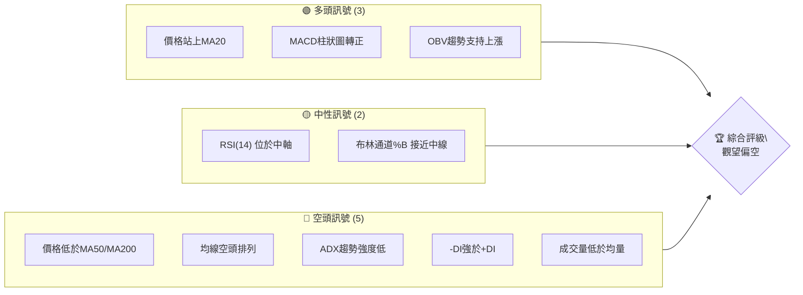
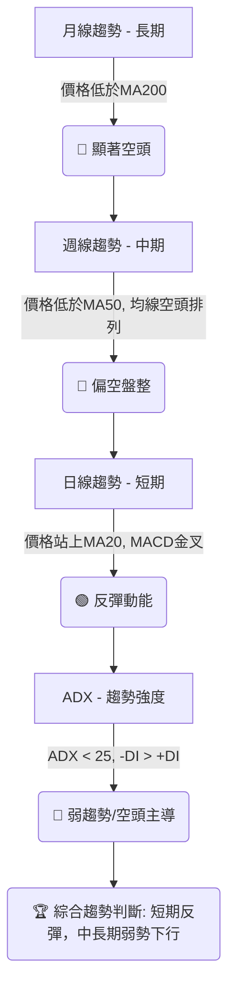
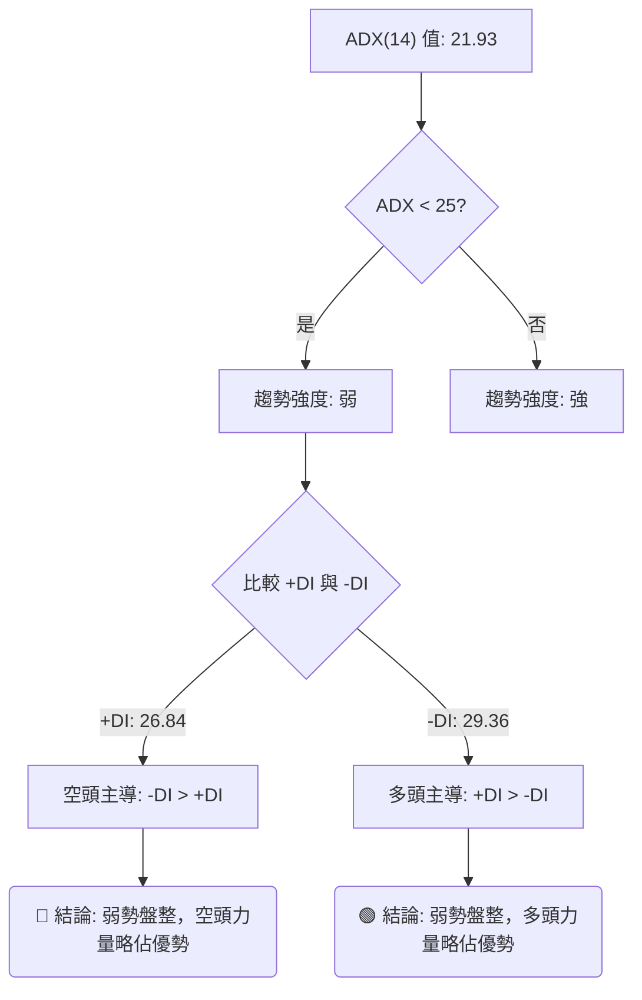
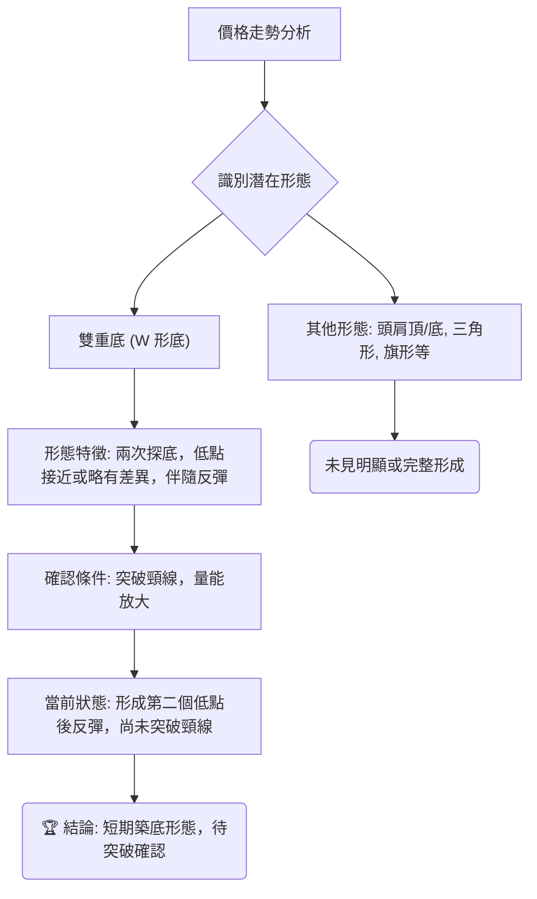
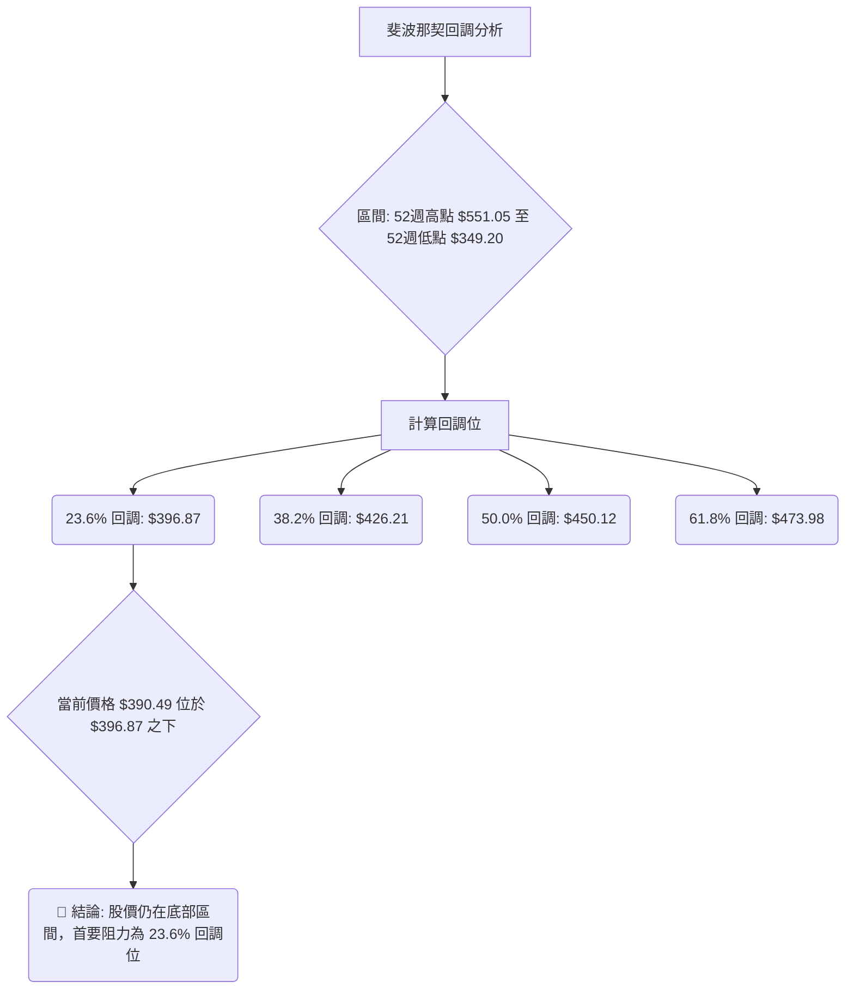
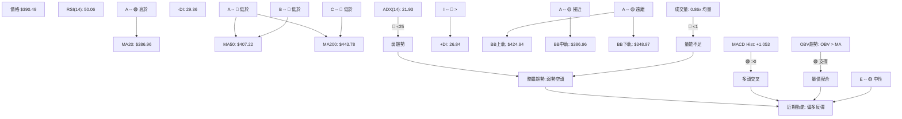
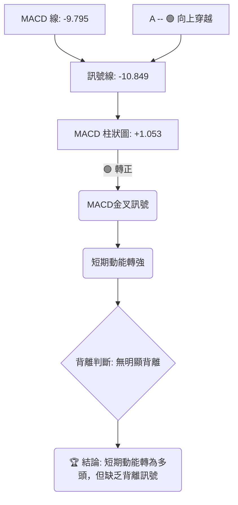
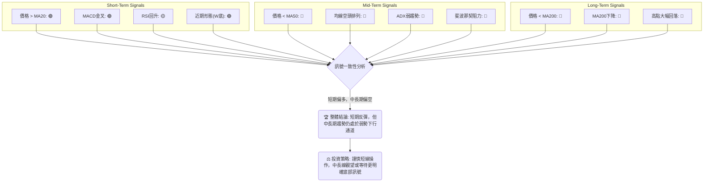
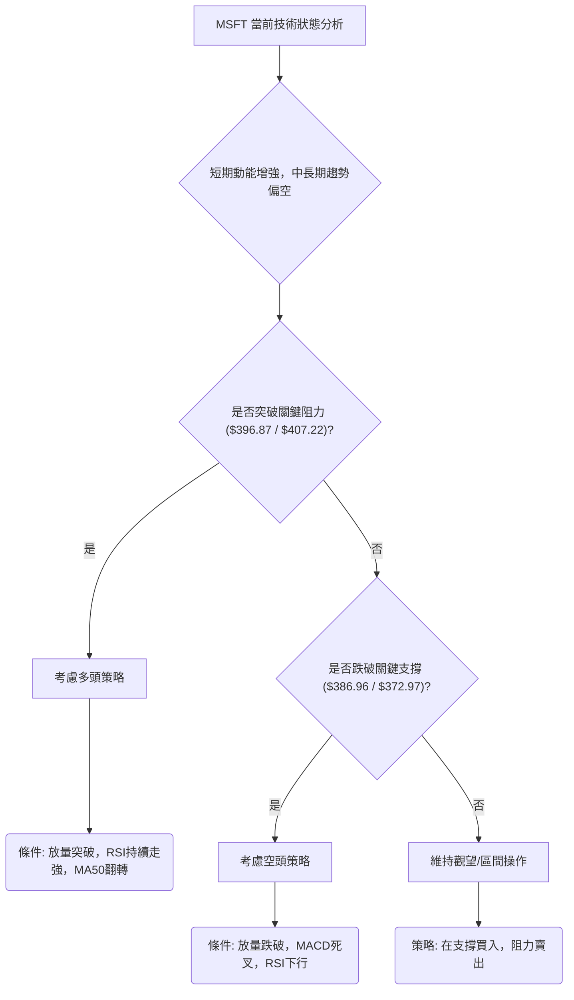
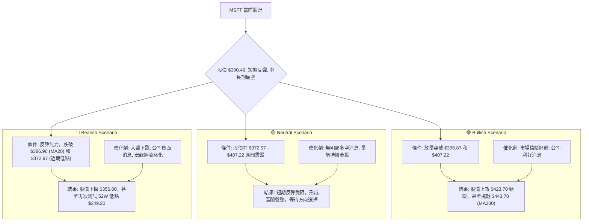

<details>
<summary>📊 靜態圖表 (點擊展開)</summary>

</details>

<html>
<head><meta charset="utf-8" /></head>
<body>
    <div style="height:500px; width:100%;">                        <script>window.PlotlyConfig = {MathJaxConfig: 'local'};</script>
        <script charset="utf-8" src="https://cdn.plot.ly/plotly-3.6.0.min.js" integrity="sha256-QaOVwtVY0T02VaHrr6pnoHLCwayMJp4O5n4YyaE3rJk=" crossorigin="anonymous"></script>                <div id="candlestick-chart" class="plotly-graph-div" style="height:100%; width:100%;"></div>            <script>                window.PLOTLYENV=window.PLOTLYENV || {};                                if (document.getElementById("candlestick-chart")) {                    Plotly.newPlot(                        "candlestick-chart",                        [{"close":{"dtype":"f8","bdata":"AAAAAGKdf0AAAADA9qx\u002fQAAAAKAAlH9AAAAAAF0VgEAAAADAZfN\u002fQAAAAIBnoH9AAAAA4Aevf0AAAADgbH1\u002fQAAAAODbw39AAAAAQMj1f0AAAADghRWAQAAAAMCDI4BAAAAAQPQDgEAAAACgwBCAQAAAAMDyaYBAAAAAgHVFgEAAAAAAYEyAQAAAACDmOIBAAAAAwOi7f0AAAADACe1\u002fQAAAAABo5X9AAAAAIC7jf0AAAABgPsZ\u002fQAAAAACR5X9AAAAAAE0MgEAAAACgNxOAQAAAAMAcKoBAAAAAgEUqgEAAAACAhEKAQAAAAGBmgYBAAAAAwETVgEAAAACAItGAQAAAAACcU4BAAAAA4GgUgEAAAACANQ6AQAAAAKB98X9AAAAA4H1\u002ff0AAAACAi99+QAAAAOAX235AAAAAYAxtf0AAAACgqJd\u002fQAAAAIDFvn9AAAAAIPZBf0AAAAAAgq9\u002fQAAAAAC9hH9AAAAAIOuqfkAAAACg3kB+QAAAACDxxH1AAAAA4G1gfUAAAABgYH59QAAAAOAArn1AAAAAYI81fkAAAABAQp1+QAAAAOBPSX5AAAAAwD19fkAAAACgyrl9QAAAAKBU631AAAAAQEkQfkAAAAAgfY1+QAAAAOBqnX5AAAAAIAPHfUAAAABgORV+QAAAAOCIxn1AAAAAIHCLfUAAAABgcqR9QAAAAEAloH1AAAAAIFkdfkAAAAAgQDx+QAAAAGBSLH5AAAAAoBBLfkAAAACAs11+QAAAAIDDWH5AAAAAAAxPfkAAAACgGVV+QAAAACCdF35AAAAAwH1tfUAAAADADmx9QAAAAGA3xn1AAAAAYDkVfkAAAAAg2L99QAAAAEB70n1AAAAAwAexfUAAAAAgVUl9QAAAAGB+lXxAAAAAoCpqfEAAAACgI518QAAAAOATSHxAAAAAgEGie0AAAADgPBJ8QAAAAKAl\u002fnxAAAAAoB5DfUAAAACAMOd9QAAAACDq931AAAAAwD\u002f5ekAAAADgHcZ6QAAAAEDjV3pAAAAAoDCWeUAAAADAqMV5QAAAAGDLfnhAAAAA4Mj1eEAAAADAQrx5QAAAAAABt3lAAAAAIDwpeUAAAABA7wB5QAAAAOCm+HhAAAAAoJuxeEAAAADgQN14QAAAAOCU2XhAAAAAwPHFeEAAAACgOfp3QAAAAICMQnhAAAAAYL\u002f7eEAAAAAAoQ15QAAAAGBCfnhAAAAAoATbeEAAAACA6TB5QAAAAEAwRXlAAAAAwK2ceUAAAADgN4F5QAAAACBniHlAAAAAICFOeUAAAABgFEB5QAAAACDdD3lAAAAAQB+reEAAAADAXvF4QAAAAKC\u002f6HhAAAAAoBdveEAAAAAg3kJ4QAAAACC30HdAAAAAoMHid0AAAABg8z53QAAAAGDPI3dAAAAAgN3SdkAAAACg+z92QAAAAIDyYnZAAAAAgOsVd0AAAADAJQl3QAAAACBySndAAAAAoC9Bd0AAAABAxDd3QAAAAABWWHdAAAAAQDhEd0AAAACAGCF3QAAAAACh+HdAAAAAoCqEeEAAAADgTKV5QAAAAMCgNXpAAAAAQAVeekAAAADgqRJ6QAAAAKDkc3pAAAAAAMD\u002fekAAAACgn+15QAAAAKA8e3pAAAAAIG5+ekAAAAAgKMV6QAAAAKCueHpAAAAAIGFueUAAAACAtdh5QAAAAACey3lAAAAA4NqneUAAAACgC9F5QAAAACDFPXpAAAAAwJDjeUAAAABgSrx5QAAAACA4bnlAAAAAIFlFeUAAAADguIh5QAAAAGAhUHpAAAAAoP5pekAAAABASQh6QAAAAGBmQnpAAAAAoHAxekAAAADAHil6QAAAAOB6AHpAAAAAYLjKeUAAAAAA1696QAAAAADXI3xAAAAA4FHIfEAAAADA9ZR7QAAAAKBwtXpAAAAAwMzAekAAAABguAp6QAAAAADXu3lAAAAAYI82eUAAAACAwtV4QAAAAKBwZXhAAAAAANdreEAAAAAAKfx4QAAAAKBHnXhAAAAAYI+ud0AAAABgZrZ3QAAAAKBw9XZAAAAAQApfd0AAAAAgXNd2QAAAAKBHDXZAAAAAIIVPd0AAAADAHgl3QAAAAOBRUHdAAAAA4HoEeEAAAAAA12d4QA=="},"high":{"dtype":"f8","bdata":"XmXTgMwPgEDGSgkDKMF\u002fQGYFVwh13X9ATKKRF0EggECrV29Y2hOAQKgQLvWf9X9AstEycBPUf0Acobwuzqx\u002fQINNMhJK639AJx3\u002fH8cMgECtODorMReAQBBncNDfKYBAJdXX+IkygECMj0HntimAQEUjFiuBfYBAFWCe3LlzgEAOjMvOEV2AQIpA6d89SIBAbxGlh0dCgEDk3iK1RwmAQH\u002fWqRVMAIBAMseZGXsPgEAoDGsmxwyAQD6LDyPjAYBAHw22IXwbgEBjg2TZZxuAQCotNW1lT4BAoA+RjjhFgEBPbM6SWVCAQOlze8+5mYBAJQuauOExgUC51jhKqPaAQOepDUvTnIBAJNAOBulvgEBzv1LqP02AQIf7r5ZxAoBAmOmQiHD5f0AZS6RvR2h\u002fQPtsWKLLA39ARnevFpB6f0AYbLxISaZ\u002fQAlRfrYyx39AMqTcDkvkf0AgvzbFFcZ\u002fQITs\u002fyVazn9A4zRvegg9f0AfpBtZLcF+QHbeALAbtn5Ad5hCQ7\u002fMfUDhkGEWkqx9QOakPgZp0H1A9OaDGFJifkARard9Iqd+QF49Y7cCe35AoQ7qMP60fkBCr6JHfSF+QFFGdgj68n1Arn5N5BsUfkCjy3PB4KF+QDN3FK8Cn35AUyJ7C6YhfkD4HMOiAD5+QEHuOxD6BH5AqquAW2vpfUD\u002fo6ciV7x9QJvKMkrz3X1AWa0Ykd52fkA0g5lT\u002flp+QGwzxe8CaX5Aywc21KxafkCGfShM3G9+QKYu821LX35AjHzfTPVifkALCojMJHh+QDSuAAudX35AUMTBCi4ofkDgCXxmWZ99QIIo2DLhyX1AGK4kXXZ4fkCWbGVfUgh+QLT3jFEV231AKq2nT7jtfUCdezXUupp9QAcrM\u002fX8IX1ADkA+axHjfEA0xTjnLtJ8QCLEe1hlbHxABEUHcO0qfEBtlO0gUS18QDMe9nkuUH1AscKyp1uCfUAzVhjKqgt+QAKiyk6GGX5AtdPxT5yIe0A4+Y+Oalp7QPIc2ulIzXpAr0jJZdxCekCJFhBgBR96QHomSRLWZ3lASpE8ciMAeUCV8uEyz9B5QPx8AVXTXHpARBH4MdHpeUCX45GyYkZ5QE93pF3fO3lAPe4HiejreEBcfxc\u002fZwx5QLlU\u002fiblOHlAt6LLihX0eEBxFdWYFqh4QNY\u002fN9BLSHhA655qLKMJeUBCTzHMv2l5QJe8+wFmv3hAc7AowSoFeUBmp4r6Il15QCwi+UNEonlARnRwxIareUD0+UJLhMJ5QN3LD8sslXlAOF42EgSVeUCMPZ1QBIJ5QPOGCmrgU3lAoIrqXc0+eUBRmP\u002f6Ofx4QJkxknNqOHlAWg\u002f1xjzSeEA44kGIRHp4QCwwnzaeInhA5JWFe\u002fgleED1IdVdS9p3QG2YzvXrg3dAB2EpC5Bed0BfDu+3qpp2QFvCYzggyXZAwB9QVYFBd0DRsUta6FJ3QNftB+hRTXdA4WS1ucFOd0CwuGY1Ujp3QPZsJeyvAnhA0kWQsRVLd0Aja2hGQG13QJFeud5X+3dA599vY2SdeEBbSYFdl9d5QGMi8oqRPnpAtjB1MFvqekBO5ukvpGZ6QFzmNcQbpHpAgL1b+DMMe0D1NEn66Gt6QMPfHXSBgHpAOnV9mv2iekA27ZyR2s96QB\u002fsrltcnnpAoMKk2GPYeUDFYE8dVgN6QOgoB\u002f7tPXpAXJS1chH+eUCaI75kQBh6QGC+3ozhsHpApP+wrZobekDOVAT8xLx5QBekGtKh6XlAvOE0A+lWeUBqkYLqMq95QIGMLQzqs3pANcGAQziDekBki6jcPPx6QJrLIAsBU3pAAAAAoHClekAAAABgZoZ6QAAAAOBRPHpAAAAAQAr\u002feUAAAAAA19d6QAAAAKBHJXxAAAAAwB4lfUAAAAAAAFh8QAAAAIA9hntAAAAAYGZCe0AAAAAghdd6QAAAAGCPEnpAAAAAIK6\u002feUAAAADgo1B5QAAAAKCZzXhAAAAAANd7eEAAAAAAABx5QAAAAKBwzXhAAAAAgOtleEAAAACA69V3QAAAAIAU2ndAAAAAIIWTd0AAAACAFK53QAAAACCuw3ZAAAAAgMKJd0AAAAAAAMh3QAAAAGBmYndAAAAAoEdNeEAAAABAM4N4QA=="},"hovertemplate":"\u003cb\u003e%{x|%Y-%m-%d}\u003c\u002fb\u003e\u003cbr\u003e\u958b: $%{open:.2f}\u003cbr\u003e\u9ad8: $%{high:.2f}\u003cbr\u003e\u4f4e: $%{low:.2f}\u003cbr\u003e\u6536: $%{close:.2f}\u003cextra\u003e\u003c\u002fextra\u003e","low":{"dtype":"f8","bdata":"OXCdF2OWf0DLLzmO72t\u002fQL3dUR1xh39AUZbR7ZKxf0APxqR8B9V\u002fQJwSMp7ggX9A6zvyIq17f0AKPQ8syV1\u002fQLgxjAPodn9A8mS9staaf0DdxkaSPad\u002fQL0OIjyEx39A2k0oL3W3f0Db6uJTJPx\u002fQJcpGaiCF4BAtSvGXEQxgEAdLRBPYj6AQFu\u002fs5EmEYBASCq0aMOmf0BvZchXW8d\u002fQNhViGMMbX9AHPP4SqWsf0D8trMU6o5\u002fQEr27J\u002fggX9A0ygBHS7jf0AGEJTX+tx\u002fQB2ahHmdE4BAr34cAsUagEC+xpbAdiuAQJqw0jlybYBAZB5ZIe\u002fKgEBw66U\u002f0aqAQFJOfyqsNoBAzIO\u002fW7v9f0ACZfyln\u002fV\u002fQPwA2stNin9A4QucE0V2f0DjcefgCMt+QAPQzCZVon5AMfvuuZL6fkBZzzwsBDN\u002fQEkAH1mp\u002f35AiW5Grikif0AyBEBo8+R+QPomquG3W39AAlee03Y7fkAXikBWqfx9QPSCKRVFln1AA6JeKhojfUBdMiPYHh99QCl1NxxD7XxAPLdYthDxfUA9ehP24Ed+QE6YOjQFKH5AHLHZU59CfkBZPMKxfZF9QBbo4P4Jpn1AFdJnGRzMfUAY9mtUuCN+QEbYIuxYZX5AittiMpSPfUDphGXyAJx9QBFqHGWmo31AHq+PBM1mfUD2cndvrUx9QClDwhZOjn1ADL7mF1e8fUB50+8JnQV+QFLsDr\u002fMCH5A92opUXQpfkA8eBQu4yp+QBvEgUfjPH5AeujapoggfkDCc9l0jzV+QENnrC+EEn5A6o73WzVBfUAvs+X1sTZ9QGlBY3StOn1AMHoEvku9fUATZgn8AJx9QMdxMjK0YX1Aql9e\u002fSKZfUBPncu2Jf58QNJf5WFKcnxASfArbQ9efECCxQWhTGd8QOCRQgic9HtASq+z28JLe0BgqQeTp6t7QFWFy0aFCHxAgvM5HTq\u002ffEDRJGL+\u002fnB9QJOSsosXvn1AkdxCQnQyekDSWtb78oh6QAAmthYMRnpAby6YX\u002fpreUCuetNjz3Z5QGotFURKaXhAzagMBtlyeECU44PMe\u002fF4QNPgwrnsrXlA9qZ4pLbzeEBFwFst7cN4QMoy\u002fUGQxHhAME7cT36MeEBewJyQAal4QFiaYvgAvXhAj77+UuWkeECBB7hAWuR3QIU+UigpzndAzPUjixFVeEDUSjpBDd54QCFONzGZUHhAyoVifJJceEAtL4dNJH14QOQx2Ake93hAlkjPd2o4eUBTTL+7CHp5QL1YSxEMKnlAu65KbfIgeUB53cqfjQt5QFvc6RN4DXlAmrP+AV6WeEBx6Z0N\u002fZ54QO4a8PE+znhAI\u002fJPvnpieEDYS79ZkyN4QM68xJ3GtHdAbiRWj67Nd0BtMOLgvTB3QFxSR3tMDXdAzLaYh2nGdkB6NCoN1Tt2QG5CYPkoOHZArSwMupCkdkCc+GHbd\u002fZ2QG4wV8rOtXZAWhrMCzkLd0Cik0vZSNx2QDO8Hpm3KXdA5v9iihvkdkAVVI9PrxN3QDw1HY19I3dAMFPzVfQaeEABTh4l9r14QLvBWiH9s3lAbfL1Nn48ekCtGTGLZ\u002fZ5QPHcehzGBHpAsR5z4hFsekAHrVVrVah5QHXO3PNr7nlAgqPrurICekCTsZyQz096QJP1GUobNnpAZJBjvGXSeEC9FMPo2Jh5QMeAsDaYnnlAtzrA9ql+eUCepMtXwEN5QFz\u002f8wquHXpAg9wbKq\u002fReUBWv\u002fZh+kl5QELkxMAtXHlArb6L4JwCeUBqr8TPNwB5QGeJliJIwHlA2LascmPreUCxXZsbcPl5QLg3LcaTpnlAAAAAIFz7eUAAAACgRwV6QAAAAOBR0HlAAAAAoEeZeUAAAABguMp5QAAAAIDCBXtAAAAA4FGkfEAAAABA4YZ7QAAAAAAAhHpAAAAAYI+mekAAAABgZuZ5QAAAAMD1iHlAAAAAIK7neEAAAABgj9J4QAAAAAAAAHhAAAAA4FHkd0AAAACgmY14QAAAAEAKa3hAAAAAwB6Vd0AAAADgelR3QAAAAMAe8XZAAAAAYLgqd0AAAADgesx2QAAAAEAz03VAAAAAQOE2dkAAAABgZn52QAAAAEAz93ZAAAAAgD1ud0AAAABAM\u002ft3QA=="},"name":"\u50f9\u683c","open":{"dtype":"f8","bdata":"ye6VQwQNgEC2nILogLZ\u002fQOLA+gJWxH9ApDsFfIy1f0Awe2zuwgKAQGWoqFIQ6X9AEMIiErCyf0BYD0UDnpF\u002fQFfIrZaZrX9AbMYXqX7Ef0DTjLnpKOB\u002fQP2QVJH2+H9AVVrTAg8TgECzaeXYww6AQNxLYf\u002fEGoBADxf30rhngEAzVCP85D+AQPbg9gVsOIBAOTfdL\u002fUigEDk3iK1RwmAQG\u002fZGXlNsH9AmbUir4H7f0CNhKyeqtV\u002fQFiRkCdinX9ALCYS8vD1f0Cj29UP8hGAQG2YIkP2LoBAphjTQmA5gEBSy6ix\u002fzuAQCvRF4Z3g4BA5kPBKk8UgUDObp+OFeyAQCCgG6oheYBA8w\u002ffkWlsgECB4kILTySAQKsyjx+hyH9ANJNu+Rzhf0D3lKmXpGd\u002fQDUIFgYp3X5AcfDa4kkOf0Dy7Y0k+Fl\u002fQKgvkGJ4on9A7HYgCpOxf0DJFOvqgvF+QObksIAAlH9AAZ6KBQrEfkAp8pHuP3B+QA2CG65oqH5ARW\u002fegw7GfUBc9yc3To59QGjv3KZ9f31A2ZJganZCfkBvFZX1Ald+QBrXxkBkZH5A\u002fnlTcP5IfkDyEP7aVKN9QHh7yJwg2n1AAMZhXxcGfkDF5XMR2Ct+QEv1wabnbn5AN0ZB6iQefkBFFqL2RKh9QIfK31IV231A+LDMHYvffUA\u002fzRubFV19QKDZUce6rH1ALEVIZR7BfUDD9KsZMFN+QBYxbbVvP35AQfRWFUctfkCPRXdebTh+QA9w3KjVSH5AXtWijV0rfkBgktzlaDx+QKrtv53VWn5ATmzpEeEjfkAn7NnmVH99QF\u002fUaKgwe31Alkd5nyDafUDhbOfIs\u002fF9QAp2TOtUf31ASU\u002fZIuiofUAG5QUuNYl9QF0ER25FBn1AtMydR\u002f\u002fgfECgVC2dzXx8QBRjWw2DE3xAK3Rqcn4pfECrXUbMKtp7QHXFOZHdHXxALCc+wfPzfEA+B\u002fcPmXl9QLE0ug4VEX5ARXK35KBge0AuapAdkVN7QMBzSf5RxXpAFwSkXzlCekBtedFt2JJ5QD71SzAjWnlAn\u002fZbhmfWeEC+Ntql4TB5QDodgE8nHHpA2MmsZ1vleUAoO1k9RTN5QE7C7IiCKnlAclKJZDPXeECxbf1x1sV4QKZ5bUIv\u002fXhARwwsChC0eECT\u002fqNIV6J4QCJcgAX19HdAFkSoxPlaeEBwViiIXT15QIqDC1eQYHhAYPrEviyAeECijGdEpYR4QIUmS6pxBnlANvJwSrw4eUCQzRDgDIV5QB7TP9+3QHlAeMB9M02SeUCOWlKEGEt5QJxzoZoWPHlAk9NWQSICeUCjHHnkWtN4QATrFIN69nhANdyI+ljEeEAzDHVQHFR4QLSjfvJDH3hAAEB6CCDxd0A5lCa3idh3QLosCNOvgXdAAPMkMUwgd0CBlGK24pF2QEdiZLnikXZAyeocoDG8dkAvu2HH7Ep3QPokxHOp5nZAe0+luexKd0B3RRlDohh3QNC9cTleAnhAqsC7ix47d0CMz2FyyEJ3QP1Yyz\u002fXTHdAtVpHcU4xeED+6xPHPNJ4QCzLhso9L3pAePuvJ25+ekDgMy481kN6QN1gZPNONXpA35ifc02UekDHjd15uC96QNoVYvgZAXpA1yR+eXlXekCPQNFNcHp6QMSIEBCZenpA10mHLcGeeUDj65WEhr55QKVIqMloqnlAvmNLP8LmeUBuH3lC5HF5QKsTrpc7M3pAuge7p84HekDdzRfn0G95QIJPn\u002flY2XlAJO\u002fwCkIleUCIS4aRsTl5QPvTkpj+1XlA85bVgYP7eUCvVgbGiM96QKyuHP5l1HlAAAAAAACMekAAAADgozh6QAAAAEDhBnpAAAAAACmweUAAAAAgrs95QAAAAMDMCHtAAAAAoHANfUAAAACAFO57QAAAAEAzZ3tAAAAAwPU8e0AAAACgcMV6QAAAAIA94nlAAAAA4HqQeUAAAADAzOh4QAAAACBcs3hAAAAAQOF2eEAAAADAzMx4QAAAAOCjvHhAAAAAAABkeEAAAADAHp13QAAAAADXe3dAAAAAgBRGd0AAAADAHjl3QAAAAOBRrHZAAAAAYGZSdkAAAAAAAJh3QAAAAOB6MHdAAAAAoEfNd0AAAAAgrgd4QA=="},"x":["2025-09-16T00:00:00-04:00","2025-09-17T00:00:00-04:00","2025-09-18T00:00:00-04:00","2025-09-19T00:00:00-04:00","2025-09-22T00:00:00-04:00","2025-09-23T00:00:00-04:00","2025-09-24T00:00:00-04:00","2025-09-25T00:00:00-04:00","2025-09-26T00:00:00-04:00","2025-09-29T00:00:00-04:00","2025-09-30T00:00:00-04:00","2025-10-01T00:00:00-04:00","2025-10-02T00:00:00-04:00","2025-10-03T00:00:00-04:00","2025-10-06T00:00:00-04:00","2025-10-07T00:00:00-04:00","2025-10-08T00:00:00-04:00","2025-10-09T00:00:00-04:00","2025-10-10T00:00:00-04:00","2025-10-13T00:00:00-04:00","2025-10-14T00:00:00-04:00","2025-10-15T00:00:00-04:00","2025-10-16T00:00:00-04:00","2025-10-17T00:00:00-04:00","2025-10-20T00:00:00-04:00","2025-10-21T00:00:00-04:00","2025-10-22T00:00:00-04:00","2025-10-23T00:00:00-04:00","2025-10-24T00:00:00-04:00","2025-10-27T00:00:00-04:00","2025-10-28T00:00:00-04:00","2025-10-29T00:00:00-04:00","2025-10-30T00:00:00-04:00","2025-10-31T00:00:00-04:00","2025-11-03T00:00:00-05:00","2025-11-04T00:00:00-05:00","2025-11-05T00:00:00-05:00","2025-11-06T00:00:00-05:00","2025-11-07T00:00:00-05:00","2025-11-10T00:00:00-05:00","2025-11-11T00:00:00-05:00","2025-11-12T00:00:00-05:00","2025-11-13T00:00:00-05:00","2025-11-14T00:00:00-05:00","2025-11-17T00:00:00-05:00","2025-11-18T00:00:00-05:00","2025-11-19T00:00:00-05:00","2025-11-20T00:00:00-05:00","2025-11-21T00:00:00-05:00","2025-11-24T00:00:00-05:00","2025-11-25T00:00:00-05:00","2025-11-26T00:00:00-05:00","2025-11-28T00:00:00-05:00","2025-12-01T00:00:00-05:00","2025-12-02T00:00:00-05:00","2025-12-03T00:00:00-05:00","2025-12-04T00:00:00-05:00","2025-12-05T00:00:00-05:00","2025-12-08T00:00:00-05:00","2025-12-09T00:00:00-05:00","2025-12-10T00:00:00-05:00","2025-12-11T00:00:00-05:00","2025-12-12T00:00:00-05:00","2025-12-15T00:00:00-05:00","2025-12-16T00:00:00-05:00","2025-12-17T00:00:00-05:00","2025-12-18T00:00:00-05:00","2025-12-19T00:00:00-05:00","2025-12-22T00:00:00-05:00","2025-12-23T00:00:00-05:00","2025-12-24T00:00:00-05:00","2025-12-26T00:00:00-05:00","2025-12-29T00:00:00-05:00","2025-12-30T00:00:00-05:00","2025-12-31T00:00:00-05:00","2026-01-02T00:00:00-05:00","2026-01-05T00:00:00-05:00","2026-01-06T00:00:00-05:00","2026-01-07T00:00:00-05:00","2026-01-08T00:00:00-05:00","2026-01-09T00:00:00-05:00","2026-01-12T00:00:00-05:00","2026-01-13T00:00:00-05:00","2026-01-14T00:00:00-05:00","2026-01-15T00:00:00-05:00","2026-01-16T00:00:00-05:00","2026-01-20T00:00:00-05:00","2026-01-21T00:00:00-05:00","2026-01-22T00:00:00-05:00","2026-01-23T00:00:00-05:00","2026-01-26T00:00:00-05:00","2026-01-27T00:00:00-05:00","2026-01-28T00:00:00-05:00","2026-01-29T00:00:00-05:00","2026-01-30T00:00:00-05:00","2026-02-02T00:00:00-05:00","2026-02-03T00:00:00-05:00","2026-02-04T00:00:00-05:00","2026-02-05T00:00:00-05:00","2026-02-06T00:00:00-05:00","2026-02-09T00:00:00-05:00","2026-02-10T00:00:00-05:00","2026-02-11T00:00:00-05:00","2026-02-12T00:00:00-05:00","2026-02-13T00:00:00-05:00","2026-02-17T00:00:00-05:00","2026-02-18T00:00:00-05:00","2026-02-19T00:00:00-05:00","2026-02-20T00:00:00-05:00","2026-02-23T00:00:00-05:00","2026-02-24T00:00:00-05:00","2026-02-25T00:00:00-05:00","2026-02-26T00:00:00-05:00","2026-02-27T00:00:00-05:00","2026-03-02T00:00:00-05:00","2026-03-03T00:00:00-05:00","2026-03-04T00:00:00-05:00","2026-03-05T00:00:00-05:00","2026-03-06T00:00:00-05:00","2026-03-09T00:00:00-04:00","2026-03-10T00:00:00-04:00","2026-03-11T00:00:00-04:00","2026-03-12T00:00:00-04:00","2026-03-13T00:00:00-04:00","2026-03-16T00:00:00-04:00","2026-03-17T00:00:00-04:00","2026-03-18T00:00:00-04:00","2026-03-19T00:00:00-04:00","2026-03-20T00:00:00-04:00","2026-03-23T00:00:00-04:00","2026-03-24T00:00:00-04:00","2026-03-25T00:00:00-04:00","2026-03-26T00:00:00-04:00","2026-03-27T00:00:00-04:00","2026-03-30T00:00:00-04:00","2026-03-31T00:00:00-04:00","2026-04-01T00:00:00-04:00","2026-04-02T00:00:00-04:00","2026-04-06T00:00:00-04:00","2026-04-07T00:00:00-04:00","2026-04-08T00:00:00-04:00","2026-04-09T00:00:00-04:00","2026-04-10T00:00:00-04:00","2026-04-13T00:00:00-04:00","2026-04-14T00:00:00-04:00","2026-04-15T00:00:00-04:00","2026-04-16T00:00:00-04:00","2026-04-17T00:00:00-04:00","2026-04-20T00:00:00-04:00","2026-04-21T00:00:00-04:00","2026-04-22T00:00:00-04:00","2026-04-23T00:00:00-04:00","2026-04-24T00:00:00-04:00","2026-04-27T00:00:00-04:00","2026-04-28T00:00:00-04:00","2026-04-29T00:00:00-04:00","2026-04-30T00:00:00-04:00","2026-05-01T00:00:00-04:00","2026-05-04T00:00:00-04:00","2026-05-05T00:00:00-04:00","2026-05-06T00:00:00-04:00","2026-05-07T00:00:00-04:00","2026-05-08T00:00:00-04:00","2026-05-11T00:00:00-04:00","2026-05-12T00:00:00-04:00","2026-05-13T00:00:00-04:00","2026-05-14T00:00:00-04:00","2026-05-15T00:00:00-04:00","2026-05-18T00:00:00-04:00","2026-05-19T00:00:00-04:00","2026-05-20T00:00:00-04:00","2026-05-21T00:00:00-04:00","2026-05-22T00:00:00-04:00","2026-05-26T00:00:00-04:00","2026-05-27T00:00:00-04:00","2026-05-28T00:00:00-04:00","2026-05-29T00:00:00-04:00","2026-06-01T00:00:00-04:00","2026-06-02T00:00:00-04:00","2026-06-03T00:00:00-04:00","2026-06-04T00:00:00-04:00","2026-06-05T00:00:00-04:00","2026-06-08T00:00:00-04:00","2026-06-09T00:00:00-04:00","2026-06-10T00:00:00-04:00","2026-06-11T00:00:00-04:00","2026-06-12T00:00:00-04:00","2026-06-15T00:00:00-04:00","2026-06-16T00:00:00-04:00","2026-06-17T00:00:00-04:00","2026-06-18T00:00:00-04:00","2026-06-22T00:00:00-04:00","2026-06-23T00:00:00-04:00","2026-06-24T00:00:00-04:00","2026-06-25T00:00:00-04:00","2026-06-26T00:00:00-04:00","2026-06-29T00:00:00-04:00","2026-06-30T00:00:00-04:00","2026-07-01T00:00:00-04:00","2026-07-02T00:00:00-04:00"],"type":"candlestick"},{"hovertemplate":"MA30: $%{y:.2f}\u003cextra\u003e\u003c\u002fextra\u003e","line":{"color":"#2196F3","dash":"dash","width":2},"mode":"lines","name":"MA30","x":["2025-09-16T00:00:00-04:00","2025-09-17T00:00:00-04:00","2025-09-18T00:00:00-04:00","2025-09-19T00:00:00-04:00","2025-09-22T00:00:00-04:00","2025-09-23T00:00:00-04:00","2025-09-24T00:00:00-04:00","2025-09-25T00:00:00-04:00","2025-09-26T00:00:00-04:00","2025-09-29T00:00:00-04:00","2025-09-30T00:00:00-04:00","2025-10-01T00:00:00-04:00","2025-10-02T00:00:00-04:00","2025-10-03T00:00:00-04:00","2025-10-06T00:00:00-04:00","2025-10-07T00:00:00-04:00","2025-10-08T00:00:00-04:00","2025-10-09T00:00:00-04:00","2025-10-10T00:00:00-04:00","2025-10-13T00:00:00-04:00","2025-10-14T00:00:00-04:00","2025-10-15T00:00:00-04:00","2025-10-16T00:00:00-04:00","2025-10-17T00:00:00-04:00","2025-10-20T00:00:00-04:00","2025-10-21T00:00:00-04:00","2025-10-22T00:00:00-04:00","2025-10-23T00:00:00-04:00","2025-10-24T00:00:00-04:00","2025-10-27T00:00:00-04:00","2025-10-28T00:00:00-04:00","2025-10-29T00:00:00-04:00","2025-10-30T00:00:00-04:00","2025-10-31T00:00:00-04:00","2025-11-03T00:00:00-05:00","2025-11-04T00:00:00-05:00","2025-11-05T00:00:00-05:00","2025-11-06T00:00:00-05:00","2025-11-07T00:00:00-05:00","2025-11-10T00:00:00-05:00","2025-11-11T00:00:00-05:00","2025-11-12T00:00:00-05:00","2025-11-13T00:00:00-05:00","2025-11-14T00:00:00-05:00","2025-11-17T00:00:00-05:00","2025-11-18T00:00:00-05:00","2025-11-19T00:00:00-05:00","2025-11-20T00:00:00-05:00","2025-11-21T00:00:00-05:00","2025-11-24T00:00:00-05:00","2025-11-25T00:00:00-05:00","2025-11-26T00:00:00-05:00","2025-11-28T00:00:00-05:00","2025-12-01T00:00:00-05:00","2025-12-02T00:00:00-05:00","2025-12-03T00:00:00-05:00","2025-12-04T00:00:00-05:00","2025-12-05T00:00:00-05:00","2025-12-08T00:00:00-05:00","2025-12-09T00:00:00-05:00","2025-12-10T00:00:00-05:00","2025-12-11T00:00:00-05:00","2025-12-12T00:00:00-05:00","2025-12-15T00:00:00-05:00","2025-12-16T00:00:00-05:00","2025-12-17T00:00:00-05:00","2025-12-18T00:00:00-05:00","2025-12-19T00:00:00-05:00","2025-12-22T00:00:00-05:00","2025-12-23T00:00:00-05:00","2025-12-24T00:00:00-05:00","2025-12-26T00:00:00-05:00","2025-12-29T00:00:00-05:00","2025-12-30T00:00:00-05:00","2025-12-31T00:00:00-05:00","2026-01-02T00:00:00-05:00","2026-01-05T00:00:00-05:00","2026-01-06T00:00:00-05:00","2026-01-07T00:00:00-05:00","2026-01-08T00:00:00-05:00","2026-01-09T00:00:00-05:00","2026-01-12T00:00:00-05:00","2026-01-13T00:00:00-05:00","2026-01-14T00:00:00-05:00","2026-01-15T00:00:00-05:00","2026-01-16T00:00:00-05:00","2026-01-20T00:00:00-05:00","2026-01-21T00:00:00-05:00","2026-01-22T00:00:00-05:00","2026-01-23T00:00:00-05:00","2026-01-26T00:00:00-05:00","2026-01-27T00:00:00-05:00","2026-01-28T00:00:00-05:00","2026-01-29T00:00:00-05:00","2026-01-30T00:00:00-05:00","2026-02-02T00:00:00-05:00","2026-02-03T00:00:00-05:00","2026-02-04T00:00:00-05:00","2026-02-05T00:00:00-05:00","2026-02-06T00:00:00-05:00","2026-02-09T00:00:00-05:00","2026-02-10T00:00:00-05:00","2026-02-11T00:00:00-05:00","2026-02-12T00:00:00-05:00","2026-02-13T00:00:00-05:00","2026-02-17T00:00:00-05:00","2026-02-18T00:00:00-05:00","2026-02-19T00:00:00-05:00","2026-02-20T00:00:00-05:00","2026-02-23T00:00:00-05:00","2026-02-24T00:00:00-05:00","2026-02-25T00:00:00-05:00","2026-02-26T00:00:00-05:00","2026-02-27T00:00:00-05:00","2026-03-02T00:00:00-05:00","2026-03-03T00:00:00-05:00","2026-03-04T00:00:00-05:00","2026-03-05T00:00:00-05:00","2026-03-06T00:00:00-05:00","2026-03-09T00:00:00-04:00","2026-03-10T00:00:00-04:00","2026-03-11T00:00:00-04:00","2026-03-12T00:00:00-04:00","2026-03-13T00:00:00-04:00","2026-03-16T00:00:00-04:00","2026-03-17T00:00:00-04:00","2026-03-18T00:00:00-04:00","2026-03-19T00:00:00-04:00","2026-03-20T00:00:00-04:00","2026-03-23T00:00:00-04:00","2026-03-24T00:00:00-04:00","2026-03-25T00:00:00-04:00","2026-03-26T00:00:00-04:00","2026-03-27T00:00:00-04:00","2026-03-30T00:00:00-04:00","2026-03-31T00:00:00-04:00","2026-04-01T00:00:00-04:00","2026-04-02T00:00:00-04:00","2026-04-06T00:00:00-04:00","2026-04-07T00:00:00-04:00","2026-04-08T00:00:00-04:00","2026-04-09T00:00:00-04:00","2026-04-10T00:00:00-04:00","2026-04-13T00:00:00-04:00","2026-04-14T00:00:00-04:00","2026-04-15T00:00:00-04:00","2026-04-16T00:00:00-04:00","2026-04-17T00:00:00-04:00","2026-04-20T00:00:00-04:00","2026-04-21T00:00:00-04:00","2026-04-22T00:00:00-04:00","2026-04-23T00:00:00-04:00","2026-04-24T00:00:00-04:00","2026-04-27T00:00:00-04:00","2026-04-28T00:00:00-04:00","2026-04-29T00:00:00-04:00","2026-04-30T00:00:00-04:00","2026-05-01T00:00:00-04:00","2026-05-04T00:00:00-04:00","2026-05-05T00:00:00-04:00","2026-05-06T00:00:00-04:00","2026-05-07T00:00:00-04:00","2026-05-08T00:00:00-04:00","2026-05-11T00:00:00-04:00","2026-05-12T00:00:00-04:00","2026-05-13T00:00:00-04:00","2026-05-14T00:00:00-04:00","2026-05-15T00:00:00-04:00","2026-05-18T00:00:00-04:00","2026-05-19T00:00:00-04:00","2026-05-20T00:00:00-04:00","2026-05-21T00:00:00-04:00","2026-05-22T00:00:00-04:00","2026-05-26T00:00:00-04:00","2026-05-27T00:00:00-04:00","2026-05-28T00:00:00-04:00","2026-05-29T00:00:00-04:00","2026-06-01T00:00:00-04:00","2026-06-02T00:00:00-04:00","2026-06-03T00:00:00-04:00","2026-06-04T00:00:00-04:00","2026-06-05T00:00:00-04:00","2026-06-08T00:00:00-04:00","2026-06-09T00:00:00-04:00","2026-06-10T00:00:00-04:00","2026-06-11T00:00:00-04:00","2026-06-12T00:00:00-04:00","2026-06-15T00:00:00-04:00","2026-06-16T00:00:00-04:00","2026-06-17T00:00:00-04:00","2026-06-18T00:00:00-04:00","2026-06-22T00:00:00-04:00","2026-06-23T00:00:00-04:00","2026-06-24T00:00:00-04:00","2026-06-25T00:00:00-04:00","2026-06-26T00:00:00-04:00","2026-06-29T00:00:00-04:00","2026-06-30T00:00:00-04:00","2026-07-01T00:00:00-04:00","2026-07-02T00:00:00-04:00"],"y":{"dtype":"f8","bdata":"AAAAAAAA+H8AAAAAAAD4fwAAAAAAAPh\u002fAAAAAAAA+H8AAAAAAAD4fwAAAAAAAPh\u002fAAAAAAAA+H8AAAAAAAD4fwAAAAAAAPh\u002fAAAAAAAA+H8AAAAAAAD4fwAAAAAAAPh\u002fAAAAAAAA+H8AAAAAAAD4fwAAAAAAAPh\u002fAAAAAAAA+H8AAAAAAAD4fwAAAAAAAPh\u002fAAAAAAAA+H8AAAAAAAD4fwAAAAAAAPh\u002fAAAAAAAA+H8AAAAAAAD4fwAAAAAAAPh\u002fAAAAAAAA+H8AAAAAAAD4fwAAAAAAAPh\u002fAAAAAAAA+H8AAAAAAAD4fwAAAFDhCIBAiYiI+KERgEAAAADg\u002fBmAQJqZmSGTHoBAZmZm\u002fooegEC8u7sDOh+AQLy7u\u002fuTIIBAZmZmJskfgEDv7u6GJx2AQM3MzGRGGYBA7+7u\u002fv4WgEDNzMwkihSAQO\u002fu7sZEEoBARERENPgOgEARERHREQ2AQO\u002fu7s57B4BA7+7unvf+f0BERESk+Op\u002fQJqZmYkk1H9Ad3d31wbAf0BmZmZ2Rat\u002fQAAAAKBbmH9AiYiIiAmKf0AzMzNDI4B\u002fQLy7u1tlcn9AVVVVFa9kf0De3d3t\u002fk9\u002fQERERMRuO39A3t3dPRcof0AAAABQThd\u002fQN7d3R3cAn9AiYiI+KzhfkCJiIjIX8N+QJqZmWnRqn5AvLu7W4GUfkCamZmJcH9+QDMzM1Opa35AzczMTNtffkCrqqraaVp+QImIiHiWVH5AIiIi8utKfkB3d3fXdEB+QHd3d9eFNH5AiYiI+GwsfkBVVVX14CB+QKuqqjq1FH5AREREhCAKfkBVVVWFCAN+QFVVVWUTA35A3t3dLRoJfkBmZmbWSAt+QN7d3R2ADH5AIiIiMhUIfkDe3d19wPx9QCIiIoI57n1AvLu7q4XcfUAzMzOjCNN9QDMzMwMPxX1AVVVVBVOwfUBmZmY2Jpt9QCIiIpJOjX1AZmZmFumIfUAiIiJCYId9QCIiIqIFiX1AZmZmFhVzfUDe3d3Nmlp9QKuqqpqYPn1A7+7uHvUXfUAiIiIC3\u002fF8QDMzM5NrwXxA7+7uLumTfEDNzMxsZWx8QBEREfHeRHxAzczMnPEYfEC8u7u7eOt7QLy7u9vFv3tAREREdGCXe0CamZm5e3B7QO\u002fu7k52RntA7+7uHicZe0Crqqoa5ud6QGZmZjZvuHpAIiIiIkKQekB3d3eHImx6QBERESE6SXpA7+7u\u002ftoqekC8u7vbpQ16QKuqqprz83lAIiIi8rLieUARERFhzMx5QHd3dwdGr3lAiYiI2IGNeUBVVVW1zWV5QImIiGjvO3lAiYiIqEMoeUAAAACwoxh5QERERMRmDHlAmpmZmZACeUCrqqr6q\u002fV4QBEREYHe73hAiYiImLPmeEB3d3c3ddF4QImIiBh8u3hAIiIiAoqneEC8u7trCpB4QAAAAOD7eXhA3t3dzUJseEDNzMxMqFx4QHd3d1daT3hAAAAA8GRCeEDv7u6O6Tt4QBEREfEaNHhA3t3dTXQleECrqqpaCRV4QKuqqgqVEHhAiYiI6K8NeEBmZmYWkRF4QGZmZtaUGXhAAAAAsAYgeEAiIiLS3yR4QGZmZla5LHhAERERkS07eECamZl59kB4QCIiIkITTXhARERE9KZceEC8u7u7Pmx4QAAAAICTeXhAMzMz8xWCeEAREREhnY94QBEREbGCoHhAIiIiIp2veEAAAADgjMV4QAAAAAAE4HhAvLu7Gyz6eEB3d3d36hd5QBEREUHkMXlAq6qqCopEeUDv7u6+21l5QKuqqtqlc3lAAAAAsJuOeUDv7u4eoKZ5QImIiIh+v3lAERER4XfYeUBERET0VfJ5QERERASqA3pAvLu7m4wOekBEREQUbxd6QKuqqlroJ3pAIiIigoQ8ekB3d3fnZEl6QM3MzDyUS3pAAAAAEHtJekCrqqpac0p6QJqZmRkSRHpAZmZmRiQ5ekAzMzPjoCh6QO\u002fu7p7rFnpAq6qqak0OekBmZmZm8wZ6QERERHTf\u002fHlAq6qqmgfseUCamZkpE9p5QImIiFgQvnlAVVVVZZSoeUCamZnJ4Y95QImIiPgMc3lAREREtFJieUBERETEAE15QImIiMhoM3lAVVVVdfUeeUCJiIjIExF5QA=="},"type":"scatter"},{"hovertemplate":"MA60: $%{y:.2f}\u003cextra\u003e\u003c\u002fextra\u003e","line":{"color":"#9C27B0","dash":"dash","width":2},"mode":"lines","name":"MA60","x":["2025-09-16T00:00:00-04:00","2025-09-17T00:00:00-04:00","2025-09-18T00:00:00-04:00","2025-09-19T00:00:00-04:00","2025-09-22T00:00:00-04:00","2025-09-23T00:00:00-04:00","2025-09-24T00:00:00-04:00","2025-09-25T00:00:00-04:00","2025-09-26T00:00:00-04:00","2025-09-29T00:00:00-04:00","2025-09-30T00:00:00-04:00","2025-10-01T00:00:00-04:00","2025-10-02T00:00:00-04:00","2025-10-03T00:00:00-04:00","2025-10-06T00:00:00-04:00","2025-10-07T00:00:00-04:00","2025-10-08T00:00:00-04:00","2025-10-09T00:00:00-04:00","2025-10-10T00:00:00-04:00","2025-10-13T00:00:00-04:00","2025-10-14T00:00:00-04:00","2025-10-15T00:00:00-04:00","2025-10-16T00:00:00-04:00","2025-10-17T00:00:00-04:00","2025-10-20T00:00:00-04:00","2025-10-21T00:00:00-04:00","2025-10-22T00:00:00-04:00","2025-10-23T00:00:00-04:00","2025-10-24T00:00:00-04:00","2025-10-27T00:00:00-04:00","2025-10-28T00:00:00-04:00","2025-10-29T00:00:00-04:00","2025-10-30T00:00:00-04:00","2025-10-31T00:00:00-04:00","2025-11-03T00:00:00-05:00","2025-11-04T00:00:00-05:00","2025-11-05T00:00:00-05:00","2025-11-06T00:00:00-05:00","2025-11-07T00:00:00-05:00","2025-11-10T00:00:00-05:00","2025-11-11T00:00:00-05:00","2025-11-12T00:00:00-05:00","2025-11-13T00:00:00-05:00","2025-11-14T00:00:00-05:00","2025-11-17T00:00:00-05:00","2025-11-18T00:00:00-05:00","2025-11-19T00:00:00-05:00","2025-11-20T00:00:00-05:00","2025-11-21T00:00:00-05:00","2025-11-24T00:00:00-05:00","2025-11-25T00:00:00-05:00","2025-11-26T00:00:00-05:00","2025-11-28T00:00:00-05:00","2025-12-01T00:00:00-05:00","2025-12-02T00:00:00-05:00","2025-12-03T00:00:00-05:00","2025-12-04T00:00:00-05:00","2025-12-05T00:00:00-05:00","2025-12-08T00:00:00-05:00","2025-12-09T00:00:00-05:00","2025-12-10T00:00:00-05:00","2025-12-11T00:00:00-05:00","2025-12-12T00:00:00-05:00","2025-12-15T00:00:00-05:00","2025-12-16T00:00:00-05:00","2025-12-17T00:00:00-05:00","2025-12-18T00:00:00-05:00","2025-12-19T00:00:00-05:00","2025-12-22T00:00:00-05:00","2025-12-23T00:00:00-05:00","2025-12-24T00:00:00-05:00","2025-12-26T00:00:00-05:00","2025-12-29T00:00:00-05:00","2025-12-30T00:00:00-05:00","2025-12-31T00:00:00-05:00","2026-01-02T00:00:00-05:00","2026-01-05T00:00:00-05:00","2026-01-06T00:00:00-05:00","2026-01-07T00:00:00-05:00","2026-01-08T00:00:00-05:00","2026-01-09T00:00:00-05:00","2026-01-12T00:00:00-05:00","2026-01-13T00:00:00-05:00","2026-01-14T00:00:00-05:00","2026-01-15T00:00:00-05:00","2026-01-16T00:00:00-05:00","2026-01-20T00:00:00-05:00","2026-01-21T00:00:00-05:00","2026-01-22T00:00:00-05:00","2026-01-23T00:00:00-05:00","2026-01-26T00:00:00-05:00","2026-01-27T00:00:00-05:00","2026-01-28T00:00:00-05:00","2026-01-29T00:00:00-05:00","2026-01-30T00:00:00-05:00","2026-02-02T00:00:00-05:00","2026-02-03T00:00:00-05:00","2026-02-04T00:00:00-05:00","2026-02-05T00:00:00-05:00","2026-02-06T00:00:00-05:00","2026-02-09T00:00:00-05:00","2026-02-10T00:00:00-05:00","2026-02-11T00:00:00-05:00","2026-02-12T00:00:00-05:00","2026-02-13T00:00:00-05:00","2026-02-17T00:00:00-05:00","2026-02-18T00:00:00-05:00","2026-02-19T00:00:00-05:00","2026-02-20T00:00:00-05:00","2026-02-23T00:00:00-05:00","2026-02-24T00:00:00-05:00","2026-02-25T00:00:00-05:00","2026-02-26T00:00:00-05:00","2026-02-27T00:00:00-05:00","2026-03-02T00:00:00-05:00","2026-03-03T00:00:00-05:00","2026-03-04T00:00:00-05:00","2026-03-05T00:00:00-05:00","2026-03-06T00:00:00-05:00","2026-03-09T00:00:00-04:00","2026-03-10T00:00:00-04:00","2026-03-11T00:00:00-04:00","2026-03-12T00:00:00-04:00","2026-03-13T00:00:00-04:00","2026-03-16T00:00:00-04:00","2026-03-17T00:00:00-04:00","2026-03-18T00:00:00-04:00","2026-03-19T00:00:00-04:00","2026-03-20T00:00:00-04:00","2026-03-23T00:00:00-04:00","2026-03-24T00:00:00-04:00","2026-03-25T00:00:00-04:00","2026-03-26T00:00:00-04:00","2026-03-27T00:00:00-04:00","2026-03-30T00:00:00-04:00","2026-03-31T00:00:00-04:00","2026-04-01T00:00:00-04:00","2026-04-02T00:00:00-04:00","2026-04-06T00:00:00-04:00","2026-04-07T00:00:00-04:00","2026-04-08T00:00:00-04:00","2026-04-09T00:00:00-04:00","2026-04-10T00:00:00-04:00","2026-04-13T00:00:00-04:00","2026-04-14T00:00:00-04:00","2026-04-15T00:00:00-04:00","2026-04-16T00:00:00-04:00","2026-04-17T00:00:00-04:00","2026-04-20T00:00:00-04:00","2026-04-21T00:00:00-04:00","2026-04-22T00:00:00-04:00","2026-04-23T00:00:00-04:00","2026-04-24T00:00:00-04:00","2026-04-27T00:00:00-04:00","2026-04-28T00:00:00-04:00","2026-04-29T00:00:00-04:00","2026-04-30T00:00:00-04:00","2026-05-01T00:00:00-04:00","2026-05-04T00:00:00-04:00","2026-05-05T00:00:00-04:00","2026-05-06T00:00:00-04:00","2026-05-07T00:00:00-04:00","2026-05-08T00:00:00-04:00","2026-05-11T00:00:00-04:00","2026-05-12T00:00:00-04:00","2026-05-13T00:00:00-04:00","2026-05-14T00:00:00-04:00","2026-05-15T00:00:00-04:00","2026-05-18T00:00:00-04:00","2026-05-19T00:00:00-04:00","2026-05-20T00:00:00-04:00","2026-05-21T00:00:00-04:00","2026-05-22T00:00:00-04:00","2026-05-26T00:00:00-04:00","2026-05-27T00:00:00-04:00","2026-05-28T00:00:00-04:00","2026-05-29T00:00:00-04:00","2026-06-01T00:00:00-04:00","2026-06-02T00:00:00-04:00","2026-06-03T00:00:00-04:00","2026-06-04T00:00:00-04:00","2026-06-05T00:00:00-04:00","2026-06-08T00:00:00-04:00","2026-06-09T00:00:00-04:00","2026-06-10T00:00:00-04:00","2026-06-11T00:00:00-04:00","2026-06-12T00:00:00-04:00","2026-06-15T00:00:00-04:00","2026-06-16T00:00:00-04:00","2026-06-17T00:00:00-04:00","2026-06-18T00:00:00-04:00","2026-06-22T00:00:00-04:00","2026-06-23T00:00:00-04:00","2026-06-24T00:00:00-04:00","2026-06-25T00:00:00-04:00","2026-06-26T00:00:00-04:00","2026-06-29T00:00:00-04:00","2026-06-30T00:00:00-04:00","2026-07-01T00:00:00-04:00","2026-07-02T00:00:00-04:00"],"y":{"dtype":"f8","bdata":"AAAAAAAA+H8AAAAAAAD4fwAAAAAAAPh\u002fAAAAAAAA+H8AAAAAAAD4fwAAAAAAAPh\u002fAAAAAAAA+H8AAAAAAAD4fwAAAAAAAPh\u002fAAAAAAAA+H8AAAAAAAD4fwAAAAAAAPh\u002fAAAAAAAA+H8AAAAAAAD4fwAAAAAAAPh\u002fAAAAAAAA+H8AAAAAAAD4fwAAAAAAAPh\u002fAAAAAAAA+H8AAAAAAAD4fwAAAAAAAPh\u002fAAAAAAAA+H8AAAAAAAD4fwAAAAAAAPh\u002fAAAAAAAA+H8AAAAAAAD4fwAAAAAAAPh\u002fAAAAAAAA+H8AAAAAAAD4fwAAAAAAAPh\u002fAAAAAAAA+H8AAAAAAAD4fwAAAAAAAPh\u002fAAAAAAAA+H8AAAAAAAD4fwAAAAAAAPh\u002fAAAAAAAA+H8AAAAAAAD4fwAAAAAAAPh\u002fAAAAAAAA+H8AAAAAAAD4fwAAAAAAAPh\u002fAAAAAAAA+H8AAAAAAAD4fwAAAAAAAPh\u002fAAAAAAAA+H8AAAAAAAD4fwAAAAAAAPh\u002fAAAAAAAA+H8AAAAAAAD4fwAAAAAAAPh\u002fAAAAAAAA+H8AAAAAAAD4fwAAAAAAAPh\u002fAAAAAAAA+H8AAAAAAAD4fwAAAAAAAPh\u002fAAAAAAAA+H8AAAAAAAD4f+\u002fu7l5Pin9AzczMdHiCf0BERETErHt\u002fQGZmZtb7c39ARERErMtof0CJiIhI8l5\u002fQFVVVaVoVn9AzczMzLZPf0BERER0XEp\u002fQBEREaGRQ39AAAAA+HQ8f0CJiIiQxDR\u002fQKuqqrKHLH9AiYiIsC4lf0C8u7tLgh1\u002fQERERGzWEX9AmpmZEYwEf0DNzMyUAPd+QHd3d\u002feb635Aq6qqgpDkfkBmZmYmR9t+QO\u002fu7t5t0n5AVVVVXQ\u002fJfkCJiIjgcb5+QO\u002fu7m5PsH5AiYiIYJqgfkCJiIjIg5F+QLy7u+M+gH5AmpmZITVsfkAzMzNDOll+QAAAAFgVSH5Ad3d3B0s1fkBVVVUFYCV+QN7d3YXrGX5AEREROcsDfkC8u7urBe19QO\u002fu7vYg1X1A3t3dNei7fUBmZmZuJKZ9QN7d3QUBi31AiYiIkGpvfUAiIiIibVZ9QERERGSyPH1Aq6qqSq8ifUCJiIjYLAZ9QDMzM4s96nxAREREfMDQfEB3d3cfwrl8QCIiItrEpHxAZmZmpiCRfECJiIh4l3l8QCIiIqp3YnxAIiIiqitMfECrqqqCcTR8QJqZmdG5G3xAVVVVVbADfEB3d3c\u002fV\u002fB7QO\u002fu7k6B3HtAvLu7+4LJe0C8u7tL+bN7QM3MzExKnntAd3d3dzWLe0C8u7v7lnZ7QFVVVYV6YntAd3d3X6xNe0Dv7u4+nzl7QHd3d69\u002fJXtARERE3EINe0BmZmZ+xfN6QCIiIgql2HpAvLu7Y069ekAiIiJS7Z56QM3MzIQtgHpAd3d3zz1gekC8u7uTwT16QN7d3d3gHHpAERERodEBekAzMzMDkuZ5QDMzM1PoynlAd3d3B8ateUDNzMzU55F5QLy7uxNFdnlAAAAAONtaeUARERHxlUB5QN7d3ZXnLHlAvLu7c0UceUARERF5mw95QImIiDjEBnlAERER0VwBeUCamZkZ1vh4QO\u002fu7q7\u002f7XhAzczMtFfkeEB3d3cXYtN4QFVVVVWBxHhAZmZmTnXCeEDe3d01ccJ4QCIiIiL9wnhAZmZmRlPCeEDe3d2NpMJ4QBEREZkwyHhAVVVVXSjLeEC8u7sLgct4QERERAzAzXhA7+7uDtvQeECamZlx+tN4QImIiBDw1XhAREREbGbYeEDe3d0FQtt4QBERERmA4XhAAAAAUIDoeEDv7u7WRPF4QM3MzLzM+XhAd3d3F\u002fb+eEB3d3enrwN5QHd3d4cfCnlAIiIiQh4OeUBVVVUVgBR5QImIiJi+IHlAERERmUUueUDNzMxcIjd5QJqZmckmPHlAiYiIUFRCeUAiIiLqtEV5QN7d3a2SSHlAVVVVneVKeUB3d3fPb0p5QHd3d48\u002fSHlA7+7urjFIeUC8u7tDSEt5QKuqqhKxTnlAZmZmXtJNeUDNzMwE0E95QERERCwKT3lAiYiIQGBReUCJiIgg5lN5QM3MzJx4UnlAd3d3X25TeUCamZlBblN5QJqZmVGHU3lAq6qqkshWeUC8u7vz2Vt5QA=="},"type":"scatter"},{"hovertemplate":"MA200: $%{y:.2f}\u003cextra\u003e\u003c\u002fextra\u003e","line":{"color":"#FF6F00","dash":"solid","width":2},"mode":"lines","name":"MA200","x":["2025-09-16T00:00:00-04:00","2025-09-17T00:00:00-04:00","2025-09-18T00:00:00-04:00","2025-09-19T00:00:00-04:00","2025-09-22T00:00:00-04:00","2025-09-23T00:00:00-04:00","2025-09-24T00:00:00-04:00","2025-09-25T00:00:00-04:00","2025-09-26T00:00:00-04:00","2025-09-29T00:00:00-04:00","2025-09-30T00:00:00-04:00","2025-10-01T00:00:00-04:00","2025-10-02T00:00:00-04:00","2025-10-03T00:00:00-04:00","2025-10-06T00:00:00-04:00","2025-10-07T00:00:00-04:00","2025-10-08T00:00:00-04:00","2025-10-09T00:00:00-04:00","2025-10-10T00:00:00-04:00","2025-10-13T00:00:00-04:00","2025-10-14T00:00:00-04:00","2025-10-15T00:00:00-04:00","2025-10-16T00:00:00-04:00","2025-10-17T00:00:00-04:00","2025-10-20T00:00:00-04:00","2025-10-21T00:00:00-04:00","2025-10-22T00:00:00-04:00","2025-10-23T00:00:00-04:00","2025-10-24T00:00:00-04:00","2025-10-27T00:00:00-04:00","2025-10-28T00:00:00-04:00","2025-10-29T00:00:00-04:00","2025-10-30T00:00:00-04:00","2025-10-31T00:00:00-04:00","2025-11-03T00:00:00-05:00","2025-11-04T00:00:00-05:00","2025-11-05T00:00:00-05:00","2025-11-06T00:00:00-05:00","2025-11-07T00:00:00-05:00","2025-11-10T00:00:00-05:00","2025-11-11T00:00:00-05:00","2025-11-12T00:00:00-05:00","2025-11-13T00:00:00-05:00","2025-11-14T00:00:00-05:00","2025-11-17T00:00:00-05:00","2025-11-18T00:00:00-05:00","2025-11-19T00:00:00-05:00","2025-11-20T00:00:00-05:00","2025-11-21T00:00:00-05:00","2025-11-24T00:00:00-05:00","2025-11-25T00:00:00-05:00","2025-11-26T00:00:00-05:00","2025-11-28T00:00:00-05:00","2025-12-01T00:00:00-05:00","2025-12-02T00:00:00-05:00","2025-12-03T00:00:00-05:00","2025-12-04T00:00:00-05:00","2025-12-05T00:00:00-05:00","2025-12-08T00:00:00-05:00","2025-12-09T00:00:00-05:00","2025-12-10T00:00:00-05:00","2025-12-11T00:00:00-05:00","2025-12-12T00:00:00-05:00","2025-12-15T00:00:00-05:00","2025-12-16T00:00:00-05:00","2025-12-17T00:00:00-05:00","2025-12-18T00:00:00-05:00","2025-12-19T00:00:00-05:00","2025-12-22T00:00:00-05:00","2025-12-23T00:00:00-05:00","2025-12-24T00:00:00-05:00","2025-12-26T00:00:00-05:00","2025-12-29T00:00:00-05:00","2025-12-30T00:00:00-05:00","2025-12-31T00:00:00-05:00","2026-01-02T00:00:00-05:00","2026-01-05T00:00:00-05:00","2026-01-06T00:00:00-05:00","2026-01-07T00:00:00-05:00","2026-01-08T00:00:00-05:00","2026-01-09T00:00:00-05:00","2026-01-12T00:00:00-05:00","2026-01-13T00:00:00-05:00","2026-01-14T00:00:00-05:00","2026-01-15T00:00:00-05:00","2026-01-16T00:00:00-05:00","2026-01-20T00:00:00-05:00","2026-01-21T00:00:00-05:00","2026-01-22T00:00:00-05:00","2026-01-23T00:00:00-05:00","2026-01-26T00:00:00-05:00","2026-01-27T00:00:00-05:00","2026-01-28T00:00:00-05:00","2026-01-29T00:00:00-05:00","2026-01-30T00:00:00-05:00","2026-02-02T00:00:00-05:00","2026-02-03T00:00:00-05:00","2026-02-04T00:00:00-05:00","2026-02-05T00:00:00-05:00","2026-02-06T00:00:00-05:00","2026-02-09T00:00:00-05:00","2026-02-10T00:00:00-05:00","2026-02-11T00:00:00-05:00","2026-02-12T00:00:00-05:00","2026-02-13T00:00:00-05:00","2026-02-17T00:00:00-05:00","2026-02-18T00:00:00-05:00","2026-02-19T00:00:00-05:00","2026-02-20T00:00:00-05:00","2026-02-23T00:00:00-05:00","2026-02-24T00:00:00-05:00","2026-02-25T00:00:00-05:00","2026-02-26T00:00:00-05:00","2026-02-27T00:00:00-05:00","2026-03-02T00:00:00-05:00","2026-03-03T00:00:00-05:00","2026-03-04T00:00:00-05:00","2026-03-05T00:00:00-05:00","2026-03-06T00:00:00-05:00","2026-03-09T00:00:00-04:00","2026-03-10T00:00:00-04:00","2026-03-11T00:00:00-04:00","2026-03-12T00:00:00-04:00","2026-03-13T00:00:00-04:00","2026-03-16T00:00:00-04:00","2026-03-17T00:00:00-04:00","2026-03-18T00:00:00-04:00","2026-03-19T00:00:00-04:00","2026-03-20T00:00:00-04:00","2026-03-23T00:00:00-04:00","2026-03-24T00:00:00-04:00","2026-03-25T00:00:00-04:00","2026-03-26T00:00:00-04:00","2026-03-27T00:00:00-04:00","2026-03-30T00:00:00-04:00","2026-03-31T00:00:00-04:00","2026-04-01T00:00:00-04:00","2026-04-02T00:00:00-04:00","2026-04-06T00:00:00-04:00","2026-04-07T00:00:00-04:00","2026-04-08T00:00:00-04:00","2026-04-09T00:00:00-04:00","2026-04-10T00:00:00-04:00","2026-04-13T00:00:00-04:00","2026-04-14T00:00:00-04:00","2026-04-15T00:00:00-04:00","2026-04-16T00:00:00-04:00","2026-04-17T00:00:00-04:00","2026-04-20T00:00:00-04:00","2026-04-21T00:00:00-04:00","2026-04-22T00:00:00-04:00","2026-04-23T00:00:00-04:00","2026-04-24T00:00:00-04:00","2026-04-27T00:00:00-04:00","2026-04-28T00:00:00-04:00","2026-04-29T00:00:00-04:00","2026-04-30T00:00:00-04:00","2026-05-01T00:00:00-04:00","2026-05-04T00:00:00-04:00","2026-05-05T00:00:00-04:00","2026-05-06T00:00:00-04:00","2026-05-07T00:00:00-04:00","2026-05-08T00:00:00-04:00","2026-05-11T00:00:00-04:00","2026-05-12T00:00:00-04:00","2026-05-13T00:00:00-04:00","2026-05-14T00:00:00-04:00","2026-05-15T00:00:00-04:00","2026-05-18T00:00:00-04:00","2026-05-19T00:00:00-04:00","2026-05-20T00:00:00-04:00","2026-05-21T00:00:00-04:00","2026-05-22T00:00:00-04:00","2026-05-26T00:00:00-04:00","2026-05-27T00:00:00-04:00","2026-05-28T00:00:00-04:00","2026-05-29T00:00:00-04:00","2026-06-01T00:00:00-04:00","2026-06-02T00:00:00-04:00","2026-06-03T00:00:00-04:00","2026-06-04T00:00:00-04:00","2026-06-05T00:00:00-04:00","2026-06-08T00:00:00-04:00","2026-06-09T00:00:00-04:00","2026-06-10T00:00:00-04:00","2026-06-11T00:00:00-04:00","2026-06-12T00:00:00-04:00","2026-06-15T00:00:00-04:00","2026-06-16T00:00:00-04:00","2026-06-17T00:00:00-04:00","2026-06-18T00:00:00-04:00","2026-06-22T00:00:00-04:00","2026-06-23T00:00:00-04:00","2026-06-24T00:00:00-04:00","2026-06-25T00:00:00-04:00","2026-06-26T00:00:00-04:00","2026-06-29T00:00:00-04:00","2026-06-30T00:00:00-04:00","2026-07-01T00:00:00-04:00","2026-07-02T00:00:00-04:00"],"y":{"dtype":"f8","bdata":"AAAAAAAA+H8AAAAAAAD4fwAAAAAAAPh\u002fAAAAAAAA+H8AAAAAAAD4fwAAAAAAAPh\u002fAAAAAAAA+H8AAAAAAAD4fwAAAAAAAPh\u002fAAAAAAAA+H8AAAAAAAD4fwAAAAAAAPh\u002fAAAAAAAA+H8AAAAAAAD4fwAAAAAAAPh\u002fAAAAAAAA+H8AAAAAAAD4fwAAAAAAAPh\u002fAAAAAAAA+H8AAAAAAAD4fwAAAAAAAPh\u002fAAAAAAAA+H8AAAAAAAD4fwAAAAAAAPh\u002fAAAAAAAA+H8AAAAAAAD4fwAAAAAAAPh\u002fAAAAAAAA+H8AAAAAAAD4fwAAAAAAAPh\u002fAAAAAAAA+H8AAAAAAAD4fwAAAAAAAPh\u002fAAAAAAAA+H8AAAAAAAD4fwAAAAAAAPh\u002fAAAAAAAA+H8AAAAAAAD4fwAAAAAAAPh\u002fAAAAAAAA+H8AAAAAAAD4fwAAAAAAAPh\u002fAAAAAAAA+H8AAAAAAAD4fwAAAAAAAPh\u002fAAAAAAAA+H8AAAAAAAD4fwAAAAAAAPh\u002fAAAAAAAA+H8AAAAAAAD4fwAAAAAAAPh\u002fAAAAAAAA+H8AAAAAAAD4fwAAAAAAAPh\u002fAAAAAAAA+H8AAAAAAAD4fwAAAAAAAPh\u002fAAAAAAAA+H8AAAAAAAD4fwAAAAAAAPh\u002fAAAAAAAA+H8AAAAAAAD4fwAAAAAAAPh\u002fAAAAAAAA+H8AAAAAAAD4fwAAAAAAAPh\u002fAAAAAAAA+H8AAAAAAAD4fwAAAAAAAPh\u002fAAAAAAAA+H8AAAAAAAD4fwAAAAAAAPh\u002fAAAAAAAA+H8AAAAAAAD4fwAAAAAAAPh\u002fAAAAAAAA+H8AAAAAAAD4fwAAAAAAAPh\u002fAAAAAAAA+H8AAAAAAAD4fwAAAAAAAPh\u002fAAAAAAAA+H8AAAAAAAD4fwAAAAAAAPh\u002fAAAAAAAA+H8AAAAAAAD4fwAAAAAAAPh\u002fAAAAAAAA+H8AAAAAAAD4fwAAAAAAAPh\u002fAAAAAAAA+H8AAAAAAAD4fwAAAAAAAPh\u002fAAAAAAAA+H8AAAAAAAD4fwAAAAAAAPh\u002fAAAAAAAA+H8AAAAAAAD4fwAAAAAAAPh\u002fAAAAAAAA+H8AAAAAAAD4fwAAAAAAAPh\u002fAAAAAAAA+H8AAAAAAAD4fwAAAAAAAPh\u002fAAAAAAAA+H8AAAAAAAD4fwAAAAAAAPh\u002fAAAAAAAA+H8AAAAAAAD4fwAAAAAAAPh\u002fAAAAAAAA+H8AAAAAAAD4fwAAAAAAAPh\u002fAAAAAAAA+H8AAAAAAAD4fwAAAAAAAPh\u002fAAAAAAAA+H8AAAAAAAD4fwAAAAAAAPh\u002fAAAAAAAA+H8AAAAAAAD4fwAAAAAAAPh\u002fAAAAAAAA+H8AAAAAAAD4fwAAAAAAAPh\u002fAAAAAAAA+H8AAAAAAAD4fwAAAAAAAPh\u002fAAAAAAAA+H8AAAAAAAD4fwAAAAAAAPh\u002fAAAAAAAA+H8AAAAAAAD4fwAAAAAAAPh\u002fAAAAAAAA+H8AAAAAAAD4fwAAAAAAAPh\u002fAAAAAAAA+H8AAAAAAAD4fwAAAAAAAPh\u002fAAAAAAAA+H8AAAAAAAD4fwAAAAAAAPh\u002fAAAAAAAA+H8AAAAAAAD4fwAAAAAAAPh\u002fAAAAAAAA+H8AAAAAAAD4fwAAAAAAAPh\u002fAAAAAAAA+H8AAAAAAAD4fwAAAAAAAPh\u002fAAAAAAAA+H8AAAAAAAD4fwAAAAAAAPh\u002fAAAAAAAA+H8AAAAAAAD4fwAAAAAAAPh\u002fAAAAAAAA+H8AAAAAAAD4fwAAAAAAAPh\u002fAAAAAAAA+H8AAAAAAAD4fwAAAAAAAPh\u002fAAAAAAAA+H8AAAAAAAD4fwAAAAAAAPh\u002fAAAAAAAA+H8AAAAAAAD4fwAAAAAAAPh\u002fAAAAAAAA+H8AAAAAAAD4fwAAAAAAAPh\u002fAAAAAAAA+H8AAAAAAAD4fwAAAAAAAPh\u002fAAAAAAAA+H8AAAAAAAD4fwAAAAAAAPh\u002fAAAAAAAA+H8AAAAAAAD4fwAAAAAAAPh\u002fAAAAAAAA+H8AAAAAAAD4fwAAAAAAAPh\u002fAAAAAAAA+H8AAAAAAAD4fwAAAAAAAPh\u002fAAAAAAAA+H8AAAAAAAD4fwAAAAAAAPh\u002fAAAAAAAA+H8AAAAAAAD4fwAAAAAAAPh\u002fAAAAAAAA+H8AAAAAAAD4fwAAAAAAAPh\u002fAAAAAAAA+H8K16Pojbx7QA=="},"type":"scatter"}],                        {"template":{"data":{"barpolar":[{"marker":{"line":{"color":"rgb(17,17,17)","width":0.5},"pattern":{"fillmode":"overlay","size":10,"solidity":0.2}},"type":"barpolar"}],"bar":[{"error_x":{"color":"#f2f5fa"},"error_y":{"color":"#f2f5fa"},"marker":{"line":{"color":"rgb(17,17,17)","width":0.5},"pattern":{"fillmode":"overlay","size":10,"solidity":0.2}},"type":"bar"}],"carpet":[{"aaxis":{"endlinecolor":"#A2B1C6","gridcolor":"#506784","linecolor":"#506784","minorgridcolor":"#506784","startlinecolor":"#A2B1C6"},"baxis":{"endlinecolor":"#A2B1C6","gridcolor":"#506784","linecolor":"#506784","minorgridcolor":"#506784","startlinecolor":"#A2B1C6"},"type":"carpet"}],"choropleth":[{"colorbar":{"outlinewidth":0,"ticks":""},"type":"choropleth"}],"contourcarpet":[{"colorbar":{"outlinewidth":0,"ticks":""},"type":"contourcarpet"}],"contour":[{"colorbar":{"outlinewidth":0,"ticks":""},"colorscale":[[0.0,"#0d0887"],[0.1111111111111111,"#46039f"],[0.2222222222222222,"#7201a8"],[0.3333333333333333,"#9c179e"],[0.4444444444444444,"#bd3786"],[0.5555555555555556,"#d8576b"],[0.6666666666666666,"#ed7953"],[0.7777777777777778,"#fb9f3a"],[0.8888888888888888,"#fdca26"],[1.0,"#f0f921"]],"type":"contour"}],"heatmap":[{"colorbar":{"outlinewidth":0,"ticks":""},"colorscale":[[0.0,"#0d0887"],[0.1111111111111111,"#46039f"],[0.2222222222222222,"#7201a8"],[0.3333333333333333,"#9c179e"],[0.4444444444444444,"#bd3786"],[0.5555555555555556,"#d8576b"],[0.6666666666666666,"#ed7953"],[0.7777777777777778,"#fb9f3a"],[0.8888888888888888,"#fdca26"],[1.0,"#f0f921"]],"type":"heatmap"}],"histogram2dcontour":[{"colorbar":{"outlinewidth":0,"ticks":""},"colorscale":[[0.0,"#0d0887"],[0.1111111111111111,"#46039f"],[0.2222222222222222,"#7201a8"],[0.3333333333333333,"#9c179e"],[0.4444444444444444,"#bd3786"],[0.5555555555555556,"#d8576b"],[0.6666666666666666,"#ed7953"],[0.7777777777777778,"#fb9f3a"],[0.8888888888888888,"#fdca26"],[1.0,"#f0f921"]],"type":"histogram2dcontour"}],"histogram2d":[{"colorbar":{"outlinewidth":0,"ticks":""},"colorscale":[[0.0,"#0d0887"],[0.1111111111111111,"#46039f"],[0.2222222222222222,"#7201a8"],[0.3333333333333333,"#9c179e"],[0.4444444444444444,"#bd3786"],[0.5555555555555556,"#d8576b"],[0.6666666666666666,"#ed7953"],[0.7777777777777778,"#fb9f3a"],[0.8888888888888888,"#fdca26"],[1.0,"#f0f921"]],"type":"histogram2d"}],"histogram":[{"marker":{"pattern":{"fillmode":"overlay","size":10,"solidity":0.2}},"type":"histogram"}],"mesh3d":[{"colorbar":{"outlinewidth":0,"ticks":""},"type":"mesh3d"}],"parcoords":[{"line":{"colorbar":{"outlinewidth":0,"ticks":""}},"type":"parcoords"}],"pie":[{"automargin":true,"type":"pie"}],"scatter3d":[{"line":{"colorbar":{"outlinewidth":0,"ticks":""}},"marker":{"colorbar":{"outlinewidth":0,"ticks":""}},"type":"scatter3d"}],"scattercarpet":[{"marker":{"colorbar":{"outlinewidth":0,"ticks":""}},"type":"scattercarpet"}],"scattergeo":[{"marker":{"colorbar":{"outlinewidth":0,"ticks":""}},"type":"scattergeo"}],"scattergl":[{"marker":{"line":{"color":"#283442"}},"type":"scattergl"}],"scattermapbox":[{"marker":{"colorbar":{"outlinewidth":0,"ticks":""}},"type":"scattermapbox"}],"scattermap":[{"marker":{"colorbar":{"outlinewidth":0,"ticks":""}},"type":"scattermap"}],"scatterpolargl":[{"marker":{"colorbar":{"outlinewidth":0,"ticks":""}},"type":"scatterpolargl"}],"scatterpolar":[{"marker":{"colorbar":{"outlinewidth":0,"ticks":""}},"type":"scatterpolar"}],"scatter":[{"marker":{"line":{"color":"#283442"}},"type":"scatter"}],"scatterternary":[{"marker":{"colorbar":{"outlinewidth":0,"ticks":""}},"type":"scatterternary"}],"surface":[{"colorbar":{"outlinewidth":0,"ticks":""},"colorscale":[[0.0,"#0d0887"],[0.1111111111111111,"#46039f"],[0.2222222222222222,"#7201a8"],[0.3333333333333333,"#9c179e"],[0.4444444444444444,"#bd3786"],[0.5555555555555556,"#d8576b"],[0.6666666666666666,"#ed7953"],[0.7777777777777778,"#fb9f3a"],[0.8888888888888888,"#fdca26"],[1.0,"#f0f921"]],"type":"surface"}],"table":[{"cells":{"fill":{"color":"#506784"},"line":{"color":"rgb(17,17,17)"}},"header":{"fill":{"color":"#2a3f5f"},"line":{"color":"rgb(17,17,17)"}},"type":"table"}]},"layout":{"annotationdefaults":{"arrowcolor":"#f2f5fa","arrowhead":0,"arrowwidth":1},"autotypenumbers":"strict","coloraxis":{"colorbar":{"outlinewidth":0,"ticks":""}},"colorscale":{"diverging":[[0,"#8e0152"],[0.1,"#c51b7d"],[0.2,"#de77ae"],[0.3,"#f1b6da"],[0.4,"#fde0ef"],[0.5,"#f7f7f7"],[0.6,"#e6f5d0"],[0.7,"#b8e186"],[0.8,"#7fbc41"],[0.9,"#4d9221"],[1,"#276419"]],"sequential":[[0.0,"#0d0887"],[0.1111111111111111,"#46039f"],[0.2222222222222222,"#7201a8"],[0.3333333333333333,"#9c179e"],[0.4444444444444444,"#bd3786"],[0.5555555555555556,"#d8576b"],[0.6666666666666666,"#ed7953"],[0.7777777777777778,"#fb9f3a"],[0.8888888888888888,"#fdca26"],[1.0,"#f0f921"]],"sequentialminus":[[0.0,"#0d0887"],[0.1111111111111111,"#46039f"],[0.2222222222222222,"#7201a8"],[0.3333333333333333,"#9c179e"],[0.4444444444444444,"#bd3786"],[0.5555555555555556,"#d8576b"],[0.6666666666666666,"#ed7953"],[0.7777777777777778,"#fb9f3a"],[0.8888888888888888,"#fdca26"],[1.0,"#f0f921"]]},"colorway":["#636efa","#EF553B","#00cc96","#ab63fa","#FFA15A","#19d3f3","#FF6692","#B6E880","#FF97FF","#FECB52"],"font":{"color":"#f2f5fa"},"geo":{"bgcolor":"rgb(17,17,17)","lakecolor":"rgb(17,17,17)","landcolor":"rgb(17,17,17)","showlakes":true,"showland":true,"subunitcolor":"#506784"},"hoverlabel":{"align":"left"},"hovermode":"closest","mapbox":{"style":"dark"},"paper_bgcolor":"rgb(17,17,17)","plot_bgcolor":"rgb(17,17,17)","polar":{"angularaxis":{"gridcolor":"#506784","linecolor":"#506784","ticks":""},"bgcolor":"rgb(17,17,17)","radialaxis":{"gridcolor":"#506784","linecolor":"#506784","ticks":""}},"scene":{"xaxis":{"backgroundcolor":"rgb(17,17,17)","gridcolor":"#506784","gridwidth":2,"linecolor":"#506784","showbackground":true,"ticks":"","zerolinecolor":"#C8D4E3"},"yaxis":{"backgroundcolor":"rgb(17,17,17)","gridcolor":"#506784","gridwidth":2,"linecolor":"#506784","showbackground":true,"ticks":"","zerolinecolor":"#C8D4E3"},"zaxis":{"backgroundcolor":"rgb(17,17,17)","gridcolor":"#506784","gridwidth":2,"linecolor":"#506784","showbackground":true,"ticks":"","zerolinecolor":"#C8D4E3"}},"shapedefaults":{"line":{"color":"#f2f5fa"}},"sliderdefaults":{"bgcolor":"#C8D4E3","bordercolor":"rgb(17,17,17)","borderwidth":1,"tickwidth":0},"ternary":{"aaxis":{"gridcolor":"#506784","linecolor":"#506784","ticks":""},"baxis":{"gridcolor":"#506784","linecolor":"#506784","ticks":""},"bgcolor":"rgb(17,17,17)","caxis":{"gridcolor":"#506784","linecolor":"#506784","ticks":""}},"title":{"x":0.05},"updatemenudefaults":{"bgcolor":"#506784","borderwidth":0},"xaxis":{"automargin":true,"gridcolor":"#283442","linecolor":"#506784","ticks":"","title":{"standoff":15},"zerolinecolor":"#283442","zerolinewidth":2},"yaxis":{"automargin":true,"gridcolor":"#283442","linecolor":"#506784","ticks":"","title":{"standoff":15},"zerolinecolor":"#283442","zerolinewidth":2}}},"xaxis":{"rangeslider":{"visible":false},"title":{"text":"\u65e5\u671f"}},"font":{"size":11},"title":{"text":"MSFT  |  MA(30\u002f60\u002f200)  |  \u6700\u8fd1200\u4ea4\u6613\u65e5"},"yaxis":{"title":{"text":"\u80a1\u50f9 (USD)"}},"hovermode":"x unified","height":500},                        {"responsive": true}                    )                };            </script>        </div>
</body>
</html>

# MSFT 技術分析報告

> **報告日期**：2026-07-05 ｜ **語言**：繁體中文 ｜ **數據來源**：提供數據 ｜ **當前價格**：$390.49

---

## 目錄

| 章節 | 內容 |
|------|------|
| [1. 技術面概覽](#1-技術面概覽) | 訊號儀表板、核心指標、評分卡 |
| [2. 趨勢分析](#2-趨勢分析) | 多時框趨勢、長中短期走勢 |
| [3. 圖表形態分析](#3-圖表形態分析) | 形態識別、K線組合、目標價 |
| [4. 支撐與阻力](#4-支撐與阻力) | 關鍵價位、斐波那契回調 |
| [5. 技術指標深度解讀](#5-技術指標深度解讀) | MA/RSI/MACD/布林/成交量 |
| [6. 動能與波動率](#6-動能與波動率) | 動能評估、ATR、Beta |
| [7. 多時框架總結](#7-多時框架總結) | 時框架評分矩陣 |
| [8. 交易策略建議](#8-交易策略建議) | 多空策略、風險報酬比 |
| [9. 風險提示與監控](#9-風險提示與監控) | 監控指標、風險場景 |

---

## 1. 技術面概覽

### 🎯 技術訊號儀表板

MSFT 當前技術訊號呈現短期反彈動能，但長期趨勢仍受壓抑，表現為多空拉鋸的複雜局面。


**儀表板解讀**：目前多頭訊號主要來自短期價格反彈，如價格站上MA20和MACD柱狀圖轉正。然而，中長期趨勢指標，如MA50、MA200的壓力，以及均線的空頭排列，均顯示空頭仍佔據主導地位。ADX的低趨勢強度和負向DI主導，進一步確認市場處於弱勢盤整或下跌趨勢中的反彈。成交量未能有效放大，也為本次反彈的持續性打上問號。

### 📊 核心指標速覽表

| 指標類別 | 指標名稱 | 當前數值 | 訊號 | 解讀 |
|----------|----------|----------|------|------|
| **價格** | 當前價格 | $390.49 | 🟡 | 位於52W區間20.5%，近期從低點反彈 |
| **均線** | MA20 | $386.96 | 🟢 | 當前價格高於MA20，短期動能偏多 |
| **均線** | MA50 | $407.22 | 🔴 | 當前價格低於MA50，中期趨勢偏空 |
| **均線** | MA200 | $443.78 | 🔴 | 當前價格低於MA200，長期趨勢偏空 |
| **動能** | RSI(14) | 50.06 | 🟡 | 位於中性區間，無超買超賣，但從低位回升 |
| **動能** | MACD Hist | +1.053 | 🟢 | MACD線向上穿越訊號線，形成多頭交叉 |
| **波動** | ATR(14) | $13.17 | 🟡 | 每日波動約3.37%，處於中等波動水平 |
| **趨勢** | ADX(14) | 21.93 | 🔴 | 趨勢強度低於25，市場處於弱勢盤整或無趨勢 |
| **趨勢** | -DI(14) | 29.36 | 🔴 | 空頭方向指數高於多頭方向指數，空頭力量主導 |
| **成交量** | 量比(20日) | 0.86x | 🔴 | 成交量低於20日均量，反彈缺乏量能支持 |

### 🏆 技術評分卡

```
╔══════════════════════════════════════════════════════════════╗
║              技術評分卡 — MSFT (2026-07-05)                    ║
╠══════════════════════════════════════════════════════════════╣
║ 趨勢強度      ▓▓▓░░░░░░░░░░░░░░░░░  30/100  🔴                 ║
║ 動能指標      ▓▓▓▓▓▓░░░░░░░░░░░░░░  60/100  🟡                 ║
║ 支撐穩定度    ▓▓▓▓▓▓▓░░░░░░░░░░░░░  70/100  🟡                 ║
║ 成交量配合    ▓▓▓▓░░░░░░░░░░░░░░░░  40/100  🔴                 ║
║ 形態完整度    ▓▓▓▓▓▓▓░░░░░░░░░░░░░  70/100  🟡                 ║
║ 均線排列      ▓▓▓░░░░░░░░░░░░░░░░░  30/100  🔴                 ║
╠══════════════════════════════════════════════════════════════╣
║ 綜合評分      ▓▓▓▓▓░░░░░░░░░░░░░░░░  50/100  ⚖️ 中性偏空         ║
╚══════════════════════════════════════════════════════════════╝
```
**評分卡解讀**：綜合評分顯示MSFT目前處於中性偏空狀態。趨勢強度和均線排列呈現明顯的空頭格局，顯示長期下行壓力。成交量不足也削弱了近期反彈的可信度。儘管動能指標和近期圖表形態顯示短期有反彈潛力，且在關鍵支撐位附近獲得支持，但這些積極訊號尚未能扭轉整體偏弱的格局。建議投資者保持謹慎，密切關注市場動態。

---

## 2. 趨勢分析

### 🌐 多時框趨勢分析

MSFT 的多時框趨勢分析顯示，短期內出現反彈動能，但中長期趨勢仍處於下行通道，整體市場結構偏空。


**多時框趨勢解讀**：
- **長期趨勢 (月線/MA200)**：價格 ($390.49) 遠低於 MA200 ($443.78)，且 MA200 呈現下降趨勢，明確指示長期處於空頭市場。過去12個月的高點 $529.27 (2025-07) 至今已下跌超過26%，顯示長期下行壓力巨大。
- **中期趨勢 (週線/MA50)**：價格 ($390.49) 低於 MA50 ($407.22)，且 MA50 亦處於下降通道。均線系統呈現 MA20 < MA50 < MA200 的空頭排列，進一步確認中期趨勢偏空，市場結構脆弱。
- **短期趨勢 (日線/MA20)**：價格 ($390.49) 站上 MA20 ($386.96)，且 MA20 略微向上彎曲，MACD 柱狀圖轉正，顯示短期內有反彈動能。這是近期從低點 ($372.97) 回升的結果，但能否持續突破上方阻力仍待觀察。

### 📈 長期趨勢 — 12個月走勢圖（Unicode）

以下是 MSFT 過去 12 個月的月線收盤價走勢圖，標示了關鍵高點與低點，以及當前價格位置。

```
MSFT 月線走勢圖（過去12個月）
價格軸 ($)
$550 ┤                                     ●(551.05 52W高點)
$525 ┤●(529.27 25年7月高點)
$500 ┤        ●
$475 ┤                  ●
$450 ┤                                       ●
$425 ┤        ●
$400 ┤                                                    ●←現價 390.49
$375 ┤                                                 ●
$350 ┤                    ●(349.20 52W低點)
     └────────────────────────────────────────────────────────
      25/07  25/08  25/09  25/10  25/11  25/12  26/01  26/02  26/03  26/04  26/05  26/06  26/07

關鍵價格點：
- 近12個月最高點：$529.27 (2025年7月)
- 近12個月最低點：$369.37 (2026年3月)
- 52週最高點：$551.05
- 52週最低點：$349.20
- 當前價格：$390.49
```

**走勢特徵分析表格**：
| 階段 | 時間區間 | 價格範圍 | 漲跌幅 | 走勢特徵 | 評估 |
|------|----------|----------|--------|----------|------|
| **強勢上漲** | 2024-07 ~ 2025-07 | $411.88 → $529.27 | +28.5% | 穩步推升，創出新高，動能強勁 | 🟢 |
| **高位盤整** | 2025-07 ~ 2025-10 | $529.27 → $514.55 | -2.8% | 價格在高位震盪，未能有效突破，動能減弱 | 🟡 |
| **加速下跌** | 2025-10 ~ 2026-03 | $514.55 → $369.37 | -28.2% | 經歷大幅回調，跌破多個支撐，空頭力量強勁 | 🔴 |
| **觸底反彈** | 2026-03 ~ 2026-05 | $369.37 → $450.24 | +21.9% | 從低點快速反彈，收復部分失地，但未能突破長期阻力 | 🟢 |
| **再次回調** | 2026-05 ~ 2026-06 | $450.24 → $373.02 | -17.2% | 反彈動能耗盡，再次大幅回落，顯示上方壓力沉重 | 🔴 |
| **近期反彈** | 2026-06 ~ 2026-07 | $373.02 → $390.49 | +4.7% | 再次從低點小幅反彈，但量能不足，仍處於弱勢 | 🟡 |

### 📊 中期趨勢（週線分析）

中期趨勢顯示 MSFT 在經歷了 2026 年初的快速下跌後，雖然在 4 月份有過一次強勁的反彈至 $423.70，但隨後再次回落，未能有效突破關鍵阻力。目前股價在 $370-$420 區間內震盪築底，但上方壓力沉重。

```
MSFT 近期中期趨勢示意圖
══════════════════════════════════════════════════════════════════════════
$450.24 ┌─────────────────────────┐  ← 頂部阻力 (2026-05-31 高點)
$423.70 ├───┐                     │  ← 關鍵阻力 (2026-04-26 高點)
$407.22 │   │                     │  ← MA50 阻力
$390.49 ├─────────────────●───────┤  ← 現價
$386.96 │                 │       │  ← MA20 支撐
$372.97 │                 └───────┤  ← 近期支撐 (2026-06-28 低點)
$369.37 └─────────────────────────┘  ← 強力支撐 (2026-03-01 低點)
══════════════════════════════════════════════════════════════════════════
**解讀**：股價目前位於 $372.97 (近期低點) 和 $423.70 (近期高點) 之間。MA50 ($407.22) 形成主要中期阻力，MA20 ($386.96) 則提供短期支撐。若能有效突破 $423.70，則中期趨勢有望轉強；若跌破 $372.97，則可能再次探底。
```

### ⚡ 趨勢強度評估（ADX 解讀）

ADX (Average Directional Index) 用於衡量趨勢的強度，而非方向。+DI 和 -DI 則指示趨勢的方向。


**ADX 強度對照表**：
| ADX 數值 | 趨勢強度 | 市場狀態 |
|----------|----------|----------|
| 0-25     | 弱趨勢   | 盤整/無趨勢 |
| 25-50    | 中等趨勢 | 明顯趨勢 |
| 50-75    | 強趨勢   | 強勁趨勢 |
| 75-100   | 極強趨勢 | 極端趨勢 |

**ADX 解讀**：
- **ADX(14) 數值為 21.93**：這明確表示 MSFT 目前處於一個**弱趨勢或盤整行情**。ADX 低於 25 表明市場缺乏明確的方向性趨勢，無論上漲或下跌，其動能都不夠強勁。
- **+DI (26.84) 與 -DI (29.36) 比較**：儘管 ADX 顯示趨勢較弱，但 -DI 略高於 +DI，這表明在當前的弱勢市場中，**空頭力量略佔主導地位**。雖然差距不大，不足以形成強勁的下跌趨勢，但仍暗示賣方壓力較買方為重。
**結論**：MSFT 目前處於一個缺乏明確方向的震盪區間，且在這種弱勢中，空頭力量略佔上風。這與中長期均線的空頭排列相符，表明市場整體偏弱，任何反彈都可能面臨上方阻力。投資者應避免追高，並在關鍵支撐阻力位進行區間操作。

---

## 3. 圖表形態分析

### 🔍 形態識別系統

通過對 MSFT 近期價格走勢的觀察，我們識別出一個潛在的短期底部形態，儘管其結構並非教科書般的標準形態，但具有築底的特徵。



**形態識別解讀**：
根據 2026 年 3 月底和 6 月底的價格走勢，MSFT 呈現出一個潛在的「雙重底」或「W 形底」的築底形態。
- **第一次探底**：發生在 2026 年 3 月 29 日，股價觸及 $356.00 的低點，RSI 達到極端超賣的 8.7。
- **第一次反彈**：隨後股價反彈至 2026 年 4 月 26 日的 $423.70，形成形態的「頸線」或中間高點。
- **第二次探底**：在 2026 年 6 月 28 日，股價再次探底至 $372.97，RSI 再次進入超賣區 (31.3，前一週為 18.6)。儘管 $372.97 略高於前一個低點 $356.00，但兩次探底的行為仍具備底部形態的特徵。
- **當前反彈**：從 $372.97 低點開始反彈，目前價格為 $390.49。

### 🕯️ 重要K線形態分析

根據近20週的週線收盤價數據，我們可以推斷出一些關鍵的K線形態及其市場意義。

| 月份       | 收盤價 | RSI  | MACD柱 | K線形態 (推測) | 解讀                                         | 訊號 |
|------------|--------|------|--------|------------------|----------------------------------------------|------|
| 2026-03-29 | $356.00 | 8.7  | -2.942 | **帶長下影線的陰線/鎚子線** | 極端超賣，顯示下方有強勁承接力，潛在底部反轉訊號 | 🟢 |
| 2026-04-05 | $372.65 | 33.8 | -0.400 | **大陽線**         | 從底部強勁反彈，確認前一週的底部訊號，多頭開始發力 | 🟢 |
| 2026-04-19 | $421.88 | 92.9 | +7.379 | **大陽線/射擊之星** | 股價快速拉升，RSI進入嚴重超買區，警示回調風險 | 🔴 |
| 2026-06-21 | $379.40 | 18.6 | -5.056 | **大陰線/十字星** | 再次跌入超賣區，顯示空頭力量強勁，但可能接近底部 | 🔴 |
| 2026-06-28 | $372.97 | 31.3 | -4.092 | **鎚子線/陽線**     | 經歷大幅下跌後出現企穩跡象，下方有一定支撐 | 🟢 |
| 2026-07-05 | $390.49 | 50.1 | +1.053 | **中陽線**         | 延續上週反彈，MACD柱狀轉正，短期動能良好 | 🟢 |

**K線形態解讀**：
- 3月底和6月底的兩次超賣 K 線形態 (鎚子線/帶長下影線的陰線) 顯示了市場在低位的承接意願，這是形成底部形態的關鍵要素。
- 4月中旬的超買 K 線 (大陽線/射擊之星) 則預示了隨後的回調，印證了短期反彈的不可持續性。
- 最近兩週 (6月底至7月初) 的 K 線組合呈現連續陽線，且 MACD 柱狀圖轉正，這是一個積極的短期反彈訊號，支持了雙重底形態的第二個低點後的反彈。

### 📉 ASCII 走勢形態示意圖

以下是 MSFT 近期雙重底 (W 形底) 形態的示意圖，標注了關鍵點位。

```
MSFT 雙重底形態示意圖 (2026年3月 - 2026年7月)
價格軸 ($)
$430 ┤                                  ●(頸線 $423.70)
$420 ┤
$410 ┤
$400 ┤                             ╱
$390 ┤                           ●(現價 $390.49)
$380 ┤                         ╱
$370 ┤●────────────────────●(第二個低點 $372.97)
$360 ┤   ●(第一個低點 $356.00)
$350 └─────────────────────────────────────────────────────
      26/03             26/04             26/05             26/06             26/07
```

### 🎯 形態目標價計算

基於識別出的潛在雙重底 (W 形底) 形態，我們可以計算其理論目標價。

**形態要素確認**：
- **第一個低點 (L1)**：$356.00 (2026-03-29)
- **第二個低點 (L2)**：$372.97 (2026-06-28)
- **頸線 (N)**：$423.70 (2026-04-26，介於兩個低點之間的高點)

**形態高度計算**：
- 形態高度 (H) = 頸線 (N) - 兩個低點中較低者 (L1)
- H = $423.70 - $356.00 = $67.70

**理論目標價計算**：
- 理論目標價 = 頸線 (N) + 形態高度 (H)
- 理論目標價 = $423.70 + $67.70 = $491.40

**目標價解讀**：
此目標價 $491.40 是一個相對樂觀的預期，它假設雙重底形態能夠成功完成並突破頸線。
- **達成條件**：股價需要首先有效突破並站穩 $423.70 的頸線位置，且突破時需要伴隨明顯的成交量放大，才能確認形態的有效性。
- **當前狀況**：目前價格 $390.49 距離頸線仍有約 8.5% 的空間，且上方還有 MA50 ($407.22) 和斐波那契回調阻力 ($396.87, $426.21) 等多重考驗。因此，該目標價的實現需要較強的動能和市場配合。

---

## 4. 支撐與阻力

### 🗺️ 關鍵價位分布圖（Unicode）

以下是 MSFT 股價的關鍵支撐與阻力位分布圖，幫助識別潛在的轉折點。

```
MSFT 價位結構分布圖 (2026-07-05)
═══════════════════════════════════════════════════
$551.05 ║████████████████████████║ 極強阻力 R4 (52W高點)
$473.98 ║████████████████████████║ 強阻力 R3 (61.8% Fib)
$443.78 ║████████████████████    ║ 阻力 R2 (MA200)
$426.21 ║████████████████████████║ 關鍵阻力 R1 (38.2% Fib / BB上軌)
$407.22 ║▓▓▓▓▓▓▓▓▓▓▓▓▓▓▓▓▓▓▓▓▓▓▓▓║ 中期阻力 (MA50)
$396.87 ║▓▓▓▓▓▓▓▓▓▓▓▓▓▓▓▓        ║ 近期阻力 (23.6% Fib)
$390.49 ╠════════════════════════╣ ◄ 現價
$386.96 ║▓▓▓▓▓▓▓▓▓▓▓▓▓▓▓▓        ║ 近期支撐 S1 (MA20 / BB中軌)
$372.97 ║████████████████████████║ 強支撐 S2 (近期低點)
$356.00 ║████████████████████████║ 強支撐 S3 (雙重底第一低點)
$349.20 ║████████████████████████║ 極強支撐 S4 (52W低點 / BB下軌)
═══════════════════════════════════════════════════
```

### 🚧 阻力位分析表

| 阻力級別 | 價位     | 形成原因                                   | 突破難度 | 重要性 |
|----------|----------|--------------------------------------------|----------|--------|
| **近期阻力** | $396.87 | 52週高點至低點的 23.6% 斐波那契回調位     | 中等     | 🟡     |
| **中期阻力** | $407.22 | MA50 移動平均線                          | 中等偏高 | 🟡     |
| **關鍵阻力** | $423.70 | 雙重底形態頸線 (2026-04-26 高點)          | 高       | 🔴     |
| **強阻力** | $426.21 | 52週高點至低點的 38.2% 斐波那契回調位 / 布林通道上軌 | 高       | 🔴     |
| **長期阻力** | $443.78 | MA200 移動平均線                         | 極高     | 🔴     |
| **重要阻力** | $450.12 | 52週高點至低點的 50% 斐波那契回調位     | 極高     | 🔴     |

### 🛡️ 支撐位分析表

| 支撐級別 | 價位     | 形成原因                                | 守住機率 | 重要性 |
|----------|----------|-----------------------------------------|----------|--------|
| **近期支撐** | $386.96 | MA20 移動平均線 / 布林通道中軌         | 中等     | 🟡     |
| **關鍵支撐** | $372.97 | 雙重底形態第二低點 (2026-06-28 低點)    | 中等偏高 | 🟢     |
| **強支撐** | $356.00 | 雙重底形態第一低點 (2026-03-29 低點)    | 高       | 🟢     |
| **極強支撐** | $349.20 | 52週低點 / 布林通道下軌                  | 極高     | 🟢     |

### 📐 斐波那契回調位分析

我們以 MSFT 近 52 週的最高點 ($551.05) 和最低點 ($349.20) 作為斐波那契回調的參考區間，以評估當前反彈可能面臨的阻力位。


**斐波那契回調位視覺化**：
```
價格軸 ($)
$551.05 ┤                                ◄ 52W 高點 (100%)
        │
$473.98 ┤───────────────────────────────── ◄ 61.8% 回調
        │
$450.12 ┤───────────────────────────────── ◄ 50.0% 回調
        │
$426.21 ┤───────────────────────────────── ◄ 38.2% 回調
        │
$396.87 ┤───────────────────────────────── ◄ 23.6% 回調
$390.49 ├───────────────────────────────── ◄ 現價
        │
$349.20 ┤───────────────────────────────── ◄ 52W 低點 (0%)
```

**斐波那契回調位解讀**：
- **23.6% 回調位 ($396.87)**：這是當前反彈的第一個重要阻力位。目前價格 $390.49 略低於此水平。若能有效突破 $396.87，將預示短期反彈動能增強。
- **38.2% 回調位 ($426.21)**：此處與布林通道上軌和雙重底頸線 $423.70 接近，形成了非常強勁的阻力區。突破此區間將是多頭能否逆轉中長期趨勢的關鍵訊號。
- **50% 回調位 ($450.12)**：通常被視為一個重要的心理關口，若能觸及此位，將表示股價已收復一半的跌幅。
- **61.8% 回調位 ($473.98)**：黃金分割位，是強勢反彈的目標，但目前看來距離較遠，突破難度極高。

**綜合判斷**：MSFT 目前的反彈仍處於較弱階段，首要任務是突破 $396.87 的 23.6% 斐波那契回調阻力。若無法有效突破，則可能再次回落測試 $386.96 (MA20/BB中軌) 甚至 $372.97 (近期低點) 的支撐。

---

## 5. 技術指標深度解讀

### 🎛️ 指標訊號總覽

以下 Mermaid 圖表展示了各主要技術指標當前的訊號關係及其對整體市場的影響。



### 📈 移動平均線排列分析

移動平均線 (MA) 是判斷趨勢方向和強度的重要工具。MSFT 當前的均線排列呈現顯著的空頭格局。

```mermaid
graph TD
    A["MA20: $386.96"] --> B["短期趨勢: 向上"]
    B --> C["價格 $390.49"]
    C --> |"位於MA20上方"| D("🟢 短期看多")

    A --> |"位於MA50下方"| E["MA50: $407.22"]
    E --> |"位於MA200下方"| F["MA200: $443.78"]
    A -- 🔴 MA20 < MA50 -- G["空頭排列"]
    E -- 🔴 MA50 < MA200 -- G
    G --> H("🔴 中長期趨勢: 顯著空頭")

    C --> |"位於MA50下方"| I("🔴 中期看空")
    C --> |"位於MA200下方"| J("🔴 長期看空")
```
**移動平均線排列解讀**：
- **MA20 ($386.96)**：當前價格 $390.49 位於 MA20 之上，且 MA20 自身呈現向上趨勢 (MA 5/10/20 均向上)，表明短期內股價有反彈動能。
- **MA50 ($407.22)**：價格位於 MA50 之下，且 MA50 處於下降趨勢，顯示中期仍然偏空。
- **MA200 ($443.78)**：價格遠低於 MA200，且 MA200 處於下降趨勢，這是長期空頭市場的明確訊號。
- **均線排列**：MA20 ($386.96) < MA50 ($407.22) < MA200 ($443.78)，這是一個典型的**空頭排列**，表明市場整體趨勢向下，中長期壓力巨大。儘管短期價格站上 MA20，但這僅能視為下跌趨勢中的反彈。

### 📉 RSI(14) 分析

相對強弱指數 (RSI) 用於衡量價格變動的速度和變化，判斷超買或超賣狀態。

**RSI(14) 數值進度條**：
RSI(14): 50.06 ▓▓▓▓▓▓▓▓▓▓░░░░░░░░░░ 50.06 (中性) 🟡

**超買超賣區間分析**：
- **超買區 (RSI > 70)**：數據顯示，2026-04-19 曾達 92.9，2026-05-31 曾達 71.7。這兩次都預示了隨後的價格回調，顯示市場在短期內快速上漲後積累了回調壓力。
- **超賣區 (RSI < 30)**：數據顯示，2026-03-29 曾達 8.7，2026-06-21 曾達 18.6。這兩次極端超賣都伴隨或預示了隨後的價格反彈，表明市場在低位有較強的承接力。
- **當前 RSI (50.06)**：目前 RSI 位於 50 附近，處於中性區間，既無超買也無超賣。然而，RSI 是從 2026-06-21 的 18.6 和 2026-06-28 的 31.3 快速回升至 50.06，這表明短期內買方動能正在增強，支持當前的小幅反彈。

**背離判斷**：
- **RSI 背離**：提供的數據明確指出「RSI 背離: 無明顯背離」。
- **詳細分析**：儘管數據未標明，但從價格與 RSI 的歷史高低點來看，在 2026-03-29 的 $356.00 (RSI 8.7) 和 2026-06-28 的 $372.97 (RSI 31.3) 之間，價格形成了更高的低點，而 RSI 也從 8.7 上升到 31.3。這並非典型的底背離（價格創新低，RSI 不創新低），反而是價格和 RSI 同步反彈。
- **結論**：根據提供數據，目前**無明顯的 RSI 頂背離或底背離訊號**。

### 📊 MACD(12/26/9) 訊號解讀

移動平均線聚合散度指標 (MACD) 用於識別趨勢的動能、方向和潛在反轉。


**MACD 訊號解讀**：
- **MACD 線 (-9.795) 與訊號線 (-10.849)**：MACD 線已向上穿越訊號線。
- **MACD 柱狀圖 (+1.053)**：柱狀圖從負值轉為正值，這是 MACD 金叉 (Bullish Crossover) 的明確訊號。
- **動能判斷**：MACD 金叉和柱狀圖轉正，表明短期內買方動能正在增強，確認了股價從低點反彈的勢頭。這是一個短期的看多訊號。
- **背離判斷**：提供的數據明確指出「RSI 背離: 無明顯背離」，通常 MACD 背離也會同時提及。在沒有明確數據指示的情況下，我們假設**MACD 也無明顯背離訊號**。
**結論**：MACD 指標支持短期反彈的觀點，但由於中長期趨勢仍偏空，此金叉訊號需謹慎對待，並結合其他指標和量能進行確認。

### 📦 布林通道分析

布林通道 (Bollinger Bands) 用於衡量價格的波動範圍，並判斷價格是否處於相對高位或低位。

```
MSFT 布林通道示意圖 (2026-07-05)
價格軸 ($)
$424.94 ┌─────────────────────────┐  ◄ 布林上軌 (BB上軌)
        │                         │
        │                         │
$390.49 ├─────────────────●───────┤  ◄ 現價
$386.96 ├─────────────────┼───────┤  ◄ 布林中軌 (MA20)
        │                 │       │
        │                 │       │
$348.97 └─────────────────┴───────┘  ◄ 布林下軌 (BB下軌)
```
**布林通道解讀**：
- **布林中軌 (MA20)**：$386.96。當前價格 $390.49 位於中軌之上，且布林 %B 為 0.55 (略高於 0.5)，表明股價正從下半區向上半區移動，短期動能向上。
- **布林上軌 ($424.94)**：代表上方的主要阻力。
- **布林下軌 ($348.97)**：代表下方的主要支撐。
- **通道寬度**：通道寬度 (上軌 - 下軌 = $424.94 - $348.97 = $75.97) 相對於價格而言較大，表明波動性較高。
- **趨勢判斷**：價格從布林下軌附近反彈，並突破中軌，這通常是短期買入訊號。然而，考慮到中長期趨勢偏空，價格可能在中軌上方震盪後，再次面臨上軌或 MA50 等阻力。若能持續在中軌上方運行，則短期反彈有望延續。

### 💹 成交量分析（量價配合度）

成交量是確認價格走勢可靠性的重要指標。

**成交量數據**：
- 最新成交量：42,128,900
- 20日均量：48,915,315
- 50日均量：41,452,210
- 量比 (最新/20日均量)：0.86x (低於平均水平)
- OBV趨勢：OBV > MA → 量能支撐上漲 (Provided)

**量價配合度解讀**：
- **最新成交量與均量比較**：最新的日成交量 42,128,900 股低於 20 日均量 48,915,315 股 (量比 0.86x)。這是一個**負面訊號**。當價格從低點反彈時，若成交量未能有效放大，則反彈的持續性和強度會受到質疑，可能暗示買方追價意願不強，反彈缺乏堅實基礎。
- **OBV 趨勢**：提供的數據顯示「OBV > MA → 量能支撐上漲」。這是一個長期或中期累積的量能訊號。如果 OBV 線確實位於其移動平均線之上，則表明儘管近期成交量萎縮，但累積的買盤壓力仍存在，或者之前的下跌是縮量下跌，而反彈是放量反彈（儘管近期日量不足）。然而，與當前量比 0.86x 存在一定矛盾。
- **綜合判斷**：短期來看，本次價格反彈的**量能配合度較差**。如果 OBV 的趨勢是長期支持上漲，那麼目前的縮量反彈可能只是短期調整，或在等待更強的催化劑。對於當前的反彈，量能的不足是一個警示訊號，投資者應警惕可能出現的「無量上漲」後的快速回調。若要確認反彈的有效性，後續必須看到成交量顯著放大。

---

## 6. 動能與波動率

### ⚡ 動能評估四象限

我們將從「動能強度」與「波動率」兩個維度來評估 MSFT 的當前狀態。

| 象限 | 動能 (RSI, MACD) | 波動 (ATR) | 當前狀態 | 評估                                         |
|------|--------------------|------------|----------|----------------------------------------------|
| Q1   | 強 (RSI>70, MACD強金叉) | 低 (ATR低) | -        | **最佳機會**：強勁趨勢，風險可控             |
| Q2   | 弱 (RRSI<50, MACD死叉) | 低 (ATR低) | -        | **謹慎觀望**：缺乏方向，等待明確訊號         |
| Q3   | 強 (RSI>70, MACD強金叉) | 高 (ATR高) | -        | **高風險高收益**：趨勢強勁但波動大，需嚴格止損 |
| Q4   | 弱 (RSI<50, MACD死叉) | 高 (ATR高) | ✓        | **避免進場**：市場混亂，風險極高             |

**MSFT 當前評估**：
- **動能**：MACD 柱狀圖轉正 (+1.053)，RSI(14) 從超賣區回升至中性區 (50.06)，短期動能呈現**中等偏強**的向上趨勢。
- **波動率**：ATR(14) 為 $13.17，佔價格的 3.37%。相對於其市值和歷史表現，這屬於**中等波動**。

**綜合判斷**：MSFT 目前的狀態介於 Q2 (弱動能，低波動) 和 Q3 (強動能，高波動) 之間，更偏向於**中等動能，中等波動**。
雖然短期動能有所增強，但整體趨勢強度不高 (ADX < 25)，且波動率不低。這意味著市場存在反彈機會，但伴隨著較高的不確定性和風險。不屬於最佳的低風險高回報機會，但也不是最差的避免進場區。投資者需謹慎選擇交易策略，並做好風險管理。

### 📊 ATR 波動率分析

平均真實波幅 (ATR) 衡量資產在特定時間段內的波動性。

- **ATR(14) 數值**：$13.17
- **佔價格百分比**：3.37% ($13.17 / $390.49)

**ATR 解讀**：
- **波動水平**：ATR 值 $13.17 是一個相對較高的數值，表明 MSFT 在過去 14 個交易日平均每日波動範圍為 $13.17。這代表其波動性處於**中等偏高**水平。對於大型科技股而言，3.37% 的每日波動百分比是值得關注的。
- **止損距離建議**：ATR 常被用於設置止損點。一般建議止損點設置在當前價格下方 1.5 倍至 3 倍 ATR 的距離。
    - 1.5 倍 ATR 止損：$13.17 * 1.5 = $19.76
    - 2 倍 ATR 止損：$13.17 * 2 = $26.34
    - 3 倍 ATR 止損：$13.17 * 3 = $39.51
- **實際應用**：若以當前價格 $390.49 計算，2 倍 ATR 止損點約為 $390.49 - $26.34 = $364.15。這是一個相對寬鬆的止損範圍，可以避免被短期波動洗出。對於短期交易者，可以考慮 1.5 倍 ATR，即 $390.49 - $19.76 = $370.73，這接近近期低點 $372.97。

### 📐 Beta 與市場相關性

Beta 值用於衡量單一股票相對於整體市場的波動性。提供的數據中未包含 MSFT 的具體 Beta 值。

**一般性分析**：
- **大型科技股特性**：Microsoft (MSFT) 作為全球領先的科技巨頭，通常被視為市場的風向標之一。歷史上，大型科技股的 Beta 值通常接近 1 或略高於 1。
- **市場相關性**：這意味著 MSFT 的股價走勢與整體大盤（如 S&P 500 或 Nasdaq 100 指數）呈現高度正相關。當大盤上漲時，MSFT 通常也會上漲；當大盤下跌時，MSFT 也會隨之下跌。
- **波動特性**：如果 Beta 值略高於 1，則表示其波動性可能略大於大盤，即大盤上漲 1% 時，MSFT 可能上漲超過 1%；大盤下跌 1% 時，MSFT 也可能下跌超過 1%。
- **投資意義**：在當前市場整體趨勢不明朗且 MSFT 自身處於弱勢盤整的情況下，其與大盤的高度相關性意味著，若大盤未能企穩並反彈，MSFT 也很難走出獨立的強勢行情。因此，投資 MSFT 時，需要同時關注大盤的整體表現和趨勢。

---

## 7. 多時框架總結

### 📋 時框架評分表

此表匯總了 MSFT 在不同時間框架下的技術指標表現和綜合評估。

| 時框架 | 趨勢方向 | 動能 | 均線排列 | 形態 | 綜合評分 (1-10) | 建議 |
|--------|----------|------|----------|------|-----------------|------|
| **長期 (月線)** | 🔴 下跌 | 🔴 弱勢 | 🔴 空頭 | 🔴 頂部回落 | 2               | **遠離**：長期趨勢明確向下，不具備投資價值。 |
| **中期 (週線)** | 🔴 盤整偏空 | 🟡 中性 | 🔴 空頭 | 🟡 底部震盪 | 4               | **觀望**：中期仍受壓力，底部形態尚待確認，不宜過早介入。 |
| **短期 (日線)** | 🟢 反彈 | 🟢 增強 | 🟡 局部多頭 | 🟢 築底反彈 | 6               | **短線機會**：短期有反彈動能，可考慮短線操作，但需嚴格止損。 |

### 🔲 綜合訊號矩陣

此矩陣從不同維度展示了短期、中期、長期訊號的一致性，以提供更全面的視角。



**綜合訊號矩陣解讀**：
- **短期訊號**：多數短期指標顯示買方動能正在增強，價格突破 MA20，MACD 形成金叉，RSI 從超賣區回升，且圖表上出現潛在的築底形態。這些都支持短期內股價有反彈的潛力。
- **中期訊號**：中期指標則發出警告。股價仍受 MA50 壓制，均線呈現空頭排列，ADX 顯示趨勢強度不足且空頭主導，同時上方存在多重斐波那契回調阻力。這表明任何短期反彈都可能面臨較大壓力。
- **長期訊號**：長期指標則完全偏空。股價遠低於 MA200，且 MA200 呈下降趨勢，顯示長期下行通道仍在持續。
**總結**：MSFT 目前處於一個短期反彈與中長期弱勢下行相矛盾的局面。短期內可能會有進一步的反彈空間，但鑒於中長期趨勢的強烈壓制和量能的不足，反彈的持續性和高度都將受到限制。投資者應避免對短期反彈過於樂觀，並嚴格控制風險。

---

## 8. 交易策略建議

### 🗺️ 策略決策流程圖

以下是根據 MSFT 當前技術分析結果，制定的交易策略決策流程圖。



### 🟢 多頭策略詳情

基於 MSFT 短期動能增強和潛在的雙重底形態，以下是兩個多頭策略建議，著重於短期反彈機會。

| 策略要素 | 策略 A：突破追漲 (較激進) | 策略 B：回調買入 (較穩健) |
|----------|----------------------------|----------------------------|
| 進場條件 | 股價有效突破 $396.87 (23.6% Fib 阻力)，伴隨成交量放大。 | 股價回調至 $386.96 (MA20/BB中軌) 附近企穩，並出現止跌 K 線。 |
| 進場價格 | $397.00 - $398.00         | $387.00 - $388.00         |
| 目標價 T1 | $407.22 (MA50)             | $396.87 (23.6% Fib 阻力)   |
| 目標價 T2 | $423.70 (雙重底頸線)       | $407.22 (MA50)             |
| 止損價格 | $386.90 (MA20下方)         | $379.00 (近期低點 $372.97 上方，考慮 ATR) |
| 風險報酬比 | T1: (407.22-397.00) / (397.00-386.90) = 10.22 / 10.10 ≈ 1.01:1 <br> T2: (423.70-397.00) / (397.00-386.90) = 26.70 / 10.10 ≈ 2.64:1 | T1: (396.87-387.00) / (387.00-379.00) = 9.87 / 8.00 ≈ 1.23:1 <br> T2: (407.22-387.00) / (387.00-379.00) = 20.22 / 8.00 ≈ 2.53:1 |
| 成功機率 | 40% (突破仍有失敗風險)     | 55% (回調支撐位買入成功率較高) |
| 建議倉位 | 輕倉 (不超過總倉位 5%)     | 輕中倉 (不超過總倉位 10%)   |

### 🔴 空頭策略詳情

考慮到 MSFT 的中長期趨勢偏空，且反彈量能不足，以下是兩個空頭策略建議，著重於反彈受阻後的做空機會。

| 策略要素 | 策略 C：反彈受阻做空 (較穩健) | 策略 D：跌破支撐做空 (較激進) |
|----------|----------------------------|----------------------------|
| 進場條件 | 股價反彈至 $407.22 (MA50) 或 $423.70 (頸線) 附近受阻，並出現明顯反轉 K 線。 | 股價有效跌破 $386.96 (MA20/BB中軌)，伴隨成交量放大。 |
| 進場價格 | $406.00 - $407.00 (或 $422.00-$423.00) | $386.50 - $385.50         |
| 目標價 T1 | $386.96 (MA20/BB中軌)      | $372.97 (雙重底第二低點)   |
| 目標價 T2 | $372.97 (雙重底第二低點)   | $356.00 (雙重底第一低點)   |
| 止損價格 | $410.00 (MA50上方)         | $390.50 (現價上方)         |
| 風險報酬比 | T1: (406.00-386.96) / (410.00-406.00) = 19.04 / 4.00 ≈ 4.76:1 <br> T2: (406.00-372.97) / (410.00-406.00) = 33.03 / 4.00 ≈ 8.26:1 | T1: (386.50-372.97) / (390.50-386.50) = 13.53 / 4.00 ≈ 3.38:1 <br> T2: (386.50-356.00) / (390.50-386.50) = 30.50 / 4.00 ≈ 7.63:1 |
| 成功機率 | 60% (中長期趨勢有利空頭)   | 50% (跌破支撐後可能快速反彈) |
| 建議倉位 | 中倉 (不超過總倉位 10-15%) | 輕中倉 (不超過總倉位 10%)   |

### ⭐ 整體訊號強度評星

```
做多訊號強度：★★☆☆☆  (2/5星)
做空訊號強度：★★★☆☆  (3/5星)
整體可信度：  ★★★☆☆  (3/5星)
```
**評星解讀**：
- **做多訊號強度**：儘管短期有反彈動能和築底形態，但中長期趨勢的強烈壓制和量能不足，使得多頭策略的成功率和潛在空間受到限制，因此給予較低的 2 星。
- **做空訊號強度**：中長期趨勢的空頭排列、MA50/MA200 的壓制、ADX 弱勢空頭主導，都為空頭策略提供了更有利的背景。因此給予 3 星。
- **整體可信度**：市場處於多空拉鋸的弱勢盤整中，任何單邊趨勢的確立都需要更強的催化劑和量能配合。綜合考慮，整體技術分析的可信度為 3 星，表明市場存在較大不確定性。

---

## 9. 風險提示與監控

### ✅ 關鍵監控指標 Checklist

以下是交易 MSFT 時需要密切關注的關鍵技術指標和價格水平。

```
╔══════════════════════════════════════════════════════════════╗
║              MSFT 關鍵監控指標 Checklist                       ║
╠══════════════════════════════════════════════════════════════╣
║ [ ] 價格是否能有效站穩 MA20 ($386.96)？                 [重要] ║
║ [ ] 價格是否能突破 23.6% Fib 阻力 ($396.87)？           [重要] ║
║ [ ] 成交量是否能配合價格上漲而顯著放大？                [關鍵] ║
║ [ ] MACD 柱狀圖是否持續為正並增長？                     [動能] ║
║ [ ] RSI 是否能突破 50 中軸並向 60-70 區間移動？         [動能] ║
║ [ ] ADX 是否開始上升，且 +DI 能否超越 -DI？             [趨勢] ║
║ [ ] 價格能否突破 MA50 ($407.22) 和雙重底頸線 ($423.70)？[轉折] ║
║ [ ] 若下跌，是否能守住 $372.97 (近期低點) 支撐？        [支撐] ║
║ [ ] 大盤 (S&P 500 / Nasdaq) 走勢是否配合？              [外部] ║
╚══════════════════════════════════════════════════════════════╝
```

### ⚠️ 風險場景分析

以下是針對 MSFT 未來走勢的三種情境分析。


**風險場景解讀**：
- **樂觀情境 (🟢)**：MSFT 能夠在短期內聚集足夠買盤動能，放量突破 $396.87 和 $407.22 等關鍵阻力，並成功挑戰 $423.70 的雙重底頸線。這需要市場整體情緒配合和公司層面的利好消息刺激。
- **基本情境 (🟡)**：這是目前最有可能發生的情境。股價在 $372.97 (近期低點) 到 $407.22 (MA50) 之間進行震盪盤整。短期反彈將面臨上方壓力而受阻，但下方支撐也相對穩固。市場在等待更明確的方向性訊號。
- **悲觀情境 (🔴)**：短期反彈動能耗盡，股價未能突破任何主要阻力，反而跌破 $386.96 (MA20) 和 $372.97 (近期低點)。這可能導致股價再次下探 $356.00，甚至測試 52 週低點 $349.20。這種情境可能由大盤下跌或公司負面消息觸發。

### 🛡️ 風險管理重要提醒

1.  **倉位管理**：鑒於 MSFT 當前中長期趨勢偏空，且短期反彈存在不確定性，建議投資者採取**輕倉或中等倉位**策略，避免重倉。
2.  **嚴格止損**：無論採取何種交易策略，都必須設定明確的止損點並嚴格執行。止損點的設置可參考 ATR 指標或關鍵支撐位。
3.  **分批建倉/減倉**：可以考慮在關鍵支撐位附近分批建倉，或在阻力位附近分批減倉，以降低單次交易的風險。
4.  **關注量能**：成交量是判斷反彈或下跌可靠性的重要依據。若反彈無量或下跌放量，則需特別警惕。
5.  **宏觀環境**：密切關注整體宏觀經濟形勢、聯準會政策以及大盤走勢，這些因素對 MSFT 的股價有顯著影響。
6.  **基本面變化**：雖然本報告是技術分析，但仍需留意公司基本面是否有重大變化，例如財報、新產品發布、競爭格局等，這些可能導致技術形態的快速失效。
7.  **耐心等待**：在趨勢不明確的盤整行情中，耐心等待更明確的趨勢訊號或形態突破是更明智的選擇。

---

## 📋 報告總結

```
╔══════════════════════════════════════════════════════════════════════╗
║                    MSFT 技術分析報告總結                               ║
╠══════════════════════════════════════════════════════════════════════╣
║ 報告日期：2026-07-05                                                 ║
║ 當前價格：$390.49                                                    ║
║ 分析評級：⚖️ 中性偏空 (短期反彈與中長期弱勢並存，風險較高)           ║
║                                                                      ║
║ 關鍵結論：                                                           ║
║ ├─ 長期趨勢：🔴 顯著空頭，價格遠低於MA200，且MA200下降。             ║
║ ├─ 中期趨勢：🔴 偏空盤整，價格受MA50壓制，均線空頭排列，ADX趨勢弱。 ║
║ ├─ 短期趨勢：🟢 反彈動能增強，價格站上MA20，MACD金叉，形成潛在W形底。║
║ ├─ 關鍵支撐：$386.96 (MA20/BB中軌), $372.97 (近期低點), $349.20 (52W低點)。║
║ ├─ 關鍵阻力：$396.87 (23.6% Fib), $407.22 (MA50), $423.70 (雙重底頸線), $443.78 (MA200)。║
║ └─ 分析師目標：$561.11 (來自基本面，與當前技術面存在較大差異)。     ║
║                                                                      ║
║ 最優策略組合：                                                       ║
║ 1. 🥇 最佳機會：**等待反彈受阻後做空**。若股價反彈至 $407.22 (MA50) 或 $423.70 (頸線) 附近受阻，並出現明顯看跌訊號，可考慮建立空頭倉位，目標價 $372.97/$356.00，止損價 $410.00/$426.00。此策略與中長期趨勢一致，風險報酬比優異。║
║ 2. 🥈 次選機會：**謹慎短線多頭**。若股價在 $386.96 (MA20/BB中軌) 附近企穩，可輕倉嘗試短線多頭，目標價 $396.87/$407.22，止損價 $379.00。需嚴格止損，並密切關注量能。此策略為逆勢操作，風險較高。║
║ 3. 🥉 保守選擇：**持觀望態度，等待趨勢明朗**。鑒於多空訊號交織，且中長期趨勢仍偏空，最保守的策略是等待股價突破關鍵阻力 ($423.70) 並伴隨放量，或者跌破關鍵支撐 ($372.97) 並確認下跌趨勢後再做決策。║
╚══════════════════════════════════════════════════════════════════════╝
```

---

> ⚠️ **免責聲明**：本報告為 AI 自動生成之技術分析，所有數據及估算均基於提供的歷史價格資訊。本報告**僅供研究與學術參考**，**不構成任何投資建議**。投資有風險，入市需謹慎。

---

*報告生成時間：2026-07-05 ｜ 數據來源：提供數據 ｜ 分析框架：多時框技術分析*