<details>
<summary>📊 靜態圖表 (點擊展開)</summary>
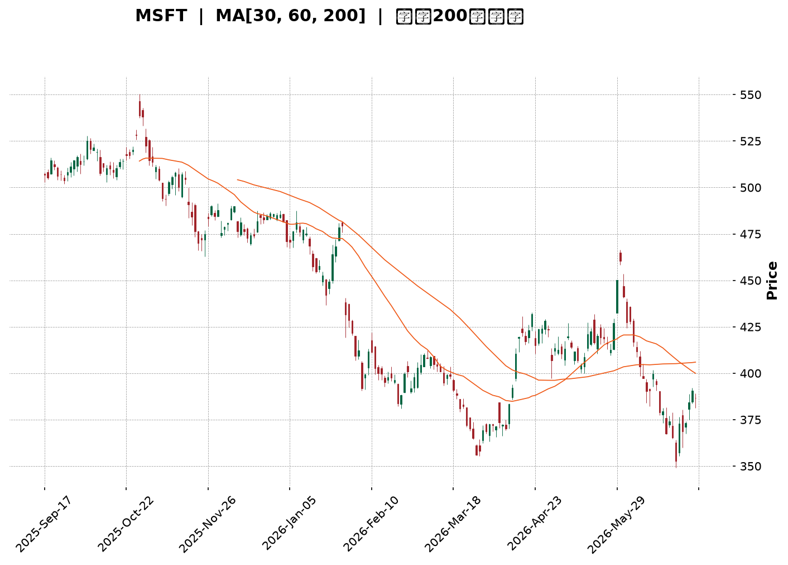
</details>

<html>
<head><meta charset="utf-8" /></head>
<body>
    <div style="height:500px; width:100%;">                        <script>window.PlotlyConfig = {MathJaxConfig: 'local'};</script>
        <script charset="utf-8" src="https://cdn.plot.ly/plotly-3.6.0.min.js" integrity="sha256-QaOVwtVY0T02VaHrr6pnoHLCwayMJp4O5n4YyaE3rJk=" crossorigin="anonymous"></script>                <div id="candlestick-chart" class="plotly-graph-div" style="height:100%; width:100%;"></div>            <script>                window.PLOTLYENV=window.PLOTLYENV || {};                                if (document.getElementById("candlestick-chart")) {                    Plotly.newPlot(                        "candlestick-chart",                        [{"close":{"dtype":"f8","bdata":"AAAAwPasf0AAAACAAJR\u002fQAAAACBdFYBAAAAAAGbzf0AAAABgZ6B\u002fQAAAAOAHr39AAAAA4Gx9f0AAAADg28N\u002fQAAAAGDI9X9AAAAA4IUVgEAAAACggyOAQAAAAED0A4BAAAAAoMAQgEAAAADA8mmAQAAAAIB1RYBAAAAAIGBMgEAAAAAg5jiAQAAAAMDou39AAAAA4Antf0AAAAAAaOV\u002fQAAAAGAu439AAAAAYD7Gf0AAAADgkOV\u002fQAAAACBNDIBAAAAAoDcTgEAAAACgHCqAQAAAAIBFKoBAAAAAoIRCgEAAAABgZoGAQAAAAKBE1YBAAAAAYCLRgEAAAAAgnFOAQAAAAOBoFIBAAAAAgDUOgEAAAABgffF\u002fQAAAAAB+f39AAAAAgIvffkAAAADgF9t+QAAAAKAMbX9AAAAAoKiXf0AAAABgxb5\u002fQAAAAED2QX9AAAAAAIKvf0AAAAAgvYR\u002fQAAAACDrqn5AAAAAwN5AfkAAAAAg8cR9QAAAAOBtYH1AAAAAYGB+fUAAAADgAK59QAAAAGCPNX5AAAAAQEKdfkAAAADgT0l+QAAAAMA9fX5AAAAAoMq5fUAAAACgVOt9QAAAAEBJEH5AAAAAIH2NfkAAAADgap1+QAAAACADx31AAAAAYDkVfkAAAADgiMZ9QAAAACBwi31AAAAAYHKkfUAAAABAJaB9QAAAACBZHX5AAAAAIEA8fkAAAABgUix+QAAAAKAQS35AAAAAgLNdfkAAAACAw1h+QAAAAAAMT35AAAAAoBlVfkAAAAAgnRd+QAAAAMB9bX1AAAAAwA5sfUAAAABgN8Z9QAAAAGA5FX5AAAAAINi\u002ffUAAAABAe9J9QAAAAMAHsX1AAAAAIFVJfUAAAABgfpV8QAAAAKAqanxAAAAAoCOdfEAAAADgE0h8QAAAAIBBontAAAAA4DwSfEAAAACgJf58QAAAAKAeQ31AAAAAgDDnfUAAAAAg6vd9QAAAAMA\u002f+XpAAAAA4B3GekAAAABA41d6QAAAAKAwlnlAAAAAwKjFeUAAAABgy354QAAAAODI9XhAAAAAwEK8eUAAAAAAAbd5QAAAACA8KXlAAAAAQO8AeUAAAADgpvh4QAAAAKCbsXhAAAAA4EDdeEAAAADglNl4QAAAAMDxxXhAAAAAoDn6d0AAAACAjEJ4QAAAAGC\u002f+3hAAAAAAKENeUAAAABgQn54QAAAAKAE23hAAAAAgOkweUAAAABAMEV5QAAAAMCtnHlAAAAA4DeBeUAAAAAgZ4h5QAAAACAhTnlAAAAAYBRAeUAAAAAg3Q95QAAAAEAfq3hAAAAAwF7xeEAAAACgv+h4QAAAAKAXb3hAAAAAIN5CeEAAAAAgt9B3QAAAAKDB4ndAAAAAYPM+d0AAAABgzyN3QAAAAIDd0nZAAAAAoPs\u002fdkAAAACA8mJ2QAAAAIDrFXdAAAAAwCUJd0AAAAAgckp3QAAAAKAvQXdAAAAAQMQ3d0AAAAAAVlh3QAAAAEA4RHdAAAAAgBghd0AAAAAAofh3QAAAAKAqhHhAAAAA4EyleUAAAADAoDV6QAAAAEAFXnpAAAAA4KkSekAAAACg5HN6QAAAAADA\u002f3pAAAAAoJ\u002fteUAAAACgPHt6QAAAACBufnpAAAAAICjFekAAAACgrnh6QAAAACBhbnlAAAAAgLXYeUAAAAAAnst5QAAAAODap3lAAAAAoAvReUAAAAAgxT16QAAAAMCQ43lAAAAAYEq8eUAAAAAgOG55QAAAACBZRXlAAAAA4LiIeUAAAABgIVB6QAAAAKD+aXpAAAAAQEkIekAAAABgZkJ6QAAAAKBwMXpAAAAAwB4pekAAAADgegB6QAAAAGC4ynlAAAAAANevekAAAAAA1yN8QAAAAOBRyHxAAAAAwPWUe0AAAACgcLV6QAAAAMDMwHpAAAAAYLgKekAAAAAA17t5QAAAAGCPNnlAAAAAgMLVeEAAAACgcGV4QAAAAADXa3hAAAAAACn8eEAAAACgR514QAAAAGCPrndAAAAAYGa2d0AAAACgcPV2QAAAAEAKX3dAAAAAIFzXdkAAAACgRw12QAAAACCFT3dAAAAAwB4Jd0AAAADgUVB3QAAAAOB6BHhAAAAAANdneEAAAAAA1yt4QA=="},"high":{"dtype":"f8","bdata":"xkoJAyjBf0DHlQzodN1\u002fQI1NpzdBIIBAPrujeNoTgECc1tfUn\u002fV\u002fQLLRMnAT1H9AHKG8Ls6sf0CDTTISSut\u002fQN8FETDHDIBArTg6KzEXgEDsymOw3ymAQCXV1\u002fiJMoBAjI9B57YpgEBFIxYrgX2AQBVgnty5c4BANVPs7hFdgECKQOnfPUiAQG8RpYdHQoBA3qw1xUcJgEB\u002f1qkVTACAQE7F1Tl7D4BAKAxrJscMgEAXZAAT4wGAQBxU1EF8G4BAY4Nk2WcbgEAUXutMZU+AQKAPkY44RYBASaXpsllQgEDpc3vPuZmAQPL76ZfhMYFAZ3DxKaj2gECaKp1r05yAQCTQDgbpb4BAc79S6j9NgEAqjZx2cQKAQMrNDKlw+X9AGUukb0dof0D7bFiiywN\u002fQBf9ylaQen9AGGy8SEmmf0CC0nWWMsd\u002fQBDUgi9L5H9AIL82xRXGf0CNqUpGWs5\u002fQOM0b3oIPX9AK1ujeS3BfkB23gCwG7Z+QHeYQkO\u002fzH1A4ZBhFpKsfUDmpD4GadB9QPTmgxhSYn5AEWq3fSKnfkBePWO3Ant+QKEO6jD+tH5AQq+iR30hfkBRRnYI+vJ9QK5+TeQbFH5Ao8tzweChfkAzdxSvAp9+QFMiewumIX5A+BzDogA+fkBB7jsQ+gR+QKqrgFtr6X1A\u002f6OnIle8fUCbyjJK8919QFmtGJHedn5ANIOZU\u002f5afkBsM8XvAml+QMsHNtSsWn5Ahn0oTNxvfkCmLvNtS19+QIx830z1Yn5ACwqIzCR4fkA0rgALnV9+QFDEwQouKH5A4Al8ZlmffUCCKNgy4cl9QBiuJF12eH5AlmxlX1IIfkC094xRFdt9QCqtp0+47X1AnXs11LqafUAHKzP1\u002fCF9QA5APmsR43xANMU45y7SfEAixHtYZWx8QARFB3DtKnxAbZTtIFEtfEAzHvZ5LlB9QLHCsqdbgn1AM1YYyqoLfkACospOhhl+QLXT8U+ciHtAOPmPjmpae0DyHNrpSM16QK9IyWXcQnpAiRYQYAUfekB6JkkS1md5QEqRPHIjAHlAlfLhMs\u002fQeUD8fAFV01x6QEQR+DHR6XlAl+ORsmJGeUBPd6Rd3zt5QD3uB4no63hAXH8XP2cMeUC5VP4m5Th5QLeiy4oV9HhAcRXVmBaoeEDWPzfQS0h4QOueaiyjCXlAQk8xzL9peUCXvPsBZr94QHOwKMEqBXlAZqeK+iJdeUAsIvlDRKJ5QEZ0cMSGq3lA9PlCS4TCeUDdyw\u002fLLJV5QDheNhIElXlAjD2dUASCeUDzhgpq4FN5QKCK6l3NPnlAUZj\u002f+jn8eECZMZJzajh5QFoP9cY80nhAOOJBiER6eEAsMJ82niJ4QOSVhXv4JXhA9SHVXUvad0BtmM7164N3QAdhKQuQXndAXw7vt6qadkBbwmM4IMl2QMAfUFWBQXdA0bFLWuhSd0DX7QfoUU13QOFktbnBTndAsLhmNVI6d0D2bCXsrwJ4QNJFkLEVS3dAI2toRkBtd0CRXrneV\u002ft3QOffb2NknXhAW0mBXZfXeUBjIvKKkT56QLYwdTBb6npATubpL6RmekBc5jXEG6R6QIC9W\u002fgzDHtA9TRJ+uhrekDD3x10gYB6QDp1fZr9onpANu2ckdrPekAf7K5bXJ56QKDCpNhj2HlAxWBPHVYDekDoKAf+7T16QFyUtXIR\u002fnlAmiO+ZEAYekBgvt6M4bB6QKT\u002fsK2aG3pAzlQE\u002fMS8eUAXpBrSoel5QLzhNAPpVnlAapGC6jKveUCBjC0M6rN6QDXBgEM4g3pAZIuo3Dz8ekCayyALAVN6QAAAAKBwpXpAAAAAYGaGekAAAADgUTx6QAAAAEAK\u002f3lAAAAAANfXekAAAACgRyV8QAAAAMAeJX1AAAAAAABYfEAAAACAPYZ7QAAAAGBmQntAAAAAIIXXekAAAABgjxJ6QAAAACCuv3lAAAAA4KNQeUAAAACgmc14QAAAAADXe3hAAAAAAAAceUAAAACgcM14QAAAAIDrZXhAAAAAgOvVd0AAAACAFNp3QAAAACCFk3dAAAAAgBSud0AAAAAgrsN2QAAAAIDCiXdAAAAAAADId0AAAABgZmJ3QAAAAKBHTXhAAAAAQDODeEAAAABgZlJ4QA=="},"hovertemplate":"\u003cb\u003e%{x|%Y-%m-%d}\u003c\u002fb\u003e\u003cbr\u003e\u958b: $%{open:.2f}\u003cbr\u003e\u9ad8: $%{high:.2f}\u003cbr\u003e\u4f4e: $%{low:.2f}\u003cbr\u003e\u6536: $%{close:.2f}\u003cextra\u003e\u003c\u002fextra\u003e","low":{"dtype":"f8","bdata":"yy85ju9rf0A2mF79cId\u002fQAaK4CyTsX9AlPFnvAfVf0DD9VB+4IF\u002fQOs78iKte39ACj0PLMldf0C4MYwD6HZ\u002fQFJWYtLWmn9A3cZGkj2nf0AQ5B79g8d\u002fQNpNKC91t39A2+riUyT8f0CXKRmogheAQLUrxlxEMYBA3LT0bmI+gEBbv7ORJhGAQEgqtGjDpn9ApaCid1vHf0DYVYhjDG1\u002fQN9+i4qlrH9A\u002fLazFOqOf0BH+VCA4IF\u002fQPKillwu439ABhCU1\u002frcf0BxI7FZnROAQK9+HALFGoBA32dp4HYrgECasNI5cm2AQMPDbAHvyoBA6dTuH9GqgEAHl0ZKrDaAQMyDv1u7\u002fX9AAmX8pZ\u002f1f0BhvqiMTYp\u002fQHWtkjNFdn9A43Hn4AjLfkAD0MwmVaJ+QEzZBfmS+n5AWc88LAQzf0Afpd85qf9+QMPgJc4pIn9AMgRAaPPkfkBwgYABuFt\u002fQAJXntN2O35AuGT4dan8fUD0gikVRZZ9QAOiXioaI31AXTIj2B4ffUApdTccQ+18QDy3WLYQ8X1APXoT9uBHfkBOmDo0BSh+QByx2VOfQn5AWTzCsX2RfUAW6OD+CaZ9QBXSZxkczH1AGPZrVLgjfkBG2CLsWGV+QIrbYjKUj31A6YRl8gCcfUARahxlpqN9QB6vjwTNZn1A9nJ3b61MfUApQ8IWTo59QAy+5hdXvH1AedPvCZ0FfkBS7A6\u002fzAh+QPdqKVF0KX5APHgULuMqfkAbxIFH4zx+QHro2qaIIH5AwnPZdI81fkBDZ6wvhBJ+QOqO91s1QX1AL7Pl9bE2fUBpQWN0rTp9QDB6BL5LvX1AE2YJ\u002fACcfUDHcTIytGF9QKpfXv0imX1AT53LtiX+fEDSX+VhSnJ8QEnwK20PXnxAgsUFoUxnfEDgkUIInPR7QEqvs9vCS3tAYKkHk6ere0BVhctGhQh8QILzOR06v3xA0SRi\u002fv5wfUCTkrKLF759QJHcQkJ0MnpA0lrW+\u002fKIekAAJrYWDEZ6QG8umF\u002f6a3lArnrTY892eUBqLRVESml4QM2oDAbZcnhAlOODzHvxeEDT4MK57K15QPameKS283hARcBbLe3DeEDKMv1BkMR4QDBO3E9+jHhAXsCckAGpeEBYmmL4AL14QI++\u002flLlpHhAgQe4QFrkd0CFPlIoKc53QMz1I4sRVXhA1Eo6QQ3eeEAhTjcxmVB4QMqFYnySXHhALS+HTSR9eEDkMdgJHvd4QJZIz3dqOHlAU0y\u002fuwh6eUC9WEsRDCp5QLuuSm3yIHlAed3Kn40LeUBb3OkTeA15QJqz\u002fgFelnhAcemdDf2eeEDuGvDxPs54QCPyT756YnhA2Eu\u002fWZMjeEDOvMSdxrR3QG4kVo+uzXdAbTDi4L0wd0BcUkd7TA13QMy2mIdpxnZAejQqDdU7dkBuQmD5KDh2QK0sDLqQpHZAnPhh23f2dkBuMFfKzrV2QFoazAs5C3dAopNL2UjcdkAzvB6Ztyl3QOb\u002fYoob5HZAFVSPT68Td0A8NR2NfSN3QDBT81X0GnhAAU4eJfa9eEC7wVoh\u002fbN5QG3y9TZ+PHpArRkxi2f2eUDx3HocxgR6QLEec+IRbHpAB61Va1WoeUB1ztzza+55QIKj67qyAnpAk7GckM9PekCT9RlKGzZ6QGSQY7xl0nhAvRTD6NiYeUDHgLA2mJ55QLc6wPapfnlAnqTLV8BDeUBc\u002f\u002fMKrh16QIPcGyqv0XlAVr\u002f2YfpJeUBC5MTALVx5QK2+i+CcAnlAaq\u002fEzzcAeUBniZYiSMB5QNi2rHJj63lAsV2bG3D5eUC4Ny3Gk6Z5QAAAACBc+3lAAAAAoEcFekAAAADgUdB5QAAAAKBHmXlAAAAAYLjKeUAAAACAwgV7QAAAAOBRpHxAAAAAQOGGe0AAAAAAAIR6QAAAAGCPpnpAAAAAYGbmeUAAAADA9Yh5QAAAACCu53hAAAAAYI\u002fSeEAAAAAAAAB4QAAAAOBR5HdAAAAAoJmNeEAAAABACmt4QAAAAMAelXdAAAAA4HpUd0AAAADAHvF2QAAAAGC4KndAAAAA4HrMdkAAAABAM9N1QAAAAEDhNnZAAAAAYGZ+dkAAAABAM\u002fd2QAAAAIA9bndAAAAAQDP7d0AAAAAghdN3QA=="},"name":"\u50f9\u683c","open":{"dtype":"f8","bdata":"tpyC6IC2f0AyxsniVcR\u002fQOYXHLuMtX9Ac6J+DsMCgEDzI18yEOl\u002fQBDCIhKwsn9AWA9FA56Rf0BXyK2Wma1\u002fQBNt5sh+xH9A04y56Sjgf0BFW+9R9vh\u002fQFVa0wIPE4BAs2nl2MMOgEDcS2H\u002fxBqAQA8X99K4Z4BAJNMKHOU\u002fgED24PYFbDiAQDk33S\u002f1IoBA3qw1xUcJgEBv2Rl5TbB\u002fQLCIU++B+39AjYSsnqrVf0AC\u002fNgHYp1\u002fQDMJzTHx9X9Ao9vVD\u002fIRgECs\u002fhgj9i6AQKYY00JgOYBADPeb0f87gEAr0ReGd4OAQHdsSQpPFIFA+SZsbhXsgEAmK2XKIXmAQPMP35FpbIBAgeJCC08kgEDJEOHfoMh\u002fQJfA0Rkd4X9A95Spl6Rnf0A1CBYGKd1+QED1GSJKDn9A8u2NJPhZf0DstqxCeKJ\u002fQGq6kiqTsX9AyRTr6oLxfkAYZMCgAJR\u002fQAGeigUKxH5AuQ\u002fEDkBwfkANghuuaKh+QEVv3oMOxn1AXPcnN06OfUBo79ymfX99QNmSYGp2Qn5AbxWV9QJXfkAa18ZAZGR+QP55U3D+SH5A8hD+2lSjfUB4e8icINp9QADGYV8XBn5AxeVzEdgrfkBL9cGm525+QDdGQeokHn5ARRai9kSofUCHyt9SFdt9QPiwzB2L331AP80bmxVdfUCg2VHHuqx9QCxFSGUewX1Aw\u002fSrGTBTfkAWMW21bz9+QEH0VhVHLX5Aj0V3Xm04fkAPcNyo1Uh+QF7Voo1dK35AYJLc5Wg8fkCq7b+d1Vp+QE5s6RHhI35AJ+zZ5lR\u002ffUBf1GioMHt9QJZHeZ8g2n1A4WznyLPxfUAKdkzrVH99QElP2SLoqH1ABuUFLjWJfUBdBEduRQZ9QLTMnUf\u002f4HxAoFQtnc18fEAUY1sNgxN8QCt0anJ+KXxAq11GzCrae0B1xTmR3R18QCwnPsHz83xAPgf3D5l5fUCxNLoOFRF+QEVyt+SgYHtALmqQHZFTe0DAc0n+UcV6QBcEpF85QnpAbXnRbdiSeUA+9UswI1p5QJ\u002f2W4Zn1nhAvjbapeEweUA6HYBPJxx6QNjJrGdb5XlAKDtZPUUzeUBOwuyIgip5QHJSiWQz13hAsW39cdbFeECmeW1CL\u002f14QEcMLAoQtHhAk\u002f6jSFeieEAiXIAF9fR3QBZEqMT5WnhAcFYoiF09eUCKgwtXkGB4QGD6xL4sgHhAooxnRKWEeECFJkuqcQZ5QDbycEq8OHlAkM0Q4AyFeUAe0z\u002fft0B5QHjAfTNNknlAjlpShBhLeUCcc6GaFjx5QJPTVkEiAnlAoxx55FrTeEAE6xSDevZ4QDXciPpYxHhAMwx1UBxUeEC0o37yQx94QABAeggg8XdAOZQmt4nYd0C6LAjTr4F3QADzJDFMIHdAgZRituKRdkBHYmS54pF2QMnqHKAxvHZAL7thx+xKd0D6JMRzqeZ2QHtPpbnsSndAd0UZQ6IYd0DQvXE5XgJ4QKrAu4seO3dAjM9hcshCd0D9WMs\u002f10x3QLVaR3FOMXhA\u002fusTxzzSeEAsy4bKPS96QHj7rydufnpA4DMuPNZDekDdYGTzTjV6QN+Yn3NNlHpAx43debgvekDaFWL4GQF6QNckfnl5V3pAj0DRTXB6ekDEiBAQmXp6QNdJhy3BnnlA4+uVhIa+eUClSKjJaKp5QL5jSz\u002fC5nlAbh95QuRxeUCrE66XOzN6QLoHu6fOB3pA3c0X59BveUCCT5\u002f5WNl5QCTv8ApCJXlAiEuGkbE5eUD705KY\u002ftV5QPOW1YGD+3lAr1YGxojPekCsrhz+ZdR5QAAAAAAAjHpAAAAA4KM4ekAAAABA4QZ6QAAAAAApsHlAAAAAIK7PeUAAAADAzAh7QAAAAKBwDX1AAAAAgBTue0AAAABAM2d7QAAAAMD1PHtAAAAAoHDFekAAAACAPeJ5QAAAAOB6kHlAAAAAwMzoeEAAAAAgXLN4QAAAAEDhdnhAAAAAwMzMeEAAAADgo7x4QAAAAAAAZHhAAAAAwB6dd0AAAAAA13t3QAAAAIAURndAAAAAwB45d0AAAADgUax2QAAAAGBmUnZAAAAAAACYd0AAAADgejB3QAAAAKBHzXdAAAAAIK4HeEAAAADA8yx4QA=="},"x":["2025-09-17T00:00:00-04:00","2025-09-18T00:00:00-04:00","2025-09-19T00:00:00-04:00","2025-09-22T00:00:00-04:00","2025-09-23T00:00:00-04:00","2025-09-24T00:00:00-04:00","2025-09-25T00:00:00-04:00","2025-09-26T00:00:00-04:00","2025-09-29T00:00:00-04:00","2025-09-30T00:00:00-04:00","2025-10-01T00:00:00-04:00","2025-10-02T00:00:00-04:00","2025-10-03T00:00:00-04:00","2025-10-06T00:00:00-04:00","2025-10-07T00:00:00-04:00","2025-10-08T00:00:00-04:00","2025-10-09T00:00:00-04:00","2025-10-10T00:00:00-04:00","2025-10-13T00:00:00-04:00","2025-10-14T00:00:00-04:00","2025-10-15T00:00:00-04:00","2025-10-16T00:00:00-04:00","2025-10-17T00:00:00-04:00","2025-10-20T00:00:00-04:00","2025-10-21T00:00:00-04:00","2025-10-22T00:00:00-04:00","2025-10-23T00:00:00-04:00","2025-10-24T00:00:00-04:00","2025-10-27T00:00:00-04:00","2025-10-28T00:00:00-04:00","2025-10-29T00:00:00-04:00","2025-10-30T00:00:00-04:00","2025-10-31T00:00:00-04:00","2025-11-03T00:00:00-05:00","2025-11-04T00:00:00-05:00","2025-11-05T00:00:00-05:00","2025-11-06T00:00:00-05:00","2025-11-07T00:00:00-05:00","2025-11-10T00:00:00-05:00","2025-11-11T00:00:00-05:00","2025-11-12T00:00:00-05:00","2025-11-13T00:00:00-05:00","2025-11-14T00:00:00-05:00","2025-11-17T00:00:00-05:00","2025-11-18T00:00:00-05:00","2025-11-19T00:00:00-05:00","2025-11-20T00:00:00-05:00","2025-11-21T00:00:00-05:00","2025-11-24T00:00:00-05:00","2025-11-25T00:00:00-05:00","2025-11-26T00:00:00-05:00","2025-11-28T00:00:00-05:00","2025-12-01T00:00:00-05:00","2025-12-02T00:00:00-05:00","2025-12-03T00:00:00-05:00","2025-12-04T00:00:00-05:00","2025-12-05T00:00:00-05:00","2025-12-08T00:00:00-05:00","2025-12-09T00:00:00-05:00","2025-12-10T00:00:00-05:00","2025-12-11T00:00:00-05:00","2025-12-12T00:00:00-05:00","2025-12-15T00:00:00-05:00","2025-12-16T00:00:00-05:00","2025-12-17T00:00:00-05:00","2025-12-18T00:00:00-05:00","2025-12-19T00:00:00-05:00","2025-12-22T00:00:00-05:00","2025-12-23T00:00:00-05:00","2025-12-24T00:00:00-05:00","2025-12-26T00:00:00-05:00","2025-12-29T00:00:00-05:00","2025-12-30T00:00:00-05:00","2025-12-31T00:00:00-05:00","2026-01-02T00:00:00-05:00","2026-01-05T00:00:00-05:00","2026-01-06T00:00:00-05:00","2026-01-07T00:00:00-05:00","2026-01-08T00:00:00-05:00","2026-01-09T00:00:00-05:00","2026-01-12T00:00:00-05:00","2026-01-13T00:00:00-05:00","2026-01-14T00:00:00-05:00","2026-01-15T00:00:00-05:00","2026-01-16T00:00:00-05:00","2026-01-20T00:00:00-05:00","2026-01-21T00:00:00-05:00","2026-01-22T00:00:00-05:00","2026-01-23T00:00:00-05:00","2026-01-26T00:00:00-05:00","2026-01-27T00:00:00-05:00","2026-01-28T00:00:00-05:00","2026-01-29T00:00:00-05:00","2026-01-30T00:00:00-05:00","2026-02-02T00:00:00-05:00","2026-02-03T00:00:00-05:00","2026-02-04T00:00:00-05:00","2026-02-05T00:00:00-05:00","2026-02-06T00:00:00-05:00","2026-02-09T00:00:00-05:00","2026-02-10T00:00:00-05:00","2026-02-11T00:00:00-05:00","2026-02-12T00:00:00-05:00","2026-02-13T00:00:00-05:00","2026-02-17T00:00:00-05:00","2026-02-18T00:00:00-05:00","2026-02-19T00:00:00-05:00","2026-02-20T00:00:00-05:00","2026-02-23T00:00:00-05:00","2026-02-24T00:00:00-05:00","2026-02-25T00:00:00-05:00","2026-02-26T00:00:00-05:00","2026-02-27T00:00:00-05:00","2026-03-02T00:00:00-05:00","2026-03-03T00:00:00-05:00","2026-03-04T00:00:00-05:00","2026-03-05T00:00:00-05:00","2026-03-06T00:00:00-05:00","2026-03-09T00:00:00-04:00","2026-03-10T00:00:00-04:00","2026-03-11T00:00:00-04:00","2026-03-12T00:00:00-04:00","2026-03-13T00:00:00-04:00","2026-03-16T00:00:00-04:00","2026-03-17T00:00:00-04:00","2026-03-18T00:00:00-04:00","2026-03-19T00:00:00-04:00","2026-03-20T00:00:00-04:00","2026-03-23T00:00:00-04:00","2026-03-24T00:00:00-04:00","2026-03-25T00:00:00-04:00","2026-03-26T00:00:00-04:00","2026-03-27T00:00:00-04:00","2026-03-30T00:00:00-04:00","2026-03-31T00:00:00-04:00","2026-04-01T00:00:00-04:00","2026-04-02T00:00:00-04:00","2026-04-06T00:00:00-04:00","2026-04-07T00:00:00-04:00","2026-04-08T00:00:00-04:00","2026-04-09T00:00:00-04:00","2026-04-10T00:00:00-04:00","2026-04-13T00:00:00-04:00","2026-04-14T00:00:00-04:00","2026-04-15T00:00:00-04:00","2026-04-16T00:00:00-04:00","2026-04-17T00:00:00-04:00","2026-04-20T00:00:00-04:00","2026-04-21T00:00:00-04:00","2026-04-22T00:00:00-04:00","2026-04-23T00:00:00-04:00","2026-04-24T00:00:00-04:00","2026-04-27T00:00:00-04:00","2026-04-28T00:00:00-04:00","2026-04-29T00:00:00-04:00","2026-04-30T00:00:00-04:00","2026-05-01T00:00:00-04:00","2026-05-04T00:00:00-04:00","2026-05-05T00:00:00-04:00","2026-05-06T00:00:00-04:00","2026-05-07T00:00:00-04:00","2026-05-08T00:00:00-04:00","2026-05-11T00:00:00-04:00","2026-05-12T00:00:00-04:00","2026-05-13T00:00:00-04:00","2026-05-14T00:00:00-04:00","2026-05-15T00:00:00-04:00","2026-05-18T00:00:00-04:00","2026-05-19T00:00:00-04:00","2026-05-20T00:00:00-04:00","2026-05-21T00:00:00-04:00","2026-05-22T00:00:00-04:00","2026-05-26T00:00:00-04:00","2026-05-27T00:00:00-04:00","2026-05-28T00:00:00-04:00","2026-05-29T00:00:00-04:00","2026-06-01T00:00:00-04:00","2026-06-02T00:00:00-04:00","2026-06-03T00:00:00-04:00","2026-06-04T00:00:00-04:00","2026-06-05T00:00:00-04:00","2026-06-08T00:00:00-04:00","2026-06-09T00:00:00-04:00","2026-06-10T00:00:00-04:00","2026-06-11T00:00:00-04:00","2026-06-12T00:00:00-04:00","2026-06-15T00:00:00-04:00","2026-06-16T00:00:00-04:00","2026-06-17T00:00:00-04:00","2026-06-18T00:00:00-04:00","2026-06-22T00:00:00-04:00","2026-06-23T00:00:00-04:00","2026-06-24T00:00:00-04:00","2026-06-25T00:00:00-04:00","2026-06-26T00:00:00-04:00","2026-06-29T00:00:00-04:00","2026-06-30T00:00:00-04:00","2026-07-01T00:00:00-04:00","2026-07-02T00:00:00-04:00","2026-07-06T00:00:00-04:00"],"type":"candlestick"},{"hovertemplate":"MA30: $%{y:.2f}\u003cextra\u003e\u003c\u002fextra\u003e","line":{"color":"#2196F3","dash":"dash","width":2},"mode":"lines","name":"MA30","x":["2025-09-17T00:00:00-04:00","2025-09-18T00:00:00-04:00","2025-09-19T00:00:00-04:00","2025-09-22T00:00:00-04:00","2025-09-23T00:00:00-04:00","2025-09-24T00:00:00-04:00","2025-09-25T00:00:00-04:00","2025-09-26T00:00:00-04:00","2025-09-29T00:00:00-04:00","2025-09-30T00:00:00-04:00","2025-10-01T00:00:00-04:00","2025-10-02T00:00:00-04:00","2025-10-03T00:00:00-04:00","2025-10-06T00:00:00-04:00","2025-10-07T00:00:00-04:00","2025-10-08T00:00:00-04:00","2025-10-09T00:00:00-04:00","2025-10-10T00:00:00-04:00","2025-10-13T00:00:00-04:00","2025-10-14T00:00:00-04:00","2025-10-15T00:00:00-04:00","2025-10-16T00:00:00-04:00","2025-10-17T00:00:00-04:00","2025-10-20T00:00:00-04:00","2025-10-21T00:00:00-04:00","2025-10-22T00:00:00-04:00","2025-10-23T00:00:00-04:00","2025-10-24T00:00:00-04:00","2025-10-27T00:00:00-04:00","2025-10-28T00:00:00-04:00","2025-10-29T00:00:00-04:00","2025-10-30T00:00:00-04:00","2025-10-31T00:00:00-04:00","2025-11-03T00:00:00-05:00","2025-11-04T00:00:00-05:00","2025-11-05T00:00:00-05:00","2025-11-06T00:00:00-05:00","2025-11-07T00:00:00-05:00","2025-11-10T00:00:00-05:00","2025-11-11T00:00:00-05:00","2025-11-12T00:00:00-05:00","2025-11-13T00:00:00-05:00","2025-11-14T00:00:00-05:00","2025-11-17T00:00:00-05:00","2025-11-18T00:00:00-05:00","2025-11-19T00:00:00-05:00","2025-11-20T00:00:00-05:00","2025-11-21T00:00:00-05:00","2025-11-24T00:00:00-05:00","2025-11-25T00:00:00-05:00","2025-11-26T00:00:00-05:00","2025-11-28T00:00:00-05:00","2025-12-01T00:00:00-05:00","2025-12-02T00:00:00-05:00","2025-12-03T00:00:00-05:00","2025-12-04T00:00:00-05:00","2025-12-05T00:00:00-05:00","2025-12-08T00:00:00-05:00","2025-12-09T00:00:00-05:00","2025-12-10T00:00:00-05:00","2025-12-11T00:00:00-05:00","2025-12-12T00:00:00-05:00","2025-12-15T00:00:00-05:00","2025-12-16T00:00:00-05:00","2025-12-17T00:00:00-05:00","2025-12-18T00:00:00-05:00","2025-12-19T00:00:00-05:00","2025-12-22T00:00:00-05:00","2025-12-23T00:00:00-05:00","2025-12-24T00:00:00-05:00","2025-12-26T00:00:00-05:00","2025-12-29T00:00:00-05:00","2025-12-30T00:00:00-05:00","2025-12-31T00:00:00-05:00","2026-01-02T00:00:00-05:00","2026-01-05T00:00:00-05:00","2026-01-06T00:00:00-05:00","2026-01-07T00:00:00-05:00","2026-01-08T00:00:00-05:00","2026-01-09T00:00:00-05:00","2026-01-12T00:00:00-05:00","2026-01-13T00:00:00-05:00","2026-01-14T00:00:00-05:00","2026-01-15T00:00:00-05:00","2026-01-16T00:00:00-05:00","2026-01-20T00:00:00-05:00","2026-01-21T00:00:00-05:00","2026-01-22T00:00:00-05:00","2026-01-23T00:00:00-05:00","2026-01-26T00:00:00-05:00","2026-01-27T00:00:00-05:00","2026-01-28T00:00:00-05:00","2026-01-29T00:00:00-05:00","2026-01-30T00:00:00-05:00","2026-02-02T00:00:00-05:00","2026-02-03T00:00:00-05:00","2026-02-04T00:00:00-05:00","2026-02-05T00:00:00-05:00","2026-02-06T00:00:00-05:00","2026-02-09T00:00:00-05:00","2026-02-10T00:00:00-05:00","2026-02-11T00:00:00-05:00","2026-02-12T00:00:00-05:00","2026-02-13T00:00:00-05:00","2026-02-17T00:00:00-05:00","2026-02-18T00:00:00-05:00","2026-02-19T00:00:00-05:00","2026-02-20T00:00:00-05:00","2026-02-23T00:00:00-05:00","2026-02-24T00:00:00-05:00","2026-02-25T00:00:00-05:00","2026-02-26T00:00:00-05:00","2026-02-27T00:00:00-05:00","2026-03-02T00:00:00-05:00","2026-03-03T00:00:00-05:00","2026-03-04T00:00:00-05:00","2026-03-05T00:00:00-05:00","2026-03-06T00:00:00-05:00","2026-03-09T00:00:00-04:00","2026-03-10T00:00:00-04:00","2026-03-11T00:00:00-04:00","2026-03-12T00:00:00-04:00","2026-03-13T00:00:00-04:00","2026-03-16T00:00:00-04:00","2026-03-17T00:00:00-04:00","2026-03-18T00:00:00-04:00","2026-03-19T00:00:00-04:00","2026-03-20T00:00:00-04:00","2026-03-23T00:00:00-04:00","2026-03-24T00:00:00-04:00","2026-03-25T00:00:00-04:00","2026-03-26T00:00:00-04:00","2026-03-27T00:00:00-04:00","2026-03-30T00:00:00-04:00","2026-03-31T00:00:00-04:00","2026-04-01T00:00:00-04:00","2026-04-02T00:00:00-04:00","2026-04-06T00:00:00-04:00","2026-04-07T00:00:00-04:00","2026-04-08T00:00:00-04:00","2026-04-09T00:00:00-04:00","2026-04-10T00:00:00-04:00","2026-04-13T00:00:00-04:00","2026-04-14T00:00:00-04:00","2026-04-15T00:00:00-04:00","2026-04-16T00:00:00-04:00","2026-04-17T00:00:00-04:00","2026-04-20T00:00:00-04:00","2026-04-21T00:00:00-04:00","2026-04-22T00:00:00-04:00","2026-04-23T00:00:00-04:00","2026-04-24T00:00:00-04:00","2026-04-27T00:00:00-04:00","2026-04-28T00:00:00-04:00","2026-04-29T00:00:00-04:00","2026-04-30T00:00:00-04:00","2026-05-01T00:00:00-04:00","2026-05-04T00:00:00-04:00","2026-05-05T00:00:00-04:00","2026-05-06T00:00:00-04:00","2026-05-07T00:00:00-04:00","2026-05-08T00:00:00-04:00","2026-05-11T00:00:00-04:00","2026-05-12T00:00:00-04:00","2026-05-13T00:00:00-04:00","2026-05-14T00:00:00-04:00","2026-05-15T00:00:00-04:00","2026-05-18T00:00:00-04:00","2026-05-19T00:00:00-04:00","2026-05-20T00:00:00-04:00","2026-05-21T00:00:00-04:00","2026-05-22T00:00:00-04:00","2026-05-26T00:00:00-04:00","2026-05-27T00:00:00-04:00","2026-05-28T00:00:00-04:00","2026-05-29T00:00:00-04:00","2026-06-01T00:00:00-04:00","2026-06-02T00:00:00-04:00","2026-06-03T00:00:00-04:00","2026-06-04T00:00:00-04:00","2026-06-05T00:00:00-04:00","2026-06-08T00:00:00-04:00","2026-06-09T00:00:00-04:00","2026-06-10T00:00:00-04:00","2026-06-11T00:00:00-04:00","2026-06-12T00:00:00-04:00","2026-06-15T00:00:00-04:00","2026-06-16T00:00:00-04:00","2026-06-17T00:00:00-04:00","2026-06-18T00:00:00-04:00","2026-06-22T00:00:00-04:00","2026-06-23T00:00:00-04:00","2026-06-24T00:00:00-04:00","2026-06-25T00:00:00-04:00","2026-06-26T00:00:00-04:00","2026-06-29T00:00:00-04:00","2026-06-30T00:00:00-04:00","2026-07-01T00:00:00-04:00","2026-07-02T00:00:00-04:00","2026-07-06T00:00:00-04:00"],"y":{"dtype":"f8","bdata":"AAAAAAAA+H8AAAAAAAD4fwAAAAAAAPh\u002fAAAAAAAA+H8AAAAAAAD4fwAAAAAAAPh\u002fAAAAAAAA+H8AAAAAAAD4fwAAAAAAAPh\u002fAAAAAAAA+H8AAAAAAAD4fwAAAAAAAPh\u002fAAAAAAAA+H8AAAAAAAD4fwAAAAAAAPh\u002fAAAAAAAA+H8AAAAAAAD4fwAAAAAAAPh\u002fAAAAAAAA+H8AAAAAAAD4fwAAAAAAAPh\u002fAAAAAAAA+H8AAAAAAAD4fwAAAAAAAPh\u002fAAAAAAAA+H8AAAAAAAD4fwAAAAAAAPh\u002fAAAAAAAA+H8AAAAAAAD4fzMzM\u002fuhEYBAmpmZ4fwZgEDNzMwkkx6AQImIiACLHoBAzczMBDofgEBERET8kyCAQHd3dyfJH4BAAAAAiCcdgEDe3d1lRhmAQImIiAD\u002fFoBAZmZmJooUgEARERHJRBKAQO\u002fu7jb4DoBAvLu70xENgEAiIiLSeweAQFVVVaX3\u002fn9AmpmZqfjqf0Dv7u6OJNR\u002fQM3MzNwGwH9Aq6qqekWrf0BERESkW5h\u002fQKuqqooJin9AVVVVRSOAf0Dv7u5eZXJ\u002fQGZmZhavZH9A7+7u7v5Pf0B3d3fHbjt\u002fQBEREUEXKH9AERERUU4Xf0Dv7u4e3AJ\u002fQLy7u\u002fus4X5A3t3dzV\u002fDfkDNzMxs0ap+QO\u002fu7l6BlH5AzczMjHB\u002ffkCJiIhYqWt+QBEREVHbX35A7+7u3mlafkDNzMx8llR+QERERPTrSn5AmpmZ2XRAfkCrqqrahTR+QKuqqvpsLH5Ad3d39+AgfkC8u7s7tRR+QFVVVYUgCn5AVVVVhQgDfkBVVVVlEwN+QN7d3S0aCX5AZmZm1kgLfkDe3d0dgAx+QCIiIjIVCH5A3t3dfcD8fUAiIiKCOe59QLy7u6uF3H1AMzMzowjTfUAzMzMDD8V9QFVVVQVTsH1AZmZmNiabfUAiIiKSTo19QGZmZhbpiH1AIiIiQmCHfUAiIiKiBYl9QGZmZhYVc31A3t3dzZpafUCrqqqamD59QO\u002fu7h71F31AIiIiAt\u002fxfEAzMzOTa8F8QO\u002fu7i7pk3xAzczMbGVsfEARERHx3kR8QM3MzJzxGHxAvLu7u3jre0C8u7vbxb97QERERHRgl3tAmpmZuXtwe0Dv7u5OdkZ7QO\u002fu7h4nGXtAq6qqGubnekBmZmY2b7h6QCIiIiJCkHpAd3d3hyJsekAREREhOkl6QO\u002fu7v7aKnpAvLu726UNekCrqqqa8\u002fN5QCIiIvKy4nlAERERYczMeUB3d3cHRq95QImIiNiBjXlAVVVVtc1leUCJiIho7zt5QImIiKhDKHlAAAAAsKMYeUBERETEZgx5QJqZmZmQAnlAq6qq+qv1eEARERGB3u94QImIiJiz5nhAd3d3N3XReECJiIgYfLt4QCIiIgKKp3hAvLu7awqQeEAAAADg+3l4QN7d3c1CbHhAzczMTKhceEB3d3dXWk94QAAAAPBkQnhA7+7ujuk7eEARERHxGjR4QN7d3U10JXhAq6qqWgkVeECrqqoKlRB4QImIiOivDXhAZmZmFpEReEBmZmbWlBl4QAAAALAGIHhAIiIi0t8keEBmZmZWuSx4QBEREZEtO3hAmpmZefZAeEAiIiJCE014QERERPSmXHhAvLu7uz5seEAAAACAk3l4QDMzM\u002fMVgnhAERERIZ2PeEARERGxgqB4QCIiIiKdr3hAAAAA4IzFeEAAAAAABOB4QLy7uxss+nhAd3d3d+oXeUARERFB5DF5QKuqqgqKRHlA7+7uvttZeUCrqqrapXN5QAAAALCbjnlA7+7uHqCmeUCJiIiIfr95QBEREeF32HlARERE9FXyeUBEREQEqgN6QLy7u5uMDnpAREREFG8XekCrqqpa6Cd6QCIiIoKEPHpAd3d352RJekDNzMw8lEt6QAAAABB7SXpAq6qqWnNKekCamZkZEkR6QGZmZkYkOXpAMzMz46AoekDv7u6e6xZ6QKuqqmpNDnpAZmZmZvMGekBERER03\u002fx5QKuqqpoH7HlAmpmZKRPaeUCJiIhYEL55QFVVVWWUqHlAmpmZyeGPeUCJiIj4DHN5QERERLRSYnlARERExABNeUCJiIjIaDN5QFVVVXX1HnlAiYiIyBMReUBEREQ0Qv94QA=="},"type":"scatter"},{"hovertemplate":"MA60: $%{y:.2f}\u003cextra\u003e\u003c\u002fextra\u003e","line":{"color":"#9C27B0","dash":"dash","width":2},"mode":"lines","name":"MA60","x":["2025-09-17T00:00:00-04:00","2025-09-18T00:00:00-04:00","2025-09-19T00:00:00-04:00","2025-09-22T00:00:00-04:00","2025-09-23T00:00:00-04:00","2025-09-24T00:00:00-04:00","2025-09-25T00:00:00-04:00","2025-09-26T00:00:00-04:00","2025-09-29T00:00:00-04:00","2025-09-30T00:00:00-04:00","2025-10-01T00:00:00-04:00","2025-10-02T00:00:00-04:00","2025-10-03T00:00:00-04:00","2025-10-06T00:00:00-04:00","2025-10-07T00:00:00-04:00","2025-10-08T00:00:00-04:00","2025-10-09T00:00:00-04:00","2025-10-10T00:00:00-04:00","2025-10-13T00:00:00-04:00","2025-10-14T00:00:00-04:00","2025-10-15T00:00:00-04:00","2025-10-16T00:00:00-04:00","2025-10-17T00:00:00-04:00","2025-10-20T00:00:00-04:00","2025-10-21T00:00:00-04:00","2025-10-22T00:00:00-04:00","2025-10-23T00:00:00-04:00","2025-10-24T00:00:00-04:00","2025-10-27T00:00:00-04:00","2025-10-28T00:00:00-04:00","2025-10-29T00:00:00-04:00","2025-10-30T00:00:00-04:00","2025-10-31T00:00:00-04:00","2025-11-03T00:00:00-05:00","2025-11-04T00:00:00-05:00","2025-11-05T00:00:00-05:00","2025-11-06T00:00:00-05:00","2025-11-07T00:00:00-05:00","2025-11-10T00:00:00-05:00","2025-11-11T00:00:00-05:00","2025-11-12T00:00:00-05:00","2025-11-13T00:00:00-05:00","2025-11-14T00:00:00-05:00","2025-11-17T00:00:00-05:00","2025-11-18T00:00:00-05:00","2025-11-19T00:00:00-05:00","2025-11-20T00:00:00-05:00","2025-11-21T00:00:00-05:00","2025-11-24T00:00:00-05:00","2025-11-25T00:00:00-05:00","2025-11-26T00:00:00-05:00","2025-11-28T00:00:00-05:00","2025-12-01T00:00:00-05:00","2025-12-02T00:00:00-05:00","2025-12-03T00:00:00-05:00","2025-12-04T00:00:00-05:00","2025-12-05T00:00:00-05:00","2025-12-08T00:00:00-05:00","2025-12-09T00:00:00-05:00","2025-12-10T00:00:00-05:00","2025-12-11T00:00:00-05:00","2025-12-12T00:00:00-05:00","2025-12-15T00:00:00-05:00","2025-12-16T00:00:00-05:00","2025-12-17T00:00:00-05:00","2025-12-18T00:00:00-05:00","2025-12-19T00:00:00-05:00","2025-12-22T00:00:00-05:00","2025-12-23T00:00:00-05:00","2025-12-24T00:00:00-05:00","2025-12-26T00:00:00-05:00","2025-12-29T00:00:00-05:00","2025-12-30T00:00:00-05:00","2025-12-31T00:00:00-05:00","2026-01-02T00:00:00-05:00","2026-01-05T00:00:00-05:00","2026-01-06T00:00:00-05:00","2026-01-07T00:00:00-05:00","2026-01-08T00:00:00-05:00","2026-01-09T00:00:00-05:00","2026-01-12T00:00:00-05:00","2026-01-13T00:00:00-05:00","2026-01-14T00:00:00-05:00","2026-01-15T00:00:00-05:00","2026-01-16T00:00:00-05:00","2026-01-20T00:00:00-05:00","2026-01-21T00:00:00-05:00","2026-01-22T00:00:00-05:00","2026-01-23T00:00:00-05:00","2026-01-26T00:00:00-05:00","2026-01-27T00:00:00-05:00","2026-01-28T00:00:00-05:00","2026-01-29T00:00:00-05:00","2026-01-30T00:00:00-05:00","2026-02-02T00:00:00-05:00","2026-02-03T00:00:00-05:00","2026-02-04T00:00:00-05:00","2026-02-05T00:00:00-05:00","2026-02-06T00:00:00-05:00","2026-02-09T00:00:00-05:00","2026-02-10T00:00:00-05:00","2026-02-11T00:00:00-05:00","2026-02-12T00:00:00-05:00","2026-02-13T00:00:00-05:00","2026-02-17T00:00:00-05:00","2026-02-18T00:00:00-05:00","2026-02-19T00:00:00-05:00","2026-02-20T00:00:00-05:00","2026-02-23T00:00:00-05:00","2026-02-24T00:00:00-05:00","2026-02-25T00:00:00-05:00","2026-02-26T00:00:00-05:00","2026-02-27T00:00:00-05:00","2026-03-02T00:00:00-05:00","2026-03-03T00:00:00-05:00","2026-03-04T00:00:00-05:00","2026-03-05T00:00:00-05:00","2026-03-06T00:00:00-05:00","2026-03-09T00:00:00-04:00","2026-03-10T00:00:00-04:00","2026-03-11T00:00:00-04:00","2026-03-12T00:00:00-04:00","2026-03-13T00:00:00-04:00","2026-03-16T00:00:00-04:00","2026-03-17T00:00:00-04:00","2026-03-18T00:00:00-04:00","2026-03-19T00:00:00-04:00","2026-03-20T00:00:00-04:00","2026-03-23T00:00:00-04:00","2026-03-24T00:00:00-04:00","2026-03-25T00:00:00-04:00","2026-03-26T00:00:00-04:00","2026-03-27T00:00:00-04:00","2026-03-30T00:00:00-04:00","2026-03-31T00:00:00-04:00","2026-04-01T00:00:00-04:00","2026-04-02T00:00:00-04:00","2026-04-06T00:00:00-04:00","2026-04-07T00:00:00-04:00","2026-04-08T00:00:00-04:00","2026-04-09T00:00:00-04:00","2026-04-10T00:00:00-04:00","2026-04-13T00:00:00-04:00","2026-04-14T00:00:00-04:00","2026-04-15T00:00:00-04:00","2026-04-16T00:00:00-04:00","2026-04-17T00:00:00-04:00","2026-04-20T00:00:00-04:00","2026-04-21T00:00:00-04:00","2026-04-22T00:00:00-04:00","2026-04-23T00:00:00-04:00","2026-04-24T00:00:00-04:00","2026-04-27T00:00:00-04:00","2026-04-28T00:00:00-04:00","2026-04-29T00:00:00-04:00","2026-04-30T00:00:00-04:00","2026-05-01T00:00:00-04:00","2026-05-04T00:00:00-04:00","2026-05-05T00:00:00-04:00","2026-05-06T00:00:00-04:00","2026-05-07T00:00:00-04:00","2026-05-08T00:00:00-04:00","2026-05-11T00:00:00-04:00","2026-05-12T00:00:00-04:00","2026-05-13T00:00:00-04:00","2026-05-14T00:00:00-04:00","2026-05-15T00:00:00-04:00","2026-05-18T00:00:00-04:00","2026-05-19T00:00:00-04:00","2026-05-20T00:00:00-04:00","2026-05-21T00:00:00-04:00","2026-05-22T00:00:00-04:00","2026-05-26T00:00:00-04:00","2026-05-27T00:00:00-04:00","2026-05-28T00:00:00-04:00","2026-05-29T00:00:00-04:00","2026-06-01T00:00:00-04:00","2026-06-02T00:00:00-04:00","2026-06-03T00:00:00-04:00","2026-06-04T00:00:00-04:00","2026-06-05T00:00:00-04:00","2026-06-08T00:00:00-04:00","2026-06-09T00:00:00-04:00","2026-06-10T00:00:00-04:00","2026-06-11T00:00:00-04:00","2026-06-12T00:00:00-04:00","2026-06-15T00:00:00-04:00","2026-06-16T00:00:00-04:00","2026-06-17T00:00:00-04:00","2026-06-18T00:00:00-04:00","2026-06-22T00:00:00-04:00","2026-06-23T00:00:00-04:00","2026-06-24T00:00:00-04:00","2026-06-25T00:00:00-04:00","2026-06-26T00:00:00-04:00","2026-06-29T00:00:00-04:00","2026-06-30T00:00:00-04:00","2026-07-01T00:00:00-04:00","2026-07-02T00:00:00-04:00","2026-07-06T00:00:00-04:00"],"y":{"dtype":"f8","bdata":"AAAAAAAA+H8AAAAAAAD4fwAAAAAAAPh\u002fAAAAAAAA+H8AAAAAAAD4fwAAAAAAAPh\u002fAAAAAAAA+H8AAAAAAAD4fwAAAAAAAPh\u002fAAAAAAAA+H8AAAAAAAD4fwAAAAAAAPh\u002fAAAAAAAA+H8AAAAAAAD4fwAAAAAAAPh\u002fAAAAAAAA+H8AAAAAAAD4fwAAAAAAAPh\u002fAAAAAAAA+H8AAAAAAAD4fwAAAAAAAPh\u002fAAAAAAAA+H8AAAAAAAD4fwAAAAAAAPh\u002fAAAAAAAA+H8AAAAAAAD4fwAAAAAAAPh\u002fAAAAAAAA+H8AAAAAAAD4fwAAAAAAAPh\u002fAAAAAAAA+H8AAAAAAAD4fwAAAAAAAPh\u002fAAAAAAAA+H8AAAAAAAD4fwAAAAAAAPh\u002fAAAAAAAA+H8AAAAAAAD4fwAAAAAAAPh\u002fAAAAAAAA+H8AAAAAAAD4fwAAAAAAAPh\u002fAAAAAAAA+H8AAAAAAAD4fwAAAAAAAPh\u002fAAAAAAAA+H8AAAAAAAD4fwAAAAAAAPh\u002fAAAAAAAA+H8AAAAAAAD4fwAAAAAAAPh\u002fAAAAAAAA+H8AAAAAAAD4fwAAAAAAAPh\u002fAAAAAAAA+H8AAAAAAAD4fwAAAAAAAPh\u002fAAAAAAAA+H8AAAAAAAD4fxEREXl4gn9AiYiIyKx7f0AzMzPb+3N\u002fQAAAALDLaH9AMzMzS\u002fJef0CJiIioaFZ\u002fQAAAANC2T39Ad3d3d1xKf0BERESkkUN\u002fQKuqqvp0PH9AMzMzk8Q0f0BmZma2hyx\u002fQERERLQuJX9Ad3d3T4Idf0AAAABw1hF\u002fQFVVVRWMBH9Ad3d3lwD3fkAiIiL6m+t+QFVVVYWQ5H5AiYiIKEfbfkARERHhbdJ+QGZmZl4PyX5AmpmZ4XG+fkCJiIhwT7B+QBEREWGaoH5AERERyYORfkBVVVXlPoB+QDMzMyM1bH5AvLu7QzpZfkCJiIhYFUh+QBEREQlLNX5AAAAACGAlfkB3d3eH6xl+QKuqqjrLA35AVVVVrQXtfUCamZn5INV9QAAAADjou31AiYiIcCSmfUAAAAAIAYt9QJqZmZFqb31AMzMzI21WfUDe3d1lsjx9QLy7u0uvIn1AmpmZ2SwGfUC8u7uLPep8QM3MzHzA0HxAd3d3H8K5fEAiIiLaxKR8QGZmZqYgkXxAiYiIeJd5fEAiIiKqd2J8QCIiIqorTHxAq6qqgnE0fECamZnRuRt8QFVVVVWwA3xAd3d3P1fwe0Dv7u5Ogdx7QLy7u\u002fuCyXtAvLu7S\u002fmze0DNzMxMSp57QHd3d3c1i3tAvLu7+5Z2e0BVVVWFemJ7QHd3d1+sTXtA7+7uPp85e0B3d3evfyV7QERERNxCDXtAZmZmfsXzekAiIiIKpdh6QLy7u2NOvXpAIiIiUu2eekDNzMyELYB6QHd3d889YHpAvLu7k8E9ekDe3d3d4Bx6QBEREaHRAXpAMzMzA5LmeUAzMzNT6Mp5QHd3dwfGrXlAzczM1OeReUC8u7sTRXZ5QAAAADjbWnlAERER8ZVAeUDe3d2V5yx5QLy7u3NFHHlAEREReZsPeUCJiIg4xAZ5QBEREdFcAXlAmpmZGdb4eEDv7u6u\u002f+14QM3MzLRX5HhAd3d3F2LTeEBVVVVVgcR4QGZmZk51wnhA3t3dNXHCeEAiIiIi\u002fcJ4QGZmZkZTwnhA3t3djaTCeEARERGZMMh4QFVVVV0oy3hAvLu7C4HLeEBEREQMwM14QO\u002fu7g7b0HhAmpmZcfrTeECJiIgQ8NV4QERERGxm2HhA3t3dBULbeEAREREZgOF4QAAAAFCA6HhA7+7u1kTxeEDNzMy8zPl4QHd3dxf2\u002fnhAd3d3p68DeUB3d3eHHwp5QCIiIkIeDnlAVVVVFYAUeUCJiIiYviB5QBEREZlFLnlAzczMXCI3eUCamZnJJjx5QImIiFBUQnlAIiIi6rRFeUDe3d2tkkh5QFVVVZ3lSnlAd3d3z29KeUB3d3ePP0h5QO\u002fu7q4xSHlAvLu7Q0hLeUCrqqoSsU55QGZmZl7STXlAzczMBNBPeUBEREQsCk95QImIiEBgUXlAiYiIIOZTeUDNzMyceFJ5QHd3d19uU3lAmpmZQW5TeUCamZlRh1N5QKuqqpLIVnlAvLu789lbeUBmZmZeYF95QA=="},"type":"scatter"},{"hovertemplate":"MA200: $%{y:.2f}\u003cextra\u003e\u003c\u002fextra\u003e","line":{"color":"#FF6F00","dash":"solid","width":2},"mode":"lines","name":"MA200","x":["2025-09-17T00:00:00-04:00","2025-09-18T00:00:00-04:00","2025-09-19T00:00:00-04:00","2025-09-22T00:00:00-04:00","2025-09-23T00:00:00-04:00","2025-09-24T00:00:00-04:00","2025-09-25T00:00:00-04:00","2025-09-26T00:00:00-04:00","2025-09-29T00:00:00-04:00","2025-09-30T00:00:00-04:00","2025-10-01T00:00:00-04:00","2025-10-02T00:00:00-04:00","2025-10-03T00:00:00-04:00","2025-10-06T00:00:00-04:00","2025-10-07T00:00:00-04:00","2025-10-08T00:00:00-04:00","2025-10-09T00:00:00-04:00","2025-10-10T00:00:00-04:00","2025-10-13T00:00:00-04:00","2025-10-14T00:00:00-04:00","2025-10-15T00:00:00-04:00","2025-10-16T00:00:00-04:00","2025-10-17T00:00:00-04:00","2025-10-20T00:00:00-04:00","2025-10-21T00:00:00-04:00","2025-10-22T00:00:00-04:00","2025-10-23T00:00:00-04:00","2025-10-24T00:00:00-04:00","2025-10-27T00:00:00-04:00","2025-10-28T00:00:00-04:00","2025-10-29T00:00:00-04:00","2025-10-30T00:00:00-04:00","2025-10-31T00:00:00-04:00","2025-11-03T00:00:00-05:00","2025-11-04T00:00:00-05:00","2025-11-05T00:00:00-05:00","2025-11-06T00:00:00-05:00","2025-11-07T00:00:00-05:00","2025-11-10T00:00:00-05:00","2025-11-11T00:00:00-05:00","2025-11-12T00:00:00-05:00","2025-11-13T00:00:00-05:00","2025-11-14T00:00:00-05:00","2025-11-17T00:00:00-05:00","2025-11-18T00:00:00-05:00","2025-11-19T00:00:00-05:00","2025-11-20T00:00:00-05:00","2025-11-21T00:00:00-05:00","2025-11-24T00:00:00-05:00","2025-11-25T00:00:00-05:00","2025-11-26T00:00:00-05:00","2025-11-28T00:00:00-05:00","2025-12-01T00:00:00-05:00","2025-12-02T00:00:00-05:00","2025-12-03T00:00:00-05:00","2025-12-04T00:00:00-05:00","2025-12-05T00:00:00-05:00","2025-12-08T00:00:00-05:00","2025-12-09T00:00:00-05:00","2025-12-10T00:00:00-05:00","2025-12-11T00:00:00-05:00","2025-12-12T00:00:00-05:00","2025-12-15T00:00:00-05:00","2025-12-16T00:00:00-05:00","2025-12-17T00:00:00-05:00","2025-12-18T00:00:00-05:00","2025-12-19T00:00:00-05:00","2025-12-22T00:00:00-05:00","2025-12-23T00:00:00-05:00","2025-12-24T00:00:00-05:00","2025-12-26T00:00:00-05:00","2025-12-29T00:00:00-05:00","2025-12-30T00:00:00-05:00","2025-12-31T00:00:00-05:00","2026-01-02T00:00:00-05:00","2026-01-05T00:00:00-05:00","2026-01-06T00:00:00-05:00","2026-01-07T00:00:00-05:00","2026-01-08T00:00:00-05:00","2026-01-09T00:00:00-05:00","2026-01-12T00:00:00-05:00","2026-01-13T00:00:00-05:00","2026-01-14T00:00:00-05:00","2026-01-15T00:00:00-05:00","2026-01-16T00:00:00-05:00","2026-01-20T00:00:00-05:00","2026-01-21T00:00:00-05:00","2026-01-22T00:00:00-05:00","2026-01-23T00:00:00-05:00","2026-01-26T00:00:00-05:00","2026-01-27T00:00:00-05:00","2026-01-28T00:00:00-05:00","2026-01-29T00:00:00-05:00","2026-01-30T00:00:00-05:00","2026-02-02T00:00:00-05:00","2026-02-03T00:00:00-05:00","2026-02-04T00:00:00-05:00","2026-02-05T00:00:00-05:00","2026-02-06T00:00:00-05:00","2026-02-09T00:00:00-05:00","2026-02-10T00:00:00-05:00","2026-02-11T00:00:00-05:00","2026-02-12T00:00:00-05:00","2026-02-13T00:00:00-05:00","2026-02-17T00:00:00-05:00","2026-02-18T00:00:00-05:00","2026-02-19T00:00:00-05:00","2026-02-20T00:00:00-05:00","2026-02-23T00:00:00-05:00","2026-02-24T00:00:00-05:00","2026-02-25T00:00:00-05:00","2026-02-26T00:00:00-05:00","2026-02-27T00:00:00-05:00","2026-03-02T00:00:00-05:00","2026-03-03T00:00:00-05:00","2026-03-04T00:00:00-05:00","2026-03-05T00:00:00-05:00","2026-03-06T00:00:00-05:00","2026-03-09T00:00:00-04:00","2026-03-10T00:00:00-04:00","2026-03-11T00:00:00-04:00","2026-03-12T00:00:00-04:00","2026-03-13T00:00:00-04:00","2026-03-16T00:00:00-04:00","2026-03-17T00:00:00-04:00","2026-03-18T00:00:00-04:00","2026-03-19T00:00:00-04:00","2026-03-20T00:00:00-04:00","2026-03-23T00:00:00-04:00","2026-03-24T00:00:00-04:00","2026-03-25T00:00:00-04:00","2026-03-26T00:00:00-04:00","2026-03-27T00:00:00-04:00","2026-03-30T00:00:00-04:00","2026-03-31T00:00:00-04:00","2026-04-01T00:00:00-04:00","2026-04-02T00:00:00-04:00","2026-04-06T00:00:00-04:00","2026-04-07T00:00:00-04:00","2026-04-08T00:00:00-04:00","2026-04-09T00:00:00-04:00","2026-04-10T00:00:00-04:00","2026-04-13T00:00:00-04:00","2026-04-14T00:00:00-04:00","2026-04-15T00:00:00-04:00","2026-04-16T00:00:00-04:00","2026-04-17T00:00:00-04:00","2026-04-20T00:00:00-04:00","2026-04-21T00:00:00-04:00","2026-04-22T00:00:00-04:00","2026-04-23T00:00:00-04:00","2026-04-24T00:00:00-04:00","2026-04-27T00:00:00-04:00","2026-04-28T00:00:00-04:00","2026-04-29T00:00:00-04:00","2026-04-30T00:00:00-04:00","2026-05-01T00:00:00-04:00","2026-05-04T00:00:00-04:00","2026-05-05T00:00:00-04:00","2026-05-06T00:00:00-04:00","2026-05-07T00:00:00-04:00","2026-05-08T00:00:00-04:00","2026-05-11T00:00:00-04:00","2026-05-12T00:00:00-04:00","2026-05-13T00:00:00-04:00","2026-05-14T00:00:00-04:00","2026-05-15T00:00:00-04:00","2026-05-18T00:00:00-04:00","2026-05-19T00:00:00-04:00","2026-05-20T00:00:00-04:00","2026-05-21T00:00:00-04:00","2026-05-22T00:00:00-04:00","2026-05-26T00:00:00-04:00","2026-05-27T00:00:00-04:00","2026-05-28T00:00:00-04:00","2026-05-29T00:00:00-04:00","2026-06-01T00:00:00-04:00","2026-06-02T00:00:00-04:00","2026-06-03T00:00:00-04:00","2026-06-04T00:00:00-04:00","2026-06-05T00:00:00-04:00","2026-06-08T00:00:00-04:00","2026-06-09T00:00:00-04:00","2026-06-10T00:00:00-04:00","2026-06-11T00:00:00-04:00","2026-06-12T00:00:00-04:00","2026-06-15T00:00:00-04:00","2026-06-16T00:00:00-04:00","2026-06-17T00:00:00-04:00","2026-06-18T00:00:00-04:00","2026-06-22T00:00:00-04:00","2026-06-23T00:00:00-04:00","2026-06-24T00:00:00-04:00","2026-06-25T00:00:00-04:00","2026-06-26T00:00:00-04:00","2026-06-29T00:00:00-04:00","2026-06-30T00:00:00-04:00","2026-07-01T00:00:00-04:00","2026-07-02T00:00:00-04:00","2026-07-06T00:00:00-04:00"],"y":{"dtype":"f8","bdata":"AAAAAAAA+H8AAAAAAAD4fwAAAAAAAPh\u002fAAAAAAAA+H8AAAAAAAD4fwAAAAAAAPh\u002fAAAAAAAA+H8AAAAAAAD4fwAAAAAAAPh\u002fAAAAAAAA+H8AAAAAAAD4fwAAAAAAAPh\u002fAAAAAAAA+H8AAAAAAAD4fwAAAAAAAPh\u002fAAAAAAAA+H8AAAAAAAD4fwAAAAAAAPh\u002fAAAAAAAA+H8AAAAAAAD4fwAAAAAAAPh\u002fAAAAAAAA+H8AAAAAAAD4fwAAAAAAAPh\u002fAAAAAAAA+H8AAAAAAAD4fwAAAAAAAPh\u002fAAAAAAAA+H8AAAAAAAD4fwAAAAAAAPh\u002fAAAAAAAA+H8AAAAAAAD4fwAAAAAAAPh\u002fAAAAAAAA+H8AAAAAAAD4fwAAAAAAAPh\u002fAAAAAAAA+H8AAAAAAAD4fwAAAAAAAPh\u002fAAAAAAAA+H8AAAAAAAD4fwAAAAAAAPh\u002fAAAAAAAA+H8AAAAAAAD4fwAAAAAAAPh\u002fAAAAAAAA+H8AAAAAAAD4fwAAAAAAAPh\u002fAAAAAAAA+H8AAAAAAAD4fwAAAAAAAPh\u002fAAAAAAAA+H8AAAAAAAD4fwAAAAAAAPh\u002fAAAAAAAA+H8AAAAAAAD4fwAAAAAAAPh\u002fAAAAAAAA+H8AAAAAAAD4fwAAAAAAAPh\u002fAAAAAAAA+H8AAAAAAAD4fwAAAAAAAPh\u002fAAAAAAAA+H8AAAAAAAD4fwAAAAAAAPh\u002fAAAAAAAA+H8AAAAAAAD4fwAAAAAAAPh\u002fAAAAAAAA+H8AAAAAAAD4fwAAAAAAAPh\u002fAAAAAAAA+H8AAAAAAAD4fwAAAAAAAPh\u002fAAAAAAAA+H8AAAAAAAD4fwAAAAAAAPh\u002fAAAAAAAA+H8AAAAAAAD4fwAAAAAAAPh\u002fAAAAAAAA+H8AAAAAAAD4fwAAAAAAAPh\u002fAAAAAAAA+H8AAAAAAAD4fwAAAAAAAPh\u002fAAAAAAAA+H8AAAAAAAD4fwAAAAAAAPh\u002fAAAAAAAA+H8AAAAAAAD4fwAAAAAAAPh\u002fAAAAAAAA+H8AAAAAAAD4fwAAAAAAAPh\u002fAAAAAAAA+H8AAAAAAAD4fwAAAAAAAPh\u002fAAAAAAAA+H8AAAAAAAD4fwAAAAAAAPh\u002fAAAAAAAA+H8AAAAAAAD4fwAAAAAAAPh\u002fAAAAAAAA+H8AAAAAAAD4fwAAAAAAAPh\u002fAAAAAAAA+H8AAAAAAAD4fwAAAAAAAPh\u002fAAAAAAAA+H8AAAAAAAD4fwAAAAAAAPh\u002fAAAAAAAA+H8AAAAAAAD4fwAAAAAAAPh\u002fAAAAAAAA+H8AAAAAAAD4fwAAAAAAAPh\u002fAAAAAAAA+H8AAAAAAAD4fwAAAAAAAPh\u002fAAAAAAAA+H8AAAAAAAD4fwAAAAAAAPh\u002fAAAAAAAA+H8AAAAAAAD4fwAAAAAAAPh\u002fAAAAAAAA+H8AAAAAAAD4fwAAAAAAAPh\u002fAAAAAAAA+H8AAAAAAAD4fwAAAAAAAPh\u002fAAAAAAAA+H8AAAAAAAD4fwAAAAAAAPh\u002fAAAAAAAA+H8AAAAAAAD4fwAAAAAAAPh\u002fAAAAAAAA+H8AAAAAAAD4fwAAAAAAAPh\u002fAAAAAAAA+H8AAAAAAAD4fwAAAAAAAPh\u002fAAAAAAAA+H8AAAAAAAD4fwAAAAAAAPh\u002fAAAAAAAA+H8AAAAAAAD4fwAAAAAAAPh\u002fAAAAAAAA+H8AAAAAAAD4fwAAAAAAAPh\u002fAAAAAAAA+H8AAAAAAAD4fwAAAAAAAPh\u002fAAAAAAAA+H8AAAAAAAD4fwAAAAAAAPh\u002fAAAAAAAA+H8AAAAAAAD4fwAAAAAAAPh\u002fAAAAAAAA+H8AAAAAAAD4fwAAAAAAAPh\u002fAAAAAAAA+H8AAAAAAAD4fwAAAAAAAPh\u002fAAAAAAAA+H8AAAAAAAD4fwAAAAAAAPh\u002fAAAAAAAA+H8AAAAAAAD4fwAAAAAAAPh\u002fAAAAAAAA+H8AAAAAAAD4fwAAAAAAAPh\u002fAAAAAAAA+H8AAAAAAAD4fwAAAAAAAPh\u002fAAAAAAAA+H8AAAAAAAD4fwAAAAAAAPh\u002fAAAAAAAA+H8AAAAAAAD4fwAAAAAAAPh\u002fAAAAAAAA+H8AAAAAAAD4fwAAAAAAAPh\u002fAAAAAAAA+H8AAAAAAAD4fwAAAAAAAPh\u002fAAAAAAAA+H8AAAAAAAD4fwAAAAAAAPh\u002fAAAAAAAA+H+amZnRBrN7QA=="},"type":"scatter"}],                        {"template":{"data":{"barpolar":[{"marker":{"line":{"color":"rgb(17,17,17)","width":0.5},"pattern":{"fillmode":"overlay","size":10,"solidity":0.2}},"type":"barpolar"}],"bar":[{"error_x":{"color":"#f2f5fa"},"error_y":{"color":"#f2f5fa"},"marker":{"line":{"color":"rgb(17,17,17)","width":0.5},"pattern":{"fillmode":"overlay","size":10,"solidity":0.2}},"type":"bar"}],"carpet":[{"aaxis":{"endlinecolor":"#A2B1C6","gridcolor":"#506784","linecolor":"#506784","minorgridcolor":"#506784","startlinecolor":"#A2B1C6"},"baxis":{"endlinecolor":"#A2B1C6","gridcolor":"#506784","linecolor":"#506784","minorgridcolor":"#506784","startlinecolor":"#A2B1C6"},"type":"carpet"}],"choropleth":[{"colorbar":{"outlinewidth":0,"ticks":""},"type":"choropleth"}],"contourcarpet":[{"colorbar":{"outlinewidth":0,"ticks":""},"type":"contourcarpet"}],"contour":[{"colorbar":{"outlinewidth":0,"ticks":""},"colorscale":[[0.0,"#0d0887"],[0.1111111111111111,"#46039f"],[0.2222222222222222,"#7201a8"],[0.3333333333333333,"#9c179e"],[0.4444444444444444,"#bd3786"],[0.5555555555555556,"#d8576b"],[0.6666666666666666,"#ed7953"],[0.7777777777777778,"#fb9f3a"],[0.8888888888888888,"#fdca26"],[1.0,"#f0f921"]],"type":"contour"}],"heatmap":[{"colorbar":{"outlinewidth":0,"ticks":""},"colorscale":[[0.0,"#0d0887"],[0.1111111111111111,"#46039f"],[0.2222222222222222,"#7201a8"],[0.3333333333333333,"#9c179e"],[0.4444444444444444,"#bd3786"],[0.5555555555555556,"#d8576b"],[0.6666666666666666,"#ed7953"],[0.7777777777777778,"#fb9f3a"],[0.8888888888888888,"#fdca26"],[1.0,"#f0f921"]],"type":"heatmap"}],"histogram2dcontour":[{"colorbar":{"outlinewidth":0,"ticks":""},"colorscale":[[0.0,"#0d0887"],[0.1111111111111111,"#46039f"],[0.2222222222222222,"#7201a8"],[0.3333333333333333,"#9c179e"],[0.4444444444444444,"#bd3786"],[0.5555555555555556,"#d8576b"],[0.6666666666666666,"#ed7953"],[0.7777777777777778,"#fb9f3a"],[0.8888888888888888,"#fdca26"],[1.0,"#f0f921"]],"type":"histogram2dcontour"}],"histogram2d":[{"colorbar":{"outlinewidth":0,"ticks":""},"colorscale":[[0.0,"#0d0887"],[0.1111111111111111,"#46039f"],[0.2222222222222222,"#7201a8"],[0.3333333333333333,"#9c179e"],[0.4444444444444444,"#bd3786"],[0.5555555555555556,"#d8576b"],[0.6666666666666666,"#ed7953"],[0.7777777777777778,"#fb9f3a"],[0.8888888888888888,"#fdca26"],[1.0,"#f0f921"]],"type":"histogram2d"}],"histogram":[{"marker":{"pattern":{"fillmode":"overlay","size":10,"solidity":0.2}},"type":"histogram"}],"mesh3d":[{"colorbar":{"outlinewidth":0,"ticks":""},"type":"mesh3d"}],"parcoords":[{"line":{"colorbar":{"outlinewidth":0,"ticks":""}},"type":"parcoords"}],"pie":[{"automargin":true,"type":"pie"}],"scatter3d":[{"line":{"colorbar":{"outlinewidth":0,"ticks":""}},"marker":{"colorbar":{"outlinewidth":0,"ticks":""}},"type":"scatter3d"}],"scattercarpet":[{"marker":{"colorbar":{"outlinewidth":0,"ticks":""}},"type":"scattercarpet"}],"scattergeo":[{"marker":{"colorbar":{"outlinewidth":0,"ticks":""}},"type":"scattergeo"}],"scattergl":[{"marker":{"line":{"color":"#283442"}},"type":"scattergl"}],"scattermapbox":[{"marker":{"colorbar":{"outlinewidth":0,"ticks":""}},"type":"scattermapbox"}],"scattermap":[{"marker":{"colorbar":{"outlinewidth":0,"ticks":""}},"type":"scattermap"}],"scatterpolargl":[{"marker":{"colorbar":{"outlinewidth":0,"ticks":""}},"type":"scatterpolargl"}],"scatterpolar":[{"marker":{"colorbar":{"outlinewidth":0,"ticks":""}},"type":"scatterpolar"}],"scatter":[{"marker":{"line":{"color":"#283442"}},"type":"scatter"}],"scatterternary":[{"marker":{"colorbar":{"outlinewidth":0,"ticks":""}},"type":"scatterternary"}],"surface":[{"colorbar":{"outlinewidth":0,"ticks":""},"colorscale":[[0.0,"#0d0887"],[0.1111111111111111,"#46039f"],[0.2222222222222222,"#7201a8"],[0.3333333333333333,"#9c179e"],[0.4444444444444444,"#bd3786"],[0.5555555555555556,"#d8576b"],[0.6666666666666666,"#ed7953"],[0.7777777777777778,"#fb9f3a"],[0.8888888888888888,"#fdca26"],[1.0,"#f0f921"]],"type":"surface"}],"table":[{"cells":{"fill":{"color":"#506784"},"line":{"color":"rgb(17,17,17)"}},"header":{"fill":{"color":"#2a3f5f"},"line":{"color":"rgb(17,17,17)"}},"type":"table"}]},"layout":{"annotationdefaults":{"arrowcolor":"#f2f5fa","arrowhead":0,"arrowwidth":1},"autotypenumbers":"strict","coloraxis":{"colorbar":{"outlinewidth":0,"ticks":""}},"colorscale":{"diverging":[[0,"#8e0152"],[0.1,"#c51b7d"],[0.2,"#de77ae"],[0.3,"#f1b6da"],[0.4,"#fde0ef"],[0.5,"#f7f7f7"],[0.6,"#e6f5d0"],[0.7,"#b8e186"],[0.8,"#7fbc41"],[0.9,"#4d9221"],[1,"#276419"]],"sequential":[[0.0,"#0d0887"],[0.1111111111111111,"#46039f"],[0.2222222222222222,"#7201a8"],[0.3333333333333333,"#9c179e"],[0.4444444444444444,"#bd3786"],[0.5555555555555556,"#d8576b"],[0.6666666666666666,"#ed7953"],[0.7777777777777778,"#fb9f3a"],[0.8888888888888888,"#fdca26"],[1.0,"#f0f921"]],"sequentialminus":[[0.0,"#0d0887"],[0.1111111111111111,"#46039f"],[0.2222222222222222,"#7201a8"],[0.3333333333333333,"#9c179e"],[0.4444444444444444,"#bd3786"],[0.5555555555555556,"#d8576b"],[0.6666666666666666,"#ed7953"],[0.7777777777777778,"#fb9f3a"],[0.8888888888888888,"#fdca26"],[1.0,"#f0f921"]]},"colorway":["#636efa","#EF553B","#00cc96","#ab63fa","#FFA15A","#19d3f3","#FF6692","#B6E880","#FF97FF","#FECB52"],"font":{"color":"#f2f5fa"},"geo":{"bgcolor":"rgb(17,17,17)","lakecolor":"rgb(17,17,17)","landcolor":"rgb(17,17,17)","showlakes":true,"showland":true,"subunitcolor":"#506784"},"hoverlabel":{"align":"left"},"hovermode":"closest","mapbox":{"style":"dark"},"paper_bgcolor":"rgb(17,17,17)","plot_bgcolor":"rgb(17,17,17)","polar":{"angularaxis":{"gridcolor":"#506784","linecolor":"#506784","ticks":""},"bgcolor":"rgb(17,17,17)","radialaxis":{"gridcolor":"#506784","linecolor":"#506784","ticks":""}},"scene":{"xaxis":{"backgroundcolor":"rgb(17,17,17)","gridcolor":"#506784","gridwidth":2,"linecolor":"#506784","showbackground":true,"ticks":"","zerolinecolor":"#C8D4E3"},"yaxis":{"backgroundcolor":"rgb(17,17,17)","gridcolor":"#506784","gridwidth":2,"linecolor":"#506784","showbackground":true,"ticks":"","zerolinecolor":"#C8D4E3"},"zaxis":{"backgroundcolor":"rgb(17,17,17)","gridcolor":"#506784","gridwidth":2,"linecolor":"#506784","showbackground":true,"ticks":"","zerolinecolor":"#C8D4E3"}},"shapedefaults":{"line":{"color":"#f2f5fa"}},"sliderdefaults":{"bgcolor":"#C8D4E3","bordercolor":"rgb(17,17,17)","borderwidth":1,"tickwidth":0},"ternary":{"aaxis":{"gridcolor":"#506784","linecolor":"#506784","ticks":""},"baxis":{"gridcolor":"#506784","linecolor":"#506784","ticks":""},"bgcolor":"rgb(17,17,17)","caxis":{"gridcolor":"#506784","linecolor":"#506784","ticks":""}},"title":{"x":0.05},"updatemenudefaults":{"bgcolor":"#506784","borderwidth":0},"xaxis":{"automargin":true,"gridcolor":"#283442","linecolor":"#506784","ticks":"","title":{"standoff":15},"zerolinecolor":"#283442","zerolinewidth":2},"yaxis":{"automargin":true,"gridcolor":"#283442","linecolor":"#506784","ticks":"","title":{"standoff":15},"zerolinecolor":"#283442","zerolinewidth":2}}},"xaxis":{"rangeslider":{"visible":false},"title":{"text":"\u65e5\u671f"}},"font":{"size":11},"title":{"text":"MSFT  |  MA(30\u002f60\u002f200)  |  \u6700\u8fd1200\u4ea4\u6613\u65e5"},"yaxis":{"title":{"text":"\u80a1\u50f9 (USD)"}},"hovermode":"x unified","height":500},                        {"responsive": true}                    )                };            </script>        </div>
</body>
</html>

# MSFT 技術分析報告

> **報告日期**：2026-07-06 ｜ **語言**：繁體中文 ｜ **數據來源**：Yahoo Finance ｜ **當前價格**：$386.74

---

## 目錄

| 章節 | 內容 |
|------|------|
| [1. 技術面概覽](#1-技術面概覽) | 訊號儀表板、核心指標、評分卡 |
| [2. 趨勢分析](#2-趨勢分析) | 多時框趨勢、長中短期走勢 |
| [3. 圖表形態分析](#3-圖表形態分析) | 形態識別、K線組合、目標價 |
| [4. 支撐與阻力](#4-支撐與阻力) | 關鍵價位、斐波那契回調 |
| [5. 技術指標深度解讀](#5-技術指標深度解讀) | MA/RSI/MACD/布林/成交量 |
| [6. 動能與波動率](#6-動能與波動率) | 動能評估、ATR、Beta |
| [7. 多時框架總結](#7-多時框架總結) | 時框架評分矩陣 |
| [8. 交易策略建議](#8-交易策略建議) | 多空策略、風險報酬比 |
| [9. 風險提示與監控](#9-風險提示與監控) | 監控指標、風險場景 |
| [📋 報告總結](#📋-報告總結) | 綜合評級與關鍵結論 |

---

## 1. 技術面概覽

本章節提供微軟 (MSFT) 技術面狀況的快速總覽，透過訊號儀表板、核心指標速覽表及綜合評分卡，讓投資者對其當前市場定位有初步認識。

### 🎯 技術訊號儀表板

目前MSFT的技術訊號呈現多空交織的局面，短線動能指標顯示潛在的買入機會，但長期趨勢指標仍偏空。

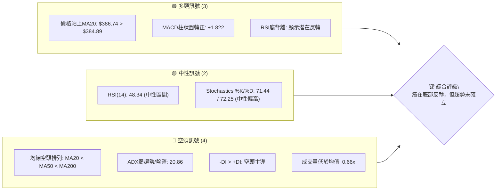

**解讀**：多頭訊號主要來自於短期價格行為及動能指標的改善，特別是RSI底背離和MACD柱狀圖轉正，顯示股價在經歷大幅下跌後，正嘗試構築底部並啟動反彈。然而，中長期均線的空頭排列以及ADX所揭示的弱趨勢和空頭主導，提醒我們這可能僅是熊市中的反彈，而非趨勢的根本逆轉。成交量不足也為反彈的持續性帶來隱憂。

### 📊 核心指標速覽表

| 指標類別 | 指標名稱 | 當前數值 | 訊號 | 解讀 |
|----------|----------|----------|------|------|
| **價格** | 當前價格 | $386.74 | 🟡 | 位於52週區間底部18.6%，顯示超跌後嘗試反彈 |
| **均線** | MA20 | $384.89 | 🟢 | 價格站上短期均線，短線動能轉強 |
| **均線** | MA50 | $406.31 | 🔴 | 價格位於中期均線下方，中線趨勢仍弱 |
| **均線** | MA200 | $443.19 | 🔴 | 價格位於長期均線下方，長線趨勢為空 |
| **動能** | RSI(14) | 48.34 | 🟡 | 位於中性區間，從超賣區反彈，但未達超買 |
| **動能** | MACD | +1.822 | 🟢 | MACD柱狀圖轉正，MACD線剛上穿訊號線，看多 |
| **波動** | ATR(14) | $13.15 | 🟡 | 佔價格3.40%，波動性中等，但相對較高 |

**解讀**：從核心指標來看，MSFT正處於一個關鍵的轉折點。短期價格已站上MA20，且MACD給出買入訊號，加上RSI底背離的確認，都指向短期內股價有進一步反彈的潛力。然而，中長期均線的空頭排列以及股價距離MA50和MA200仍有較大差距，意味著這波反彈面臨的阻力不容小覷。ATR顯示當前股價波動性較大，增加了交易的風險與機會。

### 🏆 技術評分卡

本評分卡綜合考量多個技術維度，提供MSFT當前技術面狀況的量化評估。

```
技術評分卡 — MSFT (2026-07-06)
════════════════════════════════════════════════════
趨勢強度      ████░░░░░░░░░░░░░░░░  20/100  🔴 (ADX弱趨勢，空頭主導)
動能指標      ██████████████░░░░░░  70/100  🟢 (RSI底背離、MACD金叉，動能轉強)
支撐穩定度    ██████████░░░░░░░░░░  50/100  🟡 (接近52週低點，但近期有反彈支撐)
成交量配合    ██████░░░░░░░░░░░░░░  30/100  🔴 (反彈量能不足，低於均量)
形態完整度    ██████░░░░░░░░░░░░░░  30/100  🟡 (潛在W底形成中，但尚未確認)
均線排列      ████░░░░░░░░░░░░░░░░  20/100  🔴 (典型空頭排列，壓力重重)
════════════════════════════════════════════════════
綜合評分      ██████░░░░░░░░░░░░░░  40/100  🟡 (底部反轉初期，風險與機會並存)
════════════════════════════════════════════════════
```

**評分解讀**：MSFT的綜合技術評分顯示其目前處於一個相對弱勢但有潛在轉機的階段。趨勢強度和均線排列的低分反映了長期下跌趨勢的延續性。然而，動能指標的顯著改善（70/100）是目前最大的亮點，RSI底背離和MACD金叉提供了有力的反轉訊號。支撐穩定度中等，股價在低位獲得一定支撐。成交量配合度較差是主要減分項，反彈缺乏量能支持增加了其持續性的不確定性。整體而言，MSFT正處於築底反彈的早期階段，技術面訊號複雜，需要密切關注後續發展。

---

## 2. 趨勢分析

本章將深入分析MSFT在不同時間框架下的價格趨勢，從長期到短期，並評估當前趨勢的強度。

### 🌐 多時框趨勢分析

MSFT的趨勢分析顯示，雖然長期和中期仍處於下跌通道，但短期內已出現止跌反彈的跡象。

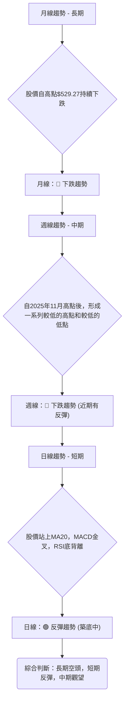

**解讀**：
- **長期（月線）**：MSFT自2025年7月創下歷史新高$529.27後，進入明顯的下跌通道。儘管期間有反彈，但整體結構仍是向下。最近12個月的走勢圖清晰顯示了從高點回落的過程。
- **中期（週線）**：週線級別自2025年11月$489.83以來，形成明顯的下降趨勢，價格波動劇烈。然而，在2026年6月底觸及$372.97的低點後，股價出現強勁反彈，但尚未突破關鍵中期阻力，因此中期趨勢仍定義為下跌，但反彈勢頭值得關注。
- **短期（日線）**：日線級別在近期數據中表現出顯著的止跌反彈訊號。股價已站上MA20（$384.89），MACD形成金叉，RSI出現底背離，這些都是短期看漲的有力依據。這表明股價在短期內有進一步上攻的動能，試圖挑戰中期阻力。

### 📈 長期趨勢 — 12個月走勢圖（Unicode）

以下是MSFT過去12個月的月線收盤價格走勢圖，清晰展示了其從高點回落的歷程。

```
MSFT 月線走勢圖（過去12個月：2025-07 至 2026-07）
價格軸 ($)
$530 ┤                               ● (2025-07: $529.27)
$510 ┤            ● ●
$490 ┤                      ● ●
$470 ┤
$450 ┤                            ●
$430 ┤                  ●
$410 ┤            ●
$390 ┤                                        ● ← 2026-07: $386.74
$370 ┤                        ●     ● (2026-03: $369.37)
     └──────────────────────────────────────────────────────────
       25/07 25/08 25/09 25/10 25/11 25/12 26/01 26/02 26/03 26/04 26/05 26/06 26/07
```

**走勢特徵分析表格**：
| 期間 | 收盤價範圍 | 漲跌幅 | 走勢特徵 | 備註 |
|------|------------|--------|----------|------|
| 2025-07至2025-10 | $514.55 - $529.27 | -2.78% | 高位盤整後小幅回落 | 創歷史新高後維持高位 |
| 2025-11至2026-03 | $369.37 - $489.83 | -24.60% | 快速下跌階段 | 形成一系列較低的高點和低點，跌破多條均線 |
| 2026-04至2026-05 | $406.90 - $450.24 | +10.65% | 短暫反彈 | 嘗試挑戰中期阻力，但未能持續 |
| 2026-06至2026-07 | $373.02 - $386.74 | +3.68% | 再次下探後反彈 | 探底$373.02後止跌，目前處於反彈初期 |

**分析**：從過去12個月的月線走勢來看，MSFT在2025年下半年達到頂峰後，進入了顯著的熊市階段。2026年以來，股價經歷了兩次較深的探底（3月低點$369.37和6月低點$373.02），這兩個低點非常接近，暗示可能正在形成底部結構。當前價格$386.74相對於52週高點$551.05有著大幅回落，目前位於52週區間的18.6%，顯示股價處於歷史相對低位。

### 📊 中期趨勢（週線分析）

中期趨勢主要觀察近期的週線走勢。從數據來看，MSFT在2026年5月底達到$450.24的反彈高點後，再次經歷了一波急跌，但在6月底$372.97附近找到支撐。

```
MSFT 週線近期壓力與支撐示意圖 (近4個月)
價格軸 ($)
$460 ┤                        ● (2026-05-31: $450.24 阻力位 R2)
$440 ┤
$420 ┤          ● ●           ● (2026-04-19: $421.88 阻力位 R1)
$400 ┤    ●       ●           ●
$390 ┤                          ● (2026-07-12: $386.74 現價)
$380 ┤                            ● (2026-06-21: $379.40)
$370 ┤          ● ●           ● (2026-06-28: $372.97 支撐位 S1)
$360 ┤
     └──────────────────────────────────────────────────────────
       26/03 26/04 26/05 26/06 26/07
```

**分析**：中期來看，MSFT的走勢呈現震盪下跌的特徵，但近期在$370-$373區間獲得了較強的支撐。從2026年3月底的低點$356.00到5月底的反彈高點$450.24，再到6月底的再次下探$372.97，形成了一個潛在的W型底部結構。目前股價正嘗試從這個低點反彈。關鍵的中期阻力位於$406.31 (MA50) 和 $421.88 (4月高點)。若能有效突破這些阻力，中期趨勢有望轉為盤整甚至反彈。

### ⚡ 趨勢強度評估（ADX 解讀）

ADX指標用於衡量趨勢的強度，而非方向。

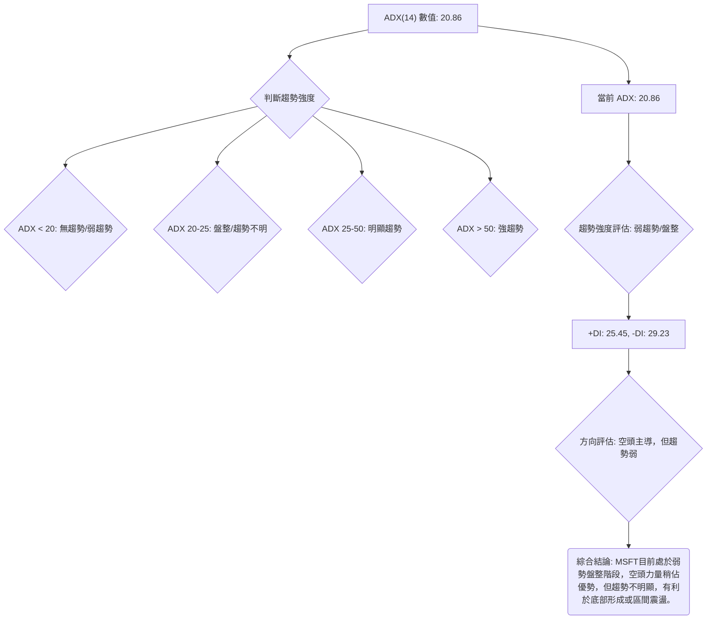

**ADX 強度對照表**：
| ADX 數值 | 趨勢強度 | 狀態 |
|----------|----------|------|
| < 20     | 無趨勢/弱趨勢 | 橫盤整理或築底 |
| 20 - 25  | 盤整/趨勢不明 | 趨勢開始形成或趨勢減弱 |
| 25 - 50  | 明顯趨勢 | 趨勢確立，可順勢操作 |
| \> 50    | 強趨勢 | 趨勢非常強勁，注意反轉風險 |

**解讀**：MSFT的ADX(14)為20.86，明確指出當前市場處於**弱趨勢或盤整行情**。這與股價近期在低位震盪築底的觀察相符。雖然-DI (29.23) 略高於+DI (25.45)，顯示空頭力量仍稍佔上風，但由於ADX整體數值較低，這表明空頭的控制力也相對較弱，市場缺乏明確的方向性。對於交易者而言，這意味著不宜追高殺跌，而應關注區間交易機會或等待趨勢明確後再入場。

---

## 3. 圖表形態分析

圖表形態是價格行為的重要體現，本章將識別MSFT近期可能形成的圖表形態，並據此推測未來價格走勢及目標價。

### 🔍 形態識別系統

根據近期的價格走勢，MSFT最有可能形成的是一個**潛在的W型底部（或雙重底）形態**。

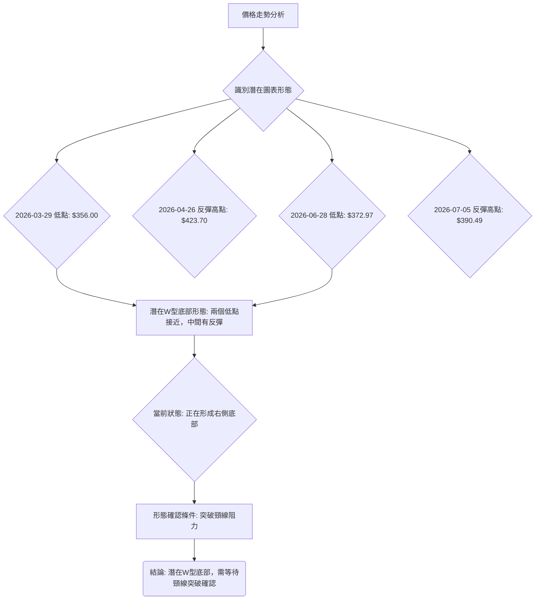

**分析**：MSFT在2026年3月底創下$356.00的低點，隨後反彈至4月底的$423.70。在5月底再次衝高至$450.24後，於6月底再次下探至$372.97，形成第二個低點，與3月底的低點$356.00和6月21日的$379.40非常接近。這兩個低點之間有明顯的反彈，構成了典型的W型底部形態的雛形。目前股價正從第二個低點反彈，若能有效突破中間的反彈高點（頸線），則W型底部形態將被確認。

### 🕯️ 重要K線形態分析

分析近期的週K線形態，以判斷市場情緒和短期趨勢變化。

| 月份 | 收盤價 | K線形態 (週) | 解讀 | 訊號 |
|------|--------|---------------|------|------|
| 2026-06-14 | $390.74 | 大陰線 | 強烈賣壓，跌破多個支撐 | 🔴 弱 |
| 2026-06-21 | $379.40 | 中陰線 | 賣壓持續，市場恐慌情緒 | 🔴 弱 |
| 2026-06-28 | $372.97 | 錘子線/小陽線 | 價格創近期新低後快速拉回，下影線長，顯示下方有買盤承接 | 🟢 強 |
| 2026-07-05 | $390.49 | 大陽線 | 實體陽線，確認前週止跌訊號，強勢反彈 | 🟢 強 |
| 2026-07-12 | $386.74 | 小陰線/十字星 | 反彈後小幅回調，多空力量平衡，或為上漲中繼 | 🟡 中 |

**分析**：在6月中旬至下旬，MSFT的週K線呈現連續陰線，顯示市場賣壓沉重。然而，2026年6月28日的K線形態（價格跌至$372.97後回升至$372.97，若考慮當週最低點，則為帶長下影線的K線，形似錘子線或紡錘線），是重要的止跌訊號。隨後2026年7月5日的大陽線強勢拉升，確認了買盤的介入和反彈的啟動。2026年7月12日的小陰線或十字星，則可能代表反彈動能暫歇，進入短期盤整，為後續上攻積蓄力量。

### 📉 ASCII 走勢形態示意圖

以下示意圖描繪了MSFT潛在的W型底部形態。

```
MSFT 潛在W型底部形態示意圖
價格軸 ($)
$460 ┤                                  R2 ($450.24)
$440 ┤
$420 ┤                      N ($423.70) ← 頸線 (Neckline)
$400 ┤
$380 ┤            L2 ($372.97)          ● (現價 $386.74)
$360 ┤    L1 ($356.00)
     └───────────────────────────────────────────────────
      時間軸 (3月       4月        5月        6月        7月)

形態解析：
- L1: 2026年3月29日低點 ($356.00)
- N:  2026年4月26日反彈高點 ($423.70) - 作為短期頸線參考
- L2: 2026年6月28日低點 ($372.97)
- R2: 2026年5月31日反彈高點 ($450.24) - 作為中期頸線參考

當前狀態：股價從L2反彈，正嘗試挑戰N和R2。
```

**分析**：此W型底部形態的兩個低點L1 ($356.00) 和 L2 ($372.97) 相距不遠，且L2略高於L1，這是一個更為強勢的築底訊號。形態的頸線可以參考L1和L2之間的反彈高點，即$423.70 (N) 或更前期的$450.24 (R2)。突破這些頸線將是確認形態的關鍵。

### 🎯 形態目標價計算

若W型底部形態成功確立並突破頸線，我們可以計算其潛在的目標價。

1.  **選擇頸線**：由於$450.24是L1和L2之間較高的反彈高點，且是近期的一個重要阻力，我們將其視為更具意義的頸線。
2.  **形態高度**：形態高度 = 頸線 - 第二個低點 = $450.24 - $372.97 = $77.27
3.  **形態目標價**：目標價 = 頸線 + 形態高度 = $450.24 + $77.27 = $527.51

**分析**：基於W型底部形態的潛在目標價計算，若MSFT能有效突破$450.24的頸線阻力，其理論上漲空間可達$527.51。這個目標價非常接近2025年7月的歷史高點$529.27，也與分析師的平均目標價$561.11在同一數量級。然而，這是一個相對激進且需要時間達成的目標，途中將面臨多重阻力。在形態確認前，仍需謹慎觀察。

---

## 4. 支撐與阻力

精確識別關鍵的支撐與阻力位對於制定交易策略至關重要。本章將結合歷史價格、均線和斐波那契回調來劃定這些關鍵價位。

### 🗺️ 關鍵價位分布圖（Unicode）

以下是MSFT當前價格附近的關鍵支撐與阻力位分布圖。

```
MSFT 價位結構分布圖 (當前價格 $386.74)
═══════════════════════════════════════════════════
$551.05 ║████████████████████████║ 強阻力 R4 (52週高點)
$527.51 ║████████████████████    ║ 阻力 R3 (W底形態目標)
$450.24 ║████████████████████████║ 關鍵阻力 R2 (5月底高點, W底頸線)
$443.19 ║████████████████████████║ 阻力 R1.5 (MA200)
$428.91 ║████████████████████    ║ 阻力 R1.2 (斐波那契38.2%回調)
$406.31 ║████████████████████████║ 關鍵阻力 R1 (MA50)
$386.74 ╠════════════════════════╣ ◄ 現價
$384.89 ║▓▓▓▓▓▓▓▓▓▓▓▓▓▓▓▓        ║ 近期支撐 S1 (MA20)
$372.97 ║████████████████████████║ 強支撐 S2 (6月底低點, W底右底)
$369.37 ║████████████████████████║ 強支撐 S2.5 (3月底低點, W底左底)
$352.19 ║████████████████████████║ 強支撐 S3 (布林下軌)
$349.20 ║████████████████████████║ 極強支撐 S4 (52週低點)
═══════════════════════════════════════════════════
```

### 🚧 阻力位分析表

| 阻力級別 | 價位 | 形成原因 | 突破難度 | 重要性 |
|----------|------|----------|----------|--------|
| **R1** | $406.31 | MA50均線阻力，同時接近分析師低目標價$400 | 中等 | 高 |
| **R1.2** | $428.91 | 從2025-07高點至2026-03低點的斐波那契38.2%回調位 | 中等 | 中 |
| **R1.5** | $443.19 | MA200均線阻力，長期趨勢線 | 較高 | 高 |
| **R2** | $450.24 | 2026年5月底反彈高點，潛在W底頸線 | 高 | 極高 |
| **R3** | $527.51 | 潛在W底形態目標價 | 極高 | 中 |
| **R4** | $551.05 | 52週高點，歷史阻力 | 極高 | 高 |

**分析**：MSFT目前正處於反彈初期，上方阻力重重。首先要面對的是MA50 ($406.31)，這是一個重要的中期趨勢指標。若能突破，下一個挑戰將是斐波那契38.2%回調位和MA200，這些都是判斷趨勢能否逆轉的關鍵。而$450.24不僅是前高點，更是W型底部的潛在頸線，其突破與否將決定形態能否成立，因此具有極高的重要性。

### 🛡️ 支撐位分析表

| 支撐級別 | 價位 | 形成原因 | 守住機率 | 重要性 |
|----------|------|----------|----------|--------|
| **S1** | $384.89 | MA20均線支撐，近期反彈的第一道防線 | 中等 | 高 |
| **S2** | $372.97 | 2026年6月底低點，W底形態的右側底部 | 較高 | 極高 |
| **S2.5** | $369.37 | 2026年3月底低點，W底形態的左側底部 | 較高 | 極高 |
| **S3** | $352.19 | 布林通道下軌，極端超賣區的自然支撐 | 高 | 中 |
| **S4** | $349.20 | 52週低點，歷史性強支撐位 | 極高 | 極高 |

**分析**：MSFT目前價格$386.74剛好位於MA20 ($384.89) 之上，MA20是近期反彈的第一道支撐。更為關鍵的支撐位於$372.97和$369.37，這兩個低點構成了潛在W型底部的關鍵區域，若能守住此區域，則反轉預期將大幅增強。52週低點$349.20是終極防線，一旦跌破則意味著更深層次的下跌。

### 📐 斐波那契回調位分析

我們將從兩個重要的價格波動區間來計算斐波那契回調位，以識別潛在的支撐與阻力。

1.  **長期下跌趨勢回調 (2025-07 高點 $529.27 至 2026-03 低點 $369.37)**
    *   **回調幅度** = $529.27 - $369.37 = $159.90
    *   **23.6% 回調位**：$369.37 + ($159.90 * 0.236) = $369.37 + $37.74 = **$407.11** (接近MA50 $406.31)
    *   **38.2% 回調位**：$369.37 + ($159.90 * 0.382) = $369.37 + $61.01 = **$430.38** (接近MA200 $443.19)
    *   **50.0% 回調位**：$369.37 + ($159.90 * 0.500) = $369.37 + $79.95 = **$449.32** (接近W底頸線 $450.24)
    *   **61.8% 回調位**：$369.37 + ($159.90 * 0.618) = $369.37 + $98.83 = **$468.20**

2.  **近期下跌趨勢回調 (2026-05 高點 $450.24 至 2026-06 低點 $372.97)**
    *   **回調幅度** = $450.24 - $372.97 = $77.27
    *   **23.6% 回調位**：$372.97 + ($77.27 * 0.236) = $372.97 + $18.23 = **$391.20** (現價上方不遠)
    *   **38.2% 回調位**：$372.97 + ($77.27 * 0.382) = $372.97 + $29.53 = **$402.50** (接近MA50 $406.31)
    *   **50.0% 回調位**：$372.97 + ($77.27 * 0.500) = $372.97 + $38.64 = **$411.61**
    *   **61.8% 回調位**：$372.97 + ($77.27 * 0.618) = $372.97 + $47.76 = **$420.73**

**視覺化**：
```
MSFT 斐波那契回調位示意圖 (長期與近期)
價格 ($)
$530 ┤─────── R(529.27)
     │
$468 ┤─────────────────────── Fibo 61.8% (長期)
$450 ┤───────── R(450.24) ──── Fibo 50.0% (長期)
$443 ┤───────── MA200
$430 ┤─────────────────────── Fibo 38.2% (長期)
$420 ┤─────────────────────── Fibo 61.8% (近期)
$410 ┤─────────────────────── Fibo 50.0% (近期)
$406 ┤───────── MA50 ───────── Fibo 23.6% (長期)
$402 ┤─────────────────────── Fibo 38.2% (近期)
$391 ┤─────────────────────── Fibo 23.6% (近期)
$386 ┤─────────────────────── ● 現價 ($386.74)
$384 ┤───────── MA20
$372 ┤─────────────────────── L(372.97)
$369 ┤───────── L(369.37)
     └───────────────────────────────────────────────────
      時間軸

解讀:
- 長期回調位 ($407.11, $430.38, $449.32) 將是反彈的重要阻力。
- 近期回調位 ($391.20, $402.50, $411.61) 是短期反彈的目標。
- 現價上方最近的斐波那契阻力是近期下跌回調的23.6%位($391.20)。
```

**分析**：斐波那契回調位為我們提供了精確的潛在阻力區間。當前價格$386.74上方，首先會遇到近期下跌趨勢的23.6%回調位$391.20。更重要的阻力將是長期下跌趨勢的23.6%回調位$407.11，這與MA50 ($406.31) 重疊，形成一個強大的阻力區。若能突破此區，則$430.38 (長期38.2%回調) 和$449.32 (長期50%回調，接近W底頸線) 將是下一波挑戰。這些斐波那契位與主要均線和形態關鍵點的重疊，進一步增強了其作為支撐和阻力的有效性。

---

## 5. 技術指標深度解讀

本章將對MSFT的各項技術指標進行詳盡分析，探討它們之間的相互關係和潛在訊號。

### 🎛️ 指標訊號總覽

以下Mermaid圖展示了各指標之間的相互關係及當前訊號。

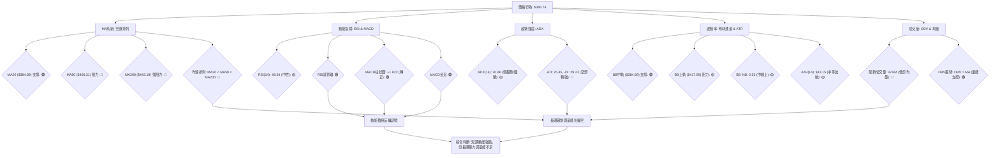

### 📈 移動平均線排列分析

MSFT的均線系統顯示典型的空頭排列，但短期價格已開始挑戰下降趨勢。

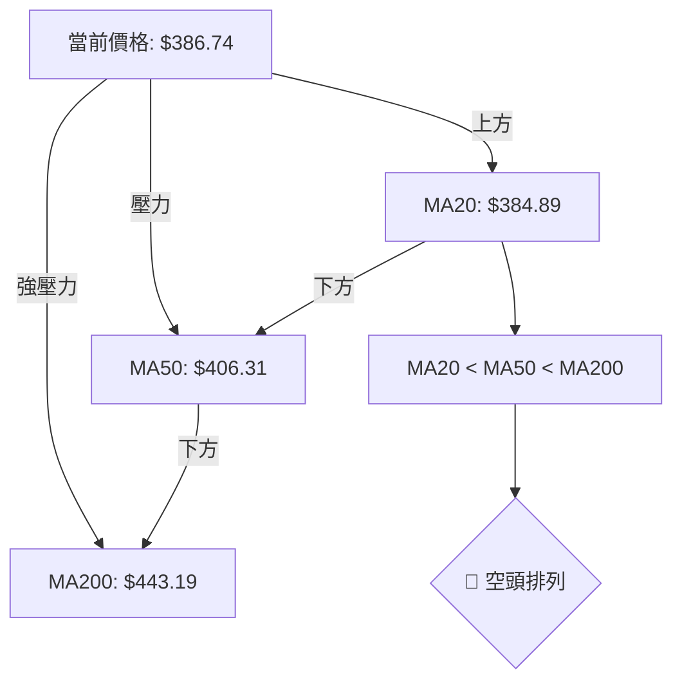

**分析**：MSFT的MA20 ($384.89)、MA50 ($406.31) 和 MA200 ($443.19) 呈現典型的空頭排列 (MA20 < MA50 < MA200)。這表明股票的長期和中期趨勢仍然向下。然而，當前價格$386.74已成功站上MA20，這是一個積極的短期訊號，意味著短期賣壓減輕，買盤力量正在積聚。但上方MA50和MA200的壓力依然沉重，若要扭轉頹勢，股價必須逐一突破這些關鍵均線。MA50 ($406.31) 是近期反彈的第一個重要阻力位。

### 📉 RSI(14) 分析

RSI指標提供動能和超買超賣狀態的洞察。

**RSI 數值進度條展示**：
RSI(14): 48.34 ▓▓▓▓▓▓▓▓▓▓░░░░░░░░░░ 48.34% 🟡 中性

**超買超賣區間分析**：
-   RSI < 30 為超賣區，RSI > 70 為超買區。
-   MSFT當前RSI為48.34，處於中性區間。這表示股價既非超買也非超賣，為反彈提供了空間。
-   從最近20週數據來看，2026-06-21的RSI低至18.6，2026-03-29的RSI低至8.7，均處於極度超賣狀態，為隨後的反彈奠定了基礎。

**背離判斷**：
-   **⚠️ 底背離 (Bullish Divergence) 🟢 確認**：
    -   從週線數據觀察：
        -   2026-06-21收盤價$379.40，RSI為18.6。
        -   2026-06-28收盤價$372.97，價格創下更低的低點 ($372.97 < $379.40)。
        -   但RSI卻上升至31.3 ($31.3 > $18.6)，形成更高的低點。
    -   這種價格創新低但RSI未創新低，反而走高的現象，是典型的**RSI底背離**。這是一個強烈的看漲訊號，預示著下跌動能減弱，股價即將反轉向上。當前股價的反彈正是這一底背離的體現。

### 📊 MACD(12/26/9) 訊號解讀

MACD指標用於判斷趨勢強度和方向的變化。

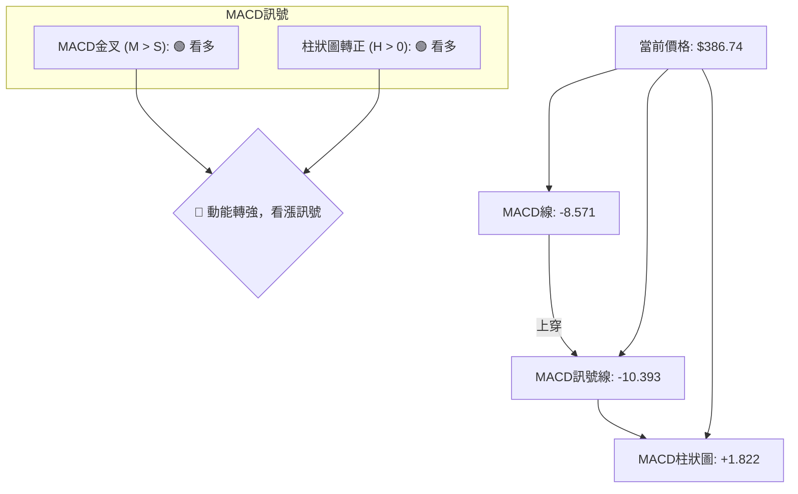

**分析**：MSFT的MACD指標給出了明確的多頭訊號。
-   **MACD線 (-8.571)** 已從下方上穿 **MACD訊號線 (-10.393)**，形成**金叉**，這是經典的買入訊號。
-   **MACD柱狀圖** 從負值轉為正值 (+1.822)，並呈現增長趨勢。這表明空頭動能已耗盡，多頭動能正在加速增強。
-   從20週數據看，MACD柱狀圖在2026-06-21和2026-06-28連續深負值後，於2026-07-05轉正(+1.053)，並在2026-07-12進一步擴大至+1.822，這印證了多頭力量的快速恢復。
MACD的金叉和柱狀圖轉正，與RSI的底背離相互印證，提供了強烈的短期反轉看漲訊號。

### 📦 布林通道分析

布林通道衡量股價的波動範圍和相對位置。

```
MSFT 布林通道示意圖 (當前價格 $386.74)
價格 ($)
$420 ┤                      BB上軌 ($417.59)
$410 ┤
$400 ┤
$390 ┤
$386.74 ● (現價)
$384.89 ┼─────────────────── BB中軌 (MA20)
$380 ┤
$370 ┤
$360 ┤
$352.19 ┤                      BB下軌 ($352.19)
     └───────────────────────────────────────────────────
      時間軸

解讀:
- 股價位於布林中軌之上，顯示短期強勢。
- 布林通道開口尚未明顯擴大，暗示波動性可能仍在積聚。
- 上方阻力為布林上軌，下方支撐為布林中軌。
```

**分析**：
-   **布林上軌**: $417.59
-   **布林中軌 (MA20)**: $384.89
-   **布林下軌**: $352.19
-   **BB %B**: 0.53
MSFT當前價格$386.74位於布林通道中軌$384.89之上，且BB %B值為0.53，這是一個積極的訊號，表明股價已從布林下軌（超賣區）反彈，並站穩在中軌上方，短期趨勢偏強。布林通道的開口尚未大幅擴大，這可能預示著股價在經歷一輪下跌後，正在積蓄動能，一旦突破上軌，則可能開啟一段較強的上漲行情。上方布林上軌$417.59將構成一個重要的短期阻力。

### 💹 成交量分析（量價配合度）

成交量是判斷價格趨勢可信度的重要指標。

| 成交量指標 | 當前數值 | 20日均量 | 50日均量 | 量比 | OBV趨勢 |
|------------|----------|----------|----------|------|---------|
| **數值**   | 32.6M | 49.2M | 41.5M | 0.66x | OBV > MA |

**分析**：
-   **最新成交量 (32,621,401)** 顯著低於20日均量 (49,201,410) 和50日均量 (41,517,074)，量比僅為0.66x。這是一個**偏空訊號**，表明當前的反彈缺乏充足的買盤量能支持。通常，健康的價格上漲應伴隨著成交量的放大。當前量能不足可能導致反彈的持續性受到質疑，容易在遇到阻力時回落。
-   **OBV趨勢** 顯示「OBV > MA → 量能支撐上漲」。雖然當日成交量較低，但OBV指標的趨勢性表現較為積極，暗示在過去一段時間內，累積性買盤量能仍佔優勢，對股價形成潛在支撐。這與RSI底背離和MACD金叉的動能訊號相符，表明儘管短期量能不足，但整體市場力量可能正在轉向多頭。
**綜合判斷**：成交量方面呈現矛盾。短期量能不足為反彈蒙上陰影，但OBV的積極表現則提供了一絲希望。這可能意味著當前的反彈仍處於早期階段，資金尚未大規模入場，需要密切關注後續量能能否有效放大以確認反彈的強度。

---

## 6. 動能與波動率

本章節將評估MSFT的動能強度和波動性，以了解其當前市場行為模式。

### ⚡ 動能評估四象限

由於數據中ADX指示趨勢較弱，且RSI/MACD顯示動能正在轉強，ATR顯示波動性中等，我們將其歸類在「築底反轉」的象限。

| 象限 | 動能 (RSI/MACD) | 波動 (ATR) | 當前狀態 | 評估 |
|------|-----------------|------------|----------|------|
| Q1 | 強 (加速上漲) | 低 (穩定向上) | - | 最佳機會，強勢股 |
| Q2 | 弱 (盤整/下跌) | 低 (穩定向下) | - | 觀望，等待趨勢明朗 |
| Q3 | 強 (高風險高收益) | 高 (劇烈震盪) | - | 投機性機會，需嚴格止損 |
| Q4 | 弱 (築底/區間震盪) | 高 (尋找方向) | ✓ | **MSFT目前狀態**：底部反轉初期，動能由弱轉強，波動性中等。 |

**分析**：MSFT目前正從Q2（弱動能，低波動，但趨勢向下）向Q4（弱動能但波動性增加，尋求方向）過渡，並嘗試向Q3（動能轉強，波動性可能維持）發展。RSI底背離和MACD金叉表明動能正在從「弱」轉向「強」，而ADX的低值則指示趨勢仍處於「弱」的狀態。ATR相對中等，但對於一個處於底部反轉初期的股票來說，波動性可能隨時增加。這是一個高風險高回報的階段，適合對潛在反轉有信心的投資者，但需伴隨嚴格的風險管理。

### 📊 ATR 波動率分析

ATR(14)指標衡量股價在特定時間內的平均真實波幅，是衡量波動性的重要工具。

-   **ATR(14)**：$13.15
-   **ATR佔股價百分比**：3.40% ($13.15 / $386.74)

**分析**：MSFT的ATR(14)為$13.15，佔當前股價的3.40%。這個數值表示在過去14天中，MSFT平均每天的波動範圍約為$13.15。
-   **相對較高的波動性**：對於一個大型科技股而言，3.40%的日均波動率屬於中等偏高，這意味著股價波動較為活躍，交易機會和風險同時存在。
-   **止損距離建議**：ATR是設定止損點的實用工具。通常，交易者會將止損點設置在當前價格下方1至2倍ATR的距離。
    -   **1x ATR 止損**：$386.74 - $13.15 = $373.59 (接近6月底低點S2)
    -   **1.5x ATR 止損**：$386.74 - ($13.15 * 1.5) = $386.74 - $19.73 = $367.01 (接近3月底低點S2.5)
    -   **2x ATR 止損**：$386.74 - ($13.15 * 2) = $386.74 - $26.30 = $360.44
    -   考慮到潛在W型底部形態，將止損設置在$370.00下方（例如$368.00），即略低於S2和S2.5，是一個相對合理的選擇，這大約是1.4倍ATR的距離，既提供了足夠的緩衝，又能有效控制風險。

### 📐 Beta 與市場相關性

由於提供的數據中未包含MSFT的Beta值，我們無法進行精確的量化分析。

**一般推斷**：
-   Microsoft作為一家市值巨大的科技巨頭，其股票通常被認為是市場的風向標之一。
-   在成長型市場中，大型科技股的Beta值通常會略高於1，顯示其與大盤（如S&P 500）保持較強的正相關性，且波動性略大於市場。
-   在熊市或盤整期，其Beta值可能會有變化，但在缺乏具體數據的情況下，我們假設其Beta值約在1.0至1.2之間。
**影響**：若Beta值高於1，則當市場整體走強時，MSFT有望獲得更大的漲幅；反之，若市場走弱，MSFT也可能承受更大的跌幅。在當前弱趨勢/盤整的市場環境下，MSFT的走勢將在很大程度上受自身基本面和技術面反轉訊號的驅動，但仍需關注整體大盤走勢的影響。

---

## 7. 多時框架總結

本章將綜合不同時間框架的技術訊號，提供一個宏觀的評估，以形成更全面的投資決策。

### 📋 時框架評分表

| 時框架 | 趨勢方向 | 動能 | 均線排列 | 形態 | 綜合評分 (1-10) | 建議 |
|--------|----------|------|----------|------|-----------------|------|
| **長期** | 🔴 下跌 | 🔴 弱 | 🔴 空頭 | 🟡 潛在築底 | 3/10 | 觀望，等待趨勢逆轉 |
| **中期** | 🔴 下跌 | 🟡 轉強 | 🔴 空頭 | 🟡 潛在築底 | 4/10 | 謹慎，關注阻力突破 |
| **短期** | 🟢 反彈 | 🟢 強 | 🟡 築底 | 🟢 反轉 | 7/10 | 關注反彈機會，設嚴格止損 |

**分析**：
-   **長期和中期**：MSFT的長期和中期趨勢仍然被定義為下跌。均線系統的空頭排列、ADX的弱趨勢以及股價距離MA50和MA200的較大差距，都印證了這一點。儘管有潛在的築底形態，但尚未得到充分確認。因此，對於長線投資者來說，目前仍需保持觀望。
-   **短期**：短期內，MSFT的技術面出現顯著改善。RSI底背離、MACD金叉和柱狀圖轉正，以及價格站上MA20，都提供了強烈的反彈訊號。潛在的W型底部形態也為短期反彈提供了結構性支持。因此，短期交易者可以考慮在嚴格止損的前提下，尋求反彈機會。

### 🔲 綜合訊號矩陣

以下矩陣展示了不同時間框架下主要技術訊號的一致性。

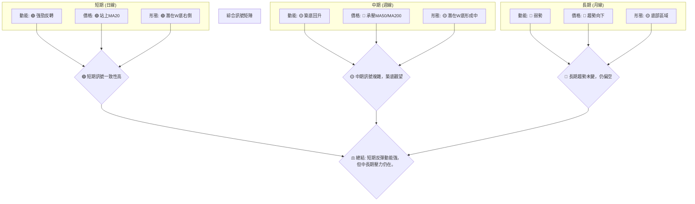

**分析**：多時框架分析顯示，MSFT的短期技術面已大幅改善，動能指標給出明確的看漲訊號，預示著一波反彈行情正在展開。然而，這種短期動能與中長期下跌趨勢形成了鮮明對比。中期來看，股價仍面臨MA50和MA200的巨大壓力，且成交量不足為反彈的持續性帶來不確定性。長期趨勢的逆轉需要更多的時間和更強的催化劑。因此，當前的投資決策應充分考慮這種多空交織的複雜性，側重於捕捉短期反彈機會，同時警惕中長期趨勢的壓制。

---

## 8. 交易策略建議

基於上述詳盡的技術分析，我們為MSFT制定了兩種潛在的交易策略：積極的多頭反轉策略和保守的突破追蹤策略，以及應對反轉失敗的空頭策略。

### 🗺️ 策略決策流程圖

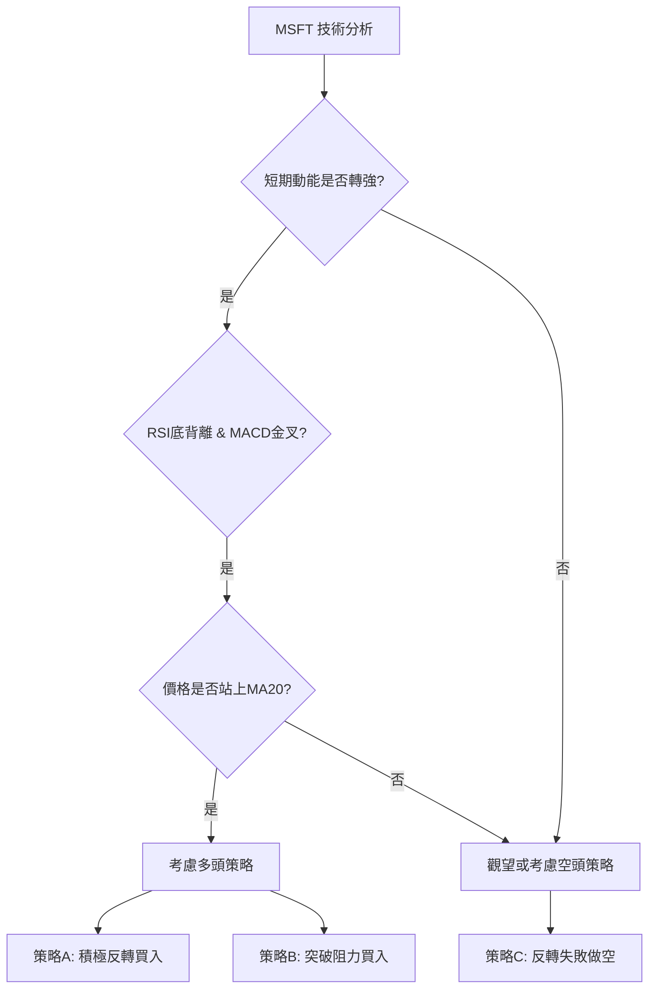

### 🟢 多頭策略詳情

基於RSI底背離、MACD金叉和價格站上MA20的短期強勁反彈訊號，以及潛在W型底部形態。

| 策略要素 | 策略 A (積極反轉) | 策略 B (保守突破) |
|----------|--------------------|--------------------|
| **進場條件** | 股價回調至MA20附近獲得支撐，或MACD金叉確認後 | 股價有效突破MA50 ($406.31) 並站穩 |
| **進場價格** | $387.00 (略高於現價，確認反彈勢頭) | $407.00 (確認突破MA50) |
| **目標價 T1** | $406.31 (MA50阻力位) | $428.91 (長期斐波那契38.2%回調位) |
| **目標價 T2** | $428.91 (長期斐波那契38.2%回調位) | $450.24 (W底頸線阻力) |
| **止損價格** | $370.00 (低於6月底低點$372.97，提供緩衝) | $384.00 (MA20支撐，防止假突破) |
| **風險報酬比** | T1: (406.31-387)/(387-370) = 19.31/17 = **1.14:1** <br> T2: (428.91-387)/(387-370) = 41.91/17 = **2.46:1** | T1: (428.91-407)/(407-384) = 21.91/23 = **0.95:1** <br> T2: (450.24-407)/(407-384) = 43.24/23 = **1.88:1** |
| **成功機率** | 55% (反轉初期，風險較高) | 65% (等待更多確認，成功率更高) |
| **建議倉位** | 5-10% (輕倉試探) | 10-15% (適度倉位) |

**分析**：
-   **策略A** 旨在捕捉底部反彈的早期機會，風險較高但潛在回報也較大。其止損點設置在近期低點下方，確保風險控制。
-   **策略B** 則更為保守，等待股價突破關鍵中期阻力MA50後再入場，旨在提高成功率，但可能錯失部分早期漲幅。其止損點設置在MA20下方，防止假突破。
-   兩種策略的風險報酬比在達到第二目標時均具吸引力。

### 🔴 空頭策略詳情

考慮到MSFT的中長期趨勢仍為空頭，一旦短期反彈失敗，則可能再次下探。

| 策略要素 | 策略 C (反轉失敗做空) |
|----------|------------------------|
| **進場條件** | 股價跌破近期支撐$372.97 (6月底低點) 並確認下行 |
| **進場價格** | $370.00 (確認跌破關鍵支撐) |
| **目標價 T1** | $352.19 (布林通道下軌) |
| **目標價 T2** | $349.20 (52週低點) |
| **止損價格** | $387.00 (現價上方，確認反彈失敗) |
| **風險報酬比** | T1: (370-352.19)/(387-370) = 17.81/17 = **1.05:1** <br> T2: (370-349.20)/(387-370) = 20.80/17 = **1.22:1** |
| **成功機率** | 50% (需等待多頭訊號失效) |
| **建議倉位** | 5-10% (謹慎操作) |

**分析**：此空頭策略為防禦性策略，僅在多頭反彈訊號失效，股價跌破關鍵支撐後才考慮執行。其風險報酬比相對較低，但若股價確實跌破，則下行空間將被打開。

### ⭐ 整體訊號強度評星

綜合考量所有技術指標和形態，MSFT的整體訊號強度如下：

做多訊號強度：★★★☆☆ (3/5星) 🟢
(理由：RSI底背離、MACD金叉、價格站上MA20提供強勁短期反彈訊號，但中長期趨勢仍空，量能不足)

做空訊號強度：★★☆☆☆ (2/5星) 🔴
(理由：中長期均線空頭排列，ADX弱勢空頭主導，但短期動能已轉強，反彈勢頭明顯，做空風險較大)

整體可信度：  ★★★☆☆ (3/5星) 🟡
(理由：多空訊號複雜，短期反轉訊號強勁但中長期壓力仍在，需密切關注關鍵價位突破與量能配合)

---

## 9. 風險提示與監控

任何投資都伴隨風險，尤其在市場趨勢不明朗的轉折點。本章將列出MSFT交易中需要警惕的風險因素及建議的監控指標。

### ✅ 關鍵監控指標 Checklist

以下是一份MSFT交易中需要持續監控的關鍵技術指標清單：

```
MSFT 關鍵監控指標清單 (2026-07-06)
════════════════════════════════════════════════════
├─ 價格行為：
│  ├─ 價格是否持續站穩 $384.89 (MA20) 之上？           [ ] Y [ ] N
│  ├─ 是否有效突破 $406.31 (MA50) 阻力？               [ ] Y [ ] N
│  ├─ 是否跌破 $372.97 (6月底低點) 關鍵支撐？         [ ] Y [ ] N
├─ 動能指標：
│  ├─ RSI 是否持續在中性區間上方運行？               [ ] Y [ ] N
│  ├─ MACD柱狀圖是否持續為正且增長？                 [ ] Y [ ] N
│  ├─ 是否出現新的RSI/MACD頂背離訊號？               [ ] Y [ ] N
├─ 趨勢與波動：
│  ├─ ADX是否上升並突破25，確立新的趨勢？             [ ] Y [ ] N
│  ├─ +DI是否上穿-DI，確立多頭趨勢？                 [ ] Y [ ] N
│  ├─ 布林通道是否擴張，預示波動性增加？             [ ] Y [ ] N
├─ 成交量：
│  ├─ 反彈過程中成交量能否有效放大？                 [ ] Y [ ] N
│  ├─ 下跌回調時成交量是否縮小？                     [ ] Y [ ] N
│  ├─ OBV趨勢是否持續向上？                          [ ] Y [ ] N
├─ 圖表形態：
│  ├─ W型底部頸線 $450.24 是否被有效突破？          [ ] Y [ ] N
│  ├─ 是否出現新的看跌形態 (如頭肩頂)？              [ ] Y [ ] N
════════════════════════════════════════════════════
```

### ⚠️ 風險場景分析

針對MSFT目前的技術面狀況，存在以下三種主要情境：

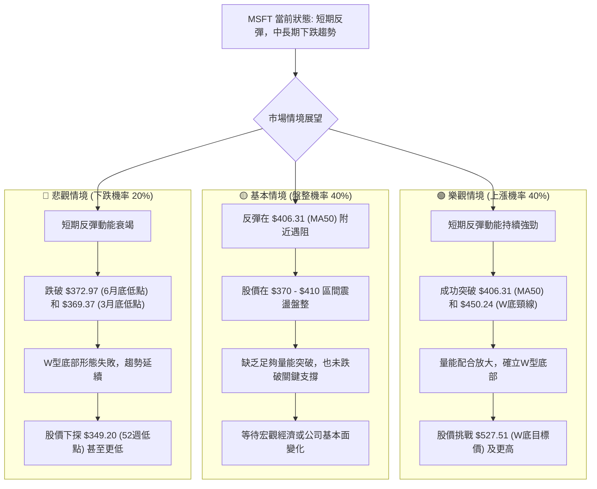

**分析**：
-   **樂觀情境**：如果當前的反彈能夠得到足夠的量能支持，並成功突破關鍵阻力位（特別是MA50和W底頸線），那麼MSFT有望確立底部反轉，向更高的目標價邁進。
-   **基本情境**：在缺乏強勁催化劑的情況下，MSFT的反彈可能在MA50附近遭遇阻力，導致股價進入一個較長時間的區間震盪盤整，等待市場情緒或基本面變化。
-   **悲觀情境**：如果當前的反彈動能不足，或遇到突發利空消息，股價可能再次跌破近期低點，使得W型底部形態失效，並重新回到下跌趨勢，甚至測試52週低點。

### 🛡️ 風險管理重要提醒

1.  **嚴格止損**：鑑於MSFT目前處於底部反轉的早期階段，市場不確定性較高，務必設定並嚴格執行止損。建議根據ATR或關鍵支撐位設定止損。
2.  **倉位管理**：避免重倉單一股票，尤其是在趨勢不明朗時。建議採取分批建倉、逐步加碼的策略，以分散風險。
3.  **量能確認**：密切關注反彈過程中的成交量。如果反彈缺乏量能配合，則其持續性存疑；如果放量下跌，則應警惕趨勢反轉失敗。
4.  **大盤環境**：MSFT作為大型科技股，其走勢與整體市場（如S&P 500、納斯達克100）高度相關。在操作MSFT時，應同時關注大盤的趨勢和風險。
5.  **新聞與基本面**：雖然本報告側重技術分析，但任何突發的宏觀經濟新聞或公司基本面變化（如財報、新產品發布、競爭格局變化）都可能迅速改變技術面走勢，應保持關注。

---

## 📋 報告總結

```
MSFT 技術分析報告總結
════════════════════════════════════════════════════════
報告日期：2026-07-06
當前價格：$386.74
分析評級：⚖️ 底部反轉初期 (短期動能轉強，但中長期趨勢仍偏空，多空交織)

關鍵結論：
├─ 長期趨勢：🔴 仍處於下跌通道，自2025年高點持續回落。
├─ 中期趨勢：🔴 表現為震盪下跌，但近期在低位獲得支撐。
├─ 短期趨勢：🟢 止跌反彈，RSI底背離、MACD金叉，價格站上MA20。
├─ 關鍵支撐：$372.97 (6月底低點), $369.37 (3月底低點), $349.20 (52週低點)。
├─ 關鍵阻力：$406.31 (MA50), $428.91 (斐波那契38.2%), $450.24 (W底頸線)。
└─ 分析師目標：$561.11 (平均目標價，遠高於現價，暗示長期潛力)。

最優策略組合：
1. 🥇 最佳機會：**積極反轉多頭策略**。基於強勁的短期反轉訊號，在$387.00附近進場，止損設於$370.00，目標$406.31和$428.91。風險報酬比具吸引力，但需嚴格止損。
2. 🥈 次選機會：**保守突破多頭策略**。等待股價有效突破中期阻力MA50 ($406.31) 後，在$407.00進場，止損設於$384.00，目標$428.91和$450.24。成功率更高，但入場價格較高。
3. 🥉 保守選擇：**觀望或應對反轉失敗**。若股價未能持續反彈，反而跌破$372.97關鍵支撐，則考慮在$370.00附近做空，止損設於$387.00，目標$352.19和$349.20。
════════════════════════════════════════════════════════
```

---

> ⚠️ **免責聲明**：本報告為 AI 自動生成之技術分析，所有數據及估算均基於提供的歷史價格資訊。本報告**僅供研究與學術參考**，**不構成任何投資建議**。投資有風險，入市需謹慎。

---

*報告生成時間：2026-07-06 ｜ 數據來源：Yahoo Finance ｜ 分析框架：多時框技術分析*