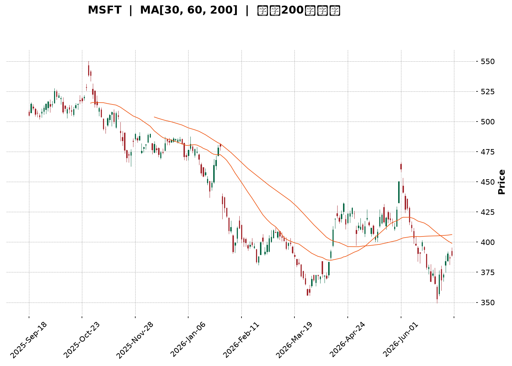
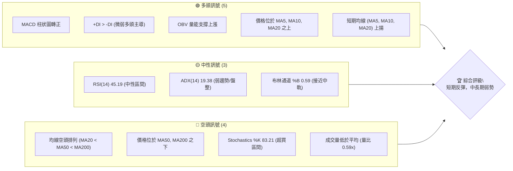
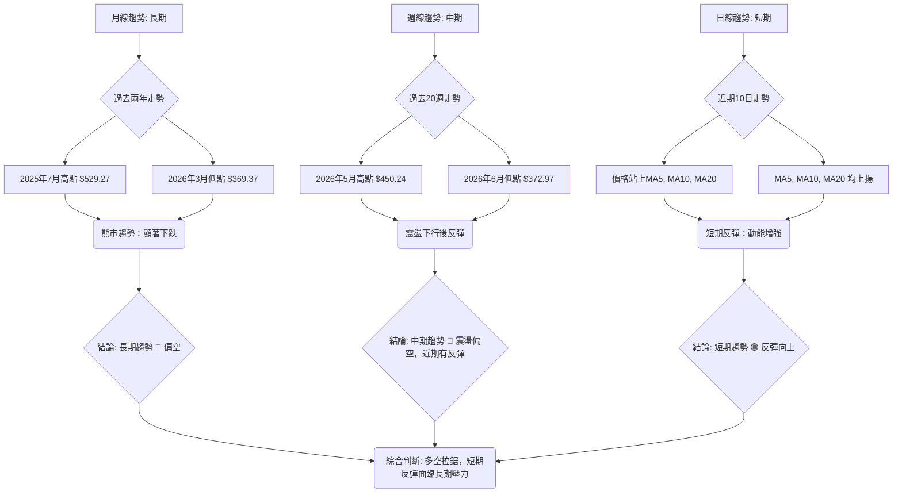
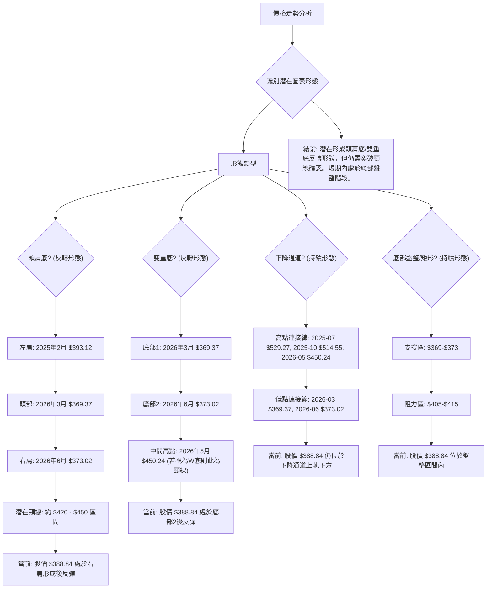
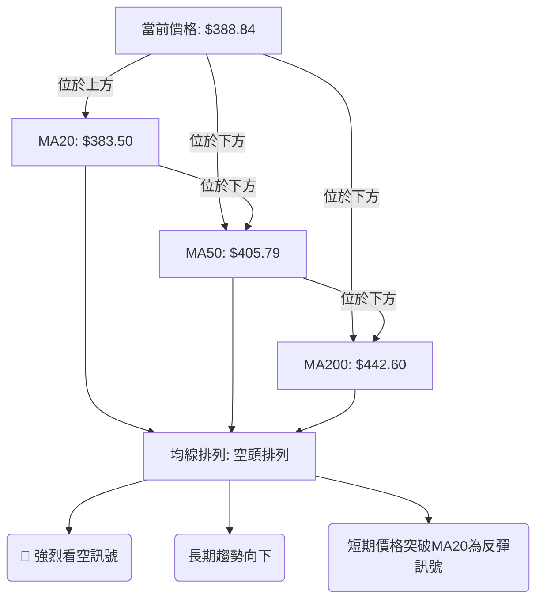
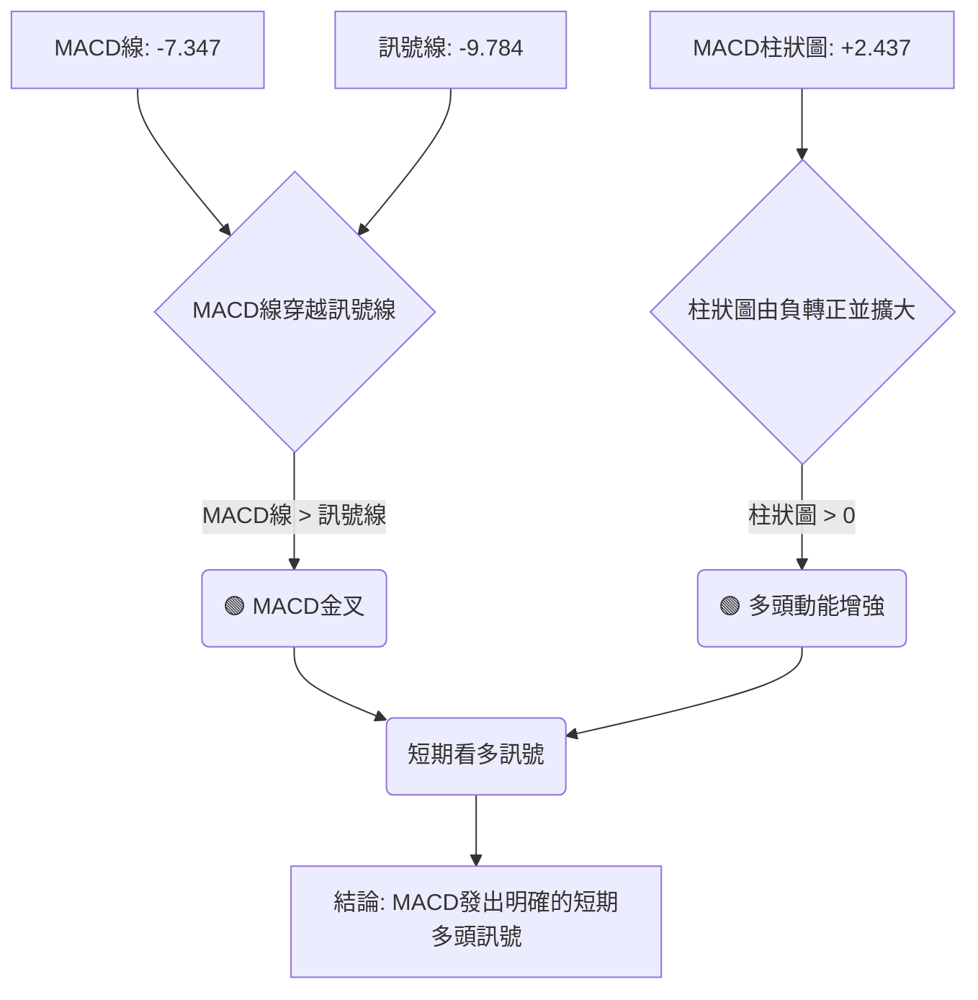
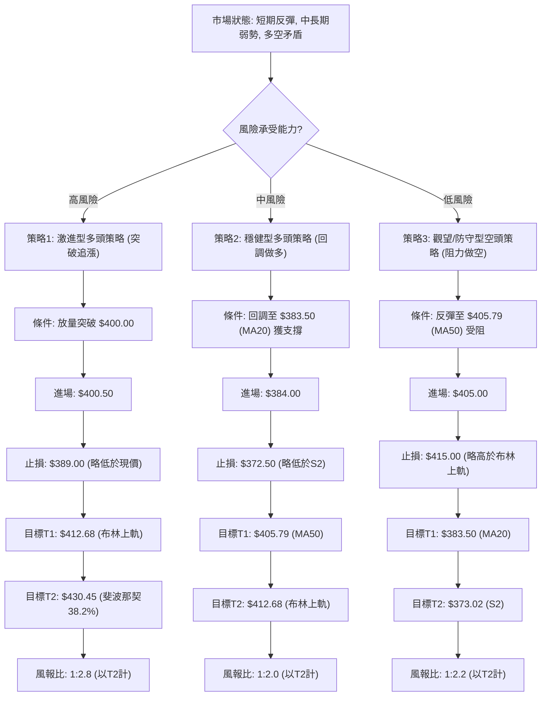
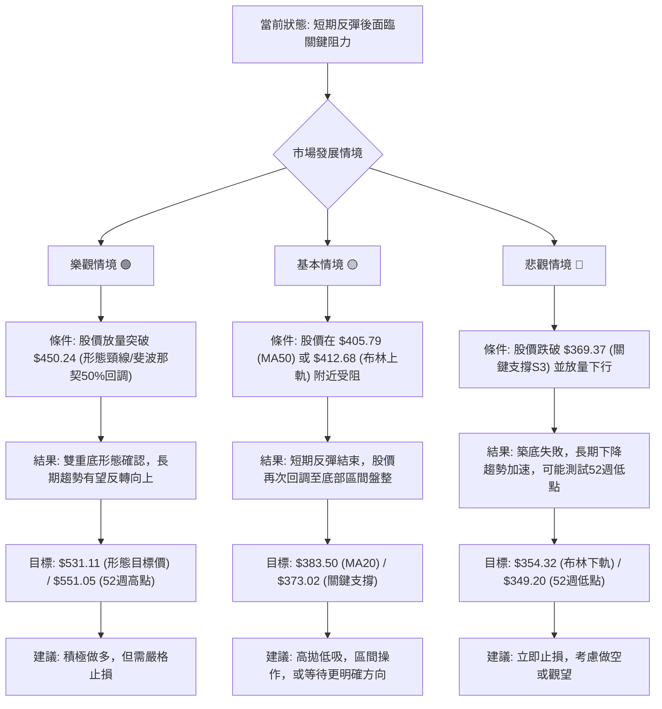

<details>
<summary>📊 靜態圖表 (點擊展開)</summary>

</details>

<html>
<head><meta charset="utf-8" /></head>
<body>
    <div style="height:500px; width:100%;">                        <script>window.PlotlyConfig = {MathJaxConfig: 'local'};</script>
        <script charset="utf-8" src="https://cdn.plot.ly/plotly-3.6.0.min.js" integrity="sha256-QaOVwtVY0T02VaHrr6pnoHLCwayMJp4O5n4YyaE3rJk=" crossorigin="anonymous"></script>                <div id="candlestick-chart" class="plotly-graph-div" style="height:100%; width:100%;"></div>            <script>                window.PLOTLYENV=window.PLOTLYENV || {};                                if (document.getElementById("candlestick-chart")) {                    Plotly.newPlot(                        "candlestick-chart",                        [{"close":{"dtype":"f8","bdata":"AAAAoACUf0AAAAAgXRWAQAAAAABm839AAAAAgGegf0AAAADgB69\u002fQAAAAMBsfX9AAAAA4NvDf0AAAAAgyPV\u002fQAAAAOCFFYBAAAAAoIMjgEAAAABA9AOAQAAAAKDAEIBAAAAAwPJpgEAAAACAdUWAQAAAAABgTIBAAAAAIOY4gEAAAADA6Lt\u002fQAAAAKAJ7X9AAAAAIGjlf0AAAABALuN\u002fQAAAAGA+xn9AAAAA4JDlf0AAAAAATQyAQAAAAKA3E4BAAAAA4BwqgEAAAACARSqAQAAAAICEQoBAAAAAYGaBgEAAAADARNWAQAAAAIAi0YBAAAAAIJxTgEAAAADgaBSAQAAAAKA1DoBAAAAAoH3xf0AAAAAAfn9\u002fQAAAAICL335AAAAA4BfbfkAAAACADG1\u002fQAAAAKCol39AAAAAoMW+f0AAAAAg9kF\u002fQAAAAOCBr39AAAAAIL2Ef0AAAAAg66p+QAAAAKDeQH5AAAAAAPHEfUAAAADgbWB9QAAAAEBgfn1AAAAA4ACufUAAAACAjzV+QAAAAEBCnX5AAAAA4E9JfkAAAADAPX1+QAAAAKDKuX1AAAAAwFTrfUAAAABASRB+QAAAACB9jX5AAAAA4GqdfkAAAABAA8d9QAAAAGA5FX5AAAAA4IjGfUAAAAAgcIt9QAAAAGBypH1AAAAAQCWgfUAAAAAgWR1+QAAAACBAPH5AAAAAYFIsfkAAAACAEEt+QAAAAICzXX5AAAAAYMNYfkAAAAAADE9+QAAAAIAZVX5AAAAAIJ0XfkAAAADAfW19QAAAAOAObH1AAAAAYDfGfUAAAABgORV+QAAAACDYv31AAAAAQHvSfUAAAADAB7F9QAAAACBVSX1AAAAAQH6VfEAAAACAKmp8QAAAAIAjnXxAAAAAABRIfEAAAACgQaJ7QAAAAOA8EnxAAAAAoCX+fEAAAADAHkN9QAAAAGAw531AAAAAQOr3fUAAAADAP\u002fl6QAAAAAAexnpAAAAAQONXekAAAACgMJZ5QAAAAKCoxXlAAAAAYMt+eEAAAADgyPV4QAAAAMBCvHlAAAAAAAG3eUAAAABAPCl5QAAAAEDvAHlAAAAA4Kb4eEAAAACgm7F4QAAAAABB3XhAAAAA4JTZeEAAAADA8cV4QAAAAKA5+ndAAAAAgIxCeEAAAABgv\u002ft4QAAAAAChDXlAAAAAYEJ+eEAAAACgBNt4QAAAAIDpMHlAAAAAQDBFeUAAAADArZx5QAAAAOA3gXlAAAAAIGeIeUAAAAAgIU55QAAAAGAUQHlAAAAAIN0PeUAAAABAH6t4QAAAAMBe8XhAAAAAoL\u002foeEAAAACgF294QAAAACDeQnhAAAAAILfQd0AAAACgweJ3QAAAAGDzPndAAAAAYM8jd0AAAACA3dJ2QAAAAKD7P3ZAAAAAgPJidkAAAACA6xV3QAAAAMAlCXdAAAAAIHJKd0AAAACgL0F3QAAAAEDEN3dAAAAAAFZYd0AAAABAOER3QAAAAIAYIXdAAAAAAKH4d0AAAACgKoR4QAAAAOBMpXlAAAAAwKA1ekAAAABABV56QAAAAOCpEnpAAAAAoORzekAAAAAAwP96QAAAAKCf7XlAAAAAoDx7ekAAAAAgbn56QAAAACAoxXpAAAAAoK54ekAAAAAgYW55QAAAAIC12HlAAAAAAJ7LeUAAAADg2qd5QAAAAKAL0XlAAAAAIMU9ekAAAADAkON5QAAAAGBKvHlAAAAAIDhueUAAAAAgWUV5QAAAAOC4iHlAAAAAYCFQekAAAACg\u002fml6QAAAAEBJCHpAAAAAYGZCekAAAACgcDF6QAAAAMAeKXpAAAAA4HoAekAAAABguMp5QAAAAADXr3pAAAAAANcjfEAAAADgUch8QAAAAMD1lHtAAAAAoHC1ekAAAADAzMB6QAAAAGC4CnpAAAAAANe7eUAAAABgjzZ5QAAAAIDC1XhAAAAAoHBleEAAAAAA12t4QAAAAAAp\u002fHhAAAAAoEedeEAAAABgj653QAAAAGBmtndAAAAAoHD1dkAAAABACl93QAAAACBc13ZAAAAAoEcNdkAAAAAghU93QAAAAMAeCXdAAAAA4FFQd0AAAADgegR4QAAAAADXZ3hAAAAAANcreEAAAACgcE14QA=="},"high":{"dtype":"f8","bdata":"ZgVXCHXdf0CNTac3QSCAQD67o3jaE4BAqBAu9Z\u002f1f0Cy0TJwE9R\u002fQFd7jA7OrH9Ag00yEkrrf0BvNO0PxwyAQK04OisxF4BA7MpjsN8pgEAl1df4iTKAQIyPQee2KYBARSMWK4F9gEAVYJ7cuXOAQA6My84RXYBAikDp3z1IgEBvEaWHR0KAQOoQEKVHCYBA6nm3JUwAgEBAxrcpew+AQCgMaybHDIBAF2QAE+MBgEAfDbYhfBuAQGODZNlnG4BAQPx+jWVPgECgD5GOOEWAQE9szpJZUIBA6XN7z7mZgEAlC5q44TGBQLnWOEqo9oBAmiqda9OcgEAk0A4G6W+AQLNk0ApATYBAh\u002fuvlnECgEDKzQypcPl\u002fQBlLpG9HaH9A+2xYossDf0AvOr02kHp\u002fQBhsvEhJpn9Aj8+G1jLHf0AypNwOS+R\u002fQADyH6UVxn9AjalKRlrOf0DjNG96CD1\u002fQB+kG1ktwX5AqaH9jhu2fkB3mEJDv8x9QDpyL\u002faRrH1A5qQ+BmnQfUDxULM4UmJ+QBFqt30ip35AXj1jtwJ7fkChDuow\u002frR+QEKvokd9IX5A2nN+KPryfUCufk3kGxR+QKPLc8HgoX5AM3cUrwKffkAhidwrpiF+QPgcw6IAPn5AQe47EPoEfkCqq4Bba+l9QP+jpyJXvH1Am8oySvPdfUBZrRiR3nZ+QDSDmVP+Wn5AbDPF7wJpfkBviiW0rFp+QIZ9KEzcb35AokvsTUtffkCMfN9M9WJ+QKoRY6wkeH5ANK4AC51ffkBQxMEKLih+QAHTs4ZZn31AgijYMuHJfUAYriRddnh+QJZsZV9SCH5AtPeMURXbfUAqradPuO19QJ17NdS6mn1AHeKV1PwhfUD6F7ZKEeN8QPNy\u002fcYu0nxACNykeGVsfEAbiaWQ7Sp8QG2U7SBRLXxAMx72eS5QfUBk6vfHW4J9QBJN8amqC35AeoXuboYZfkC10\u002fFPnIh7QGE4Qa9qWntA8hza6UjNekCvSMll3EJ6QLchoT8FH3pAeiZJEtZneUBKkTxyIwB5QJXy4TLP0HlA\u002fHwBVdNcekCn\u002fuxS0el5QJfjkbJiRnlAT3ekXd87eUA97geJ6Ot4QMYtVF9nDHlAuVT+JuU4eUC3osuKFfR4QHEV1ZgWqHhA1j830EtIeEDrnmosowl5QEJPMcy\u002faXlAl7z7AWa\u002feEBzsCjBKgV5QGanivoiXXlALCL5Q0SieUBGdHDEhqt5QPT5QkuEwnlA3csPyyyVeUA4XjYSBJV5QIw9nVAEgnlA84YKauBTeUCgiupdzT55QFGY\u002f\u002fo5\u002fHhAmTGSc2o4eUBaD\u002fXGPNJ4QDjiQYhEenhALDCfNp4ieEDklYV7+CV4QPUh1V1L2ndAbZjO9euDd0AHYSkLkF53QF8O77eqmnZAW8JjOCDJdkDAH1BVgUF3QNGxS1roUndA1+0H6FFNd0DhZLW5wU53QLC4ZjVSOndA9mwl7K8CeEDSRZCxFUt3QCNraEZAbXdAkV653lf7d0Dn329jZJ14QFtJgV2X13lAYyLyipE+ekC2MHUwW+p6QE7m6S+kZnpAXOY1xBukekCAvVv4Mwx7QPU0Sfroa3pAw98ddIGAekA6dX2a\u002faJ6QDbtnJHaz3pAH+yuW1yeekCgwqTYY9h5QMVgTx1WA3pA6CgH\u002fu09ekBclLVyEf55QJojvmRAGHpAYL7ejOGwekCk\u002f7Ctmht6QM5UBPzEvHlAF6Qa0qHpeUC84TQD6VZ5QGqRguoyr3lAgYwtDOqzekA1wYBDOIN6QGSLqNw8\u002fHpAmssgCwFTekAAAACgcKV6QAAAAGBmhnpAAAAA4FE8ekAAAABACv95QAAAAADX13pAAAAAoEclfEAAAADAHiV9QAAAAAAAWHxAAAAAgD2Ge0AAAABgZkJ7QAAAACCF13pAAAAAYI8SekAAAAAgrr95QAAAAOCjUHlAAAAAoJnNeEAAAAAA13t4QAAAAAAAHHlAAAAAoHDNeEAAAACA62V4QAAAAIDr1XdAAAAAgBTad0AAAAAghZN3QAAAAIAUrndAAAAAIK7DdkAAAACAwol3QAAAAAAAyHdAAAAAYGZid0AAAACgR014QAAAAEAzg3hAAAAAYGZSeEAAAADAHrl4QA=="},"hovertemplate":"\u003cb\u003e%{x|%Y-%m-%d}\u003c\u002fb\u003e\u003cbr\u003e\u958b: $%{open:.2f}\u003cbr\u003e\u9ad8: $%{high:.2f}\u003cbr\u003e\u4f4e: $%{low:.2f}\u003cbr\u003e\u6536: $%{close:.2f}\u003cextra\u003e\u003c\u002fextra\u003e","low":{"dtype":"f8","bdata":"vd1RHXGHf0AGiuAsk7F\u002fQJTxZ7wH1X9AnBIynuCBf0DrO\u002fIirXt\u002fQPBjLwzJXX9AuDGMA+h2f0CTcxiT1pp\u002fQN3GRpI9p39AEOQe\u002fYPHf0DaTSgvdbd\u002fQNvq4lMk\u002fH9AlykZqIIXgEC1K8ZcRDGAQB0tEE9iPoBAW7+zkSYRgEBIKrRow6Z\u002fQDgq7jdbx39A4pUPgwxtf0D+OMJqpax\u002fQPy2sxTqjn9AR\u002flQgOCBf0DTKAEdLuN\u002fQAYQlNf63H9AyBBYmZ0TgECvfhwCxRqAQL7GlsB2K4BAmrDSOXJtgEBkHlkh78qAQHDrpT\u002fRqoBAB5dGSqw2gEDMg79bu\u002f1\u002fQPcSr+Wf9X9A\u002fADay02Kf0B1rZIzRXZ\u002fQONx5+AIy35AA9DMJlWifkA\u002fanrZkvp+QFnPPCwEM39AclteeKn\u002ffkCJbkauKSJ\u002fQFqVDEnz5H5AcIGAAbhbf0ACV57Tdjt+QBeKQFap\u002fH1AS65b9USWfUADol4qGiN9QCeMirgeH31AKXU3HEPtfEAhKRDWEPF9QD16E\u002fbgR35ATpg6NAUofkAcsdlTn0J+QFk8wrF9kX1A0suWHgqmfUAV0mcZHMx9QBj2a1S4I35ARtgi7FhlfkBjSSdSlI99QOmEZfIAnH1AEWocZaajfUAer48EzWZ9QPZyd2+tTH1AKUPCFk6OfUAMvuYXV7x9QHnT7wmdBX5AUuwOv8wIfkAP7EwxdCl+QDx4FC7jKn5AGimfJ+M8fkB66NqmiCB+QNK5+lSPNX5AQ2esL4QSfkDqjvdbNUF9QHepqxWyNn1AaUFjdK06fUAwegS+S719QBNmCfwAnH1Ax3EyMrRhfUCqX179Ipl9QE+dy7Yl\u002fnxA1MgMQkpyfECIkjlND158QJj7QYFMZ3xAmSDkJ5z0e0AThk\u002f7wkt7QGCpB5Onq3tAVYXLRoUIfEDwt6k8Or98QBeg4N7+cH1AhNR0qxe+fUCR3EJCdDJ6QGc\u002fjRvziHpAACa2FgxGekBvLphf+mt5QOJhNUTPdnlAai0VREppeEDNqAwG2XJ4QJTjg8x78XhA0+DCueyteUBWlTTEtvN4QEXAWy3tw3hAyjL9QZDEeEAwTtxPfox4QISCWbABqXhAWJpi+AC9eECPvv5S5aR4QIEHuEBa5HdAhT5SKCnOd0DM9SOLEVV4QNRKOkEN3nhAIU43MZlQeEDKhWJ8klx4QC0vh00kfXhA5DHYCR73eECWSM93ajh5QFNMv7sIenlAvVhLEQwqeUC7rkpt8iB5QHndyp+NC3lAW9zpE3gNeUCas\u002f4BXpZ4QHHpnQ39nnhA7hrw8T7OeEAj8k++emJ4QNhLv1mTI3hAzrzEnca0d0BuJFaPrs13QG0w4uC9MHdAXFJHe0wNd0DMtpiHacZ2QHo0Kg3VO3ZAbkJg+Sg4dkCtLAy6kKR2QJz4Ydt39nZAbjBXys61dkBaGswLOQt3QKKTS9lI3HZAM7wembcpd0Dm\u002f2KKG+R2QBVUj0+vE3dAPDUdjX0jd0AwU\u002fNV9Bp4QAFOHiX2vXhAu8FaIf2zeUBt8vU2fjx6QK0ZMYtn9nlA8dx6HMYEekCxHnPiEWx6QAetVWtVqHlAdc7c82vueUCCo+u6sgJ6QJOxnJDPT3pAk\u002fUZShs2ekBkkGO8ZdJ4QL0Uw+jYmHlAx4CwNpieeUC3OsD2qX55QJ6ky1fAQ3lAXP\u002fzCq4dekCD3Bsqr9F5QFa\u002f9mH6SXlAQuTEwC1ceUCtvovgnAJ5QGqvxM83AHlAZ4mWIkjAeUDYtqxyY+t5QLFdmxtw+XlAuDctxpOmeUAAAAAgXPt5QAAAAKBHBXpAAAAA4FHQeUAAAACgR5l5QAAAAGC4ynlAAAAAgMIFe0AAAADgUaR8QAAAAEDhhntAAAAAAACEekAAAABgj6Z6QAAAAGBm5nlAAAAAwPWIeUAAAAAgrud4QAAAAGCP0nhAAAAAAAAAeEAAAADgUeR3QAAAAKCZjXhAAAAAQApreEAAAADAHpV3QAAAAOB6VHdAAAAAwB7xdkAAAABguCp3QAAAAOB6zHZAAAAAQDPTdUAAAABA4TZ2QAAAAGBmfnZAAAAAQDP3dkAAAACAPW53QAAAAEAz+3dAAAAAIIXTd0AAAAAghUN4QA=="},"name":"\u50f9\u683c","open":{"dtype":"f8","bdata":"4sD6AlbEf0DmFxy7jLV\u002fQHOifg7DAoBAZaioUhDpf0AQwiISsLJ\u002fQHuKMOOdkX9AV8itlpmtf0DFH0mJfsR\u002fQNOMueko4H9ARVvvUfb4f0BVWtMCDxOAQLNp5djDDoBA3Eth\u002f8QagEAPF\u002ffSuGeAQDNUI\u002fzkP4BA9uD2BWw4gEA5N90v9SKAQOoQEKVHCYBAopLkmE2wf0AlHzvPgft\u002fQI2ErJ6q1X9AAvzYB2Kdf0AsJhLy8PV\u002fQKPb1Q\u002fyEYBALjIsY\u002fYugECmGNNCYDmAQFLLqLH\u002fO4BAK9EXhneDgEDmQ8EqTxSBQM5un44V7IBAJitlyiF5gEDzD9+RaWyAQHnubitPJIBAqzKPH6HIf0CXwNEZHeF\u002fQPeUqZekZ39ANQgWBindfkDZcnoCSg5\u002fQPLtjST4WX9AY6hzgniif0DsdiAKk7F\u002fQIb2qsuC8X5AGGTAoACUf0ABnooFCsR+QCnyke4\u002fcH5AC\u002f8mjWiofkBFb96DDsZ9QP2uFhdOjn1AaO\u002fcpn1\u002ffUCyPW6KdkJ+QG8VlfUCV35AGtfGQGRkfkD+eVNw\u002fkh+QPIQ\u002ftpUo31ALhW2vCDafUAAxmFfFwZ+QMXlcxHYK35AS\u002fXBpudufkDt6J4KJR5+QEUWovZEqH1Ah8rfUhXbfUD4sMwdi999QD\u002fNG5sVXX1AoNlRx7qsfUAsRUhlHsF9QMP0qxkwU35AFjFttW8\u002ffkBwa3b1Ri1+QI9Fd15tOH5ADzztiNVIfkBe1aKNXSt+QJme9sVoPH5Aqu2\u002fndVafkBObOkR4SN+QJ\u002fi7gZVf31AX9RoqDB7fUCWR3mfINp9QOFs58iz8X1ACnZM61R\u002ffUBJT9ki6Kh9QAblBS41iX1A9cLITUUGfUCo+Rcn\u002f+B8QEN+UX3NfHxA9egfLYMTfEBIDweTfil8QKtdRswq2ntAdcU5kd0dfEAalOfg8\u002fN8QAhObPCYeX1AZRTVLhURfkBFcrfkoGB7QKN5OT6RU3tAwHNJ\u002flHFekAXBKRfOUJ6QD6REE7YknlAPvVLMCNaeUCf9luGZ9Z4QL422qXhMHlAOh2ATyccekAZC5yIW+V5QCg7WT1FM3lATsLsiIIqeUByUolkM9d4QPBK35HWxXhApnltQi\u002f9eEBHDCwKELR4QJP+o0hXonhAIlyABfX0d0AWRKjE+Vp4QHBWKIhdPXlAioMLV5BgeEBg+sS+LIB4QKKMZ0SlhHhAhSZLqnEGeUA28nBKvDh5QJDNEOAMhXlAHtM\u002f37dAeUB4wH0zTZJ5QI5aUoQYS3lAnHOhmhY8eUCT01ZBIgJ5QKMceeRa03hABOsUg3r2eEA13Ij6WMR4QDMMdVAcVHhAtKN+8kMfeEAAQHoIIPF3QDmUJreJ2HdAuiwI06+Bd0AA8yQxTCB3QIGUYrbikXZAR2JkueKRdkDJ6hygMbx2QC+7YcfsSndA+iTEc6nmdkB7T6W57Ep3QHdFGUOiGHdA0L1xOV4CeECqwLuLHjt3QIzPYXLIQndA\u002fVjLP9dMd0C1WkdxTjF4QP7rE8c80nhALMuGyj0vekB4+68nbn56QOAzLjzWQ3pA3WBk8041ekDfmJ9zTZR6QMeN3Xm4L3pA2hVi+BkBekDXJH55eVd6QI9A0U1wenpAxIgQEJl6ekDXSYctwZ55QOPrlYSGvnlApUioyWiqeUC+Y0s\u002fwuZ5QG4feULkcXlAqxOulzszekC6B7unzgd6QN3NF+fQb3lAgk+f+VjZeUAk7\u002fAKQiV5QIhLhpGxOXlA+9OSmP7VeUDzltWBg\u002ft5QK9WBsaIz3pArK4c\u002fmXUeUAAAAAAAIx6QAAAAOCjOHpAAAAAQOEGekAAAAAAKbB5QAAAACCuz3lAAAAAwMwIe0AAAACgcA19QAAAAIAU7ntAAAAAQDNne0AAAADA9Tx7QAAAAKBwxXpAAAAAgD3ieUAAAADgepB5QAAAAMDM6HhAAAAAIFyzeEAAAABA4XZ4QAAAAMDMzHhAAAAA4KO8eEAAAAAAAGR4QAAAAMAenXdAAAAAANd7d0AAAACAFEZ3QAAAAMAeOXdAAAAA4FGsdkAAAABgZlJ2QAAAAAAAmHdAAAAA4Howd0AAAACgR813QAAAACCuB3hAAAAA4KMweEAAAADgo4h4QA=="},"x":["2025-09-18T00:00:00-04:00","2025-09-19T00:00:00-04:00","2025-09-22T00:00:00-04:00","2025-09-23T00:00:00-04:00","2025-09-24T00:00:00-04:00","2025-09-25T00:00:00-04:00","2025-09-26T00:00:00-04:00","2025-09-29T00:00:00-04:00","2025-09-30T00:00:00-04:00","2025-10-01T00:00:00-04:00","2025-10-02T00:00:00-04:00","2025-10-03T00:00:00-04:00","2025-10-06T00:00:00-04:00","2025-10-07T00:00:00-04:00","2025-10-08T00:00:00-04:00","2025-10-09T00:00:00-04:00","2025-10-10T00:00:00-04:00","2025-10-13T00:00:00-04:00","2025-10-14T00:00:00-04:00","2025-10-15T00:00:00-04:00","2025-10-16T00:00:00-04:00","2025-10-17T00:00:00-04:00","2025-10-20T00:00:00-04:00","2025-10-21T00:00:00-04:00","2025-10-22T00:00:00-04:00","2025-10-23T00:00:00-04:00","2025-10-24T00:00:00-04:00","2025-10-27T00:00:00-04:00","2025-10-28T00:00:00-04:00","2025-10-29T00:00:00-04:00","2025-10-30T00:00:00-04:00","2025-10-31T00:00:00-04:00","2025-11-03T00:00:00-05:00","2025-11-04T00:00:00-05:00","2025-11-05T00:00:00-05:00","2025-11-06T00:00:00-05:00","2025-11-07T00:00:00-05:00","2025-11-10T00:00:00-05:00","2025-11-11T00:00:00-05:00","2025-11-12T00:00:00-05:00","2025-11-13T00:00:00-05:00","2025-11-14T00:00:00-05:00","2025-11-17T00:00:00-05:00","2025-11-18T00:00:00-05:00","2025-11-19T00:00:00-05:00","2025-11-20T00:00:00-05:00","2025-11-21T00:00:00-05:00","2025-11-24T00:00:00-05:00","2025-11-25T00:00:00-05:00","2025-11-26T00:00:00-05:00","2025-11-28T00:00:00-05:00","2025-12-01T00:00:00-05:00","2025-12-02T00:00:00-05:00","2025-12-03T00:00:00-05:00","2025-12-04T00:00:00-05:00","2025-12-05T00:00:00-05:00","2025-12-08T00:00:00-05:00","2025-12-09T00:00:00-05:00","2025-12-10T00:00:00-05:00","2025-12-11T00:00:00-05:00","2025-12-12T00:00:00-05:00","2025-12-15T00:00:00-05:00","2025-12-16T00:00:00-05:00","2025-12-17T00:00:00-05:00","2025-12-18T00:00:00-05:00","2025-12-19T00:00:00-05:00","2025-12-22T00:00:00-05:00","2025-12-23T00:00:00-05:00","2025-12-24T00:00:00-05:00","2025-12-26T00:00:00-05:00","2025-12-29T00:00:00-05:00","2025-12-30T00:00:00-05:00","2025-12-31T00:00:00-05:00","2026-01-02T00:00:00-05:00","2026-01-05T00:00:00-05:00","2026-01-06T00:00:00-05:00","2026-01-07T00:00:00-05:00","2026-01-08T00:00:00-05:00","2026-01-09T00:00:00-05:00","2026-01-12T00:00:00-05:00","2026-01-13T00:00:00-05:00","2026-01-14T00:00:00-05:00","2026-01-15T00:00:00-05:00","2026-01-16T00:00:00-05:00","2026-01-20T00:00:00-05:00","2026-01-21T00:00:00-05:00","2026-01-22T00:00:00-05:00","2026-01-23T00:00:00-05:00","2026-01-26T00:00:00-05:00","2026-01-27T00:00:00-05:00","2026-01-28T00:00:00-05:00","2026-01-29T00:00:00-05:00","2026-01-30T00:00:00-05:00","2026-02-02T00:00:00-05:00","2026-02-03T00:00:00-05:00","2026-02-04T00:00:00-05:00","2026-02-05T00:00:00-05:00","2026-02-06T00:00:00-05:00","2026-02-09T00:00:00-05:00","2026-02-10T00:00:00-05:00","2026-02-11T00:00:00-05:00","2026-02-12T00:00:00-05:00","2026-02-13T00:00:00-05:00","2026-02-17T00:00:00-05:00","2026-02-18T00:00:00-05:00","2026-02-19T00:00:00-05:00","2026-02-20T00:00:00-05:00","2026-02-23T00:00:00-05:00","2026-02-24T00:00:00-05:00","2026-02-25T00:00:00-05:00","2026-02-26T00:00:00-05:00","2026-02-27T00:00:00-05:00","2026-03-02T00:00:00-05:00","2026-03-03T00:00:00-05:00","2026-03-04T00:00:00-05:00","2026-03-05T00:00:00-05:00","2026-03-06T00:00:00-05:00","2026-03-09T00:00:00-04:00","2026-03-10T00:00:00-04:00","2026-03-11T00:00:00-04:00","2026-03-12T00:00:00-04:00","2026-03-13T00:00:00-04:00","2026-03-16T00:00:00-04:00","2026-03-17T00:00:00-04:00","2026-03-18T00:00:00-04:00","2026-03-19T00:00:00-04:00","2026-03-20T00:00:00-04:00","2026-03-23T00:00:00-04:00","2026-03-24T00:00:00-04:00","2026-03-25T00:00:00-04:00","2026-03-26T00:00:00-04:00","2026-03-27T00:00:00-04:00","2026-03-30T00:00:00-04:00","2026-03-31T00:00:00-04:00","2026-04-01T00:00:00-04:00","2026-04-02T00:00:00-04:00","2026-04-06T00:00:00-04:00","2026-04-07T00:00:00-04:00","2026-04-08T00:00:00-04:00","2026-04-09T00:00:00-04:00","2026-04-10T00:00:00-04:00","2026-04-13T00:00:00-04:00","2026-04-14T00:00:00-04:00","2026-04-15T00:00:00-04:00","2026-04-16T00:00:00-04:00","2026-04-17T00:00:00-04:00","2026-04-20T00:00:00-04:00","2026-04-21T00:00:00-04:00","2026-04-22T00:00:00-04:00","2026-04-23T00:00:00-04:00","2026-04-24T00:00:00-04:00","2026-04-27T00:00:00-04:00","2026-04-28T00:00:00-04:00","2026-04-29T00:00:00-04:00","2026-04-30T00:00:00-04:00","2026-05-01T00:00:00-04:00","2026-05-04T00:00:00-04:00","2026-05-05T00:00:00-04:00","2026-05-06T00:00:00-04:00","2026-05-07T00:00:00-04:00","2026-05-08T00:00:00-04:00","2026-05-11T00:00:00-04:00","2026-05-12T00:00:00-04:00","2026-05-13T00:00:00-04:00","2026-05-14T00:00:00-04:00","2026-05-15T00:00:00-04:00","2026-05-18T00:00:00-04:00","2026-05-19T00:00:00-04:00","2026-05-20T00:00:00-04:00","2026-05-21T00:00:00-04:00","2026-05-22T00:00:00-04:00","2026-05-26T00:00:00-04:00","2026-05-27T00:00:00-04:00","2026-05-28T00:00:00-04:00","2026-05-29T00:00:00-04:00","2026-06-01T00:00:00-04:00","2026-06-02T00:00:00-04:00","2026-06-03T00:00:00-04:00","2026-06-04T00:00:00-04:00","2026-06-05T00:00:00-04:00","2026-06-08T00:00:00-04:00","2026-06-09T00:00:00-04:00","2026-06-10T00:00:00-04:00","2026-06-11T00:00:00-04:00","2026-06-12T00:00:00-04:00","2026-06-15T00:00:00-04:00","2026-06-16T00:00:00-04:00","2026-06-17T00:00:00-04:00","2026-06-18T00:00:00-04:00","2026-06-22T00:00:00-04:00","2026-06-23T00:00:00-04:00","2026-06-24T00:00:00-04:00","2026-06-25T00:00:00-04:00","2026-06-26T00:00:00-04:00","2026-06-29T00:00:00-04:00","2026-06-30T00:00:00-04:00","2026-07-01T00:00:00-04:00","2026-07-02T00:00:00-04:00","2026-07-06T00:00:00-04:00","2026-07-07T00:00:00-04:00"],"type":"candlestick"},{"hovertemplate":"MA30: $%{y:.2f}\u003cextra\u003e\u003c\u002fextra\u003e","line":{"color":"#2196F3","dash":"dash","width":2},"mode":"lines","name":"MA30","x":["2025-09-18T00:00:00-04:00","2025-09-19T00:00:00-04:00","2025-09-22T00:00:00-04:00","2025-09-23T00:00:00-04:00","2025-09-24T00:00:00-04:00","2025-09-25T00:00:00-04:00","2025-09-26T00:00:00-04:00","2025-09-29T00:00:00-04:00","2025-09-30T00:00:00-04:00","2025-10-01T00:00:00-04:00","2025-10-02T00:00:00-04:00","2025-10-03T00:00:00-04:00","2025-10-06T00:00:00-04:00","2025-10-07T00:00:00-04:00","2025-10-08T00:00:00-04:00","2025-10-09T00:00:00-04:00","2025-10-10T00:00:00-04:00","2025-10-13T00:00:00-04:00","2025-10-14T00:00:00-04:00","2025-10-15T00:00:00-04:00","2025-10-16T00:00:00-04:00","2025-10-17T00:00:00-04:00","2025-10-20T00:00:00-04:00","2025-10-21T00:00:00-04:00","2025-10-22T00:00:00-04:00","2025-10-23T00:00:00-04:00","2025-10-24T00:00:00-04:00","2025-10-27T00:00:00-04:00","2025-10-28T00:00:00-04:00","2025-10-29T00:00:00-04:00","2025-10-30T00:00:00-04:00","2025-10-31T00:00:00-04:00","2025-11-03T00:00:00-05:00","2025-11-04T00:00:00-05:00","2025-11-05T00:00:00-05:00","2025-11-06T00:00:00-05:00","2025-11-07T00:00:00-05:00","2025-11-10T00:00:00-05:00","2025-11-11T00:00:00-05:00","2025-11-12T00:00:00-05:00","2025-11-13T00:00:00-05:00","2025-11-14T00:00:00-05:00","2025-11-17T00:00:00-05:00","2025-11-18T00:00:00-05:00","2025-11-19T00:00:00-05:00","2025-11-20T00:00:00-05:00","2025-11-21T00:00:00-05:00","2025-11-24T00:00:00-05:00","2025-11-25T00:00:00-05:00","2025-11-26T00:00:00-05:00","2025-11-28T00:00:00-05:00","2025-12-01T00:00:00-05:00","2025-12-02T00:00:00-05:00","2025-12-03T00:00:00-05:00","2025-12-04T00:00:00-05:00","2025-12-05T00:00:00-05:00","2025-12-08T00:00:00-05:00","2025-12-09T00:00:00-05:00","2025-12-10T00:00:00-05:00","2025-12-11T00:00:00-05:00","2025-12-12T00:00:00-05:00","2025-12-15T00:00:00-05:00","2025-12-16T00:00:00-05:00","2025-12-17T00:00:00-05:00","2025-12-18T00:00:00-05:00","2025-12-19T00:00:00-05:00","2025-12-22T00:00:00-05:00","2025-12-23T00:00:00-05:00","2025-12-24T00:00:00-05:00","2025-12-26T00:00:00-05:00","2025-12-29T00:00:00-05:00","2025-12-30T00:00:00-05:00","2025-12-31T00:00:00-05:00","2026-01-02T00:00:00-05:00","2026-01-05T00:00:00-05:00","2026-01-06T00:00:00-05:00","2026-01-07T00:00:00-05:00","2026-01-08T00:00:00-05:00","2026-01-09T00:00:00-05:00","2026-01-12T00:00:00-05:00","2026-01-13T00:00:00-05:00","2026-01-14T00:00:00-05:00","2026-01-15T00:00:00-05:00","2026-01-16T00:00:00-05:00","2026-01-20T00:00:00-05:00","2026-01-21T00:00:00-05:00","2026-01-22T00:00:00-05:00","2026-01-23T00:00:00-05:00","2026-01-26T00:00:00-05:00","2026-01-27T00:00:00-05:00","2026-01-28T00:00:00-05:00","2026-01-29T00:00:00-05:00","2026-01-30T00:00:00-05:00","2026-02-02T00:00:00-05:00","2026-02-03T00:00:00-05:00","2026-02-04T00:00:00-05:00","2026-02-05T00:00:00-05:00","2026-02-06T00:00:00-05:00","2026-02-09T00:00:00-05:00","2026-02-10T00:00:00-05:00","2026-02-11T00:00:00-05:00","2026-02-12T00:00:00-05:00","2026-02-13T00:00:00-05:00","2026-02-17T00:00:00-05:00","2026-02-18T00:00:00-05:00","2026-02-19T00:00:00-05:00","2026-02-20T00:00:00-05:00","2026-02-23T00:00:00-05:00","2026-02-24T00:00:00-05:00","2026-02-25T00:00:00-05:00","2026-02-26T00:00:00-05:00","2026-02-27T00:00:00-05:00","2026-03-02T00:00:00-05:00","2026-03-03T00:00:00-05:00","2026-03-04T00:00:00-05:00","2026-03-05T00:00:00-05:00","2026-03-06T00:00:00-05:00","2026-03-09T00:00:00-04:00","2026-03-10T00:00:00-04:00","2026-03-11T00:00:00-04:00","2026-03-12T00:00:00-04:00","2026-03-13T00:00:00-04:00","2026-03-16T00:00:00-04:00","2026-03-17T00:00:00-04:00","2026-03-18T00:00:00-04:00","2026-03-19T00:00:00-04:00","2026-03-20T00:00:00-04:00","2026-03-23T00:00:00-04:00","2026-03-24T00:00:00-04:00","2026-03-25T00:00:00-04:00","2026-03-26T00:00:00-04:00","2026-03-27T00:00:00-04:00","2026-03-30T00:00:00-04:00","2026-03-31T00:00:00-04:00","2026-04-01T00:00:00-04:00","2026-04-02T00:00:00-04:00","2026-04-06T00:00:00-04:00","2026-04-07T00:00:00-04:00","2026-04-08T00:00:00-04:00","2026-04-09T00:00:00-04:00","2026-04-10T00:00:00-04:00","2026-04-13T00:00:00-04:00","2026-04-14T00:00:00-04:00","2026-04-15T00:00:00-04:00","2026-04-16T00:00:00-04:00","2026-04-17T00:00:00-04:00","2026-04-20T00:00:00-04:00","2026-04-21T00:00:00-04:00","2026-04-22T00:00:00-04:00","2026-04-23T00:00:00-04:00","2026-04-24T00:00:00-04:00","2026-04-27T00:00:00-04:00","2026-04-28T00:00:00-04:00","2026-04-29T00:00:00-04:00","2026-04-30T00:00:00-04:00","2026-05-01T00:00:00-04:00","2026-05-04T00:00:00-04:00","2026-05-05T00:00:00-04:00","2026-05-06T00:00:00-04:00","2026-05-07T00:00:00-04:00","2026-05-08T00:00:00-04:00","2026-05-11T00:00:00-04:00","2026-05-12T00:00:00-04:00","2026-05-13T00:00:00-04:00","2026-05-14T00:00:00-04:00","2026-05-15T00:00:00-04:00","2026-05-18T00:00:00-04:00","2026-05-19T00:00:00-04:00","2026-05-20T00:00:00-04:00","2026-05-21T00:00:00-04:00","2026-05-22T00:00:00-04:00","2026-05-26T00:00:00-04:00","2026-05-27T00:00:00-04:00","2026-05-28T00:00:00-04:00","2026-05-29T00:00:00-04:00","2026-06-01T00:00:00-04:00","2026-06-02T00:00:00-04:00","2026-06-03T00:00:00-04:00","2026-06-04T00:00:00-04:00","2026-06-05T00:00:00-04:00","2026-06-08T00:00:00-04:00","2026-06-09T00:00:00-04:00","2026-06-10T00:00:00-04:00","2026-06-11T00:00:00-04:00","2026-06-12T00:00:00-04:00","2026-06-15T00:00:00-04:00","2026-06-16T00:00:00-04:00","2026-06-17T00:00:00-04:00","2026-06-18T00:00:00-04:00","2026-06-22T00:00:00-04:00","2026-06-23T00:00:00-04:00","2026-06-24T00:00:00-04:00","2026-06-25T00:00:00-04:00","2026-06-26T00:00:00-04:00","2026-06-29T00:00:00-04:00","2026-06-30T00:00:00-04:00","2026-07-01T00:00:00-04:00","2026-07-02T00:00:00-04:00","2026-07-06T00:00:00-04:00","2026-07-07T00:00:00-04:00"],"y":{"dtype":"f8","bdata":"AAAAAAAA+H8AAAAAAAD4fwAAAAAAAPh\u002fAAAAAAAA+H8AAAAAAAD4fwAAAAAAAPh\u002fAAAAAAAA+H8AAAAAAAD4fwAAAAAAAPh\u002fAAAAAAAA+H8AAAAAAAD4fwAAAAAAAPh\u002fAAAAAAAA+H8AAAAAAAD4fwAAAAAAAPh\u002fAAAAAAAA+H8AAAAAAAD4fwAAAAAAAPh\u002fAAAAAAAA+H8AAAAAAAD4fwAAAAAAAPh\u002fAAAAAAAA+H8AAAAAAAD4fwAAAAAAAPh\u002fAAAAAAAA+H8AAAAAAAD4fwAAAAAAAPh\u002fAAAAAAAA+H8AAAAAAAD4fxEREeH8GYBAvLu7I5MegEB3d3f\u002fih6AQM3MzAQ6H4BAzczM\u002fJMggEAAAAAoyR+AQBEREYknHYBA7+7uZkYZgEAiIiIC\u002fxaAQAAAACiKFIBAvLu7y0QSgEARERE5+A6AQFVVVdURDYBAvLu703sHgECJiIio9\u002f5\u002fQN7d3a346n9AIiIikiTUf0AAAADgBsB\u002fQO\u002fu7n5Fq39Ad3d3p1uYf0AAAACQCYp\u002fQKuqqkojgH9AREREZGVyf0De3d0dr2R\u002fQGZmZvb+T39AvLu7y247f0BVVVVFFyh\u002fQHd3d1dOF39AVVVVJdwCf0AREREBreF+QBEREdFfw35AAAAAcNGqfkAiIiJigZR+QN7d3Y1wf35Ad3d3V6lrfkAAAABQ219+QN7d3d1pWn5AvLu7e5ZUfkAzMzPz60p+QImIiNh0QH5AZmZm1oU0fkB3d3f3bCx+QERERPTgIH5AiYiIOLUUfkAiIiKCIAp+QERERIQIA35AVVVVZRMDfkDe3d0tGgl+QHd3d9dIC35A7+7uHoAMfkAiIiIyFQh+QN7d3X3A\u002fH1AERERgTnufUCamZmphdx9QAAAAKAI031AAAAAAA\u002fFfUAzMzMDU7B9QERERDQmm31AAAAAkE6NfUBEREQU6Yh9QO\u002fu7j5gh31AAAAAoAWJfUBEREQUFXN9QM3MzMyaWn1AmpmZmZg+fUDe3d0d9Rd9QAAAAADf8XxAERERkWvBfEDe3d0t6ZN8QLy7u2tlbHxAERER8d5EfEDe3d2d8Rh8QN7d3b1463tA3t3d3cW\u002fe0BmZmZ2YJd7QLy7u7t7cHtAERERUXZGe0AREREhJxl7QM3MzBzm53pAiYiIOG+4ekBEREQkQpB6QJqZmYkibHpAREREJDpJekAzMzMD2yp6QBEREeGlDXpA7+7unvPzeUBVVVX1suJ5QERERGTMzHlAq6qqCkaveUCrqqragY15QImIiLjNZXlAq6qqau87eUCrqqqqQyh5QBEREbGjGHlAVVVVxWYMeUCrqqqakAJ5QM3MzPyr9XhAMzMzg97veECrqqqas+Z4QJqZmTl10XhAq6qqGny7eEAzMzMDiqd4QM3MzGwKkHhAERER4ft5eEDv7u7OQmx4QM3MzEyoXHhAd3d3V1pPeEAAAADwZEJ4QO\u002fu7o7pO3hAERER8Ro0eEDe3d1NdCV4QKuqqloJFXhAq6qqCpUQeECJiIjorw14QGZmZhaREXhAZmZm1pQZeEAAAACwBiB4QCIiItLfJHhAZmZmVrkseEARERGRLTt4QJqZmXn2QHhAIiIiQhNNeEBERET0plx4QLy7u7s+bHhAAAAAgJN5eEAzMzPzFYJ4QBERESGdj3hAERERsYKgeEAiIiIina94QAAAAOCMxXhAAAAAAATgeEC8u7sbLPp4QHd3d3fqF3lAERERQeQxeUCrqqoKikR5QO\u002fu7r7bWXlAq6qq2qVzeUAAAACwm455QO\u002fu7h6gpnlAiYiIiH6\u002feUARERHhd9h5QERERPRV8nlAREREBKoDekC8u7ubjA56QERERBRvF3pAq6qqWugnekAiIiKChDx6QHd3d+dkSXpAzczMPJRLekAAAAAQe0l6QKuqqlpzSnpAmpmZGRJEekBmZmZGJDl6QDMzM+OgKHpA7+7unusWekCrqqpqTQ56QGZmZmbzBnpAREREdN\u002f8eUCrqqqaB+x5QJqZmSkT2nlAiYiIWBC+eUBVVVVllKh5QJqZmcnhj3lAiYiI+AxzeUBERES0UmJ5QERERMQATXlAiYiIyGgzeUBVVVV19R55QImIiMgTEXlARERENEL\u002feEAiIiISIO94QA=="},"type":"scatter"},{"hovertemplate":"MA60: $%{y:.2f}\u003cextra\u003e\u003c\u002fextra\u003e","line":{"color":"#9C27B0","dash":"dash","width":2},"mode":"lines","name":"MA60","x":["2025-09-18T00:00:00-04:00","2025-09-19T00:00:00-04:00","2025-09-22T00:00:00-04:00","2025-09-23T00:00:00-04:00","2025-09-24T00:00:00-04:00","2025-09-25T00:00:00-04:00","2025-09-26T00:00:00-04:00","2025-09-29T00:00:00-04:00","2025-09-30T00:00:00-04:00","2025-10-01T00:00:00-04:00","2025-10-02T00:00:00-04:00","2025-10-03T00:00:00-04:00","2025-10-06T00:00:00-04:00","2025-10-07T00:00:00-04:00","2025-10-08T00:00:00-04:00","2025-10-09T00:00:00-04:00","2025-10-10T00:00:00-04:00","2025-10-13T00:00:00-04:00","2025-10-14T00:00:00-04:00","2025-10-15T00:00:00-04:00","2025-10-16T00:00:00-04:00","2025-10-17T00:00:00-04:00","2025-10-20T00:00:00-04:00","2025-10-21T00:00:00-04:00","2025-10-22T00:00:00-04:00","2025-10-23T00:00:00-04:00","2025-10-24T00:00:00-04:00","2025-10-27T00:00:00-04:00","2025-10-28T00:00:00-04:00","2025-10-29T00:00:00-04:00","2025-10-30T00:00:00-04:00","2025-10-31T00:00:00-04:00","2025-11-03T00:00:00-05:00","2025-11-04T00:00:00-05:00","2025-11-05T00:00:00-05:00","2025-11-06T00:00:00-05:00","2025-11-07T00:00:00-05:00","2025-11-10T00:00:00-05:00","2025-11-11T00:00:00-05:00","2025-11-12T00:00:00-05:00","2025-11-13T00:00:00-05:00","2025-11-14T00:00:00-05:00","2025-11-17T00:00:00-05:00","2025-11-18T00:00:00-05:00","2025-11-19T00:00:00-05:00","2025-11-20T00:00:00-05:00","2025-11-21T00:00:00-05:00","2025-11-24T00:00:00-05:00","2025-11-25T00:00:00-05:00","2025-11-26T00:00:00-05:00","2025-11-28T00:00:00-05:00","2025-12-01T00:00:00-05:00","2025-12-02T00:00:00-05:00","2025-12-03T00:00:00-05:00","2025-12-04T00:00:00-05:00","2025-12-05T00:00:00-05:00","2025-12-08T00:00:00-05:00","2025-12-09T00:00:00-05:00","2025-12-10T00:00:00-05:00","2025-12-11T00:00:00-05:00","2025-12-12T00:00:00-05:00","2025-12-15T00:00:00-05:00","2025-12-16T00:00:00-05:00","2025-12-17T00:00:00-05:00","2025-12-18T00:00:00-05:00","2025-12-19T00:00:00-05:00","2025-12-22T00:00:00-05:00","2025-12-23T00:00:00-05:00","2025-12-24T00:00:00-05:00","2025-12-26T00:00:00-05:00","2025-12-29T00:00:00-05:00","2025-12-30T00:00:00-05:00","2025-12-31T00:00:00-05:00","2026-01-02T00:00:00-05:00","2026-01-05T00:00:00-05:00","2026-01-06T00:00:00-05:00","2026-01-07T00:00:00-05:00","2026-01-08T00:00:00-05:00","2026-01-09T00:00:00-05:00","2026-01-12T00:00:00-05:00","2026-01-13T00:00:00-05:00","2026-01-14T00:00:00-05:00","2026-01-15T00:00:00-05:00","2026-01-16T00:00:00-05:00","2026-01-20T00:00:00-05:00","2026-01-21T00:00:00-05:00","2026-01-22T00:00:00-05:00","2026-01-23T00:00:00-05:00","2026-01-26T00:00:00-05:00","2026-01-27T00:00:00-05:00","2026-01-28T00:00:00-05:00","2026-01-29T00:00:00-05:00","2026-01-30T00:00:00-05:00","2026-02-02T00:00:00-05:00","2026-02-03T00:00:00-05:00","2026-02-04T00:00:00-05:00","2026-02-05T00:00:00-05:00","2026-02-06T00:00:00-05:00","2026-02-09T00:00:00-05:00","2026-02-10T00:00:00-05:00","2026-02-11T00:00:00-05:00","2026-02-12T00:00:00-05:00","2026-02-13T00:00:00-05:00","2026-02-17T00:00:00-05:00","2026-02-18T00:00:00-05:00","2026-02-19T00:00:00-05:00","2026-02-20T00:00:00-05:00","2026-02-23T00:00:00-05:00","2026-02-24T00:00:00-05:00","2026-02-25T00:00:00-05:00","2026-02-26T00:00:00-05:00","2026-02-27T00:00:00-05:00","2026-03-02T00:00:00-05:00","2026-03-03T00:00:00-05:00","2026-03-04T00:00:00-05:00","2026-03-05T00:00:00-05:00","2026-03-06T00:00:00-05:00","2026-03-09T00:00:00-04:00","2026-03-10T00:00:00-04:00","2026-03-11T00:00:00-04:00","2026-03-12T00:00:00-04:00","2026-03-13T00:00:00-04:00","2026-03-16T00:00:00-04:00","2026-03-17T00:00:00-04:00","2026-03-18T00:00:00-04:00","2026-03-19T00:00:00-04:00","2026-03-20T00:00:00-04:00","2026-03-23T00:00:00-04:00","2026-03-24T00:00:00-04:00","2026-03-25T00:00:00-04:00","2026-03-26T00:00:00-04:00","2026-03-27T00:00:00-04:00","2026-03-30T00:00:00-04:00","2026-03-31T00:00:00-04:00","2026-04-01T00:00:00-04:00","2026-04-02T00:00:00-04:00","2026-04-06T00:00:00-04:00","2026-04-07T00:00:00-04:00","2026-04-08T00:00:00-04:00","2026-04-09T00:00:00-04:00","2026-04-10T00:00:00-04:00","2026-04-13T00:00:00-04:00","2026-04-14T00:00:00-04:00","2026-04-15T00:00:00-04:00","2026-04-16T00:00:00-04:00","2026-04-17T00:00:00-04:00","2026-04-20T00:00:00-04:00","2026-04-21T00:00:00-04:00","2026-04-22T00:00:00-04:00","2026-04-23T00:00:00-04:00","2026-04-24T00:00:00-04:00","2026-04-27T00:00:00-04:00","2026-04-28T00:00:00-04:00","2026-04-29T00:00:00-04:00","2026-04-30T00:00:00-04:00","2026-05-01T00:00:00-04:00","2026-05-04T00:00:00-04:00","2026-05-05T00:00:00-04:00","2026-05-06T00:00:00-04:00","2026-05-07T00:00:00-04:00","2026-05-08T00:00:00-04:00","2026-05-11T00:00:00-04:00","2026-05-12T00:00:00-04:00","2026-05-13T00:00:00-04:00","2026-05-14T00:00:00-04:00","2026-05-15T00:00:00-04:00","2026-05-18T00:00:00-04:00","2026-05-19T00:00:00-04:00","2026-05-20T00:00:00-04:00","2026-05-21T00:00:00-04:00","2026-05-22T00:00:00-04:00","2026-05-26T00:00:00-04:00","2026-05-27T00:00:00-04:00","2026-05-28T00:00:00-04:00","2026-05-29T00:00:00-04:00","2026-06-01T00:00:00-04:00","2026-06-02T00:00:00-04:00","2026-06-03T00:00:00-04:00","2026-06-04T00:00:00-04:00","2026-06-05T00:00:00-04:00","2026-06-08T00:00:00-04:00","2026-06-09T00:00:00-04:00","2026-06-10T00:00:00-04:00","2026-06-11T00:00:00-04:00","2026-06-12T00:00:00-04:00","2026-06-15T00:00:00-04:00","2026-06-16T00:00:00-04:00","2026-06-17T00:00:00-04:00","2026-06-18T00:00:00-04:00","2026-06-22T00:00:00-04:00","2026-06-23T00:00:00-04:00","2026-06-24T00:00:00-04:00","2026-06-25T00:00:00-04:00","2026-06-26T00:00:00-04:00","2026-06-29T00:00:00-04:00","2026-06-30T00:00:00-04:00","2026-07-01T00:00:00-04:00","2026-07-02T00:00:00-04:00","2026-07-06T00:00:00-04:00","2026-07-07T00:00:00-04:00"],"y":{"dtype":"f8","bdata":"AAAAAAAA+H8AAAAAAAD4fwAAAAAAAPh\u002fAAAAAAAA+H8AAAAAAAD4fwAAAAAAAPh\u002fAAAAAAAA+H8AAAAAAAD4fwAAAAAAAPh\u002fAAAAAAAA+H8AAAAAAAD4fwAAAAAAAPh\u002fAAAAAAAA+H8AAAAAAAD4fwAAAAAAAPh\u002fAAAAAAAA+H8AAAAAAAD4fwAAAAAAAPh\u002fAAAAAAAA+H8AAAAAAAD4fwAAAAAAAPh\u002fAAAAAAAA+H8AAAAAAAD4fwAAAAAAAPh\u002fAAAAAAAA+H8AAAAAAAD4fwAAAAAAAPh\u002fAAAAAAAA+H8AAAAAAAD4fwAAAAAAAPh\u002fAAAAAAAA+H8AAAAAAAD4fwAAAAAAAPh\u002fAAAAAAAA+H8AAAAAAAD4fwAAAAAAAPh\u002fAAAAAAAA+H8AAAAAAAD4fwAAAAAAAPh\u002fAAAAAAAA+H8AAAAAAAD4fwAAAAAAAPh\u002fAAAAAAAA+H8AAAAAAAD4fwAAAAAAAPh\u002fAAAAAAAA+H8AAAAAAAD4fwAAAAAAAPh\u002fAAAAAAAA+H8AAAAAAAD4fwAAAAAAAPh\u002fAAAAAAAA+H8AAAAAAAD4fwAAAAAAAPh\u002fAAAAAAAA+H8AAAAAAAD4fwAAAAAAAPh\u002fAAAAAAAA+H8AAAAAAAD4f5qZmcmse39AvLu72\u002ftzf0CJiIiwy2h\u002fQLy7u0vyXn9AiYiIqGhWf0AAAADQtk9\u002fQAAAAHhcSn9AzczMpJFDf0C8u7v7dDx\u002fQERERJTENH9A7+7utocsf0DNzMy0LiV\u002fQHd3d0+CHX9AAAAAcNYRf0BVVVUVjAR\u002fQBEREZkA935AvLu7+5vrfkDv7u6GkOR+QDMzMytH235AMzMz423SfkARERFhD8l+QERERORxvn5Aq6qqck+wfkC8u7tjmqB+QDMzM8uDkX5A3t3d5T6AfkBEREQkNWx+QN7d3UU6WX5Aq6qqWhVIfkCrqqoKSzV+QAAAAAhgJX5AAAAAiOsZfkAzMzM7ywN+QFVVVa0F7X1AiYiI+CDVfUDv7u426Lt9QO\u002fu7m4kpn1AZmZmBgGLfUCJiIiQam99QCIiIiJtVn1AvLu7Y7I8fUCrqqpKryJ9QBEREdksBn1AMzMziz3qfEBERER8wNB8QAAAACDCuXxAMzMz28SkfEB3d3enIJF8QCIiInqXeXxAvLu7q3difEAzMzOrK0x8QLy7u4NxNHxAq6qq0rkbfEBmZmZWsAN8QImIiEBX8HtAd3d3T4Hce0BERET8gsl7QEREREz5s3tAVVVVTUqee0B3d3d3NYt7QLy7u\u002fuWdntAVVVVhXpie0B3d3dfrE17QO\u002fu7j6fOXtAd3d3r38le0BERETcQg17QGZmZn7F83pAIiIiCqXYekBERERkTr16QKuqqlLtnnpA3t3dhS2AekCJiIjQPWB6QFVVVZXBPXpAd3d33+AcekCrqqqi0QF6QERERASS5nlAREREVOjKeUCJiIgIxq15QN7d3dXnkXlAzczMFEV2eUARERE521p5QCIiIvKVQHlAd3d3l+cseUDe3d11RRx5QLy7u3ubD3lAq6qqOsQGeUCrqqrSXAF5QDMzMxvW+HhAiYiIsP\u002fteEDe3d21V+R4QBERERli03hAZmZmVoHEeEB3d3dPdcJ4QGZmZjZxwnhAq6qqIv3CeEDv7u5GU8J4QO\u002fu7o6kwnhAIiIimjDIeEBmZmZeKMt4QM3MzAyBy3hAVVVVDcDNeEB3d3cP29B4QCIiInL603hAEREREfDVeEDNzMxsZth4QN7d3QVC23hAERERGYDheEAAAABQgOh4QO\u002fu7tZE8XhAzczMvMz5eEB3d3cX9v54QHd3d6evA3lAd3d3hx8KeUAiIiJCHg55QFVVVRWAFHlAiYiImL4geUARERGZRS55QM3MzFwiN3lAmpmZySY8eUCJiIhQVEJ5QCIiIuq0RXlA3t3drZJIeUBVVVWd5Up5QHd3d89vSnlAd3d3jz9IeUDv7u6uMUh5QLy7u0NIS3lAq6qqErFOeUBmZmZe0k15QM3MzATQT3lARERELApPeUCJiIhAYFF5QImIiCDmU3lAzczMnHhSeUB3d3dfblN5QJqZmUFuU3lAmpmZUYdTeUCrqqqSyFZ5QLy7u\u002fPZW3lAZmZmXmBfeUCamZn5y2N5QA=="},"type":"scatter"},{"hovertemplate":"MA200: $%{y:.2f}\u003cextra\u003e\u003c\u002fextra\u003e","line":{"color":"#FF6F00","dash":"solid","width":2},"mode":"lines","name":"MA200","x":["2025-09-18T00:00:00-04:00","2025-09-19T00:00:00-04:00","2025-09-22T00:00:00-04:00","2025-09-23T00:00:00-04:00","2025-09-24T00:00:00-04:00","2025-09-25T00:00:00-04:00","2025-09-26T00:00:00-04:00","2025-09-29T00:00:00-04:00","2025-09-30T00:00:00-04:00","2025-10-01T00:00:00-04:00","2025-10-02T00:00:00-04:00","2025-10-03T00:00:00-04:00","2025-10-06T00:00:00-04:00","2025-10-07T00:00:00-04:00","2025-10-08T00:00:00-04:00","2025-10-09T00:00:00-04:00","2025-10-10T00:00:00-04:00","2025-10-13T00:00:00-04:00","2025-10-14T00:00:00-04:00","2025-10-15T00:00:00-04:00","2025-10-16T00:00:00-04:00","2025-10-17T00:00:00-04:00","2025-10-20T00:00:00-04:00","2025-10-21T00:00:00-04:00","2025-10-22T00:00:00-04:00","2025-10-23T00:00:00-04:00","2025-10-24T00:00:00-04:00","2025-10-27T00:00:00-04:00","2025-10-28T00:00:00-04:00","2025-10-29T00:00:00-04:00","2025-10-30T00:00:00-04:00","2025-10-31T00:00:00-04:00","2025-11-03T00:00:00-05:00","2025-11-04T00:00:00-05:00","2025-11-05T00:00:00-05:00","2025-11-06T00:00:00-05:00","2025-11-07T00:00:00-05:00","2025-11-10T00:00:00-05:00","2025-11-11T00:00:00-05:00","2025-11-12T00:00:00-05:00","2025-11-13T00:00:00-05:00","2025-11-14T00:00:00-05:00","2025-11-17T00:00:00-05:00","2025-11-18T00:00:00-05:00","2025-11-19T00:00:00-05:00","2025-11-20T00:00:00-05:00","2025-11-21T00:00:00-05:00","2025-11-24T00:00:00-05:00","2025-11-25T00:00:00-05:00","2025-11-26T00:00:00-05:00","2025-11-28T00:00:00-05:00","2025-12-01T00:00:00-05:00","2025-12-02T00:00:00-05:00","2025-12-03T00:00:00-05:00","2025-12-04T00:00:00-05:00","2025-12-05T00:00:00-05:00","2025-12-08T00:00:00-05:00","2025-12-09T00:00:00-05:00","2025-12-10T00:00:00-05:00","2025-12-11T00:00:00-05:00","2025-12-12T00:00:00-05:00","2025-12-15T00:00:00-05:00","2025-12-16T00:00:00-05:00","2025-12-17T00:00:00-05:00","2025-12-18T00:00:00-05:00","2025-12-19T00:00:00-05:00","2025-12-22T00:00:00-05:00","2025-12-23T00:00:00-05:00","2025-12-24T00:00:00-05:00","2025-12-26T00:00:00-05:00","2025-12-29T00:00:00-05:00","2025-12-30T00:00:00-05:00","2025-12-31T00:00:00-05:00","2026-01-02T00:00:00-05:00","2026-01-05T00:00:00-05:00","2026-01-06T00:00:00-05:00","2026-01-07T00:00:00-05:00","2026-01-08T00:00:00-05:00","2026-01-09T00:00:00-05:00","2026-01-12T00:00:00-05:00","2026-01-13T00:00:00-05:00","2026-01-14T00:00:00-05:00","2026-01-15T00:00:00-05:00","2026-01-16T00:00:00-05:00","2026-01-20T00:00:00-05:00","2026-01-21T00:00:00-05:00","2026-01-22T00:00:00-05:00","2026-01-23T00:00:00-05:00","2026-01-26T00:00:00-05:00","2026-01-27T00:00:00-05:00","2026-01-28T00:00:00-05:00","2026-01-29T00:00:00-05:00","2026-01-30T00:00:00-05:00","2026-02-02T00:00:00-05:00","2026-02-03T00:00:00-05:00","2026-02-04T00:00:00-05:00","2026-02-05T00:00:00-05:00","2026-02-06T00:00:00-05:00","2026-02-09T00:00:00-05:00","2026-02-10T00:00:00-05:00","2026-02-11T00:00:00-05:00","2026-02-12T00:00:00-05:00","2026-02-13T00:00:00-05:00","2026-02-17T00:00:00-05:00","2026-02-18T00:00:00-05:00","2026-02-19T00:00:00-05:00","2026-02-20T00:00:00-05:00","2026-02-23T00:00:00-05:00","2026-02-24T00:00:00-05:00","2026-02-25T00:00:00-05:00","2026-02-26T00:00:00-05:00","2026-02-27T00:00:00-05:00","2026-03-02T00:00:00-05:00","2026-03-03T00:00:00-05:00","2026-03-04T00:00:00-05:00","2026-03-05T00:00:00-05:00","2026-03-06T00:00:00-05:00","2026-03-09T00:00:00-04:00","2026-03-10T00:00:00-04:00","2026-03-11T00:00:00-04:00","2026-03-12T00:00:00-04:00","2026-03-13T00:00:00-04:00","2026-03-16T00:00:00-04:00","2026-03-17T00:00:00-04:00","2026-03-18T00:00:00-04:00","2026-03-19T00:00:00-04:00","2026-03-20T00:00:00-04:00","2026-03-23T00:00:00-04:00","2026-03-24T00:00:00-04:00","2026-03-25T00:00:00-04:00","2026-03-26T00:00:00-04:00","2026-03-27T00:00:00-04:00","2026-03-30T00:00:00-04:00","2026-03-31T00:00:00-04:00","2026-04-01T00:00:00-04:00","2026-04-02T00:00:00-04:00","2026-04-06T00:00:00-04:00","2026-04-07T00:00:00-04:00","2026-04-08T00:00:00-04:00","2026-04-09T00:00:00-04:00","2026-04-10T00:00:00-04:00","2026-04-13T00:00:00-04:00","2026-04-14T00:00:00-04:00","2026-04-15T00:00:00-04:00","2026-04-16T00:00:00-04:00","2026-04-17T00:00:00-04:00","2026-04-20T00:00:00-04:00","2026-04-21T00:00:00-04:00","2026-04-22T00:00:00-04:00","2026-04-23T00:00:00-04:00","2026-04-24T00:00:00-04:00","2026-04-27T00:00:00-04:00","2026-04-28T00:00:00-04:00","2026-04-29T00:00:00-04:00","2026-04-30T00:00:00-04:00","2026-05-01T00:00:00-04:00","2026-05-04T00:00:00-04:00","2026-05-05T00:00:00-04:00","2026-05-06T00:00:00-04:00","2026-05-07T00:00:00-04:00","2026-05-08T00:00:00-04:00","2026-05-11T00:00:00-04:00","2026-05-12T00:00:00-04:00","2026-05-13T00:00:00-04:00","2026-05-14T00:00:00-04:00","2026-05-15T00:00:00-04:00","2026-05-18T00:00:00-04:00","2026-05-19T00:00:00-04:00","2026-05-20T00:00:00-04:00","2026-05-21T00:00:00-04:00","2026-05-22T00:00:00-04:00","2026-05-26T00:00:00-04:00","2026-05-27T00:00:00-04:00","2026-05-28T00:00:00-04:00","2026-05-29T00:00:00-04:00","2026-06-01T00:00:00-04:00","2026-06-02T00:00:00-04:00","2026-06-03T00:00:00-04:00","2026-06-04T00:00:00-04:00","2026-06-05T00:00:00-04:00","2026-06-08T00:00:00-04:00","2026-06-09T00:00:00-04:00","2026-06-10T00:00:00-04:00","2026-06-11T00:00:00-04:00","2026-06-12T00:00:00-04:00","2026-06-15T00:00:00-04:00","2026-06-16T00:00:00-04:00","2026-06-17T00:00:00-04:00","2026-06-18T00:00:00-04:00","2026-06-22T00:00:00-04:00","2026-06-23T00:00:00-04:00","2026-06-24T00:00:00-04:00","2026-06-25T00:00:00-04:00","2026-06-26T00:00:00-04:00","2026-06-29T00:00:00-04:00","2026-06-30T00:00:00-04:00","2026-07-01T00:00:00-04:00","2026-07-02T00:00:00-04:00","2026-07-06T00:00:00-04:00","2026-07-07T00:00:00-04:00"],"y":{"dtype":"f8","bdata":"AAAAAAAA+H8AAAAAAAD4fwAAAAAAAPh\u002fAAAAAAAA+H8AAAAAAAD4fwAAAAAAAPh\u002fAAAAAAAA+H8AAAAAAAD4fwAAAAAAAPh\u002fAAAAAAAA+H8AAAAAAAD4fwAAAAAAAPh\u002fAAAAAAAA+H8AAAAAAAD4fwAAAAAAAPh\u002fAAAAAAAA+H8AAAAAAAD4fwAAAAAAAPh\u002fAAAAAAAA+H8AAAAAAAD4fwAAAAAAAPh\u002fAAAAAAAA+H8AAAAAAAD4fwAAAAAAAPh\u002fAAAAAAAA+H8AAAAAAAD4fwAAAAAAAPh\u002fAAAAAAAA+H8AAAAAAAD4fwAAAAAAAPh\u002fAAAAAAAA+H8AAAAAAAD4fwAAAAAAAPh\u002fAAAAAAAA+H8AAAAAAAD4fwAAAAAAAPh\u002fAAAAAAAA+H8AAAAAAAD4fwAAAAAAAPh\u002fAAAAAAAA+H8AAAAAAAD4fwAAAAAAAPh\u002fAAAAAAAA+H8AAAAAAAD4fwAAAAAAAPh\u002fAAAAAAAA+H8AAAAAAAD4fwAAAAAAAPh\u002fAAAAAAAA+H8AAAAAAAD4fwAAAAAAAPh\u002fAAAAAAAA+H8AAAAAAAD4fwAAAAAAAPh\u002fAAAAAAAA+H8AAAAAAAD4fwAAAAAAAPh\u002fAAAAAAAA+H8AAAAAAAD4fwAAAAAAAPh\u002fAAAAAAAA+H8AAAAAAAD4fwAAAAAAAPh\u002fAAAAAAAA+H8AAAAAAAD4fwAAAAAAAPh\u002fAAAAAAAA+H8AAAAAAAD4fwAAAAAAAPh\u002fAAAAAAAA+H8AAAAAAAD4fwAAAAAAAPh\u002fAAAAAAAA+H8AAAAAAAD4fwAAAAAAAPh\u002fAAAAAAAA+H8AAAAAAAD4fwAAAAAAAPh\u002fAAAAAAAA+H8AAAAAAAD4fwAAAAAAAPh\u002fAAAAAAAA+H8AAAAAAAD4fwAAAAAAAPh\u002fAAAAAAAA+H8AAAAAAAD4fwAAAAAAAPh\u002fAAAAAAAA+H8AAAAAAAD4fwAAAAAAAPh\u002fAAAAAAAA+H8AAAAAAAD4fwAAAAAAAPh\u002fAAAAAAAA+H8AAAAAAAD4fwAAAAAAAPh\u002fAAAAAAAA+H8AAAAAAAD4fwAAAAAAAPh\u002fAAAAAAAA+H8AAAAAAAD4fwAAAAAAAPh\u002fAAAAAAAA+H8AAAAAAAD4fwAAAAAAAPh\u002fAAAAAAAA+H8AAAAAAAD4fwAAAAAAAPh\u002fAAAAAAAA+H8AAAAAAAD4fwAAAAAAAPh\u002fAAAAAAAA+H8AAAAAAAD4fwAAAAAAAPh\u002fAAAAAAAA+H8AAAAAAAD4fwAAAAAAAPh\u002fAAAAAAAA+H8AAAAAAAD4fwAAAAAAAPh\u002fAAAAAAAA+H8AAAAAAAD4fwAAAAAAAPh\u002fAAAAAAAA+H8AAAAAAAD4fwAAAAAAAPh\u002fAAAAAAAA+H8AAAAAAAD4fwAAAAAAAPh\u002fAAAAAAAA+H8AAAAAAAD4fwAAAAAAAPh\u002fAAAAAAAA+H8AAAAAAAD4fwAAAAAAAPh\u002fAAAAAAAA+H8AAAAAAAD4fwAAAAAAAPh\u002fAAAAAAAA+H8AAAAAAAD4fwAAAAAAAPh\u002fAAAAAAAA+H8AAAAAAAD4fwAAAAAAAPh\u002fAAAAAAAA+H8AAAAAAAD4fwAAAAAAAPh\u002fAAAAAAAA+H8AAAAAAAD4fwAAAAAAAPh\u002fAAAAAAAA+H8AAAAAAAD4fwAAAAAAAPh\u002fAAAAAAAA+H8AAAAAAAD4fwAAAAAAAPh\u002fAAAAAAAA+H8AAAAAAAD4fwAAAAAAAPh\u002fAAAAAAAA+H8AAAAAAAD4fwAAAAAAAPh\u002fAAAAAAAA+H8AAAAAAAD4fwAAAAAAAPh\u002fAAAAAAAA+H8AAAAAAAD4fwAAAAAAAPh\u002fAAAAAAAA+H8AAAAAAAD4fwAAAAAAAPh\u002fAAAAAAAA+H8AAAAAAAD4fwAAAAAAAPh\u002fAAAAAAAA+H8AAAAAAAD4fwAAAAAAAPh\u002fAAAAAAAA+H8AAAAAAAD4fwAAAAAAAPh\u002fAAAAAAAA+H8AAAAAAAD4fwAAAAAAAPh\u002fAAAAAAAA+H8AAAAAAAD4fwAAAAAAAPh\u002fAAAAAAAA+H8AAAAAAAD4fwAAAAAAAPh\u002fAAAAAAAA+H8AAAAAAAD4fwAAAAAAAPh\u002fAAAAAAAA+H8AAAAAAAD4fwAAAAAAAPh\u002fAAAAAAAA+H8AAAAAAAD4fwAAAAAAAPh\u002fAAAAAAAA+H\u002fhehTKlql7QA=="},"type":"scatter"}],                        {"template":{"data":{"barpolar":[{"marker":{"line":{"color":"rgb(17,17,17)","width":0.5},"pattern":{"fillmode":"overlay","size":10,"solidity":0.2}},"type":"barpolar"}],"bar":[{"error_x":{"color":"#f2f5fa"},"error_y":{"color":"#f2f5fa"},"marker":{"line":{"color":"rgb(17,17,17)","width":0.5},"pattern":{"fillmode":"overlay","size":10,"solidity":0.2}},"type":"bar"}],"carpet":[{"aaxis":{"endlinecolor":"#A2B1C6","gridcolor":"#506784","linecolor":"#506784","minorgridcolor":"#506784","startlinecolor":"#A2B1C6"},"baxis":{"endlinecolor":"#A2B1C6","gridcolor":"#506784","linecolor":"#506784","minorgridcolor":"#506784","startlinecolor":"#A2B1C6"},"type":"carpet"}],"choropleth":[{"colorbar":{"outlinewidth":0,"ticks":""},"type":"choropleth"}],"contourcarpet":[{"colorbar":{"outlinewidth":0,"ticks":""},"type":"contourcarpet"}],"contour":[{"colorbar":{"outlinewidth":0,"ticks":""},"colorscale":[[0.0,"#0d0887"],[0.1111111111111111,"#46039f"],[0.2222222222222222,"#7201a8"],[0.3333333333333333,"#9c179e"],[0.4444444444444444,"#bd3786"],[0.5555555555555556,"#d8576b"],[0.6666666666666666,"#ed7953"],[0.7777777777777778,"#fb9f3a"],[0.8888888888888888,"#fdca26"],[1.0,"#f0f921"]],"type":"contour"}],"heatmap":[{"colorbar":{"outlinewidth":0,"ticks":""},"colorscale":[[0.0,"#0d0887"],[0.1111111111111111,"#46039f"],[0.2222222222222222,"#7201a8"],[0.3333333333333333,"#9c179e"],[0.4444444444444444,"#bd3786"],[0.5555555555555556,"#d8576b"],[0.6666666666666666,"#ed7953"],[0.7777777777777778,"#fb9f3a"],[0.8888888888888888,"#fdca26"],[1.0,"#f0f921"]],"type":"heatmap"}],"histogram2dcontour":[{"colorbar":{"outlinewidth":0,"ticks":""},"colorscale":[[0.0,"#0d0887"],[0.1111111111111111,"#46039f"],[0.2222222222222222,"#7201a8"],[0.3333333333333333,"#9c179e"],[0.4444444444444444,"#bd3786"],[0.5555555555555556,"#d8576b"],[0.6666666666666666,"#ed7953"],[0.7777777777777778,"#fb9f3a"],[0.8888888888888888,"#fdca26"],[1.0,"#f0f921"]],"type":"histogram2dcontour"}],"histogram2d":[{"colorbar":{"outlinewidth":0,"ticks":""},"colorscale":[[0.0,"#0d0887"],[0.1111111111111111,"#46039f"],[0.2222222222222222,"#7201a8"],[0.3333333333333333,"#9c179e"],[0.4444444444444444,"#bd3786"],[0.5555555555555556,"#d8576b"],[0.6666666666666666,"#ed7953"],[0.7777777777777778,"#fb9f3a"],[0.8888888888888888,"#fdca26"],[1.0,"#f0f921"]],"type":"histogram2d"}],"histogram":[{"marker":{"pattern":{"fillmode":"overlay","size":10,"solidity":0.2}},"type":"histogram"}],"mesh3d":[{"colorbar":{"outlinewidth":0,"ticks":""},"type":"mesh3d"}],"parcoords":[{"line":{"colorbar":{"outlinewidth":0,"ticks":""}},"type":"parcoords"}],"pie":[{"automargin":true,"type":"pie"}],"scatter3d":[{"line":{"colorbar":{"outlinewidth":0,"ticks":""}},"marker":{"colorbar":{"outlinewidth":0,"ticks":""}},"type":"scatter3d"}],"scattercarpet":[{"marker":{"colorbar":{"outlinewidth":0,"ticks":""}},"type":"scattercarpet"}],"scattergeo":[{"marker":{"colorbar":{"outlinewidth":0,"ticks":""}},"type":"scattergeo"}],"scattergl":[{"marker":{"line":{"color":"#283442"}},"type":"scattergl"}],"scattermapbox":[{"marker":{"colorbar":{"outlinewidth":0,"ticks":""}},"type":"scattermapbox"}],"scattermap":[{"marker":{"colorbar":{"outlinewidth":0,"ticks":""}},"type":"scattermap"}],"scatterpolargl":[{"marker":{"colorbar":{"outlinewidth":0,"ticks":""}},"type":"scatterpolargl"}],"scatterpolar":[{"marker":{"colorbar":{"outlinewidth":0,"ticks":""}},"type":"scatterpolar"}],"scatter":[{"marker":{"line":{"color":"#283442"}},"type":"scatter"}],"scatterternary":[{"marker":{"colorbar":{"outlinewidth":0,"ticks":""}},"type":"scatterternary"}],"surface":[{"colorbar":{"outlinewidth":0,"ticks":""},"colorscale":[[0.0,"#0d0887"],[0.1111111111111111,"#46039f"],[0.2222222222222222,"#7201a8"],[0.3333333333333333,"#9c179e"],[0.4444444444444444,"#bd3786"],[0.5555555555555556,"#d8576b"],[0.6666666666666666,"#ed7953"],[0.7777777777777778,"#fb9f3a"],[0.8888888888888888,"#fdca26"],[1.0,"#f0f921"]],"type":"surface"}],"table":[{"cells":{"fill":{"color":"#506784"},"line":{"color":"rgb(17,17,17)"}},"header":{"fill":{"color":"#2a3f5f"},"line":{"color":"rgb(17,17,17)"}},"type":"table"}]},"layout":{"annotationdefaults":{"arrowcolor":"#f2f5fa","arrowhead":0,"arrowwidth":1},"autotypenumbers":"strict","coloraxis":{"colorbar":{"outlinewidth":0,"ticks":""}},"colorscale":{"diverging":[[0,"#8e0152"],[0.1,"#c51b7d"],[0.2,"#de77ae"],[0.3,"#f1b6da"],[0.4,"#fde0ef"],[0.5,"#f7f7f7"],[0.6,"#e6f5d0"],[0.7,"#b8e186"],[0.8,"#7fbc41"],[0.9,"#4d9221"],[1,"#276419"]],"sequential":[[0.0,"#0d0887"],[0.1111111111111111,"#46039f"],[0.2222222222222222,"#7201a8"],[0.3333333333333333,"#9c179e"],[0.4444444444444444,"#bd3786"],[0.5555555555555556,"#d8576b"],[0.6666666666666666,"#ed7953"],[0.7777777777777778,"#fb9f3a"],[0.8888888888888888,"#fdca26"],[1.0,"#f0f921"]],"sequentialminus":[[0.0,"#0d0887"],[0.1111111111111111,"#46039f"],[0.2222222222222222,"#7201a8"],[0.3333333333333333,"#9c179e"],[0.4444444444444444,"#bd3786"],[0.5555555555555556,"#d8576b"],[0.6666666666666666,"#ed7953"],[0.7777777777777778,"#fb9f3a"],[0.8888888888888888,"#fdca26"],[1.0,"#f0f921"]]},"colorway":["#636efa","#EF553B","#00cc96","#ab63fa","#FFA15A","#19d3f3","#FF6692","#B6E880","#FF97FF","#FECB52"],"font":{"color":"#f2f5fa"},"geo":{"bgcolor":"rgb(17,17,17)","lakecolor":"rgb(17,17,17)","landcolor":"rgb(17,17,17)","showlakes":true,"showland":true,"subunitcolor":"#506784"},"hoverlabel":{"align":"left"},"hovermode":"closest","mapbox":{"style":"dark"},"paper_bgcolor":"rgb(17,17,17)","plot_bgcolor":"rgb(17,17,17)","polar":{"angularaxis":{"gridcolor":"#506784","linecolor":"#506784","ticks":""},"bgcolor":"rgb(17,17,17)","radialaxis":{"gridcolor":"#506784","linecolor":"#506784","ticks":""}},"scene":{"xaxis":{"backgroundcolor":"rgb(17,17,17)","gridcolor":"#506784","gridwidth":2,"linecolor":"#506784","showbackground":true,"ticks":"","zerolinecolor":"#C8D4E3"},"yaxis":{"backgroundcolor":"rgb(17,17,17)","gridcolor":"#506784","gridwidth":2,"linecolor":"#506784","showbackground":true,"ticks":"","zerolinecolor":"#C8D4E3"},"zaxis":{"backgroundcolor":"rgb(17,17,17)","gridcolor":"#506784","gridwidth":2,"linecolor":"#506784","showbackground":true,"ticks":"","zerolinecolor":"#C8D4E3"}},"shapedefaults":{"line":{"color":"#f2f5fa"}},"sliderdefaults":{"bgcolor":"#C8D4E3","bordercolor":"rgb(17,17,17)","borderwidth":1,"tickwidth":0},"ternary":{"aaxis":{"gridcolor":"#506784","linecolor":"#506784","ticks":""},"baxis":{"gridcolor":"#506784","linecolor":"#506784","ticks":""},"bgcolor":"rgb(17,17,17)","caxis":{"gridcolor":"#506784","linecolor":"#506784","ticks":""}},"title":{"x":0.05},"updatemenudefaults":{"bgcolor":"#506784","borderwidth":0},"xaxis":{"automargin":true,"gridcolor":"#283442","linecolor":"#506784","ticks":"","title":{"standoff":15},"zerolinecolor":"#283442","zerolinewidth":2},"yaxis":{"automargin":true,"gridcolor":"#283442","linecolor":"#506784","ticks":"","title":{"standoff":15},"zerolinecolor":"#283442","zerolinewidth":2}}},"xaxis":{"rangeslider":{"visible":false},"title":{"text":"\u65e5\u671f"}},"font":{"size":11},"title":{"text":"MSFT  |  MA(30\u002f60\u002f200)  |  \u6700\u8fd1200\u4ea4\u6613\u65e5"},"yaxis":{"title":{"text":"\u80a1\u50f9 (USD)"}},"hovermode":"x unified","height":500},                        {"responsive": true}                    )                };            </script>        </div>
</body>
</html>

# MSFT 技術分析報告

> **報告日期**：2026-07-07 ｜ **語言**：繁體中文 ｜ **數據來源**：提供資料 ｜ **當前價格**：$388.84

---

## 目錄

| 章節 | 內容 |
|------|------|
| [1. 技術面概覽](#1-技術面概覽) | 訊號儀表板、核心指標、評分卡 |
| [2. 趨勢分析](#2-趨勢分析) | 多時框趨勢、長中短期走勢 |
| [3. 圖表形態分析](#3-圖表形態分析) | 形態識別、K線組合、目標價 |
| [4. 支撐與阻力](#4-支撐與阻力) | 關鍵價位、斐波那契回調 |
| [5. 技術指標深度解讀](#5-技術指標深度解讀) | MA/RSI/MACD/布林/成交量 |
| [6. 動能與波動率](#6-動能與波動率) | 動能評估、ATR、Beta |
| [7. 多時框架總結](#7-多時框架總結) | 時框架評分矩陣 |
| [8. 交易策略建議](#8-交易策略建議) | 多空策略、風險報酬比 |
| [9. 風險提示與監控](#9-風險提示與監控) | 監控指標、風險場景 |

---

## 1. 技術面概覽

### 🎯 技術訊號儀表板

Microsoft (MSFT) 目前處於一個複雜的技術環境中，短期內呈現反彈跡象，但中長期趨勢仍受空頭主導。以下儀表板綜合了多個關鍵技術指標的訊號。



**綜合解讀**：
目前MSFT的技術面呈現短期反彈與中長期弱勢的拉鋸。短期內，MACD指標轉強，價格成功站上短期均線，且OBV顯示量能對上漲有一定支撐，這些都為股價提供了反彈動能。然而，中長期均線的空頭排列以及股價仍遠低於MA50和MA200，明確指出大趨勢仍偏向下行。此外，Stochastics進入超買區間，預示短期反彈可能面臨回調壓力，且成交量顯著低於平均，使得當前的反彈缺乏強勁的量能支持，增加了其持續性的不確定性。ADX處於弱趨勢區間，表明市場缺乏明確的方向，可能維持盤整。

### 📊 核心指標速覽表

| 指標類別 | 指標名稱 | 當前數值 | 訊號 | 解讀 |
|----------|----------|----------|------|------|
| **價格** | 當前價格 | $388.84 | 🟡 | 位於52W區間下緣 (19.6%)，近期從低點反彈。 |
| **均線** | MA20 | $383.50 | 🟢 | 價格位於短期均線上方，短期趨勢向上。 |
| **均線** | MA50 | $405.79 | 🔴 | 價格位於中期均線下方，中期趨勢向下。 |
| **均線** | MA200 | $442.60 | 🔴 | 價格位於長期均線下方，長期趨勢明顯向下。 |
| **動能** | RSI(14) | 45.19 | 🟡 | 位於中性區間，多空力量均衡，但有從超賣區反彈跡象。 |
| **動能** | MACD Hist | +2.437 | 🟢 | MACD柱狀圖轉正，MACD線位於訊號線上方，短期動能偏多。 |
| **動能** | Stoch %K | 83.21 | 🔴 | 進入超買區，暗示短期漲幅過大，可能面臨回調。 |
| **波動** | ATR(14) | $13.00 | 🟡 | 每日波動約 3.34%，屬於中等偏高波動，需注意風險。 |
| **趨勢** | ADX(14) | 19.38 | 🟡 | 趨勢強度較弱，市場可能處於盤整或弱勢反彈中。 |
| **量能** | OBV趨勢 | OBV > MA | 🟢 | 量能趨勢線向上，顯示買盤累積，支撐價格上漲。 |
| **量能** | 量比 | 0.59x | 🔴 | 最新成交量低於20日均量，反彈缺乏強勁量能支持。 |

### 🏆 技術評分卡

以下技術評分卡綜合了MSFT當前的技術面狀況，評分範圍為0-100分，並給出對應的訊號強度。

```
╔══════════════════════════════════════════════════════════════╗
║                技術評分卡 — MSFT (2026-07-07)                 ║
╠══════════════════════════════════════════════════════════════╣
║ 趨勢強度      ████░░░░░░░░░░░░░░░░  20/100  🔴 (ADX弱趨勢)     ║
║ 動能指標      ████████░░░░░░░░░░░░  40/100  🟡 (MACD強/Stoch超買)║
║ 支撐穩定度    ██████████░░░░░░░░░░  50/100  🟡 (短期支撐穩固/長期弱)║
║ 成交量配合    ████░░░░░░░░░░░░░░░░  20/100  🔴 (成交量不足/OBV矛盾)║
║ 形態完整度    ██████░░░░░░░░░░░░░░  30/100  🟡 (潛在反轉形態初期)║
║ 均線排列      ██░░░░░░░░░░░░░░░░░░  10/100  🔴 (明顯空頭排列)  ║
╠══════════════════════════════════════════════════════════════╣
║ 綜合評分      ████░░░░░░░░░░░░░░░░  30/100  ⚖️ 謹慎觀望       ║
╚══════════════════════════════════════════════════════════════╝
```

**評分理由**：
*   **趨勢強度 (20/100 🔴)**：ADX值為19.38，遠低於25，顯示當前市場缺乏明確的趨勢，處於盤整或弱勢反彈階段。
*   **動能指標 (40/100 🟡)**：MACD柱狀圖轉正，MACD線向上穿越訊號線，顯示短期動能偏強。然而，RSI處於中性區間，且Stochastics已進入超買區，暗示短期動能可能過度延伸，存在回調風險，故評分中等偏低。
*   **支撐穩定度 (50/100 🟡)**：股價位於MA20和布林中軌上方，短期支撐 $383.50 表現穩固。但在更下方，如 $369.37 (2026-03低點) 和 $354.32 (布林下軌) 仍是關鍵支撐，若跌破則下行風險增加。整體而言，短期支撐有效，但長期趨勢的壓力使得支撐的穩定性受到挑戰。
*   **成交量配合 (20/100 🔴)**：最新成交量僅為29,039,552股，遠低於20日均量48,994,433股 (量比 0.59x)，顯示當前反彈缺乏足夠的買盤支持，量價配合度不佳，為反彈的持續性蒙上陰影。雖然OBV趨勢向上，但實際成交量萎縮是不可忽視的負面訊號。
*   **形態完整度 (30/100 🟡)**：從2026年3月低點 $369.37 反彈，目前尚未形成明確的反轉形態，但有潛在的底部築底跡象。若能成功突破關鍵阻力，則可確認底部形態。目前仍處於形態的早期發展階段，不確定性較高。
*   **均線排列 (10/100 🔴)**：MA20 ($383.50) < MA50 ($405.79) < MA200 ($442.60) 形成典型的空頭排列，表明中長期趨勢仍處於明顯的下降通道，對股價構成強大壓力。

**綜合評級**：30/100，評級為「謹慎觀望」。MSFT目前處於一個關鍵的轉折點，短期反彈動力與中長期下行趨勢相互拉扯。投資者應保持高度警惕，等待更明確的趨勢訊號或形態確認。

---

## 2. 趨勢分析

### 🌐 多時框趨勢分析

對MSFT進行多時框趨勢分析，可以幫助我們從不同時間維度理解其價格走勢的宏觀與微觀結構。



**詳細分析**：
*   **長期趨勢（月線）**：從2025年7月的歷史高點 $529.27 開始，MSFT經歷了一輪顯著的下跌，至2026年3月觸及 $369.37 的低點，跌幅超過30%。儘管隨後有所反彈，但股價仍遠低於長期移動平均線MA200 ($442.60)，且MA200呈現下行趨勢。這明確表明MSFT目前處於一個長期的熊市趨勢中。長期投資者應對此保持謹慎。
*   **中期趨勢（週線）**：過去20週的週線走勢顯示，MSFT在經歷了2026年4月短暫的強勁反彈至 $423.70 後，又於5月再次上攻至 $450.24，但未能持續，隨後從5月高點再次回落，至2026年6月觸及 $372.97 的階段性低點。目前股價正在從這個低點反彈。MA50 ($405.79) 仍在MA200 ($442.60) 之下，且兩者均向下傾斜，表明中期趨勢仍偏空。近期週線的反彈可能只是下跌趨勢中的修正。
*   **短期趨勢（日線）**：從當前數據來看，MSFT的收盤價 $388.84 已經站上了MA20 ($383.50)，且MA5 ($384.67)、MA10 ($375.71)、MA20 ($383.50) 均呈現上揚態勢。這表明在極短週期內，股價從底部獲得支撐並開始反彈，短期動能偏多。然而，這種短期反彈能否轉化為中期甚至長期趨勢的逆轉，仍需觀察。

### 📈 長期趨勢 — 12個月走勢圖（Unicode）

以下是MSFT過去12個月的月線收盤價走勢圖，標註了關鍵高點和低點，以視覺化方式呈現其長期趨勢。

```
MSFT 月線走勢圖（過去12個月）
價格軸 ($)
$550 ┤                                                ●(2025-07 高點 $529.27)
$500 ┤              ●(2025-09 $514.69) ●(2025-10 $514.55)
$450 ┤                                        ●(2026-05 $450.24)
$400 ┤●(2025-08 $411.43)                                    ●(現在 $388.84)
$350 ┤      ●(2026-03 低點 $369.37) ●(2026-06 低點 $373.02)
     └───────────────────────────────────────────────────────────────────
      25/07 25/08 25/09 25/10 25/11 25/12 26/01 26/02 26/03 26/04 26/05 26/06 26/07
```

**走勢特徵分析表格**：

| 月份 | 收盤價 ($) | 月漲跌幅 (%) | 走勢特徵 |
|------|------------|--------------|----------|
| 2025-07 | 529.27 | +7.2% | 創下24個月內新高，強勁上漲趨勢的頂部。 |
| 2025-08 | 503.50 | -4.8% | 高位回調，但仍維持強勢。 |
| 2025-09 | 514.69 | +2.2% | 嘗試反彈，未能突破前高。 |
| 2025-10 | 514.55 | -0.0% | 高位盤整，動能減弱。 |
| 2025-11 | 489.83 | -4.8% | 跌破短期支撐，趨勢轉弱。 |
| 2025-12 | 481.48 | -1.7% | 繼續下跌，確認中期下行趨勢。 |
| 2026-01 | 428.38 | -11.0% | 大幅下跌，加速探底。 |
| 2026-02 | 391.89 | -8.4% | 持續下跌，接近階段性底部。 |
| 2026-03 | 369.37 | -5.7% | 觸及24個月內最低點，超賣嚴重。 |
| 2026-04 | 406.90 | +10.2% | 強勁反彈，從底部回升。 |
| 2026-05 | 450.24 | +10.6% | 延續反彈，突破中期阻力。 |
| 2026-06 | 373.02 | -17.1% | 再次急劇下跌，顯示反彈無力，市場信心不足。 |
| 2026-07 | 388.84 | +4.2% | 從6月低點反彈，試圖築底。 |

**結論**：MSFT在過去12個月中經歷了從高點 $529.27 到低點 $369.37 的大幅回調，隨後在2026年4月和5月出現了兩波反彈，但均未能有效突破並企穩。2026年6月再次錄得大幅下跌，顯示空頭力量強勁。儘管7月出現反彈，但整體來看，長期趨勢仍處於下降通道，且波動性較大。

### 📊 中期趨勢（週線分析）

中期趨勢的觀察主要基於週線圖，這能提供比日線更穩定的趨勢判斷，同時比月線更具操作性。

```
MSFT 週線近期走勢與關鍵價位示意圖 (2026年3月 - 2026年7月)
價格軸 ($)
$450 ┤                                        R2: $450.24 (2026-05高點)
$425 ┤                  R1: $423.70 (2026-04高點)
$400 ┤                                        ───────── MA50 ($405.79)
$390 ┤                                        ● (現價 $388.84)
$375 ┤        S1: $372.97 (2026-06低點)
$350 ┤                                        S2: $369.37 (2026-03低點)
     └───────────────────────────────────────────────────────────────────
      26/03   26/04   26/05   26/06   26/07
```

**分析**：
MSFT從2026年3月的低點 $369.37 開始反彈，在4月中旬觸及 $423.70 的高點，隨後略有回調。5月底再次上攻至 $450.24，但未能有效突破並企穩，隨後遭遇強勁賣壓，在6月大幅下跌至 $373.02。目前的股價 $388.84 正處於從6月低點反彈的過程中。

*   **中期阻力**：首先是MA50 $405.79，這是當前反彈的首個重要阻力。若能有效突破並站穩 $405.79，則有望挑戰 $423.70 (2026年4月高點) 和 $450.24 (2026年5月高點)。這些高點形成了中期上漲的壓力區。
*   **中期支撐**：最近的支撐位於 $372.97 (2026年6月低點) 和 $369.37 (2026年3月低點)。這兩個價位形成了重要的雙重底部支撐區。若股價能在此區域獲得穩固支撐，則築底的可能性增加。

**結論**：MSFT中期趨勢表現為震盪下行後的底部反彈。股價目前處於一個關鍵的阻力區間下方，即 $400-$410 區域（MA50及分析師低目標價）。若能有效突破此區間並站穩，則中期反彈有望延續；反之，若在此區間受阻回落，則可能再次測試底部支撐。

### ⚡ 趨勢強度評估（ADX 解讀）

ADX (Average Directional Index) 用於衡量趨勢的強度，而非方向。它與 +DI (Positive Directional Indicator) 和 -DI (Negative Directional Indicator) 共同判斷市場的趨勢狀態。

```mermaid
graph TD
    A["ADX 指標分析"] --> B{"ADX 值: 19.38"}
    B -- ADX < 20 --> C["趨勢強度: 弱"]
    B -- ADX 20-25 --> D["趨勢強度: 中等"]
    B -- ADX > 25 --> E["趨勢強度: 強"]

    C --> F["市場狀態: 盤整或弱勢反彈/下跌"]
    F --> G{"+DI: 27.83, -DI: 27.75"}
    G -- +DI > -DI --> H["多頭力量略佔優勢"]
    G -- +DI < -DI --> I["空頭力量略佔優勢"]
    G -- +DI ≈ -DI --> J["多空拉鋸"]

    H --> K["結論: 市場處於弱趨勢盤整中，多頭略有反彈優勢"]
    J --> K
```



**ADX 強度對照表**：

| ADX 數值範圍 | 趨勢強度 | 市場解讀 |
|--------------|----------|----------|
| 0-20         | 弱趨勢   | 盤整、無趨勢、弱勢反彈/下跌 |
| 20-25        | 中等趨勢 | 趨勢正在形成或趨勢減弱 |
| 25-50        | 強趨勢   | 明確的趨勢行情 (上漲或下跌) |
| 50-75        | 非常強趨勢 | 極端強勢的趨勢行情 |
| 75-100       | 超強趨勢 | 趨勢極度加速，可能面臨超買/超賣 |

**分析**：
MSFT當前的ADX值為19.38，屬於「弱趨勢」區間。這表明市場目前缺乏強勁的趨勢方向，股價可能處於盤整狀態，或者正經歷一個力量較弱的反彈或下跌。這與我們前面看到的短期反彈與中長期弱勢的拉鋸局面相符。

進一步觀察+DI和-DI：
*   +DI: 27.83
*   -DI: 27.75
目前+DI略高於-DI，這表明在當前的弱趨勢中，多頭力量略微佔據主導地位，與短期MA指標顯示的反彈趨勢一致。然而，由於兩者數值非常接近，且ADX值較低，這暗示多空雙方力量非常接近，市場可能處於一個平衡點，任何一方都難以迅速確立絕對優勢。

**結論**：MSFT目前處於一個弱趨勢的盤整行情中。儘管短期內多頭略有優勢，但ADX的低值提醒我們，不應過度期待股價會立即展開強勁的單邊趨勢。市場更有可能在一個較寬的區間內震盪，等待更明確的催化劑來打破平衡。

---

## 3. 圖表形態分析

### 🔍 形態識別系統

MSFT在過去一年多的時間裡，經歷了從高點大幅回落的過程。在這種背景下，我們需要識別潛在的底部反轉形態或持續形態。



**詳細分析**：
1.  **潛在頭肩底 (Inverse Head and Shoulders)**：
    *   **左肩**：可以追溯到2025年2月的低點 $393.12 附近，隨後反彈。
    *   **頭部**：2026年3月的最低點 $369.37，這是近期最深的回調。
    *   **右肩**：2026年6月的低點 $373.02，與左肩高度相對對稱。
    *   **頸線**：連接左右肩反彈高點的連線。根據歷史數據，頸線可能位於 $420-$450 區間。例如，2026年4月高點 $423.70 和2026年5月高點 $450.24 可以作為潛在的頸線參考點。
    *   **當前狀態**：股價 $388.84 正在從右肩 $373.02 反彈，但尚未觸及或突破頸線。若要確認此形態，MSFT必須放量突破頸線。
2.  **潛在雙重底 (Double Bottom)**：
    *   **底部1**：2026年3月 $369.37。
    *   **底部2**：2026年6月 $373.02。這兩個低點非常接近，形成了一個強大的支撐區。
    *   **中間高點/頸線**：在兩個底部之間的反彈高點，例如2026年5月的高點 $450.24。若股價能放量突破 $450.24，則雙重底形態將被確認。
    *   **當前狀態**：股價正處於第二個底部之後的反彈階段。
3.  **下降通道 (Descending Channel)**：
    *   從2025年7月的高點 $529.27 到2026年6月的低點 $373.02，股價整體呈現一個下降通道。儘管有短期反彈，但每次反彈都在通道上軌受阻。
    *   **當前狀態**：股價 $388.84 仍位於此下降通道的內部，若未能突破通道上軌，則仍將受其壓制。

**結論**：MSFT目前正處於一個關鍵的築底階段，潛在的頭肩底或雙重底反轉形態正在形成。這些形態的關鍵在於股價能否在放量的情況下突破其各自的頸線。在形態確認之前，股價可能仍在 $369.37-$450.24 的較大區間內震盪。

### 🕯️ 重要K線形態分析

分析近20週的週線收盤走勢，識別關鍵K線形態及其市場含義。

| 日期       | 收盤 ($) | RSI  | MACD柱  | 週成交量     | K線形態 (當週)      | 解讀                                                                                                                                                                                                                                                                | 訊號 |
|------------|----------|------|---------|--------------|---------------------|---------------------------------------------------------------------------------------------------------------------------------------------------------------------------------------------------------------------------------------------------------------------|------|
| 2026-03-29 | 356.00   | 8.7  | -2.942  | 178,314,900  | 極長陰線 (Large Bearish Candle) | 股價大幅下跌，RSI極度超賣，空頭力量極度強勁。通常預示短期底部或反彈即將到來。                                                                                                                                                                                                                           | 🔴   |
| 2026-04-05 | 372.65   | 33.8 | -0.400  | 143,557,700  | 大陽線 (Large Bullish Candle)   | 在極度超賣後出現強勁反彈，吞噬前一週陰線實體，形成潛在的「吞噬形態」，顯示買盤入場，短期見底訊號。                                                                                                                                                                                                                           | 🟢   |
| 2026-04-12 | 370.07   | 39.5 | +1.460  | 129,201,100  | 小陰線 (Small Bearish Candle)   | 漲勢暫歇，但RSI和MACD柱狀圖持續改善，表明回調力度不大，多頭仍佔優。                                                                                                                                                                                                                         | 🟡   |
| 2026-04-19 | 421.88   | 92.9 | +7.379  | 208,524,300  | 極長陽線 (Very Large Bullish Candle) | 強勁突破，RSI進入極度超買區，MACD柱狀圖大幅拉升。顯示強勁的買盤推動，但RSI過高暗示短期過熱。                                                                                                                                                                                                      | 🟢   |
| 2026-04-26 | 423.70   | 75.0 | +5.196  | 154,774,300  | 帶長上影線小陽線 (Small Bullish Candle with Long Upper Shadow) | 股價高位震盪，上影線顯示上方壓力較大，多頭上攻受阻，但仍收陽。RSI從極度超買回落，動能有所減弱。                                                                                                                                                                                                  | 🟡   |
| 2026-05-03 | 413.54   | 62.9 | +0.465  | 201,875,500  | 大陰線 (Large Bearish Candle)   | 股價從高位回落，吞噬前幾週漲幅，顯示賣壓增加，短期反彈結束跡象。                                                                                                                                                                                                                         | 🔴   |
| 2026-05-31 | 450.24   | 71.7 | +1.773  | 186,204,400  | 長陽線 (Long Bullish Candle)    | 強勁反彈，突破前期高點，再次挑戰阻力區。RSI進入超買區，顯示買盤強勁。                                                                                                                                                                                                                         | 🟢   |
| 2026-06-07 | 416.67   | 48.1 | -0.617  | 191,384,400  | 長陰線 (Long Bearish Candle)    | 在突破失敗後出現的強勁回落，吞噬前一週陽線，形成看跌吞噬形態，確認短期反彈結束，空頭重新掌握主導權。                                                                                                                                                                                          | 🔴   |
| 2026-06-14 | 390.74   | 38.9 | -5.420  | 182,069,900  | 長陰線 (Long Bearish Candle)    | 延續跌勢，空頭力量強勁，股價跌破多個支撐位。                                                                                                                                                                                                                            | 🔴   |
| 2026-06-21 | 379.40   | 18.6 | -5.056  | 165,475,200  | 長陰線 (Long Bearish Candle)    | 跌勢持續，RSI再次進入超賣區間，MACD柱狀圖持續為負，顯示空頭主導。                                                                                                                                                                                                                         | 🔴   |
| 2026-06-28 | 372.97   | 31.3 | -4.092  | 382,709,200  | 帶長下影線陽線 (Bullish Hammer / Pin Bar) | 股價在低位獲得支撐，長下影線顯示買盤介入。成交量大幅放大，暗示底部可能形成。RSI從超賣區反彈。                                                                                                                                                                                        | 🟢   |
| 2026-07-05 | 390.49   | 50.1 | +1.053  | 186,370,300  | 大陽線 (Large Bullish Candle)   | 股價強勁反彈，吞噬前一週K線實體，形成看漲吞噬形態，確認底部反轉訊號。MACD柱狀圖轉正，RSI進入中性區間。                                                                                                                                                                              | 🟢   |
| 2026-07-12 | 388.84   | 45.2 | +2.437  | 63,264,052   | 小陰線/十字星 (Doji/Small Bearish Candle) | 股價在反彈後出現猶豫，收盤價略低於前一週，但MACD柱狀圖繼續擴大。成交量大幅萎縮，顯示買盤動能減弱，市場進入盤整或等待方向。                                                                                                                                                                | 🟡   |

**總結**：
MSFT在2026年3月和6月兩次探底，並在低點形成了「錘子線」和「看漲吞噬」等重要的反轉K線形態，尤其是在2026年6月28日，一根帶長下影線的K線伴隨著巨量，強烈暗示了底部的支撐和買盤的介入。隨後2026年7月5日的大陽線進一步確認了短期反彈。然而，最新的K線（2026年7月12日）為小陰線或十字星，且成交量大幅萎縮，這表明在反彈後，市場出現了猶豫和觀望情緒，反彈動能可能有所減弱。

### 📉 ASCII 走勢形態示意圖

以下示意圖描繪了MSFT從2026年3月至7月期間的價格走勢，展示了潛在的雙重底形態。

```
MSFT 潛在雙重底形態示意圖 (2026年3月 - 2026年7月)

價格 ($)
$450 ┤                                      R: $450.24 (頸線)
$425 ┤
$400 ┤                                   /\
$375 ┤                           /  \   /  \
$350 ┤          S1: $369.37  __/    \ /    \__ S2: $373.02
     └───────────────────────────────────────────────────────
      2026/03      2026/04      2026/05      2026/06      2026/07
      (底部1)                                 (底部2)
      <───────── 潛在雙重底形態 ─────────>
      現價 $388.84 位於 S2 後的反彈途中，尚未突破頸線 R。
```

**形態分析**：
這個示意圖顯示了MSFT在 $369.37 和 $373.02 附近形成了兩個低點，構成了一個潛在的雙重底形態。中間的高點 $450.24 可以被視為該形態的頸線。目前股價 $388.84 正在從第二個底部反彈。

### 🎯 形態目標價計算

基於上述潛在的雙重底形態，我們可以計算其理論目標價。

**形態要素**：
*   底部1 (S1)：$369.37 (2026年3月低點)
*   底部2 (S2)：$373.02 (2026年6月低點)
*   頸線 (R)：$450.24 (2026年5月高點)

**計算方法**：
雙重底形態的理論目標價通常是從頸線價位開始，加上形態的高度。
形態高度 = 頸線價位 - 最低底部價位
形態高度 = $450.24 - $369.37 = $80.87

**目標價**：
目標價 = 頸線價位 + 形態高度
目標價 = $450.24 + $80.87 = $531.11

**詳細說明**：
若MSFT能夠有效突破並站穩頸線 $450.24，且伴隨成交量的放大，則雙重底形態將被確認。屆時，其理論上漲目標將指向 $531.11。這個目標價位接近2025年7月的高點 $529.27，表明若成功反轉，MSFT有望回歸前期高位。
**重要提示**：此目標價的有效性高度依賴於頸線 $450.24 的成功突破和確認。在突破之前，此形態仍為潛在形態，股價可能在頸線下方繼續盤整或回調。

---

## 4. 支撐與阻力

### 🗺️ 關鍵價位分布圖（Unicode）

以下是MSFT當前價格附近的關鍵支撐與阻力價位分布圖，幫助我們直觀理解當前的價格結構。

```
MSFT 價位結構分布圖 (當前價格 $388.84)
═══════════════════════════════════════════════════
$551.05 ║████████████████████████║ 52週高點 / 強阻力 R4
$529.27 ║████████████████████    ║ 歷史高點 / 強阻力 R3 (形態目標價 $531.11 附近)
$468.20 ║████████████████████████║ 斐波那契 61.8% 回調位 R2
$450.24 ║████████████████████    ║ 形態頸線 / 強阻力 R1 (2026-05高點)
$442.60 ║████████████████████████║ MA200 (長期趨勢阻力)
$430.45 ║████████████████████    ║ 斐波那契 38.2% 回調位
$412.68 ║████████████████████████║ 布林上軌
$405.79 ║████████████████████    ║ MA50 (中期趨勢阻力)
$400.00 ║████████████████████████║ 分析師低目標價 / 心理阻力
$388.84 ╠════════════════════════╣ ◄ 現價
$383.50 ║▓▓▓▓▓▓▓▓▓▓▓▓▓▓▓▓        ║ MA20 / 布林中軌 (近期支撐 S1)
$373.02 ║████████████████████████║ 2026-06 低點 / 形態右肩支撐 S2
$369.37 ║████████████████████    ║ 2026-03 低點 / 形態頭部支撐 S3
$354.32 ║████████████████████████║ 布林下軌 / 強支撐 S4
$349.20 ║████████████████████    ║ 52週低點 / 極強支撐 S5
═══════════════════════════════════════════════════
```

### 🚧 阻力位分析表

| 阻力級別 | 價位 ($) | 形成原因                               | 突破難度 | 重要性 |
|----------|----------|----------------------------------------|----------|--------|
| **即時阻力 R1** | 400.00   | 分析師低目標價 / 心理關口                | 中等     | 高     |
| **中期阻力 R2** | 405.79   | MA50 (中期均線壓力)                    | 中等     | 高     |
| **中期阻力 R3** | 412.68   | 布林通道上軌                           | 中等     | 中     |
| **關鍵阻力 R4** | 430.45   | 斐波那契 38.2% 回調位                  | 高       | 極高   |
| **關鍵阻力 R5** | 442.60   | MA200 (長期均線壓力)                   | 極高     | 極高   |
| **形態頸線 R6** | 450.24   | 雙重底/頭肩底形態頸線 (2026-05高點) | 極高     | 極高   |
| **強阻力 R7** | 529.27   | 歷史高點 (2025-07) / 形態目標價附近  | 極高     | 極高   |
| **極強阻力 R8** | 551.05   | 52週高點                               | 極高     | 極高   |

**分析**：
MSFT當前面臨多重阻力。最直接的挑戰是 $400.00 的心理關口和 $405.79 的MA50。突破這些阻力將為股價打開上行空間。然而，真正的考驗在於能否突破 $430.45 (斐波那契38.2%回調位)、$442.60 (MA200) 和 $450.24 (形態頸線) 這一系列強大阻力區。MA200和形態頸線的突破將是確認長期趨勢反轉的關鍵訊號。若能成功突破，則有望挑戰更高的歷史高點。

### 🛡️ 支撐位分析表

| 支撐級別 | 價位 ($) | 形成原因                               | 守住機率 | 重要性 |
|----------|----------|----------------------------------------|----------|--------|
| **即時支撐 S1** | 383.50   | MA20 / 布林通道中軌                    | 高       | 高     |
| **中期支撐 S2** | 373.02   | 2026-06 低點 / 潛在形態右肩            | 中等     | 極高   |
| **關鍵支撐 S3** | 369.37   | 2026-03 低點 / 潛在形態頭部 / 雙重底   | 高       | 極高   |
| **強支撐 S4** | 354.32   | 布林通道下軌                           | 高       | 極高   |
| **極強支撐 S5** | 349.20   | 52週低點                               | 極高     | 極高   |

**分析**：
MSFT在 $383.50 (MA20) 附近有即時支撐。然而，最關鍵的支撐區間位於 $369.37-$373.02，這是近期兩次探底的低點，形成了潛在的雙重底或頭肩底形態的底部。這個區域是多頭必須堅守的防線。若股價跌破此區間，則可能進一步下探布林下軌 $354.32 甚至52週低點 $349.20，屆時空頭力量將大幅增強。

### 📐 斐波那契回調位分析

我們將使用最近一次主要下跌波段的高點 $529.27 (2025-07) 到低點 $369.37 (2026-03) 來計算斐波那契回調位，以識別潛在的阻力區。

**下跌波段**：
*   高點 (H)：$529.27
*   低點 (L)：$369.37
*   跌幅：$529.27 - $369.37 = $159.90

**斐波那契回調位計算**：
*   **23.6% 回調**：$369.37 + ($159.90 * 0.236) = $369.37 + $37.74 = **$407.11**
*   **38.2% 回調**：$369.37 + ($159.90 * 0.382) = $369.37 + $61.08 = **$430.45**
*   **50% 回調**：$369.37 + ($159.90 * 0.500) = $369.37 + $79.95 = **$449.32**
*   **61.8% 回調**：$369.37 + ($159.90 * 0.618) = $369.37 + $98.83 = **$468.20**
*   **76.4% 回調**：$369.37 + ($159.90 * 0.764) = $369.37 + $122.15 = **$491.52**

**視覺化與分析**：

```
MSFT 斐波那契回調位示意圖 (基於 2025-07 高點至 2026-03 低點)

價格 ($)
$529.27 ┤─────── H (100%)
        │
$491.52 ┤─── 76.4% 回調位 ───
        │
$468.20 ┤─── 61.8% 回調位 ─── (與形態頸線R6 $450.24 接近)
        │
$449.32 ┤─── 50.0% 回調位 ─── (與形態頸線R6 $450.24 接近)
        │
$430.45 ┤─── 38.2% 回調位 ─── (關鍵阻力 R4)
        │
$407.11 ┤─── 23.6% 回調位 ─── (與MA50 $405.79 接近)
        │
$388.84 ╠═══════════════════╣ ◄ 現價
        │
$369.37 ┤─────── L (0%)
```

**分析結論**：
*   **$407.11 (23.6%回調位)**：這個價位與MA50 ($405.79) 非常接近，形成了MSFT當前反彈的首個重要阻力區。若能突破，則表明反彈動能較強。
*   **$430.45 (38.2%回調位)**：這是通常被認為是趨勢反轉或至少是強勁回調的關鍵阻力位。若能有效突破此處，則中期趨勢有望進一步改善。
*   **$449.32 (50%回調位) 和 $468.20 (61.8%回調位)**：這些價位與潛在的雙重底形態頸線 $450.24 緊密重合。這是一個極為重要的阻力區，突破此區間將是確認長期下降趨勢逆轉的強烈訊號。

---

## 5. 技術指標深度解讀

### 🎛️ 指標訊號總覽

以下Mermaid圖表展示了各個關鍵技術指標的訊號及其相互關係，有助於綜合判斷當前市場狀態。

```mermaid
graph TD
    PRICE["當前價格: $388.84"] --> MA_SYS["移動平均線系統"]
    PRICE --> MOMENTUM["動能指標"]
    PRICE --> VOL["成交量分析"]
    PRICE --> BB["布林通道"]

    MA_SYS --> MA20["MA20: $383.50 🟢 上方"]
    MA_SYS --> MA50["MA50: $405.79 🔴 下方"]
    MA_SYS --> MA200["MA200: $442.60 🔴 下方"]
    MA_SYS --> MA_ALIGN["均線排列: 空頭排列 MA20<MA50<MA200 🔴"]

    MOMENTUM --> RSI["RSI(14): 45.19 🟡 中性"]
    MOMENTUM --> MACD["MACD Hist: +2.437 🟢 看多"]
    MOMENTUM --> STOCH["Stoch %K: 83.21 🔴 超買"]
    MOMENTUM --> ADX["ADX(14): 19.38 🟡 弱趨勢"]
    MOMENTUM --> DI_PLUS["+DI: 27.83 🟢 多頭主導"]
    MOMENTUM --> DI_MINUS["-DI: 27.75 🔴 空頭抵抗"]

    VOL --> CUR_VOL["最新成交量: 29M 🔴 低於均量"]
    VOL --> AVG_VOL["20日均量: 48M"]
    VOL --> OBV["OBV趨勢: OBV > MA 🟢 量能支撐"]

    BB --> BB_UPPER["BB上軌: $412.68"]
    BB --> BB_MIDDLE["BB中軌: $383.50"]
    BB --> BB_LOWER["BB下軌: $354.32"]
    BB --> BB_PERCENT_B["BB %B: 0.59 🟡 接近中軌"]

    MA_ALIGN --> OVERALL_TREND["整體趨勢: 中長期偏空，短期反彈"]
    RSI --> OVERALL_MOMENTUM["整體動能: 短期強勁但超買，中性偏弱"]
    MACD --> OVERALL_MOMENTUM
    STOCH --> OVERALL_MOMENTUM
    ADX --> OVERALL_TREND
    VOL --> VOLUME_CONFIRM["量價配合: 矛盾，反彈量能不足"]
    OBV --> VOLUME_CONFIRM
    BB --> PRICE_POSITION["價格波動: 位於中軌上方，波動率中等"]

    OVERALL_TREND --> FINAL_CONCLUSION["總結: 短期反彈面臨長期阻力，需謹慎"]
    OVERALL_MOMENTUM --> FINAL_CONCLUSION
    VOLUME_CONFIRM --> FINAL_CONCLUSION
    PRICE_POSITION --> FINAL_CONCLUSION
```



### 📈 移動平均線排列分析

移動平均線 (MA) 的排列是判斷趨勢方向和強度的重要工具。



**分析**：
MSFT的均線系統呈現典型的空頭排列：MA20 ($383.50) < MA50 ($405.79) < MA200 ($442.60)。這是一個強烈的長期看空訊號，俗稱「死亡交叉」，表明股價在中長期內處於下降趨勢中。MA200作為最重要的長期趨勢指標，其數值遠高於當前價格，且正在向下傾斜，進一步確認了長期熊市。

然而，當前價格 $388.84 已經站上了MA20 ($383.50)，並且短期均線MA5、MA10、MA20均呈現上揚趨勢。這表明在經歷了大幅下跌之後，股價在短期內獲得了支撐並開始反彈。這是一個積極的短期訊號，但這種反彈是在強烈的空頭排列背景下發生的，因此其持續性存疑，很可能面臨上方MA50和MA200的強勁阻力。

**結論**：均線系統發出中長期看空訊號 🔴，但短期內價格站上MA20並呈現反彈 🟢。這是一個多空拉鋸的局面，短期反彈動能正面臨長期趨勢壓力。

### 📉 RSI(14) 分析

RSI (Relative Strength Index) 衡量股價變動的速度和幅度，判斷超買或超賣狀況。

**RSI 數值進度條**：
RSI(14): 45.19 ▓▓▓▓▓▓▓▓▓▓▓▓▓▓▓▓▓▓▓▓▓▓▓▓▓▓▓▓▓▓▓▓▓▓▓▓▓▓▓▓▓▓▓▓▓▓▓▓▓░░░░░░░░░░░░░░░░░░░░░░░░░░░░░░░░░░░░░░░░░░░░░░░░░░ 45.19 (中性) 🟡

**超買超賣區間分析**：
*   RSI值為45.19，位於30-70的中性區間。這表明市場目前多空力量相對平衡，沒有明顯的超買或超賣現象。
*   從近20週的數據來看，RSI在2026年3月29日達到8.7的極度超賣，隨後在2026年4月19日達到92.9的極度超買，顯示了市場情緒的劇烈波動。
*   最近一次RSI在2026年6月21日達到18.6的超賣區，隨後反彈。目前RSI從超賣區反彈至中性區間，表明短期下跌動能已經釋放，並開始積聚上漲動能。

**背離判斷**：
*   **頂背離**：當股價創出新高，而RSI未能創出新高時，預示上漲動能減弱，可能出現回調。
*   **底背離**：當股價創出新低，而RSI未能創出新低時，預示下跌動能減弱，可能出現反彈。

根據提供的近20週數據：
*   **2026年3月29日**：收盤價 $356.00，RSI 8.7 (最低)
*   **2026年6月21日**：收盤價 $379.40，RSI 18.6
*   **2026年6月28日**：收盤價 $372.97，RSI 31.3
*   **2026年3月**的低點 $369.37 (數據中最近的最低價) 對應RSI 8.7。
*   **2026年6月**的低點 $372.97 對應RSI 31.3。
雖然價格在3月和6月形成了雙底，但RSI在6月低點時並未創出新低 (31.3 > 8.7)，這構成了一個**明顯的底背離** 🟢。這是一個強烈的看漲訊號，預示著下跌動能已經衰竭，股價有望反彈。目前的股價反彈正是對這一底背離的確認。

**結論**：RSI目前處於中性區間 🟡，但此前存在明顯的底背離 🟢，支持了當前的反彈。然而，若RSI再次進入超買區（高於70），則需警惕短期回調風險。

### 📊 MACD(12/26/9) 訊號解讀

MACD (Moving Average Convergence Divergence) 指標用於判斷趨勢的動能和方向。



**分析**：
*   **MACD線 (-7.347)**：目前位於零軸下方，但呈現上升趨勢。
*   **訊號線 (-9.784)**：目前位於零軸下方，且被MACD線向上穿越。
*   **MACD柱狀圖 (+2.437)**：已經從負值轉為正值，並呈現擴大趨勢。

當MACD線從下方穿越訊號線時，形成「金叉」，這是一個看漲訊號 🟢。同時，MACD柱狀圖從負值轉為正值並持續擴大，也確認了多頭動能的增強。這表明在短期內，MSFT的買盤力量正在增強，股價有進一步上漲的動能。

**背離判斷**：
根據提供的數據，MACD柱狀圖在2026年6月21日達到最低點 -5.056，隨後股價在2026年6月28日觸及 $372.97。最新的MACD柱狀圖為 +2.437。
*   在2026年3月29日，股價 $356.00，MACD柱狀圖 -2.942。
*   在2026年6月28日，股價 $372.97 (高於3月低點)，MACD柱狀圖 -4.092 (比3月更低)。
*   **MACD柱狀圖底背離**：如果我們觀察2026年3月29日的低點 $356.00 (MACD柱狀圖 -2.942) 和2026年6月28日的低點 $372.97 (MACD柱狀圖 -4.092)，價格是上升的，但MACD柱狀圖卻是下降的 (從-2.942到-4.092)。這似乎是一個**隱藏的頂背離**或**假底背離**。
    然而，更準確的判斷應是**MACD線與價格的背離**。在2026年3月 $369.37 的低點附近，MACD線應該是較低的。而在2026年6月 $373.02 的低點附近，MACD線應該是較高的。
    從提供的MACD數值看，MACD線在6月28日為負值，隨後轉正。
    **結論**：根據提供的"MACD Hist"近20週數據，在2026年6月21日的MACD柱狀圖為 -5.056，而2026年6月28日的股價 $372.97 雖然略低於前一週的 $379.40，但MACD柱狀圖已經從 -5.056 上升到 -4.092，這與價格的下跌形成正向背離，預示下跌動能減弱。隨後MACD柱狀圖轉正，確認了反彈。因此，可以判斷MACD存在**底背離跡象** 🟢，支持了短期反彈。

**整體結論**：MACD指標發出明確的短期多頭訊號 🟢，MACD金叉和柱狀圖轉正均支持當前的反彈。同時，MACD的底背離也為此反彈提供了技術依據。

### 📦 布林通道分析

布林通道 (Bollinger Bands) 由中軌 (通常是MA20)、上軌和下軌組成，用於衡量股價的波動範圍和相對位置。

```
MSFT 布林通道示意圖 (當前價格 $388.84)
價格 ($)
$420 ┤                      BB上軌: $412.68
$410 ┤
$400 ┤
$390 ┤                 ● (現價 $388.84)
$380 ┤─────── BB中軌(MA20): $383.50 ───────
$370 ┤
$360 ┤ BB下軌: $354.32
$350 ┤
     └──────────────────────────────────
      時間軸
```

**分析**：
*   **布林上軌**：$412.68
*   **布林中軌 (MA20)**：$383.50
*   **布林下軌**：$354.32
*   **當前價格**：$388.84

當前價格位於布林中軌 $383.50 之上，且接近中軌，布林通道 %B 值為0.59。這表明股價在經歷下跌後，已經從下軌區域反彈，並成功站穩中軌。通常，股價在中軌上方運行被視為偏強，但尚未觸及或突破上軌，因此未能形成強勁上漲趨勢。

**通道寬度**：布林通道的寬度由ATR (平均真實波動範圍) 決定，ATR為 $13.00 (3.34% of price)，表明通道寬度適中，市場波動性處於中等水平。通道寬度沒有明顯收窄，因此短期內大幅突破或盤整的預期不強烈。

**結論**：布林通道顯示MSFT股價從下軌反彈並站穩中軌 🟢，暗示短期趨勢偏強。然而，股價仍未觸及上軌，且通道寬度適中，預示著在突破上軌之前，股價可能在中軌和上軌之間震盪。若能有效突破上軌，則上漲動能將進一步確認；若跌破中軌，則可能再次測試下軌支撐。

### 💹 成交量分析（量價配合度）

成交量是價格走勢的「燃料」，其變化對於判斷趨勢的可靠性至關重要。

*   **最新成交量**：29,039,552 股
*   **20日均量**：48,994,433 股
*   **50日均量**：41,363,767 股
*   **量比 (最新成交量 / 20日均量)**：0.59x

**OBV趨勢**：OBV (On Balance Volume) > MA → 量能支撐上漲 🟢

**分析**：
1.  **成交量萎縮**：MSFT的最新成交量僅為2900萬股，顯著低於其20日和50日均量（分別為4899萬和4136萬股）。量比0.59x表明當前的交易活動遠不及平均水平。這是一個**負面訊號** 🔴，因為當前股價處於反彈階段，但成交量卻萎縮，這暗示買盤力量不足，反彈缺乏堅實的基礎。缺乏量能支持的反彈，其持續性通常較弱，容易在遇到阻力時回落。
2.  **OBV趨勢**：OBV指標顯示OBV線位於其移動平均線之上，且趨勢向上。OBV的原理是累計上漲日的成交量減去下跌日的成交量，其向上趨勢表明買盤累積多於賣盤，量能整體上支持價格上漲。這是一個**正面訊號** 🟢。

**量價配合度矛盾分析**：
當前MSFT的成交量分析呈現矛盾。一方面，即時成交量遠低於均量，暗示反彈缺乏實質買盤動能。另一方面，OBV趨勢向上，表明在過去一段時間內，買盤累積的力量強於賣盤。這種矛盾可能意味著：
*   **短期反彈的脆弱性**：儘管OBV累積了買盤力量，但當前交易日的低量使得反彈看起來不夠「真實」。這可能是因為市場參與者仍在觀望，不願意追高，導致成交量無法放大。
*   **潛在的底部築底**：OBV的向上趨勢可能反映了在低位有資金悄然進場吸籌，但尚未形成大規模的追漲熱情。這種情況下，股價可能會在底部區間震盪，等待更強大的催化劑來引爆成交量。

**結論**：MSFT的量價配合度呈現**矛盾狀態** 🟡。最新成交量萎縮 🔴，削弱了當前反彈的可靠性；而OBV趨勢向上 🟢，則提供了一定的量能支撐。投資者應警惕低量反彈的風險，並密切關注未來成交量能否有效放大，以確認反彈的持續性。

---

## 6. 動能與波動率

### ⚡ 動能評估四象限

動能評估四象限分析旨在結合動能強度和波動率，為投資者提供當前市場的戰略定位。由於題目要求避免使用 quadrantChart，我們將使用表格形式進行呈現。

| 象限 | 動能維度 | 波動率維度 | 當前狀態                 | 評估                                           |
|------|----------|------------|--------------------------|------------------------------------------------|
| Q1   | 強       | 低         | **-**                    | **最佳機會**：趨勢明確且風險可控，適合趨勢追蹤。 |
| Q2   | 弱       | 低         | **-**                    | **謹慎觀望**：市場缺乏方向，波動小，耐心等待。 |
| Q3   | 強       | 高         | **✓ MSFT 當前狀態**      | **高風險高收益**：短期爆發力強，但風險也高。 |
| Q4   | 弱       | 高         | **-**                    | **避免進場**：市場混亂，方向不明，波動大。     |

**MSFT 當前動能與波動率分析**：
1.  **動能評估**：
    *   MACD柱狀圖轉正 (+2.437)，MACD線金叉，顯示短期動能強勁 🟢。
    *   RSI為45.19，處於中性區間 🟡，但此前從超賣區反彈。
    *   Stochastics %K 83.21，已進入超買區 🔴，暗示短期動能可能過度延伸，存在回調風險。
    *   綜合來看，MSFT短期動能強勁，但由於Stochastics超買，其持續性有待觀察，可評為**中等偏強動能**。

2.  **波動率評估**：
    *   ATR(14) 為 $13.00，佔當前股價 $388.84 的3.34%。對於大型股而言，3.34%的日波動率屬於**中等偏高波動**。這意味著股價在短期內有較大的價格變動潛力，同時也伴隨著較高的風險。

**結論**：MSFT目前處於「Q3: 強動能, 高波動」象限。這意味著股價短期內具有較強的上漲動能，但伴隨著較高的波動風險。此類股票可能適合短線交易者尋求快速收益，但對於長期投資者而言，需要更謹慎地管理倉位和風險，因為高波動性可能導致較大的回撤。目前的訊號顯示，市場正在經歷一個由底部反彈帶來的動能，但其不穩定性也較高。

### 📊 ATR 波動率分析

ATR (Average True Range) 指標用於衡量資產的每日平均波動幅度，是設定止損和目標價的重要參考。

*   **ATR(14) 數值**：$13.00
*   **ATR佔當前價格百分比**：($13.00 / $388.84) * 100% = 3.34%

**分析**：
MSFT的ATR(14)為 $13.00，這表示在過去14個交易日中，MSFT平均每日的價格波動範圍大約是 $13.00。3.34%的波動率對於市值龐大的科技巨頭而言，屬於中等偏高的水平，表明近期市場對MSFT的價格預期和交易情緒較為活躍，存在較大的日內波動空間。

**止損距離建議**：
基於ATR設定止損是一種常見且有效的方法，可以根據投資者的風險承受能力來調整倍數。
*   **保守止損 (1.0 x ATR)**：
    *   止損距離：$13.00
    *   若買入，止損價位 = 進場價 - $13.00
*   **標準止損 (1.5 x ATR)**：
    *   止損距離：$13.00 * 1.5 = $19.50
    *   若買入，止損價位 = 進場價 - $19.50
*   **激進止損 (2.0 x ATR)**：
    *   止損距離：$13.00 * 2.0 = $26.00
    *   若買入，止損價位 = 進場價 - $26.00

例如，如果投資者在當前價格 $388.84 附近進場做多，採用標準止損策略，止損價位應設定在 $388.84 - $19.50 = $369.34 附近。這個價位略低於2026年3月的低點 $369.37，提供了較好的防守。

**結論**：MSFT當前波動率較高 🟡，ATR為 $13.00，投資者在制定交易策略時應充分考慮這一點，並使用ATR來設定合理的止損點，以有效管理風險。

### 📐 Beta 與市場相關性

Beta 值衡量單一證券相對於整個市場（通常是大盤指數如S&P 500）的波動性。提供的數據中未包含MSFT的Beta值，但作為市值巨大的科技股，我們可以基於行業和公司特性進行一般性推斷。

**一般推斷**：
*   **大型科技股特性**：Microsoft作為全球市值最大的公司之一，通常具有較低的Beta值，因為其業務穩定性高，抗風險能力強，且在市場下跌時往往被視為避險資產。然而，在牛市中，其漲幅可能不如高Beta的成長型股票。
*   **行業特性**：科技行業通常被認為是成長性行業，在經濟擴張時表現優於大盤，但在經濟衰退時也可能承受較大壓力。但Microsoft的業務結構多元，包括雲計算（Azure）、辦公軟體（Office 365）、遊戲（Xbox）等，使其收入來源相對穩定。

**假設 Beta 值**：
如果沒有具體數據，通常預計像MSFT這樣的大型藍籌科技股的Beta值會略高於1，例如在1.0到1.2之間。這意味著MSFT的波動性可能略高於或與大盤指數相當。

**市場相關性分析**：
*   **與大盤的相關性**：如果Beta值接近1，則MSFT的股價走勢與大盤高度相關。當大盤上漲時，MSFT通常也會上漲；當大盤下跌時，MSFT也會隨之下跌。
*   **投資組合影響**：對於已經持有大量大盤指數基金的投資者，增加MSFT的敞口可能不會顯著降低投資組合的整體波動性，但可以提供特定的行業和公司成長機會。

**結論**：儘管缺乏具體Beta數據，但基於MSFT的規模和行業地位，推斷其Beta值可能在1.0-1.2之間，表明其波動性與大盤高度相關或略高於大盤。投資者應將MSFT視為與宏觀經濟和市場情緒密切相關的標的。在制定交易策略時，應密切關注大盤指數（如SPY或QQQ）的走勢。

---

## 7. 多時框架總結

### 📋 時框架評分表

此表格綜合了MSFT在不同時間框架下的趨勢、動能、均線排列和圖表形態，給出綜合評分和建議。

| 時框架 | 趨勢方向 | 動能       | 均線排列   | 形態           | 綜合評分 (1-10) | 建議       |
|--------|----------|------------|------------|----------------|-----------------|------------|
| **長期** | 🔴 下降   | 🔴 減弱    | 🔴 空頭排列 | 🔴 下降通道   | 2               | 🐻 避免進場 |
| **中期** | 🔴 震盪偏空 | 🟡 中性    | 🔴 空頭排列 | 🟡 潛在雙重底 | 4               | ⚖️ 謹慎觀望 |
| **短期** | 🟢 反彈向上 | 🟢 強勁(超買) | 🟢 短期金叉 | 🟢 底部反彈    | 6               | 🐂 短線機會 |

**詳細分析**：
*   **長期 (月線)**：MSFT的月線圖顯示明顯的下降趨勢，價格遠低於MA200，且MA200向下。動能指標（如長期RSI、MACD）也顯示長期動能減弱。均線呈現典型的空頭排列。雖然有潛在的底部形態，但尚未確認，因此長期評分較低，建議避免長期進場。
*   **中期 (週線)**：週線圖顯示股價在經歷大幅下跌後，目前在底部區間震盪，並有潛在的雙重底形態。中期均線MA50和MA200仍呈空頭排列，但短期內有從低點反彈的跡象。動能指標趨於中性或開始改善。綜合來看，中期趨勢仍偏空，但底部反轉的可能性正在積聚，故評分為中等偏低，建議謹慎觀望。
*   **短期 (日線)**：日線圖顯示股價已從近期低點 $373.02 反彈，站上MA20，且短期均線MA5、MA10、MA20均向上。MACD發出金叉訊號，RSI從超賣區反彈。然而，Stochastics進入超買區，且成交量不足，暗示短期反彈可能面臨壓力。儘管如此，短期內仍存在一定的上漲動能，故評分為中等偏高，適合作為短線交易機會。

### 🔲 綜合訊號矩陣

此矩陣從不同時間框架和技術維度綜合評估MSFT的訊號一致性。

```
╔═════════════════════════════════════════════════════════════════════════╗
║                      MSFT 綜合訊號矩陣 (2026-07-07)                       ║
╠═════════════════════════════════════════════════════════════════════════╣
║ 指標類別      ║ 短期 (日線)    ║ 中期 (週線)    ║ 長期 (月線)    ║ 一致性     ║
╠═════════════════════════════════════════════════════════════════════════╣
║ 趨勢方向      ║ 🟢 反彈向上    ║ 🔴 震盪偏空    ║ 🔴 下降趨勢    ║ 矛盾       ║
║ 動能指標      ║ 🟢 強勁(超買)  ║ 🟡 中性        ║ 🔴 減弱        ║ 矛盾       ║
║ 均線排列      ║ 🟢 短期金叉    ║ 🔴 空頭排列    ║ 🔴 空頭排列    ║ 矛盾       ║
║ 支撐/阻力     ║ 🟢 接近支撐    ║ 🟡 接近阻力    ║ 🔴 遠離阻力    ║ 矛盾       ║
║ 成交量        ║ 🔴 量能不足    ║ 🟡 OBV支撐     ║ 🟡 穩定        ║ 矛盾       ║
║ 圖表形態      ║ 🟢 底部反彈    ║ 🟡 潛在雙重底  ║ 🔴 下降通道    ║ 矛盾       ║
╠═════════════════════════════════════════════════════════════════════════╣
║ **綜合結論**  ║ **短期多頭反彈，但中長期趨勢仍偏空，多空訊號高度矛盾。**       ║
╚═════════════════════════════════════════════════════════════════════════╝
```

**結論**：MSFT的多時框架訊號呈現高度矛盾。短期內，股價從底部反彈，動能指標如MACD發出買入訊號，且價格站上短期均線。然而，中期和長期來看，均線系統仍處於空頭排列，股價在長期下降通道中運行，且成交量不足以支持強勁的趨勢逆轉。這種矛盾表明市場處於一個複雜且不確定的階段。投資者需要對短期反彈保持謹慎，並密切關注中長期阻力位是否能被有效突破。

---

## 8. 交易策略建議

基於上述詳盡的技術分析，MSFT目前處於短期反彈與中長期弱勢的拉鋸戰中。市場缺乏明確的強勢趨勢，多空訊號矛盾。因此，建議採取謹慎的策略，優先考慮短線機會或等待更明確的趨勢確認。

### 🗺️ 策略決策流程圖



### 🟢 多頭策略詳情

基於MSFT短期反彈動能和潛在築底形態。

| 策略要素   | 策略 A：激進型多頭 (突破追漲)                                | 策略 B：穩健型多頭 (回調做多)                                |
|------------|--------------------------------------------------------------|--------------------------------------------------------------|
| **策略名稱** | **短期阻力突破追漲**                                         | **回調至短期支撐做多**                                       |
| **進場條件** | 股價放量突破 $400.00 (心理關口/分析師低目標價) 並站穩      | 股價回調至 $383.50 (MA20/布林中軌) 附近，並出現止跌訊號   |
| **進場價格** | **$400.50**                                                  | **$384.00**                                                  |
| **目標價 T1** | **$412.68** (布林通道上軌)                                   | **$405.79** (MA50 / 斐波那契23.6%回調位)                     |
| **目標價 T2** | **$430.45** (斐波那契38.2%回調位 / 關鍵阻力R4)               | **$412.68** (布林通道上軌)                                   |
| **止損價格** | **$389.00** (略低於現價 $388.84，保護反彈利潤)               | **$372.50** (略低於 $373.02 關鍵支撐S2)                     |
| **風險報酬比** | (T1: 1:1.1) / (T2: **1:2.8**)                                | (T1: 1:1.9) / (T2: **1:2.0**)                                |
| **成功機率** | 40% (需強勁量能支持突破)                                     | 55% (MA20提供較強支撐)                                       |
| **建議倉位** | 5-10% (高風險，小倉位)                                     | 10-15% (中風險，適中倉位)                                  |
| **備註**   | 建議在突破時密切觀察成交量，若無量突破則為假突破。           | 止跌訊號可為K線反轉形態 (如錘子線) 或MACD/RSI再次向上。 |

### 🔴 空頭策略詳情

基於MSFT中長期趨勢偏空，且短期反彈可能面臨上方阻力。

| 策略要素   | 策略 C：防守型空頭 (阻力做空)                                |
|------------|--------------------------------------------------------------|
| **策略名稱** | **反彈至中期阻力受阻做空**                                   |
| **進場條件** | 股價反彈至 $405.79 (MA50) 或 $412.68 (布林上軌) 附近，並出現明顯受阻回落訊號 |
| **進場價格** | **$405.00**                                                  |
| **目標價 T1** | **$383.50** (MA20 / 布林中軌)                                |
| **目標價 T2** | **$373.02** (2026-06低點 / 關鍵支撐S2)                       |
| **止損價格** | **$415.00** (略高於布林上軌 $412.68，避免假突破)             |
| **風險報酬比** | (T1: 1:2.1) / (T2: **1:3.2**)                                |
| **成功機率** | 50% (中長期趨勢支持，但短期反彈強勁)                         |
| **建議倉位** | 5-10% (中高風險，小倉位)                                   |
| **備註**   | 受阻訊號可為K線反轉形態 (如射擊之星、烏雲蓋頂) 或MACD/RSI轉弱。 |

### ⭐ 整體訊號強度評星

```
做多訊號強度：★★☆☆☆  (2/5星) - 短期反彈，但缺乏量能支持且面臨中長期阻力。
做空訊號強度：★★★☆☆  (3/5星) - 中長期趨勢偏空，反彈受阻後下行空間較大。
整體可信度：  ★★★☆☆  (3/5星) - 市場存在多空博弈，需嚴格止損止盈。
```

**評星理由**：
做多訊號主要來自於短期指標的反彈和MACD金叉，但受制於整體空頭排列、成交量不足和Stochastics超買，上漲空間和持續性存在較大不確定性，因此評級較低。
做空訊號則受益於中長期均線的空頭排列和上方多重阻力，一旦反彈受阻，下行風險較大，因此評級較高。
整體而言，由於多空訊號高度矛盾，市場處於不確定性階段，操作難度較大，因此整體可信度為中等。建議投資者嚴格遵守交易紀律和風險管理。

---

## 9. 風險提示與監控

MSFT目前的技術面呈現出短期反彈與中長期弱勢的矛盾局面。這種複雜性增加了交易的風險和不確定性。以下是投資者在操作MSFT時需要特別注意的風險提示和監控清單。

### ✅ 關鍵監控指標 Checklist

```
╔══════════════════════════════════════════════════════════════╗
║                MSFT 關鍵監控指標 Checklist                     ║
╠══════════════════════════════════════════════════════════════╣
║ [ ] 價格是否能站穩 $383.50 (MA20/布林中軌)？                   ║
║ [ ] 價格是否能放量突破 $400.00 和 $405.79 (MA50)？             ║
║ [ ] RSI 是否維持在中性區間或繼續向上，避免進入超買區後快速回落？ ║
║ [ ] MACD 金叉是否持續，MACD柱狀圖是否持續擴大？                ║
║ [ ] Stochastics 是否從超買區回落並重新積累動能？               ║
║ [ ] 成交量是否能有效放大，以支持當前反彈的持續性？             ║
║ [ ] ADX 是否能突破25，確認新的趨勢形成？                       ║
║ [ ] 潛在的雙重底/頭肩底形態頸線 $450.24 是否能被突破？         ║
║ [ ] 宏觀經濟環境和科技板塊整體走勢是否支持股價上漲？           ║
║ [ ] 公司基本面是否有新的催化劑或負面消息？                     ║
╚══════════════════════════════════════════════════════════════╝
```

### ⚠️ 風險場景分析

以下Mermaid圖表展示了MSFT在不同情境下的潛在走勢和影響。



### 🛡️ 風險管理重要提醒

1.  **嚴格止損**：在多空不明朗的市場中，任何交易都必須設定明確的止損點。一旦價格觸及止損位，應毫不猶豫地執行，避免虧損擴大。尤其是做多策略，若跌破 $373.02 或 $369.37 關鍵支撐，應果斷離場。
2.  **倉位管理**：鑑於MSFT目前技術面的不確定性，建議採用較小的倉位進行試探性操作，避免重倉。高風險策略應搭配更小的倉位，以控制單筆交易的最大虧損。
3.  **多空平衡**：目前市場多空力量拉鋸，不應過於偏執於單一方向。在阻力位考慮減倉或做空，在支撐位考慮做多，靈活調整策略。
4.  **關注量能**：成交量是判斷趨勢可靠性的重要指標。若股價在缺乏量能支持下突破阻力，很可能是假突破；若在下跌時成交量放大，則下跌趨勢可能加速。
5.  **宏觀環境**：作為大型科技股，MSFT對宏觀經濟和科技板塊的整體表現高度敏感。應密切關注美聯儲政策、通脹數據、經濟增長預期以及科技行業的整體氛圍。
6.  **基本面變化**：儘管本報告側重技術分析，但任何重大的基本面消息（如財報、新產品發布、併購等）都可能迅速改變技術面走勢。應保持對公司基本面新聞的關注。
7.  **情緒控制**：市場的波動和不確定性容易引發投資者的恐慌或貪婪情緒。保持冷靜客觀的判斷，嚴格遵守交易計劃，避免情緒化交易。

---

## 📋 報告總結

```
╔═════════════════════════════════════════════════════════════════════════╗
║                      MSFT 技術分析報告總結                                ║
╠═════════════════════════════════════════════════════════════════════════╣
║ 報告日期：2026-07-07                                                      ║
║ 當前價格：$388.84                                                         ║
║ 分析評級：⚖️ 謹慎觀望 (短期反彈與中長期弱勢並存，多空高度矛盾)               ║
╠═════════════════════════════════════════════════════════════════════════╣
║ 關鍵結論：                                                                ║
║ ├─ 長期趨勢：🔴 明顯下降趨勢，價格遠低於MA200。                          ║
║ ├─ 中期趨勢：🔴 震盪偏空，但底部有潛在築底形態。                          ║
║ ├─ 短期趨勢：🟢 底部反彈向上，價格站上MA20，MACD金叉，RSI底背離支持反彈。 ║
║ ├─ 關鍵支撐：$373.02 (2026-06低點) 及 $369.37 (2026-03低點)。            ║
║ ├─ 關鍵阻力：$405.79 (MA50) 及 $430.45 (斐波那契38.2%)。                  ║
║ └─ 分析師目標：均值 $561.11，低目標 $400.00，高目標 $870.00。           ║
╠═════════════════════════════════════════════════════════════════════════╣
║ 最優策略組合：                                                            ║
║ 1. 🥇 最佳機會：穩健型多頭策略 (回調至 $383.50 支撐做多)，風險報酬比 1:2.0。 ║
║ 2. 🥈 次選機會：防守型空頭策略 (反彈至 $405.00 阻力做空)，風險報酬比 1:3.2。 ║
║ 3. 🥉 保守選擇：觀望，等待股價放量突破 $450.24 形態頸線或跌破 $369.37 關鍵支撐。 ║
╚═════════════════════════════════════════════════════════════════════════╝
```

---

> ⚠️ **免責聲明**：本報告為 AI 自動生成之技術分析，所有數據及估算均基於提供的歷史價格資訊。本報告**僅供研究與學術參考**，**不構成任何投資建議**。投資有風險，入市需謹慎。

---

*報告生成時間：2026-07-07 ｜ 數據來源：提供資料 ｜ 分析框架：多時框技術分析*