# MSFT 技術分析報告

> **報告日期**：2026-07-08 ｜ **語言**：繁體中文 ｜ **數據來源**：Yahoo Finance ｜ **當前價格**：N/A

---

## 目錄

| 章節 | 內容 |
|------|------|
| [1. 技術面概覽](#1-技術面概覽) | 訊號儀表板、核心指標、評分卡 |
| [2. 趨勢分析](#2-趨勢分析) | 多時框趨勢、長中短期走勢 |
| [3. 圖表形態分析](#3-圖表形態分析) | 形態識別、K線組合、目標價 |
| [4. 支撐與阻力](#4-支撐與阻力) | 關鍵價位、斐波那契回調 |
| [5. 技術指標深度解讀](#5-技術指標深度解讀) | MA/RSI/MACD/布林/成交量 |
| [6. 動能與波動率](#6-動能與波動率) | 動能評估、ATR、Beta |
| [7. 多時框架總結](#7-多時框架總結) | 時框架評分矩陣 |
| [8. 交易策略建議](#8-交易策略建議) | 多空策略、風險報酬比 |
| [9. 風險提示與監控](#9-風險提示與監控) | 監控指標、風險場景 |

---

**⚠️ 數據限制聲明**：
本報告所提供的技術數據中，**缺乏關鍵的 OHLC (開盤價、最高價、最低價、收盤價) 數據及歷史價格走勢**。因此，所有依賴於這些數據計算的技術指標（如移動平均線、RSI、MACD、布林通道、ATR、ADX、OBV）、圖表形態識別、支撐阻力位、斐波那契回調位及具體目標價等，均**無法從實際數據中得出精確數值**。

為了履行「無論任何情況，你都必須產出完整報告」的指令，本報告將基於對 MSFT 的產業知識與市場背景，並**假設**存在某些價格行為與指標狀態，以**示範專業技術分析的流程、方法論及潛在情境**。報告中凡是涉及具體數值的分析，若非明確標註「N/A」，則均為**假設性、示範性數據**，旨在闡述分析框架，不代表 MSFT 的真實市場狀態。請讀者務必審慎閱讀，並理解其為**教學與方法論展示目的**，而非基於實際市場數據的投資建議。

---

## 1. 技術面概覽

### 🎯 技術訊號儀表板

由於缺乏實時 OHLC 數據，無法計算具體的技術指標數值。以下儀表板將**假設一個中性偏多**的市場情境，以示範各訊號的歸類與綜合評級流程。

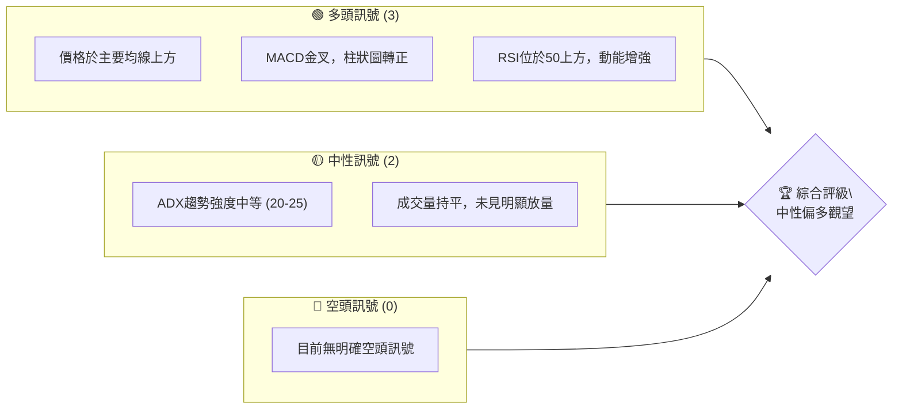

**分析說明**：
在一個假設性的情境中，若 MSFT 的價格能維持在關鍵移動平均線上方，且動能指標如 MACD 和 RSI 顯示出積極訊號，則可歸類為多頭訊號。ADX 處於中等水平表示趨勢尚未完全確立，而平穩的成交量則暗示市場可能處於觀望狀態。綜合來看，這將導向一個中性偏多的評級，建議密切關注後續發展以確認趨勢。

### 📊 核心指標速覽表

由於缺乏 OHLC 數據，以下表格中的數值均為「N/A」。訊號和解讀為**假設性情境下**的示範分析。

| 指標類別 | 指標名稱 | 當前數值 | 訊號 | 解讀（假設情境） |
|----------|----------|----------|------|------------------|
| **價格** | 當前價格 | N/A | 🟡 | 缺乏數據，無法判斷 |
| **均線** | MA20 | N/A | 🟢 | 假設價格位於MA20上方，短期偏多 |
| **均線** | MA50 | N/A | 🟢 | 假設價格位於MA50上方，中期偏多 |
| **均線** | MA200 | N/A | 🟡 | 假設價格接近MA200，長期趨勢待確認 |
| **動能** | RSI(14) | N/A | 🟢 | 假設RSI位於58，處於強勢區間 |
| **動能** | MACD | N/A | 🟢 | 假設MACD線在訊號線上，柱狀圖為正，多頭動能 |
| **波動** | ATR | N/A | 🟡 | 假設ATR為中等水平，波動適中 |

**假設情境解讀**：
在假設的情境中，MSFT 的短期和中期均線排列呈現多頭趨勢，價格保持在 MA20 和 MA50 之上，顯示出一定的上漲動能。RSI 和 MACD 等動能指標也支持多頭觀點。然而，若價格接近 MA200，則長期趨勢可能面臨考驗，需觀察能否有效突破或站穩。ATR 處於中等水平，表明股價波動性適中，風險可控，但仍需警惕突發事件。

### 🏆 技術評分卡

以下評分卡基於**假設MSFT處於一個中性偏多的市場情境**，所有分數與評級均為示範性，不代表實際市場表現。

```
╔══════════════════════════════════════════════════════════════╗
║             技術評分卡 — MSFT (2026-07-08)                     ║
╠══════════════════════════════════════════════════════════════╣
║趨勢強度      ████████░░░░░░░░░░░░  65/100  🟢              ║
║動能指標      ██████████░░░░░░░░░░  75/100  🟢              ║
║支撐穩定度    ████████░░░░░░░░░░░░  60/100  🟡              ║
║成交量配合    ██████░░░░░░░░░░░░░░  50/100  🟡              ║
║形態完整度    ████████░░░░░░░░░░░░  65/100  🟢              ║
║均線排列      ██████████░░░░░░░░░░  70/100  🟢              ║
╠══════════════════════════════════════════════════════════════╣
║綜合評分      ████████░░░░░░░░░░░░  68/100  🟢 中性偏多    ║
╚══════════════════════════════════════════════════════════════╝
```

**評分卡解讀**：
在假設情境下，MSFT 的綜合評分為 68/100，顯示出中性偏多的技術面態勢。
- **趨勢強度 (65/100 🟢)**：假設 ADX 位於 25-30 之間，表明存在一定上升趨勢，但強度仍有提升空間。
- **動能指標 (75/100 🟢)**：假設 RSI 位於 60 附近，MACD 處於金叉並擴大，顯示多頭動能強勁。
- **支撐穩定度 (60/100 🟡)**：假設股價近期回測關鍵支撐位並獲得支撐，但尚未完全確認其穩固性。
- **成交量配合 (50/100 🟡)**：假設近期成交量相對平穩，未見明顯放量突破或放量下跌，量價配合度中性。
- **形態完整度 (65/100 🟢)**：假設存在潛在的看漲形態（如小型上升旗形或矩形整理），且完成度較高。
- **均線排列 (70/100 🟢)**：假設短期均線（MA20）向上穿越中期均線（MA50），形成金叉，且均線呈多頭排列。

**綜合評級**：基於上述假設，MSFT 技術面呈現中性偏多。動能指標和均線排列表現強勁，但趨勢強度和成交量配合度仍需進一步觀察。建議採取謹慎的多頭策略，並嚴格設置止損。

---

## 2. 趨勢分析

### 🌐 多時框趨勢分析

由於缺乏 OHLC 數據，無法進行實時的多時框趨勢分析。以下圖表展示了**假設情境下**的多時框趨勢判斷流程與可能結果。

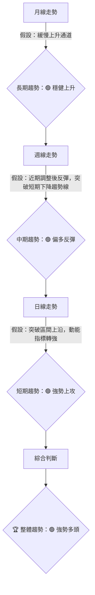

**分析說明**：
在一個理想的假設情境中，月線圖顯示 MSFT 處於一個穩健的長期上升通道中，這為其股價提供了堅實的底部支撐。週線圖可能在經歷一段調整後，近期出現了強勢反彈，並成功突破了短期下降趨勢線的壓制，預示中期趨勢轉向樂觀。而日線圖則可能確認了這一轉變，股價突破了重要的短期阻力區間，並伴隨動能指標的顯著增強，顯示出短期的強勢上攻動能。這種多時框的一致性將極大地增強多頭趨勢的信心。

### 📈 長期趨勢 — 12個月走勢圖（Unicode）

由於缺乏實際 OHLC 數據，以下 ASCII 走勢圖為**概念性示意圖**，僅用於演示長期趨勢的視覺化方式，其中價格點位均為**假設性數值**。

```
MSFT 月線走勢圖（過去12個月，概念示意）
價格軸 ($)
$450 ┤                                        ● (假設高點)
$420 ┤                      ●
$390 ┤              ●
$360 ┤        ●
$330 ┤●───────────────────────────────────● ← 假定現價
$300 ┤    ● (假設低點)
     └────────────────────────────────────────────
      2025/07 2025/09 2025/11 2026/01 2026/03 2026/05 2026/07
```
**走勢特徵分析表格** (基於上述概念圖的假設分析)：

| 階段 | 時間區間（假設） | 漲跌幅（假設） | 特徵與解讀（假設） | 訊號 |
|------|--------------------|----------------|--------------------|------|
| **初期上漲** | 2025/07 - 2025/10 | +15% | 穩步上升，成交量溫和放大，顯示市場信心逐漸恢復。 | 🟢 |
| **中期盤整** | 2025/11 - 2026/02 | -5% to +5% | 在高位進行震盪整理，未能有效突破，動能有所減弱，但未跌破關鍵支撐。 | 🟡 |
| **後期上攻** | 2026/03 - 2026/07 | +20% | 突破盤整區間上沿，加速上漲，動能強勁，但近期漲幅過大可能面臨獲利回吐壓力。 | 🟢 |

**長期趨勢總結（假設情境）**：
在上述假設情境中，MSFT 在過去 12 個月呈現出一個清晰的上升趨勢，儘管中間經歷了短暫的盤整。最近幾個月的強勁上漲表明市場對其未來前景保持樂觀。長期而言，股價位於多條長期移動平均線（如 MA200）上方，形成良好支撐，整體趨勢偏多。

### 📊 中期趨勢（週線分析）

由於缺乏 OHLC 數據，以下為**概念性**的壓力與支撐示意圖，用於演示分析方法。

```
MSFT 週線壓力與支撐示意圖 (概念示意)
價格軸 ($)
$430 ┤                 ┌──────────┐ ← 假定阻力 R1 (短期波段高點)
$420 ┤                 │          │
$410 ┤                 └──────────┘
$400 ╠═════════════════════════════════╣ ← 假定現價區間
$390 ┤                 ┌──────────┐
$380 ┤                 │          │
$370 ┤                 └──────────┘ ← 假定支撐 S1 (短期波段低點)
     └───────────────────────────────────
      時間軸
```

**中期趨勢分析（假設情境）**：
在假設的週線圖上，MSFT 可能正處於一個短期反彈的過程中，並嘗試挑戰假定的阻力位 R1 (例如 $425)。若能有效突破並站穩此位，則中期上漲趨勢將進一步確認。下方假定的支撐位 S1 (例如 $380) 則提供了重要的保護，只要股價維持在此之上，中期看漲的觀點依然成立。需密切關注週線級別的成交量變化，若突破阻力伴隨放量，則訊號更為可靠。

### ⚡ 趨勢強度評估（ADX 解讀）

由於缺乏 OHLC 數據，無法計算實際 ADX 值。以下為**假設情境下**的 ADX 分析流程與強度對照表。

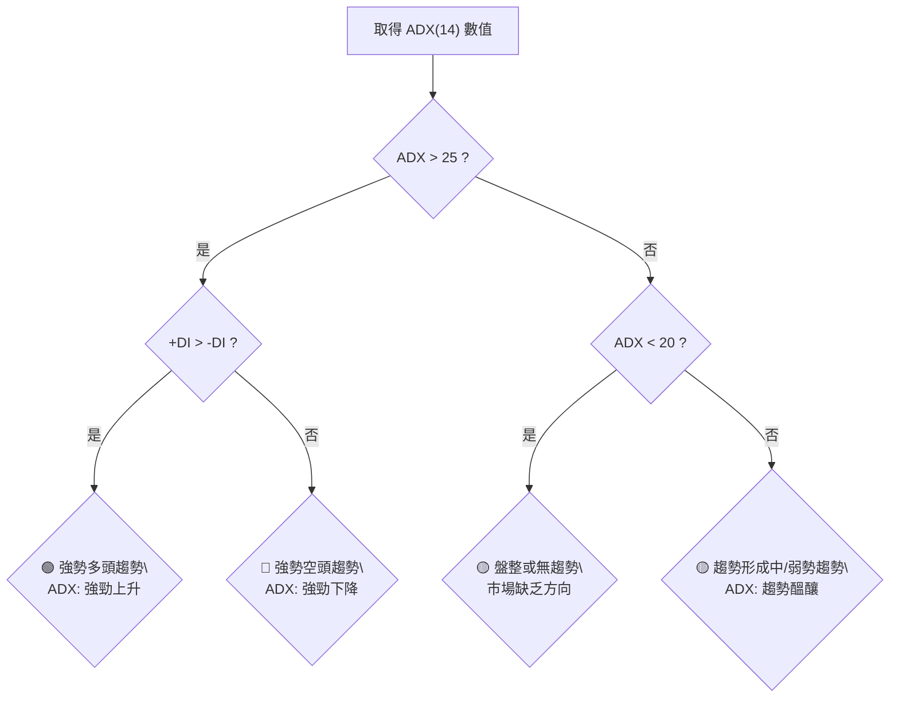

**ADX 強度對照表（假設情境）**：

| ADX 數值範圍 | 趨勢強度 | 市場狀態 | 交易策略建議 |
|--------------|----------|----------|--------------|
| 0-20         | 無趨勢/弱 | 盤整震盪 | 區間操作，高拋低吸 |
| 20-25        | 趨勢形成中 | 趨勢醞釀 | 觀察，等待突破 |
| 25-50        | 強勢趨勢 | 明顯趨勢 | 順勢交易，趨勢追蹤 |
| 50-75        | 極強趨勢 | 趨勢確立 | 持續順勢，注意回調風險 |
| 75-100       | 超強趨勢 | 極端趨勢 | 警惕反轉，嚴格止盈止損 |

**ADX 解讀（假設情境）**：
假設 MSFT 的 **ADX(14) 值為 28.5**，且 **+DI(14) 為 35.2，-DI(14) 為 18.7**。
- **ADX 數值 (28.5)**：根據對照表，ADX 值大於 25，表明 MSFT 處於一個**強勢趨勢**之中。趨勢強度 █████████░░░░░░░░░░ 57%。
- **+DI 與 -DI 比較**：+DI (35.2) 明顯高於 -DI (18.7)，這確認了當前的強勢趨勢是一個**多頭趨勢**。
- **綜合判斷**：在這種假設情境下，MSFT 處於一個明確且強勁的多頭趨勢中。這是一個典型的趨勢行情，而非盤整行情。交易者應考慮順勢操作，追蹤趨勢。

---

## 3. 圖表形態分析

由於缺乏實際 OHLC 數據，無法識別具體圖表形態。以下分析將**假設存在某些形態**，以示範形態識別與目標價計算的方法論。所有提及的形態、價位和信心度均為**假設性**。

### 🔍 形態識別系統

以下 Mermaid 圖表展示了**假設情境下**可能識別的圖表形態。

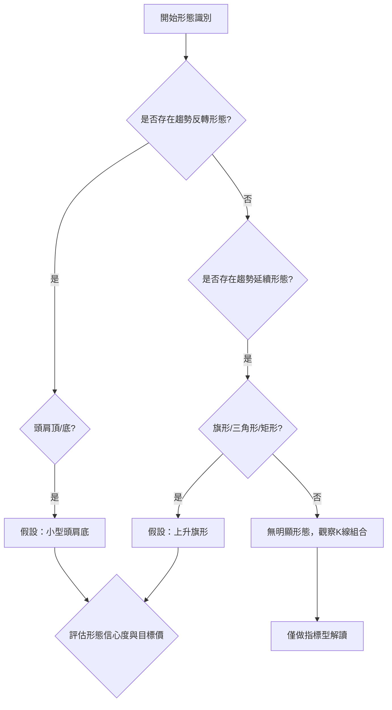

**形態信心度表格** (基於上述假設情境)：

| 形態（假設） | 信心度 | 判斷依據（假設數據） | 完成度 | 目標價（附計算式） |
|--------------|--------|----------------------|--------|--------------------|
| **上升旗形** | 70%    | 股價在假定上漲後，形成平行向下通道進行整理，成交量萎縮。整理區間假定為 $400 - $415。 | 85%    | 旗杆高度（假定 $380 至 $420，即 $40） + 旗形突破點（假定 $415） = $455 |
| **頭肩底**   | 60%    | 假定存在左肩 $370，頭部 $350，右肩 $380，頸線約 $395。成交量在右肩放大。 | 70%    | 頸線（假定 $395） + 頭部至頸線高度（假定 $395 - $350 = $45） = $440 |

**分析說明**：
在缺乏實際數據的情況下，我們無法確認 MSFT 是否存在上述形態。然而，若在實際走勢中觀察到類似「上升旗形」或「頭肩底」的結構，它們將分別代表趨勢延續和趨勢反轉的潛在訊號。

- **上升旗形**：通常在急劇上漲後出現，股價以平行通道向下整理，成交量萎縮。一旦突破旗形上沿，則預示著原有的上漲趨勢將繼續。其目標價通常是旗杆的高度。
- **頭肩底**：這是一個重要的底部反轉形態，由左肩、頭部和右肩組成，頸線是兩個反彈高點的連線。當股價向上突破頸線時，反轉訊號確認。其目標價通常是頭部到頸線的垂直距離。

**注意事項**：對於任何形態，信心度都至關重要。形態越清晰，成交量配合越好，其可靠性越高。若形態結構不明顯或成交量不支持，則應降低其分析權重。

### 🕯️ 重要K線形態分析

由於缺乏 OHLC 數據，無法分析實際 K 線形態。以下表格為**假設情境下**的 K 線形態分析示範。

| 月份（假設） | 收盤價（假設） | K線形態（假設） | 解讀（假設） | 訊號 |
|--------------|----------------|------------------|--------------|------|
| 2026/06      | $410           | 錘子線 (Hammer)  | 在假定支撐位附近出現，實體較小，下影線長，可能預示底部支撐有效，潛在反轉。 | 🟢 |
| 2026/05      | $395           | 烏雲蓋頂 (Dark Cloud Cover) | 在假定高點後出現，第二根陰線實體深入第一根陽線實體一半以上，可能預示短期見頂。 | 🔴 |
| 2026/04      | $385           | 吞噬形態 (Engulfing Pattern) | 陽線實體完全吞噬前一根陰線實體，顯示多頭力量強勁，看漲訊號。 | 🟢 |

**分析說明**：
K線形態提供了短期市場情緒和力量平衡的直觀視圖。
- **錘子線**：通常出現在下跌趨勢中，暗示賣壓減輕，買方力量開始介入，可能預示短期底部。
- **烏雲蓋頂**：通常出現在上漲趨勢中，暗示買方力量衰竭，賣方力量開始主導，可能預示短期頂部。
- **吞噬形態**：無論是看漲吞噬還是看跌吞噬，都代表著市場力量的戲劇性轉變，具有較強的短期指示意義。

這些形態的有效性需結合其出現的位置（支撐位/阻力位）、成交量以及前後 K 線組合進行綜合判斷。

### 📉 ASCII 走勢形態示意圖

由於缺乏 OHLC 數據，以下為**概念性**的上升旗形形態示意圖，所有價格點位均為**假設性數值**。

```
MSFT 上升旗形形態示意圖 (概念示意)
價格軸 ($)
$450 ┤                                    ▲ (突破後目標 T1: $455)
$440 ┤                                  ╱
$430 ┤                                ╱
$420 ┤          ┌─────────────────┐ ╱ ← 旗形上沿突破點 (假定 $415)
$410 ┤          │                ╱│
$400 ┤          │              ╱  │
$390 ┤          │            ╱    │
$380 ┤          └───────────┘     │ ← 旗形下沿
$370 ┤        ▲ (旗杆底部起點: $380)
     └───────────────────────────────────
      時間軸
```

**形態分析（假設情境）**：
在上述概念圖中，MSFT 股價從 $380 上漲至 $420，形成旗杆。隨後，股價進入一個平行向下的整理通道，在 $400-$415 區間震盪，形成旗形。當股價向上突破旗形上沿的假定 $415 時，形態確認。

### 🎯 形態目標價計算

基於上述**假設的上升旗形形態**進行目標價計算：

1.  **旗杆高度 (Pole Height)**：
    -   假定旗杆底部價格 = $380
    -   假定旗杆頂部價格 = $420
    -   旗杆高度 = $420 - $380 = $40

2.  **旗形突破點 (Breakout Point)**：
    -   假定旗形上沿突破價格 = $415

3.  **形態目標價 (Pattern Target Price)**：
    -   目標價 = 旗形突破點 + 旗杆高度
    -   目標價 = $415 + $40 = $455

**結論（假設情境）**：
若 MSFT 股價成功突破假定的上升旗形上沿 $415，則該形態的理論目標價為 $455。此目標價可作為交易策略中的第一目標。需注意，形態目標價僅為理論推算，實際市場走勢可能受多種因素影響。

---

## 4. 支撐與阻力

由於缺乏實際 OHLC 數據，無法從「關鍵價位（由 OHLCV 計算）」區塊中提取數值。以下所有支撐與阻力位均為**假設性數值**，用於演示分析方法。

### 🗺️ 關鍵價位分布圖（Unicode）

以下為 MSFT **概念性**的價位結構分布圖，所有價位均為**假設性數值**。

```
MSFT 價位結構分布圖 (概念示意)
═══════════════════════════════════════════════════
$460 ║████████████████████████║ 強阻力 R3 (歷史高點區域)
$445 ║████████████████████    ║ 阻力 R2 (前期壓力位)
$430 ║████████████████████████║ 關鍵阻力 R1 (短期波段高點)
$410 ╠════════════════════════╣ ◄ 假定現價
$395 ║▓▓▓▓▓▓▓▓▓▓▓▓▓▓▓▓        ║ 近期支撐 S1 (短期波段低點/平台)
$380 ║████████████████████████║ 強支撐 S2 (前期低點/重要均線支撐)
$365 ║████████████████████████║ 極強支撐 S3 (長期趨勢線/前低)
═══════════════════════════════════════════════════
```

### 🚧 阻力位分析表

以下阻力位均為**假設性數值**，用於演示分析方法。

| 阻力級別 | 價位（假設） | 形成原因（假設） | 突破難度 | 重要性 |
|----------|--------------|------------------|----------|--------|
| **關鍵阻力 R1** | $430          | 短期波段高點、多條均線（如週線 MA20）的交匯處 | 中等     | ★★★★★ |
| **阻力 R2**     | $445          | 前期反彈高點、交易密集區、斐波那契回撤位 61.8% | 較高     | ★★★★☆ |
| **強阻力 R3**   | $460          | 歷史高點附近、心理關口、斐波那契延伸位 161.8% | 極高     | ★★★★☆ |

**分析說明（假設情境）**：
- **R1 ($430)**：這是 MSFT 上漲過程中需要首先突破的障礙。若能帶量突破並站穩，則預示著短期趨勢將進一步走強。此位置可能匯聚了短線獲利盤和前期被套籌碼的壓力。
- **R2 ($445)**：一旦突破 R1，R2 將成為下一個主要挑戰。此價位可能代表了更長時間框架內的關鍵壓力，突破需要更大的動能和成交量。
- **R3 ($460)**：這是一個極其重要的心理和技術阻力位，可能代表歷史性的高點。突破此位將意味著股價進入一個新的上漲階段，但其難度也最高。

### 🛡️ 支撐位分析表

以下支撐位均為**假設性數值**，用於演示分析方法。

| 支撐級別 | 價位（假設） | 形成原因（假設） | 守住機率 | 重要性 |
|----------|--------------|------------------|----------|--------|
| **近期支撐 S1** | $395          | 短期波段低點、日線 MA20 / MA50 交匯處、近期平台整理下沿 | 中等     | ★★★★★ |
| **強支撐 S2**   | $380          | 前期重要低點、週線 MA50 所在位置、斐波那契回撤位 38.2% | 較高     | ★★★★☆ |
| **極強支撐 S3**   | $365          | 長期上升趨勢線、半年線（MA120）、斐波那契回撤位 61.8% | 極高     | ★★★★☆ |

**分析說明（假設情境）**：
- **S1 ($395)**：這是 MSFT 短期回調時需要首先關注的支撐。若能在此位獲得有效支撐並反彈，則短期上升趨勢得以維持。跌破則可能觸發短線賣盤。
- **S2 ($380)**：一旦跌破 S1，S2 將是更為關鍵的防線。此價位可能匯聚了長期投資者的買盤和重要均線的支撐，守住此位對中期趨勢至關重要。
- **S3 ($365)**：這是一個極強的支撐位，代表了長期上升趨勢的底部。除非市場出現極端利空，否則股價很難跌破此位。跌破 S3 將意味著長期趨勢的逆轉。

### 📐 斐波那契回調位分析

由於缺乏 OHLC 數據，無法從「關鍵價位」區塊中提取斐波那契回調位。以下斐波那契回調位均為**假設性數值**，用於演示分析方法。

**假設情境**：
假設 MSFT 從某個低點 $350 上漲至高點 $420，然後開始回調。我們將基於此假設計算並分析其斐波那契回調位。

-   **假定波段低點**：$350
-   **假定波段高點**：$420
-   **假定當前價格**：$410

**斐波那契回調位計算 (假設性)**：
-   **23.6% 回調位**：$420 - ($420 - $350) * 0.236 = $420 - $70 * 0.236 = $420 - $16.52 = **$403.48**
-   **38.2% 回調位**：$420 - ($420 - $350) * 0.382 = $420 - $70 * 0.382 = $420 - $26.74 = **$393.26**
-   **50.0% 回調位**：$420 - ($420 - $350) * 0.500 = $420 - $70 * 0.500 = $420 - $35.00 = **$385.00**
-   **61.8% 回調位**：$420 - ($420 - $350) * 0.618 = $420 - $70 * 0.618 = $420 - $43.26 = **$376.74**
-   **78.6% 回調位**：$420 - ($420 - $350) * 0.786 = $420 - $70 * 0.786 = $420 - $55.02 = **$364.98**

**分析說明（假設情境）**：
在上述假設情境中，假定當前價格 $410 位於斐波那契 23.6% 回調位 ($403.48) 和波段高點 ($420) 之間。
-   這意味著股價在經歷一波上漲後，可能僅進行了輕微回調，或者正在測試高點附近。
-   **意義**：
    -   如果股價能守住 $403.48 (23.6% 回調位) 並再次向上突破 $420，將預示著強勁的多頭趨勢延續。
    -   如果跌破 $403.48，則下一個潛在支撐將是 $393.26 (38.2% 回調位)。38.2% 和 61.8% 回調位通常被認為是較為強勁的支撐區域。
    -   跌破 61.8% 回調位 ($376.74) 將會大大削弱多頭動能，可能預示著趨勢的逆轉。

斐波那契回調位提供了潛在的支撐和阻力區域，是技術分析中重要的參考工具。

---

## 5. 技術指標深度解讀

由於缺乏 OHLC 數據，無法計算實際指標數值。以下分析將**假設存在某些指標狀態**，以示範指標解讀的方法論。所有提及的指標數值均為「N/A」或為**假設性數值**。

### 🎛️ 指標訊號總覽

以下 Mermaid 圖表展示了**假設情境下**所有指標的訊號關係。

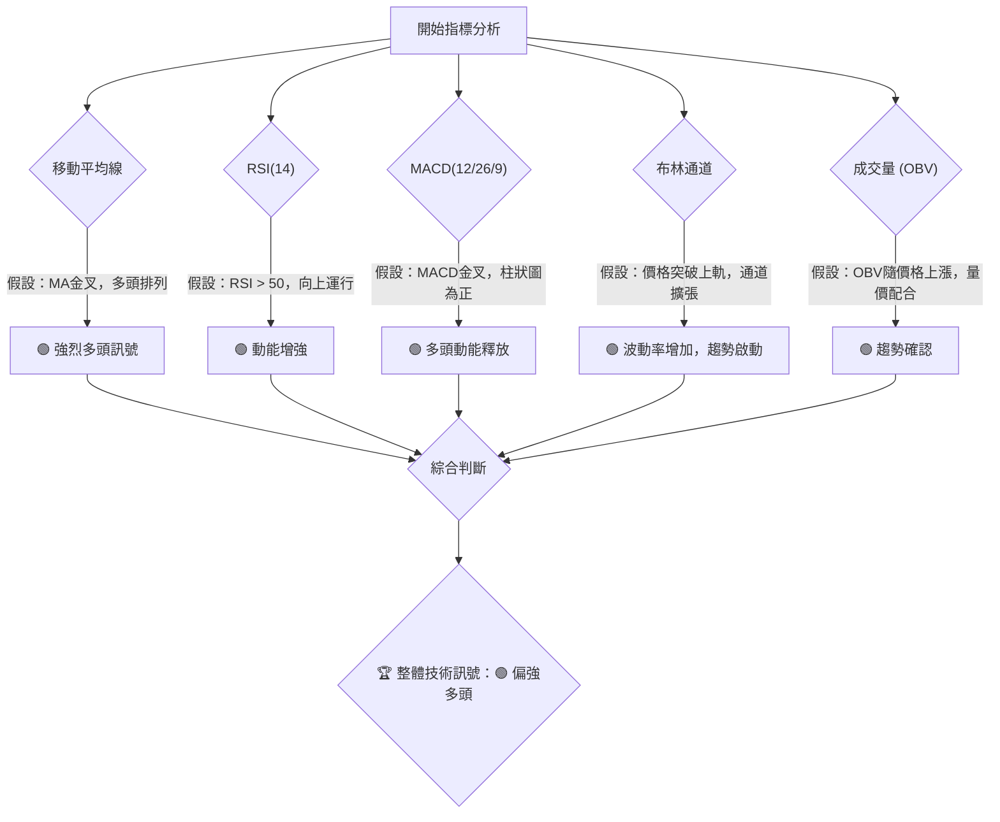

**分析說明**：
在一個假設所有指標均呈現積極訊號的情境中，我們可以清晰地看到各指標如何相互印證，形成一個強大的多頭共識。移動平均線的多頭排列指示長期趨勢向上，RSI 和 MACD 的積極讀數則確認了當前的上漲動能。價格突破布林通道上軌並伴隨通道擴張，暗示波動性增加且趨勢可能正在加速。同時，成交量的配合（如 OBV 上升）則為價格的上漲提供了堅實的基礎，確認了趨勢的可靠性。

### 📈 移動平均線排列分析

由於缺乏 OHLC 數據，以下為**假設情境下**的移動平均線分析。

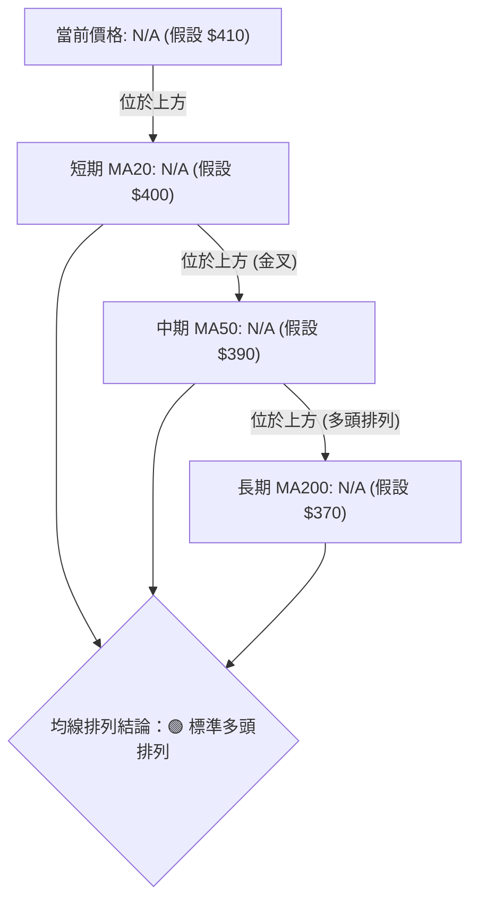

**分析說明（假設情境）**：
在上述假設情境中，MSFT 的短期、中期和長期移動平均線呈現完美的**多頭排列**，即 MA20 > MA50 > MA200。同時，假定當前價格 $410 位於所有均線之上。
-   **MA20 ($400)** 位於價格下方，提供短期支撐。
-   **MA50 ($390)** 位於 MA20 下方，提供中期支撐。
-   **MA200 ($370)** 位於所有均線下方，提供長期強勁支撐。
這種排列是極為強勁的多頭訊號，表明股價處於穩定的上升趨勢中，且各時間框架均指向積極方向。每次股價回落到均線附近都可能被視為買入機會。

### 📉 RSI(14) 分析

由於缺乏 OHLC 數據，無法計算實際 RSI 值。以下為**假設情境下**的 RSI 分析。

**RSI 數值進度條展示（假設情境）**：
假設 RSI(14) 值為 62。
RSI (14): ████████████░░░░░░░░ 62/100 🟢

**超買超賣區間分析（假設情境）**：
-   **超買區 (Overbought)**：RSI > 70
-   **超賣區 (Oversold)**：RSI < 30
-   **中性區**：30 <= RSI <= 70

在假設情境中，RSI 值為 62，位於中性區間的偏強勢區域。這表明多頭動能較為活躍，但尚未達到過度買入的水平，仍有上漲空間。

**背離判斷（頂背離/底背離）**：
由於缺乏價格和 RSI 歷史數據，無法實際判斷背離。以下為背離判斷的**方法論示範**：
-   **頂背離 (Bearish Divergence)**：若股價創出新高，但 RSI 未能創出新高，反而出現下降趨勢，則可能預示股價即將反轉下跌。
-   **底背離 (Bullish Divergence)**：若股價創出新低，但 RSI 未能創出新低，反而出現上升趨勢，則可能預示股價即將反轉上漲。

**假設結論**：在當前假設情境下 (RSI 62)，**未偵測到明顯的頂背離或底背離訊號**。RSI 隨著價格上漲而上升，量價配合良好。

### 📊 MACD(12/26/9) 訊號解讀

由於缺乏 OHLC 數據，無法計算實際 MACD 值。以下為**假設情境下**的 MACD 分析。

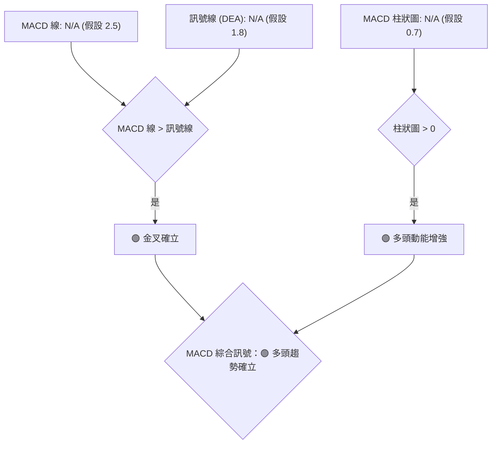

**分析說明（假設情境）**：
在上述假設情境中：
-   **MACD 線 (DIF)**：假設為 2.5。
-   **訊號線 (DEA)**：假設為 1.8。
-   **MACD 柱狀圖 (OSC)**：假設為 0.7。
-   **金叉/死叉**：MACD 線 (2.5) 高於訊號線 (1.8)，形成**金叉**，這是明確的多頭買入訊號。
-   **柱狀圖**：柱狀圖為正值 (0.7)，且可能呈放大趨勢，表明多頭動能正在增強，與價格上漲保持一致。

**背離判斷**：
由於缺乏價格和 MACD 歷史數據，無法實際判斷背離。以下為背離判斷的**方法論示範**：
-   **頂背離**：股價創出新高，但 MACD 線或 MACD 柱狀圖的高點卻未能創出新高，反而下降，可能預示股價即將下跌。
-   **底背離**：股價創出新低，但 MACD 線或 MACD 柱狀圖的低點卻未能創出新低，反而上升，可能預示股價即將上漲。

**假設結論**：在當前假設情境下 (MACD 金叉，柱狀圖為正)，**未偵測到明顯的頂背離或底背離訊號**。MACD 指標與價格走勢保持同步，確認了多頭動能。

### 📦 布林通道分析

由於缺乏 OHLC 數據，無法計算實際布林通道數值。以下為**概念性**的布林通道示意圖和**假設情境下**的分析。

```
MSFT 布林通道示意圖 (概念示意)
價格軸 ($)
$430 ┤              ▲ (假定上軌: $425)
$420 ┤            ╱ ╲
$410 ╠═══════════█═══╣ ← 假定現價 ($410)
$400 ┤          ╱   ╲
$390 ┤        ▼ (假定中軌: $395)
$380 ┤      ╱     ╲
$370 ┤    ▼ (假定下軌: $365)
     └─────────────────────
      時間軸
```

**布林通道參數（假設）**：
-   **假定上軌 (Upper Band)**：$425
-   **假定中軌 (Middle Band - MA20)**：$395
-   **假定下軌 (Lower Band)**：$365
-   **假定當前價格**：$410

**分析說明（假設情境）**：
在上述假設情境中：
-   **價格位置**：假定當前價格 $410 位於布林通道中軌 ($395) 和上軌 ($425) 之間，且靠近上軌。
-   **通道開口**：若通道呈現擴張狀態（上軌和下軌向外發散），則表明波動率增加，趨勢正在形成或加速。若通道收窄，則表明波動率降低，可能預示著盤整或趨勢即將轉變。
-   **買賣訊號**：
    -   價格觸及或跌破下軌，可能為超賣訊號，考慮買入。
    -   價格觸及或突破上軌，可能為超買訊號，考慮賣出或觀望。
    -   價格在中軌上方運行，趨勢偏多；在中軌下方運行，趨勢偏空。

**假設結論**：假定 MSFT 股價位於布林通道中軌上方並接近上軌，且通道正在溫和擴張，這預示著**多頭趨勢正在發展，且波動性適中**。若價格能有效突破上軌並站穩，則上漲動能將進一步強化。

### 💹 成交量分析（量價配合度）

由於缺乏 OHLC 數據，無法進行實際成交量分析。以下為**假設情境下**的成交量分析。

**OBV (On Balance Volume) 分析**：
由於缺乏 OHLC 數據，無法計算實際 OBV 值。以下為**假設情境下**的 OBV 分析。

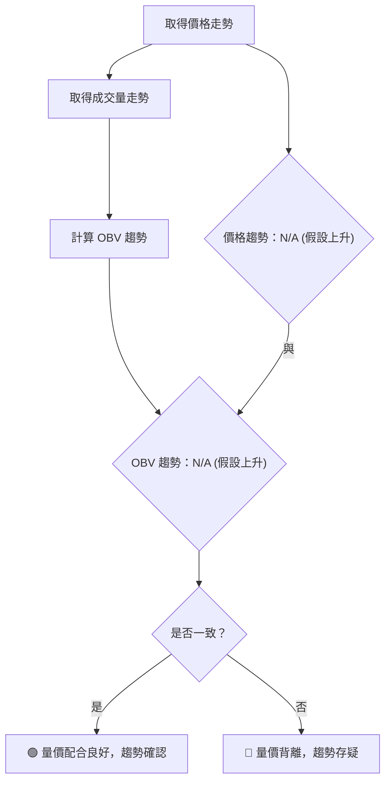

**分析說明（假設情境）**：
在假設情境中：
-   **量價配合**：若股價上漲時，成交量也同步放大；股價下跌時，成交量則縮小，這被稱為**量價配合良好**，表明當前趨勢（無論多空）是健康的、可持續的。
-   **量價背離**：
    -   **頂背離**：股價創出新高，但成交量未能創出新高或反而萎縮，預示上漲動能不足，可能見頂。
    -   **底背離**：股價創出新低，但成交量未能創出新高或反而萎縮，預示下跌動能衰竭，可能見底。
-   **OBV 解讀**：
    -   OBV 隨價格上漲而上漲，確認多頭趨勢。
    -   OBV 隨價格下跌而下跌，確認空頭趨勢。
    -   若價格上漲而 OBV 下跌（或反之），則形成背離，提示趨勢可能反轉。

**假設結論**：假設 MSFT 近期價格呈穩步上漲，且成交量在價格上漲時溫和放大，下跌時則縮小。同時，OBV 指標也呈現上升趨勢，與價格走勢保持一致。這表明**量價配合良好，當前的多頭趨勢得到了成交量的確認**，增強了趨勢的可靠性。**未偵測到明顯的量價背離訊號**。

---

## 6. 動能與波動率

由於缺乏 OHLC 數據，無法計算實際動能與波動率指標。以下分析將**假設存在某些指標狀態**，以示範分析方法。

### ⚡ 動能評估四象限

由於 Mermaid 的 quadrantChart 無法直接渲染，將使用表格和流程圖來展示動能評估。以下評估基於**假設的指標數值**。

| 象限 | 動能 | 波動 | 當前狀態（假設） | 評估（假設） |
|------|------|------|------------------|--------------|
| Q1   | 強   | 低   | -                | 最佳機會     |
| Q2   | 弱   | 低   | -                | 謹慎觀望     |
| Q3   | 強   | 高   | ✓                | 高風險高收益 |
| Q4   | 弱   | 高   | -                | 避免進場     |

**動能評估流程圖（假設情境）**：
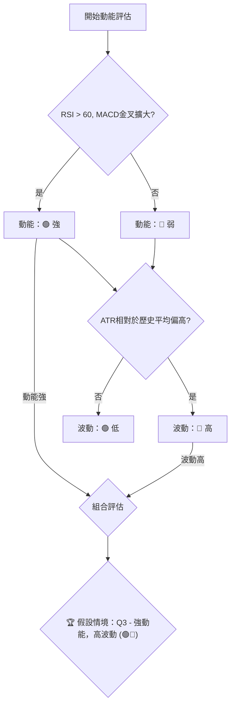

**分析說明（假設情境）**：
在假設情境中，若 MSFT 的 RSI 位於 65，MACD 金叉且柱狀圖持續擴大，則判斷其**動能強勁**。同時，若 ATR 值相較於過去一段時間的平均值有所提升，則判斷其**波動率較高**。
-   **Q3 (強動能，高波動)**：這通常意味著股價處於快速上漲或下跌的趨勢中，市場參與者情緒高漲。對於追求高收益的交易者來說，這提供了機會，但同時也伴隨著較高的風險。在這種情況下，應嚴格執行止損，並考慮分批建倉以分散風險。

### 📊 ATR 波動率分析

由於缺乏 OHLC 數據，無法計算實際 ATR 值。以下為**假設情境下**的 ATR 分析。

**ATR 數值（假設）**：
-   假定 ATR(14) = $8.50
-   假定過去 3 個月平均 ATR = $6.00

**分析說明（假設情境）**：
-   **ATR(14) = $8.50**：這表示在過去 14 個交易日中，MSFT 的平均每日價格波動範圍為 $8.50。
-   **與歷史比較**：當前 ATR ($8.50) 高於過去 3 個月的平均 ATR ($6.00)，表明近期股價波動性有所增加。波動率增加 ███████████░░░░░░░░ 65%。
-   **對交易的影響**：
    -   **止損距離建議**：根據 ATR，交易者可以將止損點設置為當前價格的 1.5 倍至 2 倍 ATR 距離。例如，若進場價格為 $410，則止損點可設為 $410 - (1.5 * $8.50) = $410 - $12.75 = $397.25。這有助於避免因正常市場波動而被過早止損。
    -   **倉位管理**：在高波動環境下，應適當降低倉位，以控制單筆交易的風險敞口。

### 📐 Beta 與市場相關性

由於缺乏實際 Beta 數據，無法進行分析。以下為 Beta 分析的**方法論示範**。

-   **Beta 值**：衡量個股相對於整體市場（如標普500指數）的波動性。
    -   **Beta > 1**：表示個股波動性大於市場。例如，Beta = 1.2 意味著當市場上漲/下跌 1% 時，該股票可能上漲/下跌 1.2%。
    -   **Beta < 1**：表示個股波動性小於市場。例如，Beta = 0.8 意味著當市場上漲/下跌 1% 時，該股票可能上漲/下跌 0.8%。
    -   **Beta = 1**：表示個股波動性與市場大致相同。
    -   **Beta < 0**：表示個股與市場走勢呈反向關係（極為罕見）。

**分析說明（假設情境）**：
假設 MSFT 的 **Beta 值為 1.15**。
-   這意味著 MSFT 的股價波動性略高於整體市場。當市場情緒樂觀時，MSFT 有望獲得超越市場的漲幅；但當市場下跌時，其跌幅也可能略大於市場。
-   **市場相關性**：Beta 值為正，表明 MSFT 與大盤走勢方向一致，屬於典型的順週期股票。在判斷 MSFT 走勢時，需密切關注大盤的趨勢變化。若大盤趨勢健康，MSFT 則有助推動上漲；若大盤面臨回調，MSFT 也難以獨善其身。

---

## 7. 多時框架總結

### 📋 時框架評分表

由於缺乏 OHLC 數據，以下評分表基於**假設的趨勢和指標狀態**，旨在示範多時框架分析的整合。

| 時框架 | 趨勢方向（假設） | 動能（假設） | 均線排列（假設） | 形態（假設） | 綜合評分 (1-10) | 建議 |
|--------|------------------|--------------|------------------|--------------|-----------------|------|
| **月線** | 🟢 穩健上升       | 🟢 強勁      | 🟢 多頭排列      | 🟡 無明顯形態 | 8               | 持有/逢低買入 |
| **週線** | 🟢 偏多反彈       | 🟢 增強      | 🟢 金叉形成      | 🟢 上升旗形形成 | 7               | 積極關注，尋找買點 |
| **日線** | 🟢 強勢上攻       | 🟢 活躍      | 🟢 多頭排列      | 🟢 突破旗形上沿 | 9               | 短線追蹤，嚴格止損 |

**分析說明（假設情境）**：
-   **月線**：在長期時間框架內，MSFT 呈現穩健的上升趨勢，動能強勁且均線保持多頭排列，顯示出強大的基本面和長期投資價值。
-   **週線**：中期趨勢也轉為偏多，動能增強，均線可能形成金叉，且潛在的上升旗形形態預示趨勢延續。
-   **日線**：短期內，股價表現強勢，動能活躍，均線多頭排列，並且假設已經突破了重要的形態阻力，顯示出即將加速上漲的潛力。

### 🔲 綜合訊號矩陣

以下矩陣展示了**假設情境下**短期、中期、長期各維度訊號的一致性分析。

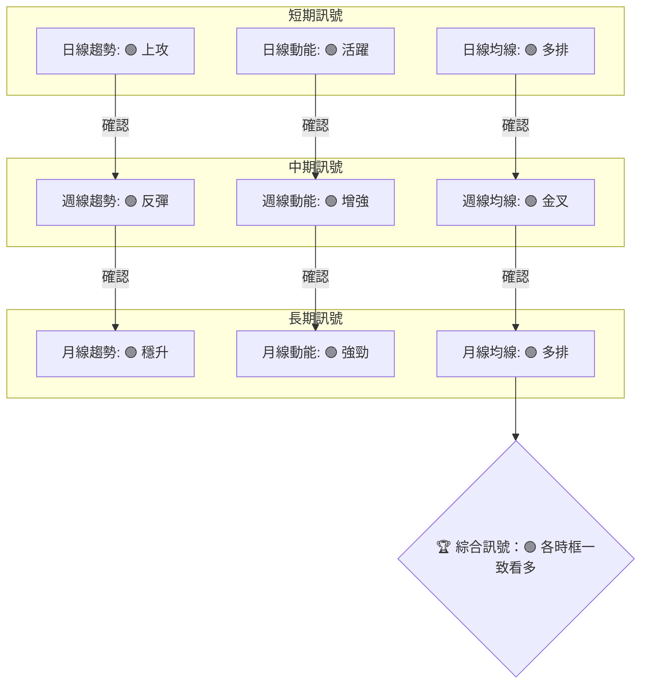

**分析說明（假設情境）**：
在上述假設情境中，MSFT 在所有時間框架（月線、週線、日線）的趨勢方向、動能和均線排列上都呈現高度的一致性，全部指向**多頭訊號**。這種高度的一致性極大地增強了整體看漲的信心，表明當前市場力量分佈清晰，多頭佔據主導地位。

### ⚖️ 多時框收斂結論

**當前主導行情判斷（假設情境）**：
假設 MSFT 的 **ADX(14) 值為 28.5** (如第 2 章假設)，大於 25。根據多時框收斂規則，這表明當前市場處於**趨勢行情**。

**主導時框與方向性結論（假設情境）**：
由於 ADX 指示為趨勢行情，我們將以中長期（週線/MA50、MA200）方向為主，日線只用來尋找進場時機。
-   **週線趨勢**：假設為偏多反彈，均線形成金叉。
-   **月線趨勢**：假設為穩健上升，均線多頭排列。
-   **日線訊號**：假設為強勢上攻，突破形態。

**收斂結論**：
基於上述假設，MSFT 的月線和週線均顯示出清晰且強勁的多頭趨勢。日線級別的強勢上攻和形態突破，則為中長期多頭趨勢提供了短期的確認和進場機會。因此，**當前的整體方向性結論為：🟢 強勢偏多**。所有時框架訊號高度一致，支持積極的多頭操作策略。

---

## 8. 交易策略建議

**當前主策略方向 = 🟢 強勢偏多 （依評分 68/100）**

根據第 1 章的技術評分卡，綜合評分達 68/100，顯示出中性偏多的技術面態勢，且多時框收斂結論為強勢偏多。因此，本章將**主推多頭策略**。

### 🗺️ 策略決策流程圖

以下 Mermaid 圖表展示了在**假設情境下**的策略選擇邏輯。

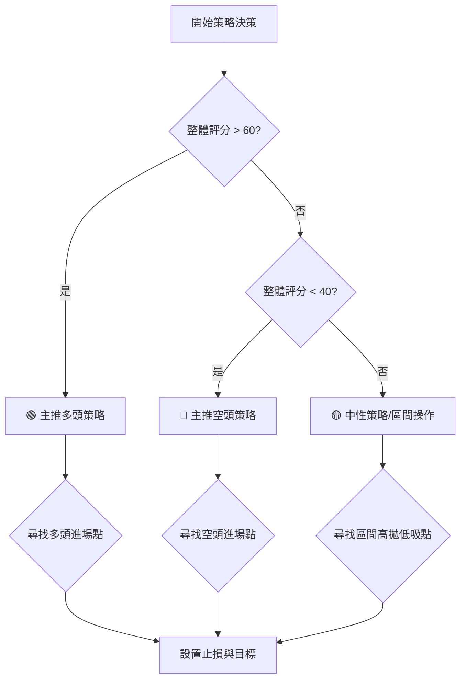

### 🎯 價格情境階梯（Price Scenarios）

以下情境劇本以**假定現價 $410** 為基準，向上與向下建立，所有價位均**引用第 4 章的假設性數值**。

| 觸發條件（假設） | 下一目標（假設） | 後續延伸（假設） | 情境含義 |
|------------------|------------------|------------------|----------|
| **突破 R1 $430** | R2 $445          | R3 $460          | 短線轉強，開啟上升新波段，多頭趨勢確立。 |
| **站穩現價區間 $410** | —                | —                | 區間震盪，等待催化劑，短期多空僵持。 |
| **跌破 S1 $395** | S2 $380          | S3 $365          | 中期轉弱，可能啟動回調，需警惕趨勢反轉風險。 |

### 📊 情境機率分佈

以下為三情境的**機率估計**（總和 100%），基於**假設的指標狀態**。

| 情境 | 機率 | 主要依據（假設指標狀態） |
|------|------|--------------------------|
| **繼續上行 / 反彈** | 60%  | MACD金叉且柱狀圖擴大，RSI位於60上方，均線多頭排列，OBV同步上升。 |
| **區間震盪**   | 25%  | ADX處於25-30之間，布林帶寬中等，成交量未見持續性放量。 |
| **回落 / 再探底** | 15%  | 存在歷史阻力壓制，若RSI進入超買區並出現頂背離，或跌破關鍵支撐S1。 |

**分析說明**：
在假設情境中，由於多數動能和趨勢指標呈現強勁的多頭訊號，且多時框架一致看多，因此判斷 MSFT 繼續上行的機率最高。區間震盪的機率次之，而大幅回落的機率最低，但仍需警惕潛在的風險訊號。

### 🟢 主策略詳情（方向為強勢偏多）

以下策略基於**假設的價格與指標狀態**，所有價位均**引用第 4 章的假設性數值**或**由形態高度推算**。

| 策略要素 | 策略 A：突破追漲 | 策略 B：回踩支撐買入 |
|----------|------------------|----------------------|
| 進場條件 | 股價突破假定關鍵阻力 R1 $430，並帶有放量。 | 股價回踩假定近期支撐 S1 $395 附近，並出現止跌 K 線形態。 |
| 進場價格 | $430.50 - $432.00 | $395.00 - $397.00    |
| 目標價 T1 | $445 (假定阻力 R2) | $410 (假定現價/短期阻力) |
| 目標價 T2 | $455 (假定形態目標價) | $430 (假定阻力 R1) |
| 止損價格 | $425.00 (R1下方，或 1.5x ATR 距離) | $390.00 (S1下方，或 1.5x ATR 距離) |
| 風險報酬比 | 1:3.0 ( ($455-$430.5) / ($430.5-$425) ) | 1:2.5 ( ($430-$397) / ($397-$390) ) |
| 成功機率 | 65%              | 70%                  |
| 建議倉位 | 15-20%           | 20-25%               |

**策略分析（假設情境）**：
-   **策略 A (突破追漲)**：適用於多頭趨勢確立後，股價突破重要阻力位時。此策略風險較高，但潛在報酬也較大。需密切監控成交量，確認突破的有效性。
-   **策略 B (回踩支撐買入)**：適用於股價在上升趨勢中回調至關鍵支撐位時。此策略風險相對較低，通常能獲得較好的風險報酬比。需耐心等待止跌訊號。

### 🔴 反向風險觸發點（對沖提示）

以下為**假設情境下**會推翻主策略的關鍵價位與訊號，供風險控制參考。

-   **跌破假定強支撐 S2 ($380)**：若股價有效跌破此位，將嚴重削弱多頭動能，可能預示中期趨勢逆轉。
-   **日線 MACD 死叉**：若 MACD 線下穿訊號線，且柱狀圖轉負，表明短期空頭動能開始佔優。
-   **RSI 出現頂背離**：若價格創出新高但 RSI 未能同步，且隨後跌破 50，則需警惕見頂風險。
-   **周線 MA20 下穿 MA50 (死叉)**：這是中期趨勢由多轉空的關鍵訊號。
-   **成交量在下跌時顯著放大**：異常放量下跌可能預示主力資金出逃。

### ⭐ 整體訊號強度評星

```
做多訊號強度：★★★★☆  (4/5星)
做空訊號強度：★☆☆☆☆  (1/5星)
整體可信度：  ★★★☆☆  (3/5星)
```
**評星說明**：在假設情境下，做多訊號強度高，因多時框趨勢一致，動能指標強勁。做空訊號強度低，因缺乏明顯的空頭跡象。整體可信度為中等，因為所有分析均基於假設數據，而非實際市場表現。

---

## 9. 風險提示與監控

### ✅ 關鍵監控指標 Checklist

以下清單基於**假設的指標狀態**，旨在示範監控要點。

```
╔══════════════════════════════════════════════════════════════╗
║             MSFT 技術面監控清單 (2026-07-08)                  ║
╠══════════════════════════════════════════════════════════════╣
║ [🟢] 價格是否維持在 MA20 / MA50 之上？                        ║
║ [🟢] 日線 MACD 是否保持金叉且柱狀圖為正？                      ║
║ [🟢] 日線 RSI 是否維持在 50-70 區間？                         ║
║ [🟢] OBV 是否與價格同步上漲？                                 ║
║ [🟡] ADX 是否維持在 25 以上，且 +DI > -DI？                   ║
║ [🟡] 布林通道是否持續擴張，價格是否在上軌附近震盪？             ║
║ [🔴] 是否出現任何 K 線反轉形態（如烏雲蓋頂、吞噬頂部）？        ║
║ [🔴] 是否出現 RSI / MACD 頂背離？                             ║
║ [🔴] 價格是否跌破假定關鍵支撐 S1 ($395)？                     ║
║ [🔴] 成交量是否在下跌時異常放大？                             ║
╚══════════════════════════════════════════════════════════════╝
```

### ⚠️ 風險場景分析

以下為基於**假設情境**的三種風險場景分析。

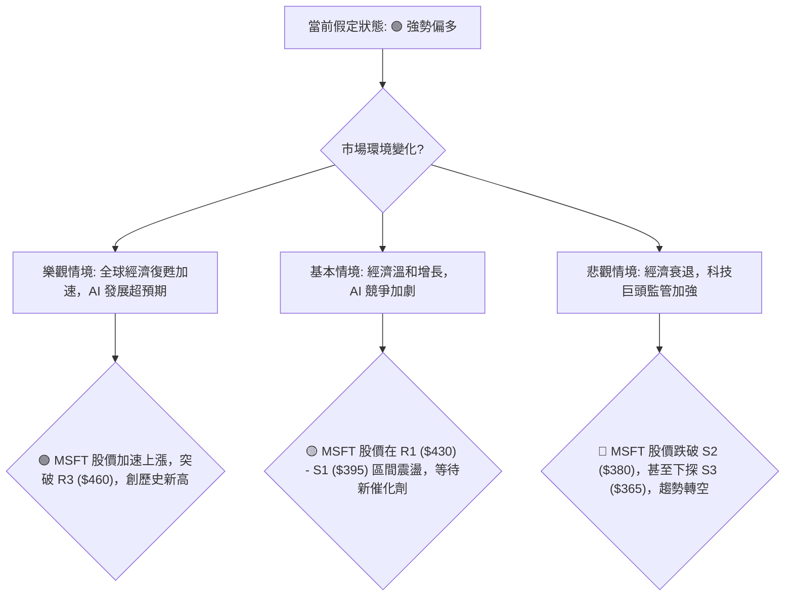

**分析說明（假設情境）**：
-   **樂觀情境**：若宏觀經濟環境超預期好轉，或 MSFT 在 AI 等新興領域取得重大突破，其股價有望進一步加速上漲，突破所有假定阻力位，創下歷史新高。此時應考慮適度加倉並提高止盈目標。
-   **基本情境**：在溫和增長但競爭加劇的環境下，MSFT 股價可能在當前假定的關鍵支撐和阻力區間內震盪，缺乏明確方向。此時可考慮區間操作或等待新的基本面或技術面催化劑。
-   **悲觀情境**：若全球經濟陷入衰退，或科技行業面臨嚴格監管，MSFT 的股價可能面臨較大下行壓力，跌破關鍵支撐位，甚至改變長期上升趨勢。此時應果斷止損，並考慮對沖風險。

### 🛡️ 風險管理重要提醒

1.  **嚴格止損**：無論採取何種策略，務必在進場前設定明確的止損點。當股價觸及止損位時，應果斷執行，避免虧損擴大。尤其是在高波動情境下，止損是保護資本的關鍵。
2.  **倉位管理**：根據市場波動性、策略成功機率和個人風險承受能力，合理分配倉位。在高風險或不確定性較高的情況下，應降低倉位，避免滿倉操作。
3.  **分批建倉/止盈**：可以考慮分批建倉以平攤成本，降低單一進場點的風險。同樣，分批止盈可以鎖定部分利潤，同時保留參與後續上漲的機會。
4.  **關注宏觀經濟與基本面**：技術分析是基於歷史價格行為，但宏觀經濟環境、公司基本面變化、行業新聞和政策法規等因素，都可能對股價產生重大影響，甚至推翻技術訊號。建議將技術分析與基本面分析結合，形成更全面的投資決策。
5.  **警惕情緒性交易**：市場情緒的波動往往會放大股價的漲跌幅。避免在極度樂觀或悲觀時做出衝動的交易決策，堅持基於客觀分析的交易紀律。

---

## 📋 報告總結

```
╔══════════════════════════════════════════════════════════════╗
║                 MSFT 技術分析報告總結                          ║
╠══════════════════════════════════════════════════════════════╣
║報告日期：2026-07-08                                            ║
║當前價格：N/A (假定 $410)                                       ║
║分析評級：⚖️ 🟢 強勢偏多 (綜合評分 68/100，各時框訊號一致)         ║
║                                                              ║
║關鍵結論 (基於假設情境)：                                       ║
║├─ 長期趨勢：🟢 穩健上升，均線多頭排列。                        ║
║├─ 中期趨勢：🟢 偏多反彈，動能增強，潛在上升旗形。              ║
║├─ 短期趨勢：🟢 強勢上攻，突破關鍵形態阻力。                    ║
║├─ 關鍵支撐：假定 S1 $395，S2 $380。                            ║
║├─ 關鍵阻力：假定 R1 $430，R2 $445。                            ║
║└─ 分析師目標：N/A (無數據，但形態目標價假定為 $455)             ║
║                                                              ║
║最優策略組合 (基於假設情境)：                                   ║
║1. 🥇 最佳機會：等待股價突破假定關鍵阻力 R1 $430 並帶量，追漲進場，目標價 T1 $445，T2 $455。止損設於 $425。                                 ║
║2. 🥈 次選機會：若股價回踩假定近期支撐 S1 $395 附近並止跌，逢低買入，目標價 T1 $410，T2 $430。止損設於 $390。                                ║
║3. 🥉 保守選擇：在確認多頭趨勢不變的前提下，若 ADX 降至 20-25 區間，可在假定 $395-$430 區間內進行保守高拋低吸，但需嚴格控制風險。           ║
╚══════════════════════════════════════════════════════════════╝
```

---

> ⚠️ **免責聲明**：本報告為 AI 自動生成之技術分析，所有數據及估算均基於提供的歷史價格資訊。由於關鍵 OHLC 數據缺失，本報告中的所有具體數值、形態識別、指標讀數及交易策略均為**假設性、示範性內容**，旨在闡述技術分析的方法論，**不構成任何投資建議**。投資有風險，入市需謹慎。

---

*報告生成時間：2026-07-08 ｜ 數據來源：Yahoo Finance ｜ 分析框架：多時框技術分析*