<details>
<summary>📊 靜態圖表 (點擊展開)</summary>
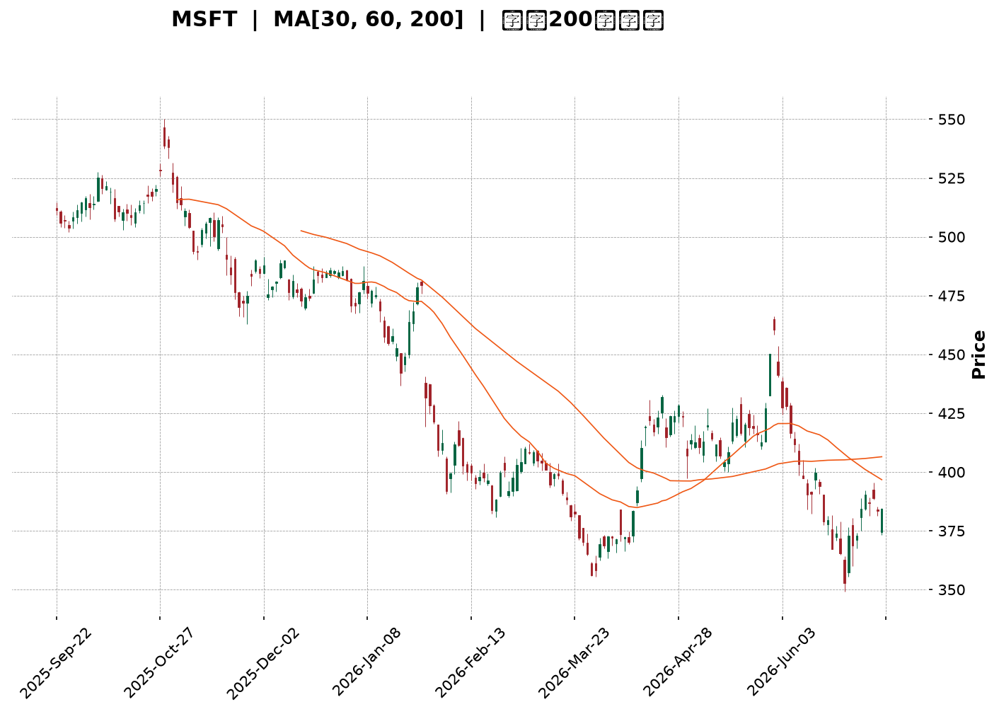
</details>

<html>
<head><meta charset="utf-8" /></head>
<body>
    <div style="height:500px; width:100%;">                        <script>window.PlotlyConfig = {MathJaxConfig: 'local'};</script>
        <script charset="utf-8" src="https://cdn.plot.ly/plotly-3.7.0.min.js" integrity="sha256-jvTGqxNp8AGWEcvNLVuKr+8j5dGe9Yw51LQkmDH+IYA=" crossorigin="anonymous"></script>                <div id="candlestick-chart" class="plotly-graph-div" style="height:100%; width:100%;"></div>            <script>                window.PLOTLYENV=window.PLOTLYENV || {};                                if (document.getElementById("candlestick-chart")) {                    Plotly.newPlot(                        "candlestick-chart",                        [{"close":{"dtype":"f8","bdata":"AAAAAGbzf0AAAABgZ6B\u002fQAAAAOAHr39AAAAAwGx9f0AAAADg28N\u002fQAAAACDI9X9AAAAA4IUVgEAAAACAgyOAQAAAAED0A4BAAAAAoMAQgEAAAADA8mmAQAAAAIB1RYBAAAAA4F9MgEAAAAAA5jiAQAAAAMDou39AAAAAwAntf0AAAAAgaOV\u002fQAAAAEAu439AAAAAgD7Gf0AAAADgkOV\u002fQAAAACBNDIBAAAAAoDcTgEAAAADAHCqAQAAAAGBFKoBAAAAAYIRCgEAAAABgZoGAQAAAAKBE1YBAAAAAYCLRgEAAAAAgnFOAQAAAAOBoFIBAAAAAgDUOgEAAAACgffF\u002fQAAAAAB+f39AAAAAgIvffkAAAADgF9t+QAAAAIAMbX9AAAAAwKiXf0AAAACAxb5\u002fQAAAAED2QX9AAAAAAIKvf0AAAAAAvYR\u002fQAAAACDrqn5AAAAAoN5AfkAAAAAA8cR9QAAAAOBtYH1AAAAAQGB+fUAAAADgAK59QAAAAICPNX5AAAAAQEKdfkAAAADgT0l+QAAAAMA9fX5AAAAAoMq5fUAAAADAVOt9QAAAAEBJEH5AAAAAIH2NfkAAAADgap1+QAAAAEADx31AAAAAYDkVfkAAAADgiMZ9QAAAACBwi31AAAAAYHKkfUAAAABAJaB9QAAAACBZHX5AAAAAIEA8fkAAAABgUix+QAAAAIAQS35AAAAAgLNdfkAAAABgw1h+QAAAAAAMT35AAAAAgBlVfkAAAAAgnRd+QAAAAMB9bX1AAAAA4A5sfUAAAABgN8Z9QAAAAGA5FX5AAAAAINi\u002ffUAAAABAe9J9QAAAAMAHsX1AAAAAIFVJfUAAAABAfpV8QAAAAIAqanxAAAAAgCOdfEAAAAAAFEh8QAAAAKBBontAAAAA4DwSfEAAAACgJf58QAAAAMAeQ31AAAAAYDDnfUAAAABA6vd9QAAAAMA\u002f+XpAAAAAAB7GekAAAABA41d6QAAAAKAwlnlAAAAAoKjFeUAAAABgy354QAAAAODI9XhAAAAAwEK8eUAAAAAAAbd5QAAAAEA8KXlAAAAAQO8AeUAAAADgpvh4QAAAAKCbsXhAAAAAAEHdeEAAAADglNl4QAAAAMDxxXhAAAAAoDn6d0AAAACAjEJ4QAAAAGC\u002f+3hAAAAAAKENeUAAAABgQn54QAAAAKAE23hAAAAAgOkweUAAAABAMEV5QAAAAMCtnHlAAAAA4DeBeUAAAAAgZ4h5QAAAACAhTnlAAAAAYBRAeUAAAAAg3Q95QAAAAEAfq3hAAAAAwF7xeEAAAACgv+h4QAAAAKAXb3hAAAAAIN5CeEAAAAAgt9B3QAAAAKDB4ndAAAAAYPM+d0AAAABgzyN3QAAAAIDd0nZAAAAAoPs\u002fdkAAAACA8mJ2QAAAAIDrFXdAAAAAwCUJd0AAAAAgckp3QAAAAKAvQXdAAAAAQMQ3d0AAAAAAVlh3QAAAAEA4RHdAAAAAgBghd0AAAAAAofh3QAAAAKAqhHhAAAAA4EyleUAAAADAoDV6QAAAAEAFXnpAAAAA4KkSekAAAACg5HN6QAAAAADA\u002f3pAAAAAoJ\u002fteUAAAACgPHt6QAAAACBufnpAAAAAICjFekAAAACgrnh6QAAAACBhbnlAAAAAgLXYeUAAAAAAnst5QAAAAODap3lAAAAAoAvReUAAAAAgxT16QAAAAMCQ43lAAAAAYEq8eUAAAAAgOG55QAAAACBZRXlAAAAA4LiIeUAAAABgIVB6QAAAAKD+aXpAAAAAQEkIekAAAABgZkJ6QAAAAKBwMXpAAAAAwB4pekAAAADgegB6QAAAAGC4ynlAAAAAANevekAAAAAA1yN8QAAAAOBRyHxAAAAAwPWUe0AAAACgcLV6QAAAAMDMwHpAAAAAYLgKekAAAAAA17t5QAAAAGCPNnlAAAAAgMLVeEAAAACgcGV4QAAAAADXa3hAAAAAACn8eEAAAACgR514QAAAAGCPrndAAAAAYGa2d0AAAACgcPV2QAAAAEAKX3dAAAAAIFzXdkAAAACgRw12QAAAACCFT3dAAAAAwB4Jd0AAAADgUVB3QAAAAOB6BHhAAAAAANdneEAAAAAA1yt4QAAAAKBwTXhAAAAAoHD1d0AAAACAwgV4QA=="},"high":{"dtype":"f8","bdata":"PrujeNoTgECc1tfUn\u002fV\u002fQLLRMnAT1H9AV3uMDs6sf0CDTTISSut\u002fQG807Q\u002fHDIBArTg6KzEXgEDJLleQ3ymAQCXV1\u002fiJMoBAjI9B57YpgEBFIxYrgX2AQBVgnty5c4BA58SqrhFdgECr\u002fMq\u002fPUiAQG8RpYdHQoBA5N4itUcJgEDqebclTACAQEDGtyl7D4BA1v+UNscMgEAXZAAT4wGAQBxU1EF8G4BAY4Nk2WcbgEAqLTVtZU+AQHS2W244RYBAVjOzcllQgEDpc3vPuZmAQPL76ZfhMYFAZ3DxKaj2gECaKp1r05yAQCTQDgbpb4BAc79S6j9NgECH+6+WcQKAQMrNDKlw+X9AGUukb0dof0D7bFiiywN\u002fQC86vTaQen9AET3LaEmmf0AJUX62Msd\u002fQBDUgi9L5H9AIL82xRXGf0CE7P8lWs5\u002fQOM0b3oIPX9AH6QbWS3BfkCpof2OG7Z+QHeYQkO\u002fzH1AOnIv9pGsfUDmpD4GadB9QPFQszhSYn5AEWq3fSKnfkBePWO3Ant+QKEO6jD+tH5AQq+iR30hfkDac34o+vJ9QK5+TeQbFH5Ao8tzweChfkAzdxSvAp9+QCGJ3CumIX5A+BzDogA+fkBB7jsQ+gR+QKqrgFtr6X1A\u002f6OnIle8fUCbyjJK8919QFmtGJHedn5ANIOZU\u002f5afkBsM8XvAml+QG+KJbSsWn5Ahn0oTNxvfkCiS+xNS19+QIx830z1Yn5AqhFjrCR4fkA0rgALnV9+QFDEwQouKH5AAdOzhlmffUCCKNgy4cl9QBiuJF12eH5AlmxlX1IIfkC094xRFdt9QCqtp0+47X1AnXs11LqafUAd4pXU\u002fCF9QPoXtkoR43xA83L9xi7SfEAI3KR4ZWx8QBuJpZDtKnxAbZTtIFEtfEAzHvZ5LlB9QGTq98dbgn1AEk3xqaoLfkB6he5uhhl+QLXT8U+ciHtAYThBr2pae0DyHNrpSM16QK9IyWXcQnpAtyGhPwUfekB6JkkS1md5QEqRPHIjAHlAlfLhMs\u002fQeUD8fAFV01x6QKf+7FLR6XlAl+ORsmJGeUBPd6Rd3zt5QD3uB4no63hAxi1UX2cMeUC5VP4m5Th5QLeiy4oV9HhAcRXVmBaoeEDWPzfQS0h4QOueaiyjCXlAQk8xzL9peUCXvPsBZr94QHOwKMEqBXlAZqeK+iJdeUAsIvlDRKJ5QEZ0cMSGq3lA9PlCS4TCeUDdyw\u002fLLJV5QDheNhIElXlAjD2dUASCeUDzhgpq4FN5QKCK6l3NPnlAUZj\u002f+jn8eECZMZJzajh5QFoP9cY80nhAOOJBiER6eEAsMJ82niJ4QOSVhXv4JXhA9SHVXUvad0BtmM7164N3QAdhKQuQXndAXw7vt6qadkBbwmM4IMl2QMAfUFWBQXdA0bFLWuhSd0DX7QfoUU13QOFktbnBTndAsLhmNVI6d0D2bCXsrwJ4QNJFkLEVS3dAI2toRkBtd0CRXrneV\u002ft3QOffb2NknXhAW0mBXZfXeUBjIvKKkT56QLYwdTBb6npATubpL6RmekBc5jXEG6R6QIC9W\u002fgzDHtA9TRJ+uhrekDD3x10gYB6QDp1fZr9onpANu2ckdrPekAf7K5bXJ56QKDCpNhj2HlAxWBPHVYDekDoKAf+7T16QFyUtXIR\u002fnlAmiO+ZEAYekBgvt6M4bB6QKT\u002fsK2aG3pAzlQE\u002fMS8eUAXpBrSoel5QLzhNAPpVnlAapGC6jKveUCBjC0M6rN6QDXBgEM4g3pAZIuo3Dz8ekCayyALAVN6QAAAAKBwpXpAAAAAYGaGekAAAADgUTx6QAAAAEAK\u002f3lAAAAAANfXekAAAACgRyV8QAAAAMAeJX1AAAAAAABYfEAAAACAPYZ7QAAAAGBmQntAAAAAIIXXekAAAABgjxJ6QAAAACCuv3lAAAAA4KNQeUAAAACgmc14QAAAAADXe3hAAAAAAAAceUAAAACgcM14QAAAAIDrZXhAAAAAgOvVd0AAAACAFNp3QAAAACCFk3dAAAAAgBSud0AAAAAgrsN2QAAAAIDCiXdAAAAAAADId0AAAABgZmJ3QAAAAKBHTXhAAAAAQDODeEAAAABgZlJ4QAAAAMAeuXhAAAAAwPUUeEAAAABgZgp4QA=="},"hovertemplate":"\u003cb\u003e%{x|%Y-%m-%d}\u003c\u002fb\u003e\u003cbr\u003e\u958b: $%{open:.2f}\u003cbr\u003e\u9ad8: $%{high:.2f}\u003cbr\u003e\u4f4e: $%{low:.2f}\u003cbr\u003e\u6536: $%{close:.2f}\u003cextra\u003e\u003c\u002fextra\u003e","low":{"dtype":"f8","bdata":"lPFnvAfVf0DD9VB+4IF\u002fQOs78iKte39A8GMvDMldf0C4MYwD6HZ\u002fQJNzGJPWmn9A3cZGkj2nf0BjuRu+g8d\u002fQNpNKC91t39A2+riUyT8f0CXKRmogheAQLUrxlxEMYBAX6UrL2I+gECkJwJyJhGAQEgqtGjDpn9Ab2XIV1vHf0DilQ+DDG1\u002fQP44wmqlrH9AHv57NOqOf0BH+VCA4IF\u002fQPKillwu439ABhCU1\u002frcf0AdmoR5nROAQJguO+LEGoBAniXEoHYrgECasNI5cm2AQMPDbAHvyoBA6dTuH9GqgEAHl0ZKrDaAQMyDv1u7\u002fX9AAmX8pZ\u002f1f0D8ANrLTYp\u002fQHWtkjNFdn9A43Hn4AjLfkAD0MwmVaJ+QD9qetmS+n5Agd7WSwQzf0BJAB9Zqf9+QMPgJc4pIn9AMgRAaPPkfkD6Jqrht1t\u002fQAJXntN2O35AF4pAVqn8fUBLrlv1RJZ9QAOiXioaI31AJ4yKuB4ffUApdTccQ+18QCEpENYQ8X1APXoT9uBHfkBOmDo0BSh+QByx2VOfQn5AWTzCsX2RfUDSy5YeCqZ9QBXSZxkczH1AGPZrVLgjfkBG2CLsWGV+QGNJJ1KUj31A6YRl8gCcfUARahxlpqN9QB6vjwTNZn1A9nJ3b61MfUApQ8IWTo59QAy+5hdXvH1AedPvCZ0FfkBS7A6\u002fzAh+QA\u002fsTDF0KX5APHgULuMqfkAaKZ8n4zx+QHro2qaIIH5A0rn6VI81fkBDZ6wvhBJ+QOqO91s1QX1Ad6mrFbI2fUBpQWN0rTp9QDB6BL5LvX1AE2YJ\u002fACcfUDHcTIytGF9QKpfXv0imX1AT53LtiX+fEDUyAxCSnJ8QIiSOU0PXnxAmPtBgUxnfECZIOQnnPR7QBOGT\u002fvCS3tAYKkHk6ere0BVhctGhQh8QPC3qTw6v3xAF6Dg3v5wfUCE1HSrF759QJHcQkJ0MnpAZz+NG\u002fOIekAAJrYWDEZ6QG8umF\u002f6a3lA4mE1RM92eUBqLRVESml4QM2oDAbZcnhAlOODzHvxeEDT4MK57K15QFaVNMS283hARcBbLe3DeEDKMv1BkMR4QDBO3E9+jHhAhIJZsAGpeEBYmmL4AL14QI++\u002flLlpHhAgQe4QFrkd0CFPlIoKc53QMz1I4sRVXhA1Eo6QQ3eeEAhTjcxmVB4QMqFYnySXHhALS+HTSR9eEDkMdgJHvd4QJZIz3dqOHlAU0y\u002fuwh6eUC9WEsRDCp5QLuuSm3yIHlAed3Kn40LeUBb3OkTeA15QJqz\u002fgFelnhAcemdDf2eeEDuGvDxPs54QCPyT756YnhA2Eu\u002fWZMjeEDOvMSdxrR3QG4kVo+uzXdAbTDi4L0wd0BcUkd7TA13QMy2mIdpxnZAejQqDdU7dkBuQmD5KDh2QK0sDLqQpHZAnPhh23f2dkBuMFfKzrV2QFoazAs5C3dAopNL2UjcdkAzvB6Ztyl3QOb\u002fYoob5HZAFVSPT68Td0A8NR2NfSN3QDBT81X0GnhAAU4eJfa9eEC7wVoh\u002fbN5QG3y9TZ+PHpArRkxi2f2eUDx3HocxgR6QLEec+IRbHpAB61Va1WoeUB1ztzza+55QIKj67qyAnpAk7GckM9PekCT9RlKGzZ6QGSQY7xl0nhAvRTD6NiYeUDHgLA2mJ55QLc6wPapfnlAnqTLV8BDeUBc\u002f\u002fMKrh16QIPcGyqv0XlAVr\u002f2YfpJeUBC5MTALVx5QK2+i+CcAnlAaq\u002fEzzcAeUBniZYiSMB5QNi2rHJj63lAsV2bG3D5eUC4Ny3Gk6Z5QAAAACBc+3lAAAAAoEcFekAAAADgUdB5QAAAAKBHmXlAAAAAYLjKeUAAAACAwgV7QAAAAOBRpHxAAAAAQOGGe0AAAAAAAIR6QAAAAGCPpnpAAAAAYGbmeUAAAADA9Yh5QAAAACCu53hAAAAAYI\u002fSeEAAAAAAAAB4QAAAAOBR5HdAAAAAoJmNeEAAAABACmt4QAAAAMAelXdAAAAA4HpUd0AAAADAHvF2QAAAAGC4KndAAAAA4HrMdkAAAABAM9N1QAAAAEDhNnZAAAAAYGZ+dkAAAABAM\u002fd2QAAAAIA9bndAAAAAQDP7d0AAAAAghdN3QAAAACCFQ3hAAAAAoEfVd0AAAACgmVV3QA=="},"name":"\u50f9\u683c","open":{"dtype":"f8","bdata":"c6J+DsMCgEDzI18yEOl\u002fQBDCIhKwsn9Ae4ow452Rf0BXyK2Wma1\u002fQMUfSYl+xH9A04y56Sjgf0CNJYoS9vh\u002fQFVa0wIPE4BAs2nl2MMOgEDcS2H\u002fxBqAQA8X99K4Z4BAQ9U73OQ\u002fgEDS0fflaziAQDk33S\u002f1IoBA5N4itUcJgECikuSYTbB\u002fQCUfO8+B+39A1Ay8vqrVf0AC\u002fNgHYp1\u002fQDMJzTHx9X9Ao9vVD\u002fIRgEBtmCJD9i6AQCAytSJgOYBAmZ+1kf87gEAr0ReGd4OAQHdsSQpPFIFA+SZsbhXsgEAmK2XKIXmAQPMP35FpbIBAgeJCC08kgECrMo8foch\u002fQJfA0Rkd4X9A95Spl6Rnf0A1CBYGKd1+QNlyegJKDn9AuXFPRPhZf0CoL5BieKJ\u002fQGq6kiqTsX9AyRTr6oLxfkDm5LCAAJR\u002fQAGeigUKxH5AKfKR7j9wfkAL\u002fyaNaKh+QEVv3oMOxn1A\u002fa4WF06OfUBo79ymfX99QLI9bop2Qn5AbxWV9QJXfkAa18ZAZGR+QP55U3D+SH5A8hD+2lSjfUAuFba8INp9QADGYV8XBn5AxeVzEdgrfkBL9cGm525+QO3ongolHn5ARRai9kSofUCHyt9SFdt9QPiwzB2L331AP80bmxVdfUCg2VHHuqx9QCxFSGUewX1Aw\u002fSrGTBTfkAWMW21bz9+QHBrdvVGLX5Aj0V3Xm04fkAPPO2I1Uh+QF7Voo1dK35AmZ72xWg8fkCq7b+d1Vp+QE5s6RHhI35An+LuBlV\u002ffUBf1GioMHt9QJZHeZ8g2n1A4WznyLPxfUAKdkzrVH99QElP2SLoqH1ABuUFLjWJfUD1wshNRQZ9QKj5Fyf\u002f4HxAQ35Rfc18fED16B8tgxN8QEgPB5N+KXxAq11GzCrae0B1xTmR3R18QBqU5+Dz83xACE5s8Jh5fUBlFNUuFRF+QEVyt+SgYHtAo3k5PpFTe0DAc0n+UcV6QBcEpF85QnpAPpEQTtiSeUA+9UswI1p5QJ\u002f2W4Zn1nhAvjbapeEweUA6HYBPJxx6QBkLnIhb5XlAKDtZPUUzeUBOwuyIgip5QHJSiWQz13hA8ErfkdbFeECmeW1CL\u002f14QEcMLAoQtHhAk\u002f6jSFeieEAiXIAF9fR3QBZEqMT5WnhAcFYoiF09eUCKgwtXkGB4QGD6xL4sgHhAooxnRKWEeECFJkuqcQZ5QDbycEq8OHlAkM0Q4AyFeUAe0z\u002fft0B5QHjAfTNNknlAjlpShBhLeUCcc6GaFjx5QJPTVkEiAnlAoxx55FrTeEAE6xSDevZ4QDXciPpYxHhAMwx1UBxUeEC0o37yQx94QABAeggg8XdAOZQmt4nYd0C6LAjTr4F3QADzJDFMIHdAgZRituKRdkBHYmS54pF2QMnqHKAxvHZAL7thx+xKd0D6JMRzqeZ2QHtPpbnsSndAd0UZQ6IYd0DQvXE5XgJ4QKrAu4seO3dAjM9hcshCd0D9WMs\u002f10x3QLVaR3FOMXhA\u002fusTxzzSeEAsy4bKPS96QHj7rydufnpA4DMuPNZDekDdYGTzTjV6QN+Yn3NNlHpAx43debgvekDaFWL4GQF6QNckfnl5V3pAj0DRTXB6ekDEiBAQmXp6QNdJhy3BnnlA4+uVhIa+eUClSKjJaKp5QL5jSz\u002fC5nlAbh95QuRxeUCrE66XOzN6QLoHu6fOB3pA3c0X59BveUCCT5\u002f5WNl5QCTv8ApCJXlAiEuGkbE5eUD705KY\u002ftV5QPOW1YGD+3lAr1YGxojPekCsrhz+ZdR5QAAAAAAAjHpAAAAA4KM4ekAAAABA4QZ6QAAAAAApsHlAAAAAIK7PeUAAAADAzAh7QAAAAKBwDX1AAAAAgBTue0AAAABAM2d7QAAAAMD1PHtAAAAAoHDFekAAAACAPeJ5QAAAAOB6kHlAAAAAwMzoeEAAAAAgXLN4QAAAAEDhdnhAAAAAwMzMeEAAAADgo7x4QAAAAAAAZHhAAAAAwB6dd0AAAAAA13t3QAAAAIAURndAAAAAwB45d0AAAADgUax2QAAAAGBmUnZAAAAAAACYd0AAAADgejB3QAAAAKBHzXdAAAAAIK4HeEAAAADgozB4QAAAAADXh3hAAAAA4HoAeEAAAABAM2d3QA=="},"x":["2025-09-22T00:00:00-04:00","2025-09-23T00:00:00-04:00","2025-09-24T00:00:00-04:00","2025-09-25T00:00:00-04:00","2025-09-26T00:00:00-04:00","2025-09-29T00:00:00-04:00","2025-09-30T00:00:00-04:00","2025-10-01T00:00:00-04:00","2025-10-02T00:00:00-04:00","2025-10-03T00:00:00-04:00","2025-10-06T00:00:00-04:00","2025-10-07T00:00:00-04:00","2025-10-08T00:00:00-04:00","2025-10-09T00:00:00-04:00","2025-10-10T00:00:00-04:00","2025-10-13T00:00:00-04:00","2025-10-14T00:00:00-04:00","2025-10-15T00:00:00-04:00","2025-10-16T00:00:00-04:00","2025-10-17T00:00:00-04:00","2025-10-20T00:00:00-04:00","2025-10-21T00:00:00-04:00","2025-10-22T00:00:00-04:00","2025-10-23T00:00:00-04:00","2025-10-24T00:00:00-04:00","2025-10-27T00:00:00-04:00","2025-10-28T00:00:00-04:00","2025-10-29T00:00:00-04:00","2025-10-30T00:00:00-04:00","2025-10-31T00:00:00-04:00","2025-11-03T00:00:00-05:00","2025-11-04T00:00:00-05:00","2025-11-05T00:00:00-05:00","2025-11-06T00:00:00-05:00","2025-11-07T00:00:00-05:00","2025-11-10T00:00:00-05:00","2025-11-11T00:00:00-05:00","2025-11-12T00:00:00-05:00","2025-11-13T00:00:00-05:00","2025-11-14T00:00:00-05:00","2025-11-17T00:00:00-05:00","2025-11-18T00:00:00-05:00","2025-11-19T00:00:00-05:00","2025-11-20T00:00:00-05:00","2025-11-21T00:00:00-05:00","2025-11-24T00:00:00-05:00","2025-11-25T00:00:00-05:00","2025-11-26T00:00:00-05:00","2025-11-28T00:00:00-05:00","2025-12-01T00:00:00-05:00","2025-12-02T00:00:00-05:00","2025-12-03T00:00:00-05:00","2025-12-04T00:00:00-05:00","2025-12-05T00:00:00-05:00","2025-12-08T00:00:00-05:00","2025-12-09T00:00:00-05:00","2025-12-10T00:00:00-05:00","2025-12-11T00:00:00-05:00","2025-12-12T00:00:00-05:00","2025-12-15T00:00:00-05:00","2025-12-16T00:00:00-05:00","2025-12-17T00:00:00-05:00","2025-12-18T00:00:00-05:00","2025-12-19T00:00:00-05:00","2025-12-22T00:00:00-05:00","2025-12-23T00:00:00-05:00","2025-12-24T00:00:00-05:00","2025-12-26T00:00:00-05:00","2025-12-29T00:00:00-05:00","2025-12-30T00:00:00-05:00","2025-12-31T00:00:00-05:00","2026-01-02T00:00:00-05:00","2026-01-05T00:00:00-05:00","2026-01-06T00:00:00-05:00","2026-01-07T00:00:00-05:00","2026-01-08T00:00:00-05:00","2026-01-09T00:00:00-05:00","2026-01-12T00:00:00-05:00","2026-01-13T00:00:00-05:00","2026-01-14T00:00:00-05:00","2026-01-15T00:00:00-05:00","2026-01-16T00:00:00-05:00","2026-01-20T00:00:00-05:00","2026-01-21T00:00:00-05:00","2026-01-22T00:00:00-05:00","2026-01-23T00:00:00-05:00","2026-01-26T00:00:00-05:00","2026-01-27T00:00:00-05:00","2026-01-28T00:00:00-05:00","2026-01-29T00:00:00-05:00","2026-01-30T00:00:00-05:00","2026-02-02T00:00:00-05:00","2026-02-03T00:00:00-05:00","2026-02-04T00:00:00-05:00","2026-02-05T00:00:00-05:00","2026-02-06T00:00:00-05:00","2026-02-09T00:00:00-05:00","2026-02-10T00:00:00-05:00","2026-02-11T00:00:00-05:00","2026-02-12T00:00:00-05:00","2026-02-13T00:00:00-05:00","2026-02-17T00:00:00-05:00","2026-02-18T00:00:00-05:00","2026-02-19T00:00:00-05:00","2026-02-20T00:00:00-05:00","2026-02-23T00:00:00-05:00","2026-02-24T00:00:00-05:00","2026-02-25T00:00:00-05:00","2026-02-26T00:00:00-05:00","2026-02-27T00:00:00-05:00","2026-03-02T00:00:00-05:00","2026-03-03T00:00:00-05:00","2026-03-04T00:00:00-05:00","2026-03-05T00:00:00-05:00","2026-03-06T00:00:00-05:00","2026-03-09T00:00:00-04:00","2026-03-10T00:00:00-04:00","2026-03-11T00:00:00-04:00","2026-03-12T00:00:00-04:00","2026-03-13T00:00:00-04:00","2026-03-16T00:00:00-04:00","2026-03-17T00:00:00-04:00","2026-03-18T00:00:00-04:00","2026-03-19T00:00:00-04:00","2026-03-20T00:00:00-04:00","2026-03-23T00:00:00-04:00","2026-03-24T00:00:00-04:00","2026-03-25T00:00:00-04:00","2026-03-26T00:00:00-04:00","2026-03-27T00:00:00-04:00","2026-03-30T00:00:00-04:00","2026-03-31T00:00:00-04:00","2026-04-01T00:00:00-04:00","2026-04-02T00:00:00-04:00","2026-04-06T00:00:00-04:00","2026-04-07T00:00:00-04:00","2026-04-08T00:00:00-04:00","2026-04-09T00:00:00-04:00","2026-04-10T00:00:00-04:00","2026-04-13T00:00:00-04:00","2026-04-14T00:00:00-04:00","2026-04-15T00:00:00-04:00","2026-04-16T00:00:00-04:00","2026-04-17T00:00:00-04:00","2026-04-20T00:00:00-04:00","2026-04-21T00:00:00-04:00","2026-04-22T00:00:00-04:00","2026-04-23T00:00:00-04:00","2026-04-24T00:00:00-04:00","2026-04-27T00:00:00-04:00","2026-04-28T00:00:00-04:00","2026-04-29T00:00:00-04:00","2026-04-30T00:00:00-04:00","2026-05-01T00:00:00-04:00","2026-05-04T00:00:00-04:00","2026-05-05T00:00:00-04:00","2026-05-06T00:00:00-04:00","2026-05-07T00:00:00-04:00","2026-05-08T00:00:00-04:00","2026-05-11T00:00:00-04:00","2026-05-12T00:00:00-04:00","2026-05-13T00:00:00-04:00","2026-05-14T00:00:00-04:00","2026-05-15T00:00:00-04:00","2026-05-18T00:00:00-04:00","2026-05-19T00:00:00-04:00","2026-05-20T00:00:00-04:00","2026-05-21T00:00:00-04:00","2026-05-22T00:00:00-04:00","2026-05-26T00:00:00-04:00","2026-05-27T00:00:00-04:00","2026-05-28T00:00:00-04:00","2026-05-29T00:00:00-04:00","2026-06-01T00:00:00-04:00","2026-06-02T00:00:00-04:00","2026-06-03T00:00:00-04:00","2026-06-04T00:00:00-04:00","2026-06-05T00:00:00-04:00","2026-06-08T00:00:00-04:00","2026-06-09T00:00:00-04:00","2026-06-10T00:00:00-04:00","2026-06-11T00:00:00-04:00","2026-06-12T00:00:00-04:00","2026-06-15T00:00:00-04:00","2026-06-16T00:00:00-04:00","2026-06-17T00:00:00-04:00","2026-06-18T00:00:00-04:00","2026-06-22T00:00:00-04:00","2026-06-23T00:00:00-04:00","2026-06-24T00:00:00-04:00","2026-06-25T00:00:00-04:00","2026-06-26T00:00:00-04:00","2026-06-29T00:00:00-04:00","2026-06-30T00:00:00-04:00","2026-07-01T00:00:00-04:00","2026-07-02T00:00:00-04:00","2026-07-06T00:00:00-04:00","2026-07-07T00:00:00-04:00","2026-07-08T00:00:00-04:00","2026-07-09T00:00:00-04:00"],"type":"candlestick"},{"hovertemplate":"MA30: $%{y:.2f}\u003cextra\u003e\u003c\u002fextra\u003e","line":{"color":"#2196F3","dash":"dash","width":2},"mode":"lines","name":"MA30","x":["2025-09-22T00:00:00-04:00","2025-09-23T00:00:00-04:00","2025-09-24T00:00:00-04:00","2025-09-25T00:00:00-04:00","2025-09-26T00:00:00-04:00","2025-09-29T00:00:00-04:00","2025-09-30T00:00:00-04:00","2025-10-01T00:00:00-04:00","2025-10-02T00:00:00-04:00","2025-10-03T00:00:00-04:00","2025-10-06T00:00:00-04:00","2025-10-07T00:00:00-04:00","2025-10-08T00:00:00-04:00","2025-10-09T00:00:00-04:00","2025-10-10T00:00:00-04:00","2025-10-13T00:00:00-04:00","2025-10-14T00:00:00-04:00","2025-10-15T00:00:00-04:00","2025-10-16T00:00:00-04:00","2025-10-17T00:00:00-04:00","2025-10-20T00:00:00-04:00","2025-10-21T00:00:00-04:00","2025-10-22T00:00:00-04:00","2025-10-23T00:00:00-04:00","2025-10-24T00:00:00-04:00","2025-10-27T00:00:00-04:00","2025-10-28T00:00:00-04:00","2025-10-29T00:00:00-04:00","2025-10-30T00:00:00-04:00","2025-10-31T00:00:00-04:00","2025-11-03T00:00:00-05:00","2025-11-04T00:00:00-05:00","2025-11-05T00:00:00-05:00","2025-11-06T00:00:00-05:00","2025-11-07T00:00:00-05:00","2025-11-10T00:00:00-05:00","2025-11-11T00:00:00-05:00","2025-11-12T00:00:00-05:00","2025-11-13T00:00:00-05:00","2025-11-14T00:00:00-05:00","2025-11-17T00:00:00-05:00","2025-11-18T00:00:00-05:00","2025-11-19T00:00:00-05:00","2025-11-20T00:00:00-05:00","2025-11-21T00:00:00-05:00","2025-11-24T00:00:00-05:00","2025-11-25T00:00:00-05:00","2025-11-26T00:00:00-05:00","2025-11-28T00:00:00-05:00","2025-12-01T00:00:00-05:00","2025-12-02T00:00:00-05:00","2025-12-03T00:00:00-05:00","2025-12-04T00:00:00-05:00","2025-12-05T00:00:00-05:00","2025-12-08T00:00:00-05:00","2025-12-09T00:00:00-05:00","2025-12-10T00:00:00-05:00","2025-12-11T00:00:00-05:00","2025-12-12T00:00:00-05:00","2025-12-15T00:00:00-05:00","2025-12-16T00:00:00-05:00","2025-12-17T00:00:00-05:00","2025-12-18T00:00:00-05:00","2025-12-19T00:00:00-05:00","2025-12-22T00:00:00-05:00","2025-12-23T00:00:00-05:00","2025-12-24T00:00:00-05:00","2025-12-26T00:00:00-05:00","2025-12-29T00:00:00-05:00","2025-12-30T00:00:00-05:00","2025-12-31T00:00:00-05:00","2026-01-02T00:00:00-05:00","2026-01-05T00:00:00-05:00","2026-01-06T00:00:00-05:00","2026-01-07T00:00:00-05:00","2026-01-08T00:00:00-05:00","2026-01-09T00:00:00-05:00","2026-01-12T00:00:00-05:00","2026-01-13T00:00:00-05:00","2026-01-14T00:00:00-05:00","2026-01-15T00:00:00-05:00","2026-01-16T00:00:00-05:00","2026-01-20T00:00:00-05:00","2026-01-21T00:00:00-05:00","2026-01-22T00:00:00-05:00","2026-01-23T00:00:00-05:00","2026-01-26T00:00:00-05:00","2026-01-27T00:00:00-05:00","2026-01-28T00:00:00-05:00","2026-01-29T00:00:00-05:00","2026-01-30T00:00:00-05:00","2026-02-02T00:00:00-05:00","2026-02-03T00:00:00-05:00","2026-02-04T00:00:00-05:00","2026-02-05T00:00:00-05:00","2026-02-06T00:00:00-05:00","2026-02-09T00:00:00-05:00","2026-02-10T00:00:00-05:00","2026-02-11T00:00:00-05:00","2026-02-12T00:00:00-05:00","2026-02-13T00:00:00-05:00","2026-02-17T00:00:00-05:00","2026-02-18T00:00:00-05:00","2026-02-19T00:00:00-05:00","2026-02-20T00:00:00-05:00","2026-02-23T00:00:00-05:00","2026-02-24T00:00:00-05:00","2026-02-25T00:00:00-05:00","2026-02-26T00:00:00-05:00","2026-02-27T00:00:00-05:00","2026-03-02T00:00:00-05:00","2026-03-03T00:00:00-05:00","2026-03-04T00:00:00-05:00","2026-03-05T00:00:00-05:00","2026-03-06T00:00:00-05:00","2026-03-09T00:00:00-04:00","2026-03-10T00:00:00-04:00","2026-03-11T00:00:00-04:00","2026-03-12T00:00:00-04:00","2026-03-13T00:00:00-04:00","2026-03-16T00:00:00-04:00","2026-03-17T00:00:00-04:00","2026-03-18T00:00:00-04:00","2026-03-19T00:00:00-04:00","2026-03-20T00:00:00-04:00","2026-03-23T00:00:00-04:00","2026-03-24T00:00:00-04:00","2026-03-25T00:00:00-04:00","2026-03-26T00:00:00-04:00","2026-03-27T00:00:00-04:00","2026-03-30T00:00:00-04:00","2026-03-31T00:00:00-04:00","2026-04-01T00:00:00-04:00","2026-04-02T00:00:00-04:00","2026-04-06T00:00:00-04:00","2026-04-07T00:00:00-04:00","2026-04-08T00:00:00-04:00","2026-04-09T00:00:00-04:00","2026-04-10T00:00:00-04:00","2026-04-13T00:00:00-04:00","2026-04-14T00:00:00-04:00","2026-04-15T00:00:00-04:00","2026-04-16T00:00:00-04:00","2026-04-17T00:00:00-04:00","2026-04-20T00:00:00-04:00","2026-04-21T00:00:00-04:00","2026-04-22T00:00:00-04:00","2026-04-23T00:00:00-04:00","2026-04-24T00:00:00-04:00","2026-04-27T00:00:00-04:00","2026-04-28T00:00:00-04:00","2026-04-29T00:00:00-04:00","2026-04-30T00:00:00-04:00","2026-05-01T00:00:00-04:00","2026-05-04T00:00:00-04:00","2026-05-05T00:00:00-04:00","2026-05-06T00:00:00-04:00","2026-05-07T00:00:00-04:00","2026-05-08T00:00:00-04:00","2026-05-11T00:00:00-04:00","2026-05-12T00:00:00-04:00","2026-05-13T00:00:00-04:00","2026-05-14T00:00:00-04:00","2026-05-15T00:00:00-04:00","2026-05-18T00:00:00-04:00","2026-05-19T00:00:00-04:00","2026-05-20T00:00:00-04:00","2026-05-21T00:00:00-04:00","2026-05-22T00:00:00-04:00","2026-05-26T00:00:00-04:00","2026-05-27T00:00:00-04:00","2026-05-28T00:00:00-04:00","2026-05-29T00:00:00-04:00","2026-06-01T00:00:00-04:00","2026-06-02T00:00:00-04:00","2026-06-03T00:00:00-04:00","2026-06-04T00:00:00-04:00","2026-06-05T00:00:00-04:00","2026-06-08T00:00:00-04:00","2026-06-09T00:00:00-04:00","2026-06-10T00:00:00-04:00","2026-06-11T00:00:00-04:00","2026-06-12T00:00:00-04:00","2026-06-15T00:00:00-04:00","2026-06-16T00:00:00-04:00","2026-06-17T00:00:00-04:00","2026-06-18T00:00:00-04:00","2026-06-22T00:00:00-04:00","2026-06-23T00:00:00-04:00","2026-06-24T00:00:00-04:00","2026-06-25T00:00:00-04:00","2026-06-26T00:00:00-04:00","2026-06-29T00:00:00-04:00","2026-06-30T00:00:00-04:00","2026-07-01T00:00:00-04:00","2026-07-02T00:00:00-04:00","2026-07-06T00:00:00-04:00","2026-07-07T00:00:00-04:00","2026-07-08T00:00:00-04:00","2026-07-09T00:00:00-04:00"],"y":{"dtype":"f8","bdata":"AAAAAAAA+H8AAAAAAAD4fwAAAAAAAPh\u002fAAAAAAAA+H8AAAAAAAD4fwAAAAAAAPh\u002fAAAAAAAA+H8AAAAAAAD4fwAAAAAAAPh\u002fAAAAAAAA+H8AAAAAAAD4fwAAAAAAAPh\u002fAAAAAAAA+H8AAAAAAAD4fwAAAAAAAPh\u002fAAAAAAAA+H8AAAAAAAD4fwAAAAAAAPh\u002fAAAAAAAA+H8AAAAAAAD4fwAAAAAAAPh\u002fAAAAAAAA+H8AAAAAAAD4fwAAAAAAAPh\u002fAAAAAAAA+H8AAAAAAAD4fwAAAAAAAPh\u002fAAAAAAAA+H8AAAAAAAD4f4mIiPiKHoBAzczM\u002fDkfgEBVVVX1kyCAQImIiCDJH4BAmpmZgScdgEB3d3dfRhmAQKuqqvr+FoBAERERIYoUgEBVVVXFRBKAQDMzMzP4DoBAAAAA0BENgEDe3d3NeweAQM3MzJz3\u002fn9AREREpPjqf0CrqqqKJNR\u002fQImIiNgGwH9AZmZmdkWrf0Dv7u6eW5h\u002fQHd3d4cJin9AERERQSOAf0CrqqpaZXJ\u002fQCIiIhKvZH9Aq6qq6v5Pf0AiIiLCbjt\u002fQN7d3T0XKH9AIiIiUk4Xf0AAAAAg3AJ\u002fQN7d3f2s4X5AAAAA0F\u002fDfkDv7u5u0ap+QBEREWGBlH5A7+7ujnB\u002ffkCJiIhYqWt+QBEREVHbX35A7+7u3mlafkDNzMx8llR+QERERPTrSn5AiYiI2HRAfkB3d3fXhTR+QHd3d\u002fdsLH5AMzMz8+AgfkCJiIg4tRR+QCIiIoIgCn5AREREhAgDfkBVVVVlEwN+QN7d3S0aCX5Ad3d310gLfkDv7u4egAx+QCIiIjIVCH5A3t3dfcD8fUARERGBOe59QJqZmamF3H1AAAAAoAjTfUAAAAAAD8V9QDMzMwNTsH1ARERENCabfUAAAACQTo19QERERBTpiH1A7+7uPmCHfUAAAACgBYl9QERERBQVc31AzczMzJpafUCamZmZmD59QN7d3R31F31AAAAAAN\u002fxfEARERGRa8F8QN7d3S3pk3xAvLu7a2VsfEARERHx3kR8QN7d3Z3xGHxA3t3dvXjre0De3d3dxb97QGZmZnZgl3tAvLu7u3twe0ARERFRdkZ7QBERESEnGXtAzczMHObnekCJiIg4b7h6QERERCRCkHpAmpmZiSJsekBEREQkOkl6QDMzMwPbKnpAERER4aUNekDv7u6e8\u002fN5QFVVVfWy4nlAREREZMzMeUCrqqoKRq95QKuqqtqBjXlAiYiIuM1leUCrqqpq7zt5QKuqqqpDKHlAERERsaMYeUBVVVXFZgx5QKuqqpqQAnlAzczM\u002fKv1eEAzMzOD3u94QKuqqpqz5nhAmpmZOXXReECrqqoafLt4QDMzMwOKp3hAzczMbAqQeEARERHh+3l4QO\u002fu7s5CbHhAzczMTKhceEB3d3dXWk94QAAAAPBkQnhA7+7ujuk7eEARERHxGjR4QN7d3U10JXhAq6qqWgkVeECrqqoKlRB4QImIiOivDXhAZmZmFpEReEBmZmbWlBl4QAAAALAGIHhAIiIi0t8keEBmZmZWuSx4QBEREZEtO3hAmpmZefZAeEAiIiJCE014QERERPSmXHhAvLu7uz5seEAAAACAk3l4QDMzM\u002fMVgnhAERERIZ2PeEARERGxgqB4QCIiIiKdr3hAAAAA4IzFeEAAAAAABOB4QLy7uxss+nhAd3d3d+oXeUARERFB5DF5QKuqqgqKRHlA7+7uvttZeUCrqqrapXN5QAAAALCbjnlA7+7uHqCmeUCJiIiIfr95QBEREeF32HlARERE9FXyeUBEREQEqgN6QLy7u5uMDnpAREREFG8XekCrqqpa6Cd6QCIiIoKEPHpAd3d352RJekDNzMw8lEt6QAAAABB7SXpAq6qqWnNKekCamZkZEkR6QGZmZkYkOXpAMzMz46AoekDv7u6e6xZ6QKuqqmpNDnpAZmZmZvMGekBERER03\u002fx5QKuqqpoH7HlAmpmZKRPaeUCJiIhYEL55QFVVVWWUqHlAmpmZyeGPeUCJiIj4DHN5QERERLRSYnlARERExABNeUCJiIjIaDN5QFVVVXX1HnlAiYiIyBMReUBEREQ0Qv94QCIiIhIg73hAAAAAAFbceEDNzMz8cct4QA=="},"type":"scatter"},{"hovertemplate":"MA60: $%{y:.2f}\u003cextra\u003e\u003c\u002fextra\u003e","line":{"color":"#9C27B0","dash":"dash","width":2},"mode":"lines","name":"MA60","x":["2025-09-22T00:00:00-04:00","2025-09-23T00:00:00-04:00","2025-09-24T00:00:00-04:00","2025-09-25T00:00:00-04:00","2025-09-26T00:00:00-04:00","2025-09-29T00:00:00-04:00","2025-09-30T00:00:00-04:00","2025-10-01T00:00:00-04:00","2025-10-02T00:00:00-04:00","2025-10-03T00:00:00-04:00","2025-10-06T00:00:00-04:00","2025-10-07T00:00:00-04:00","2025-10-08T00:00:00-04:00","2025-10-09T00:00:00-04:00","2025-10-10T00:00:00-04:00","2025-10-13T00:00:00-04:00","2025-10-14T00:00:00-04:00","2025-10-15T00:00:00-04:00","2025-10-16T00:00:00-04:00","2025-10-17T00:00:00-04:00","2025-10-20T00:00:00-04:00","2025-10-21T00:00:00-04:00","2025-10-22T00:00:00-04:00","2025-10-23T00:00:00-04:00","2025-10-24T00:00:00-04:00","2025-10-27T00:00:00-04:00","2025-10-28T00:00:00-04:00","2025-10-29T00:00:00-04:00","2025-10-30T00:00:00-04:00","2025-10-31T00:00:00-04:00","2025-11-03T00:00:00-05:00","2025-11-04T00:00:00-05:00","2025-11-05T00:00:00-05:00","2025-11-06T00:00:00-05:00","2025-11-07T00:00:00-05:00","2025-11-10T00:00:00-05:00","2025-11-11T00:00:00-05:00","2025-11-12T00:00:00-05:00","2025-11-13T00:00:00-05:00","2025-11-14T00:00:00-05:00","2025-11-17T00:00:00-05:00","2025-11-18T00:00:00-05:00","2025-11-19T00:00:00-05:00","2025-11-20T00:00:00-05:00","2025-11-21T00:00:00-05:00","2025-11-24T00:00:00-05:00","2025-11-25T00:00:00-05:00","2025-11-26T00:00:00-05:00","2025-11-28T00:00:00-05:00","2025-12-01T00:00:00-05:00","2025-12-02T00:00:00-05:00","2025-12-03T00:00:00-05:00","2025-12-04T00:00:00-05:00","2025-12-05T00:00:00-05:00","2025-12-08T00:00:00-05:00","2025-12-09T00:00:00-05:00","2025-12-10T00:00:00-05:00","2025-12-11T00:00:00-05:00","2025-12-12T00:00:00-05:00","2025-12-15T00:00:00-05:00","2025-12-16T00:00:00-05:00","2025-12-17T00:00:00-05:00","2025-12-18T00:00:00-05:00","2025-12-19T00:00:00-05:00","2025-12-22T00:00:00-05:00","2025-12-23T00:00:00-05:00","2025-12-24T00:00:00-05:00","2025-12-26T00:00:00-05:00","2025-12-29T00:00:00-05:00","2025-12-30T00:00:00-05:00","2025-12-31T00:00:00-05:00","2026-01-02T00:00:00-05:00","2026-01-05T00:00:00-05:00","2026-01-06T00:00:00-05:00","2026-01-07T00:00:00-05:00","2026-01-08T00:00:00-05:00","2026-01-09T00:00:00-05:00","2026-01-12T00:00:00-05:00","2026-01-13T00:00:00-05:00","2026-01-14T00:00:00-05:00","2026-01-15T00:00:00-05:00","2026-01-16T00:00:00-05:00","2026-01-20T00:00:00-05:00","2026-01-21T00:00:00-05:00","2026-01-22T00:00:00-05:00","2026-01-23T00:00:00-05:00","2026-01-26T00:00:00-05:00","2026-01-27T00:00:00-05:00","2026-01-28T00:00:00-05:00","2026-01-29T00:00:00-05:00","2026-01-30T00:00:00-05:00","2026-02-02T00:00:00-05:00","2026-02-03T00:00:00-05:00","2026-02-04T00:00:00-05:00","2026-02-05T00:00:00-05:00","2026-02-06T00:00:00-05:00","2026-02-09T00:00:00-05:00","2026-02-10T00:00:00-05:00","2026-02-11T00:00:00-05:00","2026-02-12T00:00:00-05:00","2026-02-13T00:00:00-05:00","2026-02-17T00:00:00-05:00","2026-02-18T00:00:00-05:00","2026-02-19T00:00:00-05:00","2026-02-20T00:00:00-05:00","2026-02-23T00:00:00-05:00","2026-02-24T00:00:00-05:00","2026-02-25T00:00:00-05:00","2026-02-26T00:00:00-05:00","2026-02-27T00:00:00-05:00","2026-03-02T00:00:00-05:00","2026-03-03T00:00:00-05:00","2026-03-04T00:00:00-05:00","2026-03-05T00:00:00-05:00","2026-03-06T00:00:00-05:00","2026-03-09T00:00:00-04:00","2026-03-10T00:00:00-04:00","2026-03-11T00:00:00-04:00","2026-03-12T00:00:00-04:00","2026-03-13T00:00:00-04:00","2026-03-16T00:00:00-04:00","2026-03-17T00:00:00-04:00","2026-03-18T00:00:00-04:00","2026-03-19T00:00:00-04:00","2026-03-20T00:00:00-04:00","2026-03-23T00:00:00-04:00","2026-03-24T00:00:00-04:00","2026-03-25T00:00:00-04:00","2026-03-26T00:00:00-04:00","2026-03-27T00:00:00-04:00","2026-03-30T00:00:00-04:00","2026-03-31T00:00:00-04:00","2026-04-01T00:00:00-04:00","2026-04-02T00:00:00-04:00","2026-04-06T00:00:00-04:00","2026-04-07T00:00:00-04:00","2026-04-08T00:00:00-04:00","2026-04-09T00:00:00-04:00","2026-04-10T00:00:00-04:00","2026-04-13T00:00:00-04:00","2026-04-14T00:00:00-04:00","2026-04-15T00:00:00-04:00","2026-04-16T00:00:00-04:00","2026-04-17T00:00:00-04:00","2026-04-20T00:00:00-04:00","2026-04-21T00:00:00-04:00","2026-04-22T00:00:00-04:00","2026-04-23T00:00:00-04:00","2026-04-24T00:00:00-04:00","2026-04-27T00:00:00-04:00","2026-04-28T00:00:00-04:00","2026-04-29T00:00:00-04:00","2026-04-30T00:00:00-04:00","2026-05-01T00:00:00-04:00","2026-05-04T00:00:00-04:00","2026-05-05T00:00:00-04:00","2026-05-06T00:00:00-04:00","2026-05-07T00:00:00-04:00","2026-05-08T00:00:00-04:00","2026-05-11T00:00:00-04:00","2026-05-12T00:00:00-04:00","2026-05-13T00:00:00-04:00","2026-05-14T00:00:00-04:00","2026-05-15T00:00:00-04:00","2026-05-18T00:00:00-04:00","2026-05-19T00:00:00-04:00","2026-05-20T00:00:00-04:00","2026-05-21T00:00:00-04:00","2026-05-22T00:00:00-04:00","2026-05-26T00:00:00-04:00","2026-05-27T00:00:00-04:00","2026-05-28T00:00:00-04:00","2026-05-29T00:00:00-04:00","2026-06-01T00:00:00-04:00","2026-06-02T00:00:00-04:00","2026-06-03T00:00:00-04:00","2026-06-04T00:00:00-04:00","2026-06-05T00:00:00-04:00","2026-06-08T00:00:00-04:00","2026-06-09T00:00:00-04:00","2026-06-10T00:00:00-04:00","2026-06-11T00:00:00-04:00","2026-06-12T00:00:00-04:00","2026-06-15T00:00:00-04:00","2026-06-16T00:00:00-04:00","2026-06-17T00:00:00-04:00","2026-06-18T00:00:00-04:00","2026-06-22T00:00:00-04:00","2026-06-23T00:00:00-04:00","2026-06-24T00:00:00-04:00","2026-06-25T00:00:00-04:00","2026-06-26T00:00:00-04:00","2026-06-29T00:00:00-04:00","2026-06-30T00:00:00-04:00","2026-07-01T00:00:00-04:00","2026-07-02T00:00:00-04:00","2026-07-06T00:00:00-04:00","2026-07-07T00:00:00-04:00","2026-07-08T00:00:00-04:00","2026-07-09T00:00:00-04:00"],"y":{"dtype":"f8","bdata":"AAAAAAAA+H8AAAAAAAD4fwAAAAAAAPh\u002fAAAAAAAA+H8AAAAAAAD4fwAAAAAAAPh\u002fAAAAAAAA+H8AAAAAAAD4fwAAAAAAAPh\u002fAAAAAAAA+H8AAAAAAAD4fwAAAAAAAPh\u002fAAAAAAAA+H8AAAAAAAD4fwAAAAAAAPh\u002fAAAAAAAA+H8AAAAAAAD4fwAAAAAAAPh\u002fAAAAAAAA+H8AAAAAAAD4fwAAAAAAAPh\u002fAAAAAAAA+H8AAAAAAAD4fwAAAAAAAPh\u002fAAAAAAAA+H8AAAAAAAD4fwAAAAAAAPh\u002fAAAAAAAA+H8AAAAAAAD4fwAAAAAAAPh\u002fAAAAAAAA+H8AAAAAAAD4fwAAAAAAAPh\u002fAAAAAAAA+H8AAAAAAAD4fwAAAAAAAPh\u002fAAAAAAAA+H8AAAAAAAD4fwAAAAAAAPh\u002fAAAAAAAA+H8AAAAAAAD4fwAAAAAAAPh\u002fAAAAAAAA+H8AAAAAAAD4fwAAAAAAAPh\u002fAAAAAAAA+H8AAAAAAAD4fwAAAAAAAPh\u002fAAAAAAAA+H8AAAAAAAD4fwAAAAAAAPh\u002fAAAAAAAA+H8AAAAAAAD4fwAAAAAAAPh\u002fAAAAAAAA+H8AAAAAAAD4fwAAAAAAAPh\u002fAAAAAAAA+H8AAAAAAAD4fxEREanLaH9ARERERPJef0CamZmhaFZ\u002fQBEREcm2T39AERERcVxKf0De3d2dkUN\u002fQM3MzPR0PH9AVVVVjcQ0f0ARERGxhyx\u002fQO\u002fu7q4uJX9AmpmZSYIdf0AiIiJq1hF\u002fQHd3dw+MBH9ARERElAD3fkAAAAD4m+t+QDMzM4OQ5H5A7+7uJkfbfkDv7u7ebdJ+QM3MzFwPyX5Ad3d333G+fkDe3d1tT7B+QN7d3V2aoH5AVVVVxYORfkARERHhPoB+QImIiCA1bH5AMzMzQzpZfkAAAABYFUh+QBEREQlLNX5Ad3d3B2AlfkB3d3eH6xl+QKuqqjrLA35A3t3drQXtfUARERH5INV9QHd3dzfou31Ad3d3bySmfUDv7u4GAYt9QBEREZFqb31AIiIiIm1WfUBERERksjx9QKuqqkqvIn1AiYiI2CwGfUAzMzOLPep8QERERHzA0HxAAAAAIMK5fEAzMzPbxKR8QHd3d6cgkXxAIiIiepd5fEC8u7urd2J8QDMzM6srTHxAvLu7g3E0fECrqqrSuRt8QGZmZlawA3xAiYiIQFfwe0B3d3dPgdx7QERERPyCyXtARERETPmze0BVVVVNSp57QHd3d3c1i3tAvLu7+5Z2e0BVVVWFemJ7QHd3d1+sTXtA7+7uPp85e0B3d3evfyV7QERERNxCDXtAZmZmfsXzekAiIiIKpdh6QERERGROvXpAq6qqUu2eekDe3d2FLYB6QImIiNA9YHpAVVVVlcE9ekB3d3ff4Bx6QKuqqqLRAXpAREREBJLmeUBERERU6Mp5QImIiAjGrXlA3t3d1eeReUDNzMwURXZ5QBERETnbWnlAIiIi8pVAeUB3d3eX5yx5QN7d3XVFHHlAvLu7e5sPeUCrqqo6xAZ5QKuqqtJcAXlAMzMzG9b4eECJiIiw\u002f+14QN7d3bVX5HhAERERGWLTeEBmZmZWgcR4QHd3d091wnhAZmZmNnHCeECrqqoi\u002fcJ4QO\u002fu7kZTwnhA7+7ujqTCeEAiIiKaMMh4QGZmZl4oy3hAzczMDIHLeEBVVVUNwM14QHd3dw\u002fb0HhAIiIicvrTeEARERER8NV4QM3MzGxm2HhA3t3dBULbeEAREREZgOF4QAAAAFCA6HhA7+7u1kTxeEDNzMy8zPl4QHd3dxf2\u002fnhAd3d3p68DeUB3d3eHHwp5QCIiIkIeDnlAVVVVFYAUeUCJiIiYviB5QBEREZlFLnlAzczMXCI3eUCamZnJJjx5QImIiFBUQnlAIiIi6rRFeUDe3d2tkkh5QFVVVZ3lSnlAd3d3z29KeUB3d3ePP0h5QO\u002fu7q4xSHlAvLu7Q0hLeUCrqqoSsU55QGZmZl7STXlAzczMBNBPeUBEREQsCk95QImIiEBgUXlAiYiIIOZTeUDNzMyceFJ5QHd3d19uU3lAmpmZQW5TeUCamZlRh1N5QKuqqpLIVnlAvLu789lbeUBmZmZeYF95QJqZmfnLY3lAIiIi+lVneUCJiIgAjmd5QA=="},"type":"scatter"},{"hovertemplate":"MA200: $%{y:.2f}\u003cextra\u003e\u003c\u002fextra\u003e","line":{"color":"#FF6F00","dash":"solid","width":2},"mode":"lines","name":"MA200","x":["2025-09-22T00:00:00-04:00","2025-09-23T00:00:00-04:00","2025-09-24T00:00:00-04:00","2025-09-25T00:00:00-04:00","2025-09-26T00:00:00-04:00","2025-09-29T00:00:00-04:00","2025-09-30T00:00:00-04:00","2025-10-01T00:00:00-04:00","2025-10-02T00:00:00-04:00","2025-10-03T00:00:00-04:00","2025-10-06T00:00:00-04:00","2025-10-07T00:00:00-04:00","2025-10-08T00:00:00-04:00","2025-10-09T00:00:00-04:00","2025-10-10T00:00:00-04:00","2025-10-13T00:00:00-04:00","2025-10-14T00:00:00-04:00","2025-10-15T00:00:00-04:00","2025-10-16T00:00:00-04:00","2025-10-17T00:00:00-04:00","2025-10-20T00:00:00-04:00","2025-10-21T00:00:00-04:00","2025-10-22T00:00:00-04:00","2025-10-23T00:00:00-04:00","2025-10-24T00:00:00-04:00","2025-10-27T00:00:00-04:00","2025-10-28T00:00:00-04:00","2025-10-29T00:00:00-04:00","2025-10-30T00:00:00-04:00","2025-10-31T00:00:00-04:00","2025-11-03T00:00:00-05:00","2025-11-04T00:00:00-05:00","2025-11-05T00:00:00-05:00","2025-11-06T00:00:00-05:00","2025-11-07T00:00:00-05:00","2025-11-10T00:00:00-05:00","2025-11-11T00:00:00-05:00","2025-11-12T00:00:00-05:00","2025-11-13T00:00:00-05:00","2025-11-14T00:00:00-05:00","2025-11-17T00:00:00-05:00","2025-11-18T00:00:00-05:00","2025-11-19T00:00:00-05:00","2025-11-20T00:00:00-05:00","2025-11-21T00:00:00-05:00","2025-11-24T00:00:00-05:00","2025-11-25T00:00:00-05:00","2025-11-26T00:00:00-05:00","2025-11-28T00:00:00-05:00","2025-12-01T00:00:00-05:00","2025-12-02T00:00:00-05:00","2025-12-03T00:00:00-05:00","2025-12-04T00:00:00-05:00","2025-12-05T00:00:00-05:00","2025-12-08T00:00:00-05:00","2025-12-09T00:00:00-05:00","2025-12-10T00:00:00-05:00","2025-12-11T00:00:00-05:00","2025-12-12T00:00:00-05:00","2025-12-15T00:00:00-05:00","2025-12-16T00:00:00-05:00","2025-12-17T00:00:00-05:00","2025-12-18T00:00:00-05:00","2025-12-19T00:00:00-05:00","2025-12-22T00:00:00-05:00","2025-12-23T00:00:00-05:00","2025-12-24T00:00:00-05:00","2025-12-26T00:00:00-05:00","2025-12-29T00:00:00-05:00","2025-12-30T00:00:00-05:00","2025-12-31T00:00:00-05:00","2026-01-02T00:00:00-05:00","2026-01-05T00:00:00-05:00","2026-01-06T00:00:00-05:00","2026-01-07T00:00:00-05:00","2026-01-08T00:00:00-05:00","2026-01-09T00:00:00-05:00","2026-01-12T00:00:00-05:00","2026-01-13T00:00:00-05:00","2026-01-14T00:00:00-05:00","2026-01-15T00:00:00-05:00","2026-01-16T00:00:00-05:00","2026-01-20T00:00:00-05:00","2026-01-21T00:00:00-05:00","2026-01-22T00:00:00-05:00","2026-01-23T00:00:00-05:00","2026-01-26T00:00:00-05:00","2026-01-27T00:00:00-05:00","2026-01-28T00:00:00-05:00","2026-01-29T00:00:00-05:00","2026-01-30T00:00:00-05:00","2026-02-02T00:00:00-05:00","2026-02-03T00:00:00-05:00","2026-02-04T00:00:00-05:00","2026-02-05T00:00:00-05:00","2026-02-06T00:00:00-05:00","2026-02-09T00:00:00-05:00","2026-02-10T00:00:00-05:00","2026-02-11T00:00:00-05:00","2026-02-12T00:00:00-05:00","2026-02-13T00:00:00-05:00","2026-02-17T00:00:00-05:00","2026-02-18T00:00:00-05:00","2026-02-19T00:00:00-05:00","2026-02-20T00:00:00-05:00","2026-02-23T00:00:00-05:00","2026-02-24T00:00:00-05:00","2026-02-25T00:00:00-05:00","2026-02-26T00:00:00-05:00","2026-02-27T00:00:00-05:00","2026-03-02T00:00:00-05:00","2026-03-03T00:00:00-05:00","2026-03-04T00:00:00-05:00","2026-03-05T00:00:00-05:00","2026-03-06T00:00:00-05:00","2026-03-09T00:00:00-04:00","2026-03-10T00:00:00-04:00","2026-03-11T00:00:00-04:00","2026-03-12T00:00:00-04:00","2026-03-13T00:00:00-04:00","2026-03-16T00:00:00-04:00","2026-03-17T00:00:00-04:00","2026-03-18T00:00:00-04:00","2026-03-19T00:00:00-04:00","2026-03-20T00:00:00-04:00","2026-03-23T00:00:00-04:00","2026-03-24T00:00:00-04:00","2026-03-25T00:00:00-04:00","2026-03-26T00:00:00-04:00","2026-03-27T00:00:00-04:00","2026-03-30T00:00:00-04:00","2026-03-31T00:00:00-04:00","2026-04-01T00:00:00-04:00","2026-04-02T00:00:00-04:00","2026-04-06T00:00:00-04:00","2026-04-07T00:00:00-04:00","2026-04-08T00:00:00-04:00","2026-04-09T00:00:00-04:00","2026-04-10T00:00:00-04:00","2026-04-13T00:00:00-04:00","2026-04-14T00:00:00-04:00","2026-04-15T00:00:00-04:00","2026-04-16T00:00:00-04:00","2026-04-17T00:00:00-04:00","2026-04-20T00:00:00-04:00","2026-04-21T00:00:00-04:00","2026-04-22T00:00:00-04:00","2026-04-23T00:00:00-04:00","2026-04-24T00:00:00-04:00","2026-04-27T00:00:00-04:00","2026-04-28T00:00:00-04:00","2026-04-29T00:00:00-04:00","2026-04-30T00:00:00-04:00","2026-05-01T00:00:00-04:00","2026-05-04T00:00:00-04:00","2026-05-05T00:00:00-04:00","2026-05-06T00:00:00-04:00","2026-05-07T00:00:00-04:00","2026-05-08T00:00:00-04:00","2026-05-11T00:00:00-04:00","2026-05-12T00:00:00-04:00","2026-05-13T00:00:00-04:00","2026-05-14T00:00:00-04:00","2026-05-15T00:00:00-04:00","2026-05-18T00:00:00-04:00","2026-05-19T00:00:00-04:00","2026-05-20T00:00:00-04:00","2026-05-21T00:00:00-04:00","2026-05-22T00:00:00-04:00","2026-05-26T00:00:00-04:00","2026-05-27T00:00:00-04:00","2026-05-28T00:00:00-04:00","2026-05-29T00:00:00-04:00","2026-06-01T00:00:00-04:00","2026-06-02T00:00:00-04:00","2026-06-03T00:00:00-04:00","2026-06-04T00:00:00-04:00","2026-06-05T00:00:00-04:00","2026-06-08T00:00:00-04:00","2026-06-09T00:00:00-04:00","2026-06-10T00:00:00-04:00","2026-06-11T00:00:00-04:00","2026-06-12T00:00:00-04:00","2026-06-15T00:00:00-04:00","2026-06-16T00:00:00-04:00","2026-06-17T00:00:00-04:00","2026-06-18T00:00:00-04:00","2026-06-22T00:00:00-04:00","2026-06-23T00:00:00-04:00","2026-06-24T00:00:00-04:00","2026-06-25T00:00:00-04:00","2026-06-26T00:00:00-04:00","2026-06-29T00:00:00-04:00","2026-06-30T00:00:00-04:00","2026-07-01T00:00:00-04:00","2026-07-02T00:00:00-04:00","2026-07-06T00:00:00-04:00","2026-07-07T00:00:00-04:00","2026-07-08T00:00:00-04:00","2026-07-09T00:00:00-04:00"],"y":{"dtype":"f8","bdata":"AAAAAAAA+H8AAAAAAAD4fwAAAAAAAPh\u002fAAAAAAAA+H8AAAAAAAD4fwAAAAAAAPh\u002fAAAAAAAA+H8AAAAAAAD4fwAAAAAAAPh\u002fAAAAAAAA+H8AAAAAAAD4fwAAAAAAAPh\u002fAAAAAAAA+H8AAAAAAAD4fwAAAAAAAPh\u002fAAAAAAAA+H8AAAAAAAD4fwAAAAAAAPh\u002fAAAAAAAA+H8AAAAAAAD4fwAAAAAAAPh\u002fAAAAAAAA+H8AAAAAAAD4fwAAAAAAAPh\u002fAAAAAAAA+H8AAAAAAAD4fwAAAAAAAPh\u002fAAAAAAAA+H8AAAAAAAD4fwAAAAAAAPh\u002fAAAAAAAA+H8AAAAAAAD4fwAAAAAAAPh\u002fAAAAAAAA+H8AAAAAAAD4fwAAAAAAAPh\u002fAAAAAAAA+H8AAAAAAAD4fwAAAAAAAPh\u002fAAAAAAAA+H8AAAAAAAD4fwAAAAAAAPh\u002fAAAAAAAA+H8AAAAAAAD4fwAAAAAAAPh\u002fAAAAAAAA+H8AAAAAAAD4fwAAAAAAAPh\u002fAAAAAAAA+H8AAAAAAAD4fwAAAAAAAPh\u002fAAAAAAAA+H8AAAAAAAD4fwAAAAAAAPh\u002fAAAAAAAA+H8AAAAAAAD4fwAAAAAAAPh\u002fAAAAAAAA+H8AAAAAAAD4fwAAAAAAAPh\u002fAAAAAAAA+H8AAAAAAAD4fwAAAAAAAPh\u002fAAAAAAAA+H8AAAAAAAD4fwAAAAAAAPh\u002fAAAAAAAA+H8AAAAAAAD4fwAAAAAAAPh\u002fAAAAAAAA+H8AAAAAAAD4fwAAAAAAAPh\u002fAAAAAAAA+H8AAAAAAAD4fwAAAAAAAPh\u002fAAAAAAAA+H8AAAAAAAD4fwAAAAAAAPh\u002fAAAAAAAA+H8AAAAAAAD4fwAAAAAAAPh\u002fAAAAAAAA+H8AAAAAAAD4fwAAAAAAAPh\u002fAAAAAAAA+H8AAAAAAAD4fwAAAAAAAPh\u002fAAAAAAAA+H8AAAAAAAD4fwAAAAAAAPh\u002fAAAAAAAA+H8AAAAAAAD4fwAAAAAAAPh\u002fAAAAAAAA+H8AAAAAAAD4fwAAAAAAAPh\u002fAAAAAAAA+H8AAAAAAAD4fwAAAAAAAPh\u002fAAAAAAAA+H8AAAAAAAD4fwAAAAAAAPh\u002fAAAAAAAA+H8AAAAAAAD4fwAAAAAAAPh\u002fAAAAAAAA+H8AAAAAAAD4fwAAAAAAAPh\u002fAAAAAAAA+H8AAAAAAAD4fwAAAAAAAPh\u002fAAAAAAAA+H8AAAAAAAD4fwAAAAAAAPh\u002fAAAAAAAA+H8AAAAAAAD4fwAAAAAAAPh\u002fAAAAAAAA+H8AAAAAAAD4fwAAAAAAAPh\u002fAAAAAAAA+H8AAAAAAAD4fwAAAAAAAPh\u002fAAAAAAAA+H8AAAAAAAD4fwAAAAAAAPh\u002fAAAAAAAA+H8AAAAAAAD4fwAAAAAAAPh\u002fAAAAAAAA+H8AAAAAAAD4fwAAAAAAAPh\u002fAAAAAAAA+H8AAAAAAAD4fwAAAAAAAPh\u002fAAAAAAAA+H8AAAAAAAD4fwAAAAAAAPh\u002fAAAAAAAA+H8AAAAAAAD4fwAAAAAAAPh\u002fAAAAAAAA+H8AAAAAAAD4fwAAAAAAAPh\u002fAAAAAAAA+H8AAAAAAAD4fwAAAAAAAPh\u002fAAAAAAAA+H8AAAAAAAD4fwAAAAAAAPh\u002fAAAAAAAA+H8AAAAAAAD4fwAAAAAAAPh\u002fAAAAAAAA+H8AAAAAAAD4fwAAAAAAAPh\u002fAAAAAAAA+H8AAAAAAAD4fwAAAAAAAPh\u002fAAAAAAAA+H8AAAAAAAD4fwAAAAAAAPh\u002fAAAAAAAA+H8AAAAAAAD4fwAAAAAAAPh\u002fAAAAAAAA+H8AAAAAAAD4fwAAAAAAAPh\u002fAAAAAAAA+H8AAAAAAAD4fwAAAAAAAPh\u002fAAAAAAAA+H8AAAAAAAD4fwAAAAAAAPh\u002fAAAAAAAA+H8AAAAAAAD4fwAAAAAAAPh\u002fAAAAAAAA+H8AAAAAAAD4fwAAAAAAAPh\u002fAAAAAAAA+H8AAAAAAAD4fwAAAAAAAPh\u002fAAAAAAAA+H8AAAAAAAD4fwAAAAAAAPh\u002fAAAAAAAA+H8AAAAAAAD4fwAAAAAAAPh\u002fAAAAAAAA+H8AAAAAAAD4fwAAAAAAAPh\u002fAAAAAAAA+H8AAAAAAAD4fwAAAAAAAPh\u002fAAAAAAAA+H8AAAAAAAD4fwAAAAAAAPh\u002fAAAAAAAA+H8UrkdNaZV7QA=="},"type":"scatter"}],                        {"template":{"data":{"barpolar":[{"marker":{"line":{"color":"rgb(17,17,17)","width":0.5},"pattern":{"fillmode":"overlay","size":10,"solidity":0.2}},"type":"barpolar"}],"bar":[{"error_x":{"color":"#f2f5fa"},"error_y":{"color":"#f2f5fa"},"marker":{"line":{"color":"rgb(17,17,17)","width":0.5},"pattern":{"fillmode":"overlay","size":10,"solidity":0.2}},"type":"bar"}],"carpet":[{"aaxis":{"endlinecolor":"#A2B1C6","gridcolor":"#506784","linecolor":"#506784","minorgridcolor":"#506784","startlinecolor":"#A2B1C6"},"baxis":{"endlinecolor":"#A2B1C6","gridcolor":"#506784","linecolor":"#506784","minorgridcolor":"#506784","startlinecolor":"#A2B1C6"},"type":"carpet"}],"choropleth":[{"colorbar":{"outlinewidth":0,"ticks":""},"type":"choropleth"}],"contourcarpet":[{"colorbar":{"outlinewidth":0,"ticks":""},"type":"contourcarpet"}],"contour":[{"colorbar":{"outlinewidth":0,"ticks":""},"colorscale":[[0.0,"#0d0887"],[0.1111111111111111,"#46039f"],[0.2222222222222222,"#7201a8"],[0.3333333333333333,"#9c179e"],[0.4444444444444444,"#bd3786"],[0.5555555555555556,"#d8576b"],[0.6666666666666666,"#ed7953"],[0.7777777777777778,"#fb9f3a"],[0.8888888888888888,"#fdca26"],[1.0,"#f0f921"]],"type":"contour"}],"heatmap":[{"colorbar":{"outlinewidth":0,"ticks":""},"colorscale":[[0.0,"#0d0887"],[0.1111111111111111,"#46039f"],[0.2222222222222222,"#7201a8"],[0.3333333333333333,"#9c179e"],[0.4444444444444444,"#bd3786"],[0.5555555555555556,"#d8576b"],[0.6666666666666666,"#ed7953"],[0.7777777777777778,"#fb9f3a"],[0.8888888888888888,"#fdca26"],[1.0,"#f0f921"]],"type":"heatmap"}],"histogram2dcontour":[{"colorbar":{"outlinewidth":0,"ticks":""},"colorscale":[[0.0,"#0d0887"],[0.1111111111111111,"#46039f"],[0.2222222222222222,"#7201a8"],[0.3333333333333333,"#9c179e"],[0.4444444444444444,"#bd3786"],[0.5555555555555556,"#d8576b"],[0.6666666666666666,"#ed7953"],[0.7777777777777778,"#fb9f3a"],[0.8888888888888888,"#fdca26"],[1.0,"#f0f921"]],"type":"histogram2dcontour"}],"histogram2d":[{"colorbar":{"outlinewidth":0,"ticks":""},"colorscale":[[0.0,"#0d0887"],[0.1111111111111111,"#46039f"],[0.2222222222222222,"#7201a8"],[0.3333333333333333,"#9c179e"],[0.4444444444444444,"#bd3786"],[0.5555555555555556,"#d8576b"],[0.6666666666666666,"#ed7953"],[0.7777777777777778,"#fb9f3a"],[0.8888888888888888,"#fdca26"],[1.0,"#f0f921"]],"type":"histogram2d"}],"histogram":[{"marker":{"pattern":{"fillmode":"overlay","size":10,"solidity":0.2}},"type":"histogram"}],"mesh3d":[{"colorbar":{"outlinewidth":0,"ticks":""},"type":"mesh3d"}],"parcoords":[{"line":{"colorbar":{"outlinewidth":0,"ticks":""}},"type":"parcoords"}],"pie":[{"automargin":true,"type":"pie"}],"scatter3d":[{"line":{"colorbar":{"outlinewidth":0,"ticks":""}},"marker":{"colorbar":{"outlinewidth":0,"ticks":""}},"type":"scatter3d"}],"scattercarpet":[{"marker":{"colorbar":{"outlinewidth":0,"ticks":""}},"type":"scattercarpet"}],"scattergeo":[{"marker":{"colorbar":{"outlinewidth":0,"ticks":""}},"type":"scattergeo"}],"scattergl":[{"marker":{"line":{"color":"#283442"}},"type":"scattergl"}],"scattermapbox":[{"marker":{"colorbar":{"outlinewidth":0,"ticks":""}},"type":"scattermapbox"}],"scattermap":[{"marker":{"colorbar":{"outlinewidth":0,"ticks":""}},"type":"scattermap"}],"scatterpolargl":[{"marker":{"colorbar":{"outlinewidth":0,"ticks":""}},"type":"scatterpolargl"}],"scatterpolar":[{"marker":{"colorbar":{"outlinewidth":0,"ticks":""}},"type":"scatterpolar"}],"scatter":[{"marker":{"line":{"color":"#283442"}},"type":"scatter"}],"scatterternary":[{"marker":{"colorbar":{"outlinewidth":0,"ticks":""}},"type":"scatterternary"}],"surface":[{"colorbar":{"outlinewidth":0,"ticks":""},"colorscale":[[0.0,"#0d0887"],[0.1111111111111111,"#46039f"],[0.2222222222222222,"#7201a8"],[0.3333333333333333,"#9c179e"],[0.4444444444444444,"#bd3786"],[0.5555555555555556,"#d8576b"],[0.6666666666666666,"#ed7953"],[0.7777777777777778,"#fb9f3a"],[0.8888888888888888,"#fdca26"],[1.0,"#f0f921"]],"type":"surface"}],"table":[{"cells":{"fill":{"color":"#506784"},"line":{"color":"rgb(17,17,17)"}},"header":{"fill":{"color":"#2a3f5f"},"line":{"color":"rgb(17,17,17)"}},"type":"table"}]},"layout":{"annotationdefaults":{"arrowcolor":"#f2f5fa","arrowhead":0,"arrowwidth":1},"autotypenumbers":"strict","coloraxis":{"colorbar":{"outlinewidth":0,"ticks":""}},"colorscale":{"diverging":[[0,"#8e0152"],[0.1,"#c51b7d"],[0.2,"#de77ae"],[0.3,"#f1b6da"],[0.4,"#fde0ef"],[0.5,"#f7f7f7"],[0.6,"#e6f5d0"],[0.7,"#b8e186"],[0.8,"#7fbc41"],[0.9,"#4d9221"],[1,"#276419"]],"sequential":[[0.0,"#0d0887"],[0.1111111111111111,"#46039f"],[0.2222222222222222,"#7201a8"],[0.3333333333333333,"#9c179e"],[0.4444444444444444,"#bd3786"],[0.5555555555555556,"#d8576b"],[0.6666666666666666,"#ed7953"],[0.7777777777777778,"#fb9f3a"],[0.8888888888888888,"#fdca26"],[1.0,"#f0f921"]],"sequentialminus":[[0.0,"#0d0887"],[0.1111111111111111,"#46039f"],[0.2222222222222222,"#7201a8"],[0.3333333333333333,"#9c179e"],[0.4444444444444444,"#bd3786"],[0.5555555555555556,"#d8576b"],[0.6666666666666666,"#ed7953"],[0.7777777777777778,"#fb9f3a"],[0.8888888888888888,"#fdca26"],[1.0,"#f0f921"]]},"colorway":["#636efa","#EF553B","#00cc96","#ab63fa","#FFA15A","#19d3f3","#FF6692","#B6E880","#FF97FF","#FECB52"],"font":{"color":"#f2f5fa"},"geo":{"bgcolor":"rgb(17,17,17)","lakecolor":"rgb(17,17,17)","landcolor":"rgb(17,17,17)","showlakes":true,"showland":true,"subunitcolor":"#506784"},"hoverlabel":{"align":"left"},"hovermode":"closest","mapbox":{"style":"dark"},"paper_bgcolor":"rgb(17,17,17)","plot_bgcolor":"rgb(17,17,17)","polar":{"angularaxis":{"gridcolor":"#506784","linecolor":"#506784","ticks":""},"bgcolor":"rgb(17,17,17)","radialaxis":{"gridcolor":"#506784","linecolor":"#506784","ticks":""}},"scene":{"xaxis":{"backgroundcolor":"rgb(17,17,17)","gridcolor":"#506784","gridwidth":2,"linecolor":"#506784","showbackground":true,"ticks":"","zerolinecolor":"#C8D4E3"},"yaxis":{"backgroundcolor":"rgb(17,17,17)","gridcolor":"#506784","gridwidth":2,"linecolor":"#506784","showbackground":true,"ticks":"","zerolinecolor":"#C8D4E3"},"zaxis":{"backgroundcolor":"rgb(17,17,17)","gridcolor":"#506784","gridwidth":2,"linecolor":"#506784","showbackground":true,"ticks":"","zerolinecolor":"#C8D4E3"}},"shapedefaults":{"line":{"color":"#f2f5fa"}},"sliderdefaults":{"bgcolor":"#C8D4E3","bordercolor":"rgb(17,17,17)","borderwidth":1,"tickwidth":0},"ternary":{"aaxis":{"gridcolor":"#506784","linecolor":"#506784","ticks":""},"baxis":{"gridcolor":"#506784","linecolor":"#506784","ticks":""},"bgcolor":"rgb(17,17,17)","caxis":{"gridcolor":"#506784","linecolor":"#506784","ticks":""}},"title":{"x":0.05},"updatemenudefaults":{"bgcolor":"#506784","borderwidth":0},"xaxis":{"automargin":true,"gridcolor":"#283442","linecolor":"#506784","ticks":"","title":{"standoff":15},"zerolinecolor":"#283442","zerolinewidth":2},"yaxis":{"automargin":true,"gridcolor":"#283442","linecolor":"#506784","ticks":"","title":{"standoff":15},"zerolinecolor":"#283442","zerolinewidth":2}}},"xaxis":{"rangeslider":{"visible":false},"title":{"text":"\u65e5\u671f"}},"font":{"size":11},"title":{"text":"MSFT  |  MA(30\u002f60\u002f200)  |  \u6700\u8fd1200\u4ea4\u6613\u65e5"},"yaxis":{"title":{"text":"\u80a1\u50f9 (USD)"}},"hovermode":"x unified","height":500},                        {"responsive": true}                    )                };            </script>        </div>
</body>
</html>

# MSFT 技術分析報告

> **報告日期**：2026-07-09 ｜ **語言**：繁體中文 ｜ **數據來源**：Yahoo Finance ｜ **當前價格**：$384.36

---

## 目錄

| 章節 | 內容 |
|------|------|
| [1. 技術面概覽](#1-技術面概覽) | 訊號儀表板、核心指標、評分卡 |
| [2. 趨勢分析](#2-趨勢分析) | 多時框趨勢、長中短期走勢 |
| [3. 圖表形態分析](#3-圖表形態分析) | 形態識別、K線組合、目標價 |
| [4. 支撐與阻力](#4-支撐與阻力) | 關鍵價位、斐波那契回調 |
| [5. 技術指標深度解讀](#5-技術指標深度解讀) | MA/RSI/MACD/布林/成交量 |
| [6. 動能與波動率](#6-動能與波動率) | 動能評估、ATR、Beta |
| [7. 多時框架總結](#7-多時框架總結) | 時框架評分矩陣 |
| [8. 交易策略建議](#8-交易策略建議) | 多空策略、風險報酬比 |
| [9. 風險提示與監控](#9-風險提示與監控) | 監控指標、風險場景 |

---

## 1. 技術面概覽

本章提供 MSFT 技術面的即時快照，透過儀表板、核心指標速覽及專業評分卡，幫助投資者迅速掌握當前市場訊號。

### 🎯 技術訊號儀表板

當前 MSFT 的技術訊號呈現多空交織的局面，短期動能有所改善，但中長期趨勢仍偏弱，整體處於盤整區間。

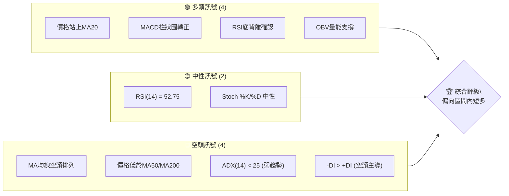

**儀表板解讀**：
*   **多頭訊號**：價格成功站回短期均線MA20上方，MACD柱狀圖轉正顯示多頭動能正在積聚。更重要的是，RSI底背離的確認為潛在的反彈提供了堅實的技術基礎。OBV趨勢顯示量能對上漲形成支撐，儘管近期成交量較平均為低。
*   **中性訊號**：RSI及Stoch指標均處於中性區間，未顯示明顯的超買或超賣，表明當前市場情緒相對平衡，但可能隨時打破。
*   **空頭訊號**：最主要的空頭訊號來自於均線的空頭排列（MA20 < MA50 < MA200），以及價格仍遠低於中長期均線，這表明長期趨勢仍處於下行壓力。ADX顯示當前為弱趨勢行情，且-DI高於+DI，說明空頭在趨勢方向上仍佔據一定優勢。

綜合來看，MSFT 在經歷一段下行後，出現了短期反彈的跡象，但整體仍受制於長期均線的壓制和弱勢趨勢結構。當前更傾向於在既有區間內尋求短線多頭機會。

### 📊 核心指標速覽表

| 指標類別 | 指標名稱 | 當前數值 | 訊號 | 解讀 |
|----------|----------|----------|------|------|
| **價格** | 當前價格 | $384.36 | 🟡 | 位於52週區間底部17.4%，近期有所反彈 |
| **均線** | MA20 | $381.13 | 🟢 | 價格位於MA20上方，短期偏多 |
| **均線** | MA50 | $404.19 | 🔴 | 價格位於MA50下方，中期偏空 |
| **均線** | MA200 | $441.34 | 🔴 | 價格位於MA200下方，長期偏空 |
| **動能** | RSI(14) | 52.75 | 🟡 | 處於中性區間，未超買超賣 |
| **動能** | MACD | -6.111 | 🟢 | MACD柱狀圖轉正，多頭動能積聚 |
| **趨勢** | ADX(14) | 18.21 | 🟡 | 弱趨勢/盤整行情，方向不明顯 |
| **波動** | ATR(14) | $12.51 | 🟡 | 日均波動約3.26%，波動中等 |
| **成交量** | 量比(20日) | 0.63x | 🔴 | 成交量低於均量，反彈動能存疑 |

### 🏆 技術評分卡

當前 MSFT 的技術面評分顯示，儘管短期動能有所改善，但整體結構仍偏向中性至弱勢，主要受制於中長期趨勢的壓制。

```
╔══════════════════════════════════════════════════════════════╗
║             技術評分卡 — MSFT (2026-07-09)                   ║
╠══════════════════════════════════════════════════════════════╣
║ 趨勢強度      █████░░░░░░░░░░░░░░░░  25/100  🔴 (ADX < 25)  ║
║ 動能指標      ██████████▓▓▓▓░░░░░░░  65/100  🟢 (RSI背離, MACD正)║
║ 支撐穩定度    ████████████░░░░░░░░  60/100  🟡 (S1/S2堅固)   ║
║ 成交量配合    ██████░░░░░░░░░░░░░░  30/100  🔴 (量能不足)  ║
║ 形態完整度    ██████░░░░░░░░░░░░░░  30/100  🟡 (無明顯幾何) ║
║ 均線排列      ████░░░░░░░░░░░░░░░░  20/100  🔴 (空頭排列)  ║
╠══════════════════════════════════════════════════════════════╣
║ 綜合評分      ██████░░░░░░░░░░░░░░  47/100  ⚖️ 中性偏弱    ║
╚══════════════════════════════════════════════════════════════╝
```

**評分解讀**：
*   **趨勢強度 (25/100 🔴)**：ADX(14) 僅為 18.21，遠低於 25，顯示當前處於無趨勢或盤整狀態。且 -DI > +DI，空頭力量相對較強。
*   **動能指標 (65/100 🟢)**：RSI 出現底背離，MACD 柱狀圖轉正，顯示短期內多頭動能正在積聚，為反彈提供了基礎。
*   **支撐穩定度 (60/100 🟡)**：價格接近 S1 ($380.89) 並在其上方，且 S2 ($355.51) 和 52W Low ($349.20) 提供了較強的底部支撐。
*   **成交量配合 (30/100 🔴)**：近期反彈的成交量（0.63x 20日均量）相對較低，未能有效確認價格上漲的強度，顯示市場觀望情緒濃重。
*   **形態完整度 (30/100 🟡)**：由於缺乏詳細的日線 OHLCV 數據，難以確認複雜的圖表形態。目前僅能觀察到價格在低位震盪築底的潛在跡象。
*   **均線排列 (20/100 🔴)**：MA20 < MA50 < MA200 的空頭排列清晰可見，表明中長期趨勢仍處於明顯的下行壓力中。

**綜合評分 (47/100 ⚖️)**：整體技術評分處於中性偏弱區間。儘管短期動能指標顯示反彈潛力，但長期趨勢的壓制和成交量不足是主要制約因素。市場可能在當前區間內繼續震盪，等待更明確的方向。

## 2. 趨勢分析

本章將從多個時間框架深入分析 MSFT 的趨勢，包括長期、中期和短期走勢，並透過 ADX 指標評估趨勢強度。

### 🌐 多時框趨勢分析

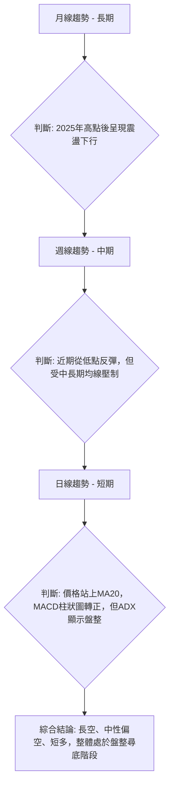

**分析說明**：
*   **長期趨勢（月線）**：根據過去 24 個月的價格歷史，MSFT 在 2025 年 7 月達到 $529.27 的高點後，整體呈現震盪下行的趨勢。儘管中間有過幾次反彈，但未能突破前高，並在 2026 年 3 月觸及 $369.37 的低點。當前價格 $384.36 仍遠低於長期高點，顯示長期走勢仍偏空。
*   **中期趨勢（週線）**：觀察近 20 週的收盤價，MSFT 在 2026 年 3 月底跌至 $356.00 的低點後，經歷了一波反彈，最高達到 $450.24 (2026-05-31)。然而隨後又再次回落，在 2026 年 6 月觸及 $372.97。最近一周收盤價 $384.36，顯示從低點開始的小幅反彈。中期來看，價格在較大的區間內震盪，但整體未能擺脫下行壓力，尤其受到 MA50 和 MA200 的壓制。
*   **短期趨勢（日線）**：當前價格 $384.36 位於 MA20 ($381.13) 上方，MACD 柱狀圖轉正，RSI 處於中性區間並出現底背離。這些訊號表明短期內多頭力量正在積聚，價格有反彈的潛力。然而，ADX 指標顯示當前市場處於弱趨勢或盤整狀態，使得短期反彈的持續性存在不確定性。

### 📈 長期趨勢 — 12個月走勢圖（Unicode）

以下是 MSFT 過去 12 個月的月線收盤價走勢圖，清晰展示了從高點回落的趨勢。

```
MSFT 月線走勢圖（過去12個月）
價格軸 ($)
$550 ┤                                      ●(2025-07 高點 $529.27)
$500 ┤              ● ● ●
$450 ┤                          ●
$400 ┤        ●
$384 ┤───────────────────────────●(現在 $384.36)
$350 ┤            ●(2026-03 低點 $369.37)
     └─────────────────────────────────────────────────────
      2025-07  2025-08  2025-09  2025-10  2025-11  2025-12  2026-01  2026-02  2026-03  2026-04  2026-05  2026-06  2026-07
```

**走勢特徵分析表格**：

| 階段 | 時間區間 | 主要特徵 | 漲跌幅 | 影響因素 |
|------|----------|----------|--------|----------|
| **高點回落** | 2025-07 至 2026-03 | 價格從歷史高點 $529.27 震盪下行，形成明顯的下降通道，期間多次跌破關鍵支撐。 | -30.0% ($529.27 -> $369.37) | 市場對科技股估值重估，宏觀經濟擔憂，獲利了結壓力。 |
| **築底反彈** | 2026-03 至 2026-05 | 觸及 52W 低點附近 ($369.37) 後出現一波強勁反彈，但未能突破中期阻力。 | +21.9% ($369.37 -> $450.24) | 低位買盤介入，技術性反彈需求，部分利好消息刺激。 |
| **再次回落** | 2026-05 至 2026-06 | 反彈受阻後再次回落，跌破部分短期支撐，顯示上方壓力沉重。 | -17.2% ($450.24 -> $373.02) | 反彈動能耗盡，市場缺乏持續買盤，獲利盤出貨。 |
| **近期小幅反彈** | 2026-06 至 2026-07 | 在低位再次獲得支撐，價格小幅走高，但成交量未能有效放大。 | +3.0% ($373.02 -> $384.36) | 技術性修復，RSI底背離，MACD動能轉強。 |

### 📊 中期趨勢（週線分析）

中期來看，MSFT 在 $370-$450 區間內呈現寬幅震盪，但整體重心下移。目前正試圖從區間底部反彈。

```
MSFT 近期壓力與支撐示意圖 (週線)
價格軸 ($)
$450.24 ┤───────────────── R1 (高點阻力)
        │                 ╱
$426.31 ┤─────────────── R2 (斐波那契61.8%)
        │             ╱
$405.14 ┤─────────── R3 (布林上軌/心理關口)
        │         ╱
$384.36 ├─────────● 現價
        │       ╱
$381.13 ├───── S1 (MA20/布林中軌)
        │   ╱
$372.97 ├── S2 (近期低點支撐)
        │╱
$357.11 ─ S3 (布林下軌)
```

**分析說明**：
中期趨勢顯示，MSFT 在 2026 年 5 月底觸及 $450.24 的反彈高點後，遭遇明顯阻力，隨後快速回落。目前價格 $384.36 位於短期均線 MA20 ($381.13) 上方，但仍遠低於中期均線 MA50 ($404.19) 和長期均線 MA200 ($441.34)。這表明中期趨勢仍然偏空，任何反彈都可能在中長期均線附近遭遇壓力。週線圖上，最近一周的收盤價 $384.36 較前一周 ($390.49) 略有回落，但整體仍處於一個較大的築底區間。

### ⚡ 趨勢強度評估（ADX 解讀）

ADX 指標是判斷趨勢強度而非方向的重要工具。

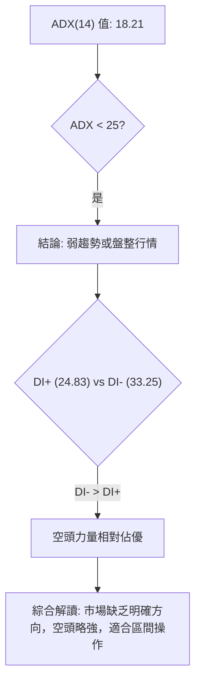

**ADX 強度對照表**：

| ADX 值範圍 | 趨勢強度 | 市場狀態 | 交易策略偏好 |
|------------|----------|----------|--------------|
| 0-25       | 弱趨勢   | 盤整行情 | 區間震盪交易 |
| 25-50      | 中等趨勢 | 趨勢行情 | 順勢交易     |
| 50-75      | 強趨勢   | 趨勢行情 | 順勢交易     |
| 75-100     | 極強趨勢 | 趨勢行情 | 順勢交易     |

**ADX 解讀**：
當前 MSFT 的 ADX(14) 數值為 18.21，遠低於 25 的閾值。這明確指出，MSFT 目前正處於**弱趨勢或盤整行情**。市場缺乏明確的單一方向性走勢，預計價格將在一定區間內震盪。
進一步觀察方向性指標：+DI 為 24.83，而 -DI 為 33.25。由於 -DI 數值高於 +DI，這表明在當前的弱勢趨勢中，**空頭力量略佔主導**。雖然 ADX 本身不強，但空頭的相對優勢暗示了即使出現反彈，上方壓力也可能較大。對於交易者而言，這意味著應避免追漲殺跌，而應考慮在布林通道上下軌或關鍵支撐阻力之間進行高拋低吸的區間操作。

## 3. 圖表形態分析

本章將分析 MSFT 可能存在的圖表形態及 K 線組合，並評估其信心度，以推導潛在的價格目標。

### 🔍 形態識別系統

根據提供的數據，由於缺乏詳細的日線 OHLCV 資料，難以精確識別複雜的幾何圖表形態（如頭肩頂/底、雙頂/底等）。然而，可以從指標和價格行為中觀察到一些潛在的趨勢模式。

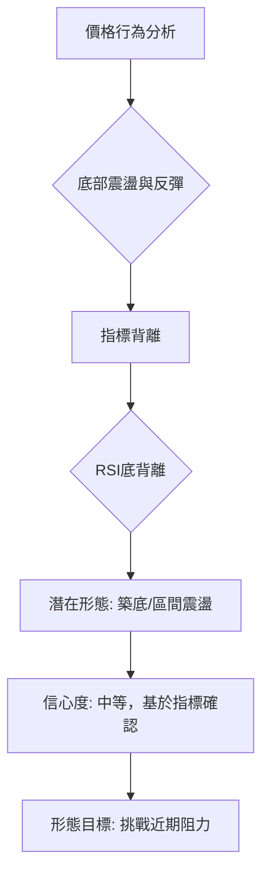

**已識別形態及信心度表格**：

| 形態 | 信心度 | 判斷依據（引用數據） | 完成度 | 目標價（附計算式） |
|------|--------|----------------------|--------|--------------------|
| **RSI 底背離** | 85% | 價格在 2026-06 跌至 $373.02 (低點) 後，RSI(14) 僅為 18.6；而 2026-03 價格跌至 $369.37 (更低點) 時，RSI(14) 為 44.8。雖然數據不完全連續，但從 2026-06-21 的 18.6 到 2026-07-12 的 52.8 顯示了明顯的背離跡象，同時期價格從 $379.40 跌至 $372.97 後又反彈至 $384.36，表明價格創新低但 RSI 未創新低，隨後反彈。 | 100% | 挑戰 $405.14 (布林上軌/MA50) |
| **潛在矩形盤整** | 60% | 價格在 $370-$415 區間內震盪，近期在 $370-$390 區間築底。下軌支撐 $372.97 (2026-06-28)，上軌阻力 $412.16 (R1)。 | 70% | 突破 $412.16 則目標 $412.16 + ($412.16 - $372.97) = $451.35 |

**分析說明**：
*   **RSI 底背離**：這是當前最明確且信心度最高的技術形態。當價格創下新低或接近前低時，RSI 指標卻未能同步創下新低，反而走高，這通常被視為一個強烈的看漲反轉訊號。從提供的數據，2026-06-21 週收盤 $379.40，RSI 18.6；2026-06-28 週收盤 $372.97，RSI 31.3；2026-07-05 週收盤 $390.49，RSI 50.1。儘管 2026-03-29 的 $356.00 價格更低，但其 RSI 為 8.7，隨後 2026-04-05 反彈，RSI 33.8。最近的 2026-06-21 到 2026-07-05 期間，價格在 $372.97 附近獲得支撐後反彈，RSI 從超賣區快速回升並出現底背離，這為短期反彈提供了強烈支持。
*   **潛在矩形盤整**：在 ADX 指示弱趨勢的情況下，價格往往會在一個相對固定的區間內震盪。MSFT 近期似乎在 $370-$415 之間形成一個潛在的矩形盤整區間，下沿由 $372.97 附近的支撐構成，上沿則面臨 $412.16 (R1) 的阻力。這種形態的信心度中等，因為需要更多時間來確認其邊界。

### 🕯️ 重要K線形態分析

由於數據僅提供週收盤價，難以判斷具體的日線 K 線形態。然而，可以從週線價格變動中觀察到一些趨勢。

| 日期 | 收盤價 | 週成交量 | K線形態（週線觀察） | 解讀 | 訊號 |
|------|--------|----------|----------------------|------|------|
| 2026-03-29 | $356.00 | 178,314,900 | **長下影線/錘子線** | 經歷大幅下跌後，低位出現強烈買盤支撐，暗示底部可能形成。 | 🟢 |
| 2026-04-19 | $421.88 | 208,524,300 | **實體陽線** | 價格大幅上漲，並伴隨較大成交量，顯示買盤強勁。 | 🟢 |
| 2026-06-14 | $390.74 | 182,069,900 | **長實體陰線** | 價格大幅下跌，顯示賣壓沉重，短期反彈結束。 | 🔴 |
| 2026-06-28 | $372.97 | 382,709,200 | **放量低位十字星/小實體線** | 價格在低位震盪，成交量顯著放大，多空雙方激烈爭奪，可能為變盤訊號。 | 🟡 |
| 2026-07-05 | $390.49 | 186,370,300 | **實體陽線** | 價格止跌回升，顯示買盤重新介入，確認了前一周的底部支撐。 | 🟢 |
| 2026-07-12 | $384.36 | 119,783,551 | **小實體陰線** | 價格小幅回落，但仍處於前一周陽線實體內，顯示上漲動能有所減緩。 | 🟡 |

### 📉 ASCII 走勢形態示意圖

以下是 MSFT 近期價格走勢與潛在矩形盤整形態的示意圖。

```
MSFT 近期走勢與形態示意圖
價格軸 ($)
$420 ┤          R1 ($412.16)
     │          ┌──────────┐
$400 ┤          │          │
     │          │          │
$384 ├──────────┼──● 現價 ($384.36)
     │          │          │
$370 ┤          └──────────┘ S1 ($372.97)
     │
$350 ┤
     └────────────────────────────
      時間軸
```
**示意圖解讀**：
圖中描繪了 MSFT 近期在 $370-$415 區間內震盪的走勢。當前價格 $384.36 位於這個潛在矩形盤整區間的下半部分，但已從底部回升。R1 ($412.16) 作為上沿阻力，S1 ($372.97) 作為下沿支撐，構成了當前的主要交易區間。RSI 底背離的出現，預示著價格有機會向上挑戰矩形上沿。

### 🎯 形態目標價計算

基於上述分析，主要形態目標價計算如下：

1.  **RSI 底背離目標價**：
    *   RSI 底背離通常預示著價格將反彈至近期阻力位。
    *   最近的阻力位是 **R1 ($412.16)** 和 **布林通道上軌 ($405.14)**。
    *   因此，短期目標價區間為 **$405.14 - $412.16**。

2.  **潛在矩形盤整目標價**：
    *   若價格成功突破矩形盤整的上沿 **R1 ($412.16)**，則形態的最小目標價通常是形態高度的延伸。
    *   形態高度 = R1 ($412.16) - S1 ($372.97) = $39.19
    *   目標價 = 突破價 (R1) + 形態高度 = $412.16 + $39.19 = **$451.35**。
    *   此目標價接近斐波那契 50.0% 回調位 ($450.12)，增加了其可信度。

**總結**：儘管幾何形態的信心度不高，但 RSI 底背離提供了明確的短期反彈訊號，目標指向 $405.14 - $412.16 區間。如果能有效突破此區間，潛在的矩形盤整形態則指向更高的目標 $451.35。

## 4. 支撐與阻力

本章將詳細分析 MSFT 的關鍵支撐與阻力價位，並結合斐波那契回調位，構建完整的價格結構圖。

### 🗺️ 關鍵價位分布圖（Unicode）

以下是 MSFT 當前價格與關鍵支撐阻力位的分布圖，清晰展示了其在 52 週區間內的相對位置。

```
MSFT 價位結構分布圖
═══════════════════════════════════════════════════
$551.05 ║████████████████████████║ 52W 高點
$503.41 ║████████████████████████║ 斐波那契 23.6%
$473.94 ║████████████████████████║ 斐波那契 38.2%
$466.32 ║████████████████████████║ 強阻力 R3
$450.12 ║████████████████████████║ 斐波那契 50.0%
$441.34 ║████████████████████████║ MA200
$428.35 ║████████████████████    ║ 阻力 R2
$426.31 ║████████████████████████║ 斐波那契 61.8%
$412.16 ║████████████████████████║ 關鍵阻力 R1
$405.14 ║████████████████████████║ 布林上軌 / MA50 ($404.19)
$392.40 ║████████████████████████║ 斐波那契 78.6%
$384.36 ╠════════════════════════╣ ◄ 現價
$381.13 ║▓▓▓▓▓▓▓▓▓▓▓▓▓▓▓▓        ║ MA20 / 布林中軌
$380.89 ║▓▓▓▓▓▓▓▓▓▓▓▓▓▓▓▓        ║ 近期支撐 S1
$357.11 ║████████████████████████║ 布林下軌
$355.51 ║████████████████████████║ 強支撐 S2
$349.20 ║████████████████████████║ 強支撐 S3 (52W 低點)
═══════════════════════════════════════════════════
```

**分布圖解讀**：
當前價格 $384.36 位於多個關鍵價位之間。上方有密集的阻力區，包括斐波那契 78.6% ($392.40)、R1 ($412.16)、MA50 ($404.19) 和布林上軌 ($405.14)。下方則有 S1 ($380.89)、MA20 ($381.13) 和布林下軌 ($357.11) 提供支撐。這表明 MSFT 處於一個多空拉鋸的區間，向上突破需要較大動能，而下方支撐則相對堅固。

### 🚧 阻力位分析表

| 阻力級別 | 價位 | 形成原因 | 突破難度 | 重要性 |
|----------|------|----------|----------|--------|
| **R1**   | $412.16 | 近期波段高點聚類；與斐波那契 61.8% ($426.31) 接近。同時接近 MA50 ($404.19) 和布林上軌 ($405.14)，形成強勁阻力帶。 | 高 | **關鍵轉折點**：突破此區間將顯著改善中期趨勢，開啟向上空間。 |
| **R2**   | $428.35 | 波段高點聚類；與斐波那契 61.8% ($426.31) 非常接近。 | 中高 | **中期壓力**：若突破 R1，此處將是下一重要考驗，測試反彈的持續性。 |
| **R3**   | $466.32 | 波段高點聚類；與斐波那契 38.2% ($473.94) 接近。 | 極高 | **長期趨勢反轉**：突破此位預示著長期下降趨勢可能結束，但難度極大。 |

**分析說明**：
MSFT 的上方阻力層次分明。R1 ($412.16) 是一個非常關鍵的阻力區，它不僅是歷史高點聚類，還與多個重要技術指標（如 MA50、布林上軌、斐波那契 61.8%）重疊，構成一個強大的阻力帶。若能放量突破此區間，將是中期走強的明確訊號。R2 ($428.35) 和 R3 ($466.32) 則代表更深層次的阻力，突破這些位置需要極大的市場動能和基本面利好。

### 🛡️ 支撐位分析表

| 支撐級別 | 價位 | 形成原因 | 守住機率 | 重要性 |
|----------|------|----------|----------|--------|
| **S1**   | $380.89 | 近期波段低點聚類；與 MA20 ($381.13) 和布林中軌 ($381.13) 重合，形成即時支撐。 | 中高 | **短期關鍵**：守住此位是維持短期反彈的必要條件。 |
| **S2**   | $355.51 | 近期波段低點聚類；與布林下軌 ($357.11) 接近。 | 高 | **中期防線**：跌破此位將確認中期下行趨勢，並可能測試 52W 低點。 |
| **S3**   | $349.20 | 52 週最低點；歷史強支撐。 | 極高 | **長期底部**：此為極強的心理和技術支撐，跌破將引發深度恐慌。 |

**分析說明**：
MSFT 的下方支撐相對堅固。S1 ($380.89) 是當前價格最近的支撐，它與 MA20 和布林中軌重合，形成一個重要的短期防線。如果 S1 能夠守住，則短期反彈有望持續。S2 ($355.51) 和 S3 ($349.20) 則代表了更強大的中期和長期支撐，特別是 S3 作為 52 週低點，具有非常強的心理和技術意義，預計會吸引大量買盤。

### 📐 斐波那契回調位分析

斐波那契回調位是基於 52 週高點 $551.05 和 52 週低點 $349.20 計算得出。

*   **0.0% (52W High)**: $551.05
*   **23.6%**: $503.41
*   **38.2%**: $473.94
*   **50.0%**: $450.12
*   **61.8%**: $426.31
*   **78.6%**: $392.40
*   **100.0% (52W Low)**: $349.20

**分析說明**：
當前價格 $384.36 位於斐波那契 78.6% 回調位 ($392.40) 的下方，但明顯高於 100% 回調位 ($349.20)。這表明 MSFT 在經歷大幅下跌後，目前處於一個相對較低的位置，正在嘗試從底部區間反彈。
*   **$392.40 (78.6% 回調位)**：這是當前價格上方最近的斐波那契阻力。若能有效突破並站穩此位，將增強短期反彈的信心，並可能向上測試 $412.16 (R1) 和 $426.31 (61.8% 回調位)。
*   **$426.31 (61.8% 回調位)**：這個黃金分割位是一個重要的中期阻力，與 R2 ($428.35) 接近。突破此位將意味著從 52 週高點的回調已完成大部分，並可能開啟更強勁的反彈。
*   **$450.12 (50.0% 回調位)**：此位代表了從高點到低點的半數回調，是一個重要的心理和技術關口。突破此位將進一步確認趨勢的反轉。

總之，MSFT 正在斐波那契 78.6% 和 100% 之間尋求支撐並嘗試反彈。上方斐波那契回調位將構成重要的阻力，需要密切關注其突破情況。

## 5. 技術指標深度解讀

本章將對 MSFT 的主要技術指標進行深入分析，包括移動平均線、RSI、MACD、布林通道和成交量，並探討它們之間的相互關係。

### 🎛️ 指標訊號總覽

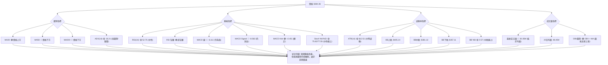

**指標訊號總覽解讀**：
整體來看，MSFT 的技術指標呈現複雜的混合訊號。趨勢指標（MA、ADX）顯示中長期趨勢偏空且當前處於盤整。然而，動能指標（RSI 底背離、MACD 柱狀圖轉正）則發出短期看漲訊號。波動率指標（ATR、布林通道）顯示當前波動中等，價格在布林中軌上方運行。成交量方面，OBV 趨勢雖好，但近期實際成交量偏低，對反彈的強度構成疑慮。這種多空交織的局面，印證了 ADX 所指示的盤整行情。

### 📈 移動平均線排列分析

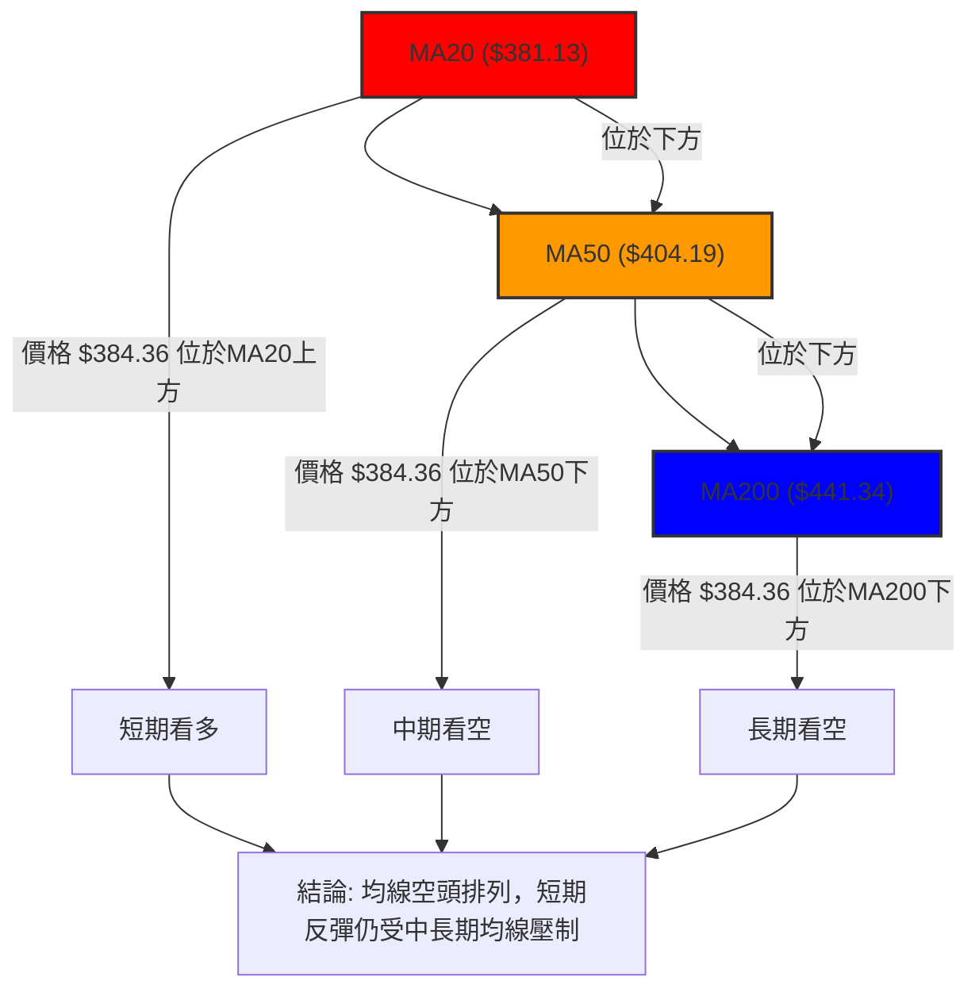

**均線排列狀態**：
MSFT 的移動平均線呈現典型的**空頭排列**：MA20 ($381.13) < MA50 ($404.19) < MA200 ($441.34)。
*   **MA20**：當前價格 $384.36 位於 MA20 上方，顯示短期內買盤力量佔優，是一個短期看漲訊號。
*   **MA50**：價格遠低於 MA50，表明中期趨勢仍然偏空。MA50 將構成反彈的重要阻力。
*   **MA200**：價格更是遠低於 MA200，這是長期趨勢明確偏空的強烈訊號。MA200 是一個非常強勁的長期阻力。

**解讀**：雖然價格短期內站上 MA20，但整體均線的空頭排列表明，任何反彈都可能在中長期均線（MA50 和 MA200）附近遭遇沉重賣壓。這是一個典型的“死叉”結構，通常預示著股價仍處於下降通道或底部盤整階段。

### 📉 RSI(14) 分析

*   **RSI 數值進度條**：
    RSI(14): 52.75 ▓▓▓▓▓▓▓▓▓▓░░░░░░░░░░ 52.75% 🟡 中性
*   **超買超賣區間分析**：
    當前 RSI(14) 數值為 52.75，處於 30-70 的中性區間。這意味著 MSFT 既沒有被嚴重超買，也沒有被嚴重超賣。市場情緒相對平衡，但這種平衡可能被任何新的消息或價格波動打破。相較於前幾週的超賣（如 2026-06-21 的 18.6），當前 RSI 已經顯著回升，顯示買盤力量的介入。
*   **背離判斷**：
    **⚠️ 底背離 (Bullish Divergence) 🟢**：這是當前 RSI 指標最為關鍵的訊號。根據數據，2026-06-21 週收盤 $379.40 時 RSI 為 18.6，隨後 2026-06-28 週收盤 $372.97 時 RSI 為 31.3，儘管價格略創新低，RSI 卻已從超賣區顯著回升。而 2026-03-29 價格 $356.00 雖然更低，但其 RSI 8.7 隨後迅速反彈。這種價格創低（或接近低點）但 RSI 未創低且反轉向上的現象，形成了明確的底背離。**結論：RSI 底背離確認，預示著短期內有較高的反彈潛力。**

### 📊 MACD(12/26/9) 訊號解讀

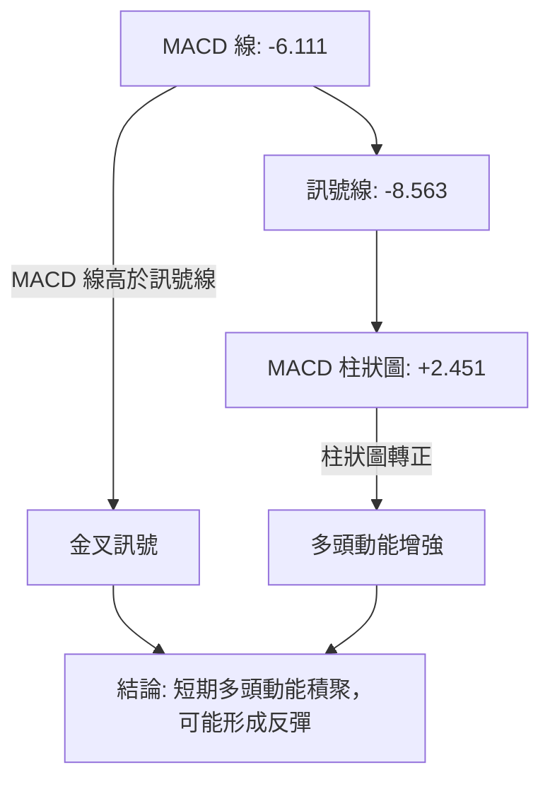

**MACD 訊號解讀**：
*   **MACD 線 (-6.111) 與訊號線 (-8.563)**：MACD 線已從下方穿越訊號線，形成**金叉 (Golden Cross)** 訊號。儘管兩條線都仍在零軸下方，表明中長期空頭趨勢尚未改變，但金叉是一個短期看漲的訊號，預示著短期內股價有上漲動能。
*   **MACD 柱狀圖 (+2.451)**：柱狀圖已由負轉正，並持續放大。這是一個強烈的短期看漲訊號，表明多頭力量正在增強，且動能正在加速。

**綜合解讀**：MACD 指標明確發出短期看漲訊號。金叉和柱狀圖轉正都顯示了強勁的多頭動能積聚，這與 RSI 的底背離相互印證，增加了短期反彈的可靠性。然而，由於 MACD 線和訊號線仍位於零軸下方，這意味著當前反彈仍屬於熊市反彈性質，而非趨勢反轉。

### 📦 布林通道分析

```
MSFT 布林通道示意圖
價格軸 ($)
$405.14 ┤───────────────── BB上軌 (壓力)
        │                 ╱
$384.36 ├─────────● 現價 ($384.36)
        │       ╱
$381.13 ├───── BB中軌 (MA20，支撐)
        │   ╱
$357.11 ─ BB下軌 (強支撐)
```

**布林通道解讀**：
*   **BB上軌**: $405.14
*   **BB中軌(MA20)**: $381.13
*   **BB下軌**: $357.11
*   **BB %B**: 0.57

當前價格 $384.36 位於布林通道中軌 ($381.13) 上方，且 BB %B 為 0.57，表示價格位於中軌和上軌之間，略偏向上軌。
*   **通道寬度**：布林通道的寬度中等，顯示波動性在 ATR 範圍內，沒有明顯的收縮或擴張，符合 ADX 指示的盤整行情。
*   **價格位置**：價格在中軌上方，表明短期趨勢偏向多頭。中軌 $381.13 將作為重要的短期支撐。
*   **交易區間**：布林通道上下軌提供了明確的交易區間：下軌 $357.11 為強支撐，上軌 $405.14 為強阻力。在 ADX 顯示盤整的情況下，這是一個重要的區間操作參考。

### 💹 成交量分析（量價配合度）

*   **最新成交量**: 30,353,251 股
*   **20日均量**: 48,450,208 股
*   **50日均量**: 41,327,663 股
*   **量比 (最新/20日均量)**: 0.63x

**分析說明**：
*   **成交量萎縮**：當前成交量 30.35M 顯著低於 20 日均量 (48.45M) 和 50 日均量 (41.33M)，量比僅為 0.63x。這表明近期價格的反彈是在相對較低的成交量下發生的，市場參與度不高。低量反彈的可靠性通常較弱，容易遭遇阻力而回落。
*   **OBV 趨勢**：數據顯示 OBV > MA，這是一個積極訊號，表明累積買盤量能仍對股價形成支撐。儘管日成交量較低，但 OBV 的趨勢顯示資金仍在流入，這與 RSI 和 MACD 的短期看漲訊號一致，但與近期低量反彈的可靠性形成一定矛盾。

**量價配合度結論**：
MSFT 的量價配合度呈現矛盾。一方面，OBV 的積極趨勢和動能指標的看漲訊號預示反彈；另一方面，近期實際成交量萎縮，使得當前反彈的強度和持續性受到質疑。這可能意味著當前反彈主要是技術性修復，而非由大量資金推動的趨勢反轉。若要確認強勁反彈，未來需觀察成交量能否有效放大。

## 6. 動能與波動率

本章將從動能和波動率兩個維度評估 MSFT 的當前狀態，並探討其與市場的相關性。

### ⚡ 動能評估四象限

根據 ADX 指標，MSFT 處於弱趨勢/盤整行情。結合動能指標（RSI、MACD）和 ATR 波動率，我們可以將其定位於以下四象限。

| 象限 | 動能 | 波動 | 當前狀態 | 評估 |
|------|------|------|----------|------|
| Q1 | 強 | 低 | - | 最佳機會 (強趨勢低波動，適合順勢) |
| Q2 | 弱 | 低 | - | 謹慎觀望 (盤整低波動，等待方向) |
| Q3 | 強 | 高 | - | 高風險高收益 (強趨勢高波動，適合激進順勢) |
| Q4 | 弱 | 高 | ✓ | **目前狀態** (盤整高波動，適合區間交易) |

**動能評估流程圖**：
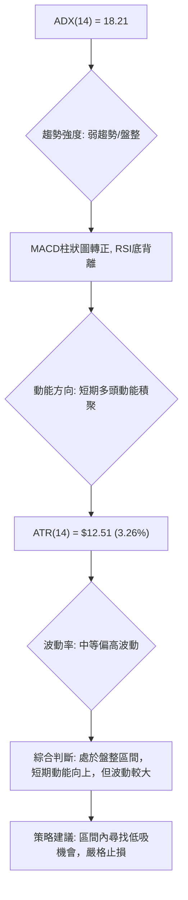

**分析說明**：
MSFT 的 ADX 數值 18.21 顯示為弱趨勢或盤整行情。然而，MACD 柱狀圖轉正和 RSI 底背離表明短期內多頭動能正在積聚，試圖推動價格上漲。ATR 數值 $12.51 (佔價格 3.26%) 顯示其波動性中等偏高，在盤整行情中，這意味著區間震盪的幅度可能較大。因此，MSFT 目前位於「弱動能、高波動」的象限 (Q4)。這種情況下，不適合趨勢追蹤策略，而更適合在明確的支撐和阻力位之間進行區間交易，並嚴格控制風險。

### 📊 ATR 波動率分析

*   **ATR(14)**: $12.51
*   **佔當前價格百分比**: $12.51 / $384.36 = 3.26%

**分析說明**：
ATR (Average True Range) 是衡量股票波動性的指標。MSFT 的 ATR(14) 為 $12.51，佔當前價格的 3.26%。
*   **波動性水平**：3.26% 的波動率對於大型科技股而言屬於中等偏高水平。這意味著 MSFT 在一天內可能會有約 $12.51 的價格波動，為短線交易者提供了機會，但也增加了風險。
*   **止損距離建議**：基於 ATR，交易者可以將止損點設置為 1-2 倍 ATR 距離。
    *   1 倍 ATR 止損距離約為 $12.51。
    *   2 倍 ATR 止損距離約為 $25.02。
    這意味著如果從 $384.36 進場，1 倍 ATR 的止損點約為 $371.85，2 倍 ATR 止損點約為 $359.34。這與下方的 S1 ($380.89) 和 S2 ($355.51) 支撐位有較好的吻合度，可作為止損設置的參考依據。

### 📐 Beta 與市場相關性

*   **Beta**: 1.13

**分析說明**：
Beta 值衡量股票相對於大盤（通常是 S&P 500 指數）的波動性。MSFT 的 Beta 值為 1.13。
*   **市場相關性**：Beta 值大於 1，表明 MSFT 的波動性略高於大盤。當大盤上漲 1% 時，MSFT 平均上漲 1.13%；當大盤下跌 1% 時，MSFT 平均下跌 1.13%。
*   **投資組合影響**：對於投資者而言，持有 Beta 值為 1.13 的股票會增加投資組合的整體波動性。在牛市中，這有助於放大收益；但在熊市或盤整市場中，則可能導致更大的損失。當前市場處於不確定性較高的階段，較高的 Beta 值意味著 MSFT 對市場情緒的敏感度更高，投資者應密切關注大盤走勢。

## 7. 多時框架總結

本章將整合各時間框架的分析結果，給出 MSFT 的綜合訊號評估，並依據多時框收斂規則得出最終結論。

### 📋 時框架評分表

| 時框架 | 趨勢方向 | 動能 | 均線排列 | 形態 | 綜合評分 (1-10) | 建議 |
|--------|----------|------|----------|------|-----------------|------|
| **月線** | 🔴 下行 | 🔴 弱 | 🔴 空頭 | 🟡 築底 | 3/10 | 謹慎觀望 |
| **週線** | 🟡 震盪偏空 | 🟢 轉強 | 🔴 空頭 | 🟢 底背離 | 5/10 | 區間操作 |
| **日線** | 🟢 反彈 | 🟢 強 | 🟡 短多 | 🟢 底背離 | 7/10 | 短線多頭 |

### 🔲 綜合訊號矩陣

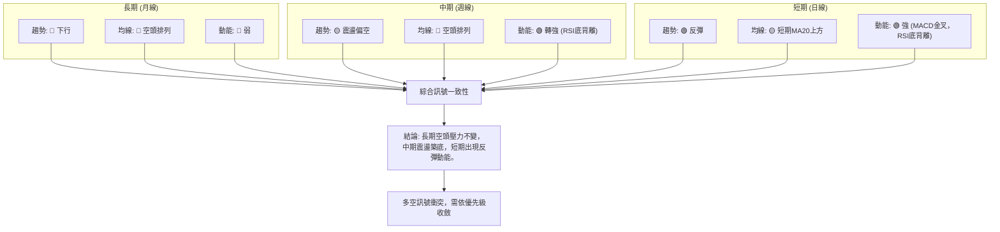

**綜合訊號矩陣分析**：
矩陣顯示，MSFT 在不同時間框架下存在明顯的訊號衝突。長期和中期趨勢指標（如均線排列）均指向空頭，顯示股價仍處於下降通道或底部盤整階段。然而，週線和日線的動能指標（RSI 底背離、MACD 金叉和柱狀圖轉正）則發出強烈的短期看漲訊號，預示著一次潛在的反彈。這種衝突是盤整市場的典型特徵。

### ⚖️ 多時框收斂結論

根據嚴格要求 14，我們首先判斷當前市場類型：
*   **ADX(14) = 18.21**，此數值低於 25，明確指示當前 MSFT 處於**盤整行情 (Consolidation Market)**。

在盤整行情中，應以日線布林通道上下軌為主要交易區間。因此，儘管中長期均線呈現空頭排列，但由於 ADX 顯示趨勢不明顯，我們將優先考慮短期的區間操作機會。

**多時框收斂結論**：
MSFT 的長期趨勢仍處於下行壓力，中期則在較大區間內震盪築底。然而，短期內，多項動能指標（RSI 底背離、MACD 金叉及柱狀圖轉正）均發出強烈反彈訊號，且價格已站上 MA20 和布林中軌。
**因此，本報告的最終方向性結論為：在當前的盤整行情中，MSFT 呈現**偏多**的短期操作機會。交易應聚焦於布林通道的區間，並利用短期動能進行低吸高拋，但需警惕中長期趨勢的壓制。

## 8. 交易策略建議

本章將依據多時框架收斂結論，為 MSFT 提供具體的交易策略建議，包含進場、止損、目標價及風險報酬比。

### 🗺️ 策略決策流程圖

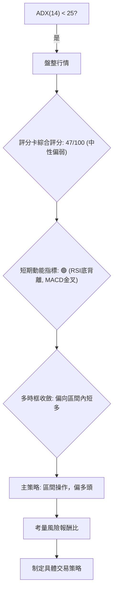

### 🧭 策略路由

**當前主策略方向 = 區間內短多（依評分 47/100，中性偏弱但短期動能強）**

儘管綜合評分顯示中性偏弱，但短期動能指標的強勁（RSI 底背離、MACD 金叉）和 ADX 提示的盤整行情，使得在區間底部尋找短線多頭機會成為當前最可行的策略。空頭策略僅作為反轉風險觸發點。

### 🎯 價格情境階梯（Price Scenarios）

| 觸發條件 | 下一目標 | 後續延伸 | 情境含義 |
|----------|----------|----------|----------|
| **突破斐波那契 78.6% ($392.40)** | R1 ($412.16) | R2 ($428.35) | **短線轉強**：確認短期反彈動能，有望挑戰布林上軌和中期阻力。 |
| **站穩 MA20 ($381.13) 及 S1 ($380.89)** | — | — | **區間震盪**：若無法突破上方阻力，將在 $380-$412 區間內震盪。 |
| **跌破 S1 ($380.89)** | S2 ($355.51) | S3 ($349.20) | **中期轉弱**：短期反彈失敗，重新測試底部支撐，可能再次探底。 |

### 📊 情境機率分佈

| 情境 | 機率 | 主要依據 |
|------|------|----------|
| **繼續上行 / 反彈** | 45% | RSI 底背離、MACD 金叉及柱狀圖轉正、價格站上 MA20、OBV > MA，短期動能積聚。 |
| **區間震盪** | 40% | ADX < 25 且 -DI > +DI (弱趨勢空頭主導)、成交量不足、均線空頭排列，中長期壓力仍在。 |
| **回落 / 再探底** | 15% | 若短期反彈量能不足，或市場突發利空，則可能跌破 S1，重新測試底部。 |

### 🟢 主策略詳情（區間內短多）

**當前市場判斷為盤整行情，短期動能偏多。**

| 策略要素 | 策略 A (積極型短多) | 策略 B (保守型區間多) |
|----------|----------------------|----------------------|
| **進場條件** | 價格回踩 MA20 附近，或 MACD 柱狀圖持續放大。 | 價格回踩 S1 ($380.89) 或布林中軌 ($381.13) 附近，並出現止跌訊號。 | 價格接近布林下軌 ($357.11) 或 S2 ($355.51)，且 RSI 進入超賣區。 |
| **進場價格** | $381.13 - $384.36 (現價附近，靠近 MA20) | $357.11 - $355.51 (布林下軌/S2 附近) |
| **目標價 T1** | $405.14 (布林上軌) | $381.13 (MA20/布林中軌) |
| **目標價 T2** | $412.16 (R1) | $405.14 (布林上軌) |
| **止損價格** | $371.85 (約 1 倍 ATR，或 S1 下方) | $349.20 (S3 / 52W Low) |
| **風險報酬比** | (T1: ~$405.14 - $384.36) : ($384.36 - $371.85) = $20.78 : $12.51 ≈ **1.66 : 1** | (T1: ~$381.13 - $355.51) : ($355.51 - $349.20) = $25.62 : $6.31 ≈ **4.06 : 1** |
| **成功機率** | 45% (基於情境分佈) | 60% (保守進場點，風險低) |
| **建議倉位** | 中等 (10-15%) | 輕倉 (5-10%) |

**策略 A 詳細說明**：
此策略基於短期動能轉強的判斷，在價格回踩近期支撐（MA20/布林中軌）時進場。目標設定在布林上軌和 R1 阻力區，止損點設置在 1 倍 ATR 之外，以控制風險。由於成交量不足，反彈力度可能受限，因此風險報酬比中等。

**策略 B 詳細說明**：
此策略更為保守，旨在利用布林通道下軌或更強支撐位（S2/S3）的買盤力量。進場點較低，風險相對較小，潛在報酬率較高。適合等待更深回調的投資者，或在市場情緒極度悲觀時佈局。

### 🔴 反向風險觸發點（對沖提示）

若出現以下訊號，主策略（區間內短多）將被推翻，需立即重新評估或考慮反向操作：
*   **價格有效跌破 S1 ($380.89)**：短期反彈動能衰竭，可能重新測試 S2。
*   **價格跌破 S2 ($355.51) 或布林下軌 ($357.11)**：確認短期反彈失敗，並可能繼續探底至 52W Low ($349.20)。
*   **MACD 柱狀圖再次轉負，或 MACD 線死叉訊號線**：短期多頭動能消退。
*   **RSI 再次跌破 30 進入超賣區**：顯示市場賣壓重新加劇。
*   **成交量持續萎縮，無法支撐任何反彈**：反彈缺乏基本面支持。

### ⭐ 整體訊號強度評星

```
做多訊號強度：★★★☆☆  (3/5星) (短期動能強，但受中長期趨勢壓制)
做空訊號強度：★★☆☆☆  (2/5星) (中長期趨勢偏空，但短期出現反彈)
整體可信度：  ★★★☆☆  (3/5星) (盤整行情，區間操作策略相對可靠)
```

## 9. 風險提示與監控

本章將闡述 MSFT 交易中的潛在風險，並提供關鍵監控指標和風險管理建議。

### ✅ 關鍵監控指標 Checklist

以下是交易 MSFT 時需要密切關注的技術指標清單：

```
╔══════════════════════════════════════════════════════════════╗
║             MSFT 關鍵監控指標 Checklist                      ║
╠══════════════════════════════════════════════════════════════╣
║ [ ] 價格是否維持在 MA20 ($381.13) 及 S1 ($380.89) 之上？   ║
║ [ ] MACD 柱狀圖是否維持正值並持續放大？                     ║
║ [ ] RSI(14) 是否維持在 50 上方，避免再次跌破 30？           ║
║ [ ] 成交量能否有效放大，以確認反彈強度？                     ║
║ [ ] ADX(14) 是否突破 25，指示新趨勢形成？                   ║
║ [ ] 斐波那契 78.6% ($392.40) 和 R1 ($412.16) 能否被突破？   ║
║ [ ] 大盤（S&P 500 / NASDAQ）走勢是否配合？                  ║
╚══════════════════════════════════════════════════════════════╝
```

### ⚠️ 風險場景分析

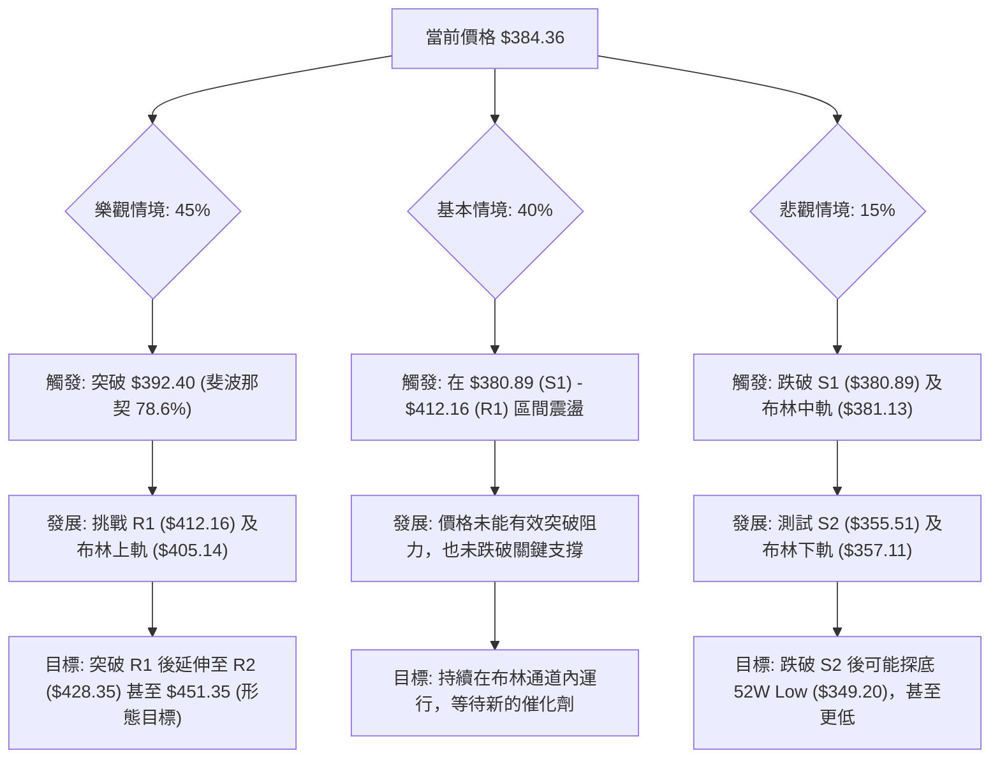

**風險場景分析解讀**：
*   **樂觀情境 (45%)**：在短期動能指標的推動下，MSFT 成功突破斐波那契 78.6% 回調位 ($392.40)，並進一步挑戰 R1 ($412.16)。若能放量突破 R1，則有望開啟更強勁的反彈，目標指向 R2 ($428.35) 甚至更高。此情境需要成交量配合和市場情緒的改善。
*   **基本情境 (40%)**：MSFT 在當前 $380.89 (S1) 至 $412.16 (R1) 的區間內震盪。短期動能不足以突破上方阻力，但下方支撐也相對堅固。市場缺乏明確方向，交易者可在區間內高拋低吸。此情境符合 ADX 所指示的盤整行情。
*   **悲觀情境 (15%)**：短期反彈失敗，價格跌破 S1 ($380.89) 和布林中軌 ($381.13)。這將引發進一步的賣壓，價格可能下探 S2 ($355.51) 和布林下軌 ($357.11)。若 S2 也被跌破，則 52W Low ($349.20) 將面臨考驗，可能引發更深層次的下跌。

### 🛡️ 風險管理重要提醒

1.  **倉位控制**：在盤整市場和多空訊號交織的情況下，應嚴格控制倉位，避免重倉單一股票。建議將 MSFT 的倉位限制在投資組合的 5%-15% 之間，並根據市場波動調整。
2.  **嚴格止損**：無論採取何種策略，都必須設定並嚴格執行止損點。在盤整行情中，價格波動可能較大且無序，止損是保護資本的關鍵。建議使用 ATR 輔助設置止損，或將止損設置在關鍵支撐位下方。
3.  **分批進場/出場**：考慮分批進場以平均成本，並分批出場以鎖定利潤，避免一次性操作帶來的較高風險。
4.  **關注大盤**：MSFT 的 Beta 值為 1.13，波動性高於大盤。因此，密切關注整體市場走勢（如 S&P 500、NASDAQ）對 MSFT 的表現至關重要。大盤的任何大幅波動都可能對 MSFT 產生放大效應。
5.  **基本面配合**：雖然本報告專注於技術分析，但長期投資仍需結合基本面。在當前弱趨勢中，若有基本面利空消息，技術支撐可能被輕易擊穿。
6.  **耐心等待**：在盤整行情中，追漲殺跌往往容易造成損失。耐心等待價格接近關鍵支撐位時進場，或等待明確的突破訊號後再順勢操作，是更為穩健的策略。

---

## 📋 報告總結

```
╔══════════════════════════════════════════════════════════════════╗
║                  MSFT 技術分析報告總結                           ║
╠══════════════════════════════════════════════════════════════════╣
║ 報告日期：2026-07-09                                             ║
║ 當前價格：$384.36                                                ║
║ 分析評級：⚖️ 中性偏弱，但短期動能偏多 (綜合評分 47/100)           ║
║                                                                  ║
║ 關鍵結論：                                                       ║
║ ├─ 長期趨勢：🔴 下行，受 MA200 壓制。                            ║
║ ├─ 中期趨勢：🟡 震盪偏空，受 MA50 壓制。                          ║
║ ├─ 短期趨勢：🟢 反彈，價格站上 MA20，動能指標轉強。                ║
║ ├─ 關鍵支撐：S1 $380.89 (MA20)，S2 $355.51 (布林下軌)，S3 $349.20 (52W Low)。║
║ ├─ 關鍵阻力：R1 $412.16 (波段高點聚類)，斐波那契 78.6% $392.40。    ║
║ └─ 分析師目標：$559.93 (平均)，技術面短期目標 $405.14 - $412.16。 ║
║                                                                  ║
║ 最優策略組合：                                                   ║
║ 1. 🥇 最佳機會：在盤整行情中，利用 RSI 底背離及 MACD 金叉的短期多頭訊號，在 MA20 ($381.13) 或 S1 ($380.89) 附近低吸，目標布林上軌 ($405.14) 或 R1 ($412.16)。嚴格止損於 S1 下方。║
║ 2. 🥈 次選機會：若價格回落至布林下軌 ($357.11) 或 S2 ($355.51) 附近，且出現止跌訊號，可考慮更保守的進場點，目標 MA20 ($381.13) 或布林上軌 ($405.14)。止損於 52W Low ($349.20) 下方。║
║ 3. 🥉 保守選擇：等待價格有效突破 R1 ($412.16) 並放量站穩，確認中期趨勢轉強後再考慮追多，目標 R2 ($428.35) 或更高。或等待跌破 S2 ($355.51) 後再考慮空頭策略。║
╚══════════════════════════════════════════════════════════════════╝
```

---

> ⚠️ **免責聲明**：本報告為 AI 自動生成之技術分析，所有數據及估算均基於提供的歷史價格資訊。本報告**僅供研究與學術參考**，**不構成任何投資建議**。投資有風險，入市需謹慎。

---

*報告生成時間：2026-07-09 ｜ 數據來源：Yahoo Finance ｜ 分析框架：多時框技術分析*